## 目录

  - C++相关英语单词
  - C++课堂内容
    - C++编译器的规则
    - C++数据类型
    - C++程序执行的具体步骤
    - 标准C++程序的解析
    - return语句
    - 基本语法与作用
    - 关键词定义
    - C++常见的变量类型
    - 关于&&、||、！号的补充
    - 常见运算标识符(operators)
    - 声明变量的方法
    - 自定义类
    - UML（类图）
    - if-else语句
    - void语句（自定义函数其一）
    - return语句
    - double语句（自定义函数的第二种返回类型）
    - class语句（自定义类）
    - 构造函数
    - if语句补充
    - 面向过程POP和面向对象OOP的不同之处
    - C++五种字符分类
    - return语句
    - 构造函数补充
    - 作业评讲-银行账户类
    - explict语句（初始化）
    - 自定义头文件(对类的封装，声明与实现的分离)
    - 头文件的接口与实现的分离
    - 自定义函数的补充
    - 对类的补充
    - friend语句
    - 对函数的补充
    - 关于验证
    - 其他语句
    - 其他语句2
    - 其他语句3
    - 其他语句4
    - 其他语句5
    - 其他语句6
    - 其他语句7
  - 课外补充
    - C++的封装-接口与实现分离
    - static关键字的不同用法
    - 静态数组和动态数组

## C++相关英语单词

integer   （int）n.整数；整形（变量）

semantic   adj.语义的

High-level language   s.高级语言

machine language   s.机器语言

Scientific Computation   n.科学计算

compiler   n.编译器

lexical   adj.词汇的

syntax   n.句法（学）；语法（学）

syntax analysis   语法分析（编译器做的事情）

Decimal number   十进制数

Binary number   二进制数

Octal number   八进制数，数字前加"0"或者"o"

Hexadecimal number   十六进制数，数字前加"0x"或者"ox"

tokens   s. c++中的所有有效（即合法的）字符的统称

illegal   adj.不合法的（形容代码不合规范）

IDE   s.集成开发环境（包含编辑器，编译器等组件）

register   s.寄存器（最快）

disk   s.硬盘

memory   s.内存（记忆体）

***

assembler   s.汇编器（将汇编语言翻译为机器语言，生成目标代码）

compiler   s.编译器

interpreter   s.解释器（一句一句地编译）

proprocessor   s.预处理器

linker   s.链接器（用于将目标代码生成可执行二进制文件，连接器的作用是连接源代码source code和目标代码target code）

loader   s.装载（加载）器（用于加载可执行二进制文件到内存，并切换到二进制文件控制流）

syntax   n.语法

string   s.字符串

neglecting   v.忽视

local variable   s.局部变量

method   s.方法

default   s.默认   v.违约；不执行

identifier   s.标识符（不能用关键词，不能用数字开头，不能是表达式）所谓标识符是指常量、 变量、语句标号以及用户自定义函数的名称。C和C++语言规定标识符只能由字母、数字、 下划线组成，并且**只能由字母、下划线开头**。一些标识符被赋于特定的含义就叫做保留字（或称为关键词，关键字）。

operations   s.操作符

operator    s.操作符；运算标识符

keywords   s.关键字（关键词，被编译器特殊定义使用的特定字符串）

function   s.函数；功能

separators   s.分隔符

literals   s.字面量（是指双引号引住的一系列字符）

left brace   s.左大括号

right brace   s.右大括号

chapter   s.章节

insert   s.嵌入（指加上注释）

comments   s.注释

document   s.（作动词时）说明   v.证明；记录   n.文件；公文

terminate   s.终止

character   s.字符

space character   s.空格字符

tab character   s.制表符/定位字符（特殊字符，作用为缩进两个大空格，也就是8个字符）

white-space   s.空白字符（包含空格字符和定位字符等，在编译器中被忽略）

parentheses   s.圆括号/小括弧；插入语

notify   s.报告；通知   v.申报

header file   s.头文件

class   s.类

body   s.主体

quotation marks   s.单引号

double quotation marks   s.双引号

string   s.串

character string   s.字符串

string literal   s.字符串（字面）

strings   s.字符串（多个字符组成）

semicolon   s.冒号

statement terminator   s.终止语句（形容冒号在C++程序中的作用）

preprocessing directives   s.预处理命令

omit(omitted)   s.省略；遗漏

fix   s.修正

locate   s.确定位置；定位

syntax error   s.语法错误（也写作compiler errors编译器错误、compile-time errors编译时的错误、complication errors编译错误）

detect   s.检查；检测

indent   s.缩排

uniform   s.统一的；   n.制服；均匀的；一致的

level   s.层级（相对于缩进来说，每一层缩进就像标题等级一样）

context   s.语境；环境

operand   s.操作数；运算对象

escape character   s.转义字符；转码字符

sequence   s.序列；数列   n.顺序；一系列

escape sequence   s.转义序列

backslash   s.反斜杠“ \ ”

cursor   s.光标

tab stop   s.每八个字符（小空格）是一个tab stop

horizontal   n.水平面；横线；水平方向   adj.水平的；

horizontal tab   s.水平制表符

alert   s.警报

carriage return   s.回车；换行

Line feed   s.换行

current line   s.当前行

return statement   s.返回语句

memory   s.内存

allocation   s.分配

declaration   s.声明（变量）

data type   s.数据类型

commas   s.逗号“ , ”

comma-separated list   s.逗号分隔序列（声明了多个变量的变量组的称呼，声明多个变量时需要用,分隔）

initialize   s.初始化

explicitly   s.显式的

underscore   s.下划线“_”

digit   s.数字

case sensitive   s.大小写敏感

uppercase   s.大写

lowercase   s.小写

portability   s.轻便性；可移植性

self-documenting   s.人性化（形容程序符合一般其他人都可读的命名规则，其实就是人性化一点）

abbreviation   s.简写；缩写

prompt   s.提示符；提示（动词）

stream extraction operator   s.流提取运算符（即“>>”）

subsequent references   s.后续引用

refer(reference)   s.引用

assignment operator   s.赋值运算符(例如“=”)

assign(assignment)   s.赋值

statement   s.语句

binary operators   s.二元操作符（拥有两个操作数，例如“+”“=”）

stream manipulator   s.流操作器（指在输入输出流中使用的关键字）

place sth in   s.把...放置到...

press   s.按下

Enter key (Return key)   s.回车键

convert   s.转换（指变量类型之间的转换）

character representation   s.字符表示形式

copies   s.副本

i.e.   s.也就是说

accumulate   s.积累

stream insertion operators   s.流插入运算符，即“<<”

multiple   s.多个

concatenating   s.串联（形容单个语句中使用了多个流插入运算符）

chaining   s.链接（形容单个语句中使用了多个流插入运算符）

cascading stream insertion   s.级联流插入（形容单个语句中使用了多个流插入运算符）

discription   s.描述

perimeter   s.周长

method body   s.指的是方法/函数后的{ }号之间的主体部分

destructive   s.破坏性的

nondestructive   s.非破坏性的

read out   s.读取

arithmetic calculations   s.算术计算

asterisk   s.星号，即“*”

percent sign   s.百分号，即“%”

algebraic   s.代数的

addition，subtraction，multiplication，division，modulus
s.加法，减法，乘法，除法，模运算法（求余）   cpp：+，-，*，/，%

fractional   s.小数的

discarded   s.丢弃

truncated   s.截断

round (rounding)   s.四舍五入

multiply A times the quantity B   s.将A乘以B（实际上字面上是指B乘以A倍的意思）

rules of operator precedence   s.运算符优先级的规则

precedence   n.优先级

exponentiation   s.次幂运算

redundant   s.冗余的（指多出来用作其他用途的，例如增加可读性的括号）

relational operators   s.关系运算符

associate left to right   s.从左到右关联（指多个拥有相同优先级的运算符的处理顺序）

fatal   s.致命的；灾难性的

prematurely   s.过早的；提早的

subtle   s.不易察觉的

dialog   s.对话框

eliminate   s.消除

remainder   s.其余部分

enclose(enclosing)   s.包括

compound statement   s.复合语句

block   s.块（拥有多个语句主体的代码块）

ternary operator   s.三元操作符

actural parameter   s.真实参数

conditional expression   s.条件表达式

fixed-point formatting   s.定点格式（小数的一般显示形式）定点格式也会强制打印小数点和尾随零，即使该值是整数。

sticky settings   s.粘性设置（粘性：一次多用，非粘性：一次一用）

***

invocation   s.调用   n.祈祷；求助

decimal   s.十进制的

decimal points   s.小数点

fundamental types   s.基本（变量）类型

class   s.类

POP（Procedure Oriented Programming）面向过程编程，主要是一系列函数的调用

OOP（Object Oriented Programming）面向对象编程

object   s.对象

instantiate   s.实例

UML class diagram   s.类图

local variable   s.局部变量

data members   s.数据成员（指类中除了成员函数中的以外，其他被定义的变量）

construct function   s.构造函数（默认无参数，可以自定义，类自动调用的函数，一般用作对对象的所有属性的初始化，如果没有的话部分编译器会警告）

argument   s.（实际）参数

method   s.方法（类的成员函数）

split   s.分隔；分开

parameter list   s.（形式）参数列表（也包括无参数和一个参数的形式，是括号内参数组的统称。如有多个参数则用逗号,分隔开）

void   s.空变量；空的   n.虚空

language independent   s.语言无关

terminology   s.术语

instance   s.实例

label   s.标签（类似于关键字的意义）

e.g.   s.例如

***

internal   s.内部的

declare   s.声明

statement   s.语句

expression   s.表达式

overload   s.重载

override   s.重写

balance   s.余额；平衡

initialize   s.初始化

invaild   s.失效的

greater than   s.大于

debit   s.借记；借方

exceed   s.超过

currect   s.当前的

member function   s.成员函数

so-called   adj.所谓的

access specifier   s.访问提示符(例如private和public)

facilitate   s.便于；促进

debug   s.调试

data hiding   s.数据隐蔽

encapsulated   s.封装；压缩

instantiates   s.实例化；具体化；用具体例证说明

filename extension   s.文件扩展名

parameter   s.形式参数

maintain   s.维护

maintainability   s.可维护性

precede(preceding)   s.先于；在。。。之前

scope   s.作用域

resolution operator   s.解析运算符

data validation   s.数据核验

validate   s. 核验；验证正确性

invoke(invoked)   s.援引；引用；调用

convention   s.惯例；习惯用法

Pascal case   s.帕斯卡样式，指每个单词开头大写的单词表示方法

camel case capitalization style 驼峰式大写样式，指每个单词开头大写的单词表示方法
（允许第一个字母为小写或者大写，一般为小写myGradeBook）

access specifier   s.访问指示符

colon   s.冒号“ : ”

call   s.调用

function header   s.函数首部

user-defined type   s.用户定义类型

type   s.类型（指变量的类型）

dot operator   s.点号运算符，即“.”

modeled   s.建模

compartment   s.隔间（格子）

analogy   s.类比

standard library   s.标准库

attributes   s.属性

manipulate   s.操作

data hiding   s.数据隐藏（私有的）

empty string   s.空字符串

cilent of object   s.类的客户端（对象的客户端，也就是将会从外部调用类之中的成员函数的一个或多个类或者函数的统称）

main call member function   s.主调用成员函数

mutators   s.改变者（形容类中具有set功能的函数）

accessors   s.访问者（形容类中具有get功能的函数）

anticipate   s.预计；预见

modified   s.被改进的

initialize   s.初始化

constructors   s.构造函数（不用加function）

garbage value   s.无用值（即这个内存地址上次使用的或者说未被清除的值，不初始化就会保留这个值直到被重新赋值）

implicitly   s.隐式的

guillemets   s.书名号，即“《”和“》”

customary   s.习惯上的

source-code file   s.源(码)文件（C++中是.cpp）

header   s.头文件（C和C++中的预处理引用对象）

driver program   s.驱动程序（指代使用包含main函数的单独源代码文件测试类的行为的程序）

quotes   s.双引号，即`""`

angle brackets   s.尖括号，即“<”和“>”

implementation   s.实现

reveal   s.显示

interfaces   s.接口(接口定义并标准化了人和事物的相互作用的方式)\

prior   adj.之前的

function prototypes   s.函数原型（函数原型是函数的声明，它告诉编译器函数的名称、返回类型及其参数的类型。如果函数的实现在这个函数被第一次调用的位置的后方，则函数原型必须在主函数前先进行了一次声明，否则编译顺序是错误的）

optional   adj.可选择的

scope resolution operator   s.作用域解析运算符，即`::`

separate   adj.单独的

validation   s.验证

validity checking   s.有效性检查

length   n.长度

intergrity   s.整体性

key class   s.键类

conditional operator   s.条件操作符，指`?:`

***

algorithm   n.算法

top-down   adj.自上而下的；先总后分的；从总体到具体的

stepwise   adj.逐步的；逐渐的；级进的

refinement   n.优雅；精炼；提纯

loop   s.循环

sequence statements   s.顺序语句

selection statements   s.选择语句

repetition statement   s.循环语句

counter-controlled repetition   s.使用起计数器作用的变量进行控制的循环， 计数器控制重复通常称为确定重复，因为循环执行之前，已知重复次数。

definite repetition   s.确定重复

sentinel-controlled repetition   s.标记控制的循环，一般指while语句、do-while语句、for语句，未知重复次数，也常常被叫做不确定重复

indefinite repetition   s.不确定重复

increment operator   s.增量运算符（变量名++就是每次调用后加1，++变量名就是每次调用前加1）

decrement operator   s.减量运算符（变量名--就是每次调用后减1，--变量名就是每次调用前减1）

assignment operator   s.赋值运算符

block   s.块,包含在一对大括号内的一组语句称为复合语句或块

compound statement   s.复合语句，包含在一对大括号内的一组语句称为复合语句或块

procedure   s.（正常的）手续；（办公上的）程序；步骤；手术

program control   s.程序控制

sequential execution   s.顺序执行

transfer of control   s.控制权转移

sequence structure   s.序列结构

selection structure   s.选择结构

repetition structure   s.重复结构

control statements   s.控制语句

single selection statement   s.单个选职责语句，指if语句

double selection statement   s.双重选择语句，指if-else语句

multiple selection statement   s.多重选择语句，指switch语句

pseudocode   s.伪代码

nested   s.嵌套的；嵌套

place...inside   s.将什么放入什么之中

logical expression   s.逻辑表达式，值为true或者false

single-precision floating-point numbers   s.单精度浮点数

double-precision floating-point numbers   s.双精度浮点数

sequence   s.顺序；时序

Unified Modeling Language (UML)    s.统一建模语言

UML activity diagram   s.UML活动图

UML class diagram   s.UML类图

UML use case diagram   s.UML用例图

UML sequence diagram   s.UML时序图

UML deployment diagram   s.UML部署图

UML component diagram   s.UML组件/构件图

UML state chart diagram   s.UML状态图

UML object diagram   s.UML对象图

UML collaboration diagram   s.UML协作图

workflow (activity)  s.工作流（也被叫做活动）

transition arrows   s.过渡箭头

solid circle   s.实心圆

hollow circle   s.空心圆

upper-right corner   s.右上角

notes   s.注释(指UML图中的)

rectangle   n.矩形

diamond   n.菱形；钻石

folder over   s.折叠

explanatory   adj.解释性；解释性的；说明的

dotted line   s.虚线   n.点线

loop-continuation condition   s.循环连续(的)条件

condition   s.条件，编程中指判断条件为真或者假

predicate   v.表明；阐明；断言；使基于 n.谓语

repetition statement/looping statement/loops   s.循环语句

appropriate   adj.合适的；恰当的   v.盗用；侵吞

single-entry control statements   s.单进控制语句

single-exit control statements   s.单出控制语

control-statement stacking   s.控制语句堆栈（两种连接控制语句的方法1：指控制语句通过将一个语句的出口点连接到下一个语句的入口点从而相互连接）

control-statement nesting   s.控制语句嵌套（两种连接控制语句的方法2：指一条控制语句包含在另一条控制语句中）

inherent structure   s.固有结构

structured programs   s.结构化程序

industrial-strength code   s.具有工业强度的代码

vaildate   s.验证

decision symbol   s.决策符号，UML中的一种决定工作流走向的符号

guard conditions   s.保护条件，可为真或者假，在UML图中决策符号中出现的每个过渡箭头都拥有保护条件，若保护条件为真，则工作流将进入该过渡箭头所指向的操作状态

emerge(emerging)   v.出现；露出

indentation   s.行首缩进；行首空格；凹陷

clarity   n.清晰；明确；能力

identical   adj.完全相同的；完全一样的

dangling-else problem   s.悬而未决问题，指如一个完整语句只写了一半然后开始写其他语句了。

empty statement / null statement   s.空语句，也就说没有内容的块（block），空语句通过在语句通常所在的位置放置分号（；）来表示

compute   s.计算；估算

optimized algorithm   s.优化算法

capital letter   n.大写字母

ASCII code offset   s.ASCII编码偏移量（编码指字母在ASCII中的数字，而偏移量指把存储单元的实际地址与其所在段的段地址之间的距离称为段内偏移，也称为“有效地址或偏移量”。在ASCII中，大小写字母的数字之差为32，a为A+32）

quadratic   adj.平方的；二次方的

evaluates to sth  s.计算结果为...

integral constant expression   s.整型常量表达式（指结果为常量整数值的字符常量和整数常量的任意组合）

infinite loop   s.无限循环；死循环（指循环语句因为编程错误而无限次执行而不终止造成的逻辑错误，若没有相关的错误提示或者用户互动语句，则会造成程序卡死）

merge symbol   s.合并符号（UML中的一种符号，用于将两个工作流合为一个，与决策符号不同，它在C++中没有对应的符号）

incoming   s.传入（UML中的流走向）

outgoing   s.传出（UML中的流走向）

substantial   adj.巨大的；价值重大的；结实的；牢固的   n.本质；重要材料

iterations   s.迭代   n.次数；迭代；重复进行

data structure   s.数据结构

array   s.数组，其中一种数据结构

garbage value（undefined value）   s.未定义的垃圾值，指上次存储在为该变量保留的内存位置中的值

yields   s.得到   v.出产；产生；提供；屈服；让步；放弃；缴出   n.产量；利润

one-by-one error   s.逐个错误，指在计算后使用循环的计数器控制变量产生的错误

legitimate   s.合法的

arithmetic overflow   s.算术溢出（一个变量被加的值超过了本身变量大小的上限导致的未知错误）您可以通过在文本编辑器中打开头文件`<climits>`和`<cfloat>`来查看这些常量的平台最大最小值（您可以在文件系统中搜索这些文件）。

generalize   s.概括

arbitrary   s.任意的

sentinel value/signal value/dummy value/flag value   s.标记值；标志值

top-down   s.自顶而下

stepwise refinement   s.逐步优化

quiz   s.测验

grade   s.成绩

specification   s.规范   n.说明书

second refinement   s.二次优化

fatal logic error   s.致命逻辑错误（例如任意数除以0）

crashing   s.崩溃

explicitly test   s.显式测试

precision   s.精度

cast operator   s.强制转换运算符，用于强制转换变量的类型

explicit conversion   s.显式子类型转换，强制转换运算符就属于显式的类型转换。

larger magnitude   s.更大的幅度（指数的取值范围）

finer detail   s.更高的精度（指小数的精度）

prompt   s.提示符

delimit   s.划分；界定

delimiters   s.分隔符

fractional   s.分数的；小数的

floating-point literals   s.浮点文本

promotion   s.提升，编译器中进行隐式转换的操作名称称

implicit conversion   s.隐式转换

parameterized stream manipulator   s.参数化流操作器（即在输入输出流中带有参数的函数操作，例如操作器setprecision( )，括号中的参数设定了输出的浮点数的精度，使用时需要声明`<iomanip>`头文件，顺带一提，endl不带参数，所以作为一个非参数化流操作器，它不需要声明`<iomanip>`头文件）

nonparameterized stream manipulator   s.非参数化流操作器

unsigned type   s.无符号类型（变量类型）

end-of-file (EOF) indicator  s.文件结束指示符，一般用于结束标记控制循环

maximal common divisor   s.最大公约数

list initialization   s.列表初始化

uniform initialization   s.统一初始化（也就是列表初始化）

list initializer   s.初始值设定项

narrowing conversions   s.缩小转换

data loss (loss of data)   s.数据丢失（常常出现在变量类型之间的强制转换，例如从int类型转换为char类型，因为ASCII只到一百左右，int可以到2^8的数量级）

unary operators   s.一元运算符，例如：++、--

unary increment operator   s.一元增量运算符，指的就是++

unary decrement operator   s.一元减量运算符，指的就是--

intervening   adj.介于中间的   v.介入

preincrement   s.预加，++a

postincrement   s.后加，a++

predecrement   s.预减，--a

postdecrement   s.后减，a--

***

the loop-continuation test   s.循环延续测试（即判定是否继续循环）

stack   s.栈区（函数的实现）

heap   s.堆区

delim   s.分隔符

truth tables   s.真值表（各种项目在不同情况下为0和1的表格）

memory   s.内存（地址）

zero-base counting   s.以0为初始化计数器的循环语句

scope   s.（变量）的作用域

standard library function   s.标准库函数

negation   s.否定

short-circuit evaluation   s.短路（近路）运算

vice versa   adv.反之亦然

stacking rules   s.栈规则

nesting rules   s.嵌套规则

exponential   adj.指数的；幂的

***

divide and conquer   s.分治算法（把程序由小型的、简短的片段或者组件构建）

storage-class specifiers   s.存储类说明符

scope rules   s.作用域定则

function overloading   s.函数重载（如何跟踪当前正在执行的函数）

function templates   s.函数模板（如何在内存中维护参数和其他局部变量）

recursion   s.递归（函数如何知道在完成执行后返回到何处）

prepackaged   s.预打包

self-contained   s.独立的

user-defined functions   s.用户定义函数（程序员自己写而不是标准库中的函数）

hierarchical form   s.分层结构（调用函数要求被调用函数执行任务，并在完成任务后报告（即返回）结果。）

real argument list   s.实参数表

formal parameter   s.形式参数（函数原型中定义的工具参数，仅限于函数内部而不会在main中进行实际的使用）

function prototype   s.函数原型（也叫做函数声明）

function declaration   s.函数声明（也叫做函数原型）

function signatures   s.函数签名（函数原型中包含函数名及其参数类型的部分，也可以直接称作签名signature，但它不包含函数会返回的值的类型，同一作用域中的函数必须具有**唯一的签名**）

argument coercion   s.实际参数类型强制转换（函数原型的特征，将会把接收到的参数强制转化为原型中声明的类型）

promotion rules   s.提升规则（C++在不丢失数据的情况下在类型之间转换，当函数参数的类型与函数定义或原型中指定的参数类型不匹配时，也会发生升级）

mixed-type expressions   s.复合类型表达式（包含两种类型被操作数的表达式，经过提升规则，这种表达式中的每个值的类型都会提升为表达式中的“最高”类型）

highest type   s.最高类型（提升规则中的）

lowest type   s.最低类型（提升规则中的）

pseudorandom numbers   s.伪随机数

nondeterministic random numbers   s.不可确定随机数

enumeration   s.枚举

unscoped enums   s.非作用域枚举

scoped enums   s.作用域枚举

engines   s.引擎

generation   s.生成；产生

evenly   s.均匀的

class templates   s.类模板

automatic variable   s.自动变量（我们将自动存储持续时间的变量简单地称为自动变量。）

storage duration   s.存储周期（标识符的存储持续时间确定该标识符在内存中存在的时间段。有些是短暂存在的，有些是重复创建和销毁的，还有一些是为了程序的整个执行而存在的。存储类说明符可以分为四个存储持续时间：自动automatic、静态static、动态dynamic和线程thread。具有自动automatic存储持续时间的变量包括：函数中声明的局部变量、函数的参数、用寄存器声明的局部变量或函数参数）

scope   s.作用域（标识符的作用域是程序中可以引用标识符的位置。一些标识符可以在整个程序中引用；其他部分只能从程序的有限部分引用。）

linkage   s.链接（标识符的链接确定它是仅在声明它的源文件中已知，还是在编译后链接在一起的多个文件中已知。）

storage-class specifiers   s.存储类说明符（确定变量的各种属性，包括存储持续时间、寄存器、外部、可变、静态）

register   s.寄存器（寄存器变量：程序的机器语言版本中的数据通常加载到寄存器中进行计算和其他处理。也就是把变量设定到了寄存器的层次中。编译器可能会忽略寄存器声明。register关键字只能用于局部变量和函数参数，且一般是不需要的。）

extern   s.外部

mutable   s.可变

static   s.静态

（静态存储时间：关键字extern和static为具有静态存储持续时间的变量和函数声明标识符。从程序开始执行时到程序终止时存在。这样的变量在遇到其声明时初始化一次。有两种类型的标识符具有静态存储持续时间：外部标识符（例如全局变量和全局函数名）和使用存储类说明符：static声明的局部变量。）

（静态局部变量：声明为静态的局部变量仍然只有在声明它们的函数中才知道，但是，与自动变量不同，静态局部变量在函数返回其调用方时保留其值。下次调用函数时，静态局部变量包含函数上次完成执行时的值。）

principle of least privilege   s.最少权限原则（给变量和函数需要的权限就可以了）

global variables   s.全局变量

block scope   s.块作用域

（块内声明的标识符具有块作用域，该作用域从标识符的声明开始，到声明标识符的块的终止右括号`}`结束。局部变量和函数参数都有块作用域。任何块都可以包含变量声明。当块嵌套且外部块中的标识符与内部块中的标识符具有相同名称时，外部块中的标识符将“隐藏”，直到内部块终止。）

（内部(inner)块“看到”它自己的本地标识符的值，而不是封闭(enclosing)块的同名标识符的值。声明为静态的局部变量仍然具有块作用域，即使它们从程序开始执行时就存在。存储持续时间不影响标识符的作用域）

function scope   s.函数作用域（标签（后跟冒号的标识符，如start:或switch语句中的case标签）是唯一具有函数范围的标识符。标签可以在其出现的函数中的任何位置使用，但不能在函数体外部引用。）

global namespace scope   s.全局命名空间作用域（在任何函数或类之外声明的标识符具有全局命名空间作用域。包括放置在函数外部的全局变量、函数定义和函数原型）

function-prototype scope   s.函数原型作用域（具有函数原型作用域的唯一标识符是那些在函数原型的参数列表中使用的标识符。）

stack   s.栈（即相关数据项的集合）

inserted   s.嵌入；推入（对栈的操作，当一个盘子被放在盘子堆上时，它通常被放在顶部，称为推push）

removed   s.移除；弹出（对栈的操作，当盘子从堆中取出时，通常会从顶部取出，称为弹出popping）

pop off   s.弹出

last-in, first-out  (LIFO)   s.先进后出

mechanisms   s.机制

function call stack   s.函数调用的栈（存储激活记录的栈区）

program execution stack   s.程序执行栈（函数调用栈）

stack frame   s.栈帧（每次函数调用另一个函数时，都会将一个条目推送到函数调用堆栈上。此条目称为堆栈帧或激活记录，包含被调用函数返回调用函数所需的返回地址。）

activation record   s.激活记录（每次函数调用另一个函数时，都会将一个条目推送到函数调用堆栈上。此条目称为堆栈帧或激活记录，包含被调用函数返回调用函数所需的返回地址。）

stack overflow   s.栈滥出（计算机中的内存量是有限的，因此只有一定数量的内存可用于在函数调用堆栈上存储激活记录。如果发生的函数调用超过了其激活记录存储在函数调用堆栈上的数量，则会发生称为堆栈溢出的致命错误。）

***

base   s.底数

exponent   s.指数

coefficient   s.系数

powers   s.次幂

overhead   n.费用；开销

enforce   v.强制执行

inline functions   s.内联函数（用于减少函数调用的资源消费）

bitwise   s.按位数

alias   s.别名（给一个变量一个别名，对这个别名函数的一切操作会等效于操作源函数，int &b=a;//给a取了个别名b）

pass-by-value   s.按值传递（向函数传递参数的两种方法其一）

pass-by-reference   s.按引用传递（向函数传递参数的两种方法其二）

pass-by-pointer

incomplete type   s.不完整类型

function overloading   s.函数重载（名字一样的两个函数，但是参数列表的类型和个数不同，这种“重复”就是重载）

reference parameter   s.引用参数

alias   s.别名

ampersand   s.符号“&”的英文，一般表示“and”

reference variables   s.引用变量

default argument   s.默认实际参数（带有默认值的参数）

unary scope resolution operator   s.范围解析运算符“ :: ”

recursion   s.递归；递归算法；循环关系（不等于循环）

factorial   s.阶乘

iterative   s.迭代（单纯的循环）

golden ratio   s.黄金比率

golden mean   s.黄金分割

***

pointer   s.指针

array object   s.数组对象

vector object   s.向量对象

built-in arrays   s.内置数组（传承自C，另一种为C++中类的视角。C++对数组类型提供了内置支持，但是这种支持仅限于用来读写单个元素的机制。C++不支持数组的抽象(abstraction)，也不支持对整个数组的操作。我们有时会希望对整个数组进行操作。例如:把一个数组赋值给另外一个数组,对两个数组进行相等比较,或者想得到数组的大小(size)）

linked lists   s.链表

queues   s.队列

stacks   s.栈

trees   s.树

indirection   s.间接寻址

asterisk   s.指的是*这个符号

null pointer   s.空指针（指向为空的指针）

indirection operator   s.间接运算符（一般是指*号）

dereferencing operator   s.解引用运算符（一般是指*号）

dereferenced pointer   s.解引用指针

only-read   s.只读

indirect access   s.间接连接

position number   s.（数组中的）位置号，位置号更正式的名称为下标或者索引（该数字指定从数组开始的元素数）

subscript   s.下标

index   s.索引

zeroth elenent   s.第零个元素

off-by-one error   s.缺位错误；一错再错

fixed-size   s.固定结构

sort   s.排序

automatic bounds checking   s.自动边界检查

command-line arguments   s.命令行参数

nonconstant   s.非常量的

default argument   s.默认参数

rightmost   s.最右边

trailing   s.尾随

qualifier   s.修饰词（如const这种起修饰作用的可有可无的附加修饰性关键词）

***

offset   s.偏移量（在数组概念中，也就是数组的下标，因为下标为0时代表的第一个元素的位置恰好被定义为数组的位置，因此偏移量为0时位置就是数组的位置，就是没有偏移，所以自然是以数组的第一个元素为偏移起始点，也可以借此设定延伸到其他内存空间的概念中）

subscription   s.下标

anonymous object   s.匿名对象

character constant   s.字符常量

special characters   s.特殊字符（如+、-、*、/、$等）

string literals   s.字符串文字

string constants   s.字符串常量

null character   s.空字符，也就是指'\0'。

signatures   s.签名

name mangling   s.名称损坏，也就是每个函数标识符的参数类型

name decoration   s.名称修饰（名称损坏）

type-safe linkage   s.类型安全链接

function templates   s.函数模板

template parameter list   s.模板参数列表

formal type parameter   s.形式类型参数（模板参数列表中的每个参数）

placeholders   s.占位符

user-defined   s.用户自定义的

trailing return type   s.尾部返回类型

***

data structures   s.数据结构(包括数组)

fixed-sized   s.固定尺寸的（数组）

single-subscribe array   s.单下标（元素的）数组，也就是一维数组（补充：下标必须是整数或整数表达式(也就是可以使用任何整数类型)）

subscript/index   s.数组下标；数组索引

zero element   s.(数组的)第一个元素

constant pointer   s.常指针

bounds checking   s.边界检查(对数组的size的检测)

range-based for statement   s.基于范围的for语句，用于直接遍历出数组的元素（而不是用计数器法）

iterate   s.遍历(逐个访问数组的元素)

iterator   s.迭代器

static data member   s.静态数据成员(所有对象公有的)，也叫做类变量

class variable   s.类变量(声明了静态的数据成员)

list of initializers / initializers list   s.初始值列表（数组的初始化时的元素列表）

const qualifier   s."const"修饰符，用于指定数组大小的常量变量在声明时必须用const初始化，使用const初始化必须赋具体的初值，而且此后就不能通过其他语句修改。

constant variable/named variable/read-only variable   s.常数变量；只读变量

magic numbers   s.幻数，也就是程序中没有d得到解释（变量名或者其他解释方式）的变量，通常另人疑惑

buffer overflow   s.缓冲区溢出

corrupt   s.损坏

security flaws   s.安全缺陷；安全漏洞

out-of-bounds array elements   s.越界数组元素

bad data   s.错误数据

crash   s.崩溃

scope resolution operator   s.范围解析操作符，也就是"::"

sorting   s.搜索

key value   s.键值（通常，可能需要确定数组是否包含与某个键值匹配的值。这叫做sorting。）

exception   s.异常

throws an exception   s.引发异常

exception handling/resolving   s.异常处理（要处理异常，请将任何可能引发异常的代码放入try语句中。try块应包含可能引发异常的代码，catch块包含在异常发生时处理异常的代码。您可以有许多catch块来处理可能在相应的try块中抛出的不同类型的异常。）

fault-tolerant programs   s.容错程序

## C++课堂内容

### C++编译器的规则

大小写敏感（case sensitive），C++字母的大小写字母的编码是不相同的。

非零数   C++定义：为真（条件判断，C++固有，以数字判断，Java只能true和false）

空格   C++定义：1.辅助编译器进行编译。2.增强可读性

word   计算机定义：16bit为1word

ASCII   计算机定义：128个整数对应128种字符的编码方式

Unicode   计算机定义：类似ASCII的一种编码方式

指针（pointer）   C++定义：指针。C++较为低级，特有，直接编辑内存。

栈（stack）   计算机定义：内存分配方式，先进后出，后进先出。容量小，存取速度快，适合存储生命周期短的数据，栈中存储变量（称为局部变量），使用完后就会销毁

堆（heap）   计算机定义：内存分配方式， 容量大，存取速度慢，适合存储生命周期长的数据，堆适合存储对象，可以取出任意位置的数据

缓存（buffer）   计算机定义：数据缓冲区

正则表达式（Regulat expressions）   正则表达式，计算机定义：在C++11后的版本中可用，本质上是通过特殊的符号和语法，灵活地设定对全部文件的搜索的关键词。

const   数据类型 变量名="数字或字符串"   定义常量

`>=`   C++定义：大于等于

`<=`   C++定义：小于等于

`==`   C++定义：等于

`=`   C++定义：赋值

`0`   C++定义：为假（条件判断，C++固有，数字判断）

`//`   C++定义：//后的语句不予编译，用于注释。

`/*内容*/`   C++定义：批量注释，可以包含换行符，但不能包含另一个`/*内容2*/`。

`数字类型+空格+变量名1，变量名2，变量名3`   C++定义：声明变量（分配内存）

`;`   C++定义：每个语句后的结束行符

`"a"`   C++定义：字符串的语法

`'a'`   C++定义：字符变量的语法

`\n`   C++内容：内容用语句，表示“换行”，使用时包含于""之中

`#include<head>`   C++内容：调用头文件（也叫做预处理）

`std::函数 / using namespace std`   声明命名空间（例子为standard标准命名空间）

`cin>>变量名`   输入流，为变量输入值

`cout<<"";`  / `std::cout<<"";`   输出流，输出字符

`<<endl;` / `<<std::endl;`   换行符，"end line的缩写"作用同"\n"

`int main(){代码}`    固定函数，定义为编译器的入口，()中可以填入参数。若return0，则代表正常运行

### C++数据类型

char(1Byte)   基础变量，范围为-2^7~(2^7-1)

bool(1Byte)   布尔变量

int(4Byte)   整形变量，范围为-2^31~(2^31-1)

float(4Byte)   浮点变量

double(8Byte)   双精度浮点变量，范围为-2^63~(2^63-1)

* (4Byte)   指针变量，存放着一个地址

string  字符串变量，可存储字符

### C++程序执行的具体步骤

1.编写（edit）

2.预处理（preprocess）（`#include<头文件>`）

3.编译（compile）

4.链接器（link）（将目标代码生成可执行二进制文件）

5.载入内存（load）

6.执行（execute）

***

### 标准C++程序的解析

以#开头的语句，将会被预处理器进行处理，并且是在编译器编译整个程序之前。

include<???>中，告诉了预处理器调用头文件<???>（例如iostream就是包含了编译器编译output、input动作所需的信息，）

声明命名空间，是因为cout、cin、cerr(标准错误流)等是属于std这个命名空间的，如果没有声明那就是无法识别的。声明语句需要在结束时加上冒号。

main函数是每一个C++程序的的一部分，说明程序的入口。int表明返回值的类型为整形，()表示这是一个方法（method）或者说是函数。()之中的便是参数。

C++的程序开始执行都一定在函数main开始，即使main不是程序中第一个被定义的函数

main后面的( )表示main是一个函数
（C++程序一般又多个函数和类组成）

关键词int在main的左边，表示main应当返回一个整数值。

一个左大括号 { 必须在每个程序的主体（body）的开始。

一个对应的右大括号 } 必须在每个程序的主体的结束。

单引号引号和它们之间的字符，被称为一个“串”。char x ='a'
双引号中的字符，我们也称之为字符串。string s ="a"，s2="abc"
注意：在字符串中间的空格是不会被编译器忽略的。

一个英文的冒号 ; 被用作说明语句的结束。

预处理命令（如include<???>）是不需要加冒号的

函数方法格式：
method方法的格式：
data type数据类型   method name方法名   (parameters参数  )
{
      sentences语句;
}

### return语句

在main函数中，因为main函数本来就返回一个整形，所以return 0表示可以说明函数执行结束。

但是在void函数和double函数中，不能使return 0发挥应有的效果。

在void的自定义函数的主体中，

在double的自定义函数的主体中，return可以视作为把值“输送”回主函数的变量中，是类似于赋值的效果，且是每个分支语句都必须有的。（不然就是计算出了结果但不告诉你）

### 基本语法与作用

`>>` 在input语境中被认定为流提取运算符，用户输入的数会被输入到输入流中。

`<<` 在output语境中被认定为流插入操作符（stream insertion operator）其右边的被操作数（operand）将会被输入到输出流（output stream）中，且可以在输出语句中执行运算。

注意：赋值符和条件运算符的优先级都低于提取符（形如<<）。但是，可以添加括号改变优先级（括号内优先）

`\` 号被称为转义字符，表示了一个“特殊的”字符将会被输出。当一个反斜杠号与一个字符相遇，输出的将会组成一个转义序列。例如：\n，n代表换行（newline），所以不会打印在屏幕上。

以下是常用转义序列的作用：

`\n`   换行。把光标转移到下一行的开头。

`\t`   水平制表符   （也就是tab，一般来说是缩进8个字符的位置），把光标跳跃到下“八个字符中”（在python中，\t是八个字符为一个循环，每个\t代表“\t所在的当前的循环”已经结束，也就说，加上\t之前的所有字符，且\t所在的位置将所有空缺字符使用空格进行填充，合起来一共8个。例子：223\t2的结果是233-----2，-为空格）

`  ` 回车。（与enter的回车有点不同）把光标转移到当前行的开头。

`\a`   警报。播放系统提示音。

`\\`   输出字符“反斜杠”\

`\'`   输出字符“单引号”'

`\"`   输出字符“双引号”"

### 关键词定义

像int，long和float一样，C编程语言支持许多其他关键字，我们将用于不同的目的。 不同的编程语言提供了不同的保留关键字集，但是在所有编程语言中都有一个重要且通用的规则，我们不能使用保留关键字来命名我们的变量，这意味着我们不能将我们的变量命名为int或float而不是这些关键字可以仅用于指定可变数据类型。例如，如果您尝试将任何保留关键字用于变量名称，会出现语法错误。

void函数：提前自定义一个函数，以实现程序的模块化。

常用输出格式控制符：（包含头文件iomanip）

使用时，包含于流之中，例如：

cout<<fixed<<setprecision(2)<<A;//输出保留两位小数的浮点数，注意变量的位置，必须在输出格式控制符的后方才有作用

cout<< boolalpha<<A;//输出布尔变量的真假意义，即“true”和“false”。不然的话会输出一个具体值。

这些都声明了接下来输出的变量的值的“要求”，因此都属于流操作器：

endl   输出一个换行符（新行符），并清空流

ends   输出一个空格符，并清空流，用在输出流的数字的前面

dec   用十进制法进行输入或者输出，用在输出流的数字的前面

hex   用十六进制法进行输入或者输出，用在输出流的数字的前面

oct   用八进制法进行输入或者输出，用在输出流的数字的前面

setfill(一个字符)   控制输出间隔的填充物是哪个字符（默认空格），用在输出流的数字的前面

例如：

```
cout  <<dec<<setfill('0')  <<setw(9)<<  Two  <<  " ";//输出变量Two，一共九位，用0填充。
```

setprecision(整形参数)   定义输出数的精度（精确到几位数）每一次声明多次使用，声明了接下来输出的所有变量的值的“要求”，粘性设置。

setw(一个整数)   输出多少个间隔（默认为“空格”），使整个数的有效数字限定于参数的位数，用在输出流的数字的前面。每一个是单次使用的，也就是非粘性设置。

fixed   输出小数，并使处于fixed之前的所有精确度操作器的定义作用于小数点后的位数而不是科学计数法，且表示浮点值应以定点格式输出，而不是科学计数法。定点格式用于强制浮点数字显示特定的位数。每一个可多次使用，声明了接下来输出的所有变量的值的“要求”，也就是粘性设置

showpoint   强制显示小数点，如果后面不带fixed则不会打印尾随的零。showpoint和fixed都可以在`<iostream>`头文件中找到。

boolalpha   将布尔变量的值转化为"true"或者"false"进行输出，用在输出流的数字前面

返回语句：

在main函数的结尾，如果返回语句返回一个0，根据C++的语言标准，表示程序“终止成功”。

如果程序执行到main函数的结尾而未遇到返回语句，则假定程序终止成功，与在main的结尾返回语句返回一个0的效果是一样的。

内存位置：

每当声明一个变量，则实际上为其分配了对应大小的内存的物理空间。而物理地址用0X00001234进行表示。

所以说，一个变量可以视为电脑内存中的一个位置（location）。

C++数据访问：两种方式：直接访问和间接访问

<name,type,address>

### C++常见的变量类型

char   字符变量（基本变量，只能保留一个小写字母/大写字母/数字/特殊字符）

string   字符串变量（不是基本的类型，只是已被定义好了的“类”，是char的不限数量版，需要调用头文件`<string>`支持功能的实现）

int   整数变量（基本变量，整数）

float   单精度浮点型变量（基本变量）

double   双精度浮点型变量（基本变量）

bool   布尔变量   只有“true”和“false”两种值(在C++中，零代表false，非零代表true)

const   常量

补充：

每个变量都有名称、类型、大小和值。
当一个值被放置在内存位置时，该值将覆盖该位置中以前的值。以此，将新值放入内存位置被认为是破坏性的。但是当从内存位置读取值时，该过程是非破坏性的。

模运算符（求余）只能用于整数操作数

当分子和分母都是整数的时候，产生整数商，且结果的任何小数部分都将会被丢弃，且不进行四舍五入。

C++中的算术运算中的括号和一般的运算中的作用是一致的，都是提高了优先级。

C++中的算术运算是不包含次幂运算的，所以x^(3)在程序中要表示为x*x*x

C++中除了赋值运算符=，所有这些运算符都从左到右关联（即优先级为从左到右）。

关系表达式是有一个值的。例如x==y的结果是false，则这个表达式的值就为0，而x!=y的结果是true，则这个表达式的值为0.此外，因为这种表达式从左到右关联，所以复合时是把表达式的值当作下一步比较关系的操作数的。

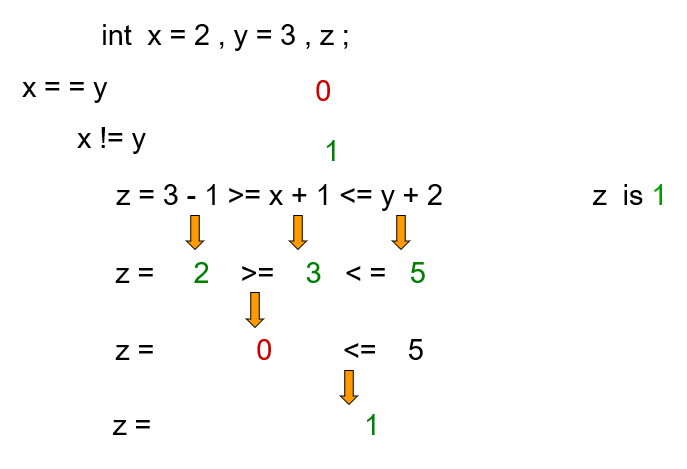

还有max(a,b)这种比较大小取一个值的表达式，可以直接当作表达式写入代码中。

关于输出变量所在的内存地址的语法格式：

cout<<a<<endl;//输出变量a的值

cout<<(&a)<<endl;//输出变量a所在的内存位置

cout<<*(&a)<<endl;//输出变量a的值

关于C++的真假判断问题：

那么c++中到底什么表示True，什么表示False呢？

>A prvalue of arithmetic, unscoped enumeration, pointer, or pointer to member type can be converted to a prvalue of type bool. A zero value, null pointer value, or null member pointer value is converted to false; any other value is converted to true. A prvalue of type std::nullptr_t can be converted to a prvalue of type bool; the resulting value is false.

上面摘自c++11草案中的描述。也就是0，空指针或空成员指针都为false，除此以外都是true。显然空字符串都不是上面的三者之一。当然实字符串也不是了。

### 关于&&、||、！号的补充

&&：也就是与运算符，a&&b仅在a和b都为ture时才为true。

||：也就是或运算符，a||b只要a或者b为真即可为真。

！:也就是非运算符，若a为真，则!a为假。同样也可以退出与非为!(a&&b)

关于逗号对运算的影响：

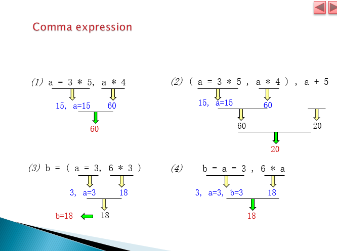

可以看出，因为遵循从左到右关联，则逗号的分隔的各种式子，执行顺序为从左到右（因为右边的式子可能也会用到左边的式子提供的条件和值），而式子的最右边的表达式的值将会被当作最终值。

关于条件运算符“？”：

其与if...else语句密切相关。

if..else语句的标准格式为：

if (expressions)
{
statement1；
statement2；
}
else
{
statement3；
statement4；
}
而？三元运算符的格式为：
variable name= expression?A:B
如果条件表达式expression为真，则整个三元式子的值取A的值，如果为假，则整个三元式子的值取B的值。
实例：
x=a<b?a:b等效于
if(a<b)
x=a;
else
x=b;

***

### 常见运算标识符(operators)

+，-，*，/，%，>，<，<=，>=，==，!=，&&，\\，!=，++，--

/   除法，并得整数，且没有四舍五入法则

%   除法，并得余数

x++   (x为任意一个变量)每次使用时，执行x=x+1，不同的是x++为使用后执行，++x为使用前执行

### 声明变量的方法

变量类型+空格+变量的名字
（声明后，即已经有变量的内存地址）

### 自定义类

例子：对圆进行实例化，定义一个“圆”的类型。

### UML（类图）

一种图表，可以使同类型语言编程的开发者都能看懂的### 类### 的一种标准表示方法。因此它是语言无关的，不符合任意一个编程语言的术语。

图表为三个横向排列的长方形格子组成的大竖向长方形

第一个格子为类的名称

第二个格子包含类的属性，属性前面有-，代表为私有的，除了类的成员函数之外不可更改和访问

第三个格子包含类的操作，这些操作对应着函数，函数前面有+，代表为公有的，可以让使用者和全局使用。而且，如果是构造函数，则在+号前加上`<<constructor>>`，

实例格式：

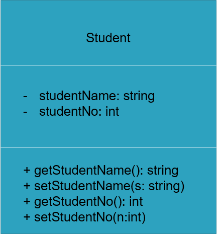

"():数据类型"：说明函数的返回类型，()内为参数列表。

"(s:string)"：说明函数的返回类型为void，()内形式参数为s，类型为string。

例子：

因此返回类型为string，有两个形式参数a，b分别为int和double形应当写成：

+ function(a:int，b:double):string

==本节课的关键词：==

### if-else语句

条件语句if(x==0)、else的结尾不需要加上分号，因为### 加上分号;就代表语句结束了### ，条件判断等于没有作用，后面的语句一定会被执行。编译不会报错的错误。

实例：

略

if(x==0)

cout<<x;

else

cout<<"x不是零！"

### void语句（自定义函数其一）

在主函数之前使用，自定义一个函数，并编写这个函数，确定之后其在主函数中被调用时的效果。有利于可读性和维护的方便，模块化源码。

定义的函数后面的圆括号内是“参数”，不同于main的可有可无，这个参数往往是必要的。（如果需要用户进行交互的时候，用户自定义参数）圆括号内应当是“声明一个变量”的格式，而后面的主体也使用这个虚拟的未定变量。

这个时候，预先的自定义函数当作### 一条语句### 来使用。

实例：
```
#include<iostream>

using namespace std;

void printfmessage(string s)

{

cout<<s<<"是大伞兵\n";

}

int main()

{

string k;

cin<<k;

printfmessage(k);

}

输入：谭小华
输出结果：谭小华是大伞兵
```

### return语句

适用于需要返回值的函数（void不需要）

在预先定义的函数的主体中，表示把控制权还给主函数（操作系统），同时把数值“返还”给被调用的地方，因此是必要的（在调用成员函数时）。

我们要知道，自定义函数和主函数的“内存区域”是相隔且不会相互关系的。这个return就是让执行完自定义函数后，把数返回到主函数，然后把自定义函数的内存空间进行释放。所以，每一个分支句都需要return，不然就是算好了不告诉主函数。

这个时候，预先的自定义函数当作### 一条表达式### 来使用。

### double语句（自定义函数的第二种返回类型）

与void相似。

实例：

double volume(double radius,double height)
{
return 3.14*radius*radius*height;//此处的return是返回到主函数那里，此处是值的传递，是必要的
}
int main()

{
double vol,r,h;

cin>>r>>h;

vol=volume(r,h);

cout<<"volume="<<vol<<endl;
}

### class语句（自定义类）

用于自定义一个类。
需要一个关键字（keyword）和一个标识符进行声明。
class是关键字，circle是（一个合法的）标识符，后面的{}内的语句是声明类的属性与功能，也就输成员函数

语法可见实例。

class本质上是一个自定义的数据和函数的集合，使用特殊的语法进行定义，则整个函数都可以使用特殊语法调用类中的数据成员和成员函数。

实例：
```
#include<iostream>
using namespace std ;
class Circle
{
private://私人的，不公开的参数，设置访问权限
double radius ;//类型一般定义为私有的，声明了之后要用的变量
public://提供公开的函数，设置访问权限
 void  Set_Radius(double r) const//const可加可不加，用于确保成员函数的语句不会被修改
{ radius = r ; }//自定义的void函数
 double  Get_Radius()
{ return   radius ; }//自定义double函数
 double  Get_Girth()
{ return   2 * 3.14f * radius ; }//自定义double函数
 double  Get_Area()
{ return   3.14f * radius * radius ; }//自定义double函数
} ;//所以说，类其实就是一个可以自定义的数据和函数集合
int main()
{
Circle A, B ;//声明对象A和B，便于接下来对对象的操作
A.Set_Radius( 10.0 ) ;//调用类中的成员函数需要用点号.放在开头，而点号前面是对象名称
cout  << "A.Radius  = " <<  A.Get_Radius() <<  endl  ;
cout  << "A.Girth  = " <<  A.Get_Girth() <<  endl  ;

cout  << "A.Area  = " <<  A.Get_Area() <<  endl  ;//直接把函数调用当成表达式写到输出流中，参数为空则只执行这个函数的语句，得到的是被return的值

B.Set_Radius( 1.0 ) ;//使用类只需要用点号.
cout  << "B.radius  = " <<  B.Get_Radius() <<  endl  ;
cout  << "B.Girth=" <<  B.Get_Girth() <<  endl  ;
cout  << "B.Area  = " <<  B.Get_Area() <<  endl  ;
}

输出：
A.Radius  =10.0
A.Girth  =62.8
A.Area  =314
B.radius  =1.0
B.Girth=6.28
B.Area  =3.14
```
成员函数之间是可以互相调用的，并且没有顺序。

### 构造函数

构造函数在对象创建时自动调用执行，常用来给类的成员变量赋初始值。

构造函数跟其他的两个void和double的本质上是一样的，构造函数的特殊性在于它必须存在，属于一个流程性的东西，其在对象被声明，也就是被分配内存空间的时候，系统会进行一次自动调用，之后不再调用，也不能再次手动调用，仅有一次机会。

调用的构造函数主体没有内容的限制，可以执行void和double也能执行的函数。也因为这个特点常常用来作初始化操作。在类未声明构造函数时，为了执行流程，编译器自动构造一个无参数无主体的构造函数，效果是没有效果。

但是一旦自己定义构造函数（还可以是多个）编译器将不会再自动生成，为了不让在定义无初始参数的类时找不到构造函数报错需要进行复数的构造函数的声明。

特点：

1.构造函数的命名必须和类名完全相同。

2. 构造函数的功能主要用于在类的对象创建时定义初始化的状态。一个重要区别是：它没有也不能进行返回值，甚至不能用void来修饰。

3. 构造函数不能被直接调用，必须通过new运算符在创建对象时才会自动调用。

4. 当定义一个类定义的时候，通常情况下都会默认一个构造函数，此默认构造函数是不带参数的。当自定义了含参构造函数时，默认构造函数将需要手动书写出来。

实例：
class Animal

{
char  furColor;
string  amStyle;
int age;
public:
Animal()//声明了无参构造函数，以防之后编译器找不到（自己声明编译器不会进行生成，如没有参数编译器一定要调用一个无参的）
{  furColor  = 'w';  amStyle  = “BLANK”; age = 0;   }
Animal(string s, char f, int a)//第二个构造函数，有参
{
             amStyle  = s;
             furColor  = f;
             age = a;
       }
};
int main()
{
    Animal a1;//调用的是无参的，初始化了变量
    Animal animal1(“CAT”,'b',3);//调用的是有参的，输送参数给中间变量
}

### if语句补充

如果条件或者执行的语句不止一句，则可以使用大括号{ }进行包含。

### 面向过程POP和面向对象OOP的不同之处

面向过程只会一条条地执行命令，面向的是代码的过程的执行。
面向对象则是对对象划定了一种属性，对其特定的属性进行计算。

***

注意：命名对象时最好不要用下划线或者双下划线开头的名字，因为编译器内部会使用这些名字，为了避免冲突不要起这种名字。

注意：类的所有数据成员中未声明的默认为private即不可访问的。

注意：整形和浮点型进行运算，结果会是浮点型。则为了不让整形被截取，则需要让变量一开始就声明为浮点型。

注意：给出的参数一定要和事先声明的数据类型一致。

补充：一个被声明的局部变量（main函数内进行声明）的作用域是直到它的第一个遇到的右大括号为止。

补充：一个被声明的全局变量（main函数外进行声明）的作用域是“全局”的。

补充：private和public的区别在于private中的数据只能由类里面的函数访问和调用，而public能够在其他地方被访问和调用。（这就是为什么声明的变量一般在private中而函数包括构造函数都在public中）

补充：类采用了封装设计，有利于保密性（用户只能使用自己定义的变量来调用函数）也有利于维护和便利。

补充：每个类定义都包含紧跟在类名称后面的键类（key class）。

补充：类定义通常存储在扩展名为.h的文件中。

补充：函数头中的每个参数都指定类型和名称。

补充：使用std::string和string&是类似的，但更方便的是后者，也就是对一个类的实例的引用。

### C++五种字符分类

标识符、关键字、操作符、分隔符、字面量。

### return语句

void函数中的return是返回到哪里？return不需要一个参数，它仅为了退出这个函数，所以一个void实例：
{
return；//void语句必须不带参数，double语句如要返回计算出来的值必须要return a，来返回变量a的值
}

在内存中，函数的执行是需要一个“令牌”的，main函数在创建之初即被分配给一块内存空间，而自定义函数会被分配给一个其他的一块内存空间区域。而在main函数中调用其他函数相当于将“令牌”借给另一个自定义函数，自定义函数执行完之后，return语句将会把“令牌”和“加工完成的物品”返回到主函数调用它的位置上。

### 构造函数补充

在UML类图中，构造函数一般在第三节的操作中处于第一个位置，并且为了跟其他成员函数进行区分而在+号前加上了《constructor》

格式：

- 《constructor》+ GradeBook(name:String)

实际在C++编程中是这样写的：
explicit GradeBook(string a)
: name(a){}//另一种初始化的方法，更专业

- +setCourseName(name:String)

实际在C++编程中是这样写的：
void setCourseName(string name){coursename=name;}//正常初始化写法

- +getCourseName():String

实际在C++编程中是这样写的：
string getCourseName(){return coursename;}

类中一般每个属性都会习惯性地设立一个set和get的成员函数。set函数一般是void无返回值的函数，用于输入赋值，可以看作是一条语句使用。get函数一般是int、string、double有返回值的函数，用于输出所存储的值，必须带有return语句进行值的返回，可以看作是一个值或者一条表达式来使用。

void setFirstName()//采用驼峰写法
string setLastName()//采用驼峰写法

未初始化的变量包含未定义的（“垃圾”）值。也就是其上次使用的或者说未被清除的值。

参数的作用：

编译器在声明对象而不声明调用的函数时，必须调用一个无参构造函数，找不到就会报错。

所以解决方案有二：

1.再自定义一个无参的空构造函数以供调用

2.在声明对象时，声明使用哪些带参的自定义构造函数

注意：构造函数可以自定义多个

有参构造函数实例1：

Class student

{

public:

student(string s, int a, int i)//构造函数的参数，与其他两种并无不同，都是声明了被调用并被输送参数时所用的中间变量
{
name=s;
age=a;
id=i;
}

};

int mian()
{
student stu("Tom",15,17);//声明对象的同时，直接给出参数，字符串需要在双引号内，等于把参数传递给了构造函数
}

实例二：
```cpp
class CExample{
public:
int a;
float b;

CExample(int x,float y): a(x),b(y)
{}
//构造函数初始化的第一种方式
CEexample(int x,float y){
a=x;
b=y;
}
//构造函数初始化的第二种方式。
CEexample(int x,float y){
setA(x);//调用成员set函数
setC(y);//调用成员set函数
}
//构造函数初始化的第三种方式。
};
```

### 作业评讲-银行账户类

（三个成员函数，存钱、取钱数判断、余额查询）

可以进行一个返回类型的设置。

可以进行单次金额的限制。

### explict语句（初始化）

专业的初始化（传递初始变量的）写法，

实例：

public:

explicit GradeBook(string name1,string name2)
    :courseName1(name)，courseName2(name)
{
//直接空的主体（body）
}

大约等效于：

public:

GradeBook(string name1,string name2)

{

courseName1=name;

courseName2=name;

}
//这种传递值的操作的正式说法叫做“初始化”

### 自定义头文件(对类的封装，声明与实现的分离)

引用头文件，代表把头文件的内容粘贴到了源代码的开头。

引用标准库的头文件时，使用尖括号<>

引用自定义的头文件时，使用双引号""，且在头文件名后面加上“.h”，### 并且必须在标准库的头文件的下方，不然会只预处理自定义头文件。### 

实例：#include"GradeBook.h"

在编写头文件调用其他基本头文件时，不能using namespace ，只能单独声明。

自定义的编写头文件的步骤：

一个解决方案的项目中，可以自己编写头文件。头文件中定义的类的名字，将会成为源代码文件中的自定义头文件的名字。所以头文件中自然可以定义多个。

string GradeBook::getCoursenName() const//就像是void std::getname()一样，是在源代码文件中调用自定义的头文件的格式，类名::函数名(参数)

::号的作用：在主函数内调用全局变量和函数时，需要在数据名前添加::，例如std::

当预处理器遇到引号中的头文件名时，它会尝试将头文件定位在与出现#include指令的文件相同的目录中。如果预处理器无法在该目录中找到头文件，则在与C++标准库头文件相同的位置（S）中搜索它。

当预处理器遇到角括号中的头文件名时（例如，``<IoStase>``），它假定头是C++标准库的一部分，并且不在预处理的程序目录中查找。

### 头文件的接口与实现的分离

传统的软件工程师认为，要使用类的对象，客户机代码只需要知道要调用哪些成员函数，为每个成员函数提供哪些参数，以及每个成员函数的返回类型。

客户机代码### 不需要知道这些函数是如何实现的。### 

如果客户机代码确实知道类是如何实现的，那么客户机代码程序员可能会根据类的实现细节编写客户机代码。理想情况下，如果实现发生更改，则类的客户端不必更改。

隐藏类的实现细节可以更容易地更改类的实现，同时最小化并有望消除对客户机代码的更改。

因此，要进行对声明和实现的分离操作，对类进行包装。

引入接口的概念：

类的接口描述了类的客户端可以使用哪些服务以及如何请求这些服务，但不描述类如何执行这些服务。

类的公共接口由类的公共(public)成员函数【也称为类的公共服务(services）】组成。

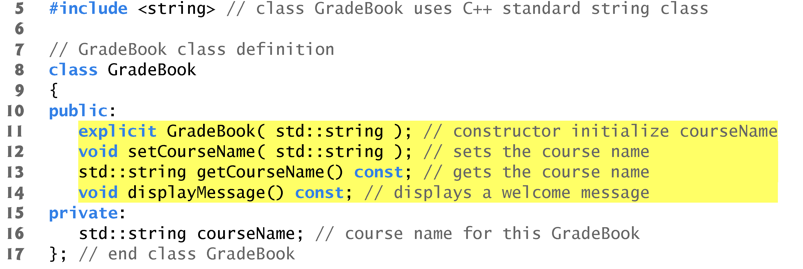
public:

explicit GradeBook(std::string);
void setCourseName(std::string);
std::string getCourseName() const;
void displayMessage() const;

只是声明了函数原型，这些原型描述了类的公共接口，但是却没有显示类的成员函数的实现。

无论是Impl Idiom手法，还是Object Interface手法都实现了同样的接口，而且它们有一个共同的目的，降低用户（被提供接口的小组也称为客户）直接操作数据造成不必要错误的可能性。其实它们有一个重要的优点就是将模块的依赖性降到了最低，举个例子吧，假如客户在使用这些接口的时候，如果这些接口内部的实现细目变更了，客户也不需要再重新编译自己的代码，因为客户只依赖接口声明的头文件。如果客户依赖接口的代码量非常大，那么，这个时候，这样定义接口就非常有必要了，毕竟客户在不修改自己代码的前提下，不需要重新编译自己的代码，这样可以提高客户的效率。

其实，这样来设计接口还是有缺点的，虽然接口定义在一个类中，但是真正实例化接口类的过程中，编译器会自动替我们生成必需的成员函数（比如构造函数、拷贝构造函数等），显然Animal也不例外。虽然有这样的缺点，但还是瑕不掩瑜。

从上面这句话我们可以得出：我们自己写的头文件，实际上实现是不可能完全隐藏起来的。我们的用户也是程序员，我们定义一个头文件，只是定义了一连串的属性和成员函数的原型，然后成员函数的具体实现就由头文件的作者我们自己写在cpp源文件之中。 之后源代码得到加密，然后具体的实现被加密封装，头文件不加密，让用户得以知道有什么成员函数和数据成员可以使用。这样的话，虽然不是将声明和实现全部封装到头文件中（其实也做不到，因为除了标准的头文件库，我们是不知道这个头文件中包含的类的成员函数具体是怎么样的），但我们可以把需要的函数原型封装进头文件中，然后再把函数的实现写明白在源文件中，这样用户就不能看到具体的实现了。所以我们进行分开是指将数据成员、接口的声明（也就是函数原型的声明）与函数的实现相分开，在同一个项目中，但又分成.h和.cpp两个文件中。

实例：

下面举个简单的例子，要求实现一个Person接口，其要包含如下四个函数：
string& getName() const;
void setName(string& name);
int getAge() const;
void setAge(int age);

1.它们的功能是设置获取名字和年龄。其声明在Person.h文件中，具体接口（函数原型）如下：
```
#include<string>
class PersonImpl;
using namespace std;
class Person
{
public:
    Person(string& name, int age);
    virtual ~Person();
    string& getName() const;//string&等效于std::string
    void setName(string& name);
    int getAge() const;
    void setAge(int age);
private:
    PersonImpl *mPersonImpl;
};

2.Person.cpp文件中定义了具体函数接口，其内容如下：

#include "Person.h"
#include "PersonImpl.h"
Person::Person(string& name, int age):
    mPersonImpl(new PersonImpl(name, age))
{
    std::cout << "construct Person" << std::endl;
}
Person::~Person() {
    delete mPersonImpl;
    std::cout << "deconstruct Person" << std::endl;
}
string& Person::getName() const {
    return mPersonImpl->getName();
}
void Person::setName(string& name) {
    mPersonImpl->setName(name);
}
int Person::getAge() const {
    return mPersonImpl->getAge();
}
void Person::setAge(int age) {
    mPersonImpl->setAge(age);
}

PersonImpl.h声明了实现接口背后所需细目的函数接口，其内容如下：

#include<string>
#include <iostream>
using namespace std;
class PersonImpl {
public:
    PersonImpl(string& name, int age);
    virtual ~PersonImpl();
    string& getName() const;
    void setName(string& name);
    int getAge() const;
    void setAge(int age);
private:
    string& mName;
    int mAge;
};

PersonImpl.cpp中负责实现这些接口背后的细目函数，其内容如下：

PersonImpl::PersonImpl(string& name, int age):
    mName(name),
    mAge(age)
{
}
PersonImpl::~PersonImpl() {
}
string& PersonImpl::getName() const {
    return mName;
}
void PersonImpl::setName(string& name) {
    mName = name;
}
int PersonImpl::getAge() const {
    return mAge;
}
void PersonImpl::setAge(int age) {
    mAge = age;
}
```
从上面的例子中可以发现，在对外提供的接口函数中，只包含操作背后细目数据的接口方法，致使客户无法直接操作接口背后的细目数据，因此最大限度地降低了客户错误使用的可能性。

以上例子称为Impl Idiom手法。

### 自定义函数的补充

自定义函数的格式的实质是：

返回变量类型 自定义函数名 （参数，或没有参数）{函数主体}

void变量即为空变量，因为返回的是空变量，因此不需要返回值，也不需要对所计算的值进行return操作（因为也返回不了），只需要程序上返回到主函数被调用的位置即可。double变量为双精度浮点数，因为返回的是浮点数，所以可以进行值的return，根据规定必须进行return变量值的声明，当然，也要进行程序上返回到主函数被调用的位置。所以当然也可以定义其他的变量类型的。

### 对类的补充

惯例来说：用户定义类的名称一般以大写字母开头，为了便于阅读，类的名称中的每个的后续的单词的开头也用大写字母开头。例如：GradeBook，这种写法被叫做帕斯卡案例（Pascal case）

每个类的主体由{ }包括其中，而且总体由分号 ;结尾

public属于是访问指示符的一种。说明了以下包含的数据是公共的，全局的，可以被程序中的其他函数和类进行调用。调用时一般需要在数据前加上“ : ”

private属于是访问指示符的一种。说明了以下包含的数据是私有的，不可公开访问的。只可以被类中的成员函数和类的朋友（friend）进行访问。而不能被主函数中的函数访问。

类的成员函数必须在建立了对象之后才能进行调用。

创建一个“GradeBook”的类（class），随即创建的对象的变量类型（type）即为GradeBook。这是用户定义的类型（type）不能被编译器所识别，因此需要包含类的定义来告诉编译器这个变量类型是什么。每个自定义的新的类（class）都是一个可以创建对象的新的变量类型（type）。

string是字符串，string是原本C++没有的，在`<string>`头文件中得到定义的一个类，因此有了string这个变量类型。

属性在类定义中表示为变量。类的每个对象在内存中维护自己的属性。

在类定义中声明但在类的成员函数定义主体之外的变量是数据成员。

类的每个实例（即对象）都包含该类的每个数据成员。

将变量设为数据成员的好处是，类的所有成员函数都可以操作类定义中出现的任何数据成员。

如果不声明标签则默认的标签是private，但是public和private都是可以重复使用的，虽然没有这个必要。

一般把数据成员设为private而成员函数设为public，便于进行调试。

当调用指定void以外的返回类型的函数并完成其任务时，该函数使用return语句（return statement）将### 结果### 返回给其调用函数。

默认情况下，字符串的初始值是所谓的空字符串，即不包含任何字符的字符串。

### friend语句

当一个类把一个函数或者另一个类声明为朋友（friend）则被声明的函数或者类就可以访问这个类的一切数据成员和成员函数。但是反过来就不行，声明朋友是单向的。

实例：

class object
{
friend class Something;//声明了名为Something的类为名为object的类的朋友
}

### 对函数的补充

对函数的定义的第一行被称为函数首部。

每个函数都需要定义一个返回值的类型，才是“函数”。而void的空变量类型其实也是一种类型，也需要定义。

当一个函数结束了，则它的局部变量的值会丢失。

### 关于验证

其实就是验证数据类型是否是符合类和函数的定义的，通过使用if语句来进行验证。

***

### 其他语句

**注意：**cout如果在输出流中有多个不同的函数，而如果这些函数会对同一个变量进行编辑，那么输出的处理顺序会是由右到左。为了避免函数之间对变量的互相影响，应当分开进行cout。

**定义：**字母'A'为单个字符，在表中代表一个整数值。而"A"中的A为字符串，代表的是一个字符**数组**。

**定义：**在大括号中定义的变量，作用域为它自己和它自己处于的大括号中的右括号之间。当处于类似于for语句中的圆括号定义中，则变量的作用域为当前循环内。
因此这种错误常见于判断的条件中的变量的作用域处于循环语句之中，不是因为重新定义而**无限循环报错**，而是**还没运行就发现找不到条件中的变量在哪里**。

**定义：**指定语句（或者说动作）在计算机程序中的执行顺序的操作称为程序控制。

**定义：**伪代码是一种人工的、非正式的语言，可以帮助您开发算法。类似于日常英语，但更方便和友好于用户。可以帮助您在编写程序之前“思考”程序。精心编写的伪代码可以很容易地转换成相应的C++或其他语言的程序。通常只描述可执行语句。声明（没有初始值的设定或不涉及构造函数调用）不是可执行语句。

**定义：**通常，程序中的语句按照写入顺序一个接一个地执行。这称为顺序执行。

**定义：**不同的C++语句使您可以指定执行的下一个语句为哪一句。称为控制权转移。

所有程序都只能用三种控制结构编写：序列结构、选择结构和重复结构。当我们介绍C++的控制结构的实现时，我们将把C++标准文件的术语称为“控制语句”。

**定义：**

顺序结构包括除了选择结构的其他语句（因为默认就是顺序编译执行）

选择结构包括：单个选择语句、双重选择语句、多选择语句。

重复结构包括：计数器控制重复、标记控制重复。

计数器控制重复包括：任何以计数器进行控制执行次数，也就说已知循环次数的语法结构。

标记控制重复包括：while、do-while、for语句。

**定义：**一个决策可以根据表达式的值进行判断——如果表达式值为0，则其被当作是假。如果表达式值为非0数，则其被当作是真。

**规定：**将两个整数相除会导致整数除法。计算的任何小数部分都会被截断（丢弃）。

**注意：**为了避免发生忘记界定或者界定错误块的操作，建议就算只有一条语句也使用大括号界定成一个块，也更直观。

**定义：**默认情况下，C++将程序的源代码中的所有浮点数作为双值对待。称为浮点文本。浮点数通常是除法的结果。

**注意：**如果未指定精度，浮点值通常以六位精度输出

**UML活动图：**

活动图中的箭头被叫做过渡箭头。

**sqrt语句：**

需要头文件声明`<cmath>`，这个头文件包含很多数学语言符号，包括sin，cos，sqrt等。

实例：

x=sqrt(a)；//为变量a中的数值的开根值。

**if语句（单if语句）：**

if(expression)
xxx;//单语句形式

if(expression)
{xxx;xxx;}//多语句形式

**if-else语句：**

if(expression)xxx;
else xxx;//单语句形式

if(expression)xxx;
else {xxx;xxx;}//多语句形式1

if(expression){xxx;xxx;}
else xxx;//多语句形式2

if(expression){xxx;xxx;}
else{xxx;xxx;}//多语句形式3

注意：
if(expression)
xxx;
xxx;//这一句不合语法
else{xxx;xxx;}//因此程序报错

**嵌套语句：**

if-else：

if(expression)
{
if(expression){xxx;xxx;}
else{xxx;xxx;}
}
else
{
if(expression){xxx;xxx;}
else{xxx;xxx;}
}

**?:语句(准确来说，是运算符而不是语句)：**

实例：

max=(b>a)?a : b

等价于

if(b>a)
max=a;
else
max=b;

这个条件运算符有三个操作数，而且只能进行单-单if-else语句的等效，整个表达式是一个值。

**&&符号：**

因为除了?:有三个操作数之外，其他的条件运算符都只能有两个操作数，所以a<b<c是不合法的。

需要使用&&（与符号）来进行，`a<b<c`(数学语言)等价于`(a<b)&&(b<c) `(C++语言，注意要加括号，因为&&也是只能有两个操作数)

**switch语句：**

可以类比为“抽屉”，被叫道哪个序号就执行对应的语句的代码语句。也可以看成是if-else语句的糅合形式。但是要注意，从上到下的顺序进行匹配，当遇到第一个匹配的即执行，此时从这一句开始，会执行下面的所有语句（所以switch应该为跳转的功能）。因此如果需要精确匹配，则需要在每句后面使用**break语句**，因此case后也不需要加大括号。break语句的作用是“离开switch语句，不在此处继续执行”

```
switch(expression)//可填入需匹配的参数，也可以使用声明语句来定义参数
{
case 一个常量(可以是整形、字符)  : statement 1;
break;
case 一个常量(可以是整形、字符)  : statement 2；
break;
case 一个常量(可以是整形、字符)  : statement 3；
break;
case 一个常量(可以是整形、字符) : statement 4；
break;
default:statement n+1 //当都不匹配时执行，因为是顺序执行且处于结尾位置，后面不需要添加break语句。
}
```

**int(logical expression)语句：**

实例：`switch(int a<b)`

在某些编译器中得到允许，将逻辑语句转化为整数，一般为0或者1，而false为0，true为1。

**for语句：**

for(expression1;expression2;expression3)
xxx;//单语句情况

for(expression1;expression2;expression3)
{xxx;xxx;xxx;}//多语句情况

expression1为对变量的初始化语句（有时候能够省略，为空即不输入任何东西，有时候声明多个变量，则可以使用逗号隔开给多个变量赋值），expression2为继续循环的条件语句（有时候能够在for后的大括号块的最后加上if(expression2) break;，原处为空即不输入任何东西），expression3为对循环中对受判断条件的更新操作的语句。

{ }中为循环时执行的语句，每个语句后加冒号" ; "。

实例：

for(int a=1;a<11;a++)
{
cout<<a<<"\t"<<a*a<<"\t"<<a*a*a<<endl;
//此处\t为制表符，有利于使表格更整齐
}

int i;//定义了这个大括号内的i
for(int i=1;i<10;i++)//使用的是同一个变量i，因为名字相同。
{cout<<i<<endl;}//单语句，输出1到9
cout<<i<<endl;//输出10，for内和外全程会使用同一个i
结果为1到10，每行一个。

**do-while语句：**

do语句是在判断条件前被执行的语句，也就说无视了第一次的条件判断。while写在后面，如果条件满足，则do中的语句会被再次循环。当有do出现时，do后面的大括号为循环的主体，while充当条件判断并处于最后。当只有while时，其作用相当于if语句。

while语句单用情况：

while(expression)
xxx;//单语句形式

while(expression)
{xxx;xxx;}//多语句形式

do-while语句情况：

do xxx;
while(expression);//单语句形式

do{xxx;xxx;}
while(expression);//多语句形式

注意：
do{xxx;xxx;}
while(expression)
{xxx;xxx;}//格式冲突不合法

**getchat语句：**

用于进行取字符操作，相对于{char a;cin>>a;}空格也可以取，传承自C语言。（C语言中为a=cin.get()）

实例：

char a;
a=getchar();//这个语句不需要参数
cout<<a<<endl;

**static语句：（****cast operator的其中一种）**

属于显式转换（人为的主动声明的转换）

用于临时对转换某变量的类型。只是创造一个临时的（temporary）的副本（copy），键入变量中的值仍然是其本来类型的变量。

格式：static_<变量类型>(变量名)

实例：
```
int a;//声明a为整形变量

static_<double>(a);//把变量a转化为双精度浮点型变量
```

**补充：关键词列表**

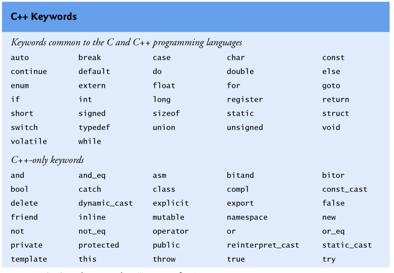
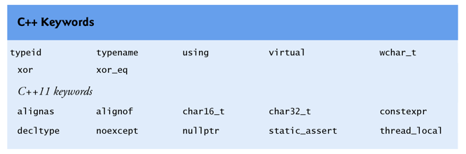

**隐式转换：**

编译器直到如何仅计算操作数类型相同的表达式，因此：

当编译器同时遇到包含整型数和双精度浮点数，编译器会自动将类型为int的操作数提升（promotion）为double类型。这也叫隐式转换（implicit conversion）。因为是自动的进行的提升操作，所以具有隐式的属性，不会得到声明。

**unsigned语句：**

通常，**应仅存储非负值的计数器**应使用无符号类型声明。

无符号整数类型的变量可以表示从0到大约两倍于相应有符号整数类型正范围的值。也就是说，所谓的无符号是指正负号被忽略，因此可以腾出这个位置使此类型变量取值可以更大，大约可以扩大到两倍，可以在头文件`<climits>`中查看此平台无符号变量最大值。

因为我们未知用户将输入正值负值甚至不是数字，所以变量一般不会声明为unsigned类型。

格式：unsigned 变量类型 变量名（赋值）；//也就是说是声明变量的语句前进行声明。

实例：unsigned int total=0;

**列表初始化：**

一般初始化：unsigned int studentCounter = 1;

在C++11后的版本引入列表初始化：

格式1：unsigned int studentCounter = { 1 };

格式2：unsigned int studentCounter{ 1 };

与一般的是完全等效的。但是，它可以防止缩小转换造成的数据丢失，如将浮点数赋值给整形变量被截断的部分就会丢失。而列表初始化不允许这种隐式转换或者自主的截断行为，编译器时它会进行报错（相对于一般初始化编译器只会给出警告但能继续编译）

大括号{}内为初始值设定项，在对对象的初始化中，大括号中可以是参数的逗号分隔列表。

**赋值运算符：**

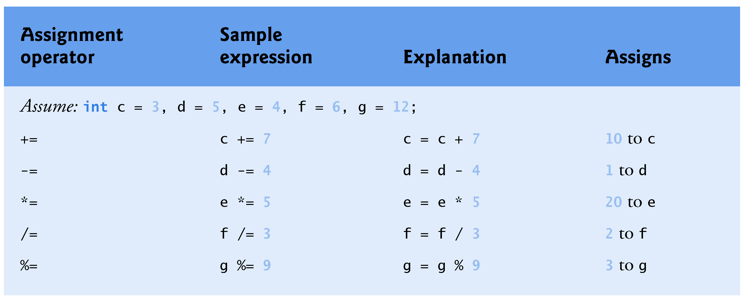

a运算符=b 等效于 a=a运算符b

实例：a+=b 等效于 a=a+b

**增量运算符和减量运算符：**

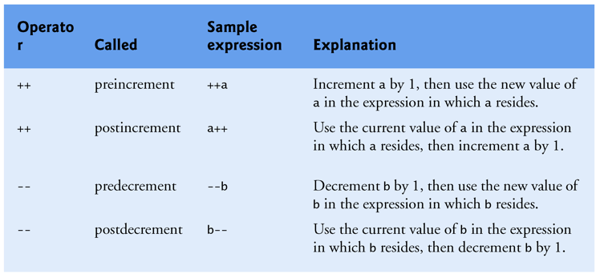

++i   即为每次i被调用前执行i=i+1

i++   即为每次i被调用后执行i=i+1

--i   即为每次i被调用前执行i=i-1

i--   即为每次i被调用后执行i=i-1

注意不能使用表达式作为操作数，例如++(i+1)就是语法错误。

### 其他语句2

**作业所得：**

1.==的等于判断常常写成=，而且这样也合法【if(x=1)也就是永远为真，因为这个语句的值是一个常量且默认为真】因此编译不出错，难以发现。会造成“超时”和“答案错误”等错误。为什么会出现这么多错误，就是因为：实例：int  i = 1;int  j = 5;

while(i=j){cout  <<  i  <<  endl;i++;}（i=j是一个赋值语句，但式子不为0则默认为真，构成了永真，输出无限个5）

2.fixed<<setprecision()<<A输出流是从左到右进行输出的，因此被限定的变量需在最后边。这样也合法因此编译不出错，难以发现。会造成“答案错误”错误。

3.比较长的函数的名字字母经常写错。在OJ约定了特定的成员函数名时需要注意。变量名也容易写错，无论是自己定义的时候还是OJ定义了数据成员的时候。

4.在函数的圆括号后或者条件判断句的条件语句或者其圆括号后多加了冒号。（其实这是在一些情况下是错误的但是例如在声明函数原型的时候这样写才合法，毕竟冒号；是代表语句的结束，因此其实；；也是可以的）然后在一些可读性比较差的地方忘记加上冒号。

5.大括号没有全部两两相对应。条件判断语句多出来的大括号可能会使主函数的大括号“被征用”而无法对应到前大括号。

6.含有条件判断语句，在操作中常常会忘了对条件的更新，导致程序无限循环和“超时”。也就是漏掉了对计时器变量的操作。

7.对对变量进行赋值操作前需要初始化内存。不初始化直接用有时候是可以的，但是最好先赋一个没有意义的初值。

8.经常出现可以编译但怎么输入数字都没反应，是因为循环语句过多，大括号忘记打或者范围错了，所以只执行了一小部分的语句。

9.for的条件定义不对，提示“从最大值往上取”，则编译成功，但这个循环一次都不会执行。这是因为一开始就不满足“继续循环”的条件，因为第二个表达式是“继续循环的条件”而不是“停止循环的条件”。当未知数未取值被写入条件判断语句，而for的第二个表达式代表的是满足的时候才执行循环，有时候会有逻辑错误而无法开始循环。for语句的第一个和第三个表达式都不是必须的，可以省略也就是不写，注意第三个表达式后面不跟冒号。

10.你会发现，编译错误固然可能是难以发现的符号错误和语法错误造成，但是算法和语法的复合错误更令人崩溃。因此，应当在**每个程序**中都使用条件编译来进行调试时输出中间值（且是正式的可读的）而条件编译的优越性在于让调试输出的语句无效仅仅需要把开头的宏给删除或者注释掉即可。

11.输出流的输出限定如果是粘性的（声明一次多次使用）的，则下一个循环时输出流是不会初始化的，所以在循环中即使是十进制也要声明dec以防下一次就按照之后的声明来输出了。

EX：算法错误：会导致各种的错误。程序的表达不符合你预想的效果，有时候会是因为语句不合法编译错误，有时仅仅是没想到如何实现，或者以为实现是对的。可以不拘泥于题目，多创几个变量去实现。

EX：顺带一提，cin的函数的输入是按顺序用空格隔开即可，输入超过的数也会先执行前一组数再执行下一组数的运算。

**continue语句：**

当在while、do…while、for语句中执行continue语句时，将跳过该语句体中的其余语句，并继续循环的下一次迭代。

在while和do…while语句中，循环延续测试在continue语句执行后立即计算。

在for语句中，执行for括号内的增量表达式，然后对循环延续测试求值。

与break语句的比较：break是此句执行完之后退出当前break所在的语句（哪怕是嵌套的），如果在循环中则直接跳出本级和最高级的循环执行下一条语句。而continue是直接结束本次循环返回到最高级循环重新开始，依然在循环语句中。

**最大值和最小值：**

INT_MAX   头文件中定义的整形最大值，可以直接调用和输出

INT_MIN   头文件中定义的整形最小值，可以直接调用和输出

DBL_MAX   头文件中定义的浮点型(双精度)最大值，可以直接调用和输出

DBL_MIN   头文件中定义的浮点型(双精度)最大值，可以直接调用和输出

**printf语句：**

优点是占用内存较少，传承自C语言。

**类型转换语句：**

C语言语句：

(int)x;//将x强制转化为括号内的变量类型

int(x);//将括号内的x强制转化为括号前的变量类型

**声明变量的前部关键词：**

数据有作用域和生存区。

static 变量类型 变量名

const 变量类型 变量名（局部变量，但存储在静态区，生存期为整个程序）

unsigned 变量类型 变量名

**大括号严格性初始化：**

int i=3.4;//可编译，损失精度

int i=3;//正确写法

int i={3.4}//采用严格定义，会报错

int i={3};//正确写法

**复合使用：**

sum+=x++;//等价于sum=sum+x++

a=b=c=d=5;//等价于d=5;c=d;b=c;a=b;

cout<<x+++y/;/等价于(x++)+y

**输出条件判断boolalpha语句：**

cout<<(3<4);
输出为：1（1为真）

cout<<(3>4);
输出为：0（0为假）

cour<<boolalpha<<(3<4);
输出为：ture

cour<<boolalpha<<(3>4);
输出为：false

**定义数组（每个数组的“名字”其实是一个常指针，指向数组第一个元素的地址，恒定不变）：**

int A[10];//输入最多10个整数

char B[30];//输入最多30个字符

cin>>A;

**忽略语句：**

cin.ignore(n,'A')

省略换行符。

第一个位置填入数字，代表省略前N位，默认为1。

第二个位置输入'一个字符'，默认为EOF。EOF是在`<iostream>`头文件中定义的符号整数常量。EOF在程序中可以直接用于判断是否为EOF的类型。

此函数的作用是1.跳过输入流中的 n（第一个位置） 个字符，2.或跳过 delim（作用上是分隔符，也就是第二个位置的"字符"） 及其之前的所有字符，**哪个条件先满足（如果是100，A，第10个就是A，那么就先满足了２.）就按哪个执行。**两个参数都有默认值，因此 cin.ignore() 就等效于 cin.ignore(1, EOF)， 即跳过一个字符。

**二进制运算：**

`*2`：全部数字往左移一格

`/2`：全部数字往右移一格

**goto语句：**

设定标签，goto 标签名 会强制跳转到指定标签的位置（之前写bat时用过）

**pow语句：**

此语句需要头文件`<cmath>`

格式为：pow(x,y)

这个表达式的值为x的y次方。

接受两个double类型的参数并返回一个double值。

**cin.get语句：**

表明一个“让用户输入一个字符”或者说"读取用户输入的第一个字符"的操作。

常用来暂停程序，让用户决定是否继续和结束。

cin>>cin.get();
cin>>"Thank you,Good bye";

**fabs()语句：**

fabs(a)代表a的绝对值。

**C++科学计数法和精度的表示：**

1e-8/1E-8（不区分大小写）代表10的负8次方。可以直接在程序中使用。

e是exponential的缩写，在计算机中一般代表10的幂。

例子：

7.823E5=782300

1.2e−4=0.00012

**补充：**

文件结束快捷键：

Windows: ctrl+z;

unix: ctrl+d

与非或符号（均可以连用，因为编译有默认的顺序）：

与：&&

或：||

非：！

左值(lvalues,left value)和右值(rvalues,right value)

变量名被称为左值（表示“左值”），因为它们可以在赋值运算符的左侧使用。

常量被称为右值（表示“右值”），因为它们只能在赋值运算符的右侧使用。

***

### 其他语句3

C++程序通常是通过组合新函数和类编写的，这些函数与C++标准库中可用的“预打包”函数和类相结合。

程序中可以使用标识符的部分称为作用域。

当程序执行进入定义它们的块时，创建存储类和存储周期。当块处于活动状态时存在，当程序退出块时被销毁。自动变量仅存在于定义出现的函数体中最近的一对花括号中，或者在函数参数的情况下，存在于整个函数体中。默认情况下，局部变量具有自动存储持续时间。我们将自动存储持续时间的变量简单地称为自动变量。

函数调用堆栈（或程序执行堆栈）是需要理解的最重要机制之一。它支持了函数调用/返回机制。还支持创建、维护和销毁每个被调用函数的自动变量。每个函数最终必须将控制权返回给调用它的函数。

每次函数调用另一个函数时，都会将一个条目推送到函数调用堆栈上。此项称为堆栈帧或激活记录，包含被调用函数返回调用函数所需的返回地址。当函数调用返回时，函数调用的堆栈帧弹出，控制转移到弹出堆栈帧中的返回地址。

**void函数补充：**

两种方法：

void funtion1();//正常情况

void function2(void);//空变量作为参数，等于没有参数

**类型转换：**

将值转换为较低的基本类型可能会导致不正确的值。

因此，只有通过将值显式分配给较低类型的变量或使用强制转换运算符，才能将值转换为较低的基本类型。

由"最高级"的类型到"最低级"的类型的列表：

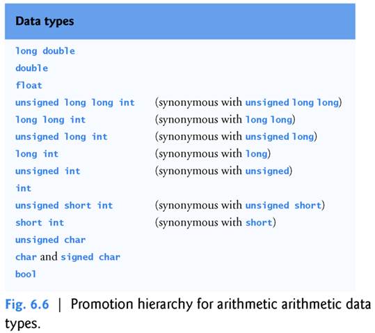

**函数的重载：**两个函数的签名一致，也就是进行了重复的定义，会报错。

**函数原型：**函数原型告诉了编译器：函数名、函数将返回的数据类型 、函数将会接受的参数数量和类型和顺序。

**注意：**private数据成员照样写在头文件中。

**定义：**函数头和函数原型中都需要写明参数的名字和类型。

**注意：**进行类的封装时，主源码和类的实现源码的类的声明是共用的，

**无限执行直至特定结束值方法：**

1.while-if参数判断方法

2.do-while参数判断方法

**floor、ceil、round语句（包含于cmath头文件）：**

语法：

floor(x);//表示x的向下取整

ceil(x);//表示x的向上取整

round(x);//表示x的四舍五入

实例：

floor(1.7)==1

ceil(1.1)==2

round(1.3)==1

round(1.6)==2

**其他数学函数（也包含于`<cmath>`头文件中）:**

**exp语句：**

语法：exp(x)

代表自然底数e的x次方。

**fabs语句：**

语法：fabs(x)

代表x的绝对值

**fmod语句：**

语法：fmod(x,y)

求x/y的余数，浮点数专用。

**log语句：**

语法：log(x)

代表ln x（注意是以自然底数e为基的对数函数）。

**log10语句：**

语法：log10(x)

代表lgx（注意是以10为基的对数函数）

三角函数：

**sin语句：**

语法：sin(x)

代表sinx。

**cos语句：**

语法：cos(x)

代表cosx。

**tan语句：**

语法：tan(x)

代表tanx。

**sqrt语句：**

语法：sqrt(x)

代表根号x。

`<cmath>`结束。

**rand语句：**

语法：rand()

代表一个随机数。不需要参数。

如果要生成一定范围内的随机数，则：

语法：a+rand()%b

代表一个被限定了范围的随机数。a代表等于所需连续整数范围内的**第一个数字**，b等于所需连续整数范围的**宽度**。

说明：生成一个随机序列的数。但是因为seed（整形数）是相同的，所以重复生成相同序列。一旦一个程序被调试完毕，它就可以被调节为为每次执行产生一个不同的随机数序列，这叫做随机化，并用C++标准库函数SRand完成。函数srand接受一个无符号整数参数，并为rand函数种子，以便为每次执行生成不同的随机数序列。

C++11提供了额外的随机数功能，可以生成不确定的随机数—一组无法预测的随机数。

**srand语句（头文件`<cstdlib>`）：**

语法：

srand(x)

代表以变量x为随机数序列的seed。

需要声明头文件`<cstdlib>`。为之后的函数rand()决定了seed。

**time语句：**

语法：time(0)

代表一个随计算机时钟变化的值。参数必须是0.

时间的函数原型在`<ctime>`中。通常将当前时间返回为自1970年1月1日格林威治标准时间（GMT）午夜以来的秒数。

实例：srand(time(0))，则随机数的种子将会随计算机的时钟变化。

**enum语句：**

语法：

enum NAME {a=number,b,c}//NAME为这个枚举的类的名字

NAME name=a;//name为一个枚举，它能取枚举组中的各种元素的值。为什么需要一个枚举呢？因为每个枚举组的元素的类型不同，通过一个枚举可以方便取枚举类型组中的成员值。

类似于const的定位。代表将声明的变量转换为枚举类型变量。

enum关键词引入了枚举，是由字符表示的一组整数常量。除非另有规定，否则这些枚举常量的值从0开始，递增1。枚举中的字符必须是唯一的，但不同的枚举常量可以具有相同的整数值。枚举类型的变量只能分配枚举中声明的一个值。

另一个流行的枚举是枚举月份：

enum Months { JAN = 1, FEB, MAR, APR, MAY, JUN, JUL, AUG, SEP, OCT, NOV, DEC };//由递增的性质，JAN=1后其他月份的值刚刚好对应。

可以在枚举定义中为任何枚举常量指定整数值。

**作用域枚举：**

枚举（也称为非作用域枚举，未定义作用域的枚举）的一个问题是，多个枚举可能包含相同的字符。在同一程序中使用此类枚举可能会导致命名冲突和逻辑错误。C++11引入了所谓的作用域枚举（组）。它与普通的枚举组没什么不同，除了元素需要加上类的限定之外，它更直接地表示了枚举的本质其实是一个类。

使用关键字enum class（或同义词enum struct）声明。

语法：enum class Status { CONTINUE, WON, LOST };

若要引用作用域枚举常量，必须使用作用域枚举的类型名称（Status）和作用域解析运算符（::）限定该常量，如Status::CONTINUE中所示。

这会显式地将CONTINUE标识为枚举类状态范围内的常量。

因此，如果另一个作用域枚举包含其某个常量的相同标识符，则始终可以清楚使用的是该常量的哪个版本。

**枚举中的变量类型：**

枚举中的常量表示为整数。默认情况下，非作用域枚举的基础整数类型取决于其常量的值。该类型保证足够大以存储指定的常量值。

默认情况下，作用域枚举的基础整数类型为int。

C++11允许您通过在枚举的类型名称后面加冒号（:）和整数类型来指定枚举的基础整数类型。

语法：enum class Status : unsigned int { CONTINUE, WON, LOST };//此例子中把类型声明为了unsigned int而不是int。

**更简便的随机数功能库：**

C++11提供了一个新的、更安全的随机数功能库，可以为不需要可预测性的模拟和安全场景生成不确定的随机数。（其实实际上依然不太随机）

新的功能位于C++标准库的头文件`<random>`中。其中包含了很多类来表示不同的随机数。

default_random_engine类：

在头文件`<random>`中被定义：实现了一种生成伪随机数的随机数生成算法。

语法：default_random_engine A(unsigned int x);//A是对象，x是unsigned int 类型的变量，充当随机数的seed。这个类一开始就会定义对象的seed。一般使用time(0)，但是time(0)不是unsigned int类型，需要使用`static_cast<unsigned int>(time(0))`来转换类型。

uniform_int_distribution类：

在头文件`<random>`中被定义：控制engine生成的值的范围，和这些值的数据类型以及值的统计特性。

语法：
```
uniform_int_distribution<unsigned int> B(a,b);//<unsigned int>是特殊结构，不影响对象的声明。B是对象，a和b是对随机数的范围的限定。
```

两句都需要用到，输出时的格式为：

cout<<B(A)<<endl;//在头文件`<random>`中定义了B(A)是由A的seed和B的范围定限定的随机数

`<unsigned int>`：

代表uniform_int_distribution是一个类模板。之后会学到。

<>中可以是任意的整数类型。

**头文件列表：**

![HTDKW95Q3W\]MAU9A2KC@R.JPG](../_resources/HTDKW95Q3`W]MAU9A`2KC@R.JPG)

### 其他语句4

**const char*语句：**

const char*是字符数组常量指针类型，可以用于返回两个双引号包围的字符串。（当然，也可以直接使用string返回string变量的值）

实例：
```
const char *generateDivision(int avgMark)
{
        return "Fail";
}
```
**inline语句：**

语法：inline double Function1(const double A);//放置于函数返回值前。

在函数定义中将限定符放在函数返回类型之前，会建议编译器在调用函数的每个位置（适当时）生成函数代码的副本，以避免函数调用。这通常会使程序变大。虽然写成函数的样子，但是编译器编译到它时就不会“分配内存然后又回收空间”，而是“直接把这一段代码”粘贴到主函数中。这样就是牺牲了空间而节省了时间。（也就是说，自定义的函数不需要再在主函数外分配一个内存区块来执行然后才返回到主函数了，选择直接复制粘贴，主函数直接执行，但是显而易见的在对函数的多次调用时会占用更大，但是时间因为不用跳转确实减少了）

可重用的内联函数通常放在头文件中，这样它们的定义就可以包含在使用它们的每个源文件中。

**C和C++的枚举的区别补充：**

枚举值：所在枚举的元素的值。

枚举类型：每个枚举组都构成一个枚举类型。枚举类型的值也就是枚举元素的值。

枚举元素：枚举类型中的每个项为一个枚举元素。

C语言中：

1.允许非枚举值赋值给枚举类型，允许其他枚举类型的值赋值给当前枚举类型。

2.枚举值具有外层作用域，容易造成名字冲突。

3.不同类型的枚举值可以直接比较。

void test()

{

enum Week { Mon, Tue, Wed, Thi, Fri, Sat, Sun };//定义枚举类型

enum Other { One, Two, Three };//定义枚举类型

enum Week week = Mon;//定义枚举变量，注意是"enum Week" +"week"

week = 100; //ok

week = One; //ok

int One = 100; //error

if (week == One)

{

printf("equal\n");

}

}

C++语言中：

1.C++只能允许赋值枚举值。

2.枚举元素会暴露在外部作用域，不同的两个枚举类型，若含有相同枚举元素，则会发生冲突。

3.C++只允许（属于）同枚举类型的值之间比较
```
void test()

{

enum Week { Mon, Tue, Wed, Thi, Fri, Sat, Sun };

enum Other { One, Two, Three };

enum Week week = Mon;

// week = 100; //error

// week = One; //error

enum OtherWeek { Mon };

// enum E1 { A, B }; //error

// enum E2 { C, D }; //error

// cout << (E1::B == E2::D ? "相等" : "不相等") << endl; //error

}
```
C++语言中的类枚举：

1. 强枚举类型不会将枚举元素暴露在外部作用域。

2. 不相关的两个枚举类型不能直接比较，编译报错。（枚举定义了一个类型，每个枚举的组都是一个枚举类型）
```
void test()

{

enum class E1 { A = 1, B = 2 };

enum class E2 { A = 1, C = 2 };

cout << (int)(E1::A) << endl;

int A = 100;

cout << (E1::B == E2::C ? "相等" : "不相等") << endl; //error

cout << (E1::B == 2 ? "相等" : "不相等") << endl; //error

}
```
总结：

1.C的枚举类型支持不同类型枚举值之间赋值、以及数字赋值、比较，并且具有外层作用域。

2.C++ 中枚举不允许不同类型的值给枚举类型变量赋值，但仍然支持不同类型之间枚举进行比较，枚举符号常量具有挖外作用域。

3.C++ 强枚举类型不允许不同类型之间的赋值、比较，枚举常量值并不具有外层作用域。

**const的补充：**

1.当作用于变量时，在变量类型**前面**声明了“常量”的数据类型。

实例：const int P=3;//P虽然还是“变量”，但已经不能被再次声明了，否则会报错。

2.当其作用于一个函数，如果想要约定这个函数不会对类的数据成员进行更改（除非数据成员被“mutable”修饰了，实例：mutable int P=3;），则可以在其**后面**添加“const”告诉编译器，如果更改数据成员，那是不被允许的。也就是说，是对数据成员的保护的约定的声明。

实例：int function(int A) const;//只能使用在成员函数中，而又因为const本来就是限定不能对数据成员进行更改，可以得知const只能在类里面使用。

**static的补充：**

实例：static P=3;P=5;P=7;//可多次定义，只是申请存储为为静态区

**register的补充：**

实例：register P=3;//申请存储到寄存器中

**返回和参数为空的函数：**

返回为空的函数内部如果没有写返回语句，则编译器会自动加上return;。

参数为空的函数的参数括号内如果没有声明，则编译器会自动加上void。

实例：function(void){ }//void可以不写

**&&、a&b、*(&a)、type &variable 1=variable 2：**

`&&`是“与”逻辑运算符。可以连续使用，因为当有多个在同一语句时，默认从左到右(?)

&是位与运算符，例如a&b就是a和b的二进制位“与”运算后的结果。例如3&4（00000011和00000110进行与运算）

`*(&a)`是取变量内存地址符。

&b=a是指将b定义为a的别名，类似“软链接”的关系，也就是共享内存地址和空间，对其中一个的改变都会作用于另一个。

&b=a也可以使用形式参数来定义别名关系，例如：void function(double &i);//形参列表定义别名function(w);//主函数中使用，则w与i互为别名，指向同一个数据空间

&b=a;a=7;b=7;别名，也就对应“按引用传递”，int c;c=7;就对应“按值传递”。

**参数传递方法：**

在许多编程语言中，向函数传递参数的两种方法是按值传递（具体数值，赋值和普通形参传递）和按引用传递（别名参数和指针参数）。

当参数按值传递时，将生成参数值的副本并（在函数调用堆栈上）传递给被调用函数。对副本的更改不会影响调用者中原始变量的值。

要指定对常量的引用，请在参数声明中将常量限定符（const）放在类型说明符之前。这样既可以使两个变量只占一块内存空间，又可以切断别名之间类似“软连接”的改变传递的关系，也就是禁止按引用传递。

函数可以返回引用，但这可能很危险。返回对被调用函数中声明的变量的引用时，该变量应在该函数中声明为静态（static）。

**自定义函数的默认参数值：**

对于一个程序来说，对于一个特定的参数，使用相同的参数值重复调用一个函数并不少见。

可以指定这样的参数具有默认参数，即要传递给该**参数的默认值**。

当程序在函数调用中没有传递或者只传递了一部分的参数，而这个函数带有默认参数时，编译器将重写函数调用并插入该参数的默认值。

默认参数必须是函数参数列表中最右边（尾随）的参数。

实例：

void function(int x,int y=1)//x无默认值，y具有默认值

实例：

void function(int x,int y=1);

void function(int x);//会报错，因为当函数名相同，只传递了一个参数时，编译器不能分清哪个才是该调用的（即使编译器知道这两个是不一样的，但是不能知道调用哪个），因为带有默认值的函数的声明也是function（x）

**“::”范围解析运算符：**

可以声明同名的局部和全局变量。

当同一个名称的本地变量在作用域中时，C++提供了一元范围解析运算符（：：）来访问全局变量而不是同名的本地变量。

当具有给定变量名称的唯一变量是全局变量时，使用具有该名称的一元范围解析运算符（：：）是可声明或者省略的。

**函数重载：**

C++允许定义多个同名函数，只要它们具有不同的函数签名，这称为函数重载。

C++编译器通过检查数字选择要调用的适当函数。在重载中不同的参数的类型和顺序用于创建多个同名函数。

一般这些函数在不同的数据类型上将执行类似的任务。

**递归与迭代：**

通过对函数的调用来实现的循环（但不等于循环，也就是迭代）。每个问题是上一个问题的小问题，就可以选用递归算法。因为是调用函数的实现，因此其实是对“栈”的操作。

递归和迭代的区别：

递归是重复调用函数自身实现循环。递归循环中，遇到满足终止条件的情况时逐层返回来结束。而迭代则使用计数器结束循环。

迭代和递归都基于控制语句：迭代使用重复结构；递归使用选择结构。

迭代和递归都涉及重复：迭代显式地使用重复结构；递归通过重复的函数调用实现重复。

递归在遇到基本情况时终止，迭代在循环条件失败时终止。

递归实例：
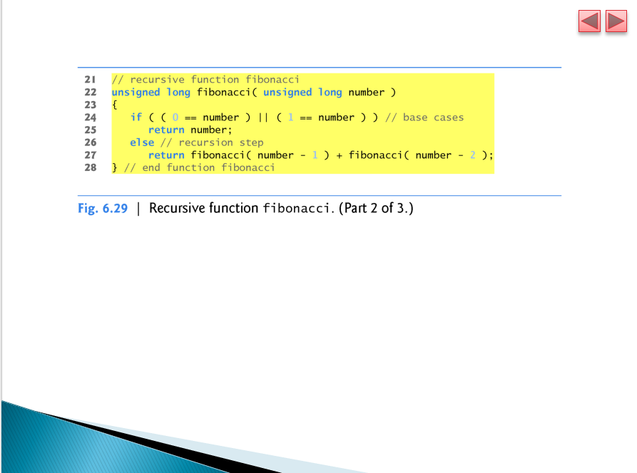

此处只有自定义函数的求各阶级的乘数的部分，但是明显可以看出，最大的不同是：return的是函数的本身调用！函数的调用代表的是一个值，也就是直接代表了最终值！

function(n)

return function(n-1)+function(n-2)，

第一项：
function(n-1)=function(n-2)+function(n-3)，

第二项：
function(n-2)=function(n-3)+function(n-4)，

function(n-3)=function(n-4)+function(n-5)，

假定n=5，则function(1)=1，function(0)=0，则function(4)=3,function(3)=2,function(2)=1,因此function(5)=5

因此function(n)=5。

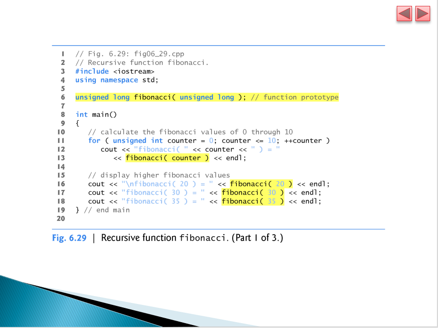

求阶级和求乘积结合：
```
#include <iostream>
using namespace std;
int fact(int n);
int main()
{
    int i;
    cout << "请输入要求阶乘的一个整数：";
    cin >> i;
    cout << i << "的阶乘的结果为：" << fact(i) << endl;
    return 0;
}
int fact(int n)
{
    if(n <= 1)
    {
        return 1;
    }
    else
    {
        return n * fact(n-1);
    }
}

迭代实例：
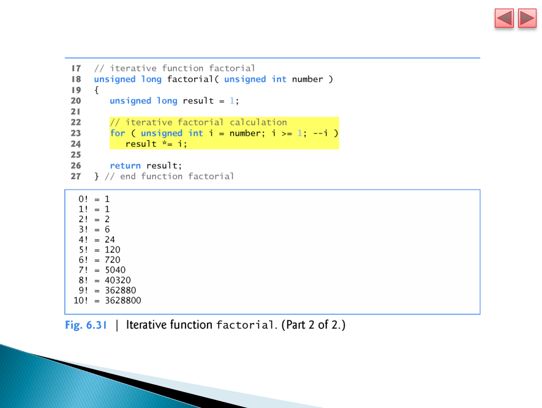
```
### 其他语句5

本节课英语单词：

`<string>`头文件：

对象：string，本质上是字符数组，被定义为输出时将元素按顺序全部输出。

**成员函数：**

**objectname.substr语句：**

语法：字符串对象名.substr( FirstPosition , NumberOfPosition )

说明：代表一个字符串从FirstPosition开始取，取NumberOfPosition个字符组成的新字符串。

**objectname.size()语句：**

语法：字符串对象名.size()

说明：代表一个字符串的长度，也就是字符的数量

**getline语句**

语法：getline(cin,变量名)；//相对于普通的cin（用空格作为结束符），这种cin方法将改为使用换行符作为结束符，因此可以输入带有空格的一串字符串。实际上它的功能是把文本存储到一个string字符串变量之中，而不是其他的，因此可以容纳空格这个字符而已。

要交互式的时候，例如让用户自定义参数这个功能。

这个函数是头文件`<string>`所包含的成员函数。在使用前必须先预处理这个头文件才能使用。

**与运算符&的别名用法补充：**

在函数原型的形式参数不声明名字时，应写成：int function1(int );//正常的不声明名字形式 void function(int &);//不声明名字并建立别名的形式。

**递归例题：汉诺塔问题**

void hanoi(int n,char a,char b,char c)
{

if(n==1)
cout<<a<<"-->"<<c<<endl;

else
{
hanoi(n-1,a,c,b);
cout<<a<<"-->"<<c<<enl;
hanoi(n-1,b,a,c);
}

}

**变量地址补充：**

声明变量后，内存中会创建如下表格：

<name, type, address>name为变量名，type为变量类型，type为内存首地址。

**指针：**

指针是一个用来存储变量的内存地址的变量。指针的内容是另一个空间的地址的8位的十六进制形式的一个具体数值（因此直接cout一个空指针可以输出一个00000000）。

变量名字可以直接引用一个值，而指针就是间接引用一个值，通过指针间接引用一个值的方法叫做间接寻址。

声明语法：

`int *countPtr=NULL;//声明一个（只能）指向int类型变量的地址的指针，初始化为NULL即空（只能初始化一次）。`

`int *countPtr,count;//指针和一般变量一起声明的复合语句。应当从右到左读，countPtr是一个指向int类型变量的指针。而int指的是变量count的类型是整型而不是countPtr的类型。*在声明中只作用于countPtr。每个指针变量都应该在前面加上*号。当*在声明中出现，它不会作为运算符(operator)而是表明这个变量被声明为一个指针。`

使用语法：

**1.一般用法**
```
int y = 5; //声明一个整型变量
int *yPtr = nullptr; //声明一个空指针，把空指针常量赋予给指针
yPtr = &y; //把y设定为指针的指向对象
```
**2.结合地址符**
```
int *a_Ptr=&a;//把指针a_Ptr指向变量a的地址。

//

int *a_Ptr;

int &b=a;

*a_Ptr=&a;//把指针a_Ptr指向变量a和b的共同地址。
```
**3.指向常量（指向的地址的存储值不可变）的指针**
```
const type *Ptr=&A;使指针Ptr指向常量A的内存地址，

Ptr=&B;//通过，指向常量的指针可以换一个指向对象，注意此时指针已经可以不带*号了，*号应该只是在指针声明时与普通变量区分的符号。而在声明以后，*Ptr代表的是Ptr指向的内存地址的真实值。

Ptr=&C;//通过，指向常量的指针可以换一个指向对象，也就是可以改引用

*Ptr=99;//错误，指向常量时不可以修改数值，指针此处只读。（*Ptr代表的是Ptr指向的地址的真实值）

//

type const *Ptr=&A; 和上面的一致，另一种声明的格式。
```
**4.常量指针（指针的对象除初始化不可变）**
```
const int *Ptr=&A;//在指向类型前加上"const"

Ptr=&B;//错误，常量指针不可以修改指向对象。但是要注意如果Ptr不是指针而是普通变量，这一句就是声明别名句，那就是合法的。
```
指针能够被声明为指定任意数据类型的对象。

**5.指针运算法则**
```
*p=5* *p;//合法的，指针的值的乘法。
```
**6.指向空类型的指针（不能取值，应当先进行转化）与类型强制转换**
```
a=65;

void *Ptr=&a;//空类型的指针（不是指向空类型），常用于传递参数，void实际上是未定的类型，可以之后进行声明。

cout<<*(int*)Ptr<<endl;//定义类型输出为：65。(int*)的形式是代表把void类型强制转换为int类型。

cout<<*(char*)Ptr<<endl;//定义类型输出为：A

//如果*Ptr=67;是成立的，因为这是常量指针而不是指向常量。

int *p;//声明指针变量p。

p=(int*)Ptr; 强制类型转换并赋值

cout<<*p<<endl;//输出为65，p制定了int类型，则取Ptr的值也是int类型。
```
**7.按引用指针参数传递**
```
void function(int *);//函数原型，此处的*代表一个指针而不是指针指向的内存的存储值。

void function(int *p);//函数实现
{
*p=*p * *p;
}

int a=1;

function(&a)
```
**概念：**

C++实质上

有三种参数传递方式：

通过值传递（赋值和默认参数）：void function(int i); int i=0; function(i);

通过引用参数传递（别名）：void function(int &i); int &a=i; function(a);//或者function(i)

通过引用指针参数传递：void function(int *i); int *i, a=0;i=&a; function(i);

分清地址和地址存储的值：
```
int *p;//此处*为声明指针的符号。

int a=1;

p=&a;//此处把变量a的地址赋给指针p。

*p=b;//此处*为解引用符号，把变量b的值赋给指针p指向的变量的值，也就是等效于a=b。

cout<<p<<endl;//输出为00000001。

cout<<*p<<endl;//输出为1。
```
不能给指针赋整数值和任何代表具体数值的变量名字（因为应当是地址）。在C++的早期版本中，空指针指定的值为"0"或"null".将指针初始化为NULL相当于将指针初始化为0，但在C++11之前，约定使用0。值"0"是唯一可以直接分配给指针变量的整数值，而无需首先将整数值强制转换为指针类型。

可以给"指针变量"赋值的"值"有：

"0"：赋值为空指针，用于指针初始化。

"NULL"：赋值为空指针，用于指针初始化。

"nullptr"：赋值为空指针，用于指针初始化。

"&变量名"：若变量名的变量的变量类型和指针声明时的指向类型一致，则把指针的值赋值为变量名的变量的内存地址的值。

**数组：**

**概念：**

数组是一组连续的内存位置，它们都具有相同的类型。

要引用数组中的特定位置或元素，请指定数组的名称和特定元素的位置号。

每个数组中的第一个元素都有下标0（零），有时称为第零个元素。下标必须是整数或整数表达式（使用任何整数类型）。可以认为数组就是一个指针，`[]`内为偏移量，所以数组名就是表明一个指针偏移量为0时的位置，因此为常指针。所以数组就是通过指针和偏移量实现的一种人为的数据类型。

内置数组名称的值可以隐式转换为内置数组第一个元素的地址。

因此`arrayName`可以隐式转换为`&arrayName[0]`。无需获取内置数组的地址（&）即可将其传递给函数，只需传递内置数组的名字即可。

对于内置数组，调用数组的函数可以修改调用者中内置数组的所有元素，除非该函数在相应的内置数组参数前面加上const以指示不应修改元素。

数组之间是不能进行直接的比较的。只能使用循环来一个个比较其中元素。

数组不能相互分配（assigned）。

数组是不知道自己的大小（size，也就是元素数量）的，处理内置数组的函数通常会获得数组的名称和大小。

数组不提供自动边界检查。必须确保数组访问表达式使用内置数组边界内的下标。

类模板array和vector的对象比内置数组更安全、更可靠，并提供更多功能。

注意：在某些情况下，必须使用内置数组，例如处理程序的命令行参数。从命令行执行程序时，可以将命令行参数放在程序名称之后，从而为程序提供命令行参数。此类参数通常将选项传递给程序。

**const语法：**
```
int sumElements(const int values[ ], const size_tnumberOfElements)//自定义函数的参数列表，第一个参数为一个数组，全部元素均有const前缀，均不可修改。在数组被当作形式参数时，表现形式为指向这个数组的指针变量的值。因此以下写法是等效的。

int sumElements(const int *values, const size_tnumberOfElements)//自定义函数的参数列表，第一个参数为一个指针，全部元素均有const前缀，均不可修改。
```
为什么呢？因为编译器不会区分传递时接收指针的函数和接收内置数组的函数，也就是`int p[ ]`等效于`int *p`。函数必须“知道”何时接收内置数组，或仅接收通过引用传递的单个变量。

当编译器遇到形式为`const int values[ ]`的（一维）内置数组的函数参数时，编译器将该参数转换为指针符号`const int*`值。

当没有声明const时，对该数组或者说指针的值的操作（形式为：`*数组名/指针名`）就是对指针指向的内存地址的存储值的数字操作。

当没有声明const时，对该数组或者说"表现形式为指针的指针和数组"的直接操作（形式为：数组名/指针名）是对内存地址的十六进制数的数字操作。例如p++;会每次上升4（每个整数占4个字节）,跳转到数组中的下一个数的位置。

这些声明一维内置数组参数的形式是可互换的。

**声明语法：**

`elementtype arrayName[arraySize];`

实例：

`int c[12];//声明了一个名为c的整数数组，其中有12个元素。`

实例：
```
int n[5]={50，20，30，10，40}；//对数组的初始化，给数组的5个元素定义了5个整数。

int n[5]={1,3,5}；//给数组的前三个元素进行赋值，后两个默认为0.
```
数组的元素也可以在数组声明中初始化，方法是在数组名称后面加一个等号和一个以大括号分隔的逗号分隔的初始值设定项列表。如果数组中的初始值设定项少于元素的个数，则剩余的数组元素将被初始化为对应类型的零。

如果声明了较少数量的初始值设定项，则未初始化的元素会进行值初始化。基本数值类型初始值默认为0，布尔值初始值默认为false，指针初始值默认为nullptr，而类对象由其默认构造函数初始化。

如果提供的初始值设定项太多，则会发生编译错误。

如果在带有初始值设定项列表的声明中省略了内置数组元素的数量，则编译器会根据初始值设定项列表中的元素数调整内置数组的大小。

实例：

`int n[]={50,20,30,10,40}；//创建一个五元素数组，编译器自动填入"5"`

**赋值语法：**

语法：

`数组名[元素的下标] = 变量名/值;//数组第一个元素的下标为0`

实例：
```
int Student[10];//定义数组，长度为10

Student[0]=100;//把100赋值给数组的第1个元素。
```
数组中存储数据的是数组的元素，而不是整个数组，数组名代表整个数组，所以不能直接为数组赋值。

数组中真正存储数据的是元素，所以我们应该将值赋值给数组中的元素。

而数组中有多个元素，你必须要确定赋值给哪一个元素，通过元素的下标来确定。

**输出语法：**

语法：`cout<<数组名[元素的下标];`

实例：`for(i=0;i<10,i++){cout<<Student[i]<<endl;}`

直接输出非字符数组的名字，则是数组的第一个元素的地址。如果为字符数组，则直接输出字符串。

**补充：命令行参数**

在Windows下，dir /p。

参数/p可以列出当前目录的内容，每个屏幕的信息后会暂停。

在Linux或者OS X下，ls -la

使用参数-la来列出当前目录的内容以及每个文件和目录的详细信息。

**sort函数、begin函数、end函数：**

sort函数也可以应用于内置数组中。可以用于对内置数组的内容进行排序。

有一内置数组a，则语法：

sort(begin(a),end(a))//begin函数和end函数是在头文件`<iterator>`中声明的。它们每个都接收一个内置数组作为参数而返回一个指针，这个指针可以用来表示出数组的元素的范围。

**sizeof函数：**

语法：
```
int a=0;

int *A;

int a[10];

sizeof(A);//对象为指针变量。则为指针变量的大小(32位系统为4，64位系统为8)

sizeof(a);//对象为一个数组。则为是整个数组中的元素所占的字节的总个数。(32位系统每个数为4，64位系统每个数为8)

sizeof A;//这种写法省略了括号，也是合法的

sizeof(double);//对象为一个类型。输出这个类型的标准长度。
```
**参数传递的特殊情况：**
```
void test(int b[]) {sizeof(b);}//等效于test{int *b}编译器是分不清的。

int a[10];

test(a);//对象为经过指针参数传递后的数组，所以对象转变为指针。
```
### 其他语句6

补充：指针的本质是存储地址，也就是说其的大小是由操作系统的位数决定的。

补充：指针的变量类型本质上和数组的变量类型是一致的（指针是指向地址的变量，值为一个地址。数组作为一个整体时是指向数组的第一个元素的地址。），因此相互之间可以进行赋值操作。顺便的，指针也可以进行加减法运算来改变指向的地址（但是只有指向数组时这种运算才是有意义的，因为数组的内存空间是连续的，对指针进行＋1就是增加一个数组节的值，也就是下一个数组的元素。如果不是数组，那么下一个内存地址的值是无意义的，因为内存是任意分配的）。

补充："\n"是正确形式。

补充：字符串通过指向其第一个字符的指针进行访问。sizeof运算符对字符串进行运算时会得到字符串的长度也就是字符的个数，包括结尾的隐藏空字符。

**new和delete语句（配套使用）：**

为什么要使用new和delete：在C++程序中，所有内存需求都是在程序执行之前通过定义所需的变量来确定的。 但是可能存在程序的内存需求只能在运行时确定的情况。 例如，当需要的内存取决于用户输入的时候。 在这些情况下，程序需要动态分配内存，C ++语言将运算符new和delete合成在一起。而我们申请了一块空间来进行操作，如果不进行释放就会一直占用。

注意：我们程序请求的动态内存由系统从内存堆中分配。 但是，计算机内存是一种有限的资源，它可能会耗尽。 因此，无法保证所有使用operator new分配内存的请求都将由系统授予。

实例1：
```
int \*q=new int;//创建一个当前操作系统下int大小的内存空间

delete q;//这里不是删除指针q而是指向的动态空间
```
new可以动态声明创建空间，不用的时候的需要使用delete释放也就是删除掉，注意删除的不是指针，而是指针指向的空间。删除后，记得给指针重新赋值（此时指针为野指针，指向无效空间的指针）。如果删除后再取指针指向的已经被删除的空间的值，这个值会是一个没有意义的随机数。

实例2：
```
int \*w=new int(4);//创建一个当前系统下int大小的内存空间，并赋值为4。

delete w;
```
实例3：
```
int \*t=new int[5]();//创建一个以int大小的内存空间的数组，不赋值。此处分配了"5"个动态内存空间，而指针t就被赋值了数组的第一个元素也就是第一个int大小的内存空间。t指向的第一个空间可以用t[0]表示。

delete [] t;//把指针t指向的整个数组的连续内存空间全部释放删除。如果不加“[]”只删除t指向的地址，也就是首地址。
```
注意：以上的所谓"内存空间"明显与变量的内存空间是等价的，因此可以把"内存空间"当作变量进行操作。

**size_t变量类型：**

语法：`size_t 变量名=数值;`

size_t是一种特殊的变量类型，用来储存尺度。它由typedef定义，也是sizeof()运算符的返回变量类型。32位系统等效于unsigned int。64位系统等效于unsigned long int。

**内置数组的元素输出方法：**

有3种：

一是通过数组名和下标来直接定位特定元素。

二是通过数组名和偏移量来间接定位特定元素。

三是通过指针来确定特定元素的位置。

**多维数组（不是考试范围）：**

定义语法：
```
int a[3][4];//定义了一个3行4列的矩阵

int p=*a;//使指针p指向其第一个元素的内存地址
```
二维数组本质上是以数组作为数组元素的数组，即“数组的数组”，语法为：`类型说明符 数组名[常量表达式][常量表达式]`。二维数组又称为矩阵，行列数相等的矩阵称为方阵。对称矩阵`a[i][j] = a[j][i]`，对角矩阵：n阶方阵主对角线外都是零元素。

**字符串补充：**

string不是C++的数据类型，是以字符数组来进行定义的。

有隐藏的'\0'是每个字符串的结尾。它的ASCII的编码为0。

==iostream 对字符串的扩充功能：==

1.字符串常量、字符数组名、字符指针都表示字符串

2.输出字符指针就是输出整个字符串（全部字符）

3.输出字符指针的间接引用是输出单个字符

基本操作中，串名是地址：

1.字符串名的直接比较是地址比较

2.字符串名赋值是赋地址值

如果自定义字符数组，结尾必须有一个'\0'不然会出现乱码。

==解决方案：==

1.在定义数组时在char前面加上static，则会隐式自动加上字符'\0'。

2.在定义数组时预留一个最后的元素的位置，专门放置一个初始值'/0'（这也是一个字符变量，只不过可以算是一个被定义的关键词）

3.在定义数组时不写集合的形式，直接使用双引号括住一个字符串的内容定义给数组，也会自动加上字符"\0"。

注意：字符串的由用户输入赋值时是不能包含空格的（因为空格是cin的结束符，但是程序种定义是允许的），包含空格的类型要使用getline函数。

==字符数组和字符串指针数组：==

字符数组：
```
char b[] = {'h', 'e' , 'l', 'l', '\0'}; //类似于初始化整型数组，必须要手动在后面添加'\0'

char a[] = "hello"; //字符数组，存放的是字符
```
字符串指针数组：
```
char *b[] = {"hello", "world"};//字符串指针数组，存放的是指针即元素地址，指针指向其中的元素
```
比较：
```
char  arr1[10][100];
```
arr1是个字符数组，分配内存 10 * 100 = 1000 个字节。因为每个字符占一个字节。arr1是个该数组第一个指向 100 个char型数据内存的指针。形象的理解，arr1是一篇文章(共10行)中的第一行的首地址。
```
char *arr2[10];
```
arr2是个字符串指针数组，分配内存 10 * 8 = 80 个字节。因为每个指针占8个字节。（64位）arr2是个该数组第一个指向1个char型数据(8字节)内存的指针。形象的理解，arr2是一篇文章(共10行)中的第一行的首字符的地址。

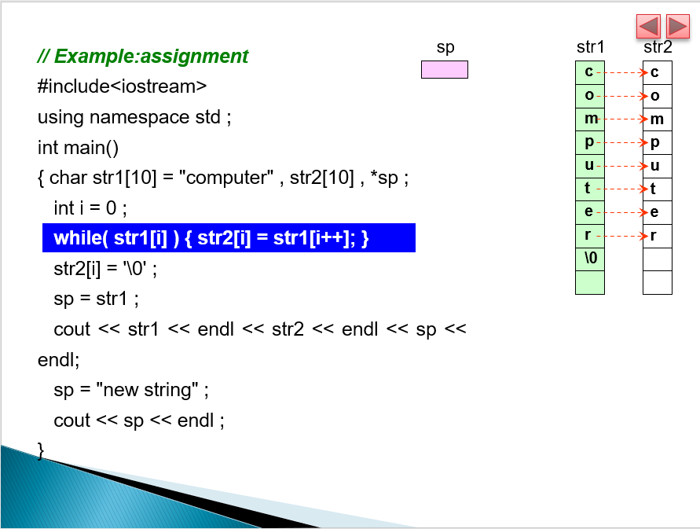
此处的主要疑惑点是i++。只要有一个表达式有i++出现，就算作是同时处理了一次i++语句，因此前面的i不需要再写为i++，不然就两次了。
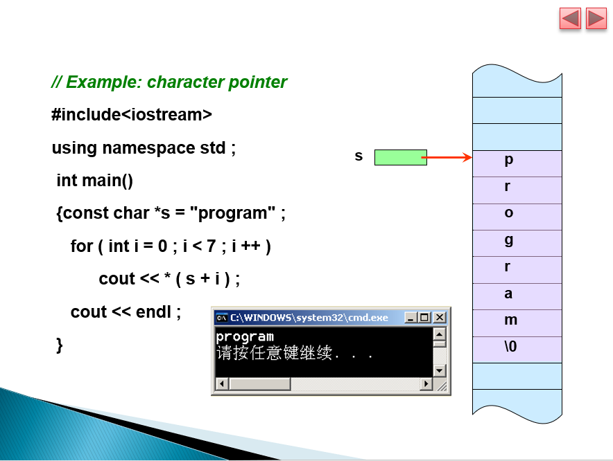

这个也是指针。通过这种赋值形式，这个指针指向了一个字符串（的首地址），但是输出时输出的是这个指针的指向的内存值（也就是一个字符），指针的值就是字符数组中的每个字符。因此输出了一个由各个字符组成的字符串。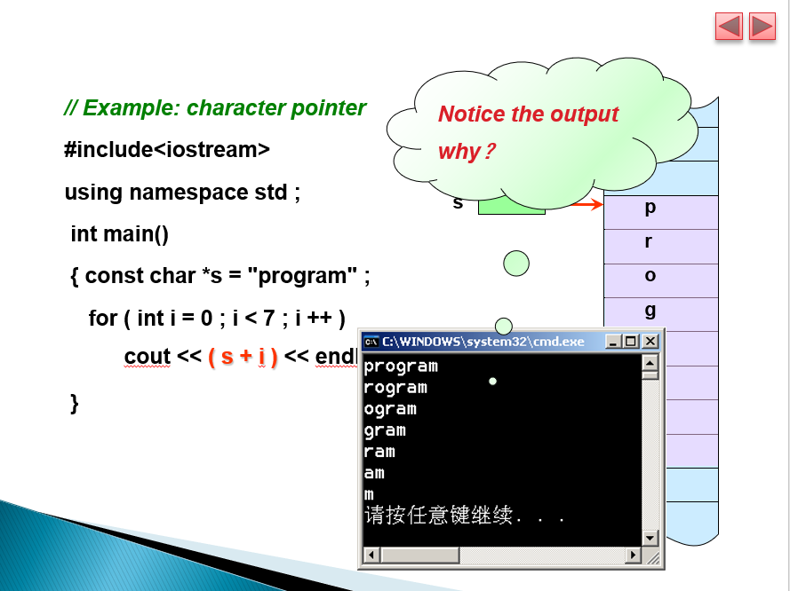

为什么？直接输出这个指针（这个指针指向这个字符串的第一个字符的地址，为什么不是一串地址呢，（为什么不是一串地址呢，因为C++定义了直接输出char数组会输出char数组的每个字符）。当直接输出指针时，指针＋1，则输出字符串的第一个字符的地址往后+1的字符串。

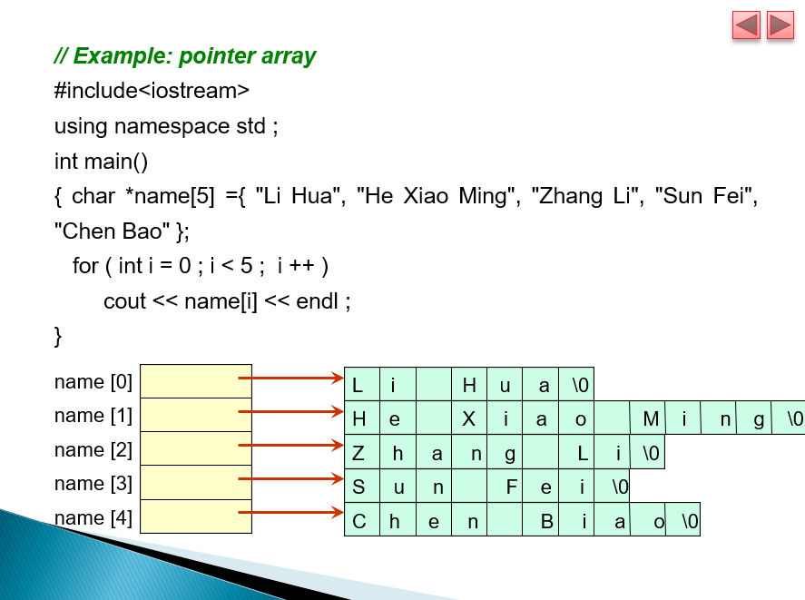

为什么？根据上图，当输出指针数组的元素，指针数组的每个元素（类型为指针），输出的就是对应指针指向的字符串。（为什么不是一串地址呢，因为C++定义了直接输出字符数组会输出字符数组的每个元素。）所以可以知道这就是数组中的数组。

**补充：函数模板template语句：**

如果每个数据类型的程序逻辑和操作相同，则可以使用函数模板更紧凑、更方便地执行重载。可以自定义一个数据类型。

语法：

`template<typename 数据类型名>`

或者

`template<class 数据类型名>//两种等价，不加分号；`

尖括号内为一个模板参数列表。模板参数列表中的每个参数前面都有关键字typename或者class，这两个是等价的。

模板参数列表中的每个参数，形式类型参数是基本类型或者用户自定义类型的"占位符"，也就如同int c中c是一个int型数值的占位符类似。也就是说形式类型参数中存储的是一个"类型"。

例如，可以使用一个自定义变量类型T，使用T来作为自定义函数的返回类型和参数的类型，则这个函数就可以适用于任何类型的参数下的调用了，如int,double等，调用这个函数时会给自定义变量类型T赋予意义，然后当前调用下T会变成所提供的参数的类型（前提是函数的参数列表中使用T限定参数类型）

**补充：尾部返回类型trailing（auto语句）：**

要指定尾部返回类型，请将关键字auto放在函数名之前，然后在函数的参数列表后面加上->和返回类型。当构建更复杂的函数模板时，有些情况下只允许使用尾随返回类型。

语法：
```
template<typename T>

auto function1(T x1,T x2,T x3)->类型名标识符

//定义了某个模板的返回变量的类型，例如这一句的意思就是function1无论是接收了什么参数，其的返回值的类型一定是->后的变量类型。
```
### 其他语句7

**数组补充：**

允许程序在数组边界之外（没有定义的元素）读取或写入数组元素是常见的安全缺陷（security flaws）。

读取越界（out-of-bounds）数组元素可能会导致程序崩溃（crash），甚至在使用坏数据（bad data）时看起来执行正确。

写入越界元素（称为缓冲区溢出）会损坏内存中的程序数据，使程序崩溃，并允许攻击者利用（exploit）系统并执行自己的代码。

//

**形参数组补充：**

1.数组作形参，跟指针作形参是没有分别的。

2.（活动记录）自定义函数中对形参数组的改变是否会影响到原数组（因为形参数组就是一个指向原数组的首地址的指针而已，但是自定义函数用到了这个形参，并当作一整个数组进行操作时应该如何运作）？

回答：是会影响到的。原因是形参数组的值仍然是原数组的地址，原地址是不可改变的，指向是唯一的。因此对其操作的自定义函数虽然在内存另一个区域进行，但是对象仍是原数组。（为避免这种情况，应当在形参数组前加上"const"，表明这个函数不能对这个原数组进行更改）

3.自定义函数传递数组作为形参(parameter)，并不需要知道数组的size。因为形参数组传递来的是一个指针。

//

**字符串/字符数组补充：**
```
char s[10]={'a','b','c','100'};//正常赋值，其他形式有：char s[4]="abc"或者 char s[4]={"abc"}

char s[10]="abc";//赋值前三个元素分别为a和b和c，未赋值的元素为"空"，输出时不会显示东西

char[1]='d';//正常赋值

const char *p="abc";//需要加上const，因为是字符数组，指针p可以视作一个指向字符数组"abc"（这里可以看出，C++中可以直接使用字符串，每个字符串在使用时其实就已经在内存中建立了一个字符数组，内容就是这个字符串）的首地址的指针，p直接指向abc，输出p为"abc"，输出*p为'a'。
```

综合展示实例：
```
{
int z[6]={10,20,30,40,50,60};
int *zPtr=z;//指针zPtr指向数组z的首地址。
void *sPtr = nullPtr;//定义一个空指针，备用
int number;

zPtr=zPtr+2;//指针指向的地址值+2

number=*(zPtr+2);//两种改法，把+2的zPtr指针指向的值赋给number变量

number = *zPtr(3);//等效于number=*(zPtr+3)也就是把数组第4个元素的值赋给变量number变量

sPtr=zPtr;//存储指针

z[0]= * reinterpret_cast<int*>(sPtr);//把sPtr转换为整数指针，将其的当前指向的地址的值赋给数组的第一个元素的值

zPtr++;//指针指向下一位
}

//
```
**`reinterpret_cast<type>(name)`语句：**

推测为特殊的变量类型转换语句。

//

**头文件`<cstddef>`中的定义变量类型：**

1.size_t

说明：表示无符号整数类型，其被定义于命名空间std和诸多头文件中。

//

**头文件`<array>`中的对象array:**

概念：通过array，可以更加方便明了地声明数组。

语法：

`array<type,size> arrayname ={element1,...,elementN};//<type,size>表明了"array"是一个类的模板。`

数组的size是一旦定义是不可改变的，所以充当数组size的数应当加上const以防万一。

实例：

`array<double,3>b={1,2,3};`

//

**array类中的begin()和end()语句：**

语法：

`arrayname.begin();`

`arrayname.end();`

与迭代器有关，指向内存地址。

//

**sort()语句：**

语法：

`sort(a,b);//a~b限定了排序范围。`

包含于头文件`<algorithm>`，用于对数组的自动排序，默认是升序。

实例：

`sort(A.begin(),A.end());对数组A的开头地址到结尾地址中间的所有元素进行排序处理`

//

**auto语句：**

语法：

`auto name=value;//跟const的用法是类似的，后面不跟变量类型直接跟变量名，也因为如此，value成为了判定变量类型的依据，所以value是必须要有的。`

auto关键字告诉编译器根据变量的初始值推断（确定）变量的数据类型

//

**头文件`<vector>`中的对象vector:**

语法：

`vector<type> name={element1,...,elementN};`

为了得到size可在定义后继续改变的数组，我们引入了向量。向量是可以在执行时动态增长和收缩的集合（但同时，它也是相同类型的数据项的集合）。

默认情况下，向量对象的所有元素都设置为0。

可以定义向量来存储大多数数据类型。

可以对向量对象使用赋值（=）运算符。正如数组的情况一样，当用方括号访问向量元素时，不需要C++来执行边界检查。标准类模板-向量在其成员函数中提供边界检查功能（与类模板-数组一样）

实例：`vector<int> V={1,2,3};//向量可以拓展size，因此<>中不需要声明向量类型的数组的size。但是要注意的是不存在值的项是默认不存在的，赋了值的才有可读取使用的"项"。`

//

**vectorname.push_back()语句：**

语法：`vectorname.push_back(value);`

用于给向量类型的数组扩增大小并赋值。函数将一个新的元素加到vector的最后面，位置为当前最后一个元素的下一个元素

实例：A.push_back(3);//给向量数组A最后的地址拓展一个新的地址空间，其初始值为3。

**vectorname.insert()语句：**

实例：`A.insert(A.begin()+x,value);//A.begin()是向量数组A的首地址，x是地址的偏移量，value是需要赋给其地址的值，原先在这个地址的向量数组的元素会被挤到下一个元素的位置，然后整体往后移动，所以这个才叫做"嵌入"函数。`

//

类的补充（类型为static）：

static 添加在类的数据成员前，会将这个数据成员放置于同一静态空间中，所有对象的成员函数都可以同时访问和修改它，而修改的痕迹会被保留，此时这个数据成员叫做静态数据成员。（而不是一般的情况下，每个对象被建立时都会生成一个拷贝，数据成员只是一个初始的数而不是一个空间中的变量，也就是在各个对象中的对此数据成员修改是不会传递到本来的数据成员中的。）通过这个概念，可以对类有更深的理解。类其实是对象的一个整体框架，一般情况下，每个对象都有各自独立拥有的数据成员(属性)和成员函数，每个对象自成一个整体，类就是一个可供对象进行套用的模板。

//

**binary_search语句（也就是二分查找法，只能用于有序数组，也就是用sort()排序处理过的数组）：**

语法：

`binary_search(a,b,"string");`

包含于头文件`<algorithm>`。用于在a~b范围内查找是否存在字符串string，返回bool变量即真或者假。

实例：
```
bool A;

char O[5]={A,B,C,D,E}

A=binary_search(O.begin(),O.end(),"ABC");//A==true
```
//

**vectorname.size()语句：**

代表了向量组的size，也就是元素的个数。

实例：

`cout<<A.size()<<endl;`

//

**vectorname.capacity()语句：**

代表了向量组的容量，也就是当前不再次申请空间可以容纳的元素个数。

显然，vector 容器的大小不能超出它的容量，在大小等于容量的基础上，只要增加一个元素，就必须分配更多的内存。注意，这里的“更多”并不是 1 个。换句话说，当 vector 容器的大小和容量相等时，如果再向其添加（或者插入）一个元素，vector 往往会申请多个存储空间，而不仅仅只申请 1 个。

一旦 vector 容器的内存被重新分配，则和 vector 容器中元素相关的所有引用、指针以及迭代器，都可能会失效，最稳妥的方法就是重新生成。

实例：

`cout<<A.capacity()<<endl;`

//

***
***
***

## 课外补充

### C++的封装-接口与实现分离

==课前必须知识：==

**delete语句**

释放动态分配的内存空间。

用 new 运算符动态分配的内存空间，一定要用 delete 运算符释放。否则，即便程序运行结束，这部分内存空间仍然不会被操作系统收回，从而成为被白白浪费掉的内存垃圾。这种现象就称为“**内存泄露**”。

如果动态分配了一个数组，但是却用delete p的方式释放，没有用[]，则编译时没有问题，运行时也一般不会发生错误，但实际上会导致动态分配的数组没有被完全释放。

**new语句**

实现动态内存分配。

**static语句**

字面意思是：静态的。

**virtual语句**

字面意思是：虚构的。

==正文：==

**当面向过程中：**

函数中的静态变量 ：当**变量**声明为static时，空间将在程序的生命周期内分配，其被存放在在全局数据区。即使多次调用该函数，静态变量的空间也只分配一次，前一次调用中的**变量值通过下一次函数调用传递**。这对于在C / C ++或需要存储先前函数状态的任何其他应用程序非常有用。

对于一个完整的程序，由低地址到高地址分别为：代码区-常量区-全局区（静态区）-堆区（向上增长）-栈区（向下增长）。

静态区（全局区）：静态变量和全局变量的存储区域是一起的，一旦静态区的内存被分配, 静态区的内存直到程序**全部结束**之后才会被释放。

**当面向对象中：**

类中的静态变量：声明为static的变量只被初始化一次，因为它们在单独的静态存储中分配了空间，因此类中的静态变量**由对象共享**，可以减小对象的大小。对于不同的对象，不能有相同静态变量的多个副本。也是因为这个原因，静态变量不能使用构造函数初始化。

注意：类中的静态成员变量必须在类内声明，在类外定义（被const修饰的除外）。

类中的静态成员函数 ：静态成员函数也不依赖于类的对象。我们被允许使用对象和'.'来调用静态成员函数。但建议使用类名和范围解析运算符调用静态成员。静态成员函数**仅能访问静态数据成员或其他静态成员函数，它们无法访问类的非静态数据成员或成员函数。**

静态类 ：和变量一样，静态类的生命周期直到程序的结束。**在main结束后才会调用静态类的析构函数。**

==补充的主要内容：==

**关于面向对象，其有着三大的特性：封装、继承、多态。**

封装：把一个事物拥有的属性、方法、动作隐藏起来，然后仅仅提供一个接口，接口是一个与外界联系的特定方法。在编程中，封装实质上就是**接口与实现的分离**。（例子：C中的printf()，背后的实现是复杂的，则用户只需要使用printf()这个接口就可以实现这个“打印字符”的功能，而不需要知道它背后被封装起来的复杂的实现过程），可以说是模块化和简便化了，但与此同时，灵活性也降低了。实际上，封装是一个概念，**不仅限于面向对象**，更不仅限于编程这一过程。

继承：子类可以拥有父类的属性和方法。

多态：可以说是“一个接口，多个实现”，或者说是父类的引用变量可以指向子类的实例，被引用对象的类型决定调用谁的方法，但这个方法必须在父类中定义。

请实现加减乘除：

**三种特性都没有体现**的实例：
```
//main.cpp
double plusmethod(double a,double b)
{return a+b;}
double minusmethod(double a,double b)
{return a-b;}
double multymothod(double a,double b)
{return a*b;}
double dividmethod(double a,double b)
{if(b==0){return 0;} else return a/b;}

int main()
{double result;
result=plusmethod(114,514);
cout<<result<<endl; }
```
封装就是抽象出了类，类含有属性和方法。封装的好处就是代码功能的分离，同时增强了可读性。

**体现了封装的特性**，定义了一个MyMath类的实例：
```
//MyMath.h(以下代码放在头文件中)
class MyMath
{
public:

Mymath();//构造函数原型声明
~MyMath();//析构函数原型声明

public://可重复标签

static double PlusMethod(double a,double b)
static double MinusMethod(double a,double b)
static double MultyMethod(double a,double b)
static double DividMethod(double a,double b)
};
```
```
//MyMath.cpp(以下代码放在源文件-与头文件同名的实现)
#include"MyMath.h"
MyMath::MyMath(){}
MyMath::~MyMath(){}
double MyMath::PlusMethod(double a,double b)
{return a+b;}
double MyMath::MinusMethod(double a,double b)
{return a-b;}
double MyMath::MultyMethod(double a,double b)
{return a*b;}
double MyMath::DividMethod(double a,double b)
{
if(b==0)return 0;
else a/b;
}
```
```
//main.cpp(以下代码放在源文件-用户调用头文件的实例)
//#include"MyMath.h"(放在同一目录，不需要再次预处理。)
int main()
{
double result;
result PlusMethod(114,514);
return 0;
}
```
继承的优势是代码复用高。创建基类或者说父类Operation。

注意：基类的析构函数必须为虚函数，且成员变量需要初始化。

**体现封装和继承的特性**的实例：
```
//Operation.h
class Operation
{
public:

Operation();
virtual ~Operation();
virtual void SetFirstNum(double a);
virtual void SetSecondNum(double a);

protected:

double m_firstNum;
double m_SecondNum;
};
//Operation.cpp
#include"Operation.h"
Operation::Operation():m_firstNum(0),m_SecondNum(0)//显式初始化
{}
Operation::~Operation()
{}
void Operation::SetFirstNum(double a)
{m_firstNum=a;}
void Operation::SetSecondNum(double b)
{m_SecondNum=b;}
```
接下来创建子类，一共加减乘除四个，这里只展示加法和减法，其他类似。

加法类
```
//MyMinusFunc.h

#include "Operation.h"
class MyMinusFunc:public Operation
{
public:
    MyMinusFunc();
    ~MyMinusFunc();
    double GetResult();
};

//MyMinusFunc.cpp

#include "MyMinusFunc.h"

MyMinusFunc::MyMinusFunc()
{}
MyMinusFunc::~MyMinusFunc()
{}
double MyMinusFunc::GetResult()

{return m_firstNum - m_SecondNum;}
```
减法类：
```
//MyPlusFunc.h

#include "Operation.h"
class MyPlusFunc:public Operation
{
public:
    MyPlusFunc();
    ~MyPlusFunc();
    double GetResult();
};
//MyPlusFunc.cpp

#include "MyPlusFunc.h"

MyPlusFunc::MyPlusFunc()
{}
MyPlusFunc::~MyPlusFunc()
{}
double MyPlusFunc::GetResult()

{return m_firstNum + m_SecondNum;}

主函数源文件：

//main.cpp

#include "MyMath.h"
#include "MyPlusFunc.h"
#include "MyMinusFunc.h"

int main()
{
    double result;

    result = MyMath::PlusMethod(2, 3);

    result = MyMath::MinusMethod(2, 3);

    result = MyMath::MultyMethod(2, 3);

    result = MyMath::DividMethod(2, 3);

    MyMinusFunc minus;//声明对象
    minus.SetFirstNum(3);
    minus.SetSecondNum(2);
    result=minus.GetResult();

    MyPlusFunc plus;//声明对象
    plus.SetFirstNum(3);
    plus.SetSecondNum(2);
    result = plus.GetResult();

    return 0;
}
```
这个实例很明白的说明了继承的特性，代码复用也是显而易见地。

接下来是多态，其实多态和继承是分不开的，多态就是多个类可以执行相同的方法，但是具体实现是不同的。

如果在Operation 类添加一个 double GetResult() 虚函数，在子类中重写该虚函数，这样就是实现了多态。

**体现继承和多态的特性**的实例：
```
//Operation.h

class Operation
{
public:
    Operation();
    virtual ~Operation();
    virtual void SetFirstNum(double param);
    virtual void SetSecondNum(double param);
    virtual double GetResult();
protected:
    double m_firstNum;
    double m_SecondNum;
};

//Operation.cpp

#include "Operation.h"

Operation::Operation():
    m_firstNum(0), m_SecondNum(0)
{
}

Operation::~Operation()
{
}

void Operation::SetFirstNum(double param)
{
    m_firstNum = param;
}

void Operation::SetSecondNum(double param)
{
    m_SecondNum = param;
}

double Operation::GetResult()
{
    return 0.0;
}
```
这样修改有什么好处呢？答，这些子类可以用相同的父类指针表示，可存在一个容器内.

### static关键字的不同用法

首先，C++中的static有两种用法：

1.面向过程程序设计中的static。（应用于普通变量和函数）

2.面向对象程序设计中的static。（其实主要是说明了static在类中的作用）

无论是哪一种用法，静态变量（全局和局部）都在全局数据区（静态区）分配内存。

**面向过程程序设计：**

**应用于全局变量：**

在全部变量的类型前加上static关键字，该全局变量就被定义称为一个静态全局变量。

一般程序的由new产生的动态数据存放在堆区，而函数内部的自动变量存放在栈区。自动变量一般会随着函数的退出而释放空间，静态数据（即使是函数内部的静态局部变量）存放在全局数据区，全局数据区的数据并不会因为函数的退出而释放空间。

静态全局变量具有以下特点：

1.该变量在全局数据区分配内存。

2.未经初始化的静态全局变量会被程序==自动初始化为0==（==自动变量的值是随机的==，除非它被显式初始化，也就是声明时的赋值操作）。

3.静态全局变量在声明它的==整个文件都是可见的，而在文件之外是不可见的==。

我们可以看到，即使把static关键字删去，程序依然如预期一般运行，但是，定义静态全局变量还有以下好处：

1.静态全局变量==不能被其它文件所用==。

2.==其它文件中可以定义相同名字的变量==，不会发生冲突。

**应用于局部变量：**

在局部变量的类型前加上static关键字，该局部变量就被定义称为一个静态局部变量。

通常，在函数体内定义了一个变量，每当程序运行到该语句时都会给该局部变量分配栈内存。但随着程序退出函数体，系统就会收回栈内存，局部变量也相应失效。但有时候我们需要在==两次调用之间对变量的值进行保存（也就是留下修改的"痕迹"）==。通常的想法是定义一个全局变量来实现。但这样一来，变量已经不再专属于这个自定义函数本身了，不再仅受这个自定义函数的控制，给程序的维护带来不便。

静态局部变量正好可以解决这个问题。静态局部变量保存在全局数据区，而不是保存在栈中，每次的值保持到下一次调用，直到下次赋新值。

静态局部变量有以下特点：

1.该变量在全局数据区分配内存。

2.静态局部变量在程序执行到该对象的声明处时被首次初始化，即以后的函数调用==不再进行==初始化。

3.静态局部变量一般在声明处初始化，如果没有显式初始化，会被程序==自动初始化为0==。

4.它始终驻留在全局数据区，==为其的内存空间的分配会持续直到程序运行结束==。但其==作用域为局部作用域==，当定义它的函数或语句块结束时，其作用域随之结束。

**应用于自定义函数：**

在函数的返回类型前加上static关键字，函数即被定义为静态函数。

静态函数与普通函数不同，它只能在声明它的文件当中可见，不能被其它文件使用。

定义静态函数的好处：

1.静态函数==不能被其它文件所用==。

2.==其它文件中可以定义相同名字的函数==，不会发生冲突。

**面向对象程序设计（类中的static关键字）：**

**应用于数据成员：**

在类内数据成员的声明的变量类型前加上关键字static，该数据成员就是类内的静态数据成员。

可以看出，静态数据成员有以下特点：

1.对于非静态数据成员，每个类对象都有自己的拷贝。而静态数据成员被当作是类的成员。无论这个类的对象被定义了多少个，静态数据成员在程序中也只有一份拷贝，由该类型的所有对象共享访问。也就是说，静态数据成员是该类的所有对象所共有的。对该类的多个对象来说，静态数据成员只分配一次内存，供所有对象共用。所以，==静态数据成员的值对每个对象都是一样的，它的值可以更新，修改的"痕迹"会被保留==。

2.静态数据成员存储在全局数据区。静态数据成员定义时要分配空间，所以不能在类的声明中定义（赋值），也就是==必须在类外进行定义==（也就是在存储实现的文件(例如cpp)进行初始化赋值，而声明在类里面）。

3.静态数据成员和普通数据成员==一样遵从public,protected,private访问规则==。

4.因为静态数据成员在全局数据区分配内存，属于本类的所有对象共享，所以，它不属于特定的类对象，在没有产生类对象时其作用域就可见，即在==没有产生类的实例时，我们就可以操作它，也就是在主函数中的任意地方可以直接访问到它==。

5.静态数据成员初始化与一般数据成员初始化不同。静态数据成员初始化的格式为：
＜数据类型＞＜类名＞::＜静态数据成员名＞=＜值＞

6.类的==静态数据成员有两种访问形式==：

＜类对象名＞.＜静态数据成员名＞ 或 ＜类类型名(也就是类名)＞::＜静态数据成员名＞

如果静态数据成员的访问权限允许的话（即public的成员），可在程序中，按上述格式来引用静态数据成员。（但是private好像也可以？）

7.静态数据成员主要用在各个对象都有相同的某项属性的时候。

比如对于一个存款类，每个实例的利息都应当是相同的。所以，应该把利息设为存款类的静态数据成员。这有两个好处，第一，不管定义多少个存款类对象，利息数据成员都共享分配在全局数据区的内存，所以==节省存储空间==。第二，一旦利息需要改变时，只要改变一次，则所有存款类对象的利息全改变过来了，也就是==方便修改和维护==。

8.非静态成员函数可以访问静态数据成员。

同全局变量相比，使用静态数据成员有两个优势：

1. 静态数据成员没有进入程序的全局名字空间，因此==不存在与程序中其它全局名字冲突的可能性==。

2. ==可以实现信息隐藏==。==静态数据成员可以是private成员==，而全局变量不能。

**应用于成员函数：**

在类内成员函数的返回变量类型前加上关键字static，该数据成员就是类内的静态成员函数。

与静态数据成员一样，我们也可以创建一个静态成员函数，它为类的全部对象服务而不是为某一个类的具体对象服务。静态成员函数与静态数据成员一样，都是类的内部实现，属于类定义的一部分。

普通的成员函数一般都隐含了一个this指针，this指针指向类的对象本身，因为普通成员函数总是具体的属于某个类的具体对象的。通常情况下，this是缺省的。如函数fn()实际上是this->fn()。但是与普通函数相比，静态成员函数由于不是与任何的对象相联系，因此它不具有this指针。

从这个意义上讲，它无法访问属于类对象的非静态数据成员，也无法访问非静态成员函数，它只能调用其余的静态成员函数。

关于静态成员函数，可以总结为以下几点：

1.出现在类体外的函数定义不能指定关键字static。（类内的原型和实现可以使用static，==而类外的实现不可以在返回类型前声明static==）

2.==静态成员之间可以相互访问==，包括静态成员函数访问静态数据成员和访问静态成员函数。

3.==非静态成员函数可以任意地访问静态成员函数和静态数据成员==。

4.==静态成员函数不能访问非静态成员函数和非静态数据成员==。

5.由于没有this指针的额外开销，因此静态成员函数与类的全局函数相比==速度上会有少许的增长==。

6.调用静态成员函数，可以用==成员访问操作符"."和"->"为一个"类的对象"或一个"指向类对象的指针"调用静态成员函数==，也可以直接使用如下格式：

＜类名＞::＜静态成员函数名＞（＜参数表＞）调用类的静态成员函数。

### 静态数组和动态数组

创建数组的方式一般有三种：

包括：全局/静态范围的数组、局部变量数组、申请堆空间创建的数组。

其中，全局/静态范围的数组以及局部变量数组都属于静态数组，从堆中申请空间建立的数组为动态数组。

对静态数组进行sizeof运算时，结果是整个数组的大小。（已经确定了大小的数组）

而对动态数组进行sizeof运算时，结果为常数4bytes。（需要进行分配大小的数组，空间大小为为其预留的空间中的第一个元素的地址的的大小，32和64位系统下地址大小恒为4bytes）

在一个函数内声明的静态数组不可能通过函数返回，因为生存期的问题，函数调用完其内部变量占用的内存就被释放了。如果想通过函数返回一个数组，可以在函数中用new动态创建该数组，然后返回其首地址。静态数组是在栈中申请的，而函数中的局部变量也是在栈中的，而new动态数组是在堆中的分配的，所以函数返回后，栈中的申请的内存被自动释放，而堆中申请的内存如果没有delete就不会自动释放。

从寻址的角度来说，静态数组采用的是直接寻址，而动态数组都是两次寻址，这和动态数组本身实现是有关系的。静态数组的变量本身就是数组第一个元素的地址。动态数组的变量存放的是一根指向到申请空间的首址指针。

1.静态数组

静态数组的大小是在编译期间就确定，并且分配的，其内存在使用结束后由计算机自动释放，效率高。

例子：
```
int a[5];//
```

2.动态数组（new-delete）

动态数组是在程序运行时，由程序员根据实际需要从堆内存中动态申请的，使用结束后由程序员进行释放，效率低。

例子：
```
new int[4];
```
***