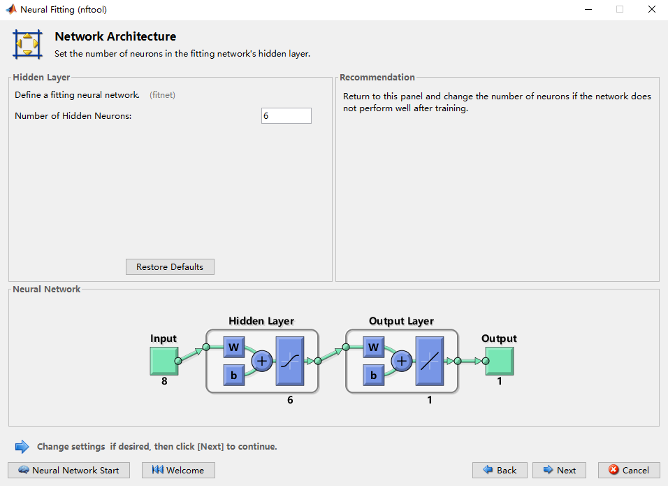

## 目录

  - 基本功能
    - 文件类型
    - 对表进行操作
      - 提取表的向量
      - 提取表的一部分
      - 调整表的各项的排序方式
    - 声明变量并赋值
    - 直接进行数值计算
    - 执行命令并抑制输出
    - 调用以前的命令
    - 查看指定变量的当前值
    - 使用无效的变量名称生成建议
    - 把工作区中的变量保存为MAT文件
    - 把MAT文件中的变量加载到当前工作区
    - 把m文件/mlx文件中的函数加载到当前代码编辑区
    - 删除工作区中的所有变量
    - 清空命令行窗口中的所有历史记录
    - 完全初始化MATLAB项目
    - 在MATLAB编辑器中创建一个实时脚本
    - 使用滑块来方便更改参数值
  - 对变量进行操作的基本函数
    - MATLAB创建数组（行向量）
      - 给数组（行向量）添加元素
      - 索引数组的（向量）元素
      - 数组的运算法则
      - 求数组元素最大/最小值
    - MATLAB创建向量
      - 行向量
      - 列向量
      - 转置行向量为列向量
      - 索引矩阵的最后一行/列的内容
  - 逻辑数组
    - 将数组和一个数值进行比较
    - 使用逻辑数组作为数组索引进行元素提取
      - 更多逻辑符号
    - 逻辑语句
      - if-else语句
      - for语句
  - 高级函数
    - randi函数（生成特定范围内随机数的向量/矩阵）
    - plot函数（生成x-y坐标轴图像）
    - loglog函数（以对数刻度生成x-y轴坐标轴图像）
    - unique函数（返回所有唯一值和唯一行）
      - 对向量用法（向量中的唯一值）
      - 对矩阵用法（矩阵中的唯一行）
    - 使用graph/digraph和plot函数作有向/无向图（定义图并生成图像）
      - shortestpath函数（计算有向/无向图最短路径）
      - highlight函数（高亮有向/无向最短路径）
      - distances函数（求任意两点的距离矩阵）
      - nearest函数（找给定范围内所有的点）
    - sparse函数（创建稀疏矩阵/无向图矩阵）
    - view函数（稀疏矩阵可视化，疑似已弃用）
    - 使用ode23和ode45函数和plot函数画出常微分方程图像和相图（也就是求常微分方程的数值解）
    - intlinprog函数（解决整数线性规划问题，已知决策目标与约束条件）
    - "帮助"功能
    - 多元线性回归函数
    - 生成表格（table）
    - 分类学习训练模型
    - 衔接并换行语法
    - MATLAB内置常量
  - 神经网络工具
    - 深度学习工具箱（Deep Learning Toolbox）
      - Neural Net Fitting BP神经网络工具（nftool）

## 基本功能

### 文件类型

- .mat文件

MATLAB特有的格式文件，其中带有项目中的变量和各种模型。

- .jpg文件

图片文件如果导入到MATLAB中，将会以像素值数值数组的形式进行导入。

- .txt文件

打开MATLAB导入工具，自定义选择进行导入。自定义不仅可以选择导入的数据的对象，还可以选择导入时的数据类型（如表table，可以将所有数据导入并自动选择适当的数据类型）。

- .csv文件（电子表格文件）

打开MATLAB导入工具，自定义选择进行导入。

### 对表进行操作

#### 提取表的向量

语法：

```
x=data.VariableName
//将名为data的表中的名为VariableName的向量赋给变量x
```

注意一个"表"中的每一个向量的形式都是```表名.向量名```，对其可以视作单独的变量进行创建和运算等操作。

#### 提取表的一部分

语法：

```
x=data(1:3,:)
//将名为data的表中的1到3行的全部内容赋给变量x，此时x也是一个表(table)
```

#### 调整表的各项的排序方式

语法：

```
sortrows(表名,'指定列的头行内容')
//从最小到最大

sortrows(表名,'指定列的头行内容','descend')
//从最大到最小（倒序）,后面添加了descend属性
```

方法：直接在工作区的每一列的头行点击，会有不同的排序选项。可以点击下方的"更新代码"进行保存。

### 声明变量并赋值

例子：```a=3*5```

输出：

a=

15

不需要声明变量类型，不能使用数字作为开头，必须以字母开头，并且仅包含字母、数字和下划线（```_```）。MATLAB中的变量大小写敏感，也就是区分大小写。

注意：MATLAB中的等号（=）为赋值运算符，这意味着等号右侧的表达式的值赋给左侧变量。表达式可以由数字、变量、常量组成。

注意：同一窗口下，变量声明后的作用域就是全局范围的。右侧的工作区窗口显示了位于当前命令行窗口中的所有（已被声明的）变量。

### 直接进行数值计算

例子：```3*5```

输出：

ans=

15

不需要声明变量，直接当作计算器使用即可。运算法则和符号遵循类似C++语言的语法，但是次幂可以使用符号（^）来表示。除非另有指定，否则MATLAB将会把计算结果存储到一个名为ans的变量中。

### 执行命令并抑制输出

例子：```x=5+1;```

输出：

在命令的末尾添加分号（;）将抑制输出，命令仍然会执行，但结果不会得到显示。

### 调用以前的命令

使用方向键的向上箭头键，可以根据顺序依次显示之前执行过的命令，可以对显示的历史命令进行编辑后再执行。

### 查看指定变量的当前值

当在命令行窗口下仅输入变量的名称时，MATLAB将会返回该变量的当前值。

### 使用无效的变量名称生成建议

如果使用了无效的变量名编写并执行命令，MATLAB会报错并在下一行显示建议的命令。可以使用建议的命令，可以对建议的命令进行修改，也可以按Esc键删除掉建议的命令。

### 把工作区中的变量保存为MAT文件

例子：```save foo```

使用save命令，将变量保存到名为foo.mat的MAT文件中。

例子：```save foo a```

仅将工作区中名为a的变量保存到名为foo.mat的MAT文件中。

### 把MAT文件中的变量加载到当前工作区

例子：```load foo```

使用load命令，从名为foo.mat的MAT文件中加载变量。

例子：```load foo a```

从名为foo.mat的MAT文件中加载名为a的变量。

### 把m文件/mlx文件中的函数加载到当前代码编辑区

例子：```type lotka```

使用type命令，从名为lotka.m的m代码文件中的代码加载到其所在的代码编辑器中。（顺带一提，lotka文件中有Lotka-Volterra模型的微分方程组的公式定义，其中0.01写成.01，也就是省略了个位的0）

在MATLAB中，自定义函数的定义必须在代码的最后面，如果是使用type命令则其会自动进行处理。

 如果需要修改已经给出的函数定义，需要把m代码文件中的代码复制到代码编辑器的结尾另开一块，且在函数的定义结尾加上"end"。
 
 ### 自定义函数
 
 例子：
 
 ```
function 输出形参 = 函数名(输入形参)
形参注释
函数体
end

function Result = Add(x,y)
%Result  加法结果
%x     加数1
%y     加数2
Result=x+y
end

% 以上的注释在使用help函数后会被打印出来。
% 不同于Python，Matlab无需缩进。
% 自定义函数名必须与文件名必须一致。（好像不是）
% 自定义函数需要在被调用处的后面，最好放在代码的最后面。
```

### 删除工作区中的所有变量

语法：```clear```

将工作区的变量全部清空删除。

### 清空命令行窗口中的所有历史记录

语法：```clc```

清空命令行窗口。

### 完全初始化MATLAB项目

命令：```clc,clear,close all;```

```clc```   清除命令行窗口中的所有文本。

```clear```   清除工作区中的所有变量。

### 在MATLAB编辑器中创建一个实时脚本

点击"新建实时脚本"，输入多个命令的代码（此时可以添加注释），然后点击"运行"来运行整个脚本。运行脚本的结果的显示方式可以进行更换。

使用"分节符"按钮创建新的节，而每个节可以包含一个文字标题（通过"文本"创建）和一个代码块（通过"代码"创建）。节是可以单独运行的，点击"运行节"可以仅运行选定的代码节。

### 使用滑块来方便更改参数值

选择指定的参数后，点击"实时编辑器"-"控件"-"添加滑块"将参数转化为一个滑块的样子，可以直接进行拖动来更改参数。

## 对变量进行操作的基本函数

### MATLAB创建数组（行向量）

例子：```x=[3 5]或者x=[3,5]```

输出：

x=

3   5

创建一个名为x的数组，其中包含两个元素：3和5。

注意：MATLAB中的每个变量均为数组形式存在。

引用数组的元素的行为称为"索引"（indexing），可以提取和修改数组中元素的值。值在数组中的位置称为它的"索引"（index）。

#### 给数组（行向量）添加元素

例子：
```
x=[3,5];
x=[x,7]
```
输出：
```
x=

3  5  7
```

#### 索引数组的（向量）元素

语法：```x(a)=b```

x(a)代表数组x中的第a个元素的值，=A代表将值修改为A。

语法：```x(a:b)```

代表数组x的第a项和第b项之间的所有元素，是一个数组（向量）。

#### 数组的运算法则

语法：```x+2```

x为一个数组，```x+2```代表让x中的每一个元素都```+2```。类似的，```x*2```代表让x中每一个元素都```*2```。而```x/2```代表让x中每一个元素都```/2```。

语法：```x+y```

x和y为相同尺寸的数组，```x+y```代表让x和y每一个对应元素相加。

#### 求数组元素最大/最小值

语法：```[Max,index]=max(x)```

x为一个数组。如果只需要一个输出值，则max(x)为数组x中所有元素中的最大元素的值。如果需要两个输出值（需要使用方括号（```[]```）），则第二个为索引值。

语法：```[Mix,index]=min(x)```

同max(x)。

### MATLAB创建向量

例子：```x=[1;3]```

输出：

x=
1
3

#### 行向量

创建一个名为x的列向量，元素由上到下为1、3。当用空格或逗号（,）分隔数值时，生成行向量。

#### 列向量

当用分号（;）分隔数值时，生成列向量。

#### 转置行向量为列向量

使用转置运算符单引号（'）来将行向量转置为列向量。注意使用圆括号（ () ）来指定运算的顺序。

例子：

```
x=1:3；
x=x'
```
输出：

x=
1
2
3

例子：

```x=(1:5)'```

输出：

x=
1
2
3
4
5

#### 通过等差数列的第一项和最后一项组成向量

当用冒号（:）分隔两个数值时，将两个值作为起始值和最终值来生成等间距向量（由两个值中间的值为公差的等差数列的项组成，当中间的值没有输入时默认为1，例如```x=1:0.5:3```），且可以不需要方括号。

#### linspace函数生成向量

当用linspace函数时，语法为：```linspace(first,last,number_of_elements)```

例子：x=linspace(0,1,5)，就是生成一共5个元素，而且是从0到1的等差数列的项组成的向量，且可以不需要方括号。

### MATLAB创建矩阵

例子：```x=[3 4 5;6 7 8]```

例子：
```
x=[3 4 5;
  6 7 8]
```

输出：

x=

3   4   5
6   7   8

矩阵的创建是一行一行地输入，并使用分号（```;```）来进行换行。（因此列向量每一个元素后就加一个分号）注意，MATLAB支持在方括号（```[]```）内输入表达式。

#### 创建随机矩阵

语法：```x=rand(n)```

rand(n)代表指定输出将为一个```n*n```的随机数矩阵。

语法：```x=rand(a,b)```

rand(a,b)代表指定输出将为一个```a*b```的随机数矩阵。

#### 创建全一矩阵

语法：```x=ones(a,b)```

ones(a,b)代表指定输出将为一个```a*b```的全一矩阵。

#### 创建全零矩阵

语法：```x=zeros(a,b)```

zeros(a,b)代表指定输出将为一个```a*b```的全零矩阵。

#### 得到数组/向量/矩阵的大小(size)

语法：```[a,b]=size(x)```

size(x)就代表变量x的size，如果x是数组则size(x)为一个数值，为元素个数。如果x是矩阵则size(x)为两个数值，一个行数一个列数，此时需要使用方括号（```[]```）来括住需要进行赋值的变量。

语法：```a=size(A,dim)```

a为维度dim的长度。当dim为1，则a为矩阵A的行数。当dim为2，则a为矩阵A的列数。当dim大于等于3，则a为1。

语法：```n=numel(x)```

numel代表数组x的元素个数。n=numel(x)将数组x的元素个数赋值给变量n。

语法：```length(x)```

代表了向量x的长度，也就是元素的个数。

#### 索引矩阵中的一个特定元素

语法：```x(a,b)```

a为行数，b为列数。x(a,b)代表矩阵x的第a行第b列的元素的值。

#### 索引矩阵中的整一行/列

语法：```x(a,:)```

语法：```x(:,b:end)```

冒号（```:```）代表全部元素，也就是```x(a,:)```代表矩阵x的第a行的全部列元素。

```x(:,b:end)```代表矩阵x的第b列到最后一列的全部行元素。

#### 索引矩阵的最后一行/列的内容

语法：```x(end,2)```

语法：```x(2,end-1)```

```end```直接代表最后一行/列。```x(end,2)```代表矩阵x最后一行第2列的元素的值。```x(2,end-1)```代表矩阵x第2行倒数第二列的元素。

#### 矩阵乘法与按元素乘法

语法：```a*b```

代表将a与b进行矩阵乘法，且遵循矩阵乘法法则。（意味着两个相同向量不能使用```*```号进行矩阵乘法）结果为一个数值。

语法：```a.*b```

代表将a与b进行按元素乘法，遵循普通向量乘法。（意味着两个相同向量可以使用```.*```号进行向量乘法）结果为一个数值。

#### 使用大括号为元胞矩阵/数组赋值

元胞数组：元胞数组是MATLAB的一种特殊数据类型，可以将元胞数组看做一种无所不包的通用矩阵，或者叫做广义矩阵。

组成元胞数组的元素可以是任何一种数据类型的常数或者常量，每一个元素也可以具有不同的尺寸和内存占用空间，每一个元素的内容也可以完全不同，因此元胞数组的元素叫做元胞。

MATLAB中括号不同应用的补充：

```[]```:中间的内容一般为矩阵。

```()```：中间内容一般标识下标。

```{}```：一般用来直接创建元胞数组。

语法：
```
a{3,3}=‘china’
//就是建立了一个名为a的3*3的元胞数组
//a(3,3)的元素就是字符串‘china’。 

c={‘china’,’中国’，[1 2 3 4]}
//结果：c='china''中国'[1*4 double]
//为一个cell型数组c赋值，第一个元素为'china'，第二个元素为'中国'，第三个元素为一个1*4矩阵。
```

## 逻辑数组

### 将数组和一个数值进行比较

语法：

```
x=[1 4 5]>2

x=
0 1 1
```

可以看出是分别进行比较的，且结果也为一个数组，称为逻辑数组。

### 使用逻辑数组作为数组索引进行元素提取

语法：

```
v=v1(v2==6)
```

也就是v将会把逻辑数组"v2==6"中，数值为1也就是代表"真"的v1的项提取和赋值，数值为0也就是代表"假"的v1的项则不会进行提取和赋值。

#### 更多逻辑符号

```&```   "且"，可以连接两个不同的逻辑数组并进行"且"运算得到新逻辑数组。

```|```   "或"，可以连接两个不同的逻辑数组并进行"或"运算得到新逻辑数组。

### 逻辑语句

#### if-else语句

语法：

```
if 条件语句
  语句块1
else
  语句块2
  
if 条件语句
  语句块1
elseif
  语句块2
else
  语句块3
end
```

注意既不需要圆括号，也不需要大括号。

#### for语句

语法：

```
for a=1:3
   语句块
end
```

注意此处"a=1:3"为循环计数语句，是从1到3进行的循环3次的计数。

## 高级函数

### randi函数（生成特定范围内随机数的向量/矩阵）

语法：
```
randi(imax)
```

生成1到imax范围内的随机整数。

```
randi(imax,n)
```

生成具有n个元素的数组，元素均为1到imax范围内的随机整数

```
randi(imax,sz1,sz2)
```

生成大小为sz1行```*```sz2列的，元素均为1到imax范围内的随机整数的矩阵。

```
更多见"帮助"中"randi"一栏。
```

### plot函数（生成x-y坐标轴图像）

语法：

```
plot(y)
```
向量y充当y轴，将x轴数据的个数范围设置为1到向量y的元素的数目。
```
plot(x,y)
```
x为充当x轴的向量，y为充当y轴的向量
```
plot(x,y,"r--o")
```
plot函数可以附加一个参数，这个参数设定图像的效果。

"r"代表红色。"k"代表黑色。"m"代表洋红色。

"--"代表虚线。":"代表点线"。"-."代表点划线。""不填代表不画线。

"o"代表使用字符"o"进行端点标记（可以使用其他字符）。而"s"代表使用方形进行端点标记。
```
plot(y,"LineWidth",5)
```
plot 函数接受可选的附加输入，这些输入由一个属性名称和一个关联的值组成。y为充当y轴的向量，"LineWidth"代表设置线宽，5代表线的宽度。
```
plot(x,y,"ro-","LineWidth",5)
```
x为充当x轴的向量，y为充当y轴的向量。

"ro-"为红色实线，以字符o作为端点标记。

"LineWidth"代表设置线宽，5代表线的宽度。

```
更多见"帮助"中"plot"一栏。
```

### loglog函数（以对数刻度生成x-y轴坐标轴图像）

用法同plot函数。

```loglog(a,b,"rs","MarkerSize",8)```

代表将x=a，y=b处的点绘制成一个标记大小 (属性关键字："MarkerSize")为8的红色方框("rs")。

### histogram函数（生成直方图）

语法：

```
histogram(x,"FaceColor","y")
//与plot相似的，x为要画图的向量。
//"FaceColor"为指定的属性名称，代表直方图的颜色设定
//"y"代表黄色。
```

#### 开始/停止在先前绘图基础上操作

语法：

```hold on```

使以下操作在保留前一个图表的操作基础上进行操作。

语法：

```hold off```

使以下操作恢复每个操作都会新建一个图表的默认状态。

#### 为当前绘图图像添加标题

语法：

```
title("标题内容")
```

#### 为当前绘图图像添加标签（底面和侧面标题）

语法：

```
plot(x,y)
xlabel("标题内容")
ylabel("标题内容")
```

注意字符串均使用双引号（```""```）或者单引号（```''```）括住。
如果需要添加变量的值作为标题内容的一部分，需要用加号（```+```）作为分隔

语法：

```
xlabel("Time")
ylabel("第"+x(3)+"天")//x(3)意思是变量x的第三项元素的值，此处仅用作例子。
```

#### 为当前绘图图像的图线命名

语法：

```
legend("第一图线名字","第二图线名字","第三图线名字")//可以直到图像中的每一条图线都被命名了为止
```

```
legend('第一图线','第二图线',...,'Location','North')//Location代表编辑图线命名提示窗的位置，North代表图像的正上方（默认为右上角）
```

#### 放大x轴特定范围内的图像

语法：

```
xlim([xmin xmax])
```

仅适用于画完图后对最新的一个图像进行操作，表示仅显示出x轴取值的从xmin到xmax这个区间的图像并对其进行放大。

#### 查看图像特定点的坐标值

方法：工作区显示出的图像的右上角点击"数据提示"，并在鼠标变成"+"形时点击图像的点，就会显示它的坐标值。

### 在循环执行的特定时间暂停循环

语法：

```
pause(1)
```

在执行时间到1秒处暂停循环，以便于绘图进行更新。

### ftt函数（计算向量的离散傅里叶变换）

语法：

```
fft(x)//对向量x进行离散傅里叶变换，得到复数值
```

傅里叶变换将会返回信号的频谱信息。fft函数的输出值为复数，可以使用绝对值abs函数获得幅值。

```
abs(ftt(x))//取得绝对值，也就是幅值
```

### perms函数（得到一组数字全部的排列方法）

语法：

```
v=[2 4 6]//定义一个向量v
P=perms(v)//为P赋值一个矩阵，矩阵的每一行为一个v中数字的排列顺序

输出：

P = 6×3
6   4   2
6   2   4
4   6   2
4   2   6
2   6   4
2   4   6
```

### find函数（搜索变量中的所有非零元素，列出对应的线性索引值）

语法：

```k = find(X)``` 

返回一个包含数组 X 中每个非零元素的线性索引的向量。

如果 X 为向量，则 find 返回方向与 X 相同的向量。

如果 X 为多维数组，则 find 返回由结果的线性索引组成的列向量。

如果 X 包含非零元素或为空，则 find 返回一个空数组。

例子：

```
X = 3×3

     1     0     2
     0     1     1
     0     0     4

k = find(X) %列向量k中的每个元素的值对应x从列方向数的所有非零数的索引值。

输出：

k = 5×1

     1
     5
     7
     8
     9
```

### unique函数（返回所有唯一值和唯一行）

#### 对向量用法（向量中的唯一值）

```
输入：

//计算包含重复数值的向量 A 的唯一值。

A = [9 2 9 5];

C = unique(A)

输出：

C = 
2   5   9
```

唯一数中从小到大包含了向量中所有出现过的数字，但是没有重复的。

#### 对矩阵用法（矩阵中的唯一行）

```
C = unique(A,___,'rows') //"___"可不填
和
C = unique(A,'rows',___)//"___"可不填
```

将 A 中的每一行视为单个实体，并按排序顺序返回 A 中的唯一行。必须指定 A，而 setOrder 和 occurrence 是可选的。

矩阵中可能出现有两行是相同的。唯一行就是包含了这个矩阵中出现过的所有行，但是没有重复的。

```
输入：

A = 12×3

     3     3     3
     3     2     3
     1     3     3
     3     1     2
     2     2     2
     1     3     1
     1     3     3
     2     3     1
     3     2     1
     3     1     1
     1     3     1
     3     3     3
     ⋮
	 
[C,ia,ic] =unique(A(:,1:2),'rows')
//A(: , 1:2)的意义是：行的元素提取全部行，列为1到2列，也就是将1到2列全部元素提取出来。注意逗号"，"的位置即可。
//基于前两列的数据查找 A 中的唯一行。指定三个输出以返回索引向量 ia 和 ic。所以不需要索引向量可以仅指定一个输出C。

uA = A(ia,:)

输出：

C = 6×2

     1     3
     2     2
     2     3
     3     1
     3     2
     3     3
	 
ia = 6×1

     3
     5
     8
     4
     2
     1
	 
ic = 12×1

     6
     5
     1
     4
     2
     1
     1
     3
     5
     4
     1
     6
     ⋮
	 
uA = 6×3

     1     3     3
     2     2     2
     2     3     1
     3     1     2
     3     2     3
     3     3     3

```

注意：'rows' 选项不支持元胞数组。

### 使用graph/digraph和plot函数作有向/无向图（定义图并生成图像）

例子：

```
s = [8,8,1,1,2,2,2,3,3,7,7,6,6,5]
//s为节点一编号

t = [1,7,2,7,3,5,8,4,5,6,8,5,8,4]
//t为节点二编号
//从节点一到节点二进行连接

w = [4,8,8,3,7,4,2,9,14,6,1,2,6,10]
//对应s到t的每个连接的边的权重

G = graph(s,t,w)
//生成一个"图"，但未可视化，有向图把graph改成digraph即可

Z=plot(G,'EdgeLabel',G.Edges.Weight,'linewidth',2)
//配合plot函数生成图像，用EdgeLabel属性把权重设置到边上，设置linewidth 属性为2来改变线宽。
```

#### shortestpath函数（计算有向/无向图最短路径）

```
G = graph(s,t,w)

[P,d] = shortestpath(G,start,end [,‘Method’,‘algorithm’])

//G是一个图。（graph对象/digraph对象）
//start是起始节点编号，end是目标节点bi编号。
//后面是可选参数，一般不用调，默认是auto。可选值：auto、unweighted（无权图）、positive（Dijkstra算法，要求权重非负）、mixed（允许权重为负）。
//P是最短路径经过的节点向量，d是最短路径的距离。
```

#### highlight函数（高亮有向/无向最短路径）

```
Z=plot(G,'EdgeLabel',G.Edges.Weight,'linewidth',2)

highlight(Z,P,'EdgeColor','g')

//Z是一个图像，而不是一个图。
//P是需要进行高亮的路径组成的节点向量。
//EdgeColor是编辑高亮的颜色，g是绿色的指令。
```

#### distances函数（求任意两点的距离矩阵）

```
d = distances(G [,‘Method’, algorithm])

//G是一个图。（graph对象/digraph对象）
//返回值 d 是一个方阵，表示两两之间的最短距离。
```

#### nearest函数（找给定范围内所有的点）

```
[X,Y] = nearest(G,s,d,['Method', algorithm])

//表示返回图 G 中距离 s 节点的距离大小在 d 之内的所有结点及距离。
//其中，X是结点向量、Y是距离向量。
```

### sparse函数（创建稀疏矩阵/无向图矩阵）

例子：


```matlab
clear all
clc

方法一：
%注意：w(起点,终点)=权重值

w=zeros(4);
w(1,2)=2;w(1,3)=3;w(1,4)=8; 
w(2,3)=6;w(2,4)=6;
G=sparse(w)

方法二：
%注意：sparse([起点集合],[对应终点集合],[对应权重集合])

w = sparse([1 1 1 2 2],[2 3 4 3 4],[2 3 8 6 6]);
G=sparse(w)

输出：

G=

(1,2)   2
(1,3)   3
(2,3)   6
(1,4)   8
(2,4)   6
```

### view函数（稀疏矩阵可视化，疑似已弃用）

例子：

```
G = sparse([6 1 2 2 3 4 4 5 5 6 1],[2 6 3 5 4 1 6 3 4 3 5],[41 99 51 32 15 45 38 32 36 29 21])

view(biograph(G,[],'ShowWeights','on'))
```

运行结果：


### 使用ode23和ode45函数和plot函数画出常微分方程图像和相图（也就是求常微分方程的数值解）

求微分方程的解析解，其实就是通过求精确的函数表达式求出精确的最优解，然后再来画图。

而求微分方程的数值解，其实就是通过直接画出两者数量对应关系的图像，选取较为符合的解，其不一定是最优的。

```
[时间列向量t，两种群数量矩阵y]=ode23(@包含微分方程组函数名,[初始时间 结束时间]，[猎物初始数量；捕食者初始数量])//R2018a版本是：@函数名，而其他版本是：'函数名'。

[时间列向量t，两种群数量矩阵y]=ode45(@方程组函数名,[初始时间 结束时间]，[猎物初始数量；捕食者初始数量])

//t将会赋值为一个从初始时间到结束时间的列向量

//y将会赋值为一个第一列为猎物的数量变化，第二列为捕食者的数量变化的矩阵

plot(t,y)//画出时间与两种动物的关系图像

plot(y(:,1),y(:,2))//画出两种动物的关系图像
```

顺带一提，使用MATLAB求解微分方程的函数有：

解析解：dsolve（搭配syms和diff函数，和"sol.变量名"求解析解使用）

例子：

```
syms x(t) y(t) z(t) 
% x是关于t的函数，y是关于t的函数，z是关于t的函数，但导数是x,y,z互为相关的

eqns = [diff(x,t)==2*x - 3*y + 3*z,...
        diff(y,t)==4*x - 5*y + 3*z,...
        diff(z,t)==4*x - 4*y + 2*z];

    % 微分方程组如下   
% dx(t)/dt = 2x(t)-3y(t)+3z(t) 
% dy(t)/dt = 4x(t)-5y(t)+3z(t) 
% dz(t)/dt = 4x(t)-4y(t)+2z(t)

sol=dsolve(eqns)
% dsolve函数根据方程组矩阵求解

xsolution(t)=sol.x

ysolution(t)=sol.y

zsolution(t)=sol.z
% dsolve求得的解，是一个矩阵。具体的表达式需要sol.函数名
```

数值解：ode45、ode23、ode113、ode23t、ode15s、ode23s、ode23tb

### intlinprog函数（解决整数线性规划问题，已知决策目标与约束条件）

```
[表示各模式的数量的列向量，表示最终总余量] = intlinprog(决策目标的系数向量，整数所在位置向量，不等式约束条件变量系数矩阵，不等式约束的资源上限矩阵，等式约束条件变量系数矩阵，等式约束的资源上限矩阵...)

因为函数内部的不等式约束默认是“表达式大于资源上限”，因此不等式约束的两个矩阵中的数字应当取反。（因为一般是表达式小于资源上限，等式两边取负则刚好对应大于）
```

### "帮助"功能

语法：```help 函数名```

语法：```? 函数名```

语法：```doc 函数名```

语法：右键一个已经存在的函数并打开关于它的帮助。

方法：点击主页的"帮助"项，在新窗口进行搜索。

使MATLAB返回指定的函数的信息。

### 多元线性回归函数

语法：```regress(y,x)```

y为观测的响应值。

x为变量，一般为数组或者矩阵。

```regress(y,x)```返回多元线性回归的系数估计值，也就是一个代表"是否可信"的概率。详情见"帮助 regress"。使用的算法是最小二乘法。

### 非线性回归

语法：```nlinfit(a,b,c,d)```

详情见"帮助 nlinfit"。

### 曲线拟合

语法：```cftool```

唤出当前项目的"曲线拟合（curve fitting tool）"交互窗口。可以根据项目数据和函数类型生成不同的图像。（函数可以进行自定义）

#### regression()函数

```
[a,b,c]=regression(x,y)
% x为x轴对应值矩阵
% y为y轴对应值矩阵
% a为线性回归的回归值（衡量拟合效果的）
% b为线性回归的回归拟合斜率（斜率k）
% c为线性回归的回归拟合偏移量（截距b）
```

### 匿名函数

例子：```myfunction=@(a,x)a+x```

人为设定一个函数满足一个指定的函数形式。

### 距离函数

语法：

```pdist(X) %```返回X中成对观测值之间的欧式距离

```pdist(X,DIstance) %```使用Distance指定的方法返回距离

```pdist(X,Distance,DistParameter) %```使用Distance和DistParameter指定的方法返回距离

支持各种距离度量，计算出两个观测值之间的距离。

### 生成表格（table）

语法：```table(表头第一列内容,表头第二列内容...)```

语法：```table(第一列内容数组，第二列内容数组...)```

详情见"help table"。

### 分类学习训练模型

在"APP"栏中选择"分类学习"，可以训练模型。聚类方法中，提前知道样本数据训练出一个模型，然后把待分类数据输入模型得到类别。

### 衔接并换行语法

语法：
```
(xxx...
xxxxxxxxx)
```

需要三个句号然后回车键。

### MATLAB内置常量

```pi```   圆周率$\pi$，直接使用

```i```   虚数i，直接使用

```NaN```   代表缺失数据，可以认为"空"。

```1```   代表为"真"的逻辑数值

```0```   代表为"假"的逻辑数值

### MATLAB内置函数

```log10(a)```   计算变量a的对数值（10为底数）

```abs(a)```   计算变量a的绝对值

```eig(a)```   计算矩阵变量a的特征值

```sin(a)```  计算变量a的正弦值

```sqrt(a)```   计算变量a的平方根（结果可能包含虚数i）

```round(a)```   将变量a的每个元素值均进行四舍五入

```format short```   控制显示的精度为默认（前四个小数位）

```format long```   控制显示的精度为15个小数位

```[~,~,c]=function(x)```   使具有多个输出值的函数仅输出和赋值部分变量，使用```~```代替的位置的变量的输出和赋值会被忽略。
 
MATLAB使用圆括号（```()```）来传递函数输入，与标准的数学表示法类似。

## 神经网络工具

### 深度学习工具箱（Deep Learning Toolbox）

#### Neural Net Fitting BP神经网络工具（nftool）

从应用程序（APP）处找到Neural Net Fitting。


本质上，是通过已有的数据集训练出一个模型。然后就可以仅输入一个参数X，得到一个预测值Y。

"参数X"和"预测值Y"都可以是一个"矩阵"，或者"向量"，或者单纯的一个"值"。

第一步，设定数据集。


（注意样本输入和样本输出文件内使得输入和输出相互对应的行列方向是需要统一的，在下方的Samples are进行选择）

注意：

Inputs（样本输入）和Targets（样本输出）都用于选择输入的数据集。数据集可以是mat格式的文件，也可以是Excel导出的csv格式的文件，其中csv格式的文件在导入到MATLAB后会自动转化为mat格式。


导入可以使用load命令导入整个csv文件，将文件类型设定为"数值矩阵"进行导入。

第二步，设定训练比例。


这是设定将总样本根据一定比例分别随机抽取样本分配给训练中三个不同的步骤需要的数据集。

Training（训练集）：就是训练模型所使用的样本。MATLAB将根据这些样本来确定一个模型。

Validation（验证集）：就是测试训练模型泛化能力的样本。MATLAB将会根据这些样本来决定何时停止训练。

Testing（测试集）：就是测试训练模型所使用的样本。这些模型不会参与到训练中，仅仅是用来测试训练过程中和最终训练完成的模型的准确率。

第三步，设定隐藏层的神经元数目。



第四步，选择训练时使用的算法，并开始训练。


训练完成。R值越接近于1，说明拟合程度越好，在模型中如果训练、验证、测试的数据拟合的都不错，那我们可以用这个神经网络进行预测。

可以选择"retrain"重新训练，直到出现满意的拟合情况的模型。在Regression选项可以直观看到拟合的情况图像和生成的表达式。


可以生成MATLAB代码（不能运行，可以直接使用，训练数据集在代码中，也就是一个定死的训练好的模型）


生成MATLAB脚本（虽然也是生成代码文件，但是代码不一样。脚本可以"运行"，其本质是一个训练好的模型的基础上保留进行训练的设置，也就是可以重新导入不同的数据集进行重新训练，"运行"就是重新训练一次）

最后将所有用到的数据导入当前文件的工作区（Save Results）后完成（Finish）。


注意：

脚本文件中的变量都为全局变量，程序运行后,这些变量保存在MATLAB的基本工作空间内，一般采用函数clear清除这些变量。为了避免因为变量名相同引起冲突，一般在脚本文件的开始，都采用函数cle，ar all，清除所有基本空间中的变量。函数M文件在执行的过程中，所产生的变量一般都是局部变量，存放在函数自身的函数工作空间中，不会和基本工作空间中的变量产生冲突。对用户来说，函数M文件就像一个黑匣子，只有输入和输出。采用函数M文件，非常易于实现程序的模块化,可以实现程序的分工合作、共同开发，适合大型程序开发。

注意输入向量作为参数前需要先转置（因为训练时内部是先转置过的，所以输入是需要列向量的）。


之后重新打开mlx代码文件，可以看到这个模型的函数默认名字即为mlx文件名，则如果输入为X，期望输出为Y，则仅需在命令行窗口输入：```Y = TrainedFittingFunction_nftool(X)```，其中TrainedFittingFunction_nftool是这个mlx文件的文件名，也是生成的函数的默认名称。