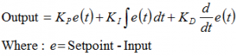
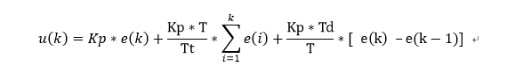
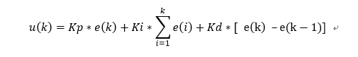
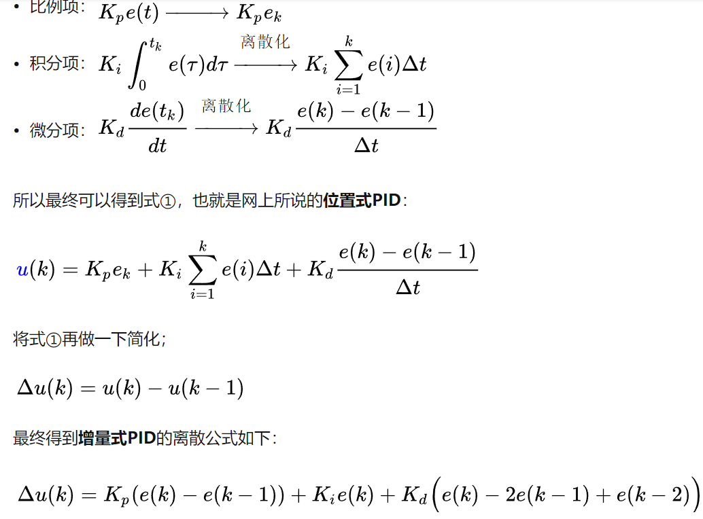
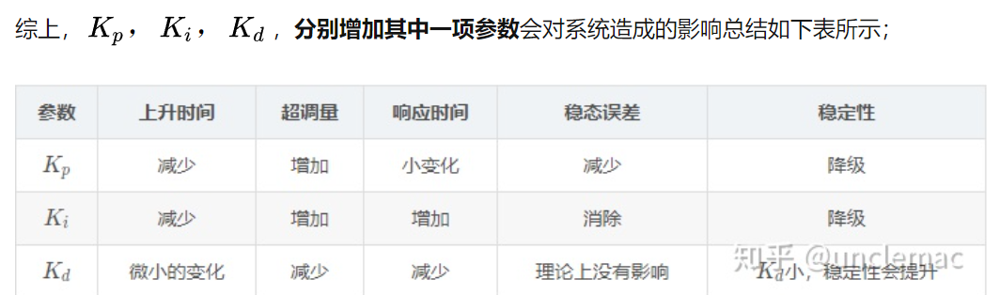
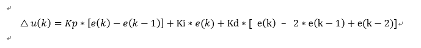
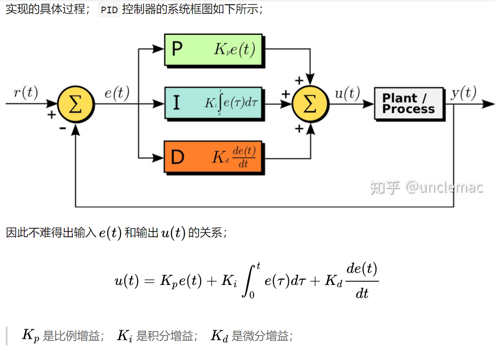

## 目录

    - PID算法
    - 符号意义
      - P
      - I
      - D
    - PID原公式解析
      - 1.位置式
        - 补充：离散化
      - 2.增量式
        - 补充：原理框图
      - PID实例
      - 位置式PID的C++最简单实现
    - 从公式推导角度说明两种PID的区别
    - 从应用角度说明两种PID的区别
      - 位置式PID
      - 增量式PID
      - 实例比较
    - 总结
    - 为什么使用PID？为什么需要使用PID？

### PID算法

PID（Proportion Integration Differentiation）定义：

 proportion：比例（可以理解为调节动作的强烈程度）

Integration：积分（可以理解为对误差的）

Differentiation：微分（可以理解为误差值变化的趋势）



Output的意义是PID调节调整误差行为的输出值，Input的意义是当前实际系统的过程反馈参数值的入口。Setpoint的意义是给定的预设参数值的入口。e就是当前实际系统过程中的误差值。

PID的本质是利用数学工具的方法，使实际系统运作的误差最小甚至消除。对于PID控制系统来说，必须保证给定预设的参数与实际系统运作过程中的反馈数值的一致性，现实层面上就是实际系统运作过程的一致性。

要满足以下条件：

1.给定与反馈的物理意义一致。也就是温度、压力、速度等，系统与PID必须是对同一物理量进行操作。
2.给定与反馈的数值范围对应。也就是单位上、取值范围上要一致，系统与PID必须对同一范围内的物理量进行操作。

物理量、数值范围、参数数值都是完全取决于我们在现实系统中需要解决的问题而定，在编程时由我们转化为数学形式。

补充：

开环控制定义：

开环控制就是控制回路不形成环，也就是说，输出没有影响到输入的情况。输入只管输入，不依赖于输出。输入不会根据输出来进行自我的调整。

这种情况下，实际系统可能会由于外界干扰等因素和情况，导致输出并不是我们预期的输出。而且带有一定量的偏差。显然鲁棒性不足。

闭环控制定义：

闭环控制就是控制回路形成闭环，也就是说，输出会影响到输入，闭环控制是将输出量直接或间接反馈到输入端，使输入能够有进行自我调整的参数，而形成闭环来参与控制的一种控制方法。这样，当输出出现与预期输出的偏差时，输入可以根据偏差进行自我调整，从而调整下一次输出的偏差，从而保持一种稳定的情况。

PID控制就属于闭环控制。系统真正执行的是执行PID的输出值（经PID调整过的输入）。系统的输出值，回到进行输入的地方，与当前时刻的输入进行误差计算，进而影响系统的执行过程。

### 符号意义

r(t)是将按照程序达成的预期目标，也就是实际系统预设值。u(t)是PID算法对误差的校正值，也就是PID系统的输出值。Kp、Ki、Kp是各部分的系数，在调试中由人为决定。

#### P

比例控制算法。PID算法中的较核心部分，是整个PID的主力。其他的I和D都只是为了消除误差，减少震荡，是细节的方面。当然同样也是重要的。

P的实例：

先定义一个场景：把水导入水缸中，设定水缸的目的水位为1m，即r(t)为一个常量D=1m。

1.此时水缸初始水位为0m，则这一轮(t=1)误差算得：e(t)=1m。此时只有P算法，因此有u(t)=Kp*e(t)，Kp为比例系数，此时人为进行假设Kp=0.1，故此时u(t)=0.1m，将0.1m的水量倒入水缸中，此时水缸有了0.1m的水了。

2.此时水缸的初始水位变成了0.1m。则这一轮(t=2)误差算得：e(t)=0.9m。故有u(t)=Kp*e(t)=0.09，将0.09m的水量倒入水缸中。

可以看出，在理想状态下，最终结果将会无限接近于r(t)常量水位。可以说P就是对每次的误差进行一个固定的n倍的矫正，而实际中“加水”的次数不一定是无限的，可能只给3分钟加水，可能只能加3次水，因此Kp是可以大于1的。

3.但是，如果有水缸漏水呢？如果每次加水水缸会漏掉0.05m的水量，那么永远也达不到甚至会让水缸中的水量逐渐远离目标的1m水量。这种误差是一个**恒定**的值，被称为**稳态误差**，它使得P算法得出的u(t)不够可靠。

我们可以说，P决定了矫正误差的力度，如果有着合理的比例系数设定，随着一步一步的矫正是可以达到预设值的。但是在实际情况中往往会有诸多干扰，仅仅是P是不够的。

常见情况就是，“水缸漏水”，在实际问题中常常就是“摩擦力”、“消耗”，为解决这一类会“积累”的“恒定”误差，需要用到I算法。

#### I

积分控制算法。I算法就是为了消除稳态误差而运用的。由于积分是从0时刻一致积分到当前时刻t的，并且是对e(t)函数进行积分。

I的实例：

1.在到达节点也就是目标位置之前，e(t)始终大于0，也就是误差一直存在。如果系统存在稳态误差的话，由于误差将会一直不变（？），但是积分将会一直积下去。之前的稳态误差是中和了P算法的矫正值，现在有了一个同样一直“积累”的积分，导致每次输出u(t)的值也在增大，从而抵消了稳态误差。到最后，误差为0，则此时的e(t)也为0了，积分也就固定在某个值了，积分值不再变化，而其积分值经过累加得到了的这个特值（实际系统中与稳态误差直接相关，所以是特值！）刚好可以抵消掉稳态误差。

2.如果是调节过度，也就是冲过了节点的指定位置，这时的误差为负，但是由于积分正负可以相减，所以这种情况也可以应对。

#### D

微分控制算法。使用PI算法的情况已经可以消除带有稳定误差的实际系统的误差问题了，但是：

1.如果不存在稳态误差，但是存在I算法，那么问题随之出现。当到达了目的位置后，哪怕误差已经是0了，但是I算法的值肯定是一个整数而不为0。根据公式知道u(t)肯定也不为0。那样的话误差必然是会变成负数的。虽然经过PI后可以回到目的位置，但始终是震荡而不是稳定的。因此D算法就是**为了消除震荡**的。

2.即使存在稳态误差，如果Kp和Ki设置的过大，也会使u(t)太大而无法达到稳定的目标位置。

综上所述，D算法就是防止幅度过大，导致震荡或者超调，微分就是为了在输出斜率变得太大之前，在系统中引入一个有效的早期修正信号。通过预测未来而逐渐消除震荡。

PID算法具体分两种：一种是位置式的 ，一种是增量式的。在小车里一般用增量式，为什么呢？

位置式PID的输出与过去的所有状态有关，计算时要对e（每一次的控制误差）进行累加，这个计算量非常大，而明显没有必要。

而且小车的PID控制器的输出并不是绝对数值，而是一个△，代表增多少，减多少。换句话说，通过增量PID算法，每次输出是PWM要增加多少或者减小多少，而不是PWM的实际值。所以明白增量式PID就行了。

### PID原公式解析

#### 1.位置式

****

Kp —— 比例增益，仅仅是一个**自定义系数**，Kp与比例度成倒数关系；
Tt —— 积分时间**常数**；
TD —— 微分时间**常数**；
u(t) —— PID控制器的输出信号；
e(t) —— 给定值 r (t) 与测量值之差，也就是**误差**。

则有积分为离散化累加，微分为与上一时刻节点的连线斜率：



不过不影响理解，可以看到对于积分部分和微分部分，把 $\Delta t$ 都写成了T，然后把Kp都乘了进去 。然后对于以上的式子，给他们配一个统一的系数，即称积分部分为Ki，微分部分为Kd，则有如下式子：



可以看出：

１.P比例的意义相当于某一时刻的偏差error与比例系数[Kp]的乘积。


绿色线为上述例子中从初始位置到目标位置的距离变化； 红色线为上述例子中从初始位置到目标位置的偏差变化，两者为互补的关系。

2.I积分的意义则是误差在一定时间内的和。


红色曲线阴影部分面积即为积分作用的结果，其不断累积的误差，最终乘以积分系数Ki就得到了积分部分的输出。同时要考虑到积分饱和的情况，要限定上限和下限。

3.D微分的意义则是误差变化曲线某处的导数，或者说是某一点的斜率。


从图中可知，当偏差变化过快，微分环节会输出较大的负数，作为抑制输出继续上升，从而抑制过冲。

##### 补充：离散化

由于PID算法原型是连续函数，这样的一个操作在计算机中怕是不太行，所以需要将其**离散化**。通过编程的实现其实本质上就是对PID公式的离散化（现实化）。

从时刻0开始每隔 △t 时间间隔进行数据采样，则会形成下列一系列e(t)的时间节点序列：

(e0,e1,e2,e3 … ek)

相应的有u(t)序列为：

(u0,u1,u2,u3 … uk)



在真正的工程实践中，最难的是如果确定三个项的系数，这就**需要大量的实验以及经验来决定**了。通过不断的尝试和正确的思考，就能选取合适的系数，实现优良的控制器。



#### 2.增量式

这时设 △u(k) = u(k) - u(k-1) ，最终得到的增量式PID。

增量式PID指数字控制器的输出只是控制量的增量∆uk。 当执行机构需要的控制量是增量，而不是位置量的绝对数值时，可以使用增量式PID控制算法进行控制。 增量式PID控制算法可以通过位置式PID公式推导出。

离散公式如下：



##### 补充：原理框图



#### PID实例

位置式PID的实现的**伪算法**实例：

```

previous_error := 0  //上一次偏差

integral := 0   //积分和

//循环，采样周期为dt

loop:

//setpoint 设定值（预设）
//measured_value 测量所得的反馈值
    error := setpoint − measured_value //计算得到偏差
    integral := integral + error × dt //计算得到积分累加和
    derivative := (error − previous_error) / dt //计算得到微分
    output := Kp × error + Ki × integral + Kd × derivative //计算得到PID输出
    previous_error := error //保存当前偏差为下一次采样时所需要的历史偏差
    wait(dt) //等待下一次采用

goto loop

```

基本算法就是这么简单，通过循环语句可以非常简便地实现高等数学的离散化。

其中，比例算法的系数直接人为输入，算法为```y=k*e(t);```

积分算法的系数直接人为输入，而因为时间的序列化使t在代码层面不连续，误差的积分使用循环语句与加法即可离散化；

微分算法的系数直接人为输入，误差的斜率直接套用导数的定义公式，而且因为时间的序列化使t在代码层面不连续，因此只需要减法和除法即可离散化。

#### 位置式PID的C++最简单实现

头文件：

PID.h

```
#ifndef  _PID_H_//条件编译，如果
#define  _PID_H_
class  Implement;
class  PID  //类不能加分号;不然会报错“应输入声明”。但是右大括号要加分号;
{private:
       Implement  *pimpl;
public:
       /*
       Kp - 比例系数
       Ki - 积分系数
       Kd - 微分系数
       dt - 循环单位时间
       max - 操作数的最大值界限
       min - 操作数的最小值界限
       */

       PID(double  dt,  double  max,  double  min,  double  Kp,  double  Kd,  double  Ki);

       // 返回给定了预设值和当前过程值
       double  calculate(double  setpoint,  double  pv);
       ~PID();
};
#endif
```

PID.cpp

```
#ifndef  _PID-SOURCE_
#define  _PID_SOURCE_
#include<iostream>
#include<cmath>
#include"PID.h"
using  namespace  std;
class  Implement
{
private:
       double  _dt;
       double  _max;
       double  _min;
       double  _Kp;
       double  _Kd;
       double  _Ki;
       double  _pre_error;
       double  _integral;
public:

       Implement(double  dt,  double  max,  double  min,  double  Kp,  double  Kd,  double  Ki);

       ~Implement();
       double  calculate(double  setpoint,  double  pv);
};

PID::PID(double  dt,  double  max,  double  min,  double  Kp,  double  Kd,  double  Ki)

{
       pimpl =  new  Implement(dt,  max,  min,  Kp,  Kd,  Ki);
}
double  PID::calculate(double  setpoint,  double  pv)
{
       return  pimpl->calculate(setpoint,  pv);
}
PID::~PID()
{
       delete  pimpl;
}
/*
  实现
*/

Implement::Implement(double  dt,  double  max,  double  min,  double  Kp,  double  Kd,  double  Ki) :

    _dt(dt),
    _max(max),
    _min(min),
    _Kp(Kp),
    _Kd(Kd),
    _Ki(Ki),
    _pre_error(0),
    _integral(0)
{
}
double  Implement::calculate(double  setpoint,  double  pv)
{
     // 计算误差
     double  error =  setpoint  -  pv;
     // 比例项
     double  Pout = _Kp * error;
     // 积分项
    _integral += error * _dt;
     double  Iout = _Ki * _integral;
     // 微分项
     double  derivative = (error - _pre_error) / _dt;
     double  Dout = _Kd * derivative;
     // 计算总的输出值
     double  output = Pout + Iout + Dout;
     // 限定最大最小值
     if  (output > _max)
        output = _max;
     else  if  (output < _min)
        output = _min;
     // 将误差传递到“历史误差”中
    _pre_error = error;
     return  output;
}
Implement::~Implement()
{
}
#endif
```

Test.cpp

```
#include<stdio.h>
#include"PID.h"
int  main()
{
       PID  pid =  PID(0.1, 100, -100, 0.1, 0.01, 0.5);
       double  val = 20;
       for  (int  i = 0; i < 100; i++)
       {
              double  inc = pid.calculate(0, val);
              printf("val:% 7.3f inc:% 7.3f\n", val, inc);
              val = val + inc;
       }
}
```

### 从公式推导角度说明两种PID的区别

Input：I(k)

Output：O(k)

Setpoint：S(k)

Error：E(k)

v(k)：为位置式PID公式的第k次计算结果，刚好也为位置式PID算法的第k次总输出值。可以认为是“所需的增量”。

Input(k)+v(k)：为位置式PID控制的第k+1步的（预期）位置，也就是预期的Input(k+1)。可以认为是“位置式PID的使用方式”。例如：轮子的速度是不会继承的，后一秒的速度与前一秒无关，“可能”会有误差的积累，其他不会有积累和相关效应，因此，一个“位置式PID使用方法输出”对应一个速度，也就是一个“位置”。

Δu(k)：为增量式PID公式的第k次计算结果，为增量式PID算法的第k次总输出值。可以认为是“所需的增量的增量”。（这也是增量式pid三个参数意义不同的原因，增量的增量到底如何使用呢？）

u(k)：为"优化位置式PID的增量式PID"算法的第k次总输出值，因此与位置式v(k)的值一致。

Input(k)+u(k)：为优化位置式PID的增量式PID控制的第k+1步的（预取）位置，也就是预期的Input(k+1)=Input(k)+u(k)。可以认为是“位置式PID的使用方式二”。

Input(k)+Δu(k)：为增量式PID控制的第k步下，仅仅增加Δu(k)，使结果为Input(0)+u(k)而不是Input(k)+u(k)，适用于只需要步长的增量而不是步长的场合。可以认为是“增量式PID的使用方式”。例如：控制闸门转动角度就可以只增加增量来达到相同的效果，因为已经转过了的角度不用重新转，因此，一个“增量式PID输出”对应一个角度，也就是一个“增量”。

位置式PID：公式计算结果为v(k)，PID算法总输出为v(k)，计算第k次计算结果v(k)用到的是第k次的误差E(k)和第k-1次的误差E(k-1)。输出的v(k)是k时刻I(k)为了接近S(k)的一步的步长。也就是说，I(k+1)=I(k)+v(k)。而S(k+1)不一定等于S(k)。

增量式PID：公式计算结果为Δu(k)，PID算法总输出为u(k)，计算第k次计算结果Δu(k)用到的是第k次的误差E(k)和第k-1次的误差E(k-1)和第k-2次的误差E(k-2)。由此计算第k次的PID输出值u(k)=u(k-1)+Δu(k)。

可知：

u(1)=u(0)+Δu(1)=Δu(1)=v(1)，u(2)=u(1)+Δu(2)=Δu(1)+Δu(2)=v(2)，

Δu(k)=v(k)-v(k-1)=u(k)-u(k-1)，u(k)=u(k-1)+Δu(k)。

优化位置式PID的增量式PID的总输出值：

u(k)=Δu(1)+Δu(2)+Δu(3)...+Δu(k-2)+Δu(k-1)+Δu(k)=[v(1)-0]+[v(2)-v(1)]+[v(3)-v(2)]+...+[v(k-2)-v(k-3)]+[v(k-1)-v(k-2)]+[v(k)-v(k-1)]=v(k)，

优化位置式PID的增量式PID的总输出值的计算公式：u(k)=u(k-1)+Δu(k)。

可得u(k)=v(k)，是算法和变量不一样，但是结果是一样的。因此可得使用的方法也是一样的，

位置式PID：Input(k+1)=Input(0)+v(1)+v(2)...+v(k)+v(k+1)=Input(k)+v(k+1)，其中Input(0)为0时刻的过程值即初始值

优化位置式PID的增量式PID：Input(k+1)=Input(0)+u(1)+u(2)+...+u(k)+u(k+1)=Input(k)+u(k+1)，其中Input(0)为0时刻的过程值即初始值

增量式PID：Input(k+1)=Input(0)+Δu(1)+Δu(2)+...+Δu(k)+Δu(k+1)=Input(0)+u(k+1)，其中Input(0)为0时刻的过程值即初始值

v(k)（位置式PID计算结果与输出结果）=u(k)（优化位置式PID的增量式PID输出结果）=u(k-1)（上一次优化位置式PID的增量式PID输出结果）+Δu(k)（增量式PID计算结果）

PID分位置式PID和增量式PID两种，而增量式PID又分为优化位置式PID的增量式PID和增量式PID两种，由于位置式PID控制的输出与整个过去的状态有关，用到了误差的累加值。而增量式PID的输出只与当前状态和前两状态的误差有关，因此位置式PID控制的累积误差相对更大，增量式PID输出的是控制量增量Δu(k)，如果微处理器出现故障，误动作影响较小，而执行机构如本身有记忆功能（可能指的是u(k-1)，或者指的是上一次的总输出值input(0)+v(k-1)而不是input(0)+v(1)+…+vk-1），可仍保持原位，不会严重影响系统的工作，而位置式的输出直接对应对象的输出v(k)，对系统影响较大，==因此实际中增量式PID应用更加广泛==。

增量式PID控制主要是通过求出增量，将原先的积分环节的累积作用进行了替换，避免积分环节占用大量计算性能和存储空间。（也就是通过算法来消除积分项这个所需的项目，并且增量可以选择和之前的u(k-1)相加得到位置式PID输出值，也可以直接输出为增量式PID的输出值）

增量式PID控制的主要优点为：
由于增量式需要对控制量进行记忆，所以对于不带记忆装置的系统，只能使用位置式PID控制方式进行控制。

增量式PID控制算法与位置式PID算法相比，==达成完全相同的效果而====计算量小得多==，因此在实际中得到广泛的应用。

也就是说，位置式和增量式PID每个时刻计算出的结果应用于输出时是一样的，也就是说P和I和D的实际效果也是一样的，区别在于：

增量式不需要设置"误差总和"这个变量。（通过巧妙的算法消除了"误差总和"变量，使其没有必要出现就可以达成一样的效果，可以说是位置式的优化版本）

增量式而且不需要"参照整个误差历史"。（位置式通过"误差总和"记录整个误差的历史，但是当超过Setpoint后的回弹有滞后性，中断再重新启动之前积累的积分项会对输出值具有巨大影响，因此"误差总和"是不太好处理的项目）

增量式为计算k时刻的输出只需要k-1和k-2时刻的位置式输出值。算式中不需要累加。控制增量Δu（k）的确定仅与最近3次的采样值有关，容易通过加权处理获得比较好的控制效果。

增量式的计算量小，没有积分项溢出的风险。

增量式可以通过使步长为u(k)等价于使积分项优化了的位置式PID，也可以使步长为Δu(k)转化为另一种真正的增量式应用场景。因此增量式还具有两个形式，优于位置式。我们一般说的"和位置式PID不同的增量式PID"指的是以Δu(k)为步长的真正的增量式PID应用的算法而不是优化后的位置式PID。

但是，

需要执行机构拥有"记忆功能"（因为需要上次和上上次的位置式子计算结果进行计算），没有的机构只能使用位置式PID了。

### 从应用角度说明两种PID的区别

首先，两种PID其实没有本质区别（因为结果是一样的，v(k)=u(k)），就是数字pid的两种不同表示形式而已，但是在应用中，就像是在计算一些题目时，即使最终的结果相同，也要根据题的具体内容选择适合的方法，==不同的方法选取和需要使用的变量是不同的，优点和缺点也是不同的==，因此需要选用不同的PID来进行实际的应用。

#### 位置式PID

由于计算机输出的（==此处输出指的是"Input+v(k)"，是初始值Input加上经典PID公式的计算结果，真正输出的控制量刚好是"v(k)"==）可直接控制执行机构（如阀门），=="Input+v(k)"==的值和执行机构的位置（如阀门开度）是一一对应的，因此通常称该公式为位置式PID控制算法。

也就是位置式PID是当前系统的实际位置，与你想要达到的预期位置的偏差，进行PID控制。

因为有误差积分 ∑e(i)，一直累加，也就是当前的输出v(k)与过去的所有状态都有关系，用到了误差的累加值；（误差e会有误差累加），输出的v(k)对应的是执行机构的实际位置，一旦控制输出出错(控制对象的当前的状态值出现问题 )，v(k)的大幅变化会引起系统的大幅变化。

并且位置式PID在积分项达到饱和时,误差仍然会在积分作用下继续累积，==一旦误差开始反向变化，系统需要一定时间从饱和区退出==，所以在u(k)达到最大和最小时，要停止积分作用，并且要有积分限幅和输出限幅。

所以在使用位置式PID时，有时我们可以直接使用PD控制。（根据应用场景，不需要积分或者需要直接消除积分项的场景使用PD控制）

而位置式 PID 适用于执行机构不带积分部件的对象（需要进行积分调控的机构），如舵机和平衡小车的直立和温控系统的控制。

缺点：每次输出均与过去的状态有关（积分），计算时要对e（k）进行累加，计算机运算工作量大。

#### 增量式PID

执行机构需要的是控制量的增量（例如驱动步进电机）时，数字控制器的输出只是控制量的增量（==此处的“输出”指的是u(k)，Δu(k)是经典增量式PID公式的计算结果,但不是增量式PID算法的最终结果==），因此该公式称为增量式PID控制算法。

位置型需要历次的偏差信号，而增量型只需一个增量信号即可。位置型计算繁琐，保存E积分项占用很多内存，控制不方便。

增量型误动作小，易于实现手动/自动的无扰动切换，不产生积分失控。但是缺点在于积分截断效应大，溢出影响大。

增量式PID根据公式可以很好地看出，一旦确定了 KP、TI  、TD，只要使用前后三次测量值的偏差， 即可由公式求出控制增量。

而得出的控制量Δu(k)对应的==是近几次位置误差的增量，而不是对应与实际位置的偏差==，==没有误差累加==。

也就是说，增量式PID中不需要累加。控制增量Δu(k)的确定仅与最近3次的采样值有关，容易通过加权处理获得比较好的控制效果，并且在系统发生问题时，增量式不会严重影响系统的工作。

增量型 PID，是==对位置型 PID 取增量==，这时控制器输出的是相邻两次采样时刻所计算的位置值之差，得到的结果是增量，即在==上一次的控制量的基础上需要增加（负值意味减少）控制量==。

#### 实例比较

位置式PID的输出送给电动调节阀，调节阀的开度（即位置）与PID的输出成正比。

增量式PID输出的脉冲正比于PID控制器输出的增量，周期固定，输出的脉冲送给步进电机，所以步进电机转角的增量正比于PID控制器输出的增量。转角的增量多次累加，这就是一个积分的过程。

增量式PID的积分作用是执行机构（步进电机）完成的，误差非零，增量式PID的输出也非零，步进电机就会转动，直到稳态，误差为0，步进电机就不转了。所以增量式PID可以消除稳态误差

### 总结

1.

位置式PID控制的输出与==整个过去的状态==有关，因为用到了==误差的累加值。==

而增量式PID的输出只与==当前拍和前两拍==的误差有关，因此位置式PID控制的累积误差相对更大;

2.

增量式PID公式输出的是==控制量增量Δu(k)，可以不加上u(k-1)直接使用==，因此该方法适用于执行机构带积分部件的对象，如步进电机等。

而位置式PID适用于执行机构不带积分部件的对象，如电液伺服阀等。

3.

由于增量式PID==输出的是控制量增量====Δu(k)==，如果计算机出现故障，误动作影响较小，而执行机构本身有记忆功能，可仍保持原位，不会严重影响系统的工作.

而位置式的输出==直接对应对象的输出==，因此对系统影响较大。

### 为什么使用PID？为什么需要使用PID？


**疑惑的是：为什么不将输入值一直设定为对应的目标值，而是采用PID决定输入值呢？**

为什么不直接输入目标值或者对应目标值的输入值？就是因为不能达到想要的效果啊！所以才这么麻烦！

输入目标值是不能保证和目标值的联系的，因为实际过程有滞后性，有干扰。因此测量实际运行过程的情况，得知误差，比无脑输入目标值无疑是更现实有效，更能看出过程的状态，也使一步一步的调整更柔和（保护仪器，降低对仪器的调整的机构的速度和强度的要求）的方法。

为什么使用PID而不是一直设置目标值，还因为这是一个间接的过程。想调整温度，也许输入值是功率，特定温度是没有确切的对应的功率值的，只能根据现实情况来进行调整。（例如不知道初始温度的情况，例如不知道外界温度的情况，例如调功率的仪器不能一次调太多，例如计算对应功率错误导致超调和根本无法计算对应功率的情况）

所以，PID的作用，一是在干扰下维持稳定和抵消干扰，二是需要适合速度调节，不能一直输入目标值对应的变量值。

PID的作用就是要响应变化的，所以发生变化没关系，会自动调节到稳定状态的。在闭环自动控制系统中，我们总是希望控制目标尽可能地接近理想值。实现这一目标的方法就是对控制后的物理量进行取样，并将取样值与控制目标值进行比较，然后根据比较的结果再次对被控物理量进行调整。

因此，就是不知道目标值对应变量值，或者有特定干扰，或者无法瞬间调整到目标值，或者需要一定的缓冲和要求的速度进行调整的工程，需要使用PID控制器。

补充：既然希望被控物理量的实际值与控制目标无限接近，那么我们取样得到的误差值就必然很小。这与期望的较高控制灵敏度要求相悖。为了提高控制与调节的灵敏度，PID控制技术将较小的误差信号按照一定的比例进行放大，从而实现提高控制与调节的灵敏度的目的。这就是PID控制功能中的比例控制功能P。