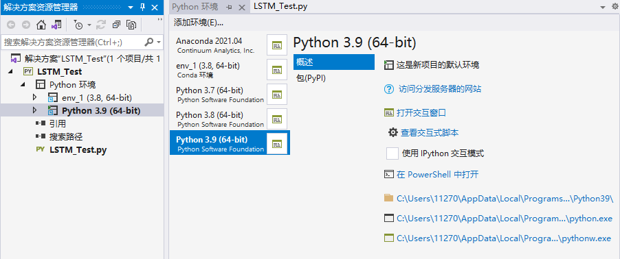
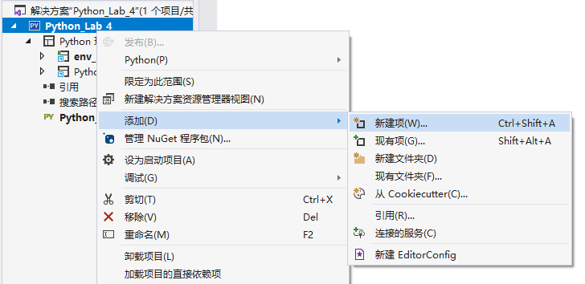

## 目录

  - Python环境、第三方库的安装与配置步骤相关
    - Windows使用Anaconda进行Python虚拟环境管理（以安装tensorflow库为例）
    - requests库的安装
  - 与IDE相关的操作步骤
    - 把Anaconda中的虚拟环境嵌入VS2019中
    - VS2019在同一个解决方案中建立多个py文件的方法
    - VS2019在py项目中批量注释的方法
  - Python库使用方法
    - 通过tensorflow2.0构建LSTM神经网络
      - 需要导入的库
      - 数据集随机分割（训练集、测试集）
      - 使用keras库定义LSTM神经网络模型
      - 训练神经网络模型
      - 使用LSTM神经网络模型进行预测
    - 通过pandas库和NumPy库进行数据预处理
      - 数据预处理步骤
      - 异常值和缺失值处理
      - 查找具有相同属性而数量不同的数据
      - 输出DataFrame类型的指定的一行/多行/一列/多列/特定位置的元素
      - 将内容写入csv文件（按行追加，按列追加）
      - DataFrame类型和list类型相互转换
      - 将csv文件的某一列数据分割为多列数据
      - 使用按列追加将csv文件的部分内容添加到另一个csv文件中（包含算法优化）
      - 数据的标准化（standardization）和归一化/中心化（normalization）和正则化（regularization）和正态化
    - 维度的代码意义
    - 实例：规范化txt数据（将带冒号单行标签转化为列标签）

## Python环境、第三方库的安装与配置步骤相关

### Windows使用Anaconda进行Python虚拟环境管理（以安装tensorflow库为例）

在Windows下，先需要安装python版本与环境管理工具Anaconda3，再使用pip安装其他的第三方库。

Anaconda3可以在各大镜像网站下载。Anaconda3自带python和环境管理工具，即使电脑没有安装python也是可以的。

一个"Python环境"包括了三个部分："解释器"，"用户安装和自带的库"，"用户自己安装的包"。

Anaconda在安装时勾选"设置环境变量"。

Windows命令行窗口，通过Anaconda管理python虚拟环境：

```
conda create --name env_1 python=3.8
# 创建对应python版本的虚拟环境。
# 用python3.8只能安装2.1.0以上的tensorflow。

conda info --envs
# 确认当前所有虚拟环境。

activate env_1
# 激活虚拟环境。

deactivate
# 退出工作环境。

conda list
# 输出已经安装的包的列表。

pip install -i https://pypi.doubanio.com/simple tensorflow==2.2.0
# 使用pip安装tensorflow。

pip show tensorflow
# 查看tensorflow版本信息。

python
# 进入python交互式编程模式。
```

python交互式编程模式检验tensorflow是否安装成功：

```py
import tensorflow as tf
# 测试，import安装好的tensorflow库，并简写为tf方便调用。如果报告dll不全，则无法调用GPU，需要自己下载并放到C:\Windows\System32路径下。或者直接使用Everything查看电脑自带的英伟达文件夹中是否存在，如果有直接复制过去就行。

print(tf.__version__)
# 测试，打印tensorflow版本号
```

### requests库的安装

cmd安装：`pip install requests`

在`import requests`时出现报错：RequestsDependencyWarning: urllib3 (1.26.X) or chardet (X.0.0) doesn‘t match a supported version!

requests库需要调用这两个库，且版本需要相互兼容。

解决方案：卸载urllib3库和chardet库，然后更新requests库。使urllib3库和chardet库的版本相互兼容对应，具体版本兼容区间可以到requests库的源码查看。先卸载再安装两个相互兼容的版本：

```
pip uninstall chardet 
pip uninstall urllib3
pip install -U requests
# 或者pip install --upgrade requests

pip install chardet==1.26.4
pip install urllib3==3.0.4
# 以上两个版本是一对相互兼容的示例，具体还是要看requests库的源码。
```

注意：如果在虚拟环境中操作，需要先激活虚拟环境再进行对库的操作。

## 与IDE相关的操作步骤

### 把Anaconda中的虚拟环境嵌入VS2019中

但是这样的话，TensorFlow只是安装在了虚拟环境，应当将其嵌入目前所使用的IDE中，这样就不需要频繁地在命令窗口执行命令了。

- Windows环境，IDE为vs2019（可自动检测Python环境）

如果是使用Anaconda安装，则默认的环境变量会被改为Anaconda安装的python版本，也就是Anaconda安装的python版本将会覆盖安装Anaconda前的python版本，直接在cmd输入python显示的也是Anaconda的虚拟环境的python版本。

那么如何改默认最优的Python版本呢？在系统的环境变量设置中，选中希望优先执行的python版本路径，“上移”到顶即可。 

关键是配置后，IDE使用的python环境包含tensorflow就可以。因此，需要在IDE内部修改python版本环境。vs2019直接检测注册表获取电脑上的python环境信息，在项目中右键"Python环境"，选择"查看所有Python环境"，可以看到电脑上安装过的所有python版本，还包括所有环境管理工具建立的虚拟环境。（这里会显示Anaconda建立的虚拟环境，前提是Anaconda已经被加入了环境变量）



如果选择"打开交互式窗口"，则仅在此窗口环境为选定的虚拟环境。如果想要在IDE编辑代码"启动"来进行执行的话，则需要选择"添加环境"，在"现有环境"中选择想要设置的环境。（没有经过添加的环境不会显示在"Python环境"下面的列表，鼠标右键选择列表中的环境"激活环境"才代表项目改为使用此环境）

### VS2019在同一个解决方案中建立多个py文件的方法



有利于进行多个代码项目的管理。

### VS2019在py项目中批量注释的方法

先用鼠标左键选定需要进行批量注释的代码段落。

ctrl+k / ctrl+c：批量注释

ctrl+k / ctrl+u：批量取消注释

## Python库使用方法

### 通过tensorflow2.0构建LSTM神经网络

#### 需要导入的库

```py
import pandas as pd
import numpy as np
from sklearn.preprocessing import MinMaxScaler
from sklearn.model_selection import train_test_split
from tensorflow import keras
import tensorflow as tf
import matplotlib.pyplot as plt
from sklearn.metrics import r2_score
# 导入库
```

#### 数据集随机分割（训练集、测试集）

```py
X_train,X_test, y_train, y_test =cross_validation.train_test_split(train_data,train_target,test_size=0.4,shuffle=False,random_state=0)
# train_test_split是交叉验证中常用的函数，功能是从train_data和train_target中随机的按比例选取train data（训练子集）和test data（测试子集），并分别赋予给4个变量（样本数据的训练子集、测试子集，目标数据的训练子集、测试子集）。通俗来说，就是数组或矩阵分割为随机的训练和测试子集。
# train_data：所要划分的样本特征集
# train_target：所要划分的样本结果
# test_size：样本占比，如果是整数的话就是样本的数量
# shuffle：表示是否在训练过程中随机打乱输入样本的顺序，False代表不打乱顺序。
# random_state：是随机数的种子。
```

#### 使用keras库定义LSTM神经网络模型

定义神经网络结构：

```py
import tensorflow
from tensorflow import keras
# tensorflow专门为keras做了优化，因此可能会使得keras路径冲突。需要先import tensorflow库才import keras。
# 但是仍有可能会报错说没有keras库，因此使用from tensorflow import keras来使用tensorflow内置的keras，好像效果还更好。

model = keras.Sequential()
# 使用keras库，定义一个模型。Sequential序贯模型是函数式模型的简略版，为最简单的线性、从头到尾的结构顺序，不分叉，是多个网络层的线性堆叠。

model.add(keras.layers.LSTM(256, input_shape=(train_x.shape[1], train_x.shape[2])))
# model第一层是LSTM循环层LSTM()，有256个细胞。网络中第一层必须定义预期输入数，输入必须是三维的，由Samples样本（数据中的行）、Timesteps时间步长（特征的过去观测值）、Features（数据中的列）特征三个维度组成。

model.add(keras.layers.Dense(1, activation='sigmoid'))
# model第二层是全连接层Dense()，用于输出，仅有一个细胞（因为仅输出一个数），激活函数为sigmoid。
```

编译模型：

```py
model.compile(loss = 损失函数,optimizer = 优化器,metrics = ["准确率”])
# .compile()函数用于编译网络。model.compile()方法用于在配置训练方法时，告知训练时用的优化器算法、损失函数和准确率评测标准。

# 损失函数：
# "mse" 或者 tf.keras.losses.MeanSquaredError()
# "sparse_categorical_crossentropy"  或者  tf.keras.losses.SparseCatagoricalCrossentropy(from_logits = False)
# 损失函数经常需要使用softmax函数来将输出转化为概率分布的形式，在这里from_logits代表是否将输出转为概率分布的形式，为False时表示转换为概率分布，为True时表示不转换，直接输出。

# 优化器：
# “sgd”或者 tf.optimizers.SGD(lr = 学习率，decay = 学习率衰减率，momentum = 动量参数）
# “adagrad"  或者  tf.keras.optimizers.Adagrad(lr = 学习率，decay = 学习率衰减率）
# ”adadelta"  或者  tf.keras.optimizers.Adadelta(lr = 学习率，decay = 学习率衰减率）
# “adam"  或者  tf.keras.optimizers.Adam(lr = 学习率，decay = 学习率衰减率）

# 准确率：标注网络评价指标
# "accuracy" : y_ 和 y 都是数值，如y_ = [1] y = [1]  #y_为真实值，y为预测值。
# “sparse_accuracy":y_和y都是以独热码 和概率分布表示，如y_ = [0, 1, 0], y = [0.256, 0.695, 0.048]
# "sparse_categorical_accuracy" :y_是以数值形式给出，y是以 独热码给出，如y_ = [1], y = [0.256 0.695, 0.048]
```

#### 训练神经网络模型

```py
train=model.fit(x,y, batch_size=32, epochs=10, verbose=1, callbacks=None,validation_split=0.0, validation_data=None, shuffle=True, class_weight=None, sample_weight=None, initial_epoch=0)
# .fit()函数用于训练模型。

# x：输入数据。如果模型只有一个输入，那么x的类型是numpy array，如果模型有多个输入，那么x的类型应当为list，list的元素是对应于各个输入的numpy array

# y：标签（目标数据），numpy array类型。

# batch_size：整数，指定进行梯度下降时每个batch包含的样本数。训练时一个batch的样本会被计算一次梯度下降，使目标函数优化一步。

# epochs：整数，训练终止时的epoch值，训练将在达到该epoch值时停止，当没有设置initial_epoch时，它就是训练的总轮数，否则训练的总轮数为epochs - inital_epoch

# verbose：日志显示，0为不在标准输出流输出日志信息，1为输出进度条记录，2为每个epoch输出一行记录

# callbacks：list，其中的元素是keras.callbacks.Callback的对象。这个list中的回调函数将会在训练过程中的适当时机被调用，参考回调函数

# validation_split：0~1之间的浮点数，用来指定训练集的一定比例数据作为验证集。验证集将不参与训练，并在每个epoch结束后测试的模型的指标，如损失函数、精确度等。注意，validation_split的划分在shuffle之前，因此如果你的数据本身是有序的，需要先手工打乱再指定validation_split，否则可能会出现验证集样本不均匀。

# validation_data：形式为（X，y）的tuple，是指定的验证集。此参数将覆盖validation_spilt。

# shuffle：布尔值或字符串，一般为布尔值，表示是否在训练过程中随机打乱输入样本的顺序。若为字符串“batch”，则是用来处理HDF5数据的特殊情况，它将在batch内部将数据打乱。

# class_weight：字典，将不同的类别映射为不同的权值，该参数用来在训练过程中调整损失函数（只能用于训练）

# sample_weight：权值的numpy array，用于在训练时调整损失函数（仅用于训练）。可以传递一个1D的与样本等长的向量用于对样本进行1对1的加权，或者在面对时序数据时，传递一个的形式为（samples，sequence_length）的矩阵来为每个时间步上的样本赋不同的权。这种情况下请确定在编译模型时添加了sample_weight_mode=’temporal’。

# initial_epoch: 从该参数指定的epoch开始训练，在继续之前的训练时有用。
fit函数返回一个History的对象，其History.history属性记录了损失函数和其他指标的数值随epoch变化的情况，如果有验证集的话，也包含了验证集的这些指标变化情况

model.save("model_1.h5")
# 保存模型

plt.plot(train.history['loss'])
plt.plot(train.history['val_loss'], c='r') 
# 用红线画
plt.legend(['loss', 'val_loss'])
# 为上述图线赋予标签
plt.show()
# 显示loss的变化图像
```

#### 使用LSTM神经网络模型进行预测

```py
y_predict = model.predict(test_x)
# 使用模型，对test_x进行预测。

print(r2_score(test_y, y_predict))
# 输出预测值与实际数据的R方值，越接近1说明拟合结果越好。

plt.figure(figsize=(10, 10))
plt.plot(test_y[:100])
plt.plot(y_predict[:100], c='r')
plt.show()
# 画出预测值与实际数据对比的图像。
```
 
```
# 模型预测（通过训练子集的最后一个窗口，预测没有相应测试子集的新数据，并画出来，但是无法进行检验）

def predict_all(model_1, last_x, num=25):
    """
    按照时序性，用最后一个窗口预测后面的值，以此类推
    :param model_1:
    :param last_x: 最后一个窗口的数据
    :param num: 预测的个数
    :return:
    """
    pred_y = []
    for i in range(num):
        temp_y = model_1.predict(last_x)
        pred_y.append(temp_y[0, 0])
        temp_y = np.expand_dims(temp_y, 0)
        last_x = np.concatenate([last_x[:, :, 1:], temp_y], axis=2)
        # concatenate函数用于数组拼接，将刚预测出的预测值加入到下一个滑动窗口中，为下一次循环做准备。其中1:代表去掉列表中第一个元素（下标为0）。[:,:,1:]代表仅去掉axis=2方向上的第一个元素的原来数组。
        # 然后跟相同axis轴上的维数相应的（传入的数组必须具有相同的形状，这里的相同的形状可以满足在拼接方向axis轴上数组间的形状一致即可）仅有一个元素的数组temp_y进行拼接，达成滑动窗口的更新。
    return np.asarray(pred_y)
    # 最终返回整个预测值数组


last_x = test_x[-1]
last_x = np.expand_dims(last_x, 0)
series = predict_all(model, last_x, num=20)
plt.plot(series)
# 画出进行一次逐步预测的预测值图像
plt.show()
answer = scaler.inverse_transform([series])
print(answer)
# 输出进行一次逐步预测的预测值
```

### 通过pandas库和NumPy库进行数据预处理

#### 数据预处理步骤

1.处理行中单个数据的缺失值。单个数据缺失值，填充。

2.处理多行数据的缺失值。多行数据的缺失值，如果缺的多，缺损的数据相关的数据进行删除。如果缺得少，采用和单个数据缺失值的相同填充方式。

3.处理行中单个数据的异常值。判断出异常值并进行剔除。

箱图法：画出数据的箱图，异常值点非常明显。

标准差法：2$\sigma$法：处于整个样本的$(\mu-2\sigma,\mu+2\sigma)$区间外的值视作异常值。

4.数据的单独标准化和单独反标准化（神经网络）。如果使用神经网络进行训练，需要对不同的数据进行不同的标准化，还需要对结果进行反标准化。

5.根据细分度进行数据合并。如果数据被分开了，数据细分度不同，（例如小时、天、周等细分度），需要进行数据合并。

#### 异常值和缺失值处理

```py
import pandas as pd
import numpy as np

F_0=pd.read_csv("csv文件路径"，seq="csv数据分隔符").reset_index()

F_0.replace('?',np.nan,inplace=True)
# 替换标记'?'（可能是其他标记）的异常值为np.nan,也就是缺失值。

"""
F_0=F_0.values
# 将F_0转化为ndarray数组。

F_0=F_0.astype('int64')
# 对全部数据统一类型，提高精度和速度。
"""
```

```py
def Fill_Missing(dateset):
  """
  自定义函数实现缺失值填充
  思路1：填充同列其他值的平均值。
  思路2：填充前一个周期的同一时刻的值。
  """
  
  # 思路1
  for i in range(dateset.shape[0]):
  # 遍历行
     
     Total=0
     Avg=0
     Counter=0
     # 初始化总和、平均值、缺失值计数器。
     
    for j in range(dateset.shape[1]):
     # 遍历列
       if np.isnan(dataset[i,j])==False:
       # np.isnan判断参数是否为缺失值(nan)并返回一个布尔值，如为缺失值则为True
         Total=Total+dataset[i,j]
       else:
         Counter=Counter+1
     
     if Counter!=0:
       Avg=Total/(dateset.shape[1]-Counter)

       for j in range(dateset.shape[1]):
       if np.isnan(dataset[i,j]):
         dateset[i,j]=Avg
         # 使用平均值填充缺失值
       print('第{}列，有{}个缺失值被填充。'.format(j,Counter))
       # 平均值好像可以直接使用函数得到。

  # 思路2
  One_Day=96
  for i in range(dateset.shape[0]):
     for j in range(dateset.shape[1]):
        if np.isnan(dataset[i,j]):
           dateset[i,j]=dateset[i-One_Day,j]
  # 使用前一天的相同时刻的数据进行填充，仅适用于部分情况。
```

#### 查找具有相同属性而数量不同的数据

```py
import pandas as pd

F_0=pd.read_csv('csv文件路径'，seq="csv数据分隔符",encoding='编码方式(默认为utf-8，无法打开可以试试gbk)').reset_index()
# 打开csv文件，后面带".reset_index"则代表强制创建一列(0,1,2,...)作为每一行数据的索引。
# 打开的csv文件F_0默认为DataFrame类型。
# 打开的csv文件的每一行为元组类型（?），无法修改。

F_0=pd.DataFrame(F_0)
# 强制转换为DataFrame类型。

F_0.columns=['自定义列头名1','自定义列头名2','自定义列头名3',...]
# 对csv文件的各列文件自定义列头名。注意命名的数量要和数据的列数相等。
# 也可以用于为未命名列头名的DataFrame类型数据命名列头名。
# F_0.columns为DateFrame类型的F_0的列头名数组，数组类型为pandas索引。可以直接使用索引来获取特定的列头名。
# F_0.columns[0]='自定义列头名1'

print(F_0,head(3))
# 输出头三行数据

print(F_0,tail(3))
# 输出尾三行数据

print(F_0.shape)
# 输出代表(行数，列数)的数组

print(F_0,dtypes)
# 输出各列数据的数据类型，检查各列数据的类型。

F_0["日期"]=pd.to_datetime(F_0["日期"，format="%Y/%m/%d"])
# 一般来说，数据集的表示日期的列的数据不一定是时间的格式，需要进行类型转换。
# 将F_0中的列头名为"日期"一列数据转化为时间的格式（年/月/日），方便后续操作。（格式强制转化为datetime64[ns]）

print(F_0,dtypes)
# 输出各列数据的数据类型，检查各列数据的类型。

GB=F_0.groupby('属性1')
# .groupby函数可以进行数据的分组和分组后组内的计算，此处将F_0根据属性1（属性1可以是多维的）进行分组得到一个Groupby对象。

Count_0=GB['属性2'].count().sort_values()
# 或者Count_0=GB.count().sort_values('属性2')
# GB.['属性2']则是进行分组后，根据属性1，仅提取出列头名为"属性2"的一列数据。
# 属性2是可以和属性1同名的，因为属性1仅仅是分类的依据，而不是作为索引。

print(Count_0)
print(Count_0.head(50))
print(Count_0.tail(50))
print(Count_0[0:60])
# 查看重复数据的情况。

# 对分组后的Groupby对象进行不同的计算功能：
# .describe()描述组内数据的基本统计量，包括同属性数据的数量、均值、标准差等。
# .count()为统计具有相同属性1的数据数量。
# 使用.unstack()可以使得索引重排，让结果更便于对比查看。
# 使用.sort_values()可以默认选择一个属性作为排序根据，输出按升序（默认）输出。也可以指定排序根据的属性参数，例如.sort_values('属性3'，inplace=True)，此时根据属性3的值的大小进行升序排序。
```

#### 输出DataFrame类型的指定的一行/多行/一列/多列/特定位置的元素

```
F_0=pd.read_csv("csv文件路径"，seq="csv数据分隔符").reset_index()

print(F_0.columns)
# 输出第一行，也就是包含属性的列头行。

print(F_0.iloc[0:3])
# 输出第0到第2行的所有列的数据

print(F_0.iloc[1,0])
# 输出第2行第1列的元素

print(F_0.iloc[:,0])
# 输出第1列的所有元素

print(F_0.iloc[:,0][0])
# 输出第1列的第1个元素
```

#### 将内容写入csv文件（按行追加，按列追加）

按行追加：

```py
import pandas as pd

a=[1,2,3]
b=[3,2,1]
# 定义多个列表，一个列表为一列数据

F_1=pd.DataFrame({'a_name':a,'b_name':b})
# 字典中的key值即为csv文件中的列名

F_1.to_csv('csv文件路径',mode='a',header=True.index=False,sep=',')
# 将DataFrame类型存储为csv文件，或者说写入目标csv文件，文件不存在时新建csv文件。
# mode默认为'w'，会擦掉原有内容从头写。为'a'则代表可以读写，且为按行追加。
# index参数(True,None,False)表示是否添加索引。
# sep表示写入时的间隔符。
# header参数(True,None)代表DataFrame的头行是否写入。

# 注意：to_csv函数需要目标csv文件不在打开的状态。
# 注意：会在目标csv文件的最后一行后添加整个DataFrame的数据。
```

```py
import csv

a=[1,2,3]
b=[3,2,1]
# 定义多个列表，一个列表为一列数据

with open("csv文件路径","w") as C_0:
  W_0=csv.writer(C_0)
  # 将csv文件转化为csv.writer对象，方便下一步操作。
  W_0.writerow(["index","a_name","b_name"])
  # 先写入列头名
  W_0.writerows([0,a[0],b[0]],[1,a[1],b[1]],[2,a[2],b[2]])
  # .writerows是逐行写入的，只能使用这种方法

# 注意：会在目标csv文件的最后一行后添加整个DataFrame的数据。
```

按列追加：

```
New_data=range(F_0.shape[0])
# 定义一个元素数量与目标csv文件函数一致的列表。

F_0['新列头名']=New_data
# 为目标csv文件的DataFrame直接定义一个新的列。

F_0.to_csv('csv文件路径'，index=None，sep=',')
# 将添加了新列的目标csv文件的DataFrame直接覆盖原csv文件。

# 注意按列追加，追加的列表的元素数量必须与原csv文件的行数一致。
# 此种方法为按列追加，但是追加之后，会使得csv文件内部编码方法冲突，需要使用记事本打开后，另存为选择"ANSI"编码覆盖保存，才能用Excel正常打开。
```

```py
import os
import csv

with open("csv文件路径","r+",encoding='utf-8') as C_0:
  # 'w+'是读写模式，'w'是写入模型，不能读。
  # 无论是'w+'还是'w'，都会导致原文件内容被截断，也就是被清空，然后重新等待写入。建议使用'r+'（同样是读写模式，不会清空原文件内容）。
  # 通常用默认的gbk编码方式读取csv文件会有字符识别失败，应当调整为utf-8类型。
  rows=csv.reader(C_0)
  # 将目标csv文件各行转化为一个二维列表的各个元素
  with open("csv文件路径","w+",encoding='utf-8') as N_0:
    W_0=csv.writer(N_0)
    # W_0是一个空白的csv文件N_0的csv.writer对象，用来被写入修改后的数据
    for row in rows:
      row.append("对应行数的新列的数据")
      # 为目标csv文件的每行的列表的末尾新添加一个元素
      W_0.writerow(row)
      # 将已经添加了新元素的行输出到空白的csv文件中

# 以上是对已经存在的目标csv文件的每行数据的末尾添加想要添加的新列的数据的方法。
```

#### DataFrame类型和list类型相互转换

DataFrame类型转换为list类型：

```py
import pandas as pd
import numpy as np

F_0=pd.read_csv('csv文件路径')
# 读取csv文件，为dataframe类型

F_0=np.array(F_0)
# 转换为ndarray类型

F_0=F_0.reshape(1,len(F_0)).tolist()
# 转换为list类型
```

```
F_0=pd.read_csv('csv文件路径')
# 读取csv文件，为dataframe类型

"""
F_0=pd.read_csv('csv文件路径'，keep_default_na=False)
# 读取csv文件，并将检测到的缺失值不替换为nan而是替换为空。
"""

# 转换为ndarray类型后发现有些空行被识别为缺失值，但实际上它们并没有填入数据。可以通过过滤函数根据属性进行过滤。

F_0=F_0[~F_0['属性1'].isna()]
# .isna()是判断是否为nan的函数，输出一个布尔值
# 属性1的值为nan的行都整个去除，去除无效行，也就是全为nan缺失值的行。
# 可以使用多个属性先后进行过滤。

N_0=F_0.values
# 转换为ndarray类型，每行数据为一个元素。

L_0=N_0.tolist()
# 转换为list类型，每行数据为一个列表，作为二维列表的元素。
# 注意如果直接使用list()会得到仅由各个列头的值作为元素的一维列表。
```

list类型转换为DataFrame类型：

```
L_0=[1,2,3]
# 定义一个一维列表。

F_0=pd.DataFrame(L_0,columns='列头名')
# 将一维列表转换为DataFrame，会成为一列数据

F_0=pd.DataFrame([L_0],columns=['列头名1','列头名2'])
# 通过增加[]，使得一维列表转换为二维列表（如果本来就是二维列表就不需要增加[]），将二维列表转换为DataFrame，会成为一行数据
```

#### 将csv文件的某一列数据分割为多列数据

```py
F_0=pd.read_csv('csv文件路径')
# 读取csv文件

F_0=F_0[~F_0['属性1'].isna()]
# 过滤无效的空行（每次操作前都应该过滤一次空行）

L_0=F_0.values.tolist()
# 转化为list类型

for i in range(len(L_0)):
    a=re.split(" ",L_0[i][0])
    # 将每行第一个数据中夹杂的多个数据分割开，分隔符具体是什么需要视数据格式而定
    L_0[i].pop(0)
    # 将每行第一个数据删除
    L_0[i].insert(0,a[1])
    # 将第一个数据分开后的子数据写入原行
    L_0[i].insert(0,a[0])
    # 将第一个数据分开后的子数据写入原行
    print(L_0[i])

print(L_0)

F_0=pd.DataFrame(L_0)
print(F_0)

F_0.columns=['列头名1','列头名2','列头名3'...]
# 注意要为分割后的每个属性都命名

F_0.to_csv('csv文件路径',mode='a',header=True,index=False,sep=',')
# 把分割后得到的DataFrame写入到新的csv文件中，写入头行，不写入索引，分隔符自定义。
```

#### 使用按列追加将csv文件的部分内容添加到另一个csv文件中（包含算法优化）

```py
import pandas as pd
import csv

d_0=pd.read_csv("目标数据csv文件路径",sep=",",encoding='gbk')
d_1=pd.read_csv("被合并数据csv文件路径",sep=",",encoding='gbk')
d_2=pd.read_csv("属性参考用csv文件路径",sep=",",encoding='gbk')

with open("目标数据csv文件路径","r+",encoding='utf-8') as C_0:
  
  rows=csv.reader(C_0)
  # 读取目标数据csv文件的内容，但是csv.reader对象是不可直接根据索引值读取的（即使它的元素为列表类型）
  
  rows=list(rows)
  # 将csv.reader对象转换为二维列表类型，这样就可以对其根据索引值读取了。
  
  with open("空白csv文件路径","r+",encoding='utf-8',newline="") as N_0:
     # 参数newline=""可以使得在使用.writerows()写入时不带空行。（Python3）
     
     W_0=csv.writer(N_0)
     # 定义writer对象

     for i in range(d_1.shape[1]):
         rows[0].append(d_1.columns[i])
         # 对第一行的各列头名进行合并。
     print("写入头行：{}".format(rows[0]))
     W_0.writerrow(row[0])
     # 写入头行。
	 
     b=0
     # 记忆上一次索引位置的变量，初始值为0，用于算法二。

"""
# 以下的算法一，如果目标数据csv文件行数为a，被合并数据csv文件的行数为b，则复杂度为a*b。
     
     for i in range(d1.shape[0]):
     # 对目标数据csv文件的每一行数据进行遍历，因为目标数据csv文件的每一行数据合并一次即可。
            
            c=0
            # 计数器初始化清零。

            for j in range(d3.shape[0]):
            # 对被合并数据csv文件的每一行数据进行遍历，这样对于目标数据csv文件的每一行数据都将经历一次与整个被合并数据csv文件的每一行的内容是否向对应的判断。
                if d_1.iloc[j,0]==d_3.iloc[i,0]:
                # 被合并数据csv文件的数据与属性参考用csv文件的数据对应，则进行合并
                    for k in range(d_1.shape[1]):
                        rows[i+1].append(d_1.iloc[j,k])
                    # 将对应行的被合并数据csv文件数据一个一个地合并到对应行的目标数据csv文件中。
                    print("这是一行：{}".format(rows[i+1]))
                    W_0.writerow(rows[i+1])
                    c_1=c_1+1
                    # 成功合并的次数计数
                else:
                  if c>0:
                    break
                  # 如果已经成功合并过且这次不对应，那么直接跳出此次循环。这个是先遍历目标数据csv文件再遍历被合并数据csv文件所以才能实现要求的功能，反过来是不行的。
                  # 如果是先遍历被合并数据csv文件，那么通过上述判断是无法判断在合并一次成功后下一行也能合并成功的情况的。但是按上述的方式，就可以分开对目标数据csv文件每一行的判断，因此只需要符合"一次"即可，这样就回避了先遍历被合并数据csv文件的问题。
     
					 # 此处判断依据是"属性参考的文件"的第一列数据与"被合并数据的文件"的第一列数据相同，则写入被合并数据的文件的其他所有列的数据到当前目标数据的行的最后面。
"""

# 以下的算法二，如果目标数据csv文件行数为a，被合并数据csv文件的行数为b，又因为数据有序，则复杂度为a。
     for i in range(d1.shape[0]):
          for j in range(d3.shape[0]):
              if d3.iloc[j+b,0]==d1_0.iloc[i,0]:
              # 既然j的值是不能改变的，那么使用变量b来记录上一次遍历到的位置，从上一次符合条件的位置开始继续遍历，这样就可以跳过从0到上一次位置的步骤了。但是注意这是因为数据是有序的。 
                  for k in range(d3.shape[1]):
                      rows[i+1].append(d3.iloc[j+b,k])
                  print("写入：{}".format(rows[i+1]))
                  W_0.writerow(rows[i+1])
                  b=j+b
                  # 记录这一次遍历到的位置，传递给下一次使用。
                  break
                  # 因为对于目标数据csv文件的每一行来说，仅仅需要合并一次，接下来的都不允许再有合并操作。也就是说只要在此次j循环中合并过，就可以直接跳过剩下的遍历。
                  # 同时，也不在需要使用计数器变量c来判断是否继续循环了。
                  # 通过一个"记忆上次位置"的变量b和"跳过剩下的遍历"的语句break，成功地将每次i循环的操作数减为1，而不是b。


print("数据合并处理完成！")
# 输出此句才代表处理全部完成，可以打开被写入的空白csv文件路径。
# 程序应该还能再优化。对于第一行数据重复的情况，会写入多次第一行数据。

F_0=pd.read_csv('已经合并完成的csv文件路径')
F_0=F_0.dropna(how='all')
# 去除全部无内容的空行。

F_0.to_csv('已经合并完成的csv文件路径',index=False)

S=F_0.groupby('属性1')['属性1'].count().sort_values().shape[0]
# 得到无重复处理后的DataFrame的行数。
print(F_0.groupby('属性1')['属性1'].count().sort_values()[S-60:S])
# 查看是否有被合并了两次的行（输出结尾60行查看，pandas整行输出最多大概60行）
```

以上两种算法的复杂度不一致，运行的时间也大为不同。第一种算法需要耗费2~3个小时，而第二种算法仅需要1~2分钟。

这是我第一个因为数据量大而尝试做的程序优化，可以看出算法复杂度真的非常重要。

因为任务要求和数据集的不同，选取的算法也应该做出对应的改变，不可能一个算法全部通用（但是模板是可以保存下来的），因为数据集的特征也是千变万化的。以上的第二种算法明显具有仅面向有序数据集的特征，也就是说，只有处理有序数据集且在仅合并数据的任务要求下，这个算法才适用，而它也因此更快更有针对性。

也就是说，优化需要的是思考任务要求和观察数据集的特征来定制算法的。

#### 数据的标准化（standardization）和归一化/中心化（normalization）和正则化（regularization）和正态化

在使用数据进行神经网络训练前，一般都需要对数据进行处理。

在训练之前，对数据的预处理包括：标准化、归一化/中心化、正态化。

在训练过程中，为了解决过拟合问题使用：正则化。

标准化：将数据按照比例进行缩放，不改变数据的原始分布。

z-score标准化（零-均值标准化）公式为：$x'=\frac{x-\mu}{\sigma}$。其含义是：对每一列的数据减去这一列的均值，然后除以这一列数据的标准差。

标准化是为了方便数据的下一步处理，更利于使用标准正态分布的性质。

最终得到的数据集具有以下特征：

- 数据不改变原来的分布。

- 数据不一定符合标准正态分布，但如果原来数据符合正态分布，那么经过标准化处理后数据符合标准正态分布。

- 数据的均值为0，方差为1。

归一化/中心化：将数据的值映射到某个区间（一般为$[0,1]$或者$[-1,1]$）。实际上，可以通过改变参数来改变数据的值映射的区间。

有利于神经网络进行梯度下降法，加快训练网络的收敛性。也因为缩小了数据的大小，使得训练过程更快。

归一化可以消除不同数据之间的量纲，成为纯量，处于同一数量级，可以消除指标之间的量纲和量纲单位的影响，提高不同数据指标之间的可比性。方便数据的比较和共同处理。

归一化通常有两种方式，一种是min-max的方法，一种是mean的方法。

min-max归一化公式为：

$x'=\frac{x-min(x)}{max(x)-min(x)}$

mean归一化公式为：

$x'=\frac{x-mean(x)}{max(x)-min(x)}$

正态化：改变数据的原始分布，使其服从正态分布。

通常采用的方法有：取对数，开平方根，取倒数，开平方，取指数等等。使得不对称分布的数据（偏态数据）呈现（或近似）正态分布。

要这么做的原因在于：有些机器学习方法，比如线性回归模型就默认数据是正态分布。

正则化：用一组与原不适定问题相“邻近”的适定问题的解，去逼近原问题的解，这种方法称为正则化方法。

```py
import numpy as np
from sklearn import preprocessing
# 注意使用这种import方式的话，以下函数均使用preprocessing.函数名的格式。
# 一般不会直接import整个sklearn库。

D=np.array([[10,8,6],[1,2,3]])
# D是多维ndarray数组。

S=preprocessing.scale(D)
# 使用.scale()函数，直接进行归一化。
print(S)

a=preprocessing.StandardScaler()
# 定义一个StandardScaler类。

x=a.fit(D)
# 使用.fit()求其平均值、方差。

b=preprocessing.MinMaxScaler()
# 定义一个MinMaxScaler类。

y=b.fit(D)
# 使用.fit()求其最大值、最小值、极差。

print(x.mean_)
# 得到每列的平均值

print(x.var_)
# 得到每列的方差

print(y.data_min_)
# 得到每列的最小值

print(y.data_max_)
# 得到每列的最大值

print(y.data_range_)
# 得到每列的极差

print(x.transform(D))
# StandardScaler类，进行标准化

print(y.transform(D))
# MinMaxScaler类，进行归一化

print(a.fit_transform(D))
print(b.fit_transform(D))
# fit_transform为先执行.fit()再执行.transform()的组合。

# .fit函数其实只是求得数据集的均值、方差、最大值、最小值等固有的属性。
# 从算法模型的角度上讲，fit 过程可以理解为一个训练过程。
# transform才是真正做归一化和标准化的函数。
# 从算法模型的角度上讲，transform过程可以理解为一个转换过程。
# fit_transform 对数据先拟合 fit，找到数据的整体指标，如均值、方差、最大值最小值等，然后对数据集进行转换transform，从而实现数据的标准化、归一化操作。
```

项目的数据集一般都会分为训练集和测试集，训练集用来训练模型，测试集用来验证模型效果。

要想训练的模型在测试集上也能取得很好的得分，不但需要保证训练集数据和测试集数据分布相同，还必须保证对它们进行同样的数据预处理操作。比如：标准化和归一化。

所以一般对于数据集处理上，会直接对训练集进行"拟合+转换"，然后直接对测试集进行"转换"。

注意了，是用训练集进行拟合，然后对训练集、测试集都用拟合好的”模型“进行转换。

不能对训练集和测试集都使用 fit_transform，虽然这样对测试集也能正常转换（归一化或标准化），但是两个结果不是在同一个标准下的，具有明显差异。

```py
from sklearn import preprocessing

x = preprocessing.StandardScaler()

new_train_x = x.fit_transform(train_x)
# 对训练集进行.fit()和.transform()操作。

new_test_x = x.tranform(test_x)
# 对测试集则仅进行.transform()操作。
```

以上的操作其实都属于对数据集的缩放（scale）。而通过原训练集，我们得到了缩放参数（scaling parameters）的同时，我们通过缩放参数，缩放了原训练集得到了新的训练集。

而对于原测试集，我们必须使用通过原训练集得到的缩放参数来对测试集进行缩放，得到新的测试集，不然缩放的方式不一样，处理的方法也就是不一样，在逻辑上是完全不同的东西了。

也就是说，`.transform()`函数对数据集进行的操作是将"使用.fit()函数计算得到的缩放参数"来进行缩放操作。那么也就是说，`.fit()`函数的实质，是一旦它被调用，就会更新它所处的StandardScaler或者MinMaxScaler对象中的缩放参数（由常见的性质量组成，例如平均值、方差等），那么使用它所处的StandardScaler或者MinMaxScaler对象来对其他数据集进行`.transform()`函数的处理，调用的是最后一次由`.fit()`函数更新的缩放参数进行处理。

因此，原训练集通过`.fit()`函数更新了StandardScaler或者MinMaxScaler对象中的缩放参数（并以此生成了新训练集），然后再对原测试集使用`.transform()`函数调用这些缩放参数进行处理，得到"相同处理方法"的新测试集。

### 维度的代码意义

`(10,5)`是一个二维的结构，代表的意义是：

```py
[ [5个数] , [5个数] , [5个数] , [5个数] , [5个数] , [5个数] , [5个数] , [5个数] , [5个数] , [5个数] ]
```

那么在`axis=1`（轴是从0开始计的，轴数其实就是维度的标号）处拓展一维，并值为`2`，也就是`(10,2,5)`则代表的意义是：

```py
[ [[5个数],[5个数]] , [[5个数],[5个数]] , [[5个数],[5个数]] , [[5个数],[5个数]] , [[5个数],[5个数]] , [[5个数],[5个数]] , [[5个数],[5个数]] , [[5个数],[5个数]] , [[5个数],[5个数]] , [[5个数],[5个数]]]
```

可以看出，对`(10,2,5)`应从右往左看（也可以看成10个2个5个1），每个数字的意义就是"右边的数字的整个元素"的个数。

### 实例：规范化txt数据（将带冒号单行标签转化为列标签）

```
import os
import os.path
import numpy as np
import pandas as pd
import re

"""
原数据形式：
电影ID：
用户ID,评分,日期

目标数据形式：
用户ID,评分,日期,电影ID
"""

f = open(r'combined_data_1.txt','r')
f_1 = open(r'combined_data_label_1.txt','w')
label="-1"
for i in f:
    if(re.findall(':\n\Z',i)):
      label=i.split(':')[0]
    else:
      if(int(label)>0):
        i=re.sub('\n',',',i)+label+'\n'
        f_1.write(i)
        print(i)
f.close()

CD_1 = pd.read_csv('combined_data_label_1.txt', sep=',', header=None).values
# 直接读成二级ndarray形式，每行数据为一级ndarray，同一行数据默认以空格（print打印时显示）作为间隔符。
# 数字自动转为int/float类型，非纯数字自动转为string类型。
```

