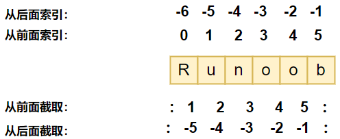

## 目录

  - Python简介
    - Python的语言性质
    - 优点
    - 缺点
  - Python语法
    - Python规定
      - 标识符规定
      - 关键字规定
      - 代码块规定（缩进规定）
      - 空行规定
      - 标准数据类型规定
        - 数字类型规定
        - 字符串规定
        - 列表规定
          - 对列表中的元素的编辑操作相关函数
        - 元组规定
        - 集合规定
        - 字典规定
    - 命令行窗口指令
      - 查看Python版本
      - 运行Python文件(.py文件)
    - 一行多条命令语法
    - 长句分行语法
    - 多个语句构成代码组语法
    - 设置输出字符串的格式
    - 使用format输出多个变量
    - 运算符
    - 一些转义符号
  - Python关键字使用
    - 指向Python解释器地址（Windows下可以忽略）
- 第一行注释标的是指向 python 的路径，告诉操作系统执行这个脚本的时候，调用 /usr/bin 下的 python 解释器。
- 另一种写法：
- 这种写法（更推荐）先在env（环境变量）设置里查找 python 的安装路径，再调用对应路径下的解释器程序完成操作。
      - 库函数与库属性的调用
      - 对组件（module）文件的调用
      - 定义库的属性
    - 使用def关键词自定义函数
    - 声明变量
    - 使用print输出
- 换行输出
- 不换行输出
- 能够输出表达式
- 能够直接输出字符串
- 字符串也能使用加法
- 输出HelloWorld，中间没有空格
    - 类型强制转换
- 结果为11，为字符串的字符数。
    - for语句循环
    - while语句循环（使用break和continue跳出循环）
    - 使用dir()函数查询库的函数
    - 使用lambda关键字定义带返回值函数
    - 使用map()函数调用函数/为列表转换类型
    - 使用filter()函数调用函数
    - 变量的定义域与global关键字
    - 使用input函数获取字符串输入（可转换为列表或者其他形式）
      - 把字符串转换为列表再转换为数字列表再转换为ndarray数组的方法
      - 把整数转化为字符串再转换为单个数字组成的数组
      - 在输出字符串时直接把特定类型的数字转化为字符串的简易操作（不使用format）
    - Python正则表达式（下列函数的操作对象均为字符串类型）
      - findall()函数
      - search()函数
      - .string属性
      - .compile()属性和match()函数
      - split()函数（把字符串转化为列表）
      - join()函数（把列表合并转化为字符串）
      - sub()函数
      - Python特有的正则表达式对应字符表
    - 生字符串
    - 使用random库中的函数生成随机数
    - 使用NumPy库
      - 创建NumPy数组
      - 创建NumPy本征数组/NumPy矩阵（intrinsic NumPy array creation）
      - NumPy的数组类ndarray对象的属性
      - NumPy数组/本征数组的基本运算
      - 对NumPy数组进行索引、切片、迭代（indexing, slicing, iterating）
      - 使用for循环输出所有行/元素
      - 操作NumPy数组的shape（shape manipulation）
      - 合并（stack）多个不同的NumPy数组
      - 使用NumPy数组充当索引（高级索引）
      - 对NumPy进行线性代数的操作
      - NumPy数组类型（ndarray）和列表类型（list）和矩阵类型（matrix）之间互相转换
      - 统计NumPy数组中的符合条件的元素个数
      - 通过NumPy库得到当前日期
      - 使用NumPy库的random.random()函数生成元素为随机数的矩阵
      - 使用NumPy库的random.randn()函数标准正态化（normalize）矩阵
      - 使用NumPy库的random.uniform()函数生成随机数组（附带：取小数的整数部分的多种方法）
      - 使用NumPy库的random.normal()函数生成符合正态分布的随机数组
    - 使用Python自带的.count()函数来统计列表中指定元素的元素个数
    - 将多个列表合并为一个列表的多种方法
    - 补充：使用Python自带的.replace()函数来替换字符串中的指定内容
    - 补充：移除列表中特定的多个元素（通过循环2次）
    - 对字符串中的具有一定长度的重复字符进行计数
    - 单个[数字]（例如[1]）的用法
    - 使用Python的os库对电脑本地的文件进行处理
      - 打开txt文件
      - 读取txt文件
      - 读取txt文件内容并转换为NumPy数组并将改动后的内容输出回原文件
      - 将列表中的字符串写入文件
      - 某个字符的对应编码不存在，无法写入的方法
      - 批量读取txt文件
      - 将印象笔记转换为习惯的markdown语法（主要是关于 * 的处理）
    - 使用Collections库处理结构化的数据
      - namedtuple
      - Counter
      - ChainMap
      - defaultDict
      - OrderedDict
    - 使用Python读取和操作文件
    - 使用自带的Json库（JavaScript Object Notation）来处理数据
    - 使用自带的CSV库（Comma Separated Values）来处理数据
    - 使用Pandas库来处理数据
      - Pandas库的Series对象
      - Pandas库补充
    - 使用Matplotlib库来进行画图
  - Python面向对象编程（object oriented programming）
    - python面向对象技术
      - 自定义类的继承
  - Python捕获异常调试方法（testing, debugging, exceptions, assertions）

## Python简介

### Python的语言性质

- Python 是一种解释型语言

这意味着开发过程中没有了编译这个环节。类似于PHP和Perl语言。

- Python 是交互式语言

这意味着，您可以在一个 Python 提示符 >>> 后直接执行代码。也可以使用脚本（script）的方式一次执行多个语句。

- Python 是面向对象语言

这意味着Python支持面向对象的风格或代码封装在对象的编程技术。

- Python 是初学者的语言

Python 对初级程序员而言，是一种伟大的语言，它支持广泛的应用程序开发，从简单的文字处理到 WWW 浏览器再到游戏。

### 优点

- 简单 -- Python 是一种代表简单主义思想的语言。阅读一个良好的 Python 程序就感觉像是在读英语一样，尽管这个英语的要求非常严格！Python 的这种伪代码本质是它最大的优点之一。它使你能够专注于解决问题而不是去搞明白语言本身。

- 易学 -- 就如同你即将看到的一样，Python 极其容易上手。前面已经提到了，Python 有极其简单的语法。

- 免费、开源 -- Python 是 FLOSS（自由/开放源码软件）之一。简单地说，你可以自由地发布这个软件的拷贝、阅读它的源代码、对它做改动、把它的一部分用于新的自由软件中。FLOSS 是基于一个团体分享知识的概念。这是为什么 Python 如此优秀的原因之一——它是由一群希望看到一个更加优秀的 Python 的人创造并经常改进着的。

- 高层语言 -- 当你用 Python 语言编写程序的时候，你无需考虑诸如如何管理你的程序使用的内存一类的底层细节。

- 可移植性 -- 由于它的开源本质，Python 已经被移植在许多平台上（经过改动使它能够工作在不同平台上）。如果你小心地避免使用依赖于系统的特性，那么你的所有 Python 程序无需修改就可以在下述任何平台上面运行。这些平台包括 Linux、Windows、FreeBSD、Macintosh、Solaris、OS/2、Amiga、AROS、AS/400、BeOS、OS/390、z/OS、Palm OS、QNX、VMS、Psion、Acom RISC OS、VxWorks、PlayStation、Sharp Zaurus、Windows CE 甚至还有 PocketPC、Symbian 以及 Google 基于 Linux 开发的 Android 平台！

- 解释性 -- 这一点需要一些解释。一个用编译性语言比如 C 或 C++ 写的程序可以从源文件（即 C 或 C++ 语言）转换到一个你的计算机使用的语言（二进制代码，即0和1）。这个过程通过编译器和不同的标记、选项完成。当你运行你的程序的时候，连接/转载器软件把你的程序从硬盘复制到内存中并且运行。而 Python 语言写的程序不需要编译成二进制代码。你可以直接从源代码运行程序。在计算机内部，Python 解释器把源代码转换成称为字节码的中间形式，然后再把它翻译成计算机使用的机器语言并运行。事实上，由于你不再需要担心如何编译程序，如何确保连接转载正确的库等等，所有这一切使得使用 Python 更加简单。由于你只需要把你的 Python 程序拷贝到另外一台计算机上，它就可以工作了，这也使得你的 Python 程序更加易于移植。

- 面向对象 -- Python 既支持面向过程的编程也支持面向对象的编程。在“面向过程”的语言中，程序是由过程或仅仅是可重用代码的函数构建起来的。在“面向对象”的语言中，程序是由数据和功能组合而成的对象构建起来的。与其他主要的语言如 C++ 和 Java 相比，Python 以一种非常强大又简单的方式实现面向对象编程。

- 可扩展性 -- 如果你需要你的一段关键代码运行得更快或者希望某些算法不公开，你可以把你的部分程序用 C 或 C++ 编写，然后在你的 Python 程序中使用它们。

- 丰富的库 -- Python 标准库确实很庞大。它可以帮助你处理各种工作，包括正则表达式、文档生成、单元测试、线程、数据库、网页浏览器、CGI、FTP、电子邮件、XML、XML-RPC、HTML、WAV 文件、密码系统、GUI（图形用户界面）、Tk 和其他与系统有关的操作。记住，只要安装了 Python，所有这些功能都是可用的。这被称作 Python 的“功能齐全”理念。除了标准库以外，还有许多其他高质量的库，如 wxPython、Twisted 和 Python 图像库等等。

- 规范的代码 -- Python 采用强制缩进的方式使得代码具有极佳的可读性。

### 缺点

- 运行速度，有速度要求的话，用 C++ 改写关键部分吧。

- 国内市场较小（国内以 Python 来做主要开发的，目前只有一些 web2.0 公司）。但时间推移，目前很多国内软件公司，尤其是游戏公司，也开始规模使用他。

- 中文资料匮乏（好的 Python 中文资料屈指可数，现在应该变多了）。托社区的福，有几本优秀的教材已经被翻译了，但入门级教材多，高级内容还是只能看英语版。

- 构架选择太多（没有像 C# 这样的官方 .net 构架，也没有像 ruby 由于历史较短，构架开发的相对集中。Ruby on Rails 构架开发中小型web程序天下无敌）。不过这也从另一个侧面说明，python比较优秀，吸引的人才多，项目也多。

## Python语法

### Python规定

#### 标识符规定

- 第一个字符必须是字母表中字母或下划线 _ 。

- 标识符的其他的部分由字母、数字和下划线组成。

- 标识符对大小写敏感。

- 在 Python 3 中，可以用中文作为变量名，非 ASCII 标识符也是允许的了。

#### 关键字规定

关键字即保留字，我们不能把它们用作任何标识符名称。Python 的标准库提供了一个 keyword 模块库，可以输出当前版本的所有关键字：

```
import keyword
keyword.kwlist

输出：['False', 'None', 'True', 'and', 'as', 'assert', 'break', 'class', 'continue', 'def', 'del', 'elif', 'else', 'except', 'finally', 'for', 'from', 'global', 'if', 'import', 'in', 'is', 'lambda', 'nonlocal', 'not', 'or', 'pass', 'raise', 'return', 'try', 'while', 'with', 'yield']
```

#### 代码块规定（缩进规定）

python最具特色的就是使用缩进来表示代码块，不需要使用大括号（`{}`）。

缩进的空格数是可变的，但是同一个代码块的语句必须包含相同的缩进空格数。如果需要的缩进不一致，则执行会发生错误。

例子：

```
if x>0:
# 记得条件语句后加冒号":"
  print("1")
  print("0")
else
  print("0")
  print("1")
```

#### 空行规定

空行是非必要的，但它在开发者之间有默认的规定。

函数之间或类的方法之间用空行分隔，表示一段新的代码的开始。类和函数入口之间也用一行空行分隔，以突出函数入口的开始。

空行与代码缩进不同，空行并不是 Python 语法的一部分。书写时不插入空行，Python 解释器运行也不会出错。但是空行的作用在于分隔两段不同功能或含义的代码，便于日后代码的维护或重构。

记住：空行也是程序代码的一部分。

***
***
***

#### 标准数据类型规定

Python3 中有六种标准的数据类型：

- Number（数字）

- String（字符串）

- List（列表）

- Tuple（元组）

- Set（集合）

- Dictionary（字典）

Python3 的六个标准数据类型中：

不可变数据：Number（数字）、String（字符串）、Tuple（元组）。

元组、字符串、数值类型是不可变的（immutable），不能再创建后进行更改。

可变数据：List（列表）、Dictionary（字典）、Set（集合）。

列表、字典、集合属于可变的（mutable），可以在创建后进行更改。


更改操作包括：更改元素内容，删除元素。

更改操作不包括：删除整个整体，对整体进行加法和乘法。

##### 数字类型规定

python中数字（Number）数据类型分为四种类型：整数、布尔型、浮点数和复数。

- int (整数)，如1。python3只有一种整数类型 int，int在python3中表示为长整型，没有 python2 中的 Long。

- bool (布尔)，如 True。

- float (浮点数)，如 1.23、3E-2。

- complex (复数)，如 1 + 2j、1.1 + 2.2j。

##### 字符串规定

Python 中单引号 ```'``` 和双引号 ```"``` 使用是完全相同的。

使用三引号(```'''``` 或 ```"""```)可以指定一个多行字符串（也就是分为多行的字符串段落）。

转义符为 ```\```。

反斜杠```\```可以用来转义，使用 r 可以让反斜杠不发生转义（这里的 r 指 raw，即raw string，会自动将反斜杠```\```转义）。 如 ```r"this is a line with \n"``` 则 ```\n``` 会显示，而不是换行符。

按字面意义级联字符串，如 "this " "is " "string" 会被自动转换为 this is string。

字符串可以用 ```+``` 运算符连接在一起，用 ```*``` 运算符重复。

Python 中的字符串有两种索引（indexing）方式，从左往右以 0 开始，从右往左以 -1 开始。

Python 中的字符串不能改变。因此只能通过先转为列表类型进行修改，再转化合并为字符串。

Python 没有单独的字符类型，一个字符就是长度为 1 的字符串。

字符串的截取的语法格式如下：`变量[头下标:尾下标:步长]`。

切片（slicing）例子：

```py
str = '我是字符串'
print (str)       # 输出字符串
print (str[0:-1]) # 输出第一个到倒数第二个的所有字符
print (str[0])    # 输出字符串第一个字符
print (str[2:5])  # 输出从第三个开始到第五个的字符
print (str[2:])   # 输出从第三个开始的后的所有字符
print(str[1:5:2]) # 输出从第二个开始到第五个且每隔一个的字符（步长为2）
print (str*2)     # 输出
83字符串两次，也可以写成 print(2*str)
print (str+"TEST")# 连接字符串
```



***

##### 列表规定

List（列表） 是 Python 中使用最频繁的数据类型。它与数组比较相似。

列表可以完成大多数集合类的数据结构实现。列表中元素的类型可以不相同，它支持数字，字符串甚至可以包含列表（所谓的嵌套），但是一般不会这么做。

列表是写在方括号`[]`之间、用逗号分隔开的元素列表。

和字符串一样，列表同样可以被索引和截取，列表被截取后返回一个包含所需元素的新列表。索引值以0为开始值，-1为从末尾的开始位置（和字符串一样）。

定义空列表的方法为`列表名=[]`

注意：与Python字符串不一样的是，列表中的元素是可以改变的。

列表截取的语法格式如下：

```
变量[头下标:尾下标]
```


切片例子：

```
list = [ 'abcd', 786 , 2.23, 'runoob', 70.2 ]
tinylist = [123, 'runoob']

print (list)            
# 输出完整列表

print (list[0])         
# 输出列表第一个元素，当要求输出第-1个元素，默认是最后一个元素

print (list[1:3])       
# 从第二个开始输出到第三个元素

print (list[2:])        
# 输出从第三个元素开始的所有元素

print(list[:3])         
# 输出从第一个元素到第三个元素

print（list[1:5:2]）    
# 代表起始为第一项，上限为第5项，2代表2倍公差

print（list[::-1]）     
# 代表公差为负一倍，起始和上限不设限制，因此效果为1倍公差的反顺序排列，也就是反转数组中的所有元素的顺序

print (tinylist * 2)    
# 输出两次列表，等效于tinylist + tinylist。

print (list + tinylist) 
# 连接列表，将两个list的元素合成为一个新的list，以+号前后顺序合成。

print(list[(list >= 0) & (list <= 10)])
# 通过直接对整个列表的所有值的条件判断，得到所有符合条件的索引值，然后根据索引值得到所有符合条件的列表元素值。
# 从这里可以看出，列表和集合均可以使用逻辑运算符对整个列表或集合进行操作。
```

***

###### 对列表中的元素的编辑操作相关函数

对列表中的元素的编辑操作（包括append函数，insert函数，del关键字，pop函数，remove函数）：

```py
# 以下操作逐条运行，观察各个函数的作用。

fruit=["12","14","16"]
fruit.append("apple")
print(fruit)
# 添加列表元素，输出结果为["12","14","16","apple"]
# append会修改列表本身，并且返回None。不能把返回值再赋值给列表本身，否则列表会变成None类型而不是列表类型。

fruit.insert(0,"peer")
# 插入成为指定索引的列表元素，输出结果为["peer","12","14","16","apple"]

del fruit[1]
# 删除特定索引的列表元素，输出结果为
["12","14","16","apple"]

a=fruit.pop()
b=fruit.pop(0)
print(a)
print(b)
# 删除特定索引的列表元素（默认为最后一个元素）并赋值给变量
# 输出：
apple
12

fruit.remove("14")
print(fruit)
# 移除一个指定名字的列表元素，输出结果为：
["16"]
```

使用sort函数进行排序和反排序：

```py
a=["b","a","d"]
b=[3,1,2]

a.sort()
b.sort()
# 注意.sort()函数会改变列表本身，而这个函数的返回值为None，也就是如果x=a.sort()，那么x会变成None，因此不能进行赋值操作。

print(a)
print(b)
# 按照字母表的顺序进行排序，输出结果为：
["a","b","d"]
# 相当于print(sorted(a))

a.sort(reverse=True)

# 按照与原来字母表的顺序进行反向排序，输出结果为：
# ["d","b","a"]

# 相当于：

print(sorted(a,reverse=True))
```

使用range函数得到等差数列，并进行格式转换转换为列表的形式：

```
a=list(range(10)) # 单个参数代表上限，默认起始等于0，公差为1

b=list(range(0,100,5)) 
# 三个参数分别为起始，上限，公差。
# 起始默认为0。
# 当公差为-1时，需要将上限和下限的值互换才能形成倒序等差数列。

# range函数得到的并不是list类型，但与其比较相似。因此可以将其转化为list类型输出。
```

使用len函数，max函数，min函数得到列表的信息：

```
print(len(L)) # 列表中的元素个数
print(max(L)) # 列表元素中的最大值
print(min(L)) # 列表元素中的最小值
```

使用in和not in判断列表中是否存在某元素：

```
x=[1,2,3]

if 1 in x:
  print('1存在！')
if 4 not in x:
  print('4不存在！')
```

##### 元组规定

元组（tuples）与列表类似，不同之处在于元组的元素不能修改。元组写在小括号`()`里，元素之间用逗号隔开。或者用`tuple()`转化其他interable的数组。

元组中的元素类型也可以不相同。

例子：

```
tupleA = ( 'abcd', 786 , 2.23, 'runoob', 70.2  )
tinytupleA = (123, 'runoob')

print (tupleA)              
# 输出完整元组
print (tupleA[0])           
# 输出元组的第一个元素
print (tupleA[1:3])         
# 输出从第二个元素开始到第三个元素
print (tupleA[2:])          
# 输出从第三个元素开始的所有元素
print (tinytupleA * 2)      
# 输出两次元组
print (tupleA + tinytupleA) 
# 连接元组（不违背不可变的属性）
```

元组与字符串类似，可以被索引且下标索引从0开始，-1 为从末尾开始的位置。也可以进行截取。可以把字符串看作一种特殊的元组。因此元组符合上述的字符串的所有性质。

虽然tuple的元素不可改变，但它可以包含可变的对象，比如list列表。

构造包含 0 个或 1 个元素的元组比较特殊，所以有一些额外的语法规则：

```
tupA = ()    # 空元组

tupB = (20,) # 仅一个元素，需要在元素后添加逗号
```

删除整个元组（不能删除元组的元素）：

```
del tupC
```

注意：string（字符串）、list（列表）和 tuple（元组）都属于 sequence（序列）。

排序整个元组：

```py
def Find_last(n):
    return n[-1]
# 定义一个找出最后元素的函数

def sort_tuple_list(x):
    return sorted(x, key=Find_last,reverse=false)
    # sorted有三个参数，其中两个为可选参数。
    # key指定了从每个列表元素中提取比较键从而进行比较的参数（这个参数是一个函数）。

    return sorted(x,key=lambda x:x[-1],reverse=false)
    # 直接使用lambda定义一个函数作为参数，就不用再特意定义另一个函数了

a=[(2, 5), (1, 2), (4, 4), (2, 3), (2, 1)]
print(sort_tuple_list(a))
```

***

##### 集合规定

集合（set）是由一个或数个形态各异的大小整体组成的，构成集合的事物或对象称作元素或是成员。

集合的基本功能是进行成员关系测试和删除重复元素（集合不允许有重复的元素）。

可以使用大括号 `{}`或者 `set()`函数创建集合，注意：创建一个空集合必须用`set()`函数而不是`{}`，因为`{}`是用来创建一个空字典的。集合和字典均使用`{}`括住。

创建例子：

```py
parame = {value01,value02,...}

a=[1,2,3]

b="abc"

set(a)
# 等于{1,2,3}
set(b)
# d等于{'a','b','c'}
# set()函数仅能有一个参数，这个参数是interable的，也就是可以被分割为集合元素的。
```

使用例子：

```
sites = {'Google', 'Taobao', 'Runoob', 'Facebook', 'Zhihu', 'Baidu'}

print(sites)   
# 输出集合，注意重复的元素被自动去掉

if 'Runoob' in sites :
    print('Runoob 在集合中')
else :
    print('Runoob 不在集合中')
# 成员测试

a = set('abracadabra')
b = set('alacazam')

# 集合可以进行操作符运算（列表也可以）：

print(a - b)  # a 和 b 的差集

print(a | b)  # a 和 b 的并集（无重复）

print(a & b)  # a 和 b 的交集

print(a ^ b)  # a 和 b 中不同时存在的元素
```

使用.difference_update()函数，使集合删去与另一个集合的重叠元素：

```
Set_1={1,2,3,4,5}
Set_2={4,5,6,7,8}

print(Set_1-Set_2)
# 输出集合删去与另一个集合的重叠元素的集合

Set_1.difference_update(Set_2)
# 这个函数直接对原集合进行操作

print(Set_1)
# 输出集合删去与另一个集合的重叠元素的集合
```

其他对集合的操作函数：

```
Set_1={1,2,3}

Set_1.add(4)
# 使用add()函数添加单个元素

Set_1.update([5,6,7])
# 使用update()函数添加多个元素

Set_1.pop()
# 删除集合中最后一个元素

Set_1.remove(1)
# 删除集合中的指定元素

Set_1.remove([2,3,4])
# 删除多个集合中的指定元素

Set_1.clear()
# 清空集合元素

del Set_1
# 删除整个集合
```

##### 字典规定

字典（dictionary）是Python中另一个非常有用的内置数据类型。

列表是有序的对象集合，字典是无序（其实是因为不需要索引）的对象集合，实际上，字典可以视作连个列表的组合。

两者之间的区别在于：字典当中的元素是通过键来存取的，而不是通过偏移存取。

字典是一种映射类型，字典用`{}`标识，它是一个无序的```键(key) : 值(value)```的集合。也就是说，一个字典里有复数的键和值组合，每个键和每个值必须是一一对应的。

键(key)必须使用不可变类型，在同一个字典中，键(key)必须是唯一的（不可重复的）。

例子：

```py
dict ={} #空字典
dict['one'] = "教程" 
# 创建一个键和一个值，并建立这个键与这个值的对应关系
dict[2] = "工具" 
# 创建一个键和一个值，并建立这个键与这个值的对应关系

dict2 = {'name': 'runoob','code':1, 'site': 'www.runoob.com'}


print (dict['one'])       
# 输出键为 'one' 的值

print (dict[2])           
# 输出键为 "2" 的值（注意不是整个键值对）

print (dict2)          
# 输出完整的字典

print (list(dict2.keys()))   
# 输出所有键组成的列表

print (list(dict2.values()))
# 输出所有值组成的列表

print(dict2)
# 输出所有键值对

print (dict2.get("3","无"))
# 输出键为"3"值，若没有键为"3"的值,则输出"无"

print(dict2.items())
# 字典名.items()代表的是以字典中的每个键值对形成的二元元组为每个元素的列表，也就是将字典转换为列表。

# 输出：

教程
工具
{'name': 'runoob', 'code': 1, 'site': 'www.runoob.com'}
dict_keys(['name', 'code', 'site'])
dict_values(['runoob', 1, 'www.runoob.com'])
# 字典由两个列表组成，这里的两个输出应该就是这两个列表
```

通过类型转换函数`dict()`（类似于`str()`）可以直接从键值对序列中构建字典。

例子：

```
dict([('Runoob', 1), ('Google', 2), ('Taobao', 3)])
{'Runoob': 1, 'Google': 2, 'Taobao': 3}

# dict函数用法1，参数使用逗号,进行赋值。

dict(Runoob=1, Google=2, Taobao=3)
# {'Runoob': 1, 'Google': 2, 'Taobao': 3}

# dict函数用法2，参数使用赋值号=进行赋值

>>> {x: x**2 for x in (2, 4, 6)}
{2: 4, 4: 16, 6: 36} 

#使用了字典推导式，推导式不止这一种
```

另外，字典类型也有一些内置的函数，例如 clear()、keys()、values() 等。

字典还可以临时增加新的键值对等功能，例子如下：

```py
dict2["键"]="值"

dict2.update({"键":"值"})

# 上述两种形式都可以给字典dict2添加新的键值对，也可以对旧的键值对进行修改

del dict2["键"]
# 移除某个键值对

dict2.pop("键")
# 移除某个键值对

# 上述两种形式均可以删除键值对。

a=",".join(dict2.keys)
print({}.format(a))

# 使用join，使format输出以双引号里的字符","作为间隔输出括号内的参数列表
# join用于转化列表为字符串，分隔符.join(列表名)
```

字典只可以增加键值对，也可以移除键值对，想要达到删去某项的操作，可以另建一个字典。

```py
x={'c1': 'Red', 'c2': 'Green', 'c3': None}
# 定义一个字典，目的是得到它去掉值为空的键值对的字典。

y={key:value for (key,value) in x.items() if value != None}
# 将x中值不为None（也就是不为空）的键值对加入到字典y中。

print(y)

# 输出：

{'c1': 'Red', 'c2': 'Green'}
```

也可以通过某些指令达到移除字典某个键，从而达到移除键值对的目的：

```
x={'A':1,'B':2,'C':3,'D':4,'E':5,'F':6}
# 创建字典

print(x.pop('F'))
# pop()语句会将字典内键名与参数一致的键值对移除，并返回键值对的值。

print(x.popitem())
# popitem()语句会将字典内随机一对键值对移除，并以元组的形式返回被移除的键值对。

del x['A']
# del语句会将字典内键名与[]中的参数一致的键值对移除。

x.clear()
# clear()语句会将字典中的所有键值对移除。

del x
# 完全删除这个字典，这个字典不再有定义。
```

### 命令行窗口指令

#### 查看Python版本

语法：

```python -V```

或者

```python --version```

#### 运行Python文件(.py文件)

语法：

```$ python 文件名.py```

例子：

```
$ python hello.py
```

#### 命令行参数（查看Python文件参数）

可以先不学习。

### 注释语法

语法：

```#注释```

```
'''
注释
'''
```

```
"""
注释
"""
```

例子：

```
#这是一条注释，注释会被编译器忽略。
```

```
'''
这是一条注释，注释会被编译器忽略。
'''
```

```
"""
这是一条注释，注释会被编译器忽略。
"""
```

### 一行多条命令语法

Python 可以在同一行中使用多条语句，语句之间使用分号```;```分割。

例子：
```
import sys; x = 'runoob'; sys.stdout.write(x + '\n')
# 输出为:runoob
```

### 长句分行语法

Python 通常是一行写完一条语句，但如果语句很长需要断开，可以使用反斜杠（`\`）来实现多行语句。

语法：

```
语句第一部分\
语句第二部分\
语句第三部分
```

例子：

```
Sum=x+\
   y+\
   z
```

注意：在`[]、{}、()`中的多行语句断开，就不需要使用反斜杠（`\`），例如数组。

### 多个语句构成代码组语法

缩进相同的一组语句构成一个代码块，我们称之代码组。注意空格和Tab本质上是不同的（Tab的字面效果看起来像是4个空格，在某些环境下这两者仍然不能等效）

像if、while、def和class这样的复合语句，首行以关键字开始，以冒号( ```:``` )结束，该行之后的一行或多行代码构成代码组。

我们将首行及后面的代码组称为一个子句(clause)。

例子：

```
if expression : 
   suite
elif expression : 
   suite 
else : 
   suite
   
# 注意：同级别的if和elif和else是属于同一代码块的，因此缩进相同。
```

### 设置输出字符串的格式

例子：

```
x="WE study in"

x=x.lower()
print(x)

# 输出为we study in（.lower()代表全部小写）

y="scut"

y=y.upper()
print(y)

# 输出为SCUT（.upper()代表全部大写）

z=x+y

z=z.title()
print(z)

# 输出为"We Study In Scut"（.title()代表每个单词开头大写，其余小写）

a=" python "

a=a.rstrip()
print(a)

# 输出为" python"，右边多余的空格被除去了。

a=a.lstrip()
print(a)

# 输出为"python "，左边多余的空格被除去了。

a=a.strip()
print(a)

# 输出为"python"，多余的空格都被除去了。
```

### 使用format输出多个变量

具有四种用法：

```
A="Odin"
B="Luo"

I="My name is {first} {last}".format(first=A,last=B)
# 根据变量名输出变量/字符串

I="My name is {0} {1}".format(first,last)
# 根据编号输出变量

I="My name is {} {}".format(first,last)
# 直接输出变量

I="My name is {} {}".format("Odin","Luo")
# 直接输出字符串

# 可以看出，大括号{}代表了给变量或者字符串预留的位置，默认是按顺序。

# 或者：

print(f"My name is {A} {B}")

print(f"My name is {A:,.2f} {B}")
```

在输出时，大括号内可以填入对变量的格式和小数点位数的要求，以冒号`:`开头，后面添加代表不同效果的关键字。

如：

```
# {}代表不作处理

# {:.2f}代表输出的是浮点数，保留一位小数。大括号内冒号后跟关键字的格式":xxx"代表的是不同的参数，例如".2f"代表保留两位小数。

# {:,.2f}代表输出的浮点数，保留一位小数，逗号","的作用是在整数部分添加千位分隔符。

# {:5}代表输出一共占据"5"个字符，空缺使用空格填补。

# {:30,.4f}代表一共占据30个字符，使用千分号分隔，且精确到4位小数

b: 输出整数的二进制方式；

c: 输出整数对应的 Unicode 字符；

d: 输出整数的十进制方式；

o: 输出整数的八进制方式；

x: 输出整数的小写十六进制方式；

X: 输出整数的大写十六进制方式；
```

### 运算符

加号：```+```

减号：```-```

乘号：```*```

除号（结果为浮点数）：```/```

除号（结果为整数，向下取整，称为Floor Division）：```//```

取余号：```%```

次方号（Power）：```**```

次序为：括号`()` > 次方号 `**` > 乘号与除号 `* 和 /` > 加法与减法 `+ 和 -`

***

特殊用法：

与C++类似，有运算符与赋值符号相结合的用法：

```
x = x+1
# 等效于：
x += 1

x = x-1
# 等效于：
x -= 1

x = x*2
# 等效于：
x *= 2

x = x/2
# 等效于：
x //= 2

```

有赋值号`=`和等于号`==`，也有`is`和`is not`起到判断的作用。

`is`用于判断两个变量引用对象是否为同一个，`==`用于判断引用变量的值是否相等（某些情况这两个用法相同）。

### 一些转义符号


## Python关键字使用

### 指向Python解释器地址（Windows下可以忽略）

语法：

```#!路径```

通常写在代码的第一行，是有执行效力的注释。

例子：

```
#!/usr/bin/python3
# 第一行注释标的是指向 python 的路径，告诉操作系统执行这个脚本的时候，调用 /usr/bin 下的 python 解释器。
# 另一种写法：

#!/usr/bin/env python3
# 这种写法（更推荐）先在env（环境变量）设置里查找 python 的安装路径，再调用对应路径下的解释器程序完成操作。
```

### 库的引用（import）

语法：

```import 库名```

```from 库名 import *```

```from 库名 import 函数名1，函数名2，函数名3```

例子：

```
import cv2 
# cv2为opencv中的一个库，将整个cv2导入，包括所有函数和变量（属性）

import cv2 as C
# 为库名的调用赋予一个别名（alias）"C"，调用"cv2.函数名"应当写成"C.函数名"。

from cv2 import * 
# 将cv2中的全部函数导入，也就是默认下面的所有在cv2库中同名的函数均调用cv2库中的，而不是其他库或者自带的。（例如NumPy库中的random函数和random库中的random函数）

from cv2 import imread,waitKey 
# 只从cv2中导入名为imread和waitKey的函数

from cv2 import imread as I
# 为调用的函数"imread"的调用赋予一个别名"I"，"cv2.imread()"可以写成"cv2.I()"
```

#### 库函数与库属性的调用

```py
import cv2

cv2.imread(filename,flags) # cv2是关键词，读取加载图片
cv2.waitKey(secondnumber) # 等待图片的关闭，单位为毫秒

(a,b,c)=img.shape # img不是关键词，是图片的文件名，赋值图片的高、宽和通道数
print(img.shape) # 打印图片的高、宽和通道数（图片为灰度图像时通道数为1，不显示），注意.shape代表的是属性而不是函数，因此没有参数。

# 注意.shape属性也是cv2库里定义的，但它没有固定的关键词。cv2.是固定的关键词，表明此函数出自"cv2"这个库，这避免了两个库的函数命名重复时的冲突问题。
```

#### 对组件（module）文件的调用

一个组件（module）是一个以.py为结尾的文件，库则是对于封装完备的组件的称呼。调用库就是调用组件。

#### 定义库的属性

```
mod={"name":"Odin","age":18}
# 写在myLib.py中

import myLib

a=myLib.mod["name"]
# 进行调用的文件
```

### 使用def关键词自定义函数

语法：

```
def function_name(parameters):
   expressions
```

例子：

```py
def refun(a='value'): 
# 不需要指定变量类型，'value'是缺省值，在缺少参数时采用，如果没有缺省值必须有确切的参数。一般可以仅写(a)（也就是不设缺省值）。如果不清楚
   
   """
   I
   am
   a 
   simple 
   greeting
   """
   
   # 三个单引号或者双引号，定义了一个"可直接跨行"字符串（其实可以叫做字符段了），因此常常用作注释说明函数的功能。
   
   print("You input is:")
   print(a) # 注意缩进一致才是函数的内容
   return a # return代表返回值，可写可不写，写了的话这个函数就可以当作一个值进行调用和使用，但是函数的语句仍会得到执行。

b='cat'
refun(b[:]) 
# 调用函数，如果想要更详细，可以精确指定形式参数的值，也就是refun(a='cat')。[:]代表传递的是副本而不是参数本身，可以不加。
```

注意python的函数调用会对传递的形式参数的本身造成影响，不像c++的副本建立。要仅传递副本而不是本身，要在调用函数时的被传递参数后面加`[:]`。

***

定义和调用函数时有位置参数（positional argument）、可变参数/任意参数（arbitrary argument）、关键字参数（keyword argument）。

位置参数和普通的参数一样。可变参数和关键字参数均为接收数量不定的多个参数时使用。这里的多个指的是形式参数的个数而不是一个参数里有多少个元素

任意参数的定义和调用方式为：

```py
def refun(b,*a)
# 在未知参数数量时使用，可以自动将输入多的参数转化为一个元组。

my_tuple=("1","2","3")
refun(*my_tuple)
# 等同于refun("1","2","3")
```

关键字参数的定义和调用方式为：

```
def refun(b,**a)
# 在未知参数数量时使用，可以自动将输入多的参数转化为一个字典。

my_dict=("1":"2","abc":4)
refun(**my_dict)
# 等同于refun(1="2",abc=4)
```

***

函数注解（function annotations）是非必要的，它指定了函数的参数和返回的类型。

语法：

```py
def refun(name:str) -> str
  return "Hello" + str(name) + "!"
# 形式参数的":str"指定了传递的参数为字符串类型。# 函数定义的后面的"-> str"指定了返回的变量为字符串类型。
# 使用"+"连接字符串和变量进行输出/返回。因为return语句不能使用format，因此一般只能使用"+"进行字符串和变量的连接。除此之外，因为直接返回变量，变量不会被自动转化为字符串类型，因此一般数值型变量需要使用str()转化才能输出。
```

***

在MATLAB的自定义函数的形式参数中，使用中括号`[]`将会被认为是"非必须"的，或者说是"可选的"形式参数。

在Python中，通过直接设置形式参数的默认值/缺省值，达到可选参数的效果。

```
def Function_1(a,b=10,c=100)
# a为必须，b和c均为可选的，可选的参数一定需要设置缺省值作为用户未传递参数值时的值。
```

***

### 声明变量

Python声明变量不需要表明变量类型，只需要表明变量名。

Python 中的变量不需要声明。每个变量在使用前都必须赋值，变量赋值以后该变量才会被创建。

在 Python 中，变量就是变量，它没有类型，我们所说的"类型"是变量所指的内存中对象的类型。

语法：

```
# 给单个变量定义并赋值语法

a=5

x=0.5

y="hello"

z=True

# 同时给多个变量定义并赋值语法

a = b = c = 1

a, b, c = 1, 2, "runoob"
```

- 变量的声明：用于向程序表明变量的类型和名字。

- 变量的定义：用于为变量分配存储空间，还可以为变量指定初始值。

- 变量的初始化：为变量指定初始值。

从广义的角度来讲声明是包含定义，即定义是声明的一个特例，但是并非所有的声明都包含定义。例如：```int a```它既是声明，同时又是定义。而```extern a```它只是声明不是定义。

一般的情况下，我们把建立空间的声明称之为"定义"，而把不需要建立存储空间的声明称之为"声明"。

变量的初始化，就很简单了，为变量声明或者定义之后，赋上初始值的过程，就是变量的初始化。

### 使用print输出

print 默认输出是换行的，如果要实现不换行需要在变量末尾加上`end=" "`。实际上，每个print语句输出的内容的最后面的字符默认为`"\n"`，也就是换行符（所以每次print都会换行）。而`end=" "`代表最后面的字符更改为空格，实际效果也就是不换行。

语法：

```print(变量名)```

例子：

```
a="Hello"
x="World"
y=1
z=2

# 换行输出
print( x )

# 不换行输出
print( x, end=" " )

# 能够输出表达式
print(y+z)

# 能够直接输出字符串
print("Hello World")

# 字符串也能使用加法
print(a+x)
# 输出HelloWorld，中间没有空格
```

例子：

```
for i in range(10,0,-1):
  print(' ' * (10-i),end="")
  # 空格不需要转义。
  print("*" * (i*2-1))
```

### 使用type函数和isinstance函数判别数字类型

语法：

```type(变量名)```

```isinstance(变量名, 判断的对象类型)```

例子：

```
a=5
print(type(a))
输出为：<class 'int'>

b=5
isinstance(a, int)
输出为：True
```

isinstance 和 type 的区别在于：

- type()不会认为子类是一种父类类型。

- isinstance()会认为子类是一种父类类型。

注意：

- Python3 中，bool 是 int 的子类，True 和 False 可以和数字相加。 例如判断`True==1`、`False==0` 会返回 True，但通过 ```is```来判断类型一般均为False。

例子：

```
1 is True
输出：False

0 is False
输出：False
```

- Python2 中，是没有布尔型的，它用数字 0 表示 False，用 1 表示 True。

### 使用del语句删除创建的对象

语法：

```del var1[,var2[,var3[....,varN]]]```

当你指定一个(初)值时，Number对象就会被创建。可以通过使用del语句删除单个或多个对象。

例子：

```
del var
del var_1, var_2
```

### 类型强制转换

语法：

```类型（变量名）```

例子：

```
x=20
x=str(x) #将整数x转化为string类型
```

### 使用len函数得到指定数据结构的长度/size

语法：```len(x)```

例子：

```
A="i am your father"
x=len(A)
print(x)

# 结果为11，为字符串的字符数。
```

### 逻辑运算符（not、and、or）

语法：

```not(x)```
```(x)and(y)```
```(x)or(y)```

例子：

```py
x=14
y=42

x_Divisible= (x%2)==0
y_Divisible= (y%3)==0
# 布尔变量赋值

not(x_Divisible and y_Divisible)
# and就是&&，'和'。

not((x%2)or(y%3))
# not就是逻辑取反，'非'。
# or就是或者，'或'。

输出：False
```

### for语句循环

注意for的计数器可以是字符串、列表之类的有序数据类型里面的元素索引，或者字典的键或值，又或者是其他东西，关键的是，它代表的必定是一个值或者元素，在每次循环自增，直到到达它代表的意义的最大值或者最后一个值。

注意for后面的计数器变量，在每次循环的开始，其值会刷新并固定（无论在上一次循环中它遭到什么变更），即使在某一次循环中对计数器变量进行修改，下一次循环中计数器变量也会遵循它本来的自增顺序应有的值。也就是说，for循环的每次循环的计数器变量的值是在for语句被编译的瞬间就已经固定了。

```py
for i in range(10):
# 第一次循环开始就是1，第二次循环开始就是2，第十次循环开始就是10。
  
  print(i)
  
  i=i-1
  # 使用此语句试图让i一直保持在同一个值，但是失败了
  # 此句的效果在下一次循环开始时失效（或者说，i的值可能类似于已经列出的一个列表，每次循环直接取用列表中的值，因此不能改变）

# 输出：
# 1 2 3 4 5 6 7 8 9 10

L_0=[(i+1) for i in range(10)]
# 其实在python中for前面也可以存在一个表达式，for...in和if...else实际上均为三元表达式。
# 以上这句话相当于：

L_0=[]
for i in range(10):
  L_0.append((i+1))
# 因此可以视作for循环语句的另一种便捷的表达方式。

```

注意：计数器被赋什么类型的值取决于in后面的数据类型，其必定为一个列表型数据而不是一个数。如果数据类型有序，则是按其顺序被赋值的。

语法：

```
for item in data_list:
  xxx
  xxx
  xxx
```

例子：

```
my_set{"apple","peach","lime"}
for f in my_set:
  print(f)
# 注意集合是无序的，输出集合里的所有元素。

my_dict={"apple":"red","peach":"pink"}
for f,c in my_dict.items():
  print(f"The Color of {f} is {c}")
# 字典的经典用法，字典名.items()代表的是以每个键值对元组为元素的列表

for i in range(5)
  print("{}的平方是{}".format(i,i**5))
# i会从0自增到4。这是range()的用法。

vocab={"apple","afternoon","aid"}
long_word={ w for w in vocab if len(w)>5}
print(long_words)
输出：'afternoon'
# 这是list comprehension的用法，也就是在定义第二个数据结构的同时使用for循环对引入的另一个数据结构的数据进行限定。
```

### while语句循环（使用break和continue跳出循环）

例子：

```
while i < 100:
  print("loop more 1 time")
  i=i+1

  if i <75:
    continue 
# 使用continue可以跳过当前的这一次循环的执行。

  if i > 50:
    break
# 使用break可以跳出一个大循环语句，而不是一次循环。
```

### 使用dir()函数查询库的函数

```
import platform

x=dir(platform)
print(x)
```

### 使用lambda关键字定义带返回值函数

```
x=lambda a,b : a * b

print(x(5,6))

# 输出为30。
# lambda其实就是简易地定义了一个带返回值的函数。
```

### 使用map()函数调用函数/为列表转换类型

```
语法：map(函数名，参数名)
作用：把传入序列的每一个序列应用传入函数并返回新的序列。

def twice(n)
  return n+n

number=(1,2,3)
result=map(twice,number)
print(list(result))
# 将"number"作为参数传递给函数"twice"。

number1=[1,2,3]
number2=[4,5,6]
result=map(lambda x, y:x+y, number1,number2)
print(list(result))
# 直接在map函数内定义一个具有两个参数的函数，并直接调用

a=["1","2","3"]
a=list(map(int,a))
# 输出为[1,2,3]
# map的特殊用法，将字符串列表类型转化为整数列表类型
```

### 使用filter()函数调用函数

```
语法：filter(函数名，参数名)

seq=[0,1,2,3,5,8,13]

result=filter(lambda x: x%2 !=0,seq)

print(list(result))
```

### 变量的定义域与global关键字

在python中，一个变量仅在包含它被创建的区域内可用（available），这被称为定义域（scope）。

局部定义域（local scope）：在函数的内部被定义的变量，其定义域为局部定义域，仅能在函数内部使用，和在函数中的函数中使用。（python允许在一个自定义的函数中自定义另一个函数，并立刻调用）

全局定义域（global scope）：在python的主体（main body）部分被定义的变量，其定义域称为全局定义域。其可以在主体部分以及任意函数中使用。

注意：在主体部分和函数内部定义的相同名字的变量，python将其视作两个完全不同的变量。在函数内部调用同名变量时，优先使用局部变量。

***

可以通过global关键字在函数内定义或者更改全局变量，例子：

```py
x=200

def myfun()
  global x
  global y
  # 本质上是把此语句后的所有名为"x"的变量转化为对全局操作，并把所有未创建的名为"y"的变量预先设置为对全局操作的。
  x=300
  y=100

myfun()
print(x)
```

### 使用input函数获取字符串输入（可转换为列表或者其他形式）

input()函数可以打印()内的字符串和内容，然后并获取用户输入的一行字符串（可以包含空格，以Enter键结束输入）。

多行输入则需要While和多个input()函数实现：

```
while True:
# 只要还有输入就无限循环，开启下一轮。
  try:
    S1=input()
    S2=input()
    ...
    # 获取固定数量的多个输入作为一轮所需的的所有输入。
    
    N=input()
    Input_List=[]
    for i in range(N):
      S=input()
      Input_List.append(S)
    # 获取不固定数量的多个输入作为一轮所需的所有输入。

    ...
    # 进行这一轮的各种处理。
  except:
    break
```

将用户输入的内容赋值到其他变量时，()内的字符串和内容不会传递过去（仅在实行input语句时输出）。

```
message=input("please input your name: ")
# 将用户输入的内容赋给变量"message"。

print(message)
```

如果需要得到用户输入的数字而不是字符串，则只需要对字符串进行显式类型转换：

```
message=int(message)
```

如果想要输入列表，则可以使用split函数对字符串进行分隔获得列表。想要输入ndarray也就是numpy数组，那么可以将列表转化为numpy数组获得。

#### 把字符串转换为列表再转换为数字列表再转换为ndarray数组的方法

以下是把输入的字符串转换为字符串列表，然后转换为整数列表，然后转换为ndarray数组类型的函数。

```py
def Str_to_StrList_ValueList_ndarray(str_1):
  
  print(str_1)
  print(type(str_1))
  # 此时类型为字符串
  
  str_list_1=re.split(" ",str_1)
  print(str_list_1)
  print(type(str_list_1))
  # 此时类型为列表（元素均为字符串类型）
  
  int_list_1=list(map(int,str_list_1))
  # int代表将其中的元素转换为整型，但可以根据需要更改类型。
  # 使用map函数会将列表转化为map类型，因此需要使用list()转换回列表。
  print(int_list_1)
  print(type(int_list_1))
  # 此时类型为列表（元素均为整数类型）
  
  nd_array_1=np.array(int_list_1)
  # 可以直接将字符串列表或者数值列表转化为ndarray类型，也就是NumPy数组。
  print(nd_array_1)
  print(type(nd_array_1))
  # 此时类型为numpy.array（元素均为整数类型）

  return nd_array_1
  # 返回最终的numpy字符串

x=input("plz input1:")
# 输入字符串数组1。
y=input("plz input2:")
# 输入字符串数组2。
z=np.array([Str_to_StrList_IntList_ndarray(x),Str_to_StrList_IntList_ndarray(y)])
# 获得二维ndarray数组。
# 想要获得多维ndarray数组可以让转换完成的一维ndarray数组组成，不需要手动输入。
# 也可以定义好多维数组的尺寸后，使用循环多次输入列表，转换得到最终的多维数组。

print(z)
print(type(z))
```

#### 把整数转化为字符串再转换为单个数字组成的数组

```
a=12345

b=str(a)
# 转化为字符串的意义是因为字符串的单个元素为单个字符，转化为列表时会直接以单个字符作为列表元素。

c=list(b)
# c就是['1','2','3','4','5']

d=list(map(int,c))
# d就是[1,2,3,4,5]
```

#### 在输出字符串时直接把特定类型的数字转化为字符串的简易操作（不使用format）

```
a=1

print(' %s '%a)
# ' %s '代表插入的值将会被转化为字符串形式(%s)且位置处于字符串中两个空格中间的位置。%s中的%s是占位符，代表需要插入的值。
# %a实际上也可以写成% a，这里的%是操作符，将a插入到字符串中的%s位置。
```

### Python正则表达式（下列函数的操作对象均为字符串类型）

Python有一个名为"re"的包，可以用来处理正则表达式（regular expression, 简写为RegEX）。下列的函数的操作对象均为"字符串"（string）。

```
import re
```

一个匹配对象（match object）是一个对象，包含了进行匹配和得到的结果的相关信息，如果没有匹配成功，则代替匹配对象被返回的返回值将为None。

以下的函数均可以在目标字符串中使用正则表达式的语法来进行目标字符串匹配。

同时，以下函数如果不是re库里的（python自带的），或者调用re库里的函数后进行处理了的（例如用map函数处理过），结果都将为一个"匹配对象"，而不是对应的python基本数据类型。需要把这个匹配对象转化为其本来应该的类型（例如使用list(x)来转换为列表类型）。

#### findall()函数

这个函数返回一个列表，其中包含了所有的匹配的项目的包含的目标字符串（无匹配则返回空列表）：

```
import re

txt="The rain is aiii"
x=re.findall("ai+",txt)
print(x)

输出：["ai","aiii"]

# 我定义："The rain is ai"是原字符串，"ai"是目标字符串，"The rain is ai"中的"ai"为内容字符串。
```

#### search()函数

这个函数返回一段话，包含了表示原字符串中符合目标字符串的内容字符串的所在索引值的区间的元组（无匹配则返回None）：

```
import re

txt="The rain is spain"
x=re.search("in",txt)
# 只能提取第一个符合的字符串的信息。
print(x)

# 输出：<re.Match object; span=(6, 8), match='in'>
# 此元组表示的是原字符串中成功匹配目标字符串的内容的第一个字符，它的前一个索引值，最后一个字符的索引值。

print(x.start())
# 输出索引span包含的第一个元素
# 输出：6

print(x.span())
# 输出索引元组span。
# 输出(6,8)

print(x.groups())
# 自动分隔匹配到的字符串后组成的元组

print(x.group(0))
# 等效于print(x.group())

print(x.group(1))
# 参数代表匹配的正则表达式中的第几个小括号()括住的内容，如果没有小括号则默认整个正则表达式全部内容为第一个小括号的内容。
```

#### .string属性

返回输入此函数的原字符串。

```
import re

txt="The rain is spain"
x=re.search("ai",txt)
print(x.string)

输出为：The rain in spain
```

#### .compile()属性和match()函数

将正则表达式模式（regular expression pattern）编译成正则表达式对象（regular expression object），可以使用其match()、search()和其他方法进行匹配。

使用re.compile()并将生成的正则表达式对象保存以供重用，在单个程序中多次使用该表达式时效率更高。

```
import re

txt_1="The rain is spain"
pat_1=re.complie("ai")

result_1=pat_1.match(txt_1)
# 等效于：
result_1=re.match("ai",txt_1)
```

#### split()函数（把字符串转化为列表）

这个函数返回一个列表，这个列表的元素为原字符串使用目标字符串进行分隔后得到的各个部分（把字符串转化为列表）：

```
import re

txt="The rain is spain"
x=re.split("e",txt)
print(x)

输出：['Th', ' rain is spain']

# 通过增加一个参数，可以控制其进行分隔的次数（默认为全部分隔）：

x=re.split(" ",txt,2)
# 仅分隔两次
print(x)

输出：['The', 'rain ', 'is spain']
```

如果使用map函数对其中的元素进行类型转换，则需要重新将匹配对象转换回列表类型。

```
a="1 2 3"
a=re.split(" ",a)
# 此时a=["1","2","3"]
a=map(int,a)
# 此时a的各个元素转换回了整数，但a此时为匹配对象的形式
a=list(a)
# 转换为对应的列表类型
print(a)
```

#### join()函数（把列表合并转化为字符串）

语法：`cha.join(list)`，其中cha是指定的分隔字符，list是待转化的列表。

```
s = ' '
seq = ['There','is','a','book']
x=s.join(seq)
print(x)

# 输出:
There is a book 
```

#### sub()函数

这个函数将原字符串中的含有目标字符串的仅将对应内容替换为指定的字符串内容。

```
import re

txt="The rain is spain"
x=re.sub(" ","0",txt)
print(x)

输出：The0rain0is0spain

# 通过增加一个参数，可以控制其进行替换的次数（默认为全部替换）：

x=re.sub(" ","0",txt,2)
print(x)

输出：The0rain0is spain

# 我定义："0"为指定字符串
```

#### Python特有的正则表达式对应字符表

元字符表：


特殊序列：


集合：


常用：

```
^
# 匹配开头

$
# 匹配结尾

.
# 任意字符（除换行符）

*
# 零个以上任意数量

+
# 一个以上任意数量

?
# 零个或一个。同时是非贪婪匹配标识字符。

{数字}
# 指定数量

{数字,}
# 指定数量及以上

{数字1,数字2}
# 指定数量1和数量2之间数量

a|b
# 匹配a或b

\
# 转义字符，对于特殊符号本身。\*才代表*本身而不是任意数量。同时接特定字母表示其他含义。

\d
# 0-9的一个字符
# \D相反

\s
# 一个空白字符，包括空格、换行符\n、水平制表符\t、换页符\f、垂直制表符\v、回车符\r（这个回车是将光标移动到当前行的开头，不是换行符）。相当于[\f\n\r\t\v]
# \S相反

\w
# 0-9或a-zA-Z或_字符
# \W相反

\A
# 代表开头位置（不是字符）

\Z
# 代表结尾位置（不是字符）

\b
# 代表开头位置或结尾位置（不是字符）
# \B相反

[]
# 匹配单个字符，符合[]内的条件

[abc012]
# 字符是a或b或c或0或1或2

[^abc012]
# 字符不是a和b和c和0和1和2。

[a-zA-Z]
# 字符是a-zA-Z中任一字符，即任意字母

[0-9]
# 字符是0-9中任一字符
# 相当于\d

[+*.|()${}...]
# 特殊字符的本身

()
# 分组字符串，可以使用re库的.group(n)来获取第n个分组的内容。

[^a-zA-Z0-9]
# 字符不是a-zA-Z0-9中任一字符，即任意特殊符号

.*
# 任意数量的任意字符，贪婪匹配（让其本身代表了尽可能多的字符）

.*?
# 任意数量的任意字符，非贪婪匹配（让其本身代表了尽可能少的字符）
```

### 生字符串

Python中，可以创建生字符串（raw string），生字符串中的转义符号`\`会被当作普通字符看待。只需要在创建字符串的开头加上`r`或者`R`即可。

re库中字符串需要是正则式，因此其本身不能被python当作特殊字符处理，故用r使得re接收到完整的正则式字符串。事实上，最好的习惯还是应该==在所有的正则式前面都加上r==。

```
txt=r"Hello \n World"
print(txt)

输出：Hello \n World
```

### 使用random库中的函数生成随机数

```
import random

r=random.randint(1,10)
# 生成一个1到10的随机整数

a=[100,200,300,400,500]
print(random.choices(a))
# random.choice和random.choices为从非空序列中随机选取一个元素的值。

random.choices(集群（总体）,weights=相对权重列表,cum_weights=累加权重列表,k=选取次数)
# 也就是说可以定义每个元素的被抽取到的概率。注意形式参数名不能更改。
# 如果权重weights=[1,2,3,4],那么累加权重就是cum_weights=[1,3,6,10]
```

### 使用NumPy库

`pip install numpy`

`import numpy`

NumPy库是一个为了科学计算的基本Python包。它提供了多维数组对象（multidimensional array objects），和对其进行工作的工具。

NumPy中的主要对象是同构多维数组（homogeneous multidimensional array）。它是一个元素表，所有元素类型相同，有一个非负整数元组进行索引。

NumPy的数组类（array class）称为ndarray（全称为numpy.array），它也被叫做别名数组（alias array）（因为python是有基本库中自带的数组类型的）。NumPy的类不仅只有ndarray。

#### 创建NumPy数组

```py
import numpy as np

a=np.array([1,2,3,4])
# 一维数组

b=np.array([[1,2],[3,4]])
# 二维数组

c=np.array([ [[1,2],[3,4]],[[2,4],[6,8]] ])
# 三维数组

d=np.empty((3,4),dtype=int)
# 空数组，也就是3*4的全零矩阵，数据类型为int

e=np.full([3,3],123,dtype=int)
# 等值数组，也就是3*3的值均为123的矩阵，数据类型为int

f=np.arange(10)
# 递增数组，从0递增到9（或者说一共有10个元素），公差默认为1

g=np.arange(2,10,dtype=float)
# 递增数组，从2递增到9，公差默认为1，类型强制为浮点数

h=np.arange(2,3,0.1)
# 递增数组，从2递增到2.9，公差设置为0.1

i=np.linspace(1.0, 4.0, 6)
# 等差数组，从1.0递增到4.0，一共有6个元素。
# Python的小数可以省略最后一位的0，也就是"1.0"可以写成"1."

seed=114
# 定义种子
j=default_rng(seed).random((2,2))
# 随机数组，根据种子生成随机数，也就是2*2的随机矩阵

k=np.zeros([5,2],dtype=float)
# 全零数组，也就是5*2的全零矩阵

k=np.zeros((5,2),dtype=float)
# 使用元组也能定义矩阵的shape

l=np.ones([5,2],dtype=float)
# 全一数组，也就是5*2的全一矩阵
```

#### 创建NumPy本征数组/NumPy矩阵（intrinsic NumPy array creation）

```
import numpy as np

a=np.eye(3)
# 创建3*3矩阵，且行列数相同的元素为1，其余为0

b=np.eye(3,5)
# 创建3*5矩阵，且行列数相同的元素为1，其余为0

c=np.diag([1,2,3])
# 参数有3个元素且为一维数组，因此创建3*3矩阵，行列索引值相同的元素按顺序为1、2、3，其余为0。

d=np.diag(np.array([[1,2],[3,4]]))
# 参数为二维array数组，是一个2*2矩阵。因此仅返回参数矩阵的主对角线的元素。

e=np.diag([1,2,3],1)
# 参数1代表不再是按行列数相同的元素（也就是默认的主对角线）来替换，而是主对角线往上一格的斜对角线按顺序替换1、2、3。因此会创建一个4*4的矩阵，其余元素为0。

f=np.diag([1,2,3],-1)
# 参数-1代表不再是按行列数相同的元素（也就是默认的主对角线）来替换，而是主对角线往下一格的斜对角线按顺序替换1、2、3。因此会创建一个4*4的矩阵，其余元素为0。
```

#### NumPy的数组类ndarray对象的属性

`ndarray.ndim`   numpy数组的维度或者说轴数（axis）（数组为一维，二维数组即矩阵为二维，注意单行矩阵和单列矩阵仍为二维，但是二维数组为二维）。

`ndarray.shape`   numpy数组的行列数（用数组表示）。

`ndarray.size`   numpy数组的元素数。

`ndarray.dtype`   numpy数组的元素类型。

`ndarray.data`   numpy数组的元素索引。

```py
import numpy as np

a=np.arange(15).reshape(3,5)

print(a)
print(a.ndim)
print(a.size)
print(a.dtype)
print(a.data[1,1])
print(type(a))

输出为：
[[ 0  1  2  3  4]
 [ 5  6  7  8  9]
 [10 11 12 13 14]]
 
2

15

int32

6

<class 'numpy.ndarray'>
```

#### NumPy数组/本征数组的基本运算

```
a=np.array([20,30,40,50])
b=np.array([0,1,2,3])

print(a-b)
# 向量加减法
print(b**2)
# 向量每个元素都进行一次二次方运算
print(10*np.sin(a))
# 每个元素都进行一次sin运算，然后均乘10
print(a<35)
# 返回布尔类型，判断条件
```

```
A=np.array([[1,1],[0,1]])
B=np.array([[2,0],[3,4]])

print(A*B)
# 对应位置的元素相乘
print(A@B)
# 矩阵乘法（也就是矩阵点乘）
print(A.dot(B))
# 矩阵点乘
```

通用函数（universal functions）：NumPy提供了很多数学函数，例如sin,cos,exp。

```py
A=np.array([0,1,2])

print(np.exp(A))
# 自然底数e的幂函数

print(np.sqrt(A))
# 开根号函数

print(np.arctan2(y,x))
# 反tan函数
```

```
a=np.arange(6).reshape(2,3)
# 等价于a=np.array([[0,1,2],[3,4,5]])

np.sum(a)
# 矩阵全部元素的和

np.sum(a,axis=0)
# 每一列的元素求和

np.sum(a,axis=1)
# 每一行的元素求和

np.sum(a,axis=0,keepdims=True)
# 保留维度（默认为不保留）

np.sum(a,axis=0,keepdims=False)
# 不保留维度（即只剩单行时自动转为一维数组而不是保持单行二维数组）
```

还有其他的通用函数：

`numpy.all`

`numpy.any`

`numpy.bincount`

```
numpy.where(condition[,x,y])
# 条件一定需要提供，x和y可选
# 对于不同的输入，返回的值不同

a=([0,1,0,3,-1])
numpy.where(a>0)
# 返回满足条件的索引数组
```   

```
a=np.array([1,2,3,4,5])

print(np.average(a))
# 计算这组数据的平均值

print(np.var(a))
# 计算这组数据的方差

print(np.std(a))
# 计算这组数据的标准差
```

#### 对NumPy数组进行索引、切片、迭代（indexing, slicing, iterating）

```
a=[[0,1,2,3,4],[5,6,7,8,9],[10,11,12,13,14]]

# 注：索引从0开始

print(a[0,1])
# 第一行第二列的元素

print(a[:,1])
# 第二列的全部元素
print(a[ ... ,1])
# 等效于print(a[:,1])。

print(a[0:2,1])
# 第二列的第一到第二行的元素（0:2是指0和1，不包含2）

print(a[1,:])
# 第一行的全部元素

print(a[1,0:2])
# 第二行的第一到第二列的元素（0:2是指0和1，不包含2）
print(a[1,[0,1]])
# 等效于print(a[1,0:2])。

print(a[-1])
# 最后一行的全部元素，等于[-1,:]
```

可以使用省略号`...`来指代其他维度的所有元素。设x是5轴（5 axes）numpy数组，则有：

```
x[1,2,...]
# 等价于
x[1,2,:,:,:]

x[1,...,3]
# 等价于
x[1,:,:,:,3]
```

#### 使用for循环输出所有行/元素

```
a=np.arange(15).reshape(3,5)
for i in a:
  print(i)
# 此处i被赋予的是代表整行的一维numpy数组。

for i in a.flat:
  print(i)
# 此处i被赋予的是代表单个元素的值，按行顺序被赋值。
```

#### 操作NumPy数组的shape（shape manipulation）

```
a=np.arange(15)
print(a.shape)
# 定义一维数组

a=a.reshape(3,5)
print(a.shape)
# 操作shape，强制将数组类型改为二维数组，3*5的矩阵

a=a.reshape(3,5)
print(a.ravel())
# 返回数组，且是每个元素组成的一维数组形式（flattened）

print(a.T)
# 返回数组，且为转置后的形式（transposed）

a=a.reshape(3,4)
a.resize(2,6)
print()
# 使用resize方法使得矩阵的行列数变化，元素数不变。注意resize指令本身就会对原数组产生操作，而shape指令本身不会对原数组产生操作，需要被赋值回原来的数组才会进行替换。

a=a.reshape(3,-1)
print(a)
# 如果行列数有一个为-1，则代表根据元素数和另一个行列数进行自动计算
```

#### 合并（stack）多个不同的NumPy数组

```py
from numpy.random import default_rng

a=np.array([[1,2],[3,4]])
b=np.array([[5,6],[7,8]])

c=np.vstack((a,b))
# 将两个矩阵在垂直方向合并起来
d=np.hstack((a,b))
# 将两个矩阵在水平方向合并起来
```

#### 使用NumPy数组充当索引（高级索引）

首先，使用列表和numpy数组作为索引数组的效果是不同的。一维列表充当索引为一个参数，二维列表充当索引为其中的一维列表的个数为参数个数，三维列表充当索引为其中的二维列表的个数为参数个数。而numpy数组无论是一维还是多维的，充当索引时都会强制作为一个参数。对n维数组而言，充当索引的参数个数不能超过n个。也就是说，要不就使用具有n个以下的第二级元素的列表作为唯一参数，要不就使用不超过n个的列表或numpy数组作为参数。

在Python内部，不推荐直接使用列表进行多维索引`array[seq]`，而是使用元组进行多维索引`array[tuple(seq)]`，它等效于使用numpy数组进行索引，也就是`array[np.array(seq)]`。

```py
x = np.array([[1,  2],  [3,  4],  [5,  6]])
# 定义numpy数组。

y = x[ [0,1,2],  [0,1,0] ] 
# 等效于y=np.array(x[0,0],x[1,1],x[2,0])。
# 使用具有2个第二级元素列表的二维列表作为索引参数，则采用[行索引，列索引]的模式。

print(y)
# 输出结果为：[1  4  5]
```

```
x = np.array([[  0,  1,  2],[  3,  4,  5],[  6,  7,  8],[  9,  10,  11]])
# 定义numpy数组。

rows = np.array([[0,0],[3,3]]) 
cols = np.array([[0,2],[0,2]]) 
# 定义索引数组。

y = x[rows,cols]
# 使用2个numpy数组作为索引参数，则采用[行索引，列索引]的模式。
# 等效于y=np.array([ [x[0,0],x[0,2]],[x[3,0],x[3,2]] ])

np_index=np.array([[0,1,2]])
z=x[np_index]
# 使用单个numpy数组作为索引参数，则采用普通的[单级索引]的模式。
# 等效于z=np.array([x[0],x[1],x[2]])

print(y)
print(z)
```

```py
a=np.arange(12)**2
# 从0到11的平方数组，一维数组。

i=np.array([1,1,3,8,5])
# 一维索引数组

j=np.array([[3,4],[9,7]])
# 二维索引数组

print(a)

print(a[i])
# 等效于a[i]=np.array([a[1],a[1],a[3],a[8],a[5]])
# 原数组是一维数组，使用单个numpy数组作为索引参数，则采用普通的[单级索引]的模式。

print(a[j])
# 等效于a[j]=np.array([a[3],a[4]],[a[9],a[7]])
# 原数组是一维数组，使用单个二维numpy数组作为索引参数，仍然采用普通的[单级索引]的模式。

b=np.array([[0,0,0],
       [255,0,0],
       [0,255,0],
       [0,0,255],
       [255,255,255]])
# 二维数组

k=np.array([[0,1,2,0],[0,3,4,0]])
# 二维索引数组

y=b[k]
# 等效于y=np.array([ [b[0],b[1],b[2],b[0]],[b[0],b[3],b[4],b[0]] ])
# 原数组是二维数组，使用单个二维numpy数组作为索引参数，则采用普通的[单级索引]的模式。

print(y)
# 二维索引数组输出二维数组为三维数组的形式
# 输出结果为：
[[[  0   0   0]
  [255   0   0]
  [  0 255   0]
  [  0   0   0]]

 [[  0   0   0]
  [  0   0 255]
  [255 255 255]
  [  0   0   0]]]
```

```
a=np.arange(12).reshape(3,4)

i=np.array([[0,1],[1,2]])
print(a[i,2])
# 使用数组i的每个位置的元素作为行数，列数为2输出所有元素
# 使用具有2个第二级元素列表的二维列表作为索引参数，则采用[行索引，列索引]的模式。

j=np.array([[2,1],[3,3]])
print(a[:,j])
# 使用数组j的每个位置的元素作为列数，行数则遍历数组a的每一行（也就是分别取0，1，2）
# 使用具有2个第二级元素列表的二维列表作为索引参数，则采用[行索引，列索引]的模式。

print(a[i,j])
# 同时使用shape相同的两个索引数组i和j的相同位置的元素组成一组索引，输出所有组索引的值
# 使用具有2个第二级元素列表的二维列表作为索引参数，则采用[行索引，列索引]的模式。
```

使用布尔变量作为索引数组的元素：

```
# 使用布尔变量作为索引数组时，True代表要取的，False代表不取的。

a=np.arange(12).reshape(3,4)
b=a>4
# 此时b为布尔索引数组

print(a[b])
# 仅输出对应位置为True的元素，为一维数组的形式。
```

#### 对NumPy进行线性代数的操作

Numpy库对数组的操作有很多线性代数的操作，包含了许多相关的函数。

```
A=np.array([6,1,1],[4,-2,5],[2,8,7])

print(np.linalg.matrix_rank(A))
# 输出矩阵的秩（rank）

print(np.trace(A))
# 输出矩阵的迹（trace），主对角线的所有元素的和

print(np.linalg.det(A))
# 输出矩阵的行列式

print(np.linalg.inv(A))
# 输出矩阵的逆矩阵

print(np.linalg.matrix_power(A,3))
# 输出矩阵的3次方
```

矩阵的范数（norm）：

```
from numpy import linalg

a=np.arange(6).reshape(2,3)

print(linalg.norm(a))
print(linalg.norm(a,axis=0))
print(linalg.norm(a,axis=1))

b=np.array([1,2,1])
c=np.array([1,1,1])
print(linalg.norm(b-c)
# 计算b点和c点之间的距离向量的范数，也就是欧式距离
```

矩阵的特征值（eigenvalues）和特征向量（eigenvectors）：

```
a=np.array([[1,3],[4,6]])

c,d=np.linalg.eig(a)
# 第一个赋值为特征值，第二个赋值为特征向量

print(c)
print(d)
```

矩阵内积/点积（inner product/dot product），外积（vector outer product），叉积（cross product）：

```
a=np.array([[1,2],[3,4]])
b=np.array([[5,6],[7,8]])

print(np.matmul(a,b))
# 返回两个数组的矩阵乘积（点积）

print(np.vdot(a,b))
# 矩阵的内积

print(np.dot(a,b))
# 矩阵内积

print(np.inner(a,b))
# 矩阵内积

print(np.outer(a,b))
# 矩阵外积

print(np.cross(a,b))
# 矩阵叉积
```

解方程组（解矩阵）：

```
# x+2y=8
# 2x+4y=18
a=np.array([[1,2],[2,4]])
# 方程组矩阵
b=np.array([8,18])
# 结果矩阵

print(np.linalg.solve(a,b))
# 直接输出方程组的解，为数组形式([x,y])
```

#### NumPy数组类型（ndarray）和列表类型（list）和矩阵类型（matrix）之间互相转换

列表转换为NumPy数组和NumPy矩阵（二维数组）：

```
list_0=[[1,2,3],[4,5,6]]

array_0=np.array(list_0)
# 其实，np.array本来就是用来将列表类型转化为ndarray类型的函数。因此最简单的定义NumPy数组的方法就是直接定义一个列表并转换为numpy.ndarray类型。

matrix_0=np.mat(list_0)
# mat类型全称为numpy.matrix类型，其与二维ndarray数组类型是不同的。
```

#### 统计NumPy数组中的符合条件的元素个数

```
import numpy as np

a=np.array([1,2,3])
c=np.array([[1],[2],[3]])
# 定义NumPy数组

b=np.sum(a>1)
# 统计满足"a中元素>1"的元素的个数

print(np.count_nonzero(a))
# 统计数组a中非零数的数量
```

#### 通过NumPy库得到当前日期

```py
import numpy as np

Today=np.datetime64('today','D')
# 注意"今天"可以直接得到，数据类型为np.datetime64。

Yesterday=np.datetime64('today','D')-np.timedelta64(1,'D')

Tomorrow=np.datetime64('today','D')+np.timedelta64(1,'D')
# "昨天"和"明天"通过日期加减一天得到，"一天"的数据类型为np.timedelta64。

print(Today)
print(Yesterday)
print(Tomorrow)
```

#### 使用NumPy库的random.random()函数生成元素为随机数的矩阵

```
x=np.random.random((10,5))
# 生成10*5的随机数矩阵。
```

#### 使用NumPy库的random.randn()函数标准正态化（normalize）矩阵

```
import numpy as np

a=np.random.randn(5,5)
# 定义一个5*5的随机矩阵，其中每一个值进行正态化

a=(a - np.mean(a))/(np.std(a))
# 对正态化的矩阵中的每一个元素的值进行标准正态化

print(a)
```

#### 使用NumPy库的random.uniform()函数生成随机数组（附带：取小数的整数部分的多种方法）

```
a=np.random.uniform(0,5,10)
# 生成10个取值范围为(0,5)的随机数，组成一个ndarray数组。

print(a-a%1)
# 取整方法1

print(np.floor(a))
# 取整方法2

print(np.ceil(a)-1)
# 取整方法3

print(a.astype(int))
# 取整方法4，且此种方法因为直接转换为int类型，因此不含小数点。

print(np.trunc(a))
# 取整方法5
```

#### 使用NumPy库的random.normal()函数生成符合正态分布的随机数组

```
a=np.random.normal(loc=0.0,scale=1.0,size=None)
# 参数loc就是正态分布的均值，类型为浮点型，默认值为0.0。
# 参数scale就是正态分布的标准差，类型为浮点型，默认值为1.0。
# 参数size是输出的shape，或者说生成的随机数组的元素的个数，类型为整形或者整形元组，默认值为None。
```

### 使用Python自带的.count()函数来统计列表中指定元素的元素个数

```
a=[1,2,3,3,2]

print(a.count(a[0]))
# 输出为1,"1"只有一个
print(a.count(a[4]))
# 输出为2，"2"有两个
```

### 将多个列表合并为一个列表的多种方法

```
a=["1","2","3"]
b=[3,2,1]

print(a+b)
# 输出为：["1","2","3",3,2,1]

for i,j in zip(a,b):
  print(i,j)
  # zip(a,b)是直接竖向合并两个列表，相同索引值的数值组合成元组，充当zip(a,b)的元素
```

### 补充：使用Python自带的.replace()函数来替换字符串中的指定内容

```py
def Vaild_Check(string:str):
  while "()" in string or "[]" in string or "{}" in string:
      string=string.replace("()","")
      string=string.replace("[]","")
      string=string.replace("{}","")
	 # 注意这里是只要满足两个字符（左和右括号）均存在，则一起替换为"空"
  if string == "":
     print("Valid!")
  else:
     print("Not Valid!")
 
# 示例：([{()}])，输出为""（均被替换为"空"）
Vaild_Check(input())
```

### 补充：移除列表中特定的多个元素（通过循环2次）

因为Python的计数器变量在每次循环时会刷新状态，因此只能定义另一个列表来一个一个进行remove。

以下为判断一个句子中有哪些长度大于等于4个字符的单词，并输出其列表。

```py
def Find_Words(str0):
    list_1=re.split(" ",str0)
	
    # print("list_1 is:",list_1)
	
    list_2=[]
	
    # print("list_2 is:",list_2)
    # print("\n")
	
    for i in range(len(list_1)):
	
      # print("i=",i)
      # print("\n")
	  
      if len(list_1[i])<=3:
	  
        # print("Record:",list_1[i])
		
        list_2.append(list_1[i])
		
        # print("list_2 is:{}\n".format(list_2))

    for i in range(len(list_2)):
      list_1.remove(list_2[i])
	  
      # print(f"Remove:{list_2[i]}\n")

    print(list_1)

Find_Words(input("输入:"))
```

上面的调试信息的明确输出，可以极大地提高调试的效率。

### 对字符串中的具有一定长度的重复字符进行计数

```
S="ABCabcABC"
for i in set(S):
  if S.count(i) > 1:
  # 某个字符出现重复。
    j=S.find(i)
    # 找出多个此字符分别的索引值。
    if len(S[j:j+3])==3 and S.count(S[j:j+3])>1:
	# 此字符往后一定长度（此处为3）的字符串若存在，则其在原字符串中的计数若大于1则具有一定长度的重复字符存在。
      print("长度为3的重复字符存在")
```

### 单个[数字]（例如[1]）的用法

```
Num=5

List_1=[1]*Num
# shape为Num，每项初始化为1的列表。
```

### 使用Python的os库对电脑本地的文件进行处理

#### 打开txt文件

```py
import os
import os.path
import numpy as np

# 方法一：文件使用后需要手动关闭文件

file_path="C:/Users/11270/Desktop/data.txt"
TXT=open(file_path,"r+",encoding='utf-8')
# 打开txt文件，需要输入相对路径或者绝对路径。

# "r"为模式参数，模式参数有：
# r：以读方式打开文件，可读取文件信息。
# w：以写方式打开文件，可向文件写入信息。如文件存在，则清空该文件，再写入新内容
# a：代表"append"，以追加模式打开文件（即一打开文件，文件指针自动移到文件末尾），如果文件不存在则创建。
# r+：以读写方式打开文件，可对文件进行读和写操作。
# w+：消除文件内容，然后以读写方式打开文件。
# a+：以读写方式打开文件，并把文件指针移到文件尾。

# encoding=为打开txt文件的编码方式，默认为gbk编码，但是如果文本不是gbk编码则可以调整此参数为其他编码方式

TXT.close()
# 关闭文件

# 方法二：使用文件后自动关闭文件

with open(file_path,"r+") as TXT:
  xxx
# 打开一个txt文件后进行一系列操作，操作完成后关闭txt文件。
```

#### 读取txt文件

```
Line=TXT.read()
Line=TXT.read([count])
# 读出文件每行的字符串，如果有count，则读出count个字节,如果不设count则读取整个文件。

Line=TXT.readline()
# 读出一行字符串。

Line=TXT.readlines()
# 读出每行的列表（元素为字符串），也就是读出整个文件的信息。而且会把换行符读入，因此推荐使用（当分隔符为换行符时，Python和NumPy的split函数均不能生成带有换行符的列表）。

print(Line)
```

#### 读取txt文件内容并转换为NumPy数组并将改动后的内容输出回原文件

```py
import numpy as np

Line=TXT.readlines()
# 获得带有换行符的列表

Line=np.array(Line)
# 将列表转换为array数列
```

#### 将列表中的字符串写入文件

```py
TXT.write("内容")
# 将字符串的内容写入文件，注意会直接在文件的最后一个字符后写入。

TXT.writelines(list)
# 将列表中的每个字符串按顺序一个一个地写入文件，注意会直接在文件的最后一个字符后写入。
```

#### 某个字符的对应编码不存在，无法写入的方法

```
str_0 = str_0.replace(u'\xa0', u' ')
# 使用.writelines()默认是使用gbk编码来进行写入的。与读取不同，写入的编码方式比较难以改变。因此使用自带的.replace来替换。注意使用re.sub是无效的。
# 例如\xa0就是某个gbk编码不存在的字符（代表一个不间断空白符），使用一个空格进行代替。

str_0="".join(str_0.split())
# 注意此处的split()是Python自带的，不是re库的，可以不带参数。split()中不带参数时，表示分割所有换行符、制表符、空格（\xa0视作一种空格，所以可以用这种方法）。
# 使用""作为分隔符，重新将拆分成的列表合并成字符串。
```

#### 批量读取txt文件

```
file_path="C:/Users/11270/Desktop"
# 注意是文件夹的路径

files=os.listdir(file_path)
# files为此文件夹下所有txt文件的对应文件名作为元素的列表

for file in files:
# file为文件夹下各个txt文件的文件名
  file_path_0=file_path+'/'+file
  # 组合路径字符串，得到各个txt文件的绝对路径
  with open(file_path_0,"r") as TXT:
  # 打开txt文件

    T=TXT.readlines()
    # 每行为列表T的一个元素
    Row=len(T)
    # 获得此文件的总行数，包括换行符算作一行

    t = TXT.read()    
    # 读取文件数据，此时为文件内容为字符串形式
    t = t.split()
    # 可按空格或换行符对字符串进行分割。
    # 注意如果按换行符进行分割，列表内会生成空字符串作为元素在换行符原来的地方。这个空字符串很特殊，虽然可以进行编辑和改动，但是转化为NumPy数组和使用.writelines()函数会初始化为空字符串，因此建议在读取文件数据的时候就使用readlines来生成保留了换行符的列表。
    # 上述问题应该是Python内部对spilt的实现方法导致的。当分隔符为换行符时，Python和NumPy的split函数均不能生成带有换行符的列表
    t = np.array(t)
    #将list转化为numpy数组
    t = t.reshape(Row,-1) 
    # 文件中数据为Row行
    
    print('\n'+file_path2+':')
    print(t)
    #打印一个文件的路径和数据
    
    if time ==0:
      a = t
      #如果是第一个文件（第一次循环），则令a=t
    else:
      a = np.vstack((t,a))
      #如果不是第一个文件，则将t与前面文件数据进行拼接
    time += 1

print('合并后：')
print(a)
```

#### 将印象笔记转换为习惯的markdown语法（主要是关于 * 的处理）

```py
import os
import os.path
import numpy as np
import re

file_path="C:/Users/11270/Desktop/Copy.txt"
file_path_0="C:/Users/11270/Desktop/NewText.txt"

TXT=open(file_path,"r")
# 打开原笔记内容的txt文件，设置为只读。
TXT_0=open(file_path_0,"r+")
# 打开预计将要写入修改后笔记内容的txt文件，设置为可读写。

Line=TXT.readlines()
Row=len(Line)
print("{}\n".format(Line))
# 检查txt文件内容

for i in range(Row):
  if Line[i]!="\n":
  # 空行直接跳过
    Line[i]=re.sub("\*\*\n\Z","\n",Line[i])
    # 替换结尾的**，对应粗体标题的后半部分**
    print(Line[i])
    Line[i]=re.sub("\A\*\*","### ",Line[i])
    # 替换开头的**，对应粗体标题的前半部分**
    print(Line[i])
    Line[i]=re.sub("\*\*","==",Line[i])
    # 替换中间的**，因为开头和结尾之前检查过了，所以不需要正则表达式。对应段落中间的加粗字体，替换为高亮的==。其实还有一个原因，就是仅对于特殊字符（需要进行转义才能搜索的），\B和\b适用的范围仅仅在包含特殊字符的小段字符串内。也就是说\Bz\B可以匹配"aza"的中间的z，而\B\*\B不可以匹配"a*a"的中间的"*"，但可以匹配"a***a"的"***"的中间的*。
    # 因此可以使用\B\*\*\B来匹配"$**$"中的"**"。注意使用\B和\b对转义字符的匹配，如无说明Python自动认为是在"转义字符串"中进行正则表达式的"边界"的匹配，会忽略掉普通的非特殊字符组成的边界。
    print(Line[i])
    Line[i]=re.sub("\*"," * ",Line[i])
    # 替换中间的*，因为开头和结尾之前检查过了，所以不需要正则表达式。对应段落中间的乘法符号，将其与其他内容隔开。
    print("{}\n".format(Line[i]))

print("{}\n".format(Line))
TXT_0.writelines(Line)
# 将改动后的txt文件内容写入回原文件或者另外一个txt文件
TXT.close()
# 关闭打开了的txt文件
```

### 使用Collections库处理结构化的数据

`import collections`

Collections是一个内置于Python的库，它提供了一个数据类型：container。

#### namedtuple

namedtuple是元组的更优的版本。它和元组的关键区别在于：元组可以通过索引（indices）访问元素，而namedtuple还可以使用名称（name）访问元素，它更像字典和元组的结合版。

顺带一提，导入Collections库的时候，需要将代码源文件的编码方式通过"另存为"保存为"UTF-8"的编码方式，因为这个库好像不会自动检测和适配字符串的编码方式。

```py
from collections import namedtuple

x=namedtuple('namedtuple的名字',[包含了不同的值的名字或者属性的列表])
# 创建一个namedtuple对象的语法

x=namedtuple('x_0',['name_1','name_2','name_3'])
# 创建一个namedtuple对象，其中名字x_0在输出整个namedtuple时会在元组的前面显示。

y=x('第一个名字的元素值','第二个名字的元素值','第三个名字的元素值')
# 注意元素的个数需要与x的包含了名字的列表的长度一致。

y=x(name_1='第一个名字的元素值',name_2='第二个名字的元素值',name_3='第三个名字的元素值')
# 等效于以上语句，比较直观。

print(y.name_1)
# 输出为：第一个名字的元素

print(y[0])
# 输出为：第一个名字的元素
```

```
from collections import namedtuple

dictionary=dict({'name_1':值1,'name_2':值2,'name_3':值3})

book=namedtuple('book_0',['name_1','name_2','name_3'])

print(book(**dictionary))

# 以上是通过一个字典来创建并定义一个namedtyple。
```

#### Counter

Counter提供了计算特定数据的频率的方法，它不仅适用于数字，还适用于任何可迭代（iterable）的对象，例如字符串和列表。

在Python里iterable被认为是一类对象，这类对象能够一次返回它的一个成员（也就是元素）。抽象一点就是适合迭代的对象。如果一个对象是interable的，表示它可以被遍历。

Counter是字典类型的子类（subclass），用于计算可散列（hashable）的对象。

它返回一个字典，其中使用特定元素作为键，元素出现的次数也就是频率作为值。

```
from collections import Counter

x=[2,2,2,3,3,5,5,5,5,6]
# 只要是可迭代的对象就符合要求。

y=Counter(x)
# 创建计数字典，内部自动根据对应频率的值由大到小排序了键值对。

print(y)
# 返回（'每个元素的值':每个元素的频率）的字典。
```

```
from collections import Counter

x='2223355556'
# 只要是可迭代的对象就符合要求。

y=Counter(x)
# 创建计数字典，内部自动根据对应频率的值由大到小排序了键值对。

for a,b in y.most_common(4):
# 注意y.most_common是以('每个元素的值',每个元素频率)元组作为元素的列表。
# 其中y.most_common的参数是列表y.most_common的元素个数，如果少于计数字典y的键值对数，则只取前参数个的键值对生成元组作为列表的元素。如果等于或多于计数字典y的键值对数，则将全部键值对生成元组作为列表的元素。

  print("appear：")
  print(a)
  print("times：")
  print(b)

```

```py
from collections import Counter

x=Counter({'A':1,'B':2})
y=Counter({'A':3,'B':4})

x.update(y)
# .update()可以将括号内的参数Counter对象中与.update()前的Counter对象中相同键名的值进行相加操作，不相同则不作处理。且对.update()前的Counter对象直接进行改动。

x.subtract(y)
# .subtract()可以将括号内的参数Counter对象中与.update()前的Counter对象中键名相同的值进行相减操作，不相同则不作处理。且对.update()前的Counter对象直接进行改动。

print(x)
```

#### ChainMap

ChainMap（链图）是一种存储多个字典的Container数据类型。

```
from collections import ChainMap

dict_1={'A':1,'B':2,'C':3}
dict_2={'a':1,'b':2,'c':3}
dict_3={'i':1,'j':2,'k':3}

x=ChainMap(dict_1,dict_2,dict_3)
# x是一个Container类型，类似于元组，其中的每个元素为一个字典。

print(x.maps)
# x.maps是一个列表，其中的每个元素为一个字典。
# 对x.maps的改动将会影响到x的内容，可以理解为x.maps是x的便于改动的相连接的版本。

x.maps=reversed(x.maps)
# 反转ChainMap中的字典的顺序

print(x)
# 会发现x中的字典顺序反转了。

print(list(x.keys()))
# 按顺序输出所有字典的键

print(list(x.values()))
# 按顺序输出所有字典的值

dict_4={'R':1,'G':2,'B':3}
# 定义一个字典

x=x.new_child(dict_4)
# 添加新的字典
```

#### defaultDict

default和字典几乎相同，唯一不同的是default永远不会报错误KeyError。

```
from collections import defaultdict

def print_default():
  return '这个键不存在哦'

x=defaultdict(print_default)
# defaultDict的参数为一个发生键错误时将会执行的函数，必须带有返回值。

x['name_1']='值1'
# 为这个default类型数据增加一个键值对。

print(x)
print(x['key_100'])
# 名为'key_100'键不存在，将会执行print_default函数。
```

#### OrderedDict

字典是键值对的无序集合，而OrderedDict是会保持键的插入顺序的字典。

```
from collections import OrderedDict

x=OrderedDict()

x['key_1']='值1'
x['key_2']='值2'
x['key_3']='值3'

for a,b in x.item():
  print(a,b)
# 应该是根据1，2，3的顺序输出的。
  
x.pop('key_2')
x['key_2']='值2'
# 删除并重新插入键。

for a,b in x.item():
  print(a,b)
# 根据1，3，2的顺序输出。
```

### 使用Python读取和操作文件

```py
import os

with open('文件的相对路径或者绝对路径','w+') as x:
  y=x.read()
  print(y)

# 在Windows系统下，Windows使用\\（其实是转义了\）来作为路径分隔符，Python使用/或者\\来作为相对路径（relative file path）或者绝对路径（absolute file path）的路径分隔符。（最好用没有转义意义的/）
# 在Linux系统下，Python使用/来作为相对路径或者绝对路径的路径分隔符。

  L=x.readlines()
  for i in L:
    print(i)
	 # 逐行输出打开的文件。
	 
	 x.write("写入的内容")
	 # 在打开的文件末尾写入指定的内容。
```

### 使用自带的Json库（JavaScript Object Notation）来处理数据

```py
import json

dict_0={"key1":1,"key2":"value2"}

j=json.dumps(dict_0,indent=4,separators=(',',':'))
# 转换成json对象，参数一般是字典类型
# 参数indent是缩进的距离，separators是("键值对之间的分隔符","键和值之间的分隔符")

with open("路径文件名.json",'w') as x:
  x.write(j)
  # 写入的必须是json对象。
  y=json.load(x)
  # 读取json文件的内容（类型为字典）。
```

### 使用自带的CSV库（Comma Separated Values）来处理数据

```py
import csv

H=['列头名1','列头名2','列头名3','列头名4']

D=[
[数据A1,数据B1,数据C1,数据D1],
[数据A2,数据B2,数据C2,数据D2],
[数据A3,数据B3,数据C3,数据D3],
[数据A4,数据B4,数据C4,数据D4]
]

with open('路径文件名.csv','w',encoding='UTF8',newline='') as x:
  W=csv.writer(x)
  # 定义写入对象
  W.writerow(H)
  # 写入列头行
  W.writerrow(D)
  # 写入数据
  
  R=csv.reader(x,delimiter='\t')
  # delimiter的意思是分隔符，\t是水平制表符。定义读取对象。
  
  counter=0
  for row in R:
    if counter>0:
      print(row)
    counter += 1
  # 不读取列头，一行一行输出
  
  R_2=csv.DictReader(x,delimiter='\t')
  # 定义字典格式的读取对象。
  for row in csv_file:
    print(dict(row))
	# 使用.DictReader()函数读取为字典类型。
	
	W_2=csv.DictWriter(x,fieldnames=[列头行列表])
	# 定义字典格式的写入对象。fieldnames参数为将会作为列头行的列表，作为每一列的标题，也就是每一列的键。每个键对应csv文件中的一列数据，如不指定，则默认读取的文件第一行元素为key。
	W_2.writeheader()
	# 将fieldnames写入标题行，也就是第一行。
	W_2.writerow({'列头名1(键值1)':值1,'列头名2(键值2)':值2,...})
	# 通过定义键值对的方式给每一列添加元素，最终列头作为键对应的是一整个列表。注意写入一定要每一列都写入，并写入相同规模的数据。
```

### 使用Pandas库来处理数据

非自带库，需要安装。

`pip install pandas`

pandas库的数据类型是DataFrame，它是一个二维的数据结构。分为行（rows）与列（columns）。

```
import pandas as pd

D=pd.read_csv('csv文件路径',delimiter=',')
# 使用pandas内部的读取csv文件的函数，将csv文件读取为DataFrame类型。

D=pd.DateFrame([代表数据的多维数组，按行分组],index=[列头名列表],columns=[行头名列表])
# 创建DataFrame对象，如果不指定index和columns参数，则列头名和行头名均以0开头的序号代替。

d={'列头名1':[第一列数据列表],'列头名2':[第二列数据列表]}
# 定义一个字典，用作创建DateFrame对象。

D_0=pd.DateFrame(d)
# 使用字典创建DateFrame对象，则自动使用每一个键的名作为每一列数据的列头名。

```

```py
D_1=pd.DataFrame([[1_1,1_2,1_3],[2_1,2_2,2_3],[3_1,3_2,3_3]],
index=['行头名1','行头名2','行头名3'],
columns=['列头名1','列头名2','列头名3'])

print(D_1[['列头名1','列头名2']])
# 输出DateFrame中的指定一或多列。（根据列头名）
# 使用双重中括号，是因为需要的是DataFrame的多列数据，返回DataFrame类型数据。

print(D_1['列头名1'])
# 输出DateFrame中的指定一列。（根据列头名）
# 如果使用单中括号，那么返回series类型数据，也就是只能返回DateFrame中的单行数据，如果使用shape查询只有行没有列。

print(D_1['列头名1':'列头名2'])
# 未知，返回一个空DataFrame。（根据列头名）

print(D_1['行头名1':'行头名3'])
# 输出DateFrame中的指定一或多行。（根据行头名）
# 使用单中括号，但是返回类型为DateFrame。

print(D_1[0:3])
# 当直接对DataFrame行索引取行，也可以直接通过行索引范围区间输出，类型为DataFrame。（根据行索引）
# 注意不可以使用单一索引值参数，必须是一个行区间。而且也不能像loc一样，再加上列头索引和列头名。

print(D_1.loc['行头名1':'行头名3','列头名1':'列头名3'])
# .loc[行标签,列标签]（根据行头名和列头名）
# 输出从'行头名1'到'行头名3'，从'列头名1'到'列头名3'的所有数据。

print(D_1.iloc[1])
# .iloc[行索引]（根据行索引）
# 直接输出指定一行。

print(D_1.iloc[0:3,0:3])
# .iloc[行索引,列索引]（根据行索引和列索引）
# 输出指定的行区间和列区间的所有数据。

print(D_1.iloc[1,1])
# iloc[行索引,列索引]。（根据行索引和列索引）
# 可以直接输出特定位置的一个元素。
```

处理缺失数据（missing data）：

```py
import pandas as pd
import numpy as np

dict_0={'列头名1':[1,2,np.nan,4],
'列头名2':[5,6,7,np.nan],
'列头名3':[9,np.nan,11,12]}
# 定义一个字典

D_0=pd.DataFrame(dict_0)
# 定义DataFrame对象

print(D_0.isnull())
# 输出元素均为布尔值的DataFrame，判定True的标准是"为缺失值"，否则为False

print(D_0.notnull())
# 输出元素均为布尔值的DataFrame，判定True的标准是"不为缺失值"，否则为False

print(D_0.fillna(0))
# 输出缺失值被参数"0"替换后的DataFrame。

print(D_0.replace(np.nan,0))
# 输出缺失值被参数"0"替换后的DataFrame。

print(D_0.dropna())
# 生成以行的形式代表每一个满足"不含缺失值"的列的DataFrame。如果含有缺失值则不作为行加入DataFrame。

D_0.drop(labels='删除的行头名或列头名',axis=0,level=None,inplace=False,errors='raise')
# 第一个参数代表需要进行删除的行或者列的标签（头名）或者索引值（可以一次指定多个，类型为列表或者字符串）。
# 不能使用冒号进行范围删除，可以使用range(开头索引值，结尾索引值)进行多行删除，不可以使用range()进行多列删除。
# axis默认为0，代表删除行，axis=1则代表删除列
# level代表标签（头名）所在级别，默认为None。
# inplace代表操作是否对原数据文件生效，默认为False。

for i,j in D_0.iterrows():
  print(i)
  print(j)
  print('\n')
# .iterrows()生成一个generator类型的数据，其中每一个元素由两个部分组成，第一个为列索引值，第二个为索引对应的单列数据组成的series类型数据。

x=list(D_0)
# 得到一个列表，每一个元素为列头行的每一个列头的值。
for i in x:
  print(D_0[i])
# 输出每一列，遍历整个DataFrame。
```

```
import pandas as pd

x=pd.read_csv('csv文件路径',delimiter='\t')
# 使用pandas内部的读取csv文件的函数，将csv文件读取为DataFrame类型。

x=pd.read_csv('csv文件路径',index_col=0)
# 使用pandas内部的读取csv文件的函数，将csv文件读取为DataFrame类型，参数index_col指定了csv文件中行标签（也就是行头名所在的列）的列所在的索引，0代表的是将csv文件中的第一列作为行头名所在的列，以避免将它们作为数据加载。

List_0=[[1,2,3],[4,5,6],[7,8,9]]
# 定义列表。

D_0=pd.DataFrame(List_0,columns=['列头名1','列头名2','列头名3'])
# 使用一个列表作为DataFrame的数据，通过设置columns参数设置DataFrame的各列列头名。

D_0.to_csv('被写入csv文件路径')
```

#### Pandas库的Series对象

Pandas库的Series对象是一个一维的标签数组，可以容纳任何类型的数据。它是DataFrame的下一级组成单位。它其实就是只能有一列的DataFrame。

```
import pandas as pd
import numpy as np

a=np.array(['A','B','C'])
# 定义NumPy数组，用作转换为Series对象。

S_0=pd.Series(a)
# 定义Series对象，默认有从0开始的行头名。

S_0=pd.Series(a,index=['行头名1','行头名2','行头名3'])
# 定义Series对象，设置index参数来自定义各列的行头名。

print(S_0[:3])
# 等效于S_0[0:3]，也就是将Series对象S_0的第一行到第三行的数据形成的一个新Series对象输出。（根据行索引）

print(S_0['行头名1'])
# 将Series对象S_0的对应行头名的列的那一个值输出，类型为那个值的原本来信。行头名也可以是数字类型而不是字符串类型。

print(S_0['行头名1':'行头名3'])
# 将Series对象S_0的对应行头名的列区间的Series对象输出，类型为Series。

# 注意：对DataFrame类型的所有根据索引取值的函数，对Series类型也适用。

for i in S_0:
  print(i)
# 对series类型进行遍历，则缺失值np.nan会转变为一个浮点型的东西，但它不为空。所以不能遍历后采用条件判断来判断是否为np.nan。
```

#### Pandas库补充

```py
df_0=pd.read_excel('xlsx文件路径',sheet_name=0)
# 读取Excel的xlsx后缀文件，sheet_name为Excel内部的不同页码数，0为第一页。

df_1=pd.merge(left,right,how='inner',on=None,left_on=None,right_on=None,left_index=False,right_index=False,sort=True,suffixes=('_x','_y'),copy=True,indicator=False,validate=None)
# left: 拼接的左侧DataFrame对象
# right: 拼接的右侧DataFrame对象
# how: One of ‘left’, ‘right’, ‘outer’, ‘inner’. 默认inner。inner是取交集，outer取并集。比如left：[‘A’,‘B’,‘C’];right[’'A,‘C’,‘D’]；inner取交集的话，left中出现的A会和right中出现的买一个A进行匹配拼接，如果没有是B，在right中没有匹配到，则会丢失。'outer’取并集，出现的A会进行一一匹配，没有同时出现的会将缺失的部分添加缺失值。
# on: 要加入的列或索引级别名称。 必须在左侧和右侧DataFrame对象中找到。 如果未传递且left_index和right_index为False，则DataFrame中的列的交集将被推断为连接键。
# left_on:左侧DataFrame中的列或索引级别用作键。 可以是列名，索引级名称，也可以是长度等于DataFrame长度的数组。
# right_on: 左侧DataFrame中的列或索引级别用作键。 可以是列名，索引级名称，也可以是长度等于DataFrame长度的数组。
# left_index: 如果为True，则使用左侧DataFrame中的索引（行标签）作为其连接键。 对于具有MultiIndex（分层）的DataFrame，级别数必须与右侧DataFrame中的连接键数相匹配。
# right_index: 与left_index功能相似。
# sort: 按字典顺序通过连接键对结果DataFrame进行排序。 默认为True，设置为False将在很多情况下显着提高性能。
# suffixes: 用于重叠列的字符串后缀元组。 默认为（‘x’，’ y’）。
# copy: 始终从传递的DataFrame对象复制数据（默认为True），即使不需要重建索引也是如此。
# indicator:将一列添加到名为_merge的输出DataFrame，其中包含有关每行源的信息。 _merge是分类类型，并且对于其合并键仅出现在“左”DataFrame中的观察值，取得值为left_only，对于其合并键仅出现在“右”DataFrame中的观察值为right_only，并且如果在两者中都找到观察点的合并键，则为left_only。

df_0.rename(columns={'列头名1':'列头名一','列头名2':'列头名二'},inplace=True)
# 更改列头名和行头名。

df_0.head(5)
# 输出dataframe的前5行，参数为行数。
```

### 使用Matplotlib库来进行画图

安装：`pip install matplotlib`

```py
import matplotlib.pyplot as plt
import numpy as np

x=np.array([1,5])
y=np.array([50,250])

D={'family':'serif','color':'blue','size':20}
# 定义字体要使用一个字典，'family'是字体，'color'是字体颜色，'size'是字体大小。

plt.title（'图像标题',fontdict=D）
# 设置整个图像的标题，并设置字体。

plt.xlabel('x轴标题',fontdict=D)
# 设置y轴的标题，并设置字体。

plt.ylabel('y轴标题',fontdict=D)
# 设置x轴的标题，并设置字体。

plt.plot(x,y,marker='o',ls='-.',c='r',linewidth='10')
# .plot()函数的第一个参数为x轴的值构成的列表，第二个参数为y轴的值构成的列表，两个列表每两个相同索引的值一一对应，形成图像上的各个端点，然后再根据各个端点的趋势连线作图。
# 此函数可以多次调用，相当于在同一图像上画复数条线。

plt.annotate('文本标记',xy=(1,1),xytext=(2,2))
# 第一个参数为标记文本，第二个参数为标记的坐标（不一定有点存在）的坐标，第三个参数为标记文本的坐标。

# 第一个参数有默认值，为等差列表。
# 第二个参数也有默认值，但默认为无。
# 第三个参数marker指定端点的表示图案，如'o'就是实心圆点。默认为不表示图案。
# 第四个参数ls指定图像的线的类型，如'-.'就是虚中带点的线。默认为实线。
# 第五个参数c指定图像的线的颜色，如'r'就是红色。默认为蓝色（第一条）和红色（第二条）。
# 第六个参数linewidth指定图像的线的宽度，直接使用数字大小表示粗度的大小。

plt.plot(x,y,'o:r')
# 参数可以混合进行简写，例如'o:r'代表以实心圆点为端点，以红色为整体颜色的图像。

plt.grid(axis='both',color='green',linestyle='--',linewidth=2)
# 为图像加上辅助线（格子），第一个参数axis有'x'和'y'和'both'三个选择，默认为'both'，也就是x轴和y轴方向的辅助线都画出来。
# color参数指定辅助线的颜色。
# linestyle参数指定辅助线的类型。
# linewidth参数指定辅助线的宽度。

plt.axis([xmin,xmax,ymin,ymax])
# 限定x和y坐标轴的范围，必须是一个4个元素的列表作为参数，元素分别为"x轴的最小值"，"x轴的最大值"，"y轴的最小值"，"y轴的最大值"。

plt.figure(figsize=(10,10))
# 定义输出图窗口的大小。

plt.xtick(x,y)
# 设定x轴的元素为x的元素，其与y的元素值一一对应。

plt.legend('Name_1','Name_2')
# 根据先后顺序为图像命名标签，并打印出各个图像的标签名字。

plt.show()
# .show()函数可以将从上一个.show()函数后到当前的.show()函数中间所有对最终图像的编辑语句造成的效果全部展示出来。也就是说，不能同时编辑两个图像。
```

```
import matplotlib.pyplot as plt


```

marker参数表：


ls参数表：


c参数表：


实际上一共有140多种，更多可见：

https://www.w3schools.com/colors/colors_names.asp

```
import matplotlib.pyplot as plt
import numpy as np

x=np.array([1,3,5,7])
y=np.array([10,40,60,100])

plt.subplot(2,2,1)
# 代表下一个.plot()函数画出的图像所在位置为2*2的子图矩阵的第1个的位置。
# 定义子图，第一个参数为子图矩阵的行数，第二个参数为子图矩阵的列数。
# 第三个参数为下一个.plot()函数画出的图像所在的位置，这个数字代表子图矩阵按一行一行的顺序算的索引。
# 注意一个.subplot()函数只能对应一个.plot()函数，也就是每个子图不能有两个图像。
# 没有定义子图的位置默认为空白。

plt.plot(x,y)
# 画出图像。

plt.title('子图标题1')
# 定义图像标题

plt.subplot(2,2,2)
# 代表下一个.plot()函数画出的图像所在位置为2*2的子图矩阵的第2个的位置。

plt.plot(x,y)
# 画出图像。

plt.title('子图标题2')
# 定义图像标题

plt.suptitle('子图矩阵的总标题')
# 定义子图矩阵的总标题

plt.show()
```

```
import matplotlib.pyplot as plt
import numpy as np

x=np.array([1,3,5,7])
y=np.array([10,40,60,100])

L_0=np.array(['red','green','blue','yellow'])
# 定义每个点的颜色列表，每个字符串对应一个颜色的值，注意最终不一定是指定的颜色。
# 可以仅定义一个元素，代表全部点的颜色。

L_0=np.array([0,30,50,100])
# 定义每个点的颜色的值的列表，其实比指定颜色的字符串更为直接。

L_1=np.array([20,40,60,80,100])
# 定义每个点的面积大小的值的列表。

plt.scatter(x,y,c=L_0,cmap='viridis',s=L_1,alpha=0.5)
# 画出散点图，和.plot()的用法基本一致。可以重复画多个散点图在同一图像上。（加上网格就是坐标轴图）
# 参数c是一个包含了对应索引的散点的字符串列表，指定了各个散点的颜色。
# 参数camp是一个字符串，指定了全部点所在的色系。根据参数c的各个点的颜色的值来决定每个点的最终颜色。
# 参数s是一个包含了对应索引的散点的数字列表，指定了各个散点的大小。
# 参数alpha设置全部散点的透明度。

plt.colorbar()
# 把色谱条显示在图像的右方。

plt.show()
```

```py
import matplotlib.pyplot as plt
import numpy as np

x=np.array(['A','B','C','D'])
y=np.array([10,40,60,100])

plt.bar(x,y,width=1)
# 画竖向条形图。
# 参数width设置条形的宽度。

plt.barh(x,y,height=1)
# 画横向条形图。
# 参数height设置条形的宽度（也就是横向条形的高度）。

plt.show()
```

```py
import matplotlib.pyplot as plt
import numpy as np

x=np.random.normal(0,1,250)
# 生成一个随机的符合正态分布的随机数组。

plt.hist(x)
# 画直方图。

plt.show()
```

```py
import matplotlib.pyplot as plt
import numpy as np

x=np.array([20,40,30,10])

y=['第一个元素名字','第二个元素名字','第三个元素名字','第四个元素名字']

z=[1,0,0,0]

plt.pie(x)
# 画饼状图，各个元素的面积为其值占所有元素值的和的占比，方向默认为：数组从左到右-饼状图逆时针。

plt.pie(x,labels=y,startangle=90,explode=z,shadow=True)
# 参数labels设置了各个元素的标签名。
# 参数startangle设置了饼状图的开始角度，实际上是第一个元素的开端边界所在的角度。默认为0度，也就是正右边。90度为正上方，180度为正左边，270度为正下方。
# 参数explode设置了对应索引的元素扇形单独拆出离饼状图的圆心的距离。默认全为0。
# 参数shadow设置了饼状图是否显现出阴影感，默认为False。

plt.legend(bbox_to_anchor=(2,2,1,1),title='我是标签悬浮窗')
# legend()函数可以将标签信息作为一个悬浮窗显示在图像上。注意如果使用这个函数那么图像必须定义了参数labels，也就是必须手动定义标签。
# 参数bbox_to_archor可以设置标签悬浮窗显示的坐标（第一个和第二个参数）和宽度（第三个参数）和高度（第四个参数）。如果不设置则自动寻找最优位置，但一般效果不是最好的。
# 参数title可以设置标签悬浮窗的标题。

plt.savefig('图片存储路径/图片名')
# 将图像存储为图片文件（jpg或者png）。

plt.show()
```

## Python面向对象编程（object oriented programming）

### python面向对象技术

把函数（function）和属性（attribute）封装为类（class），是c/c++的做法。

而python分为两种类，不继承object类的是经典类，继承object子类的是新式类。

对面向对象的名词解析：

- 类（Class）: 用来描述具有相同的属性（attribute）和方法（method）的对象的集合。它定义了该集合中每个对象所都拥有的属性和方法。对象是类的实例。对象属于类这个集合。

- 实例变量/属性（attributes）：在类的声明中，属性是用变量来表示的。这种变量就称为实例变量，是在类声明的内部但是在类的其他成员方法之外声明的。（实例化之后，每个实例单独拥有的变量为实例变量）

- 类变量：类变量在全部得到实例化的对象中是公用的。类变量定义在类中且在函数体之外。类变量通常不作为实例变量使用。（也就是可在类的所有实例之间共享的值）

- 数据成员：类变量或实例变量的统称，用于处理类及其实例对象的相关的数据。

- 局部变量：定义在方法（函数）中的变量，只作用于当前实例的类。

- 对象：通过类定义的数据结构实例。对象包括两个数据成员（类变量和实例变量）和方法。
- 实例化：创建一个类的实例，类的具体对象。

- 方法（method）：类中定义的函数。

- 方法重写（overrides）：如果从父类继承的方法不能满足子类的需求，可以对其进行改写，这个过程叫方法的覆盖，也称为方法的重写。

- 运算符重载/操作符重载（operator overloading）：其实就是通过方法重写对操作符的意义进行重写。没有区别的原因是Python没有规定类型，是动态的语言，因此有重载的概念而无重载的实质。

- 继承（inherit）：即一个派生类（derived class）继承基类（base class）的字段和方法。派生类又叫做子类（subclass）或子类（child class），基类又叫做父类或超类（super class）。继承允许把一个派生类的对象作为一个基类对象对待。例如，有这样一个设计：一个Dog类型的对象派生自Animal类，这是模拟"a是一个b"的关系（Dog是一个Animal）。

***

与C++不同，Python的每一个值都是一个对象（object），并且拥有自己的类型（type）。

因此，Python的用户可以创建新的对象，删除对象（使用`del`语句进行删除，或者仅仅是忘记对其进行处理，Python会自动进行处理），对对象进行操作。

***

使用关键词`class`进行自定义类，需要定义这个类的名字（name），这个名字其实就是对象的类型（type），而且还需要定义对象的父类（parent class）（因为Python所有东西都是对象，那么能被用来赋予新的类的对象必须也是上一个类的对象，上一个类就被称为父类），对象的名字/类型其实就是父类的子类（subclass）。

```py
class 种类名/类型名(对象)：
  类的定义
```

与C++类似的，对类一般有set函数（作用为设置属性的值的一类函数的总称）和get函数（作用为返回属性的值的一类函数的总称）来对类的各个属性进行操作。

下面使用一个简单的类说明Python类的语法规则：

```py
class fruit(object):
# 'object'是默认的父类对象（不知道父类的情况下也可以使用），也可以定义其他的父类，例如字符串'str'。
# 'object'类型实现了Python中的基本操作（例如绑定变量（binding variables）的操作），可以说是最顶层的父类。
# 'fruit'是这个类的名字/类型，'fruit'是'object'的子类，它将会继承'object'类型的所有属性与方法。
# 此处例子定义一个类："水果（fruit）"。

  C_0=0
  # 直接在类中定义变量，就是定义类的新的属性。
  # 在其他地方调用的方法就是：fruit.C_0（类名.属性名）。
  # 这是对类来说的全局变量，也就是对一个对象实例中的全局变量进行修改会导致所有对象实例的类中的这个变量都被修改。也就是说，所有相同类的对象实例会共用相同类本身的全局变量。
  # 如果通过传递参数的方式对类中的属性进行操作，操作是会保留下来的（操作的对象就是属性本身），而不是普通的对形式参数的操作方式（创建副本的方式）。

  def __init__(A,F_1,F_2):
  # 函数名'__init__'代表每个类的初始化函数，类似C++的构造函数。当定义对象时传递的参数就是传递给这个函数的。
  # 类中定义的所有方法函数的第一个参数都不能赋值（但是参数名字可以随便取，不一定要和__init__函数的一样），它们都代表的是类的对象的实例本身。A.a_1就代表这个对象实例的名为'a_1'的属性变量。因为定义类的时候，未知对象实例，因此所有函数都需要将第一个参数设为对象实例本身。或者类中的函数还可以直接一个参数都不设置（默认有一个本身的参数）。
  # F_1和F_2就是定义一个类对象时需要传递的参数，常用作初始化对象的属性。
  # 这个初始化函数其实是非必须的。创建对象的实例时仅需要空括号不带参数即可。
    
    A.a_1=F_1
    A.a_2=F_2
    # 将参数赋值给属性，进行初始化赋值。

  def Change_fruit(B,F_3="默认值"):
    B.a_3=F_3
    # Python类中的方法也可以像普通函数一样设置缺省值（默认值）。
    # 第一个形式参数随意取名。
    # 可以在初始化之外的方法中，直接定义的新的属性'a_3'。
    
    return B.a_3
    # 函数的返回值

  def __str__(C):
    return '你输出了一个fruit对象' 
    # '__str__'函数定义了输出整个对象本身时执行的语句和返回值。
    # 还有更多的__XX__函数，是Python的基本父类都会定义的函数。

O=fruit('apple','banana')
# 创建一个'fruit'对象（名字是"O"），传递参数'apple'和'banana'给函数__init__，用作初始化。

print(O.a_1)
# 输出'fruit'对象的名为'a_1'的属性。
# 符号'.'用作连接到类的属性或对象。

print(O.Change_fruit('pear'))
# 调用类中的方法函数的方式，属于无边界法（unbounded method），注意必须带有'()'，即使没有参数。

print(fruit.Change_fruit(O,'pear'))
# 另一种调用方法函数的方式，属于有边界法（bounded method），通过这个方法可以得知所有方法函数的第一个参数其实就是对象实例本身，如没有手动赋值则Python自动赋值。

print(O)
# 直接输出对象，那么会输出定义好的'__str__'方法函数的返回值。相当于print(O.__str__())。

print(type(O))
# 会输出对象实例的所属的最后一级子类的类型。

print(fruit)
# 会输出类的最后一级子类的类型。

print(type(fruit))
# 会输出类型'type'，因此fruit就是一个"类型"，"类型"也是一种类型。

print(isinstance(O,fruit))
# 函数isinstance()会对第一个参数（对象实例）进行判断是否属于第二个参数（类型）的实例（instance）。返回一个布尔值。
```

可以定义一个最简单的空的类：

```py
class A:
# 定义了一个名称为"A"的类，且不指定父类类型。
  pass
  # pass是空语句，不做任何操作，一般用作占位语句（保证程序正常运行）。
```

`getattr()`函数和`setattr()`函数：

```py
class A(object):
  x=1

a=A()
# 创建对象的实例

getattr(a,'x')
# 输出对象实例"a"的属性"x"的值。

getattr(a,'y',1)
# 输出对象实例"a"的属性"y"的值，而属性"y"不存在，会触发异常。但是第三个参数设置了属性的默认值，因此会返回默认值'1'。

setattr(a,'x',2)
# 将第三个参数的值'2'赋给对象实例"a"的属性"x"。

print(a.x)
# 返回值为2。

setattr(a,'y',3)
# 如果是不存在的属性，则创建一个新的属性并进行赋值。

print(a.y)
# 返回值为3.
```

***

类之间的关系是层层递进，类似于一个层次体系（hierarchies）。


子类会继承（inherit）父类的所有的属性和方法。而子类中的新的属性和方法其实就是一种添加和拓展。而如果对父类中已经存在的方法进行重新定义，那么这种行为就被称为方法重写（override）。

***

在Python中，以下划线`_`开头的标识符是有特殊意义的。

- 以双下划线开头的` __XXX`代表类的私有成员，而`__XXX(参数)`代表类的私有方法，不能直接从外部调用，只能通过类里的其他方法调用。

- 以双下划线开头和结尾的`__foo__`代表 Python 里特殊方法专用的标识，如`__init__()`代表类的构造函数。

***

更多Python的`object`类包含的方法（均可以在子类中进行重写/重载）：

```py
__add__(self,other) -> self + other

__sub__(self,other) -> self - other

__eq__(self,other) -> self == other

__nq__(self,other) -> self != other

__lt__(self,other) -> self < other

__le__(self,other) -> self <= other

__gt__(self,other) -> self > other

__ge__(self,other) -> self >= other

__mul__(self,other) -> self * other

__pow__(self,other) -> self ** other

__truediv__(self,other) -> self / other

__floordiv__(self,other) -> self // other

__mod__(self,other) -> self % other

__lshift__(self,other) -> self << other

__rshift__(self,other) -> self >> other

__and__(self,other) -> self & other

__or__(self,other) -> self or other

__xor__(self,other) -> self ^ other

__invert__(self) -> ~self 

__len__(self) -> len(self)

__str__(self) -> print(self)

还有更多...
```

当对各个对象进行操作的时候，就会自动调用父类中的对应的__XXX__函数。例如`__add__`定义的就是对类使用运算符`+`时实际执行的语句。

- 如果有与父类中对应的函数同名的函数在子类中，那么会先调用子类中的同名函数。如果没有，则从最后一级子类往最上一级父类的顺序搜索同名的函数。

- 如果函数要求的参数类型不符合，那么就会以从最后一级子类往最上一级父类搜索的顺序，搜索并调用符合要求的方法函数。

对`__str__`函数和`__add__`函数的重写：

```py
class fruit(object):
# 父类为'object'
# 子类为'fruit'

  def __init__(A,F_1,F_2):
    A.a_1=F_1
    A.a_2=F_2

  def __str__(A):
    return A.a_1+A.a_2 
    # '__str__'函数定义了输出整个对象时的返回值。

  def __add__(A,other):
    return fruit(A.a_1+other.a_1 , A.a_2+other.a_2)
  # 父类'object'中也有'__add__'函数，此处在子类'fruit'中重写此方法，为使得各个属性相加。
  # __add__的第一个参数（实例本身）实际上是运算符+的前面的对象实例。而第二个参数是运算符+的后面的对象实例。

O=fruit('apple','banana')
# 创建一个'fruit'对象的实例。
F=fruit('pear','melon')
# 创建另一个'fruit'对象的实例。

print(O+F)
# 直接对两个实例使用运算符'+'，将会自动调用父类中的'__add__'函数。而又因为子类'fruit'中重写了'__add__'方法，所以调用子类'fruit'中的这个方法。
# 两个对象的实例相加"O+F"也是一个对象的实例，直接对其输出，将会自动调用父类中的'__str__'函数。而又因为子类'fruit'中重写了'__str__'方法，所以调用子类'fruit'中的这个方法。
```

***

#### 自定义类的继承

```py
class Person(object):
    def __init__(self,name,age,gender):
        self.Name=name
        self.Age=age
        self.Gender=gender
    
    def __str__(self):
        return "我是父类对象哦"
# 定义父类Person类。

people_1=Person("Williams",32,1)
print(people_1)
# 测试父类，但people_1已经是Person类对象的实例了，不能用它来进行继承的操作。

class Teacher(Person):
# 子类Teacher类直接就继承了父类Person。
    def __init__(self,name,age,gender,college,major):
    # 先继承，再重构
        
        Person.__init__(self,name,age,gender)
        # 因为继承了父类Person类，因此可以调用Person类的初始化函数，此时子类对象self也就继承了父类Person类的属性。
        # 也可以写成（新式类的写法）：super(Teacher,self).__init__(name,age,gender)
        
        self.College=college
        self.Major=major
        # 定义子类的本身属性
    
    def __str__(self):
        return "我是子类对象哦"
    # 对父类的__str__方法进行重写/重构。

people_2=Teacher("Williams",32,1,"SCUT","Intelligent Engineering")
# 注意定义父类为Person的子类Teacher是直接进行定义的，而且为了继承父类的属性，则构造函数的参数也必须包含父类所需的参数。
print(people_2)
# 测试子类。
```

注意一个类的属性也可以是另一个类的实例。

***

## Python捕获异常调试方法（testing, debugging, exceptions, assertions）

测试（test）的准备：

先保证代码能够运行（无论结果是否正确）：

- 修正语法错误（syntax errors）

- 修正静态语义错误（static semantic errors）

以上通过解释器可以检测出来。

然后获取一组"输入- 期望输出"的数据集。

***

测试的方法：

单元测试（unit testing）：验证每个程序，单独测试每个功能。

回归测试（regression testing）：在发现错误时添加测试，记住以前已修复的重新引入的错误。

集成测试（integration testing）：程序的整体是否有效。

随机测试（random testing）：通过直觉（intuition）上得到的对问题的自然边界（natural boundaries）（就是满足边界条件的测试数据集）进行测试。可以想出一些不同的自然分区（自然分区就是能够考虑到不同的特殊情况和极端情况和特定条件的测试数据集所在的各自的区间）和自然边界进行测试。如果没有自然分区（natural partitions），则可以进行随机测试。

黑箱测试（black box testing）：通过输出结果进行测试。通过规范（specification）（也就是不同的自然分区）测试程序的各个路径（paths）（路径就是通过if等语句或通过输入数据符合的特定条件造成程序内部执行的不同路线）。

玻璃箱测试（glass box testing）：通过代码进行测试。通过代码测试程序的各个路径，直到每一条路径都被至少测试了一次，那么被称为路径完成（path-complete）。

***

调试（debugging）：

目标是获得一个无bug（bug-free）的程序。

- 通过print语句（print statements）在程序节点处输出帮助调试的信息。使用平分法（bisection method），根据输出值确定错误可能出现的位置。

***

例外情况（exceptions）：包括语法错误（SyntaxError），命名错误（NameError），属性错误（AttributeError），类型错误（TypeError），值错误（ValueError），IO错误（IOError），除数为0错误（ZeroDivisionError）。

通过关键词`try`，`expect`，`else`，`finally`使用Python针对例外情况，执行不同的语句。

```
try:
  a=233
  b=a+"字符串"
# try语句块：尝试运行try语句块中的语句，并捕获语句块发生的错误传递给except语句块（使系统不会立刻崩溃）。

except TypeError:
  print("发生类型错误！")
# except语句块：except后面加指定的错误类型，代表try中的语句发生指定的错误类型时，执行的语句。

except:
  print("发生了未知错误！")
# except语句块：except后面不加指定的错误类型，代表try中的语句发生了之前的"except 错误类型"语句未进行指定的其他所有的错误类型时，执行的语句。

else:
  print("try中语句块没有发生错误！")
# else语句块：没有发生错误，try中的语句运行成功，执行的语句。

finally:
  print("程序运行完成...未知是否错误")
# finally语句块：无论try中的语句是否运行成功，是否引发了别的错误，都将执行的语句。适用于关闭文件等这种任何情况下都应该执行的操作。
```

raise语句可以手动引发特定种类的错误，因此raise语句通常需要在try语句块中，并由try语句捕获，然后由except语句块进行处理，因此不会造成程序的崩溃（不在try语句中则确实和普通的错误造成的效果一样，也就是会使得程序崩溃）。

```
try:
    a = input("输入一个数：")
    #判断用户输入的是否为数字
    
    if(not a.isdigit()):
        raise ValueError("a必须是数字")
        # raise关键字使得程序运行中断，并引发raise关键词后的指定错误类型（第一个可选参数），然后输出一段一般用来阐述错误或者解释返回值的字符串（第二个可选参数）。

except ValueError as E:
    print("引发异常：",repr(E))
    raise
    # 如果没有设置raise后面的错误类型，则会返回最靠近此语句的发生过的错误类型。如果之前没有发生过错误，那么默认引发RuntimeError。
  
```

***

 断言情况（assertions）：断言语句后的条件语句的值为True时，断言语句不执行。而当条件语句的值为False时，断言语句返回断言错误（AssertionError），中止程序，并返回一个字符串。
 
 ```
def division(x,y):
  assert y != 0 , '除数为0!'
  # 当除数不为0时，断言语句不起作用。当除数为0时，程序中止，并返回字符串'除数为0!'。
  return x/y
  # 返回x除以y的结果。
```

***