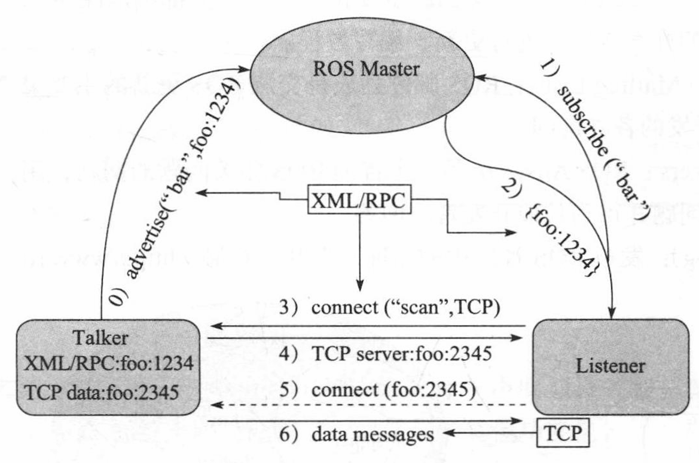

## 目录

  - ROS总览
    - ROS Topic Communication
  - ROS安装
  - ROS使用
    - 终端命令
    - ROS测试1（键盘控制小乌龟）
    - ROS测试2（使用Python编写小乌龟的转圈运动）
    - ROS测试3（主题通讯，自定义编写一个订阅者节点，以读取小乌龟的位置和角度信息）
    - ROS测试4（服务通讯，在小乌龟窗口的指定位置生成小乌龟）
    - ROS测试5（参数服务器，修改小乌龟窗口的背景色）
    - 使用VSCode完成ROS测试1~5
    - 使用VSCode完成ROS测试6
    - MoveIt!实验
    - 

## ROS总览

ROS操作系统需要在Linux系统下安装，ROS在Ubuntu上的支持最好，使用VMware虚拟机。

### ROS Topic Communication

ROS最常用的通信模式，主要有三个角色：

- ROS Master（Manager）
- Talker（Publisher）
- Listener（Subscriber）



## ROS安装

[ubuntu环境搭建与ros安装.pdf](../_resources/ubuntu环境搭建与ros安装.pdf)

## ROS使用

### 终端命令

```
pwd
# 显示当前目录

ls
# 显示当前目录的内容

ls -a
# 显示当前目录的所有文件，包括隐藏文件

mkdir test
# 在当前目录创建一个名为"test"的文件夹。

cd test
# 改变当前目录为"当前目录/test"。

touch read.txt
# 在当前目录创建一个名为"read"的txt文件。

rm read.txt
# 在当前目录移除名为"read"的txt文件。

cd ..
# 改变当前目录为"当前目录的父目录"。

rm -r test
# 在当前目录移除一个目录"test"和其所有子目录（内容）。

sudo apt install 包名
# 下载并安装名为"包名"的包。

Ctrl+C
# 强制中断当前执行指令。

gedit ~/.bashrc
# 打开并编辑.bashrc文件。
```

### ROS测试1（键盘控制小乌龟）

打开五个终端窗口：

```
roscore
# 第一个终端。

rosrun turtlesim turtlesim_node
# 第二个终端，显示小乌龟窗口。

rosrun turtlesim turtle_teleop_key
# 第三个终端，保持此终端窗口在最上层，则可以使用键盘方向键控制小乌龟的运动。

rqt_graph
# 第四个终端，显示ROS计算图。

rostopic list
# 第五个终端，获得主题名。

rostopic info /turtle1/cmd_vel
# 第五个终端，获得主题信息，信息类型。

rostopic info /turtle1/pose
# 第五个终端，获得主题信息，信息类型。

rosmsg info geometry_msgs/Twist
# 第五个终端，获得信息格式。

rosmsg info turtlesim/Pose
# 第五个终端，获得信息格式。
```

### ROS测试2（使用Python编写小乌龟的转圈运动）

打开一个终端窗口：

```
mkdir -p Demo_WS/src
# 创建新的工作空间（文件夹）"Demo_WS"

cd Demo_WS
# 切换当前目录，切换到工作空间。

catkin_make
# catkin_make：在catkin工作区的根目录中构建代码，编译Demo_WS/src中的所有软件包。

pwd
# 查看当前目录，返回/home/user/Demo_WS。
echo "source "pwd指令返回的路径"/devel/setup.bash" >> ~/.bashrc
# echo把指令"source "pwd指令返回的路径"/devel/setup.bash"写入到.bashrc文件里。
source ~/.bashrc
# 立即运行.bashrc文件。

cd src
# 切换当前目录，切换到工作空间的src文件夹下。
catkin_create_pkg pub_sub_package geometry_msgs rospy std_msgs turtlesim
# catkin_create_pkg：创建名为"pub_sub_package"的package包，依赖于geometry_msgs、rospy、std_msgs、turtlesim包。

cd pub_sub_package
# 切换当前目录，切换到新创建的package包。
mkdir scripts
# 创建新的文件夹，用于存放脚本文件。
cd scripts
# 切换当前目录，切换到存放脚本文件的文件夹。
gedit publisher.py
# 创建并打开一个名为"publisher.py"的Python文件并进行代码编辑。
```

Python文件内容：

```
# 注意文件头前不能写注释和代码，否则会导致执行时报错（无法找到文件）。

#! /usr/bin/env python3
# 注意文件头的开头末尾均不能加空格，且文件头的内容必须完全正确，否则会导致执行时报错（无法找到文件）。
import rospy
from geometry_msgs.msg import Twist
if __name__ == "__main__":
    # 2. Initialize the ROS node
    rospy.init_node("control_circle_p")
    # 3. Create a publisher object
    pub = rospy.Publisher("/turtle1/cmd_vel", Twist, queue_size=1000)
    # 4. Loop to publish motion control messages
    rate = rospy.Rate(10)
    msg = Twist()
    msg.linear.x = 1.0
    msg.linear.y = 0.0
    msg.linear.z = 0.0
    msg.angular.x = 0.0
    msg.angular.y = 0.0
    msg.angular.z = 0.5
    while not rospy.is_shutdown():
        pub.publish(msg)
        rate.sleep()
```

回到一开始的终端：

```
chmod +x publisher.py
# 将编写好的Python文件的执行权限设置为可执行。
# chmod -x将文件的执行权限设置为不可执行。
# 此时当前目录为scripts文件夹。

cd ..
# 此时当前目录为pub_sub_package文件夹。
gedit CMakeLists.txt
# 修改CMakeLists.txt文件。
```

CMakeLists.txt修改内容：

```
catkin_install_python(PROGRAMS
    scripts/publisher.py
    # 此处修改为publisher.py。
    # 若需要添加其他Python文件，则在下一行添加即可，参考格式为scripts/xxx.py也就是Python文件的路径。
    DESTINATION ${CATKIN_PACKAGE_BIN_DESTINATION}
    # 此处不需要进行修改，需要添加的其他Python文件的路径需要在此句之前。
)
```

回到一开始的终端：

```
cd ..
cd ..
# 此时当前目录为Demo_WS文件夹。
catkin_make
# 重新编译所有软件包。
```

打开新的三个终端（按顺序执行指令）：

```
# 第一个终端
cd Demo_WS
roscore

# 第二个终端
rosrun turtlesim turtlesim_node
# 显示小乌龟窗口。

# 第三个终端
cd Demo_WS
source devel/setup.bash
# 立即运行setup.bash文件。
rosrun pub_sub_package publisher.py
# 开始运行Python文件。
# 若Python文件内容需要进行修改，则通过一开始的终端修改Python文件内容并保存，再重新运行此指令，可以实时查看修改后的Python文件的效果。
```

### ROS测试3（主题通讯，自定义编写一个订阅者节点，以读取小乌龟的位置和角度信息）

与ROS测试2同样的步骤，不同的是Python文件内容（命名为subscriber.py），和最后测试运行的指令。

Python文件内容：

```
#! /usr/bin/env python3
import rospy
from turtlesim.msg import Pose

def doPose(data):
  rospy.loginfo("Turtle coordinates: x=%.2f, y=%.2f, theta=%.2f", data.x
, data.y, data.theta)

if __name__ == "__main__":
  # 2. Initialize the ROS node
  rospy.init_node("sub_pose_p")
  # 3. Create a subscriber object
  sub = rospy.Subscriber("/turtle1/pose", Pose, doPose, queue_size=1000)
  # 4. Callback function to process subscribed data
  # 5. spin
  rospy.spin()
```

打开新的四个终端（按顺序执行指令）：

```
# 第一个终端
roscore

# 第二个终端
rosrun turtlesim turtlesim_node

# 第三个终端
rosrun pub_sub_package subscriber.py

# 第四个终端
rosrun turtlesim turtle_teleop_key
```

### ROS测试4（服务通讯，在小乌龟窗口的指定位置生成小乌龟）

打开两个终端：

```
# 第一个终端
roscore

# 第二个终端
rosrun turtlesim turtlesim_node
# 显示小乌龟窗口，但无法使用键盘控制小乌龟。
```

打开新的一个终端：

```
rosservice list
# 获得服务名列表。

rosservice type /spawn
# 获得信息类型。

rossrv info turtlesim/Spawn
# 获得信息格式。
```

关闭所有终端。

与ROS测试2同样的步骤，不同的是需要创建新的package包，和最后测试运行的指令。

打开新的一个终端：

```
# ROS测试2开头cd src之前的步骤默认已执行完成

cd src

catkin_create_pkg server_client_package rospy std_msgs turtlesim

cd server_client_package

mkdir scripts

cd scripts

gedit client.py
```

Python文件内容：

```
#! /usr/bin/env python3
import rospy
from turtlesim.srv import Spawn

if __name__ == "__main__":
  rospy.init_node("set_turtle_py")

  rospy.wait_for_service("/spawn")
  try:
    spawn_turtle = rospy.ServiceProxy("/spawn", Spawn)
    response = spawn_turtle(1.0, 1.0, 1.57, "my_turtle")
    rospy.loginfo("New turtle generated, name: %s", response.name)
  except rospy.ServiceException as e:
    rospy.loginfo("Turtle generation failed: %s", str(e))
```

回到一开始的终端：

```
cd ..
# 此时当前目录为server_client_package文件夹。
gedit CMakeLists.txt
```

CMakeLists.txt修改内容：

```
catkin_install_python(PROGRAMS
    scripts/client.py
    DESTINATION ${CATKIN_PACKAGE_BIN_DESTINATION}
)
```

打开新的三个终端：

```
# 第一个终端
roscore

# 第二个终端
rosrun turtlesim turtlesim_node

# 第三个终端
rosrun server_client_package client.py
# 将会在小乌龟窗口显示一个新的小乌龟。
```

### ROS测试5（参数服务器，修改小乌龟窗口的背景色）

与ROS测试4类似的步骤。（相同步骤省略）

```
rosparam list
# 获得参数名列表。
```

关闭所有终端。

与ROS测试4同样的步骤。（相同步骤省略）

```
catkin_create_pkg parm_package rospy

gedit parm.py
```

Python文件内容：

```
#! /usr/bin/env python3

import rospy

if __name__ == "__main__":
  rospy.init_node("hehe")
  # rospy.set_param("/turtlesim/background_r",255)
  # rospy.set_param("/turtlesim/background_g",255)
  # rospy.set_param("/turtlesim/background_b",255)
  rospy.set_param("background_r",255)
  rospy.set_param("background_g",255)
  rospy.set_param("background_b",255)
```

打开新的三个终端：

```
# 第一个终端
roscore

# 第二个终端
rosrun parm_package parm.py

# 第三个终端
rosrun turtlesim turtlesim_node
```

### 使用VSCode完成ROS测试1~5

视频链接：https://www.bilibili.com/video/BV1Ci4y1L7ZZ/?p=27&vd%20source=c0362410175e48c052479d50fb9cd3c0

```
code .
# 在Demo_WS目录下执行，启动vscode。
# 之后的步骤与ROS测试1~5中的相同，但通过vscode图形界面进行。
```

在VSCode中操作工作空间：

- 与使用终端的命令进行操作相同，创建工作空间并进行编译，把工作空间的路径配置好环境变量。之后的操作可以在VSCode的资源管理器中进行。
- 代码文件在`工作空间名.ws/src/package包名/scripts`进行创建和编辑。

在VSCode中编辑Python文件操作：

```
# Linux下，根据编辑器的不同，Tab会被等效替换为一定数量的空格。
# VSCode中，Tab等效为4个空格。

Shift+Alt+I
# 为每个选中的行分配一个光标，且均处于行末，可用于统一缩进等用途。但空行也会被选中。

Tab
Ctrl+[
# 将选中的行的缩进右移一个Tab。

Shift+Tab
Ctrl+]
# 将选中的行的缩进左移一个Tab。
```

### 使用VSCode完成ROS测试6

与ROS测试5类似，工作空间名为lab2.ws，package包为直接复制课程提供的package包，package包名为lab2。对于前置步骤，除了创建工作空间并编译和复制package包操作，其余操作均在VSCode中进行。lab2其中包含Python文件：tools.py（课程提供的函数库）、2-Dimensions_TF.py（只是二维可以仅用Python进行仿真），3-Dimensions_TF.py（三维需要Python调用ROS进行仿真）。

关于VSCode的Python文件的运行方法：

- 与ROS无关的Python文件可以在VSCode中直接运行。


- 与ROS有关的Python文件需要使用终端运行（仅可以在VSCode中编辑Python代码）：

```
roscore
# 第一个终端

rosrun rviz rviz
# 第二个终端，打开RViz窗口。
# 若运行的Python代码需要用到"TF"组件，在RViz的"Add"处添加对应的组件。

rosrun lab2 3-Dimensions_TF.py
# 第三个终端，运行Python文件。终端可以看到Python代码打印的信息。
# 此时在RViz窗口Display-Global Options-Fixed Frame改成world即可看到Python代码通过ROS仿真的信息。
# 若需要对Python文件进行修改，重新执行此命令即可。
```

### MoveIt!实验

安装：

```
sudo apt-get install ros-noetic-object-recognition-msgs
sudo apt-get install ros-noetic-moveit
```

### 