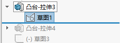

## 目录

    - 约束逻辑
    - 逐步完全定义
    - 捕捉交点（约束逻辑）
    - 对象多选
    - 创建基准面
    - 放样凸台/基体
    - 装配体-配合
    - 文件-从装配体制作工程图
    - 对已经拉伸好的零件进行编辑
    - 对.step文件进行编辑
    - 打断直线

### 约束逻辑

AutoCAD的逻辑为"画出已定义约束的图形"，SolidWork的逻辑为"先画出未约束图形后定义图形约束"。

由SolidWork的约束逻辑，可以先随便画出大概图形，也不需要再次设置尺寸，直接进行尺寸标注，在尺寸标注的同时进行尺寸的调整即可（尽量仅使用尺寸标注进行完全定义，尽量不使用几何关系进行完全定义，是使得约束数量最少的做法，也更简洁，防止过定义）。

人类看草图时会得到很多约定俗成的约束条件（例如”大致居中”），但是在SolidWork中是对约束条件的判断是完全严格的。

### 逐步完全定义

Solidwork不使用"逐步完全定义"的方法画图，会出现很多意味不明的欠定义和过定义。

几何关系越少的实体越会为了符合几何关系的约束而改变自身的尺寸。因此每一个实体画完，必须立刻完全定义，且满足草图右下角的"完全定义"，不然之后根本无法判断是哪里没约束好（有可能出现所有实体均为黑线，但草图右下角依然显示"欠定义"的情况，这种情况建议直接重画）。只要保证每画出一个实体都立刻将其完全定义，且草图显示已经完全定义，才可以完全保证最后整个草图完全定义。

如果无法看出实体缺少哪些约束条件而无法完全定义，那么可以拖动它来观察移动的方式，从而得到哪些地方没约束好。拖动它来查看缺少的约束条件是最方便的方法。或者直接使用”完全定义草图”功能来计算（"完全定义草图"功能中的全部实体计算是不可靠的，选择单独几个实体计算是可靠的）。或者使用"修复草图"来找出无法用肉眼检查到的缝隙（不一定能行）。

完全定义包括：尺寸定义、几何关系定义、原点关系定义，有一个不满足完全定义则实体无法满足整体的完全定义（在SolidWork中，满足完全定义即蓝线变为黑线）。

尺寸定义的完全定义：对实体进行"信息完整"的尺寸标注，或者使实体与已进行"信息完整"的尺寸标注的实体建立"完全约束"的几何关系（例如半径相等）。注意对于圆弧、圆角等实体，除了标注半径尺寸，往往还需要标注端点之间的长度尺寸。

几何关系关系的完全定义：使实体与原点建立"完全约束"的几何关系，或者使实体与已经与原点建立"完全约束"的几何关系的其他实体建立"完全约束"的几何关系。（已经具有"固定"几何关系的实体与原点性质相同，但"固定"是一个很容易使得其他实体改变自身尺寸的几何关系，最好不使用）

原点关系的完全定义：当尺寸定义和几何关系定义均满足完全定义后，仍欠定义的实体，应当使与此实体有关的点与原点（或竖直/水平过原点的构造线）直接进行尺寸标注。

草图-显示/删除几何关系-完全定义草图：可以自动计算并对草图进行自动标注，以使得选择的实体达到完全定义。

注意：SolidWork内部计算欠定义的方式与其约束逻辑有关。这一点非常反直觉，也就是说，在SolidWork中画出的实体的尺寸均是暂时（画实体时设置的尺寸，SolidWork认为此尺寸仅仅是暂时的，不能作为辅助计算未定义的约束条件，而人类是知道实际尺寸的，所以会下意识地把可以通过实际尺寸被计算出的约束条件当作已定义，因此无法理解SolidWork认为实体仍是欠定义的。"完全定义草图"功能基于暂时尺寸来计算未标注的地方的暂时尺寸，从而进行自动标注。），凡是未标注的实体的尺寸均视为"未知"，那么可以通过未标注的实体的尺寸计算出的约束条件也会被视为"不存在"，因此总是会出现人认为完全定义但SolidWork认为欠定义的情况。

过定义：某几个定义冲突了。但去掉冲突的定义使得不满足过定义后，不代表就一定满足完全定义。

注意：阵列不复制几何关系，阵列其实就是"与原图形完全相同"、阵列角度、阵列距离，但是阵列角度和阵列距离是需要使用尺寸标注来进行约束的（也就是说，阵列排列的参数和其他参数例如直线长度一样，需要尺寸标注进行最终的确定）。

注意：意义重复的两个尺寸标注是不允许存在的（造成过定义），这是因为尺寸标注均为绝对的，因此避免两个同时能对同一约束进行编辑的尺寸标注同时存在，因为只要其中一个尺寸标注改变就会无解。

### 捕捉交点（约束逻辑）

很难捕捉到交点，但是可以先画出一个大概的点，再定义实体间的几何关系来使其"变成"交叉点。

比较方便的方法是，通过草图-剪裁实体-剪裁到最近端来将交点剪出来。

### 对象多选

Ctrl+左键可以选多个实体，然后定义实体间的几何关系。

### 创建基准面

按住Ctrl+左键，拖动某一个已有的基准面。

### 放样凸台/基体

特征，也就是拉伸凸台/基体，可以通过选择轮廓来控制同一草图的哪些部分进行拉伸，从而根据一个草图建立多个特征。

注意从哪个面开始拉伸，默认一直在草图基准面。"到离指定面指定距离"也是从选择的面开始拉伸的，而不是从指定面开始拉伸的。

每个特征都是从某一个草图拉伸得来的，因此多个特征可以都由同一个草图拉伸得到。

创建多个基准面，为每个平面画好一个草图，草图中需要进行放样的闭合轮廓必须满足闭环，且每个闭合轮廓与其他闭合轮廓（内部或外部）必须无交线。这样在放样时，选择轮廓就能自动选择整个的闭环区域，不会出现"交叉"的错误。在多个平面的草图中选择多个轮廓，进行放样。

### 装配体-配合

装配体-配合，与草图的约束类似，直接选定零件的边线/面和另一个零件的边线/面，选择配合类型，即可建立配合关系。

### 文件-从装配体制作工程图

一般工程图就是根据装配体画的，单个零件没有工程图。

准备工作：工程图-模型视图，将视图放置到工程图上，自定义视图方向和比例，然后右键-切边-切边不可见。（切边是指工程图中，例如圆角等特征的过渡边线，除了轴测视图，其它视图，通常不绘制切边）

使用断开的剖视图来绘制剖面视图，在设计树中的对应视图的装配体中，选择不包括的部分零件来生成只需要显示部分截面的剖面视图。

使用剪裁视图来仅保留一个视图的某一部分。

对于右下角明细表，在Excel直接复制表格到工程图中即可。

### 对已经拉伸好的零件进行编辑

通过设计树的按顺序逐个步骤进行回滚（回滚线的拖动），回滚到需要进行编辑的步骤停下进行编辑。

注意拉伸操作的草图也可以通过回滚来变得完全定义，基于完全定义的草图对于后续的修改会非常方便。

### 对.step文件进行编辑

使用Solidwork打开后，设计树下只有一个"输入"，右键-featurework-识别特征。

### 打断直线

工具-草图工具-分割实体-鼠标左键点击需要的直线分割处。