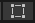

## 目录

    - Unity操作
    - Unity下载资源并加载
    - Unity页面
      - Scene窗口摄像机视野范围调整
      - Unity编辑器界面区域布局更改
      - Unity操纵对象快捷键
    - 导入图像文件为精灵并转变为游戏对象
    - Unity创建C#脚本
      - 获得游戏对象的位置并进行移动
      - 捕获输入控件（键盘、手柄等）的输入
      - 更改帧数
      - 将游戏对象的移动速度从单位/帧转化为单位/秒（因为玩家的设备帧数是未知的）
    - 创建瓦片地图和瓦片（单图像文件作为精灵）
      - 将瓦片添加到瓦片面板，并在Scene窗口中绘制
      - 使瓦片精灵适应Scene窗口中的网格
      - 对瓦片集图像文件的分割处理
      - 将瓦片集分割处理后的精灵一次性添加到瓦片面板
      - 更改游戏对象的图层顺序（游戏对象显示的优先级）
      - 通过坐标来安排游戏对象的图层顺序（得到符合直觉的显示优先级）
      - 更改游戏对象的"锚点"的取点（中心点和轴心点）
      - 对游戏对象的精灵的轴心点的位置进行调整（以得到更符合直觉的显示优先级）
    - 创建预制件
      - 更改预制件属性
    - 物理系统
      - 向游戏对象添加刚体组件（2D）
      - 禁用刚体的重力（2D）
      - 向游戏对象添加碰撞体组件（2D）
      - 解决碰撞体旋转问题
      - 解决碰撞体抖动问题
      - 调整碰撞体的大小
      - 添加瓦片地图碰撞体并消除不需要的碰撞体积
      - 合并瓦片地图中相连的瓦片的碰撞体（优化瓦片地图）
    - 世界交互-触发器
      - 为游戏对象添加生命值统计功能
      - 创建可被收集的游戏对象（改变生命值）
      - 为游戏对象定义公有属性
    - 世界交互-伤害区域和敌人
      - 伤害区域
      - 在扩大游戏对象时平铺精灵的副本（而不是拉伸精灵）
      - 创建敌人
      - 为敌人附加伤害
    - 精灵动画
      - 创建动画控制器
      - 创建动画
      - 补充：解决动画位置与游戏对象位置不一致
      - 构建动画控制器和设置混合树
      - 将参数从脚本发送到动画控制器
    - 飞弹
      - 使用图层以使得飞弹的碰撞独立
      - 飞弹击中敌人的反馈
      - 优化视野外的飞弹
      - 补充：敌人被飞弹击中后播放对应动画
    - 摄像机
      - 创建虚拟摄像机
      - 让摄像机跟随特定游戏对象
      - 补充：让摄像机的视角区域和Game视图的视角区域一致
    - 粒子效果
      - 创建新的粒子效果
      - 为粒子增加随机性且增加逐渐变小消失的效果
      - 将粒子效果应用到游戏对象上
      - 让游戏对象被飞弹击中后停止粒子效果
      - 补充：粒子系统的循环系统
      - 补充：粒子系统爆发发射
    - UI
      - 创建画布
      - 向UI中添加图像
      - 设置锚点
      - 添加肖像
      - 使用遮罩
      - 编写生命值条的脚本
      - 更新生命值条
    - 对话射线投射
      - 射线投射
      - 对话UI
    - 音频
      - 背景音乐
      - 一次性声音（以收集物品声效为例）
      - 空间化声音
      - 修正衰减
    - 构建、运行、分发
      - 构建游戏
      - 为平台运行构建过程
    - 最终代码
    - 补充
      - 补充：Unity关键字和函数记录
      - 补充：新建项目使得天空为蓝色光照材质
      - 补充：调整Canvas大小并保持其与摄像机的位置关系
      - 补充：A-star（A*）寻路/敌人通过看和听发现主角/角色闲置动画idle

最开始创建unity项目时，路径中不要出现中文。不然就会出现打开VS2019时一直卡住的情况。

### Unity操作

左键：选定对象。

右键（某些视图不可用）：移动视图（2D），转动视角（3D）。

中键：移动视图（2D），移动视图（3D）。

方向键：移动视图（2D），移动视图（3D）。

右键+W/A/S/D/Q/E：移动视角+移动视图（3D）。

Alt+左键：移动视图（2D）。

滚轮：放大/缩小视图。

Ctrl+N（File > New Scene）：创建新的场景。

Ctrl+S（File > Save）：保存当前场景。注意保存的文件格式为.unity（其实就是场景），需要找到当前项目的当前场景的.unity文件进行覆盖保存。

Ctrl+Z：撤回上一步操作。

直接拖动文件到Project窗口：快捷导入文件。

Edit > Preferences > External Tools：更改打开脚本时使用的IDE。

Window > Package Manager：对需要升级的包进行升级。打开VS2019一直卡住的另一个原因，是Visual Studio Editor的版本问题。

Shift+左键：批量选定。

Ctrl+左键：多个选定。

在Hierarchy窗口双击游戏对象：使得Scene视图移动到此游戏对象的位置。

Ctrl+D：复制粘贴目前选定的对象。

### Unity下载资源并加载

编辑器界面，Window > Asset Store > 选择Search online。

或者直接浏览器打开网址：https://assetstore.unity.com/

搜索目标资源后，登录Unity ID，选择"在Unity打开"。在编辑器界面会自动打开Package Manager，并且出现此目标资源的介绍页面。点击"Download"下载完成后，点击"import"载入此目标资源。

Unity中文教程第三方网址：https://learn.u3d.cn/

### Unity页面


Project窗口列出了当前项目中包含的所有文件和目录。这些文件包括项目中使用的所有图像、声音和 3D 模型。所有这些统称为资源。双击文件即可打开。

Project窗口右边为Console窗口，显示游戏产生的警告和错误，其中会提供修复这些问题的有用信息。

Hierarchy窗口会显示场景中的所有游戏对象，并显示出对象之间的父子层级关系。在 Unity中，游戏由场景组成。可将场景视为游戏的一个关卡或是一个环境。在每个场景中的多个对象会表示为一个对象列表，这些对象在该场景中都有一个相应的位置，这些对象在 Unity 中称为游戏对象（GameObject）。游戏对象可以按父子层级视图结构进行组织。

Scene窗口是当前加载的场景以及 Hierarchy 窗口中所有游戏对象的实时预览窗口，默认有Scene视图和Game视图。可以使用Scene视图在场景中放置和移动游戏对象。点击Scene窗口顶部的"2D"按钮可以切换2D和3D视图模式。

Scene视图右边为Game视图。Game视图会显示玩家在玩游戏时看到的内容，这正是摄像机看到的内容（在Scene窗口中以白色方框显示）

Inspector窗口在Hierarchy或Project视图中选择某个项时，Inspector窗口将显示与这个项相关的所有数据。

Unity使用对象-组件模型，这意味着场景由添加了组件功能的游戏对象组成。所有游戏对象都是从一个Transform组件开始的，这个组件可用于指定游戏对象在场景中的位置和旋转。所有其他组件都是可选的，可以根据需要添加这些组件。

#### Scene窗口摄像机视野范围调整

左键选择摄像机对象，如果没找到表示摄像机的视野范围的线框，需要使用鼠标滚轮不断缩小Scene窗口视图来寻找。

在调整摄像机的视野范围的线框的过程中，可以观察Scene窗口右下角的Main Camera的图像，以选取合适的视野范围大小。

#### Unity编辑器界面区域布局更改

编辑器界面，Window > Layouts处选择。或使用编辑器右上角的 Layouts 下拉菜单。

#### Unity操纵对象快捷键


F - 聚焦选择的对象。如果忘记了游戏对象在场景中的位置，只需在 Hierarchy 窗口中选择该游戏对象，然后按 F 键使该游戏对象在 Scene 窗口中居中。

### 导入图像文件为精灵并转变为游戏对象

Sprite（精灵）其实就是纹理的容器。

直接拖动图像文件到Project窗口，并左键选择，在Inspector窗口中将其的Texture Type更改为Sprite。原图像文件的右边会出现一个箭头，打开即为一个精灵。将其拖入Scene窗口中，则此精灵就会变为一个游戏对象，并带有默认的Transform组件。

### Unity创建C#脚本

在 Unity 中，脚本是一种特定类型的组件（component）。你可以将脚本添加到游戏对象，在脚本中编码的任何行为都将应用于此游戏对象。

在Project窗口，右键 > Create > C# Script，即可创建新的C#脚本。双击即可用IDE打开和进行编辑，在IDE对脚本的"保存"操作后，点击Unity界面会使得Unity直接对其开始保存并编译（但如果不点击Unity界面则不会进行保存）。

注意Inspector窗口无法显示代码中的中文。但是不影响编译。

如果代码编译错误，则会在Project窗口的下方和Consule窗口显示相关信息。

初始代码：

```c#
using System.Collections;
using System.Collections.Generic;
using UnityEngine;

public class 自定义脚本名 : MonoBehaviour
{
    // Start is called before the first frame update
    void Start()
    {
        
    }

    // Update is called once per frame
    void Update()
    {
        
    }
}
```

每一个class定义了一个组件。Unity仅在游戏开始时执行一次Start()函数中的代码，而Unity在每帧执行一次Update()函数中的代码。

编写好脚本后，选择游戏对象，并把脚本文件从Project窗口拖动到Inspector窗口中，或者直接在Inspector > Add Component中选择脚本文件，即可将此脚本添加为此游戏对象的组件。

最后只需要直接按下Scene窗口上方的播放按钮即可进入运行模式，可以直接直观看到游戏对象的运行效果。

#### 获得游戏对象的位置并进行移动

在Update代码块中：

```c#
Vector2 pos = transform.position;
// Vector2为2维变量。此处为了表示2D游戏对象的位置。表示3D游戏对象可以使用Vector3。
// pos为变量名。
// transform代表脚本的Unity游戏对象的Transform组件（其实是类的实例）。
// .position为transform对象的属性（也是一个类的示例）。

pos.x = pos.x + 0.1f;
// 对pos的属性.x（x轴坐标）进行编辑。
// 在Unity中，坐标的正负代表的位置遵循数学上一般的坐标轴的位置。
// 0.1f为浮点数0.1。所有Unity脚本均使用浮点数（而不是双精度），因此使用浮点数时均需要加上"f"。

transform.position = pos;
// 对transform.position进行赋值，以进行位置更新。
```

#### 捕获输入控件（键盘、手柄等）的输入

在编辑器界面，Edit > Project Settings > Input Manager，可以设置玩家的输入控件的Axes值（也就是特定输入对应的特定方向）。

在Update代码块中：

```c#
float horizontal = Input.GetAxis("Horizontal");
// 调用Input的.GetAxis函数，返回水平方向（Horizontal）的单个轴的值，这个值会随着输入控件的输入不同而发生不同，为浮点数。
float vertical = Input.GetAxis("Vertical");
// 同理，返回垂直方向（Vertical）的单个轴的值。

Debug.Log(horizontal);
Debug.Log(vertical);
// Debug.Log()函数可以将它的参数写入控制台，也就是在Console窗口中实时打印此函数的参数的值。

Vector2 pos = transform.position;
pos.x = pos.x + 0.1f * horizontal;
pos.y = pos.y + 0.1f * vertical;
// 效果为：
// 如果按左键，则horizontal会开始向-1变化（最终为-1）。
// 如果按右键，则horizontal会开始向1变化（最终为1）。
// 如果没有按下任何键，则horizontal会开始向0变化（最终为0）。
// vertical同理。
transform.position = pos;
```

#### 更改帧数

在Start代码块中：

```c#
QualitySettings.vSyncCount = 0;
// 设置每帧之间传递的垂直同步数。值必须为0、1、2、3、4。
Application.targetFrameRate = 30;
// 在设置了垂直同步数的情况下，设置每秒渲染的帧数。若值为-1则不对帧数进行限制。
```

#### 将游戏对象的移动速度从单位/帧转化为单位/秒（因为玩家的设备帧数是未知的）

在Update代码块中：

```c#
float horizontal = Input.GetAxis("Horizontal");
float vertical = Input.GetAxis("Vertical");

Vector2 pos = transform.position;
pos.x = pos.x + 0.1f * horizontal * Time.deltaTime;
pos.y = pos.y + 0.1f * vertical * Time.deltaTime;
// Time.deltaTime为当前Unity渲染一帧所需的时间。
// 此游戏对象的速度就从0.1单位/帧转化为了0.1单位/秒。
transform.position = pos;
```

### 创建瓦片地图和瓦片（单图像文件作为精灵）

Tilemaps（瓦片地图）将世界作为一个网格，你可以在其中为每个网格单元格设置不同的精灵。Tilemaps其实类似PS的图层，可以在上面画上Tile（瓦片）。而TIle包含一个Sprite，颜色，Collider Type（碰撞体类型）。

在Hierarchy窗口，右键 > 2D Object > Tilemap > Rectangular，即可创建两个游戏对象，Grid（网格）和Tilemap（瓦片地图）。

导入想要作为Tiles的精灵的图像文件，并将其Texture Type更改为Sprite。

在Project窗口，右键 > Create > Tiles > Animated Tiles，即可创建一个还没有精灵的Tiles。在Inspector窗口将其Collider Type设置为Sprite，并为其选择上一步导入的图像文件的精灵。一个Tile就完成了。

#### 将瓦片添加到瓦片面板，并在Scene窗口中绘制

Tile Palette（瓦片面板）则是用于保存Tiles，是Tiles的"调色板"，便于将它们绘制到网格上。

在编辑器界面，Window > 2D > Tile Palette，即可打开Tile Palette窗口。然后在此窗口上方的Create New Palette处创建新面板。

将从Project窗口将Tile拖到Tile Palette窗口中，此Tile的精灵就会显示在这个Tile Palette窗口的网格中。左键选择此精灵，就可以在Scene窗口的网格上随意粘贴此精灵了（这称为绘制）。

需要擦除精灵时，仅需要长按Shift键并鼠标左键即可擦除。

#### 使瓦片精灵适应Scene窗口中的网格

在Scene窗口的网格上粘贴瓦片精灵后，发现瓦片精灵之间可能是有空隙的。

在Project窗口中，找到作为瓦片精灵的图像文件，左键选择其精灵，在Inspector窗口中会显示Pixels Per Unit（PPU）。它定义了Scene窗口中一个单位的边长为多少像素。

在Hierarchy窗口，左键选择Grid游戏对象，在Inspector窗口中的Cell Size的值默认为X=1和Y=1，代表网格的边长均为Scene窗口中一个单位的边长。

例如：一个图像文件像素为64x64，如果一个单位的边长有100个像素，Scene窗口中的Grid游戏对象（也就是网格）的边长也为一个单位，那么如果以此图像文件作为瓦片的精灵，那么这个精灵自然是填不满一个网格的。

#### 对瓦片集图像文件的分割处理

瓦片集是整个图像中包含了多个可以单独作为瓦片的精灵的图像部分的图像文件。

对瓦片集的第一步处理，和对单个图像文件一样，将其Texture Type更改为Sprite，这样就生成了其对应的精灵。左键选择瓦片集（而不是瓦片集的精灵），在Inspector窗口中将Sprite Mode从"Single"更改为"Multiple"。点击Apply保存改动。（此时瓦片集右边箭头会消失，因为精灵未进行分割）

然后点击Sprite Editor，在Sprite Editor窗口的顶部菜单栏中点击Slice（把这个窗口拉长才能正常显示Slice），在打开的窗口中将Type设置为Grid by Cell Count，并且设置好Column & Row的值（C和R值相乘等于均等分割后的精灵数）后点击Slice，然后点击Sprite Editor窗口的Apply，然后关闭Sprite Editor窗口。

将瓦片集右边箭头展开，即为分割后的精灵。

#### 将瓦片集分割处理后的精灵一次性添加到瓦片面板

将进行分割处理后的瓦片集直接拖动到Tile Palette窗口中即可。也就是说，其实不需要创建Tile也可以直接将图像文件的精灵添加到瓦片面板中。

#### 更改游戏对象的图层顺序（游戏对象显示的优先级）

在Hierarchy窗口中选择游戏对象，在Inspector窗口中的"Sprite Renderer"组件中，对Order in Layer进行调整。

Order in Layer的值越小表示层级越低，越先对其进行绘制，越后将其显示。（例如：人物的层级一般比地图更高，也就是比地图后进行绘制，因此可以显示于地图图层上方）

#### 通过坐标来安排游戏对象的图层顺序（得到符合直觉的显示优先级）

在编辑器界面，Edit > Project Settings > Graphics > Camera Settings，将Transparency Sort Mode更改为Custom Axis，然后将Transparency Sort Axis改为：X=0，Y=1，Z=0。

这样就相当于使得Unity基于游戏对象的"锚点"的y轴坐标来决定绘制顺序。（游戏对象的y轴坐标，比障碍物的y轴坐标高则先进行绘制，比障碍物的y轴坐标低则后进行绘制）

#### 更改游戏对象的"锚点"的取点（中心点和轴心点）

在Hierarchy窗口中选择游戏对象，在Inspector窗口中的"Sprite Renderer"组件中，对Sprite Sort Point进行设置。Center为选取中心点，Pivot为选取轴心点。

#### 对游戏对象的精灵的轴心点的位置进行调整（以得到更符合直觉的显示优先级）

对单个精灵的游戏对象：在Project窗口中，选择作为游戏对象的精灵的原图像文件，在Inspector窗口中对Pivot进行设置，点击Apply保存更改。

对多个精灵的游戏对象：在Project窗口中，选择作为游戏对象的精灵的原图像文件，在Inspector窗口中点击Sprite Editor，在Sprite Editor窗口中的Sprite窗口中的Pivot设置为"Custom"。然后就可以通过设置Custom Pivot的X和Y的值，或者直接拖动Sprite Editor窗口中的图像的蓝色小圈，来自定义轴心点的位置。最后点击Sprite Editor窗口中的Apply保存更改。

### 创建预制件

预制件可以将一个游戏对象及其所有组件和设置纳入到一个资源中，这有利于对某个游戏对象进行复用和维护。

在Project窗口中切换到存放预制件的文件夹，在Hierarchy窗口中选择游戏对象，并拖动到Project窗口中即可创建预制件。

可以直接将创建好的预制件从Project窗口拖动到Hierarchy窗口或Scene窗口中来直接复用游戏对象。

使用预制件创建的复用副本的游戏对象（这包括创建预制件的游戏对象）都会在Hierarchy窗口中呈现为蓝色，说明相互之间已经建立了链接关系（对预制件和任一游戏对象复用副本的任何改动都是同步的）。

#### 更改预制件属性

在Project窗口中，双击预制件，或者选择预制件后在Inspector窗口中点击Open Prefab，使得Scene窗口仅显示预制件，进入预制件模式。

在Inspector窗口中，对Color进行调整，注意正方形内部的小圈才是对预制件的颜色的调整。调整完成后点击Scene窗口右上角的Save保存更改。最后在Hierarchy窗口使用返回箭头返回普通模式。

### 物理系统

#### 向游戏对象添加刚体组件（2D）

在Hierarchy窗口中选择游戏对象，拖动到Project窗口中创建预制件，然后双击预制件进入预制件模式。在Inspector窗口中，点击Add Component，并搜索"Rigidbody 2D"（3D游戏使用的组件名为"Rigidbody"）然后选择它，点击Scene窗口右上角的Save保存更改。

按下Scene窗口上方的播放按钮即可进入运行模式，可以观察游戏对象是否成功应用此组件。（默认情况下，因为重力作用，游戏对象会垂直下落。）

注意，刚体组件是移动相关的组件，不需要进行移动的游戏对象（如固定的箱子）不需要添加刚体组件。

一个有刚体组件的游戏对象如果在移动中碰撞到另一个有刚体组件的游戏对象，则会发生"推动"的现象。而一个没有刚体组件的游戏对象是固定不能移动的。

#### 禁用刚体的重力（2D）

在Hierarchy窗口中选择游戏对象，在Inspector窗口中找到Rigidbody 2D组件，将Gravity Scale设置为0即可禁用此游戏对象的重力。

但是，这仅改变了某一个游戏对象的设置（这样的行为称为"覆盖"）。需要对预制件禁用重力，则将上述过程的第一步改为在Project窗口中选择预制件即可。

也可以将对某一个游戏对象的设置的改变也同步到预制件上，在Hierarchy窗口中选择游戏对象，在Inspector窗口中找到并展开Overrides一栏，选择Apply All即可。

#### 向游戏对象添加碰撞体组件（2D）

双击预制件进入预制件模式，在Inspector窗口中，点击Add Component，并搜索"Box Collider 2D"组件然后选择它，点击Scene窗口右上角的Save保存更改。

然后在Scene视图中看到的绿色轮廓线即为此游戏对象碰撞体的形状（也就是实际的碰撞体积）。

但是，只添加碰撞体，游戏对象之间的碰撞会发生抖动和旋转现象。

#### 解决碰撞体旋转问题

双击预制件进入预制件模式，在Inspector窗口中，在Rigidbody 2D组件中展开Constraints一栏，并把Freeze Rotation的Z一项勾选即可。

#### 解决碰撞体抖动问题

要解决游戏对象的抖动问题，你需要移动游戏对象的刚体而不是游戏对象，并让物理系统将游戏对象位置同步到刚体的位置。这样，物理系统就可以在进入箱子之前停止移动，而不必在游戏对象已经进入另一个游戏对象的碰撞体之后再移动自身。

需要修改"游戏对象名 Controller"组件脚本的代码（在Inspector窗口中点击即可在Project窗口中跳转到脚本文件的路径）：

```c#
public class RubyController : MonoBehaviour
{
    Rigidbody2D rb2d;
	// 创建一个2D刚体变量（未初始化）。
    float horizontal;
    float vertical;
	// 因为需要在多个函数中使用，因此定义全局变量。
    
    void Start()
    {
        rb2d = GetComponent<Rigidbody2D>();
		// 将此游戏对象的2D刚体赋值给变量。
        QualitySettings.vSyncCount = 0;
        Application.targetFrameRate = 30;
    }

    void Update()
    {
        horizontal = Input.GetAxis("Horizontal");
        vertical = Input.GetAxis("Vertical");
		// 保留读取输入的代码在Update代码块中，将位置移动的代码删去。
    }
    void FixedUpdate()
	// 在处理刚体时，需要使用FixedUpdate代替Update代码块，每一帧（FixedUpdate帧长与Update不同）执行一次。
    {
        Vector2 pos = rb2d.position;
		// 将接下来进行编辑的位置定义为此游戏对象的刚体的位置（而不是此游戏对象的位置）。
        pos.x = pos.x + 2.0f * horizontal * Time.deltaTime;
        pos.y = pos.y + 2.0f * vertical * Time.deltaTime;

        rb2d.MovePosition(pos);
		// 移动刚体位置的专用函数。
		// 和对游戏对象的位置的移动不同，如果游戏对象的刚体在移动中与另一个碰撞体发生碰撞，则会直接停止（而不是反复更新位置导致发生抖动）。
    }
}
```

#### 调整碰撞体的大小

双击预制件进入预制件模式，在Inspector窗口中，在Box Collider组件中点击Edit Collider，这样Scene窗口中的绿色轮廓线（也就是游戏对象的实际碰撞体积）就会变成可编辑状态。对碰撞体的大小调整完成后点击Scene窗口右上角的Save即可保存更改。

#### 添加瓦片地图碰撞体并消除不需要的碰撞体积

在Hierarchy窗口中，选择Tilemap游戏对象，然后在Inspector窗口中，点击Add Component，搜索并选择“Tilemap Collider 2D”，然后此瓦片地图游戏对象的瓦片都有了碰撞体。

在Project窗口中，将上述已经添加了碰撞体的瓦片地图中涉及到的，且需要消除碰撞体积的瓦片、充当瓦片的图像文件全部选择，然后在Inspector窗口中将Collider Type从Sprite设置为None即可消除瓦片地图上的对应瓦片的碰撞体积。（例如地板是不需要碰撞体积的，而水面则需要碰撞体积）

#### 合并瓦片地图中相连的瓦片的碰撞体（优化瓦片地图）

在Hierarchy窗口中，选择Tilemap游戏对象，然后在Inspector窗口中，点击Add Component，搜索并选择"Composite Collider 2D"，然后此瓦片地图游戏对象的相连的瓦片的碰撞体就允许进行合并了。（Rigidbody 2D组件会被自动添加。）

在Inspector窗口中，在Tilemap Collider 2D组件中勾选Used By Composite（进行碰撞体合并），在Rigidbody 2D组件中将Rigidbody Body Type设置为Static（使得整个地图不能移动）。

### 世界交互-触发器

触发器是一种特殊类型的碰撞体。触发器不会阻止移动，但是物理系统仍会检查角色是否会与触发器碰撞。

#### 为游戏对象添加生命值统计功能

修改游戏对象脚本代码：

```c#
using System.Collections;
using System.Collections.Generic;
using UnityEngine;

public class RubyController : MonoBehaviour
{
    public int maxHealth = 5;
	// 定义最大生命值变量。
    public int currentHealth;
	// 定义当前生命值变量。
	// public前缀说明此变量为一个可以从脚本外部访问的变量，在Unity中表现为显示在Inspector窗口中。

    Rigidbody2D rb2d;
    float horizontal;
    float vertical;
    
    void Start()
    {
        rb2d = GetComponent<Rigidbody2D>();
        QualitySettings.vSyncCount = 0;
        Application.targetFrameRate = 30;

        currentHealth = maxHealth;
        // 游戏开始时，角色处于生命值最大的状态。
    }

    void Update()
    {
        horizontal = Input.GetAxis("Horizontal");
        vertical = Input.GetAxis("Vertical");
    }
    void FixedUpdate()
    {
        Vector2 pos = rb2d.position;
        pos.x = pos.x + 3.0f * horizontal * Time.deltaTime;
        pos.y = pos.y + 3.0f * vertical * Time.deltaTime;

        rb2d.MovePosition(pos);
    }
    public void ChangeHealth(int amount)
	// public前缀使得此函数可以被其他脚本文件调用，以执行伤害。
    {
        currentHealth = Mathf.Clamp(currentHealth + amount, 0, maxHealth);
        // Mathf.Clamp函数函数可确保第一个参数不会小于第二个参数，且不会大于第三个参数。
        Debug.Log(currentHealth + "/" + maxHealth);
        // 在Console窗口打印当前生命值和最大生命值。
    }
}
```

但是，这仅定义了生命值的统计功能的实现，需要使用触发器来使用这个功能。

#### 创建可被收集的游戏对象（改变生命值）

导入游戏对象，调整好PPU（大小），然后将Box Collider 2D组件添加到这个游戏对象，调整好碰撞体大小。然后在Inspector窗口中，将Box Collider 2D组件的Is Trigger勾选（将碰撞体设置为触发器），这样其他游戏对象的碰撞体就可以穿过此游戏对象的碰撞体（触发器）了。

然后，新建一个C#脚本文件，并且作为此游戏对象的组件，脚本代码为：

```c#
using System.Collections;
using System.Collections.Generic;
using UnityEngine;

public class HealthCollectible : MonoBehaviour
{
    void OnTriggerEnter2D(Collider2D other)
	// Unity内置的触发器函数，当有碰撞体进入触发器时执行一次，参数即为进入触发器的碰撞体。
    {
        Debug.Log("Object that entered the trigger : " + other);
		// 在Console窗口打印进入触发器的碰撞体的游戏对象。
        RubyController Ct = other.GetComponent<RubyController>();
        // 定义一个类型为"RubyController"的控制器变量，并且将进入触发器的游戏对象的碰撞体的"RubyController"类型的控制器变量赋值给此变量。

        if (Ct != null)
        // 如果没有进入触发器的游戏对象，或者进入触发器的游戏对象没有名为"RubyController"类型的控制器变量（也就是说限定了只有名为"Ruby"的游戏对象的碰撞体进入触发器才会执行），则不执行被收集的相关代码。
        {
            if (Ct.currentHealth < Ct.maxHealth)
            // 如果进入触发器的游戏对象的当前生命小于最大生命，则需要生命值，才执行收集动作。
            {
                Ct.ChangeHealth(1);
                // 调用"Ruby"游戏对象的控制器变量中的函数ChangeHealth，参数为1。
                Destroy(gameObject);
                // Unity内置函数，删除当前脚本附加到的游戏对象（被收集的动作）。
            }
        }
    }
}
```

#### 为游戏对象定义公有属性

脚本代码为：

```c#
using System.Collections;
using System.Collections.Generic;
using UnityEngine;

public class RubyController : MonoBehaviour
{
    public int maxHealth = 5;
    // 直接定义公有变量。
    
    int currentHealth;
    // 直接定义私有变量currentHealth。

    public int health { get { return currentHealth; }}
    // 将私有变量currentHealth转化为公有变量health（实际上的处理为将对health的调用视为执行一个函数，内容即为代码块的内容），以便其他脚本进行访问。
    // get关键字指定了只能获取内容。
    // set关键字指定了只能修改内容。
    // 因为指定了"get"操作，因此是只读的，不允许其他脚本进行访问的时候对health进行修改。

    void Start(){}
    void Update(){}
}
```

### 世界交互-伤害区域和敌人

#### 伤害区域

与"可被收集的游戏对象"的创建相同，但是生命值的变化量为-1，且区域不会自动删除。

进入区域则仅一次进行伤害（使用OnTriggerEnter2D函数）：

```c#
using System.Collections;
using System.Collections.Generic;
using UnityEngine;

public class DamageZone : MonoBehaviour
{
    void OnTriggerEnter2D(Collider2D other)
    {
        RubyController Ct = other.GetComponent<RubyController>();

        if (Ct != null)
        {
            Ct.ChangeHealth(-1);
        }
    }

}
```

进入区域持续进行伤害（刚体在触发器内的每一帧都会调用OnTriggerStay2D函数）：

```c#
using System.Collections;
using System.Collections.Generic;
using UnityEngine;

public class DamageZone : MonoBehaviour
{
    void OnTriggerStay2D(Collider2D other)
    // Unity内置的触发器函数，在碰撞体进入触发器后的每一帧都会执行一次，参数即为进入触发器的碰撞体。
    {
        RubyController Ct = other.GetComponent<RubyController>();

        if (Ct != null)
        {
            Ct.ChangeHealth(-1);
        }
    }

}
```

使游戏对象不移动时也持续进行伤害（使物理系统在刚体停止移动时也计算刚体的碰撞）：选择游戏对象/预制件，在Inspector窗口中找到Rigidbody 2D组件，并把Sleeping Mode设置为Never Sleep。

让游戏对象在受到伤害后的短时间内处于无敌状态：

```c#
using System.Collections;
using System.Collections.Generic;
using UnityEngine;

public class RubyController : MonoBehaviour
{
    public float speed = 3.0f;
    public int maxHealth = 5;
    
    int currentHealth;
    public int health { get { return currentHealth; } }

    Rigidbody2D rb2d;
    float horizontal;
    float vertical;

    public float timeInvincible = 2.0f;
    // 无敌状态时间。
    bool isInvincible;
    // 是否处于无敌状态。
    float invincibleTimer;
    // 目前剩余的无敌状态时间。

    void Start()
    {
        rb2d = GetComponent<Rigidbody2D>();
        QualitySettings.vSyncCount = 0;
        Application.targetFrameRate = 60;

        currentHealth = maxHealth;
    }

    void Update()
    {
        horizontal = Input.GetAxis("Horizontal");
        vertical = Input.GetAxis("Vertical");

        if (isInvincible)
        // 处于无敌状态。
        {
            invincibleTimer -= Time.deltaTime;
            // 剩余无敌状态时间减少。
            if (invincibleTimer < 0) isInvincible = false;
            // 如果剩余无敌状态时间小于0，则退出无敌状态。
        }
    }
    void FixedUpdate()
    {
        Vector2 pos = rb2d.position;
        pos.x = pos.x + speed * horizontal * Time.deltaTime;
        pos.y = pos.y + speed * vertical * Time.deltaTime;

        rb2d.MovePosition(pos);
    }
    public void ChangeHealth(int amount)
    {
        if (amount < 0)
        // 当被造成伤害。
        {
            if (isInvincible) return;
            // 如果处于无敌状态，则直接返回（结束整个函数）。
            isInvincible = true;
            // 如果不处于无敌状态，则进入无敌状态。
            invincibleTimer = timeInvincible;
            // 设定无敌状态时间。
        }
        currentHealth = Mathf.Clamp(currentHealth + amount, 0, maxHealth);
        Debug.Log(currentHealth + "/" + maxHealth);
    }
}
```

#### 在扩大游戏对象时平铺精灵的副本（而不是拉伸精灵）

选择游戏对象，在Inspector窗口中的Transform组件中将Scale设置为X=1，Y=1，Z=1，Sprite Renderer组件中将Draw Mode设置为Tiled，然后将Tile Mode更改为Adaptive，此时将显示警告。在Project窗口中选择游戏对象的精灵的原图像文件，在Inspector窗口中将Mesh Type更改为Full Rect，点击Apply保存更改。然后发现对精灵进行拉伸时发现碰撞体没有按比例缩放，需要选择游戏对象，在Inspector窗口中的Box Collider 2D组件将Auto Tiling勾选即可。

#### 创建敌人

根据图像文件创建游戏对象，在Inspector窗口中添加Rigidbody2D（将Gravity Scale设置为0且将Freeze Rotation的Z勾选）和BoxColldier2D组件。

创建一个新的C#脚本文件，附加到游戏对象上，使得其有来回移动的行为：

```c#
using System.Collections;
using System.Collections.Generic;
using UnityEngine;

public class EnemyController : MonoBehaviour
{
    public float speed = 1.0f;
    // 移动速度。
    // 此处无法使用speed代替直接的浮点数1.0f，否则无法进行移动。
    // 原因：因为在同时运行的其他脚本文件里也使用了同名的公有变量speed，因此会造成不知道如何取值。
    // 解决方法：换一个变量名，或设置为私有变量。
    public bool vertical = false;
    // 判断是否沿着y轴移动。
    // 此处是否进行初始化，初始化为true还是false，对它的值不影响，这个变量的值会保留上一次正常运行（变量名没有重叠时）时的值。
    // 原因：如果其他同时进行处理的脚本中也使用了同名的公有变量vertical，会造成以上的异常。
    // 解决方法：换一个变量名，或设置为私有变量。
    public float changeTime = 3.0f;
    // 反转方向的间隔时间。

    Rigidbody2D rb2d;
    float timer;
    // 计时器。
    int direction = 1;
    // 表示当前方向的正反（不分x轴还是y轴），值为1或-1。

    void Start()
    {
        rb2d = GetComponent<Rigidbody2D>();
        QualitySettings.vSyncCount = 0;
        Application.targetFrameRate = 60;

        timer = changeTime;
        // 更新计时器时间。
    }

    void Update()
    {
        timer -= Time.deltaTime;
        // 计时器时间减少。

        if (timer < 0)
        // 计时器数过一次间隔时间。
        {
            direction = -direction;
            // 反转方向。
            timer = changeTime;
            // 更新计时器时间。
        }

        Debug.Log(vertical);
    }

    void FixedUpdate()
    {
        Vector2 pos = rb2d.position;

        // vertical = true;
        // vertical = false;
        // 添加此句则可以真正决定vertical的值，无视多个同名公有变量同时存在的情况。

        if (vertical)
        {
            pos.y = pos.y + 1.0f * Time.deltaTime * direction;
            // pos.y = pos.y + speed * Time.deltaTime * direction;
        }
        else
        {
            pos.x = pos.x + 1.0f * Time.deltaTime * direction;
            // pos.x = pos.x + speed * Time.deltaTime * direction;
        }

        rb2d.MovePosition(pos);
    }
}
```

#### 为敌人附加伤害

敌人的碰撞体应该为实心（才能与主角互动），因此不能使用触发器。

对敌人游戏对象的脚本代码添加：

```c#
void OnCollisionEnter2D(Collision2D other)
    // Unity内置的刚体与游戏对象碰撞的函数，在刚体与游戏对象发生碰撞时才会执行一次（一直贴紧则不会执行）。
    {
        RubyController player = other.gameObject.GetComponent<RubyController>();
        // 此处other的类型为Collision2D，它没有GetComponent函数，但是包含了与刚体碰撞的游戏对象gameObject，而游戏对象包含GetComponent函数。

        if (player != null)
        // 若碰撞到的游戏对象为特定游戏对象。
        {
            player.ChangeHealth(-1);
            // 触碰到特定游戏对象则执行伤害。
        }
    }
```

### 精灵动画

向游戏对象添加动画，需要Animator组件。在Hierarchy窗口中双击游戏对象右侧的箭头以进入预制件模式，在Inspector窗口中点击Add Component搜素Animator组件并选择。

#### 创建动画控制器

在Project窗口中，右键 > Create > Animator Controller，并重命名，即创建了一个新的动画控制器。

然后进入对应的游戏对象的预制件模式，在Inspector窗口中的Animator组件的Controller一栏选择新创建的Animator Controller（或者直接从Project窗口中将新创建的Animator Controller拖动到Animator组件的Controller一栏中），然后点击Scene视图右上角的Save保存更改。

#### 创建动画

在编辑器界面，Window > Animation > Animation打开Animation窗口，并将此窗口扩大。然后在Hierarchy中选择游戏对象，或者在游戏对象的预制件模式，则Animation窗口将显示"To begin animating 游戏对象/预制件名称, create an Animation Clip"，点击此句下方的Create，选择创建动画文件的路径并重命名即可。Animation窗口界面将会发生变化，左侧为动画属性，右侧显示动画的帧。

每一帧为一条竖直线，这条竖直线上的每一个菱形表示这一帧为对应动画属性的关键帧。若对应动画属性的关键帧全部被删除，则该属性会消失。通过在竖直线上点击还没有菱形的位置可以添加对应动画属性的关键帧，在竖直线上选择菱形然后按Delete可以删除对应动画属性的关键帧。

准备好游戏对象在不同动作时的精灵。如果是同一图像文件有多个不同动作的精灵，则对其进行分割操作将其分为多个独立的精灵（和对瓦片集的分割操作是一样的）。在Project窗口同时选定多个精灵，并拖动到Animation窗口的右边，然后点击Animation窗口的左边的播放按钮即可播放。但是此时会发现精灵的切换速度过快。点击Animation窗口右上角的缩略菜单按钮，点击Show Sample Rate，发现点击Animation窗口的左边出现了Samples一栏，并且默认为60，这代表每秒会切换60次精灵。将Samples调整为合适的数值并按下Enter键确定，以使得游戏对象的精灵切换更加自然。

添加动画属性（如需要为某一帧应用Sprite Renderer组件中的倒转x轴方向的属性Flip X），则点击Animation窗口的左边，点击Add Property，点击Sprite Renderer左边的箭头，点击Flip X右边的+图标即可。

添加动画属性后，可以为每一帧都单独更改关于此属性的设置。注意：对于同一动画属性，两个关键帧之间的属性设置必须相同（但两个关键帧的属性设置不需要一定相同），如果需要在两个关键帧中间插入一个属性设置不同的帧，那么那一帧会自动变成关键帧（为了满足关键帧的定义）。

为同一游戏对象切换其他动画，则在Animation窗口的左上角的"当前动画文件名"一栏选择即可。如果是创建新的动画，则选择Create New Clip。

#### 补充：解决动画位置与游戏对象位置不一致

表现为播放动画时，游戏对象的碰撞体位置不变，但是精灵的位置发生了偏移。这是因为作为动画的精灵的轴心点与游戏对象静止时的精灵（一般为X=0.5，Y=0.5）的轴心点坐标不一致。

然后发现尺寸可能也不一致，只需要直接将作为动画的精灵的原图像文件在Inspector窗口中的PPU调整一下即可。

#### 构建动画控制器和设置混合树

动画控制器定义动画之间的关系。

在编辑器界面，Window > Animation > Animator打开Animator窗口（在此之前，进入对应游戏对象的预制件模式），并且双击Scene窗口栏的"Animator"来放大或者用鼠标中键来移动视图（不然无法看到整个结构）。

Animator窗口左侧是Layers和Parameters，Layers可以将动画用于角色的不同部分（常用于3D动画），Parameters用脚本向动画控制器提供信息。窗口右侧是动画状态机（Animation State Machine），动画状态机以图形方式显示动画的所有状态以及如何从一段动画过渡到另一段动画。

使用混合树（Blend Tree）来混合多段动画。打开Animator窗口后，窗口右侧默认为Base Layer视图。先在Base Layer视图中将所有与Entry有连接关系的动画用Delete删除，然后右键 > Create State > From New Blend Tree，会发现新建的Blend Tree和Entry建立了连接关系。双击新建的Blend Tree打开Blend Tree视图，单击Blend Tree视图中的Blend Tree节点，在Inspector窗口中选择Blend Type（不同的Blend Type控制方向的参数不同），例如2D Simple Directional为两个参数（水平和垂直），Inspector窗口中将会出现两个默认的Parameters选项。

然后，创建自定义Parameters。在Animator窗口左侧的Parameters视图中，选择并点击默认的Blend参数可以重命名，点击右上角的+图标可以创建不同数据类型的参数，一般为Float。此时可以在Inspector窗口中为Parameters选项选择刚创建好的Parameters，然后点击下方的Motion一栏的+图标并选择Add Motion Field，添加4次运动动画（因为游戏人物有上下左右4种动画），在运动动画的None（Motion）一栏选择对应的动画，并设置对应的Pos X和Pos Y的运动参数值（例如-1到1）。然后在Inspector窗口上方出现的视图中移动红点（参数模拟点），在下方出现的视图中观察游戏对象在不同的参数下播放的动画是否正确。至此，完成了混合树的设置。

不同混合树之间也可以建立连接（带有箭头的线），这称为过渡，过渡可以选择然后在Inspector窗口查看信息。这可以使得游戏对象的精灵可以在不同情况下应用不同的动画组（例如静止站立的动画、移动时的动画可以分为两个不同的混合树，设置它们之间的过渡的条件可以是速度值的大小）。

#### 将参数从脚本发送到动画控制器

打开游戏对象的脚本，进行修改：

```c#
using System.Collections;
using System.Collections.Generic;
using UnityEngine;

public class EnemyController : MonoBehaviour
{
    public float speed_enemy = 1.0f;
    public bool vertical_enemy = false;
    public float changeTime_direction = 2.0f;
    public float changeTime_vertical = 0.5f;

    Rigidbody2D rb2d;
    float timer_direction;
    float timer_vertical;
    int direction = 1;

    Animator ANI;
    // Animator组件变量。

    void Start()
    {
        rb2d = GetComponent<Rigidbody2D>();
        QualitySettings.vSyncCount = 0;
        Application.targetFrameRate = 60;

        timer_direction = changeTime_direction;
        timer_vertical = changeTime_vertical;

        ANI = GetComponent<Animator>();
        // 使用GetComponent函数获取Animator组件。
    }

    void Update()
    {
        timer_direction -= Time.deltaTime;
        timer_vertical -= Time.deltaTime;

        if (timer_direction < 0)
        {
            direction = -direction;
            timer_direction = changeTime_direction;
        }
        if (timer_vertical < 0)
        {
            if (vertical_enemy == false)
            {
                vertical_enemy = true;
            }
            else
            {
                vertical_enemy = false;
            }
            timer_vertical = changeTime_vertical;
        }
    }

    void FixedUpdate()
    {
        Vector2 pos = rb2d.position;

        if (vertical_enemy)
        {
            pos.y = pos.y + speed_enemy * Time.deltaTime * direction;
            ANI.SetFloat("Move X", 0);
            ANI.SetFloat("Move Y", direction);
            // 通过SetFloat函数来设置参数的值。
        }
        else
        {
            pos.x = pos.x + speed_enemy * Time.deltaTime * direction;
            ANI.SetFloat("Move X", direction);
            ANI.SetFloat("Move Y", 0);
            // 通过SetFloat函数来设置参数的值。
        }

        rb2d.MovePosition(pos);
    }

    void OnCollisionEnter2D(Collision2D other)
    {
        RubyController player = other.gameObject.GetComponent<RubyController>();

        if (player != null)
        {
            player.ChangeHealth(-1);
        }
    }
}
```

```c#
using System.Collections;
using System.Collections.Generic;
using UnityEngine;

public class RubyController : MonoBehaviour
{
    public float speed = 3.0f;
    public int maxHealth = 5;
    
    int currentHealth;
    public int health { get { return currentHealth; } }

    Rigidbody2D rb2d;
    float horizontal;
    float vertical;

    public float timeInvincible = 2.0f;
    bool isInvincible;
    float invincibleTimer;

    Animator ANI;
    // 创建Animator变量。
    Vector2 lookDirection = new Vector2(1, 0);
    // 游戏对象看向的方向，初始化为(1,0)。

    void Start()
    {
        rb2d = GetComponent<Rigidbody2D>();
        QualitySettings.vSyncCount = 0;
        Application.targetFrameRate = 60;

        currentHealth = maxHealth;

        ANI = GetComponent<Animator>();
        // 获取Animator组件。
    }

    void Update()
    {
        horizontal = Input.GetAxis("Horizontal");
        vertical = Input.GetAxis("Vertical");

        if (isInvincible)
        {
            invincibleTimer -= Time.deltaTime;
            if (invincibleTimer < 0) isInvincible = false;
        }

        Vector2 Move = new Vector2(horizontal, vertical);
        // 获取输入的移动方向。

        if (!Mathf.Approximately(Move.x, 0.0f) || !Mathf.Approximately(Move.y, 0.0f))
        // 如果输入的移动方向（大约）不为静止。
        {
            lookDirection.Set(Move.x, Move.y);
            // 记录游戏对象此时看向的方向。
            lookDirection.Normalize();
            // 归一化，使得lookDirection的模长为1，从而使其记录方向而不是坐标。

            ANI.SetFloat("Look X", lookDirection.x);
            ANI.SetFloat("Look Y", lookDirection.y);
            ANI.SetFloat("Speed", Move.magnitude);
            // 通过SetFloat函数给Animator传递参数的值。
        }
    }
    void FixedUpdate()
    {
        Vector2 pos = rb2d.position;
        pos.x = pos.x + speed * horizontal * Time.deltaTime;
        pos.y = pos.y + speed * vertical * Time.deltaTime;

        rb2d.MovePosition(pos);
    }
    public void ChangeHealth(int amount)
    {
        if (amount < 0)
        {
            if (isInvincible) return;
            isInvincible = true;
            invincibleTimer = timeInvincible;
        }
        currentHealth = Mathf.Clamp(currentHealth + amount, 0, maxHealth);
        Debug.Log(currentHealth + "/" + maxHealth);
    }
}
```

### 飞弹

飞弹游戏对象需要Rigidbody 2D和BoxCollider2D。

飞弹的脚本代码：

```c#
using System.Collections;
using System.Collections.Generic;
using UnityEngine;

public class Projectile : MonoBehaviour
{
    Rigidbody2D rb2d;
    void Awake()
    // Start函数会在创建对象（发射飞弹）的下一帧才开始运行，因此被调用Launch函数时变量rb2d为空，会发生报错。
    // Awake函数则会在创建对象时就开始运行。
    {
        rb2d = GetComponent<Rigidbody2D>();
    }

    public void Launch(Vector2 direction, float force)
    {
        rb2d.AddForce(direction * force);
        // 刚体施加力使用AddForce函数。
    }

    void OnCollisionEnter2D(Collision2D other)
    {
        Debug.Log("Collision with" + other.gameObject);
        // Destroy(gameObject);
        // 销毁当前游戏对象（飞弹发生碰撞时消失）。
        // 因为飞弹在其他游戏对象处创建并发射，在创建的瞬间飞弹的刚体会与其他游戏对象的碰撞体发生碰撞，然后直接销毁自己，发生错误。
    }
}
```

主角游戏对象的脚本代码修改：

```c#
using System.Collections;
using System.Collections.Generic;
using UnityEngine;

public class RubyController : MonoBehaviour
{
    public float speed = 3.0f;
    public int maxHealth = 5;
    
    int currentHealth;
    public int health { get { return currentHealth; } }

    Rigidbody2D rb2d;
    float horizontal;
    float vertical;

    public float timeInvincible = 2.0f;
    bool isInvincible;
    float invincibleTimer;

    Animator ANI;
    Vector2 lookDirection = new Vector2(1, 0);

    public GameObject projectilePrefab;
    // 创建一个公共变量，类型为GameObject的类型，也就是预制件的类型，以便于在编辑器界面进行编辑。

    void Start()
    {
        rb2d = GetComponent<Rigidbody2D>();
        QualitySettings.vSyncCount = 0;
        Application.targetFrameRate = 60;

        currentHealth = maxHealth;

        ANI = GetComponent<Animator>();
    }

    void Update()
    {
        horizontal = Input.GetAxis("Horizontal");
        vertical = Input.GetAxis("Vertical");

        if (isInvincible)
        {
            invincibleTimer -= Time.deltaTime;
            if (invincibleTimer < 0) isInvincible = false;
        }

        Vector2 Move = new Vector2(horizontal, vertical);

        if (!Mathf.Approximately(Move.x, 0.0f) || !Mathf.Approximately(Move.y, 0.0f))
        {
            lookDirection.Set(Move.x, Move.y);
            lookDirection.Normalize();

            ANI.SetFloat("Look X", lookDirection.x);
            ANI.SetFloat("Look Y", lookDirection.y);
            ANI.SetFloat("Speed", Move.magnitude);
        }

        if (Input.GetKeyDown(KeyCode.C))
        // 使用Input.GetKeyDown函数，检测玩家是否按下键"C"。
        // 如果要确保在不同设备，可以将Input.GetButtonDown与轴名称一起使用，在Edit > Project Settings > Input中定义该轴对应的按钮。
        {
            Launch();
            // 调用本地的Launch函数。
        }
    }
    void FixedUpdate()
    {
        Vector2 pos = rb2d.position;
        pos.x = pos.x + speed * horizontal * Time.deltaTime;
        pos.y = pos.y + speed * vertical * Time.deltaTime;

        rb2d.MovePosition(pos);
    }
    public void ChangeHealth(int amount)
    {
        if (amount < 0)
        {
            if (isInvincible) return;
            isInvincible = true;
            invincibleTimer = timeInvincible;
        }
        currentHealth = Mathf.Clamp(currentHealth + amount, 0, maxHealth);
        Debug.Log(currentHealth + "/" + maxHealth);
    }
    void Launch()
    {
        GameObject projectileObject = Instantiate(projectilePrefab, rb2d.position + Vector2.up * 0.5f, Quaternion.identity);
        // Instantiate函数，第一个参数是一个GameObject变量（也就是预制件）。
        // 第二个参数为创建第一个参数（游戏对象）的副本的位置（也就是当前游戏对象的刚体位置）。
        // 第三个参数是旋转。Quaternion.identity 表示“无旋转”。


        Projectile Pro = projectileObject.GetComponent<Projectile>();
        Pro.Launch(lookDirection, 300);
        // 调用飞弹游戏对象的脚本中的函数Launch，方向为当前游戏对象看向的方向，力度为300。

        ANI.SetTrigger("Launch");
    }
}
```

#### 使用图层以使得飞弹的碰撞独立

为了解决飞弹与角色发生碰撞以及飞弹直接销毁自身的报错问题，需要使用图层。

要更改某个游戏对象的图层，则选择此游戏对象后在Inspector窗口的Layers下拉菜单处进行图层的选择或者点击"Add Layer..."创建自定义名字的图层。默认图层为Default也就是编号为0的图层。Unity最多可以包含32个不同的图层。

在编辑器界面，Edit > Project Settings > Physics 2D处可以看到图层之间的碰撞关系（勾选即为此两个图层的游戏对象会发生碰撞）。

#### 飞弹击中敌人的反馈

敌人游戏对象的代码修改：

```c#
using System.Collections;
using System.Collections.Generic;
using UnityEngine;

public class EnemyController : MonoBehaviour
{
    public float speed_enemy = 1.5f;
    public bool vertical_enemy = false;
    public float changeTime_direction = 3.0f;
    public float changeTime_vertical = 1.0f;

    Rigidbody2D rb2d;
    float timer_direction;
    float timer_vertical;
    int direction = 1;

    Animator ANI;

    bool broken = true;
    // 表示游戏对象（机器人）的损坏状态，被飞弹击中后被修复。

    void Start()
    {
        rb2d = GetComponent<Rigidbody2D>();
        QualitySettings.vSyncCount = 0;
        Application.targetFrameRate = 60;

        timer_direction = changeTime_direction;
        timer_vertical = changeTime_vertical;

        ANI = GetComponent<Animator>();
    }

    void Update()
    {
        if (!broken)
        {
            return;
            // 若机器人已被修复，则停止移动。
        }

        timer_direction -= Time.deltaTime;
        timer_vertical -= Time.deltaTime;

        if (timer_direction < 0)
        {
            direction = -direction;

            changeTime_direction = Random.Range(0f,4f);
            // 生成浮点型随机数。

            timer_direction = changeTime_direction;
        }
        if (timer_vertical < 0)
        {
            if (vertical_enemy == false)
            {
                vertical_enemy = true;
            }
            else
            {
                vertical_enemy = false;
            }
            changeTime_vertical = Random.Range(0f,6f);
            // 生成浮点型随机数。

            timer_vertical = changeTime_vertical;
        }
    }

    void FixedUpdate()
    {
        if (!broken)
        {
            return;
            // 若机器人已被修复，则停止移动。
        }

        Vector2 pos = rb2d.position;

        if (vertical_enemy)
        {
            pos.y = pos.y + speed_enemy * Time.deltaTime * direction;
            ANI.SetFloat("Move X", 0);
            ANI.SetFloat("Move Y", direction);
        }
        else
        {
            pos.x = pos.x + speed_enemy * Time.deltaTime * direction;
            ANI.SetFloat("Move X", direction);
            ANI.SetFloat("Move Y", 0);
        }

        rb2d.MovePosition(pos);
    }

    void OnCollisionEnter2D(Collision2D other)
    {
        RubyController player = other.gameObject.GetComponent<RubyController>();

        if (player != null)
        {
            player.ChangeHealth(-1);
        }
    }

    public void Fix()
    {
        broken = false;
        // 当前游戏对象（机器人）被修复。
        rb2d.simulated = false;
        // 将当前游戏对象的刚体从物理系统模拟中去除，因此不会再有碰撞体积。
    }
}
```

飞弹游戏对象的代码修改：

```c#
using System.Collections;
using System.Collections.Generic;
using UnityEngine;

public class Projectile : MonoBehaviour
{
    Rigidbody2D rb2d;
    void Awake()
    {
        rb2d = GetComponent<Rigidbody2D>();
    }

    public void Launch(Vector2 direction, float force)
    {
        rb2d.AddForce(direction * force);
    }

    void OnCollisionEnter2D(Collision2D other)
    {
        Debug.Log("Collision with" + other.gameObject);

        EnemyController E = other.collider.GetComponent<EnemyController>();
        if(E != null)
        {
            E.Fix();
            // 如果飞弹击中敌人游戏对象，则调用被修复函数Fix。
        }
        
        Destroy(gameObject);
    }
}
```

#### 优化视野外的飞弹

在飞弹的脚本代码中添加：

```
void Update()
    {
        if(transform.position.magnitude > 1000.0f)
		// transform.position是从世界中心到游戏对象所在位置的向量，magnitude则是此向量的模长。
		// 如果飞弹的位置与世界中心的距离大于1000，则自动销毁。
		// 更好地，可以使用角色和飞弹之间的距离来进行判断（Vector3.Distance(a,b)可以计算a和b之间的距离），或者使用计时器计算飞弹的飞行时间。
        {
            Destroy(gameObject);
        }
    }
```

#### 补充：敌人被飞弹击中后播放对应动画

先在Animation窗口创建新的动画，然后在Animator窗口将已有的混合树和新创建的动画建立过渡（右键某个混合树或动画，选择Make Transition，然后选择过渡到的混合树或动画），然后选择此过渡，在Inspector窗口中将Has Exit Time取消勾选（被飞弹击中的瞬间立刻开始播放对应动画）。

在Animator窗口的Parameter视图创建类型为Trigger的参数并自定义命名（例如"Fixed"），然后选择过渡并在Inspector窗口中的Conditions一栏选择此参数（作为过渡条件）。

最后，在敌人被飞弹击中时调用的函数加上以下语句：

```
ANI.SetTrigger("Fixed");
// ANI为敌人游戏对象的动画组件对象，Fixed为Trigger类型变量名，此句代码使得变量Fixed变成触发状态，以满足过渡条件。
```

### 摄像机

需要安装Cinemachine包，在编辑器界面，Window > Package Manager，然后在Package Manager窗口左上角选择Unity Registry，然后在Package Manager窗口右上角搜索Cinemachine即可找到此组件，安装。

安装包需要Unity Hub处于最新版本，且计算机联网，不然会报错。

#### 创建虚拟摄像机

在编辑器界面，GameObject > Cinemachine > 2D Camera，即可创建一个2D虚拟摄像机游戏对象（默认名为CM vcam1）。

然后点击播放，发现游戏视图下视角的宽阔程度不同，因为现在使用的是默认虚拟摄像机的设置。注意确保Main Camera的Camera组件中Projection一栏为Orthographic（也就是正交模式）。选定新创建的2D虚拟摄像机游戏对象，在Inspector窗口中展开Len一栏，并通过修改Ortho Size（通过设置视角中包含的世界单位数来决定摄像机的高度）来确定合适的视角宽阔度。

Unity中摄像机有两种模式，分别为透视（Perspective）和正交（Orthographic）。

#### 让摄像机跟随特定游戏对象

选定2D虚拟摄像机游戏对象，在Inspector窗口中的Follow一栏选择特定的游戏对象（或者直接将特定的游戏对象从Hierarchy拖动到Follow一栏），然后点击播放，就会发现摄像机跟随着特定的游戏对象了。

然后发现特定的游戏对象处于地图边界时，摄像机会显示地图以外的内容。选定2D虚拟摄像机游戏对象，在Inspector窗口中Add Extension一栏中选择Cinemachine Confiner。显示警告：需要提供一个Collider 2D用作边界。

在Hierarchy窗口左上角的+符号处选择Create Empty创建一个新的游戏对象，并将其重命名。选择此游戏对象，在Inspector窗口点击Add Component搜索并添加Polygon Colldier 2D组件。在Polygon Colldier 2D组件中点击Edit Collider旁边的按钮，就可以通过拖动线框上的点来编辑其碰撞体积，同时可以在Polygon Colldier 2D组件中的Points > Paths > Element 0中具体编辑每个点的坐标Element X和点的数量Size。

编辑好碰撞体积后，返回2D虚拟摄像机游戏对象的Inspector视图的Cinemachine Confiner一栏，并在Bounding Shape 2D处选择刚创建的具有Polygon Colldier 2D组件的游戏对象。

然后点击播放按钮，会发现角色被推出了2D虚拟摄像机的边界，这是因为具有Polygon Colldier 2D组件的游戏对象也具有碰撞体积。要解决这个问题，使用图层即可。新创建一个Layer并重命名，然后将具有Polygon Colldier 2D组件的游戏对象的Layer设置为此图层，然后在Edit > Project Settings > Physics 2D处将与图层发生能碰撞的其他图层的勾选全部取消即可。

注意，以上边界的设定仅在摄像机区域面积小于具有Polygon Colldier 2D组件的游戏对象的碰撞体积时生效，因为此碰撞体积的范围其实就是摄像机区域的限定区域。

#### 补充：让摄像机的视角区域和Game视图的视角区域一致

选择Main Camera游戏对象，在Camera组件中将Projection从Perspective改为Orthographic即可。

### 粒子效果

粒子效果也是需要精灵的。先对有着粒子效果的图像文件的精灵进行和瓦片集一样的切割操作，准备好将要作为粒子效果的精灵。

#### 创建新的粒子效果

在Hierarchy窗口左上角的+符号处，选择Effects > Particle System。将会直接创建一个默认的粒子系统游戏对象，将其重命名。选择此粒子系统游戏对象，勾选Particle System组件的Texture Sheet Animation部分，然后将Texture Sheet Animation部分下Mode设置为Sprites，再点击+按钮创建多个精灵（设置粒子的精灵）并分配精灵，然后点击Start Frame拉开一栏，选择Random Between Two Constants（在两个常数之间随机选择数字作为序号），然后输入0和2，这样粒子系统就会从0~1中随机选择数字，来播放对应序号的精灵。最后，点击Frame over time旁边的黑框，右键默认的右上方的点并选择Delete Key（因为播放精灵即可，不需要播放动画）。

然后在默认勾选的Shape部分，将Radius设置为0（会自动设置为0.0001），使得粒子效果的生成梯形的宽度为最小。将Angle设置为合适的大小，使得粒子效果的生成梯形的角度更合适。

#### 为粒子增加随机性且增加逐渐变小消失的效果

选择粒子系统游戏对象，在Particle System组件的主体部分，将Start Lifetime、Start Size、Start Speed全部选择Random Between Two Constants（在两个常数之间随机选择数字作为序号），然后输入合适的常数，以使得烟雾更加自然。

然后勾选Particle System组件的Color over Lifetime部分，展开并点击Color右边的白色方框，打开Gradient Editor窗口。窗口中的底部箭头表示粒子随着生命周期的颜色变化，顶部箭头表示粒子随着生命周期的透明度变化（透明度称为Alpha）。点击右上角白色箭头，将Alpha从255更改为0，这样粒子的生命周期的结束的透明度即为0，也就是最终会"消失"。

然后勾选Particle System组件的Size Over Lifetime部分，展开并点击Size右边的直线方框，在Inspector窗口下方对直线进行调整，它表示粒子的体积的随时间的变化趋势。可以通过鼠标左键拖动端点来对曲线的起始点和终点进行编辑，同时可以用鼠标左键拖动端点处的透明切线来对曲线的斜率进行编辑。

#### 将粒子效果应用到游戏对象上

将上述的粒子系统游戏对象制作一个预制件，然后把原游戏对象删除。进入对应游戏对象的预制件模式，并把粒子系统游戏对象的预制件从Project窗口拖动到Hierarchy窗口设置为对应游戏对象的子对象，选择粒子系统游戏对象，然后点击编辑器界面上方的图标：


要恢复默认情况下的选定，则点击编辑器界面上方的图标：



然后才能用鼠标左键对粒子系统游戏对象的位置进行编辑，拖动到对应游戏对象的合适的部位上。

在粒子系统游戏对象的Inspector窗口的默认勾选的Renderer部分中对Order in Layer进行编辑，以使得粒子系统的精灵在对应游戏对象的精灵之后渲染。如果在Game视图还是无法显示粒子系统的精灵，那么选择粒子系统游戏对象在Inspector窗口的Transform组件中检查Position的Z值（默认为负数），因为此时为2D游戏，因此Position的Z值应当为0。而且注意，Position属于每个游戏对象自己的属性，因此不能同步保存到预制件和其他副本中，很坑。

现在点击播放按钮，会发现粒子系统的精灵均会会随着对应游戏对象的移动而移动，已经上升的精灵没有惯性。因此，需要选择粒子系统游戏对象，在Inspector窗口的Particle System组件的主体部分，将Simulation Space从Local设置为World。

#### 让游戏对象被飞弹击中后停止粒子效果

在对应游戏对象的脚本中添加以下代码：

```c#
public ParticleSystem SE;
// 变量类型为ParticleSystem，而不是GameObject。
// 注意变量名不能是smokeEffect，会发生类似于存在同名的公共变量时的错误。
```

然后在对应游戏对象选择中的Inspector窗口的Controller脚本组件下就会出现一栏新的参数，把粒子系统游戏对象的预制件拖动到此参数中。

这里为什么可以将游戏对象的预制件（也就是GameObject类型变量）分配到一个ParticleSystem类型（ParticleSystem是一个组件）的变量中？这是因为，如果一个public的变量为Component或Script类型，则如果在Inspector窗口中为其分配一个GameObject类型变量，则会自动将此GameObject类型变量上的对应的组件变量（其实也就是GetComponent函数返回的那个变量）分配到此变量中。这样可以省去在脚本中使用GetComponent函数来获取组件的操作，同时避免为此public变量分配一个没有与其对应的组件变量的GameObject类型变量，防止BUG出现。

注意：Component类中都有一个属性，变量名为"gameObject"，类型为GameObject（也就是这个变量为GameObject类的对象的实例）。而GameObject类的对象，也常常被称为"gameObject"。

最后在对应游戏对象的被飞弹击中时调用的函数里添加以下代码即可：

```c#
SE.Stop();
// 将粒子系统停止，粒子不再生成并升空。
// 不使用Destroy(SE.gameObject)的原因是会使得已经升空的粒子也一起消失。
```

#### 补充：粒子系统的循环系统

粒子系统游戏对象默认创建时为循环的，因此粒子系统会不断运行和生成粒子（和其精灵）。也可以创建只运行一段时长的粒子系统，完成任务后粒子系统自动销毁。

选择粒子系统游戏对象，在Inspector窗口中的Particle System组件的主体部分中取消勾选Looping，然后将Duration设置为粒子系统的运行持续时间（在游戏开始时就开始计算了），最后将Stop Action设置为Destroy。这样在所有粒子的生命周期都结束后粒子系统会自动销毁。此时如果试图访问粒子系统会造成报错。

#### 补充：粒子系统爆发发射

选定粒子系统游戏对象，Inspector窗口中的Particle System组件的Emission部分下的Rate over Time可以设定粒子系统生成粒子的速率。

但是，某些情况下，我们需要一次性发射很多粒子，而这个过程结束后不再发射粒子。在Emission部分下的Bursts一栏，点击+符号可以添加一个爆发，Time表示每个周期的间隔时间（Time减半，每个周期的爆发数上限翻倍，未知原因，推测是每个周期之间有一个默认的最小间隔时。Time同时也表示爆发开始生效的游戏运行时间），Count表示每个周期的每次爆发生成的粒子数，Cycles表示每个周期的爆发的最大次数，Interval表示每个周期的每次爆发之间时间间隔（Interval减半，每个周期的爆发数上限翻倍），Probability表示每次爆发是否生成粒子的概率。

和飞弹一样，可以用Instantiate函数在合适的条件下生成一个不是循环系统的粒子系统，播放完爆发后销毁自身。

### UI

Unity 中的 UI 使用一种称为画布（Canvas）组件的游戏对象来渲染特定于 UI 的组件。

#### 创建画布

在Hierarchy窗口，右键 > UI > Canvas，会创建一个Canvas游戏对象和EventSystem游戏对象。

选择Canvas游戏对象，使Rect Transform组件中的Render Mode保持为Screen Space - Overlay（让UI始终位于最上层进行绘制）。将Canvas Scaler组件中的UI Scale Mode设置为合适的模式（Constant Pixel Size模式会使得UI保持大小不变，Scale With Screen Size模式会使得UI根据Reference Resolution进行缩放）。

#### 向UI中添加图像

在Hierarchy窗口选择Canvas游戏对象，然后右键此游戏对象 > UI > Image，创建一个Image游戏对象（作为Canvas的子对象）。然后在Hierarchy窗口选择并双击Canvas游戏对象，然后Scene视图发生变化。选择Image游戏对象，在Project窗口将Image游戏对象的图像精灵拖动到Inspector窗口的Source Image一栏中，然后点击Set Native Size按钮，就可以编辑UI图像精灵占据屏幕的位置和大小了。

在编辑器界面的工具栏选择矩形工具，设置Image的图像精灵的位置和大小（设置大小时，可以按住Shift键使其保持原本比例进行均匀缩放）。此时可以点击播放按钮进入Game视图检查效果。

但是此时会发现，如果在Game视图下改变Scene窗口的大小，那么在Scene视图下Image的图像精灵的位置也会发生改变，这通过设置锚点来解决。

#### 设置锚点

双击Canvas游戏对象后Scene视图中出现图像锚点：


而图像的轴心点则为：


在调整屏幕大小时，锚点将保持不变，因此图像也不会随着屏幕边框移动，因此会发生改变Scene窗口大小使得Image的图像精灵相对于锚点的位置发生偏差的情况。

要解决上述问题，需要将图像锚定到一个角。选择Image游戏对象，然后在Inspector窗口的Rect Transform组件中可以点击左上角的小方形窗口设置锚点锚定的角。


#### 添加肖像

在Hierarchy窗口，选择需要添加肖像的Image游戏对象，然后右键再创建一个Image游戏对象，作为需要添加肖像的Image游戏对象的子对象。然后分配好图像精灵，然后点击Set Native Size并调整其大小和位置。此子对象的锚点并不需要更改，因为此子对象已经锚定在父对象的中心。

但是如果调整父对象的图像精灵的大小，中心位置会发生改变，因此子对象的图像精灵也会发生改变。要解决这个问题，选择子对象，在Rect Transform组件中的左上角的小方形窗口，然后设置为：


然后在Scene视图中，会发现作为锚点的四个向中心的箭头移动到父对象的图像精灵的四个角，将这四个箭头的位置调整到刚好框住子对象的图像精灵，这样在调整父对象的图像精灵的大小时，子对象的图像精灵也会保持缩放比例进行同步调整。

#### 使用遮罩

同样，在Hierarchy窗口，选择需要添加肖像的Image游戏对象，然后右键再创建一个Image游戏对象，作为需要添加肖像的Image游戏对象的子对象（遮罩）。然后将Scene视图中的此子对象的白色方框（默认图像精灵）的位置和大小设置到合适的位置，并将其锚点的四个向中心的箭头移动到刚好框住子对象的白色方框，然后在工具栏：


这样就可以直接使用鼠标左键拖动此白色方框的轴心点，拖动到白色方框的最左侧，方便在调整白色方框的大小时，白色方框是逐渐向左边调整大小。

然后创建一个作为遮罩的子对象的Image游戏对象，并为其分配图像精灵，然后选择此Image游戏对象，在Inspector窗口中，不点击Set Native Size，而是直接点击左上角的小方框：


然后按住Alt键，选择：


然后重新点击左上角的小方框，且不按住Alt键，将锚点设置为左上角。以上操作将此Image游戏对象的锚点和大小同时设置为填充其父对象（也就是遮罩）。

现在，选择遮罩游戏对象，然后Add Component搜索并选择Mask组件，在此组件中取消勾选Show Mask Graphic以隐藏默认图像精灵白色方框。此时调整遮罩的大小，就会发现其子对象的图像精灵的大小也会按照区域同步进行调整。

#### 编写生命值条的脚本

使用静态成员，可以使得一个类的每个对象的每个实例在更改和调用此静态成员时，访问内存中的相同空间（也就是同一个成员）。因此静态成员允许直接使用"类名.静态变量名"代替"对象名.静态变量名"（这一般称为引用）来访问变量。

Time.deltaTime其实就是Time类的静态成员，因此可以直接用类名来进行访问。

对于生命值条（不是其遮罩）游戏对象的脚本，我们希望不需要引用即可从其他任何脚本访问此脚本，因此：

```c#
using System.Collections;
using System.Collections.Generic;
using UnityEngine;

using UnityEngine.UI;
// Image类型变量需要导入的命名空间。

public class UIHealthBar : MonoBehaviour
{
    public static UIHealthBar instance { get; private set; }
    // public static UIHealthBar表示静态的公共属性（变量），可以在任何脚本中调用UIHealthBar.instance（instance为变量名），get属性返回instance自己。
    // set属性是私有属性，防止从外部对此脚本进行更改。
    // 这样，就可以在其他脚本直接引用当前游戏对象，而不需要设置一个public变量后在Inspector窗口手动分配。
    // 同时，如果场景中出现了第二个生命值条，那么根据静态成员的特性，第二个生命值条会覆盖第一个生命值条，因此这种设置称为"单例"。

    public Image mask;
    // 此处在Inspector窗口将遮罩分配给此变量。
    float originalSize;

    void Awake()
    {
        instance = this;
        // this是一个C#关键字，表示"当前运行该函数的对象"。
        // Awake在游戏开始时就会运行，将当前游戏对象赋予给变量instance。
        // 也就是说，在其他脚本调用UIHealthBar.instance时，返回值即为当前游戏对象。
    }
    void Start()
    {
        originalSize = mask.rectTransform.rect.width;
        // rect.width获取屏幕上的大小。
    }

    public void SetValue(float value)
    {
        mask.rectTransform.SetSizeWithCurrentAnchors(RectTransform.Axis.Horizontal, originalSize * value);
        // 设置大小和锚点。
    }
}

```

#### 更新生命值条

生命值条表示某个游戏对象的生命值，那么更新生命值相关的代码需要在此游戏对象的脚本中修改：

```c#
// Debug.Log(currentHealth + "/" + maxHealth);
// 游戏正式运行时不需要在控制台打印。

UIHealthBar.instance.SetValue(currentHealth / (float)maxHealth);
// 将生命值比值提供给函数"SetValue"，使得生命值条的游戏对象的大小进行对应的调整。
```

### 对话射线投射

创建除了主角和敌人之外的角色（可进行对话）。如果已有此角色的动作的瓦片集，且已经分割好，可以将分割好的精灵全部选中并拖入Hierarchy窗口中，Unity将会自动创建一个动画并让你选择路径保存，且此动画会分配给新创建的游戏对象（别忘记给此动画设置合适的Sample数）。在Game视图下会自动播放动画。然后选择此游戏对象，添加Box Collider 2D组件，并调整碰撞体积。创建一个新的图层，并将此游戏对象的图层设置为此新图层。然后将其制作成预制件。

#### 射线投射

射线投射是将射线投射到场景中并检查该射线是否与碰撞体相交的行为。射线具有起点、方向和长度。之所以使用射线“投射”这种说法，是因为要从射线的起点一直到终点进行测试。

主角与NPC进行对话，需要面对面且距离合适，射线投射符合此需求。在主角游戏对象的脚本的Update代码块中添加：

```c#
if (Input.GetKeyDown(KeyCode.X))
    // 检测是否按"x"键，也就是交谈的按键。
{
    RaycastHit2D hit = Physics2D.Raycast(rb2d.position + Vector2.down * 0.2f, lookDirection, 1.5f, LayerMask.GetMask("NPC"));
    // RaycastHit2D类型的变量，存储由Physics2D.Raycast函数提供的结果。
    // 第一个参数是射线的起点坐标位置，第二个参数是射线的发射方向矢量。
    // 第三个参数是射线的最大距离，第四个参数是射线检查的图层遮罩（LayerMask.GetMask函数返回参数图层的遮罩）。
    if (hit.collider != null)
    // 若射线投射命中了碰撞体。
    {
        Debug.Log("Raycast has hit the object " + hit.collider.gameObject);
    }
}
```

#### 对话UI

在Hierarchy窗口，右键点击NPC游戏对象，创建一个Canvas子对象，并选择它，然后在Inspector窗口中将Render Mode更改为World Space。此时可以忽略Event Camera的设置，因为此设置仅对UI交互有用。然后在Inspector窗口的Rect Transform组件中将Pox X和Pos U设置为0，Width、Height、Scale设置为合适的大小，并把此Canvas子对象移动到NPC游戏对象的一般对话窗口的位置。

然后，在Hierarchy窗口中选择Canvas子对象，右键创建一个UI > Image对象作为其子对象，并为其分配Source Image，然后在Rect Transform组件的左上角小方框中按住Alt键选择最右下角使得精灵填充到其父对象的尺寸。然后在Canvas组件中设置一个较高的Order in Layer来确保对话窗口优先级最高。

在Hierarchy窗口中右键点击Canvas的子对象Image对象，创建一个UI > Text - TextMeshPro对象作为其子对象，在出现的对话框中点击Import TMP Essential，导入完成后关闭窗口，文本对象已经创建好了。然后在Hierarchy窗口中选择此文本对象，在Inspector窗口中Rect Transform组件的左上角小方框按住Alt选择右下角以使得文本对象填充到其父对象的尺寸，然后再根据对话框边来手动调整到合适的尺寸。此时Text Mesh Pro UGUI组件中就可以编辑文本显示的具体内容了。

要在主角与NPC对话时显示对话，首先在平时隐藏此对话。在Hierarchy窗口中选择Canvas游戏对象，在Inspector窗口的顶部的复选框取消勾选，这样Scene视图中对话框就整个隐藏了。然后创建一个新脚本，并添加到NPC游戏对象上：

```c#
using System.Collections;
using System.Collections.Generic;
using UnityEngine;

public class NonPlayerCharacter : MonoBehaviour
{
    public float displayTime = 4.0f;
    // 显示对话框的时长。
    public GameObject dialogBox;
    // 用于存储Canvas（画布）游戏对象。在Inspector窗口中分配。
    float timerDisplay;
    // 显示对话框的剩余时长。

    void Start()
    {
        dialogBox.SetActive(false);
        timerDisplay = -1.0f;
    }

    void Update()
    {
        if (timerDisplay >= 0)
        {
            timerDisplay -= Time.deltaTime;
            // 更新显示的剩余时间。
            
            if (timerDisplay < 0)
            {
                dialogBox.SetActive(false);
                // 如果剩余时间小于0，那么再次隐藏对话框。
            }
        }
    }

    public void DisplayDialog()
    // 用于被其他游戏对象调用，显示对话框。
    {
        timerDisplay = displayTime;
        dialogBox.SetActive(true);
    }
}
```

主角游戏对象的Update代码块修改：

```c#
if (Input.GetKeyDown(KeyCode.X))
        {
            RaycastHit2D hit = Physics2D.Raycast(rb2d.position + Vector2.down * 0.2f, lookDirection, 1.5f, LayerMask.GetMask("NPC"));
            if (hit.collider != null)
            {
                NonPlayerCharacter character = hit.collider.GetComponent<NonPlayerCharacter>();
				// 判断射线投射碰撞到的对象是否NPC游戏对象。
                if (character != null)
                {
                    character.DisplayDialog();
					// 调用NPC游戏对象的脚本中的显示对话框的函数。
                }
            }
        }
```

此时运行，操控主角游戏对象在NPC游戏对象前按下"x"，会显示4秒的对话框。

### 音频

Unity声音系统包括：音频剪辑（Audio Clip）（类似于精灵的资源）、音频监听器（Audio Listener）（组件）（默认在主摄像机上）、音频源（Audio Source）（组件）。

#### 背景音乐

在Hierarchy窗口的左上角+符号处Create Empty来创建一个空游戏对象，将其命名为BackgroundMusic，然后在Inspector窗口Add Component添加音频源（Audio Source）组件。

将音频文件拖动到Inspector窗口的Audio Source组件的AudioClip属性中，然后勾选Loop选项，确保Spatial Blend滑动条完全在2D一侧（因为背景音乐的音量与声源的坐标是无关的），此时进入运行模式可以听到背景音乐。若需要暂时静音，则点击Game视图右上角的Mute Audio按钮即可。

其中Volume为音量，Priority为优先级（值最小优先级越高）。

#### 一次性声音（以收集物品声效为例）

选择特定游戏对象，然后在Inspector窗口添加音频源（Audio Source）组件。但是，不设置音频剪辑（AudioClip）。

修改此游戏对象的脚本代码：

```c#
using System.Collections;
using System.Collections.Generic;
using UnityEngine;

public class RubyController : MonoBehaviour
{
    public float speed = 3.0f;
    public int maxHealth = 5;
    
    int currentHealth;
    public int health { get { return currentHealth; } }

    Rigidbody2D rb2d;
    float horizontal;
    float vertical;

    public float timeInvincible = 2.0f;
    bool isInvincible;
    float invincibleTimer;

    Animator ANI;
    Vector2 lookDirection = new Vector2(1, 0);

    public GameObject projectilePrefab;

    AudioSource AS;
    // 用于存储当前游戏对象的音频源组件对象。

    void Start()
    {
        rb2d = GetComponent<Rigidbody2D>();
        QualitySettings.vSyncCount = 0;
        Application.targetFrameRate = 60;

        currentHealth = maxHealth;

        ANI = GetComponent<Animator>();

        AS = GetComponent<AudioSource>();
        // 获得当前游戏对象的音频源组件对象。
    }

    void Update()
    {
        horizontal = Input.GetAxis("Horizontal");
        vertical = Input.GetAxis("Vertical");

        if (isInvincible)
        {
            invincibleTimer -= Time.deltaTime;
            if (invincibleTimer < 0) isInvincible = false;
        }

        Vector2 Move = new Vector2(horizontal, vertical);

        if (!Mathf.Approximately(Move.x, 0.0f) || !Mathf.Approximately(Move.y, 0.0f))
        {
            lookDirection.Set(Move.x, Move.y);
            lookDirection.Normalize();

            ANI.SetFloat("Look X", lookDirection.x);
            ANI.SetFloat("Look Y", lookDirection.y);
            ANI.SetFloat("Speed", Move.magnitude);
        }

        if (Input.GetKeyDown(KeyCode.C))
        {
            Launch();
        }

        if (Input.GetKeyDown(KeyCode.X))
        {
            RaycastHit2D hit = Physics2D.Raycast(rb2d.position + Vector2.down * 0.2f, lookDirection, 1.5f, LayerMask.GetMask("NPC"));
            if (hit.collider != null)
            {
                NonPlayerCharacter character = hit.collider.GetComponent<NonPlayerCharacter>();
                if (character != null)
                {
                    character.DisplayDialog();
                }
            }
        }
    }
    void FixedUpdate()
    {
        Vector2 pos = rb2d.position;
        pos.x = pos.x + speed * horizontal * Time.deltaTime;
        pos.y = pos.y + speed * vertical * Time.deltaTime;

        rb2d.MovePosition(pos);
    }
    public void ChangeHealth(int amount)
    {
        if (amount < 0)
        {
            if (isInvincible) return;
            isInvincible = true;
            invincibleTimer = timeInvincible;
        }
        currentHealth = Mathf.Clamp(currentHealth + amount, 0, maxHealth);
        UIHealthBar.instance.SetValue(currentHealth / (float)maxHealth);
    }
    void Launch()
    {
        GameObject projectileObject = Instantiate(projectilePrefab, rb2d.position + Vector2.up * 0f, Quaternion.identity);

        Projectile Pro = projectileObject.GetComponent<Projectile>();
        Pro.Launch(lookDirection, 300);

        ANI.SetTrigger("Launch");
    }

    public void PlaySound(AudioClip clip)
    {
        AS.PlayOneShot(clip);
        // PlayOneShot函数将音频剪辑作为第一个参数，并在音频源的位置使用音频源的所有设置播放一次该音频剪辑。
    }
}
```

如果包含收集动作（也就是想要一次性的收集音效），则需要在被收集的游戏对象处设置音频剪辑。修改其脚本代码：

```
using System.Collections;
using System.Collections.Generic;
using UnityEngine;

public class HealthCollectible : MonoBehaviour
{
    public AudioClip collectedClip;
    // 音频剪辑AudioClip类型的变量，在Inspector窗口中分配当前游戏对象被收集时的音效。

    void OnTriggerEnter2D(Collider2D other)
    {
        // Debug.Log("Object that entered the trigger : " + other);
        RubyController Ct = other.GetComponent<RubyController>();
        if (Ct != null)
        {
            if (Ct.health < Ct.maxHealth)
            {
                Ct.ChangeHealth(1);
                Destroy(gameObject);

                Ct.PlaySound(collectedClip);
                // 调用将当前游戏对象进行收集动作的游戏对象中的函数PlaySound（此函数为自定义，在此函数所在游戏对象的音频源播放一次作为参数的音频剪辑），参数为当前游戏对象被收集时的音效。
                // 如果当前游戏对象被收集（销毁），那么就无法以当前游戏对象的音频源来播放音频剪辑，因此只能让进行收集动作的游戏对象的音频源来播放音频剪辑。
            }
        }
    }
}
```

别忘了在Inspector窗口中分配音频剪辑。

#### 空间化声音

选择游戏对象，添加Audio Source组件，并为其分配AudioClip，然后勾选Loop，然后Spatial Blend移动到3D端（值为1）。

此时在Scene视图中游戏对象的周围会出现一个蓝色圆形范围（其实是两个，一个内圈一个外圈，但是默认外圈太大），这表示如果音频监听器位于内圈则都可以听到最大音量的声音，在内圈外声音将缓慢衰减并在最大距离（也就是外圈边缘）以外的位置都保持一个最终值。

选择此游戏对象，在Inspector窗口中选择Audio Source组件，展开3D Sound Settings一栏，并将Min Distance（内圈半径）和Max Distance（外圈半径）设置为合适的数值。在Max Distance下方的曲线图中可以编辑随着距离不同各个参数（通常是音量）的变化趋势和最终数值（默认达到最大距离时音量不为0）。

此时进入运行模式，可以发现虽然可以听到声音，但是声音很小，而且没有随着距离衰减的效果。此时应当在Scene视图中切换为3D模式来观察衰减范围，发现衰减距离其实是一个球体，而摄像机位于游戏地图上方位置，摄像机上的音频监听器的位置才是我们听到声音的大小的判断依据。

#### 修正衰减

要修正衰减，就需要让音频监听器放置在和其余游戏对象相同的深度上，这样才能按照2D的范围来达到衰减效果。但是摄像机的位置不能进行更改。

为主摄像机（Main Camera）游戏对象创建一个空的子对象（Create Empty），并为此子对象添加音频监听器（Audio Listener）组件，然后在Transform组件中将坐标设置为x=0、y=0、z=10。因为子对象的坐标位置是相对于父对象的位置，因此子对象会放置到主摄像机前方的10个单位，恰好放置于世界中的z=0处，也就是和2D游戏地图保持同一深度。然后选择主摄像机游戏对象，并将其默认的Audio Listener组件移除。此时进入运行模式，衰减效果将会正常生效了。

### 构建、运行、分发

从编辑器创建的用于将游戏分发给用户的应用程序称为 Player。

在编辑器界面，Edit > Project Settings > Player界面，Company Name用于创建文件夹（存储游戏创建的文件或其他与系统相关的文件）。Product Name表示游戏名称，将用于命名可执行文件或捆绑包，并在Company Name下创建一个位置来保存与该游戏相关的所有文件。Default Icon为应用程序的图标。Default Cursor可设置不同于系统箭头的光标。

下方，打开Resolution and Presentation部分。Run In Background 设置用于确定窗口/应用程序没有焦点时游戏是否继续运行。（例如，如果该选项被禁用并且玩游戏的人在玩游戏时打开网络浏览器并浏览网络，则游戏将暂停直到他们返回游戏，这时游戏应用程序再次获得焦点。）

打开Splash Images部分，Logos可以更改游戏开始时屏幕显示的徽标。

#### 构建游戏

在编辑器界面，File > Build Settings打开Build窗口，窗口顶部的Scenes In Build会列出游戏中将包含的所有场景，将场景从Project窗口拖动到此部分或者点击Add Open Scenes按钮将会将当前已打开的场景也添加进去。左下方的Platform部分选择要在哪个平台上运行游戏，如果要安装更多平台，需要打开Unity Hub并添加相应的组件。右下方的设置主要用于调试或特殊构建，因此可以忽略大部分这些设置。

#### 为平台运行构建过程

点击Build窗口右下角的Build按钮以触发构建，然后在资源管理器中选择合适的路径（最好新创建一个文件夹），等待一定时间后即可构建完成。注意按照以上步骤进行构建的游戏没有退出键，因此只能关闭窗口或者ALT + F4来退出游戏。

把构建游戏后生成的所有文件一起发送给别人，即可不安装Unity的情况下运行。

### 最终代码

Ruby主角代码：

```c#
using System.Collections;
using System.Collections.Generic;
using UnityEngine;

using UnityEngine.SceneManagement;

public class RubyController : MonoBehaviour
{
    public float speed = 3.0f;
    public int maxHealth = 5;
    
    int currentHealth;
    public int health { get { return currentHealth; } }

    Rigidbody2D rb2d;
    float horizontal;
    float vertical;

    public float timeInvincible = 2.0f;
    bool isInvincible;
    float invincibleTimer;

    Animator ANI;
    Vector2 lookDirection = new Vector2(1, 0);

    public GameObject projectilePrefab;

    AudioSource AS;
    // 用于存储当前游戏对象的音频源组件对象。

    void Start()
    {
        rb2d = GetComponent<Rigidbody2D>();
        QualitySettings.vSyncCount = 0;
        Application.targetFrameRate = 60;

        currentHealth = maxHealth;

        ANI = GetComponent<Animator>();

        AS = GetComponent<AudioSource>();
        // 获得当前游戏对象的音频源组件对象。
    }

    void Update()
    {
        horizontal = Input.GetAxis("Horizontal");
        vertical = Input.GetAxis("Vertical");

        if (isInvincible)
        {
            invincibleTimer -= Time.deltaTime;
            if (invincibleTimer < 0) isInvincible = false;
        }

        Vector2 Move = new Vector2(horizontal, vertical);

        if (!Mathf.Approximately(Move.x, 0.0f) || !Mathf.Approximately(Move.y, 0.0f))
        {
            lookDirection.Set(Move.x, Move.y);
            lookDirection.Normalize();

            ANI.SetFloat("Look X", lookDirection.x);
            ANI.SetFloat("Look Y", lookDirection.y);
            ANI.SetFloat("Speed", Move.magnitude);
        }

        if (Input.GetKeyDown(KeyCode.C))
        {
            Launch();
        }

        if (Input.GetKeyDown(KeyCode.X))
        {
            RaycastHit2D hit = Physics2D.Raycast(rb2d.position + Vector2.down * 0.2f, lookDirection, 1.5f, LayerMask.GetMask("NPC"));
            if (hit.collider != null)
            {
                NonPlayerCharacter character = hit.collider.GetComponent<NonPlayerCharacter>();
                if (character != null)
                {
                    character.DisplayDialog();
                }
                NPC_End end = hit.collider.GetComponent<NPC_End>();
                if(end != null)
                {
                    Application.Quit();
                    // 退出游戏。
                }
            }
        }
    }
    void FixedUpdate()
    {
        Vector2 pos = rb2d.position;
        pos.x = pos.x + speed * horizontal * Time.deltaTime;
        pos.y = pos.y + speed * vertical * Time.deltaTime;

        rb2d.MovePosition(pos);
    }
    public void ChangeHealth(int amount)
    {
        if (amount < 0)
        {
            if (isInvincible) return;
            isInvincible = true;
            invincibleTimer = timeInvincible;
        }
        currentHealth = Mathf.Clamp(currentHealth + amount, 0, maxHealth);
        if(currentHealth <= 0)
        {
            SceneManager.LoadScene("SampleScene");
            // 生命值归0，直接重新开始场景。
        }
        UIHealthBar.instance.SetValue(currentHealth / (float)maxHealth);
    }
    void Launch()
    {
        GameObject projectileObject = Instantiate(projectilePrefab, rb2d.position + Vector2.up * 0f, Quaternion.identity);

        Projectile Pro = projectileObject.GetComponent<Projectile>();
        Pro.Launch(lookDirection, 300);

        ANI.SetTrigger("Launch");
    }

    public void PlaySound(AudioClip clip)
    {
        AS.PlayOneShot(clip);
        // PlayOneShot函数将音频剪辑作为第一个参数，并在音频源的位置使用音频源的所有设置播放一次该音频剪辑。
    }
}
```

敌人代码：

```c#
using System.Collections;
using System.Collections.Generic;
using UnityEngine;

public class EnemyController : MonoBehaviour
{
    public float speed_enemy = 1.5f;
    public bool vertical_enemy = false;
    public float changeTime_direction = 3.0f;
    public float changeTime_vertical = 1.0f;

    Rigidbody2D rb2d;
    float timer_direction;
    float timer_vertical;
    int direction = 1;

    Animator ANI;

    bool broken = true;

    public ParticleSystem SE;

    public int Health_enemy = 10;

    public AudioClip HitClip;

    AudioSource AS;

    void Start()
    {
        rb2d = GetComponent<Rigidbody2D>();
        QualitySettings.vSyncCount = 0;
        Application.targetFrameRate = 60;

        timer_direction = changeTime_direction;
        timer_vertical = changeTime_vertical;

        ANI = GetComponent<Animator>();

        AS = GetComponent<AudioSource>();
    }

    void Update()
    {
        if (!broken)
        {
            return;
        }

        timer_direction -= Time.deltaTime;
        timer_vertical -= Time.deltaTime;

        if (timer_direction < 0)
        {
            direction = -direction;

            changeTime_direction = Random.Range(0f,4f);

            timer_direction = changeTime_direction;
        }
        if (timer_vertical < 0)
        {
            if (vertical_enemy == false)
            {
                vertical_enemy = true;
            }
            else
            {
                vertical_enemy = false;
            }
            changeTime_vertical = Random.Range(0f,4f);

            timer_vertical = changeTime_vertical;
        }
    }

    void FixedUpdate()
    {
        if (!broken)
        {
            return;
        }

        Vector2 pos = rb2d.position;

        if (vertical_enemy)
        {
            pos.y = pos.y + speed_enemy * Time.deltaTime * direction;
            ANI.SetFloat("Move X", 0);
            ANI.SetFloat("Move Y", direction);
        }
        else
        {
            pos.x = pos.x + speed_enemy * Time.deltaTime * direction;
            ANI.SetFloat("Move X", direction);
            ANI.SetFloat("Move Y", 0);
        }

        rb2d.MovePosition(pos);
    }

    void OnCollisionEnter2D(Collision2D other)
    {
        RubyController player = other.gameObject.GetComponent<RubyController>();

        if (player != null)
        {
            player.ChangeHealth(-1);
        }
    }

    public void Fix()
    {
        Health_enemy -= 1;
        AS.PlayOneShot(HitClip);
        if (Health_enemy < 0)
        {
            broken = false;
            rb2d.simulated = false;
            ANI.SetTrigger("Fixed");

            SE.Stop();

            AS.enabled = false;
            // 修理完成后停止发出行走的声音。
        }
    }
}
```

伤害区域代码：

```c#
using System.Collections;
using System.Collections.Generic;
using UnityEngine;

public class DamageZone : MonoBehaviour
{
    void OnTriggerStay2D(Collider2D other)
    // Unity内置的触发器函数，碰撞体进入触发器后每一帧都会执行一次，参数即为进入触发器的碰撞体。
    {
        RubyController Ct = other.GetComponent<RubyController>();

        if (Ct != null)
        {
            Ct.ChangeHealth(-1);
        }
    }

}
```

回血药代码：

```c#
using System.Collections;
using System.Collections.Generic;
using UnityEngine;

public class HealthCollectible : MonoBehaviour
{
    public AudioClip collectedClip;
    void OnTriggerEnter2D(Collider2D other)
    {
        // Debug.Log("Object that entered the trigger : " + other);
        RubyController Ct = other.GetComponent<RubyController>();
        if (Ct != null)
        {
            if (Ct.health < Ct.maxHealth)
            {
                Ct.ChangeHealth(2);
                Destroy(gameObject);

                Ct.PlaySound(collectedClip);
            }
        }
    }
}
```

NPC代码：

```c#
using System.Collections;
using System.Collections.Generic;
using UnityEngine;

public class NonPlayerCharacter : MonoBehaviour
{
    public float displayTime = 4.0f;
    // 显示对话框的时长。
    public GameObject dialogBox;
    // 存储Canvas（画布）游戏对象。
    float timerDisplay;
    // 显示对话框的剩余时长。

    void Start()
    {
        dialogBox.SetActive(false);
        timerDisplay = -1.0f;
    }

    void Update()
    {
        if (timerDisplay >= 0)
        {
            timerDisplay -= Time.deltaTime;
            // 更新显示的剩余时间。
            
            if (timerDisplay < 0)
            {
                dialogBox.SetActive(false);
                // 如果剩余时间小于0，那么再次隐藏对话框。
            }
        }
    }

    public void DisplayDialog()
    // 用于被其他游戏对象调用，显示对话框。
    {
        timerDisplay = displayTime;
        dialogBox.SetActive(true);
    }
}
```

投射物代码：

```c#
using System.Collections;
using System.Collections.Generic;
using UnityEngine;

public class Projectile : MonoBehaviour
{
    Rigidbody2D rb2d;

    public AudioClip HitClip;

    void Awake()
    {
        rb2d = GetComponent<Rigidbody2D>();
    }

    void Update()
    {
        if(transform.position.magnitude > 1000.0f)
        {
            Destroy(gameObject);
        }
    }

    public void Launch(Vector2 direction, float force)
    {
        rb2d.AddForce(direction * force);
    }

    void OnCollisionEnter2D(Collision2D other)
    {
        Debug.Log("Collision with" + other.gameObject);

        EnemyController E = other.collider.GetComponent<EnemyController>();
        
        if(E != null)
        {
            E.Fix();
        }
        
        Destroy(gameObject);
    }
}
```

UI遮罩代码：

```c#
using System.Collections;
using System.Collections.Generic;
using UnityEngine;

using UnityEngine.UI;
// Image类型变量需要的命名空间。

public class UIHealthBar : MonoBehaviour
{
    public static UIHealthBar instance { get; private set; }
    // public static UIHealthBar表示静态的公共属性（变量），可以在任何脚本中调用UIHealthBar.instance（instance为变量名），get属性返回instance自己。
    // set属性是私有属性，防止从外部对此脚本进行更改。
    // 这样，就可以在其他脚本直接引用当前游戏对象，而不需要设置一个public变量后在Inspector窗口手动分配。
    // 同时，如果场景中出现了第二个生命值条，那么根据静态成员的特性，第二个生命值条会覆盖第一个生命值条，因此这种设置称为"单例"。

    public Image mask;
    float originalSize;

    void Awake()
    {
        instance = this;
        // this是一个C#关键字，表示"当前运行该函数的对象"。
        // Awake在游戏开始时就会运行，将当前游戏对象赋予给变量instance。
        // 也就是说，在其他脚本调用UIHealthBar.instance时，返回值即为当前游戏对象。
    }
    void Start()
    {
        originalSize = mask.rectTransform.rect.width;
        // rect.width获取屏幕上的大小。
    }

    public void SetValue(float value)
    {
        mask.rectTransform.SetSizeWithCurrentAnchors(RectTransform.Axis.Horizontal, originalSize * value);
        // 设置大小和锚点。
    }
}
```

### 补充

#### 补充：Unity关键字和函数记录

```c#
using System.Collections;
using System.Collections.Generic;
using UnityEngine;
// Unity中创建C#脚本文件自动导入的命名空间。

void Start()
{}
// Unity中创建C#脚本文件自动导入的函数，在创建游戏对象的下一帧时执行一次。

void Update()
{}
// Unity中创建C#脚本文件自动导入的函数，在创建游戏对象后的每一帧执行一次。

void FixedUpdate()
{}
// 在处理游戏对象的刚体（Rigidbody2D组件对象）时，需要使用FixedUpdate代替Update代码块，每一帧（FixedUpdate帧长与Update不同）执行一次。

void Awake()
{}
// 在创建游戏对象时就会执行一次。

void OnTriggerEnter2D(Collider2D other)
{}
// Unity内置的触发器函数，当有碰撞体进入触发器时执行一次。参数other即为进入触发器的碰撞体，可以通过other.GetComponent函数来获取此游戏对象的组件对象。

void OnTriggerStay2D(Collider2D other)
{}
// Unity内置的触发器函数，在碰撞体进入触发器后的每一帧都会执行一次。参数other即为进入触发器的碰撞体，可以通过other.GetComponent函数来获取此游戏对象的组件对象。

void OnCollisionEnter2D(Collision2D other)
{}
// Unity内置的碰撞函数，在当前游戏对象刚体与其他游戏对象发生碰撞时才会执行一次（一直贴紧则不会执行）。此处other的类型为Collision2D（而不是Collider2D），它没有GetComponent函数，但是包含了与刚体碰撞的游戏对象gameObject。参数other.collider即为进入触发器的碰撞体，other.gameObject即为进入触发器的游戏对象，可以通过other.collider.GetComponent函数或者other.gameObject.GetComponent函数来获取此游戏对象的组件对象。

QualitySettings.vSyncCount = 0;
// 设置每帧之间传递的垂直同步数。值必须为0、1、2、3、4。
Application.targetFrameRate = 60;
// 在设置了垂直同步数的情况下，设置每秒渲染的帧数。若值为-1则不对帧数进行限制。

Application.Quit();
// 退出游戏。

Debug.Log("我是输出的内容");
// 在Console窗口中实时打印参数变量的值。

Debug.Log(Time.deltaTime);
// Time.deltaTime为Unity当前情况下渲染一帧所需的时间。

Debug.Log(Mathf.Approximately(0.0f, 0.0f));
// 比较两个参数是否"大致"相等，返回True或者False。

Debug.Log(Input.GetKeyDown(KeyCode.C));
// 使用Input.GetKeyDown函数，检测玩家是否按下键"C"，返回True或者False。
// 如果要确保在不同设备，可以将Input.GetButtonDown与轴名称一起使用，在Edit > Project Settings > Input中定义该轴对应的按钮。

Vector2 Var_Vector2 = new Vector2(0, 0);
// 定义一个类型为Vector2的变量。其实就是一个二维向量。
Var_Vector2 = transform.position;
Var_Vector2.Set(transform.position.x, transform.position.y);
// 在Unity中，transform为每个游戏对象的默认组件，transform.position为当前游戏对象的位置坐标，包含x和y两个浮点类型属性（2D）。
Var_Vector2.x = Var_Vector2.y = 0;
transform.position = Var_Vector2;
// 位置更新。
Var_Vector2.Normalize();
// 归一化操作。将Vector2类型变量用作表示方向时使用。
Debug.Log(transform.position.magnitude);
// transform.position是从世界中心到当前游戏对象所在位置的向量，magnitude则是此向量的模长。
// Vector3.Distance(a,b)可以计算a和b之间的距离。

float horizontal = Input.GetAxis("Horizontal");
float vertical = Input.GetAxis("Vertical");
// 如果按左键，则horizontal会开始向-1变化（最终为-1）。
// 如果按右键，则horizontal会开始向1变化（最终为1）。
// 如果没有按下任何键，则horizontal会开始向0变化（最终为0）。
// Vertical同理（上下键）。

Rigidbody2D Var_Rigidbody2D;
// 定义一个类型为Rigidbody2D的变量。在Unity中，Rigidbody2D类型其实就是Rigidbody2D组件类型。
Var_Rigidbody2D = GetComponent<Rigidbody2D>();
// GetComponent函数返回当前游戏对象的指定组件对象。
Vector2 Var_Rigidbody2D_Position = Var_Rigidbody2D.position;
Var_Rigidbody2D_Position.x = Var_Rigidbody2D_Position.y = 0;
// Rigidbody2D组件对象有.position属性，为当前游戏对象的刚体位置坐标，包含x和y两个浮点类型属性（2D）。
Var_Rigidbody2D.MovePosition(Var_Rigidbody2D_Position);
// 移动Rigidbody2D组件对象的刚体位置的专用函数。
// 和使用transform.position对游戏对象的位置的移动不同（反复更新位置导致发生抖动），如果游戏对象的刚体在移动中与另一个碰撞体发生碰撞，则会直接停止。
Vector2 direction;
float force;
Var_Rigidbody2D.AddForce(direction * force);
// 对Rigidbody2D组件对象施加力的对象。
Var_Rigidbody2D.simulated = false;
// 将刚体从物理系统模拟中去除，因此不会再有碰撞体积。

using UnityEngine.SceneManagement;
// 加载场景函数LoadScene需要导入的命名空间。
SceneManager.LoadScene("场景名");
// 加载场景（用于场景切换和重新加载场景）。

public T Var_T;
// 定义一个类型为T的公共变量。在Unity中，公共变量意味着可以被其他脚本访问，同时在Inspector窗口中可以手动对公共变量进行赋值。

T Var_t;
public T Var_T { get { return Var_t; } }
// 公共函数，但是因为返回值为本地变量Var_t，为了使其他脚本方便调用，函数名设置为相近的Var_T。
// get关键字指定了被调用时只能获取内容，而不能修改内容。

GameObject Var_GameObject;
// 定义一个类型为GameObject的变量。在Unity中，GameObject类型其实就是预制件类型。
Var_GameObject.SetActive(false);
// 参数false设置为不显示此游戏对象，参数True设置为显示此游戏对象（一般用于Canvas画布游戏对象）。
Var_GameObject = Instantiate(Var_GameObject, Var_Rigidbody.position + Vector2.up * 0f, Quaternion.identity);
// 第一个参数是一个GameObject变量（也就是预制件类型）。第二个参数为创建第一个参数（游戏对象）的位置。第三个参数是旋转，Quaternion.identity 表示“无旋转”。
Destroy(gameObject);
// Unity内置函数，销毁当前脚本附加到的游戏对象（gameObject表示当前游戏对象）。

public static T Var_T { get; private set; }
// public static定义静态公共变量，这种设置因为静态成员的特性称为"单例"，可被其他脚本调用。
// 使用静态成员，可以使得一个类的每个对象的每个实例在更改和调用此静态成员时，访问内存中的相同空间（也就是同一个成员）。因此静态成员允许直接使用"类名.静态变量名"代替"对象名.静态变量名"（这一般称为引用）来访问变量。
// get关键字指定了被调用时只能获取内容，而不能修改内容。
// set关键字指定了被调用时只能修改内容，而不能获取内容。
// private set指定了此静态公共变量只能在本地修改内容，被调用时不能修改内容。
Var_T = this;
// this关键字表示"当前运行该函数的类对象"。
// 初始化Var_T以使得被其他脚本调用时不为空。

using UnityEngine.UI;
// Image类型变量需要导入的命名空间。Image类型变量其实就是在Hierarchy窗口右键 > UI > Image创建的游戏对象的类型。
Image Var_Image;
// 定义Image类型变量。
Size = Var_Image.rectTransform.rect.width;
// Image对象拥有rectTransform组件。
//  rectTransform.rect.width获取屏幕上的大小。
float k = 1.0f;
// 自定义浮点型系数。
Var_Image.rectTransform.SetSizeWithCurrentAnchors(RectTransform.Axis.Horizontal, Size * k);
// rectTransform.SetSizeWithCurrentAnchors函数，设置锚点和大小。
// RectTransform.Axis.Horizontal设置水平锚点（但是在Scene视图中需要先手动设置锚点，此句代码才有效）。Size * k设置大小。

Animator Var_Animator;
Var_Animator = GetComponent<Animator>();
// 定义一个类型为Animator的变量。在Unity中，AudioSource类型其实就是Animator组件类型。
Var_Animator.SetFloat("参数名"，0f);
// 通过SetFloat函数来设置参数的值。
Var_Animator.SetTrigger("我是Trigger类型变量");
// 使得Trigger类型变量变成触发状态，以满足动画过渡条件。

AudioSource Var_AudioSource;
Var_AudioSource = GetComponent<AudioSource>();
// 定义一个类型为AudioSource的变量。在Unity中，AudioSource类型其实就是AudioSource组件（音频源）类型。
AudioClip Var_AudioClip;
// 定义一个类型为AudioClip的变量。在Unity中，AudioClip类型其实就是音频文件（音频剪辑）。
Var_AudioSource.PlayOneShot(Var_AudioClip);
// PlayOneShot函数将音频剪辑作为参数，并在音频源的位置使用音频源的所有设置播放一次该音频剪辑。
Var_AudioSource.enabled = false;
// 关闭音频源。

ParticleSystem Var_ParticleSystem;
// 定义一个类型为ParticleSystem的变量。在Unity中，AudioSource类型其实就是ParticleSystem组件（粒子系统）类型。
Var_ParticleSystem.Stop();
// 将粒子系统停止，粒子不再生成。
// 不使用Destroy(Var_ParticleSystem.gameObject)的原因是会使得已经升空的粒子也一起消失。

RaycastHit2D Var_RaycastHit2D;
// 定义一个类型为RaycastHit2D的变量。在Unity中，RaycastHit2D其实就是射线投影类型，存储由Physics2D.Raycast函数提供的结果。
Var_RaycastHit2D = Physics2D.Raycast(Var_Rigidbody2D.position + Vector2.down * 0f, Var_Vector2, 1.0f, LayerMask.GetMask("我是图层名"));
// 第一个参数是射线的起点坐标位置。第二个参数是射线的发射方向矢量。第三个参数是射线的最大距离。第四个参数是射线检查的图层遮罩（LayerMask.GetMask函数将返回作为参数的图层的遮罩）。
// Var_RaycastHit2D.collider即为射线投影碰撞到的碰撞体。可以通过other.collider.GetComponent函数来获取此游戏对象的组件对象。

int Var_int = Mathf.Clamp(Var_int, 0, 1);
// Mathf.Clamp函数可确保第一个参数不会小于第二个参数，且不会大于第三个参数。

Debug.Log(Random.Range(0f,1.0f));
// 从两个值的区间中返回随机数。

int Object_A_Index = Object_A.transform.GetSiblingIndex();
// 获取对象Object_A处于（Hierarchy窗口中的）同一级的对象中的索引值（类型为整型）。
```

#### 补充：新建项目使得天空为蓝色光照材质

在编辑器界面，Windows > Rendering > Lighting打开Lighting窗口，然后在Environment设置Skybox Material，选择Default-Skybox即可。本质是天空盒的材质问题。

#### 补充：调整Canvas大小并保持其与摄像机的位置关系

选择Canvas游戏对象，Canvas Scalar组件，将UI Scale Mode设置为Scale With Screen Size模式即可调整Canvas大小，同时保持在Game视图下仍显示Canvas范围内的UI内容。

注意，摄像机的预览画面，不显示Canvas范围内的UI内容。

#### 补充：A-star（A*）寻路/敌人通过看和听发现主角/角色闲置动画idle

基于格子，为每个周围的格子计算估价函数的值并比较，从而得到应该移动到的下一个格子。通过更换不同的估价函数来达到更好的效果。


