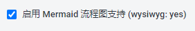
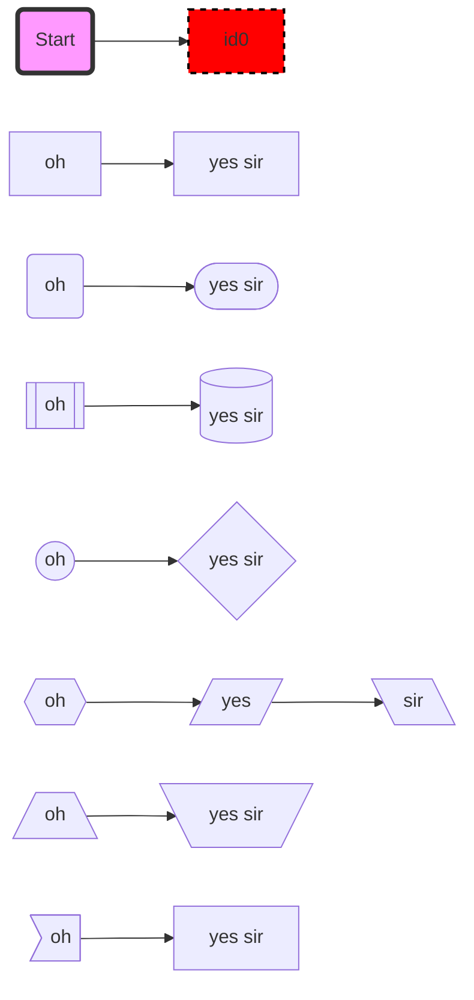
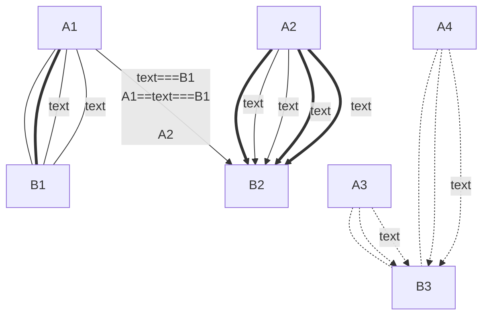
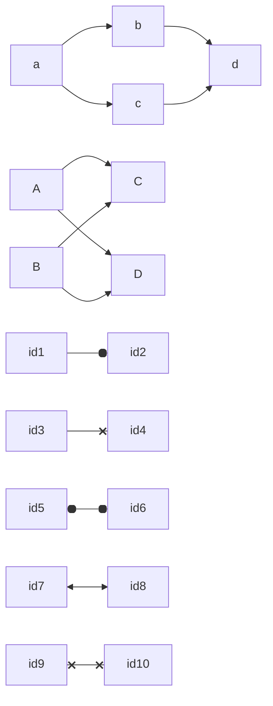
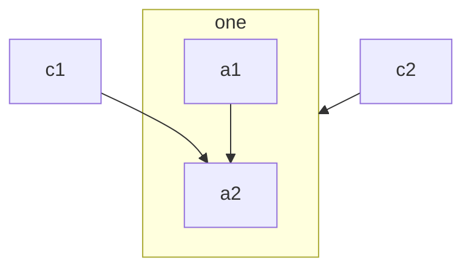
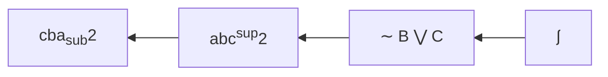
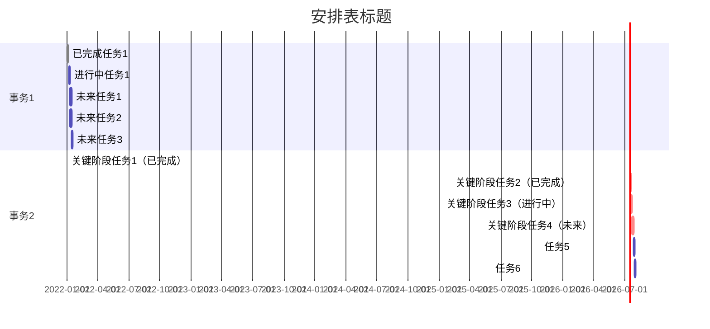
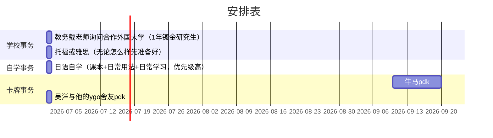

## 目录

  - 语言介绍
    - 文本标记语言
      - 轻量级标记语言
        - Markdown
      - 超文本标记语言
        - HTML
      - 文档排版系统
        - LateX
    - 样式表语言（XML，CSS，Scribe，GML，SGML等）
      - CSS
    - 编程语言
      - JavaScript
  - 编辑markdown文件的不同软件和编辑器：
    - vs2019
    - vscode
    - 印象笔记
    - Joplin
  - Markdown基本功能
    - 生成代码块
    - 改变文字颜色
    - 改变文字大小
    - 改变文字字体
    - 同时改变文字颜色大小字体
    - 生成分割线
    - 加粗文字
    - 斜体文字
    - 双删除线文字
    - 下划线文字
    - 上标内容 
    - 下标内容
    - 小号字体文字
    - 大号字体文字 
    - 文本行内代码高亮
    - 代码块代码高亮并使用关键字标识代码语言
    - 高亮文字
    - 无次序分点
    - 添加引用
    - 转义特殊符号  
    - 折叠/展开内容（通过HTML标签实现）
  - Markdown特色内嵌语法（包括LateX语法，KateX符号语法，HTML语法，CSS语法）：
    - LateX/KateX数学公式渲染格式
    - 公式中的运算符格式
    - 公式中的数值格式
    - 上标表
    - 希腊字母表
    - 二元关系符
    - 二元运算符
    - 大尺寸运算符
    - 各种箭头和不常用符号
    - 常用运算符号
    - 为块中的公式添加编号
    - 矩阵相关
    - 设置字体
  - Markdown表格、单元格合并、快速编辑表格：
    - 简单表格
    - 复杂表格（通过HTML标签实现）
    - 在表格的单格内容中打出换行符
  - Markdown使用 - 如何定义锚(链接)、引用锚(网址链接)：
    - 给文字添加超链接
    - 给文字添加Markdown文件内创建锚点跳转链接
    - Markdown文件内创建自定义锚点
    - 给Markdown中添加图片和命名
  - Markdown如何画出流程图、甘特图、图表（通过mermaid插件实现）
    - 流程图
    - 甘特图

## 语言介绍

### 文本标记语言

在计算机的世界里，在写一个文档时，有些“对白”会决定文档展示的内容，有些“说明性文字”会决定文档展示这些内容的方式，比如一个词的字体大小或一幅图片应当放置在文档中的哪一段落。在计算机的文本处理中，我们把“说明性文字”叫做“标记”。

Wiki定义：在计算机文本处理中, "文本标记语言"是一套给文档以一种语句构成上与文本易于区分的方式进行注释的系统。

#### 轻量级标记语言

##### Markdown

Markdown是一种运用纯文本格式的轻量级文本标记语言。

Markdown 在显示时会被预览工具翻译为HTML，比如`# XXX`会被翻译为`<h1>XXX</h1>`。Markdown 是 HTML 的一种简写，在显示时会『解压缩』成 HTML。理论上你可以在 Markdown 里直接插入合法的 HTML 块，他们会成为最终的 HTML 的一部分，做到 Markdown 本身做不到的事。

markdown自带部分latex语法，使用`$`和`$$`调用数学公式部分的latex（latex本来是排版语法，数学公式是其中一个小部分，markdown集成了数学公式部分）。也就是说，现在Joplin可以自定义，但是其他平台基本的markdown需要的也仅仅是最泛用的基本插件。现在混杂了html和latex的markdown是较为通用的，不需要担心兼容性不够。

Markdown 的格式可以由 CSS 描述预览工具或者用户可以自己决定用什么 CSS 显示，怎么好看怎么来。

#### 超文本标记语言

简单来说，当你看见将你带向其他文本的文本，你或许可以将它视为超文本。

Wiki定义：超文本是一种在计算机屏幕或其他的电子设备上，含有指向其他读者可以快速访问的文本的引用（超链接）的文本。

##### HTML

HTML（Hypertext Markup Language）就是超文本语言。

Wiki定义：HTML是创建网页和网页应用的标准文本标记语言。

一个“纯粹”的HTML网页通常是静态的，而你在网上看到的大多数的网页似乎是动态的。这是因为：HTML可以内嵌用像JavaScript这样的脚本语言写成的程序，后者决定了网页的行为和内容。CSS的运用定义了内容的外观和排版。HTML和CSS标准的维护者——万维网联盟（W3C）从1997年起一直在鼓励用CSS取代复杂的用于表现的HTML元素。

#### 文档排版系统

##### LateX

LaTeX（Lamport TeX，缩写为LaTeX)是一种文档排版系统。 在编写文档时，作者应运用一种同用“WYSIWYG”（“所见即所得”）文本格式的文字处理软件如Microsoft Word、LibreOffice Writer和Apple Pages相反的纯文本。作者用预先设置好的文本标记来定义整个文档（比如文章、书籍、信件）的总体结构、规定整个文档的文本风格（比如加粗、斜体）和添加引用、参考。

### 样式表语言（XML，CSS，Scribe，GML，SGML等）

样式表语言（或样式语言）是用来表示结构化文档的展现方式的语言。

简单来说，样式表语言描述你的文档里的内容怎么展示。

#### CSS

CSS（层叠样式表）是一种用于描述用像HTML这样的语言写成的文档的展示方式的样式表语言。

CSS同HTML和JavaScript一起是万维网（World Wide Web）的基数奠基石。

除了HTML，其它的支持CSS的文本标记语言还有XHTML、plain XML、SVG、XUL等。

### 编程语言

#### JavaScript

JavaScript通常被缩写为JS，它是一种遵从ECMAScript标准的高级的解释型语言。它是一种有动态化、弱类型、基于原型和跨平台等特点的语言。

## 编辑markdown文件的不同软件和编辑器：

### vs2019

在visual studio下载扩展，关闭vs后安装

可以直接新建.md的文件，然后右键vs打开

或者用vs打开一个文件夹，新建（推荐，可以管理文件夹下的所有md文件，而且这样可以避免vs打开文件夹出错）

### vscode

用vscode也可以，需要到插件商店下载相应的插件

- Markdown All in One
- Markdown Preview Enhanced
- Markdown Preview Github Styling
- Paste Image

### 印象笔记

新建笔记右边即可选择新建“Markdown”笔记。但是语法支持非常差。

### Joplin

直接下载安装Joplin，使用默认编辑器即可。除此之外，Joplin也可以使用外部的其他的markdown编辑器。

## Markdown基本功能

 ### 生成不同级别的标题
 
  `#（任意数量个#）+空格+文字内容` 
 
 根据#数量，生成不同级别的标题，#越多标题级数越大

### 生成代码块

 `四个空格/Tab键+文字内容（仅vs2019适用）`

将“文字内容”置于代码块中。

### 改变文字颜色

`<font color="颜色代码（如：00fff)">文字内容</font>`   

改变文字内容的字体颜色

###  改变文字大小

`<font size="数字（如：7）">文字内容</font>`

改变文字内容的字体大小

### 改变文字字体

`<font face="字体名称（如：微软雅黑）">文字内容</font>`

改变文字内容的字体类型

### 同时改变文字颜色大小字体

`<font face="字体名称（如：微软雅黑）" color="颜色代码（如：00fff)" size="数字（如：7）">文字内容</font>`

同时改变文字内容的颜色大小，大小，字体（印象笔记不适用）

### 生成分割线

 ` *** ` 

在当前行生成分割线

### 加粗文字

`__文本内容__` 或者 `文本内容`

加粗“文本内容”

### 斜体文字

` _文本内容_ 或者 *文本内容* `

斜体“文本内容”

### 双删除线文字

` ~~文本内容~~`

双删除线“文本内容”

### 下划线文字

`<u>文本内容</u>`

下划线“文本内容”， markdown自身没有实现下划线，但markdown是HTML的子集，实现了\<u>标签。

### 上标内容 

`文本内容^上标内容^`

` 文本内容<sup>上标内容</sup> `

对“文本内容”上标“上标内容”，HTML语法。

### 下标内容

` 文本内容~下标内容~ `

`文本内容<sub>下标内容</sub>`

对“文本内容”下标“下标内容”，HTML语法。

### 小号字体文字

`<small>文本内容</small>`

小号字体的“文本内容”

### 大号字体文字 

`<big>文本内容</big>`

大号字体的“文本内容”

### 文本行内代码高亮

`代码内容`

对“代码内容”进行普通文本的行内代码高亮，如果需要高亮符号"`` ` ``"，则需要"``` `` ` `` ```"，两个则需要"```` ``` ```` 空格 ``` `` ``` 空格 ```` ``` ````"。代码中连续的`` ` ``，不能超过代码块最外侧的`` ` ``的数量。例如，要打印```` ``` ````（3个），代码块需使用````` ```` `````（4个）声明，以此类推。

### 代码块代码高亮并使用关键字标识代码语言

````

```py 
文本内容
```

````

对“文本内容”进行代码块的代码高亮（即放置于代码块中），py是增强代码块的特性（关键字），指代码块是python语法（可以不加），不同的markdown编辑器对此支持可能会有不同。`` ` ``的数量要求与文本行内代码高亮的要求一致。

关键字：

|语言|关键字|
|---|---|
|1C|1c|
|ActionScript|actionscript|
|Apache|apache|
|AppleScript|applescript|
|AppleScript 3.0|applescript3,as3|
|AsciiDoc|asciidoc|
|AspectJ|asciidoc|
|AutoHotkey|autohotkey|
|AVRAssembler|avrasm|
|Axapta|axapta|
|Bash|bash|
|BrainFuck|brainfuck|
|Cap'n Proto|capnproto|
|Clojure REPL|clojure|
|Clojure|clojure|
|CMake|cmake|
|CoffeeScript|coffeescript|
|ColdFusion|coldfusion,cf|
|C|c,cpp|
|C++|cpp|
|C#|cs,c#,c-sharp,scharp|
|CSS|css|
|D|d|
|Dart|d|
|Delphi|delphi,pascal,pas|
|Diff&Patch|diff patch|
|Django|django|
|DOS.bat|dos|
|Dust|dust|
|Elixir|elixir|
|ERB(Embedded Ruby)|erb|
|Erlang REPL|erlang-repl|
|Erlang|erl,erlang|
|FIX|fix|
|F#|f#,f-sharp,fsharp|
|G-code(ISO 6983)|gcode|
|Gherkin|gherkin|
|GLSL|glsl|
|Go|go,golang|
|Gradle|gradle|
|Groovy|groovy|
|Haml|haml|
|Handlebars|handlebars|
|Haskell|haskell|
|Haxe|haxe|
|HTML|html|
|HTTP|http|
|Ini file|ini|
|Java|java|
|JavaFX|jfx,javafx|
|JavaScript|js,jscript,javascript|
|JSON|json|
|Lasso|lasso|
|Less|less|
|Lisp|lisp|
|LiveCode|livecodeserver|
|LiveScript|livescript|
|Lua|lua|
|Makefile|makefile|
|Markdown|markdown|
|Mathematica|mathematica|
|Matlab|matlab|
|MEL(Maya Embedded Language)|mel|
|Mercury|mercury|
|Mizar|mizar|
|Monkey|monkey|
|Nginx|nginx|
|Nimrod|nimrod|
|Nix|nix|
|NSIS|nsis|
|Objective C|objc,obj-c,objectivec|
|OCaml|ocaml|
|Oxygene|oxygene|
|Parser 3|parser3|
|Perl|perl,pl,Perl|
|PHP|php|
|PowerShell|powershell|
|Processing|processing|
|Python’s profiler output|profile|
|Protocol Buffers|protobuf|
|Puppet|puppet|
|Python|py,python|
|Q|q|
|R|r,s,splus|
|RenderMan RIB|rib|
|Roboconf|roboconf|
|RenderMan RSL|rsl|
|Ruby|ruby,rails,ror,rb|
|Oracle Rules Language|ruleslanguage|
|Rust|rust|
|Shell|bash,shell|
|Scala|scala|
|Scheme|scheme|
|Scilab|scilab|
|SASS&SCSS|sass,scss|
|Smali|smali|
|SmallTalk|smalltalk|
|SML|sml|
|SQL|sql|
|Stata|stata|
|STEPPart21(ISO 10303-21)|step21|
|Stylus|stylus|
|Swift|swift|
|Tcl|tcl|
|Tex/LaTeX|tex|
|text|text,plain|
|Thrift|thrift|
|Twig|twig|
|TypeScript|typescript|
|Vala|vala|
|Bisual Basic/VB.NET|vb,vbnet|
|VBScript in HTML|vbscript-html|
|VBScript|vbscript|
|Verilog|verilog|
|VHDL|vhdl|
|Vim Script|vim|
|Intel x86 Assembly|x86asm|
|XL|xl|
|XML|xml,xhtml,xslt,html|
|YAML|yml|

### 高亮文字

`<mark>文本内容<mark>`

普通高亮“文本内容”，CommonMark中并未定义普通文本高亮，因此使用\<mark>，它是HTML标签。

### 无次序分点

`-文本内容`

给"文本内容"前加上分点分段符" · "，相当于分点。

### 添加引用

`>文本内容`

将"文本内容"放置于引用框内。

### 转义特殊符号  

`\特殊符号`

使"特殊符号"表示其原本的样子，反斜杠"\\"是转义字符。Markdown使用了很多特殊符号来表示特定的意义，如果需要显示特定的符号则需要使用转义字符，Markdown使用反斜杠"\\"转义特殊字符。

### 折叠/展开内容（通过HTML标签实现）

```
<details>
<summary>折叠名</summary>
空行
折叠内容
</details>
```

## Markdown特色内嵌语法（包括LateX语法，KateX符号语法，HTML语法，CSS语法）：

### LateX/KateX数学公式渲染格式

`$公式内容$`

单个`$`包围的"公式内容"将会根据katex数学公式语法进行渲染，且渲染成行内形式。

`$$公式内容$$`

两个`$`包围的"公式内容"将会根据katex数学公式语法进行渲染，且渲染成块状形式。

### 公式中的运算符格式

`\运算符`

运算符以`\`开头。

### 公式中的数值格式

`{x}`

数值以"`{}`"包围。

基本格式：

|语法|效果|
|:--:|:--:|
|次幂：^{指数}|$x^{2}$|
|对数：log_{底数}^{指数}|$log_{2}^{4}$|
|加法：{a}+{b}|${a}+{b}$|
|减法：{a}-{b}|${a}-{b}$|
|乘法：{a}\times{b}|${a}\times{b}$|
|除法：{a}\div{b}|${a}\div{b}$|

### 上标表

|语法|效果|
|:--:|:--:|
|拼音一声/平均值：\bar{a}或\text{\={a}}或\text{\~{a}}|$\bar{a}$或$\text{\={a}}$|
|覆盖所有文本的平均值：\overline|$\overline{a}$|
|拼音二声：\acute{a}或\text{\'{a}}|$\text{\'{a}}$|
|拼音三声：\check{a}或\text{\v{a}}或\text{\u{a}}|$\text{\v{a}}$|
|拼音四声：\grave{a}或\text{\`{a}}|$\text{\`{a}}$|
|上标一点：\text{\.{a}}或\dot{a}|$\text{\.{a}}$|
|上标两点：\ddot{a}或\text{\"{a}}|$\text{\"{a}}$|
|两撇上标：\text{\H{a}}|$\text{\H{a}}$|
|倒A上标：\text{\^{a}}或者\hat{a}|$\hat{a}$|
|大倒A上标：\widehat{a}|$\widehat{a}$|
|空心点上标：\text{\r{a}}|$\text{\r{a}}$|
|向量上标：\vec{a}|$\vec{a}$|
|波浪号上标：\widetilde{a}|$\widetilde{a}$|
|圆弧上标：\mathop{a}\limits^{\frown}|$\mathop{a}\limits^{\frown}$|
|角度、摄氏度的"度"上标：\circ|$a^{\circ}$|
|东亚文字的拼音上标：`<ruby>`标签。其中`<rp>`标签在`<ruby>`不适用时显示其内容且遵从`<rt>`的规定（在joplin中不需要），`<rt>`标签则规定为东亚文字发音、翻译或音译信息的排版。|<ruby>注音<rp>yīn zhù</rp><rt>yīn zhù</rt></ruby> / <ruby>注音<rt>yīn zhù</rt></ruby> / <ruby>注<rt>yīn</rt>音<rt>zhù</rt></ruby>|

### 希腊字母表

|语法|效果|语法|效果|
|:--:|:--:|:--:|:--:|
|\alpha|$\alpha$|\beta|$\beta$|
|\gamma|$\gamma$|\delta|$\delta$|
|\epsilon|$\epsilon$|\varepsilon|$\varepsilon$|
|\zeta|$\zeta$|\xi|$\xi$|
|\theta|$\theta$|\vartheta|$\vartheta$|
|\iota|$\iota$|\kappa|$\kappa$|
|\lambda|$\lambda$|\mu|$\mu$|
|\nu|$\nu$|\tau|$\tau$|
|o|$o$|\pi|$\pi$|
|\varpi|$\varpi$|\rho|$\rho$|
|\varrho|$\varrho$|\sigma|$\sigma$|
|\varsigma|$\varsigma$|\upsilon|$\upsilon$|
|\phi|$\phi$|\varphi|$\varphi$|
|\chi|$\chi$|\psi|$\psi$|
|\omega|$\omega$|\eta|$\eta$|
|\Gamma|$\Gamma$|\Delta|$\Delta$|
|\Theta|$\Theta$|\Lambda|$\Lambda$|
|\Xi|$\Xi$|\Pi|$\Pi$|
|\Sigma|$\Sigma$|\Upsilon|$\Upsilon$|
|\Phi|$\Phi$|\Psi|$\Psi$|
|\Omega|$\Omega$|由希腊字母简写得来而非希腊字母：\partial|$\partial$|

### 二元关系符

注意：可以通过在下述命令前加上\not 来得到其否定形式，如"\not >"即为$\not >$。

|语法|效果|语法|效果|
|:--:|:--:|:--:|:--:|
|<|$<$|>|$>$|
|=|$=$|\leq或\le|$\leq$|
|\geq或\ge|$\geq$|\equiv\equiv|$\equiv$|
|\ll|$\ll$|\gg|$\gg$|
|波浪号：\sim|$\sim$|\simeq|$\simeq$|
|\subset|$\subset$|\supset|$\supset$|
|约等于号：\approx|$\approx$|\subseteq|$\subseteq$|
|\supseteq|$\supseteq$|\cong|$\cong$|
|包含：\in|$\in$|\ni或\owns|$\ni$|
|\propto|$\propto$|\mid|$\mid$|
|\parallel|$\parallel$|:|$:$|
|\notin|$\notin$|不等于号：\neq或\ne|$\neq$|

### 二元运算符

|语法|效果|语法|效果|
|:--:|:--:|:--:|:--:|
|+|$+$|-|$-$|
|\mp|$\mp$|\pm|$\pm$|
|\triangleleft|$\triangleleft$|\triangleright|$\triangleright$|
|\cdot|$\cdot$|\div|$\div$|
|\times|$\times$|setminus|$setminus$|
|\star|$\star$|\ast|$\ast$|
|\cup|$\cup$|\cap|$\cap$|
|\circ|$\circ$|\bullet|$\bullet$|
|\vee或\lor|$\vee$|\wedge或land|$\wedge$|
|\oplus|$\oplus$|\ominus|$\ominus$|
|\odot|$\odot$|\oslash|$\oslash$|
|\otimes|$\otimes$|\diamond|$\diamond$|
|\bigtriangleup|$\bigtriangleup$|\bigtriangledown|$\bigtriangledown$|
|\bigcirc|$\bigcirc$|

### 大尺寸运算符

|语法|效果|语法|效果|
|:--:|:--:|:--:|:--:|
|\sum|$\sum$|\bigcup|$\bigcup$|
|\bigvee|$\bigvee$|\bigoplus|$\bigoplus$|
|\prod|$\prod$|\bigcap|$\bigcap$|
|\bigwedge|$\bigwedge$|\bigotimes|$\bigotimes$|
|\coprod|$\coprod$|\int|$\int$|
|\oint|$\oint$|\bigodot|$\bigodot$|

### 各种箭头和不常用符号

|语法|效果|语法|效果|
|:--:|:--:|:--:|:--:|
|\leftarrow或\gets|$\leftarrow$|\longleftarrow|$\longleftarrow$|
|\uparrow|$\uparrow$|\downarrow|$\downarrow$|
|\rightarrow或\to|$\rightarrow$|\longrightarrow|$\longrightarrow$|
|\leftrightarrow|$\leftrightarrow$|updownarrow|$\updownarrow$|
|\Leftarrow|$\Leftarrow$|\Longleftarrow|$\Longleftarrow$|
|\Uparrow|$\Uparrow$|\Downarrow|$\Downarrow$|
|\Rightarrow|$\Rightarrow$|\Longrightarrow|$\Longrightarrow$|
|\Leftrightarrow|$\Leftrightarrow$|\Updownarrow|$\Updownarrow$|
|\nearrow|$\nearrow$|\searrow|$\searrow$|
|\swarrow|$\swarrow$|\nwarrow|$\nwarrow$|
|\leftharpoonup|$\leftharpoonup$|\rightharpoonup|$\rightharpoonup$|
|\leftharpoondown|$\leftharpoondown$|\rightharpoondown|$\rightharpoondown$|
|\rightleftharpoons|$\rightleftharpoons$|\iff|$\iff$|
|\nrightarrow|$\nrightarrow$|\nleftarrow|$\nleftarrow$|
|\ddots|$\ddots$|\dots|$\dots$|
|居中省略号：\cdots|$\cdots$|\vdots|$\vdots$|
|底部省略号：\ldots|$\ldots$|二项式结构：\binom{n}{m}|$\binom{n}{m}$|
|\ell|$\ell$|\triangle|$\triangle$|
|\imath|$\imath$|\jmath|$\jmath$|
|’|$’$|\prime|$\prime$|
|\emptyset|$\emptyset$|\mho|$\mho$|
|\angle|$\angle$|\surd|$\surd$|
|\bot|$\bot$|\top|$\top$|
|\nabla|$\nabla$|\neg或\lnot|$\neg$|
|任意：\\forall|$\forall$|存在：\\exists|$\exists$|

### 常用运算符号

|语法|效果|语法|效果|
|:--:|:--:|:--:|:--:|
|\sin\theta|$\sin\theta$|\cos\theta|$\cos\theta$|
|\tan\theta|$\tan\theta$|\cot\theta|$\cot\theta$|
|\csc\theta|$\csc\theta$|\sec\theta|$\sec\theta$|
|反正弦函数：\arcsin\theta|$\arcsin\theta$|\arccos\theta|$\arccos\theta$|
|分数：\frac{a}{b}|$\frac{a}{b}$|\log X|$\log X$|
|开根号：\sqrt{a}|$\sqrt{a}$|\sqrt[b]{a}|$\sqrt[b]{a}$|
|极限：\lim A|$\lim A$|\lim_{i \to n}x_i|$\lim_{i \to n}x_i$|
|在其他编辑器中分别处于$\Sigma$号的正上方和正下方：\sum_{k=1}^N k^2|$\sum_{k=1}^N k^2$|\begin{matrix} \sum_{k=1}^N k^2 \end{matrix}|$\begin{matrix} \sum_{k=1}^N k^2 \end{matrix}$|
|在其他编辑器中分别处于$\prod$号的正上方和正下方：\prod_{i=1}^N x_i|$\prod_{i=1}^N x_i$|\begin{matrix} \prod_{i=1}^N x_i \end{matrix}|$\begin{matrix} \prod_{i=1}^N x_i \end{matrix}$|
|在其他编辑器中分别处于$\int$号的正上方和正下方：\int_{-N}^{N} e^x\, dx|$\int_{-N}^{N} e^x\, dx$|\begin{matrix} \int_{-N}^{N} e^x\, dx\end{matrix}|$\begin{matrix} \int_{-N}^{N} e^x\, dx\end{matrix}$|
|\iint_{-N}^{N} e^x\, dx|$\iint_{-N}^{N} e^x\, dx$|\iiint_{-N}^{N} e^x\, dx|$\iiint_{-N}^{N} e^x\, dx$|
|\oint_{C} x^3\, dx + 4y^2\, dy|$\oint_{C} x^3\, dx + 4y^2\, dy$|数学公式内容中打出普通空格："\\;"大空格："\ "，超大空格："\quad"，超超大空格 "\qquad"|$\;$|

### 为块中的公式添加编号

**公式\tag{编号}**

$$a+b=c \tag{1}$$

### 矩阵相关

|语法|效果|
|:--:|:--:|
|\begin{bmatrix}x & y \\\ z & v\end{bmatrix}|$\begin{bmatrix}x & y \\z & v\end{bmatrix}$|
|\begin{vmatrix}x & y \\\ z & v\end{vmatrix}|$\begin{vmatrix}x & y \\z & v\end{vmatrix}$|
|f(n) =\begin{cases}n/2,{\ if \ n \ is \ even} \\\ 3n+1,{\ if\ n \ is \ odd}\end{cases}|$f(n) =\begin{cases}n/2,{\ if \ n \ is \ even} \\ 3n+1,{\ if\ n \ is \ odd}\end{cases}$<br>$f(n) =\begin{cases} \frac{1}{\sqrt{2\pi}\sigma x}e^{\frac{-[ln(x)-\mu]^2}{2\sigma^2}} , x \geq 0 \\ 0 \qquad \qquad  \quad \; \; ,x<0 \end{cases}$|
|\begin{cases}3x + 5y + z = 0\\7x - 2y + 4z = 0 \\-6x + 3y + 2z = 0\end{cases}|$\begin{cases}3x + 5y + z = 0\\7x - 2y + 4z = 0 \\-6x + 3y + 2z = 0\end{cases}$|
|\begin{matrix} 2 \\ \overbrace{\begin{bmatrix}x & y \\z & v\end{bmatrix}}\end{matrix}|$\begin{matrix} 2 \\ \overbrace{\begin{bmatrix}x & y \\z & v\end{bmatrix}}\end{matrix}$|
|\begin{matrix} \underbrace{\begin{vmatrix}x & y \\z & v\end{vmatrix}}\\ 2 \end{matrix}|$\begin{matrix} \underbrace{\begin{vmatrix}x & y \\z & v\end{vmatrix}}\\ 2 \end{matrix}$|

### 设置字体

|语法|效果|
|:--:|:--:|
|\tiny{文本}|$\tiny{文本}$|
|\scriptsize{文本}|$\scriptsize{文本}$|
|\footnotesize{文本}|$\footnotesize{文本}$|
|\small{文本}|$\small{文本}$|
|\normalsize{文本}|$\normalsize{文本}$|
|\large{文本}|$\large{文本}$|
|\Large{文本}|$\Large{文本}$|
|\LARGE{文本}|$\LARGE{文本}$|
|\huge{文本}|$\huge{文本}$|
|\Huge{文本}|$\Huge{文本}$|
|加粗：\textbf{文本}|$\textbf{文本}$|

## Markdown表格、单元格合并、快速编辑表格：

### 简单表格

```
| 第一列头行内容 | 第二列头行内容 | 第三列头行内容 | 第四列头行内容 | 

//这是表格的每一列头一行的内容，称为“表头”

| :----- | ----: | :----: | ---- | 

//从左到右对应：文本居左、文本居右、文本居中、默认文本，规定的是当前列的文本格式

| 单元格内容 | 单元格内容 | 单元格内容 | 单元格内容 | 

//表格内容第一行

| 单元格内容 | 单元格内容 | 单元格内容 | 单元格内容 | 

//表格内容第二行
//以此类推
 ```

制作普通的格子表格，第二行的决定格式行的内容必须作为表头和单元格的分隔，且格数与表头一一对应（否则会无法识别），其中的冒号位置决定当行格子的字体格式，与单元格可以不一一对应

### 复杂表格（通过HTML标签实现）

例子：

<table>
  <tr>
    <th>no</th>
    <th>c1</th>
    <th>c2</th>
    <th>c3</th>
  </tr>
  <tr>
    <td>1</td>
    <td colspan="2">r1-c12</td>
    <td rowspan="2">r12-c3</td>
  </tr>
  <tr>
    <td>2</td>
    <td></td>
    <td></td>
  </tr>
  <tr>
    <td>3</td>
    <td colspan="2" rowspan="2">r34-c12</td>
    <td></td>
  </tr>
  <tr>
    <td>4</td>
    <td></td>
  </tr>
</table>

可以看出，HTML语言标签都是两两成对的。"<标签>内容</标签>"的形式可以帮助理解和记忆HTML标签的用法。

要建立一个HTML表，首先需要\<table>\<table/>，它囊括了所有关于表内容的代码，代表生成一个表。

\<tr>\</tr>按照顺序顺序决定了每一行的内容，它囊括了所有关于这一行内容的代码。

\<th>\</th>仅用于表示第一行的表头的每一列的单元格的内容。

而\<td>\</td>用于按照顺序表示当前行的每一列的单元格的内容，中间的内容直接填入表格的内容即可。

colspan="数字"表示从当前列开始向右合并一共多少列的单元格。

rowspan="数字"表示从当前行开始向下合并一共多少行的单元格。

### 在表格的单格内容中打出换行符

`<br>`   用于在表格内容中充当换行符，为HTML标签。

***

## Markdown使用 - 如何定义锚(链接)、引用锚(网址链接)：

 ### 生成目录
 
 `## 目录

  - 语言介绍
    - 文本标记语言
      - 轻量级标记语言
        - Markdown
      - 超文本标记语言
        - HTML
      - 文档排版系统
        - LateX
    - 样式表语言（XML，CSS，Scribe，GML，SGML等）
      - CSS
    - 编程语言
      - JavaScript
  - 编辑markdown文件的不同软件和编辑器：
    - vs2019
    - vscode
    - 印象笔记
    - Joplin
  - Markdown基本功能
    - 生成代码块
    - 改变文字颜色
    - 改变文字大小
    - 改变文字字体
    - 同时改变文字颜色大小字体
    - 生成分割线
    - 加粗文字
    - 斜体文字
    - 双删除线文字
    - 下划线文字
    - 上标内容 
    - 下标内容
    - 小号字体文字
    - 大号字体文字 
    - 文本行内代码高亮
    - 代码块代码高亮并使用关键字标识代码语言
    - 高亮文字
    - 无次序分点
    - 添加引用
    - 转义特殊符号  
    - 折叠/展开内容（通过HTML标签实现）
  - Markdown特色内嵌语法（包括LateX语法，KateX符号语法，HTML语法，CSS语法）：
    - LateX/KateX数学公式渲染格式
    - 公式中的运算符格式
    - 公式中的数值格式
    - 上标表
    - 希腊字母表
    - 二元关系符
    - 二元运算符
    - 大尺寸运算符
    - 各种箭头和不常用符号
    - 常用运算符号
    - 为块中的公式添加编号
    - 矩阵相关
    - 设置字体
  - Markdown表格、单元格合并、快速编辑表格：
    - 简单表格
    - 复杂表格（通过HTML标签实现）
    - 在表格的单格内容中打出换行符
  - Markdown使用 - 如何定义锚(链接)、引用锚(网址链接)：
    - 给文字添加超链接
    - 给文字添加Markdown文件内创建锚点跳转链接
    - Markdown文件内创建自定义锚点
    - 给Markdown中添加图片和命名
  - Markdown如何画出流程图、甘特图、图表（通过mermaid插件实现）
    - 流程图
    - 甘特图`
 
 在当前位置生成目录，目录只会囊括标题节点，但也会囊括所有上下文的标题节点（vs2019、vscode、Github没有相应插件就不适用此命令，只能使用软件自带的命令台生成目录）


### 给文字添加超链接

`[文本内容]\(链接网址的URL)`

给“文本内容”添加跳转到“链接网址”的超链接。

### 给文字添加Markdown文件内创建锚点跳转链接

`[文本内容)]\(#指定锚点的名字)`（Markdown方法）

`\<a href=”#指定锚点的名字”>文本内容`（HTML方法）

给“文本内容”添加跳转到“指定锚点”的超链接。注意一到六级的标题默认都属于是锚点。

### Markdown文件内创建自定义锚点

`<span id="锚点名称">名称</span>`

我们使用HTML语法来定义一个锚。可选的HTML标签很多，比如\<span>、\<a>等等。"锚点名称"为必填项，“名称”可以随便填写，也可以不填（不影响括号内的锚点定义）。另外，可以给span增加其他属性，比如颜色等等。

### 给Markdown中添加图片和命名

单张图片：

``

多张图片（在同一行）：

``

给Markdown中添加图片，并进行命名（有时网页无法加载图片时命名可以提供一定量信息，除此之外还可以作为被搜索时的关键词）。

"optional title"：鼠标悬置于图片上会出现的标题文字，可以不写。

使用base64编码时，为了避免未渲染模式下图片的编码字符串太多影响阅读，可以采用类似C++的"一次定义变量，多次调用"的方法。

`调用处：!\[图片名][图片变量名"图片标题"]`
`末尾放置编码处：(与调用处相隔至少一行)：[图片变量名]:base64编码字符串`

把一大串的字符串放在文章末尾，可以提高可读性，也方便进行多次的调用。

## Markdown如何画出流程图、甘特图、图表（通过mermaid插件实现）

无论是什么方法画流程图，这种非标附加语法都是通过JavaScript实现的，通过JavaScript可以实现几乎任意功能，但其始终不住于markdown标准语法。

### 流程图

Joplin需要在"选项"中勾选：



所有图的语法均为：

````
```mermaid
图类型指令
代码段
```
````

示例：

flowchart后面的字母决定了图的整体方向。从左到右LR，从右到左RL，从下到上为BT，从上到下为TD或者TB。




使用graph作为图类型指令与flowchart是等效的。





子图语法：

````
```mermaid
subgraph 子图1[子图名]
subgraph 子图2[子图名]
end
```
````



插入部分数学符号的方法：在定义内容时，在双引号`""`中使用`#`代替转义号`\`，使用`;`作为结尾。

但是如果是需要参数的数学符号，目前打不出来，可以使用HTML标签实现。



### 甘特图



关键词说明：
title—标题
dateFormat—日期格式
section—模块
Completed—已经完成
Active—当前正在进行
Future—后续待处理
crit—关键阶段
#h—跨度为几小时
#d—跨度为几天
after XX—在任务变量名为"XX"的任务后

`任务名:是否关键,任务状态,任务变量名,时间及跨度`

大一安排表例子：



***