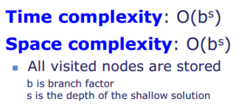
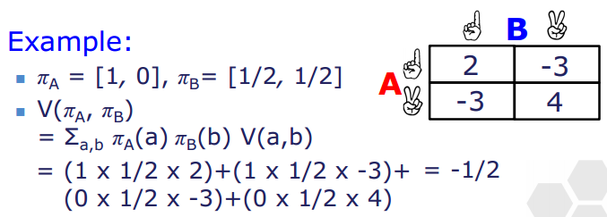
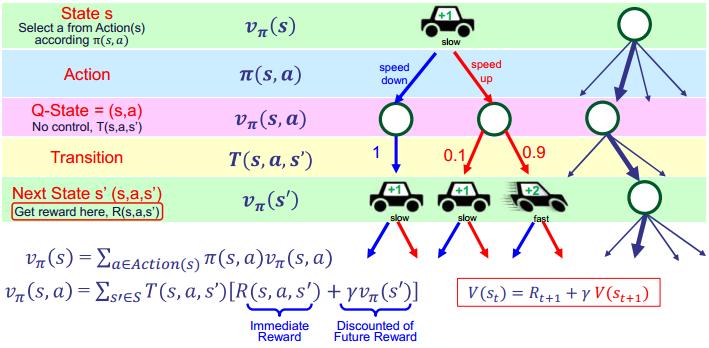
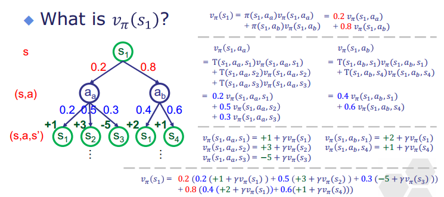
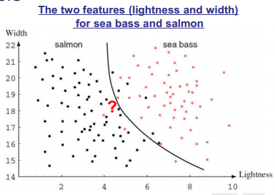
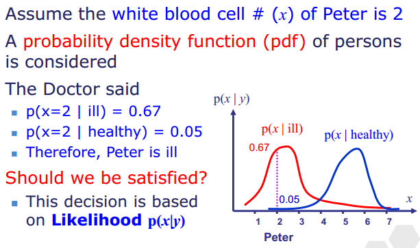
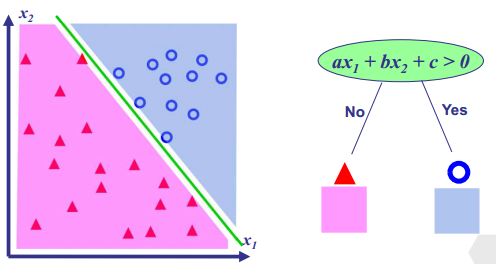

## 目录

  - L1
  - L2 Problem Solving & Search
  - L3 
  - L4 Game Playing
  - L5
  - L6 强化学习
  - L7 有监督学习
  - L8 分类器
  - L9 deep learning and ensemble
  - Python Lab
    - Lab03
  - Python Project
  - 神经网络相关
    - tensorflow调用GPU进行训练的前置步骤-配置CUDA和cuDNN
    - 补充：PyTorch安装（和Tensorflow同级，同样需要先配置CUDA和cuDNN）
    - 检测是否使用GPU运行程序，并过滤tensorflow的警告和错误
    - 使用tensorflow2.0运行tensorflow1.0的语句所需的改动
    - 使用Python2运行tensorflow的注意事项
  - Python程序降低时间和空间复杂度的具体优化方案
    - 转换平台Matlab计算
    - Tensorflow和keras（算法）
      - Embedding层
    - tensorflow优化方法
      - Estimator计算图
      - tf.data
        - tf.data的prefetch
        - tf.data的parallel mapping
      - tensorflow2图执行模式
    - scipy-稀疏矩阵（算法）
    - cupy（调用GPU）
    - cupy和numpy的内存数据异步传输，节省时间和内存空间（异步数据传输）
    - Numba（更高效的编译器）
    - 内存和算力硬件提升（云算力）
      - AutoDL

## L1

Weak AI：像人类一样执行任务。不了解任务背后的含义。

Strong AI：能够思考并拥有理解力（思维）。

Agent：可以与环境互动的实体（entity），有时称为主体/智能体。

非机器学习（non-machine learning）：

- 搜索（searching）：Agent找到以最小代价达到目标状态的行为序列。

- 约束满足问题（constraint satisfaction problem）：找到满足约束条件的解决方案。

- 游戏玩法（Game Playing）：与对手竞争，对手根据你的决定采取行为。

- 马尔可夫决策过程（Markov Decision Processes，MDP）：考虑环境的不确定性。

机器学习（machine learning）：

- 强化学习（reinforcement learning）为Agent从奖励或惩罚中学习。强化（reinforcement）鼓励行为，惩罚（punishment）不鼓励行为。

- 有监督学习（supervised learning）：有监督学习为人为给出明确标签（也包括正确和错误）的学习。应用例如回归（regression）和图像检测。

- 无监督学习（unsupervised learning）：无监督学习为未知标签的学习。应用例如聚类（clustering）和离群值检测（outlier detection）。

- 深度学习（deep learning）：


深度学习是指具有深度结构的人工神经网络进行的机器学习。

## L2 Problem Solving & Search

大纲：

- 问题解决（problem solving）。
- 问题公式化（problem formulation）。包括转化为图（graph）、转化为树。
- 树搜索（tree search）。包括代价敏感搜索、代价不敏感搜索。

问题解决：


- 通过采取一系列的行为（action），从初始（initial）状态到达目标（goal）状态。

- Environment：环境。问题的整体。

- Agent：可以与环境互动的实体（entity）。

- State（$S$）：环境的状态。

- Action（$A(S_t)$）：行为。可能会需要成本（cost）。

- Cost（$Cost(S_t,A)$）：成本。

- 转换函数（transition function）/下一状态：

$$Succ(S_t,A_t)=\operatorname{Env}\left(S_t, A_t\right)=S_{t+1}$$

- 确定性（deterministic）：

$$P\left(S_{t+1} \mid S_t, A_t\right)=0 \; or \; 1$$

- 非确定性（non-deterministic）：

$$P\left(S_{t+1} \mid S_t, A_t\right)=[0,1]$$

问题公式化（formulation）：

- 将一个真实的问题转化为一个可以用我们的算法解决的问题。（公式化几乎是问题解决中最重要的环节）

搜索（search）：

- 搜索任务分为两种，明确目标和未知目标的。

- 搜索任务满足确定性。

***

例题：


通过State，Action，Cost，Succ（转换函数）一起表示一个搜索任务，格式如下：

- State: 机场和当前时间

——Start State: 起始机场

——End State: 目的地机场

- Action(s): 飞往下一个机场
- Succ(s,a):  前一机场乘坐的航班到达的目的地机场（转换函数的结果就是目标状态）
- Cost(s,a): 航班所需时间

换成用图（graph）来进行表示：


***

- 代价敏感（cost-sensitive）搜索问题的行为有不同的成本，方法为统一代价搜索（Uniform Cost Search，UCS）。
- 代价不敏感（cost-insensitive）搜索问题的行为均有相同的成本，方法为树搜索（tree）。

代价不敏感搜索问题常用算法有深度优先搜索（Depth First Search，DFS）、广度优先搜索（Breadth First Search，BFS）。对搜索算法的评价包括：完整性（completeness），当存在解时算法是否一定能找到解。最优性（optimality），算法找到的解是否均为最优解。时间空间复杂度。

广度优先搜索（遇到分叉口均在下一步同时搜索，找到的第一个解即为最优解）：




深度优先搜索（每一步都沿最左路径搜索，找不到且为尽头则退回前一个分叉口选择另一分叉，一旦找到某一解就直接采用）：


为避免深度优先搜索可能发生的无限搜索情况（例如棋类游戏，深度近乎无限），可以使用深度限制搜索（Depth-Limited Search），对深度搜索能够达到的最大深度作出限制，如果到达限制深度则视为没找到，退回前一个分叉口。最大深度$n$如果如果太大可能会错过最优解，如果太小则可能会出现找不到解的情况：


迭代深化搜索（Iterative Deepening Search，IDS）是深度限制搜索的改良版本。通过替换不同的系数$i$，多次进行$n=iN$的深度限制搜索，直到找到解为止，提升了找到最优解的几率，且避免了找不到解的情况：


双向搜索（Bidirectional Search，BS）是通过同时构建两个广度优先搜索树，且方向相反，当相遇时停止，获得最优解：


代价敏感搜索问题常用算法有Dijkstra's算法，A* 搜索：

- PastCost：从开始状态到某点的最小代价。

- FutureCost：从某点点到最终状态的最小代价。

Dijkstra's算法也称为统一代价搜索（Uniform Cost Search），基本思想是扩大探索区域以覆盖最终状态（也就是解），而且每次都进行使得具有最小PastCost的行为：

$$\operatorname{Cost}^{\prime}(\mathrm{S}, \mathrm{A})=\operatorname{Cost}(\mathrm{S}, \mathrm{A})$$


A* 搜索不仅考虑PastCost，还会使用启发式函数（heuristic function）$h(A)$来估算FutureCost，以期进行具有最小PastCost+FutureCost的行为：

$$\operatorname{Cost}^{\prime}(\mathrm{S}, \mathrm{A})=\operatorname{Cost}(\mathrm{S}, \mathrm{A})+\mathrm{h}(\mathrm{A})$$


启发式函数的选取决定了A* 搜索的性能，例如存在障碍物的自动寻路：


## L3 

约束满足问题（Constraint Satisfaction Problems，CSP）：专注于最终的解决方案，而不是如何找到解决方案。约束满足问题由以下部分组成（一个最简单的约束满足问题例子）：

变量组：

$$V=\{V_1,V_2\}$$

变量的定义域：

$$dom(V_1)=\{1,2,3,4\}$$

$$dom(V_2)=\{1,2,3,4\}$$

约束组：

$$C=\{C_1:V_1 < 2,C_2:V_2>V_1+1 \}$$

根据以上三项，可得解：

$$\{V_1=1,V_2=3\}$$

$$\{V_1=1,V_2=4\}$$

约束网络（constraint network）由圆形（变量），方框（约束）组成：


约束满足问题（CSP）也可以使用搜索算法：


回溯（backtracking）搜索对CSP的每个变量使用深度优先搜索。回溯搜索的思想是一个一个放置结果，每个结果放置后都会对后一个结果能放置的位置产生约束，若无法放置下一个结果，称为违反（violation）约束，则回溯到前一个结果。

经典问题为"8皇后问题"。以下例子为"红蓝绿格子不能同色相邻"的格子放置问题，出现三种颜色均不能填的格子就说明需要进行回溯了：


改进回溯搜索，使用变量排序（variable ordering）。变量排序，优先选择最小剩余值（Minimum Remaining Values，MRV），也就是每一步选择当前受约束最强（可能性最小）的格子：


变量排序，启发式程度（degree heuristic），每一步选择将使得最多数量的未填格子的受约束程度增长（可能性减少）的格子：


变量排序，最小约束值（least constraining value，LCV），每一步选择使得后续填写具有最大可能性，也就是将使得受影响的未填格子的受约束程度增长最少（可能性减小最少）的格子：


缺点是无法提前停止。无用的步骤会浪费资源：


前向检查（forward checking）：

前向检查跟踪未赋值变量的剩余合法值的数量，轮流使每个变量对每种约束都进行一遍检查，若检查得到"可能"违反约束的定义域取值（例如一个节点取值只能是绿色，前向检查将去除其相邻节点定义域中的绿色，因此前向检查仅仅是通过约束来削减定义域范围而已），则直接将对应变量的定义域去除对应的取值，此过程对资源的消耗巨大：


三元（ternary）约束，三个连接节点都不能是任意两种颜色之一，称为路径不一致（path inconsistent）。

二元约束（binary constraint），两个连接节点不能是同一种颜色，称为弧不一致（arc inconsistent）。

一元约束（unary constraint），某个节点不能是任何一种颜色，称为节点不一致（node inconsistent）。

节点一致性（node consistency）：


某一节点$X$的所有可取值$x$（或者说定义域$dom(X)$中的所有值）均满足一元约束$c(x)$，则此节点满足一致性。不满足则修改定义域。

弧度一致性（arc consistency）：


某一弧$<X,c(x,y)>$对所有可取值$x$，都存在对应的可取值$y$，满足二元约束$c(x,y)$，则此弧满足一致性。注意与弧$<Y,c(x,y)>$是不同的。不满足则修改定义域，且只能移除$dom(X)$的值不能增加$dom(Y)$的值。

$k$一致性（k-consistent）：

对于CSP，对任意$k-1$个变量组成的变量集，且对这些变量的任意一致赋值（consistent assignment），始终可以给任意第$k$个变量赋（assign）一个一致值（consistent value），则满足$k$元约束，则这个CSP满足$k$一致性。

检查一致性（checking consistency）也就是前向检查，仅仅是用于缩小有效定义域，无法给出CSP的解决方案：


***

例题：


应用一致性检查简化CSP问题：


***

对于一般CSP，最坏情况时间复杂度为$O(d^n)$。如果约束图（constraint graph）为无环图，则CSP可以构建为树结构（tree structure），可以在$O(n d^2)$下求解：

顺序（order）：选择一个变量作为根（root）变量。

反向移除（remove backwards）：对于$i=n:1$（从后往前看，拥有多个分支节点的父母节点$Parent(X_i)$），将变量$X_i$的父母变量$Parent(X_i)$的定义域缩小，以使得$<Parent(X_i),C(X_i,Parent(X_i))>$满足弧一致性。

前向赋值（assign forward）：对于$i=1:n$（从前往后看，拥有父母节点的多个分支节点$X_i$），对$X_i$赋值使得$<X_i,C(X_i,Parent(X_i))>$满足弧一致性。


如果约束图为有环图，我们可以通过截集（cutset），移除某些变量，来构建近似树结构CSP：


树分解（tree decomposition）将大问题拆解为多个小问题（仍为填颜色问题）：


迭代方法（iterative approach）也就是通过一定随机性的试错的方法（适用于计算机）。试错不是完全随机的，也可以通过启发式方法（没有理论基础的方法）来提高试错效率。这是一种不保证最优、完美或合理的结果，但足以解决问题的实用方法：


类似于局部搜索的算法，可能陷入局部最优或平坦区域。

## L4 Game Playing

AI在游戏中很常见，不同类型的游戏的AI也需要不同的算法。

与搜索不同的是，游戏需要和其他玩家竞争，可能没有目标状态。

决定游戏类型（game type）的属性：

- 信息完全（perfect information）

- 信息不完全（imperfect information）

- 确定性的（deterministic）

- 不确定性的（non-deterministic）

回合制（turn-based）游戏同样具有前几章已学得的状态，末态，行为，转换函数，但额外具有效用（utility）（也就是总体得分）和玩家（player），玩家有友方和敌方：

用"Bin Selection"游戏为例，玩家为两人，分为agent和opponent，一人选择箱，另一人选择这个箱中的其中一个数字，轮流进行，最终数字大者胜：


可以将回合制游戏的过程构建成树，节点代表的意义将会变成某一个玩家的状态和策略（policy），策略用$\pi$表示：

$$\pi (s,a)$$

$\pi (s,a)$表示在状态$s$下选择行动$a$的概率$\pi$。树的节点类型可以分为最小节点，最大节点，机会节点。节点类型代表此节点的玩家的下一个行动（选择下一层的节点）的目标是使得agent的效用最小化/最大化/随机变化，因此其策略$\pi$的取值（如何选择下一层的节点）就可以得到：


表示决策但不表示策略：


表示决策且表示策略：


节点的价值函数（value function）用$V(s)$表示，说明状态$s$的效用。Succ表示转换函数（节点的价值函数取值从最下层逐步往上推，并且根据节点类型决定权重，计算节点的价值）：


最小节点（其实就是取最小的值）：

$$\min _{a \in \operatorname{Action}(s)} V(\operatorname{Succ}(s, a))$$

最大节点（其实就是取最大的值）：

$$\max _{a \in \operatorname{Action}(s)} V(\operatorname{Succ}(s, a))$$

机会节点（其实就是取权重和值的乘积和）：

$$\sum_{a \in \operatorname{Action}(s)} \pi(s, a) \times V(\operatorname{Succ}(s, a))$$

***

例题：


$$\begin{aligned} V(A) & =\min _{a \in A c t i o n(A)} V(\operatorname{Succ}(A, a)) \\ & =\min (V(\operatorname{Succ}(A, L)), V(\operatorname{Succ}(A, R))) \\ & =\min \left(V\left(S_{(A, L)}\right), V\left(S_{(A, R)}\right)\right)=\min (-50,50)=-50 \\ V(B) & =\min \left(V\left(S_{(B, L)}\right), V\left(S_{(B, R)}\right)\right)=\min (1,3)=1 \\ V(C) & =\min \left(V\left(S_{(C, L)}\right), V\left(S_{(C, R)}\right)\right)=\min (-5,15)=-5\end{aligned}$$

$$\begin{aligned} V(O) & =\max _{a \in \operatorname{Action}(O)} V(\operatorname{Succ}(O, a)) \\ & =\max (V(\operatorname{Succ}(O, L)), V(\operatorname{Succ}(O, M)), V(\operatorname{Succ}(O, R))) \\ & =\max (V(A)), V(B), V(C))=\max (-50,1,-5)=1 \end{aligned}$$

***

对Bin Selection游戏新增一条规则，一个硬币（coin）视作第三位玩家，硬币将会使得选择一个Bin之后有一半可能使得你选择的Bin变为左边的，一半可能没有影响。游戏目标仍为使得选择的数最大：


$$\begin{aligned} V(s)=\max ( & E(\min (-50,50), \min (-5,15)), \\ & E(\min (1,3), \min (-50,50), \\ & E(\min (-5,15), \min (1,3)) \\ = & \max (E(-50,-5), E(1,-50), E(-5,1))\\ = & \max(-27.5,-24.5,-2) =-2\end{aligned}$$

零和博弈（zero-sum）游戏，一方的收益等于另一方的损失。零和博弈也被称为Minimax，MinMax，MM，saddle point。在本课程中使用Minimax来代指此类问题。如果仅有两名玩家，分为agent和opponent，agent的行为均是为了最大化agent的效用，opponent的行为均是为了最小化agent的效用：


在游戏过程被建模为树之后，可以使用搜索算法，空间复杂度$O(d)$，时间复杂度$O(b^{2d})$（$b$为分支系数也就是宽度，$d$为深度也就是高度），复杂度过高。因此使用评价函数（evaluation function）或阿尔法贝塔剪枝算法（alpha-beta pruning）来得到游戏过程：

评价函数不期望找到最优效用的路径而是期望找到近似最优效用的路径。例如有限深度树搜索：


阿尔法贝塔剪枝算法期望找到最优效用的路径，忽略不必要的路径（如果已经知道不可能选择此节点，那就不需要搜索连接此节点的其他路径了，因此称为"修剪"），检查方法为从左到右，从下往上。注意不能修剪机会节点。阿尔法贝塔剪枝算法是更常用的方法：


如果节点的值$v$不在区间$[\beta,\alpha]$中，则修剪掉。$a_s$为最大节点的更低界限值，$b_s$为最小节点的更高界限值，可得：

$$\alpha_s=\max _{s^{\prime} \leqslant s} a_s$$

$$\beta_s=\max _{s^{\prime} \geqslant s} b_s$$

***

例题：


***

同时博弈（simultaneous game），玩家将在同时进行的游戏中同时采取行动。Two-finger Morra游戏/囚徒困境，价值函数和策略：

$$\mathrm{V}\left(\pi_{\mathrm{A}}, \pi_{\mathrm{B}}\right)=\Sigma_{\mathrm{a}, \mathrm{b} \in \text { action }} \pi_{\mathrm{A}}(\mathrm{a}) \pi_{\mathrm{B}}(\mathrm{b}) \mathrm{V}(\mathrm{a}, \mathrm{b})$$



对其中一个人（A）的囚徒困境，则计算出价值函数：


选取沉默策略的概率$\pi_A(S)$对使得A的价值函数减少的影响更大，因此对A来说选取背叛策略更好。

## L5

没有目标状态，且满足不确定性的（去向下一个状态的可能性是不定的）游戏。

马可夫过程：给定现在状态。未来与过去无关。适用于满足不确定性的问题。

马可夫回报（reward）过程：

$$\begin{aligned} & P\left(\mathrm{~S}_{\mathrm{t}+1} \mid \mathrm{S}_t, \mathrm{~S}_{t-1}, \ldots, \mathrm{S}_0\right) =P\left(s_{t+1} \mid s_t\right)\end{aligned}$$

马可夫决策（decision）过程（MDP）：

$$\begin{aligned} & P\left(\mathrm{~S}_{\mathrm{t}+1} \mid a_t ,\mathrm{S}_t, \mathrm{~S}_{t-1}, \ldots, \mathrm{S}_0\right) =P\left(s_{t+1} \mid a_t,s_t\right)\end{aligned}$$

马可夫决策过程的公式化：

- $S$为状态。

- $Action(s)$为状态$s$的可能行为。

- $T(s,a,s')$为转换函数，状态$s$采取行动$a$后转换为状态$s'$的几率。

- $R(s,a,s')$为回报函数，状态$s$转换为$s'$时获得的效用。

- 目标是找到使得长期回报最大化的策略$\pi (s)$。

以开车为例，会造成无限深度的树，因此需要加上时间限制：


限时价值（time-limited values）指的是限定时间或操作数的情况下的价值。由于时间有限制，越往后的行为能够被采用的概率就越低，或者在时间无限的情况下，越往前的行为对总体效用的影响越小，因此定义折扣因子（discount factor），用$\gamma \in [0,1]$表示，可以表示价值/效用的重要程度：

$$V(s_t)=R_{t+1}+\gamma R_{t+2}+\gamma^2 R_{t+3} + \cdots=R_{t+1}+\gamma V(s_{t+1})$$

回报评估（reward estimation），从状态$s$转换为状态$s'$的过程，可以通过状态$s'$的状态价值来计算状态$s$的状态价值：



- 状态$s$的状态价值$v_{\pi}(s)$。

- 主体的策略（在状态$s$下采取行动$a$的概率）$\pi(s,a)$。

- Q状态（Q-state），主体采取行为$a$将会带来的总状态价值$v_\pi (s,a)$。

- 转换函数$T(s,a,s')$（状态$s$下的主体采取行动$a$，世界转换为指定状态$s^{\prime}$的概率）。

- 世界从$s$状态到$s'$状态的过程回报为$R(s,a,s')$。

- $s'$状态的状态价值为$v_\pi(s')$，因此对$s$到$s'$的整个过程来说价值为$v_{\pi}(s,a,s')=R(s,a,s')+\gamma v_{\pi}(s')$。

因此状态$s$的状态价值为：

$$v_{\pi}(s)=\sum_{a \in Action(s)}\pi(s,a)v_{\pi}(s,a)$$

状态$s$采取行动$a$后的总状态价值（以此可以求得所有状态的所有行动的总状态价值）为：

$$v_{\pi}(s,a)=\sum_{s' \in S} T(s,a,s')[R(s,a,s')+\gamma v_{\pi}(s')]$$

Bellman方程：

$$v_{\pi}(s)=\sum_a \pi (s,a) \sum_{s'} T(s,a,s')[R(s,a,s')+\gamma v_{\pi} (s')]$$

***

例题：

计算状态价值：



***

MDP最优策略$\pi^*$即为使得期望效用最大的策略（argmax是一个函数，若有$x_0=\argmax(f(x))$，则当$x=x_0$时，$f(x)$取得最大值）。对于所有状态集合$S$，给出对应的行为$A$，给出系统在每个状态下采取不同行为的最优概率，称为最优策略$\pi^*$（$\pi(s,a)=\argmax_a \pi(s, a)$，即状态$s$下采取的策略$\pi(s)$默认为采取$\pi(s,a)$值最大对应的行为，因此最优策略$\pi^*$应当为每个状态都给出概率为100%的行为）：

$$\pi(s)=\argmax_a \pi(s, a)=a$$

$$\pi^*:S \to A$$

- Expectimax为仅计算一个状态的行为的价值。

- Prediction为为给定$\pi$评估$v_\pi(s)$的价值。

- Control为估计最优状态$v_{\pi^*}(s)$的价值。

MDP-状态值评估（state value estimation）：

使用值迭代（value iteration）获得进行状态价值评估或求最优策略：

给定策略$\pi$，则只能进行状态价值评估：

$$V_{k+1}(s)=\sum_a \pi(s, a) \sum_{s^{\prime}} T\left(s, a, s^{\prime}\right)\left[R\left(s, a, s^{\prime}\right)+\gamma V_k\left(s^{\prime}\right)\right]$$

- 从$V_0(s)=0$开始，第$0$步，所有状态的初始价值均为$0$。第$k+1$步，根据第$k$步的状态的已有价值来计算此步的状态价值。例如，$V_1(s)$的组成中，继承了（考虑折扣因子$\gamma$）当前时刻（$t=1$）状态$s$能够转变为的各种状态$s^{\prime}$在前一时刻（$t=0$）的已有状态价值$V_0(s^{\prime})$，再加上当前时刻（$t=1$）状态$s$能够转变为的各种状态$s^{\prime}$过程中的回报$R(s,a,s^{\prime})$，对每种行动$a$考虑概率权重$\pi(s, a)$，对每种能够转变状态$s^{\prime}$考虑概率权重$T\left(s, a, s^{\prime}\right)$，最终就得到了当前时刻状态$s$的价值$V_1(s)$。重复直到状态价值收敛，即可获得一个长期状态价值评估（第$\infty$时刻状态价值）。

- 需要$\gamma$表示越往前的状态的状态价值重要程度越低。逐步推进（逐步推进的过程中$\gamma$的次方数也会逐渐累加，符合定义）直到收敛（convergence）。

- 每一迭代的复杂度为$O(S^2 A)$。

没有给定策略$\pi$，求最优策略，对每个行为分别计算$v_\pi (s,a)$（当然对每个行为，此处$\pi$视为对应行为概率为$1$，其余行为概率为$0$，即只讨论单一行为的价值），则计算下一步状态价值时，前一状态的已有价值取$v_\pi (s,a)$最高的情况：

$$V_{k+1}(s)=\max _a \sum_{s \prime} T\left(s, a, s^{\prime}\right)\left[R\left(s, a, s^{\prime}\right)+\gamma V_k\left(s^{\prime}\right)\right]$$

- 仍满足$V_0(s)=0$开始。

- 最终对每个状态给出对应的最优行为，概率均为$1$（即最优策略$\pi^*$）。

***

例题：

值迭代状态价值评估：


以状态价值$V_1(High)$为例，作出Wait行为的概率为0.2，作出Wait使得下一状态为High的几率为0.9，为Low的几率为0.1。到达下一状态High的回报为1，到达下一状态Low的回报为1。$V_0(High)$即为如果下一时刻状态为High的已有状态价值（Low以此类推）。也就是说，对$t=1$的状态High的状态价值的评估，是通过继承其前一时刻继承的状态价值（$t=0,V(High) = V_0(High)$）和当前时刻将会得到的回报（$t=1, s \to s^{\prime}, R(s,a,s^{\prime})$）组成的。


***

例题：

值迭代求最优策略：


最终获得最优策略$\pi^*$。

***

MDP-最优化状态值评估：

使用策略迭代（policy iteration）获得最优策略：

仅给定初始策略$\pi_0$（$t=0$），求之后的每一时刻（$t=1,2,3 \cdots$）的最优策略：

步骤1-策略评估（遵循当前时刻策略，进行状态价值的迭代计算，直到收敛）：

$$V_{k+1}^{\pi_i}(s)=\sum_{s^{\prime}} T\left(s, \pi_i(s), s^{\prime}\right)\left[R\left(s, \pi_i(s), s^{\prime}\right)+\gamma V_k^{\pi_i}\left(s^{\prime}\right)\right]$$

步骤2-策略更新（以状态价值的收敛结果作为已有状态价值，对每个状态的每个行为的价值进行计算，对每个状态取其具有最高价值的行为作为下一时刻策略）：

$$\pi_{i+1}(s)=\underset{a}{\arg \max } \sum_{s^{\prime}} T\left(s, a, s^{\prime}\right)\left[R\left(s, a, s^{\prime}\right)+\gamma V^{\pi_i}\left(s^{\prime}\right)\right]$$

不断重复步骤1和步骤2，直到得到的策略收敛，即为最优策略。

***

例题：

策略迭代求最优策略：


第一步进行策略评估：


进行策略更新：


重复，直到策略收敛，得到最优策略：


***

## L6 强化学习

马可夫决策过程：

- 提供所有环境信息。

- 脱机（offline）问题。

- 目的是最大化长期回报。

强化学习（Reinforcement Learning）：

- 不提供信息。

- 信息是通过与环境互动获得的。

- 在线（online）问题。

强化学习的公式化：

- 状态$S$。

- $Action(s)$为状态$s$的可能行为。

- 转换函数$T(s,a,s')$不给出。

- 回报函数$R(s,a,s')$不给出。


agent可以在世界中做出行为，并得到状态和回报（统称为反馈），没有监督者告诉agent行为是对的还是错的。强化给予鼓励，惩罚给予不鼓励。

以迷宫游戏作为例子：


- 被动学习（passive learning）：给定策略（仅执行，无控制）。 旨在评估给定的策略。无法选择采取何种行动，只需执行政策并从经验中学习。

- 主动学习（active learning）：自由选择行为。旨在确定最佳的策略。

被动学习-无模型方法（model free method）：

- 计算策略$\pi$下每个状态的价值$V(s)$。在每个基于策略生成的事件（episode）中，每次访问一个状态。记下从此状态到达其所属的事件的终态或时间限制值$T$过程中的总回报，到达终态时除以此过程中观察的事件数来求状态价值的平均值。

继续以迷宫游戏作为例子，基于策略$\pi$生成多个事件（迷宫环境未知，起点可以不同），并根据事件的数据对每个状态的价值进行评估（移动的代价为1），$\gamma$为折扣因子（从此点状态开始，之后的每一步的代价和回报都需要乘多一个$\gamma$），$T$为时间限制值（每个事件只考虑第$T$时刻前的数据）：


- 最终得到每个状态的价值。可知事件越多，对某个状态的价值的评估就越准确。

被动学习-基于模型学习（model-based learning）：

- 需要大量的样本。基于经验建立近似模型（过渡函数$T$和回报函数$R$）。

主动学习-时差学习（Temporal Difference Learning，TD Learning）。目的是在没有过渡函数$T$和回报函数$R$的情况下得到最优策略。时差学习通过最小化误差来调整价值：

$$\hat{V}_{t+1}=\hat{V}_t+\alpha\left(V-\hat{V}_t\right)$$

其中$\alpha$为学习率（learning rate），太小则收敛太慢且容易陷入局部最优解，太大则收敛快但有可能无法收敛。

通过时差学习来评估Q值，Q值其实就是Q状态$v_\pi (s,a)$，这种方法称为Q学习（Q-Learning）。$Q(s,a)$的值未知，只能通过评估得到：

$$Q_{k+1}(s, a)=Q_k(s, a)+\alpha\left[Q(s, a)-Q_k(s, a)\right]$$

$$Q(s, a)=R\left(s, a, s^{\prime}\right)+\gamma \max _{a^{\prime}} Q_k\left(s^{\prime}, a^{\prime}\right)$$

$$\begin{aligned}Q_{k+1}(s,a)= & (1-\alpha) Q_k(s, a) +\alpha\left[R\left(s, a, s^{\prime}\right)+\gamma \max _{a^{\prime}} Q_k\left(s^{\prime}, a^{\prime}\right)\right]\end{aligned}$$

对每个事件涉及到的每个状态采取的行动的价值进行迭代，一个事件迭代完成后对下一个事件重复同样的过程，每次迭代中对$Q_k(s, a)$（上一迭代的结果），$\max _{a^{\prime}} Q_k\left(s^{\prime}, a^{\prime}\right)$（下一状态的回报最大的行为的回报）分别进行更新。全部事件都迭代完成后，则完成训练，得到Q表。

继续以迷宫游戏作为例子：


- 最终得到Q表（Q-table），表示了每个状态的每个行为的价值，以此来制定策略。

Q学习-探索（exploration）：agent探索更多的策略，而不只遵循当前最好的策略。可能找到更好的解。

Q学习-开发（exploitation）：agent遵循当前最好的策略。保持已经得到的结果。

最简单的方法是随机行为，也称为$\varepsilon$贪婪（$\varepsilon$-greedy）方法。每一时间步长均有$\varepsilon$的概率进行随机行为，有$1-\varepsilon$的概率遵循当前策略。

Q学习-机器学习（machine learning）。基于Q表的Q学习无法处理具有大量状态的问题，因此使用机器学习方法。例如神经网络（Neural Network）、深度Q网络学习（Deep Q-Learning，DQN）。根据数据情况选择有监督学习或者强化学习的方法进行训练：


## L7 有监督学习

对分类问题，首先将对象（object）数据化（digitize），转化成可以在机器中进行操作的形式。然后进行预处理（preprocessing），优化数据。然后进行特征提取（feature extraction），决定哪些被量化（threshold）的特征能够用于分类。最后进行决策（decision making），得到物体的类别：


代价考虑（cost consideration）：

代价考虑是指对出现不同误差的不同代价也进行考虑。例如如果以鲈鱼的价格买到更贵的三文鱼，则对公司来说代价是更高的，对顾客来说代价的更低的。

多特征，两个特征情况，可以用二维平面图表示样本的特征：


过简单的拟合：


过拟合：


适中，对准确性和复杂性进行权衡：



有监督学习就是已给定训练样本的标签（label）的机器学习，分类：


回归（预测）：


给定一组样本，对某一待测样本的某一目标值（其实也是一个特征）进行回归（预测）。$x^{(i)}$为第$i$个样本的特征向量，$x_j^{(i)}$为第$i$个样本的第$j$个特征，$y^{(i)}$为第$i$个样本的目标值（target value），$X$为输入空间（input space），$Y$为输出空间：

$$x^{(i)}=\left[x_1^{(i)}, x_2^{(i)}, \ldots, x_d^{(i)}\right]^T \in X$$

$$y^{(i)} \in Y$$

$$\left\{\left(x^{(i)}, y^{(i)}\right) \mid i=1 \ldots n\right\}$$

训练一个函数$h_{\theta}(x)$来预测待测样本的目标值$y$，目标是使得待测样本的目标值的预测值更接近此样本的对应特征的真实值。其中$\theta$为模型的参数向量。其中$h_{\theta}$称为预测子（predictor）或假设（hypothesis）。

使用损失函数（cost function / objective function）来进行训练。最小均方差（Least Mean Squares，LMS）是一个常见的损失函数训练法，通过调整$\theta$以最小化$J(\theta)$：

$$J(\theta)=\frac{1}{2 n} \sum_{i=1}^n \left(h_\theta\left(x^{(i)}\right)-y^{(i)}\right.)^2$$

梯度下降法（gradient descent）是当$h_{\theta}$可微时可以使用的优化方法，以最小化$J(\theta)$（$\theta^{(t)}$为时刻$t$时参数$\theta$的值）：

$$\theta=\left[\theta_1, \theta_2, \ldots, \theta_m\right]$$

$$\theta^{(t+1)}=\theta^{(t)}-\alpha \frac{\partial J\left(\theta^{(t)}\right)}{\partial \theta}$$

$$\theta_j^{(t+1)}=\theta_j^{(t)}-\alpha \frac{\partial}{\partial \theta_j} J\left(\theta_j^{(t)}\right)$$

每一时间步长，$\theta$都会往其最陡（steepest）的方向下降一定距离。推导：

$$\begin{aligned} \frac{\partial}{\partial \theta_j} J(\theta) & =\frac{\partial}{\partial \theta_j} \frac{1}{2 n} \sum_{i=1}^n\left(h_\theta\left(x^{(i)}\right)-y^{(i)}\right)^2 \\ & =\frac{1}{2 n} \sum_{i=1}^n \frac{\partial}{\partial \theta_j}\left(h_\theta\left(x^{(i)}\right)-y^{(i)}\right)^2 \\ & =\frac{1}{2 n} \sum_{i=1}^n 2\left(h_\theta\left(x^{(i)}\right)-y^{(i)}\right) \frac{\partial}{\partial \theta_j}\left(h_\theta\left(x^{(i)}\right)-y^{(i)}\right) \\ & =\frac{1}{2 n} \sum_{i=1}^n 2\left(h_\theta\left(x^{(i)}\right)-y^{(i)} \right) \frac{\partial h_\theta\left(x^{(i)}\right)}{\partial \theta_j}\end{aligned}$$

学习率过小则收敛速度满，过大则可能无法收敛。

先验概率（prior probability）是通过"一般情况"或者已有样本分类情况，直接对待测样本进行判断（不考虑当前待测样本的特征，只考虑整个问题的已有整体情况），样本属于种类$y$的概率：

$$P(y)$$


证据（evidence）为待测样本的特征为$x$的概率（一般需要根据某种分布或已有的数据得到）：

$$p(x)$$


可能性（likelihood）为在考虑先验概率的基础上，再考虑待测样本的特征，样本属于种类$y$且其特征为$x$的概率（一般需要根据某种分布或已有的数据得到）：

$$p(x|y)$$



但还是不准确，后验概率（posterior probability），样本特征为$x$时属于种类$y$的概率：

$$P(y \mid x)$$

综合考虑，得到贝叶斯公式，也就是后验概率（通过后验概率的大小进行分类）：

$$P(y \mid x)=\frac{p(x \mid y) P(y)}{p(x)}$$

贝叶斯决策规则（贝叶斯分类方法）：


$$\begin{aligned} P\left(y_1 \mid x\right)& >P\left(y_2 \mid x\right) \\ \frac{p\left(x \mid y_1\right) P\left(y_1\right)}{p(x)}& >\frac{p\left(x \mid y_2\right) P\left(y_2\right)}{p(x)} \\ p\left(x \mid y_1\right) P\left(y_1\right)&>p\left(x \mid y_2\right) P\left(y_2\right)\end{aligned}$$

贝叶斯决策规则生成的决策边界（decision boundary）$\theta_b$，数值上等于使$p(x|y_1)P(y_1)=p(x|y_2)P(y_2)$的$x$的值，决策边界同时也是一个分类方法误差值。$p(x|y_1)P(y_1)$和$p(x|y_2)P(y_2)$相对于$x$的值的图像中画出此边界：


通过贝叶斯决策规则预测：


预测错误的可能性：


$$\begin{aligned} P(\text { error }) & =P\left(x \in \widehat{X_2}, y_1\right)+P\left(x \in \widehat{X_1}, y_2\right) \\ & =P\left(x \in \widehat{X_2} \mid y_1\right) P\left(y_1\right)+P\left(x \in \widehat{X_2} \mid y_2\right) P\left(y_2\right) \\ \Rightarrow & =\int_{\widehat{X_2}} p\left(x \mid y_1\right) P\left(y_1\right) d x+\int_{\widehat{X}_1} p\left(x \mid y_2\right) P\left(y_2\right) d x\end{aligned}$$

贝叶斯决策规则是最优的分类方法，也就是$\theta_b$最小（$\theta_b < \theta^{\prime}$）：

$$\text{Error}=\text{Bayes Error}+\text{Added Error}$$


贝叶斯误差是无法被减小的，已经是最优。而添加误差（added error）则是由其他分类方法产生的误差，可以通过选择更好的参数来减少。

将贝叶斯决策规则拓展到多类分类问题：

$$y=(y_1,y_2,...,y_c)$$

有使得$P(y_i | x)$最大的$y_i$，那么对$x$的预测就是$y_i$。

贝叶斯决策规则的多类分类问题误差计算：

$$P(\text{error} \mid x)=1-\max \left[P\left(y_1 \mid x\right), P\left(y_2 \mid x\right), \ldots, P\left(y_c \mid x\right)\right]$$

三类分类问题：


$$P(error | x)=P(y_1 | x)+P(y_3 | x)=1-P(y_2 | x)=1-max_{i=1,2,3}P(y_i | x)$$

可以使用参数化方法和非参数化方法来机器学习$P(x|y_i)$和$P(y_i)$。参数化方法（不考）：

假设样本符合正态分布，其$p(x|y_i)$则由分布的PDF得到：


## L8 分类器

一个分类器（classifier）$f(x)$将会返回一个类标签（class label）。

有判别函数（discriminant）$g_i(x)$（$i=1,\cdots,c$），表示$x$属于$y_i$类的可能性。


线性判别函数（Linear Discriminant Function，LDF），$w$是权重向量（可以用$\theta$表示）。对于$y_i$类的判别函数，训练神经网络其实就是选取某种算法基于训练集的权重$\theta_1,\theta_2, \theta_3,\cdots$（通过伪逆得到）来训练总权重$\theta$。注意伪逆（pseudoinverse）只能用于线性情况：


$$g(x)=\theta^T x$$

当需要常数项时，$x$中的一个特征值可以是固定的：

$$x=[1,x_1,x_2,\cdots,x_d]^T$$

$$g(x)=\theta^T x+\theta_0$$

二类分类问题：


多类分类问题：


训练$g(x)$（也就是权重$\theta$）通过定义损失函数（例如LMS）并将其最小化（例如梯度下降，伪逆）。一个收敛的模型，其实就是对训练集的每个样本来说的误差之和（损失函数）最小的模型。

因为实际问题一般是非线性的，要训练线性判别函数的权重$\theta$，需要将非线性的特征映射成线性（通过低维-高维空间）:


泛化（generalization）线性判别函数（$z$是对$x$的转换映射，$g(x)$与$z(x)$是线性的，但不一定与$x$是线性的）：

$$g(x)=w^t z(x)$$


但是，线性判别函数的泛化能力有限，需要先验知识来指定$z(x)$，无法处理非线性可分离（separable）问题。

因此我们引入多层神经网络（multi-layer neural network）结构：


人工神经网络（artificial neural network，ANN）的基本单元为人工神经元：

- 从其他神经元获得输入。
- 根据输入计算加权。
- 激活水平（activation level）超过阈值$t$，神经元启动（fired）。
- 输出连接到其他神经元。

神经元例子：


全连接前馈（Fully Connected Feedforward）ANN，称为多层感知器（perceptron）。部分连接前馈ANN。循环（recurrent）ANN（循环神经网络称为RNN）。结构示意图：


激活函数（activation function）就是一个神经元得到输入后，为得到输出进行的处理，输出值为0就说明神经元完全没有启动，输出值为1说明神经元完全启动。真实神经元具有非线性特性，一般来说非线性激活函数是更好的选择。

最基础的激活函数Binary Step Function，不可微且忽略了很多信息：


激活函数Sigmoid Function：

$$f(x)=\frac{1}{1+e^{-x}}$$


其他激活函数（常用的为Tanh、ReLU）：


多层感知器（全连接ANN）的具体结构：


反向传播（backpropagation）使用梯度下降法，定义学习率$\alpha$：


$$w^{(k+1)}=w^{(k)}+\alpha \frac{\partial J\left(w^{(k)}\right)}{\partial w}$$

使用链式法则来求对误差和$J$的偏导的表达式。

***

反向传播例子：


$$J(w^{(k)})=J_1+J_2$$


$$J_i=\frac{1}{2}(y_i-g_i)^2$$


$$g_i=a(\sum_{j=1}^3 z_{3,j} w_{3,ji})$$

$$a^{\prime}(x)=\frac{\partial a(x)}{\partial (x)}$$


$$z_{3,1}=a(\sum_{k=1}^4 z_{2,k}w_{2,k1})$$


最终获得（通过此偏导值来更新权重$w_{2,11}$）：


***

训练样本序列的呈现会影响人工神经网络的学习。对神经网络的升级方法：

- 批量（batch）训练，每次升级都使用全部样本进行训练。

- 随机（stochastic）训练，每次升级仅使用一个样本，以避免样本序列（presenting sequences）的影响。

训练的算法：

对一个分类器的训练，其肯定存在与训练样本的误差，也就是训练误差（training error / empirical error）$R_{emp}$。也肯定存在与未有（unseen）样本的误差，也就是泛化误差（generalization error）$R_{gen}$。、

但是注意不是训练误差越小越好，会造成过拟合（overfitting），我们的最终目的应该是使得泛化误差越小越好。


支持向量机（Support Vector Machine，SVM）是一种常用的分类器（在深度学习开始发展前），只能用于两类分类。对于线性可分情况（linearly separable case），最大边际分类器（maximum margin classifier）依赖于少量样本，称为支持向量（support vector），如图一个三角形和两个圆形组成的长方形就是支持向量：


可以将问题转化为二次优化问题，每个$i$的取值都为一个样本，在约束条件下，得到边际宽度$w$和直线的$b$的值，使得边际宽度$w$最小：


$y_i$只能取值$\{ +1,-1 \}$，而$\hat{y}=w^T x_i+b$则为$y_i$的预测值，若真实值和预测值的符号相同（预测准确），才满足$y \cdot \hat{y} \geq 1$，反之则不满足。

该优化问题可以用拉格朗日方法表述为对偶问题，数学原理略过：


非线性SVM，两种方法，添加松弛变量（slack variable），或使用核函数（核函数是将输入空间映射到高维特征空间的函数），数学原理略过：


运用SVM（二元分类器）解决多类问题：

线性判别函数中的$g$可表示为对一个类的后验概率的估计。然而，支持向量机必须考虑两个类，不能估计一个类的概率。

分为两种方法：

$\text{1 VS ALL}$，有$N$个类就训练$N$个分类器，也就是$N$个"是否第$i$类"的分类器。

$\text{1 VS 1}$，有$N$个类，则依次训练"第$1$类还是第$2$类"，"第$1$类还是第$3$类"..."第$N-1$类还是第$N$类"的所有分类器。

K最近邻（K-nearest neighbor，K-NN）不需要训练，对每个样本计算距离，如果一个未知样本在特征空间中的$k$个最邻近的已知样本（训练样本）中的大多数属于某一个类别，则该样本也划分为这个类别，难点在于需要指定合理的$k$值：


决策树（decision tree，DT）：

大多数分类器是黑盒（black-box），而决策树的特点则是具有可解释性。




决策树训练过程，将训练样本分类到叶节点，当全部训练样本得到完全分类时停止：


决策树寻找最小树是一个NP难题。用局部搜索算法寻找合理的解决方案。

利用熵值$H$对特征进行评价。$H$是不确定性的度量，范围为$0 \sim 1$，值越小则不确定性越小。其中$X$为有$n$个$x$的集合也就是存在$x$个类别，$p(x)$为$x$的概率质量函数：

$$H(X)=-\sum_{i=1}^n p\left(x_i\right) \log_2 \left(p\left(x_i\right)\right)$$

$$X=\left\{x_i \mid i=1,2, \ldots, n\right\}$$

信息增益（information gain）即为熵减（信息不确定性减少的量），由于考虑特征$A$，也就是增加了$(x_1 | A),(x_2 | A), \cdots$更多的分类，因此熵减大小为：

$$H(X \mid A)=-\sum_{i=1}^n p\left(x_i\right | A) \log_2 \left(p\left(x_i\right | A)\right)$$

$$X=\left\{x_i \mid i=1,2, \ldots, n\right\}$$

$$\operatorname{Gain}(X, A)=IG(X,A)=H(X)-H(X \mid A)$$

选用信息增益最大的特征先进行构建决策树。

***

例子：

已知训练样本和：

$$x_0=yes,x_1=no,X=\{x_0,x_1\}$$


构建决策树（根据训练样本得到各种判断条件），选择信息增益最大的特征（不确定性最小，分类效果最好）作为决策树的根。

***

连续值特征（continuous-valued feature），通过将连续属性值划分为一组离散的区间来实现，可以创建新的布尔特征$A_c$（$A<c$）。$c$为阈值，$c^*$为最佳的$c$值，目标是最小化熵（也就是最大化信息增益）：


$$c^*=\underset{c}{\arg}  \max \operatorname{Gain}\left(X, A_c\right)$$

## L9 deep learning and ensemble

深度学习（deep learning）是机器学习的分支，通常指具有多层的神经网络（深度架构），统称为DNN。

- 深层架构可以代表比浅层架构更复杂的功能。


- 深度学习的侧重点在于特征学习，而不是分类器。

传统的反向传播方法下，浅层的DNN比深层的DNN表现更好，这是由于梯度消失问题。同时，优化复杂，参数数量庞大。在过去，没有适合深度架构的训练方法，直到2006年提出的新的学习方法。

解决梯度消失问题：

- 分而治之（divide and conquer）：堆叠式训练（例如堆叠自动编码器）。
- 减少参数：例如CNN。

深度学习-无监督学习：

- 堆叠去噪自动编码器（Stacked Denoising Autoencoder，SAE）

深度学习-有监督学习：

- 卷积神经网络（CNN）
- 递归神经网络（RNN）
- 生成对抗网络（Generative Adversarial Network，GAN）

自动编码器AE：

- 目的是学习出一个识别函数（identify function）。
- 对输入进行预测，目的是满足预测值基本等于原输入$y^{(i)}=x^{(i)}=\hat{x}^{(i)}$。
- 包含两个部分。编码：$f^{e n}(x)=z, X \rightarrow Z$。解码：$f^{d e}(z)=\hat{x}, Z \rightarrow X$。

$$g(x)=f^{d e}\left(f^{e n}(x)\right)=\hat{x}$$


- 自动编码器可能包含多个隐藏层。


- 自动编码器可用作特征提取，独立于模型，且不需要标签。因此AE常用于预训练。


堆叠式AE：

- 逐层训练，而不是整个模型同时训练。


CNN：


- 输入维度很大，图像、视频。由于复杂性，全连接的模型可能不合适。
- CNN用作特征提取。
- CNN主要部分：卷积层（convolutional layer）、池化层（pooling layer）。卷积层包含多个用于进行卷积操作的滤波器（卷积核），每个卷积核生成一个特征图（feature map）。如果没有进行边缘补值（padding），则特征图的长宽均会减1。

- 卷积操作中的步幅（stride）为滑动窗口每次移动的格子数。
- 卷积操作中的填充（padding）为对边缘像素进行卷积做准备，在边缘补充一圈像素强度值。
- 图像输入可能是多通道的（例如RGB三通道图像），但无论有多少个通道，一个卷积核只生成一个特征图。


- 池化操作是一种下采样过程，目的是将图像变小，减小数据量。池化类型有最大（信息损失）、最小（信息损失）、平均（计算量大）。


- CNN的输出将被输入到另一个模型（CNN仅用于特征提取）。因此需要进行扁平化（flattening）为一维的形式。


- 特点（characteristic）-分层特征（hierarchical feature）。


- 特点-权重分摊（weight sharing）。


- 特点-参数数量与输入尺寸无关。输入尺寸只影响卷积复杂度。
- 特点-平移不变性（translational invariance）。

模型融合（ensemble）：

- 如何选择最佳的分类器？当分类器模型较简单，则通过模型融合，大概率比单个基本模型的表现更好。模型融合也被称为多分类器系统（Multiple Classifier System，MCS）。


- 标签输出（label output）：分类器输出为种类ID。
- 分类器的标签输出可以用一个热点（one-hot）来表示，也就是$1$表示属于此类，$0$表示不属于此类。
- 连续值输出（continuous-valued output）：分类器输出为各种类的概率值。
- 分类器的连续值输出可以用不同的函数（乘积、中值、均值、权重均值、最值）来进行模型融合。

- 多个分类器的决策轮廓（decision profile）用$D$表示：


- 多数投票（majority vote），也称为复数（plurality），拥有最多票数的种类为最终结果。
- 简单多数（simple majority），拥有超过一半票数的种类才能为最终结果。
- 全体一致（unanimity），拥有全部票数的种类才能为最终结果。
- 权重多数投票（weighted majority vote）。在大多数情况下，不同的基本分类器具有的分类能力是不同的，因此需要赋予权重。

模型融合-差异性（diversity）：

- 假如所有的基本分类器总是具有相同的决策，则没有必要考虑所有的基本分类。因此模型融合的基本分类器之间具有差异性。

- 标签输出-成对方法（pairwise method），考虑两个不同的基本分类器：


$$N=N^{00}+N^{01}+N^{10}+N^{11}$$

- 标签输出-成对方法-分歧度量（disagreement measure），也就是两分类器一对一错的样本数占比：

$$\frac{N^{01}+N^{10}}{N}$$

- 标签输出-成对方法-双错度量（double fault measure），也就是两分类器均错的样本数占比：

$$\frac{N^{00}}{N}$$

- 连续值输出-成对方法-相关系数（correlation coefficient，CC），考虑两个不同的基本分类器。总的差异性等于$\frac{L(L-1)}{2}$对的CC的均值。$f_i$为第$i$个分类器的输出，$\mu_{fi},\sigma_{fi}$为第$i$个分类器对所有样本的输出的均值和标准差：

$$C C\left(f_i, f_j\right)=\frac{E\left[\left(f_i-\mu_{f_i}\right)\left(f_j-\mu_{f_j}\right)\right]}{\sigma_{f_i} \sigma_{f_j}}$$

使基本分类器更具有差异性：

- 隐性方法：使用不同的训练集，使用不同的基本分类器。
- 显性方法：训练时最大化差异性。

## Python Lab

### Lab03

1.分别建立不同分类器的基本模型，并通过训练集进行评估。

2.通过continued-value fusions（例如mean均值和max最大值）建立ensemble融合模型（也称为集成学习ensemble learning）。

- mean均值，用多个模型的预测概率值均值作为融合模型的结果。

- max最大值，用多个模型的预测概率值最大值作为融合模型的结果。

3.比较基本模型和ensemble融合模型对测试集进行预测。

Numpy库，Pandas库，Scikit-learn库的使用：

```py
import numpy as np
import pandas as pd
import sklearn

train_dataset=pd.read_csv("Lab3_train.csv").values
test_dataset=pd.read_csv("Lab3_test.csv").values
# .values将pandas的DataFrame类型转化为numpy的ndarray类型。
```

训练集、测试集的划分与归一化处理：

Scikit-learn库函数方法：

```
from sklearn.preprocessing import StandardScaler
from sklearn.preprocessing import MinMaxScaler

scaler = StandardScaler()
# scaler = MinMaxScaler()
# 根据需要选择不同的归一化函数。

scaler.fit_transform(X_train)
# 在训练集上使用fit_transform()
# fit_transform()函数会在执行.transform()函数相同操作的同时，将计算得到均值、标准差等参数存储起来（或者更新这些参数）。之后使用.transform()函数时会调用存储的参数。

scaler.transform(X_test)
# 使用在训练集上得到的参数，来对测试集进行归一化。
```

手动方法一（错误，数据集足够大则可视为正确）：

```
scaled_dataset = (dataset - dataset_mean) /dataset_std_deviation

train, test = split(scaled_dataset)
```

手动方法二（错误，数据集足够大则可视为正确）：

```
train, test = split(dataset)

scaled_train =  (train - train_mean) / train_std_deviation

scaled_test = (test - test_mean) / test_std_deviation
```

手动方法三（正确，测试集数据是新的、没有见过的数据，我们使用测试集来估计仅基于训练集得到的模型在新的数据上的表现，且测试集数量可能很少）：

```
train, test = split(dataset)

scaled_train =  (train - train_mean) / train_std_deviation

scaled_test = (test - train_mean) / train_std_deviation 
```

特征选择（feature selection）用于删除（不考虑）方差过小的特征，应该在切分训练集和测试集前进行。

## Python Project

大二下AI Project，让我真正入门了深度学习，实践了深度学习的一个简单案例，为什么需要调用GPU，如何调用GPU，怎么更好地调用GPU。

VS2019：

- VS2019，解决方案资源管理器，右键-添加-已有项，即可添加已有的.py文件。

Gallery和Probe：

- Training set是与特定用户无关（也就是不包含Gallery set和Test set中的数据）但特征与特定用户的数据具有相似性的数据组成的训练用数据库。
- Gallery set是特定用户的数据组成的测试用数据库。
- Probe set是待验证的特定用户（有可能包含不在Gallery set中的特定用户，模型仍会输出最可能的匹配结果）的数据组成的测试用数据库。相当于Test set。
- 模型通过使用Training set训练得到。对训练好的模型输入一个来自Probe set的数据，模型判断此输入最可能匹配Gallery set中的哪一个用户。

协同过滤（CF）：

- 协同过滤技术可划分为基于内存/邻域（Memory-based）的协同过滤与基于模型的协同过滤技术（Model-based CF）。
- 基于模型的协同过滤技术中矩阵分解（Matrix Factorization，MF）技术最为普遍和流行，因为它的可扩展性好并且易于实现。

基于矩阵分解（MF）的隐语义模型（LFM）概述：

- 基于矩阵分解的推荐算法的核心假设是用隐语义（隐变量）来表达用户和物品，他们的乘积关系就成为了原始的元素。这种假设之所以成立，是因为我们认为实际的交互数据是由一系列的隐变量的影响下产生的（通常隐变量带有统计分布的假设，就是隐变量之间，或者隐变量和显式变量之间的关系，我们往往认为是由某种分布产生的。），这些隐变量代表了用户和物品一部分共有的特征，在物品身上表现为属性特征，在用户身上表现为偏好特征，只不过这些因子并不具有实际意义，也不一定具有非常好的可解释性，每一个维度也没有确定的标签名字，所以才会叫做 “隐变量”。而矩阵分解后得到的两个包含隐变量的小矩阵，一个代表用户的隐含特征，一个代表物品的隐含特征，矩阵的元素值代表着相应用户或物品对各项隐因子的符合程度，有正面的也有负面的。

- 数据处理：行为用户ID，列为电影ID，数据为评分，无视时间影响。
- 将预测值（两通过分解得到的用户-属性矩阵和物品-属性矩阵相乘得到的预测评分矩阵）与样本评分矩阵中已有评分的值构造平方差损失函数。
- 对数据处理得到的矩阵进行矩阵分解（不同算法决定分解方式），$k$为隐变量个数，使平方差损失函数最小化，转化为最优化问题。
- 通过交替最小二乘法（ALS）和随机梯度下降法（或更多方法）均可同时得到两分解得到的矩阵。
- 如果需要得到某一用户/电影的相似用户/电影，只需要对分解得到的两个矩阵取对应的用户/电影的隐变量向量，和其他所有用户/电影取欧式距离，最小前几名即为相似（用户喜好/电影属性相似）。

ALS：

两分解得到的矩阵为P和Q，先固定其中一个矩阵，以另一个作为变量，通过损失函数最小化求出作为变量的矩阵，然后固定和作为变量矩阵交换，不断重复。直到损失函数收敛（损失函数的值满足阈值条件）或到达迭代上限。

随机梯度下降法：

对损失函数的各个参数分别求偏导，得到各个参数的梯度，各个参数分别进行梯度下降（两分解得到的矩阵是同时对所有参数进行更新的），直到到达迭代上限。

数据预处理需要的函数：

```
# 对于一维数组或者列表，np.unique() 函数去除其中重复的元素，并按元素由小到大返回一个新的无元素重复的元组或者列表。
```

神经网络训练术语：

- epoch：所有的数据送入网络中， 完成了一次前向计算 + 反向传播的过程。当epoch为多个时，每一个epoch相当于在上一个epoch训练结束的位置继续训练，即从上个epoch训练好的参数开始继续训练。
- batchsize：每个batch中训练样本的数量。
- iterations：完成一次epoch需要的batch个数。

假设训练集有1000个样本，设置batchsize=10，那么训练完整个样本集（1次epoch）需要进行100次iteration。

## 神经网络相关

神经网络一共分为三个大类。

图网络：图网络定义在图结构上，节点可以由一个或一组神经元构成，节点之间可以是有向或无向的。其演算方式和前馈神经网络、反馈神经网络均不同。

前馈神经网络：结构分为输入层、隐藏层、输出层。整个网络中的信息是朝着同一个方向传播的，没有反向的信息传播（除了更新权重，神经元中的信息只会向下一层的神经元传递）。包括全连接前馈神经网络、卷积神经网络。

反馈神经网络：结构分为输入层、隐藏层、输出层。反馈神经网络中的神经元除了接收其他神经元的信息，还可以接收自己的信息。反馈神经网络中的信息是可以单向和双向传播（除了更新权重，神经元中的信息可以向上一层的神经元传递）。反馈神经网络中的神经元具有记忆功能。包括循环神经网络（使用外部记忆单位和读写机制，称为记忆增强网络）。

### tensorflow调用GPU进行训练的前置步骤-配置CUDA和cuDNN

Windows下安装CUDA和cuDNN需要手动下载并安装，且不与Anaconda中的虚拟环境共通，适用于整个Windows操作系统的命令行环境（也就是手动下载Python并安装的所处环境）。

Tensorflow安装时会自动安装对应的CUDA版本，但可能出错，此时需要更换tensorflow版本。

[CUDA与cuDNN安装教程（超详细）-CSDN博客.mhtml](../_resources/CUDA与cuDNN安装教程（超详细）-CSDN博客.mhtml)

ctrl+c 强制中断Python程序的运行，这包括经常卡住的pip install函数。

1.查看电脑的CUDA版本：

第一种方法：NVIDIA控制面板-系统信息-组件-NVCUDA64.DLL-产品名称NVIDIA CUDA  XX.XX.XX driver。（XX.XX.XX即为CUDA版本）（查看的是GPU驱动包自带的CUDA版本，即CUDA Driver Version）

第二种方法：命令行窗口输入nvidia-smi，可以同时查看Driver Version和CUDA Version。调用的是CUDA的driver API。（查看的是GPU驱动包自带的CUDA版本，即CUDA Driver Version）

第三种方法：命令行窗口输入nvcc -V，可以查看CUDA Version。（如果与第一和第二种方法查看得到的版本不同，则实际使用中以第三种方法为准，因为第一和第二种方法查看得到的是当前显卡驱动版本支持的最大CUDA toolkit版本，而不是实际安装的CUDA toolkit版本，实际运行的是实际安装的CUDA toolkit版本，安装的其他依赖适配的版本也是看实际安装的CUDA toolkit版本）调用的是CUDA的runtime API。（查看的是CUDA Toolkit的CUDA版本，即CUDA Runtime Version，如无安装CUDA Toolkit则无法查看）

2.然后查看显卡驱动版本和CUDA Toolkit版本的对应关系：

- 命令行窗口输入nvidia-smi，获得显卡驱动版本和对应的CUDA Toolkit可支持的最新版本：


- 在以下网址也可以查询显卡驱动版本和对应的CUDA Toolkit可支持的最新版本：

https://docs.nvidia.com/cuda/cuda-toolkit-release-notes/index.html


- python、tensorflow_gpu和cuDNN、CUDA Toolkit的版本部分对应图：


3.在控制面板卸载本来的CUDA：

除了NVIDIA的图形驱动程序、NVIDIA Physx系统软件、NVIDIA GeForce Experience以外的全部卸载掉。（"以外的"不是指全部带有"NVIDIA"的都卸载，而是带有"NVIDIA CUDA XXX"和"NVIDIA Frameview"的，不确定也没关系，在安装CUDA Toolkit时会提示安装失败的原因指出哪些需要卸载）

4.下载CUDA Toolkit（版本一般不选显卡驱动版本的可支持的最新版本，而是稍旧一点，除非有特定需求）：

https://developer.nvidia.com/cuda-toolkit-archive

安装过程略，和普通的安装包一样，路径建议不要更改。和VS2019有关的那一项建议不勾选。

安装完成后，命令行窗口输入nvcc -V来验证是否安装成功。若提示没有有此命令，则去添加环境变量后再次尝试。

5.下载cuDNN（官网注册太过繁琐，建议直接使用迅雷链接下载）：

https://developer.nvidia.com/rdp/cudnn-archive

把下载得到的压缩包解压后的所有子文件夹复制到CUDA的安装根目录即配置好cuDNN。

默认路径：C:\ProgramData\NVIDIA GPU Computing Toolkit\v版本号\

然后在系统环境变量的Path中新增CUDA的安装目录：

C:\Program Files\NVIDIA GPU Computing Toolkit\CUDA\v版本号

C:\Program Files\NVIDIA GPU Computing Toolkit\CUDA\v版本号\lib\x64

6.安装tensorflow-gpu：

激活anaconda虚拟环境后使用pip安装：

```
pip install --ignore-installed --upgrade tensorflow-gpu==2.5.0 -i https://pypi.tuna.tsinghua.edu.cn/simple
```

在此之前需要先安装普通的tensorflow。普通的tensorflow版本仅需要和python版本对应即可，不需要和tensorflow-gpu的版本对应。

7.在IDE中检验是否调用GPU进行训练：

```py
import tensorflow as tf
print(tf.test.is_gpu_available())
# 返回True则为成功调用GPU。
```

8.如果要使用GPU进行训练，则需要将 cudnn64_8.dll文件手动放入C:\Windows\System路径下。（按上述步骤安装好后应该在cuDNN的bin文件夹里，但是直接运行程序找不到）

### 补充：PyTorch安装（和Tensorflow同级，同样需要先配置CUDA和cuDNN）

PyTorch安装时会自动安装对应的CUDA版本，这在虚拟环境中配置非常方便，但是cuDNN不会自动安装，手动使用`conda install cudnn`安装（自动匹配CUDA版本）。

根据CUDA版本搜索对应的PyTorch版本的安装指令（包含了PyTorch本体和其他相关的PyTorch组件）：

https://pytorch.org/get-started/previous-versions/

CUDA版本为11.2是特殊情况（视为11.1版本）：

`pip install torch==1.9.1+cu111 torchvision==0.10.1+cu111 torchaudio==0.9.1 -f https://download.pytorch.org/whl/torch_stable.html --trusted-host pypi.org --trusted-host download.pytorch.org --trusted-host files.pythonhosted.org`

PyTorch本体安装包太大，若网速太慢，复制下载时显示的URL，打开浏览器输入URL用vpn下载，再关闭vpn在Anaconda本地安装，注意Windows下Anaconda的安装均需要关闭vpn，即使是本地安装也需要联网（本地安装需要使用可切换不同磁盘路径的Anaconda Powershell Prompt来执行安装指令而不是Anaconda Prompt）：

1.9.1版本PyTorch本体下载URL：https://download.pytorch.org/whl/cu111/torch-1.9.1%2Bcu111-cp38-cp38-win_amd64.whl

[anaconda中pip方式离线安装pytorch_linux anaconda3 pip 离线安装库-CSDN博客.mhtml](../_resources/anaconda中pip方式离线安装pytorch_linux%20anaconda3%20pip%20离线安装.mhtml)

`pip install C:\文件名`

若出现错误：`ERROR: xxx is not a supported wheel on this platform.`原因是文件名格式不合法，使用`pip debug --verbose`查询合法的文件名格式，来修改文件名。


其他PyTorch组件很小，可以直接用pip安装：

`pip install torchvision==0.10.1+cu111 torchaudio==0.9.1 -f https://download.pytorch.org/whl/torch_stable.html --trusted-host pypi.org --trusted-host download.pytorch.org --trusted-host files.pythonhosted.org`

### 检测是否使用GPU运行程序，并过滤tensorflow的警告和错误

检测当前使用的设备类型：

```py
from tensorflow.python.client import device_lib
# 导入检测设备的函数。
 
print(device_lib.list_local_devices())
# 输出此时使用的设备类型和参数。（代码位置会影响结果，一开始默认使用CPU，检测时应当放在调用GPU的代码的后面）
```

过滤一部分错误和警告：

```py
import os
os.environ["TF_CPP_MIN_LOG_LEVEL"] = "3"
# 3代表的是只有代码出错了才会显示，否则不显示。
# 2和1,2代表输出错误和警告。
# 1代表默认设置，显示所有信息。
```

设置tensorflow日志输出级别（也能过滤一部分错误和警告）：

```py
import warnings
warnings.filterwarnings('ignore') 
# 设置tensorflow日志输出级别。
# 放的位置也会影响效果。
```

### 使用tensorflow2.0运行tensorflow1.0的语句所需的改动

导入库部分：

```py
import tensorflow._api.v2.compat.v1 as tf
tf.disable_v2_behavior()
# 因为使用的库是tensorflow2，因此用以上两句替换import tensorflow as tf，使得语法和函数符合tensorflow1的规范。
```

### 使用Python2运行tensorflow的注意事项

如果要在python2的py文件里面写中文，则必须要添加一行声明文件编码的注释，否则python2会默认使用ASCII编码。

```py
# -*- coding:utf-8 -*-
```

## Python程序降低时间和空间复杂度的具体优化方案

小数据量或简单模型可以通过numpy等（方便）使用CPU或GPU进行训练。大数据量或复杂模型必须通过深度学习框架（学习成本高）使用GPU进行训练。定位不同。

- 减少非必要计算（根据算法原理可省略的一些影响不大的计算）和内存占用（不赋值中间变量，直接计算最终结果赋值给最终变量，以免内存不释放）。
- 优化算法，尽量避免算法瓶颈。
- 优化算法和参数设置，使得在合适范围内尽量提高CPU、GPU、内存的利用率（充分利用，避免过低）。

### 转换平台Matlab计算

### Tensorflow和keras（算法）

CUDA支持数据拷贝与数值计算并存。使用Tensorflow需要有对应版本的CUDA。


深度学习的数据加载流程：

CPU内存大，因为除了RAM，还能将硬盘的一部分空间充当虚拟内存。GPU内存（显存）小，除了本身的显存，只能通过GPU共享内存（一部分且空闲的RAM）进行拓展，无法调用硬盘充当的虚拟内存。因此，目前的主流深度学习框架，均会实现数据从硬盘读取到CPU内存，然后CPU将其传输到GPU内存，GPU完成计算后，将结果传输回CPU内存。

先将硬盘中的数据读取到内存中，然后CPU从内存中读取数据，再将数据传输到显存中，等待GPU处理，处理完成之后会传递一部分参数数据到CPU，CPU将这些参数数据传输到内存中。

深度学习框架的优点：

- 默认调用GPU进行并行计算。
- 业内顶级的优化，已有算法的时间复杂度和空间复杂度已被优化过。几乎不需要担心算法的瓶颈。
- 能够充分调用GPU和CPU的性能。准确来说，深度学习框架已经替用户实现了在cpu处理数据，并且分成多个batch，从cpu内存传输到gpu内存（显存），完成计算后传输回cpu内存中，整个过程。实现cpu承担主要空间负载，gpu承担主要计算负载。
- 支持将数据集分为多个batch（batch大小根据显存来自己设置）依次训练，防止显存不足。不需要担心数据集大小的限制。
- 当专用GPU内存（显存）不够时，深度学习框架会自动使用共享GPU内存。
- 一次性实现了深度学习中的诸多功能并进行了业内顶级的优化，深度学习框架的源码值得学习。

```
nvidia-smi -h
% cmd内执行。查看参数。
nvidia-smi -l 0.5
% 每隔0.5秒，打印NVIDIA显卡各项参数，主要是利用率、显存、功率。

import tensorflow as tf
print(tf.test.is_gpu_available())
# True表示GPU可用。

import os
os.environ["CUDA_VISIBLE_DEVICES"] = "0,1"
# 指定使用GPU0和GPU1（多GPU并行，分布式训练）。
# 在只有一张显卡的机器上不需要此代码指定gpu，多显卡机器才需要。
```

#### Embedding层


```py
tensorflow.keras.layers.Embedding(input_dim, output_dim, embeddings_initializer='uniform', embeddings_regularizer=None, activity_regularizer=None, embeddings_constraint=None, mask_zero=False, input_length=None)
```

- 例如，代表全部种类word的ID为0-99，ID数字连续（一共有100种word，则ID为0-99，不会出现不连续的情况），排列不连续（可能数据顺序不按照word的ID连续，可能每种word有多个数据），则嵌入层的参数input_dim=99+1=100，代表输入嵌入层的word将会转化为最多100个one-hot编码进行表示（通过0和1排列，每个独特的排列代表一种word）。

- 如果不慎使得input_dim设置得比实际word种类数更多进行训练，其实没有影响。因为多出来的ID对应的word的数据不存在，因此不影响两个分解矩阵（embedding层权重矩阵）和最终评分矩阵（两分解矩阵相乘）的已有数据部分，直接去掉多出来的行列即可（也可以保留，为以后可能的更多种类的word训练做准备）。

- embedding层将输入的word转化为一个k维的向量（不是矩阵），word之间的相似性可以通过它们的k维向量的特征（例如向量之间的欧式距离等）反映出来，这是因为训练过程中越相似的word更新的次数和方式越趋于相同。

- output_dim其实就是k的值，代表word转换为向量的维度数。input_length为可选参数，为输入序列的长度，也就是每个样本（句子）需要用多少个word进行表示（一般取最长的样本的word数，因为其需要最多的word个数进行表示，其他更短的样本则需要在对应位置补0，因此对word转化为one-hot编码时会编码为除0外的整数，此整数即为0和1排列表示的二进制数对应的十进制整数）。batch_size即为输入的样本数。

- 因此embedding层的输入维度为(batch_size,input_length)，输出维度为(batch_size,input_length,output_dim)。

- 在矩阵分解中，根据神经网络的原理，对于两种输入各自更新两个嵌入层的权重，最后提取两个嵌入层的权重恰好就是两个分解得到的矩阵。

### tensorflow优化方法

降低CPU时间，提高GPU时间，提高GPU利用率。

#### Estimator计算图

一般训练的经典结构：

```
create_model()
2. create_model_saver()
3. create_summary_writer()
4. create_session()
5. do_init()
6. for i in range(num_train_steps):
7.      load_batch(...)                # cpu
8.      preprocess(...)                # cpu
9.      feed_dict = {...}              # cpu
10.     fetch_list = [...]             # cpu
11.     buf = session.run(fetch_list, feed_dict)    # gpu
12.     postprocess(buf)               # cpu
13.     print(...)                     # cpu
14.     if i % x == 0:
15.         summary_writer.write(...)  # cpu
16.     if i % xx == 0:
17.         model_saver.save(...)      # cpu
```

tf.estimator将上述的各项操作进行了封装（计算图），提高CPU加载数据等操作的效率。tf.estimator把大部分的代码写进计算图里了，但是从数据的载入和预处理依然是在CPU里串行进行，因此使得CPU对数据的载入和预处理并行进行，就是最后的瓶颈。

#### tf.data

很天然地支持以streaming的方式读取数据，适用于大数据集。

不用tf.data：


使用tf.data的目标：


##### tf.data的prefetch

预先获取下一个step要load的batch。对tf.data.Dataset的prefetch()函数的buffer_size参数进行赋值，比如buffer_size=1（一般设置为`tf.data.experimental.AUTOTUNE`，自动选择合适的数值），那么模型每次prepare完一个batch后，就会自动再额外的prepare一个batch，这样下一个train step到来的时候就可以直接从内存中取走这个事先prepare好的batch。

如果prepare一个batch耗时很短的话确实两全齐美，但是如果耗时比较久，尤其一下子prefetch好几个batch的话，一旦prepare的用时超过了train一个step的用时，那么每个train step的性能就会受限于prepare的效率。如图所示：


为确保prepare阶段的用时小于train阶段的用时，使用parallel mapping。

##### tf.data的parallel mapping

让CPU多线程并行，提高加载数据等操作的速度。对tf.data.Dataset的map()函数的num_parallel_calls参数（一般设置为`tf.data.experimental.AUTOTUNE`，自动选择合适的数值）进行赋值：


这样的话只要prefetch的buffer_size和map的num_parrellel_calls取得合适，基本就可以实现不间断的train啦，也就是几乎达到100%的GPU利用率！

#### tensorflow2图执行模式

函数前加上修饰符：`@tf.function`。注意点：

- 函数内尽量使用tf原生函数（也就是尽量将函数使用tf的API来写），如`print`改为`tf.print`，`range`改为`tf.range`。
- 避免在`@tf.function`修饰的函数内部定义`tf.Variable`。
- 注意，被`@tf.function`修饰的函数，不可修改该函数外部的列表和字典等包含数据结构的变量。

### scipy-稀疏矩阵（算法）

```
import numpy as np
from scipy.sparse import csc_matrix,csr_matrix,find
import timeit

A=np.array([[1,2,3],[4,5,6],[7,8,9]])
print("原矩阵：")
print(A)
print(type(A))

print("稀疏矩阵：")
sA= csc_matrix(A)
print(sA)
print(type(sA))

print("稀疏矩阵转化为原矩阵：")
nA=sA.toarray()
print(nA)
print(type(nA))

print("稠密矩阵：")
mA=sA.todense()
print(mA)
print(type(mA))

# 将matrix类型转换为ndarray类型
print("稠密矩阵（ndarray类型）：")
nA=mA.A
nA=np.asarray(mA)
print(nA)
print(type(nA))

row = np.array([0,2,2,0,1,2])
col = np.array([0,0,1,2,2,2])
data1 = np.array([1,2,3,4,5,6])
data2 = np.array([10,20,30,40,50,60])
X = csc_matrix((data1, (row, col)), shape=(3, 3))
Y = csc_matrix((data2, (row, col)), shape=(3, 3))

print("X，原矩阵")
print(X.toarray())

print("Y，原矩阵：")
print(Y.toarray())

print("X，返回非零元素的位置和值，可保存下来用于构建稀疏矩阵，节省内存")
row = find(X)[0]
col = find(X)[1]
data = find(X)[2]
print(row)
print(col)
print(data)

print("X.T，原矩阵：")
print(X.T.toarray())

print('X**2，稀疏矩阵中对应元素的2次方，原矩阵')
print((csc_matrix.power(X,2)).toarray())

print('X*Y，稀疏矩阵中矩阵的乘法，原矩阵')
print((X*Y).toarray())

print('X*Y，稀疏矩阵中矩阵的乘法，原矩阵')
print((csc_matrix.dot(X,Y)).toarray())

print('X*Y，稀疏矩阵中对应元素的乘法，原矩阵')
print((csc_matrix.multiply(X,Y).toarray()))

print('X+Y，稀疏矩阵中对应元素的加法，原矩阵')
print((X+Y).toarray())

print('X，计算出来的结果是exp(x)-1(e^{x}-1),稀疏矩阵中对应元素的计算')
print(( csc_matrix.expm1(X)).toarray())

X=np.random.uniform(size=(2000,2000))
Y=np.random.uniform(size=(2000,2000))
Z=np.random.uniform(size=(2000,2000))
X[X<0.7]=0
Y[Y<0.7]=0
Z[Z<0.7]=0
x=X
y=Y
X=csc_matrix(X)
Y=csc_matrix(Y)
Z=csc_matrix(Z)

print("原矩阵Z大小：{}".format(Z.toarray().nbytes))
print("稀疏矩阵Z大小：{}".format(Z.data.nbytes+Z.indptr.nbytes+Z.indices.nbytes))

def numpy_dot(x,y):
  return np.dot(x,y)

print("numpy矩阵乘法时间：")
print(timeit.timeit(lambda:numpy_dot(x,y), number=1, globals=globals()))

def sparse_dot(X,Y):
  return X.dot(Y)

print("scipy稀疏矩阵乘法时间：")
print(timeit.timeit(lambda:sparse_dot(X,Y), number=1, globals=globals()))
```

关于numpy矩阵和scipy矩阵，稠密矩阵和稀疏矩阵：

- 使用scipy.sparse稀疏矩阵来降低进行矩阵运算时的空间和时间复杂度，但是无法利用cupy了。因为numpy.dot()函数不支持稀疏矩阵的运算。

关于对numpy库和scipy库，调用GPU并行计算：

- 通过CUDA和numba。

### cupy（调用GPU）

使用pip安装与CUDA版本相匹配（通过nvcc -V指令查看得到的版本）的cupy库，其为numpy库的镜像，函数基本一一对应。cupy调用CUDA使用GPU进行计算，擅长矩阵计算。

缺点：相比于CPU可以调用内存和虚拟内存（系统设置可以任意分配空闲硬盘空间为虚拟内存），GPU只能使用显存，而显卡的显存一般不大。也就是大数据量时，只能降低精度（单精度和半精度），或者把任务分成几部分，或者通过算法使得将大数据矩阵使用numpy存储（CPU计算，内存，虚拟内存）而将仅涉及计算的子数据矩阵使用cupy存储（GPU计算，显存）和计算，来避免显存不够用。这是cupy和深度学习框架相比的缺点，但是cupy对代码的适用性更广。

### cupy和numpy的内存数据异步传输，节省时间和内存空间（异步数据传输）

### Numba（更高效的编译器）

`pip install numba==0.52.0`是兼容tensorflow(2.5.0)-Python(3.8)-CUDA(11.2)的版本。

numba将python原来的CPython编译器更换为能够编译为等效机器代码的编译器，仅限数组运算，擅长处理for循环和numpy函数。

numba想要适用越复杂的代码，需要的代码改写越繁杂，因此对代码污染性较强。

### 内存和算力硬件提升（云算力）

云算力GPU租赁。

#### AutoDL

选择合适的GPU-CPU（自动）-内存（自动）-数据盘（自动），深度学习框架（例如tensorflow），租用一个实例/容器，其实可以说是一台虚拟机（因此也有开关机）。一般选择按小时计费（开机就算）。

将需要用到的数据上传（网盘，lab页面上传，ftp上传），代码上传，就可以当作自己电脑一样跑程序了。但注意为Linux系统的服务器。

帮助文档：

https://www.autodl.com/docs/

注意事项：

- 在AutoDL网页的终端键入命令运行时，通常是一定要先cd进入到autodl-fs（网盘）目录下（相对路径命令是cd autodl-fs），不然可能会命令失败，找不到路径（哪怕是绝对路径也可能会有bug）

- 绝对路径前面的最前面是/root/

- Linux终端中，空格使用`\ `来表示。

- cd指令分为相对路径和绝对路径。

- 只要jupyterlab不出现重启（几乎不会），jupyterlab的终端就会一直运行，无论是本地主机断网还是关机。如果关机了这个终端tab，可以在Jupyter Lab的左侧栏正在运行终端和内核中找回。

- ssh指令是指用于另一台设备登录当前实例的Linux指令。因此，两台设备传输文件，需要被传输的设备开机（登录指令为：`ssh -p 端口号 IP地址`，例如`ssh -p 12345 region-3.autodl.com`，但是不需要在终端运行），需要传输的设备终端输入`scp -rp 端口号 传输的文件在传输的设备上的路径 IP地址:传输的文件在被传输设备上的路径(注意此路径不能用\ 而是\\ 来表示空格，需要使用""括住整个路径)`（例如`scp -rP 12345 /root/autodl-fs/xxx region-3.autodl.com:/root/autodl-fs/`），登入root账号后就会直接开始文件传输。

- 最可靠的还是通过网盘一个一个文件地进行传输，scp指令传输经常会断开，且无法找回正在运行的终端。

- 出现显卡利用率低的情况，需要具体分析瓶颈。可能是深度学习框架和CUDA版本没对上。可能是代码没有使用GPU。可能是日志IO操作频率过高（训练一瞬间，写日志一会，导致GPU利用率低）。可能是使用的数据集的体量不同（CPU加载数据，从内存传输到显存等操作需要的时间更长，GPU瞬间完成计算任务后闲置，造成GPU利用率低，但是GPU内存占用高）。如果处理的数据很多很大，那么大部分显存可能用来存储读写动量、梯度之类的，造成显存明明占满了，但实际利用率很低的情况。

- 先拿子集或同类型小型数据集来做调试和测试。对于数据量大的模型训练，你不会希望等待一万年来观察结果来调试代码，你也不会希望训练过程中途因为一些奇怪的原因报错中断而不自知。

- 最好以tf格式保存模型。如果您自定义了任何custom_loss（自定义损失函数）。h5格式将不会保存优化器状态，无法在保存的模型基础上继续训练模型。

深度学习框架下GPU利用率优化方法：

- 算法的优化。

- 结合深度学习框架的数据加载流程，对CPU和GPU合理分配任务。

- 提高数据预处理效率（并行）。增加CPU线程数（并行加载数据），tensorflow通过workers参数设置，Pytorch设置num_workers设置，取值一般为2、4、6、8、16。数据量越大效果越显著。

- 使用pin_memory技术。可以减少数据传递到显存中的时间。

- 增大batch_size（减小iteration），尽量刚好占满GPU内存（注意tensorflow和keras会自动占满显存，此时只能通过观察任务管理器的共享GPU内存来得知实际是否占满显存），使得GPU的计算任务更多，避免出现CPU疯狂加载数据，而GPU完成计算任务后处于空闲状态（利用率极低）的情况。对batch_size进行设置会影响一次epoch所需要的迭代次数（数据加载增多的所需时间可以忽略不计），影响内存和显存利用率以及大矩阵乘法的并行化效率，影响模型的收敛速度和收敛精度。一般在batch_size增加的同时，我们需要对epoch进行增加，以达到以更小的batch_size训练更少epoch相同的收敛精度（batch_size的增大会使得每个epoch的loss下降更慢）。在模型结构固定的情况下，尽量将batch size设置大，充分利用GPU的内存。

综上所述：

- GPU会很快的算完从CPU内存传输来数据。
- GPU不适合计算float64，效率很低。一般为float32和float16。
- 模型的大小和训练时选择得到batch size影响显存占用率。模型的种类和模型的训练算法对并行计算的适应性影响GPU利用率。
- Tesnsorflow深度学习框架默认将GPU显存全部空占，无法得到真正的显存利用率。
- 可能是CPU性能不足，数据处理算法优化不好。CPU完成数据处理所需时间长，会造成GPU空闲时间多，GPU利用率低。可以通过不输出日志和不记录中间数据减少CPU任务量。（load下一个batch、预处理这个batch以及在GPU上跑出结果后打印日志、后处理、写summary甚至保存模型等，这一系列的花销都要靠CPU去完成）
- 可能是没有根据任务量和性能设置CPU和GPU同步工作的逻辑和任务分配，CPU和GPU无法同时工作，GPU利用率低。
- 可能是batch size设置不合理，导致GPU显存占用不高，计算任务轻，空闲时间多，GPU利用率低。
- 可能是内存带宽不足、CPU的IO传输吞吐量达到了瓶颈，与batch size设置不合理的表现类似（一个是传输速度不够，一个是设置传输量太少，两者是不同的，但是造成的问题是类似的），表现为GPU显存占用率低，GPU利用率低。