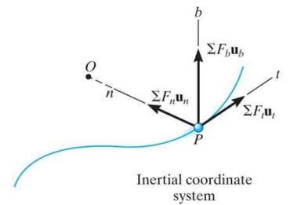
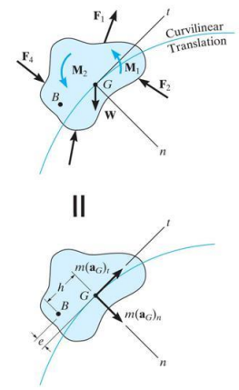
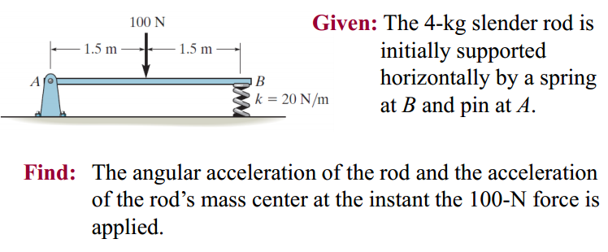
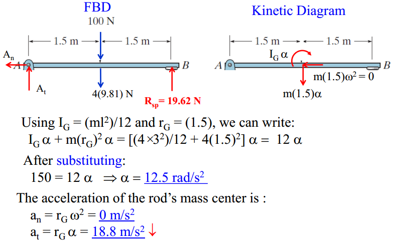
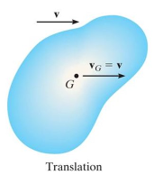
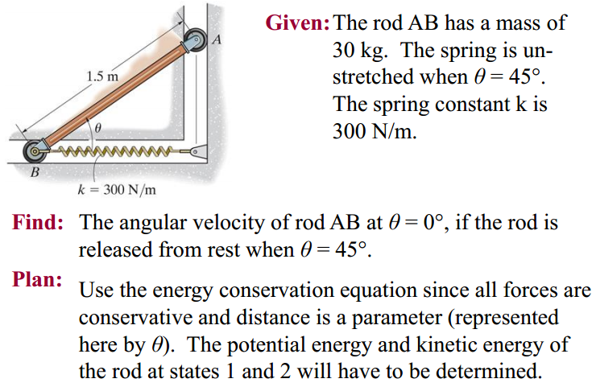
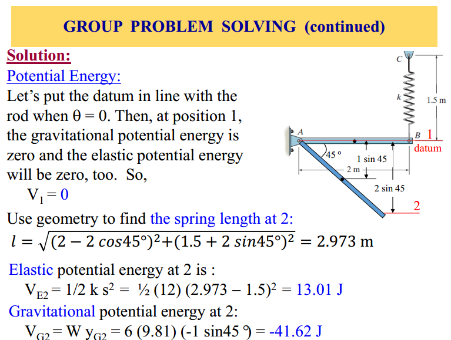
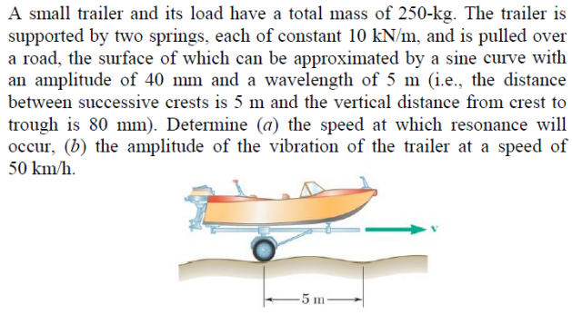

## 目录

  - 单词补充
  - Chapter 12
    - 补充12
  - Chapter 13
  - Chapter 14
    - 补充14 一元二次方程解析解
    - 补充14 功率
  - Chapter 15
  - Chapter 16
    - 补充16
  - Chapter 17
  - Chapter 18
    - 补充：各形状物体的转动惯量
  - Chapter 19
  - Chapter 22
    - Part 1
    - Part 2
    - 电气模拟（机械系统和电气系统相互模拟）
  - Project 2 单自由度振动

## 单词补充

dynamics n.动力学

kinematics n.运动学

vibration n.振动

inertial frame n.惯性系

unstretched adj.未拉伸的（原来的）；

## Chapter 12

对粒子的运动分析，使用笛卡尔坐标系，有位置矢量、速度矢量、加速度矢量：

$$\mathbf{r}=x(t) \mathbf{i}+\mathrm{y}(\mathrm{t}) \mathbf{j}+\mathrm{z}(t) \mathbf{k}$$

$$\mathbf{v}=v_x \mathbf{i}+v_y \mathbf{j}+v_z \mathbf{k}$$

$$\mathbf{a}=a_x \mathbf{i}+a_y \mathbf{j}+a_z \mathbf{k}$$

$$v=\frac{ds}{dt}$$

$$a=\frac{dv}{dt}=\frac{dv}{ds} \frac{ds}{dt}=v \frac{dv}{ds}$$

$$v dv=a ds$$

因此可得（$a$的表达式要依赖其他式子的关系得到，一般是力或者力矩的牛二）：

$$\int v dv=\int a ds$$

$$v=\int_{t_0}^{t} a dt$$

$$s=\int_{t_0}^{t} v dt$$

物体加速度恒定$a=a_c$，初始位置为$s_0$，初始速度为$v_0$，满足：

$$v=v_0+a_c t$$

$$v=s_0+v_0 t + \frac{1}{2} a_c t$$

$$v^2-v_0^2=2 a_c (s-s_0)$$

加速度$a$为与速度$v$、位移$x$、时间$t$其中两项或一项相关的函数$F(x,v,t)$，计算$v$和$x$的表达式。使用分离变量法：

第一种情况（与$v,t$有关）：

$$a=\frac{dv}{dt}=F(x,v,t)=f(v)g(t)$$

$$\frac{dv}{f(v)}=g(t) dt$$

$$\int_{v_0}^v \frac{dv}{f(v)}=\int_0^t g(t) dt$$

$$\Delta x = \int_{x_0}^x d x=\int_0^t v d t$$

第二种情况（与$v,x$有关）：

$$a=\frac{dv}{dt}=F(x,v,t)=f(v)g(x)$$

$$v \frac{dv}{f(v)}=g(x) dx$$

$$\int_{v_0}^v \frac{v d v}{f(v)}=\int_{x_0}^x g(x) d x$$

$$\Delta x = \int_{x_0}^x d x=\int_0^t v d t$$

物体做非直线运动，则将其他参数对$a,x,v$进行替换。

向量叉乘（微积分回顾）：

$$\mathbf{a} \times \mathbf{b}=\left(a_y b_z-a_z b_y\right) \mathbf{i}+\left(a_z b_x-a_x b_z\right) \mathbf{j}+\left(a_x b_y-a_y b_x\right) \mathbf{k}$$

$$\mathbf{a} \times \mathbf{b}=\left | \begin{array}{lll}\mathbf{i} & a_x & b_x \\ \mathbf{j} & a_y & b_y \\ \mathbf{k} & a_z & b_z\end{array}\right |$$

向量的坐标系转换（将基本向量为$\mathbf{i},\mathbf{j}$的坐标系中的向量$\mathbf{a}=a_x \mathbf{i}+a_y \mathbf{j}$转换为基本向量为$\mathbf{n},\mathbf{t}$的坐标系的形式）：

$$\mathbf{a}=a_x \mathbf{i}+a_y \mathbf{j}$$

$$\mathbf{n}=n_x \mathbf{i}+n_y \mathbf{j} \quad \mathbf{t}=t_x \mathbf{i}+t_y \mathbf{j}$$

$$a_n=\mathbf{n} \cdot \mathbf{a}$$

$$a_t=\mathbf{t} \cdot \mathbf{a}$$

$$\mathbf{a}=a_n \mathbf{n}+a_t \mathbf{t}$$

已知物体的运动路径，设置切向和法向作为加速度的分量以方便计算（坐标系转换）。$\mathbf{r}$为物体位置矢量，$s$为物体与固定参考点之间的距离，$\rho$为曲率半径。$a_t$为切向（tangential）加速度分量，指向物体速度方向，单位向量$\mathbf{t}$。$a_n$为法向（normal）加速度分量，指向路径曲率中心，单位向量$\mathbf{n}$。满足：

$$\mathbf{r}=s \mathbf{u}_r$$

$$\mathbf{v}=v \mathbf{t}=v \mathbf{u}_t$$

$$\mathbf{a}=a_t \mathbf{t}+a_n \mathbf{n}=\dot{v} \mathbf{u}_t+v \dot{\theta} \mathbf{u}_n$$

$$v=\frac{ds}{dt}=\dot{s}$$

$$\mathbf{v}=v \mathbf{t}=v \mathbf{u}_t$$

$$a_t=\frac{dv}{dt}=\frac{d^2 s}{dt^2}$$

$$a_n=\frac{v^2}{\rho}=\frac{1}{\rho} (\frac{ds}{dt})^2$$

$$\rho=\frac{\left[1+\left(\frac{d y}{d x}\right)^2\right]^{3 / 2}}{\left|\frac{d^2 y}{d x^2}\right|}$$

$$\mathbf{a}=a_t \mathbf{t}+a_n \mathbf{n}=a_t \mathbf{u}_t+a_n \mathbf{u}_n$$

$$\mathbf{a}=\frac{d \mathbf{v}}{dt}=\frac{d (v \mathbf{u}_t)}{dt}=\dot{v} \mathbf{u}_t + v \dot{\mathbf{u}_t}$$

推导$\mathbf{u}_t$和$\mathbf{u}_n$的关系（根据已得到的加速度表达式和圆弧公式）：

$$\dot{\mathbf{u}}_t=\frac{v}{\rho} \mathbf{u}_n$$

$$l=\theta \cdot \rho$$

$$v=\dot{\theta} \cdot \rho$$

$$\dot{\mathbf{u}}_t=\frac{d \mathbf{u}_t}{dt}=\mathbf{u}_n \dot{\theta}$$

$$\frac{d \mathbf{u}_t}{d \theta}=\mathbf{u}_n$$

极坐标下，设置切向和法向作为加速度的分量以方便计算，$\mathbf{r}$为物体位置矢量，$r$为极坐标下物体离参考点的距离：

$$\mathbf{r}=\mathrm{r} \mathbf{u}_r$$

$$\mathbf{v}=\dot{\mathrm{r}} \mathbf{u}_r+\mathrm{r} \dot{\theta} \mathbf{u}_\theta , v=\sqrt{(\dot{\mathrm{r}})^2+(\mathrm{r} \dot{\theta})^2}$$

$$\mathbf{a}=\left(\ddot{\mathrm{r}}-\mathrm{r} \dot{\theta}^2\right) \mathbf{u}_r+(\mathrm{r} \ddot{\theta}+2 \dot{\mathrm{r}} \dot{\theta}) \mathbf{u}_\theta,a=\sqrt{\left(\ddot{\mathrm{r}}-\mathrm{r} \dot{\theta}^2\right)^2+(\mathrm{r} \ddot{\theta}+2 \dot{\mathrm{r}} \dot{\theta})^2}$$

$$\mathbf{v}=\mathrm{d} \mathbf{r} / \mathrm{dt}=\mathrm{d}\left(\mathrm{r} \mathbf{u}_r\right) / \mathrm{dt}$$

$$\mathbf{v}=\dot{r} \mathbf{u}_r+ r \frac{\mathrm{d} \mathbf{u}_r}{\mathrm{dt}}$$

$$\mathrm{d} \mathbf{u}_r / \mathrm{dt}=\left(\mathrm{d} \mathbf{u}_r / \mathrm{d} \theta\right)(\mathrm{d} \theta / \mathrm{dt})$$

$$\mathrm{d} \mathbf{u}_r / \mathrm{d} \theta=u_\theta \quad \mathrm{d} \mathbf{u}_r / \mathrm{dt}=\dot{\theta} u_\theta$$

$$\mathbf{v}=\dot{\mathrm{r}} \mathbf{u}_r+\mathrm{r} \dot{\theta} \mathbf{u}_\theta$$

$$\mathbf{a}=\mathrm{d} \mathbf{v} / \mathrm{dt}=(\mathrm{d} / \mathrm{dt})\left(\dot{\mathrm{r}} \mathbf{u}_r+\mathrm{r} \dot{\theta} \mathbf{u}_\theta\right)$$

$$\mathbf{a}=\left(\ddot{\mathrm{r}}-\mathrm{r} \dot{\theta}^2\right) \mathbf{u}_r+(\mathrm{r} \ddot{\theta}+2 \dot{\mathrm{r}} \dot{\theta}) \mathbf{u}_\theta$$

其中$(\ddot{\mathrm{r}}-\mathrm{r} \dot{\theta}^2)$为径向（radial）加速度$a_r$，$(\mathrm{r} \ddot{\theta}+2 \dot{\mathrm{r}} \dot{\theta})$为横向（transverse）加速度$a_{\theta}$。

圆柱（cylindrical）坐标系为三维的极坐标系（$z$轴）：

$$\mathbf{r}=\mathrm{r} \mathbf{u}_r+\mathrm{z} \mathbf{u}_z$$

$$\mathbf{v}=\dot{\mathrm{r}} \mathbf{u}_r+\mathrm{r} \dot{\theta} \mathbf{u}_\theta+\dot{\mathrm{z}} \mathbf{u}_z$$

$$\mathbf{a}=\left(\ddot{\mathrm{r}}-\mathrm{r} \dot{\theta}^2\right) \mathbf{u}_r+(\mathrm{r} \ddot{\theta}+2 \dot{\mathrm{r}} \dot{\theta}) \mathbf{u}_\theta+\ddot{\mathrm{z}} \mathbf{u}_z$$

对于包含滑轮的系统：

可以先求得各段绳子的长度与总长度的关系（长度相等的段均可以视为具有相同段来计算关系），通过求导（绳子总长度为常数，因此导数为零）得到各段绳子速度、加速度之间的关系。

定滑轮和动滑轮均不改变绳子的牵引速率，动滑轮自己的速率是两边绳子的牵引速率的均值。

与一段绳子相连的物体，其速度与此段绳子的速度也相同。

$B$相对于$A$的相对位置$r_{B/A}$、相对速度$v_{B/A}$、相对加速度$a_{B/A}$：

$$v_{B/A}=v_B-v_A$$

$$v_{A/B}=-v_{B/A}$$

### 补充12

辛普森积分法（Simpson’s rule）：

$$\int_a^b f(x) d x \approx \frac{b-a}{6}\left[f(a)+4 f\left(\frac{a+b}{2}\right)+f(b)\right]$$

## Chapter 13

单位换算：

$$1 \mathrm{lbm}=\frac{1 \mathrm{lb}}{32.2 \mathrm{ft} / \mathrm{s}^2}$$

$$1 \mathrm{slug}=\frac{1 \mathrm{lb}}{1 \mathrm{ft} / \mathrm{s}^2}=1 \frac{\mathrm{lb} \cdot \mathrm{s}^2}{\mathrm{ft}}$$

注意：动量守恒方程$Ft=mv$仅在$a$为常数时满足。

多粒子系统的质心和质心加速度：

$$\mathrm{m} a_{\mathrm{G}}=\sum \mathrm{m}_{\mathrm{i}} a_{\mathrm{i}}$$

$$\sum F=\mathrm{m} a_{\mathrm{G}}$$

对物体所受的外力$F$（之前是加速度$a$），也应用切向和法向的单位向量进行坐标系转换以方便计算：

$$\sum \mathrm{F}_{\mathrm{t}} \mathrm{u}_{\mathrm{t}}+\sum \mathrm{F}_{\mathrm{n}} \mathrm{u}_{\mathrm{n}}+\sum \mathrm{F}_{\mathrm{b}} \mathrm{u}_{\mathrm{b}}=m a_{\mathrm{t}}+m a_n$$

 $$\sum \mathrm{F}_{\mathrm{t}}=\mathrm{ma}_{\mathrm{t}} \quad \sum \mathrm{F}_{\mathrm{n}}=m a_{\mathrm{n}}$$
 
 $$\sum F_b = 0$$

$$a_\mathrm{t}=d v / d t$$

$$a_\mathrm{n}=v^2 / \rho$$

$$\rho=\frac{\left[1+\left(\frac{d y}{d x}\right)^2\right]^{3 / 2}}{\left|\frac{d^2 y}{d x^2}\right|}$$

使用圆柱坐标系（三维极坐标系）来表示更复杂的运动：

$$\begin{aligned} & \sum \mathrm{F}_{\mathrm{r}}=\mathrm{ma}_{\mathrm{r}}=\mathrm{m}\left(\ddot{\mathrm{r}}-\mathrm{r} \dot{\theta}^2\right) \\ & \sum \mathrm{F}_\theta=\mathrm{ma}_\theta=\mathrm{m}(\mathrm{r} \ddot{\theta}-2 \dot{\mathrm{r}} \dot{\theta}) \\ & \sum \mathrm{F}_{\mathrm{z}}=\mathrm{ma}_{\mathrm{z}}=\mathrm{m} \ddot{\mathrm{z}}\end{aligned}$$

定义角度$\psi$为延伸的径向线和切线的夹角：

$$\tan \psi=\frac{r d \theta}{d r}=\frac{r}{d r / d \theta}$$

## Chapter 14

沿路径$s$，力$F$对质点做的功$U$（$r$为质点与参考点的距离）：

$$\mathrm{dU}=\mathrm{F} \mathrm{ds} \cos \theta$$

$$\mathrm{U}_{s_1-s_2}=\int_{r_1}^{r_2} F \cdot \mathrm{d} r$$

$$\mathrm{U}_{s_1-s_2}=\int_{\mathrm{s}_1}^{\mathrm{s}_2} \mathrm{~F} \cos \theta \mathrm{ds}$$

用$T$表示动能，$\sum U_{1-2}$表示总外力$F$对物体从位置$1$到位置$2$所做的总功，则满足：

$$\mathrm{T}_1+\sum \mathrm{U}_{1-2}=\mathrm{T}_2$$

功率：

$$P=\mathrm{dU} / \mathrm{dt}=(F \cdot \mathrm{d} r) / \mathrm{dt}=F \cdot(\mathrm{d} r / \mathrm{dt})=F \cdot \boldsymbol{v}$$

保守力（conservative force）满足：

$$\oint F \cdot dr = 0$$

弹簧的弹性势能（$s$为弹簧伸缩量）：

$$\mathrm{V}_{\mathrm{e}}=\frac{1}{2} k s^2$$

### 补充14 一元二次方程解析解

$$x=\frac{-b \pm \sqrt{b^2-4ac}}{2a}$$

### 补充14 功率

$$P_{instant}=F \cdot v_{instant}$$

$$P_{avg}=F \cdot v_{avg}$$

注意$F$是做功物体对被做功物体施加的总力（例如有绳子的问题，做功物体对被做功物体将会施加多个力）。

## Chapter 15

线性动量（momentum）$m \vec{v}$和线性冲量/脉冲（impulse）$\vec{I}$：

$$\sum \vec{F}=\mathrm{m} \vec{a}=\mathrm{m}(\mathrm{d} \vec{v} / \mathrm{dt})$$

$$\sum \int_{\mathrm{t}_1}^{\mathrm{t}_2} \vec{F} \mathrm{dt}=\mathrm{m} \int_{\vec{v}_1}^{\vec{v}_2} \mathrm{~d} \vec{v}=\mathrm{m} \vec{v}_2-\mathrm{m} \vec{v}_1$$

$$\vec{I}=\sum \int_{\mathrm{t}_1}^{\mathrm{t}_2} \vec{F} \mathrm{dt}$$

$$m \vec{v}_1 + \vec{I} = m \vec{v}_2$$

注意：如果在极短时间内发生的线性脉冲，那么对物体的动量影响很小的力不是脉冲力（例如球拍拍球时的球的重力的影响基本可以忽略，因此球的重力不是脉冲力）。

多粒子系统：

$$\mathbf{r}_{\mathrm{G}}=\left(\sum \mathrm{m}_i \mathbf{r}_i\right) / \mathrm{m}_{\mathrm{tot}}$$

$$\mathbf{v}_{\mathrm{G}}=\left(\sum \mathrm{m}_i \mathbf{v}_i\right) / \mathrm{m}_{\mathrm{tot}}$$

相对位置$\mathbf{r}_{B/A}$，相对速度，相对加速度：

$$\mathbf{r}_{B/A}=\mathbf{r}_B-\mathbf{r}_A$$

$$\mathbf{v}_{B / A}=\mathbf{v}_B-\mathbf{v}_A$$

$$\mathbf{a}_{B / A}=\mathbf{a}_B-\mathbf{a}_A$$

解题方法总结：能量守恒，动量守恒，相对速度。

中心碰撞（central impact）是两个物体的速度沿着碰撞线的碰撞，碰撞线是穿过粒子质量中心的线。倾斜碰撞（oblique impact）则是两个物体的速度与碰撞线成一定不为零角度的碰撞：

碰撞会发生形变（deformation），通过恢复（restitution）系数$e$（$0 \leq e \leq 1$）来衡量碰撞过程能量的损失，当$e=1$则为完全弹性（elastic）碰撞，$e=0$则为塑性（plastic）碰撞：

$$\left(\mathrm{m}_{\mathrm{A}} \mathrm{v}_{\mathrm{A}}\right)_1+\left(\mathrm{m}_{\mathrm{B}} \mathrm{v}_{\mathrm{B}}\right)_1=\left(\mathrm{m}_{\mathrm{A}} \mathrm{v}_{\mathrm{A}}\right)_2+\left(\mathrm{m}_{\mathrm{B}} \mathrm{v}_{\mathrm{B}}\right)_2$$

$$e=\frac{\left(\mathrm{v}_{\mathrm{B}}\right)_2-\left(\mathrm{v}_{\mathrm{A}}\right)_2}{\left(\mathrm{v}_{\mathrm{A}}\right)_1-\left(\mathrm{v}_{\mathrm{B}}\right)_1}$$

计算倾斜碰撞的速度时，分为沿"$x$轴"和"$y$轴"的动量守恒（"$x$轴"和"$y$轴"需要根据实际情况定义。例如球体与地面倾斜碰撞时，碰撞线实质上沿着与地面垂直的方向，也就是一般意义上的$y$轴）。沿碰撞线的方向定义为$x$轴，垂直于$x$轴的方向定义为$y$轴。因为两物体仅沿着碰撞线内力产生来传递$x$轴的动量，而不传递$y$轴的动量，因此$x$轴两物体整体动量守恒，$y$轴单个物体动量守恒（注意动量守恒计算时为标量）：

$$\sum \mathrm{m}\left(\mathrm{v}_{\mathrm{x}}\right)_1=\sum \mathrm{m}\left(\mathrm{v}_{\mathrm{x}}\right)_2$$

$$e=\frac{\left(\mathrm{v}_{\mathrm{Bx}}\right)_2-\left(\mathrm{v}_{\mathrm{Ax}}\right)_2}{\left(\mathrm{v}_{\mathrm{Ax}}\right)_1-\left(\mathrm{v}_{\mathrm{Bx}}\right)_1}$$

$$\mathrm{m}_{\mathrm{A}}\left(\mathrm{v}_{\mathrm{Ay}}\right)_1=\mathrm{m}_{\mathrm{A}}\left(\mathrm{v}_{\mathrm{Ay}}\right)_2$$

$$\mathrm{m}_{\mathrm{B}}\left(\mathrm{v}_{\mathrm{By}}\right)_1=\mathrm{m}_{\mathrm{B}}\left(\mathrm{v}_{\mathrm{By}}\right)_2$$

***

例题，已知恢复系数$e$，第二物体为墙（速度为零），求碰撞后角度$\theta$：

***

物体对点$o$的角动量（angular momentum）$\boldsymbol{H}_o$被定义为物体对点$o$的线性动量的力矩：

$$\boldsymbol{H}_{\mathrm{o}}=\boldsymbol{r} \times \mathrm{m} \boldsymbol{v}=\left|\begin{array}{lll}\boldsymbol{i} & \boldsymbol{j} & \boldsymbol{k} \\ \mathrm{r}_{\mathrm{x}} & \mathrm{r}_{\mathrm{y}} & \mathrm{r}_{\mathrm{z}} \\ \mathrm{mv}_{\mathrm{x}} & \mathrm{mv}_{\mathrm{y}} & \mathrm{mv}_{\mathrm{z}}\end{array}\right|$$

$$r sin \theta = d$$

$$\left(\mathrm{H}_{\mathrm{o}}\right)_{\mathrm{z}}=r sin \theta \cdot m v =d \cdot m v$$

对物体的合外力等于线动量的导数：

$$\sum \boldsymbol{F}=\dot{\boldsymbol{L}}=\mathrm{m} \dot{\boldsymbol{v}}$$

因此对物体的合外力的对点$o$的力矩$\boldsymbol{M}_o$等于角动量的导数：

$$\sum \boldsymbol{M}_{\mathrm{o}}=\boldsymbol{r} \times \boldsymbol{F}=\dot{\boldsymbol{H}}_{\mathrm{o}}$$

对系统内的物体，有合成外力$\boldsymbol{F}_i$和合成内力$\boldsymbol{f}_i$，因此角动量的导数为：

$$\sum\left(\dot{\boldsymbol{H}}_i\right)_o=\sum\left(r_i \times \boldsymbol{F}_i\right)+\sum\left(r_i \times \boldsymbol{f}_i\right)$$

角脉冲（impulse）与角动量原理。角脉冲即为一定时间段内$\boldsymbol{M}_o$的积分，也就是等于角动量的变化量：

$$\sum\left(\boldsymbol{H}_0\right)_1+\sum \int_{t 1}^{t 2} \boldsymbol{M}_0 d t=\sum\left(\boldsymbol{H}_0\right)_2$$

角动量守恒发生在物体仅受指向$o$点的力时，满足：

$$(\boldsymbol{H}_{\mathrm{o}})_2=(\boldsymbol{H}_{\mathrm{o}})_1$$

## Chapter 16

刚体（rigid body）的平面平移（planar translation）和旋转（rotation）。

刚体运动可以分为三种：平面平移包括直线（rectilinear）平移和曲线（curvilinear）平移、绕固定轴旋转、一般平面运动（general plane motion）即物体同时进行平面平移和绕非固定轴旋转。

刚体中受平移作用的所有点都以相同的速度和加速度移动：

$$d \vec{r}_{B/A}/dt=0$$

$$\vec{v}_B=\vec{v}_A+d \vec{r}_{B/A}/dt$$

$$\vec{v}_B=\vec{v}_A$$

$$\vec{a}_B=\vec{a}_A$$

当刚体绕固定轴旋转时，刚体中的任何点都沿着圆形路径进行运动：

$$\omega=d \theta / dt$$

$$\alpha=d^2 \theta / d t^2 = d \omega / dt=\omega \cdot d \omega / d \theta$$

若角加速度$\alpha$恒定，则遵循与匀加速直线运动的结论：

$$\begin{aligned} & \omega=\omega_0+\alpha_C t \\ & \theta=\theta_0+\omega_0 t+0.5 \alpha_C t^2 \\ & \omega^2=\left(\omega_0\right)^2+2 \alpha_C\left(\theta-\theta_0\right)\end{aligned}$$

定义绕固定轴旋转的刚体上一点$P$，从旋转轴到此点的最短矢量为$\vec{r}$，从旋转轴任意一点到此点的矢量为$\vec{r}_P$。速度大小为$v=\omega r$，则点$P$的速度矢量$\vec{v}$为：

$$\vec{v}=\vec{\omega} \times \vec{r}_P=\vec{\omega} \times \vec{r}$$

$$a_n=\omega^2 r$$

$$a_t=\alpha r$$

$$a=\sqrt{\left(a_n\right)^2+\left(a_t\right)^2}$$

$$\begin{aligned} \vec{a} & =\mathrm{d} \vec{v} / \mathrm{dt}=\mathrm{d} \vec{\omega} / \mathrm{dt} \times \vec{r}_{\mathrm{P}}+\vec{\omega} \times \mathrm{d} \vec{r}_{\mathrm{P}} / \mathrm{dt} \\ & =\vec{\alpha} \times \vec{r}_{\mathrm{P}}+\vec{\omega} \times\left(\vec{\omega} \times \vec{r}_{\mathrm{P}}\right)\end{aligned}$$

化简为（通过右手定则得到$\vec{\omega}\times\left(\vec{\omega} \times \vec{r}_{\mathrm{P}}\right)$的最终方向与$\vec{a}_n$的正方向相反，因此需要加上负号）：

$$\vec{a}=\vec{\alpha} \times \vec{r}-\omega^2 \vec{r}=\vec{a}_{\mathrm{t}}+\vec{a}_{\mathrm{n}}$$

绝对运动分析：

定义角位置（angular position）为$s=f(\theta),\theta=g(t)$（有时$s$也用$x$表示）。对$s$一阶导（等于活塞的速度$v$）可获得与$\theta,\dot{\theta}$（$\theta,\omega$）相关的式子，对$s$二阶导（等于活塞的加速度$a$）可获得与$\dot{\theta},\ddot{\theta}$（$\omega,\alpha$）相关的式子。

例题：

$$200mm=0.2m$$

$$s=x=0.2 \cos \theta$$

$$\dot{s}=\dot{x}=v=0.2(-\sin \theta) \dot{\theta}$$

$$\ddot{s}=\ddot{x}=a=-0.2(\cos \theta) \dot{\theta}^2-0.2(\sin \theta) \ddot{\theta}$$

也就是说，只需要知道在特定$\theta$下对应的$\dot{x},\ddot{x}$（也就是活塞的$v,a$）的值，即可得到$\dot{\theta}$和$\ddot{\theta}$（也就是转轴的$\omega,\alpha$）的值。以上结论对于活塞-活塞结构、凸轮-活塞结构同样适用。

用于汽车的行星齿轮（planetary gear）结构：

相对运动分析（同样求某一点的信息，但需要相对于某一个点的已知信息）：

其中点$A$称为基点（base point）。$x'-y'$参考系随主体平移，但不旋转。

同时做平移运动和旋转运动：

$$\mathrm{d} \vec{r}_{\mathrm{B}}=\mathrm{d} \vec{r}_{\mathrm{A}}+\mathrm{d} \vec{r}_{\mathrm{B} / \mathrm{A}}$$

$$\left(\mathrm{d} \vec{r}_{\mathrm{B}} / \mathrm{dt}\right)=\left(\mathrm{d} \vec{r}_{\mathrm{A}} / \mathrm{dt}\right)+\left(\mathrm{d} \vec{r}_{\mathrm{B} / \mathrm{A}} / \mathrm{dt}\right)$$

$$\vec{v}_{\mathrm{B}}=\vec{v}_{\mathrm{A}}+\vec{v}_{\mathrm{B} / \mathrm{A}}$$

将$B$点视为绕$A$点作旋转运动：

$$v=\omega r$$

$$\vec{v}_{\mathrm{B} / \mathrm{A}}=\mathrm{d} \vec{r}_{\mathrm{B} / \mathrm{A}} / \mathrm{dt}=\vec{\omega} \times \vec{r}_{\mathrm{B} / \mathrm{A}}$$

笛卡尔向量形式（Cartesian vector form，CVN）（同一刚体上的两个点的平面运动的范式，当$v_A=0$，对$B$点来说就是半径到$A$点的纯旋转，当$\omega=0$，对$B$点来说就是和$A$点作相同的纯平移，因此组合起来就说明了$A$点和$B$点之间所有平面运动的信息）：

$$\vec{v}_{\mathrm{B}}=\vec{v}_{\mathrm{A}}+\vec{\omega} \times \vec{r}_{\mathrm{B} / \mathrm{A}}$$

活塞：

车轮：

***

例题：

等式两边，各个方向的标量值相等。

***

零速度瞬心（instantaneous center of zero velocity，IC）：

零速度瞬心可以视作刚体的"总圆心"，在这个瞬间，刚体上的每个点均在围绕零速度瞬心进行旋转（角速度一致），因此刚体每一点的速度$\vec{v}_A$均总是垂直于从零速度瞬心到该点的相对位置向量$\vec{r}_{A/IC}$（注意不是隔离分析，例如自行车的车轮上的点的速度需要同时考虑平移和旋转），且满足$\vec{v}_A=\vec{v}_{IC}+\vec{\omega} \times \vec{r}_{A/IC}$。零速度瞬心有可能不在刚体上。对于任何进行平面运动的物体，在某个瞬间，运动平面中总是存在一个零速度瞬心，在这个点上速度$v_{IC}=0$：

确定零速度瞬心的位置（已知某点的速度和刚体的角速度方向，根据刚体角速度方向可以确定零速度瞬心在此点的左侧还是右侧），由零速度瞬心的定义可知，确定零速度瞬心位置就可以确定所有点的角速度：

$$r_{A/IC}=\frac{v_A}{\omega}$$

$$\omega=\frac{v_A}{r_{A/IC}}$$

如果已知两个以上的点的速度，则直接作点的速度的垂线的交点即可得到零速度瞬心的位置，也就直接得到$r_{A/IC}$和$r_{B/IC}$：

如果已知两个点的速度，且平行（方向可能相反），则瞬心在此两点的连线上，再根据$r_{A/IC}=\frac{v_A}{\omega}$决定零速度瞬心的位置：

如果有杆的情况，则需要先分析节点的速度方向：

分析相对运动的加速度：

$$\left.\frac{\mathrm{d} v_{\mathrm{B}}}{\mathrm{dt}}=\frac{\mathrm{d} v_{\mathrm{A}}}{\mathrm{dt}}+\frac{\mathrm{d} v_{\mathrm{B} / \mathrm{A}}}{\mathrm{dt}}\right.$$

$$\vec{a}_B=\vec{a}_A+(\vec{a}_{B/A})_t+(\vec{a}_{B/A})_n$$

其中$\frac{\mathrm{d} v_{\mathrm{A}}}{\mathrm{dt}},\frac{\mathrm{d} v_{\mathrm{B}}}{\mathrm{dt}}$为点$A$和点$B$的绝对加速度，$\frac{\mathrm{d} v_{\mathrm{B} / \mathrm{A}}}{\mathrm{dt}}$为点$A$和点$B$的相对加速度，分为切向和法向，表示的是点$B$相对于点$A$的旋转运动的加速度。

$$(\vec{a}_{B/A})_t=\alpha \times \vec{r}_{B/A}$$

$$(\vec{a}_{B/A})_n=-\omega^2 \vec{r}_{B/A}$$

$$\vec{a}_B=\vec{a}_A+\alpha \times \vec{r}_{B/A}-\omega^2 \vec{r}_{B/A}$$

如果有杆的情况，不同杆上的同一节点的加速度是相同的：

两个不打滑的物体运动，满足接触点切向加速度相同，法向加速度不同，因此加速度不同。对滚动球形刚体，分析其零速度瞬心与圆心（仅有平移方向速度和加速度）的相对速度和加速度，满足不打滑（$\vec{v}_A=0$）：

$$\vec{v}_A=0$$

$$\vec{v}_G=\vec{v}_A+\vec{\omega} \times \vec{r}_{G/A}$$

$$v_G \hat{i}=0 \hat{i}+(- \omega \hat{k}) \times (r \hat{j})$$

$$\vec{v}_G=v_G \hat{i}=\omega r \hat{i}$$

$$\vec{a}_{\mathrm{G}}=\vec{a}_{\mathrm{A}}+\vec{\alpha} \times \vec{r}_{\mathrm{G} / \mathrm{A}}-\omega^2 \vec{r}_{\mathrm{G} / \mathrm{A}}$$

$$\mathrm{a}_{\mathrm{G}} \hat{i}=0+\mathrm{a}_{\mathrm{A}} \hat{j}+(-\alpha \hat{k}) \times(\mathrm{r} \hat{j})-\omega^2(\mathrm{r} \hat{j})$$

$$\vec{a}_{\mathrm{G}}=\mathrm{a}_{\mathrm{G}} \hat{i}=\alpha \mathrm{r} \hat{i}$$

$$\vec{a}_{\mathrm{A}}=0+\mathrm{a}_{\mathrm{A}} \hat{j}=\omega^2 \mathrm{r} \hat{j}$$

***

例题（角速度处处相同，但两端点线速度不相等，因为刚体中每一点的速度均与瞬心有关）：

$$v_C=\omega_{BC} \cdot r_{C/IC},v_B=\omega_{BC} \cdot r_{B/IC},v_C \neq v_B$$

***

### 补充16

两个啮合齿轮的关系：

$$v=\omega_A r_A=\omega_B r_B$$

$$\theta_A r_A = \theta_B r_B$$

## Chapter 17

质量转动惯量（mass moment of inertia，MMI）$I$（刚体转动的"质量"）：

$$I=\int_m r^2 dm$$

施加力矩$T$（刚体转动的"力"），$\alpha$为角加速度：

$$T=I \alpha$$

圆盘（disk）和矩形的微元，分别绕$x,y,z,z'$轴转动惯量：

$$I_{xx}=I_{yy}=\frac{1}{4}mr^2$$

$$I_{zz}=\frac{1}{2}mr^2$$

$$I_{z'z'}=\frac{3}{2}mr^2$$

$$I_{xx}=\frac{1}{12}mb^2$$

$$I_{yy}=\frac{1}{12}ma^2$$

$$I_{zz}=\frac{1}{12}m(a^2+b^2)$$

壳（shell）和圆盘体积微元的不同（均可用于丘状物体）：

$$dV=(2 \pi y) z dy$$

$$dV=(\pi y^2) dz$$

刚体关于穿过其质心$G$的轴的转动惯量为$I_G$，则刚体关于与此轴平行的轴的转动惯量$I$为：

$$I=I_G+md^2$$

惯性半径/回转半径（radius of gyration）用$k$表示，定义为：

$$I=m k^2$$

$$k=\sqrt{\frac{I}{m}}$$

由多种简单形状（例如圆盘、球形、杆等）组合成的刚体称为复合刚体（composite body）。求其整体关于一条轴总转动惯量时，需要对物体的所有部分同时对这一条轴转动惯量进行求和：

***

例子（以物体的各个部分的质心来计算）：

例子（以物体的总质心来计算）：

***

平面运动方程（equations of motion）：

平移方程：

$$\Sigma \mathrm{F}_{\mathrm{x}}=\mathrm{m}\left(\mathrm{a}_{\mathrm{G}}\right)_{\mathrm{x}}$$

$$\Sigma \mathrm{F}_{\mathrm{y}}=\mathrm{m}\left(\mathrm{a}_{\mathrm{G}}\right)_{\mathrm{y}}$$

对某点来说，外力对此点的总力矩的影响等效于关于此点的动力矩的影响。$\sum M_p$为外力的关于点$P$的总力矩，则$\sum (M_k)_p$为$I_G \vec{\alpha}$和$m \vec{a}_G$关于点$P$的力矩，称为动力矩（kinetic moment）。有等效合力矩（注意没有力，都是力矩）得到关系：

$$\sum \left(\vec{r}_{\mathrm{i}} \times \vec{F}_{\mathrm{i}}\right)+\sum \vec{M}_{\mathrm{i}}=\vec{r} \times m \vec{a}_{\mathrm{G}}+\mathrm{I}_{\mathrm{G}} \vec{\alpha}$$

因此：

$$\bar{r}=\overline{\mathrm{x}} i+\overline{\mathrm{y}} j$$

$$\sum \mathrm{M}_{\mathrm{p}}=\sum\left(M_k\right)_{\mathrm{p}}=\bar{r} \times m \vec{a}_G+I_G \vec{\alpha}$$

若点$P$与质心重合，可简化为：

$$\sum M_G=I_G \alpha$$

平面运动方程的应用方式（平移无旋转情况）：

$$\Sigma \mathrm{F}_{\mathrm{x}}=\mathrm{m}\left(\mathrm{a}_{\mathrm{G}}\right)_{\mathrm{x}}$$

$$\Sigma \mathrm{F}_{\mathrm{y}}=\mathrm{m}\left(\mathrm{a}_{\mathrm{G}}\right)_{\mathrm{y}}$$

如图，物体没有进行旋转，可得：

$$\Sigma \mathrm{M}_{\mathrm{G}}=0$$

$$\Sigma \mathrm{M}_{\mathrm{A}}=\left(\mathrm{m} \mathrm{a}_{\mathrm{G}}\right) \mathrm{d}$$

物体进行曲线平移，则使用$n-t$坐标系：

$$\Sigma \mathrm{F}_{\mathrm{n}}=\mathrm{m}\left(\mathrm{a}_{\mathrm{G}}\right)_{\mathrm{n}}$$

$$\Sigma \mathrm{F}_{\mathrm{t}}=\mathrm{m}\left(\mathrm{a}_{\mathrm{G}}\right)_{\mathrm{t}}$$

如图，物体没有进行旋转，可得：

$$\Sigma \mathrm{M}_{\mathrm{G}}=0$$

$$\Sigma \mathrm{M}_{\mathrm{B}}=e \cdot \left[\mathrm{m}\left(\mathrm{a}_{\mathrm{G}}\right)_{\mathrm{t}}\right]-h \cdot \left[\mathrm{m}\left(\mathrm{a}_{\mathrm{G}}\right)_{\mathrm{n}}\right]$$

***

例子：

类似例子：

***

平面运动方程的应用方式（平移有旋转情况），相对于点$O$的总力矩等于"造成刚体的质点$G$绕过某点$O$的轴进行旋转运动的力矩"：

$$\mathrm{I}_{\mathrm{O}}=\mathrm{I}_{\mathrm{G}}+\mathrm{m}\left(\mathrm{r}_{\mathrm{G}}\right)^2$$

$$(a_{\mathrm{G}})_t=r_{{\mathrm{G}}} \cdot \alpha$$

$$\sum \mathrm{M}_{\mathrm{O}}=I_{\mathrm{O}} \alpha = \left[\mathrm{I}_{\mathrm{G}}+\mathrm{m}\left(\mathrm{r}_{\mathrm{G}}\right)^2\right] \alpha =\mathrm{I}_{\mathrm{G}} \alpha+\mathrm{r}_{\mathrm{G}} \mathrm{m}\left(\mathrm{a}_{\mathrm{G}}\right)_{\mathrm{t}}$$

因此可得平面运动方程（可解最多三个未知数的问题，更多未知数需要运动学）：

$$\begin{aligned} & \sum \mathrm{F}_{\mathrm{n}}=\mathrm{m}\left(\mathrm{a}_{\mathrm{G}}\right)_{\mathrm{n}}=\mathrm{mr}_{\mathrm{G}} \omega^2 \\ & \sum \mathrm{F}_{\mathrm{t}}=\mathrm{m}\left(\mathrm{a}_{\mathrm{G}}\right)_{\mathrm{t}}=\mathrm{mr}_{\mathrm{G}} \alpha \\ & \sum \mathrm{M}_{\mathrm{O}}=\mathrm{I}_{\mathrm{O}} \alpha =\left[\mathrm{I}_{\mathrm{G}}+\mathrm{m}\left(\mathrm{r}_{\mathrm{G}}\right)^2\right] \alpha \end{aligned}$$

***

例题：

***

当刚体受到外力和耦合（couple）力矩时，它既可以进行平移运动，也可以进行旋转运动。这种组合称为一般平面运动。而对于圆筒滚动运动，运动方程：

$$\begin{aligned} & \sum \mathrm{F}_{\mathrm{x}}=\mathrm{m}\left(\mathrm{a}_{\mathrm{G}}\right)_{\mathrm{x}} \\ & \sum \mathrm{F}_{\mathrm{y}}=\mathrm{m}\left(\mathrm{a}_{\mathrm{G}}\right)_{\mathrm{y}} \\ & \sum \mathrm{M}_{\mathrm{G}}=\mathrm{I}_{\mathrm{G}} \alpha \end{aligned}$$

得到滚动摩擦力方向可以通过：

- 分析滚轮滚动方向（除了滚动摩擦力还有其他力造成力矩，则通过将滚动视为正常平面平移来得到滚动摩擦力的正方向）。
- 对质点分析力矩平衡（只有滚动摩擦力造成力矩，则根据滚动的角加速度方向就能得到滚动摩擦力的正方向）。

第四个方程可以从圆盘的打滑（slip）或非打滑条件中获得。

假设非打滑，则满足$F_f < \mu_s N$（没有打滑的情况下，滚动摩擦力是比滑动摩擦力小的），第四个方程：

$$\mathrm{a}_{\mathrm{G}}=\alpha \mathrm{r}$$

$$(F_f)_{max}=\mu_k N, unknown$$

假设打滑，则满足$a_G \neq \alpha r$，$F_f=\mu_k N$，第四个方程：

$$F_f=\mu_k N$$

***

例题：

薄壁圆筒的转动惯量公式即为$I=m r^2$：

***

## Chapter 18

刚体的动能可以表示为平移和旋转动能之和：

$$T=\frac{1}{2}m (v_G)^2+\frac{1}{2}I_G \omega^2$$

若刚体绕过非质心的点$O$的固定轴做旋转运动（点$O$位置不变，因此点$O$不做平移运动，因此点$O$速度为零），平移动能为零。将动能表示为关于质心的平面运动时，平移动能不为零（因为质心的位置改变了，质心有做平移运动，因此质心速度也不为零）。注意$r_{G/IC}$在每个时刻都需要重新分析瞬心位置得到：

$$v_O=0$$

$$v_G=\omega \cdot r_{G/IC}=\omega \cdot r_{G/O}$$

$$T=\frac{1}{2}m (v_G)^2+\frac{1}{2}I_G \omega^2 = 0+\frac{1}{2}I_O \omega^2$$

力做功的公式：

$$U_F=\int \vec{F} \cdot d \vec{r}=\int_s (F cos \theta) ds$$

当力恒定时：

$$U_{Fc}=(F_c cos \theta) s$$

力矩$M$（$M$单位为$N \cdot m$，$\theta$单位为弧度制）做功：

$$U_M=\int_{\theta_1}^{\theta_2}M d\theta$$

当力矩$M$恒定时：

$$U_M=M(\theta_2-\theta_1)$$

回顾动能方程：

$$T_1+\sum U_{1-2}=T_2$$

如果$T_1$和$T_2$的式子的形式一致，某个变量的值（例如角速度$\omega$）不同，则可以先求出$T_1,T_2$的形式，再代入不同条件下的那个变量的值。

***

例题：

***

如果力所做的功与路径无关，则力是保守的（conservative）。保守力做的功只取决于受力物体的初始和最终位置。

能量守恒（conservation of energy）定律，$T$为动能，$V$为势能：

$$\mathrm{T}_1+\mathrm{V}_1=\mathrm{T}_2+\mathrm{V}_2=\text{Constant}$$

$V_g$为重力势能，$V_e$为弹性势能：

$$V_g=W y_G$$

$$V_e=\frac{1}{2}ks^2$$

结合动能，有：

$$T_1+V_1+\sum U_{1-2}=T_2+V_2$$

***

例题，$v_G$为质心速度，重力势能中的$1/2$是质心高度差为两端高度差的一半，弹性势能的$1/2$为弹性势能的公式。因为角度一直变化（等效于两个端点相互做旋转运动），且两个端点同时进行平移，因此杆自身在进行平移的同时进行旋转运动：

***

例题：

***

### 补充：各形状物体的转动惯量

质点（无形状）：

$$I_O=I_G+md^2=0+md^2$$

杆（点$O$为杆的一端）：

$$I_O=I_G+md^2=\frac{1}{12}ml^2+md^2$$

球体：

$$I_O=I_G+md^2=\frac{2}{5}mr^2+md^2$$

圆盘：

$$I_O=I_G+md^2=\frac{1}{2}mr^2+md^2$$

圆环：

$$I_O=I_G+md^2=m r^2+md^2$$

## Chapter 19

刚体的线性动量：

$$\vec{L}=\mathrm{m} \vec{v}_{\mathrm{G}}$$

刚体的角动量：

$$\vec{H}_{\mathrm{G}}=\mathrm{I}_{\mathrm{G}} \vec{\omega}$$

刚体绕过非质心点$O$（一般题目中点$O$是瞬心IC）的固定轴旋转（线性动量转化为角动量主要是因为$I=\int_m r^2 dm$，$v_G=\omega r_G$）：

$$\vec{H}_{\mathrm{O}}=\left(\vec{r}_{\mathrm{G}} \times \mathrm{m} \vec{v}_{\mathrm{G}}\right)+\mathrm{I}_{\mathrm{G}} \vec{\omega}=\mathrm{I}_{\mathrm{O}} \vec{\omega}$$

对刚体，脉冲和动量原理，线性动量和角动量分别为：

$$\vec{L}_1+\sum \int_{\mathrm{t}_1}^{\mathrm{t}_2} \vec{F} \mathrm{dt}=\vec{L}_2$$

$$\left(H_{\mathrm{G}}\right)_1+\sum \int_{\mathrm{t}_1}^{\mathrm{t}_2} M_{\mathrm{G}} \mathrm{dt}=\left(H_{\mathrm{G}}\right)_2$$

注意：即使只有一个外力，也可以同时造成刚体的线性动量（力）和角动量（力矩）。

***

例题（由于滚动时不会打滑，圆筒滚动需要同时考虑平移，因此底部点A才是瞬心IC。而且力矩$M$在导致整个刚体旋转运动时并不会区分施加力矩的位置而只看方向，因此对点A来说$M_A=M$）：

***

例题：

***

例题：

***

例题：

一个滚筒在平面上需要越过一个小突起（高度为$h$），求所需的最小角速度。

滚筒和突起先发生碰撞，此时$(v_G)_1$依然水平向右，因此算力矩时的距离为$r^{\prime}$。而当滚筒开始越过小突起的时候，实际上是以小突起的尖端（点$A$）作为瞬心IC进行旋转运动，因此算力矩时距离为$r$。

$$r^{\prime}=r-h$$

$$(H_A)_1=(H_A)_2$$

$$r^{\prime}m(v_G)_1+I_G \omega_1=r m (v_G)_2+I_G \omega_2$$

$$\frac{1}{2}m (v_G)_2^2+\frac{1}{2}I_G \omega_2=0+mgh$$

如果不是凸起而是一个平面，那么可以通过使得法向加速度$(a_G)_n$得到满足来求$\omega_2$。

***

例题：

***

例题（角动量守恒）：

***

例题：

杆撞击$A$点前和撞击$A$点后是两个不同的状态。撞击$A$点前杆视为绕$B$点做旋转运动，撞击$A$点后杆视为绕$A$点做旋转运动。

$$I_B \omega_2=I_C \omega_3$$

***

例题（子弹、角动量守恒）：

***

## Chapter 22

### Part 1

机械振动（mechanical vibration）是粒子或物体围绕平衡位置振荡的运动。

- 系统从平衡位置的最大位移是振动的振幅（amplitude）。

- 当运动仅由恢复力维持时，振动被描述为自由振动（free vibration）。

- 当对系统施加周期性力时，运动被描述为受迫振动（forced vibration）。

- 当能量的摩擦耗散被忽略时，运动被认为是无阻尼的（undamped）。

- 所有实际振动都是有阻尼的（damped）。

固有频率/自然频率$\omega_n$：

$$\omega_n=\sqrt{\frac{k}{m}}$$

简谐运动（simple harmonic motion）标准形式：

$$m \ddot{x}+kx=0$$

$$\ddot{x}+\omega_n^2 x=0$$

上述方程的通解的形式：

$$x=C_1 \sin \left(\omega_n t\right)+C_2 \cos \left(\omega_n t\right)$$

已知通解的形式，则通过初始条件（使$t_0=0$）获得$C_1,C_2$,$x_m$：

$$x=C_1 \sin \left(\omega_n t\right)+C_2 \cos \left(\omega_n t\right)$$

$$v=\dot{x}=C_1 \omega_n \cos \left(\omega_n t\right)-C_2 \omega_n \sin \left(\omega_n t\right)$$

$$C_2=x_0, C_1=v_0 / \omega_n$$

已知通解$x$，自然周期$\tau_n$，有振幅$x_m$和相位角$\phi$：

$$x=C_1 \sin \left(\omega_n t\right)+C_2 \cos \left(\omega_n t\right)$$

$$x=x_m \sin \left(\omega_n t+\phi\right)$$

$$x_m=\sqrt{C_1^2+C_2^2}=\sqrt{\left(v_0 / \omega_n\right)^2+x_0^2}$$

$$\phi=\tan ^{-1}\left(\frac{C_2}{C_1}\right)=\tan ^{-1}\left(\frac{x_0 \omega_n}{v_0}\right)$$

$$\begin{aligned} v & =\dot{x} \\ & =x_m \omega_n \sin \left(\omega_n t+\phi+\pi / 2\right) \\ & =x_m \omega_n \cos \left(\omega_n t+\phi\right) \end{aligned}$$

$$\begin{aligned} a & =\ddot{x} \\ & =x_m \omega_n^2 \sin \left(\omega_n t+\phi+\pi\right) \\ & =-x_m \omega_n^2 \sin \left(\omega_n t+\phi\right)\end{aligned}$$

根据不同的情况具体分析，列出牛顿第二定律方程，以获得微分方程的形式。若以角度$\theta$作为$x$，则列出力矩平衡方程，以获得微分方程：

$$\sum F = m a = m \ddot{x}$$

$$\ddot{x}+\omega_n x=0$$

$$\sum M_A=\sum\left(M_A\right)_{e f f}=I_A \alpha = I_A \ddot{\theta}$$

$$\ddot{\theta}+\omega_n^2 \theta=0$$

可以使用能量守恒，并且通过求导得到微分方程：

$$T+V=constant$$

***

例题（圆周运动）：

$$\sum F_t=m a_t$$

$$a_t=l \alpha=l \ddot{\theta}$$

$$-W sin \theta=m l \ddot{\theta}$$

$$\ddot{\theta}+\frac{g}{l} \sin \theta=0$$

对于小角度$sin \theta \approx \theta$：

$$\ddot{\theta}+\frac{g}{l} \theta=0$$

$$\omega_n=\sqrt{\frac{g}{l}}$$

$$\theta=\theta_m \sin \left(\omega_n t+\phi\right)$$

***

例题（双弹簧情况）：

双弹簧伸长量相同：

$$P_1=k_1 \delta + k_2 \delta$$

双弹簧伸长量不同：

$$\delta^{\prime}=\delta_1+\delta_2$$

$$k=\frac{P_2}{\delta^{\prime}}$$

***

例题（悬挂方板的旋转振荡）：

$$\begin{gathered}a_t=\alpha r=b \ddot{\theta} \\ a_n=\omega^2 r=b \dot{\theta}^2\end{gathered}$$

$$\sum M_A=\sum\left(M_A\right)_{e f f}$$

$$-W(b \sin \theta)=(m b \ddot{\theta}) b+\bar{I} \ddot{\theta}$$

***

例题（悬挂垂直平面的旋转振荡）：

$$k=1.5N \cdot m / rad$$

$$I_o=\frac{1}{12} m\left(a^2+b^2\right)$$

$$M=-k \theta=I_o \omega=I_o \ddot{\theta}$$

$$\ddot{\theta}+\frac{k}{I_o}\theta=0$$

$$\omega_n=\sqrt{\frac{k}{I_o}}$$

***

例题：

$$\sum M_A=\sum\left(M_A\right)_{e f f}$$

$$W r-T_2(2 r)=m \bar{a} r+\bar{I} \alpha$$

$$T_2=T_0+k \delta=\frac{1}{2} W+k(2 r \theta)$$

$$W r-\left(\frac{1}{2} W+2 k r \theta\right)(2 r)=m(r \ddot{\theta}) r+\frac{1}{2} m r^2 \theta$$

$$\ddot{\theta}+\frac{8}{3} \frac{k}{m} \theta=0$$

$$\omega_n=\sqrt{\frac{8 k}{3 m}} ,\tau_n=\frac{2 \pi}{\omega_n}=2 \pi \sqrt{\frac{3 m}{8 k}} ,f_n=\frac{\omega_n}{2 \pi}=\frac{1}{2 \pi} \sqrt{\frac{8 k}{3 m}}$$

***

例题：

$$a_t=l \alpha$$

$$\bar{I}=I_A$$

$$\begin{gathered}\Sigma M_B=I_B \alpha = \bar{I} \alpha + l m a_t \\ -m g l \sin \theta=\left(\bar{I}+m l^2\right) \alpha\end{gathered}$$

$$\bar{I}=\frac{1}{2} m r^2, \sin \theta \approx \theta$$

$$\left(\frac{1}{2} m r^2+m l^2\right) \ddot{\theta}+m g l \theta=0$$

$$\omega_n^2=\frac{g l}{\left(\frac{r^2}{2}+l^2\right)}$$

若$A$点焊死，无法转动$\bar{I} \alpha =0$，则$\omega_n$应当增大：

$$-m g l \sin \theta=l m a_t$$

$$\sin \theta \approx \theta$$

$$m l^2 \ddot{\theta}+m g l \theta=0$$

$$\omega_n^2=\frac{g}{l}$$

***

能量守恒：

$$T=\frac{1}{2}m\dot{x}^2$$

$$V=\frac{1}{2} k x^2$$

$$\frac{1}{2} m \dot{x}^2+\frac{1}{2} k x^2 = Constant$$

$$\omega_n^2=\frac{k}{m}$$

$$\dot{x}^2+\omega_n^2 x^2= Constant$$

由$x=x_m sin (\omega_n t + \phi)$和$v$的关系可得：

$$\dot{\theta}_m=\theta_m \omega_n$$

***

例题（通过能量守恒进行分析）：

状态1：$T_1=0$，$V_1$

状态2：$T_2$，$V_2=0$

$$\begin{aligned} V_1 & =W b(1-\cos \theta)=W b\left[2 \sin ^2\left(\theta_m / 2\right)\right] \\ & \cong \frac{1}{2} W b \theta_m^2\end{aligned}$$

$$T_2=\frac{1}{2} m \bar{v}_m^2+\frac{1}{2} \bar{I} \omega_m^2=\frac{1}{2} m b^2 \dot{\theta}_m^2 \mid+\frac{1}{2} \bar{I} \dot{\theta}_m^2$$

$$\dot{\theta}_m=\theta_m \omega_n$$

$$T_1+V_1=T_2+V_2$$

$$\omega_n^2=\frac{3 g}{5 b}$$

***

例题（非振荡能量守恒，但是与角度$\theta$有关）：

***

### Part 2

无阻尼自由振动在Part 1。

无阻尼受迫振动（forced vibration）：

- 周期性外力：

$$P=P_m sin \omega_f t$$

- $\omega_f$为振动的受迫圆频率（forced circular frequency）。$\omega_n$为系统的自然频率。

- $\frac{\omega_f}{\omega_n}$为频率比。$\omega_f < \omega_n$为同相（in-phase），$\omega_f > \omega_n$为异相（out-of-phase）。

- 微分方程：

$$m \ddot{x}+k x=P_m \sin \omega_f t$$

周期性外力$P$情况：

$$+\downarrow \sum F=m a$$

$$W=k \delta_{s t}$$

$$P_m \sin \omega_f t+W-k\left(\delta_{s t}+x\right)=m \ddot{x}$$

$$m \ddot{x}+k x=P_m \sin \omega_f t$$

支撑周期性位移（由于弹簧的存在，支撑周期性位移可以视作周期性外力的一种形式）情况：

总伸长量：

$$\delta_{s t}+x-\delta_m \sin \omega_f t$$

可得：

$$W-k\left(\delta_{s t}+x-\delta_m \sin \omega_f t\right)=m \ddot{x}$$

$$m \ddot{x}+k x=k \delta_m \sin \omega_f t$$

因此当周期性外力的幅值$P_m=k \delta_m$时，周期性外力和支撑周期性位移的情况一致。

非齐次方程（nonhomogeneous equation）：

- 等号右边存在非零变量的微分方程。
- 非齐次方程的通解是通过将给定方程的一个特解与其相应的齐次方程（等号右边等于零）的通解相加得到的。

对周期性外力情况的微分方程：

$$m \ddot{x}+k x=P_m \sin \omega_f t$$

$$x_{\text {part }}=x_m \sin \omega_f t$$

$$-m \omega_f^2 x_m \sin \omega_f t+k x_m \sin \omega_f t=P_m \sin \omega_f t$$

$$x_m=\frac{P_m}{k-m \omega_f^2}$$

$$\omega_n=\frac{k}{m}$$

$$x_m=\frac{P_m / k}{1-\left(\omega_f / \omega_n\right)^2}$$

对支撑周期性位移情况的微分方程：

$$P_m=k \delta_m$$

$$x_m=\frac{\delta_m}{1-\left(\omega_f / \omega_n\right)^2}$$

叠加振动（superposed vibration），将受迫振动分解为自由振动和稳态振动：

- 自由（free）振动/瞬态（transient）振动。

- 稳态（steady-state）振动。

- 受迫振动的非齐次方程通解（结合无阻尼自由振动的结论）：

$$m \ddot{x}+k x=P_m \sin \omega_f t$$

$$x=\left[C_1 \sin \omega_n t+C_2 \cos \omega_n t\right]+x_m \sin \omega_f t$$

前面部分$C_1 \sin \omega_n t+C_2 \cos \omega_n t$为自由振动，$\omega_n$频率为系统的自然频率。自由振动也叫做瞬态振动的原因是其很快会被阻尼消耗掉。

后面部分$x_m \sin \omega_f t$为稳态振动，频率$\omega_f$为周期性外力的频率。

***

例题：

将小车建模为具有常数$k$的弹簧，被拉过表面呈波形的道路，求小车速度与其振幅的关系。

$$\lambda=5 m$$

$$\tau_f=\frac{\lambda}{v}$$

$$\omega_f=\frac{2 \pi}{\tau_f}$$

$$k=20 kN/m$$

$$\omega_n^2=\frac{k}{m}$$

$$m \ddot{x} + kx=k \delta_m sin(\omega_f t)$$

***

有阻尼自由振动：

- 所有实际振动都一定程度上受到摩擦力（粘性）导致的阻尼，粘性阻尼（viscous damping）系数为$c$，导致的阻尼力与速度有关，满足$f = c v= c \dot{x}$。

- 有阻尼自由振动的微分方程：

$$m \ddot{x}+c \dot{x}+k x=0$$

$$W-k\left(\delta_{s t}+x\right)-c \dot{x}=m \ddot{x}$$

$$m \ddot{x}+c \dot{x}+k x=0$$

$$\omega_n=\sqrt{\frac{k}{m}}$$

$$x=e^{\lambda t}$$

等式两边除以$x=e^{\lambda t}$可得：

$$m \lambda^2+c \lambda+k=0$$

$$\lambda=-\frac{c}{2 m} \pm \sqrt{\left(\frac{c}{2 m}\right)^2-\frac{k}{m}}$$

计算临界阻尼系数$c_c$：

$$\left(\frac{c_c}{2 m}\right)^2-\frac{k}{m}=0$$

$$c_c=2 m \sqrt{\frac{k}{m}}=2 m \omega_n$$

可得阻尼因子：

$$\frac{c}{c_c}$$

过阻尼（heavy damping）：

- 阻尼系数条件：

$$c > c_c$$

- 通解：

$$x=C_1 e^{\lambda_1 t}+C_2 e^{\lambda_2 t}$$

- 最终为非振动运动。

临界阻尼（critical damping）：

- 阻尼系数条件：

$$c = c_c$$

- 通解：

$$\lambda=-\frac{c_c}{2 m}=-\omega_n$$

$$x=\left(C_1+C_2 t\right) e^{-\omega_n t}$$

- 最终为非振动运动（且很快到达最终状态）。

欠阻尼（light damping）：

- 阻尼系数条件：

$$c < c_c$$

- 通解：

$$x=\exp \left(-\left(\frac{c}{2 m}\right) t\right)\left(C_1 \sin \omega_d t+C_2 \cos \omega_d t\right)$$

$$x=x_0 \exp \left(-\left(\frac{c}{2 m}\right) t\right)\left(\sin \omega_d t+\phi\right)$$

- 阻尼的圆频率（circular frequency）$\omega_d$：

$$\omega_d^2=\frac{k}{m}-\left(\frac{c}{2 m}\right)^2$$

$$\omega_d=\omega_n \sqrt{1-\left(\frac{c}{c_c}\right)^2}$$

当$\omega_d<\omega_n$，则系统阻尼振动的周期比其相应的无阻尼系统更长。

有阻尼受迫振动：

- 有阻尼受迫振动的微分方程（没有出现$W=mg$仍是因为弹簧初始态时也会有一定的伸长/压缩量以保持物体$m$平衡，而开始分析其振动时的$x$是在平衡位置为0的基础上的位移）：

$$m \ddot{x}+c \dot{x}+k x=P_m \sin \omega_f t$$

- 二阶非齐次方程的通解形式推导：

$$\ddot{x}+p(t) x+q(t) x=g(t)$$

$$y=y_c+Y$$

- 对应二阶齐次方程通解$y_c$：

$$\ddot{x}+p(t) x+q(t) x=0$$

$$y_c=C_1 y_1+C_2 y_2$$

受迫振动分解的稳态振动表示为微分方程的一个特解$Y$：

$$m \ddot{x}+c \dot{x}+k x=P_m \sin \omega_f t$$

$$x_{\text {part }}=x_m \sin \left(\omega_f t-\varphi\right)$$

$$\begin{aligned} &-m \omega_f^2 x_m \sin \left(\omega_f t-\varphi\right)+c \omega_f x_m \cos \left(\omega_f t-\varphi\right)+k x_m \sin \left(\omega_f t-\varphi\right) =P_m \sin \omega_f t\end{aligned}$$

使：

$$\omega_f t - \varphi = 0 / \frac{\pi}{2}$$

分别可得：

$$\begin{gathered}c \omega_f x_m=P_m \sin \varphi \\ \left(k-m \omega_f^2\right) x_m=P_m \cos \varphi\end{gathered}$$

联立可得：

$$\left[\left(k-m \omega_f^2\right)^2+\left(c \omega_f\right)^2\right] x_m^2=P_m^2$$

$$x_m=\frac{P_m}{\sqrt{\left(k-m \omega_f^2\right)^2+\left(c \omega_f\right)^2}}$$

$$\frac{c \omega_f}{k-m \omega_f^2}=\tan \varphi$$

化简：

$$\frac{x_m}{P_m / k}=\frac{x_m}{\delta_m}=\frac{1}{\sqrt{\left[1-\left(\omega_f / \omega_n\right)^2\right]^2+\left[2\left(c / c_c\right)\left(\omega_f / \omega_n\right)\right]^2}}$$

$$\tan \varphi=\frac{2\left(c / c_c\right)\left(\omega_f / \omega_n\right)}{1-\left(\omega_f / \omega_n\right)^2}$$

- 也就是说，要确定稳态运动的振幅$x_m$，需要通过外力$P=P_m sin \omega_f t$或者支撑位移$\delta=\delta_m sin \omega_f t$。

- 粘性阻尼$c$越大，阻尼因子$c/c_c$越大，受迫振动的振幅越小。

- 频率比$\omega_f/ \omega_n$越接近$1$，受迫振动的振幅越大。

### 电气模拟（机械系统和电气系统相互模拟）

机械系统：

可以列出以下两个方程：

$$m_1 \ddot{x}_1+c_1 \dot{x}_1+c_2\left(\dot{x}_1-\dot{x}_2\right)+k_1 x_1+k_2\left(x_1-x_2\right)=0$$

$$m_2 \ddot{x}_2+c_2\left(\dot{x}_2-\dot{x}_1\right)+k_2\left(x_2-x_1\right)=P_m \sin \omega_f t$$

电气系统：

$$i(t)=\dot{q}$$

$$E_m \sin \omega_f t-L \frac{d i}{d t}-R i-\frac{q}{C}=0$$

$$L \ddot{q}+R \dot{q}+\frac{1}{C} q=E_m \sin \omega_f t$$

$$L \to m,q \to x,\theta, R \to c, E \to P, \frac{1}{C} \to k$$

$$R=2 \sqrt{\frac{L}{C}}$$

***

将机械系统转换为电气系统：

***

## Project 2 单自由度振动

单自由度弹簧振子系统，$m$为质量块的质量，$c$为阻尼系数，$k$为弹簧刚度，$x$为质量块的位移，$F$为外界施加力：

牛顿第二定律：

$$F=ma=m \ddot{x}$$

考虑阻尼力和弹性力，力平衡方程：

$$m \ddot{x}+c \dot{x}+k x=F(t)$$

两端进行拉普拉斯变换：

$$\left(m s^2+c s+k\right) X(s)=F(s)$$

系统的传递函数为：

$$G(s)=\frac{X(s)}{F(s)}=\frac{1}{m s^2+c s+k}$$

单自由度系统的振动可以分成两大部分：自由振动（无外力$F(t)=0$）和受迫振动（有外力$F(t) \neq 0$）。根据系统中阻尼的情况，振动又可分为无阻尼振动（阻尼系数$c=0$）和有阻尼振动（阻尼系数$c \neq 0$）。

系统在外部激励下的振动称之为受迫振动或者强迫振动。

***

有阻尼的受迫振动（正弦激励，$F=F_0 sin \omega_f t$），是最为复杂的单自由度振动。有阻尼受迫振动的响应分两部分，稳态响应（幅值响应和相位响应）和瞬态响应。

微分方程（$\xi$为阻尼比，$\omega_n$为固有频率/自然频率）：

$$\ddot{x}+2 \xi w_n \dot{x}+\omega_n^2 x=\frac{F}{m}=\frac{F_0}{m} sin \omega_f t$$

假设稳态解为$x_p$：

$$x_p=X_0 \sin (\omega_f t-\psi)$$

代入微分方程，$\lambda$为频率比，得到幅值响应（振幅）$X_0$和相位响应$\psi$：

$$\omega_n=\sqrt{\frac{k}{m}}$$

$$\lambda=\frac{\omega_f}{\omega_n}$$

$$X_0=\frac{F_0 / k}{\sqrt{\left(1-\lambda^2\right)^2+(2 \xi \lambda)^2}}$$

$$\psi=\arctan \frac{2 \xi \lambda}{1-\lambda^2}$$

稳态响应：

定义放大系数$\beta(\lambda)$为$X_0$和激振力$F_0$（激振频率为$\omega_f$）引起的静位移比值：

$$\beta(\lambda)=\frac{X_0}{F_0 / k}=\frac{1}{\sqrt{\left(1-\lambda^2\right)^2+(2 \xi \lambda)^2}}$$

$$\beta(\lambda)_{\max }=\frac{1}{2 \xi \sqrt{1-\xi^2}}$$

激振频率接近固有频率，$\beta(\lambda)$迅速增大，振幅很大，这种现象称为共振。阻尼比越小，共振越厉害，因此了解系统的共振频率非常重要。

当阻尼比$\xi$很小时，$\beta(\lambda)$和$\beta(\lambda)_{max}$相差很小，所以在工程中仍认为$\omega_f=\omega_n$时发生共振。

瞬态响应（根据其他振动情况推导得到）：

$$e^{-\xi w_n t}\left(A_1 \cos \sqrt{1-\xi^2} w_n t+A_2 \sin \sqrt{1-\xi^2} w_n t\right)$$

完整解为瞬态部分和稳态部分的叠加：

$$x(t)=e^{-\xi w_n t}\left(A_1 \cos \sqrt{1-\xi^2} w_n t+A_2 \sin \sqrt{1-\xi^2} w_n t\right)+X_0 \sin (w t-\psi)$$

质量块和弹簧连接基础（foundation）的情况：

$$F=F_0 sin \omega_f t$$

$$\begin{aligned} & X_0=\frac{F_0 / k}{\sqrt{\left(1-\lambda^2\right)^2+(2 \xi \lambda)^2}}\end{aligned}$$

质量块振动时，传递到其基础上的力分为两部分。一部分是由于弹簧变形而作用于基础上的力$F_k$。另一部分是通过阻尼元件作用于基础上的力$F_c$。

$$F_k=k x=k X_0 \sin (\omega_f t-\psi)$$

$$F_c=c \dot{x}=c X_0 \omega_f \cos (\omega_f t-\psi)$$

两部分力相位差为$90^{\circ}$，频率相同，合成为一个同频率合力（也就是传递到其基础上的力$F_N$）。此合力的最大值$F_{N \max}$为：

$$\omega_n^2=\frac{k}{m}=\frac{\omega_f^2}{\lambda^2}$$

$$\xi^2=\frac{c^2}{4mk}=\frac{c^2}{c_c^2}$$

$$F_{N \max }=\sqrt{F_{k \max }^2+F_{c \max }^2}=\sqrt{(k X_0)^2+(c X_0 \omega_{f})^2}=k X_0 \sqrt{1+4 \xi^2 \lambda^2}$$

传递率$\eta$：

$$\eta=\frac{F_{N \max }}{F_0}=\sqrt{\frac{1+4 \xi^2 \lambda^2}{\left(1-\lambda^2\right)^2+4 \xi^2 \lambda^2}}$$

***

