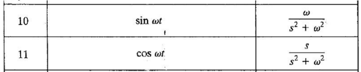
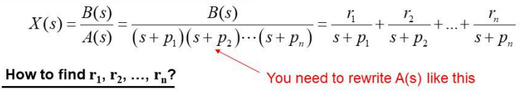
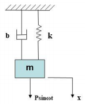
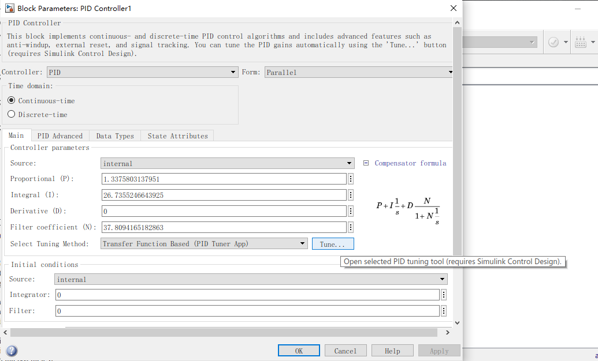
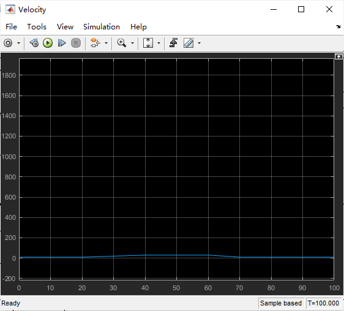

## 目录

  - Chapter 1
  - Chapter 2
    - 补充2
  - Chapter 3 MATLAB
  - Chapter 4 Laplace Transform
  - Chapter 5
  - Chapter 6
  - Chapter 7
  - Chapter 8
  - Chapter 9
  - 补充：Simulink
  - Chapter 10
  - Chapter 11
  - Chapter 12
  - Chapter 13
  - Chapter 14
  - Chapter 15
  - Chapter 16
  - Chapter 17
  - Chapter 18
  - Chapter 19
  - Chapter 20
    - Simulink实现PID控制器
    - 补充20：PID解ACC系统
      - 参考资料
    - 补充20：系统稳定性

## Chapter 1

数学建模：

- 绘制系统示意图并定义变量。
- 使用物理定律为每个系统的组件编写方程式。将这些方程式组合起来得到一个数学模型。
- 求解模型的方程组以获得响应（response）。
- 通过将预测响应与实验结果进行比较来验证模型。

线性微分方程和非线性微分方程的区别在于，线性微分方程中的未知函数均为一次方形式。

线性微分方程满足线性，因此有如下求$x(t)$的方法：

$$\frac{d^2 x(t)}{d t^2}+5 \frac{d x(t)}{d t}+10 x(t)=f_1(t)+f_2(t)$$

$$\begin{aligned} & \frac{d^2 x_1(t)}{d t^2}+5 \frac{d x_1(t)}{d t}+10 x_1(t)=f_1(t) \\ & \frac{d^2 x_2(t)}{d t^2}+5 \frac{d x_2(t)}{d t}+10 x_2(t)=f_2(t)\end{aligned}$$

$$\frac{d^2\left\{x_1(t)+x_2(t)\right\}}{d t^2}+5 \frac{d\left\{x_1(t)+x_2(t)\right\}}{d t}+10\left\{x_1(t)+x_2(t)\right\}=f_1(t)+f_2(t)$$

$$x(t)=x_1(t)+x_2(t)$$

## Chapter 2

复数的欧拉形式：

$$\begin{aligned} e^{i x} & =\sum_{n=0}^{\infty} \frac{(i x)^n}{n !} \\ & =\sum_{n=0}^{\infty} \frac{(-1)^n x^{2 n}}{(2 n) !}+i \sum_{n=1}^{\infty} \frac{(-1)^{n-1} x^{2 n-1}}{(2 n-1) !} \\ & =\cos x+i \sin x\end{aligned}$$

$$cos \theta + i sin \theta = e^{i \theta}$$

$$cos \theta - i sin \theta = e^{-i \theta}$$

复数的垂直坐标形式和极坐标形式：


$$\begin{aligned} & a=|z| \cos \theta \\ & b=|z| \sin \theta \\ & |z|=\sqrt{a^2+b^2}\end{aligned}$$

共轭复数（complex conjugate）：

$$z=a+ib=|z|e^{i\theta}$$

$$z^*=a-i b=|z| e^{-i \theta}$$

$$|z|=\sqrt{z z^*}$$

极坐标形式的复数运算：


$$z=z_1 z_2=\left|z_1\right|\left|z_2\right| e^{i\left(\theta_1+\theta_2\right)}=|z| e^{i \theta}$$


$$z=\frac{z_2}{z_1}=\frac{\left|z_2\right| e^{i \theta_2}}{\left|z_1\right| e^{i \theta_1}}=\frac{\left|z_2\right|}{\left|z_1\right|} e^{i\left(\theta_2-\theta_1\right)}$$

$$z=\frac{z_2}{z_1}=\frac{z_2 z_1^*}{z_1 z_1^*}=\frac{z_2 z_1^*}{\left|z_1\right|^2}$$

逆（inverse）复数：


$$z_1^{-1}=\frac{1}{z_1}=\frac{1}{\left|z_1\right| e^{i \theta_1}}=\left|z_1\right|^{-1} e^{-i \theta_1}$$

复数变量与复数函数：

$$s=\sigma+j \omega$$

$$F(s)=F_x+j F_y$$

***

复数函数例子：

$$F(s)=5 s+6=5(\sigma+j \omega)+6=(5 \sigma+6)+j(5 \omega)$$

***

若复数函数的形式如下（可代表一个系统）：

$$F(s)=\frac{K\left(s+z_1\right)\left(s+z_2\right) \cdots\left(s+z_m\right)}{\left(s+p_1\right)\left(s+p_2\right) \cdots\left(s+p_n\right)}$$

$s=-z_1,s=-z_2...$使得$F(s)=0$的$s$的取值称为$F(s)$的零点（zeros），$s=-p_1,s=-p_2...$使得$F(s) \to \infty$的$s$的取值称为$F(s)$的极点（poles）。

### 补充2

复数的绝对值：

$$|\frac{1}{z}|=\frac{|1|}{|z|}=\frac{1}{|z|}$$

$$\frac{1}{|z|}=\frac{1}{||z|e^{i \theta}|}=\frac{1}{|z|} \frac{1}{|e^{i \theta}|}=\frac{1}{|z|} \frac{1}{|cos \theta + i sin \theta|}=\frac{1}{|z|}$$

## Chapter 3 MATLAB

阶跃函数与画图：

```
xt = @(t)0.5*exp(-2*t)*heaviside(t) ...
+1/2*(1-exp(-2*t))*heaviside(t) ...
-1/2*(1-exp(-2*(t-1)))*heaviside(t-1);
% 含有阶跃函数的函数定义方法。

figure(1)
% 新建图以支持后续画多个图。
fplot(xt,[0 3],'b')

t=0:0.01:100
xt = 1./(t.^2+2.*t+1)
% 定义步长，运算符前需要加上"."使运算变为矩阵运算。

figure(2)
plot(t,xt)
```

部分分式分解：

$$\frac{2}{s^2(s+2)}$$

```
b = [0 0 0 2];
a = [1 2 0 0];
[r,p,k] = residue(b,a)
% k为常数项/余项。
% 注意只通过residue函数无法得到分母的s的次方数。但是如果出现重复的根，则根据MATLAB给出顺序来逐项提升对应项的次方数（例如给出p=[-2,-1,0,0]，则四项分母为s+2,s+1,s+0,(s+0)^2）。
```

## Chapter 4 Laplace Transform

拉普拉斯变换和拉普拉斯逆变换符号：

$$\mathcal{L}/\mathscr{L} \quad \mathcal{L}^{-1}/\mathscr{L}^{-1}$$

- 时域变换为$s$域为拉普拉斯变换，$s$域变换为时域为拉普拉斯逆变换。

拉普拉斯变换定义：

- 设函数$f(t)$是定义在$[0,+\infty)$上的实值函数，如果对于复参数$s=\beta+\text{j}w$，存在一个积分$F(s)$，在复平面$s$的某一个区域内收敛，则称积分$F(s)$为$f(t)$的拉普拉斯变换。$F(s)$形式如下：

$$F(s)=\int_0^{+\infty} f(t) e^{-s t} d t$$

函数$f(t)$的拉普拉斯变换存在的条件：

$$\mathcal{L}[f(t)]=F(s)=\int_0^{\infty} f(t) e^{-s t} d t$$

- 对于$t<0$，$f(t)=0$。
- 对于$t>0$的任一有限区间内，$f(t)$满足分段连续（piecewise continuous）。
- 存在一个正实数常数$\sigma$满足：$\lim _{t \rightarrow \infty}\left(e^{-\sigma t}|f(t)|\right)=0$。这称为存在性检查（existence check）。

拉普拉斯逆变换：

$$f(t)=\mathcal{L}^{-1}[F(s)]$$

$$f(t)=\mathcal{L}^{-1}[F(s)]=\frac{1}{2 \pi j} \int_{\beta-j \infty}^{\beta+j \infty} F(s) e^{s t} d s$$

如何表示函数$f(t)$满足在$t<0$时$f(t)=0$：

- 图像表示
- 通过公式表示：$f(t)=a t \times 1(t)$，其中$1(t)$是单位阶跃函数。
- 通过公式表示：$f(t)= \begin{cases}0 & t<0 \\ a t & t \geq 0\end{cases}$

注意事项：

- 阶跃函数$1(t)$的存在，是为了将函数表示成符合拉普拉斯变换定义的形式，以进行拉普拉斯变换。
- 函数$F(s)$的意义既是$f(t)$的拉普拉斯变换，也是一个特定的带有$f(t)$和变量$s$（变量$s$可变）的函数$\int_0^{\infty} f(t) e^{-s t} d t$。
- 给定运动方程（EOM），初始条件（I.C.）。拉普拉斯变换用于解线性微分方程，将微分方程变换为代数（algebraic）方程。

***

例子：

存在性检查：


$$f(t)=1(t)$$

$$\sigma > 0$$

$$\begin{aligned} & \lim _{t \rightarrow \infty}\left(e^{-\sigma t}|f(t)|\right)=\lim _{t \rightarrow \infty}\left(e^{-\sigma t}\right)=0 \\ & \longrightarrow \mathcal{L}[f(t)] \text { exists }\end{aligned}$$


$$f(t)=A e^{-\alpha t} \times 1(t) \quad \alpha>0$$

$$\sigma \geq 0$$

$$\begin{aligned} & \lim _{t \rightarrow \infty}\left(e^{-\sigma t}|f(t)|\right)=\lim _{t \rightarrow \infty}\left(A e^{-\sigma t} \times e^{-\alpha t}\right)=\lim _{t \rightarrow \infty}\left(A e^{-(\sigma+\alpha) t}\right)=0 \\ & \longrightarrow \mathcal{L}[f(t)] \text { exists }\end{aligned}$$


$$f(t)=A e^{\alpha t} \times 1(t) \quad \alpha>0$$

$$\sigma > \alpha$$

$$\begin{aligned} & \lim _{t \rightarrow \infty}\left(e^{-\sigma t}|f(t)|\right)=\lim _{t \rightarrow \infty}\left(A e^{-\sigma t} \times e^{\alpha t}\right)=\lim _{t \rightarrow \infty}\left(A e^{-(\sigma-\alpha) t}\right)=0 \\ & \longrightarrow \mathcal{L}[f(t)] \text { exists }\end{aligned}$$


$$f(t)=e^{t^2} \times 1(t)$$

$$\begin{aligned} & \lim _{t \rightarrow \infty}\left(e^{-\sigma t}|f(t)|\right)=\lim _{t \rightarrow \infty}\left(e^{-\sigma t} \times e^{t^2}\right)=\lim _{t \rightarrow \infty}\left(e^{-\sigma t+t^2}\right)=\infty \\ & \longrightarrow \mathcal{L}[f(t)] \text { does not exists }\end{aligned}$$


$$f(t)=A \sin (\omega t) \times 1(t)$$

$$\sigma > 0$$

$$\begin{aligned} & \lim _{t \rightarrow \infty}\left(e^{-\sigma t}|f(t)|\right)=\lim _{t \rightarrow \infty}\left(A|\sin (\omega t)| e^{-\sigma t}\right)=0 \\ & \longrightarrow \mathcal{L}[f(t)] \text { exists }\end{aligned}$$

***

例子：

拉普拉斯变换的计算：


$$f(t)=A \times 1(t)$$

$$F(s)=\int_0^{\infty} A e^{-s t} d t=\left.A \frac{e^{-s t}}{-s}\right|_0 ^{\infty}=\left[A \times \frac{0}{-s}\right]-\left[A \frac{e^{-s 0}}{-s}\right]=\frac{A}{s}$$


$$f(t)=A t \times 1(t)$$

$$F(s)=\int_0^{\infty} A t e^{-s t} d t$$

$$\int_a^b u d v=\left.u v\right|_a ^b-\int_a^b v d u , \quad u=t , \quad dv=e^{-st}dt$$

$$F(s)=A\left(\left.t \frac{e^{-s t}}{-s}\right|_0 ^{\infty}-\int_0^{\infty} \frac{e^{-s t}}{-s} d t\right)=\frac{A}{s} \int_0^{\infty} e^{-s t} d t=\frac{A}{s} \times\left.\frac{e^{-s t}}{-s}\right|_0 ^{\infty}=\frac{A}{s^2}$$


$$f(t)=A \sin (\omega t) \times 1(t)$$

$$F(s)=\int_0^{\infty} A \sin (\omega t) e^{-s t} d t$$

$$e^{i \omega t}=\cos (\omega t)+i \sin (\omega t)$$

$$\sin (\omega t)=\frac{1}{2 i}\left(e^{i \omega t}-e^{-i \omega t}\right)$$

$$F(s)=\frac{A}{2 i} \int_0^{\infty}\left(e^{i \omega t}-e^{-i \omega t}\right) e^{-s t} d t=\frac{A}{2 i} \int_0^{\infty}\left(e^{(i \omega-s) t}-e^{-(i \omega+s) t}\right) d t=0-\frac{A}{2 i}\left[\frac{1}{(i \omega-s)}-\frac{1}{-(i \omega+s)}\right]$$

$$F(s)=-\frac{A}{2 i}\left[\frac{(i \omega+s)+(i \omega-s)}{(i \omega-s)(i \omega+s)}\right]=-\frac{A}{2 i}\left[\frac{2 i \omega}{-\omega^2-s^2}\right]=\frac{A \omega}{s^2+\omega^2}$$


$$f(t)=A \cos (\omega t) \times 1(t)$$

$$F(s)=\int_0^{\infty} A \cos (\omega t) e^{-s t} d t$$

$$e^{i \omega t}=\cos (\omega t)+i \sin (\omega t)$$

$$\cos (\omega t)=\frac{1}{2}\left(e^{i \omega t}+e^{-i \omega t}\right)$$

$$F(s)=\frac{A}{2} \int_0^{\infty}\left(e^{i \omega t}+e^{-i \omega t}\right) e^{-s t} d t=\frac{A}{2} \int_0^{\infty}\left(e^{(i \omega-s) t}+e^{-(i \omega+s) t}\right) d t=0-\frac{A}{2}\left[\frac{1}{(i \omega-s)}+\frac{1}{-(i \omega+s)}\right]$$

$$F(s)=-\frac{A}{2}\left[\frac{(-i \omega-s)+(i \omega-s)}{(i \omega-s)(i \omega+s)}\right]=-\frac{A}{2}\left[\frac{-2 s}{-\omega^2-s^2}\right]=\frac{A s}{s^2+\omega^2}$$

***

拉普拉斯变换表（部分）：




表中的$F(s)$和$F(g(s))$区别：

$$F(s)=\{\mathscr{L}[f(t)]\}(s)=G(s)$$

$$F(g(s))=\{\mathscr{L}[f(t)]\}(g(s))=G(g(s))$$

拉普拉斯变换的线性性质：

$$\mathcal{L}[af_1(t)+bf_2(t)]=a \mathcal{L}[f_1(t)]+b \mathcal{L}[f_2(t)]$$

拉普拉斯变换延迟性质：

$$\mathcal{L}[f(t-\alpha) \times 1(t-\alpha)]=e^{-\alpha s} F(s) \quad \alpha \geq 0$$

拉普拉斯变换位移性质：

$$\mathscr{L}\left\{e^{-a t} f(t)\right\}=F(s+a)$$

拉普拉斯变换位移性质，例子：

$$\mathscr{L}\left\{e^{-a t} \sin \omega t\right\}=\frac{\omega}{(s+a)^2+\omega^2}$$

拉普拉斯变换相似性质/伸缩性/尺度变换（表中的$\frac{1}{c}$其实应当是$\frac{1}{|c|}$），注意是变量$t$乘上常数系数$c$（也就是$f(t) \to f(ct)$），而不是一个整个函数乘上常数系数$c$（也就是$f(t) \to c f(t)$）：

$$\begin{aligned} \mathscr{L}[f(a t)] & =\int_0^{+\infty} f(a t) e^{-s t} d t \\ & \underline{\underline{x=a t}} \; \frac{1}{a} \int_0^{+\infty} f(x) e^{-\left(\frac{s}{a}\right) x} d x \\ & =\frac{1}{a} F\left(\frac{s}{a}\right)\end{aligned}$$

拉普拉斯变换相似性质，例子：

$$\mathscr{L}[f(c t)]=\frac{1}{|c|} F (\frac{s}{c})$$

$$F(s)=\mathscr{L}[f(t)]$$

$$f(t)=2*t,f(2t)=2*2t=4t$$

$$\mathscr{L}[f(t)]=\frac{2}{s^2}, \mathscr{L}[f(2t)]=\frac{4}{s^2}$$

$$\mathscr{L}[f(2t)]=\frac{1}{2} \cdot F(\frac{s}{2})=\frac{1}{2} \cdot \frac{2}{(\frac{s}{2})^2}=\frac{4}{s^2}$$

拉普拉斯变换卷积定理（注意$*$是卷积不是乘积）：

$$J=f(t) * g(t)=\int_0^t f(\tau) g(t-\tau) d \tau$$

$$\mathscr{L}[f(t) * g(t)]=\mathscr{L}[f(t)] \cdot \mathscr{L}[g(t)]=F(s) \cdot G(s)$$

拉普拉斯变换初值定理：

$$\lim _{t \rightarrow 0^+} f(t)=\lim _{s \rightarrow \infty} s \cdot F(s)$$

拉普拉斯变换终值定理：

$$\lim _{t \rightarrow \infty} f(t)=\lim _{s \rightarrow 0} s \cdot F(s)$$

***

例子：

通过查表直接进行拉普拉斯变换：


***

时滞系统（time delay system，TDS）：


因此时滞部分可以单独取出：


$$t'=t-t_0$$

$$f(t)=A \times 1\left(t-t_0\right)=A \times 1(t')$$

$$\mathcal{L}[A \times 1(t-\alpha)]=\int_{-t_0}^{\infty} A \times 1(t') dt'=\int_{0}^{\infty} A \times 1\left(t-t_0\right) dt=\int_0^{t_0} 0 \times e^{-s t} d t+\int_{t_0}^{\infty} f(t-t_0) e^{-s t} d t=\frac{A}{s}e^{-st_0}=F(s) e^{-s t_0}=\mathcal{L}[A \times l(t)] e^{-t_0 s}$$

最终可得公式（均适用于这个形式，$A=f(t-t_0)$的情况推导较为复杂）：

$$\mathcal{L}[f(t-\alpha) \times 1(t-\alpha)]=e^{-\alpha s} F(s) \quad \alpha \geq 0$$

同样，直接单独取出：


$$f\left(t-t_o\right) \times 1\left(t-t_o\right)=f(t') \times 1(t')$$

$$\mathcal{L}[f(t-t_0)\times 1(t-t_0)]=\int_{0}^{\infty} f(t-t_0)\times 1(t-t_0) dt=F(s) e^{-st_0}=\mathcal{L}[f(t) \times l(t)] e^{-t_0 s}$$

复合函数的拉普拉斯变换：

$$\begin{aligned} \mathcal{L}\left[f_1(t)+f_2(t)\right] & =\int_0^{\infty}\left(f_1(t)+f_2(t)\right) e^{-s t} d t \\ & =\int_0^{\infty} f_1(t) e^{-s t} d t+\int_0^{\infty} f_2(t) e^{-s t} d t \\ & =\mathcal{L}\left[f_1(t)\right]+\mathcal{L}\left[f_2(t)\right]\end{aligned}$$

$$\mathcal{L}\left[f_1(t)-f_2(t)\right]=\mathcal{L}\left[f_1(t)\right]-\mathcal{L}\left[f_2(t)\right]$$

***

例子：

求解含时域函数$x(t)$的微分方程，那么通过拉普拉斯变换得到$s$域函数$X(s)$的表达式：

$$x''(t)+x'(t)-10x(t)=0$$

查表可得：

$$s^2 X(s) - s x(0) - x'(0) + s X(s) - x(0) + 10X(s)=0$$

已知：

$$X(0)=0,X'(0)=1$$

最终可得：

$$X(s)=\frac{1}{s^2+s+10}$$

***

例子：

通过拉普拉斯变换和拉普拉斯逆变换求解ODE（常微分方程）：


只取部分区间的常见情况：


***

对求得的时域函数和$s$域函数，求稳定状态值（steady-state value），有终值定理（final value theorem）：

$$\lim _{t \rightarrow \infty} x(t)=\lim _{s \rightarrow 0} s X(s)$$

通过拉普拉斯变换求ODE，并且通过终值定理，求稳定状态值：


***

## Chapter 5

- 对于通过拉普拉斯变换求函数$x(t)$，求得的$X(s)$很多时候无法直接求拉普拉斯逆变换的形式，因此我们需要对$X(s)$进行部分分式分解/展开（partial fraction expansion，PFE），以方便求其拉普拉斯逆变换，即最终结果$x(t)$。

- 部分分式展开：


- 常数$r_{i}$称为残差（residues）：


- 求常数$r_i$：




- $s$三次方或以上存在的情况，需要通过MATLAB化为以下形式：

$$\frac{1}{(s+a)(s+b)(s+c)\cdots}$$

- 注意EOM中的$x$是关于$t$的函数$x(t)$，在查表时将其视为$f(t)$而不是$t$。

***

例子：


例子：


复合极点例子：


***

例子：

多个极点情况的手动部分分式分解：


***

部分分式分解情况：

- 不同极点（distinct poles）：分式分解后每一项分母均为一次方。

$$\frac{1}{(s+a)(s+b)(s+c)\cdots}$$

- 多个极点（multiple poles）：分式分解后每一项分母可以为除了一次方的不同的多次方。且对于重复的极点，按照顺序次方数逐渐上升。

$$\frac{1}{(s+a)(s+a)^2(s+b)(s+b)^2(s+b)^3(s+c)(s+d)\cdots}$$

- 无论极点情况如何，极点和残差的计算都可以使用MATLAB进行计算。

## Chapter 6

对质量$m$，转动惯量$J_p$的元件，满足：

- 对于惯性元件（inertia element），有：

$$F=m a(t) , \quad T=J_p \ddot{\theta}(t)$$

- 对于弹簧元件（spring element），有：

$$F=k\left(x_1-x_2\right) ,\quad \mathrm{T}=k_t\left(\theta_1-\theta_2\right)$$

- 对于阻尼元件（damper element），有：

$$F=c\left(\dot{x}_1-\dot{x}_2\right) , \quad \mathrm{T}=c_t\left(\dot{\theta}_1-\dot{\theta}_2\right)$$

国际单位制和英制单位表：


自由度（degree of freedoms，DOFs）：

- 自由度的数量和描述系统所需的微分方程数一致。

通过牛顿第二定律获得运动方程（equation of motion，EOM）步骤：

- $x$轴方向（不考虑重力$mg$）：


$$-k x(t)-b \dot{x}(t)+f(t)=m \ddot{x}(t)$$

$$m \ddot{x}(t)+b \dot{x}(t)+k x(t)=f(t)$$

- $y$轴方向（考虑重力$mg$）：


$$IC: x(0)=x_0 , \dot{x}(0)=\dot{x}_0$$

$$y(t)=x(t)+\delta$$

$$mg=k \delta$$

$$m \ddot{y}(t)+b \dot{y}(t)+k y(t)=f(t)+m g$$

$$m \ddot{x}(t)+b \dot{x}(t)+k x(t)+k \delta=f(t)+m g$$

$$m \ddot{x}(t)+b \dot{x}(t)+k x(t)=f(t)$$

- 能量方法：

$$W=\vec{F} \cdot \vec{d} [N \times m]$$

$$P=\vec{F} \cdot \vec{\dot{d}} [N \times \frac{m}{s}]$$

$$E_T=\int_t^{t+T} \vec{F}(t) \cdot \vec{\dot{d}}(t) d t \quad[N \times m]$$

$$E_{\text {potential }}=\int_0^x F(x) d x=\frac{1}{2} k x^2$$

$$E_{\text {potential }}=\frac{1}{2} k_t \theta^2$$

$$E_{\text {kinetic }}=\frac{1}{2} m v^2$$

$$E_{\text {kinetic }}=\frac{1}{2} J_p \dot{\theta}^2$$

保守动态系统（conservative dynamic system）：

- 若$y$轴方向，则无视重力。因为重力和稳态的弹簧力会形成平衡。$x$一般是以稳态位置（static equilibrium position）（也就是以弹簧伸长量为$\delta$（$mg=k \delta$）时的状态视为$x=0$，因此也可以选择变量$y=x+\delta$来表示EOM的形式，但注意不是视为$x(0)=0$，因为一个不为零的$x(0)$才会导致系统随时间变化，也就是$x(t)$随着$t$变化而变化，如果$x(0)=0$则系统一直保持稳态）开始计算的。

$$mg=k \delta$$

$$m \ddot{x}=mg-k\delta-k x$$

$$m \ddot{x}=kx$$

- EOM一般默认以变量名的形式和确切值的两种形式同时表示，且初态条件不需要写出，单一牛二式子就是EOM。

$$m \ddot{x}=kx$$

- 保守系统不存在外力和阻尼，因此通过能量方法获得EOM：

$$E_{\text {kinetic }}(\dot{x})+E_{\text {potential }}(x)= constant$$

$$\frac{d}{d t}\left[E_{\text {kinetic }}(\dot{x})+E_{\text {potential }}(x)=\right. constant] \rightarrow \dot{x}(t)\left\{m_{e q} \ddot{x}(t)+k_{e q} x(t)\right\}=0$$

$$m_{e q} \ddot{x}(t)+k_{e q} x(t)=0$$

- 弹簧-质量块（spring-mass）系统的EOM：


$$mg=k \delta$$

$$-k x=m \ddot{x}$$

$$\left\{\begin{array}{l}m \ddot{x}+k x=0 \\ x(0)=x_0 \quad \dot{x}(0)=\dot{x}_0\end{array}\right.$$

***

弹簧-质量块系统例子：


- 质点绕轴旋转，转动惯量为$I=m r^2$，此处$r=2a$。

***

通过拉普拉斯变换计算保守动态系统的自然响应$x(t)$：

$$m_{e q} \ddot{x}(t)+k_{e q} x(t)=0$$

$$x(0)=x_0 \quad \dot{x}(0)=\dot{x}_0$$

$$m_{e q}\left(s^2 X(s)-s x_0-\dot{x}_0\right)+k_{e q} X(s)=0$$

$$X(s)=m_{e q} \frac{s x_o+\dot{x}_o}{s^2 m_{e q}+k_{e q}}=x_0\frac{s}{s^2+\frac{k_{eq}}{m_{eq}}}+\dot{x}_0\frac{1}{s^2+\frac{k_{eq}}{m_{eq}}}$$

$$\omega_n=\sqrt{\frac{k_{eq}}{m_{eq}}}$$

$$X(s)=x_0 \frac{s}{s^2+\omega_n^2}+\frac{\dot{x}_0}{\omega_n} \frac{\omega_n}{s^2+\omega_n^2}$$


$$\begin{aligned} x(t) & =\left\{x_0 \cos \left(\omega_n t\right)+\frac{\dot{x}_0}{\omega_n} \sin \left(\omega_n t\right)\right\} \times 1(t) \\ & =R \cos \left(\omega_n t-\varphi\right) \times 1(t)\end{aligned}$$

$$\begin{aligned} R & =\sqrt{x_0^2+\frac{\dot{x}_0^2}{\omega_n^2}} \\ \varphi & =\tan _{-1}\left(\frac{\dot{x}_0}{x_0 \omega_n}\right)\end{aligned}$$

多弹簧系统：

- 平行弹簧（spring in parallel ）：


$$\begin{aligned} & m \ddot{x}=F(t)-k_1 x-k_2 x \\ & m \ddot{x}+\left(k_1+k_2\right) x=F(t)\end{aligned}$$

$$k_{eq}=k_1+k_2$$

- 串行弹簧（spring in series）：


$$m \ddot{x} = F(t)-k_2 \Delta x_2$$

$$m \ddot{x} = F(t)-k_{eq} x$$

$$\begin{aligned} & F'=k_1 \Delta x_1=k_2 \Delta x_2 \\ & x=\Delta x_1+\Delta x_2 \\ & \frac{F^{\prime}}{k_{e q}}=\frac{F^{\prime}}{k_1}+\frac{F^{\prime}}{k_2}\end{aligned}$$

$$\frac{1}{k_{e q}}=\frac{1}{k_1}+\frac{1}{k_2}$$

- 在另一面的弹簧因为提供力的方向可以视为同一面的弹簧：


$$k_{eq}=k_1+k_2+k_3$$

弹簧-质量块-阻尼系统（$x$测量自稳态，初速度$\dot{x}(0)=0$）：


$$\left\{\begin{array}{l}m \ddot{x}+b \dot{x}+k x=0 \\ x(0)=x_0 \quad \dot{x}(0)=0\end{array}\right.$$

$$m [s^2 X(s)-s x(0)-\dot{x}(0)]+b[s X(s)-x(0)]+k X(s)=0$$

$$X(s)=\frac{(ms+b)x_0}{ms^2+bs+k}$$

- $X(s)$表达式的含$s$分母$m s^2+b s+k=0$称为特征方程（characteristic equation）。

$$m s^2+c s+k=0$$

$$s=\frac{-c \pm \sqrt{c^2-4 m k}}{2 m}$$

弹簧-质量块-阻尼系统（$x$测量自稳态，初速度$\dot{x}(0)=v_0$）：

$$\left\{\begin{array}{l}m \ddot{x}+c \dot{x}+k x=0 \\ x(0)=x_0 \quad \dot{x}(0)=v_0\end{array}\right.$$

- 有阻尼比（damping ratio）$\zeta=\frac{c}{2 \sqrt{km}}$：
- - $c^2<4mk, \zeta \in (0,1)$欠阻尼情况，有两个互为共轭复数的根。通过欧拉公式$e^{i \theta}=\cos \theta+i \sin \theta$可以得到。
- - $c^2=4mk, \zeta = 1$临界阻尼情况，只有一个实数根。
- - $c^2>4mk, \zeta > 1$过阻尼情况，有两个实数根。

- 进行部分分式分解：

$$X(s)=\frac{B(s)}{A(s)}=\frac{r_1}{s+p_1}+\frac{r_2}{s+p_2}$$

- 写成更正式的形式（自然频率$\omega_n=\sqrt{\frac{k}{m}}$）：

$$\begin{aligned} & \ddot{x}+\frac{c}{m} \dot{x}+\frac{k}{m} x=0 \\ & \ddot{x}+2 \zeta \omega_n \dot{x}+\omega_n^2 x=0\end{aligned}$$

$$X(s)=\frac{x_0 s+2 \zeta \omega_n x_0+v_0}{s^2+2 \zeta \omega_n s+\omega_n^2}=\frac{x_0\left(s+\zeta \omega_n\right)+v_0+\zeta \omega_n x_0}{\left(s+\zeta \omega_n\right)^2+\omega_n^2-\zeta^2 \omega_n^2}$$

$$\omega_d^2=\omega_n^2-\zeta^2 \omega_n^2=(1-\zeta^2) \omega_n^2$$

$$\begin{aligned} & X(s)=\frac{x_0\left(s+\zeta \omega_n\right)}{\left(s+\zeta \omega_n\right)^2+\omega_d^2}+\frac{v_0+\zeta \omega_n x_0}{\omega_d} \frac{\omega_d}{\left(s+\zeta \omega_n\right)^2+\omega_d^2} \\ & x(t)=e^{-\zeta \omega_n t}\left[x_0 \cos \omega_d t+\left(\frac{v_0+\zeta \omega_n x_0}{\omega_d}\right) \sin \omega_d t\right]=e^{-\zeta \omega_n t} R \cos \left(\omega_d t-\psi\right)\end{aligned}$$

- 特征方程解：

$$s^2+2 \zeta \omega_n s+\omega_n^2=0$$

$$s_{1,2}=-\zeta \omega_n \pm j \omega_d$$


***

例子：


***

## Chapter 7

传递函数（transfer-function，TF），对于M-K-C系统（弹簧、阻尼同时存在的系统）：

- 列出EOM并进行拉普拉斯变换：

$$m \ddot{x}+c \dot{x}+k x=f(t)$$

$$\left(m s^2+c s+k\right) X(s)=F(s)$$

- 定义$G(s)$：

$$G(s)=\frac{X(s)}{F(s)}=\frac{1}{m s^2+c s+k}$$

- 对任意的系统输入$f(t)/F(s)$，假设初始条件$x(t),\dot{x}(t)$均为0，通过传递函数TF表示不同输出的响应。
- - 当输出为位移（关于$x(t)$的信息）：

$$TF=G(s)=\frac{X(s)}{F(s)}=\left.\frac{\mathcal{L} \text { [output] }}{\mathcal{L} \text { [input] }}\right|_{\text {Zero Initial Conditions }}$$

$$TF=G(s)=\frac{X(s)}{F(s)}=\frac{1}{m s^2+c s+k}$$

- - 当输出为速度（关于$\dot{x}(t)$的信息）：

$$\mathcal{L} [\dot{x}(t)]=sX(s)-x(0)=s X(s)$$

$$TF=G(s)=\frac{s X(s)}{F(s)}=\frac{s}{m s^2+c s+k}$$

- - 当输出为加速度（关于$\ddot{x}(t)$的信息）：

$$\mathcal{L} [\ddot{x}(t)]=s^2X(s)-sx(0)-\dot{x}(0)=s^2 X(s)$$

$$TF=G(s)=\frac{s^2 X(s)}{F(s)}=\frac{s^2}{m s^2+c s+k}$$

- - 当输出为弹簧力（关于$k x(t)$的信息）：

$$TF=G(s)=\frac{k X(s)}{F(s)}=\frac{k}{m s^2+c s+k}$$

- - 当我们求得TF，就可以将TF的信息输入到MATLAB中，通过tf函数求得在不同输入下TF对应的以$t$为变量的输出的响应。

- 函数框图：
- - 中间的块（block）表示传递函数，相当于乘法：


- - 加减法：


- - 框图简化合并：


***

状态空间方程的框图转换，求反馈系统传递函数，例子：


- 重点是手动标出线上的临时函数（不是框内的传递函数），线分多路时，线上的函数值均相等。
- 例子虽然是用方程组解的，但是也可以直接套用结论，在其他更复杂的框图中将这一结构的框图直接转换成最终框图的效果。

***

化简框图，例子：


***

- 求$x(t)$和$\dot{x}(t)$的传递函数（不是原函数），通过原函数$n$阶导的拉普拉斯变换获得更多输出的传递函数：


## Chapter 8

瞬变（transient）和稳态（steady-state）响应：

- 对于M-K-C系统，且阻尼比满足$0<\zeta<1$，固定常数输入$P$，有：

$$m \ddot{x}+b \dot{x}+k x=P \times 1(t)$$

$$\omega_n=\sqrt{\frac{k}{m}} \quad \omega_d=\omega_n \sqrt{1-\zeta^2} \quad \zeta=\frac{b}{2 m \omega_n}$$

$$\ddot{x}+2 \zeta \omega_n \dot{x}+\omega_n^2 x=\frac{P}{m} \times 1(t)$$

$$\begin{aligned} & \left(s^2 X-s x_0-v_0\right)+2 \zeta \omega_n\left(s X-x_0\right)+\omega_n^2 X=\frac{P}{m} \frac{1}{s} \\ & \left(s^2+2 \zeta \omega_n s+\omega_n^2\right) X=\left(x_0 s+2 \zeta \omega_n x_0+v_0\right)+\frac{P}{m} \frac{1}{s}\end{aligned}$$

$$X=\frac{\left(x_0 s+2 \zeta \omega_n x_0+v_0\right)}{\left(s^2+2 \zeta \omega_n s+\omega_n^2\right)}+\frac{P}{m} \frac{1}{s} \frac{1}{\left(s^2+2 \zeta \omega_n s+\omega_n^2\right)}=I+\frac{P}{m} I I$$

$$I=\frac{\left(x_0 s+2 \zeta \omega_n x_0+v_0\right)}{\left(s^2+2 \zeta \omega_n s+\omega_n^2\right)}=\frac{x_0\left(s+\zeta \omega_n\right)}{\left(s+\zeta \omega_n\right)^2+\omega_d^2}+\frac{v_0+\zeta \omega_n x_0}{\omega_d} \frac{\omega_d}{\left(s+\zeta \omega_n\right)^2+\omega_d^2}$$

$$L^{-1}(I)=x_0 e^{-\zeta \omega_n t} \cos \omega_d t+\frac{v_0+\zeta \omega_n x_0}{\omega_d} e^{-\zeta \omega_n t} \sin \omega_d t$$

$$I I=\frac{1}{s\left(s^2+2 \zeta \omega_n s+\omega_n^2\right)}=\frac{1}{\omega_n^2}\left(\frac{1}{s}-\frac{s+\zeta \omega_n}{\left(s+\zeta \omega_n\right)^2+\omega_d^2}-\frac{\zeta \omega_n}{\omega_d} \frac{\omega_d}{\left(s+\zeta \omega_n\right)^2+\omega_d^2}\right)$$

$$L^{-1}(I I)=\frac{1}{\omega_n^2}\left(1-e^{-\zeta \omega_n t} \cos \omega_d t-\frac{\zeta \omega_n}{\omega_d} e^{-\zeta \omega_n t} \sin \omega_d t\right)$$

- 最终$x(t)$以及对应瞬态和稳态响应的表达式：

$$x(t)=L^{-1}(I)+\frac{P}{m} L^{-1}(I I)=e^{-\zeta \omega_n t}\left(x_0 \cos \omega_d t+\frac{v_0+\zeta \omega_n x_0}{\omega_d} \sin \omega_d t\right)+e^{-\zeta \omega_n t}\left(-\frac{P}{k} \cos \omega_d t-\frac{\zeta \omega_n P}{\omega_d k} \sin \omega_d t\right)+\frac{P}{k}$$


$$\begin{gathered}x(t)=e^{-\zeta \omega_n t} R_1 \sin \left(\omega_d t+\alpha_1\right)+e^{-\zeta \omega_n t} R_2 \sin \left(\omega_d t+\alpha_2\right)+\frac{P}{k} \\ R_1=\sqrt{x_0^2+\left(\frac{v_0+\zeta \omega_n x_0}{\omega_d}\right)^2} \quad \alpha_1=\tan ^{-1}\left(\frac{x_0}{\frac{v_0+\zeta \omega_n x_0}{\omega_d}}\right) \\ R_2=\sqrt{\left(\frac{P}{k}\right)^2+\left(\frac{\zeta \omega_n P}{\omega_d k}\right)^2} \quad \alpha_2=\tan ^{-1}\left(\frac{-\frac{P}{k}}{\left.-\frac{\zeta \omega_n P}{\omega_d k}\right)}\right.\end{gathered}$$

- 求稳态响应，可以通过$x(t)$的表达式求，也可以通过终值定理求（具体推导省略）。

$$x_{ss}=\frac{P}{k}$$

$$x_{ss}=x(t \to \infty)=\frac{P}{k}$$

通过MATLAB得到瞬态响应：

- 给出系统的传递函数$TF(s)$（系统本身），系统输入$f(t)$，求系统输出$x(t)$：

$$TF(s)=G(s)=\frac{X(s)}{F(s)}$$

- 单元脉冲：

- - 拉普拉斯变换：


$$I=\int_{-\infty}^{\infty} \delta(t) d t=L[\delta(t)]=1$$

- - 时延拉普拉斯变换：


$$\mathrm{L}\left[\delta\left(t-t_o\right)\right]=e^{-t_o s}$$

- MATLAB代码（传递函数画图，传递函数可能对应不同的参数。传递函数变量为$s$，为了通过变量$t$的范围画出对应的参数的瞬态响应例如$x(t)$，就需要使用tf函数构建动态系统再求瞬态响应）：

```
num=[]
den=[]
sys=tf(num,den)
% 创建传递函数。

step(sys)
% 求瞬态响应（阶跃响应）并画图，使用单元阶跃作为系统输入。

impulse(sys)
% 求瞬态响应（脉冲响应）并画图，但使用单元脉冲作为系统输入。

t=0:0.01:4
% 0到4秒，步长为0.01秒。
u=sin(t)
% 系统输入就是u。

lsim(sys,u,t)
% 求瞬态响应并画图，但使用任意输入（arbitrary input），也就是自定义函数系统输入。例如Ramp函数（u(t)=at）。

% 初始条件也会影响系统输出，可以视为一种系统输入，也需要考虑。
```

- 同一系统传递函数，对单位阶跃函数，单位脉冲函数，Ramp函数分别作为输入的响应：


- 有无初始条件将会影响传递函数表达式，那么对同一种输入的响应当然也不同：


## Chapter 9

状态空间（state-space）模型：

- 状态空间建模是一种求动态系统响应的方法。
- 状态空间方程分为两种：
- - 状态方程（state-space equation）代表状态：

$$\begin{aligned} & \dot{x}_1(t)=a_{11} x_1(t)+a_{12} x_2(t)+\cdots+a_{1 n} x_n(t)+b_{11} u_1(t)+b_{12} u_2(t)+\cdots+b_{1 r} u_r(t) \\ & \dot{x}_2(t)=a_{21} x_1(t)+a_{22} x_2(t)+\cdots+a_{2 n} x_n(t)+b_{21} u_1(t)+b_{22} u_2(t)+\cdots+b_{2 r} u_r(t) \\ & \vdots \\ & \dot{x}_n(t)=a_{n 1} x_1(t)+a_{n 2} x_2(t)+\cdots+a_{n n} x_n(t)+b_{n 1} u_1(t)+b_{n 2} u_2(t)+\cdots+b_{n n} u_r(t)\end{aligned}$$

- - 输出方程（output equation）代表输出和状态与输入的关系：

$$\begin{aligned} & y_1(t)=c_{11} x_1(t)+c_{12} x_2(t)+\cdots+c_{1 n} x_n(t)+d_{11} u_1(t)+d_{12} u_2(t)+\cdots+d_{1 r} u_r(t) \\ & y_2(t)=c_{21} x_1(t)+c_{22} x_2(t)+\cdots+c_{2 n} x_n(t)+d_{21} u_1(t)+d_{22} u_2(t)+\cdots+d_{2 r} u_r(t) \\ & \vdots \\ & y_m(t)=c_{m 1} x_1(t)+c_{m 2} x_2(t)+\cdots+c_{m n} x_n(t)+d_{m 1} u_1(t)+d_{m 2} u_2(t)+\cdots+d_{m r} u_r(t)\end{aligned}$$

- - 将状态空间方程写成矩阵形式，$\{x(t)\}$是状态向量，$\{y(t)\}$是输出向量，$\{u(t)\}$是输入向量，$[A]$是状态矩阵，$[B]$是输入矩阵，$[C]$输出矩阵，$[D]$状态直接传递（state direct transmission）矩阵。其中矩阵$[A],[C]$反映了系统本身的性质，矩阵$[B],[D]$反映了系统输入带来的影响。注意初始条件也会影响系统输出（也就是$\{y(t)\}$随$t$变化的值，也就是系统响应），但是在状态空间方程推导过程中没有一个具体的影响形式（例如一个矩阵），只有在通过MATLAB求解状态空间方程时才能看出初始条件对系统输出的影响：

$$\begin{aligned} & \{\dot{x}\}=[A]\{x\}+[B]\{u\} \\ & \{y\}=[C]\{x\}+[D]\{u\}\end{aligned}$$

- 求二阶系统的状态空间方程：
- - 状态方程（以$y$代替一般的$x$作为变量，更方便理解，而无论变量如何都可以用$x_1,x_2,\cdots$或其他符号表示全部阶的变量以方便写出矩阵）结果均表示为变量的导数$\dot{x}_i$（从一个系统转化为状态空间表示，需要同时写出状态方程和输出方程）：

$$m \ddot{y}(t)+b \dot{y}(t)+k y(t)=u(t)$$

$$I C: y_o , \; \dot{y}_o$$

$$\left\{\begin{array}{l}x_1=y \\ x_2=\dot{y}\end{array}\right.$$

$$\left\{\begin{array}{l}x_{1_o}=y_o \\ x_{2_o}=\dot{y}_o\end{array}\right.$$

$$\dot{x}_1(t)=0*x_1(t)+1*x_2(t)$$

$$\dot{x}_2(t)=-\frac{k}{m} x_1(t)-\frac{b}{m} x_2(t)+\frac{1}{m} u(t)$$

$$\left\{\begin{array}{l}\dot{x}_1 \\ \dot{x}_2\end{array}\right\}=\left[\begin{array}{cc}0 & 1 \\ -\frac{k}{m} & -\frac{b}{m}\end{array}\right]\left\{\begin{array}{l}x_1 \\ x_2\end{array}\right\}+\left\{\begin{array}{c}0 \\ \frac{1}{m}\end{array}\right\} u(t)$$

- - 输出方程（根据要求不同输出方方程也不同）结果均表示为普通变量：


$$\begin{aligned} & y_1(t)=y(t)=x_1(t) \\ & y_2(t)=\dot{y}(t)=x_2(t) \\ & y_3(t)=\ddot{y}(t)=\dot{x}_2(t)=-\frac{b}{m} x_2(t)-\frac{k}{m} x_1(t)+\frac{1}{m} u(t) \\ & y_4(t)=k y(t)+b \dot{y}(t)=k x_1(t)+b x_2(t)\end{aligned}$$

$$\left\{\begin{array}{l}y_1 \\ y_2 \\ y_3 \\ y_4\end{array}\right\}=\left[\begin{array}{cc}1 & 0 \\ 0 & 1 \\ -\frac{k}{m} & -\frac{b}{m} \\ k & b\end{array}\right]\left\{\begin{array}{l}x_1 \\ x_2\end{array}\right\}+\left[\begin{array}{c}0 \\ 0 \\ \frac{1}{m} \\ 0\end{array}\right] u(t)$$

- - 最终状态空间模型（此方程组只能通过使用MATLAB求响应）：

$$\begin{aligned} & \{\dot{x}\}=[A]\{x\}+[B]\{u\} \\ & \{y\}=[C]\{x\}+[D]\{u\}\end{aligned}$$

$$[A]=\left[\begin{array}{cc}0 & 1 \\ -\frac{k}{m} & -\frac{b}{m}\end{array}\right] \quad[B]=\left[\begin{array}{c}0 \\ \frac{1}{m}\end{array}\right]$$

$$[C]=\left[\begin{array}{cc}1 & 0 \\ 0 & 1 \\ -\frac{k}{m} & -\frac{b}{m} \\ k & b\end{array}\right] \quad[D]=\left[\begin{array}{c}0 \\ 0 \\ \frac{1}{m} \\ 0\end{array}\right]$$

- EOM转化为状态空间表示，例子：


$$m \ddot{x} + \frac{k_1 k_2}{k_1+k_2} x = u(t)$$

$$\left\{\begin{array}{l}x_{1}=x \\ x_{2}=\dot{x}\end{array}\right.$$

$$\left\{\begin{array}{l}\dot{x}_1 \\ \dot{x}_2\end{array}\right\}=\left[\begin{array}{cc}0 & 1 \\ -\frac{k_1 k_2}{m(k_1+k_2)} & 0 \end{array}\right]\left\{\begin{array}{l}x_1 \\ x_2\end{array}\right\}+\left\{\begin{array}{c}0 \\ \frac{1}{m}\end{array}\right\} u(t)$$

$$y_1=x$$

$$y_1=[1 \quad 0] \left\{\begin{array}{l}x_1 \\ x_2\end{array}\right\}+0 \cdot u(t)$$

MATLAB代码（无输入仅由初始条件系统产生的响应，和初始条件加上输入系统产生的响应）：


自由度为2的EOM：

$$\begin{aligned} & m_1 \ddot{y}_1(t)+2 k y_1(t)-k y_2(t)=f_1(t) \\ & m_2 \ddot{y}_2(t)-k y_1(t)+k y_2(t)=f_2(t)\end{aligned}$$

$$\begin{aligned} & \left\{\begin{array}{l}x_1=y_1 \\ x_2=\dot{y}_1\end{array}\right. \\ & \left\{\begin{array}{l}x_3=y_2 \\ x_4=\dot{y}_2\end{array}\right.\end{aligned}$$

$$\begin{aligned} & \left\{\begin{array}{l}x_{1 o}=y_{1 o} \\ x_{2 o}=\dot{y}_{1 o}\end{array}\right. \\ & \left\{\begin{array}{l}x_{3 o}=y_{2 o} \\ x_{4 o}=\dot{y}_{2 o}\end{array}\right.\end{aligned}$$

$$\dot{x}_1=x_2$$

$$\dot{x}_3=x_4$$

$$\begin{aligned} & \dot{x}_2(t)=-\frac{2 k}{m_1} x_1(t)+\frac{k}{m_1} x_3(t)+\frac{1}{m_1} f_1(t) \\ & \dot{x}_4(t)=\frac{k}{m_2} x_1(t)-\frac{k}{m_2} x_3(t)+\frac{1}{m_2} f_2(t)\end{aligned}$$

$$\left\{\begin{array}{l}\dot{x}_1 \\ \dot{x}_2 \\ \dot{x}_3 \\ \dot{x}_4\end{array}\right\}=\left[\begin{array}{cccc}0 & 1 & 0 & 0 \\ -2 k / m_1 & 0 & k / m_1 & 0 \\ 0 & 0 & 0 & 1 \\ k / m_2 & 0 & -k / m_2 & 0\end{array}\right]\left\{\begin{array}{l}x_1 \\ x_2 \\ x_3 \\ x_4\end{array}\right\}+\left[\begin{array}{cc}0 & 0 \\ 1 / m_1 & 0 \\ 0 & 0 \\ 0 & 1 / m_2\end{array}\right]\left\{\begin{array}{l}f_1 \\ f_2\end{array}\right\}$$

$$z_1=y_1$$

$$z_2=y_2$$

$$z=\left\{\begin{array}{l}z_1 \\ z_2\end{array}\right\}=\left\{\begin{array}{l}x_1 \\ x_3\end{array}\right\}=\left[\begin{array}{llll}1 & 0 & 0 & 0 \\ 0 & 0 & 1 & 0\end{array}\right]\left\{\begin{array}{l}x_1 \\ x_2 \\ x_3 \\ x_4\end{array}\right\}$$

$$\begin{aligned} & \dot{x}=A x+B u \\ & z=C x+D u\end{aligned}$$

MATLAB代码（画出状态空间$y_1,y_2,y_3,y_4$）：

```
A=[0 0 0 0;0 0 0 0;0 0 0 0;0 0 0 0]
% 自由度为2，四个变量。
B=[0 0;0 0;0 0;0 0]
% 自由度为2，两个输入函数。
C=[0 0 0 0;0 0 0 0]
D=[0 0;0 0]
% 自由度为2，两个输出响应。
x0=[0 0 0 0]
% 初始条件

sys=ss(A,B,C,D)
% 创建状态空间。

step(sys)
% 以阶跃函数作为输入

impulse(sys)
% 以脉冲函数作为输入

t=0:0.01:100
u=[zeros(size(t));zeros(size(t))]
% 两个输入函数均为0，但是size必须是符合的（带有变量t也能使得size符合）。
[y,t]=lsim(sys,u,t,x0)
% 以自定义函数作为输入，且考虑初始条件x0。y为输出方程矩阵。
y1=[1 0]*y'
y2=[0 1]*y'
% 两个输出响应，取列。
plot(t,y1,'r',t,y2,'b')
% 画出两个输出响应。
grid
% 网格
```

多弹簧系统，例子：


MATLAB代码：


传递矩阵（transfer matrix，TM）等效于传递函数，状态空间与传递函数的相互转化方法：

$$\begin{aligned} & \dot{\mathbf{x}}=\mathbf{A x}+\mathbf{B u} \\ & \mathbf{y}=\mathbf{C} \mathbf{x}+\mathbf{D u}\end{aligned}$$

$$T M(s)=\mathbf{G}(s)=\frac{\mathbf{Y}(s)}{\mathbf{U}(s)}$$

- 解传递矩阵（通过拉普拉斯变换）：

$$s X(s)-x(0)=A X(s)+B U(s)$$

$$IC=0$$

$$X(s)=(s I-A)^{-1} B U(s)$$

$$Y(s)=C X(s)+D U(s)$$

$$Y(s)=\left[C(s I-A)^{-1} B+D\right\rfloor U(s)$$

$$\mathbf{G}(s)=\frac{\mathbf{Y}(s)}{\mathbf{U}(s)}=\mathbf{C}(s \mathbf{I}-\mathbf{A})^{-1} \mathbf{B}+\mathbf{D}$$

- 状态空间和传递函数是可以相互转化的，MATLAB函数分别为`ss2tf`和`tf2ss`。
- 状态空间方程的框图转换：


$$\ddot{y}=-\frac{b}{m} \dot{y}-\frac{k}{m}y+\frac{1}{m}u$$


## 补充：Simulink

Simulink，始于EOM，构建仿真框图：


![BWX\[\]BG63\[335KPMHO\[NB)S.jpg](../_resources/BWX[]BG63[335KPMHO[NB%29S.jpg)


与$\frac{1}{s}$相乘可以相当于积分操作，是根据传递函数的形式：

- 当输出为$x(t)$：

$$TF=G(s)=\frac{X(s)}{F(s)}=\frac{1}{m s^2+c s+k}$$

- 当输出$\dot{x}(t)$：

$$\mathcal{L} [\dot{x}(t)]=sX(s)-x(0)=s X(s)$$

$$TF=G(s)=\frac{s X(s)}{F(s)}=\frac{s}{m s^2+c s+k}$$

- 当输出为$\ddot{x}(t)$：

$$\mathcal{L} [\ddot{x}(t)]=s^2X(s)-sx(0)-\dot{x}(0)=s^2 X(s)$$

$$TF=G(s)=\frac{s^2 X(s)}{F(s)}=\frac{s^2}{m s^2+c s+k}$$

## Chapter 10

电路系统元件（element of electrical system）：

- 基本被动元件（passive elements）：
- - 电阻（resistor）/电阻元件。
- - 电容（capacitor）/电容元件。
- - 电感（inductor）/电感元件。
- 基本主动元件（active elements）：
- - 电压源。
- - 电流源。

电阻（单位$\Omega$）：

$$R=\frac{e_R}{i}$$

电容（单位$F$）：

$$C=\frac{d q}{d e_C}$$

$$i=\frac{dq}{dt}=C \frac{d e_C}{dt}$$

$$e_C(t)=\frac{1}{C} \int_0^t i(t) d t+e_C(0)$$

电感（单位$H$）：

$$L=\frac{e_L}{di/dt}$$

$$e_L(t)=L \frac{d i(t)}{d t}$$

电压源：


电流源：


节点定理：

$$\sum +i=\sum -i$$


回路定理：

$$\sum e_i=0$$


$$E \times 1(t)-L \frac{d i}{d t}-R i-\frac{1}{C} \int i d t=0$$

解简单LR电路例子：


解简单RC电路例子（求输出$u_o(t)$即电容的电压）：


- 方法一：

$$u_o(t)=u_C(t)$$

$$R i(t)+\frac{1}{C} \int i(t) d t=u_i(t)$$

$$R I(s)+\frac{I(s)}{C s}=U_i(s)$$

$$u_C(t)=\frac{1}{C}\int i(t)dt$$

$$U_C(s)=\frac{1}{C} \cdot \frac{1}{s} I(s)$$

$$\frac{U_C(s)}{U_i(s)}=\frac{1}{R C s+1}$$

- 方法二：

$$i(t)=C \frac{d u_C(t)}{d t}$$

$$R i(t)+u_C(t)=u_i(t)$$

$$R C \frac{d u_C(t)}{d t}+u_C(t)=u_i(t)$$

$$RC \cdot s U_C(s)+U_C(s)=U_i(s)$$

$$TF_{vc,vi}=\frac{U_C(s)}{U_i(s)}=\frac{1}{RCs+1}$$

$$u_C(t)=\frac{1}{C}\int i(t)dt$$

$$U_C(s)=\frac{1}{C} \cdot \frac{1}{s} I(s)$$

$$TF_{i,vi}=\frac{I(s)}{U_i(s)}=\frac{Cs}{RCs+1}$$

$$f=\frac{1}{T} \quad T=\frac{2 \pi}{\omega}$$

- 输入频率为截止频率（cutoff frequency）$f_c$，电容的电压（也就是RC电路的输出电压）达到最大，大小为输入电压峰值的$\sqrt{2}$倍：

$$f_c=\frac{1}{2 \pi RC}$$

Cramer法则（其中矩阵$[A_i]$是矩阵$[A]$的第$i$列被替换为向量$\{b\}$形成的矩阵）：

$$[A]\{x\}=\{b\}$$

$$x_i=\frac{\operatorname{det}\left(\left[A_i\right]\right)}{\operatorname{det}([A])}$$

解多回路R电路例子：


## Chapter 11

电动势（electromotive force，EMF）：

- 动（motional）电动势（适用左手定则）：

$$\vec{F}=L \cdot \vec{I} \times \vec{B}$$


- 电压（voltage）电动势（适用右手定则）：

$$\vec{E}=\vec{V} \times \vec{B}$$

$$\vec{I}=\frac{\vec{E}}{R}=\frac{1}{R} \vec{V} \times \vec{B}$$


DC电机：


DC电机分为电路系统和机械（mechanical）系统：


- $e_a$为电枢（armature）电压，是整个系统的输入。$R_a,L_a$为电枢电阻和电感。$e_b$为感应后向电压/电动势（由于电枢转动产生的电动势）。$T$为电机产生的扭矩。$\theta$为电机轴的角位移。$b$为齿轮的阻尼系数。$J$为电机的转动惯量（moment of inertia）。


DC电机的EOM：

- 电路系统：


$$L_a \frac{d i_a}{d t}+R_a i_a+e_b=e_a$$

- 机械系统：


$$J \frac{d^2 \theta}{d t^2}+b \frac{d \theta}{d t}=T$$

- 机电耦合方程（electrical / mechanical coupling equation）：

- - 扭矩与电流相关（动电动势）：

$$T=K_t \cdot i_a$$

- - 感应后向电压（back voltage）与转动的速率相关（电压电动势）：

$$e_b=K_b \cdot \frac{d \theta}{dt}$$

- 代入机电耦合方程，电路系统和机械系统的EOM可以写成：

$$\begin{aligned} & L_a \frac{d i_a}{d t}+R_a i_a+K_b \frac{d \theta}{d t}=e_a \\ & J \frac{d^2 \theta}{d t^2}+b \frac{d \theta}{d t}-K_t i_a=0\end{aligned}$$

$$\begin{aligned} & L_a s I_a(s)+R_a I_a(s)+K_b s \Theta(s)=E_a(s) \\ & J s^2 \Theta(s)+b s \Theta(s)-K_t I_a(s)=0\end{aligned}$$

$$\left[\begin{array}{cc}\left(L_a s+R_a\right) & \left(K_b s\right) \\ \left(-K_t\right) & \left(J s^2+b s\right)\end{array}\right]\left\{\begin{array}{c}I_a(s) \\ \Theta(s)\end{array}\right\}=\left\{\begin{array}{c}E_a(s) \\ 0\end{array}\right\}$$

- 通过EOM可得直流电机角位移和电枢电压之间的传递函数：

$$T F_{\text {dc-motor }}=\frac{\Theta(s)}{E_a(s)}=\frac{K_t}{\left(L_a s+R_a\right)\left(J s^2+b s\right)+K_t K_b s}$$

- - $L_a$小到可忽略（视为$0$）：

$$T F_{d c-\text { motor }}=\frac{\Theta(s)}{E_a(s)}=\frac{K_t}{s\left(s J R_a+R_a b+K_t K_b\right)}=\frac{K_m}{s\left(s T_m+1\right)}$$

- - 电机增益常数（motor gain constant）和电机时间常数（motor time constant）：

$$\begin{aligned} & K_m=\frac{K_t}{\left(R_a b+K_t K_b\right)}=\text { motor gain constant } \\ & T_m=\frac{J R_a}{\left(R_a b+K_t K_b\right)}=\text { motor time constant }\end{aligned}$$

- 直流电机速度和电枢电压（整个系统的输入）之间的传递函数：

$$T F_{v e l}=\frac{\dot{\Theta}(s)}{E_a(s)}=\frac{s \Theta(s)}{E_a(s)}=\frac{K_m}{\left(s T_m+1\right)}$$

- - 电枢电压为一个阶跃函数，例子：


电机+齿轮组+负载系统：


- 拆分系统，考虑仅存在扭矩负载$T_{\ell} (t)$的情况：


$$\begin{aligned} & L_a \frac{d i_a}{d t}+R_a i_a+e_b=e_a \\ & J \frac{d^2 \theta}{d t^2}+b \frac{d \theta}{d t}=T_m-T_{\ell}\end{aligned}$$

$$\begin{aligned} & e_b=K_b \frac{d \theta}{d t} \\ & T_m=K_t i_a\end{aligned}$$

$$\begin{aligned} & L_a s I_a(s)+R_a I_a(s)+K_b \dot{\Theta}(s)=E_a(s) \\ & J s \dot{\Theta}(s)+b \dot{\Theta}(s)-K_t I_a(s)=-T_{\ell}(s)\end{aligned}$$

$$\left[\begin{array}{cc}\left(L_a s+R_a\right) & \left(K_b\right) \\ \left(-K_t\right) & (J s+b)\end{array}\right]\left\{\begin{array}{c}I_a(s) \\ \dot{\Theta}(s)\end{array}\right\}=\left\{\begin{array}{c}E_a(s) \\ -T_{\ell}(s)\end{array}\right\}$$

$$\begin{aligned} & \dot{\Theta}(s)=\frac{K_t}{\left(L_a s+R_a\right)(J s+b)+K_t K_b} E_a(s)-\frac{\left(L_a s+R_a\right)}{\left(L_a s+R_a\right)(J s+b)+K_t K_b} T_{\ell}(s) \\ & I_a(s)=\frac{(J s+b)}{\left(L_a s+R_a\right)(J s+b)+K_t K_b} E_a(s)+\frac{K_b}{\left(L_a s+R_a\right)(J s+b)+K_t K_b} T_{\ell}(s)\end{aligned}$$

- - 仅存在扭矩负载$T_{\ell} (t)$的情况，假设输入电压和扭矩负载均为阶跃函数，求稳态响应：

$$E_a(s)=\frac{E}{s}$$

$$T_{\ell}(s)=\frac{T}{s}$$

$$\lim _{t \rightarrow \infty} \dot{\theta}(t)=\lim _{s \rightarrow 0} s \dot{\Theta}(s)$$

$$\dot{\theta}(t \rightarrow \infty)=\dot{\theta}=\frac{K_t}{R_a b+K_t K_b} E-\frac{R_a}{R_a b+K_t K_b} T$$

$$i_a(t \rightarrow \infty)=i_a=\frac{b}{R_a b+K_t K_b} E+\frac{K_b}{R_a b+K_t K_b} T$$

$$T_m=K_t i_a=\frac{K_t b}{R_a b+K_t K_b} E+\frac{K_t K_b}{R_a b+K_t K_b} T$$

- 拆分系统，仅考虑齿轮组（gear train）/耦合器/联轴器（coupler）（耦合器/联轴器可以简化为扭矩弹簧$T_2=k(\theta_1-\theta_2)$，耦合器只影响两个旋转系统的角位移有一定差别，不影响扭矩的传递），齿轮半径为$r_1,r_2$，齿轮齿数为$N_1,N_2$，齿轮转动惯量为$J_1,J_2$，齿轮粘性系数（viscous coefficient）为$b_1,b_2$，$T_1$为电机对齿轮组施加的扭矩，$T_2$为负载对齿轮组施加的扭矩：


$$\frac{r_2}{r_1}=\text{ gear ratio}$$

$$r_1 \theta_1 (t) = r_2 \theta_2 (t)$$

- - 齿轮1的EOM：


$$\sum M=J_1 \ddot{\theta}_1$$

$$T_1-F r_1-b_1 \dot{\theta}_1=J_1 \ddot{\theta}_1$$

$$J_1 \ddot{\theta}_1+b_1 \dot{\theta}_1+F r_1=T_1$$

- - 齿轮2的EOM：

$$\sum M=J_2 \ddot{\theta}_2$$

$$-T_2+F r_2-b_2 \dot{\theta}_2=J_2 \ddot{\theta}_2$$

$$J_2 \ddot{\theta}_2+b_2 \dot{\theta}_2-F r_2=-T_2$$

- - 齿轮组的EOM：

$$J_1 \frac{r_2}{r_1} \ddot{\theta}_1+b_1 \frac{r_2}{r_1} \dot{\theta}_1+J_2 \ddot{\theta}_2+b_2 \dot{\theta}_2=\frac{r_2}{r_1} T_1-T_2$$

- - 如果齿轮组没有惯性和阻尼：

$$T_2=\frac{r_2}{r_1} T_1$$

$$r_1 \theta_1(t)=r_2 \theta_2(t)$$

$$T_2(t) \theta_2(t)=T_1(t) \theta_1(t)$$

- 拆分系统，仅考虑负载，质量-阻尼系统例子（$\beta(t)$即为齿轮组的$\theta_2$）：


$$T(t)-b_{\ell} \dot{\beta}(t)=J_{\ell} \ddot{\beta}(t)$$

$$J_{\ell} \frac{d^2 \beta(t)}{d t^2}+b_{\ell} \frac{d \beta(t)}{d t}=T(t)$$

带有耦合器的电机系统的状态空间方程求解（自由度为3）：


- 耦合器建模为扭矩弹簧：

$$T_1=k_{tc}(\theta-\theta_{\ell})$$

- EOM：

$$R_a i_a+L_a \frac{d i_a}{d t}+K_b \frac{d \theta}{d t}=e_a$$

$$J_r \frac{d^2 \theta}{d t^2}+b_r \frac{d \theta}{d t}-K i_a-k_{t c}\left(\theta-\theta_{\ell}\right)=0$$

$$J_L \frac{d^2 \theta_{\ell}}{d t^2}+b_L \frac{d \theta_{\ell}}{d t}-k_{i c}\left(\theta-\theta_{\ell}\right)=0$$

- 状态空间方程（$x_i$系数不能带有变量$s$，不然无法MATLAB求解）：

$$x_1=i_a$$

$$x_2=\theta$$

$$x_3=\dot{\theta}$$

$$x_4=\theta_L$$

$$x_5=\dot{\theta_L}$$

$$\left[\begin{array}{c}\dot{x}_1 \\ \dot{x}_2 \\ \dot{x}_3 \\ \dot{x}_4 \\ \dot{x}_5\end{array}\right]=\left[\begin{array}{ccccc}-R_a / L_a & 0 & -K_b / L_a & 0 & 0 \\ 0 & 0 & 1 & 0 & 0 \\ K / J_r & -k_{t c} / J_r & -b_r / J_r & k_{t c} / J_r & 0 \\ 0 & 0 & 0 & 0 & 1 \\ 0 & k_{t c} / J_L & 0 & -k_{t c} / J_L & -b_L / J_L\end{array}\right]\left\{\begin{array}{c}x_1 \\ x_2 \\ x_3 \\ x_4 \\ x_5\end{array}\right\}+\left[\begin{array}{c}1 / L_a \\ 0 \\ 0 \\ 0 \\ 0\end{array}\right]e_a$$

$$\left\{\begin{array}{l}y_1 \\ y_2\end{array}\right\}=\left[\begin{array}{lllll}0 & 0 & 0 & 0 & 1 \\ K & 0 & 0 & 0 & 0\end{array}\right]\left\{\begin{array}{l}x_4 \\ x_2 \\ x_3 \\ x_4 \\ x_5\end{array}\right\}+\left[\begin{array}{l}0 \\ 0\end{array}\right] e_a$$

## Chapter 12

流体压强（pressure）：

$$P=\frac{F}{A}=\rho g h$$

单位换算：


大气压强、表（gage）压强、绝对压强：

$$大气压强=760 \mathrm{~mm} \mathrm{Hg}=14.7 \mathrm{psi}=1.013 \times 10^5 \mathrm{~Pa}$$

$$绝对压强=大气压强+表压强$$

- 工程中，使用表压强。
- 理论计算中，使用绝对压强。

雷诺数（Reynolds number），$V$为平均流体速率，$Q$为流体体积速度（volumetric flow rate）：

$$R=\frac{\text { 惯性力 }}{\text { 粘性力 }}$$

$$R=\frac{\rho V D}{\mu}$$

$$V=\frac{Q}{A}$$

- $R<2000$为层流（laminar flow），$R>4000$为湍流（turbulent flow），$2000<R<4000$为过渡流（transition flow）。

单罐（single tank）流体系统：


- 层流的体积流体速度$Q$计算：

$$Q=K_l H$$

- 湍流的体积流体速度$Q$计算：

$$Q=K_t \sqrt{H}$$

- 层流的阻抗（resistance）$R$（常数）计算：

$$R=\frac{dH}{dQ}=\frac{1}{K_l}=\frac{H}{Q}$$

- 湍流的阻抗$R$（非常数）计算：


$$R_t=\frac{d H}{d Q}=\frac{2 \sqrt{H}}{K_t}=\frac{2 H}{Q}$$

$$\begin{aligned} & Q=\bar{Q}+q \\ & H=\bar{H}+h\end{aligned}$$

$$R_t=\frac{d H}{d Q} \approx \frac{h}{q}$$

- 容量（capacitance）$C$：

$$C=\frac{dV}{dH}$$

- 单罐流体系统稳态：


$$\bar{Q}=K_{l} \bar{H}$$

$$\bar{Q}=K_t \sqrt{\bar{H}}$$

- 单罐流体系统动态瞬态：


$$d V=C(d H)=\left[Q_i-Q_o\right] d t$$

$$C \frac{d H}{d t}=Q_i-Q_o$$

- - EOM：

$$\left\{\begin{array}{l}C \frac{d H}{d t}=Q_i-Q_o \\ Q_o=K_l H  \quad Q_o=K_l \sqrt{H}\end{array}\right.$$

- - 考虑稳态点的偏差的EOM：

$$\left\{\begin{array}{l}C \frac{d h}{d t}=q_i-q_o \\ q_o=\frac{h}{R}\end{array}\right.$$

$$R=\frac{d H}{d Q}=\frac{h}{q_0}$$

- - 考虑稳态点的偏差的传递函数：

$$T F=\frac{Q_o(s)}{Q_i(s)}=\frac{1}{R C s+1}$$

层流例子：


层流（有输入）例子：


$$Q_i=0.05 m^3/s \times l(t)$$

$$C=2 m^2$$

$$Q_o=0.02 H$$

$$H(0)=0m$$

- EOM：

$$C \dot{H}=Q_i(t)-Q_o(t)$$

$$Q_o(t)=0.02H(t)$$

- 拉普拉斯变换：

$$H(s)=\frac{0.05}{s(2s+0.02)}$$

$$H(t)=\{2.5(1-e^{-0.01t})\}\times l(t)$$

湍流例子：


多罐系统：


$$\begin{aligned} & Q_1=K_{l 1}\left(H_1-H_2\right) \\ & Q_2=K_{t 2} \sqrt{H_2}\end{aligned}$$

$$\left\{\begin{array}{l}C_1 \frac{d H_1}{d t}=Q_i-Q_1 \\ C_2 \frac{d H_2}{d t}=Q_1-Q_2\end{array} \rightarrow\left\{\begin{array}{l}\frac{d H_1}{d t}=\frac{1}{C_1}\left(Q_t-K_{l1}\left(H_1-H_2\right)\right) \\ \frac{d H_2}{d t}=\frac{1}{C_2}\left(K_{l1}\left(H_1-H_2\right)-K_{t 2} \sqrt{H_2}\right)\end{array}\right.\right.$$

## Chapter 13

将非线性系统线性化$z=f(x)$：

$$z=f(x)=f\left(x_0\right)+\left.\frac{d f}{d x}\right|_{x_0}\left(x-x_0\right)+\left.\frac{1}{2 !} \frac{d^2 f}{d x^2}\right|_{x_0}\left(x-x_0\right)^2+\cdots$$


$$a=\left.\frac{d f}{d x}\right|_{x_0}$$

$$z \approx z_0+a\left(x-x_0\right)$$

将非线性系统线性化$z=f(x,y)$：

$$\begin{aligned} z= & f(x, y)=f\left(x_o, y_o\right)+\left[\left.\frac{\partial f}{\partial x}\right|_{x_0, y_o}\left(x-x_o\right)+\left.\frac{\partial f}{\partial y}\right|_{x_0, y_o}\left(y-y_o\right)\right]+ \\ & \frac{1}{2 !}\left[\left.\frac{\partial^2 f}{\partial x^2}\right|_{x_0, y_0}\left(x-x_0\right)^2+\left.2 \frac{\partial^2 f}{\partial x \partial y}\right|_{x_o, y_0}\left(x-x_o\right)\left(y-y_o\right)+\left.\frac{\partial^2 f}{\partial y^2}\right|_{x_0, y_0}\left(y-y_o\right)^2\right]+\cdots\end{aligned}$$

$$\begin{aligned} & a=\left.\frac{\partial f}{\partial x}\right|_{x_0, y_0} \\ & b=\left.\frac{\partial f}{\partial y}\right|_{x_0, y_0}\end{aligned}$$

$$z \approx z_0+a\left(x-x_0\right)+b\left(y-y_0\right)$$

单罐系统的线性化：


湍流（有输入）例子：


$$Q_i=0.05 m^3/s \times l(t)$$

$$C=2 m^2$$

$$Q_o=0.02 \sqrt{H}$$

$$H(0)=1m$$

- EOM：

$$C \dot{H}=Q_i(t)-Q_o(t)$$

$$Q_o(t)=0.02 \sqrt{H(t)}$$

- 线性化：

$$\begin{aligned} & H(t)=\bar{H}+h(t) \\ & Q_i(t)=\bar{Q}+q_i(t)\\ & Q_o(t)=\bar{Q}+q_o(t)\end{aligned} $$

$$\bar{H}=H(0)=1m$$

$$\bar{Q}=K \sqrt{\bar{H}}=0.02$$

$$Q_o (t) \approx 0.02 \sqrt{\bar{H}}+0.02 \frac{1}{2 \sqrt{\bar{H}}}(H(t)-\bar{H})=0.02 \times l(t)+0.01(H(t)-\bar{H})=\bar{Q}+0.01 h(t)$$

- 线性EOM：

$$\frac{d H(t)}{dt}=\frac{d h(t)}{dt}$$

$$h(0)=0$$

$$C \dot{H}=Q_i(t)-Q_o(t)$$

$$C \dot{h}=Q_i(t)-\bar{Q}-0.01 h(t)$$

$$C \dot{h}+0.01 h(t)=q_i(t)$$

MATLAB画三维图：

```
% f_1: f(x,y)=5xy^2
% f_2: f(x,y)=10+5(x-2)+20(y-1)

x=-10:0.5:10;
y=-10:0.5:10;
% 自变量范围与步长

[xx,yy]=meshgrid(x,y);
% 构建自变量网格矩阵

f_1=5.*xx.*yy.^2;
f_2=10+5.*(xx-2)+20.*(yy-1);
% 构建多自变量函数，注意乘法相关需要加"."。

surf(xx,yy,f_1)
% mesh(xx,yy,f_1)
% 画函数图。

hold on
% 下面的图也画在同一个figure中。

surf(xx,yy,f_2)
% mesh(xx,yy,f_2)
% 画函数图。
```

## Chapter 14

时域（time domain）分析：

- 一阶ODE。
- 二阶ODE。

一阶ODE（非零初始条件，输入函数为0）：

- EOM：

$$a \frac{d x(t)}{d t}+b x(t)=0$$

- IC：

$$x(0)=x_0$$

- 解：

$$\begin{aligned} & a\left(s X(s)-x_o\right)+b X(s)=0 \\ & X(s)=x_o \frac{a}{a s+b}=x_o \frac{1}{s+b / a} \\ & x(t)=x_o e^{-\frac{b}{a} t} \times 1(t)\end{aligned}$$

- 时间常数$T$：

$$T=\frac{a}{b}$$

$$x(t)=x_o e^{-\frac{b}{a} t} \times 1(t)=x_0 e^{-t / T} \times 1(t)$$

- 原点斜率/角度：

$$\left.\frac{d x(t)}{d t}\right|_{t=0}=\tan \alpha$$

- - 对于当前情况，有：

$$\left.\frac{d x(t)}{d t}\right|_{t=0}=-\frac{x_0}{T}$$


一阶ODE（零初始条件，输入函数为阶跃函数）：

- EOM：

$$a \frac{d x(t)}{d t}+b x(t)=c \times 1(t)$$

- IC：

$$x(0)=x_0=0$$

- 解：

$$T=\frac{a}{b}$$

$$\begin{aligned} & a s X(s)+b X(s)=\frac{c}{s} \\ & X(s)=c \frac{1}{s(a s+b)}=\frac{c}{a} \frac{1}{s(s+b / a)} \\ & x(t)=\frac{c}{a} \frac{1}{b}\left(1-e^{-b / a}\right) \times 1(t)=\frac{c}{b}\left(1-e^{-b / a t}\right) \times 1(t)=\frac{c}{b}\left(1-e^{-t / T}\right) \times 1(t)\end{aligned}$$


一阶ODE（零初始条件，输入函数为Ramp函数）：

- EOM：

$$a \frac{d x(t)}{d t}+b x(t)=r t$$

- IC：

$$x(0)=x_0=0$$

- 解：

$$T=\frac{a}{b}$$

$$\begin{aligned} & a s X(s)+b X(s)=\frac{r}{s^2} \\ & X(s)=r \frac{1}{s^2(a s+b)}=\frac{r}{a} \frac{1}{s^2(s+b / a)} \\ & x(t)=\frac{r}{a} T^2\left(\frac{t}{T}-1+e^{-\frac{t}{T}}\right) \times 1(t)=\frac{r}{a} T\left(t-T+T e^{-\frac{t}{T}}\right) \times 1(t)\end{aligned}$$

$$b x(t)=b \frac{r}{a} T\left(t-T+T e^{-\frac{t}{T}}\right) \times 1(t)=r\left(t-T+T e^{-\frac{t}{T}}\right) \times 1(t)$$


二阶ODE（弹簧-质量-阻尼系统）-自由振动（free vibration）：


- EOM：

$$\left\{\begin{array}{l}m \ddot{x}+c \dot{x}+k x=0 \\ x(0)=x_0 \quad \dot{x}(0)=v_0\end{array}\right.$$

- 解：

$$\omega_n=\sqrt{\frac{k}{m}}$$

$$\omega_d^2=(1-\zeta^2) \omega_n^2$$

$$\zeta=\frac{c}{2\sqrt{mk}}$$

$$\begin{aligned} & \ddot{x}+\frac{c}{m} \dot{x}+\frac{k}{m} x=0 \\ & \ddot{x}+2 \zeta \omega_n \dot{x}+\omega_n^2 x=0 \\ & \mathrm{~L}\left[\ddot{x}+2 \zeta \omega_n \dot{x}+\omega_n^2 x\right]=0 \\ & {\left[s^2 X_s-s x_0-v_0\right]+2 \zeta \omega_n\left[s X_s-x_0\right]+\omega_n^2 X_s=0} \\ & X_s=\frac{x_0 s+2 \zeta \omega_n x_0+v_0}{s^2+2 \zeta \omega_n s+\omega_n^2}=\frac{x_0\left(s+\zeta \omega_n\right)+v_0+\zeta \omega_n x_0}{\left(s+\zeta \omega_n\right)^2+\omega_n^2-\zeta^2 \omega_n^2}\end{aligned}$$

$$\begin{aligned} & X_s=\frac{x_0\left(s+\zeta \omega_n\right)}{\left(s+\zeta \omega_n\right)^2+\omega_d^2}+\frac{v_0+\zeta \omega_n x_0}{\omega_d} \frac{\omega_d}{\left(s+\zeta \omega_n\right)^2+\omega_d^2} \\ & x(t)=e^{-\zeta \omega_n t}\left[x_0 \cos \omega_d t+\left(\frac{v_0+\zeta \omega_n x_0}{\omega_d}\right) \sin \omega_d t\right]=e^{-\zeta \omega_n t} R \cos \left(\omega_d t-\psi\right)\end{aligned}$$


- 临界阻尼情况$x_{env}$的时间常数$T$：

$$x_{env}=R \cdot e^{-\zeta \omega_n t}=R \cdot e^{-\frac{t}{T}}$$

$$T=\frac{1}{\zeta \omega_n}$$

- 周期$T$和对数关系$\delta$：


$$T=\frac{2 \pi}{\omega_d}$$

$$\delta=\ln \frac{x_1}{x_2}=\ln \frac{\operatorname{Re}^{-\zeta \omega_n t_1}}{\operatorname{Re}^{-\zeta \omega_n\left(t_1+T\right)}}=\zeta \omega_n T=\zeta \omega_n \frac{2 \pi}{\omega_d}=\frac{2 \pi \zeta}{\sqrt{1-\zeta^2}}$$

二阶ODE（弹簧-质量-阻尼系统）-受迫振动（forced vibration）：


$$\left\{\begin{array}{l}m \ddot{x}+c \dot{x}+k x=P \\ I C=0 \\ 0<\zeta<1\end{array}\right.$$

$$\begin{aligned} & \ddot{x}+2 \zeta \omega_n \dot{x}+\omega_n^2 x=\frac{P}{m} \\ & X_s=\frac{P / m}{s^2+2 \zeta \omega_n s+\omega_n^2} \cdot \frac{1}{s}\end{aligned}$$

$$x(t)=\frac{P}{k}\left[1-\frac{e^{-\zeta \omega_t t}}{\sqrt{1-\zeta^2}} \sin \left(\omega_d t+\tan ^{-1} \frac{\sqrt{1-\zeta^2}}{\zeta}\right)\right]$$

- 若$\frac{P}{k}=1$，响应图像：


瞬态响应规范：


- 延迟时间（delay time）$t_d$：瞬态响应到达最终稳态值一半所需的时间。
- 上升时间（rise time）$t_r$：在过阻尼情况下，上升时间为瞬态响应从最终稳态值的10%到90%所需的时间。在欠阻尼情况下，上升时间为瞬态响应从最终稳态值的0%到100%所需的时间。
- 尖峰时间（peak time）$t_p$：瞬态响应到达第一个尖峰的时间。
- 最大超调百分比（maximum percent overshoot）$\% M_p$：$M_p$为超调值（overshoot value），即瞬态响应超出$1$的差值。满足$\% M_P=\frac{x\left(t_p\right)-x_{s s}}{x_{s s}} \times 100 \%=\frac{M_p}{x_{s s}} \times 100 \%$。
- 设定时间（setting time）$t_s$：达到并停留在最终稳态值的2%（或5%）所需的时间。$t_s=4T \; \pm 2\%$，$t_s=3T \; \pm 5\%$。

## Chapter 15

频率响应（frequency response）：

- 频率响应是系统对正弦/余弦输入的响应。

$$m \ddot{x}+b \dot{x}+k x=P \sin \omega t$$

- 稳态（steady-state）的解的形式：

$$x_{ss}(t)=X \sin (\omega t+\varphi)$$

- 稳态的解中的$X$（频率响应幅值）和$\varphi$（输出和输入之间的角位移）取决于受迫频率$\omega$。

无阻尼受迫振动情况：


$$\left\{\begin{array}{l}m \ddot{x}+k x=P \sin \omega t \\ I C=0\end{array}\right.$$

$$\omega_n=\sqrt{\frac{k}{m}}$$

$$\left(s^2+\omega_n^2\right) X(s)=\frac{P}{m} \frac{\omega}{s^2+\omega^2}$$

$$X(s)=\frac{P}{m} \frac{\omega}{s^2+\omega^2} \frac{1}{s^2+\omega_n^2}=-\frac{P \omega / \omega_n}{m\left(\omega_n^2-\omega^2\right)} \frac{\omega_n}{s^2+\omega_n^2}+\frac{P}{m\left(\omega_n^2-\omega^2\right)} \frac{\omega}{s^2+\omega^2}$$

$$x(t)=-\frac{P \omega \sqrt{\frac{m}{k}}}{k-m \omega^2} \sin \omega_n t+\frac{P}{k-m \omega^2} \sin \omega t$$

$$x_{s s}(t)=\frac{P}{k-m \omega^2} \sin \omega t$$

- 当$\omega=0$，输入为阶跃函数：

$$x_{ss}(t)=X_o \sin (\omega t+\varphi)$$

$$x_{s s}(t)=\frac{P}{k}$$

$$X_o=\frac{P}{k}$$

$$\varphi=0$$

- 当$\omega=\omega_n$，满足共振条件（resonance condition）：

$$x_{ss}(t)=\infty$$

$$X_o \to \infty$$

- 当$0 < \omega < \omega_n$：

$$x_{s s}(t)=\frac{P}{k-m \omega^2} \sin \omega t$$

$$X_o=\frac{P}{k-m \omega^2}$$

$$\varphi=0$$

- 当$\omega > \omega_n$：

$$x_{s s}(t)=\frac{P}{m \omega^2-k}(-\sin \omega t)=\frac{P}{m \omega^2-k} \sin \left(\omega t-180^{\circ}\right)$$

$$X_o=\frac{P}{m \omega^2-k}$$

$$\varphi=-180^\circ$$

- 当$\omega \to \infty$：

$$x_{ss}(t) \to 0$$

$$X_o \to 0$$

- 受迫频率分别与频率响应幅值和角位移的关系图像：


有阻尼受迫振动情况：



$$\left\{\begin{array}{l}m \ddot{x}+b \dot{x}+k x=P \sin \omega t \\ I C=0\end{array}\right.$$

$$\begin{aligned} & \ddot{x}+2 \zeta \omega_n \dot{x}+\omega_n^2 x=\frac{P}{m} \sin \omega t \\ & \left(s^2+2 \zeta \omega_n+\omega_n^2\right) X_s=\frac{P}{m} \frac{\omega}{s^2+\omega^2} \\ & X_s=\frac{P}{m} \frac{\omega}{s^2+\omega^2} \frac{1}{s^2+2 \zeta \omega_n+\omega_n^2}=\frac{P}{m}\left(\frac{A s+B}{s^2+\omega^2}+\frac{C s+D}{s^2+2 \zeta \omega_n+\omega_n^2}\right)=\ldots \ldots\end{aligned}$$

$$\begin{aligned} x_{s s}(t) & =\frac{P}{\sqrt{\left(k-m \omega^2\right)^2+b^2 \omega^2}} \sin \left(\omega t-\tan ^{-1} \frac{b \omega}{k-m \omega^2}\right) \\ & =\frac{P / k}{\sqrt{\left(1-\omega^2 / \omega_n^2\right)^2+\left(2 \zeta \omega / \omega_n\right)^2}} \sin \left(\omega t-\tan ^{-1} \frac{2 \zeta \omega / \omega_n}{1-\omega^2 / \omega_n^2}\right)\end{aligned}$$

- 欠阻尼情况（$0<\zeta<1$）：

$$\omega \rightarrow 0 \quad X_o=\frac{P}{k} \quad \varphi=0$$

$$\omega=\omega_n \quad X_o=\frac{P}{2 \zeta k} \quad \varphi=-\tan ^{-1} \frac{2 \zeta}{1-1}=-90^{\circ}$$

- 受迫频率分别与频率响应幅值和角位移的关系图像（不同阻尼情况）：


通过正弦传递函数（sinusoidal transfer function）/频率响应函数（frequency response function）获得频率响应：

- 获得传递函数：

$$T F(s)=G(s)=\frac{X(s)}{P(s)}$$

- 获得正弦传递函数：

$$G(j \omega)=\frac{X(j \omega)}{P(j \omega)}$$

- 获得频率响应的幅值比$\frac{X_o}{P}$和角位移$\varphi$：

$$x_{s s}(t)=X_o \sin (\omega t+\varphi)$$

$$|G(j \omega)|=\frac{X_o}{P}$$

$$G(j \omega)=a+bj, \; tan \varphi = \frac{b}{a}$$

$$\angle G(j \omega)=\varphi$$

MATLAB计算：

```
num=[];
den=[];
sys=tf(num,den);

w=[];
[Magnitude,Phase]=freqresp(sys,w);
// 获得频率响应。系统输入为正弦函数。
// sys为系统。
// w为系统输入的正弦函数的频率/频率数组，单位为弧度。
abs(Magnitude)
// 幅值比。
rad2deg(angle(Magnitude))
// 角位移。
Phase
// 系统输入的正弦函数的频率/频率数组。

// 使用logspace()函数，可以画出波特图。例如画出系统输入的正弦函数的频率范围为10^-1到10^6的系统的频率响应图，则以w=logspace(-1,6)画出。
```

## Chapter 16

波特图（Bode plot）：

- 频率响应的图像分为幅值比图像和角位移图像。
- 波特图以频率响应的幅值比的原来值的对数尺度$20 \cdot log_{10}$（单位变为分贝dB）进行画图。因此波特图也分为幅值比图像和角位移图像。

幅值比（amplitude ratio）$AR$：

$$A R=|G(j \omega)|$$

$$A R_{d B}=20 \log (|G(j \omega)|)=20 \log (A R)$$

MATLAB画图：

```
num=[];
den=[];
sys=tf(num,den);

range={10^-1,10^6};
bode(sys,range);
// 波特图。包括幅频图和相频图。
// sys为系统。
// range为系统输入的正弦函数的频率范围。
```

例子：


## Chapter 17

向心力（centripetal force）和离心力（centrifugal force）相关：

$$F=ma=m \omega^2 r$$

滚动机械系统分析：


- $e$为离心距离（off-center distance）也就是系统输入的外力作用点离物体中心的半径。两边使用滑轮进行固定，因此仅考虑垂直方向：

$$M \ddot{y}+b \dot{y}+k y=m e \omega^2 \sin \omega t$$

- 传递函数：

$$G(s)=\frac{Y(s)}{P(s)}=\frac{1}{M s^2+b s+k}$$

- 频率响应：

$$y(t)=Y_o \sin (\omega t+\varphi)$$

$$Y_o=|G(j \omega)| me \omega^2=\frac{\text { me } \omega^2}{\sqrt{\left(k-M \omega^2\right)^2+(b \omega)^2}}$$

$$\varphi=-\tan ^{-1} \frac{b \omega}{k-M \omega^2}$$

$$\omega_n=\sqrt{\frac{k}{M}}$$

$$\zeta=\frac{b}{2 \sqrt{k M}} \quad \Omega=\frac{\omega}{\omega_n}$$

$$\frac{M Y_o}{m e}=\frac{\Omega^2}{\sqrt{\left(1-\Omega^2\right)^2+(2 \zeta)^2}}$$

$$\varphi=-\tan ^{-1} \frac{2 \zeta \Omega}{1-\Omega^2}$$

- 频率响应图：


振动隔离（vibration isolation）：

- 力激励（force excitation）：


- - 振动源：机器（machine）。
- - 目的：减少从机器到基底（foundation）的力的传递。
- - 传递率（transmission rate/transmissibility）$TR$（传递率其实就是频率响应的幅值比）：

$$T R=\frac{\text { amplitude of transmitted force }}{\text { amplitude of exciting force }}$$

- 运动激励（motion excitation）：


- - 振动源：基底。
- - 目的：减少从基底到机器的运动的传递。
- - 传递率$TR$（传递率其实就是频率响应的幅值比）：

$$T R=\frac{\text { amplitude of machine displacement }}{\text { amplitude of foundation displacement }}$$

- 力激励传递率$TR$计算（传递率其实就是幅值比）：


- - 由外力$P(t)$作为系统输入获得传递力$f(t)$（即为基底受到的力）：

$$b \dot{x}+k x=f(t)$$

- - EOM：

$$M \ddot{x}+b \dot{x}+k x=P(t)=F_o \sin \omega t$$

- - 拉普拉斯变换求传递函数：

$$\left\{\begin{array}{l}\left(M s^2+b s+k\right) X(s)=P(s) \\ (b s+k) X(s)=F(s)\end{array}\right.$$

$$T F(s)=\frac{F(s)}{P(s)}=\frac{b s+k}{M s^2+b s+k}$$

$$\omega_n=\sqrt{\frac{k}{M}}$$

$$\zeta=\frac{b}{2 \sqrt{k M}} \quad \Omega=\frac{\omega}{\omega_n}$$

$$T F(j \omega)=\frac{1+j(2 \zeta \Omega)}{\left(1-\Omega^2\right)+j(2 \zeta \Omega)}$$

$$T R=|T F(j \omega)|=\frac{\sqrt{1+(2 \zeta \Omega)^2}}{\sqrt{\left(1-\Omega^2\right)^2+(2 \zeta \Omega)^2}}$$

- - 图像：


- 运动激励传递率$TR$计算：


- - 由外位移$y(t)$作为系统输入获得传递位移$x(t)$（即为物块的位移）。

- - EOM：

$$M \ddot{x}+b \dot{x}+k x=b \dot{y}+k y$$

$$b(\dot{y}-\dot{x})+k(y-x)=M \ddot{x}$$

- - 拉普拉斯变换求传递函数：

$$\begin{aligned} & \left(M s^2+b s+k\right) X(s)=(b s+k) Y(s) \\ & T F(s)=\frac{X(s)}{Y(s)}=\frac{b s+k}{M s^2+b s+k}\end{aligned}$$

$$T F(j \omega)=\frac{X(j \omega)}{Y(j \omega)}=\frac{k+j b \omega}{k-M \omega^2+j b \omega}$$

$$T R=|T F(j \omega)|=\frac{\sqrt{1+(2 \zeta \Omega)^2}}{\sqrt{\left(1-\Omega^2\right)^2+(2 \zeta \Omega)^2}}$$

- - 运动激励传递率形式与力激励形式相同。

例题：


$$k_s(z_2-z_1)+C_{sh}(\dot{z}_2-\dot{z}_1)=m_s \ddot{z}_1$$

$$m_s \ddot{z}_1+C_{sh} \dot{z}_1 + k_s z_1=C_{sh} \dot{z}_2 + k_s z_2$$

$$TF=\frac{z_1(s)}{z_2(s)}=\frac{C_{sh} s + ks}{m_s s^2+C_{sh} s +k_s}$$

$$\zeta=\frac{C_{sh}}{2 \sqrt{k m_s}}$$

- 通过MATLAB求传递率（幅值比）。

## Chapter 18

动力减震器（dynamic vibration absorber）：

- 动力减震器本质：


- - 目的：减少物体$M$的振动，也就是减少位移$x$。

- - EOM：

$$\left\{\begin{array}{l}M \ddot{x}=P_o \sin \omega t-k x-b \dot{x}-k_a(x-y) \\ m_a \ddot{y}=k_a(x-y)\end{array}\right.$$

$$\left\{\begin{array}{l}M \ddot{x}+b \dot{x}+k x+k_a(x-y)=P_o \sin \omega t \\ m_a \ddot{y}+k_a(y-x)=0\end{array}\right.$$

- - 拉普拉斯变换求传递函数：

$$\left\{\begin{array}{l}\left(M s^2+b s+k+k_a\right) X_s-k_a Y_s=P_s \\ \left(m_a s^2+k_a\right) Y_s-k_a X_s=0\end{array}\right.$$

$$\left\{\begin{array}{l}\frac{X_s}{P_s}=\frac{m_a s^2+k_a}{\left(M s^2+b s+k+k_a\right)\left(m_a s^2+k_a\right)-k_a^2} \\ \frac{Y_s}{P_s}=\frac{k_a}{\left(M s^2+b s+k+k_a\right)\left(m_a s^2+k_a\right)-k_a^2}\end{array}\right.$$

- - 频率响应：

$$\left\{\begin{array}{l}\frac{X(j \omega)}{P(j \omega)}=\frac{k_a-m_a \omega^2}{\left(k_a-m_a \omega^2\right)\left(k+k_a-M \omega^2+j b \omega\right)-k_a^2} \\ \frac{Y(j \omega)}{P(j \omega)}=\frac{k_a}{\left(k_a-m_a \omega^2\right)\left(k+k_a-M \omega^2+j b \omega\right)-k_a^2}\end{array}\right.$$

- - 若满足$k_a-m_a \omega^2=0$或者$\omega=\sqrt{\frac{k_a}{m_a}}$，频率响应为：

$$\left\{\begin{array}{l}X(j \omega)=0 \\ Y(j \omega)=-\frac{P(j \omega)}{k_a}\end{array}\right.$$

$$\left\{\begin{array}{l}x(t)=0 \\ y(t)=\frac{P_0}{k_a} \sin \left(\omega t+\angle-\frac{1}{k_a}\right)\end{array}\right.$$

- - 由此，达到了减震的目的。

## Chapter 19

自由度为2的机械系统的自由振动：


$$\left\{\begin{array}{l}m \ddot{x}_1+2 k x_1-k x_2=0 \\ m \ddot{x}_2+2 k x_2-k x_1=0\end{array}\right.$$

- 假设初始条件$x_{10}=0, x_{20}=0,v_{10},v_{20}$（用$a_1,a_2$表示两个弹簧包含初始条件的式子，不是两个弹簧的加速度）：

$$\left[\begin{array}{cc}m s^2 + 2 k & -k \\ -k & m s^2+2 k\end{array}\right]\left[\begin{array}{l}X_1 \\ X_2\end{array}\right]=\left[\begin{array}{l}m s x_{10}+m v_{10} \\ m s x_{20}+m v_{20}\end{array}\right]=\left[\begin{array}{l}a_1 \\ a_2\end{array}\right]$$

$$\left\{\begin{array}{l}X_1=\frac{a_1 m s^2+2 a_1 k+a_2 k}{\left(m s^2+2 k\right)\left(m s^2+2 k\right)-k^2} \\ X_2=\frac{a_2 m s^2+2 a_2 k+a_1 k}{\left(m s^2+2 k\right)\left(m s^2+2 k\right)-k^2}\end{array}\right.$$

- 特征方程：

$$\left(m s^2+2 k\right)\left(m s^2+2 k\right)-k^2=0$$

$$(ms^2+2k)=\pm (k)$$

$$ms^2+3k=0$$

$$ms^2+k=0$$

- - 根据自然频率的定义$\omega_n=\sqrt{\frac{k_{eq}}{m}}$：

$$\begin{aligned} & \omega_{n 1}=\sqrt{\frac{k}{m}} \\ & \omega_{n 2}=\sqrt{\frac{3 k}{m}}\end{aligned}$$

- 通过拉普拉斯变换解方程：

$$\begin{aligned} & x_1(t)=\frac{2 a_1 k+a_2 k-a_1 m \omega_{n 1}^2}{\omega_{n 1}\left(\omega_{n 2}^2-\omega_{n 1}^2\right)} \sin \omega_{n 1} t+\frac{a_1 m \omega_{n 2}^2-2 a_1 k-a_2 k}{\omega_{n 2}\left(\omega_{n 2}^2-\omega_{n 1}^2\right)} \sin \omega_{n 2} t \\ & x_1(t)=A_1 \sin \omega_{n 1} t+A_2 \sin \omega_{n 2} t\end{aligned}$$

$$\begin{aligned} & x_2(t)=\frac{2 a_2 k+a_1 k-a_2 m \omega_{n 1}^2}{\omega_{n 1}\left(\omega_{n 2}^2-\omega_{n 1}^2\right)} \sin \omega_{n 1} t+\frac{a_2 m \omega_{n 2}^2-2 a_2 k-a_1 k}{\omega_{n 2}\left(\omega_{n 2}^2-\omega_{n 1}^2\right)} \sin \omega_{n 2} t \\ & x_2(t)=B_1 \sin \omega_{n 1} t+B_2 \sin \omega_{n 2} t\end{aligned}$$

$$\left\{\begin{array}{l}x_1(t)=A_1 \sin \omega_{n 1} t+A_2 \sin \omega_{n 2} t \\ x_2(t)=B_1 \sin \omega_{n 1} t+B_2 \sin \omega_{n 2} t\end{array}\right.$$

$$\left\{\begin{array}{l}A_1=\frac{\left(a_1+a_2\right) k}{\omega_{n 1}\left(\omega_{n 2}^2-\omega_{n 1}^2\right)} \\ A_2=\frac{\left(a_1-a_2\right) k}{\omega_{n 2}\left(\omega_{n 2}^2-\omega_{n 1}^2\right)} \\ B_1=\frac{\left(a_1+a_2\right) k}{\omega_{n 1}\left(\omega_{n 2}^2-\omega_{n 1}^2\right)} \\ B_2=\frac{\left(a_2-a_1\right) k}{\omega_{n 2}\left(\omega_{n 2}^2-\omega_{n 1}^2\right)}\end{array}\right.$$

$$\begin{aligned} & A_1=B_1 \\ & A_2=-B_2\end{aligned}$$

模式形态（Mode Shape）：


- 假设初始条件为$a_1=a_2$，则两个物体均有自然频率$\omega_{n 1}$：

$$A_1=B_1$$

$$A_2=B_2=0$$

$$\left[\begin{array}{l}m v_{10} \\ m v_{20}\end{array}\right]=\left[\begin{array}{l}a_1 \\ a_2\end{array}\right]$$

$$\left\{\begin{array}{l}x_1(t)=A_1 \sin \omega_{n 1} t \\ x_2(t)=B_1 \sin \omega_{n 1} t\end{array}\right.$$

- 假设初始条件为$a_1=-a_2$，则两个物体均有自然频率$\omega_{n 2}$：

$$A_1=B_1=0$$

$$A_2=-B_2$$

$$\left[\begin{array}{l}m v_{10} \\ m v_{20}\end{array}\right]=\left[\begin{array}{l}a_1 \\ a_2\end{array}\right]$$

$$\left\{\begin{array}{l}x_1(t)=A_2 \sin \omega_{n 2} t \\ x_2(t)=B_2 \sin \omega_{n 2} t\end{array}\right.$$

- 假设任意初始条件：

$$\left\{\begin{array}{l}x_1(t)=A_1 \sin \omega_{n 1} t+A_2 \sin \omega_{n 2} t \\ x_2(t)=B_1 \sin \omega_{n 1} t+B_2 \sin \omega_{n 2} t\end{array}\right.$$

## Chapter 20

反馈控制系统（feedback control system）：

- 非受控系统框图，$G(s)$是设备（plant）的传递函数：


- 受控系统框图，$H(s)$是控制器（controller）的传递函数：


- - $R(s)$为参考（reference）值/设定值。
- - $X(s)$为输出（output）值/实际值。
- - $R(s)_t-X(s)_t$即为误差$E(s)_t$，误差$E(s)_t$经过控制器传递函数$H(s)$和设备传递函数$G(s)$获得下一时刻的输出值$X(s)_{t+1}$。

- PID控制器的系统框图：


$$u(t)=K_p e(t)+K_I \int e(t) d t+K_D \frac{d e(t)}{d t}$$

$$H(s)=K_p+K_I \frac{1}{s}+K_D s$$

- - P控制器：

$$H(s)=K_P$$

- - PI控制器：

$$H(s)=K_P+K_I \frac{1}{s}$$

- - PD控制器：

$$H(s)=K_P+K_D s$$

- 闭环（close-loop）传递函数，闭环传递函数是整个闭环系统的传递函数：


$$\begin{gathered}E(s)=R(s)-X(s) \\ U(s)=H(s) E(s) \\ X(s)=G(s) U(s)\end{gathered}$$

$$T F_{\text {closed-loop }}=\frac{X(s)}{R(s)}=\frac{G(s) H(s)}{1+G(s) H(s)}$$


- PID控制器的各参数的性质：


- - 上升时间（rise time）：响应从其终值的0%到100%（或5%到95%）的所需时间。
- - 超调（overshoot）：响应（达到过）的最大峰值。
- - 稳定时间（settling time）：响应到达和停留在其终值的2%以内的所需时间。

- Ziegler-Nichols PID整定规则（tuning rule）：

- - 目的为得到超调为25%（以下）的阶跃响应。


- - PID控制器传递函数（因为只有P是必要的，因此可以把I和D参数写成与$K_p$相关的形式）：

$$G_c(s)=K_p+K_I \frac{1}{s}+K_D s=K_p\left(1+\frac{1}{T_i s}+T_d s\right)$$

- - 方法一：单位阶跃响应呈现S形曲线：


- - 方法二：当P增益处于临界值$K_{cr}$，单位阶跃响应呈现保持振荡：


- 稳态分析（stability analysis）：

- - 任意的开环动力系统和闭环动力系统都可以归类为以下三类：
- - - 稳定（stable）：
- - - - 受迫响应部分：有界输入，那么就会得到有界响应。
- - - - 初始值响应部分：系统受到非零初始条件的扰动（perturbed），那么系统将始终返回到平衡状态。
- - - 边界稳定（marginally stable）：
- - - - 受迫响应部分：无论输入如何，响应永远不会达到平衡状态，可能是无界或振荡的。
- - - - 初始值响应部分：响应是有界的，但不会保持在平衡状态，可能是不变或振荡的。
- - - 不稳定（unstable）：
- - - - 受迫响应部分：非零输入，那么就会得到无界响应。
- - - - 初始值响应部分：非零初始条件将会导致无界响应，也就是永远不会返回到平衡状态。
- - 为了实践目的，控制系统必须是稳定的，响应必须是有界响应（bounded response）。
- - 非稳定系统：


- - 非稳定系统响应：


- - 闭环传递函数，使用部分分式分解，求系统响应和极点：

$$X(s)=\frac{B(s)}{A(s)}=\sum_{\ell=1}^3 \frac{r(\ell)}{s+p(\ell)}$$

$$\mathcal{L}^{-1}\left(\frac{r(\ell)}{s+p(\ell)}\right) \rightarrow r(\ell) e^{-p(\ell) t}$$

$$r(\ell) e^{-p(\ell) t}=r(\ell) e^{\left[p_R(\ell)+j p_I(\ell)\right] t}=r(\ell) e^{p_R(\ell) t} e^{j p_I(\ell) t}$$

- - 稳定性判定：在复平面上，闭环传递函数的所有极点必须位于左半平面上（极点的实部为负），系统才是稳定的。当极点的实部为正，则系统响应是指数增长函数，则系统不稳定。如果极点的实部为零，则极点位于虚轴上。如果虚轴上存在不重复的极点，则系统界限稳定（marginally stable）。如果虚轴上存在重复的极点，则系统不稳定。如果极点的实部和虚部同时为零，则极点位于原点。如果在原点上存在重复或不重复的极点，则稳定性需要根据系统来决定。


- - 极点和响应的位置与系统稳定性的关系：


- - 系统稳定性分析例子（需要MATLAB解极点）：


- - MATLAB求极点（解一元多次方程）：

```
equation=[];
roots(equation)
```

通过终值定理，求闭环系统的阶跃响应的稳态响应（S-S response），获得稳态误差（S-S error）：

$$lim_{t \to \infty}x(t)=lim_{s \to 0}X(s) \cdot s = lim_{s \to 0} (R(s) \cdot \frac{G(s)H(s)}{1+G(s)H(s)}) \cdot s$$

- 若输入为阶跃函数，则：

$$R(t)=0 , t<0$$

$$R(t)=1 , t>0$$

$$R(s)=\frac{1}{s}$$

- 对于P控制器（有S-S误差）（省略推导过程）：

$$G(s)=\frac{1}{as+b}$$

$$H(s)=K_p$$

$$lim_{s \to 0}X(s) \cdot s = \frac{K_p}{1+K_p}$$

- 对于PD控制器（有S-S误差，D不影响S-S误差）（省略推导过程）：

$$G(s)=\frac{1}{as+b}$$

$$H(s)=K_p+K_D \cdot s$$

$$lim_{s \to 0}X(s) \cdot s = \frac{K_p}{1+K_p}$$

- 对于PI控制器（无S-S误差）（省略推导过程）：

$$G(s)=\frac{1}{as+b}$$

$$H(s)=K_p+K_I \cdot \frac{1}{s}$$

$$lim_{s \to 0}X(s) \cdot s = 1$$

- 对于PID控制器（无S-S误差）（省略推导过程）：

$$G(s)=\frac{1}{as+b}$$

$$H(s)=K_p+K_I \cdot \frac{1}{s}+K_D \cdot s$$

$$lim_{s \to 0}X(s) \cdot s = 1$$

### Simulink实现PID控制器

Simulink的PID控制器模块和自定义PID模块（可封装为子系统）：


PID控制器模块自动调参，自整定：



- 注意，如果PID的输入或输出需要先经过微分器模块再作为反馈输入的一部分，那么会出现plant cannot be linearized（设备无法线性化）问题，无法进行自整定。

### 补充20：PID解ACC系统

自适应巡航控制（Adaptive Cruise Control，ACC）系统，基于不同场景进行控制，定速控制SSC，跟随控制FOC，弯道速度控制CSC。


- 设备为自车和前车，控制器为PID控制器。
- 自车与前车的间隔需要保持为20米。

Simulink框图材料（题目提供的材料）：


- 车辆系统的传递函数，输入为设定加速度（一般是牵引力，这里是将牵引力更加抽象化以简化问题），输出为实际加速度。因此设定加速度与实际加速度之间的传递函数即为车辆系统的传递函数（查看材料获得）：

$$G(s)=\frac{num(s)}{den(s)}=\frac{1}{0.1s+1}$$

- 可得设定加速度与实际速度之间的传递函数：

$$G(s)=\frac{1}{0.1s+1} \cdot \frac{1}{s}=\frac{1}{0.1s^2+s}$$

- 可得设定加速度与实际位移之间的传递函数：

$$G(s)=\frac{1}{0.1s+1} \cdot \frac{1}{s} \cdot \frac{1}{s}=\frac{1}{0.1s^3+s^2}$$

- 可得车辆系统的EOM，设$a$为实际加速度，$A$为设定加速度：

$$G(s)=\frac{X(s)}{F(s)}=\frac{1}{0.1s+1}$$

$$(0.1s+1)X(s)=F(s)$$

$$0.1 \dot{a}(t)+a(t)=A(t)$$

- 自车初始条件（查看材料获得）：

$$v(0)=\dot{x}(0)=10$$

$$x(0)=0$$

- 前车初始条件（查看材料获得）：

$$v(0)=\dot{x}(0)=10$$

$$x(0)=20$$

- 前车的设定加速度（一般未知，可通过Simulink仿真）：


- 总时长为100秒，时间步长0.1秒（材料中通过Simulink仿真的前车的设定加速度的时间步长设定为0.1秒，因此其他模块的时间步长也设定为0.1秒）。

- 车辆默认已知或通过已给出的其他参数可以忽略的参数：

- - 车辆质量。
- - 车辆牵引力。

Simulink的PID控制器模块：

- 作为闭环反馈系统的控制器，PID控制器输出的是"控制信号"，而不取决于PID控制器的输入。PID控制器可以认为是有量纲的（以PID控制器的输入的量纲来推断，后续也可以对PID控制器的输出进行量纲的转化以符合系统的输入的要求），也可以认为是无量纲的（由于闭环反馈系统的性质，无论PID控制器的输出是什么量纲的，通过系统反馈调节过程和适当的PID参数，PID控制器都能达成相同的控制系统的效果，因此后续可以对PID控制器的输出进行量纲的转化也可以不转化直接作为系统的输入），这意味着PID控制器的输出实际上可以直接作为任意量纲的系统的输入，通过调整PID参数，都能使得PID控制器输出的"控制信号"最终能够与系统的输入的量纲相符合。闭环反馈系统的控制器，只需要根据输入和输出来获得"控制信号"，无论量纲如何，都能实现对系统控制。推荐使用无量纲形式，需要转化的步骤更少，误差更少。
- Simulink的PID控制器模块是增量式，输入期望值和实际值的差值，输出的是设定值的增量（根据输入的量纲推断），或者输出的是系统的输入控制信号（视为无量纲）。
- 如果增量式PID的输入为自车的期望位移与自车的实际位移的差值，输出为自车的设定位移的增量。
- 如果增量式PID的输入为前车和自车的实际位移的差值与20米（期望的前车和自车的实际位移的差值）的差值，输出为自车的设定位移的增量。
- 为什么输入物理量发生了改变，输入好像还是实际值和期望值的差值而不是反过来，输出却仍为自车的设定位移增量？不能简单套用期望值、实际值、设定值，需要拆分并重新组合：前车的实际位移是不可设定且自主变化的，而自车的实际位移需要与前车的实际位移保持20米的差值，那么"前车的实际位移与20米的差值"等效于"自车的期望位移"，那么"前车和自车的实际位移差值与20米的期望位移差的差值"就等效于"自车的期望位移与自车的实际位移的差值"。因此增量式PID的输出的物理量不变，仍为自车的设定位移增量。

自车的传递函数的输入的是设定加速度，若将PID控制器视为有量纲的，则需要把PID控制器模块输出的自车系统的设定位移增量转化为能够输入到自车系统的设定加速度，设定位移增量进行两次微分即可得到设定位移增量的所需设定加速度。等效的，可以将输入到PID控制器模块的"自车的期望位移与自车的实际位移的差值"经过两次微分转化为"自车的期望位移与自车的实际位移的差值对应的所需实际加速度"，这样PID控制模块的输出即为"自车的设定加位移的增量对应的所需设定加速度"。通过Simulink的微分器模块和积分器模块实现：

- 连续系统的积分器模块传递函数/增益是$\frac{1}{s}$，作用是将输入乘以$\frac{1}{s}$。积分器模块需要初始条件参数。
- 连续系统的微分器模块传递函数/增益是$s$，作用是将输入乘以$s$。微分器模块不需要初始条件参数，但是有参数$c$指定微分器模块增益为理想微分$s$还是低通滤波微分$\frac{s}{cs+1}$（通过调整参数$c$，低通滤波微分可以比理想微分误差更小）。参数$c$默认为inf也就是使用理想微分$s$（相当于$c=0$）。指定参数$c$则使用低通滤波积分$\frac{s}{cs+1}$。
- 微分器模块的原理是$y(t)=\frac{\Delta u}{\Delta t}$，$\Delta u=u(t)-u(T_{previous})$，$\Delta t=t-T_{previous}$，其中$T_{previous}$是仿真中上一主时间步命中点的时间。因此微分器模块是使用前一时刻的结果而不是需要后一时刻的结果来计算，因此无需担心没有后一时刻的结果就无法仿真，也无需担心仿真结果的计算会慢输入值一时刻。
- 注意Simulink连续使用两个微分器模块结果会变得不准确。对于连续系统，需要在Model Configuration Parameters-Solver中进行设置：选择定步长（Solver selection-Type-Fixed-step）使仿真结果回归正常，但仍有误差。设置更小的时间步长（Fixed-step size (fundamental sample time)）减少仿真结果误差。
- 可以用微分的传递函数$s$对微分器进行等效替代以减少误差或避免连续使用微分器模块（未验证）。
- - 连续使用两个积分器模块和微分器模块的测试程序（输入使用阶跃函数进行测试），Simulink框图：


- PID控制目标（假设）：
- - 上升时间。<5s。
- - 超调。<10%。
- - 稳态误差。<2%。

- PID控制器的传递函数：

$$H(s)=K_p+\frac{1}{s}K_i+sK_d$$

使用Simulink的PID模块：

- PID参数整定（tune）：


- - PID按顺序调，先把I和D设置为0，然后调整P直到波形平缓，固定P调整I直到固定误差被抵消并且产生的震荡不过大并且稳定时间足够短，固定PI调整D直到超调减少足够。
- - 参数P可以小于1，P合适且I合适的情况下才会发生较为平缓的超调波形，不然是一开始极为尖锐波形的超调后从中途缓慢上升。P也会影响超调的上升途中的震荡。P过小时，也会因为I还没与设备误差相抵消，而产生超调后的极大震荡，反而会造成超调值变大（不是P大于1才会有超调值，因为还有I的存在）。一般来说，没有超调值的波形，虽然不需要担心超调值，但稳定时间会更长。P调好了，I参数可以很轻易地看出是否合适。P调的好，超调小，上升时间短，稳定时间短，稳态误差小。
- - 参数I可以说是最重要的参数。I合适的情况下，一开始的极为尖锐波形的超调值将不会过大。观察PID输出，发现在超调后的上升途中波形会发生极大且数量极多的震荡，（一开始以为是参数D为零的问题，但是即使D不为零且很小都会使得震荡情况更剧烈和数量更多），最后发现这不是稳态误差而是上升途中的震荡，因此推测为设备而不是PID控制器造成的固定误差。最后发现需要I至少大于3，随着I变大，震荡逐渐消失，波形平缓。I调的好，超调小，上升时间短，稳定时间短，稳态误差几乎被完全消除。
- - 参数D使用PID模块时还有参数N（增益$\frac{N}{1+N \frac{1}{s}}$代替了$s$），目前N越大消除震荡的效果越好。D一般不超过1。D不影响稳态误差，但是影响超调。对于固定的P和I，D有一个最佳参数值，大了或小了都会使得超调值变大。D调得好，超调小，稳定时间短。有时候D反而使得稳定时间非常长。
- - P、I、D都有其他参数固定时最优的参数值。P更大会造成超调值上升且稳定时间更长。P更小有可能导致上升途中的震荡。I更大会造成上升途中的极大震荡，I更小会造成稳定时间更长。D更大有可能导致上升途中的震荡，D更小有可能导致超调值上升。

Simulink最终结果：

- 系统框图-有量纲：


- 系统框图-无量纲：


- 前车设定加速度：


- PID控制器模块参数（I可以最多到21，车间距超调会降到最小，但是自车加速度超调大幅上升，稳定时间极长）-有量纲：


- PID控制器模块参数-无量纲：


- 设备传递函数：


- 积分器模块参数（初始条件）：


- 微分器模块参数：


- Solver设置（设置为定步长）：


- 自车与前车实际加速度-有量纲：


- 自车与前车实际速度-有量纲：



- 自车与前车实际位移-有量纲：


- 自车与前车间距-有量纲：


- 自车与前车实际加速度-无量纲：


- 自车与前车实际速度-无量纲：


- 自车与前车实际位移-无量纲：


- 自车与前车间距-无量纲：


- 因为输入到PID控制器的量是自车与前车间距与20米的差值，因此我们观察PID效果（超调等）只需要看自车与前车图像来进行判断。
- 从效果上看，使用了两个微分器模块的有量纲的系统，误差比不使用微分器模块进行量纲转化的无量纲系统还小，并且没有使用微分器模块意味着可以使用Simulink的PID自整定功能以获得最合适的PID参考参数。因此得出结论，通过PID控制器控制闭环反馈系统，最好还是使用无量纲的（即认为不需要进行量纲转化）。

最终整个系统（控制器和设备）的传递函数：

$$T(s)=\frac{X(s)}{R(s)}=\frac{G(s)H(s)}{1+G(s)H(s)}$$

#### 参考资料

一般EOM形式：

$$m \ddot{x}+b \dot{x}+k x=f(t)$$

$$\left(m s^2+b s+k\right) X(s)=F(s)$$

$$G(s)=\frac{X(s)}{F(s)}=\frac{1}{m s^2+b s+k}$$

- 简单建模下的车辆的EOM与传递函数：


$$m \ddot{x}+b\dot{x}=u$$

### 补充20：系统稳定性


$$G(s)=\frac{K(s+2)}{s^2}$$

$$H(s)=1$$

$$K=2$$

$$TF=\frac{Output(s)}{Input(s)}=\frac{G(s)}{1+G(s)H(s)}=\frac{2(s+2)}{s^2+2s+4}$$

求$TF$极点（也可以对$TF$进行部分分分式分解来求极点）：

$$1+G(s)H(s)=\frac{s^2+2s+4}{s^2}$$

$$1+G(s)H(s)=0$$

$$s^2+2s+4=0$$

```
roots([1 2 4])
% ans =
%   -1.0000 + 1.7321i
%   -1.0000 - 1.7321i
```

可知极点实部均为负（也没有实部为零的情况）。因此系统稳定。