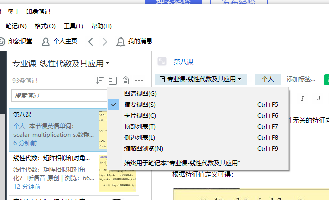
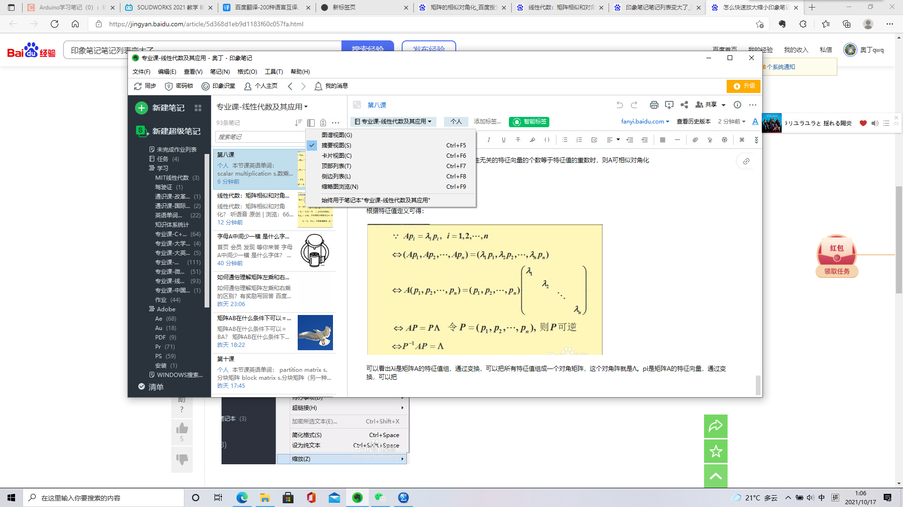

### 印象笔记电脑端

笔记本组，笔记本，笔记

笔记本组可以认为非必要，用于归类笔记本。

笔记本可以创建多个笔记，使用左上角+新建笔记创建，本质上还是用于归类笔记。

笔记即为最小单位，标题不太起眼，在文字编辑的上方蓝色“无标题笔记”处进行修改。

“标签”可以在标题下，内容左边一个蓝色的相当于可以多个的小标题，文字编辑上方的箭头只是表示显示的先后次序而已。

保存网页剪藏保存在“笔记本”中，成为一个单独的“笔记”。

网页剪藏插件安装好后，在浏览器页面右上角的大象头像点击，登录即可，剪藏只有5种默认的模板可以选择。

软件==本质上是网盘笔记==，剪藏的保存和生成等均有可明显感觉到的延迟，需要按一下同步刷新一下，属于正常现象。免费版甚至不能离线访问笔记。

安装app版，可以替代之前的笔记，在此之前要先进行笔记的转移。

按住CTRL键进行笔记多选，可以合并和移动笔记。

新建笔记会卡出“无标题笔记”字样并强制转移到文本编辑上（即打断编辑标题）推测为网络延迟导致的BUG，解决方案：新建笔记后鼠标点击一下笔记标题框并等待大约2秒即可。

注意超级笔记中添加视频的方式是嵌入网站文件路径，本质上是直接访问了视频网站，所以视频被删除会导致无法使用，所以视频必须下载后再当做附件加入笔记中而且这样普通笔记也能添加。

剪藏剪出来的应该是类pdf文件，其中的按钮可以直达指定位置，但本身是独立的

普通的笔记也能用的附件功能：回形针图标，多选图片可以一起上传

Ctrl+F可以开启类似记事本的关键词位置查找，但是在特殊位置的部分关键词无法纳入搜索范围

可以在浏览器中使用左键进行对文字和内容的“选择”（即蓝色阴影覆盖），然后点击剪藏，会多出一个“选择部分”的选项，剪藏会对选择到的内容所属板块整个进行剪藏。

网页剪藏的笔记页面右上角有原网页网址，有些信息需要到原网页查看。

左上角查看-笔记列表，可以重新打开笔记预览即左边的一栏。

管理取消自动续订续约续期续款续费套餐的，要“帮助”-“我的账户页”-“管理订阅”-现在的套餐下面小小的“x”

附件的添加位置是光标所在的位置开始

可以拖选文字和图片（即使图片没有选中的阴影）然后一起删除，不影响其他区域

多笔记合并只能是简单的拼接然后显示网址

有些网页剪藏不了图片，可以以添加附件的形式进行添加修补

F10可以最小化左边的快捷栏，F11可以隐藏和恢复笔记预览即左边的一栏

为笔记内容添加网址跳转，右键“超链接”填写URL。

为笔记内容添加其他笔记跳转，右键“关联笔记”即可生成一串类似超链接的链接

导出保留最完整的反而是专用格式ENEX，能够保留所有的图片链接附件等，但是也只能在类似印象笔记的软件中查看和使用
导入笔记不用“导入文件夹”这么麻烦，直接将文件拖拽进窗口就行了。

退出登录、账户管理在工具栏的“文件”处（...无语）

消除复制来的字体的灰色背景方法：先选择高亮然后取消

单独打开一个笔记（变成自成一页）的方法：1.新建笔记时自动生成  2.右键预览栏中的笔记选择“打开笔记”生成

“工具”-“自定义工具栏”可以拖放其他功能至 工具栏中（<>为历史变动笔记，相对来说最实用）

可以在新建笔记右边选项可以选择新建“Markdown”文档（但是改变字体颜色、大小的代码会失效）

ctrl+Q  快速查找某条笔记

ctrl+B   加粗选中字体

复制黏贴过来的字体本地化步骤-
1.字体调为“微软雅黑”
2.字体尺寸调为“合适的数值，一般为10”
3.进行高亮显示，再取消。
4.与混杂的黑色字体一起设置成“灰色”再设置为“黑色”（这个不能直接一起，会只显示被包括的本来字体的属性）

误触恢复：

### 印象笔记手机端使用剪藏

安卓:可以在自带的浏览器，chrome及以此为内核的浏览器(不包括百度)中，按下分享，安装了印象笔记，会有印象笔记选项，按下即可剪藏。

但是，无论是直接链接(即app内直接建立)，还是部分上述方法的剪藏，都有大概率的“剪藏失败”，并贴上链接。

综上所述，最好在PC端上进行剪藏。

解决方案：先在手机端上点击“分享”给“微信好友”，选择自己，然后在电脑端打开链接，进入微信自己的小浏览器中，再点击“使用其他浏览器”进行浏览，则可以变成edge的页面，再进行剪藏！

手机app添加图片等附件方法：

按下“开始编辑”的画笔图标，右上图钉图标可以添加各种附件。