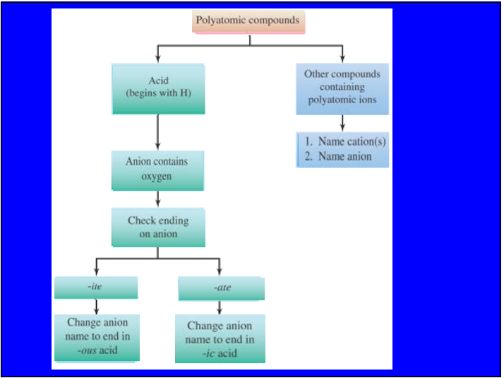
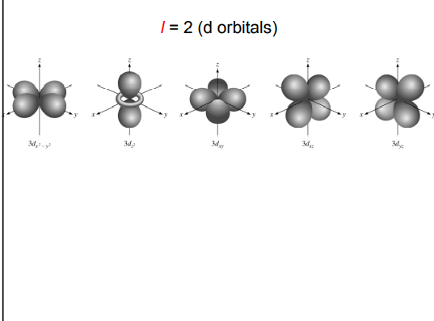
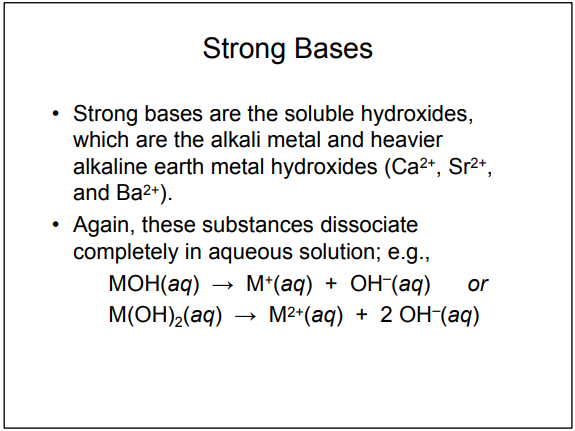

Course name：General Chemistry

老师：胡剑青（化学与化学工程学院）

手机：13924021352

邮箱：glennhu@scut.edu.cn

***

本节课英语单词：

distinct   s.独特的

properties   s.性质

sample   s.样品

substance   s.物质（分为单质和化合物）

matter   s.物质（拥有质量且占用了空间的物体）

state of matter   s.物态（如气态gas、液态liquid、固态solid）

composition of matter   s.物质的组成

decomposed   s.分解   v.腐烂

atoms   s.原子

molecule   s.分子

element   s.元素

element   s.单质

compound   s.化合物

inorganic chemistry   s.无机化学

analytical chemistry   s.分析化学

organic chemistry   s.有机化学

physical chemistry   s.物理化学

polymers chemistry  s.聚合物化学

biochemistry   s.生物化学

water vapor   s.水蒸气

the relative number of atoms   s.原子的相对数量

The Law of Constant Composition   s.恒定组成定律（同种化合物组成的成分和比例一定相同）

The Law of Definite Proportions   s.比例定律（同恒定组成定律）

hydrogen   s.氢

oxygen   s.氧

mixtures   s.混合物

heterogeneous   s.非均相的，即混合不均匀的，如铁块镀铜的整体，如不均匀的混合物

homogeneous   s.均相的，即混合完全均匀的，如溶液

homogeneous mixture   s.均相混合物（也叫溶液）

solution   s.溶液

scheme   n.计划；机制；计谋

physical properties   s.物理性质

chemical properties   s.化学性质

intensive properties   s.本征性能；本征性质（与物质的量无关的性质）

extensive properties   s.  外沿性能；广泛性能（与物质的量相关的性质，如质量）

physical change   s.物理变化

chemical change   s.化学变化

Chemical Reactions   s.化学反应

filtration   s.过滤

distillation   s.蒸馏

chromatography   s.色谱法

Compressible   adj.可压缩的

density   s.密度

boiling point   s.沸点

volume   s.体积

absorbent   s.吸附剂

stationary phase   s.固定相

solvent   s.溶剂

acid   s.酸

reactivity with acid   s.与酸的反应性

flammability   s.可燃性

corrosiveness   s.腐蚀性

ability of adhere   s.黏附性

dye   n.染料   v.染色

units of measurement   s.计量单位

quantities that are measured and calculated   s.测量和计算得到的数量

uncertainly in measurement   s.测量的不确定性

significant figures   s.有效数字位数，非0数字都有效（注意不是精确到多少位，科学计数法只算含小数部分）

scientific notation   s.科学计数法

dimensional analysis   s.量纲分析

International system of units （SI units）  s.国际计量单位制

metric system of units   s.公制计量单位制

Prefixes   s.前缀

convert   s.转换

Ten to the Sixth power   s.十的六次方(power此处为次方)

stopcock   s.旋塞，（可旋转）活塞

celsius scale（C°）  s.摄氏度

fahrenheit scale（F°）   s.华氏度（增长1华氏度=增长5/9摄氏度，华氏度=5/9 * 摄氏度+32）

kelvin   s.开尔文，热力学温度计量单位（增长1开尔文=增长1摄氏度，开尔文=摄氏度+273.15）

spontaneously   s.自发地   adv.自然地

exact   s.精确的

inexact   s.不精确的

accuracy   s.准确度

precision   s.精确度

measured   s.测量的；不精确的

proximity   s.临近

decimal place   s.小数位

round   s.四舍五入

least significant decimal place   s.最低有效小数位

last number of significant figures   s.有效位数的最后一位数字

dimensional   adj.空间的；尺寸的

本节课所学定义：

least significant decimal place   s.最低有效小数位（加法和减法）也就是说结果的小数点后保留的位数取被操作数中的拥有最少小数点后取位数的数的小数点后取的位数。

last number of significant figures   s.有效位数的最后一位数字（乘法和除法），也就是说结果的有效位数取被操作数中的拥有最少有效位数的数的有效位数，也就是取到最低有效位数。当为复合算法时，则根据先括号，后乘除，再加减，分步走。

***

本节课英语单词：

leraning objective（LO）   s.学习目标

atomic structure   s.原子结构

electrical charge   s.电荷

nuclear model of the atom   s.原子核模型

electrons   s.电子

protons   s.质子

neutrons   s.中子

relative masses of    s.(...的)相对质量

atomic number   s.原子序数

atomic mass number   s.原子质量数

chemical symbol   s.化学符号

subatomic composition  s.亚原子组成（亚原子指比原子更小的尺度）

isotopes   s.同位素

atomic weight   s.原子量；相对原子质量

natural abundance   s.自然丰度（元素和同位素的含量比例）

abundance   s.丰度

periodic table   s.元素周期表

periods   s.周期

groups   s.族

columns   s.列（可作“族”的别称）

nonmetal   n.非金属

metal   n.金属

ionic   s.离子的；电价的

ion   s.离子

empirical formulas   s.实验式（分子表示方法）

molecular formulas   s.分子式（分子表示方法）

structural formulas   s.结构式（分子表示方法）

gain or loss   s.获得和失去    n.盈亏；损益

alkanes   s.烷烃；烷烃类

alcohol   s.乙醇；酒精

cathod ray tube experiment   s.阴极射线管实验

cathod   s.阴极

experiment   s.实验

radioactivity   s.放射性

spontaneous   s.自发的

emission   v.发出；排出；散出；   n.散发物

particles   s.颗粒；微粒

A group   s.主族

B group   s.副族

nonreactive   s.惰性的

monatomic   s.单原子的

cations   s.阳离子

positive ion   s.阳离子

anions   s.阴离子

negative ion   s.阴离子

hydrogen ion   s.氢离子

ionic compounds   s.离子化合物

diatomic   s.双原子的

stem   s.词的主干

parent element   s.父元素

prefix   s.前缀

suffix   s.后缀

pure compound   s.纯净物

dissolve   s.溶解

oxy-acids   s.含氧酸（只包含氧、氢、另一种元素）

negative polyatomic   s.多原子负离子

元素/原子：

Sodium   s.钠（元素Na）

Potassium   s.钾（元素K）

Zine   s.锌（元素Zn）

Argon   s.（元素Ar）

Mercury   s.汞（元素Hg）

Lead   s.（元素Pb）

Calcium   s.钙（元素Ca）

分子/元素：

Hydrogen   s.氢；氢气（分子H2）

Nitrogen   s.氮，氮气（分子N2）

Oxygen   s.氧，氧气（分子O2）

Fluorine   s.氟，氟气（分子F2)

Chlorine   s.氯，氯气（分子Cl2）

Bromine   s.溴（分子Br2)

Iodine   s.碘（分子I2）

Sulfur   s.硫（分子S8）

Phosphorous   s.磷（分子P4）

**词干列表：**

本节课所学定义：

高中：同族元素具有相似化学性质。

**原子、离子、离子书面名称：**

可以看出：阳离子命名只需要元素+ion

stem是词干的意思，每个元素的词干是不同的。

阴离子命名必须是元素词干后加-ide +ion

离子化合物必须是(类)金属离子+非金属离子，才遵循这个不计数原则。

离子化合物的命名就是金属阳离子的元素+非金属阴离子的元素词干加-ide。

单离子和离子化合物都不需要声明原子数量。（像是“氟化钙”而不是“二氟化钙”，因为离子化合物价态单一，极其容易区分故不需要声明数量）

**化合价特别声明的格式：**

因为不声明数量的原因，终究是没法全部进行这样的命名覆盖。因此，只需要声明阳离子的价态，就可以确定其组成了。

价态与罗马数字对照表：

例如铁就有+2价和+3价，因此，我们需要在离子化合物的命名中间加上括号和罗马数字，说明价态。

格式：阳离子元素+（罗马数字）+阴离子元素词干+-ide

**化合物、非离子分子的名称：**

表示原子数量的前缀列表：

可以看出显负价的离子还是需要遵循词干+-ide后缀的组合。

而且，离子即使只有一个也还需要加上“一个”的后缀。但如果显正价的离子只能有像H那样只有+1价，和类似的不需要区分的情况，则不需要加前缀。（因为本质上是为了区分化合物而已）

**离子化合物溶解前后的称呼：**

溶解前的化合物命名名称，和离子化合物的一样。

溶解后的名称把阴阳离子组合起来，为阳离子主干+阴离子主干+-ic后缀（没有氧元素时只用ic）+acid

**含氧酸根：**

只有两种的情况：

氧原子数量少的格式：除氧元素的主干+-ite

氧原子数量多的格式：除氧元素的主干+-ate

拥有多种的情况：

比-ite还低的，格式为hypo-+除氧元素的主干+-ate

比-ate还高的，格式为pre-+除氧元素的主干+-ate

实例总览：

**含氧酸根拥有氢元素的命名名称：**

格式为：(前缀)除氧元素的主干+-ous（替代-ite）/ic（替代-ate）+acid

**化合物的水合物的命名名称：**

化合物名称+命名的数字前缀+hydrate

**多原子化合物命名名称步骤：**

***

本节课英语单词：

electronic structure   s.电子结构

wave   n.波

wave length   s.波长

frequency   s.频率

quantum   s.量子

quantized energy   s.量子化能量

quantum mechanics   s.量子力学

photons   s.光子

nature   s.性质；本质

glow   v.发光

visible light   s.可见光

infrared radiation   s.红外辐射

quanta   s.量子化（一段一段地放出）

continuous spectrum   s.连续光谱

line spectrum   s.线光谱

ground state   s.基态

excited state   s.激发态

Planck's constant   s.普朗克常量

promotion   s.上升（跃迁）

demotion    s.下降（跃迁）

line emission specturm   s.线发射光谱

momentum   s.动量

dual   s.双重的；二相的

electron density   s.电子密度

probability   s.几率

orbutals   s.轨道

spatial   adj.空间的

quantum number   s.量子参数

principal quantum number   s.主量子数（用n表示）

angular momentum quantum number   s.角（动量）量子数（用/表示）

magnetic quantum number   s.磁量子数（用m/表示）

spin quantum number   s.自旋量子数（用ms表示）

reside   v.所处；居住在

letter designation   s.字母名称

schrodinger wave equation   s.薛定谔波动方程

subshell   s.亚层；电子亚层

orientation   s.方向

magnetic field   s.磁场

Pauli's exclusion principle   s.保利的不相容原理（每个轨道只能容纳两个电子，自旋方向不同）

wave functions   s.波函数

degenerate orbitals   s.简并轨道（相同能级上的轨道具有相同的能量）

overlap   s.重叠

electron configuration   s.(原子的)电子构型（电子在原子中的分布方式，也就是量子数的集合表示的物理意义）

Hund's Rule   s.洪德法则

valence electrons   s.外层电子；价电子（最外层壳层中的电子）

core electrons   s.核心电子（填充的内壳层的电子）

anomalies   s.反常现象（指轨道电子分配的特殊情况）

orbital diagrams   s.轨道图

condensed electron configuration   s.原子实（是一种以轨道数来表示原子的表现形式）

repulsion（repelled）   s.排斥；斥力

UV   s.紫外线

IR   s.红外线

本节课所学定义：

**光速：**c=3*10^(8) m/s

**普朗克常量：**6.626*10^(-34) /J*s

**一般公式：**

E=hv

c=λv

1/ λ=(RH)*[(1/n1^2)-(1/n2^2)]

▲E=-hc(RH)*[(1/n1^2)-(1/n2^2)]

**德布罗意波：**

λ=h/mv=h/p（适用于所有物体）

**海森堡不确定原理：**

不可能同时测准电子和（）的位置。

**薛定谔波动方程：**

Ψ= fn(n, l, ml, ms)

求解波动方程可以得出出一组波函数或轨道及其相应的能量。

每个轨道描述了电子密度的空间分布组三个的参数描述。

前三个量子数(向量参数)决定和描述了一个特定位置和形状的轨道。

而四个量子数(向量参数)决定和描述了特定位置和形状的轨道上的特定一个电子。

**主量子数（n）：**

取值范围：n>=1

表示原子最外层的电子层的序数（和其能级），决定了电子离核的距离。

处于同一n的所有轨道组成了电子层。而在同一电子层的不同类型的轨道集合是这个电子层的亚层（亚层有s,p,d,f四个），每个亚层可以有一条或者多条轨道(无论电子是否存在，轨道总是存在的)，每条轨道可以容纳自旋方向互不相同的两个电子。

**角量子数****（/）:**

取值范围：0~(n-1)。

取值表：

/的不同取值情况下的轨道形状：

角量子数决定了轨道形状（shapes）和类型（types）。**有s、p、d、f四种轨道类型**。

**磁量子数****(m/)****：**

取值范围：(-/) <= (m/) <= (/)

磁量子数决定了轨道的三维方向。其实是对不同的/的取值下对电子亚层中的每个**轨道的编号**，每有一个m/就有一条亚层轨道。

各电子亚层对应的量子数表（亚层符号的第一个数字，代表的是所属的主量子数也就是能级n，第二个字母，代表的是亚层也就是轨道的类型，由角量子数/决定。易得s亚层有1条轨道，p亚层有3条轨道，d亚层有5条轨道，f亚层有7条轨道）：

**自旋量子数（ms）：**

只有两个允许值：+1/2、-1/2

人们发现同一轨道上的两个电子的能量并不完全相同。

因为电子的“自旋”（电子绕轨道旋转的方向）描述了影响其能量的磁场，旋转方向不同形成不同的磁场因此能量也不一样。

**简并轨道：**

相同能级上的轨道具有相同的能量称为简并轨道。

但是随着电子数量的增加，它们之间的斥力也随之增加。因此，在具有多个电子的原子中，并非同一能级上的所有轨道都简并。

同一子级中的轨道集仍然简并。

能量水平开始重叠（例如，4s的能量低于3d）。

**不相容原理：**

同一原子中的两个电子不可能有完全相同的能量。

因此，同一个原子中没有两个电子可以有相同的量子数集合。

这意味着原子中的每个电子必须在四个量子数中至少相差一个。

**轨道表的画法和定义：**

轨道优先级表：

1s、2s、2p、3s、3p、4s、3d、4p、5s、4d、5p、6s

**每条轨道可以容纳两个自旋方向不同的电子，每个s层有1条轨道，每个p层有3条轨道，每个d层有5条轨道，每个f层有7条轨道。**

洪德法则：

半箭头代表电子，箭头方向代表相对自旋方向。

原子实表现形式：

此原子前一电子层满的原子+最高轨道电子轨道和数字，例如Na原子序数为11，从外往里数第二层是2p层，有三个轨道，第一层是3s层，有一个轨道，且未满。使第二层所有轨道电子充满，得到最高序数元素为Ne，其原子序数为10。则Na的原子实形式为[Ne]3s1，也就是[Ne的10个]+3s轨道1个。如果是Ne的话，可以直接写[Ne]或者[He]2p6。

如果是全部编排方式见结尾的元素表。

也有例外情况：例如，原子实：铬Cr是[Ar] 4s1 3d5，而不是预期的[Ar] 4s2 3d4。

•这是因为4s和3d轨道的能量非常接近。

•这些异常也发生在具有f和d轨道的f-块原子中。

**洪德法则：**

对于简并轨道，当具有相同自旋的电子数最大化时，能量最低。也就是最稳定！

这意味着，对于同一子能级中的一组轨道，在配对之前，每个轨道中必须有一个电子，并且这些电子尽可能具有相同的自旋。这就是电子数增加，轨道的分配方法这么奇怪的原因，因为要尽可能稳定，也就是尽可能低能量。也因为要求最低能量的最稳定态，所以会出现一些例外情况，部分不遵循一般的轨道的优先级。

最后，我们按照能量的递增顺序填充轨道。

周期表上的不同块对应于不同类型的轨道：s=蓝色，p=粉红色（s和p是具有代表性的要素）d=橙色（过渡元素）f=tan（镧系元素和锕系元素，或内部过渡元素）

这里表中的元素的表示方式就是全部编排，把各个轨道的电子数都写出来。

***

本节课英语单词：

Mendeleev   s.门捷列夫（第一个周期表的创始人）

ionization   s.离子化

electron affinity   s.电子亲合能（结合能）

screening constant   s.屏蔽常数

shielding constant   s.屏蔽常数

inner electrons   s.内部电子数（核电子数）

core electrons   s.核电子数（也就是除最外电子层以外的电子数）

effective nuclear charge   s.有效核电荷

nonbonding atomic radius   s.非键原子半径

van der Waals radius   s.范德华半径（也就是非键原子半径）

collision   s.碰撞

bonding atomic radius   s.成键原子半径

inter-xxx   adj.在...之间的

covalent radius   s.共价半径（也就是成键原子半径）

slater's effiective nuclear charge   s.斯莱特有效电荷数

valence   s.价态

本节课所学定义：

已知4个量子数，就可以知道这个原子的电子散布了。

有效核电荷是指吸引电子的净正电荷。在原子轨道中运动的电子，不仅受到核电荷的吸引作用，还受到其他电子的排斥作用，电子之间的排斥作用将减弱原子核对电子的吸引作用。

有效核电荷与核电荷之间存在差异，主要就是由于内层电子对价电子的屏蔽作用产生的。

公式为Zeff=Z-S

Zeff/Z*：有效核电荷

Z：原子数

S：屏蔽常数（很接近对象电子层以内的所有电子层的电子数之和）

有效核电荷在周期中从左到右增加，在族中从上到下轻微增大。其代表了实际上它对电子的吸引力的等效正电荷数的效果。

因此在同一周期，随着原子序数增加，最外层的电子的有效核电荷（质子数-核电子数）也增加，然后原子半径由最外层电子层的半径决定，因此原子的半径减少。

第一步：按顺序将电子层分组（同序数s和p合并为一组，d和f自成一组），例如（1s）(2s,2p)（3s,3p）(3d)（4s,4p）（4d）（4f）...

第二步：n右侧的电子不会屏蔽n左侧的电子。

第三步A：对于处于第n层的电子，而处于ns和np价态的电子，作用于其上的有效电荷数：

0.对n+1以及其右侧的电子，其取值为0，也就是不会对n以及其左侧的电子造成影响。
1.第n组中同组的**其他**每个电子取值0.35。（例外：当对于价态为1s的电子，也就是n=1时，1s其它同组的电子取值0.30）
2.n-1组每个电子取值0.85。
3.n-2组以及更低组的每个电子取值1.00。

第三步B：对于处于第n层的电子，而处于nd和nf价态的电子，作用于其上的有效电荷数：

0.对n+1以及其右侧的电子，其取值为0，也就是不会对n以及其左侧的电子造成影响。
1.第n组中同组的**其他**每个电子取值0.35。
2.将会屏蔽左侧所有的组，屏蔽左侧的全部组的每个电子取值1.00。

所有电子的取值相加起来就是这个原子的这个电子层中的某个电子的屏蔽常数S。

计算屏蔽常数和有效核电荷实例：实例1：

氧原子是2p价态的，因此（2s2,2p4）组的每个电子

实例2：

实例3：

例：对氦原子2He，它只有1s层
作用在某一个1s电子上的有效核电荷数：
Z*=Z-σ=2-0.3=1.7
例：对钠原子11Na，电子分布是2，8，1。
作用在第一层某一个电子上的有效核电荷数：
Z*=11-0.3=10.7。
作用在第二层某一个电子上的有效核电荷数：
Z*=11-2×0.85-7×0.35=6.85。
作用在第三层那一个电子上的有效核电荷数：
Z*=11-2×1-8×0.85=2.2。

由此可见，虽然核电荷数是11，但由于其余电子的屏蔽作用，有效核电荷数差别很大。**越外层的电子，其有效核电荷数越小，易于摆脱自身原子的束缚而离去或发生化学反应时参与成键。**

成键半径和非成键半径：

惰性气体一般研究：非成键半径（因为难以成键）

为原子未成键时，两原子以范德华力结合时，非成键半径是两原子核之间最短距离的一半。

非惰性气体元素一般研究：成键半径。

两原子成键后，成键原子半径是两原子成键时核间距的一半。其长度随最外层电子有效核电荷也就是从左到右的增加而减少，从上到下则是因为随原子序数增加而增加。

***

本节课英语单词：

interatomic distance   s.原子间的距离

multiple proportions   s.倍比定律（对一种物质而言，若两元素可以生成两种或以上的化合物时，在这些化合物中，一元素的质量固定，则另一元素的质量呈简单整数比。）

conservation of matter   s.物质守恒定律

conservation of mass   s.质量守恒定律

isoelectronic series   s.等电子级数（2、10、18这种分级，在同一等电子级数中，所有离子拥有相同的电子数和电子层数，当然还有不同的质子数）

（ith）ionization energy   s.（第几）电离能（使原子失去（第几个）一个电子所需的能量，对同一元素，越后脱离次序的电子的电离能越大。对周期表，周期从左到右第一个电子的电离能逐渐增加，族从上到下第一个电子的电离能逐渐减少。s和p区块的元素显示第一电离能的值的较大范围。d区块的元素通常在整个周期内缓慢增加，而f区块的元素仅显示微小变化。例外情况：当下一个元素中添加的价电子满足：1.进入一个新的子级（更高的能量子级）2.是第一个在原子的一个轨道上配对的电子次级，也就是一个轨道的第二个电子（电子斥力降低能量））

electron affinity   s.电子亲和能（电子亲和力是随着电子添加到气体原子而发生的能量变化，就是对吸收电子变成稳态原子的趋向力。这个过程一般是放热的，本身的能量减少。一般在族中变化不大，在周期中从左到右逐渐增加。三个例外情况：（1）2A组：s子级别已满。（2） 5A组：p子级已满一半。（3） 8A组：p子级已满。在这些例外情况中，有些是吸热的（不稳定元素））

energy sublevel   s.能量子级

accompanying   s.伴随   v.陪同

gaseous   s.气态的；气体的

exothermic   s.放热的（形成阴离子）

endothermic   s.吸热的（形成阳离子）

chemical bonding   s.化学键

intermolecular forces   s.分子间作用力

electrostatic   s.静电的；静电力

ionic   s.离子键（离子之间的静电吸引形成）

covalent   s.共价键（共享电子形成）

metallic   s.金属键（金属原子和其他原子的键）

Lewis symbols   s.用于表示价电子的符号“ · ”

Lewis structures   s.分子的刘易斯结构表达

（也使用直线和电子数。以SO3为例子，刘易斯结构式要求每个原子周围都是8电子这样 S 周围只能是一个双键两个单键，共计4个键，8个电子，最大区别是**每个键代表两个公用电子对**，而高中的电子式是每个键一个电子，且在刘易斯结构中，每个键真的就是单键，两个键4个电子就是双键，单键比双键长）

(最优best刘易斯结构：1.原子的形式电荷最接近于零。2.在最负电性的原子上施加负形式电荷）

lone pairs   s.孤电子对（电子结构中仅位于一个原子上的电子）

bonding pairs   s.键对（共享电子，电子结构中它们可以用两点或一条线来表示）

Born-Haber cycle   s.波恩-哈伯循环（哈伯步骤：用于生成/生产氨）

Lattice energy   s.晶格能；点阵能（将摩尔固体离子化合物完全分离为气体离子所需的吸收的能量）

Coulomb's law   s.库伦定理（与静电相互作用相关的能量受库仑定律适用）

single bonds   s.单键

double bonds   s.双键

triple bonds   s.三键

polar covalent bonds   s.极性共价键

electronegativity   s.电负性（电负性是分子中原子吸引电子到自身的能力，从周期中从左到右增加，从族中从下到上增加）

dispole   s.偶极子（当两个电荷量相等但电荷正负不同的电荷相隔一定距离时，就会形成偶极子）

dipolemoment   s.偶极矩

formal charge   s.（单个原子的）形式电荷（形式电荷是指如果共价键中的所有电子平均共享，原子将具有的电荷。计算方式：价电子数(单原子的)-1/2成键电子数-全部非键电子数） （主族的数，就是价电子数，比如惰性气体是第8主族，价电子是8个。）

electrons assign to atoms   s.（单个原子）分配给原子的电子数（1/2成键电子数+全部非键电子数）

dominant  Lewis structures   s.首要的刘易斯结构

dominant    s.首要的；占主要地位的

resonance   s.共振杂化；谐振；共鸣

resonance structures   s.共振结构（电子结构不能完整表示电子）

Octet Rule   s.八隅体规则；八电子规则（它指出各个原子趋向组合，令各原子的价层都拥有八个电子，也就是最多四个键。有三种离子或分子不遵循八电子规则：1.电子数为奇数的离子或分子。2.拥有小于八个电子的离子或分子。3.具有八个以上价电子的离子或分子（一个扩展的八电子态））

enthalpy   s.  热焓;   焓值;   热函

本节课所学定义：

**离子的大小（等电子级数）：**

**第一电离能列表：**

容易得到：越小的原子的电离能普遍越大。

**失去电子的顺序：**

一般来说，为形成阳离子的电子趋向于从最高能级开始失去电子。为形成阴离子的电子趋向于使电子构型填充至ns。

如果有4s电子层，则先失去4s的电子，即使它能量最低。

***

本节课英语单词：

resonance structure   s.共振结构（用多个刘易斯结构来描述分子的真实结构，因为刘易斯结构在一定情况下是无法表示两个相同的键的）（不同共振结构表示的结构是相同的，因此其实：如NO2-亚硝酸根离子的N-O键虽然写成一个单键一个双键，但是其实是一样的键，为大pi键）

localized electrons   s.局域电子（具体位于一个原子上或在两个原子之间共享）

delocalized electrons   s.离域电子（由多个原子共享）

deBroglie wave   s.德布罗意波

deBroglie hypothesis   s.德布罗意假说

bond angles   s.键角

bond lengths   s.键长

valence-shell electron-pair repulsion（VSEPR）model   s.价层电子对排斥（VSEPR）模型（设想一个圆球，把某个分子的中心原子置于球心，其它原子以共价键与中心原子结合。由于形成共价键的电子对相互之间的排斥力，除中心原子之外的其它原子的将尽量均匀的分布在球壳上的理论模型。）根据价电子对互斥理论，价层电子对数=σ键个数+孤电子对数，σ键个数=配原子（除中心原子的原子）个数，孤电子对数=1/2*(a-xb)，a指中心原子价电子个数，x指配原子个数，b指配原子形成稳定结构需要补充的电子个数。

electron domains   s.电子域（指电子指向的方向。无论有一个还是多个电子对指向那个方向，还是只是一个孤电子对或者一个键，这都是满足的。因此分子中的单键、双键、无配对的孤电子对都算一个电子域，电子对越多则斥力越大，则电子域越大，因此与其他电子域角度也是越大的，电子域的存在可以判断分子结构和键角）

molecular geometry（shape）   s.分子构型（分子的立体构型是指分子中的原子在空间的排布，不包括中心原子未成键的孤对电子。实际空间构型要去掉孤电子对，略去孤电子对就是该分子的空间构型）；分子几何学

linear   s.线性（分子构型）（AB2分子构型1）

trigonal planar   s.平面三角形（分子构型）

bent   s.弯曲型（分子构型）（AB2分子构型2）

tetrahedral   s.正四面体（分子构型）

trigonal pyramidal   s.三角锥形（分子构型）

trigonal bipyramidal   s.三角双锥（五个电子域，10个电子）（分子构型）

octahedral   s.八面体（六个电子域，12个电子）（分子构型）

see-saw type   s.跷跷板形（分子构型）AB4型的分子特有，特殊的正四面体构型。

T-shaped   s.T形（分子构型）

Heisenberg's uncertainty principle   s.海森堡不确定性原理：不可能同时得知一个电子的位置(position)和动量(momentum)

simultaneously   s.同时地

本节课所学定义：

**键焓与键长列表：**

****

**价层电子对排斥模型（VSEPR）：由生成电子而组成的杂化轨道的数量和孤电子对的情况，判断出一个简易的几何模型。**

****

**关于键角：**

****
****

补充：

best指考虑了形式电荷的分布。

扩展轨道为下一轨道（原因是3d）这个原子容纳8个电子以上。

路易斯结构规则：n个原子组成了分子，而n个原子的最外层电子数总和为N，然后在判断中心原子的游离电子即形式电荷的时候使用N-（n-1）*8判断剩余未标出的电子数（标为孤电子对），判断要不要破坏8电子规则，注意就是7个最外层也需要一个键，虽然一个建有两对共享电子。多出来的电子计算后写在中心原子外围。（写路易斯结构，按课本教材的五个步骤，但首先要了解每个元素所处的位置，才能知道价电子的数目）

本节课题型：

**比较分子构型和VSEPR模型是否相同：**

以NH3为例，氨气分子中氮价层电子对数=σ键个数+孤电子对数=3+（5-3×1）=4，**VSEPR****模型为正四面体结构**，含有一对孤电子对，所以其**空间构型为三角锥形**，VSEPR模型与分子立体结构模型不一致。

构型分两种，一种是电子构型（VSEPR），一种是分子构型或者叫分子形状。

电子构型是指的价层电子对的排布，根据价层电子对互斥理论，当价层电子对为4对时，应该排列成正四面体才最稳定。其中如果这四对价层电子全是成键电子对，则电子构型恰好是标准的正四面体。如果这四对价层电子对中有3对成键电子对和1对孤电子对，则电子构型为变形的四面体。因为孤电子对电子云大，对成键电子对的排斥力比成键电子对之间的要大，相当于有一种下压力。

那么什么是分子构型呢？它是基于电子构型，而又不完全一样，它需要考虑的是实际的原子形成的形状。这里面如果某对价电子对是孤对电子的话，是不应该考虑到分子构型中的，因为这里并没有实际的原子。我们可以简单地理解为在电子构型的基础上“砍掉”有孤对电子的一角就是分子构型。

这样，我们不难得出，如果价层电子对的这四对价电子对都是成键电子对，则分子构型与电子构型一样，都是正四面体。而如果有了1对孤对电子就相当于在变形的四面体的基础上“砍掉”一角，即分子构型为三角锥形。

正四面体例子：甲烷是四面体，共5个原子。中心原子在体心。

三角锥形例子：氨是三角锥，共四个原子。中心原子在顶角。

孤对电子对分子构型的影响图示（替换）：

**判断轨道杂化的类型：**

知识点补充：同一原子内由1个ns 轨道和 1个 np 轨道参与的杂化称为sp杂化 ，所形成的两个杂化轨道称为SP杂化轨道。每个sp 杂化轨道含有1/2的S成分和 1/2的 p成分，杂化轨道间的夹角为180°。

方法1：使用成键数和键角来进行判断。180°为sp杂化，120°为sp2杂化，109.5°为sp3杂化。也就是成键的形状。

方法2：求中心原子的杂化类型，有n=中心原子连接的原子数+中心原子上的孤电子对，若n=4则为sp3，若n=3则为sp2，若n=2则为sp杂化。

方法3（VSEPR理论应用）：

计算：中心原子的价层电子对数n=(中心原子价电子数+配体提供的电子数-中心原子与配体所在的总体离子所带的电荷数)/2，配体提供的电子数包括共用电子对中提供用于组成公用对的电子数，若n=6则为sp3d2杂化（电子构型为正八面体），若n=5则为sp3d杂化（电子构型为三角双锥形），n=4则为sp3杂化（电子构型为正四面体，实际构型由孤电子对数和原子数决定），n=3则为sp2杂化（电子构型为平面三角形），n=2则为sp杂化（电子构型为直线）。规定当O族元素的原子作配体时，认为它们不提供电子。若出现双键，三键或者单电子时均按一对电子计算。中心原子的所有电子都成键时，电子对的空间构型和分子的空间构型一致。而当中心原子有未成键电子时电子与分子的构型有所不同。

顺带一提，sp3d杂化的夹角有90度、120度、180度，电子构型为三角双锥形。sp3d2杂化的夹角有90度、180度，电子构型为正八面体。对于等性杂化，分子构型与电子构型相同。对于不等性杂化，分子构型为以电子构型为基础，收孤电子对影响的构型。

**路易斯结构式书写：**

根据求出的成键数、孤对电子对数和原子间连接规则，写出可能的路易斯结构式。

(1)原子间以短线相连，短线总数达到成键数。要注意实际成键数与共享电子对数目不一定是一致的。例如SO2就是S与两个O各自生成1.5个键，S有一对孤电子对。

(2)孤电子对用一对对小黑点从端基原子标起，依次到各原子，使每个原子都达到稀有气体原子的稳定结构（8电子或2电子）直到孤对电子全部标完。

**求中心原子孤电子和孤电子对数：**

公式：孤电子数：（A-XB），孤电子对数：（A-XB）/2，其中A为中心原子的价电子数（也就是最外层电子数）；X是西格玛键数（也就是配对原子个数）；B为与中心原子结合的原子最多能接受的电子数，氢为1，其他原子为“8减该原子的价电子数”，例如氯为8-7=1。

***

本节课英语单词：

axial   s.轴向

equatorial   s.赤道

square pyramidal   s.方锥体

square planar   s.方形平面（跟正四面体不同，3d8sp2杂化，电子重排，形成正方形平面）

overall dipole moment   s.整体偶极矩

dipole moment   s.分子间的化学键的电子极性的测量指标

bond dipole   s.分子间的化学键的极性

nonpolar   s.非极性的

hybrid orbital   s.杂化轨道（n个轨道杂化会生成n个简并轨道，不会增减轨道的数量）

degenerate orbitals   s.简并轨道（拥有相同能量的轨道，杂化行为可以产生简并轨道）

hybridization   s.杂化轨道的过程

multiple bond   s.复数键（双键、三键）

yield   s.产生

lobes   s.肺叶

sigma bond   s.西格玛键

pi bond   s. 派键

sideway overlaps   s.肩并肩结构

head to head   s.头对头结构

internuclear axis   s.核间轴

delocalized electrons   s.离域电子

cias   s.正式结构

trans   s.反式结构

benzene   s.苯

Molecular Orbital Theory（MO）   s.分子轨道理论（每个轨道两个自旋方向不同的电子，每个轨道具有确定的能量，可以通过等高线图判断电子的密度）

contour   s.轮廓

contour diagram   s.等高线图

bonding orbitals   s.成键轨道

antibonding orbitals   s.反键轨道

nodal plane   s.节面；轨道的节平面（等于90度的地方）

bond order   s.键级（成键电子数减去反键电子数的结果的二分之一）（键级越大，键长越短，键能越大）

spherical   s.球形

symmetry   s.对称；相仿

本节课所学定义：

对于某个共价化合物中的一个原子来说，一个孤电子对或者成键的电子对称作一个电子域。

线性电子域分子构型（2个电子域，180°角）：

三角平面电子域分子构型（3个电子域，120°）：

但是，会算上孤电子对。例如特例：氨（NH3），孤电子对和三个成键组成正四面体电子域构型。（109.5°键角）

正四面体电子域分子构型（4个电子域，一般为109.5°角）：

电子对在三角双锥几何形状中有两种不同的位置，且孤电子对占据赤道位置。

三角双锥电子域的分子构型（5个电子域，平面120°角，竖直90度键角）：

三角双锥
1.跷跷板形
2.T形
3.线形

电子对在八面体几何形状时，位置是相同的。

八面体电子域的分子构型（6个电子域）：

八面体
1.方锥体
2.方平面

SF4和IF5（判断结构，先画出刘易斯结构，再判断构型）

IF5   42（总**价电子**数，7+7*5=42）-40（**5***8=40）=2，因此I的周围还有一对孤电子对（2个电子）

因此刘易斯结构为I连着5个F，每个F有6个孤电子，有一个键（连接I），每个键有两个电子。因此I此时有5个键，再加上多出来的两个电子，I有6个电子域，此时是八面体结构。

杂化轨道：

sp杂化（连接1个不重叠部分）：

sp2杂化（连接3个不重叠部分，没有2）：

sp3杂化（连接4个不重叠部分）：

实例1（氨）：

实例2（水）：

总结：

求构型和杂化的实例（以二氧化碳为例）：

步骤1：写出刘易斯结构。
步骤2：判断电子云（电子域）的数量
步骤3：判断分子构型（也可以说是电子域之间的角度）
步骤4：判断杂化类型

西格玛键和派键：

成键电子和反键电子：

它们不同于原子轨道，因为它们代表整个分子，而不是单个原子。

1.每当两个原子轨道重叠时，就会形成两个分子轨道：一个成键，一个反键。

2.键轨道是原子轨道的构造性组合。

3.反键轨道是原子轨道的破坏性组合。它们有一个以前从未见过的新特征：在电子密度等于零的地方出现一个节面。

键级：成键电子数减去反键电子数的结果的二分之一

***

本节课英语单词：

bond order   s.键级；键序

alkali   s.碱

diatomic   s.双原子的

traits   s.特征；特质

molecular orbital (MO) theory   s.分子轨道理论

atomic orbitals (AO)   s.原子轨道

energy-level diagram   s.能级图

paramagnetic   s.顺磁性（顺磁性是轨道中存在一个或多个未配对电子的结果）

diamagnetic   s.逆磁性（逆磁性是每个轨道上所有电子自旋配对的结果。这些物质被磁场排斥，但比较弱。）

magnetic properties   s.磁性

heteronuclear diatomic molecules   s.异核双原子分子

intermolecular forces   s.分子间作用力

solid structure   s.固体结构

repellent   s.隔绝...的；防...的

lotus   s.莲

dispersion forces/London dispersion forces   s.色散力

dipole–dipole forces   s.偶极-偶极力

hydrogen bonding   s.氢键

ion–dipole forces   s.离子-偶极力

polarizability   s.极化性（电子云扭曲的趋势。表示了电子云被扭曲形成一个瞬时偶极子的容易程度。电子数的增加会使极化率上升。）

compact   s.紧凑的

distort   s.扭曲

end   s.端

dominating force   s.主导力（决定分子性质）

electronegative   s.电负性

viscosity   s.粘度

surface tension   s.表面张力

capillary action   s.毛细作用

本节课所学定义：

3.2补充：

当轨道直接重叠，**形成成键轨道和反键轨道**时，它们被称为sigma（σ）和pi（π）分子轨道。反键轨道以星号σ*区分。每个分子轨道可以容纳两个电子。有两种形式，有σ（对应s轨道）和π（对应p轨道）两种形态。

能级图或MO图显示了原子的轨道如何结合形成分子轨道。

在H2中：这两个电子进入了成键分子轨道（能量较低）。

键序=½（键电子数量–反键电子数量）=½（2–0）=1个键

**分子轨道形成的指导原则：**

1） 形成的MO数等于组合的AO数。

2） AO与类似能量的AO结合。

3） 两个AO组合的有效性与其重叠成正比。

4） 每个MO最多可以容纳两个自旋相反的电子。（它们遵循不相容原理。）

5） 当相同能量的MOs被填充时，一个电子在配对之前进入每个轨道（相同的自旋）。（它们遵循洪德法则。）

通过键级判断是否能够组成分子（键级为预想成键数）：

p轨道的分子轨道图：

第二周期的p区块元素的分子轨道图：

sp轨道杂化的分子轨道图

第二周期前的元素的双原子结构的分子轨道图：

异核双原子分子的分子轨道图补充：

3.3：

**分子间作用力与固体结构：**

分子间从弱到强的四种力：

1.色散力（或者说伦敦色散力）

说明：非极性粒子的电子云可以暂时极化以形成色散力。越高的沸点代表色散力越大。

影响因素：a.原子中的电子数（电子越多，色散力越大）。b.原子或分子/分子量的大小。c.质量相似的分子形状（更紧凑，分散力更小）

2.偶极-偶极作用力（分子正负性配对）

说明：极性分子会有一个正极端和一个负极端。正极端和负极端互相的吸引力即为偶极-偶极作用力。

对于质量近似相等的分子，分子的大小越大，极性越强，沸点越高。

如果两个分子的大小和形状相似，偶极-偶极相互作用可能是主导力。

如果一个分子比另一个大得多，色散力很可能决定其物理性质。

3.氢键（一种特殊的，特别强的，偶极-偶极力）

说明：氢键是附着在高电负性原子上的氢原子与另一分子或化学基团中附近的小电负性原子之间的吸引力。氢键有部分来自N、O和F的高电负性，这些原子与几乎裸露的原子核（包含一个质子）相互作用。

4.离子-偶极作用力（离子与分子正负性配对）

说明：这些力的强度可以使离子物质能够溶解在极性溶剂中。也就是盐的水溶液的水合离子的作用力类型。

注：前两种类型（色散力和偶极-偶极力）也统称为范德华力。是极性分子的主要分子间作用力的种类。

**分子间作用力影响物体的性质：**

1.沸点

2.熔点

3.粘度

4.表面张力

5.毛细作用

***

本节课英语单词：

phase change   s.物态变化

conductivity   s.传导性

solubility   s.溶解性

fusion   s.熔化（固体变液体）

vaporization   s.蒸发（液体变气体）

sublimation   s.升华（固体变气体）

normal boiling point   s.正常沸点（在气压为760torr时的沸点）

vapor pressure   s.蒸气压

critical point   s.临界点

phase diagram   s.相图（相图是一种物质的压力与温度关系图，表示了不同压力下的熔点、沸点和升华点，还有三重点和临界点）

heat of fusion   s.溶解热

heat of vaporization   s.蒸发热（液体蒸发为气体所需热量）

heat of sublimation   s.升华热

heating curve   s.加热曲线（吸收的热量为x轴，温度为y轴）

phase change   s.相变过程；物态变化过程（这个过程的温度是不变的，但是可以吸收和放出热量）

supercritical fluid   s.超流体

triple point   s.三相点（相图中的）

slope   s.斜率

sublimes   v.升华

metallic solids   s.金属固体

ionic solids   s.离子固体

covalent-network solids   s.共价网络固体

molecular solids   s.分子固体

polymers   s.高分子聚合物

addition polymers   s.加聚聚合物

condensation polymers   s.缩聚聚合物

monomers   s.（聚合物的）单体

nanomaterials   s.纳米材料

crystalline   s.晶体

amorphous solids   s.无定形固体（没有固定的原子排列顺序的固体）

primitive lattices   s.原始晶格（原始晶格仅在晶格点上有原子）

lattice points   s.晶格点（每个晶格的端点）

cell   s.晶胞（晶体的每一个晶格的统称）

centered lattices   s.居中晶格（居中晶格的原子可位于晶格的几何面上和体中，最常见的是体心晶格或面心晶格）

body-centered cubic lattice   s.体心晶格（晶格的几何中心有一个原子的晶格）

face-centered cubic lattice   s.面心晶格（晶格的每一个面的几何中心有一个原子的晶格）

simple cubic   s.立方晶系

tetragonal cubic   s.四方晶系

orthorhombic cubic  s.晶系

rhombohedral cubic  s.三方晶系

monoclinic cubic   s.单斜晶系

triclinic cubic  s.三斜晶系

hexagonal   s.六方晶系

quartz   n.石英（固定结构的SiO2）

glass   n.玻璃（无定形SiO2）

spheres   s.球体

coordination number   s.配位数（每个晶胞中的原子的排列的个数，也就是填充效率，也就是在整个晶体中每个原子能够接触到的其他原子的个数）

cubic cell   s.立方晶胞

corner atom   s.晶胞中作为边角的原子，一般会被其他晶胞公用

close pack   s.紧密排列（特指晶胞中的原子的排列方式，一般为当前结构下最少空缺的方式）

thermodynamics   s.热力学

Thermochemistry   s.化学热力学

work   s.做功

heat   s.传热；热传递

kinetic energy   s.动能

potential energy   s.势能

joule (j)   s.焦耳

calorie (cal)   s.大卡；卡路里（1卡路里=1000卡）

system   s.被研究系统

surroundings   s.研究环境

conversion of energy   s.能量转换

internal energy （E）  s.内能（动能和势能之和）

endergonic   s.吸能反应；吸能的

exergonic   s.放能反应；放能的

net   adj.净赚的；净的；纯的；最终的

state function   s.状态函数（例如内能变化）

本节课所学定义：

质量（或者摩尔数）与XX热（相变热）的乘积为总变化热量。

加热曲线：

蒸气压：

沸点的真正定义：液体的蒸气压强刚好等于此时的大气压强的时候。

正常沸点就是在760torr大气压强下液体的沸点。

相图：

也可以看作是“三相图”。在不同的温度和气压下某种物质的物态。

晶胞的类型：

金属的晶胞结构（通常是以下三种之一）：

晶胞的配位数（三种晶系的配位数，填充效率）：

不同晶胞结构的配位数：

第一个是边角原子，在正方体晶胞结构中被共用了8次。而第二个是面心原子，在正方体晶胞结构中被共用了2次（因为一个面最多只会连接两个晶胞）

晶体中原子的紧密排列：

离子固体：

阴阳离子的大小关系比较为对离子固体结构造成主要的影响因素：

分子固体：

共价网络固体：

高分子聚合物：

4.1 Thermochemistry 化学热力学

势能和能量的单位：

状态函数：

状态函数是不展示路径，而仅仅是表现系统状态的变化的函数。

***

本节课英语单词：

enthalpy(enthalpies)   s.焓（物体的广延性质）

change of enthalpy/ enthalpy of reaction/ heat of reaction   s.焓变（状态函数之一）

endothermic   s.吸热的（焓变值大于0）

exothermic   s.放热的（焓变值小于0）

heat capacity   s.比热容

Hess's Law   s.赫斯定律（总焓变值为多步反应的每一步的焓变的和）

enthalpy of formation   s.生成焓（由最稳定状态的元素单质反应形成化合物的式子的焓变）

standard enthalpies of formation   s.标准生成焓（25摄氏度，1atm下的生成焓）

products   s.生成物

reactants   s.反应物

stoichiometric coefficients   s.化学计量数；化学系数

entropy   s.熵（描述系统的混乱度）

spontaneous processes   s.自发过程

nonspontaneous processes   s.非自发过程

vessel   s.容器

effuse   s.溢出

ethyl   s.带乙基的；乙基

forward process   s.正（方向）反应

reverse process   s.逆（方向）反应

Statistical Thermodynamics   s.统计热力学

Boltzmann   s.玻尔兹曼（描述了分子层面的熵）

microstates   s.微观态（分子位置和动能的单一可能排列）

the number of microstates   s.微观态数

Gibbs free energy   s.吉布斯自由能（用G表示，吉布斯自由能变用ΔG表示）

standard Gibbs free energy of formation  s.标准吉布斯形成自由能/标准摩尔生成吉布斯自由能（使用G°f来表示，标准摩尔生成吉布斯自由能变用ΔG°f表示）

equilibrium   s.平衡

本节课所学定义：

**焓变：**用ΔH表示，是状态函数之一。我们通过测量焓变来计算反应系统的热量变化。

计算公式：ΔH=ΔE+PΔV

其中，ΔH为焓变，ΔE为内能变化量，P为压强，V为变化体积。W=PV（气体做功）

标准状态下的每摩尔焓变：用ΔH°rxn表示，标准状态下"每摩尔反应"的焓变，r——reaction，m——mol

生成焓：用ΔHf°表示，定义为由最稳定状态的元素单质反应形成1mol化合物的式子（高中常有的多条式子相化简为单质+单质=化合物的式子，这个式子有焓变，但是不一定能够这样反应）的焓变。

例子：3C(s)+4H2(g)=C3H8(g)   ΔH=ΔHf° of C3H8(g)

**焓变可以用生成焓变表示为：**

方框为∑和Δ，根据赫斯定律，也就是总焓变=（生成物的化学计量数*生成物的生成焓变的总和）-（反应物的化学计量数*反应物的生成焓变的总和）

接下来就不只是热力学，而是化学热力学：

**熵变：**用ΔS表示，表示系统的混乱度，也是状态函数之一。与焓变结合使用可以判断出反应是否自发过程。

自发的判定是受温度的影响的，不同温度下反应由是否自发的情况。

计算公式：ΔS=S(products)-S(reactants)

自发过程是朝向熵变增大的方向的。

**熵变可逆与不可逆：**

****
****

**玻尔兹曼状态公式：**

S=k*lnW

S为熵变，k为玻尔兹曼常数，W为微观态数。

各种分子的标准熵：

公式总结：

**吉布斯自由能：**用ΔG表示，也是状态函数。是用于判断反应是否能够自发的最终依据。

ΔG=ΔH-TΔS，T为热力学温度。

如果ΔG<0，则正反应自发。

如果ΔG=0，则反应平衡。

如果ΔG>0，则正反应非自发。

其中ΔH=生成物的总ΔH°f-反应物的总ΔH°f，ΔS°=生成物的总S°-反应物的总S°

**吉布斯自由能与标准自由能的关系：**

ΔG=ΔG°+RTlnQ （任何情况下的自由能公式）

其中，ΔG°是与ΔG处于同一温度、但是是在标准压强下的吉布斯自由能，R是气体常数，Q是反应熵。温度决定ΔG°的值。非标准状况的ΔG°需要通过定义式（即吉布斯等温公式）计算。压强或浓度的变化在Q的表达上表现出来。

在等温等压反应中，如果吉布斯自由能为负，则正反应为自发，反之则逆反应自发。

如果为0，则反应处于平衡状态。此时，根据范特霍夫等温公式，ΔG = ΔG0 +R*T*ln J，J变成平衡常数K，于是有：
ΔG° = -R*T*ln K

要注意，使用范特霍夫等温公式时，ΔG和ΔG°的温度一定要相等。
这样，我们可以推出以下结论：

ΔG°>0时，K<1；逆反应自发
ΔG°=0时，K=1；反应无变化
ΔG°<0时，K>1：正反应自发

**标准吉布斯形成自由能：**

用ΔG°f表示。

****

ΔG°rxn（反应的标准吉布斯自由能变）=∑ n ΔG°f（生成物的标准吉布斯形成自由能变）-∑ m ΔG°f（反应物的标准吉布斯形成自由能变）

对于单质，在其标准状态下，标准吉布斯形成自由能ΔG°f为零

***

本节课英语单词：

chemical kinetics   s.化学动力学（对化学反应的速率的研究）

chemical reaction stoichiometry   s.化学反应计量数

chemical equation   s.化学反应方程式

properties of solutions   s.溶液的性质

chemical equilibrium   s.化学平衡

gas(g)   s.气态；气体

liquid(l)   s.液态；液体

soild(s)   s.固态；固体

coefficient   s.系数

aqueous   s.水的；含水的；水状的

law of conservation of mass   s.质量守恒定律

combination reactions   s.化合反应（x+y=z）

Decomposition reactions   s.分解反应（A=a+b+...）

Combustion reactions   s.燃烧反应（与氧气反应，x+y=a+b+...）

atomic weights   s.原子量；原子重量（单位为amu）

atomic mass unit   s.原子质量单位

amu   s.原子质量单位，1amu为1个碳12原子质量的1/12。

formula weight(FW)   s.化学式量（公式重量是化学式中原子的原子重量之和）

molecular weight(MW)   s.分子量（分子重量是分子中原子的原子量之和）

percent composition   s.成分百分比（分子中的原子占分子的质量百分比）

Avogadro's number   s.阿伏伽德罗常数，也就是"6.02*10^23"

mole   s.摩尔（单位），一种物质粒子6.02*10^23个为一摩尔这种物质。可得一摩尔"碳12"重量为12.000克。

molar mass   s.摩尔质量（单位），即"g/mol"。和单位"amu"是相同的。

molecular scale   s.分子尺度

real-world scale   s.真实世界尺度

empirical formulas   s.实验式（最简式，可以看出分子中原子的最小比例）；经验公式

para-aminobenzoic acid (PABA)   s.对氨基苯甲酸，在防晒霜中使用

theoretical yield   s.理论产量；理论产率（理论产量是可生产的最大产品量。换句话说，它是通过化学计量问题计算的可能产物量。过量的物质会被忽略，应当计算的是非过量的物质，也就是起到的限制作用最大的物质）

actual   s.实际产量

precent yield   s.实际产率（实际产量/理论产量*100%）

hydrocarbons   s.烃类化合物（氢和碳原子组成的分子）

solution   s.溶液（均质混合物）

solute   s.溶质

solvent   s.溶剂

solubility   s.溶解度（特定温度下，给定的溶剂可以溶解某种特定溶质的数量）（溶剂和溶质的相互作用力越大，则溶解度越大）（氢键增加了溶解性，因为C–C和C–H键不是那么有极性）

natural tendency   s.自然倾向（例如气体的混合是自发的，溶解也是自发的，伴随混合的熵增加有利于溶液的形成）

dispersed   s.分散

particle   s.颗粒

dissolve   s.溶解

crystallization   s.结晶（溶解的反过程）

saturated   s.饱和的

unsaturated   s.不饱和的

supersaturated   s.超饱和的；过饱和的（溶解了超过溶解度的溶质，通过小幅度的外界刺激，如碰撞摇晃，加入晶种，就会结晶）

seed crystal   s.晶种（供晶体形成的位点）

polar organic molecules   s.极性有机分子

nonpolar organic molecules   s.非极性有机分子（极性有机分子比非极性有机分子更好地溶解在水中）

like dissolve like   s.相似相溶（极性和极性相溶，非极性和非极性相溶，水溶性是极性的（拆分离子），油溶性是非极性的（有机分子不怎么电离））

miscible   s.可混溶的（所有比例混合的液体都是可混溶的）

immiscible   s.不可混溶的（彼此不能混合的液体是不混溶的）

fat-soluble vitamins   s.脂溶性维生素（非极性，容易存储在脂肪中）

water-soluble vitamins   s.水溶性维生素（极性，因此需要多补充）

Henry's Law   s.亨利定律

partical pressure of gas   s.气体分压

solution concentration   s.溶液浓度方式有六种，以下六种为：

【

mass percentage   s.质量百分比

parts per million(ppm)   s.百万分之一（10^6，每一百万分之一克中含有的溶剂或者溶质的质量）（假设溶解后的溶液密度为1g/mL，则1升溶液的重量等于1kg，而1kg等于10^3克也就是10^6毫克(mg)，那么如果1升溶液中有1mg某物质的话，则该物质的浓度就是1ppm）

parts per billion(ppb)   s.十亿分之一（10^9每十亿分之一克中含有的溶剂或者溶质的质量）

mole fraction   s.摩尔分数（摩尔分数是物质的摩尔数与溶液中总摩尔数之比）

molarity   s.摩尔体积（每一升溶液里包含的溶质的物质的量也就是摩尔数）

molality   s.摩尔重量（每一千克溶液里包含的溶质的物质的量也就是摩尔数）

】

precipitate   s.沉淀物；析出物

colligative properties   s.依数性能；依数性质（只依照数量决定的性质。举例根据溶液浓度的依数性质包括：蒸汽压降低，沸点升高，冰点降低，渗透压升高，临界温度和压力升高，这里的性质变化指的是随着溶液中的"溶质"的数量增加而影响性质，盐水的沸点确实就是高于纯水）

freezing-point   s.冰点；凝固点

osmotic pressure   s.渗透压

semipermeable membranes   s.半透膜

elevation   s.提高（气压、沸点等）

readily   s.容易

proportional   s.cheng

本节课所学定义：
成分百分比：

确定实验式的三步骤：

实例：

同除以物质的量最少的原子的物质的量，得到物质的量的比例。

所以最简式为：C7H7NO2

补充：气体溶解度受压力影响较大，而液体和固体溶解度受到的影响不太明显。大部分固体的溶解度随温度上升而上升，全部气体的溶解度随温度上升而下降。

亨利定律：

k为亨利定律常数(henry's law constant)，与溶质气体种类和溶剂液体种类和当前温度均有关，单位为M/atm。Sg为气体溶质在溶剂液体内的溶解度，单位为M。Pg为气体溶质在溶液上方的气体分压，单位为atm。

公式为：Sg=k*Pg

***

本节课英语单词：

osmotic pressure   s.渗透压

isotonic solutions   s.等渗溶液

hypotonic solution   s.低渗溶液（因为浓度，溶剂离开速度大于溶剂进入速度）

hypertonic solution   s.高渗溶液（因为浓度，溶剂离开速度小于溶剂进入速度）

reaction mechanism   s.反应机理；反应机制

physical state   s.物理状态（气态、液态、固态）

catalyst   s.催化剂

homogeneous reaction   s.均相反应

heterogeneous reaction   s.非均相反应

fine powder   s.细粉状

pellet   s.颗粒状

tablet   s.片状

reaction rate   s.反应速率

instantaneous rate   s.瞬时速率

initial rate   s.起始速率（t=0时的瞬时速率）

relative rate   s.相对速率（同一反应式子的不同物质的不同速率与化学计量相关，3O2=2O3的O2和O3的速率不同）

rate law   s.反应速率公式（指浓度与反应速率的关系，速率=k*(反应物浓度1^指数1)*(反应物2浓度^指数2)...，反应物的选取和系数均由具体情况而定，不是全部写，指数也不一定为系数）

zero order reactions   s.零级反应（rate=k，也就是速率与反应物浓度无关）

overall order of reactions  s.反应级数（在所有反应中，反应级数被定义为整个反应的“速率方程”中各“反应物”的浓度项的幂次之和，因此反应级数不同，化学反应速率的常数的单位也不同，单位为mol^(1-n)*L^(n-1)*s^-1或者M^(1-n)*s^-1，n为反应级数）

first order in A   s.反应的反应物A的级数为一级，v(A)=k*c(A)^(1)

rate const   s.速率常数，记为k，只与当前温度有关，单位为M^-1*s^-1。

half-life   s.半衰期（除衰变外，化学反应的反应物消耗也能如此称呼）

the collision model   s.分子碰撞模型

orientation of molecules   s.分子取向

collide   s.碰撞

aligning   s.正对着地

activation energy   s.活化能

rate-determining step   s.速率决定步骤（反应中的最慢速率的一步反应，差不多决定了整体的速率）

transition state (activated complex)   s.过渡态（活化络合物），也就是粒子吸收了全部活化能后的最高能量的状态

react progress   s.反应步骤

distribution of the energy of molecules   s.不同温度下的一个整体，不同的动能的粒子的占比是不同的，称为分子能量分布

the Arrhenius equation   s.阿累尼乌斯方程方程

mechanism   s.机制，指一个化学反应拆分成的一系列步骤。

elementary process（elementary reaction）   s.基元反应；基元步骤（指机制中的每一步反应）

Molecularity   s.反应分子数（发生化学反应的碰撞的分子数，一般为2个，3个已经基本很少能够出现了，需要同时，且为激发态，且为合适角度，3个以上很难实现，越难实现的反应步骤就需要越久）

unimolecular   s.单分子的

bimolecular   s.双分子的

termolecular   s.三分子的

intermediate   s.中间态；中间产物（化学反应中的中间产物）

enzymes   s.酶

substrate   s.底物

Lock-and-Key Model   s.指酶和底物特定形状结合的模型结构

meniscus   s.弯月面；半月板（形容液体的液面的形状，毛细现象）

specific heat capacity   s.比热容

本节课所学定义：

Δ[ ]为反应对象某段时间内摩尔浓度的变化量。

反应速率与浓度的关系：

此处的order为级数，而速率公式中的反应物的指数代表了每个反应物的级数。但是速率公式中反应物的指数不一定等于反应中反应物的系数。需要具体的实验条件和机理进行判断。但是m+n为总反应级数是恒成立的（也就是公式中反应物的指数和相加为反应级数恒成立），只是速率公式可能不同。一般来说，基元反应是级数与计量系数一致的，所以因为反应有不同的基元反应步骤，计算的反应级数也不同。

对于基元反应，反应级数等于各反应物系数之和，对于非基元反应而言不知道，要实验测定。而因为现在求的是反应速率，又知道一个复杂反应可以拆分成多个基元反应，又由最慢的基元反应决定整体速度，因此复杂反应的反应级数与最慢的一个基元反应的反应级数一般情况下是相等的。

k是速率常数，只与温度有关。

例题：

慢的基元反应一般来说决定了整体反应的反应级数和反应速率公式，也就是v=k2*c(NOBr2)^1*c(NO)^1，但是c(NOBr2)^1选项没有给出，而且现在求的是v(NOBr)不是整体反应Br2+2NO=2NOBr的速率v。

所有活性反应中间体应当都是生成即消耗，维持稳态浓度，但是NOBr2明显不是活性中间体(?)，因此不可以将v(NOBr2)看作为0(?)，计算看成0了，四个选项都还是不对。

第一步是可逆反应，所以v(NOBr2)=d(NOBr2)/dt=k1*c(NO)*c(Br2)-k2*c(NOBr2)*c(NO)-(k-1)*c(NOBr2)。（生成NOBr2的反应的整体速率v1，减去消耗NOBr2的反应的整体速率v2，减去生成NOBr2的逆反应的整体速率v1^(-1)，就是NOBr2生成的净速率）

然后v(NOBr)=k2*c(NOBr2)*c(NO)=？？？（生成NOBr2的反应的整体速率v2，就是NOBr的净速率）

不同的碰撞分子数对应的速率公式表：

出现中间产物的浓度时，需要使用另外的式子的rate law公式进行代替：

零级反应（速率与浓度无关，并等于该温度下的常数k）：

一级反应（某些反应只与其中一个反应物的1次方有关）：

浓度的自然对数ln[A]和时间t有函数关系。

t(1/2)是半衰期。[A]是A的浓度。[A]o是t=0时的A的浓度。

二级反应（某些反应只与其中一个反应物的2次方有关）：

活化能和温度的关系：

阿累尼乌斯方程：表示活化能和温度的关系。

这个阿累尼乌斯方程倒转过来，就可以计算活化能了。

***

本节课英语单词：

reversible reactions   s.可逆反应

forward (F)  s.正向

reverse (R)   s.逆向

chemical equilibrium   s.化学平衡（正向反应速率和逆向反应速率相等）

rate law   s.速率公式；速率方程

magnitude of A and B   s.A的数量/大小和B的数量/大小

homogeneous equilibria   s.均相平衡（反应物和产物均为同样物态）

heterogeneous equilibria   s.非均相平衡（反应物和产物中存在有不同的物态，此时纯物质、纯固体、纯液体的浓度都视作为1）

consecutive   s.连续的；连贯的

consecutive equilibria   s.连续化学反应（两个及以上的反应相加或者相减形成的反应）的平衡

decomposition   s.分解

deducing(deduce)   s.推导

tabulate   s.将...制成表格

reaction quotient   s.反应商；反应物浓度商（用Q表示，表示当前反应体系的浓度商，当Q=K时达到平衡）

disturbance   s.干扰

Le Châtelier's Principle   s.勒夏特列原理（当条件改变(发生干扰)时，反应会一定程度上抵抗这个改变带来的影响，抵抗体现在化学平衡移动上，但不可能完全抵消）

eradicate   s.根除；杜绝

acid-base equilibrium   s.酸碱平衡

base   s.碱

acid-base theory   s.酸碱理论

【

酸碱理论包括：

Arrhenius definition：高中的狭义范围，定义了酸和碱分别为质子和氢氧根的提供者。Arrhenius acid 和 Arrhenius base。

Brønsted–Lowry definition：大学的广义范围：定义了酸和碱分别为质子提供者和质子的接收者。Brønsted–Lowry acid 和 Brønsted–Lowry base。

Lewis Acid/Base Chemistry：大学的广义范围，定义了酸和碱分别为电子对的接收者和电子对的提供者。（与Brønsted–Lowry definition相反，但能够定义一些其不能定义的物质）分为Lewis acid和Lewis base。

】

proton donor   s.质子供体（酸）

proton acceptor   s.质子受体（碱）

precipitation-dissolution equilibrium   s.沉淀溶解平衡

conjugate   s.共轭（加到一起，形成一对）

amphiprotic   s.两性的（既可以作酸又可以作碱，例如水）

conjugate acid   s.共轭酸（碱的得到质子的生成物就叫做共轭酸）

conjugate base   s.共轭碱（酸的失去质子的生成物就叫做共轭碱）

autoionization   s.自电离；自耦电离

ion product constant   s.离子积常数

indicator   s.指示剂（用于不太严谨的pH测量）

monoprotic   s.单质子的

percent ionization   s.电离百分比

polyprotic acids   s.多元酸

acid-dissociation constant   s.酸解离常数，用Ka表示

base dissociation constant   s.碱解离常数，用Kb表示

ammonia   s.氨水

ammonium   s.铵

hydrolysis   s.水解

本节课所学定义：

定义K(eq)为平衡常数。kf为正反应(forward)的速率公式的常数，kr为逆反应(reverse)的速率公式的常数。

[A]表示化合物A的当前浓度。k(字母)是正逆反应分别的速率系数。

计算方式（与高中一样）：

气体的压强平衡常数Kp与化学平衡Kc的关系：

R为热力学常数，R=8.314 J/mol*K，T为当前平衡时热力学温度，Δn是平衡时气态产物与气态反应物的物质的量的差值。压强平衡常数和化学平衡常数的转换直接可以通过这个式子得到。

浓度的比率-平衡常数的图像理解：

补充：可以得知，当K远大于1时，反应更趋向于正向。当K远小于1时，反应更趋向于反向。

补充：正反应的平衡常数和负反应的平衡常数互为倒数，也就是：K正反应*K负反应=1

两个反应进行两边两两相加，则新反应的平衡常数为K1*K2。

反应商的比较：

共轭酸碱：

经过反应，酸的失去质子的生成物就叫做共轭碱，碱的得到质子的生成物就叫做共轭酸。

强弱酸和强弱碱的图表：

越强的酸，其生成的共轭碱的强度就越弱。越强的碱，其生成的共轭酸的强度就越弱。

水的自电离：

在纯水中，有一些分子作为酸，有一些分子作为碱，发生自耦电离。

水的离子积：

水的离子积常数为Kw。

pH的计算：

其他反对数：

强酸和强碱视作为完全电离。

常见强酸和强碱：

常见弱酸和弱碱：

弱酸：

Ka是酸电离方程的平衡常数，越大代表越容易电离。

电离百分比计算：

强酸和弱酸的比较：

弱碱：

常见碱解离常数：

弱碱的种类：

有两种：

1.带有一个原子，这个原子有一对可以接收氢离子（质子）的非键电子对的化合物。如NH3

2.弱酸的阴离子。如HCO3^2-。

共轭酸碱对：

对于一个共轭酸碱对，满足：Ka * Kb = Kw=10^(-14)

***

本节课英语单词：

neutral   s.中性的

protonated   s.质子化

hydrated   s.水合(离子)

transition metals   s.过渡金属

post-transition metals   s.后过渡金属（过渡金属和后过渡金属形成水合阳离子。附着在金属上的水比自由水分子的酸性更强，使水合离子呈酸性）

oxyacids   s.含氧酸（含氧数越多，酸性越强）

carboxylic acids   s.羧酸；羧酸类

acetate   s.醋酸

acetic acid   s.乙酸；醋酸

the common-Ion effect   s.共离子效应（当弱电解液和含有共同离子的强电解液在溶液中同时存在时，弱电解液的电离度比单独存在时小。这会影响酸碱平衡和溶解度。）

buffers   s.(酸碱)缓冲液（抵抗pH变化的缓冲物质）

Henderson–Hasselbalch equation   s.亨德森-哈塞尔巴奇方程

buffer capacity   s.缓冲能力（缓冲液在pH值开始变化到可感知的程度之前可以中和的酸或碱的量。使用Henderson–Hasselbalch方程，每个1M或0.1M的共轭酸碱对的pH值相同；然而，在pH值变化之前，1M缓冲液可以中和更多的酸或碱。简而言之，物质种类相同，物质的量决定了缓冲能力，且成正比）

MOS   s.多任务操作系统

本节课所学定义：

补充：影响酸强度的因素

（1） H-A键必须与H原子上的δ+和A原子上的δ–极化。

（2） 结合强度：较弱的结合更容易断裂，使酸性更强。

（3） A-的稳定性：更稳定的阴离子意味着更强的酸性。

计算缓冲液的pH值：

这个方程被叫做：亨德森-哈塞尔巴奇方程。仅仅用于计算缓冲溶液的pH值。

例题：氨水与铵根溶液混合的缓存溶液的pH。

pKa对应的是log(碱的浓度/酸的浓度)。

***

本节课英语单词：

solubility equilibria   s.溶解平衡

solubility product   s.溶解积（Ksp，与溶解度是不同的）

solubility   s.溶解度（以g/L和mol/L为单位）

solubility-product constant   s.溶度积常数（使用Ksp来表示）

complex ion formation   s.络合离子的形成

acidic cation   s.酸性阳离子

basic anion   s.碱性阴离子

solution   s.溶液

aqueous solutions   s.水溶液

compounds   s.化合物

dissociation   s.解离

electrolytes   s.电解质

strong electrolytes   s.强电解质

weak electrolytes   s.弱电解质

nonelectrolytes   s.非电解质

solubility rules   s.溶解度规则（规定了哪些离子化合物可溶）

metathesis（exchange）reactions**   **s.复分解反应（交换反应）

molecular equation   s.分子方程（分子方程式列出了反应物和产物，但没有指出化合物的离子性质）

complete ionic equation   s.完全离子方程（由所有离子与不可电离的物质组成的离子方程式）

net ionic equation   s.净离子方程（只由所有参与反应的离子组成的离子方程式）

spectator ions   s.旁观离子（不参与离子反应的离子）

neutralization reactions   s.中和反应

oxidation-reduction reactions   s.氧化还原反应

redox reaction   s.氧化还原反应

oxidation number   s.氧化数（为了确定是否发生了氧化还原反应，我们为中性化合物或带电元素中的每个元素指定了一个氧化数）（为了跟踪什么失去了电子，什么获得了电子，我们指定了氧化数。如果某一元素的氧化数增加，则该元素被氧化。如果某一元素的氧化数减少，则该元素被还原。）

oxidizing agent   s.氧化剂

reducing agent   s.还原剂

displacement reaction   s.置换反应

activity series   s.反应活性顺序

dilutio   s.稀释

titration   s.滴定法

standard solution   s.标准溶液（已知浓度的溶液，称为标准溶液，用于测定另一种未知溶液的浓度）

equivalence point   s.等效点；滴定中和点

half-reactions   s.半反应（一种配平氧化还原反应的方法，也就是将阴极和阳极的反应分开来写）

balancing   s.配平（化学方程式）

voltaic cells   s.伏打电池（原电池）

galvanic cells   s.原电池

anode   s.阳极

cathode   s.阴极

salt bridge   s.盐桥（作导线的作用）

agar   s.琼脂

electromotive force（emf）   s.电动势，用伏特V表示，1 V=1 J/C

cell potential   s.电动势（电池的电势），用E(cell)表示

standard reduction potentials   s.标准还原电位（以标准氢还原电位为参照，根据标准定义，氢的还原电位为0V）电极电位是表示某种离子或原子获得电子而被还原的趋势。如将某一金属放入它的溶液中（规定溶液中金属离子的浓度为1M），在25℃时，金属电极与标准氢电极（电极电位指定为零）之间的电位差，叫做该金属的标准电极电位。用E°red表示。

standard hydrogen electrode（SHE）   s.标准氢电极（根据标准定义，氢的还原电位为0V）

standard cell potentials   s.标准电池电动势，用E°cell表示。

nernst equation   s.能斯特方程

faraday  constant   s.法拉第常数

concentration cells   s.浓差电池（同一种物质不同浓度组成的自发反应的原电池）（能斯特方程意味着可以创建两个电极上具有相同物质的电池，称为浓缩电池。对于这种电池，E°cell为0，但Q不是。因此，只要浓度不同，E就不会为0）

lithium-ion battery   s.锂离子电池

fuel cells   s.燃料电池（严格来说不是电池，需要不断补充"燃料"，如氢气电池需要补充H2）

primary battery   s.原电池；基础电池（一次性电池）

rechargeable   s.可重复充电的

preventing corrosion   s.防腐蚀（防止发生氧化反应，或者说防止形成原电池）

cathodic protection   s.阴极保护法

sacrificial anode   s.（需要被牺牲的）牺牲阳极

rusting   s.生锈

electrolysis   s.电解（对原电池进行反向的操作，通电形成生成物，为非自发反应）

electroplating   s.电镀；电镀技术

本节课所学定义：

影响物体溶解度的要素：pH值，温度，络合离子的形成

络合离子的形成对物体溶解的影响（实际上是对其中的成分离子浓度的影响）：

形成了新的离子，也就是消耗了溶解浓度积的计算的成分离子，可以使物体溶解得更多。

溶解的方式：

解离（离子化合物）、与水分子相互作用（分子化合物）、与水发生化学反应（特定分子物质）

7.2

使用半反应法对氧化还原反应进行配平：

1.先写出总式子。2.将氧化反应和还原反应分开写，标注化合价的变化。3.对两个反应分别进行配平（根据化合价的变化）。

4.根据环境，添加离子来凑成一个反应物完整的半反应式子。5.为两个半反应的式子上添加电子。6.如果必要，将两个半反应的等式两边的电子数化为相等的。7.将两个半反应进行相加。8.验证等式两边的化合价（也就是电荷数）是否相等。9.如果出现了譬如氢离子的最终反应式子，而环境为碱性，则等式两边添加氢氧根离子来使式子适合反应环境化。

标准还原电位列表：

标准电池电动势E°cell的计算公式：

计算电池的电位，电池的电动势。同时，这个式子不仅仅适用于电池，而是所有的氧化还原反应。也就是说，反应获得电子的阴极反应式的标准还原电位E°red(阴极)减去反应失去电子的阳极反应式的标准还原电位E°red(阳极)，并且不需要乘上反应的系数，也不需要因为反应物和生成物的位置对E°取反，两极的反应均取最简的式子的标准还原电位（系数无法再化简）。

标准还原势能，E°red(redox)的意义。E°red正数方向越大，则此电极的还原的趋势越大，所以一般发生还原反应的阴极的反应的E°是正的，发生氧化反应的阳极反应的E°是负的。

吉布斯自由能与氧化还原反应的电动势能E°的关系。使用吉布斯自由能ΔG来判断氧化还原反应的自发性。

ΔG=-nFE°，F为法拉第常数，96485 C/mol，n为每摩尔反应转移电子的摩尔数，计算出的ΔG°单位为J/mol。

电动势E°，自由能ΔG°，反应平衡常数K之间的三角关系与公式换算。

能斯特方程：

推导出的非标准条件下的电动势E或者E(cell)与E°的换算公式。R是热力常数，Q是反应商（表示当前反应体系的浓度商，当Q=K时达到平衡）。

**补充：标准还原电位表示形式**

标准还原电位，表示发生还原反应由高价态得电子，成为低价态。

***

本节课英语单词：

free energy   s.自由能

redox   s.氧化还原

transition metals  element s.过渡金属元素（第一行过渡金属为第四周期）

minerals   s.矿石；矿物质

purifying   s.纯化

oxidation states   s.氧化态（过渡金属不同的阳离子状态）

oxidation number   s.氧化数（阳离子的价数）

magnetism   s.磁力

Ferromagnetism   s.铁磁性（在铁磁性物质中，未配对电子的自旋相互影响，在同一方向上排列，从而对外部磁场表现出强烈的吸引力。此类物种为永久磁铁。元素：铁、钴、镍；还有许多合金）（铁磁性物质的自旋彼此相对，但自旋不相等，因此存在净磁场。这可能是因为磁心有不同数量的未配对电子；在一个方向上排列的站点比在另一个方向上排列的站点多；这两个条件都适用。例如NiMnO3 Y3Fe5O12和Fe3O4）

Antiferromagnetism   s.反铁磁性（反铁磁性物质在相邻原子上有不成对电子的自旋，这些自旋方向相反。这些磁场往往相互抵消。示例元素：Cr；合金：FeMn；过渡金属氧化物：Fe2O3 LaFeO3 MnO）

paramagnetic   s.顺磁性

diamagnetism   s.抗磁性

coordination complexes   s.配位配合物（络合物）

complexe   s.配合物（中心金属原子和配体形成的配体化合物）

ligands   s.配体；配基（过渡金属通常拥有的与之结合的原子、分子或离子，称为配体。配体有中性的、显价态的，决定配位配合物的颜色。配体在参与键结时至少会提供一个电子，因此为配位反应中的路易斯碱。相对的，过渡金属中心原子就为配位反应中的路易斯酸。）

coordination number   s.配位数（配体的数量，与金属结合的原子数，金属的配位数取决于金属的大小和配体的大小，配体视作价态为0，如Ag(NH3)2OH的NH3就是配体，2就是配体的数量，也就等于配位数。三价Co钴(|||)、三价Cr铬(|||)、Pt铂的配位数一般为6）如何推导配位数？络合物的配位数，需要按配体的配位数，了解配体结构，一个单齿配体，配位数是1，1个双体配体，配位数为2。 比如：d8电子，会形成正方形。 最常见是正八面体，形成6配位。 以及正四面体，4配位。

Werner's theory   s.沃纳理论

the metal–ligand bond   s.金属-配位键（过渡金属和配体之间的反应是路易斯酸（金属）和路易斯碱（配体）之间的反应。新络合物具有独特的物理和化学性质（例如颜色、还原电位））

monodentate ligands   s.单齿配体

bidentate ligands   s.双齿配体

chelates   s.螯合体（双齿和多齿配体也称为螯合剂，EDTA为六齿配体，血红蛋白就是配体）

porphine   s.卟吩

hemoglobin   s.血红蛋白

heme   s.血红素

chlorophylls   s.叶绿素

nomenclature rule   s.命名规则

isomers   s.异构体；同分异构体

structural isomers   s.结构异构体（相同的分子式，但不同的原子连接）

stereoisomers   s.立体异构体（相同的原子连接，但不同的三维空间排列。包含几何异构体和光学异构体）

geometric isomers   s.几何异构体（几何异构体中，原子的排列不同，但络合物上存在相同的键）

optical isomers   s.光学异构体（也就是手性异构体）

greek prefixes   s.希腊语前缀（二di-, 三tri-, 四tetra-, 等等）

coordination sphere isomers   s.配位球异构体（与手性不同，配位球异构体是不同的配体与金属原子结合的位置，以及不同的配体位于配位球之外的位置，这两方面不同）

linkage isomers   s.键异构体（在键异构体中，配体通过不同的原子与金属结合）

plane-polarized light   s.平面偏振光（左旋和右旋平面偏振光）

levorotatory   s.左旋（左手性）

dextrorotatory   s.右旋（右手性）

racemic mixture   s.外消旋混合物（同一化学物质左旋和右旋的混合物）

crystal-field theory   s.晶体场理论（如前所述，配体是被路易斯酸（金属）吸引的路易斯碱。但是金属上的d电子会排斥配体。在晶体场理论中，接近的配体被认为是被金属d轨道中的电子排斥的点电荷。因此，复合物中金属上的d轨道不会简并。那些指向配体的分子比不指向配体的分子能量更高）

degenerate   s.简并

lobes   s.叶

crystal-field splitting energy   s.晶体场分裂能（轨道之间的能量差称为晶体场分裂能）

spectrochemical series   s.光谱化学序列（光谱化学系列按照配体增加d轨道间能隙的能力对配体进行排序。这是一种称为配体场理论的变体。）

strong-field   s.强场（产生最小数量的未配对电子）

low-spin   s.低自旋

weak-field   s.弱场（给出未配对电子的最大数目）

high-spin   s.高自旋

ligand fields   s.配位体场

transparent   s.透明的

本节课所学定义：

络合物的配体：

通常，过渡金属可以有与之结合的分子或离子，称为配体。

这些会产生复杂的离子或配合物。过渡金属络合物可以观察到许多颜色。

配体充当路易斯碱，提供一对电子以形成配体-金属键。

以上有四种最常见的配体（配基）。

沃纳理论-金属配合物的颜色：

过渡元素配合物大都有颜色。配合物的颜色是由于过渡金属离子d轨道未充满电子(d1-9)（因此d10金属原子的金属配合物没有空缺一般为无色），在配位体场的作用下，分裂后的5个d轨道上的电子就跃迁到能量空的d轨道，这种d-d跃迁的电子选择性的吸收可见光区内一定波长(其d-d跃迁能量一般在1.99×10-19～5.96×1019 J或波数为10000～30000cm-1)显示特征光谱，而呈现颜色。但这种颜色与d-d跃迁后的分裂能△大小有关。一般产生较大分裂能的配位体形成的配合物，颜色较深。

配位体的命名规则：

首先命名配体，命名顺序还是为先正离子后阴离子：[Co(NH3)5Cl]Cl2首先命名配合物Co(NH3)5Cl和配体(NH3)5Cl，标明包含的金属原子Co的总价态(|||)，然后再命名[ ]Cl2（阴离子）。

阴离子配体的名称以字母o结尾，但电中性配体通常以分子的名称结尾。（例外情况：氨、水、一氧化碳）

希腊语前缀（di-、tri-、tetra-等）用于表示存在多种配体时每种配体的数量。

如果==配体==包含希腊前缀或多齿，则使用前缀bis-、tris-、tetrakis-等，配体名称放在括号中。

如果==配合物==是阴离子，则其名称以-ate结尾。

金属的氧化值（正价态）在金属名称后的罗马数字括号中给出。

配位球异构体：

可知正四面体是没有配位球异构体的。这里有个考点，什么情况下形成平面四方形？什么情况下形成正四面体？

以2价铜离子为例子：3d8，形成了dsp2杂化，平面四方形。

以1阶铜离子为例子：3d9，只能形成sp3杂化，也就是正四面体。

形成四方形，一般是dsp2（d、sp2）杂化，就是一个d是3d轨道里面的，是8个电子重排了，成为4对，剩余一个空的d轨道用于杂化。而sp3杂化是没有d轨道参与的，是形成正四面体结构

晶体场分裂能：

一定波长的光被物质反射就是该物质具有的颜色。吸收可见光是由于在构成物质的分子和原子中的电子跃迁。

晶体场理论认为，由于配离子的d轨道发生分裂，在t2g轨道和eg轨道之间可以发生电子跃迁。

四方形符号是减号"-"。

因为负电荷配体排斥带负电荷的电子，所以电子将首先填充距离配体最远的d轨道，以最小化排斥。

磁性：强磁场和弱磁场。

未配对电子的数量可能因轨道的填充顺序而异。

更强的配体场导致更大的轨道分裂；这是一个“高场”但“低自旋”的情况。

较弱的配位体场导致较低的轨道分裂；这是一个“低场”但“高自旋”的情况。

**所以，跟颜色的关系是什么？**

物体反射光的颜色。物体透射除互补色以外的所有颜色。

顺磁性和抗磁性，顺磁性吸收和反射什么波长的光线，抗磁性不吸收光则为透明（？）
**
**
**配位数如何计算：**

配位数等同于共价键键连数。

配位数是化学中的一个重要概念，指的是分子或者离子中与一个原子相邻的原子个数。例如在甲烷(CH4)分子中，碳原子的配位数为4。通常来说某个原子的配位数等同于这个原子形成的共价键的个数。

晶体学中，配位数是晶格中与某一布拉维晶格相距最近的格子个数。配位数与晶体结构或晶胞类型有关，且决定原子堆积的紧密程度，体心立方晶系中原子配位数为8。

中心离子的配位数一般是2、4、6，最常见的是4和6，配位数的多少取决于中心离子和配体的性质──电荷、体积、电子层结构以及配合物形成时的条件，特别是浓度和温度。一般来讲，中心离子的电荷越高越有利于形成配位数较高的配合物。

***