物理笔记记录方式：

只取与核心公式有关的内容，不能将PPT的内容全部搬上来，太臃肿。

图片尽量只留结构图和易于理解的图形图像，图像的公式一律转化为latex形式，再加上说明，这样笔记会简洁易懂。

例题可以保留，但要精挑细选。一题用于初学或者快速回顾，是简单题。一提用于思考和深入应用备战考试，是思考题。

***

## 目录

  - 常见单词补充
  - 上课内容
    - 第一单元-单位和量纲
      - 单位（units）与国际单位制（dimensions）
      - 量纲分析的作用（application of dimensional analysis）
      - 精度和有效数字（precision and significant figures）
    - 第二单元-矢量和微积分初步
      - 矢量和标量（vector and scalar quantities）
      - 矢量相加（vectors addition）
      - 矢量的分量（component of vectors）
      - 单位矢量（unit vector）
      - 单位矢量形式的应用（application of unit vector form）
      - 矢量与物理定律（vectors and the laws of physics）
      - 矢量的乘法（vector multiplication）
    - 第三单元-直线运动
      - 运动（motion）
      - 位置和位移（position and displacement）
      - 平均速度和平均速率（average velocity and average speed）
      - 瞬时速度和速率（instantaneous velocity and speed）
      - 加速度（acceleration）
      - 匀加速度（constant acceleration）下的公式
      - 对匀加速度的另一种分析法（another look at constant acceleration）
      - 自由落体加速度（free-fall acceleration）
      - 运动分析的图像积分法（graphical integration in motion analysis）
    - 第四单元-两维和三维物体运动（motion in two and three dimensions）
      - 位置和位移
      - 平均速度和瞬时速度
      - 平均加速度和瞬时加速度
      - 抛体运动（projectile motion）
      - 匀速圆周运动（uniform circular motion）
      - 相对运动与合运动（relative motion and net motion）
      - 约束运动（constraint motion）
    - 第五单元-力与运动（一）（Force and motion -|）
      - 牛顿力学（Newtonian mechanics）
      - 牛顿第一定律（Newton's First Law）
      - 力（force）
      - 质量（mass）
      - 牛顿第二定律
      - 牛顿第三定律
      - 对牛顿定律的应用（applying Newton's Laws）
      - 一些特殊的力（some particular forces）
      - 加速参照系中的运动：虚拟力（motion in accelerated frames:fictitious forces）
    - 第六单元-力与运动（二）（Force and motion -||）
      - 摩擦力的性质（properties of friction）
      - 摩擦力的起源（origin of friction）
      - 静、滑动、滚动摩擦力（static，kinetic and rolling frictions）
      - 曳力（drag force）
      - 圆周运动（circular motion）
        - 角变量（angular variables）
        - 圆周运动的运动学（kinematics of circular motion）
        - 圆周运动的动力学（dynamics of circular motion）
        - 转动参照系（rotational reference frame）
    - 第七单元-动能和功率（kinetic energy and work energy）
      - 动能（kinetic energy）
      - 功和动能（work and kinetic energy）
      - 重力做功（work done by the gravitational force）
      - 弹力做功（work done by a spring force）
      - 一般变力做功（work done by a general variable force）
      - 功率（power）
      - 补充：求两个n维向量的夹角
    - 第八单元-势能合能量守恒（potential energy and conservation of energy）
      - 势能（potential energy）
      - 保守力（conservative forces）
      - 求势能（determine potential energy values）
      - 机械能守恒（conservation of mechanical energy）
      - 势能曲线（potential energy curve）
      - 外力对系统做功（work done on a system by an external force）
      - 能量守恒（conservation of energy）
    - 第九章-质心和线性动量（center of mass and linear momentum）
      - 9.1/9.2 质心（center of mass）
      - 9.3 质点系（Newton's second law for a system of particles）
      - 9.4 线动量（linear momentum）
      - 9.5 质点系的线动量
      - 9.6 冲量和动量（impulse and momentum）
      - 9.7 动量守恒（conservation of momentum）
      - 9.8 碰撞（collisions）
      - 9.9 一维非弹性碰撞（inelastic collisions in one dimension）
      - 9.10 弹性碰撞（elastic collision in one dimension）
      - 9.11 二维碰撞（collisions in two dimensions）
      - 9.12 质心参照系（C-frame）
      - 9.13 变质量系统（system with varying mass）
    - 第十章-刚体动力学（一）（rigid body dynamics）
      - 刚体运动学（kinematics of rigid body）
      - 转动惯量（惯量矩）（rotational inertia(moment of inertia)）
      - 力矩及转动的牛顿第二定律（torque and Newton's second law for rotation）
      - 角动量（angular momentum）
      - 角动量守恒（conservation of angular momentum）
    - 第十一章-刚体运动学（二）-转动和平动的复合运动（combined rotation and translation）
      - 刚体运动学（kinematics）（复合运动）
      - 滚动运动的动能（kinetic）
      - 动力学：滚动运动中的力的研究（dynamics:forces of rolling）
      - 自转物体的稳定性（stability of spinning objects）
      - 刚体的平衡（equilibrium of rigid body）
    - 第十二章-弹性（elasticity）（不考）
      - 12.1 应变和应力（strain and stress）
      - 12.2 弹性势能（elastic potential energy）
      - 12.3 泊松比（poisson's ratio）
      - 12.4 材料的力学性能（mechanical properties of materials）
    - 第十三章-万有引力（Newtonian gravitation）
      - 13.1 万有引力介绍
      - 13.2 关于引力的牛顿定律
      - 13.3 引力与叠加原理（gravitation and principle of superposition）
      - 13.4 地球表面附近的引力
      - 13.5 地球内部的引力
      - 13.6 引力势能（gravitational potential energy）
      - 13.7 行星和卫星：开普勒定律（planets and satellites: Kepler's laws）
      - 13.8 卫星：轨道和能量（orbits and energy）
      - 13.9 爱因斯坦与引力（Einstein and gravitation）
    - 第十四章-流体力学（fluids）（不考）
      - 14.1 流体静力学（fluid statics）
      - 14.2 密度和压强（density and pressure）
      - 14.3 静止的流体（fluids at rest）
      - 14.4 测量压强（measuring pressure）
      - 14.5 帕斯卡原理（Pascal's principle）
      - 14.6 阿基米德原理（Archimedes's principle）
      - 14.7 流体动力学（fluid dynamics）
      - 14.8 流体的连续性方程（equation of continuity）
      - 14.9 伯努利方程（Bernoulli's equation）
    - 第十五章-简谐运动（simple harmonic motion）
      - 15.1 机械振动与机械波（mechanical oscillations and mechanical wave）
      - 15.2 简谐振动（simple harmonic motion，简写为SHM）
      - 15.3 简谐振动相关的力定律（force law）
      - 15.4 简谐振动和匀速圆周运动（uniform circular motion）
      - 15.5 简谐振动中的能量
      - 15.6 角谐振动（angular SHM）
      - 15.7 摆（pendulum）
      - 15.8 阻尼振动（damped SHM）
      - 15.9 受迫振动与共振（forced oscillations and resonance）
    - 第十六章-机械波（mechanical waves）
      - 16.1 波的类型（types）
      - 16.2 简谐波/正弦波方程（sinusoidal wave equation）
      - 16.3 行波的波速（speed of traveling waves）
      - 16.4 波的能量和功率（energy and power of wave）
      - 16.5 波的微分方程（differential equation of wave）
      - 16.6 波的干涉（interference of wave）
      - 16.7 相矢量/相量（phasors）
      - 16.8 驻波（standing waves）
    - 第17章-纵波（longitudinal waves）
      - 17.1 声波（sound waves）
      - 17.2 声速（the speed of sound）
      - 17.3 行声波（traveling sound waves）
      - 17.4 声强度和声级（intensity and sound levels）
      - 17.5 干涉（interference）
      - 17.6 驻波（standing waves）
      - 17.7 拍（beats）
      - 17.8 多普勒效应（Doppler effect）
      - 17.9 超声速和冲击波（supersonic speeds，shock waves）
    - 第十八章-温度，热，热力学第一定律（temperature，heat，the first law of thermodynamics）
      - 18.1/18.2 温度（temperature）
      - 18.3 热力学第零定律（the zero-th law of thermodynamics）
      - 18.4 测量温度（measuring temperature）
      - 18.5 摄氏和华氏温标（the Celsius and Fahrenheit scales）
      - 18.6 热膨胀（thermal expansion）
      - 18.7 温度和热容（temperature and heat）
      - 18.8 固体和液体的吸热（absorption of heat）
      - 18.9 热和功（heat and work）
      - 18.10 热力学第一定律（the first law of thermodynamics）
      - 18.11 热力学第一定律的特殊情况（special case）
      - 18.12 热传递机理（heat transfer mechanisms）
    - 第十九章-气体动理论（the kinetic theory of gases）
      - 19.1 气体动力学
      - 19.2 阿伏伽德罗常数（Avogadro's number）
      - 19.3 理想气体（ideal gases）
      - 19.4 压力、温度和方均根速率（pressure，temperature and RMS speed）
      - 19.5 平动动能（translational kinetic energy）
      - 19.6 平均自由程（mean free path）
      - 19.7 分子速率分布（the distribution of molecular speeds）
      - 19.8 理想气体的摩尔比热（the molar specific heats of an ideal gas）
      - 19.9 自由度和摩尔比热（degrees of freedom and molar specific heats）
      - 19.10 量子理论（quantum theory）
      - 19.11 理想气体的绝热膨胀（the adiabatic expansion of an ideal gas）
    - 第二十章-热力学第二定律（the second law of thermodynamics）
      - 20.1 熵（entropy）
      - 20.2 不可逆过程与熵（irreversible processes and entropy）
      - 20.3 熵变
      - 20.4 热力学第二定律
      - 20.5 熵在现实的应用：马达（engines）
      - 20.6 熵在现实的应用：制冷机（refrigerators）
      - 20.7 真实马达的效率
      - 20.8 对熵的统计观点
    - 第二十六章-电流与电阻
      - 26.2 移动电荷与电流
      - 26.3 电流密度
      - 26.4 电阻和电阻率
      - 26.5 欧姆定律
      - 26.6 电路功率
      - 26.7 半导体、超导体
    - 第二十七章-电路
      - 27.1 关于并联的顺序
      - 27.2 电动势和电源
      - 27.3 单环路电路
      - 27.4 串联和并联电阻
      - 27.5 多回路电路
      - 27.6 电阻-电容电路
    - 第三十一章-电磁振荡和交流电
      - 31.2 LC电路（电感和电容）的振荡
      - 31.3 阻尼和受迫振荡
      - 31.4 交流电
      - 31.5 交流电
      - 31.6 交流电路中的功率
      - 31.7 变压器
    - 第三十五章-光的干涉（interference）
      - 35.1/35.2 光波（light as a wave）
      - 35.3 杨氏双缝干涉（Young's interference experiment）
      - 35.4 薄膜干涉（interference from thin films）
      - 35.5 迈克尔逊干涉仪（Michelson interferometer）
    - 第三十六章-光的衍射（diffraction）
      - 36.1 光的波动理论（wave theory of light）
      - 36.2 单缝衍射（diffraction by a single slit）
      - 36.3 圆孔衍射（diffraction by a circular aperture）
      - 36.4 双缝衍射（diffraction by a double slit）
      - 36.5 光栅衍射（diffraction gratings）
      - 36.6 X射线的衍射（X-ray diffraction）
    - Chapter 42 粒子与核物理
      - 42.1 总结回顾（例题和作业）
      - 42.3 核性质
      - 42.4 核衰变
      - 42.6 核裂变和热核聚变
      - 42.7 基本粒子的一般性质

## 常见单词补充

basic particle   s.基本粒子

cosmology   s.宇宙学

big bang   s.宇宙大爆炸

galaxies   s.星系

black holes   s.黑洞

collision   s.碰撞

solar system   s.太阳系

planets   s.行星

telescopes   s.望远镜

compass   s.司南

seismograph   s.地动仪

atom   s.原子（10^(-10)m）

nucleus   s.原子核(10^(-15)m)

proton   s.质子(10^(-18)m)

lepton   s.轻子

electron   s.电子（轻子之一）

muon   s.缪子（轻子之一）

tauon   s.陶子（轻子之一）

quark   s.夸克

boson   s.玻色子

fundamental particles   s.基本粒子

physical quantities   s.物理量

centripetal force   s.向心力

circumference   s.周长

tensor   s.张量

average velocity   s.平均速度

average speed   s.平均速率

instantaneous velocity   s.瞬时速度

derivative   s.导数

tangent line   s.切线

particle   s.质点；粒子

kinematics   s.运动学

slope   s.斜率

string   s.绳子

pulley   s.滑轮

body   s.物体；主体

ideal   s.理想的

stationary   s.静止的；固定的

frictionless   s.摩擦力

inclined   s.倾斜的

incline   s.斜面

magnitude   s.量；大小

conical pendulum   s.锥摆

hollow cylindrical   s.空圆筒

component   s.分量

banked curve   s.倾斜弯道

level curve   s.水平弯道

lifting force   s.升力；举力

descend   s.下降

stationary   s.静止

rod   s.杆

simple pendulum   s.单摆

aligned   s.一致的；排齐的

electrostatics   s.静电学；静电场

## 上课内容

### 第一单元-单位和量纲

#### 单位（units）与国际单位制（dimensions）

物理量有：时间（time），长度（length），质量（mass），力（force），速度（velocity），速率（speed），加速度（acceleration），动量（momentum），角速度（angular speed），能量（energy），功（work），功率（power）等等。

国际单位制（the international system of units，简称SI units）的基本单位包含以下单位：长度（m/米），质量（kg/千克），时间（s/秒），电流（A/安培），热力学温度（K/开尔文），物质的量（mol/摩尔），发光强度（cd/坎德拉）。一共七个。

注：1秒是铯133原子发出的光（特定波长）的9 192 631 770次振荡所用的时间。

注：1米是光在真空中以1/299792458秒的时间间隔行进的路径长度。

而国际单位制的其他单位均可以由基本单位推出，例如国际单位制的功率单位是W瓦，$W=1kg * m^2 * s^{-3}$。

其他单位：
- 光速：$c=3 * 10^8 m/s$
- 质子的质量：$m_p=1.67 * 10^{-27} kg$
- 毫升ml（milliliter）
- 厘米cm（centimeter）
- 兆字节MB（megabyte）
- 原子质量单位u（atomic mass unit）$1u=1.66*10^{-27}$

同一单位不同数量级的前缀表：

!d59ca5b7c9d58677f4590fa584d28080.png

#### 量纲分析的作用（application of dimensional analysis）

每个物理量都有一个量纲。对于机械量，质量、长度和时间作为基本量纲，分别以M，L，T表示。

因此可得：
$[x]=L$ 
$[v]=LT^{-1}$ 
$[a]=LT^{-2}$ 
$[f]=MLT^{-2}$ 
$[\rho]=ML^{-3}$

对任意的机械量Q，都可以写成基本量纲的形式：
$$[Q]=L^{\alpha}M^{\beta}T^{\gamma}$$

其中$\alpha,\beta,\gamma$被称为量纲指数（dimensional exponents）。

因此容易得到：任何等式都必须遵循量纲一致（dimensionally consistent）原则。也就是等号两边的式子的量纲相等。

量纲分析例子：

!313853997e11f7e7dcc868b2c1ac41d5.png

#### 精度和有效数字（precision and significant figures）

游标卡尺（vernier caliper）可以用于较精确地测量物体的长度。但是依然无法避免误差（Error）和不确定（uncertainty）。

有效数字（number of significant figures）：从左边第一个非零数字算起，直到第一个不确定的数字。

乘除的积或商的有效数字，不超过各个因子中最小有效数字的长度，也就是取最小的有效数字长度。

加减的和或差的有效数字就相反，取因子中最大的有效数字长度。

考试的时候，不严格要求，仅需要1位或者2位小数点即可。

### 第二单元-矢量和微积分初步

#### 矢量和标量（vector and scalar quantities）

矢量拥有大小和方向（magnitude and direction）。印刷使用黑体（boldface）来表示，手写使用加箭头（arrow）表示。矢量的大小表示为：$|\vec{a}|$或者$a$

两个矢量可以相等（equal）和相反（opposite），矢量可以进行数乘（multiply a vector by a scalar）运算。

#### 矢量相加（vectors addition）

矢量之间可以相加（addition）和相减（subtraction）。可以通过三角形法（triangle method）和平行四边形法（parallelogram method）。

!eef07808f477d342a4e27b6cc8e86a16.png

矢量运算中的交换律（commutative law）表示：

!a78ba498d2d36eb22e8e40c91b6f9844.png

矢量运算中的结合律（associative law）表示：

!1663ca6c14926b28d5bea86e91890d1b.png

地理方向的表示：

- 正东（due east）

- 东偏北x度（ x° north of east）

#### 矢量的分量（component of vectors）

把矢量分解成分量的过程称为分解矢量（resolving the vector）。

在二维直角坐标系（two-dimensional rectangular coordinate system）中，满足有矢量：$\vec{a}$ 

$$|\vec{a}|=\sqrt{a_x^2+a_y^2}$$

$$\vec{a}=a_x*\vec{i}+a_y*\vec{j}$$

$$\theta=tan^{-1}\frac{a_y}{a_x}$$

其中$a_x,a_y$是标量分量，$a_x*\vec{i},a_y*\vec{j}$是向量分量，$\theta$是矢量与x轴夹角。

#### 单位矢量（unit vector）

单位矢量指的是大小为1的矢量，指向一个特定的方向。一般三维笛卡尔坐标系的单位向量写作：$\text{\^{i}}$、$\text{\^{j}}$、$\text{\^{k}}$，注意```^```号为单位向量上标。

而$\vec{i}, \vec{j}, \vec{k}$对应方向$(\vec{x},\vec{y},\vec{z})$为一般仅指代方向的未知向量。

#### 单位矢量形式的应用（application of unit vector form）

!fde4d6b49eab166893aac927fcedbbb6.png

在三维笛卡尔坐标系中（three-dimensional cartesian coordinate system）：

!d79d696311b83b29dbb43aebd1af2bd9.png

在球坐标系中（three-dimensional spherical coordinate system）：

!18eb6f262f5d52fd5ac7ec73f80521e4.png

#### 矢量与物理定律（vectors and the laws of physics）

坐标系可自由选择，并不影响物理结果。

#### 矢量的乘法（vector multiplication）

矢量相关的乘法包括数乘（multiplying a vector by a scalar）和矢量相乘（multiplying a vector by a vector）。

矢量相乘又包括：

- 标量积（scalar product）/点乘（dot product）/点积/数量积/内积：

$$c=\vec{a} * \vec{b}=|\vec{a}| * |\vec{b}| * cos\theta$$

$$c=\vec{a} * \vec{b}=a_x*b_x+a_y*b_y$$

其中$\vec{a}=(a_x,a_y)$，$\vec{b}=(b_x,b_y)$，"c"不是矢量，是标量。

!1cbda3363860b50241632cbe0e9cdb45.png

!28bb7c63712c722cdb177835f565188d.png

- 矢量积（vector product）/叉乘（cross product）/外积/叉积：

写作：$\vec{c}=\vec{a} \times \vec{b}$或者$\vec{c}=\vec{a}$ ^ $\vec{b}$

定义为：

$\vec{c}=\vec{a} \times \vec{b}=-\vec{b} \times \vec{a}$

$|\vec{c}|=|\vec{a} \times \vec{b}|=|\vec{a}| * |\vec{b}| * sin\theta$

$\vec{c}$的方向为同时垂直于$\vec{a}$和$\vec{b}$，符合右手定则的方向。"c"是矢量，且有大小。

因此，在叉乘条件下单位向量相乘的结果与点乘条件下的不同，因此向量叉乘的结果也不同：

!87c9c10abdf4fc8c998558a6dba0c687.png

右手法则（right-hand rule）若坐标系是满足右手定则的，当右手的四指从$\vec{a}$以不超过180度的转角转向$\vec{b}$时，竖起的大拇指指向是$\vec{c}$的方向。

!e0225b13411dd22feecbc8acd9d6b96d.png

也可以这么理解：$|\vec{c}|=|\vec{a} \times \vec{b}|=|\vec{a}| * |\vec{b}| * sin\theta$，即$\vec{c}$的长度在数值上等于以$\vec{a},\vec{b}$夹角为$\theta$组成的平行四边形面积。而$\vec{c}$的方向垂直于$\vec{a}$与$\vec{b}$所决定的平面，$\vec{c}$的指向按右手定则从$\vec{a}$转向$\vec{b}$来确定。运算结果$\vec{c}$是一个伪向量。

### 第三单元-直线运动

#### 运动（motion）

运动学（kinematics）不讨论力，只研究运动本身。移动的物体被视作为一个质点。

#### 位置和位移（position and displacement）

位移=最终位置（final position）- 起始位置（initial position）

$\Delta x=x_f-x_i$

位移是矢量，因此正方向（positive direction）位移为正，负方向（negative direction）位移为负。

#### 平均速度和平均速率（average velocity and average speed）

平均速度= 位移 / 时间（time interval）

平均速率= 路程（total distance） / 时间

#### 瞬时速度和速率（instantaneous velocity and speed）

瞬时速度 $v = \frac{dx}{dt}$，可能为正或者为负（事先定义正方向），没有其他可能。

瞬时速率 $speed = |v|$，瞬时速率为标量，因此总是正的。

#### 加速度（acceleration）

平均加速度（average acceleration）：

$a_{avg}=\frac{\Delta v}{\Delta t}=\frac{v_f-v_i}{t_f-t_i}$

瞬时加速度（instantaneous acceleration）：

$a=lim_{\Delta t \to 0}\frac{\Delta v}{\Delta t}=\frac{dv}{dt}$

加速度是位置对时间的二阶导数（second derivative）。

#### 匀加速度（constant acceleration）下的公式

!446ff3a559d74fea5ad535c37d8a34b7.png

#### 对匀加速度的另一种分析法（another look at constant acceleration）

使用积分的角度进行分析。

!d6fb48a103ee74dc0bd85a335c173342.png

#### 自由落体加速度（free-fall acceleration）

对位移的正负号讨论：

!8d1c8458bc6ef1a99b3fa4ac73b74171.png

#### 运动分析的图像积分法（graphical integration in motion analysis）

$v_f-v_i=\int_{t_i}^{t_f}a \; dt$

$x_f-x_i=\int_{t_i}^{t_f}v \; dt$

!12fbfe5a458a5647fa1b54001647fc7d.png

### 第四单元-两维和三维物体运动（motion in two and three dimensions）

#### 位置和位移

!440d249b365171d60efa1a016e08b35d.png

其实就是：$\Delta \vec{r}=\vec{r}_终 - \vec{r}_始$

#### 平均速度和瞬时速度

平均速度：$\vec{v}_{avg}=\frac{\Delta \vec{r}}{\Delta t}$

瞬时速度：$\vec{v}=lim_{\Delta t \to 0}\frac{\Delta \vec{r}}{\Delta t}=\frac{d \vec{r}}{dt}$

速度是运动沿路径的切线方向。

$\Delta \vec{r}=\vec{r}_f-\vec{r}_i=(x_f-x_i) * \text{\^{i}} +(y_f-y_i) * \text{\^{j}}$

$\vec{r}=x * \vec{i}+y * \vec{j}+z * \vec{k}$

$r=|\vec{r}|=\sqrt{x^2+y^2+z^2}$

#### 平均加速度和瞬时加速度

平均加速度：$\vec{a}_{avg}=\frac{\vec{v}_2-\vec{v}_1}{t_2-t_1}=\frac{\Delta \vec{v}}{\Delta t}$

瞬时加速度：$\vec{a}=lim_{\Delta t \to 0}\frac{\Delta \vec{v}}{\Delta t}=\frac{d \vec{v}}{dt}=\frac{d^2\vec{r}}{dt^2}$

#### 抛体运动（projectile motion）

水平位移：$x=(v_0 cos{\theta_0})t$

垂直位移：$y=(v_0 sin{\theta_0})t-\frac{1}{2}gt^2$

抛物型轨道（parabolic trajectory）的最高高度：$y=tan(\theta_0)x-\frac{g}{2(v_0 cos{\theta_0})^2}x^2$

最远水平射程（horizontal range）：$R=\frac{2v_0^2}{g}sin{\theta_0}cos{\theta_0}=\frac{v_0^2}{g}sin{2\theta_0}$


定性分析（qualitative analysis）：根据观察和推理分析。

定量分析（quantitative analysis）：根据数据和数学工具分析。

速度的分量为：

$v_x=v_{x0}*e^{-bt/m}$

$v_y=v_{y0}*e^{-bt/m}+\frac{mg}{b}(1-e^{-bt/m})$

***

!a8df9dedd872af939f74ff8ca50ddb22.png

***

#### 匀速圆周运动（uniform circular motion）

向心加速度（centripetal acceleration）：$a=\frac{v^2}{r}$，向心加速度（也叫做法向加速度）的方向总是指向圆心。

周期（period）：$T=\frac{2 \pi r}{v}$

与圆心水平距离：$x_p=r * cos(\theta)$

与圆心垂直距离：$y_p=r * sin(\theta)$

匀速圆周运动的速度的方向总是与轨迹相切（tangent to the path）。

#### 相对运动与合运动（relative motion and net motion）

质点（particle）P相对于（respect to）参考系B（reference frame B）有运动$\vec{v}_{PB}$，参考系B相对于参考系A有运动$\vec{v}_{BA}$，则质点P的合速度（net motion）相对于参考系A有：

$\vec{v}_{PA}=\vec{v}_{PB}+\vec{v}_{BA}$，三个运动方向在同一直线上

$\vec{v}_{PA}=\sqrt{\vec{v}_{PB}^2+\vec{v}_{BA}^2}$，三个运动构成直角三角形

#### 约束运动（constraint motion）

!1f0076e5caf19b7fd3d7a3b411a6a30f.png

通过同一细绳连接的两个物体的运动速率大小一致，而加速度的大小也一致。

通过物理接触连接的两个物体，满足上图所示关系。

### 第五单元-力与运动（一）（Force and motion -|）

动力学（Dynamics）

重力（gravitational force），摩擦力（frictional force），曳力（drag force，流体的阻力）。

#### 牛顿力学（Newtonian mechanics）

适用于宏观（macroscopic），低速（low speed）条件。

理论构成：牛顿的三个定律。

现代物理：
- 侠义相对论（special theory of relativity）——对高速物体（high-speed objects）。
- 量子力学（quantum mechanics）——对微观系统（microscopic system）。

#### 牛顿第一定律（Newton's First Law）

牛顿第一定律也叫做惯性定律（Law of inertia）。牛顿第一定律使用的参照系被称为惯性参照系。

假设一个物体（body）没有被合力作用（no net force acts），也就是合力为0时，如果静止（rest），那它会一直保持静止。如果运动（moving），则它会继续保持匀速运动。

保持静止或匀速直线运动的趋势（tendency）称为惯性。

这个牛顿第一定律适用的参考系被称为惯性参考系（inertial reference frames）。相对于一个惯性参照系做匀速运动的参考系，也是惯性参考系。

力学相对性原理（relativity principle of mechanics）：一切惯性系中的力学规律都相同。

#### 力（force）

力是由其造成的加速度来进行测量的。

力的叠加原理（principle of superposition for forces），两个或更多的力形成合力（net force/resultant force）。

使用弹簧（spring）和标定（calibration）来进行力的测量（基于牛顿第一定律）。

#### 质量（mass）

质量可以说是物体（body）对移动的阻抗的本身性质，也可以说是对惯性的定量的量度。

#### 牛顿第二定律

矢量微分方程（vectorial and differential equation）：

$\sum \vec{F}=m \vec{a}=m \frac{d \vec{v}}{dt}=m \frac{d^2 \vec{r}}{d t^2}$

分量形式（component form）：

$\sum F_x=m \frac{d^2 x}{d t^2},\sum F_y=m \frac{d^2 y}{d t^2},\sum F_z=m \frac{d^2 z}{d t^2}$

#### 牛顿第三定律

作用力与反作用力（a pair of action-reaction forces）。

#### 对牛顿定律的应用（applying Newton's Laws）

$\sum F_x=m\frac{d^2 x}{dt^2}$

动力学分析（dynamical analysis）的步骤：
- 选参照系
- 隔离法（free-body diagram）
- 求合力
- 写出方程求解

#### 一些特殊的力（some particular forces）

包括：

- 重力（gravitational force）：W=mg。
当接近赤道（equator）时：$g=9.78m/s^2$。
当接近两极（poles）时：$g=9.83m/s^2$。
真正的失重（weightlessness）的感觉（perception，地板对我们的力）只有在太空才能实现（deep space）。

正压力（normal force）与接触面垂直（prependicular to the surface），垂直力（normal force）和张力（tension force）都是弹力（elastic force），属于被动力（passive）

有弹性常数k（elastic constant）满足：$F=kx$

理想弦（ideal string）无质量（massless）且不可伸长（non-stretch string）。

#### 加速参照系中的运动：虚拟力（motion in accelerated frames:fictitious forces）

非惯性参照系（noninertial reference frames）之一：加速参照系（reference frames with acceleration）。

例如在地面观察，$\vec{F}=m(\vec{a}+\vec{a}')$，
坐在车中，$\vec{F} \neq m \vec{a}'$，有：

$\vec{F}'=m\vec{a}'$
$\vec{F}'=\vec{F}+\vec{F}_i$
$\vec{F}'=-m\vec{a}$

带有上标```'```的力F'和加速度a'是相对于非惯性参照系里的力和加速度。

求相对加速度时，需要保证两个互相作用的物体各自的分加速度的方向相等，构成等式。

这种力被称为虚拟力（fictitious forces）/赝力（pseudo-force）/惯性力（inertial force）。

### 第六单元-力与运动（二）（Force and motion -||）

摩擦力分为：静摩擦力（static frictional force），动摩擦力/滑动摩擦力（kinetic frictional force）。

#### 摩擦力的性质（properties of friction）

静摩擦力的符号写为：$f_s$

满足：$f_{s,max}= \mu_s F_N$，$\mu_s$是静摩擦因数（coefficient of static friction）。

动摩擦力的符号写为：$f_k$

满足：$f_k=\mu_k F_N$，$\mu_k$是动摩擦因数（coefficient of kinetic friction）。

注意，一般来说，两个不同摩擦系数的表面的说法是不正确的，一般是两个表面之间的摩擦系数。而题目可能会同时给出同一个表面的静摩擦系数$\mu_s$和动摩擦系数$\mu_k$。

#### 摩擦力的起源（origin of friction）

摩擦力其实属于电磁力（electromagnetic force）。

接触表面的粗糙（roughness）可以解释动摩擦力和静摩擦力的部分来源。

接触表面的互相接触面积上的冷焊（cold-welding）则贡献了更多的静摩擦力。

本质上是微观的电子之间的相互作用力，绝对光滑平面也只是两边的电子力相同互相抵消而已。

#### 静、滑动、滚动摩擦力（static，kinetic and rolling frictions）

静摩擦，滑动摩擦，滚动摩擦的大小关系：

$f_{s,max}>f_k>f_r$

$\mu_s>\mu_k>\mu_r$

滚动摩擦力：$f_r=\mu_r N$

$\tau=\lambda N$，其中$\tau$为力矩（torque）。

#### 曳力（drag force）

空气阻力（air resistance）被称为曳力（drag force），定义为$\vec{D}=-b\vec{v}$。

曳力/空气阻力：$D=\frac{1}{2} C \rho A v^2$，其中C为曳力因数（drag coefficient），$\rho$为空气密度（air density），A为有效截面积（effective cross sectional area）。

满足：$D=\frac{1}{2} C \rho A v^2$

自由落体物体的最终速度（terminal speed）：$v_t=\sqrt{\frac{2F_g}{C \rho A}}$，此时加速度为0，$D=F_g$，曳力等于重力$F_g$。

***

#### 圆周运动（circular motion）

圆周运动具有很多与直线运动不同的性质。

##### 角变量（angular variables）

在圆周运动中，相同时间内每一点的转角相同。

- 角位置（angular position）

选定一条固定在物体上的参考线（reference line）和一个坐标系，坐标系原点处代表旋转轴（rotation axis）。观测其与坐标系的x轴正方向的夹角$\theta$，则可知当参考线随圆顺时针转动时$\theta$减小，随圆逆时针转动时$\theta$增大。

!148f36b31a42a70ba2637b16401fe809.png

***

- 角位移（angular displacement）

$\Delta \theta=\theta_2-\theta_1$，消耗时间为：$\Delta t=t_2-t_1$

***

- 角速度（angular velocity）

平均角速度（average angular velocity）：$\omega_{avg}=\frac{\Delta \theta}{\Delta t}$

瞬时角速度（instantaneous angular velocity）：$\omega=\frac{d \theta}{dt}$

***

- 角加速度（angular acceleration）

平均角加速度（average angular acceleration）：$a_{avg}=\frac{\Delta \omega}{\Delta t}$

瞬时角加速度（instantaneous angular acceleration）：$a=\frac{d \omega}{dt}=\frac{d^2 \theta}{dt^2}$

***

##### 圆周运动的运动学（kinematics of circular motion）

- 匀角加速转动（rotational motion with constant angular acceleration）

类似于匀加速直线运动，匀角加速转动满足：

$\omega=\omega_0+at$ 
$(v=v_0+at)$

$\varphi=\varphi_0+\omega_0 t+\frac{1}{2}at^2$ 
$(x=x_0+v_0t+\frac{1}{2}at^2)$

$\omega^2=\omega _0 ^2+2a(\varphi-\varphi_0)$
$(v^2=v_0^2+2a(x-x_0))$

其中，$\omega$是转速，$\varphi$是转动角度。

***

- 线距离（linear distance）（弧长）

$s=\frac{\varphi}{2 \pi} \cdot 2 \pi r$

$s=\varphi r$

***

- 弧度（raidian）

除了°之外，另一个角度的单位，以$2\pi$作为360°。

***

- 切向速度（tangential speed）

$v_T=\frac{ds}{dt}=\frac{d \varphi}{dt}r=\omega r$

***

- 切向加速度（tangential acceleration）

$a_T=\frac{d v_T}{dt}=\frac{d \omega}{dt}r=a r$

***

- 径向（向心）加速度（radial(centripetal) acceleration）

$a_r=\frac{v_T^2}{r}=\omega ^2 r$

***

##### 圆周运动的动力学（dynamics of circular motion）

- 径向方程（radial equation）/向心力（centripetal force）

$F_r=m\frac{v^2}{r}$

***

- 切向方程（tangential equation）

$F_T=m\frac{dv}{dt}$

***

- 匀速圆周运动（uniform circular motion）的离心力向量，$\vec{e_r}$为单位向量。

$\sum \vec{F}=-F_r \vec{e_r}$

***

##### 转动参照系（rotational reference frame）

转动参照系属于非惯性参照系。

对于匀速圆周运动，在地面上观察，可知向心力为：$m \omega ^2 r$。

但是如果在转盘上观察，则有一虚拟力与向心力相互抵消，此虚拟力被称为离心力（centripetal force），大小与向心力相同，为：$m \omega ^2 r$。

### 第七单元-动能和功率（kinetic energy and work energy）

运动（motion）需要能量。

能量可以存储（stored）、传递（transmitted）、转化（transformed）。

能量是一种标量（只有大小没有方向）。

能量一般有：机械能（mechanical）、化学能（chemical）、电能（electrical）等形式。

机械能（mechanical energy）包含动能（kinetic）和势能（potential energy）。

能量一定是守恒（conserved）的。

能量是做功本领的量度（capacity to do work）。

#### 动能（kinetic energy）

动能与运动状态（state of motion）有关。

对于一个质点来说，动能的公式：$K=\frac{1}{2}m v^2$

单位换算：SI单位：$1 joule=1 J=1 kg \cdot m^2 /s^2$

#### 功和动能（work and kinetic energy）

功是通过施加（acting on / exerted on）力的方式来转移传递到物体或者从物体转移接收（transferred to or transferred from）的能量的量度。

能量转移传递到物体被称为正功（positive work），能量从物体转移接收被称为负功（negative work），做功必须有力的施加，还有被作用力的物体的位移。x下标是水平方向的量，d是指定方向的位移。

$F_x=F cos \phi$

$F_x=ma_x$

$v^2=v_0^2+2a_xd$

$\frac{1}{2}mv^2-\frac{1}{2}mv_0^2=F_x d$

$W=F_x d=F d cos \phi$

显而易见的，只要施加的力在物体位移的方向有分量（仅垂直时无分量），则力在位移方向的分量一定做功（正或负）。

由施加力做的功被定义为指定方向的向量点乘：

$W=F d cos \phi=\vec{F} \cdot \vec{d}$

***

功能原理（work-kinetic energy theorem）公式有：

$\Delta K=K_f-K_i=W$

$K_f=K_i+W$

***

补充：$f t=m v$，$f dt=m dv$，$f=m \frac{dv}{dt}$

#### 重力做功（work done by the gravitational force）

公式：$W_g=mg \Delta y$

$W_g$仅与竖直方向的位移$\Delta y$有关。

#### 弹力做功（work done by a spring force）

弹力是变力（variable force）的一个例子。弹力相关的操作包括：拉伸（stretching）、压缩（compressing）、恢复力（give rise to restoring force）、未形变放松态（relaxed state）。

胡克定理（Hooke's law）：弹力$F=-kx$

无论是拉伸还是压缩，对弹簧施加的力都在做负功。（根据方向可知）

***

a下标是施加的力相关物理量，s下标是弹簧的力相关物理量。

$\Delta K=K_f-K_i=W_a+W_s$

如果运动前后位移为0，则：

$K_f=K_i=0 , W_a=-W_s$

#### 一般变力做功（work done by a general variable force）

变力在极短时间内可认为力不变，因此从$x_i$到$x_f$的总功（total work）是所有功的和：

$W=\sum_i \Delta W_i=\sum_i F_i \cdot \Delta x_i$

$W=\int_{x_i}^{x_f} F \cdot dx$

***

从二维直角坐标系分析，有线积分（line integral）和路径积分（path integral）：

$W=\int \vec{F} \cdot d \vec{s}=\int F cos \phi ds$

$W=\int_{(x_i,y_i)}^{(y_j,y_j)} (F_x dx+F_y dy)$

从三维直角坐标系分析，有：

$\vec{F}=F_x \text{\^{i}} + F_y \text{\^{j}} + F_z \text{\^{k}}$

$d \vec{r}=dx \text{\^{i}}+dy \text{\^{j}}+ dz \text{\^{z}}$

$dW=\vec{F} \cdot d \vec{r}$

$W=\int_{x_i}^{x_f}F_x dx+\int_{y_i}^{y_f}F_y dy+\int_{z_i}^{z_f}F_z dz$

$W=\int \vec{F} \cdot d\vec{r}=\int \vec{F} \cdot d\vec{s}=\int \vec{F} \cdot \vec{v} dt$

***

对加速度进行讨论，有：

$a=\frac{dv}{dt}=\frac{dv}{dx}\frac{dx}{dt}=\frac{dv}{dx}v$

$\int F(x) dx=\int ma dx=\int m\frac{dv}{dx}v dx=\int mv dv$

$W_合=\int_{v_i}^{v_f}mv dv=m\int_{v_i}^{v_f} v dv=\frac{1}{2}mv_f^2-\frac{1}{2}mv_i^2$

***

#### 功率（power）

平均功率（average power）：$P_{avg}=\frac{\Delta W}{\Delta t}$

瞬时功率（instantaneous power）：

$P=\frac{dW}{dt}$

$P=\vec{F} \cdot \vec{v}$

相关单位：

瓦特（watt）：$1W=1 J/s$

马力（horsepower）：$1hp=746w$

千瓦时/度（kilowatt-hour）：$1kWh=3.6 \times 10^6 J$

***

#### 补充：求两个n维向量的夹角

仿照二维的情况，直接通过公式得出：

$\phi=cos^{-1}(\frac{\vec{d_i} \cdot \vec{d_f}}{d_i d_f})$

***

### 第八单元-势能合能量守恒（potential energy and conservation of energy）

能量是一种标量（scalar quantity）。

能量是守恒的（conserved）。

#### 势能（potential energy）

无论是重力势能还是弹力势能，势能都通常使用符号$U$来表示。

重力势能（gravitational potential energy）的变化量被定义为等于重力给物体做的负功（minus work）。

$\Delta U=-W$

重力势能做负功时被存储于物体-地球系统（object-Earth system）中。

弹性势能（spring potential energy）做负功时被存储于物块-弹簧系统（block-spring system）中。

***

#### 保守力（conservative forces）

势能与物体在系统中的安排有关——系统的构型（configuration of the system）。

当将物体从A到B变化的能量为$W_1$，而物体从B到A变化的能量为$W_2$，满足$W_1=-W_2$，则这个力是保守力（conservative force）。保守力闭合路径的做功为0，且保守力做功与路径无关。

保守力包括：重力、弹力。

不保守力：摩擦力，曳力。

***

#### 求势能（determine potential energy values）

$\Delta U=U_f-U_i=-W$

对一维保守体系（1D conservative system），有：

$\Delta U = U(x)-U(x_0)=-W=-\int_{x_0}^x F(x)dx$

$U(x_0)$是势能的参考点。

$F(x)=-\frac{dU(x)}{dx}$

对重力势能而言，$U(y)=mg(y-y_0)$

对弹性势能而言，$U(x)=-\int_0^x F(x)dx=\int_0^x kxdx=\frac{1}{2}kx^2$

***

对三维保守体系（3D conservative system），有：

$W=\int \vec{F} \cdot d \vec{r}=\int (F_x dx + F_y dy + F_z dz)$

判断一个力是否为保守力（conservative force），需要满足以下条件：

- 做功仍然与路径无关：$\int_{a_1b} \vec{F} \cdot d\vec{s}=\int_{a_2b} \vec{F} \cdot d\vec{s}$

- 元功（infinitesimal work）可以写成全微分/偏微分（complete differential）：$dW=F_x dx+F_y dy+F_z dz=df(x,y,z)$

- 力的旋度（rotation of the force）为零：$\nabla \times \vec{F}=0$，$\vec{\nabla}=(\partial_x,\partial_y,\partial_z)$，也就是满足$\frac{\partial F_y}{\partial z}-\frac{\partial F_z}{\partial y}=0$，$\frac{\partial F_z}{\partial x}-\frac{\partial F_x}{\partial z}=0$，$\frac{\partial F_x}{\partial y}-\frac{\partial F_y}{\partial x}=0$

判断旋度是否为0。

***

保守力F和势能U的关系：

$U=-\int \vec{F} \cdot d \vec{r}$

梯度（gradient）：$\vec{F}=-\nabla U=-\frac{\partial U}{\partial x} \text{\^{i}}-\frac{\partial U}{\partial y} \text{\^{j}}-\frac{\partial U}{\partial z} \text{\^{k}}$

***

例子：判断一个力是否为保守力？它的势能是多少？


!a3863bbbe1a83c140ce0f227384592a4.png


#### 机械能守恒（conservation of mechanical energy）

孤立系（isolated system）：满足无外力或者外力不做功的一个系统。

在一个孤立系内，内力（internal force）全为保守力，或者有非保守力但不做功。经典例子是弹簧块系统（block-spring system）和单摆（pendulum）运动。

功能定理（$K$为动能）：$\Delta K=W$

势能$U$定义：$\Delta U=-W$

因此有：$\Delta K+\Delta U=0$

机械能守恒：$K+U=E_0$

$\frac{1}{2}mv^2+U(x)=\frac{1}{2}mv_0^2+U(x_0)$

#### 势能曲线（potential energy curve）

$\frac{1}{2}mv^2+U(x)=E$（动能和势能相加得机械能）

$v=\pm \sqrt{2[E-U(x)] / m}$（通过机械能和势能计算速度）

$E \geq U(x)$

有机械能E和力F(x)的图像：

!01b53f61fbd3e2d57bafcc1490bdb89c.png

$F(x)=-\frac{dU(x)}{dx}$（力为势能U随距离x变化的导数）

$E=E_1$的转变点（turning points）：$x_1,x_2$

平衡点（equilibrium point）满足：$\frac{dU}{dx}=0$（导数为0的点）

稳定平衡点（stable equilibrium）：$x_0$（导数为0且从正数到负数的点）

不稳定平衡点（unstable equilibrium）：$x_5$（导数为0且从负数到正数的点）

中性平衡点（neutral equilibrium）：$x_6$（导数为0且前后没有变化的点）

***

应用：求双原子分子的两个原子之间的：

平衡距离（equilibrium separation）、力（force）、离解能（dissociation energy）：

!acc5e07545feb3daee817b0129bfcf6a.png

#### 外力对系统做功（work done on a system by an external force）

外力的合力做功使系统外与系统内传递能量。正功是外力通过做功将能量从系统外传递到系统内，负功是外力通过做负功使能量从系统传递到系统外。

无摩擦力（no friction involved），则满足$W=\Delta K+\Delta U$

有摩擦力（friction involved），则满足$W=\Delta K+\Delta U+ f_k d=\Delta E_{mec} +\Delta E_{th}$，其中$E_{mec}$代表机械能，而$E_{th}$代表热能。

#### 能量守恒（conservation of energy）

$\Delta E=\Delta E_{mec}+\Delta E_{th}+\Delta E_{int}$

其中$E$代表总能量（total energy），$E_{mec}$代表机械能（mechanical energy），而$E_{th}$代表热能（thermal energy），最后$E_{int}$代表内能（internal energy）。

***

对于孤立系而言，$\Delta E=\Delta E_{mec}+\Delta E_{th}+\Delta E_{int}=0$，也就是总能变为0。

外力与内能转化（external force and internal energy transforms），外力可以通过不做功（或者做功为0）就改变物体的动能和势能，但只能将同一物体的这两种能量互相转化。

摩擦力做功（frictional work）则需要更多条件来求得功，例子：

!7ae62c6f7ade2af2ce4001fabda2f3ff.png

***

### 第九章-质心和线性动量（center of mass and linear momentum）

对于一个或者多个物体做复杂运动（complicated motion）的系统，是不能将其全部视作一个质点的，但是容易得到系统的质心。

线动量遵守某些定律，可以用来简化运动分析。

#### 9.1/9.2 质心（center of mass）

!46ffc88ecc5a0a96851a92792f4009ee.png

质心（center of mass, 简写为com或者cm或者c.m.）的位置公式为（在无外力系统中，质心位置保持不动）：

$x_{com}=\frac{m_1x_1+m_2x_2+...+m_nx_n}{m_1+m_2+...+m_n}=\frac{1}{M}\sum_{i=1}^n m_ix_i$

***

如果是n维笛卡尔坐标系的系统，则以位置向量来表示质心的位置。将总系统拆分为n个方向的系统，分别计算n个小系统的质心位置来计算系统总质心位置。

如果在n维非笛卡尔坐标系（这里指的是非笛卡尔坐标系、或者笛卡尔坐标系下但物体并非质点的情况），有k个物体，则将k个物体当作k个小系统求出质心位置（而不是将n个方向当作n个小系统），来计算系统总质心位置。

$\vec{r}_{com}$代表质心(com)的位置向量。

$\vec{r}_{com}=\frac{1}{M}\sum_{i=1}^n m_i \vec{r_i}$

拆分为：

$\vec{r}_{com}=x_{com}\vec{i}+y_{com}\vec{j}+z_{com}\vec{k}$

其中：

$x_{com}=x_c=\frac{1}{M}\sum_{i=1}^n m_ix_i$

$y_{com}=y_c=\frac{1}{M}\sum_{i=1}^n m_iy_i$

$z_{com}=z_c=\frac{1}{M}\sum_{i=1}^n m_iz_i$

如果是密度相同，形状不均匀的物体，那么可以将物体分割成不同的部分，并将它们的各部分的质心视作质点来计算总质点的位置。

***

连续体（solid bodies with continuous distribution of mass）指的是质量呈连续分布的固态物体，也就是$\Delta m_i \to 0$，此时对其求质心需要将求和符号变为积分符号：

$M=\int dm$

$\sum \Delta m_i=\int dm , \; \Delta m_i \to 0$

得到：

$\vec{r}_{com}=\vec{r}_{c}=x_{c}\vec{i}+y_{c}\vec{j}+z_{c}\vec{k}=\frac{1}{M}\int \vec{r} dm$

$\vec{r}_{c}=\frac{1}{M} \int \vec{r} \mathrm{~d} m$

其中：

$x_c=\frac{1}{M}\int x dm$

$y_c=\frac{1}{M}\int y dm$

$z_c=\frac{1}{M}\int z dm$

从$\Sigma_{i=1}^{n} m_{i}x_{i}$变成了$\int _{m_{i}}^{x_{f}} x dm$，为什么$x$不需要跟着积分化？此处的$x$其实是一个包含了其他变量（待积分）的表达式，代表了$x$方向上的位移。例如，如果求的是线状物体的质心，那么可以使$dm = \lambda l = \lambda R d\theta$（$\lambda$为线积分，$l$为弧长，$R$为半径，$\theta$为角度），那么$x=R \cdot sin \theta$，就可以使得待积分变量统一了。

***

根据情况的不同，可以根据质量和体积和密度等关系进行微分单位的换算：

$dm = \rho d V$

$dm = \sigma d S$

$dm = \lambda d l$

$\rho$是体积密度，等于质量除以体积V。

$\sigma$是面积密度，等于质量除以面积S。

$\lambda$是线密度，等于质量除以周长l。

***

重心（barycenter）也是一样的求法。利用几何结构和对称性可以初步确定质心/重心的位置。

!d4884b5724eb4c56516639cecb76cc4e.png

重心即为几何图形的中线交点。

***

例子：

!d249d6f68fc7fd5fe07a3f0b01be5014.png

（补齐图形法）（对称性）

!f8f5ba790a3b4d6da599bdbb85263e13.png

（积分法使用例）

***

#### 9.3 质点系（Newton's second law for a system of particles）

质心速度：

$v_{com}=\frac{m_1v_1+m_2v_2+...+m_n v_n}{m_1+m_2+...+m_n}$

$\vec{v_c}=\frac{d\vec{r_c}}{dt}=\frac{1}{M}\sum_{i=1}^n m_i \vec{v_i}$

***

质点加速度：

$a_{com}=\frac{m_1a_1+m_2a_2+...+m_n a_n}{m_1+m_2+...+m_n}$

$\vec{a_c}=\frac{d\vec{v_c}}{dt}=\frac{1}{M}\sum_{i=1}^n m_i \vec{a_i}$

***

质心运动定律（motion law of center of mass）：

将整个系统视作质点，则系统内力不影响质心的位置，系统外力的合力的方向即为质心位置移动的方向，系统外力的合力对质点的作用效果等于质心位置移动的效果。

$\vec{F}_外=M \vec{a_c}$

***

#### 9.4 线动量（linear momentum）

定义：质点的动量，SI单位为$kg \cdot m/s$，用$\vec{p}$表示。

$\vec{p}=m\vec{v}$

动量定理：

$\vec{F}_{net}=\frac{d\vec{p}}{dt}=m\vec{a}$

***

#### 9.5 质点系的线动量

对于质点系，有线动量$\vec{P}$，为各个小系统的动量之和，也就是总质量乘总质心的速度：

$\vec{P}=\sum_{n=1}^{N} \vec{p}_{n}=\sum_{n=1}^{N} m_{n} \vec{v}_{n}=M \vec{v}_{c}$

$M=\sum_{n=1}^{N} m_{n}$

$\vec{v}_{c}=\frac{1}{M} \sum_{n=1}^{N} m_{n} \vec{v}_{n}$

由动量定理：

$\frac{\mathrm{d} \vec{P}}{\mathrm{~d} t}=M \frac{\mathrm{d} \vec{v}_{c}}{\mathrm{~d} t}=M \vec{a}_{c}$

$\frac{\mathrm{d} \vec{P}}{\mathrm{~d} t}=\vec{F}_{\text {ext }}$

***

#### 9.6 冲量和动量（impulse and momentum）

如果系统是闭合的（closed），也就是系统中没有质量增加或者减少。而且系统是孤立的（isolated），也就是没有外力作用于系统，则动量守恒。

总动量使用$\vec{P}$来表示。

!8bb8f6530212adc7a616f3add30d02d1.png

冲量（Impulse）衡量了碰撞力的大小和持续时间（duration），用$\vec{J}$表示。

$\vec{J}=\int_{t_{i}}^{t_{f}} \vec{F}(t) d t$

***

动量-冲量定律（momentum-impulse theorem）：

$\Delta \vec{P}=\vec{P_f}-\vec{P_i}=\vec{J}$

冲量$J$等于动量的变化量，冲量和动量均有分量：

$\Delta P_x=P_{fx}-P_{ix}=J_x$

$\Delta P_y=P_{fy}-P_{iy}=J_y$

$\Delta P_z=P_{fz}-P_{iz}=J_z$

有整个过程的平均力$F_{avg}$，时间$\Delta t$，则冲量等于：

$J=F_{avg}\Delta t$

***

对于n个物体碰撞（series of collisions）的情况：


$J=-n \Delta p=F_{a v g} \Delta t$

$F_{a v g}=-n \frac{\Delta p}{\Delta t}=-n \frac{m \Delta v}{\Delta t}$

***

#### 9.7 动量守恒（conservation of momentum）

对于一个闭合且孤立的系统，有动量守恒：

!119ba4ba3a340aaeb6b5cc5c538c8c41.png

!622b2507d37750ca1848d0855c511589.png

***

例子：

!0af94236115d2bdcf2241ec47243f326.png
（物体分裂问题，使用动量守恒）

***

人车问题（封闭系统的相对运动问题）：

!fbb65a3be767be28f09e94b549ca660a.png

!e7dcf503f0ae77383d5b6b41aa72bc94.png

***

#### 9.8 碰撞（collisions）

一般碰撞为内力，则系统总动量守恒，不影响系统总线动量。

分为弹性碰撞（elastic collision）、非弹性碰撞（inelastic collision）、完全非弹性碰撞（completely inelastic collision）。

只有弹性碰撞遵循系统内能量守恒。完全非弹性碰撞是系统损失动能最多的非弹性碰撞的情况。

#### 9.9 一维非弹性碰撞（inelastic collisions in one dimension）

无论是否完全非弹性，一定遵循动量守恒：

!63a72d7152c26f5f9077ab321014b3fa.png

***

完全非弹性的运动变化：

!93e8896144905c2839ba7ea88d5a31ae.png

碰撞后，撞击物体和被撞物体粘合在一起的速度：$V=\frac{m_{1}}{m_{1}+m_{2}} v_{1 i}$

***

系统的质心速度是不会因碰撞而改变的：


!463e1f3b1687b5fd59a4d72ca6dcb20f.png


质心的运动图像：


!0eb7213b4f3b4eb297e493900b314222.png

***

#### 9.10 弹性碰撞（elastic collision in one dimension）

动态物体碰撞静态物体（stationary target）：

!13b415eb7c2cd1bdc7576f98496d24b0.png

碰撞后，撞击物体速度：$v_{1 f}=\frac{m_{1}-m_{2}}{m_{1}+m_{2}} v_{1 i}$

碰撞后，被撞物体速度：$v_{2 f}=\frac{2 m_{1}}{m_{1}+m_{2}} v_{1 i}$

***

动态物体碰撞动态物体（moving target）：

!06c6b7a4f8bf7377bd5b9420cdb95e3d.png

!b13a03ca31a723b229d9ec793ac9ba3e.png

碰撞后，撞击物体速度：$v_{1 f}=\frac{m_{1}-m_{2}}{m_{1}+m_{2}} v_{1 i}+\frac{2 m_{2}}{m_{1}+m_{2}} v_{2 i}$

碰撞后，被撞物体速度：$v_{2 f}=\frac{2 m_{1}}{m_{1}+m_{2}} v_{1 i}+\frac{m_{2}-m_{1}}{m_{1}+m_{2}} v_{2 i}$

***

#### 9.11 二维碰撞（collisions in two dimensions）

之前讨论的碰撞均为一维正碰（head-on collision），接下来讨论二维碰撞：

!cd3967f50dd3429f4deb29a1c9dcc1b2.png

类似于一维的情况，将二维的动量守恒拆分为x轴方向和y轴方向分别满足动量守恒，则有：

!751406b11ef299cc6ce50a2cfbf7e16a.png

4个未知数，2个等式，需要额外的条件。

***

如果是完全非弹性碰撞，情况为两物体的速度方向一致，则可以减少两个未知数：

!3ad8c10e5dfd855dbc7309c018a9dc03.png

就是一维的情况，有解。

***

如果是弹性碰撞，则满足总能量守恒：

!0da5bb63437933d3e52ebed1e325dc3c.png

4个未知数，3个等式，需要额外的条件。

***

例子：

!93f4b5e688f6b8eec9664301780d5a60.png

#### 9.12 质心参照系（C-frame）

质心系（center-of-mass reference frame）（简称C系）是一种坐标系。

用质心系来表示各种不同碰撞的质心变化：

!c3bcb99a6e861f9693434d679256359c.png

***

有恢复系数（coefficient of restitution）：

!931d7262e129424c0564b3f3fe51dde2.png

***

有实验室参照系（lab frame）（简称L系）是指坐标原点固定在实验室中某一点（如核反应实验中的靶核）的坐标系。

质心参照系（C-frame）是指坐标原点固定在系统全部粒子的质心（如核反应中入射粒子和靶核的质心）上的坐标系。

对同一动碰静的运动，不同参照系下表现为：

!f5d6a0ad8174a1e2f740e8fc663c7552.png
（箭头长度为速度大小，空白距离为各物体与质点的距离）

实验室参照系中，质心速度不变，质心位置可变，$m_1$和$m_2$各速度均为客观速度。质心速度为：

$v_{cm}=\frac{P}{M}=\frac{m_1 * v_{1i}}{m_1+m_2}=\frac{1}{4}v_{1i}$

而在质心参照系下，强制使质心为固定点，也就是质心速度为0且质点位置不变。则$m_1$和$m_2$的速度都分别变成了相对于质心为0时的速度，非客观速度。

***

#### 9.13 变质量系统（system with varying mass）

以火箭为例，喷出燃料，则质量连续变化（varying continuously）。

$v$为火箭在喷出燃料前的客观速度，$U$为喷出的燃料的客观速度（地面参考系速度），$dM$为$dt$时间内喷出的燃料的质量，$M$为火箭未喷出燃料时的总质量。

燃料与火箭的相对速度（relative velocity）为：

$v_{r e l}=U-(v+dv)=U-v-dv$（易得一般情况下满足$v_{rel}<0$）

火箭的初始动量$P_i$和经过$dt$后的的动量$P_f$分别为：

$P_{i}=M v$

$P_{f}=(M-d M)(v+d v)+U dM$

则系统总动量的变化量为：

$\mathrm{d} P=P_{f}-P_{i}=M v+M \mathrm{~d} v-v \mathrm{d} M-\mathrm{d} M \mathrm{~d} v+U \mathrm{d} M-M v=M \mathrm{~d} v-v \mathrm{d} M-\mathrm{d} M \mathrm{~d} v+U \mathrm{d} M$

（$k \cdot dx$是一阶无穷小量，而$k \cdot dx \cdot dy$为二阶无穷小量，在此公式背景下可忽略。）

$dP=Mdv+(UdM-v dM - dM \cdot dv)=Mdv+(U-v-dv)dM=Mdv+v_{rel}dM$

所以，最终有：$dP=Mdv+dM v_{rel}$（其实就是$P=MV$的形式）

***

如果有总外力存在，则系统总动量$P$会发生变化，$\frac{\mathrm{d} P}{\mathrm{~d} t} \neq 0$。设系统总外力$F_{ext}$不变，由$\Delta P=F_{ext}\Delta t$，对$P$求其相对于$t$的变化率，结果其实就是系统总外力$F_{ext}$：

$\frac{\mathrm{d} P}{\mathrm{~d} t}=M \frac{\mathrm{d} v}{\mathrm{~d} t}+v_{r e v} \frac{\mathrm{d} M}{\mathrm{~d} t}=F_{e x t}$

经过移项，可得$dt$时间内仅火箭的动量变化量$M \frac{d v}{d t}$：

$M \frac{d v}{d t}=F_{e x t}-v_{r e l} \frac{\mathrm{d} M}{\mathrm{~d} t}$（一维情况适用）

$M \frac{d \vec{v}}{d t}=\vec{F}_{e x t}-\vec{v}_{r e l} \frac{\mathrm{d} M}{\mathrm{~d} t}$（三维情况适用）

（主要区别在力和速度是否向量形式）

***

如果没有总外力作用于整个系统（$F_{ext}=0$），则仅有推力（thrust）作用于火箭，推力由喷出的燃料提供，根据有外力作用时推导出的式子，可反向推出推力。

推力$F_{thr}$满足：

$F_{thr}=Ma=M \frac{dv}{dt}$

由$F_{ext}=0$可得：

$F_{thr}=-v_{r e l} \frac{\mathrm{d} M}{\mathrm{~d} t}$

等式两边同时乘以$dt$，可得：

$F_{thr} \cdot dt = Mdv = -v_{rel}dM$

$d v=-v_{r e l} \frac{d M}{M}$

对等式两边同时取积分，得到：

$\int_{v_{i}}^{v_{f}} d v=-v_{r e l} \int_{M_{i}}^{M_{f}} \frac{1}{M}dM$

$v_{f}-v_{i}=v_{r e l} \ln \frac{M_{i}}{M_{f}}$

***

重力作为外力，火箭发射的例子：

!a678d02f93046ba40e2b8c4c95797464.png

***

### 第十章-刚体动力学（一）（rigid body dynamics）

刚体的定义：在任意条件下，某物体的形状和大小都不会发生变化，此物体所在参照系下此物体内的两点的距离不发生变化（为常数c），则此物体被称为刚体。

刚体内质点的运动和位置性质：

!f15b770550403eb057493a84b2e47d93.png

通常的，使用刚体内的某些点的运动来表示刚体的运动，通常质心的运动也被用于研究刚体。

研究刚体的一般运动，一般不使用坐标系O-xyz，因为通常将其分解为"基点相对于参考坐标系的平移"，和"刚体相对于参考坐标系的旋转"。

***

#### 刚体运动学（kinematics of rigid body）

物体的平动和转动（translation and rotation）的区别：

纯平动（pure translation）：物体内两点的线段，在任意时刻的位置保持平行。运动伴随不变的线加速度。

纯转动（pure rotation）：每点都是圆周运动，圆心位于同一直线上，称为转轴。运动伴随不变的角加速度。

***

物体的角量的矢量描述（angular quantities as vectors）：

!1140716aa65956ac0e217441d0a3700c.png

根据右手定则，大拇指指向轴的方向，其余四指表示了旋转运动的正方向，因此右手定则确定了角速度（矢量）的方向（单位向量为$\vec{k}$）。


***

初始角速度$\omega_0$，初始转过的角度$\theta_0$，时间为t时的角速度$\omega$，时间为t时转过的角度$\theta$。转过的角度对应位移x，角速度对应速度v。因此有角速度（angular velocity）$\vec{\omega}$和角加速度（angular acceleration）$\vec{\alpha}$：

$\vec{\omega}=\frac{d \vec{\varphi}}{\mathrm{d} t}$

$\vec{\alpha}=\frac{\mathrm{d} \vec{\omega}}{\mathrm{d} t}$

角运动与线运动相类似，得：

$\omega =\omega_{0}+\alpha t$

$\theta-\theta_{0} =\omega_{0} t+\frac{1}{2} \alpha t^{2}$

$\omega^{2} =\omega_{0}^{2}+2 \alpha\left(\theta-\theta_{0}\right)$

$\theta-\theta_{0} =\frac{1}{2}\left(\omega_{0}+\omega\right) t$

$\theta-\theta_{0} =\omega t-\frac{1}{2} \alpha t^{2}$

补充（单词简写）：$1 \; rev$指的是转一圈这个行为。而$2 \; rev/s$指的是每秒转动两圈。

***

物体的定点转动（rotation with fixed point）：

一个物体绕$O$点转动，则物体内一点的位置向量表示为$\vec{R}$，此点的$z$轴向量为$\vec{\omega}$，此点转动的线速度表示为$\vec{v}=\vec{\omega} \times \vec{R}$（叉乘），其大小为$v=\omega R sin\theta$。角加速度用$\alpha$表示（注意不要和线加速度$a$混淆了）。


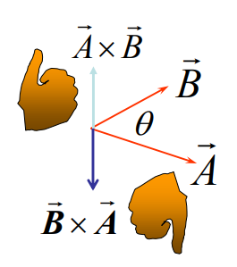

（通过右手定则确定$\omega$的方向和此点的旋转方向）

***

则可进而推得线加速度的分量：切向加速度（tangential component of acceleration）$\vec{a}_T$和向心加速度（radial component of acceleration）$\vec{a}_r$。这两个向量充当了此点的线加速度$\vec{a}$的两个相互垂直的分量：


线加速度：$\vec{a}=\frac{d \vec{v}}{d t}=\frac{d}{d t}(\vec{\omega} \times \vec{R})=\frac{d \vec{\omega}}{d t} \times \vec{R}+\vec{\omega} \times \frac{d \vec{R}}{d t}=\vec{\alpha} \times \vec{R}+\vec{\omega} \times \vec{v}$

切向加速度：$\vec{a}_{T}=\vec{\alpha} \times \vec{R}$

向心加速度：$\vec{a}_{R}=\vec{\omega} \times \vec{v}=\vec{\omega} \times(\vec{\omega} \times \vec{R})$

如果是二维平面上的转动，那么有：

$r=R \cdot sin \theta$

$a=\frac{d v}{d t}=\frac{d \omega}{d t} \cdot r$

$a_T=\alpha \cdot r$

$a_R= \omega^2 r$

***

#### 转动惯量（惯量矩）（rotational inertia(moment of inertia)）

刚体定轴转动中的转动惯量$I$，其地位相当于刚体平动中的质量$M$，是衡量刚体抵抗旋转运动的惯性的物理量。或者理解为转动形式的质量。

物体转动的动能，等于物体内的所有质点（$i=1,2,...,n$）的动能之和：

$K=\frac{1}{2} m_{1} v_{1}^{2}+\frac{1}{2} m_{2} v_{2}^{2}+\ldots=\Sigma \frac{1}{2} m_{i} v_{i}^{2}$

而物体内的所有质点的线速度大小不一，但角速度大小是一样的，因此可以将上述动能和公式转化为：

由$v_i=\omega r_i$：

$K=\sum \frac{1}{2} m_{i}\left(\omega r_{i}\right)^{2}=\frac{1}{2}\left(\sum m_{i} r_{i}^{2}\right) \omega^{2}$

由$K=\frac{1}{2} I \omega^{2}$（为了凑成动能公式的类似形式）：

$I=\Sigma m_{i} r_{i}^{2}$

其中$I=\sum m_i r_i^2$即为转动惯量（rotation inertia）。它描述了对于选取不同的旋转轴，系统内全部物体的质量的分布。一个物体的总转动惯量等于这个物体的每个部分的转动惯量之和（转动惯量是标量，支持加法）。

***

多质点/多物体系统下，选取不同的旋转轴的转动惯量计算：


$I_{A}=m_{1} d_{1}^{2}+m_{2} d_{2}^{2}$

$I_{B}=m_{1}(0)+m_{2}\left(d_{1}+d_{2}\right)^{2}$

$I_{C}=m_{1}\left(d_{1}+d_{2}\right)^{2}+m_{2}(0)$

$I_{D}=0$

***

刚体的质量满足连续分布（例如一条杆子），刚体之内任意两个单元（点）的距离保持不变，则对于选定的一旋转轴，有刚体转动惯量：

$I=lim_{\Delta m_n \to 0}\sum r_n^2 \Delta m_n$

$I=\int r^2 dm$

这适用于所有一到三维的图形的转动惯量的通式，因为这就是转动惯量的定义。

这里的$r$为某质点与选定的旋转轴的距离，$dm$为某质点的质量，积分符号对应的自变量为$r$。

***

!1867e96e563a460c0941f32bb4b2850b.png

三维情况：$3D:dm=\rho dV$（$\rho$为体积密度）

二维情况：$2D:dm= \sigma dS$（$\sigma$为面积密度）

一维情况：$1D:dm=\lambda dl$（$\lambda$为线密度）

***

平行轴定理（parallel-axis theorem）：

刚体选定某一轴的转动惯量$I$=选定过此刚体质心的并与原轴相平行的轴的转动惯量$I_c$+总质量$M$乘以两轴之间的距离$h$的平方。


$I=I_c+Mh^2$（$I_c$为选定过此刚体质心的转动惯量）

***

平行轴定理证明过程：

!bc3e5826aa45f017ff3849cf266c75ac.png

***

垂直轴定理（perpendicular-axis theorem）：

垂直轴定理只适用于平面物体（二维物体，但采用三维坐标系）。


满足：

$I_{z}=\int r^{2} d m=\int\left(x^{2}+y^{2}\right) d m=\int x^{2} d m+\int y^{2} d m=I_{y}+I_{x}$

$I_z=I_x+I_y$，其中$I_z$为以z轴为旋转轴的转动惯量，$I_x$为以x轴为旋转轴的转动惯量，$I_y$为以y轴为旋转轴的转动惯量。

***

通过推导一维刚体杆的转动惯量验证平行轴定理：


推导过刚体杆质心的轴（到两边的点的距离一致，均为$\frac{L}{2}$）为旋转轴时的转动惯量通式：

$\begin{aligned} I_{c} &=\int_{-L / 2}^{L / 2} x^{2} d m=\int_{-L / 2}^{L / 2} x^{2} \lambda d x \\ &=\int_{-L / 2}^{L / 2} x^{2} \frac{M}{L} \mathrm{~d} x \\ &=\frac{M}{L} \frac{1}{3}\left[\left(\frac{L}{2}\right)^{3}-\left(-\frac{L}{2}\right)^{3}\right] \\ &=\frac{1}{12} M L^{2} \end{aligned}$

由平行轴定理，对于其他轴的转动惯量$I$：

$I=I_c+Mh^2=\frac{1}{12}ML^2+Mh^2$

推导过刚体杆的末端的轴为旋转轴时的转动惯量通式：

$I=\int_{0}^{L} x^{2} \mathrm{~d} m=\int_{0}^{L} x^{2} \lambda \mathrm{d} x=\int_{0}^{L} x^{2} \frac{M}{L} \mathrm{~d} x=\frac{1}{3} M L^{2}$（积分的对应变量为$r$而不是$m$）

$I=I_c+Mh^2=\frac{1}{12}ML^2+M(\frac{L}{2})^2=\frac{1}{3} M L^{2}$（有两轴距离$h=\frac{L}{2}$，直接通过平行轴定理得到）

注意积分号上下区间的指向并不一定是$d$后面的变量，而是具体问题认定为自变量的变量。而且，这个自变量不一定会出现和包含在积分号后的式子里（也就是说，积分符号对应哪个自变量"由具体问题情况决定"，无法通过观察含有积分符号的表达式直接得到）。

***

规则物体的转动惯量（rotational inertia of regular solids）：

若无标注，则讨论的均为旋转轴选取为图形的中心轴（central center）而不是重心的情况。

棍形（一维图形）：$I=\frac{1}{3}ML^2$（末端）$I=\frac{1}{12}ML^2$（中点）


矩形（二维图形）：$I=\frac{1}{12}M(a^2+b^2)$


圆柱形（三维图形）：$I=\frac{1}{2}MR^2$（中心轴方向），选定直径方向则为$I=\frac{1}{4}MR^2+\frac{1}{12}ML^2$


圆柱环形（三维图形）：$I=\frac{1}{2}M(R_1^2+R_2^2)$


球壳形（二维图形）：$I=\frac{2}{3}MR^2$


球形（三维图形）：$I=\frac{2}{5}MR^2$


***

例子（二维物体）：


补充：分割+平行轴定理法：如果将平面物体（二维物体）分为无数份直线（一维物体），则相当于可以直接套用一维物体的结论。图片中的积分对应的自变量为x。

正常解法：

!ea777e7f1eefc96b7ecd4ec12dac485e.png

***

例子（二维物体，平面圆形，使用极坐标）：


***

例子（二维物体，仅球壳）：


***

#### 力矩及转动的牛顿第二定律（torque and Newton's second law for rotation）

力矩与力、作用点（action point）、参考点（reference point）有关。也就是和力的向量、相对于转轴（hinge line）的位置向量相关。

力（Force）直接改变物体平动状态，力矩（torque）直接改变物体的转动状态。

合外力是物体平动状态改变的原因，而合外力矩是物体转动状态改变的原因。

力矩是力的一种使物体以一定角加速度转动的能力的度量。

***

力矩的方向为什么是垂直于平面的：因为当物体在旋转时，旋转的方向一直在变，我们只能描述成是顺势针或者逆时针，而不能在旋转的平面里找到一个方向固定的向量来描述旋转的方向，所以物理上用垂直于旋转平面的方向来表示旋转方向。垂直于平面有两种可能的方向，以此分别表示逆时针和顺时针。


$\vec{\tau}=\vec{r} \times \vec{F}$

根据右手定则，确定力矩的方向：


力矩的大小计算：

$\vec{\tau}=\vec{r} \times \vec{F}$

$\tau=r \cdot F sin\theta=F \cdot r sin\theta$

其中$rsin\theta$为力臂（moment arm），力臂一定是力矩作用点与旋转轴的最短距离的长度（力臂所在的线段与旋转轴垂直）。

也可以将$F sin\theta$理解为外力的垂直于位置向量方向的分量，因为只有这部分是有造成力矩的效果的，平行于位置向量方向的分量是不造成力矩的效果的。这也是为什么计算力矩大小要叉乘的原因，因为只有垂直分量有效。

注意角度$sin\theta$取的是$\vec{F}$的方向和从转轴到作用点的位置向量$\vec{r}$的方向的夹角。

注意力矩的正负代表的是力矩的方向的竖直上下，因此通过右手定则可以确定力造成的力矩的方向和正负。

***

力矩可以分为力对点的矩和力对轴的矩。

力对某一点的矩是量度力对物体作用"绕该点转动"效应的物理量。力F对某点O的力矩定义为：力F的作用点A相对于O点的位置向量r与力F的矢积。

力对某轴的矩是量度力对物体作用绕该轴转动效应的物理量。力F对OZ轴的力矩定义为：力F对某O点的力矩$\tau$在过O点的任一轴线OZ轴上的投影称为力F对OZ轴的力矩。

- 力F对点O的矩，不仅决定于力的大小，同时与矩心的位置有关。矩心的位置不同，力矩随之不同。
- 当力的大小为零或力臂为零时，则力矩为零。

***

重力对一个物体的合力矩（net torque）：


重力关于一点的合力矩，等于全部重力作用于质心时的力矩。

重力关于质心的力矩为零（因此坠落的物体在理想情况下是仅平动而不转动的）。

***

二维平面下，定轴转动的轴向合力矩的推导：


$a_{iT}$为定轴转动的某个质点$i$的切向线加速度，那么有：

$a_{i T}=\frac{\mathrm{d} v_{i T}}{\mathrm{~d} t}=\frac{\mathrm{d} \omega}{\mathrm{d} t} r_{i}=\alpha r_{i}$

$F_{i T}=m_{i} a_{i T}=m_{i} \alpha r_{i}$

$\tau_{i}=r_{i} F_{i T}=m_{i} r_{i}^{2} \alpha$

因为$I=\sum_{i} m_{i} r_{i}^{2}$，有：

$\sum_{i} \tau_{i}=\sum_{i} m_{i} r_{i}^{2} \alpha=I \alpha$

最终得到合力矩$\tau_z$：

$\tau_{z}=I \alpha$

合力矩等于转动惯量$I$乘以角加速度$\alpha$。

***


这种情况下，运用的不是角动量守恒，而是力矩相抵消。注意一个力对一根棍子的力矩大小仅取决于力臂的长度和这个力垂直于这根棍子的分量。

由上图，可得绳子的张力$T$的力臂为整根棍子的长度$L$，而垂直于它的张力分量为$T sin\theta$，因此力矩大小为$L \cdot T sin\theta$。那么重力$G$作用于棍子的质点，则力臂为整根棍子的长度的一半$\frac{L}{2}$，垂直于它的重力分量为$G \cdot sin2\theta$。

***

转动过程中外力$\vec{F}$做功：


$K=\frac{1}{2}mv^2=\frac{1}{2}I\omega^2$

$\Delta K=K_{f}-K_{i}=\frac{1}{2} I \omega_{f}^{2}-\frac{1}{2} I \omega_{i}^{2}=W$

$d W=F_{t} \cdot d s=(F \sin \phi)(r d \theta)=(r F \sin \phi) d \theta=\tau d \theta$

（注意$\theta$为弧度制，满足弧长$s=r \theta$）

则力$\vec{F}$做的总功为：

$W=\int_{\theta_{i}}^{\theta_{f}} \tau d \theta$

则力$F$做功的功率为：

$P=\frac{d W}{d t}=\tau \frac{d \theta}{d t}=\tau \omega$

***

平动和转动的公式对比：


***

#### 角动量（angular momentum）

位矢（位置向量）$r$在单位时间内扫过的面积，称为它的掠面速度。可以证明，掠面速度为$S'=\frac{|r \times v|}{2}$

角动量大小$L=|r \times p|=|r \times mv|=m|r \times v|=2mS'$

因此角动量可以视作质点相对于转轴扫过的面积的衡量。

***

角动量的原始定义（角动量$L= p \cdot r$与动量$p$的不同之处）：


质点的位置向量：$\vec{r}=x \hat{i}+y \hat{j}+z \hat{k}$

质点的线动量向量：$\vec{p}=m\left(v_{x} \hat{i}+v_{y} \hat{j}+v_{z} \hat{k}\right)$

质点的角动量向量：

$\vec{l}=\vec{r} \times \vec{p}=m(\vec{r} \times \vec{v})=l_x \hat{i}+l_y \hat{j}+l_z \hat{k}$

$l_{x}=m\left(y v_{z}-z v_{y}\right)$

$l_{y}=m\left(z v_{x}-x v_{z}\right)$

$l_{z}=m\left(x v_{y}-y v_{x}\right)$

质点的角动量的大小：$l=r p \sin \varphi$

质点的角动量$\vec{l}$表示为其位置向量$\vec{r}$叉乘质点的动量向量$\vec{p}$，

角动量为$\vec{l}=\vec{r} \times \vec{p}=m(\vec{r} \times \vec{v})$。角动量的大小则为$l=r \cdot p \cdot sin \varphi$

***

根据动量的定义$P=F \cdot t$，推导得出角动量定理（theorem of angular momentum）：

$\frac{\mathrm{d} \vec{L}}{\mathrm{~d} t}=\sum_{n=1}^N \vec{\tau}_{n , \text{ext}} =\vec{\tau}_{e x t}$

作用在质点上的外力矩，等于质点角动量随时间的变化率。

***

质点系中的角动量定义：

总角动量：$\vec{L}=\vec{l}_{1}+\vec{l}_{2}+\cdots+\vec{l}_{N}=\sum_{n=1}^{N} \vec{l}_{n}=\sum_{n=1}^{N} \vec{r}_{n} \times \vec{p}_{n}$

角动量随时间变化率：$\frac{\mathrm{d} \vec{L}}{\mathrm{~d} t}=\sum_{n=1}^{N} \frac{\mathrm{d} \vec{l}_{n}}{\mathrm{~d} t}=\sum_{n=1}^{N} \vec{\tau}_{n}=\sum_{n=1}^{N} \vec{r}_{n} \times \vec{F}_{n}=\sum_{n=1}^{N} \vec{r}_{n} \times\left(\vec{F}_{n, \text { int }}+\vec{F}_{n, \text { ext }}\right)$

质点系的角动量指的是质点的角动量之和，也是系统的角动量和，表示为$\vec{L}$。

***

内力矩之和为0的推导：

质点系内，求合力矩的时候，对内力内力矩进行分析，得到内力矩$\tau_{int}$相消，因此内力为0。

$\vec{r}_{i} \times \vec{f}_{i j}+\vec{r}_{j} \times \vec{f}_{j i}=\vec{r}_{i} \times \vec{f}_{i j}-\vec{r}_{j} \times \vec{f}_{i j}=\left(\vec{r}_{i}-\vec{r}_{j}\right) \times \vec{f}_{i j}=0$


最终得到：质点系中角动量随时间的变化率就等于系统总外力矩$\vec{\tau}_{ext}$。

$\frac{\mathrm{d} \vec{L}}{\mathrm{~d} t}=\sum_{n=1}^N \vec{\tau}_{n , \text{ext}} =\vec{\tau}_{e x t}$

$\Delta \vec{L}=\int_{t_{1}}^{t_{2}} \vec{\tau}_{e x t} d t$（$P=F \cdot t$）

***

刚体定轴转动的角动量（$P=M \cdot V$）：


$l_{i}=r_{i} p_{i}=r_{i} \Delta m_{i} v_{i}$

$l_{i z} =l_{i} \sin \theta=\left(r_{i} \sin \theta\right) \Delta m_{i} v_{i}=r_{\perp i} \Delta m_{i} v_{i}=r_{\perp i} \Delta m_{i}\left(\omega r_{\perp i}\right)=\left(\Delta m_{i} r_{\perp i}^{2}\right) \omega$

$L_{z}=\sum_{i} l_{i z}=\sum_{i}\left(\Delta m_{i} r_{\perp i}^{2}\right) \omega=I_{z} \omega$

质点$i$的角动量为$l_i$，角动量在z轴方向上的分量为$l_{iz}$，系统在z轴方向上的合角动量为$L_z$。

***

一般情况下，角动量与角速度方向不一致。

!1b379ca222aec92f7e8f076ba71271dd.png

而如果物体关于转轴对称，才满足$\vec{l}=I\vec{\omega}$。

角动量向量和角速度向量通过惯量张量 / 惯量矩阵（inertia tensor）相关。

$\left(\begin{array}{l}l_{x} \\ l_{y} \\ l_{z}\end{array}\right)=\left(\begin{array}{ccc}I_{x x} & -I_{x y} & -I_{x z} \\ -I_{y x} & I_{y y} & -I_{y z} \\ -I_{z x} & -I_{z y} & I_{z z}\end{array}\right)\left(\begin{array}{l}\omega_{x} \\ \omega_{y} \\ \omega_{z}\end{array}\right)$

其中：

$I_{x x}=\int\left(y^{2}+z^{2}\right) d m$为绕x轴的转动惯量。

$I_{x y}=I_{y x}=\int x y d m$为既不绕x轴转动也不绕y轴转动的惯量积（product inertia）。

***

动量的平动和转动的公式对比：


***

#### 角动量守恒（conservation of angular momentum）

如果外力矩为0，则角动量$\vec{L}=mv=I\omega$守恒。

$\frac{\mathrm{d} \vec{L}}{\mathrm{~d} t}=\sum \vec{\tau}_{n , e x t}=\vec{\tau}_{ext}=0$

$L_z=I_z \omega$

因此，得到恒等式：

$L_i=L_f$

$I_{i} \omega_{i}=I_{f} \omega_{f}$

因此对于非刚体系统，若转动惯量$I$变化，角速率$\omega$也将变化，且为成反比变化。

顺带一提，转动动能：$K_{rot}=\frac{1}{2}mv^2=\frac{1}{2}I\omega^2=\frac{1}{2}L\omega$

***


***

两个转轴，多个物体同时作用的情况：


直接对系统整体求转动惯量和角动量来求得最终角速度。

***


第一问：求系统的总转动惯量，刚体则为质量分布均匀的情况（$I=\int r^2 dm$），质点则直接求（$I=m r^2$）。

第二问：求子弹速度，则根据角动量守恒$L_i=L_f$可以得到。其中初始角动量仅有正在运动的子弹拥有，而最终角动量为整个系统拥有（因为都正在运动）。

***


此处$J$仍为"转动惯量"而不是"冲量"。

***

### 第十一章-刚体运动学（二）-转动和平动的复合运动（combined rotation and translation）

#### 刚体运动学（kinematics）（复合运动）

使用CM（combination of motions，简写为CM）来代表复合运动。或者，更通俗和概括性的，使用滚动（rolling）来表示物体"同时平动和转动的复合运动"。

***

平面平行运动（plane parallel motion）：物体上的任意点的运动均在某个平面上进行。

在这个条件下，研究做滚动运动的不规则物体的其中某质点的速度：


$\vec{v}_{i}=\vec{v}_{o}+\vec{\mathfrak{\omega}} \times \vec{r}_{i}^{\prime}=\vec{v}_{o}+\vec{v}_{i}^{\prime}$，其中$\vec{v}_o$为滚动物体的平动速度，$\vec{v}_{i}^{\prime}$为某质点$i$的转动线速度。

也就是说，如果以地面为参考系，那么需要同时考虑物体的平动速度和物体的转动线速度的影响。

***

无滑动滚动/无打滑滚动（rolling without slipping）：接触点无相对运动（不会打滑，不代表没有摩擦力，正说明了摩擦力足够）的滚动运动。


对于滚动运动，视作是转动运动和平动运动的组合，那么物体上的某质点$i$满足$\vec{v}_{i}=\vec{v}_c+\vec{\omega} \times \vec{r}_{i} ^{\prime}$，其中$\vec{v}_c$是整个物体的平动速度。

底部点的速度为$v_{bottom}=v_{c}-\omega R=0$

顶部点的速度为$v_{top}=v_{c}+\omega R=2 v_{c}$

***

转动瞬轴（instantaneous axis）：

一个滚动的整个物体（而不是其中的某质点）可以认为它围绕着一个位于接触点的转动瞬轴进行转动。每一个瞬间都会有一个新的接触点和一个过这个点的新的轴作为旋转轴，在极短时间内认为物体的运动为围绕转动瞬轴的纯转动运动。


如上图所示，某一瞬间，整个物体围绕过接触点$B$的旋转轴进行旋转，那么整个物体中的部分质点的速度方向可以认为是绕此旋转轴进行旋转，那么对于物体中的质点$P$，满足：

$v_{P}=\omega \cdot r_{B P}$（二维情况）

$\vec{v}_{P}=\vec{\omega} \times \vec{r}_{B P}$（三维情况）

$v_B=0$

顶点的速度：$v_{T}=2 \omega R=2 v_{c}$

左顶点的速度：$v_{L}=\sqrt{2} \omega R=\sqrt{2} v_{c}$

右顶点的速度：$v_{R}=\sqrt{2} \omega R=\sqrt{2} v_{c}$

***

#### 滚动运动的动能（kinetic）

滚动（转动和平动的复合运动）的动能（kinetic energy of rolling）：

平动动能：$K=\frac{1}{2} M v^{2}$

转动动能：$K=\frac{1}{2} I \omega^{2}$

滚动动能：$K=\frac{1}{2}Mv^2+\frac{1}{2}I \omega^2$

***

证明：

柯尼希定理（Konig's theorem）：


最终可得滚动运动的动能分别由纯转动和纯平动的动能之和组成。$v_{cm}$为物体总体平动的速度，而$v'_n$为物体中某质点的线速度。

$K=\frac{1}{2}Mv_{cm}^2+\frac{1}{2}\sum_n m_n (v'_n)^{2}$

因此，一个斜坡上的滚动物体（距离等势面的高度为$h$）拥有的机械能为：

$E=\frac{1}{2}M v_{cm}^2+\frac{1}{2}I\omega^2+Mgh$

$v_{cm}=\omega \cdot R$，其中$R$为滚动物体的半径。

***

例子：


例子（悠悠球）：

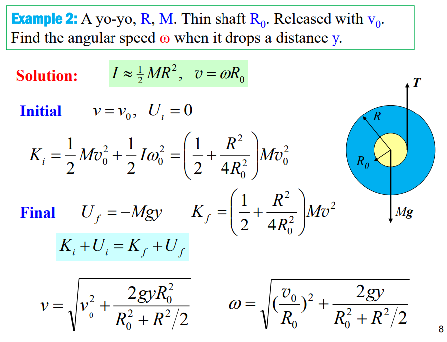

***

#### 动力学：滚动运动中的力的研究（dynamics:forces of rolling）

圆柱体无打滑滚动下斜坡：


将滚动分解有平动运动，有$F_{x}=M a_{x}$，$F_{y}=M a_{y}$

将滚动分解有转动运动，有$\tau_z=I \alpha _z$

那么对于有摩擦的一个斜坡，一物体做滚动运动，根据整体受力分析有：

$F_{x}=M g \sin \theta-f_{s}=M a_{com}$

$F_{y}=M g \cos \theta-N=0$

$\tau=R f_{s}=I \alpha$

$v_{c}=\omega R$

$a_{c}=\alpha R$

注意：对于无打滑的滚动运动的物体，其平动运动的质心速度$v_{com}$（参考系为地面）的大小等于其转动运动的表面质点（半径为R）的线速度/切向速度$v_c=\omega R$（参考系为物体本身）。这是因为本来物体旋转的线速度的定义就是弧长除以时间$v=\frac{2\pi R}{t}$，一个滚动的圆形物体上的质点走过一个周长的距离$2\pi R$所消耗的时间，恰好等于整个物体的圆心平动一个周长$2\pi R$的距离所消耗的时间。因此物体的平动速度和物体表面的质点的线速度相等。

因此$a_{com}=a_c=\omega R$，$com$下标的意思是围绕质心的物理量（围绕过质心的轴旋转得到的物理量）。

因此最终根据$F_x$和其他式子带入得到：

$F_{x}=M g \sin \theta-f_{s}=M a_{c}$

$f_s=\frac{I \alpha}{R}=\frac{I \cdot \frac{a_c}{R}}{R}=\frac{I}{R^2}a_c$

$a_{c}=\frac{g \sin \theta}{1+I / M R^{2}}$

$I=\frac{1}{2}M R^2$（圆柱体的转动惯量）

其中$\alpha$为转动角加速度，$a_c$为转动线加速度（当不打滑的时候）。

$\tau_z$为外力矩，仅代表摩擦力的力矩，不包含重力的力矩。因为实际上重力的合力矩的力臂为零，圆柱从斜坡滚动下来造成转动的原因只是因为摩擦力，与重力无关。如果没有摩擦力那么圆柱仅仅会平移下来。

摩擦力$f$为作用于转动物体的接触点且方向在同一直线上的力，具有造成力矩的效果。注意不同的转动方向会使得摩擦力$f$的方向不同。

***

根据斜坡的例子，重力的分量力$Mgsin\theta$为施加在物体上除造成力矩的力之外的，效果为整个物体的平动加速度的合外力$F_{a}$。而$f_s$为施加在物体上使其做转动运动的外力$F_{\tau}$（方向与$F_{a}$平行），那么可以推导出更具有一般性的公式：

$F_{ext}=Ma_{com}$

$F_{ext}=F_a - F_{\tau}$

$F_{a}-F_{\tau}=M a_{com}$

$F_{\tau}=\frac{I \alpha}{R}=\frac{I}{R^2}a_c$

$F_a-\frac{I a_c}{R^2}=Ma_{com}$

$a_c=a_{com}=\frac{F_a}{(M+\frac{I}{R^2})}=\frac{\frac{F_a}{M}}{(1+\frac{I}{MR^2})}$

因此得到了物体的转动线加速度$a_c$和质心的平动加速度$a_{com}$。

***

可以得知造成了力矩的效果（施加角加速度）的力的形式可以是：

1.固定一个方向且大小不变的力。

2.对旋转物体的某一点持续施加切线方向的大小不变的力。

3.对旋转物体的每一点持续施加相同方向的大小不变的力。

***

例子：


***

#### 自转物体的稳定性（stability of spinning objects）

自旋角动量和外力矩的关系：$\vec{\tau}=\frac{d\vec{L}}{dt}$（$P=M*v=F*t$）

角动量可以通过右手定则，定义一个平面中的转动的方向和大小。而外力矩其实就是对角动量施加变化的力，因此即为角动量的变化的导数。同时，因为角动量可以用一个垂直于转动平面的向量表示，那么同样可以通过一个与角动量方向不垂直的方向的外力矩向量来对角动量向量进行改变（也就是矢量的形式）。


通过上图的向量加法的图示，可以得到：如果角动量为$\vec{L}$，则其方向与质量均匀的物体自旋轴平行，而如果外力矩的方向不平行于角动量的方向（如果平行则可得没有影响，除非力矩作用点不一样），可得物体的角动量越大，外力矩对其方向的改变越小，物体转动的方向越稳定。

***

进动（precession）指的是陀螺除了本身自旋之外，整体会绕着整个物体的转动轴进行转动。进动产生的原因是因为存在外力矩和自旋运动。

陀螺未转动且接近倾倒的状态（此处直接模拟陀螺快完全倾倒的情况）：

!fea6c33778dbd438817b9cfe934c2268.png

陀螺转动且接近倾倒的状态（因为存在自转角动量$\vec{L}$，重力的力矩$\vec{\tau}$终于能够对角动量产生影响了，产生进动效应）：


对自转角动量$\vec{L}$的轨迹进行分析：


根据力矩的定义（此处$dL$为弧长$d\vec{L}$的大小）：$\tau=\frac{dL}{dt}$

$d L=\tau \cdot d t=M g r  \cdot d t$

根据扇形的弧长公式（此处$\vec{L}$充当半径，$dl= r \cdot d\theta$）：$dL=L \cdot d\phi$

$d \phi=\frac{d L}{L}=\frac{M g r d t}{I \omega}$

进动速率的计算公式为：

$\Omega=\frac{d\phi}{dt}=\frac{Mgr}{I\omega}$

其中$d\phi$为$dt$时间内，物体绕进动轴转过的角度。

***

为什么会形成进动：

理想情况下，处处质量均匀的陀螺完全垂直于接触面，物体自旋轴和整个物体的转动轴（即进动轴，与重垂线恒重合）完全重合且垂直于接触面，且进动轴（或者说角动量的方向）与每个质点的重力矩的方向均垂直，因此不会发生进动（因为陀螺关于进动轴的每一个方向的质量都是相等的，因此可以相互抵消重力矩的作用）。

陀螺做不到完全质量均匀，那么运动过程中就会有所倾倒。。而且人做不到完全垂直于接触面释放陀螺，那么初始情况就会有所倾倒。一旦有所倾倒，对整个陀螺而言，合重力矩大小就不为零了，形成进动。

只要存在扰动，陀螺就会不可避免地使整个物体的形状分布偏离垂直于接触面的方向。而只要有所偏离，就可以这样分析：无视陀螺的自旋，仅看它绕着仍然不变的进动轴进行转动，此时它在旋转过程中，仅有陀螺尖分布在进动轴的一端，而另一端是陀螺的主体部分，因此陀螺不再满足关于进动轴的每一个方向的质量都是相等的条件，陀螺的主体部分就开始受到单方向的重力矩的作用。再恢复视作有自旋，那么自旋角动量和重力矩形成进动效应。陀螺不会直接倾倒的原因是一旦倾倒，形成进动，那么进动就会提供惯性力向心力拉回，进动所需的向心力由地面摩擦力提供。因为存在外力，因此陀螺角动量其实是不守恒的。（如果不存在摩擦力，那么角动量守恒，陀螺会直接一边保持自转，一边完全倾倒在地面上保持进动，这两个转动运动的角动量大小之和等于初始仅自转的时候的角动量的大小）


自旋的物体有一个重要特性，那就是它受到非自旋轴上的外力矩的作用时会产生进动（回转效应），而且进动方向与自旋方向始终保持一致性。

此处的外力矩为重力矩$\tau=Mgr$。不要认为进动是逐渐向下倾斜的，如果没有空气摩擦而仅有地面摩擦的理想情况下，进动应该会使得陀螺一直沿着这个倾斜角度进行进动旋转，原因在于：

自旋的物体和非自旋物体的最大差别，在于自旋物体有一条过支点的自旋角动量向量。而因为有所倾斜，对整个自旋物体来说存在对于重垂线来说的重力矩向量（半径为重垂线到自旋物体的质心），它的方向刚好总是与自旋轴角动量向量方向垂直，因此自旋角动量不断地向进动轨迹的切线方向改变，而又因为两个向量总是垂直使得自旋角动量大小不变。

因此最终可得：进动的角动量的大小和方向都是不变的，进动物体的自旋的角动量大小不变，方向一直变化。


（如图，自旋物体的整体重力矩的方向不断变化，但时时与进动旋转的轨迹相切。自旋角动量L在进动旋转平面上的分量受到重力矩的影响，使得角动量L绕着重垂线进行转动，这个转动就是进动旋转的轨迹。角动量的进动在现实层面就是自旋物体的进动。）

因此整个物体的自旋轴受重力矩的影响表现出来就是自旋轴绕重垂线圆周转动，因此形成整个物体的进动，而重垂线就是进动轴。理想情况下，没有摩擦自旋和进动的转速就不会降低，陀螺就会一直保持着当前倾斜角度进行进动。

***

物体和力矩的对应示意图：


自旋角动量受重力矩的影响示意图：


$\vec{\tau} \perp \vec{L}$

可以看出，重力矩的作用是改变了陀螺的自旋角动量的方向，而不改变大小。同时，因为整个物体在进动，那么整个物体的转动的角度可以衡量物体自旋角动量的变化率。

***

例子：

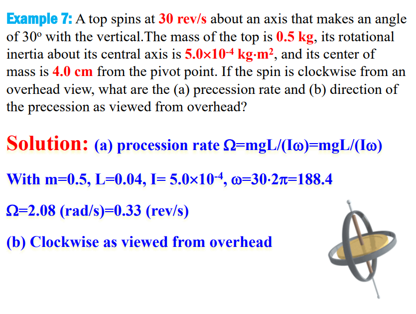

***

#### 刚体的平衡（equilibrium of rigid body）


稳定平衡：是存在趋于保持平衡方向的趋势的平衡。

非稳定平衡：是存在趋于破坏平衡方向的趋势的平衡。

中性平衡是（neutral equilibrium）：不存在影响平衡方向的趋势的平衡。

局域稳定平衡（locally stable equilibrium）：是稳定平衡和非稳定平衡的结合，从整个整体上看。

***

刚体平衡的定义：线动量和角动量均不变（注意可以不为0），不存在平动和转动加速度。

平衡的条件：合外力$\sum\vec{F}_{ext}$为0。任意点的合力矩$\sum\vec{\tau}_{ext}$为0。

如果满足线动量和角动量均为0，则称为静平衡（static equilibrium）。

***


力有效地作用于物体的的形式为作用于某一个点，这个点不一定位于物体的内部，它被称为有效作用点。作用于有效作用点的力的大小就等价于这个物体所有质点受这个力的大小之和（不同质点所受的力的大小可能不同）。

$\vec{F}=\sum \vec{F}_{i}$


当这个力为重力时，这个点被称为物体的重心（center of gravity，简写为cog或者CG）。

$\vec{\tau}_{net}=\vec{r}_{cog} \times \vec{F}_g$

如果所有质点的重力系数g都相同，那么物体的重心与物体的质心（center of mass）重合。

***

例子：


求地面（pavement）和光滑（slick）的墙面对梯子（ladder）的力。


***

单元总结：


***

### 第十二章-弹性（elasticity）（不考）

#### 12.1 应变和应力（strain and stress）

所有真实的刚体在某种程度上都是弹性的（elastic），我们可以通过拉动（pull）、推动（push）、扭转（twisting）或压缩（compressing）它们来稍微改变它们的尺寸（dimensions）。

应变（strain）：为单位形变（unit deformation）。应变也可以视作为形变了$\Delta d$后相对于原本未形变时$L$的形变比$\frac{\Delta d}{L}$，应变可以用百分比表示。

应力（stress）：为单位面积的形变力（deforming force per unit area）。因此用$\frac{F}{A}$表示。

弹性模量（elastic modulus）：对于特定的物体，它是一个比例常数（constant of proportionality）。

满足：

$应力 = 弹性模量 * 应变$

***

有三种标准的应变和应力（拉伸应变，剪切应变，液压应变）：

拉伸应变（tensile stress）的应变为$\frac{\Delta L}{L}$，$\Delta L$为实际形变长度。

剪切应变（shearing stress）的应变为$\frac{\Delta x}{L}$，$\Delta x$为实际形变长度。

液压应变（hydraulic stress）的应变为$\frac{\Delta V}{V}$，$\Delta V$为实际形变体积。


分别对应三种模量（杨氏模量，剪切模量，体弹性模量）：

杨氏模量（Young's modulus）可以用$E$或者$Y$表示，满足$\frac{F}{A}=E * \frac{\Delta L}{L}$，其中$A$为力作用于物体的面的面积，$\frac{F}{A}$为应力。

剪切模量（shear modulus）可以用$G$表示，满足$\frac{F}{A}=G * \frac{\Delta x}{L}$，其中$A$为力作用于物体的面的面积，$\frac{F}{A}$为应力。

体弹性模量（bulk modulus）可以用$B$表示，满足$p=B * \frac{\Delta V}{V}$


应力关于应变的函数图像：


应变在一定范围内，应力关于应变是线性的。而大于这个范围不会立刻断裂，而是先永久形变，然后再断裂。

***

例子：


***

#### 12.2 弹性势能（elastic potential energy）

在松弛状态长度（relaxed length）为$l$，横截面积（cross sectional area）为$A$的杆子（rod）在力F的作用下延长（extend）了长度$x$。将长度$x$视作自变量，对$F dx$进行积分就等于弹性势能。

则满足：$F=AY \frac{x}{L}$

其中的物理量：应力$\sigma$，应变$S$，体积$V$。


***

#### 12.3 泊松比（poisson's ratio）

刚体的泊松比定义为$\kappa=\frac{\frac{\Delta r}{r}}{\frac{\Delta l}{l}}$，其中$\frac{\Delta r}{r}$为侧向应变（lateral strain），$\frac{\Delta l}{l}$为轴向应变（axial strain）。


满足$\frac{\Delta V}{V}=3\frac{\Delta l}{l}$，$B=\frac{Y}{3(1-2\kappa)}$

***

例子：

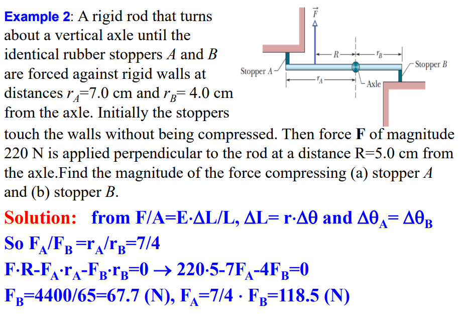

***

#### 12.4 材料的力学性能（mechanical properties of materials）


***

### 第十三章-万有引力（Newtonian gravitation）

#### 13.1 万有引力介绍

引力（gravitation）存在于任意两个物体之间。

***

宇宙中的四个基本相互作用包括：

- 引力（gravitational force）。

- 电磁力（electromagnetic force）。

- 弱相互作用（weak interaction），其与中微子（neutrino）有关。

- 强相互作用（strong interaction），其在原子核内（inside nucleus）相互作用。

***

#### 13.2 关于引力的牛顿定律

$F=G \frac{m_{1} m_{2}}{r^{2}}$

$G=6.67 \times 10^{-11} \mathrm{~N} \cdot \mathrm{m}^{2} / \mathrm{kg}^{2}$

重力常数是一种普适常数（universal constant），重力服从平方反比律（inverse square law）。

写成向量的形式，则有：


$\vec{F}_{12}=-G \frac{m_{1} m_{2}}{r_{12}^{2}} \hat{r}_{12}=-G \frac{m_{1} m_{2}}{r_{12}^{3}} \vec{r}_{12}$

$\vec{r}_{12}=\vec{r}_{1}-\vec{r}_{2}$

$\hat{r} \equiv \frac{\vec{r}}{r}$

可以看出，根据原本的公式推出向量形式，向量仅表示了引力的方向。$\vec{F}_{12}$就代表质点2对质点1的引力向量，$\vec{r}_{12}$就代表受力的质点1离施加引力的质点2的距离向量。

因此$\vec{F}_{12}$和$\vec{r}_{12}$的方向相反。且满足单位向量$\hat{r}=\frac{\vec{r}}{||\vec{r}||}$。

***

#### 13.3 引力与叠加原理（gravitation and principle of superposition）

叠加原理：当有多个物体对一个物体的有引力的作用，那么施加在这个物体上的合引力大小等于每个引力的向量和。

$\vec{F}_{i}=\vec{F}_{i 1}+\vec{F}_{i 2}+\cdots+\vec{F}_{i N}=\sum_{n=1}^N \vec{F}_{in}$


叠加原理得到的合引力不是精确的，但是因为尺度远小于距离，因此是几乎一样的近似。

***

#### 13.4 地球表面附近的引力

物体离地球表面的高度变化，此物体所处位置的自由落体（free-fall）加速度（也就是重力加速度）$a_g$会发生变化：

$a_{g}=G \frac{M_{E}}{r^{2}}$

***

物体在地球上纬度的变化，此物体所处位置的重力加速度$g$也会发生变化（地球是椭球（ellipsoid），在两极（poles）处平缓（flattened）而在赤道（equater）处突出）。

一个在赤道上的木箱（crate）的表现出来的重力加速度$g$，和向心加速度$\omega^2 R$，和引力加速度$g_0$（也就是如果没有转动的时候的引力造成的加速度）：


$m g_{0}-N=m \omega^{2} R$

$N=m\left(g_{0}-\omega^{2} R\right) \equiv m g$

$g=g_{0}-\omega^{2} R$

重力加速度与纬度的关系图像：


***

失重（weightless）和轨道卫星的向心力（centripetal force）：

$R \rightarrow r=R+h$

$N=0$

$m \omega^{2} r=G \frac{M_{E} m}{r^{2}}$

$g_{0}=G \frac{M_{E}}{r^{2}}$

***

#### 13.5 地球内部的引力

壳层定理（shell theorem）：

- 密度均匀的球壳对位于其外部质点的引力，相当于球壳的全部质量集中于球心作为一个质点时的引力。

- 密度均匀的球壳对位于其内部的的质点的引力为零。


***

证明过程：


***

例子：


$U$为势能，$K$是动能。

根据壳层定理，可知当质点m与地球圆心距离为$r$时，那么$r$以外的地球的壳层对质点m产生的合引力相互抵消，也就是说此时质点m等于在半径为$r$的地球的表面。

因为视作球体，则半径为$R$的地球的质量$M_E$和半径为$r$的小地球的质量$M_{ins}$关系为$\frac{M_{ins}}{M_E}=\frac{r^3}{R_E^3}$

可得质点m受到的引力与弹力类似，则套用弹性势能的公式$U(r)=\frac{1}{2}*F*r,F=k*r$，求得关于$r$的质点m的重力势能的通式。

然后套用能量守恒即可得到结果。

***

#### 13.6 引力势能（gravitational potential energy）

引力属于保守力。其势能的公式推导如下：

$\int \vec{F} \cdot d \vec{r}=\int\left(F_{r} d r+F_{\theta} r d \theta\right)=\int F_{r} d r=\int F(r) d r$

$F=-\frac{G M m}{r^{2}}$

$U(r)=-\int F d r=\int \frac{G M m}{r^{2}} \mathrm{~d} r=-\frac{G M m}{r}+C$

$U(\infty)=0$

结合以上式子，得到势能公式：

$U(r)=-\frac{G M m}{r}$

$U_{B}-U_{A}=G M m\left(\frac{1}{r_{A}}-\frac{1}{r_{B}}\right)$

$F=-\frac{\mathrm{d} U}{\mathrm{~d} r}$


注意引力势能的大小仅与力的大小和距离$r$的大小有关，与具体的路径无关。

对于一个物体A距离另一个物体B为$r$的情况，那么物体A的引力势能就是$U(r)=-\int F dr=-\frac{GMm}{r}$

***

有逃逸速度（escape speed），也叫做第二宇宙速度（second universe speed），是使一个物体脱离某个行星表面所需的速度。

$\frac{1}{2} m v^{2}+\left(-\frac{G M m}{R_{E}}\right)=0$

$v=\sqrt{\frac{2 G M}{R_{E}}}=11.2 \mathrm{~km} / \mathrm{s}$


***

系统内质点之间的引力势能，就是计算系统中的总结合能（binding energy）或者说总引力势能：


$U=-\left(\frac{G m_{1} m_{2}}{r_{12}}+\frac{G m_{1} m_{3}}{r_{13}}+\frac{G m_{2} m_{3}}{r_{23}}\right)$

$E=-U\left(r_{12}, r_{23}, r_{31}\right)$

也就是说，如果此时有外力做功，那么可以直接计算总引力势能之差$W_{net}=U_f-U_i$。那么可以直接得到系统内引力做的功（一般为负功）等于$W_{int}=-(U_f-U_i)$。

***

#### 13.7 行星和卫星：开普勒定律（planets and satellites: Kepler's laws）

假设：

- 只考虑两物体的引力，忽略其它扰动。

- 中心物体质量很大，忽略其运动。

***

轨道定律（the law of orbits）：行星轨道为椭圆，而恒星为一焦点$F$。


半长轴（semi-major axis）：$a$

离心率（eccentricity）：$e=\frac{c}{a}$

远日点（aphelion）：$R_{a}$

近日点（perihelion）：$R_p$

***

面积定律（the law of areas）：行星与恒星的连线在相等时间内扫过的面积相等。


因为行星绕着恒星做转动运动，因此拥有角动量，且角动量守恒。

$L=I\omega=m \omega r^2$

那么有扇形面积的公式：

$A=\frac{1}{2}r^2 \theta$

$\Delta A=\frac{1}{2}r^2 \Delta \theta$

又因为对扇形面积公式对时间$t$求导有：

$\frac{\mathrm{d} A}{\mathrm{~d} t}=\frac{1}{2} \omega r^{2}=常数$

因此相同时间间隔内，行星相对于恒星扫过的面积相等。

***

周期定律（the law of periods）：行星绕恒星做周期转动运动，周期$T$的二次方与行星和恒星的半长轴$a$的三次方成正比。

$T^{2} \propto r^{3}$

对圆形轨道，有：

$v=\frac{2 \pi r}{T}$

$G \frac{M m}{r^{2}}=m \frac{v^{2}}{r}$

$v^{2}=\frac{G M}{r}$

$T^{2}=\left(\frac{2 \pi r}{v}\right)^{2}=\frac{4 \pi^{2} r^{2}}{G M / r}=\frac{4 \pi^{2} r^{3}}{G M}$

$\frac{T^{2}}{r^{3}}=\frac{4 \pi^{2}}{G M}$

对圆计算周期与半径之间的关系，对椭圆也适用。（把半径$r$替换为半长轴$a$，半长轴是一个椭圆的较长的直径的一半），最终可得：

$\frac{T^{2}}{a^{3}}=\frac{4 \pi^{2}}{G M}$

***

视向速度（the line of sight velocity）：恒星的空间运动速度可分成两个分量：与视线方向相垂直的称为切向速度，与视线方向一致的称视向速度。视向速度又分为向太阳而来和远离太阳而去两种。恒星在单位时间内沿视线方向移动的距离叫视向速度，单位是公里/秒。它可由恒星光谱线的多普勒位移来确定，谱线向红端移动(即红移)时为正，这时恒星远离我们而去。实测的数值必须改正地球自转和公转的影响，归算成相对于太阳中心的数值。

***

例子：


***

#### 13.8 卫星：轨道和能量（orbits and energy）

对于圆轨道和椭圆轨道，总有机械能守恒（机械能=动能+势能）。

圆轨道或椭圆轨道的动能和势能的变化图像：


当总机械能$E<0$的时候，轨道是圆形或者椭圆。

当总机械能$E=0$的时候，轨道是抛物线。

当总机械能$E>0$的时候，轨道是双曲线。

***

例子：


***

#### 13.9 爱因斯坦与引力（Einstein and gravitation）

爱因斯坦提出广义相对论（general theory of relativity）。

提出引力和加速度等效，叫做等效性原理（principle of equivalence）：


质量引起空间弯曲（curvature of space）：


通过类星体（quasar）的光的路径：

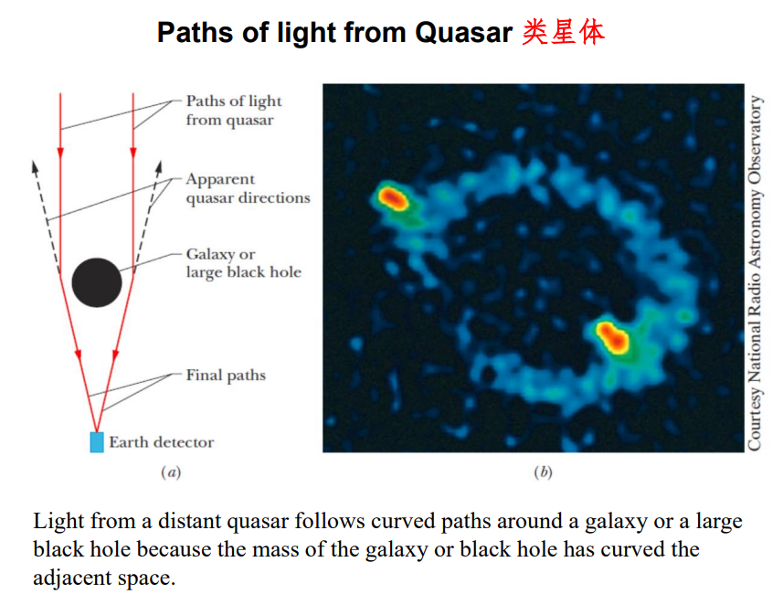

***

### 第十四章-流体力学（fluids）（不考）

#### 14.1 流体静力学（fluid statics）

#### 14.2 密度和压强（density and pressure）

#### 14.3 静止的流体（fluids at rest）

#### 14.4 测量压强（measuring pressure）

#### 14.5 帕斯卡原理（Pascal's principle）

#### 14.6 阿基米德原理（Archimedes's principle）

#### 14.7 流体动力学（fluid dynamics）

#### 14.8 流体的连续性方程（equation of continuity）


#### 14.9 伯努利方程（Bernoulli's equation）


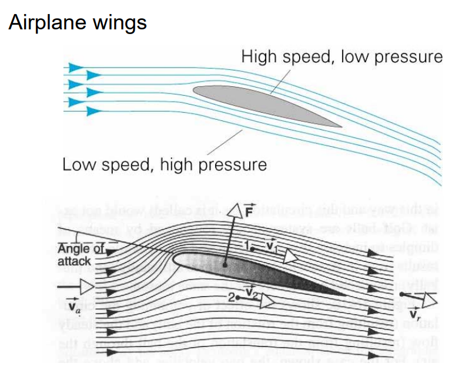

***

### 第十五章-简谐运动（simple harmonic motion）

#### 15.1 机械振动与机械波（mechanical oscillations and mechanical wave）

振动（oscillations）描述了物体不断重复向前和向后的运动。

不稳定系统（disturbed system）总是趋向于使得系统往平衡位置（equilibrium position）移动。

***

#### 15.2 简谐振动（simple harmonic motion，简写为SHM）

任何在有规则的间隔（regular intervals）中重复自身的运动被称为周期运动（periodic motion）或者谐运动（harmonic motion）。

频率（frequency）表示一秒内振动运动完成的次数，使用$f$表示。

振幅（amplitude）表示振动运动的幅度的最大值，使用$A$表示。满足$A=\frac{x_{min}+x_{max}}{2}$。

周期（period）表示一次振动运动完成所需的时间，使用$T=\frac{1}{f}$表示。

***

如果从原点开始，质点的位移（displacement）$x$可以表示为与时间$t$相关的函数：

$x(t)=x_m cos(\omega t + \varphi)$

那么这个质点的运动就被叫做简谐运动。

$x_m$是简谐运动的所能达到的最大值，与振幅$A$无关。（仅在简谐运动的图像关于x轴对称的情况下，$x_m$恰好等于振幅$A$）

$\omega$是角频率（angular frequency），表示简谐运动的速度，满足$\omega=\frac{2\pi}{T}$。

$\varphi$是初相位（phase constant），有初始位移$x_0$表示简谐运动在$t=0$时刻的位移，满足：$x_0=x_m cos(0+\varphi)$，也就是$\varphi=cos^{-1}(\frac{x_0}{x_m})$。

不同的振幅、初相位、频率下的简谐运动的位移图像：


***

相位差与同相与反相：

对于两个频率相同，振幅可能不同的简谐运动，相位差（phase difference）用$\Delta \Phi$表示，意义是两个简谐运动的总相位$\Phi$的差值$\Delta \Phi=\Phi_1 - \Phi_2$。（相位均可以用符号$\varphi$、$\Phi$、$\phi$表示）

如果相位差$\Delta \Phi=2n\pi \; (n=0,\pm1,\pm2,...)$，那么这两个简谐运动同相（identical phase）。

如果相位差$\Delta \Phi=(2n+1)\pi \; (n=0,\pm1,\pm2,...)$，那么这两个简谐运动反相（opposite phase / out of phase）。


***

通过对位移$x$关于时间$t$求导，可以得到简谐运动的速度（velocity of SHM）。

$v(t)=\frac{d x(t)}{d t}=\frac{d}{d t}\left[x_{m} \cos (\omega t+\phi)\right]$

$v(t)=-\omega x_{m} \sin (\omega t+\phi)=\omega x_{m} \cos (\omega t+\phi+\pi / 2)$

$v(t)=-\omega x_m sin(\omega t + \phi)=\omega x_m sin[-(\omega t + \phi)]$

可得速度的图像也是拥有频率、初相位、振幅的，其中速度图像的振幅被称为速度振幅（velocity amplitude），有$v_m=\omega x_m$。


可得位移图像与对应的速度图像的相位差恒为：

$\Delta \Phi=(\omega t+\Phi+ \frac{1}{2}\pi)-(\omega t+ \Phi)=\frac{1}{2}\pi$

同时可得，速度图像的位置相比于位移图像是向左移动了四分之一个周期（one-quarter period）。周期不变，振幅有所改变。

***

通过对速度$v$关于时间$t$求导，可以得到简谐运动的加速度。

$a(t)=\frac{d v(t)}{d t}=\frac{d}{d t}\left[-\omega x_{m} \sin (\omega t+\phi)\right]$

$a(t)=-\omega^{2} x_{m} \cos (\omega t+\phi)=-\omega^{2} x(t)=\omega^{2} x_{m} \cos (\omega t+\phi+\pi)=-\omega^{2} x_{m} \cos (\omega t+\phi)=-\omega^{2} x(t)$

类似于速度振幅，加速度图像也有加速度振幅（acceleration amplitude），满足$a_m=-\omega^2 x_m$。


类似于速度振幅，加速度图像的位置相比于速度图像是向左移动了四分之一个周期。周期不变，振幅有所改变。

也就是说，加速度图像的位置相比于位移图像是向左移动了二分之一个周期（half period）。周期不变，振幅有所改变。

最终化简可得：$a(t)=-\omega^2 x(t)$

总结（位移、速度、加速度图像）：


***

#### 15.3 简谐振动相关的力定律（force law）

有物体-弹簧系统（mass-spring systems）：


满足：

$F=-kx$

$\omega=\sqrt{\frac{k}{m}}$

$T=\frac{2\pi}{\omega}$

$a(t)=-\omega^{2} x(t)$

$x(t)=x_mcos(\omega t+\phi)$

根据牛顿第二定律，得到：

$F=ma=m \frac{d^{2} x}{d t^{2}}=-k x$

最终得到：

$\frac{d^{2} x}{d t^{2}}+\omega^{2} x=0$

$a=-\omega ^{2}x$

振幅$A$由初始条件决定。

***

关于为什么$\omega=\sqrt{\frac{k}{m}}$：

实际上，简谐运动就是匀速圆周运动的物体在其轨道的选定任意一条对称轴上的投影点的运动，而这个匀速圆周运动的角速度恰好就是$\omega$。


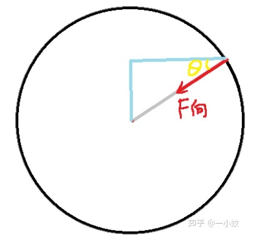

那么，由于投影$x=R\cdot cos\theta$，圆周运动的质点的水平方向的向心力分力为$F=F_{向} \cdot cos \theta=\frac{F_{向}}{R} \cdot x$，它其实和弹簧的力的公式$F=kx$是相类似的形式。

而又因为$F_{向}=m\omega^2R$，所以$k=\frac{F_{向}}{R}=m\omega^2$，也就是$\omega=\frac{2\pi}{T}=\sqrt{\frac{k}{m}}$。

***

弹簧正在做简谐运动时，正好有一个物体与弹簧上的物体发生碰撞。


需要根据碰撞前进行到简谐运动的一个周期中的哪一个部分来得到发生碰撞后的简谐运动的公式。一般运用动量守恒来进行计算。

运用动量守恒可以计算出各物体的速度，根据各物体的速度再使用能量守恒和弹簧势能的计算公式，来求得新的简谐运动的公式。

***

例子：


***

#### 15.4 简谐振动和匀速圆周运动（uniform circular motion）

简谐运动就是匀速圆周运动在直径上的投影点的运动。


$X(t)=x_{m} \cos (\omega t+\Phi)$


$v(t)=-\omega x_{m} \sin (\omega t+\Phi)$

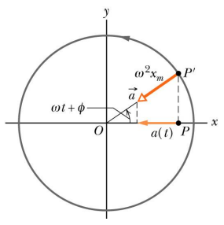

$a(t)=-\omega^{2} x_{m} \cos (\omega t+\Phi)$

***

#### 15.5 简谐振动中的能量

有$x=Acos(\omega t)$，则：

有势能$U$（属于弹性势能）：

$U(t)=\frac{1}{2} k x^{2}=\frac{1}{2} k A^{2} \cos ^{2} \omega t$

有动能$K$（属于平动运动的动能）：

$K(t)=\frac{1}{2} m v^{2}=\frac{1}{2} k A^{2} \sin ^{2} \omega t$

因此有总机械能：

$E=K+U=\frac{1}{2} k A^{2}$

这也就是弹簧的能量的公式。

***

#### 15.6 角谐振动（angular SHM）

如果我们转动圆盘，使其从静止处$\theta=0$产生一定的角位移（angular displacement）$\theta$并释放，它将以简单的角谐运动（angular simple harmonic motion）围绕那个位置振动（oscillate）。

类似于弹簧的简谐振动，有：

$\theta(t)=\theta _m cos(\omega t+\phi)$

$\omega(t)=\omega \theta _m cos(\omega t+\phi+\frac{\pi}{2})=\omega _m cos(\omega t+\phi+\frac{\pi}{2})$（这里比较容易混淆的是$\omega _m$和$\omega$，一个是角度$\theta$的角速度$\omega _m$，一个是简谐振动的角速度$\omega$）

$\alpha(t)=-\omega ^2 \theta_m cos(\omega t+\phi)=-\alpha _m \theta_m cos(\omega t+\phi)$

***

此时，得到一个恢复力矩（restoring torque）：

$\tau=-k \theta$

其中$k$为扭矩系数（torsion constant）。

将$x$转换为$\theta$，类似地可得：

$\tau=I \alpha$

其中$\alpha$为角加速度。

$\alpha=\frac{d^{2} \theta}{d t^{2}}$

$-k \theta=I \frac{d^{2} \theta}{d t^{2}}$

$\frac{d^{2} \theta}{d t^{2}}+\omega^{2} \theta=0$

$\omega=\sqrt{\frac{k}{I}}$

$T=\frac{2\pi}{\omega}$

***


这种复合情况是弹簧的一端连着圆盘的某一点。这种情况下，圆盘转动任意角度，弹簧的伸长量实际上是刚好等于圆盘转动过的弧长的。这样就可以通过弹簧的弹性势能等于圆盘的转动动能$\frac{1}{2} I \omega_m$来计算其他物理量。

***

例子：


***

#### 15.7 摆（pendulum）

关于单摆（simple pendulum）：

摆的运动实际上并不是简谐运动，但是如果角度较小，摆的运动会非常接近简谐运动，因此可以进行近似的计算。


$\tau=(m g \sin \theta) L$（此处$L$为摆的支点（pivot point）和整个充当摆的物体的总质心之间的距离，而不是杆的长度）

$I \frac{d^{2} \theta}{d t^{2}}=-m g L \sin \theta$（其中转动惯量$I$由杆和所有连接物体的转动惯量相加得到，也就是全部充当摆的部分的物体的转动惯量之和）

如果角度较小，则满足$sin\theta \approx \theta$，因此有：

$I \frac{d^{2} \theta}{d t^{2}} \approx -m g L \cdot \theta$

$\frac{d^{2} \theta}{d t^{2}}+\omega^{2} \theta=0$

$\omega=\sqrt{\frac{m g L}{I}}$

$T=2 \pi \sqrt{\frac{I}{mgL}}$

***

关于物理摆/复摆（physical pendulum）：

真正的物理摆运动表现和单摆的运动相似却不同（整个物体摆动而不是一个质点摆动）。但是重力的力矩有了力臂$R$，为从中心点（pivot point）到复摆物体的质点的距离。


满足：

$\sin \theta \cong \theta$

$\tau=-M g d \cong-M g R \cdot \theta$ 

$-M g R \cdot \theta=I \frac{d^{2} \theta}{d t^{2}}$

$\frac{d^{2} \theta}{d t^{2}}+\omega^{2} \theta=0$

$\omega=\sqrt{\frac{M g R}{I}}$

$\theta=\theta_{0} \cos (\omega t+\varphi)$

***

#### 15.8 阻尼振动（damped SHM）

自然界中的耗散力（dissipative force）包括摩擦力，会使得振动运动的振幅减少，这被叫做阻尼振动（damped oscillation），或者阻尼简谐运动（也就是振幅越来越小的简谐运动）。


如果摩擦力使得系统中的机械能逐渐减少，那么这个系统中的运动被称为阻尼的（damped）。

***

阻尼力（damping force）：

$F_d=-bv$，其中b为阻尼系数，由造成阻尼现象的力的性质决定。

恢复力（restoring force）：

$F_s=-kx$，其中k是弹簧的弹性系数。


此时，重力是忽略不计的（negligible）。

由牛顿第二定律，$F=ma=kx+bv$，可以得到：

$m \frac{d^{2} x}{d t^{2}}=-k x-b \frac{d x}{d t}$

$\frac{d^{2} x}{d t^{2}}+\left(\frac{b}{m}\right) \frac{d x}{d t}+\left(\frac{k}{m}\right) x=0$

解一元二次方程（$b^2-4ac<0$），可得：

$x(t)=A e^{-\frac{b}{2 m} t} \cos (\omega t+\varphi)$（阻尼运动的位移公式）

$\omega=\sqrt{\frac{k}{m}-\left(\frac{b}{2 m}\right)^{2}}$（阻尼运动位移公式的角频率）


图像（a）是欠阻尼的（under damped）。

图像（b）是临界阻尼的（critical damping）。

图像（c）是过阻尼的（over damped）。

阻尼能（damped energy）的表达式：

$\mathrm{E}(t) \approx \frac{1}{2} k x_{m}^{2} e^{-b t / m}$

***

#### 15.9 受迫振动与共振（forced oscillations and resonance）

如果一个系统受到周期性的外力的作用，那么系统的运动被称为强迫振动（forced oscillation）或者驱动振动（driven oscillation）。

$m \frac{d^{2} x}{d t^{2}}=-k x-b \frac{d x}{d t}+F_{0} \cos \omega_{d} t$（其中$F_{0} \cos \omega_{d} t$就是周期性的外力，外力频率为$\omega_d$）

因此得到受迫振动的位移公式：

$x(t)=A \cos \left(\omega_{d} t+\phi\right)$

$A=\frac{F_{0}}{m \sqrt{\left(\omega_{d}^{2}-\omega_{0}^{2}\right)^{2}+b^{2} \omega_{d}^{2} / m^{2}}}$（受迫振动的振幅的计算公式）

$\omega_d$（受迫频率，driven frequency）和$\omega_0$（自然频率，natural frequency）越相近，振幅会越大。当比较相近的时候，称系统是共振的（resonance），共振条件为$\omega_d \approx \omega_0$。


自然频率$\omega_0$是指一个系统在没有外力或是阻尼的情形下，会倾向于振荡的频率。而有外力作用的情况下，受迫频率$\omega_d$（也就是系统存在外力下的总频率）总是与周期性的外力$F_0$的频率（也就是外力频率）相同。（通过公式推导得到）

***

### 第十六章-机械波（mechanical waves）

#### 16.1 波的类型（types）

波都可以传播：能量和信息。

机械波必须有介质（medium）才能进行传播。水波（water waves），声波（sound waves），拉伸弦（stretched string）中的波和地震波（seismic waves）。

电磁波不需要介质（真空也能传播），包括可见光，紫外线，无线电，电视波，微波，X射线和雷达波。速度固定为光速$c$。

物质波（matter waves）与各种基本粒子，甚至和原子、分子有关，因为它们被认为是构成物质的东西，因此这些波称为物质波。

***

横波（transverse wave）：


正弦波的位移方向（把波视作粒子，粒子在y轴的移动方向）与传播方向（整个波的移动方向）垂直，则称这个正弦波为横波。

***

纵波（longitudinal wave）：


正弦波的位移方向（把波视作粒子，粒子在y轴的移动方向）与传播方向（整个波的移动方向）平行，则称这个正弦波为纵波。

***

#### 16.2 简谐波/正弦波方程（sinusoidal wave equation）

与第15章的情况不同，使用符号$y(x,t)$表示简谐波的位移（此前用$x(t)$表示），而用符号$x$表示简谐波的整体的传播方向上的距离。


简谐波方程（$sin$还是$cos$实际上相同，仅仅是初始相位不同）：

$y(x, t)=y_{m} \sin (k x \pm \omega t+\varphi)$

其中$y(x,t)$表示了在$t$时刻在$x$点的位移。$y_m$是波的振幅，$(kx \pm \omega t)$是相位（phase）（当整个波的速度方向为$x$轴正方向时，符号为$-$，反之则为$+$。），$\varphi$是初相位，$sin(kx \pm \omega t)$是振动项（oscillating term）。$k$是角波数（angular wave number），代表的是$2\pi$长度上出现的全波（完整波）的数量。

根据简谐波整体传播这个性质，有两个最近周期的同一周期内位置$x$的距离长度，为波长（wavelength）$\lambda$（当波只有一段时，可以视作波长为整段波的长度），满足：

$y_{m} \sin k x_{1}=y_{m} \sin k\left(x_{1} \pm \lambda\right)$

角波数的计算：

$k \lambda=2 \pi$，$k=\frac{2 \pi}{\lambda}$

单位为$rad/长度单位（如米、厘米、毫米）$。

***

#### 16.3 行波的波速（speed of traveling waves）

实际上，波是整个波进行移动的。那么整个波的传播方向上，波上的每一点的速度（相速度/波速）都是一致的，假设每一点的位移$y$不变，已知波长和周期，满足：

$y(x, t)=y_{m} \sin \left(k x-\omega t+\varphi_{0}\right)$

因为$y$不变，因此$\varphi=k x-\omega t+\varphi_{0}$为常数，得到：$\frac{d \varphi}{d t}=0$，等式两边除以t得到$k \frac{d x}{d t}-\omega+\frac{d\varphi_0}{dt}=0$。

又因为初相位$\varphi_0$与$t$无关，因此相速度$v$为：

$v=\frac{dx}{dt}=\frac{\lambda}{T}=\frac{\omega}{k}=\lambda f$，$v$是常数，因此$x$和$t$的增减的幅度应当是一致的。


整个简谐波的波速（wave speed / speed of wave propagation）被称为相速度（speed of phase propagating）。

***

横向速度/振动速度：

那么对于波上的某质点（对于在波上的某点或者某一段，用element表示）的振动速度（speed of oscillation），可以由对位移$y$关于$t$求偏导得到：

$u=\frac{\partial y}{\partial t}=\pm \omega y_{m} \cos (k x \pm \omega t)$

$u_{m}=\omega y_{m}$

这是横向速度（transverse velocity）的大小。这里的横向指的是垂直于波的传播方向的方向（而不是人认为的质点的主观的"纵向"振动方向。因为没有参考系，所以横向和纵向都是相对于波整体的传播速度而言的。）。那么类似的，纵波指的是平行于波的传播方向的方向，也可以说就是传播方向，就是相速度的方向。

***

波速与介质之间的关系：

波的传播速度有多快，取决于介质的质量（mass）和弹性（elasticity）的性质。例如，只要是机械波（机械波包括声波，电磁波和机械波不同），在空气中传播的速度$v$就是固定的，而频率$f$和波长$\lambda$不是固定的。而因为绳子的材质各不相同，在绳子上传播的机械波的波速也不相同，这里推导在绳子上传播的机械波的速度与绳子的线密度之间的关系。

对于一条拉伸绳（stretched string）上的波速。$\tau$是绳子的张力（tension），而$\mu=\frac{m}{l}$是绳子的线密度。

那么它们为什么和速度有关系呢？有单位关系：

$[\mu]=\mathrm{ML}^{-1} \quad[\tau]=\mathrm{MLT}^{-2} \quad[v]=\mathrm{LT}^{-1}$

假定：$v \propto \tau^{a} \mu^{b}$

那么有：$L T^{-1}=M^{a+b} L^{a-b} T^{-2 a}$

解得：$v=k \sqrt{\frac{\tau}{\mu}}$（$k$为未知常数）


经过推导，得到$k=1$，也就是最终解得：

$v=\sqrt{\frac{\tau}{\mu}}$

在拉伸绳上的波的速度，仅取决于张力和线密度，不取决于波的频率。

***

#### 16.4 波的能量和功率（energy and power of wave）

波如果在拉伸绳上运动，则波的能量包含动能和弹性势能。其中，动能与横向速度$u=\frac{\partial y}{\partial t}$（注意横向速度的定义为垂直于相速度方向）有关，而弹性势能与绳子的拉伸长度变化有关。


可得当到达最大振幅时，拉伸绳的这一段的横向速度为0，拉伸长度为0。而振幅方向改变的瞬间，拉伸绳的这一段的横向速度最大，拉伸长度最大，因此可知动能和弹性势能。

***

波在拉伸绳上运动，那么可以看作是能量的传输。


位移：$y(x, t)=y_{m} \sin \left(k x-\omega t+\varphi_{0}\right)$

横向速度：$u=\frac{\partial y}{\partial t}=- \omega y_{m} \cos (k x \pm \omega t)$

有某一段拉伸绳的能量：$d K=\frac{1}{2} \cdot d m \cdot u^{2}$

带入各式可得：$\frac{d K}{d t}=\frac{1}{2} \mu v \omega^{2} y_{m}^{2} \cos ^{2}(k x-\omega t)$

动能的平均传播速率为：$\left(\frac{d K}{d t}\right)_{a v g}=\frac{1}{T} \int_{0}^{T} \frac{d K}{d t} d t=\frac{1}{2} \mu v \omega^{2} y_{m}^{2}\left[\cos ^{2}(k x-\omega t)\right]_{a v g}=\frac{1}{4} \mu v \omega^{2} y_{m}^{2}$

弹性势能和动能在每一段拉伸绳上的大小恰恰是相等的，因此，总机械能的平均功率为：

$P_{a v g}=2\left(\frac{d K}{d t}\right)_{a v g}=\frac{1}{2} \mu v \omega^{2} y_{m}^{2}$

***

#### 16.5 波的微分方程（differential equation of wave）

对一段拉伸绳，则有两个方向的力向量$\vec{F_1}$和$\vec{F_2}$。


$F_y$代表力在$y$方向的分量，$a$为加速度，$S$为斜率，$\tau$为拉伸绳的张力，那么由牛顿第二定律，有：

$F_{2 y}-F_{1 y}=d m \cdot a_{y}$

$F_{1 y}=F_{1 x} S_{1} \approx \tau S_{1}$

$F_{2 y}=F_{2 x} S_{2} \approx \tau S_{2}$

带入可得：

$\tau S_{2}-\tau S_{1}=(\mu d x) \cdot \frac{d^{2} y}{d t^{2}}$

$\frac{S_{2}-S_{1}}{d x}=\frac{\mu}{\tau} \frac{d^{2} y}{d t^{2}}$

$\frac{d S}{d x}=\frac{d(d y / d x)}{d x}=\frac{\mu}{\tau} \frac{d^{2} y}{d t^{2}}$

$S=\frac{dy}{dx}$

最终得到波动方程（wave equation）：

$\frac{\partial^{2} y}{\partial x^{2}}=\frac{\mu}{\tau} \frac{\partial^{2} y}{\partial t^{2}}=\frac{1}{v^2} \frac{\partial^{2} y}{\partial t^{2}}$

***

#### 16.6 波的干涉（interference of wave）

波的叠加原理（the principle of superposition for waves）使得两个波叠加形成的波即为两个波的代数和。如果两个波叠加后形成的波重新分开为两个波，这两个波互不影响，状态和叠加前一致。


满足：

$y^{\prime}(x, t)=y_{1}(x, t)+y_{2}(x, t)=y_{m} \sin (k x-\omega t+0)+y_{m} \sin (k x-\omega t+\phi)=2 y_{m} \cos \frac{1}{2} \phi \cdot \sin \left(k x-\omega t+\frac{\phi}{2}\right)$

以上是两个波同向为$x$轴正方向的情况（$\omega$前的符号均为$-$）。

***

当两个振幅一致的波的初相位之差为一个周期的整数倍时，满足同相位（in-phase），相长干涉（constructive interference）。


当两个振幅一致的波的初相位之差刚好为半个周期的整数倍时，满足反相位（anti-phase），相消干涉（destructive interference）。


当两个振幅一致的波的初相位之差不为半个周期时，有以下情况：


***

#### 16.7 相矢量/相量（phasors）

由波的叠加原理，使用矢量来计算振幅不同的波的合成。用初相位$\varphi$表示矢量与$x$轴的角度，用$\omega$表示矢量旋转的角速度（矢量旋转，画出波的图像），用$y$轴方向分量表示波的初始位置和$y_{m}$的垂直分量意义，而$x$轴方向仅有$y_{m}$的平行分量意义。


其中$h$下标代表图像的平行分量，$v$下标代表图像的垂直分量。有初相位$\phi_1$和$\phi_2$，那么有：

$y_{1}(x, t)=y_{1 m} \sin \left(k x-\omega t+\varphi_{1}\right)$

$y_{2}(x, t)=y_{2 m} \sin \left(k x-\omega t+\varphi_{2}\right)$

$y^{\prime}(x, t)=y_{m}^{\prime} \sin (k x-\omega t+\beta)$

$y_{1m\perp}=y_{v1}=y_{1m}sin\varphi_1$

$y_{1m||}=y_{h1}=y_{1m}cos\varphi_1$

$y_{2m\perp}=y_{v2}=y_{2m}sin\varphi_2$

$y_{2m||}=y_{h2}=y_{2m}cos\varphi_2$

$y_{m \perp}^{\prime}=y_{1 m \perp}+y_{2 m \perp}=y_{v 1}+y_{v 2}$

$y_{m \|}^{\prime}=y_{1 m \|}+y_{2 m \|}=y_{h 1}+y_{h 2}$

$|y_{m}^{\prime}|=\sqrt{|y_{1m}+y_{2m}|^{2}}=\sqrt{y_{1 m}^{2}+y_{2 m}^{2}+2 y_{1 m} y_{2 m} \cos \left(\varphi_{2}-\varphi_{1}\right)}$

$y_{m}^{\prime}=\sqrt{y_{m \perp}^{\prime 2}+y_{m \|}^{\prime 2}}$（合成波的振幅）

$\tan \beta=\frac{y_{1 m} \sin \varphi_{1}+y_{2 m} \sin \varphi_{2}}{y_{1 m} \cos \varphi_{1}+y_{2 m} \cos \varphi_{2}}$

$\beta=\tan ^{-1} \frac{y_{m \perp}^{\prime}}{y_{m \|}^{\prime}}$（合成波的初相位）

最终得到合成波的表达式：

$y^{\prime}(x, t)=y_{m}^{\prime} \sin (k x-\omega t+\beta)$

***

#### 16.8 驻波（standing waves）

驻波是指频率相同、传输方向相反的两种波，沿传输线形成的一种分布状态。其中的一个波一般是另一个波的反射波。在两者相加的点出现波腹，在两者相减的点形成波节。

两个拥有相同波长和振幅的正弦波，有沿着相同方向传播的情况，那么就有沿着相反方向传播（opposite directions）的情况，易得在不同时间内合成的波也是不同的。


它们的叠加后的波，在某些时间段的位移为0，被称为波节（nodes）。在相邻的波节之间，达到位移的最大值的位置为波腹（antinodes），也就是波取得最大振幅的位置。

如果两个振幅和波长相同的正弦波沿着拉伸的绳子向相反的方向（在光学里，可以近似相反）传播，它们之间的干涉（interference）会产生一个合成波，称为驻波。

***

具有相同的角频率和振幅的两个方向相反的波的叠加：


$y_{1}(x, t)=y_{m} \sin (k x-\omega t)$

$y_{2}(x, t)=y_{m} \sin (k x+\omega t)$

$y^{\prime}(x, t)=y_{m} \sin (k x-\omega t)+y_{m} \sin (k x+\omega t)$

$y^{\prime}(x, t)=\left[2 y_{m} \sin k x\right] \cos \omega t$

由两波相加得到合成波，得到：

波节的所处位置（满足$y'=0$）为：$x=n\frac{\lambda}{2}$。

波腹的所处位置（满足$y'=y_m$）为：$x=\left(n+\frac{1}{2}\right) \frac{\lambda}{2}$。

***

边界反射（reflections at a boundary）：

入射波（incident wave）和反射波（reflected wave）可以叠加为一个驻波。

端点固定的情况：


端点不固定的情况：


***

驻波和共振：

一根不拉伸时长为$L$的绳子在两个固定端点之间被拉伸。一个连续的正弦波向一端发送，然后向另一端反射。向左的和向右的波相互重叠（overlap），互相干涉（interface）。在特定频率下，干涉产生一个驻波图像（standing wave pattern）或者说振动模式（oscillation mode），其中有波节和大的波腹。


驻波位移公式：

$y_{1m}=y_{2m}=y_{m}$

$y(x, t)=2 y_{m} \sin (k x) \cos (\omega t)$

$\sin (k x) |_{x=0}=0$

$\sin (k x) |_{x=L}=0$

因此有：

$k L=n \pi , \; n=0, \pm 1, \pm 2 \ldots$

$\frac{2 \pi}{\lambda} L=n \pi$

$\lambda=\frac{2 L}{n}$

$f=\frac{n v}{2 L}$

其中$L$代表拉伸绳未被拉伸前的长度（也就是两固定端点的长度），因此当$x=L$时驻波位移必须为0（也就是必须是一个波节）。$k$是角波数，$n$是谐波数（harmonic number）。

满足共振频率（resonant frequencies）的驻波存在，则$n$称为谐波数。

当发射波和反射波形成驻波，且有着特定的频率刚好使得驻波的振幅为原来的波的两倍（也就是满足相长干涉）的合成波（而不是随着时间有着各种不规则位移的合成波），则称为驻波共振。


***

总结：

根据波节和波腹的相对位置，或者边界条件（boundary condition），可以从以下四种形式确定驻波的表达式形式：

$y(x, t)=y_{m} \cos (k x) \cos (\omega t)$

$y(x, t)=y_{m} \sin (k x) \cos (\omega t)$

$y(x, t)=y_{m} \cos (k x) \sin (\omega t)$

$y(x, t)=y_{m} \sin (k x) \sin (\omega t)$

确定的方式是根据题目提供的信息（因为实际上正弦和余弦的差别仅仅在相位差，而相位差由坐标轴决定，因此以上四种形式实际上区别仅在于确定坐标轴的位置的不同）。最常见的是（某一时刻$t$的）$x=0$时是波节还是波腹，或者就是（某一位移$x$的）$t=0$时是波节还是波腹（会以图像的形式给出）。如果是波节（nodes）则$y=0$，如果是波腹（antinodes）则$y=y_{m}$。注意已知其中一个量是绝对不可能决定哪个是正弦哪个是余弦，一定需要某个量固定的情况下得到另一个量取不同值时的驻波的位移。

***

补充（三角函数变换公式）：

积化和差：

$\sin \alpha \cdot \cos \beta =\frac{\sin (\alpha+\beta)+\sin (\alpha-\beta)}{2}$

$\cos \alpha \cdot \sin \beta =\frac{\sin (\alpha+\beta)-\sin (\alpha-\beta)}{2}$

$\cos \alpha \cdot \cos \beta =\frac{\cos (\alpha+\beta)+\cos (\alpha-\beta)}{2}$

$\sin \alpha \cdot \sin \beta =-\frac{\cos (\alpha+\beta)-\cos (\alpha-\beta)}{2}$

和差化积：

$\sin \alpha+\sin \beta =2 \sin \frac{\alpha+\beta}{2} \cos \frac{\alpha-\beta}{2}$

$\sin \alpha-\sin \beta =2 \cos \frac{\alpha+\beta}{2} \sin \frac{\alpha-\beta}{2}$

$\cos \alpha+\cos \beta =2 \cos \frac{\alpha+\beta}{2} \cos \frac{\alpha-\beta}{2}$

$\cos \alpha-\cos \beta =-2 \sin \frac{\alpha+\beta}{2} \sin \frac{\alpha-\beta}{2}$

"+"和"-"使得结果的$sin$和$cos$相替换。

***

### 第17章-纵波（longitudinal waves）

#### 17.1 声波（sound waves）

声波也是机械波，而且是一种纵波（longitudinal waves）。


波源/振源（wave source）其实就是波发出的源头。

波前（wavefront）是由波前是指波在介质中传播时，某时刻刚刚开始位移的质点构成的面。

波线（rays）是波的传播的方向。

根据波的形状，可以分为球面波（spherical waves）和平面波（plane waves）。

声波的速度比光的速度慢，因此会有延迟时间$\Delta t$：

$\Delta t=(d / v) - (d / c)$

其中$v$为声速，$c$为光速。在空气中，声速$v = 343 m/s$

***

#### 17.2 声速（the speed of sound）

因为声波是机械波，因此它传播的速度也受介质的性质的影响。有第十六章推导得出的公式：

$v=\sqrt{\frac{\tau}{\mu}}$，其中$v$为整个波的速度，$\tau$为张力，$\mu$为线密度。

据此，得到更具有一般性的公式：

$v=\sqrt{\frac{B}{\rho}}$，其中$\rho$为介质的体积密度，而$B$为体积弹性模量（bulk modulus），公式为：$B=-\frac{\Delta p}{\Delta V / V}$，其中$\Delta p$为介质的压强的变化。

***

声速公式推导：

声波在空气中的某一段形成振动，起因正是因为空气的压强的变化。那么这一段的厚度（thickness）的变化也是因为空气压强的变化。


那么某一段在$\Delta t$内受到的合力为：

$F=P A-(P+\Delta P) A=-\Delta P A$

某一段的质量为：

$\Delta m=\rho A \Delta x=\rho A v \Delta t$

那么由牛顿第二定律：

$-\Delta P A=(\rho A v \Delta t) \Delta v / \Delta t$

$\frac{\Delta V}{V}=\frac{A \Delta v \Delta t}{A v \Delta t}=\frac{\Delta v}{v}$

$\rho v^{2}=-\frac{\Delta P}{\Delta v / v}=-\frac{\Delta P}{\Delta V / V}=B$

$v=\sqrt{\frac{B}{\rho}}$

***

#### 17.3 行声波（traveling sound waves）

因为空气的某一段平行于x轴振动，因此使用$s(x,t)$表示空气的某一段的位移，以避免混淆。

空气压强$p$的变化量$\Delta p$，随着位置$x$的变化也会有正弦地变化。方向为沿着$x$轴正方向。

$s(x, t)=s_{m} \cos (k x \pm \omega t+\phi)$

$\Delta p(x, t)=\Delta p_{m} \sin (k x \pm \omega t + \phi)$

$\Delta p_{m}=(v \rho w) s_{m}$

***

推导过程：


有一段振动空气的截面积$A$和厚度$\Delta x$，从平衡位置位移距离s。

$s(x, t)=s_{m} \cos (k x-\omega t+0)$

那么压强的变化量：$\Delta p=-B \frac{\Delta V}{V}$

这段空气的体积：$V=A \Delta x$

因此可得：

$\Delta V=A \Delta S$

$\frac{\Delta V}{V}=\frac{\Delta s}{\Delta x}$

$\Delta p=-B \frac{\Delta s}{\Delta x}=-B \frac{\partial s}{\partial x}$

$\frac{\partial s}{\partial x} =\frac{\partial}{\partial x}\left[s_{m} \cos (k x-\omega t)\right] =-k s_{m} \sin (k x-\omega t)$

$\Delta p=B k s_{m} \sin (k x-\omega t)$

$\Delta p_{m}=(B k) s_{m}=\left(v^{2} \rho k\right) s_{m}=(v p \omega) s_{m}$

***

#### 17.4 声强度和声级（intensity and sound levels）

声强度是单位面积的平均能量传输速率，公式为：

$I=\frac{P}{A}=\frac{1}{2} \rho v \omega^{2} s_{m}^{2}$

$P$为波的能量传输的功率（和波源的功率有一定区别）（单位为W），$A$是拦截（intercepting）声音的表面的面积（单位为$m^{2}$）。

空气切片的质量：

$d m=\rho A d x$

动能公式：

$d K =\frac{1}{2}(d m) v_{s}^{2}=\frac{1}{2}(\rho A d x) v_{s}^{2}$

$d K =\frac{1}{2} \rho A d x \omega^{2} s_{m}^{2} \sin ^{2}\left(k x-\omega t+\varphi_{0}\right)$

$\left(\frac{d K}{d t}\right)_{\text {avg }}=\frac{1}{2} \rho A v \omega^{2} s_{m}^{2}\left\langle\sin ^{2}\left(k x-\omega t+\varphi_{0}\right)\right\rangle=\frac{1}{4} \rho A v \omega^{2} s_{m}^{2}$

势能公式：

$\left(\frac{d U}{d t}\right)_{a v g}=\left(\frac{d K}{d t}\right)_{a v g}=\frac{1}{4} \rho A v \omega^{2} s_{m}^{2}$

$P=\left(\frac{d U}{d t}\right)_{a v g}+\left(\frac{d K}{d t}\right)_{a v g}=\frac{1}{2} \rho A v \omega^{2} s_{m}^{2}$

最终得到声强度：

$I=\frac{P}{A}=\frac{1}{2} \rho v \omega^{2} s_{m}^{2}$

***

声强度随距离的变化：

$I=\frac{P_{s}}{4 \pi r^{2}}$

其中$P_s$为波源的功率，$4\pi r^2$为球的面积。

***

分贝（decibel）的标准：

因为人类能听到的声音强度的最大和最小极限的比值为$10^{12}$。其中，最小极限为$I_0=10^{-12} W/m^2$，也就是最大极限为$I_m=1 W/m^2$。

分贝：

$\beta=10 \log \frac{I}{I_{0}}$（单位为$dB$）

顺带一提，$f \sim 20Hz - 20kHz$为声频（sound frequency），$f > 20kHz$为超声波频率（ultrasound frequency），$f < 20kHz$为次声频率（infrasound frequency）。

***

#### 17.5 干涉（interference）

 两个波源，拥有相同的初相位、波长、振幅。那么，在两个波的经过的同一点处，有：
 
 
 
$\varphi_{1}=k L_{1}-\omega t+\varphi_{0}$

$\varphi_{2}=k L_{2}-\omega t+\varphi_{0}$

$\Delta \varphi=\varphi_{2}-\varphi_{1}=k\left(L_{2}-L_{1}\right)=\frac{2 \pi}{\lambda} \Delta L$

有完全相长干涉：

$\Delta \varphi=2 n \pi, \quad n=0, \pm 1, \pm 2 \ldots \quad \Delta L=n \lambda$

有完全相消干涉：

$\Delta \varphi=(2 n+1) \pi, \quad n=0, \pm 1, \pm 2 \ldots \quad \Delta L=\left(n+\frac{1}{2}\right) \lambda$

***

#### 17.6 驻波（standing waves）

有低音（bass）、中音（baritone）、次中音（tenor）、高中音（alto）、高音（soprano）。

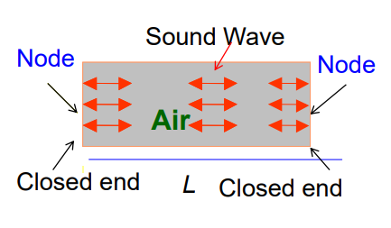

如图，乐器的管型的内部结构中，声波会形成驻波。管的两个闭合末端其实就是两个波节（位移$y$为0），类似于两端固定的拉伸绳。

$s(x, t)=2 s_{m} \cos (k x) \cos (\omega t)$

$\cos (-k L / 2)=0$

$\cos (k L / 2)=0$

$k L / 2=n \pi-\pi / 2, n=1,2,3 \ldots$

$\lambda=L /(n-1 / 2), f=v / \lambda=(2 n-1) v / 2 L$

其中n是谐波数。

***


如图，乐器的非闭口管型的内部结构中，声波也会形成驻波。管的两个末端开口其实就是两个波腹（位移$y=y_m$），类似于两端不固定的拉伸绳。

$\lambda=2 L / n$

$f=v / \lambda=n v / 2 L$

***


如图，乐器的单闭口管型的内部结构中，声波也会形成驻波。管的两个末端其实就是一个波点和一个波腹，类似于仅固定了一端的拉伸绳。

$s(x, t)=2 s_{m} \cos (k x) \cos (\omega t)$

$\cos (k 0)=1$

$k L=\frac{n}{2} \pi, n=1,3,5 \ldots$

$\lambda=4 L / n \quad f=v / \lambda=n v / 4 L$

***

#### 17.7 拍（beats）

两个振幅一致，频率不同的简谐波在同一位置相遇，会造成干涉的现象。


$s_{1}=s_{m} \cos \omega_{1} t$

$s_{2}=s_{m} \cos \omega_{2} t$

$s=s_{1}+s_{2}=\left[2 s_{m} \cos \omega^{\prime} t\right] \cos \omega t$

$\omega^{\prime}=\frac{\omega_{1}-\omega_{2}}{2}$

$\omega=\frac{\omega_{1}+\omega_{2}}{2}$

那么有拍频（beat frequency）：

$\omega_{\text {beat }}=\left|\omega_{1}-\omega_{2}\right|$

$f_{\text {beat }}=\left|f_{1}-f_{2}\right|$


（图中的曲线正是$cos (\omega ^{\prime} t)$）

***

#### 17.8 多普勒效应（Doppler effect）

多普勒效应：


物体以一定速度接近波源或者远离波源（波源也可能有运动），物体接收得到的波的频率相较于原来的频率会发生变化。

***

计算物体接收得到的波的频率：

$f^{\prime}=f \frac{v \pm v_{D}}{v \pm v_{S}}$

其中$f^{\prime}$就是运动物体接收得到的波的频率，$v$是波源发出的波的速度，$v_D$是运动物体的速度，$v_S$是波源运动的速度。

$f=\frac{1}{T}=\frac{v}{\lambda}$

当物体向着波源运动：

$f^{\prime}=\frac{v \Delta t+v_{D} \Delta t}{\lambda \Delta t}=f \frac{v+v_{D}}{v}$

当物体远离波源运动：

$f^{\prime}=\frac{v \Delta t-v_{D} \Delta t}{\lambda \Delta t}=f \frac{v-v_{D}}{v}$


其中$\frac{v \Delta t \pm v_{D} \Delta t}{\lambda}$为$\Delta t$时间内物体接收到的波前数，那么$\frac{v \Delta t \pm v_{D} \Delta t}{\lambda \Delta t}$就是$\Delta t$时间内物体接收的波的频率。

总结：物体运动，波长$\lambda$不变，波速$v$改变。

***

当波源向着物体运动：

$f^{\prime}=\frac{v}{\lambda^{\prime}}=\frac{v}{v T-v_{S} T}=f \frac{v}{v-v_{S}}$

当波源远离物体运动：

$f^{\prime}=\frac{v}{\lambda^{\prime}}=\frac{v}{v T+v_{S} T}=f \frac{v}{v+v_{S}}$


其中$\lambda^{\prime}=v T \pm v_{S} T$为物体接收到的波的波长（因为波源每隔$T$一个波腹，那么$v T \pm v_{S} T$就等于前后两个波从波源发出后的距离），$T=\frac{1}{f}$是波源发出两次波的时间间隔（实际上是达到波腹的时间间隔，中间波节的时间可以视作无波，也就是时间间隔）。

总结：波源运动，波速$v$不变，波长$\lambda$改变。

***

#### 17.9 超声速和冲击波（supersonic speeds，shock waves）

由$f^{\prime}=f \frac{v \pm v_{D}}{v \pm v_{S}}$可知，当$v_S \to v$，物体接收到的频率$f^{\prime}$将会趋近于无限大。


当波源的速度超过声波的速度（$v_S > v$），那么多普勒效应的方程将会不适用，会产生一个冲击波（shock waves）。而波源发出的声波在三维空间中会形成一个锥形，被称为马赫锥（Mach cone）。


这个锥的顶角的半角$\theta$，被称为马赫锥角，定义为：

$\sin \theta=\frac{v t}{v_{S} t}=\frac{v}{v_{S}}$

其中$\frac{V_S}{V}$被称为马赫数（Mach number）。

***

如果是日常生活中，飞机作为波源，当速度超过音速时造成的冲击波被称为音爆（sonic boom），它是由空气压强的急剧增加然后突然降低造成的。

***

### 第十八章-温度，热，热力学第一定律（temperature，heat，the first law of thermodynamics）

热力学对系统热能（thermal energy）（内能）进行研究和应用。

***

#### 18.1/18.2 温度（temperature）

温度是国际单位制（SI）中的基本物理量。在热力学中使用开氏温标（Kelvin scale）（用K表示）来表示温度。开氏温标也叫做热力学温标、绝对温标。

温度有一个下限$T= 0 K$，目前还没有物体的温度低于$0 K$。

***

#### 18.3 热力学第零定律（the zero-th law of thermodynamics）

热力学第零定律：如果物体A和B各自与第三个物体T处于热平衡状态，那么物体A和B彼此处于热平衡状态。

***

许多物体的性质（properties）随着我们改变它们的温度而改变，这些性质我们称之为热力学性质（thermal properties）。

验温器（thermoscope）：读数数字随周围温度变化但未定标（calibrated）的仪器。

温度计（thermometer）：经过定标后的验温器。

热力学平衡（thermal equilibrium）：假设我们采用其中一个热力学性质，将验温器T和另一个物体A紧密接触。一段时间后，测得的热力学性质没有发生改变，那么我们说T和A处于热平衡状态。

$T_{\mathrm{tp}}=273.16 \mathrm{~K}$

$p_{\mathrm{tp}}=611.73 \mathrm{~Pa}$

***

#### 18.4 测量温度（measuring temperature）

为了建立温度的标度，我们需要选取一些可再现的热现象或固定点。例如冰点、蒸汽点。

出于现实技术原因，我们选择水的三相点。水的三相点（triple point）在相图中表示为：


只有一组温度和压力的数值，可以使冰水气三相共存（在热力学平衡下），这就是水的三相点。测得为$T_{3}=273.16K$。我们将这个标准固定点（standard fixed point）用于定标温度计。

三相点瓶：


***

定容气体温度计（the constant volume gas thermometer）：


基于一个固定体积容器内气体压力的变化的温度计，它通过一根管子连接到水银压力计（mercury manometer）。通过提升和降低储液池$R$，使得左边的水银面总是被调整到与$0$刻度线平行，从而保持气体的体积不变，因而能够测量气体的压强的大小。

与充气球（gas-filled bulb）接触的液体的温度为$T$，则满足$T=Cp$，其中$C$为常数，而$p$为充气球内部气体的压强。可得$p=p_0 - \rho g h$，其中$p_0$为大气压强。如果将充气球放入三相点瓶中，则满足$T_3 = C p_3$，因此测量得到的温度满足：

$T=\frac{p}{p_{3}} T_{3}=(273.16 \mathrm{~K}) \frac{p}{p_{3}}$（暂定）

但是我们发现，如果用这个温度计测量温度，充气球中所充气体不同，结果也会略有不同。不过如果充气球中的气体的量越来越少，无论用什么气体，测量得到的温度都会越来越趋近于一个单一的温度值。因此最终我们有：

$T=(273.16 \mathrm{~K})\left(\lim _{\text {gas } \rightarrow 0} \frac{p}{p_{3}}\right)$

此时$T$称为理想气体温度。

***

#### 18.5 摄氏和华氏温标（the Celsius and Fahrenheit scales）

开氏温标（Kelvin scale）的符号：$T,K$

摄氏温度的符号：$T_c , { }^{\circ} \mathrm{C}$

华氏温度的符号：$T_F , { }^{\circ} \mathrm{F}$

换算法则：

$T_{c}=T-273.15^{\circ}$

$T_{F}=\frac{9}{5} T_{C}+32^{\circ}$

***

#### 18.6 热膨胀（thermal expansion）

大多数物质受热或者温度升高时会膨胀，这就叫做热膨胀。

我们经常可以通过加热来松开一个紧的金属罐盖。盖子的金属和瓶子的玻璃都会膨胀，但金属中的原子更远，金属膨胀更大。

两种金属的膨胀的差异可以被利用，制作成双金属带（bimetal strip），用于温度计或控制装置。


黄铜（brass）和钢（steel）在温度为$T_0$时焊接在一起，高于$T_0$的温度会使双金属条向一边弯曲，而低于$T_0$的温度会使双金属条向另一边弯曲。这种性质可用于自动恒温器，在特定温度下连通或断开电触点。

***

线性膨胀（linear expansion）：

如果长为$L$的金属棒的温度升高$\Delta T$，就发现它的长度增加$\Delta L=L \cdot \alpha \cdot \Delta T$，其中$\alpha$是一个常量，称为线性膨胀系数（coefficient of linear expansion），单位为$C^{-1}$或者$K^{-1}$。

则可得体积膨胀（volume expansion）为：$\Delta V= V \cdot \beta \cdot \Delta T$，其中$\beta$是一个常量，称为体膨胀系数（coefficient of volume expansion）。

$\Delta V=(L+L \cdot \alpha \cdot \Delta T)^{3}-L^{3}\approx (L^{3}+3 L^{3} \alpha \Delta T)-L^{3}=V(3 \alpha) \Delta T=V \beta \Delta T$

$\beta=3 \alpha$

***

例子（简单题）：


***

#### 18.7 温度和热容（temperature and heat）

如果我们有一个系统（或物体）与环境接触，如果两者的温度不同，系统的温度会发生变化，直到达到环境温度为止。温度的这种变化是由于系统能量和环境之间的能量转移（transfer of energy）引起的。


热量（heat）是由于系统和环境之间存在温差而在系统和环境之间传递的能量。热量$Q$在能量传递到系统时为正，在能量从系统传递出去时为负。

热量的单位：

卡路里（calorie），使用cal表示。

焦耳（joule），使用J表示

单位换算：$1 cal = 4.1860 J$

***

#### 18.8 固体和液体的吸热（absorption of heat）

热容（heat capacity）$C$：物体吸收或损失的热量$Q$和温度的变化量$\Delta T$的比值。也就是吸放的热量于温度变化量的比例常数。单位为$J \cdot K^{-1}$

$Q=C \Delta T=C\left(T_{f}-T_{i}\right)$

$C=\frac{Q}{\Delta T}$

比热（specific heat）$c$：物体单位质量的热容。单位为$J \cdot kg^{-1} \cdot K^{-1}$

$Q=C \Delta T=c m \Delta T$

$c=\frac{C}{m}=\frac{Q}{m \Delta T}$

摩尔比热（molar specific heat）：一摩尔物体的热容。其计算方式为：$比热 \times 摩尔质量$

***

一般来说，能量传递是在恒压（constant pressure）或恒容（constant volume）条件下进行的。任何固体和液体在恒压和恒体积下的比热$c$通常相差不超过几个百分点。

然而，在恒压条件和定容条件下，气体的比热$c$有很大不同。

***

转变热（heats of transformation）：

物体每单位质量发生相变（phase change）所需的热量，使用$L$表示。它可以进一步分类为汽化热（heat of vaporization）$L_{V}$和熔化热（heat of fusion）$L_{F}$。

常用的转变热对照表：


***

例子（简单题）：


***

#### 18.9 热和功（heat and work）


带有可移动活塞（piston）的气缸，气体作用在活塞上的力等于放在到活塞顶部的铅球重量。

气缸壁由绝缘材料（insulating material）制成，因此不会发生热量传递。气缸底部依靠一个蓄热器来储存热能，温度$T$可以通过旋钮控制。

将系统从初始状态更改为最终状态的过程称为热力学过程（thermal equilibrium）。对于这个气缸，我们假设这个过程非常缓慢，所以系统总是处于热平衡状态。

作用在活塞上的向上的力为$F$，活塞的位移的微分$ds$，则有气体做功$W$的微分：

$d W=\vec{F} \cdot d \vec{s}=(p A)(d s)=p(A d s)=p d V$

当气体膨胀（expand）时，$W > 0$。当气体压缩（compressed）时，$W < 0$。

***

我们使用$p-V$图来表示气体的状态。做功与路径有关（path-dependent）（即使初始状态和最终状态一致）。如果气体状态变化由多个步骤组成，则有总功$W=W_{1}+W_{2}+W_{3}...$。对其中的每一个步骤，如果$V$没有变化，则不做功，但是可能会吸热，存在$\Delta Q$。又因为能量$E=Q-W$，则如果初态和末态相同，则满足$W=Q$，也就是$W_{1}+W_{2}+W_{3}... = Q_{1}+Q_{2}+Q_{3} ...$。

注意功$W$的正负仅仅取决于气体的体积变化的趋势是变大还是变小。体积变大那么必定向外界做正功，体积变小那么必定向外界做负功，做功的力的大小（而不是正负）由气压（气压恒大于0）决定。

注意内能（internal energy）用$E$表示，而功（work）用$W$表示，而热量（heat）用$Q$表示。


易得$p-V$图中，气体状态图像曲线与$V$轴围成的面积即为气体所做的功。


这是一个热循环（thermodynamic cycle）过程的图像，则可知整个循环下来，总功W_{net}$为正。

$W_{a}=\int_{V_{i}}^{V_{f}} p d V$

$W_{b}=\int_{V_{f}}^{V_{d}} p d V$

$W_{n e t}=W_{a}-W_{b}$

其中的$p$可能会随着$V$发生变化，则将其表示为带有$V$的表达式的形式$W=\int _{V_{i}}^{V_{f}} f(V) dV$，而不是$W=\int _{p_{i}}^{p_{f}} \int _{V_{i}}^{V_{f}}dV dp=(p_{f}-p_{i}) \cdot (V_{f}-V_{i})$（这也是直接确定上下限和带有表达式的上下限的积分的区别）

***

#### 18.10 热力学第一定律（the first law of thermodynamics）

我们已经知道系统状态变化时，系统对外所做的功$W$和系统吸收的热量$Q$均与路径有关。但是这两个量的差（也就是能量的变化量）却是相同的，它仅取决于初始状态和最终状态，这个量就是内能（internal energy）$E_{int}$，它是一个状态函数（function of state）。

$\Delta E_{\mathrm{int}}=E_{\mathrm{int}, j}-E_{\mathrm{int}, i}=Q-W$

$d E_{\mathrm{int}}=d Q-d W$

***

#### 18.11 热力学第一定律的特殊情况（special case）

绝热过程（adiabatic processes）：

绝热过程是一个发生得很快的过程，或者发生在一个绝缘良好的系统中。系统仅会对外做功，系统和周围环境之间不会发生能量传递（热传递）。

满足：

$Q=0$

$\Delta E_{\text {int }}=Q-W$

$\Delta E_{\text {int }}=-W$

***

等容/定容过程（constant volume processes）：

系统不对外做功（正功和负功），仅与环境之间进行能量传递（热传递）的过程。

$W=0$

$\Delta E_{\text {int }}=Q$

定容过程不等于等压过程（isobaric），等压通常不等容。

***

循环过程（cyclical processes）：

循环过程是系统恢复到初始状态的过程。

$\Delta E_{\text {int }}=E_{\text {int }, f}-E_{\text {int }, i}=Q-W=0$

$Q=W$

$Q=Q_{1}+Q_{2}+...$

$W=W_{1}+W_{2}+...$

通过上述关系可以得到在循环过程中添加到系统的净能量$Q$，因为热量无法直观得到，但是功$W$仅需要已知气压和体积即可。

***

自由膨胀（free expansions）：

这是一种绝热过程，在该过程中，系统与其环境之间不会发生热传递，系统上或系统本身也不会做功。

$Q=W=\Delta E_{\text {int }}=0$

例如气体扩散到真空中，气体既不吸热，也不做功。

***

例子（简单题）：


例子（简单题）：


***

#### 18.12 热传递机理（heat transfer mechanisms）

热传递有三种机制，分别为：传导（conduction），对流（convection），辐射（radiation）。

***

热传导：

传导发生时，介质不会明显移动。原子的振动能量沿着介质传递。较热的原子（速度更快）和较冷的原子（速度更慢）通过相互碰撞，从一端到另一端交换能量。


传导速率（conduction rate）用$P_{cond}$表示，是单位时间内通过面面积（face area）为$A$和厚度（thickness）为$L$的板（slab）传递的能量。更热的物体温度为$T_H$，更冷的物体温度为$T_C$。

$P_{\text {cond }}=\frac{Q}{t}=k A \frac{T_{H}-T_{C}}{L}$

其中$k$为板的材料的热传导率（材料的固有属性）。对于一定厚度的板，有热阻（thermal resistance）$R$定义为：

$R=\frac{L}{k}$

热阻$R$是相对于某一块具体的板的属性（而不是材料的属性）。$R$值比较高的时候，板被称为不良热导体（poor thermal conductor），或者说良热绝缘体（good thermal insulator）。

***

复合板（composite slab）的热传导：

复合板：板由多种材料制成，不同的材料具有不同的热传导率$k$。

稳恒态（steady state）：板中任何位置的温度和能量的传输速率均不随时间变化，且材料之间的传导速率$P_{cond}$必须相等（一定时间内传过一种材料的能量一定等于在相同时间内传过另一种材料的能量），因此板内温度不会改变。


使$T_{X}$为两种材料之间的界面（interface）处的温度，则我们可以得到传导速率$P_{cond}$为：

$P_{\text {cond }}=k_{2} A \frac{T_{H}-T_{X}}{L_{2}}=k_{1} A \frac{T_{X}-T_{C}}{L_{1}}$

等式解得：

$T_{X}=\frac{k_{1} L_{2} T_{C}+k_{2} L_{1} T_{H}}{k_{1} L_{2}+k_{2} L_{1}}$

代入回原式得：

$P_{c o n d}=\frac{A\left(T_{H}-T_{C}\right)}{L_{1} / k_{1}+L_{2} / k_{2}}$

根据两种材料的情况，推广得由$n$层材料制成的复合板的传导速率为：

$P_{c o n d}=\frac{A\left(T_{H}-T_{C}\right)}{\sum_{i=1}^{N}\left(L_{i} / k_{i}\right)}$

***

例子（简单题）：


***

对流（convection）：

通过流体（如空气或水）的质量运动进行的热传递。被加热的流体远离热源并携带能量。热表面上方的对流是因为热空气膨胀、密度降低并上升。


对流也会导致液体中的循环（circulation），如在火焰上加热一壶水。热水膨胀并变得更具浮力（buoyant），因此会上升。更接近地表附近的水温度更低、密度更高，因此会下降。形成循环模式，从而产生输送能量的对流。

***

热辐射（thermal radiation）：

是指通过电磁辐射（electromagnetic）递能量的过程。


表面积为$A$且温度为$T$的物体通过电磁辐射以速率$P_{rad}$发射能量。

$P_{r a d}=Q / t=\sigma \varepsilon A T^{4}$

其中$\sigma$为斯忒藩-玻尔兹曼常数（Stefan-Boltzmann constant）。$\sigma=5.6703 \times 10^{-8} \mathrm{~W} \cdot \mathrm{m}^{-2} \cdot \mathrm{K}^{-4}$（计算时可以只取$5.67 \times 10^{-8}$）

其中$\varepsilon$为发射率，满足$0<\varepsilon \leq 1$。当$\varepsilon = 1$时，这个物体被称为黑体辐射体（blackbody radiator）。

物体从环境中吸收热量的速率：

$P_{a b s}=Q / t=\sigma \varepsilon A T_{e n v}^{4}$

因此物体能量变化的合速率为：

$P_{n e t}=P_{a b s}-P_{r a d}=\sigma \varepsilon A\left(T_{e n v}^{4}-T^{4}\right)$

***

补充：气压的单位-托（torr）

除了帕斯卡（Pa），气压的单位还可以用托来表示，也就是毫米汞柱（mmHg）。

$1 大气压 = 760 托$

$1 托 = 1 mm 汞柱  \approx 133.3 Pa$

***

### 第十九章-气体动理论（the kinetic theory of gases）

#### 19.1 气体动力学

经典热力学只讨论宏观（macroscopic）压力、体积和温度等变量，与原子无关。在气体动力学理论中，我们通过考虑分子的运动来了解更多关于气体的知识。

#### 19.2 阿伏伽德罗常数（Avogadro's number）

阿伏伽德罗常数：

$\mathrm{N}_{\mathrm{A}}=6.022 \times 10^{23} \mathrm{~mol}^{-1}$

$n=\frac{N}{N_{A}}$

其中$N$为分子数，$n$为摩尔数。

$n=\frac{M_{\mathrm{sam}}}{M}=\frac{M_{\mathrm{sam}}}{m N_{A}}$

其中$M$为摩尔质量，$M_{sam}$为样本质量，$m$为一个分子的质量。

所有气体在相同压力和温度下占据相同体积时，都含有相同数量的分子。

***

#### 19.3 理想气体（ideal gases）

实验发现，如果我们将各种气体的一摩尔样品限制在相同温度下相同体积的盒子中，它们的压力几乎相等。密度较低时，微小差异消失。

所有气体遵从理想气体定律（ideal gas law）：

$p V=n R T$

$R$为常数：$R=8.31 \mathrm{~J} \cdot \mathrm{mol}^{-1} \cdot \mathrm{K}^{-1}$

玻尔兹曼常数（Boltzmann constant）：$k=\frac{R}{N_{A}}=1.38 \times 10^{-23} \mathrm{~J} \cdot \mathrm{K}^{-1}$

因此代入得：

$p V=N k T$

***

范德华方程：

对于真实气体（real gases），有范德华方程（Van der Waals equation）：

$\left(p+\frac{m^{2} a}{M^{2} V^{2}}\right)\left(V-\frac{m}{M} b\right)=\frac{m}{M} R T$

***

理想气体在恒温下做功：

分为等温膨胀（isothermal expansion）和等温压缩（isothermal compression）过程。

$p V=n R T$

$p=n R T / V$

$d W=p d V$

$W=\int_{V_{t}}^{V_{f}} p d V=\int_{V_{i}}^{V_{f}} n R T \frac{d V}{V}=n R T \int_{V_{t}}^{V_{f}} \frac{d V}{V}=n R T \ln \frac{V_{f}}{V_{i}}$

$W=n R T \ln \frac{V_{f}}{V_{i}}$

当$W>0$，易得等温膨胀。当$W<0$，易得等温压缩。

***

理想气体在定容或定压条件下做功：

定容（constant volume）：

$d W=p d V=0$

$W=0$

定压（constant pressure）：

$d W=p d V$

$W=\int_{V_{i}}^{V_{f}} p d V=p\left(V_{f}-V_{i}\right)=p \Delta V$

***

例子（简单题）：


例子（简单题）：


例子（思考题）：


***

#### 19.4 压力、温度和方均根速率（pressure，temperature and RMS speed）

气体的压力是由分子与壁的碰撞引起的。

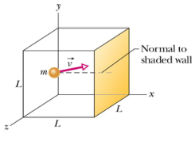

由图，考虑一个与$L \times L$的阴影壁（shaded wall）碰撞的分子，它在$x$方向上的动能为：

$\Delta p_{x}=\left(-m v_{x}\right)-\left(m v_{x}\right)=-2 m v_{x}$

分子周期性地碰撞阴影壁，则碰撞造成的力可以认为是：

$F=\frac{\Delta p_{x}}{\Delta t}=\frac{2 m v_{x}}{2 L / v_{x}}=\frac{m v_{x}^{2}}{L}$

将所有分子考虑在内，那么对整个阴影壁的合力$F_{A}$为：

$F_{A}=F_{1}+F_{2}+\ldots+F_{N}$

$p=\frac{F_{1}+F_{2}+\ldots+F_{N}}{L^{2}}$

$p=\frac{m v_{x 1}^{2} / L+m v_{x 2}^{2} / L+\ldots+m v_{x N}^{2} / L}{L^{2}}$

$p=\left(\frac{m}{L^{3}}\right)\left(v_{x 1}^{2}+v_{x 2}^{2}+\ldots+v_{x N}^{2}\right)$

易得：

$\left(v_{x}^{2}\right)_{\text {avg }}=\frac{v_{x 1}^{2}+v_{x 2}^{2}+\ldots+v_{x N}^{2}}{N}$

$p=\left(\frac{m}{L^{3}}\right) N\left(v_{x}^{2}\right)_{\text {avg }}=\left(\frac{m}{L^{3}}\right) n N_{A}\left(v_{x}^{2}\right)_{\text {avg }}=\frac{n m N_{A}}{L^{3}}\left(v_{x}^{2}\right)_{\text {avg }}$

因为有许多分子，它们都在随机方向上运动，所以它们的速度分量的平方的平均值是相等的。

$\left(v_{x}^{2}\right)_{\mathrm{avg}}=\left(v_{y}^{2}\right)_{\mathrm{avg}}=\left(v_{z}^{2}\right)_{\mathrm{avg}}=\frac{1}{3}\left(v^{2}\right)_{\mathrm{avg}}$

$p=\frac{n m N_{A}\left(v^{2}\right)_{\text {avg }}}{3 L^{3}}=\frac{n M\left(v^{2}\right)_{\text {avg }}}{3 V}$

$M$为气体的摩尔质量，$V$为容器的体积。

则有方均根速率（root-mean-square speed，简写为RMS speed）：

$v_{r m s}=\sqrt{\left(v^{2}\right)_{a v g}}$

$p=\frac{n M v_{r m s}^{2}}{3 V}$

$v_{r m s}=\sqrt{\frac{3 R T}{M}}$

***

#### 19.5 平动动能（translational kinetic energy）

我们考虑理想气体的单个分子。分子可以因碰撞而改变其速度，但随着时间的推移，平均动能为：

$K_{a v g}=\left(\frac{1}{2} m v^{2}\right)_{a v g}=\frac{1}{2} m v_{r m s}^{2}$

又因为$v_{m s}=\sqrt{\frac{3 R T}{M}}$，有：

$K_{\text {avg }}=\frac{1}{2} m \frac{3 R T}{M}=\frac{3 R T}{2 M / m}=\frac{3}{2} \frac{R T}{N_{A}}$

有玻尔兹曼常数：$k=\frac{R}{N_{A}} = 1.38 \times 10 ^{-23} J/K$

$K_{a v g}=\frac{3}{2} k T$

根据结论在给定的温度$T$下，所有理想气体分子——无论其质量如何——都具有相同的平均平动动能。

***

#### 19.6 平均自由程（mean free path）

布朗运动（Brownian motion）：扩散无规则运动。

平均自由程$\lambda$是分子在碰撞发生之间走过的平均距离。

分子密度为$\frac{N}{V}$，分子直径为$d$。

$\lambda=\frac{1}{\sqrt{2} \pi d^{2} N / V}$

***

平均自由程的推导：

分子的中心之间的距离在$d$以内则发生碰撞。两个分子的相对平均速度为$v_{r e l}=\left|\vec{v}_{A}-\vec{v}\right|_{a v g}$，那么这就相当于只有一个分子在移动，其他所有的分子都是静止的，而我们观察分子状态的时间间隔为$\Delta t$。那么平均自由程$\lambda$为：

$\lambda=\frac{在\Delta t时间内分子走过的路程}{在\Delta t时间内分子发生的碰撞的次数}$

$\lambda=\frac{v_{\alpha v g} \Delta t}{\pi d^{2} v_{r e l} \Delta t N / V}$

$v_{r e l}=\sqrt{2} v_{a v g}$

$\lambda=\frac{1}{\sqrt{2} \pi d^{2} N / V}$

那么平均碰撞周期（average collision period）为$T_{collision}=\frac{\lambda}{v_{avg}}$，平均碰撞频率（average collision rate）为$f_{collision}=\frac{1}{T_{collision}}$。

***

例子（简单题）：


***

#### 19.7 分子速率分布（the distribution of molecular speeds）

麦克斯韦速率分布律（Maxwell's speed distribution law）：

$P(v)=4 \pi\left(\frac{M}{2 \pi R T}\right)^{3 / 2} v^{2} e^{-M v^{2} / 2 R T}$

$P d v=d N / N$

其中$v$是气体分子速率，$T$是气体温度，$M$是气体的摩尔质量，$R$是气体常数，$P(v)$是概率分布函数，$dN$是分子速率在$(v,v+dv)$之间的气体分子的数量，$N$是全部气体分子的数量。

速度在$v_1$和$v_2$之间的分子分数（fraction）为：

$Frac=\int_{v_{1}}^{v_{2}} P(v) d v \approx P(v) \cdot (v_2-v_1)$（当$\frac{\Delta v}{v} \approx 0$时，上述约等于成立）

归一化（normalization）：

$\int_{0}^{\infty} P(v) d v=1$

***

概率分布图像：


平均速率$v_{avg}$：

$v_{a v g}=\int_{0}^{\infty} v P(v) d v=\sqrt{\frac{8 R T}{\pi M}}$

方均根速率$v_{rms}$：

$v_{r m s}=\sqrt{\left(v^{2}\right)_{a v g}}=\sqrt{\int_{0}^{\infty} v^{2} P(v) d v}$

$v_{r m s}=\sqrt{\frac{3 R T}{M}}$

最概然速率（most probable speed）为使得$P(v)$取得最大值的速率$v_p$：

$d P / d v=0$

$v_{p}=\sqrt{\frac{2 R T}{M}}$

$v_{r m s}>v_{\mathrm{avg}}>v_{p}$

***

例子（简单题）：


***

#### 19.8 理想气体的摩尔比热（the molar specific heats of an ideal gas）

我们认为理想单原子气体（monatomic gas）没有旋转动能，没有势能，只有平动动能。

单原子拥有的动能：$K_{a v g}=\frac{3}{2} k T$

那么$n$摩尔的单原子气体的内能为：$E_{\mathrm{int}}=\left(n N_{\mathrm{A}}\right) \frac{3}{2} k T=\frac{3}{2} n R T$

理想气体的内能是只关于气体温度的函数，与其他变量无关。气体的比热（specific heat）取决于将温度升高一度（degree）所需的热交换。由热交换取决于所采取的过程（process）不同，有几个不同的摩尔比热。

***

定容摩尔比热：


气体需要吸收的热量：$Q=n C_{V} \Delta T$（因为体积不会变化，因此全部热量转化为气体的内能）

则$C_{V}$被称为定容摩尔比热。

内能变化：

$\Delta E_{\mathrm{int}}=Q-W=Q-p d V=Q$

$\Delta E_{\mathrm{int}}=n C_{V} \Delta T$

$C_{V}=\frac{\Delta E_{\mathrm{int}}}{n \Delta T}=\frac{3}{2} \frac{n R \Delta T}{n \Delta T}$

$C_{V}=\frac{3}{2} R$

理想气体内能的变化取决于温度的变化，而不取决于产生这种变化的过程类型。

对于双原子气体（diatomic gases）和多原子气体（polyatomic gases），摩尔比热$C_{V}$是不同的。

***

定压摩尔比热：


气体需要吸收的热量：$Q=n C_{p} \Delta T$（其中有一部分$Q - \Delta E_{int}$转化为气体的势能，一部分$\Delta E_{int}$转化为气体的内能）

则$C_{p}$被称为定压摩尔比热。

内能变化所需能量恒为：

$\Delta E_{\text {int }}=Q-W=n C_{V} \Delta T$

$p V=n R T$

$W=p \Delta V=n R \Delta T$

$Q=n C_{V} \Delta T+n R \Delta T=n C_{p} \Delta T$

$C_{p}=\frac{Q}{n \Delta T}$

对于任意理想气体，满足：

$C_{P}=C_{V}+R$

对于单原子气体，满足：

$C_{V}=\frac{3}{2} R$

$C_{p}=\frac{5}{2} R$

对于多原子分子气体，见下一节内容。

***

例子（简单题）：


***

#### 19.9 自由度和摩尔比热（degrees of freedom and molar specific heats）

能量均分原理（equipartition of energy）：

每种分子都有一定数量的自由度，用$f$表示，这是分子储存能量的独立方式。

每一自由度平均拥有的能量为每分子$\frac{1}{2}kT$，或者说每摩尔$\frac{1}{2}RT$。

$K_{a v g}=\frac{f}{2} k T$

自由度与物体的运动有关：

平动的上限自由度为3。

转动的上限自由度为3。

也就是三维物体的上限自由度为6。

$\overline{\frac{1}{2} m v_{x}^{2}}=\overline{\frac{1}{2} m v_{y}^{2}}=\overline{\frac{1}{2} m v_{z}^{2}}=\overline{\frac{1}{2} I_{\theta} \omega_{\theta}^{2}}=\overline{\frac{1}{2} I_{\varphi} \omega_{\varphi}^{2}}=\overline{\frac{1}{2} I_{\psi} \omega_{\psi}^{2}}=\frac{1}{2} k T$

***

对于特定数量原子的分子的动能的总结：

对于单原子分子，平动自由度为3，转动自由度为0，则$f=3$，每摩尔的内能为$E_{int}=\frac{3}{2}RT$，定容摩尔比热为$C_{V}=\frac{3}{2}R$。

对于双原子分子，平动自由度为3，转动自由度为2，则$f=5$，每摩尔的内能为$E_{int}=\frac{5}{2}RT$，定容摩尔比热为$C_{V}=\frac{5}{2}R$。

对于多原子分子，平动自由度为3，转动自由度为3，则$f=6$，每摩尔的内能为$E_{int}=\frac{6}{2} RT$，定容摩尔比热为$C_{V}=3R$。

通过上述的结论，可以直接通过温度$T$得到内能变化量，又因为内能变化量与路径无关，仅与初末态有关，则可以据此求系统吸收的热量。

***

#### 19.10 量子理论（quantum theory）

随着温度的升高，动力学理论与实验之间出现了差异（摩尔比热的变化趋势）。比热离散分立地（discretely）变化。实验结果只能用量子理论来解释。


第一处箭头，旋转停止，因为存在最小的量子旋转激发能。

第二处箭头，振动开始，因为有一个最小的量子振动激发能。

***

#### 19.11 理想气体的绝热膨胀（the adiabatic expansion of an ideal gas）

一个$Q=0$的过程是绝热过程。


进行理想气体在绝热过程（adiabatic process）中$p V^{\gamma}=常数$的证明，首先有内能变化量$U$和$p$和$V$之间的恒等关系：

$\Delta U=\Delta Q - p \Delta V$

$d U=d Q - p d V$

根据热力学第一定律可得：

$n C_{V} d T= 0- p d V$

对于理想气体有：

$p V=n R T$

$p d V+V d p=n R d T$

由式子$C_{P}=C_{V}+R$代入得到：

$p d V+V d p=n (C_{P}-C_{V}) d T$

有摩尔热容比$\gamma$：

$\gamma=\frac{C_{p}}{C_{V}}$

以上式子联立可得：

$\gamma \frac{d V}{V}=-\frac{d p}{p}$

积分可得：

$\ln p+\gamma \ln V=ln p V^{\gamma}=常量$

取反对数可得：

$p V^{\gamma}=常数$

由理想气体（$pV=nRT$，$T=\frac{pV}{nR}$）也可得：

$T V^{\gamma-1}=常数$

***

例子（简单题）：


例子（思考题）：


例子（思考题）：


***

### 第二十章-热力学第二定律（the second law of thermodynamics）

#### 20.1 熵（entropy）

许多过程都有方向，不可逆。而在热力学中不可逆（irreversible）过程的关键在于熵。

***

#### 20.2 不可逆过程与熵（irreversible processes and entropy）

热现象的所有宏观过程都是不可逆的，不能通过环境的微小变化（small changes）来逆转（reversed）。

例如，通过摩擦力传递给热量的功是不可逆的。气体到真空的孤立系自由膨胀（isolated free expansion）是不可逆的。

封闭系（closed system）是孤立于环境的系统。不可逆过程的方向不是由能量的变化决定的。而是由熵的变化决定的。如果一个不可逆的过程发生在一个封闭系中，系统的总熵总是增加，而不是减少。这被称为熵增原理。

***

#### 20.3 熵变

定义熵变化的两种方法：

- 根据系统的温度及其以热量形式获得或损失的能量。

- 通过计算组成系统的原子或分子的变化方式。

我们使用第一种方法来定义更改熵变$\Delta S$。

***

熵变的计算：


$\Delta S=S_{f}-S_{i}=\int_{i}^{f} \frac{d Q}{T}$

$\Delta S$的符号和$Q$一致。

因为自由膨胀过程是不可预测的，所以我们找不到$T$和$Q$之间的关系来积分这个方程。

然而，熵确实是一种状态量（state property），也因此$\Delta S$仅与系统的初始状态和末尾状态相关，而不与变化过程相关。

$d E_{\text {int }}=n C_{V} d T=d Q-p d V$

$d Q=p d V+n C_{V} d T$

$\frac{d Q}{T}=\frac{n R d V}{V}+\frac{n C_{V}}{T} d T$

$\int_{i}^{f} \frac{d Q}{T}=\int_{i}^{f} n R \frac{d V}{V}+\int_{i}^{f} n C_{V} \frac{d T}{T}$

最终可得：

$\Delta S=n R \ln \frac{V_{f}}{V_{i}}+n C_{V} \ln \frac{T_{f}}{T_{i}}$

公式适用于所有过程（包括不可逆过）且与状态变化的过程无关，仅与初末态相关。

***

如果$T_i=T_f$，我们可以选择等温过程来计算熵变：

$\Delta S=\frac{1}{T} \int_{i}^{f} d Q=\frac{Q}{T}$

当温度变化$\Delta T$时系统的相对于过程前后的温度很小，熵可以近似为：

$\left|\frac{\Delta T}{T_{i}}\right|=\left|\frac{T_{f}-T_{i}}{T_{i}}\right| <<1$

$\Delta S=\int_{i}^{f} \frac{d Q}{T} \approx \frac{Q}{T_{a v g}}$

***

例子（简单题）：


例子（简单题）：


***

#### 20.4 热力学第二定律

我们可以分别计算气体（损失$|Q|$的热量）和贮存器（reservoir）（得到$|Q|$的热量）的熵变，我们有：

$\Delta S_{g a s}=-\frac{|Q|}{T}$

$\Delta S_{r e s}=+\frac{|Q|}{T}$

对于一个可逆封闭系（reversible closed system），满足$\Delta S =0$。

如果一个过程发生在一个封闭系统中，对于不可逆过程，系统的熵增加，对于可逆过程，系统的熵保持不变。熵从不减少。也就是说，对于发生在封闭系中的过程，恒满足$\Delta S \geq 0$。

***

#### 20.5 熵在现实的应用：马达（engines）

热机（heat engine）：是一种以热能的形式从环境（工作物质，working substance）中提取能量并做有用的功，然后排出不能用来做功的热量的装置。

理想热机（ideal engine）：所有过程都是可逆的，不会因摩擦和湍流而发生浪费能量的传递。

卡诺热机（Carnot engine）：第一定律和熵还没有被发现时就被研究出来的效率最高的热机。

***

卡诺循环：


在$p-V$图中，卡诺循环沿着顺时针方向进行。从高温贮存器提取的热量$|Q_{H}|$被传递到工作物质，并经历体积从$V_a$到$V_b$的等温膨胀。热量$|Q_{L}|$被输送到低温贮存器中，并（工作物质）经历体积从$V_c$到$V_d$的等温压缩。

在一个完整的循环中，工作物质的状态不会发生变化。


$\Delta E_{\text {int }}=Q-W=0$

$Q=\left|Q_{H}\right|-\left|Q_{L}\right|$

$W=Q=\left|Q_{H}\right|-\left|Q_{L}\right|$

熵变：


$\Delta S_{H}=\Delta S_{b a}=\left|Q_{H}\right| / T_{H}$

$\Delta S_{c b}=0$

$\Delta S_{L}=\Delta S_{d c}=-\left|Q_{L}\right| / T_{L}$

$\Delta S_{a d}=0$

$\Delta S=\left|Q_{H}\right| / T_{H}-\left|Q_{L}\right| / T_{L}=0$

$\left|Q_{H}\right| / T_{H}=\left|Q_{L}\right| / T_{L}$

$\left|Q_{H}\right|>\left|Q_{L}\right|$

***

卡诺热机的效率（efficiency）：

$\varepsilon=\frac{|W|}{\left|Q_{H}\right|}$


卡诺循环中：

$W=\left|Q_{H}\right|-\left|Q_{L}\right|$

$\varepsilon=\frac{\left|Q_{H}\right|-\left|Q_{L}\right|}{\left|Q_{H}\right|}=1-\frac{\left|Q_{L}\right|}{\left|Q_{H}\right|}$

$\varepsilon=1-\frac{T_{L}}{T_{H}}$

另一种证明方法：

等温过程有：

$Q_{H}=N k T_{H} \cdot \ln \frac{V_{b}}{V_{a}}$

$Q_{L}=N k T_{L} \cdot \ln \frac{V_{d}}{V_{c}}$

绝热过程有：

$T V^{\gamma-1}=常数$

$T_{H} V_{b}^{\gamma-1}=T_{L} V_{c}^{\gamma-1}$

$T_{H} V_{a}^{\gamma-1}=T_{L} V_{d}^{\gamma-1}$

$\frac{V_{b}}{V_{c}}=\frac{V_{a}}{V_{d}}$

$\frac{Q_{L}}{Q_{H}}=\frac{T_{L}}{T_{H}}$

***

例子（简单题）：


例子（思考题）：


***

斯特林热机（Stirling engine）：

斯特林发动机的效率低于卡诺发动机，但现在正被开发用于汽车和宇宙飞船。


在相同的两个温度下，任何真正的发动机的效率都必须低于卡诺发动机。

***

例子（简单题）：


***

#### 20.6 熵在现实的应用：制冷机（refrigerators）

制冷机是一种利用功将能量从低温储存器转移到高温储存器的装置，它不断重复一系列热力学过程。例如冰箱，空调，热泵（heat pump）。

在理想的制冷机中，所有过程都是可逆的，不会因为摩擦和湍流而发生浪费能量的传递。

运行效率（coefficient of performance）：

$K=\frac{\left|Q_{L}\right|}{|W|}$（$运行效率=\frac{我们想要的制冷效果}{我们付出的能量}$）

对于卡诺制冷机：

$K=\frac{\left|Q_{L}\right|}{\left|Q_{H}\right|-\left|Q_{L}\right|}=\frac{T_{L}}{T_{H}-T_{L}}$

空调的运行效率大约$K \approx 2.5$，家用冰箱的运行效率大约$K \approx 5$。

***

封闭系中的制冷机和贮存器的合熵变（net entropy change）为：

$\Delta S=\Delta S_{H}+\Delta S_{L}=\frac{\left|Q_{H}\right|}{T_{H}}-\frac{\left|Q_{L}\right|}{T_{L}}<0$

这违反了第二定律，因此理想制冷机是不存在的。


不可能存在结果是将能量作为热量从低温储层转移到高温储层而不会对外界环境产生影响的一系列的过程。对此，克劳修斯（Clausius）的表述为：不可能在不产生额外影响的情况下，建立一个循环，使得热量从低温物体传向高温物体。

***

#### 20.7 真实马达的效率


上图展示了一个发动机$X$和一个卡诺发动机
连接在一起，一个制热一个制冷（吸热）。

卡诺定理（Carnot theorem）：

当这两台发动机都在相同的两个温度工作并做相同的功$W$时，没有一台实际的发动机的效率$\varepsilon_{X}$比卡诺发动机$\varepsilon_{C}$的效率更高。热机$X$至多能有一个与卡诺热机相等的效率，这种情况下，热机$X$是一台卡诺热机。

也就是满足：

$\varepsilon_{X} \leq \varepsilon_{C}$

其中$\varepsilon_{X}$为发动机$X$的效率。

其中$\varepsilon_{C}$为卡诺发动机的效率。

***

证明方法为反证法：

假设满足$\varepsilon_{X}>\varepsilon_{C}$，则有：

$\varepsilon_{X}>\varepsilon_{C} \rightarrow \frac{|W|}{\left|Q_{H}^{\prime}\right|}>\frac{|W|}{\left|Q_{H}\right|} \rightarrow\left|Q_{H}\right|>\left|Q_{H}^{\prime}\right|$

$W=W_{C}=\left|Q_{H}\right|-\left|Q_{L}\right|$

$W=W_{X}=\left|Q_{H}^{\prime}\right|-\left|Q_{L}^{\prime}\right|$

$\left|Q_{H}\right|-\left|Q_{L}\right|=\left|Q_{H}^{\prime}\right|-\left|Q_{L}^{\prime}\right|$

$\left|Q_{H}\right|-\left|Q_{H}^{\prime}\right|=\left|Q_{L}\right|-\left|Q_{L}^{\prime}\right|=Q>0$

意味着，组合起来的工作的净效果是不需要做功就把能量$Q$从低温热库传给了高温热库。这违背了热力学第二定律，因此假设不成立。

***

例子：


***

#### 20.8 对熵的统计观点

微观（microscopic）特性：$m,v,\varepsilon$

宏观（macroscopic）特性：$p,V,T,n$

位型/组态/微观态：


对于一个将体积均分为两半的盒子，有3个相同的分子，则有4种位型/组态（configuration）。有3个不同的分子，则有3种位型。我们统称位型/组态为微观态（microstate）。


因此，对于总数为$N$的相同的分子，在两边相同的空间中的分子数量分别为$n_{1}$和$n_{2}$，满足$N=n_{1}+n_{2}$，则对应的微观态的数量$W$为：

$W=C_{N}^{n_{1}}=\frac{N !}{n_{1} !\left(N-n_{1}\right) !}=\frac{N !}{n_{1} ! n_{2} !}$

当$n_{1}$和$n_{2}$取不同值时，可以得到的微观态数量不同。而又因为等概率原理，因此对应的微观态出现的概率也不同。

等概率原理：

所有微观状态的概率都相等。所有分子都可以以相同的概率“访问”所有可能的微观状态。

***

最概然组态（the most probable configuration）：

具有最多的微观态会以最大概率出现，因为所有微观态的概率都相等。

对于比较大的$N$，满足$W_{\max } \approx C_{N}^{N / 2}$其中$\left(n_{1}=n_{2}=N / 2\right)$。

气体分子总是在盒子的两半之间平均分配，因为这种微观态的概率最大，而由玻尔兹曼熵方程（Boltzmann’s entropy equation），得到熵也最大。

微观态的数量$W$与对应的熵$S$的关系：

$S=k \ln W$

如果我们有两个微观态数量分别为$W_{1}$和$W_{2}$的系统，那么这两个系统的总熵为：

$S=k \ln W=k \ln \left(W_{1} W_{2}\right)=k \ln W_{1}+k \ln W_{2}$

斯特林近似（Stirling's approximation）：

对于比较大的某数字$n$，有：

$\ln (n !) \approx n \cdot \ln (n) - n$

这个近似方程通常用来计算熵。

***

例子（简单题）：


例子（思考题）：


例子（思考题）：


**


### 第二十六章-电流与电阻

#### 26.2 移动电荷与电流

电流强度是净电荷通过表明的速率，用符号$i$表示。

$$i=\frac{d q}{d t}$$

$$q=\int_{t_1}^{t_2} i d t$$

电流是一个标量，使用箭头标注。即使实际的载流子（charge carriers）是负的（电子），且向相反的方向移动，电流箭头也会画在正电荷载流子移动的方向上。

#### 26.3 电流密度

1.电流密度是一个矢量，用符号$\vec{J}$表示，其意义为每单位面积的电流强度。方向仍遵循正电荷移动的方向。

$$J=\frac{d i}{d A}$$

$$i=\int \vec{J} \cdot \overrightarrow{d A}$$

与电场线类似的，在任意一点上，流线（streamlines）的切线表示电流密度的方向。在垂直于流线的平面上，单位面积上的线的数量与电流密度的大小成正比。

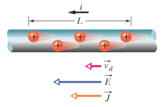

$$q=n e A L$$

$$t=L / v_{d}$$

因此有：

$$i=n e A v_{d}$$

$$\vec{J}=\frac{i}{\vec{A}}=n e \vec{v}_d$$

$$i=\vec{J} \cdot \vec{A}$$

#### 26.4 电阻和电阻率

电阻：

$$R \equiv \frac{V}{i}$$

电阻的电路原理图：


电阻率（resistivity）/电导率（conductivity）：

$$\rho \equiv \frac{E}{J}$$

其中$J$为电流密度。$\rho$为电阻率，其国际单位制单位为$\Omega \cdot m$。电导率使用$\sigma$表示。

电阻率的变化率：电阻率温度系数。

$$\rho-\rho_0=\rho_0 \cdot \alpha \cdot \left(T-T_0\right)$$

其中$\rho_{0}$为此种材料在$T_{0}$温度下的电阻率。$\alpha$为电阻率温度系数。

反推电阻公式：

$$J=\frac{E}{\rho}=\frac{V}{L \rho} $$

$$i=J A=\frac{V A}{L \rho}$$

$$R=\frac{V}{i}=\rho \frac{L}{A}$$

#### 26.5 欧姆定律

1.电阻$R$是常数，则有$i=\frac{V}{R}$，遵循欧姆定律。

如果电阻$R$是关于电势差的函数，则不遵循欧姆定律。

2.金属传导的微观状态：

电场造成的加速度：

$$a=\frac{e E}{m}$$

平均自由时间$\tau$（单位为秒）：

$$v_d=a \tau$$

电流密度：

$$J=n e v_d=\frac{n e^2 E}{m} \tau$$

电阻率：

$$\rho=\frac{E}{J}=\frac{m}{n e^2 \tau}$$

其中$v_{d}$为电子的漂移速度（drift speed）。

如果金属中电子的密度和平均自由时间（mean free time）与电场无关，则金属服从欧姆定律。

#### 26.6 电路功率

$$d W=V d q$$

$$P=\frac{d W}{d t}=V \frac{d q}{d t}=V i$$

#### 26.7 半导体、超导体

不同的材料的电阻率随着温度的变化也有不同的变化。

### 第二十七章-电路

#### 27.1 关于并联的顺序

并联电路的并联顺序并不影响，例如：


其中$\mathscr{E}_1$、$\mathscr{E}_2$、$\mathscr{E}_3$所在的支路的位置是可以随意相互调换的。

#### 27.2 电动势和电源

电动势（electro-motive force，emf）装置通过对载流子做功来保持其端口之间的电位差的器件，包括电池、发电机等等。

电动势装置提供电动势$\varepsilon$。


电动势是电动势装置从低电位端（lower-potential terminal）移动到高电位端（higher-potential）时每单位电荷所需的功。因此有：

$$\mathcal{E}=\frac{d W}{d q}$$

#### 27.3 单环路电路

电势法分析电路：基尔霍夫回路定理（Kirchhoff's loop rule），在电路的任何闭合回路的完全遍历中，所遇到的"电势变化"的代数和必须为零。（其实就是KVL）

"电势变化"：包括电源输出的电势，支路分掉的电势，注意电源仅仅是提供一个方向的一定大小电动势的器件而已，如果不够大电流就会逆流。

$$\sum_{\text {loop }} \Delta V=0$$

"电势变化"的判断方法：先通过已知信息，假设流过每个元件（不包括电源，因为电源的极性已知，因此电势变化已知）的电流方向（与实际电流方向没有关系）。定义一个参考方向，其为正负的参考，结合假设的方向写出每个元件的"电势变化"，注意电流方向由高电势朝向低电势（假设电流也应当视作是从高到低，即使实际电流方向不同。最后得出结果再矫正）。

最后联立之后，如果解出数值结果为负的电流，则其实际方向与我们一开始随便假设的电流方向相反。


如上图所示，电源假设的方向其实并不需要，因为电源的电势变化均已知。电阻的假设方向则随机表示，以逆时针为参考方向。

因为参考方向为逆时针，因此顺时针的压降为正，逆时针的压降为负。从$r_{1}$开始列出，$r_{1}$的假设电流方向我们假设为沿着顺时针。$r_{1}$的假设电流方向使得$r_{1}$在参考方向上压升，因此$i r_{1}$为正。

同样的，电源1在顺时针方向上压升，在参考方向上压降，因此为负。

#### 27.4 串联和并联电阻

串联总电阻：

$R_{eq}=\sum_{i=0}^{N} R_{i}$

并联总电阻：

$\frac{1}{R_{eq}}=\sum_{i=0}^{N}\frac{1}{R_{i}}$

#### 27.5 多回路电路

1.节点/结点（junction point）：

电路中有三条或三条以上的支路（branch）（也就是三个元件）相连接的点称为结点。


基尔霍夫节点定理：进入任何结点的电流之和必须等于离开该结点的电流之和。（其实就是KCL）

$$\sum_{\text {in }} \mathrm{i}=\sum_{\text {out }} \mathrm{i}$$

独立回路的电流处处相等（或者说所有回路中的独立部分），非独立回路需要网格分析法。

使用KCL和KVL列出足够多的方程并联立，对电路中的未知量求解。

#### 27.6 电阻-电容电路

1.电阻-电容电路（resistor-capacitance circuit，RC circuit）也称为RC电路，由一个电阻器（可多个电阻等效为一个电阻）和一个电容器组成。


对电容充电，电流会发生变化：

$$\varepsilon - i R -\frac{q}{C}=0$$

$$\varepsilon - \frac{dq}{dt} R -\frac{q}{C}=0$$

因此最终得到：

$$q=C \varepsilon\left(1-e^{-t / R C}\right)$$

$$i=\frac{\mathcal{E}}{\mathrm{R}} \mathrm{e}^{-\mathrm{t} / \mathrm{RC}}$$

$$V=V_0 e^{-t / R C}$$

$$q=q_0 e^{-t / R C}$$

其中$R \cdot C=\tau$为电容时间常数（capacitive time constant），其定义是物理量从最大值衰减到最大值的$\frac{1}{e}$的所需时间。根据电容的充电放电状态（电路不同），电容时间常数是不同的。

2.电容放电，电源不提供电动势（当$t=0$，$q=q_{0}$）：

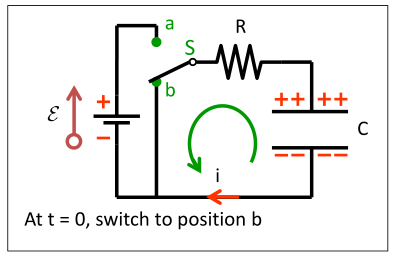

$$\frac{q}{C}+i R=0 $$

$$\frac{q}{C}+\frac{d q}{d t} R=0$$

$$q=q_0 e^{-t / R C} $$

$$i=-\frac{q_0}{R C} e^{-t / R C}$$

其中$R \cdot C=\tau$为电容时间常数。

### 第三十一章-电磁振荡和交流电

#### 31.2 LC电路（电感和电容）的振荡

电容（电场）存储的能量公式：

$$\mathrm{U}_E=\frac{q^2}{2 C}$$

电感（磁场）存储的能量公式：

$$\mathrm{U}_B=\frac{L i^2}{2}$$

电感线圈和电容器组成的电路，先后释放存储的能量，然后另一器件吸收并存储能量，循环往复，称为振荡（oscillation）。


总能量：

$$U=U_B+U_E=\frac{1}{2} L i^2+\frac{1}{2} \frac{q^2}{C}$$

$$\frac{\mathrm{d} U}{\mathrm{~d} t}=L i \frac{\mathrm{d} i}{\mathrm{~d} t}+\frac{q}{C} \frac{\mathrm{d} q}{\mathrm{~d} t}=L i \frac{\mathrm{d}^2 q}{\mathrm{~d} t^2}+\frac{q}{C} i=0$$

等式两边同除$L i$可得：

$$\frac{\mathrm{d}^2 q}{\mathrm{~d} t^2}+\frac{1}{L C} q=0$$

有滑块-弹簧系统公式：$U=U_b+U_s=\frac{1}{2} m v^2+\frac{1}{2} k x^2$，将总能量对时间$t$求导有$m \frac{d^2 x}{d t^2}+k x=0$。

将$q$对应$x$，$i$对应$v$，$\frac{1}{C}$对应$k$，$L$对应$m$，那么由滑块-弹簧系统的振荡角速度公式$\omega=\sqrt{\frac{k}{m}}$可得：

$$\omega=\sqrt{\frac{1}{L C}}$$

$$q=Q \cos (\omega t+\phi)$$

其中$Q$为此电路状态中电容所能存储的电荷量的最大值。

$$I=\omega Q$$

$$i=\frac{dq}{dt}=-I \sin (\omega t+\phi)$$

那么电场和磁场的振荡为：

$$U_E=\frac{q^2}{2 C}=\frac{Q^2}{2 C} \cos ^2(\omega t+\phi)$$

$$U_B=\frac{1}{2} L i^2=\frac{Q^2}{2 C} \sin ^2(\omega t+\phi)$$


#### 31.3 阻尼和受迫振荡

1.同时包含电阻、电感、电容的电路称为RLC电路。


存储的能量：

$$U=U_B+U_E=\frac{1}{2} L i^2+\frac{1}{2} \frac{q^2}{C}$$

能量会被转哈为电阻的热能：

$$\frac{\mathrm{d} U}{\mathrm{~d} t}=L i \frac{\mathrm{d} i}{\mathrm{~d} t}+\frac{q}{C} \frac{\mathrm{d} q}{\mathrm{~d} t}=L i \frac{\mathrm{d}^2 q}{\mathrm{~d} t^2}+\frac{q}{C} i=-i^2 R$$

$$\frac{\mathrm{d}^2 q}{\mathrm{~d} t^2}+\frac{R}{L} \frac{\mathrm{d} q}{\mathrm{~d} t}+\frac{1}{L C} q=0$$

可得新的电荷公式：

$$q=Q \mathrm{e}^{-R t / 2 L} \cos \left(\omega^{\prime} t+\phi\right)$$

$$\omega^{\prime}=\sqrt{\omega^2-(R / 2 L)^2} \quad\left(R^2 / 4 L^2<1 / L C\right)$$

2.受迫振荡（forced oscillation / driven oscillation）：时变电动势（time-varying emf）驱动RLC电路。由一个交流电压源提供时变电动势。

$$\varepsilon=\varepsilon_m sin \omega_d t$$

$$\omega_d=2 \pi f_d=\frac{2 \pi}{T}$$


$$L \frac{\mathrm{d}^2 q}{\mathrm{~d} t^2}+R \frac{\mathrm{d} q}{\mathrm{~d} t}+\frac{1}{C} q=\varepsilon_m \cos \omega_d t$$

无论一个电路的固有角频率$\omega$是多少，受迫振荡总是发生在驱动（driving）角频率$\omega_d$处。

$$i=i_m \cos \left(\omega_d t+\phi\right)$$

$$i_m=\frac{\varepsilon_m}{\sqrt{R^2+\left(\omega_d L-1 / \omega_d C\right)^2}}$$

当$\omega_d=1 / \sqrt{L C}$时，电流幅度最大。这被称为共振条件（resonance condition）。

#### 31.4 交流电

交流发电机（AC generator）：

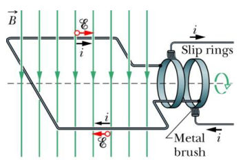

$$\Phi=N B A \cos \omega_d t$$

产生电动势：

$$\varepsilon=-\frac{d \Phi}{d t}=N B A \omega_d \sin \omega t=\varepsilon_m \sin \omega_d t$$

$$I=I_m \sin \left(\omega_d t+\phi\right)$$

电动势和电流可能是不同相（in phase）的。

#### 31.5 交流电

1.电阻负载（resistive load）：


$$\varepsilon_{e m f}=\varepsilon_m \sin \omega_d t$$

$$\begin{aligned} v_R =\varepsilon_m \sin \omega_d t =\mathrm{V}_R \sin \omega_d t \end{aligned}$$

$$\begin{aligned} i_R =\frac{\varepsilon_R}{R} \sin \omega_d t=\mathrm{I}_R \sin \omega_d t \end{aligned}$$

电阻$X_R$：

$$X_R=R$$

$$V_R=X_R \cdot I_R$$

此时$v_R$和$i_R$是同相的。

2.电容负载：


$$\varepsilon_{e m f}(t)=\varepsilon_m \sin \omega_d t$$

$$v_C(t)=V_C \sin \omega_d t$$

$$i_C(t)=I_C \sin \left(\omega_d t+\pi / 2\right)$$

推导$I_C$:

$$q_C=C V_C \sin \omega_d t$$

$$i_C=\frac{d q_C}{d t}=\omega_d C V_C \cos \omega_d t$$

$$I_C=V_C \omega_d C$$

容抗（capacitive reactance）$X_c$：

$$X_c=\frac{1}{\omega_d c}$$

$$V_c=X_c \cdot l_c$$

此时$v_c$和$i_c$是反相（out of phase）的。

3.电感负载：


$$\varepsilon_{e m f}=\varepsilon_m \sin \omega_d t$$

$$v_L=V_L \sin \omega_d t$$

$$i_L=I_L \sin \left(\omega_d t-\frac{\pi}{2}\right)$$

推导$I_L$：

$$v_L=L \frac{d i_L}{d t}$$

$$\frac{d i_L}{d t}=\frac{V_L}{L} \sin \omega_d t$$

$$i_L=\int \frac{V_L}{L} \sin \omega_d t dt=-\frac{V_L}{\omega_d L} \cos \omega_d t$$

$$I_L=\frac{V_L}{\omega_d L}$$

感抗（inductive reactance）$X_L$：

$$X_L=\omega_d L$$

$$V_L=X_L \cdot I_L$$

此时$v_L$和$i_L$的相位相差$\frac{\pi}{2}$。

4.串联RLC电路：


$$\varepsilon=\varepsilon_m \sin \omega t$$

$$ i=i_m \sin (\omega t-\phi)$$

$$\varepsilon=v_R+v_C+v_L$$

通过图像分析：


可得：

$$\varepsilon_m^2=V_R^2+\left(V_L-V_C\right)^2$$

$$\varepsilon_m^2=(I R)^2+\left(I X_L-I X_C\right)^2$$

$$I=\frac{\varepsilon_m}{\sqrt{R^2+\left(X_L-X_C\right)^2}}$$

$$\begin{aligned} \varepsilon_m \sin \omega t &=I R \sin (\omega_d t-\phi) \\ &+I X_L \sin (\omega_d t-\phi+\pi / 2) \\ &+I X_C \sin (\omega_d t-\phi-\pi / 2) \end{aligned}$$

其中$Z$称为电路的阻抗（impedance）：

$$Z=\sqrt{R^2+\left(X_L-X_C\right)^2}=\sqrt{R^2+\left(\omega_d L-\frac{1}{\omega_d C}\right)^2}$$

相位常数（phase constant）：

$$\tan \phi==\frac{V_L-V_C}{V_R}=\frac{I X_L-I X_C}{I R}=\frac{X_L-X_C}{X_R}$$

表示了电动势$\varepsilon$和电流$i$的相量之差。如果$X_L>X_C$，则电路电感性更强。如果$X_L<X_C$，则电路电容性更强。如果$X_L=X_C$，则电动势和电流同相。

#### 31.6 交流电路中的功率

交流（alternating-current，AC）电路和直流电路的功耗定义相同：

$$P=i^2 R=\left[I \sin \left(\omega_d t-\phi\right)\right]^2 R=I^2 R \sin ^2\left(\omega_d t-\phi\right)$$

能量损耗（dissipated）的平均功耗为：

$$P_{a v g}=\frac{I^2 R}{2}$$

$$I_{r m s}=\frac{I}{\sqrt{2}}$$

$$P_{a v g}=I_{r m s}^2 R$$

其中带有$rms$下标的量为均方根值（rms values）。

$$\varepsilon_{rms}=\frac{\varepsilon_m}{\sqrt{2}}$$

$$I_{\mathrm{rms}}=\frac{\varepsilon_{\mathrm{rms}}}{Z}=\frac{\varepsilon_{\mathrm{rms}}}{\sqrt{R^2+\left(X_L-X_C\right)^2}}$$

$$\cos \phi=\frac{V_R}{\mathscr{E}_m}=\frac{I R}{I Z}=\frac{R}{Z}$$

$$P_{\mathrm{avg}}=\frac{\mathscr{\varepsilon}_{\mathrm{rms}}}{Z} I_{\mathrm{rms}} R=\mathscr{\varepsilon}_{\mathrm{rms}} I_{\mathrm{rms}} \frac{R}{Z}=\mathscr{\varepsilon}_{\mathrm{rms}} I_{\mathrm{rms}} \cos \phi$$

#### 31.7 变压器

当交流电路只有电阻负载时，能量以平均速率提供和损耗：

$$P_{a v g}=\varepsilon I=I V$$

因此电力传输时只能通过提高电压减小电流来减少损耗。那么就需要对电压进行操作，这通过变压器（transformer）来实现。

变压器的工作原理是法拉第感应定律。


$$I_p V_p = I_s V_s$$

$$I_s=I_p \cdot \frac{N_p}{N_s}$$

$$V_s=V_p \cdot \frac{N_s}{N_p}$$

$$I_s=\frac{V_s}{R}$$

$$I_p=\frac{V_p}{R_{eq}}$$

最终推导得到变压器加上电阻$R$组成的整体等效电阻为：

$$R_{eq}=R \cdot (\frac{N_p}{N_s})^{2}$$

***

### 第三十五章-光的干涉（interference）

与物理光学（physical optics）和波动光学（wave optics）和几何光学（geometrical optics）有关。

#### 35.1/35.2 光波（light as a wave）

光的复杂应用：光的干涉（interference）和衍射（diffraction）。

惠更斯原理（Huygens's principle）：

指球形波面上的每一点（面源）都是一个次级球面波的子波源，子波的波速与频率等于初级波的波速和频率，此后每一时刻的子波波面的包络（总波面）就是该时刻总的波动的波面。其核心思想是：介质中任一处的波动状态是由各处的波动决定的。


如图，将$t$时刻的波面$S_1$上的每一点都视作子波源，那么这些子波源的全部波动的总波面就是$t+\Delta t$时刻的波面$S_2$。

***

对折射定律的推导：


光发生折射，波长$\lambda$和频率$v$其实是不变的。

波长$\lambda$与介质种类和波源都有关，因此光在不同的介质中时的波长不同，发生折射后光进入另一种介质因此波长改变。

频率$v$（或用$f$表示）只和波源有关，和介质种类没有关系。

$c=\lambda f$（$c$是光在真空中的速度，$f$是频率）

$\frac{1}{f}=\frac{\lambda_{1}}{v_{1}}=\frac{\lambda_{2}}{v_{2}} \rightarrow \frac{\lambda_{1}}{\lambda_{2}}=\frac{v_{1}}{v_{2}}$（$v_1$和$v_2$为不同介质中的光速）

$\sin \theta_{1}=\frac{\lambda_{1}}{h c}$

$\sin \theta_{2}=\frac{\lambda_{2}}{h c}$

$\frac{\sin \theta_{1}}{\sin \theta_{2}}=\frac{\lambda_{1}}{\lambda_{2}}=\frac{v_{1}}{v_{2}}$

$n_{1}=\frac{c}{v_{1}}$（$hc$是三角形$hcg$的一条边）

$n_{2}=\frac{c}{v_{2}}$（$hc$是三角形$hcg$的一条边）

$\frac{\sin \theta_{1}}{\sin \theta_{2}}=\frac{c / n_{1}}{c / n_{2}}=\frac{n_{2}}{n_{1}}$

最终得到：

$n_{1} \sin \theta_{1}=n_{2} \sin \theta_{2}$

***

同一束光波在介质中的频率$f_n$和真空中的频率$f$总是一致的（频率仅与波源有关，与介质无关），但是光波在不同的介质中的波长$\lambda _n$是不同的，那么同一束光波通过两种不同介质后得到的两束光波可能不再满足同相。


频率一致：$f_n=f$

折射率：$n=\frac{c}{v}$

因此有：$\frac{\lambda_{n}}{\lambda}=\frac{v}{c} \rightarrow \lambda_{n}=\frac{\lambda}{n}$（$c$是光在真空中的速度）

在介质$n_1$中的波数：$N_{1}=L / \lambda_{\mathrm{n} 1}=\mathrm{n}_{1} L / \lambda$（$L$是光在介质中传播的一段路程，路程相同介质不同，则消耗时间不同）

在介质$n_2$中的波数：$N_{2}=L / \lambda_{\mathrm{n} 2}=\mathrm{n}_{2} L / \lambda$

波数差：$N_{2}-N_{1}=L / \lambda_{n 2}-L / \lambda_{n 2}=\left(n_{2}-n_{1}\right) L / \lambda=\Delta L / \lambda$

如果使同一束光通过两种不同介质后得到的两束光波相互干涉：

$\Delta \mathrm{L} / \lambda=0,1,2, \ldots$（完全相长干涉，最亮）

$\Delta \mathrm{L} / \lambda=0.5,1.5,2.5, \ldots$（完全相消干涉，最暗）

***

#### 35.3 杨氏双缝干涉（Young's interference experiment）

从$S_0$发出的光波，在$S_1$和$S_2$两个缝隙造成了相干的（coherent）第二波源，且从第二波源发出的每一个波前的相位差（phase difference）为常数。


从第二波源发出的波会相互干涉，产生干涉图案（interference pattern）。

***

计算干涉条纹（fringes）的位置：

如果波经过的路程长度（path length）不同，那么两个波的相位差会发生改变。


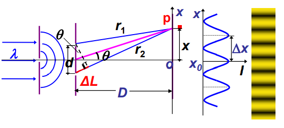

路程差为$\Delta L=d sin \theta$（两个波走过的路程的长度的差值，与角度无关），其中$d$是两个缝隙的距离。根据定义，得到路程差和相位差的关系为：$\Delta \phi=2 \pi \cdot \frac{ \Delta L}{\lambda}$（每一周期为一相位也就是$2 \pi$）。

为什么$r_1$和$r_2$是平行的而能发生干涉呢？因为光的路径$D$远远大于距离$d$，可以视作是平行的，从而近似求路程差$\Delta L$。（精确的很难求）

光亮条纹（bright fringe）：$\Delta L=d \sin \theta=m \lambda$（$m=0,1,2,...$）（相长干涉）

黑暗条纹（dark fringe）：$\Delta L=d \sin \theta=\left(m+\frac{1}{2}\right) \lambda$（$m=0,1,2,...$）（相消干涉）

通过计算$m$的可取值个数，即可得到最大值干涉点的个数和最小值干涉点的个数。通过定义$0 \leq |sin \theta| \leq 1$即可得到$m$的取值范围，也就得到了$m$的可取值个数。同时$m$的取值也和角度$\theta$相关（$m$本来就是靠$sin \theta$的一一对应求出的，$m$随着$sin \theta$的逐渐变化而变化，也就是两个波源发出的波在一个同心圆上的点的路程差会随着角度变化而变化，呈现"光亮条纹-黑暗条纹-光亮条纹-黑暗条纹..."的形式。例如当$m =0$时，根据定义，如果求的是光亮条纹，则$\theta = 0$。如果求的是黑暗条纹，则$\theta \neq 0$。）。

当$\theta$很小的时候，满足$tan \theta \approx \theta$，$sin \theta \approx \theta$。

***

相干性（coherence）：

如果两个波源发出的光的相位之间的关系不会随着时间改变，那么称之为相干光（coherent light）。得到相干光有两种方法：


太阳光（面偏振光）经过折射和反射，形成两束相干光（线偏振光），这只在两点非常接近的情况下满足。这被称为分振幅法（amplitude-splitting）。


也能使一束光通过拥有两个缝隙的板形成相干光，被称为分波前法（wave front-splitting）。

***

双缝干涉（double-slit interference）的光的强度：

有从第一波源发出的光的电场强度$E_0$，光强$I_0$。干涉点$P$的电场强度$E_P$，光强$I$。


$E_{1}=E_{0} \sin \omega t$

$E_{2}=E_{0} \sin (\omega t+\phi)$

$E_{P}=E_{1}+E_{2}$

$E_{P}=E_{0}[\sin \omega t+\sin (\omega t+\phi)]$

$E_{P}=2 E_{0} \cos \left(\frac{\phi}{2}\right) \sin \left(\omega t+\frac{\phi}{2}\right)$

$I \propto E_{P}{ }^{2}=4 E_{0}{ }^{2} \cos ^{2}\left(\frac{\phi}{2}\right) \sin ^{2}\left(\omega t+\frac{\phi}{2}\right)$

其中，$\phi=2 \pi \frac{\Delta L}{\lambda}=\frac{2 \pi}{\lambda} \sin \theta$

最终得到：$I=4 I_{0} \cos ^{2}\left(\frac{\pi d \sin \theta}{\lambda}\right)=4 I_{0} \cos ^{2}(\frac{\phi}{2})$

相长干涉：$E_{P}=2 E_{0}$，$I=4 I_{0}$

相消干涉：$E_{P}=0$，$I=0$


$I=4 I_{0} \cos ^{2} \frac{1}{2} \phi=4 I_{0} cos ^{2} \beta$

完全相干（completely coherent light）：满足$I=4 I_0$的点。（中心的光强满足$I_{center}=4 I_{0}$）

完全不相干（completely incoherent light）：满足$I = 2 I_0$的点。

***

#### 35.4 薄膜干涉（interference from thin films）

光波在一个透明薄膜的前表面或者后表面的反射光是相干光。

光程差（optical path difference）$\delta$等于折射率$n$乘以路程差$\Delta L$，代表的意义是光在折射率为$n$的介质中通过的距离$\Delta L$转化为在真空中的距离$\delta$，也就是：

$v=\frac{c}{n}$

$t=\frac{L}{v}$

$\delta = c \cdot t= n \Delta L$

有光在介质中的波长$\lambda _{n}$：

$\lambda_{n}=\frac{\lambda _{c}}{n}$

那么有相位差（在真空中和介质中是一致的）：

$\Delta \varphi=2 \pi \frac{\Delta L}{\lambda_{n}}$

$\Delta \varphi=2 \pi \frac{\delta}{\lambda _{c}}$

经过材料的表面的折射，光的相位不会发生变化。

经过两种透明材料的表面的反射，反射光的相位会发生变化。

光梳介质（reflection off medium of lower index）（折射率低）中反射光的相位不会发生变化。

光密介质（reflection off medium of higher index）（折射率高）中反射光的相位变化为$\pi$。

如果光从光疏介质进入光密介质，会发生半波损失（波长），也就是路程差会差了$\frac{\lambda}{2}$。


$i = \pi - \phi$，其中$i$是入射角，$\phi$是折射角。

$\delta=n_{2}(\overline{A B}+\overline{B C})-n_{1} \overline{A D}+\frac{\lambda}{2}$

$\overline{A D}=\overline{A C} \cdot \sin i=2 \cdot d \cdot tan \phi \cdot \sin i$

$\delta=2 \cdot \frac{n_{2} d}{\cos \phi}-\frac{2 n_{1} d \cdot \sin \phi \cdot \sin i}{\cos \phi}+\frac{\lambda}{2}$

$n_{1} \sin i=n_{2} \sin \phi$

$\delta=2 n_{2} d \cos \phi+\frac{\lambda}{2}$

$\delta=2 d \sqrt{n_{2}^{2}-n_{1}^{2} \sin ^{2} i}+\frac{\lambda}{2}$

如果入射角$i=0$，满足：$\delta=2 d n_{2}+\frac{\lambda}{2}$。

***


两个反射光的光程差可由路程差获得：

$\delta=2 L n_{2}+\frac{\lambda}{2}$

最大光强，空气中的亮膜：

$\delta=m \lambda$

$2 L=\left(m+\frac{1}{2}\right) \frac{\lambda}{n_{2}}, \quad m=0,1,2, \ldots$

最小光强，空气中的暗膜：

$\delta=\left(m+\frac{1}{2}\right) \lambda$

$2 L=m \frac{\lambda}{n_{2}}, \quad m=0,1,2, \ldots$

***

例子（简单题）：


***

劈尖（sharp wedge）干涉：

根据薄膜干涉的道理，可以测定平面的平直度．测定的精度很高，甚至几分之一波长那么小的隆起或下陷都可以从条纹的弯曲上检测出来．若使两个很平的玻璃板间有一个很小的角度，就构成一个楔形空气薄膜，用已知波长的单色光入射产生的干涉条纹，可用来测很小的长度。

光线由玻璃板I射入和反射，在中间的空气层发生折射和反射，不考虑玻璃板II中的光线。那么在正上方看，就会出现干涉条纹。


$\delta=2 d+\frac{\lambda}{2}=\left\{\begin{array}{c}m \lambda & \text {光亮条纹} \\ (2 m+1) \frac{\lambda}{2} & \text{黑暗条纹} \end{array}\right.$


两板之间，两条条纹之间的垂直距离等于两条条纹所在的位置的空气薄膜的厚度$d$的差得到$l \sin \theta=d_{m+1}-d_{m}=\frac{\lambda}{2 n}$

***


$h=\frac{\lambda}{2} \times \frac{a}{b}$

***

牛顿环（Newton's ring）：

曲率半径为$R$的透镜，该透镜位于平板玻璃上，光从上方照射。透镜与平板玻璃之间每个不同的空气层（厚度为$d$）都会形成不同的薄膜干涉，因此会形成牛顿环。


从上方看会得到牛顿环：


$\delta=2 d+\frac{\lambda}{2}=\left\{\begin{array}{lr}m \lambda & \text {最大} \\ (2 m-1) \frac{\lambda}{2} & \text {最小}\end{array}\right.$（$m=1,2,3,...$）

对于黑暗条纹：

$2 d_{m}+\frac{\lambda}{2}=(2 m-1) \frac{\lambda}{2}, \quad m=1,2, \cdots$

空气层垂直方向的厚度为：

$d_{m}=R-\sqrt{R^{2}-r_{m}^{2}} \approx \frac{1}{2} \frac{r_{m}{ }^{2}}{R}$

由于$R >> r$，因此仅含有$r$的项最后可舍去。

最终解得：

$r_{m}=\sqrt{(m-1) \lambda R}$

对于光亮条纹：

$\mathrm{r}_{\mathrm{m}}=\sqrt{\frac{2 m-1}{2} \lambda R}$

$r_{m}$为牛顿环的半径。

***

#### 35.5 迈克尔逊干涉仪（Michelson interferometer）


迈克尔逊干涉仪可以用来测量干涉的路程长度长度差或者路程长度变化，两个波的路程差是$2d_2 - 2d_1$。材料厚度$L$，折射率为$n$。

两点距离$d$变化$\frac{1}{2} \lambda$，那么条纹图案就会移动一个条纹。

在相同厚度的空气中，波长的数量：$N_{a}=2 L / \lambda$

在相同厚度的材料板中，波长的数量：$N_{m}=2 L / \lambda_{m}=2 n L / \lambda$

路程变化一个$\lambda$，那么条纹图案就会移动一个条纹。

也就是说，通过数条纹的变化，可以得到$L$。

***

例子（简单题）：


例子（思考题）：


***

### 第三十六章-光的衍射（diffraction）

#### 36.1 光的波动理论（wave theory of light）

当一个光波通过物体的边缘或者狭窄的开口，例如缝隙和孔洞，那么我们可以在光最终达到的屏幕上得到衍射图像（与开口形状不相同的图像）。可以认为光的传播受到限制时，发生衍射现象。

透镜的焦距，正是光线从透镜的一端到聚焦的地方的距离。

***

菲涅尔亮点（Fresnel bright spot）：


间接证明了光会发生衍射，而不是仅仅直线传播。

***

#### 36.2 单缝衍射（diffraction by a single slit）

实验图示：


衍射现象：光波遇到障碍物以后会或多或少地偏离几何光学中直线传播定律的现象。几何光学表明，光在均匀媒质中按直线定律传播，光在两种媒质的分界面按反射定律和折射定律传播。然而，光是一种电磁波，当一束光通过有孔（或狭缝）的屏障以后，其强度可以波及到按直线传播定律所划定的几何阴影区内，也使得几何照明区内出现某些暗斑或暗纹。

衍射的原理：全部入射光线在相同的、固定的、初始的入射角度下，遇到障碍物，在障碍物的狭缝中通过后，有着部分朝与入射角度不同的方向（用$\theta$表示其与入射角度的偏离角度）衍射的光，这些光又相互干涉，因此形成了黑暗条纹和光亮条纹。

波长越长越容易发生衍射，也越容易绕过障碍物，因此电磁波的波长通常都很大。

***

通过实验研究光的衍射：

仅一对衍射光线的干涉结果：


通过近似法研究路程差和角度$\theta$：


两对衍射光线的干涉结果：


通过近似法研究路程差和角度$\theta$：


研究屏幕上的照射点$P$点，其与狭缝的中点在屏幕上的投影点$P_{0}$的距离为$y=D tan \theta$。

（此时根据图像例子，选择衍射光线的波源，满足$\Delta r=\frac{a}{4} \sin \theta$）

$D$是狭缝和屏幕之间的距离，$a$是狭缝的长度。

当$D>>a$，则有路程差：

$\Delta r=a_i \sin \theta$（$a_i$是根据衍射光线的波源选择的狭缝的某一段的长度，也就是研究配对的两条衍射光线路程差的两个波源的距离）

其中$a_i=\frac{a}{2^{n}} , \; n=1,2,3, \ldots$

$\theta$是波源处于整个狭缝的中点的衍射光线和屏幕上的目标点的连线角度，此时视作狭缝中其他衍射光线与屏幕上的目标点的连线角度均近似成$\theta$。

而取$a_i = \frac{a}{2^{n}}$作为间隔，将狭缝分为偶数个域（zones），则是为了方便狭缝中所有衍射光线均能两两配对（还能减少将角度均视作$\theta$带来的误差，因为两两衍射光线的波源距离固定了，避免随意两条衍射光线进行配对），一般采用的是相邻的两条衍射光线配对（可以保证路程差不变，但每隔一条光线进行配对也能得到相同的结果），以方便得到配对的两条衍射光线相互干涉的结果，方便计算屏幕上的目标点处的光强。

如果在屏幕上的目标点处，衍射光线均两两满足路程差$r_{i+1}-r_{i}=\lambda / 2$（满足完全相消干涉），则形成暗斑（暗斑聚集起来就是黑暗条纹）。

因此为了得到暗斑，需要满足路程差等于$\frac{1}{2} \lambda$的点，也就是满足：

$\Delta r=a_i \sin \theta = \frac{1}{2} \lambda$。

可以写成$a$与$\lambda$的关系通式（已知$a sin \theta$也就已知$\frac{1}{2} a sin \theta = \Delta L$）：

$a \sin \theta=m \lambda , \; m=1,2,3 \ldots$

$sin \theta \approx \theta$

***

屏幕上的目标点的位置（由$\theta$决定）和光强的关系：

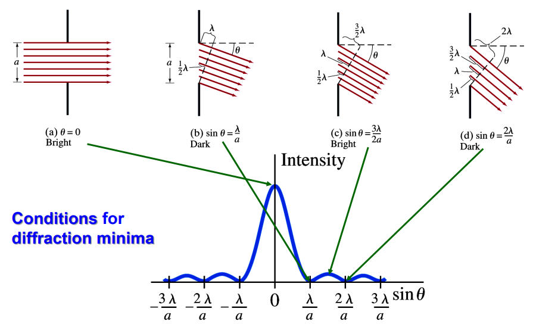

观察可得：黑暗条纹满足狭缝长度相隔$\frac{a}{2}$的两两配对的路程差为$(n+\frac{1}{2}) \lambda$的衍射光线完全相消，因此当存在不满足完全相消的两两配对的衍射光线的时候，光强就会增加（因为没完全抵消），形成峰值。也就是光强图像主要受的是衍射光线相互干涉的影响。

从屏幕中点$m=0$开始数，第$m$个黑暗条纹满足：$a \sin \theta_{m}=m \lambda , \; m=\pm 1,\pm 2,\pm 3, \cdots$

从屏幕中点$m=0$开始数，第$m$个光亮条纹满足：$a \sin \theta_{m}=m \lambda + 0.5 \lambda , \; m=\pm 1,\pm 2,\pm 3, \cdots$

***

单缝衍射视作多缝衍射（光栅衍射）：

要得到衍射光的强度，将狭缝相等地分为$N$个域（zones），每个域的宽度为$\Delta y$，通过每个域的光线为一个惠更斯子波（wavelet）。


现在把到达屏幕上的目标点的各个子波叠加起来，从而得到在这一点的合成波的电场分量的振幅$E_{\theta}$，根据光强和振幅的关系（光强与振幅的平方成正比）获得光强。

以下的图像为相矢量图，相矢量的和就是屏幕上的目标点处的合成波，其振幅即为振幅$E_0$（相矢量的模长表示波的振幅的大小，相矢量的方向表示波的初相位）：


在相邻的相矢量（adjacent phasors）之间，有相位差$\Delta \beta = \frac{2 \pi}{\lambda}\Delta y sin \theta$。其中$\frac{\Delta y sin \theta}{\lambda}$为波数，$\Delta y sin \theta$为路程差。（具体推导可以看下一小节）

可知两两配对的衍射光线的合成波的振幅都一致，但是初相位则不同（因此相矢量的方向也不同）。

***

如果我们将狭缝分成无限个宽为$\Delta y$的域，则相的弧接近圆的弧（对于屏幕上的某一点来说）。此时，全部相矢量合成的合成波的相矢量与$x$轴方向的夹角即为总相位差$\phi$。(相矢量的叠加组成的相矢量的角度为总相位差)

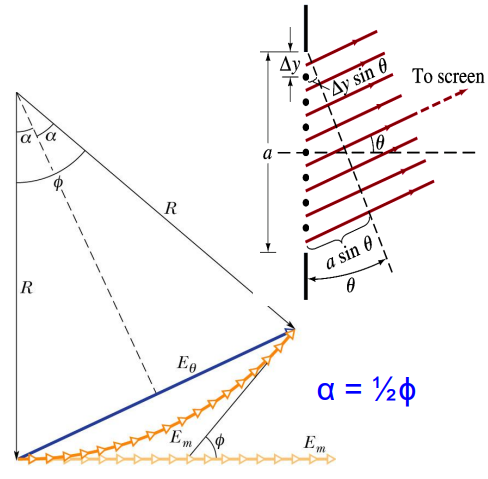

由光程差，路程差，波数差的定义：

$\Delta N = \frac{\Delta L}{\lambda _{n}}=\frac{\delta}{\lambda}$

$\Delta \phi=2 \pi \frac{\Delta L}{\lambda_{n}}$

$\Delta \phi=2 \pi \frac{\delta}{\lambda _{c}}$

对于总狭缝长度$a$，有：

$\phi=\left(\frac{2 \pi}{\lambda}\right)(a \sin \theta)$

根据图像几何意义（扇形与三角形）：

$\alpha = \frac{1}{2} \phi=\frac{\pi a}{\lambda}sin \theta$

$\sin (\alpha) = \sin (\frac{1}{2} \phi)=\frac{E_{\theta}}{2 R}$

由弧度制的定义，得到（$E_{m}$恰好等于扇形弧的长度）：

$\frac{\phi}{2 \pi} \cdot 2 \pi R = E_{m}$

$\phi=\frac{E_{m}}{R}$

因此有振幅$E_{\theta}$与最大振幅$E_{m}$（$\theta = 0$的情况）的关系：

$E_{\theta}=E_{m} \cdot \frac{\sin (\frac{1}{2} \phi)}{(\frac{1}{2} \phi)}$

因此最终可得光强与最大光强的关系：

$\frac{I(\theta)}{I_m}=\frac{E_{\theta}^2}{E_{m}^2}$

$I(\theta)=I_{m} (\frac{sin \alpha}{\alpha})^{2}=I_{m} (\frac{sin \frac{1}{2} \phi}{\frac{1}{2} \phi})^{2}$

***

例子（简单题）：


***

#### 36.3 圆孔衍射（diffraction by a circular aperture）

当光线通过一个小圆孔时，会产生一个最亮的漫反射圆盘（diffuse circular disc）的图像，被称为艾里圆盘/艾里斑（Airy's disc），它也被叫做中央极大处（central maximum），它还会被亮度更低的同心圆环包围。


第一级暗环，也被叫做第一级衍射最小处（first diffraction minimum），满足：

$\sin \theta=1.22 \frac{\lambda}{d}$

其中$\theta$为小圆孔的圆心与衍射图像的圆心的连线和与衍射图像的艾里斑的半径上一点的连线的夹角的角度。$d$为小圆孔的直径。

***

分辨率（resolvability）：在成像光学系统中，分辨本领/分辨能力/分辨率指的是衡量分开相邻两个物点的像的能力。由于衍射，系统所成的像不再是理想的几何点像，而是有一定大小的光斑（艾里斑），当两个物点过于靠近，其像斑重叠在一起，就可能分辨不出是两个物体的像，即光学系统中存在着一个分辨极限。

瑞利判据（Rayleigh's criterion）：

光学系统的分辨极限通常采用瑞利判据：当一个艾里斑的中心与另一个艾里斑的第一级暗环重合时，刚好能分辨出是两个物体的像（两斑圆心相差一个艾里斑的半径）。


当角度较小的时候，根据瑞利判据，有恰能分辨两物体的像的最小分辨角$\theta _{R}$（也就是两像斑中心与小圆孔圆心连线的夹角（角距离），恰好等于艾里斑的半角宽度（条纹中亮度最大到亮度最小的夹角，不论什么衍射）），满足：

$\theta_{\mathrm{R}}=\sin ^{-1}(1.22 \frac{\lambda}{d}) \approx 1.22 \frac{\lambda}{d}$

最小分辨角可以说是与光学相关的仪器内部对角度相关测量的分度值。

通过最小分辨角的倒数$R=\frac{1}{\theta _{R}}=\frac{d}{1.22 \lambda}$表示光学仪器的分辨本领/分辨率，或者说精度。

如果圆孔离需要进行分辨的物体所在平面的距离为$L$，则能够分辨出的最小线性宽度为$D=L \cdot sin ( \theta _{R} ) \approx L \cdot \theta _{R}$，其恰好等于艾里环的半径。

顺带一提，因为光照强度同时由电磁波的电场强度和数量决定，因此当电场强度$E$相等，就需要看数量，而数量的直观表现为面积。拿圆孔衍射举例，艾里圆的面积$S=\pi D^{2}$由半径也就是最小线性宽度$D$决定，因此从圆孔射出到衍射图像的光照强度之比为$(\frac{d}{D})^{2}$。

***

例子（简单题）：


***

#### 36.4 双缝衍射（diffraction by a double slit）

当双缝干涉，且单个狭缝长度$a$远远小于光的波长$\lambda$时（$a << \lambda$），光亮条纹的强度几乎一致，有以下光的相对强度（relative intensity）图像（横坐标$\theta$为屏幕上的目标点与狭缝的连线和与狭缝垂直的直线的夹角，间接表示了目标点的位置）：


实际上的狭缝自然不可能做到小于光的波长（条件$a << \lambda$难以实现），因此我们将一般的狭缝称之为实际狭缝（actual slit）。

对于单缝衍射（实际狭缝），相对强度图像为：


对于双缝衍射（实际狭缝），相对强度图像为：


因此单缝和双缝的衍射图像对比为：


***

实验示意图：


有狭缝$S_1$和$S_2$，两个狭缝的长度均为$a$，每两狭缝中心之间的距离为$d$，两狭缝中心之间的中点与屏幕上的目标点的连线和垂直于两狭缝连线的直线形成的夹角为$\theta$。

$I(\theta)=I_{0}\left(\cos ^{2} \beta\right)\left(\frac{\sin \alpha}{\alpha}\right)^{2}$

$\alpha=\frac{\pi a}{\lambda} \sin \theta=\frac{k \cdot a sin \theta}{2}=\frac{\Delta \phi _{a}}{2}$

$\beta=\frac{\pi d}{\lambda} \sin \theta=\frac{k \cdot d sin \theta}{2}=\frac{\Delta \phi _{d}}{2}$

以上公式仅适用于双缝的情况，可推广到光栅衍射（多缝衍射）的情况。

***

例子（思考题）：


***

#### 36.5 光栅衍射（diffraction gratings）

可以理解为一个障碍物包含多于两个且更多的狭缝情况下，光通过这个障碍物发生的衍射。这个障碍物就叫做光栅。


狭缝越多，无论是光亮条纹还是黑暗条纹都会变得更窄。

光栅衍射同时满足关于$a$和关于$d$的公式：

$a \cdot sin \theta = m \lambda$（黑暗衍射条纹）这是对于每一条狭缝而言的。

$d \cdot sin \theta = n \lambda$（光亮干涉条纹）这是对整个光栅而言的。

***

光栅衍射的光强图像为：


也就是说衍射图像就是光亮条纹和黑暗条纹相间。同时受衍射和干涉影响，但主要考虑干涉的影响。

光栅的光强公式为：

$I(\theta)=I_{0} (\frac{sin (n \beta)}{sin \beta})^{2} (\frac{sin \alpha}{\alpha})^2$

当$n=2$时（双缝衍射），可得$(\frac{sin (n \beta)}{sin \beta})^{2}=4 cos \beta$。

***

与单缝衍射的情况相类似，对于从各个狭缝发出的相互干涉的光波，有：

$d \sin \theta=m \lambda$（$m=0,\pm 1,\pm 2,...$）

其中狭缝间距$d$作为单缝衍射的缝隙的两条光线光源之间的间距$a$，而得到$m$的取值范围仍为通过$0 \leq sin \theta \leq 1$求出。以上公式表示的情况称为主极大（principal maxima），也就是从各个狭缝发出的光波均两两发生相长干涉。（注意相似的公式，单缝衍射是极小值）

***

线宽（width of lines）：

光栅分辨（resolve）不同波长的谱线（lines）的能力是取决于线宽的。我们使用中心谱线（central line）（也就是满足色阶$m=0$，角度$\theta = 0°$的谱线）的半宽度（half-width）（使用$\Delta \theta_{\mathrm{hw}}$进行表示）来对这种分辨能力进行度量。

推想：半宽度就是，对某个特定属性的光栅，一束光从光栅的垂直方向射入，研究屏幕上的某个$P$点，这个$P$点与各缝隙的连线角度为$\theta$。这个$P$点所在的谱线（也就是光亮条纹）中心向外到该谱线的终止和第一极小的暗区开始的地方测量的角度$\Delta \theta _{hw}$。也就是使这条谱线的宽度的一半对应的角度的取值区间。（一条谱线不仅包括光强最大的光亮条纹，而是包括所有光强不等于0的条纹，因此有"宽度"，这个宽度使用角度来表示就是角宽度/线宽度，"角"代表用角度代表谱线的宽度，"线"代表谱线）


对于单缝衍射的第一条黑暗条纹满足$a \sin \theta=1 \cdot \lambda$，那么对于光栅来说，有第一条黑暗条纹（第一极小处）满足:$\mathrm{a}=\mathrm{Nd}$，其中$N$为缝隙的数量，而$d$为缝隙的间距，则有中心谱线的半宽度：$\mathrm{Nd} \sin \Delta \theta_{\mathrm{hw}}=1 \cdot \lambda$。当$\Delta \theta_{\mathrm{hw}}$很小时，满足$\Delta \theta_{\mathrm{hw}} \approx sin \Delta \theta _{hw}$。

除了中心谱线（第一条光亮条纹）的半宽度，还有其他谱线的半宽度，其值取决于这些线相对于中心轴的位置。


省略推导过程（不考），夹角为$\theta$的线的半宽度/角宽度（angular width）为：

$m \lambda = d sin \theta$（$m=0,1,2,3...$表面第$m$阶的谱线的角宽度）

$cos \theta = \sqrt{1 - sin^{2}\theta}$

$\Delta \theta_{\mathrm{hw}}=\frac{\lambda}{\mathrm{Nd} \cdot cos \theta }$（当$\theta = 0$，有$cos \theta = 1$）

***

光栅分光镜（grating spectroscope）：

先通过其他仪器将一束光分离为多个具有不同波长（也就是具有不同颜色）的光线。


然后光栅分光镜将不同波长的光线分离为不同的衍射谱线（diffraction lines）。这个仪器用于测量和分析特定光源的光谱，有时也可以用来生成特定的光。

通过改变分光镜的角度，我们可以得到整个衍射图谱（diffraction pattern）。

例如氢的可见光谱：


$m$为色阶。

***

色散本领（dispersion）：

定义：光栅对不同波长的光的角扩展（angular spreading）。

$D=\frac{\Delta \theta}{\Delta \lambda}$

其中$\Delta \theta$为两条波长差为$\lambda$的谱线（lines）的角扩展。

对于光栅的色散本领，有$D=\frac{m}{d} cos \theta$

***

证明：最大角位置（angular position of maxima）

$d \cdot \sin \theta=m \lambda$

两边取微分可得：

$d \cdot \cos \theta \cdot d \theta=m \cdot d \lambda$

- 为了获得更高的色散，我们必须使用光栅间距$d$更小的光栅，并在更高色阶（order）的$m$中工作。

***

例如光盘的色散：


***

分辨本领（resolving power）：

要分辨波长相近的谱线，谱线应该尽可能的窄。

定义：$R=\frac{\lambda _{avg}}{\Delta \lambda}$，其中$\lambda _{avg}$是所研究的两个谱线的波长的平均值，而$\Delta \lambda$为所研究的两个谱线的波长的差值。

对于光栅，有公式：$R=Nm$。（$R$为光栅的分辨本领，$m$为解析的阶级数）

***

证明：

$\Delta \theta=\Delta \lambda \mathrm{m} / \mathrm{d} \cos \theta$（两条色阶为$m$的谱线的波长差为$\Delta \lambda$）

$\Delta \theta_{\mathrm{hw}}=\lambda / \mathrm{Nd} \cos \theta$（光谱的半宽度）

瑞利判据：判断两条谱线能够分辨的条件为$\Delta \theta=\Delta \theta _{hw}$。

- 为了获得高分辨率，我们应当使用许多刻线（rulings）。

***

对色散和分辨率的比较：

- 为了获得更高的色散，我们必须使用光栅间距$d$更小的光栅，并在更高色阶（order）的$m$中工作。

- 为了获得高分辨率，我们应当使用许多刻线（rulings）。

色散不取决于光栅中的刻线数$N$。


***

关于互补挡板的光衍射的强度关系：

对于一个互补的挡板，其分别作为挡板时,在同一个屏幕上的$P$点的电场强度$E$相反，且光强$I$相等。


$E_{A}+E_{B}=E_{AB}$

$E_{AB}=0$

$I_{A}=I_{B}$

***

#### 36.6 X射线的衍射（X-ray diffraction）

X射线是一种电磁波，其波长范围为$0.001 - 10nm$（数量级为$1\text{\r{A}}=10^{-10}m=0.1nm$）的电磁波。

***

一个标准的光学衍射光栅不能用来辨别X射线波长范围内的不同波长，举个例子，当$\lambda=0.1nm$，而$d=3000nm$，第一次极大处（first order maximum）为：

$\theta=\arcsin \frac{m \lambda}{d}=\arcsin \frac{(1)(0.1 \mathrm{~nm})}{3000 \mathrm{~nm}}=0.0019^{\circ}$

***

X射线的第一次极大处离中央极大处（$\theta =0$）太近了，又不可能制造出满足$d \approx \lambda$的光栅，因此使用晶体固体来作为对X射线的天然的衍射光栅。

氯化钠晶体固体结构：


单胞大小为$a_0$。

X射线在晶体中的路径：


X射线进入晶体不折射，在晶体中衍射的过程表现为类似反射。根据上图，可得两条光线的路程差为$2d sin \theta$，因此对于X射线光栅衍射强度第$m$次极大处，有布拉格定律（Bragg's law）：

$2 d \sin \theta=m \lambda$（$m=0,1,2...$）

其中$\theta$被称为布拉格角。

***

由勾股定理，可将面间距$d$和单胞大小$a_0$联系起来：


得到$d=\frac{a_{0}}{\sqrt{5}}$

***
### Chapter 42 粒子与核物理

#### 42.1 总结回顾（例题和作业）

1.两带电粒子之间的电势能：

$$U=q_1 q_2 /\left(4 \pi \varepsilon_0 d\right)$$

2.原子中质子数用符号$Z$表示，中子数用符号$N$表示，质量数用符号$A$表示，满足$A = Z + N$。

3.摩尔：

$$1 mol = 6.02 \times 10^{23}$$

4.相对原子质量$u$对于$^{12} C$最为精确，但是对于其他元素的质量也是近似于其质量数乘$u$的：

$$1 uc^2 \approx 931.5 MeV$$

5.对于质子气体的温度和动能关系：

$$\frac{3kT}{2}=K$$

$$k = 1.38 \times 10^{-23}$$

6.某些同位素很容易被热中子裂变，而另一些不行，这是因为：

能够被热中子裂变的同位素，其增加一个中子后的同位素的结合能大于势垒的高度。

7.粒子动量和动能和质量的关系（质能方程的本质）：

$$E = mc^2$$

$$p = mv$$

又因为粒子运动质量$m$和静质量$m_0$（一般表格里的质量也默认是静质量）遵守：

$$m^2 = m_0^2 / (1-(v^2 /c^2))$$

$$m^2 \cdot c^2 (c^2-v^2) = m_0^2 \cdot c^4$$

$$E^2 = m^2 c^4= p^2 v^2 +m_0^2 c^4$$

根据质能方程（质能方程的质量其实是运动质量，运动质量的能量即为静质量的能量与动能之和）：

$$E = K + m_0 c^2 = m c^2$$

$$p=\sqrt{\frac{K^2}{c^2}+2 K m_0}$$

动量与动能和静质量均相关，因此即使静质量为0的粒子也遵守动量守恒。

8.一个星系的远离速度为$v$，它和我们之间的距离为$r$，则有哈勃常数$H = 21.8 mm / (s \cdot ly)$满足：

$$v = Hr$$

如果宇宙的膨胀速率是恒定的（那么哈勃常数$H$恒定），那么可以得到宇宙年龄：

$$T=r / v=1 / H \approx 13.8 \times 10^9 \mathrm{y}$$

根据检测到的光的波长$\lambda_{det}$和这种光本来波长$\lambda$也可以推测发光物体和我们的距离$r$：

$$\Delta \lambda = \lambda_{det} - \lambda$$

发光物体远离我们，因此波长被拉长，那么波长的差值与本来波长的比值乘以光速$c$，也就是其远离我们的速度$v$（此处不是频率$v$）：

$$v = \frac{\Delta \lambda}{\lambda} c$$

$$v = H r$$

$$r = \frac{\Delta \lambda}{\lambda \cdot H} c$$

#### 42.3 核性质

质子和电子质量比：

$$m_p / m_e=1836$$

原子核尺度常用单位费米：

$$1 femtometer = 1 fermi =1 fm = 10^{-15} m$$

中子和质子质量相近，为$1.67 \times 10^{-27}kg$。原子核质量数为$A$，$r_0 = 1.2 \times 10^{-15}$为常量，原子核的半径和质量数关系的经验公式：

$$r=r_0 A^{1 / 3}$$

原子核的质量$M$小于其每个质子和中子的总质量$m$，而此差值的能量即为结合能（binding energy）：

$$\Delta E_{b e}=\Sigma\left(m c^2\right)-M c^2$$

原子核的每核子（nucleon）的结合能：

$$\Delta E_{\text {ben }}=\Delta E_{\mathrm{be}} / A$$

#### 42.4 核衰变

原子核的起始总个数为$N_0$，当前总个数为$N$，衰变（decay）常数为$\lambda$（不同同位素都会造成此常数不同），有：

$$-\frac{\mathrm{dN}}{d t}=\lambda N \Rightarrow N=N_0 e^{-\lambda t}$$

衰变速率/活性为：

$$R=-\frac{\mathrm{dN}}{d t}=\lambda N_0 e^{-\lambda t}=R_0 e^{-\lambda t}$$

单位是贝克勒尔（becquerel），用$Bq$作为符号，$1Bq$说明每秒1次衰变。旧单位居里（curle），用$Cl$作为符号，$1Cl = 3.7 \times 10^{10} Bq$。

半衰期（lifetime）是指$N$和$R$都减少到初始值的一半的时间：

$$T_{1 / 2}=\ln 2 / \lambda$$

$\alpha$衰变：

例如：

$${ }^{238} \mathrm{U} \rightarrow{ }^{234} \mathrm{Th}+{ }^4 \mathrm{He}$$

衰变能：

$$Q=-\Delta M c^2$$

半衰期与$Q$有关（$Q$与同位素有关）。

$\beta$衰变：

例如：

$${ }^{32} P \rightarrow{ }^{32} S+e^{-}+\bar{v}\left(n \rightarrow p+e^{-}+\bar{v}\right)$$

#### 42.6 核裂变和热核聚变

核裂变衰变能$Q$计算：

$$Q = - (裂变后总质量 - 裂变前总质量) c^2$$

#### 42.7 基本粒子的一般性质

中微子（Neutrino）符号为$v$，电荷为$0$。在计算中一般将其静质量视为$0$。

电子（Eeutrino）符号为$e$，电荷为$-1$。

质子（Proton）符号为$p$，电荷为$+1$。

$\mu$介子（Muon）符号为$\mu$，电荷为$-1$。

$\pi$介子（Pion）符号为$\pi$，电荷为$-1$。

上述介子如果电荷为相反的，则称为反子（anti-on）。


