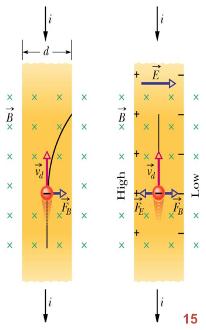
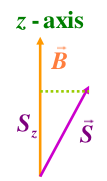
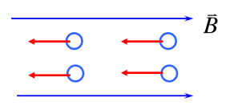
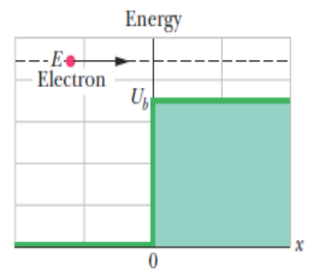
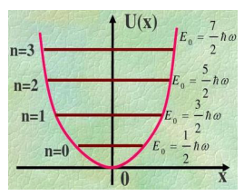

## 目录

    - 基本数学物理常识
    - 常用常数
    - 总结回顾
      - 21 22 库伦定律与电场
      - 23 高斯定律
      - 24 电势
      - 25 电容
      - 28 磁场对带电粒子的影响
      - 29 电流产生磁场
      - 30 感应与电感
      - 32 麦克斯韦方程
      - 33 电磁波
      - 37 狭义相对论
      - 38 光子和物质波
      - 39 物质波与势阱
      - 40 各种量子数
    - 第二十一章-库伦定律
      - 21.2 电荷
      - 21.3 导体和绝缘体
      - 21.4 库伦定律
      - 21.5 电荷量子化
      - 21.6 电荷守恒
    - 第二十二章-电场
      - 22.2 电场
      - 22.3 电场线
      - 22.4 点电荷的电场
      - 22.5 电偶极子的电场
      - 22.6 带电线的电场
      - 22.7 带电圆盘的电场
      - 22.8 电场中的点电荷
      - 22.9 电场中的电偶极子
    - 第二十三章-高斯定律
      - 23.1 高斯定律
      - 23.2 通量
      - 23.3 电场的电通量
      - 23.4 高斯定律
      - 23.5 高斯定律和库伦定律
      - 23.6 带电的孤立导体
      - 23.7 高斯定律的运用：圆柱
      - 23.8 高斯定律的运用：导电板
      - 23.9 高斯定理的应用：球形
    - 第二十四章-电势
      - 24.2 电势能
      - 24.3 电势
      - 24.4 等势面
      - 24.5 通过电场计算电势
      - 24.6 点电荷引起的电势
      - 24.7 由一组点电荷引起的电势
      - 24.8 由电偶极子引起的电势
      - 24.9 电荷连续分布时的电势
      - 24.10 由电势计算电场
      - 24.11 点电荷系统的电势能
      - 24.12 带电绝缘导体的电势
    - 第二十五章-电容
      - 25.2 电容
      - 25.3 计算电容
      - 25.4 并联和串联
      - 25.5 储存在电场中的能量
      - 25.6 电介质电容
      - 25.7 电介质（微观）
      - 25.8 电介质和高斯定律
    - 第二十八章-磁场
      - 28.3 磁场的定义
      - 28.4 交叉场：发现电子
      - 28.5 霍尔效应
      - 28.6 循环运动的带电粒子
      - 28.7 回旋加速器和同步加速器
      - 28.8 载流电线上的磁力
      - 28.9 作用在线圈上的力矩
      - 28.10 磁偶极矩
    - 第二十九章-电流产生的磁场
      - 29.2 计算电流产生的磁场
      - 29.3 两平行电流产生的磁场力
      - 29.4 安培定律
      - 24.5 螺线管和螺绕环
      - 29.6 作为磁偶极子的载流线圈
    - 第三十章-感应和自感
      - 30.3 法拉第电磁感应定律
      - 30.4 楞次定律
      - 30.5 感应和能量转移
      - 30.6 感应电场
      - 30.7 电感器和电感
      - 30.8 自感
      - 30.9 电阻-电感电路
      - 30.10 储存在磁场中的能量
      - 30.11 磁场的能量密度
      - 30.12 互感
    - 第三十二章-麦克斯韦方程组和磁体
      - 32.2 磁场的高斯定律
      - 32.3 感应磁场
      - 32.4 位移电流
      - 32.5 麦克斯韦方程组
      - 32.6 磁体
      - 32.7 磁性和电子
      - 32.8 磁性材料
      - 32.9 抗磁性
      - 32.10 顺磁性
      - 32.11 铁磁
    - 第三十三章-电磁波（二）
      - 33.1 电磁波谱
      - 33.2 电磁行波
      - 33.3 能量传输
      - 33.4 辐射压强
    - 第三十三章-电磁波（electromagnetic waves，EM waves）
      - 33.1 光的本质（nature of light）
      - 33.2 偏振（polarization）
      - 33.3 反射和折射（reflection and refraction）
      - 33.4 全反射（total internal reflection）
      - 33.5 反射引起的偏振（polarization by reflection）
    - 第三十七章-狭义相对论
      - 37.2 两个假设
      - 37.3 观测事件
      - 37.4 同时的相对性
      - 37.5 时间的相对性
      - 37.6 长度的相对性
      - 37.7 洛伦兹变换
      - 37.8 洛伦兹方程的一些结果
      - 37.9 速度的相对性
      - 37.10 多普勒效应
      - 37.11 动量
      - 37.12 能量
    - 第三十八章-光子和物质波
      - 38.2 光的粒子性
      - 38.3 量子物理的诞生
      - 38.4 电子的波动性
      - 38.5 几率波
      - 38.6 薛定谔方程
      - 38.7 不确定性原理和隧穿效应
    - 第三十九章-物质波、陷俘电子、束缚态
      - 39.2 弦波和物质波
      - 39.3 一维无限深势阱
      - 39.4 二维和三维无限深势阱
      - 39.5 一维有限深势阱
      - 39.6 球对称势能-氢原子
      - 39.7 一维谐波势能
    - Chapter 40 角动量和磁性
      - 40.1 总结回顾
      - 40.3 轨道角动量
      - 40.4 自旋角动量
      - 40.5 量子在磁场中的磁偏转（验证磁偶极矩的量子性）
      - 40.6 核磁共振
      - 40.7 泡利不相容原理和多电子
      - 40.8 构建元素周期表
      - 40.9 X射线和元素顺序
      - 40.10 激光

### 基本数学物理常识

1.微分的转换-以圆柱体的体积$V$与半径$r$为例：

$$V=\pi r^2 h$$

$$dV=d(\pi r^2 h)=2 \pi r h \cdot dr$$

2.对于一个球体/球壳，如果说求半径距离为$r$处的电场强度，那么就是求通过半径为$r$的高斯曲面的总电场强度。

### 常用常数

电荷常数：

$$e=1.602 \times 10^{-19} C$$

静电常数：

$$k=8.99 \times 10^9 N \cdot m^2 \cdot C^2$$

$$k=\frac{1}{4 \pi \varepsilon_0}$$

真空介电常数：

$$\varepsilon_0=8.85 \times 10^{-12} \mathrm{C}^2 \mathrm{~N}^{-1} \mathrm{~m}^2$$

电荷密度表：

|属性|符号|国际单位制单位|
|:-:|:-:|:-:|
|电荷|$q$|$C$|
|线（linear）电荷密度|$\lambda$|$C / m$|
|表面（surface）电荷密度|$\sigma$|$C / m^{2}$|
|立体（volume）电荷密度|$\rho$|$C / m^{3}$|

电荷与电荷密度：

$$dq=\lambda ds$$

$$dq=\sigma dA$$

$$dq=\rho dV$$

真空磁导率（permeability）常数：

$$\mu_0=4 \pi \times 10^{-7} \mathrm{~T} \cdot \mathrm{m} \cdot \mathrm{A}^{-1} \approx 1.26 \times 10^{-6} \mathrm{~T} \cdot \mathrm{m} / \mathrm{A}$$

普朗克常数：

$$\hbar=\frac{h}{2 \pi}$$

$$h=6.626 \times 10^{-34} \mathrm{~J} \cdot \mathrm{s}$$

波尔磁子：

$$\mu_B=\frac{e\hbar}{2 m_e}=9.27 \times 10^{-24} \mathrm{~J} / \mathrm{T}$$

电子的荷质比（慢速电子）：

$$\frac{e}{m_e}=1.758 \times 10^{11} C/kg$$

### 总结回顾

#### 21 22 库伦定律与电场

库伦定律：

$$F=k\frac{|q_1||q_2|}{r^2}$$

点电荷的电场（多个点电荷则使用叠加原理）：

$$\vec{E}=\frac{\vec{F}}{q_0}=k \frac{q}{r^2} \hat{r}=\frac{1}{4 \pi \varepsilon_0} \frac{q}{r^2} \hat{r}$$

电偶极子产生距离$z$处的位置的电场（$z >> d$）：

$$E=2 k \frac{q d}{z^3}=\frac{1}{2 \pi \varepsilon_0} \frac{p}{z^3}$$

其中$d$为电偶极子的两个电荷之间的距离。$z$为偶极轴（dipole axis）（电偶极子两个电荷连接形成的直线）上的某一点与电偶极子的两个电荷连线的中点的距离。$p$为电偶极距（electric dipole moment），其从电偶极子的负端指向正端，满足$\vec{p} \equiv q \vec{d}$。

带电直线的电场：

$$d \vec{E}=\frac{d q}{4 \pi \varepsilon_0 r^2} \hat{r}$$

带电圆环的电场：

$$\frac{\sqrt{R^2+z^2}}{z}=\frac{(R^2+z^2)^{1/2}}{z}=cos \theta$$

$$E_z=\frac{1}{4 \pi \varepsilon_0} \frac{q z}{\left(R^2+z^2\right)^{3 / 2}}$$

带电圆盘的电场：

$$\frac{\sqrt{R^2+z^2}}{z}=\frac{(R^2+z^2)^{1/2}}{z}=cos \theta$$

$$dE=d E_z=\frac{1}{4 \pi \varepsilon_0} \cdot \frac{(\sigma \cdot 2 \pi r \cdot d r)}{(\sqrt{r^2+z^2})^{2}} \cdot cos \theta =\frac{1}{4 \pi \varepsilon_0} \cdot \frac{z (\sigma \cdot 2 \pi r \cdot d r)}{(\sqrt{r^2+z^2})^{3}}=\frac{\sigma z}{4 \varepsilon_0} \frac{2 r d r}{(\sqrt{r^2+z^2})^{3}}$$

$$E=\int dE=\frac{\sigma z}{4 \varepsilon_0} \int_0^R \frac{2 r d r}{\left(r^2+z^2\right)^{3 / 2}}=\frac{\sigma}{2 \varepsilon_0}\left[1-\frac{z}{\left(z^2+R^2\right)^{1 / 2}}\right]$$

$$R \rightarrow \infty, \quad E=\frac{\sigma}{2 \varepsilon_0}$$

$$z \rightarrow 0, \quad E=\frac{\sigma}{2 \varepsilon_0}$$

$$z = 0, \quad E=0$$

电场中的点电荷：

$$\vec{F}=q \vec{E}$$

电场中的电偶极子：

由于电偶极子没有净电荷，作用在它整体上的净电力必然为零。两个电荷受到的电场力大小相等，但方向相反，因此有一个合力矩（net torque），则关于其质心的合力矩为（叉乘）：

$$\vec{\tau}_{\text {net }}=\vec{r}_{+} \times q \vec{E}+\vec{r}_{-} \times(-q \vec{E})=q\left(\vec{r}_{+}-\vec{r}_{-}\right) \times \vec{E}=q \vec{d} \times \vec{E}$$

$$\vec{\tau}_{n e t}=\vec{p} \times \vec{E}$$

合力矩其实也可以理解为电偶极子与$\theta$有关的电势能：

$$U=-p \cdot E$$

#### 23 高斯定律

高斯定律-闭合高斯曲面的电场通量（flux）$\Phi$：

$$E=k\frac{q}{r^2}=\frac{q}{4\pi r^2 \varepsilon_0}=\frac{q/\varepsilon_0}{4 \pi r^2}$$

一个点电荷产生的总电场强度（也就是电通量$\Phi_E$）即为$q/\varepsilon_0$，平均到球形面积$4 \pi r^2$每个$dA$的电场强度即为$k\frac{q}{r^2}$。

$$\Phi_E=\oint \overrightarrow{\mathrm{E}} \cdot \overrightarrow{\mathrm{dA}}$$

$$\varepsilon_0 \oint_A \vec{E} \cdot d \vec{A}=q_{e n c}$$

$$E=\frac{q}{A \varepsilon_0}$$

$q_{enc}$是封闭在高斯曲面中的电荷量，$A$是$E$穿过的高斯曲面的总面积。

注意：在静电平衡状态下，带电导体的内部电场为零。

高斯定律-对线作圆柱形曲面（电荷密度$\lambda$）：

$$E=\frac{q}{2 \pi r h \varepsilon_0}=\frac{\lambda h}{2 \pi r h \varepsilon_0}$$

高斯定律-对平面作矩形曲面（电荷密度$\sigma$）：

$$E=\frac{\sigma A}{2 A \varepsilon_0}$$

高斯定律-对球壳和实心球体作球形曲面（球形高斯曲面半径为$r$）：

球壳：

$$r > R \quad \oint \vec{E} \cdot \overrightarrow{d A}=E\left(4 \pi \mathrm{r}^2\right)=q / \varepsilon_0$$

$$r < R \quad \oint \vec{E} \cdot \overrightarrow{d A}=0$$

球体：

$$r > R \quad \oint \vec{E} \cdot \overrightarrow{d A}=E\left(4 \pi \mathrm{r}^2\right)=q / \varepsilon_0$$

$$r < R \quad V=\frac{4}{3}\pi R^3 \quad E=\frac{1}{4 \pi r^2}\frac{r^3}{R^3}\frac{q}{\varepsilon_0}$$

#### 24 电势

电势$V$和电势能$U$（相对于一个均匀带电的物体的电势就需要使用积分了）：

$$U=Fd=qEd$$

$$V=\frac{U}{q}=E d$$

$$V(r)=k\frac{q}{r}=\frac{q}{4 \pi \varepsilon_0 r}, V(\infty)=0$$

$$V=\int d V=\int E \cdot ds=\int \frac{d q}{4 \pi \varepsilon_0 r}$$

线电荷的电势：

$$V=\int d V=\int_0^L \frac{\lambda d x}{4 \pi \varepsilon_0\left(x^2+d^2\right)^{1 / 2}}=\left.\frac{\lambda}{4 \pi \varepsilon_0} \ln \left(x+\left(x^2+d^2\right)^{V / 2}\right)\right|_0 ^L=\frac{\lambda}{4 \pi \varepsilon_0} \ln \left[\frac{L+\left(L^2+d^2\right)^{1 / 2}}{d}\right]$$

电偶极子的电势（$d$为电偶极子的距离）：

$$V(r)=\frac{q d \cos \theta}{4 \pi \varepsilon_0 r^2}=\frac{p \cos \theta}{4 \pi \varepsilon_0 r^2}$$

带电圆盘的电势：

$$d q=\sigma \cdot 2 \pi R^{\prime} d R^{\prime}$$

$$V=\frac{\sigma}{2 \varepsilon_0} \int_0^R \frac{R^{\prime} d R^{\prime}}{\sqrt{z^2+R^{\prime 2}}}=\frac{\sigma}{2 \varepsilon_0}\left(\sqrt{z^2+R^2}-z\right)$$

由电势计算电场（电场总是指向势能减小的方向，因此为负数）：

$$E_s=-\frac{\partial V}{\partial s}$$

$$\vec{E}=-\nabla V=-\left(\frac{\partial V}{\partial x} \vec{i}+\frac{\partial V}{\partial y} \vec{j}+\frac{\partial V}{\partial z} \vec{k}\right)$$

由$U=Fd$，可得点电荷系统的电势能：

$$U=\frac{1}{4 \pi \varepsilon_0} \sum_{i<j} \frac{q_i q_j}{r_{i j}}$$

#### 25 电容

电容$C$趋近于无限则视作导线，趋近于$0$则视作断路。

$$1pF=10^{-12}F$$

电容的原始定义：

$$q=CV$$

不同形状的电容器，先计算电场$E$，然后根据$V=Ed$得到含有$q$的表达式，然后代入原始定义即可。

平行板电容器（两板间隔为$d$）：

$$\varepsilon_0 \oint_A \vec{E} \cdot d \vec{A}=q_{e n c}$$

$$E=\frac{q}{\varepsilon_0 A}$$

$$V=Ed$$

$$C=\frac{q}{V}=\varepsilon_0 \frac{A}{d}$$

圆柱电容器（两个同心空心圆柱组成电容器）：

$$C=2 \pi \varepsilon_0 \frac{L}{\ln (b / a)}$$

球形电容器（两个同心空心球体组成电容器）：

$$C=\frac{4 \pi \varepsilon_0}{\frac{1}{a}-\frac{1}{b}}$$

孤立球体（球形电容器$a=R,b \to \infty$）：

$$C=4 \pi \varepsilon_0 R$$

电容的并联和串联：

$$V_1=V_2=V_3$$

$$C_{e q}=\sum_{j=1}^n C_j$$

$$q_1=q_2=q_3$$

$$\frac{1}{C_{e q}}=\sum_{j=1}^n \frac{1}{C_j}$$

储存在电容/电场的能量：

$$U=\frac{1}{2} \frac{q^2}{C}=\frac{1}{2} C V^2$$

由高斯定律得储存在电场的能量与电场能密度$u$的关系（$C=\varepsilon_0 \frac{A}{d}$）：

$$U=u \cdot V_{体积}$$

$$V_{体积}=A d$$

$$\mathrm{u}=\frac{1}{2} \varepsilon_0 \mathrm{E}^2$$

电介质（dielectric）对电容的影响：

$$C_d=\kappa C$$

电介质会产生感应（induced）电荷：

注意插入电介质后，相当于组成了两个相互串联的电容器，且距离总和为原两板距离长度减去电介质的厚度长度。

没有电介质时的$E_0$和$q$：

$$\varepsilon_0 \oiint \vec{E_0} \cdot d \vec{A}=\varepsilon_0 E_0 A=q$$

$$E_0=\frac{q}{\varepsilon_0 A}$$

存在电介质时，有感应电荷（induced charge）$q'$：

$$\varepsilon_0 \oiint \vec{E} \cdot d \vec{A}=\varepsilon_0 E A=q-q^{\prime}$$

$$E=\frac{q-q^{\prime}}{\varepsilon_0 A}$$

$$E=\frac{E_0}{\kappa}$$

$$(q-q')=\frac{q}{\kappa}$$

$\vec{D}$为电位移矢量（electric displacement vector），$q$为仅自由电荷，不包含感应电荷：

$$\oiint \vec{D} \cdot d \vec{A}=q$$

$$\vec{D}=\kappa \varepsilon_0 \vec{E}=\vec{E_0} \varepsilon_0$$

#### 28 磁场对带电粒子的影响

磁场单位特斯拉$T$和高斯的$G$转换：

$$1 \mathrm{~T}=10^4 \mathrm{G}$$

磁场$B$（叉乘，$\vec{v}$为速度）：

$$\vec{F}_B=q \vec{v} \times \vec{B}$$

由磁场导致带电粒子作圆周运动：

$$q v B=m \frac{v^2}{r}$$

$$T=\frac{2 \pi m}{q B}=\frac{2 \pi}{\omega}=\frac{1}{f}$$

载流导线上的磁力：

$$q=i t=i \frac{L}{v}$$

$$F_B=q v B \sin \phi=i \frac{L}{v} v B \sin \phi=i L B \sin \phi$$

$$\vec{F}_B=i \vec{L} \times \vec{B}$$

匝数为$N$的载流线圈在磁场中所受的力矩$\tau$：

$$\vec{\tau}=\mathrm{N} i A \vec{\mathrm{n}} \times \overrightarrow{\mathrm{B}}$$

载流线圈磁偶极矩（magnetic dipole moment）：

$$\vec{\mu}=N i A \vec{n}$$

$$\vec{\tau}=\vec{\mu} \times \overrightarrow{\mathrm{B}}$$

磁场中的磁偶极子具有磁势能：

$$U(\theta)=-\vec{\mu} \cdot \vec{B}=-\vec{p} \cdot \vec{E}$$

$$W=U_f-U_i$$

#### 29 电流产生磁场

一段长度为$ds$的导线中的电流$i$在与其距离$r$的位置产生的磁场$dB$：

$$\overrightarrow{d B}=\frac{\mu_0}{4 \pi} \frac{i d \vec{s} \times \hat{r}}{r^2}$$

$$\hat{r}=\frac{\vec{r}}{r}$$

$$\mathrm{d} B=\frac{\mu_0}{4 \pi} \frac{i d s}{r^2}$$

直线导线产生的磁场（长度$s$趋向于无限，距离$R$处的磁场）：

$$B=\frac{\mu_0 i}{2 \pi R}$$

圆弧导线产生的磁场（$ds=R d\phi$，半径为$R$，圆心处的磁场）：

$$B=\frac{\mu_0 i \phi}{4 \pi R}$$

两条平行直线导线（距离为$d$，长度为$L$）产生的磁场导致对其中一条导线的力：

$$F_{b a}=\frac{\mu_0 L i_a i_b}{2 \pi d}$$

安培定律（和高斯定律设置高斯曲面类似的，设置一个半径为$r$的安培回路，$i_{enc}$为安培回路内部的电流，但是$s$为安培回路的总长度）对直线导线研究：

$$\oint \vec{B} \cdot \overrightarrow{d s}=\mu_0 i_{e n c}$$

$$B=\frac{\mu_0 i_{enc}}{s}$$

安培回路半径$r>R$：

$$i_{enc}=i, \quad \vec{B} \cdot \overrightarrow{d s}=B d s \cos 0^{\circ}=B d s$$

$$\oint B \mathrm{ds}=2\pi r B=\mu_0 \mathrm{i}$$

$$B=\frac{\mu_0 i}{2 \pi r}$$

安培回路半径$r<R$：

$$\mathrm{i}_{\text {enc }}=J\left(\pi r^2\right)=\frac{i}{\pi R^2}\left(\pi r^2\right)=i \frac{r^2}{R^2}$$

$$B=\left(\frac{\mu_0 i}{2 \pi r}\right) \frac{r^2}{R^2}$$

对螺线管（solenoid）和环形线圈（toroids）使用安培定律（安培回路均从环形线圈上方的方向设置）：

无限长螺线管的磁场（$n$为每单位长度的匝数）：

$$\mathrm{i}_{e n c}=(n h) i , \quad \oint \vec{B} \cdot \overrightarrow{d s}=Bh=\mu_0 i_{e n c}$$

$$B=\mu_0 n i$$

环形线圈的磁场：

$$i_{e n c}=N i$$

$$B=\frac{\mu_0 N i}{2 \pi r}$$

在外部磁场$B$中表现为磁偶极子的匝数为$N$载流线圈受到力矩的作用，磁偶极矩$\mu$：

$$\mu=\mathrm{NiA}$$

$$\vec{\tau}=\vec{\mu} \times \vec{B}$$

载流线圈造成的磁场（匝数默认为$N=1$）：

$$B=\frac{\mu_0 i R^2}{2\left(R^2+z^2\right)^{3 / 2}}$$

$$A=\pi R^2 , \mu=N i A$$

$$B(z) \approx \frac{\mu_0 i R^2}{2 z^3}=\frac{\mu_0 \mu}{2 \pi z^3}$$

#### 30 感应与电感

回路的磁通量$\Phi_B$（flux）：

$$\Phi_B=\int \vec{B} \cdot \overrightarrow{d A}$$

回路中的感应电动势$\mathcal{E}$（electromotive force，emf）为磁通量的变化率，单位为$1 Wb=1 T \cdot m^2$，若回路匝数为$N$：

$$\mathcal{E}=-N \frac{d \Phi_B}{d t}$$

电感，单位为$1 H=1 T \cdot m^2 / A$：

$$L=\frac{N \Phi_B}{i}$$

运用电路的知识，在有源RL电路中满足：

$$\varepsilon-i R-L \frac{\mathrm{d} i}{\mathrm{~d} t}=0$$

$$I_s=\frac{\varepsilon}{R}$$

$$\int_0^i \frac{\mathrm{d} i}{i-\varepsilon / R}=\int_0^t-\frac{R}{L} \mathrm{~d} t \Rightarrow i=\frac{\varepsilon}{R}\left(1-e^{-\frac{R}{L} t}\right)$$

无源RL电路：

$$I_0=\frac{\varepsilon}{R}$$

$$i=\frac{\varepsilon}{R} e^{-\frac{R}{L} t}$$

与在电场中电容储存能量类似的，在磁场中电感储存能量：

$$U_B=\frac{1}{2} L i^2$$

磁场的能量密度：

$$u_B=\frac{U_B}{V}=\frac{\frac{1}{2} L i^2}{V}=\frac{1}{2} \mu_0 n^2 i^2=\frac{1}{2 \mu_0}\left(\mu_0 n i\right)^2$$

$$u_B=\frac{1}{2}\frac{1}{\mu_0}B^2$$

两个线圈的互感电动势（详情见电路导论）：

$$M_{12}=M_{21}=M$$

$$\varepsilon_1=-M_{12} \frac{\mathrm{d} i_2}{\mathrm{~d} t}$$

$$\varepsilon_2=-M_{21} \frac{\mathrm{d} i_1}{\mathrm{~d} t}$$

#### 32 麦克斯韦方程

磁通量$\Phi_B$变化产生电场，电通量$\Phi_E$变化产生磁场。

高斯定律-电场：

$$\oiint \vec{E} \cdot d \vec{A}=\frac{q_{\mathrm{enc}}}{\varepsilon_0}$$

高斯定律-电场有介质的情况：

$$\oiint \vec{D} \cdot d \vec{A}=q_0 \quad\left(\vec{D}=\varepsilon_r \varepsilon_0 \vec{E}\right)$$

高斯定律-磁场：

$$\oiint \vec{B} \cdot d \vec{A}=0$$

法拉第感应定律（感应电动势等于磁通量的变化率）：

$$\oint \vec{E} \cdot d \vec{s}=-\frac{d \Phi_B}{d t}=\mathcal{E}=\oint dV$$

安培-麦克斯韦定律：

$$\oint \vec{B} \cdot d \vec{s}=\mu_0 \varepsilon_0 \frac{d \Phi_E}{d t}+\mu_0 i_{e n c}=\mu_0(i_d+i_{enc})$$

安培-麦克斯韦定律有磁性介质的情况：

$$\oint \vec{H} \cdot d \vec{s}=i_0+i_d \quad\left(\vec{H}=\frac{1}{\mu_r} \frac{1}{\mu_0} \vec{B}\right)$$

位移电流$i_d$：

$$i_d=\varepsilon_0 \frac{d \Phi_E}{d t}=\frac{d q}{d t}=i$$

电子的自旋角动量为$S$，自旋磁偶极矩为$\mu_s$，满足：

$$\vec{\mu}_s=-\frac{e}{m} \vec{S}$$

$$S_z=\pm \frac{\hbar}{2}$$

$$\hbar=\frac{h}{2 \pi}, \quad h=6.626 \times 10^{-34} \mathrm{~J} \cdot \mathrm{s}$$

有波尔磁子（Bohr magnetion）$\mu_B$：

$$\mu_{sz}=\pm \mu_B=\pm \frac{e \hbar}{2 m}=9.27 \times 10^{-24} \mathrm{~J} / \mathrm{T}$$

在外部磁场$B$下此电子沿着$z$方向的能量为：

$$U=-\vec{\mu}_S \cdot \vec{B}=-\mu_{S, z} B_{e x t} \quad U=\pm \frac{e \hbar B}{2 m}$$

电子的轨道磁偶极矩为：

$$\vec{\mu}_{\mathrm{orb}}=\pi r^2 i=-\frac{e}{2 m} \vec{L}_{\mathrm{orb}}$$

$$\vec{L}_{o r b, z}=m_l \hbar , m_l=0,\pm 1,\pm  2,\pm 3,...$$

#### 33 电磁波

$$E=E_m \sin (k x-\omega t)$$

$$B=B_m \sin (k x-\omega t)$$

波速$c$和振幅比$c$（相等）：

$$c=\frac{1}{\sqrt{\mu_0 \varepsilon_0}}$$

$$\frac{E_m}{B_m}=c$$

电磁波单位面积的能量传输速率用能流密度$S$（energy flux density）表示：

$$u=u_e+u_m=\frac{1}{2} \varepsilon_0 E^2+\frac{1}{2} \frac{B^2}{\mu_0}=\frac{1}{2} \varepsilon_0 E \cdot c B+\frac{1}{2} \frac{B}{\mu_0} \frac{E}{c}=\sqrt{\frac{\varepsilon_0}{\mu_0}} E B$$

$$S=\frac{d U}{d A d t}=u c=\frac{1}{\mu_0} E B$$

$$\bar{S}=\frac{1}{\mu_0} \bar{E} \times \bar{B}$$

$$I=S_{avg}=\frac{1}{c \mu_0} \frac{E_m^2}{2}$$

#### 37 狭义相对论

时间的相对性，时间与速度一样，必须选取参考系才有确切的数值，因此所有事件都没有所谓的"客观时间"，而只有"相对时间"。

注意："一个事件的发生"和"观测者接收到此事件的信息"是不同的。时间是相对的（一个事件的发生的相对时间需要根据观测者自身参考系来获得），事件是绝对的（事件客观上发生了，但是其发生的客观时间是不存在的，只存在相对时间）。

观测者只能根据自身参考系来获得一个事件的相对发生时间，换一个观测者那么就是不同的自身参考系，那么同一个事件的相对发生时间可能不同。一个事件的发生时间其实不存在一个客观的时间，只有不同观测者得到的不同的相对时间。

综上所述，观测者根据其接收到某一事件的信息的事件获得此事件的相对发生时间。

时间的相对性（$v$为观测者移动的速度，$c$为光速，静止观察者的相对时间为$\Delta t_0$，移动观察者的相对时间为$\Delta t$）：

$$\Delta t=\frac{\Delta t_0}{\sqrt{1-(v / c)^2}}$$

$$\Delta t=\gamma \Delta t_0$$

也就是说，由于光的路程不同从而导致的不同观测者得到的相对时间也不同，因此定义速度参数$\beta$和洛伦兹因子（Lorentz factor）$\gamma$：

$$\gamma=\frac{1}{\sqrt{1-\beta^2}}=\frac{1}{\sqrt{1-(v / c)^2}}$$

长度的相对性（$L_0$为静止长度，$L$为同一物体移动时由于尺缩效应的长度）：

$$L=L_0 \sqrt{1-\beta^2}=L_0 / \gamma$$

速度的相对性（有两个事件发生，$\Delta x$和$\Delta x'$分别为两个参考系观测这两个事件发生的距离差，$\Delta t$和$\Delta t'$分别为两个参考系观测这两个事件发生的时间差，$v$为两个不同参考系的相对速度，$u$为第一个参考系测量得到的速度，$u'$为第二个参考系测量得到的速度，需要同时考虑长度的相对性）：

$$\Delta x=\gamma\left(\Delta x^{\prime}+v \Delta t^{\prime}\right)$$

$$\Delta t=\gamma\left(\Delta t^{\prime}+\frac{v \Delta x^{\prime}}{c^2}\right)$$

洛伦兹（Lorentz）变换可得：

$$\Delta x^{\prime}=\gamma(\Delta x-v \Delta t), \quad \Delta t^{\prime}=\gamma\left(\Delta t-\frac{v \Delta x}{c^2}\right)$$

$$u=\frac{\Delta x}{\Delta t} \quad u^{\prime}=\frac{\Delta x^{\prime}}{\Delta t^{\prime}}$$

$$\frac{\Delta x}{\Delta t}=\frac{\Delta x^{\prime}+v \Delta t^{\prime}}{\Delta t^{\prime}+\frac{v \Delta x^{\prime}}{c^2}}=\frac{\Delta x^{\prime} / \Delta t^{\prime}+v}{1+\frac{v\left(\Delta x^{\prime} / \Delta t^{\prime}\right)}{c^2}}$$

$$u=\frac{u^{\prime}+v}{1+u^{\prime} v / c^2}$$

多普勒效应（源和检测器相对速度为$v$，$\beta=\frac{v}{c}$）：

源和探测器远离：

$$f=f_0 \sqrt{\frac{1-\beta}{1+\beta}}$$

源和探测器靠近：

$$f=f_0 \sqrt{\frac{1+\beta}{1-\beta}}$$

低速多普勒效应（low speed Doppler effect）（$\beta << 1$）：

$$f=f_0\left(1-\beta+\frac{1}{2} \beta^2\right)$$

天文多普勒效应（astronomical Doppler effect）：

$$f=f_0(1-\beta)$$

波源的波长$\lambda_0$与接收到的波长$\lambda$（$c=\lambda f$）：

$$c / \lambda=c(1-\beta) / \lambda_0 \quad \lambda=\lambda_0(1-\beta)^{-1} \quad \beta=\left(\lambda-\lambda_0\right) / \lambda$$

$$\beta=v / c, \quad \Delta \lambda=\lambda-\lambda_0$$

$$v=c\frac{|\Delta \lambda|}{\lambda_0}$$

粒子动量和动能和质量的关系（质能方程的本质）：

$$E = mc^2$$

$$p = mv$$

$$m=\gamma m_0$$

又因为粒子运动质量$m$和静质量$m_0$（一般表格里的质量也默认是静质量）遵守：

$$m^2 = m_0^2 / (1-(v^2 /c^2))$$

$$m^2 \cdot c^2 (c^2-v^2) = m_0^2 \cdot c^4$$

$$E^2 = m^2 c^4= p^2 v^2 +m_0^2 c^4$$

$$E=\gamma m_0 c^2=\sqrt{p^2 v^2 +m_0^2 c^4}$$

$$K=E-m_0 c^2=m_0 c^2 (\gamma-1)$$

根据质能方程（质能方程的质量其实是运动质量，运动质量的能量即为静质量的能量与动能之和）：

$$E = K + m_0 c^2 = m c^2$$

$$p=\sqrt{\frac{K^2}{c^2}+2 K m_0}$$

动量与动能和静质量均相关，因此即使静质量为0的粒子也遵守动量守恒。

#### 38 光子和物质波

光波的能量的量子称为光子（频率用$v$或$f$表示）：

$$E=h v=\hbar \omega$$

$$\hbar=\frac{h}{2 \pi}$$

光电效应（$f$为照射光的频率，照射光被原子吸收。$\Phi$为功函数，也就是电子挣脱原子所需的能量。$K_{max}$为射出的电子的最大动能）：

$$hf=h \frac{c}{\lambda}=K_{max}+\Phi$$

光子的动量$p$和碰撞后的波长变化（发射$X$射线的同时有了角度为$\theta$的偏转，康普顿散射）：

$$p=\frac{h}{\lambda}$$

$$\Delta \lambda=\frac{h}{m c}(1-\cos \phi)$$

电子（包括光子）可以看作是物质波：

$$\lambda=\frac{h}{p}$$

薛定谔方程：

$$\begin{aligned} & i \hbar \frac{\partial \Psi}{\partial t}=-\frac{\hbar^2}{2 m} \frac{\partial^2 \Psi}{\partial x^2}+U \Psi \\ & -\frac{\hbar^2}{2 m} \frac{d^2 \psi}{d x^2}+U \psi=E \psi\end{aligned}$$

海森堡测不准原理：

$$\Delta x \cdot \Delta p_{\mathrm{x}} \geq \hbar$$

$$\Delta y \cdot \Delta p_{\mathrm{y}} \geq \hbar$$

$$\Delta z \cdot \Delta p_{\mathrm{z}} \geq \hbar$$

一个粒子的位置$r$和动量$p$不能以无限的精度同时得到测量值。其中$\Delta x$其实就是$x$的测量精度的误差。例如此时$x=100 nm$，以精度为$1%$进行测量，则$\Delta x = 1 % x = 1nm$，那么$\Delta p_x \geq \hbar / \Delta x$。

势垒隧穿（potential barrier tunneling）：

电子通过静电势垒的过程分析，$L$为势垒的厚度（thickness）：

$$U(x)= \begin{cases}U_0, & (0<x<L) \\ 0, & (x<0, \text { or } x>L)\end{cases}$$

在三个区域分别解薛定谔方程可得透射系数$T$：

$$\frac{d^2 \psi}{d x^2}+\frac{2 m}{\hbar^2}[E-U(x)] \psi=0$$

$$T \approx \exp \left[-\frac{2 L}{\hbar} \sqrt{2 m\left(U_0-E\right)}\right]=e^{-2 b L}$$

$$b=\sqrt{2 m\left(U_0-E\right)} / \hbar$$

这个算出来的传输系数$T$即为粒子穿过势垒（并能被探测出来）发生隧穿效应（tunneling effect）的近似概率。

由于量子力学的性质，即使量子的能量$E$满足$E< U_b$，每个量子也有大于零的概率（传输系数$T > 0$）通过（隧道）到达静电势垒的另一侧。因此即使能量比势垒低，量子有一个固定概率可以穿过势垒。

#### 39 物质波与势阱

一维无限势阱：

$$U(x)=\left\{\begin{array}{cc}0 & 0<x<L \\ \infty & x<0 \text { or } x>L\end{array}\right.$$

列出薛定谔方程（$\psi(x)$即为势阱中的量子在$x$处的概率的函数）：

$$\frac{d^2 \psi(x)}{d x^2}+k^2 \psi(x)=0 \quad(0<x<L)$$

边界条件：

$$\psi(x \leq 0)=0, \quad \psi(x \geq L)=0$$

使其与势阱宽度$L$和能级$n$有关：

$$k=\sqrt{2 m E / \hbar^2}$$

$$k L=n \pi, \quad k=\frac{n \pi}{L}, \quad n=1,2,3, \ldots$$

$$\psi_n(x)=A \sin \left(\frac{n \pi x}{L}\right)$$

$$P=\int_0^L\left|\psi_n(x)\right|^2 d x=1$$

最终关于能级$n$的概率波函数：

$$\psi_n(x)=\sqrt{\frac{2}{L}} \sin \left(\frac{n \pi x}{L}\right)$$

在不同的能级$n$的本征能量$E_n$（eigen energies），$n=1$时为基态，其他能级均为激发态：

$$E_n=\frac{\hbar^2 k^2}{2 m}=\frac{n^2 \pi^2 h^2}{2 m L^2}$$

二维/三维无限势阱：

$$E_n=\frac{\pi^2 \hbar^2}{2 m}\left(\frac{n_x^2}{L_x^2}+\frac{n_y^2}{L_y^2}+\frac{n_z^2}{L_z^2}\right)$$

$$\psi_{n_x, n_z}(x, y, z)=\sqrt{\frac{8}{L_x L_y L_z}} \sin \left(\frac{n_x \pi x}{L_x}\right) \sin \left(\frac{n_y \pi y}{L_y}\right) \sin \left(\frac{n_z \pi z}{L_z}\right)$$

二维情况下，势阱宽度满足$L_x=L_y$，$L_z=0$，则有：

某一能级的某一个轨道的其中一个电子的能量：

$$E_{n_x ,n_y}=\frac{h^2}{8m}(\frac{{n_x}^2}{{L_x}^2} + \frac{{n_y}^2}{{L_y}^2}) = \frac{h^2}{8mL^2}({n_x}^2 + {n_y}^2)$$

一个能级的最大电子数（根据不相容原理和量子数$(n_x , n_y , m_s)$）的确定方法：

$({n_x}^2 + {n_y}^2)$值相等，则都为同一能级的轨道。一个轨道容纳两个自旋方向相反的电子。如果是三维则加入$m_s$与$({n_x}^2+{n_y}^2+{n_z}^2)$相乘结果相同即为同一能级。

氢原子模型（$n$为能级）：

$$L=n \hbar$$

$$F=m a,-\frac{1}{4 \pi \varepsilon_0} \frac{e^2}{r^2}=-m \frac{v^2}{r}, r m v=n \hbar$$

$$r=\frac{h^2 \varepsilon_0}{\pi m e^2} n^2=a n^2$$

$$E=K+U=\frac{1}{2} m v^2-\frac{1}{4 \pi \varepsilon_0} \frac{e^2}{r}=-\frac{1}{8 \pi \varepsilon_0} \frac{e^2}{r}, E_n=-\frac{m e^4}{8 \pi \varepsilon_0^2 h^2} \frac{1}{n^2}$$

三维势阱的本征能量（$n$为能级）：

$$E_n=\frac{\pi^2 \hbar^2}{2 m}\left(\frac{n_x^2}{L_x^2}+\frac{n_y^2}{L_y^2}+\frac{n_z^2}{L_z^2}\right)$$

$$E=E_n=-\frac{m_e e^4}{\left(4 \pi \varepsilon_0\right)^2 2 \hbar^2} \frac{1}{n^2}=-\frac{e^2}{4 \pi \varepsilon_0 2 a_0} \frac{1}{n^2}=-\frac{13.6 \mathrm{eV}}{n^2}, \quad(n=1,2,3, \ldots)$$

#### 40 各种量子数

主量子数的符号为$n$（就是电子在原子中的能级），值为$1,2,3, ...$，与电子离原子核的距离有关。

波尔磁子$\mu_B$：

$$\mu_B=\frac{e \hbar}{2 m_e}=9.274 \times 10^{-24} \mathrm{~J} / \mathrm{T}$$

轨道角动量（$l$为轨道角量子数，取值为$0,1,2,...,(n-1)$）：

$$L=\sqrt{\ell(\ell+1)} \hbar$$

$z$轴分量（$m_l$为轨道磁量子数，取值为$-l,-(l-1),...,+(l-1),l$）：

$$L_z=m_l \hbar \quad m_l=-l,-l+1, \ldots, 0, \ldots, l-1, l$$

轨道磁偶极矩：

$$\vec{\mu}_{\mathrm{orb}}=-\frac{e}{2 m_e} \vec{L}$$

$z$轴分量：

$$\mu_{o r b, z}=-m_l \mu_B$$

自旋角动量（$s$为自旋角量子数，取值为$\frac{1}{2}$）：

$$s=\frac{1}{2}$$

$$S=\sqrt{s(s+1)} \hbar=\sqrt{3} \hbar / 2$$

$z$轴分量（$m_s$为自旋磁量子数，取值为$\pm \frac{1}{2}$）：

$$S_z=m_s \hbar \quad m_s=\pm \frac{1}{2}$$

自旋磁偶极矩：

$$\vec{\mu}_s=-\frac{e}{m_e} \vec{S}$$

$z$轴分量：

$$\mu_{s, z}=-2 m_s \mu_B$$

被限制在同一个势阱中（也包括原子）的两个电子，量子数不可能是完全相同的。

### 第二十一章-库伦定律

#### 21.2 电荷

电荷（electric charge）分为正电荷和负电荷。如果正电荷和负电荷数量相同，则具有电中性（electrically neutral）。若否，则带电（charged）。

丝绸和玻璃摩擦：丝绸带负电，玻璃带正电。

毛皮和塑料摩擦：毛皮带正电，塑料带负电。

以上两个实验的现象称为摩擦起电（charging by rubbing），电子从一个材料转移到了另一个材料中。

#### 21.3 导体和绝缘体

原子具有电中性。导体（conductors）的原子的电子可以自由移动，而离子无法移动或者移动非常缓慢。绝缘体（insulators）的原子的电子无法自由移动。

感应电荷（electrically induced net charge）指的是导体的原子的电子会受到外部电荷的影响从而聚集在导体的不同部分，造成导体各个部分的电子密度不同。

#### 21.4 库伦定律

库伦定律（Coulomb's Law）描述两个带电物体相互的作用力。

$$F=k \frac{|q_{1}| \cdot |q_{2}|}{r^{2}} \tag{库伦定律}$$

其中$q_{1}$和$q_{2}$为电荷量，单位为库伦（C）。k为静电常数（electrostatic constant），$k=0.88 \times 10^{9} N \cdot m^{2} \cdot C^{-2}$。

$$k=\frac{1}{4 \pi \epsilon_{0}} \tag{介电常数}$$

其中$\epsilon_{0}$为介电常数，$\epsilon_{0}=8.85 \times 10^{-12} C^{2} N^{-2} m^{2}$。

叠加原理（principle of superposition）：多个电荷对同一个带电物体产生的合力为各个电荷全部库仑力的向量和。

$$\vec{F}_{1,net}=\vec{F}_{12}+\vec{F}_{13}+...+\vec{F}_{1n} \tag{叠加原理}$$

壳层定理（shell theorem）：

1.具有均匀（uniform）散步的电荷的壳层吸引或排斥壳层外的带电粒子时，可以视作壳层的所有电荷都集中在其中心并视作一个点电荷。

2.如果一个带电粒子在一个具有均匀散步的电荷的壳层内部，那么壳层的所有电荷对此带点粒子的合力恒为0。

3.如果过量（excess）的电荷被放置在由导电材料制成的球形外壳上，则电荷将会自发地均匀散布在表面上。在球形外壳内部没有电场。

#### 21.5 电荷量子化

电荷是由某一基本电荷（正或负）的倍数组成的。

基本电荷：$e=1.602 \times 10^{-19} C$。

量子化的（quantized）：形容一个物理量只有离散值。

$$q = n e , n=\pm 1, \pm 2, \pm 3... \tag{电荷量}$$

#### 21.6 电荷守恒

电荷不能凭空被创造，也不能被消灭，只能在物体之间转移。因此，电荷量的代数和是常量，这称为电荷守恒（charge conserved）。

$$_{92}^{238} U \to _{90}^{234} Th + _{2}^{4} He \tag{放射性衰变}$$

$$e^{-}+e^{+} \to \gamma + \gamma \tag{正负电子对湮灭}$$

$$2 \gamma \to e^{-} + e^{+} \tag{正负电子对产生}$$

***

### 第二十二章-电场

#### 22.2 电场

带电粒子在空间中会形成电场（electric field），电场力（electric force）通过电场作用在带电粒子上。

要获得某点的电场的信息，我们需要使用试探电荷（test charge），并测量试探电荷$q_{0}$在此点所受的电场力从而计算出电场强度。

$$\vec{E}=\frac{\vec{F}}{q_{0}} \tag{电场强度}$$

而对于不止一个带电粒子形成的电场，其电场强度为：

$$\vec{E}=\frac{\vec{F}_{net}}{q_{0}} \tag{电场强度}$$

#### 22.3 电场线

电场线（electric lines）从正电荷向负电荷的方向延伸。

电场线的切线显示了这个位置的电场强度的方向。

在一个垂直于所有电场线的平面上，单位面积内电场线的数量与电场强度的大小成正比。

#### 22.4 点电荷的电场

通过叠加原理可以得到由多个点电荷（point charge）共同产生的净电场（net field）的电场强度：

$$\vec{F}=\frac{1}{4 \pi \varepsilon_0} \frac{q q_0}{r^2} \hat{r}$$

$$\vec{E}=\frac{\vec{F}}{q_0}=\frac{1}{4 \pi \varepsilon_0} \frac{q}{r^2} \hat{r}$$

$$\vec{E}_{n e t}=\vec{E}_1+\vec{E}_2+\ldots+\vec{E}_n=\sum_{i=1}^n \frac{q_i}{4 \pi \varepsilon_0 r_i^2} \hat{r}_i$$

其中$\hat{r}$为单位向量。

#### 22.5 电偶极子的电场

电偶极子（electric charge）是两个电荷，他们的大小相等，符号相反，并以很小的距离分开。

$$\begin{aligned}&E=E_{(+)}+E_{(-)}=k \frac{q}{r_{(+)}^2}-k \frac{q}{r_{(-)}^2}=k \frac{q}{(z-d / 2)^2}-k \frac{q}{(z+d / 2)^2} \\ &=k \frac{q}{z^2}\left[\frac{1}{(1-d / 2 z)^2}-\frac{1}{(1+d / 2 z)^2}\right]=k \frac{q}{z^2}\left[\left(1+\frac{d}{z}+\ldots\right)-\left(1-\frac{d}{z}+\ldots\right)\right]\end{aligned}$$

满足$z>>d$：

$$E=2 k \frac{q d}{z^3}=\frac{1}{2 \pi \varepsilon_0} \frac{p}{z^3}$$

$$\vec{p} \equiv q \vec{d}$$

$$\vec{E}=\frac{1}{2 \pi \varepsilon_0} \frac{\vec{p}}{z^3}$$

其中$d$为电偶极子的两个电荷之间的距离。$z$为偶极轴（dipole axis）（电偶极子两个电荷连接形成的直线）上的某一点与电偶极子的两个电荷连线的中点的距离。$p$为电偶极距（electric dipole moment），其从电偶极子的负端指向正端，满足$\vec{p} \equiv q \vec{d}$。

#### 22.6 带电线的电场

现在开始讨论一维物体和二维物体的情况，这比仅讨论点电荷的情况更复杂。

|属性|符号|国际单位制单位|
|:-:|:-:|:-:|
|电荷|$q$|$C$|
|线（linear）电荷密度|$\lambda$|$C / m$|
|表面（surface）电荷密度|$\sigma$|$C / m^{2}$|
|立体（volume）电荷密度|$\rho$|$C / m^{3}$|

因此有：

$$dq=\lambda ds$$

$$dq=\sigma dA$$

$$dq=\rho dV$$

在计算连续分布电荷的电场时，需要：

1. 将带电物体分成合适的微分$dq$。

2. 得到$dq$产生的$dE$。

3. 得到$\vec{E}$的方向并分解为相互垂直的分量。

4. 找出对称性和能够相互抵消的部分，简化$dE$。

5. 如果积分中有多个变量，则全部化为一个变量，求积分$E=\int dE$。

6. 得到电场的电场强度$E$和方向。

圆弧形的带电物体：

圆的弧长公式：

$$ds = \frac{d \theta}{2 \pi r} \cdot 2 \pi r=r d \theta$$

圆的弧长电场$E$的微分和积分：

$$d \vec{E}=\frac{\lambda d s}{4 \pi \varepsilon_0 r^2} \hat{r}$$

$$\vec{E}=\int d \vec{E}=\int d E_x + \int d E_y=\int cos \theta \; dE+\int sin \theta \; dE=\frac{\lambda}{4 \pi \varepsilon_0 r} \hat{r} \cdot (\int cos \theta \; d \theta + \int sin \theta \; d \theta)$$

长条形的带电物体：

$$d E_x=\frac{1}{4 \pi \varepsilon_0} \frac{\lambda d x}{(L+a-x)^2}$$

$$E_x=\frac{\lambda}{4 \pi \varepsilon_0} \int_0^L \frac{d x}{(L+a-x)^2}=\left.\frac{\lambda}{4 \pi \varepsilon_0} \frac{1}{L+a-x}\right|_0 ^L=\frac{\lambda}{4 \pi \varepsilon_0}\left(\frac{1}{a}-\frac{1}{L+a}\right)=\frac{\lambda}{4 \pi \varepsilon_0} \frac{L}{a(L+a)}=-\frac{1}{4 \pi \varepsilon_0} \frac{q}{a(L+a)}$$

#### 22.7 带电圆盘的电场

将圆盘分成无限个同心圆环，套用带电线的电场的计算步骤即可。

$$dq = \sigma dA = \sigma \cdot 2 \pi r \cdot  dr$$

$$d E=dE_z=dE_{总} cos \theta=dE_{总} \frac{z}{\sqrt{r^2+z^2}}$$

$$dE=d E_z=\frac{1}{4 \pi \varepsilon_0} \cdot \frac{(\sigma \cdot 2 \pi r \cdot d r)}{(\sqrt{r^2+z^2})^{2}} \cdot cos \theta =\frac{1}{4 \pi \varepsilon_0} \cdot \frac{z (\sigma \cdot 2 \pi r \cdot d r)}{(\sqrt{r^2+z^2})^{3}}=\frac{\sigma z}{4 \varepsilon_0} \frac{2 r d r}{(\sqrt{r^2+z^2})^{3}}$$

$$E=\int dE=\frac{\sigma z}{4 \varepsilon_0} \int_0^R \frac{2 r d r}{\left(r^2+z^2\right)^{3 / 2}}=\frac{\sigma}{2 \varepsilon_0}\left[1-\frac{z}{\left(z^2+R^2\right)^{1 / 2}}\right]$$

$$R \rightarrow \infty, \quad E=\frac{\sigma}{2 \varepsilon_0}$$

$$z \rightarrow 0, \quad E=\frac{\sigma}{2 \varepsilon_0}$$

$$z = 0, \quad E=0$$

注意以上的$E$都指代为竖直向上的电场强度分量，又因为按每一个环来计算，因此水平方向的电场强度分量相互抵消，因此直接使用$E$或者$E_z$来指代整个电场强度。

#### 22.8 电场中的点电荷

电场中的点电荷受到的电场力为：

$$\vec{F}=q \vec{E} \; \left\{\begin{array}{cc}
\vec{F} / / \vec{E} & q>0 \\
\vec{F} / /-\vec{E} & q<0
\end{array}\right.$$

#### 22.9 电场中的电偶极子

由于电偶极子没有净电荷，作用在它整体上的净电力必然为零。

两个电荷受到的电场力大小相等，但方向相反，因此有一个合力矩（net torque），则关于其质心的合力矩为：

$$\vec{\tau}_{\text {net }}=\vec{r}_{+} \times q \vec{E}+\vec{r}_{-} \times(-q \vec{E})=q\left(\vec{r}_{+}-\vec{r}_{-}\right) \times \vec{E}=q \vec{d} \times \vec{E}$$

$$\vec{\tau}_{n e t}=\vec{p} \times \vec{E} \tag{合力矩}$$

而电偶极子的势能$U$的计算也需要靠力矩和角度。

$$\mathrm{U}=-\int_{90^{\circ}}^\theta \tau d \theta=\int_{90^{\circ}}^\theta p E \sin \theta d \theta=-p E \cos \theta$$

$$\mathrm{U}=-p E \cos \theta=-\vec{p} \cdot \vec{\mathrm{E}}$$

其中势能$U$的最终结果为向量$\vec{p}$和向量$\vec{E}$的向量乘。$p$为电偶极距（electric dipole moment），其从电偶极子的负端指向正端，满足$\vec{p} \equiv q \vec{d}$。

因此电场对电偶极子做的动为：

$$W=-\Delta U=U_i-U_f \tag{功}$$

### 第二十三章-高斯定律

#### 23.1 高斯定律

对于某些涉及对称性的电荷分布，可以使用高斯定律（Gauss's Law）来计算电场。

如果已知任何虚构封闭曲面（也称高斯曲面）的电场，就能计算出封闭曲面内的净电荷。

高斯定律将封闭的高斯曲面上通过各点的电场与该表面所围住的净电荷联系起来。

#### 23.2 通量

$$\Phi=(v \cdot cos \theta) A=\vec{v} \cdot \vec{A} \tag{通量}$$

其中$A$为流体通过的区域的面积，$\vec{A}$为方向垂直于区域平面（正面）的向量且大小等于区域的面积的向量，$\vec{v}$为流体的速度。$\Phi$为通量（Flux）。

#### 23.3 电场的电通量

$$\Delta \Phi = E cos \theta \cdot \Delta A =\vec{E} \cdot \Delta \vec{A}$$

其中电场通过区域的面积为$A$，电场强度为$E$。$\Phi$为电通量，国际单位制单位为$(N \cdot m^{2}) / C$。

电通量可以为正也可以为负或者零（根据$\vec{E}$和$\vec{A}$的夹角决定）。如上图所示，整个高斯曲面的电通量总和为0。通过高斯表面的电通量与通过该表面的电场线的净数量成正比。

$$\Phi=\sum \vec{E} \cdot \Delta \vec{A} \tag{总电通量}$$

$$\Phi=\iint \vec{E} \; d \vec{A} \tag{总电通量}$$

对于某一个面，电通量为：

$$\Phi=\int_{面} \vec{E} \; d \vec{A} \tag{总电通量}$$

其中$E$和$A$都是有方向的（用单位向量表示，而且有正负），且实际计算遵循向量乘。

对于一个虚构的曲面（高斯曲面），通过整个曲面的总电通量是所有$\Delta \Phi$的总和。

#### 23.4 高斯定律

$$\varepsilon_0 \iint_A \vec{E} \cdot d \vec{A}=q_{e n c}$$

其中$\varepsilon_0=\frac{1}{4 \pi k}$，$q_{enc}$是高斯曲面内部围住的电荷/带电物体的电荷量。（当然，如果内部电荷为0，那么电通量$\Phi$可以很容易得到恒为0）

因此在适用高斯定律时，选定的虚拟高斯曲面必须围住一部分电荷。

#### 23.5 高斯定律和库伦定律

高斯定律和库伦定律相互关联，且可以从高斯定律推导出库伦定律。

$$\varepsilon_0 \iint_A \vec{E} \cdot d \vec{A}=q_{e n c} \tag{高斯定律}$$

由于对称性，得：

$$\varepsilon_0 \iint_A \vec{E} \cdot d \vec{A}=\varepsilon_0 \iint_A E \cdot d A=q_{e n c}$$

由球体的表面积公式可得：

$$\varepsilon_0 E\left(4 \pi r^2\right)=q$$

最终得到：

$$E=\frac{1}{4 \pi \varepsilon_0} \frac{q}{r^2} \tag{库伦定律}$$

#### 23.6 带电的孤立导体

达到静电平衡（electrostatic equilibrium），说明导体（conductor）内部的场强$E$处处为零。如果场强不为0，自由电荷一定受力，从而不再平衡，因此达到静电平衡的导体内部场强为0。

由于导体内部的电场为零，通过导体内部任意高斯曲面的通量为零，导体内部的净电荷为零，因此在静电平衡状态下，导体上的所有多余电荷全部集中在导体的外表面（outer surface）。

1.带有空腔的孤立导体（isolated conductor with a cavity）：

腔体内没有电荷，所有多余的电荷都留在导体的外表面。

$$\varepsilon_0 \iint_A \vec{E} \cdot d \vec{A}=0$$

$$\vec{E}_{\mathrm{int}}=0$$

空腔内存在电荷，则导体内表面为一个高斯曲面，满足：

$$\bar{E}_{\mathrm{int}}=0$$

$$\varepsilon_0 \iint_A \vec{E} \cdot d \vec{A}=q+q_{i n}=0$$

$$q_{i n}=-q$$

其中$q_{i n}$是导体在内表面上的电荷量。（空腔和导体不相连接）

2.导体的外电场（external electric field）：

当导体内部没有电场时，导体外表面上的电荷在外表面外产生电场。

由高斯定律得：

$$\begin{aligned} \iint_A \vec{E} \cdot d \vec{A} &=\iint_{\text {intermal }} \vec{E} \cdot d \vec{A}+\iint_{\text {curved }} \vec{E} \cdot d \vec{A}+\iint_{\text {extermal }} \vec{E} \cdot d \vec{A} \\ &=0+0+E_{\text {ext }} \Delta A=\frac{q_{\text {enc }}}{\varepsilon_0}=\frac{\sigma}{\varepsilon_0} \Delta A \end{aligned}$$

$$E_{e x t}=\frac{\sigma}{\varepsilon_0} \tag{外电场强度}$$

其中$\sigma$是该点所处的表面的单位面积上的电荷量，也就是电荷密度，满足$q_{enc}=\sigma \Delta A$。

如何选择一个合适的高斯曲面：

- 符合对称性。

- 如果$\theta$和$E$在曲面上不变，则可以加将其提出积分号，而$\int dA$往往很容易计算，因此尽量使$\theta$和$E$在曲面上不变来选取高斯曲面。

#### 23.7 高斯定律的运用：圆柱

1.一条具有均匀正线性电荷密度的无限长的圆柱形塑料棒，求其距离杆轴$r$处的电场：

$$\varepsilon_0 \iint_A \vec{E} \cdot d \vec{A}=q_{e n c}=\lambda h \tag{圆柱体}$$

$$\varepsilon_0 \iint_{\text {clinder }} \vec{E} \cdot d \vec{A}=\varepsilon_0 E \iint_{\text {clinder }} d A=\varepsilon_0 E(2 \pi r h) \tag{圆柱体}$$

$$E=\frac{\lambda}{2 \pi \varepsilon_0 r} \tag{圆柱体}$$

其中$\lambda$为圆柱体单位长度上的电荷密度。

#### 23.8 高斯定律的运用：导电板

两个表面具有均匀电荷密度的导电板（conducting plates）形成的电场：

由于电荷相互吸引，两个导体的多余电荷（如果没有多余电荷将会静电平衡显电中性）会移动到内表面，形成电场。

$$\varepsilon_0 E_{between} \cdot  A = q \tag{导电板}$$

又因为$\sigma=\frac{q}{A}$，

$$E_{Between}=\frac{\sigma}{\varepsilon_0} \tag{导电板}$$

如果两个导电板每一面都有固定的多余电荷，则左边、中间、右边均存在电场：

#### 23.9 高斯定理的应用：球形

1.具有均匀电荷密度的带电球壳，半径为$R$，内部电荷量为$q$。选定虚拟高斯曲面，为与球壳同心壳，半径为$r$。

当$r > R$：

$$\iint \vec{E} d \vec{A}=E\left(4 \pi r^2\right)=\frac{q}{\varepsilon_0} \tag{球壳}$$

$$E=\frac{1}{4 \pi \varepsilon_0} \frac{q}{r^2} \tag{球壳}$$

当$r < R$：

$$\iint \vec{E} \overrightarrow{d A}=0 \tag{球壳}$$

$$E=0 \tag{球壳}$$

具有均匀电荷密度的球壳吸引或排至壳层外的带电粒子时，与壳层的所有电荷都集中在其中心的效果一致。（但是有可能会出现中心和外壳均有电荷的情况）

2.具有均匀电荷密度（体积）的带电实心球体，半径为$R$，总电荷为$q$。选定虚拟高斯曲面为与此球体同球心的球壳，半径为$r$。

当$r > R$：

$$\Phi=E\left(4 \pi r^2\right)=q / \varepsilon_0 \tag{球体}$$

$$E=\frac{1}{4 \pi \varepsilon_0} \frac{q}{r^2} \tag{球体}$$

当$r < R$：

$$E=\frac{1}{4 \pi \varepsilon_0} \frac{\mathrm{q}_{enc}}{r^2}$$

由于电荷密度一致，得到：

$$\frac{\mathrm{q}_{\mathrm{enc}}}{\frac{4 \pi \mathrm{r}^3}{3}}=\frac{\mathrm{q}}{\frac{4 \pi \mathrm{R}^3}{3}} \tag{球体}$$

$$E=\left(\frac{1}{4 \pi \varepsilon_0} \frac{q}{R^3}\right) r \tag{球体}$$

### 第二十四章-电势

#### 24.2 电势能

与万有引力（gravitational force）一样，电磁力（electric force）也是保守力（conservative force）。

$$\vec{F}_g=-G \frac{m_1 m_2}{r^2} \hat{r}$$

$$\vec{F}_q=\frac{1}{4 \pi \varepsilon_0} \frac{q_1 q_2}{r^2} \hat{r}$$

系统从初始状态/构型（configuration）到最终状态/构型的电势能（electric potential energy）$U$的变化量与静电力对系统所做的功$W$有关。

$$\Delta U=U_f-U_i=-W$$

零势能的构型，无穷远处的电势能：$U_{\infty}=0$。那么某个构型的电势能可以表示为$U=-W_{\infty}$（现位置相对于无穷远处来说）。

#### 24.3 电势

在电场中的某一点，每一单位电荷拥有的势能称为这一点的电势：

$$V=\frac{U}{q} \tag{电势}$$

$$\Delta V=\frac{\Delta U}{q} \tag{电势}$$

其中$U$为电势能。$V$为电势差（electric potential difference），单位为$J / C$。如果我们选择$U_{\infty}=0$，那么当所有粒子都在无穷远处时，电场中任意一点的电势将是静电场对带电粒子所做的功当粒子从无穷远处移动到这一点时。

$$V=\frac{-W_{\infty}}{q} \tag{电势差}$$

其中$W_{\infty}$是把电荷从无穷远处移动到现在位置这一点所做的功，单位为电子伏特（electron-volt），是能量单位，满足$1 \mathrm{eV}=1.6 \times 10^{-19} \mathrm{~J}$。

动能定理（work-kinetic energy theorem）：

$$\Delta \mathrm{K}=W_{\mathrm{app}}+\mathrm{W} \tag{动能定理}$$

其中$W_{app}$为作用在粒子上的外力所做的功，$W$为电场所做的功。

如果$K_{f}=K_{i}$，也就是动能不变，则满足$W_{app}=-W=\Delta U=\Delta V q$。如果作用在粒子上的外力为零，那么满足$\Delta K= - \Delta U$。

#### 24.4 等势面

具有相同电势的点形成等势面（equipotential surfaces）。

$$\Delta V=-\int_i^f \vec{E} \cdot d \vec{s}=0$$

以上$\Delta V$即为电势差，可得：

$$\overrightarrow{E} \perp \overrightarrow{\mathrm{ds}} \tag{等势面}$$

电场线垂直于等势面。电场矢量由较高电势指向较低电势的方向。

匀强电场（uniform electric field）处处电场强度相等。

#### 24.5 通过电场计算电势

$$d W=\vec{F} \cdot d \vec{s}=q_0 \vec{E} \cdot d \vec{s}$$

其中$q_{0}$为在电场中移动的电荷，位移为$ds$，电场对其做的功为$dW$。

$$\Delta V=V_f-V_i=-\int_i^f \vec{E} \cdot \vec{d} S$$

只要起点和终点固定，那么任何路径都会产生相同的积分。

#### 24.6 点电荷引起的电势

对于一个点电荷产生的电场，我们通过从$P$点向$r$点移动试探电荷来得到其产生的电势，满足$V_{f}=0$。

$$V_f-V_i=-\int_R^{\infty} E d r$$

通过$E=k\frac{q}{r^{2}}$和积分运算法则，可得：

$$V_i=\int_R^{\infty} \frac{q}{4 \pi \varepsilon_0 r^2} d r=\frac{q}{4 \pi \varepsilon_0 R}$$

在任意点$r$，满足：

$$V(r)=k\frac{q}{r}=\frac{q}{4 \pi \varepsilon_0 r}, V(\infty)=0$$

#### 24.7 由一组点电荷引起的电势

$$V=\sum_{i=1}^n V_i=\frac{1}{4 \pi \varepsilon_0} \sum_{i=1}^n \frac{q_i}{r_i}$$

如果是不规则的点电荷排列，那么几乎无法使用人工计算，需要使用计算机可视化。

#### 24.8 由电偶极子引起的电势

$$V(r)=V_{+}+V_{-}=\frac{q}{4 \pi \varepsilon_0}\left(\frac{1}{r_{+}}-\frac{1}{r_{-}}\right)=\frac{q}{4 \pi \varepsilon_0} \frac{r_{-}-r_{+}}{r_{-} r_{+}}$$

其中$r_{+}$为此点距离电偶极子的带正电离子的距离，$r_{-}$为此点距离电偶机子的带负电离子的距离。

如果满足$r >> d$，则我们可以视作$r_{-}-r_{+} \approx d \cos \theta$，$r_{+} r_{-}=r^2$，其中$d$为电偶极子两粒子之间的距离。

$$V(r)=\frac{q d \cos \theta}{4 \pi \varepsilon_0 r^2}$$

#### 24.9 电荷连续分布时的电势

对于电荷连续分布的一般情况，有：

$$d V=\frac{d q}{4 \pi \varepsilon_0 r}$$

$V=\int d V=\int \frac{d q}{4 \pi \varepsilon_0 r}$

特殊情况：

1.线电荷：一条线上的电荷密度为$\lambda$。

$$d q=\lambda d x$$

$$d V=\frac{d q}{4 \pi \varepsilon_0 r}=\frac{d q}{4 \pi \varepsilon_0\left(x^2+d^2\right)^{1 / 2}}$$

$$\int \frac{d x}{\sqrt{\left(x^2+d^2\right)}}=\ln \left(x+\sqrt{x^2+d^2}\right)$$

$$V=\int d V=\int_0^L \frac{\lambda d x}{4 \pi \varepsilon_0\left(x^2+d^2\right)^{1 / 2}}=\left.\frac{\lambda}{4 \pi \varepsilon_0} \ln \left(x+\left(x^2+d^2\right)^{1 / 2}\right)\right|_0 ^L=\frac{\lambda}{4 \pi \varepsilon_0} \ln \left[\frac{L+\left(L^2+d^2\right)^{1 / 2}}{d}\right]$$

2.带电圆盘：一个半径为$R$的塑料圆盘，表面电荷密度为$\sigma$，被分成半径为$R'$径向宽度为$dR'$的同心圆环。

圆环的面积可以等于周长$2 \pi R$乘以径向宽度$dR$近似得到。

$$d q=\sigma \cdot 2 \pi R^{\prime} d R^{\prime}$$

$$d V=\frac{d q}{4 \pi \varepsilon_0 r}=\frac{1}{4 \pi \varepsilon_0} \frac{\sigma\left(2 \pi R^{\prime}\right) d R^{\prime}}{\sqrt{z^2+R^{\prime 2}}}=\frac{\sigma}{2 \varepsilon_0} \frac{R^{\prime} d R^{\prime}}{\sqrt{z^2+R^{\prime 2}}}$$

$$V=\frac{\sigma}{2 \varepsilon_0} \int_0^R \frac{R^{\prime} d R^{\prime}}{\sqrt{z^2+R^{\prime 2}}}=\frac{\sigma}{2 \varepsilon_0}\left(\sqrt{z^2+R^2}-z\right)$$

#### 24.10 由电势计算电场

有功、电势、电场的关系：

$$d W=q \vec{E} \cdot d s=q E \cos \theta d s=q\left(V_a-V_b\right)=-q d V$$

$E_{s}$是$ds$方向上的电场强度$E$的$s$方向的分量，满足$E_{s}=E \cos \theta$，$E_{s} \cdot ds = -dV$，$E_s=-\frac{\partial V}{\partial s}$

$\left\{\begin{array}{l}\theta=0, \quad d \vec{s} / / \vec{E}, \quad E_{\max }=-\left.\frac{\partial V}{\partial s}\right|_{\max } \\ \theta=90^{\circ}, \mathrm{d} \vec{s} \perp \overrightarrow{\mathrm{E}}, \quad E=-\frac{\partial V}{\partial s}=0\end{array}\right.$

电场在任意方向上的分量E等于该方向上电势随距离变化的变化率的负数。

$$E_x=-\frac{\partial V}{\partial x}$$

$$E_y=-\frac{\partial V}{\partial y}$$

$$E_z=-\frac{\partial V}{\partial z}$$

$\vec{E}=-\nabla V=-\left(\frac{\partial V}{\partial x} \vec{i}+\frac{\partial V}{\partial y} \vec{j}+\frac{\partial V}{\partial z} \vec{k}\right)$

负号代表电场方向总是指向使得电势减少的方向。

#### 24.11 点电荷系统的电势能

一个定点电荷系统的电位能（fixed point charges）等于一个外部力装配这个系统所必须做的功，使每个电荷从无限的距离移动到初始状态。：

粒子系统的总势能是系统中每一对粒子的势能之和：

$U=\frac{1}{4 \pi \varepsilon_0} \sum_{i<j} \frac{q_i q_j}{r_{i j}}$

#### 24.12 带电绝缘导体的电势

1.如果把多余的电荷放在一个绝缘的导体上，它就会分布在导体的表面上，这样，导体的所有点——无论是在表面上还是在内部——都会产生相同的电势$V$（注意不是电场强度）。即使导体有一个内部空腔或者空心，即使空腔包含一个净电荷。

内部的电场强度$E$在每一点上都是零。电场强度$E$其实就是电势$V$的梯度，电势处处相同，梯度当然为零。

外部的电场强度垂直于表面。

$$E=0 \quad(r<R)$$

$$E=\frac{q}{4 \pi \varepsilon_0 r^2} \quad(r>R)$$

$$V=\frac{q}{4 \pi \varepsilon_0 R}\quad(r<R)$$

$$V=\frac{q}{4 \pi \varepsilon_0 r}\quad(r>R)$$

2.尖端放电和火花放电（tip discharge and spark discharge）：

在非球形导体上，表面电荷不均匀地分布在表面上。在尖点或边缘处，表面电荷密度比平面点上的电荷密度高，因此外部电场可能达到很高，使尖点周围的空气原子电离。

$$\vec{E}=\frac{\sigma}{\varepsilon_0} \hat{n}$$

3.外部电场中的孤立导体在：

导体球被放入电场前，导体上的电荷是均匀的。

而金属球被放入电场后，导体上的电荷不再是均匀的，因此电场也不均匀。

4.静电屏蔽（electrostatic shielding）：

如果一个导体被置于一个外部电场中，自由传导的电子在表面分布，导致导体内部的净电场为零。（静电屏蔽现象使得下雨天在金属外表面的车里是安全的）

### 第二十五章-电容

#### 25.2 电容

电容器（capacitors）是一种储存电能的装置，它由两块绝缘的导体板组成。电容器能储存多少电荷的能力称为电容（capacitance）。

$$C=\frac{q}{V_{a b}} \tag{电容}$$

其中$q$为其中一块板所带的电荷量（两块板的电荷量一致且符号相反），$V_{ab}$为两块板之间的电势差。$C$为电容，单位为法/法拉（farad，F），$1F=1C / V$。

给电容器充电的过程：当电容器被电池充电时，相反的电荷开始在极板上积累，直到极板之间的电势差$V$等于电池两端之间的电位差。当充满电时不再有电流流动。

#### 25.3 计算电容

 1.通过高斯定律计算电容：
 
 一个电容器的电容仅取决于其材料的性质和两块板子之间的距离$和两块板子正对的有效面积。
 
 通过高斯定律可以得到电容器的电容（已知电荷计算电场，然后计算电势差）：
 
 $$\oiint \vec{E} \cdot d \vec{A}=\frac{q_{e n c}}{\varepsilon_0} \tag{高斯定律}$$
 
 2.平行板电容器（parallel-plate capacitor）：
 
 
 
 $$\varepsilon_0(E A)=\sigma A$$
 
 $$E=\frac{\sigma}{\varepsilon_0}=\frac{1}{\varepsilon_0} \frac{q}{A}$$
 
 $$V=-\int_i^f \vec{E} \cdot \overrightarrow{d s}$$
 
 $$V=E d=\frac{1}{\varepsilon_0} \frac{q}{A} d$$
 
 $$C=\frac{q}{V}=\varepsilon_0 \frac{A}{d}$$
 
 其中$d$为两板之间的距离，$A$为两板正对的有效面积，$C$为电容器的电容。
 
 3.柱状电容器（cylindrical capacitor）：
 
 这种电容器由两个高度为$L$的同轴圆柱壳组成。内层半径为$a$，外层半径为$b$。
 
 $$\varepsilon_0(E 2 \pi r \mathrm{~L})=\mathrm{q}$$

$$E=\frac{q}{2 \pi \varepsilon_0 r L}$$

$$V=\int_a^b \frac{q}{2 \pi \varepsilon_0 r L} d r=\frac{q}{2 \pi \varepsilon_0 L} \ln (b / a)$$

$$\mathrm{C}=\frac{\mathrm{q}}{\mathrm{V}}=2 \pi \varepsilon_0 \frac{\mathrm{L}}{\ln (\mathrm{b} / \mathrm{a})}$$

4.球形电容器（spherical capacitor）：

电容器由两个球形外壳组成。高斯曲面应该是球对称的，E具有相同的大小，并从原点指向球面上的任何一点。假设电容极板上有电荷$q$（内层半径为$a$，外层半径为$b$）：

$$\varepsilon_0\left(E 4 \pi r^2\right)=q$$

$$E=\frac{q}{4 \pi \varepsilon_0 r^2}$$

$$V=\int_a^b \frac{q}{4 \pi \varepsilon_0 r^2} d r=\frac{q}{4 \pi \varepsilon_0}\left(\frac{1}{a}-\frac{1}{b}\right)$$

$$C=\frac{q}{V}=\frac{q}{\frac{q}{4 \pi \varepsilon_0}\left(\frac{1}{a}-\frac{1}{b}\right)}=4 \pi \varepsilon_0 \frac{a b}{b-a}$$

5.孤立球体（isolated sphere）：

将孤立球体视作球形电容器的外层是无穷远的情况（内层半径为$a$，外层半径为$b$），也就是$b= \infty$的球形电容器。

$$C=4 \pi \varepsilon_0 a$$

#### 25.4 并联和串联

1.当电路中有多个电容器的并联时，我们可以用一个等效的电容器替换。

多个电容器并联，则等效电容器满足：

$$V=V_{1}=V_{2}=V_{3}$$

$$q=q_{1}+q_{2}+q_{3}$$

$$C_{e q}=\sum_{j=1}^n C_j$$

2.当电路中有多个电容器串联时，也可以用一个等效电容器替换。

多个电容器串联，则等效电容器满足：

$$V=V_{1}+V_{2}+V_{3}$$

$$q=q_{1}=q_{2}=q_{3}$$

$$\frac{1}{C_{e q}}=\sum_{j=1}^n \frac{1}{C_j}$$

3.注意等效电路中，常见的等效看法，把不清楚的"一"型导线看成"工"型导线。

上图$C_3$和$C_5$串联为$C_A$，$C_A$与$C_4$和$C_2$并联为$C_C$，而$C_1$和$C_6$并联为$C_D$，把$C_3$和$C_6$之间的"一"看成"工"，就可以得知$C_C$与$C_D$串联。

#### 25.5 储存在电场中的能量

1.电容器要储存能量必须由外界对其做的功转化而来。

设电容器电荷为$q^{\prime}$，其两极板之间的电位差为$V^{\prime}$，电池对电容器充电的电荷量为$dq^{\prime}$。

$$d W_{app}=V^{\prime} d q^{\prime}$$

$$q=C V$$

$$d W_{app}=\frac{q^{\prime}}{C}d q^{\prime}$$

那么，使电容器的电荷由0充满到$q$，所需要的功即为：

$$W_{\text {app }}=U=\int_0^q \frac{q^{\prime}}{C} d q^{\prime}=\frac{q^2}{2 C}$$

其中$U$为存储的电势能。

2.电场的能量密度：

一个电容器储存在其两板之间的电场的电势能$U$为：

$$U=\frac{1}{2} \frac{q^2}{C}=\frac{1}{2} C V^2$$

则能量密度为电场中单位面积的电势能：

$$u=\frac{U}{\text { Volume }}$$

$$u=\frac{\frac{1}{2} C V^2}{A d}=\frac{\frac{1}{2}\left(\varepsilon_0 \frac{A}{d}\right) V^2}{A d}=\frac{1}{2} \varepsilon_{0}E^{2}$$

#### 25.6 电介质电容

1.当电容器中间插入了电介质（dielectric），这个电容会获得一个称为介电常量（dielectric constant）$\kappa$的参数，其大小由插入的电介质的材料决定，电介质是绝缘材料。

2.介电强度（dielectric strength）：

电介质的介电强度指的是其不被击穿（breakdown）的最大电场强度$E_{max}$。

3.电介质插入的影响：

如果电压不变（有恒压电源），则有：

$$C_{2}=\kappa C_{1}$$

$$q_2=\kappa q_1$$

如果电荷不变（无电源），则有：

$$C_{2}=\kappa C_{1}$$

$$V_2=\frac{V_1}{\kappa}$$

注意：带电的电介质仍会受到电场力的影响。

4.电介质中的点电荷：

在一个被介电常量为$\kappa$的电介质完全填充的区域，所有静电方程都需要包含介电常数（permittivity constant），将所有$\varepsilon$替换为$\kappa \varepsilon_0$。

在真空中：

$$E=\frac{q}{4 \pi \varepsilon_0 r^2}$$

在电介质中：

$$E=\frac{q}{4 \pi \kappa \varepsilon_0 r^2}$$

5.不同介质：

C2和C3有效地串联，而C1有效地与C2-C3组合并联，因此总电容为：

$$C=C_1+\frac{C_2 C_3}{C_2+C_3}$$

#### 25.7 电介质（微观）

1.极性介电体（polar dielectrics）：

有些材料例如水，是有永电偶极矩（permanent electric dipole moment）的。当没有电场时，介质内任何体积$V$的电偶极矩的矢量和为零，这是因为电偶极子有随机的方向。

当施加电场时，分子会试图沿着电场方向排列。这种排列产生了与应用场（applied field）相反的电场。因此，电介质减小了包含了它的外加电场。

2.无极性介电体（nonpolar dielectrics）：

无极性介质没有永久偶极矩，但是外加的电场仍会使其分子在一定程度上发生极化，结果又是一个相对于应用场更小的电场，仍会减小外加电场。

#### 25.8 电介质和高斯定律

注意插入电介质后，相当于组成了两个相互串联的电容器，且距离总和为原两板距离长度减去电介质的厚度长度。

没有电介质时：

$$\varepsilon_0 \oiint \vec{E} \cdot d \vec{A}=\varepsilon_0 E_0 A=q$$

$$E_0=\frac{q}{\varepsilon_0 A}$$

存在电介质时，有感应电荷（induced charge）：

$$\varepsilon_0 \oiint \vec{E} \cdot d \vec{A}=\varepsilon_0 E A=q-q^{\prime}$$

$$E=\frac{q-q^{\prime}}{\varepsilon_0 A}$$

$$E=\frac{E_0}{\kappa}$$

高斯定律：

$$\oiint \vec{D} \cdot d \vec{A}=q$$

$$\vec{D}=\kappa \varepsilon_0 \cdot \vec{E}$$

其中$\vec{D}$为电位移矢量（electric displacement vector），$q$为仅自由电荷。

### 第二十八章-磁场

#### 28.3 磁场的定义

1.永磁体（permanent magnet）和电磁体（electromagnet）均可以产生磁场。

磁荷（magnetic charge）被某些理论称为磁单极子（magnetic monopole），但还未成功证实。

因此我们必须用另一种方式来定义磁感应强度（magnetic induction）$B$：施加在移动带电粒子上的磁力$F_{B}$。

$$\vec{F}_B=q \vec{v} \times \vec{B}$$

磁力的方向，与带电粒子的速度方向和磁感应强度的方向均垂直，且带电粒子的速度方向与磁感应强度的方向成$\theta$角。满足右手定则。

磁场强度的国际单位制单位：特斯拉（Tesla，T），$1T=1N \cdot A^{-1} \cdot m^{-1}$。另一个单位是高斯（Gauss，G），满足$1 T=10^{4} G$。

2.在任意一点上，磁场线的切线给出了磁场的方向。

3.两个磁铁，相反极性的磁铁相互吸引（attraction），相同极性的磁铁相互排斥（repulsion）。

#### 28.4 交叉场：发现电子

电场和磁场相互垂直时，它们被称为交叉场（crossed fields）。

通过阴极射线管（cathode ray tube）的交叉场发现了电子。

可得荷质比（mass-to-charge ratio）：

$$v=\frac{E}{B}$$

$$\frac{m}{q}=\frac{B^2 L^2}{2 E y}$$

其中$q$为带电粒子的电荷量，$v$为带电粒子的平行方向的速度大小，$E$为电场强度，$B$为磁场强度。

#### 28.5 霍尔效应

磁场可以使漂移（drifting）电子偏转（deflect），这种效应称为霍尔效应（Hall Effect）。

$$F_e=e E_H$$

$$F_m=e v_d B$$

$$v_d=\frac{J}{n e}=\frac{i}{n e A} $$

$$J=\frac{i}{A}$$

由电场力和磁场力等大反向：

$$E_{H}=B v_{d}$$

$$\frac{V_H}{d}=\frac{B i}{n e A}$$

$$V_H=\frac{B i d}{n e A}=\frac{B i}{n e l}$$

$$n=\frac{B i}{V_H l e}$$

其中$E_{H}$为电场强度，$F_{e}$为电场力的大小，$e$为带电粒子的电荷量$v_{d}$为带电粒子的平行方向的速度大小，$F_{m}$为磁力的大小。$J$为电流密度，$A$为横截面积，$n$为载流子数密度，$L$为横截面垂直于带电粒子方向的边长。

#### 28.6 循环运动的带电粒子

磁力改变了速度的方向，但改变不了大小。如果初速度垂直于磁场，粒子沿圆形路径运动。

$$a=\frac{v^2}{r}$$

$$q v B=m \frac{v^2}{r}$$

$$r=\frac{m v}{q B}$$

$$T=\frac{2 \pi m}{q B}$$

$$f=\frac{1}{T}=\frac{q B}{2 \pi m}$$

$$\omega=\frac{q B}{m}$$

其中$a$为向心加速度，$r$为带电粒子圆周轨迹的半径，$T$为圆周轨迹的周期，$f$为频率，$\omega$为角频率。

荷质比相同的粒子具有相同的周期$T$。

#### 28.7 回旋加速器和同步加速器

回旋加速器（cyclotrons）：

质子做圆周运动的频率必须与回旋加速器中的电振荡器（electrical oscillator）的频率一致。也就是满足共振条件（resonance condition）。

$$f=f_{o s c}=q B / 2 \pi m$$

其中$f_{o s c}$为电振荡器的频率。

当质子的速度逐渐提升接近光速（能量大于$50MeV$），根据相对论，质子的公转频率稳步下降，不满足共振条件，且所需半径的场地也不可能建成，因此为了解决以上问题，同步加速器（synchrotron）被设计出来。例如分离扇区回旋加速器（separated sector cyclotron，SSC）。

#### 28.8 载流电线上的磁力

考虑长度为$L$的导线。导线中的载流子会在$t=\frac{L}{v}$时间内经过平面，因此这个时间内有电荷$q=\frac{i L}{v}$通过平面，因此有：

磁力作用在截面上（方向遵循左手定则）：

$$F_B=q v B \sin \phi=i \frac{L}{v} v B \sin \phi=i L B \sin \phi$$

可得：

$$\vec{F}_B=i \vec{L} \times \vec{B}$$

其中$\phi$为电流方向和磁场强度方向的夹角。

注意：只有垂直于磁场的导线长度$L_{\perp}$会造成磁力，不一定是$B sin \phi$。

$$F_B=i L_{\perp} B$$

对于不是完全竖直的导线或不是完全均匀的磁场，我们可以使用积分：

$$\overrightarrow{d F}_B=i \overrightarrow{d L} \times \vec{B}$$

#### 28.9 作用在线圈上的力矩

当通电线圈（以下推导圈数为$N$）置于磁场中时，磁力方向会驱使这个环的法向量$\vec{n}$与磁场$\vec{B}$垂直。

这也是检流计（galvanometer）的工作原理。

磁力：

$$F_a=N i a sin 90^{\circ} $$

力矩：

$$\vec{\tau}=\vec{r} \times \vec{F}$$

$$\tau=\frac{b}{2} \mathrm{~F}_{\mathrm{a}} \sin \theta+\frac{\mathrm{b}}{2} \mathrm{~F}_{\mathrm{a}} \sin \theta=\mathrm{b}\mathrm{~F}_{\mathrm{a}} \sin \theta$$

结合磁力公式可得：

$$\tau=N A \cdot i B sin\theta$$

其中$A=a \cdot b$，为面积。

$$\vec{\tau}=N A \cdot i \cdot \vec{n} \times \vec{B}$$

其中$\vec{n}$为通电线圈的法向量。（法向量的方向由右手定则决定，同通电线圈的N极方向）

#### 28.10 磁偶极矩

载流线圈和永磁体都可以视作一个磁偶极子。载流线圈的磁偶极矩定义为：

$$\vec{\mu}=N i A \vec{n}$$

那么力矩可以写成：

$$\vec{\tau}=\vec{\mu} \times \overrightarrow{B}$$

磁场中的磁偶极子有磁势能，它取决于磁偶极子在磁场中的方向：

$$U(\theta)=-\vec{\mu} \cdot \vec{B}$$

当磁偶极子旋转一个角度时，磁场对偶极子做的功为：

$$W=U_f-U_i$$

### 第二十九章-电流产生的磁场

#### 29.2 计算电流产生的磁场

移动的带电粒子会在自身周围产生磁场。因此，移动带电粒子的电流在电流周围产生磁场。

1.使用比奥-萨瓦尔定律（Biot-Savart law）计算磁场：

$$\overrightarrow{d B}=\frac{\mu_0}{4 \pi} \frac{i d \vec{s} \times \hat{r}}{r^2}$$

其中$d \vec{B}$是区域为$d \vec{s}$的导线中的电流$i$在$P$点产生的磁场矢量。其中位置向量$\hat{r}=\frac{\vec{r}}{r}$。$\mu_0$为磁导率（permeability），满足$\mu_0=4 \pi \times 10^{-7} \mathrm{~T} \cdot \mathrm{m} \cdot \mathrm{A}^{-1} \approx 1.26 \times 10^{-6} \mathrm{~T} \cdot \mathrm{m} / \mathrm{A}$。

2.对于直的导线求磁场：

由叉乘的定义，有：

$$\sin \theta=\frac{R}{r}$$

$$\mathrm{dB}=\frac{\mu_0}{4 \pi} \frac{i ds \sin \theta}{\mathrm{r}^2}$$

$$r=\sqrt{s^2+R^2}$$

$$d B=\frac{\mu_0}{4 \pi} \frac{i d s R}{\left(s^2+R^2\right)^{3 / 2}}$$

$$B=\int_{-\infty}^{\infty} \frac{\mu_0}{4 \pi} \frac{i R}{\left(s^2+R^2\right)^{3 / 2}} d s$$

$$B=\frac{\mu_0 i}{2 \pi R}$$

3.对于弯的导线求磁场：

要使用比奥-萨瓦尔定律，求的必须是位于曲率中心（圆心）的磁场。

$$\mathrm{dB}=\frac{\mu_0}{4 \pi} \frac{\mathrm{ids} \sin 90^{\circ}}{\mathrm{R}^2}$$

$$ds = R d \phi$$

$$B=\int_0^\phi \frac{\mu_0 \mathrm{i}}{4 \pi \mathrm{R}} \mathrm{d} \phi$$

$$B=\frac{\mu_0 i}{4 \pi R} \phi$$

#### 29.3 两平行电流产生的磁场力

由导线a的电流产生的磁场在导线b上的大小：

$$\mathrm{B}_{\mathrm{a}}=\frac{\mu_0 \mathrm{i}_{\mathrm{a}}}{2 \pi \mathrm{d}}$$

由导线a的电流产生的磁场使得导线b的电流受到的磁场力的大小：

$$\vec{F}_{b a}=i_b \vec{L} \times \vec{B}_a$$

$$F_{b a}=\frac{\mu_0 L i_a i_b}{2 \pi d}$$

注意$F_{xy}$代表导线x中的电流受导线y中的电流产生的磁场影响产生的磁场力。

#### 29.4 安培定律

1.如果电荷分布具有平面对称、圆柱对称或球对称，我们可以应用高斯定律来求电场。

类似的，如果电流分布具有对称性，我们就可以应用安培定律来求磁场。

对于几条有电流通过的导线，有假想的闭合回路称为安培回路（Amperian loop），其充当了高斯曲面的作用（一个假设的曲面），从而可以求解特定位置的磁场。

$$\oint \vec{B} \cdot \vec{d} s=\mu_0 i_{e n c}$$

其中$i_{enc}$为闭合回路内垂直方向的总电流，$\mu_0$为磁导率。$\vec{B}$为闭合回路中$d \vec{s}$处的磁场大小。

根据闭合回路的电流方向，使用右手定则决定大拇指方向的电流为正。

$$\mathrm{i}_{\mathrm{enc}}=+\mathrm{i}_1-\mathrm{i}_2$$

$$\mathrm{i}_{\mathrm{enc}}=-\mathrm{i}_1+\mathrm{i}_2$$

2.对于直导线：

a.闭合回路包围通电导线：

此时$\vec{B}$和$d \vec{s}$的方向一致，夹角为$0^\circ$，因此：

$$\vec{B} \cdot d \vec{s}=B \cdot ds$$

$$B=\frac{\mu_0 i}{2 \pi r}$$

b.闭合回路被通电导线包围：

$$\vec{B} \cdot d \vec{s}=B \cdot ds$$

$$\mathrm{i}_{e n c}=J\left(\pi r^2\right)=\frac{i}{\pi R^2}\left(\pi r^2\right)=i \frac{r^2}{R^2}$$

$$B=\left(\frac{\mu_0 i}{2 \pi R^2}\right) r$$

#### 24.5 螺线管和螺绕环

1.一个长且高度缠绕的螺旋线圈叫做螺线管（solenoid）。当一个螺线管弯曲形成闭环时，它就变成了一个螺绕环（toroid）。

2.一个理想的无限长的螺线管的磁场计算：

$$\oint \overrightarrow{\mathrm{B}} \cdot \overrightarrow{\mathrm{ds}}=\mu_0 \vec{i}_{\text {enc }}$$

$$\oint \vec{B} \cdot \vec{d} s=\int_a^b \vec{B} \cdot \vec{d} s+\int_b^c \vec{B} \cdot \vec{d} s+\int_c^d \vec{B} \cdot \vec{d} s+\int_d^a \vec{B} \cdot \vec{d} s=\int_a^b B d s=B h$$

$$\mathrm{i}_{e n c}=(n h) i$$

$$B=\mu_0 n i$$

其中$n$为每单位长度的匝数（turns）。

3.螺绕环的磁场计算：

$$\oint \overrightarrow{\mathrm{B}} \cdot \overrightarrow{\mathrm{ds}}=\mu_0 \vec{i}_{\text {enc }}$$

$$\oint \vec{B} \cdot \vec{d} s=\oint B d s=B 2 \pi r$$

$$i_{e n c}=N i$$

$$B 2 \pi \mathrm{r}=\mu_0 \mathrm{~N} \mathrm{i}$$

$$B=\frac{\mu_0 N i}{2 \pi r}$$

#### 29.6 作为磁偶极子的载流线圈

1.载流线圈（current-carrying coil）的对外表现和磁偶极子相似。当一个载流线圈被放置到一个磁场中，它会受到一个力矩。

$$\vec{\tau}=\vec{\mu} \times \bar{B}$$

$$\mu=\mathrm{NiA}$$

其中$\mu$被称为线圈的磁偶极子矩。

2.一个半径为$R$的线圈中通大小为$i$的电流，求与此线圈的中心轴（$z$轴）的距离为$z$处的磁场。

$$\mathrm{d} B=\frac{\mu_0}{4 \pi} \frac{I \mathrm{~d} l}{r^2}=\frac{\mu_0}{4 \pi} \frac{I \mathrm{~d} l}{\left(R^2+z^2\right)}$$

$$B_{\perp}=0$$

$$B=\int d B_z=\int d B \cos \theta=\int \frac{\mu_0}{4 \pi} \frac{I d l}{r^2} \cos \theta$$

$$\cos \theta=\frac{R}{r}=\frac{R}{\left(R^2+z^2\right)^{1 / 2}}$$

$$B=\frac{\mu_0 i R^2}{2\left(R^2+z^2\right)^{3 / 2}}$$

$$B(z) \approx \frac{\mu_0 i R^2}{2 z^3}=\frac{\mu_0 \mu}{2 \pi z^3}$$

### 第三十章-感应和自感

#### 30.3 法拉第电磁感应定律

电动势（electromotive force，emf）在通过回路的磁通量（magnetic flux）发生变化时发生变化。

$$\Phi_B=\int \vec{B} \cdot d\vec{A}$$

$$\Phi_B=BA$$

法拉第电磁感应定律（Faraday's law of induction）：

$$\mathrm{E}=- N \frac{d \Phi_B}{d t}$$

在一个传导回路中的感应电动势$E$等于通过该环路的磁通量$\Phi_B$随时间变化的速率的负数。其中$N$为回路的匝数，磁场强度的单位为韦伯（Weber）。

#### 30.4 楞次定律

楞次定律（Lenz's law）：磁通量变化产生的感应电流产生的磁场的方向与磁通量的变化的方向相反。

#### 30.5 感应和能量转移

$$\Phi_B=B L x$$

$$\mathrm{E}=\frac{d \Phi_B}{d t}=\frac{d}{d t}(B L x)=B L v$$

感应电路：

$$i=\frac{\mathrm{E}}{\mathrm{R}}=\frac{B L v}{R}$$

$$F_{a p p}=F_1=i L B$$

线圈电阻的热功率：

$$i^2 R=\left(\frac{B L v}{R}\right)^2 R=\frac{B^2 L^2 v^2}{R}$$

如果把上述拉出磁场的线圈换成平板，则会电子会在平板内打旋，形成涡流（eddy current）。

#### 30.6 感应电场

磁场变化产生感应电流，感应电流产生感应电场（induced electric field）。

$$W=\oint \vec{F} \cdot d \vec{s}=q_0 \oint \vec{E}_{i n} \cdot d \vec{s}$$

根据之前推导的结果：

$$\varepsilon_{i n}=\oint \vec{E}_{i n} \cdot d \vec{s}=-\frac{d \Phi_B}{d t}$$

如上，感应电场的电场线形成闭环。而静态电荷产生的电场线则不会这样，必须以正电荷开始，以负电荷结束。

也就是说，电势对感应电场是没有意义的。

#### 30.7 电感器和电感

电感（inductance）的公式：

$$L=\frac{N \Phi_B}{i}$$

其中$N$是匝数。$N \Phi_B$是磁通链（magnetic flux linkage）。电感的单位为亨利（Henry，H）。

截面面积为$A$，轴向长度为$l$的螺线管的电感：

$$B=n \mu_0 i$$

$$L=\frac{(n l)\left(n \mu_0 i\right) A}{i}=\mu_0 n^2 l A$$

其中$n$为螺线管单位长度的匝数。

每单位长度的电感为：

$$\frac{L}{l}=\mu_0 n^2 A$$

#### 30.8 自感

如果我们直接改变电流，那么线圈中就会出现感应电动势，这个过程叫做自感（self-induction），这个电势叫做自感电动势。

根据法拉第电磁感应定律，有：

$$\varepsilon_L=-\frac{\mathrm{d}\left(N \Phi_B\right)}{\mathrm{d} t}$$

$$N \Phi_B=L i$$

得到自感电动势为：

$$\varepsilon_L=-L \frac{\mathrm{d} i}{\mathrm{~d} t}$$

#### 30.9 电阻-电感电路

开关$a$：

$$K \rightarrow a: \quad \varepsilon-i R-L \frac{\mathrm{d} i}{\mathrm{~d} t}=0$$

$$\int_0^i \frac{\mathrm{d} i}{i-\varepsilon / R}=\int_0^t-\frac{R}{L} \mathrm{~d} t \Rightarrow i=\frac{\varepsilon}{R}\left(1-e^{-\frac{R}{L} t}\right)$$

开关$b$：

$$K \rightarrow b: \quad i R+L \frac{\mathrm{d} i}{\mathrm{~d} t}=0$$

$$\int_{i_0}^i \frac{\mathrm{d} i}{i}=\int_0^t-\frac{R}{L} \mathrm{~d} t \Rightarrow i=\frac{\varepsilon}{R} e^{-\frac{R}{L} t}$$

感应时间常数（inductive time constant）：

$$\tau_L=\frac{L}{R}$$

#### 30.10 储存在磁场中的能量

电感可以在磁场中存储能量，就像电容在电场中存储能量。

$$K \rightarrow a: \quad \varepsilon=i R+L \frac{\mathrm{d} i}{\mathrm{~d} t}$$

$$\varepsilon i=i^2 R+L i \frac{\mathrm{d} i}{\mathrm{~d} t}$$

其中$\varepsilon i$为电池功率，$i^2 R$为电阻器消耗的功率，$L i \frac{\mathrm{d} i}{\mathrm{~d} t}$为电感存储能量的速率。

电场$E$的储能：

$$U_E=\frac{1}{2} \frac{q^2}{C}$$

磁场$B$的储能：

$$\mathrm{d} U_B=L i \mathrm{~d} i \Rightarrow \int_0^{U_B} \mathrm{~d} U_B=\int_0^i L i \mathrm{~d} i=\frac{1}{2} L i^2$$

$$U_B=\frac{1}{2} L i^2$$

#### 30.11 磁场的能量密度

截面面积为$A$，轴向长度为$l$，电流为$i$，体积为$l \cdot A$的螺线管。

单位体积磁场储存的能量为：

$$u_B=\frac{U_B}{V}$$

前面我们已推出：

$$U_B=\frac{1}{2} L i^2$$

$$L=\mu_0 n^2 l A=\mu_0 n^2 V$$

$$u_B=\frac{\frac{1}{2} L i^2}{V}=\frac{1}{2} \mu_0 n^2 i^2=\frac{1}{2 \mu_0}\left(\mu_0 n i\right)^2$$

$$u_B=\frac{B^2}{2 \mu_0}$$

顺带一提，单位体积的电场存储的能量为：

$$u_E=\frac{1}{2} \varepsilon_0 E^2$$

#### 30.12 互感

互感（mutual induction）：

线圈1中的电流$i_1$产生的磁场影响了线圈2（线圈2没有接电源），那么线圈2的磁通量为$N_2 \Phi_{21}$，其中$\Phi_{21}=B_1 A_2$。

$$B=\frac{\mu_0 i R^2}{2\left(R^2+z^2\right)^{3 / 2}}$$

$$M_{21}=M_{12}=M$$

$$M_{21}=\frac{N_2 \Phi_{21}}{i_1}$$

$$\varepsilon_2=-\frac{\mathrm{d}\left(N_2 \Phi_{21}\right)}{\mathrm{d} t}=-N_2 \frac{\mathrm{d}}{\mathrm{d} t} \frac{i_1 M_{21}}{N_2}=-M_{21} \frac{\mathrm{d} i_1}{\mathrm{~d} t}$$

$$M_{12}=\frac{N_1 \Phi_{12}}{i_2}$$

$$\varepsilon_1=-\frac{\mathrm{d}\left(N_1 \Phi_{12}\right)}{\mathrm{d} t}=-N_1 \frac{\mathrm{d}}{\mathrm{d} t} \frac{i_2 M_{12}}{N_1}=-M_{12} \frac{\mathrm{d} i_2}{\mathrm{~d} t}$$

其中$M$可以理解为一对互感线圈的总体表现的电感。

在互感中，在一个线圈中感应的电动势总是与另一个线圈中电流的变化率成正比。

### 第三十二章-麦克斯韦方程组和磁体

#### 32.2 磁场的高斯定律

电场的高斯定律：

$$\Phi_E=\oiint \vec{E} \cdot d \vec{A}=q_{e n c} / \varepsilon_o$$

磁场的高斯定律：

$$\Phi_B=\oiint \vec{B} \cdot d \vec{A}=0$$

#### 32.3 感应磁场

法拉第电磁感应定律：

$$\oint \vec{E} \cdot d \vec{s}=-\frac{d \Phi_B}{d t}$$

麦克斯韦电磁感应定律：

$$\oint \vec{B} \cdot d \vec{s}=\mu_0 \varepsilon_0 \frac{d \Phi_E}{d t}$$

安培定律：

$$\oint \vec{B} \cdot d \vec{s}=\mu_0 i_{e n c}$$

合并为安培-麦克斯韦定律：

$$\oint \vec{B} \cdot d \vec{s}=\mu_0 \varepsilon_0 \frac{d \Phi_E}{d t}+\mu_0 i_{\text {enc }}$$

例题：

#### 32.4 位移电流

位移电流（displacement current）：麦克斯韦发现电场变化时将会以和一般的传导电流（conduction current）完全相同的方式形成磁场。

其中$i_d$为一种假想的电流，其产生磁场的效果与一条传导电流产生磁场的效果等效，因此此种假想的电路称为位移电流。位移电流没有实质的电荷传导，它表示了电场的变化率。

位移电流定义为电通量（electric flux）对时间的变化率：

$$i_d=\varepsilon_0 \frac{d \Phi_E}{d t}$$

那么安培-麦克斯韦方程可以写成：

$$\oint \vec{B} \cdot d \vec{s}=\mu_0 \varepsilon_0 \frac{d \Phi_E}{d t}+\mu_0 i_{\text {enc }}$$

$$\oint \vec{B} \cdot d \vec{s}=\mu_0 i_d+\mu_0 i_{e n c}$$

其中通过电容器的电通量为：

$$\Phi_E=A E=A \frac{\sigma}{\varepsilon_0}=\frac{q}{\varepsilon_0}$$

因此位移电流实质上就是：

$$i_d=\varepsilon_0 \frac{d \Phi_E}{d t}=\frac{d q}{d t}=i$$

环形电容板内外磁场具有位移电流。假设电容器截面内的位移电流分布是均匀的：

$$B=\frac{\mu_0 i_d r}{2 \pi R^2} \quad(r<R)$$

$$B=\frac{\mu_0 i_d}{2 \pi r} \quad(r>R)$$

其中$R$为电容器的半径，$r$为所选的安培回路的半径。

#### 32.5 麦克斯韦方程组

1.麦克斯韦方程组详解：

电场的高斯定律：

$$\oiint \vec{E} \cdot d \vec{A}=\frac{q_{\mathrm{enc}}}{\varepsilon_0}$$

磁场的高斯定律：

$$\oiint \vec{B} \cdot d \vec{A}=0$$

法拉第定律：

$$\oint \vec{E} \cdot d \vec{s}=-\frac{d \Phi_B}{d t}$$

安培定律：

$$\oint \vec{B} \cdot d \vec{s}=\mu_0 i_{\mathrm{enc}}+\mu_0 \varepsilon_0 \frac{d \Phi_E}{d t}$$

在介电介质（dielectric medium）或磁性介质（magnetic medium）中：

电场的高斯定律（介质）：

$$\oiint \vec{D} \cdot d \vec{A}=q_0 \quad\left(\vec{D}=\varepsilon_r \varepsilon_0 \vec{E}\right)$$

安培定律（介质）：

$$\oint \vec{H} \cdot d \vec{s}=i_0+i_d \quad\left(\vec{B}=\mu_r \mu_0 \vec{H}\right)$$

麦克斯韦方程组重写（积分形式）：

$$\oint \overrightarrow{\mathrm{H}} \cdot d \vec{s}=\int \overrightarrow{\mathrm{J}} \cdot d \vec{A}+\iint \frac{\partial \vec{D}}{\partial t} \cdot d \vec{A}$$

$$\oint \overrightarrow{\mathrm{E}} \cdot d \vec{s}=-\iint \frac{\partial \vec{B}}{\partial t} \cdot d \vec{A}$$

$$\oiint \overrightarrow{\mathrm{B}} \cdot d \vec{A}=0$$

$$\oiint \overrightarrow{\mathrm{D}} \cdot d \vec{A}=\iiint \rho d V$$

麦克斯韦方程组重写（微分形式）：

$$\vec{\nabla} \cdot \vec{B}=0$$

$$\vec{\nabla} \cdot \vec{D}=\rho$$

$$\vec{\nabla} \times \vec{H}=\vec{J}+\frac{\partial \vec{D}}{\partial t}$$

$$\vec{\nabla} \times \vec{E}=-\frac{\partial \vec{B}}{\partial t}$$

以上的$D,E,B,H$均为电磁场量，$\nabla$为哈密顿算子。

介质的关系式：

$$D=\varepsilon E, B=\mu H, J=\sigma E$$

$\varepsilon$是介质的介电常数，$\mu$是介质的磁导率，$\sigma$是介质的电导率。带有$0$下标的则为真空状态下的常数。

2.坡印廷矢量（Poynting vector）：

电场：

$$E=E_m \sin (k x-\omega t)$$

磁场：

$$B=B_m \sin (k x-\omega t)$$

波速：

$$c=\frac{1}{\sqrt{\mu_0 \varepsilon_0}}$$

振幅比：

$$\frac{E_m}{B_m}=c$$

坡印廷矢量：

$$\vec{S}=\frac{1}{\mu_0} \vec{E} \times \vec{B}$$

#### 32.6 磁体

地球的磁场用偶极子场表示。

场偏角（field declination）是地球地理北极和地球磁场的水平分量的夹角。

场倾角（field inclination）是水平平面与地球磁场之间的夹角。

#### 32.7 磁性和电子

1.自旋磁偶极矩（spin magnetic dipole moment）：电子的自旋角动量为$S$，则与之相关的是自旋磁偶极矩$\mu_s$，满足：

$$\vec{\mu}_s=-\frac{e}{m} \vec{S}$$

我们无法测量$S$，只能测量它的沿轴分量$S_z$。$S$是量子化的，只有特定的离散值。

$$S_z=\pm \frac{\hbar}{2}$$

其中的$\pm$表示是向上还是向下旋转。

$$\hbar=\frac{h}{2 \pi}$$

$$h=6.626 \times 10^{-34} \mathrm{~J} \cdot \mathrm{s}$$

其中$h$为普朗克常数（Plank constant）。

$$\mu_{S, z}=\pm \mu_B$$

$$\mu_B=\frac{e \hbar}{2 m}=9.27 \times 10^{-24} \mathrm{~J} / \mathrm{T}$$

其中$\mu_B$波尔磁子（Bohr magneton）。

电子在z方向外场中的能量:

$$U=-\vec{\mu}_S \cdot \vec{B}=-\mu_{S, z} B_{e x t}$$

$$U=\pm \frac{e \hbar B}{2 m}$$

2.轨道磁偶极矩（orbital magnetic dipole moment）：

我们假设一个电子绕着原子核在半径为$r$的圆形轨道上运动，周期为$T$。符合环模型（loop model）。

则磁偶极矩为：

$$\mu_{\text {orb }}=i A$$

电子移动形成的电流为：

$$i=\frac{e}{T}=\frac{e}{2 \pi r / v}=\frac{e v}{2 \pi r}$$

$$\vec{\mu}_{\text {orb }}=-\pi r^2 i \frac{\vec{v}}{v}=-\pi r^2 \frac{e \vec{v}}{2 \pi r}=-\frac{e \vec{v} r}{2}=-\frac{e(m \vec{v} r)}{2 m}=\frac{e}{2 m} \vec{L}_{\text {orb }}$$

$$\vec{\mu}_{\text {orb }}=-\frac{e}{2 m} \vec{L}_{\text {orb }}$$

轨道角动量无法测量，只有它沿某个轴的分量可以被测量。

$$\vec{L}_{o r b, z}=m_l \hbar \quad m_l=0, \pm 1, \pm 2, \pm 3, \ldots$$

3.非均匀场的环模型：

我们假设电子圆路径周围的磁场矢量大小相同，与垂直方向形成相同的角度，则磁力大小为：

$$d \vec{F}=i d \vec{L} \times \vec{B}_{e x t}$$

水平方向的力相抵消，因此环上的合力是垂直向上或垂直向下的。

#### 32.8 磁性材料

一个电子同时拥有自旋磁偶极矩和轨道磁偶极矩。而磁性材料（magnetic material）也具有以上的所有磁偶极矩。

三种类型的磁性：

抗磁性（diamagnetism）、顺磁性（paramagnetism）、铁磁（ferromagnetism）。

#### 32.9 抗磁性

放置在外加场$B_{ext}$中的抗磁材料会产生与$B_{ext}$相反的磁偶极矩。

如果磁场不均匀，抗磁材料就会从磁场较大的区域向磁场较小的区域排斥。

#### 32.10 顺磁性

顺磁性材料被放置在一个外场$B_{ext}$中，沿$B_{ext}$方向产生磁偶极矩。

如果磁场不均匀，顺磁性材料就会从磁场较小的区域被吸引到磁场较大的区域。

磁化强度（magnetization）使用$M$表示，根据居里定律（Curie's law）：

$$M=C \frac{B_{e x t}}{T}$$

其中$T$为温度，$C$为材料的居里常数。

#### 32.11 铁磁

铁磁（ferromagnetic）：

无磁芯（core）的螺线管（solenoid）：

$$B_0=\mu_0 i_p n$$

有铁芯的螺线管：

$$B=B_0+B_M$$

其中每每单位长度有$n$匝的初级线圈（primary coil）$P$缠绕在铁芯周围并携带电流$i_p$。$\mu_0$为磁导率。$B_0$为外加磁场，其中$B_M$是铁芯产生的磁场的大小。

磁畴（magnetic domain）：

相邻原子的电子自旋磁矩自发排列，形成许多小的磁化体积。

当外加磁场足够大时，每个原子磁矩都指向外加磁场，总磁场就会达到它的最大值。

磁滞（hysteresis）：

当外加磁场$B_0$增大或减小时，铁磁材料的磁化曲线不会折返。

其中$bcdeb$称为磁滞回线（hysteresis loop）。

### 第三十三章-电磁波（二）

#### 33.1 电磁波谱

电磁波谱（electromagnetic wave spectrum）也叫做麦克斯韦彩虹（Maxwell's rainbow）：

$$波长 \times 频率=299792458m/s$$

#### 33.2 电磁行波

1.电磁行波（travelling electromagnetic wave）：

LC振荡器使电流以频率$\omega=\frac{1}{\sqrt{LC}}$正弦波流动，进而产生振荡的电场和磁场，然后以电磁波的形式在空间中传播。

外部源提供能量，并被辐射（radiation）携带发散出去。LC振荡器由变压器（transformer）和传输线耦合到天线（antenna），天线就是两个导电棒。

2.电磁波的性质：

- 电场和磁场总是垂直于波的传播方向，因此波是横波（transverse wave）。

- 电场和磁场总是相互垂直的。

- 电场和磁场叉乘结果的方向总是与波的传播方向相同。

- 电场和磁场的大小以相同的频率正弦变化，并且同相。

3.公式推导过程：

由感应电场（变化的磁场产生电场）可得：

$$\oint \vec{E} \cdot d \vec{s}=-\frac{d \Phi_B}{d t}$$

$$\oint \vec{E} \cdot d \vec{s}=(E+d E) h-E h=h d E$$

$$\Phi_B=B h d x$$

$$h d E=-h d x \frac{d B}{d t}$$

$$\frac{d E}{d x}=-\frac{d B}{d t} \quad \frac{\partial E}{\partial x}=-\frac{\partial B}{\partial t}$$

$$\frac{\partial E}{\partial x}=k E_m \cos (k x-\omega t)$$

$$\frac{\partial B}{\partial t}=-\omega B_m \cos (k x-\omega t)$$

$$\frac{E_m}{B_m}=c$$

由感应磁场（变化的电场产生磁场）可得：

$$\oint \vec{B} \cdot d \vec{s}=\mu_0 \varepsilon_0 \frac{d \Phi_E}{d t}$$

$$\oint \vec{B} \cdot d \vec{s}=-(B+d B) h+B h=-h d B$$

$$\Phi_E=(E)(h d x) \rightarrow \frac{d \Phi_E}{d t}=h d x \frac{d E}{d t}$$

$$-h d B=\mu_0 \varepsilon_0\left(h d x \frac{d E}{d t}\right)$$

$$-\frac{\partial B}{\partial x}=\mu_0 \varepsilon_0 \frac{\partial E}{\partial t}$$

$$-k B_m \cos (k x-\omega t)=-\mu_0 \varepsilon_0 \omega E_m \cos (k x-\omega t)$$

$$\frac{E_m}{B_m}=\frac{1}{\mu_0 \varepsilon_0(\omega / k)}=\frac{1}{\mu_0 \varepsilon_0 c}=c$$

$$c=\frac{1}{\sqrt{\mu_0 \varepsilon_0}}$$

最后得到：

$$E=E_m \sin (k x-\omega t)$$

$$B=B_m \sin (k x-\omega t)$$

$$c=\frac{1}{\sqrt{\mu_0 \varepsilon_0}}$$

$$\frac{E_m}{B_m}=c$$

其中$\varepsilon_0$为真空介电常数（vacuum permittivity），$\mu_0$为真空磁导率，$c$为波速，恰好等于振幅比。

#### 33.3 能量传输

1.电磁波单位面积的能量传输速率，也就是能流密度，用坡印廷矢量（Poynting vector）$\vec{S}$来描述。

能量密度（energy density）：

$$u=u_E+u_B=\frac{1}{2} \varepsilon_0 E^2+\frac{1}{2} \frac{B^2}{\mu_0}$$

$$u=\frac{1}{2} \varepsilon_0 E \cdot c B+\frac{1}{2} \frac{B}{\mu_0} \frac{E}{c}=\sqrt{\frac{\varepsilon_0}{\mu_0}} E B$$

$$u_E=u_B$$

能流密度（energy flux density）$S$：

$$d U=u \cdot c \cdot d t \cdot d A$$

$$c=\frac{1}{\sqrt{\mu_0 \varepsilon_0}}$$

$$S=\frac{d U}{d A d t}=u c=\frac{1}{\mu_0} E B$$

$$\vec{S}=\frac{1}{\mu_0} \vec{E} \times \vec{B}$$

其中波速为$c$，$c \cdot dt$为$dt$时间内波走过的路程，$dA$为波的横截面积。$u$为单位体积介质中的波动能量（能量密度）。

2.瞬时能流（instantaneous energy flow rate）：

$$\vec{S}=\frac{1}{\mu_0} \vec{E} \times \vec{B}$$

电磁波在任意点的坡印廷矢量$\vec{S}$的方向给出了电磁波在该点的传播方向和能量传输方向。

$S$的在一个周期内的时间平均值称为平均能流密度，即波的强度（intensity）：

$$I=S_{\mathrm{avg}}=[\frac{1}{\mu_0} E B]_{avg}=\frac{1}{c \mu_0}\left[E^2\right]_{\mathrm{avg}}=\frac{1}{c \mu_0}\left[E_m^2 \sin ^2(k x-\omega t)\right]_{\mathrm{avg}}=\frac{1}{c \mu_0} \frac{E_m^2}{2}$$

$$E_{\mathrm{rms}}=\frac{E_m}{\sqrt{2}}$$

$$I=\frac{1}{c \mu_0} E_{\mathrm{rms}}^2=c \varepsilon_0 E_{\mathrm{rms}}^2$$

其中$I$即为电磁波的强度。

假设有一电磁波源$S$，发射的电磁波各向同性（isotropically），且波速为$P_s$，则其总体的强度等于功率/面积（power/area），因此有：

$$I=\frac{\text { power }}{\text { area }}=\frac{P_S}{4 \pi r^2}$$

#### 33.4 辐射压强

电磁波具有线性动量，因此在照射物体时可以对物体施加压力。物体的动量变化为$\Delta p$，能量变化为$\Delta U$，有已被证明的关系：

$$\Delta p=\Delta U / c=F \Delta t$$

如果辐射被物体反射，动量变化的幅度为两倍：

$$\Delta p=2 \Delta U / c$$

对于全吸收作用于面积A上的力和压强为：

$$\Delta U=I A \Delta t$$

$$F=I A / c$$

$$p_r=I / c$$

对于全反射作用于面积A上的力和压强为：

$$\Delta U=I A \Delta t$$

$$F=2 I A / c$$

$$p_r=2I / c$$

### 第三十三章-电磁波（electromagnetic waves，EM waves）

#### 33.1 光的本质（nature of light）

光速：$c=2.99792458 \times 10^{8} \mathrm{~m} / \mathrm{s} \approx 3 \times 10^8 m/s$

麦克斯韦虹带（Maxwell's rainbow），也就是电磁频谱（electromagnetic spectrum）：

***

电磁波，是由相同且互相垂直的电场与磁场在空间中衍生发射的震荡粒子波，是以波动的形式传播的电磁场，具有波粒二象性。电磁波是由同相振荡且互相垂直的电场与磁场在空间中以波的形式移动，其传播方向垂直于电场与磁场构成的平面，因此电磁波其实是处于运动状态的电磁场。

电磁波伴随的电场方向，磁场方向，传播方向三者互相垂直，因此电磁波是横波。电磁波实际上分为电波和磁波，是二者的总称，但由于电场和磁场总是同时出现，同时消失，并相互转换，所以通常将二者合称为电磁波，有时可直接简称为电波。

静止的电荷产生电场，运动的电荷产生电场和磁场（对电荷选取不同的参考系就产生运动，就产生磁场了，因此磁场应该一直存在）。

***

#### 33.2 偏振（polarization）

横波在y方向线偏振：

横波在z方向线偏振：

偏振片的原理（过滤）：

***

偏振是所有横波（transverse）的特征。电磁波也是横波。一般使用$x$轴方向（$\vec{i}$方向）作为电磁波的传播方向，那么$y$轴（$\vec{j}$方向）和$z$轴（$\vec{k}$方向）方向表示其偏振方向。

$\overrightarrow{E}(x, t)=\hat{j} E_{\max } \cos (k x-\omega t)$（电场）

$\overrightarrow{B}(x, t)=\hat{k} B_{\max } \cos (k x-\omega t)$（磁场，实际上也是电场）

光的偏振方向描述的是电磁波中的电场$E$的振荡方向。假若电场$E$的振荡只朝着单独的一个方向，那么称为平面偏振光（plane polarized）或者线偏振光（linearly polarized）。

***

非偏振光（unpolarized light）具有随时间随机变化的瞬时偏振方向（也就是振幅方向）。

如果使入射光线（incident light ray）为非偏振光，通过偏振片的话光强会发生什么样的变化？

如果原始光线是随机定向的（randomly oriented）也就是非偏振光，则波的$y$分量之和与$z$分量之和被视作是相等的（因为随机定向）。

那么在通过偏振片（polarizing sheet）使得其中一个分量被吸收后，原始光的强度的一半将会丢失，产生的透射偏振光（transmitted polarized light）的强度（intensity）为：

$I=\frac{I_0}{2}$

这个情况和公式仅适用于入射光为非偏振光的情况。

***

那么如果使已经经过了偏振片的光线（也就是线偏振光）再经过一个偏振片，光强会发生什么样的变化？

使用电场的符号$E$表示电磁波的偏振振幅$A$：

$E_{\text {trans }}=E_{y}=E \cos \theta$

根据定义，光强（单位为$W/m^{2}$）正比于振幅$A$的平方$I=kA^2$，因此有：

$I_0=kE^2$

$I_{\text {trans }}=I_{0} \cos ^{2} \theta$

以上公式称为马吕斯定律（Malus's law）或马吕斯公式。

***

偏振片工作流程：

***

圆偏振（circular polarization）和椭圆偏振（elliptical polarization）：

圆偏振光是一种特殊的椭圆偏振光，其偏振面相对于传播方向随时间旋转，迎着光传播方向观察，光矢量末端的轨迹位于一个圆上。

迎着光传播方向观察，若光矢量沿着逆时针方向旋转，则为左旋圆偏振光。

迎着光传播方向观察，若光矢量沿着顺时针方向旋转，则为右旋圆偏振光。

圆偏振片由一块线偏振片和一块四分之一波片组合构成。四分之一波片是具有一定厚度的双折射单晶波片。

***

#### 33.3 反射和折射（reflection and refraction）

反射定律（law of reflection）：

$\theta_{1}^{\prime}=\theta_{1}$

斯涅耳折射定律（Snell's law of refraction），其中$n_{1}$和$n_{2}$分别为折射前后的两种介质的折射率：

$n_{2} \sin \theta_{2}=n_{1} \sin \theta_{1}$

介质的折射率（index of refraction）：

$n=\frac{c}{v_0}$

其中$c$是真空中的光的速度，$v_0$是光在不同介质中的速度。

***

色散（chromatic dispersion）：

因为折射率与光在不同介质中的速度有关，而光的速度与波长有关，那么如果一束光由多个不同波长的光束组成，然后这束光从一个介质射入另一个介质，那么组成这束光的多个不同波长的光束将会拥有不同的折射率，因此折射角也会不同，这种现象称为色散。

***

色散是三棱镜的原理。

***

色散是造成像差（chromatic aberration）的其中一个原因。

上面的椭圆形物体为透镜（lens）。

***

水滴对太阳的折射和反射造成了彩虹的现象：

右边的图像表示的是第二条彩虹（secondary rainbow，出现在一条彩虹旁边的色谱顺序相反且较暗淡的彩虹）的形成原理。

***

例子（简单题）：

***

#### 33.4 全反射（total internal reflection）

一般来说，对于一束光从一个介质射入到另一个介质，折射和反射是同时发生的。

存在临界角$\theta _c=\sin ^{-1} \frac{n_{2}}{n_{1}}$，满足$n_{1} \sin \theta_{c}=n_{2} \sin 90^{\circ}=n_{2}$。此时折射光线平行于两介质的交界线。

因此有任意$\theta _0 > \theta _c$满足光线不折射而只反射，这种现象称为全反射。

全反射可以用于光纤（optical fiber），使得光被完全限制于光纤之内。

***

#### 33.5 反射引起的偏振（polarization by reflection）

当折射光线和反射光线的方向相互垂直，那么平行于入射面（也就是纸面）的电场$E$（偏振方向的$A$）不会继承到反射光线上，但会继承到折射光线上。

但是无论角度如何变化，垂直于入射面（也就是纸面）的电场$E$也就是偏振方向$A$会同时继承到反射光线和折射光线上。

***

布儒斯特定律（Brewster's law）：

有布儒斯特角$\theta _B$作为入射角满足：

$\theta_{B}=\tan ^{-1} \frac{n_{2}}{n_{1}}$

那么折射角$\theta _r$满足：

$n_{1} \sin \theta_{B}=n_{2} \sin \theta_{r}$

$\frac{\sin \theta_{B}}{\sin \theta_{r}}=\frac{n_2}{n_1}=tan \theta _{B}$

因此可得：

$sin \theta _r = cos \theta _B$

$\theta_{B}+\theta_{r}=90^{\circ}$

$n_{1} \sin \theta_{B}=n_{2} \sin \left(90^{\circ}-\theta_{B}\right)=n_{2} \cos \theta_{B}$

### 第三十七章-狭义相对论

爱因斯坦创立了狭义相对论（special relativity）。

#### 37.2 两个假设

相对性假设（等价性原理）（the relativity postulate）：物理定律对所有惯性参照系中的观察者都是一样的。没有参照系优先于任何其他参照系。

光速假设（光速不变原理）（the speed of light postulate）：真空中的光速在所有方向和所有惯性参考系上都有相同的值$c$。

#### 37.3 观测事件

事件可以被分配到三个空间坐标和一个时间坐标。

#### 37.4 同时的相对性

观测者的位置对其观测两个事件的光的行为会产生"先后"的感觉。但是实际上两个事件可能是就是同时发生的，但是两个事件发出的光到达观测者的位置需要走过的路程不同。

#### 37.5 时间的相对性

两个事件之间的时间间隔取决于它们在空间和时间上发生的距离。也就是说，它们的时空分离是纠缠（entangled）在一起的。

当两个事件发生在一个惯性参考系中的同一位置时，在该参考系中测量的它们之间的时间间隔称为固有时间隔或固有时间（proper time）。

路程为$2D$：

$$\Delta t_0=2 D / c$$

路程为$2L$：

$$\Delta t=2 L / c$$

$$\begin{aligned} L &=\sqrt{\left(\frac{1}{2} v \Delta t\right)^2+D^2} \\ &=\sqrt{\left(\frac{1}{2} v \Delta t\right)^2+\left(\frac{1}{2} c \Delta t_0\right)^2} \end{aligned}$$

$$\Delta t=\frac{\Delta t_0}{\sqrt{1-(v / c)^2}}$$

也就是说，由于光的路程不同从而导致的不同观测者需要的固有时间也不同，因此定义速度参数$\beta$和洛伦兹因子（Lorentz factor）$\gamma$：

$$\gamma=\frac{1}{\sqrt{1-\beta^2}}=\frac{1}{\sqrt{1-(v / c)^2}}$$

因此时间延缓和时间膨胀都可以表示为：

$$\Delta t=\gamma \Delta t_0$$

#### 37.6 长度的相对性

如果一个杆处于静止状态，它的两个端点可以在不同的时间被测量。（测得固有长度，proper length）如果杆在移动，你必须同时测量端点的位置。

$$\begin{aligned} L &=L_0 \sqrt{1-\beta^2} \\ &=L_0 / \gamma \end{aligned}$$

其中$L_0$为静止时的长度，$L$为运动时的长度。

#### 37.7 洛伦兹变换

坐标系$S'$在$x$方向上与坐标系$S$有相对速度$v$，$S$和$S'$的原点在$t=t'=0$处重合。

洛伦兹因子：

$$\gamma=\frac{1}{\sqrt{1-\beta^2}}=\frac{1}{\sqrt{1-(v / c)^2}}$$

$$\Delta t=\gamma \Delta t_0$$

伽利略变换（Galilean transformation）方程：

$$x^{\prime}=x-v t$$

$$y^{\prime}=y, z^{\prime}=z$$

$$t^{\prime}=t$$

洛伦兹变换方程：

$$x^{\prime}=\gamma(x-v t), \quad t^{\prime}=\gamma\left(t-\frac{v x}{c^2}\right)$$

交换可得：

$$x=\gamma\left(x^{\prime}+v t^{\prime}\right), \quad t=\gamma\left(t^{\prime}+\frac{v x^{\prime}}{c^2}\right)$$

这样就得到了同一点对于两个不同的坐标系$S$和$S^{\prime}$的坐标和时间。其中$x=ct$，$x^{\prime}=c t^{\prime}$。$t$即坐标系$S$的内部时间，$t^{\prime}$即坐标系$S^{\prime}$的内部时间。

#### 37.8 洛伦兹方程的一些结果

1.同时性（simultaneity）：

$$\Delta t=\gamma\left(\Delta t^{\prime}+\frac{v \Delta x^{\prime}}{c^2}\right)$$

$$\Delta t^{\prime}=0$$

$$\Delta t=\gamma \frac{v \Delta x^{\prime}}{c^2} \neq 0$$

2.时间延缓（time dilation）：

$$\Delta t=\gamma \Delta t^{\prime}$$

$$\Delta t=\gamma \Delta t_0$$

3.长度收缩（length contraction）：

$$\Delta x^{\prime}=\gamma(\Delta x-v \Delta t)$$

$$\Delta \mathrm{x}^{\prime}=\mathrm{L}_0, \Delta \mathrm{x}=\mathrm{L}$$

$$L=\frac{L_0}{\gamma}$$

#### 37.9 速度的相对性

$$u=\frac{\Delta x}{\Delta t}$$

$$u^{\prime}=\frac{\Delta x^{\prime}}{\Delta t^{\prime}}$$

$$\Delta x=\gamma\left(\Delta x^{\prime}+v \Delta t^{\prime}\right) , \quad \Delta t=\gamma\left(\Delta t^{\prime}+\frac{v \Delta x^{\prime}}{c^2}\right)$$

$$\frac{\Delta x}{\Delta t}=\frac{\Delta x^{\prime}+v \Delta t^{\prime}}{\Delta t^{\prime}+\frac{v \Delta x^{\prime}}{c^2}}=\frac{\Delta x^{\prime} / \Delta t^{\prime}+v}{1+\frac{v\left(\Delta x^{\prime} / \Delta t^{\prime}\right)}{c^2}}$$

$$u=\frac{u^{\prime}+v}{1+u^{\prime} v / c^2}$$

如果满足$v << c$，则有$u=u^{\prime}+v$。如果$u^{\prime}=c$，则满足：

$$u=\frac{c+v}{1+c v / c^2}=c$$

#### 37.10 多普勒效应

1.光波不需要介质，光波的多普勒效应只取决于源和探测器之间的相对速度。设$f_0$为源的固有频率，$f$为相对于静止帧（rest frame）以速度$v$移动的观测者检测到的频率。

源和探测器远离：

$$f=f_0 \sqrt{\frac{1-\beta}{1+\beta}}$$

源和探测器靠近：

$$f=f_0 \sqrt{\frac{1+\beta}{1-\beta}}$$

2.低速多普勒效应（low speed Doppler effect）（$\beta << 1$）：

$$f=f_0\left(1-\beta+\frac{1}{2} \beta^2\right)$$

3.天文多普勒效应（astronomical Doppler effect）：

$$f=f_0(1-\beta)$$

固有波长$\lambda_0$与静止帧$f_0$相关。

$$c / \lambda=c(1-\beta) / \lambda_0 \quad \lambda=\lambda_0(1-\beta)^{-1} \quad \beta=\left(\lambda-\lambda_0\right) / \lambda$$

$$\beta=v / c, \quad \Delta \lambda=\lambda-\lambda_0$$

$$v=c|\Delta \lambda| / \lambda_0$$

4.横向多普勒效应（transverse Doppler effect）：

$$f=f_0 \sqrt{1-\beta^2}$$

在低速下（$\beta << 1$）：

$$f=f_0\left(1-1 / 2 \beta^2\right)$$

横向多普勒效应也可以检验时间延缓和时间膨胀：

$$T=\frac{1}{f}=\frac{1}{f_0 \sqrt{1-\beta^2}}=\frac{T_0}{\sqrt{1-\beta^2}}=\gamma T_0$$

#### 37.11 动量

如果不再狭义相对论中重新定义动量，那么在不同惯性系中观察者的总动量不守恒。

经典形式：

$$p=m v=m \frac{\Delta x}{\Delta t}$$

相对论形式（$\Delta t \rightarrow \Delta t_0$，观测者的固有时间为$t_0$）：

$$p=m \frac{\Delta x}{\Delta t_0}=m \frac{\Delta x}{\Delta t} \frac{\Delta t}{\Delta t_0}=m \frac{\Delta x}{\Delta t} \gamma$$

最终可得：

$$\vec{p}=\gamma m \vec{v}$$

#### 37.12 能量

质量可以被认为是能量的另一种形式。能量守恒定律实际上就是质能守恒定律。

$$E_0=m_0 c^2$$

系统的总能量：

$$E=E_0+K=m_0 c^2+K=\gamma \mathrm{m}_0 c^2$$

$$M_i c^2=M_f c^2+Q \quad Q=\Delta M c^2$$

动能：

$$\begin{aligned} K &=E-m_0 c^2=\gamma m_0 c^2-m_0 c^2 \\ &=m_0 c^2(\gamma-1)=m_0 c^2\left(\frac{1}{\sqrt{1-(v / c)^2}}-1\right) \end{aligned}$$

$Q$值：

$$Q=-\left(M_f-M_i\right) c^2=-\Delta M c^2$$

动量$P$和动能：

$$P=\gamma m_0 v \quad E=\gamma m_0 c^2=\frac{m_0 c^2}{\sqrt{1-\frac{v^2}{c^2}}}$$

$$E^2=c^2 P^2+\left(m_0 c^2\right)^2$$

### 第三十八章-光子和物质波

#### 38.2 光的粒子性

1.光的能量是量子化的，单个光子的能量：

$$E=h v=\hbar \omega$$

多个同频率光子的能量：

$$E=n h v, \quad n=1,2,3, \ldots$$

普朗克常量：

$$h=6.626 \times 10^{-34} \mathrm{~J} \cdot \mathrm{s}, \hbar=h / 2 \pi$$

2.光电效应（photoelectric effect）：

$$K_{\max }=e V_{\text {stop }}$$

$K_{max}$为在某个频率的照射光下发生光电效应时射出的光子的最大动能（因为光子的碰撞角度等问题，射出的光子的能量可能会小于理论值，因此把此理论值称为最大值。）。

$V_{stop}$为截止电位（stopping potential），是为了表示光电子的最大动能下对应的电压而设定的，也可以用来作为光电电路的电压参考值。

如果照射光的光子的频率$f$低于截止频率（cutoff frequency）$f_0$，则不会发生光电效应。

$$h f=K_{\max }+\phi$$

其中$hf$为照射光的光子的能量。$\phi$为功函数（work function），也就是使得光电子能够脱离材料所需的能量。

3.光子的线性动量：

$$p=h / \lambda$$

碰撞后的波长变化：

$$\Delta \lambda=\frac{h}{m c}(1-\cos \phi)$$

在光子-电子碰撞中，能量满足：

$$h f=h f^{\prime}+K, \quad K=m c^2(\gamma-1), \quad \gamma=\frac{1}{\sqrt{1-(v / c)^2}}$$

$$\frac{h}{\lambda}=\frac{h}{\lambda^{\prime}}+m c(\gamma-1)$$

$$p=\gamma m v$$

#### 38.3 量子物理的诞生

黑体辐射（blackbody radiation）：一种辐射体，它发出的辐射只取决于它的温度，而不取决于制造它的材料、表面的性质或除温度以外的任何东西。

$$S(\lambda)=\frac{\text { intensity }}{\left(\begin{array}{c}\text { unit } \\ \text { wavelength }\end{array}\right)}=\frac{\text { power }}{\left(\begin{array}{c}\text { unit area } \\ \text { of emitter }\end{array}\right)\left(\begin{array}{c}\text { unit } \\ \text { wavelength }\end{array}\right)}$$

$$S(\lambda)=\frac{2 \pi c^2 h}{\lambda^5} \frac{1}{e^{h c / \lambda k T}-1}$$

$$P=\sigma \varepsilon A T^4$$

#### 38.4 电子的波动性

粒子（如移动的电子）可以被认为是物质波（matter wave）。

$$\lambda=\frac{h}{p}$$

其中$\lambda$为德布罗意（de Broglie）波长。

#### 38.5 几率波

1.光是几率波（probability wave）：

光束：光子在任何以给定点为中心的小体积中被探测到的概率与该点的$E^2$成正比。

单光子：光子有可能击中屏幕的不同部分。这个概率图就是双缝干涉图。

2.电子是几率波：

在某一特定点找到电子的概率与其波函数的平方成正比。

#### 38.6 薛定谔方程

薛定谔方程（Schrödinger's Equation）：

量子态由满足薛定谔方程的波函数表示：$\Psi(x, y, z, t)$。

满足：

$$i \hbar \frac{\partial \Psi}{\partial t}=-\frac{\hbar^2}{2 m} \frac{\partial^2 \Psi}{\partial x^2}+U \Psi$$

当势能$U=U(x)$（势能为与x相关的函数）时，时间和空间函数是可分离的。解有这样的形式：

$$\Psi(x, t)=\psi(x) e^{-i \omega t}$$

我们只需要解与时间无关（定态，stationary state）的薛定谔方程。

$$-\frac{\hbar^2}{2 m} \frac{d^2 \psi}{d x^2}+U \psi=E \psi$$

$$\frac{d^2 \psi}{d x^2}+\frac{8 \pi^2 m}{h^2}[E-U(x)] \psi=0$$

波函数的统计解释：在时刻$t$时，在$x$和$x+dx$之间找到粒子的概率与波函数模量的平方成正比。

概率密度：

$$P(x, t)=\Psi^* \Psi$$

在t时刻的a和b之间找到粒子的概率：

$$P(a, b, t)=\int_a^b \Psi^* \Psi d x$$

克莱因-戈尔登方程（Klein-Gordon equation）:

$$[\nabla^{2}-\frac{m_0^2 c^2}{\hbar^2}] \phi = 0$$

$$\nabla^2=\frac{\partial^2}{\partial x^2}+\frac{\partial^2}{\partial y^2}+\frac{\partial^2}{\partial z^2}-\frac{1}{c^2} \frac{\partial^2}{\partial t^2}$$

狄拉克方程（Dirac equation）：

$$\gamma_i \frac{\partial \psi}{\partial x_i}+\frac{m_0^2 c^2}{\hbar^2} \psi=0$$

自由电子的特征值：

$$E=\pm \sqrt{p^2 c^2+m_0^2 c^4}$$

#### 38.7 不确定性原理和隧穿效应

1.海森堡测不准原理（Heisenberg’s uncertainty principle）：

对于一个自由粒子，有$U(x)=0$，满足：

$$\frac{d^2 \psi}{d x^2}+k^2 \psi=0, \quad k=\frac{\sqrt{2 m E}}{\hbar}$$

$$\Psi(x, t)=A e^{i(k x-\omega t)}+B e^{-i(k x+\omega t)}$$

其中$k$为角波数。

对于沿+x方向的波函数有：

$$\psi(x)=\psi_0 e^{i k x}$$

根据欧拉公式：

$$|\psi|^2=\left|\psi_0 e^{i k x}\right|^2=\left|\psi_0\right|^2$$

如果粒子的$p$是固定的，它有相等的概率存在于任何地方。

海森堡测不准原理：

$$\Delta x \cdot \Delta p_{\mathrm{x}} \geq \hbar$$

$$\Delta y \cdot \Delta p_{\mathrm{y}} \geq \hbar$$

$$\Delta z \cdot \Delta p_{\mathrm{z}} \geq \hbar$$

一个粒子的位置$r$和动量$p$不能以无限的精度同时得到测量值。其中$\Delta x$其实就是$x$的测量精度的误差。例如此时$x=100 nm$，以精度为$1%$进行测量，则$\Delta x = 1 % x = 1nm$，那么$\Delta p_x \geq \hbar / \Delta x$。

2.势阶跃反射（reflection from a potential step）：

最初区域1的电子的势能是$U=0$，但在$x=0$时（进入区域2），它们遇到了一个电位为负的区域$V_b$。这个转变被称为势阶跃（potential step）或势能阶跃（potential energy step）。那么这一阶跃的高度（height）为$U_b=e V_b$。

根据前一节的推导，在区域1中与空间有关的波函数通解为：

$$k=\frac{\sqrt{2 m E}}{\hbar}$$

$$\Psi_1(x)=A e^{i k x}+B e^{-i k x}$$

区域2中的波函数通解：

$$k_b=\frac{\sqrt{2 m\left(E-U_b\right)}}{\hbar}$$

$$\Psi_2(x)=C e^{i k_b x}+D e^{-i k_b x}$$

在阴影区没有电子向左移动，所以$D=0$：

$$A+B=C, A k-B k=C k_b$$

那么定义反射系数（reflection coefficient）$R$和透射系数（transmission coefficient）$T$：

$$R=B^2 / A^2$$

$$T=1-R$$

3.势垒隧穿（potential barrier tunneling）：

电子通过静电势垒的过程分析：

$$U(x)= \begin{cases}U_0, & (0<x<L) \\ 0, & (x<0, \text { or } x>L)\end{cases}$$

其中$L$为势垒的厚度（thickness）。

在三个区域分别解薛定谔方程：

$$\frac{d^2 \psi}{d x^2}+\frac{2 m}{\hbar^2}[E-U(x)] \psi=0$$

$$x<0: \quad \frac{\mathrm{d}^2}{\mathrm{~d} x^2} \psi(x)+\frac{2 m}{\hbar^2} E \psi(x)=0 \quad \psi_I(x)=\psi_1 e^{i k x}+\psi_2 e^{-i k x}$$

$$0<x<L: \frac{\mathrm{d}^2 \psi_{I I}(x)}{\mathrm{d} x^2}+\frac{2 m}{\hbar^2}\left(E-U_0\right) \psi_{I I}(x)=0 \quad \psi_{I I}(x)=\psi_3 e^{b x}+\psi_4 e^{-b x}\quad b=\sqrt{2 m\left(U_0-E\right)} / \mathrm{h}$$

$$x>L: \frac{\mathrm{d}^2}{\mathrm{~d} x^2} \psi(x)+\frac{2 m}{\hbar^2} E \psi(x)=0 \quad \psi_{I I I}(x)=\psi_5 e^{i k x} \quad k=\sqrt{2 m E} / \hbar$$

波函数及波函数的导数在边界处是连续的。

$$\left\{\begin{array}{l}\psi_I(0)=\psi_{I I}(0) \\ \left.\frac{\mathrm{d} \psi_I(x)}{\mathrm{d} x}\right|_{x=0}=\left.\frac{\mathrm{d} \psi_{I I}(x)}{\mathrm{d} x}\right|_{x=0}\end{array}\right.$$

$$\left\{\begin{array}{l}\psi_{I I}(L)=\psi_{I I I}(L) \\ \left.\frac{\mathrm{d} \psi_{I I}(x)}{\mathrm{d} x}\right|_{x=L}=\left.\frac{\mathrm{d} \psi_{I I I}(x)}{\mathrm{d} x}\right|_{x=L}\end{array}\right.$$

透射系数$T$定义为：

$$T=\frac{\left|\psi_{I I I}(L)\right|^2}{\left|\psi_I(0)\right|^2}=\frac{\left|\psi_5\right|^2}{\left|\psi_1\right|^2}$$

$$T \approx \exp \left[-\frac{2 L}{\hbar} \sqrt{2 m\left(U_0-E\right)}\right]=e^{-2 b L}$$

$$b=\sqrt{2 m\left(U_0-E\right)} / \hbar$$

这个算出来的传输系数$T$即为粒子穿过势垒（并能被探测出来）发生隧穿效应（tunneling effect）的近似概率。

由于量子力学的性质，即使量子的$E$满足$E< U_b$，每个量子也有大于零的概率（传输系数$T$）通过（隧道）到达静电势垒的另一侧。因此即使能量比势垒低，量子有一个固定概率可以穿过势垒。

### 第三十九章-物质波、陷俘电子、束缚态

#### 39.2 弦波和物质波

电子只能存在于一组离散态中，由于带正电荷的原子核的吸引库仑力，每一种状态都具有离散能量E。因此提出限制原理。

限制原理（confinement principle）：波的限制导致量子化——也就是说，离散态和离散能量的存在。

#### 39.3 一维无限深势阱

1.束缚态（bound states）：

弦有限长，因此只能建立离散频率（discrete frequencies）的驻波（standing wave）。

弦无限长，可以建立任意频率的行波（traveling waves）。

物质波：波的限制导致量子化（quantization），离散状态和离散能量（分立能谱）。

当某个地方势能高于粒子总能时，粒子不能通过。只要粒子在无限远处，所有方向上满足粒子能量恒低于势能，粒子就处于束缚态。 如果粒子在无限远处，只要有一个方向满足粒子的能量恒高于势能，粒子就处于散射态（scattering states）。但是在量子力学中，粒子有恒大于零的穿过势垒的概率，除非势垒的势能无限大。

2.在一维无限深方势阱中，在势阱外，势能无限大，不管粒子能量多高都不能突破，所以粒子在这个环境里处于束缚态。 因此研究粒子仅在势阱中出现在各个位置的概率，引入量子力学中的弹簧-滑块系统的公式，也就是薛定谔公式。

$$U(x)=\left\{\begin{array}{cc}0 & 0<x<L \\ \infty & x<0 \text { or } x>L\end{array}\right.$$

解薛定谔方程：

$$\frac{d^2 \psi(x)}{d x^2}+k^2 \psi(x)=0 \quad(0<x<L)$$

$$k=\sqrt{2 m E / \hbar^2}$$

边界条件：

$$\psi(x \leq 0)=0, \quad \psi(x \geq L)=0$$

通解：

$$\psi(x)=A \sin k x+B \cos k x$$

电子的能量处于不同能级$n$时其概率分布也不同：

$$k L=n \pi, \quad k=\frac{n \pi}{L}, \quad n=1,2,3, \ldots$$

$$\psi_n(x)=A \sin \left(\frac{n \pi x}{L}\right)$$

3.能级（energy level）：

我们一般说的能量量子化，是指某个系统，例如原子中电子能级的量子化。也就是说，能量的量子化，其实是因为某个系统对粒子的能量属性有特定的要求或者说限制，不符合要求的粒子则不可能继续稳定存在于这个系统中。

因此，对于位于一维无限深势阱（这个系统）的电子而言，它与光电效应的原子类似，也具有能级，且此能级与一维无限深势阱的宽度$L$有关。

$$k=\frac{\sqrt{2 m E}}{\hbar}=\frac{n \pi}{L}, n=1,2,3 \cdots$$

$$E_n=\frac{\hbar^2 k^2}{2 m}=\frac{n^2 \pi^2 \hbar^2}{2 m L^2}$$

以上的离散的能量称为分立本征能量（discrete eigen energies）。最低的$E_1$称为基态（ground state level），其他的$E$称为激发态（excited state levels）。

一个被捕获的电子可以像是光电效应一样的通过吸收或发射一个能量光子来改变能级状态。

4.归一化波函数：

要确保在整个x轴（势阱外概率为零）上找到电子的概率的总和是1。

$$P=\int_0^L\left|\psi_n(x)\right|^2 d x=A^2 \int_0^L \sin ^2\left(\frac{n \pi x}{L}\right) d x=1$$

$$A=\pm \sqrt{\frac{2}{L}}$$

$$\psi_n(x)=\sqrt{\frac{2}{L}} \sin \left(\frac{n \pi x}{L}\right)$$

对应原理（correspondence principle）：在足够大的量子数(n)下，量子力学的预测与经典物理学的预测相符合。

#### 39.4 二维和三维无限深势阱

$$U(x, y, z)=\left\{\begin{array}{lll}0 & 0<x<L_x, & 0<y<L_y, \quad 0<z<L_z \\ \infty & \text { Otherwise }\end{array}\right.$$

$$E_n=\frac{\pi^2 \hbar^2}{2 m}\left(\frac{n_x^2}{L_x^2}+\frac{n_y^2}{L_y^2}+\frac{n_z^2}{L_z^2}\right)$$

$$\psi_{n_x n_y n_z}(x, y, z)=\sqrt{\frac{8}{L_x L_y L_z}} \sin \left(\frac{n_x \pi x}{L_x}\right) \sin \left(\frac{n_y \pi y}{L_y}\right) \sin \left(\frac{n_z \pi z}{L_z}\right)$$

二维情况下，满足$L_x=L_y$，$L_z=0$，则有：

简并态（degenerate states）：相同能量下的不同状态。

#### 39.5 一维有限深势阱

$$\frac{d^2 \psi}{d x^2}+\frac{2 m E}{\hbar^2} \psi=0, \quad 0<x<L$$

$$\frac{d^2 \psi}{d x^2}-\frac{2 m}{\hbar^2}\left(U_0-E\right) \psi=0, \quad x<0 \; or \; x>L$$

电子的能量处于不同能级时其在$x$轴上位置分布的概率。

当电子的能量高于有限深势阱，那么电子不再属于势阱系统，那么电子的能量将不再遵循量子化。电子将会逃逸（escape），也就是类似光电效应的"射出"。

#### 39.6 球对称势能-氢原子

电子绕原子核做圆周运动：

$$F=m a,-\frac{1}{4 \pi \varepsilon_0} \frac{e^2}{r^2}=-m \frac{v^2}{r}, r m v=n \hbar$$

圆周运动半径：

$$r=\frac{h^2 \varepsilon_0}{\pi m e^2} n^2=a n^2, n=1,2,3 \ldots$$

圆周运动加速度：

$$a=\frac{h^2 \varepsilon_0}{\pi m e^2}=5.291772 \times 10^{-11} \mathrm{~m} \approx 52.92 \mathrm{pm}$$

系统总能量：

$$E=K+U=\frac{1}{2} m v^2-\frac{1}{4 \pi \varepsilon_0} \frac{e^2}{r}=-\frac{1}{8 \pi \varepsilon_0} \frac{e^2}{r}$$

$$E_n=-\frac{m e^4}{8 \pi \varepsilon_0^2 h^2} \frac{1}{n^2}$$

（1）薛定谔方程的变量分离：

由已经得到的势能公式：

$$U(r)=-\frac{e^2}{4 \pi \varepsilon_0 r} \leq 0$$

$$U(r \rightarrow \infty)=0$$

三维薛定谔方程：

$$\nabla^2 \psi(\vec{r})+\frac{2 m_e}{\hbar^2}[E-U(r)] \cdot \psi(\vec{r})=0$$

在球面坐标系中，满足$\vec{r}=(r,\theta,\phi)$，其中$\theta$为方位角（azimuthal angle），$\phi$为极角（polar angle）。其中$\nabla$为拉普拉斯算子，满足：

$$\nabla^2=\frac{1}{r^2} \frac{\partial}{\partial r}\left(r^2 \frac{\partial}{\partial r}\right)+\frac{1}{r^2 \sin \theta} \frac{\partial}{\partial \theta}\left(\sin \theta \frac{\partial}{\partial \theta}\right)+\frac{1}{r^2 \sin ^2 \theta} \frac{\partial^2}{\partial \varphi^2}$$

如果是极坐标系$(\rho , \phi , z)$则满足：

$$\nabla^2=\frac{1}{\rho} \frac{\partial}{\partial \rho}\left(\rho \frac{\partial}{\partial \rho}\right)+\frac{1}{\rho^2} \frac{\partial^2}{\partial \varphi^2}+\frac{\partial^2}{\partial z^2}$$

将拉普拉斯算子展开，则三维薛定谔方程写成：

$$\frac{1}{r^2} \frac{\partial}{\partial r}\left(r^2 \frac{\partial \psi(r, \theta, \varphi)}{\partial r}\right)+\frac{1}{r^2 \sin \theta} \frac{\partial}{\partial \theta}\left(\sin \theta \frac{\partial \psi}{\partial \theta}\right)+\frac{1}{r^2 \sin ^2 \theta} \frac{\partial^2 \psi}{\partial \varphi^2}+\frac{2 m_e}{\hbar^2}\left(E+\frac{e^2}{4 \pi \varepsilon_0 r}\right) \psi=0$$

其中：

$$\psi(r, \theta, \varphi)=R(r) \Theta(\theta) \Phi(\varphi)$$

因此有：

$$\frac{1}{r^2} \frac{d}{d r}\left[r^2 \frac{d R(r)}{d r}\right]+\frac{2 m_e}{\hbar^2}\left[E+\frac{e^2}{4 \pi \varepsilon_0 r}-\frac{\hbar^2}{2 m} \frac{l(l+1)}{r^2}\right] R(r)=0$$

$$\frac{1}{\sin \theta} \frac{d}{d \theta}\left[\sin \theta \frac{d \Theta(\theta)}{d \theta}\right]+\left[l(l+1)-\frac{m^2}{\sin ^2 \theta}\right] \Theta=0$$

$$\frac{d^2 \Phi(\varphi)}{d \varphi^2}+m^2 \Phi=0$$

其中$E,l,m$均为待定参数。

（2）本征能量（能级）：

$$E=E_n=-\frac{m_e e^4}{\left(4 \pi \varepsilon_0\right)^2 2 \hbar^2} \frac{1}{n^2}=-\frac{e^2}{4 \pi \varepsilon_0 2 a_0} \frac{1}{n^2}=-\frac{13.6 \mathrm{eV}}{n^2}, \quad(n=1,2,3, \ldots)$$

有里德堡常数（Rydberg constant）：

$$R_H=\frac{m e^4}{8 \varepsilon_0^2 h^3 c}=1.097 \times 10^7 \mathrm{~m}^{-1}$$

其中$n$为主量子数（principal quantum number）。

而因为氢原子只能吸收或发射满足条件的特定频率的光，因此满足：

$$hf=E_{high}-E_{low}$$

当$n=1$，能级被称为莱曼级数（Lyman series）。当$n=2$，为（Balmer series）。当$n=3$，为（Paschen series）。

（3）量子数：

$n$为主量子数，$l$为角（orbital）量子数，$m$/$m_l$为磁（orbital magnetic）量子数。

（4）波函数：

$$\psi_{n l m}(r, \theta, \varphi)=R_{n l}(r) Y(\theta, \varphi)$$

$$\xi=\frac{2 r}{n a}$$

$$R_{n l}=N_{n l} \exp (-\xi / 2) \xi^l F(-n+l+1,2 l+2, \xi)$$

$$\int_0^{\infty} R_{n l} r^2 d r=1$$

玻尔半径（Bohr radius）：

$$a_0=\frac{4 \pi \varepsilon_0 \hbar^2}{m_e e^2}=5.29 \times 10^{-11} \mathrm{~m}$$

基态（ground state）满足：

$$(n,l,m)=(1,0,0)$$

$$\psi_{100}(r)=\frac{1}{\sqrt{\pi} a^{3 / 2}} e^{-r / a}$$

在基态下，电子在距离原子中心半径r的任何给定体积元dV中被检测到的概率为：

$$P_{(1,0,0)}=\psi^2(r) \mathrm{dV}=\psi^2(r)\left(4 \pi r^2\right) d r=\frac{4}{a^3} e^{-2 r / a} r^2 d r$$

则径向概率密度为（当$r=a$时取得最大值）：

$$P(r)=\frac{4}{a^3} r^2 e^{-2 r / a}$$

角概率密度（angular probability density）$W_{l,m}$是非各向同性的，也就是不管径向位置$r$如何，电子在某个方位角$\theta$方向上被探测到的概率与其他方向是不同的。（但是磁量子数$m_l=\pm 1$的概率密度是相同的。）

#### 39.7 一维谐波势能

势能：

$$\mathrm{U}(x)=\frac{1}{2} m \omega^2 x^2$$

薛定谔方程：

$$-\frac{\mathrm{h}^2}{2 m} \frac{d^2 \psi}{d x^2}+\frac{1}{2} m \omega^2 x^2 \psi=\mathrm{E} \psi$$

$$\frac{d^2 \psi}{d x^2}-\frac{m^2 \omega^2}{\mathrm{~h}^2} x^2 \psi+\frac{2 \mathrm{mE}}{\mathrm{h}^2} \psi=0$$

波函数：

$$\psi(\mathrm{x})=\sum_{n=0}^{\infty} C_n \phi_n(\mathrm{x})$$

$$\phi_n(x)=N_n \cdot e^{-\frac{1}{2} \alpha^2 x^2} H_n(\alpha X)$$

$$\alpha=\sqrt{\frac{m \omega}{\mathrm{h}}}$$

$$N_n=\sqrt{\frac{\alpha}{2^n n ! \sqrt{\pi}}}$$

埃尔米特函数（Hermite function）：

$$H_{n+1}(\xi)-2 \xi H_n(\xi)+2 n H_{n-1}(\xi)=0$$

$$\frac{d H_n(\xi)}{d \xi}=2 n H_{n-1}(\xi)$$

$$H_0=1, H_1=2 \xi, H_2=4 \xi^2-2, H_3=8 \xi^3-12 \xi$$

特征能量（eigenenergy）：

$$E_n=\left(n+\frac{1}{2}\right) h \omega$$

### Chapter 40 角动量和磁性

#### 40.1 总结回顾

关于灯发射光子：

$$R=\frac{P}{E}=\frac{P}{\frac{hc}{\lambda}}=\frac{P \lambda}{hc}$$

其中$P$为灯的功率，$E$为每个光子的能量，$R$为光子的发射速率（其实是灯发射光子的数量的速率）。

量子的量子数：

主量子数的符号为$n$，值为$1,2,3, ...$，与离原子核的距离有关。（就是量子在原子中的能级）

轨道量子数的符号为$l$，值为$0,1,2,...,(n-1)$，与轨道角动量$L$有关。（就是量子的角动量）

轨道磁量子数的符号为$m_l$，值为$-l,(-l+1), ...,0, ... , (l-1), l$，与轨道角动量的z轴分量有关。（轨道磁量子数的取值个数即为电子轨道磁偶极矩在z轴上的投影数）

自旋量子数的符号为$s$，值为$\frac{1}{2}$，与自旋角动量$S$有关。

自旋磁量子数的符号为$m_s$，值为$\pm \frac{1}{2}$，与自旋角动量的z轴分量有关。（表示量子的自旋方向）（说明了一个轨道上最多之恶能容纳两个自旋方向相反的两个电子）

二维无限势阱中电子能级能量：

二维情况下，势阱宽度满足$L_x=L_y$，$L_z=0$，则有：

某一能级的某一个轨道的其中一个电子的能量：

$$E_{n_x ,n_y}=\frac{h^2}{8m}(\frac{{n_x}^2}{{L_x}^2} + \frac{{n_y}^2}{{L_y}^2}) = \frac{h^2}{8mL^2}({n_x}^2 + {n_y}^2)$$

一个能级的最大电子数（根据不相容原理和量子数$(n_x , n_y , m_s)$）的确定方法：

也就是$({n_x}^2 + {n_y}^2)$值相等则都为同一能级的轨道，一个轨道容纳两个电子（自旋方向相反$m_s = \pm \frac{1}{2}$）。

三维无限势阱中电子能级能量：

其他和二维情况类似，只是主量子数变成了三个。

原子的不同层（能级$n$）中电子能量：

$$E_n=-\frac{m e^4}{8 \pi \varepsilon_0^2 h^2} \frac{1}{n^2}$$

#### 40.3 轨道角动量

电子的轨道可以产生磁矩（magnetic moment）。电子既有角动量又有磁偶极矩（magnetic dipole moment）。

经典情况下的角动量：

$$\vec{L}=\vec{r} \times m \vec{v}$$

磁偶极矩：

$$\vec{\mu}=-\frac{e}{2 m_e} \vec{L}$$

量子情况下的角动量：

$$L=\sqrt{\ell(\ell+1)} \hbar$$

$L$和$\mu$都不能以任何方式测量，但我们可以沿着给定的轴(z轴)测量它们的分量。

轨道角动量量子化：

$$L_z=m_l \hbar$$

$$m_l=-l,(-l+1), ...,0, ... , (l-1), l$$

波尔磁子（Bohr magneton）：

$$\mu_B=\frac{e \hbar}{2 m_e}=9.274 \times 10^{-24} \mathrm{~J} / \mathrm{T}$$

因此磁偶极矩量子化为：

$$\mu_{o r b, z}=-m_l \mu_B$$

$$\cos \theta=L_Z / L$$

#### 40.4 自旋角动量

自旋角动量的大小对于任何电子都只有一个结果。

$$S=\sqrt{s(s+1)} \hbar=\frac{\sqrt{3}}{2} \hbar, \quad s=\frac{1}{2}$$

自旋磁偶极矩与S有关：

$$\vec{\mu}_s=-\frac{e}{m_e} \vec{S}$$

$$S_z=m_s \hbar$$

$$m_s=\pm \frac{1}{2}$$

$$\mu_{s, z}=-2 m_s \mu_B$$

#### 40.5 量子在磁场中的磁偏转（验证磁偶极矩的量子性）

$$U=-\vec{\mu} \cdot \vec{B}=-\mu_z B(z)$$

$$F_z=-\frac{d U}{d z}=\mu_z \frac{d B(z)}{d z}$$

其中$U$为磁势能，$B$为磁场，定义磁矩$\mu$在磁场中有势能。

实际实验中，分开两个方向偏转，因此符合量子性，有：

$$\mu_{s, z}=-2\left(+\frac{1}{2}\right) \mu_{\mathrm{B}}=-\mu_{\mathrm{B}} \quad \mu_{s, z}=-2\left(-\frac{1}{2}\right) \mu_{\mathrm{B}}=+\mu_{\mathrm{B}}$$

$$F_z=-\mu_{\mathrm{B}}\left(\frac{d B}{d z}\right) \quad F_z=+\mu_{\mathrm{B}}\left(\frac{d B}{d z}\right)$$

#### 40.6 核磁共振

量子的两种自旋状态的能量之差为：

$$\Delta E=\mu_z B-\left(-\mu_z B\right)=2 \mu_z B$$

#### 40.7 泡利不相容原理和多电子

一个原子中没有两个电子的量子数$n、l、ml、m$的四个值是完全相同的。对于不同的势阱（包括原子对量子的限制），量子数的情况也不同：

一维陷阱。两个电子可以有不同的n值，也可以有相同的n值，如果其中一个自旋向上，另一个自旋向下。

量子围栏（Rectangular corral）。被限制在陷阱中的两个电子，对这三个量子数中的至少一个必须有不同的值。

矩形框（Rectangular box）。被限制在陷阱中的两个电子，对这四个量子数中的至少一个必须有不同的值。

#### 40.8 构建元素周期表

#### 40.9 X射线和元素顺序

#### 40.10 激光

激光（Laser）是"受激辐射发射的光的放大"（Light Amplification by Stimulated Emission of 
Radiation）的缩写。当原子从一个量子态跃迁到一个较低的量子态时，就会发出激光。激光具有以下特点：单色性、相干性、方向性、聚焦性。

光子的吸收：光子被基态原子吸收，跃迁到激发态，光子消失。

光子的自发发射：原子从激发态移动到基态，发射一个光子。

光子的受激发射：使用外部光子刺激，激发态的原子移动到基态，发射两个光子。

获得大量光的必要条件：处于激发态的原子比处于基态的原子多。

$$N_x=N_0 e^{-\left(E_x-E_0\right) / k T}$$

其中$T$为温度，$k = 8.62 \times 10^{-5} eV / K$。

