理论：

- 作业 20%
- 出勤/小测 20%
- 期末考试 60%

实践：

- 任务书 20%
- 完成度 20%
- 技术评价 60%

## 目录

  - 单词
  - Chapter 1
  - Chapter 2
  - Chapter 3
  - Chapter 4
  - Chapter 5
  - Chapter 6
  - Chapter 7 Timer
  - Chapter 8 DMA
  - Chapter 9
  - Chapter 10
  - Chapter 11 I2C & SPI
  - Chapter 12 Math
  - Chapter 14
  - 编程模型
  - 内存系统
  - 往年考试内容
    - Quiz 1
    - Quiz2
    - Quiz3
  - 考点记录
  - 补充：矩阵按键

## 单词

unit cost 单元成本

non-recurring engineering cost / NRE cost 非经常性工程成本

domestic 国产的

register 寄存器

## Chapter 1

- 微控制器（microcontroller）/微控制器单元（Micro-Controller Unit，MCU）是在单个集成电路（integrated circuit，IC）芯片上的小型计算机，包含有一个或多个CPU。
- 微控制器是为嵌入式（embedded）应用而设计的，具有各种板载外设/外围设备（peripheral），与个人计算机使用的只有内核的微处理器（microprocessor）/中央处理器单元（Core or Central Processing Unit，CPU）形成对比。
- 而微计算机（microcomputer）则是较小的计算机，与微控制器和微处理器本质上也不同，例如树莓派。
- 对于下图，将MCU中能够构成一个计算机系统的部分（也就是一个最小SOC）视为一个微处理器（也就是MPU/CPU），也就是将一个由内核（CPU）、RAM、ROM、I/O接口电路组成的整体视为MCU这个系统的CPU（虽然RAM、ROM、I/O接口电路对于IP内核来说也是片上外设）。GPIO和其他没画出来的片上外设为组成计算机系统的非必要外设，MCU这个系统的CPU加上这些非必要外设构成了MCU（此处为MCU板，可能指的是基板）。


嵌入式系统（embedded system）的特点：

- 单一功能。通常只重复执行一个程序。
- 严格约束。如成本、大小、性能和功率。
- 实时。许多嵌入式系统必须不断地对系统环境的变化做出反应，并且必须实时无延迟地计算某些结果。

嵌入式系统内部，存在各种特定功能的处理器，例如A2D、D2A、CCD、DMA、UART、ISA等。相对于这些为特定任务设计的处理器，微处理器是为一般任务设计的更通用的处理器。

微控制器、数字信号处理器（digital signal processor，DSP）、现场可编程门阵列（field program gate array，FPGA）：

- DSP具有特殊的架构，可提供超快速的指令序列，如移位和加法、乘法和加法，这些指令序列通常用于数学密集型信号处理应用。微控制器和DSP之间的区别正在迅速变得模糊。


- 微控制器和FPGA的关键区别在于FPGA没有固定的硬件结构，而微控制器有。虽然FPGA包括固定的逻辑单元，但这些单元以及互连可以通过使用HDL编码语言并行编程。这意味着FPGA不是预定义的，可以根据用户的应用程序进行更改。通常，微控制器更适合于特定电路的常规控制。FPGA适用于更定制、需要更高处理能力或速度的应用。此外，FPGA适用于并行计算。用于舵机驱动的FPGA：


微控制器市场主要公司：

- 赛普拉斯半导体
- 英飞凌技术
- 微芯片技术
- 恩智浦技术
- 瑞萨电子
- ST微电子
- 德州仪器

国产微控制器特点：

- 非自主知识产权的内核和指令集
- 脚对脚兼容
- 外设技术创新

微控制器的选择：

- 步骤1：列出所需的硬件接口。使用通用硬件框图，列出微控制器需要支持的所有外部接口。需要列出两种通用类型的接口。第一个是通信接口。这些是USB、I2C、SPI、UART等外围设备。如果应用程序需要USB或某种形式的以太网，请特别注意。这些接口极大地影响了微控制器需要支持的程序空间。第二种类型的接口是数字输入和输出、模拟到数字输入、PWM等。这两种接口类型将决定微控制器所需的引脚数量。
- 步骤2：检查软件架构。例如，是否有任何算法需要浮点数学？是否有高频控制回路或传感器？估计每个任务需要运行的时间和频率。
- 步骤3：选择架构。应用程序可以使用8位架构吗？16位怎么样？它需要32位Arm内核吗？DSP？FPGA？
- 步骤4：确定内存需求。闪存和RAM是任何微控制器的两个非常关键的组件。确保不会耗尽程序空间或变量空间无疑是最重要的。

## Chapter 2

复杂指令集计算机（complex instruction set computer，CISC）和精简指令集计算机（reduced instruction set computer，RISC）区别:

$$\frac{\text { time }}{\text { program }}=\frac{\text { time }}{\text { cycle }} \times \frac{\text { cycles }}{\text { instruction }} \times \frac{\text { instructions }}{\text { program }}$$

- CISC方法以每个指令的周期数增加为代价，试图最小化每个程序的指令数量。CISC的指令的长度不定。CISC的指令的执行时间不定。CISC有很多指令可以访问内存，且一条指令可以同时对内存进行读取和写入。CISC具有更多对特定功能的寄存器，一些专门存储数据，一些专门存储地址。CISC寻址模式有很多种。

- RISC方法以每个程序的指令数增加为代价，来减少每个指令的周期。RISC的指令长度固定。RISC的指令的执行时间为1个或2个总线周期。RISC只有很少指令可以访问内存，且一条指令不能同时对内存进行读取和写入。RISC具有更多相同的通用的寄存器。RISC寻址模式只有少数几种。

-  RISC的特质使得它只需要更少的晶体管硬件空间，为通用寄存器留出了更多的空间。因为所有指令都在统一的时间内执行（即一个时钟），所以流水线是可能的。

ARM处理器家族：

- 应用处理器。
- 实时处理器。
- 微控制器处理器。

ARM微控制器Cortex-M处理器家族：


- M0。
- M1。
- M3。
- M4。
- M7。
- Von-Neumann架构。
- Harvard架构。

嵌套矢量中断控制器（NVIC）：

- NVIC支持来自外围设备的许多中断输入、非屏蔽中断请求、来自称为SysTick的内置定时器的中断请求以及许多系统异常。

指令集（instruction set）：


内存（memory）：


- 内存是一系列的位置。
- 每个位置有其对应的地址。
- 每个位置都有一个字节，称为可寻址字节（byte-addressable）。

寄存器：


- 低寄存器（low register）：R0-R7。
- 高寄存器（high register）：R8-R12。
- 堆栈指针（stack pointer）：用于通过PUSH和POP操作访问堆栈内存。主堆栈指针（main stack pointer）（处理程序模式（handler mode））是默认的堆栈指针，还有进程堆栈指针（process stack pointer）（线程模式（thread mode））。堆栈指针的选择由一个名为CONTROL的特殊寄存器决定。
- R15是程序计数器（program counter）。可进行读写。一次读取将会返回当前指令地址加上地址偏移（以此保存要从内存中提取的下一条指令的地址）。
- Harvard架构的处理器，将程序加载到指令存储器和数据存储器中的方法：
- - 1.当处理器加载程序时，所有初始化的全局变量，例如整数数组"a"，都从指令存储器复制到数据存储器中的初始化数据段中。
- - 2.所有未初始化的全局变量，如变量计数器，都分配在零初始化的数据段中。
- - 3.局部变量，例如整数数组b，被分配在位于SRAM顶部的堆栈上。
- - 4.当处理器成功引导时，程序的第一条指令从指令存储器加载到处理器中，程序开始运行。


- 3级流水线（指令执行步骤）：从PC地址拿取（fetch）指令-解码（decode）指令（从机器码解码为指令）-执行（execution）指令。


- 机器码（machine code）存储在内存中。


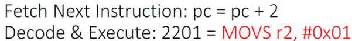

- 中断延迟（interrupt latency）。从嵌入中断请求到执行中断服务程序（interrupt service routine）中的第一条指令，中间花费的时钟周期数来测量的。、

## Chapter 3

使用一款MCU之前，需要先看用户手册和datasheet。

在许多微控制器中，处理器占用的硅面积不到10%，硅管芯的其余部分被其他组件占用，例如：
- 程序存储器（program memory），例如闪存（flash memory）
- SRAM
- 外设
- 内部总线基础设施
- 时钟发生器（包括锁相环（phase locked loop））、复位发生器和这些信号的分配网络
- 电压调节器和电源控制电路
-  其他模拟组件（例如，ADC、DAC、电压参考电路）
-   I/O焊盘（pads）
-   用于制造测试等的支持电路

多AHB总线矩阵（multi-AHB bus matrix）：


- 32位多AHB总线矩阵连接所有主节点（master）：CPU、DMAs、以太网、USB、HS、LCD-TFT、DMA2D。也连接所有从节点（slave）：闪存、RAM、FMC、AHB、APB外设。确保即使在几个高速外设同时工作情况下也能实现无缝和高效的操作。

DMA控制器：

- DMA可与主要外设一起使用：SPI和I2S、I2C、USART、通用、基本和高级控制定时器TIMx、DAC、SDIO、摄像头接口（DCMI）、ADC、SAI1。

引导模式（boot mode）：

- 从用户Flash启动
- 从系统内存启动
- 从内嵌SRAM引导
- 引导加载程序位于系统内存中。它用于通过串行接口对闪存进行重新编程。

供电模式（power supply schemes）：

- $V_{DD}=1.7-3.6V$。I/O和内部调节器的外部供电，外部通过$V_{DD}$引脚提供。
- $V_{SSA},V_{DDA}=1.7-3.6V$。ADC、DAC、Reset blocks、RCs、PLL的外部模拟供电。$V_{DDA},V_{SSA}$必须分别连接到$V_{DD},V_{SS}$。
- $V_{BAT}=1.65-3.6V$。RTC、外部时钟32kHz振荡器、后备寄存器的供电，当$V_{DD}$没有工作时的供电。

寄存器缩略语（abbreviation）：

- 读写（rw）
- 只读（r）
- 值写（w）
- 读/清除1（rc_w1）
- 读/清除0（rc_w0）
- 读/通过读清除（rc_r）
- 读/设置（rs）
- 只读写触发（rt_w）
- 切换（toggle）
- 保留（reserved）

ADC功能：

- ADC开关控制
- ADC时钟
- 频道选择
- 单一转换模式
- 连续转换模式
- 时序图
- 模拟看门狗
- 扫描模式
- 注入通道管理
- 不连续模式

软件流（software flow）：

- 轮询（polling method）：缺点是难以分配优先级。


- 中断驱动（interrupt-driven）：可自定义中断优先级。


- 轮询-中断驱动混合法。
- RTOS法。

## Chapter 4

通用IO（general-purpose I/O，GPIO）可进行单独配置：

- 输入浮动（input floating）
- 输入上拉（input pull-up）
- 输入下拉（input pull-down）
- 模拟（analog）
- 具有上拉或下拉功能（capability）的输出开漏（output open-drain）
- 具有上拉或下拉功能的输出推挽（output push-pull）
- 具有上拉或下拉功能的复用功能开漏（alternate function open-drain）
- 具有上拉或下拉功能的复用功能推挽（alternate function push-pull）

上拉和下拉（对于输入）：

- 上拉电阻用于使数字引脚的默认状态为高或逻辑电平（logic level）。
- 下拉电阻的作用正好相反，它使数字引脚的默认状态为低（0V）。
- 输入浮动（高阻抗，未知逻辑电平）。
- 输入上拉（高逻辑电平）
- 输入下拉（低逻辑电平）

上拉和下拉（对于输出开漏）：

- 上拉电阻器将信号拉高，除非它被驱动为低。
- 下拉电阻器将信号拉低，除非它被驱动为高。


- 计算上拉电阻阻值范围。


- - $\text{Q1 is OFF}$，$V_{TH}$是指定读取为逻辑高的最小电压。

$$I_{\text {Pull-up }}=I_{\text {LKG }}+I_{E N}$$

$$R_{\text {Pull-up, max }}=\left(V_{\text {OUT }}-V_{\mathrm{TH}}\right) / \mathrm{I}_{\text {Pull-up, min }}$$

- - $\text{Q1 is ON}$，$V_{OL}$指定读取为逻辑低的最大电压。

$$I_{\text {Pull-up }}=I_{O L}-I_{E N}$$

$$R_{\text {Pull-up, min }}=\left(V_{\text {OUT }}-V_{\text {OL }}\right) / I_{\text {Pull-up }}$$

- 计算下拉电阻阻值范围。

输出推挽：

- 一种使用一对有源器件的电子电路，这些有源器件交替地向连接的负载提供电流或从连接的负载吸收电流。这种放大器可以提高负载容量和开关速度。

每个GPIO都有很多不同功能的寄存器：

- （决定）GPIO端口模式的寄存器（GPIOx_MODER）：


- （决定）GPIO端口输出类型的寄存器（GPIOx_OTYPER）：


- （决定）GPIO端口输出速度的寄存器（GPIOx_OSPEEDR）：


- （决定）GPIO端口输出上拉/下拉的寄存器（GPIOx_PUPDR）：


- （决定）GPIO端口输入数据的寄存器（GPIOx_IDR）：


- （决定）GPIO端口输出数据的寄存器（GPIOx_ODR）：


- （决定）GPIO端口输出位set/reset的寄存器（GPIOx_BSRR）：


- （决定）GPIO复用功能低寄存器（GPIOx_AFRL）：


STM32DSP和标准外设库的结构分为三个抽象层：


硬件抽象层（hardware abstraction layer，HAL）库：

- 允许控制MCU设备的寄存器和函数。
- CMSIS层（通用微控制器软件接口标准）：
- - 核心外设（core peripheral）访问层：包含名称定义、地址定义和访问核心寄存器和外设的功能。
- - STM32设备外设访问层：为不同MCU设备提供所有外设寄存器定义、位定义和内存映射的定义。
- STM32F4xx标准外设驱动程序，为所有外设提供驱动程序和头文件。它使用CMSIS层访问STM32F4xx寄存器。

BSP（board specific package，BSP）：

- BSP它实现了一个抽象层来与人机界面资源交互；STMicroelectronics评估板上提供的按钮、LED、LCD和COM端口（USART）。提供了一个通用的API来管理这些不同的资源，并且可以通过调整初始化例程来轻松地定制以支持任何其他开发板。

应用层（application layer）：

- 应用程序层由一组示例组成，这些示例涵盖了所有可用的外围设备以及最常见的开发工具的模板项目。

## Chapter 5

复位和时钟控制（reset and clock control，RCC）：

- 复位电路方法：
- - NRST引脚低电平（外部复位）。
- - 窗口看门狗（WWDG）（MCU内置复位）。
- - 独立看门狗（IWDG）。
- - 软件复位（SW）。
- - 低功率管理复位（low-power management reset）。

三种不同的时钟驱动系统时钟（system clock，SYSCLK）：

- HSI（high-speed internal）振荡器时钟。
- HSE（high-speed external）振荡器时钟。
- 主PLL（锁相环）时钟。

第二/辅助时钟源：

- 32kHz LSI（low-speed internal）RC振荡器用于驱动独立看门狗，可选用于从停止/待机模式自动唤醒RTC（real-time clock）。
- 32.768kHz LSE（low-speed external）晶振（crystal），可选用于驱动RTC（RTCCLK）。

HSE：

- HSE时钟信号可以从两个时钟源产生：
- - HSE外部晶振/陶瓷谐振器。
- - HSE外部用户时钟。

HSI：

- HSI时钟信号由内部16MHz RC振荡器生成。
- HSI时钟信号可以直接用作系统时钟，也可以用作PLL输入。

STM32F4系列具有三个PLL：

- 主PLL时钟具有两种输出时钟：
- - 用于产生HSE时钟
- - 用于产生USB OTGFS、随机模拟生成器、SDIO的时钟。
- 两个专用PLL：PLLI2S和PLLSAI。

微控制器时钟输出（MCO）引脚：

- MCO1引脚可输出：HSI时钟、LSE时钟、HSE时钟、PLL时钟。
- MCO2引脚可输出：HSE时钟、PLL时钟、SYSCLK、PLLI2S时钟。
- MCO输出不能超过100MHz。

AHB（最大180MHz）、APB2（最大90MHz）、APB1（最大45MHz）：

- 定时器（timer）TIM也是外设，它们是否与上述几项相连？

## Chapter 6

- 嵌套矢量中断控制器（nested vector interrupt controller，NVIC）。
- 外部中断/事件控制器（external interrupt / event controller，EXTI）。

中断：

- 中断是几乎所有微控制器中常见的功能。中断是由硬件或软件源产生的。
- 中断执行的一般流程：
- - 外设向处理器发出中断请求。
- - 处理器延后（suspend）当前正在运行的任务作为对中断的响应。
- - 处理器执行中断服务程序（interrupt service routine，ISR）/中断处理程序（interrupt handler），为外设提供服务，并在需要时通过软件清除中断请求。
- - 处理器恢复（resume）之前延后的任务。
- 除了中断请求，还有其他事件需要服务，我们称之为异常（exception）机制。在ARM术语中，中断也是一种异常。CortexM处理器中的其他异常包括故障异常和支持操作系统的其他系统异常（例如SVC指令）。处理异常的程序代码段通常称为异常处理程序（exception handlers）。

NVIC：

- NVIC属于核心外设。
- NVIC是可编程的，其寄存器位于内存映射的系统控制空间（system control space，SCS）中。通过调用对应的库函数进行编程。
- NVIC支持的中断：
- - 支持多个中断请求（interrupt request，IRQs）。大多数IRQ是由诸如定时器、I/O端口和通信接口（例如UART、I2C）之类的外设生成的。
- - 支持一个外部不可屏蔽中断（non-maskable interrupt，NMI）。NMI通常是由看门狗定时器或BOD（Brown Out Detector）等外设生成的。
- - 支持一个系统时钟定时器中断。除IQR和NMI的异常来自处理器核心。中断也可以使用软件生成。
- NVIC功能：
- - 灵活的异常和中断管理。
- - 嵌套（nested）异常/中断支持。
- - 矢量异常/中断条目。
- - 中断屏蔽。
- 每个中断的可编程优先级（priority）为0-15。较高的级别对应较低的优先级，因此级别0是最高的中断优先级。少数系统异常具有固定优先级。

中断管理：

- Cortex-M处理器有许多可编程寄存器，用于管理中断和异常。这些寄存器大多位于NVIC和系统控制块（SCB）内部。（从物理上讲，SCB是作为NVIC的一部分实现的，但CMSIS核心在分离的数据结构中定义寄存器。）处理器核心内部也有用于中断屏蔽的特殊寄存器（例如，PRIMASK、FAULTMASK和BASEPRI）。为了更容易管理中断和异常，CMSIS Core提供了许多访问功能。
- 重置后，所有中断都被禁用，并被赋予0的优先级值。在使用任何中断之前，您需要：
- - 设置所需中断的优先级（此步骤是可选的）。
- - 在触发中断的外围设备中启用中断生成控制。
-  - 在NVIC中启用中断。
-  在大多数典型的应用程序中，这就是您所需要做的。当中断触发时，将执行相应的中断服务例程（ISR）（您可能需要清除处理程序内外围设备的中断请求）。ISR的名称可以在启动代码内的矢量表中找到，该表也由微控制器供应商提供。ISR的名称需要与矢量表中使用的名称相匹配，以便链接器可以将ISR的起始地址正确地放入矢量表中。

优先级与抢占（pre-empt）：

- 优先级配置寄存器（priority-level configuration registers）是8bit位宽的，但是只有128个抢占级别？这是因为寄存器被分为两个部分，分组优先级（group priority）/抢占优先级（pre-empt priority）和子优先级（sub-priority）。
- 在系统控制块（system control block，SCB）中使用配置寄存器称为优先级组（priority group）。对于具有可编程优先级的每个异常的优先级配置寄存器都被分为两半。


- 组优先级定义当处理器已经在运行另一个中断处理程序时，是否可以发生中断。只有当具有相同组优先级的两个异常同时发生时，才使用子优先级值。在这种情况下，将首先处理具有较高子优先级（较低值）的异常。
- 当Cortex-M处理器接受异常请求时，处理器需要确定异常处理程序的起始地址（如果异常是中断，则为ISR）。该信息存储在存储器中的矢量表（vector table）中。默认情况下，矢量表从存储器地址0开始，矢量地址根据异常次数乘4排列（1 word = 4 bytes）。


中断输入和挂起行为（pending behavior）：

- 每个中断都可以被禁用（默认）或启用。
- 每个中断都可以是挂起的（请求正在等待服务）或未挂起。
- 每个中断可以处于活动（正在服务）或非活动状态。
- 以上的状态属性的不同组合是可能的（状态多种组合）。例如，当您为中断（活动）提供服务时，您可以禁用它，然后在中断退出之前，对同一中断的新请求再次到达，导致中断在活动时被禁用，并处于挂起状态。
- 在以下情况下，处理器可以接受中断请求：
- - 设置挂起状态。
- - 中断已启用。
- - 中断的优先级高于当前级别（包括中断屏蔽寄存器配置）。
- NVIC设计用于支持生成脉冲中断请求的外围设备以及具有高级别中断请求的外设。不需要配置任何NVIC寄存器来选择任一中断类型。对于脉冲中断请求，脉冲必须至少有一个时钟周期长。对于电平触发的中断，外围请求服务断言请求信号，直到ISR内部的操作将其清除（例如，写入寄存器以清除中断请求）。NVIC接收到的请求信号为高激活，尽管I/O引脚级别的外部中断请求可能为低激活。
- 当处理器开始处理中断请求时，中断的挂起状态会自动清除，中断的请求信号会被自动清除。当中断被服务时，它处于活动状态。请注意，在中断条目序列中，许多寄存器会自动推送到堆栈上。这叫做堆叠。同时，从矢量表中提取ISR的起始地址。当中断处于活动状态时，您不能再次接受相同的中断请求，直到它完成并以异常返回终止（有时称为异常退出）。
- 中断的挂起状态存储在中断挂起状态寄存器中，可从软件代码访问这些寄存器。因此，您可以清除中断的挂起状态或手动设置它。如果中断请求在处理器为另一个更高优先级的中断提供服务时到达，并且在处理器开始响应挂起请求之前挂起状态被清除，则该请求将被取消并且不会得到服务。


- 如果外围设备持续发出中断请求，并且软件试图清除挂起状态，则将再次设置挂起状态。
- 如果中断源在得到服务后继续发出其中断请求，则中断将再次处于挂起状态，并将再次由处理器提供服务。
- 对于脉冲式中断请求，如果在处理器开始处理之前中断请求信号被脉冲多次，则该请求将被视为一个单独的中断请求。
- 中断的挂起状态可以在服务时再次设置。例如，当上一个请求仍在服务时，一个新的中断请求到达，这导致了新的挂起状态，因此处理器需要在第一个ISR完成后再次服务该中断。
- 在大多数应用中，包括矢量表的程序代码存储在只读存储器（ROM）中，例如闪存，并且在操作期间不需要修改矢量表。在这种情况下，我们可以依赖存储在ROM中的矢量表，并且不需要矢量表的重新定位。设置中断所需的唯一步骤如下：
- - 1.设置优先级组设置。此步骤是可选的。默认情况下，优先级组设置为0（只有优先级寄存器的位0用于子优先级）。
- - 2.设置中断的优先级。此步骤也是可选的。默认情况下，中断的优先级为0（最高可编程级别）。
- - 3.在NVIC以及可能在产生中断的外围设备上启用中断。

EXIT：

- 要生成中断，应配置并启用中断线（interrupt line）。这是通过用所需的边缘检测（edge detection）对两个触发寄存器（trigger register）进行编程，并通过将"1"写入中断屏蔽寄存器（interrupt mask register）中的相应位来启用中断请求来实现的。
- 要生成事件，应配置并启用事件行（event line）。这是通过用所需的边缘检测对两个触发寄存器进行编程，并通过将"1"写入事件掩码寄存器（event mask register）中的相应位来启用事件请求来实现的。

## Chapter 7 Timer

高级控制定时器：

- 高级控制定时器（advanced-control timer）（TIM1和TIM8）由一个由可编程预分频器（prescaler）驱动的16位自动速度计数器（auto-reload counter）组成。
- 它可以用于各种目的，包括测量输入信号的脉冲长度（输入捕获）或生成输出波形（输出比较、PWM、具有死区插入（dead-time insertion）的互补（complementary）PWM等）。
- 可以使用定时器预分频器和RCC时钟控制器预分频器将脉冲长度和波形周期从几微秒调制到几毫秒。
- 高级控制（TIM1和TIM8）和通用（TIMx）定时器完全独立，不共享任何资源。但是它们可以一起同步（synchronized）。
- TIM1和TIM8定时器功能包括：
- - 16位向上、向下、向上/向下自动重新加载计数器。
- - 16位可编程预分频器，允许将计数器时钟频率除以1到65536之间的任何因子（也称为“动态”）。
- - 最多4个独立通道用于：1.输入捕获。2.输出比较。3.PWM生成（边缘和中心对齐模式）。4.单脉冲模式输出
- - 具有可编程死区时间的互补输出
- - 同步电路，用外部信号控制定时器，并将几个定时器互连在一起。
- - 重复计数器仅在给定的计数器周期数之后更新定时器寄存器。
- - 断开输入，使计时器的输出信号处于重置状态或已知状态。
- - 以下事件的中断/DMA生成：1.更新：计数器上溢/下溢，计数器初始化（通过软件或内部/外部触发器）。2. 触发器事件（计数器启动、停止、初始化或通过内部/外部触发器计数）。3.输入捕获。4.输出比较。5.中断输入。
- - 支持增量（正交）编码器和霍尔传感器电路，用于定位。
- - 外部时钟或逐周期电流管理的触发器输入。

NVIC：

- 增量编码器（incremental encoder）是一种线性或旋转机电设备，具有两个输出信号A和B，当设备移动时发出脉冲。A和B信号一起指示运动的发生和方向。

霍尔传感器：

- 霍尔效应传感器/霍尔传感器（Hall effect sensor）是一种利用霍尔效应检测磁场的存在和大小的传感器。霍尔传感器的输出电压与磁场强度成正比。它是以美国物理学家埃德温·霍尔的名字命名的。

高级控制定时器框图（block diagram）：

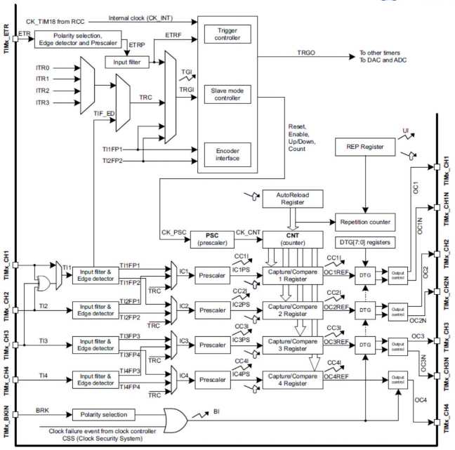

时钟的选择：


- 内部时钟（CK_INT）
- 外部时钟模式1：外部输入引脚
- 外部时钟模式2：外部触发输入ETR
- 内部触发输入（internal trigger inputs，ITRx）：使用一个计时器作为另一个计时器的预分频器，例如，用户可以将计时器1配置为用作计时器2的预分频。

预分频器：


- 预分频器可以将计数器时钟频率除以1和65536之间的任何因子。它基于通过16位寄存器（在TIMx_PSC寄存器中）控制的16位计数器。当这个控制寄存器被缓冲时，它可以被动态地改变。在下一次更新事件中考虑新的预分频器比率。
- 预分频从1变为2的计数器时间图：


- 递增计数模式（upcounting mode）：


- 递减计数模式（downcounting mode）：

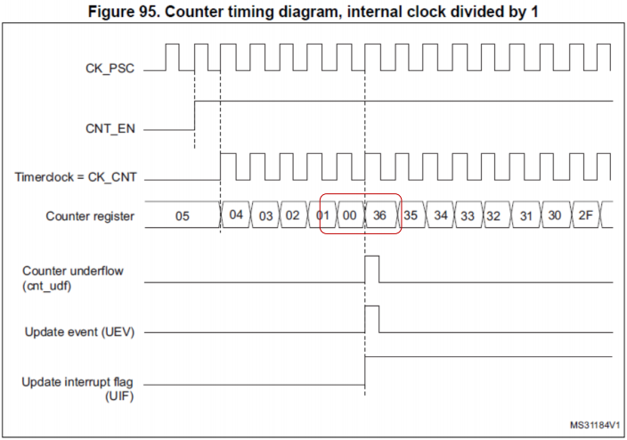

- 居中对齐模式（center-aligned mode）：


重复计数器（repetition counter）：

- 重复计数器在以下情况递减：
- - 在递增计数模式中的每个计数器溢出时。
- - 在递减计数模式中的每个计数器下溢处。
- - 在中心对齐模式下的每个计数器上溢和下溢。


PWM模式：

- 脉宽调制模式允许生成具有由TIMx_ARR寄存器的值确定的频率和由TIMx_CCRx寄存器的值决定的占空比的信号。
- - PWM边缘对齐模式（上计数配置、下计数配置）。


- - PWM中心对齐模式。


互补输出和死区嵌入：


六步（six-step）PWM生成器：

- 六步换向块（six step commutation block）使用120度导通模式来生成开关序列，以在三相无刷直流电机上实现六步换向（或梯形换向）。您可以使用开关信号来操作开关和控制定子电流，从而控制电机的转速和旋转方向。


编码器接口模式（interface mode）：


高级控制定时器框图：


通用定时器框图：


定时器同步（synchronization）：

- TIMx定时器在内部链接在一起，用于计时器同步或链接。当一个定时器在主模式（master mode）下配置时，它可以重置、启动、停止或计时在从模式（slave mode）下配置的另一个定时器的计数器。
- 这些定时器同时兼有捕获和输出PWM的功能。


- 例子（RGB的LED调光）：


## Chapter 8 DMA

直接存储器存取（Direct Memory Access，DMA）：

- DMA用于提供外设和内存之间以及内存和内存之间的高速数据传输。DMA可以在没有任何CPU操作的情况下快速移动数据。这使CPU资源可用于其他操作。
- DMA控制器基于复杂的总线矩阵结构，将双AHB主总线结构与独立的FIFO相结合，以优化系统的带宽。
- 这两个DMA控制器总共有16个流（stream）（每个控制器8个），每个流专用于管理来自一个或多个外围设备的内存访问请求。每个流总共可以有多达8个通道（请求）。每个都有一个仲裁器（arbiter），用于处理DMA请求之间的优先级。
- DMA框图：


DMA主要特点：

- 双AHB主总线架构，一个专用于内存访问，一个用于外围访问。
- 每个DMA控制器有8个流，每个流最多8个通道（请求）。
- 每个流有四个字深的32位先进先出内存缓冲区（First-In First-Out memory buffers，FIFOs），可用于FIFO模式或直接模式。
- 直接模式（FIFO禁用）：每个DMA请求都会立即启动从/到内存的传输。当配置为直接模式时，为了将内存中的数据传输到外围设备模式，DMA仅将一个数据从存储器预加载到内部FIFO，以确保外围设备触发DMA请求后立即进行数据传输。
- 每个流可以通过硬件配置为：
- - 一种支持外设到内存、内存到外设和内存到内存传输的常规通道。
- - 一个双缓冲通道，它还支持内存端的双缓冲。
- DMA流请求之间的优先级是软件可编程的（由非常高、高、中、低组成的4个级别），或者在相等的情况下是硬件（请求0的优先级高于请求1，等等）。
- 每个流还支持内存到内存传输的软件触发（仅适用于DMA2控制器）。
- 独立的源和目标传输宽度（字节、半字、字）：当源和目标的数据宽度不相等时，DMA会自动打包/解包必要的传输，以优化带宽。此功能仅在FIFO模式下可用。

DMA流：

- 8个DMA控制器流中的每一个都提供源和目的地之间的单向传输链路（unidirectional transfer link）。每个流可以被配置为执行：
- - 常规类型事务（regular type transactions）：内存到外设、外设到内存或内存到内存的传输。


- - 双缓冲区类型事务（double-buffer type transactions）：使用两个内存指针进行内存的双缓冲区传输（当DMA从缓冲区读/写时，应用程序可以从另一个缓冲区写/读）。

频道选择：

- 每个流与DMA请求相关联，该DMA请求可以从8个可能的信道请求中选择。选择由DMA_SxCR寄存器中的CHSEL[2:0]位控制。


请求映射：

- 来自外围设备（TIM、ADC、SPI、I2C等）的8个请求独立连接到每个通道，它们的连接取决于产品实现。

仲裁器：

- 仲裁器基于8个DMA流请求对于两个AHB主端口（存储器和外围端口）中的每一个的优先级来管理它们，并启动外围设备/内存访问序列。优先级分两个阶段管理：
- 软件：每个流优先级可以在DMA_SxCR寄存器中进行配置。有四个级别：
- - 非常高的优先级
- - 高优先级
- - 中等优先级
- - 低优先级
- 硬件：如果两个请求具有相同的软件优先级，则编号较低的流优先于编号较高的流。

FIFO：

- FIFO用于在将数据传输到目的地之前临时存储来自源的数据。
- 每个流都有一个独立的4字FIFO，阈值级别可在1/4、1/2、3/4或满之间进行软件配置。
- 要启用FIFO阈值电平，必须通过设置DMA_SxFCR寄存器中的DMDIS位来禁用直接模式。
- FIFO的结构因源和目的地数据宽度的不同而不同。

DMA中断：

- 对于每个DMA流，可以在以下事件上产生中断：
- - 已达到一半传输
- - 传输完成
- - 传输错误
- - FIFO错误（溢出、欠载或FIFO级别错误）
- - 直接模式错误

从SRAM到FLASH的数据传输：


## Chapter 9

A/D转换器（analog-to-digital converters，ADC）：

- ADC将模拟量（analog quantities）转换为数字代码（digital code）（通常是二进制）。
- ADC步骤一，采样和保持（sampling and holding，S/H）：保持信号有利于A/D转换。根据奈奎斯特定理（Nyquist's theorem），最小采样率（sampling rate）应该至少是模拟信号最高数据频率的两倍。
- ADC步骤二，量化和编码（quantizing and encoding，Q/E）：分辨率（resolution）是将信号转换为数字形式时固有的量化误差（quantization error）的度量，分辨率计算：$\Delta V=\frac{V_r}{2^N}$。其中$V_r$为参考电压范围，$N$为数字输出的bit数，$2^N$为状态数。一般最大量化误差为$\pm 0.5 \Delta V$。
- - 量化：将参考信号范围划分为多个离散量子（quanta），然后将输入信号匹配（matching）到正确的量子。
- - 编码：为每个量子分配一个唯一的数字代码，然后将数字代码分配给输入信号。


提升精确度的方法：

- 提高分辨率。
- 提高采样率。

ADC的种类：

- 双斜坡A/D转换器（dual slope ADC，DS-ADC）
- 逐次逼近（successive approximation）A/D转换器
- 闪存（flash）A/D转换器
- Delta-Sigma A/D转换器
- 其他（电压-频率、阶梯斜坡或单斜坡、电荷平衡或再分配、开关电容器、跟踪、同步器或分解器）


闪存A/D转换器：

- $2^N-1$个电阻。
- $2^N-1$个比较器。
- 控制逻辑。
- 电阻形成梯形分压器，将电压分为$2^N$个相等间隔。
- 比较器确定输入的电压属于哪一个间隔。
- 控制逻辑是对比较器的输出进行转换的组合逻辑（combinational logic）。
- 此种ADC不需要时钟。
- 此种ADC是最快的ADC类型。

双斜坡A/D转换器：

- 积分器。
- 电子控制开关。
- 计数器。
- 时钟。
- 控制逻辑。
- 比较器。
- 双斜坡ADC在固定时间量（$T_{INT}$）内对未知输入电压进行积分，然后在可变时间量（$T_{DE-INT}$）内使用已知参考电压（$V_{REF}$）进行"去积分"。


逐次逼近A/D转换器：

- 使用n-bit的DAC，比较DAC和原始模拟结果。
- 使用逐次逼近寄存器（successive approximation register，SAR）向输入电压的DAC提供近似数字代码。
- 比较会更改数字输出，使其更接近输入值。
- 使用闭环反馈转换。
- 最高有效位（most significant bit，MSB）和最低有效位（least significant bit，LSB）。
- 此种ADC是速度和成本达成良好平衡的ADC。

Sigma-Delta A/D转换器：

- 电阻
- 电容
- 比较器
- 控制逻辑
- DAC
- 此种ADC是高分辨率的。
- 此种ADC因为过采样因此速度很慢。

STM32中的ADC：

- 12位、10位、8位或6位可配置分辨率。
- 转换结束时、注入转换结束时、模拟看门狗或溢出事件时产生中断。
- 单转换和连续转换模式（single and continuous conversion mode）。
- 用于将通道0自动转换为通道"n"的扫描模式（scan mode）。
- 双/三重模式（dual/triple mode）（在具有2个或更多ADC的设备上）
- 双/三路ADC模式下的可配置DMA数据存储。
- ADC电源要求：全速时2.4V至3.6V，低速时降至1.8V。
- ADC输入范围：$V_{REF}- \leq VIN \leq V_{REF+}$。

信道选择（channel selection）：

- 有16个多路复用（multiplexed）信道。可以将转换组织为两组：常规（regular）组和注入（injected）组。一个组由一系列转换组成，这些转换可以在任何信道上以任何顺序进行。
- 一个常规组由多达16个转换组成。
- 一个注入组由最多4个转换组成

单信道，单转换模式：

- 最简单的ADC模式。


多信道（扫描），单转换模式：

- 此模式用于在独立模式下连续转换某些通道。使用ADC定序器，您可以使用此ADC模式以不同的采样时间和顺序依次配置多达16个通道的任何序列。通过这种方式，您不必在转换过程中停止ADC，即可使用不同的采样时间重新配置下一个通道。这种模式节省了额外的CPU负载和繁重的软件开发。


单信道，连续转换模式：

- 单通道连续转换模式在常规通道转换中连续且无限地转换单个通道。连续模式功能允许ADC在后台工作。ADC在没有CPU任何干预的情况下连续转换通道。此外，DMA可以在循环模式下使用，从而减少CPU负载。


多信道（扫描），连续转换模式：

- 多通道或扫描连续模式可用于连续转换某些通道，ADC处于独立模式。使用定序器，您可以以不同的采样时间和不同的顺序连续配置多达16个通道的任何序列。此模式类似于多通道单转换模式，不同之处在于它不会在序列的最后一个通道之后停止转换，而是从第一个通道重新启动转换序列并无限期地继续。

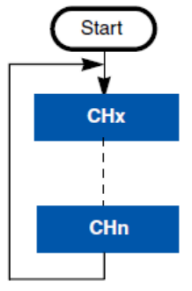

注入转换模式：

- 此模式适用于由外部事件或软件触发转换时使用。注入的组的优先级高于常规通道组。它会中断常规通道组中当前通道的转换。
- 此模式可用于同步将通道转换为事件。在电机控制应用中，晶体管开关会产生影响ADC测量并导致错误转换的噪声，这一点很有趣。因此，使用定时器，可以实现注入的转换模式，以将ADC测量延迟到晶体管切换之后。


双快速交错模式（dual fast interleaved mode）：

- 用于一个通道的转换。
- 假设每个ADC每14个ADC时钟周期转换一次通道：ADC1和ADC2以7个ADC时钟循环的周期交替转换所选通道。这意味着每7个时钟周期对信道进行一次转换。因此，使用14MHz ADC时钟，可以达到每秒2M个采样：14MHz/7=2MHz（采样频率）


注入同时+交错模式，双重组合模式：

- 当触发常规信道时，双交错转换开始：ADC2进行第一次转换，然后ADC1转换信道，依此类推。
- 当注入通道被触发时，它中断交错通道转换，并且两个ADC（ADC1和ADC2）开始转换注入通道组。
- 当两个ADC完成注入转换时，它们将恢复以交错模式配置的通道的转换。
- 可以在不间断电源（uninterruptible power supply，USP）系统中使用这种双重组合模式。通过在双交错模式下转换的ADC看门狗来监测电池电压。ADC还通过测量双注入同时模式下的电压和电流来监测负载消耗的功率。

## Chapter 10

D/A转换器（DAC / D-to-A）：

- DAC是一种用于将数字（通常是二进制）代码转换为模拟信号（电流、电压或电荷）的设备。


- 在很大程度上，DAC的特性是由其参考电压$V_{ref}$定义的。
- 非乘法器（non-multiplier）DAC。$V_{ref}$是固定的。
- 乘法器DAC。$V_{ref}$通过外部电源提供。
- 满度电压（full scale voltage）$V_{fs}$：定义为数字输入字全部为1时的输出：

$$V_{f s}=V_{r e f}\left(\frac{2^N-1}{2^N}\right)$$

- 分辨率被定义为与LSB变化相对应的电压变化。
- 8-16位范围内可选，其中12位是典型的成本/分辨率权衡。
- 更多的位，更多的步骤，更高的分辨率。

$$\text{Resolution}=V_{\text {LSB }}=V_{\text {Ref }} / 2^N$$

- 理想情况下，DAC将在二进制字和模拟输出之间产生线性关系。


DAC的速度和稳定时间（settling time）：

- DAC的速度通常指转换率或采样率。
- 高速DAC通常定义为>1MS/s（1Mhz）。
- 一些当前12-16位DAC可以达到1GHz范围。
- 输入信号的转换受到以下限制：
- - 输入信号的时钟速度。
- - DAC的稳定时间。
- 理想情况下，当一个新的二进制字进入DAC时，模拟电压会发生瞬时变化。但是实际情况一定会花费一定的时间。
- 稳定时间是DAC达到其新电压的LSB的二分之一所花费的时间。包括延迟、转换时间和振铃时间。快速转换器减少了转换时间，但通常会导致更长的振铃时间。延迟则一般是很小的。

DAC的种类：

- 电阻串（resistor-spring）DAC。
- N位二进制加权电阻（N-bit binary weighted resistor）DAC。
- R-2R梯形（R-2R ladder）DAC。

电阻串DAC：


$$\mathrm{V}_0=\mathrm{V}_{\mathrm{Ref}} \sum_{\mathrm{i}=0}^{\mathrm{N}-1} \frac{\mathrm{b}_{\mathrm{i}}}{2^{\mathrm{i}+1}}$$

- 假设8位电阻串DAC，电阻的数量：

$$2^N=2^8=256$$

- 假设8位电阻串DAC，开关（switch）的数量：

$$\sum_{i=0}^{N-1} 2^i=2^8-1=255$$

N位二进制加权电阻DAC：


$$\begin{gathered}\mathrm{I}_0=\mathrm{V}_{\mathrm{R}} \sum_{\mathrm{i}=1}^{\mathrm{N}} \frac{\mathrm{b}_{\mathrm{i}}}{2^{(\mathrm{i}-1)} \mathrm{R}} \\ \mathrm{V}_0=-\mathrm{R}_{\mathrm{f}} \mathrm{I}_0\end{gathered}$$

$$\text{Resoluton}=V_{LSB}=\frac{V_{Ref}}{2}$$

N位二进制加权电阻DAC例子：

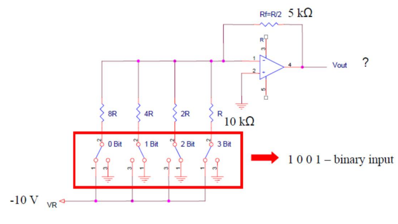


$$V_{out}=V_{ref}*D/2^N=10*(1001)/2^4$$


R-2R梯形DAC：


- 位为0则接地，位为1则接运放（op amp）的输入端。

DAC的数据格式：

- 每个DAC通道输出上的模拟输出电压由以下等式确定：

$$\mathrm{DAC}_{\text {Output }}=\mathrm{V}_{\mathrm{REF}} \times \mathrm{DOR} / 4096$$

- DAC有两个输出通道，每个通道都有自己的转换器。在双DAC通道模式下，转换可以独立进行，也可以同时进行。
- 当DAC通道由同一源触发时，两个通道被分组在一起进行同步更新操作，并且转换同时进行。

DMA功能：

- 当不使用DMA时，CPU用于向DAC提供与要生成的波形相关的数字代码。该代码保存在RAM或嵌入式NV存储器中，CPU将数据从存储器传输到DAC。
- 当DMA用于向DAC提供波形数字代码时，存在DMA传输比DAC转换慢的情况。在这种情况下，DAC检测到模式波形的一部分未被接收且无法转换，然后设置DMA运行错误（DMA under run error）标志（flag）。

白噪音发生器：

- STM32的DAC具有一个伪随机代码生成器。根据移位寄存器上使用的抽头，在序列重复之前可以生成多达2n-1个数字的序列。该发生器产生的噪声具有平坦的频谱分布，可以被视为白噪声。
- 噪声波形的偏移（或DC偏置）是可编程的。通过用预先配置的偏移表（信号模式）改变该偏移，用户可以获得与信号模式和噪声波形之和相对应的波形。


- STM32产品配备12位增强型ADC，采样率可超过1M采样/s。在大多数应用中，这种分辨率是足够的，当需要更高的精度时，可以实现对输入信号进行过采样和抽取的概念，以节省外部ADC解决方案的使用并降低应用功耗。该噪声波形可以用于通过过采样方法来提高ADC的精度。

## Chapter 11 I2C & SPI

I2C（Inter-integrated Circuit）：

- 仅使用两根导线（外加接地）。
- 多个"从"（或次级）数字集成电路（芯片）与一个或多个"主"芯片通信。
- 当使用多个主设备时，主设备不能通过总线相互通信，必须轮流使用总线。


- 开集/开漏驱动器（将相应的信号线拉低，但无法将其驱动高）
- 时钟没有全局主机（global master）。
- 当SCL为高时，START条件是SDA上的高到低转换。
- 当SCL为高时，STOP条件是SDA上从低到高的转换。
- 地址和数据字节首先发送MSB。
- 主设备/主机生成时钟信号，并在数据传输期间将其发送给从设备。


仲裁器：

- 在单主机系统中，不需要仲裁器。
- 多主机的仲裁：
- - 在数据传输过程中，主机不断检查SDA电压电平是否与其发送的电压电平相匹配。
- - 当两个主机同时生成START设置时，在实际打算将SDA设置为高的同时检测到SDA低的第一个主机将失去仲裁，并让另一个主机完成数据传输。

基本协议（7-bit寻址）：

- 设置地址。
- 写入数据值。
- R/W-：0到主（primary）发送数据。

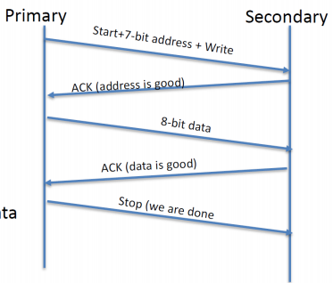

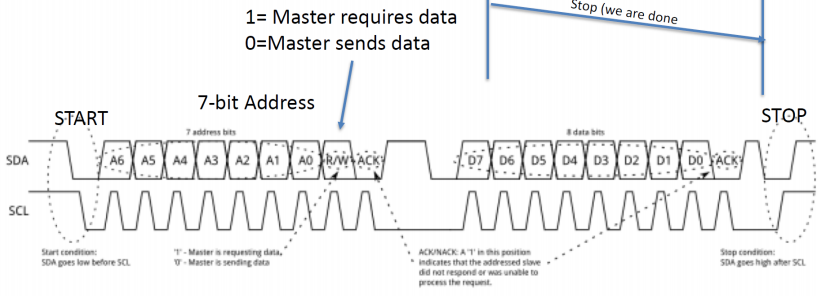

基本协议（10-bit寻址）：

- 设置地址。
- 写入数据值。
- R/W-：0到主（primary）发送数据。


当有多个从机时，主机如何与它想要的从机通信：

- 不同地址的从机。
- 具有可选地址的从机。
- 所有从机都有相同的地址。

SPI（Serial Peripheral Interface）：

- 同步全双工通信
- 可以有多个从属（辅助）设备
- 无流量控制或确认
- 从属（辅助）设备无法直接与从设备通信。


半双工与全双工：

- 半双工（HDX）系统提供两个方向的通信，但一次只能提供一个方向，而不是同时在两个方向上。
- 全双工（FDX）系统允许双向通信，并且与半双工不同，允许同时进行通信。

数据交换：

- 主设备必须向从设备提供时钟
- 同步交换：对于每个时钟脉冲，一个比特被移出，另一个比特同时被移入。当交换所有位时，此过程停止。
- 只有主设备才能启动数据传输。


SPI的实现：

- GPIO仿真与编程。
- 片上控制器。

## Chapter 12 Math

快操作和慢操作：

- 加法和减法快。
- 移位（shifting bit）快。
- 除法（division）很慢。
- 整型快。
- 浮点非常慢。
- 在DSP上，乘法快。非DSP上（ARM或PC），乘法的速度介于加法和除法之间，更接近加法。
- 一个操作可以用一行代码来描述，但这并不意味着在处理器上运行需要很短的时间。
- 如果能使得操作数为2的幂（power），你就可以用花费更小的单指令（single instruction）逐位逻辑运算（bitwise logic operation）来代替模数学（modulo math）。
- 如果要移位的位数是常数，则移位需要单个处理器周期。如果你能把常数保持为2的幂，这是一种做除法和乘法的廉价方法。
- 使用常量比使用变量快。但它们需要是实常量（#define），而不是常量变量（const）。

求平均值：

- 使用滚动N点平均值（rolling N-point average）可以计算最后N点的平均值。你甚至不需要每次都把它们加起来除以，你可以加上新的点，减去最旧的点。

$$newAverage = lastAverage +( newSample/length )-( oldestSample/length )$$

- - 然而，你必须在每一步都进行除法运算。
- - 如果对大量小值样本进行平均，则此除法可能会截断并给出不准确的平均值。
- - 动平均是指您需要保持样本缓冲区完好无损，直到最旧的样本离开平均值。如果平均值超过大量样本，这可能是一个很大的RAM缓冲区。
- 与其急于进行优化，不如退一步考虑系统的需求。您是否需要在每个时间步长都有一个新的平均值？或者您可以在一段时间内使用相同的值吗？如果是这样，您可能能够实现块平均值（block average）而不是滚动平均值。块平均值对多个样本进行平均，直到你需要这个平均值，然后你重新开始计算。
- 如果您只需要每五个（或第一百个）时间步长的平均值，那么块平均值在RAM和处理器周期方面同样准确，成本更低。
- 滚动平均值和块平均值的实时计算对比图：


整型数学的缺点：

- 4/4？结果是1。太好了。5/4？嗯，根据处理器的说法，还是1。正如6/4和7/4。整数除法截断（truncation）数字，就像在浮点数字上运行floor()函数一样。这可能会导致严重的麻烦。

- - 尝试采用浮点运算（但除法采取整型截断，结果只有少数不准确）：

$$\text { newAverage }=\text { lastAverage }+ \text { (newSample/length })-(\text { oldestSample/length })$$

- - 如果您优化滚动平均值以避免不必要的除法，尝试采用浮点运算（略去了一个除法，除法采取整型截断，结果非常不准确）：

$$\text { newAverage }=\text { lastAverage }+((\text { newSample- oldestSample }) / \text { length })$$

- - 与一般的滚动平均值和块平均值对比图：


使用已存在的算法：

- 一旦你对什么是快速的（加法、移位，也许还有乘法）有了一点感觉，当你需要使用最少的资源来实现一个算法时，最重要的事情就是查找它。
- 如果这是一个标准算法，可以在网上搜索。如果有人已经花了时间和精力来解释如何减少处理周期或RAM使用，那么就利用他们的工作。

设计和修改算法：

- 如何构造多项式是很重要的。
- 因子多项式（factor polynomials）：将$y=A*x+B*x+C*x$优化为$y=(A+B+C)*x$。将$A*x^3+B*x^2+C*x$优化为$((A*x+B)*x+C)*x$。
- 可以使用泰勒展开（Taylor series）。


除以一个常数：

- 除法很慢。但是除以一个常数时，有作弊的方法。
- 移位很快，但除以的常数不一定是2的幂。例如1/6。我们需要的是被除数/2的幂的形式，即使结果有一定的误差。
- 因此我们可以将分子乘以输入，并将结果进行移位以完成除法。


- 以171/1024为例：


- 两个相乘的数是16位的，但是保险起见，结果应当是32位存储。
- 但是仍然没有解决除法截断的问题。

对输入进行缩放（scaling）：

- 正弦函数从–π到π进行输入，并输出从0到1的值。如果你要避免浮点数，那么这一切都很难做到。但是，您可以将所有内容乘以一个常量，以获得比整数实现的粒度更大的粒度。例如，如果你想去掉正弦函数中的浮点数，你可以将输入更改为+/-1024，并使输出为+/-1024。
- 对泰勒展开形式更复杂的正弦函数，要检查每一步都只缩放了一次1024而不是多次：


查表（lookup table）：

- 查表很快。
- 隐式输入（implicit input）：
- - 查找表中的每个条目都需要两条信息：输入（x）和输出（y）。但是，并不是所有的查找表都要求两者都在表中。
- - 对于隐式输入查找表，数组的位置指示了输入（x）。
- 例如，这里有一个正弦查找表，其输入单位为毫弧度（-π/1000到+π/1000），输出也按1000缩放。


- 线性插值（linear interpolation）：
- - 表比理论计算的大小更小，中间缺失的值就使用线性插值得到。


虚拟/伪浮点数（fake floating point number）：

- 基本想法记得回到小学的时候，那时你的生活中没有浮点数。甚至在我们能写出0.25之前，我们就知道四分之一馅饼是什么，它可以写成四分之一（1/4）。任何有理数都可以写成分数（分子与分母的比率）。即使是无理数也可以近似，因为分母较大，误差较小。（例如，π通常近似为22/7。）
- 其次，我们已经通过二次方的转换来绕过分歧。（二进制缩放，构成了我们伪浮点数的基础。）我们将从一个32位分子和一个8位指数开始。指数是向左（对于正值）或向右（对于负值）移位的位数。
- 精度问题。例如，数字12.345可以表示为49/4，误差为0.095。分母偏移值越大，可以获得越高的精度。但是，分母过大会导致分子溢出。（缩放输入）


- 因此，当你增加分母的偏移时，你可以减少误差，但你也需要增加分子中的位数。对于这个数学运算，你的系统能容忍多少错误？此外，和以前一样，您需要注意溢出位（主要是乘法，尽管加法也可能发生）。
- 加法（和减法）：
- - 让我们看看一对伪浮点变量的加法。同样，回想小学时代和分数数学，在尝试组合数字之前，你需要使它们的分母相同。在这种情况下，这意味着使移位值相同，通常是在进行加法之前左移较小的数字。
- - 首先，我们需要用一些值来设置浮点数。接下来，找到最小公分母，这样我们就可以把它们加在一起。当所有分母都是2的幂时，找到最小公分母是非常容易的。确定哪个更大，然后提升另一个值。
- - 分子的和保持在临时变量中，直到我们确保它足够小，可以固定到我们的结果变量中。
- - 在这个临时变量能够安全地适应我们现有的变量大小之前，我们需要使分子更小（除以2）。最后，我们得到了一个结果，描述了两个浮点数的相加。
- 乘法（和除法）：
- - 乘法稍微简单一点，因为你不必让分母匹配。在分数数学中，只需将顶部和底部分别相乘即可得到答案。当你乘以两个假浮点数时，安全地乘以分子，然后乘以分母。
- 注意到的临时变量必须至少与两个分子的总和一样多。由于我们使用32位分子，临时变量必须是64位。如果我们在分子中使用16位，那么我们至少需要32位来保持乘法运算。
- 与加法一样，只要分子乘法的结果与结果分子不匹配，我们就需要增加移位以避免溢出。对于上面的值，它会将偏移量减少八倍。

IQmath库：

- IQmath库是一个高度优化和高精度数学函数的集合，供C/C++程序员在Tiva设备上将浮点算法无缝移植到定点代码中。
- 这些例程通常用于计算密集型实时应用程序，其中最佳执行速度和高精度至关重要。通过使用IQmath库，可以实现比使用浮点数学编写的等效代码快得多的执行速度。
- IQmath库使用32位定点有符号数字（C中的“长”）作为其基本数据类型。该固定点号的IQ格式可以在IQ1到IQ30的范围内，其中IQ格式号表示小数位数。为各种IQ格式提供了C typedef，这些IQmath数据类型应优先于底层的“长”数据类型，以明确哪些变量为IQ格式。


- 选择GLOBAL_Q格式数值精度和动态范围要求因应用程序而异。IQmath库提供了GLOBAL_Q格式（使用_iq数据类型），应用程序可以使用该格式以通用iq格式执行计算，该格式可以在编译时更改。使用GLOBAL_Q格式编写的应用程序可以从一种IQ格式更改为另一种，只需更改GLOBAL_Q值并重新编译，即可轻松测量和评估不同IQ格式的精度和性能影响。

## Chapter 14

- 实时控制（real-time control）是闭环系统在定义的时间窗口内收集数据、处理数据并更新系统的能力。
- 如果系统错过了定义的窗口，其稳定性、精度和效率将降低。控制减弱可能对系统性能不利；例如没有达到必要的速度或者甚至过热。
- 示例：在车辆中，当踩下油门时，车辆几乎瞬间加速——在踩下踏板加速之间没有明显的延迟。如果车辆是一个系统，周围环境踩下油门，输出车速，那么该系统正在实现所谓的"实时控制"。
- 实时控制涉及的主要功能块是传感（收集数据）、控制（解释和使用数据）和驱动（更新系统）。


- 传感是指对电压、电流、电机转速或温度等外部因素的测量。这些关键参数需要精确的测量，以便为系统提供在特定时间点发生的可靠数据。
- 中央处理单元将控制技术应用于输入数据，以便计算下一个输出命令。
- 致动是将计算出的输出命令应用于系统，以控制输出。改变驱动电力电子系统的脉宽调制器（PWM）单元的占空比是致动的示例。TI库可以增强驱动。
- 最后，确定性高速通信接口，如快速串行接口或以太网，实现了系统与外部设备或内部组件之间的及时通信。
- 实时控制也是高效可靠的电源系统的基础。例如，实时控制有助于保持充电站的输出功率稳定，并调节进入汽车电池的电流，以保持其寿命并避免过热。将实时控制与MCU和GaN等新技术相结合，可以提高功率密度和效率，有助于最大限度地减少应用中的功率损耗。

传感器：

- 选择一个在您定义的时间窗口内收集和通信数据的传感器。
- - 在电动汽车的电池组中，超过40个传感器测量电池单元的温度。
来自这些传感器的数据有助于保持这些电池的安全运行，并优化充电效率。
设计者经常面临的挑战是，固定传统负温度系数热敏电阻的点对点电缆增加了电动汽车的重量和成本。
为了解决这一挑战，如图所示，您可以采用TI TMP1826温度传感器中的单线协议，以减少所需的电缆数量，从而降低整体重量，提高车辆效率。


- 选择准确的传感器，并遵循最佳实践，最大限度地减少外部错误。
- - 电机控制系统考虑一个电机控制系统，如图所示，如六轴机械臂或协作机器人。这些机器人需要精确的电机位置传感和控制，以确保组装过程的准确性和人机交互时的安全性。
TMAG5170等精密霍尔效应位置传感器使您能够准确监测电机的位置，同时快速响应任何角度变化，以便实时控制处理单元能够相应地重新定位电机。
为了实现准确的测量，您还必须遵循最佳设计实践，并考虑所有可能的误差源，如系统的机械缺陷或与信号链相关的误差。

- 根据产品的任务简介选择可靠的传感器。
- - 示例：卫星上的发电和配电系统卫星上的配电系统使用电流感测放大器（CSA）来监测其主电源轨输入电流，以检测单个事件瞬态。一旦检测到过电流事件，处理器可以实时做出反应以关闭电子子系统并防止损坏。
TI利用空间增强塑料和INA901-SP和INA240SEP等CSA产品中的辐射硬化包装等技术进步，保持高度准确的测量并实现太空实时控制。

传感器-ADC：

- 许多MCU都集成了ADC作为其传感子系统的一部分。为了实现一个合适的控制系统，ADC将模拟域精确转换为数字空间的能力是MCU最关键的方面之一。


- 单极信号的ADC分辨率：


- 差分信号的ADC分辨率：


- ADC量化误差（quantization error）：该误差的量是转换器的分辨率的函数。ADC转换器的量化误差为1/2 LSB。量化误差信号是施加的实际电压和ADC之间的差。


- 总谐波失真（total harmonic distortion，THD）：


- 设置时间和转换精度：


- ADC系统噪声：


- C2000 MCU中的ADC后处理（post processing）：
- - 在将ADC结果用于给定系统的控制律之前，通常会对其进行数学处理。这通常是通过CPU的一些额外操作来完成的，增加了系统的延迟，并为这些操作加载CPU。C2000 MCU能够在硬件中纠正这一问题，没有CPU开销，也不会影响ADC采样率。
- - C2000 MCU实现了一个集成硬件块，用于校正ADC转换过程中出现的多达10位带符号值，从而节省了系统中的宝贵周期。系统的周期值有效地加倍，因为ADC采样率保持不变，并且不使用CPU周期来执行校正。饱和也是内置的。
- - 除了ADC后处理块中包括的其他模块之外，用于实现偏移校正。


传感器-比较器（comparator）：

- 控制系统通常使用电压比较器来监测阈值跨越事件的反馈信号。这些交叉事件可以代表从标称条件到临界条件的各种状态。单个反馈信号有时可以由多个比较器监控，以便触发每个状态的自定义响应。


- 偏移和滞后（offset and hysteresis）：
- - 基本比较器将有一个偏移误差，即VIN+和VIN-输入之间的内部偏移。需要将该误差项添加到理想阈值电压，以确定比较器输出何时随其输入的变化而变化。
如果施加的差分输入电压接近比较器的偏移电压，则基本比较器配置也可能振荡或产生有噪声的“颤动”输出。
这通常发生在输入信号在比较器的开关阈值上非常缓慢地移动时。这个问题可以通过添加迟滞或正反馈来防止。磁滞传递曲线如图所示：


- 传播延迟（propagation delay）：
- - 传播延迟输入跨过参考电压和输出响应之间存在延迟。这被称为传播延迟。传播延迟可以根据输入的变化率而不同。通过使用具有快速斜坡的输入信号（例如数字或方波）来最准确地测量传播。


- C2000 MCU中的比较器子系统（comparator subsystem，CMPSS）模块：
- - C2000 MCU通过为每个比较器子系统模块提供对两个嵌入式电压比较器的单引脚访问，有助于降低使用多个比较器来监测反馈信号的成本和复杂性。


- 在没有信号调节的（signal conditioning）情况下监测实时控制系统事件：
- - 过射和欠射的快速检测对于实时控制系统的操作至关重要。然而，在现实中，所关注的瞬态通常具有耦合噪声，这可能导致错误跳闸和停机，从而导致系统功能的可靠性问题。
- - 一种通常用于补救的方法是外部无源RC滤波器，以从感兴趣的信号中去除高频噪声。这具有BOM成本、PCB空间和减慢感兴趣信号的缺点。C2000 MCU上的CMPSS模块具有集成在设备中的可配置滤波器，无需外部RC滤波器即可滤除噪声事件。
- - CMPSS滤波器根据多数投票原则工作。它捕获比较器的高/低跳闸事件窗口，并根据阈值设置将输出设置为高或低。窗口捕获的跳闸事件数量和用于确定输出的阈值设置都是可配置的。由于可配置性，应用程序可以在拒绝多少噪声和延迟多少最终行程之间进行权衡。

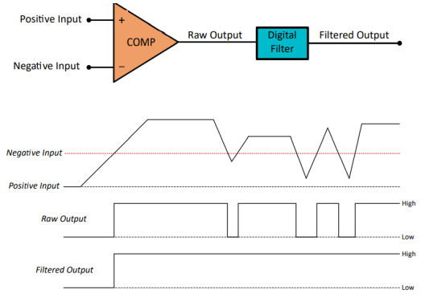

处理-系统设计：

- 开环与闭环：
- - 有两种类型的控制系统，开环和闭环。在开放式控制系统中，控制动作不依赖于外部影响，也不包含改变输出响应的反馈。
相反，在闭环系统中，控制动作实际上取决于外部影响，并利用反馈来适应和实现期望的结果。


- 一阶系统：


- 二阶系统：


- 时间要求-峰值/上升时间（peak/rise time）：


- 时间要求-沉淀时间（settling time）：
- - 稳定时间是系统在输入幅度的某个百分比内稳定所需的时间。对于二阶系统，需要一个稳定时间，其中响应保持在其期望值的2%以内。


- 过冲处理（overshoot）：
- - 过冲量化阶跃响应在峰值时间偏离理想稳定振幅的量。


- 阻尼比：
- - 二阶系统的动力学行为由阻尼比和无阻尼固有频率定义。


- 离散时域：


- 滤波器：


处理-控制器：

- 线性PID（proportional integral derivative）：
- - PID控制器是2P2Z控制器的一种特殊情况，其中A1=-1，A2=0。


- 非线性PID：
- - 利用幂函数来实现控制律。NLPID是线性PID的自适应，其中基于幂函数的非线性定律与每条路径串联。
- - NLPID在配备1型TMU的设备（如C2000的F280025设备）上执行效率最高。这些设备具有允许非线性控制器在117个周期内执行的CPU指令，而在没有这样的指令的情况下大约为3300个周期。这种循环效率允许非线性PID用于高频应用，如开关电源和电流控制回路。

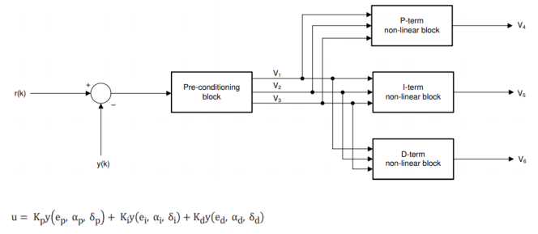


- 2P2Z补偿器（compensator）：
- - 2-极/2-零（2P2Z）补偿器是一种滤波器，它在考虑两极和两个零的情况下，将特定的增益和相位提升引入系统。


- 3P3Z补偿器：
- - 3-极/3-Zero（3P3Z）补偿器是一种滤波器，在考虑三极和三零的情况下，将特定的增益和相位提升引入系统。


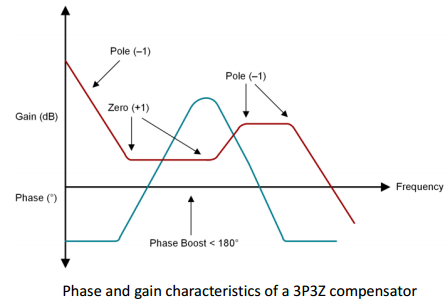

- 直接来自控制器-DF11：
- - DF11一阶直接形式1（DF11）补偿器实现一阶或“简单滞后”型频率响应。


处理-处理器：

- 数据表示：


- 双精度浮点运算的硬件支持：
- - FPU64模块通过为IEEE-754单精度和双精度浮点运算提供本地硬件支持，扩展了C28x CPU的计算能力。这使那些在应用程序中需要双精度浮点的客户能够在不显著增加CPU周期负载的情况下实现它们。

- 加速三角数学函数：
- - 三角函数在实时控制系统中大量使用，无论是在电力应用还是电机控制中。Park Transforms、Space Vector Generation和resolver angle就是其中一些依赖三角数学的例子。C2000 MCU上的三角数学单元（TMU）支持针对基于32位浮点三角计算的扩展指令集。这使得三角函数的性能更快，代码大小更小。

- 快速板载整数除法：
- - 与其他标准算术运算相比，精确的整数除法通常更复杂，并且在MCU中具有更高的循环计数。此外，在控制算法中，还需要更多的线性除法运算，如欧几里得和模数运算，这些运算通常会消耗额外的CPU开销。FID模块通过专用硬件支持这些特殊的划分定义来解决这一问题，这使得能够在没有与这些方法相关的典型额外开销的情况下实现控制算法。最后，FID支持具有最佳循环计数的各种大小和带符号操作数。

- 实时处理器的性质：


- DMA：
- - 直接内存访问（DMA）是一种允许子系统或外围设备访问RAM而无需CPU干预的功能。这对于实时控制应用程序来说是一个有用的功能，因为它允许CPU处理控制算法的其他任务，而DMA在地址位置（存储器和寄存器）之间传输数据。DMA并不总是限制在RAM和其他子系统之间，而是可以在不同的存储器之间使用。DMA传输可以由外围设备或软件触发器启动。这种能力提高了数据吞吐量，并允许更有效地使用中断。


- 中断：
- - 中断是处理器对需要注意的事件的响应。处理器一有能力就执行中断服务例程（ISR）中定义的指令，然后返回正常操作任务。
中断延迟是理解实时系统响应时间的一个重要因素。


驱动-PWM：

- PWM：


- 高频、多相和变频拓扑中的PWM更新：
- - 全局负载和全局链路功能简化了需要主动管理多个PWM参数的应用程序，例如可变频率和多相功率拓扑。更具体地说，全局负载特性通过提供单个选通信号来将PWM参数从阴影加载到单个PWM模块内或跨多个模块的有源寄存器，来帮助消除PWM毛刺。全局链接功能通过允许跨多个PWM模块同时更新链接寄存器来减少CPU开销。


交流-HIC：

- C2000外围设备的直接主机控制：
- - 许多工业控制系统实现了一个主机控制器，该控制器负责监督系统的多个方面，包括在实现直接控制回路时与C2000实时MCU接口。在其他情况下，可能希望将C2000的差异化IP添加到现有系统中。C2000实时MCU中的主机接口控制器（HIC）逻辑允许使用通用异步接口控制各种外围设备。通过HIC，主机可以利用C2000的不同功能，如快速串行接口（FSI）、可配置逻辑块（CLB）等，通过ASRAM端口将C2000设备用作外围扩展器。


- 分散控制系统中多个控制器间事件同步的求解：
- - 工业和汽车实时控制应用中使用的去中心化架构需要一种方法，以最小的触发延迟和设备之间的抖动来同步某些事件。FSI是一种高通量、低延迟的有线通信外设，可以在多设备网络拓扑结构中实现100ns以下的时间同步事件触发。使用现有的通信端口（如FSI）进行系统事件同步消除了设备之间对额外同步信号的需要，从而节省了设备资源和额外的设计/BOM成本。


- 分散体系结构中设备之间的通信接口可能在网络拓扑、节点设备数量、节点之间的物理距离等方面有所不同。由于制造的不确定性、热效应、老化等原因，设备在运行过程中的本地时钟也可能略有偏差。不管这些变化如何，在系统中的所有设备上同时发生特定事件通常是重要的，例如ADC开始转换或PWM信号的上升/下降沿。C2000设备之间的同步事件可以使用FSI模块和自定义CLB逻辑来实现。


## 编程模型

编程模型（programmer model）：

- Cortex-M3和Cortex-M4处理器基于ARMv7-M体系架构。
- Cortex-M3和Cortex-M4处理器有两种操作状态和两种模式。此外，处理器可以具有特权（privileged）和非特权访问级别。

访问级别：

- 特权访问级别可以访问处理器中的所有资源，而非特权访问级别意味着某些内存区域不可访问，并且一些操作无法使用。

操作状态：

- 调试状态。当处理器停止时（例如，由调试器停止，或在遇到断点之后），它进入调试状态并停止执行指令。
- Thumb状态。如果处理器正在运行程序代码（Thumb指令），则它处于Thumb状态。与ARM7TDMI等经典ARM处理器不同，由于Cortex-M处理器不支持ARM指令集，因此没有ARM状态。

操作模式：

- 处理模式。当执行诸如中断服务例程（ISR）之类的异常处理程序时。在处理程序模式下，处理器始终具有特权访问级别。
- 线程模式。当执行正常的应用程序代码时，处理器可以处于特权访问级别，也可以处于非特权访问级别。这是由一个名为"CONTROL"的特殊寄存器控制的。软件可以将处于特权线程模式的处理器切换到非特权线程模式。然而，它不能将自己从无特权切换回有特权。如果需要，处理器必须使用异常（exception）机制来处理切换。
- 特权和非特权访问级别的分离允许系统设计者通过提供一种机制来保护对关键区域的内存访问，并通过提供一个基本的安全模型来开发健壮的嵌入式系统。例如，系统可以包含在特权访问级别执行的嵌入式操作系统内核，以及在非特权访问级别运行的应用程序任务。通过这种方式，我们可以使用内存保护单元（MPU）设置内存访问权限，以防止应用程序任务损坏操作系统内核和其他任务使用的内存和外围设备。如果应用程序任务崩溃，剩余的应用程序任务和操作系统内核仍然可以继续运行。
- 除了内存访问权限和对几种特殊指令的访问不同之外，程序员对特权访问级别和非特权访问级别的模型几乎相同。请注意，几乎所有的NVIC寄存器都只是特权访问。
- 类似地，线程模式和处理程序模式具有非常相似的程序员模型。但是，线程模式可以切换到使用单独的阴影堆栈指针（stack pointer，SP）。同样，这允许应用程序任务的堆栈内存与操作系统内核使用的堆栈分离，从而实现更好的系统可靠性。
- 默认情况下，Cortex-M处理器以特权线程模式和Thumb状态启动。在许多简单的应用程序中，根本不需要使用无特权线程模型和阴影SP。无特权线程模式在Cortex-M0处理器中不可用，但在Cortex-Mo0+处理器中是可选的。


- 调试状态仅用于调试操作。此状态是由调试器的暂停请求或由处理器中调试组件生成的调试事件进入的。此状态允许调试器访问或更改处理器寄存器值。调试器可以在Thumb状态或debug状态下访问系统内存，包括处理器内外的外设。

寄存器：

- 与几乎所有其他处理器类似，Cortex-M3和Cortex-M4处理器在处理器内核内有许多寄存器，用于执行数据处理和控制。这些寄存器中的大多数被分组在一个称为寄存器组的单元中。每个数据处理指令指定所需的操作、源寄存器和目标寄存器（如果适用）。在ARM体系结构中，如果要处理内存中的数据，则必须将其从内存加载到寄存器组中的寄存器，在处理器内部进行处理，然后在需要时写回内存。这通常被称为加载-存储体系结构（load-store architecture）。通过在寄存器组中有足够数量的寄存器，这种安排很容易使用，并允许使用C编译器生成高效的程序代码。例如，在进行其他数据处理时，许多数据变量可以在寄存器组中存储一小段时间，而无需每次使用时更新到系统存储器并读回。
- Cortex-M3和Cortex-M4处理器中的寄存器组有16个寄存器。其中13个是通用的32位寄存器，另外三个有特殊用途。

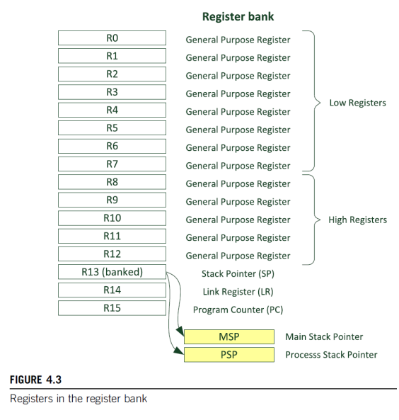

- 寄存器R0-R12是通用寄存器。前八个寄存器（R0 - R7）也称为低寄存器。由于指令集中的可用空间有限，许多16位指令只能访问低寄存器。高寄存器（R8-R12）可以与32位指令一起使用，也可以与一些16位指令（如MOV（移动））一起使用。R0到R12的初始值是未定义的。
- R13是堆栈指针SP。它用于通过PUSH和POP操作访问堆栈内存。物理上有两个不同的堆栈指针：主堆栈指针（main stack pointer，MSP）（或某些ARM文档中的SP_Main）是默认的堆栈指针。它在重置后或处理器处于处理程序模式时被选中。另一个堆栈指针称为进程堆栈指针（process stack pointer，PSP）（或某些ARM文档中的SP_Process）。PSP只能在线程模式下使用。堆栈指针的选择由一个名为CONTROL的特殊寄存器决定。在正常程序中，只有一个堆栈指针可见。
- - MSP和PSP都是32位的，但堆栈指针（MSP或PSP）的最低两位总是零，对这两位的写入被忽略。在ARM Cortex-M处理器中，PUSH和POP始终是32位的，并且堆栈操作中传输的地址必须与32位字边界对齐。
- - 在大多数情况下，如果应用程序不需要嵌入式操作系统，就没有必要使用PSP。许多简单的应用程序可以完全依赖MSP。PSP通常在涉及嵌入式操作系统时使用，其中操作系统内核和应用程序任务的堆栈是分开的。PSP的初始值未定义，MSP的初始值取自复位序列期间存储器的第一个字。
- R14也称为链路寄存器（link register，LR）。它用于在调用函数或子例程时保持返回地址。在函数或子程序结束时，程序控制可以返回到调用程序，并通过将LR的值加载到程序计数器（PC）中来恢复。当进行函数或子程序调用时，LR的值会自动更新。如果一个函数需要调用另一个函数或子例程，则需要首先将LR的值保存在堆栈中。否则，在进行函数调用时，LR中的当前值将丢失。在异常处理过程中，LR也会自动更新为一个特殊的EXC_RETURN（异常返回）值，然后用于在异常处理程序结束时触发异常返回。这将在第8章中进行更深入的介绍。尽管Cortex-M处理器中的返回地址值总是偶数（位0为零，因为指令必须与半字地址对齐），但LR的位0是可读写的。一些分支/调用操作要求LR（或任何正在使用的寄存器）的零位设置为1，以指示Thumb状态。
- R15是程序计数器（program counter，PC）。它可读写：读取返回当前指令地址加4（这是由于设计的流水线性质以及与ARM7TDMI处理器的兼容性要求）。写入PC（例如，使用数据传输/处理指令）会导致分支操作。由于指令必须与半字或字地址对齐，因此PC的最低有效位（LSB）为零。但是，当使用某些分支/内存读取指令更新电脑时，您需要将新电脑的LSB值设置为1以指示Thumb状态。否则，可能会触发故障异常，因为它指示尝试切换到使用ARM指令（即ARM7TDMI中的32位ARM指令），这是不受支持的。在高级编程语言（包括C、C++）中，分支目标中LSB的设置由编译器自动处理。
- - 在大多数情况下，分支和调用由专门用于此类操作的指令处理。使用数据处理指令更新PC并不常见。然而，PC的值对于访问存储在程序内存中的文字数据很有用。因此，您经常可以找到将PC作为基地址寄存器的内存读取操作，地址偏移由指令中的立即值生成。

特殊寄存器：

- 除了寄存器组中的寄存器外，还有许多特殊寄存器。这些寄存器包含处理器状态，并定义操作状态和中断/异常屏蔽。在使用C等高级编程语言开发简单应用程序时，需要访问这些寄存器的场景并不多。然而，它们是嵌入式操作系统的开发所需要的，或者当需要高级中断屏蔽功能时。


- 特殊寄存器不是内存映射的，可以使用特殊寄存器访问指令（如MSR和MRS）进行访问。
- - `MRS<reg>，<special_reg>;`将特殊寄存器读入寄存器。
- - `MSR<special_reg>，<reg>;`写入特殊寄存器。
- CMSIS Core还提供了许多可用于访问特殊寄存器的C函数。不要将这些特殊寄存器与其他微控制器架构中的"特殊功能寄存器（special function registers，SFR）"混淆，后者通常被称为I/O控制寄存器。
- 程序状态寄存器（program status registers）：
- - 应用程序PSR（APSR）
- - 执行PSR（EPSR）
- - 中断PSR（IPSR）
- - 这三个寄存器可以作为一个组合寄存器访问，在一些文档中称为xPSR。在ARM汇编程序中，当访问xPSR时，将使用符号PSR。例如：`MRS r0，PSR;`读取组合程序状态字。`MSR PSR，r0;`写入组合程序状态字。


- PRIMASK、FAULTMASK和BASEPRI寄存器：
- - PRIMASK、FAULTMASK和BASEPRI寄存器均用于异常或中断屏蔽。每个异常（包括中断）都有一个优先级，其中较小的数字表示较高的优先级，较大的数字表示较低的优先级。这些特殊寄存器用于根据优先级屏蔽异常。它们只能在特权访问级别访问（在非特权状态下，对这些寄存器的写入被忽略，读取返回零）。默认情况下，它们都为零，这意味着屏蔽（禁用异常/中断）未激活。下图显示了这些寄存器的程序员模型。


- - PRIMASK寄存器是一个1位宽的中断屏蔽寄存器。设置时，它会阻止除非屏蔽中断（NMI）和HardFault异常之外的所有异常（包括中断）。它有效地将当前异常优先级提高到0，这是可编程异常/中断的最高级别。PRIMASK最常见的用法是禁用时间关键进程的所有中断。时间关键过程完成后，需要清除PRIMASK以重新启用中断。
- - FAULTMASK寄存器与PRIMASK非常相似，但它也阻止了HardFault异常，这有效地将当前异常优先级提高到了`[-]1`。故障处理代码可以使用FAULTMASK来抑制。
- - 为了允许更灵活的中断屏蔽，ARMv7-M架构还提供了BASEPRI，它根据优先级屏蔽异常或中断。BASEPRI寄存器的宽度取决于设计中实现的优先级，这由微控制器供应商决定。大多数Cortex-M3或Cortex-M4微控制器具有八个可编程异常优先级（3位宽度）或16个级别，在这些情况下，BASEPRI的宽度将分别为3位或4位。当BASEPRI设置为0时，它将被禁用。当它被设置为非零值时，它会阻止具有相同或更低优先级的异常（包括中断），同时仍然允许处理器接受具有更高优先级的异常。
- - CMSIS Core提供了许多用于访问C编程环境中的PRIMASK、FAULTMASK和BASEPRI寄存器的功能（注意：这些寄存器只能在特权访问级别中访问）：

```
x = __get_BASEPRI(); // Read BASEPRI register
x = __get_PRIMARK(); // Read PRIMASK register
x = __get_FAULTMASK(); // Read FAULTMASK register
__set_BASEPRI(x); // Set new value for BASEPRI
__set_PRIMASK(x); // Set new value for PRIMASK
__set_FAULTMASK(x); // Set new value for FAULTMASK
__disable_irq(); // Set PRIMASK, disable IRQ
__enable_irq(); // Clear PRIMASK, enable IRQ

// 或者，您也可以使用汇编代码访问这些异常屏蔽寄存器：

MRS r0, BASEPRI ; Read BASEPRI register into R0
MRS r0, PRIMASK ; Read PRIMASK register into R0
MRS r0, FAULTMASK ; Read FAULTMASK register into R0
MSR BASEPRI, r0 ; Write R0 into BASEPRI register
MSR PRIMASK, r0 ; Write R0 into PRIMASK register
MSR FAULTMASK, r0 ; Write R0 into FAULTMASK register
```

- CONTROL寄存器：


- - CONTROL寄存器定义堆栈指针的选择（主堆栈点/进程堆栈指针）。
- - CONTROL定义线程模式下的访问级别（特权/非特权）。
- - CONTROL寄存器只能在特权访问级别进行修改，并且可以在特权和非特权访问级别中读取。CONTROL寄存器中每个位字段的定义如下：


- - 重置后，CONTROL寄存器为0。这意味着线程模式使用主堆栈指针作为堆栈指针，线程模式具有特权访问。处于特权线程模式的程序可以通过写入CONTROL来切换堆栈指针选择或切换到非特权访问级别。但是，一旦设置了nPRIV（CONTROL位0），在线程中运行的程序就不能再访问CONTROL寄存器。
处于非特权访问级别的程序无法将自身切换回特权访问级别。这对于提供一个基本的安全使用模型是至关重要的。
例如，嵌入式系统可能包含以非特权访问级别运行的不受信任的应用程序，并且必须限制这些应用程序的访问权限，以防止安全漏洞或防止不可靠的应用程序破坏整个系统。


- - 如果有必要在线程模式下将处理器切换回使用特权访问级别，则需要异常机制。在异常处理过程中，异常处理程序可以清除nPRIV位。当返回到线程模式时，处理器将处于特权访问级别。


- - 当使用嵌入式操作系统时，可以在每个上下文开关处重新编程CONTROL寄存器，以允许一些应用程序任务以特权访问级别运行，而其他应用程序任务则以非特权访问级别执行。
nPRIV和SPSEL的设置是正交的。nPRIV和SPSEL的四种不同组合是可能的，尽管它们中只有三种常用于现实世界的应用。


- - 在大多数没有嵌入式操作系统的简单应用程序中，不需要更改CONTROL寄存器的值。整个应用程序可以在特权访问级别运行，并且只使用MSP。


- - 要访问C中的CONTROL寄存器，可在符合CMSIS的设备驱动程序库中使用以下函数：

```
x = __get_CONTROL(); // Read the current value of CONTROL
__set_CONTROL(x); // Set the CONTROL value to x
```

浮点寄存器：

- Cortex-M4处理器有一个可选的浮点单元。这为浮点数据处理提供了额外的寄存器，以及浮点状态和控制寄存器（floating point status and control register，FPSCR）。


- S0到S32/D0到D15：每个32位寄存器S0至S31（“S”表示单精度）可以使用浮点指令进行访问，或者在D0至D15（“D”表示双字/双精度）的符号中作为一对进行访问。例如，S1和S0配对在一起成为D0，S3和S2配对在一起变成D1。尽管Cortex-M4中的浮点单元不支持双精度浮点计算，但您仍然可以使用浮点指令来传输双精度数据。
- FPSCR：FPSCR包含各种位字段，原因如下：1.定义一些浮点运算行为。2.提供有关浮点运算结果的状态信息。默认情况下，行为被配置为符合IEEE 754单精度运算。在正常应用中，不需要修改浮点运算控制的设置。下表列出了FPSCR中位字段的说明：


## 内存系统

内存系统特征：

- Cortex-M3和Cortex-M4处理器具有以下内存系统特征：
- - 4GB线性地址空间e通过32位寻址，ARM处理器可以访问多达4GB的内存空间。虽然许多嵌入式系统不需要超过1MB的内存，但32位寻址功能确保了未来升级和扩展的可能性。Cortex-M3和Cortex-M4处理器使用名为AHB-LITE的通用总线协议提供32位总线。该总线允许使用合适的存储器接口控制器连接到32/16/8位存储器设备。
- - 体系结构定义的内存映射e 4GB内存空间被划分为多个区域，用于各种预定义的内存和外围设备。这使得处理器设计能够针对性能进行优化。例如，Cortex-M3和Cortex-M4处理器具有多个总线接口，以允许从用于程序代码和数据操作的CODE区域同时访问SRAM或外围区域。
- - 支持小端和大端内存系统e Cortex-M4和Cortex-M4-处理器可以与小端或大端内存体系配合使用。在实践中，微控制器产品通常只设计有一个端序配置。
- - 位带访问（可选）-当包含位带功能时（由微控制器/片上系统供应商确定），存储器映射中的两个1MB区域可通过两个位带区域进行位寻址。这允许原子访问SRAM或外围地址空间中的各个位。
- - 写入缓冲区-当向可缓冲存储器区域的写入传输需要多个周期时，传输可以由Cortex-M3或Cortex-M4处理器中的内部写入缓冲区进行缓冲，以便处理器可以继续执行下一条指令（如果可能）。这允许更高的程序执行速度。
- - 内存保护单元（可选）- MPU是一个可编程单元，用于定义各种内存区域的访问权限。CortexM3和Cortex-M4处理器中的MPU支持八个可编程区域，并且可以与嵌入式操作系统一起使用，以提供强大的系统。
- - 无对齐传输支持-所有支持ARMv7-M架构的处理器（包括Cortex-M3和Cortex-M4处理器）都支持无对齐数据传输。
- Cortex-M处理器上的总线接口是通用总线接口，可以通过不同的内存控制器连接到不同类型和大小的内存。微控制器中的存储系统通常包含两种或多种类型的存储器：用于程序代码的闪存、用于数据的静态RAM（SRAM），在某些情况下还包括电可擦除只读存储器（EEPROM）。在大多数情况下，这些存储器是片上存储器，实际的存储器接口细节对软件开发人员来说是透明的。因此，软件开发人员只需要知道程序存储器和SRAM的地址和大小。

内存映射：

- Cortex-M处理器的4GB地址空间被划分为多个内存区域。分区基于典型用途，因此不同的区域主要用于：
- - 程序代码访问（例如code区域）
- - 数据访问（例如SRAM区域）
- - 外围设备（例如外围区域）
- - 处理器的内部控制和调试组件（例如专用外围总线）
- 该体系结构还允许高度灵活性，以允许存储器区域用于其他目的。例如，程序可以从CODE以及SRAM区域执行，并且微控制器也可以在CODE区域中集成SRAM块。
- 在实践中，许多微控制器设备仅将每个区域的一小部分用于编程闪存、SRAM和外围设备。某些区域可能未使用。不同的微控制器具有不同的存储器大小和外围地址位置。这些信息通常在微控制器供应商的用户手册或数据表中列出。
- 内存映射排列在所有Cortex-M处理器之间是一致的。例如，PPB地址空间承载嵌套矢量中断控制器（NVIC）的寄存器、处理器的配置寄存器以及调试组件的寄存器。所有Cortex-M设备都是如此。这样可以更容易地将软件从一个Cortex-M设备移植到另一个设备，并允许更好的软件可重用性。它还使工具供应商更容易，因为Cortex-M3和Cortex-M4设备的调试控制以相同的方式工作。


堆栈内存：

- 在几乎所有的处理器体系结构中，Cortex-M处理器都需要堆栈内存来操作，并且具有堆栈指针（R13）。堆栈是一种内存使用机制，允许将一部分内存用作后进先出数据存储缓冲区。ARM处理器使用主系统内存进行堆栈内存操作，并具有在堆栈中存储数据的PUSH指令和从堆栈中检索数据的POP指令。当前选择的堆栈指针会针对每次PUSH和POP操作自动调整。
- 堆栈可用于：
- - 当正在执行的函数需要使用寄存器（在寄存器组中）进行数据处理时，临时存储原始数据。这些值可以在函数结束时恢复，这样调用函数的程序就不会丢失数据。
- - 向函数或子程序传递信息。
- - 用于存储局部变量。
- - 在出现中断等异常情况时，保持处理器状态和寄存器值。
- Cortex-M处理器使用一种称为“完全递减堆栈”的堆栈内存模型。启动处理器时，SP设置为为堆栈内存保留的内存空间的末尾。对于每个PUSH操作，处理器首先递减SP，然后将该值存储在SP所指向的内存位置。在操作过程中，SP指向最后一个数据被推送到堆栈的存储位置。在POP操作中，读取SP指向的内存位置的值，然后SP的值自动递增。


- PUSH和POP指令最常见的用途是在进行函数/子例程调用时保存寄存器组的内容。在函数调用开始时，可以使用PUSH指令将某些寄存器的内容保存到堆栈中，然后在函数结束时使用POP指令将其恢复为原始值。例如，在下图中，从主程序调用一个名为function1的简单函数/子例程。由于函数1需要使用和修改R4、R5和R6进行数据处理，并且这些寄存器保存主程序稍后需要的值，因此使用PUSH将它们保存到堆栈中，并在函数1结束时使用POP进行恢复。这样，调用函数的程序代码就不会丢失任何数据，并且可以继续执行。请注意，对于每个PUSH（存储到内存）操作，必须有相应的POP（从内存读取），并且POP的地址应与PUSH操作的地址相匹配。


- 每个PUSH和POP指令都可以向堆栈内存传输多个数据。如图4.21所示。由于寄存器组中的寄存器是32位，因此堆栈PUSH和堆栈POP生成的每个存储器传输至少传输1个字（4个字节）的数据，并且地址总是与4个字节的边界对齐。SP的最低两位始终为零。


- 在Cortex-M处理器中，物理上有两个堆栈指针。它们是：
- - 主堆栈指针（MSP）-这是重置后使用的默认堆栈指针，用于所有异常处理程序。
- - 进程堆栈指针（PSP）-这是一个只能在线程模式下使用的备用堆栈点。它通常用于运行嵌入式操作系统的嵌入式系统中的应用程序任务。
- 如前所述，MSP和PSP之间的选择可以由CONTROL寄存器第1位中的SPSEL值控制。如果此位为0，线程模式将使用MSP进行堆栈操作。否则，线程模式使用PSP。此外，在从处理程序模式到线程模式的异常返回过程中，可以通过EXC_return（异常返回）值的值来控制选择。在这种情况下，SPSEL的值将由处理器硬件相应地更新。


- 在没有操作系统的简单应用程序中，线程模式和处理程序模式都只能使用MSP。如图4.23所示：触发中断事件后，处理器在进入中断服务例程（ISR）之前，首先将多个寄存器推入堆栈。此寄存器状态保存操作称为“堆叠”，在ISR结束时，这些寄存器将恢复到寄存器组，此操作称为拆垛（unstacking）。当嵌入式系统使用嵌入式操作系统时，它们通常为应用程序堆栈和内核堆栈使用单独的内存区域。因此，PSP被使用，SP选择的切换发生在异常进入和异常退出中。如图4.24所示。请注意，自动“堆叠”和“取消堆叠”阶段使用PSP。分离堆栈布置可以防止应用任务中的堆栈损坏或错误损害OS的堆栈使用。它还简化了操作系统的设计，从而允许更快的上下文切换。


- 虽然一次只能看到其中一个SP（使用SP或R13访问时），但可以直接读/写MSP和PSP，而不会混淆您所指的SP/R13。如果您处于特权级别，则可以使用以下CMSIS功能访问MSP和PSP:


- 通常，不建议更改C函数中当前选定SP的值，因为堆栈内存的一部分可用于存储局部变量或其他数据。要访问汇编代码中的MSP和PSP，可以使用MSR和MRS说明：


- 大多数应用程序代码不需要显式访问MSP和PSP。嵌入式操作系统通常需要访问MSP和PSP。例如，通过使用MRS指令读取PSP值，OS可以读取从应用任务中的API调用推送到堆栈的数据（例如在执行SVC指令之前的寄存器内容）。此外，PSP的值在上下文切换期间通过OS中的上下文切换代码来更新。
- 通电后，处理器硬件通过读取矢量表自动初始化MSP。PSP不是自动初始化的，在使用之前必须由软件进行初始化

## 往年考试内容

### Quiz 1


1.(1):
- CISC方法以每个指令的周期数增加为代价，试图最小化每个程序的指令数量。CISC的指令的长度不定。CISC的指令的执行时间不定。CISC有很多指令可以访问内存，且一条指令可以同时对内存进行读取和写入。CISC具有更多对特定功能的寄存器，一些专门存储数据，一些专门存储地址。CISC寻址模式有很多种。
- RISC方法以每个程序的指令数增加为代价，来减少每个指令的周期。RISC的指令长度固定。RISC的指令的执行时间为1个或2个总线周期。RISC只有很少指令可以访问内存，且一条指令不能同时对内存进行读取和写入。RISC具有更多相同的通用的寄存器。RISC寻址模式只有少数几种。
- RISC的特质使得它只需要更少的晶体管硬件空间，为通用寄存器留出了更多的空间。因为所有指令都在统一的时间内执行（即一个时钟），所以流水线是可能的。

1.(2):

处理器按照一系列步骤来执行每一条指令，典型的步骤如下：

（1）从存储器读取指令（Fetch）。

（2）译码以鉴别它属于哪一条指令（Decode）。

（3）从指令中提取指令的操作数（这些操作数往往存在于寄存器 Reg 中）。

（4）将操作数进行组合以得到结果或存储器地址（ALU）。

（5）如果需要，则访问存储器以存储数据（Mem）。

（6）将结果写回到寄存器堆（Res）。

并不是所有的指令都需要上述每一个步骤，但是，多数指令需要其中的多个步骤。这些步骤往往使用不同的硬件功能，如 ALU 可能只在第 4 步中用到。

有一种方法可以明显改善硬件资源的使用率和处理器的吞吐量，这就是在当前一条指令结束之前就开始执行下一条指令，即通常所说的流水线（pipeline/pipelining）技术。流水线是 RISC处理器执行指令时采用的机制。使用流水线，可在取下一条指令的同时译码和执行其他指令，从而加快执行的速度。

采用上述操作顺序，处理器可以这样来组织：当一条指令刚刚执行完步骤（1）并转向步骤（2）时，下一条指令就开始执行步骤（1）。从原理上说，这样的流水线应该比没有重叠的指令执行快 6 倍，但由于硬件结构本身的一些限制，实际情况会比理想状态差一些。

ARM的3级（stage）流水线：
- 取指令（fetch）
- 译码（decode）
- 执行（excute）


ARM的5级流水线：
- 取指令（fetch）
- 译码（decode）
- 执行（excute）
- 缓冲/数据（buffer/data）
- 写回（write-back）


ARM的13级流水线：
- 基于超流水线技术。

### Quiz2


Reasons:
Trade-off:
Ways to optimize:

### Quiz3


1.(1):
1.(2):非易失性（non-volatile）的区域：
EEPROM、Flash。
1.(3):

2.Explain:

单片机是将外设映射到内存地址上，所以我们可以像操作内存一样来操作外设（写/读）。我们在操作内存时是通过地址来进行操作的，由于单片机已经将外设与内存进行了映射，所以我们在操作单片机外设时只需要操作外设映射的内存地址就行。
在STM32中，外设（如定时器、ADC、DAC等）是通过特殊功能寄存器（SFR）进行访问的。这些寄存器被映射到内存地址上，所以我们可以像操作内存一样来操作外设。在C语言中，我们可以使用指针来操作这些内存地址。例如，我们可以定义一个指向特定内存地址的指针，然后通过这个指针来读写该地址，从而实现对外设的控制。此外，STM32还提供了硬件抽象层（HAL）库，这是一种公认并且遵守的函数名称命名、资源定义的方式。使用HAL库，我们可以通过函数调用来操作外设，而不需要直接操作内存地址。
STM32的SFR在内存映射中对应的地址范围在0x40000000到0x5FFFFFFF（就是整个外设区域）。具体的地址取决于特定的外设和寄存器。

3.Programmers' model of Cortex-M MCU:


## 考点记录

前两章软件开发部分无硬件部分

第四章，有哪些寄存器
control registers
一张图，memory计算

第三章：前面四种操作系统

第五章，库的结构，依赖关系，哪个程序是属于哪个层次，矩阵键盘行列扫描法伪代码-流程图

第六章，复位电路看门狗，时钟模式clocktree，配置锁相环…？

第七章：nvic，什么是中断，什么是异常，三类 片外 内核 外设 defination of periorty

第八章：timer： hse dll counter怎么设置输出是啥，重复计数器，比较计数器是啥，io怎么设置

DMA跳过

第十章 adc的过程，计算量化误差，三种adc的结构，指前面三种不包括sigmadelta，以及他们的优缺点，问不同模式
单通道，多通道，连续

第十一章DAC 加法电路 结构以及特点

第十二章：泰勒展开虚拟浮点，I2C

TinyML 量化，步骤
20个左右内容十几道题A4cheatingpaper

14：MCU的工作概念。

TinyMLHandOn：考得更少。

重核异构：不考。

## 补充：矩阵按键


- 数字电路，只有低逻辑和高逻辑，用0和1表示，此处对应的电压分别为0V和3.3V。
- 即使是GPIO口，无论是推挽输出模式还是开漏输出模式，都不能同时进行输入和输出，因此以上题目应该是PE0-3输出低逻辑。
- 已知PE0-3输出低电平，且按下按钮S6，因此PE5的输入为3.3V和上拉电阻输出的高电平和PE1输出的低电平与运算的结果，即为低电平。而PE4、PE6、PE7的输入为3.3V和上拉电阻输出的高电平，即为高电平。最终PE4-PE7的输入为1011。

