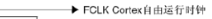
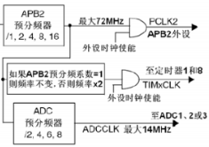

## 目录

  - PC与单片机存储系统
    - 内存层次结构
    - 存储器分类
  - STM32启动方式与存储占用明细
  - 关于"芯片"相关定义与英文对应（中文翻译问题引起的混淆）
  - 关于IP
  - 关于微处理器、CPU、处理器、处理器核心
  - 关于I/O
  - 关于个人计算机、微型计算机、单片机、SOC、嵌入式系统的定义与区别
  - 关于外设、片上外设、私有外设的定义
  - 关于系统总线
  - 关于指令集架构、微架构、处理器架构、CPU架构、芯片架构
  - 关于计算机系统概念结构
  - 关于芯片分类
  - 嵌入式、单片机
    - 嵌入式、单片机的定义
    - 单片机的最小系统（以STM32为例）
    - 单片机的开发板
    - 单片机的系统架构（以STM32为例）
    - 单片机的外设（以STM32为例）
  - ST手册解读
    - STM32介绍
    - MCU芯片的参考手册和数据手册区别
    - I/O引脚分类
    - 查看I/O引脚定义
    - GPIO框图（推挽输出电路和开漏输出电路）
    - STM32系统结构详解（以使用Cortex-M3内核的STMF1系列为例）
  - STM32片上外设-时钟系统
    - 时钟源
    - 时钟系统
    - STM32各时钟关系
  - STM32片上外设（除时钟系统）详解
    - GPIO
    - 定时器
    - 中断系统
    - DMA
    - 串口通信
    - 互补PWM输出、死区
    - 术语补充：传输协议中的LSB、MSB
    - 术语补充：时钟、周期
  - C语言（以STM32开发为例）
    - 单片机常用语法
    - STM32库结构与库封装层级
    - STM32点亮LED例程（寄存器版）

计算机是混乱的知识体系。维度多，概念定义不完全统一，且概念定义有时会随技术更迭、传播、翻译，而被创造、更新、淘汰、混淆。难以总结获得泛化性高且时效性较长的核心知识点。

这是我第一篇带有学术性的笔记，但还未到文献综述的水平。

## PC与单片机存储系统

### 内存层次结构

内存层次结构（memory hierarchy）：

- 内存层次结构中的级别数和每个级别的性能都随着技术发展而增加。层次越高，成本越高，容量越小，速度越快。
- 以2013年Intel的Haswell Mobile处理器的内存层次结构为例：
- - 处理器寄存器。
- - 高速缓存存储器（不一定集成于处理器内，分为多级缓存，分为是否对处理器多个核共享）。
- - 内存/内部存储器/主存/主存储/主存储器（memory/main memory/primary storage）。
- - 存储/外存/外部存储器/辅存/磁盘存储/在线存储/辅助存储/辅助存储器/外存储器（storage/disk storage/online storage/secondary storage）。
- - 近线存储/三级存储（nearline storage/tertiary storage）。
- - 离线存储（offline storage）。
- 在线存储、近线存储、离线存储组成分层存储（tiered storage）：
- - 在线存储可立即用于 I/O。
- - 近线存储不能立即使用，但可以在没有人为干预的情况下快速上线。
- - 脱机存储不能立即使用，需要一些人工干预才能联机。
- 对于高速缓存存储器，L2及以下一般使用SRAM，L3及以上一般使用DRAM。
- 对于个人计算机/微型计算机，ROM/FLASH和DRAM构成内存。对于单片机，ROM/FLASH和SRAM构成内存。

### 存储器分类

- 存储器：计算机系统中用于存储程序和数据的设备或组件。
- 存储系统：由多个速度、容量不同的存储器，通过软件和硬件方法整合而成的系统，即为存储系统。

按存储介质分类：

- 半导体存储器（易失或非易失）
- - 固态硬盘（Solid-state drive，SSD），是目前主流的硬盘，大多采用NAND FLASH，少数采用SDRAM。
- 磁表面存储器/磁盘存储器（非易失）
- - 机械硬盘（Hard Disk Drive，HDD）：在平整的磁性表面存储和检索数字数据，数据通过离磁性表面很近的磁头由电磁流来改变极性的方式被写入到磁盘上，数据可以通过盘片被读取，原理是磁头经过盘片的上方时盘片本身的磁场导致读取线圈中电气信号改变。
- - 软盘（Floppy Disk）：是一种碟盘存储器，主要部分是一张薄软的磁存储介质盘片，盘片封装在矩形塑料壳中，内衬有用于清理灰尘的纤维织物。读写软盘需要借助软盘驱动器。在20世纪为主要的存储器之一，但在进入21世纪后逐渐过时并被淘汰。
- 光盘存储器（非易失）
- - 光盘（Optical disc）：1965年由美国发明家詹姆斯·拉塞尔发明，当时所存储的格式仍以模拟信号（Analog）为主。它是用激光扫描的记录和读出方式保存信息的一种介质。光盘经过许多代的发展产生了VCD、DVD、BD等类型，当前主要在音频与视频领域有所应用。
- 磁芯存储器（非易失）
- - 磁芯阵列（core array）、磁芯存储模块（core memory module）、磁芯存储板（core memory board）等。随着技术的发展，已经逐渐被半导体存储器取代了。

按存取方式分类：

- 存取时间与存储单元的物理地址无关（随机访问）：
- - 随机存储器（Random Access Memory，RAM）：在程序执行过程中可读可写。计算机中的主存都采用了这种随机存储器。根据存储信息原理的不同，RAM 又分为：
- - - 静态随机存储器（Static RAM，SRAM）：以触发器原理存储信息，不需要刷新。SRAM速度比DRAM快，成本高（SRAM的存储单元需要的晶体管数量比DRAM更多）。SRAM主要用于制造Cache。
- - - 动态随机存储器（Dynamic RAM，DRAM），以电容充放电原理存储信息，需要刷新。DRAM速度比SRAM慢，成本低。DRAM还有几种衍生的子类别：
- - - - 同步动态随机存储器（Synchronous DRAM，SDRAM）：SDRAM速度比DRAM快。
- - - - 双倍数据速率同步动态随机存储器（Double Data Rate SDRAM，DDR SDRAM）：DDR SDRAM速度比SDRAM快。
- - - 高速缓存存储器/高速缓存（Cache Memory/Cache）：一般使用SRAM制造。
- - - - 从广义的角度上看，Cache是快设备为了缓解访问慢设备延时的预留的Buffer，从而可以在掩盖访问延时的同时，尽可能地提高数据传输率。注意快和慢是一个相对概念，与微处理器中的一/二/三级缓存（L1/L2/L3 Cache）相比， DDR内存是一个慢速设备；在磁盘 I/O 系统中，DDR却是快速设备，在磁盘 I/O 系统中，仍在使用DDR内存作为磁介质的Cache。
- - - - 从狭义的角度上看，Cache特指CPU流水线和计算机主存储器之间的 L1/L2/L3 Cache（一个微处理器中还有其他广义角度上的Cache）。由于CPU的信息处理速度常常超过其它部件的信息传递速度，所以使用一般的DRAM来作为信息存储器常常使CPU处于等待状态，造成资源的浪费，Cache就是为了解决这个问题而诞生的。在操作系统启动以后，CPU就把DRAM中经常被调用的一些系统信息暂时储存在Cache里面，以后当CPU需要调用这些信息时，首先到Cache里去找，如果找到了，就直接从Cache里读取，这样利用Cache的高速性能就可以节省很多时间。大多数CPU在同一chip中集成了一定量的Cache，一般称为"内置缓存"，大多数主板上也集成了Cache，一般称为"外置缓存"。
- - 只读存储器（Read Only Memory，ROM）：本来无论是否在程序的执行过程中ROM都是只读的，随着技术的发展，ROM也能进行写入操作，但在程序的执行过程中仍只读。通常用ROM存放固定不变的程序、常数等，ROM与 RAM 可共同作为主存的一部分。根据存储信息原理的不同，ROM 又分为：
- - - 掩模型只读存储器（Mask ROM，MROM）：早期的 ROM 采用掩模工艺，把原始信息记录在芯片中且无法修改。
- - - 一次可编程只读存储器（One Time Programmable ROM）：顾名思义就是只能进行一次写操作的ROM，一般用来存储密钥之类的信息。
- - - 可编程只读存储器（Programmable ROM，PROM）：随着半导体技术的发展，出现了可编程只读存储器。
- - - 可擦除可编程只读存储器（Erasable PROM，EPROM）：随着半导体技术的发展，出现了可擦除可编程只读存储器。
- - - 用电可擦除可编程只读存储器（Electrically EPROM，EEPROM）：随着半导体技术的发展，出现了用电可擦除可编程只读存储器。
- - - 闪存（Flash/Flash Memory）：一种特殊的EEPROM。闪存具有整片擦除的特点（因此不能代替 RAM，因为做不到以字节为单位改写数据），其擦除、重写的速度快，比一般标准的 EEPROM 快得多。闪存可与CPU直接连接，因此具备部分RAM的功能。
- - - - 闪存是舛冈富士雄博士1980年申请了一个叫做simultaneously erasable EEPROM的专利，可以看作一种特殊的EEPROM，但它的容量比一般的EEPROM大很多，擦除时以多个字节（扇区）为单位。主要分为NOR FLASH与NAND FLASH，前者地址线与数据线分开，一般存储代码指令，比如单片机中的程序存储空间；而后者共用地址线与数据线，必须以“块”为单位读写，成本较低，一般用于大数据量的存储场合，比如SD卡、U盘、固态硬盘。
- - - - FLASH结合了RAM和ROM的优点，不仅具备电子可擦除可编程的性能，还不会断电丢失数据同时可以快速读取数据。FLASH和ROM不同，FLASH是ROM的子类。
- 存取时间与存储单元的物理地址有关（串行访问）：
- - 顺序存取存储器：如磁带，不论物理地址处在哪个位置，读/写时必须从其介质的始端开始按顺序寻找。
- - 直接存取存储器：如磁盘，部分串行：首先指出该存储器中的某个小区域（磁道），然后再顺序寻访直到找到位置，即前段是直接访问，后段是串行访问。

按存储器在计算机中的作用分类：

- 内存。可与CPU直接连接。
- 外存。不可与CPU直接连接。
- 缓存。用于高速和低速设备之间的缓冲。一般特指CPU与内存之间的缓存。

半导体存储器按照易失性（volatile）和非易失性（non-volatile）分为：

- 易失性存储器：
- - RAM（随机存取存储器）：SRAM、DRAM。
- - 使用RAM制造的Cache和寄存器。
- 非易失性存储器：
- - ROM（只读存储器）：MROM（Mask ROM）、PROM、EPROM、EEPROM。
- - Flash（闪存）。

## STM32启动方式与存储占用明细

STM32 的内部 Flash 包含主存储器、系统存储器、 OTP 区域以及选项字节区域：

- Flash存储器的内容在掉电后不会丢失，STM32 芯片在运行的时候，也能对自身的内部 Flash 进行读写。因此，若内部 Flash 存储了应用程序后还有剩余的空间，我们可以把它像外部Flash（例如SPI接口驱动的SD卡）那样利用起来，存储一些程序运行时产生的需要掉电保存的数据。并且访问内部 FLASH 的速度要比外部FLASH 快得多。
- 主存储器区：一般我们说 STM32 内部 FLASH 的时候，都是指这个主存储器区域，它是存储用户应用程序的空间。芯片型号说明中的 1M FLASH、 2M FLASH 都是指这个区域的大小。
- 系统存储器区：系统存储器区是用户不能访问的区域，它在芯片出厂时已经固化了启动代码，它负责实现串口、 USB 以及 CAN 等 ISP 烧录功能。这个存储区符合传统意义上的ROM（用户无法修改且只读）。但一般来说，包括keil中的设置和CubeMX的设置，STM32的ROM都指代内置Flash的主存储器部分（可以烧录代码修改，但在程序运行过程中只读）。
- OTP（One Time Program）区：指的是只能写入一次的存储区域，容量为 512 字节，写入后数据就无法再更改， OTP 常用于存储应用程序的加密密钥。
- 选项字节区：用于配置 FLASH 的读写保护、电源管理中的 BOR 级别、软件/硬件看门狗等功能，这部分共 32 字节。可以通过修改 FLASH 的选项控制寄存器修改。

STM32的三种启动方式：


- Main Flash memory：从STM32内置的Flash的主存储器区启动。
- System memory：从STM32内置的Flash的系统存储器区启动，这种模式启动的程序功能是由厂家设置的。一般来说，这种启动方式用的比较少。系统存储器区是芯片内部一块特定的区域，STM32在出厂时，由ST在这个区域内部预置了一段BootLoader，也就是我们常说的ISP程序， 这是一块MROM，出厂后无法修改。一般来说，我们选用这种启动模式时，是为了从串口下载程序，因为在厂家提供的BootLoader中，提供了串口下载程序的固件，可以通过这个BootLoader将程序下载到系统的Flash中。
- Embedded Memory：从STM32内置的SRAM启动，用于快速的程序调试。
- STM32的三种启动方式决定了无法从外部Flash启动。
- STM32扩容外部RAM（SRAM和DRAM都行，SDRAM是DRAM的一种）可以，扩容外部Flash也可以，作为外设来使用即可。

keil编译信息（存储占用明细）：

- 存储项分为：
- - Code（代码段）: 存储程序代码。
- - RO（只读数据段）: 存储常量。
- - RW（读写数据段）：存储初始化不为0的全局变量。
- - ZI（Zero Initial）（零数据段）：存储初始化为0或未初始化的全局变量。
- Flash存储项包括Code + RO + RW。
- - Code：程序代码需要断电保存。
- - RW：初始化不为零的全局变量值需要断电保存。
- - RO：常量值需要断电保存。
- RAM存储项包括RW + ZI。
- - RW：存储运行程序时可能变化的全局变量。如果读取FLASH存储的对应的全局变量的值，则读取到的将会一直是初始化时的值。
- - ZI：存储运行程序时可能变化的全局变量。如果是初始化为0的全局变量，RAM断电后重新上电的默认值应当均为0，因此不需要进行初始化，也不需要存储在FLASH中。如果是未初始化的全局变量，则不需要也无法存储在FLASH中。

STM32内存地址映射（$2^{32} \to 0xFFFFFFFF$）：


- 本质上，STM32对外设的操作都是对地址的操作。
- SRAM以0x20000000起始。用于存储堆、栈和全局变量。
- 内部Flash以0x08000000起始。用于存储程序代码和常量数据。
- 外部设备存储器区域/外部RAM区域以0x60000000起始。外部RAM或外部闪存，用于扩展系统存储容量。
- 特殊功能寄存器（SFR）/外设区域以0x40000000起始。用于存储和控制外设的寄存器。
- Main Flash memory启动方式下，芯片启动程序就是从0x08000000开始。
- Main Flash memory启动方式下，STM32上电启动后，将会将RW段的RW-data搬运到SRAM，但不会搬运RO-data和Code（这种启动方式下STM32每条指令都是从Flash读取执行，也不需要搬运到RAM）。当然，为了提高指令加载速度，也可以一次性加载到SRAM，但不这么做，因为SRAM本来就小，不值得。
- 烧录代码文件时，是烧录到Flash中的。STM32中的内部Flash分为主存储器区和系统存储器区，主存储器区是可读写的，一般STM32的ROM指代的是内部Flash的主存储器区。系统存储器区是只读的，IP内核只能从里面读数据，而不能往里面写数据。
- 程序代码运行时，所用到的需要被改写的量，包括全局变量、局部变量、堆栈段，都存储在RAM（包括SRAM和DRAM）中。

## 关于"芯片"相关定义与英文对应（中文翻译问题引起的混淆）

wafer、die、cell、chip：

- 晶圆（wafer）：（未经加工的）圆形的整块硅片。
- 晶片/晶粒/裸晶/裸晶片/裸硅片/裸片/芯片（die）：一个晶圆将会分割成多个die。同一个晶圆上每个die形状均为矩形且电路内容一致。
- 单元/功能单元（cell/chip）：一个die划分成多个cell/chip。
- 芯片/封装好的裸片（chip）：对die进行封装后，封装完成的die就称为chip。广义上，chip是对"芯片"的统称，也就是对封装完成的集成电路产品的统称。


die的封装（package）方式：

- 单封（Single-Chip Module，SCM）：一个封装芯片chip中只包含一个die。
- 合封（Multi-Chip Module，MCM）：一个封装芯片chip中有两个或者两个以上的die。

集成电路芯片/集成电路/IC芯片/芯片/集成块（integrated circuit，IC）：

- 集成电路：是一种微型电子器件或部件。采用一定的工艺，把设计好的一个电路中所需的晶体管、电阻、电容和电感等元件及布线整个制作在一小块或几小块半导体晶片或介质基片上，然后封装在一个管壳内，成为具有所需电路功能的微型结构。
- 集成电路的定义是会变化的（根据材料和电路密度/集成程度的发展，集成电路的定义也会发生变化）。
- 某些电路是无法通过仅在硅片上蚀刻实现的，因此不能称为集成电路。
- die是集成电路的载体。
- 狭义上，印刷电路板（Printed Circuit Board，PCB）特指裸板。PCBA（Printed Circuit Board Assembly，PCBA）是在PCB上集成零件后的成品板。广义上，PCB也可以指代PCBA。
- PCB是chip的载体。

## 关于IP

IP模块：

- IP/IP模块/IP核/IP内核（intellectual property core）是指已验证的、可以重复使用的具有某种确切功能的集成电路设计模块。
- 在设计新的SOC时重复使用预先设计并验证过的IP模块可以极大地减轻IC设计企业的工作量，达到缩短开发周期、降低芯片研发成本的目的，对于新的芯片产品尽快市抢占市场起到极大的帮助作用。
- IP模块主要有：HDL语言形式、网表形式、版图形式三种存在形式，分别对应三类IP内核：软核（soft core）、硬核（hard core）、固核（firm core）。

目前市场上集成电路IP相关企业可分为四大类：

- 专业IP公司：企业专门研发IP，业务仅为IP授权，代表企业为ARM、CEVA等。
- 系统芯片设计公司：IP产品主要供给内部使用，少量对外交易，代表企业为Freescale、TI、IBM等。
- EDA软件公司：IP产品配套EDA工具产品对外销售，代表企业为Synopsys、Cadence等。
- 集成电路制造代工企业：一般免费提供IP供客户使用，代表企业为TSMC、SMIC等。

按产品种类分类，IP可以大致分为处理器IP、有线接口IP、物理IP等主要类型：

- 处理器 IP 是一种数字电路，用于完成取指令、执行指令及与外界存储器和逻辑部件交换信息等操作，主要包括中央处理器 IP（CPU IP）、图形处理器 IP（GPU IP）、神经网络处理器 IP（NPU IP）、视频处理器 IP（VPU IP）、数字信号处理器 IP（DSP IP）、图像信号处理器 IP（ISP IP）六大类，代表性龙头主要有Arm、Imagination、CEVA等。处理器IP可应用于计算机、智能手机、智能电视、游戏设备、可穿戴、物联网等众多场景。
- 接口 IP 集成了基于协议的功能，主要包括通用串行总线（USB IP）、串行高级技术附件（SATA IP）、高清多媒体接口/显示端口（HDMI/DP IP）等。其最大份额来自于以数据为中心的应用。
- 物理 IP 主要用于模拟及混合信号、物理接口、存储单元和其他的数字 IP，主要包括数模混合 IP、射频 IP 等，主要应用于SOC子系统、人机界面、电源管理、低功耗蓝牙、NB-IoT等。

## 关于微处理器、CPU、处理器、处理器核心

微处理器（microprocessor）：

- CPU实现形式的历史发展：晶体管CPU - 小规模集成CPU - 大规模集成CPU - 微处理器（发展到这一阶段，微处理器形式几乎完全超越了所有其他实现形式，因此在现代，术语"CPU"和"微处理器"都可以默认为指代以微处理器形式实现的CPU）。

中央处理器单元（Central Processing Unit，CPU）/中央处理器（central processor）/主处理器（main processor）、处理器（processor）：

- CPU传统上是指整个处理器芯片chip，它内部集成了一个或多个处理器核心和其他组件。它是计算机系统中负责执行指令和执行计算的主要组件。
- 处理器（processor）可以有更广泛的含义。处理器包括CPU、其他种类的处理器（例如GPU）、其他协处理器（co-processor）。
- 实际上，术语"CPU"和"处理器"经常互换使用，在这种情况下，它们指的是同一个东西：计算机系统的CPU。

处理器核心/处理器内核（processor core）/CPU核心/CPU内核（CPU core）：

- 通常将CPU芯片chip中的单个处理单元（processor unit）称为处理器核心。
- IP内核（此处特指属于"处理器IP"的IP模块）是处理器核心层面的设计和架构，而不是处理器层面的设计和架构。
- STM32系列的MCU芯片chip一般只包含一个来自ARM的IP内核，也就是STM32系列的MCU芯片chip内部集成的微处理器是一个单核微处理器。
- "CPU"有时被用来指代芯片chip内的处理器核心，这种不严谨的用法来源于CPU发展历史遗留。在早期的计算机系统中，整个处理器都包含在一个芯片chip中，这个芯片chip被称为CPU。随着时间的推移，随着技术的进步，处理器变得更加复杂，并开始在单个芯片chip中集成多个核心。
- 处理器核心的组成：
- - 运算器：算术逻辑单元（Arithmetic Logic Unit，ALU）。
- - 控制器：控制单元（Control Unit，CU）。
- - 寄存器：包括运算累加器（Accumulator，ACC）等。
- - 其他组件：部分多级缓存、总线接口、流水线等。
- 超线程（hyper-threading）技术运行单个CPU核心同时执行多个线程。超线程不会模拟出更多的逻辑核心，而是通过提高核心的利用率和资源共享，实现更好的多任务处理能力。

## 关于I/O

I/O（Input/Output，I/O）：

- 输入/输出。
- 有时可以特指"I/O电路"。

I/O设备（device）：

- 具有输入/输出功能的外设。

I/O电路（I/O circuit）：
- I/O电路是在计算机系统中负责处理输入和输出操作的内部电路。
- I/O接口是I/O电路的一部分。
- 对于个人计算机/微型计算机，有单独的主板，主板包含了I/O电路。
- 对于单片机，没有单独的主板，微控制器芯片chip中集成了I/O电路。

I/O接口（I/O interface）：

- I/O接口是用于将外设连接到计算机系统的特定的物理接口，包括：引脚（pin）、端口（port）、连接器（connector）。端口可以由一个或多个引脚组成。
- I/O接口为计算机系统和外设之间提供了必要的物理和电气连接。
- 注意I/O接口的协议（protocol）独立于I/O接口的物理实现，是抽象的概念。
- 对于个人计算机/微型计算机，I/O接口指的是与微处理器连接的主板上的物理插槽或其他形式的连接器。
- 对于单片机，I/O接口指的是完成封装后的微控制器芯片chip引出的物理引脚（这些引脚可以直接用于与外设进行物理连接，例如GPIO引脚），而不是PCB上焊接的排针或其他形式的连接器。这些物理引脚通常通过焊接与PCB连接。
- 个人计算机/微型计算机例子：USB接口、HDMI接口、Ethernet接口、音频接口。
- 单片机例子：GPIO引脚、UART接口、I2C接口、SPI接口。

I/O接口电路（I/O interface circuit）：

- 这不是一个专业术语。但可以指代用于实现I/O接口功能的电路。

## 关于个人计算机、微型计算机、单片机、SOC、嵌入式系统的定义与区别

计算机的核心组件：
- CPU、内存、I/O接口、系统总线。

个人计算机（personal computer，PC）：
- 完整计算机系统。
- 必要组件：CPU、内存（包括RAM和ROM）、外存、主板（包括I/O电路）、I/O接口、电源、操作系统。
- 非必要组件：其他外设（GPU等）。
- 如果要运行操作系统，需要具有内存管理单元（MMU），而不是看属于哪种处理器或哪种计算机。MMU是一种硬件单元，通常集成在微处理器中，用于虚拟内存管理和保护。它并不是运行操作系统的必要条件，但是对于支持复杂的现代操作系统（如Windows，Linux等），MMU是非常重要的。有些简单的嵌入式操作系统（如FreeRTOS）可以在没有MMU的系统上运行。

微型计算机（microcomputer）：
- 比个人计算机规模更小的完整计算机系统。
- 必要组件：微处理器、内存（包括RAM和ROM）、外存、主板、I/O接口、电源、操作系统。
- 非必要组件：其他外设（GPU等）。
- 微型计算机的组件不一定必须都安装在同一块PCB上，也可以和PC一样模块化组成计算机系统。但一般来说，微型计算机更倾向于把主要组件都安装在同一块PCB上。
- 微型计算机是为通用计算任务而设计的。
- 随着技术发展，微型计算机和PC的概念的界限正在模糊，互有重叠。微型计算机的定义并不严格，它可以指任何比传统的台式机或笔记本电脑更小的计算机。因此，一台微型计算机可能会有多种形式，包括单板计算机（如树莓派），甚至更小的设备。

单片机/单片机芯片/单片微型计算机/微控制器/微控制单元（single-chip microcomputer/microcontroller/single-chip microcontroller/microcontroller unit，MCU）：
- 集成在单个chip上的计算机系统所有核心组件，同时集成一定量片上外设。
- 必要组件：微处理器、内存（包括RAM和ROM）、I/O电路。
- 非必要组件：其他片上外设（定时器、模数转换器、通信接口等）。
- 单片机的组件都集成在同一个chip中。
- 微控制器通常用于各种嵌入式系统。

芯片/片上系统/SOC（system on a chip，SOC）：
- 将完整计算机系统的大部分或所有组件集成在单个chip上的集成方式。
- 必要组件：微处理器、内存（包括RAM和ROM）、I/O电路。
- 非必要组件：其他片上外设（GPU等）。
- SOC的组件都集成在同一个chip中。
- SOC是一个相对宽泛的术语。SOC是一种集成电路芯片的集成方式。MCU符合SOC的定义，是SOC的一种具体形式。
- SOC的封装方式可以采用合封或单封。如果单个die已经集成了计算机系统所有核心组件的情况，那么采用单封得到的产品也可以称为SOC。

嵌入式/嵌入式系统：

- 嵌入式系统是一种计算机系统。
- 现代嵌入式系统通常基于微控制器，但基于普通的微处理器也很常见。在更复杂的系统中，使用的处理器既可以是通用处理器也可以是专用处理器（例如DSP）。嵌入式系统的定义非常宽泛，它可以是任何专门为特定应用设计的计算机系统。

## 关于外设、片上外设、私有外设的定义

外设（peripheral）：

- 外设：连接到计算机系统并提供额外功能或交互的外部设备或组件。
- 外设通常被认为与计算机系统的核心组件分离。
- 严格意义上，微处理器以外的设备都是外设，因此内存、I/O接口、系统总线也可以视为外设。

片上外设/集成外设（on-chip peripheral/integrated peripheral）：

- 片上外设：与微处理器（严格意义上是处理器核心）一起集成在同一芯片chip上的外设都能称为片上外设。
- 片上外设包括：I/O接口（GPIO、UART、SPI、I2C等）、定时器、模数转换器等。

私有外设（private peripheral）：

- 私有外设：位于微处理器内部，并且独立于处理器核心的外设。私有外设属于片上外设。
- 私有外设包括：部分多级缓存、向量处理单元等。
- 私有外设通过内部总线与处理器核心进行通信。

## 关于系统总线

系统总线：

- 系统总线包括：
- - 地址总线：地址总线负责传输内存地址。
- - 数据总线：数据总线用于在计算机系统的不同组件之间传输实际数据。
- - 控制总线：控制总线传输协调和同步计算机系统中各个组件的操作的控制信号。
- 当计算机系统中的组件（例如微处理器）需要从存储器或外围设备读取数据或向存储器或外围装置写入数据时，它通过在控制总线上发送适当的信号来启动数据传输。地址总线用于指定被访问的存储器位置或外围设备，数据总线用于传输从该位置读取或写入的实际数据。

## 关于指令集架构、微架构、处理器架构、CPU架构、芯片架构

概念定义：

- 指令集架构（Instruction Set Architecture，ISA）：设计者为计算机硬件的不同的操作设计的指令集合，形式为二进制机器码。
- 微架构（microarchitecture）：在给定指令集架构下，处理器核心的具体硬件实现和设计方式，包括电路设计、流水线结构、缓存层次结构等。
- 处理器架构/CPU架构/芯片架构（chip architecture）：整个微处理器芯片的组织和设计方式，包括处理器核心、内存控制器、缓存、外设接口等组件的布局和连接方式。

指令集架构、微架构、芯片架构的关系：

- 指令集架构有很多的分类方法，主要的分类通过架构的复杂度来分类，可以分为复杂指令集计算机（complex instruction set computer, CISC）和精简指令集计算机（reduced instruction set computer, RISC）。
- 对于同一个指令集架构（例如x86指令集）可以有不同的微架构。
- 针对同一指令集架构编写的软件可以运行在采用该指令集架构而微架构不同的机器上。
- 由于指令集架构中的指令较多，如果直接使用机器码（也就是指令对应的二进制码）来编写软件会比较困难。这样就出现了如c++等高级语言，经过高级语言编写完程序之后再经过编译器软件将高级语言编译成对应的机器码就可以在机器上执行了，因为实际的硬件只认识机器码。

相关公司与产品关系：

- ARM公司就是一个设计指令集架构的公司。ARM公司不仅设计指令集架构，还根据自己的指令集架构设计了一系列的微架构来构建内核，并将这些内核授权给其他芯片公司使用。
- 一些芯片公司（例如ST公司）不设计自己的指令集架构和微架构，直接购买IP内核授权，设计自己的芯片架构。这些芯片公司的设计工作处于芯片chip层次。
- 注意ARM公司仅为技术授权，没有成品。芯片公司（例如ST公司）则购买ARM公司的技术授权，自己设计芯片架构并生产成品。
- ST公司将ARM公司的IP内核作为STM系列MCU的微处理器的设计方案，再进行自己的芯片架构设计并生产，即为MCU芯片产品。
- ST公司再为自己的MCU芯片产品设计外部电路并生产，即为开发板产品。

## 关于计算机系统概念结构

- 冯·诺依曼结构。
- 哈佛结构。

## 关于芯片分类

芯片chip分为两个大类：

- 不可定制芯片。CPU、MPU、DSP、GPU等。
- 可定制芯片。FPGA、ASIC等。

不可定制芯片细分：

- 中央处理单元/中央处理器/CPU。通常指的是通用CPU。
- 微处理单元/微处理器（Micro Processor Unit，MPU）。
- 数字信号处理器（Digital Signal Processing/Processor，DSP）。

## 嵌入式、单片机

### 嵌入式、单片机的定义

嵌入式的定义：

- 嵌入式，一般是指嵌入式系统（embedded system）。
- IEEE（美国电气和电子工程师协会）对嵌入式系统的定义是："用于控制、监视或者辅助操作机器和设备的装置"。
- 国内学术界的定义更为具体一些，也更容易理解：嵌入式系统，是以应用为中心，以计算机技术为基础，软件硬件可裁剪，适用于对功能、可靠性、成本、体积、功耗有严格要求的专用计算机系统。

嵌入式系统的典型架构：


- 从硬件角度来看，嵌入式系统就是以中央处理器（CPU）为核心，依靠总线（Bus）进行连接的多模块系统。

对于嵌入式系统，CPU的类型：

- 嵌入式微控制器MCU（Micro Control Unit，MCU）：MCU内部集成CPU、ROM/RAM、总线逻辑、定时/计数器、看门狗、I/O、串口、A/D、D/A、FLASH等。
- 嵌入式DSP处理器（Digital Signal Processor，DSP）：DSP处理器专门用于信号处理，在系统结构和指令算法进行了特殊设计。在数字滤波、FFT、频谱分析中广泛应用。
- 嵌入式微处理器MPU（Micro Processor Unit，MPU）：MPU由通用处理器CPU演变而来，具有较高的性能，拥有丰富的外设接口。
- 嵌入式片上系统SoC（System on Chip，SoC）。。
- 可编程片上系统SoPC（System on a Programmable Chip，SoPC）。

单片机：

- 单片机（单片微型计算机）又称为单片微控制器（Single-Chip Microcomputer）。
- 单片机属于嵌入式微控制器MCU。单片机完全等效于MCU。
- 单片机不是完成某一个特定的逻辑功能的IC芯片，而是集成了一个完整计算机系统的IC芯片。通过超大规模集成电路技术，将CPU（根据芯片开发商/芯片供应商，可能采用IP内核作为CPU）、RAM、ROM、I/O、其他片上外设等，塞进一块硅片die上，变成一个超小型的计算机。单片机是一整个计算机系统。
- "单片机"其实是一种古老的叫法。以前半导体工艺技术不成熟，不同的功能无法做进一个芯片die，所以会有"多片机"。以单个die封装成单个chip的单片机的产生，将以分别独立chip组成计算机系统但规模不够小的多片机淘汰了。而以分别独立die封装成单个chip组成计算机系统的SOC，以分别独立chip组成计算机系统但规模巨大的PC继续发展。现在半导体技术早已非常发达，所以不存在多片机。但是，"单片机"的叫法却一直延用至今。
- 单片机姓"单"，除了指单片机只是一个硅片die之外，更多是指单片机的功能单一，它是完成运算、逻辑控制、通信等功能的单一模块。即便它性能再强大，功能依然是单一的。

市面上的单片机：

- 51单片机，其实就是一系列单片机的统称。该系列单片机，兼容Intel 8031指令系统。它们的始祖，是Intel（英特尔）的8004单片机。但是51单片机并不全是英特尔公司的产品。51单片机其实放在现在毫无技术优势，是一种很老的技术。之所以它的生命力顽强，除了它曾经很流行之外，还有一个原因，就是英特尔公司彻底开放了51内核的版权。
- 在单片机领域，ARM的Cortex-M内核拥有压倒性的优势，已经成为绝对的主流。很多半导体公司都放弃了自己原先的架构，转做ARM架构的单片机。例如ST公司。
- 嵌入式系统是一个大类，单片机是其中一个重要的子类。嵌入式系统像是一个完整的计算机，而单片机更像是一个没有外设的计算机。
- 以前单片机包括的东西并不算多，两者的硬件区别较为明显。但是，随着半导体技术的突飞猛进，现在各种硬件功能都能被做进单片机之中。所以，嵌入式系统和单片机之间的硬件区别越来越小，分界线也越来越模糊。于是，人们倾向于在软件上进行区分。从软件上，行业里经常把芯片中不带MMU（memory management unit，内存管理单元）从而不支持虚拟地址，只能裸奔或运行RTOS（实时操作系统，例如ucos、华为LiteOS、RT-Thread、freertos等）的一整个系统，叫做单片机（如STM32、NXP LPC系列、NXP imxRT1052系列等）。而把芯片自带MMU可以支持虚拟地址，能够跑Linux、Vxworks、WinCE、Android这样的"高级"操作系统的system，叫做嵌入式。

### 单片机的最小系统（以STM32为例）

提供单片机工作所需的最小外围电路（一般联通单片机一起集成在PCB上，称为最小系统板）。主要包括（以STM32为例）：

- MCU/芯片/主控芯片/控制芯片/单片机。例如STM32F103C8T6就是一个完整的主控芯片的型号。一般查看芯片手册的芯片特性。


- 电源电路/电源系统。由低压差线性稳压器（Low Dropout Regulator，LDO）将5V转换为3.3V，为主控芯片供电。


- - 时钟电路/振荡电路/晶振电路/晶振。晶振是由石英晶体组成的，石英晶体之所以能当为振荡器使用，是基于它的压电效应：在晶片的两个极上加一电场，会使晶体产生机械变形；在石英晶片上加上交变电压，晶体就会产生机械振动，同时机械变形振动又会产生交变电场，虽然这种交变电场的电压极其微弱，但其振动频率是十分稳定的。当外加交变电压的频率与晶片的固有频率（由晶片的尺寸和形状决定）相等时，机械振动的幅度将急剧增加，这种现象称为"压电谐振"。
晶振电路为主控芯片提供系统时钟，所有的外设工作，CPU工作都要基于该时钟，类似于整个系统的"心跳节拍"。
晶振分为无源和有源，但是本质上都是皮尔斯震荡电路（反相放大器+电阻+电容+晶体+电源），只不过对于单片机而言，单片机内部集成了反相放大器和电阻以及电源，外接晶体和电容就可以了，这里的晶体就称之为无源晶振。
而有源晶振是将皮尔斯振荡器作成一个整体，直接加电源即可工作，当然，价格也会比无源的贵一些。


- - 复位电路。主控芯片是低电平复位（引脚NRST），硬件按键复位属于系统复位之一（另外还有软件复位，看门狗计数终止复位等）。其中的电容C2的目的是按键消抖，防止在按键刚刚接触/松开时的电平抖动引发误动作（按键闭合/松开的接触过程大约有10ms的抖动，这对于主控芯片I/O控制来说已经是很长的时间，足以执行多次复位动作。由于电容电压不会突变，所以采用电容滤波，防止抖动复位误动作）。


- - 调试接口/下载电路。程序开发的过程中，需要下载bin/hex文件，以及在线仿真调试，可采用SWD或者JTAG的方式。SWD 模式比 JTAG 在高速模式下面更加可靠，且只需4引脚，实际开发中一般都采用SWD方式。其中的时钟线CLK是用于Jlink和芯片的时钟同步，一般频率设置为4MHz，可根据实际情况调整频率。


### 单片机的开发板

- 开发板是在单片机的最小系统的基础上集成了大量的片外外设的产品。一般用于学习用途。
- 实际应用开发则一般根据应用场景和需求，在单片机的最小系统的基础上选择性集成少量外设。

### 单片机的系统架构（以STM32为例）

架构框图解析：


- ARM公司提供的内核/微处理器：Cortex-M3。
- ARM公司提供的总线：Icode，Dcode，System总线，私有外设总线。
- ST公司提供的片上外设：总线矩阵，DMA控制器，AHB总线，APB总线，以及各个外设控制器。
- 要牢记一个点：单片机本质上和常见的计算机系统没什么区别。这常常被忽略，其实记住了，理解单片机整个系统就非常容易了。
- 计算机组成原理告诉我们，计算机硬件由5大部分构成：运算器，控制器，存储，输入/输出设备。其中运算器和控制器构成中央处理器（CPU），可以是Intel的I3/I5/I7等，也可以是ARM的M3/M4/M7/A8/A9等。存储器又分为内存与外存，可以分别是PC端的DDR和硬盘，也可以分别是单片机端的SRAM（RAM）和Flash（ROM）。对于嵌入式来说，上图的系统架构体现出计算机组成原理的设计，各个模块之间通过总线进行通信。
- 从上图可知，STM32芯片是属于哈佛（Harvard）架构。哈佛架构与冯诺依曼（Von-Neumann）的最大区别在于：哈佛架构的数据总线，指令总线是分开独立的，CPU通过Icode从Flash中取指令，再译码，得到数据的地址，再通过Dcode总线和SRAM进行数据交互。
- 哈佛架构的优势：并行体系结构，将程序指令和数据存储在不同的存储空间中，每个存储器独立编址、独立访问。哈佛架构的微处理器通常具有较高的执行效率，其程序指令和数据指令分开组织和储存的，执行时可以预先读取下一条指令。
- 总线矩阵的前级是主设备（master）：内核cortex-M#（CPU）和DMA。总线矩阵的后级是从设备（slave）：存储器以及各个外设控制器。通过总线矩阵，可以实现内核与DMA控制器对外设的访问，凡是挂在总线矩阵上的设备，内核与DMA都是有权访问的。
- 内核的主要功能是执行我们编译后的bin/hex文件。内核（CPU），通过取指，译码，执行这样的三级流水线执行代码，若没有中断与异常，CPU一直顺序执行。但CPU很强大的功能之一就是有响应中断和异常的能力，通过规定好的异常向量表处理异常（比如复位，hard fault等），通过规定好的中断向量表处理中断，中断的性能从一定程度上表示这款内核的性能。
- 当外设与存储器之间有大量数据传输时，每次都通过CPU来处理，而CPU处理的方式有两种：一是轮询（polling），二是中断（interrupt）。这两种方式都会使CPU不断的处理数据的传输，从而导致其他功能的执行会受影响。为了提高大数据量传输时CPU的效率，从硬件上增加了DMA控制器，来实现外设与内存、外设与外设、内存与内存之间的数据传输。
- DMA工作时，CPU也和以往一样的方式工作。DMA作为普通高级外设，普通是指原理上和其他外设一样，高级是指可以访问SRAM。

### 单片机的外设（以STM32为例）

单片机的外设可分为：

- 片上外设/片内外设/内部外设/内置外设/处理器外设/在单个芯片chip层面上独立于微处理器（严格意义上是独立于微处理器内部的核心）的所有外设。私有外设（处于微处理器内部且独立于微处理器内部的核心的外设）属于片上外设。
- 外设/片外外设/外部外设/外围外设/外接外设。

片内外设和片外外设的区别：

- 外设是指集成电路芯片外部的设备。集成电路芯片与外设的连接一般需要专门的接口电路和总线的连接（包括控制总线路、地址总线和数据总线等）。
- 由于大规模集成电路的技术发展得很快，现在许多芯片在制造时已经能够将部分微处理器需要的外设、连接外设所需的接口电路、连接外设所需的总线集成到芯片内部，这部分外设、接口电路、总线与传统形式是有区别的，为了区分，这部分外设、接口电路、总线被称为片内外设。片内外设就是在集成电路芯片内部集成的用于与片外外设连接的外设、接口电路、总线。
- 早期由于IC集成工艺不发达，很多东西都是外设的，比如PWM、ADC、CAN等DSP芯片，原本都是需要芯片外接的，即使是现在，仍然有独立的ADC芯片，比如ADS8364等等。但是现在，PWM、ADC等等东西都已经集成在DSP芯片内，当然，无论如何，芯片总还是会需要外接一些设备实现某种系统，为了与那些外设相区别，就将集成在芯片上，但是又不属于芯片本身（比如DSP，是一种微处理器，因此芯片中不属于微处理器的部分都是外设）的称为"片上外设"。
- 举个例子，我们知道STM32单片机是ST公司基于Contex-Mx开发生产的芯片，而ST公司用ARM内核设计芯片的过程中添加的独立于内核的东西（比如串口模块、Flash、IIC模块、SPI通信模块、ADC、DAC模块等等）对于内核来说就是“外设”，由于是集成在芯片内部的，所以叫片上外设。我们拿到ST公司设计生产的STM32芯片，开发各种应用系统，在我们自己开发的系统上独立于STM32芯片的外部设备（比如显示屏、SD卡等）都是片外外设。

常见片内外设：

- GPIO（General-Purpose Input/Output，GPIO）外设。GPIO引脚可以配置为输入或输出模式，通过GPIO外设，可以连接和控制各种外设，如LED灯、按钮、传感器等。
- UART（Universal Asynchronous Receiver/Transmitter，UART）外设。UART外设用于实现串行通信，并支持异步通信。通过UART外设，STM32微控制器可以与其他设备进行数据通信，如与PC进行调试或与外部传感器进行数据交换。
- SPI（Serial Peripheral Interface，SPI）外设。SPI外设用于实现串行外设之间的通信。STM32微控制器的SPI外设支持多主机和多从机模式，并提供高速的全双工数据传输。通过SPI外设，可以与各种外部设备（如LCD显示屏、存储器等）进行快速数据交换。
- I2C（Inter-Integrated Circuit，IIC）外设。I2C外设用于实现多个设备之间的通信。STM32微控制器的I2C外设支持主机模式和从机模式，并提供灵活的数据传输和设备控制功能。通过I2C外设，可以连接和控制各种外部设备，如传感器、存储器等。
- 定时器（Timer）外设。定时器外设可以用于各种定时和计时应用。STM32微控制器提供多个定时器和计数器，支持不同的计时模式和中断功能。通过定时器外设，可以实现精确的定时任务和时序控制。
- ADC（Analog-to-Digital Converter）外设。ADC外设用于将模拟信号转换为数字值。STM32微控制器的ADC外设支持多通道采样和多种转换模式，可以满足各种模拟信号采集需求。通过ADC外设，可以实现模拟信号的精确采样和处理。

关于直接存储器存取DMA（Direct Memory Access，DMA）：

- DMA是一种普通高级外设。DMA用来提供在外设和存储器之间或者存储器和存储器之间的高速数据传输。DMA主要适用于一些高速的外设I/O设备。这些设备传输字节或字的速度非常快。对于这类高速I/O设备，如果用输入输出指令或采用中断的方法来传输字节信息，会大量占用CPU的时间，同时也容易造成数据的丢失。
- DMA也有缺点。它势必会影响到CPU访问内存的速度（CPU与DMA时分复用数据总线），影响其他功能的执行速度。
- DMA处于总线矩阵的前级，与内核Cortex-M#同级别，属于主设备。DMA与Cortex-M#核心共享系统数据总线。
- 当CPU和DMA同时访问相同的目标（RAM或外设）时，DMA请求会暂停CPU访问系统总线若干个周期，此时总线仲裁器执行循环调度，以保证CPU至少可以得到一般的系统总线带宽。
- DMA在进行外设1与内存之间的数据传输时，CPU依然可以通过总线矩阵访问外设工作，只不过无法访问外设1。此时CPU仍可以访问内存，有三种方式：
- - 突发传输（burst mode），停止CPU访问内存：由DMA控制器发一个停止信号给CPU，要求CPU放弃对连接内存的数据总线的使用权。DMA控制器获得总线控制权以后，开始进行数据传输，直到传输完成后发送完成信息中断，通知CPU。
- - 周期挪用（cycle stealing mode）：当外设I/O设备没有DMA请求时，CPU按程序要求访问内存。一旦外设I/O设备有DMA请求，则由外设I/O设备挪用一个或几个内存周期。
- - 透明传输模式（transparent mode）：DMA与CPU相互配合，交替执行，时分复用。这种DMA传送对CPU来说，如同透明的玻璃一般，没有任何感觉或影响。在透明的DMA方式下工作，CPU既不停止主程序的运行，也不进入等待状态，是一种高效率的工作方式。当然，相应的硬件逻辑也就更加复杂。
- DMA也用在当今PC的I/O设备的数据传输中。

## ST手册解读

### STM32介绍

STM32的含义：

- ST：意法半导体，公司名。
- M：Microelectronics，微电子/微控制器。
- 32：32bit。
- 因此STM32就是ST公司的（基于ARM的）32位微控制器。

STM32系列产品分类：


### MCU芯片的参考手册和数据手册区别


### I/O引脚分类


### 查看I/O引脚定义


### GPIO框图（推挽输出电路和开漏输出电路）

GPIO总体框图：


GPIO输出控制部分框图：


- PMOS管的开关控制电压源与GPIO输出是否连接。
- NMOS管的开关控制接地端与GPIO输出是否连接。
- 上拉电阻接电压源，下拉电阻接地。作用是：
- - 1.短路保护电阻，防止电路过大。
- - 2.稳波（使得输出的电平更稳定，更容易通过阈值进行判定高电平还是低电平）。
- MOS管的开关状态与GPIO输出对应表：

|PMOS管状态|NMOS管状态|GPIO输出|
|:-:|:-:|:-:|
|打开|关闭|输出高电平|
|关闭|打开|输出低电平|
|关闭|关闭|浮空/高阻态（也就是断路，电阻视为无限大）|
|打开|打开|MOS管对地短路，MOS管烧毁（不允许）|

- 输出高电平、输出低电平、断路是完全不同的。输出低电平等同于接地（接地的地不一定是地球，可以是一块独立的金属板，例如铜板，也就是能够作为低电势参考的物体就行），输出高电平等同于接电压源（高电势），断路等同于不接任何电路（电阻视为无限大，没有电势）。
- 电路没有形成回路时（没有电势差），整条电路的电势是相同的。
- 只要有电势差，电路就能形成回路。也就是说，即使只是把电压源的正极接地，不把电压源的负极接地，一条电线微观上也能形成回路，回路中所有能够分压的模块形成压降（如果只有极低电阻的导线，那么电流就会极大以形成压降）。现在单片机板子，一般会有一个黄铜层作为地。因此电路图实际上不能完全反映电路的实际情况，电路图上没形成回路不代表实际上没形成回路。
- 数字电路，只有低逻辑和高逻辑，用0和1表示。
- 数字电路的节点处的电动势，是通过与运算进行的。也就是说，只要有一个节点的输入为低电平，此节点的所有其他为高电平的输入相当于接地（与地形成回路），如果这个电势差所需的形成压降的模块在此节点之前，那么此节点的输出就是低电平。一个高电平输入和一个低电平输入的两个节点的输出情况例子：


- 无论是推挽输出模式还是开漏输出模式，同一个GPIO口都不能同时进行输入和输出。一个GPIO口就一个引脚，无论内部电路如何，电路的通道都只有一个，电子不能既往里流也往外流。

GPIO输出控制部分-推挽输出：


- 单片机的推挽输出模式使用GPIO的内置电压源和内置上拉电阻（PMOS管控制）和内置地（NMOS管控制）。
- 推，PMOS管打开，NMOS管关闭，输出高电平，实现充电。
- 挽，PMOS管关闭，NMOS管打开，输出低电平，与输出端的高电平形成回路，实现放电。

GPIO输出控制部分-开漏输出：


- 单片机的开漏输出模式使用GPIO的内置地（NMOS管控制）和外置电压源和外置上拉电阻（不受控制），不使用内置电压源和内置上拉电阻（PMOS管控制）。
- PMOS管关闭，NMOS管关闭，浮空，外置电压源和外置上拉电阻输出高电平，最终输出高电平，实现充电。
- PMOS管关闭，NMOS管打开，输出低电平，外置电压源和外置上拉电阻输出高电平，进行与运算（或者说与外置电压源和外置上拉电阻形成回路）获得最终输出为低电平，实现放电。

### STM32系统结构详解（以使用Cortex-M3内核的STMF1系列为例）

 - ARM公司设计：Cortex-M3内核（哈佛架构）。
 - ST公司设计：对Cortex-M3内核的使用，片上外设。


IP内核（Cortex-M3内核）总线接口：

- 两条代码存储区（即FLASH片上外设）总线：
- - ICode总线：取指操作。
- - DCode总线：查表等操作。
- System总线/系统总线：访问内存和外设，包括SRAM、片上外设、片外RAM、片外外设、系统级存储区的部分空间。
- 私有外设总线：负责一部分私有外设的访问，主要就是访问调试组件。它们也在系统级存储区。私有外设指IP内核/CPU内部的外设，因为IP内核内部也有能够称为CPU的部分。
- DMA总线。

Cortex-M3存储器映射（CM3是32位处理器，$2^{32}B=4GB$，可以访问$2^{32}$个地址，每个地址对应一字节，因此地址空间是4GB，0x00000000~0xFFFFFFFF）：


- 指令均在Cortex-M3内核中处理，因为它就是STM32芯片中的处理器模块。因此用户的代码中的地址也要符合Cortex-M3存储器映射。

|存储器映射|接口|
|:-:|:-:|
|代码区|指令取指在 ICode 总线上执行，数据访问在 DCode 总线上执行|
|SRAM 区|指令取指和数据访问都在系统总线上执行|
|SRAM 位操作区|位别名区域，数据访问是别名，指令访问不是别名|
|外设区|指令取指和数据访问都在系统总线上执行|
|片外 RAM 区|指令取指和数据访问都在系统总线上执行|
|片外外设区|指令取指和数据访问都在系统总线上执行|
|私有外设总线|AHB私有外设总线，只用于Cortex-M3内部的AHB外设，包括：NVIC、FPB、DWT、ITM。APB私有外设总线，既用于Cortex-M3内部的APB设备，也用于外部设备（这里的"外部"是对内核而言，也就是die上集成的片上外设）。Cortex-M3允许器件制造商再添加一些片上APB外设到APB私有总线上，它们通过APB接口来访问。|
|芯片供应商定义区|	芯片供应商系统外设的系统部分。ARM是IP公司，提供的IP内核是ST芯片中的处理器模块（处理器模块也只是一个集成电路设计模块，不是整个芯片）。ST才是芯片供应商/芯片设计厂商/芯片厂商/MCU厂商，通过从ARM公司购买IP内核授权，围绕IP内核自主设计芯片，并销售芯片，同时也顺带做带有自家芯片的开发板。|

## STM32片上外设-时钟系统

### 时钟源

RC振荡器：

- 只用电阻和电容构成的振荡器。

晶体振荡器/晶振：

- 只要在晶体板极上施加交变电压，就会使晶片产生机械变形振动，此现象即所谓逆压电效应。当外加电压频率等于晶体谐振器的固有频率时，就会发生压电谐振，从而导致机械变形的振幅突然增大。

时钟：

- 时钟推动单片机电路各个部分执行相应的指令。单片机内的时钟系统主要的目的就是给相对独立的外设模块提供时钟，也是为了降低耗能。
- STM32操控外设，不同外设需要不同的频率，且一般与系统时钟的频率不同，因此需要进行手动设置。同一个电路，时钟越快功耗越大，同时抗电磁干扰能力也会越弱。
- 时钟使用RC振荡器或者晶振作为时钟源。

### 时钟系统

STM32的时钟系统框图：


RTC（Real-Time Clock）实时时钟：


- RTC需要时钟源，目前RTC大多采用精度较高的晶体振荡器作为时钟源。任何实时时钟的核心都是晶振，此时晶振的作用是提供基准频率，频率为32.768kHz。相比较晶振只可以产生稳定的频率，实时时钟是以输入频率做基础，再依此作除频、倍频、倍频等，产生出处理器与主板各部分所需的频率。

独立看门狗（IWDG）和窗口看门狗（WWDG）：


- 看门狗（WDG，也称为watchdog timer，WDT），是一个定时器电路，一般有一个输入，叫喂狗。一个输出到MCU的RST端。MCU正常工作的时候，每隔一端时间输出一个信号到喂狗端，给 WDT 清零，如果超过规定的时间不喂狗(一般在程序跑飞时)，WDT 定时超过，就回给出一个复位信号到MCU，使MCU复位防止死机，看门狗的作用就是防止程序发生死循环，或者说程序跑飞。

STM32有5（实质上是4个，PLL严格意义上不是独立时钟源）个独立时钟源：

- 高速外部时钟（HSE）：以外部晶振（外部指的是STM32芯片的外部，而不是整块电路板的外部，最小系统板一般已经有了）作时钟源，晶振频率可取范围为4~16MHz，我们一般采用8MHz的晶振。输出经过分频和倍频后作为系统时钟SYSCLK的时钟源。


- 低速外部时钟（LSE）：以外部晶振（外部指的是STM32芯片的外部，而不是整块电路板的外部，最小系统板一般已经有了）作时钟源，主要提供给实时时钟模块，所以一般采用32.768KHz。用于RTC定时。


- 高速内部时钟（HSI）： 由内部RC振荡器产生，频率为8MHz，但不稳定。输出经过分频和倍频后作为系统时钟SYSCLK的时钟源。


- 低速内部时钟（LSI）：由内部RC振荡器产生，也主要提供给实时时钟模块，频率大约为40KHz。作为独立看门狗时钟源（IWDGCLK）和RTC时钟源独立使用。


- 锁相环倍频输出（PLL）：PLL作用是对输入的时钟源进行倍频，可以视作一个时钟源。PLL输入可选择为HSI/2、HSE或者HSE/2。倍频可选择为2~16倍，但是其输出频率最大不得超过72MHz。输出经过分频和倍频后作为系统时钟SYSCLK的时钟源。


USB时钟：


- STM32中有一个全速功能的USB模块，其串行接口引擎需要一个频率为48MHz的时钟源。该时钟源只能从PLL输出端获取。可以选择为1.5分频或者1分频，也就是，当需要使用USB模块时，PLL必须使能，并且时钟频率配置为48MHz或72MHz。

STM32可以选择一个时钟信号输出到MCO（主时钟输出）引脚上，供外部使用：


时钟监视系统（CSS）：


- STM32还提供了一个时钟监视系统（CSS），用于监视高速外部时钟（HSE）的工作状态。倘若HSE失效，会自动切换（高速内部时钟）HSI作为系统时钟的输入，保证系统的正常运行。

系统时钟：


- 系统时钟SYSCLK通过AHB分频器分频后送给各模块使用。系统时钟->AHB分频器->各个外设分频倍频器->外设时钟的设置。AHB分频器（可选择1、2、4、8、16、64、128、256、512分频）输出的时钟会分别送给：


- - 内核总线：送给AHB总线、内核、内存和DMA使用的HCLK时钟（AHB高速总线时钟）。


- - Tick定时器：通过8分频后送给Cortex的系统定时器时钟。 


- - I2S总线：直接送给Cortex-M的自由运行时钟FCLK。



- - APB1外设：送给APB1分频器。APB1分频器可选择1、2、4、8、16分频，其输出一路供APB1外设使用(PCLK1，最大频率36MHz)，另一路送给通用定时器使用。该倍频器可选择1或者2倍频，时钟输出供定时器2-7使用。 


- - APB2外设：送给APB2分频器。APB2分频器可选择1、2、4、8、16分频，其输出一路供APB2外设使用(PCLK2，最大频率72MHz)，另一路送给高级定时器。该倍频器可选择1或者2倍频，时钟输出供定时器1和定时器8使用。还有一路输出供ADC分频器使用，分频后送给ADC模块使用。ADC分频器可选择为2、4、6、8分频。 



- 对F1系列，APB1低速总线上连接：低速外设，包括电源接口、备份接口、CAN、USB、I2C1、I2C2、USART2、USART3、UART4、UART5、SPI2、SP3等；
- 对F1系列，APB2高速总线上连接：高速外设，包括UART1、SPI1、Timer1、ADC1、ADC2、ADC3、所有的普通I/O口（PA-PE）、第二功能I/O（AFIO）口等。

### STM32各时钟关系

自由运行时钟FCLK，HCLK，PCLK，系统时钟SYSCLK：

- FLCK：提供给CPU内核的时钟信号，CPU的主频。
- HCLK：提供给AHB总线的时钟信号。由SYSCLK分频得到，一般不分频，不分频时HCLK等于SYSCLK。
- PCLK：提供给APB总线的时钟信号。可由HCLK分频得到PCLK1（一般4分频）和PCLK2时钟（一般2分频）。

systick定时器：

- systick：一个简单的定时器。

## STM32片上外设（除时钟系统）详解

### GPIO

- STM32 有很多的内置外设（不是芯片内部的设备，但出厂时厂家将其直接集成在同一板子上），这些外设的连接外部的外部引脚都是与从芯片内部延伸出的GPIO复用的。也就是说，一个GPIO如果可以复用为内置外设的功能引脚，那么当这个GPIO作为内置外设使用的时候，就叫做复用。

- GPIO即通用IO端口，当GPIO作为内置外设使用称为复用。GPIO有4种输入模式、4种输出模式、4种最大输出速度：

```
// 以下为标准库中GPIO模式和速度配置的宏定义。

GPIO_Mode_IN_FLOATING 浮空输入
GPIO_Mode_IPU 上拉输入
GPIO_Mode_IPD 下拉输入
GPIO_Mode_AIN 模拟输入

GPIO_Mode_Out_OD 开漏输出（带上拉或者下拉）
GPIO_Mode_AF_OD 复用开漏输出（带上拉或者下拉）
GPIO_Mode_Out_PP 推挽输出（带上拉或者下拉）
GPIO_Mode_AF_PP 复用推挽输出（带上拉或者下拉）

2MHZ  (低速)
25MHZ  (中速)
50MHZ  (快速)
100MHZ  (高速)
```

- 开启上拉的时候引脚默认电压为高电平，开启下拉的时候引脚默认电压为低电平。

- 浮空输入：MCU直接读取I/O口电平，I/O的电平状态是不确定的，完全由外部输入决定；如果在该引脚悬空（在无信号输入）的情况下，读取该端口的电平是不确定的。浮空，顾名思义就是浮在空中，上面用绳子一拉就上去了，下面用绳子一拉就沉下去了。推挽、开漏是输出模式，浮空/悬空是输入模式。

- 上拉输入/下拉输入：I/O内部接上拉/下拉电阻，此时如果IO口外部没有信号输入或者引脚悬空，IO口默认为高（上拉）/低（下拉）电平。注意STM32内部上拉输出电流很弱，要求大电需要外部上拉。

- 模拟输入：引脚用于ADC采集电压的输入通道。当GPIO用于模拟功能时，引脚的上、下拉电阻是不起作用的，这个时候即使配置了上拉或下拉模式，也不会影响到模拟信号的输入输出。

- 开漏输出模式（强低电平，高电平需要外接上拉电阻）：如果控制输出为0，低电平，I/O端口的电平就是低电平。如果控制输出为1，高电平，I/O端口的电平则不会由输出的高电平决定，而是由I/O端口外部的上拉或者下拉决定，如果没有上拉或者下拉，IO口就处于悬空状态。此模式输入可用，但读取的I/O端口电平不一定是输出的电平。

- 推挽输出模式（强高低电平）：如果控制输出为0，低电平，I/O端口的电平就是低电平。如果控制输出为1，高电平，I/O端口的电平就是高电平。外部上拉和下拉的作用是控制在没有输出时IO口电平。此模式输入可用，读取的I/O端口电平一定是输出的电平。

- 复用开漏输出：GPIO复用为其他外设，输出的高低电平来源于其他外设。其他和开漏输出模式一致。

- 复用推挽输出：GPIO复用为其他外设，输出的高低电平来源于其他外设。其他和推挽输出模式一致。

### 定时器

- 定时器（手册以TIM表示）的功能就是计时/计数，因此“溢出中断”其实就是计时/计数达到了指定的值（也就是上限）后要溢出了，因此触发定时器溢出中断。注意定时器能够触发中断的事件不只有溢出。

- 触发定时器中断后，主程序进入定时器中断服务函数判断是哪一类定时器中断（溢出中断等），进入定时器溢出中断回调函数，执行完成后返回主函数。

定时器计数模式：

- 通用定时器可以向上计数、向下计数、向上向下双向计数模式。

- 向上计数模式：计数器从0计数到自动加载值（TIMx_ARR），然后重新从0开始计数并且产生一个计数器溢出事件。
- 向下计数模式：计数器从自动装入的值（TIMx_ARR）开始向下计数到0，然后从自动装入的值重新开始，并产生一个计数器向下溢出事件。
- 中央对齐模式（向上/向下计数）：计数器从0开始计数到自动装入的值-1，产生一个计数器溢出事件，然后向下计数到1并且产生一个计数器溢出事件；然后再从0开始重新计数。


定时器相关设置案例（定时器时钟Tclk为72Mhz）：

- Prescaler (psc，定时器分频系数)  : 7199

- Counter Mode(计数模式)：Up(向上计数模式)                    

- Counter Period（自动重装载值） :  4999     

- CKD(时钟分频因子) ：No Division 不分频。选项：可以选择二分频和四分频                         

- auto-reload-preload（arr，自动重装载） :    Enable 使能

- TRGO Parameters    触发输出 (TRGO)  。定时器的触发信号输出 ，在定时器的定时时间到达的时候输出一个信号（如定时器更新产生TRGO信号来触发ADC的同步转换)。

- Slave Mode和Trigger Source为定时器主从模式设置。

定时器溢出时间计算：

$$Tout=((a r r+1) *(p s c+1)) / T c l k$$

$$arr=4999  psc=7199 Tclk=72Mhz$$

$$Tout = (5000*7200)/72us  = 500ms$$

STM32共有3种定时器：

- 高级定时器
- 通用定时器
- 基本定时器、
- 总括：基本定时器就是单纯的定时计数器，通用定时器多了四个通道，相对应的增加了功能，高级定时器具有基本，通用定时器的所有的功能，并且添加了其他功能。

基本定时器功能：

- 16位向上、向下、向上/下自动装载计数器
- 16位可编程(可以实时修改)预分频器，计数器时钟频率的分频系数为1～65535之间的任意数值
- 触发DAC的同步电路 注:此项是TIM6/7独有功能.
- 位于APB1总线上

通用定时器主要功能:

- 16位向上、向下、向上/下自动装载计数器
- 16位可编程(可以实时修改)预分频器，计数器时钟频率的分频系数为1～65535之间的任意数值
- 4 个独立通道（TIMx_CH1~4）可以用作：
  1.测量输入信号的脉冲长度( 输入捕获) 
  2.输出比较
  3.单脉冲模式输出 
  4.PWM输出(边缘或中间对齐模式) 
- 支持针对定位的增量(正交)编码器和霍尔传感器电路 
- 如下事件发生时产生中断/DMA：
  1.更新：计数器向上溢出/向下溢出，计数器初始化(通过软件或者内部/外部触发) 
  2.触发事件(计数器启动、停止、初始化或者由内部/外部触发计数) 
  3.输入捕获  
  4.输出比较  
- 位于APB1总线上

高级定时器的主要功能：

- 高级定时器具有基本，通用定时器的所有的功能，
- 还具有控制交直流电动机所有的功能，
- 输出6路互补带死区的信号，刹车功能等等
- 位于APB2总线上

计数器时钟可由下列时钟源提供：

- 内部时钟（TIMx_CLK） 
- 外部时钟模式1：外部捕捉比较引脚（TIx）
- 外部时钟模式2：外部引脚输入（TIMx_ETR） 仅适用TIM2,3,4
- 内部触发输入（ITRx）：使用一个定时器作为另一个定时器的预分频器，如可以配置一个定时器Timer1而作为另一个定时器Timer2的预分频器。

### 中断系统

- 单片机内部一共有多少个中断源，则代表有多少种情况发生时，会使单片机暂停主程序的执行，先处理中断程序。当同时有两个中断出现，单片机会先去处理中断优先级高的中断。当单片机正在处理一个中断程序时，又有另一个中断发生，单片机会停止当前的中断程序，而转去处理新的中断程序，新中断程序处理完后再回到刚刚停止的中断程序处继续执行，而后再返回主程序处继续执行。
- 中断是为了使程序能够无缝衔接地运行，从而达成程序近似同时运行的效果。例如可以通过计时器每个周期触发一次溢出中断，暂停主程序并执行指定的中断函数的操作。

### DMA

- DMA全称为Direct Memory Access，意思是直接内存访问。是为了解决单片机内存与串口外设进行数据转移时占用内核（CPU）资源过大的问题而设计的模块。DMA可以使得单片机内存与串口外设之间直接进行数据转移，而不需要CPU参与，因此使得单片机可以在进行串口数据转移的"几乎"同时做不同的操作。

### 串口通信

- 设备之间的通信方式可以分成并行通信和串行通信两种。

串行通信的分类（传输方向和通信方式）：

- 单工：数据传输只支持数据在一个方向上传输。

- 半双工：允许数据在两个方向上传输。但是，在某一时刻，只允许数据在一个方向上传输，它实际上是一种切换方向的单工通信；它不需要独立的接收端和发送端，两者可以合并一起使用一个端口。

- 全双工：允许数据同时在两个方向上传输。因此，全双工通信是两个单工通信方式的结合，需要独立的接收端和发送端。

- 同步通信：带时钟同步信号传输。比如：SPI，IIC通信接口。在同步通讯中，收发设备上方会使用一根信号线传输信号，在时钟信号的驱动下双方进行协调，同步数据。

- 异步通信：不带时钟同步信号。比如：UART(通用异步收发器)，单总线。在异步通讯中不使用时钟信号进行数据同步，它们直接在数据信号中穿插一些用于同步的信号位，或者将主题数据进行打包，以数据帧的格式传输数据。通讯中还需要双方规约好数据的传输速率（也就是波特率）等，以便更好地同步。

在同步通讯中，数据信号所传输的内容绝大部分是有效数据，而异步通讯中会则会包含数据帧的各种标识符，所以同步通讯效率高，但是同步通讯双方的时钟允许误差小，稍稍时钟出错就可能导致数据错乱，异步通讯双方的时钟允许误差较大。

STM32的串口通信接口有两种：

- UART（通用异步收发器）。

- USART（通用同步异步收发器）。

USART串口通讯的数据包由发送设备通过自身的TXD接口传输到接收设备的RXD接口，通讯双方的数据包格式要规约一致才能正常收发数据。

### 互补PWM输出、死区

- STM32输出3组互补PWM的场景为无刷直流电机的三相驱动，STM32输出2组互补PWM的场景为H桥驱动。
- 在应用PWM时，考虑到计算的便捷性和整除性，可以将芯片的时钟配置为10的倍数，如最大84MHz的芯片配置为80MHz，最大72MHz的芯片配置为70MHz，最大48MHz的芯片配置为40MHz。
- PWM互补：1路输出高的时候，另外一路输出低.是一个互补的关系。
- PWM死区：通常，大功率电机、变频器等，末端都是由大功率管、IGBT等元件组成的H桥或3相桥。
- 每个桥的上半桥和下半桥是是绝对不能同时导通的，但高速的PWM驱动信号在达到功率元件的控制极时，往往会由于各种各样的原因产生延迟的效果，造成某个半桥元件在应该关断时没有关断，造成功率元件烧毁。
- 死区就是在上半桥关断后，延迟一段时间再打开下半桥或在下半桥关断后，延迟一段时间再打开上半桥，从而避免功率元件烧毁。这段延迟时间就是死区。（就是上、下半桥的元件都是关断的）死区时间控制在通常的低端单片机所配备的PWM中是没有的。
- PWM的上下桥臂的三极管是不能同时导通的。如果同时导通就会是电源两端短路。所以，两路触发信号要在一段时间内都是使三极管断开的。这个区域就叫做“死区”。

STM32CubeMX互补PWM输出配置方法：


- 可以看到,在TIM1里，就可以配置多个互补PWM输出通道。如选择了Channel 1为PWM Generation CH1 CH1N，则是配置了2个输出管脚，并且参数里需要对这2个输出管脚的输出特性进行配置。
- 这里我们也配置Channcl 2为PWM Gcneration CH2 CH2N，总共就是配置里2组互补PWM输出，即4用4个管脚输出PWM信号。

### 术语补充：传输协议中的LSB、MSB

- 传输协议的LSB和MSB决定通信中先传高位还是低位。
- USART数据传输和接收都是LSB first，SPI可以选择先发送MSB还是先发送LSB。

### 术语补充：时钟、周期

指令周期（instruction cycle）：

- 指令周期是指计算机从取指到指令执行完毕的时间。
- 计算机执行指令的过程可以分为以下三个步骤：
- - Fetch（取指），也就是从 PC 寄存器里找到对应的指令地址，根据指令地址从内存里把具体的指令，加载到指令寄存器中，然后把 PC 寄存器自增，好在未来执行下一条指令。
- - Decode（译码），也就是根据指令寄存器里面的指令，解析成要进行什么样的操作，是 R、I、J 中的哪一种指令，具体要操作哪些寄存器、数据或者内存地址。
- - Execute（执行指令），也就是实际运行对应的 R、I、J 这些特定的指令，进行算术逻辑操作、数据传输或者直接的地址跳转。
- 在取指令的阶段，我们的指令是放在存储器（也就是内存）里的，实际上，通过 PC 寄存器和指令寄存器取出指令的过程，是由控制器（Control Unit）操作的。指令的解码过程，也是由控制器进行的。一旦到了执行指令阶段，无论是进行算术操作、逻辑操作的 R 型指令，还是进行数据传输、条件分支的 I 型指令，都是由算术逻辑单元（ALU）操作的，也就是由运算器处理的。不过，如果是一个简单的无条件地址跳转，那么我们可以直接在控制器里面完成，不需要用到运算器。


CPU周期（CPU cycle）/机器周期（machine cycle）：

- 在计算机中，为了便于管理，常把一条指令的执行过程划分为若干个阶段，每一阶段完成一项工作。例如，取指令、存储器读、存储器写等，这每一项工作称为一个基本操作（注意：每一个基本操作都是由若干个CPU最基本的动作组成）。完成一个基本操作所需要的时间称为机器周期。通常用内存中读取一个指令字的最短时间来规定CPU周期。

时钟周期（clock cycle）/振荡周期：

- 时钟周期定义为时钟频率的倒数。时钟周期是计算机中最基本的、最小的时间单位。在一个时钟周期内，CPU仅完成一个最基本的动作。

周期之间的关系：

- 指令周期就是取出并执行一条指令的时间。
- CPU周期就是一条指令的执行过程被划分为若干阶段，每一阶段完成所需时间。
- 时钟周期：CPU处理操作的最基本单位。
- 一个指令周期包含多个CPU周期（至少两个，取指和执行指令），一个CPU周期包含多个时钟周期。


例子：

- STM32F103的系统时钟的最高时钟频率为72MHz。因此时钟周期为1/72M秒。

## C语言（以STM32开发为例）

### 单片机常用语法

```c
// 寄存器映射原理
#define ABC *(unsigned int*)(0x40000000)
// (unsigned int*)(0x40000000)将0x40000000强制转换为unsigned int型指针（指针变量一般也存储着地址变量，这里是直接将地址强制转换为指针变量了）。也就是地址为0x40000000的寄存器中应当存储一个类型为unsigned int的值。
// *(unsigned int*)(0x40000000)代表地址为0x40000000的寄存器的值。
// #define ABC *(unsigned int*)(0x40000000)代表将ABC宏定义为地址为0x40000000的寄存器的值。
ABC = 1;
// 将地址为0x40000000的寄存器的值赋值为1。
// 0x40000000为十六进制表示，二进制表示为01000000...00000000（32位二进制数）。

// 位运算。
// 注意：位移操作 << 和位移操作 >> 的处理优先度，都低于按位或操作 | ，却都高于按位和操作 & 。
// 位移操作<<自带强制转换，可以将8位无符号整型变量强制转换为16位无符号整型变量。
int A = 0xFF<<8;
// 左移操作。左移1位等同于乘以2。
// 11111111左移8位即为11111111 00000000。
int B = 0xFF>>0;
// 右移操作。右移1位不等同于除以2。
// 11111111。
int C = A | B;
// 按位或运算。可以用于将两个二进制数进行合并。
// 11111111 00000000和11111111合并即为11111111 11111111，十六进制表示为0xFFFF。
C = C & 0xf800;
// 按位与运算。可以用于取二进制数的特定位。
// 0xf800为11111000 00000000。进行按位与操作即为取前5位。
int D = ~0xFF;
// 按位取反。
// 11111111取反即为00000000。
D &= 0xFF;
// 按位与后赋值。相当于D = D & 0xFF;。
D ^= 0xFF;
// 按位异或后赋值。相当于D = D ^ 0xFF;。
D |=0xFF;
// 按位或后赋值。相当于D = D | 0xFF;。
D & 1
// 任何数和1按位与运算，结果为0则此数为偶数，结果为1则此数为奇数。

// 配置寄存器（位运算）
// 寄存器是不能直接对特定位读写的。因此对特定位读写只能通过对寄存器进行位运算。
// 任何数按位和0与运算，结果为0。任何数按位和1与运算，结果为原值。
// 任何数按位和0或运算，结果为原值。任何数按位和1或运算，结果为1。
// 假设寄存器A的复位值为0x0000 0000。
A |= (1<<0);
// 寄存器A复位后，通过按位或后赋值，对寄存器A的位0写入1（置1）。且保持其他位结果为原值（其他位按位和0或运算）。
A &=~(1<<3);
// 寄存器A复位后，通过按位与后赋值，对寄存器A的位3写入0（清0）。且保持其他位结果为原值（其他位按位和1与运算）。
A |= (0x0F << (4*0));
// 通过按位或后赋值，对寄存器A的前4位（位0到位3）均写入1（置1）。且保持其他位结果为原值（其他位按位和0或运算）。
A &=~(0x0F << (4*1));
// 通过按位与后赋值，对寄存器A的前5~8位（位4到位7）均写入0（清0）。且保持其他位结果为原值（其他位按位和1与运算）。

// 逻辑取反
int !1;
// 逻辑取反。在C中，只要不是0就是真。因此非零数逻辑取反后等于0。

// 结构体
// 结构体的地址等于外设基地址，结构体的成员等于寄存器。
typedef unsigned int uint32_t;
// 定义uint32_t为unsigned int类型（无符号32位变量）。
typedef unsigned short int uint16_t;
// 定义uint16_t为unsigned short int类型（无符号16位变量）。
typedef struct{
	uint32_t A; // 地址偏移：0x00。也就是存储变量A的值的寄存器的地址应当为GPIO_TypeDef*地址+0x00。
	uint32_t B; // 地址偏移：0x04
	uint32_t C; // 地址偏移：0x08
} GPIO_TypeDef;
// 定义GPIO_TypeDef为struct类型（结构体）。
// 结构体中，定义多个寄存器。结构体功能类似于类。
GPIO_TypeDef* GPIOx;
// 结构体指针。
GPIOx->A=0xFFFF;
// 写入寄存器。
uint32_t temp=GPIOx->A;
// 读取寄存器。

// 续行符"\"
#define ABC(a) if(a) \
              printf("Yes");\
           else printf("No");

// volatile
// volatile作用就是告诉编译器这里的变量会变化，不应因优化而省略此指令，必须每次都直接读写其值，这样就能确保每次读或者写寄存器都真正执行到位。

// printf/sprintf
// printf("%#X \r\n",255); // 串口输出地址的格式，带有0x前缀，字母大写
// printf("%X \r\n",255); // 串口输出地址的格式，字母大写
// printf("%#x \r\n",255); // 串口输出地址的格式，带有0x前缀，字母小写
// printf("%x \r\n",255); // 串口输出地址的格式，字母小写
// printf("%d \r\n",255); // 串口输出整数的格式

// 数组与指针的关系
int A[10];
// 对于创建数组A，变量"A"其实是指向数组第一个元素的地址的指针，类型为int*。
// 在调用时，语法A[i]，中括号代表的是偏移量，代表指针A偏移i个位置，当i为零时，A[0]代表的就是指针A偏移0位后指向的元素，也就是数组A的第一个元素。
int* B=A;
// 此时B是A的别名。B[i]等于A[i]，且通过编辑B[i]等同于编辑A[i]，因为它们都是指针变量，它们的值（也就是指向的地址）是相同的。
// 但B不是A，B和A都是指针变量，只是值恰好是相等的而已，在内存中是两个独立的变量。
B=&A[0];
// B的值没有变化，仍等于指向数组A的第一个元素的指针。
C=*(B-1);
// C的值为数组A的第一个元素的前一个地址指向的变量的值。

// 指针数组、数组指针。
// 优先级：() > [] > *。
int (*p)[2]={1,2};
// 数组指针。p是一个指针，指向一个数组，这个数组的元素为2个int类型变量。
int *p[2]={A,&A[0]};
// 指针数组。p是一个数组，这个数组的元素为2个int*类型变量（指向int类型变量的指针）。
// 当指针数组的元素A是数组时，因为数组名即为指向此数组的第一个元素的指针，因此可以直接以数组名赋值，等同于以数组第一个元素的地址赋值。

// define宏，多行定义，多行语句
#define A { \
语句1; \
语句2; \
}
// define宏，多行定义，数组（c语言数组赋值用大括号）
#define A { \
1, \
2, \
}

// 一维数组与多维数组转化。
// X-Cube-AI模块同时支持一维数组和多维数组作为输入。
int A=[2][2]={{1,2},{3,4}};
for(int i=0;i<2;i++){
  for(int j=0;j<2;j++){
	  printf("%d",A[i][j])
  }
}
// 实际上，多维数组可以当成一维数组来进行取值。
p=(int*)A;
for(int i=0;i<2*2;i++){
  printf("%d",p[i])
}

// C语言中，函数和变量都有声明和定义。
// 对于函数，我们#include的.h头文件一般仅包含函数的声明而不包含具体定义，函数的具体定义在.c文件。
// 对于变量（无论是全局变量还是局部变量），声明也称为引用，将会分配内存空间的声明称为定义或者定义式声明，定义是一种特殊的声明。声明不会分配内存空间，定义会分配内存空间。声明可以多次声明，定义只能定义一次。如果需要在定义之前使用变量，则必须提前声明。声明时必须使用关键字extern（无论此变量是否在同一文件内）。数组的长度在声明时可以不指定，在定义时必须指定。初始化是在变量的定义同时进行赋值。
// STM32CubeMX中，声明必须在初始化区。这是C语言编译原理决定的。

// 对于全局变量的声明和定义：
int A;
// 可能是定义或声明，因为全局变量未初始化。如果其他文件中定义了该变量，则该变量为弱符号，则为声明（相当于引用其他文件定义的该变量，自动加上关键字extern）。如果其他文件中没有定义该变量，则该变量为强符号，为定义（但如果同一文件或其他文件的代码均没有调用此变量，那么编译器在编译时也不会分配内存空间，即使是数组并且指定了长度）。
extern int A;
// 仅声明。
int A = 1;
// 定义，并初始化。

// 对于局部变量的声明和定义：
int A;
// 一定是定义，已经分配内存空间。
int B = 1;
// 定义的同时初始化。
A = 1;
// 赋值。
```

### STM32库结构与库封装层级

库封装层级：

- 第一层：基地址宏定义。
- - 宏+字节赋值。
- - `GPIOx_ODR = 0 << 0;`
- 第二层：基地址宏定义+结构体封装。
- - 结构体+字节赋值。
- - `GPIOx -> ODR = 0 << 0;`
- 第三层：基地址宏定义+结构体封装+"位封装"（每一位的对应字节封装）。
- - 结构体+语义化"位操作"。也就是将对寄存器单个位的一次修改操作需要的写入内容也定义为一个宏。多次修改操作则可以直接进行宏之间的逻辑运算。
- - `GPIOx -> ODR = GPIO_Pin_0;`
- - `GPIOx -> ODR = GPIO_Pin_0 | GPIO_Pin_1;`
- 第四层：基地址宏定义+结构体封装+"位封装"+函数封装。
- - 函数（API）。固件库、HAL库。
- - `GPIO_SetBits(GPIOx,GPIO_Pin_0);`

### STM32点亮LED例程（寄存器版）

寄存器与地址的关系：

- 寄存器内置于各个外设中，是一种用于配置外设功能的存储器，并且有相对应的地址。一切库的封装始于寄存器映射。
- STM32，32位微控制器，CPU的位数为32位，因此一个字为32位（也有另一种标准是无论CPU位数如何，一个字固定为16位），因此每个寄存器为32位。又因为每个内存单元为1byte，也就是一个地址对应一个字节，因此1个寄存器对应4个地址。（因此结构体中每个寄存器地址偏移量为0x04。）

复位与时钟控制RCC（Reset and Clock Control）与AHB、APB2、APB1总线：

- STM32的外设很多，为了降低功耗，每个外设都对应着一个时钟，如果想要某个外设工作，必须开启相应的时钟。当外设时钟没有启用时，软件不能读出外设寄存器的数值，返回的数值始终是0x0。所有外设的时钟都由一个专门的外设来管理，即RCC。
- STM32的片上外设因为速率的不同，分别挂载到三条总线上：AHB、APB2、APB1。AHB为高速总线，APB2高速总线次之，APB1低速总线再次之。
- - STM32的所有GPIO外设都挂载到APB2总线上，属于高速外设。
- CM3内核的存储器映射中可以看到片上外设起始地址为0x40000000，预留给片上外设的地址空间大小总共有512MB。ST公司定义了AHB、APB2、APB1三条总线，所有ST公司在芯片设计过程中添加的片上外设都挂载到这三条总线上，因此这三条总线之中的第一条总线APB1的起始位置就是0x40000000。
- APB1总线基地址又称为外设基地址，是所有片上外设的基地址，通过查看参考手册得到。
- APB2总线基地址为：外设基地址+一定的地址偏移量。
- AHB总线基地址为：外设基地址+一定的地址偏移量。


片上外设与相关寄存器的地址：

- STM32中，每个特定的片上外设都有一个起始地址，称为外设基地址（注意"外设基地址"的称呼容易与APB1总线基地址混淆，"外设的基地址"会比较好）。每个特定的片上外设都有一个地址段（从起始地址开始），这个地址段中包含了与此特定的片上外设相关的所有的特定寄存器。
- 通过参考手册可以得到特定片上外设的所有相关的特定寄存器的地址偏移量。特定片上外设的特定寄存器的地址为：特定片上外设的基地址+特定寄存器的地址偏移量。
- RCC外设的基地址为：AHB总线基地址+一定的地址偏移量。
- RCC外设的APB2外设时钟使能寄存器地址为：RCC的外设基地址+一定的地址偏移量。
- GPIOx外设的基地址为：APB2总线基地址+一定的地址偏移量。
- GPIOx外设的端口配置寄存器地址为：GPIOx的外设基地址+一定的地址偏移量。
- GPIOx外设的端口输出数据寄存器地址为：GPIOx的外设基地址+一定的地址偏移量。

LED程序流程（简单控制GPIO）：

- 第一步：时钟控制。对APB2外设时钟使能寄存器RCC_APB2ENR进行操作修改，开启对应的GPIOx（x=A,B,C,...）端口的时钟。
- - 根据STM32芯片型号的不同，APB2外设时钟使能寄存器的每一位能够控制的片上外设也不同。
- 第二步：模式配置。对对应的GPIOx端口的端口配置寄存器（CRL、CRH）进行操作修改，配置输出方式、速度等。
- - 端口配置寄存器分为高低两个，且每4位一组控制1个IO口。端口配置低寄存器（CRL）控制低8位（0~7）的IO口，端口配置高寄存器（CRH）控制高8位（8~15）的IO口。因此一个GPIOx端口对应16个IO口，也就是16个GPIOx#（#=1,2,3,...）引脚。
- 第三步：电平控制。对对应的GPIOx端口的端口输出数据寄存器（Output Data Register，ODR）进行操作修改，执行想要实现的功能。
- - ODR高16位保留（保留位的数据是被忽略的，也无法对这些位进行读或写操作），低16位控制对应的GPIOx端口的16个IO口的电平。

STM32点亮LED例程（寄存器版）-第一层级：

```
// 此例程0x40021000为RCC的外设基地址。
// 此例程0x40010C00为GPIOB的外设基地址。
#define RCC_APB2ENR *(volatile unsigned long *)(0x40021000+0x18)
#define GPIOB_CRL *(volatile unsigned long *)(0x40010C00+0x00)
#define GPIOB_ODR *(volatile unsigned long *)(0x40010C00+0x0C)

int main(void)
{
// 开启端口B 的时钟
RCC_APB2ENR |= 1<<3;

// 配置PB0 为通用推挽输出模式，速率为2M
GPIOB_CRL = (2<<0) | (0<<2);

// PB0 输出低电平，点亮LED
GPIOB_ODR = 0<<0;
}

void SystemInit(void)
{
}
```

