## 目录

  - 常见单词补充
  - 课程内容
    - 1 总结回顾
    - chapter 1 基本概念
    - chapter 2 力、应力、力矩、合力
      - 2.1 涉及概念
      - 2.2 应力
      - 2.3 合力
      - 2.4 力矩
    - chapter 3 结构和刚体的平衡
      - 3.1 静力学
      - 3.2 支撑
      - 3.3 隔离分析
      - 3.4 摩擦力
    - chapter 4 结构应用
      - 4.1 关节与杆件
      - 4.2 解杆件内力
      - 4.3 三维桁架
      - 4.4 框架
    - chapter 5 形心，质心，惯性矩
      - 5.1 区域的形心
      - 5.2 物体的质心
      - 5.3 物体的重心
      - 5.4 帕普斯定理
      - 5.5 二次矩/惯性矩
    - chapter 6 杆、轴、梁、框架的内部效应
      - 6.1 杆
      - 6.2 转轴的扭矩
      - 6.3 梁的剪向力和弯矩
    - chapter 7 拉伸、压缩、剪切
      - 7.1 材料力学
      - 7.2 法向应力和法向应变
      - 7.3 拉伸-压缩实验
      - 7.4 剪切应力和剪切应变
      - 7.5 许用应力和许用载荷
    - chapter 8 轴向负载杆件
      - 8.1 各种轴向负载构件
      - 8.2 具有中间轴向负载的杆
      - 8.3 超静定结构
      - 8.4 热的影响
      - 8.5 不合和预应变
      - 8.6 斜截面应力
    - chapter 9 扭矩
      - 9.1 扭矩
      - 9.2 非均匀扭矩
      - 9.3 纯剪切中的应力和应变
      - 9.4 圆形轴的动力传输
      - 9.5 超静定扭力杆件
      - 9.6 非圆棱镜轴的扭转
    - chapter 10 梁的应力
      - 10.1 梁
      - 10.2 弯曲梁的剪切公式
      - 10.3 复合梁
      - 10.4 转换截面法
      - 10.5 不对称梁弯曲
    - chapter 11 应力与应变分析
      - 11.1 总结回顾（例题和作业）
      - 11.1 仅受平面应力的三维元素
      - 11.2 受到三轴应力的三维元素
    - Chapter 12 平面应力的应用
      - 12.1 总结回顾（精炼内容）
    - chapter 13 梁的挠度
      - 13.1 总结回顾（精炼）
  - 课后例题详解
    - 补充
    - 理论总结1
    - 例题总结1
    - 例题总结2
    - 理论总结3
    - 例题总结3
    - 理论总结4
    - 例题总结4
    - 求桁架杆件和支撑的力
    - 静定与超静定的轴向伸长量计算
    - 剪切应力的方向问题

## 常见单词补充

rigid body 刚体

deformable body 变形体

stress 应力

equilibrium 平衡

apparent weight 表观重量

absolute weight 绝对重量

scalar 标量

vector 向量

position vectors 位置向量

distance vectors 距离向量

International System of Units（SI Units）  国际单位制

coplanar 共面

concurrent 共点

exerts 施加

## 课程内容

### 1 总结回顾

### chapter 1 基本概念

在本门课程，"重量"均指表观重量。表观重量即物体直接在当地使用弹簧/秤砣等测量出的重量（受地球自转的影响）。绝对重量指的是根据$F=G \frac{m_1 m_2}{r^2}$得出的物体实际质量$m$，然后根据$W=mg$得出的重量，一般比表观重量要稍大。

对于三维向量$\vec{V}$，可以将其相对于各个坐标轴的角度的余弦值简单表示为$l,m,n$：

$$l=\cos \left(\theta_x\right)=\frac{V_x}{V}$$

$$m=\cos \left(\theta_y\right)=\frac{V_y}{V}$$

$$n=\cos \left(\theta_z\right)=\frac{V_z}{V}$$

$$V=\sqrt{V_x^2+V_y^2+V_z^2}$$

$$\vec{V}=V(cos(\theta_x) \vec{i} + cos(\theta_y) \vec{j} + cos(\theta_z) \vec{k})=V\left(\begin{array}{c}l \\ m \\ n \end{array}\right)$$

国际单位制表：

### chapter 2 力、应力、力矩、合力

#### 2.1 涉及概念

力矩：力对物体的旋转作用。

力偶（couple）：大小相等、方向相反、作用线不在同一直线上（也就是这两个力的两个方向不在同一直线上）的一对力。

合力（resultant）：多个力的合力与它们一起作用在物体上的效果是一致的。

#### 2.2 应力

拉应力（tensile stress）：正应力分为拉应力和压应力。拉应力是在物体内部材料受拉时产生的。压应力则是物体内部材料的类似"压强"的力（受力物体为物体内部某一部分材料，施力物体为物体内部其他部分的材料）。

切应力/剪应力/剪切应力（shear stress）：为方便表示应力，分解为与截面垂直和相切的方向。正应力为与截面垂直方向的应力分量，而剪切应力为与截面平行方向的应力分量。

#### 2.3 合力

二维情况：

合力$R$可以表示为：

$$\vec{R}=\vec{F_1}+\vec{F_2}=\left(F_{1 x}+F_{2 x}\right) \hat{i}+\left(F_{1 y}+F_{2 y}\right) \hat{j}=(R_x)\hat{i}+(R_y)\hat{j}$$

三维情况：

$$\vec{R}=R_x \hat{i}+R_y \hat{j}+R_z \hat{k}$$

$$R_x=\sum F_x\quad R_y=\sum F_y \quad R_z=\sum F_z$$

点乘（dot product）：

$\vec{A} \cdot \vec{B}=A B cos(\theta)=(A cos(\theta)) (B)=A_{B} B$

其中$\vec{n}_{矢量符号}$为下标方向的单位向量。

#### 2.4 力矩

1.力矩（moment）是力对刚体施加的使其绕轴旋转的效果的度量：

$$M=F d \tag{力矩}$$

$$\vec{M}=\vec{F} \times \vec{r}_{OA} \tag{力矩}$$

其中$\vec{r}_{OA}$为由旋转轴指向力的作用点的向量（大小等于力臂长度$d$），$\vec{F}$为力向量（大小等于力的大小）。$\times$为叉乘，满足$|C| = |A \times B| = |A||B|sin\theta \cdot \vec{n}_{c}$（其实就是与力的方向垂直的方向的距离乘力的大小）。$\vec{M}$为力矩，国际单位制单位为$N \cdot m$，方向遵循右手法则。

2.合力矩定理（Varignon's Theorem）：在平面汇交力系中，合力对平面内任意一点的力矩，等于其所有分力对于同一点的力矩的代数和。

合力矩定理（矢量）：通过叉乘的分配律（distributive law）计算，或将多个力合并为一个作用点不在旋转轴点$A$上的合力$\vec{R}$来计算合力矩$\vec{M}$：

$$\vec{R}=\sum_{i=1}^{N}\vec{F_{i}}$$

$$\vec{M}_{\mathrm{O}}=\vec{r}_{OA} \times \vec{R}=\vec{r}_{OA} \times \vec{F_{1}}+...+\vec{r}_{OA} \times \vec{F_{N}}$$

其中$N$是力的数量，$A$点是合力或者即将合并为的合力$\vec{R}$的作用点。旋转轴点为$O$。计算叉乘建议使用行列式法。

3.如果总力矩为$\vec{M_{O}}$，计算力矩的分量$\vec{M_{\beta}}$需要使用点乘：

$$\vec{M}_\beta=\left(\vec{M}_{\mathrm{O}} \cdot \vec{n}_\beta\right) \vec{n}_\beta$$

其中$\vec{M}_{O} \cdot \vec{n}_{\beta}$其实就等于向量$\vec{M}_{O}$在$\vec{n}_{\beta}$方向上的分量的大小，因此还需要乘一个$\vec{n}_{\beta}$确定方向。

4.力偶（couple）：力偶为一对力，其合力矩只与这两个力的垂直距离$d$和力的大小$F$有关。

$$M=F\left(d_o+d\right)-F d_o=F d$$

$$\vec{M}=\vec{r}_{\mathrm{OA}} \times \vec{F}+\vec{r}_{\mathrm{OB}} \times(-\vec{F})=\vec{r}_{\mathrm{OA}} \times \vec{F}+\left(\vec{r}_{\mathrm{OA}}-\vec{r}_{\vec{BA}}\right) \times(-\vec{F})$$

$$\vec{M}=\vec{r}_{BA} \times \vec{F}$$

$$|\vec{M}|= |\vec{F}| \cdot |\vec{r}_{BA}| \cdot sin \theta=F \cdot d$$

因此可得，求力偶的合力矩（有时也简称为求力偶）只取决于两个力的相对位置，而不取决于旋转轴的位置。

5.通过力-力偶系统（force-couple systems）求等效力：

疑问：因为全部力的合力都作用在旋转轴点处，那么力矩会归零吗？不会，虽然作用在旋转轴点处的力无论如何都不会影响力矩（因为力臂为零），但是转化成现在这个合力的前提是凑出了一对力偶，而每一对力偶都会有它造成的力矩（即使以整体考虑力偶两个力相抵消）。

通过在旋转轴点处构造力偶和力的合成，使多个力转化为为更方便表示的合力$\vec{R}$。通过合力矩定理，先求得合力矢量和合力力矩$M_O$，反推出这个合力的作用点在何处时，与所有力同时作用的效果等效。

最终得出：施加在旋转轴点上的合力$\vec{R}$其实没有力矩，因此需要一个与旋转轴点距离$d$指出作用点，使得$\vec{R}$在此点上作用时与合并前的所有力的作用的效果相同。

$$\vec{R}=\sum_{i=1}^{N} \vec{F_i}$$

$$M_{O}=\sum M_{i}=\sum F_{i} \cdot d_{oi}$$

$$d=\frac{M_{O}}{|\vec{R}|}$$

其中$\vec{R}$为所有力施加在旋转轴点$O$上的合力矢量（因为建立力偶是方向大小都不变地移动到旋转轴点）。$d_{oi}$是点$O$与力$F_{i}$的垂直方向距离，移动$d$距离的方向与$\vec{R}$垂直，但作用点可以在移动后的$\vec{R}$所处直线上任取一点。

可以计算出一个和旋转轴中心点d的点，合力$\vec{R}$作用于这个点所产生的力矩效果和已知存在的力矩等效。也就是通过多个力的合力矩，推出如果存在一个由这几个力组成的合力，想要达成相同的力矩效果的话它的作用点在哪里。

单纯地将多个作用点不同的力替换为一个等效力也需要经历以上的过程。求在某一个点的力偶也需要静力以上的过程（先求合力再求$d$）。

以上过程的逆过程，也就是逆力-力偶系统（reversing force-couple system）也正确。

### chapter 3 结构和刚体的平衡

#### 3.1 静力学

如果一个结构或刚体，其未知量小于等于独立平衡方程的个数，则该问题是静定的（statically determinate），因此静力平衡定律足以求解所有未知量。

如果一个结构由附加的或多余的支撑来约束，其未知量大于独立平衡方程的个数，则该问题是静不定/超静定的（statically indeterminate），需要引入材料力学，而不能仅使用静力平衡定律求解。

静力平衡（static equilibrium）满足合力$R$和（某点的）合力矩$M$为零。

$$\vec{R}=\sum \vec{F} =0$$

$$\vec{M}=\sum (\vec{r} \times \vec{F})=0$$

#### 3.2 支撑

1.支撑（supports）：对物体或结构施加约束。

支反力/反作用力（reactive forces）：约束在支撑上以保持结构静力平衡的反作用力或力矩。

以下图像：

- 带有划线的直箭头代表的是力的方向。

- 环形的箭头代表力矩方向。

- 红色的箭头代表此支撑会对此方向输出力或力矩。

- 蓝色的箭头或未标出的方向代表此支撑不会对此方向输出力或力矩。

2.常见的支撑包括：

滚轮支撑（roller support）：单一的反作用力，垂直于滚动平面。（滚轮支撑和滚动平面连接，支持沿着滚动平面方向滚动，因此只能向外输出垂直于滚动平面方向的力）

引脚支撑（pin supports）：单一的合力，通常表示为垂直分量的形式，抵抗与引脚方向垂直的任何方向的运动。注意引脚支撑属于不提供力矩的支撑，因此静力分析时引脚支撑所在点的力矩之和为0。

滑动支撑（sliding support）：拥有抵抗使得支撑旋转的力矩的反作用力，且方向垂直于支撑。

固定支撑（fixed support）：合力和力矩抵抗所有方向的运动，以防止任何平移或旋转。

弹簧支撑（spring support）：支撑反作用力，大小为弹簧常数$k$乘以弹簧方向位移$\delta$。

轮轨支撑（wheel on rail support）：三维滚轮支架的特殊情况，运动受限在一个额外的方向。

推力-轴承支持（thrust-bearing support）：允许单轴旋转。

球形支撑：不提供力的支撑。

扇形支撑：仅提供垂直向上的力。

#### 3.3 隔离分析

1.将物理模型进行简化，获得自由体/隔离体图像（free-body diagram，FBD）。

平面桁架（plane truss）：

$$\begin{array}{rlll}\Sigma F_x=0 & \text { so } & A_x=0 \\ \Sigma M_{\mathrm{A}}=0 & \text { so } & B_y(3 L)-2 P(L)-P(2 L)=0 \quad \text { or } \quad B_y=\frac{4}{3} P \\ \Sigma F_y=0 & \text { so } & A_y+B_y-2 P-P=0 \quad \text { or } \quad A_y=3 P-B_y=\frac{5}{3} P\end{array}$$

2.如果把A点的引脚支撑换成滚轮支撑，则不满足静力平衡了。

因为未知量大于能列出的方程数了。

3.得到静力平衡的条件：结构被适当地约束，使得静力平衡状态是可实现的。而结构必须没有额外的约束，以满足各个未知量均可解（方程数量大于等于未知量数量）。

外部稳定性：取决于约束的数量和安排。

内部稳定性：取决于杆件（members）的数量和安排。

对于二维结构，需要三个独立的方程来建立静力平衡，一般为：

$$\sum F_x=0, \sum F_y=0 , \sum M_z=0$$

4.静力符号相关约定：

在$+x$和$+y$方向上的力假设为正，关于$+z$轴的逆时针（CCW）力矩为正。如果最终的力和力矩答案为负，则说明在隔离图上的假定方向与实际方向相反。

静态不确定度（degree of statically indeterminacy）：未知量数比方程数多$x$个，那么静态不确定度就是$x$度。

外部静定（externally statically determinate）：满足未知量数和方程数一致，全部可解。

#### 3.4 摩擦力

1.摩擦的分类：

内摩擦（internal friction）：内摩擦力正比于流层移动的相对速度。内摩擦力正比于流层间的接触面积。内摩擦力随流体的物理性质而改变。内摩擦力与正压力无关。

流体摩擦（fluid friction）：发生在粘性流体的层与层之间，并取决于流体的速度梯度和粘度。（内摩擦的一种）

干摩擦/库伦摩擦（dry friction）：包括静摩擦（static friction）和动摩擦（kinetic friction）。

静摩擦力$f_{s}$，最大静摩擦力$f_{max}$，动摩擦力$f_{k}$。

2.重心与摩擦力与静力平衡：

重心在C点，外力为$F$，计算避免倾倒所需的地面摩擦系数$\mu_{s}$。

判断先滑动的边缘情况：

$$\Sigma F_{x}=0$$

$$\Sigma F_{y}=0$$

$$\Sigma M_E=0$$

由外力和实际倾倒方式可知（$F$向右，倾倒一定以$D$为旋转轴点），仅有当旋转轴点为$D$点，且$\Sigma M_{D}=0$时，为倾倒的边缘情况。

因此，假设一个点$E$，其与点$D$的距离为$d_{R}$，只要点$E$不与点$D$重叠且处于点$D$的左边（$d_{R}<\frac{2}{3}B$），旋转轴点为$E$且$\Sigma M_{E}=0$（在$\mu_{s}$相同的情况下易得如果旋转轴点不为$D$则不可能是倾倒边缘）时就不是倾倒的边缘情况，而是滑动的边缘情况。

$$\Sigma M_{E}=-F\left(\frac{2 H}{3}\right)+m g d_R=0$$

这样就求得了满足先滑动（但还未倾倒）的$\mu_{s}$的范围。

判断先倾倒（$F$向右，倾倒一定以$D$为旋转轴点）的边缘情况：

$$f < \mu_{s} N$$

$$\Sigma M_D=0 $$

$$F\left(\frac{2}{3} H\right)=m g\left(\frac{2}{3} B\right)$$

这样就求得了满足先倾倒（但还未滑动）的$\mu_{s}$的范围。

最后比较$\mu_{s}$即可。

### chapter 4 结构应用

#### 4.1 关节与杆件

1.关节（joints）：两个以上的杆件（members）连接在一起组成结构的位置，杆件均为杆状，且均为二力杆（仅能传递轴向力）。

平面桁架（plane truss）：多个桁架通过关节连接（基本单元为三角形桁架）。

单个平面桁架的重量分布通常被忽略（也就是将所有平面桁架视为整体进行计算）。我们假设负载都只施加在节点上，针脚支撑和滚轮支撑仅用于提供稳定性和约束。

2.二力杆件（two-force members）：某些平面桁架具有将沿其轴线方向的力传输到支撑上的作用，包括共线张力（collinear tension）或压缩力（compression）。

二力杆的两端均为引脚支撑或铰链（hinge）支撑。

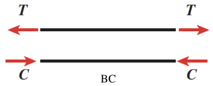

施加于杆件上的力：方向沿其轴线方向，固定关节（pinned joint）会施加与其大小相等方向相反的力。

施加于固定关节上的力：假设负载仅施加于关节上，只有轴向力（axial force），也就是无法将力矩传递到下一个杆件。

#### 4.2 解杆件内力

1.桁架关节上存在两个或更多的杆件时，每个桁架杆件的作用线交汇于一个公共点上。

根据两端的关节来对每个杆件进行命名。以每个杆件的受拉状态（in tension）为正，用负号表明杆件受压状态（in compression）。

2.求稳定（一个结构有足够的数量和适当的约束安排）且静定的桁架的杆件上的力：

a.详情见笔记"例题讲解4.2"。

b.外部反作用力的数量$r$不能超过3（否则不满足静定），但尽量也不要小于3（否则结构不够稳定）。杆件的数量为$m$，关节的数量为$j$。未知量的数量为$m+r$。方程的数量为$2 j$。如果$m+r<2j$，则无解（约束过少，结构无法成立，因此无解）。如果$m+r=2j$。则静定。如果$m+r>2j$，则外部超静定，如果$m+3>2j$，则内部超静定。

c.零力杆件（zero-force members）：桁架中内力为零的杆件称为零杆，仅用于增加稳定性。除去零力杆也对系统整体没有影响，也就是零力杆完全不受力。

如果一个关节，它只有两个不共线的杆件连接，且没有外力或支撑的反作用力施加于其上，则这两个不共线的杆件都为零力杆。

如果有一个关节，它有两个共线的杆件连接，且有一个不共线的杆件连接，且没有外力或支撑的反作用力施加于其上，则这个不共线的杆件为零力杆。

#### 4.3 三维桁架

1.基本性质：

三维桁架的关节为球状关节（ball-and-socket joint）：

三维桁架的基本单元为四面体：

但是，杆件仍为二力杆，且仍只能传递轴向力而不能传递力矩。仍假设施加的负载只作用在关节上。

2.三维稳定与静定：

恰好的反作用力数量为$r=6$。$m$为构件的数量，$j$为关节的数量。（每个关节三个方向的合力为0， 因此每个关节有三条方程）

如果$m+r<3j$，则无解（约束过少，结构无法成立，因此无解）。如果$m+r=3j$，则静定。如果$m+r>3j$则外部超静定。如果$m+6>3j$则内部超静定。

三维关节法仍相同：分析整体得到支撑的反作用力，分析关节（力和力矩）得到构件的内力。但需要在$x,y,z$三个方向上进行考虑了（且为每个关节）。

#### 4.4 框架

1.框架（frame）由多力杆件（multi-force members）和关节组成。多力杆件通过内部轴向力、剪向力（shear force）、内部力偶（internal couples）来抵抗负载。多力杆件也称为梁（beam）。

2.分析框架：

先分析整个结构，得到支撑的反作用力。然后隔离并绘制每个单独的杆件的隔离体图，为每条杆件列出力平衡和力矩平衡方程。

在将连接处的两条杆分开分别进行分析时时，将一个杆件施加于连接处的每个力视为正的，而另一个杆件（也称为相邻的，adjacent）施加于连接处的每个力视为负的，形成反方向从而方便求解。

3.每个多力杆件都有三种内力：轴向力，垂直于轴向的力（剪向力），力矩。

$r$为未知的支撑反作用力数量。$m$为等效杆件的数量（如果支撑在杆件中间，那么支撑的左右部分视为两条不同的等效杆件。杆件均有三种内力），$j$为关节的数量。$c$为额外的力矩方程，为框架内的引脚连接（pinned connection）数量。（引脚连接即为在连接处的一个固定钉子，两杆件可以绕其旋转）

当$3m+r<3j+c$，则无解。当$3 m+r=3 j+c$，则静定。当$3 m+r>3 j+c$（$r>3$），则外部超静定。当$3 m+3>3 j+c$（$r=3$），则内部超静定。

### chapter 5 形心，质心，惯性矩

#### 5.1 区域的形心

1.二维一次矩（first moments）与形心（centroid）：

a.基本情况：

在$xOy$平面上，定义一个区域$Q$的静矩/一次矩：

$$Q_x=\int y d A$$

$$Q_y=\int x d A$$

其中$y$为"$dA$的形心"的$y$轴坐标（与$x$轴的距离），$x$为"$dA$的形心"的$x$轴坐标（与$y$轴的距离）。

注意：$dA$需要根据实际问题来进行选取，形心的坐标也会不同，那么$x$和$y$也会根据$dA$的选取而不同。

那么通过将一次矩除以区域面积，即可得到形心$C(\bar{x} , \bar{y})$的坐标$\bar{x}$和$\bar{y}$：

$$\bar{x}=\frac{Q_y}{A}=\frac{\int x d A}{\int d A}$$

$$\bar{y}=\frac{Q_x}{A}=\frac{\int y d A}{\int d A}$$

其中根据分割的方向（微分方向）有：

$$dA = y dx$$

$$dA = x dy$$

分割的方向也由实际问题决定。

b.对称区域（一条对称轴）：

在$xOy$平面上，如果有一个区域，其有一条对称轴，那么形心一定位于该轴上。

关于对称轴的一次矩等于一定零，因此只需要计算一次坐标即可得到形心。

c.对称区域（两条对称轴）：

在$xOy$平面上，如果有一个区域，其有两条对称轴，那么形心一定位于此两条对称轴的交点。

d.关于点对称的区域：

在$xOy$平面上，如果有一个区域，其相对于一个点对称，那么形心一定位于此区域的几何中心上。

$$\bar{y}=\frac{Q_x}{L}=\frac{\sum_{i=1}^n \bar{y}_i L_i}{\sum_{i=1}^n L_i}$$

2.三维形心：

三维曲面形心$C(\bar{x} , \bar{y} , \bar{z})$（三维的区域的形心不一定处于此区域上）：

$$\bar{x}=\frac{\int x d A}{\int d A}$$

$$\bar{y}=\frac{\int y d A}{\int d A}$$

$$\bar{z}=\frac{\int z d A}{\int d A}$$

对于以上公式，三维曲线使用$ds$或$dL$，三维曲面使用$dA$，三维空间使用$dV$。

3.复合区域（composite areas）：

对一个复合区域，则应该将其划分为多个规则形状的子区域，然后通过相加得到总形心。（如果仅有两子区域，则区域总形心位于两个子区域的形心连线上）

$$A=A_{1}+A_{2}+...$$

$$Q_{x}=\bar{y}_{1} A_{1}+\bar{y}_{2} A_{2}+...$$

$$Q_{y}=\bar{x}_{1} A_{1}+\bar{x}_{2} A_{2}+...$$

$$\bar{x}=\frac{Q_{y}}{A}$$

$$\bar{y}=\frac{Q_{x}}{A}$$

同样的，如果复合区域缺失（absence）了某些规则形状的区域，那么可以通过总区域减去对应区域来获得缺失时的形心。（同样可以推广到质心和重心）

复合线和复合空间也能使用上述的方法。

#### 5.2 物体的质心

质量微分满足$dm=\rho dV$，$m=\int \rho dV$，其中$\rho$为密度，$dV$为体积的微分。

那么类似于形心，单个物体的质心的坐标为$(\bar{x},\bar{y},\bar{z})$：

$$\bar{x}=\frac{\int x \rho d V}{\int \rho d V} $$

$$\bar{y}=\frac{\int y \rho d V}{\int \rho d V} $$

$$\bar{z}=\frac{\int z \rho d V}{\int \rho d V}$$

对于复合物体，第$i$个规则物体质量为$m_{i}$，其质心坐标为$(\bar{x}_i,\bar{y}_i,\bar{z}_i)$，则有：

$$\bar{x}=\frac{\sum_i^n m_i \bar{x}_i}{\sum_i^n m_i}$$

$$\bar{y}=\frac{\sum_i^n m_i \bar{y}_i}{\sum_i^n m_i}$$

$$\bar{z}=\frac{\sum_i^n m_i \bar{z}_i}{\sum_i^n m_i}$$

#### 5.3 物体的重心

作用于整个物体的重力可以替换为作用于这个物体重心且大小等于其所受重力的单个力。

如果重力场均匀而且平行，那么物体的质心和重心将会重合。

单个物体的重心坐标：

$$W=m g=\int g d m$$

$$\bar{x}=\frac{\int x d W}{W}$$

$$\bar{y}=\frac{\int y d W}{W}$$

$$\bar{z}=\frac{\int z d W}{W}$$

复合物体的重心坐标：

$$\bar{x}=\frac{\sum_i^n W_i \bar{x}_i}{\sum_i^n W_i}$$

$$\bar{y}=\frac{\sum_i^n W_i \bar{y}_i}{\sum_i^n W_i}$$

$$\bar{z}=\frac{\sum_i^n W_i \bar{z}_i}{\sum_i^n W_i}$$

#### 5.4 帕普斯定理

1.第一帕普斯定理（first theorem of Pappus）：

环形（revolution）曲面的外表面积$A$，在数值上可以通过外表面构成的曲线的弧长$L=\int ds$，乘以曲线的形心的周向（circumferential）距离（周向即圆周方向，与轴向、径向相互正交）也就是形心$y$轴坐标为半径形成的圆周的周长长度$2 \pi \bar{y}$，可以得到外表面面积。

径向和周向示意图：

不规则部分橄榄球状的环形曲面（只画出了微分形状）：

$$A=2 \pi \int y d s=2 \pi \bar{y} L$$

规则的圆柱环形曲面（只画出了微分形状）：

$$A=2 \pi \bar{y} L=2 \pi(r)(b)=2 \pi r b$$

其中曲线的弧长即为$b$，曲线的形心的坐标很明显即为$(\frac{b}{2},\bar{y})$。

2.第二帕普斯定理：

环形物体的体积$V$，在数值上等于其径向面积$A=\int dA$，乘以其径向面积的形心在整个物体上每个相同的径向面积上的形心的$\bar{y}$所形成的圆周的周长长度$2 \pi \bar{y}$。

不规则的环形物体（只画出了微分形状）：

$$V=2 \pi \int y d A=2 \pi \bar{y} A$$

规则的圆柱环形物体（只画出了微分形状）：

$$V=2 \pi \bar{y} A=2 \pi\left(\frac{r}{2}\right)(b r)=\pi b r^2$$

#### 5.5 二次矩/惯性矩

1.平面区域的二次矩/惯性矩（second moment / moment of inertia）：

$$I_x=\int y^2 d A$$

$$I_y=\int x^2 d A$$

如果选择不同的轴，那么二次矩也会不同（因为这就是转动惯量）：

以上图像选择$x$轴计算二次矩，则有：

$$I_x=\int_A y^2 d A=\int_{-h / 2}^{h / 2} y^2 b d y=\frac{b h^3}{12}$$

$$I_y=\int_A x^2 d A=\int_{-b / 2}^{b / 2} x^2 h d x=\frac{h b^3}{12}$$

以上图像选择$BB$轴计算二次矩，则有：

$$I_{B B}=\int_A y^2 d A=\int_0^h y^2 b d y=\frac{b h^3}{3}$$

旋转半径（radius of gyration）：

$$r_x=\sqrt{\frac{I_x}{A}}$$

$$r_y=\sqrt{\frac{I_y}{A}}$$

2.二次矩的平行轴定理（parallel-axis theorem）：

形心轴的转动惯量与任何轴的转动惯量的恒定关系可以推导得到（与大学物理中的平行轴定理的关系是一样的）。

$$I_x=\int\left(y+d_1\right)^2 d A=\int y^2 d A+2 d_1 \int y d A+d_1^2 \int d A$$

因为形心轴$x_c$经过形心，那么：

$$\int y dA=0$$

$$\int dA=A$$

得到：

$$I_x=I_{x_c}+A d_1^2$$

$$I_y=I_{y_c}+A d_2^2$$

以以下示意图为例：

$$I_x=\int y^2 d A=\int_{-h / 2}^{h / 2} y^2 b d y=\frac{b h^3}{12}$$

$$I_{B B}=I_x+A d^2=\frac{b h^3}{12}+b h\left(\frac{h}{2}\right)^2=\frac{b h^3}{3}$$

复合区域相对于某一轴的转动惯量就等于其各组成部分相对于同一轴的转动惯量之和。对于某些区域缺失了的复合区域，则应减去缺失了的区域的转动惯量，这一点和一次矩是一致的。

3.极惯性矩（polar moments of inertia）：

考虑一个区域的转动惯量，这个区域的转动惯量相对于一个垂直于平面的轴。

极惯性矩等于同样过其与区域相交的点的$x$轴和$y$轴的二次矩之和。

$$I_P=\int \rho^2 d A$$

$$I_P=\int \rho^2 d A=\int\left(x^2+y^2\right) d A=\int x^2 d A+\int y^2 d A$$

$$I_P=I_x+I_y$$

极惯性矩也能应用平行轴定理：

$$I_P=I_x+I_y=I_{x c}+I_{y c}+A\left(d_1^2+d_2^2\right)$$

$$\left(I_P\right)_O=I_x+I_y$$

$$\left(I_P\right)_C=I_{x c}+I_{y c}$$

$$d^2=d_1^2+d_2^2$$

$$\left(I_P\right)_O=\left(I_P\right)_C+A d^2$$

4.惯性积（product of inertia）：

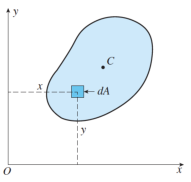

$$I_{x y}=\int x y d A$$

显然的，如果平面区域存在对称轴，那么惯性积为零。（也可以分开多个区域分别计算，存在对称轴的区域直接为0）

惯性积也能应用平行轴定理：

$$(I_{xy})_O=I_{x_c y_c}+A d_1 d_2$$

5.坐标轴变换前后的二次矩关系：

主惯性矩（principal moments of inertia）：惯性矩在一定转动角度下的最大值和最小值。此转动围绕的轴叫做主轴（principal axes）。

前后惯性矩的关系推导过程：

$$x_1=x \cos \theta+y \sin \theta$$

$$y_1=y \cos \theta-x \sin \theta$$

$$\begin{aligned} I_{x 1} &=\int y_1^2 d A=\int(y \cos \theta-x \sin \theta)^2 d A \\ &=\cos ^2 \theta \int y^2 d A+\sin ^2 \theta \int x^2 d A-2 \sin \theta \cos \theta \int x y d A \end{aligned}$$

$$I_{x 1}=I_x \cos ^2 \theta+I_y \sin ^2 \theta-2 I_{x y} \sin \theta \cos \theta$$

那么根据以下3条三角函数变换：

$$\cos ^2 \theta=\frac{1}{2}(1+\cos 2 \theta)$$

$$\sin ^2 \theta=\frac{1}{2}(1-\cos 2 \theta)$$

$$2 \sin \theta \cos \theta=\sin 2 \theta$$

最终可得：

$$I_{x 1}=\frac{I_x+I_y}{2}+\frac{I_x-I_y}{2} \cos 2 \theta -I_{x y} \sin 2 \theta$$

$$I_{y 1}=\frac{I_x+I_y}{2}-\frac{I_x-I_y}{2} \cos 2 \theta+I_{x y} \sin 2 \theta$$

因此：

$$I_{x 1}+I_{y 1}=I_x+I_y$$

又有：

$$\begin{aligned} I_{x 1 y 1} &=\int x_1 y_1 d A=\int(x \cos \theta+y \sin \theta)(y \cos \theta-x \sin \theta) d A \\ &=\left(I_x-I_y\right) \sin \theta \cos \theta+I_{x y}\left(\cos ^2 \theta-\sin ^2 \theta\right) \end{aligned}$$

$$I_{x 1 y 1}=\frac{I_x-I_y}{2} \sin 2 \theta+I_{x y} \cos 2 \theta$$

至此，还不是最大值或者最小值，因此要对$I_{x1}$进行求导，导数为0时的两个$\theta$即为最大值和最小值。

$$I_{x 1}=\frac{I_x+I_y}{2}+\frac{I_x-I_y}{2} \cos 2 \theta -I_{x y} \sin 2 \theta$$

$$(I_{x1})'=\left(I_x-I_y\right) \sin 2 \theta_p+2 I_{x y} \cos 2 \theta_p=0$$

解得：

$$\tan 2 \theta_p=-\frac{2 I_{x y}}{I_x-I_y}$$

此时$\theta_{p}$就是可以取得主惯性矩的角度的2个取值，且正好相差$90^{\circ}$。已知$\theta_p$就可以求主惯性矩的大小了：

$$I_1=\frac{I_x+I_y}{2}+\sqrt{\left(\frac{I_x-I_y}{2}\right)^2+I_{x y}^2}$$

$$I_2=\frac{I_x+I_y}{2}-\sqrt{\left(\frac{I_x-I_y}{2}\right)^2+I_{x y}^2}$$

其中$I_1$为最大惯性矩，$I_2$为最小惯性矩。

6.摩尔圆（mohr's circle）：

矩和惯性积的变换方程可以以摩尔圆表示。圆心为$C(I_{ave,0})$，画出点$A(I_{x},-I_{xy})$和点$B(I_{y},I_{xy})$，并以点$A,B,C$三点作圆。摩尔圆与x轴的交点分别为主惯性矩$I_1$和$I_2$，则直线$AB$与$x$轴所成角度即为$2 \theta_p$。

根据图像有：

$$I_{\mathrm{ave}}=\frac{I_x+I_y}{2}$$

$$R=\sqrt{\left(\frac{I_x-I_y}{2}\right)^2+I_{x y}^2}$$

$$\left(I_{x 1}-I_{\text {ave }}\right)^2+I_{x 1 y 1}^2=R^2$$

7.各图形的极惯性矩和二次矩表：

### chapter 6 杆、轴、梁、框架的内部效应

杆（bars）：仅传递轴向力。

轴（shafts）：传递扭矩/转矩/扭转力矩（torsional moment）。

梁（beams）：传递轴向力和剪向力和弯矩（bending moment）。

#### 6.1 杆

1.轴向杆件仅受轴向的拉伸力（tension）或压缩力（compression）。

将杆的某一点的负载/载荷（load）用$q$表示，某一点的轴向内力（internal axial force）用$N$表示。

a.杆件集中负载的内力（或者说没有分布负载）：

$$R=-P_0$$

$$N(x)=P_{0}$$

b.杆件在负载$q_0$均匀分布时的内力：

$$R=-q_{0} L$$

$$N(x)=q_{0} (L-x)$$

c.杆件在负载$q$与距离x成函数关系时的内力，画出轴负载图（axial-load diagram）来表示$q(x)$：

$$q(x)=q_0 \cdot \left(\frac{x}{L}\right)$$

$$F_q=\int_0^L q(x) d x=\frac{1}{2} q_0 L$$

$$R+F_q=0$$

$$R=-\frac{1}{2} q_0 L$$

$$N(x)=\frac{1}{2} q_0 L-\frac{1}{2} q(x) x=\frac{1}{2} q_0 L\left(1-\frac{x^2}{L^2}\right)$$

总轴向力（total axial force）$F_q$是对于从$x=0$开始到$x=L$的整段杆所受的向右的轴向的合力。

2.杆件符号约定：

拉伸力为正。压缩力为负。如果计算过程出现负数，则代表假设的内力方向与实际方向相反。

3.负载与内力的关系：

$$-N+q(x) d x+(N+d N)=0$$

$$\frac{d N}{d x}=-q$$

任意$A,B$两点之间的内力$N$的变化总量：

$$\int_A^B d N=N_B-N_A=-\int_A^B q(x) d x$$

杆内轴向力的变化率等于同一点上的分布负载的负数。如果在某个区域上没有施加分布负载，也就是$q=0$，那么此点的内力$N$变化率为0，不变。

4.轴力图（axial-force diagram，AFD）：

将轴向内力$N$随杆长度$x$变化而变化显示出来的图像。（$x=0$时取得最大轴向力$N_{max}$）

轴力图基于$q(x)$和$N(x)$之间的积分和微分的关系构建。

$$\frac{d N(x)}{dx}=-q$$

$$- \int_0^x q=N(x)$$

AFD其实就是$x-N(x)$图像。

5.计算轴向内力$N$：

将一条杆分为多段，求某一段的轴向内力$N$，需要将这一段的中间点，与整条杆的某一末端之间的所有段的轴向内力求和来得到。

如果使用从中间点到左边末端来计算，则遵循符号规定的基础上全部取负，如果使用从中间点到右边末端来计算，则遵循符号规定。

#### 6.2 转轴的扭矩

1.转轴受到扭转力矩（twisting/torsional moments），引起绕轴的旋转。

注意扭矩矢量的方向是垂直于旋转平面的，因此方向上沿轴向。

负载不分布的情况：

$$\sum M_x=0$$

$$M+T_0=0$$

$$T(x)=T_0$$

负载$t$分布的情况：

$$\sum M_x=0$$

$$M+t_0 L=0$$

$$T(x)=t_0(L-x)$$

负载$t$与距离x成函数关系时的内部扭矩：

$$t(x)=t_0\left(1-\frac{x}{L}\right)$$

$$M_t=\int_0^L t(x) d x=\frac{1}{2} t_0 L$$

$$M+M_t=0$$

$$M=-\frac{1}{2} t_0 L$$

$$T(x)=\frac{1}{2} t_0 L-\frac{x}{2}\left(t_0+t(x)\right)=\frac{t_0}{2 L}(L-x)^2$$

总扭矩$M_t$是对于从$x=0$开始到$x=L$的整段杆所受的合扭矩。

2.扭矩的符号规定：

根据右手定则，拉伸力方向的扭矩为正，压缩力方向的扭矩为负。但是假设方向一般为拉伸力方向。

3.负载与扭矩的关系：

$$\sum M_x=0$$

$$-T+t(x) d x+(T+d T)=0$$

$$\frac{d T}{d x}=-t$$

轴向的扭矩的变化率等于沿轴同一点分布的负载的负值。

任意$A,B$两点之间的扭矩$T$的变化总量：

$$\int_A^B d T=T_B-T_A=-\int_A^B t(x) d x$$

4.扭矩图（torsional moment diagram，TMD）：

将轴向扭矩$T$随杆长度$x$变化而变化显示出来的图像。（$x=0$时取得最大轴向扭矩$T_{max}$）

轴力图基于$t(x)$和$T(x)$之间的积分和微分的关系构建。

$$\frac{d T(x)}{dx}=-t$$

$$- \int_0^x t=T(x)$$

TMD其实就是$x-T(x)$图像。

5.计算轴向扭矩T：

将一条杆分为多段，求某一段的轴向扭矩$T$，需要将这一段的中间点，与整条杆的某一末端之间的所有段的轴向扭矩求和来得到。

如果使用从中间点到左边末端来计算，则遵循符号规定的基础上全部取负，如果使用从中间点到右边末端来计算，则遵循符号规定。

#### 6.3 梁的剪向力和弯矩

1.与杆、轴类似，梁有分布负载$q(x)$，内部剪向力$V(x)$，弯矩$M(x)$。

使用剪向力-弯矩图（shear and bending moment diagrams）来表示。

剪向力的作用方式：对同一平面有两个剪向力共同作用，是类似于"拉扯"的效果。

弯矩的作用方式：对同一平面有两个弯矩共同共同作用，是类似与"形变支撑"的效果。

2.梁的种类：

a.简支梁（simply supported beam / simple beam）：一端为引脚支撑，一端为滚轮支撑的梁。

b.悬臂梁（cantilever beam）：一端为固定支撑，另一端是自由的。

c.悬垂（overhang）的梁：在梁的其中两点处有支撑，但梁会凸出支撑外一部分。中间有力矩作用于某一点称为（couple）。

3.负载/载荷的种类：

a.集中负载（concentrated load）（单一力）：施加在整个梁上的负载都作用于同一个点。

b.分布负载（distributed load）：在梁的轴上按照某种规律分布的负载。

c.耦合（couple）：一个力矩作用于梁上的一个点。

4.分布负载转化为集中负载：

在同一物体上，可以用合成得到的一个总负载$F_q$来等效替代所有存在的分布负载$q(x)$。这个总负载作用于分布负载所成区域的形心的$x$坐标在杆上的对应点。

a.分布负载为常数：

$$x=L / 2$$

b.分布负载为与$x$有线性关系的函数：

$$x=L / 3$$

c.分布负载为与$x$有关系的函数（成梯形）：

$$F_q=\frac{L}{2}\left(q_1+q_2\right)$$

根据梯形的形心推导：

$$\bar{x}=\frac{L}{3}\left(\frac{q_1+2 q_2}{q_1+q_2}\right)$$

根据多区域形心推导（分割为两个三角形）：

$$\bar{x}=\frac{\bar{x}_1 F_{q 1}+\bar{x}_2 F_{q 2}}{F_{q 1}+F_{q 2}}=\frac{\left(\frac{L}{3}\right)\left(\frac{1}{2} q_1 L\right)+\left(\frac{2 L}{3}\right)\left(\frac{1}{2} q_2 L\right)}{\frac{1}{2} q_1 L+\frac{1}{2} q_2 L}=\frac{L}{3}\left(\frac{q_1+2 q_2}{q_1+q_2}\right)$$

$$\bar{x}=\frac{L}{3}\left(\frac{q_1+2 q_2}{q_1+q_2}\right)$$

d.分布负载为与$x$有关系的函数（不规则）：

只能使用积分：

$$F_q=\int_0^L q(x) d x=\frac{2}{3} q_0 L$$

$$\bar{x}=\frac{\int x q(x) d x}{F_q}=\frac{\int x q(x) d x}{\int q(x) d x}$$

$$\bar{x}=\frac{\int_0^L x \sqrt{\frac{x}{L}} q_0 d x}{\frac{2}{3} q_0 L}=\frac{3}{5} L$$

5.梁的剪向力和矩分析：

a.负载$P_0$施加在梁的自由末端和其横截面的形心处。

梁通过剪向力$V$和弯矩$M$的组合来抵抗被施加的集中负载$P_0$。

剪向力：

$$\sum F_y=0$$

$$R_1-P_0=0$$

$$V(x)=P_0$$

弯矩：

$$\sum M_z=0$$

$$R_2-P_0 L=0$$

$$M(x)=-P_0(L-x)$$

b.符号规定：

剪向力：剪向力成顺时针则为正，成逆时针则为负。

弯矩：对梁的上部进行压缩则为正，对梁的下部进行压缩则为负。

c.梁上的某一段/点的负载分析：

对某一段梁进行分析，在垂直方向上负载$q$均匀分布的情况：

剪向力：

$$F_q=q \cdot dx$$

$$\sum F_{\text {vert }}=0$$

$$V-q d x-(V+d V)=0$$

$$\frac{d V}{d x}=-q$$

$$\int_A^B d V=-\int_A^B q d x$$

$$V_B-V_A=-\int_A^B q(x) d x$$

某两点剪向力的变化量等于负载图的面积的负数。

弯矩：

$$\sum M=0$$

$$-M-q dx (\frac{dx}{2})-(V+dV) dx+M+dM=0$$

$$\frac{d M}{d x}=V$$

$$M_B-M_A=\int_A^B V(x) d x$$

某两点弯矩的变化量等于剪向力图的面积。

对整条梁进行分析，在垂直方向上负载$q$均匀分布的情况：

支撑反作用力：

$$R_A=R_B=\frac{q L}{2}$$

$$V(x)=R_A-q x=\frac{q L}{2}-q x$$

$$M(x)=R_A x-q x\left(\frac{x}{2}\right)=\frac{q L x}{2}-\frac{q x^2}{2}$$

对整条梁进行分析，在垂直方向上负载$q(x)$与$x$成线性函数关系的情况：

$$q(x)=\frac{q_0 x}{L}$$

$$V(x)=-\frac{1}{2} q_0\left[\frac{x}{L}\right] x=-\frac{q_0 x^2}{2 L}$$

$$M(x)=-\frac{1}{2} q(x)\left(\frac{x}{3}\right)=-\frac{q_0 x^3}{6 L}$$

对某一段梁的其中一点进行分析，在垂直方向上有集中负载$P$的情况：

$$V-P-\left(V+V_1\right)=0$$

$$-M-P\left(\frac{d x}{2}\right)-\left(V+V_1\right) d x+M+M_1=0$$

$$M_1=P\left(\frac{d x}{2}\right)+V d x+V_1 d x$$

在集中荷载的点处剪力发生突变，而在施加点处弯矩不因集中荷载而发生变化。

d.AFD和TMD分析：

反作用力：

$$\mathrm{R}_{\mathrm{A}}=\frac{\mathrm{Pb}}{\mathrm{L}} \quad \mathrm{R}_{\mathrm{B}}=\frac{\mathrm{Pa}}{\mathrm{L}}$$

从0到a：

$$0 < x < a$$

$$\mathrm{V}=\mathrm{R}_{\mathrm{A}}=\frac{\mathrm{Pb}}{\mathrm{L}}$$

$$\mathrm{M}=\mathrm{R}_{\mathrm{A}} \mathrm{x}=\frac{\mathrm{Pbx}}{\mathrm{L}}$$

从a到L：

$$a < x < L$$

$$V=R_A-P=\frac{P b}{L}-P=-\frac{P a}{L}$$

$$M=R_A x-P(x-a)=\frac{P b x}{L}-P(x-a)=\frac{Pa}{L}(L-x)$$

最终得到剪向力图（shear-force diagram，SFD）和弯矩图：

e.例题：

### chapter 7 拉伸、压缩、剪切

#### 7.1 材料力学

1.材料力学是各种材料构成的结构在各种不同载荷作用下的应力（stress）、应变（strain）和位移（displacement）。

静力学和横截面法被用来确定作用于物体内部的载荷（load）。

截面法和合力矩定理的三维应用：

2.分为四种不同的内部载荷：

1. 法向力（normal force）：垂直于区域。

2. 剪向力（shear force）：位于该区域上。注意剪向力在横截面积上产生的应力才是剪切应力（shear stress）。

3. 扭矩（torsional moment / torque）：外部负载倾向于扭转物体的一个部分。

4. 弯矩（bending moment）：外部负载倾向于弯曲物体的一个部分。

#### 7.2 法向应力和法向应变

截面方法为等截面（prismatic），且外部载荷施加于截面的形心处。

法向应力（normal stress）：符号使用$\sigma$表示，满足：

$$\sigma=\frac{P}{A}$$

其中$A$为横截面积，$P$为外部载荷。法向应力的单位为$N / m^2$或者$Pa$。

法向应变（normal strain）：符号使用$\varepsilon$表示，满足：

$$\varepsilon=\frac{\delta}{L}$$

其中$\delta$为载荷导致的法向位移，$L$为原长度。法向应变没有单位，因为维度不确定。

#### 7.3 拉伸-压缩实验

测试材料力学性能的通常程序是：将材料的小样本放在试验机中，施加载荷，然后测量样本的形变（deformation）。这称为拉伸/压缩试验（tension or compression test）。

测量的参数为：材料的应力（stress）$\sigma$、材料的应变（strain）$\varepsilon$。

1.根据测量得到的参数绘制图像：

$OA$段：弹性变形过程。其斜率即为弹性模量（modulus of elasticity）$E$，也称为杨氏模量（Young's modulus）。

$$E=\frac{\sigma}{\varepsilon}$$

$A$点：应力和应变开始不再互为比例的点，称为比例极限（proportional limit）。

$BC$段：从屈服强度开始，遵循屈服现象的区域。在材料拉伸或压缩过程中，当应力达到一定值时，应力有微小的增加，而应变却急剧增长的现象，称为屈服（yield）。此时材料满足完全塑性（perfectly plastic）。材料满足完全塑性的区域在实际情况下是很小甚至不存在的，只有少数材料具有明显的完全塑性区域。完全塑性是材料表现的延展性（ductility）的本质。

$B$点：屈服现象的起始点的应力称为屈服应力（yield stress）或屈服强度（yield strength）$\sigma_y$。一般实际测量时难以确定屈服应力，需要使用偏移法（offset）来确定屈服应力。偏移法具体步骤是先画出与$OA$段重合的直线，然后画出与其平行且偏移量为$0.2 \%$的直线，此直线与原图像曲线的交点即为此种材料的偏移屈服应力点。

$CD$段：材料满足应变硬化（strain hardening）。在应变硬化过程中，材料的晶体结构发生变化，导致材料对进一步变形的抵抗力增加。

$D$点：材料的应变硬化的区域的终点，称为极限应力（ultimate stress）或极限强度（ultimate strength）$\sigma_u$。

$DE$段：材料即将断裂前的区域，称为（necking）。

2.材料的各种性质：

a.延展性（ductility）：材料在发生断裂失效（failure）之前可被造成的永久应变量的度量。金属大多是延性材料（ductile materials），在发生断裂失效前的永久应变量较大。与之相对的是脆性材料（brittle materials），在发生断裂失效前的永久应变量较小。

延性材料的应力-应变图：

脆性材料的应力-应变图：

b.弹性（elasticity）：物体在撤去负载（unloading）的过程中恢复到原来尺寸的特性的度量。

c.塑性（plasticity）：超出材料的弹性极限的非弹性应变对材料的影响的度量。

3.弹性和塑性对材料的影响：

a.弹性材料的应力-应变图：

只要在弹性范围（elastic range）内，撤去负载会使得物体完全恢复到对应负载的尺寸。

b.超过弹性范围的应力-应变图：

超过弹性范围的塑性范围（plastic range）内，撤去负载会物体仍有一定量的弹性恢复，但会有残余应变（residual strain）或者说永久应变（permanent strain）是无法恢复的。这种对杆的永久延长（elongation）也被称为永久变形（permanent set）。注意撤去负载时的一定量的弹性恢复的直线实际上与其应力-应变图在原点$O$处的图像曲线是相切的。

c.重新施加负载（reloading）的应力-应变图：

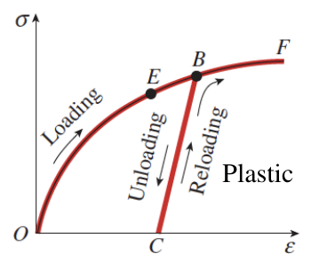

在弹性范围内，重新施加负载只会使得物体恢复到对应负载的尺寸。

在塑性范围内，重新施加负载会使得物体沿着残余应变重新返回到对应负载的尺寸，然后继续沿着本来的曲线得到对应负载的尺寸。此时材料内部结构发生改变，其性质发生变化，线性弹性区域、比例极限、弹性极限均增加，延展性降低。

4.蠕变（creep）：当负荷持续很长一段时间时，应变开始产生。

5.线性弹性（linear elastic）：材料在应力和应变之间呈现线性关系。工程师设计的结构和机器一般保持在该区域内，以避免永久性变形和屈服。

6.胡克定律（Hook's law）：如果材料应力与应变有线性关系，则表达式有：

$$\sigma=E \varepsilon$$

其中$E$即为杨氏模量。胡克定律只涉及到杆在简单拉伸或压缩时的应力和应变（仅轴向应力和应变）。

7.泊松比（poisson's ratio）：泊松比使用$v$表示，其定义为一条杆发生应变时的侧向应变与轴向应变的比值的负值。

$$v=-\frac{侧向应变}{轴向应变}=-\frac{\varepsilon^{\prime}}{\varepsilon}$$

侧向应变（lateral strain）指的是应变导致杆的相对宽度（width）的变化。

泊松比要求材料必须是均匀的。在垂直于纵轴的所有方向上，弹性性质必须相同。

#### 7.4 剪切应力和剪切应变

1.理解剪切应力（shear stress）：构建一个螺栓结构。

在拉力载荷$P$的作用下，杆$A$和U形夹（clevis）$C$对螺栓（bolt）$B$形成承载应力（bearing stress）。

$$\sigma_b=\frac{F_b}{A_b}$$

其中$F_b$为承载力，$A_b$为承载面积。$\sigma_b$为承载应力。

也就是说，承载应力本质上其实就是一个垂直于多个平面的"多力杆件"所受的剪切应力。（本来剪切应力就是对多力杆件的切向负载产生的应力）

以上计算得到的承载应力只是单个承载力的承载应力，而我们一般需要求平均的承载应力。

$$①F_b=P / 2 \quad ②F_b=P \quad ③F_b=P / 2$$

根据上述的隔离体图，我们可以看出承载力对螺栓的截面$mn$和$pq$均有"剪切"的趋势。

承载力的大小为剪向力$V=P / 2$，最终得到承载应力（即剪切应力）$\tau$分布在螺栓的圆形横截面上。

$$\tau_{\text {aver }}=\frac{V}{A}$$

2.物体的垂直面上剪切应力平衡：

对以下单元体（element）施加四个各不相同的剪切应力：

相对面：

$$\tau_1 b c=\tau_1^{\prime} b c$$

$$\tau_1=\tau_1^{\prime}$$

$\tau_1$和$\tau_1^{\prime}$形成一个力偶，其产生了绕$z$轴的力矩。那么为了力矩平衡，则有相邻面：

$$\tau_1 a b c=\tau_2 a b c$$

$$\tau_1=\tau_2$$

因此作用于此单元体上的四个剪切应力大小均相等。相对面（opposite）的剪切应力大小相等方向相反，相邻面（adjacent）的剪切应力大小相等且方向均指向相邻面的交线。

在材料力学中通常将单元体的四个侧面上只有剪切应力而没有正应力作用的情况称为纯剪切应力状态/纯剪（pure shear）。

3.剪切应变（shear strains）：对单元体变形（或形状变化）的度量。在剪切应力作用下，边长不变。单元体仅在形状上发生变化。

剪切应变在几何关系中表示单元体变形造成各条边偏离其原来方向的角度大小，使用$\gamma$表示，单位为弧度。这和扇形弧长$l=\theta \cdot r=\frac{\theta}{2 \pi} \cdot 2 \pi r$中的$\theta$是一致的，其实本质上是"无量纲"。

4.剪切应力的符号规定：

如果剪切应力作用于物体的正面（positive face），则如果其方向沿着坐标轴正方向，则为正。反之为负。

如果剪切应力作用于物体的反面（negative face），则如果其方向沿着坐标轴正方形，则为负。反之为正。

如果使得物体的两个正面（或两个反面）之间的夹角减小，则剪切应变为正。反之为负。

5.胡克定律（Hooke's law）（$\sigma=E \varepsilon$）在剪切应变上的形式：

应力和应变成线性关系：

$$\tau=G \gamma$$

其中$G$为剪切弹性模量/刚性模量（shear modulus of elasticity / modulus of rigidity）。

$$G=\frac{E}{2(1+v)}$$

其中$E$为杆的弹性模量/杨氏模量。$v$为泊松比，为一条杆发生应变时的侧向应变与轴向应变的比值的负值。

例题：

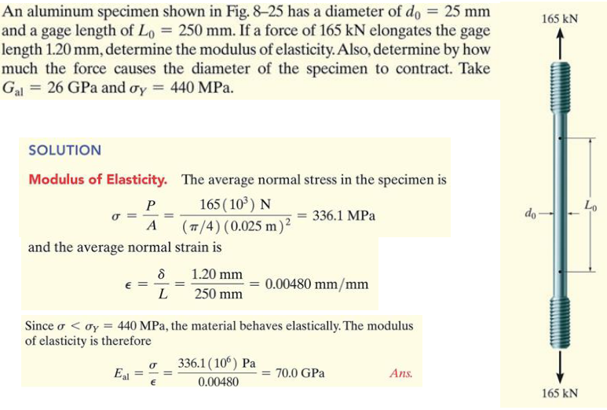

#### 7.5 许用应力和许用载荷

1.材料的强度（strength）：物体承载或传递负载的能力。

安全系数（factor of safety）：使用$n$表示，表示结构的实际强度（actual strength）为要求强度（required strength）的$n$倍。

安全裕度（margin of safety）：安全系数减1，也就是$n-1$。

2.许用应力（allowable stress）：一个结构的任何地方都不能超过的应力值，也称为工作应力（working stress）。许用应力定义为屈服强度与安全系数的比值。（法向应力$\sigma$和剪切应力$\tau$均适用此概念）

$$\sigma_{\text {allow }}=\frac{\sigma_{\text {yield }}}{n}$$

$$\tau_{\text {allow }}=\frac{\tau_{y i e l d}}{n}$$

对于无表观屈服应力的脆性材料，可以用极限应力（ultimate stress）$\sigma_U$来代替屈服应力：

$$\sigma_{\text {allow }}=\frac{\sigma_U}{n}$$

$$\tau_{\text {allow }}=\frac{\tau_U}{n}$$

3.许用载荷（strength loads）：定义为许用应力与面积的乘积。（法向应力、剪切应力、承载应力均适用此概念）

$$P_{\text {allow }}=\sigma_{\text {allow }} A$$

$$P_{\text {allow }}=\tau_{\text {allow }} A$$

$$P_{\text {allow }}=\sigma_b A_b$$

4.设计（design）：对结构性能的确定，以使结构支持给定的负荷和执行其预期的功能。

例如受简单拉伸或压缩力的构件的面积的设计：

$$所需面积=\frac{待传输载荷}{许用应力}$$

例题：

### chapter 8 轴向负载杆件

#### 8.1 各种轴向负载构件

只受拉力或压缩的结构构件，只受拉力和压缩力。

1.具有直纵轴（straight longitudinal axes）的实心杆（solid bars）：

2.电缆（cables）：

用于传递大的拉力。仅能传递拉伸力（无法抵抗压缩力）。我们一般使用电缆的有效模量（电缆的弹性一定比电缆材料的弹性小）而不是对电缆的组成材料进行分析。

3.螺旋弹簧（coiled springs）：

负载（load）：

$$P=k\delta$$

伸长量（elongation）/ 位移（displacement）：

$$\delta=f P$$

刚度（stiffness）：

$$k=\frac{P}{\delta}=\frac{1}{f}$$

伸缩性（flexibility）：

$$f=\frac{\delta}{P}=\frac{1}{k}$$

4.棱柱形杆（prismatic bars）：具有直纵轴、截面恒定（constant cross section）、线性弹性（linearly elastic）的杆。

设横截面积为$A$，则：

$$\sigma=\frac{P}{A}$$

$$\varepsilon=\frac{\delta}{L}$$

$$\sigma=E \varepsilon$$

$$\delta=\frac{P L}{E A}$$

其中$E$为杨氏模量，$EA$称为轴向刚度（axial rigidity）。

4.符号规定：

使轴向负载杆件伸长的方向定义为正，反之则为负。

刚度：

$$k=\frac{P}{\delta} \longrightarrow k=\frac{E A}{L}$$

伸缩性：

$$f=\frac{\delta}{P} \longrightarrow f=\frac{L}{E A}$$

#### 8.2 具有中间轴向负载的杆

1.中间轴向负载（intermediate axial load）其实就是把某一段杆沿截面切开，其中存在的需要由轴向内力来抵抗的负载。

先把杆分开为几段，对每一段都进行轴向内力分析，只需要按顺序从中间切开并分析剩余的部分即可（注意支撑的反作用力在切开分段时不会纳入考虑，因为先从支撑开始切开分段，反作用力作用于被截去的部分，因此不会对后面的每一段有力的作用）：

一段杆要有伸长量必须是两端都有向外的力，才是"拉伸"（符合直觉）。因此只需要使得杆的每一段被隔离，然后都变成被"拉伸"的状态就方便理解计算了（轴向内力其实就是当前隔离段的其中一端的拉力/压力）。确定每段杆的轴向内力以确定每段杆的伸长量，确定每段杆的伸长量以确定整条杆的伸长量：

$$\delta_1=\frac{N_1 L_1}{E A} \quad \delta_2=\frac{N_2 L_2}{E A} \quad \delta_3=\frac{N_3 L_3}{E A}$$

$$\delta_{b a r}=\sum_{i=1}^3 \delta_i=\delta_1+\delta_2+\delta_3$$

2.如果以上过程的前提发生了改变，每一段都具有不同的轴向力、尺寸、材料，那么$E A$不再是常量：

$$\delta_{bar}=\sum_{i=1}^n \frac{N_i L_i}{E_i A_i}$$

有轴向力图（AFD）和轴向位移图（axial displacement diagram，ADD）：

虽然轴向力$P$在同一段杆中恒定（如图AFD）注意伸长量$\delta$与其隔离出来的杆的长度$L$有关，因此伸长量$\delta$会随着长度$L$的变化而变化（如图ADD）。因此"某一点"的伸长量其实就是从末端到这一点之间的杆被隔离出来时的总体伸长量（没有"某一点"的伸长量，只有"某一段"的伸长量）。

3.如果杆的负载和尺寸（截面面积）连续变化，其实方法是类似的。

假设一个锥形杆（tapered bar），则有如下分解：

$$d \delta=\frac{N(x) d x}{E A(x)}$$

$$\delta=\int_0^L d \delta=\int_0^L \frac{N(x) d x}{E A(x)}$$

4.伸长量$\delta$其实就是杆在轴向的位移，以此可以画出轴向位移图（ADD）。

$$d \delta=\frac{N(x) d x}{E A(x)}$$

$$\delta=\int_0^L d \delta=\int_0^L \frac{N(x) d x}{E A(x)}$$

$$\delta_B-\delta_A=\int_A^B \frac{N(x)}{E A(x)} d x$$

易得$N(x)$图像为$\delta(x)$图像的导数：

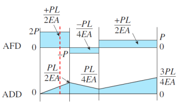

#### 8.3 超静定结构

在超静定情况，通过总体和隔离体图所得的平衡方程数少于待求未知量的数量。

$$R_A-P+R_B=0$$

此时就需要引入对伸长量的方程，称为相容性方程（equation of compatibility）：

$$\delta_{A B}=gap$$

其中$gap$为杆的伸长量，根据实际情况而定，此处满足的是$gap=0$（两端均为刚性平面）。

分解得到：

$$\delta_{A C}=\frac{R_A L_{A C}}{E A} \quad \delta_{C B}=-\frac{R_B L_{C B}}{E A}$$

从末端A向下一点一点截取到C点都满足：

从末端B向上一点一点截取到C点都满足：

$$\delta_{A B}=\delta_{A C}+\delta_{C B}=\frac{R_A L_{A C}}{E A_{A C}}-\frac{R_B L_{C B}}{E A_{C B}}=0$$

最终解得：

$$R_A=\frac{P L_{A C}}{L_{A B}} \quad R_B=\frac{P L_{C B}}{L_{A B}}$$

#### 8.4 热的影响

热对应变的影响：

有热应变（thermal strain）：

$$\varepsilon_T=\alpha(\Delta T)$$

其中$\alpha$为热膨胀系数（thermal expansion）。

则热应力（thermal stress）为：

$$\sigma=E \varepsilon_T=E \alpha(\Delta T)$$

温度和伸长量/位移的关系：

$$\delta_T=\varepsilon_T L=\alpha(\Delta T) L$$

#### 8.5 不合和预应变

1.不合：

不合（misfit）：结构中的构件由于长度不正确而不合适。

预应变（pre-strain）：因为构件的不合产生的应变。

预应力（pre-stressed）：不合的构件所受的应力。

当满足静定时，不合不会产生应变或应力，尽管此构件与水平方向会产生一个小的角度。

当满足超静定时，所有构件都存在预应变，即使没有外部荷载，结构也会受到预应力。

2.螺栓（bolts）和螺丝扣（turnbuckles）允许人们改变一个构件的长度。

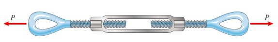

$$\delta=n p$$

其中$\delta$为螺栓的伸长量，$n$为转数（number of revolutions），$p$为螺纹（threads）的螺距（pitch）。

#### 8.6 斜截面应力

1.斜截面（inclined section）应力：

$$N=P cos \theta$$

$$V=P sin \theta$$

$$A_{\text {incline }}=\frac{A_{\text {cross }}}{\cos \theta}$$

$$\sigma_\theta=\frac{N}{A_{\text {incline }}}=\frac{P}{A_{\text {cross }}} \cos ^2 \theta$$

$$\sigma_\theta=\sigma_x \cos ^2 \theta=\frac{\sigma_x}{2}(1+\cos 2 \theta)$$

$$\tau_\theta=-\frac{V}{A_{\text {incline }}}=-\frac{P}{A_{\text {cross }}} \sin \theta \cos \theta$$

$$\tau_\theta=-\sigma_x \sin \theta \cos \theta=-\frac{\sigma_x}{2}(\sin 2 \theta)$$

注意：分析切面的应力不是真正的切开，而是以此假设的斜截面来分析此斜截面上所受的应力。一整条梁的每个切面都会同时受到法向应力$\sigma$和剪切应力$\tau$，但是大小不同罢了，因此对于整条梁来说，有最大/最小的法向应力和剪切应力。

因此，对于一条受到轴向力$P$的一整条梁，其最大法向应力为：

$$\sigma_{max}=\frac{\sigma_{x}}{2}(1+cos(2 \times 0^{\circ}))=\sigma_{x} \quad \theta=0$$

其最大剪切应力为：

$$\tau_{max}=-\frac{\sigma_{x}}{2} sin 2 \theta=-\frac{\sigma_{x}}{2} sin (2 \times -45^{\circ})=\frac{\sigma_{x}}{2} \quad \theta=-45^{\circ}$$

2.二维与三维的平面应力（plane stress）：

### chapter 9 扭矩

#### 9.1 扭矩

1.施加扭矩（torsion）：

扭矩作用于一根直杆时，将会产生绕杆的纵轴的旋转（旋转轴与杆的长度方向平行）。

力偶（couple）：大小相等方向相反的一对力。此处的力矩是使直杆绕其纵轴扭转的一对力。

图中的力偶形成的力矩$T$属于扭矩，其大小等于力偶中的其中一个力$P$与力偶中的两个力作用点之间的距离$d$。

$$T=P d$$

扭矩$T$的方向通过右手定则确定。

2.捻度角（angle of twist）：

当一个杆承受扭矩时，某一截面相对于起点的截面的旋转的角度。（想象杆是柔软的，那么扭矩可以使其发生形变，就像拧毛巾一样，因此杆的每一个截面都会旋转一定的角度）

对于纯扭矩作用的具有圆形截面（常截面）的杆，其捻度角$\phi (x)$的变化会遵循线性。

3.杆的外表面的剪切应变$\gamma$：

剪切应变表示物体变形造成各条边偏离其原来方向的角度大小，因此有：

有外表面剪切应变：

$$\gamma_{\max }=\frac{b b^{\prime}}{a b}$$

$$\gamma_{\max }=\frac{r d \phi}{d x}$$

定义捻度角的变化率$\theta$：

$$\theta=\frac{d \phi}{d x}$$

$$\gamma_{\max }=\frac{r d \phi}{d x}=r \theta$$

对于纯扭矩的情况，捻度角的变化率恒定，因此有：

$$\theta=\frac{\phi}{L}$$

$$\gamma_{\max }=\frac{r \phi}{L}$$

杆的内部的剪切应变：

$$\gamma=\rho \theta=\frac{\rho}{r} \gamma_{\max }$$

$$\theta=\frac{d \phi}{d x}$$

其中$\rho$为内部半径，$r$为外表面半径。

4.纯扭矩的圆管中的剪切应变：

$$\gamma_{\max }=\frac{r_2 \phi}{L} $$

$$\gamma_{\min }=\frac{r_1}{r_2} \gamma_{\max }=\frac{r_1 \phi}{L}$$

5.对满足线性弹性材料，有：

通过胡克定律，可得：

$$\tau=G \gamma$$

$$\tau_{\max }=G r \theta$$

$$\tau=G \rho \theta=\frac{\rho}{r} \tau_{\max }$$

其中$\tau_{max}$为外表面的剪切应力，$\tau$为内部点的剪切应力。

6.引入剪切应力和微分的扭矩表示：

a.圆柱情况：

根据力矩的原始定义$M=F \cdot d$，假设横截面上的面积$dA$上的每一个点的力矩值近似相同，那么有：

$$d T=\tau \rho d A=\frac{\tau_{\max }}{r} \rho^2 d A$$

那么横截面上的每个点的所有剪切应力$\tau$的力矩之和即为扭矩$T$：

$$T=\int_A d T=\frac{\tau_{\max }}{r} \int_A \rho^2 d A=\frac{\tau_{\max }}{r} I_p$$

对于一个圆，$I_p$为：

$$I_p=\frac{\pi r^4}{2}=\frac{\pi d^4}{32}$$

因此将最大剪切应力写成：

$$\tau_{\max }=\frac{T r}{I_p}$$

$$r=d / 2$$

$$I_P=\pi d^4 / 32$$

$$\tau_{\max }=\frac{16 \mathrm{~T}}{\pi \mathrm{d}^3}$$

$$T_{allow}=\frac{\pi d^3}{16} \tau_{allow}$$

离圆心距离为$\rho$的剪切应力为：

$$\tau=\frac{\rho}{r} \tau_{\max }=\frac{T \rho}{I_p}$$

捻度角为：

$$\theta=\frac{T}{G I_p}$$

$$\phi=\frac{T L}{G I_p}$$

其中$G I_p$为抗扭刚性（torsional rigidity）。$k_T=\frac{G I_p}{L}$为抗扭刚度（torsional stiffness）。$f_T=\frac{L}{G I_p}$为抗扭灵活度（torsional flexibility）。

b.圆管情况：

$$I_p=\frac{\pi}{2}\left(r_2^4-r_1^4\right)=\frac{\pi}{32}\left(d_2^4-d_1^4\right)$$

也可以写成：

$$r=\frac{r_1+r_2}{2}$$

$$d=\frac{d_1+d_2}{2}$$

$$I_p=\frac{\pi r t}{2}\left(4 r^2+t^2\right)=\frac{\pi d t}{4}\left(d^2+t^2\right)$$

如果圆管够薄（$t$足够小，视作$t \approx 0$），则有近似公式：

$$I_p \approx 2 \pi r_{\text {ave }}{ }^3 t=\frac{\pi d_{\text {ave}}{}^3 t}{4}$$

#### 9.2 非均匀扭矩

扭矩符号规定：往杆/棱柱外的方向为正，向棱柱内的方向为负。

以下情况都仅限于圆形截面的圆杆，且需要都表现为线性弹性。圆杆和圆管的扭矩方程不能用于其他形状的杆。

1.情况一：

棱柱的每一段内都具有恒定的内部扭矩。通过切割法来确定每一段内的扭矩的大小和方向。

因此捻度角为：

$$\phi=\phi_1+\phi_2+\ldots+\phi_n$$

$$\phi=\sum_{i=1}^n \phi_i=\sum_{i=1}^n \frac{T_i L_i}{G_i\left(I_p\right)_i}$$

2.情况二：

杆的截面连续变化，且整体扭矩恒定。在最小直径处获得最大剪切应力$\tau_{max}$。

因此捻度角为：

$$\phi=\int_0^L d \phi=\int_0^L \frac{T d x}{G I_p(x)}$$

3.情况三：

杆的截面连续变化，且扭矩也连续变化。

因此捻度角为：

$$\phi=\int_0^L d \phi=\int_0^L \frac{T(x) d x}{G I_p(x)}$$

#### 9.3 纯剪切中的应力和应变

1.纯剪切：作用在元件上的唯一的应力为剪切应力。

2.符号规定：

正向面（positive face）：正向面的向外法向量方向为坐标轴正方向。满足如果剪切应力作用于坐标轴的正方向，则为正。

负向面（negative face）：正向面的对面。如果剪切应力作用于坐标轴的负方向，则为正。

3.求应力（以切开正方形元件为例）：

$$F= stress \times area$$

根据力的平衡，可得：

倾斜法向应力：

$$\sigma_\theta A_0 \sec \theta=\tau A_0 \sin \theta+\tau A_0 \tan \theta \cos \theta$$

$$\sigma_\theta=2 \tau \sin \theta \cos \theta=\tau \sin 2 \theta$$

倾斜剪切应力：

$$\tau_\theta A_0 \sec \theta=\tau A_0 \cos \theta-\tau A_0 \tan \theta \sin \theta$$

$$\tau_\theta=\tau\left(\cos ^2 \theta-\sin ^2 \theta\right)=\tau_\theta=\tau \cos 2 \theta$$

由以上结果，当$\theta= \pm 45^{\circ}$时，倾斜剪切应力为0，而倾斜法向应力取得最大值$\sigma_{max}$或最小值$\sigma_{min}$。

4.求应变：

剪切形变（shear distortion）：在纯剪切情况下元件的形状变化。

在$45^{\circ}$方向上的法向应变：

$$\varepsilon_{\max }=\frac{\gamma}{2}$$

$$\varepsilon_{\max }=\frac{\tau}{E}+\frac{v \tau}{E}=\frac{\tau}{E}(1+v)$$

剪切模量（shear modulus）：

$$\tau=G \gamma$$

$$G=\frac{E}{2(1+v)}$$

其中$v$为泊松比，$\frac{\tau}{E}$为在$\sigma_{max}$方向上的应变，$\frac{v \tau}{E}$为垂直于$\sigma_{max}$方向上的应变。

#### 9.4 圆形轴的动力传输

做功：

$$W=T \psi$$

其中$T$为扭矩，$\psi$为旋转过的角度。

功率：

$$P=\frac{d W}{d t}=T \frac{d \psi}{d t}$$

$$P=\omega \mathrm{T}=2 \pi f T=\frac{2 \pi n T}{60}$$

其中$n$为每分钟转数（rpm）。

马力（horsepower）：

$$H=\frac{2 \pi n T}{33,000}$$

$$1hp=746w$$

#### 9.5 超静定扭力杆件

超静定扭力杆件需要附加的方程来求解未知的扭矩。求解过程类似于对超静定轴向载荷杆件的求解过程：

第一步列出力平衡方程：

$$T_1+T_2=T$$

第二步列出相容性方程：

$$\phi_1=\phi_2$$

第三步列出扭矩-位移的关系：

$$\phi_1=\frac{T_1 L}{G_1 I_{p 1}} \quad \phi_2=\frac{T_2 L}{G_2 I_{p 2}}$$

第四步求解方程组：

$$T_1=T\left(\frac{G_1 I_{p 1}}{G_1 I_{p 1}+G_2 I_{p 2}}\right) \quad T_2=T\left(\frac{G_2 I_{p 2}}{G_1 I_{p 1}+G_2 I_{p 2}}\right)$$

#### 9.6 非圆棱镜轴的扭转

扭转公式不能再用于计算剪切应力。

扭矩-位移关系不能用来寻找扭转角。

在非圆形轴中，最大剪切应力并不发生在距轴的最大距离处，而是根据几何形状发生变化。

最大剪切应力：

$$\tau_{\max , \text { ellipse }}=\frac{2 T}{\pi a b^2}$$

捻度角：

$$\phi=\frac{T L}{G J_{\text {ellipse }}}$$

扭转常数：

$$J_{\text {ellipse }}=\frac{\pi a^3 b^3}{a^2+b^2}$$

最大剪切应力：

$$\tau_{\text {max }, \text { triangle }}=\frac{15 \sqrt{3} T}{2 h_t^3}$$

捻度角：

$$\phi=\frac{T L}{G J_{\text {triangle }}}$$

扭转常数：

$$J_{\text {triangle }}=\frac{h_t^4}{15 \sqrt{3}}$$

最大剪切应力：

$$\tau_{\text {max,rectangle }}=\frac{T}{k_{\mathrm{l}} b t^2}$$

捻度角：

$$\phi=\frac{T L}{G J_{\text {rectangle }}}$$

扭转常数：

$$J_{\text {rectangle }}=k_2 b t^3$$

### chapter 10 梁的应力

#### 10.1 梁

1.梁：

梁（beams）是在受到与其长度方向垂直方向的载荷时弯曲的杆件。

挠度（deflection）：施加的载荷使得梁发生形变的度量。以梁上的某一点形变前后在与其长度方向垂直的方向上的位移表示（一般使用符号$\delta$表示）。

2.纯弯曲（pure bending）梁：梁在恒定弯矩$M_1$作用下弯曲。剪向力$V$在这个区域为零。

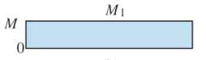

根据力矩的基本定义：

$$V=\frac{d M}{d x}=0$$

3.非均匀弯曲（nonuniform bending）梁：当沿着轴移动时，弯矩会发生变化。

此处为内部的弯矩，这个和截面求轴向内力的过程是一样的，每两个末端/负载确定一段，而此段两端的弯矩负载相同，且与此段的内部弯矩的大小一致。

4.梁的曲率（curvature）：

应变和应力与梁的曲率直接相关。

有曲率公式：

$$\kappa=\frac{1}{\rho}=\frac{d \theta}{d s}$$

其中曲率圆心为$O^{\prime}$，曲率半径为$\rho$，半径夹角$d \theta$，夹角对应的弧长$ds$。

在挠度很小的情况下满足$d s \approx d x$因此有：

$$\kappa=\frac{1}{\rho}=\frac{d \theta}{d x}$$

如果梁是棱柱形的，材料是均匀的，曲率只随弯矩变化。因此纯弯曲梁为恒定曲率，非均匀弯曲梁为变化曲率。

正负符号规定：

5.梁的纵向（longitudinal）应变：

纯弯曲梁的截面纵向长度变化，会产生法向应变$\varepsilon_x$（也就是梁沿长度方向发生的应变）。

中性层（neutral surface）：材料在弯曲过程中，外层受拉伸，内层受挤压，在其断面上必然会有一个既不受拉，又不受压的过渡层，应力几乎等于零，这个过渡层称为材料的中性层。中性层在弯曲过程中的长度和弯曲前一样，保持不变。中性层是计算弯曲件展开长度的基准。另外，中性层与横截面的交线称为中性轴（neutral axis）。由其性质，可知中性轴上的点满足正应力为零。

法向应变与曲率的关系推导：

$$\varepsilon_x=\frac{\Delta L}{L}=-\frac{y}{\rho}=-\kappa y$$

其中$L$代表梁的长度，$\Delta L$代表梁的伸缩长度。$y$表示梁的表面与中性面的垂直距离。由几何易得$\frac{\Delta L}{L}=-\frac{y}{\rho}$。正负号规定为延伸为正，缩短为负。

根据几何，$ef$的弯曲后长度：

$$L_1=(\rho-y) d \theta=d x-\frac{y}{\rho} d x=dx + \Delta x$$

假设为线性弹性材料，那么根据胡可定律可得法向应力$\sigma_x$：

$$\sigma_x=E \varepsilon_x=E \cdot \frac{\Delta x}{dx}=-\frac{E y}{\rho}=-E \kappa y$$

很明显的，在切面$mn$上，$m$点的$dA$和$n$点的$dA$所受的应力明显是不同的，因为$m$点所属的$dA$为横截面积的的棱柱被拉伸为$mp$段，而$n$点所属的$dA$为横截面积的棱柱被拉伸为$nq$段，而又因为它们的材料相同，因此棱柱$mp$和棱柱$nq$所受的法向应力一定不同。

可得法向应力$\sigma_x$随$y$到中性轴的距离成线性变化。与之前的符号定义一样，使得梁拉伸为正，使得梁压缩为负。

6.如果弯曲梁的材料遵循胡克定律，且截面上没有轴向力（外部施加的法向应力$\sigma_x$为零，但梁被施加了导致弯曲的力），则中性轴通过截面积的形心（centroid）。根据中性轴的性质（正应力为零）：

$$\int_A \sigma_x d A=-\int_A E \kappa y d A=0$$

又因为$E$和$\kappa$在弯曲梁的任意截面上满足非零。

$$\int_A y d A=0$$

假设梁围绕y轴对称，则y轴和z轴（z轴为同时与y轴和x轴同时垂直的坐标轴）同时通过质心，成为主质心轴（principal centroidal axes）。这样就确定了中性轴的位置$y$了。

7.弯曲梁作用在截面上的法向应力$\sigma_x$的力矩的效应等效于弯矩$M$（只有受到了外力被弯曲的梁，也就是弯曲梁产生的法向应力才会形成弯矩的效果）：

如上图，x轴以上部分的法向应力比以下部分大，会形成弯矩的效果。

图中$c_1,c_2$表示物体在$y$轴上的最大值和最小值，那么根据力矩的定义，得到$dA$面积内的所有点的力矩之和为：

$$d M=-\sigma_x y d A$$

因此可得整个截面的力矩之和：

$$M=-\int_A \sigma_x y d A=\int_A \kappa E y^2 d A=\kappa E \int_A y^2 d A$$

简化：

$$I=\int_A y^2 d A$$

$$\kappa=\frac{1}{\rho}=\frac{M}{E I}$$

将法向应力的曲率公式代入弯矩-曲率方程，可以得到弯曲公式（flexure formula）：

$$\sigma_x=-\frac{E y}{\rho}=-E \kappa y$$

$$\sigma_x=-\frac{M y}{I}$$

用弯曲公式计算的应力$\sigma_x$称为弯曲应力（bending stresses）或弯曲应力（flexural stresses）。

法向应力的最大值/最小值发生在离中性轴最远的两个点$c$。

$$\sigma_1=-\frac{M c_1}{I} \quad \sigma_2=-\frac{M c_2}{I}$$

弯矩的符号规定：

8.截面模量（section moduli）：用$S$表示，它将截面的转动惯量$I$与物体到其中性面的最远距离$c$联系起来。

$$S=\frac{I}{c}$$

$$\sigma_1=-\frac{M}{S_1} \quad \sigma_2=-\frac{M}{S_2}$$

如果梁的截面关于$y$轴和$z$轴对称，满足$c_1=c_2$，$S=S_{1}=S_{2}$，那么有：

$$\sigma_{\max }=\frac{M}{S}$$

对于矩形截面：

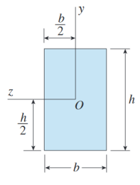

$$I=\frac{b h^3}{12} \quad S=\frac{b h^2}{6}$$

对于圆形截面：

$$I=\frac{\pi d^4}{64} \quad S=\frac{\pi d^3}{32}$$

9.根据截面模量的定义，计算梁的抗弯曲能力：

$$S=\frac{M_{\max }}{\sigma_{\text {allow }}}$$

许用应力$\sigma_{allow}$取决于材料的性能和安全系数。

相同面积的方形梁比圆形梁更有效地抵抗弯曲（截面模量更大）：

$$S_{\text {square }}=\frac{h^3}{6}=\frac{\pi \sqrt{\pi} d^3}{48}=0.1160 d^3$$

$$S_{\text {circle }}=\frac{\pi d^3}{32}=0.0982 d^3$$

其他形状的梁：

#### 10.2 弯曲梁的剪切公式

1.推导弯曲梁的剪切应力公式：

注意上图截取出来的单元部分所受的法向应力$\sigma$的方向（下方拉伸，上方压缩）：

$$\sigma_1=-\frac{M y}{I} \quad$$

$$\sigma_2=-\frac{(M+d M) y}{I}$$

对截取出的单元，作用于其上的应力为：

一整条梁的每个切面都会同时受到法向应力$\sigma$和剪切应力$\tau$。上图的剪切应力$\tau$是对于切面$pp_1$而言的，而对于切面$pp_1$来说，$\sigma_1$和$\sigma_2$的合力即为剪向力$V$，$\tau=\frac{V}{A}$。而切面$pp_1$不存在法向方向（切面$pp_1$的法向方向为$y$轴方向）的外力，因此$\sigma_y=0$。

对于截取出的单元而言，施加于其横截面积$dA$上的力为（注意下图坐标轴为$y-z$而不是$y-x$）：

$$\sigma_1 d A=\frac{M y}{I} d A$$

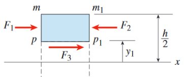

$$F_1=\int \sigma_1 d A=\int \frac{M y}{I} d A$$

$$F_2=\int \sigma_2 d A=\int \frac{(M+d M) y}{I} d A$$

与$\tau$同向的剪向力合力（也就是$V$）：

$$F_3=\int \frac{(M+d M) y}{I} d A-\int \frac{M y}{I} d A=\int \frac{(d M) y}{I} d A$$

那么设梁的宽度为$b$，则根据应力的定义，剪切应力$\tau$和$F_3$满足：

$$F_3=\tau dA=\tau \cdot b \cdot d x$$

处于平面$m-p$上的剪向力$V$：

$$V=\frac{dM}{dx}$$

$$\tau=\frac{d M}{d x}\left(\frac{1}{I b}\right) \int y d A$$

$$\tau=\frac{V Q}{I b}$$

其中$Q$为一次矩。

2.当计算矩形的剪切应力时，$Q$可以用以下形式代替（注意下图坐标轴为$y-z$，因此图像为横截面，也因此能够直接计算一次矩）：

$$Q=b\left(\frac{h}{2}-y_1\right)\left(y_1+\frac{h / 2-y_1}{2}\right)=\frac{b}{2}\left(\frac{h^2}{4}-y_1^2\right)$$

$$\tau=\frac{V}{2 I}\left(\frac{h^2}{4}-y^2\right)$$

$$\tau_{\max }=\frac{V h^2}{8 I}=\frac{3 V}{2 A}$$

3.当计算圆形的剪切应力时，$Q$可以用以下形式代替：

$$I=\frac{\pi r^4}{4}$$

$$Q=A \bar{y}=\left(\frac{\pi r^2}{2}\right)\left(\frac{4 r}{3 \pi}\right)=\frac{2 r^3}{3}$$

$$b=2 r$$

$$\tau_{\max }=\frac{V Q}{I b}=\frac{V\left(2 r^3 / 3\right)}{\left(\pi r^4 / 4\right)(2 r)}=\frac{4 V}{3 \pi r^2}=\frac{4 V}{3 A}$$

空心圆的情况：

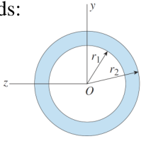

$$I=\frac{\pi}{4}\left(r_2^4-r_1^4\right)$$

$$Q=\frac{2}{3}\left(r_2^3-r_1^3\right)$$

$$b=2\left(r_2-r_1\right)$$

$$\tau_{\max }=\frac{4 V}{3 A}\left(\frac{r_2^2+r_2 r_1+r_1^2}{r_2^2+r_1^2}\right)$$

4.凸缘梁（flanged beams）的腹板（web）：

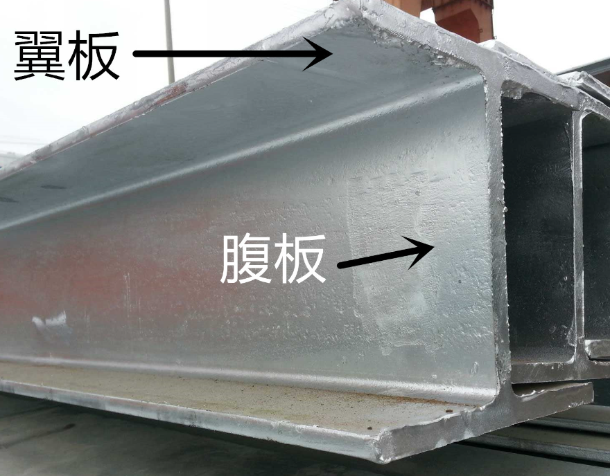

由横、竖件组成的，竖件都可叫梁肋或腹板（web），横件就叫翼板或翼缘板（flange slab）。

$$Q=A_1\left(\frac{h_1}{2}+\frac{h / 2-h_1 / 2}{2}\right)+A_2\left(y_1+\frac{h_1 / 2-y_1}{2}\right)$$

$$Q=\frac{b}{8}\left(h^2-h_1^2\right)+\frac{t}{8}\left(h_1^2-4 y_1^2\right)$$

$$\tau=\frac{V}{8 I t}\left[b\left(h^2-h_1^2\right)+t\left(h_1^2-4 y_1^2\right)\right]$$

$$\tau_{\max }=\frac{V}{8 I t}\left(b h^2-b h_1^2+t h_1^2\right) \quad\left(y_1=0\right)$$

$$\tau_{\min }=\frac{V b}{8 I t}\left(h^2-h_1^2\right)\left(y_1=\pm \frac{h_1}{2}\right)$$

$$I=\frac{b h^3}{12}-\frac{(b-t) h_1^3}{12}=\frac{1}{12}\left(b h^3-b h_1^3+t h_1^3\right)$$

在最大和最小剪切应力下，可求出翼缘腹板处的剪向力：

$$V_{w e b}=\frac{t h_1}{3}\left(2 \tau_{\max }+\tau_{\min }\right)$$

腹板的平均剪切应力（假设腹板承载了所有的剪向力）：

$$\tau_{\text {aver }}=\frac{V}{t h_1}$$

#### 10.3 复合梁

复合梁（composite beams）为由多种材料制成的梁。曲率和应变之间的关系仍然适用于复合梁的整个截面。

$$\varepsilon_x=-\frac{y}{\rho}=-\kappa y$$

又因为需要考虑复合梁的材料的类型的不同（杨氏模量$E$不同），因此应力也不同：

$$\sigma_{x 1}=-E_1 \kappa y \quad \sigma_{x 2}=-E_2 \kappa y$$

在外力作用于截面上的轴向合力为零的条件下，求出组合梁的中性轴（正应力为零）：

$$E_1 \int_1 y d A+E_2 \int_2 y d A=0$$

组合梁的弯矩和曲率的关系也需要转化：

$$M=-\int_A \sigma_x y d A=-\int_1 \sigma_{x 1} y d A-\int_2 \sigma_{x 2} y d A=\kappa E_1 \int_1 y^2 d A+\kappa E_2 \int_2 y^2 dA$$

$$M=\kappa\left(E_1 I_1+E_2 I_2\right)$$

$$\kappa=\frac{1}{\rho}=\frac{M}{E_1 I_1+E_2 I_2}$$

代入应力公式得：

$$\sigma_{x 1}=-\frac{M y E_1}{E_1 I_1+E_2 I_2} \quad \sigma_{x 2}=-\frac{M y E_2}{E_1 I_1+E_2 I_2}$$

双对称夹层梁：

对于双对称的夹层梁，如果$E_{表面} >> E_{内部}$，则其顶部和底部的最大法向应力为：

$$\sigma_{\text {top }}=-\frac{M h}{2 I_1} \quad \sigma_{\text {bottom }}=\frac{M h}{2 I_1}$$

如果表面材料的厚度$t$远小于内部材料的厚度$h_c$，那么套用腹板模型，忽略表面的剪切应力并假设内部承载所有的剪切应力，可得平均剪切应力：

$$\tau_{\mathrm{aver}}=\frac{V}{b h_{\mathrm{c}}} \quad \gamma_{\mathrm{aver}}=\frac{V}{b h_{\mathrm{c}} G_{\mathrm{c}}}$$

#### 10.4 转换截面法

转换截面法（transformed section method）：将复合梁的截面转换为仅具有一种材料类型的假想梁的等效截面。定义模比（modular ratio）$n$来进行转换：

$$n=\frac{E_2}{E_1}$$

$$E_1 \int_1 y d A+E_2 \int_2 y d A=0$$

$$\int_1 y d A+\int_2 y n d A=0$$

转换的具体过程：

区域的形状保持不变，区域的宽度乘以模比。然后转动惯量换算为：

$$I_{\text {T}}=I_1+n I_2$$

$$\sigma_{x 1}=-\frac{M y}{I_T}$$

代入得：

$$\sigma_{x 1}=-\frac{M y E_1}{E_1 I_1+E_2 I_2}$$

原梁中材料2的应力与改造后梁相应部位的应力不相同。作为代替，改造后的梁中的应力必须乘以模比$n$才能得到原梁材料2中的应力：

$$\sigma_{x 2}=-\frac{M y}{I_T} n$$

$$\sigma_{x 2}=-\frac{M y n E_1}{E_1 I_1+E_2 I_2}=-\frac{M y E_2}{E_1 I_1+E_2 I_2}$$

#### 10.5 不对称梁弯曲

在之前关于弯曲梁的讨论中，假定梁的横截面至少有一个对称轴。现在这个限制被取消了，梁的横截面可能是不对称的。

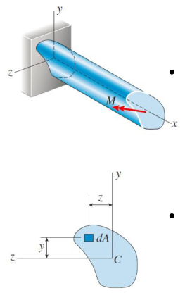

此时假设$z$轴为中性轴，则可得：

$$\sigma_x=-E \kappa_y y$$

$$\int_A \sigma_x d A=-\int_A E \kappa_y y d A=0$$

$$\int_A y d A=0$$

如果假设$y$轴为中性轴，则可得：

$$\sigma_x=-E \kappa_z z$$

$$\int_A \sigma_x d A=-\int_A E \kappa_z z d A=0$$

$$\int_A z d A=0$$

我们需要先假设一个中性轴再求其他量，那么从形心$C$入手的过程为：

先构造形心$C$的主轴（principal axes），然后求出$M_y$和$M_z$。

$$M_y=M \sin \theta \quad M_z=M \cos \theta$$

得到合成应力：

$$\sigma_x=\frac{(M \sin \theta) z}{I_y}-\frac{(M \cos \theta) y}{I_z}$$

如果有必要，可以设置$\sigma_x=0$来求中性轴的位置：

$$\frac{\sin \theta}{I_y} z-\frac{\cos \theta}{I_z} y=0 \quad \tan \beta=\frac{y}{z}=\frac{I_z}{I_y} \tan \theta$$

建立了应力和中性轴方向的相关方程：

$$\sigma_x=\frac{\left(M_y I_z+M_z I_{y z}\right) z-\left(M_z I_y+M_y I_{y z}\right) y}{I_y I_z-I_{y z}{ }^2}$$

$$\tan \beta=\frac{y}{z}=\frac{M_y I_z+M_z I_{y z}}{M_z I_y+M_y I_{y z}}$$

### chapter 11 应力与应变分析

#### 11.1 总结回顾（例题和作业）

剪切应力和法向应力同时存在的随角度变化的情况：

应力：

$$\sigma = \frac{F}{A}$$

（平面应力情况）给出物体角度为0时的$\sigma_x$、$\sigma_y$、$\tau_{xy}$，求最大拉应力（$x_1$方向最大法向应力）、最大压应力（$y_1$方向最大法向应力）、最大剪应力$\tau_{max}$和相应的角度$\theta_s$，主平面相应的角度$\theta_p$：

$$\sigma_z=\tau_{y z}=\tau_{z x}=0$$

$$\sigma_{\mathrm{x1}}+\sigma_{\mathrm{y1}}=\sigma_{\mathrm{x}}+\sigma_{\mathrm{y}}$$

$$\sigma_{\text {ave }}=\frac{\sigma_{\mathrm{x}}+\sigma_{\mathrm{y}}}{2}$$

已知：

$$\sigma_{x 1}=\frac{\sigma_x+\sigma_y}{2}+\frac{\sigma_x-\sigma_y}{2} \cos 2 \theta+\tau_{x y} \sin 2 \theta$$

$$\sigma_{y 1}=\frac{\sigma_x+\sigma_y}{2}-\frac{\sigma_x-\sigma_y}{2} \cos 2 \theta-\tau_{x y} \sin 2 \theta$$

$$\tau_{x 1 y 1}=-\frac{\sigma_x-\sigma_y}{2} \sin 2 \theta+\tau_{x y} \cos 2 \theta$$

对$\sigma_{x 1},\sigma_{y 1}$求导得：

$$\tan 2 \theta_p=\frac{2 \tau_{x y}}{\sigma_x-\sigma_y}$$

构建直角三角形后获得：

$$\mathrm{R}=\sqrt{\left(\frac{\sigma_{\mathrm{x}}-\sigma_{\mathrm{y}}}{2}\right)^2+\tau_{\mathrm{xy}}{ }^2}$$

$$\sin 2 \theta_{p}=\frac{\tau_{x y}}{R}$$

$$\cos 2 \theta_{p}=\frac{\sigma_x-\sigma_y}{2 R} $$

对$\tau_{x 1 y 1}$求导得：

$$\tan 2 \theta_s=-\frac{\sigma_x-\sigma_y}{2 \tau_{x y}}=-\frac{1}{\tan 2 \theta_p}$$

$$\cos \left(2 \theta_s-2 \theta_p\right)=0$$

$$\theta_s=\theta_p \pm 45^{\circ}$$

最大法向应力对应角度（有两个，相差90度）：

$$\theta_{\mathrm{p}2}=\frac{1}{2} \cdot \operatorname{atan}\left(\frac{2 \cdot \tau_{\mathrm{xy}}}{\sigma_{\mathrm{x}}-\sigma_{\mathrm{y}}}\right)$$

$$\theta_{p 1} = \theta_{p 2} + 90°$$

最大剪应力$\tau_{max}$（$\theta = \theta_s = \theta_p \pm 45^{\circ}$）：

$$\tau_{x 1 y 1 max}=\tau_{\max }=\sqrt{\left(\frac{\sigma_{\mathrm{x}}-\sigma_{\mathrm{y}}}{2}\right)^2+\tau_{\mathrm{xy}}{ }^2}=\mathrm{R}$$

最大法向应力/主应力（$\theta=\theta_p$）：

$$\sigma_{x max}=\sigma_1=\frac{\sigma_x+\sigma_y}{2}+\frac{\sigma_x+\sigma_y}{2} \cos \left(2 \theta_{p 1}\right)+\tau_{x y} \sin \left(2 \theta_{p 1}\right)$$

$$\sigma_1=\sigma_{\text {ave }}+\mathrm{R}$$

$$\sigma_{y max}=\sigma_2=\frac{\sigma_x+\sigma_y}{2}+\frac{\sigma_x-\sigma_y}{2} \cos \left(2 \theta_{p 2}\right)+\tau_{x y} \sin \left(2 \theta_{p 2}\right)$$

$$\sigma_2=\sigma_{\text {ave }}-\mathrm{R}$$

$$\sigma_{1,2}=\frac{\sigma_x+\sigma_y}{2} \pm \sqrt{\left(\frac{\sigma_x-\sigma_y}{2}\right)^2+\tau_{x y}{ }^2}$$

$$\tau_{\max }=\mathrm{R}=\frac{\sigma_1 - \sigma_2}{2}$$

$\sigma_1,\sigma_2,\sigma_3$分别代表此点$x,y,z$方向上的主应力。

三维物体内部最大剪切应力（根据二维情况可直接得）：

$$\left(\tau_{\max }\right)_x=\pm \frac{\sigma_2-\sigma_3}{2}$$

$$\left(\tau_{\max }\right)_y=\pm \frac{\sigma_1-\sigma_3}{2}$$

$$\left(\tau_{\max }\right)_z=\pm \frac{\sigma_1-\sigma_2}{2}$$

下标表示绕此轴旋转角度来获取的最大剪切应力，有绝对最大剪切应力（absolute maximum shear stress）：

$$\left(\tau_{\max }\right)_{a b s}=\pm Max(\left(\tau_{\max }\right)_x,\left(\tau_{\max }\right)_y,\left(\tau_{\max }\right)_z)$$

平面应力的胡克定律：

泊松比：

$$v=-\frac{\varepsilon_{\text {法向}}}{\varepsilon_{\text {轴向}}}=-\frac{\varepsilon_y}{\varepsilon_x}$$

由均质和各向同性可得泊松比也适用于其他方向：

$$\frac{\varepsilon_y}{\varepsilon_x}=\frac{\varepsilon_z}{\varepsilon_x}= 常数 =v$$

杨氏模量（只取决于材料，与方向无关）：

$$E=\frac{\sigma_x}{\varepsilon_x}$$

对应某个方向的应力$\sigma$，其在各个方向上造成的应变$\varepsilon$表：

$$\begin{aligned} & \varepsilon_x=\frac{1}{E}\left(\sigma_x-v \sigma_y\right) \\ & \varepsilon_y=\frac{1}{E}\left(\sigma_y-v \sigma_x\right) \\ & \varepsilon_z=-\frac{v}{E}\left(\sigma_x+\sigma_y\right)\end{aligned}$$

平面应力下的剪切应变（平面应力说明仅在$x$和$y$轴方向上存在应力，且材料遵循均质和各向异性和胡克定律）：

$$\gamma_{x y}=\frac{\tau_{x y}}{G}$$

$$G=\frac{E}{2(1+\nu)}$$

长方体的平面应变（平面应变也会造成z轴方向应变）的体积变化：

$$V_0=abc$$

$$V_1=V_0\left(1+\varepsilon_x\right)\left(1+\varepsilon_y\right)\left(1+\varepsilon_z\right)$$

$$\Delta V=V_0 (\varepsilon_x+\varepsilon_y+\varepsilon_z)$$

那么有单位体积变化$e$，也称为膨胀（dilation），定义为：

$$e=\frac{\Delta V}{V_0}=\varepsilon_x+\varepsilon_y+\varepsilon_z$$

而满足胡克定律且只受平面应力（$\sigma_z=0$）时，膨胀为：

$$e=\frac{\Delta V}{V_0}=\frac{(1-2 v)}{E}\left(\sigma_x+\sigma_y\right)$$

如果是圆柱体，有扭矩$T$，则满足：

$$\tau_{\max }=\frac{T r}{I_p}$$

$$\theta=\frac{T}{G I_p}$$

其中$\theta$为剪切应变。

不同方向的应力$\sigma$造成不同方向上的应变$\varepsilon$：

$$\begin{aligned} \sigma_x & =\frac{E}{(1+\nu)(1-2 \nu)}\left[(1-\nu) \varepsilon_x+\nu\left(\varepsilon_y+\varepsilon_z\right)\right] \\ \sigma_y & =\frac{E}{(1+\nu)(1-2 \nu)}\left[(1-\nu) \varepsilon_y+\nu\left(\varepsilon_z+\varepsilon_x\right)\right] \\ \sigma_z & =\frac{E}{(1+\nu)(1-2 \nu)}\left[(1-\nu) \varepsilon_z+\nu\left(\varepsilon_x+\varepsilon_y\right)\right]\end{aligned}$$

体积变化：

$$e=\frac{\Delta V}{V_0}=\varepsilon_x+\varepsilon_y+\varepsilon_z=\frac{(1-2 v)}{E}\left(\sigma_x+\sigma_y+\sigma_z\right)$$

而满足胡克定律且只受平面应力（$\sigma_z=0$）时，膨胀为：

$$e=\frac{\Delta V}{V_0}=\frac{(1-2 v)}{E}\left(\sigma_x+\sigma_y\right)$$

特殊条件$\sigma_x=\sigma_y=\sigma_z=\sigma_0$，那么形变和膨胀为：

$$\varepsilon_x = \varepsilon_y = \varepsilon_z = \varepsilon_0=\frac{\sigma_0}{E}(1-2 v)$$

$$e=\frac{\Delta V}{V_0}=3 \varepsilon_0=\frac{3 \sigma_0}{E}(1-2 \nu)$$

体积模量$K$：

$$e=\frac{\sigma_0}{K}$$

$$K=\frac{E}{3(1-2 v)}$$

平面应力和平面应变是不同的（一个是指只有特定平面存在的应力，一个是只在特定平面发生了的应变）：

然后物体本来在$x_1$方向上的长度为$ds$，则其在此方向上的形变为：

平面应变会造成剪切应变$\gamma_{xy}$（弧度制，本质是无量纲，可以和长度相乘获得长度），那么可以视作进行了一个平面的坐标系旋转获得坐标系$y_1 - x_1$。由$\sigma_x,\sigma_y,\gamma_xy$在$x_1$方向上的造成的长度变化为：

$$\Delta d=\varepsilon_x d x \cos \theta+\varepsilon_y d y \sin \theta+\gamma_{x y} d y \cos \theta$$

$$d x / d s=\cos \theta \quad d y / d s=\sin \theta$$

$$\varepsilon_{x 1}=\frac{\Delta d}{d s}=\varepsilon_x \frac{d x}{d s} \cos \theta+\varepsilon_y \frac{d y}{d s} \sin \theta+\gamma_{x y} \frac{d y}{d s} \cos \theta$$

$$\varepsilon_{x 1}=\varepsilon_x \cos ^2 \theta+\varepsilon_y \sin ^2 \theta+\gamma_{x y} \sin \theta \cos \theta$$

$\varepsilon_{y 1}$通过$\theta_1 = \theta + 90°$替换即可。

在$x_1$方向上的角度变化为（也是弧度制角度，本质上是无量纲，通过近似扇形的$\theta = l / r$公式获得）：

$$\begin{aligned} \alpha & =-\alpha_1+\alpha_2-\alpha_3 \\ & =-\varepsilon_x \frac{d x}{d s} \sin \theta+\varepsilon_y \frac{d y}{d s} \cos \theta-\gamma_{x y} \frac{d y}{d s} \sin \theta\end{aligned}$$

$$\alpha=-\left(\varepsilon_x-\varepsilon_y\right) \sin \theta \cos \theta-\gamma_{x y} \sin ^2 \theta$$

$$\begin{aligned} \beta & =\left(\varepsilon_x-\varepsilon_y\right) \sin \left(\theta+90^{\circ}\right) \cos \left(\theta+90^{\circ}\right)+\gamma_{x y} \sin ^2\left(\theta+90^{\circ}\right) \\ & =-\left(\varepsilon_x-\varepsilon_y\right) \sin \theta \cos \theta+\gamma_{x y} \cos ^2 \theta\end{aligned}$$

$$\gamma_{x 1 y 1}=\alpha+\beta$$

$$\gamma_{x 1 y 1}=-2(\varepsilon_x-\varepsilon_y) \sin \theta \cos \theta+\gamma_{x y}(\cos ^2 \theta-\sin ^2 \theta$$

取得$\gamma_{x 1 y 1}$最大值的角度：

$$\tan 2 \theta_p=\frac{\gamma_{x y}}{\varepsilon_x-\varepsilon_y}$$

取得最大法向应变：

$$\varepsilon_{1,2}=\frac{\varepsilon_x+\varepsilon_y}{2} \pm \sqrt{\left(\frac{\varepsilon_x-\varepsilon_y}{2}\right)^2+\left(\frac{\gamma_{x y}}{2}\right)^2}$$

最大剪切应变下，法向应变为：

$$\varepsilon_{\text {aver }}=\frac{\varepsilon_x+\varepsilon_y}{2}$$

最大剪切应变（取负数即为最小）$\gamma_{\max}$为：

$$\frac{\gamma_{\max}}{2}=\sqrt{\left(\frac{\varepsilon_x-\varepsilon_y}{2}\right)^2+\left(\frac{\gamma_{x y}}{2}\right)^2} = \frac{R}{2} = \frac{\tau_{max}}{2}$$

#### 11.1 仅受平面应力的三维元素

1.平面应力状态（state of plane stress）：

给定一个三维物体，对整体（所有面的叠加）来说，有六个应力分量：

$$\sigma_x, \sigma_y, \sigma_z,\tau_{x y}, \tau_{y z}, \tau_{z x}$$

而当以上六个应力分量中有三个方向相互平行的应力分量均为零时，则满足平面应力状态（因为这意味着可以忽略某一个轴方向上的所有应力，仅需要分析二维的应力了）。平面应力状态就是一个三维单元物体只有一个平面受到法向应力$\sigma$和剪切应力$\tau$的作用。

法向应力符号规定：拉伸为正，压缩为负。剪切应力符号规定："正-正"或"负-负"为正，"正-负"或"负-正"为负。

2.根据一定角度$\theta$进行截面：

元素以角度$\theta$进行旋转示意图：

对元素进行旋转，考虑面积$A_0$（注意力等于应力乘以面积），计算其旋转后的$x_1$和$y_1$方向上的法向应力和剪切应力，需要包含之前$x$和$y$方向上的应力来进行表示：

以上是正方形元素进行一定角度的旋转后，对其$x$轴和$y$轴方向上的面积等效后得到的三角形。

$$\tau_{xy}=\tau_{yx}$$

在$x_1$方向上力平衡：

$$\sigma_{x 1} A_0 \sec \theta -\sigma_x A_0 \cos \theta-\tau_{x y} A_0 \sin \theta -\sigma_y A_0 \tan \theta \sin \theta-\tau_{y x} A_0 \tan \theta \cos \theta=0$$

化简可得：

$$\sigma_{x 1}=\frac{\sigma_x+\sigma_y}{2}+\frac{\sigma_x-\sigma_y}{2} \cos 2 \theta+\tau_{x y} \sin 2 \theta$$

在$y_1$方向上力平衡：

$$\tau_{x 1 y 1} A_0 \sec \theta +\sigma_x A_0 \sin \theta-\tau_{x y} A_0 \cos \theta -\sigma_y A_0 \tan \theta \cos \theta+\tau_{y x} A_0 \tan \theta \sin \theta=0$$

化简可得：

$$\tau_{x 1 y 1}=-\frac{\sigma_x-\sigma_y}{2} \sin 2 \theta+\tau_{x y} \cos 2 \theta$$

类似的等效可得：

$$\sigma_{y 1}=\frac{\sigma_x+\sigma_y}{2}-\frac{\sigma_x-\sigma_y}{2} \cos 2 \theta-\tau_{x y} \sin 2 \theta$$

最终可得：

$$\sigma_{x1}+\sigma_{y1}=\sigma_x+\sigma_y$$

情况一：仅有$x$轴的轴向压力（$\sigma_y=0$）：

$$\sigma_{x 1}=\frac{\sigma_x}{2}(1+\cos 2 \theta) \quad \tau_{x 1 y 1}=-\frac{\sigma_x}{2}(\sin 2 \theta)$$

情况二：纯剪切（$\sigma_x=0$，$\sigma_y=0$）：

$$\sigma_{x 1}=\tau_{x y}(\sin 2 \theta) \quad \tau_{x 1 y 1}=\tau_{x y}(\cos 2 \theta)$$

情况三：仅有$x$轴和$y$轴的轴向压力（$\tau_{xy}=0$）：

$$\sigma_{x 1}=\frac{\sigma_x+\sigma_y}{2}+\frac{\sigma_x-\sigma_y}{2}(\cos 2 \theta) \quad \tau_{x 1 y 1}=-\frac{\sigma_x-\sigma_y}{2}(\sin 2 \theta)$$

3.主应力（principal stresses）：

主应力就是法向应力取得的最大值和最小值。为了得到满足主应力的角度，取应力对角度$\theta$的角度，令其为零：

$$\sigma_{x 1}=\frac{\sigma_x+\sigma_y}{2}+\frac{\sigma_x-\sigma_y}{2} \cos 2 \theta+\tau_{x y} \sin 2 \theta$$

$$\frac{d \sigma_{x 1}}{d \theta}=-\left(\sigma_x-\sigma_y\right) \sin 2 \theta+2 \tau_{x y} \cos 2 \theta=0$$

$$\tan 2 \theta_p=\frac{2 \tau_{x y}}{\sigma_x-\sigma_y}$$

其中下标$_{p}$表示主应力面/主平面（principal plane）。$\theta_{p}$为主角（principal angle），出现在两个相差$90^{\circ}$的方向上。注意：主平面上的剪应力为零。

$$\theta=\theta_p, \tau_{x 1 y 1}=0$$

将主应力和法向应力$\sigma_x,\sigma_y$的关系抽象为一个三角形得到的公式，称为变换方程（transformation equations）：

$$\tan 2 \theta_p=\frac{2 \tau_{x y}}{\sigma_x-\sigma_y}$$

$$R=\sqrt{\left(\frac{\sigma_x-\sigma_y}{2}\right)^2+\tau_{x y}^2}$$

$$\sigma_{\text {aver }}=\frac{\sigma_x+\sigma_y}{2}$$

$$\sigma_1, \sigma_2=\sigma_{\text {aver }} \pm R$$

$$\sigma_1, \sigma_2=\frac{\sigma_x+\sigma_y}{2} \pm \sqrt{\left(\frac{\sigma_x-\sigma_y}{2}\right)^2+\tau_{x y}^2}$$

$$\begin{gathered}\cos 2 \theta_{p }=\frac{\sigma_x-\sigma_y}{2 R} \\ \sin 2 \theta_{p }=\frac{\tau_{x y}}{R}\end{gathered}$$

其中$\sigma_1,\sigma_2,\sigma_3$分别代表此点$x,y,z$方向上的主应力。

零剪应力平面的夹角与主平面的夹角相同。因为在主平面上，法向应力最大，剪切应力为零。

加上$z$轴分析最大剪切应力：

求转换坐标轴后$xy$平面的剪切应力$\tau_{x 1 y 1}$取最大值$\tau_{max}$（此平面的最大剪切应力）对应的角度$\theta_s$，取其导数并使其为零：

$$\tau_{x 1 y 1}=-\frac{\sigma_x-\sigma_y}{2} \sin 2 \theta+\tau_{x y} \cos 2 \theta$$

$$\frac{d \tau_{x 1 y 1}}{d \theta}=-\left(\sigma_x-\sigma_y\right) \cos 2 \theta-2 \tau_{x y} \sin 2 \theta=0$$

$$\tan 2 \theta_s=-\frac{\sigma_x-\sigma_y}{2 \tau_{x y}}$$

$$\tan 2 \theta_s=-\frac{\sigma_x-\sigma_y}{2 \tau_{x y}}=-\frac{1}{\tan 2 \theta_p}$$

那么有$\theta_s$和$\theta_p$的关系：

$$\cos \left(2 \theta_s-2 \theta_p\right)=0$$

$$\theta_s=\theta_p \pm 45^{\circ}$$

也就是说，最大剪应力面与主平面呈$45^{\circ}$夹角。

以上只考虑$xy$平面绕$z$轴旋转，如果$xy$平面绕x1和y1轴旋转得到的应力叫做平面外应力（out-of-plane stresses）。

写成变换方程的形式：

$$\tau_{\max }=\sqrt{\left(\frac{\sigma_x-\sigma_y}{2}\right)^2+\tau_{x y}^2}=R=\frac{\sigma_1-\sigma_2}{2}$$

$$\tau_{\max , x 1}=\pm \frac{\sigma_2-\sigma_3}{2} \quad \tau_{\max , y 1}=\pm \frac{\sigma_1-\sigma_3}{2} \quad \tau_{\max , z 1}=\pm \frac{\sigma_1-\sigma_2}{2}$$

4.摩尔圆：

摩尔圆有两种形式，分为$\tau_{x1y1}$正向上还是正向下。

以下是$\tau_{x1y1}$正向上的摩尔圆：

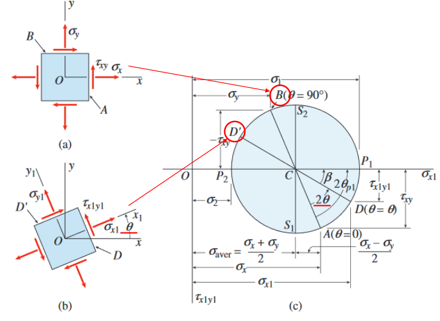

上图表示了从$AB$角度（定义为$\theta=0^{\circ}$）逆时针旋转角度$2\theta$和逆时针旋转角度$\theta_{p}=2\theta_{p1}$（取得主应力）时各方向的法向应力和剪切应力的大小和关系。（上图从$O$点到$D^{\prime}$点的应力就是$\sigma_{y_1}$，与$D$点相对应，但它没有标出来。）

变换方程的摩尔圆形式：

$$\left(\sigma_{x 1}-\sigma_{\text {aver }}\right)^2+\tau_{x 1 y 1}^2=R^2$$

$$\left(\sigma-\frac{\sigma_x+\sigma_y}{2}\right)^2+\tau^2=\left(\frac{\sigma_x-\sigma_y}{2}\right)^2+\tau_{x y}^2$$

写成圆的方程：

$$(\sigma-a)^2+(\tau-b)^2=r^2$$

$$a=\frac{\sigma_x+\sigma_y}{2}=\sigma_{\tau_3} \quad b=0, \quad r=\sqrt{\left(\frac{\sigma_x-\sigma_y}{2}\right)^2+\tau_{x y}^2}=\tau_3$$

确定主应力：

$$\sigma_1=O C+\overline{C P}_1=\frac{\sigma_x+\sigma_y}{2}+R$$

如果是从$x$轴顺时针旋转$\beta=2 \theta_{p1}$：

$$\sigma_{x 1}=\frac{\sigma_x+\sigma_y}{2}+R \cos \beta \quad \tau_{x 1 y 1}=R \sin \beta$$

$$\cos (2 \theta+\beta)=\frac{\sigma_x-\sigma_y}{2 R} \quad \sin (2 \theta+\beta)=\frac{\tau_{x y}}{R}$$

$$\cos \beta=\frac{1}{R}\left(\frac{\sigma_x-\sigma_y}{2} \cos 2 \theta+\tau_{x y} \sin 2 \theta\right)$$

$$\sin \beta=\frac{1}{R}\left(\frac{\sigma_x-\sigma_y}{2} \sin 2 \theta+\tau_{x y} \cos 2 \theta\right)$$

5.材料遵循均质（homogeneous）和各向同性（isotropic）和胡克定律（x轴方向），胡克定律应用于平面应力：

泊松比：

$$v=-\frac{\varepsilon_{\text {法向}}}{\varepsilon_{\text {轴向}}}=-\frac{\varepsilon_y}{\varepsilon_x}$$

杨氏模量（x轴方向）：

$$E=\frac{\sigma_x}{\varepsilon_x}$$

均质和各向同性：

$$\frac{\varepsilon_y}{\varepsilon_x}=\frac{\varepsilon_z}{\varepsilon_x}= 常数 =v$$

当有多个轴向力造成应变时，就可以用上述关系式来计算其他方向上的应变（一般x方向有拉伸，应变为正，y和z方向就会有压缩，因此应变为负）。对应某个方向的应力$\sigma$，其在各个方向上造成的应变$\varepsilon$表：

平面应力下，满足$\sigma_z=0$。

平面应力下（同时存在$\sigma_x$和$\sigma_y$）的法向应变：

$$\varepsilon_x=\frac{1}{E}\left(\sigma_x-v \sigma_y\right) \quad \varepsilon_y=\frac{1}{E}\left(\sigma_y-v \sigma_x\right) \quad \varepsilon_z=-\frac{v}{E}\left(\sigma_x+\sigma_y\right)$$

平面应力下的剪切应变（仅在$x$和$y$轴方向上存在应力，且材料遵循均质和各向异性，且遵守胡克定律的前提下，计算其在所有方向上的应变）：

$$\gamma_{x y}=\frac{\tau_{x y}}{G}$$

$$G=\frac{E}{2(1+\nu)}$$

情况一：仅轴向应力（$\tau_{xy}=0$）：

S

$$\varepsilon_x=\frac{1}{E}\left(\sigma_x-v \sigma_y\right) \quad \varepsilon_y=\frac{1}{E}\left(\sigma_y-v \sigma_x\right) \quad \varepsilon_z=-\frac{v}{E}\left(\sigma_x+\sigma_y\right)$$

$$\sigma_x=\frac{E}{1-\nu^2}\left(\varepsilon_x+\nu \varepsilon_y\right) \quad \sigma_y=\frac{E}{1-\nu^2}\left(\varepsilon_y+\nu \varepsilon_x\right)$$

情况二：仅单个轴向应力（$\sigma_y=0$）：

$$\varepsilon_x=\frac{\sigma_x}{E} \quad \varepsilon_y=\varepsilon_z=-\frac{v \sigma_x}{E}$$

情况三：纯剪切（$\sigma_x=0,\sigma_y=0$）：

$$\varepsilon_x=\varepsilon_y=\varepsilon_z=0$$

6.长方体的平面应变的体积变化：

$$V_0=abc$$

$$V_1=V_0\left(1+\varepsilon_x\right)\left(1+\varepsilon_y\right)\left(1+\varepsilon_z\right)$$

$$\Delta V=V_0 (\varepsilon_x+\varepsilon_y+\varepsilon_z)$$

那么有单位体积变化（unit volume change）$e$，也称为膨胀（dilation），定义为：

$$e=\frac{\Delta V}{V_0}=\varepsilon_x+\varepsilon_y+\varepsilon_z$$

而满足胡克定律且只受平面应力（$\sigma_z=0$）时，膨胀为：

$$e=\frac{\Delta V}{V_0}=\frac{(1-2 v)}{E}\left(\sigma_x+\sigma_y\right)$$

#### 11.2 受到三轴应力的三维元素

1.三轴应力（triaxial stress）：

内部最大剪切应力：

$$\left(\tau_{\max }\right)_x=\pm \frac{\sigma_y-\sigma_z}{2}$$

$$\left(\tau_{\max }\right)_y=\pm \frac{\sigma_x-\sigma_z}{2}$$

$$\left(\tau_{\max }\right)_z=\pm \frac{\sigma_x-\sigma_y}{2}$$

绝对最大剪切应力（absolute maximum shear stress）为图像的最大圆的半径：

$$\left(\tau_{\max }\right)_{a b s}=\pm \frac{\sigma_{\max }-\sigma_{\min }}{2}$$

不同方向的应力$\sigma$造成不同方向上的应变$\varepsilon$：

$$\begin{aligned} \sigma_x & =\frac{E}{(1+\nu)(1-2 \nu)}\left[(1-\nu) \varepsilon_x+\nu\left(\varepsilon_y+\varepsilon_z\right)\right] \\ \sigma_y & =\frac{E}{(1+\nu)(1-2 \nu)}\left[(1-\nu) \varepsilon_y+\nu\left(\varepsilon_z+\varepsilon_x\right)\right] \\ \sigma_z & =\frac{E}{(1+\nu)(1-2 \nu)}\left[(1-\nu) \varepsilon_z+\nu\left(\varepsilon_x+\varepsilon_y\right)\right]\end{aligned}$$

体积变化：

$$e=\frac{\Delta V}{V_0}=\varepsilon_x+\varepsilon_y+\varepsilon_z=\frac{(1-2 v)}{E}\left(\sigma_x+\sigma_y+\sigma_z\right)$$

特殊条件$\sigma_x=\sigma_y=\sigma_z=\sigma_0$，那么形变和膨胀为：

$$\varepsilon_x = \varepsilon_y = \varepsilon_z = \varepsilon_0=\frac{\sigma_0}{E}(1-2 v)$$

$$e=\frac{\Delta V}{V_0}=3 \varepsilon_0=\frac{3 \sigma_0}{E}(1-2 \nu)$$

体积模量：

$$e=\frac{\sigma_0}{K}$$

$$K=\frac{E}{3(1-2 v)}$$

平面应力和平面应变是不同的（一个是指只有特定平面存在的应力，一个是只在特定平面发生了的应变）：

平面应变会造成剪切应变$\gamma_{xy}$（弧度制，本质是无量纲，可以和长度相乘获得长度），那么可以视作进行了一个平面的坐标系旋转获得坐标系$y_1 - x_1$。由$\sigma_x,\sigma_y,\gamma_xy$在$x_1$方向上的造成的长度变化为：

$$\Delta d=\varepsilon_x d x \cos \theta+\varepsilon_y d y \sin \theta+\gamma_{x y} d y \cos \theta$$

然后物体本来在$x_1$方向上的长度为$ds$，则其在此方向上的形变为：

$$d x / d s=\cos \theta \quad d y / d s=\sin \theta$$

$$\varepsilon_{x 1}=\frac{\Delta d}{d s}=\varepsilon_x \frac{d x}{d s} \cos \theta+\varepsilon_y \frac{d y}{d s} \sin \theta+\gamma_{x y} \frac{d y}{d s} \cos \theta$$

$$\varepsilon_{x 1}=\varepsilon_x \cos ^2 \theta+\varepsilon_y \sin ^2 \theta+\gamma_{x y} \sin \theta \cos \theta$$

$\varepsilon_{y 1}$通过$\theta_1 = \theta + 90°$替换即可。

在$x_1$方向上的角度变化为（也是弧度制角度，本质上是无量纲，通过近似扇形的$\theta = l / r$公式获得）：

$$\begin{aligned} \alpha & =-\alpha_1+\alpha_2-\alpha_3 \\ & =-\varepsilon_x \frac{d x}{d s} \sin \theta+\varepsilon_y \frac{d y}{d s} \cos \theta-\gamma_{x y} \frac{d y}{d s} \sin \theta\end{aligned}$$

$$\alpha=-\left(\varepsilon_x-\varepsilon_y\right) \sin \theta \cos \theta-\gamma_{x y} \sin ^2 \theta$$

$$\begin{aligned} \beta & =\left(\varepsilon_x-\varepsilon_y\right) \sin \left(\theta+90^{\circ}\right) \cos \left(\theta+90^{\circ}\right)+\gamma_{x y} \sin ^2\left(\theta+90^{\circ}\right) \\ & =-\left(\varepsilon_x-\varepsilon_y\right) \sin \theta \cos \theta+\gamma_{x y} \cos ^2 \theta\end{aligned}$$

$$\begin{aligned} & \gamma_{x 1 y 1}=\alpha+\beta \\ & \gamma_{x 1 y 1}=-2\left(\varepsilon_x-\varepsilon_y\right) \sin \theta \cos \theta+\gamma_{x y}\left(\cos ^2 \theta-\sin ^2 \theta\right)\end{aligned}$$

主应变（principal strains）取得法向应变最大值（应该是长度的应变）：

$$\tan 2 \theta_p=\frac{\gamma_{x y}}{\varepsilon_x-\varepsilon_y}$$

$$\varepsilon_{1,2}=\frac{\varepsilon_x+\varepsilon_y}{2} \pm \sqrt{\left(\frac{\varepsilon_x-\varepsilon_y}{2}\right)^2+\left(\frac{\gamma_{x y}}{2}\right)^2}$$

最大剪切应变（取负数即为最小）为：

$$\frac{\gamma_{\max }}{2}=\sqrt{\left(\frac{\varepsilon_x-\varepsilon_y}{2}\right)^2+\left(\frac{\gamma_{x y}}{2}\right)^2}$$

最大剪切应变下，法向应变为：

$$\varepsilon_{\text {aver }}=\frac{\varepsilon_x+\varepsilon_y}{2}$$

平面应变对应的摩尔圆：

### Chapter 12 平面应力的应用

#### 12.1 总结回顾（精炼内容）

球形压力容器（Spherical Pressure Vessels）：

薄壁条件：

$$\frac{r}{t}>10$$

$p$为净内部压强，作用于壳体曲面的应力称为膜应力（membrane stress）$\sigma$则：

$$\sigma=\frac{F}{A}$$

$$F = p S$$

$$r_m=r+\frac{t}{2}$$

$$p \pi r^2 = \sigma (2 \pi r_m t)$$

$$\sigma=\frac{p r^2}{2 r_m t}$$

薄壁条件下，有$r_m \approx r$。

$$\sigma=\frac{p r}{2 t}$$

每一个平面都是主平面，每一个方向都是主方向，因此主应力为：

$$\sigma_1=\sigma_2=\frac{p r}{2 t}$$

$$\sigma_3=0$$

易得绕$x$轴和$y$轴（绕$z$轴旋转剪切应力不变）旋转45度的截面受到最大剪切应力（因为主平面就是0度），根据已知的主应力（仅面外剪切应力，因为水压方向垂直于平面不会造成面内剪切应力）：

$$\begin{aligned} & \tau_{\max , x 1}=\frac{\sigma_2-\sigma_3}{2} \\ & \tau_{\max , y 1}=\frac{\sigma_1-\sigma_3}{2}\end{aligned}$$

根据纯法向情况的角度关系：

$$\tau_{\max , x 1} = \tau_{\max , y 1} = \tau_{\max }=\frac{\sigma}{2}=\frac{p r}{4 t}$$

如果对内表面进行研究，则需要把上述的$\sigma_3=-p$进行替换，再计算最大剪切应力。

最大法向形变为：

$$\sigma_1 = \sigma_2$$

$$\varepsilon_{\max }=\varepsilon_{x\max }=\varepsilon_{y\max }=\frac{1}{E}\left(\sigma_1-v \sigma_2\right)$$

圆柱形压力容器（Cylindrical Pressure Vessels）：

其中$\sigma_1$为周向应力（circumferential stress /hoop stress），$\sigma_2$为纵向应力（longitudinal stress/axial stress）。

$p$为净内部压强，$b$为圆柱截出的长度，求主应力：

$$\sigma_1(2 b t)-2 p b r=0$$

$$\sigma_1=\frac{p r}{t}$$

$$\sigma_2(2 \pi r t)-p \pi r^2=0$$

$$\sigma_2=\frac{p r}{2 t}$$

$$\sigma_1=2 \sigma_2$$

外表面最大剪应力：

$$\sigma_3 = 0$$

$$\left(\tau_{\max }\right)_x=\frac{\sigma_1}{2}=\frac{p r}{2 t}$$

$$\left(\tau_{\max }\right)_y=\frac{\sigma_2}{2}=\frac{p r}{4 t}$$

$$\left(\tau_{\max }\right)_z=\frac{\sigma_1-\sigma_2}{2}=\frac{\sigma_1}{4}=\frac{p r}{4 t}$$

如果对内表面进行研究，则需要把上述的$\sigma_3=-p$进行替换，再计算最大剪切应力。

内表面最大剪应力：

$$\begin{gathered}\left(\tau_{\max }\right)_x=\frac{\sigma_1-\sigma_3}{2}=\frac{p r}{2 t}+\frac{p}{2} \\ \left(\tau_{\max }\right)_y=\frac{\sigma_2-\sigma_3}{2}=\frac{p r}{4 t}+\frac{p}{2} \\ \left(\tau_{\max }\right)_z=\frac{\sigma_1-\sigma_2}{2}=\frac{p r}{4 t}\end{gathered}$$

最大形变：

$$\varepsilon_{L \max}=\frac{1}{E}\left(\sigma_2-v \sigma_1\right)$$

$$\varepsilon_{r \max}=\frac{1}{E}\left(\sigma_1-v \sigma_2\right)$$

复合载荷（在圆柱中心点施加外力$P$且方向垂直向下，施加扭矩$T$在A和B处产生扭转剪应力，力$P$产生剪切力$V=P$，力$P$产生弯矩$M=Pb$）：

扭矩$T$产生的剪切应力：

$$I_p=\frac{\pi r^4}{2}$$

$$\tau_1=\frac{T r}{I_p}=\frac{2 T}{\pi r^3}$$

力$P$产生的弯矩$M$产生的法向应力：

$$I=\frac{\pi r^4}{4}=\frac{1}{2} I_p$$

$$M=Pb$$

$$\sigma_A=\frac{M r}{I}=\frac{4 M}{\pi r^3}$$

力$P$产生的剪切力$V$产生的剪切应力：

$$\tau_2=\frac{4 V}{3 A}=\frac{4 V}{3 \pi r^2}$$

在$A$点（对$A$点所在的切面分析法向应力，$x$轴方向和杆长度方向一致。对$A$点和$B$点同时处于的横截面分析剪切应力）：

$$\sigma_x=\sigma_A, \sigma_y=0, \tau_{横截}=-\tau_1$$

在$B$点（对$B$点所在的切面分析法向应力，$x$轴方向和杆长度方向一致。对$A$点和$B$点同时处于的横截面分析剪切应力）：

$$\sigma_x=\sigma_y=0 \quad \tau_{横截}=-\left(\tau_1+\tau_2\right)$$

### chapter 13 梁的挠度

#### 13.1 总结回顾（精炼）

曲率半径为$\rho$，曲率为$\kappa$：

$$\kappa=\frac{1}{\rho}=\frac{d \theta}{d s}$$

因为梁弯曲时每个截面的长度变化（$x$轴方向）为内部压缩外部拉伸，所以一定有一个截面长度变化为0，即为中性面，某一截面与中性面的（$y$轴方向）距离为$y$，则其$x$轴方向的法向应变近似为：

$$L_1=(\rho-y) d \theta=d x-\frac{y}{\rho} d x$$

$$\varepsilon_x=-\frac{y}{\rho}=-\kappa y$$

应用胡克定律得到法向应力（由法向应变公式可得法向应力与中性面的距离呈线性变化）：

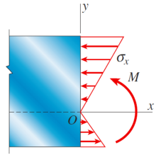

$$\sigma_x=-\frac{E y}{\rho}=-E \kappa y$$

弯矩与曲率的关系为：

$$\kappa=\frac{1}{\rho}=\frac{M}{E I}$$

挠度（deflection）符号为$v$，是梁上任意一点在$y$轴方向上的位移。

$$d s^2=d x^2+d v^2$$

$$\sin \theta=\frac{d v}{d s}$$

$$\cos \theta=\frac{d x}{d s}$$

小角度时：

$$\tan \theta=\frac{d v}{d x} \approx \theta$$

$$\kappa=\frac{1}{\rho}=\frac{M}{E I} = \frac{d \theta}{d s} \approx \frac{d \theta}{d x}=\frac{d^2 v}{d x^2}=v''$$

因此对于棱柱梁（$E I$恒定），可以写出挠度的微分方程（弯矩$M$，剪切力$V$，负载强度$q$）：

$$M=E I \frac{d^2 v}{d x^2}=E I v''$$

$$V=\frac{d M}{d x}=E I \frac{d^3 v}{d x^3}=E I v'''$$

$$-q=\frac{d V}{d x}=E I \frac{d^4 v}{d x^4}=E I v''''$$

对于非棱柱梁（$E I$不恒定），写出挠度的微分方程：

$$M=E I_x \frac{d^2 v}{d x^2}$$

$$\frac{d}{d x}\left(E I_x \frac{d^2 v}{d x^2}\right)=\frac{d M}{d x}=V$$

$$\frac{d^2}{d x^2}\left(E I_x \frac{d^2 v}{d x^2}\right)=\frac{d V}{d x}=-q$$

曲率的精确表达式：

$$\tan \theta=\frac{d v}{d x}$$

$$\kappa=\frac{1}{\rho}=\frac{d \theta}{d s}=\frac{d\left(\arctan v^{\prime}\right)}{d x} \frac{d x}{d s}$$

$$d s^2=d x^2+d v^2$$

$$\frac{d x}{d s}=\frac{1}{\left[1+\left(v^{\prime}\right)^2\right]^{1 / 2}}$$

省略复杂推导得：

$$\frac{d}{d x}\left(\arctan v^{\prime}\right)=\frac{v^{\prime \prime}}{1+\left(v^{\prime}\right)^2}$$

$$\kappa=\frac{1}{\rho}=\frac{v^{\prime \prime}}{\left[1+\left(v^{\prime}\right)^2\right]^{3 / 2}}$$

边界条件（形变图，易得$A$处并没有发生$y$轴上的位移，并且与支撑相连并固定不能发生角度改变）：

连续性条件（形变图，易得$A$处和$B$处并没有发生$y$轴上的位移，虽然与支撑相连但是能够发生角度改变）：

$R$为支撑力，$L$为总长度，$x$为离某端点长度，$q$为负载强度，如下图情况：

$$V(x)=R_A-q x=\frac{d M}{d x}$$

$$M=\frac{q L}{2}(x)-q x\left(\frac{x}{2}\right)=\frac{q L x}{2}-\frac{q x^2}{2}$$

$$E I v^{\prime \prime}=M=\frac{q L x}{2}-\frac{q x^2}{2}$$

$$E I v^{\prime}=\frac{q L x^2}{4}-\frac{q x^3}{6}+C_1$$

可知当$x=\frac{L}{2}$时满足$v' = 0$（$v$的最大值），可解得$C_1$，进而解得$v'$的表达式。根据边界条件可知满足$v(0)=0,v(L)=0$（$A$和$B$处均没有$y$轴方向位移），解得$v$的表达式：

$$0=\frac{q L}{4}\left(\frac{L}{2}\right)^2-\frac{q}{6}\left(\frac{L}{2}\right)^3+C_1$$

$$v^{\prime}=-\frac{q}{24 E I}\left(L^3-6 L x^2+4 x^3\right)$$

$$E I v=\frac{q L x^3}{12}-\frac{q x^3}{24}-\frac{q L^3 x}{24}+C_2$$

$$v=-\frac{q x}{24 E I}\left(L^3-2 L x^2+x^3\right)$$

$x=\frac{L}{2}$时的挠度$v$一般用$\delta_C$表示，如图情况下可以通过对称或计算得到恰好为最大挠度$\delta_{max}$：

$$v'(\frac{L}{2})=0$$

$$\delta_{max}  = |v(\frac{L}{2})| = |\delta_{C}|$$

$A$和$B$处的弯曲角度等于对应位置时的$v'$的值（$v'$有正负，角度不需要，所以需要调整正负）：

$$\tan \theta=\frac{d v}{d x}=v' \approx \theta$$

$$\begin{aligned} & \theta_A=-v^{\prime}(0)=\frac{q L^3}{24 E I} \\ & \theta_B=v^{\prime}(L)=\frac{q L^3}{24 E I}\end{aligned}$$

其他情况（包括支撑和负载的不同，不逐个列举）下的$v,v',\delta_{max},\theta$也可以使用上述流程进行推导。

可以使用叠加法计算梁的挠度，那么如果同时存在集中载荷$P$和分布载荷$q$，则$\delta_C$为：

$$\delta_c=v_p+v_q$$

对于不规则形状的分布载荷$q$，同样可以对其进行拆分后相加：

$$\delta_c=v_{q1}+v_{q2}$$

超静定（静不定）情况下，不能仅靠以上的静力学推导来得到梁的挠度了。判定是否超静定，则需要计算超静定度（$超静定度 = 未知支撑力/力矩数 - 3$），大于零则为超静定情况。

多出来的未知支撑力有可能是静态冗余（static redundants），是非必要的，此时这个结构称为释放结构（released structure）。静态冗余的判定需要结合外部负载来确定。

未知$M_A,R_A,R_B$，将$R_B$视为冗余，获得释放结构，构建等式$F_x,F_y$：

$$R_A=q L-R_B$$

$$M_A=\frac{q L^2}{2}-R_B L$$

$$M=R_A x-M_A-\frac{q x^2}{2}$$

$$E l v^{\prime \prime}=M=q L x-R_B x-\frac{q L^2}{2}+R_B L-\frac{q x^2}{2}$$

$$E l v^{\prime}=\frac{q L x^2}{2}-\frac{R_B x^2}{2}-\frac{q L^2 x}{2}+R_B L x-\frac{q x^3}{6}+C_1$$

$$E l v=\frac{q L x^3}{6}-\frac{R_B x^3}{6}-\frac{q L^2 x^2}{4}+\frac{R_B L x^2}{2}-\frac{q x^4}{24}+C_1 x+C_2$$

根据支撑有边界条件：

$$v(0)=0 \quad v^{\prime}(0)=0 \quad v(L)=0$$

即可解得$R_B,R_A,M_A,V,M,v,v'$的表达式。然后求最大挠度：

$$v'(x_1)=0$$

$$\delta_{max}=-v(x_1)$$

$$\theta_{B}=v'(L)$$

可以使用叠加法计算超静定情况下的梁的挠度（如图情况，$B$处原本无挠度，则有$\delta_{B}=0$）：

挠度公式可以通过查表得：

$$\begin{aligned} & v_1=-\frac{q x^2}{24 E I}\left(6 L^2-4 L x+x^2\right) \\ & v_2=\frac{R_B x^2}{6 E I}(3 L-x)\end{aligned}$$

$$v=v_1+v_2=-\frac{q x^2}{48 E I}\left(3 L^2-5 L x+2 x^2\right)$$

$$\left(\delta_B\right)_1=\frac{q L^4}{8 E I} $$

$$\left(\delta_B\right)_2=\frac{R_B L^3}{3 E I}$$

$$\delta_B=\left(\delta_B\right)_1+\left(\delta_B\right)_2=0$$

$$R_B=\frac{3 q L}{8}$$

角度也可以使用叠加法进行计算（如图情况，$M_A$为冗余的，进行结构简化后，再计算被简化的冗余力/力矩$M_A$的影响，角度公式也是查表可得）：

$$\theta_A=\left(\theta_A\right)_1-\left(\theta_A\right)_2=0$$

$$\left(\theta_A\right)_1=\frac{q L^3}{24 E I} \quad\left(\theta_A\right)_2=\frac{M_A L}{3 E I}$$

$$\theta_A=\frac{q L^3}{24 E I}-\frac{M_A L}{3 E I}=0$$

## 课后例题详解

### 补充

胡克定律（Hooke's law）（$\sigma=E \varepsilon$）在剪切应变上的形式：

应力和应变成线性关系：

$$\tau=G \gamma$$

其中$G$为剪切弹性模量/刚性模量（shear modulus of elasticity / modulus of rigidity）。

$$G=\frac{E}{2(1+v)}$$

其中$E$为杆的弹性模量/杨氏模量。$v$为泊松比，为一条杆发生应变时的侧向应变与轴向应变的比值的负值。

轴力图（axial-force diagram，AFD）：

AFD其实就是$x-N(x)$图像，将轴向内力$N$随杆长度$x$变化而变化（有轴向负载的情况下）显示出来的图像。

轴力图基于$q(x)$和$N(x)$之间的积分和微分的关系构建。

$$\frac{d N(x)}{dx}=-q$$

$$- \int_0^x q=N(x)$$

轴力图（AFD）和轴向位移图（axial displacement diagram，ADD）：

虽然轴向力$P$在同一段杆中恒定（如图AFD）注意伸长量$\delta$与其隔离出来的杆的长度$L$有关，因此伸长量$\delta$会随着长度$L$的变化而变化（如图ADD）。因此"某一点"的伸长量其实就是从末端到这一点之间的杆被隔离出来时的总体伸长量（没有"某一点"的伸长量，只有"某一段"的伸长量）。

热对应变的影响：

有热应变（thermal strain）：

$$\varepsilon_T=\alpha(\Delta T)$$

其中$\alpha$为热膨胀系数（thermal expansion）。

则热应力（thermal stress）为：

$$\sigma=E \varepsilon_T=E \alpha(\Delta T)$$

温度和伸长量/位移的关系：

$$\delta_T=\varepsilon_T L=\alpha(\Delta T) L$$

### 理论总结1

正弦定理：

$$\frac{a}{\sin A}=\frac{b}{\sin B}=\frac{c}{\sin C}$$

余弦定理：

$$\cos C=\frac{a^2+b^2-c^2}{2 a b}$$

$$c^2=a^2+b^2-2 a b c o s C$$

关于参考方向（求出值的大小为负，则实际方向与参考方向的方向相反，否则与参考方向的方向相同）：

注意支撑的反作用力和对于每个点的力矩都应当设定参考方向（反作用力一般水平向右为$x$轴分量参考方向，垂直向上为$y$轴分量参考方向，力矩则没有一般的惯例参考方向）。

对于二力杆件的内部轴向力，则一般设定参考方向为收缩（compression）方向，与收缩相对的是拉伸（tension）方向。二力杆件收缩时，两端的轴向力参考方向指向杆件的中点，又因为二力杆件两端的轴向力的大小相等方向相反，因此一般以符合水平向右和垂直向上的方向的轴向力分量在实际计算中中加上正号，符合水平向左和垂直向下的方向的轴向力分量在实际计算中加上负号，如果计算得到轴向力的值为负数，则此二力杆件实际上是拉伸，两端的轴向力的实际方向指向远离杆件的中点的方向。

合力矩定理：

在平面力系中，合力对平面内任意一点的力矩，等于其所有分力对于同一点的力矩的代数和。

关于支撑的反作用力（支座反力）和施加到系统中的力系（由全部外力组成，不包含支撑的反作用力）的区别：

0.系统平衡时，系统中每一点处，包括支撑点，均满足力平衡，也就是满足$\sum F_x=0 , \sum F_y=0$，均满足对于某一点处的力矩平衡，也就是满足总力矩$\sum M=0$。

1.当求施加到系统中的力系对于$A$点处的合力和力偶，则只需要把所有外力相加作为对于$A$点处的合力，根据合力矩定理求得此合力的等效力矩$\sum M_{A-ext}$（一般不为0），并根据此合力的方向和$M=Fd$来求得此合力的作用线，确定力偶。（与支撑无关）

2.当求某一个支撑的反作用力，如果有多个支撑存在，则施加到系统中的力系对于此支撑点$A$处的合力矩$\sum M_{A-ext}$（一般不为0），与其他支撑的反作用力对于此支撑的合力矩相加，才是所有力对于此支撑点处的总力矩$\sum M_A$（系统平衡时为0）。（同时与支撑和施加到系统中的力系有关）

3.当使用截面法时，系统平衡，一般要对某一个点$B$点列出总力矩为0的表达式来求未知的二力杆件内部轴向力，$\sum M_B=0$。

以上用法都需要求对于某点的力矩（合力矩和总力矩），但是适用场景是不同的。

### 例题总结1

桁架（truss）结构，杆件均为二力杆件，只能传递轴向力，不能传递力矩：

求桁架系统中的力系（force system）在某一点处的等效合力（resultant force）和力偶（couple）。通过求外力的合力，可以获得外力的合力在此点处的力偶。通过求力偶对于此点的力矩（系统在平衡状态下处处总力矩为0），可以获得外力的合力的作用点。

根据力平衡求合外力$R$的分量：

$$\begin{aligned} & F_{R x}=\Sigma F_x=70.7kN \\ & F_{R_y}=\Sigma F_y=-108.9kN \end{aligned}$$

根据力偶的定义，可知合力$R$在任意一点处的力偶，在大小和方向上均等于$R$本身，因此可得：

$$\overrightarrow{R_A}=\overrightarrow{R}=\{70.7 \vec{i}-108.9 \vec{j}\} \mathrm{kN}$$

$$R_A=\sqrt{F_{R_x}^2+F_{R_y}^2}=129.8 \mathrm{kN}$$

接下来通过合力矩定理，可以求得合力$R$的作用点与$A$点的最短距离$d_A$：

$$M_{R_A}=\sum M_A=-50 \times 2-75 \times 6-3.5 \times 2-24.7 \times 2 \times \frac{3}{4}-46.0 \times 2 \times \frac{3}{4}=-545 kN \cdot m$$

$$\vec{M}_{R_A}=\{-545 \vec{k}\} \mathrm{kN} \cdot \mathrm{m}$$

$$M_{R_A}=d_A \cdot R_A , \quad d_A = 4.2 m$$

如果$R$在水平方向上的分量作为合力，垂直方向上的分量不提供力矩，那么可以求其作用点与$A$点的垂直距离$y_A$：

$$\frac{d_A}{y}=\frac{F_{R x}}{R_A}, \quad y_A=7.71m$$

最终，合力$R$的作用点可处于其作用线（力矩大小不变的情况下，合力$R$的作用点可以在作用线上任取）与点$A$的最短距离$d_A$处，也可以处于点$A$正上方距离$y_A$处（也在作用线上），两种情况是等效的。

框架（frame）由杆件和关节组成，杆件均为多力杆件，也称为梁（beam），能传递轴向力、剪向力、力偶：如果求框架中的力系（force system）在某一点处的等效合力、力偶、作用点位置等，方法与桁架系统一致。

包含区域负载，求支撑的反作用力（reactions），使用隔离体图（free-body diagram，FBD）：

区域负载可以等效为作用于区域中心点的一个合力，其值等于负载强度的总面积$\frac{1}{2} 400 N / m$乘以区域长度$(3+3) m$，隔离体图：

上图所示，系统平衡，支撑$A$和$B$处力矩均为零，根据力矩平衡和力平衡写出足够数量的方程组解得支撑的反作用力：

$$\sum M_A=0, \; \frac{1}{2}(400)(6)(3)-N_A\left(\frac{4}{5}\right)(6)=0$$

$$\sum M_B=0, \; B_y(6)-\frac{1}{2}(400)(6)(3)=0$$

$$\sum F_x=0, \; 750\left(\frac{3}{5}\right)-B_x=0$$

### 例题总结2

包含特定物体的力分析（对物体内部也进行力平衡和力矩平衡）：

通过圆形的力平衡方程、引脚支撑$A$和圆形的力矩平衡方程，可以解结构。

对于判断是否先发生滑动的情况，应当假设其中一种或者一个面先滑动，然后通过力矩平衡来求得当前另外所有情况此时的摩擦力，比较最大摩擦力来验证假设是否正确。

节点法（桁架）：

注意，如果是桁架结构，杆件均为二力杆件，那么支撑即使可以有水平和垂直两个方向的反作用力，但是如果对支撑所在的那个节点使用节点法分析，如果缺少了某一分量方向那么在这个方向上无法平衡，因此支撑的反作用力在这个方向上的分量一定为0：

对节点$A$进行分析，可得$\sum F_x=0,\sum F_y=0$，而二力杆件只能传递轴向力，因此节点$A$在$y$方向上的力只有支撑$A$的$y$方向上的反作用力，因此可直接得$A_y=0$。

然后依次对每个节点分析，可以获得所有杆件的内部轴向力的大小。

截面法（桁架）：

截面法也是用来求杆件的内部轴向力的大小的，用于求少数几个感兴趣的杆件轴向力时使用，需要用到总力矩为0来列式子，并且截面必须是一个无限延伸的"面"：

截面法巧妙地利用共线力不提供力矩的性质，避开未知的杆件轴向力和角度，来求得目标杆件轴向力：

三维空间桁架：

和二维情况类似的，有力平衡和力矩平衡，但是力矩平衡的形式变成了以平面整体的力矩计算（也需要有参考方向）：

难点在于，要找到一个能够同时表示目标非零的未知量和已知量，而且能够忽视其他未知非零的未知量的店，然后对于此点满足力矩平衡，力矩的作用点均视作投影到对应平面。

$$\sum M_x=0,\sum M_y=0,\sum M_z=0$$

对$C_x$和$A_z$方向的交点作力矩平衡（使未知量$C_x$和$A_z$的力矩为0）：

$$M_y: (P \cdot 3L)+(2P \cdot 2L)+(3P \cdot 3L)-(B_x \cdot 4L)=0$$

解得一个未知量后就很好解了。

框架：

对于这种多形状的多力杆件，并且未知支撑的反作用力，因此根据引脚（而不是支撑）杆件来分离整个框架，并且分别画出每个杆件的隔离体图：

根据系统平衡，引脚处应当满足力平衡合力为0，但是在求引脚对其连接的两条梁分别施加的力时，可视作引脚对其连接的两条梁同时施加水平方向和垂直方向分量的力（因为是多力杆件，力的方向不确定），四个分量的合力为0，水平方向分量的参考方向一般为"拉伸"情况，且垂直方向分量的参考方向倾向于与水平方向的箭头重合。

复合梁（compound beam）框架：

从外力末端向支撑末端逐次分析，一次仅对一个杆件（一个杆件为两个引脚/最接近末端支撑之间的部分，不能是引脚和普通支撑之间）进行分析，因此上图分为$AB,BD,DE$。

对复合梁的引脚处拆分，对连接的两条梁，水平方向的参考方向一般为互相指向，垂直方向的参考方向则一般为左边向下右边向上，两两方向相反的分量大小相等。

对每一个杆件逐次进行力平衡和力矩平衡分析：

### 理论总结3

对于负载杆相关的题目，应当先把所有的力和力的参考方向都标出来，特别是支撑的反作用力。注意负载$P$一般单位是力不是压强。

伸长量需要所在段的轴向内力和长度，每一段的轴向内力大小等于这一段切开后任意一边的负载大小，某一点的伸长量等于此点与其起点末端每一段的伸长量。段的定义则是每两个负载作用点或末端（外力为零的末端也算）之间为一段。

末端和负载其实都可以看作负载（只有单末端时，而根据力平衡，末端的负载的值是此末端以外的负载的总和），求切开的某一段的轴向内力只需要将其从中间切开，然后分析。但是注意，在系统平衡状态下，杆内部每个点和截面都达成了力平衡$\sum F=0$，我们求的只是沿着截面切开后两端各自受到的大小相等方向相反的轴向内力。

沿截面切开后的左半边杆受到一个等效总负载$F_{左}$（包括左半边上的端点所受负载力/末端的反作用力）。右半边杆受到一个等效总负载$F_{右}$（包括右半边上的端点所受负载力/末端的反作用力）。因为轴向内力相互抵消，应当是切开的两个截面各有一个大小相等方向相反的轴向内力$F_1$和$F_2$，可得$F_{左}=F_{右}=F_1=F_2$。（伸长量的正负号的判定看参考方向，由力的方向导致当前段是拉伸还是压缩）

众所周知，满足了力平衡的整体，取出的每一个小部分也应当是满足力平衡的（例如从左边开始往右截取，那么截取切面也只有属于左边的轴向内力，其方向指向右边，且其大小等于截取段的左边总负载）。从哪边开始截，截到最后结果都一样，都是整段的两端受力，因此根据计算的方便性来选取固定截取方向即可。

纯法向应力中的应力和应变随角度的变化：

$$N=P cos \theta$$

$$V=P sin \theta$$

$$A_{\text {incline }}=\frac{A_{\text {cross }}}{\cos \theta}$$

$$\sigma_\theta=\frac{N}{A_{\text {incline }}}=\frac{P}{A_{\text {cross }}} \cos ^2 \theta$$

$$\sigma_\theta=\sigma_x \cos ^2 \theta=\frac{\sigma_x}{2}(1+\cos 2 \theta)$$

$$\tau_\theta=-\frac{V}{A_{\text {incline }}}=-\frac{P}{A_{\text {cross }}} \sin \theta \cos \theta$$

$$\tau_\theta=-\sigma_x \sin \theta \cos \theta=-\frac{\sigma_x}{2}(\sin 2 \theta)$$

注意：分析切面的应力不是真正的切开，而是以此假设的斜截面来分析此斜截面上所受的应力。一整条梁的每个切面都会同时受到法向应力$\sigma$和剪切应力$\tau$，但是大小不同罢了，因此对于整条梁来说，有最大/最小的法向应力和剪切应力。

### 例题总结3

求弹性模量：

法向应力：

$$\sigma=\frac{P}{A}$$

$$\sigma=\frac{P}{A}=\frac{40\left(10^3\right)}{437.5\left(10^{-6}\right)}=91.43\left(10^6\right) \mathrm{N} / \mathrm{m}^3=91.43 \mathrm{Mpa}$$

法向应变：

$$\varepsilon=\frac{\delta}{L}$$

弹性模量：

$$E=\frac{\sigma}{\varepsilon}$$

求$B,D,E$点处的伸长量：

$$N_{AB}=-P_B+P_C+P_E$$

$$N_{BC}=P_C+P_E$$

$$N_{CD}=P_E$$

$$N_{DE}=P_E$$

$$\delta_B=\frac{N_{AB}L_1}{E A_1}$$

$$\delta_ \mathrm{C}=\delta_{\mathrm{B}}+\frac{\mathrm{N}_{\mathrm{BC}} \frac{\mathrm{L}_2}{2}}{\mathrm{E} \cdot \mathrm{A}_2}$$

$${\delta_D}=\delta_{\mathrm{C}}+\frac{\mathrm{N}_{\mathrm{CD}} \frac{\mathrm{L}_2}{2}}{\mathrm{E}_2 \mathrm{~A}_2}$$

$$\delta_{\mathrm{E}}=\delta_{\mathrm{D}}+\frac{\mathrm{N}_{\mathrm{DE}} \mathrm{L}_3}{\mathrm{E} \cdot \mathrm{A}_3}$$

求合适的负载$P$造成伸长量保持力平衡：

负载$P$使得$AC$杆伸长$\delta_1$，伸长量超过$s$使得末端$B$与右边产生反作用力，造成$AB$杆缩短$\delta_2$，满足$\delta_1 - \delta_2 = s$。末端$B$处反作用力为$R_B$（方向向左），末端$A$处反作用力为$R_A$（由$R_B$方向可知一定也方向向左），由平衡状态可知杆内处处有力平衡$P=R_A+R_B$，因此易得$R_A=R_B$。

$$\frac{2 P L}{3 E A}-\frac{R_B L}{E A}=s$$

$$R_A=R_B , P=2R_B$$

轴向应变与径向应变与泊松比：

$$\varepsilon'=\frac{\delta}{d}$$

$$\varepsilon=\frac{\delta}{L}$$

$$v=-\frac{\varepsilon'}{\varepsilon}$$

超静定情况下求支撑的反作用力：

求$R_A$和$R_D$，从力平衡、伸长量、轴向力关系入手。

$$P_B+R_D-P_C-R_A$$

$$\delta_{A D}=\delta_{A B}+\delta_{B C}+\delta_{C D}=0$$

$$R_A-R_D=P_B-P_C$$

求最大剪应力：

$$\sigma_x=\frac{P}{A}$$

$$\tau_{max}=\frac{\sigma_x}{2}$$

旋转45°（取得最大）的单元的应变和剪应力：

$$\tau_{x y 1 y 1}=\tau_{\max } \quad \sigma_{x 1}=\frac{\sigma_x}{2} \quad \sigma_{y 1}=\sigma_{x 1}$$

旋转$\theta$的单元的应变和剪应力：

$$\sigma_\theta=\sigma_s \cos (\theta)^2$$

$$\sigma_y=\sigma_x \cos \left(\theta+\frac{\pi}{2}\right)^2$$

$$\tau_\theta=\frac{-\sigma_x}{2} \sin (2 \theta)$$

### 理论总结4

纯剪切中的应力和应变随角度的变化（用$\tau$表示）：

$$\sigma_{\theta}=\tau sin 2\theta$$

$$\tau_{\theta}=\tau cos 2\theta$$

纯扭矩，求捻度角：

和负载杆分析类似的，圆柱/圆管的每两个负载作用点/支撑为一段，段内扭矩也是需要截面切分开并取其中一边的总力矩，捻度角计算需要的是段内扭矩，但也可以通过叠加法直接通过负载计算。$T$为负载力矩，$d$为力偶作用点距离，$L$为段距离，$I_p$为极惯性矩（也可以用$J$表示），$I$为惯性矩（二次矩），$Q$为一次矩，$GI_p$为抗扭刚性（torsional rigidity），$\gamma$为剪切应变，$\tau$为剪切应力，$\sigma$为法向应力，$\varepsilon$为法向应变，$r$为圆柱外部半径，$\rho$为圆柱内部某点，$\phi$为捻度角（twist）（计算出来为弧度制，需要乘$\frac{180^{\circ}}{\pi}$），$\theta$为捻度角的变化率：

$$T=Pd$$

$$\gamma_{max}=r\frac{d\phi}{dx}=r\theta=\frac{r \phi}{L}$$

$$\gamma_{\rho}=\frac{\rho}{r} \gamma_{max}$$

$$\phi=\frac{T L}{G I_p}$$

$$\theta=\frac{d \phi}{d x}=\frac{T}{G I_p}$$

$$\tau_{max}=G \gamma_{max}=\frac{T r}{I_p}$$

在纯扭矩情况下：

$$\sigma_{max}=\tau_{max}$$

$$\varepsilon_{max}=\frac{\gamma_{max}}{2}$$

注意：即使是在平衡状态下，捻度角也可能不为0，这和伸长缩短量的性质是类似的。

如果满足超静定，求伸长量则两支撑反作用力大小相等$R_A=R_B$。拈度角两末端恒相等$\phi_A=\phi_B$，如果满足超静定，则两末端拈度角均为零，$\phi_A=\phi_B=0$。

梁，曲率半径为$\rho$，半径夹角$\theta$，夹角对应的弧长$s$：

有曲率公式：

$$\kappa=\frac{1}{\rho}=\frac{\theta}{ds}$$

在挠度很小的情况下满足$d s \approx d x$因此有：

$$\kappa=\frac{1}{\rho}=\frac{\theta}{dx}$$

因此有：

$$\theta=\frac{dx}{\rho}$$

如果单边弯曲梁计算挠度$\delta$，则通过几何推导有：

$$\delta=\rho (1-cos \theta)=x \cdot tan(\frac{\theta}{2})$$

中性层（neutral surface）：材料在弯曲过程中，外层受拉伸，内层受挤压，在其断面上必然会有一个既不受拉，又不受压的过渡层，应力几乎等于零，这个过渡层称为材料的中性层。中性层在弯曲过程中的长度和弯曲前一样，保持不变。中性层是计算弯曲件展开长度的基准。另外，中性层与横截面的交线称为中性轴（neutral axis）。由其性质，可知中性轴上的点满足正应力为零。

纯弯曲梁的截面纵向（longitudinal）长度变化产生纵向法向应变$\varepsilon_x$（也就是梁沿长度方向发生的应变）。设一个面距离中性面距离为$y$，此面产生的纵向法向应变与曲率的关系（通过几何推导，延伸为正，缩短为负）：

$$\varepsilon_x=\frac{\Delta L}{L}=\frac{y}{\rho}=\kappa y$$

$$\rho=\frac{y}{\varepsilon_x}$$

弯矩是截面法向力相对于中性面的力矩（棱柱则$EI$不变）：

$$d M=-\sigma_x y d A$$

$$M=-\int_A \sigma_x y d A=\int_A \kappa E y^2 d A=\kappa E I$$

$$\kappa=\frac{1}{\rho}=\frac{M}{E I}$$

用弯曲公式计算的应力$\sigma_x$称为弯曲应力（bending stresses）或弯曲应力（flexural stresses）：

$$\sigma=E \varepsilon_x$$

$$\sigma_x=\frac{M y}{I}$$

对整条梁分析内部弯矩，在垂直方向上负载$q$均匀分布的情况：

$x$点处的隔离体图分析，求剪切力$V$和弯矩$M$均是以$x$点处分析：

支撑反作用力：

$$R_A=R_B=\frac{q L}{2}$$

剪切力（剪切应力为$\tau=\frac{V}{A}$）：

$$V(x)=R_A-q x=\frac{q L}{2}-q x$$

$$M(x)=R_A x-q x\left(\frac{x}{2}\right)=\frac{q L x}{2}-\frac{q x^2}{2}$$

$$\frac{dM}{dx}=V$$

$$M_{max}=M(V=0)=\frac{qL^2}{8}$$

对于截取出的单元而言，施加于其横截面积$dA$上的剪切应力为：

$$\sigma_1 d A=\frac{M y}{I} d A$$

$$F_1=\int \sigma_1 d A=\int \frac{M y}{I} d A$$

$$F_2=\int \sigma_2 d A=\int \frac{(M+d M) y}{I} d A$$

与$\tau$同向的剪向力合力（也就是$V$）：

$$F_3=\int \frac{(M+d M) y}{I} d A-\int \frac{M y}{I} d A=\int \frac{(d M) y}{I} d A$$

那么设梁的宽度为$b$，则根据应力的定义，剪切应力$\tau$和$F_3$满足：

$$F_3=\tau dA=\tau \cdot b \cdot d x=\frac{dM}{I} \int y dA$$

$$\tau=\frac{F_3}{b \cdot dx}=\frac{d M}{d x}\frac{1}{I b} \int y d A$$

$$Q=\int y dA$$

$$V=\frac{dM}{dx}$$

$$\tau=\frac{V Q}{I b}$$

截面模量（section moduli）：用$S$表示，它将截面的转动惯量$I$与物体到其中性面的最远距离$c$联系起来。

$$S=\frac{I}{y}$$

$$\sigma=\frac{M}{S}$$

$$\sigma_{max}=\frac{M_{max}}{S}$$

对于矩形截面的二次矩和截面模量（$h=2y$，中性面横穿过中心点）：

$$I=\frac{b h^3}{12} \quad S=\frac{b h^2}{6} \quad Q=\frac{b}{2} (\frac{h^2}{4}-y^2)$$

$$I_P=\frac{b h}{12}\left(h^2+b^2\right)$$

$$\tau_{\max }=\frac{V_{max} h^2}{8 I}=\frac{3 V_{max}}{2 A}$$

对于圆形截面的二次矩和截面模量：

$$I=\frac{\pi d^4}{64} \quad S=\frac{\pi d^3}{32}$$

$$I_p=\frac{\pi r^4}{2}$$

对于圆管：

$$I_p=\frac{\pi}{2}(r^4-r_{内}^4)$$

### 例题总结4

求末端$A$处的捻度角：

$$\phi_{B}=\phi_{A}=\sum \frac{T L}{G I_p}=\frac{1}{G I_p}\left(T_{A D} L_{A D}+T_{D C} L_{D C}+T_{C B} L_{C B}\right)=\frac{1}{G I_p}[(-800)(0.6)+(-1000)(0.6)+(-600)(0.3)] \neq 0$$

超静定情况，需要使用捻度角，求绝对最大剪应力：

使用叠加法（直接通过负载以及其位置获得捻度角，而不是通过每段的内部力矩来获得捻度角）：

$$T_A+T_B-500-200=0$$

$$(\phi_A)_T=\frac{500 \times (1.5+1)}{GJ}+\frac{200 \times 1}{GJ}$$

$$(\phi_A)_{T_A}=\frac{T_A \cdot 3.5}{GJ}$$

$$\phi_A=\phi_B=0$$

$$\phi_A=(\phi_A)_{T_A}-(\phi_A)_T$$

最大剪应力在内部力矩最大的段$AC$取得：

$$\tau_{abs max}=\frac{T_{AC} \cdot r}{I_p}=\frac{T_{A} \cdot r}{I_p}$$

悬臂梁的挠度：

梁$AB$的自由端受到力矩$M_0$的作用，梁弯曲后的长度为$L$，顶面的纵向法向应变为$\varepsilon$，顶面到梁的中性面的距离为$c$，求曲率半径$\rho$，曲率$k$，垂直挠度$\delta$。最大应变下的梁的厚度$h_{max}$和垂直挠度$\delta$。

$$\rho=\frac{c}{\varepsilon}$$

$$k=\frac{1}{\rho}$$

$$\theta=\frac{L}{\rho}$$

$$M_{0,allow}=E (\frac{bh^3}{12})k$$

$$\delta=L \cdot tan(\frac{\theta}{2})=\rho(1-cos \theta)$$

$$c_{max}=\rho \varepsilon_{allow}$$

$$h_{max}=2 \cdot c_{max}$$

求梁的最大弯曲应力$\sigma_{max}$：

$$M_{max}=\frac{qL^2}{8}$$

$$S=\frac{I}{y}=\frac{I}{\frac{h}{2}}$$

$$\sigma_{max}=\frac{M_{max}}{S}$$

给定最大允许的法向应力和剪切应力，求支撑的反作用力，梁的最大允许负载：

$$M_{max}=\frac{\sigma_{max} I}{\frac{h}{2}}$$

$$V_{max}=\frac{2}{3} \tau_{max} b \cdot h$$

$$\sum M_A=0$$

然后列出$V(x)$和$M(x)$在$AB$段内和$BC$段内的表达式，根据约束条件，判断最大允许负载$q$应当取的值。

### 求桁架杆件和支撑的力

求稳定且静定的桁架的杆件上的力（注意杆件只能传递轴向力）：

a.在求杆件的内力前，先求支撑的反作用力：

画出整个结构的隔离体图，联立平衡方程，以满足整体外部平衡（external equilibrium）。注意所有支撑的每个力和力矩都有参考方向，实际求出为负则与参考方向相反。

$$\sum F_{{ext-x}}=0$$

$$\sum F_{{ext-y}}=0$$

$$\sum M_{ext}=0$$

其中求外力矩$M_{ext}$之和可以任取一个或多个有外力作用的关节点作为旋转轴心（多个是为了能凑够方程组）。

注意：如果求一个外力关于旋转轴心的力矩（注意此外力必须和此旋转轴心有物理上的实际连通路径，无论路径如何），且它们不能直接通过杆件相连，则可以直接使用力矩的定义，寻找经过此外力作用点的直线，然后作旋转轴心与此直线的垂线，垂线的长度乘以此外力沿着这条直线的分量，即为此外力关于此旋转轴心在此分量方向上的的力矩。外力和支撑的水平分量和竖直分量的力矩是相互独立的，计算时要当作两个力矩来计算（因为本来就是一整个力分成分量）。要求一个外力关于旋转轴心的力矩，需要对$F_x$和$F_y$都进行一次上述求力矩步骤获得力矩分量，并把两个分量方向上的力矩分量相加即为此外力关于此旋转轴心的总力矩。（这个可以通过画出一个直角三角形来推导）

注意：如果是三维情况，则在一个平面（例如x-y平面，此时力矩平衡使用$\sum M_{z}=0$表示）上取一点作旋转轴点，对不处于此平面的点上的力，则视作其这些力作用于这个点在此平面上的投影点，大小方向不变（与当前平面垂直方向的力则视作零）。

注意：现在是以整体的隔离体图来作分析，因此以某一点（这一点倒是可以取整体结构内部的点）作为旋转轴点作力矩分析时，参与分析的力仅包含外力，也就是直接作用于整个结构的外力和整个结构的所有支撑提供的反作用力，不包含结构内部的内力。也就是说，这其实本质上是一种另类的截面法，且把除了有外力作用的点和整个结构的支撑点之外全部隔开。

接下来就可以求杆件的内力了，有两种方法：

b.关节法/节点法（method of joint）：

求杆件力：在每个关节处满足：

$$\sum F_{x}=0$$

$$\sum F_{y}=0$$

$$\sum M=0$$

而有些时候，也可以仅沿着某一杆件的方向$\alpha$列出：

$$\sum F_{\alpha}=0$$

节点法一般使用力平衡，比较少使用力矩平衡。

c.截面法（method of section）：

当桁架中只对少数几个杆件的力感兴趣时，常采用截面法。

对平面桁架进行截面，以获得单独的隔离体图，从而得到杆件的内力。截面必须完全穿过桁架，并标出杆件的内力。杆件的内力用箭头指向远离被切割的杆件的方向，以表示被切割杆件的假定张力。

如果整个结构处于平衡状态，那么任何部分也必须处于平衡状态。截面切割的任何一边都可以被分析为一个独立的平衡的隔离体图。（与切割面最近的节点受被切割部分的内力使用未知的内力表示）。

未被截面切割成两半（研究部分中仍是完整的杆件）和被截面隔开的其他部分（切割后灰色的隔离部分）的所有成员均不参与平衡分析（包括从被截面隔开部分的点来看的力矩平衡分析）。再用力平衡和力矩平衡方程（一般是力矩）求解未知内力。

对复合梁（compound beam）框架的分析：

一次仅对其中一段（一段为两个连接之间的部分，不能是支撑和连接之间）列平衡方程（包括力矩也是仅这一段里的力，取其中一个端点作旋转轴点即可），不考虑其左右两段的所有影响：

对每一段都列平衡方程：

注意每一段的连接处（非支撑），假设方向一般为左边向下右边向上，然后内力方向则互相指向。（假设方向不变，求得负数则实际与假设相反）如果是如图的支撑，则只有向上的力，没有水平方向的力。

### 静定与超静定的轴向伸长量计算

伸长量需要轴向内力，每一段的轴向内力大小等于这一段切开后任意一边的负载大小。段的定义则是每两个负载/末端（外力为零的末端也算）之间为一段。

末端和负载其实都可以看作负载（只有单末端时，而根据力平衡，末端的负载的值是此末端以外的负载的总和），求某一段的轴向内力只需要将其从中间切开（满足力平衡下，每一段的每一个点内力相同，因此只要不是从端点切开就行），然后分析。

切开后的左半边受到一个等效总负载$F_{左}$（包括左半边上的端点所受负载力/末端的反作用力）。右半边受到一个等效总负载$F_{右}$（包括右半边上的端点所受负载力/末端的反作用力）。因为轴向内力相互抵消，应当是切开的两个截面各有一个大小相等方向相反的轴向内力$F_1$和$F_2$，可得$F_{左}=F_{右}=F_1=F_2$。（伸长量的正负号的判定看力的方向导致当前段是拉伸还是压缩）

众所周知，满足了力平衡的整体，取出的每一个小部分也应当是满足力平衡的（例如从左边开始往右截取，那么截取切面也只有属于左边的轴向内力，其方向指向右边，且其大小等于截取段的左边总负载）。从哪边开始截，截到最后结果都一样，都是整段的两端受力，因此根据计算的方便性来选取固定截取方向即可。

### 剪切应力的方向问题

注意：分析切面的应力不是真正的切开，而是以此假设的斜截面来分析此斜截面上所受的应力。一整条梁的每个切面都会同时受到法向应力$\sigma$和剪切应力$\tau$，但是大小不同罢了。因此对于整条梁来说，有最大/最小的法向应力和剪切应力。

一整条梁的每个切面都会同时受到法向应力$\sigma$和剪切应力$\tau$。上图的剪切应力$\tau$是对于切面$pp_1$而言的，而对于切面$pp_1$来说，$\sigma_1$和$\sigma_2$的合力即为剪向力$V$，$\tau=\frac{V}{A}$。而切面$pp_1$不存在法向方向（切面$pp_1$的法向方向为$y$轴方向）的外力，因此$\sigma_y=0$。

更准确的说，不是每个切面，而是每个切面的每一块$dA$都会同时受到法向应力$\sigma$和剪切应力$\tau$（但是大小不同）。如上图，很明显的，在切面$mn$上，$m$点的$dA$和$n$点的$dA$所受的应力明显是不同的，因为以$m$点所属的$dA$为横截面的的棱柱被拉伸为$mp$段，而以$n$点所属的$dA$为横截面的棱柱被拉伸为$nq$段，而又因为它们的材料相同，因此棱柱$mp$和棱柱$nq$所受的法向应力$\sigma_x$一定不同。

