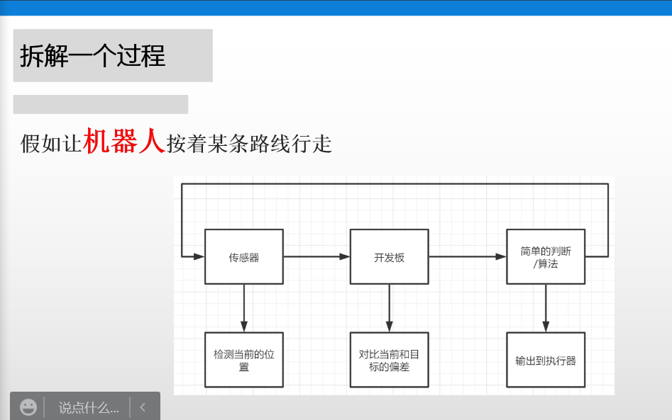

本节课英语单词：

peer   同辈

sensor   传感器；敏感原件

XX-scale   XX n.级别；规模；范围；程度；等级体系：vt.攀登；到达...顶点

***

本节课英语单词：

audience   观众

category   类别

awareness   意识；认知

integrity   s.（）    完整性；诚信；正值

audience profile sheets    s.观众的档案表

readability   可读性

collaborative   共同的；合作协作的

images   s.图像；映像；影像   n.偶像；肖像   v.反映；想象；象征

multimedia    多媒体

apply   s.应用；使用；申请

salary   工资

carry out   进行

mechanism   机理；机制；机械装置；机件；机构

primary   重要的；初级的

approve   赞同；批准

hostile   敌对的

skim   s.浏览；略读    v.撇去

modify   s.修饰；修改   v.调整；缓和；变更

submit   s.提交

implement   n.工具；手段   v.执行；实施；使生效

appendix   附录

reusable（reuse）   可再用的

considerate   体贴的

racist   种族主义者

intellect   智力

undertake   承诺

credit   信用

memo   备忘录

volt   伏特

本节课所学定义：

***

本节课英语单词：

memorandum   n.协议备忘录；建议书

backup plan   s.备用计划

innovation(innovative)   s.创新；革新的

process   s.处理

objective   s.客观的   n.目的

proposal   s.提案

informational   s.信息的

informational report   s.信息报告（表现形式：Memo、report、web page）

document   s.文件；记录；证明

argue   s.说服；辩论；坚决主张

argue for   s.为...争辩；赞成

germ   s.菌

succinct   s.简洁的

grammatically   s.文法（语法）上的

instructive   s.有益的；有知识性的；教育性的（类似于informative）

informal   adj.非正式的；随性的

exploit   s.开发；利用；开拓

establish   s.建立

criteria   s.标准

unadorned   adj.朴实的；简朴的；不加装饰的

literature review   文献回顾；文献探究；文献综述

motivation   n.动机；激励

methodology   n.方法论

thorough   adj.彻底的

inference   s.推断；推论

power plants   s.发电机；发电厂

abstract   adj.抽象的；

mirror(ing)   n.镜子   v.反映出

hypothesis   n.假设；假说

address   v.处理；演讲   n.地址；称呼；演说

feasibility   n.可行性；可能性；现实性

procedure   n.程序

passive voice   n.批评的声音

replicate   v.复制；再生；仿造

retract   v.收回；撤回

component   n.组成成分；成分；部件   adj.成分的；组成的；合成的

i.e.(that is)   s.也就是说

BS   s.外科学士

本节课所学定义：

Title and Abstract,conclusion,introduction,other part of research.

***

本节课英语单词：

tentative   n.试探；尝试   adj.试探性的；不确定的

Expo（缩写）   s.展览

deduct   s.扣除   n.演绎；推理；扣除

violator   s.违反者

sampling   s.取样

cease   s.停止；结束；中断

motion   s.运动

intervention   s.干涉；调整

gear box   s.齿轮箱；变速器；传动箱

本节课任务：

红外传感器：黑色条带吸光，所以是最简单的寻迹的方法。

时间安排上，好像14周需要进行展览（对校外人员）

lunar rover：自动机器人 to lunar sampling

***

本节课英语单词：

mechatronics   s.机电一体化；机械电子学

mechanical electronic system   s.机电系统

microcontroller   s.单片机；微控制器

microprocessors   s.微处理器

Single-Chip Microcomputer   s.单片机

measurement   s.测量

position   s.位置

velocity   s.速率

acceleration   s.加速度

strain   s.应力；张力

force   s.力

torque    s.扭矩

temperature   s.温度

pressure   s.压力

flow rate   s.流速

humidity   s.湿度

vision   s.视觉

analog controller   s.模拟控制器

digital controller   s.数字控制器

comparator   s.比较器

hydraulic   s.液压的；水压的

pneumatic   s.气压的

electric   s.电动的

TCP (Twisted and coiled polymer)   s. 扭曲/螺旋状聚合物

SCP（supercoiled polymer）   s.超螺旋聚合物

DC Motors   s.直流电动机

AC Motors   s.交流电动机

moment   s.  力矩

stepper motor/step motor/steping motor   s.步进电机；脉冲电机

full step   s.满步（步进电机）

half step   s.半步（步进电机）

micro-step  s.微步（步进电机）

shaft   s.轴承

rotate(rotation)   s.旋转

revolution   s.(围绕中心的)旋转

hybrid synchronous   s.混合同步驱动

induction   s.感应

epic   n.史诗   adj.史诗的；艰难的（形容密码强度）

pulse   s.脉冲

radiation   s.辐射

wavelength   s.波长

photoresistor   s.光敏电阻

photocell   s.光敏电阻；光电管；光电池；光电原件

Photodiode   s.光电二极管

Phototransistor   s.光电晶体管（光电晶体管类似于普通晶体管，但其电流与入射光强度成正比，也被称为光电三极管）

transistor   s.晶体管

piezoelectric based sensors   s.压电基传感器（压电材料产生电荷以响应力，并产生力以响应施加的电荷。）

piezoresistance/voltage/voltage dependent resistor   s.压敏电阻

temperature sensor   s.温度传感器

Ultrasound sensor    s.超声传感器

servo motor   s.伺服电机（自带一个传感器）

servo   s.舵机（可控转动角度）

gear   s.齿轮

feedback   s.回馈；反馈

assembly   s.可组装的

motor   s.马达（不可选，一直转）

Permanent Magnet =PM  s.永磁式（步进电机）

Variable Reluctance =VR   s.可变磁阻式

Hybrid Design =HB   s.混合型

unipolar stepper motor   s.单极步进电机

bipolar stepper motor   s.双极步进电机

term   s.术语

assign   s.指定；定义

synergistic   s.协同

control system   s.控制系统：

{

controllers   s.控制器（系统中对应处理器，计算需要走多少“步”）

actuator   s.驱动器（系统中对应提供驱动力的部件，如磁盘驱动转盘的电机）

process   s.执行部分（系统中对应运动的部件，如磁盘的转盘）

sensor   s.传感器（系统中对应测量数据的设备，如磁盘的转速计）

}

tachometer   s.测速计；转速计

mechanical components   s.机械部件

plants   s.大型机器

signal   s.信号

solenoid   s.螺线管（通电时产生磁场）

labview   s.图形化编程语言

inflow   s.流入

tank   s.槽，箱

regulator   s.调节器

value   s.阀门

via   s.通过

float   s.浮子

mover   s.推动者

thermal   s.热能的

magnetic   s.磁力的

magnet   n.磁铁

mechanical   s.机械式的（将一种机械运动转换为另一种机械运动，如旋转变成线性的汽车）

operate from batteries   s.电池供电

integrated   s.集成的；综合的

encoder   s.编码器（编码器是将运动转换为数字脉冲序列的光学设备。它们用于测量线性或角度位置和速度）

encoder disk   s.编码盘（用于间歇性地遮挡光的转盘，盘上有规则的透光槽）

rotary encoder   s.旋转编码器（使用带有打印的明暗图案的圆盘(disk)来测量角度位置和速度。）

linear encoder   s.线性编码器（使用带有印刷明暗图案的线性标尺(linear scale)来测量线性位置和速度。）

angular   s.角度

Split ring commutator   s.分环整流子（就是两个分开结构的整流结构）

counter-clockwise   s.逆时针的

brush   s.电刷

bearing   s.轴承

shaft   s.轴；传动轴

rotor   s.转子

windings   s.线圈；绕组

loop   s.线圈

coil   s,线圈（电方面的，如初级线圈）

Commutator   s.整流子/交换子/对易子；(电流)换向器

feedback   s.反馈

open-loop controller   s.开环控制器（ 开环：不将控制的结果反馈回来影响当前控制的系统）

electromotive force   s.电动势

magnetic flux   s.磁通量

thru   s.通过，同“through”

optical   s.视觉的；光学的

property   s.特性

amplifier   s.放大器（放大器是能把输入讯号的电压或功率放大的装置）

conditioned   s.调节

transmitted   s.传输

accuracy   s.正确度

precise   s.精度

resolution   s.分辨率（传感器可以感受到的最小变量单位）

repeatability   s.重复性（精度）

bandwidth   s.带宽（传感器可以测量的物理信号的最大频率）

UltraViolet(UV)   s.紫外线

visible   s.可见的（光）

Near-infrared (NIR)   s.近红外

Middle-infrared (MIR)   s.中红外

Far-infrared (FIR)   s.远红外

character   s.特征

frequency   s.频率

oscillation   s.振动

wavelength   s.波长

photoconductive   s.光电导的

resist   s.抵抗；阻挡

internal resistance   s.内阻

incident light   s.入射光

electrode   s.电极

intensity   s.强度

proportional   s.成正比的；相称的

Infra-Red (IR)   s.红外

spectrum   s.光谱；声谱；波谱；频谱

pulses   s.脉冲

Slots   s.槽

Thermometers and bimetallic strips   s.温度计和双金属条（根据温度改变物理尺寸，是三种温度传感器之一）

RTDs (Resistance Temperature Detector) and thermistors   s.电阻温度检测器和热敏电阻（电阻随温度变化的传感器，是三种温度传感器之一）

Thermocouples   s.热电偶（基于热电现象工作的传感器，是三种温度传感器之一）

gear assembly   s.齿轮组

position sensing device   s.位置传感装置

compact   adj.紧凑的；紧密的   n.契约

cost-effective   adj.性价比高的

step angle   s.步距角

Detent Torque   s.制动扭矩

proportional gain   s.比例增益（比例系数）

manipulated variable   s.操作量

current process value   s.当前过程值（也就是当前系统的运行结果）

derivative term   s.导数项
==
==
==本节课所学定义：==

从物理上讲，机电系统主要由四个部分组成：传感器、驱动器、控制器和机械部件。

机电的一般使用的语言：C/C++、Java、labview

步距角和精度（分辨率）无关（？）

步进电机驱动器有三种基本的步进电机驱动**模式**：整步、半步、细分。其主要区别在于电机线圈电流的控制精度(即激磁方式)。

总的来说：在整步运行状态下,每输入一个脉冲,电机轴的角位移是一个步矩角,在半步运行状态下,每输入一个脉冲,电机轴的角位移是半个步矩角。步进电机最好不使用整步状态，整步状态时振动大。

所以所谓的满步、半步、细分（微步）只是步进电机的运行模式罢了，是可以更换模式的。

二相的满步模式电机：步距角一般是1.8°

二相的半步模式电机：步距角一般是0.9°

**（工业）机器人结构原理：**

工业机器人（机械手，机械臂，机械手臂）

工业机器人：机器人的关节是主要的功能体现，也就是所谓的“自由度”，自由度越多代表可运动方式越多，轴数便是自由度。而6轴六个关节类似于人体上的手臂，运动方式也相似，所以也叫机械手臂。

核心结构：由三大核心部件组成：伺服电机、减速机、控制系统。

除了三大核心外，还有铸件、同步带、同步轮、垫块、航空插头、过线筒、高柔电缆、控制箱柜体、电控箱等（光是本体机械结构的配件就大致有30-50个）

如图的六轴机器人，每个轴之间都有一个伺服电机、减速机。

**机械设计名词解释：**

**轴承：**

以汽车为例，电机带动“轴”的转动，而轴是与车轮是相互固定的。那么轴承的作用是什么呢？没有轴承，轴就是一条铁棍。要知道一条轴得以旋转，需要的就是不能直接与车的底盘直接焊死。那么用什么来连接轴与车，或者说由什么来支撑着轴不会因为重力而与底盘相分离，那就是轴承。 轴承其实就是轴这条棍子的支撑，至于为什么临近车轮子才整一个轴承而不是棍子中间整一个应该是为了更加稳定和节省空间，因为它要在车上转必须有个兜子兜住轴但是兜着转和下底面与前后的摩擦都将会很大。所以， 所以轴承发挥了两个作用：一方面可以支撑着一个需要运动的而不可固定的轴，满足其在车上进行旋转的物理条件，一方面会使用结构和工艺来减少摩擦，减少能量损耗和机械损坏。

**转矩、转矩：**

发动机扭矩就是指发动机从曲轴端输出的力矩。在功率固定的条件下它与发动机转速成反比关系，转速越快扭矩越小，反之越大，它反映了汽车在一定范围内的负载能力。外部的扭矩叫转矩或者外力偶矩，内部的叫扭矩或者内力偶矩。

扭矩的定义是发动机从曲轴端输出的力矩，单位是牛米(Nm)，力矩可以理解为力使物体转动的效果，这个效果和两个因素有关，一个是力，一个是力臂，力越大或力臂越长，转动效果会越好，结合上图也很好理解，就是连接处的力越大或者R越长，扭矩就会也大，举个生活中的例子就好比用扳手拧螺丝，力越大或者扳手越长，拧起来会越轻松一样，拧的轻松和拧的快是两个概念，区别转速。

曲轴端输出的扭矩通过齿轮最终会传到轮胎上，使得轮胎转动，这时用轮胎上的扭矩除以轮胎半径，就得出推动轮胎前进的力的大小，半径是固定的，扭矩越大，施加的力越大，根据公式F=ma,力越大，质量不变，加速度自然越大，所以扭矩大的车，一般加速性能会好一些。

**铆钉：**一对无螺纹的“钉子”，但也不太正确。准确来说是一条一边封口的空心的钉子，和另一条刚好能够插入空心钉子的实心小铁柱子。实心小铁柱的中间偏头部的地方特意做细了，方便之后进行拉断。主要使用的是一种粗暴的方法：两个带孔的器件，两边分别插入铆钉的两个部分，然后使用铆钉枪把实心小铁柱往另一头拉，造成空心钉子另一边的物理形变（变得和头部相似），然后把铁柱子上方的部分拉断。这么说可能比较抽象，看看示意图。

**液压原理：**

F1=P1*S1，F2=P2*S2，且P1=P2（因为帕斯卡定律：液体的压强处处相等，且理想状态下不能压缩），则F2=（S2/S1）*F1，实现了力的放大。小力小面积变为大力大面积。省力遵守能量守恒，牺牲的是距离。（如同杠杆原理，力与能量并无直接联系）

**关于步进电机：**

步进电机是一种无刷的直流电机，将整个旋转分为若个相等的步数。然后命令电机的位置在其中一个步骤移动并保持，无需任何位置传感器进行反馈。

拥有三种运行模式。

用步进电机驱动同步带轴，实现直线运动。用步进电机驱动滚珠丝杠轴，也可以把旋转运动转换为直线运动。

因为不需要反馈系统，所以步进电机的最大优点是，低成本下可以获得不错的精度。

步进电机包括打印机，扫描仪，相机，ATM机，3D打印机等等。

步进电机的原理：用一句话来说就是：给定子中的一组或多组线圈轮流通电，线圈中的电流产生磁场，转子为了寻找新的平衡位置，自动调整它的位置，对齐磁场，从而实现运动。其实笼统地来说，所有电机都是这个原理。

**步进电机的类型**
和其他类型的电机一样，步进电机也是由**定子**和**转子**构成。
在步进电机中，定子主要负责产生磁场，转子负责跟随磁场。
定子的主要特征包括**相数**，**磁对数**，以及**线圈配置**。
相数是**独立线圈的数目**，而磁对数表示**每一相会产生多少对磁场**。
2相步进电机是最常使用的，而3相，5相不常用。

左图是2相步进电机，右图是3相步进电机定子示意图

左图是2相单磁对数定子，右图是2相偶磁对数定子，字母N和S表示当A+和A-通电时，定子产生的**磁场**。
步进电机的构造会影响步距，速度，扭矩，以及控制方式。而构造的主要区别在于转子的不同的制作方式。
1.永磁式转子步进电机
第一种，永磁式转子，这种是最简单，也是最便宜的。
它的结构如下图，中间的转子是用永磁铁做成。
当定子线圈通电产生磁场，转子磁铁自动对齐磁场，跟随旋转。

线圈通电，中间转子自动对齐线圈产生的磁场。

这种结构，因为是用磁铁做转子，磁铁磁通量大，进而扭矩大，所以保证了较好的输出扭矩和制动扭矩。

所谓制动扭矩（Detent Torque），就是说，无论线圈是否通电，电机都会阻止旋转，这是因为永磁铁和定子之间的相互作用，会产生一定的扭矩，外力必须克服这个扭矩，电机才能动起来。

在电机生产厂家的产品目录中，有的也写为齿槽转矩（Cogging Torque），或者残余扭矩（Residual Torque）。
当然，有优势也就有劣势。
这种结构的不足之处在于，它的**转速和步距（分辨率）**不高，比如一步转动7.5°-15°，当然好处是体积可以做得很小，比如Φ20mm以下。
2.可变磁阻式步进电机
先看结构：

这种电机，转子是用软磁材料做成，转子多齿，不同的齿形分布，可以产生不同的分辨率，线圈通电吸引转子，引发转动。
这种结构的好处是，可以实现高速及高分辨率，而且没有制动扭矩，但是扭矩比永磁式小，不适用于小电机。
因为没有永磁铁，所以可以在有外强磁场的环境中，使用这种电机。
3.混合型步进电机
永磁式和可变磁阻式的结合。

结构：

转子带两个齿冠，齿冠在轴向被磁化，一个齿冠是北极，一个是南极。
这种配置，使得混合型步进电机既有永磁式的优点，又有可变磁阻式的优点，特别是拥有高分辨率，高速，高扭矩。
混合型步进电机，通常每圈有200步，也就是步距为360/200=1.8°，这种类型的电机受限于制造，目前最小只能做到Φ19mm。
当然，好特性需要更复杂的结构和控制，所以价格也更贵。
4.单极步进电机和双极步进电机
按照接线方法的不同，步进电机分为单极步进电机和双极步进电机。
引线方法：

单极的驱动电路：

在单极步进电机中，一根引线连接到线圈的中心点，这样连线的好处是，可以用相对简单的电路，来控制电流的方向。
如上图所示，中央引线Am连接到输入电压Vin中，如果开关1处于激活状态，则电流从Am流到A+。
如果开关2处于激活状态，则电流会从AM流到A-，从而在相反的方向上产生磁场。

这种方法的好处是，可以简化驱动电路，因为仅需要两个半导体开关，但缺点是一次仅使用电机线圈的一半，这意味着，如果在线圈中流过相同的电流，磁场强度将会减半，另外，由于必须连接更多的引线，所以这种电机更难以构造。

在双极步进电机中，每个线圈只有两个引线，要控制方向，必须使用H桥电路。
如上图所示，如果开关1和4处于激活状态，则电流从A+流向A-，而如果开关2和3处于激活状态，则电流从A-流向A+，在相反的方向上产生磁场。
这种连线方案，缺点是需要更复杂的驱动电路，但优点是可以实现电机最大扭矩。和单极步进电机相比，可以提高40%的扭矩，也就是单极步进电机的√2倍。

**步进电机的三种模式：满步、半步、微步驱动。**

**（1）满步驱动（Full-step）**
满步驱动，就是一次走一个步距，这是一种常用的驱动方式。
根据通电相数，满步驱动又分成两种，一种是单相通电驱动，一种是双相通电驱动。
为简单起见，以永磁式步进电机为例来说明，如下图。

这是单相通电的满步驱动示意图。

这是双向通电的满步驱动示意图。

**（2）半步驱动（Half-step）**
半步驱动，就是一次只走半个步距。
**半步驱动的好处是提高分辨率，**但是缺点是扭矩只有两相满步驱动的70%，当然，也可以通过优化线圈中电流大小，来提高半步驱动扭矩。
实现方式是单相和双相交替通电，原理如下图。

单相和双相交替通电，实现半步驱动的概念。单相通电时，线圈产生磁场，磁铁因为磁场的吸引力，指向通电的线圈。双相通电时，因为两个线圈都产生磁场，所以合成磁场让转子处于中间平衡位置。

**（3）微步驱动（Microstepping）**
因为电流大小不同，将会导致线圈产生的磁场强度不同，从而导致转子的**平衡位置**发生变化，这就是微步驱动的原理。

微步驱动原理：A线圈最开始有最大电流，而B线圈此时电流为零，定子指向A线圈。A线圈慢慢减小电流， B线圈慢慢增加电流，因为磁场平衡位置的变化，定子慢步向B线圈转动。宏观来看，A线圈中电流变化接近Cos曲线，B线圈电流变化接近Sin曲线，直到A线圈电流减为零，而B线圈电流达到最大值，定子指向B线圈。

微步驱动电流示意图：电流每一步的变化的大小，决定了微步运动的大小，上图是1/4，1/8，1/16微步电流变化示意图。

微步运动举例：在图1中，A线圈通满电流，图2中A线圈通最大电流的0.92倍，而B线圈通最大电流的0.38倍，实现22.5°旋转。同理，图3中，A和B线圈同时通最大电流的0.71倍，可以实现45°旋转。

比如，一个200步的步进电机，如果用满电流驱动，那么它的步距是1.8°，而如果用一半的电流驱动，那么它的步距将会是0.9°。
当然还可以继续细分，一般地，步进电机一个步距可以细分256步。
步数越多，可以获得越平滑的运动，噪声也越小，不容易失步（丢步），但是代价就是扭矩大大减小。
所谓失步，就是电机没有按照命令走相应的步数，关于失步，后一小结中，我们专门来了解。
比如，当把一步分成16步时，扭矩仅为保持扭矩的10%左右。
微步驱动保持扭矩和步数的关系：

设计时需要留够余量，比如一般会考虑负载的加减速，运动线的拖拽力，还有步进电机本身的制动扭矩（Detent Torque，由于定子和转子之间的磁力，产生的扭矩，一般是保持扭矩的5%－20%），摩擦扭矩等。

当微步扭矩超过负载扭矩和摩擦扭矩及制动扭矩之和时，连续的微步才会实现。
有时制动扭矩起正作用，比如当电动机停止时，制动转矩可能是有益的，因为它会抵消运动中的转子的动量，因此更高的制动转矩，将有助于电动机更快地停止。
也就是说，在微步模式下，电机不一定会动，这就会打乱全局精度。
所以，**虽然微步可以实现更高的分辨率，但是并不一定能带来更好的精度。**
你可能要问了，既然不一定能提高精度，那么为什么还要有微步驱动模式呢？
**其实，微步驱动的主要作用在于减小机械噪声，减小共振，减小机械传动结构的磨损，实现更平滑的运动。**
**有研究表明，只有当载荷非常轻，微细步的扭矩足以驱动负载时，才可以提高精度。**
实际上，把每整步细分成无限微步，就是两相永磁交流电机的运行原理。
**总结：**
****
**步进电机理论的扭矩曲线**
****
**保持转矩（Holding torque）：**
这是当电机静止且施加额定电流到绕组时，电动机将产生的转矩。
**拔出转矩曲线**（**Pull-Out Curve**）：
该曲线表示步进电动机在任何给定速度下，可以提供给负载的最大转矩。
超过该曲线所需的任何转矩或速度，将导致电机失步，所以电机必须工作在此曲线下方。
实际上，通常所说的步进电机的扭矩速度曲线，指的就是这条曲线。
扭矩速度曲线是怎么来的呢？

首先将步进电机空载旋转至某一速度，然后通过制动器，缓慢将扭矩逐渐施加到输出轴上，并使用扭矩传感器测量扭矩，直到电机失去同步（停止）的那一刻，记录此时施加在电机轴上的转矩。

如此反复，在每个速度点，重复此过程3次，然后，将三个扭矩值的平均值，用作将显示在速度-扭矩曲线上的值，在多个速度点重复此过程，即可创建完整的扭矩速度曲线。
**吸合转矩曲线（Pull-In Curve）：**
此曲线表示，在施加负载的情况下，电机在没有任何加速或减速时，能够启动或停止的最大扭矩和速度组合。
简单理解，这是电机在施加负载，而不会失去同步性的情况下，可以瞬时启动，停止，或者反转的最大速度。
吸合转矩曲线，一般存在于老产品目录中，因为以前电机无法通过低共振区域运行，因此需要引入吸合转矩，来避免过大的共振。
但是，随着微步进技术的发展，现在不再需要以预定速度启动和停止，不必担心输入脉冲引起失步。
**启停区域（Start-Stop Region）：**
启停区域表示电机可以瞬间启动，停止和反向，并且不会失步的工作区域。
**回转区域（Slew Region）：**
回转区域，是拔出转矩和吸合转矩曲线之间的区域，也是电机通常运行的范围。
步进电机不能在此区域瞬间启动和停止，必须在启停区域启动，加速到吸合转矩曲线以上，或者在回转区域减速，然后在启停区域停止，否则将会失步。

从图中可以看出，步进电动机的转矩特性不平坦，低速/中速范围内的转矩曲线趋向于变得很高，而在高速范围内则变得极低。
对于短距离定位，低速/中速范围内的高扭矩至关重要，这也是步进电机的优点之一。
相比之下，伺服电机中速至高速范围内，可以产生平稳的转矩，适用于长行程操作。
在选择步进电机时，一般要遵循2个原则。
（1）根据应用的最高转矩/速度选择电机，也就是根据最坏情况选择电机。
（2）扭矩余量至少保持30％以上。当空间允许，而且可变因素较多时，可以选择更大的余量，比如50%，80%，甚至100%。
**步进电机失步原因，及常用解决办法**
所谓失步，就是电机没有按照命令走相应的步数。
通常过大的运行步距，会导致高振荡，因为过大的步距，需要很大的扭矩，大扭矩又会产生大加速度，进而容易产生过冲和铃响（振荡）现象。

脉冲频率和自然频率相等时，发生振动。

在上面的示例中，过度的振动导致在90度附近，没有停稳，然后电机响应下一个脉冲，离开90度附近，到达180度。
**当输入的脉冲频率，和转子的自然频率相等时，会发生共振，并且导致丢步。**
通常在100-200pps范围附近，有一个共振区域，在高阶脉冲速率区域中，也有一个共振区域。
**步进电机的共振现象，来自其基本结构，因此不可能完全消除。**
**共振和负载条件也有关系，一般可以通过半步或微步模式驱动电机，来减小共振，或者选择高于共振频率的驱动频率来驱动电机，以避开共振。**

因为构造原因，如果步进电机在低速丢步，那么会丢多步，例如8，12，16等4的倍数，高速丢步时电机会停止，如果丢步低于4步，那么是电子换向（Commutation）引起的。

失步会丢失精度，在步进电机的应用中，应该避免这种情况的发生。

**直流电机(DC motor)：**
直流电机是一种运行直流电的电机，直流电机可以通过电池工作，当其与位置或速度传感器一起使用时，可以提供精确的位置和速度控制。
**伺服电机（舵机的主要组件）：**

伺服电机（伺服电机）是旋转执行器或线性执行器，允许精确控制角度或线性位置、速度和加速度。它由一个合适的电机和一个位置反馈传感器组成。（也就是由一个motor和一个sensor组成，且不限定种类）

**传感器补充：**
传感器的四种测量表现：精度、分辨率、带宽、重复性（属于精度）。
精度：实际值和测量值之间的差异。
分辨率：传感器可检测到的测量变量的最小变化。
重复性：：相同值的连续测量之间的平均误差。
带宽：传感器可测量的物理信号的最大频率。

***

本节课英语单词：

power supply   电源供应

circuit   s.电路

serial   s.串行

pin   s.引脚

positive pole   s.正极

negative pole   s.负极

unreturned   s.未归位的

distance ranging sensor   s.测距传感器

PIR motion sensor   s.PIR运动传感器

light sensor   s.光线传感器

degree of flex sensor   s.弯曲度传感器

pressure sensor   s.压力传感器

proximity sensor   s.接近传感器

acceleration sensor   s.加速度传感器

sound detecting sensor   s.声音探测传感器

RGB and Gesture sensor   s.RGB与手势传感器

hundity and temperature sensor   s.湿度和温度传感器

steer   s.驾驶；掌控方向盘

geer   s.齿轮

steering gear   s.舵机

steering gear control borad   s.舵机控制板

motor drive module   s.电机（马达）驱动模块

PWM   s.脉冲宽度调制

本节课所学定义：

使用红线作为电源的正极，使用黑线作为电源负极。

不要使用太多的传感器和驱动器，会导致太大的电流。建议使用：

舵机控制板

电机驱动模块L298N

板子：

“数字”的就是对应的接口。

“Gnd”是总负极。

***

本节课英语单词：

hypothesis   n.假设；假说；假定

magnitude   n.巨大；重大；重要性；星的亮度；震级

statistic   n.统计资料；统计学；统计数据

interpret   v.解释；说明

merged   v.合并；相融

speculate   v.推测；猜测；推断；投机

problematic   adj.有问题的；造成困难的

atypical   adj.非典型的；反常的

argue for   s.主张

reject   v.拒绝；拒收

concise   adj.简明的；简洁的

reference   v.参考；引用；查询   n.说到的事；提到；涉及；参考；查询；征询

appendix   s.附录  n.（医学上的）阑尾

pseudo-code   s.伪码

proposal   n.动议；提议；求婚

appreciate   v.重视

resume （或者说CV）  s.简历

philanthropic   adj.慈善的；乐善好施的

information for bid（IFB）   s.投标资料（用于标准产品）

request for proposal（RFP）   s.征求意见书（用于更定制化的产品或者服务）

internal   adj.内部的

external   adj.外部的

quotation   s.引用；引语；引述；语录；估价

solicit   v.征求；筹集；索求

specification   n.规格；规范；说明书

assemble   n.集合；聚集；组装；装配；收集

tangible   adj.有形的；实际的；可触摸的

fleet   n.舰队

automobiles   n.汽车

funding   n.基金；资金   v.提供资金；提供基金

shelter   n.避难所；居所；住处   v.保护；躲避

urgent   adj.紧急的；迫切的；催促的

fulfilling   adj.令人满足的   v.实现；履行

perspective   n.态度；观点；思考方法；判断能力；透视法

budget   n.预算；预计   v.精打细算地花钱；把...编入预算   adj.价格低廉的

gantt chart   s.甘特图

assurances   n.保证；担保；自信；人寿保险

implementation   v.执行；生效；完成；工具

intellectual   adj.智力的；脑力的；理智的

facilities   n.设施；设备

personnel   n.全体人员；人事部门

terms   n.条款

scope   n.范围；机会；能力

carbon copy （CC）   s.抄送；复写纸

specific   s.具体的

本节课所学定义：

**一篇报告需要：**

Major trend   大趋势

Magnitude of values   价值量

Data association   数据关联

Patterns of statistic significance   统计显著的模式

Exceptions   例外情况

**一篇proposal需要什么：**（作业模板）

**一篇Memo需要什么：**（作业模板）

**一篇Gantt需要什么：**（作业模板）

***

==本节课英语单词：==

kinematics   n.运动学

coin   s.提出

manipulator   s.执行器；机械臂

welding robot   s.焊接机器人

welding   s.焊；焊接

DaVinci Robot   s.手术用达芬奇机器人

quadrotor   s.四轴飞行器

aerial robot   s.空中机器人

aerial   n.天线   adj.空中的；从飞机上的

exhibit   v.展览；展示   n.展览品

annual   adj.每年的

spray coating   s.喷涂；喷敷（镀层）

assemble   v.组装；集合；装配；聚集；收集

surgical   adj.外科手术的

joints   s.关节，可动联结结构   adj.共同的

bodies（有时被称为links）   s.杆件，指两个轴/关节之间的连接硬件材料部分

degrees of freedom (DOFs)   s.自由度（关节数）

spatial   adj.空间的

planar   adj.平面的

"#"   s.相当于number，数量

constraints   s.约束   n.限制；限定；约束

rigid body   s.刚体
==
==
pitch angle   s.俯仰角，是“点头”

yaw angle   s.偏航角，是“摇头”

roll angle   s.旋转角，是“翻滚”

aesthetics   n.美学

cylinder   n.圆柱；圆筒；气缸

reference frames   s.坐标系；参考系

cartesian   s.笛卡尔；笛卡尔坐标

articulate   s.关节合成整体   v.表达；清楚说明；口齿清楚   adj.善于表达的；口齿清楚的

fixed-reference   s.固定参考系

origin   s.原点

coordinate   s.坐标

serial   n.连载电视剧；广播连续剧   adj.排成顺序的；连续的；连载的

bottom board   s.底板
==
==
==六种关节：==
==
==
注意：三维空间的自由度包括xyz轴和绕xyz三轴进行旋转的三个角度或者说绕圈为abc。

revolute(R)   s.绕轴旋转型关节，自由度为1（用步进电机、伺服电机电动）

prismatic(P)   s.棱柱体伸缩型关节，线性而不涉及旋转。如伸缩节。自由度为1

helical(H)   s.螺旋型关节，是绕轴旋转型的同轴复数形式，自由度为1

cylindrical(C)   s.圆柱体型关节，是螺旋形关节的各旋转型关节可上下移动的形式，自由度为2

universal(U)   s.万向节，其实是围绕两个互相垂直的轴进行旋转，自由度为2

spherical(S)   s.球形关节，两个半圆形互相嵌入的关节，自由度为3

==机器人运动学的指标：==

payload   s.机器人所能负载的最大重量

reach   s.机器人能达到的最远位置

precision   s.机器人所能达到的精度

repeatability   s.机器人的可重复性，如果重复多次运动，可以达到相同位置的准确程度

position analysis   s.位置分析

forward kinematics analysis   s.正向运动学分析；运动学分析。决定机器人的手放在哪里

inverse kinematics   s.逆动力学；反向动力学。为了机械手处于特定点，计算每个关节变量，且难以推导出。

derive   v.获得；得到；起源；产生

representation of a point in space   s.空间中点的表示

representation of a vector in space   s.空间中向量的表示

representation of a frame at the origin of a fixed-reference frame   s.固定参考系原点处的框架表示法，通过使用一个3*3矩阵表示

representation of a frame in a fixed reference frame   s.固定参照系中框架的表示法，通过使用一个4*4矩阵表示

representation of a rigid body   s.刚体的表示，通过使用一个4*4矩阵表示

本节课所学定义：

一个二维空间的刚体具有三个自由度。

一个三维空间的刚体具有六个自由度。

除了上下前后左右，还有欧拉角roll(上)、yaw(水平)、pitch(下)。

机器人由关节和杆件组成。

**自由度的定义：**指定的定位机械、设备的所有部分零件的独立位置变量的数量。

自由度的计算公式：

N=杆件数+地面（地面只有一个，地面算一个）

J=关节数

m=空间则为6个，平面z则为3个

fi=每个关节的自由度数

**六种关节的自由度和结构：**

注意：第二种关节常用的为伸缩杆，伸缩杆连接两个bodies，而伸缩杆本身是一个joint。

约束：对构件/关节运动的限制作用。

以下是两个个简单的**自由度计算实例**：（# means numbers）

注意：这个机械臂机器人没有突破三维，为平面的。

注意：每条杆为伸缩杆。

著名的机器人公司：

Festo（德国）

Boston Dynamics（美国）

***

本节课英语单词：

layer-by-layer   s.一层层地（指3D打印机的工作原理）

***

本节课英语单词：

check in   s.签到

paper   s.论文

NSFC   s.国家自然科学基金委国际合作局（的）

grading criteria   s.评分标准

silhouette   n.轮廓；体形；剪影

integrate   v.整合；合并；成为一体；加入；融入

cohort   s.群组调查

TC（Technology Communication）   s.技术交流

serve a purpose   s.达到目的；有作用

graphics   s.图样；图像

diagrams   s.图解；示意图（主要意思是示意图，一般展示了某个过程或者结构）

charts   s.图表；记录追踪计划表（与graph是近似词，用直线或曲线显示信息和数据的图表、示意图。一般使用简单的图形，例如饼状图、航海图）

graphs   s.图表；曲线图（与chart是近似词，用直线或曲线显示信息和数据的图表、示意图。多指数学上坐标轴表示的两个变量之间的关系）

tables   s.数据表；表格；一览表（多指传统意义上的“表格”，是以纵列和行列组合的纯文字表格）

drawings   s.图纸；图画

map   s.地图

photographs   s.照片

clip   s.剪贴画

schematic   s.略图的；简表的；严谨的；有章法的

conventions   s.惯例

label   s.标记

cross-reference   s.交叉引用；参见项   v.加注释而相互参照

categorical   s.明确的；绝对的

categorical data   s.分类数据

numerical   adj.数字的；用数字表示的

bar chart   s.条形图

relative values   s.相对值；相对价值

poster   s.海报；张贴图

flow chart   s.工作流图表

highly abstract   s.高度抽象

hierarchical   s.等级制的

caption   s.图注

footnotes   s.脚注

screen shot   s.截屏图

manual   n.说明书；手册；指南   adj.手动的；手工的；手控的

illustrate   v.说明；解释；加插图；做图表

deviation   n.偏离；偏差；背离；违背

stratum graph   s.地层图

area graph   s.面积图

bullets   s.项目符号   n.子弹

numbering   s.编号

headlines   s.标题

fonts   s.字型；字体

layout   s.布局，设计

institutional affiliation   s.机构联系方式

line graph   s.线条图

figure   s.图形；数字符号

pie chart   s.饼状图

take-home   adj.带回家的

open office hour   s.开放交流时间

本节课所学定义：

octave、matlab、python都是常用的编程语言和工程师的工具。

试着用Excel来制作各种图表。

***

本节课英语单词：

control systems   s.控制系统

automatic control   s.自动控制

terms   s.术语

concept   s.概念

design process   s.设计过程

Implementation   n.实施；执行；贯彻；生效；完成；工具；仪器

regulate   v.调节

direct   v.指示

command   v.命令

manage   v.管理

attainment   n.成就；获得；达到；造诣

objectives   n.目标；目的

disturbances   n.干扰

arrangement   s.排列

control loops   s.控制回路

block diagram   s.方框图；程序框图

stimulus   s.刺激

excitation   s.激励

typically   s.通常地

external   adj.外部的

specified response   s.特定响应

actual response   s.实际响应

implied   s.隐含的；暗示的

prior   adj.先前的；优先的

amplifiers   n.放大器；扬声器；扩音器

utilize   v.使用；利用；运用

time-domain formulation   s.时域公式（x为时间，y为频率）

pilots   s.驾驶员

trajectory   s.轨迹

aircraft   s.飞机；航空器

gun-positioning   s.火炮定位

radar   s.雷达

antenna   s.天线

sputnik   s.人造卫星

space age   s.太空时代

optimal   adj.最优的；最佳的

robust   adj.强健的；强壮的

open loop   s.开环控制电路（没有反馈，难以控制输出的准确性，概念简单。当系统有变量，外界有干扰和不确定因素时开环电路都是不可靠的，因为不可实时调整）

trial-and-error   s.试错法

close loop   s.闭环控制电路（组成必须有反馈，必须在输出端有传感器，几乎都是负反馈。通过反馈进行实时控制。）

fluid   n.液体   adj.液体的；流动的

multivariable   s.多变量的

negative feedback   s.负反馈：反馈输出信号，以便从输入信号中减去

positive feedback   s.正反馈：反馈输出信号，以便将其添加到输入信号中

automation   s.自动化：通过自动化手段对过程进行控制

feedback signal   s.反馈信号：用于反馈控制系统的系统输出测量值

process   s.过程：受控制的装置、装置或系统

synthesis   s.合成：将单独的元件或装置组合成一个连贯的整体

system   s.系统：用于预期目的的元件和设备互连

whole   s.整体

coherent   s.连贯的；合乎逻辑的

interconnection   n.相互关联

phonograph record player   s.留声机

conceive   s.构想；构思

configuration   s.配置

specifications   s.规格

identification   s.识别；标识

trade-off   s.权衡

simulation   s.仿真；模拟

integrated   s.集成的；综合的

track   s.（磁盘的）磁道

arm   s.（磁盘的）磁头的臂

header slider   s.磁头

spindle   s.轴；主轴；轴心；纺锤

aeronautical   s.航空（领域的）

robot gripper   s.机器手臂

DC reduction motor   s.直流减速电机

本节课所学定义：

一个控制系统由：调节，指示，命令组成。

控制是一系列旨在在不确定和存在干扰的环境中实现特定目标的决策。

控制系统是以命令、指示或调节自身或另一系统的方式连接或相关的物理部件的排列。

输入是应用于控制系统的刺激、激励或命令。通常来自外部能源（电压），通常是为了从控制系统产生特定响应。

输出是从控制系统获得的实际响应。

设计是构思或改造系统的形式、部分和细节以达到特定目的的过程。

权衡：判断如何在相互冲突的标准之间达成妥协的结果

设计过程由七个主要构件组成，这些构件分为三组：

1. 确定要控制的目标(goals)和变量(variable)，并定义用于衡量表现的规范(specification)

2. 系统定义(system definition)和建模(modelling)

3. 控制系统设计(control system design)与综合系统仿真和分析(integrated system simulation and analysis)

***

本节课英语单词：

following line   s.循迹

tracking car   s.循迹小车

climbing stairs   s.爬楼梯（算法）

universal   s.万向的；万能的

universal wheel   s.万向轮

four-way   s.四路的；四面皆通的

incoherently   adv.语无伦次的；语意不连贯的

revise   s.复习；修改

succinct   adj..简明的；简单明了的

expenditures   s.支出；花费

slight   s.细微的；不足道的   v.傲慢；轻视；冷落

motherboard   s.母板

claim   s.声明；宣称；要求；索取

aptitude   s.资质；天赋

slide   s.幻灯片

attachment   s.附件

federal   s.联邦

expenditures   s.支出；消费

本节课所学定义：

How to Organizing and Developing the Presentation

-planning the introduction

***

本节课英语单词：

smart materials   s.智能材料

thermal   s.热的；热量的（热效应材料）

liquid metal   s.液态金属

piezoelectric   s.压电；压电的；压电式（给予压力产生电的材料，是以效果命名的）

piezoelectric materials   s.压电材料

direct piezoelectric effect   s.直接压电效应（施加压力产生电压）

converse piezoelectric effect   s.逆压电效应（通电后材料自己伸长缩短）

Shape Memory Alloys（SMAs）   s.记忆合金；形状记忆合金

shape memory polymers   s.形状记忆聚合物

joystick   s.操纵杆

digital pins   s.数字引脚

dipole   s.偶极子

fluids   s.液体的

Ferrofluid   s.磁流体

ER Fluids   s.电流变体；电流变流体（可用作减震器）

electro-rheological materials   s.电流变材料

MR Fluids   s.磁流变体；磁流变流体（在油中的磁性粒子，流动性可控新型液体，在无磁场时呈现低粘度，而外加磁场时呈现高粘度）

colloidal   s.胶体

dispersion   n.分散；分散体

nonconducting   adj.不导电的

insulating   adj.绝缘的

particulates   s.微粒

particles   s.粒子

reversible   adj.可逆的

yield stress   s.屈服应力

induce   s.诱导

polarization   s.极化

pearl chain formulation    s.珍珠链结构

stiffness   s.刚度

damping properties   s.阻尼特性

paramagnetic particles   s.顺磁性粒子

newtonian   adj.牛顿的

yield strength   s.屈服强度

embedded   s.嵌入；嵌入式

actuated、sensory、controlled、active、intelligent/smart structures   s.驱动结构（具有分布式驱动器）、传感结构（具有分布式传感器）、控制结构（由感受和驱动结构集成）、主动结构（具有嵌入式组件的结构，在系统的承载特性中发挥某些功能）、智能结构（将高度集成到结构中并具有结构功能的执行器和传感器以及高度集成的控制逻辑、信号调节和功率放大电子元件结合在一起的结构）

adaptiveness   s.适应性

self-awareness   s.自我意识

本节课所学定义：

智能材料：

压电材料piezoelectric materials

形状记忆合金Shape Memory Alloys

磁流体Ferrofluid

电流变材料electro-rheological materials

***

本节课英语单词：

machine vision   s.机器视觉（本质上是图像处理）

gauging   s.判定；测量

Binocular Stereo Vision   s.双目立体视觉

Optical Character Recognition   s.光学字符识别

object identification   s.对象识别；目标识别

smart ass   s.自以为很聪明的人

virtual reality   s.虚拟现实

本节课所学定义：

***

本节课英语单词：

error   s.误差

red text   s.PPT课件

本节课所学定义：

什么是过程？

完成一次指定目标的动作就是一次过程。

这是最简单的面向过程的编程思想。

程序框架：

程序有什么？

***

本节课英语单词：

meeting minutes   s.会议记录

conservation   s.会话；交谈

本节课所学定义：

***

本节课英语单词：

MEMS（microelectromechanical system）   s.微机系统（所有芯片都属于微机系统）

ASML（Advanced Semiconductor Materials Lithography）   s.先进半导体材料光刻（荷兰的一间跨国公司）

Dutch multinational corporation   s.荷兰跨国公司

photolithography systems   s.光刻系统

horseplay   s.玩闹

unattended   adj.无人陪伴的

micro mirror   s.微镜阵列芯片（对光线处理）

self-cleaning   s.自清洁的（类似荷叶，无法被浸润）

nano coating   s.纳米级覆盖层（疏水材料）

limb   s.肢体；翅膀

mimicking   s.模仿；酷似

metamaterial   s.超材料（石墨烯；碳纳米管）

CAD   s.计算机辅助设计

sketch   s.草图；素描；概述

本节课所学定义：

**工程导论理论补充：**
1.机电一体化。什么是“机电一体化”（mechatronics）？它由

机电一体化（mechatronics）=电脑（compoter）+control systems（控制系统）+electronic systems（电子系统）+mechanical systems（机械系统）组成。

数字系统系统（digital control systems）=电脑（computer）+控制系统（control systems）
电子控制（control electronics）=control systems（控制系统）+electronic systems（电子系统）
电子机械（electron-mechanics）=electronic systems（电子系统）+mechanical systems（机械系统）
机械计算机辅助设计（mechanical CAD）＝mechanical systems（机械系统）＋电脑（computer）

2.机电一体化**系统**由：传感器（sensors）、驱动器/传动机构（actuators）、控制器/处理器（controllers、microprocessors、microcontrollers）、机械部件（mechanical components）组成。

传感器把信号传给处理器，处理器根据控制代码，把控制信号传给驱动器，驱动器执行驱动机械部件执行命令。

传感器：传感器把the change of property（性质的变化）进行放大、转化为电子信号（electric signal）。

有四个不同的指标：

精确性（accuracy）、分辨率（resolution）、可重复性（repeatability）、带宽（bandwidth）。

精确性：实际与测量的误差大小。

分辨率：传感器可以测量量的最小变化单位。

可重复性：重复的误差的平均值。

带宽：传感器所能感受到的物理最大频率。

3.红外传感器（IR Sensor）

原理：红外传感器通过使用一个特殊的光传感器，这个光传感器会选择侦察出特定波长的红外线（Infra-Red）光谱（spectrum）。这个光是反射物体返回到传感器的，检测物体有多“灰”，也就是吸收光线的多少。

4.闭环控制

comparison（比较）->controller（处理器）->process（执行）->measurement（测量）->comparison（比较）

***