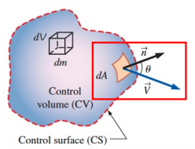
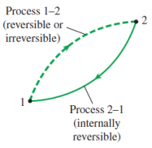
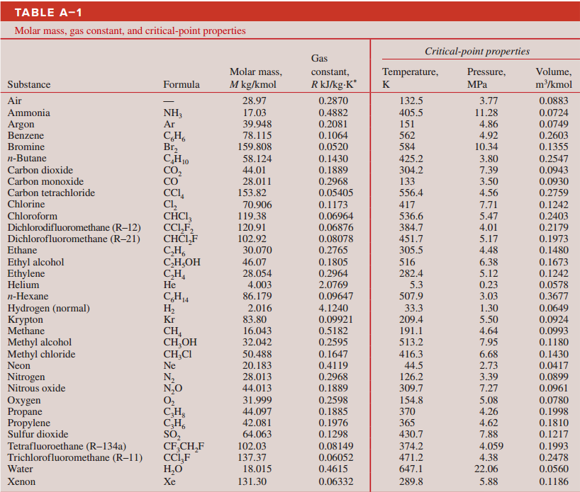
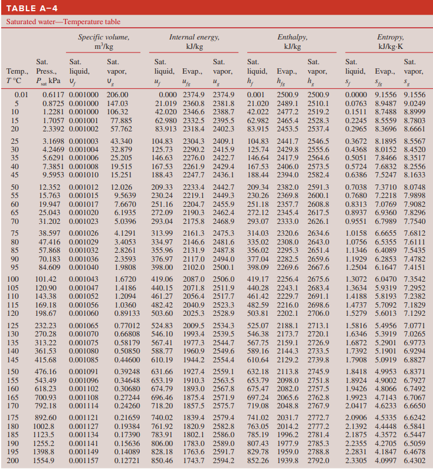
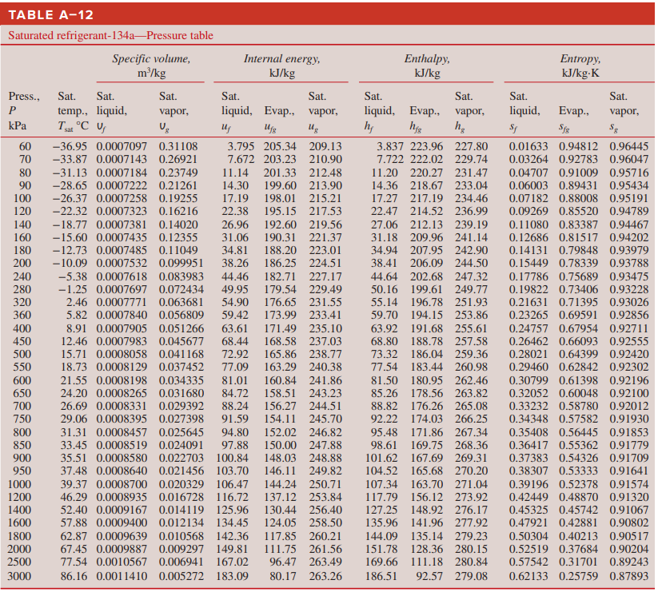
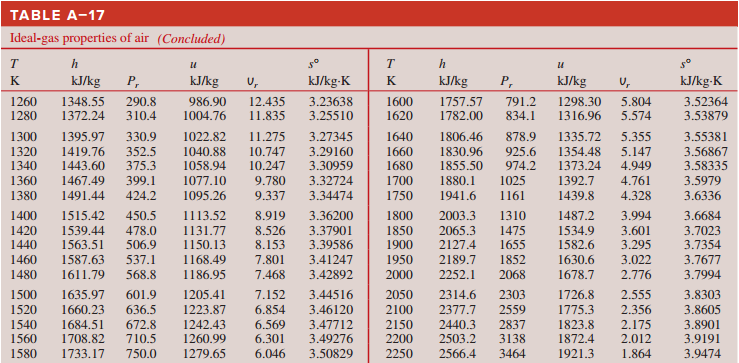
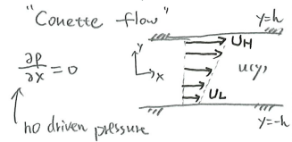

## 目录

  - 单词补充
  - 热力学
  - Chapter 1 基本概念
    - 总结回顾 1
  - Chapter 2
    - 总结回顾 2
    - 补充 2
  - Chapter 3
    - 总结回顾 3
    - 补充3
  - Chapter 4
  - Chapter 5
  - Chapter 6
  - Chapter 7
    - 补充7
  - Chapter 3-4-5-7 查表（没有的项假设此性质符合线性来计算得到）
  - 流体力学（更换教材，已弃用）
    - Chapter 1 Fluid Mechanics
  - 流体力学（陈烨老师自教学用教材）
    - Modern Compressible Flow Chapter 2
    - 补充2
    - Modern Compressible Flow Chapter 3 偏微分方程
    - Modern Compressible Flow Chapter 6
    - 总补充基础：不可压缩流的连续性方程和纳维-斯托克斯方程
    - 总补充0：线性流动和抛物型流动
    - 总补充1：无量纲与雷诺数
    - 总补充2：对流方程
    - 总补充3：扩散方程
    - 总补充4：静止流体的压强
    - 总补充5：阿姆达尔定律
    - 总补充6：CPU并行（Linux系统）

## 单词补充

biomass n.生物质能燃料

continuum n.连续体；渐变体

isothermal adj.等温的

isobaric adj.等压的

isochoric/isometric adj.等比体积的

quasistatic adj.近似静态的

quasi-equilibrium n.近似平衡泰

control n.控件

## 热力学

## Chapter 1 基本概念

### 总结回顾 1

热力学系统种类：

开口系统（open system）：系统与外界有物质交换和能量交换的热力学系统。体积恒定。

闭口系统（closed system）：系统与外界只有能量交换而没有物质交换的热力学系统。质量恒定。

隔离系统（isolated system）：系统与外界没有能量交换且没有物质交换的热力学系统。

控制面（control surface）：系统与外界的边界。

物质的"比"物理量：

一种物质的比体积（specific volume），指的是此种物质的体积与质量之比，也就是其密度的倒数。

一种物质的相对密度（specific gravity）$SG$，指的是一定体积的此种物质与同体积的参考物质（对气体，参考物质一般为空气。对大部分液体和固体，参考物质一般为水）的质量之比。在此之前相对密度被称为"比重"，但已被废除。

$$\mathrm{S} G=\frac{\rho_{液体/固体}}{\rho_{H_2 O}}$$

一种物质的比重（specific weight）$\gamma_s$，指的是单位体积的此种物质所受的重力。

$$\gamma_s=\rho g$$

定常流/稳定流动（steady flow）：系统内的质量和能量均保持不变。系统内的不同位置的流体性质可能不同（例如不同区域的流体温度不同），但是相同位置的流体性质不会随着时间$t$发生变化。

不同温度单位（摄氏度$t(^\circ C)$、华氏度$t(^\circ R)$、开尔文$T(K)$、绝对华氏$T(R)$）换算：

$$T(K)=t\left(^\circ \mathrm{C}\right)+273.15$$

$$T(R)=t\left(^\circ F\right)+459.67$$

$$T(R)=1.8 T(K)$$

$$t\left(^\circ F\right)=1.8 t\left(^\circ \mathrm{C}\right)+32$$

不同压强单位换算：

$$1 Pa = 1 N/m^2$$

$$1 bar = 10^5 Pa$$

$$1 atm = 101.325 kPa$$

$$1 kgf=9.807N$$

大气压强$P_{atm}$，绝对压强$P_{abs}$，计量（gage）压强$P_{gage}$，真空（vacuum）压强$P_{vac}$：

$$\begin{gathered}P_{\mathrm{gage}}=P_{\mathrm{abs}}-P_{\mathrm{atm}} \\ P_{\mathrm{vac}}=P_{\mathrm{atm}}-P_{\mathrm{abs}}\end{gathered}$$

液体某处的绝对压强，为大气压强$P_{atm}$和液体重量$\rho g h$（$h$为此位置与液体表面的高度）之和，因此液体的绝对压强大小与$h$呈线性关系：：

$$P_{abs}=P_{atm}+\rho g h$$

注意：气体的性质与液体不同，气体能够被压缩，气体的绝对压强大小与高度不呈线性关系（但是也是正相关，非线性），一般$h$的影响可以忽略不计。

帕斯卡定律（Pascal 's law）施加在封闭流体上的压强会使整个流体的压强增加相同的量：


$$P_1=P_2 \quad \rightarrow \quad \frac{F_1}{A_1}=\frac{F_2}{A_2}$$

水银气压计（barometric）：

水银气压计内的水银柱高度为$760mm$时，代表此处大气压强为一个标准大气压强，根据液体的绝对压强公式，可以得到水银气压计测得的大气压强数值上等于气压计内的水银柱的底部的绝对压强（气压计内为真空，因此气压计内的大气压强$P_{atm}=0$，因此$P_{abs}=0 + \rho_{Hg} g h$）。除了水银气压计，还有很多种不同的压力计（manometer）。

## Chapter 2

### 总结回顾 2

固定系统（stationary system）：闭口系统，质量恒定。重心的速度和高度保持不变，满足$E=U$。

系统总能量$E$，内能$U$，动能$KE$，势能$PE$，每单位质量（per unit mass）的总能量$e$：

$$E=U+KE+PE$$

$$e=u+ke+pe=\frac{E}{m}$$

内能的组成：

内能（internal energy）由感能（sensible energy）（分子的动能）、潜能（latent energy）（气液固态的势能）、化学能（chemical energy）（分子中的原子键能）、核能（nuclear energy）组成（原子核内部的强化学键能）。


物质吸收热量，物态变化或相变过程温度不变，此过程吸收的热量转化为物质的潜能。

注意：热能（thermal energy）由感能和潜能组成。

注意：热量（heat）是过程量，热传递过程中传递内能的多少叫做热量。

流体管内的质量流速$\dot{m}$（mass flow rate）和能量流速$\dot{E}$（energy flow rate），$A_c$为截面面积，$v_{avg}$为流体的平均速度（speed），$\dot{V}$为体积流速：

$$\dot{m}=\rho \dot{V}=\rho A_c v_{\mathrm{avg}}$$

$$\dot{E}=\dot{m} e$$

流体每个截面的单位时间流量相同，满足$\dot{V}=A_{c1}v_{1}=A_{c2}v_{2}$。因此横截面积越大，流速越小，这个结论可用于下面的伯努利方程。

伯努利方程由机械能守恒推导，且仅适用于理想流体（流体不随时间变化，不可压缩）。$P$为流体中某点的压强，$v$为流体该点的流速，$z$为流体与零势面的距离（类似液体压强的$h$），有机械能守恒表达式：

$$\frac{1}{2} m v_1^2+m g h_1-\left(\frac{1}{2} m v_2^2+m g h_2\right)=P_1 V-P_2 V$$

由上式变换为伯努利方程，表示单位体积的理想流体的机械能（流动能+动能+重力势能）在流体内部处处相等且为常数：

$$P+\frac{1}{2} \rho v^2+\rho g z=C$$

因此单位质量的流动流体的机械能（流动能+动能+重力势能）$e_{mech}$为：

$$e_{mech}=\frac{P}{\rho}+\frac{v^2}{2}+g z$$

注意：在实际情况下，要根据流体的具体情况来分析。如果流体是气体，则不需要考虑$gz$。如果流体不流动（或者没有给出流动速度$v$），则不需要考虑$\frac{v^2}{2}$。整个流体的多个表面的外压强差为零（一般是外压强均为大气压强）或者没有给出压强$P$时，不需要考虑$\frac{P}{\rho}$。

注意：$\dot{V}$和$\dot{m}$为研究流体系统时的"体积"和"质量"的概念（表示流体的量），而非"速度"的概念。$\dot{E}$为研究流体系统时的"功率"的概念（不是$e_{mech}$），而非"能量"的概念。

$Q$为热传递总量，$q$为单位质量的热传递（heat transfer），$\dot{Q}$为热传递速度（假设热传递速度恒定）：

$$q=\frac{Q}{m}$$

$$Q=\dot{Q} \Delta t$$

轴（shaft）功（力臂$r$，力矩$T$，$n$为轴的转速，$s$为力$F$的作用点的路程）：

$$s=2 \pi r n$$

$$W_{\mathrm{sh}}=F s=\left(\frac{\mathrm{T}}{r}\right)(2 \pi r n)=2 \pi n \mathrm{~T}$$

$$\dot{W}_{\mathrm{sh}}=2 \pi \dot{n} \mathrm{~T}$$

液体/固体薄膜表面的拉伸功：

$$W_{\text {surface }}=\int_1^2 \sigma_s d A$$

流体系统的能量守恒方程（$\delta$表示偏微分）：

$$\Delta E_{\text {system }}=E_{\text {in }}-E_{\text {out }}$$

$$\frac{dE_{system}}{dt}=d \dot{E}_{system}=\dot{E}_{in}-\dot{E}_{out}$$

注意：其中$\dot{E}_{in}$和$\dot{E}_{out}$在实际问题中有可能是某种功$\dot{W}$或热$\dot{Q}$，代入能量守恒方程即可。

能量转换效率$\eta$，常见的研究对象有燃料（fuel），泵（pump），涡轮（turbine）：

$$\eta=\frac{\text { Desired output }}{\text { Required input }}$$

$$\eta=\frac{\dot{E}_{out}}{\dot{E}_{in}}$$

对于复合设备的能量转换效率，总能量转换效率为每个设备的能量转换效率相乘：

$$\eta_{\text{total}}=\eta_{1} \times \cdots \times \eta_{n}$$

如果$\dot{E}_{out}$或$\dot{E}_{in}$为流体，则满足：

$$\dot{E}_{out}=\Delta \dot{E}_{\text {mech,fluid }}=\dot{E}_{\text {mech,out }}-\dot{E}_{\text {mech,in }}$$

$$\dot{E}_{in}=|\Delta \dot{E}_{\text {mech,fluid }}|=\dot{E}_{\text {mech,in }}-\dot{E}_{\text {mech,out }}$$

### 补充 2

某种物体在一定$RT$条件下完全燃烧的热值$HV$（heat value）与其实际燃烧过程（$RT$条件会变化）中释放的能量$Q$之比，即为燃烧过程的能量转换效率：

$$\eta_{\text{combustion}}=\frac{Q}{HV}$$

如果泵的功率为$W_{pump}$，泵的出入流体压强差为$\Delta P$，最大体积流速为$\dot{V}_m$，则满足：

$$W_{pump}=\Delta P \cdot \dot{V}_m$$

## Chapter 3

### 总结回顾 3

压强与能量单位换算（lbm为磅，Btu为British thermal unit）：

$$\begin{aligned} 1 \mathrm{cal} &= 4.1868 \mathrm{J} \\ 1 \mathrm{J} &= 1 N \cdot m \\ 1 \mathrm{kJ} & = 1 \mathrm{kPa} \cdot \mathrm{m}^3  \\ 1 bar &= 10^5 Pa \\ 1 \mathrm{psia} & = 6.89kPa \\ 1lbm &= 0.45359kg \\ 1ft &= 0.3048 m \\ 1Btu &= 1.0551kJ \\ 1 \mathrm{lbf} &= 32.174 \mathrm{lbm} \cdot \mathrm{ft} / \mathrm{s}^2 = 4.4482 kg \cdot m / s^2 \end{aligned}$$

纯物质（pure substance）：

纯物质是稳定化学组成的物质。混合物也可能是纯物质（空气也是纯物质）。

相（phase）：

相用于描述一个系统（可有多种物质）的状态，有气相、液相、固相三种。

物态（state）仅描述一种物质的状态，有气体、液体、固体、等离子体四种。

纯物质的相变（phase change）：

饱和（saturation）温度$T_{sat}$，纯物质在某一恒定$P$条件下（即将）发生相变的温度。

饱和压强$P_{sat}$，纯物质在某一恒定$T$条件下（即将）发生相变的压强。

在满足饱和条件时，物质必定处于至少一个饱和状态。包括：饱和气体（vapor）、饱和液体，饱和固体。

临界点（critical point）为物体加热过程的$T-v$图的汇聚点：


物体在某一恒定$T$（对应$P-V$图）或$P$（对应$T-V$图）条件下，可以得到满足某一饱和状态的条件点的连线，将所有饱和状态的连线相交所得的点即为此条件下的临界点。

临界点处即为此物体同时处于两个或三个饱和状态的条件。同时满足三个饱和状态即三相平衡的临界点称为三相点（triple-point）。

物体在每个不同的恒定$T$或$P$条件下均可以得到一个临界点，将所有临界点连接成线，即可画出此物质的相图（$P-V$图），三条临界线的交点即为三相点：


焓（enthalpy）用$H$表示，单位为$kJ$。$U$为内能，$P$为压强，$V$为体积。注意这个式子其实没有物理意义，是通过等压条件下的物理量关系推导出来的，方便计算焓的值：

$$H=U+P V$$

$$h=\frac{H}{m}=u+P v$$

汽化焓$h_{fg}$，也称为汽化潜热，为给定温度$T$或压强$P$下汽化单位质量的饱和液体所需的焓$h$：

$$H_{fg}=m h_{fg}$$

对于某一物质，饱和液体的单位质量饱和体积用$v_f$表示，饱和气体的单位质量饱和体积用$v_g$表示，满足：

$$v_{fg}=v_g-v_f$$

多相平衡状态是饱和的同一物质的不同相的混合物，饱和混合物的质量分数（quality）$x$，以饱和液气混合物为例，$m_t = m_f + m_g \approx m_f$：

$$x=\frac{m_{\text {vapor }}}{m_{\text {total }}}$$

$$m_{\text {total }}=m_t=m_{\text {liquid }}+m_{\text {vapor }}=m_f+m_g$$

$$V_t=m_t v_{avg}$$

$$V_t=V_f+V_g$$

$$m_t=m_f+m_g$$

$$m=\frac{V}{v}$$

$$m_t v_{avg}=m_f v_f + m_g v_g$$

$$x=\frac{m_g}{m_t}$$

$$v_{\mathrm{avg}}=v_f+x v_{f g}$$

$$x=\frac{v_{\mathrm{avg}}-v_f}{v_{f g}}$$

因此易得单位质量饱和液气混合物的总内能和总焓：

$$\begin{gathered}u_{\mathrm{avg}}=u_f+x u_{f g} \\ h_{\mathrm{avg}}=h_f+x h_{f g}\end{gathered}$$

一般来说，在计算时可以将两相体系视为均相混合物（$v_t=v_{avg}$）以方便计算。

过热气体（superheated vapor）的形成$T-h$图：


过热气体在特定$P$条件下比饱和气体具有更高的单位质量焓$h$。

压缩液体（compressed liquid）在某一温度下，压缩液体可以近似为饱和液体。因此在特定$T$条件下，压缩气体的单位质量的物理量$y$，饱和液体的单位质量的物理量$y_{f @ T}$（@就是at，处于某一条件，一般格式为$物理量=物理量_{\text {sat @ 条件}}$）满足近似相等：

$$y \approx y_{f @ T}$$

对于压缩液体的焓$h$，满足更精确的近似：

$$h \cong h_{f @ T}+v_{f @ T}\left(P-P_{\text {sat @ T}}\right)$$

理想气体（低压、高温条件的真实气体可以视为理想气体，在$P < 10kPa$时，水蒸气可以视为理想气体），$R$为气体常数（不同的物质的气体常数也不同），$R_u$为通用气体常数，$M$为气体的摩尔质量，$N$为摩尔数，$v$为单位质量的体积，$\bar{v}$为每摩尔质量的体积，有理想气体方程：

$$P v=R T$$

$$R=\frac{R_u}{M}$$

$$m=M N$$

$$V=\bar{v} N$$

$$\frac{P_1 V_1}{T_1}=\frac{P_2 V_2}{T_2}$$

真实气体与理想气体的偏差，使用压缩系数$Z \leq 1$来表示，当$Z=1$时即为完全的理想气体，$T_{cr}$和$P_{cr}$为某物质的临界点的温度和压强，通过$T_R$和$P_R$来查表获得$Z$的值：


$$P v_{\text{ideal}}=RT$$

$$P v_{\text{actual}}=Z R T$$

$$Z=\frac{v_{\text {actual }}}{v_{\text {ideal }}}$$

$$P v_{\text {ideal}}=R T$$

$$P_{cr} v_{cr}=R T_{cr}$$

$$P_R=\frac{P}{P_{\mathrm{cr}}}$$

$$T_R=\frac{T}{T_{\mathrm{cr}}}$$

$$v_R=\frac{v_{\text {actual }}}{v_{cr}}$$

范德华方程（计算得到压强，误差最大）：

$$\begin{aligned} & \left(P+\frac{a}{v^2}\right)(v-b)=R T \\ & a=\frac{27 R^2 T_{\mathrm{cr}}^2}{64 P_{\mathrm{cr}}} \quad b=\frac{R T_{\mathrm{cr}}}{8 P_{\mathrm{cr}}}\end{aligned}$$

Beattie-Bridgeman状态方程（计算得到压强，误差中等）：

$$\begin{aligned} & P=\frac{R_{u t} T}{\bar{v}^2}\left(1-\frac{c}{\bar{v} T^3}\right)(\bar{v}+B)-\frac{A}{\bar{v}^2} \\ & A=A_0\left(1-\frac{a}{\bar{v}}\right) \quad B=B_0\left(1-\frac{b}{\bar{v}}\right)\end{aligned}$$

本尼迪克特-韦伯-鲁宾状态方程（计算得到压强，误差最小）：

$$P=\frac{R_u T}{\bar{v}}+\left(B_0 R_u T-A_0-\frac{C_0}{T^2}\right) \frac{1}{\bar{v}^2}+\frac{b R_u T-a}{\bar{v}^3}+\frac{a \alpha}{\bar{v}^6}+\frac{c}{\bar{v}^3 T^2}\left(1+\frac{\gamma}{\bar{v}^2}\right) e^{-\gamma / \bar{v}^2}$$

维里状态方程：

$$P=\frac{R T}{v}+\frac{a(T)}{v^2}+\frac{b(T)}{v^3}+\frac{c(T)}{v^4}+\frac{d(T)}{v^5}+\ldots$$

### 补充3

如果饱和液气混合物加热到仅有饱和气态的状态，代表$x=1$，不需要分为$f$（液相）还是$g$（气相）的物理量了。

## Chapter 4

移动边界功$W_b$（由初态、末态和路径共同决定），恒压状态下$P$不变：

$$W_b=A=\int_1^2 P d V$$

理想气体，恒温条件下$T$不变（$m$为质量，$V$为体积，$v$才是单位质量体积）：

$$P V=m R T=C$$

$$W_b=\int_1^2 P d V=\int_1^2 \frac{C}{V} d V=C \int_1^2 \frac{d V}{V}=C \ln \frac{V_2}{V_1}=P_1 V_1 \ln \frac{V_2}{V_1}$$

注意：恒容条件下$V$不变，移动边界功$W_b$为零。

注意：弹簧力为线性，因此热力过程中如果边界连接着弹簧进行缓慢移动（满足二力平衡），那么气体的$P-V$关系也为线性。


对于多变（polytropic）过程，$n$为多变指数，满足$P V^n=C$，$n$为不同值时代表不同类型的过程（例如$n=1$为恒温过程）：


$$P V^n=C \quad P=C V^{-n}$$

$$W_b=\int_1^2 P d V=\int_1^2 C V^{-n} d V=C \frac{V_2^{-n+1}-V_1^{-n+1}}{-n+1}=\frac{P_2 V_2-P_1 V_1}{1-n}$$

封闭系统的能量平衡：

$$Q=\dot{Q} \Delta t, \quad W=\dot{W} \Delta t$$

$$Q-W=\Delta E$$

$$\Delta E=\dot{E} \Delta t=(d E / d t) \Delta t$$

$$E_{\text {in }}-E_{\text {out }}=\Delta E_{\text {system }}$$

$$\dot{E}_{\text {in }}-\dot{E}_{\text {out }}=d E_{\text {system }} / d t$$

满足恒压过程，则：

$$Q-W=\Delta E=\Delta U+\Delta KE+\Delta PE$$

$$\Delta KE \to 0, \Delta PE \to 0$$

$$Q-W_{b}-W_{other}=\Delta U$$

$$Q-P (V_2 - V_1)-W_{other}=U_2-U_1$$

$$H=U+PV$$

$$Q-W_{other}=\Delta U+W_b=\Delta H=H_2-H_1=m(h_2-h_1)$$

比热（specific heat）分为恒容比热$c_v$（对应内能）和恒压比热$c_p$（对应焓），均为对应条件下使单位质量物质的温度上升一度所需的能量（理想气体的$u,h,c_v,c_p$仅随$T$变化，写作$c_{v0}$和$c_{p0}$）。对于气体，计算内能变化$\Delta u$和焓变$\Delta h$（焓变其实就是考虑仅恒压状态下气体的总内能变化，因此需要把体积变化而做的功一起考虑）：

$$\Delta u=u_2-u_1=\int_1^2 c_v(T) d T$$

$$\Delta h=h_2-h_1=\int_1^2 c_p(T) d T$$

在查表没找到的情况下，可以通过查表得到比热的线性近似均值，来计算$\Delta u$和$\Delta h$：


$$\begin{aligned} & \Delta u=c_{v, \text { avg }}\Delta T \\ & \Delta h=c_{p, \text { avg }}\Delta T\end{aligned}$$

比热之间的关系（$\bar{c}_p, \bar{c}_v$为$c_p,c_v$乘以摩尔质量$M$）：

$$h=u+Pv=u+RT$$

$$c_p=c_v+R$$

$$\bar{c}_p=\bar{c}_{v}+R_u$$

$$k=\frac{c_p}{c_v}$$

$$\Delta \bar{h}=\bar{h}_2-\bar{h}_1=\int_1^2 \bar{c}_p(T) d T$$

$$\Delta h=\frac{\Delta \bar{h}}{M}$$

对固体和液体（不可压缩，体积变化$\Delta v$可近似为0）来说，两种比热是相等的：

$$c_p=c_v=c$$

$$d h=d u+v d P+P d v$$

$$\Delta h=\Delta u+v \Delta P$$

对于压缩液体的焓$h$，满足更精确的近似：

$$h \cong h_{f @ T}+v_{f @ T}\left(P-P_{\text {sat @ T}}\right)$$

## Chapter 5

体积流速（实际流体的流动不是以横截面为单位的），$A$为实际流体流动的表面积，$\bar{v}_n$为实际流体流动的垂直于横截面的速度：


$$\dot{m}=\rho \dot{V}=\rho A_c v_{\mathrm{avg}}$$

$$\dot{m}=\int_A \rho \bar{v}_n d A$$

$$v_{a v g}=\frac{1}{A_c} \int_{A_c} \bar{v}_n d A_c$$

$v$为单位质量体积：

$$Pv=RT$$

$$PV=mRT$$

$$v=\frac{RT}{P}$$

$$v=\frac{V}{M}=\frac{1}{\rho}$$

$$\dot{m}=\frac{1}{v} A_c v_{avg}$$

质量守恒方程（$m_{CV}$为在控制体积内的质量）：



$$m_{\text {in }}-m_{\text {out }}=\Delta m_{\mathrm{CV}}$$

$$m_{\mathrm{CV}}=\int_{\mathrm{CV}} \rho d V$$

$$\Delta \dot{m}_{\mathrm{CV}}=\frac{d m_{\mathrm{CV}}}{d t}=\frac{d}{d t} \int_{\mathrm{CV}} \rho d V=\dot{m}_{\text {in}}-\dot{m}_{\text {out}}$$

对于控制表面：

$$V_n=V \cos \theta=\vec{V} \cdot \vec{n}$$

$$\delta \dot{m}=\rho V_n d A=\rho(V \cos \theta) d A=\rho(\vec{V} \cdot \vec{n}) d A$$

$$\dot{m}_{\mathrm{net}}=\int_{\mathrm{CS}} \delta \dot{m}=\int_{\mathrm{CS}} \rho V_n d A=\int_{\mathrm{CS}} \rho(\vec{V} \cdot \vec{n}) d A=\dot{m}_{\text {out }}-\dot{m}_{\text {in }}$$

$$d m_{\mathrm{CV}} / d t+\dot{m}_{\text {out }}-\dot{m}_{\text {in }}=0$$

$$\frac{d}{d t} \int_{\mathrm{CV}} \rho d V+\int_{\mathrm{CS}} \rho(\vec{V} \cdot \vec{n}) d A=0$$

控制体积内质量的时间变化率加上通过控制表面（control surface，CS）的净质量流量等于零：

$$\frac{d}{d t} \int_{\mathrm{CV}} \rho d V+\sum_{\text {out }} \rho\left|V_n\right| A-\sum_{\text {in }} \rho\left|V_n\right| A=0$$

将$m$推入或推出控制体积所需要的$E$称为流动功（flow work）或流动能（flow energy）：

$$W_{\text {flow }}=P V$$

非流动流体的总能量：

$$e=u+\mathrm{ke}+\mathrm{pe}=u+\frac{V^2}{2}+g z$$

流动流体的总能量：

$$\theta=P V+e=P V+(u+\mathrm{ke}+\mathrm{pe})$$

$$h=Pv+u$$

$$\theta=h+\mathrm{ke}+\mathrm{pe}=h+\frac{V^2}{2}+g z$$

质量的能量传输：

$$E_{\text {mass }}=m \theta=m\left(h+\frac{V^2}{2}+g z\right)$$

$$\dot{E}_{\text {mass }}=\dot{m} \theta=\dot{m} \left(h+\frac{V^2}{2}+g z\right)$$

所有装置的稳流状态（质量守恒和能量守恒，$\Delta \dot{E}_{\text {system }}=0$）：

$$\sum_{\text {in }} \dot{m}=\sum_{\text {out }} \dot{m}$$

$$\dot{E}_{\text {in }}-\dot{E}_{\text {out }}=\Delta \dot{E}_{\text {system }}$$

$$\dot{E}_{\text {in }} \quad=\quad \dot{E}_{\text {out }}$$

$$\dot{Q}_{\text {in }}+\dot{W}_{\text {in }}+\sum_{\text {in }} \dot{m} \theta=\dot{Q}_{\text {out }}+\dot{W}_{\text {out }}+\sum_{\text {out }} \dot{m} \theta$$

$$\dot{Q}_{\text {in }}+\dot{W}_{\text {in }}+\sum_{\text {in }} \dot{m}\left(h+\frac{V^2}{2}+g \mathrm{z}\right)=\dot{Q}_{\text {out }}+\dot{W}_{\text {out }}+\sum_{\text {out }} \dot{m}\left(h+\frac{V^2}{2}+g z\right)$$

其中焓$H$可以通过恒压比热容$c_p$直接计算（可知焓的单位为能量单位，而且焓是同时对热量和功的描述，因此热量$Q$、功$W$也可以通过以下式子计算）：

$$h=c_p T$$

根据以上等式，不同的设备具有不同的条件：

喷嘴（nozzles）和扩散器（diffusers）可以调整流体的速度（通过入口和出口的面积调整），只有一个入口和一个出口因此满足$\dot{m}_1=\dot{m}_2=\dot{m}$，忽略$\Delta pe \approx 0$，$\Delta \dot{W} = 0$，$\dot{Q} \approx 0$，稳流状态：

$$\dot{m}\left(h_1+\frac{V_1^2}{2}\right)=\dot{m}\left(h_2+\frac{V_2^2}{2}\right)$$

涡轮（turbine），忽略$\Delta ke \approx 0$，$\Delta pe \approx 0$，$\dot{Q} \approx 0$，稳流状态：

$$\dot{m}_1 h_1 = \dot{m}_2 h_2 + \dot{W}_{out}$$

压缩机（compressor）比风扇（fans）的压力更大，$\Delta ke \approx 0$，$\Delta pe \approx 0$，$\dot{Q} \approx 0$，稳流状态：

$$\dot{W}_{i n}=\dot{m}\left(h_2-h_1\right)$$

节流闸门（throttling valve）是一种限流装置，可导致流体压强下降，同时有很大的温度下降（或上升，因此常用于冰箱和空调），其温度变化幅度为焦耳-汤姆逊（Joule-Thomson）系数$\mu_{JT}$，$\Delta ke \approx 0$，$\Delta pe \approx 0$，$\dot{Q} \approx 0$，稳流状态：

$$\mu_{\mathrm{JT}}=\left(\frac{\partial T}{\partial P}\right)_H=\frac{V}{C_{\mathrm{p}}}(\alpha T-1)$$

$$\dot{m}_i=\dot{m}_e$$

$$\dot{m}_i h_j=\dot{m}_e h_e$$

$$u_1+P_1 v_1=u_2+P_2 v_2$$

因此，当$P_2 v_2 > P_1 v_1$，则有$u_2 < u_1$，因此温度下降。

注意：理想气体流过节流闸门，因为$h=h(T)$，因此$T_e = T_i$不变。

混合仓（mixing chambers）是将流体混合并输出的装置（例如冷热水混合输出的淋浴头），因此满足$q \approx 0$，$w=0$，$\Delta ke \approx 0$，$\Delta pe \approx 0$，能量守恒：

$$\dot{m}_{\text {in }} h_{i n} =\dot{m}_{o u t} h_{o u t}$$

热交换器（heat exchange）在流体不混合的前提下交换热量的装置。满足$w=0$，$\Delta ke \approx 0$，$\Delta pe \approx 0$，总体的$\dot{Q} \approx 0$，稳流状态：


$$\dot{Q}_{\text {in }}+\dot{m} h_1=\dot{m} h_2$$

管道和风管（pipe and duct flow）与外界一般有热交换。

对非定常流/非稳流（unsteady-flow）过程，在某个有限的时间段内开始和结束，而不是稳流过程的无限地继续，且控制体积的边界可能变化：

$$m_{\text {in }}-m_{\text {out }}=\Delta m_{\text {system }}$$

$$E_{\text {in }}-E_{\text {out }} = \Delta E_{\text {system }}$$

$$\dot{E}_{\text {in }}-\dot{E}_{\text {out }}=\Delta \dot{E}_{\text {system }}$$

$$\left(Q_{\text {in }}+W_{\text {in }}+\sum_{\text {in }} m \theta\right)-\left(Q_{\text {out }}+W_{\text {out }}+\sum_{\text {out }} m \theta\right)=\left(m_2 e_2-m_1 e_1\right)_{\text {system }}$$

$$\theta=h+\mathrm{ke}+\mathrm{pe}=Pv+u+\mathrm{ke}+\mathrm{pe}$$

$$e=u+\mathrm{ke}+\mathrm{pe}$$

本章解题总结：质量守恒等式，能量守恒等式，判断是否稳流。

## Chapter 6

以热的形式提供能量的储层称为热源（source），以热的形式吸收能量的储层称为热汇（sink）。热能储层通常被称为热储层（heat reservoirs）。

功转化为热量是很容易的，但是如果要将热量转化为功，则需要热机（heat engines）。$Q_{in}$为输入热机的总热量。$Q_{out}$为热机做功过程对外界散出的热量，无法重复利用，也称为废能量（waste energy）。$W_{net,out}$为热机对外界做的总功。$\eta_{th}$为热机效率：

$$W_{\text {net}, \text {out }} =W_{\text {out }}-W_{\text {in }}$$

$$W_{\text {net,out }}=Q_{\text {in }}-Q_{\text {out }}$$

$$\eta_{\text {th }}=\frac{W_{\text {net }, \text { out }}}{Q_{\text {in }}}$$

$$\eta_{\text {th }}=1-\frac{Q_{\text {out }}}{Q_{\text {in }}}$$

冰箱通过外部做功$W_{net,in}$将热量$Q_L$从较冷物体移出，其性能系数（coefficient of performance）用$COP_R$表示，性能系数可以大于1（计算$COP_R$时，如果是卡诺热机，可以将$Q$替换为$T$）：


$$\mathrm{COP}_{\mathrm{R}}=\frac{\text { Desired output }}{\text { Required input }}=\frac{Q_L}{W_{\text {net, in }}}$$

$$W_{\text {net, in }}=Q_H-Q_L$$

$$\mathrm{COP}_{\mathrm{R}}=\frac{Q_L}{Q_H-Q_L}=\frac{1}{Q_H / Q_L-1}$$

热泵（heat pump）则是通过外部做功$W_{net,in}$将较冷物体的热量$Q_{L}$（可以认为是从冰箱移出的）一起传输到另一系统内，期望传输热量为$Q_H=Q_L+W_{net,in}$，热泵的性能系数用$COP_{HP}$表示，$COP_{HR}=COP_{R}+1$，一定大于1（计算$COP_{HR}$时，如果是卡诺热机，可以将$Q$替换为$T$）：


$$\mathrm{COP}_{\mathrm{HP}}=\frac{\text { Desired output }}{\text { Required input }}=\frac{Q_H}{W_{\text {net,in }}}$$

$$W_{\text {net, in }}+Q_L=Q_H$$

$$\mathrm{COP}_{\mathrm{HP}}=\frac{Q_H}{Q_H-Q_L}=\frac{1}{1-Q_L / Q_H}$$

可逆过程：

自然界的一切过程都是不可逆过程（irreversible，irrev.）。不可逆性（irreversibilities）总是存在（例如摩擦力，系统与环境的热传递$dT$）。

可逆过程（reversible，rev.）是可以无限近似（更符合热力学第二定律）但不存在的理想模型，更方便进行分析。

内部可逆（internally reversible）是指系统边界内没有不可逆性存在，外部可逆（externally reversible）则相反。完全可逆（totally reversible）则是系统内外部均没有不可逆性存在。

卡诺循环（Carnot cycle）是一个理想的模型，输入热量$Q_H$，向低温热源散热$Q_L$，热机对外做功$W=Q_H-Q_L$，有4个完全可逆过程：可逆等温（isothermal）膨胀、可逆绝热（adiabatic）膨胀、可逆等温压缩、可逆绝热压缩：


卡诺原理（principle）：

1.相同两个热储层之间，不可逆热机的效率比可逆热机的效率低。

2.相同两个热储层之间，可逆热机的效率$\eta_{th,rev}$是相同的，且只取决于热储层的温度，同时$\eta_{th,rev}$是同等条件下不可逆热机的理论最高效率。

根据卡诺原理，选取分离效率（separated efficiency）函数：


已知可逆热机的输入输出热量$Q$和热储层的温度$T$是相关的，假设满足某种函数关系$f$，定义为：

$$\frac{Q_H}{Q_L}=f(T_H,T_L)$$

根据第2卡诺原理，可得：

$$f\left(T_1, T_3\right)=f\left(T_1, T_2\right) \cdot f\left(T_2, T_3\right)$$

根据以上等式，可知函数关系$f$满足以下形式：

$$\frac{Q_H}{Q_L}=f(T_H,T_L)=\frac{\phi (T_H)}{\phi(T_L)}$$

开尔文使$\phi(T)=T$，使此处等号右边的部分直接定义为一种以新的单位衡量的"温度"的具体值。因此设定一个能够满足以上关系的"温度"的单位，即为单位"开尔文"的由来。因此满足：

$$\left(\frac{Q_H}{Q_L}\right)_{\mathrm{rev}}=\frac{T_H}{T_L}$$

也就是说，使用卡诺热机（也就是可逆热机）时，与实际热机的区别就是满足：

$$\left(\frac{Q_H}{Q_L}\right)_{\mathrm{rev}}=\frac{T_H}{T_L}$$

对任何热机（反向运作的热泵），效率为：

$$\eta_{\mathrm{th}}=\frac{1}{COR_{HP}}=1-\frac{Q_L}{Q_H}$$

则对卡诺热机，效率为：

$$\eta_{\text {th,rev }}=1-\frac{T_L}{T_H}$$

我们评估一个实际热机的效率，应当将其与卡诺热机的效率比较。

能量的质量（quality）：

热能的温度越高，其质量也越高。

## Chapter 7

证明克劳修斯（Clausius）不等式：

方法一：

由卡诺热机的效率，可知$Q$和$T$的关系：

$$\eta_{\mathrm{th}}=1-\frac{Q_L}{Q_H}=1-\frac{T_L}{T_H}$$

$$\frac{Q_H}{T_H}=\frac{Q_L}{T_L}$$

对于卡诺循环过程，以吸热为正方向，则$Q_H$为正，$Q_L$取负，以整个卡诺循环为对象，考虑环境与复合系统，所有热传递$\frac{Q}{T}$之间的关系：

$$\frac{Q_H}{T_H}-(-\frac{Q_L}{T_L})=\frac{Q_H}{T_H}+\frac{Q_L}{T_L}=0$$

用多个卡诺循环构建任意可逆循环，则易得：

$$\sum_{i=0}^{\infty} \frac{Q_i}{T_i}=\oint \frac{\delta Q}{T} = 0$$

对于非卡诺热机：

$$\frac{Q_H}{T_H} > \frac{Q_L}{T_L}$$

对非卡诺循环：

$$\frac{Q_H}{T_H}+\frac{Q_L}{T_L} < 0$$

对由非卡诺循环构建的不可逆循环而言，有：

$$\sum_{i=0}^{\infty} \frac{Q_i}{T_i}=\oint \frac{\delta Q}{T} < 0$$

得证，无论对于可逆循环还是不可逆循环，均满足：

$$\oint \frac{\delta Q}{T} \leq 0$$

方法二，假定一个复合系统，由系统与一个可逆循环装置组成，$dE_C$为复合系统内的总能量变化，$T_R$为复合系统外的环境中的热源，满足：


$$\delta W_C=\delta W_{\mathrm{rev}}+\delta W_{\mathrm{sys}}$$

$$\delta Q_R=\delta W_C+d E_C$$

可逆过程，卡诺循环，满足：

$$\frac{\delta Q_R}{T_R}=\frac{\delta Q}{T}$$

代入$\delta W_C$，又因为卡诺循环，复合系统内的总能量变化为零：

$$\delta W_C=T_R \frac{\delta Q}{T}-d E_C$$

$$\oint d E_C=0$$

$$W_C=T_R \oint \frac{\delta Q}{T}$$

可逆过程，无能量损耗，由能量守恒，易得不可能向外做功，$W_C=0$，因此：

$$\oint \frac{\delta Q}{T}=0$$

若为非卡诺循环，满足：

$$\frac{\delta Q_R}{T_R} > \frac{\delta Q}{T}$$

$$W_C > T_R \oint \frac{\delta Q}{T}$$

不可逆过程，则需要外界向复合系统做功才能维持循环，因此$W_C < 0$，满足：

$$\oint \frac{\delta Q}{T} < 0$$

得证，无论对于可逆循环还是不可逆循环，均满足：

$$\oint \frac{\delta Q}{T} \leq 0$$

以上两种方式都证明了克劳修斯不等式（inequality），其适用于所有种类的循环：

$$\oint \frac{\delta Q}{T} \leq 0$$

熵（entropy）也被称为总熵（total entropy），是系统的一种性质，使用$S$表示，单位为$kJ/K$：

$$\Delta Q=T \Delta S$$

熵是状态量。玻尔兹曼提出，系统在特定宏观状态下的熵$S$与该系统可能相关的微观状态的总数$W$有关，有玻尔兹曼常数$k=1.3806 \times 10^{-23} \mathrm{~J} / \mathrm{K}$：

$$S=k \ln W$$

后来吉布斯进行推广，$p_i$为所有微观状态的概率之和，满足：

$$S=-k \sum p_i \log p_i$$

无论遵循可逆过程或不可逆过程的路径，两个系统状态之间的熵变$\Delta S$都是相同的（熵是状态量），且其值等于任意初末态为这两个系统状态的可逆过程的热量变化$\int \frac{\delta Q}{T}$。如果是可逆过程，则无论此过程的路径如何，两个系统状态之间的热量变化$\int \frac{\delta Q}{T}$是固定不变的（因此由可逆过程组成的可逆循环的热量变化恒满足$\oint \frac{\delta Q}{T}=0$，不需要额外的热量就能使可逆循环的状态复原，也就是满足系统内的"熵变为零"$\Delta S=0$，同时环境的熵变也为零，因此系统与环境整体的熵产$S_{gen}=0$），因此将可逆过程的两个状态之间的热量变化定义为这两个系统状态的"熵"的差值，也就是"熵变"$\Delta S=\int (\frac{\delta Q}{T})_{rev}$。不可逆过程和不可逆循环的熵变均可以通过热量变化计算，且两个指定状态之间的熵变可以通过不可逆过程的热量变化计算。

如果是不可逆过程，因为还需要考虑过程中对系统与环境整体的熵产（entropy generation）$S_{gen}$（由不可逆性产生），因此每次不可逆过程的熵变为$\Delta S=\int \frac{\delta Q}{T}+S_{gen}$，而又因为$S_{gen}$由过程的不可逆性决定，因此两个状态之间的热量变化$\int \frac{\delta Q}{T}$是不定的（由不可逆过程组成的不可逆循环中，每个不可逆过程造成的$S_{gen}$都可能不同，热量变化$\int \frac{\delta Q}{T}$因此而不同。因为循环，状态复原，在每个循环最终都需要满足$\Delta S = 0$，因此不可逆循环的熵产$S_{gen}$在数值上加上一个循环下来每个不可逆过程的热量变化之和$\oint \frac{\delta Q}{T}$应恒等于$0$，$\oint \frac{\delta Q}{T}$由于$S_{gen}$的存在因此一定小于$0$，满足克劳修斯不等式，需要额外的热量才能完成不可逆循环的状态复原，也就是在一个循环周期结束时必须满足系统内的"熵变为零"$\Delta S=0$，这些额外损耗的热量就会造成环境的"熵增"，这部分熵增就是系统与环境整体的熵产$S_{gen}=-\oint \frac{\delta Q}{T}>0$），但一定小于同样两个状态之间的可逆过程的热量变化$\int (\frac{\delta Q}{T})_{rev}$。因此，当两个不可逆过程的$\frac{\delta Q}{T}$相同时，熵变也可能不同。熵变相同时，$\frac{\delta Q}{T}$也可能不同。因此，虽然不可逆过程和不可逆循环的熵变和熵产均可以通过热量变化计算（熵变本质就是热量变化），但是两个指定状态之间的熵变无法通过不可逆过程的热量变化计算（熵产不确定）。

任何一个不可逆的热力学循环过程，每一个微小过程都可以看成可逆的，但是整体却不可逆，因此虽然熵定义在可逆过程中，但可以在不可逆过程中使用。

对于可逆循环，每个循环周期结束后系统内熵变为零，在发生热量变化的同时不会对环境产生新的熵，熵产等于零。（对系统和环境整体）

对于可逆过程，会同时对系统和环境产生新的熵，熵产等于$(\int \frac{\delta Q}{T})_{sys}+(\int \frac{\delta Q}{T})_{surrounding}$。

对于不可逆循环，每个循环周期结束后系统内熵变为零，在发生热量变化的同时会对环境产生新的熵，熵产等于$-\oint \frac{\delta Q}{T}$。（对系统和环境整体）

对于不可逆过程，会同时对系统和环境产生新的熵，熵产等于$(\int \frac{\delta Q}{T})_{sys}+(\int \frac{\delta Q}{T})_{surrounding}$，且大于相同初末态的可逆过程的熵产。

总而言之，其实系统和环境整体的"熵产"$S_{gen}$实质上是个虚构的概念，对于可逆过程和可逆循环，不需要为不可逆性损耗额外的热量就可以顺利从状态1转化为状态2，对于不可逆过程和不可逆循环，则需要这部分额外的热量来维持从状态1转化为状态2的正常进行，因此其实是热量变化$\int \frac{\delta Q}{T}$和$\oint \frac{\delta Q}{T}$的值受到不可逆性的影响，使得其值与可逆条件下相比受到了一定的影响（减小），将这个差值称为"熵产"以方便计算。从头到尾都是对热量变化$\frac{Q}{T}$和不可逆性造成的影响的讨论，"熵"只不过是一个抽象的工具概念，没有也行。

根据以上结论，熵的数学定义：

$$d S=\left(\frac{\delta Q}{T}\right)_{\text {int rev }}$$

$$\Delta S=S_2-S_1=\int_1^2\left(\frac{\delta Q}{T}\right)_{\mathrm{int} \; \mathrm{rev}}$$

对一个不可逆循环进行分析，假设其中一个过程满足可逆过程，而另一个过程不满足。分析"熵增"的本质：



$$\oint \frac{\delta Q}{T} \leq 0$$

$$\int_1^2 \frac{\delta Q}{T}+\int_2^1\left(\frac{\delta Q}{T}\right)_{\text{int rev}} \leq 0$$

$$S_2-S_1 \geq \int_1^2 \frac{\delta Q}{T}$$

$$d S \geq \frac{\delta Q}{T}$$

如果可逆过程：

$$d S=\frac{\delta Q}{T}$$

如果不可逆过程：

$$dS=\frac{\delta Q}{T}+S_{gen}$$

$$d S > \frac{\delta Q}{T}$$

在一个系统过程中产生的熵称为熵产，用$S_{gen}$表示。可逆过程在熵转化的同时的熵增为零，因此满足等熵，系统与环境的整体熵产$S_{gen}=0$。而不可逆过程在熵转化的同时熵增大于零，$S_{gen} > 0$。熵产为过程的不可逆性的度量，用$Q$表示系统整体与环境的热传递，$T$为系统整体温度，仅对系统分析，对非可逆过程，熵变为：

$$\Delta S_{\mathrm{sys}}=S_2-S_1=\int_1^2 \frac{\delta Q}{T}+S_{\mathrm{gen}}$$

一个过程或循环中不可能发生熵减。对于一个孤立系统，所有实际过程或循环都会导致熵增（即使没有发生热传递，实际过程也必定会存在不可逆性，也就是$S_{gen}>0$）。对系统和环境的整体分析（考虑系统和环境之间的熵传递），对非可逆过程，考虑到熵传递，总熵变有效的部分只剩下熵传递的熵产（如果满足可逆过程，熵传递没有产生新的熵，则满足$\Delta S_{sys}=-\Delta S_{surrounding}$，因此总熵变为零）：

$$S_{\text {gen }}=\Delta S_{\text {total }}=\Delta S_{\text {sys }}+\Delta S_{\text {surrounding}} \geq 0$$

***

例题0（环境与系统整体熵产）：


$$\Delta S_{\text {system }}=\frac{Q}{T_{\text {system }}}=\frac{-600 \mathrm{~kJ}}{(100+273 \mathrm{~K})}=-1.61 \mathrm{~kJ} / \mathrm{K}$$

$$S_{\text {gen }}=\frac{Q_{\text {out }}}{T_b}+\Delta S_{\text {system }}=\frac{600 \mathrm{~kJ}}{(25+273) \mathrm{K}}+(-1.61 \mathrm{~kJ} / \mathrm{K})=0.40 \mathrm{~kJ} / \mathrm{K}$$

例题1（两个热储层一个视为系统一个视为环境，求整体熵产）：


$$\Delta S_{source}=\frac{Q_{source}}{T_{source}}=\frac{-2000kJ}{800K}$$

$$\Delta S_{\text {sink }}=\frac{Q_{\text {sink }}}{T_{\text {sink }}}=\frac{2000 \mathrm{~kJ}}{500 \mathrm{~K}}$$

$$S_{\text {gen}}=\Delta S_{\text {total}}=\Delta S_{\text {source}}+\Delta S_{\text {sink}}$$

***

纯物质的熵变：


对于饱和液-气混合物：

$$s=s_f+x s_{f g}$$

对于压缩液体：

$$s_{@ T, P} \cong s_{f @ T}$$

总熵变：

$$\Delta S=m \Delta s=m\left(s_2-s_1\right)$$

***

例题1：

刚性箱初始温度为20ºC，压强为140kpa，制冷剂为"134a"，重量为5kg。现在，制冷剂在搅拌的同时冷却，直到其压力降至100kpa。确定在此过程中制冷剂的熵变。查表：


$$x_2=\frac{v_2-v_f}{v_{f g}}=\frac{0.16544-0.0007258}{0.19255-0.0007258}=0.859$$

$$s_2=s_f+x_2 s_{f g}=0.07182+(0.859)(0.88008)=0.8278 \mathrm{~kJ} / \mathrm{kg} \cdot \mathrm{K}$$

$$\Delta S=m\left(s_2-s_1\right)=(5 \mathrm{~kg})(0.8278-1.0625) \mathrm{kJ} / \mathrm{kg} \cdot \mathrm{K}$$

例题2：

恒压过程中的熵变一个活塞缸装置最初含有3磅的液态水，温度为20 psia和70ºF。现在，水在恒定压力下通过添加3450Btu的热量被加热。确定这个过程中水的熵变。查表：


$$E_{\text {in }}-E_{\text {out }}=\Delta E_{\text {system }}$$

$$\begin{aligned} Q_{\text {in }}-W_b & =\Delta U \\ Q_{\text {in }} & =\Delta H=m\left(h_2-h_1\right) \\ 3450 \mathrm{Btu} & =(3 \mathrm{lbm})\left(h_2-38.08 \mathrm{Btu} / \mathrm{lbm}\right) \\ h_2 & =1188.1 \mathrm{Btu} / \mathrm{lbm}\end{aligned}$$

再次查表：


$$\Delta S=m\left(s_2-s_1\right)=(3 \mathrm{lbm})(1.7761-0.07459) \mathrm{Btu} / \mathrm{lbm} \cdot \mathrm{R}$$

***

等熵过程（isentropic process）是系统绝热，且忽略不可逆性的理想模型：

$$\Delta s = 0$$

***

例题3：

蒸汽在5mpa和450℃的温度下进入绝热涡轮，在1.4 MPa的压力下离开。如果过程是可逆的，则确定汽轮机每单位质量蒸汽的功输出。

$$\dot{E}_{\text {in }}-\dot{E}_{\text {out }}=d E_{\text {system }} / d t=0$$

$$\dot{Q}=0, \mathrm{ke} \cong \mathrm{pe} \cong 0$$

$$\dot{m}_1=\dot{m}_2=\dot{m}$$

$$\dot{m} h_1=\dot{W}_{\text {out }}+\dot{m} h_2$$

$$\dot{W}_{\text {out }}=\dot{m}\left(h_1-h_2\right)$$

$$s_1=s_2$$


$$w_{\text {out }}=h_1-h_2=3317.2-2967.4=349.8 \mathrm{~kJ} / \mathrm{kg}$$

***

一般使用$T-S$（温度-熵）图和$H-S$（焓-熵）图来进行解题，由热量和熵的关系：

$$Q_{\text {int rev }}=\int_1^2 T d S$$

$Q=T ds$的引申关系：


$$d S=\left(\frac{\delta Q}{T}\right)_{\text {int rev }}$$

$$\delta Q_{\text {int rev }}=T d S$$

$$\delta Q_{\text {int rev }}-\delta W_{\text {int rev,out }}=d U$$

$$\delta W_{\text {int rev,out }}=P d V$$

$$T d S=d U+P d V$$

$$T d s=d u+P d v$$

$$d s=\frac{d u}{T}+\frac{P d v}{T}$$

$$\left.\begin{array}{l}h=u+P v \\ d h=d u+P d v+v d P \\ T d s=d u+P d v\end{array}\right\} T d s=d h-v d P$$

$$d s=\frac{d h}{T}-\frac{v d P}{T}$$

最终可得：

$$d s=\frac{d u}{T}+\frac{P d v}{T}$$

$$d s=\frac{d h}{T}-\frac{v d P}{T}$$

对于液体和固体，近似为不可压缩，因此$dv \cong 0$，$c_p=c_v=c$，满足（$\Delta u=c \cdot \Delta T$）：

$$d s=\frac{d u}{T}=\frac{c \cdot d T}{T}$$

$$s_2-s_1=\int_1^2 \frac{c \cdot d T}{T} \cong c_{\mathrm{avg}} \ln \frac{T_2}{T_1}$$

因此液体和固体的等熵过程满足$T_1=T_2$。

对于理想气体，$P=RT/v$，满足：

$$du=c_v \cdot dT$$

$$d s=c_v \frac{d T}{T}+R \frac{d v}{v}$$

$$s_2-s_1=\int_1^2 c_v(T) \frac{d T}{T}+R \ln \frac{v_2}{v_1}$$

$$d h=c_p d T$$

$$d s=c_p \frac{d T}{T}-\frac{v d P}{T}$$

$$s_2-s_1=\int_1^2 c_p(T) \frac{d T}{T}-R \ln \frac{P_2}{P_1}$$

若将理想气体的比热视作近似恒定，满足：


$$s_2-s_1=c_{v , {\text {avg }}} \ln \frac{T_2}{T_1}+R \ln \frac{v_2}{v_1}$$

$$s_2-s_1=c_{p \text {,avg }} \ln \frac{T_2}{T_1}-R \ln \frac{P_2}{P_1}$$

若将理想气体的比热视作实际比热（随$T$变化），定义对应$T$的$s^{\circ}$（表A-17）通过查表来计算：

$$s^{\circ}=\int_0^T c_p(T) \frac{d T}{T}$$

$$\int_1^2 c_p(T) \frac{d T}{T}=s_2^{\circ}-s_1^{\circ}$$

$$s_2-s_1=s_2^{\circ}-s_1^{\circ}-R \ln \frac{P_2}{P_1}$$

理想气体的等熵（$s$恒定不变）过程，$T_s$为等熵过程的物理量的值，$T_a$为实际过程的物理量的值，$k$为物质的热导率（A-2表）：

$$s_2-s_1=c_{v, \text { avg }} \ln \frac{T_2}{T_1}+R \ln \frac{v_2}{v_1}=0$$

$$\left(\frac{T_2}{T_1}\right)_{s=\text {const. }}=\left(\frac{P_2}{P_1}\right)^{(k-1) / k}=\left(\frac{v_1}{v_2}\right)^{k-1}$$

$$s_2-s_1=s_2^{\circ}-s_1^{\circ}-R \ln \frac{P_2}{P_1}=0$$

$$P_r=e^{s^{\circ}/R}$$

$$v_r=\frac{T}{P_r}$$

$$\left(\frac{P_2}{P_1}\right)_{s=\text { const. }}=\frac{P_{r 2}}{P_{r 1}}$$

$$\left(\frac{v_2}{v_1}\right)_{s=\text { const: }}=\frac{v_{r 2}}{v_{r 1}}$$

可逆稳定流动的功：


$$\delta q_{\mathrm{rev}}-\delta w_{\mathrm{rev}}=d h+d \mathrm{ke}+d \mathrm{pe}$$

$$\delta q_{\mathrm{rev}}=T d s$$

$$d s=\frac{d h}{T}-\frac{v d P}{T}$$

$$-\delta w_{\mathrm{rev}}=v d P+d \mathrm{ke}+d \mathrm{pe}$$

$$w_{\mathrm{rev}}=-\int_1^2 v d P-\Delta \mathrm{ke}-\Delta \mathrm{pe}$$

$$w_{\mathrm{rev}, \text { in }}=\int_1^2 v d P+\Delta \mathrm{ke}+\Delta \mathrm{pe}$$

当动能和势能可以忽略时：

$$w_{\mathrm{rev,in}}=\int_1^2 v d P \cong v\left(P_2-P_1\right)$$

当等熵过程：

$$ds=0$$

$$vdP=dh$$

$$w_{\mathrm{rev,in}}=\int_1^2 v d P = h_2-h_1$$

证明可逆稳定流动做功比不可逆（实际）稳定流动做功的优越性：

$$\delta q_{\mathrm{act}}-\delta w_{\mathrm{act}}=\delta q_{\mathrm{rev}}-\delta w_{\mathrm{rev}}$$

$$d s= \frac{\delta q_{\mathrm{rev}}}{T}  \quad d s \geq \frac{\delta q_{\mathrm{act}}}{T}$$

$$w_{\mathrm{rev}} \geq w_{\mathrm{act}}$$

压缩机在不同条件下做功：


$$w_{\text {rev,in }}=\int_1^2 v d P$$

压缩机等熵（$Pv^k=constant$）：

$$w_{\text {comp }, \mathrm{in}}=\frac{k R\left(T_2-T_1\right)}{k-1}=\frac{k R T_1}{k-1}\left[\left(\frac{P_2}{P_1}\right)^{(k-1) / k}-1\right]$$

压缩机熵变/多变过程（$Pv^n=constant$，$n$为多变指数）：

$$w_{\text {comp in }}=\frac{n R\left(T_2-T_1\right)}{n-1}=\frac{n R T_1}{n-1}\left[\left(\frac{P_2}{P_1}\right)^{(n-1) / n}-1\right]$$

压缩机等温（$Pv=constant$）：

$$w_{\text {comp,in }}=R T \ln \frac{P_2}{P_1}$$

多级（multistage）压缩机，压缩机中的一个热交换器被称为中间冷却器（intercooler）：

$$\begin{aligned} w_{\text {comp,in }} & =w_{\text {comp I,in }}+w_{\text {comp II,in }} \\ & =\frac{n R T_1}{n-1}\left[\left(\frac{P_x}{P_1}\right)^{(n-1) / n}-1\right]+\frac{n R T_1}{n-1}\left[\left(\frac{P_2}{P_x}\right)^{(n-1) / n}-1\right]\end{aligned}$$

为使得两个级之间的压缩功最小，需要使得两个级的压强比恒定：


$$\frac{P_x}{P_1}=\frac{P_2}{P_x}$$

稳流装置的等熵效率，涡轮：


$$\eta_T=\frac{\text { Actual turbine work }}{\text { Isentropic turbine work }}=\frac{w_a}{w_s}$$

$$\eta_T \cong \frac{h_1-h_{2 a}}{h_1-h_{2 s}}$$

压缩机$\eta_C$的等熵效率和泵$\eta_P$的等熵效率：

$$\eta_C=\frac{w_s}{w_a} \cong \frac{h_{2 s}-h_1}{h_{2 a}-h_1}$$

$$\eta_P=\frac{w_s}{w_a}=\frac{v\left(P_2-P_1\right)}{h_{2 a}-h_1}$$

喷嘴的等熵效率：

$$\eta_N=\frac{\text { Actual KE at nozzle exit }}{\text { Isentropic KE at nozzle exit }}=\frac{V_{2 a}^2}{V_{2 s}^2}$$

如果喷嘴的流入速度小于流出速度，则有：

$$h_1=h_{2 a}+\frac{V_{2 a}^2}{2}$$

$$\eta_N \cong \frac{h_1-h_{2 a}}{h_1-h_{2 s}}$$

不包含环境热传递的熵平衡（$S_{gen}$为熵产），若稳流则$d S_{system}/d t=0$（$\Delta S$保持恒定，但不一定为零，因此不一定等熵）：

$$\dot{S}_{\text {in }}-\dot{S}_{\text {out }}+\dot{S}_{\text {gen }}=d S_{\text {system }} / d t$$

$$\Delta S_{\text {system }}=S_{\text {final }}-S_{\text {initial }}=S_2-S_1$$

做功不会发生熵转移（但是熵可能在系统内部产生，使得做功的能量被转化为为更难利用的形式，例如通过摩擦转化为热。因此熵不仅是不可逆性的度量，也是系统无序性和能量的可被重复利用属性也就是无序性的度量），热传递会发生熵转移，含有熵的物体被移动也是熵转移：

$$S_{\text {heat }}=\int_1^2 \frac{\delta Q}{T} \cong \sum \frac{Q_k}{T_k}$$

$$S_{\text {work }}=0$$

$$S_{\text {mass}}=m s$$

$$\dot{S}_{\text {mass }}=\int_{A_c} s \rho V_n d A_c$$

对于不可逆过程的封闭系统的熵产，等于环境通过系统边界热传递的熵传递之和$\sum \frac{Q_k}{T_k}$，加上系统边界内产生的熵$S_{gen}$，其结果值等于两个状态之间任意可逆过程的熵传递之和$\Delta S_{system} = \sum (\frac{Q_k}{T_k})_{rev}$：

$$\sum \frac{Q_k}{T_k}+S_{\mathrm{gen}}=\Delta S_{\text {system }}=S_2-S_1$$

对于绝热封闭系统的熵产：

$$S_{\text {gen }}=\Delta S_{\text {adiabatic system }}$$

对于系统和环境的熵产：

$$S_{\mathrm{gen}}=\sum \Delta S=\Delta S_{\text {system }}+\Delta S_{\text {surroundings }}$$

包含环境热传递的流动系统的熵平衡：


$$\sum \frac{\dot{Q}_k}{T_k}+\sum \dot{m}_i s_i-\sum \dot{m}_e s_e+\dot{S}_{\mathrm{gen}}=d S_{\mathrm{CV}} / d t$$

稳流（$dS_{CV}/dt=0$）：

$$\dot{S}_{\mathrm{gen}}=\sum \dot{m}_e s_e-\sum \dot{m}_i s_i-\sum \frac{\dot{Q}_k}{T_k}$$

稳流单流：

$$\dot{S}_{\mathrm{gcn}}=\dot{m}\left(s_e-s_i\right)-\sum \frac{\dot{Q}_k}{T_k}$$

稳流单流绝热：

$$\dot{S}_{\mathrm{gen}}=\dot{m}\left(s_e-s_i\right)$$

以上结论再次证明了熵增原理，即使是可逆稳流过程也只能保持等熵，而即使是实际稳流单流绝热过程的熵产也大于零。

### 补充7

对于等温过程：

$$\Delta Q=T_0 (S_2-S_1)$$

$$Q-W=U_2-U_1$$

$$q-w=u_2-u_1$$

对于稳流装置，如果要求流体的最大出口速度（不存在损耗，也就是不存在不可逆性，那么对与环境组成的整体来说满足等熵），那么满足：

$$s_1=s_2$$

对于稳流装置（以涡轮为例），常常不满足等熵过程，因此等熵效率小于1。但是可以先计算出等熵过程的此物理量的间接物理量，再乘上等熵效率得到此间接物理量的真实值，再反过来计算此物理量的真实值：

$$T_{2 s}=T_1\left(\frac{P_2}{P_1}\right)^{(k-1) / k}$$

$$w_{a, \text { out }}=\eta_T w_{s, \text { out }}=\eta_T c_p\left(T_1-T_{2 s}\right)$$

$$w_{a, \text { out }}=c_p\left(T_1-T_{2 a}\right)$$

查不了表的时候，考虑：

$$q=w=u=h=c_p T$$

## Chapter 3-4-5-7 查表（没有的项假设此性质符合线性来计算得到）

理想气体状态下各物质的气体常数$R$，各物质摩尔质量$M$，临界点温度$T_{cr}$，气压$P_{cr}$，摩尔体积：



饱和水（液相/气相），表中的数据都建立在满足饱和条件的前提下，饱和条件的判定则需要根据特定温度下达到饱和气压或特定气压下达到饱和温度（因为液相和气相混合，因此当$x \neq 1$，物理量才需要分$y_f$和$y_g$，总值等于$y=y_f + x \cdot y_{fg}$。如果$x=1$，即为完全气相，则不需要分$y_f$和$y_g$，直接就是总值$y$。）：




饱和制冷剂（液相/气相）：




过热制冷剂（气相）：


理想气体状态的空气（理想气体状态下空气的气体常数为$R=0.287kJ/kg \cdot K$）：




过热水（气相）是饱和水的下一步状态。特定气压条件下的水如果温度已经达到过热水的最低温度也就是饱和温度Sat.，那么就是饱和水（最低温度的过热水）。气压条件旁边的温度就是饱和温度，代表此气压条件下的饱和水的温度（此时开始$x=1$，饱和蒸汽，各物理量不再分为液相和气相的部分），同时也是在此条件下过热水的最低温度（过热条件不能低于最低温度）。如果在对应气压条件下，水蒸气的温度没有达到过热水的最低温度，那么表中的数据无效，因为表中的数据都建立在至少满足饱和温度的前提下：


压缩能力图（A-15），$Z=\frac{Pv_{actual}}{RT}$，水的临界压强为$P_{cr}=22.06MPa$，临界温度为$T_{cr}=647.1K$，根据$P_R=\frac{P}{P_{\mathrm{cr}}}$来查表获得$Z$：


不同物质理想气体状态下的比热，有$c_p$的经验比热方程（empirical specific heat equation）：

$$\bar{c}_p=a+b T+c T^2+d T^3$$


压缩水（液相）：


## 流体力学（更换教材，已弃用）

### Chapter 1 Fluid Mechanics

在固体中，应力与应变成正比，而在流体中，应力与应变率成正比。

流体的法向应力和剪应力，静止的流体处于零剪应力（zero shear stress）状态：


$$\sigma=\frac{F_n}{dA}$$

$$\tau=\frac{F_t}{dA}$$

流体力学的研究的前提，是连续性假设（continuum hypothesis），将物质视为连续的、均匀的、没有孔洞的物质，忽视其原子性质。

物体的粘性：

弹性固体（elastic solid）具有完全记忆。

粘性流体（viscous fluid）具有零记忆。

粘弹性（viscoelastic）为一种性质，代表物体的部分记忆的能力。

流体的分类：

粘性流动区域：摩擦效应显著的流动区域。无粘性（inviscid）流动区域：流体的某些区域（通常不接近固体表面的区域），满足粘性力与惯性力或压力相比小得可以忽略不计。

外部流动（external flow）：无边界流体在固体表面（如板、线或管）上的流动。内部流动（internal flow）：流体在管道或管道内的流动，流体完全被固体表面包围。液体在管道中的流动被称为明渠流动（open-channel flow）。

不可压缩流：流动流体的密度在整个过程中几乎保持恒定。例如液体流动。可压缩流：流体密度在流动过程中发生变化。例如高速气体流动。对涉及高速气体流动的系统，流动速度通常用马赫数（Mach number）$Ma$表示，等于1则为音速（sonic）流动，小于1则为亚音速（subsonic）流动，大于1则为超音速（supersonic）流动，远大于1则为高超音速（hypersonic）流动。

$$Ma=\frac{V}{c}=\frac{\text { Speed of flow }}{\text { Speed of sound }}$$

层流（laminar）：以光滑的流体层为特征的高度有序（highly ordered）的流体运动。高粘度流体（如油，蜂蜜）低速流动时通常呈层流。湍流（turbulent）：高度无序（highly disordered）的流体运动，通常发生在高速，以速度波动（fluctuations）为特征。低粘度流体（如空气）的高速流动通常呈湍流。过渡流（transitional flow）：在层流和湍流之间交替的流。

自然流（natural / unforced）：流体运动是由于自然手段，如浮力效应，它表现为较热（因此较轻）的流体上升，较冷（因此密度较大）的流体下降。强制流（forced flow）：通过泵或风扇等外部手段迫使流体流过表面或在管道中流动。

稳流（steady）和非稳流（unsteady）在前面的章节提到。

一、二、三维流：如果流速分别在一维、二维或三维上变化，则称为一维、二维或三维流动。速度在某些方向上的变化相对于其他方向上的变化可能很小，可以忽略，不算作维数。

迁移现象（transport phenomena）：

菲克（Fick）定律/现象学（phenomenological）定律通过实验现象说明，在混合物中一个成分（constituent）的通量（flux）与它的浓度成正比（近似）。$q_m$为质量通量，$\nabla C$为该成分的浓度梯度：

$$q_{\mathrm{m}}=-k_{\mathrm{m}} \nabla C$$

由温度梯度引起的热传递的类似关系为傅里叶（Fourier）定律，$q$为热通量，$\nabla T$为温度梯度，$k$为材料的热导率（thermal conductivity）：

$$q=-k \nabla T$$

牛顿摩擦定律，剪应力$\tau$，动态粘度（dynamic viscosity）$\mu$（对理想气体，与$T$成正比。对液体，与$T$成反比），运动粘度（kinematic viscosity）$v$：

$$\tau=\mu \frac{d u}{d y}$$

$$v \equiv \frac{\mu}{\rho}$$

表面张力：

表面张力$\sigma_s$，在接触面（interface）附近，所有的液体分子都试图将接触面上的分子拉向内部：


$$W_{\text {surface }}=\int_1^2 \sigma_s d A$$

$$F =2 b \sigma_s$$

$$d A =2 b d x$$

$p_i$和$p_o$是接触面两边的压强，当曲面是球形时（例如水珠），表面张力$\sigma$满足：


$$\sigma(2 \pi R)=\left(p_{\mathrm{i}}-p_{\mathrm{o}}\right) \pi R^2$$

对于一般曲面，曲率可以用沿两个正交方向$R_1$和$R_2$的曲率半径来表示，表面张力$\sigma$满足：


$$p_{\mathrm{i}}-p_{\mathrm{o}}=\sigma\left(\frac{1}{R_1}+\frac{1}{R_2}\right)$$

对于毛细管（capillary tubes），自由表面由于表面张力的影响而高于周围水平。

对静止流体，有绝对压强：

$$p_{\mathrm{atm}}=101.3 \mathrm{kPa}=1.013 \mathrm{bar}$$

$$p_{\text {gauge }}=p-p_{\text {atm }}$$

以$z=0$处的压强为$p_0$，则有：

$$p=p_0-\rho g z$$

流体热力学：

$$\Delta E=Q-W$$

$$d e=d Q-p d v$$

对可压缩系统：

$$\begin{aligned} & p=p(v, T) \\ & e=e(p, T)\end{aligned}$$

定义焓：

$$h=u+P v$$

可逆等容过程，比热满足：

$$\left(\frac{d Q}{d T}\right)_{\mathrm{v}}=\left(\frac{\partial e}{\partial T}\right)_{\mathrm{v}}=C_{\mathrm{v}}$$

可逆等压过程，比热满足：

$$\left(\frac{d Q}{d T}\right)_{\mathrm{p}}=\left(\frac{\partial h}{\partial T}\right)_{\mathrm{p}}=C_{\mathrm{p}}$$

熵：

$$\begin{aligned} & T d S=d e+p d v \\ & T d S=d h-v d p\end{aligned}$$

流体中的音速：

$$c^2=\left(\frac{\partial p}{\partial \rho}\right)_{\mathrm{s}}$$

热膨胀系数（thermal expansion coefficient，CTE）：

$$\alpha \equiv-\frac{1}{\rho}\left(\frac{\partial \rho}{\partial T}\right)_{\mathrm{p}}$$

完美气体（perfect gas），$\gamma$为比热比，内能和焓仅和温度有关：

$$P v=R T$$

$$v=\frac{1}{\rho}$$

$$R=c_{\mathrm{p}}-c_{\mathrm{v}}$$

$$\gamma \equiv \frac{c_{\mathrm{p}}}{c_{\mathrm{v}}}$$

$$\begin{aligned} & u=u(T) \\ & h=h(T)\end{aligned}$$

## 流体力学（陈烨老师自教学用教材）

### Modern Compressible Flow Chapter 2

计算流体力学（Computational Fluid Dynamics，CFD）是流体力学的一种研究方法，此课程均为计算流体力学的内容。

流体力学基本控制方程：

- 连续性方程

- 动量方程

- 能量方程

流体力学基本控制方程就是对以下原理的数学描述：

- 质量守恒定律

- 牛顿第二定律（$F=ma$）

- 能量守恒定律

对于不同的流动模型，流体力学基本控制方程的形式不同，分为守恒型和非守恒型两种形式：


固定有限控制体（得到积分形式或偏微分形式的守恒型方程）和移动有限控制体（得到积分形式或偏微分形式的非守恒型方程）：


固定无穷小流体微团（得到偏微分形式的守恒型方程）和移动无穷小流体微团（得到偏微分形式的非守恒型方程）：


物质导数（移动流体微团的时间变化率）的定义：

在笛卡尔坐标系（$xyz$）下，速度向量$\boldsymbol{V}$表示为：

$$\boldsymbol{V}=u \boldsymbol{i}+v \boldsymbol{j}+w \boldsymbol{k}$$

由于考虑非定常流，因此速度应与时间$t$有关：

$$\begin{aligned} & u=u(x, y, z, t) \\ & v=v(x, y, z, t) \\ & w=w(x, y, z, t)\end{aligned}$$

因此，流体微团的密度$\rho$（标量）为：

$$\rho=\rho(x, y, z, t)$$

对于位置1和位置2，对密度进行泰勒级数展开可得：

$$\begin{aligned} \rho_2= & \rho_1+\left(\frac{\partial \rho}{\partial t}\right)_1\left(t_2-t_1\right)+\left(\frac{\partial \rho}{\partial x}\right)_1\left(x_2-x_1\right)+\left(\frac{\partial \rho}{\partial y}\right)_1\left(y_2-y_1\right)+ \\ & \left(\frac{\partial \rho}{\partial z}\right)_1\left(z_2-z_1\right)+(\text { 高阶项 })\end{aligned}$$

$$\frac{\rho_2-\rho_1}{t_2-t_1}=\left(\frac{\partial \rho}{\partial t}\right)_1+\left(\frac{\partial \rho}{\partial x}\right)_1 \frac{x_2-x_1}{t_2-t_1}+\left(\frac{\partial \rho}{\partial y}\right)_1 \frac{y_2-y_1}{t_2-t_1}+\left(\frac{\partial \rho}{\partial z}\right)_1 \frac{z_2-z_1}{t_2-t_1}$$

当$t_2$无限趋近于$t_1$时，定义密度的物质导数$\frac{\mathrm{D} \rho}{\mathrm{D} t}$，物质导数代表此流体微团通过位置1时，其密度变化的瞬时时间变化率：

$$\lim _{t_2 \rightarrow t_1} \frac{\rho_2-\rho_1}{t_2-t_1} \equiv \frac{\mathrm{D} \rho}{\mathrm{D} t}$$

$$\begin{aligned} & \lim _{t_2 \rightarrow t_1} \frac{x_2-x_1}{t_2-t_1} \equiv u \\ & \lim _{t_2 \rightarrow t_1} \frac{y_2-y_1}{t_2-t_1} \equiv v \\ & \lim _{t_2 \rightarrow t_1} \frac{z_2-z_1}{t_2-t_1} \equiv w\end{aligned}$$

$$\frac{\mathrm{D} \rho}{\mathrm{D} t}=\frac{\partial \rho}{\partial t}+u \frac{\partial \rho}{\partial x}+v \frac{\partial \rho}{\partial y}+w \frac{\partial \rho}{\partial z}$$

可得通用的物质导数为：

$$\frac{\mathrm{D}}{\mathrm{D} t} \equiv \frac{\partial}{\partial t}+u \frac{\partial}{\partial x}+v \frac{\partial}{\partial y}+w \frac{\partial}{\partial z}$$

密度$\rho$对时间的全导数有：

$$\frac{\mathrm{d} \rho}{\mathrm{d} t}=\frac{\partial \rho}{\partial t}+\frac{\partial \rho}{\partial x} \frac{\mathrm{d} x}{\mathrm{~d} t}+\frac{\partial \rho}{\partial y} \frac{\mathrm{d} y}{\mathrm{~d} t}+\frac{\partial \rho}{\partial z} \frac{\mathrm{d} z}{\mathrm{~d} t}$$

$$\mathrm{d} x / \mathrm{d} t=u, \mathrm{~d} y / \mathrm{d} t=v, \mathrm{~d} z / \mathrm{d} t=w$$

$$\frac{\mathrm{d} \rho}{\mathrm{d} t}=\frac{\partial \rho}{\partial t}+u \frac{\partial \rho}{\partial x}+v \frac{\partial \rho}{\partial y}+w \frac{\partial \rho}{\partial z}$$

因此可得，实际上物质导数$\frac{D}{D t}$在数值上等于对时间的全导数$\frac{d}{dt}$。

对物质导数，写成含有$\nabla$算子和速度张量$\boldsymbol{V}$的形式：

$$\nabla \equiv  \frac{\partial}{\partial x}\boldsymbol{i}+ \frac{\partial}{\partial y}\boldsymbol{j}+ \frac{\partial}{\partial z}\boldsymbol{k}$$

$$\nabla \rho \equiv  \frac{\partial \rho}{\partial x}\boldsymbol{i}+ \frac{\partial \rho}{\partial y}\boldsymbol{j}+ \frac{\partial \rho}{\partial z}\boldsymbol{k}$$

$$\nabla \cdot \boldsymbol{V}=\frac{\partial u}{\partial x}+\frac{\partial v}{\partial y}+\frac{\partial w}{\partial z}$$

$$\boldsymbol{V} \cdot \nabla \equiv  u \frac{\partial}{\partial x}\boldsymbol{i}+ v \frac{\partial}{\partial y}\boldsymbol{j}+ w \frac{\partial}{\partial z}\boldsymbol{k}$$

$$\frac{\mathrm{D}}{\mathrm{D} t} \equiv \frac{\partial}{\partial t}+(\boldsymbol{V} \cdot \nabla)$$

$$\frac{\mathrm{D \rho}}{\mathrm{D} t} \equiv \frac{\partial \rho}{\partial t}+(\boldsymbol{V} \cdot \nabla) \rho$$

物质导数与偏微分$\frac{\partial \rho}{\partial t}$在物理意义上和数值上均完全不同。物质导数跟踪一个移动流体微团的物理量的时间变化率（因此包含物质导数的方程均为非守恒的），偏微分代表固定的位置1处的流体的物理量的时间变化率。

速度梯度/速度散度（divergence）为$\nabla \cdot \boldsymbol{V}$，控制体的体积为$\mathscr{V}$，面为$S$，控制体由相同的流体粒子组成，因此质量不变。但是在流体的不同区域密度$\rho$不同，因此控制体的体积和形状可能会不断变化。对于无穷小的面微元$dS$，其对体积的影响为：

$$\Delta \mathscr{V}=[(\boldsymbol{V} \Delta t) \cdot \boldsymbol{n}] \cdot \mathrm{d} S=(\boldsymbol{V} \Delta t) \cdot \mathrm{d} \boldsymbol{S}$$

$$\frac{\mathrm{D} \mathscr{V}}{\mathrm{D} t}=\frac{1}{\Delta t} \iint_S(\boldsymbol{V} \cdot \Delta t) \cdot \mathrm{d} \boldsymbol{S}=\iint_S \boldsymbol{V} \cdot \mathrm{d} \boldsymbol{S}$$

应用散度定理：

$$\frac{\mathrm{D} \mathscr{V}}{\mathrm{D} t}=\iiint_{\mathscr{V}}(\nabla \cdot \boldsymbol{V}) \mathrm{d} \mathscr{V}$$

将控制体的体积收缩为$\delta \mathscr{V}$，也就是移动无穷小流体微团，同时体积足够小，以使得$\nabla \cdot \boldsymbol{V}$在整个$\delta \mathscr{V}$上都相等，当体积收缩到趋近于0时，可以写成：

$$\frac{\mathrm{D}(\delta \mathscr{V})}{\mathrm{D} t}=(\nabla \cdot \boldsymbol{V}) \delta \mathscr{V}$$

$$\nabla \cdot \boldsymbol{V}=\frac{1}{\delta \mathscr{V}} \frac{\mathrm{D}(\delta \mathscr{V})}{\mathrm{D} t}$$

因此，速度散度的物理意义，即为每单位体积的正在运动的流体微团的体积的时间变化率。

粘性流动（包括摩擦、热传导、质量扩散等现象的流动）的基本控制方程推导：

连续性方程（质量守恒的数学表述）对于四种流动模型来说本质上是相同的，可以相互转换。对于固定有限控制体，通过质量守恒（守恒型积分形式）：

$$\frac{\partial}{\partial t} \iiint_{\mathscr{V}} \rho \mathrm{d} \mathscr{V}+\iint_S \rho \boldsymbol{V} \cdot \mathrm{d} \boldsymbol{S}=0$$

对于移动有限控制体，质量不变，通过质量守恒（非守恒型积分形式）：

$$\frac{\mathrm{D}}{\mathrm{D} t} \iiint_{\mathscr{V}} \rho \mathrm{d} \mathscr{V}=0$$

对于固定无穷小流体微团，通过质量守恒（守恒型微分形式）：

$$\frac{\partial \rho}{\partial t}+\nabla \cdot(\rho \boldsymbol{V})=0$$

对于移动无穷小流体微团，通过质量守恒（非守恒型微分形式）：

$$\frac{\mathrm{D} \rho}{\mathrm{D} t}+ \nabla \cdot (\rho \boldsymbol{V})=0$$

动量方程（牛顿第二定律的数学表述），$p$为压强，$\tau$为剪切应力，$\boldsymbol{f}$为体积力（超距离且直接作用在流体微团的整个体积微元上的力，例如重力。当只考虑重力时，$\boldsymbol{f}=\rho \boldsymbol{g}$），仅以移动无穷小流体微团的$x$轴方向为例（$u$为速度$V$的$x$轴分量）：


$$\boldsymbol{F}=m \boldsymbol{a}$$

$$\boldsymbol{F}_x=\left(-\frac{\partial p}{\partial x}+\frac{\partial \tau_{x x}}{\partial x}+\frac{\partial \tau_{y x}}{\partial y}+\frac{\partial \tau_{z x}}{\partial z}\right) \mathrm{d} x \mathrm{~d} y \mathrm{~d} z+\rho \boldsymbol{f}_x \mathrm{~d} x \mathrm{~d} y \mathrm{~d} z$$

$$m=\rho dx dy dz$$

$$a_x=\frac{Du}{Dt}$$

非守恒形式：

$$\rho \frac{\mathrm{D} u}{\mathrm{D} t}=-\frac{\partial p}{\partial x}+\frac{\partial \tau_{x x}}{\partial x}+\frac{\partial \tau_{y x}}{\partial y}+\frac{\partial \tau_{z x}}{\partial z}+\rho \boldsymbol{f}_x$$

转化为守恒形式，也是纳维-斯托克斯（Navier-Stokes，N-S）方程（仅$x$轴方向）：

$$\frac{\partial(\rho u)}{\partial t}+\nabla \cdot(\rho u \boldsymbol{V})=-\frac{\partial p}{\partial x}+\frac{\partial \tau_{x x}}{\partial x}+\frac{\partial \tau_{y x}}{\partial y}+\frac{\partial \tau_{z x}}{\partial z}+\rho f_x$$

牛顿流体是流体的剪切应力和应变的时间变化率（即速度散度）成正比的流体，在空气动力学的实际问题中，流体都可以看成是牛顿流体，$\mu$为分子粘性系数，$\lambda$为第二粘性系数，斯托克斯提出两个粘性系数之间的关系$\lambda=-\frac{2}{3} \mu$的假设且被广泛采用（但没有严格证明）：

$$\tau_{x x}=\lambda(\nabla \cdot \boldsymbol{V})+2 \mu \frac{\partial u}{\partial x}$$

$$\tau_{x y}=\tau_{y x}=\mu\left(\frac{\partial v}{\partial x}+\frac{\partial u}{\partial y}\right)$$

能量方程（能量守恒的数学表述），定义$\dot{q}$为单位质量的体积加热率，总能量使用$e+\frac{V^2}{2}$表示，根据总能量表达式的不同，可以改写得到的能量方程（注意，对移动模型运用基本物理学原理，得到的方程都是非守恒形式的，但是可以转化为守恒形式的），仅以移动无穷小流体微团为例：

非守恒形式：

$$\begin{aligned} \rho \frac{\mathrm{D}}{\mathrm{D} t}\left(e+\frac{\boldsymbol{V}^2}{2}\right)= & \rho \dot{q}+\frac{\partial}{\partial x}\left(k \frac{\partial T}{\partial x}\right)+\frac{\partial}{\partial y}\left(k \frac{\partial T}{\partial y}\right)+\frac{\partial}{\partial z}\left(k \frac{\partial T}{\partial z}\right)- \\ & \frac{\partial(u p)}{\partial x}-\frac{\partial(v p)}{\partial y}-\frac{\partial(w p)}{\partial z}+\frac{\partial\left(u \tau_{x x}\right)}{\partial x}+\frac{\partial\left(u \tau_{y x}\right)}{\partial y}+\frac{\partial\left(u \tau_{z x}\right)}{\partial z}+ \\ & \frac{\partial\left(v \tau_{x y}\right)}{\partial x}+\frac{\partial\left(v \tau_{y y}\right)}{\partial y}+\frac{\partial\left(v \tau_{z y}\right)}{\partial z}+\frac{\partial\left(w \tau_{x z}\right)}{\partial x}+\frac{\partial\left(w \tau_{y z}\right)}{\partial y}+\frac{\partial\left(w \tau_{z z}\right)}{\partial z}+\rho \boldsymbol{f} \cdot \boldsymbol{V}\end{aligned}$$

守恒形式：

$$\begin{aligned} & \frac{\partial}{\partial t}\left[\rho\left(e+\frac{\boldsymbol{V}^2}{2}\right)\right]+\nabla \cdot\left[\rho\left(e+\frac{\boldsymbol{V}^2}{2}\right) \boldsymbol{V}\right] \\ = & \rho \dot{q}+\frac{\partial}{\partial x}\left(k \frac{\partial T}{\partial x}\right)+\frac{\partial}{\partial y}\left(k \frac{\partial T}{\partial y}\right)+\frac{\partial}{\partial z}\left(k \frac{\partial T}{\partial z}\right)-\frac{\partial(u p)}{\partial x}-\frac{\partial(v p)}{\partial y}-\frac{\partial(w p)}{\partial z}+ \\ & \frac{\partial\left(u \tau_{x x}\right)}{\partial x}+\frac{\partial\left(u \tau_{y x}\right)}{\partial y}+\frac{\partial\left(u \tau_{z x}\right)}{\partial z}+\frac{\partial\left(v \tau_{x y}\right)}{\partial x}+\frac{\partial\left(v \tau_{y y}\right)}{\partial y}+\frac{\partial\left(u \tau_{z y}\right)}{\partial z}+ \\ & \frac{\partial\left(w \tau_{x z}\right)}{\partial x}+\frac{\partial\left(w \tau_{y z}\right)}{\partial y}+\frac{\partial\left(w \tau_{z z}\right)}{\partial z}+\rho \boldsymbol{f} \cdot \boldsymbol{V}\end{aligned}$$

以上均为可压缩粘性流动的方程（其中动量方程称为纳维-斯托克斯方程）推导。对于无粘流（忽略耗散、热传导、粘性输运、质量扩散的流动）的方程（整体称为欧拉方程），可以通过粘性流动推导得到的方程去掉所有包含摩擦和热传导的项得到。上述的所有方程求解析解都是非常困难的。

不同的物理边界条件将会有不同的解（例如几何形状），因此适当且精确的对实际问题给定边界条件是非常重要的（后面章节会详细说明）。

### 补充2

PDE为偏微分形式（$\partial x$），ODE为常微分形式（$dx$）。

适用于CFD使用的控制方程，代表整个守恒形式的控制方程组：

$$\frac{\partial U}{\partial t}+\frac{\partial F}{\partial x}+\frac{\partial G}{\partial y}+\frac{\partial H}{\partial z}=J$$

$$U=\left\{\begin{array}{l}\rho \\ \rho u \\ \rho v \\ \rho w \\ \rho\left(e+\frac{V^2}{2}\right)\end{array}\right\}$$

$$F=\left\{\begin{array}{l}\rho u \\ \rho u^2+p-\tau_{x x} \\ \rho v u-\tau_{x y} \\ \rho w u-\tau_{x z} \\ \rho\left(e+\frac{V^2}{2}\right) u+p u-k \frac{\partial T}{\partial x}-u \tau_{x x}-v \tau_{x y}-w \tau_{x z}\end{array}\right\}$$

$$G=\left\{\begin{array}{l}\rho v \\ \rho u v-\tau_{y x} \\ \rho v^2+p-\tau_{y y} \\ \rho w v-\tau_{y z} \\ \rho\left(e+\frac{V^2}{2}\right) v+p v-k \frac{\partial T}{\partial y}-u \tau_{y x}-v \tau_{y y}-w \tau_{y z}\end{array}\right\}$$

$$H=\left\{\begin{array}{l}\rho w \\ \rho u w-\tau_{z x} \\ \rho v w-\tau_{z y} \\ \rho w^2+p-\tau_{z z} \\ \rho\left(e+\frac{V^2}{2}\right) w+p w-k \frac{\partial T}{\partial z}-u \tau_{z x}-v \tau_{z y}-w \tau_{z z}\end{array}\right\}$$

$$J=\left\{\begin{array}{l}0 \\ \rho f_x \\ \rho f_y \\ \rho f_z \\ \rho\left(u f_x+v f_y+w f_z\right)+\rho \dot{q}\end{array}\right\}$$

$$\frac{\partial U}{\partial t}=J-\frac{\partial F}{\partial x}-\frac{\partial G}{\partial y}-\frac{\partial H}{\partial z}$$

对于非定常流的数值解，$U$为解变量，$U$中的变量称为守恒变量，$\rho,u,v,w,p$称为原始变量。

对于无粘流动：

$$U=\left\{\begin{array}{l}\rho \\ \rho u \\ \rho v \\ \rho w \\ \rho\left(e+\frac{V^2}{2}\right)\end{array}\right\}$$

$$F=\left\{\begin{array}{l}\rho u \\ \rho u^2+p \\ \rho v u \\ \rho w u \\ \rho\left(e+\frac{V^2}{2}\right) u+p u\end{array}\right\}$$

$$G=\left\{\begin{array}{l}\rho v \\ \rho u v \\ \rho v^2+p \\ \rho w v \\ \rho\left(e+\frac{V^2}{2}\right) v+p v\end{array}\right\}$$

$$H=\left\{\begin{array}{l}\rho w \\ \rho u w \\ \rho w \\ \rho w^2+p \\ \rho\left(e+\frac{V^2}{2}\right) w+p w\end{array}\right\}$$

$$J=\left\{\begin{array}{l}0 \\ \rho f_x \\ \rho f_y \\\rho f_z \\ \rho\left(u f_x+v f_y+w f_z\right)+\rho \dot{q}\end{array}\right\}$$

对于非定常无粘流的数值解，解向量还是$U$。定常流$\frac{\partial U}{\partial t}=0$，因此$F$为解向量。其中的变量为守恒变量，因此满足：

$$\frac{\partial F}{\partial x}=J-\frac{\partial G}{\partial y}-\frac{\partial H}{\partial z}$$

$$\begin{gathered}\rho u=c_1 \\ \rho u^2+p=c_2 \\ \rho u v=c_3 \\ \rho u w=c_4 \\ \rho u\left(e+\frac{u^2+v^2+w^2}{2}\right)+p u=c_5\end{gathered}$$

还需要加上热力学状态方程，如果比热比为常数的气体则满足：

$$e=c_v T=\frac{R T}{\gamma-1}=\frac{R}{\gamma-1} \times \frac{p}{\rho R}=\frac{p}{(\gamma-1)\rho}$$

### Modern Compressible Flow Chapter 3 偏微分方程

数值解是特定的数值，解析解是固定的表达式。

最高阶倒数以线性的形式出现，方程中没有出现最高阶倒数的乘积或者指数函数，这种方程组称为拟线性方程组。上一章中推导的控制方程均为拟线性方程组。

偏微分方程分成3类：


克莱默法则解偏微分方程组：

$$\begin{aligned} & a_1 \frac{\partial u}{\partial x}+b_1 \frac{\partial u}{\partial y}+c_1 \frac{\partial v}{\partial x}+d_1 \frac{\partial v}{\partial y}=f_1 \\ & a_2 \frac{\partial u}{\partial x}+b_2 \frac{\partial u}{\partial y}+c_2 \frac{\partial v}{\partial x}+d_2 \frac{\partial v}{\partial y}=f_2\end{aligned}$$

$$\begin{aligned} \mathrm{d} u & =\frac{\partial u}{\partial x} \mathrm{~d} x+\frac{\partial u}{\partial y} \mathrm{~d} y \\ \mathrm{~d} v & =\frac{\partial v}{\partial x} \mathrm{~d} x+\frac{\partial v}{\partial y} \mathrm{~d} y\end{aligned}$$

$$\left(\begin{array}{cccc}a_1 & b_1 & c_1 & d_1 \\ a_2 & b_2 & c_2 & d_2 \\ \mathrm{~d} x & \mathrm{~d} y & 0 & 0 \\ 0 & 0 & \mathrm{~d} x & \mathrm{~d} y\end{array}\right)\left(\begin{array}{l}\partial u / \partial x \\ \partial u / \partial y \\ \partial v / \partial x \\ \partial v / \partial y\end{array}\right)=\left(\begin{array}{c}f_1 \\ f_2 \\ \mathrm{~d} u \\ \mathrm{~d} v\end{array}\right)$$

$$[A] \equiv\left(\begin{array}{cccc}a_1 & b_1 & c_1 & d_1 \\ a_2 & b_2 & c_2 & d_2 \\ \mathrm{~d} x & \mathrm{~d} y & 0 & 0 \\ 0 & 0 & \mathrm{~d} x & \mathrm{~d} y\end{array}\right)$$

$$[B]=\left(\begin{array}{cccc}f_1 & b_1 & c_1 & d_1 \\ f_2 & b_2 & c_2 & d_2 \\ \mathrm{~d} u & \mathrm{~d} y & 0 & 0 \\ \mathrm{~d} v & 0 & \mathrm{~d} x & \mathrm{~d} y\end{array}\right)$$

$$\frac{\partial u}{\partial x}=\frac{|B|}{|A|}$$

为了解出$\frac{\partial u}{\partial x}$，我们需要给出$du,dv,dx,dy$。可以选择任意方向的某一点（例如下图的"2"点）的$x,y,u,v$与$P$点的求差值获得$dx,dy,du,dv$：


但是如果有一个方向将会使得$|A|=0$，那么$\frac{\partial u}{\partial x}$是不确定的，因此将这个方向定义为通过$P$点的特征线。沿特征线的$u,v$的导数是不确定的，跨过此线的导数甚至是不连续的。

特征线法解偏微分方程组：

$$\left|\begin{array}{cccc}a_1 & b_1 & c_1 & d_1 \\ a_2 & b_2 & c_2 & d_2 \\ \mathrm{~d} x & \mathrm{~d} y & 0 & 0 \\ 0 & 0 & \mathrm{~d} x & \mathrm{~d} y\end{array}\right|=0$$

$$\left(a_1 c_2-a_2 c_1\right)(\mathrm{d} y)^2-\left(a_1 d_2-a_2 d_1+b_1 c_2-b_2 c_1\right) \mathrm{d} x \mathrm{~d} y+\left(b_1 d_2-b_2 d_1\right)(\mathrm{d} x)^2=0$$

化为一元二次方程的形式：

$$\left(a_1 c_2-a_2 c_1\right)\left(\frac{\mathrm{d} y}{\mathrm{~d} x}\right)^2-\left(a_1 d_2-a_2 d_1+b_1 c_2-b_2 c_1\right) \frac{\mathrm{d} y}{\mathrm{~d} x}+\left(b_1 d_2-b_2 d_1\right)=0$$

$$\begin{aligned} & a=\left(a_1 c_2-a_2 c_1\right) \\ & b=-\left(a_1 d_2-a_2 d_1+b_1 c_2-b_2 c_1\right) \\ & c=\left(b_1 d_2-b_2 d_1\right)\end{aligned}$$

$$a\left(\frac{\mathrm{d} y}{\mathrm{~d} x}\right)^2+b \frac{\mathrm{d} y}{\mathrm{~d} x}+c=0$$

$$\frac{\mathrm{d} y}{\mathrm{~d} x}=\frac{-b \pm \sqrt{b^2-4 a c}}{2 a}$$

$$D=b^2-4 a c$$

对于$D>0$，二次曲线是双曲线。对于$D=0$，二次曲线是抛物线。对于$D<0$，二次曲线是椭圆。

特征线法是求解可压缩流的一种经典方法。

特征值法解偏微分方程组：

$$\begin{aligned} & a_1 \frac{\partial u}{\partial x}+b_1 \frac{\partial u}{\partial y}+c_1 \frac{\partial v}{\partial x}+d_1 \frac{\partial v}{\partial y}=0 \\ & a_2 \frac{\partial u}{\partial x}+b_2 \frac{\partial u}{\partial y}+c_2 \frac{\partial v}{\partial x}+d_2 \frac{\partial v}{\partial y}=0\end{aligned}$$

$$W=\left\{\begin{array}{l}u \\ v\end{array}\right\}$$

$$\left[\begin{array}{ll}a_1 & c_1 \\ a_2 & c_2\end{array}\right] \frac{\partial W}{\partial x}+\left[\begin{array}{ll}b_1 & d_1 \\ b_2 & d_2\end{array}\right] \frac{\partial W}{\partial y}=0$$

$$[K] \frac{\partial W}{\partial x}+[M] \frac{\partial W}{\partial y}=0$$

$$[N]=[K]^{-1}[M]$$

$$\frac{\partial W}{\partial x}+[N] \frac{\partial W}{\partial y}=0$$

通过$[N]$的特征值确定偏微分方程组的类型。省略证明过程，如果特征值均为实数，则方程组是双曲型的。如果特征值均为复数，则方程组是椭圆型的。

***

例题：

$$\begin{gathered}\left(1-M a_{\infty}^2\right) \frac{\partial u^{\prime}}{\partial x}+\frac{\partial v^{\prime}}{\partial y}=0 \\ \frac{\partial u^{\prime}}{\partial y}-\frac{\partial v^{\prime}}{\partial x}=0\end{gathered}$$

$$\begin{aligned} & u=V_{\infty}+u^{\prime} \\ & v=v^{\prime}\end{aligned}$$

$$\begin{array}{ll}a_1=1-M a_{\infty}^2 & a_2=0 \\ b_1=0 & b_2=1 \\ c_1=0 & c_2=-1 \\ d_1=1 & d_2=0\end{array}$$

特征线法：

$$\begin{aligned} & a=-\left(1-M a_{\infty}^2\right) \\ & b=0 \\ & c=-1\end{aligned}$$

$$\frac{\mathrm{d} y}{\mathrm{~d} x}=\frac{ \pm \sqrt{-4\left(1-M a_{\infty}^2\right)}}{-2\left(1-M a_{\infty}^2\right)}=\frac{ \pm \sqrt{4\left(M a_{\infty}^2-1\right)}}{2\left(M a_{\infty}^2-1\right)}= \pm \frac{1}{\sqrt{M a_{\infty}^2-1}}$$

改用特征值法：

$$\left(\begin{array}{cc}1-M a_{\infty}^2 & 0 \\ 0 & -1\end{array}\right) \frac{\partial W}{\partial x}+\left(\begin{array}{cc}0 & 1 \\ 1 & 0\end{array}\right) \frac{\partial W}{\partial y}=0$$

$$W=\left\{\begin{array}{l}u^{\prime} \\ v^{\prime}\end{array}\right\}$$

$$[N]=[K]^{-1}[M]=\left(\begin{array}{cc}\frac{1}{1-M a_{\infty}^2} & 0 \\ 0 & -1\end{array}\right)\left(\begin{array}{cc}0 & 1 \\ 1 & 0\end{array}\right)=\left(\begin{array}{cc}0 & \frac{1}{1-M a_{\infty}^2} \\ -1 & 0\end{array}\right)$$

$$\lambda= \pm \sqrt{\frac{1}{M a_{\infty}^2-1}}$$

根据$M a_{\infty}$来决定特征值的取值，从而判别偏微分方程组的类型。

***

双曲型方程，考虑具有两个自变量$x,y$的双曲型方程，将会有两条特征曲线通过给定点$P$，$P$点的信息只会影响两条特征曲线之间的区域：


在流体力学中，有几个类型的流动是由双曲型偏微分方程控制的，因此符合双曲型方程的性质。

### Modern Compressible Flow Chapter 6

后续课程不完全遵循教材。

### 总补充基础：不可压缩流的连续性方程和纳维-斯托克斯方程

不可压缩（incompressible）条件满足密度不随时间变化，根据质量守恒（连续性方程）可以推导得到速度散度恒为零：

$$\frac{\mathrm{d} \rho}{\mathrm{d} t}=\frac{\partial \rho}{\partial t}+\nabla \cdot(\rho \boldsymbol{V})$$

$$\frac{\mathrm{d} \rho}{\mathrm{d} t}=0 \Longleftrightarrow \nabla \cdot \boldsymbol{V}=0$$

$$\nabla \cdot \boldsymbol{V}=\frac{\partial u}{\partial x}+\frac{\partial v}{\partial y}+\frac{\partial w}{\partial z}=0$$

因此不可压缩流的连续性方程形式为：

$$\frac{\partial \rho}{\partial t}+\nabla \cdot(\rho \boldsymbol{V})=0$$

$$\frac{\partial \rho}{\partial t}+\frac{\partial(\rho u)}{\partial x}+\frac{\partial(\rho v)}{\partial y}+\frac{\partial(\rho w)}{\partial z}=0$$

根据Chapter 2中得到可压缩流的纳维-斯托克斯方程，进一步假设整个流动过程中分子粘性系数$\mu$为常数，代入不可压缩流条件可得：

$$\begin{aligned} & \rho \frac{\mathrm{D} u}{\mathrm{D} t}=-\frac{\partial p}{\partial x}+2 \mu \frac{\partial^2 u}{\partial x^2}+\mu \frac{\partial}{\partial y}\left(\frac{\partial v}{\partial x}+\frac{\partial u}{\partial y}\right)+\mu \frac{\partial}{\partial z}\left(\frac{\partial u}{\partial z}+\frac{\partial w}{\partial x}\right)+\rho f_x \\ & \rho \frac{\mathrm{D} v}{\mathrm{D} t}=-\frac{\partial p}{\partial y}+\mu \frac{\partial}{\partial x}\left(\frac{\partial v}{\partial x}+\frac{\partial u}{\partial y}\right)+2 \mu \frac{\partial^2 v}{\partial y^2}+\mu \frac{\partial}{\partial z}\left(\frac{\partial w}{\partial y}+\frac{\partial v}{\partial z}\right)+\rho f_y \\ & \rho \frac{\mathrm{D} w}{\mathrm{D} t}=-\frac{\partial p}{\partial z}+\mu \frac{\partial}{\partial x}\left(\frac{\partial u}{\partial z}+\frac{\partial w}{\partial x}\right)+\mu \frac{\partial}{\partial y}\left(\frac{\partial w}{\partial y}+\frac{\partial v}{\partial z}\right)+2 \mu \frac{\partial^2 w}{\partial z^2}+\rho f_z\end{aligned}$$

$$\nabla \cdot \boldsymbol{V}=\frac{\partial u}{\partial x}+\frac{\partial v}{\partial y}+\frac{\partial w}{\partial z}=0$$

$$\begin{gathered}\frac{\partial u}{\partial x}=-\frac{\partial v}{\partial y}-\frac{\partial w}{\partial z} \\ \frac{\partial^2 u}{\partial x^2}=-\frac{\partial^2 v}{\partial x \partial y}-\frac{\partial^2 w}{\partial x \partial z}\end{gathered}$$

代入可得：

$$\begin{aligned} \rho \frac{\mathrm{D} u}{\mathrm{D} t}= & -\frac{\partial p}{\partial x}+\mu \frac{\partial^2 u}{\partial x^2}-\mu \frac{\partial^2 v}{\partial x \partial y}-\mu \frac{\partial^2 w}{\partial x \partial z}+ \\ & \mu \frac{\partial^2 v}{\partial x \partial y}+\mu \frac{\partial^2 u}{\partial y^2}+\mu \frac{\partial^2 u}{\partial z^2}+\mu \frac{\partial^2 w}{\partial x \partial z}+\rho f_x\end{aligned}$$

$$\rho \frac{\mathrm{D} u}{\mathrm{D} t}=-\frac{\partial p}{\partial x}+\mu\left(\frac{\partial^2 u}{\partial x^2}+\frac{\partial^2 u}{\partial y^2}+\frac{\partial^2 u}{\partial z^2}\right)+\rho f_x$$

$$\rho \frac{\mathrm{D} u}{\mathrm{D} t}=-\frac{\partial p}{\partial x}+\mu \nabla^2 u+\rho f_x$$

向量和矩阵均称为张量（tensor）。$\nabla$为散度，$p$为压强，$\tau$为剪切应力，$\boldsymbol{V}$表示流体速度。$Re$为雷诺数（Reynolds number），也可以写成$Pe$称为佩克莱特数（Peclet number），雷诺数越小代表粘性力影响越强（层流），越大代表惯性影响越强（湍流）。$\rho$为密度，$V$为流体速度（特征速度），$\mu$为粘性系数，$L$为特征长度：

$$Re=\frac{\rho V L}{\mu}$$

$$\boldsymbol{V}=u \boldsymbol{i}+v \boldsymbol{j}$$

$$\nabla=\frac{\partial}{\partial x} \boldsymbol{i}+\frac{\partial}{\partial y} \boldsymbol{j}$$

$$\nabla \cdot \boldsymbol{V}=\frac{\partial u}{\partial x} \boldsymbol{i}+\frac{\partial v}{\partial y} \boldsymbol{j}$$

$$\nabla \cdot \boldsymbol{V} \neq \boldsymbol{V} \cdot \nabla$$

$$\boldsymbol{V} \cdot \nabla=(u \boldsymbol{i} + v \boldsymbol{j}) \cdot (\frac{\partial}{\partial x} \boldsymbol{i}+\frac{\partial}{\partial y} \boldsymbol{j})=u \frac{\partial}{\partial x}+v \frac{\partial}{\partial y}$$

纳维-斯托克斯方程的不可压缩流形式（描述粘性不可压缩流体的动量守恒）。$\frac{\partial \boldsymbol{V}}{\partial t}$为非稳流项，$(\boldsymbol{V} \cdot \nabla) \boldsymbol{V}$为对流项，$-\frac{1}{\rho} \nabla p$为压强项（管道压强的梯度），$\frac{\mu}{\rho} \nabla^2 \boldsymbol{V}$为耗散项/扩散项（粘性项），体积力为$f$（一般忽略体积力）。拉普拉斯算子$\Delta=\nabla \cdot \nabla=\nabla^2$为梯度的散度，其中$\nabla \cdot$为散度，$\nabla$为梯度：

$$\frac{\partial \boldsymbol{V}}{\partial t}+(\boldsymbol{V} \cdot \nabla) \boldsymbol{V}=-\frac{1}{\rho} \nabla p+\frac{\mu}{\rho} \nabla^2 \boldsymbol{V}+f$$

$x$方向：

$$\frac{\partial u}{\partial t}+u \frac{\partial u}{\partial x}+v \frac{\partial u}{\partial y}=-\frac{1}{\rho} \frac{\partial p}{\partial x}+\frac{\mu}{\rho} \Delta u +f$$

$y$方向：

$$\frac{\partial v}{\partial t}+u \frac{\partial v}{\partial x}+v \frac{\partial v}{\partial y}=-\frac{1}{\rho} \frac{\partial p}{\partial y}+\frac{\mu}{\rho} \Delta v +f$$

散度：

$$\Delta = \nabla^2 = \frac{\partial^2}{\partial x^2}  + \frac{\partial^2}{\partial y^2}$$

$$\Delta u = \nabla^2 u=\frac{\partial^2 u}{\partial x^2}+\frac{\partial^2 u}{\partial y^2}$$

$$\Delta v = \nabla^2 v=\frac{\partial^2 v}{\partial x^2}+\frac{\partial^2 v}{\partial y^2}$$

将N-S方程化为无量纲形式（总补充1详细说明），将${^*}$号省略，为：

$$\frac{\partial \boldsymbol{V}}{\partial t}+(\boldsymbol{V} \cdot \nabla) \boldsymbol{V}=-\nabla p + (\frac{1}{Re}) \nabla^2 \boldsymbol{V}$$

当雷诺数较小（$Re<1000$），流体的流动是相似的。

### 总补充0：线性流动和抛物型流动

下划线代表矢量。不可压缩流动的N-S方程组表示为：

$$\begin{aligned} & \underline{\nabla} \cdot \underline{u}=0 \\ & \frac{\partial \underline{u}}{\partial t}+\underline{u} \cdot \underline{u}=-\underline{\nabla} p+\frac{1}{\operatorname{Re}} \Delta \underline{u}\end{aligned}$$

一维线性流动（压强项等于0，扩散项$\mu \nabla^2 \underline{u}$等于0）Conette flow：



$$\frac{\partial p}{\partial x}=0$$

$$\mu \frac{\partial^2 u}{\partial y^2}=0$$

得到$u$的表达式形式：

$$u=c_1 y+c_2$$

边界条件（boundary condition，B.C.），得到$u$的表达式：

$$\begin{cases}y=h, u=U_H \\ y=-h,  u=U_L\end{cases}$$

$$u=\frac{U_L+U_H}{2}+\frac{U_{H}-U_L}{2} \cdot \frac{y}{h}$$

如果$U_L=0$，则有：

$$u=\frac{U_H}{2}(1+\frac{y}{h})$$

一维抛物型流动（压强项+扩散项等于0，但分别不等于0）Poiseuille flow：


$$-\frac{\partial p}{\partial x}+\mu \frac{\partial^2 u}{\partial y^2}=0$$

$$-\frac{\partial p}{\partial x}=-\frac{P_{\text {out }}-P_{\text {in }}}{L}=\frac{P_{\text {in }}-P_{\text {out }}}{L}=\frac{\Delta p}{L}$$

$$\frac{\partial^2 u}{\partial y^2}=-\frac{\Delta p}{\mu L}$$

等式两边积分两次，得到$u$的表达式形式：

$$u(y)=-\frac{\Delta P}{2 \mu L} y^2+C_1 y+C_2$$

边界条件：

$$\begin{cases}y=H, & u=0 \\ y=-H, & u=0\end{cases}$$

根据边界条件求解抛物型连续流动方程组：

$$\left\{\begin{array}{l}-\frac{\Delta P}{2 \mu L} H^2+C_1 H+C_2=0 \\ -\frac{\Delta P}{2 \mu L}(-H)^2+C_1(-H)+C_2=0\end{array}\right.$$

$$\left\{\begin{array}{l}C_1=0 \\ C_2=\frac{\Delta pH^2}{2 \mu L}\end{array}\right.$$

可得$u(y)$的具体表达式：

$$u(y)=-\frac{\Delta P}{2 \mu L} y^2+\frac{\Delta P}{2 \mu L} H^2$$

$$u(y)=-\frac{\Delta p}{2 \mu L}\left(y^2-H^2\right)$$

$$u_{\text {mean }}=\frac{1}{2 H} \int_{-H}^H u(y) d y$$

### 总补充1：无量纲与雷诺数

$V$为流体速度，同时为特征速度，$L$为特征长度，$\tau=\frac{L}{V}$为特征时间，$p_0=\rho V^2$（单位一致推算出的关系式）为特征压强。求得各物理量的无量纲量：

$$u^*=\frac{u}{V}$$

$$v^*=\frac{v}{V}$$

$$t^*=\frac{t}{\tau}$$

$$x^*=\frac{x}{L}$$

$$y^*=\frac{y}{L}$$

$$p^*=\frac{p}{p_0}=\frac{p}{\rho V^2}$$

$$\rho^*=\rho$$

代入二维不可压缩流N-S方程可得（求偏导时，特征物理量视为常数并提取出来）：

$$\rho \frac{\partial u}{\partial t}+\rho u \frac{\partial u}{\partial x}+\rho v \frac{\partial u}{\partial y}=\rho f_x-\frac{\partial p}{\partial x}+\mu\left(\frac{\partial^2 u}{\partial x^2}+\frac{\partial^2 u}{\partial y^2}\right)$$

$$\begin{aligned} {\left[\frac{\rho V}{\tau}\right] \frac{\partial u^*}{\partial t^*}+\left[\frac{\rho V^2}{L}\right] } & \left(u^* \frac{\partial u^*}{\partial x^*}+v^* \frac{\partial u^*}{\partial y^*}\right)= \\ & {\left[\rho f_x\right]-\left[\frac{p_0}{L}\right] \frac{\partial p^*}{\partial x^*}+\left[\frac{\mu V}{L^2}\right]\left(\frac{\partial^2 u^*}{\partial x^{* 2}}+\frac{\partial^2 u^*}{\partial y^{* 2}}\right) }\end{aligned}$$

各项除以对流惯性力$\frac{\rho V^2}{L}$，将体积力替换成重力：

$$\begin{aligned} {\left[\frac{L}{\tau V}\right] \frac{\partial u^*}{\partial t^*}+} & \left(u^* \frac{\partial u^*}{\partial x^*}+v^* \frac{\partial u^*}{\partial y^*}\right)= \\ & {\left[\frac{g L}{V^2}\right]-\left[\frac{p_0 L}{V^2}\right] \frac{\partial p^*}{\partial x^*}+\left[\frac{\mu}{\rho V L}\right]\left(\frac{\partial^2 u^*}{\partial x^{* 2}}+\frac{\partial^2 u^*}{\partial y^{*2}}\right) }\end{aligned}$$

不可压缩条件的无量纲形式：

$$\frac{\partial u}{\partial x}=\frac{\partial\left(u^* V\right)}{\partial\left(x^* L\right)}=\frac{V}{L} \frac{\partial u^*}{\partial x^*}$$

$$\frac{\partial v}{\partial y}=\frac{V}{L} \frac{\partial v^*}{\partial y^*}$$

$$\frac{\partial u}{\partial x}+\frac{\partial v}{\partial y}=0$$

$$\frac{\partial u^*}{\partial x^*}+\frac{\partial V^*}{\partial y^*}=0$$

可知无量纲形式的物理量其实关系并没有发生变化。无量纲形式的N-S方程组表示为（省略系数，有时将$^{*}$省略）：

$$\frac{\partial u^*}{\partial x^*}+\frac{\partial v^*}{\partial y^*}=0$$

$$\frac{\partial \boldsymbol{V}^*}{\partial t^*}+\boldsymbol{V}^* \cdot \nabla^* \boldsymbol{V}^*=-\nabla^* p^*+\frac{1}{\operatorname{Re}} \Delta^* \boldsymbol{V}^*$$

因此定义雷诺数（单位为"1"），其用于判断流场处于湍流还是层流（$\rho V^2$代表对流的力，$\mu V / L \approx \mu \frac{du}{dy}$代表粘性的力，因此雷诺数表示对流的力与粘性的力的比值）：

$$Re=\frac{\rho V L}{\mu}$$

雷诺数较大时，惯性力主导。雷诺数较小时（$10^{-3}$），粘性力主导。粘性主导时，N-S方程转化为S方程（不考虑N）：

$$\nabla \cdot \boldsymbol{V}=0$$

$$-\nabla p+\mu \Delta \boldsymbol{V}=0$$

可以表示为：

$$\nabla \cdot \boldsymbol{\sigma}=0$$

S方程不考。

### 总补充2：对流方程

泰勒展开：

$$f(x)=f(x_0)+(x-x_0)f'(x_0)+\frac{1}{2!}(x-x_0)^2f''(x_0) + \cdots$$

$$k \cdot [O(h^{k})+O(h^{k+1})]=O(h^k)$$

$$\frac{O(h^{k+1})}{h}=O(h^k)$$

一阶前差分格式，一阶后差分格式，二阶中心差分格式：

$$h=x_{i+1}-x_i/h=x_i-x_{i-1}/2h=x_{i+1}-x_{i-1}$$

$$f_i'=\frac{df}{dx}|_{x=x_i} \approx \frac{f_{i+1}-f_i}{h}/\frac{f_{i}-f_{i-1}}{h}/\frac{f_{i+1}-f_{i-1}}{2h}$$

对$f_{i-1},f_{i+1},f_i$进行泰勒展开后获得：

$$f_{i+1}=f_i+h f_i'+\frac{1}{2} h^2 f_i''+O(h^3)$$

$$f_{i-1}=f_i+(-h)f_i'+\frac{1}{2}(-h)^2+O(h^3)$$

$$f_i'=\frac{f_{i+1}-f_i}{h}+O(h)$$

$$f_i'=\frac{f_{i}-f_{i-1}}{h}+O(h)$$

$$f_{i}'=\frac{f_{i+1}-f_{i-1}}{2h}+O(h^2)$$

有仅$x$轴方向的N-S方程：

$$\frac{\partial u}{\partial t}+u \frac{\partial u}{\partial x}+v \frac{\partial u}{\partial y}=-\frac{1}{\rho} \frac{\partial p}{\partial x}+\frac{\mu}{\rho} \Delta u +f$$

化为一维（$u=u, v=0$）线性（使压强项和扩散项等于0，将系数的速度$u$化简为常数且用$c$表示以满足线性，方便计算）对流（convection）方程（描述流体波的运动）：

$$\frac{\partial u}{\partial t}+c \cdot \frac{\partial u}{\partial x}=0$$

$$u \frac{\partial u}{\partial x}=\frac{\partial \frac{u^2}{2}}{\partial x} \approx c \cdot \frac{\partial u}{\partial x}$$

$$c=constant$$

对一维线性对流方程的偏导数项应用泰勒展开：

$$\frac{u_{i}^{t+\Delta t}-u_{i}^t}{\Delta t}+O(\Delta t)+c \cdot (\frac{u_i^t-u_{i-1}^t}{\Delta x}+O(\Delta x))=0$$

消去高阶项，得到离散形式，也是显式格式，$u_i^t$为时刻$t$时位置$i$的流体速度（$x$轴方向）：

$$u_i^{t+\Delta t}=u_{i}^t-\Delta t \cdot c \cdot \frac{u_i^t-u_{i-1}^t}{\Delta x}$$

通过MATLAB求一维线性对流方程的数值解，并与解析解比较验证：

定义时间总长，距离总长，时间步长$dt$，距离步长$dx$。第$i$位置的流体的坐标为$x(i)=(i-1)dx$，速度为$u(i)$。将$t$设为$0$，以求得初始条件，即每一位置的初始速度$u_{i}^{0}$（$1 \leq i \leq N$）。每一时间步长，对每一位置的流体速度进行更新（一维对流方程的显式格式），得到最终时刻的每一位置的流体速度。通过一维对流方程的显式格式（显式格式：左手边LHS的变量均为未知数，右手边RHS的变量均为已知数）求数值解：

$$u_i^{t+\Delta t}=u_{i}^t-\Delta t \cdot c \cdot \frac{u_i^t-u_{i-1}^t}{\Delta x}$$

库朗数（Courant Friedrichs Lewy，CFL），$c$是线性对流方程中被化简为常数的速度$u$，$c \cdot \Delta t$即为一个时间步长经过的距离，$\Delta x$为一个距离步长。对于离散化的迭代求值方法（MATLAB），CFL小于等于1（不会造成速度$c$过快使得在$\Delta t$时间内位移超过$\Delta x$）才适合使用方程的显式格式（explicit）来计算未知量，$L$为进行计算的位置长度，$N$为进行计算的位置离散化的格子数：

$$\Delta x = \frac{L}{N}$$

$$CFL=\frac{c \cdot \Delta t}{\Delta x}$$

$$\Delta t=\frac{CFL \cdot \Delta x}{c}$$

当常数$c>0$（已被证明如果反向近似，则结果无条件不稳定）：

$$\left.\frac{\partial u}{\partial x}\right|_{x=x_i}=\frac{u_i^t-u_{i-1}^t}{\Delta x}$$

当常数$c<0$（已被证明如果反向近似，则结果无条件不稳定）：

$$\left.\frac{\partial u}{\partial x}\right|_{x=x_i}=\frac{u_{i+1}^t-u_{i}^t}{\Delta x}$$

一维线性对流方程的解析解（也就是精确解），$k$为波数（$k=1,2,...,m$）：

$$u(x,t)=\frac{1}{m} \sum_{k=1}^m sin[2 \pi k(x-ct)]$$

当$m=1$时，可以通过计算验证确实为一维线性对流方程的其中一个解析解。通过此解即可直接通过方程计算出每一时刻的每一位置的流体速度。

$$u(x,t)= sin[2 \pi (x-t)]$$

### 总补充3：扩散方程

仍通过一维N-S方程推导，不考虑包含$\rho,p$的项，得到扩散（diffusion）方程（描述流体的速度/温度/浓度等物理量的扩散，这些物理量必须同时与时间和位置均相关。假定有初始条件$t=0$时流体各个位置的速度，通过扩散方程可以求当$t=t^{\prime}$时流体各个位置的速度。再举一个例子，冰块的温度随时间变化，其温度的变化速率也与位置有关，因为显然越靠近热源的位置温度的变化速率越快，因此冰块也可以通过扩散方程求某时刻其各位置的温度。在写程序时，选择结束时间，也就是边界条件，在达到结束时间时最边缘位置的流体的速度等于零，最边缘位置的冰块的温度等于室温），以$x$轴方向速度为例：

$$\frac{\partial u}{\partial t}+u \frac{\partial u}{\partial x}+v \frac{\partial u}{\partial y}=-\frac{1}{\rho} \frac{\partial p}{\partial x}+\frac{\mu}{\rho} \Delta u +f$$

$$\frac{\partial u}{\partial t}=\mu \frac{\partial ^2u}{\partial x^2}=\mu u_i^{\prime \prime}$$

求出满足以下方程（根据经验得出的二阶导数的表达式形式）的$A,B,C$的值：

$$Au_{i+1}+Bu_i+Cu_{i-1}=u_i^{\prime \prime}$$

进行泰勒展开：

$$A u_{i+1}=A[u_i+h u_i^\prime+\frac{h^2}{2!}u_i^{\prime \prime}+O(h^3)]$$

$$B u_i=B u_i$$

$$C u_{i-1}=C [u_i+(-h) u_i^\prime+\frac{(-h)^2}{2!}u_i^{\prime \prime}+O(h^3)]$$

根据泰勒展开的表达式，列出各项系数的关系（消去$u_i,u_i^{\prime}$，使得$u_i^{\prime \prime}$的系数为1，更高项作为等阶无穷小误差处理）：

$$A+B+C=0$$

$$Ah-Ch=0$$

$$\frac{A h^2}{2}+\frac{C h^2}{2}=1$$

联立可得：

$$A=\frac{1}{h^2},C=\frac{1}{h^2},B=-\frac{2}{h^2}$$

误差精度分析（以$O(h^k)$的阶数$k$衡量，称为$k$阶精度误差），一般来说因为求的是二阶导$u_i^{\prime \prime}$，$A,B,C$的精度应为$\frac{1}{h^2}$，那么取下一展开得到的项$u_i^{\prime \prime \prime}$项来进行误差分析。$u_i^{\prime \prime \prime}$一般最终会得到$O(h)$（精度较低），但是某些情况下$u_i^{\prime \prime \prime}$项会被消掉，精度就可以有所提高，此时可以继续取$u_i^{\prime \prime \prime \prime}$进行误差分析，直到不能互相消去为止。下列是上述使用$u_{i-1},u_i,u_{i+1}$对二阶导进行表示求出系数$A,B,C$后取未展开的项$u_i^{\prime \prime \prime}$进行误差分析的过程：

$$A \frac{h^3}{3!}u_i^{\prime \prime \prime}+B \cdot 0+C \frac{(-h)^3}{3!}u_i^{\prime \prime \prime}+O(h^4)=O(h)+O(h^4)=O(h)$$

因此误差精度为$O(h)$，最终使用$u_{i+1},u_i,u_{i-1}$表示$u_i^{\prime \prime}$需要加上误差精度：

$$\frac{1}{h^2}u_{i+1}-\frac{1}{h^2}u_i+\frac{1}{h^2}u_{i-1}=u_i^{\prime \prime}+O(h)$$

$$u_i^{\prime \prime}=\frac{\partial^2 u}{\partial x^2}=\frac{1}{h^2}(u_{i+1}-2 u_i+u_{i-1})+O(h)$$

因此扩散方程可以写成（和一维对流方程类似的，为简化计算，将$\mu$视为常数，例如$1$）：

$$\frac{\partial u}{\partial t}=\frac{u_i^{t+1}-u_i^t}{\Delta t}=\mu \frac{\partial ^2u}{\partial x^2}=\mu \frac{1}{h^2}(u_{i+1}-2 u_i+u_{i-1})$$

写成显式格式：

$$u_i^{t+1}=u_i^t+\mu \frac{\Delta t}{h^2}(u_{i+1}-2 u_i+u_{i-1})$$

和一维对流方程类似的，确保显式格式的稳定性的所需条件：

$$\mu \frac{\Delta t}{h^2} < \frac{1}{2}$$

因此我们就可以得到每个位置$i^{\prime}$在时刻$t^{\prime}$时的速度$u$，也就得知了整体的"扩撒"情况。

***

我们也可以写成与$u_{i-2},u_{i-1},u$有关的形式：

$$Au_{i-2}+Bu_{i-1}+Cu_i=u_i^{\prime \prime}$$

同样的步骤：

$$Au_{i-2}=A[u_i+(-2h)u_i^{\prime}+\frac{(-2h)^2}{2!}u_i^{\prime \prime}+O(h^3)]$$

$$B u_{i-1}=B [u_i+(-h) u_i^\prime+\frac{(-h)^2}{2!}u_i^{\prime \prime}+O(h^3)]$$

$$C u_i=C u_i$$

获得关系式：

$$A+B+C=0$$

$$(-2h)A+(-h)B=0$$

$$A \frac{(-2h)^2}{2!}+B \frac{(-h)^2}{2!}=1$$

解得：

$$A=\frac{1}{h^2},B=-\frac{2}{h^2},C=\frac{1}{h^2}$$

误差精度分析：

$$A\frac{(-2h)^3}{3!}u_i^{\prime \prime}+A\frac{(-2h)^4}{4!}u_i^{\prime \prime \prime}+B\frac{(-h)^3}{3!}u_i^{\prime \prime}+B\frac{(-h)^4}{4!}u_i^{\prime \prime \prime}+C \cdot 0+C \cdot 0 + O(h^5)=O(h)+O(h^2)+O(h^5)=O(h)$$

***

### 总补充4：静止流体的压强

列出$z$轴方向的一维N-S方程：

$$\frac{\partial w}{\partial  t}+u \frac{\partial u}{\partial x}+v \frac{\partial v}{\partial y}+w \frac{\partial w}{\partial z}=-\frac{1}{\rho} \frac{\partial p}{\partial z}+\frac{\mu}{\rho}\nabla^2 w+g$$

由于为静流体力学：

$$0=-\frac{1}{\rho}\frac{\partial p}{\partial z}+g$$

$$P=\rho g h$$

### 总补充5：阿姆达尔定律

阿姆达尔定律（Amdahl's Law）：当提升系统的一部分性能时，对整个系统性能的影响取决于:1、这一部分有多重要 2、这一部分性能提升了多少。$k=\frac{t_{new}}{t_{t_{old}}}$为加速比，$\alpha$为可以加速的程序部分对整个程序的占比。默认可以加速的程序的加速比均为$k$：

$$S=\frac{1}{(1-\alpha)+\frac{\alpha}{k}}$$

### 总补充6：CPU并行（Linux系统）

多CPU并行解一维对流方程（注释）：

```
! 把多个cpu（线程）组合成一个系统。
! 需要选择一个主cpu。

!---------------------------------------------
! Main Program
!---------------------------------------------

***************************************

PROGRAM CONVECTION1D
! 将程序名命名为一维对流方程。

USE MPI_module

implicit none

real*8 :: h_tr1,h_tr2,h_tr3,h_tr4
integer:: ITER
INTEGER :: i, id, izc
CHARACTER*20      :: fname1, fname2 
INTEGER         :: clock0, clock1,clock_rate

***************************************

call MPI_INIT(ierr)
# MPI程序调用的第一个MPI函数都是初始化函数。MPI初始化后，每一个活动进程变成了一个叫MPI_COMM_WORLD的通信域中的成员。一个通信域是一个不透明的对象，提供了在进程之间传递消息的环境。在一个通信域内的进程是有序的，一个进程的序号便是它在整个排序中的位置。
# ierr是报错标志flag，执行失败则为1（报错），执行成功则为0。因此每一句代码都有。
call MPI_COMM_SIZE(MPI_COMM_WORLD,nProcs,ierr)
# 确定一个通信域中的进程总数（nProcs）。
call MPI_COMM_RANK(MPI_COMM_WORLD,IProc,ierr)
# 使用进程的序号（IProc）来决定它负责计算和（或）数据集的哪一部分，进程可以通过调用函数MPI_COMM_RANK来确定它在通信域中的序号。

if(IProc .eq. proc_m) PRINT*,'ENTERING INIT_PROGRAM'
# 若执行此程序的CPU序号（也就是IProc）等于proc_m（主CPU序号）。
# 则执行打印'ENTERING INIT_PROGRAM'。

### 接下来开始插入一维对流方程计算的相关代码：

IMAX=101

time = 0.0d0
pi = 4.0_CGREAL*ATAN(1.0d0) 
dx = 1.0d0/(IMAX-1)
dt = cfl*dx

OPEN(UNIT=11,FILE='y_slices.dat')
# 打开一个外部文件
DO i=1,nProcs
  read(11,*) id,izc,jSlices
  if(i==IProc+1) then
    yc_start=izc
    yc_end=jSlices
	 endif
ENDDO

y_start=yc_start-1
y_end=yc_end+1

write(*,*)"Hello,this is CPU",IProc.yc_start,yc_end
# 每个CPU打印"Hello,this is CPU"和对应的序号（因为是多个CPU同时执行，有快有慢，因此在打印时可以根据打印的次序来得知哪个CPU最快）

### 上面这一段主要是考虑到并行计算时可能用到的分散在其他CPU的数据，拓展区间定义(y_start和y_end的区间就是yc_start和yc_end的边缘拓展一个步长)。
### 在初始化中，已经获得了在初始时间的所有位置的速度，只是可能需要用到其他CPU负责的区间的已知的速度，因此可以并行计算。
### 并且，要把需要用到的分散在其他CPU的数据（拓展的步长）传输到对应的CPU中。

# 分配变量。
allocate( u(y_start:y_end))
allocate(u0(y_start:y_end))
allocate(u1(y_start:y_end))
allocate(x0(y_start:y_end))

# 初始化。
u(y_start:y_end) = 0d0
u0(y_start:y_end) = 0d0
u1(y_start:y_end) = 0d0
x0(y_start:y_end) = 0d0

# 初始化赋值x0
!Initialize x0
do i=y_start,y_end
  x0(i) = dx*(i-1)
enddo

!do i=y_start,y_end
!  write(800+lProc,*)i,x0(i)
!enddo

# 初始化赋值u，只特定分段
!Initialize u
do i=y_start,y_end 
  if(x0(i).ge.0.25d0 .and. x0(i).le.0.5d0)then
    u(i) = DSIN(4d0*pi*(x0(i)-0.25d0))
  else
    u(i) = 0.0d0
  endif
enddo

write(fname1,'(17.7)') ntime
write(fname2,'(14.4)') IProc
fname1='q_'//trim(fname1)//'.'//fname2
print*,'Write to file',fname1
OPEN(UNIT=70,FILE=fname,STATUS='UNKNOWN')

do i=yc_start,yc_end
  write(70,'(2(F12.5,1X))'x(i).u(i))
enddo
close(70)

### CPU间数据传输

!SEND & RECV
lProc_leftmost = 0
lProc_rightmost = nProcs - 1
if(lProc.gt.lProc_leftmost)then
# 当前CPU序号大于0（即不是最左）。
  lProc_left = lProc-1
  # 获得左CPU序号
  h_tr1 = u(yc_start)
  # 准备传递的量。
endif
if(lProc.lt.lProc_rightmost)then
# 当前CPU序号小于最大序号（即不是最右）。
  lProc_right = lProc+1
  # 获得右CPU序号
  h_tr2 = u(yc_end)
  # 准备传递的量
endif

!Send to the left; provide the 1st element location and number of data
             if (lProc > lProc_leftmost) &
                call MPI_ISEND(h_tr1, 1, MPI_DOUBLE_PRECISION, lProc_left, &
                               toleft, MPI_COMM_WORLD, isend_rq_toleft, ierr)
							      # MPI_ISEND函数，第一个参数为传递的变量，第二个参数为传递的量的个数，第三个参数为传递的量数据类型，第四个参数为传递给的CPU序号
             if (ierr /= 0) print*,'Warning: Isend toleft says', ierr

!Send to the right
             if (lProc < lProc_rightmost)  &
                call MPI_ISEND(h_tr2, 1, MPI_DOUBLE_PRECISION, lProc_right, &
                               torght, MPI_COMM_WORLD , isend_rq_torght, ierr)
             if (ierr /= 0) print*,'Warning: Isend torght says', ierr
                    
!Receiving from right; provide the 1st element location and number of data
             if (lProc < lProc_rightmost)  &
                call MPI_IRECV(h_tr3,1, MPI_DOUBLE_PRECISION, lProc_right, &
                               toleft, MPI_COMM_WORLD, irecv_rq_fromrght, ierr)
							      # MPI_IRECV函数，第一个参数为接收的变量，第二个参数为接收的量的个数，第三个参数为接收的量数据类型，第四个参数为接收数据的源CPU序号
             if (ierr /= 0) print*,'Warning: Irecv toleft (fromrght) says', ierr
                     
!Debug
             write(*,*)'lProc = ',lProc,lProc_left,lProc_right
   
             !Receiving from left
             if (lProc > lProc_leftmost) &
                call MPI_IRECV(h_tr4, 1, MPI_DOUBLE_PRECISION, lProc_left, &
                               torght, MPI_COMM_WORLD, irecv_rq_fromleft, ierr)
             if (ierr /= 0) print*,'Warning: Irecv torght (fromleft) says', ierr
              
!Wait for sending and receiving to complete
             if (lProc > lProc_leftmost) &
                 call MPI_WAIT(isend_rq_toleft, isend_stat_tl, ierr)
				 # MPI_WAIT函数，等待发送完成。
             if (ierr /= 0) print*,'Warning: Wait toleft says', ierr

             if (lProc < lProc_rightmost)  &
                call MPI_WAIT(isend_rq_torght, isend_stat_tr, ierr)
             if (ierr /= 0) print*,'Warning: Wait torght says', ierr

             if (lProc < lProc_rightmost)  &
                call MPI_WAIT(irecv_rq_fromrght, irecv_stat_fr, ierr)
				# MPI_WAIT函数，等待接收完成。
             if (ierr /= 0) print*,'Warning: Wait toleft (fromrght) says', ierr
    
             if (lProc > lProc_leftmost) &
                call MPI_WAIT(irecv_rq_fromleft, irecv_stat_fl, ierr)
             if (ierr /= 0) print*,'Warning: Wait torght (fromleft) says', ierr

call MPI_barrier(MPI_COMM_WORLD,ierr)
# call函数时不区分大小写。
# 使用barrier函数使得执行得快的cpu等执行得慢的cpu。
!if(lProc .eq. proc_m) PRINT*,'!!!!!'

             !assign value
			 # 对从其他CPU接收到的值赋值到本地变量的上下限。
             if(lProc > lProc_leftmost)then
               u(y_start) = h_tr4
             endif
     
             if(lProc < lProc_rightmost)then
               u(y_end) = h_tr3
             endif

# 获得接收的值后，赋值到u0，重新对整个u进行计算，并且将结果传输给其他CPU。

call MPI_Finalize(ierr)
# 退出MPI系统，在一个进程执行完其全部MPI函数调用后，将调用函数MPI_Finalize，从而让系统释放分配给MPI的资源（例如内存等）。
# 每个进程都必须调用，使用后不准许调用任何MPI函数，若不执行MPI退出函数，进程可能被悬挂，用户在调用该函数前，应确保非阻塞通讯结束。

END PROGRAM CONVECTION1D
```

考试大题：MPI：分配任务，任务量，需要用到的值的CPU传输，分配虚拟空间。

完整代码：

四线程CPU并行，分段解一维对流方程（0~1分4段）。即使全部位置初始状态全部CPU已知（那么每个线程的CPU对全部位置的初始速度均全部算了一遍，约等于没并行。并行的目的就是使得每个线程的CPU仅负责对应分段的计算），后续每个时刻的状态更新仍不能缺少其他线程CPU边界值的传递（接收到来自其他CPU的u0的边界值（最大长度为2），结合自己分段的u0（长度为25，与边界值合起来最大为27），才能计算出没有边界值的u1（长度为25），取此u1的边界的值（0和25位置的值）进行传递，为其他CPU的u2的边界值之一，但不是当前CPU的u2的边界值。一维对流方程计算需要传递边界值，一是不需要在另外的CPU中进行重复计算，二是当前CPU接收的边界值是允许当前CPU开始计算下一时刻的对流方程的值的必要的值。）。只有第一段计算到最后才能得到第二段的边界值，以此类推，那么每个CPU其实不可能同时对同一时刻的变量求解，但是有可能同时对不同时刻的变量求解。第一段的CPU求解得0时刻的前四分之一位置的速度，将边界值传递给负责第二段的CPU后，第二段的CPU计算完成后将边界值传递回第一段的CPU，第一段的CPU直接开始计算1时刻的前四分之一位置的速度，这才是所谓的对同一问题拆分的CPU并行策略。

当然，barrier函数使得每两时刻全部位置的速度都求出来，才开始下两时刻的全部位置的速度求解。

下面代码将初值u完全一样地赋值给u0，主要是为了呈现传递计算下一时刻结果的所需变量的具体过程。

```
! "!"是注释语法。
!---------------------------------------------
! Main Program
!---------------------------------------------

   PROGRAM CONVECTION1D

    USE MPI_module

    implicit none

     real*8 :: h_tr1,h_tr2,h_tr3,h_tr4
     integer:: ITER
     INTEGER :: i, id, izc
     CHARACTER*20      :: fname1, fname2 
     INTEGER           :: clock0, clock1,clock_rate
!***********************

        call MPI_INIT(ierr)
        call MPI_COMM_SIZE(MPI_COMM_WORLD,nProcs,ierr)
        call MPI_COMM_RANK(MPI_COMM_WORLD,lProc, ierr)

        if(lProc .eq. proc_m) PRINT*,'ENTERING PROGRAM CONVECTION1D!'

        time = 0.0d0
        pi = 4.0_CGREAL*ATAN(1.0d0) 
        dx = 1.0d0/(IMAX-1)
        dt = cfl*dx

        OPEN(UNIT=11,FILE='y_slices.dat')
        DO i=1,nProcs
           read(11,*) id, izc, jSlices
           if(i == lProc+1) then      ! for the current processor
             yc_start= izc
             yc_end  = jSlices
           endif
        ENDDO

        y_start = yc_start-1
        y_end = yc_end+1

        write(*,*)"Hello,this CPU ",lProc,yc_start,yc_end,y_start,y_end

        allocate( u(y_start:y_end))
        allocate(u0(y_start:y_end))
        allocate(u1(y_start:y_end))
        allocate(x0(y_start:y_end))

        u(y_start:y_end) = 0d0
        u0(y_start:y_end) = 0d0
        u1(y_start:y_end) = 0d0
        x0(y_start:y_end) = 0d0

        !Initialize x0
        do i=y_start,y_end
           x0(i) = dx*(i-1)
        enddo

        !do i=y_start,y_end
        !   write(800+lProc,*)i,x0(i)
        !enddo

        !Initialize u
        do i=y_start,y_end 
           if(x0(i).ge.0.25d0 .and. x0(i).le.0.5d0)then
             u(i) = DSIN(4d0*pi*(x0(i)-0.25d0))
           else
             u(i) = 0.0d0
           endif
       enddo

             write(fname1,'(I7.7)')  ITER
             write(fname2,'(I4.4)')  lProc
             fname1 = 'q_'//trim(fname1)//'.'//fname2
             print*,'Write to file: ',fname1
             OPEN(UNIT=70,FILE=fname1,STATUS='UNKNOWN')
             do i=yc_start,yc_end
                write(70,'(2(F12.5,1X))')x0(i),u(i)
             enddo
             close(70)

             !SEND & RECV
             lProc_leftmost = 0
             lProc_rightmost = nProcs - 1
             if(lProc.gt.lProc_leftmost)then
               lProc_left = lProc-1
               h_tr1 = u(yc_start)
             endif
             if(lProc.lt.lProc_rightmost)then
               lProc_right = lProc+1
               h_tr2 = u(yc_end)
             endif

             !Send to the left; provide the 1st element location and number of data
             if (lProc > lProc_leftmost) &
                call MPI_ISEND(h_tr1, 1, MPI_DOUBLE_PRECISION, lProc_left, &
                               toleft, MPI_COMM_WORLD, isend_rq_toleft, ierr)
             if (ierr /= 0) print*,'Warning: Isend toleft says', ierr

             !Send to the right
             if (lProc < lProc_rightmost)  &
                call MPI_ISEND(h_tr2, 1, MPI_DOUBLE_PRECISION, lProc_right, &
                               torght, MPI_COMM_WORLD , isend_rq_torght, ierr)
             if (ierr /= 0) print*,'Warning: Isend torght says', ierr
                    
             !Receiving from right; provide the 1st element location and number of data
             if (lProc < lProc_rightmost)  &
                call MPI_IRECV(h_tr3,1, MPI_DOUBLE_PRECISION, lProc_right, &
                               toleft, MPI_COMM_WORLD, irecv_rq_fromrght, ierr)
             if (ierr /= 0) print*,'Warning: Irecv toleft (fromrght) says', ierr
                     
             !Debug
             write(*,*)'lProc = ',lProc,lProc_left,lProc_right
   
             !Receiving from left
             if (lProc > lProc_leftmost) &
                call MPI_IRECV(h_tr4, 1, MPI_DOUBLE_PRECISION, lProc_left, &
                               torght, MPI_COMM_WORLD, irecv_rq_fromleft, ierr)
             if (ierr /= 0) print*,'Warning: Irecv torght (fromleft) says', ierr
              
             !Wait for sending and receiving to complete
             if (lProc > lProc_leftmost) &
                 call MPI_WAIT(isend_rq_toleft, isend_stat_tl, ierr)
             if (ierr /= 0) print*,'Warning: Wait toleft says', ierr

             if (lProc < lProc_rightmost)  &
                call MPI_WAIT(isend_rq_torght, isend_stat_tr, ierr)
             if (ierr /= 0) print*,'Warning: Wait torght says', ierr

             if (lProc < lProc_rightmost)  &
                call MPI_WAIT(irecv_rq_fromrght, irecv_stat_fr, ierr)
             if (ierr /= 0) print*,'Warning: Wait toleft (fromrght) says', ierr
    
             if (lProc > lProc_leftmost) &
                call MPI_WAIT(irecv_rq_fromleft, irecv_stat_fl, ierr)
             if (ierr /= 0) print*,'Warning: Wait torght (fromleft) says', ierr

             call mpi_barrier(MPI_COMM_WORLD,ierr)
			 # 至此完成对u的计算，准备转化为u0（t=0），并计算u1。
             !if(lProc .eq. proc_m) PRINT*,'!!!!!'

             !assign value
             if(lProc > lProc_leftmost)then
               u(y_start) = h_tr4
             endif
     
             if(lProc < lProc_rightmost)then
               u(y_end) = h_tr3
             endif
			 # 完善u的边界值

             !write(fname1,'(I7.7)')  ITER+1
             !write(fname2,'(I4.4)')  lProc
             !fname1 = 'q_'//trim(fname1)//'.'//fname2
             !print*,'Write to file: ',fname1
             !OPEN(UNIT=70,FILE=fname1,STATUS='UNKNOWN')
             !do i=y_start,y_end
             !   write(70,'(2(F12.5,1X))')x(i),u(i)
             !enddo
             !close(70)

             !Big time loop
             call system_clock(clock0)
             do iter=1,ITERMAX
                !save u to u0
				# u是初始计算得到，包含初始边界值，u0是正式用于计算u1的，包含边界值，u和u0的值最终是相同的。
                do i=yc_start,yc_end
                   u0(i) = u(i)
                enddo

                !get value for buffer layer
                if(lProc.gt.lProc_leftmost)then
                  h_tr1 = u(yc_start)
                endif
                if(lProc.lt.lProc_rightmost)then
                  lProc_right = lProc+1
                  h_tr2 = u(yc_end)
                endif

               !Send to the left; provide the 1st element location and number of
               !data
			   # 对u0赋值得到u0的一部分后，再次进行一次数据的传递和接收
               if (lProc > lProc_leftmost) &
                  call MPI_ISEND(h_tr1, 1, MPI_DOUBLE_PRECISION, lProc_left, &
                               toleft, MPI_COMM_WORLD, isend_rq_toleft, ierr)
               if (ierr /= 0) print*,'Warning: Isend toleft says', ierr

               !Send to the right
               if (lProc < lProc_rightmost)  &
                  call MPI_ISEND(h_tr2, 1, MPI_DOUBLE_PRECISION, lProc_right, &
                               torght, MPI_COMM_WORLD , isend_rq_torght, ierr)
               if (ierr /= 0) print*,'Warning: Isend torght says', ierr
                    
               !Receiving from right; provide the 1st element location and number
               !of data
               if (lProc < lProc_rightmost)  &
                  call MPI_IRECV(h_tr3,1, MPI_DOUBLE_PRECISION, lProc_right, &
                               toleft, MPI_COMM_WORLD, irecv_rq_fromrght, ierr)
               if (ierr /= 0) print*,'Warning: Irecv toleft (fromrght) says', ierr

               !Receiving from left
               if (lProc > lProc_leftmost) &
                  call MPI_IRECV(h_tr4, 1, MPI_DOUBLE_PRECISION, lProc_left, &
                               torght, MPI_COMM_WORLD, irecv_rq_fromleft, ierr)
               if (ierr /= 0) print*,'Warning: Irecv torght (fromleft) says', ierr
              
               !Wait for sending and receiving to complete
               if (lProc > lProc_leftmost) &
                  call MPI_WAIT(isend_rq_toleft, isend_stat_tl, ierr)
               if (ierr /= 0) print*,'Warning: Wait toleft says', ierr

               if (lProc < lProc_rightmost)  &
                  call MPI_WAIT(isend_rq_torght, isend_stat_tr, ierr)
               if (ierr /= 0) print*,'Warning: Wait torght says', ierr

               if (lProc < lProc_rightmost)  &
                 call MPI_WAIT(irecv_rq_fromrght, irecv_stat_fr, ierr)
               if (ierr /= 0) print*,'Warning: Wait toleft (fromrght) says', ierr
    
               if (lProc > lProc_leftmost) &
                  call MPI_WAIT(irecv_rq_fromleft, irecv_stat_fl, ierr)
               if (ierr /= 0) print*,'Warning: Wait torght (fromleft) says', ierr

               !Assign to u0
			   # 对u0的边界值进行赋值
               if(lProc > lProc_leftmost)then
                 u0(y_start) = h_tr4
               endif     
               if(lProc < lProc_rightmost)then
                 u0(y_end) = h_tr3
               endif

                !Update internal nodes
				# 计算u1，最终结果
                do i=yc_start,yc_end
                   if(i==1 .OR. i==IMAX) cycle
                   u1(i) = u0(i)-dt*(u0(i)-u0(i-1))/dx
                enddo
           
                !Advance time by dt
                time = time + dt
 
                !Boundary condition
                u1(1) = 0.0d0
                u1(IMAX) = 0.0d0

                !Assign u1 back to u
				# 将u1赋值回u来作下一步运算的准备。
                do i=yc_start,yc_end
                   u(i) = u1(i)
                enddo
           enddo !ITERMAX
           call system_clock(clock1, clock_rate)
           
		   IF(lProc.eq.PROC_M) &
             WRITE(*,*) 'Time for time marching is:',REAL(clock1-clock0)/REAL(clock_rate)

           !Initialize x0
           do i=y_start,y_end
             x0(i) = dx*(i-1)
           enddo

           !Ye,debug
           if(lProc==PROC_M)then
             write(*,*)'T_END = ',time
           endif
           
           write(fname1,'(I7.7)')  ITER
           write(fname2,'(I4.4)')  lProc
           fname1 = 'q_'//trim(fname1)//'.'//fname2
           print*,'Write to file: ',fname1
           OPEN(UNIT=70,FILE=fname1,STATUS='UNKNOWN')
           do i=yc_start,yc_end
              write(70,'(2(F12.5,1X))')x0(i),u(i)
           enddo
           close(70)
  
           call mpi_barrier(MPI_COMM_WORLD,ierr)
           call MPI_Finalize(ierr)

     END PROGRAM CONVECTION1D
```


