"精简结论+图片"的笔记方式。

"定义+证明（理解）+例子（例题）"的结构。

最后，结合数学公式代码生成工具，精简笔记。

***

## 目录

  - 单词补充
  - 上课内容
    - 第九章-无穷数列和无穷级数
      - 9.1 无穷数列（infinite sequences）
        - 夹逼定理（squeeze theorem）
        - 单调数列定理（monotonic sequence theorem）
      - 9.2 无穷级数（infinite series）
        - 通过级数表达式数列的第n项判别法（n-th term test）
        - 调和级数（harmonic series）的定义与收敛性证明
        - 满足收敛的级数的线性性质（linearity of convergent series）
        - 无穷级数的分组条件（grouping terms in an infinite series）
        - 作业总结
      - 9.3 正项级数的和判别法
        - 有界和判别法（bounded sum test）
        - 积分判别法（integral test）
        - 作业总结
      - 9.4 正项级数的其他判别法（Positive Series: Other Tests）
        - 比较判别法（ordinary comparison test , OCT）
        - 常见的（可用于）比较的参考级数
        - 极限比较判别法（limit comparison test）
        - 比值判别法（ratio test）
        - 作业总结
      - 9.5 交错级数，绝对值收敛性和条件性收敛性（alternating series，absolute convergence and conditional convergence）
        - 交错级数判别法（alternating series test）
        - 绝对值收敛性判别法和绝对收敛和条件收敛（absolute convergence test, absolute convergence, conditional convergence）
        - 根值判别法（root value test）
        - 绝对值比值判别法（absolute ratio test）
        - 对数项级数的判别方法总结
        - 作业总结
      - 9.6 幂级数（power series）
        - 埃贝尔定理（Abel TH）
        - 唯一性定理（uniqueness theorem）
      - 9.7 对幂级数的运算（operations）
        - 连续性（continuity）
        - 逐项求导和可积分（term-by-term differentiation and integration）（求幂级数/级数的和）
        - 作业总结
      - 9.8 泰勒与麦克劳林级数（Taylor and Maclaurin serie）
        - 线性近似（linear approximate）
        - 唯一性定理（uniqueness theorem）
        - 泰勒公式与其误差（Taylor's formula with remainder）
        - 泰勒定理（Taylor's theorem）
        - 补充：另一种泰勒展开的形式（another type of Taylor's formula）
        - 二项级数的麦克劳林展开（binomial series）
        - 运用泰勒级数/麦克劳林级数表示函数f(x)
        - 级数之间的运算
        - 求函数f(x)的麦克劳林级数/泰勒级数
      - 9.10 傅里叶级数（Fourier series）
        - 对不连续函数的正弦函数表示
        - 关于三角函数的正交性（orthogonality）
        - 傅里叶级数展开（fourier series expansion）
        - 傅里叶级数敛散性（convergence）
        - 傅里叶级数的延拓（extension）
        - 正弦函数和余弦函数（奇偶延拓）（sine series and cosine series）
        - 补充：非对称区间的傅里叶级数展开（定义域跨越正负）
          - 换元法
          - 扩大定义域法
        - 补充：非标准区间上正弦、余弦级数的展开
          - 换元法
          - 扩大定义域法
      - 无穷级数总结
        - 补充：极坐标（polar coordinate）
    - 第十一章-空间几何与向量（geometry in space and vectors）
      - 11.1 三维空间中的笛卡尔坐标（Cartesian coordinates in 3-space）
        - 距离方程
        - 标准球方程（standard equation of a sphere）
        - 三维空间中的平面（plane in three-space）
        - 三维空间中的曲线（curves in three-space）
      - 11.2 向量
        - 补充：向量的代数表示（algebraic representation of vector）
      - 11.3 点乘/点积（dot product）
        - 补充：标量和向量的投影（projections）
        - 补充：点/平面与平面之间的距离
      - 11.4 叉乘/叉积（cross product）
        - 通过叉乘获得向量的平面方程
        - 补充：通过叉乘求平行四边形或者三角形的面积
      - 11.5 向量值函数和曲线运动（vector-valued functions and curvilinear motion）
      - 11.6 在三维空间中的直线和曲线（lines and curves in three-space）
        - 直线方程
        - 补充：已知两个平面，求其交线的标准方程
        - 补充：同时垂直于两个向量的向量的方向
        - 补充：求同时垂直两个平面的向量通式
        - 补充：求两个平面的交线的向量方向
        - 空间曲线的切线方程（切线向量）
      - 11.7 曲率和加速度（curvature and acceleration）
        - 曲率的一般公式
        - 曲率的角度公式
        - 曲率的二维向量函数公式（适用于双函数和单函数）
        - 曲率圆和曲率半径
        - 补充：与切线向量$\vec{T}$垂直的向量
        - 补充：极坐标下的曲率公式推导
      - 11.8 三维空间中的曲面（surfaces in three-space）
        - 柱面（cylinder）
        - 二次曲面（quadric surface）
        - 截痕法
        - 平面旋转法
      - 11.9 柱面坐标系和球面坐标系（cylindrical and spherical coordinates）
    - 第十二章-多元函数（多实变量函数）
      - 12.1 多元函数
      - 12.2 偏导数（partial derivatives）
        - 高阶偏导数（high-order partial derivative）
        - 补充：次幂的次幂不等于次幂相乘
      - 12.3.1 多元函数的极限
        - 证明函数在某个坐标点是否可微（多变量极限求解方法）
      - 12.3.2 多元函数的连续性
        - 多项式和有理函数的连续性
        - 集合的连续性
      - 12.4 可微性（differentiability）
        - 局部线性性（locally linear）
        - 多元函数的梯度（gradient）与可微性
        - 多元函数可微的必要条件（判断函数在某点是否可微）
        - 多元函数可微的充分条件
        - 全微分（total differential）
        - 补充：如何得到函数在某点是否可微
      - 12.5 方向导数和梯度（directional derivatives and gradients）
      - 12.6 多元函数的链导法则/链式法则（chain rule）
        - 多元隐函数求偏导（implicit function）
      - 12.7 切线、切面和近似值
        - 近似值
      - 12.8 极大值和极小值（maxima and minima）
      - 12.9 拉格朗日乘子法（the method of lagrange multipliers）
    - 第十三章-多重积分
      - 13.1 矩形区域上的二重积分（double integrals over rectangular coordinate
      - 13.2 迭代积分（iterated integrals）/累次积分
      - 13.3 在非矩形区域上的二重积分
      - 13.4 极坐标系下的二重积分
      - 补充：将二重积分拆分为两个积分相乘的条件
      - 13.6 曲面面积（surface area）
      - 13.7 笛卡尔坐标系/极坐标系/球面坐标系中的三重积分（triple integrals）
      - 13.8 柱面坐标系（极坐标系的三维情况）和球面坐标系中的三重积分
    - 第十四章-线积分（line integrals）
      - 14.1/14.2 曲线积分
      - 14.3 线积分的路径无关性（independence of path）
      - 14.4 格林公式（Green formula）和它的应用函数
      - 14.5 曲面积分
        - 通过面积进行曲面积分（第一型曲面积分）
        - 曲面积分/多重积分的积分上下限问题
        - 通过坐标进行曲面积分（第二型曲面积分）
      - 14.6 高斯散度定理（Gauss divergence theorem）
    - 第十五章-微分方程（differential equation，简写为DE）
      - 15.1 一阶常微分方程
      - 15.2 微分方程的不同情况
      - 15.3 二阶线性常微分方程（second order linear ordinary differential equation）
      - 15.4 二阶线性常系数非齐次常微分方程的解结构
    - 公式表
      - 已知每个函数/数列的极限均存在的情况下的极限运算的性质表（线性性）
      - 已知每个函数均可积的情况下的积分运算的性质表（包含线性性）
      - 已知每个函数均可积的情况下的多重积分（包括二重积分和三重积分）运算的性质表（包含线性性）
      - 洛必达法则（hospital's rule）
      - 常用求导公式
      - 常用求积分公式
        - 分部积分法
      - 求三角函数（用于求积分）
      - 参考级数列表
      - 常见基本函数的x=0处的泰勒展开公式（麦克劳林级数）
      - 补充：函数的微分定义与近似计算
      - 补充：利用微分进行近似计算
      - 补充：梯度的维度问题和自变量、因变量、隐函数对图像维度的实际影响
    - 补充：线积分、曲面积分与重积分的关系
      - 其他常用公式补充
        - 二元三次方程公式
  - 求极限总结
  - 求积分方法总结
  - 常微分、偏微分、傅里叶变换定义
    - 常微分
    - 偏微分
    - 傅里叶变换

## 单词补充

cube   s.立方体

diagonal   s.对角线

supplementary angle   s.补角

complementary angle   s.余角

differentiable/derivable/derivative   s.可导

differentiable/differentiability/differential   s.可微

probability integral   s.概率积分

paraboloid   s.抛物面

slice   s.切片

vertically   s.垂直地

intersection point   s.交点

symmetry   s.对称

centroid   s.质心

travel a distance   s.移动了一段距离

## 上课内容

### 第九章-无穷数列和无穷级数

#### 9.1 无穷数列（infinite sequences）

数项级数（series of constants）：

- 正项级数（positive series）
- 交错级数（alternating series）
- 常数级数（general series of constants）

函数级数（series of functions）：

- 幂级数（power series）
- 傅里叶级数（fourier series）

***

级数的例子（可以认为是函数的展开）：

$$\frac{1}{1-x}=1+x+x^2+...+x^n+...$$

$$sin(x)=x-\frac{x^3}{3!}+\frac{x^5}{5!}-...$$

级数的应用例子：

由
$$(1-x)(1+x+...+x^n)=1-x^{n+1}$$
可以推出： 
$$\frac{1}{1-x}=\frac{1+x+...+x^n}{1-x^{n+1}}$$

级数可以把函数表示出来，并易于得到函数的性质。

***

无穷数列的定义：

一种函数，其定义域是一组正整数，值域是一组实数。表示为：
$$x_n=f(n)$$

例如：$a_n=3n-2$

***

证明级数是否收敛——p-级数的
收敛性（p是正整数）：

有：$lim_{n \to \infty}a_n=L$

思路是找出N使得：$|a_n-L|<\varepsilon$，而且N要容易解得（也就是形式尽量简单，例如类似$\frac{1}{n^2-1}<\varepsilon$是不允许的，最好是$\frac{1}{n^2}<\varepsilon$的形式）

***

##### 夹逼定理（squeeze theorem）

##### 单调数列定理（monotonic sequence theorem）

（数列{$b_n$}的下标顺序错了）

***

#### 9.2 无穷级数（infinite series）

部分和（partial sum）和第n部分和（n-th partial sum）和无穷级数的定义：

无穷级数就是无限个项相加。部分和数列{${S_n}$}的项$S_k=a_1+a_2+...+a_k$。对无穷级数性质的研究可以转化为这个无穷级数对应的部分和数列{${S_n}$}性质的研究：

- 如果部分和的结果组成的数列{${S_n}$}收敛于S，也就是当$n \to \infty$时{${S_n}$}的极限为S，则无穷级数收敛且具有和S。
- 如果部分和的结果组成的数列{${S_n}$}发散，也就是{${S_n}$}极限不存在，则无穷级数发散，且没有和。

也就是判断$lim_{n \to \infty}S_n$的敛散性。

其中$a_n$称为通项（general term）。

没有未知量的级数称为常数项（constant term）级数。

***

例题1：

注意有一个未知数r和一个变化的数n。讨论r属于不同区间时部分和数列{${S_n}$}的性质。

例题2：

级数：$\sum^\infty_{n=1}Expression$

部分和数列：
$S_n=a_1+a_2+...+a_{n-1}+a_{n}$
$=Expression(n=1)+Expression(n=2)+...+Expression(n=n-1)+Expression(n=n)$

最终目的，是求出数列{${S_n}$}的第n项$S_n$通项公式。

例题3：

例题4：

例题5：

其实就是通过数列的相关知识，得到$S_n$的具体的通项公式，从而方便讨论$S_n$的性质，例如当$n \to \infty$时$S_n$的极限（从而判断无穷级数收敛还是发散）。

等比级数（geometric series）例题6：

##### 通过级数表达式数列的第n项判别法（n-th term test）

级数收敛的必要条件：如果一个级数$\sum^\infty_{n=1}a_n$收敛，则需要满足$lim_{n \to \infty}a_n=0$，也就是$a_n=S_n-S_{n-1}$，$lim_{n \to \infty}S_{n-1}=lim_{n \to \infty}S_{n}=S$。

但是如果仅满足$lim_{n \to \infty}a_n=0$，不能判断一个级数收敛。

如果一个级数$\sum^\infty_{n=1}a_n$满足$lim_{n \to \infty}a_n \neq 0$或者$lim_{n \to \infty}a_n$不存在，则这个级数发散。

##### 调和级数（harmonic series）的定义与收敛性证明

调和级数指的就是一个特定的级数：$\sum^\infty_{n=1}\frac{1}{n}$

方法1：

这是一个例子，证明了：如果仅满足$lim_{n \to \infty}a_n=0$，不能判断一个级数收敛。

方法2：

通过定义函数$f(x)=x-ln(1+x)$易得放缩条件的成立。

方法3：

通过图像得到的大小关系易得放缩条件的成立。

##### 满足收敛的级数的线性性质（linearity of convergent series）

定理B：

拓展：

- 级数A收敛，级数B收敛，级数A+B收敛。
- 级数A发散，级数B发散，级数A+B可能收敛，也可能发散。
- 级数A发散，级数kA发散。

##### 无穷级数的分组条件（grouping terms in an infinite series）

一个收敛的无穷级数的项可以使用任意方法进行分组（加括号）形成一个新的无穷级数，这个新级数也收敛，且与原来的无穷级数有相同的和。

##### 作业总结

判断级数是否收敛的方法：

- 判断部分和数列${S_n}$是否收敛，也就是判断$lim_{n \to \infty}S_n$是否存在。

包括放缩法、求数列和表达式法（等差/等比求和，裂项相消法）。

等差求和公式：$\frac{n(a_1+a_n)}{2}=na_1+\frac{n(n-1)}{2}d$

等比求和公式：$\frac{a_1(1-q^n)}{1-q}$

- 判断级数第n项的极限是否等于0，等于0不一定收敛，不等于0或者不存在一定发散。

#### 9.3 正项级数的和判别法

##### 有界和判别法（bounded sum test）

正项级数（positive terms series）的定义：

$$\sum_{n=1}^\infty u_n (u_{n} \geq 0)$$

对于{$S_n$}数列单调增加的情况，仅有两种情况：

- $lim_{n \to \infty}S_n=\infty$则$\sum_{n=1}^\infty u_n$发散。

- 数列{$S_n$}有上界（upper bound），也就是说任意$S_n \leq \mu$（$\mu$是一个正数常数），或者说$lim_{n \to \infty}S_n=S$

正项级数收敛，等价于部分和数列$S_n$有界。

***
也就是说，不求极限，就证明有界（放缩法），可以达到判别的效果：

结合图像，级数的每一项等于宽为1的矩形，则函数积分也就是面积一定大于此矩形，有界：

##### 积分判别法（integral test）

对于一个连续的、非负的、非单调递增的函数f，对于$[1,\infty)$区间上的任意k，满足$a_k=f(k)$。

然后，当且仅当$\int_{1}^{\infty}f(x)dx$收敛时，无穷级数$\sum_{k=1}^{\infty}a_k$收敛。它们的收敛和发散性是相同的（连续情况的敛散性当然和离散情况的敛散性相同）。

$a_k=f(x),a_k=f(k)=f(k) * [n-(n-1)] \leq \int_{n-1}^{n}f(x)dx$

对和的判别，是为了不计算$S_n$的极限的情况下，判断级数的性质。

***
证明：

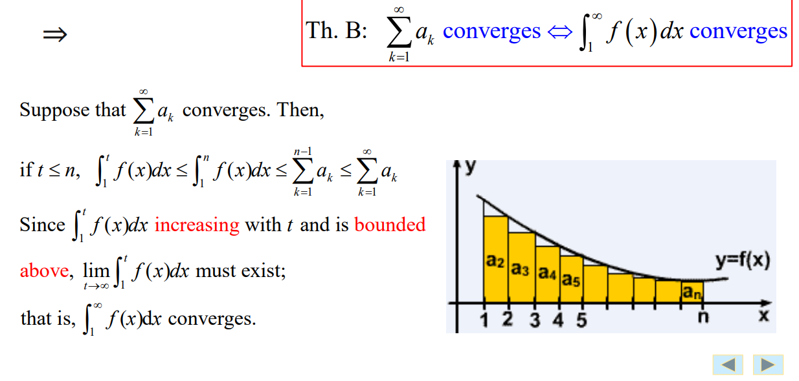

为什么$\int_1^nf(x)dx \leq \sum_{k=1}^{n-1}a_k$：

举个例子，n=2，则$\int_1^2f(x)dx$就等于从1到2的函数图像与x轴围成的面积，而$\sum_{k=1}^{1}a_k=a_1=f(1)=f(1)*(2-1)$就等于f(1) * (2-1)的矩形的面积，比$\int_1^2f(x)dx$多了一个不规则三角形的面积。也就是说，a_k既可以等于f(k)的值的大小，也可以等于f(k) * 1的矩形面积的大小。

##### 作业总结

- 积分判别法

前提条件：级数连续，非负，且总体递减。求级数表达式的积分，根据结果进行判断。

- 求真实级数与前n项部分和级数的误差（级数是离散的）

误差$E=\sum_{k=初始数字+n}^{\infty} \leq \int_{初始数字+n-1}^{\infty} \approx E$

#### 9.4 正项级数的其他判别法（Positive Series: Other Tests）

##### 比较判别法（ordinary comparison test , OCT）

如果a级数和b级数满足$0 \leq a_n \leq b_n, n=1,2,3...$，则：

$\sum_{n=1}^{\infty}b_n$ 收敛则$\sum_{n=1}^{\infty}a_n$收敛，

$\sum_{n=1}^{\infty}a_n$发散则$\sum_{n=1}^{\infty}b_n$发散。

证明只需要使用有界判别法证明。

比较判别法的优势：不需要计算{S_n}。

比较判别法的劣势：必须选择参考级数（且收敛性已知）。而且需要寻找符合判定收敛性的参考数列（单方向性，single direction）。

参考级数（reference series）可以用于判断原级数的性质。

***

##### 常见的（可用于）比较的参考级数

- 等比级数/几何级数（geometric series）

$$\sum_{n=0}^{\infty}aq^n$$

当$|q|<1$，等比级数收敛。

当$|q| \geq 1$，等比级数发散。

- p-级数（p-series）

$$\sum_{n=1}^{\infty}\frac{1}{n^p}$$

当$p>1$，p-级数收敛。

当$p \leq 1$，p-级数发散。

- 调和级数（harmonic series）

$$\sum_{n=1}^{\infty}\frac{1}{n}$$

调和级数发散。

***

注意这里是n=3开始（n=1开始是不同的级数了），因此不能使用$\frac{1}{n^2}$作参考级数，而是$\frac{2}{n^2}$。

***

##### 极限比较判别法（limit comparison test）

如果两个正项级数$\sum a_n$和$\sum b_n$，满足$lim_{n \to \infty} \frac{a_n}{b_n}=L$，则有：
- 如果$0<L<+\infty$，则$\sum a_n$和$\sum b_n$的收敛性一致。
- 如果$L=0$而且$\sum b_n$收敛，则$\sum a_n$收敛。
- 如果$L=+\infty$而且$\sum b_n$发散，则$\sum a_n$发散。

通过参数级数和比较判别法可以证明。

一般的，使用极限比较判别法的时候，需要按给出的$\sum a_n$来找出符合要求的$\sum b_n$来进行判定。

常见的（可用于）比较级数：
- 等比级数（geometric series）

$$\sum_{n=0}^{\infty}aq^n$$

当$|q|<1$，等比级数收敛。

当$|q| \geq 1$，等比级数发散

- p-级数（p-series）

$$\sum_{n=1}^{\infty}\frac{1}{n^p}$$

当$p>1$，p-级数收敛。

当$p \leq 1$，p-级数发散。

- 调和级数（harmonic series）

$$\sum_{n=1}^{\infty}\frac{1}{n}$$

调和级数必定发散。

例子：

***

##### 比值判别法（ratio test）

使$\sum a_n$是正项级数，有$lim_{n \to \infty}\frac{a_{n+1}}{a_n}=p$（注意$a_n$指的是整个表达式），则：

- 如果$0 \leq p<1$，这个级数收敛。
- 如果$p>1$或者$lim_{n \to \infty}\frac{a_{n+1}}{a_n}=\infty(p=\infty)$，这个级数发散。
- 如果p=1或者$lim_{n \to \infty}\frac{a_{n+1}}{a_n}$不存在，这次判别不确定结果（既有可能是收敛也有可能是发散），比值判别法不适用。

实际上，表示的是第n项相比于前一项的趋势是减小还是增大。

比较判别法的优势：仅仅根据这个级数本身（不需要部分和$S_n$，也不需要参考级数）的表达式，就可以判定其收敛性。当表达式内存在n的阶乘（n!）或者n次幂（$a^n$）的时候，非常适合使用比值判别法。

可以先使用比值判别法，如果p=1，使用极限判别法。

例子：

结合了比较判别法和比值判别法。

这里运用了级数收敛的必要条件：如果一个级数是收敛的，那么这个级数的通项的极限等于0。这个结论的逆命题不成立。

***

##### 作业总结

- 比值判别法：直接构建第n+1项和第n项相除的极限，根据结果直接进行判断。
- 极限比较判别法：构造已知收敛性的参考级数进行第n项相处得到比值，根据结果进行判断。
- 比较判别法：构造已知收敛性的参考级数，直接对表达式进行比较即可得。

***

#### 9.5 交错级数，绝对值收敛性和条件性收敛性（alternating series，absolute convergence and conditional convergence）

交错级数的定义为：

$\sum_{n=1}^{\infty}(-1)^{n-1}u_n=u_1-u_2+u_3-u_4+...$

或者

$\sum_{n=1}^{\infty}(-1)^{n}u_n=u_1+u_2-u_3+u_4-...$

交错调和级数（alternating harmonic series）定义为：

$1-\frac{1}{2}+\frac{1}{3}-\frac{1}{4}+...$

***

##### 交错级数判别法（alternating series test）

有交错级数$\sum_{n=1}^{\infty}(-1)^{n-1}u_n=u_1-u_2+u_3-u_4+...(u_n>0)$，如果满足：

$u_n>u_{n+1}>0$（注意是$u_k$逐渐减少）

$lim_{n \to \infty}u_n=0$

则这个交错级数收敛。这两个条件被称为满足收敛性的两个条件。

也就是说，只要满足上述的$u_n>u_{n+1}>0$，且$lim_{n \to \infty}u_n=0$的两个条件，任意交错级数都满足：

$S_{2n}=(u_1-u_2)+(u_3-u_4)+...+(u_{2n-1}-u_{2n})，单调递增$

$S_{2n}=u_1-(u_2-u_3)-..-(u_{2n-2}-u_{2n-1})-u_{2n} \leq u_1，有界$

得到：$lim_{n \to \infty}S_{2n}=s，s \leq u_1$

还能据此推出（可互推）：$lim_{n \to \infty}S_{2n}=lim_{n \to \infty}S_{2n+1}=s$

***

其他满足以下交错级数：

$$r_n=\pm(u_{n+1}-u_{n+2}+u_{n+3}+...)$$

$$|r_n| = u_{n+1}-u_{n+2}+u_{n+3}... $$

综上所述，这是一个通过验证两个收敛性条件来对级数的收敛性进行判断的判定法。

***

##### 绝对值收敛性判别法和绝对收敛和条件收敛（absolute convergence test, absolute convergence, conditional convergence）

绝对收敛定义：如果$\sum|u_n|$收敛，而且$\sum u_n$收敛，则称$\sum u_n$为绝对收敛（converges absolutely）。

条件收敛定义：如果$\sum|u_n|$发散，而$\sum u_n$收敛，则称$\sum u_n$为条件收敛（conditionally convergence）。

证明过程：

##### 根值判别法（root value test）

对级数$\sum u_n$，有$lim_{n \to \infty} \sqrt[n]{u_n}=p$，则：

- 如果p<1，这个级数收敛。

- 如果p>1，这个级数发散。

- 如果p=1，根值判别法不适用。

##### 绝对值比值判别法（absolute ratio test）

如果非零项级数$\sum u_n$，有$lim_{n \to \infty}\frac{|u_{n+1}|}{|u_n|}=p$，则：

- 如果p<1，这个级数绝对收敛（级数收敛且级数表达式绝对值也收敛）。

- 如果p>1，这个级数发散。（因为$u_n$项不趋于0）

- 如果p=1，绝对值比值判别法不适用。

- 如果p含有x，则根据比值判别法的定义，可得在$|p|<1$的x所在区间幂级数收敛。

##### 对数项级数的判别方法总结

- $lim_{n \to \infty} \neq 0$，则发散。
- 如果$lim_{n \to \infty} = 0$，使用比值判别法和根植判别法。
- 如果还是无法判定，就使用极限比较判别法。
- 还是无法判定，就使用比较判别法。
- 通过充要条件（necessary and sufficient conditions）判断。
- 使用基本性质（basic properties）判断。
- 判断{$S_n$}的通项公式的极限是否收敛于s，即部分和数列$S_n$是否收敛。

##### 作业总结

- 对交错级数，直接验证两个条件判断收敛性。
-  对交错级数，直接判断第n+1项和第n项相除的极限的结果进行判断，可以判断绝对收敛。

#### 9.6 幂级数（power series）

幂级数有未知数x，幂级数定义为下列形式：

$$\sum_{n=0}^{\infty}a_n x^n=a_0+a_{1}x+a_{2}x^2+...$$

收敛集/收敛域/收敛区间（convergence set/convergence domain/convergence interval/convergence region）指的是给定一定区间的x，如果这个区间内的x分别写成数项级数而级数收敛，那么这些x的集合就被称为收敛集。

求收敛集是一个常见的幂级数问题：

##### 埃贝尔定理（Abel TH）

- 如果$\sum_{n=0}^{\infty}a_n x^n$在$x=x_0(x_0 \neq 0)$时收敛，则满足$|x|<|x_0|$所有的$x$都收敛，因此$\sum_{n=0}^{\infty}a_n x^n(|x|<|x_0|)$绝对收敛。

证明过程：

- 如果$\sum_{n=0}^{\infty}a_n x^n$在$x=x_0$发散，则满足$|x|<|x_0|$的所有的$x$都发散。

证明过程（与第(1)条的证明过程矛盾而得出）：

对于一个幂级数$\sum_{n=1}^{\infty}a_n x^n$，它一定会收敛于x=0，而不一定收敛于整个数域（number line）。较关键的是求出一个完全确定的正数R，被称为半径（radius）。R符合以下性质：

- 如果$|x|<R$，这个幂级数绝对收敛。
- 如果$|x|>R$，这个幂级数发散。
- 如果$x=R / x=-R$，这个幂级数可能收敛可能发散。

##### 唯一性定理（uniqueness theorem）

对于一个幂级数，收敛集通常是下列三种之一：

- 点$x=0$。
- 一个区间$(-R,R)$，可能再加上部分或全部端点（end point）。
- 整个实数域（real line），也就是$(-\infty,+\infty)$。

正数R被称为幂级数的收敛半径（radius of convergence）。幂级数的符合收敛性定义域被称为收敛区间（interval of convergence）。

- 收敛区间的形式包括$(-R,R),[-R,R),(-R,R],[-R,R]$。
- 如果幂级数仅收敛于x=0，则R=0，收敛区间为：x=0。
- 如果幂级数收敛于所有x，则$R=+\infty$，收敛区间为：$(-\infty,+\infty)$
- 当x处于收敛区间内，一个幂级数会满足绝对收敛。

***

计算收敛半径：

接下来，最关键的就是计算半径R并进行判定。如果一个幂级数$\sum_{n=0}^{\infty}a_n x^n$，而且$a_n \neq 0$，使$lim_{n \to \infty}|\frac{a_{n+1}}{a_n}|=p$或者$lim_{n \to \infty}|\sqrt[n]{|a_n|}|=p$（注意$a_n$是表达式的系数，x是未知数，结果p是不带未知数x的，因此才能进行判定），则：

- 如果$p \neq 0,|R|=\frac{1}{p}$（此处的$R$其实是$|\frac{x^{n+1}}{x^{n}}|=|x|$），使$r=|\frac{1}{p}|$，则原级数仅在$x \in (-r,r)$区间时收敛。（带入$x=R$和$x=-R$得到端点是否满足级数收敛性，发散则为开区间，收敛则为闭区间）
- 如果$p=0,R=+\infty$，原级数处处收敛。
- 如果$p=+\infty,R=0$，原级数发散，只有$x=0$恒满足。

求幂级数的收敛半径时，为了方便也常常直接使用公式$R=lim_{n \to \infty}\frac{a_n}{a_{n+1}}$得到。

更简单的方法：直接把整个式子带进去计算出结果p是含x的表达式（这是直接把$b_n=a_n * x^n$的b_n带进去计算了，实际上p是比值判别法的结果），也可以写成$lim_{n \to \infty} \frac{|a_{n+1} x^{n+1}|}{|a_{n} x^{n}|}=P$，则可以直接反向套用比值判别法的定义，直接得到当$|P|<1$时级数必定收敛，再对两个端点取值的收敛性进行判定确定收敛集。

证明过程：

***

#### 9.7 对幂级数的运算（operations）

##### 连续性（continuity）

如果定义S(x)是处于一个幂级数自身的收敛域内的幂级数的和，则S(x)在收敛域上连续（此连续实际上是离散的整数连续）。

$S(x)=\sum_{n=0}^{\infty}a_nx^n$

##### 逐项求导和可积分（term-by-term differentiation and integration）（求幂级数/级数的和）

在对幂级数的总和S(x)操作前，需要确保收敛域已知且x处于收敛域内，以下操作才能继续进行。

有总和S(x)：

$S(x)=\sum_{n=0}^{\infty}a_nx^n$

则对于处于收敛域的x，由逐项可导得S(x)的导数：

$S'(x)=(\sum_{n=0}^{\infty}a_nx^n)'=\sum_{n=0}^{\infty}(a_nx^n)'=\sum_{n=0}^{\infty}n a_nx^{n-1}$

使用积分求S(x)的定积分：

$\int_0^x S(t)dt=\int_0^x \sum_{n=0}^{\infty}a_nt^n dt=\sum_{n=0}^{\infty}\int_0^x a_nt^n dt=\sum_{n=0}^{\infty}\frac{a_n}{n+1}x^{n+1}$

这里使用$x$和$0$作为积分上下限，一是为了使得最终结果的字母是$x$，可以直接使用，二是为了当$t=0$时的计算方便，没有什么特殊意义。

***

已知S(x)的导数和定积分，就可以根据情况选取方法求得任意幂级数原式S(x)（注意先求收敛域）。

通过以上的公式，再结合常见函数的泰勒展开式，可以推导出几乎任意幂级数的和的解。

常见函数的泰勒展开式其实不多，在笔记结尾的列表处有所有的麦克劳林展开式（x=0点的泰勒展开式）。我们通常会将待展开的函数写成常见函数的形式（通过替换未知数x和提取常数系数等），就像处理积分一样。

注意复合函数的泰勒展开式，也就是求和的时候，因为有无穷多项，因此加减法可以忽略，仅看乘除法（对每个项都有效才考虑）。

***

对级数求和的时候，一般是化为更容易求和的级数，例如等比级数（geometric series）的和公式（sum formula）（由等比数列求和公式推导）：

$\sum_{n=0}^{\infty}a_nx^n=lim_{n \to \infty}(a+ax+ax^2+...)=lim_{n \to \infty}\frac{a(1-x^n)}{1-x}=\frac{a}{1-x} \; (-1<x<1, \; lim_{n \to \infty}x^n=0)$

对于非幂级数的级数求和（sum of series），有：

方法一：求出级数对应的部分和数列$S_n$的和公式的通式，然后再使n趋向于无限即可。（结果是一个常数，或者是带有$x$的公式（不是级数形式））

方法二：对非幂级数的级数求和，也可以暂时的将某个常数c（也就是不含n的部分）替换为x，然后就变成了幂级数。然后对这个幂级数求其和函数$s(x)$，然后把c带入回x即可得到非幂级数的和。

例子：

***

将函数展开为幂级数：

将函数展开为级数，需要通过：

$\int_{0}^{x}f'(t)dt=f(x)-f(0)$

$f(x)=\int_{0}^{x}f'(t)dt+f(0)$

例子：

***

求幂级数的和函数$s(x)$：

对幂级数求和其实是求级数的和函数（sum function of series）$s(x)$，也就是说，通过套用基本的常见级数和导数阶级的进退（逐项求导和逐项积分），可以得到一个带有未知数x的，且不是级数形式的函数通式。设级数的表达式为$\sum _{n=0}^{\infty} f(x)$。

$s(x)=\sum _{n=0}^{\infty} \int_0^x [f(x)]' dt=\int_0^x \sum _{n=0}^{\infty} [f(x)]' dt$（注意是定积分）

$s(x)= \sum _{n=0}^{\infty} [\int f(x) dx]'=[\sum _{n=0}^{\infty} \int f(x) dx]'$（注意是不定积分不带常数）

也就是通过尽量将$[\sum _{n=0}^{\infty} f(x)]'$和$\sum _{n=0}^{\infty} \int f(x)$往基本的常见级数$\sum _{n=0}^{\infty} f(x)=\frac{1}{1-x}$和$\sum _{n=0}^{\infty} f(x)=\frac{1}{1+x}$的形式去化，然后通过导数阶级的进退和上方的两条前进和后退的式子，得到最终的和函数。

例子：

例子：

例子：

***

$$\sum_{n=0}^{\infty}a_nx^n \pm \sum_{n=0}^{\infty}b_nx^n=\sum_{n=0}^{\infty}(a_nx^n \pm b_nx^n)$$

$$\sum_{n=0}^{\infty}a_nx^n * \sum_{n=0}^{\infty}b_nx^n=\sum_{n=0}^{\infty}c_n x^n,c_n=\sum_{k=0}^{n}a_k * b_{n-k}$$

$$\frac{\sum_{n=0}^{\infty}a_nx^n}{\sum_{n=0}^{\infty}b_nx^n}=\sum_{n=0}^{\infty}c_n x^n,c_n满足a_n=b_nc_0+b_{n-1}c_1+...+b_0c_n$$

除法结果的收敛域可能会比两个因子的收敛域小得多。

***

##### 作业总结

这一章是借助幂级数的总和展开式的导数阶级的进退和S(x)的性质（例如导数为自己的S'(x)=S(x)，x=0处结果为1，是e^x）来求任意幂级数的收敛和S(x)的表达式。（注意n视为常数，x视为未知数）

- 无法通过直接求导或者求积分得到解的情况，可以对S(x)进行处理，例如先求x * S(x)。
- 通过幂级数的求和公式，可以通过将普通级数的其中一个常数c设为x转化为幂级数，将此幂级数的和S(x)求出后再x=c，也就是普通级数的和即为S(c)。

***

#### 9.8 泰勒与麦克劳林级数（Taylor and Maclaurin serie）

##### 线性近似（linear approximate）

讨论如何使用一个多项式函数来表示一个已知的函数。数学家给出了两种构想：

$f(x) \approx P_n(x)=a_0+a_1 (x-c)+a_2 (x-c)^2+...+a_n (x-c)^n$

$f(x) \approx P_n(x)=a_0+a_1 x+a_2 x^2+...+a_n x^n$

***

一次近似：$f(x)-f(0)=\Delta y=dy=f'(0)(x-0)$，$f(x) \approx f(0)+f'(0)*x$。（条件限制：x的取值离x=0很接近。）

二次近似：$f(x) = f(0)+f'(0)x+\frac{f''(0)}{2!}x^2$

三次近似：$f(x) = f(0)+f'(0)x+f''(0)x^2+\frac{f'''(0)}{3!}x^3$

函数需满足在0点处有n阶导数。

而误差：$R_n(x)=f(x)-P_n(x)$

将0点进行拓展，变成c点，c点为未知数x的定义域内任意取值，则获得泰勒级数。

##### 唯一性定理（uniqueness theorem）

假设函数f满足：$f(x) =a_0+a_1 (x-c)+a_2 (x-c)^2+...+a_n (x-c)^n$，对于足够接近常数c的所有x满足，且f(x)有任意阶导数，则系数$a_n$推导出等于：

$a_n=\frac{f^{(n)}(c)}{n!}$

对于一个给定的函数和每一个点c，$a_n$的表达式是给定的（determined），表达式是唯一的。

##### 泰勒公式与其误差（Taylor's formula with remainder）

对于一个函数f(x)，在包含点c的开区间K内f(x)的n+1阶导数（如果有任意阶导数则泰勒级数可以写无限项，无限接近原函数）恒存在，则函数f(x)可表示为泰勒级数的形式：

$f(x) =f(c)+f'(c) (x-c)+\frac{f''(c)}{2!}(x-c)^2+...+\frac{f^{(n)}(c)}{n!}(x-c)^n+R_n(x)$

当c=0，则得到泰勒级数的特例，麦克劳林级数：

$f(x) =f(0)+f'(0) (x)+\frac{f''(0)}{2!}(x)^2+...+\frac{f^{(n)}(0)}{n!}(x)^n+R_n(x)$

其中误差（remainer / error）$R_{n}(x)$的公式定义为：

$$R_n (x)=\frac{f^{(n+1)}(b)}{(n+1)!}(x-c)^{n+1}$$

b为在区间$(c-r,c+r)$上的某一个点或者某些点。因此$R_{n}(x)$仍是对误差的近似计算，不是误差的确切值。

***

证明误差$R_{n}(x)$的定义：

将x和a视作常数，构造一个新的函数g(t)，t的取值范围为$[a,x]$，则：

方法一：

构造函数g(t)：

对g(t)进行求导：

运用微分中值定理。

***

方法二：

运用柯西中值定理。

***

##### 泰勒定理（Taylor's theorem）

$f$满足在区间$(c-r,c+r)$上有任意阶的导数，当且仅当$lim_{n \to \infty}R_{n}(x)=0$时：

存在泰勒级数：$f(x) =f(c)+f'(c) (x-c)+\frac{f''(c)}{2!}(x-c)^2+...$

可以表示在区间$(c-r,c+r)$上的函数$f$的值。

***

b为区间$(c-r,c+r)$上的点。如果$x \in (-\infty,+\infty)$，则$r=\infty$。也就是b可取任何数的情况，此时需要证明对所有b都有$lim_{n \to \infty}R_{n}(x)=0$（因为本来求的就是函数通式，因此误差R也是需要在x的每个取值时满足收敛的），才能证明级数收敛。

$R_n (x)=\frac{f^{(n+1)}(b)}{(n+1)!}(x-c)^{n+1}$

##### 补充：另一种泰勒展开的形式（another type of Taylor's formula）

使f(x)为一个n阶导数存在的函数，对于包含了点a的区间I中的任意x满足：

$f(x)=f(a)+f'(a)(x-a)+\frac{f''(a)}{2!}(x-a)^2+...+\frac{f^{(n)}(a)}{n!}(x-a)^n+o(x^n)$

$o(x^n)$是佩亚诺型（Peano Type）的余项（高阶无穷小形式），o(x^n)代表了从n项开始的后面的所有无穷小的相加，因此公式使用等于而不是约等于。其中n等于级数展开到的最后一项的x的幂次数（也就是说，第m项展开后的部分被合并为一个n阶无穷小）。

分析误差的时候还有如$R_{n}(x)=\frac{(-1)^nf^{(2n+1)}(c)}{(2n+1)!}x^{2n+1}$形式为拉格朗日型余项（Lagrange Type），它是原式的真实值和估计值的误差的近似值。

一般来说，用泰勒公式求极限时用佩亚诺型余项（用来方便相消），而分析误差时（比如求e的精确值）用拉格朗日型余项。

***

注意：$lim_{x \to 0}\frac{o(x^n)}{x^n}=0$这是由高阶无穷小的性质和定义决定的。

也就是说，只要满足$lim_{x \to 0}\frac{Expression}{x^n}=0$，无论Expression里面含有什么，甚至含有其他的高阶无穷小，表达式Expression都可以概括简写为$o(x^n)$。

***

泰勒展开，n越大则越近似。求极限时，需要注意展开的次项数。

例如：

$e^x=1+x+\frac{x^2}{2!}+...+\frac{x^n}{n!}+o(x^n)$

$e^{x^2} = 1+x^2+\frac{x^4}{2!}+o(x^4)$（仅展开到4次项，适合相消）

$cos(x) = 1-\frac{x^2}{2!}+\frac{x^4}{4!}+o(x^4)$（仅展开到4次项，适合相消）

一般情况下，都以函数的x=0处进行展开的泰勒公式（也就是麦克劳林级数）进行题目计算。

求极限时难点就在于展开的次项，少了结果不对，多了会造成相消困难。有时候，函数在某点仅有k次导数，也要考虑无法进行超过k项的展开。

***

##### 二项级数的麦克劳林展开（binomial series）

对任意实数p，且|x|<1，则有：

$(1+x)^p=1+C_p^1 x+C_p^2 x+...$

易得此级数在(-1,1)区间收敛。

***

证明：

##### 运用泰勒级数/麦克劳林级数表示函数f(x)

运用泰勒级数/麦克劳林级数表示函数f(x)其实是对于不同的x取值点处求导得到不同的泰勒系数（Taylor coefficient）近似表示同一个函数的操作。定义$x_0$为x的取值点，如果题目求麦克劳林级数，则$x_0=0$，如果是泰勒级数，则会给出$x_0$的值。

第一步，计算泰勒系数 / 麦克劳林系数：$a_n=\frac{f^{(n)}(x_0)}{n!}$

第二步，列出泰勒级数/麦克劳林级数。

第三步，证明$R_n (x_0) \to 0 (n \to \infty)$（证明级数收敛）

第四步，$f(x)=\sum_{n=0}^{\infty}\frac{f^{(n)}(x_0)}{n!}(x-x_0)^n$

运用泰勒级数/麦克劳林级数表示函数例题：

***

通过已知级数求其他函数的级数例题：

##### 级数之间的运算

加减法和乘法：目前只能按四则运算硬乘。

除法：尽量使用同除次幂相消。

##### 求函数f(x)的麦克劳林级数/泰勒级数

首先要明确：泰勒级数是使用一个级数来表示一个函数f(x)，取这个函数f(x)的满足可无限求导的某一点a，则泰勒证明了f(x)对于任意一个点a，都可以写出一个级数，且每个点a得出的级数均可以表示整个f(x)，这个级数被泰勒证明为：

$f(x)=\sum_{n=0}^{\infty}\frac{f^{(n)}(a)}{n!}(x-a)^n$

根据题目给出的a的值，可以直接得出。注意$f^{(n)}(a)$是先求出$f^{(n)}(x)$再将a代入x获得。

***

求麦克劳林级数，就是求$a=0$点处f(x)的泰勒展开式，一般是通过已知的基本泰勒展开公式得到。

要注意的是，麦克劳林级数不是对所有x均成立的通项展开式，它仅仅是$a=0$时的泰勒级数的特殊情况。只有当取x=0时，泰勒级数展开的通项公式的系数最容易算。

$f(x)=\sum_{n=0}^{\infty}\frac{f^{(n)}(0)}{n!}x^n$

我们一般称的泰勒公式，其实是x=0时，形式比较简单的泰勒级数展开式。因为形式简单而a的值统一而采用麦克劳林级数作为泰勒级数展开的一般公式而已。

***

关于麦克劳林级数定义的证明：

#### 9.10 傅里叶级数（Fourier series）

##### 对不连续函数的正弦函数表示

希望能够用一些简单的正弦函数（sine functions）$y=Asin(\omega t+ \phi)$（A是振幅（amplitude），$\omega$是频率（frequency），$\phi$是相位角（phase angle））来表示一个复杂的周期函数。

设想有一个函数满足以上设想：

$f(t)=A_0+\sum_{n=1}^{\infty}A_n sin(n \omega t + \phi_n)$

通过对其中某些字母的替换和换算，我们得到了称其为三角函数（trigonometric function）的函数：

$f(x)=\frac{a_0}{2}+\sum_{n=1}^{\infty}(a_n cos(nx)+b_n sin (nx))$

***

##### 关于三角函数的正交性（orthogonality）

对于任意n的cos(nx)和sin(nx)（1,cosx,sinx,cos2x,sin2x,...），是在$[-\pi,\pi]$区间上的函数的一个正交集（orthogonal set），也就是说，集合中任意两个不同的函数相乘等于0，而集合中任意一个函数的二次方不等于0（两个相同函数相乘不等于0）。

$\int_{-\pi}^{\pi}sinkx \cdot cosnx \; dx=0$

$\int_{-\pi}^{\pi}sinkx \cdot sinnx \; dx=0$

$\int_{-\pi}^{\pi}coskx \cdot cosnx \; dx=0$

$\int_{-\pi}^{\pi}sinkx \cdot sinkx \; dx=\pi$

$\int_{-\pi}^{\pi}coskx \cdot coskx \; dx=\pi$

$cos^2 nx=\frac{1+cos 2nx}{2}$

$sin^2 nx=\frac{1-cos 2nx}{2}$

证明：

***

##### 傅里叶级数展开（fourier series expansion）

以周期为$2\pi$（2L）的周期函数f(x)为例，定义域为R，有傅里叶级数形式：

$f(x)=\frac{a_0}{2}+\sum_{n=1}^{\infty}(a_n cos(nx)+b_n sin (nx))$

傅里叶系数$a_n$和$b_n$公式为：

$a_n=\frac{1}{\pi}\int_{-\pi}^{\pi}f(x) cos nx dx \; ,(n=0,1,...)$

$b_n=\frac{1}{\pi}\int_{-\pi}^{\pi}f(x) sin nx dx \; ,(n=0,1,...)$

***

对f(x)进行逐项积分，区间为$[-\pi,\pi]$，我们有：

$\int_{-\pi}^{\pi}f(x) dx=\frac{a_0}{2}\int_{-\pi}^{\pi}dx+\sum_{n=1}^{\infty}(a_n\int_{-\pi}^{\pi}cos nx dx + b_n\int_{-\pi}^{\pi} sin nx dx)=a_0 \pi$

$a_0=\frac{1}{\pi}\int_{-\pi}^{\pi}f(x)dx$

***

证明：

$\int_{-\pi}^{\pi}f(x)cos kx dx=\frac{a_0}{2}\int_{-\pi}^{\pi} coskx dx+\sum_{n=1}^{\infty}[a_n\int_{-\pi}^{\pi}coskx \cdot cosnx dx+b_n\int_{-\pi}^{\pi}coskx \cdot sinnx dx]=a_k\int_{-\pi}^{\pi}cos^2kx dx=a_k \pi$

$a_k=\frac{1}{\pi}\int_{-\pi}^{\pi}f(x) coskx \, dx$

类似可得：

$b_k=\frac{1}{\pi}\int_{-\pi}^{\pi}f(x) sinkx \, dx$

当k和n不相等的时候，根据正交性结果等于0，所以求和其实只有一项。

***

因此获得（obtain）函数傅里叶级数的步骤为：1.求傅里叶系数和$a_0$。2.写出傅里叶级数。

***

##### 傅里叶级数敛散性（convergence）

使f(x)是周期为$2\pi$的周期函数（可能既有连续区间，也有间断点），且在一个周期内满足以下的迪雷克条件（Dirichlet's conditions）：

- 有限个孤立（isolated）的极大值和极小值

- 有限个的有限间断点（point of finite discontinuity）

则函数f(x)可以写成傅里叶级数展开F(x)，且F(x)收敛于f(x)，满足F(X)的值为：

***

##### 傅里叶级数的延拓（extension）

一种是取值范围为$x \in R$，周期为$2L$，不需要进行延拓。一种是取值范围为$x \in (-L,L)$或更小的，周期为$2L$，此时需要对函数进行直接周期延拓（periodic extension），将其写成定义域不限的F(x)形式，然后把F(x)写成傅里叶级数形式并限定定义域（也就是写成定义域为R的函数F(x)的傅里叶展开，其与原函数f(x)在f(x)的定义域内的值近似，而F(x)在f(x)的定义域外的值与f(x)没有关系，这就是被称为"延拓"的操作）。

取值范围为R的函数也能进行延拓操作，只不过定义域保持为R（也就是直接对函数在R上的傅里叶表示）。

也就是说，如果函数f(x)在一个区间上有定义，那么我们可以定义以这个区间的长度为周期的周期函数F(x)（傅里叶级数表示的函数也是周期函数），使得F(x)在这一个区间上和原来的函数f(x)相同，且在每个周期都和原来的函数f(x)相同。这就是周期延拓函数。

算出来的傅里叶系数是延拓后的F(x)而不是原函数f(x)的，但是延拓前后其实函数的值没有变化，变化的仅仅是定义域。因此可以直接将F(x)的傅里叶系数当作f(x)的傅里叶系数。

延拓方法：

$[f(x), \; x \in [-L,L]] \Rightarrow [F(x)=f(x) \; , \; F(x)=f(x-2kL), \; x \in R]$

$a_0=\frac{1}{L} \int_{-L}^{L} F(x) dx=\frac{1}{L} \int_{-L}^{L} f(x) dx$

$a_n=\frac{1}{L} \int_{-L}^{L} F(x) cos(nx) dx=\frac{1}{L} \int_{-L}^{L} f(x) cos(nx) dx$

$b_n=\frac{1}{L} \int_{-L}^{L} F(x) sin(nx) dx=\frac{1}{L} \int_{-L}^{L} f(x) sin(nx) dx$

$f(x)=\frac{a_0}{2}+\sum_{n=1}^{\infty}(a_n cos(nx)+b_n sin(nx)), \; x \in [-L,L]$

（延拓为F(x)，定义域不限，然后再对F(x)进行傅里叶展开，限定回原函数定义域）

例题：

（注意n取不同值的时候，对$a_n$和$b_n$有影响，则需要分类列出，一般为n=2k和n=2k-1两种情况，并在最终的展开式里带入并显示）

***

##### 正弦函数和余弦函数（奇偶延拓）（sine series and cosine series）

只有对只有单边定义域（$[0,L],[-L,0]$）的函数f(x)才能进行奇偶延拓。

将定义域翻倍后得到函数F(x)，对拓展后定义域属于$(-L,L)$奇函数（odd function）或偶函数（even function）的函数F(x)（周期为2L）的傅里叶级数展开（expansion）和求傅里叶系数就是对原函数f(x)的奇偶延拓（extension）。

函数F(x)在进行奇延拓和偶延拓时的定义是不同的。奇延拓是定义域翻倍$[-L,L]$，但延拓的区间的函数值与原来函数f(x)的原来区间的函数值相反。偶延拓是定义域翻倍$[-L,L]$，但延拓的区间的函数值与原来函数f(x)的原来区间的函数值相等。

***

然后，进行对函数F(x)的延拓操作。

对于一个周期为$2L$奇函数，定义域为$(-L,L)$，它的傅里叶级数是正弦级数（因为都是奇函数，而仅表示为正弦级数代表包含余弦级数的项为0），因此其系数为：

$a_0=0 \; (n=0,1,2,...)$

$a_n=0 \; (n=0,1,2,...)$

$b_n=\frac{2}{L}\int_0^L f(x) sin (nx) dx \; (n=1,2,3...)$

对于一个周期为$2L$偶函数，定义域为$(-L,L)$，它的傅里叶级数是余弦级数（因为都是偶函数，而仅表示为余弦级数代表包含正弦级数的项为0），因此其系数为：

$a_0=\frac{2}{L}\int_{0}^{L}f(x) dx \; (n=0,1,2,...)$

$a_n=\frac{2}{L}\int_{0}^{L}f(x) cos (nx) dx \; (n=0,1,2,...)$

$b_n=0 \; (n=1,2,3,...)$

注意：$\int_{-L}^{L}=2\int_{0}^{L}$，根据定义域不同，积分的上下标需要进行变化。

最后代入回傅里叶级数原式：

$f(x)=\frac{a_0}{2}+\sum_{n=1}^{\infty}(a_n cos(nx)+b_n sin (nx))$

***

对非$\pi$区间延拓的另一种方法：

例如周期函数的定义域满足$t \in [-L,L]$，则设$x=\frac{\pi t}{L}$，此时$x \in [\pi,\pi]$（换元法）。但是其实不如直接求也是可以的。

***

奇偶延拓：题目求正弦函数形式进行奇延拓，题目求余弦函数形式进行偶延拓。奇偶延拓将只有x>0或者x<0定义域的f(x)函数拓展到对称的另一边，也就是定义域扩大了一倍。然后求扩展后定义域内的傅里叶级数函数F(x)，在扩展区间求出的傅里叶级数的基础上取原来的区间。F(x)与原函数f(x)在f(x)的拓展定义域内的值近似，而F(x)在f(x)的定义域外的值与f(x)没有关系。

***

##### 补充：非对称区间的傅里叶级数展开（定义域跨越正负）

函数f(x)定义在$[a,b]$上，且$a \neq -b$。假设f(x)以及所涉及的函数均满足在定义域区间上可以展开成傅里叶级数。

###### 换元法

对x进行代换，变成所熟悉的关于0对称的定义域区间的形式。设$u=x-\frac{(a+b)}{2}$，则有$F(u)=f(x)=f[x-\frac{(a+b)}{2}], -\frac{(b-a)}{2} \leq u \leq \frac{(b-a)}{2}$。对F(u)进行延拓也就是傅里叶系数计算可得f(x)的傅里叶级数展开式。

###### 扩大定义域法

定义一个新函数F(x)，其定义域为$(-L,L)$，$L=max \{ |a| , |b| \}$，而F(x)在$(-L,L)$上与f(x)的值相同，在$(-L,L)$外的余下区间则值等于0。对F(x)进行延拓也就是傅里叶系数计算可得f(x)的傅里叶级数展开式。（这同样适用于不需要延拓情况下分段函数不同表达式的情况，对原函数的积分等于每个定义域段的不同分段函数的积分值之和）

##### 补充：非标准区间上正弦、余弦级数的展开

假设f(x)以及所涉及的函数均满足在定义域区间上可以展开成傅里叶级数。

当题目求展开成正弦级数时，对函数F(t)进行奇延拓。

当题目求展开成余弦级数时，对函数F(t)进行偶延拓。

###### 换元法

对x进行代换，设函数$F(t)$满足将分段的每个函数的定义域（$[a,b],[c,d]$原定义域不作要求）均转化为仅一边且从0开始的区间（方便进行定义域翻倍），也就是$[0,e],[0,f]$或者$[e,0],[f,0], \; (f>e)$ 的形式（不能是$[0,e] , [f,0]$的两边均有的形式）。

然后，对$F(t)$进行奇偶延拓时（也就是计算傅里叶系数时），对于$[0,e]$和$[e,0]$的区间上F(t)的数值，仅取以$[0,e]$和$[e,0]$区间作为定义域的分段函数的值作为F(t)的值，而不是加上以$[0,f]$和$[f,0]$区间作为定义域的分段函数的值。

对$F(t)$进行延拓，得到傅里叶级数展开式，然后就可以得到函数f(x)的正弦/余弦级数展开。

###### 扩大定义域法

仅当函数f(x)定义在$[a,b],[c,d]$且$0 \leq a \leq b \leq c \leq d$或者$\leq a \leq b \leq c \leq d \leq 0$上（分段函数的多个分段定义域）时，可以使用这种方法。

将与0之间未定义的区间定义为值为0的分段函数，也就是定义为（$[0,a],[a,b],[c,d]$或者$[a,b],[c,d],[d,0]$），也就是添加一个$[0,a]$或$[d,0]$区间上且值为0的一个分段函数，这样就转化为了从0开始的区间（方便进行定义域翻倍）。

然后就直接对F(t)进行奇偶延拓，因为空缺的区间的值为0，所以可以直接写进去（反正对系数计算时的积分的值没有影响）。

对$F(t)$进行延拓，得到傅里叶级数展开式，然后就可以得到函数f(x)的正弦/余弦级数展开。

注意：当f(x)的定义域满足$[a,b], \; a < 0 < b$的时候，不能用扩大定义域法，只能使用换元法。

***

#### 无穷级数总结

数项级数包括正项级数（第n项判别法、比值/根值判别法、极限比较判别法、比较判别法、有界和判别法、积分判别法）和交错级数（交错级数判别法）。

函数级数包括幂级数（收敛集、和函数、泰勒级数）和傅里叶级数。

判断绝对收敛和条件收敛。

***

##### 补充：极坐标（polar coordinate）

极坐标的形式为：$(r,\theta)$，其中r为长度，$\theta$为直线与x轴正方形夹角的角度。

极坐标系与笛卡尔坐标系的关系：

$x=rcos\theta, y=rsin\theta$

$r=\sqrt{x^2+y^2},\theta=tan^{-1}\frac{y}{x}$

***

极坐标复杂形式：

例子：

$x^2+y^2=a^2 \to r=a$

$x+y=1 \to r=\frac{1}{cos\theta + sin\theta}$

$r=a(1+cos\theta), r^2=a^2 cos2\theta$

***

求面积A和弧长S：

$r=r(\theta) , \alpha < \theta < \beta$

$A=\frac{1}{2}\int_{\alpha}^{\beta} r^2(\theta) d\theta$
($\frac{\theta}{2\pi} * \pi r^2=\frac{1}{2} * \theta * r^2$)

$S=\int_{\alpha}^{\beta}\sqrt{r^2(\theta)+[r(\theta)']^2} d\theta$
($dS=\sqrt{(dx)^2+(dy)^2}=\sqrt{(d\theta)^2+(dr(\theta))^2}$)

***

### 第十一章-空间几何与向量（geometry in space and vectors）

#### 11.1 三维空间中的笛卡尔坐标（Cartesian coordinates in 3-space）

##### 距离方程

点$P_1(x_1,y_1,z_1)$到点$P_2(x_2,y_2,z_2)$的距离公式为：

$|P_1 P_2|=\sqrt{(x_2-x_1)^2+(y_2-y_1)^2+(z_2-z_1)^2}$

##### 标准球方程（standard equation of a sphere）

圆心中心点坐标(h,k,l)，则：

$(x-h)^2+(y-k)^2+(z-l)^2=r^2$

##### 三维空间中的平面（plane in three-space）

$Ax+By+Cz=D$

$A^2+B^2+C^2 \neq 0$

表达了一个$R^3$中的平面。

特殊平面（special planes）：

- D=0
- A,B,C其中一个是零。
- A,B,C其中两个是零。
- A,B,C,D都不等于零。

##### 三维空间中的曲线（curves in three-space）

$x=f(t),y=g(t),z=h(t),a \leq t \leq b$

如果x,y,z的一阶导数均存在，则我们称曲线是光滑的，而且不同时（simultaneously）为零。

对于上面定义的参数曲线，弧长公式（arc length）为：

$L=\int_a^b \sqrt{[f'(t)]^2+[g'(t)]^2+[h'(t)]^2}dt$

#### 11.2 向量

向量是同时拥有自己的长度和方向的一段（segment）。

向量的模（module）为它的长度。单位向量（unit vector）是模为1的向量，零向量（zero vector）是模为0的向量。

向量和标量的运算具有线性性。

##### 补充：向量的代数表示（algebraic representation of vector）

示例：$\vec{a}=<x,y,z>=x\vec{i}+y\vec{j}+z\vec{k}$

$\vec{i}=<1,0,0> , \vec{j}=<0,1,0> , \vec{k}=<0,0,1>$

向量的基本运算法则：

#### 11.3 点乘/点积（dot product）

定义：

$\vec{u}=u_1\vec{i}+u_2\vec{j}+u_3\vec{k}$

$\vec{v}=v_1\vec{i}+v_2\vec{j}+v_3\vec{k}$

有：

$\vec{u} \cdot \vec{v}=u_1v_1+u_2v_2+u_3v_3$

等效于：

$\vec{u} \cdot \vec{v}=|\vec{u}| \cdot |\vec{v}| cos \theta$

在三维空间中：

$\vec{a}=<x,y,z>=a_1\vec{i}+a_2\vec{j}+a_3\vec{k}$

$cos\alpha=\frac{\vec{a} \cdot \vec{i}}{|\vec{a}||\vec{i}|}=\frac{a_1}{|\vec{a}|}$

$cos\beta=\frac{a_2}{|\vec{a}|}$

$cos\gamma=\frac{a_3}{|\vec{a}|}$

$cos^2 \alpha+cos^2 \beta+cos^2 \gamma =1$

##### 补充：标量和向量的投影（projections）

向量u在向量v上的向量投影等于向量u在向量v方向上的向量分量。

向量u在向量v方向上的向量投影（vector projection）：$Proj_{\; \vec{v}}\vec{u}=\frac{||\vec{u}|| \cdot cos\theta}{||\vec{v}||}\vec{v}=(\frac{\vec{v} \cdot \vec{u}}{||\vec{v}||^2})\vec{v}$

向量a在向量b方向上的标量投影（scalar projection）：$||Proj_{\; \vec{v}}\vec{u}||=||\vec{u}||cos\theta=\frac{\vec{v}\cdot\vec{u}}{||\vec{v}||}$

##### 补充：点/平面与平面之间的距离

一个点$(x_1,y_1,z_1)$离平面$Ax+By+Cz=D$（平面上一固定点为$(x_0,y_0,z_0)$）的距离L定义为：

$L=\frac{|A(x_1-x_0)+B(x_1-x_0)+C(x_1-x_0)|}{\sqrt{A^2+B^2+C^2}}=\frac{|Ax_1+Bx_1+Cx_1-D|}{\sqrt{A^2+B^2+C^2}}$

***

而两相互平行的平面$Ax+By+Cz=D$与平面$Ax+By+Cz=E$之间的距离则为：

$L=\frac{|D-E|}{\sqrt{A^2+B^2+C^2}}$

***

#### 11.4 叉乘/叉积（cross product）

定义：

$\vec{u}=u_1\vec{i}+u_2\vec{j}+u_3\vec{k}$

$\vec{v}=v_1\vec{i}+v_2\vec{j}+v_3\vec{k}$

有：

$\vec{u} \times \vec{v}=<u_2v_3-u_3v_2, u_3v_1-u_1v_3, u_1v_2-u_2v_1>$

$\vec{u} \times \vec{v}=-(\vec{v} \times \vec{u})$

$|\vec{u} \times \vec{v}|=|\vec{u}||\vec{v}|sin \theta$

***

在三维坐标系上，满足：

$\vec{u} \times \vec{v}$为垂直于$\vec{u},\vec{v}$组成的平面的向量，模长为$|\vec{u} \times \vec{v}|=|\vec{u}||\vec{v}|sin \theta$

$\vec{u},\vec{v},\vec{u} \times \vec{v}$这三个向量可形成一个右手坐标系。两个因子向量$\vec{u},\vec{v}$分别与它们的叉乘向量$\vec{u} \times \vec{v}$垂直。

当且仅当$\vec{u} \times \vec{v}=0$时，$\vec{u},\vec{v}$相互平行（$\vec{u} // \vec{v} \to \frac{u_1}{v_1}=\frac{u_2}{v_2}=\frac{u_1}{v_1}, \vec{u} \times \vec{v}=0$）。

***

通过行列式的定义和线性代数可得叉乘的行列式表示形式：

（后两步都是根据行列式的定义反推得到，一个是二阶矩阵的行列式，二是余因子展开式的行列式定义）

使用行列式表示非常容易记忆，等于求解三阶行列式。注意第二个向量$\vec{j}$的余因子展开式是需要乘$(-1)$的，因此其实是：

$$\begin{vmatrix}\vec{i} & \vec{j} & \vec{k} \\ u_1 & u_2 & u_3 \\ v_1 & v_2 & v_3 \end{vmatrix}=\begin{vmatrix}u_2 & u_3 \\ v_2 & v_3 \end{vmatrix} \vec{i}-\begin{vmatrix}u_1 & u_3 \\ v_1 & v_3 \end{vmatrix} \vec{j}+\begin{vmatrix}u_1 & u_2 \\ v_1 & v_2 \end{vmatrix} \vec{k}=\begin{vmatrix}u_2 & u_3 \\ v_2 & v_3 \end{vmatrix} \vec{i}+\begin{vmatrix}u_3 & u_1 \\ v_3 & v_1 \end{vmatrix} \vec{j}+\begin{vmatrix}u_1 & u_2 \\ v_1 & v_2 \end{vmatrix} \vec{k}$$

***

计算叉乘结果的方法：

选取一项$a_{ij}$，其同行同列元素除去，展开为余因子展开式则为$(-1)^{i+j} \; a_{ij} \; det|剩余元素组成的矩阵|$

***

叉乘的代数性质（algebraic properties）/基本运算法则：

***

对三个向量$\vec{a},\vec{b},\vec{c}$，它们的三重积/混合积（triple product/mixed product）$[a b c]$或者$(a,b,c)$或者$(abc)$被定义为其中一个向量点乘另外两个向量的叉乘：

$\vec{a}\cdot(\vec{b}\times\vec{c})=\vec{b}\cdot(\vec{c}\times\vec{a})=\vec{c}\cdot(\vec{a}\times\vec{b})$

性质1：

性质2：

$\vec{a}\cdot(\vec{b}\times\vec{c})=(\vec{a}\times\vec{b})\cdot\vec{c}=\vec{c}\cdot(\vec{a}\times\vec{b})$

$\vec{a}\cdot(\vec{b}\times\vec{c})=-\vec{a}\cdot(\vec{c}\times\vec{b})$

几何意义：

三个向量定义了一个平行六面体，而它们的混合积的绝对值就等于这个平行六面体的体积。

图示：

证明：

***

##### 通过叉乘获得向量的平面方程

平面方程的标准形式（standard form）：

$\vec{n}=<A,B,C>$被称为平面的垂直向量/法向量（normal vector）（可以通过叉乘获得）。其实就是以$P_1(x_0,y_0,z_0)$为固定点的所有向量$\vec{P_1 P}=<x-x_0,y-y_0,z-z_0>$都与$\vec{n}$垂直，也就构建了一个垂直于$\vec{n}$的平面。

平面上有任意一点$P(x,y,z)$，满足$\vec{P_1 P} \cdot \vec{n}=0$，等价于了一个平面的定义式：$A(x-x_0)+B(y-y_0)+C(z-z_0)=0$，可以写成$Ax+By+Cz+D=0$（因为$x_0,y_0,z_0$均已知）。

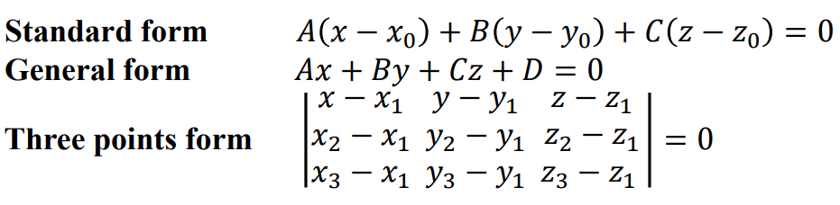

***

平面方程的标准形式条件：

也就是说，有一未知平面，已知其的垂直向量$\vec{n}=<a,b,c>$和平面上一点$P_1(x_0,y_0,z_0)$，即可得到平面方程：

$a(x-x_0)+b(y-y_0)+c(z-z_0)=0$

***

有任意向量(x,y,z)，其与向量(a,b,c)均垂直，则满足：

$(a,b,c) \cdot (x,y,z)=ax+by+cz=0$

此时任意向量(x,y,z)组成了一个平面。而D的不同可以认为决定了平面在垂直于向量(a,b,c)的方向上的上下平移的距离。

如果一个ABCD均未知的平面$Ax+By+Cz=D$，过一点$P(x_0,y_0,z_0)$，有一法向量$(a,b,c)$，则可以直接得到平面表达式：

$a(x-x_0)+b(y-y_0)+c(z-z_0)=0$

***

##### 补充：通过叉乘求平行四边形或者三角形的面积

平行四边形面积：$S=||\vec{a} \times \vec{b}||$

三角形面积：$S=\frac{1}{2}||\vec{a} \times \vec{b}||$

***

#### 11.5 向量值函数和曲线运动（vector-valued functions and curvilinear motion）

类似实数值函数（real-valued function）$f(x)$，存在向量值函数$\vec{F}(t)=f(t)\vec{i}+g(t)\vec{j}+h(t)\vec{k}$

***

对向量值函数的求极限法则：

***

对向量值函数的求导$D_t[\vec{F}(t)]$法则：

***

***

对向量值函数的积分法则：

***

曲线运动（curvilinear motion）：

$\vec{r}(t)=f(t)\vec{i}+g(t)\vec{j}+h(t)\vec{k}$被称为点（point）的位置向量（position vector），而对应的运动我们称为曲线运动（curvilinear motion）。

则对应的速度和加速度满足：

$\vec{v}(t)=\vec{r}'(t)=f'(t)\vec{i}+g'(t)\vec{j}+h'(t)\vec{k}$（t点位置的切线向量，也就是速度方向向量）

$\vec{a}(t)=\vec{r}''(t)=f''(t)\vec{i}+g''(t)\vec{j}+h''(t)\vec{k}$

***

已知位置向量，求其在自变量一定区间内的轨迹的曲线长度：

$\vec{r}(t)=f(t)\vec{i}+g(t)\vec{j}+h(t)\vec{k}$

根据类似二维平面的定义，可得：

$L=\int_{t_i}^{t_f}\sqrt{(f'(t))^2+(g'(t))^2+(h'(t))^2}$

***

#### 11.6 在三维空间中的直线和曲线（lines and curves in three-space）

##### 直线方程

一般式/一般方程（common equation）：

空间直线可看成两平面和的交线，写成两平面的方程组即为P点的一般方程：

补充：一般式化为对称式：

- 取直线上一点（通过联立两条平面方程得到），两个平面的法向量（根据平面方程的定义得到法向量就是$<A_{1},B_{1},C_{1}>$和$<A_{2},B_{2},C_{2}>$）的叉乘得到方向向量。
- 取直线上两点，连接得到方向向量。
- 将y和z用x表示，先化为参数式再化为对称式。

***

参数式/参数方程（parameter equation）：

已知或者求出一个向量$\vec{v}=a \vec{i}+b \vec{j}+c\vec{k}=<a,b,c>$，被称为方向向量（direction vector）（注意和速度v没关系）。其中a,b,c被称为方向数字（direction number）。

有固定点$P_0$，作一直线$P_0P$满足$\vec{P_0 P}=t\vec{v}$（$\vec{P_0 P}$与$\vec{v}$平行），$P$为直线上的任意一点，用未知向量$<x,y,z>$表示。因此$\vec{P_0 P}=<x-x_{0},y-y_{0},z-z_{0}>$。

使$\vec{r}=\vec{OP}$和$\vec{r_0}=\vec{OP_0}$分别为$\vec{P}, \vec{P_0}$的位置向量，则可得$\vec{r}=\vec{r_0}+\vec{P_0 P}=\vec{r_0}+t\vec{v}$

***

参数方程的条件：

已知一方向向量$\vec{r}=<x,y,z>$且已知一位置向量$\vec{r_0}=<x_0,y_0,z_0>$，可得$\vec{r}$也就是P点所在直线的参数方程：

$x=x_0+at , \; y=y_0+bt, \; z=z_0+ct$

以一个参数方程组进行表示。

***

空间直线的对称式/点项式/标准方程（symmetric equation/standard equation）：

空间直线的标准方程也称为对称形式（symmetric form）。

几何意义：

通过定义推导：

由$\vec{P_ 0 P} // \vec{v}$和平行的定义$\frac{x_1}{x_2}=\frac{y_1}{y_2}=\frac{z_1}{z_2}$可以推导出P点的标准方程：

与参数方程类似，有已知点$P_0$，对应的位置向量为$\vec{r_0}=<x_0,y_0,z_0>$，有已知方向向量$\vec{v}=<a,b,c>$，作平行直线$\vec{P_0 P}=<x-x_0,y-y_0,z-z_0>$，直接可得对称式：

$\frac{x-x_0}{a}=\frac{y-y_0}{b}=\frac{z-z_0}{c}$

***

##### 补充：已知两个平面，求其交线的标准方程

先把x=0，得到两平面的交点$P_1(0,y_1,z_1)$，再把y=0，得到两平面的交点$P_2(x_2,0,z_2)$，得到向量$\vec{P_1P_2}$作为方向向量$\vec{v}=<a,b,c>$，选取其中一个交点P作为位置向量$(0,y_1,z_1)=<x_0,y_0,z_0>$，直接得到：

$\frac{x-x_0}{a}=\frac{y-y_0}{b}=\frac{z-z_0}{c}$

##### 补充：同时垂直于两个向量的向量的方向

$\vec{v} \cdot \vec{a}=0$

$\vec{v} \cdot \vec{b}=0$

则可以转化为叉乘，k为实数，则：

$\vec{v}=k * \vec{a} \times \vec{b}=k * \vec{c}$

***

##### 补充：求同时垂直两个平面的向量通式

有向量u垂直平面A，向量v垂直平面B，则所求向量为：

$\vec{a}=k * \vec{u} \times \vec{v}$

##### 补充：求两个平面的交线的向量方向

有平面A、平面B如下：

A：$a_1x+b_1y+c_1z=D$

B：$a_2x+b_2y+c_2z=E$

则平面A的法向量为$\vec{n_1}=<a_1,b_1,c_1>$和平面B的法向量为$\vec{n_2}=<a_2,b_2,c_2>$，同时垂直于两法向量的向量方向正是平行于两平面的交线的方向：

$\vec{v}=k * \vec{n_1} \times \vec{n_2}$

***

##### 空间曲线的切线方程（切线向量）

对于一个直线向量，如果在某一点其的导数存在，则切线向量存在。

如图，根据导数的定义和向量加减法的运算法则，可以得到切线向量$\vec{T}(t)$就等于原向量值函数求导的结果。

$\vec{T}(t)=\vec{r} '(t)=<f'(t),g'(t),h'(t)>$

#### 11.7 曲率和加速度（curvature and acceleration）

曲率衡量了曲线的弯曲程度。

对位置向量$\vec{r}(t)$，有切线方向向量$\vec{v}(t)=\vec{r}'(t)$，但其模长不一定为1。

因此定义了在$\vec{P}(t)$处的切线单位向量（unit tangent vector）为$\vec{T}(t)$，满足：

$$\vec{T}(t)=\frac{\vec{r}'(t)'}{||\vec{r}'(t)||}=\frac{\vec{v}(t)}{||\vec{v}(t)||}$$

***

***

通过切线单位向量和路径变化求曲率（切线单位向量关于曲线长度的变化率，也就是导数）,曲率公式：

$\kappa=||\frac{d \vec{T}}{d s}||$（一般无法使用，因为ds比较难以使用）

***

***

##### 曲率的一般公式

通过切线单位向量和速度向量求曲率：

通过链导法则：

$$\frac{d\vec{T}}{ds}=\frac{d\vec{T}}{dt} \cdot \frac{dt}{ds}=\frac{\vec{T}'(t)}{||\vec{v}(t)||}$$

曲率公式（常用）：

$$\kappa=||\frac{d \vec{T}}{d t} \cdot \frac{d t}{d s}||=\frac{||\vec{T}'(t)||}{||\vec{v}(t)||}=\frac{||\vec{T}'(t)||}{||\vec{r}'(t)||}$$

***

例子：

***

##### 曲率的角度公式

通过角度和路径的变化率求曲率：

定义$\phi$为切线方向与$\vec{i}$的夹角。对向量的求导会得到对应的切线向量，因此将切线单位向量$\vec{T}$关于角度$\phi$求导，得到与$\vec{T}$垂直的单位向量。

***

##### 曲率的二维向量函数公式（适用于双函数和单函数）

在二维平面上，可以通过三角函数公式$tan\phi=\frac{y'(t)}{x'(t)}$的多步推导得到关于两个函数组成的曲线的曲率的公式：

注意：可以通过函数转换为向量形式，也可以通过向量转化为函数形式，两种转换都可以使用二维向量函数公式来求曲率。

如果y是关于x的函数（单函数，满足x=x，x'=1,x''=0），仍为二维平面，则化简为：

***

##### 曲率圆和曲率半径

曲率圆，又称密切圆。 在曲线上一点P的法线上，在凹的一侧取一圆心点O ，使OP等于该点处的曲率半径（曲率的倒数），以O为圆心，OP为半径作圆。使得圆P在M点处与曲线相切。

这个圆叫做曲线在该点处的曲率圆（circle of curvature），其半径称为曲率半径，曲率半径$R=\frac{1}{\kappa}$（radius of curvature）的倒数为原曲线在该点的曲率，其圆心称为曲率中心（center of curvature）。

所有圆都符合的性质：曲率等于半径的倒数。

***

例子：

***

##### 补充：与切线向量$\vec{T}$垂直的向量

如果$\vec{T}$是切线单位向量，则与其垂直的单位向量为$\vec{N}$（normal vector），可以对$\vec{T}$求导得到。

$\vec{N}=\frac{\vec{T}'}{||\vec{T}'||}$

##### 补充：极坐标下的曲率公式推导

$r=r(\theta), x=r(\theta)cos(\theta), y=r(\theta)sin(\theta)$

套入二维平面公式：

***

#### 11.8 三维空间中的曲面（surfaces in three-space）

曲面的应用：

用作对曲面方程的图像分析，并画出图像：

已知曲面的一些条件，得到曲面方程：

***

##### 柱面（cylinder）

有一条平行于L的直线，这些直线与曲线C相交并沿着曲线C的轨迹平行移动组成的一个曲面，称为柱面。

C是一个平面曲线，L是一条与C相交但不与C在同一平面的直线。

***

如果某一个轴的变量没有定义，则其定义域为无限延伸，总体图形为其他轴的图像在此轴无限延伸，因此被称为柱面。

也就是说，柱面的方程均为二元二次方程。

***

通过柱面的定义一眼看出方程代表的曲面形状：

***

##### 二次曲面（quadric surface）

三元二次方程所表示的曲面称为二次曲面。二次曲面在三维空间中也表现为曲面图形。它们各自拥有一一对应的方程式，特点是方程式中的未知数为最多为二次。

二次曲面方程的通式形式为：

$Ax^2+By^2+Cz^2+Dxy+Exz+Fyz+Gx+Hy+Iz+J=0$

通过坐标轴的旋转和平移，转化为以下两种形式之一：

$Ax^2+By^2+Cz^2+J=0$

$Ax^2+By^2+Iz=0$

注意曲面与方程是一一对应的。

***

常见二次曲面图像及方程形式（单元主要内容是画图）：

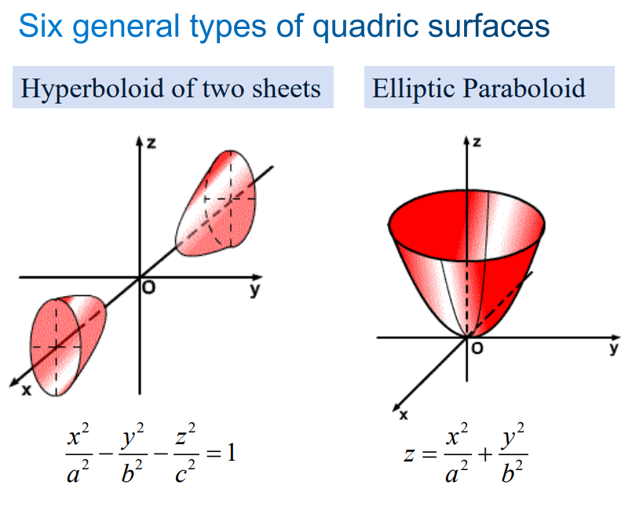

***

得到二次曲面图像的方法可以通过截横法、柱面的定义、平面旋转法、伸缩法（将一个系数拓展为多个）等组合得到。

旋转+伸缩变形法（柱面定义+平面旋转法+伸缩法）：

***

截横法（最常用也最暴力）：

***

特殊情况（可直接化简的情况）：

伸缩法的反向化简（系数合并）：

球面的定义（系数合并）：

***

##### 截痕法

对一个曲面使用一个平面进行截取，会得到一个曲线图像轨迹（trace），被称为截面（cross section）。

通过每个变量的分别取0，可以执行"截面"操作，分别得到xy平面、xz平面、yz平面的图像，因此可以轻易得到三维图像。这种方法称为"截痕法"。

***

##### 平面旋转法

对于一三维坐标系，如果有一个二维平面的平面曲线进行旋转后得到的三维曲面，已知此二维平面的平面曲线的表达式（仅含其中两个变量），求进行旋转后得到的三维曲面。

如现在有$y=kx^2$在xy平面上，绕y轴旋转得到在xyz坐标系下的曲面，则先使$y=a$，求图像旋转后得到的圆形的半径$R$的公式（其中R包含变量y也就是包含a），使$x^2+z^2=R^2$，即可得到三维曲面的表达式。

如$y=2x^2$绕y轴旋转，则$y=a$，选x轴方向作为半径。$R=|x|=\sqrt{\frac{y}{2}}=\sqrt{\frac{a}{2}}$，有$x^2+z^2=R^2=\frac{y}{2}$，因此最终结果为$y=2x^2+2y^2$

***

二级推论：x,y,z轴。待旋转的图像其中两轴x,y有定义而z没有定义：如果绕x轴旋转，则将y替换为$\sqrt{y^2+z^2}$。如果绕y轴旋转，则将x替换为$\sqrt{x^2+z^2}$。

通过此二级推论一眼看出方程代表的曲面形状：

***

#### 11.9 柱面坐标系和球面坐标系（cylindrical and spherical coordinates）

柱面坐标系和球面坐标系与笛卡尔坐标系的比较：

笛卡尔坐标系：$P(x,y,z)$

柱面坐标系：$P(r,\theta,z)$

球体坐标系：$P(\rho,\theta,\phi)$

***

柱面坐标系与笛卡尔坐标系的相互转换方法：

$x=r cos \theta$

$y=r sin \theta$

$z=z$

$r=\sqrt{x^2+y^2}$

$tan\theta=\frac{y}{x}$

$z=z$

***

球面坐标系与笛卡尔坐标系的相互转换方法：

以上所有转换方法同时适用于某一点的转化和图形方程的转化。（柱面坐标系就将式子转化为仅包含$r$，$\theta$，$z$，球面坐标系就将式子转化为仅包含$\rho$，$\theta$，$\phi$）

***

### 第十二章-多元函数（多实变量函数）

#### 12.1 多元函数

多个实变量（real variable）的函数也叫做多元函数，其定义为：

可以看出实变量的个数为"总变量数-1"。变量分为自变量和因变量，只有自变量算作实变量，也是多元函数的"元"的意义。

***

二元函数通常表示为一个曲面（surface）：

***

二元函数，当其值等于一个常数值时，通常表示为等高线（level curves）：

***

对三元函数，当其值等于一个常数值时，通常表示为一个曲面/等值面（level surfaces）：

***

补充：使用不等式表示图像。

***

#### 12.2 偏导数（partial derivatives）

对于多元函数（multivariate function）而言，求偏导数就是除了其中一个的其他所有变量值视作常数时，对最后那个变量的一元求导。

二元函数可导则不一定连续。这是因为多元函数的导数的过程不一样。

一元函数和多元函数的导数意义：

***

偏导数的定义（对变量x求偏导）：

将变量x替换为y，过程完全一致。

$\partial_{a}(f(a,b,c...))$表示对函数$f(a,b,c...)$的实变量a的偏导数。

***

例子：

（对三变量函数且为两实变量函数求偏导的形式）

（注意：偏微分是一个整体，不能像微分一样视作除法相消）

***

求偏导数时对非对应的其他实变量的处理方法：

方法就是：将其他实变量视作常数，进行求导。

***

##### 高阶偏导数（high-order partial derivative）

先对x求偏导再对y求偏导的格式（下标越是靠右则越偏导顺序越后，囊括靠左的全部偏导数）：

***

##### 补充：次幂的次幂不等于次幂相乘

$3^{3^3}=3^{27}$

$3^{3 * 3}=3^9$

$a^{b^c} \neq a^{bc}$

***

偏导数的几何意义：

偏导数其实就表示了：在某一变量a可变时，以过一点P的其他变量的固定值作为截面截取出一个降维图像（此图像仅变量a可变），获得与原图像的交曲线。这个交曲线的P点处切线即为此变量在其他变量为固定值时此点的偏导数。

***

#### 12.3.1 多元函数的极限

极限的定义回顾：

延展为二元函数的极限：

***

平面邻域（neighborhood）定义：

对于极限而言，需要有一个$\delta>0$来证明极限。

而对于二元函数，将变量合并表示为位置向量，则也有一个半径为$\delta$的圆形邻域，来充当极限的证明变量。

***

二元函数和趋近向量(a,b)是无关的（irrelevant），也就是二元函数在向量(a,b)不一定需要有定义。

***

二元函数到趋近向量的方向和路径（path）和趋近向量(a,b)是无关的。趋近的方向和路径均是无限多的。

显然，如果每个路径（每个待趋近向量）都分别对应一个L值（多个L值），则极限不存在，这意味着不同的路径求得的极限值一定是唯一的。

***

不同的表示方式（notations）。

***

具有可延展性，从二元函数可以拓展到任意多元函数。

***

二元函数的极限的证明过程：

（趋近方向有无限个）

相比之下，一元函数的趋近方向仅有两个，为：

即二元函数一个向量趋近于另一个向量的方向是无限多个的。

***

##### 证明函数在某个坐标点是否可微（多变量极限求解方法）

证明极限不存在：

对多个变量同时进行极限处理即可，也就是不需要分步骤或者分开处理。

- 注意判断极限是否存在时，则要判断当两个变量其中之一取其趋近值时的两个极限是否相同，若不同则极限不存在，若相同极限不一定存在，需要进一步验证。（运用拆分极限的方法，$lim_{(x,y) \to (a,b)}=lim_{x \to a}lim_{y \to b}=lim_{y \to b}lim_{x \to a}$）此方法也可以用于直接求极限。

- 可以假设y和x之间的关系，如$y=kx$，$y=x^2$，$y=0$等（只要趋近的值符合要求，这是可以随便假设的。因为每个y关于x的表达式都代表了一个"方向"，如果存在不同方向求得的极限不一致就极限不存在，需要找到适合的方向）。此方法主要用于验证极限存在性，但是也能求极限。

- 某些情况下，可以将极限的表达式转化为极坐标系的表达式使得"两个变量统一为变量$r$"进行计算，也可以自定义同时关于x和y的表达式$t$作为统一变量。（此时需要讨论x=0，也就是$cos\theta=0$的特殊点）$y=r * sin\theta$，$x=r * cos\theta$，$\frac{y}{x}=tan\theta$。此方法也可以用于直接求极限。

- 对求极限的题目，直接带入为未定式的情况，可以使用夹逼定理或者凑出多元函数洛必达（书上没有）。

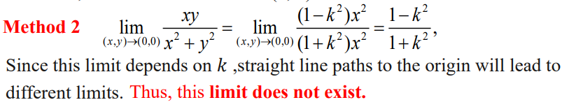

***

例子（证明极限不存在）：

***

例子（证明极限是否正确）：

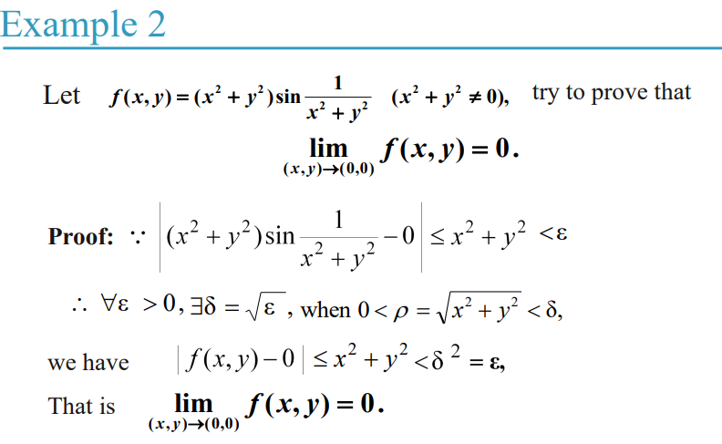

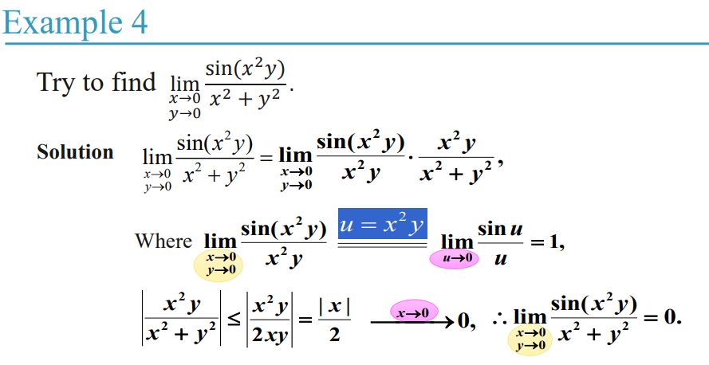

***

#### 12.3.2 多元函数的连续性

定义：

一元函数，此点的极限值就等于此点的函数值，则称为在此点连续。这隐含满足了三个条件：

- 函数在此点有函数值
- 函数在此点有极限值
- 函数在此点的函数值等于极限值
***

##### 多项式和有理函数的连续性

定义：

***

定理1：

说明了多项式和有理函数的连续性。与一元函数完全类似，仅仅是把分子和分母先拆开考虑而已。

***

定理2：

***

例子：

证明在任意点连续：

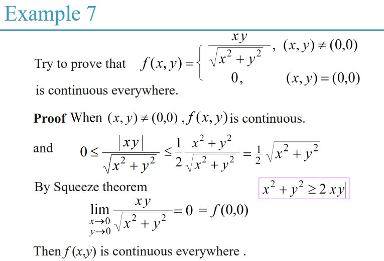

证明在某个面连续：

***

##### 集合的连续性

定理：如果函数的二阶偏导数$f_{xy}$和$f_{yz}$在集合S中均连续，则在集合S中每一点均满足$f_{xy}=f_{yz}$。集合S可以是一定的取值区间。

***

例子：

***

单元总结：

***

#### 12.4 可微性（differentiability）

注意：可微性不等于可导性。可微代表所有维度（多元）下的导数（偏导数）存在，在一元函数下两者等价。可微是可导的充分条件（可微一定可导，可导不一定可微），二可导是连续的充分条件（可导一定连续，连续不一定可导）。

补充：可微$\geq$可导$\geq$连续$\geq$可积。

补充（定理3）：如果函数f在p点可微，则函数f一定在p点连续。（如果替换为可导则错误）

在一维函数，只要满足有一阶导数存在，或者在x点有切线图像存在，则具有可微性。

推广到多元函数，则需要满足切平面（tangent plane）存在。或者，需要的是偏导数的存在+其他条件，才具有可微性。

***

例子：

切平面需要在所有方向上近似于三维图像，才有效。（与图像相切的平面）

***

##### 局部线性性（locally linear）

对于一个函数f(x)，如果在a点函数具有非垂直切线（有切线经过$(a,f(a))$，且近似于函数f(x)的图像），则称函数f(x)在a点满足局部线性性（locally linear）。

h的意义近似于足够小的增量$\Delta x$，而$\varepsilon(h)$是一个函数，满足当h趋近于0时，函数值等于0。

得到：函数在一点处局部线性性等价于在此点可微。

本质上是可微的另一定义（n次近似）：

$f(x) \approx f(x_0) f'(x_0)*(x-x_0)$

$f(x+\Delta x)-f(x)=A\Delta x+o(\Delta x)$

***

与二维情况相似的，推广到三维情况（二元函数），则讨论局部线性性：

如果函数f满足在p点局部线性性，则函数f在p点可微。
如果函数f满足在开放集合（open set）R中的每个点可微，则函数f在开放集合R可微。

***

##### 多元函数的梯度（gradient）与可微性

定义：

通过在p点的多元函数的梯度（gradient）$\nabla f(p)=<f_x(p),f_y(p)>=f_x(p)\vec{i}+f_y(p)\vec{j}$可直接判断多元函数是否在p点可微：

当且仅当满足：$f(p+h)=f(p)+\nabla f(p) \cdot h+\varepsilon(h) \cdot h=f(p)+(f_x(p),f_y(p)) \cdot h+\varepsilon(h) \cdot h \; (s.t. : \; lim_{h \to 0}\varepsilon(h)=0)$，函数f在p点可微。（以上的乘法均为点乘。）

$\nabla$读作"del"，通常被称为del-operator。

函数的梯度为向量，但其类似于函数的导数。

梯度满足导数的线性性质和乘法性质：

$\nabla[f(\mathbf{p})+g(\mathbf{p})]=\nabla f(\mathbf{p})+\nabla g(\mathbf{p})$

$\nabla[\alpha f(\mathbf{p})]=\alpha \nabla f(\mathbf{p})$

$\nabla[f(\mathbf{p}) g(\mathbf{p})]=f(\mathbf{p}) \nabla g(\mathbf{p})+g(\mathbf{p}) \nabla f(\mathbf{p})$

***

补充：求多元函数某一点的切面（图像为元数+1）：

与一元函数求切线的方法类似，过某点，且梯度代替导数的位置即可：

$y-y_0=f'(x_0)*(x-x_0)$

$y=f'(x_0)*(x-x_0)+y_0$

则二元函数的切面为$z=k_1x+k_2y+c$的形式，为：

$z=\nabla f(x_0,y_0) \cdot <x-x_0,y-y_0>+f(x_0,y_0)$

则三元函数的切面为$w=k_1x+k_2y+k_3z+c$的形式，为：

$w=\nabla f(x_0,y_0,z_0) \cdot <x-x_0,y-y_0,z-z_0>+f(x_0,y_0,z_0)$

对于对切面方向的条件：还有，因为偏导是各个坐标轴方向的图像的导数，因此如果要求平行于某个平面的切面，则其另外的方向的变量的导数的值为0。例如$z=f(x,y)$的图像在某点的切面水平于xy平面，则此点的梯度一定为$\nabla F(x,y,z)=<0,0,k>(k \neq 0)$的形式（可以使用截横法理解为什么必须满足以上条件）。

***

##### 多元函数可微的必要条件（判断函数在某点是否可微）

多元函数可微性的必要条件的等价定义：存在全微分（total differential）。（或者说偏导数/梯度存在）

函数$f(x,y)$的全微分（total differential）$df=dz$定义为：$\Delta z=A\Delta x + B\Delta y=z_x \Delta x+z_y \Delta y=\frac{\partial z}{\partial x}\Delta x+\frac{\partial z}{\partial y}\Delta y$

$f(x,y)$在点$(x_i,y_i)$处可微等价于：存在常数$A$和$B$满足$\Delta f=f(x_i +\Delta x, y_i +\Delta y)-f(x_i, y_i)=\frac{\partial z}{\partial x}\Delta x+\frac{\partial z}{\partial y}\Delta y+o(\rho)=A \cdot \Delta x+B \cdot \Delta y+o(\rho)$，且$\rho=\sqrt{\Delta x^{2}+\Delta y^{2}}$，$A$和$B$与$\Delta x$和$\Delta y$是相互独立的。因此要证明可微性，就是证明：

$\lim _{\substack{\Delta x \to x_i \\ \Delta y \to y_i}} \frac{\Delta f - (\frac{\partial z}{\partial x}\Delta x+\frac{\partial z}{\partial y}\Delta y)}{\rho}=\lim _{\substack{\Delta x \to x_i \\ \Delta y \to y_i}} \frac{o(\rho)}{\rho}=0$（计算时，使$\Delta y=k \cdot \Delta x$从而化为仅有一个变量的极限，方便计算）

那么$A \Delta x+B \Delta y$被称为函数$f(x,y)$在点$(x,y)$处的全微分，使用$dz$或者$df$表示。

最终可得：

$dz=\frac{\partial z}{\partial x}dx+\frac{\partial z}{\partial y}dy$

***

定义：

多元函数可微/可导性的必要条件（定理1）：

必要条件：偏导数存在。

$\mathrm{d} z=\frac{\partial z}{\partial x} dx+\frac{\partial z}{\partial y} dy$

如果$z=f(x,y)$在$(x,y)$处可导，则其所有偏导数必须均存在（梯度存在），也就是全微分必须存在。如果有任意偏导数不存在，则一定不可微。

注意，偏导数均存在（全微分存在），函数也不一定可微。（必要条件，所以对必要条件反之是不成立的）

***

证明：

当$z=f(x,y)$在点$(x,y)$处可微，则根据微分的定义，假设：

$\Delta z=f(x+\Delta x, y+\Delta y)-f(x, y)=A \Delta x+B \Delta y+o(\rho)$

使$\Delta y=0$（先暂时不考虑变量$y$的变化量），则$\rho=|\Delta x|$（微分的定义），那么有：

$f(x+\Delta x, y+0)-f(x, y)=A \cdot \Delta x+o(|\Delta x|)$

$\frac{f(x+\Delta x, y)-f(x, y)}{\Delta x}=A+\frac{o(|\Delta x|)}{\Delta x}$（$\Delta x \neq 0$）

$\frac{\partial z}{\partial x}=lim_{\Delta x \to 0} \frac{f(x+\Delta x, y)-f(x, y)}{\Delta x}=A$

类似可得：

$\frac{\partial z}{\partial y}=B$

最终可得：

$\Delta z=A \Delta x+B \Delta y=\frac{\partial z}{\partial x} \Delta x+\frac{\partial z}{\partial y} \Delta y+o(\rho)$

$\mathrm{d} z=\frac{\partial z}{\partial x} dx+\frac{\partial z}{\partial y} dy$

因此函数在某点可微等价于（由定义已知$\Delta z=f(x+\Delta x, y+\Delta y)-f(x, y)$）：

$\Delta z=\frac{\partial z}{\partial x} \Delta x+\frac{\partial z}{\partial y} \Delta y+o(\rho)$

$\Delta z-( \frac{\partial z}{\partial x} \Delta x+\frac{\partial z}{\partial y} \Delta y )=o(\rho)$

$lim _{\substack{\Delta x \rightarrow 0 \\ \Delta y \rightarrow 0}} \frac{f(x+\Delta x, y+\Delta y)-f(x, y)-( \frac{\partial z}{\partial x} \Delta x+\frac{\partial z}{\partial y} \Delta y )}{\rho}=0$

例子：

***

##### 多元函数可微的充分条件

定义：

多元函数可微/可导性的充分条件（定理2）（满足就可微，但不满足部分也可能可微）：

充分条件：偏导数可以是连续和不连续的。根据已经得出的必要条件，可以得到以下结论：

- 如果偏导数存在，且偏导数连续，则一定可微。

- 如果偏导数存在，且偏导数不连续，则不一定可微。

- 如果偏导数不存在，则偏导数一定不可微。

证明：

***

##### 全微分（total differential）

定义：

对于偏导数存在且连续的情况下，全微分的两种形式都是可行的。

例子：

##### 补充：如何得到函数在某点是否可微

注意高阶无穷小的定义：$lim_{p \to 0}\frac{o(p)}{p}=0$

#### 12.5 方向导数和梯度（directional derivatives and gradients）

偏导数表示沿着指定坐标轴方向的变化率，其为两点之间的距离除以此方向的变量的变化量。

那么，能不能自定义一个方向呢？通过推广$p=(x_0,y_0), \; f_x(p)=lim_{h \to 0}\frac{f(p+h)-f(p)}{h}$，来自定义有两点之间的"指定方向"的"偏导数"，称为方向导数：

对于二元函数，图像一般为三维曲面，点$P(x,y)$和点$P'(x+\Delta x,y+\Delta y)$之间是有方向$l$的，两点之间连线的长度为$|P P'|=\rho=\sqrt{(\Delta x)^2+(\Delta y)^2}$：

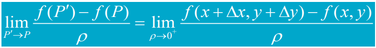
如果这个极限存在，则其称为函数在P点的$l$方向上的方向导数，也是函数f在P点的$l$方向上的偏导数。

方向导数是函数沿着中线（half line）方向的变化率。

***

因此，当函数$f$在此点可微，可得方向导数$Df$，也就是$l_1=<a,b>,l_2=<a,b,c>$方向上的偏导数为：

二元函数：

$D_{l_1} f(x,y)=\frac{\partial f}{\partial x}cos\alpha+\frac{\partial f}{\partial y}sin\alpha=<\frac{\partial f}{\partial x},\frac{\partial f}{\partial y}> \cdot <cos\alpha,sin\alpha>$

多元函数通式：

$D_{l_2} f(x,y,z)=\nabla f(x,y,z) \cdot \frac{<a,b,c>}{\sqrt{a^2+b^2+c^2}}$

注意：$\frac{<a,b,c>}{\sqrt{a^2+b^2+c^2}}$为对应$l_2$方向的单位向量的通式。

（注意函数f在此点可微的情况下，才有以上公式）

证明：

***

性质：

- 在某点，如果函数可微，可以推出函数有方向导数。
- 在某点，如果函数有方向导数，不能推出函数可微。

反例（counter example）：

（分别取x=0和y=0时的z的表达式并画出，可以得到曲面的大致图像为一个圆锥，这就是截痕法）

***

例子：

（方向角需要定义，此处为一般的与x轴夹角）

***

推广到三元函数，则类比推理得：

将方向写成单位向量形式，可以得到多元函数下的方向导数$D_l f(\vec{p})$的通式：

***

方向导数和梯度的关系：

可以得出，函数在$u=<a,b>$（$\vec{l}=\frac{<a,b>}{\sqrt{a^2+b^2}}$为此方向单位向量）方向的变化率，也就是在此方向上的方向导数的公式为$D_u=\frac{\partial f}{\partial u}=\nabla f(\vec{p}) \cdot \vec{l}=|\nabla f(\vec{p})| * |\vec{l}| * cos<\nabla f(\vec{p}),u>$

对于一个函数，某一点确定，则其梯度的方向也是给定的。根据上面推导出的方向导数的公式，易得，当方向$u$沿着梯度方向时，函数变化率最大（$cos<\nabla f(\vec{p}),u> =1$的情况）。

也就是说，函数某点的梯度方向就是此函数在这点变化率最大的方向。也容易推出，函数某点的梯度方向的反方向就是此函数在这点变化率最小的方向。

梯度$\nabla f(\vec{p})$也可以写成$grad f(\vec{p})$或者$grad f |_{\vec{p}}$。

结论：

例子：

#### 12.6 多元函数的链导法则/链式法则（chain rule）

对一元函数，导数的链式法则为：

****

全导数公式1（最终自变量仅有一个，也就是最后一级为一元函数导数）：

（画出树形图，表示因变量和自变量之间的关系）

简便算法：直接将所有中间变量转换为带变量t的式子，直接使得z=g(t)，直接对t求导。

***

证明：

注意：一个函数的"全导数公式"为：因变量（因变量只有一个）与其中一个最终自变量（最末端的自变量）的导数（例如上述的$\frac{dz}{dt}$）。也就是说，多个最终自变量其实就是几个一个最终自变量的函数的叠加。

***

全导数公式2（最终自变量有两个及以上（分别求每个最终自变量的偏导数））：

链式法则的多自变量形式：

$z=(f(x),f(y)), f(x)=g(s,t), f(y)=h(s,t)$

$z_s=f_x*g_s+f_y*h_s$

$z_t=f_x*g_t+f_y*h_t$

也就是有所涉及的函数都求偏导，再加起来。

中间变量（intermediate variable）的个数则决定了需要多少个偏导相乘需要相加。

***

全导数公式3（最终自变量有一个和多个混合的情况（全部自变量视为函数））：

$z=f(u,v,w)=f[g(x,y),x,y]$，$u,v,w$均为关于需要求相关的自变量的函数。

z的值和函数f的值一样，$\frac{\partial z}{\partial x}$和$\frac{\partial f}{\partial z}$的区别在于：

此时$\frac{\partial z}{\partial x}$代表的是复合函数$z(x,y)$与x相关，而y固定的情况（复合函数z代表仅含x,y的函数形式）（因此u必须展开成含x和y的形式，再参与求导）。

而$\frac{\partial f}{\partial z}$代表的是三元函数$f(u,x,y)$与x相关，而y和u固定的情况（三元函数f代表仅含u,x,y的函数形式）（因此u不展开不参与求导，得到最终结果时才展开，不进行操作）。

根据上图，链式法则的多变量混合形式：

$z_x=f_u*g_x+f_x$

$z_y=f_u*g_y+f_y$

也就是有所涉及的函数都求偏导，再加起来。

***

高阶偏导数的计算方法：

可以得出一阶偏导数与各个变量之间的关系。

$f_1'$是函数$f$对第一个中间变量的偏导数，$f_2'$是第二个中间变量的偏导数，$f_{12}''$是先求第一个中间变量的偏导数再求其第二个中间变量的偏导数，满足$f_{12}''=f_{21}''$。如果出现原函数可以直接用$f$代替。

求高阶全导数，则先求第一阶（将另一变量视为常量）全导数。然后画出第一阶全导数与自变量之间的关系（直接把第一阶全导数替换到因变量的位置即可），再求下一阶全导数。

例子：

和混合情况一致，只是偏导数的表示形式不同了。

（满足连续性，则二阶偏导可以互换）

***

对z而言，取的自变量无论是最终自变量还是中间变量，其全微分的形式不变。也就是$dz=\frac{\partial z}{\partial a}da+\frac{\partial z}{\partial b}db$。

例子：

***

##### 多元隐函数求偏导（implicit function）

有一个普通的多元函数$a=pf(x,y,z...)$，变量$a$是总因变量，也可以说函数$a=f(x,y,z...)$是关于自变量$x,y,z...$的函数。

定义一个函数$b=F(a,x,y,z...)=f(x,y,z...)-a=0$，那么称函数$a=f(x,y,z...)$是关于自变量$x,y,z...$的隐函数，易得b的值恒为0，因为结果为常数值，则b的梯度$\nabla b$也为0（对于最终变量而言，无论最终变量如何变化b的值均为0）。但是注意，函数$F$的梯度反而不一定为0（对于中间变量而言，无论中间变量整体如何变化F的值均为0，但是最终变量的变化F的值可能改变？）。

可以直接求得函数F与各个自变量的一阶偏导数的公式，再结合对函数$b=F(a,x,y,z...)=0$两边求全微分，就得到了函数F内部的隐函数a与各个自变量的一阶偏导数的公式。而更高阶的偏导数则由一阶偏导数公式和链导法则得出。

因此，含有多元隐函数的函数F的变量关系必定为：最终自变量有一个和多个混合的求偏导链式法则的情况（全部自变量视为函数），如下图：

$\frac{\partial b}{\partial x}$和$\frac{\partial F}{\partial x}$和$\frac{\partial a}{\partial x}$代表的意义均不同。

***

一元隐函数（不算原本因变量和最终因变量）：

$z=F(x,y)=0$

通过链式法则，可以得到隐函数$y=y(x)$的导数和总因变量的偏导数$\frac{\partial F}{\partial a}$之间的关系。

也就是说，对于隐函数y=y(x)，因变量函数为$z=F(x,y)=0$，满足：

$$y'(x)=\frac{dy}{dx}=-\frac{F_x}{F_y}=-\frac{\frac{\partial z}{\partial x}}{\frac{\partial z}{\partial y}}$$

证明过程其实很简单，用函数$F(x,y)=0$，对任意变量求偏导均为0即可得到。

***

隐函数求导公式的推导：

对于$z=F(x,y)=0$，有$z_x=\frac{\partial F}{\partial x}+\frac{\partial F}{\partial y} \cdot \frac{d y}{d x}=0$，因此直接可得$\frac{dy}{dx}=-\frac{F_x}{F_y}$的隐函数求导公式。

***

例子：

***

二元隐函数情况下的公式：

z是关于x和y的隐函数$z=z(x,y)$，新的因变量函数为$F(x,y,z)$，但是原来z才是因变量函数，所以z是关于x和y的隐函数。

沿用二元隐函数的结论，可以得到隐函数$z=z(x,y)$的偏导数的公式是类似的。

$$\frac{\partial z}{\partial x}=-\frac{F_x}{F_z}=-\frac{\frac{\partial F}{\partial x}}{\frac{\partial F}{\partial z}}$$

例子：

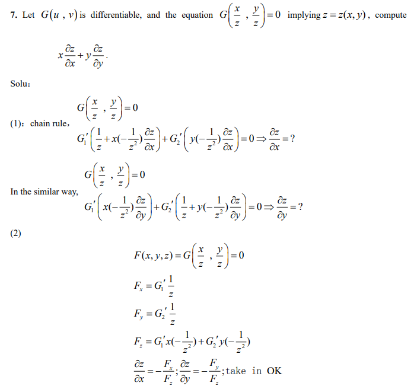

通常情况下（普通的多元函数），高阶偏导数的计算方法为：$\frac{\partial^2z}{\partial y \partial x}=z_{xy}=\frac{\partial}{\partial y}(\frac{\partial z}{\partial x})$，直接求偏导数即可。

但是对于隐函数来说，最大的不同则是构造函数$F(x,y,z)$内的原来因变量z是相关于所有自变量x,y的隐函数（如果是$\frac{\partial z}{\partial x}$则可以视作为$z=z(x),z'(x)=\frac{\partial z}{\partial x}$）。函数关系是多重的，因此不能将某个变量视为常数去简单地求偏导，就像$z=f(x,y)$无法直接求$\frac{\partial y}{\partial x}$一样。

而函数F没有和括号内的任意变量形成隐函数，因此可简单求$F_x,F_y,F_z$，也就是可以将其他变量视作常数来简单求偏导。而根据推导出的隐函数导数和函数F的导数的关系式，就可以间接得到隐函数的导数了。也就是说，隐函数的一阶偏导数只能通过构造函数F的偏导数间接得到。

以上的限制更体现在求一阶偏导数的时候。而在高阶偏导数的情况下，如果偏导的对象不变，则可以将对隐函数求偏导视作对两个独立的函数的表达式进行直接求导。

$\frac{\partial^2z}{\partial x^2}=\frac{\partial^2 z(x)}{\partial x(x)^2}=(\frac{\partial z(x)}{\partial x(x)})'$

***

一阶偏导数与变量之间的关系（总因变量相对于中间变量的偏导数）：

也就是说，如果$z=f(x,y),x=g(s,t),y=h(s,t)$，则满足$z_x=a(x,y),x=g(s,t),y=h(s,t)$

又因为含有多元隐函数的函数F为最终变量混杂的情况，则可以得到：

隐函数的函数F的变量关系情况为：

（从上图的关系和隐函数求导公式的推导都可以得出，不仅仅是"字母颠倒"，而是恰好对应上了。因为隐函数的总因变量不会对自己求偏导）

因为函数F对其中一个变量的偏导数必定是可以与所有变量有关的，而且，其与中间变量有关而不是最终自变量有关。

其实是F的自变量范围只带到括号里的变量，不带xyz。然后括号里每个变量再展开才包括xyz或者其中几个。

不把所有变量写在一起是因为求偏导时下标向量的选取范围不同，不然就全部都能取了。例如$F_x$实际上是不存在的，$F_x,x=\alpha$才是它的本来含义。所以实际上真正的隐函数求导公式为：$\frac{\partial a}{\partial b}=-\frac{F_{\beta (b)}}{F_a}$，$\beta(b)=b$所以才有$\frac{\partial a}{\partial b}=-\frac{F_b}{F_a}$（$\partial a$则是本来就可取的，因为a是原来的因变量，跟函数F的变量关系为相连，因此可取）。

$\frac{\partial a}{\partial b}=-\frac{F_b}{F_a}=-\frac{m}{n}$

$\frac{\partial^2z}{\partial x^2}=\frac{\partial}{\partial x}(-\frac{m}{n})=(-\frac{m}{n})'=-\frac{(\frac{\partial m}{\partial x}n-\frac{\partial n}{\partial x}m)}{n^2}$

$\frac{\partial^2 z}{\partial x \partial y}=\frac{\partial}{\partial x}(\frac{\partial z}{\partial y})$

$\frac{\partial}{\partial x}()$代表括号内所有非固定的函数的导数均为$\frac{\partial a}{\partial x}$的形式。

由链式法则和$z=f(x,y)$和$m=F_x(x,y,z),n=F_z(x,y,z)$，可得$\frac{\partial m}{\partial x}=\frac{\partial F_x}{\partial x} \cdot \frac{\partial x}{\partial x}+\frac{\partial F_x}{\partial z} \cdot \frac{\partial z}{\partial x}=F_{xx}+F_{xz}\frac{\partial z}{\partial x}$和$\frac{\partial n}{\partial x}=F_{zx}+F_{zz}\frac{\partial z}{\partial x}$。

***

注意：当求两个变量之间的偏导数，且有隐函数关系的时候（就是可以视作任意变量间均有函数关系），任意两个自变量之间其实也可以形成隐函数。例如$z=f(x,y)$，求$\frac{\partial x}{\partial y}$可以使$x=x(y),x'=\frac{\partial x}{\partial y},y'=1$直接对等式两边均关于变量y求导（除x和y都固定）。求$\frac{\partial y}{\partial z},y'=\frac{\partial y}{\partial z},z'=1$可以使$y=y(z)$直接对等式两边均关于变量z求导（除y和z都固定）。

也就是说，求偏导数的关键在于，弄清楚哪个是==因变量（偏导上方的变量）==，哪个是==自变量（偏导下方的变量）==，==哪些==是==固定量（偏导式子没有提及的变量）==这是由偏导数的最基本定义知道的。

***

求偏导数的三种方法：

先虚拟出中间变量。

第一种，将其化为混合函数的形式，根据隐函数的导数公式获得结果。

第二种，微分法，根据全微分的定义获得结果（等式两边取全微分）。

第三种，直接求偏导法。

***

对于方程组来说，是类似的，但更为复杂。

隐函数集合（多条方程定义的隐函数，隐函数的个数等于方程的条数，自变量的个数不限）：

（全微分和全导数是不一样的）为什么这些全导数都等于0？因为对隐函数的等式两边同时求偏导，0的导数一定是0。（也就是说，是因为因变量函数的结果值恒为0）

对于方程组，对题目问题定义变量之间的关系，然后分别对每条式子的等式两边求关于目标自变量的导数或者偏导。

例子：

确定好目标变量后对每条式子的左右两边求对应目标变量的导数/偏导。

例子：

使用行列式判断方程组是否有解。

例子：

#### 12.7 切线、切面和近似值

空间曲线（space curve）的切线：

参数形式：

一般方程形式：

***

曲面的切面和法线（normal line）：

二元隐函数形式：

有曲面上的一条曲线$x=x(t),y=y(t),z=z(t)$，则其切线为$\vec{T}=<x'(t),y'(t),z'(t)>$（如果x和y和z直接通过方程组相关则直接对等式两边进行对任意变量例如x的求导即可，此时可以视作$t=x$）。

其梯度$\nabla f(x,y,z)$为切线的法向量为$<\vec{n}=F_x(x,y,z),F_y(x,y,z),F_z(x,y,z)>=k<a,b,c>$，那么$\vec{n} \cdot \vec{T}=0$。则使用$\vec{n} \cdot \vec{v}=0$表示一个切面，其中$\vec{v}$代表过某点的所有与$\vec{n}$垂直的向量。

注意函数某点的梯度的方向恒垂直于此点的切面。

此时过$(x_0,y_0,z_0)$点处的切面方程即为：

$a(x-x_0)+b(y-y_0)+c(z-z_0)=0$

此时过$(x_0,y_0,z_0)$点处的垂直线（指的是垂直于切面）方程即为：

$\frac{x-x_0}{a}=\frac{y-y_0}{b}=\frac{z-z_0}{c}$

此时过$(x_0,y_0,z_0)$点处的切线方程即为：

$\frac{x-x_0}{x'(t)}=\frac{y-y_0}{y'(t)}=\frac{z-z_0}{z'(t)}$

此时过$(x_0,y_0,z_0)$点处的垂直面（指的是垂直于切线）方程即为：

$x'(t) \cdot (x-x_0)+y'(t) \cdot (y-y_0)+z'(t) \cdot (z-z_0)=0$

平面在全部坐标轴上的截取量/截距（intercepts）指的是：已知平面方程，当除了x的所有变量取0时，满足平面方程的x的值就是此平面在x轴上的截距（其实就是与x轴相交的点的距离而已）。

***

关于梯度的方向为什么垂直于此点的切线的原因：

***

推导出以上结论的证明和图像：

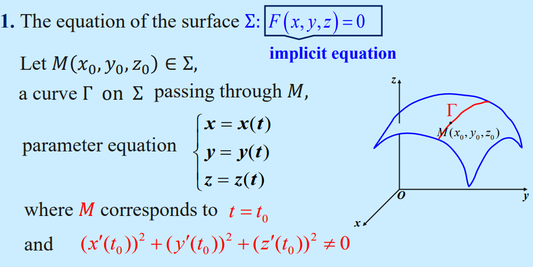

***

二元显函数形式（其实可以化成二元隐函数形式，更好求）：

***

角度的cos公式为：

***

因此，有定理得隐函数形式的切面的定义为：

***

##### 近似值

#### 12.8 极大值和极小值（maxima and minima）

多元函数的极值（extreme value）的定义：

***

定理A：最大-最小存在性定理

如果函数f在一个闭合有界集合S中连续，则函数f在那里同时获得一个（全局）最大值和一个（全局）最小值。

***

定理B：临界点定理（极值点的候选点）

如果函数f在集合中的某点为极值（extreme）点，那么它一定是一个临界点（critical point）。（临界点包括边界点、驻点（导数/偏导数/梯度等于0的点）、奇点（导数不存在的点））。

通过求使得全部偏导数或者说梯度等于0的点，得到所有临界点的候选点。

然后通过定理C，可以判断临界点的候选点是否极值点。

***

定理C：通过二阶偏导判定极值点

$D=D\left(x_{0}, y_{0}\right)=f_{x x}\left(x_{0}, y_{0}\right) \cdot f_{y y}\left(x_{0}, y_{0}\right)-f_{x y}^{2}\left(x_{0}, y_{0}\right)$

将二阶偏导数写成矩阵（$n * n$矩阵，n为元的数量），判定行列式D的值（因为连续，所以满足$f_{xy}=f_{yx}$），从而得到此点的极值信息。

也就是说，当矩阵正定（positive）的时候，此点$(x_0,y_0)$为极小值。当矩阵负定（negative）的时候，此点$(x_0,y_0)$为极大值。当$D<0$时，$(x_0,y_0)$不是极值点而是一个鞍点。当$D=0$，无法定论。

鞍点（saddle point）：沿着某一方向是稳定的，另一条方向是不稳定的奇点，叫做鞍点。也就是不是极大值也不是极小值的临界点。

***

例子：

***

等式约束的例子：

通过带入消元，达成降维（三元变二元），从而方便计算。

***
例子：

求出当二阶偏导数均为0时的点为驻点，求出驻点的z的值并带入进行判断。

***

例子：

例子：

***

#### 12.9 拉格朗日乘子法（the method of lagrange multipliers）

对于一个目标函数（objective function）$z=f(x,y)$，求其极值点就是约束极值问题。目标函数服从于（subject to）一定的约束条件（constrain）。

求解约束极值问题（constrained extremum problem）的方法有：

第一种：替换消元法。

***

第二种：约束参数化法。

约束参数化法（constraint parametrized），将约束极值问题转变为了自由约束极值问题（free constrained extremum problem）。就是把约束条件替换为另一个确定值的目标函数$g(x,y)=0$或者一个参数化的约束。但这个方法的计算过程一般比较困难和复杂，因此引入拉格朗日方法。

拉格朗日方法（用到了隐函数求导）：

对于一个目标函数$z=f(x,y)$，有约束条件$g(x,y)=0$，求函数$z=f(x,y)$的极值点。设极值点为$(x_0,y_0)$，那么根据约束条件$g(x,y)=0$来定义y是关于变量x的隐函数，满足$y=y(x)$。也就是说，目标函数可以写为$z=f(x,y(x))$，它在$x=x_0$点有极值。

判定函数极值点的必要条件：如果一个函数在定义域内某点取得极值，那么它一定是此函数的一个临界点。边界点先不讨论，奇点现在尚未得知，那么仅讨论驻点（总因变量的梯度为0，也就是总因变量关于各个自变量的偏导数的值均为0），则有总因变量对各个自变量求偏导均为0的前提条件，根据这个前提条件就可以筛选出多个候选的极值点了，这就是拉格朗日乘子法的目的。

拉格朗日乘子法的推导：

隐函数求导公式：$\frac{\partial y}{\partial x}=-\frac{F_x}{F_y}$，但是，因为此处存在两个函数，隐函数求导公式是通用的，具体变量关系见下图：

也就是说，使总因变量z对各个自变量的偏导数均为0，联立约束条件，解得的点均为驻点，然后再进行判断是否极值点。

（以上的$\lambda$前的+号应该为-号，符合根据梯度的推导过程）

总因变量z的各个偏导数拉格朗日函数（Lagrange function）：

而$\lambda=-\frac{f_y(x_0,y_0)}{g_y(x_0,y_0)}$是被称为拉格朗日算子，它是一个确定的常数（因为目标函数和约束条件的梯度在极值点上一定是平行的，这是根据判定函数极值点的必要条件和推导出来的结论）。

***

几何意义：等高线（梯度/高度相同的线？）

***

为什么可以使用拉格朗日乘子法（原理）：目标函数与约束条件函数的梯度在极值点是平行的（parallel）。

***

多个自变量的拉格朗日乘子法：

拉格朗日方法的向量形式（定理A）：

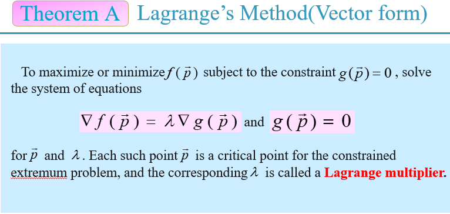

求函数$f(\vec{p})$服从约束$g(\vec{p})=0$最大或者最小值，那么其实就是解以下的方程组（拉格朗日乘子法的方程组的通式）：

$\nabla f(\vec{p})=\lambda \nabla g(\vec{p})$
$g(\vec{p})=0$

对于解出来的每一个点$\vec{p}$都是一个可能的极值点。至于是极大值还是极小值，则可以随便带入定义域内其他的一个点来直接进行判断得到的极值点是极大还是极小的。

***

例子：

也因为拉格朗提函数值恒为0，则其相对于任何变量的偏导数均恒等于0。

***

多重约束条件的情况：

求函数的约束极值时，当存在多个约束条件的时候，可以使用额外的拉格朗日乘数（每个约束条件对应一个拉格朗日算子），例如对一个三元函数$P=f(x,y,z)$求极值，那么它有两个约束条件化为的参数方程$g(x,y,z)=0$和$h(x,y,z)=0$，计算过程和计算的方程为：

$\nabla f(x,y,z)=<f_x(x,y,z),f_y(x,y,z),f_z(x,y,z)>$

也就是满足以下方程组：

$\nabla f(x,y,z)=\lambda \nabla g(x,y,z)+\mu \nabla h(x,y,z)$

$g(x,y,z)=0$

$h(x,y,z)=0$

***

$f_x(x,y,z)=\lambda g_x(x,y,z)+\mu h_x(x,y,z)$是怎么推导的呢？由隐函数的知识，两个约束条件的方程可以确定两个隐函数关系$y=y(x)$和$z=z(x)$。

原来，隐函数关系必须由另一个已经存在的含有$x,y,z$的函数转化而成。也就是说，总因变量$P=f(x,y,z)$并没有隐函数存在，是$g(x,y,z)=0$定义了第二个"x,y,z之间的关系"，得到一元隐含数$y=y(x)$（因为这一次求x的偏导，才定义仅关于x的一元隐函数，无视z），而$h(x,y,z)=0$定义了第三个"x,y,z之间的关系"，得到一元隐含数$z=z(x)$（因为这一次求x的偏导，才定义仅关于x的一元隐函数，无视y）。

那么此时$P=(x,y,z)=(x,y(x),z(x))$，变成了一元函数。有$\frac{\partial P}{\partial x}=f_x+f_y\frac{dy}{dx}+f_z\frac{dz}{dx}=0$，也就不难推出$f_x(x,y,z)=\lambda g_x(x,y,z)+\mu g_x(x,y,z)$了。

将隐函数的关系代回两个约束条件的方程，则有$G=g(x,y(x),z(x))$和$H=h(x,y(x),z(x))$。等式两边对x求偏导则有$G_x=g_x+g_y \frac{dy}{dx}+g_z \frac{dz}{dx}=0$和$H_x=h_x+h_y \frac{dy}{dx}+h_z \frac{dz}{dx}=0$。

因此，根据目标函数和两个约束条件对同一变量求偏导均为0可得，梯度$\nabla f=<f_x,f_y,f_z>$，$\nabla g=<g_x,g_y,g_z>$，$\nabla h=<h_x,h_y,h_z>$在点$(x_0,y_0,z_0)$处均与向量$<1,\frac{dy}{dx},\frac{dz}{dx}>$垂直。所以这三个梯度在点$(x_0,y_0,z_0)$处是共面（相互平行）的，这是$P=f(x,y,z)$在两个约束条件下在点$(x_0,y_0,z_0)$处取得极值的必要条件（其实也就是极值点必须是临界点这个必要条件在多重约束条件下的多元函数求极值问题的具体延展）。

***

例子：

***

在闭合有界集合（closed and bounded set）上优化函数（闭合有界集合其实可以理解为约束条件构成了一个集合的情况）：

类似于一个单变量函数，我们可以在一个闭合有界集合上找到到极值，来获得函数的最小值和最大值。

寻找最大和最小值的通常方法步骤：

1.找到函数在集合内部（interior of set）所有可能的极值点。
2.沿着边界（boundary）找出最大值或最小值的点。
3.在获得的点上计算（evaluate）函数值，以找到集合上（over set）的最大值和最小值。

例子：

先通过观察，求得特殊的候选极值点（先无视约束条件求驻点，发现负荷约束条件，即可用）。

通过拉格朗日乘子法求得候选极值点。

比较各个候选极值点，最终获得极大值点和极小值点。

***

那么怎么判定得到的点是否为极值点呢？

在实际问题（practical problems）中，我们可以根据问题的性质（nature）来进行判断。

在非实际问题（non-practical problems）中，我们不会在这个方面过多讨论。

***

总结：

***

### 第十三章-多重积分

#### 13.1 矩形区域上的二重积分（double integrals over rectangular coordinate
）

求一个图形的体积，就要用到二重积分。

求质量也可以用，引入曲面密度（surface density）。顺带一提，三重积分是求不均匀密度的物体质量。

***

二重积分求体积的几何解析：

***

二重积分的定义：

函数$f(x,y)$是一个有界的（bounded）函数，在有界闭合区域（closed region）D中，任意地（arbitrarily）将闭合区域面积（closed area）D分为n个小闭合区域的面积$\Delta \sigma_1,\Delta \sigma_2,...,\Delta \sigma_n$，则$\Delta \sigma_i$表示第i个小闭合区域的面积，则对于每个$\Delta \sigma_i$有一个样本点（sample point）$(\xi_i,\eta_i)$，代表离有界闭合区域D上方的高度：

$f(\xi_i,\eta_i)\Delta \sigma_i,(i=1,2,...,n)$

$\sum_{i=1}^{n}f(\xi_i,\eta_i)\Delta \sigma_i$

$\iint_D f(x,y)d\sigma=lim_{\lambda \to 0}\sum_{i=1}^n f(\xi_i,\eta_i)\Delta \sigma$

- 在二重积分的定义中，闭合区域的划分是任意的。

- 如果函数$f(x,y)=0$在闭合区域中连续，则其和的极限也必须存在，也就是说二重积分也必须存在。

***

二重积分的几何意义：

- 当被积函数大于零时，二重积分就是圆柱体（cylinder）的体积。

- 当被积函数小于零时，二重积分是圆柱体体积的负值。

***

在直角坐标系中，区域D被相互垂直的平行于坐标轴的直线分为一个一个小矩形区域，定义为$d\sigma=dx dy$，则二重积分可以写成：$\iint_D f(x,y)d\sigma=\iint_D f(x,y) dx dy$。

***

在一个闭合矩形区域R上方，存在关于两个变量的函数f。如果极限$lim_{||P|| \to 0}\sum_{k=1}^{n}f(\overline{x_k},\overline{y_k})\Delta A_k$存在，$(\overline{x_k},\overline{y_k})$即第k个小闭合区域中的任取的一点，而$||P||$代表了分成的所有小闭合区域中对角线最长的长度，则称函数f在R上可积，$\iint_R f(x,y)dA$被称为在区域R上方（over R/above R）的函数f的二重积分（也就是说，二重积分号的下标是底面区域），满足：

$\iint_R f(x,y)dA=lim_{||P|| \to 0}\sum_{k=1}^{n}f(\overline{x_k},\overline{y_k})\Delta A_k$

如果说单次积分，是求函数$f(x)$的图像与x轴围成的面积（area）。那么二重积分，就是求函数$z=f(x,y)$的图像曲面与底面矩形区域R围成的固体的体积（volume of solid）。

***

定理A：可积性定理（integrability theorem）

如果函数f在封闭矩形区域R上有界，并且除了一些有限个光滑曲线（smooth curves）之外，函数f是连续的，那么f在R上是可积的。

特别地，如果已知函数f在整个R上都是连续的，那么也可以判断函数f在R上也是可积的。

***

二重积分的性质（包含线性性）：

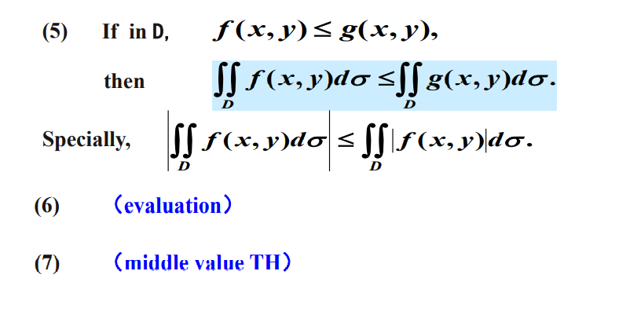

***

#### 13.2 迭代积分（iterated integrals）/累次积分

在阐述完二重积分的基本概念之后，现在可以定义一下所谓的闭合矩形区域R了。对于二重积分$\iint_R f(x,y)dA$，有闭合矩形区域R：

$R=\{ (x,y):a \leq x \leq b, c \leq y \leq d \}$

假设在闭合矩形区域R上，满足$f(x,y) \geq 0$，那么我们可以将固体在$f(x,y)$组成曲面（surface）下而在区域R上围成的体积V解释为二重积分。

因此，我们采用沿x轴或者沿y轴的切片法。

***

二重积分可以与二次积分（two integrals）相互转换：

$\iint_R f(x,y) dA=\int_c^d [\int_a^b f(x,y)dx]dy$

$\iint_R f(x,y) dA=\int_a^b [\int_c^d f(x,y)dy]dx$

如果函数f在封闭区域R中有正有负，那么遵循一般的积分的定义，在R上的部分减去在R下的部分体积。

***

例子：

***

#### 13.3 在非矩形区域上的二重积分

二重积分的定义域，也就是底面的闭合区域$D$的定义。因此，通过将二重积分转换为二次积分，求解二重积分。

有一个底面区域$D$的定义，通过画图得到$x$和$y$的定义域，和$y$与$x$之间的关系（与被积函数$f(x,y)$无关，可以将被积函数仅视作高度）。

如果$x$和$y$无关，则有：

$a \leq x \leq b$

$c \leq y \leq d$

$\iint_D f(x,y) dx dy=\int_c^d \int_a^b f(x,y) dx dy$

如果$y$是关于$x$的函数，则有：

$a \leq x \leq b$

$y_1(x) \leq y \leq y_2(x)$

$\iint_D f(x,y) dx dy=\int_{y_1(x)}^{y_2(x)} \int_a^b f(x,y) dx dy$

如果$x$是关于$y$的函数，则有：

$x_1(y) \leq x \leq x_2(y)$

$c \leq y \leq d$

$\iint_D f(x,y) dx dy=\int_{x_1(y)}^{x_2(y)} \int_c^d f(x,y) dy dx$

其实就是根据两个自变量的定义域和关系，表示成相互关系的隐函数，以此来达到转化为多次积分的目的。（更高重数的积分也是用隐函数法来进行转换为多次积分）

本质上其实就是将求底面区域$D$面积的问题转化为了仅对两个自变量中的其中一个变量的两次积分，然后被积函数$f(x,y)$就是底面区域每个点的高度/密度，因此整个二重积分就等于三维物体的体积/二维平面的质量。

如果闭合区域不是x型区域也不是y型区域，那么它通常可以看作是若干个x型区域和y型区域的组合，必须进行分割，然后又根据积分的线性性：

$\iint_D=\iint_{D_1}+\iint_{D_2}+\iint_{D_3}$

注意分割的区域的类型是一致的。

***

根据几何意义的求法：

根据几何意义，如果已知平行切面（底面）的区域的定义，可以进行竖向切片求体积。

切片的面积为：$A(x)=\int_{\varphi_1(x)}^{\varphi_2(x)}f(x,y)dy$

则整个图形的体积为：

$\iint_D f(x,y)d\sigma=\int_a^b A(x) dx=\int_a^b (\int_{\varphi_1(x)}^{\varphi_2(x)}f(x,y)dy) dx$

***

根据物理意义的求法：

此处，将函数$z=f(x,y)$的值看作是底面区域（二维平面）的每一个点的对应的密度，那么二重积分表示非均匀薄片（也就是底面区域）的质量（quality of nonuniform thin slice）。

这样就能把双自变量的二重积分问题应用到二维平面（密度）而不是三维空间（体积）中。

***

例子：

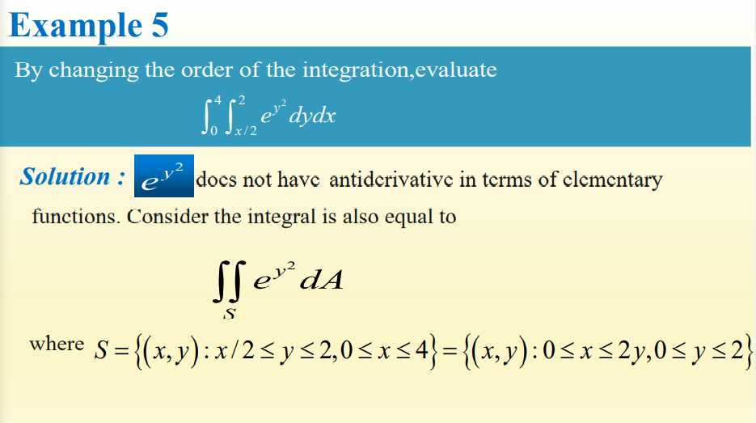

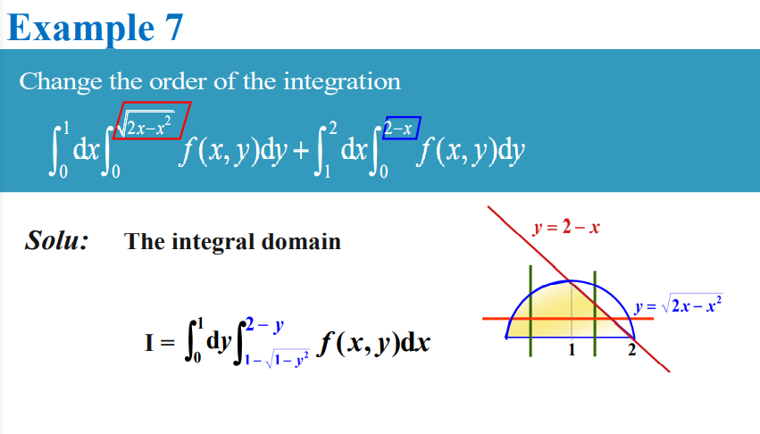

***

因为二重积分的可调换积分顺序性（通过变量相互视作常数推导得到），应当选取合适的积分顺序。以上的常见的积分需要使用分部积分法（或者积分上界和下界不好算），那么就先把其他的积分先算出来，最后处理这些需要分布积分法来求的积分。

***

有$z=f(x,y)=|y-x^2|$，根据物理意义，等于求$y=y(x)$平面上的图形中每一条线段的密度。

***

函数的对称性/奇偶性对二重积分的值的影响：

总结：

***

#### 13.4 极坐标系下的二重积分

有一些二重积分，对x和y先后积分会很复杂，但是转化为r和$\theta$后积分会很简单。如果解多重积分有困难，可以尝试将被积变量转化为极坐标系和球坐标系的变量形式，再进行积分。

推导得出一个扇形的面积为$S=\frac{\theta}{2\pi}\cdot \pi r^2=\frac{1}{2} \cdot r^2 \cdot \theta$，弧长为$l=\frac{\theta}{2\pi} \cdot 2\pi r=r \cdot \theta$（$\theta$为以弧度表示的圆心角）

当$\theta$足够小的时候，弧长可以近似认为是一条直的线段，长度为弧长的长度$l = r \cdot d \theta$。因此高$h \approx cos \frac{\theta}{2} * r$，而$\theta$足够小，因此近似认为$h=r$。那么一个扇形的面积则可以近似认为是一个三角形的面积，为$dS=\frac{1}{2} * h * dl=\frac{1}{2} \cdot r \cdot r \cdot d \theta=\frac{1}{2} r^2 \cdot d\theta$。

$\begin{aligned} \Delta \sigma_{i} &=\frac{1}{2}\left(r_{i}+\Delta r_{i}\right)^{2} \cdot \Delta \theta_{i} - \frac{1}{2} r_{i}^{2} \cdot \Delta \theta_{i} \\ &=r \Delta r_{i} \cdot \Delta \theta_{i}+\frac{1}{2}\left(r_{i}\right)^{2} \cdot \Delta \theta_{i} \\ & \approx r_{i} \Delta r_{i} \cdot \Delta \theta_{i}\end{aligned}$

那么通过以上两个扇形的面积$S$的差值的计算，推导得出一个分割出的小图形的面积为$\Delta S =\Delta \sigma=r \cdot \Delta r \cdot \Delta \theta$，换算为微分就是$d\sigma=r \cdot drd\theta$。

最终可得：

$\iint_D f(x,y)d\sigma=\iint_{D_{r,\theta}}f(r cos\theta,r sin\theta) d\sigma$

$\iint_D f(x,y)dxdy=\iint_{D_{r,\theta}}f(r cos\theta,r sin\theta) \cdot r dr d\theta$

在实际计算中，先计算关于$r$的积分，再计算关于$\theta$的积分。直角坐标系的二重积分和极坐标系的二重积分的相互转化，也就将带有$x,y$的$D$转化为带有$\theta,r$的$D$即可。注意$\theta$的取值范围为：$x$轴正方向固定为$0$弧度，$y$轴正方向固定为$\frac{\pi}{2}$。这是由二维极坐标系的定义决定的。

根据给定的$D$的定义画出图形，并得到：

$a \leq \theta \leq b$

$c \leq r \leq d$

最终得到二重积分在极坐标下的通式：

$\iint_{D_{r,\theta}}f(r cos\theta,r sin\theta) \cdot r dr d\theta=\int_{a}^{b} [\int_{c}^{d} f(rcos\theta,rsin\theta) \cdot r dr]d \theta$

***

例子：

***

二重积分中的换元法（转化为极坐标本质上就是换元，但是这个换元法更加具有一般性）：

其中$J$是雅阁比行列式。

例子：

***

#### 补充：将二重积分拆分为两个积分相乘的条件

- 被积函数是关于x的函数和关于y的函数的乘积，也就是被积函数满足$u(x,y)=f(x) * g(y)$
- 累次积分的积分上下限与x，y无关，也就是常数或者无穷。

推导：

$\int_a^b \int_c^d u(x,y) dx dy=\int_a^b \int_c^d f(x) g(x) dx dy$

则把y看作常数，对$f(x)*g(y)$求积分，把$g(y)$当作常数提出来，然后把整个$\int_c^d f(x) dx$当作常数提出来，则可得：

$\int_a^b \int_c^d f(x) g(x) dx dy=\int_a^b g(y) (\int_c^d f(x) dx) dy=\int_c^d f(x) dx \cdot \int_a^b g(y) dy$

注意：

$\int_a^b \int_c^d f(x) g(x) dx dy=\int_a^b \{ [ \int_c^d f(x) g(x) dx ] \cdot dy \}=\int_a^b \{ dy \cdot [ \int_c^d f(x) g(x) dx ] \}=\int_a^b \{ dy \cdot  \int_c^d f(x) g(x) dx \}=\int_a^b dy \int_c^d f(x) g(x) dx$（老师的坑爹写法，既可以表示两个积分相乘，也可以表示多次积分的顺序调换）

***

#### 13.6 曲面面积（surface area）

平面面积（二重积分）：

二重积分的微元$dxdy=d\sigma$就是面积的微元，当二重积分的被积函数为常数1的时候，$\iint_D f(x,y) d\sigma=\iint_D 1 d\sigma$。所以当被积函数为常数1时，二重积分就等于总面积（两个自变量，因变量等于常数1，那么其实就是表示了一个高度处处为1的二维平面的面积）

***

体积（二重积分）：

可以用二重积分来表示一个三维曲线柱的体积$V=\iint_D f(x,y) d\sigma$。（两个自变量，一个因变量$z=f(x,y)$代表高度）

***

体积（三重积分）：

有几个曲面$S_i$围成的三维区域$\Omega$，通过使被积函数为常数1，三重积分可以表示一个三维体积$\iiint_\Omega 1 dx dy dz$而不是三维物体的质量$\iiint_\Omega f(x,y,z) dx dy dz$。（三个自变量，因变量$a=f(x,y,z)$等于常数1，那么其实就是表示了一个密度处处为1的三维物体的体积）

可以看出几重积分表示的意义的维数其实是由自变量和因变量的总数决定的。如果因变量为常数，则不视作因变量，因此降维。

***

曲面面积（二重积分，推导）：

有曲面$S:z=f(x,y)$，函数$f(x,y)$就是整个曲面的定义，曲面在$xOy$平面的投影区域为$D$，$dS$的投影区域的小区域面积为$d\sigma$。过$dS$上某一点$M(x, y, f(x, y))$作切面$\Sigma$，切面的小区域面积为$dA=dS$，过$M$点作切面的法向量$\vec{n_1}=(-f_x,-f_y,1)$。（面的一点的梯度向量正是这一点的法向量）

由投影的定义可得$d\sigma=dA \cdot cos\gamma$，$\gamma$是切面与$xOy$平面的夹角，通过$xOy$平面的法向量$\vec{n_2}=(0,0,1)$，和公式$cos\theta=|\frac{\vec{n_1} \cdot \vec{n_2}}{|\vec{n_1}| \cdot |\vec{n_2}|}|$得到$cos \gamma=\frac{1}{\sqrt{1+f_x^2+f_y^2}}$，最终可得$A=\iint_D \sqrt{1+f_x^2+f_y^2}d\sigma$。被积函数$\sqrt{1+f_x^2+f_y^2}$表示的是投影区域面积对应的曲面面积的大小，$D$是截取部分曲面的投影二维区域，可以用笛卡尔坐标系和极坐标系表示。

仅适用于三维空间求曲面面积。

***

也就是说，曲面面积的公式根据底面区域$D$的所处平面不同，可得：

曲面：$z=f(x, y)$
面积：$A=\iint_{D_{x y}} \sqrt{1+z_{x}^{2}+z_{y}^{2}} d x d y$

曲面：$x=g(y, z)$
面积：$A=\iint_{D_{y z}} \sqrt{1+x_{y}^{2}+x_{z}^{2}} d y d z$

曲面：$y=h(z, x)$
面积：$A=\iint_{D_{z x}} \sqrt{1+y_{z}^{2}+y_{x}^{2}} d z d x$

***

例子：

***

#### 13.7 笛卡尔坐标系/极坐标系/球面坐标系中的三重积分（triple integrals）

三重积分的本质：三维物体的体积乘以密度，也就是三维物体的质量。

对于点$(x,y,z)$，有密度$a=f(x,y,z)$，那么满足：

$\Delta M_{i} \approx f\left(\xi_{i}, \eta_{i}, \zeta_{i}\right) \Delta v_{i}$

$M \approx \sum_{i=1}^{n} f\left(\xi_{i}, \eta_{i}, \zeta_{i}\right) \Delta v_{i}$

$M=\lim _{\lambda \rightarrow 0} \sum_{i=1}^{n} f\left(\xi_{i}, \eta_{i}, \zeta_{i}\right) \Delta v_{i}$

***

那么对于几个曲面$S_i$围成的三维区域$\Omega$，有函数$f(x,y,z)$，对其进行积分就是三重积分：

$\Delta v=\Delta x \Delta y \Delta z$ 

$dv=dx dy dz$

$\iiint_{\Omega}f(x,y,z)dv=\iiint_{\Omega}f(x,y,z)dx dy dz$

***

投影法（method of projection）：目的是将三重积分转化为三次积分（three integrals）。其实是从二重积分推导到三重积分。

对于几个曲面$S_i$围成的三维区域$\Omega$（可行域），其在$xOy$平面的投影其实就是闭合二维区域$D$，在解题过程中需要写出$D$的定义。

有曲面$S_1:z=z_1(x,y)$和$S_2:z=z_2(x,y)$。

定义与$z$相关的函数$f(x,y,z)$也就是三重积分的被积函数，是代表密度的函数。

再定义一个中间函数，表示$D$上的对应的某一点$(x,y)$的"高度差线段的质量"（其实也就是三维区域$\Omega$的带有高度差线段每一点的质量相加）有：

$F(x,y)=\int_{z_1(x,y)}^{z_2(x,y)} f(x,y,z) dz$

那么区域$\Omega$内物体的质量为（再考虑底面区域$D$上的每一点）：

$\iint_{D} F(x, y) d \sigma=\iint_{D} [\int_{z_{1}(x, y)}^{z_{2}(x, y)} f(x, y, z) dz ] d \sigma$

底面区域$D$仍可以分解为$y$和$x$轴，分别进行积分：

对于X情况（X-type）满足$D: y_{1}(x) \leq y \leq y_{2}(x), a \leq x \leq b$

$\iiint_{\Omega} f(x, y, z) \mathrm{d} v=\int_{a}^{b} \mathrm{~d} x \int_{y_{1}(x)}^{y_{2}(x)} \mathrm{d} y \int_{z_{1}(x, y)}^{z_{2}(x, y)} f(x, y, z) \mathrm{d} z$

如果对于Y情况（Y-type），则改变积分顺序即可：

$\iiint_{\Omega} f(x, y, z) \mathrm{d} v=\int_{c}^{d} d y \int_{x_{1}(y)}^{x_{2}(y)} \mathrm{d} x \int_{z_{1}(x, y)}^{z_{2}(x, y)} f(x, y, z) \mathrm{d} z$

其实，这种推导方法就是一条一条轴地考虑，每一条轴都与还未考虑的所有轴相关。

可以看到，三种积分中的积分顺序仍可以随意调换，因此一共由$A_3^3$种积分顺序。

这种方法可以推广到三维区域$\Omega$投影到其他平面（$yOz$和$xOz$）的情况。

***

三重积分的定义域，也就是多个曲面围成的三维闭合区域的定义。因此，通过将三重积分转换为三次积分，求解三重积分。

三重积分与二重积分转化为累次积分的方法类似（更具有一般性），也是实际上就是根据积分的顺序将所有自变量转化为关于其他未考虑的自变量的隐函数。

给出了三维区域$\Omega$的定义，就得到了各个自变量的定义域（通过联立求得交曲线的方程组），也就得到了各个隐函数的两个表达式，也就得到了积分的上下限

给出了积分的上下限，也就得到了各个隐函数的两个表达式，就得到了各个自变量的定义域，也就得到了三维区域$\Omega$的定义。

那么最后就可以将三重积分和三次积分进行相互转化，然后最终被积函数为$f(x,y,z)$，代表密度，那么三重积分/三次积分的最终结果就是三维物体的质量。

***

例子：

***

截面法（method of section）：先积分底面区域$D$，再对高度$z$轴进行积分，其实就是投影法的前后步骤的调换。

$F(z)=\iint_{D_{z}} f(x, y, z) \mathrm{d} x \mathrm{~d} y$

$\iiint_{\Omega} f(x, y, z) \mathrm{d} v=\int_{c_{1}}^{c_{2}} \mathrm{~d} z \iint_{D_{z}} f(x, y, z) \mathrm{d} x \mathrm{~d} y=\int_{c_{1}}^{c_{2}} F(z) \mathrm{d} z$

其实就是调换了积分的顺序。

***

例子：

（椭球隐含了三个自变量的定义域）

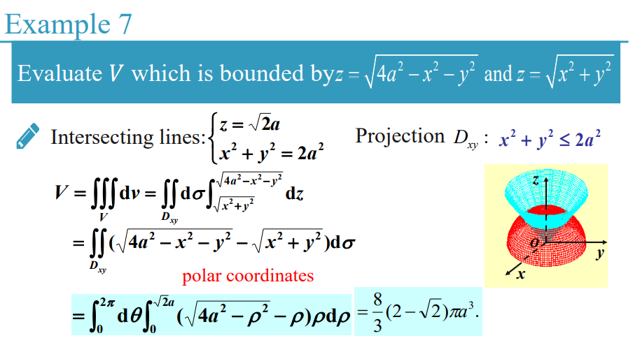

***

#### 13.8 柱面坐标系（极坐标系的三维情况）和球面坐标系中的三重积分

柱面坐标系：

满足：

$x=r \cos \theta$

$y=r \sin \theta$

$z=z$

由扇形弧长$l = r \cdot \theta$和扇形面积$S=\frac{1}{2}\cdot  r^2 \cdot \theta$和几何法推导得到（具体推导见13.4 极坐标系下的二重积分，注意是均为等于而不是约等于）：

$\Delta S=r \Delta r \Delta \theta$

$\Delta V = (r  \cdot \Delta \theta ) \cdot \Delta r \cdot \Delta z$

$dV=r \cdot dr \cdot d\theta \cdot dz$

***

因此，由笛卡尔坐标系到柱面坐标系，三重积分可以化成：

$\iiint_{\Omega} f(x, y, z) \mathrm{d} x \mathrm{~d} y \mathrm{~d} z=\iiint_{\Omega} f(r \cos \theta, r \sin \theta, z) r \; dr d\theta dz$

有三维闭合区域$\Omega$在$xOy$平面的投影，得到：

- $\alpha \leq \theta \leq \beta$（观察得到底面区域内$\theta$的最大最小值）。

- $r_1(\theta) \leq r \leq r_2(\theta)$（观察得到底面区域内$r(\theta)$的最大最小值）有时候和$\theta$无关。

- $z=z_1(r,\theta)$和$z=z_2(r,\theta)$（通过观察和题目条件得到分别代表三维闭合区域$\Omega$的上曲面和下曲面的z的表达式）有时候和$\theta$、$r$无关。

因此有（各个积分上下限包含了其他变量，因此不能拆分）：

$\iiint_{\Omega} f(r \cos \theta, r \sin \theta, z) r dr d\theta dz=\int_{\alpha}^{\beta} \mathrm{d} \theta \int_{r_{1}(\theta)}^{r_{2}(\theta)} \mathrm{d} r \int_{z_{1}(r, \theta)}^{z_{2}(r, \theta)} f(r \cos \theta, r \sin \theta, z) r \mathrm{~d} z$

***

注意：通常情况下，如果三个变量之间有相关的关系，那么积分的上下限需要是带有变量的表达式，而不能是单独计算出的常数。

即使画出的三维图像已经可以得出某个变量的上下限的具体值，如果变量之间是有关的，那么计算出来的结果也是错的。因为如果有关，那么就不是单纯的定义两个常数作为上下限关系，而是在中间过程中随着另一个变量的变化而有特定的变化，也就是说必须统一变量。

***

单独计算出常数的情况仅仅是满足变量之间无关的情况（可能是任意两个变量之间有关，或者三个之间有关，实际的相关关系需要根据闭合三维区域$\Omega$的定义得到变量之间的关系。）此时可能有以下几种情况：

$\iiint_{\Omega} f(r \cos \theta, r \sin \theta, z) r dr d\theta dz=\int_{\alpha}^{\beta} \mathrm{d} \theta \int_{r_{1}}^{r_{2}} \mathrm{d} r \int_{z_{1}(r, \theta)}^{z_{2}(r, \theta)} f(r \cos \theta, r \sin \theta, z) r \mathrm{~d} z$（$\theta$和$r$无关，$z$和$\theta,r$均相关）

$\iiint_{\Omega} f(r \cos \theta, r \sin \theta, z) r dr d\theta dz=\int_{\alpha}^{\beta} \mathrm{d} \theta \int_{r_{1}}^{r_{2}} \mathrm{d} r \int_{z_{1}(r)}^{z_{2}(r)} f(r \cos \theta, r \sin \theta, z) r \mathrm{~d} z$（$\theta$和$r$无关，$z$仅和$r$相关）

$\iiint_{\Omega} f(r \cos \theta, r \sin \theta, z) r dr d\theta dz=\int_{\alpha}^{\beta} \mathrm{d} \theta \int_{r_{1}(\theta)}^{r_{2}(\theta)} \mathrm{d} r \int_{z_{1}(r)}^{z_{2}(r)} f(r \cos \theta, r \sin \theta, z) r \mathrm{~d} z$（$\theta$和$r$有关，$z$仅和$r$相关）

$\iiint_{\Omega} f(r \cos \theta, r \sin \theta, z) r dr d\theta dz=\int_{\alpha}^{\beta} \mathrm{d} \theta \int_{r_{1}}^{r_{2}} \mathrm{d} r \int_{z_{1}}^{z_{2}} f(r \cos \theta, r \sin \theta, z) r \mathrm{~d} z$（$\theta$和$r$无关，$z$和$\theta,r$均无关）

$...$

只要存在变量之间的无关关系，那么就可以通过积分的拆分法则对积分进行拆分计算（可以只拆一部分，有相关关系的不能拆）。例如：

$\int_{\alpha}^{\beta} \mathrm{d} \theta \int_{r_{1}}^{r_{2}} \mathrm{d} r \int_{z_{1}}^{z_{2}} f(r \cos \theta, r \sin \theta, z) r \mathrm{~d} z= \int_{\alpha}^{\beta} \mathrm{d} \theta \cdot \int_{r_{1}}^{r_{2}} \mathrm{d} r \cdot \int_{z_{1}}^{z_{2}} f(r \cos \theta, r \sin \theta, z) r \mathrm{~d} z$

***

注意在换算中，灵活运用极坐标的变换公式：

$r^2=x^2+y^2$

$r(\theta)_i ^2=x_i^2+y_i^2$（某个特定点）

***

例子：

简单题：

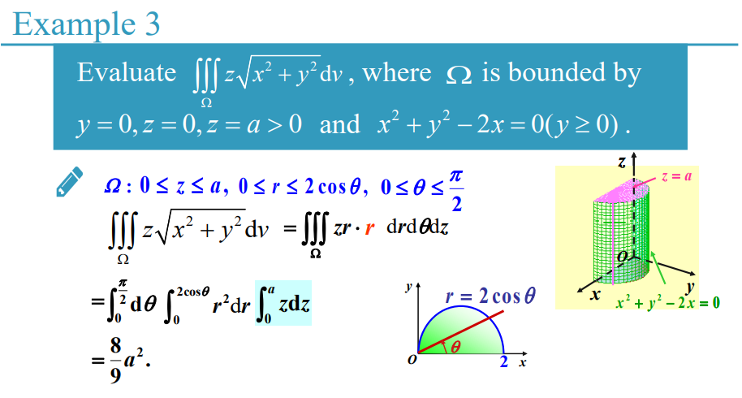

思考题：

***

球面坐标系：

满足：

$x=\rho \sin \varphi \cos \theta$

$y=\rho \sin \varphi \sin \theta$

$z=\rho \cos \varphi$

由扇形弧长$l = r \cdot \Delta \theta$和几何法推导得到：

$\Delta V = \rho \Delta \varphi \cdot \rho \sin \varphi \Delta \theta \cdot \Delta \rho$

$\mathrm{d} V=\rho^{2} \sin \varphi \cdot \mathrm{d} \rho \cdot \mathrm{d} \varphi \cdot \mathrm{d} \theta$

***

由$\Delta V = \Delta x \Delta y \Delta z$进行微元变换，推导得到：

$\mathrm{d} x=\sin \theta \cos \varphi \mathrm{d} \rho+\rho \cos \theta \cos \varphi \mathrm{d} \theta-\rho \sin \theta \sin \varphi \mathrm{d} \varphi$

$\mathrm{d} y=\sin \theta \sin \varphi \mathrm{d} \rho+\rho \cos \theta \sin \varphi \mathrm{d} \theta+\rho \sin \theta \cos \varphi \mathrm{d} \varphi$

$\mathrm{d} z=\cos \theta \mathrm{d} \rho-\rho \sin \theta \mathrm{d} \theta$

$dx \cdot dy \cdot dz=\rho ^2 sin \theta d\rho \cdot d \theta \cdot d \varphi$

最终得到：

$\Delta V = \rho \Delta \varphi \cdot \rho \sin \varphi \Delta \theta \cdot \Delta \rho$

$\mathrm{d} V=\rho^{2} \sin \varphi \cdot \mathrm{d} \rho \cdot \mathrm{d} \varphi \cdot \mathrm{d} \theta$

***

使用雅阁比行列式进行积分换元：

对积分进行换元，还可以使用雅可比行列式进行计算。

$det(J)=\frac{\partial(x, y, z)}{\partial(\rho, \varphi, \theta)}=\left(\begin{array}{ccc}\frac{\partial x}{\partial \rho} & \frac{\partial x}{\partial \varphi} & \frac{\partial x}{\partial \theta} \\ \frac{\partial y}{\partial \rho} & \frac{\partial y}{\partial \varphi} & \frac{\partial y}{\partial \theta} \\ \frac{\partial z}{\partial \rho} & \frac{\partial z}{\partial \varphi} & \frac{\partial z}{\partial \theta}\end{array}\right)=\left(\begin{array}{ccc}\sin \varphi \cos \theta & \rho \cos \varphi \cos \theta & -\rho \sin \varphi \sin \theta \\ \sin \varphi \sin \theta & \rho \cos \varphi \sin \theta & \rho \sin \varphi \cos \theta \\ \cos \varphi & -\rho \sin \varphi & 0\end{array}\right)=-\rho ^2 sin \varphi$

$|det(J)|=\rho ^2 sin \varphi$

$\iiint_{\Omega} f(x,y,z) dxdydz=\iiint_{\Omega} f(\rho \sin \varphi \cos \theta, \rho \sin \varphi \sin \theta, \rho \cos \varphi) |det(J)| \mathrm{d} \rho \mathrm{d} \varphi \mathrm{d} \theta=\iiint_{\Omega} f(\rho \sin \varphi \cos \theta, \rho \sin \varphi \sin \theta, \rho \cos \varphi) \rho^{2} \sin \varphi \mathrm{d} \rho \mathrm{d} \varphi \mathrm{d} \theta$

***

因此，由笛卡尔坐标系到球面坐标系，三重积分可以化成：

$\iiint_{\Omega} f(x,y,z) dxdydz=\iiint_{\Omega} f(\rho \sin \varphi \cos \theta, \rho \sin \varphi \sin \theta, \rho \cos \varphi) \rho^{2} \sin \varphi \mathrm{d} \rho \mathrm{d} \varphi \mathrm{d} \theta$

有三维闭合区域$\Omega$，满足：

- $a \leq \theta \leq b$

- $c \leq \varphi \leq d$

- $e \leq \rho \leq f$

因此有拆分积分：

$\iiint_{\Omega} f(\rho \sin \varphi \cos \theta, \rho \sin \varphi \sin \theta, \rho \cos \varphi) \rho^{2} \sin \varphi \mathrm{d} \rho \mathrm{d} \varphi \mathrm{d} \theta=\int_a^b d\theta \cdot \int_c^d d\varphi \cdot \int_e^f [ f(\rho \sin \varphi \cos \theta, \rho \sin \varphi \sin \theta, \rho \cos \varphi) \rho^2 sin \varphi ] d\rho$

***

与柱面坐标系不同，球面坐标系的变量之间通常是不相关的。但是也有变量之间相关的情况，此时有相关关系的变量的积分的上下限就不能是单独计算出的常数，积分就不能进行拆分，例如：

$\iiint_{\Omega} f(\rho \sin \varphi \cos \theta, \rho \sin \varphi \sin \theta, \rho \cos \varphi) \rho^{2} \sin \varphi \mathrm{d} \rho \mathrm{d} \varphi \mathrm{d} \theta=\int_a^b d\theta \int_{c(\theta)}^{d(\theta)} d\varphi \int_{e(\varphi , \theta)}^{f(\varphi , \theta)} [ f(\rho \sin \varphi \cos \theta, \rho \sin \varphi \sin \theta, \rho \cos \varphi) \rho^2 sin \varphi ] d\rho$（$\varphi$和$\theta$有关，$\rho$和$\varphi , \theta$均相关的情况。实际上相关关系需要根据$\Omega$得到）

$...$

详情见13.8（本节）的柱面坐标系的类似情况说明。

***

灵活运用球面坐标系变换公式：

$\rho ^2=x^2+y^2+z^2$

***

根据图像的对称性计算多重积分：

求解某个三重积分的时候，如果已经画出了三维图像，那么可以通过多重积分的线性性来进行拆分：

如果某个变量$x$相对于对应的平面$yOz$满足对称，那么$\iiint_{\Omega} x dV=0$

如果某个变量$y$相对于对应的平面$xOz$满足对称，那么$\iiint_{\Omega} y dV=0$

如果某个变量$z$相对于对应的平面$xOy$满足对称，那么$\iiint_{\Omega} z dV=0$

***

补充：使用三重积分求有质量的物体的质心坐标。

$M=\iiint \mu (x,y,z) dV$，其中$\mu (x,y,z)$为点$(x,y,z)$的密度。

$\bar{x}=(\iiint x dV) / M$

$\bar{y}=(\iiint y dV) / M$

$\bar{z}=(\iiint z dV) / M$

质心坐标即为$(\bar{x},\bar{y},\bar{z})$。那么这些坐标的计算公式是怎么得到的呢？

先由一维模型推导（设$\bar{x}$为质心）：

$\begin{aligned} \operatorname{sum}_{k=1}^{n}\left(x_{k}-\bar{x}\right) m_{k} g &=0 \\ g \sum\left(x_{k}-\bar{x}\right) m_{k} &=0 \\ \sum m_{k} x_{k}-\sum \bar{x} m_{k} &=0 \\ \sum m_{k} x_{k}-\sum \bar{x} m_{k} &=0 \\ \sum m_{k} x_{k} &=\bar{x} \sum m_{k} \\ \bar{x} &=\frac{\sum m_{k} x_{k}}{\sum m_{k}} \end{aligned}$

$质心=\frac{系统关于零点的矩}{系统总质量}=\frac{M_{0}}{M}$

密度函数为$\delta (x)$，那么易得第$k$段细杆的质量为$m_{k} \approx \Delta x_{k} \delta(x)$，因此有：

$\bar{x}=\frac{\sum m_{k} x_{k}}{\sum m_{k}} \approx \frac{\sum \delta\left(x_{k}\right) x_{k} \Delta x_{k}}{\sum \delta\left(x_{k}\right) \Delta x_{k}}$

$\bar{x}=\frac{M_{0}}{M}=\frac{\int_{a}^{b} \delta(x) x d x}{\int_{a}^{b} \delta(x) d x}$

那么对更高维度的图像求质心，只需要将其降维直到一维情况即可。

二维的"一段"即为宽度很小的长条，长条的质心在宽度所在的轴上的投影组成了一维情况，两个一维情况的质心所在的线的交点就是二维情况的质心。

$\begin{aligned} \bar{x}=\frac{M_{y}}{M} &=\frac{\sum m_{k} x_{k}}{m_{k}} \\ \bar{y}=\frac{M_{x}}{M} &=\frac{\sum m_{k} y_{k}}{m_{k}}\end{aligned}$

质心坐标：$(\bar{x},\bar{y})$

三维类似于二维情况，通过"分段"来达成二维的情况。但是，其实也可以直接使用最直观的方法来理解：

$\iiint \delta(x,y,z) dV$就是整个图像的质量。那么要求计算类似于$\sum m_k x_k$的$z$轴方向的质心坐标，其实就是每一个质点在$z$轴方向上各自离圆心的距离乘以各自的质量，也就大概是$M_{xy}=\int_{z_i}^{z_f} z [\iiint_{\Omega} \delta (x,y,z)dV] dz=\int_{z_i}^{z_f} z [\int_{z_i}^{z_f} [ 1 \cdot \iint_{D} \delta (x,y,z)d\sigma ] dz] dz=\iiint z \cdot \delta (x,y,z)dV$这种感觉。

***

例子：

简单题：

思考题：

***

### 第十四章-线积分（line integrals）

#### 14.1/14.2 曲线积分

第一型曲线积分：

对一条光滑的曲线进行积分，其实就是求其质量。

其中$M_i$为第$i$段的质量，$\left(\xi_{i}, \eta_{i}\right)$是第$i$段的中点坐标，$\mu (\xi_{i}, \eta_{i})$为第$i$段的线密度，$\Delta s_i$为第$i$段的长度。

那么总质量$M$为：

$M \approx \sum_{i=1}^{n} \mu\left(\xi_{i}, \eta_{i}\right) \cdot \Delta s_{i}$

$M=\lim _{\lambda \rightarrow 0} \sum_{i=1}^{n} \mu\left(\xi_{i}, \eta_{i}\right) \cdot \Delta s_{i}$

***

有整条曲线$l$，有光滑曲线弧（smooth curve arc）$L$，那么函数$f(x,y)$就是曲线$l$的定义，曲线弧$L$就是曲线$l$的被积分的部分。

将曲线弧$L$分为$n$段（segment），如果每一段的长度都趋于0，那么极限$\lim _{\lambda \rightarrow 0} \sum_{i=1}^{n} f \left(\xi_{i}, \eta_{i}\right) \cdot \Delta s_{i}$存在。

这个极限可以化为积分的形式，使用$\int_{L} f(x, y) d s$表示。这个积分被称为曲线弧$L$上的函数$f(x,y)$的曲线积分（curve integral）或者第一型曲线积分（first class curve integral）。

其中$L$是弧/弧长（arc length），$f(x,y)$是被积函数，$ds$是弧单位（arc element），$\sum_{i=1}^{n} f \left(\xi_{i}, \eta_{i}\right) \cdot \Delta s_{i}$是积分和（integral summation）。

使$f(x,y)$为$\mu (x,y)$，则有曲线分量（curvilinear component）的质量$M$：

$M=\int_{L} \mu(x, y) \mathrm{d} s$

***

如果函数$f(x,y)$在弧长$L$上满足光滑（无限阶可导），那么有以下性质：

- 满足存在性：

曲线积分$\int_{L} f(x, y) d s$存在，也可以写作$\oint_{L} f(x, y) d s$。

- 满足线性性：

$\int_{L_{1}+L_{2}} f(x, y) \mathrm{d} s=\int_{L_{1}} f(x, y) \mathrm{d} s+\int_{L_{2}} f(x, y) \mathrm{d} s$

$\int_{L}[f(x, y) \pm g(x, y)] \mathrm{d} s=\int_{L} f(x, y) \mathrm{d} s \pm \int_{L} g(x, y) \mathrm{d} s$

$\int_{L} k f(x, y) d s=k \int_{L} f(x, y) d s$

- 满足方向无关性：

$\int_{L(\mathop{AB}\limits^{\frown})}f(x,y)ds=\int_{L(\mathop{BA}\limits^{\frown})}f(x,y)ds$

***

三维情况下的曲线积分：

如果函数$f(x,y,z)$在空间曲线弧$\Gamma$上满足光滑，那么有曲线积分：

$\int_{\Gamma} f(x, y, z) d s=\lim _{\lambda \rightarrow 0} \sum_{i=1}^{n} f\left(\xi_{i}, \eta_{i}, \zeta_{i}\right) \cdot \Delta s_{i}$

***

曲线积分的对称性：

曲线积分同样可以通过对称性进行简单的换算。

$$\int_{L} f(x, y) d s=\left\{\begin{array}{l}0 \quad \quad \quad \quad \quad \quad , f(x,y)是奇函数 \\ 2 \int_{L_{1}} f(x, y) d s \; \; , f(x,y)是偶函数 \end{array}\right.$$

其中$L_1$是弧长$L$在$y$轴截取出的任意一边的弧长。

例子（简单题）：

***

第一类曲线积分的解法：

将其视作普通的二重/三重积分即可。

有曲线定义：

$y=f(x)$

$ds = \sqrt{1+ [f^{\prime} (x)]^{2}} dx$

二维情况：

$\oint _{L} ds=\int _{x_{0}}^{x_{1}} \sqrt{1+ [f^{\prime} (x)]^{2}} dx$（其实就是曲线的长度）

$\oint _{L} F(x,y) ds=\int _{x_{0}}^{x_{1}} F(x,f(x)) \sqrt{1+ [f^{\prime} (x)]^{2}} dx$

***

被积函数的参数方程形式：

线积分不同于一般的多重积分和多次积分的原因，就在于其积分的对象微元$ds$实际上蕴含了$x,y$两个方向的微元。但是曲线积分又是单次积分，因此只能通过参数方程的形式来保持对象微元仅包含一个变量。下一小节有格林公式使得曲线积分可以与多重积分产生联系，更方便计算。

将曲线积分的被积函数$f(x,y)$（被积函数$f(x,y)$在曲线弧$L$上满足连续）转化为参数方程形式，则有：

$\left\{\begin{array}{l}x=\phi(t) \\ y=\psi(t)\end{array} \quad(\alpha \leq t \leq \beta)\right.$

如果在区间$[\alpha , \beta]$上，满足函数$\phi(t)$和$\psi(t)$的一阶导数存在，则有：

$ds=\sqrt{\phi^{\prime 2}(t)+\psi^{\prime 2}(t)} d t \geq 0$

$\int_{L} f(x, y) d s=\int_{\alpha}^{\beta} f[\phi(t), \psi(t)] \sqrt{\phi^{\prime 2}(t)+\psi^{\prime 2}(t)} d t$

如果对空间曲线弧$\Gamma$有被积函数$f(x,y,z)$满足$\Gamma: x=x(t) , \; y=y(t) , \; z=z(t)$，$(\alpha \leq t \leq \beta)$，且满足函数$x(t),y(t),z(t)$的一阶导数存在，则有：

$\int_{\Gamma} f(x, y, z) \mathrm{d} s=\int_{\alpha}^{\beta} f\left[x(t), y(t), z(t)] \sqrt{x^{\prime 2}(t)+y^{\prime 2}(t)+z^{\prime 2}(t)} d t\right.$

***

被积函数的隐函数的参数方程形式：

如果y是关于x的隐函数，满足$L: y=\psi(x)$，$a \leq x \leq b$，则有：

$d s=\sqrt{1+\psi^{\prime 2}(x) d x}$

$\int_{L} f(x, y) d=\int_{a}^{b} f[x, \psi(x)] \sqrt{1+\psi^{\prime 2}(x)} d x$

如果x是关于y的隐函数，满足$L: x=\varphi(y)$，$c \leq y \leq d$，则有：

$\left.\int_{L} f(x, y) d s\right)=\int_{c}^{d} f[\varphi(y), y] \sqrt{1+\varphi^{\prime 2}(y)} d y$
$d s=\sqrt{1+\varphi^{\prime 2}(y) d y}$

如果将函数$f(x,y)$化为极坐标形式$g(\rho,\rho (\theta))$，满足$L: \rho=\rho(\theta)$，$\alpha \leq \theta \leq \beta$，则有：

$\int_{L} f(x, y) d s=\int_{\alpha}^{\beta} f[\rho(\theta) \cos \theta, \rho(\theta) \sin \theta] \sqrt{\rho^{2}(\theta)+\rho^{\prime 2}(\theta)} d \theta$

***

如果曲线弧$L$是两个曲面的交线，例如：

$\left\{\begin{array}{l}z=f(x, y) \\ z=g(x, y)\end{array}\right.$ 或者 $\left\{\begin{array}{l}\varphi_{1}(x, y, z)=0 \\ \varphi_{2}(x, y, z)=0\end{array}\right.$

那我们就需要将$L$所在曲线的方程转化为参数方程的形式，然后再用上述的方法求解。

***

例子（简单题）：

例子（思考题）：

***

第二型曲线积分（second class curve integral）也可以称为对坐标积分。

$L: A \rightarrow B$

有力向量函数$\overrightarrow{F}\left(\xi_{i}, \eta_{i}\right)=\overrightarrow{P}\left(\xi_{i}, \eta_{i}\right) \vec{i}+\overrightarrow{Q}\left(\xi_{i}, \eta_{i}\right) \vec{j}$（函数$P$和$Q$为力$F$的两个相互垂直的分量）

有质点$M_{0}, M_{1}\left(x_{1}, y_{1}\right), \cdots, M_{n-1}\left(x_{n-1}, y_{n-1}\right)$，则：

$\overrightarrow{{M}_{i-1} {M}_{i}}=\left(\Delta x_{i}\right) \vec{i}+\left(\Delta y_{i}\right) \vec{j}$

$\Delta W_{i} \approx \overrightarrow{F}\left(\xi_{i}, \eta_{i}\right) \cdot \overrightarrow{M_{i-1} M_{i}} \approx P\left(\xi_{i}, \eta_{i}\right) \Delta x_{i}+Q\left(\xi_{i}, \eta_{i}\right) \Delta y_{i}$

$W=\lim _{\lambda \rightarrow 0} \sum_{i=1}^{n}\left[P\left(\xi_{i}, \eta_{i}\right) \cdot \Delta x_{i}+Q\left(\xi_{i}, \eta_{i}\right) \cdot \Delta y_{i}\right]=\int_{\mathop{AB}\limits^{\frown}} P d x+Q d y=\int_{\mathop{AB}\limits^{\frown}} P(x, y) \mathrm{d} x+Q(x, y) \mathrm{d} y= \int_{\mathop{AB}\limits^{\frown}}(P \vec{i}+Q \vec{j}) \cdot(d x \vec{i}+d y \vec{j})=\int_{\mathop{AB}\limits^{\frown}} \vec{F} \cdot \mathrm{d} \vec{s}$（点乘）

其中$\vec{F}=\{P, Q\}$，$d \vec{s}=\{ d x,d y\}$

$\int_{L} P(x, y) \mathrm{d} x=\lim _{\lambda \rightarrow 0} \sum_{i=1}^{n} P\left(\xi_{i}, \eta_{i}\right) \Delta x_{i}$

$\int_{L} Q(x, y) \mathrm{d} y=\lim _{\lambda \rightarrow 0} \sum_{i=1}^{n} Q\left(\xi_{i}, \eta_{i}\right) \Delta y_{i}$

可以看出，第二型曲线积分的物理意义就是变力做的功。

***

如果把曲线$L$写成参数方程形式：

$L=\left\{\begin{array}{l}x=\phi(t) \\ y=\psi(t)\end{array}\right.$

$t \in [\alpha , \beta]$

在定义域内$\phi (t)$和$\psi (t)$均连续，存在一阶导数，满足：

$\phi^{\prime 2}(t)+\psi^{\prime 2}(t) \neq 0$

$\int_{L} P(x, y) d x+Q(x, y) d y=\int_{\alpha}^{\beta} P[\phi(t), \psi(t)] \phi^{\prime}(t) d t+Q[\phi(t), \psi(t)] \psi^{\prime}(t) d t$

如果满足：$L: y=y(x)$，$a \leq x \leq b$

$\int_{r} P(x, y) d x+Q(x, y) d y=\int_{a}^{b}\left\{P[x, y(x)]+Q[x, y(x)] y^{\prime}(x)\right\} d x$

如果满足：$L: x=x(y)$，$c \leq y \leq d$

$\int_{L} P(x, y) d x+Q(x, y) d y=\int_{c}^{d}\left\{P[x(y), y] x^{\prime}(y)+Q[x(y), y]\right\} d y$
 
***

三维情况（有三维曲线弧$\Gamma$）：

$\int_{\Gamma} P \mathrm{~d} x+Q \mathrm{~d} y+R \mathrm{~d} z$

$\int_{\Gamma} P(x, y, z) d x=\lim _{\lambda \rightarrow 0} \sum_{i=1}^{n} P\left(\xi_{i}, \eta_{i}, \zeta_{i}\right) \Delta x_{i}$

$\int_{\Gamma} Q(x, y, z) d y=\lim _{\lambda \rightarrow 0} \sum_{i=1}^{n} Q\left(\xi_{i}, \eta_{i}, \zeta_{i}\right) \Delta y_{i}$

$\int_{\Gamma} R(x, y, z) d z=\lim _{\lambda \rightarrow 0} \sum_{i=1}^{n} R\left(\xi_{i}, \eta_{i}, \zeta_{i}\right) \Delta z_{i}$

把曲线$\Gamma$写成参数方程形式：

$\Gamma:\left\{\begin{array}{l}x=\varphi(t) \\ y=\psi(t) \\ z=\omega(t)\end{array}\right.$

$\alpha \leq t \leq \beta$

$\int_{\Gamma} P(x, y, z) d x+Q(x, y, z) d y+R(x, y, z) d z =\int_{\alpha}^{\beta}\{P[\varphi(t), \psi(t), \omega(t)] \varphi^{\prime}(t)+Q[\varphi(t), \psi(t), \omega(t)] \psi^{\prime}(t)+R[\varphi(t), \psi(t), \omega(t)] \omega^{\prime}(t)\} \; d t$

***

第二型曲线积分的性质：

满足线性性：

$\int_{L} P \mathrm{~d} x+Q \mathrm{~d} y=\int_{L_{1}} P \mathrm{~d} x+Q \mathrm{~d} y+\int_{L_{2}} P \mathrm{~d} x+Q \mathrm{~d} y$

满足方向有关性：

$\int_{-L} P(x, y) d x+Q(x, y) d y = -\int_{L} P(x, y) d x+Q(x, y) d y$

***

例子（简单题）：

***

#### 14.3 线积分的路径无关性（independence of path）

第二型曲线积分与方向相关，但与具体路径无关。

首先，开区域（open area）$G$必须是一个单连通域（single connected domain）（单连通域是不含有"洞"的平面区域），而且满足函数$P(x,y)$和$Q(x,y)$在$G$上连续，存在一阶导数。$(P,Q)$为保守向量（conservative vector）。

根据上述条件，有以下四个推论恒满足：

- 存在闭合曲线弧$C$满足$\oint_{C} P \mathrm{~d} x+Q \mathrm{~d} y=0$，则$C \subset G$。

- 如果满足：$\int_{L_{1}} P \mathrm{~d} x+Q \mathrm{~d} y=\int_{L_{2}} P \mathrm{~d} x+Q \mathrm{~d} y$，则$\int_{L} P d x+Q d y$在$G$中具有路径无关性。

- 存在$u(x,y) \subset G$满足：$\mathrm{d} u=P \mathrm{d} x+Q \mathrm{d} y$

- 在$G$中满足：$\frac{\partial P}{\partial y}=\frac{\partial Q}{\partial x}$（满足曲线积分路径无关性的充要条件）这个条件的推导是由格林公式推导出来的。满足这个条件后，区域$G$内任意一条闭合曲线的积分都能替换成曲线内部的二重积分，而又因为$\frac{\partial P}{\partial y}-\frac{\partial Q}{\partial x}=0$，因此二重积分的被积函数恒等于0，因此对区域内任意一条闭合曲线的积分都等于0，满足路径无关性。（对任意光滑闭曲线$L_i$，$\oint_{L_i} P \mathrm{~d} x+Q \mathrm{~d} y=0$是满足与路径无关的充要条件）

***

路径无关性的几何意义：

如果$\frac{\partial P}{\partial y} \equiv \frac{\partial Q}{\partial x}$，有：

$\int_{A\left(x_{0}, y_{0}\right)}^{B\left(x_{1}, y_{1}\right)} P(x, y) d x+Q(x, y) d y=\int_{x_{0}}^{x_{1}} P\left(x, y_{0}\right) d x+\int_{y_{0}}^{y_{1}} Q\left(x_{1}, y\right) d y$

$\int_{A\left(x_{0}, y_{0}\right)}^{B\left(x_{1}, y_{1}\right)} P(x, y) d x+Q(x, y) d y=\int_{x_{0}}^{x_{1}} P\left(x, y_{1}\right) d x+\int_{y_{0}}^{y_{1}} Q\left(x_{0}, y\right) d y$

积分的上下限对应的是$dx$和$dy$的方向，也就是力和路径的两个相互垂直的分量。根据先走$x$轴和先走$y$轴来确定被积函数的表达式（也就是先固定其中一个坐标的值，来计算另一个移动的坐标的积分）。

因为是将所有路径都分解为两个相互垂直的路径分量，因此才可以将其分为"先走$x/y$后走$y/x$"来分开计算积分。

***

例子（简单题）：

***

势函数（potential function）的概念及方法：

如果有表达式$P(x, y) \mathrm{d} x+Q(x, y) \mathrm{d} y$，那么有函数$u(x, y)$，满足：

$\mathrm{d} u(x, y)=P(x, y) \mathrm{d} x+Q(x, y) \mathrm{d} y$

$u(x, y)=\int_{\left(x_{i}, y_{i}\right)}^{(x_{f}, y_{f})} P(x, y) d x+Q(x, y) d y$

那么$P(x, y) \mathrm{d} x+Q(x, y) \mathrm{d} y$被称为函数$u(x,y)$的全微分（total differential），而函数$u(x,y)$就被称为$P(x, y) \mathrm{d} x+Q(x, y) \mathrm{d} y$的势函数。

***

一阶全微分方程（first order complete differential equation）的定义：

如果我们有$d u(x, y)=P(x, y) d x+Q(x, y) d y$，那么使$P(x, y) d x+Q(x, y) d y=0$，这个方程就被称为全微分方程（complete differential）或者特征方程（proper equation）。此时满足：

$d u(x, y)=P(x, y) d x+Q(x, y) d y=\frac{\partial u}{\partial x} dx + \frac{\partial u}{\partial y} dy=0$

$P(x,y)=\frac{\partial u}{\partial x}$

$Q(x,y)=\frac{\partial u}{\partial y}$

注意：全微分方程$P(x, y) d x+Q(x, y) d y=0$满足和$\frac{\partial P}{\partial y}=\frac{\partial Q}{\partial x}$是等价的。这是因为$u(x,y)$满足$\frac{\partial ^{2} u}{\partial y \partial x}=\frac{\partial ^{2} u}{\partial x \partial y}$，又因为满足全微分方程的定义，因此$\frac{\partial}{\partial y}P=\frac{\partial}{\partial x}Q$，也就是$\frac{\partial P}{\partial y}=\frac{\partial Q}{\partial x}$。

***

势函数的物理意义：

有一个连续的向量场（vector field）组成的平面$A=\{P(x, y), Q(x, y)\}$，如果表达式$P(x, y) \mathrm{d} x+Q(x, y) \mathrm{d} y$是平面中的函数$u(x,y)$的全微分（full differential），也就是满足$\mathrm{d} u(x, y)=P(x, y) \mathrm{d} x+Q(x, y) \mathrm{d} y$，那么：

向量域$A=\{P(x, y), Q(x, y)\}$是一个梯度域（gradient field）。

函数$u(x,y)$就是是向量域$A$的势函数 / 位函数（bit function）。

***

如果满足$\frac{\partial P}{\partial y}=\frac{\partial Q}{\partial x}$（等价于全微分方程存在），$P(x, y) \mathrm{d} x+Q(x, y) \mathrm{d} y$是势函数$u(x,y)$的全微分（那么全微分的积分就是原函数的定义），因此有求势函数的方法：

方法一：

曲线积分法。（根据路径无关性和曲线积分的线性性）在平面$A$中选取一个特殊点$(x_0,y_0)$作为积分的起始点，然后选取一条特殊的路径求曲线积分，这个曲线积分的结果就是势函数$u(x,y)$的定义。

$\int_{A\left(x_{0}, y_{0}\right)}^{B(x_1, y_1)} P(x, y) d x+Q(x, y) d y=\int_{x_0}^{x_1} P(x,y_0) dx + \int_{y_0}^{y_1} Q(x_1,y) dy=u(x, y)$

选取不同的起始点，最终得到的势函数$u(x,y)$是不一样的。这是因为不同的起始点积分后相差一个常数项，当代入题目给定的积分上下限后，常数项就会被抵消。这跟物理中的"势能"的零点可以任取是同一道理。这种方法同时也是求解第二型曲线积分的方法。

***

方法二：

凑微分法。通过将全微分$P(x, y) \mathrm{d} x+Q(x, y) \mathrm{d} y$化为一个整体微分$d(u(x,y))$的形式，直接获得势函数$u(x,y)$的定义。

$P(x, y) d x+Q(x, y) dy=d[A(x,y)]+d[B(x,y)]=d[A(x,y)+B(x,y)]= d[u(x,y)]$

***

方法三：

不定积分法。从全微分的定义出发，势函数$u(x,y)$的全微分$du$应当满足$du=u_x dx+u_y dy$，又因为$du(x,y)=P(x, y) \mathrm{d} x+Q(x, y) \mathrm{d} y$，最终得到：

$u_x=\frac{\partial u(x,y)}{\partial x}=P(x,y)$

$u_y=\frac{\partial u(x,y)}{\partial y}=Q(x,y)$

那么通过不定积分的定义，有：

$u(x,y)=\int u_x dx=\int u_x dx + C=\int u_x dx + \varphi (y)$ 

其中$\varphi(y)$正是相对于变量$x$来说的"常数项"，与变量$y$相关。

因此有：

$u_y=\frac{\partial u(x,y)}{\partial y}=\frac{\partial [\int u_x dx + \varphi (y)]}{\partial y}=\frac{\partial (\int u_x dx)}{\partial y}+\varphi ^{\prime} (y)$

$\varphi (y)=\int \varphi ^{\prime} (y)=\int \varphi ^{\prime} (y) + C$

最终得到势函数$u(x,y)$的定义：

$u(x,y)=\int u_x dx + \int \varphi ^{\prime} (y) + C$

***

如果有$F(x,y,z)=f(x,y,z) \vec{i}+g(x,y,z) \vec{j}+h(x,y,z) \vec{k}$为保守力，则满足$F$的旋度$curl$ $F=0$（定义在下一节）：

$f_y(x,y,z)=g_x(x,y,z)$（二维情况仅需要满足这一条）

$f_z(x,y,z)=h_x(x,y,z)$

$g_z(x,y,z)=h_y(x,y,z)$

则对$F$的线积分$\int_{L} F(r) dr$具有路径无关性。

***

例子（简单题）：

方法1：

方法2：

方法3：

***

#### 14.4 格林公式（Green formula）和它的应用函数

单连通域：

平面区域$D$没有空洞。

***

多连通域（complex connected region）：

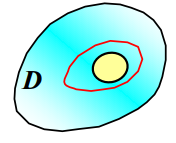

平面区域$D$有空洞。

***

格林公式：

使$L$是一个分段光滑（piecewise smooth）的简单闭合曲线（simple closed curve），并且它作为一个平面区域$D$的边界。如果函数$Q(x,y)$和$P(x,y)$本身在区域$D$和区域边界$L$上连续，且它们的任意阶偏导数函数也连续，那么有格林公式：

$\iint_{D}\left(\frac{\partial Q}{\partial x}-\frac{\partial P}{\partial y}\right) \mathrm{d} x \mathrm{~d} y=\oint_{L} P \mathrm{~d} x+Q \mathrm{~d} y$

也可以写成行列式形式：

$\iint_{D}\left | \begin{array}{cc}\frac{\partial}{\partial x} & \frac{\partial}{\partial y} \\ P & Q\end{array}\right | \mathrm{d} x \mathrm{~d} y=\oint_{L} P \mathrm{~d} x+Q \mathrm{~d} y$

从格林公式易得，满足$\frac{\partial Q}{\partial x}=\frac{\partial P}{\partial y}$则有全微分方程$\oint_{L} P \mathrm{~d} x+Q \mathrm{~d} y=0$，因此这两个条件等价。

格林公式的实质，是闭合曲线的单次曲线积分和闭合曲线围成的区域的二重积分之间的关系。（注意二重积分不是面积，是面质量！）

***

要使得格林公式满足，则边界曲线$L$需要满足区域$D$的正向边界曲线（forward boundary curve），而且是闭合的。正向边界曲线$L$的定义是观察者在曲线上行走的方向满足区域$D$总是在观察者的左边。

也就是说，对曲线弧$L$的方向是有要求的。根据第二型曲线积分的定义，可以类比为正功和负功是不同的。

当均为正向时（forward direction），外圈逆时针，内圈顺时针。

***

对格林公式的推导（情况一）：

简单区域：存在平行于坐标轴的直线与区域$D$的边界曲线$L$相交，且每个坐标轴对应的直线与$L$都至少要有两个交点。则可知这个图形是简单区域（sample region）。

$D=\left\{(x, y) \mid \psi_{1}(y) \leq x \leq \psi_{2}(y), c \leq y \leq d\right\}$

$\begin{aligned} & \iint_{D} \frac{\partial Q}{\partial x} \mathrm{~d} x \mathrm{~d} y=\int_{c}^{d} \mathrm{~d} y \int_{\psi_{1}(y)}^{\psi_{2}(y)} \frac{\partial Q}{\partial x} \mathrm{~d} x \\=&\left.\int_{c}^{d} Q(x, y)\right | _{\psi_{1}(y)}^{\psi_{2}(y)} \mathrm{d} y \\=& \int_{c}^{d} Q\left(\psi_{2}(y), y\right) \mathrm{d} y-\int_{c}^{d} Q\left(\psi_{1}(y), y\right) \mathrm{d} y \\=& \int_{C B E} Q(x, y) \mathrm{d} y - \int_{C A E} Q(x, y) \mathrm{d} y \\=& \int_{C B E} Q(x, y) \mathrm{d} y+\int_{E A C} Q(x, y) \mathrm{d} y \\=& \oint_{L} Q(x, y) \mathrm{d} y \end{aligned}$

$\iint_{D} \frac{\partial Q}{\partial x} \mathrm{~d} x \mathrm{~d} y=\oint_{L} Q(x, y) \mathrm{d} y$

同理可得：

$D=\left\{(x, y) \mid \varphi_{1}(x) \leq y \leq \varphi_{2}(x), a \leq x \leq b\right\}$

$-\iint_{D} \frac{\partial P}{\partial y} \mathrm{~d} x \mathrm{~d} y=\oint_{L} P(x, y) \mathrm{d} x$

因此最终有格林公式：

$\iint_{D}\left(\frac{\partial Q}{\partial x}-\frac{\partial P}{\partial y}\right) \mathrm{d} x \mathrm{~d} y=\oint_{L} P \mathrm{~d} x+Q \mathrm{~d} y$

***

对格林公式的推导（情况二）：

这种形状可以分解为多个简单区域，直接可得格林公式。

$\iint_{D}\left(\frac{\partial Q}{\partial x}-\frac{\partial P}{\partial y}\right) \mathrm{d} x \mathrm{~d} y=\iint_{D_{1}+D_{2}+D_{3}}\left(\frac{\partial Q}{\partial x}-\frac{\partial P}{\partial y}\right) \mathrm{d} x \mathrm{~d} y$

推导：

$\begin{aligned} & \iint_{D}\left(\frac{\partial Q}{\partial x}-\frac{\partial P}{\partial y}\right) \mathrm{d} x \mathrm{~d} y=\iint_{D_{1}+D_{2}+D_{3}}\left(\frac{\partial Q}{\partial x}-\frac{\partial P}{\partial y}\right) \mathrm{d} x \mathrm{~d} y \\=& \iint_{D_{1}}\left(\frac{\partial Q}{\partial x}-\frac{\partial P}{\partial y}\right) \mathrm{d} x \mathrm{~d} y+\iint_{D_{2}}\left(\frac{\partial Q}{\partial x}-\frac{\partial P}{\partial y}\right) \mathrm{d} x \mathrm{~d} y \\ &+\iint_{D_{3}}\left(\frac{\partial Q}{\partial x}-\frac{\partial P}{\partial y}\right) \mathrm{d} x \mathrm{~d} y \\=& \oint_{L_{1}} P \mathrm{~d} x+Q \mathrm{~d} y+\oint_{L_{2}} P \mathrm{~d} x+Q \mathrm{~d} y+\oint_{L_{3}} P \mathrm{~d} x+Q \mathrm{~d} y \\=& \oint_{L} P \mathrm{~d} x+Q \mathrm{~d} y \end{aligned}$

$L=L_1+L_2+L_3$

$L_1,L_2,L_3$均为正向。

***

对格林公式的推导（情况三）：

这种形状为多连通域，也就是由多条闭合曲线围成的区域。那么作最外层的闭合曲线与中间的闭合曲线的连线，使得全部曲线连接在一起，构成一整条闭合曲线（连线正向和反向各走一次，因此相互抵消。最终积分还是对每条闭合曲线分别的积分）来满足将要推导的格林公式的条件。

$\begin{aligned} & \iint_{D}\left(\frac{\partial Q}{\partial x}-\frac{\partial P}{\partial y}\right) \mathrm{d} x \mathrm{~d} y \\=&\left\{\int_{AB}+\int_{L_{2}}+\int_{B A}+\int_{A F C}+\int_{C E}+\int_{L_{3}}+\int_{E C}+\int_{C G A}\right\} \cdot(P \mathrm{~d} x+Q \mathrm{~d} y) \\=&\left(\oint_{L_{2}}+\oint_{L_{3}}+\oint_{L_{1}}\right)(P \mathrm{~d} x+Q \mathrm{~d} y) \\=& \oint_{L} P \mathrm{~d} x+Q \mathrm{~d} y \end{aligned}$

$L=L_1+L_2+L_3$

$\left(\int_{A B}+\int_{B A}=0, \int_{C E}+\int_{E C}=0\right)$

$L_1,L_2,L_3$均为正向。

***

通过格林公式计算平面区域的面积（使得二重积分的被积函数为常数即可）：

$P=ax+by,Q=cx+dy,\frac{\partial Q}{\partial x}-\frac{\partial P}{\partial y}=c-b$

$\iint_{D}\left(\frac{\partial Q}{\partial x}-\frac{\partial P}{\partial y}\right) \mathrm{d} x \mathrm{~d} y=\oint_{L} P \mathrm{~d} x+Q \mathrm{~d} y$

$(c-b) \iint_{D} d x d y=\oint_{L} x d y-y d x$

$A_D=\frac{1}{c-b} \oint_{L} x \mathrm{~d} y-y \mathrm{~d} x$

$A_D$即为区域$D$的面积。

以上只是举一个例子，实际上只需要满足$\frac{\partial Q}{\partial x}-\frac{\partial P}{\partial y}$的结果为常数$k$，即可得到面积公式$A_D=\frac{1}{k} \oint_{L} x \mathrm{~d} y-y \mathrm{~d} x$

***

求解曲线积分题目：

方向法（direct method）其实就是把曲线分段并分别进行积分的方法。不适合使用格林公式时使用。

使用格林公式法，可以将面积问题转化为闭合曲线积分问题，将闭合曲线积分问题转化为面积问题。

某些时候，可以通过给非闭合曲线添加曲线/直线，从而形成闭合曲线，满足格林公式的使用条件。但是要注意最终要减去添加的曲线/直线的线积分，以得到真正要求的曲线积分。

当整个区域满足$\frac{\partial Q}{\partial x}-\frac{\partial P}{\partial y}=0$时，线积分$\oint_L$不一定为0，因为有可能是多连通域，所求曲线$L$的曲线积分不是全部的曲线积分，有其他曲线的曲线积分与$L$的曲线积分相互抵消为0。

***

例子（简单题）：

***

例子（思考题）：

$y$轴方向坐标值不变。

***

例子（思考题）：

例子（思考题）：

***

#### 14.5 曲面积分

##### 通过面积进行曲面积分（第一型曲面积分）

现有曲面$\Sigma$，则：

$\iint_{\Sigma} f(x, y, z) d S=\lim _{\lambda \rightarrow 0} \sum_{i=1}^{n} f\left(\xi_{i}, \eta_{i}, \zeta_{i}\right) \Delta S_{i}$

如果满足曲面闭合，那么$\iint_{\Sigma} f(x, y, z) d S$可以写成$\oiint_{\Sigma} f(x, y, z) d S$。

$\oiint_{\Sigma} f(x, y, z) d S$被称为第一型曲面积分（first kind of surface integral）。如果$f(x,y,z)$在分段光滑的曲面$\Sigma$上连续，则第一型曲面积分存在。

$\oiint_{\Sigma} f(x, y, z) d S$的物理意义为曲面的质量，$f(x,y,z)$即为面密度。

当$f(x,y,z)=1$，那么$\oiint_{\Sigma}d S$的几何意义为曲面的面积。

***

曲面积分的性质（线性性）：

如果曲面$\Sigma$可以分为两个分段光滑的曲面$\Sigma_{1}$和$\Sigma_{2}$，则满足：

$\iint_{\Sigma} f(x, y, z) \mathrm{d} S=\iint_{\Sigma_{1}} f(x, y, z) \mathrm{d} S+\iint_{\Sigma_{2}} f(x, y, z) \mathrm{d} S$

这个性质决定了大部分曲面积分求解的思路：将一个复杂图形的表面拆分成方便计算的几个曲面（甚至是几个区域），这些曲面包围并共同定义了待求解的图形的形状和表面。

***

有曲面$S$的定义$z=f(x,y)$，曲面$S$的切面（抛物面）$\Sigma$，曲面$S$的投影平面区域$D$。

$dA \approx dS$（此处因为曲面为$S$而不是$\Sigma$，因此$\Sigma$的面积的微分用$dA$代替表示）

$\vec{n}=\left(-f_{x},-f_{y}, f_{z}\right)=\left(-f_{x},-f_{y}, 1 \right)$

$d \sigma=d A \cdot \cos \gamma$

$\cos \gamma=\frac{f_{z}}{\sqrt{f_{z}^{2}+f_{x}^{2}+f_{y}^{2}}}=\frac{1}{\sqrt{1+f_{x}^{2}+f_{y}^{2}}}$

$d A=\sqrt{1+f_{x}^{2}+f_{y}^{2}} d \sigma$

$A=\iint_{D} \sqrt{1+f_{x}^{2}+f_{y}^{2}} d \sigma$

底面区域$D$由整个图像的全部投影区域组成。也就是说，整个图像在$xOy$平面上的所有投影区域的集合。 

***

曲面积分的平面积分化：

如果曲面$\Sigma$的定义为$z=z(x,y)$，且在$xOy$平面的投影为$D_{xy}$，那么有：

$\iint_{\Sigma} f(x, y, z) d S=\iint_{D_{x y}} f[x, y, z(x, y)] \sqrt{1+z_{x}^{2}+z_{y}^{2}} d x d y$

$d S=\sqrt{1+z_{x}^{2}+z_{y}^{2}} d x d y$

注意投影区域$D_{xy}$的面积的微分为$d \sigma = dx dy$，而曲面$\Sigma$的面积的微分为$dS=\sqrt{1+z_{x}^{2}+z_{y}^{2}} d x d y=\sqrt{1+z_{x}^{2}+z_{y}^{2}} d \sigma$。

有当$x=x(y,z)$的情况：

$\iint_{\Sigma} f(x, y, z) \mathrm{d} S=\iint_{D_{y z}} f[x(y, z), y, z] \sqrt{1+x_{y}^{2}+x_{z}^{2}} d y d z$

有当$y=y(z,x)$的情况：

$\iint_{\Sigma} f(x, y, z) \mathrm{d} S=\iint_{D_{x z}} f[x, y(x, z), z] \sqrt{1+y_{x}^{2}+y_{z}^{2}} \mathrm{~d} x \mathrm{~d} z$

也要注意对称性的情况，直接省去部分被积函数的计算。（图形关于某个自变量垂直的平面对称，就会把积分结果抵消）这种规则仅适用于第一类曲面积分，而不适用于第二类曲面积分（因为第二类曲面积分不是质量，而是流量）。

如果图形相对于平面$yOz$对称（图形沿$x$轴有着$[-L,L]$，因此对称的两点的质量两两相消），则有：

$\iint _{\Sigma} x dS = 0$

类似的，如果图形相对于平面$xOz$对称，则有：

$\iint _{\Sigma} y dS = 0$

类似的，如果图形相对于平面$xOy$对称，则有：

$\iint _{\Sigma} z dS = 0$

***

当求面积时，有被积函数$f(x,y,z)=1$，则：

当$z=f(x,y)$的情况：

$A=\iint_{D_{x y}} \sqrt{1+z_{x}^{2}+z_{y}^{2}} d x d y$

类似的，有当$x=g(y,z)$的情况：

$A=\iint_{D_{y z}} \sqrt{1+x_{y}^{2}+x_{z}^{2}} d y d z$

类似的，有当$y=h(z,x)$的情况：

$A=\iint_{D_{z x}} \sqrt{1+y_{z}^{2}+y_{x}^{2}} d z d x$

***

##### 曲面积分/多重积分的积分上下限问题

笛卡尔坐标系（不推荐）：

关于"自变量之间的相关性"和"多次积分的上下限是否带有其他自变量的表达式"这个问题，应该可以通过"截面法"来决定。也就是研究哪一个自变量，就沿着垂直于这个自变量对应的坐标轴的平面一个一个去截，观察平面上的其他自变量的值构成的图像。如果平面上的图像一直没有变化，可以认为这个自变量与其他自变量没有相关性，对这个自变量的积分的上下限可以仅为常数而不包含其他自变量。如果图像发生了变化，则观察辨别是哪些自变量的值发生了变化导致的，这些自变量与当前沿垂直轴的平面截取的那个自变量均有关系。

那么截完一个自变量后，截取下一个自变量的时候需要忽视目前为止已经截过的自变量的相关性（因为实际上对每个自变量的积分仅需要一次），而观察剩下未截过的自变量的值（也就是坐标值）是否发生变化，如发生变化则具有相关性。

笛卡尔坐标系/其他坐标系：

1.必须画出图像。画出图像的依据可以是题目对图像的定义，也可以是题目所给的表达式中的积分上下限。

2.列出可以直接看出确定取值范围的量。

3.根据图像的定义的式子，得到量之间相互的关系（这些量可能都有确定的取值范围，但是相互有关）。

4.根据量之间的关系，保留最小限度的确定取值范围的量（靠后积分），其他确定取值范围/未确定取值范围的量均写成与其他量相关的表达式的形式（优先积分），作为积分的上下限。

求解笛卡尔坐标系/其他坐标系下的积分：

1.必须画出图像。画出的图像的依据就是题目所给的积分的上下限。例如$\int_{a}^{b} dx \int_{g(x)}^{h(x)} f(x,y) dy$，那么图像的定义就是：$x \geq a , x \leq b , y \geq g(x) , y \leq h(x)$。（把$x=a,x=b,y=g(x),y=h(x)$实际上画出来）

2.看是否能够合并或拆分计算积分。

3.查看合并或拆分后的图像，判断是否需要改变变量的积分顺序，并确定新的取值范围。

4.计算积分。

例子（思考题）：

***

例子（简单题）：

***

例子（思考题）：

球体表面积公式已知。

***

例子（思考题）：

***

例子（思考题）：

***

##### 通过坐标进行曲面积分（第二型曲面积分）

曲面的分类：

双侧曲面（two-side surface）：

单侧曲面（one-side surface）：

***

有向曲面（directed surface）：

通常的，一个光滑的曲面将会有两个侧面。

高侧面和低侧面（upper and lower sides）：

内侧面和外侧面（inner and outer sides）：

选取不同的侧面，侧面所处的象限不同，那么曲面上的每一点的垂直向量$\vec{n}$的方向也不同，会对曲面积分的结果产生影响。

已经确定了侧面（side）的方向的曲面（surface）称为有向曲面。

***

有向曲面在坐标平面上的投影区域：

假设$\Sigma$是一个有向曲面，然后$\Delta \vec{S}$是$\Sigma$的块（block）（有方向的面积元素）。则在$x O y$平面上$\Delta \vec{S}$的投影$(\Delta \vec{S}_{xy})$满足：

$(\Delta \vec{S})_{x y}=\left\{\begin{array}{cc}(\Delta \sigma)_{x y} & \text {  } \cos \gamma>0 \\ -(\Delta \sigma)_{x y} & \text {  } \cos \gamma<0 \\ 0 & \text {  } \cos \gamma=0\end{array}\right.$

其中$(\Delta \sigma)_{x y}$代表的是投影区域的面积。定义$\gamma$为$\Delta \vec{S}$上每一点的垂直向量和$z$轴的夹角，且所有$\gamma$的符号均相同。那么根据几何意义，易得$\gamma$就等于$\Delta \vec{S}$和$x O y$平面的夹角。

那么类似的，对于$y O z$平面有投影区域$(\Delta \vec{S})_{yz}$，夹角使用$\alpha$表示。对于$z O x$平面有投影区域$(\Delta \vec{S})_{zx}$，夹角使用$\beta$表示。

根据各个角的定义，对于有向曲面的面积单位$\Delta \vec{S}$上的某一点，其法向量满足：$\vec{n}=\{\cos \alpha, \cos \beta, \cos \gamma\}$

***

第二型曲面积分（second kind of surface integral）：

假设$\Sigma$是一个光滑的有向曲面，且函数$\vec{A}$在$\Sigma$上。则我们将$\Sigma$分为$n$份，$\Delta S_{i}$为第$i$份的面积。$\left(\xi_{i}, \eta_{i}, \zeta_{i}\right)$是$\Delta S_{i}$上的代数点。

$\iint_{\Sigma} \vec{A} \cdot d \vec{S}=\lim _{\lambda \rightarrow 0} \sum_{i=1}^{n} \vec{A}\left(\xi_{i}, \eta_{i}, \zeta_{i}\right) \cdot \Delta \vec{S}_{i}$

$\iint_{\Sigma} \vec{A} \cdot d \vec{S}=\iint_{\Sigma} \vec{A} \cdot \vec{n} d S$

$\vec{A}=\{P, Q, R\}$

$\vec{n}=\{\cos \alpha, \cos \beta, \cos \gamma\}=\{ \frac{f_{x}}{\sqrt{f_{z}^{2}+f_{x}^{2}+f_{y}^{2}}},\frac{f_{y}}{\sqrt{f_{z}^{2}+f_{x}^{2}+f_{y}^{2}}},\frac{f_{z}}{\sqrt{f_{z}^{2}+f_{x}^{2}+f_{y}^{2}}}\}$是曲面上的点的单位垂直向量。（由曲面积分推导章节推广可得各角度的表达式）

$d \vec{S}=\vec{n} d S=\{d y d z, d z d x, d x d y\}$

最终可得：

$\iint_{\Sigma} \vec{A} \cdot \mathrm{d} \vec{S}=\iint_{\Sigma} \vec{A} \cdot \vec{n} \mathrm{~d} S==\iint_{\Sigma} P(x, y, z) d y d z+Q(x, y, z) d z d x+R(x, y, z) d x d y$

$\iint_{\Sigma}P dydz+\iint_{\Sigma}Q dzdx+\iint_{\Sigma}R dxdy=\iint_{\Sigma} P cos \alpha dS + \iint_{\Sigma}Q cos \beta dS + \iint_{\Sigma}R cos \gamma dS=\iint_{\Sigma}(P cos \alpha +Q cos \beta + R cos \gamma)dS=\iint_{\Sigma} (P,Q,R) \cdot \vec{n} dS$

***

性质（线性性）：

$\iint_{\Sigma_{1}+\Sigma_{2}} R \mathrm{~d} x \mathrm{~d} y=\iint_{\Sigma_{1}} R \mathrm{~d} x \mathrm{~d} y+\iint_{\Sigma_{2}} R \mathrm{~d} x \mathrm{~d} y$

$\iint_{\Sigma}\left(k_{1} R_{1}+k_{2} R_{2}\right) d x d y=k_{1} \int_{\Sigma} R_{1} d x d y+k_{2} \iint_{\Sigma} R_{2} d x d y$

$\iint_{- \Sigma} R(x, y, z) d x d y=-\iint_{\Sigma} R(x, y, z) d x d y$（$- \Sigma$是$\Sigma$的另一面）

当$\Sigma$是母线平行于$z$轴的圆柱曲面时，满足：$\iint_{\Sigma} R d x d y=0$（绕一圈，力的向量之和等于0）

***

第二型曲面积分的计算：

将三元曲面的积分转化为对有密度的二元平面积分。

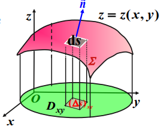

如果曲面$\Sigma$是一个曲面$z=z(x,y)$的上侧面（upper side），那么$\Sigma$在$x O y$平面的投影区域是$D_{xy}$。函数$z=z(x,y)$在$D_{xy}$上有一阶连续偏导数。被积函数$R(x,y,z)$在曲面$\Sigma$上连续，那么满足：

$\iint_{\Sigma} R(x, y, z) d x d y=+\iint_{D_{x y}} R[x, y, z(x, y)] d \sigma_{x y}$（$d \sigma _{xy}$就是$x O y$平面上的投影区域的面积的微分）

如果$\Sigma$是曲面$z=z(x,y)$的下侧面（lower side），那么有$cos \gamma < 0$，其他条件不变，则满足：

$dx dy = d \sigma _{xy}$

$\iint_{\Sigma} R(x, y, z) d x d y=-\iint_{D_{x y}} R[x, y, z(x, y)] d \sigma_{x y}$

也就是说，$\Sigma$是哪个方向的侧面和$\Sigma$所在的象限，决定了垂直向量$\vec{n}$的方向，也就影响了$cos \gamma$的正负，也就影响了最终积分的结果的正负。

***

第二型曲面积分的计算总结：

如果$\Sigma$是曲面$z=z(x,y)$的侧面，那么满足：

$\iint_{\Sigma} R(x, y, z) d x d y=\pm \iint_{D_{x y}} R[x, y, z(x, y)] d \sigma_{x y}$

如果$\Sigma$是曲面$x=x(y,z)$的侧面，那么满足：

$\iint_{\Sigma} P(x, y, z) d y d z=\pm \iint_{D_{y z}} P[x(y, z), y, z] d \sigma_{y z}$

如果$\Sigma$是曲面$y=y(z,x)$的侧面，那么满足：

$\iint_{\Sigma} Q(x, y, z) d z d x=\pm \iint_{D_{z x}} Q[x, y(z, x), z] d \sigma_{z x}$

***

***

例子（简单题）：

$\Sigma$是球面$x^{2}+y^{2}+z^{2}=1 , x \geq 0, y \geq 0$的外侧面，求曲面积分$\iint_{\Sigma} x y z d x d y$。

因为球形跨越了不同象限，因此需要将其拆分为多个有向曲面，分别进行积分。将$\Sigma$拆分为$\Sigma _1$和$\Sigma _2$，画图可得这两个面的法向量方向不同。

$D_{x y}: x^{2}+y^{2} \leq 1(x \geq 0, y \geq 0)$

有：

$\Sigma_{1}: z_{1}=-\sqrt{1-x^{2}-y^{2}}$

$\Sigma_{2}: z_{2}=\sqrt{1-x^{2}-y^{2}}$

$\iint_{\Sigma} x y z d x d y=\iint_{\Sigma_{2}} x y z d x d y+\iint_{\Sigma_{1}} x y z d x d y$
$=+\iint_{D_{x y}} x y \sqrt{1-x^{2}-y^{2}} d \sigma_{x y}-\iint_{D_{x y}} x y\left(-\sqrt{1-x^{2}-y^{2}}\right) d \sigma_{x y}$
$=2 \iint_{D_{x y}} x y \sqrt{1-x^{2}-y^{2}} d x d y$
$=2 \iint_{D_{x y}} r^{2} \sin \theta \cos \theta \sqrt{1-r^{2}} r d r d \theta$（$\theta \in [0,\frac{\pi}{2}]$）
$=\frac{2}{15} .$

$x$轴正方向固定为$0$弧度，$y$轴正方向固定为$\frac{\pi}{2}$。

***

例子（思考题）：

***

例子（思考题）：

***

#### 14.6 高斯散度定理（Gauss divergence theorem）

使$F=M \vec{i}+N \vec{j}+P \vec{k}=<M,N,P>$是一个向量场（vector field），满足$M,N,P$的一阶偏导数均存在，梯度$\nabla=<\frac{\partial}{\partial x},\frac{\partial}{\partial y},\frac{\partial}{\partial z}>$，则满足：

散度：$\operatorname{div} \mathrm{F}=\frac{\partial M}{\partial x}+\frac{\partial N}{\partial y}+\frac{\partial P}{\partial z} =\nabla \cdot F$

旋度：$\operatorname{curl} F=\left(\frac{\partial P}{\partial y}-\frac{\partial N}{\partial z}\right) \vec{i}+\left(\frac{\partial M}{\partial z}-\frac{\partial P}{\partial x}\right) \vec{j}+\left(\frac{\partial N}{\partial x}-\frac{\partial M}{\partial y}\right) \vec{k}= - \nabla \times F$

***

如果有曲面上的函数$A=P(x, y, z) \vec{i}+Q(x, y, z) \vec{j}+R(x, y, z) \vec{k}$且$P,Q,R$均可导，则$\vec{A}$在点$(x,y,z)$的散度为：

$\operatorname{div} \vec{A}=\frac{\partial P}{\partial x}+\frac{\partial Q}{\partial y}+\frac{\partial R}{\partial z}$

有高斯公式：

$\iiint_{\Omega}\left(\frac{\partial P}{\partial x}+\frac{\partial Q}{\partial y}+\frac{\partial R}{\partial z}\right) \mathrm{d} v=\oiint_{\Sigma} P \mathrm{~d} y \mathrm{~d} z+Q \mathrm{~d} z \mathrm{~d} x+R \mathrm{~d} x \mathrm{~d} y$

$\Sigma = \Sigma _{1} + \Sigma _{2} + ...$（整个三维物体的各个部分的表面之和为$\Sigma$）

$\iiint_{\Omega}\left(\frac{\partial P}{\partial x}+\frac{\partial Q}{\partial y}+\frac{\partial R}{\partial z}\right) \mathrm{d} v=(\oiint_{\Sigma _{1}} P \mathrm{~d} y \mathrm{~d} z+Q \mathrm{~d} z \mathrm{~d} x+R \mathrm{~d} x \mathrm{~d} y)+(\oiint_{\Sigma _{2}} P \mathrm{~d} y \mathrm{~d} z+Q \mathrm{~d} z \mathrm{~d} x+R \mathrm{~d} x \mathrm{~d} y)+...$

高斯公式也可以写成：

$\iiint_{\Omega} \operatorname{div} \vec{A} \mathrm{~d} v=\iint_{\Sigma} A_{n} \mathrm{~d} S$

$A_{n}=\vec{A} \cdot \vec{n}=P \cos \alpha+Q \cos \beta+R \cos \gamma$

其中$\Sigma$是闭合空间$\Omega$的边界曲面（boundary surface）。$A_{n}$是$\vec{A}$的投影，通过点乘$\Sigma$上的侧面（lateral）法向量。

***

例子（简单题）：

例子（思考题）：

***

高斯公式：

一个闭合空间$\Omega$被若干个分段光滑闭合曲面定义（则这些曲面就是边界曲面），而函数$P(x, y, z), Q(x, y, z), R(x, y, z)$在$\Omega$上有连续的一阶偏导数。则我们得到：

$\iiint_{\Omega}\left(\frac{\partial P}{\partial x}+\frac{\partial Q}{\partial y}+\frac{\partial R}{\partial z}\right) d v=\oiint_{\Sigma} P d y d z+Q d z d x+R d x d y=\oiint_{\Sigma}(P \cos \alpha+Q \cos \beta+R \cos \gamma) d S$

其中$\Sigma$是$\Omega$的边界曲面的外侧曲面，而$\alpha , \beta , \gamma$是$\Sigma$上的点$x,y,z$的方向角。

高斯公式的本质，是展示了在闭合空间的三次积分和它的边界曲面上的曲面积分的关系。

***

高斯公式推导：

也就是证明以下三条等式：

$\iiint_{\Omega} \frac{\partial P}{\partial x} \mathrm{~d} v=\oiint_{\Sigma} P(x, y, z) \mathrm{d} y \mathrm{~d} z$

$\iiint_{\Omega} \frac{\partial Q}{\partial y} \mathrm{~d} v=\oiint_{\Sigma} Q(x, y, z) \mathrm{d} z \mathrm{~d} x$

$\iiint_{\Omega} \frac{\partial R}{\partial z} \mathrm{~d} v=\oiint_{\Sigma} R(x, y, z) \mathrm{d} x \mathrm{~d} y$

以下证明$\iiint_{\Omega} \frac{\partial R}{\partial z} \mathrm{~d} v=\oiint_{\Sigma} R(x, y, z) \mathrm{d} x \mathrm{~d} y$，则其他两条也可类似得证：

***

例子（简单题）：

例子（简单题）：

例子（思考题）：

***

### 第十五章-微分方程（differential equation，简写为DE）

#### 15.1 一阶常微分方程

含有微分的方程叫做微分方程。

对于单自变量情况，称为常微分方程（ordinary differential equation，简写为ODE）。

对于多自变量情况，称为偏微分方程（partial differential equation，简写为PDE）。

***

n阶微分方程（n-th order DE）表示含有的微分的最高阶为n的微分方程。n为微分方程的阶（order）。

方程表达式：

$F\left(x, y, y^{\prime}, \cdots, y^{(n)}\right)=0$

$y^{(n)}=f\left(x, y, y^{\prime}, \cdots, y^{(n-1)}\right)$

***

解的种类：

通解（general solution）：任意常数$C$（常数不固定），常数的数量与阶相等。通解就是带有未确定的$C$的解，且$C$的个数为微分的阶级数（？），通解不一定是全部的解。

特解（special solution）：常数$C$固定。特解就是通解的$C$确定后的解。

初始解（initial solution）/ 隐式通解（implicit general solution）：通过题目给出的额外条件，从而使常数$C$为一个确定的初始值的解。也就是有其中一个确定的常数$C$的初始值的解。

解的图像：微分方程的积分曲线。

***

求常微分方程的解的方法（大多数微分方程没有或难以求得解析解）：

通过对微分的位置的调整，然后同时对等式两边求不定积分，可以求解一般常微分方程。$y^{\prime}=f(x,y)$转化为$g(y)dy=h(x)dx$，最终解得$\int g(y) dy=\int h(x) dx+C_{1}$，也就是$y=E(x,C)$。（分离变量法）

注意：包含中间常数$C_1,C_2,...,C_n$的各部分，都可以合并简化为一个新的常数$C$，作为通解的最终表达式的唯一一个常数。

***

一阶常微分方程定义：

$y^{\prime}=f(x, y)$

$y^{\prime}=\frac{dy}{dx}$

$F\left(x, y, y^{\prime}\right)=0$

设$y^{\prime}=f(x,y)$的全微分为$P(x, y) d x+Q(x, y) d y$，则全微分方程为：

$P(x, y) d x+Q(x, y) d y=0$

$\frac{d y}{d x}=\frac{P(x, y)}{Q(x, y)} \quad(Q \neq 0)$

$\frac{d x}{d y}=\frac{Q(x, y)}{P(x, y)} \quad(P \neq 0)$

***

一阶可分离变量微分方程（equation of separable variable）解法：

如果是变量可分离的常微分方程，则可以将微分方程写成：

$y^{\prime}=h(x,y)=f(x) g(y)$

$M_{1}(x) M_{2}(y) d x+N_{1}(x) N_{2}(y) d y=0$

将包含$dx$，$dy$，$x$，$y$的常微分方程进行分离变量的操作：

$\psi(y) \mathrm{d} y=\varphi(x) \mathrm{d} x$

通过等式两边求不定积分得到通解：

$\int \psi(y) \mathrm{d} y=\int \varphi(x) \mathrm{d} x+C$

最终求得（此处用$E$表示$y$的方程，用其他也行）：

$y=E(x,C)$

***

例子（简单题）：

例子（思考题）：

例子（思考题）：

使用换元法。

例子（思考题）：

***

一阶齐次微分方程（homogeneous DE）解法：

$\frac{dy}{dx}=g(\frac{y}{x})$

满足以上形式的微分方程即为齐次微分方程。

一般使用$u=\frac{y}{x}$充当中间变量（换元法）。则有：

$\frac{d y}{d x}=u+x \cdot \frac{d u}{d x}$

$x \frac{\mathrm{d} u}{\mathrm{~d} x}+u=g(\frac{y}{x})=
g(u)$

分离变量，可得：

$\frac{d u}{g(u)-u}=\frac{d x}{x}$

***

例子（简单题）：

例子（思考题）：

***

一阶线性微分方程（linear DE）解法（重点）：

大部分微分方程无法求精确解，而把能够求精确解的微分方程归纳为线性微分方程。

$\frac{d y}{d x}+P(x) y=Q(x)$，其中$Q(x)$为自由项（free term）。满足以上形式则满足线性（linear）。

如果$Q(x) =0$，则满足齐次，使用普通方法即可。

$\frac{\mathrm{d} y}{\mathrm{~d} x}+P(x) y=0$

$\frac{\mathrm{d} y}{y}=-P(x) \mathrm{d} x$

$\int \frac{\mathrm{d} y}{y}=-\int P(x) \mathrm{d} x$

$\ln |y|=-\int P(x) \mathrm{d} x+\ln C_{1}$

$y=C e^{-\int P(x) d x}$

如果$Q(x) \neq 0$，则满足非齐次，使用常数变易法（constant variation method）。

$\frac{d y}{d x}+P(x) y=Q(x)$

$y^{\prime}+P(x) y=Q(x)$

根据$Q(x)=0$的情况得到，现在使$Q(x) \neq 0$来使常数$C=u(x)$，则：

$y=C e^{-\int P(x) \mathrm{d} x}=u(x) e^{-\int P(x) \mathrm{d} x}$

其中$u(x)$为未知的函数。

$y^{\prime}=u^{\prime}(x) e^{-\int P(x) d x}+u(x) e^{-\int P(x) d x} \cdot[-P(x)]$

然后将$y$和$y^{\prime}$代入原函数（original function）：

$u^{\prime}(x) e^{-\int P(x) d x}+u(x)[-P(x)] e^{-\int P(x) d x}+P(x) u(x) e^{-\int P(x) \mathrm{d} x}=Q(x)$

$u^{\prime}(x) e^{-\int P(x) \mathrm{d} x}=Q(x)$

$u^{\prime}(x)=Q(x) e^{\int P(x) \mathrm{d} x}$

$y=e^{-\int P(x) d x}\left[\int Q(x) e^{\int P(x) d x} d x+C\right]$

***

常数变易法中，为什么可以将$C$变易为未知函数$u(x)$：

$y(x)=e^{-\int P(x) d x}\left(\int Q(x) e^{\int P(x) d x} d x+C\right)=u(x) e^{-\int P(x) d x}$

***

例子（简单题）：

例子（思考题）：

***

一阶线性齐次方程的解和一阶线性非齐次方程的解之间的关系：

通解：General Solution，简写为GS或G.S.。

特解：Special Solution，简写为SS或S.S.。

非齐次微分方程$y^{\prime}+P(x) y=Q(x)$的通解用$y$表示，特解用$y^{*}$表示。

齐次微分方程$y^{\prime}+P(x) y=0$的通解用$CY$表示。

非齐次的通解（GS）=齐次的通解（GS）+非齐次的特解（SS）

$y=C Y(x)+y^{*}(x)=Y(x)\left[C+\frac{y^{*}(x)}{Y(x)}\right]$

例子：

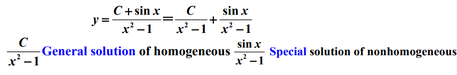

***

一阶线性微分方程的解结构（solution structure）：

***

例子（思考题）：

***

伯努利方程（Bernoulli equation）：

定义：$\frac{d y}{d x}+P(x) y=Q(x) \cdot y^{n} \; (n \neq 0,1)$（当$n=0$或者$n=1$时，满足线性方程）

$y^{-n} \frac{d y}{d x}+P(x) y^{1-n}=Q(x)$

$\frac{1}{1-n} \frac{\mathrm{d} y^{1-n}}{\mathrm{~d} x}+P(x) y^{1-n}=Q(x)$

$z=y^{1-n}$

$\frac{\mathrm{d} z}{\mathrm{~d} x}+(1-n) P(x) z=Q(x)(1-n)$

最终有通解：

$y^{1-n}=z=e^{-\int(1-n) P(x) \mathrm{d} x}\left(\int Q(x)(1-n) e^{\int(1-n) P(x) \mathrm{d} x} \mathrm{~d} x+C\right)$

***

例子（思考题）：

例子（思考题）：

***

全微分方程（total differential equation）的解法：

有$u(x,y)$满足：

$\mathrm{d} u(x, y)=P(x, y) \mathrm{d} x+Q(x, y) \mathrm{d} y$

则存在全微分方程为：

$P(x, y) \mathrm{d} x+Q(x, y) \mathrm{d} y=0$

等价于：

$\frac{\partial P}{\partial y}=\frac{\partial Q}{\partial x}$

曲线积分法：

$u(x, y)=\int_{x_{0}}^{x} P(x, y) \mathrm{d} x+\int_{y_{0}}^{y} Q\left(x_{0}, y\right) \mathrm{d} y=\int_{y_{0}}^{y} Q(x, y) \mathrm{d} y+\int_{x_{0}}^{x} P\left(x, y_{0}\right) \mathrm{d} x$

$u(x, y)=C$

除此之外还有不定积分法和凑微分法（前面章节有详细解法）。

凑微分法：

$d[f(x,y)]+d[g(x,y)]=d[f(x,y)+g(x,y)]$

***

例子（简单题）：

例子（思考题）：

***

#### 15.2 微分方程的不同情况

情况1：$y^{(n)}=f(x)$

$y^{(n-1)}=\int f(x) \mathrm{d} x+C_{1}$

$y^{(n-2)}=\int\left[\int f(x) \mathrm{d} x+C_{1} ] \mathrm{d} x+C_{2}\right.$

$...$

$y^{1} = y = g(x,C_1,C_2,...,C_n)$

例子（简单题）：

***

情况2：$y^{\prime \prime}=f\left(x, y^{\prime}\right)$

$y^{\prime}=p$

$y^{\prime \prime}=\frac{d p}{d x}=p^{\prime}$

$p^{\prime}=f(x, p)$

$p=p\left(x, C_{1}\right)$

$y^{\prime}=p\left(x, C_{1}\right)$

$y=\int p\left(x, C_{1}\right) \mathrm{d} x+C_{2}$

例子（简单题）：

***

情况3：$y^{\prime \prime}=f\left(y, y^{\prime}\right)$

设$\frac{\mathrm{d} y}{\mathrm{~d} x}=y^{\prime}=p(y)$，有$p=p(y)=p(y(x))$。

则有：

$y^{\prime \prime}=\frac{d^{2} y}{d x^{2}}=\frac{d p}{d x}=\frac{d p}{d y} \cdot \frac{d y}{d x}=p \frac{d p}{d y}$

$p \frac{\mathrm{d} p}{\mathrm{~d} y}=f(y, p)$

这样就化为关于$y$和$p$的一阶微分方程了。

通过分离变量并进行积分，得到通解：

$y^{\prime}=p=\varphi\left(y, C_{1}\right)$

$\int \frac{\mathrm{d} y}{\varphi\left(y, C_{1}\right)}=x+C_{2}$

注意：只有当$y$和$x$不是相互独立变量时（也就是$y$和$x$相关时），才有$y^{\prime}=p$

***

例子（简单题）：

***

#### 15.3 二阶线性常微分方程（second order linear ordinary differential equation）

二阶线性常微分方程：

$\frac{\mathrm{d}^{2} y}{\mathrm{~d} x^{2}}+P(x) \frac{\mathrm{d} y}{\mathrm{~d} x}+Q(x) y=f(x)$

$y^{\prime \prime}+P(x) y^{\prime}+Q(x) y=f(x)$

若$f(x)=0$，则满足齐次。

若$f(x) \neq 0$，则满足非齐次。

n阶线性常微分方程：

$y^{(n)}+P_{1}(x) y^{(n-1)}+\cdots+P_{n-1}(x) y^{\prime}+P_{n}(x) y=f(x)$

***

二阶线性齐次常微分方程的解结构：

$y^{\prime \prime}+P(x) y^{\prime}+Q(x) y=0$

定理1：

假设$y_1(x)$和$y_2(x)$是二阶线性齐次常微分方程的两个解，那么$y=C_{1} y_{1}(x)+C_{2} y_{2}(x)$也是这个方程的一个通解。

证明：

${\left[C_{1} y_{1}^{\prime \prime}+C_{2} y_{2}^{\prime \prime}\right]+P(x)\left[C_{1} y_{1}^{\prime}+C_{2} y_{2}^{\prime}\right] }+Q(x)\left[C_{1} y_{1}+C_{2} y_{2}\right]=C_{1}\left[y_{1}^{\prime \prime}+P(x) y_{1}^{\prime}+Q(x) y_{1}\right]+C_{2}\left[y_{2}^{\prime \prime}+P(x) y_{2}^{\prime}+Q(x) y_{2}\right]=0$

***

定理2：

线性相关的定义：假设$y_1,y_2,...,y_n$是$n$个定义在区间$I$上的函数。如果有$n$个常数且至少有一个的值不为0，则：

在$x \in I$条件下，存在$k_{1} y_{1}+k_{2} y_{2}+\cdots+k_{n} y_{n} \equiv 0$

那么这$n$个函数在区间$I$上线性相关（linearly correlated），否则线性无关（linearly independent）。

如果两个函数$y_1(x)$和$y_2(x)$在区间$I$上线性相关，则有$\frac{y_{1}(x)}{y_{2}(x)}=C$（$C$为常数）。如果两个函数$y_1(x)$和$y_2(x)$在区间$I$上线性无关，则有$\frac{y_{1}(x)}{y_{2}(x)} \neq C$（$C$为常数）。

如果$y_1(x)$和$y_2(x)$是二阶线性齐次常微分方程的两个线性无关的特解，那么$y=C_{1} y_{1}(x)+C_{2} y_{2}(x)$是这个方程的通解。

上述定理可以拓展到$n$阶线性齐次常微分方程。

$y^{(n)}+P_{1}(x) y^{(n-1)}+\cdots+P_{n-1}(x) y^{\prime}+P_{n}(x) y=0$

也就是说，如果函数$y_{1}(x), y_{2}(x), \cdots y_{n}(x)$是$n$阶线性齐次常微分方程的$n$个线性无关的特解，那么$y=C_{1} y_{1}(x)+C_{2} y_{2}(x)+\cdots+C_{n} y_{n}(x)$就是这个方程的通解。其中$C_1,C_2,...,C_n$为任意常数。

***

二阶线性非齐次常微分方程的解结构：

$y^{\prime \prime}+P(x) y^{\prime}+Q(x) y=f(x)$

定理3：

设$y^{*}$是二阶线性非齐次常微分方程的一个特解，$Y$是这个非齐次方程对应的齐次方程$y^{\prime \prime}+P(x) y^{\prime}+Q(x) y=0$的通解，则$y=Y+y^{*}$就是这个非齐次方程的通解。

上述定理可以拓展到$n$阶线性非齐次常微分方程。

***

例子（简单题）：

***

定理4：

如果二阶线性非齐次常微分方程中，$f(x)$可以分解为两个函数的相加，也就是存在$y^{\prime \prime}+P(x) y^{\prime}+Q(x) y=f(x)=f_{1}(x)+f_{2}(x)$，且满足：

$y_{1}^{*}$为方程$y^{\prime \prime}+P(x) y^{\prime}+Q(x) y=f_{1}(x)$的特解。

$y_{2}^{*}$为方程$y^{\prime \prime}+P(x) y^{\prime}+Q(x) y=f_{2}(x)$的特解。

则$y_{1}^{*}+y_{2}^{*}$是原二阶线性非齐次常微分方程的特解，这被称为解的叠加原理（superposition principle of solutions）。

上述定理可以拓展到$n$阶线性非齐次常微分方程。

***

例子（简单题）：

***

二阶线性齐次常微分方程，并且系数为常数（with constant coefficients）情况，也就是二阶线性常系数齐次常微分方程的解结构：

$y^{\prime \prime}+P(x) y^{\prime}+Q(x) y=0$

$y^{\prime \prime}+p y^{\prime}+q y=0$

通过证明和性质选择解的形式为$y=e^{rx}$（$y^{(n)}=r^{n-1} e^{rx}$非常容易计算），其中$r$是未确定的常数（undetermined constant），代入可得$\left(r^{2}+p r+q\right) e^{r x}=0$。又因为$e^{rx} \neq 0$，则易得特征方程（characteristic equation）：

$r^{2}+pr+q=0$

特征方程的解被称为特征根（characteristic root）：

$r_{1,2}=\frac{-p \pm \sqrt{p^{2}-4 q}}{2}$

***

二阶线性齐次常微分方程，并且系数为常数情况下，其特征方程的特征根$r$满足不同的条件决定了方程通解的不同形式。

确定常系数齐次线性方程的特征方程通解和方程通解的一种方法称为特征方程法（method of characteristic equation）。

当存在两个不等的实根时（$\Delta > 0$），满足：

$r_{1}=\frac{-p+\sqrt{p^{2}-4 q}}{2}, r_{2}=\frac{-p-\sqrt{p^{2}-4 q}}{2}$

则这个二阶线性齐次常微分方程有两个线性无关的特解：

$y_{1}=e^{r_{1} x}$

$y_{2}=e^{r_{2} x}$

满足$\frac{y_{1}}{y_{2}} \neq C$（$C$为常数）。

则这个二阶线性齐次常微分方程的通解为：

$y=C_{1} e^{r_{1} x}+C_{2} e^{r_{2} x}$

***

当存在两个相等的实根时（$\Delta = 0$），满足：

$r_{1}=r_{2}=-\frac{p}{2}$

则这个二阶线性齐次常微分方程有特解：

$y_{1}=e^{r_{1} x}$

满足$\frac{y_{1}}{y_{2}} \neq C$（$C$为常数）。

使$y_{2}=u(x) e^{r_{1} x}$，其中$u(x)$是一个未确定的函数。

将$y_{2},y_{2}^{\prime},y_{2}^{\prime \prime}$代入到方程$y^{\prime \prime}+p y^{\prime}+q y=0$中，可得：

$u^{\prime \prime}+\left(2 r_{1}+p\right) u^{\prime}+\left(r_{1}^{2}+p r_{1}+q\right) u=0$

$u^{\prime \prime}=0$

那么可以假设$u(x)=x$，可得$y_{2}=x \cdot e^{r_{1}x}$。

则这个二阶线性齐次常微分方程的通解为：

$y=C_{1} e^{r_{1} x}+C_{2} x e^{r_{1} x}=\left(C_{1}+C_{2} x\right) e^{r_{1} x}$

***

当存在一对共轭复数根（conjugate complex roots）时（$\Delta < 0$），满足：

$r_{1}=\alpha+i \beta$

$r_{2}=\alpha-i \beta$

$y_{1}$和$y_{2}$是这个二阶线性齐次常微分方程的两个线性无关的特解：

$y_{1}=e^{r_{1} x}=e^{(\alpha+i \beta) x}$

$y_{2}=e^{r_{2} x}=e^{(\alpha-i \beta) x}$

欧拉公式（Euler formula）：$e^{i x}=\cos x+i \sin x$。

$\bar{y}_{1}=\frac{1}{2}\left(y_{1}+y_{2}\right)=e^{\alpha x} \cos \beta x$

$\bar{y}_{2}=\frac{1}{2 i}\left(y_{1}-y_{2}\right)=e^{\alpha x} \sin \beta x$

$\frac{\bar{y_1}}{\bar{y_2}} \neq C$（$C$为常数）

则这个二阶线性齐次常微分方程的通解为：

$y=e^{\alpha x}\left(C_{1} \cos \beta x+C_{2} \sin \beta x\right)$

***

例子（简单题）：

例子（简单题）：

例子（简单题）：

例子（思考题）：

***

n阶线性常系数齐次常微分方程的解结构：

$y^{(n)}+P_{1} y^{(n-1)}+\cdots+P_{n-1} y^{\prime}+P_{n} y=0$

特征方程为：

$r^{n}+P_{1} r^{n-1}+\cdots+P_{n-1} r+P_{n}=0$

如果特征方程有$k$个不同的根（k-fold）（$k$大于等于方程中最高导数项目的阶级），则n阶线性常系数齐次常微分方程的通解为：

$\left(C_{1}+C_{2} x+\cdots+C_{k} x^{k-1}\right) e^{r x}$

如果特征方程有$k$个不同的共轭复数根（$r=\alpha+i \beta$），则n阶线性常系数齐次常微分方程的通解为：

$e^{\alpha x}\left[\left(C_{1}+C_{2} x+\cdots+C_{k} x^{k-1}\right) \cos \beta x+\left(D_{1}+D_{2} x+\cdots+D_{k} x^{k-1}\right) \sin \beta x\right]$

n次代数方程有n个根，特征方程的每个根对应于微分方程的通解中的一个项，每个项有一个任意常数，也就是：

$y=C_{1} y_{1}+C_{2} y_{2}+\cdots+C_{n} y_{n}$

***

例子（简单题）：

例子（思考题）：

***

#### 15.4 二阶线性常系数非齐次常微分方程的解结构

二阶线性常系数非齐次常微分方程的解结构：

$y^{\prime \prime}+p y^{\prime}+q y=f(x)$

$f(x)$满足$P_{m}(x), \quad P_{m}(x) e^{\lambda x}, \quad P_{m}(x) e^{\lambda x} \cos \beta x,P_{m}(x) e^{\lambda x} \sin \beta x$的形式，则可求通解。其中$f(x)$为$M$次多项式（$M$为$x$的最大次数）。

通解结构为$y=Y+y^{*}$。因此问题在于如何解得特解$y^{*}$。

***

待定常数法（undetermined coefficient method）：

如果$f(x)$满足$f(x)=e^{\lambda x} P_{m}(x)$的形式，则有：

$y^{\prime \prime}+p y^{\prime}+q y=P_{m}(x) e^{\lambda x}$

使特解为以下形式：

$y^{*}=Q(x) e^{\lambda x}$

方法1：

代入到原式可得：

$Q^{\prime \prime}(x)+(2 \lambda+p) Q^{\prime}(x)+\left(\lambda^{2}+p \lambda+q\right) Q(x)=P_{m}(x)$，其中$\lambda^{2}+p \lambda+q \neq 0$。

根据$\lambda$分情况讨论：

如果$\lambda$不是特征方程的一个根，则我们可以使$Q(x)=Q_{m}(x)$，那么$y *=Q_{m}(x) e^{\lambda x}$，就有$Q^{\prime \prime}(x)+(2 \lambda+p) Q^{\prime}(x)+\left(\lambda^{2}+p \lambda+q\right) Q(x)=P_{m}(x)$。此时满足$2 \lambda+p \neq 0$，$\lambda^{2}+p \lambda+q = 0$。

如果$\lambda$是特征方程的单根（single root）（等于其中一个解），则我们可以使$Q(x)=x Q_{m}(x)$，那么$y *=x Q_{m}(x) e^{\lambda x}$，就有$Q^{\prime \prime}(x)+(2 \lambda+p) Q^{\prime}(x)+\left(\lambda^{2}+p \lambda+q\right) Q(x)=P_{m}(x)$。此时满足$2 \lambda+p = 0$，$\lambda^{2}+p \lambda+q = 0$。

如果$\lambda$是特征方程的双根（double root）（等于其中一个解，且两解相等），则我们可以使$Q(x)=x^{2} Q_{m}(x)$，那么$y^{*}=x^{2} Q_{m}(x) e^{\lambda x}$。

方法2（直接求全部特解的系数）：

$y_{1}^{*} = C_{1}(x) \cdot y_{1}(x)$

$y_{2}^{*} = C_{2}(x) \cdot y_{2}(x)$

$C_{1}(x)=\int \frac{\begin{vmatrix} 0 & y_{2}(x) \\ f(x) & y_{2}^{\prime}(x) \end{vmatrix}}{\begin{vmatrix} y_{1}(x) & y_{2}(x) \\ y_{1}^{\prime}(x) & y_{2}^{\prime}(x) \end{vmatrix}} dx$

$C_{2}(x)=\int \frac{\begin{vmatrix} y_{1}(x) & 0 \\  y_{1}^{\prime}(x) & f(x) \end{vmatrix}}{\begin{vmatrix} y_{1}(x) & y_{2}(x) \\ y_{1}^{\prime}(x) & y_{2}^{\prime}(x) \end{vmatrix}} dx$

$y=y_{1}(x)+y_{2}(x)+y_{1}^{*}+y_{2}^{*}$

***

例子（简单题）：

例子（简单题）：

例子（思考题）：

例子（思考题）：

***

待定常数法（特殊情况）：

如果$f(x)$满足$f(x)=e^{\lambda x}\left[P_{l}(x) \cos \omega x+P_{n}(x) \sin \omega x\right]$的形式，则根据欧拉公式，有：

$f(x)=e^{\lambda x}\left[P_{l} \frac{e^{i \omega x}+e^{-i \omega x}}{2}+P_{n} \frac{e^{i \omega x}-e^{-i \omega x}}{2 i}\right]=\left(\frac{P_{I}}{2}+\frac{P_{n}}{2 i}\right) e^{(\lambda+i \omega) x}+\left(\frac{P_{I}}{2}-\frac{P_{n}}{2 i}\right) e^{(\lambda-i \omega) x}=P(x) e^{(\lambda+i \omega) x}+\bar{P}(x) e^{(\lambda-i \omega) x}$

使$y^{\prime \prime}+p y^{\prime}+q y=P(x) e^{(\lambda+i \omega) x}$，$y_{1} ^{*}=x^{k} Q_{m} e^{(\lambda+i \omega) x}$。使$y^{\prime \prime}+p y^{\prime}+q y=\bar{P}(x) e^{(\lambda-i \omega) x}$，$y_{2} ^{*}=x^{k} \bar{Q}_{m} e^{(\lambda-i \omega) x}$。当$\lambda \pm i \omega$不是特征方程的根的时候，有$k=0$。当$\lambda \pm i \omega$是特征方程的单根的时候，有$k=1$。

根据欧拉公式有：$y ^{*}=x^{k} e^{\lambda x}\left[Q_{m} e^{i \omega x}+\bar{Q}_{m} e^{-i \omega x}\right]=x^{k} e^{\lambda x}\left[Q_{m}(\cos \omega x+i \sin \omega x)+\right.\left.\bar{Q}_{m}(\cos \omega x-i \sin \omega x)\right]=x^{k} e^{\lambda x}\left[R_{m}^{(1)}(x) \cos \omega x+R_{m}^{(2)}(x) \sin \omega x\right]$

其中$R_{m}^{(1)}(x), R_{m}^{(2)}(x)$为$m$次多项式，$m$满足$m=\max \{l, n\}$。

***

例子（简单题）：

图中不清晰的地方为$\lambda \pm i \omega = 0 \pm i$

例子（思考题）：

***

### 公式表

#### 已知每个函数/数列的极限均存在的情况下的极限运算的性质表（线性性）

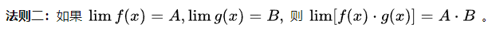

函数和数列的极限运算的线性性相同：

#### 已知每个函数均可积的情况下的积分运算的性质表（包含线性性）

$\int_a^b[\alpha \cdot f(x)+ \beta \cdot g(x)]=\alpha \cdot \int_a^b f(x) + \beta \cdot \int_a^b g(x)$

除了线性性，还有求导和积分之间的换算性质：

#### 已知每个函数均可积的情况下的多重积分（包括二重积分和三重积分）运算的性质表（包含线性性）

#### 洛必达法则（hospital's rule）

不定型极限，将上下分别单独求导的结果的极限等于原式子。

#### 常用求导公式

#### 常用求积分公式

***

##### 分部积分法

$[f(x) \cdot g(x)]'=f'(x)g(x)+f(x)g'(x)$

$\int f(x) \cdot g'(x) dx=\int f(x) d[g(x)] = [f(x) \cdot g(x)] | _{x_{i}}^{x_{f}} - \int f'(x) \cdot g(x) dx=\int [f(x) \cdot g(x)]' - \int g(x) d[f(x)]$

例题：$\int_{0}^{\frac{\pi}{2}} e^{x} \sin x d x = \int_{0}^{\frac{\pi}{2}} \sin x d e^{x} =\left.\left(\sin x \cdot e^{x}\right)\right|_{0} ^{\frac{\pi}{2}}-\int_{0}^{\frac{\pi}{2}}  e^{x} d \cos x=\left.\left(\sin x \cdot e^{x}\right)\right|_{0} ^{\frac{\pi}{2}}-\int_{0}^{\frac{\pi}{2}} \cos x e^{x} d x$

***

#### 求三角函数（用于求积分）

毕达哥拉斯恒等式（Pythagorean identities）：

$\sin ^{2} x+\cos ^{2} x=1$

$1+\tan ^{2} x=\sec ^{2} x$

$1+\cot ^{2} x=\csc ^{2} x$

半角公式（half-angle identities）：

$\sin ^{2} x=\frac{1-\cos 2 x}{2}$

$\cos ^{2} x=\frac{1+\cos 2 x}{2}$

乘积公式（product identities）：

$\sin m x \cos n x=\frac{1}{2}[\sin (m+n) x+\sin (m-n) x]$

$\sin m x \sin n x=-\frac{1}{2}[\cos (m+n) x-\cos (m-n) x]$

$\cos m x \cos n x=\frac{1}{2}[\cos (m+n) x+\cos (m-n) x]$

多次幂公式：

$\int \sin ^{m} x \cos ^{n} x d x$

如果幂$m,n$存在奇数，则寻找换元（通过积分的换元法和半角公式进行转化换元）。

如果幂$m,n$均为偶数，使用半角公式不断拆分直到幂为1。

***

#### 参考级数列表

- 等比级数（geometric series）

$$\sum_{n=0}^{\infty}aq^n$$

当$|q|<1$，等比级数收敛。

当$|q| \geq 1$，等比级数发散。

- p-级数（p-series）

$$\sum_{n=1}^{\infty}\frac{1}{n^p}$$

当$p>1$，p-级数收敛。

当$p \leq 1$，p-级数发散。

- 调和级数（harmonic series）

$$\sum_{n=1}^{\infty}\frac{1}{n}$$

调和级数发散。

- 交错p-级数（alternating p-series）

$$\sum_{n=1}^{\infty} \frac{(-1)^n}{n^p}$$

当$p > 1$，交错p-级数绝对收敛。

当$0 < p \leq 1$，交错p-级数条件收敛。

- 交错调和级数（alternating harmonic series）

$$\sum_{n=1}^{\infty} \frac{(-1)^n}{n}$$

交错调和级数条件收敛。

***

#### 常见基本函数的x=0处的泰勒展开公式（麦克劳林级数）

麦克劳林级数通式：$f(x)=f(0)+f'(0)x+\frac{f''(0)}{2!}x^2+\cdots+\frac{f^{(n)}(0)}{n!}x^n+\cdots$

$e^x,sinx,cosx$可以根据通式直接推导：

$$e^x=\sum_{n=0}^{\infty}\frac{1}{n!}x^n=1+x+\frac{x^2}{2!}+\frac{x^3}{3!}+\cdots+\frac{x^n}{n!}+\cdots , \; x \in R$$

$$sinx=\sum_{n=0}^{\infty}\frac{(-1)^n}{(2n+1)!}x^{2n+1}=x-\frac{x^3}{3!}+\frac{x^5}{5!}-\cdots+(-1)^n\frac{x^{2n+1}}{(2n+1)!}+\cdots , \; x \in R$$

$$cosx=\sum_{n=0}^{\infty}\frac{(-1)^n}{(2n)!}=1-\frac{x^2}{2!}+\frac{x^4}{4!}-\cdots+(-1)^n\frac{x^{2n}}{(2n)!}+\cdots , \; x \in R$$

根据无穷等比数列求和，得到$\frac{1}{1-x}$，替换x为-x，就得到了$\frac{1}{1+x}$。然后通过逐项求导和积分，得到了$ln(1+x)$和$arctanx$。

$$\frac{1}{1-x}=\sum_{n=0}^{\infty}x^n=1+x+x^2+\cdots+x^n+\cdots , \; x \in (-1,1)$$

$$\frac{1}{1+x}=\sum_{n=0}^{\infty}(-x)^n=1-x+x^2-\cdots+(-x)^n+\cdots , \; x \in (-1,1)$$

$$ln(1+x)=\sum_{n=0}^{\infty}\frac{(-1)^n}{n+1}x^{n+1}=x-\frac{x^2}{2}+\frac{x^3}{3}-\cdots+(-1)^{n-1}\frac{x^n}{n}+\cdots , \; x \in (-1,1]$$

$$arctanx=tan^{-1}x=\sum_{n=0}^{\infty}\frac{(-1)^n}{2n+1}x^{2n+1}=x-\frac{x^3}{3}+\frac{x^5}{5}-\frac{x^7}{7}+\cdots , \; x \in [-1,1]$$

根据二项式展开的定义直接得到$(1+x)^p$。

$$(1+x)^p=1 + \sum_{n=1}^{\infty}C_p^n x^n=\sum_{n=0}^{\infty}\frac{p(p-1)\cdots(p-k+1)}{k!}x^k=1+\binom{p}{1}x+\binom{p}{2}x^2+\binom{p}{3}x^3+\cdots , \; x \in (-1,1)$$

运用逐项求导和求积分，可以得到各个常见级数之间的关系，更方便记忆。

***

$sin hx=x+\frac{x^3}{3!}+\frac{x^5}{5!}+\frac{x^7}{7!}+\cdots , \; x \in (-\infty,\infty)$

$cos hx=1+\frac{x^2}{2!}+\frac{x^4}{4!}+\frac{x^6}{6!}+\cdots , \; x \in (-\infty,\infty)$

$arcsinx=\sum_{n=0}^{\infty}\frac{(2n)!}{4^n (n!)^2 (2n+1)}x^{2n+1} , \; x \in (-1,1)$

$tanx=\sum_{n=1}^{\infty}\frac{B_{2n} (-4)^n (1-4^n)}{(2n)!}x^{2n-1} , \; x \in (-\frac{\pi}{2},\frac{\pi}{2})$

***

#### 补充：函数的微分定义与近似计算

任意连续函数的局部图像都可以视作为直角三角形，因此$\Delta y=tan \alpha * \Delta x$，$tan \alpha$等于此点的导数$f'(x)$。

函数的微分的几何意义：

函数$f(x)$的点$(x_0,y_0)$处的"切线"为：

$y=f'(x_0) * (x-x_0) + y_0$

不等于其与点$(x_0+\Delta x,y_0+\Delta y)$的"连线"：

$y=\frac{f(x_0+\Delta x)-f(x_0)}{\Delta x} * (x-x_0) + y_0$

微分的定义：首先，微分其实就是"线性近似"。核心在于使用$A=B+C(y=kx+b)$的形式定义$\Delta y$和$\Delta x$的关系。最终定义了$y=kx+b=A\Delta x+o(\Delta x)$。

某点处函数$y=f(x)$的自变量变化了$\Delta x$，那么函数值的变化量为$\Delta y=A\Delta x+o(\Delta x)$，则称$A\Delta x$为$\Delta y$的"线性主部"，也就是函数f在这点的微分$dy$，而自变量x的微分是$dx=\Delta x$。

几何意义上，$\Delta y=A\Delta x+o(\Delta x)$是原函数此点$(x,y)$到下一个点$(x+\Delta x,y+\Delta y)$的增量。而$dy=A\Delta x$是原函数的切线此点$(x,y)$到下一个点$(x+\Delta x,y+dy)$的值的增量。

***

关于高阶无穷小$o(\Delta x)$的定义和为什么使用高阶无穷小：

因此此点的切线的斜率$f'(x)$乘以$\Delta x$不等于$\Delta y$，存在误差$E$，要求当$\Delta x=dx$（$\Delta x \to 0$）的时候，满足$E=0$，因此使$E=o(\Delta x)$。当$\Delta x \neq dx$时（也就是不满足$\Delta x \to 0$），则$o(\Delta x)$不代表高阶无穷小，而是一个常数c，满足$o(\Delta x)=c=f(x)-A\Delta x$

***

#### 补充：利用微分进行近似计算

由：$lim_{\Delta x \to 0}\frac{f(x_0+\Delta x)-f(x_0)}{\Delta x}=f'(x_0)$

近似计算公式：$f(x_0+\Delta x) \approx f(x_0)+f'(x_0) \cdot \Delta x , (\Delta x \nrightarrow 0)$

由微分的定义，可以在$\Delta x$比较小的时候，视作$\Delta x$趋近于0（但实际上不是），因此这样计算出的函数值仅为近似，但在某些情况下这已经是最好的办法了。

***

#### 补充：梯度的维度问题和自变量、因变量、隐函数对图像维度的实际影响

经常有疑惑，为什么$a=F(x,y)$的图像和$y=f(x)$的图像是一样的呢？明明$a=F(x,y)$有三个变量，应该是三维的才对？其实，这样想也没错（维度提升了，图像和图像维度却都没变？），但需要明白内含的隐藏逻辑。

明显地，对$y=f(x)$，梯度的维数仅有一维，也就是梯度为一维向量（标量）$<f_x>$。而对于$a=F(x,y)$，梯度的维数却变成了两维，也就是梯度为向量$<F_x,F_y>$（注意函数$f$和函数$F$是不同的），但这两个方程的图像是一样的，为什么梯度的维度会不同呢？或者说，自变量明明只有x一个，而总因变量y是关于自变量x的隐函数，那么梯度的维度应该只有一维才对。

实际上，这两个梯度的意义本身就不同，维度当然不需要相同，因为这两个梯度分别反映的其实是函数$f$和函数$F$。你可能会疑惑这两个函数不是相同的吗？其实，它们不仅不同，而且维度也不同，梯度维度自然也不同，仅仅是图像"恰好"相同而已。

对于函数$y=f(x)+k$，则有函数$a=y-f(x)=k$，$f(x)$是含有自变量$x$的表达式，因此可以写作$a=F(x,y)$，其值恒等于$k$。

而$a=F(x,y)$从函数$F$的角度看，$x$和$y$均为独立的自变量$\alpha$和$\beta$，无视了$y$与$x$的隐函数关系（类似于隐函数求偏导的方法）。这样做的确会使得图像变成三维，增加了第三条$z$轴，其值就等于$a=F(x,y)$。但是，在定义$a=F(x,y)$时，其值是恒等于$k$的。这意味着三维图像$O-xyz$中$z$轴的值恒为$k$，也就是仅仅只有$z=k$的平面上有图像。这其实就说明了没有必要将$a=F(x,y)$的图像升维，因此图像与$y=f(x)$一致。但是注意，它确实达到了真实的升维效果，这在计算梯度时可以得知，函数$F$确实是不同于$f$的另一个函数，它是一个因变量$a$同时关于$\alpha$和$\beta$的函数$F(\alpha , \beta)=F(x,y)$而不是$y$关于$x$的函数$f(x)$。

但是，求梯度的时候，它的梯度又明显是比原来升了一维？其实不是的，这个升了一维的梯度实际上是$a$的梯度，也可以说是$F$的梯度，写作$\nabla F$。而函数$y=f(x)$的梯度其实是$<f_x>$（也就是$f'(x)$），写作$\nabla f$。

以上的理论仅在二维升三维的情况下容易理解，但是可以拓展到任意维度，来解释任意维度下的梯度的维度问题和函数图像的问题。

***

### 补充：线积分、曲面积分与重积分的关系

一般从几何意义上说，二重积分求的是曲面下方和xy平面围成的区域的代数体积。就如同一元的定积分是曲线和坐标轴围成的曲边梯形的代数面积一样。

而曲面积分，顾名思义，曲面上的积分，不论第一型第二型，都是曲面上做的积分，具体的说，曲面本身就是一个“弯曲的”空间，在这个空间上有他的标架，你在这里面求积分。这个曲面你“拉直”一些（数学上是做适当的参数变换，表示成适当的参数形式），变成“平直”的空间（也就是变成 regular form），最后可以化成一个重积分进行计算。

其实这样看过来，重积分就是一种特别的第一型曲面积分，这个曲面是“平直”的欧式空间而已。题主问二重积分，那就想象一块平直的板子，每一点处的密度由题主所说的二元函数决定，这个函数就是这块板子的密度函数，这个二重积分就是这块板子的重量。第一型曲面积分那就是更一般，在一块儿弯弯曲曲的板子上做积分。第二型曲面积分，那是对向量值函数的积分了。

***

#### 其他常用公式补充

##### 二元三次方程公式

$(x+y)^3=x^3+3x^2y+3xy^2+y^3$

$(x-y)^3=x^3-3x^2y+3xy^2-y^3$

***

## 求极限总结

1.当有奇怪的次幂项，像是x，sinx这种，就要考虑对数ln了。通过对数可以使次幂变乘积，在解题过程中，有三种应用。

一是两边取对数（求导是两边同时求导，将$x^x$转化为$e^{x * lnx}$），二是化为$y=e^{ln(y)}$来求极限（需要使用洛必达法则来求极限，比三方法多了限制），三是通过原式lim(u->0)(1+u)^v=lim(u->0)(1+u)^(1/u)^u^v=lim(u->0)e^u^v凑出e的重要极限式e=lim(x->无限)(1+1/x)^x来进行化简来求极限。

2.涉及到sinx和cosx，求极限需要谨慎。例如当x趋近于0时，x * sin(1/x)的极限是：0 * 有界，也就是等于0。但是当x趋近于0时，sin(1/x)的极限是：不存在（振荡不定）。

3.分数上下同除变量求极限的方法必须要能凑出0，凑出$\infty$的情况是不对的。

## 求积分方法总结

以下是12种换元法解积分的公式列表：

这是12种可以套用的公式，使用时将元换为t即可选择套用。

1.借一还一（x=x+1-1）

2.整体代换（dx=h'(t)*dt）（第二换元法）

3.有理化（f(x)=g(t)*t'）（第一换元法）

4.x的n次项化为多次项互乘/互除（x=x^6/x^5）（拆分/转化）

5.分部积分法（整体和微分法）

6.对被积函数裂项

7.e^x+1相关特殊转换法和加法互消法：

8.三角函数与e^x相关求解不定积分方法一（通过分部积分，计算出包含其自身的表达式）：

9.在非反常积分下，使用拆分法和奇偶性：

## 常微分、偏微分、傅里叶变换定义

### 常微分

常微分：只有一个自变量t，现在有关于t的函数g(t)的导函数为g'(t)，二阶导函数为g''(t)，这三个函数之间互有联系，举个例子：有等式g''(t)=k1\*g(t)+k2\*g(t)，也就是说这三个函数相互定义，解常微分方程的本质就是求满足给出的等式的函数g(t)。

也可以说常微分是因为只包含正常的微分，因为变量只有一个。但是解这个函数g(t)通常是即为困难的。通过相图，也只能解出非精确解，或者说混沌解。因为初始值对结果的影响是比较大的。

### 偏微分

偏微分：有一个以上的变量，也就是可以是u=f(a,b,c,x)的形式，同时还要写成偏微分方程的形式。因为自变量不仅仅是x，所以每一个自变量对u都有求微分操作，此时的d将会替换为∂，以避免混淆，但是意义是一致的。

### 傅里叶变换

核心思想是通过把一段波缠绕到一个圆上，通过设定每圈的秒数（也就是周期的大小）来确定到一个完全重叠的情况，然后将所有波的对应y值进行积分，除以每一个时间段，得到一个质点，这个质点可以代表某一特定频率的波。

