## 目录

  - 单词
  - Chapter 1
  - Chapter 2.1
  - Chapter 2.2
  - Chapter 2.3
  - Chapter 3.1
  - Chapter 3.2
  - Chapter 3.3（重点）
  - Chapter 4.1
  - Chapter 4.2
  - Chapter 4.3
  - Chapter 5
  - 模拟考
    - Chapter 1 Total
    - Chapter 2.1
    - Chapter 2 Total
    - Chapter 3.1
    - Chapter 3.2
    - Chapter 3.3
    - Chapter 4.1
    - Chapter 4.2
    - Chapter 4.3
    - Chapter 5

## 单词

## Chapter 1

数据处理的空间分布方式：

- 集中处理（centralized processing）
- 分散处理（decentralized processing）
- 分布式处理（distributed processing）


数据处理根据时间分配：

- 批处理（batch processing）


- 在线处理（online processing）
- - 实时处理（real-time processing）
- - 延时处理（delayed processing）

数据管理（data management）是数据处理的基本方面：

- 1950年以前，手工管理（manual management）：

- - 顺序存储设备（sequential access device），例如卡带（card）和磁带（tape）
- - 汇编语言（assembly language）

- 1950年到1960年，文件系统（file system）：

- - 直接存储设备（direct access device），例如磁盘（disk）
- - 高级语言（advanced language）
- - 操作系统（operating system）

- 1960年到现在，数据库系统（database system）：

- - 网络（network）
- - 大容量（large capacity）磁盘
- - 数据库管理系统（database management system）

## Chapter 2.1

逻辑数据模型：

- 数据结构（data structure）
- 数据操纵（data manipulation）
- 完整性约束（integrity constraint）

信息世界（information world）：

- 实体（entity）
- 实体类型（type）
- 实体集/集合（set）
- 属性（attribute）
- 标识符（identifier）：可以标识每个不同个体的属性集。

数据联系（data relationship）：

- 实体内部的联系
- 实体之间的联系
- - 1:1联系，例如班级和班主任
- - 1:N联系，例如父母和孩子
- - N:M联系，例如课程和学生

实体联系模型（Entity-Relationship model，E-R model）和实体联系图（E-R diagram），矩形框为实体类型（entity type），菱形框为联系类型（relationship type），椭圆框为实体属性（entity attribute）或联系型属性（relationship attribute）：

1:1联系图：


1:N联系图：


N:M联系图：


复合联系图：


弱实体（基于另一实体存在的实体）（双线），强实体（独立存在的实体），弱联系（没有依赖联系的实体之间的联系），强联系（强实体与基于此实体的弱实体之间的联系）（双线），弱实体和强联系之间也用双线连接：


泛化（generalization），超类（superclass）实体，子类（subclass）实体：

- 泛化联系：将多个实体的公共属性提取为超类实体。子类实体是泛化层次联系（generalized hierarchical relationship）中的低级（low-level）实体，它们从超类实体继承属性，并且可以具有附加属性。

- 重叠性约束（disjointness constraint）：显示每个子类的实体是否是排它的（exclusive）。在实体联系图中，'d'代表排它的，'o'代表重叠的。


- 完整性约束（completeness constraint）：显示所有子类实体类型是否能够完全覆盖当前系统中的超类实体类型。在实体联系图中，若满足完整性约束，使用双线来连接超类实体类型和重叠性约束。


多值属性（multivalued attribute）：

- 单值（single valued）属性：只能是一个值，例如性别。
- 多值（multivalued）属性：能够是多个值，例如电话号码。
- 简单（simple）属性：不能被分解为多个属性，例如性别。
- 复杂（composite）属性：能够被分解为多个属性，例如地址。
- 派生（derived）属性：能够通过其他属性进行准确计算或派生，例如生日和年龄同时存在时，应去掉年龄这个派生属性。

实体类型和联系类型的选取：


联系型属性：

- 在1:1联系中，可以作为联系型属性，也可以作为任意一个实体的实体属性。


- 在1:N联系中，可以作为联系型属性，也可以作为联系为N的实体的实体属性。


## Chapter 2.2

数据模型：

- 逻辑数据模型（logical data model）（设计师）
- 物理数据模型（physical data model）（编程者）
- 概念数据模型（conceptual data model）（终端用户）（例如ER模型）

逻辑数据模型：

- 数据结构
- 数据操纵
- 完整性约束

基于树的层次模型（hierarchical model）：

- 分层模型使用"有向树"（directed tree）数据结构来表示各种实体及其联系。在树中，每个节点表示记录类型，节点之间的连接表示记录类型之间的联系。

***

例子：

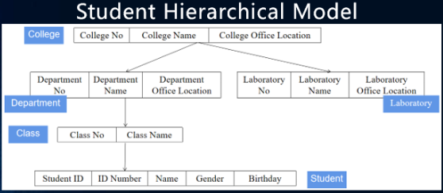


***

层次模型的完整性约束：

- 嵌入（insert）：如果没有相应的父节点，则其子节点无法插入。
- 删除：如果父节点被删除，其所有子节点也会被删除。
- 更新：每次更新应对所有相应的记录都进行更新，确保数据的一致性。

DBTG架构（architecture）：


基于图（graph）的网络模型（network model）：

- 每个节点表示一个记录类型（实体），每个记录类型可以包含几个字段（field）（实体的属性）。节点之间的连接表示记录类型（实体）之间的父子联系。
- 在网络模型中，允许存在多个没有父节点的节点。
- 网络模型中至少有一个节点可以有多个父节点。

网络模型例子：


将网络模型转化为家庭类型（family type）：

- 家庭类型：两个或更多记录类型之间的联系。一个家庭类型就是一棵树。
- 主要记录类型（master record type）：在家族类型中占主导地位的记录类型。
- 成员记录类型（member record type）：家庭类型中的其他记录类型。
- 主要记录类型和成员记录类型的联系是一对多的。

网络模型的完整性约束：

- 嵌入：允许插入父节点尚未确定的子节点。
- 删除：允许单独删除父节点。
- 更新：只有指定的（specific）的记录（record）需要被更新。

基于二维表（two-dimensional table）的关系模型（relational model）：

- 在关系模型中，实体和它们之间的联系（relationship）都是用关系（relation）来表示的。每个关系都是一个标准化的二维表。
- 在这个二维表中，每一行都被称为元组（tuple）。每一列都是一个属性，也称为字段。关系中元组的一个属性的值称为组件（component）。


面向对象（object-oriented）数据模型：

- 对象（object）：现实世界中的实体。
- 属性（attribute）：用于描述对象的状态、组成和特征，是对象的静态特征（static feature），如学生的姓名、性别等。
- 方法（method）：用于更改对象的一个或多个属性的值的操作，这是对象的一个动态特性（dynamic feature）。
- 在对象状态上操作的一组方法称为对象的行为（behavior）。
- 所有具有相同属性和方法集的对象发集合称为类（class）。
- 类允许嵌套（nested）。现有类称为超类（superclass），从现有类派生的新子类称为派生类（derived class）。
- 子类（subclass）继承（inherit）超类的所有属性和方法，代码可以复用（reused）。子类可以包含其他属性和方法。每个子类也可以被分配不同的行为。继承反映了每个对象的共性，多态（polymorphism）反映了每个对象的个性。

物理数据模型：

- 物理模型是一种面向计算机物理表示的模型，用于描述存储介质上数据的组织结构，包括数据在计算机中的存储方式、记录结构和访问路径的表达方式等。
- 在实现过程中，每个逻辑模型都有相应的物理模型。
- 物理模型的目标是指定如何使用数据库模式实现逻辑模型并真正保留数据。

## Chapter 2.3

数据库系统（database system，DBS）的组成：


数据库（DB）：

- 一组相互关联的数据，它们长期存储在计算机中，并按照一定的结构组织起来，可以被共享。它是数据库系统的基础。
- 代表了现实世界中的某些方面。
- 一组具有内在含义和逻辑一致性的数据（非随机生成的数据）。
- 数据库为某一特定目的而被开发。

数据库管理系统（database management system，DBMS）：

- DBMS是DBS的核心。
- DBMS是用户创建和管理数据库的应用程序的集合。
- 数据库系统中用户的所有操作，包括定义、构造、操作等，都是通过DBMS实现的。
- 传统关系数据库（traditional relational database）产品：IBM DB2（大型）、Oracle（大型）、Sybase（中型）、Microsoft SQL Server（中型）、Microsoft Access（小型）、MySQL（小型）、openGauss。
- 非关系数据库（non relational database）产品：MongoDB（基于分布式文件传输）、BigTable（基于Google文档数据传输系统）、Cassandra（类似BigTable）。

DBMS的层次结构（hierarchical structure）：


计算机系统的结构：


DBS三级模式结构（three-level schema structure）：


- 外部模式/用户模式（external schema）：描述数据库用户可以看到和使用的本地数据的逻辑结构和特性。
- 概念模式/模式（conceptual schema）：描述数据库中所有数据的结构和特征。它是数据库的框架，也是所有用户的公共数据视图。
- 内部模式（internal schema）：整个数据库的最低层次表示，用于描述数据库数据的物理结构和存储方法。
- 外部模式/概念模式映像（mapping）：确定数据的本地和全局逻辑结构之间的对应关系。
- 概念模式/内部模式映像：可以模拟外部模式，而概念模式和内部模式只能有一个。它决定了数据的全局逻辑结构和存储结构之间的对应关系。
- 在数据库的三层模式体系结构中，能够在不导致上层模式也发生变化的情况下更改某个级别的架构。
- 数据的逻辑独立性（logical independence of data）是指当数据的整体逻辑结构发生变化时，数据的局部逻辑结构保持不变。由于应用程序是根据数据的局部逻辑结构编写的，不需要修改，从而可以实现数据的逻辑独立性。
- 数据的物理独立性（physical independence of data）是指当数据的存储结构不变时，数据的逻辑结构不变，所以应用程序不需要修改，从而实现数据的物理独立性。

DBS分类：

- 单用户DBS。
- C/S（client/server）结构DBS
- 主从（master-slave）DBS
- 分布式（distributed）DBS

DBS和文件系统区别：


## Chapter 3.1

笛卡尔乘积（Cartesian product）和关系（relation）：

- 定义域（domain）$D_i$。
- 笛卡尔乘积。定义域$D_1,D_2 \cdots D_n$的笛卡尔乘积为：

$$D_1 \times D_2 \times \ldots \times D_n=\left\{\left(d_1, d_2, \ldots, d_n\right) \mid d_i \in D_i, i=1,2, \ldots, n\right\}$$

- 笛卡尔乘积中的每个元素$(d_1,d_2,\cdots,d_n)$都是一个n元组（n-tuple）。
- 笛卡尔乘积中的每个元素中的每个值$d_i$称为一个组件（component）。
- 某一集合中的元素数称为基数（cardinal number）。若定义域$D_i$均为有限集合，其基数为$m_i$，则这些定义域的笛卡尔乘积的基数为$M$：

$$M=\prod_1^n m_i$$

- 笛卡尔乘积例子：


- 提取信息，获得笛卡尔乘积的子集：


- 笛卡尔乘积的子集称为定义域$D_1,D_2 \cdots D_n$中的关系（relation），表示为$R(D_1,D_2 \cdots D_n)$，其中$R$为关系名称，$n$为关系度（degree）。当$n=1$，关系称为一元关系（unary relation）。当$n=2$，关系称为二元关系（binary relation）。
- 二维表是关系模型的数据结构。二维表中，每一行称为一个元组（也就是一条数据），每一列称为一个属性（attribute），元组中的一个确切值称为一个组件。
- 键（key）。如果关系中的某个属性或属性组的值能够唯一地识别元组，则将其称为超键（super key）（例如学生ID，学生ID+姓名，身份证ID+性别）。如果关系中的超键在移除其中任何一个属性后不再是超键（不含有多余属性的超键），则称为候选键（candidate key）（例如学生ID，姓名）：
- - 单属性键：仅包含一个属性的候选键。
- - 多属性键：包含多个属性的候选键。
- - 全键（full key/all key）：关系中唯一的候选键，包含关系的所有属性。
- - 主属性（prime attribute）：候选键中的属性。
- - 非键属性（non-key attribute）：没有包含在任何候选键中的属性。
- - 主键（primary key）：一个关系有多个候选键，选择其一作为主键。一张表中，可以用于唯一地标识一条记录（record）的字段组/属性组。主键是唯一的。
- - 外键（foreign key）：如果关系$R$的属性或属性组$A$不是$R$的主键，而是另一个关系$S$的一个主键，则$A$为$R$的外键。$R$称为引用关系（referencing relation），S称为被引用关系（referenced relation）。外键可以有多个，且无法唯一地标识一条记录。外键不一定需要和对应的主键有相同的名字。

关系模式（relational schema）：

$$R(U,D,Dom,F)$$

- $R$是关系名称。
- $U$是$R$的属性集。
- $D$是来自$U$中的属性的字段。
- $Dom$是属性映射到字段的集合。
- $F$是属性之间的数据依赖关系的集合。
- 关系模式也可以通过简单的$R(U)/R(A_1,A_2,\cdots,A_n)$来表示，其中$A_i$为属性名。
- 关系模式是静态的、稳定的。
- 在某一时刻对应于关系模式的关系集合，通常被引用到关系数据库（relational database）。

关系（relation）的特点（characteristics）：

- 关系是动态的、不断变化的。
- 组件原子性（atomicity）
- 关系的元组数量是有限的（finite）。
- 元组的唯一性（uniqueness）。关系是集合，因此不会有两个完全相同的元素。
- 元组顺序的任意性（arbitrariness）。
- 属性名的唯一性。
- 属性满足同质性（homogeneity）。
- 属性顺序任意性。

E-R图转化为关系模型：

- 对于E-R图中的每个实体类型，应该将其转换为关系模式。
- 关系模式应该包含对应实体类型的所有属性，实体标识符是关系模式的主键。
- 对于E-R图中的每种二元关系类型（例如1:1），应该根据实体之间的联系类型采用不同的方法来处理。

E-R图转换为关系模型例子：


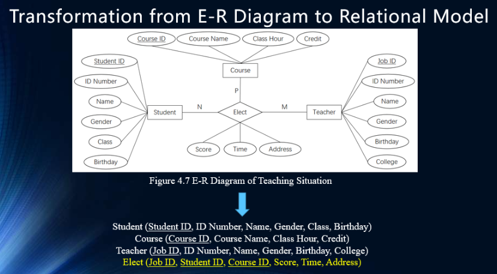


- 一个实体的主键可以作为候选键添加到与其有联系的实体的属性中（1:N联系只能是关系为1的实体的主键添加到关系为N的实体的属性中，1:1联系可以任选其中一个进行）。联系类型的属性也一同添加到选定的实体的属性中。
- 1:1实体自我联系、1:N实体自我联系，则仅将联系类型的属性也一同添加到这个实体的属性中。
- M:N联系，联系类型必须作为一个单独实体，多个有此联系类型实体的主键再加上联系类型的属性直接作为此单独实体的属性。
- 泛化联系，全部实体都增加一个主键（因为泛化联系中没有关系类型，且具有共通属性，难以单独标识）。

关系模型的架构：

- 基本关系（basic relation）是基于关系模式的表：


- 用户可以通过所有表和虚拟表组成数据视图，称为视图（view）。
- 视图中所有表和虚拟表的框架组成了关系数据库的外部模式，称为关系外部模式（relational external schema）。

关系完整性（relational integrity）：

- 实体完整性（主键不允许为空）
- 引用（referential）完整性约束。引用关系和被引用关系。引用完整性是通过实现主键约束和外键约束来实现的。它确保键和值在所有关系中保持一致。当被引用表中没有关联（associate）记录时，应将这些记录添加到被引用表。更改被引用表中的值可能会导致引用表中出现孤立的记录。如果未设置关联删除，则当从被引用表中删除记录时，相关记录仍将存在于引用表中。
- 用户自定义（user-defined）完整性。例如性别不可能为空。

## Chapter 3.2

关系代数（relational algebra）：

- 传统的集合运算：
- - 并集（union）
- - 差集（difference）
- - 交集（intersection）
- - 乘法（product）
- 专业（specialized）关系运算：
- - 选择（selection）
- - 投影（projection）
- - 连接（join）
- - 自然连接（natural join）
- - 除法（division）

并集：

- 要进行并集运算$\cup$，两个关系需要有相同的关系模式。
- 并集运算的结果为两个关系的所有元组。$\vee$为逻辑运算符"或"。

$$R \cup S \equiv\{t \mid t \in R \vee t \in S\}$$

差集：

- 要进行差集运算$-$，两个关系需要有相同的关系模式。
- 差集运算的结果为两个关系中属于其中一个关系并且不属于另一个关系的所有元组。$\wedge$为逻辑运算符"和"。

$$R-S \equiv\{t \mid t \in R \wedge t \notin S\}$$

乘法（笛卡尔乘积）：

- 笛卡尔乘积$R \times S$。前面$r$列来自关系$R$，前面$s$列来自关系$S$。可以理解为两个关系的属性结合后，得到的所有可能的元组的集合。

$$R \times S \equiv\left\{t \mid t=<t^{\wedge} r, t^{\wedge} s>\wedge t^{\wedge} r \in R \wedge t^{\wedge} s \in S\right\}$$


选择：

- 选择$\sigma_F(R)$。在关系$R$中选择符合条件$F$的所有元组。

$$\sigma_{\mathrm{F}}(R) \equiv\{t \mid t \in R \wedge \mathrm{F}(t)=true\}$$

投影：

- 对于$r$元关系$R$，元组变量为$t^r=<t_1,t_2,\cdots,t_r>$，投影是消除（eliminating）某些列，并重新排列（rearranging）剩余的列的过程。

$$\pi_{i_1, i_2, \ldots, i_m}(R) \equiv\left\{t \mid t=<t_{i_1}, t_{i_2}, \ldots, t_{i_m}>\wedge t^r \in R\right\}$$


交集：

- 交集$\cap$。交集运算的结果为两个关系同时有的所有元组。

$$R \cap S=\{t \mid t \in R \wedge t \in S\}$$

- 交集可以由差集组成。

$$R \cap S=R-(R-S)$$

连接：

- 连接$\theta$。在笛卡尔乘积$R \times S$的基础上，找到所有符合条件$i \theta j$的元组。$i$是关系$R$的第$i$列$t_i^r$，$j$是关系$S$的第$j$列$t_j^s$。
- $\theta$为某一种算数比较运算符，例如$=,<,>,\leq,\geq$等，若$\theta$为$=$，则称为等效连接（equivalent join）。

$$\underset{i \theta j}{R \infty S}=\left\{t \mid t=<t^r, t^s>\wedge t^r \in R \wedge t^s \in S \wedge t_i^r \theta t_j^S\right\}$$


F连接：

- 与连接类似，将条件$i \theta j$替换为$F$。$F$为一个逻辑表达式，其形式为$F_1 \wedge F_2 \wedge \cdots \wedge F_n$，每个$F_x$为一个类似于$i \theta j$的条件。

$$\underset{F}{R \infty S}=\left\{t \mid t=<t^r, t^s>\wedge t^r \in R \wedge t^s \in S \wedge F(t)=\right.true\}$$

自然连接：

- 在笛卡尔乘积$R \times S$的基础上，仅选择两个关系的公共属性（common attribute）$A$的值是相同的元组（行）进行保留。
- 去掉多余的公共属性列（列）。
- $r,s$分别是关系$R,S$的属性数。$\tilde{t}^s.A$是去除属性$A$后的关系$S$的元组。

$$R \infty S=\left\{t \mid t=<t^r, \tilde{t}^s . A>\wedge t^r \in R \wedge t^S \in S \wedge t^r[A]=t^S[A]\right\}$$


- 若两个关系不存在公共属性，则自然连接就是笛卡尔乘积。
- 若两个关系存在$n$个公共属性，可以视为一种投影操作。$i_1,i_2,\cdots,i_{s-n}$对应关系$S$中的非公共（non-public）属性。

$$R \infty S=\pi_{1,2, \ldots, r, i_1, i_2, \ldots, i_{s-n}}\left(\sigma_{R \cdot A_1=S \cdot A_1 \wedge R \cdot A_2=S \cdot A_2 \wedge \cdots \wedge R \cdot A_n=S \cdot A_n}(R \times S)\right)$$


除法：

- 对于关系$R$和$S$，将关系$S$视为一个块（block）。
- 如果$R$的同一属性集中的元组具有相同的块，则对应的删除该块后留下的元组是相同的。
- 然后就获得了一个$R \div S$的元组，它们的集合即为除法的结果。

$$R \div S=\left\{t^r . X \mid t^r \in R \wedge Y_x \supseteq S(Y)\right\}$$

$$Y_x=\left\{t^r . Y \mid t^r \in R \wedge t^r . X=x\right\}$$


外连接：

- 外连接基于自然连接。原本被自然连接删除的R和S的元组被置于新的关系中，空单元格中将填充NULL。外连接符号为：。


左外连接：

- 左外连接符号为：。（加上左边被丢弃的元组）


右外连接：

- 右外连接符号为：。（加上右边被丢弃的元组）


半连接（semi join）：

- 基于自然连接。仅提取符号左边的元组。半连接符号为：。


外并（outer union）：

- 对于关系$R$和$S$，外并的结果是由$R$和$S$的所有属性组成的（公共属性仅提取一次）。
- 关系$R$和$S$的元组被放入新的关系，空单元格中将填充NULL。


关系代数表达式（expression）：


- 给定一个学生、课程、选课（elect）的系统，简称EMS。
- 查找course ID为'1001'的所有student ID和score（最少只需要用到一个表elect，涉及的属性都在elect表中），使用投影和选择。最直接方法：

$$\pi_{\text {student ID,score }}\left(\sigma_{\text {course ID }=\prime 1001\prime}(\right. Elect \left.)\right)$$

- 查找course ID为'1001'的所有student ID和name（最少需要用到两个表），使用投影和选择和自然连接。三种方法（效率越来越高）：

- - 构建总表，对总表依次增加条件：

$$\pi_{\text {student ID,name }}\left(\sigma_{\text {course ID }=\prime 1001\prime}(\text { Student } \infty \text { Elect })\right)$$

- - 不构建总表，先对其中一个表增加条件，进行匹配：

$$\pi_{\text {student ID,name }}\left(\sigma_{\text {course ID }=\prime 1001\prime}(\text { Elect }) \infty \text { Student }\right)$$

- - 不构建总表，先对其中一个表增加条件，并分别对两个表进行简化，进行匹配：

$$\pi_{\text {student ID }}\left(\sigma_{\text {course ID }=\prime 1001 \prime}(\text { Elect })\right) \infty \pi_{\text {student ID,name }}(\text { Student })$$

- 查找course name为'English'的所有student ID和name（最少需要用到三个表）。多种方法：

$$\pi_{\text {student } I D, \text { name }}\left(\sigma_{\text {course name} ='English'}(\right. Student \infty Elect \infty Course \left.)\right)$$

- 查找course ID为'1000'或'1001'的所有student ID。最直接方法：

$$\pi_{\text {student ID }}\left(\sigma_{\text {course ID }=' 1000' \vee \text{course ID}=\prime 1001'}(\right. Elect \left.)\right)$$

- 查找course ID至少有'1000'和1001'的所有student ID（$Elect \times Elect$表的直接组合是一共$6$列的数据库）。

$$\pi_1\left(\sigma_{1=4 \wedge 2= \prime 1000 \prime \wedge 5=\prime 1001 \prime}(\right. Elect \times Elect \left.)\right)$$

$$\pi_1\left(\sigma_{(1=4) \wedge (2= \prime 1000 \prime) \wedge (5=\prime 1001 \prime)}(\right. Elect \times Elect \left.)\right)$$

- 查找course ID不存在'1000'的所有student ID和name。

$$\pi_{\text {student ID,name }}( Student )-\pi_{\text {student ID, name }}\left(\sigma_{\text {course } I D=^{\prime} 1000^{\prime}}(\right. Student \infty Elect \left.)\right)$$

- 查找选择了所有课程的name。

$$\pi_{\text {name }}\left(\pi_{\text {student ID,course ID }}(\right. Elect ) \div \pi_{\text {course ID }}( Course ) \infty Student )$$

- 查找所有选择了student ID为'202101231234'的学生选择的所有课程的所有学生的所有student ID。

$$\pi_{\text {Student ID,Course ID }}(Elect) \div \pi_{\text {Course ID }}\left(\sigma_{\text {Student ID }=^{\prime} 202101231234^{\prime}}(\right. Elect \left.)\right)$$

- 删除所有Elect表中选择了course ID为'1000'的student ID为'2021011231234'的学生的元组。$?$为通配符。

$$Elect - ('202101231234','1000',?)$$

- 将Elect表中选择了course ID为'1001'的student ID为'202101231234'的score改为80。

$$Elect - ('202101231234','1001',?) U ('202101231234','1001', 80)$$

关系代数表达式的优化（optimization）：

- 计算比较步骤数。


- 选择和投影，简化表，越早进行越好。
- 将笛卡尔乘积和选择后的结果进行连接。
- 同时进行选择和投影。
- 如果子表达式会出现很多次，在中间直接存起来。
- 在连接前对关系文件进行预处理，如排序和索引。

## Chapter 3.3（重点）

关系模式（relational schema）的规范化（normalization）：

- 数据冗余（data redundancy）
- 更新异常（update exception）
- 插入异常（insertion exception）
- 删除异常（deletion exception）

关系模式的分解：

- 关系模式分解为多个关系。


函数依赖（functional dependency）：

- 设$R$是一个关系模式，$X$和$Y$是$R$的属性的子集，$r$是任意特定的属于$R$的关系。对于$r$的任意两个元组$t_1$和$t_2$，如果$t_1[X]=t_2[X]$成立，$t_1[Y]=t_2[Y]$也成立，这意味着$X$在函数上决定$Y$，或者$Y$函数依赖于$X$，表示为$X \to Y$。（例如学生ID一致，那么学生名也应当一致）$X \to Y$是$R$的一个函数依赖。
- 例子：


函数依赖的推导（inference）规则：

- 对于关系模式$R(U)$，$X,Y,Z,W$都是$U$的子集，$F$是$R$的函数依赖集（属性仅包含在$U$中）。Armstrong推导规则（前三条规则可以推导出其他所有规则）：
- - 自反律（reflexive law）（重要）：如果$\mathrm{Y} \subseteq \mathrm{X} \subseteq \mathrm{U}$，则$X \to Y$成立。
- - 增广律（augmentation law）（重要）：如果$X \to Y$被$F$逻辑隐含，并且$Z \subseteq \mathrm{U}$，则$XZ \to YZ$成立。
- - 传递律（transitive law）（重要）：如果$X \to Y$和$Y \to Z$成立，则$X \to Z$成立。
- - 合并律（merge law）
- - 伪传递律（pseudo transitive law）
- - 分解律（decomposition law）
- - 伪增强律（pseudo augmentation law）


函数依赖集的逻辑隐含（logical implication）：

- $F$是关系模式$R(U)$的一个函数依赖集，$X,Y$是$R$的属性集$U$的子集。如果$X \to Y$可以从$F$中的函数依赖推导出，则称$F$逻辑隐含（logically implying）$X \to Y$，表示为$F | = X \to Y$。
- 例子：

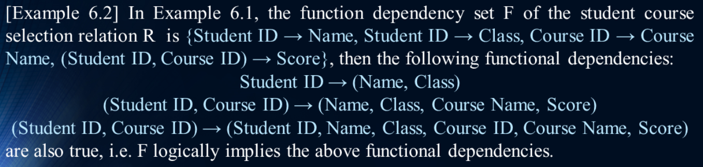

候选键的形式化定义（formal definition）：

- $F$是关系模式$R(U)$的一个函数依赖集，$K$是$R$的属性集$U$的子集。如果$F$逻辑隐含$K \to U$，并且不存在$K$的真子集$K'$使得$K' \to U$成立，那么$K$就是一个$R$的候选键。（其实就是能够决定所有属性的属性或属性集）（注意候选键可以是多个属性组成的属性集）
- 例子：


函数依赖集$F$的闭包（closure）$F+$：

- $F$是关系模式$R(U)$的一个函数依赖集，则$F$的闭包$F+$是由$F$推导出的所有函数依赖的集合。
- 例子：


平凡（trivial）函数依赖：

- $X,Y$是关系模式$R$的属性集的子集，且$X \to Y$是$R$的函数依赖。如果$X \supseteq Y$，则$X \to Y$是平凡函数依赖。如果$Y$不是$X$的子集且$X \to Y$成立，则$X \to Y$是非平凡（non trivial）函数依赖。
- 例子：


关于$F$的属性集$X$的闭包$X+$：

- $F$是关系模式$R(U)$的一个函数依赖集，$X$是$U$的子集，可以通过Armstrong推导规则从$F$推导出的满足函数依赖$X \to A$的所有$A$的集合，称为关于$F$的属性集$X$的闭包，表示为$X+$或$X_{F}^+$。$\mathrm{X}_F^{+}=\left\{A_i \mid A_i \in U, \mathrm{X} \rightarrow A_i \in F+\right\}$
- 例子：


- 求$X+$的步骤：


- - 例子：


函数依赖集的等价性（equivalence）与覆盖性（covering）：

- $F,G$是关系模式$R(U)$的两个函数依赖集，如果$F+=G+$，则称$F$和$G$是等价的（equivalent），也称为$F$覆盖（cover）$G$或者$G$覆盖$F$。
- 满足$F+=G+$的必要条件和充分条件分别为$F \subseteq G+$和$G\subseteq F+$。
- 例子：


最小函数依赖集$F_{min}$，$F$需要满足多个条件才能称为最小函数依赖集：

- $F$中的任意函数依赖的右边部分均为同一属性。
- $F$没有冗余的函数依赖。$F$中没有函数依赖$X \to Y$使得$F$等效于$F-\{X \to Y\}$。
- $F$中的任意函数依赖的左边部分没有冗余的。$F$中没有函数依赖$X \to Y$和$X$的真子集$Z$使得$F$等效于$F-\{X \rightarrow Y\} \cup\{Z \rightarrow Y\}$。
- 证明过程：


- 求最小函数依赖集的例子：


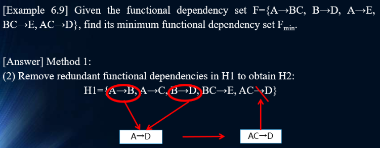


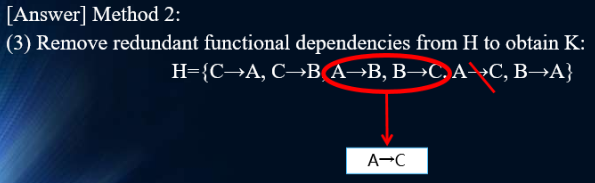


关系模式的分解的两个基本原则：

- 无损连接（lossless join）：一个关系模式$R$被分解为多个关系。如果这些关系的自然连接恰好等于$R$，则为无损连接。
- 函数依赖保持（functional dependency preserving）：关系模式分解的结果的函数依赖和进行关系模式分解前的函数依赖是相同的。

关系模式设计问题：

- 以某关于学生、部门、办公室位置的关系模式$R$和函数依赖集$F$的分解为例：


- - 无法通过自然连接恢复为原始的表。
- - 无法保持函数依赖。

- 为解决以上问题，采用不同的方法进行分解：


- - 可以通过自然连接恢复为原始的表。
- - 仍无法保持函数依赖（"Department $\to$ Office Location"和"Student ID $\to$ D Office Location"）。

- 为解决以上问题，采用不同的方法进行分解：


- - 可以通过自然连接恢复为原始的表。
- - 可以保持函数依赖。

无损分解（lossless decomposition）：

- $R$为关系模式，$p={R_1,R_2, \cdots , R_k}$是$R$的分解，$F$是$R$的函数依赖集。要使得$p$是无损分解，$R$中的每个关系$r$需要满足：

$$r=\pi_{R_1}(r) \infty \pi_{R_2}(r) \infty \ldots \infty \pi_{R_k}(r)$$

无损分解的判别：

- 矩阵判别法（matrix discriminant method）：构造一个基于分解的关系模式的矩阵，根据函数依赖来循环修改这个矩阵，其中一行每列均有填充则为无损分解，适用于所有分解的情况。
- 例子：


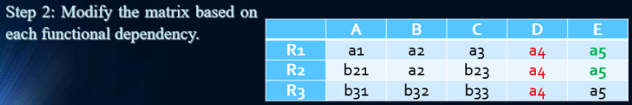


- 例子：


- 无损连接检验定理（lossless join testing theorem）。确定2个分解结果的交集是否会在函数上决定它们的区别，只适用于关系模式被分解为2个的情况。

- 例子：


函数依赖保持判别：

- 属性相关性方法（attribute correlation method）：对于原来关系模式中的每个函数依赖$A \to B$，如果在关系模式分解后$A$和$B$均在相同的关系模式中，则原来的函数依赖就得到了保留。
- 注意无损分解不一定满足函数依赖保持，反之也是一样。
- 例子：


- 例子：


关系模式的范式（paradigm / normal form，NF）：


第一范式（first normal form，1NF）：

- 对于关系模式$R$，如果所有属性均为简单属性（无法分解），则$R$属于第一范式。
- 例子：


第二范式（2NF）：

- 对于函数依赖$X \to Y$：如果有真子集$X'$满足$X' \to Y$，则$Y$部分依赖（partially dependent）于$X$。如果对任意真子集$X'$均不满足$X' \to Y$，则$Y$完全依赖（completely dependent）于$X$。
- 如果$R$属于第一范式，且$R$的所有非主属性完全依赖（不部分依赖）$R$的一个候选键，则$R$属于第二范式。
- 例子：


- 将非第二范式关系模式分解为第二范式关系模式：
- - 每个主属性的子集作为主键组成一个关系模式。
- - 向这个关系模式添加依赖于这些主键的属性。
- - 移除只由主键形成的关系模式。
- 例子：


第三范式（3NF）：

- 如果函数依赖$X \to Y$和$Y \to Z$成立，同时$Y \to X$不成立，且$Z$不是$Y$的子集，则$Y$传递依赖（transitively depend）于$X$。
- 如果关系模式$R$属于第二范式，且$R$的所有非主属性都不传递依赖于$R$的一个候选键，则$R$属于第三范式。
- 例子：


- 例子：


- 将一个关系模式分解为一个关系模式的第三范式集的步骤：


- 例子：


- 例子：


Boyee-Codd范式（Boyee-Codd normal form，BCNF）：

- 如果关系模式$R$属于第一范式，且对于$R$的每个函数依赖$X \to Y(Y \notin X)$，$X$是$R$的一个超键，则$R$属于Boyee-Codd范式。
- BCNF的要求高于3NF，如果一个关系模式属于BCNF，则其一定属于3NF。
- 例子：


- 将一个关系模式分解为一个关系模式的BCNF集的步骤：


- 例子：


范式之间的关系：

- 1-2，消除键上的非主属性的部分函数依赖。
- 2-3，消除键上的非主属性的传递函数依赖。
- 3-BCNF，消除键上的主属性的部分函数依赖和传递函数依赖。

规范化的本质：

- 基于语义确定数据库的属性。
- 确定哪些是主属性。
- 确认所有候选键并选择一个主键。
- 确认属性之间的函数依赖和多值依赖。

关系模式分解的原则：

- 至少满足3NF的要求。
- 无损。
- 函数依赖保持。
- 越少的关系模式和被分解属性的数量越好。

## Chapter 4.1

结构化查询语言（structured query language，SQL）：

- SQL是IBM根据Codd关系数据库的12条标准数学定义提出的：


- - 数据定义语言（data definition language，DDL）：创建（create）、丢弃（drop）、改变（alter）。
- - 数据更新（data update）：嵌入（insert）、更新（update）、删除（delete）。
- - 数据查询（data query）：选择（select）。
- - 数据控制（data control）：授权（grant）、收回（revoke）。

SQL的特征：

- 整合（integration）。
- 非程序性（non-procedural）。
- 集定向（set oriented）。
- 单语法（grammar），双用法（usage method）。
- 学习难度低。

关系数据库的实现（以openGauss为例）：

- 1.连接数据库。
- 2.创建一个数据库。
- 3.创建表。
- 4.建立表间联系（inter-table relationship）。
- 5.将数据输入到表中。

openGauss的数据类型：

- 数值值（numerical value）。大小为1/2/4/8B，与属性"Field Size"（字段大小）的设置相关。
- 日期/时间。大小为4/8/12/16B。
- 字符（character）。大小为10MB~1GB。
- 布尔值（bool）。大小为1B。

表结构（以EMS中"学生"、"课程"、"选课"三种关系为例）：

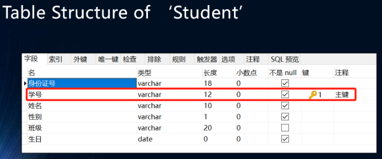


SQL语法，数据对象（data object）创建：


- 数据库（database）。
- 基表（base table）。
- 视图（view）。
- 索引（index）。

SQL语法：

- 结构定义（structure definition）：

```
-- SQL函数不分大小写。
-- <>表示参数必须，[]表示参数可选。

CREATE DATABASE <数据库名>
-- 创建数据库。

CREATE TABLE <表名>(
<列名1> <数据类型1> [列等级完整性约束1]
[,<列名2> <数据类型2> [列等级完整性约束2]
[,<列名3> <数据类型3> [列等级完整性约束3]]]...
[,<表等级完整性约束>]
)
-- 创建表。
```

- - 创建EMS中的"学生"表：


- 结构更新（structure update）：

```
ALTER TABLE <基表名> ADD <新列名> <数据类型> [完整性约束]
-- 添加属性。

ALTER TABLE <基表名> DROP <属性列名> [CASCADE | RESTRAIN]
-- 删除属性。
-- 级联（CASCADE）表示当某个属性列从基本表中删除时，引用属性列的所有视图和约束也必须一起自动删除。
-- 约束（RESTRAIN）表示只有当没有视图或约束引用该属性列的情况下，才能在基本表中删除该属性列。否则，删除操作将被拒绝。

ALTER TABLE <基表名> MODIFY <属性列名><数据类型>
-- 修改属性。

ALTER TABLE <表名> ADD PRIMARY KEY(<列名>)
-- 补充定义主键。

ALTER TABLE <表名> ADD CONSTRAINT <> FOREIGN KEY(<>)
-- 定义外键。

ALTER TABLE <表名> DROP PRIMARY KEY(<列名表>) [CASCADE | RESTRAIN]
ALTER TABLE <表名> DROP CONSTRAINT <主键约束名> [CASCADE | RESTRAIN]
-- 删除主键。
```

- 结构收回：

```
DROP DATABASE <数据库名>
-- 删除数据库。

DROP TABLE <基表名> [CASCADE | RESTRICT]
-- 删除基表。
-- 限制（RESTRICT）表示只有当没有视图或约束引用基表的属性列时，才能进行收回。否则，拒绝收回意味着必须先删除视图或相关约束，然后才能删除该表。
```

## Chapter 4.2

SQL语法：

- 数据操纵语言（data manipulation language，DML）：

```
DELETE FROM <基表名> [WHERE <逻辑条件>]
-- 删除数据（元组）。
-- 例子：DELETE FROM Student WHERE Name='小明'

SELECT <属性名> FROM <基表名> [WHERE <逻辑条件>]
-- 选择多个数据（元组）。

INSERT INTO <表名>(字段列表/属性列表) VALUES(值列表)
INSERT INTO <表名>(字段列表/属性列表) 子查询
-- 嵌入数据（元组）。

UPDATA <基表名> SET <列名>=表达式[, <列名>=表达式]...
[WHERE <逻辑条件>]
-- 修改属性值。
```


## Chapter 4.3

数据查询（data query）：

- 仍以EMS数据库为例：


SQL语法：

- SELECT基本语法：

```
SELECT [ALL | DISTINCT] <属性名>[, <属性名>]...
FROM <基表名/视图名>[,<基表名/视图名>]...
[WHERE<逻辑条件>][GROUP BY <属性名1>[HAVING <逻辑表达式>]][ORDER BY <属性名2>[ASC | DESC]]
-- DISTINCT可以移除SELECT的重复项。
-- DESC降序。如果DESC更改为ASC或不输入此参数，则查询结果将根据ORDER BY后的字段排序升序。
```

- 单表查询（single table query）例子：


- 通过条件查询例子：

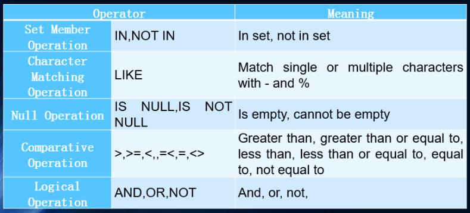


- 查询的通配符（wildcard）也就是指定特定种类的字符而不是特定的字符：


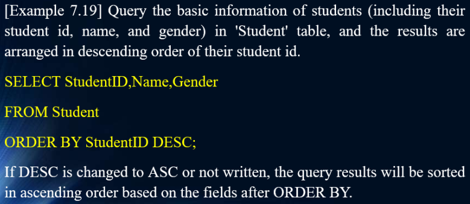


连接（join）的查询：

- 内部连接。
- 外部连接：
- - 左连接
- - 右连接
- - 全连接

SQL语法：

- SELECT内部连接基本语法：

```
SELECT <属性列表/表达式列表> FROM <表名> [INNER] JOIN <表名> ...
ON <连接条件>/USING <字段1>...
[WHERE <限制条件>]
-- 只有当满足给定的连接条件时，相应的结果才会出现在结果关系表中。
```

- 内部连接例子：


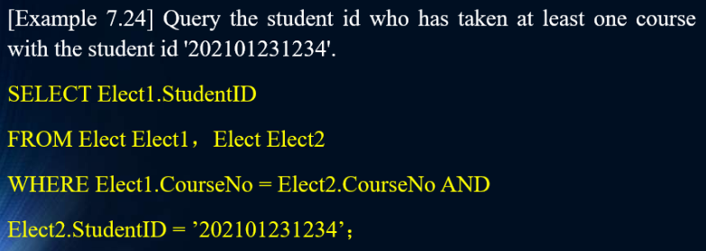

不适用内部连接例子：


- SELECT外部连接基本语法：

```
SELECT <属性列表/表达式列表> FROM <表名> LEFT | RIGHT | FULL [OUTER] JOIN <表名>...
ON <连接条件>/USING <字段1>...
[WHERE <限制条件>] 
```

- 外部连接例子：


嵌套（nest）查询：

- 对于`WHERE <限制条件>`中的逻辑表达式，嵌套子查询（subquery）具有三种形式：
- -  `字段 [NOT] IN 子查询`
- -  `字段` 连接$\theta$ `SOME/ANY/ALL 子查询`
- - `[NOT] EXISTS (子查询)`

- 嵌套查询例子：


聚合函数（aggregate function）：

```
COUNT ([DISTINCT | ALL] *)
-- 计算一个关系中的元组数。

COUNT ([DISTINCT | ALL] <列名>)
-- 计算一个关系中的给定列的属性数。

SUM ([DISTINCT | ALL] <列名>)
-- 计算一个关系中的数值属性的和。

AVG ([DISTINCT | ALL] <列名>)
-- 计算一个关系中的数值属性的平均值。

MAX ([DISTINCT | ALL] <列名>)
-- 计算一个关系中的数值属性的最大值。

MIN ([DISTINCT | ALL] <列名>)
-- 计算一个关系中的数值属性的最小值。
```

- 聚合函数例子：


SELECT基本语法-`GROUP BY`：

```
SELECT [ALL | DISTINCT] <属性名>[, <属性名>]...
FROM <基表名/视图名>[,<基表名/视图名>]...
[WHERE<逻辑条件>][GROUP BY <属性名1>[HAVING <逻辑表达式>]][ORDER BY <属性名2>[ASC | DESC]]
```

- `GROUP BY`例子：


视图管理（view management）：

- 视图是虚拟的表，数据来源于对表的查询。
- 当更新视图中的数据，那么对应的基表中的数据也将得到更新，因此更新视图具有很大限制。
- 在openGauss中，更新视图是不被允许的。


SQL语法：

- 视图的基本语法：

```
CREATE VIEW <视图名> ([<列名> [,<列名>]...]) AS <子查询> [WITH CHECK OPTION]
-- 视图创建。对视图进行操作时，需要注意必须满足在视图创建时定下的谓语（predicate）条件。

DROP VIEW <视图名>
-- 视图删除。
```

- 视图例子：


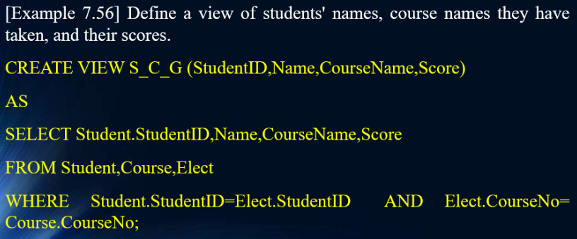


- 视图查询：


## Chapter 5

数据安全保护（data security protection）：

- 事务（transaction）是一个操作序列，被视为一个整体，全都执行（all executed）或全部未执行（none executed），事务是不可分割的逻辑工作单元。事务是数据库并发控制（concurrency control）和恢复（recovery）的基本单元。


- 事务的特征：
- - 原子性（atomicity）：全部执行或全部未执行，不可分割。
- - 一致性（consistency）：事务执行前后必须符合数据的完整性和符合一切约束。
- - 隔离性（isolation）：也称为可串行性，不关注执行过程中的数据。
- - 持久性（durability）：执行造成的影响是永久性的，即使系统后来故障了也一样。
- 事务的执行顺序：
- - 串行（serial）：


- - 并行（parallel）：


两个事务并行处理称为并发，当两个事务需要对涉及同一数据进行操作时，并发会产生问题：

- 丢失更新（loss of update）的例子：


- 数据不一致（data inconsistency）的例子：


- 脏数据（dirty data）的例子：


并发控制的方法：

- 封锁机制（locking mechanism）：当一个事务T首先对系统发出请求，由事务T封锁其所要使用的某一个数据。封锁后，事务T能够对此数据具有指定的控制权（读或写）。封锁有两种：
- - 排它锁（exclusive lock）/X锁/写锁（对某事务开放写的权限）。
- - 共享锁（share lock）/S锁/读锁（对某事务开放读的权限）。
- - 两事务的封锁共享矩阵（当一个事务没有封锁，另一个事务可以请求排它锁和共享锁）：


- 封锁协议（locking protocol）：
- - 一级封锁协议：对事务T所要修改的数据应用X锁直到事务T的结束。可以防止更新丢失。


- - 二级封锁协议：一级封锁协议的基础上，对事务T所要读取的数据应用S锁直到事务T对其的读取操作的结束。可以防止更新丢失、读取到脏数据。

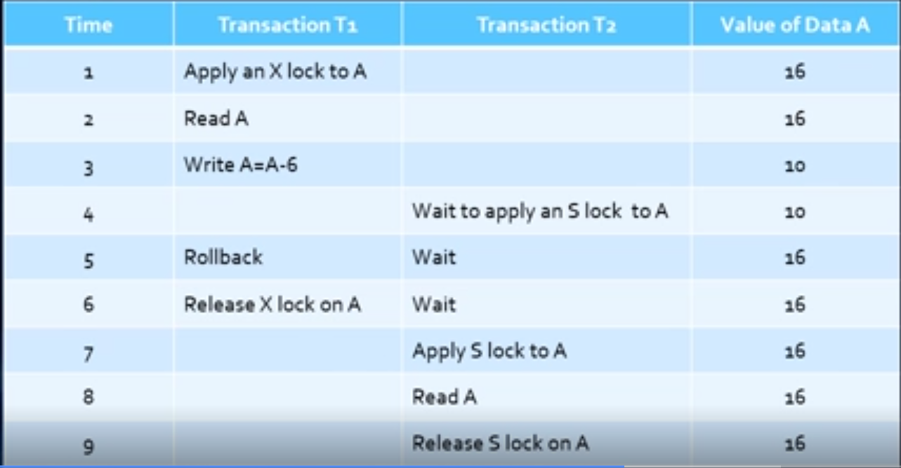

- - 三级封锁协议：一级封锁协议的基础上，对事务T所要读取的数据应用S锁直到事务T的结束。可以防止更新丢失、读取到脏数据、读取到不连续数据。

死锁（deadlock）情况：

- 两个或更多事务对同一资源进行竞争，导致系统进入无休止的等待状态。事务将会相互阻塞（block）。


- 解锁（unlock）的方法：
- - 强制回卷（extract）导致死锁的事务。
- - 定义封锁的超时时间。

并发控制策略（当多个用户尝试在同一时间修改数据库中的数据，那么需要并发控制策略来确保一个用户的操作不会影响到其他用户）：

- 悲观（pessimistic）并发控制。使用封锁。
- 乐观（optimistic）并发控制。不使用封锁。

两段锁协议（two-phase locking protocol）：

- 两段锁协议规定，在事务进行对任意数据的读或写操作之前，第一步是需要从这个数据获得一个锁。在释放（release）一个锁之后，事务不再应用任意其他锁。划分为加锁期（lock period）和解锁期（unlock period），是可串行执行事务方法的充分条件。


## 模拟考

### Chapter 1 Total


### Chapter 2.1


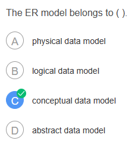


### Chapter 2 Total


### Chapter 3.1


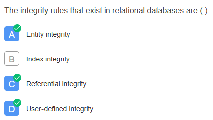


### Chapter 3.2


$\pi_{C,A}(R)$:

$\infty$


### Chapter 3.3


矩阵法：

也可以用矩阵法：


### Chapter 4.1


### Chapter 4.2

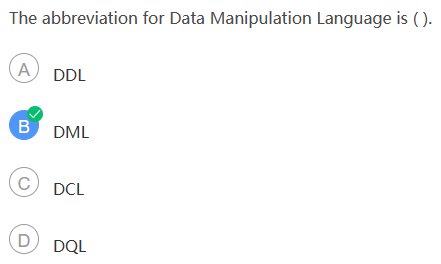


### Chapter 4.3


### Chapter 5


