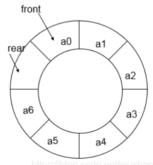
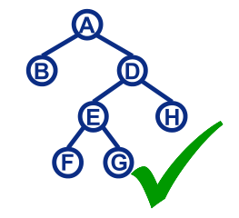
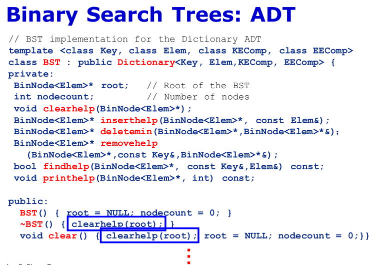
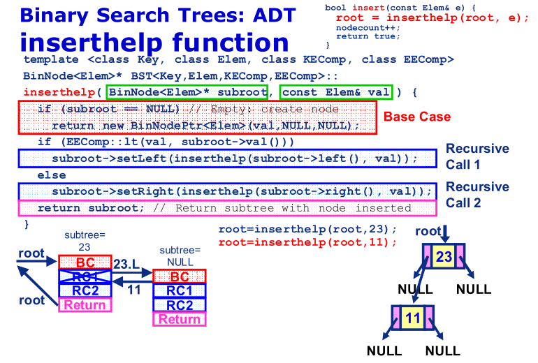
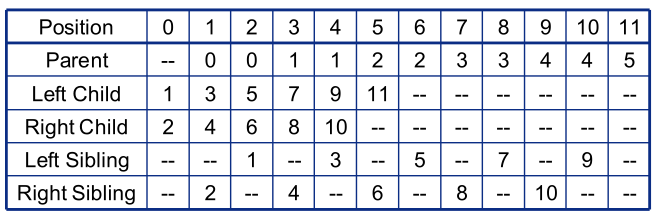
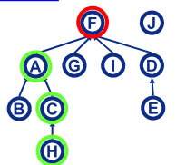
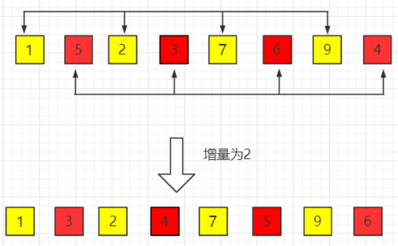

Dr.Patrick Chan

课件主页：

https://teaching.mlclab.org/DataStru/ie.htm

Email：patrickchan@scut.edu.cn

QQ：804273141

wechat：p-a-t-r-i-c-k

Office：D1-b522

使用语言：C++。

## 目录

  - 常见单词补充
  - 课程内容
    - chapter 1~3
      - 1.1 基本定义
      - 1.2 评估算法的方法
      - 1.3 算法分析案例
    - chapter 4
      - 4.1 列表
      - 4.2 基于数组实现的列表
      - 4.3 基于链表实现的列表
      - 4.4 基于数组的列表和基于链表的数组的比较
      - 4.5 可利用空间表（本质上是链表）
      - 4.6 栈
      - 4.7 队列
      - 4.8 字典
    - chapter 5 二叉树
      - 5.1 递归
      - 5.2 二叉树
      - 4.3 二叉树的遍历
      - 4.4 二叉树的空间要求
      - 4.5 二叉查找树
      - 4.6 基于数组的完全二叉树
      - 4.7 队列
      - 4.8 霍夫曼编码树
    - chapter 6 非二叉树
      - 6.1 通用树（链表实现）
    - chapter 7 排序法
      - 7.1 排序法
    - chapter 9 搜索
      - 9.1 顺序查找
      - 9.2 哈希查找
    - chapter 10 索引
      - 10.1 线性索引
      - 10.2 树索引
    - chapter 11 图
      - 11.1 术语
      - 11.2 图
  - 实验课代码
    - C++拾遗
    - Lab用到的库和算法
  - C++常见操作

## 常见单词补充

memory fence 内存屏障（在不修改任何数据的情况下强制执行内存排序约束）

## 课程内容

### chapter 1~3

#### 1.1 基本定义

算法的本质：解决问题的方法，操作的抽象化（数学化）。

算法的目的：

- 使程序运行所需的时间更短（步骤更少）

- 使程序运行所需的内存更少

数据结构：数据结构是任何数据的表示及其相关操作。

每个数据结构都有缺点和优点，没有一种数据结构是完全优于其他任意一个数据结构的。

只有仔细分析问题特征，才能知道最适合某个任务的数据结构。

类型（type）：值的集合。

数据类型（data type）：一种类型和操作该类型的操作的集合。

数据项（data item）：从数据类型中提取的记录的一条信息。数据项是数据类型的组成部分。数据项分为逻辑形式（在ADT中的定义）和物理形式（在数据结构中的实现）。

原子数据类型（atomic data type）：不包含子部分。

结构数据类型（structure data type）：包含几条信息。

抽象数据类型（abstract data type，ADT）：仅根据一组值和对该数据类型的一组操作来定义数据类型。ADT操作是由它的输入和输出来定义的的，且隐藏实现细节（封装）。

数据结构（data structure）：ADT的物理实现。与ADT相关的操作由子例程（subroutine）/函数（function）实现。通常指的是主存（main memory）中的数据组织（organization）。

文件结构（file structure）：外设存储（peripheral storage）上的数据组织。


问题（problem）的定义应该包括对任何可接受的解决方案可能消耗的资源的约束（constraints on the resources）。

算法（algorithm）是解决一个问题的方法。而程序（program）是编程语言中算法的实例。

#### 1.2 评估算法的方法

评估算法的指标有两个：

1.效率。

2.可理解性。

评估算法的方法有两个：

1.实证对比（empirical comparison）。

2.算法分析（algorithm analysis）

算法分析：

通常程序的关键资源是运行时间（running time）。我们可以使用$T(n)$来表示程序/函数$T$在输入的大小为n时的运行时间的函数（但注意不是复杂度）。


运行算法的步骤数用带$n$的表达式表示，每个步骤的用时则用常数$c$表示。

对于同一问题给出的不同的样本，同一算法所需的时间/空间不一定每次都相同，分为最好情况（best case）、最坏情况（worst case）、平均情况（average case），但是这些情况都不能单一地描述一个算法的效率，因此需要使用复杂度来表示。

对于同一算法的复杂度，有三种表示方法：

- 大O表示法（Big-Oh）

- 大$\Omega$表示法（Big-Omega）

- 大$\Theta$表示法（Big-Theta）

1.大O表示法定义：函数$T(n)$的复杂度为$O(f(n))$，其值的集合为$c \cdot f(n)$的值的集合的子集，且是最大的子集。


证明函数$T$的复杂度为$O(f(n))$：对于所有$n > n_{0}$和正数系数常数$c$，满足$T(n) \leq c \cdot f(n)$，则函数$T$的复杂度为$O(f(n))$。其中$n_{0}$为$n$的最小值且为正数。

2.大$\Omega$表示法定义：函数$T(n)$的复杂度为$\Omega (g(n))$，则其值的集合为$c \cdot g(n)$的值的集合最大差集。


证明函数$T$的复杂度为$\Omega(g(n))$：对于所有$n > n_{0}$和正数系数常数$c$，满足$T(n) \geq c \cdot g(n)$，则函数$T$的复杂度为$\Omega(g(n))$。其中$n_{0}$为$n$的最小值且为正数。

3.大$\Theta$表示法定义：对于一些算法不一定存在，它仅出现在大O表示法和大$\Omega$表达法的括号内的表达式完全相同的时候。也就是当某个算法的复杂度为$O(h(n))$和$\Omega (h(n))$时，则其复杂度可以表达为$\Theta (h(n))$，相当于合并写法。

注意：当$T(n)=c$（$c$为正数常数）时，复杂度一定为$\Theta (1)$。因为没有$O(c)$的写法，去掉系数可以理解为$n^{0}$。

#### 1.3 算法分析案例

算法分析案例：

根据程序计算$T(n)$、$O(n)$、$\Omega (n)$的方法：


先列出$T(n)$，再列出上限和下限，去掉系数，得到$O(f(n))$，$\Omega (g(n))$。

空间/时间权衡原则（Space/Time Tradeoff Principle）：一般来说，可以通过牺牲内存空间换取更短的运行时间，且反之亦然。

### chapter 4

#### 4.1 列表

对于一个数据结构，它的核心功能包括：

- 查找（search）/取值（get value）

- 嵌入（insert）/modify（修改）/delete（删除）

- 移除（remove）

列表/列表（lists）是不同于数组（array）的一种数据结构。其查找、嵌入、移除的原理均与数组不同。


列表的特点包括：

- 列表中的每个元素（element）都具有独立的数据类型。

- 空列表不包含元素。

- 列表第一个元素称为头（head），最后一个元素称为尾巴（tail）。

列表可以通过不同的方法实现（物理形式），基于数组的列表（array-based list），或者基于链表（linked list）（指针）（pointer）。

抽象数据类型：设置一个类模板"列表（List）"，其只定义了抽象的功能，而甚至没有基础的类型：

```cpp
template <class Elem>
// template是类/数据类型模板，用于自定义某一类功能相同的类的类模板。而符合此类模板的类所使用的自定义数据类型名为"Elem"。注意在每一次定义使用"Elem"的类模板、类、类的函数时，都需要先在前面加上一句"template <class Elem>"。

class List
// 这个类模板名为"List"，其使用的数据类型名为"Elem"，其代表了一类相同功能（List的功能）而数据类型不定（只能先用虚构的类型Elem进行代替）的类。类是类模板的实例。
// 类模板定义了一类功能相同（函数相同）但所使用的数据类型不同（C++的性质所致，函数的参数类型定死）的类。为了能对于同样的功能灵活变换数据类型，因此设定了一个虚拟数据类型"Elem"，作为这一类功能相同的类的虚拟数据类型。以达到"不同的数据类型的数据也能够使用相同的功能"。
// 引用/定义函数的格式均为"类模板名<使用到的数据结构名>::函数名(参数)"，相比于单纯的类引用多了"<数据结构名>"，这个数据结构名在类模板的定义内使用虚拟数据类型（函数的定义），在类模板的定义外使用实际数据类型例如int（在定义外引用函数）。
{
public:
	
//其中virtual表示"虚拟函数"，是对父数据类型的函数的"覆盖"。类似于子类对父类的函数重载，但是完全不同：1.重载的几个函数必须在同一个类中；覆盖的函数必须在有继承关系的不同的类中。2.重载的函数必须函数名相同，参数不同。参数不同的目的就是为了在函数调用的时候编译器能够通过参数来判断程序是在调用的哪个函数；覆盖的几个函数必须函数名、参数、返回值都相同。3.覆盖的函数前必须加关键字"virtual"，其与重载没有联系。

// 虚拟函数最后的"=0"并不表示函数返回值为0，它只起形式上的作用，告诉编译系统“这是纯虚函数”。
// 纯虚函数只有函数的名字而不具备函数的功能，不能被调用。它只是通知编译系统: “在这里声明一个虚函数，留待派生类中定义”。在派生类中对此函数提供定义后，它才能具备函数的功能，可被调用。

// "T function() const"把返回值类型为T的函数function定义为不可以修改类的成员的"只读"函数。
	
//其中"&"符标注了形式参数为别名（或称为绑定"引用"关系）。对传递得到的形式参数的修改也会在原参数上进行同样的修改。"&Elem"和"Elem&"等效。

//其中"::"为作用域解析运算符，一般为"类名::函数名"的用法。
  
  virtual void clear()=0;
  // 初始化列表。
  virtual void insert(const Elem&)=0;
  // 将项（item）插入到列表中当前项目的前面。
  virtual bool append (const Elem&) = 0;
  // 将项插入到列表的末尾。
  virtual bool remove(Elem&) = 0 ;
  // 删除当前的项。
  virtual void setstart() = 0 ;
  // 将当前项设置为起始位置。
  virtual void setEnd() = 0 ;
  // 将当前项设置为起始位置。
  virtual void prev()=0;
  // 将当前项设置为下一项。
  virtual void next()=0;
  // 将当前项设置为上一项。
  virtual int leftlength() const=0;
  // 在当前项之前（左边）的列表大小。
  virtual int rightlength() const=0;
  // 在当前项之前（右边）的列表大小。
  virtual bool setPos(int pos)=0;
  // 将当前项设置为参数指定的位置。
  virtual bool getValue(Elem&) const=0;
  // 返回参数中当前项的值。
  virtual void print() const=0;
  // 打印出列表中的项。
}
```

#### 4.2 基于数组实现的列表


继承了"List"类模板（抽象功能），基于"数组"这个数据类型，定义"列表"这个数据类型，其名为"AList"（即类模板的子类/类模板的派生类）：

```cpp
template <class Elem>
// 声明即将定义一个类模板，而这个类模板所使用的虚拟数据类型名为"Elem"。

class AList: public List <Elem>
// List <Elem>是以"Elem"作为数据类型的名为"List"的类模板。因为类是类模板的实例，因此类模板也是一种类/数据结构，类模板也可以像类一样继承和被继承。
// 新定义一个名为"AList"的新的类模板且其会继承类模板"List"。这里使用public是以public方式继承。格式为"class 子类 : public 基类"。
// 声明完类模板以及类模板使用的数据类型后，才是类模板的定义。

// 一个C++类有public，protected，private三个成员组，每一种都有一种类的继承方式。

// "类名()"为构造函数。
// "~类名()"为析构函数（运作时机与构造函数相反，为整个程序结束时执行）。

// "const T"定义一个数据类型为T的常量，一旦声明这个值将不能被改变。
// "const T*"/"T const*"定义一个指向数据类型为T的对象的指针，指针本身的值（也就是指向的地址）可改变，但其指向的对象不可以改变（也就是指针指向的值是常量）。
// "T* const"定义一个指向数据类型为T的对象的指针，指针本身的值（也就是指向的地址）不可改变（也就是指针本身是常量），但其指向的对象可以改变。
// "const T* const"是一个指向常量对象的常量指针，即不可以改变指针本身的值，也不可以改变指针指向的对象。
// const在*前，说明const修饰的是类型，指针指向常量。const在*后，说明const修饰的是指针，指针是本身是常量。

// "T&"是使数据类型为T的变量与另一个数据类型为T的变量建立引用和绑定关系（别名），此时引用和引用所绑定的对象几乎没有差别。"引用的类型"与"引用所绑定的对象的类型"必须一致，但具体形式例如是否常量、变量、表达式都是没有要求的。
// "const T&"/"T const&"称为常量引用（reference to const）。与普通的引用（别名）的差别仅仅是不能通过修改"引用的值"来对"绑定的对象的值"进行修改（但可以用其他方式直接对绑定的对象进行修改）。
// "T &const a"不存在，"引用常量"的说法不存在，引用只能在初始化时绑定一个对象，之后不能再重新绑定其他对象。
// "const T*&"是"指向常量的指针"的引用。"const T*"是指向常量的指针。类似的，"T* const&"是"常量指针"的引用。"T* const"是常量指针。

{
private:

int maxSize;
int listSize;
int fence;
Elem* listArray;
// 声明一个名为"listArray"的指针，其（只能）指向一个存放了Elem类型的变量的地址。

public:

AList()
{}

~AList()
{
delete [] listArray
// delete函数用于回收new分配的内存空间。
// "delete 内存空间名"用于回收用new分配的单个对象的内存空间。
// "delete [] 内存空间名"用于回收用new[]分配的一组对象的内存空间。
}

bool AList<Elem>::insert(const Elem& item)
{}

int AList<Elem>::getValue(Elem& item) const
{}

// insert函数为在fence处插入值，并且先前fence指向的项往后移动（索引是减法）。
// remove函数为删除并返回fence所指向的值。
// setPos函数为设置fence所指向的位置。
// prev函数使得fence向前一个位置。

};

AList Odin(9)
// 创建AList类的实例"Odin"，构造函数参数为"9"。
Odin.insert(233)
// AList类的实例调用类的成员函数的方法，使用"."说明此成员函数的操作实例为"Odin"。
```

#### 4.3 基于链表实现的列表

基于数组的列表仍会有数组固有的缺点，因此可以使用链表（linked list）来实现列表：


其中黄色的部分是链表元素的值，紫色的部分是指向链表元素包含的下一个链表元素的地址的指针。

其中head、tail、fence均为指针，leftcnt为处于fence指向的对象左边的所有对象数，rightcnt为处于fence指向的对象右边的所有对象数。

fence字面意思是屏障、隔板。此处为一个指针，和head、tail共同作为链表的参考位置，用于分辨此时链表内的状态。

```cpp
template <class Elem> class Link
{
public:
  Elem element;
  // 这个节点的值。
  Link* next;
  // 下一个节点的地址。

  Link(const Elem& elemval, Link* nextval=NULL)
  // 下一个链表元素（对象）的地址未必能一开始就给出，因此填充缺省值NULL。
 {
  element=elemval;
  // 当前节点的值
  next=nextval;
  // 下一个节点的地址。
 }
};
```

```cpp
template <class Elem>
class LList:public List<Elem>
// 继承类模板"List"，定义链表"LList"类模板。

// "A->B"整个指的是：名为"A"的指针指向的对象（未知名字），此对象包含的名为"B"的成员属性/函数。

// "new"可以为后面的对象分配内存空间（或者说内存地址），且new语句的返回值就是这个分配得到的内存空间。"new"语句分配的内存空间一定需要使用"delete"来释放，不会自动释放。

{
private:
  Link<Elem>* head;
  // 类模板是类，而类也是数据结构。
  Link<Elem>* tail;
  Link<Elem>* fence;
  int leftcnt;
  int righttcnt;
  
  void init()
{
fence=tail=head=new Link<Elem>;
leftcnt=rightcnt=0;
}

public:

bool LList<Elem>::insert(const Elem& item)
{
fence->next=new Link<Elem>(item,fence->next);
// Link<Elem>(构造函数参数)，new为一个新的Link<Elem>对象分配了内存地址。
// 顺带一提，fence->next->next就是fence这个指针指向的对象的next属性（next是个指针）指向的对象的next属性，这是模拟链表的数据结构。
if (tail == fence)
  tail=fence->next;
rightcnt++;
return true;
}

bool LList<Elem>::append(const Elem& item)
# 链表新增一个元素的函数。
{
  tail = tail->next = new Link<Elem>(item,NULL);
  // 根据传入的参数创建一个新的链表元素对象。
  rightcnt++;
  return true;
  // 说明操作完成。
}

bool LList<Elem>::remove(Elem& it)
// 删除并返回fence后边的第一个链表元素。理论上链表可以删除任何一个元素，但是时间复杂度不同，成本不同。因为链表每个元素含有下一个元素的地址信息，因此对下一个元素操作是成本最小的方法。
{
  if (fence->next == NULL) return false;
  it=fence->next->element;
  Link<Elem>* ltemp = fence->next;
  fence->next=ltemp->next;
  // 不改变fence本身，只改变fence->next。那么需要被删除的链表元素就与之前的其他元素没有任何关系了。
  if(tail==ltemp)
    tail=fence;
    // 将fence赋值给tail，那么->next关系也会继承。
  delete ltemp;
  rightcnt--;
  return ture;
}

void LList<Elem>::print() const
{}

bool LList<Elem>::swap()
// 将fence右边第一个元素和右边第二个元素互换位置，且仅修改指针。
{
if (fence==tail) return false;
if (fence->next==tail) return false;

Link<Elem>* temp=fence->next;
// 创建一个临时的指向链表元素的指针。
fence->next=temp->next;
temp->next=fence->next->next;
fence->next->next=temp;
delete temp

if (fence->next==tail)
  tail = tail->next
// 上述函数，并没有对指针tail进行修改，因此需要检测在交换位置后，tail指针是否并非指向末尾。
}

bool LList<Elem>::findNdel()
// 找到特定值的元素并删除所有找到的元素。
{
  Link<Elem>* temp;
  Link<Elem>* ptr=head;
  bool beforeFence=true;
  
  while(ptr != tail)
  {
    if (prt==fence) beforeFence=false;
    if (ptr->next->element==value)
      {
        if(fence==ptr->next) fence=ptr;
        if(tail==prt->next) tail=prt;
        temp=ptr->next;
        ptr->next=ptr->next->next;
        delete temp;
        if(beforeFence) leftcnt--;
        else rightcnt--;
      }
    else
      ptr=ptr->next;
  }
  return true;
  
// insert函数为在fence处插入值，并且先前fence指向的项往后移动（索引是减法）。
// remove函数为删除并返回fence所指向的值。
// setPos函数为设置fence所指向的位置。
// prev函数使得fence向前一个位置。

}

LList height;

height.append(233);
height.append(810);
height.setPos(1);
height.insert(180);
height.prev();
height.remove(temp);

// 以上可以看出，虚拟数据类型才是最高级的，因为多个类模板共同使用同一个虚拟数据类型，而类模板定义了一类功能相同的类。这一类的类使用的数据类型也是这个虚拟数据类型。
```

#### 4.4 基于数组的列表和基于链表的数组的比较

单链表（singly linked list）：普通链表。对前一个元素的操作的复杂度为$\Theta (n)$。

排序链表（sorted linked list）：元素有特定大小顺序的链表。

双链表（double linked list）：双向的链表，对前一个和后一个元素的操作的复杂度都是$\Theta (1)$。这通过使链表的每一个元素都存储两个地址（前一个元素和后一个元素）来实现。


```
template <class Elem> class Link
{
public:
  Elem element;
  Link *next;
  Link *prev;
  // 指向前一个节点的指针。
  Link(const Elem& e,Link* prevp=NULL,Link*nextp=NULL)
  {element=e;prev=prevp;next=nextp;}
};
```

#### 4.5 可利用空间表（本质上是链表）

运作方式：把当前未使用的节点（nodes）暂存到可利用空间表（freelist）。然后需要添加新的节点的时候，如果可利用空间表不为空，则从可利用空间表中获取一个节点。如果可利用空间表为空，则调用标准new操作符来分配内存空间。

节点其实就是内存空间，可利用空间表仅仅是把暂时不用但已经被分配过的内存空间收集起来（而不是被立刻释放），在被需要的时候再分配回去，这样节省了new和delete的次数，提高了性能。

#### 4.6 栈

栈（stack）遵循先进后走（FIrst-In-Last-Out，FILO），将元素放进去的操作叫做压入（push），将元素移出来的操作叫做弹出（pop），而能够被访问的元素称为顶部（top）。

```cpp
template<class Elem> class AStack: public Stack<Elem>
{
private:
  int maxSize;
  int top;
  Elem *listArray;
public:
  AStack(int size)
    {maxSize=size;top=0;listArray=new Elem[size];}
  ~AStack(){}
};
// 基于数组的栈。

template<class Elem> class LStack: public Stack<Elem>
{
private:
  Link<Elem>* top;
  int size;
public:
  LStack(int size)
    {top=NULL;size=0;}
  ~LStack(){}
};
// 基于链表的栈。
```

"括号配对问题"：在遇到"("时，压入栈。在遇到")"时，弹出栈顶的"("，如果此时栈为空则配对失败。因此配对的条件是：一是"("的数量和")"的数量相同，二是必须每次都是"("通过两两配对且完全抵消，而不是")"。

#### 4.7 队列

队列（queues）遵循先进先出（First-In-First-Out，FIFO），将元素放进去的操作称为排队（enqueue），将元素移出来的操作称为出列（dequeue），第一个元素是列头（front），最后一个元素是列尾（rear）。

```cpp
template<class Elem> class AQueue: public Queue<Elem>
{
private:
  int size;
  int front;
  int rear;
  Elem *listArray;
public:
  AQueue(){}
  ~AQueue(){}
};
// 基于数组的队列。

template<class Elem> class LQueue: public Queue<Elem>
{
private:
  int size;
  Link<Elem>* front;
  Link<Elem>* rear;
public:
  AQueue(){}
  ~AQueue(){}
};
// 基于链表的队列。
```


那么当队列因为插入（rear指针向后拓展）和删除（head指针往前缩）元素慢慢偏移其开始的位置。那么front前面空出来的空间怎么利用？可以通过使用环形队列来使得这种情况不会出现（直接利用所有的空间）。



因为队列的性质，每当插入元素尾指针+1，每当删除元素头指针+1。定义环形队列，为了判断队空还是队满，需要牺牲一个内存空间来实现，因此可用空间为size-1。环形队列如果front==rear时队列为空，front=rear+1时列满。

#### 4.8 字典

搜索键（search key）描述我们寻找的东西。

在字典内，对于不同的数据类型，`== , <= , >= , > , <`等操作符的定义需要用户自己进行重载（overload）。

### chapter 5 二叉树

#### 5.1 递归

递归（recursion）是一个调用自己的过程，在此过程中参数会发生变化，最终到达基本情况（base case），从而停止对自己的调用。最简单的递归是阶乘。

#### 5.2 二叉树

1.二叉树的节点关系：


root为二叉树的第一个元素。

某元素的祖先（ancestors）为二叉树中比此元素高级的所有元素。某元素的后代（descendants）为二叉树中比此元素低级的所有元素。

某元素的所有后代以此元素为子树根（subtree root）。

某元素的上一个元素为此元素的父母（parent），与其共享同一个父母的元素称为此元素的姐妹（sibling），为其的第一次后代的元素称为此元素的孩子（children）。

每个元素为一个节点（node），节点之间通过边（edge）连接，非末端的元素为内部节点（internal node），末端的元素为叶节点（leaf node）。

2.特殊二叉树与特性：

完满二叉树（full binary tree）：每个内部节点都刚好有两个孩子的二叉树。



完全二叉树（complete binary tree）：如果树的高度为$d$，则除了$d-1$之外（最后一层）的所有级别（level）的节点都是完全满的。且最后一层的所有节点都向左侧填充。


非空的完满二叉树的叶节点数比内部节点数多一个。

非空的二叉树的空指针的数量比总节点数多一个。（每个节点有一个数值两个指针，$n$个节点有$n-1$条边，每条边需要一个指针，空指针数$2n-(n-1)=n+1$）

3.二叉树的C++实现：

二叉树节点的ADT：


二叉树没有构建函数（build）也没有嵌入函数（insert），因为它目前没有任何特征。

#### 4.3 二叉树的遍历

1.二叉树的遍历（traversals）：任何只列出一次树中的每个节点的遍历都称为树节点的枚举（enumeration）。


前序遍历（preorder traversal）：先从向左边开始，由根到叶的遍历。当遍历一个节点之后必须立刻遍历其所有孩子。

$$A B C D E F G H I J$$

后序遍历（postorder traversal）：先从向左边开始，由叶到根的遍历。在想遍历一个节点之前必须遍历其所有孩子。

$$C B F G E J I H D A$$

中序遍历（inorder traversal）：先从向左边开始，以子树为单位。先左侧子树，然后是子树的根，然后是右侧子树。

先从接近根的囊括最多子树的子树先开始，也就是越接近根的已被遍历完左侧子树的节点越先遍历。

$$C B A F E G D I J H$$

三种遍历方式的实现：

```cpp
template<class Elem>
void preorder(BinNode<Elem>* subroot)
{
  if (subroot==NULL) return;
  // 判断是否基本情况。
  visit(subroot);
  // 打印当前节点的值。
  preorder(subroot->left());
	// 递归，先向左遍历。
  preorder(subroot->right());
	// 递归，再向右遍历。
}
```

```cpp
template<class Elem>
void postorder(BinNode<Elem>* subroot)
{
  if (subroot==NULL) return;
  // 判断是否基本情况。
  preorder(subroot->left());
	// 递归，先向左遍历。
  preorder(subroot->right());
	// 递归，再向右遍历。
  visit(subroot);
  // 虽然传递是从根到叶传递，但是打印是后序打印。
}
```

```cpp
template<class Elem>
void inorder(BinNode<Elem>* subroot)
{
  if (subroot==NULL) return;
  // 判断是否基本情况。
  preorder(subroot->left());
	// 递归，先向左遍历。
  visit(subroot);
  // 直到左边的子树全被传递，然后打印，然后再考虑右边的子树。
  preorder(subroot->right());
	// 递归，再向右遍历。
}

// 对二叉树的结构定义，注定了它的指针只能由根指向叶，那么选用不同的遍历方式中唯一能操作的只有打印值的时机。仅仅变更打印的时机，就可以实现三种遍历方式。
```

除了通过递归得到遍历的实现，递归中对状态的判断也应当有所选取。

```cpp
if (subroot==NULL) return;
// 对叶的下一个虚拟对象的状态判断。
// 只需要检测一个基本情况。
// 可以避免许多bug。
// 这种判断方式是更优的。
```

```cpp
if (subroot -> left()!=NULL){}
if (subroot -> right()!=NULL){}
// 直接对叶的状态判断。
// 可以减少递归的调用次数。
```

最终决定选择对叶的下一个虚拟对象的状态判断。

#### 4.4 二叉树的空间要求

1.二叉树中的不同的数据类型：

对于内部节点和叶存储了不同类型的数据时，我们有三个方法。

- 融合（Union）。传输时把所有类型的数据都传到每个节点

- 继承（inheritance）

- 虚函数继承（inheritance with virtual function）

2.二叉树的空间要求：

开销空间（overhead space）：保持数据结构所需的空间量。（即不用于存储数据记录的任何空间）

开销百分比（overhead fraction）：开销空间除以使用的总空间总量得到的比例。

#### 4.5 二叉查找树

1.二叉查找树（binary search tree，BST）是二叉树的一个特殊情况。

每个节点都满足：此节点的左边孩子的值一定小于此节点的值，此节点的右边孩子的值一定大于等于此节点的值。

a.因此查找一个值，需要不断将目标值与当前节点的值进行比较。比目标值小则查看左边孩子，比目标值大或相等则查看右边孩子。

b.嵌入一个值的逻辑与查找是一致的，当查看的孩子为空，则满足条件建立新节点。同时，构建一个二叉查找树就是通过对每个给定的初始数值使用嵌入函数（insert）进行嵌入。

c.但是移除一个值则需要分情况讨论（removehelp函数）。因为移除某个内部节点时，其后代都需要有新的节点作为它们的新祖先，且仍符合二叉查找树的结构。当被移除节点为叶节点时直接移除即可。当被移除节点是某一子树的根且有一个孩子，则直接让这个孩子替换被移除节点。当被移除节点是某一子树的根且有两个孩子，则将此节点的右边的子树中最小值替换到被移除节点的位置。

2.二叉查找树的复杂度：

以$d$为树的深度。

查找：$\Theta(d)$

嵌入：$\Theta(d)$

删除：$\Theta(d)$

如果树是对称的，则$d$有平均情况$\Theta\left(\log _2 n\right)$，最坏情况是树极度不平衡仅有一边有节点，则为$\Theta(n)$。

3.二叉查找树的ADT：




二叉查找树的嵌入函数（从根开始，往下比较大小来search，直到找到空位，则创建新节点，途中所有指针都会从新的叶到根重新绑定）：



二叉查找树的删除子树中的最小值函数（通过把指向最小值的指针换绑实现，最后min是指向被删除的最小值节点的指针，且本来最小值节点的父母把指向它的指针换成最小值节点的右边孩子。注意整个函数的返回值就是输入的参数subroot本身）：


二叉查找树的删除特定元素函数：


二叉查找树的清空函数：


二叉查找树的打印整棵树的函数（对于每个节点，先打印左边孩子，再打印自己，再打印右边孩子，与中序遍历一致）：


二叉查找树的实现（与链表相似的，二叉树也通过指针实现）：

```cpp
template<class Elem>
class BinNodePtr:public BinNode<Elem>
{
private:
  Elem it;
  BinNodePtr* lc;
  BinNodePtr* rc;
public:
  BinNodePtr(){}
};

template<class Elem>
int findHeight(BinNode<Elem>* subroot){
  if(subroot==NULL): return 0;
  return 1+max(height(subroot->left())+height(subroot->right()));
  }
// 返回此节点作为子树根的子树的height。

template<class Key,class Elem,class KEComp>
bool search(BinNode<Elem>* subroot, key K){
  if (subroot==NULL):return false;
  if (subroot->value()==K) return true;
  elseif (search(subroot->left())) return true
  else return search(subroot->right())
}
```

递归较高级应用：

```cpp
template<class Elem>
int findLeafNode(BinNode<Elem>* subroot){
  if (subroot==NULL) return 0;
  if (subroot->left()==NULL && subroot->right()==NULL)
  return 1+findLeafNode(subroot->left())+findLeafNode(subroot->right())
  else return findLeafNode(subroot->left())+findLeafNode(subroot->right())
}

template<class Elem>
int findLeafNode(BinNode<Elem>* subroot){
  if (subroot==NULL) return 0;
  int L=findLeafNode(subroot->left());
  int R=findLeafNode(subroot->right());
  int i=0
  if (subroot->left()==NULL && subroot->right()==NULL)
    i=1;
  return i+R+L
}
// 先写出最直观和效率最低的方法，根据底层逻辑来写出更高效和更简洁的版本。
// 要使用递归，那么先分析小问题，分析最小问题的最终情况并定义返回值（基本情况，也就是第一句基本情况则返回0这个数值，基本情况一般是最优先判定的），然后考虑如何通过这些信息，来得到更大问题的解。
// 要理解递归，可以通过"倾曳"的处理方法，在每次"倾曳"的处理过程中若不满足基本情况则触发下一次"倾曳"，然后优先处理最新的"倾曳"。可以直接考虑递归的最后情况（无法再继续的情况，终止情况/基本情况），然后才向前一个一个返回和处理每次"倾曳"剩余的步骤，但是处理时要同时考虑当前，下一递归，上一递归的影响。
```

#### 4.6 基于数组的完全二叉树

1.简单而紧凑，基于数组的完全二叉树开销空间几乎是固定的。

堆（heaps）：堆是一种数据结构，其满足完全二叉树的性质，且要求堆中的值部分有序。

堆有两种类型。最小堆（min-heap）：所有节点的值小于等于其孩子的值。最大堆（max-heap）：所有节点的值大于等于其孩子的值。

堆可以通过基于数组的完全二叉树来实现。

使用数组来实现，因此不需要使用指针，但需要约定位置的默认排序：




2.堆的ADT：


堆的位置调换（使结构合理）的函数（heap sort）从位置pos开始往下逐层排序（$n$为堆的深度）：


堆的删除最大值函数（通过使最大值的位置指向不存在的位置"--n"）同时最后一层的最右边的元素被替换为最顶层，然后再重新进行排序：


堆的删除节点函数：


堆的嵌入函数（先加到空位，再重新进行排序）：


3.堆的时间复杂度：

嵌入$n$个值，满足：

$$\sum_{i=1}^n \log _2 i=\Theta\left(n \log _2 n\right)$$

buildheap函数（重新排序heap状态），数组中有$n$个值，满足：

$$\sum_{i=1}^{\log n}(i-1) \frac{n}{2^i}=\Theta(n)$$

4.堆的实现（基于数组）：

```
void buildheap(){
for (int i=n/2-1;i>=0; i--)
siftdown(i);
}

swap(Heap,pos1,pos2)
{}
// 对堆Heap的pos1节点和pos2节点位置互换。

template<class Elem ,class Comp>
void maxheap<Elem,Comp>::siftdown(int pos)
{}
// 对位置pos进行符合maxheap的位置调换。
```

#### 4.7 队列

1.优先级队列（priority queues）:

一个优先队列存储对象，在请求时将会释放值最大的对象。

那么我们应当选用什么数据结构来构建队列？不能是二叉查找树，因为它最坏情况为$O(n)$，使用堆（heap）则可以保证平衡（不会有最坏情况）和嵌入移除均为$O(log \; n)$。

#### 4.8 霍夫曼编码树

霍夫曼编码树（Huffman Coding Trees）是一种用于无损数据压缩（lossless data compression）的熵编码（entropy encoding）算法。

通过最小外部路径权重来构建二叉树，每次合并两个最小的值，合并后获得新节点（节点的值为孩子的值的和）和新路径，树的结构与从小到大一步一步地合并的顺序有关。


等效为：


每一条边都代表一个0或1，这样就可以使得，频率越大的字符，转换成的编码的Bit数越少。

霍夫曼编码树具有前缀性质（prefix property）。这是因为其树的结构，指向某个字符的树的路径不可能是一样的，因此每个字符的编码都不可能是其他任意一个字符的编码的前缀/重复部分，以避免解码时不同字符的编码相互混淆（获得多个结果）。

2.每个字符的预期成本（expected cost per letter）：

$$每字符预期成本=\frac{\sum (频率_{i} \cdot Bit数_{i}) }{\sum 频率_{i}}$$

霍夫曼编码树的ADT：


### chapter 6 非二叉树

#### 6.1 通用树（链表实现）

1.通用树（general tree）：每个节点的孩子数量可以是任意的。根据这个性质，可以用链表实现。


每个节点仅包含两个指针即可表示整个结构，分别为：

- 指向此节点的孩子中在最左边的节点（下一级）。

- 指向此节点的右边的姐妹（同一级）。

通用树的ADT（链表）：

```cpp
template<class Elem>
class GTNode{
virtual GTNode<Elem>* left_most_child()
virtual GTNode<Elem>* right_sibling()
};
```

2.通用树的遍历（traversal）（链表）：

```cpp
template <class Elem>
void GenTree<Elem>::printhelp(GTNode<Elem>* subroot)
{
... // 打印节点的具体值的语句省略。
	
// for循环思路方法。（while循环适用多句前提条件的情况）
for (GTNode<Elem>* temp=subroot->leftmost_child(); temp!=NULL; temp=temp->right_sibling())
	printhelp(temp);

// 递归思路方法。
printhelp(subroot->left_most_child())
printhelp(subroot->right_sibling())
}
```

3.通用树的功能实现（数组）：

- 父指针实现。

- 孩子列表实现。

- 左孩子/右姐妹实现。

- 动态左孩子/右姐妹实现。

- 动态节点实现（基于数组和基于指针）。

a.父指针实现：


root节点一致的两个节点，互称为等价类（equivalence classes）。

使得两个对象变得等价的操作就是融合（union）。

$(A,B)$代表A节点和B节点等价，root节点一致。而且当A节点和B节点都还没有连接任何节点时，使B节点指向A节点（此时A节点为B节点的root节点），否则使B节点的root节点指向A节点的root。（注意：B指向A，指的是A是B的祖先，B是A的孩子）

- 将节点较少的树连接到节点较多的树的操作称为加权联合法则（weighted union rule）。


- 路径压缩（Path Compression），是将参数节点的父节点作为递归参数，最终使得参数节点以及从其到其根节点的单条路径上的所有节点都成为其根节点的孩子节点。




- 在递归过程中对指针进行修改，简化树的结构。判断当前节点是否为根，如果不是，则把以当前节点为根的整个子树整个作为当前节点的父亲的父亲的孩子，下一次直接判断当前节点的新父亲是否为根。（原父亲直接不用进行判断）这种方法也叫做路径压缩（Path Compression）。

```cpp
// 假设我们已有一个数组array，它是以树包含的节点的字母的顺序为索引且与节点一一对应的数组，每个元素的值均为对应节点的parent的索引值。
// 例如，索引为1的数组元素存储了节点A的parent的信息，如果节点A的parent为C，则array索引为1的元素存储的值为3，而索引为3的元素存储的值则为节点C的parent的字母对应的索引。

int Gentree::FIND(int curr) const{
  while (array[curr]!=ROOT) 
    curr=array[curr];
    // curr的值变为它的parent的位置序数。
  return curr
}
// 找到特定位置节点的root。

int Gentree::FINE(int curr) const{
  if(array[curr]==ROOT) return curr;
  return array[curr]=FIND(array[curr]);
}

bool Gentree::differ(int a,int b){
  int root1=FIND(a);
  int root2=FIND(b);
  return root1 != root2;
}
// 比较两个节点的root是否是同一个节点（也就是是否等效）。

void Gentree::UNION(int a,int b){
  int root1=FIND(a);
  int root2=FIND(a);
  if (root1 != root2)
    array[root2]=root1;
}
```

b.孩子列表（链表）：

将指向孩子的索引链表作为每个节点的一部分。


它的overhead fraction为：

$$(2 \mathrm{P}+2 \mathrm{I}) /(\mathrm{D}+2 \mathrm{P}+2 \mathrm{I})$$

c.左孩子右姐妹实现：

孩子列表的升级版。每个节点添加了指向右边姐妹的索引作为节点的一部分。


它的overhead fraction为：

$$(3I) / (D + 3I)$$

d.动态左孩子右姐妹实现：

将指向最左孩子和右边姐妹节点的地址指针也作为每个节点的一部分。


它的overhead fraction为：

$$(2 \mathrm{P}) /(\mathrm{D}+2 \mathrm{P})$$

e.动态节点（数组实现）：

将指向孩子地址的指针数组作为每个节点的一部分。假设在创建节点时已经知道子节点的数量。


它的overhead fraction为：

$$\frac{P+N}{D+P+N}$$

其中$N$是子节点的个数（孩子的指针数组的长度，这也是这个程序占用的非数据空间，是为了实现结构所占用的空间）。

f.动态节点（指针实现）：

将指向孩子的地址链表作为每个节点的一部分。不假设孩子数量，但需要更多空间。


它的overhead fraction为：

$$(3 \mathrm{P}) /(\mathrm{D}+3 \mathrm{P})$$

4.K-ary树：

规定每个节点的孩子最多有K个的通用树。

5.通过序列（sequential）重构树：

通过在一串代表节点的字母序列中间加入"/"，代表在此路径上的所有空指针的个数，由此可以通过序列重构任何树的结构。但是要明确代表节点的字母序列是按照什么顺序进行遍历从而得到的，不然绝对无法重构。

- 每个"/"都对应其所在的那条路径字母序列中离"/"最近的那个字母（如果是没有" ' '"符号的版本则是最多可以两个"/"对应最近的那个字母）。这里面有个隐藏的规则，因为"/"只能对应最近的字母，因此新的路径默认是从最靠上的字母节点开始重构的。

- 出现"/"代表此条优先遍历路径已到尽头（也就是"/"前的最近的字母的左边孩子一定是空的）。

- 前向遍历是从左到右，从上到下。因此一条路径到尽头，就不可能在最后一个节点的左边孩子位置继续重构下一条路径，必须找到右边孩子位置为空的节点重构下一条路径。

- 一条路径重构完成之后，需要从所有右边孩子为空的节点的位置选择开始重构下一条路径，这条路径从一个节点的右边孩子开始，一路往左边重构，直到此路径的尽头。

- 这个从右边孩子为空的节点中选择重构下一条路径依据的就是"/"的对应数量是否满足，优先为了满足之前未满足的对应关系来重构下一条路径，而且遵循从下到上，从左到右（越远离root的节点越优先，越靠左边的节点越优先）。（"/"表示的空指针数量可以暂时不满足，但是在全部重构完成后必须全部满足）

三种方法案例：


$$A B C /// DE / F // HI // J //$$

也可以使用" ' "来标注内部节点，此时"/"为此路径的仅内部节点包含的空指针数量：


$$A' B' C / D' E' / F H' I J$$

也可以使用" ) "来表示此节点的子树的结束（每个括号" ) "都对应离它最近的还没对应过的字母）：


$$A B E ) F ) G )) D L )))$$

### chapter 7 排序法

#### 7.1 排序法

- bubble sort。
- selection sort。
- insertion sort。
- shell sort。
- quick sort。
- merge sort。
- heap sort。

1.冒泡排序法（bubble sort）：

一个序列，从结尾开始两两比较，小的向前换，大的不变，直到不再发生交换。

复杂度：$O(n^2)$

||交换|比较|
|:-:|:-:|:-:|
|最好情况|0|$n (n-1) /2$|
|最坏情况|$n (n-1) /2$|$n (n-1) /2$|
|平均情况|$n (n-1) /4$|$n (n-1) /2$|

2.选择排序（selection sort）：

泡泡排序法的改进。首先在序列中比较得到最小元素并存放到排序序列的起始位置。然后再从剩余未排序元素中继续比较得到最小元素然后放到已排序序列的末尾，直到不再放。

复杂度：$O(n^2)$

||交换|比较|
|:-:|:-:|:-:|
|最好情况|0|$$|
|最坏情况|$$|$$|
|平均情况|$$|$$|

3.插入排序（insertion sort）：

与万智牌卡组根据费用曲线排序类似，每次抽出一个元素，将其与之前已排序的所有元素进行比较，符合大小顺序则插入，重复直到所有元素都被抽出并被插入。

复杂度：$O(n)$

||交换|比较|
|:-:|:-:|:-:|
|最好情况|0|$n-1$|
|最坏情况|$$|$$|
|平均情况|$$|$$|

4.快速排序（quick sort）：

从中间开始选取（注意最好不要选取到序列中的最大值和最小值），每次选取一个元素，比此元素大的元素放置到右边，比此元素小的元素放置到左边。然后在放置的两边分别再选取中间元素，重复步骤直到没有元素被放置。

实现方法步骤则比较复杂：选取一个元素（pivot）后，将此元素和数组的最后一个元素位置交换（为最后一次交换作准备），然后从序列的最左边和最右边分别定义一个指针。右边的指针逐步向左直到发现一个比选取元素小的元素，左边的指针逐步向右直到发现一个比选取元素大的元素，之后把这两个被发现的元素的位置交换，重复步骤直到这两个指针相交而过，然后在最后一次位置交换后把交换后的比选取元素大的元素和选取的元素本身进行位置交换（从而达到算法的期望结果）。重复以上过程直到没有元素的位置被交换。

可使用递归实现。

||运行时间|
|:-:|:-:|
|最好情况|$\Theta(n log (n))$|
|最坏情况|$\Theta(n^2)$|
|平均情况|$\Theta(n log(n))$|

5.归并排序（merge sort）：

将两个已经排好序的序列进行合并，得到排好序的合并序列的排序方法。

首先创建一个由两个已经排好序的序列的所占空间之和的大小的空的序列。设定两个指针，最初位置分别为两个已经排好序的序列的起始位置，比较两个指针指向的元素的值，将较小的元素放到空的序列中，然后把指针移动到下一个位置。重复此步骤直到其中一个序列的元素全部被放入空的序列中，然后直接把另一个序列的元素全部按原顺序放入空的序列中，排序完成。

在实际实现中，使用递归的方式可以使得单个列表不断分割，然后使用归并排序完成对单个列表的排序。通过这种分割法可以使得单/多个没有排过序的列表先分割到无法再分割，然后从最小的列表两两排序，往上合并后又再次排序，直到完成排序。

复杂度：$\Theta (n log(n))$

6.堆排序（heap sort）：

数据结构"堆"，其为完全二叉树，且要求部分有序。堆排序其实就是将堆使用的有序化的方式推广到其他数据结构例如最简单的数组。

步骤：

- 创建一个堆，排序。

- 把堆首（最大值）和堆尾互换。此时堆首被互换后弹出堆，作为结果序列的第一个值，也就是最大值。

- 堆进行重新排序。

- 重复第2和第3步直到堆的只剩下一个节点，并作为结果序列的最后一个值，也就是最小值。

复杂度：$\Theta(n log(n))$

如果仅需要移除$k$个元素，则复杂度可以降低到$\Theta (n + k log(n))$

7.箱排序（bin sort）：

构建一个长度等于待排序序列的最大值的数组，将序列中的元素的值存储到这个数组中与此值的相等的索引的元素中，然后根据有值存储的索引的顺序自然就得到排好序的序列了。

优点：算法极其简单。在$n$较小的情况下较快。

缺点：空间占用太多。不能对无理数进行排序。复杂度较大。

8.基数排序（radix sort）：

箱排序的升级版。构建若干个个长度为10的数组，此数组每个元素都为一个链表，分别代表一个位数（个、十、百、千...）的值为$0 \sim 9$。

对正整数来说，先从个位开始，个位相同的元素分配到同一个链表中，这样获得了一个新的排序，在这个新的排序的基础上进行十位的分配，然后获得新的排序，重复此步骤直到最高位的元素的位数也被分配完了，最终获得的最新排序即为有序的排序。

具体的实现的问题：计算机内部大多是使用二进制的。但是簇的大小可以使得计算机暂时有伪进制。

复杂度：$\Theta (k(n+r))$

其中$k$为位数的最大数量，$r$为$r$进制。

9.希尔排序（shell sort）：

每$2^{1}$个一组分别进行插入排序，每$2^{2}$个一组分别进行插入排序，...直到每$2^{n}$个和序列长度$N$一致，那么排序完成。

例如：数组有10个元素，增量 d = 5；则比较元素为：`array[0]、array[0+d]、array[0+2d]、array[0+3d]...`。

- 第一次 d = 5 比较的元素为：`array[0] , array[5]`。
- 第二次 d = d/2 = 2 比较元素为：`array[0] , array[2] , array[4] , array[6] , array[8]`。
- 第三次 d = d/2 = 1 比较元素为：从`array[0] , ... , array[9]`。

希尔排序其实和插入排序是一样的，但是步骤数会少点。

复杂度：$O(n^{1.5})$





### chapter 9 搜索

1.傻找/顺序查找（sequential search）。

2.二分法/二分查找（binary search）。

3.跳跃搜索（jump search）。

4.字典查找/插值查找（dictionary / interpolation search）。现实的字典的排序方式。

效能评估公式：

$$$$

#### 9.1 顺序查找

1.顺序查找优化：

除了算法本身，数据的状态也很重要。也可以通过启发式算法（heuristics）来加快算法的速度。（最优化算法求精确解，启发式算法求尽量接近解，算法成本和效力不同）

- 前向移动（front-to-move）：将每个被查找到的项移动到序列的最前面。（越频繁被找的越快找到）

- 记录（count）：建立一个表记录每个项被查找到的次数。每次查找后都根据更新的表来移动一个项到符合其次数顺序的位置（相同次数但是后查找的项排在先查找的项后面）。

- 转置（transpose）：将每个被查找到的项移动到它的前一个项的前面。

2.顺序查找可以用于文本压缩（text compression）。

定义一个单词数组，对一个句子进行文本压缩，则依次检测每一个单词，如果之前没有检测过，就加入单词数组，如果检测过，则将此单词替换为此时数组里相同单词的索引值。这样得到了包含单词和索引值的序列，可以通过相同的方法转化回原句子。

#### 9.2 哈希查找

1.管家（chamberlain）思想：对管家输入一个东西，会返回一个对应的可用于查找的索引值。运用这个思想的查找算法即为哈希（hashing）查找。

哈希查找会定义一个哈希函数$h(k)$，一个输入值经过哈希函数的处理可以得到一个对应的特征值（多个不同的输入值经过同一哈希函数的处理可能会得到同一个特征值），哈希表（hash table，HT）会根据输入值返回对应的特征值。$HT[k]$返回哈希表中输入值为$k$的特征值。

但是当两个不同的输入值经过哈希函数得到的特征值相同时，会发生哈希碰撞（collision）。冲突问题在哈希查找中只能尽量用其他方法来弥补。最简单的方法是使得哈希表中的每个元素均为链表（需要才创建新的元素）。但是需要使用可利用空间表（freelist）来降低成本。

2.桶哈希（bucket hashing）：

对哈希表中的每个特征值，都设置了一个桶（桶的长度均一致），每个桶内存储特征值相同的多个输入值。使用$M$表示哈希表的总长度，$B$表示桶的数量。

3.线性探测法（linear probe）：

不使用桶哈希，则哈希表仍为一个特征值仅对应一个元素（也可以说每个桶仅有一个元素的位置）的状态。

定义探测函数（probe function）为$p(i)$，$i$为探测序列的索引值。探测序列为$(r_1,r_2, \cdots)$。如果探测序列满足$r_i=i$，则为线性探测。如果探测序列满足$r_i=i^2$，则为平方探测。

可以通过随机算法生成随机的探测序列$(r_1,r_2, \cdots)$，但是因为仅生成一次然后一直沿用此序列，因此实际上是伪随机（pseudo random）探测。

哈希函数为$h(k)$，特征值为$\beta_i$，$mod$为求余除法。

$$\beta_i=(h(k)+p(i)) \; mod \; M$$

当存储第$i$个输入值，发现对应特征值的元素已经被占用，则可以跳到这个元素后$p(i)$个的位置（slot）的元素，如未被占用则进行存储，如还是被占用则继续跳到再后$p(i)$个的位置（到末尾则跳回到开头）。如果重复了$M$次还没有找到未被占用的位置（此时等于已探测了整个哈希表），则哈希表已满。查找的时候也遵循此方法进行查找从而返回特征值。

聚集（cluster）指输入值经哈希函数处理后得到的结果不均匀地占据哈希表的元素，形成区块，造成线性探测法的一次聚集（primary clustering）和平方探测法的二次聚集（secondary clustering），会造成性能和效率的急剧下降。

双重探测法（double probing）：通过对同一组输入值$(k_1,k_2, \cdots)$应用第一个哈希函数，如果发生冲突，则对同一个$k_i$应用第二个哈希函数的结果作为$p(i)$来进行线性探测法。

4.在哈希表中删除一个值：

在哈希表中找到并删除一个值后（但为了保持整个哈希表的结构，并不是真的完全删除。），放一个特殊的标记（special flag），名为墓碑（tombstone）。它是一个删除的记录（records），它不会影响插入/存储操作，但是会影响搜索，会说明它其实是可用（空）的，但步骤数是不变的（仍要检测是否墓碑）。

5.哈希表重排列：

创建一个新的哈希表，并将旧的哈希表的剩余的值存储到新的哈希表中。

6.探测比较（probing comparison）：

$$\alpha=\frac{N}{M}$$

$\alpha$称为负载因子（load factor），$M$为哈希表的size，$N$为此时哈希表的记录的数量。$\alpha$越小，哈希查找的速度越快。在概念上，速度不可能超越伪随机探测。

### chapter 10 索引

#### 10.1 线性索引

输入顺序文件（entry-sequenced file）记录了其他文件进入硬盘的顺序。

线性索引（linear index）：一个数组，每个元素记录了每个文件的起点的地址。

二级索引（second-level index）：一级索引的各个元素为多个二级索引的起点的地址，那么顺延下去就会有三级、四级、五级...的索引。

反向索引（inverted index）：搜索工作先从二级键（secondary key）到主键（primary key），然后主键再到实际数据记录（actual data record）（也就是目标数据）。这通常是因为二级键包含了一定的关键词。


#### 10.2 树索引

树索引（tree indexing）：二叉查找树有着不平衡的问题，因此寻找更合适的结构。

1.二三树（two-three tree）：每个节点包含一个或两个键（key），每个含有一个键的节点一定拥有两个孩子，每个含有两个键的节点一定拥有三个孩子。

二三树的每个节点都遵循二叉查找树的性质，也就是每个节点的值都大于其左孩子的值且小于其右孩子的值。注意此时每个孩子可以有两个键值。

因此二三树一定是平衡的。


二三树的查找和二叉查找树的方法类似，但插入的方法则有不同。因为二三树需要保持绝对的平衡，因此不能向下拓展层数，而是通过把元素"挤上去"来向上拓展层数，而把元素"挤上去"的操作会使得左右两边的元素各成为挤上去的元素的左孩子和右孩子节点。这个操作称为（promotion）。注意插入元素也是底层优先，把多出来的元素向上"挤"。


2.$B$树（B-tree）：B树为二三树的推广形式。$b$阶（order）的B树有以下性质：

- 根是叶节点（整个B树只有根），或至少有两个孩子。

- 每个不是根和叶的节点，都有$b / 2$到$b$个孩子。

- 每个节点内的值都是从左到右，从小到大的（排好序的）。

- 所有的叶都在相同的一级，因此B树也是高度平衡的（height balanced）。

创建一个B树，使用二三树的（promotion）操作：


挤上去的元素不一定会创建一个新内部节点，大多数情况是仅仅作为上一个内部节点的元素。

如果挤上去的元素原本属于叶节点，则需要在其挤上去后的新创建的作为最右孩子的叶节点中加入一个挤上去后此内部节点的最右边的元素的复制，维持$B$树结构平衡。

3.$B^{+}$树：B树的最常用形式。有以下性质（$t$为阶数）：

- 内部节点不存储记录（也就是目标数据），仅存储键。

- 叶节点存储记录或指向记录的指针。

- 每个叶节点最多能存储$t$个元素，且应该保持有$t / 2$到$t$个元素不为空（也就是叶节点必须存储超过一半的记录才能保持$B^{+}$树的结构）。

- 叶节点存储的记录可能比内部节点存储的键多，或者少。

- $n$阶$B^{+}$树的内部节点元素数为$1 \sim n$个，叶节点元素数最多为$n+1$个（内部节点必循存储至少一个键）。

a.插入函数：

插入方式要分为叶节点的插入和内部节点的插入：

叶节点：


内部节点：


插入后有双数个则取右边进行（promotion）。

例题：


$B^{+}$树的查找、插入、删除函数的成本均为：$O(log_{b}n)$

### chapter 11 图

#### 11.1 术语

一个图使用$G=(V,E)$表示，其中$V$为顶点数（vertices），$E$为边数（edges）。

如果说A是相邻于（adjacent to）B的，且为有向图，则A指向B。

循环（cycle）：如果图中存在起点和终点一致的路径，那么称为循环。

无环（acyclic）：与循环的定义相反。

无环有向图（directed acyclic graph，DAG）：

子图（subgraph）：完全由一个图的子节点和子边组成的图。

连接（connected）：每个节点至少都有一条路径通往另一个节点。

强连接（strong connected）：在有向图中，每个节点至少有一个箭头指向另一个节点。

弱连接（weak connected）：与强连接定义相反。

#### 11.2 图

1.完全图（complete graph）：

通过一个每个索引的值都是一个链表的数组来表示图。链表中的元素存储了与此索引代表的节点有连接关系的所有节点的索引。成本为$\Theta (|V|+|E|)$。

图可以使用一个邻接矩阵（adjacency matrix）表示，通过列表示节点本身，行表示与节点有连接关系的所有节点，成本为$\Theta (|V|^2)$。

图可以比较容易地使用程序实现。属性"first"存储了此节点有连接关系的节点中值最小的节点，属性"next"则根据输入的参数$x$返回此节点有连接关系的节点中值为第$x$大的节点。

2.图的遍历：深度优先搜索（depth first search）、广度优先搜索（breadth first search）。

深度优先搜索：深度优先，代表每一条路径都会一直走到底（分叉路则优先走所有相邻节点中值较小的节点，之后后退回来再走），无路可走才退后寻找新的路。是一种可以将图转变为树的方法。需要使用stack实现。

广度优先搜索：广度优先，代表会先把当前节点所有相邻的节点由值从小到大列出来，然后从相邻的节点中最小的开始，将相邻的节点的相邻的节点列出来，直到全部节点被列出来。需要使用queue实现。

拓扑排序（topological sort）：对于有向图，从开始点进行深度优先搜索，然后当一个节点没有未访问（unvisited）的相邻节点（在有向图中，这意味着没有未访问过的此节点指向的节点了，但可能有指向此节点的节点）则打印这个节点本身，而当深度优先搜索的路径到头了，则可以任意再选取一个点作为下一个开始点进行深度优先搜索并打印，直到整个有向图的节点都被访问完。

3.获得最短路径（shortest path）的算法：

a.Dijkstra's算法：详情可见笔记"算法（入门）"。

b.$Floyd's$算法：

将每个节点到其他每个节点的距离写成一个$n \times n$的表格，然后选取第$2$行和第$2$列的所有数，如果一个非选取的行或列的格子的值比对应的选取的行列的值之和还大，则替换为对应的选取的行列的值之和，否则其值不变。然后选取第$3$行和第$3$列，重复上述步骤，直到第$n$行和第$n$列也执行完此步骤。最后得到的表格即为所有$i$点到$j$点的最短路径。

c.最小成本分配树（minimal cost spanning trees，MST）：

将所有未连接起来的节点都连接起来。有两种实现方法：

$Prim's$算法：选定一个开始点，则每次选取最短的连线，直到所有节点都能存在一条到达开始点的路径。

$Kruskal's$算法：列出$Floyd's$算法的初始表格，然后选取最小值所在的格子，连接此格子所代表的连线，然后将涉及到此连线的节点涉及到的格子删除掉，然后选取下一个最小值。思路其实是一样的。

## 实验课代码

### C++拾遗

switch语句（多选一语句）：

```cpp
#include<iostream>

using namespace std;

cin>>N;

switch(N){
// switch语句的参数只接收整数和枚举类型。
	case 0:
		break;
	case 1:
		break;
	case 2:
		break;
	default:
		return 0;	
}
```

### Lab用到的库和算法

注意：可以仅构造一个输入和输出直接和样例一模一样的程序，通过调整某些方面的不同，以此来推测网站的判题机的操作逻辑，或者推测测试集的数据范围等。

洛谷的判题机输入字符串时不会有换行符！！！（这个是完全确定的！即使数字序列只有逗号相隔，即使它测试输入看起来是有换行符存在，只要涉及到字符串，例如标点符号和英文字母，就一定没有换行符，原本应该是换行符的地方，都会用空格进行代替）。

也就是说，它涉及字符串的输入，全部需要进行间隔的地方都将仅使用空格作为间隔。因此需要以空格作为分隔且支持连续输入的cin，而不能用将空格也进行赋值的getline（因为全部间隔都使用空格，使用getline将会将全部输入都赋值到同一个字符串中，这样非常难以区分输入）。

因此测试时，需要构建仅使用空格作为间隔的一次性一整行的输入作为测试输入，并在本地运行也能确保输出准确无误（洛谷会看输出的空格和换行符），才能在洛谷上通过。（这非常重要！）而且，因为这个操蛋的特性，你必须在构建测试输入时，就想好怎么使得代码能够在不使用换行符的情况下，还能区分不同组别的输入，且确保程序的正常运转。这就需要根据题目给出的测试输入的特定格式入手，找出能够不使用换行符就能判断输入的属性的方法。

使用cin混合输入字符串和数字，且每个输入之间仅使用空格作为间隔时（也就是不使用换行符），输入完字符串后输入数字，然后再输入字符串，会使得程序强行中止。这是因为cin的错误标记：当cin获取到一个输入的时候，若此输入的类型和前一个获取的输入的类型不一致，则cin语句会返回false，并且会对cin对象做一个错误标记。当cin再次获取下一个输入时，如果其与前一个获取的输入的类型不一致，且cin对象有错误标记，则当前整句cin语句直接强制中止。解决方法：在读取下一个输入前使用函数cin.clear()清除错误标记，cin就能继续从缓冲区读取数据。（换行符也会清除缓冲区和cin的错误标记）

因此，洛谷输入字符最好使用getchar()和getline()函数（getline()函数会把空格也赋值到字符串中，cin则不会）。

输出的多出来的空格和"\n"（回车键）会影响洛谷的判断。但是每一句输出（使用换行符分隔句子）的结尾空格和整个输出的结尾"\n"是否多出来不影响洛谷的判断。（这是经常的疏漏！）

换行符"\n"在服务器后台仅仅是一个普通的字符而已。

洛谷的服务器运行的是Linux环境，注意Windows环境和Linux环境的换行符字符不一样（但一般不是这个问题）。

`int a = V[0];//V是一个vector容器对象。`这一句会造成洛谷Runtime Error（RE），报错原因说是不合法的内存访问。

```cpp
// C++中不同类型的数据所占的空间大小不一样，如果直接将某个值赋值到与其不同类型的数组或变量会造成缓冲区溢出，非法的未知数据会覆盖已知的合法数据。
// C++中，将数字字符直接赋值到整数或类型强制转换，会直接把ASCII码赋值到整数。
// char类型对ASCII码直接进行操作，字符'0-9'的ASCII码即为'48~58'。那么直接使需转换的数字字符减去一个字符'0'（也就是48）再进行类型强制转换即可。
// C++字符char必须使用单引号，字符串string必须使用双引号。

#include<iostream>
#include<string>

using namespace std;

string s;
// 声明变量。

getline(cin, s);
// 操作类型为string。
// "cin"是固定关键词。将用户的输入存入变量"s"中。
// 自带初始化，防止溢出。

s = s.erase(pos_d, 1);
// 操作类型为string。
// erase函数的第一个参数为删除的起始索引，第二个参数为删除的元素个数。

Ascii=int(s[0]);
// 类型强制转换，转换参数为char而不能是string。

for (auto i : s) cout << i << endl;
// auto可以在生命变量时根据变量的初始值类型自动选择数据类型。
// "for(变量:数组)"可使得每次循环为"变量"根据数组的索引依次赋值，可用于遍历打印。

cin.clear();
// 清除cin对象的错误标记。
// 使得cin可以支持连续的混合输入。

break;
// 立刻中止此语句所在的整个循环。

continue;
// 中止此语句所在的本次循环，并开始此语句所在循环的下一次循环。

return 0;
// 直接结束此语句所在的整个主函数。
```

vector类（动态数组）的用法（比字符串好用）：

```cpp
#include<iostream>
#include<string>
#include<vector>
#include<algorithm>

using namespace std;

vector<int> v(5);
// 创建元素类型为int的vector对象，名为"v"，长度为5。
vector<vector<int>> V;
// 设置元素类型为vector<int>的vector对象，名为"V"，长度不定。

int i;
while(cin >> i){
// 当输入流非空时继续循环。用于为vector数组赋值。
// 这种方法适用于连续的输入，当无法使用getchar()和getline()使用，仍能符合洛谷网站的要求。
  v.push_back(i);
  // vector类的push_back()函数可以在vector类对象的尾部添加新的元素。
  if(cin.get()=='\n') break;
  // cin.get()会获取缓冲区中的第一个字符，注意空格和回车键也会读取。
  // cin用空格和回车键'\n'作为间隔，因此设置输入回车键'\n'时跳出循环。
}

vector<int> v_1,v_2;

v_1.insert(v_1.begin(),233)
// 从vector数组的特定索引处（此处为v_1.begin()）开始添加元素。
v_1.insert(v_1.end(),v_2.begin(),v_2.end());
// 合并vector数组。
// 从v_1的索引v_1.end()开始，添加v_2的从索引v_2.begin()到索引v_2.end()的所有元素。
	
v_1.erase(min_element(v_1.begin(), v_1.end()));
v_1.erase(max_element(v_1.begin(), v_1.end()));
// vector类的erase()函数可以删除特定索引的元素。其返回值为一个指向被删除元素的下一个元素的迭代器（类型为vector<int>::iterator，也是vector类数组的索引的数据类型，本质上类似指针）。
// algorithm库min_element()函数。为指向v_1的从索引v_1.begin()到索引v_1.end()中的最小元素的指针。
// algorithm库max_element()函数。为指向v_1的从索引v_1.begin()到索引v_1.end()中的最大元素的指针。

for(auto i = v_1.begin();i != v_1.end();){
// auto自动匹配索引i的数据类型。
// 注意for循环没有设置用于更新索引的语句，而是在循环内根据条件进行更新。
  if(*i==233) i=v_1.erase(i);
  // 从v_1.begin()开始直到v_1.end()，将索引i指向的值（也就是*i）等于233的元素删除。
  else i++;
	// 没有进行元素删除操作才开始遍历下一个元素。
}

cout << v_1.size() << endl;
// 输出vector对象v_1的当前长度。

cout << v_1.empty() <<endl;
// 输出vector对象v_1是否为空。

reverse(v_1.begin(), v_1.end());
// 对vector对象v_1进行顺序翻转操作。

sort(v_1.begin(),v_1.end());
// 对vector对象进行升序排序。

sort(v_1.rbegin(),v_1.rend());
// 对vector对象进行降序排序。
```

stack类的用法（栈）：

```cpp
#include<stack>

stack<int> S;
// 创建元素类型为int的stack对象，名为"S"。

S.push(5);
// 将值压入栈。

S.pop()
// 将栈顶元素的值弹出。

cout << S.top() <<endl;
// 输出栈顶元素的值。

b=S.empty()
// 若栈为空则返回True，栈不为空则返回False。
	
L=Q.size()
// 返回栈的元素个数。
```

queue类的用法（队列）：

```cpp
#include<queue>

queue<int> Q;
// 创建元素类型为int的queue对象，名为"Q"。

Q.push(5)
// 将值压入队列，成为新的队尾。

Q.pop()
// 将Q.front()也就是队列的队头弹出。

cout << Q.front() << endl;
// 输出队列的队头元素的值。

cout << Q.back() << endl;
// 输出队列的队尾元素的值。

b=Q.empty()
// 若队列为空则返回True，队列不为空则返回False。

L=Q.size()
// 返回队列的元素个数。

while(!Q.empty()){
	cout << Q.front() << " ";
	Q.pop();
}
// stack和queue都需要以是否为空作为循环是否继续的判断条件，才能输出全部的元素。
```

map类的用法：

```cpp
#include<map>
#include<string>
#include<iostream>

using namespace std;

int main() {
	map<string, int> M;
	// 第一个为键的数据类型，第二个为值的数据类型。
	// map本质上是键值对。

	M.insert(pair<string, int>("第一个元素", 1));
	// 使用insert()函数插入键值对，键值对类型为pair。

	M.insert(map<string, int>::value_type("第二个元素", 2));
	// 使用insert()函数插入键值对，键值对类型为value_type。

	M["第三个元素"] = 3;
	// 直接建立键值对。

	cout << M["第一个元素"] << endl;
	// 通过键的名字进行访问。

	for (map<string,int>::iterator i = M.begin(); i != M.end(); i++) {
	// 通过迭代器对象进行访问。
	// begin()指向map的第一个迭代器对象。
	// end()指向map的最后一个迭代器对象。
	// 注意map内部并不会根据键值对的创建顺序排序。
		cout << i->first << endl;
		// map的每个迭代器有属性"first"，即为键值对的键。
		cout << i->second << endl;
		// map的每个迭代器有属性"first"，即为键值对的值。
	}

	map<string, int>::iterator f = M.find("第一个元素");
	// find()函数返回特定键的名字的迭代器对象。

	M.erase(f);
	// 删除迭代器对象。

	int b = M.erase("第一个元素");
	// 直接根据键的名字删除迭代器对象，成功删除返回1，否则返回0。

	M.erase(M.begin(), M.end());
	// 范围删除迭代器对象。

	M.clear();
	// 清空map（把所有迭代器对象删除）。

	cout << M.size() << endl;
	// map的size。

	cout << M.empty() << endl;
	// 判断map是否为空。
	
	cout << M.count("第一个元素") << endl;
	// 获得map中指定键的名字的迭代器对象的个数。
}
```

二叉树的实现（根据层序遍历的字符串进行构建）：

```cpp
#include<iostream>
#include<string>
#include<vector>
#include<stack>
#include<queue>

using namespace std;

class Node {
public:
	int val;
	Node* leftNode;
	Node* rightNode;
	Node(int val) :val(val), leftNode(NULL), rightNode(NULL) {}
	// 构造函数初始化类属性的其中一种方式。
};
// 定义二叉树节点的类。因为二叉树的父节点与其子节点一定有指向联系，因此涉及到二叉树的程序不可避免的需要定义节点类，至少也要定义指向其子节点的指针。

Node* Build_Tree(vector<string> v) {
// 输入按照层序遍历（广度优先搜索）顺序进行排列的字符串（用层序遍历的方式进行节点的嵌入），构建最基本的二叉树。

	queue<Node*> Q;
	// 使用队列来保证层序遍历的处理顺序。

	Node* head = new Node(atoi(v[0].c_str()));
	Q.push(head);
	// 创建根节点并赋值一个指针指向它，并使得根节点的处理顺序为最优先。
	for (int i = 1; i < v.size();) {
		auto temp = Q.front();
		// 确定父节点。
		if (v[i] != "null") {
			temp->leftNode = new Node(atoi(v[i].c_str()));
			// 对左子节点进行赋值。
			Q.push(temp->leftNode);
			// 使左节点作为下个父节点。
		}
		if (i < v.size() - 1 && v[i + 1] != "null") {
			// v[i+1]存在且不为空才能进行右子节点的赋值。
			temp->rightNode = new Node(atoi(v[i + 1].c_str()));
			// 对右子节点进行赋值。
			Q.push(temp->rightNode);
			// 使右节点作为下下个父节点。
		}
		Q.pop();
		// 父节点处理完后弹出队列。
		i = i + 2;
		// 一次循环同时处理左子节点和右子节点。
	}
	return head;
	// 返回指向二叉树根节点的指针。
}
// 根据层序序列生成二叉树。

void Preorder_Traversal(vector<int>& R, Node* root) {
// 二叉树的前序遍历。vector对象R使用别名符"&"，用于存储前序遍历的结果。
// root为指向二叉树的根节点的指针。

	if (!root) { return; }
	// 基本情况，root为空时返回。

	R.push_back(root->val);
	// 先存入值，再递归。

	Preorder_Traversal(R, root->leftNode);
	Preorder_Traversal(R, root->rightNode);
	// 先向左遍历，再向右遍历。
}
// 对二叉树进行前序遍历。

Node* Search_According_Value(Node* root,int value) {
// 查找并返回值等于指定值的节点（默认所有节点的值唯一）。
	if (!root) return NULL;
	// C++的函数必须要有返回值（除了void）。
	if (root->val == value) return root;
	// 基础条件。
	Node* left = Search_According_Value(root->leftNode, value);
	// 向左搜索。
	Node* right = Search_According_Value(root->rightNode, value);
	// 向右搜索。
	if (left) return left;
	else return right;
	// 优先返回搜索成功的节点指针。
}

Node* Common_Ancestor(Node* root,Node* p,Node* q) {
// 查找两个节点的最近公共祖先，默认所有节点的值唯一。
	if (!root || root == p || root == q) return root;
	// 当前节点为空，或者当前节点为两个节点的任意一个，则返回当前节点。
	Node* left = Common_Ancestor(root->leftNode, p, q);
	// 获得当前节点的左子树中指向两个节点之一或全部的指针。
	Node* right = Common_Ancestor(root->rightNode, p, q);
	// 获得当前节点的右子树中指向两个节点之一或全部的指针。
	if (left && right) return root;
	// 如果当前节点的左子树和右子树各存在两个节点中的一个，则当前节点为两个节点的最近公共祖先，返回当前节点。
	if (left) return left;
	else return right;
	// 如果两个节点都在当前节点的左子树或右子树中，那么那个子树的返回值就是两个节点的最近公共祖先，返回这两个节点的最近公共祖先。
}

int main() {
	string s;
	vector<string> v;
	int element_number;
	cin >> element_number;

	for (int j = 0; j < element_number; j++) {
		cin >> s;
		v.push_back(s);
	}
	// 获得包含"null"且未知数量的初始序列输入。
	
	Node* root = Build_Tree(v);
	// 构建二叉树。
}
```

通用树的实现（根据括号表示法的字符串进行构建）：

```cpp
#include<iostream>
#include<string>
#include<vector>
#include<stack>
#include<queue>

using namespace std;

class General_Node {
public:
	char val;
	General_Node* left_most_child;
	General_Node* right_sibling;
	General_Node():val(NULL), left_most_child(NULL), right_sibling(NULL) {}
	General_Node(char val) :val(val), left_most_child(NULL), right_sibling(NULL){}
};

General_Node* Build_General_Tree(string s) {
// 输入按照括号表示法的字符串来构建通用树，使用栈保证处理顺序。
	stack<General_Node*> S;
	stack<int> count;
	// 通用树的孩子数量不定，因此需要记录将要弹出的孩子节点数。
	General_Node* root=new General_Node(s[0]);
	General_Node* t;
	S.push(root);
	// 先处理根节点。
	for (int i = 1; i < s.size(); i++) {
		t = S.top();
		if (s[i] == '(') {
		// 左括号代表接下来生成孩子节点。
			t->left_most_child = new General_Node;
			S.push(t->left_most_child);
			// 下一步处理的对象从新生成的孩子节点开始。
			int c = 1;
			// 需要弹出的孩子节点数为逗号数+1。
			count.push(c);
			// 将当前左右括号内的孩子节点计数压入栈。
		}
		else if (s[i] == ')') {
		// 右括号代表生成孩子节点结束，返回上一级节点。
			for (int i = 0; i < count.top(); i++) { S.pop(); }
			// 将当前左右括号内的所有孩子节点都弹出。
			count.pop();
			// 当前左右括号内的孩子节点计数也弹出，返回上一级节点。
		}
		else if (s[i] == ',') {
		// 逗号代表生成姐妹节点。
			t->right_sibling = new General_Node;
			S.push(t->right_sibling);
			// 下一步处理的对象从新生成的姐妹节点开始。
			count.top()++;
			// 需要弹出的孩子节点数+1。
		}
		else t->val = s[i];
		// 普通字符给当前节点赋值。
	}
	return root;
}

void Breadth_First_Traversal(General_Node* root) {
// 通用树的层序遍历，使用队列保证处理顺序。
	queue<General_Node*> Q;
	General_Node* t;
	Q.push(root);
	while (!Q.empty()) {
		t = Q.front();
		cout << t->val << " ";
		if (t->left_most_child != NULL) {
		// 队头节点被弹出前，将其所有孩子压入队列。
			t = t->left_most_child;
			Q.push(t);
			while (t->right_sibling != NULL) {
				t = t->right_sibling;
				Q.push(t);
			}
		}
		
		Q.pop();
	}
}

int main() {
   string s;
   cin >> s;
   General_Node* root = Build_General_Tree(s);
   // 构建通用树。
   Breadth_First_Traversal(root);
   // 进行层序遍历/广度优先搜索。
}
```

## C++常见操作

带逗号和空格的输入，且元素个数未知，转化为一个整数vector。

```cpp
# include<iostream>
# include<vector>
# include<string>

using namespace std;

int main(){

 string s;
 string temp;
 vector<int> v;
 getline(cin,s);
 // 要同时获得逗号和空格（空格获取只能靠getline），因此是字符串类型。
 // 如果需要输入多组字符串，则不能用getline，第一次循环就会中断。需要使用while(cin>>s){}。
 int start = 0;
	
 for (int i = 0; i < s.size(); i++) {
	if (s[i] == ',') {
		temp = s.substr(start, i - start);
		// substr()函数返回字符串对象的子字符串。
		// 第一个参数为起始索引，第二个参数为从起始索引开始截取的长度值。
		// 无参数（默认参数）即截取整个字符串。
		for (int j = 0; j < temp.size();) {
			if (temp[j] == ' ') temp = temp.erase(j, 1);
			   // 若检测到空格则删除。
				else j++;
			// 未检测到则检测下一个字符。
			}
		v.push_back(atoi(temp.c_str()));
		// atoi()函数将字符串转化为数字，其参数必须为const char*。
		// c_str()函数返回字符串对象的const char*形式。
		start = i + 1;
	}
		
	if (i == s.size()-1) {
		string temp = s.substr(start, s.size() - start + 1);
		v.push_back(atoi(temp.c_str()));
	}
	// 添加最后一项。
 }
}
```

求一个数字序列中，满足两数之和的数字对（哈希表法）。

```cpp
#include<iostream>
#include<string>
#include<vector>
#include<map>

using namespace std;

int main() {

	int sum=10;
	// 给定的目标和。
	vector<int> V=[1,2,3,4,5,6];
	// 给定的数字序列组成的数组。
	vector<int> R;
	// 储存结果（以数组V的索引形式）。
	map<int, int> M;
	// 创建哈希表map对象。键为数组的元素值，变量值为数组的索引。
	// 哈希表查询的单次操作的时间复杂度是O(1)。通过哈希表寻找满足两数之和的数字对，时间复杂度为O(n)，而暴力法为O(n^2)。
	
	for (int i = 0; i < V.size(); i++) {
		if (M.count(V[i]) != 0) {
		// 在哈希表中查找与当前值相加等于目标和的值。
			R.push_back(M[V[i]]);
			// 返回找到的值的索引。
			R.push_back(i);
			// 返回当前值的索引。
		}
		M[sum - V[i]] = i;
		// 无论有无查找成功，都在哈希表中留下当前值和其索引，以便数组V后面的值进行匹配查找。
	}
	
	for(int i=0;i<R.size();i=i+2){
		cout<<'('<<V[R[i]]<<','<<V[R[i+1]]<<')'<<endl;
		// 一堆一堆地输出数字对。
	}
}
```

图的邻接矩阵（通过每一行和每一列表示一个节点，通过0和1来表示是否连接的关系）：

无向图：


有向图：


快速排序（quick sort）：以 mid 为界线，将数据分割为两个子序列，左侧子序列都比 pivot 数小，右侧子序列都比 pivot 数大，然后再分别对这两个子序列进行快速排序，最后全部排序完成。  

```cpp
#include<iostream>
#include<string>
#include<vector>
#include<algorithm>

using namespace std;

int Return_Mid(vector<int>& v, int low, int height) {
// v[low,height]为数组v的待处理部分。
	int pivot = v[low];
	// 选取首个元素的值作为基准点。
	while (low < height) {
	// 当low大于等于height，则完成排序，并返回基准点的位置。
		while (low<height && v[height] > pivot) height--;
		// 从右往左搜索，直到遇到小于基准点的元素（需要往左调的）。
		if (low < height) {
			swap(v[low], v[height]); 
			// 将基准点和小于基准点的元素位置进行交换。
			low++;
			// 为下一次搜索的起始位置更新。
	    }
		while (low < height && v[low] <= pivot) low++;
		// 从左往右搜索，直到遇到大于等于基准点的元素（需要往右调的）。
		if (low < height) {
			swap(v[low], v[height]);
			// 将大于等于基准点的元素和基准点位置进行交换。
			height--;
			// 为下一次搜索的起始位置更新。
		}
	}
	return low;
	// 返回基准点的位置。基准点左边的元素均小于基准点的值，基准点右边的元素均大于等于基准点的值。
}

void Quick_Sort(vector<int>& v, int low, int height) {
// 基准情况其实在Return_Mid函数中，就是low=height，则Return_Mid函数自然就不进行操作了。
	int mid;
	if (low < height) {
		mid = Return_Mid(v,low,height);
		// 找到基准点位置。
		Quick_Sort(v,low,mid-1);
		// 对基准点左边的子数组进行同样的操作。
		Quick_Sort(v, mid + 1, height);
		// 对基准点右边的子数组进行同样的操作。
	}
}
```


