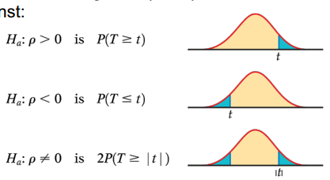

## 目录

  - 单词
  - Chapter 1 & 2
  - Chapter 3
  - Chapter 4
  - Chapter 5
  - Chapter 6
  - Chapter 7
  - Chapter 8
    - 补充8
  - Chapter 9
  - Chapter 10
  - Chapter 11
  - Chapter 12
  - Chapter 13
  - Chapter 14
  - R语言
    - 安装与配置
    - 创建向量、常见内置函数、注释方法
    - 查看数据相关
    - 手动导入数据集/画条形图/画饼图/调整图片间隔
    - 画箱图/画直方图/求五数概括法
    - 正态分布相关计算
    - z分数（标准化）/散点图
    - 求标准差/均值/向量求和/两向量逐项相乘/两向量相关性
    - Q-Q图（分位数-分位数图）
    - 排列组合
    - 概率（分布）直方图/画出均值

## 单词

datum 数据（单数形式）

data 数据（复数形式）

sample 样本

population 总体/整体/人群

inference 推断

built-in function 内置函数

qualitative variable / categorical variable 定性变量/分类变量/类型变量

quantitative variable / numerical variable 定量变量/数值变量

continuous variable 连续变量

discrete variable 离散变量

order categorical variable / level variable 有序分类变量/等级变量

exploratory data analysis 探索性数据分析

bar chart 条形图

pie chart 饼图

dot plot 点图

scatter plot 散点图

stem plot 茎叶图

line chart 折线图

area 面积图

histogram 直方图

outliers 异常值

time plot 时间图

mean 平均值

median 中位数

quartile 四分位数

percentile 百分位数

quantitative 定量的

categorical 分类的

correlation 相关性

unimodal 单峰

bimodal 双峰

quantile 分位数

## Chapter 1 & 2

本课程使用R语言进行编程。实验结果以R Markdown（PDF）形式提交。

平均值：

$$\bar{x}=\frac{x_1+x_2+\cdots+x_n}{n}$$

方差：

$$s^2=\frac{\left(x_1-\bar{x}\right)^2+\left(x_2-\bar{x}\right)^2+\cdots+\left(x_n-\bar{x}\right)^2}{n-1}$$

五数概括法（five-number summary）包括最小值、第一个四分位数$Q_1$、中位数$M$、第三个四分位数$Q_3$、最大值。箱图可以直观表示五数概括法：


四分位间距（interquartile range，IQR）等于第三个四分位数减去第一个四分位数，通过IQR可以判断一个数据是否为离群值：

$$I Q R=Q_3-Q_1$$

$$outliers < Q_1-1.5*IQR$$

$$outliers > Q_3+1.5*IQR$$

对变量$x$进行线性变换：

$$x_{new}=a+bx$$

密度曲线（density curve）：

- 密度曲线的中位值点是使得此点横坐标两边曲线下面积相等的点。
- 密度曲线的平均值点是此曲线分布的期望值点（也叫中心）。
- 密度曲线右偏代表分布的均值大于中位数，这是由于峰值右边的观测值数量更多。


正态分布：


$$X \sim N(\mu, \sigma)$$

$$\frac{1}{\sigma \sqrt{2 \pi}} e^{-\frac{1}{2}\left(\frac{x-\mu}{\sigma}\right)^2}$$

正态分布的$68-95-99.7$法则（$\mu \pm \sigma, \mu \pm 2 \sigma, \mu \pm 3 \sigma$）：


标准正态分布：

$$X \sim N(\mu, \sigma)$$

$$Z = \frac{X - \mu}{\sigma}$$

$$Z \sim N(0,1)$$

标准正态分布临界值表：


z分数（z-score / z-score / normal score）：

$$\text{z-score}_{x_i}=\frac{x_i-\mu}{\sigma}$$

- 对某一原始观测值/个体（individual）进行转换，变成的一个标准值。z分数的符号（$+$或$-$）表示此原始观测值是高于还是低于平均值$\mu$。

## Chapter 3

散点图和整体模式：

- 相关变量/响应变量（dependent variable / response variable）衡量研究的结果。（因变量）

- 独立变量/解释变量（independent variable / explanatory variable）解释或导致相关变量的变化。（自变量）

- 通过观察散点图的形式（form）（是否线性）、方向（direction）（正反相关）、强度（strength）（相关性）来获得整体模式（overall pattern）和偏差（deviation）。

- 对于分布图，主要特征则包括是否近似正态，单双峰（modal），左偏右偏，峰度（kurtosis），偏度（skewness），离散度（spread）。

- 相关性/相关系数（correlation）代表变量之间的线性关系的强度。相关性要求两个变量都是定量变量。相关系数为正则代表变量之间正相关（positive association），为负则代表变量之间负相关（negative association）。相关性$r$的取值范围$r \in [-1,1]$。相关性对异常值的影响不具抵抗力。计算公式：

$$r=\frac{1}{n-1} \sum\left(\frac{x_i-\bar{x}}{s_x}\right)\left(\frac{y_i-\bar{y}}{s_y}\right)$$

- 散点图添加分类变量：


事件之间的关系和事件发生的概率：

- 样本空间$S$是所有可能结果的集合，因此$P(S)=1$。

- 若两个事件不可能同时发生，则称为不相交的（disjoint）。

- 事件$A$的补事件（complement）$A^c$表示一个"事件$A$没有发生"的事件。

- 不相交事件和互补事件的文氏图（Venn diagram）：


- 若两个事件其中之一的发生不影响另一事件发生的概率，则称为相互独立（independent）。文氏图：


- 离散概率分布的所有结果概率和为1。所有连续概率分布的每个单独结果的概率均为0，但是所有结果的概率和为1。

- 单个随机变量的均值/期望：

$$\mu_{X}=\frac{1}{n}(x_1+x_2+\cdots+x_n)$$

$$\mu_{a+bX}=a+b \mu_X$$

- 多个随机变量的均值/期望：


$$\mu_{X+Y}=\mu_{X}+\mu_{Y}$$

$$\mu_{X-Y}=\mu_{X}-\mu_{Y}$$

- 单个随机变量的方差：

$$\begin{aligned} \sigma_X^2 & =\left(x_1-\mu_X\right)^2 p_1+\left(x_2-\mu_X\right)^2 p_2+\cdots+\left(x_k-\mu_X\right)^2 p_k \\ & =\sum\left(x_i-\mu_X\right)^2 p_i\end{aligned}$$

$$\sigma_{a+b X}^2=b^2 \sigma_X^2$$

- 多个相互独立的随机变量的方差：

$$\sigma_{X+Y}^2=\sigma_X^2+\sigma_Y^2$$

$$\sigma_{X-Y}^2=\sigma_X^2+\sigma_Y^2$$

- 多个相关性为$\rho$的随机变量的方差：

$$\begin{aligned} & \sigma_{X+Y}^2=\sigma_X^2+\sigma_Y^2+2 \rho \sigma_X \sigma_Y \\ & \sigma_{X-Y}^2=\sigma_X^2+\sigma_Y^2-2 \rho \sigma_X \sigma_Y\end{aligned}$$

## Chapter 4

- 可用数据（available data）是指过去出于其他目的产生的数据，但可能有助于回答当前感兴趣的问题。

- 抽样调查（sample survey）的思想是研究总体的一部分以获得关于总体的信息，即选择一个代表更大群体的样本，也称为观察性研究（observation study）。

- 实验（experiments）。将进行实验的个体称为实验单元，当单元是人类，将被称为受试者/实体（subject）。应用于单元的实验条件称为处理（treatment），可能还会对不同单元施加不同的干预（intervention），并测量得到结果变量/响应变量（outcome variable / response variable）。

- 实验中的解释变量通常称为因子（factor）。有些实验可能会研究几个因子而不是单一因子的共同作用，在这样的实验中，每种处理都是通过结合每种因子的特定值（通常称为水平（level））而形成的。原则上，实验可以为因果关系提供良好的证据。

- 比较实验（comparative experiment）。如果实验设计中，简单地设计为"对单元进行处理，然后观察响应"，那么将无法判断响应是由于处理还是由于潜在的其他变量。例如安慰剂效应（placebo effect），这常出现在对照组（control group）中，如果无视，处理组（treatment group）得到的结果可能是有偏差的（biased）。

- 实验设计（design of experiment，DOE）。在实验中，将单元进行随机分组的操作称为随机化（randomization）。实验设计原理包括三点：1.比较两种或多种处理。这将控制潜在变量对响应的影响。2.进行随机化。3.在多个单元上重复进行每种处理，以减少结果的偶然变化。

- 实验注意事项。1.双盲（double-blinded）实验中，受试者和与受试者接触的人（例如负责对受试者进行处理的人员）都不知道受试者接受了哪种治疗。2.在某些实验中，受试者知道自己是受试者，这也将影响实验结果，使得实验结果缺乏现实性（realism）。3.在某些实验中，还将混合其他的影响，没有很好地进行控制变量。

- 配对设计（matched pairs designs）。配对设计的理念是，匹配的受试者比不匹配的受试者更相似，因此对多对受试者的反应进行比较，比对随机分配的多对受试者的反应进行比较更有效。

- 区块设计（block design）。每个区块是一组预先已知的实验单元，这些单元拥有预计会影响对特定处理的反应的相似性质。因此在区块设计中，对每个区块的单元进行随机分配以进行不同的处理，和配对设计的思想是反过来的。

- 抽样设计（sampling design）。抽样调查设计指的是从总体中获得样本的方法。原始样本中实际提供可用数据的比例称为响应率（response rate），应在所有调查中报告。

- 抽样注意事项。1.应慎重选择样本，而不是随机选择样本。2.在线民意调查特别容易产生偏见，因为回应的样本不能代表广大民众。3.自愿响应样本（voluntary response sample）由通过对一般的呼吁进行响应来使自己作为样本的人组成。自愿回答样本是有偏见的，因为持强烈意见，尤其是负面意见的人最有可能做出回应。

- 随机样本（random samples）。概率样本（probability sample）是偶然选择的样本，因此我们必须知道什么样的样本是可能的，每个可能的样本都有什么概率。简单随机样本（simple random sample，SRS）是从每个个体都有平等的机会被选中的总体中抽取的样本。分层随机样本（stratified random sample）首先将总体分为相似的个体组，称为分层（strata）。然后在每个层中选择一个单独的SRS，并将这些SRS组合起来形成完整的样本。多阶段样本（multistage samples）。

- 样本调查注意事项。当总体中的某些群体被排除在选择样本的过程之外时，就会出现覆盖不足。

- 统计推断（statistical inference）使用一个样本的事实（fact）来估计（estimate）整个总体的未知的真相（truth）。参数（parameter）是一个描述总体的数字。参数是一个固定的数字，但在实践中我们不知道它的值。统计量（statistic）是描述样本的数字（例如样本均值）。当我们完成抽样，统计量的值是已知的，但它可以随抽取得到的样本的不同而变化。我们使用统计量来估计未知的参数（例如总体均值）。

- 抽样分布。所有的统计推断都基于一个想法：要想知道一个程序有多值得信赖，就要问如果我们重复多次会发生什么。因此从同一总体中多次抽取大量样本，将每次抽样符合事先定下的标准的样本占总样本的比例$\hat{p}$进行记录，制作直方图，并观察分布的形状、中心、异常值等。

- 使用表格的随机数字或计算机软件的随机数字来模拟偶然行为的行为称为模拟（simulation）。

- 偏差（bias）和可变性（variability）。偏差涉及抽样分布的中心。如果用于估计参数的统计量的抽样分布的平均值等于被估计参数的真值，则该统计量是无偏估计器。使用随机抽样来减少偏差。统计数据的可变性通过其抽样分布的分布来描述。此排列由采样设计和样本大小$n$决定。来自较大概率样本的统计数据具有较小的可变性。使用更大的样本来减少可变性。


- 从大总体中采样随机样本统计数据的可变性不取决于总体的大小，只要总体至少是样本的100倍。

## Chapter 5

- 描述随机样本的统计量（例如样本均值）也可以视为一个随机变量，统计量的概率分布称为抽样分布（sampling distribution）。将一个包含$n$个观测值的SRS中的每个观测值$X_1,X_2,\cdots$都视为随机变量（因此不是确定值$x_1,x_2,\cdots$），以评估一次SRS的期望和方差。

- 样本均值$\bar{x}$：

$$\bar{x}=\frac{1}{n}(X_1+X_2+\cdots+X_n)$$

- 样本均值$\bar{x}$的期望（无偏估计量）：

$$\mu_{\bar{x}}=\frac{1}{n}(\mu_{X_1}+\mu_{X_2}+\cdots+\mu_{X_n})=\frac{1}{n}(\mu+\mu+\cdots+\mu)=\mu$$

- 样本均值$\bar{x}$的方差：

$$\sigma_{\bar{x}}^2=(\frac{1}{n})^2(\sigma_{X_1}^2+\sigma_{X_2}^2+\cdots+\sigma_{X_n}^2)=\frac{\sigma^2}{n}$$

- 如果总体的分布是正态分布$N(\mu,\sigma)$，那么样本均值的分布是正态分布$N(\mu,\frac{\sigma}{\sqrt{n}})$。

- 中心极限定理（central limit theorem）：从均值为$\mu$，标准差为$\sigma$的任意分布的总体中取包含$n$个观测值的SRS，当$n$足够大，样本均值$\bar{x}$的抽样分布一定近似正态分布$N(\mu,\frac{\sigma}{\sqrt{n}})$。

***

例子：


标准差根据多变量情况得到。

***

- 二项分布$B(n,p)$，对总数为$n$个的相互独立的观测值而言，都具有相同的成功概率$p$和失败概率$1-p$。

$$P(X=k)=\left(\begin{array}{l}n \\ k\end{array}\right) p^k(1-p)^{n-k}$$

$$\left(\begin{array}{l}n \\ k\end{array}\right)=\frac{n !}{k !(n-k) !}$$

- 对于成功比例为$p$的总体，如果SRS较小（不符合中心极限定理），则有样本中观测值成功的数量$X$视为随机变量，$\mu_X=np$，$\sigma_{X}=\sqrt{np(1-p)}$。样本的成功比例$\hat{p}$也为随机变量，期望（无偏估计量）和方差满足：

$$\hat{p}=\frac{X}{n}$$

$$\mu_{\hat{p}}=p,\sigma_{\hat{p}}=\sqrt{\frac{p(1-p)}{n}}$$

- 对于成功比例为$p$的总体，如果SRS较大（符合中心极限定理），则有样本中观测值成功的数量$X$视为随机变量，其分布近似为$N(\mu=np,\sigma=\sqrt{np(1-p))}$，样本的成功比例$\hat{p}=\frac{X}{n}$也为随机变量，其分布近似为$N(\mu=p,\sigma=\sqrt{\frac{p(1-p)}{n})}$。

## Chapter 6

统计推断（statistical inference）：

- 置信区间（confidence interval，CI）
- 显著性检验（test of significance）

置信区间：

- 对于均值为$\mu$标准差为$\sigma$的总体，观测值数量为$n$的SRS，其均值$\bar{x}$有95%处于$[\mu-2 \frac{\sigma}{\sqrt{n}},\mu+2 \frac{\sigma}{\sqrt{n}}]$区间，反过来，这代表$\mu$在$[\bar{x}-2 \frac{\sigma}{\sqrt{n}},\bar{x}+2 \frac{\sigma}{\sqrt{n}}]$置信区间具有95%的置信度（这里其实是1.96近似为2）。
- 置信水平（confidence level）：从总体抽取重复样本（repeated samples）计算参数的估计值来获得置信区间，在此区间中捕获到对应的真实参数值的概率。通常选择90%以上的置信水平，一般为95%。常用临界值表（双尾）：


- 对置信区间的计算，遵循$参数的估计值 \pm 临界值 \cdot 统计量的标准差$，临界值（critical value）即为$z^*$，通过查表获得。
- 对于参数$\mu$置信水平为$C$的置信区间，界限误差（margin error）即为$m=z^* \frac{\sigma}{\sqrt{n}}$。高置信水平和低界限误差都是希望达成的，当对置信水平和界限误差有要求时，我们难以调整总体的标准差$\sigma$，因此可以调整样本的观测值的数量$n$，$n$越大，$m$越小。

显著性检验：

- 我们用一种概率来表示显著性测试的结果，称为P值（P-value），来衡量样本的数据和声明/假设（claim / hypothesis）的一致性。
- 统计检验（statistical test）作出的假设被称为原假设/零假设（null hypothesis）$H_0$。备择假设（alternative hypothesis）$H_a$则是零假设的对立假设。
- 当$H_0$为真，我们希望估计值接近$H_0$中指定的参数值。我们将此指定的参数值称为假设值（hypothesized value）。检验统计量（test statistic）$z$表示当$H_0$为真时，样本数据和$H_0$的一致性的度量（$z$越大代表一致性越小）。

$$z=\frac{参数的估计值-假设值}{参数的估计值的标准差}$$

$$z=\frac{\bar{x}-\mu_0}{\sigma/\sqrt{n}}$$

- P值：定下显著水平$\alpha$（小概率事件的阈值）。因为计算检验统计量需要假设$H_0$为真，因此$H_0$一般会设置为$参数=假设值$的形式，然后通过检验统计量计算P值（样本数据的表现与$H_0$为真的假设相符的概率），P值具体计算要看检验方式，若P值小于$\alpha$则拒绝$H_0$（认为$H_0$为真是小概率事件，因此拒绝）。
- 例如：对于特定总体的样本均值分布，从这个总体中抽取一个样本，通过样本均值计算出的检验统计量，即为此样本均值与此特定总体的样本均值分布的均值处相差的方差的系数，此系数越大说明样本均值越偏离样本均值分布的均值。P值就是用来表示此样本均值在还未定下显著性水平时，使得此样本均值不拒绝原假设的概率，换句话说，此样本均值处于以1-P值的置信水平的置信区间的边缘，当显著水平大于P值，意味着给定的置信区间小于以1-P值的置信水平的置信区间，此样本均值不在给定的置信区间内，因此拒绝原假设。


***

例子：


$$z=\frac{\bar{x}-\mu_0}{\sigma/\sqrt{n}}$$


***

例子：


$$z=\frac{\bar{x}-\mu_0}{\sigma/\sqrt{n}}=4.83$$

双侧情况：

$$P=2P(Z \geq 4.83)$$

***

## Chapter 7

$t$分布：

- 当$\bar{x}$的抽样分布近似正态分布，有标准化：

$$z=\frac{\bar{x}-\mu}{\sigma / \sqrt{n}}$$

- 总体$\sigma$是未知的，我们只能通过样本标准差$s$来进行估计，此时$\bar{x}$具有单样本（one-sample）$t$分布而不是标准正态分布$Z$：

$$t=\frac{\bar{x}-\mu}{s / \sqrt{n}}$$

- $t$分布有自由度$df=n-1$。自由度越高，$t$分布的图像曲线越接近标准正态分布的图像曲线。
- 从一个具有未知均值$\mu$的总体抽取观测值数量为$n$的SRS。总体的$\mu$的置信水平为$C$的置信区间为$\bar{x} \pm t^* \frac{s}{\sqrt{n}}$，其中$t^*$为自由度为$n-1$的$t$分布（也就是$t(n-1)$分布）且区间占比为$C$的临界值。
- 从一个具有未知均值$\mu$的总体抽取观测值数量为$n$的SRS。对假设$H_0:\mu=\mu_0$进行$t$检验，则有$t=\frac{\bar{x}-\mu_0}{s/\sqrt{n}}$计算P值（与对立假设$H_{a}$相反的区间占比）。如果总体分布是正态分布，则P值是精确的。如果总体分布不是正态分布，$n$越大，则P值越接近精确。


- 当未知总体的具体的分布，且样本观测值数量$n$较小时，需要通过图像来判断是否适合使用$t$检验/程序（procedures）。这通常通过样本观测值是否有离群值和样本观测值分布是否有强偏离（strong skewness）来判断。（右偏代表有更多数据位于峰值的右方）

- $t$分布临界值表：


对成对的（paired）数据使用成对$t$检验：


$t$检验的鲁棒性：

- 若不符合条件，置信水平或P值仍然变化不大，则称此置信区间或显著性检验为稳健的（robust）。
- SRS条件比总体分布符合正态分布条件要更重要。
- 无离群值或强偏离，样本观测值数量至少需要15。
- 样本符合正态分布，无离群值或明显偏离，样本观测值数量可以小于15。
- 具有明显偏离，样本观测值数量需要满足$n \geq 40$。

双样本（two-sample）问题，两样本取自同一总体：

- 对$\mu_1 - \mu_2$的最佳估计量为$\bar{x}_1-\bar{x}_2$。当相互独立条件满足，$\bar{x}_1-\bar{x}_2$的方差为：

$$\sigma_{\bar{x}_1-\bar{x}_2}=\sqrt{\frac{\sigma_1^2}{n_1}+\frac{\sigma_2^2}{n_2}}$$

- 总体$\sigma_1,\sigma_2$是未知的，因此我们将其替换为样本标准差$s_1,s_2$：

$$\sigma_{\bar{x}_1-\bar{x}_2}=\sqrt{\frac{s_1^2}{n_1}+\frac{s_2^2}{n_2}}$$

- 若满足正态条件，则标准化得到$t$分布：

$$t=\frac{(\bar{x}_1-\bar{x}_2)-(\mu_1-\mu_2)}{\sqrt{\frac{s_1^2}{n_1}+\frac{s_2^2}{n_2}}}$$

- $t$检验统计量（零假设$\mu_1=\mu_2$）：

$$t=\frac{(\bar{x}_1-\bar{x}_2)-0}{\sqrt{\frac{s_1^2}{n_1}+\frac{s_2^2}{n_2}}}$$

- 使用保守的（conservative）方法，将$n_1-1+n_2-1=n_1+n_2-2$作为自由度。
- $\mu_1-\mu_2$的置信区间为$(\bar{x}_1-\bar{x}_2) \pm t^* \sqrt{\frac{s_1^2}{n_1}+\frac{s_2^2}{n_2}}$。
- 双样本$t$检验比单样本$t$检验更具有鲁棒性，特别是当分布不对称时。
- 双样本$t$检验的条件，仅需要在单样本$t$检验的基础上将样本观测值数量更改为两个样本观测值数量之和，即可适用。
- 如果可以的话，对两个样本，选择相同观测值数量的样本。

## Chapter 8

临界值$z^*$表（单尾）（$1-P(Z<z^*)$）：


临界值$z^*$表（单尾）（$P(Z<z^*)$）：


二项分布，通过大样本得到的$p$的置信区间：

- 大样本（$n$足够大）重复抽样，则$\hat{p}$近似于正态分布$N(p,\sqrt{\frac{p(1-p)}{n}})$。
- 因为总体的成功比例$p$未知，我们将其替换为样本的成功比例$\hat{p}$。标准差（standard error，SE）$SE_{\hat{p}}=\sqrt{\frac{\hat{p}(1-\hat{p})}{n}}$。置信区间：

$$\hat{p} \pm z^* \sqrt{\frac{\hat{p}(1-\hat{p})}{n}}$$

- 大样本下，临界值$z^*$也通过标准正态分布表获得。
- 除非样本很大，否则使用样本的成功比例替代总体的成功比例计算出的置信区间不够准确。需要加上四个假想的观察结果，两个成功，两个失败。这称为$p$的加四估计（plus-four estimate）：

$$\widetilde{p}=\frac{样本中观测值为成功的数量+2}{n+4}$$

- 当置信水平至少为90%，样本中观测值数量至少为10，使用加四估计的置信区间：

$$\widetilde{p} \pm z^* \sqrt{\frac{\widetilde{p}(1-\widetilde{p})}{n+4}}$$

- 显著性检验。若$H_0:p=p_0$为真可以满足总体中观测值为成功和失败均至少有10个以上，则可以当成正态分布进行检验，样本成功比例为$\hat{p}$，有检验统计量$z$（零假设$p=p_0$）：

$$z=\frac{\hat{p}-p_0}{\sqrt{\frac{p_0(1-p_0)}{n}}}$$

$$\text{P-value}=P(Z \geq z)/P(Z \leq z)$$

- 样本观测值数量$n$的选定。由于未知$\hat{p}$，我们猜测一个成功比例$p^*$来计算$m=z^* \sqrt{\frac{\hat{p}(1-\hat{p})}{n}}$。可以通过过去经验进行猜测，也可以直接取$p^*=0.5$使得$m$最大。最终可得样本观测值数量$n$的最佳值：

$$n=(\frac{z^*}{m})^2 p^* (1-p^*)$$

对两个二项分布进行比较：

- 大样本重复抽样，$\hat{p}_1-\hat{p}_2$近似正态分布，且此分布的期望为$p_1-p_2$，因此$\hat{p}_1-\hat{p}_2$是$p_1-p_2$的无偏估计量。同样的，$p_1,p_2$未知，通过样本标准差进行替换。

$$SE_{\hat{p}_1-\hat{p}_2}=\sqrt{\frac{\hat{p_1}(1-\hat{p_1})}{n_1}+\frac{\hat{p_2}(1-\hat{p}_2)}{n_2}}$$

- 置信区间：

$$\left(\hat{p}_1-\hat{p}_2\right) \pm z^* \sqrt{\frac{\hat{p}_1\left(1-\hat{p}_1\right)}{n_1}+\frac{\hat{p}_2\left(1-\hat{p}_2\right)}{n_2}}$$

- 加四估计，对两个样本，每个样本加2个观测值，其中1个为成功。需满足每一个样本观测值数量至少为5：

$$\left(\tilde{p}_1-\tilde{p}_2\right) \pm z^* \sqrt{\frac{\tilde{p}_1\left(1-\tilde{p}_1\right)}{n_1+2}+\frac{\tilde{p}_2\left(1-\tilde{p}_2\right)}{n_2+2}}$$

- 检验统计量$z$（零假设$p_1=p_2$）：

$$\hat{p}=\frac{n_1 \hat{p}_1+n_2 \hat{p}_2}{n_1+n_2}$$

$$z=\frac{(\hat{p_1}-\hat{p_2})-0}{\sqrt{\hat{p}(1-\hat{p})(\frac{1}{n_1}+\frac{1}{n_2})}}$$

- 相对风险（relative risk，RR）是比较两个二项分布的另一种方法。

$$RR=\frac{\hat{p_1}}{\hat{p_2}}$$

### 补充8

- 标准正态分布，$x$轴是样本的观测值，$y$轴是对应$x$轴坐标的样本的观测值的频率。
- 假设检验，其实就是确定或者假定一个总体的样本的观测值完全符合某一种分布，然后根据这一种分布的特点和属性（例如查表）来计算与假设相关的参数值，以获得假设成立的概率。

## Chapter 9

比较两个分类变量，使用双向表（two-way tables of counts）：


- 双向表用来描述任何两个分类变量之间的关系（分别对应双向表的行和列，分类变量的取值至少可以取两类，因此行和列数均大于1且没有上线）。
- 双向表根据两个分类变量对数据进行排序。
- 期望单元格计数（expected cell count）。一般来说，定下假设$H_0:在所有总体中，分类变量的分布没有差异，两个分类变量不具有联系$和$H_a:在所有总体中，分类变量的分布存在差异，两个分类变量具有联系$。将样本数据中的实际计数（actual count）与期望计数（expected count）进行比较。
- 假定$H_0$为真，任意单元格的期望计数为：

$$\text{期望计数}=\frac{\text{所在行值之和}\times\text{所在列值之和}}{表中所有值之和}$$


对于多重比较（multiple comparison）问题：

- 全面测试（overall test）。使用卡方（chi-square）检验进行。
- 详细的后续（follow-up）分析。

全面测试-卡方检验：

- 卡方检验统计量计算：

$$X^2=\sum \frac{(实际计数-期望计数)^2}{期望计数}$$

- 计算P值时，只会是右尾（upper tail）情况，这是因为与零假设的任何偏差都会使统计数据更大。

$$P-value=P(\chi^2 \geq X^2)$$

- 卡方分布是一个只取正值并且右偏的分布。自由度越高，卡方分布的形状越接近正态分布。对于$r$行$c$列的双向表，卡方分布的自由度：

$$df=(r-1)(c-1)$$


- 假设检验中，通过查表获得临界值$(\chi^2)^*$。若$(\chi^2)_1^*<X^2<(\chi^2)_2^*$，则$p_2<P-value<p_1$。


- 卡方检验统计量衡量观察到的计数与期望计数之间的距离。
- 卡方检验是一种近似方法。随着单元格数量增加，卡方检验将更精确。
- 每个个体（观测值）相互独立（独立性），采样方法为SRS（随机性），变量是分类变量，对于平均期望计数大于等于5且所有期望计数大于等于1（尺寸足够大），可以使用卡方检验。如果是$2 \times 2$情况下，则所有期望计数都需要大于等于5，才能使用卡方检验。
- 对于双向表的两种情况对应的模型，选择卡方检验：
- - 来自两个或两个以上总体的独立SRS，每个观测值根据一个分类变量进行分类。（比较多个总体，相当于将"来自不同总体"视为一个分类变量，然后检验两个分类变量之间的独立性）
- - 来自一个总体的SRS，每个观测值根据两个分类变量同时进行分类。（单个总体，检验两个分类变量之间的独立性）

双向表建模总体流程：

- 比较条件分布（conditional distribution）。根据双向表，可能会出现行列分类变量均为自变量/因变量，行列分类变量其中之一是自变量另一是因变量。以下例子中，每一列是一个是自变量的分类变量的取值，计算对应的因变量的百分比，获得条件分布。一般每一列的百分比总和为100.0。通过条件分布描述两个变量之间的联系（relationship）。


- 计算期望计数。


- 计算卡方检验统计量，获得P值。


## Chapter 10

最小二乘回归（least-square regression）-回顾：

$$\hat{y}=b_0 + b_1 x$$

- 我们一般用回归线来预测响应变量和解释变量的关系。
- 外推（extrapolation）是指使用回归线进行远远超出解释变量值范围的预测。这样的预测往往不准确。
- $x$和$y$的方差、标准差计算：

$$s_x^2=\sum \frac{\left(x_i-\bar{x}\right)^2}{n-1}$$

$$s_y^2=\sum \frac{\left(y_i-\bar{y}\right)^2}{n-1}$$

- 斜率（slope）$b_1$和截距（intercept）$b_0$计算：

$$b_0=\bar{y}-b_1 \bar{x}$$

$$b_1=\frac{\sum(x-\bar{x})(y-\bar{y})}{\sum(x-\bar{x})^2}=r \frac{s_y}{s_x}$$

- 相关性（correlation）$r$计算：

$$r=\frac{1}{n-1} \sum \left(\frac{x_i-\bar{x}}{s_x}\right)\left(\frac{y_i-\bar{y}}{s_y}\right)$$

简单线性回归（simple linear regression，SLR）- 推理（inference）的条件：

- 根据总体数据画出的回归线，称为总体回归线（population regression line）：

$$\mu_y=\beta_0+\beta_1 x$$

- 根据总体的SRS数据画出的回归线，称为样本回归线（sample regression line）：

$$\hat{y}=b_0+b_1 x$$

- 斜率$b_0$和截距$b_1$均为统计量，因此将$b_0,b_1$作为总体的未知参数$\beta_0,\beta_1$的估计量。
- 对于解释变量$x$和响应变量$y$我们有$n$个观测值，则有：


- - 因为$x$和$y$的关系不是完全确定的，因此对于一个特定的$x$值，对应的响应$y$可以有多个可能的值与其对应，响应$y$符合正态分布。而$\mu_y$则是对于一个特定的$x$值对应的响应$y$的所有可能值的均值（因此$\mu_y$称为平均响应），又因为响应$y$符合正太分布，因此平均响应$\mu_y$同时也是对应的响应$y$的所有可能值的期望值。
- - 重复的响应$y$是相互独立的。
- - 平均响应$\mu_y$和$x$值的总体回归线满足直线关系（straight line relationship），$\beta_0,\beta_1$是未知的。

$$\mu_y=\beta_0+\beta_1 x$$

- - 响应$y$的标准差$\sigma$，对于所有特定$x$值都是相同的（恒定方差条件，线性回归模型假设之一），$\sigma$是未知的。

样本线性回归模型（simple linear regression model）：

- 样本线性回归模型构建：

$$y_i=(\beta_0+\beta_1 x_i)+\epsilon_i$$

$$DATA=FIT+RESIDUAL$$

- 残差（residual）$\epsilon_i$是独立的。$y_i$符合正态分布$N(\beta_0+\beta_1 x_i,\sigma)$，因此残差符合正态分布$N(0,\sigma)$（称为近似正态残差条件，线性回归模型假设之一）。
- $\beta_0,\beta_1,\sigma$均为未知参数，因此我们需要通过总体的SRS来获得$\beta_0,\beta_1,\sigma$的无偏估计量。
- 根据总体的SRS数据得到的样本回归线$\hat{y}=b_0+b_1 x$，就是总体回归线$\mu_y=\beta_0+\beta_1 x$的最佳估计量。
- 对于$n$个观测值样本，回归标准误差（regression standard error）$s$（回归标准差$\sigma$的无偏估计量）的计算：

$$\hat{y_i}=b_0+b_1x_i$$

$$s=\sqrt{\frac{\sum \epsilon_i^2}{n-2}}=\sqrt{\frac{\sum (y_i-\hat{y_i})^2}{n-2}}$$

回归斜率$\beta_1$的置信区间：

$$b_1 \pm t^* SE_{b_1}$$

$$df=n-2$$

回归斜率$\beta_1$的显著性检验，假设零假设$H_0$为真（零假设$H_0:\beta_1=假设值$，若零假设为$x$和$y$没有关系，则$H_0:\beta_1=0$。备择假设$H_a$需要根据研究对象和零假设来设置，若零假设为$x$和$y$没有关系，则$H_a:\beta_1>0$或者$H_a:\beta_1<0$或者$H_a:\beta_1 \neq 0$。）：

$$\mathrm{SE}_{b_1}=\frac{s}{\sqrt{\sum\left(x_i-\bar{x}\right)^2}}$$

$$t=\frac{b_1-\beta_1}{SE_{b_1}}$$

$$df=n-2$$

- 取P值（查表获得与检验统计量$t$最相近的临界值$t^*$）：


对于$x=x^*$，观测值数为$n$的SRS，平均响应$\mu_y$（对$y$进行多次观测并进行计算）的置信区间：

$$\mu_y=\beta_0+\beta_1x$$

$$\hat{\mu}_y=b_0 + b_1 x^*$$

$$\hat{\mu}_{\boldsymbol{y}} \pm t^* SE_{\hat{\mu}_{\boldsymbol{y}}}$$

$$df=n-2$$

$$\mathrm{SE}_{\hat{\mu}}=s \sqrt{\frac{1}{n}+\frac{\left(x^*-\bar{x}\right)^2}{\sum\left(x_i-\bar{x}\right)^2}}$$

对于$x=x^*$，条件取样观测值数为$n$的SRS，因为平均响应$\mu_y$也有置信区间，因此单个响应$y$（对$y$进行单次观测）的预测区间（prediction interval）必定会比平均响应$\mu_y$的置信区间更大：

$$y=(\beta_0+\beta_1 x)+\epsilon$$

$$\hat{y}=b_0+b_1x^*$$

$$\hat{y}\pm t^* SE_{\hat{y}}$$

$$df=n-2$$

$$\mathrm{SE}_{\hat{y}}=s \sqrt{1+\frac{1}{n}+\frac{\left(x^*-\bar{x}\right)^2}{\sum\left(x_i-\bar{x}\right)^2}}$$

平均响应的置信区间与响应的预测区间比较：


## Chapter 11

回归的方差分析（analysis of variance，ANOVA）：

- ANOVA总结了有关数据中变化来源的信息。
- ANOVA基于：

$$y_i=(\beta_0+\beta_1 x_i)+\epsilon_i$$

$$DATA=FIT+RESIDUAL$$

- 平方和（sum of square，SS）表示响应中存在的变化。总变化分为两部分，一部分是由于模型，另一部分是因为与模型的偏差：

$$(y_i-\bar{y})=(\hat{y_i}-\bar{y})+(y_i-\hat{y_i})$$

$$SSTotal=SSModel+SSError$$

$$SST=\sum(y_i-\bar{y})^2$$

$$SSM=\sum(\hat{y_i}-\bar{y})^2$$

$$SSE=\sum(y_i-\hat{y_i})^2$$

- 有变化分数（fraction of variation）$r^2$：

$$s_x^2=\sum \frac{\left(x_i-\bar{x}\right)^2}{n-1}$$

$$s_y^2=\sum \frac{\left(y_i-\bar{y}\right)^2}{n-1}$$

$$\hat{y}=b_0+b_1 x=\bar{y}-b_1 \bar{x}+b_1 x=r \frac{s_y}{s_x}(x-\bar{x})+\bar{y}$$

$$r^2=\frac{SSM}{SST}=\frac{\sum(\hat{y_i}-\bar{y})^2}{\sum(y_i-\bar{y})^2}$$

- 自由度DF：

$$DFT=DFM+DFE$$

$$DFT=n-1$$

$$DFM=1$$

$$DFE=n-2$$

- 均方（mean square，MS）：

- - 响应$y$的方差的最佳估计量：

$$\mathrm{MST}=\mathrm{SST} / \mathrm{DFT}=\frac{\sum\left(y_i-\bar{y}\right)^2}{n-1}=s_y^2$$

- - 无意义：

$$\mathrm{MSM}=\mathrm{SSM} / \mathrm{DFM}=\frac{\sum\left(\hat{y}_i-\bar{y}\right)^2}{1}$$

- - 总体的残差$\epsilon$的方差$\sigma^2$的最佳估计量：

$$\mathrm{MSE}=\mathrm{SSE}/\mathrm{DFE} =\frac{\sum\left(y_i-\hat{y}_i\right)^2}{n-2}$$

- ANOVA-F检验：

$$H_0:\beta_1=0,H_a:\beta_1 \neq 0$$

$$f=\frac{MSM}{MSE}$$

- - 假设$H_0$为真，$f \sim F(1,n-2)$（第一个参数为分子的自由度，第二个参数为分母的自由度），$P-value=P(F > f)$。

- ANOVA表：


- 例子：


- 为了估计回归的参数，我们计算估计的回归系数的标准误差：

$$s=\frac{\sum\left(y_i-\hat{y}_i\right)^2}{n-2}$$

$$\mathrm{SE}_{b_1}=\frac{s}{\sqrt{\sum\left(x_i-\bar{x}\right)^2}}$$

$$\mathrm{SE}_{b_0}=s \sqrt{\frac{1}{n}+\frac{\bar{x}^2}{\sum\left(x_i-\bar{x}\right)^2}}$$

- 相关性$\rho$也可以用作检验：

$$H_0:\rho=0$$

$$T \sim t(n-2)$$



多线性回归（multiple linear regression）模型：

- 多个解释变量时的线性回归模型才需要使用F检验，但也能用于单个解释变量。F检验实际上就是多个简单线性回归的结合，也就是多个t检验的结合。
- 响应变量$y$与$p$个解释变量有关，$x_1,x_2,\cdots,x_p$。
- 多回归方程（总体）：

$$\mu_y=\beta_0+\beta_1x_1+\beta_2x_2+\cdots+\beta_p x_p$$

- 多线性回归模型（总体）：

$$y_i=\beta_0+\beta_1x_{i1}+\beta_2x_{i2}+\cdots+\beta_p x_{ip}+\epsilon_i$$

- - 残差$\epsilon_i$是独立的，$\epsilon_i \sim N(0,\sigma)$。

- 估计多回归方程（样本）：

$$\hat{y}_i=b_0+b_1 x_{i1}+b_2 x_{i2}+\cdots+b_p x_{ip}$$

- 残差：

$$\epsilon_i=y_i-\hat{y_i}$$

- 使SSE（残差的平方和）最小：

$$SSE=min \sum(y_i-b_0-b_1 x_{i1}-b_2 x_{i2}- \cdots - b_p x_{ip})^2$$

- 残差的方差$\sigma^2$的最佳估计量：

$$\begin{aligned} s^2 & =\frac{\sum e_i^2}{n-p-1} \\ & =\frac{\sum\left(y_i-\hat{y}_i\right)^2}{n-p-1}\end{aligned}$$

- 参数$\beta_j$的置信区间：

$$b_j \pm t^* SE_{b_j}$$

- - $t^*$通过查表得到，自由度为$n-p-1$，$t(n-p-1)$。

- 参数$\beta_j$的显著性检验：

$$H_0:\beta_j=0,H_a$$

$$t=\frac{b_j-0}{SE_{b_j}}$$


- 多回归的ANOVA表：


$$H_0:\beta_1=\beta_2=\cdots=\beta_p=0$$

$$H_a: 至少有一个 \beta_j 不为0$$

$$f=\frac{MSM}{MSE}$$

- - 当$H_0$为真，$f \sim F(p,n-p-1)$。

- 例子：


- 多重相关性（multiple correlation）：

$$R^2=\frac{\mathrm{SSM}}{\mathrm{SST}}=\frac{\sum\left(\hat{y}_i-\bar{y}\right)^2}{\sum\left(y_i-\bar{y}\right)^2}$$

## Chapter 12

双样本问题，两个样本取自两个方差不同的总体，称为组（group），比较两个组：

- $z$检验统计量：

$$z=\frac{(\bar{x}_1-\bar{x}_2)-(\mu_1-\mu_2)}{\sqrt{\frac{\sigma_1^2}{n_1}+\frac{\sigma_2^2}{n_2}}}$$

- $\mu_1-\mu_2$的置信区间：

$$(\bar{x}_1-\bar{x}_1) \pm t^* \sqrt{\frac{s_1^2}{n_1}+\frac{s_2^2}{n_2}}$$

- $t$检验统计量：

$$t=\frac{\left(\bar{x}_1-\bar{x}_2\right)-\left(\mu_1-\mu_2\right)}{\sqrt{\frac{s_1^2}{n_1}+\frac{s_2^2}{n_2}}}$$

- - 自由度为$n_1-1$和$n_2-1$中较小的那一个。

合并的/池化的（pooled）双样本$t$检验：

- - 如果我们可以假设这两个总体具有相等的方差（最大方差除以最小方差小于4，或者最大标准差除以最小标准差小于2，则可以假设满足方差相等），则合并的双样本$t$检验可用，自由度为$n_1+n_2-2$。
- - 池化的参数$\sigma_p^2$的估计量：

$$s_p^2=\frac{(n_1-1)s_1^2+(n_2-1)s_2^2}{n_1+n_2-2}$$

- - $t$检验统计量：

$$t=\frac{\bar{x_1}-\bar{x_2}}{s_p \sqrt{\frac{1}{n_1}+\frac{1}{n_2}}}$$

单因素（one-way）ANOVA：

- 对多个样本的平均数进行比较的统计方法称为方差分析，简称ANOVA，方差分析模型假设所有总体的标准差相等。
- 两种方差分析技术：
- - 当只有一种分类标准对感兴趣的总体进行分类时，我们使用单因素方差分析来分析数据。
- - 当有多种分类标准对总体进行分类时，我们使用双因素方差分析来分析数据。
- - 方差分析对多个总体的未知参数之间的差别进行分析。
- - 方差分析检验了"多个总体均值均相等"的零假设$H_0$。如果零假设被拒绝，也不代表多个总体均值彼此全部都不相等，需要多重检验。
- - 方差分析模型假设总体标准偏差都相等。如果我们有不相等的标准差，我们通常会尝试转换数据，使它们大致相等。
- - 没有极端异常值，并且样本表现出低变异性（方差小），则可以用ANOVA。
- 双样本$t$检验统计量：

$$t=\frac{\bar{x}-\bar{y}}{s_p \sqrt{\frac{1}{n}+\frac{1}{n}}}=\frac{\sqrt{\frac{n}{2}}(\bar{x}-\bar{y})}{s_p}$$

构建单因素ANOVA模型（多样本，需要使用F检验总结多个t检验）：

- 从$I$个总体（或者从一个总体抽取SRS 后分为多组并每组进行不一样的处理方式，这也等效于多样本）分别抽取SRS，第$i$个样本的样本观测值数量为$n_i$：

$$x_{ij}=\mu_i+\epsilon_{i j}$$

$$DATA=FIT+RESDUAL$$

- $x_{ij}$表示从第$i$个总体抽取的SRS的第$j$个观测值，$\mu_i$表示第$i$个总体的均值。$\epsilon_{i j}$表示模型的随机变化或残差部分。

- 假设$\epsilon_{i j}$符合$N(0,\sigma)$分布。
- 参数为各个总体的均值$\mu_i$和标准差$\sigma$。合并的总体均值为$\mu_I$。
- 观测值的均值：

$$\bar{x}_i=\frac{1}{n_i} \sum_{j=1}^{n_i} x_{ij}$$

$$\bar{x}=\frac{1}{I}\sum_{i=1}^I \bar{x}_i$$

- 观测值的残差：

$$\epsilon_{i j}=x_{i j}-\bar{x}_j$$

- 由于方差分析检验对不等标准差不是非常敏感，我们不建议将标准差相等性的正式测试作为方差分析的初步测试。相反，我们将使用以下规则作为指导：如果最大标准差小于最小标准差的两倍，我们可以使用基于相等标准差假设的方法，我们的结果仍然大致正确。
- 合并的总体方差$\sigma^2$的无偏估计量：

$$s_p^2=\frac{\left(n_1-1\right) s_1^2+\left(n_2-1\right) s_2^2+\cdots+\left(n_I-1\right) s_I^2}{\left(n_1-1\right)+\left(n_2-1\right)+\cdots+\left(n_I-1\right)}$$

- 零假设和备择假设：

$$H_0:\mu_1=\mu_2= \cdots = \mu_I$$

$$H_a: \text{not all of the } \mu_i \text{ are equal}$$

ANOVA表：


- 组之间行提供与组平均值之间的变化相关的信息。
- 组内行提供与组内变化相关的信息。术语"误差（error）"经常被用来表示这种变化的来源。
- NOVA表中的Total行对应于我们的$DATA=FIT+RESDUAL$框架中的$DATA$项。
- SST测量总体平均值周围的数据变化。
- SSG测量总体平均值周围组平均值的变化。
- SSE测量每个观测值围绕其组平均值的变化。
- 平方和的组成：

$$(x_{ij}-\bar{x})=(x_i-\bar{x})+(x_{ij}-\bar{x}_i)$$

$$SST=SSG+SSE$$

$$SST=\sum(x_{ij}-\bar{x})^2$$

$$SSG=\sum(x_i-\bar{x})^2$$

$$SSE=\sum(x_{ij}-\bar{x}_i)^2=\sum(n_i-1)s_i^2$$

- 自由度的组成：

$$DFT=DFG+DFE$$

$$DFT=N-1$$

$$DFG=I-1$$

$$DFE=N-I$$

- 方差：

$$s_p^2=\mathrm{MSE}=\frac{\mathrm{SSE}}{\mathrm{DFE}}$$

单因素ANOVA模型的$F$检验：


- 当$H_0$为真，统计量$F \sim F(I-1,N-I)$（分子和分母两种两个自由度），$N=\sum n_i$。
- 当$H_a$为真，统计量$F$会非常大。


决定系数（coefficient of determination）：

$$R^2=\frac{SSG}{SST}$$

## Chapter 13

多重单因素ANOVA检验：

- 我们通过$F$检验，已经拒绝了"多个总体均值均相等"的零假设$H_0$。接下来进行多重检验。我们首先需要不拒绝备择假设"多个总体均值并不均相等"，这需要使得多个总体中的任意两个总体的均值均不相等。
- 因此定下零假设$H_{01}:\frac{1}{2} (\mu_1 + \mu_2)=\mu_3$和备择假设$H_{01}:\frac{1}{2} (\mu_1 + \mu_2)\neq \mu_3$（或$H_{01}:\frac{1}{2} (\mu_1 + \mu_2)<\mu_3$）。
- 因此定下零假设$H_{02}:\mu_1=\mu_2$和备择假设$H_{a2}:\mu_1 \neq \mu_2$。
- $H_{01}$和$H_{02}$都表示了多个总体的均值的线性组合。这些平均值的线性组合被称为对比度（contrast），因为系数总和为零。对比度例子：

$$\begin{aligned} \psi_1 & =-\frac{1}{2}\left(\mu_{\mathrm{UN}}+\mu_{\mathrm{SK}}\right)+\mu_{\mathrm{SU}} \\ & =(-0.5) \mu_{\mathrm{UN}}+(-0.5) \mu_{\mathrm{SK}}+(1) \mu_{\mathrm{SU}} \\ \psi_2 & =(1) \mu_{\mathrm{UN}}+(-1) \mu_{\mathrm{SK}}\end{aligned}$$

- 对比度、样本对比度、样本对比度的标准差（标准差的估计量$s_p$决定$t$分布的自由度DFE）：

$$\psi=\sum a_i \mu_i$$

$$c=\sum a_i \bar{x}_i$$

$$SE_c=s_p \sqrt{\sum \frac{a_i^2}{n_i}}$$

- 对比度的假设检验：
- - 零假设：

$$H_0: \psi=0$$

- - 置信区间：

$$c \pm t^* SE_c$$

- - $t$检验统计量：

$$t=\frac{c}{SE_c}$$

- 要进行多重比较检验（multiple-comparisons procedure），对每一对均值计算$t$检验统计量：

$$t_{ij}=\frac{\bar{x}_i-\bar{x}_j}{s_p \sqrt{\frac{1}{n_i}+\frac{1}{n_j}}}$$

$$|t_{ij}| \geq t^{**}$$

离群值的类型：

- 离群值是指偏离其他点主体的点，但并非所有离群值都是相等的。
- 与其他点体水平距离较远的异常值称为杠杆点（leverage point）。
- 实际影响回归线斜率的高杠杆点（水平距离很远的杠杆点称为高杠杆点）称为影响点（influential point）。
- 为了确定一个点是否有影响，可视化有此点和无此点的回归线。这条线的斜率变化很大吗？如果是这样，那么这一点是影响点。

模型诊断：

- 线性回归模型：
- - 线性条件。
- - 近似正态残差条件。
- - 恒定方差条件。也称为同方差（homosceedasticity）/异方差（heteroscedasticity）。
- 诊断：是否符合线性，是否符合近似正态残差条件（直方图/Q-Q图，残差是否近似符合正态分布，标准化后大多数残差是否在均值0附近），是否符合恒定方差条件（残差图，残差分布是否越来越离散或聚集）。
- - 以下残差图表示应考虑曲线回归或多元线性回归，不符合线性条件。


- - 以下残差图表示残差分布的方差越来越大，不符合恒定方差条件。


多元线性回归（multiple linear regression，MLR）推断的条件：

- 非结构化/近似正态残差。


- 残差具有恒定方差。


- 独立残差（与采样顺序无关）。


MLR推断：

$$\hat{y}=\beta_0+\beta_1 x_1 + \beta_2 x_2 + \cdots$$

$$H_0:\beta_1=\cdots=\beta_k=0$$

$$H_a:至少一个 \beta_1 \neq 0$$

- $F$检验产生显著结果并不意味着模型很好地拟合数据，它只意味着至少有一个$\beta_s$为非零。即这些变量的组合总体上产生了比仅截距模型更好的模型。
- 斜率的置信区间（$t$分布自由度$df=n-k-1$）：

$$b_k \pm t^* SE_{bk}$$

模型选择：

- 后向淘汰（backward-elimination）$R^2$调整法：
- - 从完整模型开始。
- - 从完整模型移除一个变量以生成小模型，记录增加或减少的$R_{adj}^2$，直到对每个变量都进行了。
- - 选择$R_{adj}^2$增加最多的模型，移除第二个变量以生成更小模型，重复以上步骤直到移除变量再也不能使得$R_{adj}^2$增加。


- 前向选择（forward-selection）$R^2$调整法：
- - 从响应的回归与每个解释变量开始。
- - 选择具有最高$R_{adj}^2$的模型。
- - 将剩余变量一次一个地添加到现有模型中，然后再次选择具有最高$R_{adj}^2$的模型。
- - 重复，直到添加任何剩余变量也不会使得$R_{adj}^2$增加。


补充：

- 多元线性回归，计算得到一个变量的P值越小，此变量越是具有统计显著性，它的存在使得$R_{adj}^2$越大，也更适合保留作为拟合的变量之一。

## Chapter 14

二项分布回顾：

- 观测值数量$n$固定。
- 如果总体观测值比样本的大得多，则样本的观测值中的成功数$X$具有近似二项分布。这种近似的准确性随着总体规模相对于样本规模的增加而提高。根据经验，当总体至少是样本的20倍时，我们将使用二项抽样分布进行计数。
- $S_i$为1代表成功，为$0$代表失败。样本的观测值的成功数$X$满足：

$$X=S_1+S_2+\cdots+S_n$$

$$\mu_X=np$$

$$\sigma_X=\sqrt{np(1-p)}$$

$$P(X=k)=\left(\begin{array}{l}n \\ k\end{array}\right) p^k(1-p)^{n-k}$$

成功比例为$p$的总体，抽取成功比例为$\hat{p}$的随机样本：

$$\hat{p}=\frac{X}{n}$$

$$\hat{p} \sim N(p,\sqrt{\frac{p(1-p)}{n}})$$

- 界限误差：

$$m=z^* SE_{\hat{p}}$$

- 置信区间（样本中成功和失败观测值均至少15个，可以用于$90\%,95\%,99\%$置信水平的置信区间）：

$$\hat{p} \pm m$$

- 零假设为$H_0:p=p_0$，$z$检验统计量：

$$z=\frac{\hat{p}-p_0}{\sqrt{\frac{p_0(1-p_0)}{n}}}$$

- 当满足随机性（两个随机样本来自不同的总体，或者两组来自随机实验）和正态性（两个样本中成功和失败观测值均至少10个），有$\hat{p_1}-\hat{p_2}$的置信区间：

$$\left(\hat{p}_1-\hat{p}_2\right) \pm z^* \sqrt{\frac{\hat{p}_1\left(1-\hat{p}_1\right)}{n_1}+\frac{\hat{p}_2\left(1-\hat{p}_2\right)}{n_2}}$$

逻辑回归（logistic regression）：

- 逻辑回归作用于几率（odds）而不是成功比例。几率只是两种可能结果的比例之比。样本几率：

$$odds=\frac{\hat{p}}{1-\hat{p}}$$

- 对于双样本的几率，进行逻辑回归，通常的方法是使用指标变量（indicator variable）。以标识来自不同样本的数据在逻辑回归中$x$的取值（超过两种取值时再添加变量$\beta_i$）：


使用两个转化后的变量进行回归：

$$y^{\prime}=\beta_0+\beta_1 x^{\prime}$$


逻辑回归模型：

- 使用自然对数转化几率，这种转化称为对数几率（log odds）。

$$ln(\frac{\hat{p}}{1-\hat{p}})=\beta_0+\beta_1 x$$

- 求$\beta_0,\beta_1$($b_0,b_1$)：


$$\ln \left(\frac{p_{\text {men }}}{1-p_{\text {men }}}\right)=\beta_0+\beta_1 * 1$$

$$\ln \left(\frac{p_{\text {women }}}{1-p_{\text {women }}}\right)=\beta_0+\beta_1 * 0$$

- 示例图像：


- 我们可以撤消对数并将逻辑回归的斜率$\beta_1$转换为几率比（odds ratio，OR），几率比本身就可以说明哪个变量成功几率更高或者直接就可以认为就是概率的倍数，几率比和$\beta_1$相关，因此也是用于作出假设的参数：

$$\mathrm{OR}=\frac{odds_{1}}{odds_{2}}=\frac{\operatorname{odds}(x+1)}{\operatorname{odds}(x)}=\frac{\left(\frac{p(x+1)}{1-p(x+1)}\right)}{\left(\frac{p(x)}{1-p(x)}\right)}=\frac{e^{\beta_0+\beta_1(x+1)}}{e^{\beta_0+\beta_1 x}}=e^{\beta_1}$$

- $\beta_1$和自然对数转换后的$\beta_1$的置信区间：

$$b_1 \pm z^* \mathrm{SE}_{b_1}$$

$$\left(e^{b_1-z^* \mathrm{SE}_{b_1}}, e^{b_1+z^* \mathrm{SE}_{b_1}}\right)$$

- 对于零假设$H_0:\beta_1=0$，$z$检验统计量有时称为瓦尔德（Wald）统计量：

$$z=\frac{b_1}{SE_{b_1}}$$

- 有些软件使用卡方检验统计量，自由度为1的卡方分布：

$$X^2=z^2$$

## R语言

### 安装与配置

安装R，然后安装RStudio。在RStudio中安装R Markdown包。

R Markdown的PDF格式需要安装LaTeX或TinyTex（更轻量化的LaTeX）。

注意，Windows用户名需要不含有英文，不然无法使用R Markdown导出为PDF格式。

在RStudio任意脚本中执行安装TinyTex的程序：

```
install.packages('tinytex')
tinytex::install_tinytex()
```

### 创建向量、常见内置函数、注释方法

```
>c(1,2,3)
[1] 1 2 3

>c(1,2,3)+c(1,2,3)
[1] 2 4 6

>c(1,2,3)*c(1,2,3)
[1] 1 4 9

>sqrt(4)
[1] 2

>exp(1)
[1] 2.71....
# 自然底数

>dnorm()
[1]
# 法向密度
```

```
# 单行注释形式
# R语言无多行注释语法

#### 分点注释形式1 ####
# 分点注释形式2 ----
```

### 查看数据相关

```
# 以RStudio内置的数据集"pressure"为例。

data(pressure)
# 导入数据集pressure

pressure
# 完整显示数据集pressure

head(pressure)
# 显示数据集pressure的头几行

tail(pressure)
# 显示数据集pressure的尾几行

dim(pressure)
# 输出数据集pressure的size

names(pressure)
# 输出数据集pressure的标签

pressure$temperature
# 输出数据集pressure的标签为temperature的所有数据

View(pressure)
# 打开新窗口，完整显示数据集pressure
```

### 手动导入数据集/画条形图/画饼图/调整图片间隔

```
Material=c("Food_scraps","Glass","Metals","Paper,paperboard","Plastics","Rubber,leather,textiles","Wood","Yard trimmings","Other")
Weight=c(25.9,12.8,18.0,86.7,24.7,15.8,12.7,27.7,7.5)
Percent_of_total=c(11.2,5.5,7.8,37.4,10.7,6.8,5.5,11.9,3.2)

mydata <- data.frame(Material,Weight,Percent_of_total)
# 按列创建dataframe

# edit(mydata)
# 手动输入创建dataframe

mydata <- mydata[order(mydata$Percent_of_total),]
# 按照某一列对整个dataframe进行排序

par(mar=c(5,10,1,1))
# 作图前加上此语句，设置图片与边框间隔，调整参数使得图像可以完整显示。

barplot(height=mydata$Percent_of_total,names.arg=mydata$Material,horiz=TRUE,las=1)
# 条形图。
# horiz代表条形图方向为垂直或水平。（TRUE，FALSE）
# las代表轴标签的方向。（0，1，2）

pie(mydata$Percent_of_total,labels=mydata$Material,radius=1.0,clockwise=T)
# 饼图。
```

### 画箱图/画直方图/求五数概括法

```
mydata <- c(10.5,13.3,26.0,18.3,52.2,9.2,26.1,17.6,40.5,31.8,
            47.2,11.4,2.7,69.3,44.4,16.9,35.7,5.4,44.2,2.2,
            4.3,7.8,38.1,2.2,11.4,51.5,4.9,39.7,32.6,51.8,
            43.6,2.3,44.6,31.5,40.3,22.3,43.3,37.5,29.1,27.9)
summary(mydata)
boxplot(mydata)
hist(mydata)
```

### 正态分布相关计算

```
mydata <- rnorm(n=1600,mean=0.2,sd=0.01)
# 创建自定义正态分布

dnorm(0.2,sd=0.01,mean=0.2)
# 密度函数

pnorm(0.22,sd=0.01,mean=0.2)
# 概率函数

qnorm(0.5,sd=0.01,mean=0.2)
# 分位函数
```

### z分数（标准化）/散点图

```
mydata <- c(24,28,28,25,25,20,16,16,23,66,15,13,22,17,28,23,19,26,29,23,32)

mydata_scale <- c(scale(mydata))
# 标准化
plot(mydata_scale,mydata,cex=1)
```

### 求标准差/均值/向量求和/两向量逐项相乘/两向量相关性

```
mydata_1 <- c(1,2,3)
mydata_2 <- c(1,2,3)

mean(mydata_1)
sd(mydata_1)
mean(mydata_2)
sd(mydata_2)
mydata_1_scale <- scale(mydata_1)
mydata_2_scale <- scale(mydata_2)
r <- (1/(dim(mydata_1)[1]-1))*sum(mydata_1_scale*mydata_2_scale)
# 按照公式求相关性r

r <- cor(mydata_1,mydata_2)
# 直接求相关性r
```

### Q-Q图（分位数-分位数图）

```
qqnorm(mydata)
# 画出Q-Q图数据点
qqline(mydata)
# 画出Q-Q图线
```

### 排列组合

```
C53=choose(5,3)
A53=choose(5,3)*factorial(3)
# choose为组合数
# factorial为阶乘，choose*factorial为排列数
```

### 概率（分布）直方图/画出均值

```
x <- c(0,1,2,3,4)
p <- c(choose(4,0)*0.75^4,
choose(4,1)*0.75^3*0.25,
choose(4,2)*0.75^2*0.25^2,choose(4,3)*0.75*0.25^3,
choose(4,4)*0.25^4)
# 概率分布，x的不同取值。

plot(x,p,type='s')
# type参数为s，代表阶梯式图。
mean <- sum(x*p)
abline(v=mean,col='blue')
# 在图中标出均值。
```