## 目录

  - 数学建模介绍
    - 数模本质
    - 论文注意事项
    - 数模论文目录结构
    - 数模等级
  - 问题与模型
    - 负荷预测分析问题
      - 题目具体背景
      - 题目具体问题
      - LSTM神经网络模型
      - LSTM神经网络实现原理
      - 关于神经网络的其他概念
        - 超参数
        - 收敛
  - 配置工具
    - 数据在线分析与处理工具SPSSPRO
    - 附录代码高亮工具
    - 在线画流程图工具
    - LINGO的使用
  - 数学建模通用技巧
    - 对问题的种类进行分析
    - 示例数据和全部数据的意义（问题可能提供）
    - 数据处理方法和步骤
    - 建模和算法创新思路
  - 数据和论文来源
    - 通过网站进行查找
      - UCI Machine Learning Repository
      - 国家统计局官网
      - Our World in Data
      - 学校EasyConnect提供的数据库
    - 通过文献中的数据来源进行查找
    - 通过爬虫或者类似的应用程序获取数据
      - 八爪鱼数据采集器
      - Sci-Hub网址或插件
    - 通过要求部分符合的数据进行人工捏造

## 数学建模介绍

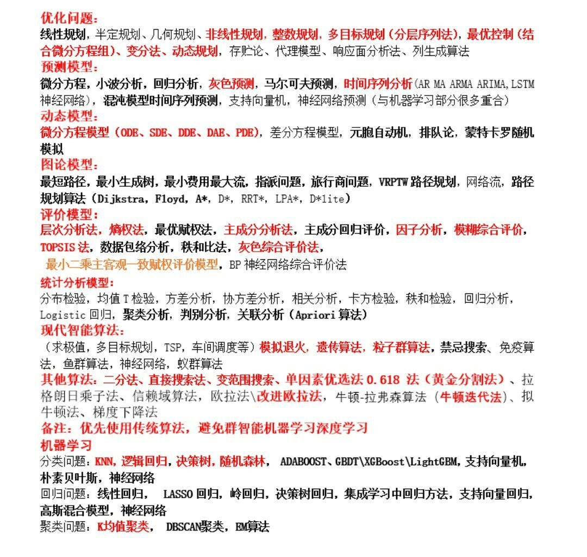

### 数模本质

学到的从来都不是模型，而是经验和段时间内的学习能力。

没有其他人的帮助下短时间内快速接触新东西然后掌握并写成论文的经历，因为正式比赛只有3天。

数模其实就是在短时间内结合一切方法解决实际问题，考验的是经验、学习能力而不是知识积累量。当然如果常见的模型熟悉一下是好的，但是能作为国赛/美赛赛题一般是不可能直接用传统经典模型直接求解的，都只能现学现卖。

### 论文注意事项

数模论文里尽量不要使用截图（可以自己整理出表格），不得不要使用截图的情况也要截取的信息清晰明了。而且每张图片都要有说明性文字。

还有文字字体、数学符号、数字中文阿拉伯数字等等都要整齐一点啊，复查的时候很折磨，看起来也不好看，观感不好。

还有一些东西要写详细一点（特别是数学公式），组员都看不懂的话很难继续进行工作，更别说让老师看懂了。

例如一条数学公式，符号和意义都没有解释，老师看了会砍死我们。

展示"部分"数据时，可以少几行数据，老师pdf文件看起来很费劲的。图像的图线、坐标轴、标题，表格的列头、行头、标题，不写是什么谁知道这是啥。

几乎所有数学公式都要用word插入公式功能或者latex直接编辑数学公式，而且是另起独立一行的，不然很容易混淆。

代码也可以找个在线代码高亮网站高亮一下。

这些要养成习惯呀，老师终究是看论文本身的。

### 数模论文目录结构

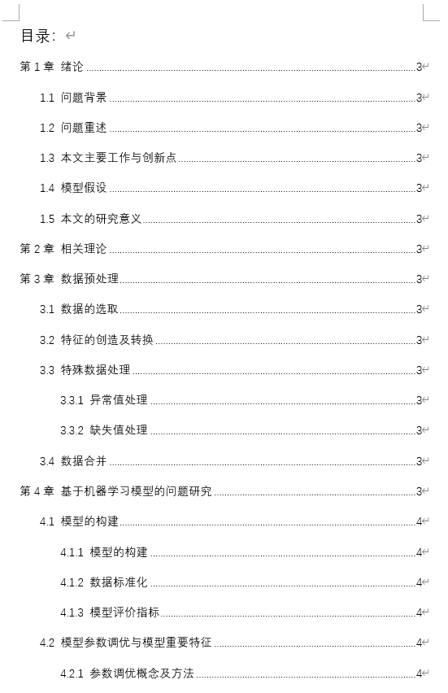

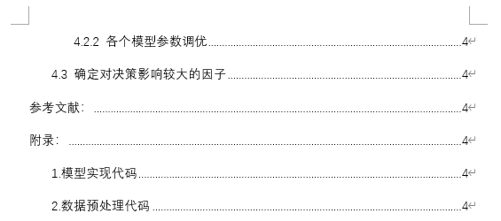

### 数模等级

1）一个问题用数学建模方法解决了。

2）一个问题，我知道有五种建模方法解决，我选择我认为最准确的方法解决（理解深刻）

3）竞赛题目，问题完全解决，论文表达清晰，排版格式漂亮（准备获奖）

4）竞赛题目，论文让专家爱不释手（获得全国一等奖）

5）竞赛题目，论文让外行专家点赞，评审专家特别点评（机会+机遇），获得高教杯！

## 问题与模型

### 负荷预测分析问题

题目本质上是==负荷预测问题==。常见的研究方法有：

经典：

- 时间序列分析

机器学习方法：

- 自动回归移动平均模型ARIMA
- 支持向量回归SVR（support vector regression）
- 随机森林算法
- 极限树算法
- 梯度提升回归GBR（gradient boosting regression）
- 极限学习机
- 人工神经网络ANN（artificial neural network）
- 循环神经网络RNN（recurrent neural network）
- 长短期记忆网络LSTM（long short-term memory）算法及其衍生或者组合算法

#### 题目具体背景

电力符合，又称"用电负荷"，是指发电厂、供电地区或电网在某一瞬间锁承担的工作负荷。对于用电用户来说则是所有用电设备在某一瞬间所消耗的功率之和。用电负荷的单位为千瓦（kW）。

负荷与电量的区别：负荷是电能损耗的指标，电量是消耗电能的数值（单位为千瓦时（kWh））。

***

短期为两周内，电网内部机组的启停、调度、运营计划指定。

中期为未来数月，保障企业生产、社会生活用电，和电网的运营与检修决策。

长期为未来数年，电网改造、扩建等计划的指定。

***

充分考虑历史的系统负荷、经济状况、气象条件和社会事件等因素，对未来一段事件的系统负荷做出预测。

气象条件：直接影响。

节假日：通常会有一定下降，但并非绝对。

社会事件：具体分析。

***

#### 题目具体问题

1．地区负荷的中短期预测分析 

根据附件中提供的某地区电网间隔 15 分钟的负荷数据，建立中短期负荷预测模型：

- （1）给出该地区电网未来 10 天间隔 15 分钟的负荷预测结果，并分析其预测精度；
- （2）给出该地区电网未来 3 个月日负荷的最大值和最小值预测结果，以及相应达到负荷最大值和最小值的时间，并分析其预测精度。

2．行业负荷的中期预测分析 

对不同行业的用电负荷进行中期预测分析，能够为电网运营与调度决策提供重要依据。特别是在新冠疫情、国家“双碳”目标等背景下，通过对大工业、非普工业、普通工业和商业等行业的用电负荷进行预测，有助于掌握各行业的生产和经营状况、复工复产和后续发展走势，进而指导和辅助行业的发展决策。请根据附件中提供的各行业每天用电负荷相关数据，建立数学模型研究下面问题：

- （1）挖掘分析各行业用电负荷突变的时间、量级和可能的原因。
- （2）给出该地区各行业未来 3 个月日负荷最大值和最小值的预测结果，并对其预测精度做出分析。
- （3）根据各行业的实际情况，研究国家“双碳”目标对各行业未来用电负荷可能产生的影响，并对相关行业提出有针对性的建议。

#### LSTM神经网络模型

循环神经网络（recurrent neural network，简写为RNN）是一类以序列数据为输入，在序列的演进方向进行递归且所有节点（循环单元）按链式连接的递归神经网络（recursive neural network）。

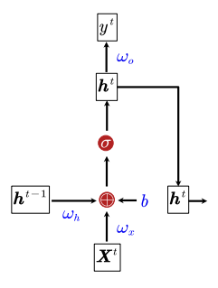

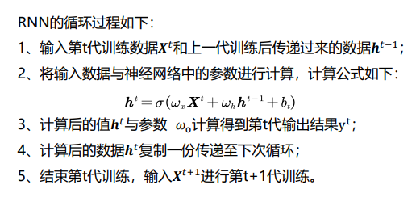

***

长短时记忆网络（Long Short-Term Memory，简写为LSTM）是一种改进的递归神经网络，它的基本单元中包含遗忘门（forget gate）、输入门（input gate）、和输出门（output gate）。（tanh函数是一个输出在$(-1,1)$的函数，sigmoid函数是一个输出在$(0,1)$的函数，$b$为对应神经元层的偏差）

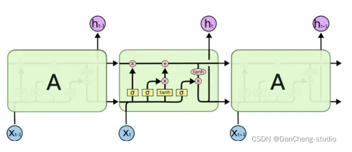

$X_t$是第t时刻新的输入数据，$C_t$是整个细胞第t时刻的细胞状态，$h_t$是第t时刻输出的结果。

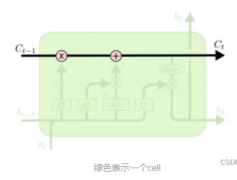

首先是细胞状态$C$，它只有一些简单的线性交互，很容易保持传递信息的不变。它与遗忘门和输入门的输出进行作用后，用于与当前时刻的输入$X_t$计算出当前时刻的最终输出$h_t$。

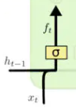

这是遗忘门，输入为上一时刻的输出结果$h_{t-1}$和当前时刻的输入$X_t$，函数为sigmoid函数。$f_t=\sigma(W_f \cdot [h_{t-1},X_t]+b_f)$。

遗忘门决定我们会从细胞状态$C$中丢弃什么信息。因此遗忘门的结果与细胞状态相乘。

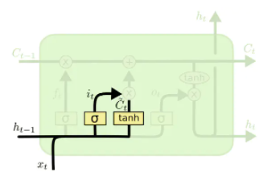

这是输入门，输入为上一时刻的输出结果$h_{t-1}$和当前时刻的输入$X_t$，函数为sigmoid和tanh函数。$i_t=\sigma(W_i \cdot [h_{t-1},X_t]+b_i)$，$\tilde{C_t}=tanh(W_C \cdot [h_{t-1},X_t]+b_C)$。

输入门决定我们让多少新的信息加入到细胞状态$C$中，sigmoid层决定哪些信息需要更新，tanh层得到备选的用来更新的内容。因此输入门的两个层的输出相乘后，作为输入门的结果与细胞状态相加。

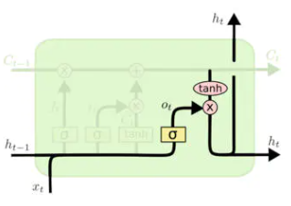

这是输出门，输入为上一时刻的输出结果$h_{t-1}$和当前时刻的输入$X_t$，函数为sigmoid和tanh函数。$o_t=\sigma(W_o \cdot [h_{t-1},X_t]+b_o)$，$h_t=o_t+tanh(C_t)$。

输出门决定我们基于细胞状态的细胞最终输出值，tanh层对细胞状态$C$进行处理，然后sigmoid层决定细胞状态的哪个部分将输出出去。因此细胞状态经过tanh层处理的结果与sigmoid层的结果相乘后，作为输出门的结果（细胞的最终输出）到外界或者下一时刻。

***

预测结果处理以及可视化：

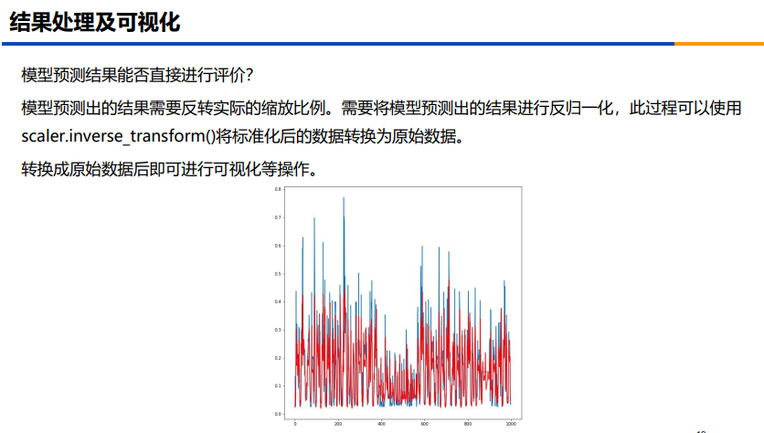

#### LSTM神经网络实现原理

进行机器学习时，一般都要涉及到划分训练集和测试集的步骤。特别地，在做数据预测时，一般把预测的依据（也就是历史数据）称作X，把需要预测的数据称为y。即首先把原始数据划分为train_X, train_y这两个训练数据集和test_X, test_y这两个测试数据集。

对于时间序列数据的预测，往往是建立由好几个历史数据预测下一时刻的未来数据，这时候为了充分利用全部数据，应该对原始数据集进行滑窗操作。因此使用一定时间段内的数据train_X作为特征，预测这个时间段的后端点的数据train_y。

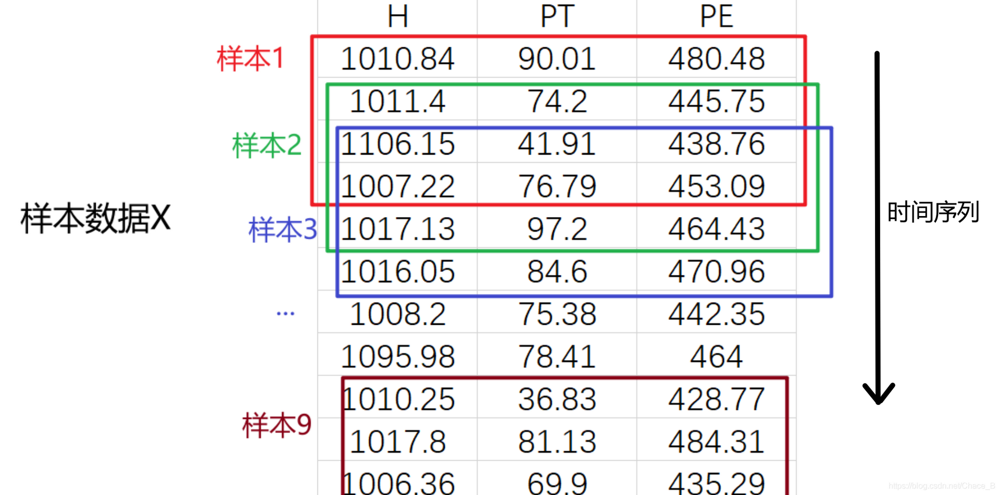

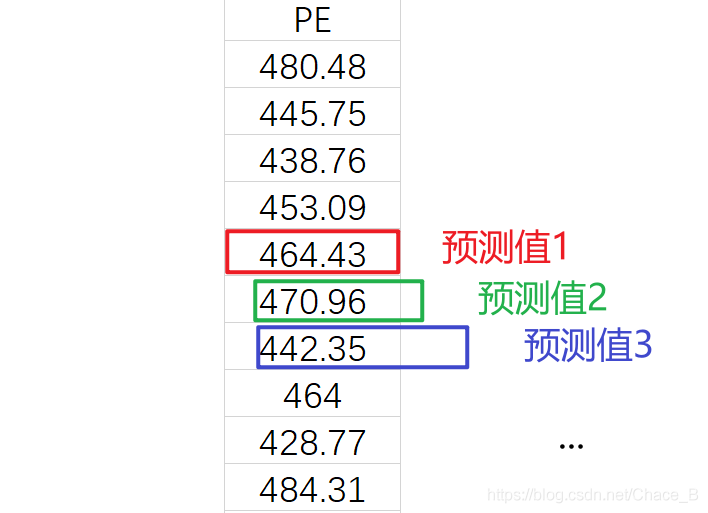

滑动窗口包含了多少个样本，实际上就是包含了多少个特征，而这个特征之中还包含了若干个小特征。小特征之间的相关性也能通过LSTM网络得到和作为最终预测值的权重。

***

#### 关于神经网络的其他概念

##### 超参数

超参数其实就是确定模型的一些参数，例如epoch训练次数，batchsize训练样本分割大小，等等。

win_size是LSTM滑动窗口选取的样本数，关系到训练量，batch_size是一次训练采用的数据组数量（越大训练越快，但瞬时内存占用更高，每一次训练后释放内存），epoch是训练的周期（关系到训练量，越多越好，每一次都是把lose降到最低为一个周期）。

***

##### 收敛

训练网络，就好比解方程，为了得到这个方程的极值点，训练的过程就好比是找准一个方向，不断的朝这个方向靠近，使得方程的值不断减小，最终达到极值点。

而不收敛，就是，不论你怎么跑，方程的解都不减小。即达不到最后的极值点。在loss上就表现为稳定性的比较大。跟迭代不收敛或者系统不稳定差不多，上下波动不能趋近一个定值。

***

可能原因：

网络不收敛直观体现是loss函数无法下降，本质上是网络或者训练方法有问题，包括bachsize尺寸，是否数据归一化，学习率设计，初始化权重等，这些都需要检查一下。

***

## 配置工具

### 数据在线分析与处理工具SPSSPRO

需要微信登录。

网址URL：https://www.spsspro.com/mydata/index

其入门指南也包含了众多算法的简单入门介绍。

### 附录代码高亮工具

之前的网址失效了。

网址URL：

### 在线画流程图工具

网址URL：https://www.processon.com/

### LINGO的使用

与MATLAB类似的定位的工具软件，可用于求解线性规划约束问题。

## 数学建模通用技巧

### 对问题的种类进行分析

得到问题，首先对问题进行归纳，找出问题的实质种类（可以通过上网搜索相类似的问题）。

先了解解决这一类问题使用的通常模型和算法，然后才开始探寻可以创新的点和模型组合的可能性。

### 示例数据和全部数据的意义（问题可能提供）

示例数据用于展示数据的特征大致拥有哪些（其实就是哪些是必须的）。示例数据也是测试集数据的标准。查找数据的时候需要拥有与示例数据的特征相对应的数据集。

示例数据可以用于测试模型的可靠性，但一般不参与模型的训练。某些时候，题目会给出全部数据，此时全部数据同时充当了训练和测试的数据集的作用。

训练用的数据集需要自己去网上查找，而示例数据提供了查找的数据的指标和标准。

### 数据处理方法和步骤

使用Excel打开数据集，如果是"###"的数据（一般是日期，比较长，无法完整显示），快速进行两次点击（双击），就可以使得整个文档恢复完整的数据显示了。

数据转换：将查找到的数据集转化为需要的数据的格式和类型。包括数据的细分度，数据文件的格式等。

缺失值处理：查找到的数据集一般是会有缺失的数据，尤其是涉及到大量或者大尺度数据的时候。一般是取当组数据的平均值。

数据可视化：查找到的数据集不一定需要进行可视化，但模型跑出来的数据一定需要可视化，并加进论文里面。

### 建模和算法创新思路

通用方法可能是大多数人都能想到的，但是数模竞赛需要的是创新点。那么，可以先用比较通用或者常用的方法先成功解决了问题，然后才去找使得结果更精确，或者考虑更多现实因素使得结果更贴合实际的方法。基本准则：考虑尽量多的因素，忽略不必要的因素。

同时，也可以选择多个方法解决问题，比较出最优的一个，或者结合不同方法得出更优的方法，也是创新的思路。

## 数据和论文来源

即使题目提供全部数据，也可以查找其他数据来验证建好的模型的鲁棒性，可以使得论文锦上添花。

虫部落是多个搜索引擎的集合，网址URL：https://www.chongbuluo.com/

### 通过网站进行查找

搜索引擎：可以使用必应国内版、必应国际版。国际（英语）数据和论文则谷歌学术更适合。

#### UCI Machine Learning Repository

UCI（Unclassified Controlled Information）为非机密管制信息的意思。

UCI Machine Learning Repository为UCI机器学习数据库，涵盖了许多可用于进行机器学习的训练集（data set）。

网址URL：https://archive-beta.ics.uci.edu/

***

#### 国家统计局官网

包含了权威的数据集。

网址URL：http://www.stats.gov.cn/

***

#### Our World in Data

包含了非常广泛的数据集。

网址URL：https://ourworldindata.org/

***

#### 学校EasyConnect提供的数据库

包含了多个学校购买的学术数据库，包括论文和数据集。

***

### 通过文献中的数据来源进行查找

如果用传统途径没有找到相关数据，那就开始查文献，文献中的数据来源清晰可靠，数据经过前人的使用，可靠性更强。

注意：查文献要查SCI，说白了就是要查高大上的文献，数据来源才靠谱。

### 通过爬虫或者类似的应用程序获取数据

#### 八爪鱼数据采集器

网址URL：https://www.bazhuayu.com/

有时候会发现，找到数据了，但是有许多限制，比如太乱，需要一个一个手动输入，或者需要翻页，无法提取出来或者太慢，此时就需要它了。

#### Sci-Hub网址或插件

根据文章代码，免费获得需要付费的论文（主要是国际上的）。

### 通过要求部分符合的数据进行人工捏造

例如需要个人的数据，则可以通过城市数据/人数来得到理论的近似数据，并进行润色。捏造不能凭空，必须有参考数据。（当然有符合要求的数据就不需要这么麻烦）

***
