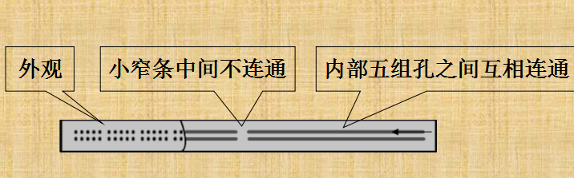

## 目录

  - 硬件（机械设计与自动化专业内容，购买硬件最好使用进口，国产质量不稳定）：
    - 什么是单片机？它与个人计算机有什么不同？
    - 为什么用单片机，如Arduino、STm32等等。
    - 电路板的字母和常见单词缩写，术语的解释：
      - 术语：
      - 电路板的单词字母：
        - 关于RX和TX：
      - 元件库：
      - 注意事项：
    - Arduino板子：
    - 电机驱动模块（电驱）：
    - 电源：
    - 电源测压报警器：
    - 电源充电器：
    - 红外（灰度）传感器：
    - 拓展板：
    - 舵机：
    - 模拟舵机：
    - 数字舵机：
    - PWM信号：
    - 占空比：
    - 舵机驱动模块/驱动板（舵机控制板）：
    - STM32开发板：
    - PCA9685：
    - 大电流驱动阵列（驱动板）：
    - 步进电机：
    - 直流电机：
    - （直流）减速电机：
    - 编码器：
      - 旋转编码器：
      - 编码器测速原理：
    - 面包板：
    - 电线：
    - 平衡充电器：
    - 稳压模块（单独模块）：
    - 电源模块：
    - 铜柱（螺柱）：
    - 螺丝：
    - 自锁螺母：
    - 自攻螺丝：
    - 轮子：
    - 万向轮：
    - 万用电表：
    - 开关（-o型）：
    - 电烙铁：
    - 热熔胶枪：
    - 舵机电调器：
    - 亚克力板：
    - 黑胶带：
    - 超声波：
    - 红外：
    - 光敏：
    - 陀螺仪：
    - 摄像头：
    - 电位器：
    - 黏土：
    - 模块元件底板：
    - 排针：
    - 洞洞板：
    - PWM（控制方法）：
  - 算法：
    - PID算法：
    - 停车
    - 循环
    - 补充说明：

## 硬件（机械设计与自动化专业内容，购买硬件最好使用进口，国产质量不稳定）：

### 什么是单片机？它与个人计算机有什么不同？

一台能够工作的计算机要有这样几个部份构成：中央处理单元CPU（进行运算、控制）、随机存储器RAM（数据存储）、存储器ROM（程序存储）、输入/输出设备I/O（串行口、并行输出口等）。在个人计算机（PC）上这些部份被分成若干块芯片，安装在一个被称之为主板的印刷线路板上。而在单片机中，这些部份全部被做到一块集成电路芯片中了，所以就称为单片（单芯片）机，而且有一些单片机中除了上述部份外，还集成了其它部份如模拟量/数字量转换（A/D）和数字量/模拟量转换（D/A）等。

### 为什么用单片机，如Arduino、STm32等等。

实际工作中并不是任何涉及计算和控制的场合都要求处理器或计算机有很高的性能，其应用的关键在于使用性能（是否够用）和经济性（是否有很好的性能价格比）。

### 电路板的字母和常见单词缩写，术语的解释：

#### 术语：

减速比（变比）：“电机转动多少圈”和“实际输出转动多少圈”的比值。减速比越大，则转矩越大，转速越慢。

空载电流：电机正常通电无负载时的电流，一般比额定电流小。以mA为单位。

空载转速：电机正常通电无负载时的转速，一般比额定转速大。以rpm为单位。（r/min或转/分钟，也就是每分钟转几圈）

额定转矩：电机的额定转矩。以Kg·cm为单位。（力矩的单位，为力量乘距离的固定总值，因此距离变化则力量也会变化）

负载力矩：电机负载测试时候的额定扭矩，仅用于测量参考。以g·cm 或者 Kg·cm为单位

额定转速：电机的额定转速。以rpm为单位。以rpm为单位。

负载转速：电机在负载力矩下的转速。以rpm为单位。

额定电流：电机的额定电流。以A为单位。

负载电流：电机在负载力矩下的电流。以mA或者A为单位。

最大转矩：电机的最大转矩。以Kg·cm为单位。

堵转力矩/启动力矩：电机所能承受的最大扭力标准，超过该扭力，电机将停转或堵转。以g·cm 或者 Kg·cm为单位

停转电流：电机的停转电流。随额定电压的变化而变化。以A为单位。

堵转电流/启动电流：电机遭到堵转停止时候的最大电流。以mA或者A为单位。

输出信号：编码器输出脉冲信号的种类。种类：方波、正弦波AB相

编码器精度：是指编码器旋转一圈单相（当前编码器有AB两相）输出的==脉冲数==。

注意：电机输入轴旋转一圈的同时，编码器旋转一圈，如果输出轴旋转一圈，那么编码器的旋转圈数和减速比一致（比如减速比是60，那么输出轴旋转一圈，编码器旋转60圈）。而编码器输出的脉冲数计算公式则是: 输出轴旋转一圈产生的脉冲数 = 减速比 * 编码器旋转一圈发送的脉冲数（比如:减速比为60，编码器旋转一圈输出13个脉冲，那么输出轴旋转一圈总共产生 13 * 60 也即780个脉冲）。

#### 电路板的单词字母：

~#：代表支持PWM输出的数字输入输出口，也就是仅增加了支持模拟输出的数字口，可以接入需要使用PWM控制的电子器件。PWM是在数字电路中达到模拟输出效果的一种手段。即：使用数字控制产生占空比不同的方波来控制模拟输出。我们要在数字电路中输出模拟信号，就可以使用PWM技术实现。同时，使用PWM口可以让PWM输出一直恒定输出（即使其他程序正在运行，这就像”设置“而不是”动作“），这时手动PWM调整高低电平做不到的。

～口：特殊之处在于，接入这个接口的时候，可以使用analogWrite(pin,value)函数。（value范围为0~255，255为100%占空比，当调用一次此函数后，引脚就会持续稳定地输出指定占空比的PWM方波，直到下一次对同一个引脚的新的调用来修改脉冲宽度的值，就会再持续输出新的脉冲宽度的PWM波。）

但是不能使用analogread()。（analogWrite和analogRead没有任何关系，他们虽然都属于模拟驱动函数，但是他们使用的技术不同，一个是PWM，一个是A/D转换。）

当value的值为0时（占空比为0），等价于持续输出低电平，当value值为255时（占空比为100%），等价于持续输出高电平。当value不是0也不是255时，是通过设置定时器/计数器的比较寄存器的值来完成的，可以看出PWM技术依赖单片机内部的Timer。

+：正极。

-：负极。

AO#（Analog IO Ports）：（第几个）模拟信号输出/输出口，有时也可用作数字IO端口。

DO#（Digital IO Ports）：（第几个）数字信号或者TTL信号输出口，有时根据厂家不同有其他定义，例如用作SD卡相关的接口，例如用作RX和TX线。

（C代表任意一个字母，一般由A开始）CO#：当#=1时，代表第C组的设备的正极。当#=2时，代表第C组的设备的负极。（这个比较特殊和少见，一般用VCC和GND）

（C代表任意一个字母，一般由A开始）B#C：当C=B时，代表第＃组的设备的霍尔脉冲输入A。当C=A时，代表第＃组的设备的霍尔脉冲输入B。

VIN：一般为正极，接入电源的正极。

VCC：一般为正极，接入电源的正极。

VDD：一般表示芯片工作电压。

VSS：一般表示电源低电位端。

VM：Vout=Vin接口，此接口电压等于输入电压。

GND：一般为负极，也就是接地端地线，接入电源的负极。

AGND：

CLK：一般为时钟信号。

CS：一般为片选信号。

#V：#伏的输入/输出口。

#V#：#.#伏的输入/输出口

M＋：电机供电线正极，接电驱的输出。

M -：电机供电线负极，接电驱的输出。

SIG：信号线接口。

BAT：

SYS：

SCL：i2c的通信用引脚，时钟线，接入任意的模拟接收口如A0

SDA：i2c的通信用引脚，信号线，接入任意的模拟接收口如A0

OE：反使能引脚，这个引脚低电平使能，不接的化模块内部默认已经接地使能了，所以正常使用可以不接。

PWM：PWM信号口，相当于"signal"信号线接口。

KEY：

IN#：第#组的外部信号输入。

OUT#：第#组的设备信号输出。

PORT#：第#个一般输入输出端口。

TX(D)/D1（有时）：串行TX线。TXD：Transmit Data。x表示交错连接，设备A与设备B通信，设备A的tx连接设备B的rx，设备A的rx连接设备B的tx。在连线图上，收发接口好像打了X一样。

RX(D)/D0（有时）：串行RX线。RXD：Receive Data。x表示交错连接，设备A与设备B通信，设备A的TX连接设备B的RX，设备A的RX连接设备B的TX。在连线图上，收发接口好像打了X一样。

G（GND）：设备负极。

V（VCC/V+）：设备正极，在Arduino拓展版上为5V。VCC为模块也就是主控芯片的正极，而V+一般是为连接的其他设备供电的正极。

S（Signal）：信号输出端口。

PWR（Power LED）：供电LED灯。

（C代表任意一个字母，一般由A开始）ENC：使能信号接口，为电机驱动板上的PWM信号调速接口，接入开发板的PWM输出口。

RESET（Arduino专有）：

AREF（Arduino专有）：Arduino ADC的模拟参考电压。

URF01（Arduino专有）：超声波/Ping接口。

#（开发板专有）：代表接口pin的序号。

##### 关于RX和TX：

对单片机与计算机或者芯片通信时，RXD与TXD如何连接比较困惑。因为在一些电路图中，有的是直连接法，有的是交叉接法，让人有点摸不着头脑。首先需要明白两个概念，就是DTE和DCE。DTE是指数据终端设备，典型的DTE就是计算机和单片机。DCE是指数据通信设备，典型的DCE就是MODEM。RS232串口标准中的RXD和TXD都是站在DTE立场上的，而不是DCE。明白了这一点，再讲下面的接线方法，就很好理解了。

单片机与计算机进行串口通信时，单片机的RXD接计算机的TXD，单片机的TXD接计算机的RXD。

（1）使用串口直通线。设计电路时，单片机的RXD连接电路板DB9的TXD，单片机的TXD连接电路板DB9的RXD，具体实现可在232电平转换芯片处反接。

（2）使用串口交叉线。设计电路时，因为串口线已做交叉，单片机的RXD连接电路板DB9的RXD，单片机的TXD连接电路板DB9的TXD，均直连即可。

这就可以解释为什么有的电路中使用直连接法，有的电路中使用交叉接法，就是因为使用的串口线不同。

单片机与串口设备（如GPRS模块、载波芯片等）通信时，一律将RXD与TXD反接，即单片机的RXD接设备的TXD，单片机的TXD接设备的RXD。（特殊标注其RXD与单片机RXD直连的除外，如华为的EM310)

#### 元件库：

R#：第#个电阻。

C#：第#个无极性电容，电源输入端抗干扰电容。

IC：集成电路模块。

U#：第#个IC，集成电路元件。

K#：第#个？？？，不同的厂商的元件库定义不同。

T#：第#个工厂测试用的测试点。

Spk#：第#个蜂鸣器，也就是喇叭。

Q#：第#个三极管，有时是场效应管，有时是晶体管。

J#：第#个Jack，也就是接口。比如Audio Jack就是音频插孔。

Y#：第#个晶振（一般为），不同的厂商的元件库定义不同。

D#：第#个二极管。

CE#：第#个电解电容。

CN#：第#个排容（好几个电容在一起）

RN#：第#个排阻（好几个电阻在一起）

CON#：第#个连接器。

H#：第#个孔。

JP#：第#个jumper。

L#：第#个电感/磁珠。

LED#：第#个发光二极管。

X#：第#个晶振。

FS#：第#个保险管。

RT#/RTH#：第#个热敏电阻。

ZD#：第#个稳压二极管。

T#：第#个变压器。

U#：第#个IC。

J#：第#个跳线。

VT  #：第#个三极管，有时是场效应管。

VR#：第#个可调电阻。

W#：第#个稳压管。

SW#：第#个开关。

K#：第#个开关类。

SCR#：第#个单向晶闸管。

TRIAC#：第#个双向晶闸管。

RP#：第#个电位器。

FUSE#：第#个保险管。

DB#：第#个整流桥。

M#：第#个电机。

（C代表任意一个字母，一般由A开始）C#1#2#3：C代表元器件种类，#1一般表示电路功能编号。#2一般代表电源电路等电路种类，这些不同厂家有不同规定和定义。有时#1#2#3就是一个编号，相当于#。

#### 注意事项：

1.电机的电压需要匹配，如果是直流电机需要确认电源的电流是否足够。

2.电机不可以超载使用。超载原因主要分为两部分，扭矩以及轴的受力。负载扭矩不可超过额定扭矩。轴的受力不可以超过轴的轴向及径向允许受力。而加了负载后电机电流不可以超过额定电流。一般电机使用需要配上保险丝避免过载。

3.电机轴上装配传动件如齿轮、皮带轮时，在压入时不要异常地敲打。

4.安装马达时，注意螺丝钉是否过长，杜绝过长螺丝压碰电机里面的零件。

### Arduino板子：

型号：使用UNO型号。（还有mega2560型号、Nano型号）

烧录口也可以供电，因此被接入电脑时会立刻加载旧烧录的程序，但是烧录时会停止，烧录后会按照新烧录的程序执行。

Arduino板子输出的稳压芯片上限为200mA，而每个引脚的电流上限为40mA，可以理解为Arduino的最大输出功率等于200mA*5V=1W。但是如果只是接入4个传感器是足够的。Arduino板子的输入的稳压芯片调节了外部电源，变成5v输入。然后再接电驱模块。

使用的传感器的输入需要是5V的数字或者模拟信号才行。

控制电机的程序是包含于主函数中的，控制开发板的程序只有一个。（之前所谓的分开是分开写，但是最终一定会合并）

事故：第一次烧坏时，我们采用传感器、电机以及编码器均走电驱的构造。 一开始电源就不是接的板子而是通过电驱的稳压器，电驱的接口旁边就是稳压芯片是非常小的（米粒大小），而稳压模块的有半个手指头大（传感器短路电流都无法烧毁），当时其实第一起因是传感器自己短路了，电流过大导致电驱的稳压芯片烧毁，此时因为电驱模块没有电流保险结构（比较便宜），因此从电源连电驱，电驱稳压后连板子（板子的后面供电口留给电脑调试，用到是前面的螺丝固定结构的正负口）和其他部件的这个结构，使电源的12v电压直接冲入Arduino板子以及板子的稳压器，电驱的控制芯片（稳压芯片已经烧毁），和传感器。电驱控制芯片当场烧毁，短路的传感器当场烧毁。板子的稳压芯片被烧毁（板子的稳压口接收的应当为5v电压），因此控制芯片也当场烧毁。

现在的改进方案：适用外部供电传感器以防止短路再次连带烧毁，使用专用的稳压模块进行稳压提高电流上限。 现在的接线：电源并联电驱模块和稳压模块，通过电驱模块的稳压器可以转化为多路5v给带编码器电机供电（目前电驱模块负载仅为两个电机，而原因是编码器电机的接口是扁形6pin，外接电源比较麻烦）。电源并联稳压模块，把12v转化为5v，输入Arduino板子中，通过Arduino板子的稳压器把5v转化为3.3v或者其他，为Arduino控制芯片，电驱控制芯片，传感器进行供电。板子负责把控制信号发给电驱模块而不需要供电。

因此，需要给传感器外部独立供电，电源多出一路给独立稳压模块，再接入传感器不走电驱板。这样避免了电流过大。电池一般有多路输出。

事故：鬼畜的电机是因为代码少打了一个负号,也正是因为这样gameday车没有停下来，导致失败了。

注意：负载过大，会造成各原件供电分配不均而乱动。同时，负载过大会有几率使烧录程序失败。（拔掉适量的负载即可）

### 电机驱动模块（电驱）：

型号：L298N（自己买，只能带两个直流减速电机，建议买带有稳压器版本，但芯片不足以支撑PID算法）、TB6612FNG（自己买，有编码器的电机使用，建议买带有稳压器版本，3.3伏更适合Arduino使用）

以芯片命名，板子和接口为第三方做，甚至可以自己做，因为Arduino的输出电流不足以直接驱动电机，需要通过电机驱动板放大电机控制信号。电机驱动板负责控制电流电压并控制电机，因此同时也会有变压模块，担当变压的功能。一般来说，应该会有过压保护（损坏不输出）。

### 电源：

型号：1500mAh，1.1V（自己买）

可反复充电的锂电池电源。

注意事项：

1.充电：需要使用具有平衡自停功能的充电器充电，3S电池（常用的）充满电压大约12.5V。

2.放电（使用）：3S电池总电压不低于10.8，过度放电将会导致电池损坏。

3.存储：锂电池不可以充满电存放，3S电池存放总电压保持11.6V左右

4.严禁使用尖锐物品碰撞电池，严禁坠落、冲击、弯折电芯，运输则应使用柔软包装物做好防护，以免引起火灾。

5.不可拆卸电池，有可能造成正负极短接引起火灾。

不同S数（电池组成员数）对应的电池的正常电压：

2S   7.4V   平衡口为3pin
3S   11.1V   平衡口为4pin
4S   14.8V   平衡口为5pin
5S   ??.?V   平衡口为6pin
6S   22.2V   平衡口为7pin

电量对应电压表（每个电池组成员）：

4.2V——100%
3.95V——75%
3.85V——50%
3.73V——25%
3.50V——5%
2.75V——0%

1.放电接口类型：

T头/XT60头：两个大pin的形式，一正一负。

2.放电接口类型：

普通针脚。

### 电源测压报警器：

可以测出电池组的每个单元的电压，设置报警闸值。通过显示No.x和All进行电池组的表示。

使用顶部的最小按钮进行调节报警的电压最小值，一般是3.6~3.7。存在低于该闸值的电压的电池组成员时就会报警。

刚插入时会有提示音，和报警相同的音量。没有手动的报警音键。

测试的针脚：负极,1s,2s,3s...正极，（此处的s是针脚的序号）需要测量的对象的针脚把黑色线最靠边的一个针脚（也就是负极）的最后一个对着负极，其他向正极排列即可。

### 电源充电器：

可复用锂电池专用充电线。

接口为普通的3pin针脚或者4pin针脚。

### 红外（灰度）传感器：

型号：TCRT5000红外传感器。

外形为小巧的带有一个灯的形状（发射红外线），安装在车上需要贴地距离足够高不能太低要分隔一定距离又不能太近，使用螺柱和螺丝固定。传感器上面的电位器可以调节灵敏度。循迹应当需要至少4个不然精度不够。

检测距离：1mm~8mm，焦点距离为2.5mm

输出（此器件工作期间，应只设为OUTPUT模式）：宽电压LM393比较器输出，超过15mA。输出形式为模拟输出（0~5V，电压的数值）或者数字输出（0和1，此处使用了TTL把模拟信号转变为了数字信号）

工作电压：3.3V~5V

调节方法：配有多圈可调精密电位器调节，使用旋转螺丝的方法调整。

TCRT5000接口注释：

A0：模拟信号输出（不同距离输出不同的电压，一般不接）

D0：TTL开关信号输出。TTL电平信号规定，+5V等价于逻辑“1”，0V等价于逻辑“0”(采用二进制来表示数据时)。因此同时允许模拟输出。

GND：负极

VCC：正极（接电源正极，3-5V）

### 拓展板：

型号：Uno R3 v5.0（自己买）

插在Arduino板子上进行全部接口的覆盖直插，对每个接口都有的全面拓展。

接口的类型与Arduino原板子不一样，有所拓展。

v5.0拓展版接口注释：

### 舵机：

型号：P0090、SG90 9g（常见，拥有180度模拟、90度模拟、360度模拟的）MG90S（更大力一点的9g舵机，有180度模拟、90度模拟、180度数字）

所有的舵机除特殊定制的外，都是由PWM进行控制的。硬件接口为ENB，舵机控制板输出的是PWM信号，所以可以控制90度和180度和360度舵机。

360度舵机是PWM控制它的旋转速度和旋转方向，500-1500us的PWM是控制正转，值越小则旋转速度越大。1500-2500us的PWM是控制它反转，值越大则旋转速度越大。1500us的PWM是控制它停止。（此处是以1500us为舵机PWM中位为例子来说明，需要自己实际测试）

360度舵机就是一个普通的直流电机加上一个电机驱动板的组合，所以它只能连续旋转而不能定位，也无法直到它的角度和圈数。（除非自己加装传感器）360度舵机可以360度旋转，因此与180度舵机有相当大的区别，首先360度舵机不能够控制旋转角度，一般的舵机是给一个特定的PWM，舵机会转到相应的角度，而360度舵机是只能够控制方向和旋转转速，所以360度舵机给定一个PWM，会以特定的速度和方向转动。

PWM信号与360舵机转速的关系：

0.5ms----------------正向最大转速。
1.5ms----------------速度为0。
2.5ms----------------反向最大转速。

180度舵机是PWM只控制它的旋转角度，500-2500us的PWM对应控制180度舵机的0-180度，是一一对应的，一个PWM值对应舵机的一个角度。

90度舵机是只能转动90度而中位固定于45度。使用舵机电调器可以正常运作。

我们通常说的9克舵机、55克舵机说的是“电机本身”的重量而不是扭力，相同克数的舵机的体积规格都是固定的。为什么会估计不够？因为每个克数的舵机都有一个扭力的范围。例如负责转动机械臂抓手的舵机可能会不够。

舵机在转不过去的时候会一直执行，使得抓住东西变为了可能。抓住的时候使用读舵机角度的函数，就可以实现测量角度，角度如果跟预设不一样就可以执行其他的动作，也就是说达成了间接反馈的效果。（实际上不行，read函数只能读到发送的指令角度而不是当前角度）

舵机的中位（也就是转动角度的中间位置）是固定不变的，但是装上去的舵机臂是可以变的啊。使用电调器设置好中位，然后再装上正对中位的位置即可。

电脑的电流带不动的时候（连接多个舵机），就会出现反复断开连接的情况（即使只是接入而不是操控）。

舵机供电5-7v，接受高一点的电压。大多数的舵机设计电压都是在5~6V，尤其在多个舵机同时运行时，跟需要有大功率的电源供电。如果直接使用Arduino5V引脚（几乎不能用作驱动）直接为舵机供电，会出现一些难以预测的问题。

转动原理：舵机内部有一个基准电压，微处理器产生的PWM信号通过信号线进入舵机产生直流偏置电压，与舵机内部的基准电压作比较，获得电压差输出。电压差的正负输出到电机驱动芯片上，从而决定正反转。当舵机开始旋转的时候，舵机内部通过级联减速齿轮带动电位器旋转，使得电压差为零，电机停止转动。

舵机是一种俗称，其实是一种伺服马达，SG90舵机是一个模拟舵机，而非数字舵机。数字舵机（Digital Servo）和模拟舵机（Analog Servo）在基本的机械结构方面是完全一样的，主要由马达、减速齿轮、控制电路等组成，这两者的区别是这样，数字舵机只要给一个PWM信号即可，这个信号是目的地的位置，舵机会自动旋转到这个位置，而模拟舵机需要一直给予目的角度的PWM信号，由于舵机需要的PWM信号实际就是一个方波，所以模拟舵机就是需要不断的重复发一样的方波，直到舵机旋转到指定的位置，并且如果需要锁定在这个位置，那么还需继续给予这个方波。

### 模拟舵机：

需要不断的发送目的地PWM信号，才能旋转到指定位置。例如：我现在让它旋转90度，我就需要不断的发送90度的PWM信号直到到达指定位置才能停止。我们使用的SG90就是一个模拟舵机。

### 数字舵机：

只需给一个目的地PWM信号，即可旋转到指定位置。例如：我现在让它旋转90度，我只需要发送一次90度的PWM信号，它就可以旋转到90度。

### PWM信号：

PWM，英文名Pulse Width Modulation，是脉冲宽度调制缩写，它是通过对一系列脉冲的宽度进行调制，等效出所需要的波形（包含形状以及幅值），对模拟信号电平进行数字编码，也就是说通过调节占空比的变化来调节信号、能量等的变化，占空比就是指在一个周期内，信号处于高电平的时间占据整个信号周期的百分比，例如方波的占空比就是50%。

### 占空比：

高电平（或者低电平）占整个周期的时间就叫作占空比。

### 舵机驱动模块/驱动板（舵机控制板）：

主控芯片型号：PCA9685、STM32系列

舵机控制板其实是拓展接口的板子（包括舵机数量和其他控制模块的拓展）和提供独立供电接口的板子（因为直接通过Arduino板子也可以供电和驱动）。

舵机驱动板是可选的，不用也可以，直接插正常的带~是模拟口即可。用Arduino类库驱动舵机并不是一件难事，如果需要驱动很多电机，就需要要占用更多的引脚，也会影响到Arduino的处理能力。专门的舵机驱动板很好的解决了这个问题。

### STM32开发板：

电源接口：外部电源接口（螺丝柱形）

通信接口有：USB（type-A）、TTL串口、蓝牙（需要另买蓝牙模块）。

舵机电源需为5-7.2V。TTL串口就是遵循TTL通信的串口，也就是针脚口。但是，其中的3.3V接开发板的正极，GND接开发板的负极，而RX和TX就是舵机控制板的自己的发送端和接收端，接开发板的RX和TX。（但是开发板上没有这两个串口？其实数字引脚0（RX）和1（TX）是Arduino Uno的串行引脚。串行通信发生在数字引脚0（RX）和1（TX）或拓展版的RX和TX口上以及USB上。）

### PCA9685：


16通道12bit的PWM舵机驱动，用2个引脚通过 I2C就可以驱动16个舵机。

可以看到PCA板子上有0到15的接口，但那不是对应Arduino板子上的。全部接口均为PWM口。但是不能使用Servo中的函数进行控制了，PWM控制只能定义脉冲宽度的大小来实现角度转动。

需要使用第三方头文件<Adafruit_PWMServoDriver.h>进行控制。SG90模拟电机使用电机驱动板如果超过了180度，模拟舵机会解除限制，会变成伪360度舵机，在复位时会突破180度实现快速的几圈不可控360度旋转，然后又旋转角度。因此要慎重调整角度。需要使用数字舵机来被PCA9865驱动。

4096代表的是16路PWM输出的每一路的分辨率为12bit。

舵机的控制一般需要一个20ms的时基脉冲（每个周期），该脉冲的高电平部分（每周期占空比）一般为0.5ms~2.5ms范围内的角度控制脉冲部分。以180度角度舵机为例，那么对应的控制关系是这样的：

0.5ms————–0度；
1.0ms————45度；
1.5ms————90度；
2.0ms———–135度；
2.5ms———–180度；

PCA9685可以设置更新频率，时基脉冲周期20ms相当于50HZ更新频率。PCA9685采用12位的寄存器来控制PWM占比，对于0.5ms，相当于0.5/20*4096=102的寄存器值。以此类推如下：

0.5ms————–0度：0.5/20*4096 = 102
1.0ms————45度：1/20*4096 = 204
1.5ms————90度：1.5/20*4096 = 306
2.0ms———–135度：2/20*4096 = 408
2.5ms———–180度：2.5/20*4096 =510

但是实际使用的时候，还是有偏差，除了0度以及180度，其他需要乘以0.915系数。最后的寄存器值如下：
0.5ms————–0度：0.5/204096 = 102
1.0ms————45度：1/204096 = 204 * 0.915 = 187
1.5ms————90度：1.5/204096 = 306 * 0.915 = 280
2.0ms———–135度：2/204096 = 408 * 0.915 = 373
2.5ms———–180度：2.5/20*4096 =510

经过测试，SG90的0度为102，180度为470，超过180度将会逆向复位360度，电流增大，容易烧毁。

在4096分辨率下，寄存器中代表占空比的最小脉冲长度计数为150，最大脉冲长度计数为600。

### 大电流驱动阵列（驱动板）：

型号：ULN2003（芯片）

ULN2003是大电流驱动阵列，多用于单片机、智能仪表、PLC、数字量输出卡等控制电路中，可直接驱动继电器等负载。可用于驱动直流和步进电机这种高压高电流的器件。

### 步进电机：

型号：

步进电机是一步一步移动的电机，有点像舵机，而且也可以当作舵机来用。

步进电机是一种将电脉冲转化为角位移的执行机构。通俗一点讲：当步进驱动器接收到一个脉冲信号，它就驱动步进电机按设定的方向转动一个固定的角度（即步进角）。

步进电机每次能转动的最小角度叫做步距角。

每当步进电机接收到一个驱动信号后，步进电机将按照一定的方向转动一个固定的角度。

通过控制脉冲的个数来精确的控制步进电机的角位移量，通过控制脉冲的频率来控制电机转动的速度及加速度，从而达到调速的目的。

步进电机按照相数不同分为单相、双相、多相三种，励磁方式分为1相励磁方式和2相励磁方式。（1相励磁方式每步是2倍的步距角）

由于Arduino开发板的通用IO驱动能力有限，有些外设不能直接使用IO进行驱动，需要借助一些驱动电路间接控制大功率器件。ULN2003是大电流驱动阵列，多用于单片机、智能仪表、PLC、数字量输出卡等控制电路中，可直接驱动继电器等负载。

步进电机（四相）需要2+4（4相）个接口来进行控制。与直流电机类似的，两个进行供电，其余四个分别为各4个相数，负责控制转动方向，转速和角度等信号的传输。对四个相的顺序高电平就可以使其转动（结合步进电机的原理）。每次相通高电平都会吸引步进电机的内部转轴（也就是转子）走1步，乘上减速比才是真正转动的角度。

下面依然以四相1相励磁步进电机为例子：

不使用<stepper.h>库，程序可以通过ABCD四相通高电平顺序实现步进电机正反转控制。

现有步进电机旋转一周，而程序中循环次数为512次。这应当根据我们使用的步进电机参数计算而来的：

步进电机电压5V，步距角5.625，减速比1：64

计算四个相A-B-C-D通电一次转动的角度：5.625*2*4 / 64=0.703125 (2是表示1相励磁方式每步是2倍的步距角，4表示走了4步， 64指电机减速比)

转动360度循环ABCD通电的次数360/0.7031=512

### 直流电机：

型号：GM25-370直流减速电机（自己买，最好带编码器）

带编码器才能进行可编码控制，不然不带的只能在间隔时间执行命令。不带编码器的直流电机不能测量转速和调速，只能决定转和不转，也就是只能用固定的数字信号控制。但是带编码器就可以测速和调整转速，可以使用数字信号（手动PWM，占空比）或者模拟信号（一直输出平均电压，自动PWM）控制。

直流电机使用模拟信号analogWrite来进行PWM调速，区间为[0,255]。通过高电平和低电平的持续时间（占空比）来控制电机运动的速度，也就是根据平均电压的多少。

通过电机驱动板，进行对电机的外部供电。

接口需要4+n个来进行控制。

通过两个个PWM信号串口（调整PWM值），对电机进行转速的调整。

通过两个数字输出串口的高低电平，对电机进行旋转方向的调整（H桥芯片）。它的控制原理是：当输入1是低，2是高，马达会向前转动，反之亦然，如果输入1高，2低，电机将反方向旋转。如果两个输入都相同，无论高低电平，电机都会停止。

ABZ相编码器需要三个串口（n=3），AB相编码器需要两个串口（n=2），一个A相，一个B相。但是如果没有编码器，就无法测量当前转速。还有A相（单相）编码器，只需要一个串口。(n=1）而且相数不一定要全部接上，两相也可以只接上其中一个，一相就是两种状态，两相四种状态。

根据所施加的电压和采用电机本身的不同，在较低的速度下，电机无法启动，并产生嗡嗡声。也就是说PWM值不能无限地低，不同的电机有启动最小PWM值。

编码器版本的GM25-370电机接口注释：

接线接口：XH2.54-6pin接口（兼容排线、杜邦线）

M-：电机供电线负极，接电驱的输出

5V：编码器供电接口5V，接电源的5V

A：编码器的A相脉冲输出，接单片机的脉冲检测接口

B：编码器的B相脉冲输出，接单片机的脉冲检测接口

GND：编码器的GND负极，接电源的GND负极

M＋：电机供电线正极，接电驱的输出

### （直流）减速电机：

型号：GA25-370（目前使用的）、JGA25-370（之前使用）

头部:减速箱。中间:电机主体。尾部:编码器。电机主体通过输入轴与减速箱相连接，通过减速箱的减速效果，最终外端的输出轴会按照比例(取决于减速箱减速比)降低电机输入轴的转速，当然速度降低之后，将提升电机的力矩。尾部是AB相霍尔编码器，通过AB编码器输出的波形图，可以判断电机的转向以及计算电机转速。

减速电机是减速机和电机的结合组件，主要参数：

额定扭矩:额定扭矩和机器人质量以及有效负荷相关，二者正比例相关，额定扭矩越大，可支持的机器人质量以及有效负荷越高；

减速比:电机输入轴与输出轴的减速比例，比如: 减速比为60，意味着电机主体旋转60圈，输出轴旋转1圈。

减速后转速:与减速比相关，是电机减速箱输出轴的转速，单位是 rpm(转/分)，减速后转速与减速前转速存在转换关系: 减速后转速 = 减速前转速 / 减速比。另外，可以根据官方给定的额定功率下的减速后转速结合车轮参数来确定小车最大速度。

### 编码器：

分为ABZ三相编码器和AB二相编码器和A单相编码器。编码器（encoder）是将信号（如比特流）或数据进行编制、转换为可用以通讯、传输和存储的信号形式的设备。编码器把角位移或直线位移转换成电信号，前者称为码盘，后者称为码尺。（对于电机测速来说应该需要将角位移转变为电信号，所以应该是码盘。）按照工作原理编码器可分为增量式和绝对式两类。

增量式编码器是将位移转换成周期性的电信号，再把这个电信号转变成计数脉冲，用脉冲的个数表示位移的大小。（淘宝上搜“带编码器的电机”大多是这种类型的编码器）

绝对式编码器的每一个位置对应一个确定的数字码，因此它的示值只与测量的起始和终止位置有关，而与测量的中间过程无关。

编码器精度：是指编码器旋转一圈单相（当前编码器有AB两相）输出的脉冲数。

编码器需要接入中断口（UNO中是2和3），以方便于进行中断测速。

#### 旋转编码器：

旋转编码器是一种光电式旋转测量装置，它将被测的角位移直接转换成数字信号（高速脉冲信号）。编码器如以信号原理来分，有增量型编码器，绝对型编码器。我们通常用的是增量型编码器，不同型号的旋转编码器，其输出脉冲的相数也不同，有的旋转编码器输出A、B、Z三相脉冲，有的只有A、B相两相，最简单的只有A相。测速时可以选择使用几个相，来节省使用的开发板接口数。

1.单A相联接，用于单方向计数，单方向测速。

2.A、B两相联接，用于正反向计数、判断正反向和测速。A脉冲为下降沿，B脉冲为高电平，方向为正。A脉冲为下降沿，B脉冲为低电平，方向为负。

3.A、B、Z三相联接，用于带参考位修正的位置测量。

#### 编码器测速原理：

测速原理：当电机转一圈之后就会输出相应的脉冲设为a，所以我们如果能计算单位时间里的总脉冲数设为x，那么x/a就是单位时间内转的圈数，即转速。所以我们如果我们想测电机的速度，只需要计算单位时间内的脉冲数，就可以计算转速了。

编码器如果转一圈是a个脉冲。但是电机外有个减速器，而且减速比是b，那么就是电机输出轴转1圈，输入轴就要转b圈。即电机输出轴转1圈，编码器就要输出```a*b```个脉冲。那么就是如果我们在单位时间t内测出一相有n个脉冲，那么转速```r=(n/t)/(a*b)```。其实上面的计算只用了一相。


本来一个脉冲是4个phase，用arduino计算是读取的==某一个状态的变化而不是脉冲==。所以4个phase时，只用一相的话我们只能读取1个脉冲（此时"变化数"恰好等于"脉冲数"）。但是如果我们把两相结合起来的话在4个phase中就有4个状态的变化（AB相时序图），也就是说如果结合两相我们读取的数值就是一相得4倍，N=4n（N为Arduino读取的"变化数"，而n为真正的"脉冲数"）。转速```r=[(N/t)/(a*b)]/4```。这就是所谓的软件4倍频功能，通过读取更多的数值可以减少误差。但其实测出的数值是一样的，算式不一样了而已。

### 面包板：

型号：MB-102

用于自由设定电路。

面包板的内部路线：





小行相通，大列相通，剩下使用电线连接。

### 电线：

杜邦线，也称面包线。两边的接口有分公母之分。公就是针形，母就是方形槽。

排线，是杜邦线进行粘合后并为一排的形式。一般红线、褐线、黄线连成的三排线是最常见的。红色为正极，黑色/褐色为负极，黄色线一般为（PWM）信号线（signal）。

### 平衡充电器：

集成了各种功能原件的有可视化的锂电池充电器，包括测量电压，放电等。

除此之外，还可以进行PWM、PPM的输出等功能。

### 稳压模块（单独模块）：

型号：未知。

变压器只能交流电，稳压器既可以变压也可以稳定电压，主要针对直流。稳压模块是Arduino套件中自带的，有个数字显示屏，可以显示当前输入的电压和输出的电压。

需要调节上方的旋钮来决定变压的多少，有时候是因为钮得不够而连负载的指示灯都不亮（电压不够），但是有电流而屏幕不显示电压是为什么？怎么让屏幕显示变压的数字？

### 电源模块：

型号：

其实是变压加分压器，输入一路12V可输出多路不同电压。（不是必须）

### 铜柱（螺柱）：

型号区分：

套件。

### 螺丝：

型号区分：

套件。

### 自锁螺母：

可以自己锁起来（只能向下拧大半个螺母的距离，到底后拧紧会有拧紧螺母的效果）的螺帽螺母。

### 自攻螺丝：

尾部是尖的螺丝。

### 轮子：

型号：6cm直径轮子（自己买）。

### 万向轮：

类似超市的，最好和轮子在同一个圆弧上以保持最好的转向效果。

### 万用电表：

测量电阻，电流，电压等。

打电阻：指的是用万能表测试电路板的各个通路的电阻，以此来确定哪个电路是连通板子，而哪个电路是连接外部电源。其实也可以接电路来进行测量。

### 开关（-o型）：

下面就是两个铁条线口以供焊起来，其实就是电路中的开关，左边的器件焊一边，右边的器件焊一边，打开开关内部电路就连同。等于物理开关。

### 电烙铁：

高温海绵要加水不然会烧起来。电烙铁的选择转轮上标识的数字是温度华氏度。

原理是用高温融化单质锡条，融化为液态会缠绕在电烙铁头上，然后置于需要焊接的地方冷却后就会凝固并加固。使用完后，需要用锡融化覆盖于电烙铁头均匀薄薄地一层覆盖，然后在高温海绵上蹭掉多余的锡冷却后去掉，只保留电烙铁表面一层，可以起到保护作用防止氧化。使用完后置于座位冷却五分钟。

电焊的高温区域其实是笔尖上方一厘米左右的侧面区域，而不是笔尖。经过熔化后的锡丝凝固后想要再次熔化就需要使用高温区域来进行重新加热，并熔化。

海绵和铁丝球是用来擦掉挂在烙铁头上的锡的。锡在烙铁头上挂着团成圆球，不是正常现象。一般来说，氧化不严重的烙铁头不会把锡带走挂在上面。

有氧化层（阻焊层）的器件也难以将锡涂上去。一般来说是无法涂上焊锡的，强行涂上去效果也会打折扣。

锡焊方法：

左手拿着锡丝，右手拿电焊器，锡丝怼到电焊头上就可以融化并缠绕电焊头。

一般把烙铁头放到想要点锡的地方，将锡丝凑上去一点（熔化），然后把烙铁头拿开，锡就会点在烙铁头原来的地方。

### 热熔胶枪：

用于融化胶条喷出热熔胶。热熔胶可以类似说于电烙铁。

### 舵机电调器：

型号：未知

调节方式：手动，自动，中位。

能够很方便的检测和设定伺服电机的虚位。旋转旋钮，即可检测舵机。可以用来测试舵机的。

如果连接电子调速器，即可摆脱遥控设备进行手动调速，用于测试调速器或者马达性能（不需要连接遥控器和接收机了）。电调器相当于一个“手动接收机”的功能，通过旋钮模拟发射机打舵。

在in处接入电源正负极（4.8-6V）然后在out处最多同时接入三个舵机，然后按下模式按钮选择模式：手动（man）：使用旋钮当作摇杆进行舵机旋转。中位（neutral）：让舵机固定在其中位，180度舵机就是90度处，90度舵机就是45度处。自动（Auto）：舵机自动进行最大角度的测试程序。也就是最大角度的来回摆动。

### 亚克力板：

只能定制。一般用作具有一定承重能力的小车底盘。

### 黑胶带：

用于吸收红外线以便于循迹。也可以用作绝缘胶带。

### 超声波：

### 红外：

### 光敏：

### 陀螺仪：

### 摄像头：

### 电位器：

型号：

类似于“摇杆”的东西，但是不是，是确定位置的。

即滑动变阻器，通过旋转、滑动触点，改变输出电压；

### 黏土：

用于暂时固定住电路板与亚克力板，套件好像有。

### 模块元件底板：

指的是固定的模块（例如单个蓝牙模块）再加上的一层板子。这层板子可以作为焊接排针的底座，可以作为对模块的保护。一般需要在模块两边的金属齿锡焊在底板上。购买时可以考虑加购。

### 排针：

可以看到一些固定的模块是有“几个圆孔”，这些圆孔和洞洞板的洞是相同的，不同的是它一般会作为排针的焊接位置。排针就是一个黑色底座伸出一排的直的或者弯的针脚（就像灰度传感器的排针），可以作为与开发板连接的桥梁，用作供电和信号传输。购买时可以考虑已经焊好排针的版本。

排针其实就是一根金属针，套着一个塑料框，使用焊锡也是一样的效果，因为只需要传电而已，逻辑使用板子上的电路实现。


这些针就是单纯的金属针，套上一个塑料外壳就是所谓的排针了。

### 洞洞板：

洞洞板就是全部都是空圆孔，本质上就是面包板的出去外壳的版本，可以自己通过锡焊进行连接自己构建电路。而一般的元器件的核心就在于电路板的电路和中央的主控核心，每个核心延伸的脚（具有对应的功能）都会通过电路连接到一个“洞”，这个洞可以自己选择焊上焊锡或者排针，一般的商家都会焊上排针。

pcb和洞洞板不同。要注意其实所有这些都是PCB和主控芯片的结合，而PCB电路由商家自己规划而已。因此会有相同主控不同的模块形状接口等，都是因为最核心只有主控芯片，其他可以自己再定义。

### PWM（控制方法）：

PWM，即脉冲宽度调制技术，它是一种允许我们通过调整进入电机的电压的平均值，通过高电平和低电平的持续时间来控制电机运动的技术。**平均电压取决于占空比**，即信号在一段时间内打开的时间与关闭的时间之比。（仅使用控制一段时间高低电平的比例的方法来决定输出的电压的平均值大小）

## 算法：

pwm是一种控制方法，是一种控制电机的方式，而PID是控制的算法，用来控制电机的速度的工具。但是也可以使用两个测量值进行PID，然后使用PID输出值转化为速度变化值，这就是将PID转换到决策层面。

### PID算法：

为了让电机转速在各种元素的干扰下趋近于你所想的预设值，PID才被运用以尽可能消去误差。

因为pid本质上是控制（一切可控原件的）误差的，电机转速不一样自然会调。

### 停车

停车程序，需要至少四个传感器，里面两个调轨寻迹，外面两个同时为黑则停车。

### 循环

通过在每一次命令最终根据条件设置不同的状态值（如0、1、2、3等）可以使得执行的命令和状态达到循环不出错的状态。

### 补充说明：

附带编码器的电机，编码器只是能够测速，所以可以使用软件层面实现伺服控制。普通硬件伺服电机都比较大（手掌大），因此不可以用作转轮的电机。

鲁棒性是音译，原单词为：robust，意为可靠的；健壮健强的。产品设计的原则：用户需要，可制造性，鲁棒性（可靠性强），绿色产品。

赛车转向不足-前轮抓地不足。（小车同理）

赛车转向过度-后轮抓地不足。（小车同理）