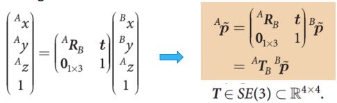
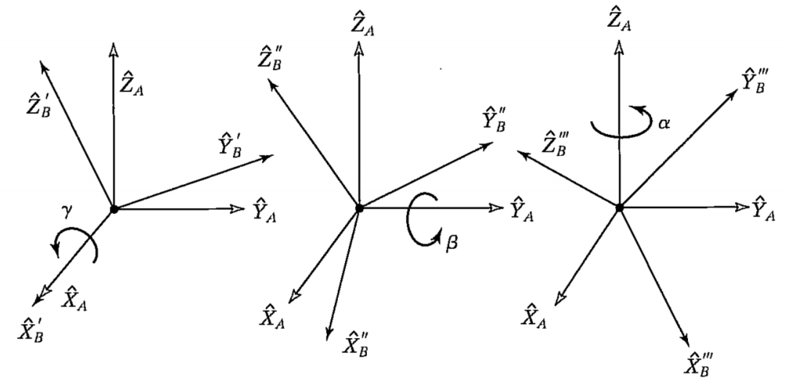
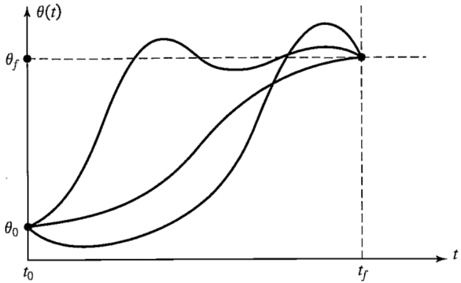
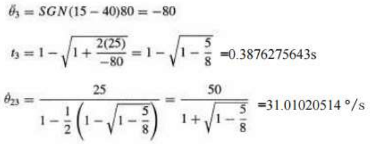
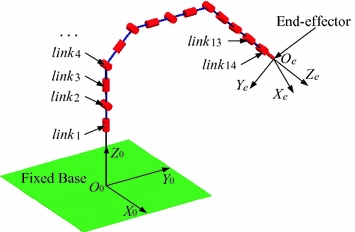
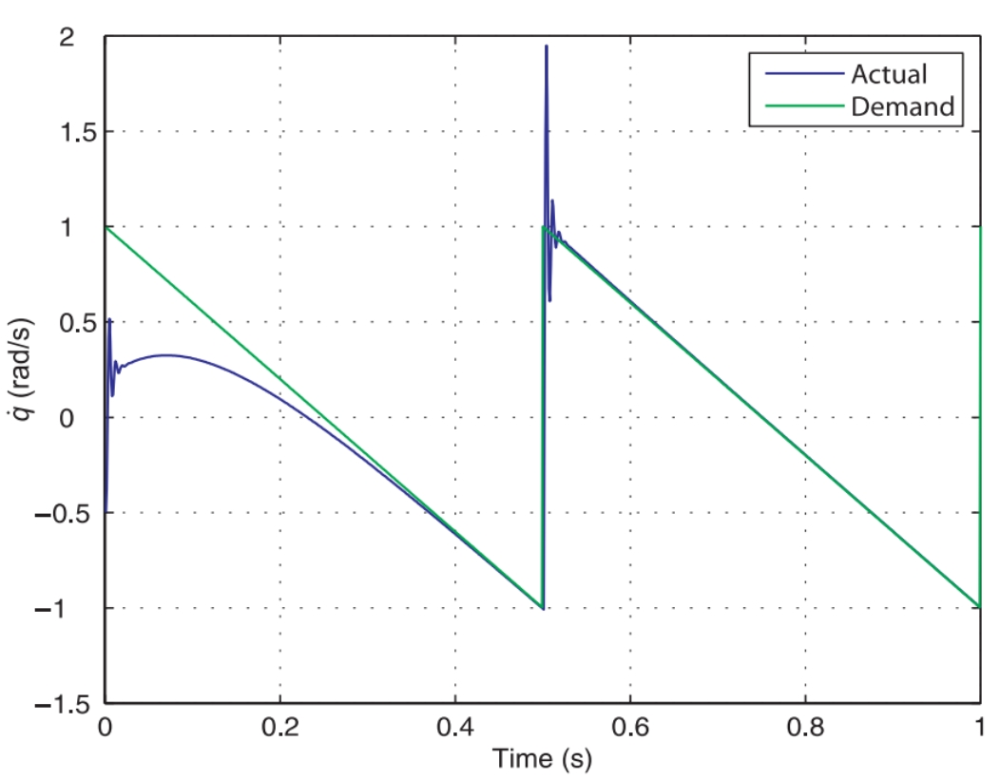
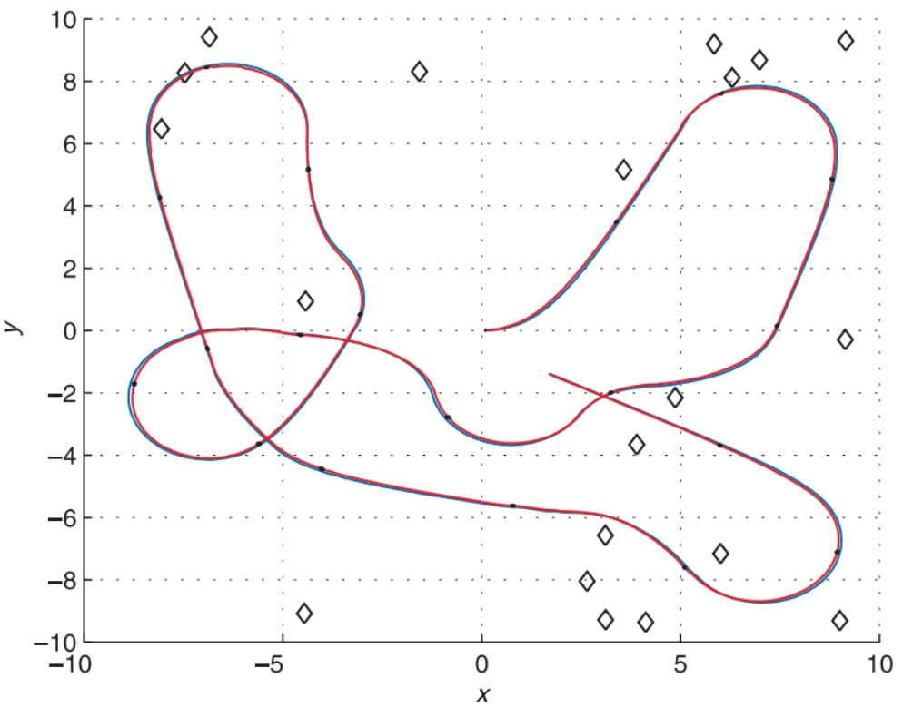

## 目录

  - 常见单词补充
  - 课程内容
    - Lecture 1
    - Lecture 2
    - Lecture 3
    - Lecture 4
      - Lecture 4 作业补充
    - Lecture 5
      - Lecture 5 作业补充
    - Lecture 6
      - Lecture 6 作业补充
    - Lecture 7
      - Lecture 7 作业补充
    - Lecture 8
    - Lecture 9

## 常见单词补充

kinematic   n.动力学/运动学/动理学

dynamic   n.动力学/力学

## 课程内容

### Lecture 1

工业机器人四大家族：

- ABB
- KUKA
- FANUC
- YASKAWA

数学（mathematics）工具：

- 线性代数。

### Lecture 2

位姿/姿态（pose）：

- 可以在坐标系中表示某一点。
- 可以在坐标系中表示某个对象（刚体）。
- 位姿同时也会获得对象（刚体）的自由度，包括位置的自由度和朝向的自由度。
- 位姿=位置（position）+朝向（orientation / attitude）。

相对位姿（relative pose）：

- 相对位姿${ }^A \xi_B$（相对旋转矩阵用$R$表示，相对位姿矩阵是用$\xi$或$T$表示）：描述B和A的关系的代数表达式，其为要使得用坐标系B表示的向量转化为用坐标系A表示的向量所需进行左乘的矩阵，此矩阵包含了从坐标系A转化为坐标系B所需要进行的旋转和平移的操作。
- 将点从一个坐标系表示变换到另一个坐标系表示：

$${ }^A \boldsymbol{p}={ }^A \xi_B \cdot{ }^B \boldsymbol{p}$$

- 相对位姿的加和（composition）方式：

$$\begin{aligned} & { }^A \xi_C={ }^A \xi_B \oplus{ }^B \xi_C \\ & { }^A \boldsymbol{p}=\left({ }^A \xi_B \oplus{ }^B \xi_C\right) \cdot{ }^C \boldsymbol{p}\end{aligned}$$

- 例题：

- 位姿的逆：

$$\begin{aligned} \xi_R & = { }^0 \xi_R \\ \xi_F \oplus{ }^F \xi_R & ={ }^0 \xi_R=\xi_R \\ \ominus \xi_F \oplus \xi_F \oplus{ }^F \xi_R & =\ominus \xi_F \oplus \xi_R \\ { }^F \xi_R & =\ominus \xi_F \oplus \xi_R\end{aligned}$$

- 位姿运算的基本规则：

二维空间中的位姿表示：

- 二维位姿：

$$\begin{aligned} & t^A=(x, y) \text { and } \theta \\ & { }^A \xi_B \sim(x, y, \theta)\end{aligned}$$

- 注意：分布在不同坐标系下表示的向量不能直接进行加和。

- 二维位姿-纯旋转（坐标系$V$到$B$）：

$${ }^V R_B \sim(0, 0, \theta)$$

$$\begin{aligned} \mathbf{P} & ={ }^T x \; \hat{\boldsymbol{x}}_T+{ }^T y \; \hat{\boldsymbol{y}}_T =\left(\begin{array}{ll}\hat{\boldsymbol{x}}_T & \hat{\boldsymbol{y}}_T\end{array}\right)\left(\begin{array}{l}{ }^T x \\ { }^T y\end{array}\right)\end{aligned}$$

$$\mathbf{P}={ }^V x \hat{\boldsymbol{x}}_{\boldsymbol{V}}+{ }^V y\hat{\boldsymbol{y}}_{\boldsymbol{V}}=\left[\begin{array}{ll}\hat{\boldsymbol{x}}_{\boldsymbol{V}} & \hat{\boldsymbol{y}}_{\boldsymbol{V}}\end{array}\right]\left[\begin{array}{l}{ }^V x \\ { }^V y\end{array}\right] \\ \quad ={ }^B x \hat{\boldsymbol{x}}_{\boldsymbol{B}}+{ }^B y \hat{\boldsymbol{y}}_{\boldsymbol{B}}=\left[\begin{array}{ll}\hat{\boldsymbol{x}}_{\boldsymbol{B}} & \hat{\boldsymbol{y}}_{\boldsymbol{B}}\end{array}\right]\left[\begin{array}{l}{ }^B x \\ { }^B y\end{array}\right]$$

- - $\hat{\boldsymbol{x}}_T,\hat{\boldsymbol{y}}_T$是坐标系$T$的单位向量。

- - 根据两个坐标系的单位向量组之间的关系得到表示两个坐标系的相对朝向的旋转矩阵${}^V R_B$：

$$\begin{aligned} & \hat{\boldsymbol{x}}_B=\cos \theta \hat{\boldsymbol{x}}_V+\sin \theta \hat{\boldsymbol{y}}_V \\ & \hat{\boldsymbol{y}}_B=-\sin \theta \hat{\boldsymbol{x}}_V+\cos \theta \hat{\boldsymbol{y}}_V\end{aligned}$$

$$\mathbf{P}=\left(\begin{array}{ll}\hat{\boldsymbol{x}}_V & \hat{\boldsymbol{y}}_V\end{array}\right)\left(\begin{array}{cc}\cos \theta & -\sin \theta \\ \sin \theta & \cos \theta\end{array}\right)\left(\begin{array}{l}{ }^B x \\ { }^B y\end{array}\right)$$

$$\left(\begin{array}{c}^V x \\ ^V y\end{array}\right)=\left(\begin{array}{cc}\cos \theta & -\sin \theta \\ \sin \theta & \cos \theta\end{array}\right)\left(\begin{array}{c}{ }^B x \\ { }^B y\end{array}\right)$$

$${ }^V \boldsymbol{p}=\left[\begin{array}{c}{ }^{V} x \\ { }^V y\end{array}\right] \quad{ }^B \boldsymbol{p}=\left[\begin{array}{c}{ }^B x \\ { }^B y\end{array}\right]$$

$${ }^{V} \boldsymbol{p}=\left[\begin{array}{cc}\cos \theta & -\sin \theta \\ \sin \theta & \cos \theta\end{array}\right] { }^{B} \boldsymbol{p}$$

$${}^V R_B=\left[\begin{array}{cc}\cos \theta & -\sin \theta \\ \sin \theta & \cos \theta\end{array}\right]$$

- 旋转矩阵${}^V R_B$的性质：
- - 正交（orthonormal / orthogonal）矩阵。每一列是一个单位向量，列之间是正交的。
- - 行列式（determinant）$det(R)=1$。
- - $R \in S O(2) \subset R^{2 \times 2}$，特殊正交群（Special Orthogonal group）（李群（Lie Group））。
- - 变换后矢量的长度不变：

$$\left\|{ }^V p\right\|=\left\|{ }^V R_B{ }^B p\right\|=\left\|{ }^B p\right\|$$

- - 转置矩阵恰好等于其逆矩阵：

$$R^T=R^{-1}$$

$$\left(\begin{array}{c}{ }^B x \\ { }^B y\end{array}\right)=\left({ }^V R_B\right)^{-1}\left(\begin{array}{c}{ }^V x \\ {}^V y\end{array}\right)=\left({ }^V R_B\right)^T\left(\begin{array}{c}{ }^V x \\ {}^V y\end{array}\right)={ }^B R_V\left(\begin{array}{c}{ }^V x \\ {}^V y\end{array}\right)$$

- 二维位姿-纯旋转加上平移（坐标系$A$到$V$，$V$到$B$）：

$${ }^A \xi_B \sim(x, y, \theta)$$

$${ }^{V} \boldsymbol{p}=\left(\begin{array}{c}^V x \\ ^V y\end{array}\right)=\left(\begin{array}{cc}\cos \theta & -\sin \theta \\ \sin \theta & \cos \theta\end{array}\right)\left(\begin{array}{l}{ }^B x \\ { }^B y\end{array}\right)$$

$$\begin{aligned}{ }^{A} \boldsymbol{p}=\left(\begin{array}{l}{ }^A x \\ { }^A y\end{array}\right) & =\left(\begin{array}{c}^V x \\ ^V y\end{array}\right)+\left(\begin{array}{l}x \\ y\end{array}\right) \\ & =\left(\begin{array}{cc}\cos \theta & -\sin \theta \\ \sin \theta & \cos \theta\end{array}\right)\left(\begin{array}{l}{ }^B x \\ { }^B y\end{array}\right)+\left(\begin{array}{l}x \\ y\end{array}\right) \\ & =\left(\begin{array}{ccc}\cos \theta & -\sin \theta & x \\ \sin \theta & \cos \theta & y\end{array}\right)\left(\begin{array}{c}^B x \\ ^B y \\ 1\end{array}\right)\end{aligned}$$

- - 有齐次向量${ }^A \tilde{p}$，将结果写成齐次形式：

$${ }^A \tilde{\boldsymbol{p}}=\left(\begin{array}{c}{ }^A x \\ { }^A y \\ 1\end{array}\right)=\left(\begin{array}{cc}{ }^A R_B & \boldsymbol{t} \\ \mathbf{0}_{1 \times 2} & 1\end{array}\right)\left(\begin{array}{c}{ }^B x \\ { }^B y \\ 1\end{array}\right)$$

$$\boldsymbol{t}=(x,y)$$

$${ }^A R_B={ }^V R_B$$

- 齐次变换${ }^A T_B$。$T \in S E(2) \subset R^{2 \times 2}$，特殊欧氏群（Special Euclidean group）（李群）：

$${ }^A T_B=\left[\begin{array}{cc}{ }^A R_B & t \\ 0_{1 \times 2} & 1\end{array}\right]$$

$$\xi(x, y, \theta) \sim\left(\begin{array}{ccc}\cos \theta & \sin \theta & x \\ -\sin \theta & \cos \theta & y \\ 0 & 0 & 1\end{array}\right)$$

- - 复合相对位姿：

- - 相同齐次变换：

- - 齐次变换的逆：

三维空间中的位姿表示：

$$\boldsymbol{P}=x \hat{\boldsymbol{x}}+y \hat{\boldsymbol{y}}+z \hat{\boldsymbol{z}}$$

- 旋转不是交换的（commutative）。

- 旋转矩阵${ }^A R_B$：通过对旋转坐标系相对于参考坐标系的关系进行表示的单位矢量（三个单位矢量对应旋转矩阵的三列，xyz的顺序为从左到右从上到下）而形成。

$$\begin{aligned} & { }^A R_B=\left[\begin{array}{lll}{ }^A \hat{x}_B & { }^A \hat{y}_B & { }^A \hat{z}_B\end{array}\right] \\ = & {\left[\begin{array}{lll}\hat{x}_B \cdot \hat{x}_A & \hat{y}_B \cdot \hat{x}_A & \hat{z}_B \cdot \hat{x}_A \\ \hat{x}_B \cdot \hat{y}_A & \hat{y}_B \cdot \hat{y}_A & \hat{z}_B \cdot \hat{y}_A \\ \hat{x}_B \cdot \hat{z}_A & \hat{y}_B \cdot \hat{z}_A & \hat{z}_B \cdot \hat{z}_A\end{array}\right] }\end{aligned}$$

$$\left(\begin{array}{c}{ }^A x \\ { }^A y \\ { }^A z\end{array}\right)={ }^A R_B\left(\begin{array}{c}{ }^B x \\ { }^B y \\ { }^B z\end{array}\right)$$

- ${ }^A R_B \in S O(3) \subset R^{3 \times 3}$，旋转矩阵的其他性质与二维空间的情况相同。

- 对于绕三条坐标轴分别进行旋转的情况，分别的旋转矩阵为：

$$\begin{aligned} & { }^A R_B=\left[\begin{array}{lll}{ }^A \hat{x}_B & { }^A \hat{y}_B & { }^A \hat{z}_B\end{array}\right] \\ = & {\left[\begin{array}{lll}\hat{x}_B \cdot \hat{x}_A & \hat{y}_B \cdot \hat{x}_A & \hat{z}_B \cdot \hat{x}_A \\ \hat{x}_B \cdot \hat{y}_A & \hat{y}_B \cdot \hat{y}_A & \hat{z}_B \cdot \hat{y}_A \\ \hat{x}_B \cdot \hat{z}_A & \hat{y}_B \cdot \hat{z}_A & \hat{z}_B \cdot \hat{z}_A\end{array}\right] }\end{aligned}$$

$${ }^B R_A=\left[\begin{array}{lll}{ }^B \hat{x}_A & { }^B \hat{y}_A & { }^B \hat{z}_A\end{array}\right]$$

映射（mapping）：

- 两个坐标系的相对位置关系。
- 结合平移和朝向，齐次变换矩阵：

- 复合相对位姿：

- 变换的逆：

另一种角度理解映射（仍然是旋转和平移的结合）：

- 两个点的相对位置关系。
- 平移一个点：

$${ }^A P_1=\left[\begin{array}{l}0.0 \\ 2.0 \\ 0.0\end{array}\right]$$

$$D_Q(q)=\left[\begin{array}{cccc}1 & 0 & 0 & q_x \\ 0 & 1 & 0 & q_y \\ 0 & 0 & 1 & q_z \\ 0 & 0 & 0 & 1\end{array}\right]$$

$$\begin{aligned} & { }^A P_2={ }^A P_1+{ }^A Q \\ & { }^A P_2=D_Q(q) \; { }^A P_1\end{aligned}$$

- 旋转一个点：

$${ }^A P_2=R_K(\theta){ }^A P_1$$

$$R_z(\Theta)=\left[\begin{array}{cccc}\cos \theta & -\sin \theta & 0 & 0 \\ \sin \theta & \cos \theta & 0 & 0 \\ 0 & 0 & 1 & 0 \\ 0 & 0 & 0 & 1\end{array}\right]$$

朝向的三角表示：

- 两轴类型：XYX，XZX，YXY，YZY，ZXZ，ZYZ。
- 三轴类型：XYZ，XZY，YZX，YXZ，ZXY，ZYX。
- 对于每个序列，有固定轴角（fixed-axis angle）（X-Y-Z）和移动轴角（moving-axis angle）（Z-Y-X）两种表示方式选用。固定轴角是每次旋转都是绕未开始旋转的原坐标系的三轴来旋转，移动轴角是每次旋转需要从上一次旋转完得到的新坐标系的三轴来旋转。三次绕固定坐标轴旋转的最终姿态和以相反顺序的三次绕移动坐标轴旋转的最终姿态是相同的（例如如果想要获得最终姿态相同的绕固定坐标轴的步骤和绕移动坐标轴的步骤，绕固定坐标轴如果先从固定$X$轴旋转$\gamma$角度然后从固定$Y$轴旋转$\beta$角度最后从固定$Z$轴旋转$\alpha$角度，那么绕移动坐标轴需要先从移动$Z$轴旋转$\alpha$角度然后从移动$Y$轴旋转$\beta$角度最后从移动$X$轴转$\gamma$角度）。两种表示方式下，同样的旋转方式，旋转矩阵的表示相反，这是因为旋转矩阵进行的操作本质上遵循的是就移动轴角的方式（因此旋转矩阵的乘法顺序不同会影响最终的姿态），因此只能是从移动轴角的旋转顺序来得到旋转矩阵的乘法顺序，固定轴角的旋转顺序需要先转化为移动轴角的旋转顺序，才能获得旋转矩阵。
- - 固定轴角：对于$Z,Y,X$，一一对应的角为$\alpha,\beta,\gamma$。
- - 移动轴角（欧拉角）：对于$X,Y,Z$，一一对应的角为$\alpha,\beta,\gamma$。
- - 矩阵中的$c$代表cos，$s$代表sin。
- Z-Y'-X''移动轴角表示：

$$R=R_{\mathrm{z}}\left(\theta_y\right) R_{\mathrm{y}}\left(\theta_p\right) R_{\mathrm{x}}\left(\theta_r\right)$$

$$\begin{aligned} R_{Z^{\prime} Y^{\prime} X^{\prime}}(\alpha,\beta,\gamma)=R_{\mathrm{z}}(\alpha) R_{\mathrm{y}}(\beta) R_{\mathrm{x}}(\gamma) & =\left[\begin{array}{ccc}c \alpha & -s \alpha & 0 \\ s \alpha & c \alpha & 0 \\ 0 & 0 & 1\end{array}\right]\left[\begin{array}{ccc}c \beta & 0 & s \beta \\ 0 & 1 & 0 \\ -s \beta & 0 & c \beta\end{array}\right]\left[\begin{array}{ccc}1 & 0 & 0 \\ 0 & c \gamma & -s \gamma \\ 0 & s \gamma & c \gamma\end{array}\right] \\ & =\left[\begin{array}{ccc}c \alpha c \beta & c \alpha s \beta s \gamma-s \alpha c \gamma & c \alpha s \beta c \gamma+s \alpha s \gamma \\ s \alpha c \beta & s \alpha s \beta s \gamma+c \alpha c \gamma & s \alpha s \beta c \gamma-c \alpha s \gamma \\ -s \beta & c \beta s \gamma & c \beta c \gamma\end{array}\right]\end{aligned}$$

- - 更多旋转顺序（不是全部）：

- X-Y-Z固定轴角表示：

$$R=R_{\mathrm{z}}\left(\theta_y\right) R_{\mathrm{y}}\left(\theta_p\right) R_{\mathrm{x}}\left(\theta_r\right)$$

$$\begin{aligned} R_{X Y Z}(\gamma,\beta,\alpha)=R_{\mathrm{z}}(\alpha) R_{\mathrm{y}}(\beta) R_{\mathrm{x}}(\gamma) & =\left[\begin{array}{ccc}c \alpha & -s \alpha & 0 \\ s \alpha & c \alpha & 0 \\ 0 & 0 & 1\end{array}\right]\left[\begin{array}{ccc}c \beta & 0 & s \beta \\ 0 & 1 & 0 \\ -s \beta & 0 & c \beta\end{array}\right]\left[\begin{array}{ccc}1 & 0 & 0 \\ 0 & c \gamma & -s \gamma \\ 0 & s \gamma & c \gamma\end{array}\right] \\ & =\left[\begin{array}{ccc}c \alpha c \beta & c \alpha s \beta s \gamma-s \alpha c \gamma & c \alpha s \beta c \gamma+s \alpha s \gamma \\ s \alpha c \beta & s \alpha s \beta s \gamma+c \alpha c \gamma & s \alpha s \beta c \gamma-c \alpha s \gamma \\ -s \beta & c \beta s \gamma & c \beta c \gamma\end{array}\right]\end{aligned}$$

- - 更多旋转顺序（不是全部）：

欧拉角中的奇异性（singularity）：

- ZYZ序列常用于航空和机械动力学。

$$R=R_z(\phi) R_y(\theta) R_z(\psi)$$

- - 当$\theta=k \pi$时，满足奇异性。
- - 当$\theta=0$时：

- ZYX序列常用于船舶和飞机。

$$R=R_z\left(\theta_y\right) R_y\left(\theta_p\right) R_x\left(\theta_r\right)$$

- - 当$\theta_p=\pm(2k+1)\frac{\pi}{2}$时，满足奇异性。
- 万向锁，例子：

- 欧拉角表示的问题：
- - 必须限制的范围$\theta$以便在旋转矩阵和欧拉角之间有一对一的映射。
- - 奇异性问题（万向锁）：单个角度无法确定，而只能确定其总和。

两向量表示法：

- 任意两个向量不平行。

$$\hat{\boldsymbol{a}}=\left(a_x, a_y, a_z\right) \quad \hat{\boldsymbol{o}}=\left(o_x, o_y, o_z\right) \quad \hat{\boldsymbol{n}}=\hat{\boldsymbol{o}} \times \hat{\boldsymbol{a}}$$

$$\boldsymbol{R}=\left(\begin{array}{lll}n_x & o_x & a_x \\ n_y & o_y & a_y \\ n_z & o_z & a_z\end{array}\right)$$

等效角轴（equivalent angle-axis）（也可以称为旋转轴和旋转角，或者轴角，或者角轴）：

- 角轴表示法：
- - 两个坐标系的各自方向可以通过以绕某个轴的单次旋转来表示这两个方向的联系。
- - 坐标系$B$的描述：从坐标系$A$开始，对坐标系$B$根据右手法则地以角度$\theta$围绕向量${ }^A \hat{K}$（有时表示为$\hat{K}$）进行旋转，即可得到坐标系$B$。
- - 等效角轴表示法：单位向量${ }^A \hat{K}$称为等效旋转轴（equlvalent axis of rotation），它是在坐标轴$A$中表示的，表示为$<k_x,k_y,k_z>$，满足$k_x^2+k_y^2+k_z^2=1$。坐标轴$B$相对于坐标轴$A$的角轴的旋转矩阵（不包含平移）写成${ }^A R_B (\hat{K},\theta)$或者$R_{\hat{K}}(\theta)$。

- 将角轴转化为旋转矩阵：

$$v\theta=1-\cos \theta$$

$$R_{\hat{K}}(\theta)=\left[\begin{array}{ccc}k_x k_x v \theta+c \theta & k_x k_y v \theta-k_z s \theta & k_x k_z v \theta+k_y s \theta \\ k_x k_y v \theta+k_z s \theta & k_y k_y v \theta+c \theta & k_y k_z v \theta-k_x s \theta \\ k_x k_z v \theta-k_y s \theta & k_y k_z v \theta+k_x s \theta & k_z k_z v \theta+c \theta\end{array}\right]$$

- - 通过罗德里格斯公式（Rodrigues’ Formula）将角轴转化为旋转矩阵的具体过程：

$$R_{\hat{K}}(\theta)=\boldsymbol{I}_3+\sin \theta S(\hat{K})+(1-\cos \theta)\left(\hat{K} \hat{K}^{\mathrm{T}}-\boldsymbol{I}_3\right)$$

$$S(\hat{A})=\text{Skew} \left(\left[\begin{array}{l}a_x \\ a_y \\ a_z\end{array}\right]\right)=\left[\begin{array}{ccc}0 & -a_z & a_y \\ a_z & 0 & -a_x \\ -a_y & a_x & 0\end{array}\right]$$

$$S(\hat{A})+S(\hat{A})^T=0$$

- 将旋转矩阵转化为角轴：

- - 通过$r_{nm}$代表旋转矩阵中的值：

$${ }_B^A R_K(\theta)=\left[\begin{array}{lll}r_{11} & r_{12} & r_{13} \\ r_{21} & r_{22} & r_{23} \\ r_{31} & r_{32} & r_{33}\end{array}\right]$$

- - 确定旋转角：

$$\theta=A \cos \left(\frac{r_{11}+r_{22}+r_{33}-1}{2}\right)=arc \cos \left(\frac{r_{11}+r_{22}+r_{33}-1}{2}\right)$$

- - 确定旋转轴：

$$\hat{K}=\left[\begin{array}{l}k_x \\ k_y \\ k_z\end{array}\right]=\frac{1}{2 \sin \theta}\left[\begin{array}{l}r_{32}-r_{23} \\ r_{13}-r_{31} \\ r_{21}-r_{12}\end{array}\right]$$

- 等效角轴表示法特点：
- - 正交旋转矩阵具有一个实特征值$\lambda=1$和一对复特征值$\lambda=\cos\theta\pm i \sin\theta$（$\theta$为旋转角度）。
- - 特征值和特征向量的定义复习：若$\lambda$为特征值，$R \hat{K}=\lambda \hat{K}$。
- - 特征向量$\hat{K}$是对应于特征值$\lambda=1$的旋转轴。
- - 旋转轴向量$\hat{K}$在原始坐标系和旋转后坐标系中的表示相同：${ }^A \hat{K}={ }^B \hat{K}$。
- - 冗余：4个值和1个约束（旋转轴为单位向量），3个独立参数。

单位四元数（unit quaternion）：

- 单元四元数：

- - 四元数是复数的扩展：超复数（hyper complex number）。四元数是单位向量，具有1个实部和3个虚部。

- - 角轴转化为四元数：

$$s=\cos \frac{\theta}{2}, \quad \boldsymbol{v}=\left(\sin \frac{\theta}{2}\right) \hat{K}$$

$$v_1=\epsilon_1=k_x sin \frac{\theta}{2},v_2=\epsilon_2=k_y sin \frac{\theta}{2},v_3=\epsilon_3=k_z sin \frac{\theta}{2},s=\epsilon_4=cos \frac{\theta}{2}$$

- - 冗余：4个值和1个约束（四项统一）。
- - 四元数的乘积和逆：

- 四元数转化为旋转矩阵：

$$q =\epsilon_4,\left\langle\epsilon_1, \epsilon_2, \epsilon_3\right\rangle$$

$$\begin{aligned} R_\epsilon & =\left[\begin{array}{lll}1-2 \epsilon_2^2-2 \epsilon_3^2 & 2\left(\epsilon_1 \epsilon_2-\epsilon_3 \epsilon_4\right) & 2\left(\epsilon_1 \epsilon_3+\epsilon_2 \epsilon_4\right) \\ 2\left(\epsilon_1 \epsilon_2+\epsilon_3 \epsilon_4\right) & 1-2 \epsilon_1^2-2 \epsilon_3^2 & 2\left(\epsilon_2 \epsilon_3-\epsilon_1 \epsilon_4\right) \\ 2\left(\epsilon_1 \epsilon_3-\epsilon_2 \epsilon_4\right) & 2\left(\epsilon_2 \epsilon_3+\epsilon_1 \epsilon_4\right) & 1-2 \epsilon_1^2-2 \epsilon_2^2\end{array}\right]\end{aligned}$$

- 旋转矩阵转化为四元数：

$$\begin{aligned} & \epsilon_1=\frac{r_{32}-r_{23}}{4 \epsilon_4} \\ & \epsilon_2=\frac{r_{13}-r_{31}}{4 \epsilon_4} \\ & \epsilon_3=\frac{r_{21}-r_{12}}{4 \epsilon_4} \\ & \epsilon_4=\frac{1}{2} \sqrt{1+r_{11}+r_{22}+r_{33}}\end{aligned}$$

### Lecture 3

轨迹（trajectory）：

- 轨迹：每个自由度的位置、速度和加速度的时间历程。位置、速度和加速度的轮廓。
- 轨迹的三大问题：
- - 轨迹规划（planning）：指定穿过空间的轨迹。
- - 轨迹表示（representation）：如何在计算机中表示轨迹。
- - 轨迹生成（generation）：在运行时计算轨迹（以一定的路径更新率）。

轨迹规划：

- 对操纵器（manipulator）工具框架（tool frame）从初始位置$T_{initial}$到期望的最终位置$T_{final}$进行路径设置，包括位置和朝向。
- 过孔点/路点（via point / waypoint）：初始位置和最终位置之间的中间点。
- 路径点：初始点+过孔点+最终点。
- 空间约束（spatial constraints）：规划的轨迹必须经过路径点。
- 时间约束（temporal constraints）：指定过孔点之间经过的时间。
- 一般要求：
- - 平滑（相对于时间）：路径函数是连续的，其一阶（二阶）时间导数也是连续的。
- - 满足约束的轨迹不唯一。
- 关节空间（joint space）：使用操纵器的关节角度来描述轨迹。
- - 步骤1：笛卡尔空间中的每个路径点都可以通过反向运动学转换为一组关节角度（关节空间位置）。
- - 步骤2：为通过过孔点并终止于目标点的$n$个关节的每个关节得到一个平滑函数。
- - 每个节段（segment）的持续时间对于每个关节都是相同的，因此所有节点都同时到达过孔点，从而在每个过孔点产生所需的笛卡尔空间位置。
- - 除了过孔点之间的持续时间外，每个关节的轨迹规划是独立的。
- - 过孔点之间的路径形状在关节空间中很简单，但在笛卡尔空间中很复杂。

三次轨迹（cubic trajectory）：

- 约束条件：初始位置$\theta(0)$和最终位置$\theta(t_f)$：
- - 任何经过这两点的轨迹都是有效的。
- - 线性轨迹（一阶多项式）是最简单的。
- 约束要求：初始位置$\theta(0)$和最终位置$\theta(t_f)$，初始速度$\dot{\theta}(0)$和最终速度$\dot{\theta}(t_f)$：

$$\begin{aligned} \theta(0) & =\theta_0, & \dot{\theta}(0) & =0, \\ \theta\left(t_f\right) & =\theta_f . & \dot{\theta}\left(t_f\right) & =0 .\end{aligned}$$

- - 这四个约束可以通过至少三次的多项式来满足：

$$\theta(t)=a_0+a_1 t+a_2 t^2+a_3 t^3$$

- - 速度和加速度：

$$\begin{aligned} & \dot{\theta}(t)=a_1+2 a_2 t+3 a_3 t^2 \\ & \ddot{\theta}(t)=2 a_2+6 a_3 t .\end{aligned}$$

- - 约束条件形成了四个未知数的四个方程：

$$\begin{aligned} \theta_0 & =a_0 \\ \theta_f & =a_0+a_1 t_f+a_2 t_f^2+a_3 t_f^3 \\ 0 & =a_1 \\ 0 & =a_1+2 a_2 t_f+3 a_3 t_f^2\end{aligned}$$

$$\begin{aligned} & a_0=\theta_0 \\ & a_1=0 \\ & a_2=\frac{3}{t_f^2}\left(\theta_f-\theta_0\right) \\ & a_3=-\frac{2}{t_f^3}\left(\theta_f-\theta_0\right)\end{aligned}$$

- 例题：

- 约束条件：初始位置$\theta(0)$和最终位置$\theta(t_f)$，初始速度$\dot{\theta}(0)$和最终速度$\dot{\theta}(t_f)$，具有过孔点：

$$\begin{aligned} \theta(0) & =\theta_0, & \dot{\theta}(0) & =\dot{\theta}_0, \\ \theta\left(t_f\right) & =\theta_f . & \dot{\theta}\left(t_f\right) & =\dot{\theta}_f .\end{aligned}$$

- - 约束条件形成了四个未知数的四个方程：

$$\begin{aligned} & \theta_0=a_0, \\ & \theta_f=a_0+a_1 t_f+a_2 t_f^2+a_3 t_f^3, \\ & \dot{\theta}_0=a_1, \\ & \dot{\theta}_f=a_1+2 a_2 t_f+3 a_3 t_f^2 .\end{aligned}$$

$$\begin{aligned} & a_0=\theta_0, \\ & a_1=\dot{\theta}_0, \\ & a_2=\frac{3}{t_f^2}\left(\theta_f-\theta_0\right)-\frac{2}{t_f} \dot{\theta}_0-\frac{1}{t_f} \dot{\theta}_f, \\ & a_3=-\frac{2}{t_f^3}\left(\theta_f-\theta_0\right)+\frac{1}{t_f^2}\left(\dot{\theta}_f+\dot{\theta}_0\right) .\end{aligned}$$

- 约束条件：初始位置$\theta(0)$和最终位置$\theta(t_f)$，初始速度$\dot{\theta}(0)$和最终速度$\dot{\theta}(t_f)$，具有过孔点且规定在过孔点处具有期望速度：

- - 方法一：根据相应的笛卡尔速度设置关节速度。
- - 方法二：系统通过适当的启发式方法自动选择速度。

- - - 如果相邻线的斜率在过零点处更改符号，请选择零速度。
- - - 如果相邻线斜率不更改符号，则选择斜率的平均值作为速度。

- - 方法三：设置关节速度以确保连续加速度。

- - - 初始点，过孔点，目标点位置为$\theta_0,\theta_v,\theta_g$，三个点之间的两个时间区间为$t_{f1},t_{f2}$。位置可以根据时间区间写成两种形式，包含8个变量（因此也需要8条方程求解）：

$$\theta(t)=a_{10}+a_{11} t+a_{12} t^2+a_{13} t^3$$

$$\theta(t)=a_{20}+a_{21} t+a_{22} t^2+a_{23} t^3$$

- - - 初始点的初始位置：

$$\theta_0=a_{10}$$

- - - 过点的连续位置：

$$\begin{aligned} & \theta_v=a_{10}+a_{11} t_{f 1}+a_{12} t_{f 1}^2+a_{13} t_{f 1}^3 \\ & \theta_v=a_{20}\end{aligned}$$

- - - 目标点的最终位置：

$$\theta_g =a_{20}+a_{21} t_{f 2}+a_{22} t_{f 2}^2+a_{23} t_{f 2}^3$$

- - - 初始速度和最终速度：

$$\begin{aligned}0 & =a_{11} \\ 0 & =a_{21}+2 a_{22} t_{f 2}+3 a_{23} t_{f 2}^2\end{aligned}$$

- - - 过点的连续速度和连续加速度：

$$\begin{aligned} a_{11}+2 a_{12} t_{f 1}+3 a_{12} t_{f 1}^2 & =a_{21}, \\ 2 a_{12}+6 a_{13} t_{f 1} & =2 a_{22} .\end{aligned}$$

五次（五阶多项式）轨迹（quintic trajectory）：

- 约束条件：指定起点和终点的位置、速度、加速度。

$$\begin{aligned} & S\langle t\rangle=A t^5+B t^4+C t^3+D t^2+E t+F \\ & \dot{S}\langle t\rangle=5 A t^4+4 B t^3+3 C t^2+2 D t+E \\ & \ddot{S}\langle t\rangle=20 A t^3+12 B t^2+6 C t+2 D\end{aligned}$$

- 使用处于$t=0$和$t=T$的六个边界条件来确定六个系数。

$$\left(\begin{array}{l}s_0 \\ s_T \\ \dot{s}_0 \\ \dot{s}_T \\ \ddot{s}_0 \\ \ddot{s}_T\end{array}\right)=\left(\begin{array}{cccccc}0 & 0 & 0 & 0 & 0 & 1 \\ T^5 & T^4 & T^3 & T^2 & T & 1 \\ 0 & 0 & 0 & 0 & 1 & 0 \\ 5 T^4 & 4 T^3 & 3 T^2 & 2 T & 1 & 0 \\ 0 & 0 & 0 & 2 & 0 & 0 \\ 20 T^3 & 12 T^2 & 6 T & 2 & 0 & 0\end{array}\right)\left(\begin{array}{l}A \\ B \\ C \\ D \\ E \\ F\end{array}\right)$$

- 五次轨迹图像：

具有抛物线混合的线性段（linear segment with parabolic blend，LSPB）：

- 在很多类型的任务上均需要使用直线轨迹，轨迹中若包含多个直线段轨迹，线段间转择点速度不连续，LSPB保证直线段轨迹之间有二次连接，保证轨迹的光滑。

- 一个LSPB可以划分为（中间的）线性段和抛物线混合段（两侧的，和两个相邻的LSPB共用均一半）。
- 线性轨迹在起点和终点具有不连续的速度。
- 在加速度恒定的起点和终点添加抛物线混合区域。
- 约束条件：
- - 抛物线混合段在LSPB两侧具有相同的持续时间。
- - LSPB两侧的加速度也相同。
- - LSPB关于中间时间和中间位置对称（不一定是关于中间点对称，可以是关于中间点对称也可以是关于过中间点的某轴对称）。
- - 抛物线混合段两个末端的速度必须等于线性段的速度。
- - $\theta_b$是抛物线混合区域末端的$\theta$的值，$\theta_h$是LSPB的$\theta$的中点值，$\ddot{\theta}$是抛物线混合区域的加速度，满足：

$$\ddot{\theta} t_b=\frac{\theta_h-\theta_b}{t_h-t_b}$$

$$\theta_b=\theta_0+\frac{1}{2} \ddot{\theta} t_b^2$$

$$t=2 t_h$$

$$\begin{gathered}\ddot{\theta} t_b^2-\ddot{\theta} t t_b+\left(\theta_f-\theta_0\right)=0, \\ t_b=\frac{t}{2}-\frac{\sqrt{\ddot{\theta}^2 t^2-4 \ddot{\theta}\left(\theta_f-\theta_0\right)}}{2 \ddot{\theta}}\end{gathered}$$

$$\ddot{\theta} \geq \frac{4\left(\theta_f-\theta_0\right)}{t^2}$$

- LSPB轨迹图像：

多段LSPB组成具有过孔点的路径（初始点和最终点之间存在至少一个过孔点，LSPB就是为了过尽可能平滑的尝试经过过孔点的，因此至少由两段LSPB组成完整的路径）：

- 线性段通过在每个过孔点周围添加抛物线混合来连接过孔点。
- 注意线性段和抛物线混合总是相间隔的，也就是两个相邻的抛物线混合不可能相连，相邻线性段一定会共享一个抛物线混合。
- 给定所有路径点$\theta_{i,j,k,l \cdots}$，相邻LSPB所需的持续时间$t_{d \; ij,jk,kl \cdots}$（一般仅使用数字来表示$i,j,k \cdots$，例如$t_{d12}$，除了第一段和最后一段，相邻段所需的持续时间恰好等于相邻路径点所需的持续时间），和抛物线混合段的加速度大小$\ddot{\theta}_{i,j,k,l \cdots}$。我们可以计算相邻两路径点平均速度$\dot{\theta}_{ij,jk,kl \cdots}$，和相邻两线性段之间路径点$\theta_{i,j,k,l \cdots}$所处的抛物线混合区域的持续时间也就是混合时间（blend time）$t_{i,j,k,l \cdots}$。以下计算非第一段和最后一段的抛物线混合区域的混合时间$t_k$为例：

$$\operatorname{sgn}(x)=SGN(x)= \begin{cases}1 & \text { , } x>0 \\ 0 & \text { , } x=0 \\ -1 & \text { , } x<0\end{cases}$$

$$\begin{aligned} \dot{\theta}_{j k} & =\frac{\theta_k-\theta_j}{t_{d j k}} \\ \ddot{\theta}_k & =S G N\left(\dot{\theta}_{k l}-\dot{\theta}_{j k}\right)\left|\ddot{\theta}_k\right| \\ t_k & =\frac{\dot{\theta}_{k l}-\dot{\theta}_{j k}}{\ddot{\theta}_k} \\ t_{j k} & =t_{d j k}-\frac{1}{2} t_j-\frac{1}{2} t_k\end{aligned}$$

- 对于第一段$t_1$，情况略有不同：

$$\frac{\theta_2-\theta_1}{t_{12}-\frac{1}{2}t_1}=\ddot{\theta}_1 t_1$$

$$\begin{aligned} \ddot{\theta}_1 & =S G N\left(\theta_2-\theta_1\right)\left|\ddot{\theta}_1\right| \\ t_1 & =t_{d 12}-\sqrt{t_{d 12}^2-\frac{2\left(\theta_2-\theta_1\right)}{\ddot{\theta}_1}} \\ \dot{\theta}_{12} & =\frac{\theta_2-\theta_1}{t_{d 12}-\frac{1}{2} t_1} \\ t_{12} & =t_{d 12}-t_1-\frac{1}{2} t_2 \end{aligned}$$

- 对于最后一段$t_n$，情况略有不同：

$$\frac{\theta_{n-1}-\theta_n}{t_{d(n-1) n}-\frac{1}{2} t_n}=\ddot{\theta}_n t_n$$

$$\begin{aligned} & \ddot{\theta}_n=S G N\left(\theta_{n-1}-\theta_n\right)\left|\ddot{\theta}_n\right| \\ & t_n=t_{d(n-1) n}-\sqrt{t_{d(n-1) n}^2+\frac{2\left(\theta_n-\theta_{n-1}\right)}{\ddot{\theta}_n}} \\ & \dot{\theta}_{(n-1) n}=\frac{\theta_n-\theta_{n-1}}{t_{d(n-1) n}-\frac{1}{2} t_n} \\ & t_{(n-1) n}=t_{d(n-1) n}-t_n-\frac{1}{2} t_{n-1} \end{aligned}$$

- 由于抛物线混合区域的存在，实际上没有真正到达过孔点。使轨迹精确通过过孔点也就是通过过点（through point）的方法：
- - 添加两个伪过孔点，原始过孔点两侧各一个。
- - 也可以指定过孔点的速度。

- 例题：

- - 有$\theta$图像：

$$\theta_1=5^\circ,\theta_2=15^\circ,\theta_3=40^\circ$$

$$t_{d12}=1 \; s$$

$$\dot{\theta}_{12}=\frac{\theta_2-\theta_1}{t_{d12}}=10^\circ / s$$

$$t_{d23}=1 \; s$$

$$\dot{\theta}_{23}=\frac{\theta_3-\theta_2}{t_{d23}}=25^\circ / s$$

$$\alpha=80^\circ / s^2$$

$$\ddot{\theta}_1=80^\circ / s^2, \ddot{\theta}_2=80^\circ / s^2, \ddot{\theta}_3=-80^\circ / s^2$$

- - 计算过程：
- - - 第一段$t_1$：

- - - 最后一段$t_3$（$n=3$）：

- - - 第二段：

笛卡尔空间中的轨迹规划：

- 笛卡尔空间方案：
- - 使用笛卡尔坐标系描述轨迹。
- - 笛卡尔位置和方向作为时间的函数。
- - 路径点之间的路径形状可以指定为：直线、圆形、正弦曲线等。
- 程序：
- - 可以直接根据用户对路径点的定义来规划路径，而无需执行反向运动学。
- - 然而，在笛卡尔空间中生成路径后，在运行时执行反向运动学以计算所需的关节角度，这在计算上是昂贵的。

笛卡尔空间中的直线规划：

- 笛卡尔直线运动：沿直线路径在相距甚远的过孔点之间移动操纵器尖端（但不一定沿直线）。具有抛物线混合的线性函数的样条曲线。
- 位置：位置的所有三个分量都是线性变化的，因此直接对起始位置和结束位置进行（线性）插值。
- 朝向：
- - 位置的所有三个分量都是线性变化的，因此直接对起始位置和结束位置进行插值。
- - 使用角轴表示：$K_A=\hat{K_A} \theta_A$。
- - 可以对6自由度位姿元素进行插值：$\xi_A=\left[\begin{array}{l}P_A \\ K_A\end{array}\right]$。
- - 此方案不能保证绕固定轴旋转。
- - 角轴表示不唯一。解释省略。

三位空间的朝向的其他插值方法：

- 机器人末端效应器从朝向$\xi_0$平滑移动到$\xi_1$。

$$\xi(s)=\sigma\left(\xi_0, \xi_1, s\right) \quad s \in[0,1]$$

- 边界条件：

$$\sigma\left(\xi_0, \xi_1, 0\right)=\xi_0, \sigma\left(\xi_0, \xi_1, 1\right)=\xi_1$$

- 旋转矩阵：

$$\xi \sim R \in S O(3)$$

$$\sigma\left(\boldsymbol{R}_0, \boldsymbol{R}_1, s\right)=(1-s) \boldsymbol{R}_0+s \boldsymbol{R}_1$$

- 三角表示方法：

$$\xi \sim \Gamma \in \mathbb{S}^3$$

$$\sigma\left(\boldsymbol{\Gamma}_0, \boldsymbol{\Gamma}_1, s\right)=(1-s) \boldsymbol{\Gamma}_0+\boldsymbol{\Gamma}_1$$

- 四元数$q$或角轴$(\hat{K}_A,\theta_A)$：
- - 在空间中围绕固定轴产生平滑旋转：

$$s=\cos \frac{\theta}{2}, \quad \boldsymbol{v}=\left(\sin \frac{\theta}{2}\right) \hat{\boldsymbol{n}}$$

$$\Delta \Gamma=\Gamma_0^{-1} \Gamma_1, \Delta \Gamma=\left(\hat{K_{\Delta}}, \theta_{\Delta}\right)$$

- 补充插值方法（${ }^W$代表世界坐标系）：

$$\Delta R=(\hat{K}_\Delta,\hat{\theta}_\Delta)$$

$${ }^WR_i={ }^W R_0 { }^0 R_i(\hat{K}_\Delta,s \hat{\theta}_\Delta)$$

$$s \in (0,1]$$

笛卡尔运动：

- 笛卡尔空间$SE(3)$中，两个位姿之间的平滑的插值，使用四元数方向插值，但以欧拉角显示：

- 对位置和方向使用多项式或LSPB轨迹：

笛卡尔空间轨迹规划中的几个问题：

- 问题1：无法访问中间的点。连接两个过孔点的笛卡尔路径部分位于工作空间之外。

- 问题2：奇点（singularity）附近的高关节率（joint rates）。操纵器接近奇异配置时，一个或多个关节需要具有无限（非常大）的关节速度。

旋转坐标系：

- 三维空间中的角速度：

$$\omega=(\omega_x,\omega_y,\omega_z)$$

- - 该矢量的方向定义了瞬时旋转轴。
- - 矢量的大小是绕轴旋转的速率（速度）。
- - 一般来说，这个角速度矢量随时间而变化。
- 时变旋转矩阵的导数，$S(\cdot)$是反对称矩阵（skew-symmetric matrix）：

$${ }^A \dot{R_B}=S\left(\omega_A\right){ }^A R_B , { }^A \dot{R_B}={ }^A R_B S\left(\omega_B\right)$$

- 近似法：

$$\begin{aligned} & \dot{R} \approx \frac{R\left\langle t+\delta_t\right\rangle-R\langle\delta t\rangle}{\delta_t} \\ & R\left\langle t+\delta_t\right\rangle \approx \delta_t \dot{R}+R\langle t\rangle\end{aligned}$$

$$\begin{aligned} S(\boldsymbol{\omega}) & =\left(\begin{array}{ccc}0 & -\omega_z & \omega_y \\ \omega_z & 0 & -\omega_x \\ -\omega_y & \omega_x & 0\end{array}\right) \\ R\left\langle t+\delta_t\right\rangle & \approx \delta_t \boldsymbol{S}(\boldsymbol{\omega}) R\langle t\rangle+R\langle t\rangle \approx\left(\delta_t \boldsymbol{S}(\boldsymbol{\omega})+\boldsymbol{I}_{3 \times 3}\right) R\langle t\rangle\end{aligned}$$

### Lecture 4

机器人操纵器（manipulator）：

- 串联链接（serial-link）操纵器由通过关节（joint）连接的链（chain）中的一组连杆（link）组成：
- - 每个关节都有一个自由度。
- - 平移关节（分为滑动关节和棱柱（prismatic）关节）和旋转关节（rotational joint / revolute joint）。
- - 关节配置可以用字符串来描述，如"RRRRRR"或"RRPRRR"，R表示旋转，P表示棱柱。
- 低副（low pair）：

- - 当相对运动的特征是两个表面相互滑动时，一对连杆之间的连接的情况。
- - 棱镜关节和旋转关节都是低副。
- - 通常来说，单个操纵器的关节为1自由度。

前向运动学（forward kinematics）：

- 运动学研究物体的运动，不考虑其质量或作用在其上的力。
- 与前向运动学相对的是逆向运动学（inverse kinematics）。
- 给定机器人的关节位置，确定末端效应器的姿势。
- Denavit-Hartenberg记录法（D-H 参数）：
- - 描述连杆和关节的串联链（serial chain）的几何结构（geometry）。

连杆的描述：

- 设计机械手时需要考虑材料、强度、刚度、惯性等因素。
- 在运动学中，连杆仅被视为定义两个相邻关节之间关系的刚体。
- 定义连杆$i$绕关节$i$旋转，也就是关节$i$控制连杆$i$。
- 定义连杆长度$a_{i-1}$为关节$i-1$和关节$i$的关节轴（joint axes）之间相互垂直的距离。
- 定义连杆弯曲度（twist）$\alpha_{i-1}$为从关节$i-1$的关节轴到关节$i$的关节轴测量的角度（符合右手定则）。

连杆连接的描述：

- 连杆连接（link-connection）/关节的设计需要考虑强度、润滑、轴承和齿轮等因素。一个连杆连接可以通过两个参数进行量化：
- - 连杆偏移量（offset）$d_i$：两个连杆之间沿相互垂直方向的距离。
- - 关节角$\theta_i$：绕关节轴旋转的角度（符合右手定则）。

第一个和最后一个连杆的情况：

- 连杆长度：

$$a_0=a_n=0$$

- 连杆弯曲度：

$$\alpha_0=\alpha_n=0$$

- 连杆偏移量和关节角：
- - 旋转关节：$\theta_1$的零是任意的，$d_1=0$。
- - 棱柱关节：$d_1$的零是任意的，$\theta_1=0$。

D-H参数：

- D-H参数：任何机器人都可以通过每个连杆的四个参数进行运动学描述。两个用于连杆，两个用于连接到相邻连杆的关节。
- - 对于旋转关节，$\theta_i$是关节变量，其他变量均为固定的。
- - 对于棱柱关节，$d_i$是关节变量，其他变量均为固定的。
- 六关节机器人：
- - 需要18个参数来描述其运动学的固定部分。
- - 有6个关节变量，如果它们都是旋转的，则关节坐标为$\theta_1,\cdots,\theta_6$。
- D-H参数规定：

- - N个关节则从1到N表示。
- - N+1个连杆则从0到N表示。连杆0是操纵器的基座（base）。连杆N带有末端执行器/末端效应器（end-effector）。
- - 关节$j$连接连杆$j-1$和连杆$j$，关节$j$控制连杆$j$。
- - 连杆描述：长度$a_j$和弯曲度$\alpha_j$。
- - 关节描述：连杆偏移量$d_j$和关节角$\theta_j$。

将坐标系附着于连杆：

- 约定/规范（convention）：
- - 坐标系$\{i\}$附着于连杆$i$。
- - 坐标系$\{i\}$的原点在关节轴$i$上。
- 中间的（intermediate）连杆：
- - 坐标系的$\hat{Z}_i$与关节轴$i$重合。
- - 坐标系原点在垂线的$a_i$和关节轴$i$的交点处。
- - $\hat{X}_i$沿着$a_i$从关节$i$指向$i+1$。
- - $\hat{Y}_i$由$\hat{Z}_i,\hat{X}_i$和右手定则确定。
- 第一个连杆：
- - 坐标系$\{0\}$是任意的。
- - $\hat{Z}_0$沿着关节轴1。
- - 当关节变量为0，坐标系$\{0\}$和坐标系$\{1\}$重合。
- - 可知$a_0=\alpha_0=0$，若为旋转关节则$d_1=0$，若为棱柱关节则$\theta_1=0$。
- 最后一个连杆：
- - 若为旋转关节，若满足$\theta_n=0$则$\hat{X}_N$与$\hat{X}_{N-1}$对齐，原点的选择满足$d_N=0$。
- - 若为棱柱关节，$\hat{X}_N$的选择满足$\theta_N=0$，若满足$d_N=0$则原点在$\hat{X}_{N-1}$和关节轴$N$的交点处。
- 总结：
- - 坐标系的分配不是唯一的。
- - $\hat{Z}_i$的方向具有两种选择。
- - 若满足$a_i=0$，$\hat{X}_i$的方向具有两种选择。
- - 若关节$i$和关节$i+1$平行则坐标系$\{i\}$的原点的选择是任意的
- - $a_i>0$，$\alpha_i,d_i,\theta_i$均可为正负。
- - $a_{i-1}$是$\hat{Z}_{i-1}$和$\hat{Z}_{i}$之间沿着$\hat{X}_{i-1}$的距离。
- - $\alpha_{i-1}$是$\hat{Z}_{i-1}$和$\hat{Z}_{i}$之间关于$\hat{X}_{i-1}$的角度（沿着$\hat{X}_{i-1}$两向量重合组成的角度）。
- - $d_{i}$是$\hat{X}_{i-1}$和$\hat{X}_{i}$之间沿着$\hat{Z}_{i}$的距离。
- - $\theta_{i}$是$\hat{X}_{i-1}$和$\hat{X}_{i}$之间关于$\hat{Z}_{i}$的角度（沿着$\hat{Z}_{i}$两向量重合组成的角度）。
- 例子（RRR操纵器，由3个连杆3个旋转关节组成）：

- - 关节轴均平行，连杆弯曲度均为0：

$$\alpha_{0}=\alpha_{1}=\alpha_{2}=0$$

- - 连杆长度：

$$a_0=0,a_1=L_1,a_2=L_2$$

- - 关节的坐标系的$\hat{X}_i$均在同一平面，连杆偏移量均为0：

$$d_1=d_2=d_3=0$$

- - 关节角：

$$\theta_1,\theta_2,\theta_3$$

相邻坐标系之间的转换矩阵：

- 变换函数${ }_i^{i-1} T$：
- - 关于4个D-H参数的函数。
- - 分解为4个子变换，每个子变换是仅关于一个参数的函数。
- - 引入中间的坐标系$\{P\},\{Q\},\{R\}$。
- 分解：

$${ }_i^{i-1} T={ }^{i-1} T_i$$

$${ }_i^{i-1} T={ }_R^{i-1} T{ }_Q^R T{ }_P^Q T{ }_i^P T$$

$$\begin{aligned} & { }_i^{i-1} T=R_X\left(\alpha_{i-1}\right) D_X\left(a_{i-1}\right) R_Z\left(\theta_i\right) D_Z\left(d_i\right) \\ & =\left[\begin{array}{cccc}c \theta_i & -s \theta_i & 0 & a_{i-1} \\ s \theta_i c \alpha_{i-1} & c \theta_i c \alpha_{i-1} & -s \alpha_{i-1} & -s \alpha_{i-1} d_i \\ s \theta_i s \alpha_{i-1} & c \theta_i s \alpha_{i-1} & c \alpha_{i-1} & c \alpha_{i-1} d_i \\ 0 & 0 & 0 & 1\end{array}\right]\end{aligned}$$

$$D_X(a_{i-1})=\left[\begin{array}{cccc}1 & 0 & 0 & a_{i-1} \\ 0 & 1 & 0 & 0 \\ 0 & 0 & 1 & 0 \\ 0 & 0 & 0 & 1\end{array}\right]$$

- 作为关节变量的函数，从末端效应器坐标系$\{N\}$转换为基座坐标系$\{0\}$：

$${ }_N^0 T={ }_1^0 T{ }_2^1 T{ }_3^2 T \ldots \ldots .{ }_N^{N-1} T$$

关节空间和笛卡尔空间：

- 广义关节坐标：

$$q_j= \begin{cases}\theta_j & \sigma_j=0, \text { 旋转关节 } \\ d_j & \sigma_j=1, \text { 棱柱关节 }\end{cases}$$

- 关节空间（配置空间）：

$$\boldsymbol{q} \in \mathcal{C},\mathcal{C} \subset \mathbb{R}^N$$

- 关节坐标系也称为操纵器的位姿，与笛卡尔空间中末端效应器的位姿$\xi \in S E(3)$不同。
- 笛卡尔空间：
- - 笛卡尔位置+朝向（处于$SE(3)$）。
- - 也称为任务空间（task space），操作空间（operational space）。

前向运动学：

- 通用表达式：作为关节坐标系的函数的末端效应器位姿：

$$\xi_E=\mathcal{K}(\boldsymbol{q}),\boldsymbol{q} \in R^6, \xi \in SE(3)$$

- 对N轴机器人进行齐次变换：

$$\xi_E \sim{ }^0 T_E={ }^0 A_1{ }^1 A_2 \cdots{ }^{N-1} A_N$$

- 步骤：
- - 步骤1：绘制带有关节和连杆的机器人草图。
- - 步骤2：为每个连杆指定坐标系。
- - 步骤3：确定D-H参数（通常列在表格中）。
- - 步骤4：写出相邻连杆之间的转换。
- - 步骤5：将子变换组合到前向运动学的最终变换矩阵中。

- 例子（RRRRRR操纵器，由个6连杆6个旋转关节组成）：

备选（alternative）D-H参数：

- 已知关节$j-1$向工具方向连接的连杆为连杆$j-1$，但附着于此关节（关节轴上）的坐标系可以定义为$\{j-1\}$也可以定义为$\{j\}$。根据选择的不同，D-H参数规范不同，转换矩阵也不同。
- 备选的D-H参数规范（转换矩阵从D-H参数为$\alpha_{j-1},a_{j-1},\theta_j,d_j$的形式转化为D-H参数为$\theta_j,d_j,a_j,\alpha_j$的形式，公式的变化，使用备选D-H参数的转换矩阵写为$A$而不是$T$，编号也偏向于使用$j$而不是$i$）：

- - 以连杆近端构建坐标系示意图（坐标系$\{j-1\}$：关节$j-1$的轴，连杆$j-1$的近端的坐标系，D-H参数采用$\alpha_{j-1},a_{j-1},\theta_j,d_j$）：

$${ }_i^{i-1} T=R_X\left(\alpha_{i-1}\right) D_X\left(a_{i-1}\right) R_Z\left(\theta_i\right) D_Z\left(d_i\right)$$

$${ }^{j-1} A_j=R_x\left(\alpha_{j-1}\right) T_x\left(a_{j-1}\right) R_z\left(\theta_j\right) T_z\left(d_j\right)$$

- - 以连杆远端构建坐标系示意图（坐标系$\{j-1\}$：关节$j$的轴，连杆$j-1$的末端的坐标系，D-H参数采用$\theta_j,d_j,a_j,\alpha_j$）：

$${ }^{j-1} A_j\left(\theta_j, d_j, a_j, \alpha_j\right)=T_{R z}\left(\theta_j\right) T_z\left(d_j\right) T_x\left(a_j\right) T_{R x}\left(\alpha_j\right)$$

$$=\left[\begin{array}{cccc}c_{\theta_i} & -s_{\theta_i} c_{\alpha_i} & s_{\theta_i} s_{\alpha_i} & a_i c_{\theta_i} \\ s_{\theta_i} & c_{\theta_i} c_{\alpha_i} & -c_{\theta_i} s_{\alpha_i} & a_i s_{\theta_i} \\ 0 & s_{\alpha_i} & c_{\alpha_i} & d_i \\ 0 & 0 & 0 & 1\end{array}\right]$$

- - 列出D-H进行机械臂分析的技巧：无论是否使用备选D-H参数规范，可以先对每个连杆和关节进行编号，然后再决定坐标系的编号（备选D-H参数规范从关节1开始坐标系$\{0\}$的编号，非备选D-H参数规范从关节0开始坐标系$\{0\}$编号）。地面（固定点）是关节0，地面到第一个关节的连接部分为连杆0（地面与第一个关节直接接触，可以视为连杆0不存在），因此连杆0的长度固定为0。末端效应器则是关节N，没有对应的连杆N（总连杆数为总关节数-1）。例子：若末端效应器为关节4，则机械臂可以拆分成：关节0（地面，非备选D-H参数规范时的基座坐标系$\{0\}$附着的关节）-连杆0（长度为0）-关节1（与地面直接接触，备选D-H参数规范时的基座坐标系$\{0\}$附着的关节）-连杆1（长度为$L_1$）-关节2（第一个与地面不相连的关节）-连杆2（长度为$L_2$）-关节3-连杆3（长度为$L_3$）-关节4（末端效应器，非备选D-H参数规范时的工具坐标系$\{4\}$附着的关节，备选D-H参数规范时的工具坐标系$\{3\}$附着的关节）。

- - - 非备选D-H参数规范：

|i|$\alpha_{i-1}$|$a_{i-1}$|$d_i$|$\theta_i$|
|:-:|:-:|:-:|:-:|:-:|
|1|0|0|0|$\theta_1$|
|2|$90^\circ$|$L_1$|0|$\theta_2$|
|3|0|$L_2$|0|$\theta_3$|
|4|N/A|$L_3$|N/A|N/A|

- - - 备选D-H参数规范：

|j|$\theta_j$|$d_j$|$a_{j-1}$|$\alpha_{j-1}$|
|:-:|:-:|:-:|:-:|:-:|
|1|$\theta_1$|0|$L_1$|$90^\circ$|
|2|$\theta_2$|0|$L_2$|0|
|3|$\theta_3$|0|$L_3$|0|

坐标系的命名：

- 基座坐标系$\{B\}$：坐标系$\{0\}$的别名。
- 站（station）坐标系$\{S\}$：世界参考坐标系。
- 腕（wrist）坐标系$\{W\}$：坐标系$\{N\}$（附着于最后一个连杆的坐标系）的别名。在本课程中被视为末端效应器（注意：需要进一步变换才能表示真正的末端效应器）。
- 工具（tool）坐标系$\{T\}$：附着到机器人所持工具的末端。
- 目的（goal）坐标系$\{G\}$：机器人将工具移动到的目标位置。

#### Lecture 4 作业补充

外积（outer product）和克罗内克积（Kronecker  product）运算符经常混用：

$$\otimes_{\text{outer}}=\otimes$$

$$\otimes_{\text{Kron}}=\otimes$$

求三维笛卡尔空间中分别过点$\vec{p},\vec{q}$（点以相对于原点的向量来表示）的两直线（分别沿向量$\hat{m},\hat{n}$的方向）的相互公共垂直线的长度$a$和两直线在垂直于公共垂直线的平面上的投影的所成角度$\alpha$：

$$\hat{z}=\frac{\hat{m} \otimes \hat{n}}{||\hat{m} \otimes \hat{n}||}$$

$$a=abs((\vec{q}-\vec{p}) \cdot \hat{z})$$

$$\alpha=SGN((\vec{q}-\vec{p}) \cdot \hat{c})cos^{-1}(\hat{m},\hat{n})$$

给定RRR机械臂，关节之间存在扭转角，推导D-H参数和末端效应器与基座坐标系之间的坐标系转换的动力学方程（转换矩阵）：

- D-H参数：

- 转换矩阵：

$$\begin{aligned} & { }^{i-1} T_i={ }_i^{i-1} T=\left[\begin{array}{cccc}c \theta_i & -s \theta_i & 0 & a_{i-1} \\ s \theta_i c \alpha_{i-1} & c \theta_i c \alpha_{i-1} & -s \alpha_{i-1} & -s \alpha_{i-1} d_i \\ s \theta_i s \alpha_{i-1} & c \theta_i s \alpha_{i-1} & c \alpha_{i-1} & c \alpha_{i-1} d_i \\ 0 & 0 & 0 & 1\end{array}\right]\end{aligned}$$

$$C_{i}=c \theta_i=cos \theta_i,S_{i}=s \theta_i=sin \theta_i$$

$$i=4,\alpha_{3}=0^\circ,a_{3}=L_3,d_{3}=0,\theta_{4}=0^{\circ}$$

$$\begin{aligned}{ }^0 T_1 & =\left[\begin{array}{cccc}C_1 & -S_1 & 0 & 0 \\ S_1 & C_1 & 0 & 0 \\ 0 & 0 & 1 & 0 \\ 0 & 0 & 0 & 1\end{array}\right], \\ { }^1 T_2 & =\left[\begin{array}{cccc}C_2 & -S_2 & 0 & L_1 \\ 0 & 0 & -1 & 0 \\ S_2 & C_2 & 0 & 0 \\ 0 & 0 & 0 & 1\end{array}\right], \\ { }^2 T_3 & =\left[\begin{array}{cccc}C_3 & -S_3 & 0 & L_2 \\ S_3 & C_3 & 0 & 0 \\ 0 & 0 & 1 & 0 \\ 0 & 0 & 0 & 1\end{array}\right], \\ { }^3 T_E & =\left[\begin{array}{llll}1 & 0 & 0 & L_3 \\ 0 & 1 & 0 & 0 \\ 0 & 0 & 1 & 0 \\ 0 & 0 & 0 & 1\end{array}\right]\end{aligned}$$

$$\begin{gathered}{ }^B T_E={ }^0 T_1{ }^1 T_2{ }^2 T_3{ }^3 T_E \\ =\left(\begin{array}{cccc}C_1 C_2 C_3-C_1 S_2 S_3 & -C_1 C_2 S_3-C_1 C_3 S_2 & S_1 & C_1 C_2 C_3 L_3-C_1 S_2 S_3 L_3+C_1 C_2 L_2+C_1 L_1 \\ C_2 C_3 S_1-S_1 S_2 S_3 & -C_2 S_1 S_3-C_3 S_1 S_2 & -C_1 & C_2 C_3 S_1 L_3-S_1 S_2 S_3 L_3+C_2 S_1 L_2+S_1 L_1 \\ C_3 S_2+C_2 S_3 & -S_2 S_3+C_2 C_3 & 0 & C_3 S_2 L_3+C_2 S_3 L_3+S_2 L_2 \\ 0 & 0 & 0 & 1\end{array}\right)\end{gathered}$$

### Lecture 5

逆向运动学（inverse kinematics）：

- 逆向运动学与前向运动学相反，给定末端效应器的期望位姿，求关节坐标：

$$\boldsymbol{q}=\mathcal{K}^{-1}(\xi), \boldsymbol{q} \in R^6, \xi \in SE(3)$$

- 求解逆向运动学问题：

- - 步骤1：执行坐标变换以找到末端效应器相对于基座坐标系的相对位姿。
- - 步骤2：使用逆向运动学来求解关节坐标。

- 求解逆向运动学问题过程中遇到的问题：

- - 求解非线性方程（属于超越方程，难以求解）。
- - 解的存在性（existence）。
- - 多个解。
- - 求解的方法。
- - 给定$(R,p)$，求解$\theta_i$，6条方程，6个未知量：

$${ }_6^0 T\left(\theta_1, \theta_2, \ldots, \theta_6\right)=\left[\begin{array}{cccc}r_{11} & r_{12} & r_{13} & p_x \\ r_{21} & r_{22} & r_{23} & p_y \\ r_{31} & r_{32} & r_{33} & p_z \\ 0 & 0 & 0 & 1\end{array}\right]$$

解的存在性：

- 操纵器的工作空间：
- - 定义：操纵器的末端效应器可以到达的空间体积。
- - 可达（reachable）工作空间：附着于末端效应器的坐标系能够以至少一个朝向方向使得末端效应器到达的点组成的空间体积。
- - 灵巧（dexterous）工作空间：附着于末端效应器的坐标系能够以所有的朝向方向使得末端效应器到达的点组成的空间体积。灵巧工作空间是可达工作空间的子集。
- - 要使解存在，指定的目标点必须位于工作空间内。

- 对二杆操纵器进行解的存在性分析：

- - 若$L_1=L_2$：可达工作空间为半径为$2 L_1$的圆形区域。灵巧工作空间仅有原点。
- - 若$L_1 \neq L_2$：可达工作空间由一个外径为$L_1+L_2$和内径为$|L_1-L_2|$的环组成。灵巧工作空间不存在。

- 例题（PUMA 560的奇异性）：
- - 在某些关节配置中，机器人（末端效应器）在笛卡尔空间中失去自由度。
- - 例如PUMA 560处于准备位姿（奇异性）的时候，无法绕x轴旋转。如果将目标点设置在从奇异位姿绕x轴旋转的位姿上，则不存在关节角度的解。

多个解：

- 考虑具有三个旋转关节的三杆平面臂：

- - 很大的灵巧工作空间：工作空间内部的任何位置都可以以任何方向到达。因此对于一个指定的目标点的解会有多个。
- - 有两种关节配置，导致相同的笛卡尔工具坐标。
- 需要选择最优解（关节角度）：
- - 选择"最接近"（closest）的解决方案：最小化每个关节需要移动的量。
- - 选择"闭合"（close）的解决方案：移动较小的关节而不是较大的关节。
- - 选择避免碰撞的解决方案，例如绕开障碍物（obstacle）。
- 例题（PUMA的多个解）：
- - 解决方案的数量取决于几个因素：
- - - 关节的数量。
- - - 连杆参数（D-H参数），非零连杆参数越多，关节坐标的解就越多。
- - - 关节的允许移动范围。
- - PUMA 560可以通过8种关节配置达到某些目标点：

- - - 左手性或右手性。
- - - 肘部（elbow）向上或向下。
- - - 腕部（wrist）翻转或未翻转。

求解的方法：

- 解析（analytic）解/封闭（closed-form）解和数值（numerical）解：
- - 数值解通常比封闭解慢。
- - 数值方法不能保证找到所有的解。
- - 封闭是指基于解析表达式，或通过4次或更小的多项式的解，来进行求解的方法，其中非迭代计算足以给出解。
- - 在单个串联链中具有总共6个自由度的旋转关节或棱柱关节的所有系统都是可解的（数值解）。

- 关于解析解：
- - 只有在特殊情况下，具有6个自由度的机器人才能在封闭形式下解析求解。
- - 通常，存在解析解的机器人有多个相交的关节轴或有多个$\alpha_j$等于0或90度。
- - 包括代数解和几何解。
- - 大多数使用中的工业机器人设计得足够简单，可以获得逆向运动学的封闭解。

- 有部分机械臂只能得到数值解而不能得到解析解。

- 具有6个转动关节的机械手具有封闭解的充分条件：

- - 三个相邻的关节轴相交于一点。
- - 也被称为球腕（spherical wrist）。
- - 如今，几乎每一个具有6个自由度的机械手都有3个关节轴相交。

- 例题（给定RRR机械臂，关节之间没有扭转角，代数方法）：

- - 首先，找到正向运动学方程（也就是腕部坐标系相对于基座坐标系的转换矩阵${ }_W^B T$，注意不是末端效应器相对于基座坐标系的转换矩阵${ }_E^B T$）。

$$\begin{aligned} & { }^{i-1} T_i={ }_i^{i-1} T=\left[\begin{array}{cccc}c \theta_i & -s \theta_i & 0 & a_{i-1} \\ s \theta_i c \alpha_{i-1} & c \theta_i c \alpha_{i-1} & -s \alpha_{i-1} & -s \alpha_{i-1} d_i \\ s \theta_i s \alpha_{i-1} & c \theta_i s \alpha_{i-1} & c \alpha_{i-1} & c \alpha_{i-1} d_i \\ 0 & 0 & 0 & 1\end{array}\right]\end{aligned}$$

$${ }_3^0 T={ }_W^B T=\left[\begin{array}{cccc}R_{11} & R_{12} & R_{13} & P_x \\ R_{21} & R_{22} & R_{23} & P_y \\ R_{31} & R_{32} & R_{33} & P_z \\ 0 & 0 & 0 & 1\end{array}\right]$$

$${ }_E^B T = { }_4^0 T$$

$${ }_3^0 T=\left[\begin{array}{cccc}c_{123} & -s_{123} & 0.0 & l_1 c_1+l_2 c_{12} \\ s_{123} & c_{123} & 0.0 & l_1 s_1+l_2 s_{12} \\ 0.0 & 0.0 & 1.0 & 0.0 \\ 0 & 0 & 0 & 1\end{array}\right]$$

$$\begin{aligned} & s_1=\sin \left(\theta_1\right) \quad c_1=\cos \left(\theta_1\right) \\ & c_{12}=\cos \left(\theta_1+\theta_2\right) \\ & c_{123}=\cos \left(\theta_1+\theta_2+\theta_3\right)\end{aligned}$$

- - 若目标点为以下形式：

$${ }_W^B T=\left[\begin{array}{cccc}c_\phi & -s_\phi & 0.0 & x \\ s_\phi & c_\phi & 0.0 & y \\ 0.0 & 0.0 & 1.0 & 0.0 \\ 0 & 0 & 0 & 1\end{array}\right]$$

- - 与运动学方程比较获得（此例题腕部坐标系$W$为$3$坐标系）：

$$\begin{aligned} c_\phi & =c_{123} \\ s_\phi & =s_{123} \\ x & =l_1 c_1+l_2 c_{12} \\ y & =l_1 s_1+l_2 s_{12} \end{aligned}$$

- - 将最后两个方程平方：

$$x^2+y^2=l_1^2+l_2^2+2 l_1 l_2 c_2$$

$$\begin{aligned} & c_{12}=c_1 c_2-s_1 s_2 \\ & s_{12}=c_1 s_2+s_1 c_2\end{aligned}$$

- - 求解$\theta_2$：

$$\begin{gathered}c_2=\frac{x^2+y^2-l_1^2-l_2^2}{2 l_1 l_2} \\ s_2= \pm \sqrt{1-c_2^2} \\ \theta_2=\operatorname{Atan} 2\left(s_2, c_2\right)\end{gathered}$$

- - 表示$x,y$：

$$\begin{aligned} & k_1=l_1+l_2 c_2 \\ & k_2=l_2 s_2\end{aligned}$$

$$r=+\sqrt{k_1^2+k_2^2}$$

$$\frac{k_1}{\sqrt{k_1^2+k_2^2}}=cos \gamma, \frac{k_2}{\sqrt{k_1^2+k_2^2}}=sin \gamma \in (-1,1)$$

$$\begin{aligned} & x=k_1 c_1-k_2 s_1=\sqrt{k_1^2+k_2^2}(\frac{k_1}{\sqrt{k_1^2+k_2^2}}c_1-\frac{k_2}{\sqrt{k_1^2+k_2^2}}s_1)=r (cos \gamma \theta_1-sin \gamma sin \theta_1)=r cos(\theta_1+\gamma) \\ & y=k_1 s_1+k_2 c_1=rsin(\theta_1+\gamma)\end{aligned}$$

$$\gamma=\operatorname{Atan} 2\left(k_2, k_1\right)$$

- - 解$\theta_1$：

$$\begin{aligned} & \gamma+\theta_1=\operatorname{Atan} 2\left(\frac{y}{r}, \frac{x}{r}\right)=\operatorname{Atan} 2(y, x) \\ & \theta_1=\operatorname{Atan} 2(y, x)-\operatorname{Atan} 2\left(k_2, k_1\right)\end{aligned}$$

- - 解$\theta_3$：

$$\theta_1+\theta_2+\theta_3=\operatorname{Atan} 2\left(s_\phi, c_\phi\right)=\phi$$

- - 几何解：

- - - 将机械手的空间几何分解为几个平面几何问题。
- - - 几何解对于具有$\alpha_i = 0 \text{ or } \pm 90^\circ$简单。
- - - 对于实线三角形，根据余弦定理：

$$\begin{aligned} & x^2+y^2=l_1^2+l_2^2-2 l_1 l_2 \cos \left(180+\theta_2\right) \\ & c_2=\frac{x^2+y^2-l_1^2-l_2^2}{2 l_1 l_2}\end{aligned}$$

$$\theta_2<0^\circ$$

- - - $\theta_2$的多个解：

$$\theta_2'=-\theta_2$$

- - - 对于右侧三角形，有：

$$\beta=\operatorname{Atan} 2(y, x)$$

- - - 对于虚线三角形，根据余弦定理：

$$\begin{aligned} & \cos \psi=\frac{x^2+y^2+l_1^2-l_2^2}{2 l_1 \sqrt{x^2+y^2}} \\ & 0 \leq \psi \leq 180^{\circ} \\ & \theta_1=\beta \pm \psi\end{aligned}$$

- - - $\theta_3$的解：

$$\theta_1+\theta_2+\theta_3=\phi$$

使用多项式变换的代数解法：

- 具有三角函数的超越方程很难求解。
- 进行以下替换可以得到可解的多项式方程：

$$\begin{aligned} u & =\tan \frac{\theta}{2} \\ \cos \theta & =\frac{1-u^2}{1+u^2} \\ \sin \theta & =\frac{2 u}{1+u^2}\end{aligned}$$

- 解以下方程：

$$a \cos \theta+b \sin \theta=c$$

- 替换：

$$\begin{gathered}a\left(1-u^2\right)+2 b u=c\left(1+u^2\right) \\ (a+c) u^2-2 b u+(c-a)=0 \\ u=\frac{b \pm \sqrt{b^2+a^2-c^2}}{a+c} \\ \theta=2 \tan ^{-1}\left(\frac{b \pm \sqrt{b^2+a^2-c^2}}{a+c}\right)\end{gathered}$$

三轴相交机械手的Pieper解：

- Pieper解：具有3个连续相交轴的机械手的封闭解。
- 例题（PUMA 560）:
- - 坐标系$\{4\},\{5\},\{6\}$位于同一个相交点，也就是坐标系$\{4\}$相对于坐标系$\{0\}$的相对位置向量${ }^0 P_{4 O R G}$为：

$${ }^0 P_{4 O R G}={ }_1^0 T{ }_2^1 T_3^2 T^3 P_{4 O R G}=\left[\begin{array}{c}P_x \\ P_y \\ P_z \\ 1\end{array}\right]$$

$${ }^0 T_4=\left[\begin{array}{cccc}R_{11} & R_{12} & R_{13} & P_x \\ R_{21} & R_{22} & R_{23} & P_y \\ R_{31} & R_{32} & R_{33} & P_z \\ 0 & 0 & 0 & 1\end{array}\right]=\left[\begin{array}{cccc} { }^0 R_4 & { }^0 P_{4 O R G} \\ 0_{1 \times 3} & 1\end{array}\right]$$

- - 通过前向运动学，可知${ }^3 P_4$（${ }^3 P_4$是向量）：

$$\begin{aligned} & { }_i^{i-1} T= \\ & =\left[\begin{array}{cccc}c \theta_i & -s \theta_i & 0 & a_{i-1} \\ s \theta_i c \alpha_{i-1} & c \theta_i c \alpha_{i-1} & -s \alpha_{i-1} & -s \alpha_{i-1} d_i \\ s \theta_i s \alpha_{i-1} & c \theta_i s \alpha_{i-1} & c \alpha_{i-1} & c \alpha_{i-1} d_i \\ 0 & 0 & 0 & 1\end{array}\right]\end{aligned}$$

$${ }_W^B T=\left[\begin{array}{cccc}R_{11} & R_{12} & R_{13} & P_x \\ R_{21} & R_{22} & R_{23} & P_y \\ R_{31} & R_{32} & R_{33} & P_z \\ 0 & 0 & 0 & 1\end{array}\right]$$

$${ }^0 P_{4 O R G}={ }_1^0 T{ }_2^1 T{ }_3^2 T\left[\begin{array}{c}a_3 \\ -d_4 s \alpha_3 \\ d_4 c \alpha_3 \\ 1\end{array}\right]$$

$$\left[\begin{array}{c}f_1 \\ f_2 \\ f_3 \\ 1\end{array}\right]={ }_3^2 T\left[\begin{array}{c}a_3 \\ -d_4 s \alpha_3 \\ d_4 c \alpha_3 \\ 1\end{array}\right]$$

$${ }^0 P_{4 O R G}={ }_1^0 T{ }_2^1 T\left[\begin{array}{c}f_1\left(\theta_3\right) \\ f_2\left(\theta_3\right) \\ f_3\left(\theta_3\right) \\ 1\end{array}\right]$$

$$\begin{aligned} & f_1=a_3 c_3+d_4 s \alpha_3 s_3+a_2 \\ & f_2=a_3 c \alpha_2 s_3-d_4 s \alpha_3 c \alpha_2 c_3-d_4 s \alpha_2 c \alpha_3-d_3 s \alpha_2 \\ & f_3=a_3 s \alpha_2 s_3-d_4 s \alpha_3 s \alpha_2 c_3+d_4 c \alpha_2 c \alpha_3+d_3 c \alpha_2\end{aligned}$$

- - 替换${ }_1^0T(\theta_1)$和${ }_1^2T(\theta_2)$：

$${ }^0 P_{4 O R G}=\left[\begin{array}{c}c_1 g_1-s_1 g_2 \\ s_1 g_1+c_1 g_2 \\ g_3 \\ 1\end{array}\right]$$

$$\begin{aligned} & g_1=c_2 f_1-s_2 f_2+a_1, \\ & g_2=s_2 c \alpha_1 f_1+c_2 c \alpha_1 f_2-s \alpha_1 f_3-d_2 s \alpha_1 \\ & g_3=s_2 s \alpha_1 f_1+c_2 s \alpha_1 f_2+c \alpha_1 f_3+d_2 c \alpha_1\end{aligned}$$

- - 设$r$：

$$r=x^2+y^2+z^2$$

$$\begin{aligned} r & =g_1^2+g_2^2+g_3^2 \\ & =f_1^2+f_2^2+f_3^2+a_1^2+d_2^2+2 d_2 f_3+2 a_1\left(c_2 f_1-s_2 f_2\right)\end{aligned}$$

$$\begin{aligned} & r=\left(k_1 c_2+k_2 s_2\right) 2 a_1+k_3 \\ & z=\left(k_1 s_2-k_2 c_2\right) s \alpha_1+k_4\end{aligned}$$

$$\begin{aligned} & k_1=f_1 \\ & k_2=-f_2 \\ & k_3=f_1^2+f_2^2+f_3^2+a_1^2+d_2^2+2 d_2 f_3 \\ & k_4=f_3 c \alpha_1+d_2 c \alpha_1\end{aligned}$$

- - 若$a_1=0$，则$r=k_3$，$k_3$是仅关于$\theta_3$的函数。可解。
- - 若$s \alpha_1=0$，则$z=k_4$，$k_4$是仅关于$\theta_3$的函数。
- - 否则，消去$c_2$和$s_2$，得到可得到$\theta_3$解析解的四阶多项式方程：

$$\begin{aligned} & r=\left(k_1 c_2+k_2 s_2\right) 2 a_1+k_3 \\ & z=\left(k_1 s_2-k_2 c_2\right) s \alpha_1+k_4\end{aligned}$$

$$\frac{\left(r-k_3\right)^2}{4 a_1^2}+\frac{\left(z-k_4\right)^2}{s^2 \alpha_1}=k_1^2+k_2^2$$

- - 得到$\theta_3$的解析解，则可以通过以下方程得到$\theta_2$：

$$\begin{aligned} & r=\left(k_1 c_2+k_2 s_2\right) 2 a_1+k_3 \\ & z=\left(k_1 s_2-k_2 c_2\right) s \alpha_1+k_4\end{aligned}$$

- - 然后可以通过以下方程得到$\theta_1$：

$${ }^0 P_{4 O R G}=\left[\begin{array}{c}c_1 g_1-s_1 g_2 \\ s_1 g_1+c_1 g_2 \\ g_3 \\ 1\end{array}\right]$$

$$\theta_1=\operatorname{atan} 2\left(S_1, C_1\right)$$

- - 现在$\theta_1,\theta_2,\theta_3$已知，求解$\theta_4,\theta_5,\theta_6$。由于最后三个轴相交，这些关节仅影响最后一个连杆的朝向。我们可以计算连杆$\{4\}$在$\theta_4=0$时相对于基座坐标系的朝向$\left.{ }_4^0 R\right|_{\theta_4=0}$，进而计算目标朝向${ }_6^0 R$：

$$\begin{aligned}\left.{ }_6^4 R\right|_{\theta_4=0}=\left.{ }_4^0 R^{-1}\right|_{\theta_4=0}{ }_6^0 R & ={ }_4^{4(0)} R\left(\theta_4\right){ }_5^4 R\left(\theta_5\right){ }_6^5 R\left(\theta_6\right) \\ & =R_Z\left(\theta_4\right) R_Y\left(\theta_5\right) R_Z\left(\theta_6\right)\end{aligned}$$

- - 最后三个角度恰好是Z-Y-Z的Euler角，可以很容易地求解。

数值方法：

- 对于没有六个关节和球腕的机器人，可以使用数值解来计算逆运动学。
- 限制：
- - 在多重解的情况下，不能像在解析方法中那样明确地选择运动学配置。
- - 解取决于关节坐标的初始值。
- - 数值方法比解析方法慢得多。

欠驱动（under-actuated）和冗余操纵器（redundant manipulator）：

- 六个关节足以在笛卡尔空间中实现任何所需的位姿。
- 欠驱动机械手：
- - 关节少于6个的操纵器。
- - 限制末端效应器可以达到的位姿。
- - 示例：SCARA机器人（不能绕x轴和y轴旋转）。
- 冗余操纵器：
- - 具有6个以上关节的操纵器。
- - 关节极限和奇异性意味着并非所有机器人可达空间内的姿势都能实现。
- - 增加更多的关节可以克服这个问题（增加灵巧性（可操作性））。

#### Lecture 5 作业补充

给定RRR机械臂，关节之间存在扭转角，给定末端效应器相对于基座坐标系的期望位姿（也就是给定腕部坐标系相对于基座坐标系的转换矩阵${ }_T^S T$，满足${ }_W^B T={ }_S^B T { }_T^S T { }_W^T T$，因此${ }_W^B T$已知。${ }_E^B T={ }_W^B T { }_{E}^W T$，$W$为腕部坐标系，$B$为基座坐标系，$E$为末端效应器），求关节角：

- D-H参数：

- 求关节角：

$${ }_W^B T={ }_S^B T{ }_T^S T{ }_T^W T^{-1}$$

$${ }_W^B T={ }_3^0 T$$

$$\begin{aligned} & { }^{i-1} T_i={ }_i^{i-1} T=\left[\begin{array}{cccc}c \theta_i & -s \theta_i & 0 & a_{i-1} \\ s \theta_i c \alpha_{i-1} & c \theta_i c \alpha_{i-1} & -s \alpha_{i-1} & -s \alpha_{i-1} d_i \\ s \theta_i s \alpha_{i-1} & c \theta_i s \alpha_{i-1} & c \alpha_{i-1} & c \alpha_{i-1} d_i \\ 0 & 0 & 0 & 1\end{array}\right]\end{aligned}$$

$${ }_3^0 T=\left[\begin{array}{cccc}C_1 C_2 C_3-C_1 S_2 S_3 &-C_1 C_2 S_3-C_1 C_3 S_2 & S_1 & C_1\left(C_2 L_2+L_1\right) \\ C_2 C_3 S_1-S_1 S_2 S_3 & -C_2 S_1 S_3-C_3 S_1 S_2 & -C_1 & S_1\left(C_2 L_2+L_1\right) \\ C_3 S_2+C_2 S_3 & -S_2 S_3+C_2 C_3 & 0 & S_2 L_2 \\ 0 & 0 & 0 & 1\end{array}\right]$$

$$S_{ij}=sin(\theta_i+\theta_j)=sin(\theta_i)cos(\theta_j)+sin(\theta_j)cos(\theta_i)$$

$$C_{ij}=cos(\theta_i+\theta_j)=-sin(\theta_i)sin(\theta_j)+cos(\theta_j)cos(\theta_i)$$

$${ }_3^0 T=\left[\begin{array}{cccc}C_1 C_{23} & -C_1 S_{23} & S_1 & C_1\left(C_2 L_2+L_1\right) \\ S_1 C_{23} & -S_1 S_{23} & -C_1 & S_1\left(C_2 L_2+L_1\right) \\ S_{23} & C_{23} & 0 & S_2 L_2 \\ 0 & 0 & 0 & 1\end{array}\right]$$

$${ }_3^0 T=\left[\begin{array}{cccc}R_{11} & R_{12} & R_{13} & P_x \\ R_{21} & R_{22} & R_{23} & P_y \\ R_{31} & R_{32} & R_{33} & P_z \\ 0 & 0 & 0 & 1\end{array}\right]$$

- 求$\theta_1$，若$R_{13}=R_{23}=0$则无解：

$$\begin{aligned} & S_1=R_{13} \\ & -C_1=R_{23}\end{aligned}$$

$$\theta_1=\operatorname{atan} 2\left(R_{13},-R_{23}\right)$$

- 求$\theta_2$：

$$\begin{aligned} & P_x=C_1\left(C_2 L_2+L_1\right) \\ & P_y=S_1\left(C_2 L_2+L_1\right)\end{aligned}$$

$$C_1 \neq 0, C_2=\frac{1}{L_2}\left(\frac{P_x}{C_1}-L_1\right)$$

$$C_1 = 0, C_2=\frac{1}{L_2}\left(\frac{P_y}{S_1}-L_1\right)$$

$$\theta_2=\operatorname{atan} 2\left(\frac{P_z}{L_2}, C_2\right)$$

- 求$\theta_3$，若$R_{31}=R_{32}=0$则无解：

$$S_{23}=R_{31}$$

$$C_{23}=R_{32}$$

$$\theta_3=\operatorname{atan} 2\left(R_{31}, R_{32}\right)-\theta_2$$

- 给定末端效应器相对于基座坐标系的期望位置，也就是只有期望位置是给定的，朝向不给定，那么需要考虑工具坐标系，$P$为附着于某关节的某坐标系原点指向附着于下一个关节的坐标系原点的向量，$R$为某连杆相对于某坐标系的朝向向量，则至多有4个解：

$${ }^3 P_{\text {tool }}=L_3 \hat{X}_3=\left[\begin{array}{c}a_3 \\ -d_4s \alpha_3 \\ d_4 c \alpha_3 \\ 1\end{array}\right]=\left[\begin{array}{c}L_3 \\ 0 \\ 0 \\ 1\end{array}\right]$$

$${ }^0 P_{\text {tool }}={ }^0 T_1{ }^1 T_2{ }^2 T_3{ }^3 P_{tool}={ }^0 T_3{ }^3 P_{tool}=\left[\begin{array}{c}P_x \\ P_y \\ P_z\end{array}\right]=\left[\begin{array}{c}L_1 C_1+L_2 C_1 C_2+L_3 C_1 C_{23} \\ L_1 S_1+L_2 S_1 C_2+L_3 S_1 C_{23} \\ L_2 S_2+L_3 S_{23}\end{array}\right]$$

$${ }^0 P_{\text {tool }}={ }^0 T_3(R_{14},R_{24},R_{34})+{ }^0 T_3(R_{11},R_{21},R_{31}) \cdot L_3=\left[\begin{array}{c}P_x \\ P_y \\ P_z\end{array}\right]$$

$$S_1=\frac{P_y}{L_1+L_2 C_2+L_3 C_{23}} \quad C_1=\frac{P_x}{L_1+L_2 C_2+L_3 C_{23}}$$

$$\operatorname{atan} 2\left(y, x\right)=\operatorname{atan} 2\left(\frac{y}{r}, \frac{x}{r}\right)$$

$$\theta_1=\operatorname{atan} 2\left(P_y, P_x\right) \; or \; \operatorname{atan} 2\left(-P_y,-P_x\right)$$

$$\alpha= \begin{cases}\frac{P_x}{C_1}-L_1 & \text { if } C_1 \neq 0 \\ \frac{P_y}{S_1}-L_1 & \text { if } S_1 \neq 0\end{cases}$$

$$\begin{aligned} L_2 C_2+L_3 C_{23} & =\alpha \\ L_2 S_2+L_3 S_{23} & =P_z\end{aligned}$$

$$L_2^2+L_3^2+2 L_2 L_3 C_3=\alpha^2+P_2^2$$

$$C_3=\frac{1}{2 L_2 L_3}\left(\alpha^2+P_z^2-L_2^2-L_3^2\right)$$

$$S_3= \pm \sqrt{1-C_3^2}$$

$$\theta_3=\operatorname{atan} 2\left(S_3, C_3\right)$$

$$\begin{aligned} & L_3 C_{23}=\alpha-L_2 C_2 \\ & L_3 S_{23}=P_z-L_2 S_2\end{aligned}$$

$$\theta_a=atan2(S_{ab},C_{ab})-\theta_b$$

$$\theta_2=\operatorname{atan} 2\left(P_z-L_2 S_2, \alpha-L_2 C_2\right)-\theta_3$$

- 核心步骤：

- - 根据机械臂，列出D-H参数（$\alpha_i$一般默认全部已知）。

- - 根据D-H参数的定义，得到附着于相邻连杆的相邻坐标系之间转换矩阵${ }^{i-1} T_i$：

$$\begin{aligned} & { }^{i-1} T_i={ }_i^{i-1} T=\left[\begin{array}{cccc}c \theta_i & -s \theta_i & 0 & a_{i-1} \\ s \theta_i c \alpha_{i-1} & c \theta_i c \alpha_{i-1} & -s \alpha_{i-1} & -s \alpha_{i-1} d_i \\ s \theta_i s \alpha_{i-1} & c \theta_i s \alpha_{i-1} & c \alpha_{i-1} & c \alpha_{i-1} d_i \\ 0 & 0 & 0 & 1\end{array}\right]\end{aligned}$$

- - 工具坐标系（末端效应器的对应坐标系）相对于基座坐标系的转换矩阵${ }_{tool}^B T$（也可以用末端效应器的$E$来表示）：

$${ }_{tool}^B T={ }_E^B T={ }_W^B T { }_{tool}^W T$$

- - 除${ }_{tool}^B T$的所有${ }^{i-1} T_i$的乘积即为腕部坐标系相对于基座坐标系的转换矩阵${ }_W^B T$的值（需要所有D-H参数的期望值均已知，相当于已知期望位姿的单个情况的解，但相同的${ }_W^B T$的值可能对应多个情况的解）。或者已知末端效应器相对于基座坐标系的期望位姿（相当于已知腕部坐标系相对于基座坐标系的处于多次变换中间的所有${ }^{i-1} T_i$的乘积，以${ }_T^S T$表示）（注意不是末端效应器的对应坐标系相对于基座坐标系的转换矩阵${ }_{tool}^B T$）可以直接得到${ }_W^B T$的值：

$${ }_W^B T={ }_1^0 T { }_2^1 T \cdots { }_W^{W-1} T=\left[\begin{array}{cccc}R_{11} & R_{12} & R_{13} & P_x \\ R_{21} & R_{22} & R_{23} & P_y \\ R_{31} & R_{32} & R_{33} & P_z \\ 0 & 0 & 0 & 1\end{array}\right]$$

$${ }_W^B T={ }_S^B T{ }_T^S T_T^W T^{-1}$$

- - 若通过${ }_T^S T$得到${ }_W^B T$的值，求解全部或部分未知的D-H参数，需要通过除${ }_{tool}^B T$的所有${ }^{i-1} T_i$的表达式的乘积来获得${ }_W^B T$的表达式。

- - 同时已知${ }_W^B T$的值和与未知的D-H参数相关的表达式，就可以通过三角函数变换求解未知的D-H参数（注意需要讨论$S_i,C_i$各自或同时为零的情况，有可能无解）：

$$S_i=sin \theta_i, C_i=cos \theta_i$$

$$\theta_i=\operatorname{atan} 2\left(S_i, C_i\right)$$

$$S_{ij}=sin(\theta_i+\theta_j)=sin(\theta_i)cos(\theta_j)+sin(\theta_j)cos(\theta_i)$$

$$C_{ij}=cos(\theta_i+\theta_j)=-sin(\theta_i)sin(\theta_j)+cos(\theta_j)cos(\theta_i)$$

$$\theta_i=atan2(S_{ij},C_{ij})-\theta_j$$

$$S_i=\pm \sqrt{1-C_i^2},C_i=\pm \sqrt{1-S_i^2}$$

- - 若${ }_T^S T$未知，且期望位姿的所有单个情况的解均未知，但已知末端效应器相对于基座坐标系的期望位置（不包含期望朝向，也就是说对工具坐标系的朝向没有要求），因此${ }_W^B T$未知，${ }_{tool}^B T$的值已知：

$${ }^W P_{tool}=a_{W} \hat{X}_{W}$$

$${ }^i T_j=\left[\begin{array}{cccc}R_{11} & R_{12} & R_{13} & P_x \\ R_{21} & R_{22} & R_{23} & P_y \\ R_{31} & R_{32} & R_{33} & P_z \\ 0 & 0 & 0 & 1\end{array}\right]=\left[\begin{array}{cccc} { }^i R_j & { }^i P_{j O R G} \\ 0_{1 \times 3} & 1\end{array}\right]$$

- - 通过和得到${ }_W^B T$的表达式的相同的方法得到${ }_{tool}^B T$的表达式：

$${ }_{tool}^B T={ }_1^0 T { }_2^1 T \cdots { }_{tool}^{W} T$$

- - 同时已知${ }_{tool}^B T$的值和与未知的D-H参数相关的表达式，就可以通过三角函数变换求解未知的D-H参数。

- 末端执行器也就是最后一根连杆的末端为工具$tool$，它被视为一个关节（也可以视为连接工具与末端执行器的关节，但这个关节实质上是不存在的），也具有附着的坐标系（此坐标系原点就处于末端执行器的末端，也就是工具关节所在处）。期望位姿确定了工具坐标系的位置和朝向，而转换矩阵其实就是附着于关节的坐标系之间的相对位姿，由于末端执行器的末端为实质上不存在的工具关节，工具坐标系的朝向与附着于连接末端执行器和倒数第二根连杆的关节的坐标系（也就是腕部坐标系$\{W\}$）的朝向是一致的，因此，若指定了末端效应器的期望位姿，那么工具坐标系的位置（也就是末端执行器的末端）和工具坐标系的朝向均被指定，因此腕部坐标系的位置和朝向也被指定，因此腕部坐标系相对于基座坐标系的相对位姿也就是转换矩阵${ }_W^B T$是已知的（末端执行器这一条连杆的所有信息均被确定，每个点相对于基座坐标系的位置均已确定）。若仅指定了末端效应器的期望位置（没有朝向），那么工具坐标系的位置被指定，但工具坐标系的朝向就没有被指定了，那么腕部坐标系的朝向就没有被指定，因此腕部坐标系的位置就没有被指定，因此我们仅能已知工具坐标系相对于基座坐标系的相对位置${ }^0 P_{tool}$也就是转换矩阵${ }_{tool}^B T$的最后一列（末端执行器这一条连杆除了末端点相对于基座坐标系的位置均不确定）。

- 也正因为如此，工具坐标系相对于腕部坐标系的相对位姿是固定的，为四阶单位矩阵$I_{4x4}$但满足$R_{14}=a_W$的矩阵，因为工具关节即为末端效应器的末端，因此工具坐标系一定处于腕部坐标系的$x$轴方向即单位向量$\hat{X}_{W}$的指向（每个附着于关节的坐标系的$x$轴方向定义为指向与当前坐标系相邻的下一个附着于关节的坐标系的原点位置，$z$轴定义为平行于当前坐标系附着的关节的关节轴的方向）的等同于末端效应器的长度$a_W$的距离的位置，因此满足${ }^W P_{tool}=a_W \hat{X}_W$。

- 坐标系的位置取决于其原点的位置，因此两者意义是相同的。坐标系的位置和其附着于的关节的位置是不同的。

### Lecture 6

雅可比矩阵（Jacobians）：

- 表示了速度和力之间的关系。

旋转坐标系-回顾（全局坐标系角速度张量$S(\omega)={ }^A \Omega_B$的计算）：

- 全局坐标系$O-xyz$为参考系，通过欧拉角描述刚体运动，旋转矩阵$R$是关于$R_x,R_y,R_z$的函数。刚体仅进行旋转运动，刚体上一点在全局坐标系中的初始坐标记为$x_0$，旋转后的该点在全局坐标系中的坐标$x_O(t)$可以通过初始坐标左乘旋转矩阵$R$获得：$x_O(t) =R x_0$。因此速度关系为$v_O=\frac{d x_O}{dt}=\frac{d(R x_0)}{dt}=\frac{dR}{dt}x_0+R\frac{dx_0}{dt}=\frac{dR}{dt}x_0$，角速度关系为$v_O=\frac{dR}{dt}x_0=\omega_O \times x_O=S(\omega) x_O=S(\omega) R x_0$，可得$S(\omega) R x_0=\frac{dR}{dt}x_0$，$S(\omega) R=\dot{R}$，$S(\omega)=\dot{R}\cdot R^{-1}=R \cdot R^T$。$S(\omega)$的形式是由最终结论$S(\omega)=R \cdot R^T$反推得到的。

- 反对称矩阵$S(\cdot)$的定义：

$$S(\cdot) \to A=-A^T$$

$$S(\omega)+S(\omega)^T=0$$

- 旋转矩阵和旋转矩阵的导数和角速度的关系：

$$\begin{aligned} & \dot{R} \approx \frac{R\left\langle t+\delta_t\right\rangle-R\langle\delta t\rangle}{\delta_t} \\ & R\left\langle t+\delta_t\right\rangle \approx \delta_t \dot{R}+R\langle t\rangle\end{aligned}$$

$$S(\omega)=\left(\begin{array}{ccc}0 & -\omega_z & \omega_y \\ \omega_z & 0 & -\omega_x \\ -\omega_y & \omega_x & 0\end{array}\right)$$

$${ }^A \dot{R_B}={ }^A R_B S\left({ }^B \omega_B\right)$$

$${ }^A \dot{R_B}=S\left({ }^A \omega_B\right){ }^A R_B$$

$$\dot{R}=S(\omega) R$$

$$S(\omega)=\dot{R} \cdot R^{-1}=\dot{R} \cdot R^T$$

操纵器的雅可比矩阵：

- 找出关节坐标的微小变化如何影响末端效应器的位姿。$T$为末端效应器的相对位姿的转换矩阵，$R$为末端效应器的相对朝向的转换矩阵（是相对位姿的转换矩阵除最后一行和最后一列的左上部分，最后一列为末端效应器的相对位置的向量），$x,y,z$为末端效应器的位置，$q$为关节位置/关节角角度（也就是$\theta$），$\delta_{x,y,z,q}$为相邻时刻对应物理量的差值，$\delta_t$为相邻时刻时间步长。对$T$关于关节角$q$求导：

$$\frac{\mathrm{d} \boldsymbol{T}}{\mathrm{~d} \boldsymbol{q}} \approx \frac{\boldsymbol{T} \left(\boldsymbol{q}+\delta_q\right)-\boldsymbol{T} (\boldsymbol{q})}{\delta_q}$$

$$\frac{\mathrm{d} \boldsymbol{T}}{\mathrm{d} \boldsymbol{q}} \approx \frac{1}{\delta_q}\left(\begin{array}{c|c}\boldsymbol{R}\left(\boldsymbol{q}+\delta_q\right)-\boldsymbol{R}(\boldsymbol{q}) & \delta_x \\ & \delta_y \\ & \delta_z \\ \hline 000 & 0\end{array}\right)$$

- 考虑位移部分，扰动（perturb）关节角（冗余可能存在的误差）：

- - 例题（Puma 560）：

- - - 干扰关节角$1$（冗余误差$1e-6$）：

$$\left(\begin{array}{l}\delta_x \\ \delta_y \\ \delta_z\end{array}\right)=\left(\begin{array}{c}0.1500 \\ 0.5963 \\ 0\end{array}\right) \delta_{q_1}$$

- - - 干扰关节角$2$（冗余误差$1e-6$）：

$$\left(\begin{array}{l}\delta_x \\ \delta_y \\ \delta_z\end{array}\right)=\left(\begin{array}{c}0.0144 \\ 0 \\ 0.5963\end{array}\right) \delta_{q_2}$$

- - - 两边同时除以$\delta_t$，得到末端效应器速度$\dot{x},\dot{y},\dot{z}$和关节角速度/关节速度$\dot{q}$的关系：

$$\left(\begin{array}{c}\dot{x} \\ \dot{y} \\ \dot{z}\end{array}\right)=\left(\begin{array}{c}0.0144 \\ 0 \\ 0.5963\end{array}\right) \dot{q}_2$$

- 考虑旋转部分，从扰动关节角获得的转换矩阵的导数$\frac{d\boldsymbol{T}}{d\boldsymbol{q}}$的左上部分（扰动关节角获得的相对朝向的转换矩阵的导数）乘以$\delta_q / \delta_t$，得到末端效应器角速度$\omega$和关节角速度$\dot{q}$的关系：

$$\dot{R} \approx\left(\frac{\boldsymbol{R}\left(\boldsymbol{q}+\delta_q\right)-\boldsymbol{R}(\boldsymbol{q})}{\delta_q}\right) \frac{\delta_q}{\delta_t}$$

$$\dot{\boldsymbol{R}}\langle t\rangle=\boldsymbol{S}(\boldsymbol{\omega}) \boldsymbol{R}\langle t\rangle$$

$$\begin{aligned} S(\omega) R & \approx \frac{\boldsymbol{R}\left(\boldsymbol{q}+\delta_q\right)-\boldsymbol{R}(\boldsymbol{q})}{\delta_q} \dot{q}_1 \\ S(\omega) & \approx\left(\frac{\boldsymbol{R}\left(\boldsymbol{q}+\delta_q\right)-\boldsymbol{R}(\boldsymbol{q})}{\delta_q} \boldsymbol{R}^T\right) \dot{q}_1\end{aligned}$$

$$\omega \approx \operatorname{vex}\left(\frac{\boldsymbol{R}\left(\boldsymbol{q}+\delta_q\right)-\boldsymbol{R}(\boldsymbol{q})}{\delta_q} \boldsymbol{R}^T\right) \dot{q}_1$$

- - 例题（Puma 560）：

$$\left(\begin{array}{l}\omega_x \\ \omega_y \\ \omega_z\end{array}\right)=\left(\begin{array}{l}0 \\ 0 \\ 1\end{array}\right) \dot{q}_1$$

- 雅可比矩阵$J$是导数的矩阵（相当于不是单个函数层面而是向量函数层面的梯度矩阵$\nabla$）。

$$u=f(x,y,z)$$

$$\nabla=\frac{\partial \vec{u}}{\partial \vec{x}}=\left(\begin{array}{l}\frac{\partial u}{\partial  x} \\ \frac{\partial u}{\partial  y} \\ \frac{\partial u}{\partial  z} \end{array}\right)$$

$$\vec{u}=<u_1,u_2,u_3,\cdots>$$

$$u_1=f_1(x,y,z),\cdots$$

$$J=\frac{\partial \vec{u}}{\partial \vec{x}}=\left(\begin{array}{l}\frac{\partial u_1}{\partial  x} & \frac{\partial u_1}{\partial  y} & \frac{\partial u_1}{\partial  z} \\ \frac{\partial u_2}{\partial  x} & \cdots & \cdots \\ \cdots & \cdots & \cdots \end{array}\right)$$

- 雅可比矩阵是一个矢量的向量值函数（vector-valued function）关于另一个矢量求导：

$$\boldsymbol{y}=F(\boldsymbol{x})$$

$$\boldsymbol{x} \in \mathbb{R}^n$$

$$\boldsymbol{y} \in \mathbb{R}^m$$

$$J=\frac{\partial \boldsymbol{F}}{\partial \boldsymbol{x}}=\left(\begin{array}{ccc}\frac{\partial y_1}{\partial x_1} & \cdots & \frac{\partial y_1}{\partial x_n} \\ \vdots & \ddots & \vdots \\ \frac{\partial y_m}{\partial x_1} & \cdots & \frac{\partial y_m}{\partial x_n}\end{array}\right)$$

- 对于前向运动学方程：

$$\xi=\mathcal{K}(\boldsymbol{q})$$

- - 两边求导得到速度关系：

$$J=\frac{\partial \mathcal{K}(\boldsymbol{q})}{\partial \boldsymbol{q}}$$

$$\nu_{n \times 1}=J(q)_{n \times n} \dot{q}_{n \times 1}$$

$$\boldsymbol{\nu}=\left(v_x, v_y, v_z, \omega_x, \omega_y, \omega_z\right) \in \mathbb{R}^6$$

- - $\nu$为空间速度。$\dot{q}$为关节角速度。$J(q)$称为操纵器雅可比矩阵或几何雅可比矩阵。

- 解析雅可比矩阵（analytical Jacobian）$J_a (\theta)$：用欧拉角速度代替法向角速度。

$$\begin{aligned} \boldsymbol{R} & =\boldsymbol{R}_x\left(\theta_r\right) \boldsymbol{R}_y\left(\theta_p\right) \boldsymbol{R}_z\left(\theta_y\right) \\ & =\left(\begin{array}{ccc}c \theta_p c \theta_y & -c \theta_p s \theta_y & s \theta_p \\ c \theta_r s \theta_y+c \theta_y s \theta_p s \theta_r & -s \theta_p s \theta_r s \theta_y+c \theta_r c \theta_y & -c \theta_p s \theta_r \\ s \theta_r s \theta_y-c \theta_r c \theta_y s \theta_p & c \theta_r s \theta_p s \theta_y+c \theta_y s \theta_r & c \theta_p c \theta_r\end{array}\right)\end{aligned}$$

$$\left(\begin{array}{c}\omega_x \\ \omega_y \\ \omega_z\end{array}\right)=\left(\begin{array}{c}s \theta_p \dot{\theta}_y+\dot{\theta}_r \\ -c \theta_p s \theta_r \dot{\theta}_y+c \theta_r \dot{\theta}_p \\ c \theta_p c \theta_r \dot{\theta}_y+s \theta_r \dot{\theta}_p\end{array}\right)$$

$$\omega=\left(\begin{array}{ccc}1 & 0 & s \theta_p \\ 0 & c \theta_r & -c \theta_p s \theta_r \\ 0 & s \theta_r & c \theta_p c \theta_r\end{array}\right)\left(\begin{array}{c}\dot{\theta}_r \\ \dot{\theta}_p \\ \dot{\theta}_y\end{array}\right)$$

$$\omega=B(\Gamma) \dot{\Gamma} \quad \omega=J_\omega(q) \dot{q}$$

$$\dot{\Gamma}=B(\Gamma)^{-1} J_\omega(q) \dot{q}$$

$$J_a(q)=\left(\begin{array}{cc}I_{3 \times 3} & 0_{3 \times 3} \\ 0_{3 \times 3} & B^{-1}(\Gamma)\end{array}\right) J(q)$$

$$J_a(\theta)=\left(\begin{array}{cc}I_{3 \times 3} & 0_{3 \times 3} \\ 0_{3 \times 3} & B^{-1}(\Gamma)\end{array}\right) J(\theta)$$

可操纵性（manipulability）：

- 需要什么样的关节速度才能达到一个要求末端效应器的笛卡尔速度？

$$\dot{\boldsymbol{q}}=J(\boldsymbol{q})^{-1} \nu$$

- - $J$是二乘的（square）和非奇异性的。
- - 对于$N$连杆机器人，雅可比矩阵为$6 \times N$。
- - 一个二乘的雅可比矩阵需要一个6关节的机器人。

- 奇异性：
- - 当一个或多个轴对齐时，就会失去一些自由度。
- - $J$是失秩的（rank-deficient）。

$$det(J(q))=0$$

- 考虑一组有单位范数（norm）的关节速度：

$$\dot{\boldsymbol{q}}^T \dot{\boldsymbol{q}}=1$$

- - 位于$n$维关节速度空间的超平面（球面）表面上，末端效应器速度空间的六维椭球表面上的点的方程：

$$\boldsymbol{\nu}^T\left(\boldsymbol{J}(\boldsymbol{q}) \boldsymbol{J}(\boldsymbol{q})^T\right)^{-1} \boldsymbol{\nu}=1$$

- 例题（Puma 560）：

- 可操纵性是描述上述椭球圆度的简洁标量度量。
- Yoshikawa可操纵性（与椭球体体积成正比）：

$$m=\sqrt{\operatorname{det}\left(J J^T\right)}$$

- 最小半径与最大半径之比：
- - $J(q)J(q)^T$的特征值的平方根。

分辨率（resolved-rate）运动控制：

- 给定所需的笛卡尔速度，我们可以计算所需的关节速度:

$$\dot{\boldsymbol{q}}=J(\boldsymbol{q})^{-1} \nu$$

$$\dot{\boldsymbol{q}}^*\langle k\rangle=\boldsymbol{J}(\boldsymbol{q}\langle k\rangle)^{-1} \boldsymbol{\nu}^*$$

- 然后通过积分计算所需的关节位置：

$$\boldsymbol{q}^*\langle k+1\rangle=\boldsymbol{q}\langle k\rangle+\delta \boldsymbol{t} \dot{\boldsymbol{q}}^*\langle k\rangle$$

- 笛卡尔速度和关节速度图像：

欠驱动（under-actuated）、全驱动（fully-actuated）、过驱动（over-actuated）机器人的雅可比矩阵：

- 考虑非二乘情况的雅可比矩阵：

$$\nu=J(q) \dot{q}$$

雅可比矩阵奇异性：

- 对于一个二乘的雅可比矩阵（6关节欸机器人）且满足$det(J)=0$，我们不能直接求雅可比矩阵的逆矩阵。
- 阻尼的逆：

$$\dot{\boldsymbol{q}}=(J(\boldsymbol{q})+p I)^{-1} \nu$$

- - 其中$p$是加在雅可比矩阵对角线上的一个小常数。
- - $p$会导致末端执行器位置的累积误差。
- 对于二乘和非二乘雅可比矩阵，伪逆（pseudo-inverse）$J^{+}$可用于根据需要求的笛卡尔速度计算关节速度：

$$\boldsymbol{J}^{+} \boldsymbol{J}=\boldsymbol{I}$$

$$\boldsymbol{J}^{+}=\left(\boldsymbol{J}^T \boldsymbol{J}\right)^{-1} \boldsymbol{J}^T$$

$$\dot{\boldsymbol{q}}=J(\boldsymbol{q})^{+} \nu$$

- - 伪逆提供了一个最小二乘解，其使得$|J \dot{q}-\nu|$（欠驱动）或$|\dot{q}|$（过驱动）最小。

欠驱动机器人的雅可比矩阵：

- 对于欠驱动机器人$N<6$，伪逆仅提供了一个使得$|J \dot{q}-\nu|$最小的最小二乘解。
- 考虑二杆机器人：

- - 一种解是对雅可比矩阵进行"截断"来获得：

过驱动机器人的雅可比矩阵：

- 对于过驱动机器人$N>6$，伪逆仅提供了一个使得$|\dot{q}|$最小的最小二乘解。
- 考虑8轴机器人：

- - 雅可比矩阵零空间（null-space）：

- 叠加的零空间运动可以用来避免连杆和障碍物之间的碰撞，或者防止达到关节极限：

- - $N N^{+}$将期望关节运动$\dot{q}_{ns}$投影（project）到了零空间，以使得其不会影响末端效应器的运动：

坐标系之间的速度变换：

- 对于附着于不同刚体的两个坐标系，速度变换：

$${ }^B \nu={ }^B J_A{ }^A \nu$$

$${ }^B J_A=\left[\begin{array}{cc}{ }^B R_A & 0_{3 \times 3} \\ 0_{3 \times 3} & { }^B R_A\end{array}\right]$$

- 对于附着于相同刚体的两个坐标系，速度变换：

$${ }^B J_A=\left[\begin{array}{cc}{ }^B R_A & -{ }^B R_A S\left({ }^A t_B\right) \\ 0_{3 \times 3} & { }^B R_A\end{array}\right]$$

坐标系之间的力变换，扳手（wrench）包括力和扭矩：

- 对于附着于不同刚体的两个坐标系，力变换：

$$g=\left(f_x, f_y, f_z, m_x, m_y, m_z\right) \in \mathbb{R}^6$$

$$\begin{aligned}{ }^A g & =\left({ }^B J_A\right)^T{ }^B g \\ { }^B J_A & =\left[\begin{array}{cc}{ }^B R_A & -{ }^B R_A S\left({ }^A t_B\right) \\ 0_{3 \times 3} & { }^B R_A\end{array}\right]\end{aligned}$$

- 将扳手转化到关节空间：

$$Q={ }^0 J(q)^T{ }^0 g$$

- - 对于旋转关节，$Q$为施加于关节的扭矩。对于平移关节，$Q$为施加于关节的力。
- - 从扳手到关节扭矩的映射不会是只有单个/奇异性的。

使用力的雅可比矩阵求解逆运动学的一般数值解：

- 给定期望位姿$\xi_E^*$和一个初始关节位置$q$的猜测（guess），将会得到一个位姿$\xi_E$的猜测：

$$\xi_E^*=\xi_E \oplus \xi_{\Delta} \Longrightarrow \xi_{\Delta}=\ominus \xi_E \oplus \xi_E^*$$

- 在末端效应器上应用一个扳手来纠正位姿上的差异：

$${ }^E \boldsymbol{g}=\gamma \Delta\left(\xi_E, \xi_E^*\right)$$

$$\xi_E\langle k\rangle=\mathcal{K}(\boldsymbol{q}\langle k\rangle)$$

- 末端效应器扳手被分解为关节力：

$$\boldsymbol{Q}\langle k\rangle={ }^N \boldsymbol{J}(\boldsymbol{q}\langle k\rangle)^T { }^E \boldsymbol{g}\langle k\rangle$$

- 假设关节没有马达，只有粘性阻尼器：

$$\dot{\boldsymbol{q}}\langle k\rangle=\boldsymbol{Q}\langle k\rangle / B$$

- 关节位置离散地更新，不断地迭代直到姿态的差异被消除：

$$\boldsymbol{q}\langle k+1\rangle=\alpha \dot{\boldsymbol{q}}\langle k\rangle+\boldsymbol{q}\langle k\rangle$$

#### Lecture 6 作业补充

通过欧拉角代替法向角，求解析雅可比矩阵（相当于只考虑转换矩阵的旋转部分的雅可比矩阵，也就是$J_a$，而不是$J$）：

- 获得旋转矩阵：

$$\begin{aligned} R & =R_z(\phi) R_y(\theta) R_z(\varphi) \\ & =\left[\begin{array}{ccc}\cos \phi \cos \varphi \operatorname{cos} \theta-\sin \phi \sin \varphi & -\cos \varphi \sin \phi-\cos \phi \cos \theta \sin \varphi & \cos \phi \sin \theta \\ \cos \phi \sin \varphi+\cos \varphi \cos \theta \sin \phi & \cos \phi \cos \varphi- \cos \theta \sin \phi \sin \varphi & \sin \phi \sin \theta \\ -\cos \varphi \sin \theta & \sin \varphi \sin \theta & \cos \theta\end{array}\right]\end{aligned}$$

- 计算$\dot{R}=\frac{dR}{dt}$（链式法则）和$R^T$：

$$\dot{R}=\frac{d R}{d t}=\frac{d R}{d \phi} \cdot \frac{d \phi}{d t}+\frac{d R}{d \theta} \cdot \frac{d \theta}{d t}+\frac{d K}{d \varphi} \cdot \frac{d \varphi}{d t}$$

$$\frac{d R}{d \phi} \cdot \frac{d \phi}{d t}=\left(\begin{array}{ll}\frac{dR_{11}}{d \phi} & \cdots & \cdots \\ \cdots & \cdots & \cdots \\ \cdots & \cdots & \cdots \end{array}\right) \cdot \dot{\phi}$$

$$\dot{R}=\left[\begin{array}{ccc} \begin{aligned}
& -\dot{\phi}(\sin \phi \cos \varphi \cos \theta+\cos \phi \sin \varphi) \\
& -\dot{\varphi}(\cos \phi \sin \varphi \cos \theta+\sin \phi \cos \varphi) \\
& -\dot{\theta} \cos \phi \cos \varphi \sin \theta
\end{aligned} & \begin{aligned}
& \dot{\phi}(\sin \phi \sin \varphi \cos \theta-\cos \phi \cos \varphi) \\
& +\dot{\varphi}(\sin \phi \sin \varphi-\cos \phi \cos \varphi \cos \theta) \\
& +\dot{\theta} \cos \phi \sin \varphi \sin \theta
\end{aligned} & -\dot{\phi} \sin \phi \sin \theta+\dot{\theta}\cos \phi \cos \theta \\ \begin{aligned}
& \dot{\phi}(\cos \phi \cos \varphi \cos \theta-\sin \phi \sin \varphi) \\
& +\dot{\varphi} (\cos \phi \cos \varphi-\sin \phi \sin \varphi \cos \theta) \\
& -\dot{\theta} \sin \theta \cos \varphi \sin \theta
\end{aligned} & \begin{aligned}
& -\dot{\theta}(\sin \phi \cos \varphi+\cos \phi \sin \varphi \cos \theta) \\
& -\dot{\varphi}(\cos \phi \cos \theta+\sin \phi \cos \varphi \cos \theta) \\
& +\dot{\theta} \sin \phi \sin \varphi \sin \theta
\end{aligned} & \dot{\phi} \cos \phi \sin \theta+\dot{\theta} \sin \phi \cos \theta \\ \dot{\varphi} \sin \varphi \sin \theta-\dot{\theta} \cos \varphi \cos \theta & \dot{\varphi} \cos \varphi \sin \theta+\dot{\theta} \sin \varphi \cos \theta & -\dot{\theta} \sin \theta \end{array}\right]$$

$$R^{T}=\left[\begin{array}{ccc}\cos \theta \cos \varphi \cos \theta-\sin \phi \sin \varphi & \cos \phi \sin \varphi+\cos \varphi \cos \theta \sin \phi & -\cos \varphi \sin \theta \\ -\sin \phi \cos \varphi-\cos \phi \sin \varphi \cos \theta & \cos \phi \cos \varphi-\cos \theta \sin \phi \sin \varphi & \sin \varphi \sin \theta \\ \cos \phi \sin \theta & \sin \phi \sin \theta & \cos \theta\end{array}\right]$$

- 求角速度$S(\omega)$：

$$\dot{R} \cdot R^{T}=S(\omega)=\left(\begin{array}{ccc}0 & -\omega_z & \omega_y \\ \omega_z & 0 & -\omega_x \\ -\omega_y & \omega_x & 0\end{array}\right)$$

- - 获得$S(\omega)$的确切值的另一种求导方法：

$$\dot{R}=\frac{\mathrm{d} R}{\mathrm{~d} t}=\frac{\mathrm{d}\left(R_{z1} R_y R_{z2}\right)}{\mathrm{d} t}=\frac{\mathrm{d} R_{z1}}{\mathrm{~d} t} R_y R_{z2}+R_{z1} \frac{\mathrm{d} R_y}{\mathrm{~d} t} R_{z2}+R_{z1} R_y  \frac{\mathrm{d} R_{z2}}{\mathrm{~d} t}$$

$$\begin{aligned} \frac{\mathrm{d} R_{z1}}{\mathrm{~d} t} & =\left(\begin{array}{ccc}-\sin \phi & -\cos \phi & 0 \\ -\cos \phi & -\sin \phi & 0 \\ 0 & 0 & 0 \end{array}\right) \frac{\mathrm{d} \phi}{\mathrm{d} t} \\ \frac{\mathrm{d} R_y}{\mathrm{~d} t} & =\left(\begin{array}{ccc}-\sin \theta & 0 & \cos \theta \\ 0 & 0 & 0 \\ -\cos \theta & 0 & -\sin \theta\end{array}\right) \frac{\mathrm{d} \theta}{\mathrm{d} t} \\ \frac{\mathrm{d} R_{z2}}{\mathrm{~d} t} & =\left(\begin{array}{ccc}-\sin \varphi & -\cos \varphi & 0 \\ \cos \varphi & -\sin \varphi & 0 \\ 0 & 0 & 0\end{array}\right) \frac{\mathrm{d} \varphi}{\mathrm{d} t}\end{aligned}$$

$$S(\omega)=\dot{R} \cdot R^T=(\frac{\mathrm{d} R_{z1}}{\mathrm{~d} t} R_y R_{z2}+R_{z1} \frac{\mathrm{d} R_y}{\mathrm{~d} t} R_{z2}+R_{z1} R_y  \frac{\mathrm{d} R_{z2}}{\mathrm{~d} t}) R_{z1}^T R_y^T R_{z2}^T=\frac{\mathrm{d} R_{z1}}{\mathrm{~d} t} R_{z1}^T+R_{z1} \frac{d R_y}{d t}R_y^T R_{z1}^T+R_{z1}R_{y}\frac{\mathrm{d} R_{z2}}{\mathrm{~d} t} R_{z2}^T R_y^T R_{z1}^T$$

$$=\left(\begin{array}{ccc}
0 & -1 & 0 \\
1 & 0 & 0 \\
0 & 0 & 0
\end{array}\right) \dot{\phi}+\left(\begin{array}{ccc}
0 & 0 & cos \phi \\
0 & 0 & sin \phi \\
-cos \phi & -sin \phi & 0
\end{array}\right) \dot{\theta}+\left(\begin{array}{ccc}
0 & -cos \theta & sin \phi sin \theta \\
cos \theta & 0 & -cos \phi sin \theta \\
-sin \phi sin \theta & cos \phi sin \theta & 0
\end{array}\right) \dot{\varphi}=\left(\begin{array}{ccc}0 & -\omega_z & \omega_y \\ \omega_z & 0 & -\omega_x \\ -\omega_y & \omega_x & 0\end{array}\right)$$

$$\begin{aligned} & \omega_x=-\sin \phi \dot{\theta}+\cos \phi \sin \theta \dot{\varphi} \\ & \omega_y=\cos \phi \dot{\theta}+\sin \phi \sin \theta \dot{\varphi} \\ & \omega_z=\dot{\phi}+\cos \theta \dot{\varphi}\end{aligned}$$

$$\omega_O=\left(\begin{array}{ccc}
\omega_x  \\
\omega_y  \\
\omega_z 
\end{array}\right)=\left(\begin{array}{ccc}0 & -\sin \phi & \cos \phi \sin \theta \\ 0 & \cos \phi & \sin \phi \sin \theta \\ 1 & 0 & \cos \theta\end{array}\right)\left(\begin{array}{ccc}
\dot{\phi}  \\
\dot{\theta}  \\
\dot{\varphi} 
\end{array}\right)$$

$$B(\Gamma)=\left(\begin{array}{ccc}0 & -\sin \phi & \cos \phi \sin \theta \\ 0 & \cos \phi & \sin \phi \sin \theta \\ 1 & 0 & \cos \theta\end{array}\right)$$

$$\omega_O=B(\Gamma) \dot{\theta}$$

$$\omega_O=J_{\omega}\dot{\theta}$$

$$B^{-1}(\Gamma)=\left(\begin{array}{ccc}\frac{-\cos \phi \cos \theta}{\sin \theta} & \frac{-\cos \theta \sin \phi}{\sin \theta} & 1 \\ -\sin \phi & \cos \phi & 0 \\ \frac{\cos \phi}{\sin \theta} & \frac{\sin \phi}{\sin \theta} & 0\end{array}\right)$$

$$\dot{\theta}=B^{-1}(\Gamma) \omega_O$$

- 得到解析雅可比矩阵：

$$J_a(\theta)=\left(\begin{array}{ll}I_{3 \times 3} & O_{3 \times 3} \\ O_{3 \times 3} & B^{-1}(\Gamma)\end{array}\right) J(\theta)$$

两连杆机械臂，求操纵器雅可比矩阵（为简化问题，只考虑转换矩阵的平移部分的雅可比矩阵，也就是$J_v$，而不是$J_{\omega}$和$J$）：

- 示意图：

- 列出D-H参数：

- 计算连杆之间的转换矩阵（根据示意图，两个转换矩阵的旋转部分均为为绕$z$轴旋转。根据示意图，两个转换矩阵的平移部分均为$xy$平面的平移，距离为连杆长度）：

$${ }^0 A_1=\left[\begin{array}{cccc}\cos \theta_1 & -\sin \theta_1 & 0 & a_1 \cos \theta_1 \\ \sin \theta_1 & \cos \theta_1 & 0 & a_1 \sin \theta_1 \\ 0 & 0 & 1 & 0 \\ 0 & 0 & 0 & 1\end{array}\right]$$

$${ }^1 A_2=\left[\begin{array}{cccc}\cos \theta_2 & -\sin \theta_2 & 0 & a_2 \sin \theta_2 \\ \sin \theta_2 & \cos \theta_2 & 0 & a_2 \sin \theta_2 \\ 0 & 0 & 1 & 0 \\ 0 & 0 & 0 & 1\end{array}\right]$$

- 计算整体机械臂转换矩阵：

$$T={ }^0 A_1 { }^{1} A_2=\left[\begin{array}{cccc}c_1 c_2-s_1 s_2 & -s_2 c_1-s_1 c_2 & 0 & a_1 c_1+a_2 c_1 c_2-a_2 s_1 s_2 \\ c_1 s_2+c_2 s_1 & c_1 c_2-s_1 s_2 & 0 & a_1 s_1+a_2 c_1 s_2+a_2 c_2 c_1 \\ 0 & 0 & 1 & 0 \\ 0 & 0 & 0 & 1\end{array}\right]$$

- 求转换矩阵的平移部分的雅可比矩阵$J_v$：

$$\left(\begin{array}{c}V_x \\ V_y\end{array}\right)=\frac{d}{d t}\left(\begin{array}{c}a_1 c_1+a_2 c_1 c_2-a_2 s_1 s_2 \\ a_1 s_1+a_2 c_1 s_2+a_2 c_2 s_1\end{array}\right)=\left(\begin{array}{cc}-a_1 s_1-a_2 s_{12} & -a_2 s_{12} \\ a_1 c_1+a_2 c_{12} & a_2 c_{12}\end{array}\right)\left(\begin{array}{c}\dot{\theta}_1 \\ \dot{\theta}_2\end{array}\right)$$

$$v_O=J_v \dot{\theta}$$

$$J_v=\left(\begin{array}{cc}-a_1 s_1-a_2 s_{12} & -a_2 s_{12} \\ a_1 c_1+a_2 c_{12} & a_2 c_{12}\end{array}\right)$$

### Lecture 7

一般速度转换：

- 转换矩阵和旋转矩阵$R$和向量$P$之间的关系：

$${ }^{i-1} T_i=\left(\begin{array}{cc}{ }^{i-1} R_i & { }^{i-1} P_i \\ 0_{1 x 3} & 1 \end{array}\right)$$

- 点$Q$相对于坐标系$B$的速度（加速度关系也一样）：

$${ }^B V_Q=\frac{d}{dt}{ }^B Q=lim_{\Delta t \to 0}\frac{{ }^B Q(t+\Delta t)-{ }^B Q(t)}{\Delta t}$$

- 速度矢量能够在任意坐标系表示：

$${ }^A({ }^B V_Q)={ }_B^A R { }^B V_Q$$

- - 在同一坐标系中运动则省略：

$${ }^B({ }^B V_Q)={ }^B V_Q$$

- 相对于全局（universe）坐标系/世界（world）坐标系的坐标系原点的速度（加速度关系也一样）：

$$v_C={ }^U V_{C \; ORG}$$

$$\omega_C={ }^U \Omega_C$$

- 线速度转换：
- - 考虑附着于一个刚体的坐标系$\{B\}$。
- - 计算${ }^B Q$相对于坐标系$\{A\}$的速度${ }^A V_Q$，假设$\{A\}$是固定的，${ }^A V_{B \; ORG}$为坐标系$\{B\}$的原点相对于坐标系$\{A\}$的原点的平移的速度，${ }_B^A R { }^B V_Q$为点$Q$相对于坐标系$\{A\}$的平移的速度，${ }^A \Omega_B \times { }_B^AR { }^B Q$为点$Q$相对于坐标系$\{A\}$的旋转速度（$v=\omega r$）：

$${ }^A V_Q={ }^A V_{B \; ORG}+{ }_B^A R { }^B V_Q+{ }^A \Omega_B \times { }_B^AR { }^B Q$$

- 角速度转换：

- - 坐标系$\{B\}$附着于一个刚体，坐标系$\{C\}$附着于另一个刚体。坐标系$\{B\}$绕向量${ }^A \Omega_B$相对于坐标系$\{A\}$旋转。坐标系$\{C\}$绕向量${ }^B \Omega_C$相对于坐标系$\{B\}$旋转：

$${ }^A \Omega_C={ }^A \Omega_B+{ }_B^A R{ }^B \Omega_C$$

- - 注意角速度描述的是刚体的运动，即坐标系的运动。线速度描述的是一点的运动，即坐标系原点$ORG$的运动。

连杆之间的速度传播（propagation）：

- 角速度传播：

$$\dot{\theta}_{i+1}{ }^{i+1} \hat{Z}_{i+1}={ }^{i+1}\left[\begin{array}{c}0 \\ 0 \\ \dot{\theta}_{i+1}\end{array}\right]$$

$${ }^i \omega_{i+1}={ }^i \omega_{i}+{ }_{i+1}^i R \; \dot{\theta}_{i+1} { }^{i+1} \hat{Z}_{i+1}$$

$${ }^{i+1} \omega_{i+1}={ }_{i}^{i+1} R \; { }^i \omega_i+\dot{\theta}_{i+1} { }^{i+1} \hat{Z}_{i+1}$$

- 线速度传播：

$${ }^i v_{i+1}={ }^i v_{i}+{ }^i \omega_{i} \times { }^i P_{i+1}$$

$${ }^{i+1} v_{i+1}={ }_i^{i+1} R ({ }^i v_{i}+{ }^i \omega_{i} \times { }^i P_{i+1})$$

- 棱柱关节的速度传播：

$${ }^{i+1} \omega_{i+1}={ }_i^{i+1} R { }^i \; \omega_{i}$$

$${ }^{i+1} v_{i+1}={ }_i^{i+1} R ({ }^i v_{i}+{ }^i \omega_{i} \times { }^i P_{i+1})+\dot{d}_{i+1} { }^{i+1} \hat{Z}_{i+1}$$

速度传播的应用：

- 从基座到末端效应器迭代计算各连杆的线速度和角速度：

$$\begin{aligned} & { }^{i+1} \omega_{i+1}={ }_i^{i+1} R^i \omega_i+\dot{\theta}_{i+1}{ }^{i+1} \hat{Z}_{i+1} \\ & { }^{i+1} v_{i+1}={ }_i^{i+1} R\left({ }^i v_i+{ }^i \omega_i \times{ }^i P_{i+1}\right)\end{aligned}$$

- 得到末端效应器速度作为关节速度函数的解析表达式（这是雅可比矩阵的解析算法，数值雅可比矩阵由扰动法得到）：

$$\begin{aligned} & { }^N v_N=f(\dot{\Theta}) \\ & { }^0 v_N={ }^0 R_N f(\dot{\Theta})=J(\Theta) \dot{\Theta}\end{aligned}$$

一般加速度转换：

- 点$Q$的加速度相对于坐标系$\{B\}$的加速度：

$$\begin{aligned} & { }^B \dot{V}_Q=\frac{d}{d t}{ }^B V_Q=\lim _{\Delta t \rightarrow 0} \frac{{ }^B V_Q(t+\Delta t)-{ }^B V_Q(t)}{\Delta t} \\ & { }^A \dot{\Omega}_B=\frac{d}{d t}{ }^A \Omega_B=\lim _{\Delta t \rightarrow 0} \frac{{ }^A \Omega_B(t+\Delta t)-{ }^A \Omega_B(t)}{\Delta t} \\ & \end{aligned}$$

- 坐标系的原点相对于世界坐标系的加速度：

$$\begin{aligned} & \dot{v}_A={ }^U \dot{V}_{A O R G} \\ & \dot{\omega}_A={ }^U \dot{\Omega}_A\end{aligned}$$

- 线性加速度转换：
- - 坐标系$\{B\}$附着于一个刚体。
- - 计算点${ }^B Q$相对于坐标系$\{A\}$的加速度，假设坐标系$\{B\}$相对于坐标系$\{A\}$没有平移只有旋转（相当于${ }^A V_{B \; ORG}=0$）：

$${ }^A V_Q={ }_B^A R{ }^B V_Q+{ }^A \Omega_B \times{ }_B^A R^B Q$$

$$\frac{d}{d t}\left({ }_B^A R{ }^B Q\right)={ }_B^A R{ }^B V_Q+{ }^A \Omega_B \times{ }_B^A R{ }^B Q$$

$$\begin{aligned} & { }^A \dot{V}_Q=\frac{d}{d t}\left({ }_B^A R^B V_Q\right)+{ }^A \dot{\Omega}_B \times{ }_B^A R{ }^B Q+{ }^A \Omega_B \times \frac{d}{d t}\left({ }_B^A R{ }^B Q\right) \\ & ={ }_B^A R{ }^B \dot{V}_Q+{ }^A \Omega_B \times{ }_B^A R^B V_Q+{ }^A \dot{\Omega}_B \times{ }_B^A R{ }^B Q \\ & +{ }^A \Omega_B \times\left({ }_B^A R^B V_Q+{ }^A \Omega_B \times{ }_B^A R^B Q\right) \\ & ={ }_B^A R^B \dot{V}_Q+2^A \Omega_B \times{ }_B^A R{ }^B V_Q+{ }^A \dot{\Omega}_B \times{ }_B^A R^B Q+{ }^A \Omega_B \times\left({ }^A \Omega_B \times{ }_B^A R{ }^B Q\right) \\ & \end{aligned}$$

$$\begin{aligned} & { }^A \dot{V}_Q={ }^A \dot{V}_{B O R G}+{ }_B^A R{ }^B \dot{V}_Q+2^A \Omega_B \times{ }_B^A R{ }^B V_Q+{ }^A \dot{\Omega}_B \times{ }_B^A R{ }^B Q \\ & +{ }^A \Omega_B \times\left({ }^A \Omega_B \times{ }_B^A R{ }^B Q\right) . \\ & \end{aligned}$$

- 若${ }^B Q$为常数，如具有旋转关节的机械臂：

$${ }^B V_Q={ }^B \dot{V}_Q=0$$

$${ }^A \dot{V}_Q={ }^A \dot{V}_{B \; ORG}+{ }^A \Omega_B \times ({ }^A \Omega_B \times { }_B^A R \; { }^B Q)+{ }^A \dot{\Omega}_B \times { }_B^A R \; { }^B Q$$

- 角加速度转换：

$$\begin{aligned} & { }^A \Omega_C={ }^A \Omega_B+{ }_B^A R{ }^B \Omega_C \\ & { }^A \dot{\Omega}_C={ }^A \dot{\Omega}_B+\frac{d}{d t}\left({ }_B^A R{ }^B \Omega_C\right) \\ & { }^A \dot{\Omega}_C={ }^A \dot{\Omega}_B+{ }_B^A R{ }^B \dot{\Omega}_C+{ }^A \Omega_B \times{ }_B^A R{ }^B \Omega_C\end{aligned}$$

刚体的质量：

- 对于单自由度运动，质量（平移）和转动惯量（旋转）很重要。
- 对于三维空间（3-DoF平移+ 3-DoF旋转）中的运动，需要一种完整的表征刚体质量分布的方法。
- 惯性张量（inertia tensor）为标量惯性矩的推广：

$${ }^A I=\left[\begin{array}{rrr}I_{x x} & -I_{x y} & -I_{x z} \\ -I_{x y} & I_{y y} & -I_{y z} \\ -I_{x z} & -I_{y z} & I_{z z}\end{array}\right]$$

- - 质量惯性矩：

$$\begin{aligned} & I_{x x}=\iiint_V\left(y^2+z^2\right) \rho d v \\ & I_{y y}=\iiint_V\left(x^2+z^2\right) \rho d v \\ & I_{z z}=\iiint_V\left(x^2+y^2\right) \rho d v\end{aligned}$$

- - 质量惯性积（product of inertia）：

$$\begin{aligned} & I_{x y}=\iiint_V x y \rho d v \\ & I_{x z}=\iiint_V x z \rho d v \\ & I_{y z}=\iiint_V y z \rho d v\end{aligned}$$

- 惯性张量取决于定义它的坐标系的位姿。如果我们选择坐标系的方向使惯性积为零，则参照系的轴称为主轴（principal axes），相应的质量矩为主惯性矩（principal moment of inertia）。
- 例子：等密度矩形体的惯性张量：

$${ }^A I=\left[\begin{array}{ccc}\frac{m}{3}\left(l^2+h^2\right) & -\frac{m}{4} \omega l & -\frac{m}{4} h \omega \\ -\frac{m}{4} \omega l & \frac{m}{3}\left(\omega^2+h^2\right) & -\frac{m}{4} h l \\ -\frac{m}{4} h \omega & -\frac{m}{4} h l & \frac{m}{3}\left(l^2+\omega^2\right)\end{array}\right]$$

- 平行轴理论：坐标系$\{A\}$是任意的，坐标系$\{C\}$相对于坐标系$\{A\}$处于质心$P_c=[x_c.y_c,z_c]^T$：

$$\begin{aligned} & { }^A I_{z z}={ }^C I_{z z}+m\left(x_c^2+y_c^2\right) \\ & { }^A I_{x y}={ }^C I_{x y}-m x_c y_c, \\ & { }^A I={ }^C I+m\left[P_c^T P_c I_3-P_c P_c^T\right]\end{aligned}$$

刚体的动力学方程：

- 牛顿方程（期望力）：

$$F=m \dot{v}_C$$

- 欧拉方程（期望力矩）：

$$N={ }^C I \dot{\omega}+\omega \times {}^C I \omega$$

操纵器的动力学方程：

- 逆动力学：给定期望关节位置、关节速度、关节加速度$(\Theta,\dot{\Theta},\ddot{\Theta})$，计算所需的关节扭矩$\tau_i$。
- 步骤（Luh，Walkers，Paul's method）：
- - 外向传播/前向传播，计算速度和加速度。
- - 牛顿和欧拉方程计算总的所需的力和扭矩。
- - 内向传播/后向传播，计算每个关节处的力和力矩。

- 状态空间方程：

$$\tau=M(\Theta) \ddot{\Theta}+V(\Theta, \dot{\Theta})+G(\Theta)$$

- - $\tau$是关节力矩。
- - $M(\Theta)$为质量矩阵（质量项）。
- - $V(\Theta,\dot{\Theta})$为科里奥利（Coriolis）项和离心（centrifugal）项。
- - $G(\Theta)$为重力项。
- - 2连杆机器人：

$$M(\Theta)=\left[\begin{array}{cc}l_2^2 m_2+2 l_1 l_2 m_2 c_2+l_1^2\left(m_1+m_2\right) & l_2^2 m_2+l_1 l_2 m_2 c_2 \\ l_2^2 m_2+l_1 l_2 m_2 c_2 & l_2^2 m_2\end{array}\right]$$

$$G(\Theta)=\left[\begin{array}{c}m_2 l_2 g c_{12}+\left(m_1+m_2\right) l_1 g c_1 \\ m_2 l_2 g c_{12}\end{array}\right]$$

- 配置空间（configuration-space）方程：

$$\tau=M(\Theta) \ddot{\Theta}+B(\Theta)[\dot{\Theta} \dot{\Theta}]+C(\Theta)\left[\dot{\Theta}^2\right]+G(\Theta)$$

- - 定义关节速度积的向量：

$$\begin{aligned} {\left[\dot{\Theta}^2\right] } & =\left[\begin{array}{llll}\dot{\theta}_1^2 & \dot{\theta}_2^2 \ldots \dot{\theta}_n^2\end{array}\right]^T \\ {[\dot{\Theta} \dot{\Theta}] } & =\left[\begin{array}{llll}\dot{\theta}_1 \dot{\theta}_2 \dot{\theta}_1 \dot{\theta}_3 & \ldots & \dot{\theta}_{n-1} \dot{\theta}_n\end{array}\right]^T\end{aligned}$$

- - $B(\Theta)$和$C(\Theta)$为科里奥利系数和离心系数矩阵。
- - 2连杆机器人：

$$\begin{array}{lc}{[\dot{\Theta} \Theta]=\left[\dot{\theta}_1 \dot{\theta}_2\right],} & B(\Theta)=\left[\begin{array}{c}-2 m_2 l_1 l_2 s_2 \\ 0\end{array}\right] \\ {\left[\dot{\Theta}^2\right]=\left[\begin{array}{c}\dot{\theta}_1^2 \\ \dot{\theta}_2^2\end{array}\right]} & C(\Theta)=\left[\begin{array}{cc}0 & -m_2 l_1 l_2 s_2 \\ m_2 l_1 l_2 s_2 & 0\end{array}\right]\end{array}$$

连杆之间的加速度传播（连杆加速和加速度方程）：

- 外向传播，从连杆$1$到连杆$n$计算速度和加速度：

- - 基连杆（连杆$0$）：

$${ }^0 \omega_0={ }^0 \dot{\omega}_0=0$$

- - 旋转关节：

$$\begin{aligned} & { }^{i+1} \omega_{i+1}={ }_i^{i+1} R^i \omega_i+\dot{\theta}_{i+1}{ }^{i+1} \hat{Z}_{i+1} \\ & { }^{i+1} \dot{\omega}_{i+1}={ }_i^{i+1} R^i \dot{\omega}_i+{ }_i^{i+1} R^i \omega_i \times \dot{\theta}_{i+1}{ }^{i+1} \hat{Z}_{i+1}+\ddot{\theta}_{i+1}{ }^{i+1} \hat{Z}_{i+1} \\ & { }^{i+1} \dot{v}_{i+1}={ }_i^{i+1} R\left[{ }^i \omega_i \times{ }^i P_{i+1}+{ }^i \omega_i \times\left({ }^i \omega_i \times{ }^i P_{i+1}\right)+{ }^i \dot{v}_i\right]\end{aligned}$$

- - 棱柱关节：

$$\begin{aligned}{ }^{i+1} \dot{\omega}_{i+1} & ={ }_i^{i+1} R^i \omega_i \\ { }^{i+1} \dot{v}_{i+1} & ={ }_i^{i+1} R\left({ }^i \dot{\omega}_i \times{ }^i P_{i+1}+{ }^i \omega_i \times\left({ }^i \omega_i \times{ }^i P_{i+1}\right)+{ }^i \dot{v}_i\right) \\ & +2^{i+1} \omega_{i+1} \times \dot{d}_{i+1}{ }^{i+1} \hat{Z}_{i+1}+\ddot{d}_{i+1}{ }^{i+1} \hat{Z}_{i+1} .\end{aligned}$$

- - 质心的线加速度：

$${ }^i \dot{v}_{C_i}={ }^i \dot{\omega}_i \times{ }^i P_{C_i}+{ }^i \omega_i \times\left({ }^i \omega_i \times{ }^i P_{C_i}\right)+{ }^i \dot{v}_i$$

每个连杆的动力学方程（连杆力和力矩方程）：

- 施加于连杆的总力$F$和力矩$N$：

$$\begin{aligned} F_i & =m \dot{v}_{C_i} \\ N_i & ={ }^{C_i} I \dot{\omega}_i+\omega_i \times{ }^{C_i} I \omega_i\end{aligned}$$

- 坐标系$\{C_i\}$的原点在连杆的质心处，与连杆坐标系$\{i\}$具有相同的朝向。

连杆之间的力传播（关节力和力矩方程）：

- 后向传播/内向传播，从连杆$n$到连杆$1$计算力和力矩：

- - 末端效应器（与环境没有连接的话）：

$$\begin{aligned} & { }^{N+1} f_{N+1}=0 \\ & { }^{N+1} N_{N+1}=0\end{aligned}$$

- - 力平衡：

$$\begin{aligned} & { }^i F_i={ }^i f_i-{ }_{i+1}^i R^{i+1} f_{i+1} \\ & { }^i N_i={ }^i n_i-{ }^i n_{i+1}+\left(-{ }^i P_{C_i}\right) \times{ }^i f_i-\left({ }^i P_{i+1}-{ }^i P_{C_i}\right) \times{ }^i f_{i+1} \\ & { }^i N_i={ }^i n_i-{ }_{i+1}^i R{ }^{i+1} n_{i+1}-{ }^i P_{C_i} \times{ }^i F_i-{ }^i P_{i+1} \times{ }_{i+1}^i R{ }^{i+1} f_{i+1}\end{aligned}$$

- - 关节上力和力矩的传播：

$$\begin{aligned} & { }^i f_i={ }_{i+1}^i R{ }^{i+1} f_{i+1}+{ }^i F_i, \\ & { }^i n_i={ }^i N_i+{ }_{i+1}^i R{ }^{i+1} n_{i+1}+{ }^i P_{C_i} \times{ }^i F_i+{ }^i P_{i+1} \times{ }_{i+1}^i R{ }^{i+1} f_{i+1}\end{aligned}$$

- - 关节力矩：
- - - 旋转关节：

$$\tau_i={ }^i n_i \cdot { }^{i} \hat{Z}_i=M(\Theta) \ddot{\Theta}+V(\Theta, \dot{\Theta})+G(\Theta)$$

- - - 棱柱关节：

$$\tau_i={ }^i f_i \cdot { }^{i}\hat{Z}_i=M(\Theta) \ddot{\Theta}+V(\Theta, \dot{\Theta})+G(\Theta)$$

- - 若包含重力，则：

$${ }^0 \dot{v}_0=G$$

- - 若包含粘性摩擦项$V$：

$$\tau_i={ }^i n_i^{i} \cdot \hat{Z}_i+V_1 \dot{\theta_1}$$

$$\tau_i={ }^i n_i^{i} \cdot \hat{Z}_i+V_2 \dot{\theta_1}$$

关节扭矩作为关节运动学量的函数：

- 2连杆机器人：

$$\begin{aligned} \tau_1= & m_2 l_2^2\left(\ddot{\theta}_1+\ddot{\theta}_2\right)+m_2 l_1 l_2 c_2\left(2 \ddot{\theta}_1+\ddot{\theta}_2\right)+\left(m_1+m_2\right) l_1^2 \ddot{\theta}_1-m_2 l_1 l_2 s_2 \dot{\theta}_2^2 \\ & \quad-2 m_2 l_1 l_2 s_2 \dot{\theta}_1 \dot{\theta}_2+m_2 l_2 g c_{12}+\left(m_1+m_2\right) l_1 g c_1, \\ \tau_2= & m_2 l_1 l_2 c_2 \ddot{\theta}_1+m_2 l_1 l_2 s_2 \dot{\theta}_1^2+m_2 l_2 g c_{12}+m_2 l_2^2\left(\ddot{\theta}_1+\ddot{\theta}_2\right) .\end{aligned}$$

运动方程，使用Peter Corke's Notation方法：

- 逆动力学（计算所需的关节力或力矩，以达成某些回合给定的姿态、速度、加速度的运动）：

$$Q=M(q)\ddot{q}+C(q,\dot{q})\dot{q}+F(\dot{q})+G(q)+J(q)^T g$$

- - $q,\dot{q},\ddot{q}$为广义的关节坐标、关节速度、关节加速度向量。
- - $M$是质量矩阵。
- - $C$为科里奥利和向心耦合矩阵。
- - $F$为关节的摩擦力。
- - $G$为重力负载。
- - $g$为施加于末端效应器的扳手。
- - $Q$为广义的施加于关节的力向量。

逆动力学：

- 逆动力学能够通过牛顿-欧拉算法计算：

$$\boldsymbol{Q}=\mathcal{D}(\boldsymbol{q}, \dot{\boldsymbol{q}}, \ddot{\boldsymbol{q}}) \quad \tau=M(\Theta) \ddot{\Theta}+V(\Theta, \dot{\Theta})+G(\Theta)$$

- - $M,C,F,G$是连杆运动学参数$(\theta_j,d_j,a_j,\alpha_j)$和惯性参数的复函数。
- 惯性参数有十个系数：
- - 连杆质量$m$。
- - 质心（COM）$r$。
- - 六个二次矩（second moment），表示连杆绕COM转动的惯量，但相对于与连杆坐标系对齐的三个轴。

重力项（Gravity Term）：

- 例子（Puma 560）：

- - 工具箱指令：

- - 重力载荷随关节位置的变化：

惯性矩阵（inertial matrix）：

- 例子（Puma 560）：

- - 工具箱指令：

- - 对角线项描述关节$j$的惯量。
- - 非对角线项表示关节$j$的加速度与关节$i$上的力的耦合。
- - $M_{11},M_{12}$随$q_2,q_3$的变化：

- - 对于固定的最大电机转矩，惯性设置了加速度的上界（upper bound），影响路径跟踪精度。

$$Q_j=M_{j j} \ddot{q}_{j^{\prime}}$$

科里奥利矩阵：

- 科里奥利项（由向心力和科里奥利力导致的力矩）：

 - - 科里奥利矩阵是关节坐标和关节速度的函数。
 - - 向心力矩与$\dot{q}_i^2$成正比。
 - - 科里奥利力矩与$\dot{q}_i \dot{q}_j$成正比。
 - - 工具箱指令：

- - $C_{1,2}=-0.9115$代表肩膀的旋转会对腰部造成扭矩。

有效载荷（payload）影响：

- 对动力学的两个影响：
- - 末端效应器的质量将增加关节所看到的惯性，从而降低加速度和动力学性能。
- - 质量也增加了关节支撑的重量。
- - 即使发动机有足够的扭矩来承受重力，有效载荷仍然会使动力学性能恶化。
- - 工具箱代码：

基座力（base force）：

- 施加在机械臂基座上的力和扭矩，使其保持平衡：
- - 垂直力来支撑它。
- - 其他力和力矩由手臂运动引起。
- - 代码：

- - 在$z$方向上有一个垂直的力来保持机器人的重力。
- - 因为机器人的质心不在机器人的原点上，所以在x轴和y轴上也有力矩。
- - 当机器人没有刚性底座时，如在卫星上、船上、软悬挂车辆上等，基座力很重要。

摩擦力：

- 摩擦项：

- - 属于静摩擦力（stiction）。
- - 粘性摩擦和库仑摩擦：

$$Q_f=B \dot{q}+Q_C$$

- - $B$是粘性摩擦系数，$Q_C$是库伦摩擦系数：

$$Q_C=\left\{\begin{array}{cc}0 & \dot{q}=0 \\ Q_C^{+} & \dot{q}>0 \\ Q_C^{-} & \dot{q}<0\end{array}\right.$$

- 摩擦力的来源：
- - 电机：轴承和刷。
- - 齿轮箱和轴承支持着连杆。
- - 粘性摩擦系数在数据表中提供，而库仑摩擦没有。

笛卡尔空间的动力学方程：

- 笛卡尔空间的动力学方程，$J(\theta)$为操纵器的雅可比矩阵，$\ddot{\chi}$为末端效应器在笛卡尔空间的加速度：

$$\begin{aligned} \mathcal{F} & =M_x(\Theta) \ddot{\chi}+V_x(\Theta, \dot{\Theta})+G_x(\Theta) \\ \tau & =J^T(\Theta)\left(M_x(\Theta) \ddot{\chi}+V_x(\Theta, \dot{\Theta})+G_x(\Theta)\right)\end{aligned}$$

$$\begin{aligned} M_x(\Theta) & =J^{-T}(\Theta) M(\Theta) J^{-1}(\Theta), \\ V_x(\Theta, \dot{\Theta}) & =J^{-T}(\Theta)\left(V(\Theta, \dot{\Theta})-M(\Theta) J^{-1}(\Theta) \dot{J}(\Theta) \dot{\Theta}\right) \\ G_x(\Theta) & =J^{-T}(\Theta) G(\Theta) .\end{aligned}$$

动力学可操纵性（manipulability）：

- 运动学可操纵性：
- - 机器人在特定方向上的达到指定速度的能力。
- 动力学可操纵性：
- - 操纵器在不同笛卡尔方向上加速的能力。
- - 考虑具有单位范数的广义关节力的集合：

$$Q^T Q=1$$

- - 忽略重力项并假设$\dot{q}=0$：

$$Q=M \ddot{q}$$

- - 对$\nu=J(q)\dot{q}$并假设$\dot{q}=0$：

$$\dot{\nu}=J(q) \ddot{q}$$

$$\dot{\boldsymbol{\nu}}^T\left(\boldsymbol{J} \boldsymbol{M}^{-1} \boldsymbol{M}^{-T} \boldsymbol{J}^T\right)^{-1} \dot{\boldsymbol{\nu}}=1$$

$$\dot{\nu}^T M_x^{-1} \dot{\boldsymbol{\nu}}=1$$

- 例子（Puma 560）：

- - 动力学可操作性可量化为：

- - Asada提出的动态可操控性：考虑特征值的比值：

$$\ddot{\boldsymbol{x}}^T \boldsymbol{J}^T \boldsymbol{M} \boldsymbol{J}^{-1} \ddot{\boldsymbol{x}}=1$$

$$m \in [0,1]$$

- - - $1$代表均匀性。

传动系：

- 机械手的致动系统：
- - 大型工业机器人使用无刷伺服电机，小型实验室或爱好机器人使用有刷直流电机或步进电机，大型有效载荷机器人使用电液执行器。
- 电机：

- - 小巧高效，不会产生很高的扭矩。需要使用变速箱进行减速和增大扭矩。变速箱增加重量、摩擦和噪音（有时使用直接驱动电机）。
- - 电机看到的总惯量为：

$${ }^m J_j=J_{m_j}+\frac{1}{G_j^2} M_{j j}$$

- - 传动问题：
- - - 粘性摩擦。
- - - 非线性效应：齿隙和库仑摩擦。

前向动力学：

- 为了确定机械臂响应于关节力的运动，我们需要正动力学（积分动力学）。

$$\ddot{\Theta}=M^{-1}(\Theta)[\tau-V(\Theta, \dot{\Theta})-G(\Theta)-F(\Theta, \dot{\Theta})]$$

- - 积分：

$$\begin{aligned} & \dot{\Theta}(t+\Delta t)=\dot{\Theta}(t)+\ddot{\Theta}(t) \Delta t, \\ & \Theta(t+\Delta t)=\Theta(t)+\dot{\Theta}(t) \Delta t+\frac{1}{2} \ddot{\Theta}(t) \Delta t^2\end{aligned}$$

- - 初始条件：

$$\begin{aligned} & \Theta(0)=\Theta_0 \\ & \dot{\Theta}(0)=0,\end{aligned}$$

- - 例子（Puma 560 在重力作用下坍缩）：

#### Lecture 7 作业补充

求运动学方程：

- 列出D-H参数、各坐标系转换矩阵（各坐标系相对朝向和相对位置）：

- 由题目的点质量（point-mass）假设（质点位于连杆末端，恰好为下一个连杆的坐标系原点），附着于连杆$1,2$的坐标系表示为$\{1\},\{2\}$或$1,2$，连杆$1,2$的质心为$C_1,C_2$，连杆$1,2$的惯量为${ }^{C_1} I_1,{ }^{C_2} I_2$：

$${ }^1 P_{C_1}=L_1 \hat{X}_1$$

$${ }^2 P_{C_2}=L_2 \hat{X}_2$$

$${ }^{C_1} I_1=0$$

$${ }^{C_2} I_2=0$$

- 连杆$0$线加速度方向等同于重力加速度方向（$-\hat{Z}_o$方向）：

$${ }^0 \dot{V}_0=g \hat{Z}_0$$

- 连杆$0$不进行旋转运动，因此角速度$\omega,W$和角加速度$\dot{\omega},\dot{W}$均等于$0$：

$$\omega_0=0, \dot{\omega}_0=0$$

- 连杆$3$（工具）的力：

$$F_3=x_3=0$$

- 对于连杆$1$，前向速度和加速度迭代：

- 对于连杆$2$，前向速度和加速度迭代：

- 对于连杆$1$，惯性方程：

- 对于连杆$2$，惯性方程：

- 对于连杆$2$，后向力迭代：

- 对于连杆$1$，后向力迭代：

- 关节力矩方程，最后列出质量项$M$，科里奥利项和离心项$V$，重力项$G$：：

### Lecture 8

传动系（drive train）：

- 操纵器的执行器（actuator）系统：
- - 大型工业机器人使用无刷伺服电机。
- - 小型实验室或爱好机器人使用有刷直流电机或步进电机。
- - 大型有效载荷机器人使用电液执行器。

- 电机：

$$\begin{aligned}{ }^l J & =G^{2 m} J \\ { }^l B & =G^{2 m} B \\ { }^l \tau_C & =G^m \tau_C \\ { }^l \tau & =G^m \tau \\ { }^l \dot{\theta} & ={ }^m \dot{\theta} / G \\ { }^l \ddot{\theta} & ={ }^m \ddot{\theta} / G\end{aligned}$$

- - 小巧高效，但不会产生很高的扭矩。
- - 需要使用变速箱（gearbox）降低转速，增大扭矩。
- - 变速箱会增加重量，增加摩擦，增加噪音（有时使用直接驱动电机）。
- - 电机看到的总惯量（电机看到指的是电机直接作用的负载的性质，经过传动结构转换使得电机直接作用的负载不一定等同于起源的负载）：

$${ }^m J_j=J_{m_j}+\frac{1}{G_j^2} M_{j j}$$

- - 齿轮传动的问题:
- - - 粘性摩擦。
- - - 非线性效应：侧隙（backlash）和库仑摩擦。

操纵器关节控制：

- 为了使末端执行器遵循理想的笛卡尔轨迹，它的每个关节必须遵循特定的关节空间轨迹：
- - 单独（independent）关节控制。
- - 基于模型（model-based）控制。

- 执行器（一般为电机）控制：
- 电机的电流与电机驱动器施加的控制电压成正比：

$$i=K_a u$$

- 电机产生的转矩与电机的电流成正比：

$$\tau=K_m i$$

- 电机的动力学方程（忽略了关节耦合）：

$$J_m \dot{\omega}+B \omega+\tau_c(\omega)=K_m K_a u$$

- - $J_m$为总惯量。$B$为粘性摩擦系数。$\tau_c$为库伦摩擦力矩。

单独关节控制：

- 将每个关节考虑为单独的控制系统：
- - 受各种扰动力矩的影响，如重力、速度和加速度耦合以及作用在关节上的摩擦。
- - 控制律（control law）中不使用动力学模型。

- 速度循环（内循环）方法：
- - 忽略库仑摩擦，单关节动力学的拉普拉斯变换为：

$$s J \Omega(s)+B \Omega(s)=K_m K_a U(s)$$

- 作为线性传递函数重新排列：

$$\frac{\Omega(s)}{U(s)}=\frac{K_m K_a}{J s+B}$$

- 有效惯性为（$M_{22}$随机械臂姿势的不同而变化很大）：

$$J=J_m+\frac{1}{G^2} M_{22}$$

速度循环：

- 速度控制策略1：比例控制。
- - 电机指令由速度误差给出。
- - $u^*=K_v\left(\dot{q}^*-\dot{q}\right)$。
- - 期望的速度通常是通过计算期望的电机位置与当前时间测量的电机位置之间的差（位置误差）来计算的。

- - 无干扰时性能良好（但稳态误差仍应存在）。
- - 小增益导致速度误差增加，大增益导致振荡（需要取舍）。
- - 添加扰动力矩（如重力力矩）时跟踪（tracking）误差大。

- 速度控制策略2：比例积分控制。
- - 电机指令由速度误差及其积分给出：

$$u^*=\left(K_v+\frac{K_i}{s}\right)\left(\dot{q}^*-\dot{q}\right), \quad K_i>0$$

- - 积分器状态随着时间的推移而演变，以抵消重力、摩擦……
- - 类型1（1-type）系统：恒定扰动下稳态误差为零。
- - 超调会增大。

- - P控制和PI控制都被称为干扰抑制，其目的是减少未知的干扰。

- 速度控制策略3：力矩前馈控制。
- - 预测干扰并消除它。
- - 由于重力引起的转矩可以计算，因此可以将其加入PI控制器的输出中。

- 惯量的变化的影响：
- - 通常，控制器是针对一些标称惯性（例如平均惯性）设计的。
- - 对于固定的标称控制器增益，对于较大的惯性，跟踪误差衰减缓慢，对于较小的惯性（不稳定性），跟踪趋于振荡。

位置循环：

- 位置控制：比例控制。
- - 期望的速度由位置误差计算得到：

$$\dot{q}^*=K_p\left(q^*-q\right)$$

- 位置控制：比例控制+速度前馈控制。
- - 零位置误差意味着内循环所需速度为零。
- - 要达到关节速度非零的要求，就需要误差非零。
- - 通常轨迹规划（如LSPB轨迹）也会给出速度轨迹，这可以添加到P控制器的输出中。

基于模型控制：

- 单独关节控制的限制：
- - 重力转矩可以被预测并作为前馈项加入到控制系统中以抑制重力干扰。
- - 其他干扰如惯性变化和其他动态耦合力没有明确处理。
- - 反馈控制就是在单独关节控制中处理这些未知扰动。

- 基于模型控制定义：
- - 根据给定关节角度、关节速度和加速度以及连杆惯性参数的动力学方程，可以计算出惯性力和耦合力。

$$Q=M(q) \ddot{q}+C(q, \dot{q}) \dot{q}+F(\dot{q})+G(q)+J(q)^T g$$

- - 两种基于模型控制：
- - - 前馈（feedforward）控制。
- - - 计算（computed）力矩控制。

- 前馈控制：

- - 

- - 控制律：

$$\begin{aligned} \boldsymbol{Q}^* & =\underbrace{M\left(\boldsymbol{q}^*\right) \ddot{q}^*+C\left(\boldsymbol{q}^*, \dot{\boldsymbol{q}}^*\right) \dot{\boldsymbol{q}}^*+F\left(\dot{\boldsymbol{q}}^*\right)+\boldsymbol{G}\left(\boldsymbol{q}^*\right)}_{\text {feedforward }}+\underbrace{\left\{\boldsymbol{K}_v\left(\dot{\boldsymbol{q}}^*-\dot{\boldsymbol{q}}\right)+\boldsymbol{K}_p\left(\boldsymbol{q}^*-\boldsymbol{q}\right)\right\}}_{\text {feedback }} \\ & =\mathcal{D}\left(\boldsymbol{q}^*, \dot{\boldsymbol{q}}^*, \ddot{\boldsymbol{q}}^*\right)+\left\{\boldsymbol{K}_v\left(\dot{\boldsymbol{q}}^*-\dot{\boldsymbol{q}}\right)+\boldsymbol{K}_p\left(\boldsymbol{q}^*-\boldsymbol{q}\right)\right\}\end{aligned}$$

- - 动力学模型：

$$Q=M(q) \ddot{q}+C(q, \dot{q}) \dot{q}+F(\dot{q})+G(q)$$

- - 可得：

$$M\left(q^*\right) \ddot{e}+K_v \dot{e}+K_p e=0$$

- - $K_v,K_p$分别为速度和位置增益矩阵，且为典型对角矩阵。选择恰当的$K_v,K_p$值可以使得误差衰减到0。关节是耦合的。
- - 前馈项提供了期望的机械臂运动的关节力。
- - 反馈项补偿来自干扰的任何误差。
- - 模型计算速度可以低于伺服速度。

- 计算力矩控制：

- - 

- - 

- - 控制律：

$$\begin{aligned} Q & =M(q)\left\{\ddot{q}^*+K_v\left(\dot{q}^*-\dot{q}\right)+K_p\left(q^*-q\right)\right\}+C(q, \dot{q}) \dot{q}+F(\dot{q})+G(q) \\ & =D\left(q, \dot{q}^*, \ddot{q}^*+K_v\left(\dot{q}^*-\dot{q}\right)+K_p\left(q^*-q\right)\right)\end{aligned}$$

- - 动力学模型：

$$Q=M(q) \ddot{q}+C(q, \dot{q}) \dot{q}+F(\dot{q})+G(q)$$

- - 得到：

$$\ddot{e}+K_v \dot{e}+K_p e=0$$

$$e=q^*-q$$

- - 需要实时计算力矩。
- - 模型计算速率需要等于伺服速率。
- - 这是位置误差可以衰减到零的二阶系统（通常选择$K_v=2 \sqrt{K_p}$作为临界阻尼性能）。$K_v,K_p$是对角的，因此关节不耦合。

- - - 

- - - 

- - - 

当前工业机器人控制：

- 基于模型控制的限制：
- - 计算量大。
- - 不准确的动力学模型。

- 单个关节PID控制+重力补偿（也就是单独关节控制）：
- - 在主CPU中计算路径规划和逆运动学。

- - - 

### Lecture 9

移动机器人（mobile robot）：

- 移动性（mobility）：
- - 车式机器人。
- - - 配置空间：

$$\boldsymbol{q}=(x, y, \theta) \in \mathcal{C} \quad \mathcal{C} \subset \mathbb{R}^2 \times \mathbb{S}$$

- - 非完整（non-holonomic）载具。
- - - 特点：不能直接从一个配置移动到另一个配置。

轮式机器人的运动学模型：

- 自行车模型：
- - 后轮固定于载具。
- - 前轮进行转向以控制载具方向。
- $\{O\}$为世界坐标系。
- $\{V\}$为载具坐标系。原点处于载具后轮的中心。
- $x$轴沿载具的前向方向（即后轮朝着的方向）。载具的速度$v$沿着$x$轴方向。没有$y$方向上的速度。
- 后轮和前轮的轴相交于旋转瞬心（instantaneous center of rotation，ICR），后轮和前轮均可以视为绕ICR进行旋转运动。
- 后轮和前轮对于旋转瞬心分别有半径$R_1$和$R_2$。对于载具长度$L$和驱动角（steering angle）$\gamma$，满足：

$$\dot{\theta}=\frac{v}{R_1}$$

$$R_1=L / tan \gamma$$

- 最终得到自行车模型的运动学模型：

$$\begin{aligned} \dot{x} & =v \cos \theta \\ \dot{y} & =v \sin \theta \\ \dot{\theta} & =\frac{v}{L} \tan \gamma\end{aligned}$$

- 补充：自行车模型的约束：
- - 可知零横向速度（sideway velocity），非完整载具的约束：

$$\dot{y} cos \theta-\dot{x} sin \theta=0$$

- - 速度为零则朝向不可能改变：

$$v=0,\dot{\theta}=0$$

- - 若$\gamma=\pi /2$，则机器人无法移动，模型无法定义。

- Simulink仿真：

- 自行车模型进行变道运动的图像：

- 自行车模型移动到目标点$(x^*,y^*)$的方法：

- - 控制机器人速度，使其与目标点的距离成正比：

$$v^*=K_v \sqrt{\left(x^*-x\right)^2+\left(y^*-y\right)^2}$$

- - 驱动机器人向目标点前进：

$$\theta^*=\tan ^{-1} \frac{y^*-y}{x^*-x}$$

- - 使用比例控制器（$P$控制器）：

$$\gamma=K_h\left(\theta^* \ominus \theta\right), \quad K_h>0$$

- 自行车模型移动沿目标直线$ax+by+c=0$的方法：

- - 控制器1驱动机器人使其与目标直线的法向距离最小：

$$\begin{aligned} & d=\frac{(a, b, c) \cdot(x, y, 1)}{\sqrt{a^2+b^2}} \\ & \alpha_d=-K_d d, K_d>0\end{aligned}$$

- - 控制器2调整机器人的航向（head）角度，使其与目标直线平行：

$$\begin{aligned} \theta^* & =\tan ^{-1} \frac{-a}{b} \\ \alpha_h & =K_h\left(\theta^* \ominus \theta\right), K_h>0\end{aligned}$$

- - 整合：

$$\gamma=-K_d d+K_h\left(\theta^* \ominus \theta\right)$$

- - Simulink仿真：

- 自行车模型移动沿目标路径的方法：

- 和移动到目标点类似的，沿目标路径移动即为不断向不断变化的目标点$x^*(t),y^*(t)$移动的过程。在此过程中，机器人的航向始终朝着目标点$x^*(t),y^*(t)$，且保持距离$d^*$。

$$e=\sqrt{\left(x^*-x\right)^2+\left(y^*-y\right)^2}-d^*$$

- 使用比例+积分控制器（$PI$控制器）对速度进行控制：

$$v^*=K_v e+K_i \int e \mathrm{~d} t$$

- 使用比例控制器（$P$控制器）对驱动角进行控制：

$$\begin{aligned} & \theta^*=\tan ^{-1} \frac{y^*-y}{x^*-x} \\ & \alpha=K_h\left(\theta^* \ominus \theta\right), \quad K_h>0\end{aligned}$$

定位（localization）：

- 定位对于机器人的控制和路径规划（导航（navigation））非常重要。
- 室外（outdoor）定位：
- - GPS。
- - 不能用于室内、水下、地下、城市峡谷等环境。
- 其他定位方法：
- - 航迹推算（dead reckoning）：根据之前的估计的速度、方向和时间，对现在的定位进行估计。
- - 估算地图上的地标。

航迹推算：

- 机器人的模型可以给出它的运动的动力学。例如运动学模型（例如自行车模型），动力学模型等。但控制的输入（例如速度和驱动角）一般很少知道。
- 里程计（odometer）是测量行驶距离和航向角（heading angle）的传感器。
- - 行驶距离可以通过测量轮子已旋转的角度来获得。
- - 航向可以通过电子罗盘、陀螺仪、差分里程计来获得。
- 可知第$k$个时间步长的机器人的位姿为：

$$\xi\langle k\rangle \sim\left(\begin{array}{ccc}\cos \theta\langle k\rangle & -\sin \theta\langle k\rangle & x\langle k\rangle \\ \sin \theta\langle k\rangle & \cos \theta\langle k\rangle & y\langle k\rangle \\ 0 & 0 & 1\end{array}\right)$$

- 里程计信息表示为：

$$\delta\langle k\rangle=\left(\delta_d, \delta_\theta\right)$$

- 如果我们假设机器人在机器人的$x$轴方向上向前移动，然后旋转，我们假设时间间隔很小，所以施加位移的顺序不重要。

$$\begin{aligned} \xi\langle k+1\rangle & \sim\left(\begin{array}{ccc}\cos \theta\langle k\rangle & -\sin \theta\langle k\rangle & x\langle k\rangle \\ \sin \theta\langle k\rangle & \cos \theta\langle k\rangle & y\langle k\rangle \\ 0 & 0 & 1\end{array}\right)\left(\begin{array}{ccc}1 & 0 & \delta_d \\ 0 & 1 & 0 \\ 0 & 0 & 1\end{array}\right)\left(\begin{array}{ccc}\cos \delta_\theta & -\sin \delta_\theta & 0 \\ \sin \delta_\theta & \cos \delta_\theta & 0 \\ 0 & 0 & 1\end{array}\right) \\ & \sim\left(\begin{array}{ccc}\cos \left(\theta\langle k\rangle+\delta_\theta\right) & -\sin \left(\theta\langle k\rangle+\delta_\theta\right) & x\langle k\rangle+\delta_d \cos \theta\langle k\rangle \\ \sin \left(\theta\langle k\rangle+\delta_\theta\right) & \cos \left(\theta\langle k\rangle+\delta_\theta\right) & y\langle k\rangle+\delta_d \sin \theta\langle k\rangle \\ 0 & 0 & 1\end{array}\right)\end{aligned}$$

- 机器人位姿在第$k+1$个时间步长的三向量表示：

$$\xi\langle k+1\rangle \sim\left(\begin{array}{c}x\langle k\rangle+\delta_d\langle k\rangle \cos \left(\theta\langle k\rangle+\delta_\theta\right) \\ y\langle k\rangle+\delta_d\langle k\rangle \sin \left(\theta\langle k\rangle+\delta_\theta\right) \\ \theta\langle k\rangle+\delta_\theta\end{array}\right)$$

- - 这是关于以前位姿和里程计信息的函数。但实际上里程计不是完全精确的，因此加入随机噪音到航行驶距离和航向角位移：

$$\xi\langle k+1\rangle=\left(\begin{array}{c}x\langle k\rangle+\left(\delta_d\langle k\rangle+v_d\right) \cos \left(\theta\langle k\rangle+\delta_\theta+v_\theta\right) \\ y\langle k\rangle+\left(\delta_d\langle k\rangle+v_d\right) \sin \left(\theta\langle k\rangle+\delta_\theta+v_\theta\right) \\ \theta\langle k\rangle+\delta_\theta+v_\theta\end{array}\right)$$

$$\boldsymbol{x}\langle k+1\rangle=\boldsymbol{f}(\boldsymbol{x}\langle k\rangle, \delta\langle k\rangle, \boldsymbol{v}\langle k\rangle)$$

- - 通常我们假设是零均值高斯过程:

$$\boldsymbol{v}=\left(v_d, v_\theta\right) \sim N(0, \boldsymbol{V}) \quad \boldsymbol{V}=\left(\begin{array}{cc}\sigma_d^2 & 0 \\ 0 & \sigma_\theta^2\end{array}\right)$$

- - - 矩阵$\boldsymbol{V}$的对角线，行驶距离和航向的不确定性是独立的。

基于卡尔曼滤波（Kalman filter）的位姿估计：

- 过滤器提供了一个线性系统的最优估计，其噪声是零均值高斯。
- 在定位问题，待估计的状态是机器人位姿。
- 卡尔曼滤波是一种递归算法，在每个时间步更新状态估计。
- 卡尔曼滤波也可以给出状态估计的不确定性。
- 若系统是非线性的，我们可以将非线性系统线性化以获得近似结果。
- 线性化：

$$\hat{\boldsymbol{x}}\langle k+1\rangle=\hat{\boldsymbol{x}}\langle k\rangle+\boldsymbol{F}_{\boldsymbol{x}}(\boldsymbol{x}\langle k\rangle-\hat{\boldsymbol{x}}\langle k\rangle)+\boldsymbol{F}_v \boldsymbol{v}\langle k\rangle$$

$$\boldsymbol{F}_x=\left.\frac{\partial \boldsymbol{f}}{\partial \boldsymbol{x}}\right|_{\boldsymbol{v}=0}=\left(\begin{array}{ccc}1 & 0 & -\delta_d\langle k\rangle-\sin \left(\theta\langle k\rangle+\delta_\theta\right) \\ 0 & 1 & \delta_d\langle k\rangle \cos \left(\theta\langle k\rangle+\delta_\theta\right) \\ 0 & 0 & 1\end{array}\right) \boldsymbol{F}_v=\left.\frac{\partial \boldsymbol{f}}{\partial \boldsymbol{v}}\right|_{\boldsymbol{v}=0}=\left(\begin{array}{cc}\cos \left(\theta\langle k\rangle+\delta_\theta\right) & -\delta_d\langle k\rangle \sin \left(\theta\langle k\rangle+\delta_\theta\right) \\ \sin \left(\theta\langle k\rangle+\delta_\theta\right) & \delta_d\langle k\rangle \cos \left(\theta\langle k\rangle+\delta_\theta\right) \\ 0 & 1\end{array}\right)$$

- 位姿估计：

- - 卡尔曼滤波的预测步骤：

$$\begin{aligned} & \hat{\boldsymbol{x}}\langle k+1 \mid k\rangle=\boldsymbol{f}(\hat{\boldsymbol{x}}\langle k\rangle, \delta\langle k\rangle, 0) \\ & \hat{\boldsymbol{P}}\langle k+1 \mid k\rangle=\boldsymbol{F}_x\langle k\rangle \hat{\boldsymbol{P}}\langle k \mid k\rangle \boldsymbol{F}_x\langle k\rangle^T+\boldsymbol{F}_v\langle k\rangle \hat{\boldsymbol{V}} \boldsymbol{F}_v\langle k\rangle^T\end{aligned}$$

- - - 预测步骤描述了状态和协方差随着时间演变。
- - - $\hat{x}(k+1 \mid k)$称为对状态$\hat{\boldsymbol{x}}=(\hat{x},\hat{y},\hat{\theta})$的主估计（prior estimate），基于到步长为$k$为止的所有信息。
- - - $\hat{P}(k+1 \mid k)$是协方差矩阵以代表的估计的机器人位姿的不确定性。
- - - $V$是里程计噪音的协方差（有时是未知的，通常是由假设确定的，甚至是为了更好的估计性能而调整的）。

- - 误差椭圆（error ellipse）：
- - - 二维高斯概率密度函数为：

$$p(x, y)=\frac{1}{(2 \pi) \operatorname{det}(P)^{1 / 2}} \exp \left\{-\frac{1}{2}\left(x-\mu_x\right)^T \boldsymbol{P}^{-1}\left(x-\mu_x\right)\right\}$$

- - - 1-$\sigma$的边界由椭圆上的点来定义：

$$\left(x-\mu_x\right)^T P^{-1}\left(x-\mu_x\right)=1$$

- - - 椭圆的方向由$P$的特征向量决定，椭圆轴的长度由$P$的特征值给出。
- - - 不确定性测量：

$$\text{uncertainty}=\pi r_1 r_2, r_i=\sqrt{\lambda_i}$$

$$\text{uncertainty}=det(P)=\prod \lambda_i$$

- - 观察地标：

- - - 机器人配备了传感器（摄像头、激光雷达、声纳等）来测量世界的地标（或特征）的相对位置。

$$z=h(x_v,x_f,w)$$

- - - $x_v$是机器人位姿，$x_f$为地标为止，$w$为测量噪音。

- - 以激光雷达或雷达为例：

$$\begin{aligned} & z=\left(\begin{array}{c}\sqrt{\left(x_i-x_v\right)^2+\left(y_i-y_v\right)^2} \\ \operatorname{atan2}\left(y_i-y_v, x_i-x_v\right)-\theta_v\end{array}\right)+\left(\begin{array}{l}w_r \\ w_\beta\end{array}\right) \\ & \left(\begin{array}{c}w_r \\ w_\beta\end{array}\right) \sim N(0, W), W=\left(\begin{array}{cc}\sigma_r^2 & 0 \\ 0 & \sigma_\beta^2\end{array}\right)\end{aligned}$$

- - - $z=(r,\beta)^T$和$r$是，$\beta$是轴承角（bearing angle）。
- - -  这个测量方程也是非线性的。

- - 创新（实际测量值与预测测量值之间的差异）：

$$\boldsymbol{\nu}\langle k+1\rangle=\boldsymbol{z}\langle k+1\rangle-\boldsymbol{h}\left(\hat{\boldsymbol{x}}(k+1 \mid k), x_f, 0\right)$$

- - - 卡尔曼滤波采用创新方法对先验状态估计进行修正。

- - 测量方程的线性化：

$$\begin{aligned} & \boldsymbol{z}\langle k\rangle=\hat{\boldsymbol{h}}+\boldsymbol{H}_x(\boldsymbol{x}\langle k\rangle-\hat{\boldsymbol{x}}\langle k\rangle)+\boldsymbol{H}_w \boldsymbol{w}\langle k\rangle \\ & \boldsymbol{H}_{x_i}=\left.\frac{\partial \boldsymbol{h}}{\partial \boldsymbol{x}_v}\right|_{\boldsymbol{w}=0}=\left(\begin{array}{lll}-\frac{x_i-x_v\langle k\rangle}{r} & -\frac{y_i-y_v\langle k\rangle}{r} & 0 \\ \frac{x_i-x_v\langle k\rangle}{r^2} & -\frac{y_i-y_v\langle k\rangle}{r^2} & -1\end{array}\right) \\ & \boldsymbol{H}_w=\left.\frac{\partial \boldsymbol{h}}{\partial \boldsymbol{w}}\right|_{w=0}=\left(\begin{array}{ll}1 & 0 \\ 0 & 1\end{array}\right)\end{aligned}$$

- - 卡尔曼滤波的更新(（update）)步骤：

$$\begin{aligned} & \hat{\boldsymbol{x}}\langle k+1 \mid k+1\rangle=\hat{\boldsymbol{x}}\langle k+1 \mid k\rangle+\boldsymbol{K}\langle k+1\rangle \nu\langle k+1\rangle \\ & \hat{\boldsymbol{P}}\langle k+1 \mid k+1\rangle=\hat{\boldsymbol{P}}\langle k+1 \mid k\rangle F_x\langle k\rangle^T-\boldsymbol{K}\langle k+1\rangle \boldsymbol{H}_x\langle k+1\rangle \hat{\boldsymbol{P}}\langle k+1 \mid k\rangle\end{aligned}$$

$$\boldsymbol{\nu}\langle k+1\rangle=\boldsymbol{z}\langle k+1\rangle-\boldsymbol{h}\left(\hat{\boldsymbol{x}}(k+1 \mid k), x_f, 0\right)$$

- - - 更新步骤使用传感器在$k+1$步的测量值来更新状态估计。
- - - $\hat{x}(k+1 \mid k+1)$是状态的后验估计（posterior estimate）。
- - - $\hat{P}(k+1 \mid k+1)$是后验协方差矩阵。
- - - 卡尔曼增益$K$通过以下方法计算：

$$\begin{aligned} & \boldsymbol{S}\langle k+1\rangle=\boldsymbol{H}_x\langle k+1\rangle \hat{\boldsymbol{P}}\langle k+1 \mid k\rangle \boldsymbol{H}_x\langle k+1\rangle^T+\boldsymbol{H}_w\langle k+1\rangle \hat{\boldsymbol{W}}\langle k+1\rangle \boldsymbol{H}_w\langle k+1\rangle^T \\ & \boldsymbol{K}\langle k+1\rangle=\hat{\boldsymbol{P}}\langle k+1 \mid k\rangle \boldsymbol{H}_x\langle k+1\rangle^T \boldsymbol{S}\langle k+1\rangle^{-1}\end{aligned}$$

- - - $W$为测量噪声的协方差（由实验得到，通常固定在卡尔曼滤波器中）。

- - 卡尔曼滤波的性能（位姿估计误差是有界的）：

- - 卡尔曼滤波（KF）的变体。非线性KF具有很多种变体，包括：扩展卡尔曼滤波器，迭代卡尔曼滤波器，Unscented卡尔曼滤波器，粒子滤波器。
- - 同时定位和映射：
- - - 同时估计机器人状态和地标位置。
- - - 可用基于卡尔曼滤波（或贝叶斯滤波）的方法实现。
- - - 另一种方法：直接优化：

$$\min _{x_v, x_f}\left\|z-h\left(x_v, x_f\right)\right\|$$

- - 经验法则：了解传感器特性，得到更好的模型（测量模型）。