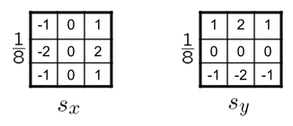
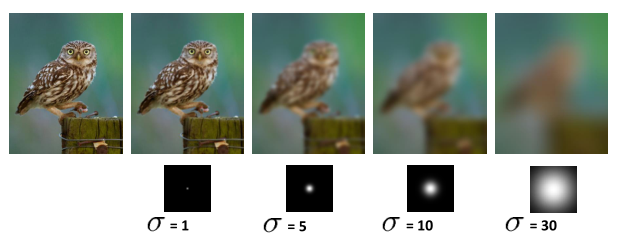
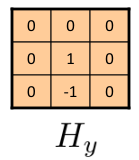
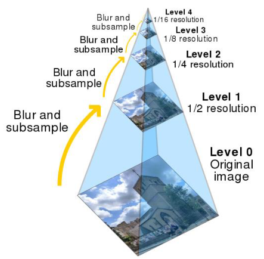
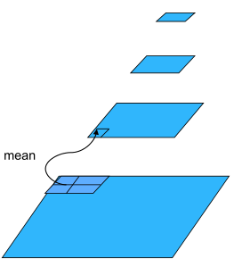
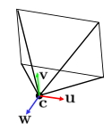
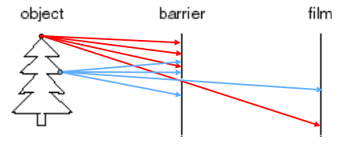
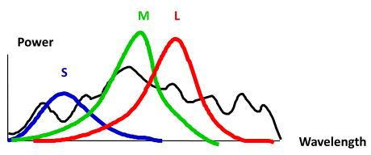

## 目录

  - 常见单词补充
  - 课程内容
    - chapter 1-2 图像和图像滤波
      - 1-2 总结回顾
      - 1-2 实践补充
      - 1.1 图像
      - 1.2 滤波
    - chapter 3 图像重采样与插值
      - 3 总结回顾
      - 3.1 傅里叶变换
      - 3.2 采样和混叠
      - 3.3 子采样
      - 3.4 图像插值
    - chapter 4 局部特征和哈里斯角检测
      - 4 总结回顾
      - 4.1 特征提取概念
      - 4.2 特征识别与判定
      - 4.3 特征不变性
    - chapter 5 特征描述符和特征匹配
      - 5 总结回顾
      - 5.1 高斯拉普拉斯算子
      - 5.2 高斯差分算子
      - 5.3 尺度空间
      - 5.4 匹配图像
    - chapter 6 变换和对齐
      - 6 总结回顾
      - 6.1 图像扭曲
      - 6.2 三维矩阵表示变换
    - chapter 7 RANSAC算法和全景图片
      - 7 总结回顾
      - 7.1 RANSAC算法
      - 7.2 全景图片与投影
      - 7.3 相机参数
      - 7.4 构建全景图片
    - Chapter 8 镜头和相机
      - 8 总结回顾
      - 8.1 相机的基本参数
      - 8.2 分辨率
      - 8.3 对比度
      - 8.4 景深
      - 8.5 畸变/失真
      - 8.6 透视误差
    - chapter 9 图像采集-镜头和相机
      - 9 总结回顾
      - 9 实践补充
    - chapter 10 图像采集和图像照明
      - 10 总结回顾
    - chapter 11 传感和传感器
      - 11 总结回顾
    - chapter 12 传感和传感器
      - 12 总结回顾
      - 12.1 各种传感器
    - chapter 13 全景拼接
      - 13 总结回顾
    - chapter 14 单一视图建模
      - 14.1 消失点
      - 14.2 计算消失点
      - 14.3 测量高度
  - Lab代码
    - Project01
      - Python基本操作
      - Imgae库基本操作
      - OpenCV库基本操作
      - Numpy基本操作
      - matplotlib库基本操作
      - skimage库基本操作
      - 边缘补零
      - 互相关、卷积
      - 生成高斯核
      - 通过高斯核实现低通滤波器/高通滤波器
      - 锐化图像
      - 混合图像
    - Project02
      - 哈里斯角的检测
      - MOPS特征描述
      - 特征匹配
      - 仿射变换/图像扭曲

***

## 常见单词补充

image 图像

pixel 像素

optical character recognition（OCR） 光学字符识别

face recognition 人脸识别

object identification 目标识别

smart car 智能汽车

auto pilot car 自动驾驶汽车

medical imaging 医学成像

virtual reality（VR）虚拟现实

augmented reality（AR）增强现实

grid 网格

intensity value 强度值

grayscale 灰度

linear filter 线性滤波器

sampled 抽样的

quantized 量化的

still scene 静物

panoramas 全景装置

mosaics 马赛克

***

## 课程内容

### chapter 1-2 图像和图像滤波

#### 1-2 总结回顾

图像像素强度值范围为：0 ~ 255。

互相关（cross-correlation）和卷积（convolution）：

互相关，$F$为原图像，$H$为核（尺寸为$2k+1$），$G$为输出图像，坐标原点均为图像中心点：

$$G[i, j]=\sum_{u=-k}^k \sum_{v=-k}^k H[u, v] F[i+u, j+v]$$

$$G=H \otimes F$$

卷积，条件相同：

$$G[i, j]=\sum_{u=-k}^k \sum_{v=-k}^k H[u, v] F[i-u, j-v]$$

$$G=H * F$$

均值滤波（mean filter），条件相同：

$$G[i,j]=\frac{\sum_{u=-k}^k \sum_{v=-k}^k F[i+u, j+v]}{(2k+1)^2}$$

中值滤波（median filter），条件相同：

$$G[i,j]=Median(F[i \pm k, j \pm k])$$

注意：对一个图像使用核进行运算时，一定取相同尺寸的正方形矩阵（不够就边缘补零）与核进行运算，而运算的最后结果等于输出图像在此正方形矩阵的中心点位置的值。

一/二维高斯滤波器（Gaussian filter）：

一维生成高斯核的函数，坐标原点均为图像中心点，因此默认均值$\mu=0$：

$$G_\sigma(x)=\frac{1}{\sqrt{2 \pi \sigma^2}} e^{-\frac{x^2}{2 \sigma^2}}$$

二维生成高斯核的函数，条件相同。等效于两个方向的一维高斯滤波相乘：

$$G_\sigma(x, y)=\frac{1}{2 \pi \sigma^2} e^{-\frac{x^2+y^2}{2 \sigma^2}}$$

注意：$\sigma$的值任取，越大则模糊（blur）效果越强。用高斯核函数生成一定尺寸的高斯核，然后以高斯核对原图像进行卷积运算，得到高斯滤波后的图像。

滤波的作用：减少噪声（noise），增强平滑性（smooth）。

利用滤波器锐化（sharpening），$f$为原图像，$f_{sharp}$为输出图像，$f_{blur}$为进行高斯滤波/均值滤波后的图像，$\alpha$为任取常数系数：

$$f_{\text {sharp }}=f+\alpha\left(f-f_{\text {blur }}\right)$$

Sobel算子（高斯函数的导数的近似）：



分别对应以下求导过程：

$$\frac{\partial}{\partial x} G_\sigma(x,y) \quad \frac{\partial}{\partial y} G_\sigma(x,y)$$

通过Sobel算子（两个方向先后）与高斯滤波后的图像进行卷积运算，即可获得图像的强度梯度矩阵。

Canny边缘检测（edge detection）步骤：

1.使用高斯导数（derivative of Gaussian）或Sobel算子对（高斯滤波后的）图像进行滤波。

2.计算梯度的大小和方向（magnitude and orientation of gradient）。大小满足$G=\sqrt{G_x^2+G_y^2}$，方向满足$\theta=\tan ^{-1}\left(\frac{G_y}{G_x}\right)$。

3.非最大抑制（Non-maximum suppression）。检查像素的强度值（不是梯度的大小）在其梯度方向上是否为局部最大值。（如图，在梯度方向上有点A与点B和点C，看点A的强度值是否是局部最大值）


4.滞后阈值（Hysteresis Thresholding）。第一步阈值化边缘（Thresholding edges）通过设定两个阈值来获得弱边缘和强边缘，第二步连接边缘（Connecting edges）将与强边缘连接的弱边缘也算作强边缘。

#### 1-2 实践补充

补充：为减少时间复杂度（从$O(n^2) \to O(n)$），可以将二维高斯核分解为一个行向量和一个列向量的一维高斯核，先后进行处理，结果是一致的，这是纯数学推导可证明的。

$$G(u, v)=\frac{1}{S} \exp \left(-\frac{u^2}{2 \sigma^2}-\frac{v^2}{2 \sigma^2}\right)$$

其中$G(u,v)$为归一化后高斯核以最中心为原点（这也是为什么高斯核的kernelsize一般为单数），坐标为$(u,v)$的像素分配的权重的值。$S$为归一化常数，也就是高斯核未归一化前的数值总和。$u$表示行，$v$表示列。

$$S=\sum_{u=-w}^w \sum_{v=-w}^w \exp \left(-\frac{u^2}{2 \sigma^2}-\frac{v^2}{2 \sigma^2}\right)$$

令：

$$g(x)=\exp \left(-\frac{x^2}{2 \sigma^2}\right)$$

因此有：

$$G(u, v)=\frac{1}{S} g(u) g(v)$$

讨论未归一化的可拆分性：

$$\begin{aligned} G &=\frac{1}{S}\left[\begin{array}{ccccc}g(-w) g(-w) & \ldots & g(-w) g(0) & \ldots & g(-w) g(w) \\ \vdots & & \vdots & & \vdots \\ g(0) g(-w) & \ldots & g(0) g(0) & \ldots & g(0) g(w) \\ \vdots & & \vdots & & \vdots \\ g(w) g(-w) & \ldots & g(w) g(0) & \ldots & g(w) g(w)\end{array}\right] \\ &=\frac{1}{S}\left[\begin{array}{c}g(-w) \\ \vdots \\ g(0) \\ \vdots \\ g(w)\end{array}\right] \times[g(-w) \ldots g(0) \ldots g(w)] \end{aligned}$$

讨论归一化系数的可拆分性：

$$\begin{aligned} S &=\sum_{u=-w}^w \sum_{v=-w}^w g(u) g(v)=\sum_{u=-w}^w\left[\sum_{v=-w}^w g(v)\right] g(u) \\ &=\left[\sum_{u=-w}^w g(u)\right] \times\left[\sum_{v=-w}^w g(v)\right]=S^{\prime} \times S^{\prime} \end{aligned}$$

因此有：

$$\begin{aligned} G_1 &=\frac{1}{S^{\prime}}[g(-w) \ldots g(0) \ldots g(w)]^{\mathrm{T}} \\ G_2 &=\frac{1}{S^{\prime}}[g(-w) \ldots g(0) \ldots g(w)] \end{aligned}$$

$$G=G_1 \times G_2$$

一个二维高斯核可拆分未两个一维高斯核的矩阵乘。因此可以对图像的$x$方向和$y$方向来分别进行一维高斯核滤波来达到二维高斯核滤波的效果。

#### 1.1 图像

图像（image）其实就是一个强度值的网格/矩阵。在黑白图像中，强度值仅有灰度。在彩色图像中，单个像素会具有多个强度值（例如RGB）。

灰度（grayscale）：取值范围为0~255，0为纯黑，255为纯白。

数字图像（digital image）是离散的（discrete），也就是抽样的、量化的。

#### 1.2 滤波

滤波（filtering）其实就是通过各种方式形成一个新图像，其像素是由原图像的像素组合得到的。

去除噪音（noise）的方法：

线性滤波（linear filtering）：全部像素的灰度值替换为此像素为中心的区域内的其他像素的灰度值的线性组合。有以下几种方法：


G为新图像，H为滤波器权重（weight）矩阵/卷积核（kernel），F为原图像。$k$表示滤波器权重矩阵的中心像素的临近像素数（如上图$k=1$）。

1.均值滤波（mean filtering）：全部像素的强度值替换为以此像素为中心的区域内所有像素的强度值的平均值。（此时H可以视作全为1的矩阵，然后H前有系数等于区域的总格子数）

核和图像的坐标原点$(0,0)$，指的都是矩阵的中心点。

2.互相关（cross-correlation）：

$$G[-1,-1]=a * A+b * B+c *C+d * D+e * E+f * F+g *G+h * H+i * I$$

$$G[i,j]=\sum_{u=-k}^{k} \sum_{v=-k}^{k} H[u,v] F[i+u,j+v]$$

$$G = H \otimes F$$

3.卷积（convolution）：

$$G[-1,-1]=i * A+b * h+g *C+f * D+e * E+d * F+c *G+b * H+a * I$$

$$G[i,j]=\sum_{u=-k}^{k} \sum_{v=-k}^{k} H[u,v] F[i-u,j-v]$$

$$G = H * F$$

卷积是交换性（commutative）和结合性（associative）和分配（distribitivity）的，满足：

$$f_1 *\left(f_2 * f_3\right)=\left(f_1 * f_2\right) * f_3$$

$$f_1 * f_2=f_2 * f_1$$

$$f_1 *\left(f_2+f_3\right)=f_1 * f_2+f_1 * f_3$$

4.高斯滤波/高斯模糊（Gaussian filter / Gaussian blur）：对图像进行模糊处理，以去除噪声和细节。

高斯分布：

$$f(x)=\frac{1}{\sigma \sqrt{2 \pi}} e^{-\frac{1}{2}\left(\frac{x-\mu}{\sigma}\right)^2}$$

一维高斯核：

$$G_\sigma(x)=\frac{1}{\sqrt{2 \pi \sigma^2}} e^{-\frac{x^2}{2 \sigma^2}}$$

二维高斯核，两个一维高斯核向量乘得到矩阵：

$$G_\sigma(x, y)=\frac{1}{2 \pi \sigma^2} e^{-\frac{x^2+y^2}{2 \sigma^2}}$$

高斯滤波使得图像更平滑，也就是每个点都要取周边像素的加权平均值。因为图像都是连续的，越靠近的点关系越密切，越远离的点关系越疏远。因此，加权平均更合理，距离越近的点权重越大，距离越远的点权重越小。


使用高斯分布来对卷积窗口内的每一个像素分配合理的权重，最终得到的加权平均数即为窗口中心的像素点（即坐标原点）的最终结果。

根据高斯分布的性质，$\sigma$越大，那么每个像素周围的像素对中心像素的影响越大，模糊效果越好（$\pm 3 \sigma$其实已经包含了大多数情况，模糊效果较合适）。

对高斯分布得到的矩阵进行归一化（normalize），使其总和为1。那么权重总和为1，更适合进行卷积。

$\mu$为所有像素的强度值的均值（因为中心点为坐标原点，因此$\mu$默认为$0$）。$\sigma$为自由选取的参数，$\sigma$越大则图像模糊程度越大。根据问题的不同自由选取$\sigma$和窗口大小$n$（一般为$n \times n$），这两个参数可以通过确定其中一个来计算出另一个的比较合适的值（但没有必然联系）。



5.锐化（sharpening）和锐化滤波器（sharpening filter）：

对图像进行锐化，会增强原图像信息，也包括噪音和细节。


$$\begin{aligned} f_{\text {sharp }} &=f+\alpha\left(f-f_{\text {blur }}\right) \end{aligned}$$

非线性滤波（non-linear filtering）：仅使用线性滤波，某些图像无法达到滤波的目的。

1.阈值转化法（thresholding）：即设定一个阈值，使得强度值在这个阈值上或下的像素的强度值全部固定为两个不同的固定值。


$$g(m, n)=\left\{\begin{array}{cc}255, & f(m, n)>A \\ 0 & \text { otherwise }\end{array}\right.$$

2.中值滤波（median filtering）：全部像素的强度值替换为以此像素为中心的区域内所有像素的强度值的中值。它被广泛使用，因为它去除噪音时可以保持边缘（preserving edges），它在消除"salt and pepper"类型的噪音方面特别有效。

当处于二维的边缘，中值滤波允许进行"边缘值不变"，"边缘补边缘"，"边缘补0"三种边缘处理方式，根式实际情况选择。

3.边缘检测（edge detection）：将二维图像转换为一组曲线，提取场景的显著特征（features）。


边缘是图像像素强度值函数变化较快的地方（例如黑白边界）。

图像像素强度值求导的两种方法：

- 重建一个连续图像，然后计算导数。

在对图像求导数之前最好先进行平滑处理，因为导数操作对噪声敏感。

$$\frac{\partial f}{\partial x}[x, y] \approx F[x+1, y]-F[x, y]$$

$$\frac{\partial f}{\partial y}[x, y] \approx F[x, y+1]-F[x, y]$$

注意二维图像有两个方向，那么两个方向都需要进行求导。对图像像素强度值求导最终也会得到一个与图像窗口大小相同的矩阵，$\frac{\partial f}{\partial x}[x, y]$就是此矩阵第x行第y列的值。

可以将此种求导操作写为一个线性滤波器的核。

- x方向上求导操作的等效核：


- y方向上求导操作的等效核：



- 取离散导数（有限差分法）。

对于离散情况（图像），其导数必须使用差分方差来近似，有：

前向差分：

$$I_x=\frac{I(x)-I(x-h)}{h}$$

中心差分：

$$I_x=\frac{I(x+h)-I(x-h)}{2 h}$$

4.图像像素强度值梯度：

$$\nabla f=\left[\frac{\partial f}{\partial x}, \frac{\partial f}{\partial y}\right]$$


边缘强度（edge strength）由梯度大小给出：

$$\|\nabla f\|=\sqrt{\left(\frac{\partial f}{\partial x}\right)^2+\left(\frac{\partial f}{\partial y}\right)^2}$$

梯度的方向：

$$\theta=\tan ^{-1}\left(\frac{\partial f}{\partial y} / \frac{\partial f}{\partial x}\right)$$

卷积的微分性质：

设$g(x)$是$f(x)$使用卷积核$h(x)$的卷积，那么对$x$求导满足：

$$\frac{d g}{d x}=\frac{d}{d x}(f * h)=f * \frac{d}{d x} h$$

高斯滤波的求导公式：

- 一维情况：

$$G_\sigma(x)=\frac{1}{\sqrt{2 \pi} \sigma} e^{-\frac{x^2}{2 \sigma^2}}$$

$$G_\sigma^{\prime}(x)=\frac{d}{d x} G_\sigma(x)=-\frac{1}{\sigma}\left(\frac{x}{\sigma}\right) G_\sigma(x)$$

- 二维情况：

$$h_\sigma(u, v)=\frac{1}{2 \pi \sigma^2} e^{-\frac{u^2+v^2}{2 \sigma^2}}$$

$$\frac{\partial}{\partial x} h_\sigma(u, v)$$

5.索贝尔算子（Sobel operator）：

其为高斯滤波器（也就是高斯导数）的一般逼近（common approximation）。


标准定义的Sobel算子省略了$\frac{1}{8}$，这对边缘检测没有影响，但是计算出的梯度大小会不同。


Sobel算子可以通过卷积计算得到图片的梯度矩阵。

6.边缘检测流程：

- 减少噪音。通过高斯滤波器去除噪音。

- 找到图像的强度值梯度。通过Sobel核在水平方向和垂直方向对平滑图像进行滤波。

- 非最大值抑制（non-maximum suppression）。在得到梯度大小和方向后，对图像进行全扫描，去除不需要的可能不构成边缘的像素。如果在梯度方向上，像素在其邻域内是局部最大值，则检查像素。在点A与点B和点C进行检查，看它是否在梯度方向上形成局部最大值。如果是这样，它在下一阶段被考虑，否则，它被抑制（归零）。最终得到的是一个边缘较薄的二值图像。


- 滞后阈值（hysteresis thresholding）。经过上一步，图像仍有一些噪音，而我们只需要最强的边缘，因此我们设置两个阈值（最大值和最小值），如果大于最大值则为强边缘，处于两个阈值中间则为弱边缘，小于最小值则不是边缘。如果一条弱边缘与任意一条强边缘相连，则此弱边缘被认为是强边缘。但如果一条弱边缘没有任何强边缘与其相连，则此弱边缘被弃用。

一共有三个参数：阈值最大值，阈值最小值，高斯滤波的$\sigma$值。其中$\sigma$取值较大时检测到的边缘较少且模糊，取值较小的时候边缘较多且精细。

以上方法是一个最基础的计算机视觉管道（computer vision pipeline），且仍被广泛使用的边缘检测器。

### chapter 3 图像重采样与插值

#### 3 总结回顾

欧拉等式：

$$e^{i x}=\cos x+i \sin x \quad i=\sqrt{-1}$$

傅里叶变换（$f(x)$到$F(\omega)$，时域到频域）：

$$F(\omega)=\int_{-\infty}^{+\infty} f(x) e^{-i \omega x} d x$$

傅里叶逆变换（$F(\omega)$到$f(x)$，频域函数到时域函数）：

$$f(x)=\frac{1}{2 \pi} \int_{-\infty}^{+\infty} F(\omega) e^{i \omega x} d \omega$$

将傅里叶变换应用于图像滤波：

二维卷积核本质上是一个二维时域函数$h(x,y)$，有对应的频谱函数$H(\omega_1,\omega_2)$，可以视作滤波器。

通过复杂推导（省略过程）可以得到：

$$时域卷积 = 频域乘法$$

滤波器函数$h$，信号源$f$，输出信号$g$，滤波器频谱函数$H$，信号源频域$H$，输出信号频域$G$。用于频域，使用乘法。用于图像滤波（时域），使用卷积：

$$g=f * h$$

$$G=F \times H$$

以上$g(x)$获得平滑图像为低通滤波器，通过$f(x) - g(x)$获得图像细节为高通滤波器。

采样（sampling）和混叠（aliasing）：

对连续信号进行一定频率的采样时，如果采样频率不满足采样定理（采样频率小于信号最大频率的2倍），采样后还原出的信号频率就会发生混叠。也就是说要避免发生混叠的最小采样频率为信号最大频率的2倍，这个频率称为奈奎斯特频率（Nyquist rate）。

图像子采样（subsampling）：

在图像子采样（获得等比例缩小图像）时，为了避免发生混叠，在每次子采样前都使用高斯滤波器进行处理。

图像上采样（upsampling）：

图像插值（interpolation）是指在缺失位置的强度值的"猜测"。可用于上采样/分辨率增强（获得等比例放大图像）、图像修复、图像扭曲。

对于图像，每行每列都复制一定次数称为最近邻插值（nearest neighbor interpolation）。还可以通过卷积进行插值，步骤：

1.猜测近似的输出信号$\tilde{f}$。

2.将原信号$F$的采样结果（采样点简单构成的线性函数）转化为连续函数$f_F$。

3.使用重构滤波器（reconstruction filter）$h$对$f_F$进行卷积得到$\tilde{f}$。重构滤波器就是一个时域函数（例如高斯核函数）。

$$\tilde{f}=h * f_F$$

卷积核可以使用$Bicubic$和$Bilinear$函数生成的卷积核。

#### 3.1 傅里叶变换

1.对于一个任意函数，可以通过傅里叶变换（Fourier transform，FT）对其拆分为不同频率、振幅、形状的多个波形函数，通常更关注频率（将图像转换为频域）。


傅里叶变换：

$$F(\omega)=\int_{-\infty}^{+\infty} f(x) e^{-i \omega x} d x$$

其中$e^{i x}=\cos x+i \sin x$，$i=\sqrt{-1}$。

傅里叶逆变换：

$$f(x)=\frac{1}{2 \pi} \int_{-\infty}^{+\infty} F(\omega) e^{i \omega x} d \omega$$

通过傅里叶变换，可以把任意函数（arbitrary）变换为单个解析式（single analytic expression）。

2.通过傅里叶变换将空间域转化成频域：

$$g(x)=f(x) * h(x)=\int_{-\infty}^{\infty} f(\tau) h(x-\tau) d \tau$$

其中$g(x)$是我们想要得到的函数，$f(x)$是原函数（original function），$h(x)$是滤波器的核。

频域乘法：

$$\begin{aligned} G(\omega) &=\int_{-\infty}^{\infty} g(x) e^{-i \omega x} d x \\ &=\int_{-\infty}^{\infty} \int_{-\infty}^{\infty} f(\tau) h(x-\tau) e^{-i \omega x} d \tau d x \\ &=\int_{-\infty}^{\infty} \int_{-\infty}^{\infty}\left[f(\tau) e^{-i \omega \tau} d \tau\right]\left[h(x-\tau) e^{-i \omega(x-\tau)} d x\right] \\ &=\int_{-\infty}^{\infty}\left[f(\tau) e^{-i \omega \tau} d \tau\right] \int_{-\infty}^{\infty}\left[h\left(x^{\prime}\right) e^{-i \omega x^{\prime}} d x^{\prime}\right] \\ &=F(\omega) \cdot H(\omega) \end{aligned}$$

在映射关系上，是把空间域（spatial domain）$(x)$映射到频域（frequency domain）$(\omega)$，得到频谱（frequency spectrum）$F(\omega)$。

空间域的乘法与频域的卷积可以等效转换。

空间域图像和频域图像对比：


3.通过高斯核构建低通滤波器和高通滤波器：

低通滤波器（Low-Pass filter），也被称为模糊滤波器（blurring filter）或平滑滤波器（smoothing filter）。倾向于保留图像中的低频信息，减少高频信息。

高斯核：

$$h(x)=\frac{1}{\sqrt{2 \pi} \sigma} \exp \left[-\frac{1}{2} \frac{x^2}{\sigma^2}\right]$$

高斯核（频域）：

$$H(\omega)=\exp \left[-\frac{1}{2}(2 \pi \omega)^2 \sigma^2\right]$$

$$G(\omega)=F(\omega) H(\omega)$$

$F(\omega)$为$f(x)$通过傅里叶变换得到，$G(\omega)$通过傅里叶逆变换即可得到原图像的低通滤波器的结果$g(x)$。


高通滤波器（High-Pass filter），是大多数锐化方法的基础，一般会使图像对比度（contrast）上升。倾向于保留图像中的高频信息，减少低频信息。

高通滤波器的结果只需要将原图像减去低通滤波器的结果即可得到。


#### 3.2 采样和混叠

采样（sampling）和重建（reconstruction）是存储和计算连续函数的常见方法，通过对捕捉到的信号/波形图像在某些点处的取值进行采样来实现。


这些点明显是离散的，那么在处理前，又需要根据这些点来"猜测"（重建）出本来的连续函数。

在数字音频（digital audio）领域，要对音频滤波，那么首先就要经过采样和重建。

过采样（oversampling）则会让需要处理的数据成倍地增加，加大性能负担。但可以增加大大增加重建精度。

欠采样（undersampling）会造成重建的函数相比于原信号频率降低的影响（振幅不变，采样密度不够，因此最后重建得到的函数就是降低频率的原信号），得到的是错误的信号/图像，也就是混叠（alias）/失真。


采样率（sampling rate）指的是每个周期进行采样的次数。为了避免混叠，采样率必须满足$\geq 2$，这个最小采样率被称为尼奎斯特速率（Nyquist rate）。

#### 3.3 子采样

对一个原图像，每隔一行和一列就进行一次像素丢弃，最终就得到了一个相比于原图像为1/2大小的图像，这个操作称为图像的子采样（sub-sampling）。


直接进行子采样/下采样（downsampling），图像的频率太高会造成所得图像很粗糙（图像过于尖锐，边界分明，那么像素丢弃会使得图像断层明显）。因此需要先进行高斯滤波使得图像更模糊/平滑，再进行子采样。


注意是每次子采样前都进行一次高斯滤波，否则多次子采样仍会使得图像的粗糙度（crufty）逐渐累加。



#### 3.4 图像插值

图像插值（image interpolation）是指对缺失位置$(x,y)$的强度值$f(x,y)$的"猜测"，$x,y$可以取任意值（正常图像的像素坐标$(x,y)$都只能取整数）。

图像插值可以：

- 放大图像，分辨率增强（resolution enhancement）。

- 修复图像（image inpainting）。

- 为图像增加艺术效果，例如图像扭曲（image warping）。

上采样（upsampling）和下采样相反，其可以放大的图像，采用的方法就是图像插值。最简单的方法：放大$x$倍，则将每一行和每一列都重复$x$次，这被称为最近邻插值（nearest neighbor interpolation）。

在计算机图形学，我们会在数字图像（离散）上采样：在一个规则的网格上采样，然后量化（quantize）每个样本（四舍五入到最接近的整数），完成采样。


如果取样间隔为$\Delta$，则此图像可以用一条表示各个坐标像素的强度值的数学公式进行表示：

$$f[\mathrm{x}, \mathrm{y}]=Quantize \{f(\mathrm{x} \Delta, \mathrm{y} \Delta)\} $$


它是离散的数字图像的取样点的集合，也是一个虚拟的连续函数的某些点的采样。图像的像素的强度值是离散的，如果我们不知道原函数$f$，那么我们可以用线性插值（linear interpolation）来根据已知的采样点重建一个虚拟的连续原函数，获得任意坐标（包括小数）的像素的强度值，来完成图像插值。


线性插值：

$$G(x)=\frac{x_2-x}{x_2-x_1} F\left(x_1\right)+\frac{x-x_1}{x_2-x_1} F\left(x_2\right)$$

通过卷积插值：

- 猜一个近似$\tilde{f}$。
- 滤波。
- 将$F$转换为一个连续函数$f_{F}$。
- 通过与重构滤波器$h$的卷积进行重构。

$$\tilde{f}=h * f_F$$

重构滤波器（reconstruction filters）指的是可以通过这些滤波器的核（以函数的形式）来对现有的图像采样点进行滤波，从而重建出连续的函数，根据重建出的函数来进行图像插值。每种重构滤波器的插值方式不同。


越好的重构滤波器可以得到越好的重采样（resampled images）图像。

重构滤波器有：

- 最近邻插值滤波器。

- Bilinear插值滤波器。

- Bicubic插值滤波器。

- 还有更多现代的插值滤波器。


### chapter 4 局部特征和哈里斯角检测

#### 4 总结回顾

全景拼接（panorama stitching）步骤：

1.特征提取（extract features）。

2.特征匹配（match features）。

3.对齐图像（align images）。

局部特征（local feature）的优点：

局部性（locality）、数量多（quantity）、独特性（distinctiveness）、效率性（efficiency）。

局部特征提取与匹配步骤：

1.特征检测：确定兴趣点。

2.表示特征描述符：提取每个兴趣点周围的向量特征描述符（descriptor）。

3.特征匹配：确定两个视图（view）中特征描述符的对应。

计算滑动窗口$W$从单个像素移动向量$(u,v)$前后的窗口中所有像素强度值的平方差之和SSD （summing up the squared differences，SSD）：


$$E(u, v)=\sum_{(x, y) \in W}[I(x+u, y+v)-I(x, y)]^2$$

泰勒展开得：

$$I(x+u, y+v)=I(x, y)+\frac{\partial I}{\partial x} u+\frac{\partial I}{\partial y} v+ higher \; order \; terms$$

$$\begin{aligned} I(x+u, y+v) & \approx I(x, y)+\frac{\partial I}{\partial x} u+\frac{\partial I}{\partial y} v \\ & \approx I(x, y)+\left[\begin{array}{ll}I_x & I_y\end{array}\right]\left[\begin{array}{l}u \\ v\end{array}\right]\end{aligned}$$

代入SSD原式得：

$$\begin{aligned} E(u, v) & =\sum_{(x, y) \in W}[I(x+u, y+v)-I(x, y)]^2 \\ &  \approx \sum_{(x, y) \in W}\left[I(x, y)+I_x u+I_y v-I(x, y)\right]^2 \\ & \approx \sum_{(x, y) \in W}\left[I_x u+I_y v\right]^2 \\ & \approx A u^2+2 B u v+C v^2 \\& \approx\left[\begin{array}{ll} u & v \end{array}\right] \underbrace{\left[\begin{array}{ll} A & B \\ B & C \end{array}\right]}_{H}\left[\begin{array}{l} u \\ v \end{array}\right] \end{aligned}$$

其中$H$称为海森矩阵，满足：

$$\begin{aligned} & A=\sum_{(x, y) \in W} I_x^2 \\ & B=\sum_{(x, y) \in W} I_x I_y \\ & C=\sum_{(x, y) \in W} I_y^2\end{aligned}$$

 

把SSD的表达式$E$看成一个二阶矩椭圆（椭圆方程满足$E = \left[\begin{array}{lll}u & v\end{array}\right] H\left[\begin{array}{l}u \\ v\end{array}\right]= const$），则其长轴和短轴由$H$的特征值$\lambda_{max},\lambda_{min}$（$E$在增加最快和最慢方向上的增量）决定，轴的方向则由$H$的特征向量$x_{max},x_{min}$（$E$增加最快和最慢的方向）决定：

$$\begin{aligned} H x_{\max } & =\lambda_{\max } x_{\max } \\ H x_{\min } & =\lambda_{\min } x_{\min }\end{aligned}$$


通过海森矩阵的特征值进行角点检测：


平坦区域（flat region）是此像素点在最快和最慢方向上的增量都很小，说明$E$基本不变。边缘（edge）是此像素点在最快和最慢之一方向上的增量远远大于另一方向，说明$E$只有在单一方向变化很大。角点（corner）是此像素点在最快和最慢方向上的增量都很大，说明$E$在全部方向上的变化都很大。

特征检测步骤：

1.计算（compute）图像中每个点的梯度$I_x,I_y$。

2.根据梯度获得海森矩阵$H$。

3.计算$H$的特征值$\lambda_{max},\lambda_{min}$。

4.找到满足$\lambda_{min} > 设定阈值$的点（高响应点）。

5.选择$\lambda_{min}$为邻域中的局部最大值的点（在周围像素的最小响应值$\lambda_{min}$中的取得最大值的像素点）作为特征点。（这一步也叫非最大抑制）

其实$\lambda_{min}$是哈里斯算子的变体，因此可以用哈里斯算子（Harris operator）直接当作$\lambda_{min}$进行哈里斯角点检测：

$$\begin{aligned} \lambda_{min} & \approx \operatorname{Determinant}(H)-\alpha(\operatorname{Trace}(H))^2 \\ & =\lambda_1 \lambda_2-\alpha\left(\lambda_1+\lambda_2\right)^2\end{aligned}$$

$\alpha$为常数系数，一般取$0.06$。

对海森矩阵的加权：

$$H=\sum_{(x, y) \in W} w_{x, y}\left[\begin{array}{cc}I_x^2 & I_x I_y \\ I_x I_y & I_y^2\end{array}\right]$$

二阶矩矩阵，$g(\sigma_1)$为高斯滤波器：

$$\mu\left(\sigma_I, \sigma_D\right)=g\left(\sigma_I\right) *\left[\begin{array}{cc}I_x^2\left(\sigma_D\right) & I_x I_y\left(\sigma_D\right) \\ I_x I_y\left(\sigma_D\right) & I_y^2\left(\sigma_D\right)\end{array}\right]$$

不变性和等变性：

不变性（invariance）是图像被变换后，角点位置不变（例如将图像的每个像素的强度值乘常数系数）。等变性（equivariance）是图像被变换后，特征点的位置变化与变换操作导致的图像像素的位置变化一致（例如将图像旋转特定角度）。不变性和等变性有时都被称为"不变"，等变性有时被称为共变性（covariant）。

#### 4.1 特征提取概念

1.特征提取（feature extraction）：

从图像中提取角点（corners）和斑点（blobs），或者小的彩色方块（colored squares）。

2.特征提取的应用：

通过特征提取，可以实现自动全景拼接（panorama stitching），因为可以将特征匹配（match）的景物对齐（align）来确定全景照片的组合位置。

通过特征提取，可以实现同步定位和地图（Simultaneous Localization and Mapping，SLAM）。

3.特征匹配（feature matching）：

不变局部特征（invariant local features）：图像中对某些转换（transformations）仍然不变的特征，包括：

- 几何不变性（geometric invariance）：平移（translation），旋转（rotation），比例（scale）...

- 光度不变性（photometric invariance）：亮度（brightness），曝光（exposure）...

局部特征具有以下优点性质：

- 局部的（locality）：对遮挡（occlusion）和杂化（clutter）有很强的鲁棒性。

- 数量（quantity）：数量在一张图像中有数百数千。

- 显著性（distinctiveness）：可以区分大的物体数据库。

- 效率性（efficiency）：实时性能要求较低。

局部特征的主要组成部分（main components）的匹配步骤：

- 检测（detection）：识别兴趣点（interest point）。

- 描述（description）：提取每个兴趣点周围的向量特征描述符（vector feature descriptor）。形式为$\vec{x}_1=\left[x_1^{(1)}, \ldots, x_d^{(1)}\right]$。

- 匹配（matching）：确定两个视图中描述符的对应关系。

#### 4.2 特征识别与判定

1.哈里斯角探测（Harris corner detection）：

特征提取，最好就是能找到其与其他图像不同寻常的区域，以进行明确特征匹配。

假如我们现在有一个一定长宽的正方形窗口$W$，移动窗口可以提取其区域的像素的强度值。

通过对窗口$W$按向量$(u,v)$移动前后的像素值进行误差的平方的求和（sum of squared differences，SSD），得到偏差（error）$E(u,v)$（偏差越高说明变化越大，越可能是特征）：

误差平方和：

$$E(u, v)=\sum_{(x, y) \in W}[I(x+u, y+v)-I(x, y)]^2$$

单变量泰勒展开公式：

$$f(x)=\sum_{k=0}^{\infty} \frac{f^{(k)}(a)}{k !}(x-a)^k=f(a)+f^{\prime}(a)(x-a)+\frac{f^{\prime \prime}(a)}{2 !}(x-a)^2+\cdots$$

多变量泰勒展开公式：

$$\begin{aligned} f(x, y)=& f(a, b)+f_x(a, b)(x-a)+f_y(a, b)(y-b) \\ &+\frac{1}{2 !}\left[f_{x x}(a, b)(x-a)^2+2 f_{x y}(a, b)(x-a)(y-b)+f_{y y}(y-b)^2\right]+\cdots \end{aligned}$$

那么如果向量$(u,v)$很小，$I$的泰勒级数的展开：

$$I(x+u, y+v)=I(x, y)+\frac{\partial I}{\partial x} u+\frac{\partial I}{\partial y} v+高阶无穷小项$$

$$\begin{aligned} I(x+u, y+v) & \approx I(x, y)+\frac{\partial I}{\partial x} u+\frac{\partial I}{\partial y} v \\ & \approx I(x, y)+\left[\begin{array}{ll}I_x & I_y\end{array}\right]\left[\begin{array}{l}u \\ v\end{array}\right] \end{aligned}$$

其中$I_{x}=\frac{\partial I}{\partial x}$，$I_{y}=\frac{\partial I}{\partial y}$同理。

如果向量$(u,v)$比较大，则：

$$\begin{aligned} E(u, v) &=\sum_{(x, y) \in W}[I(x+u, y+v)-I(x, y)]^2 \\ & \approx \sum_{(x, y) \in W}\left[I(x, y)+I_x u+I_y v-I(x, y)\right]^2 \\ & \approx \sum_{(x, y) \in W}\left[I_x u+I_y v\right]^2 \\ & \approx Au^2+2Buv+Cv^2 \end{aligned}$$

其中$W$为窗口，$A=\sum_{(x, y) \in W} I_x^2$，$B=\sum_{(x, y) \in W} I_x I_y$，$C=\sum_{(x, y) \in W} I_y^2$。

将以上的$E(u,v)$写成二阶矩矩阵（second moment matrix）的形式：

$$E(u, v) \approx\left[\begin{array}{ll}u & v\end{array}\right] \underbrace{\left[\begin{array}{ll}A & B \\ B & C\end{array}\right]}_H\left[\begin{array}{l}u \\ v\end{array}\right]$$

$$H = \left[\begin{array}{ll}A & B \\ B & C\end{array}\right]$$

（矩阵乘法：$a_{ij}$的值为第一个矩阵的第$i$行向量和第二个矩阵的第$j$列向量进行点乘得到。）

特殊情况下的$E(u,v)$：

当$I_{x}=0$，$A=0$，$B=0$，为水平边缘：


当$I_{y}=0$，$B=0$，$C=0$，为垂直边缘：


一般情况下的$E(u,v)$：

我们把矩阵$H$想象成一个椭圆。


椭圆方程：

$$\left[\begin{array}{ll}u & v\end{array}\right] H\left[\begin{array}{l}u \\ v\end{array}\right]=\mathrm{const}$$

矩阵$H$有两个特征值$\lambda _{max}$（变化最快的方向）和$\lambda _{min}$（变化最慢的方向）。（矩阵$H$的特征值$\lambda$满足：$A \vec{x}=\lambda \vec{x}$，也就是满足$det(A-\lambda I)=0$的所有$\lambda$）

矩阵$A$的特征值$\lambda$满足$A \vec{x}=\lambda \vec{x}$，则$\lambda$是对应$\vec{x}$的特征值。$det(H-\lambda I)$可以解出$H$的特征值：

$$H = \left[\begin{array}{ll}h_{11} & h_{12} \\ h_{21} & h_{22} \end{array}\right]$$

$$\operatorname{det}\left[\begin{array}{cc}h_{11}-\lambda & h_{12} \\ h_{21} & h_{22}-\lambda\end{array}\right]=0$$

$$\lambda_{\pm}=\frac{1}{2}\left[\left(h_{11}+h_{22}\right) \pm \sqrt{4 h_{12} h_{21}+\left(h_{11}-h_{22}\right)^2}\right]$$

已知$\lambda$，那么就可以求特征向量$\vec{x}=\left[\begin{array}{ll}x  \\ y \end{array}\right]$了：

$$\left[\begin{array}{cc}h_{11}-\lambda & h_{12} \\ h_{21} & h_{22}-\lambda \end{array}\right]\left[\begin{array}{l}x \\ y\end{array}\right]=0$$


$$H \vec{x}_{\max }=\lambda_{\max } \vec{x}_{\max }$$

$$H \vec{x}_{\min }=\lambda_{\min } \vec{x}_{\min }$$

其中$\vec{x}_{max}$是$E(u,v)$增加最快的方向，$\lambda_{max}$是$\vec{x}_{max}$方向上的增加量。（$\vec{x}_{min}$同理）

那么已知以上的信息，接下来进行目标检测：


通过$H$的特征值对图像的点进行分类，如果$\lambda_1$和$\lambda_2$均很小，那么判定为平坦（flat）的区域。而当$\lambda_{1}$或$\lambda_{2}$有其中一个特别大，那么判定为边缘（edge）。如果$\lambda_{1}$和$\lambda_2$都很大，或者处于区间$\lambda_{1} \sim \lambda_{2}$之间，说明$E(u,v)$在任何方向上都增加，因此判定为角点（corner）。

步骤：计算图像中每一点的梯度，由梯度创建$H$矩阵，然后计算特征值，寻找响应较大的点（$\lambda_{min}$大于阈值），然后选择$\lambda_{min}$为局部最大值的点作为特征。

2.哈里斯算子/哈里斯探测器（Harris operator/Harris corner detector）：$\lambda_{min}$是用于特征检测的哈里斯算子$f$的变体，一般计算和探测角点时可以使用哈里斯算子$f$替代$\lambda_{min}$。

$$\begin{aligned} f &=\text { Determinant }(H)-\alpha(\operatorname{Trace}(H))^2 \\ &=\lambda_1 \lambda_2-\alpha\left(\lambda_1+\lambda_2\right)^2 \end{aligned}$$

其中$Determinant(H)$是矩阵$H$的行列式，$Trace$是矩阵对角线之和，$Trace(H)=h_{11}+h_{22}$。系数$\alpha=0.06$，$f$与$\lambda_{min}$的值相近但计算的耗费性能更少，$f$就是哈里斯算子。使用哈里斯算子作为阈值找到的特征称为哈里斯算子。

3.导数的权重：

在实际中，只用一个简单的窗口$W$和矩阵$H$还不够。

$$H = \left[\begin{array}{ll}A & B \\ B & C\end{array}\right] = \sum_{(x, y) \in W}\left[\begin{array}{cc}I_x^2 & I_x I_y \\ I_x I_y & I_y^2\end{array}\right]$$

我们将根据每个导数值与中心图像的距离对其进行加权：

$$H=\sum_{(x, y) \in W} w_{x, y}\left[\begin{array}{cc}I_x^2 & I_x I_y \\ I_x I_y & I_y^2\end{array}\right]$$

4.哈里斯探测器流程：

$$\mu\left(\sigma_I, \sigma_D\right)=g\left(\sigma_I\right) *\left[\begin{array}{cc}I_x^2\left(\sigma_D\right) & I_x I_y\left(\sigma_D\right) \\ I_x I_y\left(\sigma_D\right) & I_y^2\left(\sigma_D\right)\end{array}\right]$$


#### 4.3 特征不变性

1.不变性（invariance）和等变性（equivariance）有时都被称为"不变"。等变性有时称为共变性（covariant）。

对于一个函数，如果对其输入施加的某种操作丝毫不会影响到输出，那么这个函数就对该变换具有不变性。（函数是检测图像中是否有红色， 此时如果我们的变换是旋转/平移， 那么这些变换都不会对函数结果有任何影响， 就可以说该函数对该变换具有不变性。）

不变性：

$$f(x)=f\left(x^{\prime}\right)=f(g(x)) \neq g(f(x))$$

其中$f$为函数，$x$为输入，$g$为变换，$g(x)=x'$。

对于一个函数，如果你对其输入施加的变换也会同样反映在输出上，那么这个函数就对该变换具有等变性。（假设我们的变换$g$是将图像向右平移一段距离，我们的函数$f$是检测一个人脸的位置（比如说输出坐标），$f(g(x))$就是先将图片像右移，接着我们在新图较之原图偏右的位置检测到人脸；$g(f(x))$则是我们先检测到人脸， 然后再将人脸往右移一点。这二者的输出是一样的，与我们施加变换的顺序无关。）

等变性：

$$f(g(x))=g(f(x))$$

其中$f$为函数，$g$为变换。

2.不变性-仿射强度变化（affine intensity change）：

$$I \rightarrow a I+b$$

直接对部分或全部像素强度进行线性的大小调整，而阈值不变。

3.比例缩放（scaling）：


比例缩放既不满足不变也不等变。

4.对图像进行不同的比例缩放后的检测方法：

一个简单的方法是对检测窗口也进行等比例缩放。而关键在于找到合适的比例，以计算得到哈里斯算子$f$的局部最大值值，以发现角点和边缘等特征。

那么，对于同一点，通过选取不同大小的检测窗口（每个大小的窗口称为"层"）并分别计算出各层的$f$值，得到使得$f$值为全部层的$f$值的局部最大值情况下的检测窗口的大小，这个检测窗口的大小就是当前分辨率下的这个图像的比较合适的窗口大小。然后如果原图像的分辨率发生改变/缩放后得到了新图像，那么在同一点经过相同的过程，得到的全部层的$f$值的局部最大值会发生变化，相应的合适的窗口大小也会发生变化，因此又得到了新图像合适的检测窗口的大小。

以上原理的具体实现方法：使用高斯金字塔（Gaussian pyramid）的下采样来实现，而不是为越来越大的窗口计算$f$。

图像金字塔是一种经典的图像多尺度描述方法。它是一种以多分辨率来描述图像的有效且简洁的结构。一幅图像的金字塔实际上是一系列以金字塔形状排列的分辨率逐步降低并且都来自同一张原始图片的图像集合，集合里每一个图像被称为一个层。图像金字塔底层是源图像的高分辨率表示，顶层则是低分辨率的近似，一层一层堆叠的图像形如“金字塔”，层级越高，图像越小，分辨率越低。它的建立是以一系列的迭代计算方式进行的（即每一层都是上一层经过相同的计算过程得到的，例如求均值）。故图像金字塔可以较好地以多尺度方式描述图像的信息，在图像处理和计算机视觉领域中应用广泛。

### chapter 5 特征描述符和特征匹配

#### 5 总结回顾

$\nabla^{2}$是拉普拉斯算子（Laplacian operator）。在一个函数前加上此算子，代表对其进行拉普拉斯变换。

对于二维高斯函数$g$，有高斯拉普拉斯（the Laplacian of Gaussian，LoG）算子：

$$\nabla^2 g=\frac{\partial^2 g}{\partial x^2}+\frac{\partial^2 g}{\partial y^2}$$

可将高斯拉普拉斯算子二维函数化，此处省略推导过程。

已被证明唯一能产生尺度空间的核为高斯核函数（因为$\sigma$可变）。对于可变尺度的二维高斯核函数$G$，有高斯差分（difference of Gaussians，DoG）算子：

$$D o G=G(x, y, k \sigma)-G(x, y, \sigma)$$

定义高斯尺度空间，用$L$表示。$G$为可变尺度的二维高斯核函数，$I$为原图像：

$$L(x, y, \sigma)=G(x, y, \sigma) * I(x, y)$$

高斯差分函数用$D$表示：

$$\begin{aligned} D(x, y, \sigma) & =(G(x, y, k \sigma)-G(x, y, \sigma)) * I(x, y) \\ & =L(x, y, k \sigma)-L(x, y, \sigma)\end{aligned}$$

已被证明$DoG$算子与$LoG$算子具有近似性，满足以下关系：

$$DoG \approx(k-1) \sigma^2 \nabla^2 G$$

使用$\sigma^2$标准化高斯拉普拉斯算子得到的$\sigma^2 \nabla^2 G$具有尺度无关性，且有更稳定的图像特征。因此使用$DoG$算子代替$\sigma^2 \nabla^2 G$生成卷积核进行卷积的方式，可以直接使用高斯核，不需要求导，效率更高。

尺度-空间斑点检测（scale-space blob detector）：

图像与某一个二维函数进行卷积运算实际就是求取图像与这一函数的相似性。当图像中的斑点尺寸与高斯拉普拉斯函数的形状（画图可知斑点状）趋近一致时，图像的高斯拉普拉斯响应值达到最大。在单一尺度下高斯拉普拉斯核只能检测出原图像中与此核的半径相近的斑点，而原图像需要检测半径不同的多个斑点，因此我们需要考虑不同的尺度（一般为$\sigma^{k}$）来进行非最大抑制。

我们将特征尺度（characteristic scale）定义为产生LoG响应峰值的尺度。

在某一尺度下，将高斯拉普拉斯算子二维函数化并作为核函数生成卷积核和原图像进行卷积得到LoG的响应值图像。进行非最大抑制，定位特征点（斑点）。

在某一尺度下，可以通过对两个相邻高斯尺度空间$L(x,y,\sigma)$的图像相减得到DoG的响应值图像$D(x,y,\sigma)$。对每个像素，在位置空间（与此像素其相邻的$8$个像素点的DoG响应值）和尺度空间（忽略顶部和底部的尺度，与当前尺度相邻的两个尺度中以此像素为中心的$9 \times 2$个像素点的DoG响应值）中同时进行非最大抑制，来定位特征点（斑点）。（被称为SIFT算法）

通过高斯滤波和子采样构建图像金字塔，以获得不同尺度的图像，构建尺度空间，以进行上述特征点检测过程。

特征描述符的选用和使用：

具有对平移、2D旋转、缩放不变性的特征描述符显然是更好的，通常也可以处理有限的3D旋转、仿射变换（affine transform）。（SIFT算法的描述符只能对大约60度以下的角度3D旋转下有效）

多尺度定向补丁（Multiscale Oriented PatcheS，MOPS）描述符的提取步骤：

0.通过哈里斯角点检测法得到特征点集合，然后对每个特征点在特征向量方向上取$40 * 40$的像素窗口（窗口尺寸的选取可由尺度的不同而变化）作为补丁。

1.得到（determine）图像补丁的主导方向（dominant orientation）。对于原图像的每个像素，计算得到其海森矩阵$H$并找到其特征值$\lambda_{max}$对应的特征向量$x_{max}$的方向（或者直接求图像梯度的方向），且得到此方向与水平方向（horizontal）的夹角。

2.将$40 * 40$窗口缩放为$1/5$的尺寸（也就是$8 * 8$）。

3.将补丁旋转第1步求得的特征向量与水平方向的夹角角度，使得每个特征点的窗口的特征向量方向都为向右水平方向（rightward）。

4.对每个特征点的窗口进行强度归一化。方法为对窗口中每个像素的强度值减去窗口中的强度值的平均值（mean）并除以标准差（standard deviation）。

对MOPS补丁进行一定角度的旋转，其实是对补丁中的每一个像素$(x,y)$的坐标进行编辑：

$$\begin{aligned} & x^{\prime}=x \cos \theta-y \sin \theta \\ & y^{\prime}=x \sin \theta+y \cos \theta\end{aligned}$$

给定图像$I_1$和$I_2$，已知$I_1$中的一个特征（已提取描述子），如何在$I_2$中寻找其对应的最佳匹配特征：

平方差之和（SSD）：计算$L_2$距离。对$I_2$中所有特征，计算其描述子与$I_1$中的指定特征的描述子的$L_2$距离（绝对值）。计算得到满足设定的阈值范围且$L_2$距离最小的$I_2$中的特征为最佳SSD匹配。

比率检验（ratio test）：计算$L_2$距离，但多一步比率检验。根据SSD方法计算得到与$I_1$中的指定特征的最佳SSD匹配的$L_2$距离，和次最佳SSD匹配的$L_2$距离，两者的比值满足设定的阈值范围，则与$I_1$中的指定特征的最佳SSD匹配即为最佳比率检验匹配。

特征匹配的判定和评估：

真阳性（true positive）假定为阳性（通过SSD阈值且通过比率检验阈值），实际上阳性（匹配正确）。

真阳性率（TPR）：假定为阳性且实际上为阳性的样本个数与所有实际为阳性的样本个数之比。

假阳性（false positive）假定为阳性（通过SSD阈值且通过比率检验阈值），实际上阴性（匹配错误）。

假阳性概率（FPR）：假定为阳性且实际上为阴性的样本个数与所有实际为阴性的样本个数之比。

ROC（receiver operator characteristic）曲线：

对于SSD方法和比率检验方法，选取不同的阈值能够获得不同的$(FPR,TPR)$的坐标点，多个坐标点连接起来即为ROC曲线。通过ROC曲线可以评估应用不同阈值时的算法表现（但与样本数据也有关系）。

#### 5.1 高斯拉普拉斯算子

1.高斯拉普拉斯算子（the Laplacian of Gaussian，LoG）：

$$\nabla^2 g=\frac{\partial^2 g}{\partial x^2}+\frac{\partial^2 g}{\partial y^2}$$

其中$g$为二维高斯函数（其实应该用$h$表示，但是$g$可以指代所有维度的高斯函数）。而高斯拉普拉斯算子其实就是二维高斯函数的二阶导数。

其类似于高斯差分算子（difference of Gaussians，DoG）。

$\nabla^{2}$是拉普拉斯算子（Laplacian operator），若有函数$f$，则满足：

$$\nabla^2 f=\frac{\partial^2 f}{\partial x^2}+\frac{\partial^2 f}{\partial y^2}$$

2.边缘检测（一维）：


$f$为原图像，$g$为一维高斯函数，一维高斯函数的导数为$\frac{d}{dx}g$。

图像中$f * \frac{d}{dx}g$的局部极大值将会被判定为边缘。

3.边缘检测（二维）：


$h$为二维高斯函数，二维高斯函数的偏导数即为$\frac{\partial}{\partial x}h$。二维高斯函数的二阶偏导数即为$\frac{\partial^{2}}{\partial x^{2}}h$。


那么如何通过$f * (\frac{\partial^{2}}{\partial x^{2}}h)$来判定边缘呢？产生波纹（ripple）的位置（零交叉点）即为边缘，两波纹的叠加（superposition）使得出现局部极大值或局部极小值的位置即为斑点。

#### 5.2 高斯差分算子

1.斑点检测：寻找LoG算子在尺度空间（scale space）的局部极大值和局部极小值的位置，即检测为斑点。LoG函数用符号$L$表示，定义为：

$$G(x, y, \sigma)=\frac{1}{2 \pi \sigma^2} e^{-\left(x^2+y^2\right) / 2 \sigma^2}$$

$$L(x, y, \sigma)=G(x, y, \sigma) * I(x, y)$$

2.利用DoG算子在尺度空间（scale space）通过局部极值点检测关键点。DoG函数使用符号$D$表示，其定义为：

$$D(x, y, \sigma)=(G(x, y, k \sigma)-G(x, y, \sigma)) * I(x, y)=L(x, y, k \sigma)-L(x, y, \sigma)$$

3.LoG和DoG算子均是满足旋转等变性的。

对于图像$f$的处理，一般通过以下形式表示：

$$f=Kernel * Image$$

其中Kernel就是LoG或DoG算子。这两个算子得到的函数曲线形状较为一致。


#### 5.3 尺度空间

1.尺度是对一张待处理图像的缩放程度，又因为各种Kernel的size是不变的，所以不同的缩放程度会影响经过Kernel处理后得到的结果。

对于一副图像，拉普拉斯算子在何种尺度下能得到最大的响应？

我们将特征尺度（characteristic scale）定义为会产生拉普拉斯响应峰值（peak）的尺度（scale）。

2.图像金字塔：

每一层都是同一图像的不同尺度。底层为原图像。根据如何得到下一层的算法分为不同的金字塔。

均值金字塔：下一层的每个像素的强度值都是上一层的多个像素强度值的均值（不是子采样）。



高斯金字塔：下一层的每个像素的强度值都是上一层的多个像素强度值先使用高斯掩膜（Gaussian mask）处理然后进行子采样得到的。


3.求三维位置尺度空间（3D position-scale space）的局部极大值（应用LoG和金字塔）：


每个像素点，都会与其周围的8个邻居，和相邻两个尺度的9个邻居相比较。对于每个发现的极值点，返回其位置和所在尺度。

#### 5.4 匹配图像

1.在之前，我们已知知道了如何检测出特征点。下一步是如何将这些点用于匹配两幅不同的图像。

比较简单的方法是在点周围匹配方形窗口。最先进的方法：SIFT。

从不变/等变的检测器，发现很多特征描述符都是对二维旋转、尺度缩放、转化是不变性的。

将它们应用到三维中，也可以处理有限的3D旋转（SIFT大概60°）、有限的仿射变换、有限的对比度变化。

2.发现图像补丁（patch）的主要方向（dominant orientation）：

- 矩阵$H$的$\lambda_{max}$的特征向量$x_{max}$的方向。

- 平滑梯度的方向。

- 对补丁进行旋转。


3.多尺度定向补丁描述符（multiscale oriented patches descriptor，MOPS）：


- 在检测到的特征周围取方形窗口。

- 将其按比例缩放，一般是变小。

- 旋转到水平方形，然后对以特征为中心的方形窗口区域采样。

- 最后通过减去平均值，除以窗口内的标准偏差对窗口内像素的强度归一化。

4.如果图1得到了一个特征，那么如何在图2的进行特征匹配呢？

匹配方法：定义一个能够表示任意两个特征描述符之间的差别的距离函数，并且对图2的所有特征描述符都计算一次，得到差别最小的特征，即为与图1的特征最为相近的特征。


比较简单的，就是标准差（SSD）匹配，特征的差别距离函数为：

$$||f_{1}-f_{2}||$$

也就是在每个特征像素点处取代表其特征的描述子（descriptors）矩阵，而SSD就是可以同时对两个矩阵进行的。

但是这种方法明显不够准确，会发生错误匹配（ambiguous matches / incorrect matches）。

因此定义一个更准确的函数，称为比率测试（ratio test）实际上是一种对单纯SSD算法的过滤（另一种是交叉检验，是两个描述子都在两张图都成功匹配才认为是正确的匹配）：

$$|f_1-f_2|/|f_1-f_2'|$$

$f_{2}$是特征$f_{1}$在图像$I_{2}$中的最好的SSD匹配特征。$f_{2}^{\prime}$是图像$f_{1}$在图像$I_{2}$中的第二好的SSD匹配特征。整个式子即为比率测试的距离。这个距离需要小于某个阈值（大致为0~2左右）才认为最好的那一对匹配是一对正确的匹配（不然的话不进行匹配）。这种方法会让错误匹配更少。

特征的差别距离的值越大，则代表这两个特征越不可能相匹配。

真阳性（true positive）检测到的匹配是正确的，应当最大化。假阳性（false positive）检测到的匹配是错误的，应当最小化。

5.特征匹配器（feature matcher）的评价标准：

根据匹配结果的真阳性和假阳性的机率，可以画出一条曲线称为（ROC），这条曲线与$x$轴围成的面积称为Area Under the Curve，简称AUC。AUC越大，特征匹配器越准确。


真阳性率（TPR, True positive rate）：所有实际为阳性的样本被正确地判断为阳性的个数与所有实际为阳性的样本个数之比，TPR又称为Sensitivity（灵敏度）；假阳性概率（FPR, False positive rate）：所有实际为阴性的样本被错误地判断为阳性的个数与所有实际为阴性的样本个数之比，FPR等于1-Specificity。

依次把Value值作为阈值（即阈值依次为0.9,0.8,0.7,…,0.05），当被试的Value值大于等于此阈值时被认为是阳性，否则此被试被认为是阴性。比如说，当以Value=0.6作为阈值，那么被试1,2,3,4被分类成阳性样本，其他被试被分类成阴性样本，据此，我们可以计算得到TPR=3/5，FPR=1/5。这样，我们就可以得到一组（TPR,FPR）值，依次把这10个Value值作为阈值，我们就可以得到10组（TPR,FPR）值，把这10组（TPR,FPR）绘制出来得到的曲线就是ROC曲线。


### chapter 6 变换和对齐

#### 6 总结回顾

图像滤波使图像的值域（range）也就是强度值发生变化（例如高斯模糊）。

图像扭曲（warp）使图像的定义域（domain）也就是画布发生变化（例如旋转）。

变换（transformation）是将图像扭曲的操作总称，一般用$H$表示，对于原图像$p$，变换后的图像$p'$，假设变换是全局的（global）也就是对原图像每个像素的操作相同，可以写成矩阵乘法的形式：

$$\mathrm{p}^{\prime}=\mathrm{Hp} , \left[\begin{array}{l}x^{\prime} \\ y^{\prime}\end{array}\right]=\mathrm{H}\left[\begin{array}{l}x \\ y\end{array}\right]$$

也就是说，只要变换是二维且线性的，我们都可以通过一个$2 * 2$矩阵来表示变换操作。可以通过矩阵表示的变换均可以通过矩阵乘法来叠加。

缩放/镜像变换：

$$\begin{aligned} & x^{\prime}=a x \\ & y^{\prime}=b y\end{aligned}$$

$$\left[\begin{array}{l}x^{\prime} \\ y^{\prime}\end{array}\right]=\left[\begin{array}{ll}a & 0 \\ 0 & b\end{array}\right]\left[\begin{array}{l}x \\ y\end{array}\right]$$

旋转变换（$\theta$）：

$$\begin{gathered}x^{\prime}=x \cos (\theta)-y \sin (\theta) \\ y^{\prime}=x \sin (\theta)+y \cos (\theta)\end{gathered}$$

$$\left[\begin{array}{c}x^{\prime} \\ y^{\prime}\end{array}\right]=\left[\begin{array}{cc}\cos (\theta) & -\sin (\theta) \\ \sin (\theta) & \cos (\theta)\end{array}\right]\left[\begin{array}{l}x \\ y\end{array}\right]$$

旋转变换（$-\theta$）为逆矩阵：

$$det(\left[\begin{array}{cc}\cos (\theta) & -\sin (\theta) \\ \sin (\theta) & \cos (\theta)\end{array}\right])=1$$

$$(\left[\begin{array}{cc}\cos (\theta) & -\sin (\theta) \\ \sin (\theta) & \cos (\theta)\end{array}\right])^{-1}=(\left[\begin{array}{cc}\cos (\theta) & -\sin (\theta) \\ \sin (\theta) & \cos (\theta)\end{array}\right])^{T}=\left[\begin{array}{cc}\cos (\theta) & \sin (\theta) \\ -\sin (\theta) & \cos (\theta)\end{array}\right]$$

转换为三维齐次坐标（homogeneous coordinates）：


更方便地将非线性变换表示成线性变换，同时也可以等效表示普通线性变换的操作。图像本身默认为$w=1$的平面，坐标为$\left[\begin{array}{l}x \\ y \\ 1 \end{array}\right]$，处于齐次平面。齐次坐标系计算出来的结果需要转换回图像坐标：

$$\left[\begin{array}{l}x \\ y \\ w\end{array}\right] \Rightarrow(x / w, y / w)$$

平移（translation）变换：

$$\begin{aligned} & x^{\prime}=x+k_1 \\ & y^{\prime}=y+k_2\end{aligned}$$

$$\left[\begin{array}{ccc}1 & 0 & k_1 \\ 0 & 1 & k_2 \\ 0 & 0 & 1\end{array}\right]\left[\begin{array}{l}x \\ y \\ 1\end{array}\right]=\left[\begin{array}{c}x+k_1 \\ y+k_2 \\ 1\end{array}\right]$$

仿射变换（affine transformation）：

$$T = \left[\begin{array}{lll}a & b & c \\ d & e & f \\ 0 & 0 & 1\end{array}\right]$$

最后一行为$\left[\begin{array}{lll}0 & 0 & 1\end{array}\right]$，这种变换称为仿射变换。易得变换前后$w$不变。仿射变换能够使得直线映射为直线，平行线保持平行，图像内物体之间的大小比例不变。

射影变换（projective transformation），又称为单应性（homography）变换：

$$T = \left[\begin{array}{lll}a & b & c \\ d & e & f \\ g & h & i\end{array}\right]$$

投影变换包括仿射变换和射影扭曲。投影变换能够使得直线映射为直线，平行线不一定平行，图像内物体之间的大小比例不一定不变。

给定图像1和图像2，求图像1中某部分映射到图像2的某部分的最佳变换矩阵，使用最小二乘法（least squares）：


通过求均值得到初步的最佳平移距离：

$$\left(\mathbf{x}_t, \mathbf{y}_t\right)=\left(\frac{1}{n} \sum_{i=1}^n \mathbf{x}_i^{\prime}-\mathbf{x}_i, \frac{1}{n} \sum_{i=1}^n \mathbf{y}_i^{\prime}-\mathbf{y}_i\right)$$

目标是尽可能达成：

$$\begin{aligned} \mathbf{x}_i+\mathbf{x}_{\mathbf{t}} & =\mathbf{x}_i^{\prime} \\ \mathbf{y}_i+\mathbf{y}_{\mathbf{t}} & =\mathbf{y}_i^{\prime}\end{aligned}$$

目标的矩阵形式：

$$\left[\begin{array}{cc}1 & 0 \\ 0 & 1 \\ 1 & 0 \\ 0 & 1 \\ \vdots \\ 1 & 0 \\ 0 & 1\end{array}\right]\left[\begin{array}{c}x_t \\ y_t\end{array}\right]=\left[\begin{array}{c}x_1^{\prime}-x_1 \\ y_1^{\prime}-y_1 \\ x_2^{\prime}-x_2 \\ y_2^{\prime}-y_2 \\ \vdots \\ x_n^{\prime}-x_n \\ y_n^{\prime}-y_n\end{array}\right]$$

$$A t=b$$

一定存在残差（residuals）：

$$\begin{aligned} r_{\mathbf{x}_i}\left(\mathbf{x}_t\right) & =\left(\mathbf{x}_i+\mathbf{x}_t\right)-\mathbf{x}_i^{\prime} \\ r_{\mathbf{y}_i}\left(\mathbf{y}_t\right) & =\left(\mathbf{y}_i+\mathbf{y}_t\right)-\mathbf{y}_i^{\prime}\end{aligned}$$

可以写出损失函数：

$$C\left(\mathbf{x}_t, \mathbf{y}_t\right)=\sum_{i=1}^n\left(r_{\mathbf{x}_i}\left(\mathbf{x}_t\right)^2+r_{\mathbf{y}_i}\left(\mathbf{y}_t\right)^2\right)$$

要使得损失函数最小，那么就是要使得$||A t-b||^2$最小。假设$t$满足$A t=b$，那么可以列正态方程求$t$：

$$\begin{gathered}\mathbf{A}^{\mathrm{T}} \mathbf{A} \mathbf{t}=\mathbf{A}^{\mathrm{T}} \mathbf{b} \\ \mathbf{t}=\left(\mathbf{A}^{\mathrm{T}} \mathbf{A}\right)^{-1} \mathbf{A}^{\mathrm{T}} \mathbf{b}\end{gathered}$$

#### 6.1 图像扭曲


1.图像扭曲（image warping）：

图像滤波是使图像的值域（range）（强度值，$f(x)$）发生变化：

$$g(x)=h(f(x))$$


图像扭曲则是使图像的定义域（domain）（画布尺寸，$x$）发生变化：

$$g(x)=f(h(x))$$


2.参数扭曲（parametric warping）/全局（global）扭曲：

$$p=(x, y)$$

$$p^{\prime}=\left(x^{\prime}, y^{\prime}\right)$$

$$p^{\prime}=H(p)$$

$$\left[\begin{array}{l}x^{\prime} \\ y^{\prime}\end{array}\right]=\mathrm{H}\left[\begin{array}{l}x \\ y\end{array}\right]$$

其中$H$为变换操作矩阵，其会对每个$p$点都进行操作，而且能被少量参数表示。

3.缩放（scaling）：

均匀缩放（uniform scaling）：


$$x^{\prime}=s x$$

$$y^{\prime}=s y$$

$$\left[\begin{array}{l}x^{\prime} \\ y^{\prime}\end{array}\right]=\left[\begin{array}{ll}s & 0 \\ 0 & s\end{array}\right]\left[\begin{array}{l}x \\ y\end{array}\right]$$

非均匀缩放（non-uniform scaling）：


$$x^{\prime}=a x$$

$$y^{\prime}=b y$$

$$\left[\begin{array}{l}x^{\prime} \\ y^{\prime}\end{array}\right]=\left[\begin{array}{ll}a & 0 \\ 0 & b\end{array}\right]\left[\begin{array}{l}x \\ y\end{array}\right]$$

4.旋转：


$$\left[\begin{array}{l}x^{\prime} \\ y^{\prime}\end{array}\right]=\left[\begin{array}{cc}\cos (\theta) & -\sin (\theta) \\ \sin (\theta) & \cos (\theta)\end{array}\right]\left[\begin{array}{l}x \\ y\end{array}\right]$$

对于旋转矩阵，满足$det(R)=1$，因此求逆矩阵有：

$$R^{-1}=R^{T}$$

5.变换矩阵：

实际上，二维的线性变换均可以使用$2x2$矩阵表示（包括旋转）。

二维错切变换/倾斜变换/剪切变换/偏移变换（shear）：

$$\left[\begin{array}{l}x^{\prime} \\ y^{\prime}\end{array}\right]=\left[\begin{array}{rc}1 & s h_x \\ s h_y & 1\end{array}\right]\left[\begin{array}{l}x \\ y\end{array}\right]$$

二维镜像（关于$y$轴）：

$$\left[\begin{array}{l}x^{\prime} \\ y^{\prime}\end{array}\right]=\left[\begin{array}{cc}-1 & 0 \\ 0 & 1\end{array}\right]\left[\begin{array}{l}x \\ y\end{array}\right]$$

二维镜像（关于$(0,0)$）：

$$\left[\begin{array}{l}x^{\prime} \\ y^{\prime}\end{array}\right]=\left[\begin{array}{cc}-1 & 0 \\ 0 & -1\end{array}\right]\left[\begin{array}{l}x \\ y\end{array}\right]$$

#### 6.2 三维矩阵表示变换

1.齐次坐标轴（homogeneous coordinates）：

我们开始使用$3 \times 3$矩阵来表示变换（即使空间不一定是三维的）。

$$x^{\prime}=x+t_x$$

$$y^{\prime}=y+t_y$$

$$\left[\begin{array}{c}x^{\prime} \\ y^{\prime} \\ 1\end{array}\right]=\left[\begin{array}{lll}1 & 0 & t_x \\ 0 & 1 & t_y \\ 0 & 0 & 1\end{array}\right]\left[\begin{array}{l}x \\ y \\ 1\end{array}\right]=\left[\begin{array}{c}x+t_x \\ y+t_y \\ 1\end{array}\right]$$


叠加的变换矩阵形式（例子）：

$$\left[\begin{array}{l}x^{\prime} \\ y^{\prime} \\ w^{\prime}\end{array}\right]=\left(\left[\begin{array}{lll}1 & 0 & t x \\ 0 & 1 & t y \\ 0 & 0 & 1\end{array}\right]\left[\begin{array}{ccc}\cos \Theta & -\sin \Theta & 0 \\ \sin \Theta & \cos \Theta & 0 \\ 0 & 0 & 1\end{array}\right]\left[\begin{array}{ccc}s x & 0 & 0 \\ 0 & s y & 0 \\ 0 & 0 & 1\end{array}\right]\right)\left[\begin{array}{l}x \\ y \\ w\end{array}\right]$$

2.仿射变换（affine transformations）：

这个$3x3$变换矩阵$T$的最后一行为$[0 \; 0 \; 1]$，则我们称这个变换为仿射变换。

$$\left[\begin{array}{l}x^{\prime} \\ y^{\prime} \\ w\end{array}\right]=\left[\begin{array}{lll}a & b & c \\ d & e & f \\ 0 & 0 & 1\end{array}\right]\left[\begin{array}{l}x \\ y \\ w\end{array}\right]$$

仿射变换主要包括平移变换、旋转变换、缩放变换、倾斜变换、反转变换，有6个自由度。

仿射变换保持"平直性"（变换后直线还是直线、圆弧还是圆弧）和"平行性"（平行线还是平行线，直线上点的位置顺序不变），但角度会改变。

3.射影变换（projective transformations）：

包括仿射变换和射影扭曲。

$$\left[\begin{array}{c}x^{\prime} \\ y^{\prime} \\ w^{\prime}\end{array}\right]=\left[\begin{array}{lll}a & b & c \\ d & e & f \\ g & h & i\end{array}\right]\left[\begin{array}{c}x \\ y \\ w\end{array}\right]$$

射影变换又称为单应性（homography）变换或平面透视贴图（planar perspective maps）。其中的$3 \times 3$矩阵称为单应矩阵，将一张图像上的点映射到另一张图像上的对应点。注意射影变换不会保持平行性。

写成图像转换的形式：

$$\left(\begin{array}{c}u_1 \\ v_1 \\ 1\end{array}\right)=H\left(\begin{array}{c}u_2 \\ v_2 \\ 1\end{array}\right)$$

其中$\left(u_1, v_1, 1\right)^T$表示图像1中的坐标为$(u_1,v_1)$的点，$\left(u_2, v_2, 1\right)^T$表示图像2中的坐标为$(u_2,v_2)$的点。单应矩阵$H$实质上是把图像2中坐标为$(u_2,v_2)$的点的值填充到坐标为$(u_1,v_1)$的点，依次填充后形成的图像即为图像1。

4.正向与逆向映射：

正向映射（forward warping）：

将原图像的每个像素$f(x,y)$经过$T(x,y)$映射到对应的位置$g\left(x^{\prime}, y^{\prime}\right)$，其中$x^{\prime}=h(x,y)$。


逆向映射（inverse warping）：

通过使原图像的每个像素$f(x,y)$经过$T^{-1}(x,y)$映射到对应的位置来得到$g\left(x^{\prime}, y^{\prime}\right)$。


5.通过一组特征匹配来反推变换$T$：

例如平移，先推出两图像之间的像素关系表达式。


匹配的位移：

$$\mathbf{x}_i+\mathbf{x}_{\mathbf{t}}=\mathbf{x}_i^{\prime}$$

$$\mathbf{y}_i+\mathbf{y}_{\mathbf{t}}=\mathbf{y}_i^{\prime}$$

$$\left(\mathbf{x}_t, \mathbf{y}_t\right)=\left(\frac{1}{n} \sum_{i=1}^n \mathbf{x}_i^{\prime}-\mathbf{x}_i, \frac{1}{n} \sum_{i=1}^n \mathbf{y}_i^{\prime}-\mathbf{y}_i\right)$$

我们定义残差（residual）为：

$$r_{\mathbf{x}_i}\left(\mathbf{x}_t\right)=\left(\mathbf{x}_i+\mathbf{x}_t\right)-\mathbf{x}_i^{\prime}$$

$$r_{\mathbf{y}_i}\left(\mathbf{y}_t\right)=\left(\mathbf{y}_i+\mathbf{y}_t\right)-\mathbf{y}_i^{\prime}$$

最小二乘法（least squares formulation）：使得残差的平方和最小化。

$$C\left(\mathbf{x}_t, \mathbf{y}_t\right)=\sum_{i=1}^n\left(r_{\mathbf{x}_i}\left(\mathbf{x}_t\right)^2+r_{\mathbf{y}_i}\left(\mathbf{y}_t\right)^2\right)$$

对于平移操作，等于平均位移。

写成矩阵形式：

$A t=b$

$$\left[\begin{array}{cc}1 & 0 \\ 0 & 1 \\ 1 & 0 \\ 0 & 1 \\ \vdots & \\ 1 & 0 \\ 0 & 1\end{array}\right]\left[\begin{array}{c}x_t \\ y_t\end{array}\right]=\left[\begin{array}{c}x_1^{\prime}-x_1 \\ y_1^{\prime}-y_1 \\ x_2^{\prime}-x_2 \\ y_2^{\prime}-y_2 \\ \vdots \\ x_n^{\prime}-x_n \\ y_n^{\prime}-y_n\end{array}\right]$$

找到使得$\|\mathbf{A t}-\mathbf{b}\|^2$最小的$t$。

$$\mathbf{A}^{\mathrm{T}} \mathbf{A} \mathbf{t}=\mathbf{A}^{\mathrm{T}} \mathbf{b}$$

$$\mathbf{t}=\left(\mathbf{A}^{\mathrm{T}} \mathbf{A}\right)^{-1} \mathbf{A}^{\mathrm{T}} \mathbf{b}$$

最小二乘法的线性回归公式：

$$\operatorname{Cost}(m, b)=\sum_{i=1}^n\left|y_i-\left(m x_i+b\right)\right|^2$$

$$\left[\begin{array}{cc}x_1 & 1 \\ x_2 & 1 \\ \vdots & \\ x_n & 1\end{array}\right]\left[\begin{array}{c}m \\ b\end{array}\right]=\left[\begin{array}{c}y_1 \\ y_2 \\ \vdots \\ y_n\end{array}\right]$$

对于仿射变换，则有残差：

$$r_{x_i}(a, b, c, d, e, f)=\left(a x_i+b y_i+c\right)-x_i^{\prime}$$

$$r_{y_i}(a, b, c, d, e, f)=\left(d x_i+e y_i+f\right)-y_i^{\prime}$$

有损失函数（cost function）：

$$C(a,b,c,d,e,f)=\sum_{i=1}^n\left(r_{x_i}(a, b, c, d, e, f)^2+r_{y_i}(a, b, c, d, e, f)^2\right)$$

$$A t = b$$

$$\left[\begin{array}{cccccc}x_1 & y_1 & 1 & 0 & 0 & 0 \\ 0 & 0 & 0 & x_1 & y_1 & 1 \\ x_2 & y_2 & 1 & 0 & 0 & 0 \\ 0 & 0 & 0 & x_2 & y_2 & 1 \\ & & & & & \\ & & \vdots & & & \\ x_n & y_n & 1 & 0 & 0 & 0 \\ 0 & 0 & 0 & x_n & y_n & 1\end{array}\right]\left[\begin{array}{c}a \\ b \\ c \\ d \\ e \\ f\end{array}\right]=\left[\begin{array}{c}x_1^{\prime} \\ y_1^{\prime} \\ x_2^{\prime} \\ y_2^{\prime} \\ \vdots \\ x_n^{\prime} \\ y_n^{\prime}\end{array}\right]$$

通过最小二乘法，可以得到图像对齐算法。

- 检测图像A和图像B的图像特征。

- 匹配图像A和图像B的特征。

- 通过最小二乘法和匹配集合计算A和B之间的单应关系。

除正确数据（inliner）匹配，仍会出现离群值/异常数据（outlier）的匹配。

### chapter 7 RANSAC算法和全景图片

#### 7 总结回顾

在第6章，我们使用最小二乘法的损失函数来求最佳仿射矩阵从而进行特征匹配。但是最小二乘法的缺点也很明显，其会因考虑离群值而偏离大部分的正确匹配，而我们进行图像匹配的需求其实是应当忽略离群值而确保大部分的正确匹配。

RANSAC为随机采样一致性（random sample consensus）算法的缩写。相比最小二乘法兼顾所有样本使得误差最小，RANSAC的思想是随机选取样本集然后选取拥有最多正确匹配（称为内嵌）的样本集而忽略其他样本。但是注意RANSAC算法的结果仅在样本的离群值占比不多于50%时可靠性较强。

RANSAC算法有内嵌阈值（inlier threshold）$\delta$和轮数（number of round）$N$两个参数，如果样本的离群值占比为$e$，我们期望$N$轮随机选取的全部样本集中均不存在离群值的概率为$p$（一般选取$99\%$），那么满足：

$$1-p=\left[1-(1-e)^S\right]^N$$

$$N=\frac{\log (1-p)}{\log \left[1-(1-e)^s\right]}$$

RANSAC算法步骤：

1.随机选取$s$个样本，$s$为拟合目标模型（例如最小二乘法的直线就是模型）的最少样本数。

2.为选取出的样本拟合模型（fit model）。

3.计算拟合模型中能够通过内嵌阈值的样本数（对于图像的特征匹配而言，通常靠肉眼计数）。

4.重复以上步骤，次数为轮数$N$。

5.选择能够通过内嵌阈值的样本数最多的模型作为最终结果。

得到最终结果，根据样本特征点可以获得一个单应性变换（也就是射影变换）矩阵，就可以对两个图像进行拼接。

相机原理：


通过一个挡板（barrier）阻挡大部分光线，只允许少量光通过光圈（aperture），经过镜头（lens）的折射，在胶片（files）成像。平行光经过镜头均会折射到焦点（focal point），焦点和光心的距离即为焦距（focal length）$f$。物体与镜头的距离为$d_o$，镜头与胶片的距离为$d_i$，相机对物体成功对焦（in focal）需要满足以下关系式：

$$\frac{1}{d_o}+\frac{1}{d_i}=\frac{1}{f}$$

利用相机原理，构建投影坐标系：


光学中心/投影中心（center of projection，COP）设为坐标原点，将图像平面设为投影平面（projection plane，PP），与投影中心的垂直距离为$d$（也就是$z = -d$）。

对于一个坐标$(x,y,z)$，映射到投影平面需要做以下变换（非线性）：

$$(x, y, z) \Rightarrow\left(-d \frac{x}{z},-d \frac{y}{z},-d\right)=(x',y',-d)$$

为了将非线性变换表示成线性变换，将坐标$(x,y,z)$转换为四维齐次坐标：

$$\left[\begin{array}{l}x \\ y \\ z \\ w\end{array}\right] \Rightarrow(x / w, y / w, z / w)$$

$$\left[\begin{array}{cccc}1 & 0 & 0 & 0 \\ 0 & 1 & 0 & 0 \\ 0 & 0 & -1 / d & 0\end{array}\right]\left[\begin{array}{l}x \\ y \\ z \\ 1\end{array}\right]=\left[\begin{array}{c}x \\ y \\ -z / d\end{array}\right] \Rightarrow\left(-d \frac{x}{z},-d \frac{y}{z}\right)$$

$d$为无限的情况，只需考虑坐标的$x,y$：

$$\left[\begin{array}{llll}1 & 0 & 0 & 0 \\ 0 & 1 & 0 & 0 \\ 0 & 0 & 0 & 1\end{array}\right]\left[\begin{array}{l}x \\ y \\ z \\ 1\end{array}\right]=\left[\begin{array}{l}x \\ y \\ 1\end{array}\right] \Rightarrow(x, y)$$

相机坐标系与世界坐标系：

真实世界中，坐标点同时坐落于：世界（world）坐标系$xyz$，相机（camera）坐标系$uvw$。要将世界坐标系中的点$(X',Y',Z')$映射到相机坐标系中，然后再将相机坐标系中的点$(X,Y,Z)$（对于相机坐标系来说其实就是光线）映射到投影平面的点$(wx,wy,w)$（投影平面本质上是一个二维坐标系）。



相机坐标系有多个参数，一般有：投影中心的平移$T$，投影平面的旋转$R$，焦距$f$，主点$c$，像素大小形状$(s_x,s_y)$。其中$T$和$R$为环境外部决定的（extrinsics），其他为相机本身决定的（intrinsics）。

第一步，将相机坐标系的投影中心$c$与世界坐标系的原点重合，通过$-c$进行平移转换，其中$I$为单位矩阵：

$$T=\left[\begin{array}{cc}I_{3 \times 3} & -c \\ 0_{1 \times 3} & 1\end{array}\right]$$

第二步，将相机坐标系的坐标轴的方向转换为与世界坐标系重合，通过旋转$R$进行转换：

$$\mathbf{R}=\left[\begin{array}{c}\mathbf{u}^T \\ \mathbf{v}^T \\ \mathbf{w}^T\end{array}\right]$$

相机本身决定的参数矩阵，其中$\alpha$由像素的长宽比决定（一般为$1$），$s$由像素的倾斜决定（一般为$0$），$(c_x,c_y)$为主点（一般为$(0,0)$）：

$$\mathbf{K}=\left[\begin{array}{ccc}-f & s & c_x \\ 0 & -\alpha f & c_y \\ 0 & 0 & 1\end{array}\right]$$

加上射影变换矩阵有：

$$\Pi=\mathbf{K} \left[\begin{array}{llll}1 & 0 & 0 & 0 \\ 0 & 1 & 0 & 0 \\ 0 & 0 & 1 & 0\end{array}\right]\left[\begin{array}{cccc}\boldsymbol{R} & & & 0 \\ &&& 0 \\ & & & 0 \\ 0 & 0 & 0 & 1\end{array}\right]\left[\begin{array}{cccc}\boldsymbol{I}_{3 \times 3} & -c \\ 0 & 0 & 0 & 1\end{array}\right]$$

$$\mathbf{p}=\Pi \mathbf{P}$$

$$\left[\begin{array}{c}wx \\ wy \\ w \end{array}\right] = \Pi \left[\begin{array}{c}X' \\ Y' \\ Z' \\ 1 \end{array}\right]$$

$$\left[\begin{array}{c}wx \\ wy \\ w \end{array}\right] \Rightarrow (-d x,-d y,-d)$$

$$\mathbf{\Pi}=\mathbf{K}[\mathbf{R} \mid-\mathbf{R c}]$$

平移转换矩阵和旋转矩阵将世界坐标系中的三维坐标映射到相机坐标系中。$\mathbf{K}$矩阵将相机坐标系中的三维坐标映射到投影平面上。

通过上述方法对多个图像进行全景拼接：


基本操作是将图像从一个投影平面映射到另一个投影平面。对于相机1，有相机本身决定的参数矩阵$K_1$，环境外部假设仅有旋转且假设$R_1 = I_{3 \times  3}$。对于相机2，也有$K_2$和$R_2$。具体步骤：

1.将图像2投影平面中的坐标映射到相机2坐标系中。

$$\left[\begin{array}{c}X_2 \\ Y_2 \\ Z_2\end{array}\right]=\mathbf{K}_2^{-1}\left[\begin{array}{c}x_2 \\ y_2 \\ 1\end{array}\right]$$

2.将相机2坐标系中的坐标映射到相机1坐标系中。

$$\left[\begin{array}{c}X_1 \\ Y_1 \\ Z_1\end{array}\right]=\mathbf{R}_2^T \mathbf{K}_2^{-1}\left[\begin{array}{c}x_2 \\ y_2 \\ 1\end{array}\right]$$

3.将相机1坐标系中的坐标映射到图像1投影平面上。

$$\left[\begin{array}{c}x_1 \\ y_1 \\ 1\end{array}\right] \sim \mathbf{K}_1 \mathbf{R}_2^T \mathbf{K}_2^{-1}\left[\begin{array}{c}x_2 \\ y_2 \\ 1\end{array}\right]$$

#### 7.1 RANSAC算法

1.RANSAC为随机采样一致性（random sample consensus）算法的缩写。它可以用于特征匹配。

RANSAC没有闭合解/解析解（closed-form solution），需要通过随机测试不同的情况，得到其中最好的情况（正确数据最多的情况）。

RANSAC在异常数据少于$50 \%$的情况下较为可用。

2.RANSAC设置的正确数据阈值（inlier threshold）$\delta$与我们预期的正确数据内的噪声的量有关。

RANSAC进行的次数/轮数（number of rounds）与我们期望的异常数据的百分比有关，同时与我们期望的保证成功的概率有关。

3.RANSAC的步骤：

a.随机选择$s$个样本。一般$s$为可以拟合模型的最小样本数。

b.使用选择出的样本拟合一个模型（例如一条直线）。

c.计算全部样本中，近似符合此模型的正确数据的数量。

d.重复$N$次（轮数）。

e.选择正确数据的数量最多的一轮的模型。

每次抽取的样本数为$s$，异常数据的百分比为$e$（异常数据数量/样本总数量），且期望的保证成功的概率为$p$。轮数为$N$。

满足在概率$p$下至少有一轮抽取的样本不含异常数据，则为"成功"，也就是找到了正确数据最多的情况。

因此每次抽取某一个样本为正确数据的几率为$1-e$，每一轮抽取$s$个样本均为正确数据的几率为$(1-e)^{s}$，那么$[1-(1-e)^{s}]^{N}$即为在$N$轮中没有出现"至少有一轮抽取的样本不含异常数据"的情况，也就是"失败"了。

一次抽取失败的概率：

$$1-p=[1-(1-e)^s]^{1}$$

因此$N$次抽取均失败的概率：

$$1-p=\left[1-(1-e)^S\right]^N$$

$$N=\frac{\log (1-p)}{\log \left[1-(1-e)^s\right]}$$

由此，我们得到了轮数$N$。

#### 7.2 全景图片与投影

1.创建全景图片（panoramas）：

a.检测特征。

b.匹配特征。

c.使用RANSAC算法计算单应性。

d.将图像组合在一起。

2.针孔照相机（pinhole camera）：



照相机添加了一个光圈（aperture）来阻挡大部分光线，这样可以减少模糊。

镜头（lens）将光线聚焦（focus）在胶片（film）上有一个特定距离，就是焦距（focal length）。


$$\frac{1}{d_o}+\frac{1}{d_i}=\frac{1}{f}$$

其中$d_{o}$为物体与镜头的垂直距离，$d_{i}$为镜头与胶片的距离。焦点在离镜头距离$f$处（$f$为焦距）。满足以上方程的物体的射出的光线（不经过镜头中心点的另一条光线）均经过焦点（focal point）。

3.投影（projection）模型：


我们使用针孔模型作为近似，将投影中心（center of projection，COP）作为原点，将投影平面（projection plane，PP）放在COP的一定距离的位置。

投影中心可以视作接收光线的点（人眼），投影平面则是将所有投影中心和光源的连线从中间垂直截取出一个二维图像的截面（人眼只有二维视觉）。因此投影平面可以显示出三维坐标轴的点或物体相对于某个接收点的二维图像。

计算某个点$(x,y,z)$关于COP在PP上的投影点的坐标：

$$(x, y, z) \rightarrow\left(-d \frac{x}{z},-d \frac{y}{z},-d\right)$$

三维到二维平面的投影是非线性变换，除以向量中最后一维的数值的这个操作是非线性的。

$$\left[\begin{array}{c}x \\ y \\ w\end{array}\right] \Rightarrow(x / w, y / w)$$

$$\left[\begin{array}{c}x \\ y \\ z \\ w\end{array}\right] \Rightarrow(x / w, y / w, z / w)$$

投影这个过程本身可以使用齐次坐标系的矩阵乘法表示，这被称为透视投影（perspective projection），用到的矩阵称为投影矩阵。

$$\left[\begin{array}{cccc}1 & 0 & 0 & 0 \\ 0 & 1 & 0 & 0 \\ 0 & 0 & -1 / d & 0\end{array}\right]\left[\begin{array}{l}x \\ y \\ z \\ 1\end{array}\right]=\left[\begin{array}{c}x \\ y \\ -z / d\end{array}\right] = \left[\begin{array}{c}-d x / z \\ -d y / z \\ 1 \end{array}\right] \Rightarrow \left(-d \frac{x}{z},-d \frac{y}{z}\right)$$

#### 7.3 相机参数

1.建立相机的几何模型，需要两个坐标系：

- 世界坐标系（world coordinates）

- 相机坐标系（camera coordinates）

要将一个世界坐标系的点投影到相机中，首先需要已知相机在世界坐标系中的位置（position）、相机的方向（orientation）、相机的本征（intrinsic），然后将世界坐标系的点$(x,y,z)$投影到相机坐标系中，然后再投影到像平面（image plane）得到像素坐标。

2.一个相机有以下多个参数：

- 从世界坐标系原点处的光学中心的平移$T$。

- 像平面的旋转$R$。

- 投影中心与像平面的垂线与像平面的交点，称为主点（principal point），坐标为$(x^{\prime}_{c},y^{\prime}_{c})$。

- 焦距$f$。

- 像素大小$(s_{x},s_{y})$。

参数$T$和$R$为内参数（intrinsic），与相机自身特性有关。

参数$(x^{\prime}_{c},y^{\prime}_{c})$、$f$和$(s_{x},s_{y})$为外参数（extrinsic），是在世界坐标系中的参数。

投影方程：

$$\mathbf{X}=\left[\begin{array}{c}s x \\ s y \\ s\end{array}\right]=\left[\begin{array}{cccc}* & * & * & * \\ * & * & * & * \\ * & * & * & *\end{array}\right]\left[\begin{array}{c}X \\ Y \\ Z \\ 1\end{array}\right]=\mathbf{\Pi X}$$

投影矩阵可以将多种操作分解或者合并。

$$\boldsymbol{\Pi}=\left[\begin{array}{ccc}-f s_x & 0 & x_c^{\prime} \\ 0 & -f s_y & y_c^{\prime} \\ 0 & 0 & 1\end{array}\right]\left[\begin{array}{cccc}1 & 0 & 0 & 0 \\ 0 & 1 & 0 & 0 \\ 0 & 0 & 1 & 0\end{array}\right]\left[\begin{array}{cc}\mathbf{R}_{3 \times 3} & \mathbf{0}_{3 \times 1} \\ \mathbf{0}_{1 \times 3} & 1\end{array}\right]\left[\begin{array}{cc}\mathbf{I}_{3 \times 3} & \mathbf{T}_{3 \times 1} \\ \mathbf{0}_{1 \times 3} & 1\end{array}\right] \cdots $$

3.求投影矩阵：


相机投影中心$O$在原点，分别有$x,y,z$轴。


最终化简得：


第一步，通过平移将相机坐标轴$O-xyz$平移到已有的世界坐标轴$c-uvw$的原点重合对齐的位置。

$$T=\left[\begin{array}{cc}\mathbf{I}_{3 \times 3} & -c \\ 0_{1 \times 3} & 1\end{array}\right]$$

第二步，通过旋转将相机坐标轴旋转到与世界坐标轴的三条坐标轴重合对齐的位置。

$$R=\left[\begin{array}{c}\mathbf{u}^T \\ \mathbf{v}^T \\ \mathbf{w}^T\end{array}\right]$$

第三步，得到透视投影（perspective projection）矩阵，包括第一步和第二步三个矩阵，将世界坐标中的3D点转换为相机坐标系中的3D射线：

$\left[\begin{array}{llll}1 & 0 & 0 & 0 \\ 0 & 1 & 0 & 0 \\ 0 & 0 & 1 & 0\end{array}\right]$

第四步，得到本征（intrinsics）矩阵，将相机坐标系中的3D射线转换为图像坐标中的2D图像点：

$$\mathbf{K}=\left[\begin{array}{ccc}-f & s & c_x \\ 0 & -\alpha f & c_y \\ 0 & 0 & 1\end{array}\right]$$

其中$\alpha$是像素的纵横比，一般为1。$s$为像素形状斜度，一般为0。$(c_{x},c_{y})$为主点（principal point），一般为$(0,0)$除非广州在原点不与投影平面相交。

#### 7.4 构建全景图片

构建全景图片的方法就是将多个图像投射到同一平面上。也就是将一个一个图像的点投射到另一图像平面上。


将图像2的像素转化为图像2的相机坐标的射线。

$$\left[\begin{array}{l}X_2 \\ Y_2 \\ Z_2\end{array}\right]=\mathbf{K}_2^{-1}\left[\begin{array}{c}x_2 \\ y_2 \\ 1\end{array}\right]$$

将图像2的相机坐标的射线转化为图像1的相机坐标的射线。

$$\left[\begin{array}{c}X_1 \\ Y_1 \\ Z_1\end{array}\right]=\mathbf{R}_2^T \mathbf{K}_2^{-1}\left[\begin{array}{c}x_2 \\ y_2 \\ 1\end{array}\right]$$

将图像1的相机坐标的射线转化为图像1的像素。

$$\left[\begin{array}{c}x_1 \\ y_1 \\ 1\end{array}\right] \sim \mathbf{K}_1 \mathbf{R}_2^T \mathbf{K}_2^{-1}\left[\begin{array}{c}x_2 \\ y_2 \\ 1\end{array}\right]$$

### Chapter 8 镜头和相机

#### 8 总结回顾

相机的光圈如果太大，那么接收到的光线过多，成像会发生模糊的现象。光圈如果太小，那么接收到的光线太少，则会发生衍射（diffraction）从而变得模糊。

视场（field of view，FOV）：物体被相机传感器感知到的部分。

工作距离（working distance，WD）：镜头前到物体的距离。

分辨率（resolution）：相机可分辨的物体的最小特征的大小。

景深（depth of field，DOF）：可以保持完全对焦的最大物体深度。

传感器尺寸（sensor size）：相机传感器的面积大小，等于像素数乘以像素尺寸。

传感器格式（sensor format）：一般为区域传感器（area sensor），纵横比恒为4:3。

镜头主放大倍数（primary magnification，PMAG）：传感器尺寸和视场的比值。

这些参数之间的关系如下：

物体空间分辨率（object space resolution）：相机对现实物体可以解析的最小元素的能力。

图像空间分辨率（image space resolution）：图像平面上的分辨率。

分辨率的单位可以为$lp/mm$（线对/每毫米）和$\mu m$（微米）。图像是由无数个可以分辨的像素组成的，线对（line pair）就是两个像素之间的宽度（也就是相机对现实物体可区分的两个最小元素之间的距离），满足$线对数  = 像素数/ 2$。

分辨率单位为$lp/mm$时代表的是单位长度内线对的数量，分辨率单位为$\mu m$时代表的就是每一个线对的宽度。

像素数：$n_{1} \times n_{2}$

像素尺寸$(mm)$：$a_{1} \times a_{2}$

传感器尺寸$(mm)$等于像素数乘以像素尺寸：$b_{1} \times b_{2} ,b_{1}=a_{1} \times n_{1},b_{2}=a_{2} \times n_{2}$

视场$(mm)$：$c_{1} \times c_{2}$

线对数$(lp)$：$n_{1}/2,n_{2}/2$

主放大倍数：

$$PMAG = \frac{传感器尺寸(mm)}{视场(mm)}=\frac{b_{1}}{c_{1}} , \frac{b_{2}}{c_{2}}$$

$$图像空间分辨率(lp / mm)=\frac{线对数}{传感器尺寸}$$

$$图像空间分辨率(\mu m)=\frac{1(mm)}{图像空间分辨率(lp / mm)} \times 10^3$$

$$物体空间分辨率(lp / mm)=图像空间分辨率(lp / mm) \times  PMAG$$

$$物体空间分辨率(\mu m)=\frac{图像空间分辨率(\mu m)}{PMAG}$$

$$传感器分辨率=2 \times a_1 / 2 \times a_2$$

传感器尺寸和像素大小是恒定的，因此图像空间分辨率是恒定的。

对比度（contrast）：

描述了黑色（强度较小）和白色（强度较大）在像素强度上的差异程度。

$$对比度（百分比）=\left[\frac{I_{\max }-I_{\min }}{I_{\max }+I_{\min }}\right]$$

调制传递函数（modulation transfer function，MTF）：

系统MTF由相机的所有组件的个体MTF共同决定（全部相乘），而MTF函数决定相机拍摄原始物体时能保持多少对比度。


景深：

表示物体不处于最佳对焦位置时，相机保持图像质量的距离（对比度和分辨率）。


如图，黑色虚线（镜头的聚焦程度）与红色实线（系统分辨率的角度表示$\omega$，称为allowable blur）的交叉区域即为景深的总范围。

镜头的光圈（aperture）影响景深，光圈通常用$f/数字$或$N$来表示（通常数字越大，孔径越小，景深范围越大），且与焦距$f$和孔径（aperture diameter）$d$满足以下关系：

$$f / \#=N=\frac{f}{d}$$

枕形失真（pincushion distortion）和桶形失真（barrel distortion）：


枕形失真会使画面向里收缩，桶形失真会使画面向外膨胀。这通常是镜头的问题造成的。

图像中心到图像点的实际距离为$AD$，图像中心到没有失真的同一图像点的目标距离为$PD$，则失真度为：

$$\% 失真度=\left(\frac{\mathrm{AD}-\mathrm{PD}}{\mathrm{PD}}\right) \times 100 \%$$

透视误差/视差（perspective error/parallax）：


透视误差由于主光线（chief ray）（穿过光圈中心的光线）在穿过镜头时不平行导致的。透视误差会使远处的相同物体看起来比近处的物体小。可以使用远心（telecentric）镜头来最大限度减少透视误差。

#### 8.1 相机的基本参数

1.通常情况下光圈越小图像越清晰，但光圈太小的相机（如针孔相机）拍摄的图像会很模糊，这是因为光的波动性导致的衍射效应。

2.相机的参数包括：


视场（field of view，FOV）：物体被相机传感器感知到的部分。

工作距离（working distance，WD）：镜头前到物体的距离。

分辨率（resolution）：相机可分辨的物体的最小特征的大小。

景深（depth of field，DOF）：在对焦中可以完全保持的最大物体深度。

传感器尺寸（sensor size）：相机传感器有效区域的尺寸，通常用固定长宽的长方形来表示（一般比例为4:3）。

主放大倍数（primary magnification，PMAG）：传感器尺寸和视场的比值。

#### 8.2 分辨率

1.分辨率可以用频率表示。线的频率用线对（line pair）在线性间隔（spacing）上表示。


物体空间分辨率（object space resolution）：物体中可以解析的最小元素的尺寸。

图像空间分辨率（image space resolution）：图像平面上的分辨率。

$$像素数：n_{1} \times n_{2}$$

$$像素尺寸：a_{1} \times a_{2}$$

$$传感器尺寸：b_{1} \times b_{2}$$

$$视场FOV：c_{1} \times c_{2}$$

$$线对数 =2 \times n_{1} / 2 \times n_{2}$$

$$b_{1}=a_{1} \times n_{1} / b_{2}=a_{2} \times n_{2}$$

$$PMAG=\frac{b_{1}}{c_{1}}=\frac{b_{2}}{c_{2}}$$

一般空间（单位为$\mu m$）：

$$物体空间分辨率=\frac{图像空间分辨率}{PMAG}$$

$$图像空间分辨率=2 \times a_{1} / 2 \times a_{2}$$

线对空间（单位为$lp / mm$）：

$$物体空间分辨率=图像空间分辨率 \times  PMAG$$

$$图像空间分辨率=\frac{2 \times n_{1}}{b_{1}}=\frac{2 \times n_{2}}{b_{2}}$$

$$图像空间分辨率=\frac{1000}{图像空间分辨率（一般空间）}$$

图像空间分辨率是镜头分辨率和传感器分辨率的组合。传感器尺寸和像素大小是恒定的，因此图像空间分辨率是恒定的。

#### 8.3 对比度

对比度（contrast）描述了图像的黑色（强度的下限）和白色（强度的上限）的强度值的差异。


$$\% Contrast=\left[\frac{I_{\max }-I_{\min }}{I_{\max }+I_{\min }}\right]$$

分辨率和对比度是相关联的。

使用伦奇刻线法（ronchi ruling）进行分辨率测试。

我们使用频率调制传递函数（MTF）表示一个设备（包括相机、监视器、电缆、眼睛等）能保留多少的对比度。MTF表示一个设备的分辨率和保留对比度的函数关系：


一个系统由多个组件设备组成，每个组件都有自己的MTF。那么通过乘以每个MTF，我们得到系统整体的MTF。

#### 8.4 景深

1.镜头的景深是当物体不在最佳聚焦位置时，保持图像质量的能力。（超过工作距离的成像的分辨率和对比度都会受到影响）


高景深的镜头可以使得有深度的物体整个被清晰拍下。

2.光圈（aperture）如何影响景深：

我们将相机的分辨率定义为用角度表示的容许模糊（allowable blur）$\omega$，我们就可以用几何的方式表示景深。


黑色虚线是镜头的对焦线，红色锥形是相机分辨率的角度表示，红色锥形和黑色虚线四个交点处围成的区域即为景深范围。

$$f / \#=N=\frac{f}{d}$$

光圈使用$f /$#表示（例如$f / 22$）。其中#为数字，此数字越大孔径越小，聚焦的黑色虚线的角度越小，景深越大。$f$为焦距，$d$为孔径直径。


#### 8.5 畸变/失真

1.不完美的镜头会导致拍摄到的图像发生畸变/失真（distortion），光线通过透镜边缘时发生明显的偏差。


有两种主要类型：

枕形畸变（pincushion distortion）：图像的点看起来比较远离中心。

桶形畸变（barrel distortion）：图像的点看起来比较接近中心。

2.测量畸变程度：

$$\% 畸变程度 =\left(\frac{\mathrm{AD}-\mathrm{PD}}{\mathrm{PD}}\right) \times 100 \%$$

$AD$为一个图像发生畸变后的点离图像中心的距离，$PD$为此图像没有畸变时的同一点离图像中心的距离。

#### 8.6 透视误差

1.透视误差（perspective error），也叫做视差（parallax）。远处的物体看起来比近处的小，这不利于进行测量。

使用远心镜头（telecentric lens）可以减少视差。


随着工作距离的增加，传统镜头的放大倍率降低。而远心镜头的放大倍率则保持不变。

2.产生透视误差的原因：

穿过光圈中心的光线称为主光线（chief ray），传统镜头的主光线会因为物体的远近从而不平行，而远心镜头的主光线一直保持相互平行。


### chapter 9 图像采集-镜头和相机

#### 9 总结回顾

传感器类型：

CCD传感器（charged-coupled device sensors）有4个细分种类：

1.线传感器（line sensors）。

2.全帧阵列传感器（full frame array sensors）。

3.帧传输传感器（frame transfer sensors）。

4.线间传输传感器（interline transfer sensors）。

CCD线传感器：

 

 线传感器一次得到一个像素高度的图像（一行像素），然后将这些图像组合得到最终的二维图像。
 
 
 
线传感器由一排光敏光电探测器（light-sensitive photodetector）组成，通常是光电门（photogate）或光电二极管（photodiodes）。电荷在光电探测器曝光（exposure）过程中积累。
 
电荷通过传输门（transfer gate，TG）传输到每个光电探测器的移位寄存器（shift register）中。再将电荷转移到电荷转换单元（charge conversion unit），将电荷转换为电压，并通过放大电压来输出模拟信号或数字信号。

CCD线间传输传感器：


线间传输传感器由垂直传输寄存器（horizontal shift registers）和水平传输寄存器（vertical shift registers）组成。图像曝光后，累积电荷从垂直传输寄存器转移到水平传输寄存器，然后进行电荷转换电压并输出。

CCD的优点是填充系数（fill factor）（光敏区域与总面积之比）较高，可以减少混叠现象。缺点是速度较CMOS传感器慢，还会出现以下现象：

光晕（blooming）现象：光晕是由于CCD传感器中的某些像素的电荷过饱和从而扩散到相邻像素，这会使得图像出现非常亮的大斑点。

漏光（smearing）现象：漏光是由于CCD传感器中的某些像素变得饱和，电荷溢出到垂直移位寄存器，使得较亮点的上下位置也会不正常地变亮。

CMOS传感器（complementary metal-oxide semiconductor）：

CMOS传感器通常使用光电二极管进行光检测。光照在像素上会产生与强度成正比的电压，且直接在像素上对电压进行采样。

CMOS直接对电压进行采样，比CCD传输电荷的模式是更快的，因此CMOS的读取速率是更快的，且功率也更低。

CMOS的缺点是容易出现图案噪音（pattern noise）（也称为固定图案噪音）现象。出现图案噪声的原因主要是由于现存工艺无法使得CMOS的每个像素单元完全相同，存在差异则采样的电压也会有差异，就会造成图像的噪音，因此一致性（uniformity）较弱。

相机类型：

线扫描相机（line scan camera），区域扫描相机（area scan camera）。


快门（shutter）类型：

全局快门（global shutter）允许同时曝光整个画面。（CCD/CMOS）

滚动快门（rolling shutter）一条条地曝光线，曝光次数等于帧（frame）的行数。但是这种读取策略，会使得第一次曝光和下一次曝光的间隔，物体的状态就不同了，从而无法得到初始状态的物体的准确图像。（CMOS）

黑白相机（monochrome camera）：像素强度值范围为0-255。

彩色相机（color camera）：分为单芯片相机（single-chip camera）和三芯片相机（three-chip camera）。

单芯片（single-chip）相机：

由于CCD和CMOS传感器响应可见光谱中的所有频率，它们无法产生彩色图像。要得到彩色相机，可以在单一传感器前面放置一个色彩滤波阵列（color filter array，CFA），它只允许几种特定波长范围的光通过光电探测器（一般是R、G、B三种颜色），这样传感器每次检测其中一种颜色的强度值图像，最后加起来并进行插值获得最终图像。

最常见的拜耳阵列（Bayer CFA）的图案是由50%的绿色，25%的蓝色，25%的红色组成的。


因为单一CFA的缘故，传感器对每种颜色检测得到的强度值图像一般强度偏低。对于每一种颜色采样得到的像素都需要进行颜色插值（color interpolation）来使得最终图像更自然。


三芯片（three-chip）相机：

来自镜头的光被分束器（beam splitter）或棱镜（prism）分成三束，并被三个前面放置有不同颜色CFA的传感器分别接收得到强度值图像，最后加起来即可获得最终图像（不需要进行颜色插值）。

色域/色彩空间（color space）：

- RGB色域：


- HSV色域：


- Y-Cb-Cr色域：


Y为亮度分量，Cb为蓝差色度分量，Cr为红差色度分量。计算快速，且压缩效果好，因此电视机会使用YCbCr色域。

- L* a* b* 色域：


L* 为范围为$0 \sim 100$的亮度度量，a* 为绿到红的度量，b* 为蓝到黄的度量。

由各种色域的定义可知，一张图像可以视为"亮度图"和"色度图"的合并：

仅颜色/色度（chrominance）图：


仅强度/亮度（luminance）图：


合成图：


#### 9 实践补充

CCD与CMOS传感器的比较：

这两种传感器的主要区别是它们如何将电荷传输到相机的电子输出中。

各参数的区别表：


### chapter 10 图像采集和图像照明

#### 10 总结回顾

根据相机系统的特性进行分类：基于PC（PC‐based）系统，智能相机/智能传感器视觉（Smart Camera/Smart Sensor vision）系统，混合智能相机视觉（Hybrid Smart Camera vision）系统。

图像采集（acquisition）：

在机器视觉应用中，采集（acquisition）到高质量（high quality）图像是首要的一步。图像采集的指标为图像质量。图像质量（image quality）分为正确的分辨率（resolution）和最佳的特征对比度（feature contrast）。（特征对比度由照明技术和光学质量决定）

图像照明（illumination）：

机器视觉的照明必须为成像而设计，而不是为人类视觉而设计。这需要考虑光的结构、位置、颜色、扩散（diffusion）。

光线与像素的亮度：


电磁辐射（electromagnetic radiation，EMR）使用$R(\lambda)$表示，单位为瓦特，其中$\lambda$为波长。光是电磁辐射，可见光的波长范围大致为$400nm \sim 700nm$，波长决定了光呈现的颜色。

光场（light field）：通过辐射$R(X, Y, Z, \theta, \phi, \lambda, t)$来表示空间中每个点的每个方向的光。

人眼构造：

人眼可以看到一定波长范围的电磁辐射，视网膜（retina）上的光敏细胞（photosensitive cell）将波长转换为离散的值，获得不同的颜色。光敏细胞有两大类：

视锥（cones）细胞：呈现锥形，低敏感度，在高光强下工作，根据波长获得颜色，数量较多。

视杆（rods）细胞：呈现杆状，高敏感度，在低光强下工作，获得仅灰度图像，数量较少。

人眼可以在不同环境下分辨光明和黑暗的事物，有两种机制：

机制一是因为人眼感知的光强度是呈对数尺度（logarithmic scale）的，一个指数强度差异将被感受为线性强度差异。（即使亮度差异的倍数实际上很大，在人眼看来亮度差异很小）

机制二是适应性（adaption），视锥细胞和视杆细胞在弱光下更敏感，在强光下更不敏感。人体视觉会通过调整对光照强度的敏感度来调整动态范围，来匹配当前特定环境的光线水平。

亮度对比和亮度恒定：

亮度对比（brightness contrast）：恒定颜色的区域看起来是更亮还是更暗，取决于其周围区域的强度。（更暗更亮视觉错觉图利用的原理）

亮度恒定（brightness constancy）：一个表面在不同的光照条件下看起来是一样的。

人眼颜色感知（perception）：



人眼的视锥细胞（获得颜色）有三种，每种细胞对光谱的不同区域敏感，但互有重叠。其中，短的（short）对应蓝色，中的（medium）对应绿色，长的（long）对应红色。导致色盲（colorblindness）的原因就是缺失了至少一种视锥细胞。

视杆细胞和视锥细胞在光谱上起到滤波器的作用。为了得到滤波器的输出，将它的响应曲线乘以频谱，对所有波长积分。我们不能直接用3个数来表示一个完整的光谱（信息损耗过大）。因此两个不同的光谱可能看起来难以区分，这样的光谱被称为异聚体（metamers）。

光源：

光源分为点源（point source）、定向源（无限远的一个点源）（directional source）、区域源（点源的集合）（area source）。

图像像素的强度可以写成函数$f(法线，表面反射率，光线)$。其中表面反射率和观察、照明的角度有关。

双向反射分布函数（bidirectional reflectance distribution function，BRDF），其中$\lambda$为波长：


$$f_r\left(\hat{\mathbf{v}}_i, \hat{\mathbf{v}}_r, \hat{\mathbf{n}} ; \lambda\right)$$

$$f_r=\left(\theta_i, \phi_i, \theta_r, \phi_r ; \lambda\right)$$

理想漫反射/理想离散反射（ideal diffuse reflection）、理想镜面（ideal specular）、方向漫反射（directional diffuse）：


朗伯氏反射率（lambertian reflectance）（理想漫反射情况下$f_d(\lambda)$的值，为常数）：


$$BRDF=f_d\left(\hat{\mathbf{v}}_i, \hat{\mathbf{v}}_r, \hat{\mathbf{n}} ; \lambda\right)=f_d(\lambda)$$

反射的能量正比于$L$和$N$的夹角的余弦值。

图像的最终形成模型：


$$I=k_d N \cdot L$$

漫反射率（diffuse albedo）：入射光被反射的比例，引入尺度因子$k_d$表示。

光强：有多少光到达的比例，也就是相机曝光补偿（exposure compensate）。

相机响应函数：假设像素强度值与入射能量成线性关系（如果不是则进行辐射的对数尺度进行定标即可）。

以上图像形成与光源的关系可以用于检验图像是否是合成的。

照明：

机器视觉必须使用专用的照明。LED照明是最好的。荧光（fluorescent）、光纤（fiber-optic）等也可用作光源。机器视觉应用中的照明的目的，通常是最大化兴趣特征和周围背景之间的对比度（灰度差）。

照明的定向属性（directional properties）：

光源可以是漫射（diffuse）的，也可以是定向（directed）的。漫射光源在所有方向上发出的光或多或少是均匀的。定向光源在非常狭窄的方向上发出的光。在极限情况下，定向光源只发出单一方向的平行光线。这被称为远心照明（telecentric illumination）。

光源与物体之间的相对位置。前光源（front light）为光源与相机在物体的同一侧。后光源（back light）为光源与相机在物体的相反一侧。亮场（bright-field）为光源与物体成一定角度放置，使大部分光线反射到相机。暗场（dark-field）为光源的放置方式使大部分光从相机反射出去，而只有物体的某些部分的光被反射到相机。

照明的定向属性之间可以组合：

1.定向亮场照明：

高角度环形灯（high-angle ring lights）、聚光灯（spot-lights）、条形灯（bar-lights）、LED灯、光纤波导（fiber-optic guides）。

对比度较高的物体的一般照明。反射到相机的光大多是镜面反射的光。它通常用于在空洞（cavities）或感兴趣的物体周围创建阴影（shadow）。

2.漫射亮场照明：

高角度漫射环形灯、漫射条形灯、LED灯、荧光灯（fluorescent）。

对比度较高的物体的一般照明。反射到相机的光大多是漫反射的光。它可以用来防止阴影和减少或防止镜面反射。

3.定向暗场照明：

高漫射LED、荧光区域照明。

获得物体的精确轮廓（silhouette）。用来突出物体的凹痕和突出。

4.漫射暗场照明：

漫射灯、低角度环形灯、射灯（spotlights）、条形灯、LED或荧光灯。

对表面的非镜面反射的照明，减少炫光（glare），隐藏不必要的表面特征。

5.离散后光源：

高漫射LED或荧光区域照明。

获得物体的精确轮廓。

6.结构光（structured light）：

聚焦LED线性阵列（focused LED linear array），聚焦或图形激光（focused lasers / patterned lasers）。

强调物体的几何形状，在形状的基础上创造对比，在二维图像上提供三维信息。

7.同轴照明（On-axis / coaxial illumination）：

定向灯、漫射LED或光纤区域（fiber optic area）。

在镜面上产生更均匀的照明。可以减少低对比度的表面特征。根据反射角的不同，可以突出高对比度的几何表面特征。

8.准直/平行（collimated）照明：

利用光学来引导光线的专业照明（LED、光纤）。

背光精度高，减少杂光。突出作为前灯的表面特征。使用来自准直光源的光对检测平面反射物体上的浅缺陷和凹痕特别有用。

9.恒定漫射照明（constant diffuse illumination）：

专业的集中照明。

也叫做阴天照明（cloudy day illumination，CDI）。从所有反射角度提供完全无镜面、无反射的连续照明。适用于反射面或镜面。

### chapter 11 传感和传感器

#### 11 总结回顾

传感器：

传感器基于换能器原理（transduction principle），能量从一种形式转换为另一种形式（例如光电流就是由光强到电流）。

传感器的分类：

数字（digital）传感器返回0或1。模拟（analog）传感器返回一定范围内的数字。

除了根据返回的信号分类外，还有外部和内部、主动接收和被动接收、需要接触和不需要接触、视觉和非视觉等等分类。

旋转变压器（resolver）和旋转编码器（rotary encoder）：机器人对自己的关节的旋转角度的传感器是由旋转变压器和旋转编码器组成的。

旋转变压器又由转子（rotor）和定子（stator）组成：


由于两个相互垂直（perpendicular）的定子线圈（coil）产生的变压器效应（transformer effect），转子线圈会产生感应电压。这两个线圈由相移（phase shifted）为90度的两种交流电压供电。转子线圈中的感应电压称为激发（excitation，EXC）。

定子可以检测出转子与零位置（zero position）的偏差：


旋转编码器分为增量式（incremental）和绝对式（absolute）：

增量式光学编码器（optical encoder）：


由光电传感器将线图案（line pattern）转换为电脉冲（electronic pulses）。例如一个圆盘由360条狭缝（此时一条狭缝对应一度），那么光电传感器接收并转换成60个电脉冲，那么旋转的角度也就是60度。

那么如何分辨旋转的方向呢？此时可以通过双相编码器（AB编码器）分别接收到的两条电脉冲的相位差来确定旋转方向。

增量式旋转编码器的缺点在于：电压不稳或丢失会导致角度位置信息的丢失或误差。

绝对式编码器：

绝对式编码器的圆盘通过设置每个分辨率的输出图案均不相同来确保检测到的每一分辨率角度的独立性。


有内部的灰度代码-二进制对应表：


### chapter 12 传感和传感器

#### 12 总结回顾

此节不考。

#### 12.1 各种传感器

1.开关传感器（switch sensors）：开关传感器可用于指示机构何时与另一个物体发生物理接触。包括：

接触传感器（contact / touch sensing）：当机器人接触到某个物体时触发。

限制传感器（limit sensing）：当机器人移动到其行程的尽头时触发，停止移动。

2.电阻式传感器（resistive sensors）：

弯曲传感器（resistive sensors）：一条简单的电阻。可以检测弯曲程度，当塑料带（strip）弯曲时（银色矩面向外）电阻增加。弯曲传感器的功能很容易随着使用和时间而逐渐失效。

电位器（potentiometers）：用于滑动机构或旋转轴的位置传感器。手动控制的可变电阻器，通常用作立体声的音量/音调控制。有三个丝锥（taps），两边的末端丝锥（end taps）之间的电阻固定，但中心的丝锥（center tap）和两边之间的电阻随着位置发生变化。有线性锥度（linear taper）和音频锥度（audio taper），它们都代表了位置和电阻的关系，前者为线性关系后者为对数关系。

光传感器/光电管（photocell）：用于探测光强和光的方向，为非线性电阻，光强发生变化时的响应速度慢。一般使用CdS半导体（semiconductor）作为材料。

3.反射式光电传感器（reflective optosensors）：

反射式光电传感器属于主动传感器（active sensor），自己配备有光源（红外光），自己配备光探测器，例如光电二极管（photodiode）和光电晶体管（phototransistor），来接收发射出的红外光的反射光获得信息。

具体应用有对象检测（object detection）、表面特征检测、墙追踪（wall tracking）、转轴编码（rotational shaft encoding）、条形码解码（barcode decoding）。

4.光电管和光电晶体管的比较：光电管很容易使用，因为它只是电阻。但是其对光线的变化响应速度太慢且对光线的敏感度不高，光电晶体管/光电二极管可以快速响应光线的变化且敏感度搞，能检测到低强度水平的光线。根据需求选择。

5.惯性传感器（inertial sensors）：

陀螺仪（gyroscope）：测量独立于坐标系的旋转速率。陀螺仪是一种根据角动量守恒原理来测量或保持方向的装置。使用陀螺仪的传感器设备将会返回一个与陀螺仪的转动速度成正比的信号。用于航向传感器（heading sensors）、全惯性导航系统（full inertial navigation systems，INS）。

加速度计（accelerometer）：测量相对于惯性系的加速度。实际上测量的是物体质量在速度变化下产生的惯性力（inertia force）。用于振动分析（vibration analysis）、全惯性导航系统。


$$F=m \frac{d^2 x}{d^2 t}+c \frac{d x}{d t}+k x$$

6.磁传感器（magnetic sensors）：

指南针（compass）：与地球磁场对齐。

簧片开关（reed switch）：当磁场作用时闭合（或打开），当没有磁场时打开（或闭合），控制电路。

全球定位系统（global positioning system，GPS）：24颗卫星（不算备用的）构成。

7.测量距离的方法：

直接通过轮子的直径和转动的圈数来计算。

8.红外传感器（infrared sensors）：

基于强度（intensity based）的红外传感器：易受环境光影响。

调制（modulated）的红外传感器：近距离（proximity）传感器，且属于主动传感器。传感器内部经过调谐（tune）的解调器（demodulator）基本只接收经过调制的红外信号（以特定频率的闪烁），因此环境光和物体反射不敏感。用于大多数红外遥控装置。

红外测距（ranging）：短程距离测量。不受环境光，颜色和物体反射率的影响。由红外发射器+聚焦透镜+位置敏感探测器（position sensitive detector，PSD）组成。（PSD根据距离返回模拟信号）


9.超声波传感器（ultrasonic sensors）：

属于主动传感器。通过记录从发射到接收返回的声波来计算距离。接收返回的声波时，设置感知角度（一般为30度）使得可以允许一定的角度误差。

10.激光测距仪（laser rangefinder）：与超声波传感器的原理相同，使用了激光而不是声波。激光比声波更不容易受到灰尘和雾的影响。

11.激光雷达（LiDAR）：包含光探测和测距。用于全球定位系统、惯性测量单元（inertial measurement unit，IMU）、航空激光带地图（airborne laser swath mapping，ALSM）、汽车自动驾驶。

12.传感器的噪声问题：真正的传感器是有噪声的。原因包括自然现象、不理想的工艺。这使得传感器仅有有限的精度和测量精度。滤波：平均，信号处理算法。

### chapter 13 全景拼接

#### 13 总结回顾

在第7章我们学习了单视角的全景拼接，而现在如果要得到360°的视角，则需要构建新的模型。

球面投影（spherical projection）：

将坐标$(X,Y,Z)$映射到单位圆曲面上，然后再将单位圆铺展开（unwrap）来得到全景图片。铺展开后的平面的坐标原点（也就是主点）处于几何中心，坐标为$(\tilde{x}, \tilde{y})$。


单位向量为：

$$(\hat{x}, \hat{y}, \hat{z})=\frac{1}{\sqrt{X^2+Y^2+Z^2}}(X, Y, Z)$$

转换为球坐标系坐标：

$$(\sin \theta \cos \phi, \sin \phi, \cos \theta \cos \phi)=(\widehat{x}, \widehat{y}, \widehat{z})$$

转换为球面铺展平面的坐标：

$$(\tilde{x}, \tilde{y})=(s \theta, s \phi)+\left(\tilde{x}_c, \tilde{y}_c\right)$$

由于单位圆铺展开了，因此$\theta$的每一度其实就对应着铺展开后的$x$轴上的一段坐标，$s$为一个系数，定义了单位角度对应的平面图像的宽度（这一宽度内有多少像素是另外考虑的了），因此$s$定义了最终铺展开的平面图像的大小，一般$s$设置为相机的焦距$f$。

全景图像的漂移解决：

全景图像使用图像拼接得到，但是漂移（drift）的误差会累积，因此可以在最后加上一个第一张图片的复制：


因为有约束条件$y_n=y_1$，可以有许多的调整方法。例如给每张图像加上$(y_1-y_n)/(n-1)$的$y$轴方向位移等。

在上一个步骤我们对齐了图像，然后我们需要无缝地把它们混合（blending）在一起，有多种方法：

羽化（feathering）混合：


羽化区域的窗口大小会影响最终效果，合适的窗口大小会使得融合图像很平滑且没有鬼影（ghosted）。


金字塔（pyramid）混合，创建一个高斯金字塔，通过高斯差分获得拉普拉斯金字塔，然后同样进行羽化，并混合各层：

$$L_i=G_i-\operatorname{expand}\left(G_{i+1}\right)$$

$$G_i=L_i+\operatorname{expand}\left(G_{i+1}\right)$$


阿尔法（alpha）混合：

定义混合权重：

$$\mathrm{I}_i(\mathrm{x}, \mathrm{y})=(\alpha_i \mathrm{R}, \alpha_i \mathrm{G}, \alpha_i \mathrm{B}, \alpha_i)$$


$p$点的像素强度值计算：

$$\frac{\left(\alpha_1 R_1, \alpha_1 G_1, \alpha_1 B_1\right)+\left(\alpha_2 R_2, \alpha_2 G_2, \alpha_2 B_2\right)+\left(\alpha_3 R_3, \alpha_3 G_3, \alpha_3 B_3\right)}{\alpha_1+\alpha_2+\alpha_3}$$

通过累加（accumulate）和标准化（normalize）完成混合。

泊松图像编辑：通过梯度域的重构，可用于将一张图像的对象插入另一幅图像中。


### chapter 14 单一视图建模

#### 14.1 消失点

通过射影几何（projective geometry）实现视角转换和进行测量：


将三维坐标转化为图像平面的坐标，需要使用透视投影（perspective projection）：

$$\mathbf{p}=\left[\begin{array}{c}w x \\ w y \\ w\end{array}\right]=\left[\begin{array}{llll}* & * & * & * \\ * & * & * & * \\ * & * & * & *\end{array}\right]\left[\begin{array}{c}X \\ Y \\ Z \\ 1\end{array}\right]=\boldsymbol{\Pi P}$$

二维平面的透视的终点即为消失点（vanishing points）。无穷远处一个点的投影经常（但不总是）投射到图像中的一个有限点。


一般来说，在地面平面上的一条延伸到远处的线，映射到图像平面是一条从起点连接到消失点的直线。


在三维中，任何两条相互平行的线的消失点是相同的，且从过消失点的垂直于图像平面的线与这些平行线平行。一幅图像可能会有多个消失点，每个图像点都是潜在的消失点。


一点透视（One-point perspective）：


两点透视：


三点透视：


消失线（vanishing line）：


平面上的任何平行线的集合都可以定义一个消失点，而所有消失点的集合连接起来是一条水平线，也称为消失线。不同的平面可以定义不同的消失线。

#### 14.2 计算消失点

计算消失点一般方法：


$$P_0=(P_X,P_Y,P_Z)$$

$$P_t=P_0 + tD$$

$$\mathbf{P}_t=\left[\begin{array}{c}P_X+t D_X \\ P_Y+t D_Y \\ P_Z+t D_Z \\ 1\end{array}\right] \cong (等价) \left[\begin{array}{c}P_X / t+D_X \\ P_Y / t+D_Y \\ P_Z / t+D_Z \\ 1 / t\end{array}\right]$$

$$\mathbf{v}=\boldsymbol{\Pi} \mathbf{P}_{\infty}$$

其中$\mathbf{P}_{\infty}$是无穷远处的点，$\mathbf{v}$是它的投影点坐标。两条平行线$(\mathbf{P}_0+\mathrm{t} \mathbf{D}), (\mathbf{P}_1+\mathrm{t} \mathbf{D})$在$\mathbf{P}_{\infty}$相交。


消失线$I$为经过$C$的水平面与像平面的交线，处于平面消失点所在的水平面（不一定是二分之一的高度）。根据地平面的两组平行线计算$I$。

注意：所有与摄像机$C$高度相同或更低的点投影到$I$上（高度更低的点均有可能为地平面最远处的点或低于$C$高度的点）。高于$C$的点映射到图像平面时应当也处于$I$的上方。

从直线计算消失点：


$p_1 q_1$和$p_2 q_2$在消失线相交，有：

$$v=\left(p_1 \times q_1\right) \times\left(p_2 \times q_2\right)$$

最小二乘法：使用两条以上的直线，计算"最近的"交点。

#### 14.3 测量高度


消失线代表了相机所在的高度。


从图像（相机$C$）测量来计算$Z$。计算$Z$，则需要更多的消失点。

交比（cross ratio，CR）：


交比符合投影不变性（projective invariant），这包括透视投影。根据交比不变的性质来计算图像中的物体高度。

$$\mathbf{P}_i=\left[\begin{array}{c}X_i \\ Y_i \\ Z_i \\ 1\end{array}\right]$$

交比由一条直线上的四个共线点决定。

$$\frac{\left\|\mathbf{P}_3-\mathbf{P}_1\right\|\left\|\mathbf{P}_4-\mathbf{P}_2\right\|}{\left\|\mathbf{P}_3-\mathbf{P}_2\right\|\left\|\mathbf{P}_4-\mathbf{P}_1\right\|}=\frac{\left\|\mathbf{P}_3-\mathbf{P}_1\right\|}{\left\|\mathbf{P}_3-\mathbf{P}_2\right\|}:\frac{\left\|\mathbf{P}_4-\mathbf{P}_1\right\|}{\left\|\mathbf{P}_4-\mathbf{P}_2\right\|}$$

有4个点，也就是有24种不同的顺序，但仅有6个不同的结果值。这是射影几何的基本不变式。


$$C R(A, B, C, D)=\frac{A C}{A D}: \frac{B C}{B D}$$

$$\frac{A C}{A D}: \frac{B C}{B D}=\frac{A^{\prime} C^{\prime}}{A^{\prime} D^{\prime}}: \frac{B^{\prime} C^{\prime}}{B^{\prime} D^{\prime}}$$

当其中有一个点$D$处于无穷远时，可以简化交比：

$$\frac{A C}{A D}: \frac{B C}{B D}=\frac{AC}{BC}$$

图像平面和空间坐标：


场景交比：

$$\mathbf{P}=\left[\begin{array}{c}X \\ Y \\ Z \\ 1\end{array}\right]$$

$$\frac{\|\mathbf{T}-\mathbf{B}\|\|\infty-\mathbf{R}\|}{\|\mathbf{R}-\mathbf{B}\|\|\infty-\mathbf{T}\|}=\frac{H}{R}$$

图像交比：

$$\mathbf{p}=\left[\begin{array}{l}x \\ y \\ 1\end{array}\right]$$

$$\frac{\|\mathbf{t}-\mathbf{b}\|\left\|\mathbf{v}_Z-\mathbf{r}\right\|}{\|\mathbf{r}-\mathbf{b}\|\left\|\mathbf{v}_Z-\mathbf{t}\right\|}=\frac{tb}{rb}=\frac{H}{R}$$

无穷远处的点（消失点）可以配合从直线计算消失点的方法来确定当前直线所属消失点。


## Lab代码

### Project01

#### Python基本操作

```py
if __name__ == '__main__':
  print('Hello')
# 一个py文件，被import时的本质是整个程序执行一遍。
# 一个py文件，其作为脚本直接执行时（没有被import），__name__的值恒为'__main__'。
# 一个py文件，其被import时，__name__的值为此py文件的文件名。
```

#### Imgae库基本操作

```py
from PIL import Image

img=Image.open(path)
# 读取图像，path为图像文件路径。

img_gray=Image.open(path).convert('L')
# 读取灰度图像。

img.show()
# 显示图像
```

#### OpenCV库基本操作

```py
import cv2
import numpy as np

image=cv2.imread(path)
# 读取图像，path为图像文件路径。

cv2.imwrite(path,image)
# 保存图像"image"，path为保存文件路径。

cv2.imshow('Windows Name',img)
# 弹出图像窗口。

cv2.waitKey()
# 按下任意键继续。

cv2.destroyAllWindows()
# 关闭所有窗口。

H,W,C=image.shape
# 得到图像的高度，宽度，通道数。

print(image)
# 输出numpy对象image，注意在存在尺寸问题或空缺问题时无法输出。

gray=cv2.cvtColor(image,cv2.COLOR_BGR2GRAY)
gray=BGR2GRY(image)
# 均可得到图像image的灰度图。

img_gaussian_blur=filters.gaussian_filter(image,sigma)
# 对图像img进行一般的标准差为sigma的高斯滤波。

cv2.namedWindows(image,属性参数)
# 'image'为将被输出的图像，'属性参数'分为：
# cv2.WINDOW_NORMAL：窗口大小可以改变。
# cv2.WINDOW_GUI_NORMAL：窗口大小可以改变。
# cv2.WINDOW_AUTOSIZE：窗口大小不可以改变。
# cv2.WINDOW_FREERATIO：窗口大小自适应比例。
# cv2.WINDOW_KEEPRATIO：窗口大小保持比例。
# cv2.WINDOW_GUI_EXPANDED：显示色彩变成暗色。

User_Input=cv2.waitKey(0)&0XFF
# 将键盘输入赋值给Input。
# 如果Input==27，也就是Input为任意键。
# 如果Input==ord('s')，也就是Input为's'。

edges_img=cv2.Canny(image,threshold1,threshold2[,edges[,apertureSize[,L2gradient]]])
# 对图像'image'进行Canny边缘检测（其实就是通过sobel算子得到x和y方向的边缘特征），'threshold1'为阈值最小值，'threshold2'为阈值最大值，'edges'为图像边缘信息。'apertureSize'为sobel算子（卷积核）的大小，'L2gradient'为布尔值，True则使用更精确的L2范数（x和y方向的导数的平方和再开方），False为使用L1范数（直接将x和y方向导数的绝对值相加）。

img_down_sampling=cv2.pyrDown(image)
# 直接进行默认参数的下采样。（高斯金字塔）

img_up_sampling=cv2.pyrUp(image)
# 直接进行默认参数的上采样。（高斯金字塔）

img_dft=cv2.dft(np.float32(image),flags=关键字)
# 对一维或二维数组进行离散傅里叶变换（DFT），得到一个代表原始图像的频谱图像的复数矩阵。
# 输入图像必须是np.float32格式，因此可以输入前进行格式转换。
# flags是转换标识符，分为：
# DFT_COMPLEX_OUTPUT：进行一维或二维实数数组正变换。
# DFT_REAL_OUTPUT：进行一维或二维复数数组反变换。
# DFT_ROWS：对输入矩阵的每一行进行正向或反向的变换。
# DFT_SCALE：缩放比例的标识符，输出的结果都会以1/N进行缩放。
# DFT_INVERSE：用一维或二维逆变换代替默认的正向变换。

img_dft_shift=np.fft.fftshift(dft)
# 在快速傅里叶变换（FFT）操作后进行shift操作，主要作用是将零频分量移到频谱中心。
# 如果参数是向量，则fftshift会将参数的左右两半部分进行交换。
# 如果参数是矩阵，则fftshift会将参数的第一象限与第三象限、第二象限与第四象限进行交换。
# 如果参数是多维数组，则fftshift会沿每个维度减缓参数的半空间。

cv2.magnitude(a,b)
# 在进行傅里叶变换和shift操作后，频谱图像仍由实部和虚部构成，需要使用magnitude()函数求出其幅度（大小）。
# 参数a是浮点型x轴坐标值，也就是实部。（通道0）
# 参数b是浮点型y轴坐标值，也就是虚部。（通道1）
# 求出幅度后，需要映射到灰度空间中，通过20*np.log(cv2.magnitude(a,b))。

img_fft_gray=20 * np.log(cv2.magnitude(img_dft_shift[:,:,0],img_dft_shift[:,:,1]))
# 得到最终的傅里叶变换后的结果图像。

img_idft_shift=np.fft.ifftshift(img_dft_shift)
# 逆shift操作函数。

img_idft=cv2.idft(img_idft_shift)
# 逆离散傅里叶变换。

out = np.transpose(out, [1,2,0])
# np.transpose()函数会调换不同轴/维度的索引值（就是矩阵的转置的任意维度的版本），python默认为(0,1,2)。
# 如果需要imshow图像out，则需要使用(1,2,0)作为参数进行transpose。这是由于imshow函数的传参顺序问题。
# imshow的实现图像参数输入顺序是(size,size,channels)，而通过imread传入的图像的参数顺序是(channels,size,size)，需要将其转变为(size,size,channels)的形式。

out=out.astype(np.uint8)
# 编辑numpy数组中每个值的类型。
# 注意从"float32"到"uint8"会使得小数部分直接删去，而范围在0-255之间的整数值才会得到保留（超过的范围的整数值也不会保留）。
```

#### Numpy基本操作

```py
import numpy as np

A=np.array([1,2,3,4,5])

A=A.clip(2,4)
# numpy数组A中小于2全部变成2，大于4全部变成4。

A=np.clip(A,2,4)
# numpy数组A中小于2全部变成2，大于4全部变成4。

B=np.zeros([1,2,3])
# 使用np.zeros生成三维数组全零数组，第1、2、3个参数依次从里向外描述数组的形状。[1,2,3]为有3个通道的1x2矩阵形成的数组。
# 注意：用print语句打印的三维数组结构的"视角"是不同的。三维矩阵的print是从多个通道的每个矩阵重叠的侧面，也就是能看到其厚度的方向一片一片地打印的，而不是在矩阵的正面一个一个通道地打印的。

C=np.array((img_gray,img_gray,img_gray))
# 用3个灰度图像（二维numpy矩阵），创建一个包含了3个img_gray的高一维的数组[img_gray,img_gray,img_gray]，也就是一个三通道的图像。（使用这种方法可以将灰度图转化为RGB图）

img=np.pad(img,(1,1),'constant')
# np.pad()函数可以进行边缘填充数字操作。
# 参数元组(a,b)代表左上和右下边缘均填充a行和b列数字，数字具体是什么需要看下一个参数。
# 参数'constant'表示默认常数'0'。
# 参数'edge'表示用边缘值填充。
```

#### matplotlib库基本操作

```py
from matplotlib import pyplot as plt
import cv2

image=cv2.imread(path)
# 通过opencv读取图像。

plt.imshow(image,cmap='gray')
# 输出图像image。cmap='gray'说明输出灰度图像，为可选参数。

plt.title('图像名')
# 为输出图像的窗口命名。

plt.axis('off')
# 为输出图像删去坐标轴。

plt.xticks([])
# 在坐标轴上标注大致的刻度（x轴）。

plt.yticks([])
# 在坐标轴上标注大致的刻度（y轴）。
```

#### skimage库基本操作

```py
from skimage import filters
# 如果直接import skimage，那么调用就需要skimage.filters.xxx的格式。而且只import一部分也可以占用更少的时间和资源。

filters.sobel(image,axis=-1,output=None,*,mode='reflect',cval=0.0)
# sobel滤波器常用来提取灰度图像的水平边缘（水平特征）和竖直边缘（竖直特征）。
# image为输入图像，axis为计算的沿轴的方向（例如x,y轴，对应1和0轴），output为输入到此图像变量，mode为卷积的边界模式选择，cval为图像边缘补值的浮点数常数。
# 参数前加一个*，表示参数数量不确定，将传入的参数存储为元组。参数前加两个*，表示参数数量不确定且为关键字参数，将传入的参数存储为字典。
# 形式参数列表中，如果单单出现一个*，那么代表*号前的参数可以直接赋值也可以指定参数名赋值，*号后的参数是关键字参数，必须指定参数名赋值。

# 示例：
filters.sobel(img,0,img_x=np.zerps(img.shape))
# x方向的sobel算子处理。
filters.sobel(img,1,img_y=np.zerps(img.shape))
# y方向的sobel算子处理。
Magnitude=np.sqrt(img_x**2+img_y**2)
# 通过将x方向和y方向的sobel算子处理后的图像进行平方和开方，可以获得图像的边缘（特征）。
```

#### 边缘补零

```py
def Padding(img,H,W,C,kernal_size):
# 边缘补零函数。
# 仅适用于kernal比图像小的情况。
# H和W为图像img的高度和宽度，C为图像img的通道数。
    
    col=np.zeros([1,H,C])
    print(col.shape)
    # 与y轴尺寸相同的全0向量。
    
    raw=np.zeros([1,W+(kernal_size-1),C])
    print(raw.shape)
    # 比x轴尺寸左右各宽一个像素的全0向量。
    
    print(img.shape)
    print(img)
    # 查看图片矩阵。
    
    for i in range((kernal_size-1) // 2):
      img=np.insert(img,W,values=col,axis=1)
      # 列插入。
      img=np.insert(img,0,values=col,axis=1)
      # 列插入。
    print(img.shape)
    for i in range((kernal_size-1) // 2):
      img=np.insert(img,H,values=raw,axis=0)
      # 行插入。
      img=np.insert(img,0,values=raw,axis=0)
      # 行插入。
    print(img.shape)

    print(img)
    # 如果边缘补零没有尺寸问题而有空缺问题，则此句无法运行。
    return img
```

#### 互相关、卷积

```py
import numpy as np

def cross_correlation_2d(img,H,W,C,kernal,kernal_size):
# 互相关函数。
# H和W为图像img的高度和宽度。
    result=np.zeros([H,W,C])
    # 结果图像size为原图像size

    img=Padding(img,H,W,kernal_size)
    # 临时边缘补零

    for k in range(C):
      for i in range(H):
        for j in range(W):
          temp=img[i:i+kernal_size , j:j+kernal_size , k]
          temp=temp*kernal
          # 直接两个矩阵点乘。
          # 三维中的二维平面（伪二维）乘二维。
          result[i][j][k]=temp.sum()
    return (result)
```

```py
import numpy as np

def convolve_2d(img,H,W,C,kernal,kernal_size):
# 卷积函数
# H和W为图像img的高度和宽度。
    result=np.zeros([H,W,C])
    # 结果图像size为原图像size

    img=Padding(img,H,W,kernal_size)
    # 临时边缘补零

    kernal=np.flipud(kernal)
    # 将矩阵上下翻转。
    kernal=np.fliplr(kernal)
    # 将矩阵左右翻转。

    # 这样，就达成了将核矩阵变成符合直接点乘的形式。

    for i in range(H):
      for j in range(W):
        for k in range(C):
          temp=img[i:i+kernal_size , j:j+kernal_size, k]
          temp=temp*kernal
          result[i][j][k]=temp.sum()
          # 如果result[i][j]则为灰度图。
    return (result)
```

#### 生成高斯核

通过OpenCV函数：

```py
import cv2
import numpy as np

kernal_size=3
# 高斯核的size，高度和宽度可以不等，但必须均为奇数。

Sigma=1
# 高斯函数的sigma。高斯核的sigma是可以大于1的，越大图像越"模糊"。

Gauss_Kernel_1d=cv2.getGaussianKernel(ksize=kernal_size,sigma=Sigma,ktype=cv2.CV_32FF)
# 直接通过OpenCV生成一维高斯核。

Gauss_Kernel_2d=Gauss_Kernel_1d * Gauss_Kernel_1d.T
# 通过两个一维高斯核的相乘得到二维高斯核。
```

手动实现：

```py
import cv2
import numpy as np
import math

# 控制截止频率的方法为改变高斯滤波器的标准差。

def gaussian_blur_kernel_2d(sigma,height,width):
# 参数中的height和width均为高斯核的高度和宽度。
# 高斯函数的sigma。高斯核的sigma是可以大于1的，越大图像越"模糊"。

# kernel_size=np.int64(np.round(3*Sigma)*2+1)
# 通过Sigma求合适的高斯核的size。
# np.round()函数为四舍六入，五取偶数。
# 高斯核的size，高度和宽度可以不等，但必须均为奇数。

# Sigma=((kernel_size-1)*0.5-1)*0.3+0.8
# 通过高斯核的size求合适的Sigma。

# 一般来说，3sigma就涵盖了大部分情况，因此一般为3到4倍的sigma为半边长（也就是边长为6到8倍sigma）的正方形窗口，且边长取最小奇数。
    
    constant = 1/(2 * math.pi * sigma**2)
    # 先把高斯函数的常数部分提取出来
    gaussian_kernel = np.zeros([height, width])
    # 先创建一个size一致的全0矩阵。
    for i in range(0, width, 1):
        for j in range(0, height, 1):
        # "//"为向下取整的除法。
            x = i-(width//2)
            y = j-(height//2)
            # x和y为当前像素点相对于高斯核的中心坐标的坐标。
            gaussian_kernel[i,j] = constant*math.exp(-0.5/(sigma**2)*(x**2+y**2))
            # 高斯核的每个元素逐渐计算并填充。
    gaussian_kernel = gaussian_kernel/gaussian_kernel.sum()
    # 归一化
    return (gaussian_kernel)
```

#### 通过高斯核实现低通滤波器/高通滤波器

```py
import cv2
import numpy as np
import math

def low_pass(img,sigma,height,width):
# 仅使用高斯核进行模糊处理的低通滤波器。
# 参数中的height和width均为kernel的高度和宽度。
  H,W,C=img.shape
  kernal_size=height=width
  kernal=gaussian_blur_kernel_2d(sigma,height,width)
  result=cross_correlation_2d(img,H,W,kernal,kernal_size)
  # 边缘出现黑边是正常现象，因为边缘补零，受纯黑色影响较大。
  return (result)

def high_pass(img,sigma,height,width):
# 通过原图像减去低通滤波器得到的结果即为高通滤波器的结果。
# 参数中的height和width均为kernel的高度和宽度。
  Low_Result=low_pass(img,sigma,height,width)
  return (img - Low_Result)
```

#### 锐化图像

```py
import cv2
import numpy as np
import math

def sharpening(img,sigma,height,width):
  alpha=1
  # 锐化程度参数。
  return (img + alpha * high_pass(img,sigma,height,width))
```

#### 混合图像

```py
import cv2

def HybridImage(img1,img2):
# 使用opencv函数。
    result=cv2.add(img1,img2)
    return (result)

def HybridImage(img1,img2):
# 手动实现，效果相比于opencv较差。
    c=0.5
    # 混合权重参数。
    result=img1 * c + img2 * (1-c)
    return result
```

### Project02

给定图像1和图像2，先各自进行哈里斯角点的检测，然后对每个角点提取描述符，再使用匹配算法进行匹配，最后通过单应矩阵验证匹配正确率。

#### 哈里斯角的检测

1.判断一个像素是否是哈里斯角，依照窗口滑动的思想，计算其在一定区域$(u,v)$内的灰度变化量$S(u,v)$：

$$S(u, v)=\sum_u \sum_v \omega(x, y)(I(x+u, y+v)-I(x, y))^2$$

接下来对其进行化简，将$I(x+u,y+v)$进行泰勒分解：

$$I(x+u,y+v) \approx I(x, y)+I_x(x, y) \cdot u+I_y(x, y) \cdot v$$

代入原式可得：

$$S(u,v)=\sum_u \sum_v \omega(x, y)\left(I_x(x, y) \cdot u+I_y(x, y) \cdot v\right)^2$$

展开得：

$S(u,v)=\sum \sum \omega(x, y)\left[\left(I_f(x, y) \cdot u\right)^2+2 \cdot I_x(x, y) \cdot u \cdot I_y(x, y) \cdot v+\left(I_y(x, y) \cdot v\right)^2\right]$

化成矩阵形式：

$$S(u, v) \approx[u, v] \sum_u \sum_v \omega(u, v)\left[\begin{array}{cc}I_x(x, y)^2 & I_x(x, y) I_y(x, y) \\ I_x(x, y) I_y(x, y) & I_y(x, y)^2\end{array}\right]\left[\begin{array}{l}u \\ v\end{array}\right]$$

定义海森矩阵$M$为：

$$M=\sum_u \sum_v \omega(u, v)\left[\begin{array}{cc}I_x(x, y)^2 & I_x(x, y) I_y(x, y) \\ I_x(x, y) I_y(x, y) & I_y(x, y)^2\end{array}\right]=\left[\begin{array}{cc}A & C \\ C & B\end{array}\right]$$

其中$\lambda_{max}$和$\lambda_{min}$分别为海森矩阵的特征值。

因此灰度变化量$S(u,v)$可以写为：

$$S(u,v) \approx [u, v]\left[\begin{array}{cc}A & C \\ C & B\end{array}\right]\left[\begin{array}{l}u \\ v\end{array}\right] = Au^2+2Cuv+Bv^2$$

2.只有灰度变化量还不够，定义一个响应函数$R$，更好地判断角点、边缘、平坦区域：

$$R=\operatorname{det} (M)-k( trace(M) )^2$$

其中：

$$\operatorname{det} (M)=\lambda_1 \lambda_2=A B-C^2$$

$$trace(M)=\lambda_1+\lambda_2=A+B$$

常数$k$根据经验选取，范围为$0.02 \sim 0.06$。最终根据$R$的值来判断点的种类。$R$很大则为角点，$R<0$则为边缘，$|R|$很小则为平坦区域。

在实际应用中，某个像素的$R$只需要大于等于$Max(R) * th$即可判定为角点，其中$Max(R)$为所有$R$中的最大值，$th$为常数参数，一般为$0.1$。

函数法：

```py
R_matrix = cv2.cornerHarris(img_src,blockSize= 2,ksize= 3,k= 0.04) 
# Harris角点检测函数，返回响应函数结果矩阵。
# blockSize为窗口大小，ksize为sobel算子的核大小，k为harris算子参数。
```

机理法（手动实现法）：

#### MOPS特征描述


选取$40*40$（偶数实现时不太好，使用$45*45$）窗口作为补丁，下采样为$8*8$（使用$9*9$）的尺寸，然后平移图像使得窗口中心点为接下来的旋转操作的中心点，然后将其旋转至水平方向。（这样无论带比较的图片旋转了怎样的角度，可以相互匹配的点的特征描述符都是同一方向的）

旋转的方向由海森矩阵$H$的较大的那个特征值（$\lambda_{max}$）对应的特征向量（$\vec{x}_{max}$）决定（也就是通过旋转这个窗口的图像，将中心点变化最快的方向，$\vec{x}_{max}$指向的方向与x轴重合，因此能够有旋转不变性）。

旋转后对整个窗口进行归一化（每个值减去窗口内所有值的平均值并除以标准差）。

最后一次平移只是为了方便取出$8*8$窗口中的点。这就是MOPS算法的描述子。

#### 特征匹配

误差平方和算法（SSD）：

$$D(i, j)=\sum_{s=1}^M \sum_{t=1}^N[S(i+s-1, j+t-1)-T(s, t)]^2$$

待搜索图像为$S$，以$(i,j)$为起始点，目标特征图像为$T$，目标是从图像$S$中找到与$T$最匹配的子图。$M \times N$为子图的大小。实质上，误差平方和就是两个尺寸相同的窗口内的位置两两对应的像素值的差值的平方之和。

#### 仿射变换/图像扭曲

如果已知两幅图像相互之间转换的单应矩阵$H$，那么可以在特征匹配时检查是否匹配到了对应的坐标点上，以此来判断匹配是否成功。

把一个坐标系中的某个坐标点的值填充到另一个坐标系的某个坐标点中，对每个坐标点都这么做，单应矩阵则蕴含了这个坐标系转换过程的信息（也是每次坐标点进行转换的过程的工具）。

如果未知两幅图像相互转换的单应矩阵，则通常可以通过两幅图像各给定的具有对应关系的4个点即可得到单应矩阵（单应矩阵自由度为8）。

图像2：


图像1：


经过单应矩阵$H$将图像2的每个坐标点映射到图像1的坐标系中：


哈里斯角点的检测与匹配（简单窗口和MOPS方法）完整项目代码：

```py
from numpy import *
from math import *
import numpy as np
import cv2
import matplotlib.pyplot as plt
import matplotlib.cm as cm
from sklearn.metrics import auc

def Harris_Corner_Detect_Return_R(img,block_size=2,Sobel_size=3,k=0.04,borderType=cv2.BORDER_DEFAULT):
# 整个函数的返回值为响应函数矩阵R。
# img的数据类型需要为单通道8bit或者浮点数。
# block_size为扫描时候的窗口大小。
# Sobel_size为Sobel算子的大小（需为奇数），定义了角点检测的敏感度，值越大则越容易检测出角点。
# k为响应函数的常数。
	
	R=np.zeros(img.shape,dtype=np.float32)
	# 初始化响应函数矩阵。
	Angle=np.zeros(img.shape,dtype=np.float32)
	# 初始化较大特征向量方向矩阵。
	img_f=img.astype(np.float32)
	# 获得浮点数数据类型的img。
	# scale=1.0/( (Sobel_size-1)*2*block_size*255)
	# Ix=cv2.Sobel(img_f,-1,dx=1,dy=0,ksize=Sobel_size,scale=scale,borderType=borderType)
	# Iy=cv2.Sobel(img_f,-1,dx=0,dy=1,ksize=Sobel_size,scale=scale,borderType=borderType)
	Ix=cv2.Sobel(img_f,-1,dx=1,dy=0,ksize=Sobel_size,borderType=cv2.BORDER_DEFAULT)
	Iy=cv2.Sobel(img_f,-1,dx=0,dy=1,ksize=Sobel_size,borderType=cv2.BORDER_DEFAULT)
	Ixx=Ix**2
	Iyy=Iy**2
	Ixy=Ix*Iy
	Radius=int((block_size-1)/2)
	# 求滑动窗口半径
	N_pre=Radius
	N_post=block_size-N_pre-1
	row_s=col_s=N_pre
	row_e=img_f.shape[0]-N_post
	col_e=img_f.shape[1]-N_post
	# 使用boxFilter函数求和：
	# f_xx = cv2.boxFilter(Ixx,ddepth=-1,ksize=(block_size,block_size) ,anchor =(-1,-1),normalize=False, borderType=borderType)
	# f_yy = cv2.boxFilter(Iyy,ddepth=-1,ksize=(block_size,block_size),anchor =(-1,-1),normalize=False,borderType=borderType)
	# f_xy = cv2.boxFilter(Ixy, ddepth=-1,ksize=(block_size,block_size),anchor =(-1,-1),normalize=False,borderType=borderType)
	for r in range(row_s,row_e):
		for c in range(col_s,col_e):
			# 手动求和：
			sum_xx = Ixx[r-N_pre:r+N_post+1,c-N_pre:c+N_post+1].sum()
			sum_yy = Iyy[r-N_pre:r+N_post+1,c-N_pre:c+N_post+1].sum()
			sum_xy = Ixy[r-N_pre:r+N_post+1,c-N_pre:c+N_post+1].sum()
			# 使用boxFilter函数求和：
			# sum_xx = f_xx[r,c]
			# sum_yy = f_yy[r, c]
			# sum_xy = f_xy[r, c]
            # 经实验，使用boxFilter函数求和与手动求和的结果会有极其细微的差别（检测到的特征点会相差大概几十个）
			result=((sum_xx*sum_yy)-(sum_xy**2)) - k * (sum_xx+sum_yy)**2
            # 得到响应函数的结果。
			M=np.array([[sum_xx,sum_xy],[sum_xy,sum_yy]])
			eig,vec=np.linalg.eig(M)
            # 得到海森矩阵的特征值和特征向量。
			angle=Angle_compute(np.array([0,1]),vec[:,np.argmax(eig)])
			Angle[r,c]=float(-angle)
			R[r,c]=result
	return R,Angle

def Angle_compute(vector_1,vector_2):
    L_1=np.sqrt(vector_1.dot(vector_1))
    L_2=np.sqrt(vector_2.dot(vector_2))
    product=vector_1.dot(vector_2)
    cos_value=product/(L_1*L_2)
    radian=np.arccos(cos_value)
    result=radian*180/np.pi
    cross_result=np.cross(vector_1,vector_2)
    # 叉乘结果为正，则为顺时针的角度，结果为负，则为逆时针的角度。
    # [0,1]为x轴，[1,0]为y轴。
    if (cross_result>=0):
        return float(result)
    if (cross_result<0):
        return float(-result)

def Show_Harris_Points_Return_Number(img,R,threshold=0.01):
    img_show=img.copy()
    if (len(img_show.shape)==2):
        img_show=cv2.cvtColor(img_show,cv2.COLOR_GRAY2BGR)
    R_2=R
    R_2[R<=threshold*R.max()]=0
    img_show[R_2!=0]=(255,0,0)
    print("当前图像检测出的候选哈里斯角点数为：")
    print(len(np.where(R_2!=0)[0]))
    # 输出当前图像检测出的哈里斯角点数量。
    # print(np.max(R_2))
    # 输出矩阵R值中的最大值。
    plt.figure()
    plt.title('Show_Harrus_Points')
    plt.imshow(img_show,cmap=cm.gray)
    # plt.show()

def Get_Harris_Points_Coordinate(R,min_dist=10,threshold=0.01):
# min_dist为分割角点和图像边界的像素数目。
    R_t=(R > R.max() * threshold) * 1
	# 获得代表特征点的布尔矩阵，'*1'将布尔矩阵转化为0/1矩阵（类型转换）。

    coords=array(R_t.nonzero()).T
    # nonzero()可以得到numpy对象的非零元素的索引。
    # 它的返回值是一个元组，元组的每个元素都是一个整数数组，其值为对象的非零元素的索引。
    # .T为转置。
	# 获得代表特征点的坐标。
    
    values=[R[i[0],i[1]] for i in coords]
    # i[0]:h,i[1]:w,coords内的坐标遵循(h,w)。
	# 根据坐标获得代表特征点的R值。

    index=argsort(values)[::-1]
	# 根据value中的R值之间的大小进行排序，并把排序结果（以索引的形式）赋值给index。
    # 加上[::-1]代表从大到小的顺序进行排序，如果去掉则从小到大的顺序进行排序。

    allowed_locations=zeros(R.shape)
    allowed_locations[min_dist:-min_dist,min_dist:-min_dist]=1
	# 视为边缘的像素赋值为0不参与接下来的运算。

    filtered_coords=[]
    # 待输出的符合要求的坐标列表。
    
    for i in index:
    # 在index中，R值越大越靠前，越容易先被遍历。
        if (allowed_locations[coords[i,0],coords[i,1]] == 1):
        # 判定是否边缘的像素。
            filtered_coords.append(coords[i])
            # 将第i个特征点的坐标添加进去。
            allowed_locations[(coords[i,0]-min_dist):(coords[i,0]+min_dist), (coords[i,1]-min_dist):(coords[i,1]+min_dist)] = 0
            # 使第i个特征点周围半径为min_dist的窗口内的像素都不进行特征点判定。
    # 返回坐标遵循(h,w)。
    return filtered_coords

def Get_Descriptors_Windows(img,filtered_coords,wid=2):
# 对于给定的图像，返回filtered_coords中的每个特征点周围半径为wid的窗口内的像素的降维数组作为描述子。
	descr=[]
	for coords in filtered_coords:
		patch=img[coords[0]-wid:coords[0]+wid+1,coords[1]-wid:coords[1]+wid+1].flatten()
        # .flatten()将多维数组降维为一维数组（铺平）。
		descr.append(patch)
        # 将降维后得到的一维数组作为此点的描述子。
	return descr

def Get_Descriptors_MOPS(img,Angle,filtered_coords,wid=20):
    descr=[]
    for coords in filtered_coords:
    # coords遵循(h,w)。
        angle=Angle[coords[0],coords[1]]
        img_r,(H_New,W_New),M=Image_Rotation_Entire_Size(img,angle=angle)
        coord_td=Coordination_After_Rotation([coords[1],coords[0]],M)
        # coord_td遵循(w,h)。
        patch=img_r[coord_td[1]-wid:coord_td[1]+wid+1,coord_td[0]-wid:coord_td[0]+wid+1]
        patch=cv2.resize(patch,(8,8)).flatten()
        norms=np.linalg.norm(patch)
        patch=patch/norms
        # print(patch)
        descr.append(patch)
    return descr

def Image_Rotation_Entire_Size(img,center=None,angle=0,scale=1.0):
# 求仿射变化后原中心点在新图像中的坐标，遵循(w,h)。
# 对图像的索引遵守[h,w]。
    H,W=img.shape[0:2]
    if center==None:
        center=(W//2,H//2)
    rotate_Matrix=cv2.getRotationMatrix2D(center,float(angle),scale=scale)
    # 遵循(w,h)。
    H_New = int(W * fabs(sin(radians(angle))) + H * fabs(cos(radians(angle))))
    # H_New=Wsin(theta)+Hcos(theta)，为新的中心点的坐标。
    W_New = int(H * fabs(sin(radians(angle))) + W * fabs(cos(radians(angle))))
    # W_New=Wcos(theta)+Hsin(theta)，为新的中心点的坐标。
    rotate_Matrix[0,2] += (W_New - W)/2
    rotate_Matrix[1,2] += (H_New - H)/2
    # 平移原来的中心点。
    img_rotate=cv2.warpAffine(img,rotate_Matrix,(W_New,H_New),borderValue=(0,0,0))
    # warpAffine遵循(w,h)。
    return img_rotate,(H_New,W_New),rotate_Matrix

def Match_SSD_Ratio_test(desc1,desc2,threshold_1,threshold_2=1):
# 当threshold_1=1时，就是没有阈值的SSD匹配。
# 当threshold_2=1时，就是没有比率测试的SSD匹配。
    n = len(desc1[0])
    # 描述子窗口的降维前的size。
    d = -ones((len(desc1), len(desc2)))
    # 全-1矩阵。size分别为图像1和图像2的特征点数量。
    # d[i,j]代表图像1的第i个特征点和图像2的第j个特征点的代表相关性的数值。
    for i in range(len(desc1)):
        for j in range(len(desc2)):
            SSD=sum((desc1[i]-desc2[j])**2)
            # 对于某一对特征点而言，SSD越小，可信度越高，则阈值的设置为系数*SSD中的最大值，SSD的最大值越贴近SSD的最小值，则此最小值越不可信。
            # 因此SSD的最小值需要小于系数*SSD中的最大值（使用的是当前的图1的特征点计算得到的最大值和最小值）。
            d[i,j]=SSD
    bool_t=np.ones(len(desc1),dtype=bool)
    # 初始化全为True。
    for i in range(len(desc1)):
        L_i=d[i,:]
        if (min(L_i) <= threshold_1 * max(L_i)):
            bool_t[i]=True
            # 判定为阳性。
        else:
            bool_t[i]=False
            # 判定为阴性。
    index = argsort(d)
    matchscores_1 = index[:, 0]
    matchscores_2 = index[:, 1]
    bool_r=np.ones(len(matchscores_1),dtype=bool)
    for i in range(len(matchscores_1)):
            if ((d[i,matchscores_1[i]]/d[i,matchscores_2[i]])<threshold_2):
                bool_r[i]=True
                # 通过比率测试。
            else:
                bool_r[i]=False
                # 不通过比率测试。
    return matchscores_1,bool_t,bool_r

def Image_Combination(im1, im2):
    row1 = im1.shape[0]
    row2 = im2.shape[0]
    if row1 < row2:
        im1 = concatenate( (im1 , zeros((row2 - row1, im1.shape[1])) ) , axis=0)
    elif row1 > row2:
        im2 = concatenate( (im2 , zeros((row1 - row2, im2.shape[1])) ) , axis=0)
    # 如果图片行数不一致，则将较少的补零到一致。
    # concatenate()函数可以将两张图片直接进行合并到一个窗口中。
    return concatenate((im1, im2), axis=1)

def Plot_Matches_Points(img1, img2, filtered_coords1, filtered_coords2, matchscores ,bool_t,bool_r,figsize):
    plt.figure(figsize=(figsize[0],figsize[1]))
    img3 = Image_Combination(img1, img2)
    plt.imshow(img3)
    col_1 = img1.shape[1]
    # 图像2的点在合并窗口的坐标要加上图像1的列数。
    for i, m in enumerate(matchscores):
    # enumerate(迭代对象)会使得迭代对象的元素变成(索引值，元素值)的形式。
    # 前面的匹配相关的函数返回的数组是以索引表示图像1的序数，元素值表示相匹配的图像2的序数。
        if (bool_t[i]==True) and (bool_r[i]==True):
            plt.plot([filtered_coords1[i][1], filtered_coords2[m][1] + col_1], [filtered_coords1[i][0], filtered_coords2[m][0]], 'r')
            # 图像的两个坐标点连线。
    plt.axis('off')
    plt.show()

def Match_Correct_Rate_Return_FPR_and_TPR(T,img,img_t,filtered_coords1,filtered_coords2,matchscores,bool_t,bool_r=None):
    if bool_r.all()==None:
        bool_r=np.ones(matchscores,dtype=bool)
    TP=0
    FP=0
    bool_c=np.ones(len(matchscores),dtype=bool)
    for i,j in enumerate(matchscores):
        crood=[filtered_coords1[i][1],filtered_coords1[i][0]]
        # 遵循(w,h)。图1第i个特征点的坐标。
        crood_t=[filtered_coords2[j][1],filtered_coords2[j][0]]
        # 遵循(w,h)。图2第j个特征点的坐标。
        crood_td=Coordination_After_Rotation(crood,T)
        # 遵循(w,h)。图1第i个特征点在图2中的实际坐标。
        if ((abs(crood_t[0]-crood_td[0])<15) and (abs(crood_t[1]-crood_td[1])<15)):
            bool_c[i]=True
            # 实际为阳性。
        else:
            bool_c[i]=False
            # 实际为阴性。
        if (bool_t[i]==True) and ((bool_r[i]==True) and (bool_c[i]==True)):
            TP=TP+1
            # 为真阳性。
        if (bool_t[i]==True) and ((bool_r[i]==True) and (bool_c[i]==False)):
            FP=FP+1
            # 为假阳性。
    bool_c=list(bool_c)
    P=bool_c.count(True)
    # 实际为阳性的个数。
    N=len(bool_c)-P
    # 实际为阴性的个数。
    if P!=0:
      TPR=TP/P
    else:
      TPR=0
    if N!=0:
      FPR=FP/N
    else:
      FPR=0
    return [FPR,TPR]

# 一个特征点对另一图像的所有特征点计算得到的最小SSD值通过此阈值则假定为阳性，不通过此阈值则假定为阴性。
# 应用比率测试时，则还需要同时通过比率测试才假定为阳性。
# 通过阈值，则假定它是匹配正确的（阳性），反之则假定它是匹配错误的（阴性）。
# 即使是对另一图像的所有特征点中的最小SSD了，但没通过阈值则也假定为阴性。
# 真阳性：假定为阳性，实际上匹配正确（阳性）。
# 假阳性：假定为阴性，实际上匹配错误（阴性）。
# 通过单应矩阵，可以确认其匹配实际上是否正确（获得实际的阳性和阴性）。
# 真阳性率（TPR）：假定为阳性且实际上为阳性的样本个数与所有实际为阳性的样本个数之比。
# 假阳性概率（FPR）：假定为阳性且实际上为阴性的样本个数与所有实际为阴性的样本个数之比。
# 选取不同的阈值能够获得不同的(FPR,TPR)的坐标点，多个阈值的坐标点连接起来即为ROC曲线。
# 通过ROC曲线可以评估应用不同阈值时的算法表现。
# ROC曲线需要有真实的样本数据才能绘制，因此ROC曲线仅能用作参考，其可信度与样本数据有关。

def Coordination_After_Rotation(crood,rotate_Matrix):
# 图像旋转，返回原图像的某点坐标在旋转后的坐标。
# 因为opencv旋转后不会自动进行平移和窗口自适应，因此本函数仅适用于完整尺寸的旋转。
# 因为rotate_Matrix遵循(w,h)，因此整个函数的结果遵循(w,h)。
    crood = np.float32(crood).reshape([-1, 2])
    crood = np.hstack([crood, np.ones([1,1])]).T
    target_point = np.dot(rotate_Matrix, crood)
    # 图1的坐标经过旋转矩阵左乘后得到在图2的坐标。
    target_point = [int(target_point[0][0]),int(target_point[1][0])]
    # 返回结果遵循(w,h)。
    return target_point

def Get_ROC_Coordnation_t(d1,d2,threshold_1,threshold_2,T,img_1,img_2,filtered_coords1,filtered_coords2):
    d=threshold_1/10
    Coords=[]
    for i in range(10):
        matches,bool_t,bool_r = Match_SSD_Ratio_test(d1,d2,d+(i*d),threshold_2)
        Coords.append(Match_Correct_Rate_Return_FPR_and_TPR(T,img_1,img_2,filtered_coords1,filtered_coords2,matches,bool_t,bool_r))
    print(Coords)
    return Coords

def Get_ROC_Coordnation_r(d1,d2,threshold_1,threshold_2,T,img_1,img_2,filtered_coords1,filtered_coords2):
    d=threshold_1/10
    Coords=[]
    for i in range(10):
        matches,bool_t,bool_r = Match_SSD_Ratio_test(d1,d2,threshold_1,d+(i*d))
        Coords.append(Match_Correct_Rate_Return_FPR_and_TPR(T,img_1,img_2,filtered_coords1,filtered_coords2,matches,bool_t,bool_r))
    print(Coords)
    return Coords

def Draw_ROC_Return_AUC(Croods):
    Croods=np.array(Croods)
    FPR=Croods[:,0]
    TPR=Croods[:,1]
    plt.figure(figsize=(10,10))
    plt.plot([0,1],[0,1],lw=2,linestyle='--')
    plt.plot(FPR,TPR,lw=2,label='ROC Curve (AUC=%0.2f)' % auc(FPR,TPR))
    plt.xlim([0.0,1.0])
    plt.xlabel('False Positive Rate')
    plt.ylim([0.0,1.0])
    plt.ylabel('True Positive Rate')
    plt.title('Receiver Operating Characteristic Curve')
    plt.legend(loc="lower right")
    plt.show()

k=0.04
# 响应函数的常数。

th=0.01
# 响应函数的阈值系数。

wid=2
# 5x5描述子提取窗口半径。

t_1=0.5
t_2=0.03
# SSD匹配的阈值。

r_1=0.9
r_2=0.85
# 比率测试的阈值。

T=np.array(([1.065366,-0.001337,-299.163870],
            [0.027334,1.046342,-11.093753],
            [0.000101,0.000002,1]),dtype=np.float32)
# 图像1到图像2的单应矩阵（仿射变换）。

img_path_1='yosemite1.jpg'
img_path_2='yosemite2.jpg'

img_src_1 = cv2.imread(img_path_1,cv2.IMREAD_GRAYSCALE)
img_src_1_C = cv2.imread(img_path_1,1)
img_src_1_C = cv2.cvtColor(img_src_1_C,cv2.COLOR_BGR2RGB)

img_src_2 = cv2.imread(img_path_2,cv2.IMREAD_GRAYSCALE)
img_src_2_C = cv2.imread(img_path_2,1)
img_src_2_C = cv2.cvtColor(img_src_2_C,cv2.COLOR_BGR2RGB)
# cv2.IMREAD_GRAYSCALE将三通道变为单通道并以灰度值表示图像，也可以直接用参数0。

R_1,A_1=Harris_Corner_Detect_Return_R(img_src_1,block_size=2,Sobel_size=3,k=k)
Show_Harris_Points_Return_Number(img_src_1,R_1,threshold=th)

R_2,A_2=Harris_Corner_Detect_Return_R(img_src_2,block_size=2,Sobel_size=3,k=k)
Show_Harris_Points_Return_Number(img_src_2,R_2,threshold=th)

filtered_coords1 = Get_Harris_Points_Coordinate(R_1, min_dist=10,threshold=th)
filtered_coords2 = Get_Harris_Points_Coordinate(R_2, min_dist=10,threshold=th)

d1_windows = Get_Descriptors_Windows(img_src_1_C,filtered_coords1, wid)
d2_windows = Get_Descriptors_Windows(img_src_2_C,filtered_coords2, wid)

matches,bool_t,bool_r = Match_SSD_Ratio_test(d1_windows,d2_windows,threshold_1=t_1,threshold_2=r_1)
Plot_Matches_Points(img_src_1_C, img_src_2_C,filtered_coords1, filtered_coords2, matches,bool_t,bool_r,(30, 20))
Match_Correct_Rate_Return_FPR_and_TPR(T,img_src_1_C,img_src_2_C,filtered_coords1,filtered_coords2,matches,bool_t,bool_r)

d1_mops = Get_Descriptors_MOPS(img_src_1_C,A_1,filtered_coords1, wid)
d2_mops = Get_Descriptors_MOPS(img_src_2_C,A_2,filtered_coords2, wid)

matches,bool_t,bool_r = Match_SSD_Ratio_test(d1_mops,d2_mops,threshold_1=t_2,threshold_2=r_2)
Plot_Matches_Points(img_src_1_C, img_src_2_C,filtered_coords1, filtered_coords2, matches,bool_t,bool_r,(30, 20))
Match_Correct_Rate_Return_FPR_and_TPR(T,img_src_1_C,img_src_2_C,filtered_coords1,filtered_coords2,matches,bool_t,bool_r)

Crood_1_1=Get_ROC_Coordnation_t(d1_windows,d2_windows,1,1,T,img_src_1_C,img_src_2_C,filtered_coords1,filtered_coords2)
Crood_1_2=Get_ROC_Coordnation_r(d1_windows,d2_windows,1,1,T,img_src_1_C,img_src_2_C,filtered_coords1,filtered_coords2)

Crood_2_1=Get_ROC_Coordnation_t(d1_mops,d2_mops,0.1,1,T,img_src_1_C,img_src_2_C,filtered_coords1,filtered_coords2)
Crood_2_2=Get_ROC_Coordnation_r(d1_mops,d2_mops,1,1,T,img_src_1_C,img_src_2_C,filtered_coords1,filtered_coords2)

Draw_ROC_Return_AUC(Crood_1_1)
Draw_ROC_Return_AUC(Crood_1_2)

Draw_ROC_Return_AUC(Crood_2_1)
Draw_ROC_Return_AUC(Crood_2_2)

# 5x5窗口：SSD测试ROC曲线坐标：
# 参数r=1,t=1.0,(0.9979508196721312, 1.0)
# 参数r=1,t=0.9,(0.9979508196721312, 1.0)
# 参数r=1,t=0.8,(0.9979508196721312, 1.0)
# 参数r=1,t=0.7,(0.9979508196721312, 1.0)
# 参数r=1,t=0.6,(0.9364754098360656, 1.0)
# 参数r=1,t=0.5,(0.13524590163934427, 0.6739130434782609)
# 参数r=1,t=0.4,(0.022540983606557378, 0.30434782608695654)
# 参数r=1,t=0.3,(0.004098360655737705, 0.06521739130434782)
# 参数r=1,t=0.2,(0.0, 0.0)
# 参数r=1,t=0.1,(0.0, 0.0)

# 5x5窗口:比率测试ROC曲线坐标：
# 参数t=1,r=1.0,(0.9979508196721312, 1.0)
# 参数t=1,r=0.9,(0.11065573770491803, 0.5434782608695652)
# 参数t=1,r=0.8,(0.022540983606557378, 0.34782608695652173)
# 参数t=1,r=0.7,(0.010245901639344262, 0.15217391304347827)
# 参数t=1,r=0.6,(0.004098360655737705, 0.10869565217391304)
# 参数t=1,r=0.5,(0.0020491803278688526, 0.0)
# 参数t=1,r=0.4,(0.0, 0.0)
# 参数t=1,r=0.3,(0.0, 0.0)
# 参数t=1,r=0.2,(0.0, 0.0)
# 参数t=1,r=0.1，(0.0, 0.0)

# MOPS：SSD测试ROC曲线坐标：
# 参数r=1,t=0.1,(0.9108910891089109, 1.0)
# 参数r=1,t=0.09,(0.8693069306930693, 1.0)
# 参数r=1,t=0.08,(0.8158415841584158, 1.0)
# 参数r=1,t=0.07,(0.7465346534653465, 1.0)
# 参数r=1,t=0.06,(0.6356435643564357, 0.9655172413793104)
# 参数r=1,t=0.05,(0.5108910891089109, 0.9655172413793104)
# 参数r=1,t=0.04,(0.33663366336633666, 0.9310344827586207)
# 参数r=1,t=0.03,(0.18613861386138614, 0.9310344827586207)
# 参数r=1,t=0.02,(0.07722772277227723, 0.5862068965517241)
# 参数r=1,t=0.01,(0.011881188118811881, 0.27586206896551724)

# MOPS:比率测试ROC曲线坐标：
# 参数t=1,r=1.0,(1.0, 1.0)
# 参数t=1,r=0.9,(0.5683168316831683, 0.9310344827586207)
# 参数t=1,r=0.8,(0.2871287128712871, 0.7241379310344828)
# 参数t=1,r=0.7,(0.14455445544554454, 0.6206896551724138)
# 参数t=1,r=0.6,(0.06930693069306931, 0.5517241379310345)
# 参数t=1,r=0.5,(0.02574257425742574, 0.4482758620689655)
# 参数t=1,r=0.4,(0.011881188118811881, 0.3793103448275862)
# 参数t=1,r=0.3,(0.007920792079207921, 0.2413793103448276)
# 参数t=1,r=0.2,(0.0039603960396039604, 0.20689655172413793)
# 参数t=1,r=0.1,(0.0, 0.10344827586206896)

"""
def Match_Correlation_Cross_Validation(desc1, desc2, threshold=0.8):
# 根据相关性进行匹配，并且交叉验证。
    matches_12 = Match_Correlation(desc1, desc2, threshold)
    matches_21 = Match_Correlation(desc2, desc1, threshold)
    index_12 = where(matches_12 >= 0)[0]
    # where(条件语句)返回对应数组的满足条件语句的所有值的对应索引值的二维数组。
    # 此二维数组长度为2，第一个元素为行索引，第二个元素为列索引。
    # [0]代表行索引，[1]代表列索引。
    # 此处index_12即为所有matches_12中满足值大于0（存在最佳匹配）的元素的索引值的数组，即为图像1的特征点的序数。
    
    for n in index_12:
        if matches_21[ matches_12[n] ] != n:
        # matches_12[n]代表图像1的序数为n的特征点在图像2的特征点的最佳匹配的序数。
        # matches_21[matches_12[n]]代表图像2中的序数为matches_12[n]的特征点在图像1的特征点的最佳匹配的序数。
            matches_12[n] = -1
            # 将没有通过交叉验证的点消去。
    return matches_12

def Match_Correlation(desc1, desc2, threshold=0.8):
# 根据相关性进行匹配。
    n = len(desc1[0])
    # 描述子窗口的降维前的size。
    d = -ones((len(desc1), len(desc2)))
    # 全-1矩阵。size分别为图像1和图像2的特征点数量。
    # d[i,j]代表图像1的第i个特征点和图像2的第j个特征点的代表相关性的数值。
    for i in range(len(desc1)):
        for j in range(len(desc2)):
            d1 = (desc1[i] - mean(desc1[i])) / std(desc1[i])
            d2 = (desc2[j] - mean(desc2[j])) / std(desc2[j])
            # 对每个描述子进行归一化。（每个描述子都是一个多维数组被降维成的一维数组）
            ncc_value = (sum(d1 * d2)) / (n - 1)
            # 计算两个特征点之间代表相关性的一个数值。
            if ncc_value > threshold:
                d[i, j] = ncc_value
            # 大于给定的参数阈值则判定为成功匹配。
    index = argsort(-d)
    # 对参数d取负，也就是返回数组值从大到小排序的索引值。
    # 参数d为二维数组，则argsort()返回一个二维数组，每个元素代表对应的行的排序。
    # 注意当排序二维数组时，argsort()只会对每一行数据单独排序。
    matchscores = index[:, 0]
    # 此处，因为d是一个矩阵，有len(descr1)行，每一行都代表了某个图像1的特征点对图像2中的每个特征点的相关性数据（因为一行有len(desc2)列）。
    # 因此截取排序后的[:,0]的一列其实已经蕴含了图像1中每个特征点对图像2中每个特征点的最佳匹配。
    # matchscores虽然是一维数组，但是其中的元素的索引即为图像1的特征点的序数，元素的值即为图像2的特征点的序数。
    return matchscores
"""
```


