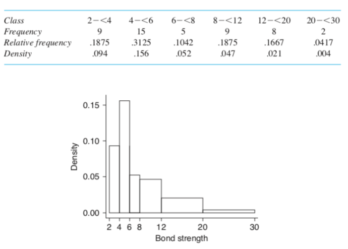
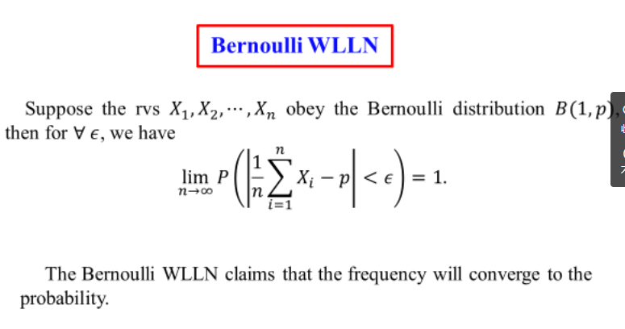
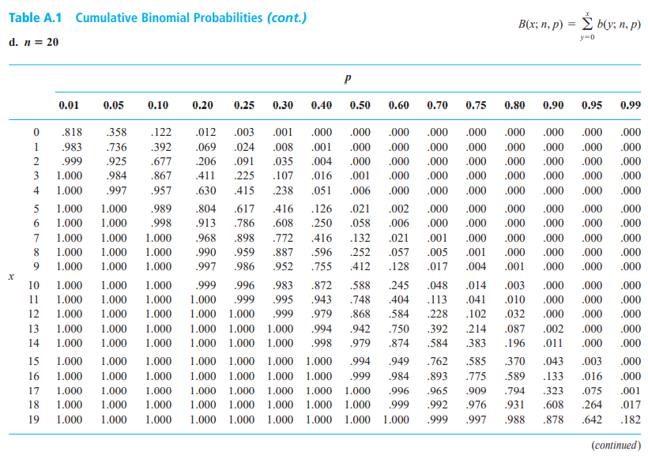
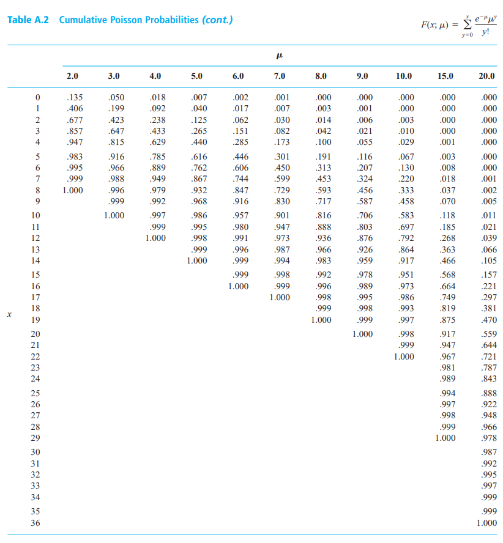

## 目录

  - 英语单词
    - 第一章
    - 第二章
    - 第三章
    - 第四章
  - 上课内容
    - 第一章-统计
      - 1.1/1.2/1.3 统计图示和表格种类
      - 1.4 茎叶图（stem-and-leaf displays）
      - 1.5 点图（dotplots）
      - 1.6 直方图（histograms）
      - 1.7 测度（measures of location）
      - 1.8 离散程度量度（measures of variability）
      - 1.9 箱图（boxplots）
      - 1.10 推理统计学（inferential statistics）
      - 1.11/1.12 枚举与分析研究（enumerative versus analytic studies）
      - 1.13 收集数据的方法
      - 补充：使用换元求导法推导最小二乘法
    - 第二章-概率
      - 2.1 样本空间和事件（sample spaces and events）
      - 2.2 概率的公理，解释和性质（axioms,interpretations,and properties of probability）
      - 2.3 计数技术（counting techniques）
      - 2.4 条件概率（conditional probability）
      - 2.5 独立性（independence）
    - 第三章-离散随机变量（discrete random variable）
      - 3.1 随机变量（random variable）
      - 3.2 离散随机变量的概率分布（probability distribution）
        - 伯努利分布/两点分布/0-1分布（Bernoulli distributions）
        - 等比分布/几何分布（geometric distribution）
      - 3.3 离散随机变量的期望值（expected value）
      - 3.4 二项概率分布（the binomial probability distribution）（离散）
      - 3.5 超几何和负二项分布（hypergeometric and negative binomial distributions）（离散）
      - 3.6 泊松概率分布（the poisson probability distribution ）（离散）
        - 泊松过程（poisson process）
    - 第四章-连续随机变量和概率分布
      - 4.1 连续概率分布的概率密度函数（probability density functions）
      - 4.2 连续概率分布的累计分布函数和期望值（cumulative distribution functions and expected values）
        - 均匀分布（uniform distribution）（连续 / 特殊情况下有离散的形式）
      - 4.3 正态分布（the normal distribution）（连续）
        - 补充：证明与正态分布随机变量有线性关系的随机变量也符合正态分布
        - 补充：正态分布对离散随机分布（二项分布）的近似（重点）
      - 4.4 指数分布和伽马分布
        - 指数分布（the exponential distributions）（连续）
        - 伽马分布与伽马函数（gamma distributions and gamma function）（连续）
        - 卡方分布（chi-squared distribution）
      - 4.5 其他连续分布
        - 韦伯分布（Weibull distribution）
        - 对数正态分布（lognormal distribution）
        - 贝塔分布和贝塔函数（Beta distribution and Beta function）
      - 4.6 概率图像（probability plots）（非重点）
    - 第五章-联合概率分布和随机样本（joint probability and random samples）
      - 5.1 联合分布（joint distribution）随机变量与边缘分布（marginal distribution）随机变量
        - 随机变量的独立性（independence）判断（通过联合分布与边缘分布判断）
        - 多项式分布/多重正态分布（multinomial distribution）
        - 条件分布（conditional distributions）
      - 5.2 期望值、协方差、相关性（expected values, covariance, correlation）
        - 联合分布的复合函数期望值和方差
        - 协方差（covariance）
        - 独立性和相关性的比较
      - 5.3 统计及其分布（statistics and their distributions）以及随机样本
      - 5.4 样本均值的分布（distribution of the sample mean）
      - 5.5 线性组合的分布（the distribution of a linear combination）
      - 补充：对于两概率分布X和Y的期望值和方差
    - 第六章-点估计（point estimation）
      - 6.1 基本概念
        - 无偏估计量（unbiased estimators）
        - 最小方差无偏估计量（minimum variance unbiased estimator，简写为MVUE）
        - 点估计量的标准误差（standard error）
      - 6.2 点估计的方法
        - 矩法（method of moments）
        - 极大似然法（maximum likelihood）
    - 第七章-区间估计（interval estimate）
      - 7.1 区间估计/置信区间（confidence interval，简写为CI）的基本性质
      - 7.2 总体中大样本（large-sample）的置信区间
      - 7.3 正态总体分布（normal population distribution）的区间（t分布）
      - 7.4 正态分布的方差和标准差的置信区间
    - 第八章-根据单样本（single sample）的假设检验（test of hypotheses）
      - 8.1 假设与检验
      - 8.2 总体均值的检验（z检验）
        - 总体符合正态分布的情况（z检验情况一）
        - 随机样本数较大的情况（z检验情况二）
        - 总体符合正态分布的情况（标准差未知）（t检验）
      - 8.3 总体比例的检验
        - 8.3.1 随机样本数较大的情况
        - 8.3.2 样本数较小的情况
      - 8.4 P值（P-values）
        - 8.4.1 使用P值对标准正态分布的检验
        - 8.4.2 使用P值对t分布的检验
    - 第九章-基于双样本的推论（inferences）
      - 9.1 两个总体均值之间的差异的z检验和置信区间
      - 9.2 两个样本的t检验和置信区间
      - 9.3 配对数据（paired data）分析
      - 9.4 关于总体比例（population proportions）的差（difference）的推论（inferences）
      - 9.5 关于两个样本方差的推论
  - 经典题目补充
    - n个标签球放入n个标签盒求标签对应数量X的分布列（高中概率题）
    - 莱布尼兹法则（适用于定积分的情况）
    - 概率质量函数和累积分布函数的相互转化方式
    - 矩（moment）和偏度系数（skewness coefficient）和峰度系数（kurtosis coefficient）
    - 古典概型
    - 马尔可夫不等式和切比雪夫不等式（Markov inequality and Chebyshev inequality）
      - 总体方差和样本方差的区别
  - 常用对照表
    - 二项分布的累积分布函数对照表
    - 泊松分布的累积分布函数对照表
    - 标准正态分布的累积分布函数对照表
    - 标准正态分布和非标准正态分布的累积分布函数转化
    - 伽马函数对照表
    - t分布的临界值对照表
    - 卡方分布的自由度临界值对照表

## 英语单词

### 第一章

probability   s.概率；概率论

statistics   s.统计资料；统计学（提供组织与总结数据的方法，根据数据里的信息得出结论的学科）；统计数据

professional capacities   s.专业能力

population   s.总体（明确定义的对象集合）

well-defined   s.明确定义的；清晰的

sample   s.样本（总体的一个子集）

certain characteristic   s.样品拥有的某些特征

variable   s.变量（值可能会发生变化的任何特征都可以成为变量）

univariate data set   s.单变量数据集（由对单个变量的观测数据组成）

multivariate data   s.多元数据（由对多个变量的观测数据组成）

descriptive statistics   s.描述性统计（收集数据来进行总结和描述数据的重要特征的统计方法）

important features   s.重要特征

stem-and-leaf displays   s.茎叶图

histograms   s.直方图

boxplots   s.箱形图

scatter plots   s.散点图

numerical summary measures   s.数值汇总度量（包括：平均值、标准差、相关系数）

means   s.均值

standard deviations   s.标准差

correlation coefficient   s.相关系数

pictorial   s.图形的

tabular   s.表格的

a sound choice   s.一个明智的选择

prescription   s.处方；处方药；方法；计划

remark   s.备注

degrees of freedom(df)   s.自由度

conceptual   s.概念性

hypothetical   s.假设性

enumerative   s.列举的；枚举的

census   s.统计；人口普查

enumerative study   s.枚举性研究：枚举/列举性研究的重点是对结果的判断。这些研究旨在列举（解释、评估、描述）现有总体的状况。

analytic study   s.分析性研究：分析性研究的重点是改进产生结果的过程，以及在未来继续产生结果的过程。

只有在研究一个不变的情况或某个时刻的快照时，才应使用枚举研究。不幸的是，当我们实际研究过程时，我们经常使用适合于枚举研究的方法。当我们在研究一个我们希望随着时间推移而改进的过程时，我们应该应用适合于分析调查的方法。

### 第二章

dice   s.骰子；筛子；色子

identical   s.相同的

multiplication rule   s.乘法法则

### 第三章

Bernoulli random variable   s.伯努利随机变量

pairwise independence   s.两两独立（两个事件之间相对独立）

mutually independent   s.相对独立（比两两独立更强，所有事件之间同时相对独立，所有事件两两独立不一定相对独立）

verify   s.验证；证明

via   s.通过；经由

### 第四章

proposition   s.命题

## 上课内容

### 第一章-统计

#### 1.1/1.2/1.3 统计图示和表格种类

描述性统计种的图示法和表格法包括：

- 频率表（frequency tables）

- 计数器（tally sheets）

- 直方图（histograms）

- 饼图（pie charts）

- 条形图（bar graphs）

- 散点图（scatter diagrams）

#### 1.4 茎叶图（stem-and-leaf displays）

茎：十位数（tens digit）。叶：个位数（ones digit）。

竖线左边是十位数，右边是每一个数据的个位数（4，11，13，14...）。

1.选择一个或更多的数字的前导位数（leading digits）来作为茎值（stem values），然后选择尾随位数（trailing digits）来作为叶片（leaves）。

2.将可能的茎值列出，作为一个垂直的列（vertical column）。

3.在相应的茎值旁边记录每个观测值（observation）的叶片。

4.在图的某个位置标上茎和叶的单位。

***

#### 1.5 点图（dotplots）

点图是一个当数据集合理地小，或者数据集拥有相对不那么明显的数据值时，会比较有用。

每次观测的数据是通过一个点来表示的，这个点会在一个水平的测量尺（horizontal measurement scale）的横坐标上拥有对应的位置。

而如果有重复的数据，则在对应的位置上垂直方向再标一个点，通过每个横坐标的垂直方向的点的数量查看重复的数据的数量。

***

#### 1.6 直方图（histograms）

对一个数值变量，如果它的可能值组成的集合是有限的，或者说可以写成可数的无限数列（存在确定的第一个数、第二个数等等）形式的，那么这个数值变量就是离散（discrete）的。

如果一个数值变量的可能值由数字列（number line）的上的整个区间（interval）组成，则该数值变量是连续的（continuous）。

***

对一个特定的数值，它的频率（frequency）就是该值在数据集中出现的次数。它的相对频率（relative frequency）是数值出现的次数的分数（fraction）或比例（proportion）。

$$一个数值的相对频率=\frac{这个数值出现的次数（频率）}{数据集观测到全部的数值的数量（总样本数）}$$

频率分布（frequency distribution）是将频率和相对频率全部或者只列出其一的列表（tabulation）。

***

构建离散数据的直方图：

首先，得到每个x值的频率和相对频率，然后记录可能的x值在水平尺上。然后在每个值的上方，画出一个高度等于相对频率的矩形（rectangle）。

***

构建连续数据的直方图（等类宽（equal class widths）情况）：

类（classes）/类区间（class intervals），是指在处理连续数据时将测量轴（measurement axis）细分（subdividing）为多个适当数量的拥有适当宽度的区间。它可以使得每次观测仅包含一个类中的数据。

经过不断的测试和发展，一条关于等宽的情况下类该取多少个的经验公式被提出：

$$类的数量\approx \sqrt{数据集观测到全部的数值的数量（总样本数）}$$

一种好的做法是在极端观测值（extreme observations，观测精度更高的情况）附近使用一些较宽的区间，在高浓度区域（region of high concentration，数据较集中的区域）使用较窄的区间。以下是对同一样本的数据进行不同宽度区间的分组效果图示：

那么最终等类宽情况的连续数据直方图和离散数据直方图的画法一致（多了定义类的数量和宽度这一步而已）。

***

构建连续数据的直方图（不等类宽（unequal class widths）情况）：

在得到频率和相对频率后，是计算矩形的高度。公式：

$$一个类的相对频率=\frac{这个类中的样本数}{数据集观测到全部的数值的数量（总样本数）}$$

$$矩形的高度（密度）=\frac{这个类的相对频率}{这个类的类宽}$$

这个矩形的高度结果被称为密度（density），垂直轴就是密度尺（density scale）。

密度可以表示这个类包含的数据量的多少（或者说一个类中每个最小分度平均含有的数据量对整体数据量的比例）。之所以要这么做，是因为现在属于不等类宽的情况。这个概念在等类宽的情况下仍然有效。

***

直方图的大致趋势的形状有以下几种：

***

#### 1.7 测度（measures of location）

数据的可视化的总结（visual summaries）是获得初步（preliminary）印象和见解（insights）的优质工具。正式的数据分析通常需要计算和解释（interpretation）数值汇总度量（numerical summary measures）。

我们试图从这些数据中提取（extract）几个总结性的数字，这些数字可能有助于描述数据集的特征，并传达其一些显著的（salient）特征。因此，能够表示一个数据集的显著特征的值，就被称为测度。包括但不限于：

- 平均值（the mean）

- 中位数（the median）

- 四分位数（quartiles）

- 百分位数（percentiles）

- 截尾均值（trimmed means）

截尾均值：10%的截尾均值就是除去最小的10%和最大的10%的样本，然后取剩余样本的平均值。对于某些数据，截尾均值能够获得一个比平均值更具有数据整体代表性的度量。

***

#### 1.8 离散程度量度（measures of variability）

报告中心度量值只提供有关数据集或分布的部分信息。不同的样本或群体可能具有相同的中心测量值，但在其他重要方面彼此不同。

样品方差（sample variance），与高中不同，是除以n-1。为什么呢？有两种理解：一是维度缺少1，因为没有平方的话上面的式子恒等于0，说明维度是n-1而不是n。

$$s^2=\frac{(x_1-\bar{x})^2+(x_{2}-\bar{x})^2+...+(x_{1}-\bar{x})^2}{n-1}=\frac{\sum_{i=1}^{n}(x - \bar{x})^2}{n-1}=\frac{S_{xx}}{n-1}$$

样品标准差（sample standard deviation）就是样品方差开根。

$$s=\sqrt{s^2}$$

高中学习的方差被叫做总体方差（population variance），与样品方差是不同的，符号为$\sigma^2$，其公式为：

$$\sigma^2=\sum_{i=1}^N\frac{(x_i-\mu)^2}{N}$$

$$V(X)=\sigma^2=\sum _{i=1}^{N} (x_{i}-\mu)^2 \cdot p(x)=\sum _{i=1}^{N} (x_{i}-E(X))^2 \cdot p(x)$$

$$V(X)=E[(x - \mu)^2]$$

$$V(X)=E(x^2)-[E(x)]^2$$

$x$的离差平方和$S_{xx}$为：

$$S_{xx}=\sum_{i=1}^n(x_i-\bar{x})^2=\sum_{i=1}^n(x_i^2-2\bar{x}x_i+\bar{x}^2)=\sum_{i=1}^nx_i^2-n\bar{x}^2$$

易得当每个样本均加上常数C，新的方差与原来一致。当每个样本均乘上常数C，新的方差是原来方差的平方。

***

#### 1.9 箱图（boxplots）

箱图是仅专注于一个方面（one aspect）的数据的最显著（most prominent）特征的图像。

最显著特征包括以下几点：

- 中心（center）
- 散布（spread）
- 偏离对称（departure from symmetry）的程度（extent）和性质（nature）
- 从数据主体来看异常遥远的观测值，称为离群值（outliers）。离群值可以视作为干扰数据，噪音。

已知所有观测值（observations）的中位数$\widetilde{x}$。现在将所有的观测值从小到大列出来，分出最小的一半和最大的一半。然后，最小的一半观测值的中位数，称为lower fourth。最大的一半观测值的中位数，称为upper fourth。而能表示散布且能一定程度上对抗离群值的干扰的数值叫做离差（fourth spread），以符号$f_s$表示，公式为：

$$f_s=upper \; fourth-lower \; fourth$$

也就是说，这个离差$f_s$不受观测值中靠前和靠后的25%的数据的影响。偏离1.5倍离差的数据就可以被称为离群值（outlier）了。偏离3倍或以上离差的数据会被称为极端值（extreme）。

一个箱图，就是基于五个参数：总最小值$x_{min}$、lower fourth、中位数$\widetilde{x}$、upper fourth、总最大值$x_{max}$，如下图所示：

最靠左的垂直线代表lower fourth，最靠右的垂直线代表upper fourth，中间的垂直线代表总观测值的中位数$\widetilde{x}$，因此围成的箱子（box）的宽度（width）就等于离差$f_s$的大小。

两边的水平线代表靠前和靠后的那25%的数据，各延伸到总观测值中的最小值$x_{min}$和最大值$x_{max}$为止。

注意：离群值使用实点表示，极端值使用虚点表示。

***

#### 1.10 推理统计学（inferential statistics）

将样本推广到总体的技术称为推理统计学。

推理程序（inferential procedures）包括：

- 点估计（point estimation）
- 假设检验（hypothesis testing）
- 区间估计（estimation by confidence intervals）

推理统计学与概率论的关系如下：

- 概率论（probability）根据总体来推理样本的属性。（演绎推理，deductive reasoning）
- 推理统计（inferential statistics）根据样本来推理总体的属性。（归纳推理，inductive reasoning）

***

#### 1.11/1.12 枚举与分析研究（enumerative versus analytic studies）

枚举：专注于构成一个群体的有限的、可识别的、不变的个体或对象集合。

***

#### 1.13 收集数据的方法

简单随机样本（simple random sample）：直接从总体中随机抽取一定数量的样本，总体中每个个体被抽到的几率相同。

分层抽样（stratified sampling）：将总体先分成若干个不重叠的组（non-overlapping groups），再在每个组随机抽取一个样本。

***

#### 补充：使用换元求导法推导最小二乘法

换元求导法（求最小二乘法的最小值的c值）

$$Q=\sum_{i=1}^{n}(x_i-c)^2$$

问当常数c值取何值时，Q最小？

换元求导法：首先，对Q进行求导，当$\frac{dQ}{dc}=0$时，可以得到Q的极值。

要满足"当Q'为0时，可以得到Q的极值"的条件，必须选用c作为未知数。那么$x_1,x_2,...,x_n$就作为n个不同的常数处理，对Q的表达式进行求导：

$\sum_{i=1}^{n}(x_i-c)^2=(x_1^2+x_2^2+...+x_n^2)-2*(x_1+x_2+...+x_n)+n * c^2$

则使$\frac{dQ}{dc}=-2 * (x_1+x_2+...+x_n)+2n * c,\frac{d^2Q}{dc^2}=2n>0$，可得如果使$\frac{dQ}{dc}=0$，则唯一极值为极小值，算得$c=\bar{x}$值，满足Q最小。

结论：$c=\bar{x}$即$\sum_{i=1}^{n}(x_i-c)^2$的充要条件，最小二乘法的定义得证。

***

### 第二章-概率

#### 2.1 样本空间和事件（sample spaces and events）

随机事件/随机实验（experiment）的概率空间（the sample/probability space）使用$\delta$表示，是这个随机实验所有可能的结果（outcomes）的集合。如果随机实验可以无限次进行下去，则$\delta$集合的元素也会是无限个，此时被称为无限概率空间（infinite sample space）。

$\delta$的任意子集被称为事件（events）。如果子集仅由一个结果组成，我们称事件是简单（simple）的。如果子集是多个结果组成，我们称事件是复杂的（compound）。

当一个随机实验发生，且结果等于或者被包含在一个特定的事件中时，我们称这个特定的事件发生（occur）了。因此可得作为所有事件的父集$\delta$是一个必定发生的复杂事件。

如果事件为空集说明一个事件永远不会发生，我们称它为空事件（null event）。

***

对事件的操作（operation）和事件之间的关系：

并集（union）：读作："A or B"，写作：$A \cup B$

交集（intersection）：读作："A and B"，写作：$A \cap B$

对立/互补（complement）：符号为：$A'=B$，满足：$A \cap B=\phi$（$\phi$为空集）和$A \cup B=\delta$（$\delta$为全集）

差异（difference）：满足：$A-B=A \cap B'$，则$A-B$为差异。

不相容/互斥（mutually exclusive/disjoint）：满足：$A \cap B=\phi$，则A和B不相容。

交换律（commutative laws）：

$$E \cup F=F \cup E$$
$$E \cap F=F \cap E$$

结合律（associative laws）：

$$(E \cup F)\cup G=E \cup F(\cup G)$$
$$(E \cap F)\cap G=E \cap F(\cap G)$$

分配定律（distributive laws）：

$$(A \cap B)\cup C=(A \cup B)\cap(B \cup C)$$

$$(A \cup B)\cap C=(A \cap B)\cup(B \cap C)$$

德·摩根定律（De Morgan's laws）：

$$(A \cup B)'=A' \cap B'$$

$$(A \cap B)'=A' \cup B'$$

对三个事件E，F，G，事件发生的不同情况（或者看成当事件发生，等价于求这个事件对应的覆盖区域的面积的叠加。例如：只有E发生了，可以理解为求不含F和G的E的面积$E \cap F^{\prime} \cap G^{\prime}$。）对应的表达式（expression）为：

注意其中的关系：至少（at least），至多（at most），恰好（exactly）。

***

#### 2.2 概率的公理，解释和性质（axioms,interpretations,and properties of probability）

使用数学三条公理描述概率的定义：

- 公理1：对任意事件$A$，$P(A) \geq 0$。代表事件A发生的最低概率为0。

- 公理2：$P(\delta)=1$。$\delta$包含了所有的可能结果，所以作为全事件/全集合，它的发生几率一定为1。

- 公理3：如果$A_1,A_2,A_3...$是一个无限的互不相容事件的序列，可以视作所有不相容的事件的合计发生概率符合近似线性。$P(A_1)+P(A_2)+...=P(A_1 \cup A_2 \cup ...)$，通式为：$P(A_1 \cup A_2 \cup A_3 \cup ...)=\sum_{i=1}^{\infty}P(A_i)$

***

概率与频率的关系（relationship between probability and frequency）：

在大数（large number）级别的试验次数下，掷硬币的两种情况的表现近似于一半一半。因此，在实验事实上，我们定义掷硬币的正面向上的概率为$P(H)=0.5$。

因此通常的，我们通过在大数级别次数的实验条件下测得的事件A的发生频率来近似定义理论上的事件A的发生概率。

***

概率的性质（通过数学三条公理来推导得出）：

- 当$P(\phi)=0$，则$\phi$是空事件（null event）。
- 如果$A_1,A_2,A_3...$是一个有限的互不相容事件的序列，则满足：$P(A_1 \cup A_2 \cup A_3 \cup ...\cup A_k)=\sum_{i=1}^{k}P(A_i)$

- 对任意事件A，满足：$P(A)=1-P(A')$

- 对任意事件A，都满足：$P(A) \leq 1$

- 如果事件A和B互不相容，则满足：$P(A \cap B)=0$

- 对任意两个事件A和B，满足：$P(A \cup B)=P(A)+P(B)-p(A \cap B)$，对任意三个事件A和B和C，满足$P(A \cup B \cup C)=P(A)+P(B)+P(C)-P(AB)-P(AC)-P(BC)+P(ABC)$被称为约旦公式（Jordan formula）。

***

结果等概率：

首先列出实验的所有的结果。然后判定是否结果等概率（equally likely outcomes）。

结果等概率指的是，如果一个实验（已经完成的实验）的所有的可能结果数为N，且每个结果发生的概率相等。如果有n个结果符合事件A的要求（事件A发生的条件可能仅仅是某一部分条件，那么可能有多个结果满足这一部分条件），那么满足：$P(A)=\frac{n}{N}$

***

#### 2.3 计数技术（counting techniques）

k元组（k-tuple）：

有序对（ordered pair）：举个例子，先后两次骰子，每一个这个实验的结果都是一个有序对（ordered pair），用$(a,b)$表示。因为$(a,b)$的结果里第一个元素$a$具有$n_1=6$种情况，第二个元素$b$具有$n_2=6$种情况。所以总结果数（有序对的数量）为：$n_1 \cdot n_2=36$。

我们称一个由k个对象（k objects）组成的有序集合（ordered collection）为一个k元组（例如：$(2,6,3),(1,3,5),(2,2,7)$都为三元组。元组$(a_1,a_2,a_3...a_n)$，元组$(b_1,b_2,b_3...b_n)$就是两个不同的n元组。）。假定一个集合由许多k元组组成，那么所有k元组的第一个元素（elements）具有$n_1$种可能，第二种元素具有$n_2$种可能...也就是说，对于所有k元组的第$(k-1)$个元素的每种选择，第$k$个元素都有$n_k$种可能的选择。因此，这个集合一共有$n_1*n_2*...*n_k$种k元组。

一个将会进行多次试验的实验（一个实验由多个试验组成）的每个可能的最终结果都表示为一个k元组，那么可知"每次试验的可能结果均为n个"（$n_1=n_2=...=n_k$）的实验一共有$n_1*n_2*...*n_k=n^k$种最终结果。

***

排列（permutation）：

排列是一种k元组。任何从n个不同对象（objects）的集合（set）抽取（taken from）数量为k个对象，并把这k个对象组成的有序数列组成的排列称为从对n个对象中抽取数量（size）为k的排列。

$$P_{k,n}=n*(n-1)*...*(n-k+1)$$

对于任意正整数m，$m!$为$m$的阶乘（m factorial）。同时0！=1。因此我们有了：

$$P_{k,n}=\frac{n!}{(n-k)!}$$

推导：把n个不同的元素任选m个排序，按计数原理分步进行：取第一个：有$n$种取法；取第二个：有$(n−1)$种取法；取第三个：有$(n−2)$种取法；……取第m个：有$(n−m+1)$种取法。推导出如上公式。

$A_n^m=n(n-1)(n-2)...(n-m+1)=\frac{n!}{(n-m)!} , m \leq n$

排列的特点是全部的对象需要进行选完后进行不重复排序的，每个对象的身份不同，因此比组合的情况多。

***

组合（combination）：

给定一个n个不同对象（objects）的集合（set），任何对象抽取数量（size）为k的无序子集称为组合。

$$C_n^m=\frac{A_n^m}{A_m^m}=\frac{n(n-1)(n-2)...(n-m+1)}{m!}=\frac{n!}{m!(n-m)!},m \leq n$$

$$C_n^0=C_n^n=1$$

$\left(\begin{matrix} n  \\ k  \end{matrix}\right)$等价于$C_{k,n}$：

$$C_n^k=\left(\begin{matrix} n  \\ k  \end{matrix}\right)=\frac{P_{k,n}}{k!}=\frac{A_n^k}{A_k^k}=\frac{n!}{k!(n-k)!}$$

组合的特点是全部的对象满足结果等概率（equally likely outcomes），也就是各个对象的身份是相同的。

***

其他抽取方法：

抽取并放回k次的总情况数：

$n^k$

一个一个全部抽取（全排列）且不放回的总情况数：

$n!$

***

几何概型（geometric probability）：

例子（简单题）：

使用图像、坐标轴等几何图像帮助理解，通过面积来表示概率。

***

例子（思考题）：

蒲丰投针（Buffon's needle）是求将一种一定长度L的针随机投掷，在一条条平行且间隔相同为a（$a \geq L$）的两条线之间的概率的经典概率问题。针有倾斜角度$\varphi$。

可以定义针的中点和倾斜的角度为变量。把满足条件和总体抽象为函数图像的面积进行计算。

***

#### 2.4 条件概率（conditional probability）

定义：对于任意两个事件A和B，在B事件（$P(B)>0$）发生的情况下，A事件发生的概率为B事件发生的条件概率。

$$P(A|B)=\frac{P(A \cap B)}{P(B)}=\frac{P(A B)}{P(B)}$$

也就是全空间发生了变化（就是替换为了P(B)），需要重新计算概率。

$P(B)=P(A \cap B)+P(A' \cap B) \geq P(A \cap B)$，因此满足$P(A|B) \leq 1$

定义：如果满足$P(A|B)=P(A)$，$P(A \cap B)=P(A) \cdot P(B)$，则这两个事件相互独立（independent）。两个事件发生的概率互不影响。如果两个事件就是相关的（dependent），那就满足$P(A \cap B)=P(A|B) * P(B)$，$P(A \cap B) \neq P(A) \cdot P(B)$。（两个事件是否相互独立或相互有关取决于两个事件之间的实际关系。）

二级推论公式：

$P(A \cap B)=P(A|B) * P(B)$

$P(A \cap B)=P(B|A) * P(A)$

$P(C \cap B \cap A)=P(C | B \cap A) * P(B \cap A)=P(C | B \cap A) * P(B|A) * P(A)$

***

贝叶斯定理（Bayes’ theorem）：

$P(A \cap B)=P(A | B) * P(B)$

$P(A \cap B)=P(B | A) * P(A)$

推出贝叶斯公式：

$P(A | B)=\frac{P(B | A) * P(A)}{P(B)}=\frac{P(B | A) * P(A)}{P(B \cap A)+P(B \cap A')}$

***

全概率公式（law of total probability）：

使$A_1,A_2,...,A_k$互斥且满足$A_1\cup A_2 \cup ... \cup A_k=S$，也就是组成完备事件组（exhaustive events）$S$时，则满足：

$$P(B)=P(A_1 | B)P(B)+...+P(A_k | B)P(B)=P(B|A_1)P(A_1)+...+P(B|A_k)P(A_k)=\sum_{i=1}^{k}P(B | A_k) * P(A_k)$$

随着新数据或信息的出现和生效，事件的先前概率（prior probability）将会被修正，修正后的概率成为后验概率（posterior probability）。结合贝叶斯公式，可得当事件B已经发生的情况下，已知先前概率$P(A_j)$的情况下，对于之后发生的事件B，$A_j$的后验概率为：

$$P(A_j | B)=\frac{P(A_j \cap B)}{P(B)}=\frac{P(B | A_j) * P(A_j)}{\sum_{i=1}^{k}P(B | A_k) * P(A_k)}, j=1,2,...,k$$

一般是已知$P(B)$，求$P(A_j \cap B)=P(A_j | B) * P(B)$。$P(A_j | B)$可以写成已知条件例如包含$P(B)$的式子。

***

#### 2.5 独立性（independence）

对于任意两个事件A和B，

$P(A|B)=\frac{P(A \cap B)}{P(B)}$

如果事件A的发生不受事件B发生的影响，也就是满足$P(A | B)=P(A)$，则事件A和事件B是相互独立的（independent），否则就是相关的（dependent）。同时这也是满足$P(B | A)=P(B)$的必要条件。

***

互斥和相互独立：

两个事件如果互斥，则一定不满足相互独立。两个事件如果满足相互独立，则不一定互斥（考虑不可能事件），但大多数情况是不互斥的。

如果相互独立（两个事件概率不相互影响），满足：$P(A \cap B)=P(A)*P(B)$

如果互斥（两个事件没有重叠部分），满足：$P(A \cup B)=P(A)+P(B)$

***

求解概率问题的方法有：

- 减法法则（subtraction rule）：$P(A)=1-P(A')$（间接法）

- 乘法法则（multiplication rule）：$P(A \cap B)=P(A | B) * P(B)$

- 加法法则（addition rule）：$P(A \cup B)=P(A)+P(B)-P(A \cap B)$

- 全概率公式

***

### 第三章-离散随机变量（discrete random variable）

$\sigma$-代数（$\sigma$-algebra） / $\sigma$域（$\sigma$ field）：

对于多个集合$A_1,A_2,...,A_n$作为集合元素组成的集合$S$，它包含空集$\Phi$。（第一个条件）

每个集合元素$A_i$在集合$S$内能找到它对应的补集$A'$。（第二个条件）

整个集合$S$中的所有集合元素的并集$\cup _{i=1}^{\infty}A_i$也属于集合$S$（可数并集，对有限集只需任意两个取并）。（第三个条件）

若一个集合满足以上三个条件，则称集合$S$为一个$\sigma$域。

***

概率空间有三要素$(\Omega, \mathcal{F}, \mathcal{P})$。

$\Omega$为样本空间（sample space），是试验中所有可能结果的集合，每个结果互斥，且所有可能结果都必须包含。

$\mathcal{F}$为事件集合（set of events），是$\Omega$一些子集构成的集合（也就是这个集合的元素也是集合）。$\mathcal{F}$必须是$\sigma$域（$\sigma$ field），因此它满足以下三点特性：

- $\Phi \in \mathcal{F}$（也就是必须包含不可能事件）

- 如果$E \in \mathcal{F}$，则$E^c \in \mathcal{F}$

- 如果$E_{1}, E_{2}, \ldots, E_{i} \in \mathcal{F}$，那么满足$\cup _{i=1}^{\infty} E_{i} \in \mathcal{F}$

$\mathcal{P}$为概率/概率测度（probability measures），它描述的是一次随机试验中被包含在$\mathcal{F}$中的所有事件的可能性。$\mathcal{P}$满足三点特性（几乎和$\mathcal{F}$的特性一致）：

- $0 \leq P(E) \leq 1$（总测度为1）

- $P(\Omega)=1$（包含样本空间并且概率为1）

- 如果$E_{1}, E_{2}, \ldots, E_{i}$为互斥事件，那么$P\left(\cup _{i=1}^{\infty} E_{i}\right)=\sum_{i=1}^{\infty} P\left(E_{i}\right)$

我们现代的概率与经典概率不同，我们的现代概率是定义在一群符合某些条件的「事件」上的。而经典概率是定义在不同「结果」上的。

概率空间中的$\mathcal{P}$是定义在$\mathcal{F}$上（而不是$\Omega$）的函数。$\mathcal{F}$与$\mathcal{P}$各个性质几乎完全相对应，其实构建$\mathcal{P}$实际上是为了让我们得到一个自洽的体系。因为面对某些「不可数」的概率空间，经典概率理论不可用。

***

对一个数值变量，如果它的可能值组成的集合是有限的，或者说可以写成可数的无限数列（存在确定的第一个数、第二个数等等）形式的，那么这个数值变量就是离散（discrete）的。

如果一个数值变量的可能值由数字列（number line）的上的整个区间（interval）组成，则该数值变量是连续的（continuous）。

***

#### 3.1 随机变量（random variable）

分布函数是最本质的东西，任意事件的概率都可以使用分布函数来表示。

随机变量（random variable，简写为rv）的严格定义（引用了线性代数的数域映射，将事件域$u$映射为$n$维数域$R^n$）：

$X : \omega \to x$（$u \to R^n$）

其中$\omega$为概率，$x$为事件。

满足：$X^{-1}(B) \subset u, \forall B \in R^n$

$B$其实就是事件对应的概率，属于数域$R^n$。

那么累计函数可以定义为：$F_X(x)=P(\omega | X \leq x)$（也就是求$X \leq x$的概率）

***

可数无限（countably infinite）就是无限。

如果随机变量的可能值构成一个有限集，或者可以以一对一的无限数列（可数无限）列出。则这个随机变量称为离散随机变量。离散型随机变量是在一定区间内变量取值为有限个或可数个，每个取值有确定的取值$P(X=c)=k , k \in [0,1]$。因此离散型变量用求和符号$\sum$，可以说是一个一个的点的值的相加。

随机变量的可能值集合是数字列（number line）上的单个区间，或者是这些区间的不相交并集（disjoint union）。对于任何可能值$c$满足$P(X=c)=0$（单个点的概率不可求且认为近似于0，只有区间的概率可求）。则这个随机变量为连续的。连续型随机变量是在一定区间内变量取值有无限个，数值是无法一个一个列举出来。离散型变量用积分符号$\int$，可以说是一个区间的所有无数个点的相加。

***

#### 3.2 离散随机变量的概率分布（probability distribution）

对于一个离散随机变量，我们想要对所有可能的X值求对应的概率。概率总和为1。

定义：对于一个离散随机变量，它的概率分布或者说概率质量函数（probability mass function，简写为pmf）对于每个可能数字x被定义为：

$p(x)=P(X=x)=P(所有 \, s \in \delta:X(s)=x)$

所有可能值$x$的$p(x)$的总和为1。

***

##### 伯努利分布/两点分布/0-1分布（Bernoulli distributions）

伯努利分布（Bernoulli distributions）也被称为两点分布或者0-1分布。它的随机变量$X$的可能值只有两个取值。

$X= \begin{cases}1 & \text {事件A发生} \\ 0 & \text { otherwise}\end{cases}$

其中"否则"（otherwise）指的是除去有明确定义的情况后剩下的所有情况。

如果我们定义当$x=1$时，事件的概率为$p(1)=\alpha$（$0<\alpha<1$），那么它的概率质量函数$p(x)$被定义为：

$p(x ; \alpha)=\left\{\begin{array}{cc}1-\alpha & \text { if } x=0 \\ \alpha & \text { if } x=1 \\ 0 & \text { otherwise }\end{array}\right.$

这个量（quantity）$a$是伯努利分布的一个参数（parameter），在$(0,1)$的每个不同的参数$\alpha$会得到不同的伯努利分布的族（Bernoulli family）成员。也就是说，参数$\alpha$定义了当前讨论伯努利分布的属性，它是所有伯努利分布情况中的一种。

对于拥有不同的参数值的所有同一种概率分布的情况的组合（collection）被称为这种概率分布的族（family）。

***

##### 等比分布/几何分布（geometric distribution）

等比分布/几何分布（geometric distribution）的概率质量函数$p(x)$是直到第一次事件$A$发生的概率：

通式：

$p(x)=\left\{\begin{array}{cl}(1-p)^{x-1} p & x=1,2,3, \ldots \\ 0 & \text { otherwise }\end{array}\right.$

$p(1)=P(X=1)=P(A)=p$

$p(2)=P(X=2)=P\left(A^{\prime} A\right)=(1-p) p$

$p(3)=P(X=3)=P\left(A^{\prime} A^{\prime} A\right)=(1-p)^{2} p$

***

累积分布函数（the cumulative distribution function，简写为cdf）是对于一个固定的x值，计算当$X \leq x$的时候的概率$P(X \leq x)$。

因此对于任意实数x，定义累积分布函数为（因为$x$为上界，因此用变量$y$来代替原本的$x$来求和）：

$F(x)=P(X \leq x)=\sum_{y \leq x}p(y)$

***

概率质量函数和累积分布函数（离散随机变量）的直观图像：

不难发现累积分布函数F(x)的图像在每个X的可能值被囊括时F(x)会有跳跃（jump），这样的函数属于阶梯函数（step function）。

***

#### 3.3 离散随机变量的期望值（expected value）

期望值不是普通平均值（ordinary average），而是加权平均值（weighted average），在概率分布中期望值也叫做均值（mean）。

离散随机变量的期望值通式：

$E(X)=\mu_X=\sum_{x \in D} x \cdot p(x)$

其中$\mu$为期望值$E$的另一个表示方法。$D$是$X$的可能取值集合。

如果算出某个概率分布的期望值E(X)是无限的，则是因为p(x)是递增的，统计学里面把这种概率分布称为重尾分布（heavy tail distribution）。

***

对于伯努利分布/二项分布，概率质量函数$p(x)$为：

$p(x)=p \; (x=1)$

$p(x)=1-p=q \; (x=0)$

期望值：

$E(X)=1 * p+0 * (1-p)=p$

方差：

$V(X)=E(X^2)-[E(X)^2]=p(1-p)=pq$

***

对于等比分布/几何分布（直到第$x$次试验才成功），概率质量函数$p(x)$为：

$p(x)=(1-p)^{x-1}p, \; x=1,2,3...$

$p(x)=0, \; otherwise$

因此期望值（对$p$进行凑导数和级数求和）：

$\frac{d}{dp}(1-p)^x=- x \cdot (1-p)^{x-1}$

$E(X)=\sum_{x=1}^{\infty}x \cdot p(x)=\sum_{x=1}^{\infty}x \cdot (1-p)^{x-1} \cdot p=-p \cdot \sum_{x=1}^{\infty} \frac{d}{dp}(1-p)^x=-p \cdot \frac{d}{dp} \cdot \sum_{x=1}^{\infty} (1-p)^x=-p \cdot (\frac{1-p}{p})'=\frac{1}{p}$

$E(X)=\frac{1}{p}$

方差：

$V(X)=E(X^2)-[E(X)^2]=\frac{1-p}{p^2}=\frac{1}{p^{2}}-\frac{1}{p}$

***

有时候，会更倾向于计算关于$X$的函数$h(X)$的期望值而不是直接计算$X$的期望值。

此时设$Y=h(X)$，可以列出$h(x)$和$p(y)$的列表，且其与$E(X)$也能互相换算（$D, \; D^*$分别为$X$和$Y$的可能值组成的集合）：

$E(Y)=\sum_{y \in D^*}y \cdot p(y)=\sum_{x \in D}h(x) \cdot p(x)$

$E(h(X))=\sum_{x \in D}h(x) \cdot p(x)$

仅仅是使用了$h(x)$来代替了$x$，计算方式和$E(X)$相同。

***

期望值$E$符合线性性：

$E(Y)=E(aX+b)=\sum_{x \in D}(ax+b) \cdot p(x)=a \sum_{x \in D}x \cdot p(x)+b \sum_{x \in D}p(x)=aE(X)+b$

$E(aX+b)=aE(X)+b$

***

$X$的方差为$V(X)$，$\mu$为期望值，$\sigma_X$是$X$的标准差（standard deviation，简写为SD），标准差的平方等于方差。

根据线性性质得到：

$E(X-\mu)=E(X) - \mu =0$

$V(X)=E[(X-\mu)^2]=\sum_{x \in D}(x-\mu)^2 \cdot p(x)$

$\sigma_X=\sqrt{V(X)}$

快捷公式（shortcut formula）：

$V(X)=\sigma_X^2=E(X^2)-[E(X)]^2$

求函数$h(X)$的方差：

$V[h(X)]=\sigma_{h(X)}^2=\sum_{x \in D} (h(x)-E[h(X)]^2) \cdot p(x)$

$V[h(X)]=E[h(X)^2]-E[h(X)]^2$

***

对于方差$V$不符合线性性，有：

$V(aX+b)=\sigma_{aX+b}^2=a^2V(X)$

对于标准差则有：

$\sigma_{aX+b}=|a| \sigma_X$

***

#### 3.4 二项概率分布（the binomial probability distribution）（离散）

一个实验（experiment）由n次相互独立的更小实验组成，则更小的实验被称为试验（trials），假设每个试验仅有成功和失败两种结果，且成功概率恒定为p（无论进行了多少次试验），则这样的实验叫做二项实验（binomial experiment）。二项实验也叫做独立重复实验。符合二项分布的实验其实就是重复$n$次且相互独立的伯努利实验。

对于二项实验，有二项随机变量（binomial random variable）$X$，其为$n$次试验里的成功次数的可能取值。记为：$X \sim Bin(n,p)$。

$X \sim Bin(n,p)$有概率质量函数$b(x ; n,p)$：

$P(X=x)=b(x ; n,p)=C_n^x p^x (1-p)^{n-x}, x=0,1,2,...,n$

$b(x ; n,p)=0 , \; otherwise$

有累计分布函数$B(x;n,p)$（硬算公式）：

$B(x;n,p)=P(X \leq x)=\sum_{y=0}^x b(y;n,p),  \; x=0,1,2,...,n$

***

期望值公式：

$E(X)=\sum_{x=0}^n x \cdot b(x;n,p)=\sum_{x=0}^n x \cdot C_n^x p^x (1-p)^{n-x}=\sum_{x=1}^n x \cdot C_n^{x} p^{x} (1-p)^{n-x}=np$

证明：

$\begin{aligned} E(X) &=\sum_{x=0}^{n} x \cdot\left(\begin{array}{l}n \\ x\end{array}\right) p^{x}(1-p)^{n-x} \\ &=\sum_{x=1}^{n} \frac{n !}{(n-x) !(x-1) !} p^{x}(1-p)^{n-x} \\ &=n p \sum_{k=0}^{n-1} \frac{(n-1) !}{(n-1-k) ! k !} p^{k}(1-p)^{n-1-k} \\ &=n p(p+1-p)^{n-1}=n p \end{aligned}$

$E(X^2)=n^2p^2+np(1-p)$

证明：

$\begin{aligned} E\left(X^{2}\right) &=\sum_{x=0}^{n} x^{2} \cdot\left(\begin{array}{c}n \\ x\end{array}\right) p^{x}(1-p)^{n-x} \\ &=\sum_{x=1}^{n} \frac{n ! x}{(n-x) !(x-1) !} p^{x}(1-p)^{n-x} \\ &=n p \sum_{k=0}^{n-1} \frac{(n-1) !(k+1)}{(n-1-k) ! k !} p^{k}(1-p)^{n-1-k} \\ &=n p \sum_{k=0}^{n-1}(k+1)\left(\begin{array}{c}n-1 \\ k\end{array}\right) p^{k}(1-p)^{n-1-k} \\ &=n p\left[\sum_{k=0}^{n-1} k\left(\begin{array}{c}n-1 \\ k\end{array}\right) p^{k}(1-p)^{n-1-k}+\sum_{k=0}^{n-1}\left(\begin{array}{c}n-1 \\ k\end{array}\right) p^{k}(1-p)^{n-1-k}\right] \\ &=n p[(n-1) p+1]=n^{2} p^{2}+n p(1-p) \end{aligned}$

方差公式：

$V(X)=E(X^2)-E(X)^2=np(1-p)$

***

例子（思考题）：

***

#### 3.5 超几何和负二项分布（hypergeometric and negative binomial distributions）（离散）

超几何分布：

相比于二项分布，无放回的抽取是超几何分布的特征。也因为如此，随着试验次数的增加，单次试验成功的概率是会变化的。

假定一个由N个个体（individuals）组成的总体，每个个体仅有成功(S)和失败(F)的状态，而有M个个体成功（也可以说满足实验要求）。

超几何实验为等可能地（也就是随机地）且不放回（without replacement）地抽取n个个体作为样本，使超几何随机变量（hypergeometric random variable）X为抽取的样本中的成功个体的个数。

通俗来说，就是从其中只有$M$个符合要求的$N$个总体中不放回地抽$n$个个体，其中有$x$个符合要求的概率。

此时，X的概率分布就是超几何分布，我们获得了概率质量函数：

$$P(X=x)=h(x ; n , M , N)=\frac{C_M^x \cdot C_{N-M}^{\; n-x}} {C_N^n}$$

更简单地说，N是样本总数，M是符合要求的样本数，N-M是不符合要求的样本数，n是不放回抽取的样本数，x是抽取到的符合要求的样本数。

获得了期望值和方差：

$E(X)=n \frac{M} {N}$

$V(X)=n\frac{M} {N} \cdot \frac{N-n} {N-1} \cdot (1-\frac{M} {N})$

推导过程：

$\begin{aligned} E(X) &=\sum_{x=0}^{n} x \cdot \frac{\left(\begin{array}{c}M \\ x\end{array}\right)\left(\begin{array}{c}N-M \\ n-x\end{array}\right)}{\left(\begin{array}{c}N \\ n\end{array}\right)} \\ &=\sum_{x=1}^{n} \frac{M\left(\begin{array}{c}M-1 \\ x-1\end{array}\right)\left(\begin{array}{c}(N-1)-(M-1) \\ (n-1)-(x-1)\end{array}\right)}{\left(\begin{array}{c}N-1 \\ n-1\end{array}\right) \frac{N}{n}} \\ &=n \frac{M}{N} \sum_{k=0}^{n-1} \frac{\left(\begin{array}{c}M-1 \\ k\end{array}\right)\left(\begin{array}{c}N-1-(M-1) \\ n-1-k\end{array}\right)}{\left(\begin{array}{c}N-1 \\ n-1\end{array}\right)}=n \frac{M}{N} \end{aligned}$

需要满足：

$max(0,n-(N-M)) \leq x \leq min(n,M)$

$\sum_{x=0}^n h(x ; n , M , N)=1$

当超几何分布的样本数很大的时候，其结果与二项分布其实相差不多，此时可以直接使用二项分布。

***

负二项分布：

与二项分布不同点在于：二项分布固定试验总数$n$，得到成功次数$X$的分布。

而负二项分布是对所有到成功$r$次时立刻终止的独立试验中，失败次数$X$的分布。

在负二项分布中，负二项随机变量（negative binomial random variable）$X$代表直到相互独立且成功概率恒为p的多次试验成功r次为止，中途情况中试验失败的次数。因此可得总试验次数为$X+r$。因此负二项分布其实就是二项分布的另一种形式，因此有概率质量分布函数：

$P(X=x)=b(r ; x+r , p)=C_{x+r-1}^{r-1} p^r (1-p)^x , \; (x=0,1,2,...)$（在$x+r-1$次试验中选择$r-1$次成功）

当r=1的时候，负二项分布就等效于等比分布/几何分布，也就是失败了$x$次才有第一次成功的情况，有概率质量分布函数：

$b(x ; x+1 , p)=p (1-p)^x , \; (x=0,1,2,...)$

对于负二项分布随机变量$X$，$Y=X+1$就是直到第一次成功的试验数量的随机变量，也就是一个几何分布随机变量。

使$X_i$是第$(i-1)$和第$i$次成功之间的失败次数，$X$是第$r$次成功之前（precede）的失败次数（也就是总失败次数）。通过几何分布来对负二项分布的期望值和方差进行推导：

$X=\sum_{i=1}^r X_i$

$E(X_i+1)=\frac{1}{p}$

$E(X_i)=\frac{1}{p}-1$

$E(X)=\sum_{i=1}^r E(X_i)=r(\frac{1}{p}-1)=r\frac{1-p}{p}$

$V(X_i)=V(X_i +1)$

$V(X)=r V(Y)$

$V(Y)=E(Y^2)-E(Y)^2$

$V(X)=\frac{r(1-p)}{p^2}$

***

#### 3.6 泊松概率分布（the poisson probability distribution ）（离散）

对于一个参数$\mu$，满足概率质量函数为：

$p(x;\mu)=\frac{e^{-\mu} \cdot \mu^x}{x!} , \; (x=0,1,2,...)$

则离散随机变量$X$符合一个泊松分布（poisson distribution），记为$X \sim Poi(\mu)$。

根据麦克劳林级数展开，

$e^\mu = 1+\mu+\frac{\mu ^2}{2!}+\frac{\mu ^3}{3!}+...=\sum_{x=0}^{\infty}\frac{\mu}{x!}$

$\sum_{x=0}^{\infty}p(x ; \mu)=e^{-\mu} \cdot \sum_{x=0}^{\infty}\frac{\mu}{x!}=1$

因此符合一个概率分布的性质。

***

根据概率质量函数可得：

$E(X)=\mu$

$E(X^2)=\mu^2 + \mu$

$V(X)=E(X^2)-E(X)^2=\mu$

***

当$n$很大而$p$很小的时候，二项分布$b(x;n,p) \approx p(x;\mu)$，满足$\mu=np$。（一般$n>50$，$np<5$，即可）

使$\mu_n=n p_n$，

$b(x;n,p_n)=C_n^x p_n^x (1-p_n)^{n-x}=\frac{(1-\frac{1}{n}...(1-\frac{x-1}{n}))}{x!} \cdot \mu_n^x \cdot (1-\frac{\mu_n}{n})^{n-x} \to \frac{e^{-\mu} \cdot \mu^x}{x!}$

实际上，泊松分布的概率密度函数正是$n \to \infty$时候的二项分布的概率密度函数推导得来。它代表了细分成无限份的时间或者样本数中，事件发生或者成功的次数。

***

##### 泊松过程（poisson process）

有时候，我们会对任意长度为$t$的时间区间（any time interval of length t）内的事件的发生的数量进行讨论。

计数过程：

设$N(t)$表示"到时刻$t$为止已发生的事件$A$的总数"，若$N(t)$满足：

$N(t) \geq 0$；

$N(t)$取正整数值；

若$s<t$，则$N(s) \leq N(t)$；

当$s<t$，$N(t)-N(s)$表示区间$(s,t]$中发生的事件$A$的次数；

则称随机过程$\{ N(t),t \geq 0 \}$为一个计数过程。

如果$N(t)$在不相重叠的时间间隔内，事件$A$发生的次数是相互独立的，此时$N(t)$是独立增量过程。

如果$N(t)$在区间$(t,t+s](s>0)$内，事件A发生的次数$N(t+s)-N(t)$仅与时间差$s$有关，而与开始时间$t$无关，则计数过程N(t)是平稳增量过程。

***

泊松过程定义一：

若计数过程$\{ X(t),t \geq 0 \}$满足：

$X(0)=0$；

$X(t)$为独立增量过程；

在任意长度为$t$的区间中，事件$A$发生的次数服从参数为$\mu =at>0$的泊松分布，对任意$s,t \geq 0$，有：

$P\{ X(t+s)-X(s)=n \}=\frac{e^{-at}(at)^n}{n!}$

则称计数过程$\{ X(t),t \geq 0 \}$为参数为$a$（不是$\mu$）的泊松过程。

***

泊松过程定义二：

若计数过程$\{ X(t),t \geq 0 \}$满足：

$X(0)=0$；

$X(t)$为独立平稳增量过程；

$X(t)$满足：

$\Delta t \to 0$

$P\{ X(t+\Delta t)-X(\Delta t)=1 \}=at+o(\Delta t)$（可以通过级数推导等于$\frac{e^{-at}(at)^1}{1!}=e^{-at}(at)=at+o(\Delta t)$）

$P\{ X(t+\Delta t)-X(\Delta t) \geq 2 \}=o(\Delta t)$

则也称计数过程$\{ X(t),t \geq 0 \}$为参数为$a$的泊松过程。

***

泊松过程的三个假设：

关于$\Delta t$的假设（以下公式是假设出来的，可以求解某些基于以下假设公式的题目，如果不基于"三个假设"，则下列公式无效）：

注意：在泊松过程中，只要符合"三个假设",则t和$\Delta t$的意义完全不同，t是任意时间段，而$\Delta t$默认满足$\Delta t \to 0$，属于短时间区间（short time interval）。

每次事件发生的概率相互独立，不受之前的事件是否发生和数量的影响。存在一个参数$a$满足对于"充分小"的$\Delta t(\Delta t \to 0)$的时间：

在$\Delta t$期间事件刚好发生一次（$n=1$）的概率：

$P_1[t,t+\Delta t]=P( \{ N(t+\Delta t)-N(t) =1 \}=P( \{ N(\Delta t)-N(0) =1 \}=a \cdot \Delta t +o(\Delta t)$

$P_1[(t,t+h)]=P\{N(t+h)-N(t)=1\}=P\{N(h)-N(0)=1\}$
$=e^{-\lambda h} \cdot \frac{\lambda h}{1 !}=\lambda h \sum_{n=0}^{\infty} \frac{(-\lambda h)^{n}}{n !}$
$=\lambda h \cdot [1-\lambda h+o(h)]=\lambda h+o(h)$

$P_1(t+\Delta t)=P_1 (t) \cdot P_1[(t,t+ \Delta t)]$

***

在$\Delta t$期间超过一次事件发生（$n \geq 2$）的概率为：

$P_{\geq 2}[(t,t+\Delta t)]=o(\Delta t)$

$P_{\geq 2}[(t,t+h)]=P\{N(t+h)-N(t) \geq 2\}=P\{N(h)-N(0) \geq 2\}=\sum_{n=2}^{\infty} P\{N(h)-N(0)=n\}=\sum_{n=2}^{\infty} e^{-\lambda h} \frac{(\lambda h)^{n}}{n !}=o(h)$

$P_{\geq 2}(t+\Delta t)=P_{\geq 2} (t) \cdot P_{\geq 2} [(t,t+ \Delta t)]$

***

在$\Delta t$期间不发生一次事件（$n=0$）的概率是：

$P_0(t)=e^{-at}$

$P_0[(t,t+\Delta t)]=1-P_1[(t,t+\Delta t)]=1-[a \cdot \Delta t + o(\Delta t)]=1-a \cdot \Delta t - o(\Delta t)$

$P_0(t+\Delta t)=P_0 (t) \cdot P_0[(t,t+ \Delta t)]$

$P_{0}(t+h)=P\{N(t+h)=0\}=P\{N(t+h)-N(0)=0\}=P\{N(t)-N(0)=0 \cap N(t+h)-N(t)=0\}=P\{N(t)-N(0)=0\} \cdot P\{N(t+h)-N(t)=0\}=P_0 (t) \cdot P_0[(t,t+h)]=e^{-at} \cdot [1-\lambda h-o(h)]$

***

泊松过程求导（以$n=0$情况为例）：

$P_0(t+\Delta t)=P_0 (t) \cdot P_0[(t,t+ \Delta t)]$

$P_0(t+\Delta t)-P_0(t)=-a \cdot P_0(t) \cdot \Delta t - P_0(t) \cdot o(\Delta t)$

$P_0'(t)=lim_{\Delta t \to 0}\frac{P_0(t+\Delta t)-P_0(t)}{\Delta t}=lim_{\Delta t \to 0}(-a \cdot P_0(t)-P_0(t)\frac{o(\Delta t)}{\Delta t})=-a \cdot P_0(t)$

***

泊松过程（poisson process）的一般形式：

有计数过程N(t)，事件$A$的发生符合泊松分布，使$k$是在时间长度为$t$（$t$可以为任意值）的区间内事件$A$发生的数量，$X$是参数为$a t$时的泊松随机变量（poisson random variable），$P_k(t)$为时间长度为t的区间内时间A发生k次的概率，则可得：

$P_k(t)=P(X=k)=\frac{e^{-at}(at)^k}{k!}$

$P_k'(t)=-a P_k(t)+-a P_{k-1}(t) , \; (k=1,2,3...)$

所述事件随时间发生的过程称为泊松过程（poisson process），参数a指定了过程（事件发生）的速率（rate）或者说频率。

$a$是每个单位长度的时间内发生的事件$A$的期望次数，$t$是时间长度（单位为单位长度）。

例如$a$是每分钟发生的事件$A$的次数，$t$就代表$t$分钟区间。（单位统一）

***

例子（简单题）：

以平均速度接收脉冲的频率为每分钟6次，求任意选取的一个"半分钟时间"内至少接收到一个脉冲的概率（特殊情况），且脉冲的数量符合泊松分布，则：

$a=6, \; t=0.5, \; at=3$

$P(X \geq 1)=1-P(X=0)=1-\frac{e^{-3} \cdot 3^0}{0!}=1-e^{-3}$

***

### 第四章-连续随机变量和概率分布

#### 4.1 连续概率分布的概率密度函数（probability density functions）

连续随机变量的性质：

- 如果可能值的集合是一个在数字列上的单独区间$(a,b)$或者一个相互不相容的区间集合$(a,b) \cup (c,d)$。

- $P(X=c)=0$对于随机变量$X$的任何可能值$c$（单个可能值的概率视为0，仅讨论落在某个可能值区间的概率）。

***

定义概率密度函数（probability density functions，简写为pdf）$f(x)$为关于连续随机变量$X$的概率函数（作用与pmf相同），对于两个数$a,b \; (a \leq b)$满足：

$P(a \leq X \leq b)=\int_a^b f(x) dx$

对于所有$x$，满足：$f(x) \geq 0$

根据概率分布的定义，还必须满足：

$\int_{-\infty}^{\infty}f(x) dx=1$

因为概率不可能小于0（也就是$f(x) \geq 0$且$\int f(x) \geq 0$），因此积分上下限经常需要变化（对于概率分布函数的图像是对称的情况更是如此），以确保$f(x)$表达式和$\int f(x)$的结果不会小于0。注意求$E(X)$和$V(X)$时也要注意这个限制。

例子：

***

对于连续随机变量X来说，对于任意实数c，满足：

$P(X=c)=\int_c^c f(x) dx =0$

这是因为连续随机变量X来说，$f(x)$使用的是pdf而不是pmf来计算概率，也就是某一个点的概率为0，只有某一个取值范围的概率才不为0。

***

#### 4.2 连续概率分布的累计分布函数和期望值（cumulative distribution functions and expected values）

而对于连续随机变量X来说，也有累计分布函数cdf，对于$X$的任意可取的数字$y$，满足：

$F(y)=P(X \leq y)=P(X < y)=\int_{-\infty}^y f(x) dx$

其中，$f(x)$仍是使用pdf而不是pmf。

性质如下：

$F(x)$是连续的，且随着$x$的减少而减少。

$F(-\infty)=0$

$F(+\infty)=1$

对于所有符合连续的概率分布的pdf和cdf，它们均可以相互转换，公式为：

$F(y)=\int_{-\infty}^{y} f(x) dx$

$f(x)=[F(x)]'$

***

连续随机变量$X$通过cdf求概率（有实数$a$）：

$P(X>a)=1-F(a)$

$P(a \leq X \leq b)=F(b)-F(a)$

不同于离散要求的$F(a-)$，这里不再需要注意是否取端点，因此取$F(a)$。

$P(a \leq X \leq b)=\int_a^b f(x) dx=F(b)-F(a)$

$f(x)=F'(x)$

***

连续分布的百分位数（percentiles）的定义：

当我们说一个人的测试分数在总体的第85百分位（85 th percentile of poluation）时，我们的意思是85%的人口分数低于该分数，15%的人口分数高于该分数。

$p$是一个$[0,1]$之间的数，则对于一个连续随机变量$X$，分布的第$100*p$百分位（$100*p$ th percentile of poluation/distribution）是一个实数$x$，写作$\eta(p)$，满足$F(x)=F[\eta(p)]=p$，定义为：

$F(\eta(p))=p=\int_{-\infty}^{\eta(p)} f(x)dx$

也就是说，第$100*p$百分位是一个在连续分布取值范围内的可能之$x_p$，$F(x_p)=p$。

一般根据$p$的值求$x$，需要计算机软件进行计算（解方程）。

***

##### 均匀分布（uniform distribution）（连续 / 特殊情况下有离散的形式）

如果满足以下条件：

$f(x;A,B)=\left\{\begin{array}{cl}\frac{1}{B-A}, & A \leq x \leq B \\ 0, & \text { otherwise }\end{array}\right.$

则称一个连续随机变量X在区间$[A,B]$满足均匀分布（uniform distribution），也就是可以认为每个区间的包含的可能值$x$的密度相等。

根据定义，通过pdf求cdf：

对任意$x \leq A, F(x)=\int_{-\infty}^{x} f(x) d x=0$

对任意$A<x \leq B, F(x)=\int_{-\infty}^{x} f(x) d x=\int_{A}^{x} \frac{1}{B-A} d x=\frac{x-A}{B-A}$

对任意$x>B, F(x)=\int_{-\infty}^{x} f(x) d x=\int_{A}^{B} \frac{1}{B-A} d x=1$

***

连续随机变量的cdf的图像也变成了连续的，因此cdf的函数定义也要分段。连续随机变量的cdf有标准的三个分段，必须全部列出。

对于均匀分布来说，根据pdf的取值范围$x \in [A,B]$，cdf（累积分布函数）应写为三个分段的形式，如果漏写是错误的：

$F(x)=\left\{\begin{array}{cl}0 & x \leq A \\ \frac{x-A}{B-A} & \mathrm{~A}<x \leq B \\ 1 & x>B\end{array}\right.$

因此在定义域内，满足：

$F'(x)=\frac{1}{B-A}=f(x)$

$F(x)=\int f(x) dx$

***

对于一个满足均匀分布的连续随机变量$X$，有期望值和方差：

$E(X)=\frac{1}{2}(B+A)$

$V(X)=\frac{1}{12}(B-A)^2$

推导：

$f(x)=\left\{\begin{array}{cc}\frac{1}{B-A} & A \leq x \leq B \\ 0 & \text { otherwise }\end{array}\right.$

$E(X)=\int_{A}^{B} \frac{x}{B-A} d x=\frac{1}{2}(\mathrm{~B}+\mathrm{A})$

$E\left(X^{2}\right)=\int_{A}^{B} \frac{x^{2}}{B-A} d x=\frac{1}{3}\left(A^{2}+A B+B^{2}\right)$

$V(X)=E\left(X^{2}\right)-E(X)^{2}=\frac{1}{3}\left(A^{2}+A B+B^{2}\right)-\frac{1}{4}(A+B)^{2}=\frac{1}{12}(B-A)^{2}$

***

关于对称分布和中值：

对一个连续分布的中值（median）$\widetilde{\mu}$，等效于第50百分位数，也就是说满足：$F(\widetilde{\mu})=0.5$，则它就是这个连续分布的中值。

如果概率密度函数pdf图像为对称，则这个连续分布具有中值$\widetilde{\mu}$，等于其图像的对称点。同时这个连续分布的期望值（也就是均值）$\mu$也等于图像的对称点。（连续概率分布的pdf的对称点不一定是$\mu$，只有分布图像对称时对称点才等于期望值$\mu$，然后自然也等于中值$\widetilde{\mu}$，典型例子为正态分布和标准正态分布）

***

对于一个离散随机变量$X$，$E(X)$是所有可能值的权重平均值（weighted average）。

那么对于连续随机变量来说，一个连续随机变量$X$的期望值，通过pdf函数$f(x)$定义为：

$\mu_X=E(X)=\int_{-\infty}^{\infty} x \cdot f(x) dx$

定义域为$R$的原因是未定义的区间中满足f(x)=0，定义域为R更具有一般性。实际计算中可以将积分的上下标替换为使f(x)有定义的x的定义域。

那么根据方差的通式$V(X)=E(X^2)-[E(X)]^2$，可以推导得出连续随机变量的方差为：

$V(X)=E([X-E(X)]^2)=E(X^2)-[E(X)]^2=\int_{-\infty}^{\infty}x^2 \cdot f(x) dx - \int_{-\infty}^{\infty} x \cdot f(x) dx$

（这里为什么不是$f(x^2)$呢？结合普通的$E(X)=x_1*p(x_1)+...+x_n*p(x_n),E(X^2)=x_1^2*p(x_1)+...+x_n^2*p(x_n)$，也就是说，概率的值$p$是不变的，到连续随机变量中就是$f(x)$的值是不变的。$X=x_i$的概率是不变的，求$Y=X^2$的期望值，对$X$的不同取值概率是没有影响的，仅仅是取值的数值变大了而已。）

***

而类似的，有关于$X$的任意函数$Y=h(X)$代替$X$，同时pdf函数$f(x)$仍存在（这两个函数的变量$X$的定义域相同），则期望值为：

$\mu_{h(X)}=E(h(X))=\int_{-\infty}^{\infty} h(x) \cdot f(x) dx$

如果$h(X)$有分段，则可以将其分别积分：

$\mu_{h(X)}=E(h(X))=\int_a^b h(x) \cdot f(x) dx+\int_c^d h(x) \cdot f(x) dx$（区间$[a,d]$为使f(x)有定义的x的整个定义域）

对$Y=h(X)$的分布是不作要求的，因为求$E(h(X))$的时候不需要知道$Y=h(X)$的分布，因此$Y=h(X)$可以是离散随机变量。

***

#### 4.3 正态分布（the normal distribution）（连续）

正态分布也称为高斯分布（Gauss distribution）。很多分布都趋近于正态分布，即使不是正太分布，在合适的条件下对变量的求和与平均也会近似于一个正态分布（无关是离散还是连续的分布），这是中心极限定理（central limit theorem）的内容。（因此，我们现在学到的分布都会在样本量足够大的时候趋近于正态分布，因此可以直接得到正态分布的性质，也就是可以通过查正态分布表得到分布情况，但对于有明确的cdf公式的分布，还是用回明确的结果而不是近似正态分布情况下的查表）

有参数$\mu$和$\sigma$，满足$-\infty <\mu < \infty$和$\sigma >0$，则符合正态分布的连续随机变量X的pdf为：

$$f(x;\mu,\sigma)=\frac{1}{\sqrt{2\pi}\sigma}e^{-\frac{(x-\mu)^2}{2\sigma ^2}}, \; (-\infty < x < \infty)$$

则符合正态分布的连续随机变量X的cdf为：

$$F(x;\mu,\sigma)=\int_{-\infty}^{x}f(x;\mu,\sigma)dx=\int_{-\infty}^{x}\frac{1}{\sqrt{2\pi}\sigma}e^{-\frac{(x-\mu)^2}{2\sigma ^2}}dx, \; (-\infty < x < \infty)$$

正态分布写作：$X \sim N(\mu,\sigma^2)$

期望值：$E(X)=\mu$

方差：$V(X)=\sigma^2$

***

标准正态分布（standard normal distribution）满足$\mu=0 , \; \sigma=1$。而标准正态分布的随机变量称为标准正态随机变量（standard normal random variable），用$Z$表示。其pdf是：

$$f(z;0,1)=\frac{1}{\sqrt{2\pi}}e^{-\frac{z^2}{2}}$$

非标准正态分布也可以转化为标准正态分布，其对问题的研究更方便，且关于0对称也是更方便的。

***

标准正态分布的累积分布函数：

标准正态分布的cdf累积分布函数可以写作$\Phi(z)=P(Z \leq z)$，定义为：

$\Phi(z)=P(Z \leq z)=\int_{-\infty}^{z}\frac{1}{\sqrt{2\pi}}e^{-\frac{z^2}{2}}dz$

有标准cdf表（$\Phi(z)$的值表）：

$z<0$，则表的行头和列头的数的负值相加即为$z$的值。

$z>0$，则表的行头和列头的数相加即为$z$的值。

标准正态分布的百分位数（percentiles）等于$\Phi(z)$的值表的结果的对应的z值。

$\Phi(z)=P(Z \leq z)$

***

$z_{\alpha}$是z的临界值（critical values），其为实数，满足：

$P(Z \leq z_{\alpha})=\Phi(z_{\alpha})=1- \alpha$

$P(Z \geq z_{\alpha})=\alpha$

也就是说，临界值$z_a$就是标准正态分布第$100(1-a)$百分数。

注意百分位的定义是，第$\alpha$百分位为$\phi _{\alpha}$，满足：

$P(X \leq \phi _{\alpha})=\alpha$

$P(X \geq \phi_{1-\alpha})=\alpha$

***

对于非标准正态分布（nonstandard normal distributions），表示为$X \sim N(\mu,\sigma^2)$，有换算公式$Z=\frac{X-\mu}{\sigma}$，则对于任意实数$z$，符合标准正态分布：

$\begin{aligned} P(Z \leq z) &=P(X \leq \sigma z+\mu) \\ &=\int_{-\infty}^{\sigma z+\mu} \frac{1}{\sqrt{2 \pi} \sigma} e^{-(x-\mu)^{2} /\left(2 \sigma^{2}\right)} d x \\ &=\int_{-\infty}^{z} \frac{1}{\sqrt{2 \pi}} e^{-y^{2} / 2} d y \quad\left(y=\frac{x-\mu}{\sigma}\right) \end{aligned}$

期望值：$E(X)=E(\sigma Z+\mu)=0+\mu=\mu$

方差：$V(X)=V(\sigma Z+\mu)=\sigma^2 V(Z)=\sigma^2 * 1=\sigma^2$

表示为：$Z=\frac{X-\mu}{\sigma} \sim N(0,1)$

***

非标准正态分布转化为标准正态分布：

如果$X \sim N\left(\mu, \sigma^{2}\right)$，$Z=\frac{X-\mu}{\sigma} \sim N(0,1)$，则有：

$P(a \leq X \leq b)=P\left(\frac{a-\mu}{\sigma} \leq Z \leq \frac{b-\mu}{\sigma}\right)=\Phi\left(\frac{b-\mu}{\sigma}\right)-\Phi\left(\frac{a-\mu}{\sigma}\right)$

$P(X \leq b)=P\left(Z \leq \frac{b-\mu}{\sigma}\right)=\Phi\left(\frac{b-\mu}{\sigma}\right)$

$P(X \geq a)=P\left(Z \geq \frac{a-\mu}{\sigma}\right)=1-\Phi\left(\frac{a-\mu}{\sigma}\right)$

因此可以推导得出：

$\begin{aligned} P(\mu-\sigma \leq X \leq \mu+\sigma) &=P\left(\frac{\mu-\sigma-\mu}{\sigma} \leq Z \leq \frac{\mu+\sigma-\mu}{\sigma}\right) \\ &=P(-1 \leq Z \leq 1) \\ &=\Phi(1)-\Phi(-1)=0.6828 \\ P(\mu-2 \sigma \leq X \leq \mu+2 \sigma) &=P\left(\frac{\mu-2 \sigma-\mu}{\sigma} \leq Z \leq \frac{\mu+2 \sigma-\mu}{\sigma}\right) \\ &=P(-2 \leq Z \leq 2)=0.9544 \\ P(\mu-3 \sigma \leq X \leq \mu+3 \sigma) &=P\left(\frac{\mu-3 \sigma-\mu}{\sigma} \leq Z \leq \frac{\mu+3 \sigma-\mu}{\sigma}\right) \\ &=P(-3 \leq Z \leq 3)=0.9974 \end{aligned}$

***

##### 补充：证明与正态分布随机变量有线性关系的随机变量也符合正态分布

有符合正态分布的随机变量$X$，有一随机变量$Y=aX+b$，那么有：

$F_Y(y)=F(Y \leq y)=F(aX+b \leq y)=F(X \leq \frac{y-b}{a})=F_X(\frac{y-b}{a})$

$f_Y(y)=[F_Y(y)]'=\frac{d}{dy}[F_X(\frac{y-b}{a})]=\frac{1}{a}f_X(\frac{y-b}{a})$

然后求得随机变量$Y$的cdf和pdf，查看是否符合正态分布的cdf和pdf的形式。

***

##### 补充：正态分布对离散随机分布（二项分布）的近似（重点）

正态分布和离散总体（discrete populations）：正态分布（连续）常常被用于对离散随机变量的近似（approximation）。

核心原则为：满足$E(X)=a$，$V(X)=b$的任意分布，在样本数$n$足够大的时候，分布都会近似于正态分布，满足$X \sim N(a,b)$，也就是$\mu=a$，$\sigma ^2=b$。

如果原分布为离散的，那么满足$P(X \leq c)=P(Z \leq \frac{c + 0.5 - \mu}{\sigma})$

如果原分布为连续的，那么满足$P(X \leq c)=P(Z \leq \frac{c - \mu}{\sigma})$

***

有二项分布$X \sim Bin(n,p)$（离散分布，使用人为定义区间的方法）：

$b(x ; n, p)=\left\{\begin{array}{cl}\left(\begin{array}{l}n \\ x\end{array}\right) p^{x}(1-p)^{n-x}, & x=0,1,2, \ldots, n \\ 0, & \text { otherwise }\end{array}\right.$

我们知道，当$n$很大，而概率$p$很小的时候，满足$b(x ; n, p) \approx p(x ; \mu)$，其中$p(x ; \mu)$是泊松分布的概率质量函数，有$\mu=np$。这种二项分布和泊松分布的近似仅需要满足$n>50$和$np<5$即可。

那么接下来使用正态分布来进行近似：

***

因此，如果二项分布$X \sim Bin(n,p)$的图像不太歪斜（not too skewed）（在实践中，符合$np \geq 5$和$nq \geq 5$即可），则可以使用$\mu=E(X)=np$，$\sigma=\sqrt{V(X)}=\sqrt{npq}$（其中$q$是二项分布中失败的次数）的正态分布$X \sim N(\mu,\sigma^2)$来进行近似（同理参数为$\lambda$的泊松分布则由$\mu=\sigma ^2=\lambda$近似为$X \sim N(\lambda,\lambda)$），再化为标准正态分布$Z=\frac{X-\mu}{\sigma} \sim N(0,1)$（仅方便计算）来对其进行计算。

二项分布和正态分布的转换计算公式（使用$\int_{x-0.5}^{x+0.5}$作为近似的区间的取值，因为作为连续随机变量的正态分布某一个具体取值的概率恒为$0$）：

$P(X \leq x)=B(x ; n, p) \approx F(x+0.5;\mu,\sigma)=\Phi\left(\frac{x+0.5-n p}{\sqrt{n p q}}\right)$

$P(X = x) \approx \int_{x-0.5}^{x+0.5} f(x;\mu,\sigma) dx=P(x-0.5 \leq X \leq x+0.5)=\Phi\left(\frac{x+0.5-n p}{\sqrt{n p q}}\right)-\Phi\left(\frac{x-0.5-n p}{\sqrt{n p q}}\right)=P(X \leq x)-P(X \leq (x-1))$

$P(a \leq X \leq b) \approx P(a+0.5 \leq X \leq b+0.5)=\Phi\left(\frac{b+0.5-n p}{\sqrt{n p q}}\right)-\Phi\left(\frac{a+0.5-n p}{\sqrt{n p q}}\right)$

$\Phi(x)$是标准正态分布的cdf。

***

符合要求（adequate）和不符合要求的图像：

***

#### 4.4 指数分布和伽马分布

##### 指数分布（the exponential distributions）（连续）

如果连续随机变量$X$
满足指数分布，则其概率质量函数为：

$f(x ; \lambda)=\left\{\begin{array}{cc}\lambda e^{-\lambda x} & x \geq 0 \\ 0 & \text { otherwise }\end{array}\right.$

合理性验证：

$\int_{-\infty}^{\infty} f(x ; \lambda) d x=\int_{0}^{\infty} \lambda e^{-\lambda x} d x=-\left(e^{-\infty}-e^{0}\right)=1$

它确实能够作为一个分布的概率密度函数。

***

期望值（mean value）：$E(X)=\frac{1}{\lambda}$

证明：

$\begin{aligned} E(X) &=\int_{-\infty}^{\infty} x \cdot f(x ; \lambda) d x=\int_{0}^{\infty} x \cdot \lambda e^{-\lambda x} d x \\ &=-\int_{0}^{\infty} x \cdot d e^{-\lambda x} \\ &=-\left(x \cdot e^{-\lambda x} | _{x=0}^{x=\infty} -\int_{0}^{\infty} e^{-\lambda x} d x\right) \\ &=\frac{1}{\lambda} \int_{0}^{\infty} \lambda e^{-\lambda x} d x=\frac{1}{\lambda} \end{aligned}$

***

$X^2$的期望值：$E(X^2)=\frac{2}{\lambda^2}$

$\begin{aligned} E\left(X^{2}\right) &=\int_{-\infty}^{\infty} x^{2} \cdot f(x ; \lambda) d x=\int_{0}^{\infty} x^{2} \cdot \lambda e^{-\lambda x} d x \\ &=-\int_{0}^{\infty} x^{2} \cdot d e^{-\lambda x} \\ &=-\left(x^{2} \cdot e^{-\lambda x} \mid \begin{array}{l}x=\infty \\ x=0\end{array}-2 \int_{0}^{\infty} x \cdot e^{-\lambda x} d x\right) \\ &=\frac{2}{\lambda} \int_{0}^{\infty} x \cdot \lambda e^{-\lambda x} d x=\frac{2}{\lambda^{2}} \end{aligned}$

方差（variance）：$V(X)=E(X^2)-E(X)^2=\frac{1}{\lambda^2}$

标准差：$\sigma=\sqrt{V(X)}=\frac{1}{\lambda}$

***

如果连续随机变量$X$满足指数分布，则其累积分布函数cdf为：

$F(x ; \lambda)=\int_{-\infty}^{x} f(y ; \lambda) d y=\int_{0}^{x} \lambda e^{-\lambda y} d y=-e^{-\lambda x}+1$

$F(x ; \lambda)=\left\{\begin{array}{cc}0 & x \leq 0 \\ 1-e^{-\lambda x} & x>0\end{array}\right.$

$F(t;\lambda)$的意义，其实就是参数为$\lambda$的一段时间$[0,t]$内事件发生了至少一次的泊松过程的概率。

指数分布是代表两次事件之间的一段时间的长短的分布，它主要用于预测下个时间发生时所需要的时间间隔（也就是说，指数分布是用来描述泊过程中的事件之间的时间概率分布的）。

也就是说，如果一个事件的发生符合参数为$\lambda$的指数分布，那么它恰好在某一个时刻发生的概率即$f(x)$满足均为$0$（因为连续），它在一段时间$[0,t]$内发生的概率即为$F(t)$，它在$t$时间后发生的概率即为$1-F(t)$。因此它在一段时间$[a,b]$内发生的概率即为$F(b)-F(a)$。（这个分布的定义就是从0开始概率密度函数有取值，也就是从一开始就定义了0就是时间的开始）

因此，指数分布也常应用于对"器件的使用寿命"的概率计算。

***

指数分布通常被用于作为一个泊松过程中的两次成功事件的发生之间的时间（interarrival times，两次间隔）的分布的模型。

有一以$\mu =at$为参数的泊松分布表示了一定时间区间$t$内事件发生的分布，则对应的指数分布则是以$\lambda=a$为参数，表示泊松过程中两次成功事件发生之间的时间的分布。

指数分布的累积分布函数：

$P(X \leq t)=1-P_0(t)=1-e^{-at}$

$P(X \geq t)=1-P(X \leq t)=e^{-at}$

也就是说，指数分布的累积分布函数就等于"1-对应的零次事件发生的泊松过程的概率"，也就等于"对应的至少一次事件发生的泊松过程的概率"。符合其本来定义。

可得：如果事件的发生符合泊松分布，则事件发生的间隔时间符合指数分布。但是反过来就不符合（事件发生的间隔时间符合指数分布，但有可能仅会发生一次，例如电子器件的损坏）。

***

指数分布的无记忆性（memoryless property）：

满足$P\left(X \geq t+t_{0} \mid X \geq t_{0}\right) =P(X \geq t)$，也就是说如果直到$t_0$时间事件没有发生，那么时间直到$t+t_0$事件还没有发生和时间直到$t$没有发生的概率是一致的。也就是说，指数分布没有记忆性，仅关于时间间隔的长短。

证明过程：

$\begin{aligned} P\left(X \geq t+t_{0} \mid X \geq t_{0}\right) &=\frac{P\left[\left(X \geq t+t_{0}\right) \cap\left(X \geq t_{0}\right)\right]}{P\left(X \geq t_{0}\right)} \\ &=\frac{P\left(X \geq t+t_{0}\right)}{P\left(X \geq t_{0}\right)}=\frac{1-F\left(t+t_{0} ; \lambda\right)}{1-F\left(t_{0} ; \lambda\right)} \\ &=\frac{e^{-\lambda\left(t+t_{0}\right)}}{e^{-\lambda t_{0}}}=e^{-\lambda t} \\ &=P(X \geq t) \end{aligned}$

***

##### 伽马分布与伽马函数（gamma distributions and gamma function）（连续）

研究伽马分布之前，先研究一下伽马函数，它在求解很多积分的时候很有用。

伽马函数不是伽马分布的pdf，而是伽马分布的pdf的组成部分。对于任意$\alpha >0$，有伽马函数：

伽马函数：$\Gamma(a)=\int_0^{+\infty}x^{a-1}e^{-x}dx$

- 对于任意$a>1$，有$\Gamma(\alpha +1)=\alpha \cdot \Gamma (\alpha)$，因此有$\Gamma(\alpha + \beta +1)=(\alpha + \beta) \cdot \Gamma(\alpha + \beta)$。

- 对于任意正整数$n$，有$\Gamma (n+1)=n!$（可得$\Gamma(1)=1$）。

- 直接有：$\Gamma(\frac{1}{2})=\sqrt{\pi}$。

- 满足：$\int_0^{1} x^{\alpha-1}(1-x)^{\beta -1} dx= \frac{\Gamma(\alpha) \cdot \Gamma(\beta)}{\Gamma (\alpha + \beta)}$

***

伽马函数的图像是光滑的：

***

伽马分布：

一个连续随机变量$X$有伽马分布，则其概率密度函数pdf为：

$f(x ; \alpha, \beta)=\left\{\begin{array}{cc}\frac{1}{\beta^{\alpha} \Gamma(\alpha)} x^{\alpha-1} e^{-x / \beta} & x \geq 0 \\ 0 & \text { otherwise }\end{array}\right.$

标准伽马分布（standard gamma distribution）是参数$\beta=1$的情况。

指数分布其实是伽马分布的参数$\alpha=1,\; \beta=\frac{1}{\lambda}$的特例情况。

参数不同时的大致图像：

***

对符合伽马分布的随机变量$X \sim \Gamma(\alpha,\beta)$：

有期望值：

$E(X)=\mu=\alpha \beta$

有方差：

$V(X)=\sigma^2=\alpha \beta^2$

证明：

$\begin{aligned} E(X) &=\int_{0}^{\infty} \frac{1}{\beta^{\alpha} \Gamma(\alpha)} x^{\alpha} e^{-x / \beta} d x=\frac{1}{\beta^{\alpha} \Gamma(\alpha)} \int_{0}^{\infty} x^{\alpha} e^{-x / \beta} d x \\ &=\frac{\beta}{\Gamma(\alpha)} \int_{0}^{\infty}\left(\frac{x}{\beta}\right)^{\alpha} e^{-\frac{x}{\beta}} d\left(\frac{x}{\beta}\right)=\frac{\Gamma(\alpha+1)}{\Gamma(\alpha)} \beta=\alpha \beta \\ E\left(X^{2}\right) &=\int_{0}^{\infty} \frac{1}{\beta^{\alpha} \Gamma(\alpha)} x^{\alpha+1} e^{-x / \beta} d x=\frac{1}{\beta^{\alpha} \Gamma(\alpha)} \int_{0}^{\infty} x^{\alpha+1} e^{-x / \beta} d x \\ &=\frac{\beta^{2}}{\Gamma(\alpha)} \int_{0}^{\infty}\left(\frac{x}{\beta}\right)^{\alpha+1} e^{-\frac{x}{\beta}} d\left(\frac{x}{\beta}\right)=\frac{\Gamma(\alpha+2)}{\Gamma(\alpha)} \beta^{2}=\alpha(\alpha+1) \beta^{2} \\ V(X) &=E\left(X^{2}\right)-[E(X)]^{2}=\alpha(\alpha+1) \beta^{2}-\alpha^{2} \beta^{2}=\alpha \beta^{2} \end{aligned}$

***

当$X$符合标准伽马分布（$\beta=1$），则其累积分布函数cdf为：

$F(x ; \alpha)=\int_{0}^{x} \frac{y^{\alpha-1} e^{-y}}{\Gamma(\alpha)} d y \quad x>0$

也被称为不完全伽马函数（incomplete gamma function）。

当$X$符合伽马分布的累积分布函数和符合标准伽马分布的累积分布函数相转换的方法为：

$P(X \leq x)=F(x ; \alpha, \beta)=F\left(\frac{x}{\beta} ; \alpha\right)$

证明：

$\begin{aligned} F(x ; \alpha, \beta) &=\int_{0}^{x} \frac{1}{\beta^{\alpha} \Gamma(\alpha)} y^{\alpha-1} e^{-y / \beta} d y=\int_{0}^{x} \frac{1}{\Gamma(\alpha)}\left(\frac{y}{\beta}\right)^{\alpha-1} e^{-\frac{y}{\beta}} d\left(\frac{y}{\beta}\right) \\ &=\int_{0}^{\frac{x}{\beta}} \frac{z^{\alpha-1} e^{-z}}{\Gamma(\alpha)} d z=F\left(\frac{x}{\beta} ; \alpha\right) \end{aligned}$

***

##### 卡方分布（chi-squared distribution）

一个特殊的伽马分布（$\alpha=\frac{m}{2}$和$\beta=2$），被称为卡方分布（Chi-Squared distribution）。卡方分布可以认为是一个符合"标准正态分布"的m个"随机变量$X$"的二次方之和作为"随机变量$Y$"的值的分布，则$m$为卡方分布的自由度（degrees of freedom，简写为df）。

满足：$Y=X_1^2+X_2^2+...+X_m^2=m \cdot X_1^2$（各个随机变量$X$都符合标准正态分布，因此可以视为相同）

$Y=\sum_{i=1}^{m}X_i^2$，则称$Y$的分布是自由度为$m$的分布，写作$Y \sim \chi^2(m)$，在求其相关的公式的时候（自由度为1），可以视作是$X^2$。

***

对于$df=1$（自由度为1）的情况，推导卡方分布的累积分布函数cdf：

$Y=X^2$

$P(Y < x)=P(-\sqrt{x} < X < \sqrt{x})=\int_{-\sqrt{x}}^{\sqrt{x}} \frac{1}{\sqrt{2\pi}} e^{-\frac{x^2}{2}} dx$

因此有概率密度函数pdf：

$f(x)=\frac{1}{\sqrt{2\pi x}}e^{-\frac{x}{2}}$

***

对于$df=2$（自由度为2）的情况，推导卡方分布的累积分布函数cdf（极坐标变换处理）：

$Y=X_1^2+X_2^2$

$P(Y < x)=P(X_1^2+X_2^2 < x)=P(\rho^2 < x)=\frac{1}{2\pi}\iint_D e^{-\frac{x_1^2+x_2^2}{2}} dx_1dx_2=\int_0^{\sqrt{x}} pe^{-\frac{p^2}{2}}d\rho d\theta$

因此有概率密度函数pdf：

$f(x)=\frac{1}{2}e^{-\frac{x}{2}}$

***

自由度为$n$的时候，推导得到了概率密度函数的通式：

$f_n(x)=\frac{x^{\frac{n}{2}-1} e^{-\frac{x}{2}}}{2^{\frac{n}{2}} \Gamma(\frac{n}{2})}$

***

期望值和方差（自由度为1时）：

$E(Y)=m$

$V(Y)=2m$

证明：

$\begin{aligned} E(Y) &=m E\left(X_{1}^{2}\right)=m \\ E\left(X_{1}^{4}\right) &=\int_{-\infty}^{\infty} z^{4} \cdot \frac{1}{\sqrt{2 \pi}} e^{-z^{2} / 2} d z=\frac{-1}{\sqrt{2 \pi}} \int_{-\infty}^{\infty} z^{3} d e^{-z^{2} / 2} \\ &=\frac{3}{\sqrt{2 \pi}} \int_{-\infty}^{\infty} z^{2} e^{-z^{2} / 2} d z=3 E\left(X_{1}^{2}\right)=3 \\ V\left(X_{1}^{2}\right) &=E\left(X_{1}^{4}\right)-E\left(X_{1}^{2}\right)^{2}=3-1=2 \\ V(Y) &=m V\left(X_{1}^{2}\right)=2 m \end{aligned}$

***

卡方分布的累积分布函数的推导（自由度为1的$\chi^2$，满足$X \sim N(0,1)$，$Y=X^2=\chi^2 (1)$）：

$P\left(Y=X^{2} \leq y\right)= \begin{cases}P(-\sqrt{y} \leq X \leq \sqrt{y}), & y>0 \\ 0, & y \leq 0\end{cases}$

$\begin{aligned} P(-\sqrt{y} \leq X \leq \sqrt{y}) &=\int_{-\sqrt{y}}^{\sqrt{y}} \frac{1}{\sqrt{2 \pi}} \exp \left(-\frac{x^{2}}{2}\right) d x \\ &=\frac{2}{\sqrt{2 \pi}} \int_{0}^{y} \frac{e^{-\frac{x}{2}}}{2 \sqrt{x}} d x \\ &=\int_{0}^{y} \frac{e^{-\frac{x}{2}} x^{\frac{1}{2}-1}}{2^{\frac{1}{2}} \Gamma\left(\frac{1}{2}\right)} d x=\int_{0}^{y} f(x ; 1) d x \end{aligned}$

***

因为卡方分布和伽马分布，伽马分布和指数分布有相似情况（符合特殊情况下表达式刚好一致），因此常常可以将它们相互转换，从而利用卡方分布的临界值对照表来计算估计量和区间估计。

伽马分布与卡方分布：

符合$\alpha=\frac{m}{2}$和$\beta=2$的伽马分布和卡方分布一致。满足：$\Gamma (\frac{m}{2} , 2) \sim \chi ^{2}(m)$

指数分布与卡方分布：

如果总体随机变量$X$服从参数为$\lambda$的指数分布，那么$X$就符合$\alpha=1$和$\beta=\frac{1}{\lambda}$的伽马分布$X \sim Exp(\lambda)=\Gamma (1,\frac{1}{\lambda})$。

则有随机变量$Y=2 \lambda X$（$X = \frac{Y}{2 \lambda}$），符合参数为$\lambda _{0} =\frac{\lambda}{2 \lambda}  = \frac{1}{2}$的指数分布，那么就是符合自由度为$2$的卡方分布$Y \sim \chi ^{2} (2)$。那么对于$n$个随机变量$Y$（也就是样本数为$n$的总体符合指数分布的样本），满足：$2n \lambda \cdot X=n \cdot \bar{Y}=Y_{1}+ \cdots Y_{n} \sim \chi ^{2}(2n)$

因为指数分布满足$E(X)=\frac{1}{\lambda}$，因此对总体符合指数分布的随机样本的$\mu = E(X)$进行估计的时候，可以使用上面的方法来求$\mu$的区间估计。

***

#### 4.5 其他连续分布

##### 韦伯分布（Weibull distribution）

韦伯分布有两个参数$\alpha$和$\beta$，满足：

概率密度函数pdf：$f(x ; \alpha, \beta)=\left\{\begin{array}{cc}\frac{\alpha}{\beta^{\alpha}} x^{\alpha-1} e^{-(x / \beta)^{\alpha}} & x \geq 0 \\ 0 & x<0\end{array}\right.$

累积分布函数cdf：$F(x ; \alpha, \beta)=\left\{\begin{array}{cc}0 & x<0 \\ 1-e^{-\left(\frac{x}{\beta}\right)^{\alpha}} & x \geq 0\end{array}\right.$

期望值和方差：

$E(X)=\beta \Gamma(1+\frac{1}{\alpha})$

$V(X)=\beta^2 \{ \Gamma(1+\frac{2}{\alpha})-[\Gamma(1+\frac{1}{\alpha})]^2 \}$

当$\alpha =1$，韦伯分布就形成了一个指数分布。因此指数分布同时是伽马分布和韦伯分布的一个特殊情况。

***

##### 对数正态分布（lognormal distribution）

如果对随机变量$X$取对数后，有$Y=ln(X)$符合正态分布，则随机变量$X$符合对数正态分布。

概率密度函数：

$f(x;\mu,\sigma) =\begin{cases} \frac{1}{\sqrt{2\pi}\sigma x}e^{\frac{-[ln(x)-\mu]^2}{2\sigma^2}} , x \geq 0 \\ 0 \qquad \qquad  \quad \; \; ,x<0 \end{cases}$

期望值和方差：

$E(X)=e^{\frac{\mu+\sigma^2}{2}}$

$\operatorname{V}(X) =E\left(X^{2}\right)-(E(X)^{2}=e^{2 \mu+\sigma^{2}} \cdot \left(e^{\sigma^{2}}-1\right)$

累积分布函数（表示成标准正态分布的累积分布函数$\Phi$）：

$F(x;\mu,\sigma)=P(X \leq x)=P[ln(X) \leq ln(x)]=P(Z \leq \frac{ln(X)-\mu}{\sigma})=\Phi (\frac{ln(X)-\mu}{\sigma}) , x \geq 0$

***

##### 贝塔分布和贝塔函数（Beta distribution and Beta function）

贝塔函数（Beta distribution）：

定义为：$B(\alpha,\beta)=B(\beta,\alpha)=\int_0^1 x^{\alpha -1} (1-x)^{\beta -1} dx=\frac{\Gamma(\alpha) \cdot \Gamma(\beta)}{\Gamma(\alpha+\beta)}$

***

贝塔分布（Beta distribution）的pdf为：

$f(x ; \alpha, \beta, A, B)=\left\{\begin{array}{cr}\frac{1}{B-A} \cdot \frac{\Gamma(\alpha+\beta)}{\Gamma(\alpha) \Gamma(\beta)}\left(\frac{x-A}{B-A}\right)^{\alpha-1}\left(\frac{B-x}{B-A}\right)^{\beta-1} & A \leq x \leq B \\ 0 & \text { otherwise }\end{array}\right.$

期望值和方差：

$E(X)=\mu=A+\frac{(B-A) \alpha}{\alpha+\beta}$

$V(X)=\sigma^{2}=\frac{(B-A)^{2} \alpha \beta}{(\alpha+\beta)^{2}(\alpha+\beta+1)}$

当$A=0,B=1$时得到标准贝塔分布（standard beta distribution），其pdf为：

$f(x;\alpha,A,B)=\frac{\Gamma(\alpha + \beta)}{\Gamma (\alpha) \Gamma (\beta)} x^{\alpha -1} (1-x)^{\beta -1} , \; A \leq x \leq B$

***

当有正数参数$\alpha$和$\beta$的时候，满足：

$\int_0^{1} x^{\alpha -1}(1-x)^{\beta -1} = \frac{\Gamma(\alpha) \cdot \Gamma(\beta)}{\Gamma (\alpha + \beta)}$

（省略推导，由贝塔函数和伽马函数推导得出）

***

#### 4.6 概率图像（probability plots）（非重点）

***

### 第五章-联合概率分布和随机样本（joint probability and random samples）

#### 5.1 联合分布（joint distribution）随机变量与边缘分布（marginal distribution）随机变量

联合分布对同时存在的多个随机变量进行讨论。多个随机变量可以是离散和连续的。

对两个离散随机变量$X$和$Y$有联合分布的概率质量函数$p(x,y)$为：

$p(x,y)=P(X=x \; and \; Y=y)$

对同时涉及随机变量$X$和$Y$的事件统一为一个事件A，有：

$P((X,Y) \in A)=\sum_{(x,y)\in A}p(x,y)$

***

对两个连续随机变量$X$和$Y$有联合分布的概率密度函数$f(x,y)$满足：

$\int_{-\infty}^{\infty} \int_{-\infty}^{\infty} f(x, y) d x d y=1$

$P((X, Y) \in A)=\iint_{A} f(x, y) d x d y$

如果$A$为二维矩形，满足$A : \{(x, y): a \leq x \leq b, c \leq y \leq d \}$，则有：

$P((X, Y) \in A)=P(a \leq x \leq b, c \leq y \leq d)=\int_{c}^{d} \int_{a}^{b} f(x, y) d x d y$

对同时涉及随机变量$X$和$Y$的事件统一为一个事件$A$，或者等价于已知随机变量$X$定义域为$[a,b]$和随机变量$Y$定义域为$[c,d]$，有：

二重积分（有关面积的积分）$\iint$：

$P((X,Y) \in A)=\iint_A f(x,y)dx dy=\iint_{(x,y) \in A} f(x,y)dx dy$

累次积分（两次单变量的积分）$\int \; \int$：

$P((X,Y) \in A)=P(x \in [a,b] , y \in [c,d])=\int_c^d \int_a^b f(x,y)dx dy=\int_a^b \int_c^d f(x,y)dy dx$

当$f(x,y)$在有界闭区域内连续，那么其二重积分和二次积分相等。

***

其中，积分具有线性性，累次积分同样具有。将累次积分拆分后，对于积分内有两个变量的情况，以积分的意义（注意积分的变量对象到底是哪一个变量）其实可以看成：

$\int_{y_i}^{y_f} f(x) dy=\int_{y_i}^{y_f} f(x) * \int_{y_i}^{y_f} dy$（公式表示抽象意义，实际上可能不对，方便理解）。

如果函数$f(x)$不包含$y$，积分的对象变量是$y$，则$\int_{y_i}^{y_f} f(x)=f(x)$，$\int_{y_i}^{y_f} dy=(y_f-y_i)$，因此$\int_{y_i}^{y_f} f(x) dy=f(x) * (y_f-y_i)$。

因此：

$\int_{y_i}^{y_f}\int_{x_i}^{x_f}f(x)dx dy=(y_f-y_i) * \int_{x_i}^{x_f}f(x)dx$

***

联合概率表（joint probability table）：

***

离散随机变量的边缘函数：

边缘分布指的是在概率论和统计学的多个随机变量中，只包含其中部分变量的概率分布。可以看作存在多个变量时仅研究其中一个变量的概率质量函数/概率密度函数。为单个变量在其他变量取定值或者定区间时的概率总和。

对两个离散随机变量X和Y有联合分布的边缘概率质量函数（marginal probability mass functions ）$p$：

$p_X(x)=P(X=x)=\sum_{y:p(x,y)>0}p(x,y)$

$p_Y(y)=P(Y=y)=\sum_{x:p(x,y)>0}p(x,y)$

则边缘累积分布函数$P$：

$P_X(a)=P(X \leq a)=\sum_{y \in D}\sum_{x \leq a} p(x,y)$

$P_Y(a)=P(Y \leq a)=\sum_{x \in D}\sum_{y \leq a} p(x,y)$

将满足联合分布概率的值大于0的另一个随机变量对应的所有联合分布概率求和，即等于这一随机变量的边缘概率质量函数。

***

连续随机变量的边缘函数：

对两个连续随机变量$X$和$Y$有联合分布的边缘概率密度（marginal probability density functions）函数（其实也就是累积分布函数）为：

$f_{X}(x)=\int_{-\infty}^{\infty} f(x, y) d y$，$-\infty<x<\infty$

$f_{Y}(y)=\int_{-\infty}^{\infty} f(x, y) d x$，$-\infty<y<\infty$

在实际问题中，$(-\infty,\infty)$是给定的定义区间（其实直接取实数域是连续随机变量的习惯通式写法），而且积分的对象是另一个变量（在这个公式上与微分量$dx$和$dy$看齐）。

$f_X(x)=\int_{y_i}^{y_f}f(x,y)dy$

$f_Y(y)=\int_{x_i}^{x_f}f(x,y)dx$

$F_X(x)=\int_{-\infty}^{x_f}\int_{y_i}^{y_f}f(x,y)dy dx$

$F_Y(y)=\int_{-\infty}^{y_f}\int_{x_i}^{x_f}f(x,y)dx dy$

$f_X(x)=F_X'(x)$

$f_Y(y)=F_Y'(y)$

如果不在定义域内，则满足：

$f_X(x)=0$

$f_Y(y)=0$

对于多于两个随机变量的边缘函数：

$\int_{-\infty}^{\infty} \cdots \int_{-\infty}^{\infty} f(x_1,x_2,x_3,...,x_n)dx_1 dx_2 dx_3 \cdots dx_n =1$

$f\left(a_{1}, a_{2}, \ldots, a_{n}\right)=P\left(X_{1}=a_{1}, X_{2}=a_{2}, \ldots, X_{n}=a_{n}\right)$

$F(b_{1}, b_{2}, \ldots, b_{n})-F(a_{1}, a_{2}, \ldots, a_{n})=P\left(a_{1} \leq X_{1} \leq b_{1}, \ldots, a_{n} \leq X_{n} \leq b_{n}\right)=\int_{a_{1}}^{b_{1}} \cdots \int_{a_{n}}^{b_{n}} f\left(x_{1}, x_{2}, \ldots, x_{n}\right) d x_{n} \cdots d x_{1}$

***

例子（简单题）：

遵循多重积分的方法，未知量之间的关系需要体现在积分的上下标中。

***

##### 随机变量的独立性（independence）判断（通过联合分布与边缘分布判断）

如果两个随机变量$X$和$Y$是相互独立的，那么易得满足：

$P(a \leq X \leq b, c \leq Y \leq d)=P(a \leq X \leq b) \cdot P(c \leq Y \leq d)$

因为边缘分布的意义就是对存在的多个变量之中的一个进行概率分布的研究，因此如果两个随机变量相互独立，则对任意$(x,y)$的取值都应该满足：

$p(x,y)=p_X(x) \cdot p_Y(y)$（离散）

$f(x,y)=f_X(x) \cdot f_Y(y)$（连续）

只要有一个$(x,y)$的取值使得情况不符合，则两个随机变量相关。

例子：

$f_{X}(x)=\int _{0}^{1-x} (24xy) dy=12xy^{2}|_{0}^{(1-x)}=12x(1-x)^2$

***

##### 多项式分布/多重正态分布（multinomial distribution）

一个实验，由n个相互独立且相同的试验组成，每个试验的结果为$r$个可能结果中的一个。

定义$p_i$为一个试验的结果为第i个结果的概率，定义随机变量$X_i$为结果为第$i$个结果的试验个数的随机分布。则这个实验叫做多重正态实验。

而多个随机变量$X_1,X_2,...,X_r$的分布就被称为多重正态分布，联合概率质量函数满足：

$p(x_1,x_2,...,x_r)=\frac{n!}{(x_1!) * (x_2!) * ... * (x_r!)}p_1^{x_1}...p_r^{x_r}$

$x_{1}+x_{2}+\cdots+x_{r}=n$

***

##### 条件分布（conditional distributions）

有$X$和$Y$两个离散随机变量，有联合分布概率质量函数$p(x,y)$，那么有$X=x$的情况下的$Y$的条件概率质量函数为：

$p_{Y \mid X}(y | x)=\frac{p(x, y)}{p_{X}(x)}$

由$P(A|B)=\frac{P(A \cap B)}{P(B)}$可推导，对于两个随机变量的情况（离散随机变量），条件概率为：

$P(Y=n|X=m)=\frac{P(X=m,Y=n)}{P(X=m)}=\frac{p(x,y)}{p_X(m)}$

如果这两个变量相互独立，则满足：$p_{Y|X}(y|x)=\frac{p_X(x)p_Y(y)}{p_X(x)}=p_Y(y)$

如果求离散条件分布的累积分布函数，则对于$X=a$的情况下，$Y \leq b$的累积分布函数的表达式即为：

$P(Y \leq b | X=a)=\sum_{y_i}^{b} p_{Y | X}(y | a)$

***

而对于两个连续的随机变量，则将上述的字母$p$改为$f$即可。条件分布为：

合理性验证：

$\int_{-\infty}^{\infty} f_{Y \mid X}(y \mid x) d y=\int_{-\infty}^{\infty} \frac{f(x, y)}{f_{X}(x)} d y=\frac{\int_{-\infty}^{\infty} f(x, y) d y}{f_{X}(x)}=1$

概率密度函数：

$f_{Y \mid X}(y \mid x)=\frac{f(x, y)}{f_{X}(x)} , \; -\infty<y<\infty$

累积分布函数：

$P\left(Y \leq y_{0} \mid X=x\right)=\int_{-\infty}^{y_{0}} f_{Y \mid X}(y \mid x) d y$

期望值：

$E(Y \mid X=x)=\int_{-\infty}^{\infty} y \cdot f_{Y \mid X}(y \mid x) d y$

如果$X$和$Y$相互独立，则有：

$f_{Y \mid X}(y \mid x)=\frac{f_{X}(x) f_{Y}(y)}{f_{X}(x)}=f_{Y}(y)-\infty<y<\infty$

最终可以得到：

$E(X)=\int _{x_{i}}^{x_{f}}x \cdot f_{X}(x) dx$

$E(Y)=\int _{y_{i}}^{y_{f}}y \cdot f_{Y}(y) dy$

***

#### 5.2 期望值、协方差、相关性（expected values, covariance, correlation）

##### 联合分布的复合函数期望值和方差

有同时包含联合分布的两个随机变量$X$和$Y$的复合函数$h(X,Y)$，则其满足：

$E[h(X, Y)]=\left\{\begin{array}{cr}\sum_{x} \sum_{y} h(x, y) \cdot p(x, y) & \text { 如果 } X \text { 和 } Y  均离散 \\ \int_{-\infty}^{\infty} \int_{-\infty}^{\infty} h(x, y) \cdot f(x, y) d x d y & \text { 如果 } X \text { 和 } Y \text { 均连续 }\end{array}\right.$

$V[h(X, Y)]=E\left[\left(h(X, Y)-\mu_{h}(X, Y)\right)^{2}\right]$

因为联合分布有多个变量，因此单个变量时的$x \cdot p(x)$被替换为同时包含多个变量的函数$h(x,y) \cdot p(x,y)$。与一元情况是非常类似的。

***

例子：

一排五个座位，求任意两个人的座位之间的位数的期望值。

***

结合边缘分布的期望值和方差对联合分布的期望值和方差进行计算：

此时$h(x,y)=x+y$，借此可以推导出边缘分布和联合分布的期望值和方差的关系，也就是：$E(h(x,y))=E(X+Y)=E(X)+E(Y)$。

***

例子：

***

##### 协方差（covariance）

协方差用于衡量两个随机变量之间的相关性（relative），"相关性"和"独立性"不同，指的是两个随机变量相互成正比或者反比的性质，也就是两个随机变量之间的"线性性"。有协方差的计算公式：

$V(X)=E[(X-\mu_{X})]^{2}$

$\operatorname{Cov}(X, Y)=E\left[\left(X-\mu_{X}\right)\left(Y-\mu_{Y}\right)\right]=\left\{\begin{array}{cc}\sum_{x} \sum_{y}\left(x-\mu_{X}\right)\left(y-\mu_{Y}\right) \cdot p(x, y) & \text { 如果 } X \text { 和 } Y 均为离散 \\ \int_{-\infty}^{\infty} \int_{-\infty}^{\infty}\left(x-\mu_{X}\right)\left(y-\mu_{Y}\right) \cdot f(x, y) d x d y & \text { 如果 } X \text { 和 } Y \text { 均为连续 }\end{array}\right.$

因此有：

$\operatorname{Cov}(X, X)=E\left[\left(X-\mu_{X}\right)^{2}\right]=V(X)$

协方差其实与方差非常类似，将$(x-\mu) \cdot p(x)$替换为$(x-\mu) \cdot (y-\mu) \cdot p(x,y)$。

如果两个随机变量之间的正相关性很大（strong positive relationship），则其协方差在大于0的方向上也会很大。如果两个随机变量之间的负相关性（strong negative relationship）很大，则其协方差在小于0的方向上也会很大。

也就是说，协方差的正负表示了两个随机变量之间的相关性的方向，而协方差的绝对值大小表示了两个随机变量之间的相关性的大小，但是注意协方差等于0不一定代表完全没有相关性。

***

两个随机变量相互独立的情况：

$\operatorname{Cov}(X, Y)=E\left[\left(X-\mu_{X}\right)\left(Y-\mu_{Y}\right)\right]=\left\{\begin{array}{c}\sum_{x} \sum_{y}\left(x-\mu_{X}\right)\left(y-\mu_{Y}\right) \cdot p_{X}(x) p_{Y}(y) \\ \int_{-\infty}^{\infty} \int_{-\infty}^{\infty}\left(x-\mu_{X}\right)\left(y-\mu_{Y}\right) \cdot f_{X}(x) f_{Y}(y) d x d y\end{array}\right.=\left\{\begin{array}{l}\sum_{x}\left(x-\mu_{X}\right) p_{X}(x) \cdot \sum_{y}\left(y-\mu_{Y}\right) p_{Y}(y) \\ \int_{-\infty}^{\infty}\left(x-\mu_{X}\right) f_{X}(x) d x \int_{-\infty}^{\infty}\left(y-\mu_{Y}\right) p_{Y}(y)\end{array}\right.=E\left(X-\mu_{X}\right) \cdot E\left(Y-\mu_{Y}\right)=0$

易得两个相互独立（independent）的随机变量的协方差等于0，但是注意：协方差等于0则两个随机变量不一定相互独立！

***

协方差的简易公式：

$E(X)=\mu_X$

$E(Y)=\mu_Y$

$\begin{aligned} \operatorname{Cov}(X, Y) &=E\left[\left(X-\mu_{X}\right)\left(Y-\mu_{Y}\right)\right] \\ &=E\left[X Y-\mu_{Y} X-\mu_{X} Y+\mu_{X} \mu_{Y}\right] \\ &=E(X Y)-\mu_{Y} E(X)-\mu_{X} E(Y)+\mu_{X} \mu_{Y} \\ &=E(X Y)-\mu_{X} \mu_{Y} \\ &=E(XY)-E(X)E(Y)\end{aligned}$

$Cov(X,Y)=E(XY)-E(X) \cdot E(Y)$

还可以由上式推导得到：

$Cov(X_1+E,X_2+G)=E[(X_1+E)(X_2+G)]-E(X_1+E) \cdot E(X_2+G)$

$Cov(X_1+E,X_2+E)=Cov(E,E)+Cov(E,X_1)+Cov(E,X_2)+Cov(X_1,X_2)$

***

例子：

***

协方差有着不好的地方，其值会随着随机变量的系数变化而变化，例如：

$\operatorname{Cov}(\mathrm{aX}+\mathrm{b}, \mathrm{cY}+\mathrm{d})=\mathrm{E}[(\mathrm{aX}+\mathrm{b})(\mathrm{cY}+\mathrm{d})]-\mathrm{E}(\mathrm{aX}+\mathrm{b}) \cdot \mathrm{E}(\mathrm{cY}+\mathrm{d})=\mathrm{E}[\mathrm{acXY}+\mathrm{adX}+\mathrm{bcY}+\mathrm{bd}]-(\mathrm{aE}(\mathrm{X})+\mathrm{b})(\mathrm{cE}(\mathrm{Y})+\mathrm{d})=\mathrm{acE}(X Y)-\operatorname{acE}(X) E(Y)=\operatorname{acCov}(X, Y)$

$\operatorname{Cov}(a X+b, c Y+d)=a c \operatorname{Cov}(X, Y)$

但是显然，$X$和$Y$这两个随机变量的相关性是不变的，协方差却变了，怎么克服这个问题呢？

因此，我们引入关于两个随机变量的称为相关系数（correlation coefficient）的量，可以写为$Corr(X,Y)$或者$\rho_{XY}$或者$\rho$，定义为：

$Corr(X,Y)=\frac{Cov(X,Y)}{\sigma_X \cdot \sigma_Y}=\frac{Cov(X,Y)}{\sqrt{V(X) \cdot V(Y)}}$

$\sigma_X=\sqrt{V(X)},\sigma_Y=\sqrt{V(Y)}$

推导相关系数的范围：

$E\left[\left(t\left(X-\mu_{X}\right)+\left(Y-\mu_{Y}\right)\right)^{2}\right]=E\left[t^{2}\left(X-\mu_{X}\right)^{2}\right]+2 t E\left[\left(X-\mu_{X}\right)\left(Y-\mu_{Y}\right)\right]+E\left[\left(Y-\mu_{Y}\right)^{2}\right]=t^{2} V(X)+2 t \operatorname{Cov}(X, Y)+V(Y) \geq 0$

可推出：

$\operatorname{Cov}(X, Y)^{2} \leq V(X) V(Y)$

$-1 \leq Corr(X,Y) \leq 1$

其有着稳定的性质（对随机变量的系数和加减常数都不影响相关系数的值）：

$\operatorname{Corr}(a X+b, c Y+d)=\frac{a c \cdot \operatorname{Cov}(X, Y)}{|a| \sigma_{X} \cdot|c| \sigma_{Y}}=\frac{a c}{|a c|} \operatorname{Corr}(X, Y)$

$\operatorname{Corr}[(-1)^n a X+b, (-1)^m c Y+d]=(-1)^{n+m} \operatorname{Corr}(X, Y)$

***

使得相关系数$\rho$为1的情况：

当且仅当满足$P(Y=aX+b)$的时候，关于$Y$和$X$的相关系数$\rho_{XY}= \pm 1$。而且当$\rho= \pm 1$时，也可以证明$P(Y=aX+b)$。

$P(Y=a X+b)=1$

$E\left[\left(X-\mu_{X}\right)\left(Y-\mu_{Y}\right)\right]=a V(X)$

$V(Y)=a^{2} V(X)$

可得：$\rho=\frac{\operatorname{Cov}(X, Y)}{\sigma_{X} \sigma_{Y}}=\frac{a V(X)}{|a| V(X)}=\frac{a}{|a|}=\pm 1$

***

##### 独立性和相关性的比较

相关系数的方向和绝对值分别代表两个随机变量之间的相关性的方向和大小。

如果相关系数$\rho=0$，则可以说这两个随机变量是不相关的（uncorrelated），但是这两个随机变量同时也可以是相互独立（independent）或者相互不独立的（dependent）。

因为相关性和独立性是不同的（一个是是否成正比或者反比，一个是概率是否相互影响，只是两个变量相互独立时协方差为0而已）。

实际上，相关系数$\rho$衡量的"相关性"其实实质上是指两个随机变量之间的"线性性"，$\rho=0$代表的是这两个随机变量之间完全没有线性性。

***

如果$X$和$Y$满足相互独立（independent），则对于任意$x,y$满足：

$p(x, y)=p_{X}(x) \cdot p_{Y}(y)$（离散）

$f(x, y)=f_{X}(x) \cdot f_{Y}(y)$（连续）

如果$X$和$Y$满足相关系数$\rho=0$，则称它们是不相关的（uncorrelated）。

如果两个随机变量相互独立，则这两个随机变量一定不相关$\rho=0$。

如果两个随机变量不相关，则这两个随机变量不一定相互独立。

***

#### 5.3 统计及其分布（statistics and their distributions）以及随机样本

通过推论统计（inferential statistic），是根据一个或多个的简单随机样本来推测得知总体的情况。

一个统计量（statistic）是任意可以从样本数据中计算其值的量，它可用于估计所需的参数值。

在数据变得可用（available）前，我们将每个观测值（observation）都视作一个随机变量，并用$X_1,X_2,...,X_n$表示。显然，关于样本观测值$X_1,X_2,...,X_n$的任意函数也是随机变量，这样的函数就称为统计量。

统计的数据是随机变量，其值不定，因此用大写字母表示（例如$X$）。而小写字母则用于表示统计的计算值或观测值（例如$x$）。

***

随机样本（random samples）的定义（一般简称为样本）：

如果满足多个随机变量$X_1,X_2,...,X_n$，它们相互独立，且它们拥有相同的概率分布，则它们组成了一个随机样本，其尺度（size）或者说样本容量即为n。（如果采样是有替换的（with replacement）或者是从一个无限的总体中得到的，那么组成随机样本的条件均满足）

在这个随机样本中，各个随机变量的关系被称为：独立同分布（independent and identically distribution，简写为iid）。

***

为什么随机样本中的样本均为随机变量：

假如我们想要知道所有中国人的平均身高，理论上我们可以挨个测量，但是问题是我们可能要花数年去挨个测量，况且在这个漫长的测量过程中，小孩越长越高，老人可能越来越矮，这个平均身高我们是得不到的。那么如何解决这个问题呢?我们可以从14亿人中随机抽取(抽取过程是独立重复实验)一些人，比如说10000人，用这10000人的平均身高来代替所有中国人的平均身高。我们用$X_1,X_2,..., X_{10000}$来表示这随机抽取的10000人的身高，由于是随机抽取的，所以$X_1,X_2,..., X_{10000}$依然是随机变量。而且从上面的例子可以看出样本$X_1,X_2,..., X_{n}$与总体是同分布的。

***

统计量的分布（statistic's distribution）的定义：

如果一个统计量是关于从总体中抽取的随机样本中随机变量$X_i$的简单函数，则这个统计量的分布可以通过随机变量$X_i$的联合分布获得（因为单个随机变量的统计量是确定的）。

***

常用的统计量：

样本均值：$\bar{X}=\frac{1}{n} \sum_{i=1}^{n} X_{i}$

样本方差（均方差）：$S_{n}^{2}=\frac{1}{n-1} \sum_{i=1}^{n}\left(X_{i}-\bar{X}\right)^{2}$

样本第k原点矩：$\overline{X^{k}}=\frac{1}{n} \sum_{i=1}^{n} X_{i}^{k}$

样本第k中心矩：$\frac{1}{n} \sum_{i=1}^{n}\left(X_{i}-\bar{X}\right)^{k}$

阶级顺序（rank order）统计量：$X_{(1)} \leq X_{(2)} \leq \cdots \leq X_{(n)}$

***

例子1：

***

模拟实验/仿真实验（simulation experiment）是获取统计量分布的信息的第二种方法。这样的实验通常是在计算机的帮助下完成的，其实质（essence）是通过合适的软件获得k个不同的且样本数为n的随机样本。而对于每个样本，计算统计值并构建k值的直方图（histogram）。该直方图给出了统计量的近似抽样分布。

例子1：

***

#### 5.4 样本均值的分布（distribution of the sample mean）

样本均值分布的定义：

因为在数据确定前，从参数为$\mu$和$\sigma$的总体中抽取的随机样本的每个样本观测值$X_1,X_2,..., X_{n}$均为随机变量，那么它们的均值$\bar{X}$当然也是随机变量，满足：

样本均值：$\bar{X}=\left(X_{1}+X_{2}+\cdots+X_{n}\right) \cdot \frac{1}{n}$

样本均值的期望值：$E(\bar{X}) =\mu_{\bar{X}}=\mu$

样本均值的方差：$V(\bar{X}) =\sigma_{\bar{X}}^{2}=\frac{\sigma^{2}}{n}$

样本均值的标准差：$\sigma_{\bar{X}}=\frac{\sigma}{\sqrt{n}}$

***

有样本总和（sample total）$T_0$定义为：

$T_{0}=X_{1}+X_{2}+\cdots+X_{n}$

$T_{0}=n \bar{X}$

$E\left(T_{0}\right)=n \mu$

$\sigma_{T_{0}}=\sqrt{n} \sigma$

使用$T_0$来表示"求和"的统计量。

***

正态分布与均值与总和分布：

根据上述的结论，可以得到当有总体符合$N(\mu,\sigma)$正态分布的时候，满足：

抽取出的随机样本的样本均值$\bar{X}$符合$\bar{X} \sim N\left(\mu, \sigma^{2} / n\right)$的正态分布。

由$\overline{X}=\frac{T_0}{n}$，有样本总和符合$T_{0} \sim N\left(n \mu, n \sigma^{2}\right)$正态分布。

***

中心极限定理（the central limit theorem，简写为CLT）：如果对于一个随机样本，其样本容量$n$足够大（sufficiently large），那么无论总体的分布或者随机样本中的随机变量$X_i$属于什么分布，统计量$\overline{X}$和$T_0$和$Y=X_1 X_2 \cdots X_n$的分布都趋于正态分布。

难点就在于如何得知什么时候n足够大呢，那么就要通过计算进行判定。对于不同的分布的判定方法不同。例如伯努利分布需要满足$np > 10$。

***

#### 5.5 线性组合的分布（the distribution of a linear combination）

为了更好地研究样本平均值$\overline{X}$和总和$T_o$这两个统计量，我们引入随机变量的线性组合的分布。

给定一个集合，存在$n$个随机变量$X_1,X_2,... ,X_n$和$n$个数据统计度量常数$a_1,a_2, ... ,a_n$，则有随机变量：

$Y=a_1 X_1+ \cdots +a_n X_n$，符合这种特征的随机变量被称为随机变量$X_i$的线性组合。

***

假定存在n个随机变量$X_1,X_2,... ,X_n$，这些随机变量拥有各自对应的期望值$\mu_1,\mu_2,...,\mu_n$和各自对应的方差$\sigma_1^2,\sigma_2^2,...,\sigma_n^2$，那么满足：

无论随机变量$X_i$之间是否相互独立（期望值的线性性），有：

$E\left(a_{1} X_{1}+\cdots+a_{n} X_{n}\right)=a_{1} E\left(X_{1}\right)+\cdots+a_{n} E\left(X_{n}\right)=a_{1} \mu_{1}+\cdots+a_{n} \mu_{n}$

证明：

$\begin{aligned} & E\left(a_{1} X_{1}+a_{2} X_{2}\right)=\int_{-\infty}^{\infty} \int_{-\infty}^{\infty}\left(a_{1} x_{1}+a_{2} x_{2}\right) \cdot f\left(x_{1}, x_{2}\right) d x_{1} d x_{2} \\=& a_{1} \int_{-\infty}^{\infty} \int_{-\infty}^{\infty} x_{1} \cdot f\left(x_{1}, x_{2}\right) d x_{1} d x_{2}+a_{2} \int_{-\infty}^{\infty} \int_{-\infty}^{\infty} x_{2} \cdot f\left(x_{1}, x_{2}\right) d x_{1} d x_{2} \\=& a_{1} E\left(X_{1}\right)+a_{2} E\left(X_{2}\right) \end{aligned}$

***

如果随机变量$X_i$之间相互独立（方差的线性性）：

$V\left(a_{1} X_{1}+\cdots+a_{n} X_{n}\right)=a_{1}^{2} V\left(X_{1}\right)+\cdots+a_{n}^{2} V\left(X_{n}\right)=a_{1}^{2} \cdot \sigma_{1}^{2}+\cdots+a_{n}^{2} \cdot \sigma_{n}^{2}$

证明：

$\begin{aligned} & V\left(a_{1} X_{1}+a_{2} X_{2}\right)=E\left[\left(a_{1} X_{1}+a_{2} X_{2}-\mu_{a_{1} X_{1}+a_{2} X_{2}}\right)^{2}\right] \\=& E\left[\left(a_{1}\left(X_{1}-\mu_{X_{1}}\right)+a_{2}\left(X_{2}-\mu_{X_{2}}\right)\right)^{2}\right] \\=& a_{1}^{2} E\left[\left(X_{1}-\mu_{X_{1}}\right)^{2}\right]+2 a_{1} a_{2} E\left[\left(X_{1}-\mu_{X_{1}}\right)\left(X_{2}-\mu_{X_{2}}\right)\right]+a_{2}^{2} E\left[\left(X_{2}-\mu_{X_{2}}\right)^{2}\right] \\=& a_{1}^{2} V\left(X_{1}\right)+a_{2}^{2} V\left(X_{2}\right)+2 a_{1} a_{2} \operatorname{Cov}\left(X_{1}, X_{2}\right) \\=& a_{1}^{2} V\left(X_{1}\right)+a_{2}^{2} V\left(X_{2}\right) \end{aligned}$

***

无论随机变量$X_i$之间是否相互独立（方差的定义）：

$V(a_1X_1+a_2X_2+...+a_nX_n)=\sum_{i=1}^{n} \sum_{j=1}^{n} a_{i} a_{j} \operatorname{Cov}\left(X_{i}, X_{j}\right)$

***

两个随机变量之间关系的不同（随机变量的线性组合的方差会受到协方差的影响）：

仅对于$Y=X_1-X_2$，我们有：

无论$X_1$和$X_2$是否相互独立，满足$E(Y)=E(X_1)-E(X_2)$

如果$X_1$和$X_2$相互独立，满足$V(Y)=V(X_1)+V(X_2)$

如果$X_1$和$X_2$相互不独立，满足$V(Y)=V(X_1)-V(X_2)$

***

例子：

***

#### 补充：对于两概率分布X和Y的期望值和方差

对于任意两相互独立的概率分布X和Y（$Cov(X,Y)=0$），有：

$Cov(X,Y)=0$

$E(X+Y)=E(X)+E(Y)$

$V(X+Y)=V(X-Y)=V(X)+V(Y)$

***

对于任意两概率分布X和Y，有：

$V(aX+bY+c)=V(X)+V(Y)+2ab \cdot Cov(X,Y)$

$V(aX-bY+c)=V(X)+V(Y)-2ab \cdot Cov(X,Y)$

$E(aX+bY+c)=E(aX)+E(bY+c)=aE(X)+bE(Y)+c$

***

推导：

$V(X+Y)=E[(X+Y)^2]-(E(X+Y)^2)$

$E(X+Y)=\sum \sum (x_i+y_i)f_{xy}(x_i,y_i)=E(X)+E(Y)$

其中$f_{xy}(x_i,y_i)$是$X=x_i$且$Y=y_j$的概率。带入回方差的定义式子：

$V(X+Y)=V(X)+V(Y)+2(E(XY)-E(X)E(Y))$

其中$E(XY)=E(X)E(Y)+Cov(X,Y)$

$Cov(X,Y)$是X和Y之间的协方差，$Cov(X,Y)=\frac{1}{N}=\sum_{i=1}^N (x_i-E(x))(y_i-E(y))$，满足：

- $\operatorname{Cov}(X, Y)=\operatorname{Cov}(Y, X)$
- $\operatorname{Cov}(a X, b Y)=a b \operatorname{Cov}(X, Y)$（$a, b$为常数）
- $\operatorname{Cov}\left(X_{1}+X_{2}, Y\right)=\operatorname{Cov}\left(X_{1}, Y\right)+\operatorname{Cov}\left(X_{2}, Y\right)$
- 当 $X$ 与 $Y$ 相互独立时, 有 $\operatorname{Cov}(X, Y)=0$

而当$X$和$Y$相互独立时，$Cov(X,Y)=0$

因此最终可得：

$V(X+Y)=V(X)+V(Y)+2Cov(X,Y)$

$V(X-Y)=V(X)+V(Y)-2Cov(X,Y)$

***

### 第六章-点估计（point estimation）

点估计的目的是使用一个样本数据来计算出一个数值，来估计一个参数的值。这个通过样本数据计算出的数值被称为一个点估计。

通常，我们有两个方法：

- 矩估计（the method of moments）

- 极大似然估计（the method of maximum likelihood）

***

#### 6.1 基本概念

一个参数$\theta$的点估计是一个单独的数值，它能被视作一个对参数$\theta$的较为合理值（sensible value）。

通过选择一个合适的统计量和通过给定的随机样本的数据计算它的值，得到一个点估计。这个选择的统计量就被叫做总体的参数$\theta$的点估计。

符号$\hat{\theta}$被用来表示对总体的参数$\theta$的点估计量（point estimator）。

目的是使得$E(\hat{\theta})=\theta$，但一般都是近似于$\theta$。

***

点估计的目的，其实和神经网络是一样的。想要找出一个或者多个参数，使得它可以拟合类似的数据的值。

因此，尝试了很多种点估计量的计算方法，并进行比较。比较的方法是通过一份或多份数据确切的样本进行估计的精确度进行。

也就是说，先通过数论方法确定点估计量的计算公式，然后再通过给定的随机样本的数据带入公式计算得到根据样本数据的点估计量的确切数值，并与总体的真实参数值进行比较。

***

例子（简单题）：

使用方差和均方差（均方差就是样本方差）（方差的分母替换为$n-1$的形式，目的是凑成无偏估计量）来作为点估计量，结果非常接近，那么选用哪一个比较好呢？

***

因为估计值$\hat{\theta}$是关于随机样本中的各个样本$X_i$的函数，所以可知点估计量$\hat{\theta}$也是一个随机变量。

我们发现估计值$\hat{\theta}$和真实参数$\theta$之间总有一个差值，因此可以写成$\hat{\theta}=\theta+E$。$E$是估计值的误差（estimation errors），一个较精确的点估计量会使得$E$较小，因此与真实值（true value）更为接近。

***

均方误差（mean square error，简写为MSE），等于$E[(\hat{\theta}-\theta)^2]$，它是一个期望值。

如果一个点估计量的均方误差比另一个点估计量的小，那么可以说这个点估计量比另一个的效果好。然而，均方误差受总体的参数$\theta$的真实值是否已知，还有现有的样本的数据情况的影响（部分样本计算得出的均方误差大，部分样本计算得出的均方误差小），因此找到拥有最小的均方误差的点估计量几乎是不可能的。所以，我们一般不使用均方误差来表示点估计量的准确度。

因此，我们采用通过是否满足$E(\hat{\theta})=\theta$来寻找效果最好的点估计量。这种方法避免了样本的影响，同时可以仅在数论层面证明它的可靠性，而不需要依赖现有的样本。

***

##### 无偏估计量（unbiased estimators）

如果对于每个$\theta$的值都满足$E(\hat{\theta})=\theta$，那么说估计量$\hat{\theta}$是$\theta$的无偏估计量（unbiased estimator）。

而如果$\hat{\theta}$不是无偏估计量的，那么$E(\hat{\theta})-\theta$被称为$\hat{\theta}$的偏差（bias）。

如果满足$E(\hat{\theta})=\theta$，此时$\hat{\theta}$的概率分布通常与参数$\theta$的真实值的概率分布的期望值$E$一致。

***

推论：对于一个二项分布的随机变量$X$，它有数量参数n和概率参数$p$，那么样本比例（sample proportion）$\hat{p}=\frac{X}{n}$是参数p的无偏估计量。

证明：$E(\hat{p})=E(\frac{X}{n})=\frac{1}{n}E(X)=\frac{1}{n}(np)=p$

***

通过一个不是无偏估计量的中间估计量$\hat{\theta_1}$，可以得到想要的无偏估计量。

通过先算出$\hat{\theta_1}$，可以得知使得点估计量的期望值为$\theta$的$\hat{\theta_2}$（关于$\hat{\theta_1}$，一般为$\hat{\theta_2}=k \cdot \hat{\theta_1}$的形式），因此定义出$\hat{\theta_2}$。

对于一个无偏估计量，某些随机样本的数据计算出来的估计量可能相比于真实值来说偏差很大，但是如果样本量足够多那么总体趋于无偏差。

***

例子：

***

因为$V(Y)=E\left(Y^{2}\right)-[E(Y)]^{2}$，则有$E\left(Y^{2}\right)=V(Y)+[E(Y)]^{2}$。使$X_1,X_2,...,X_n$为一个分布的随机样本，有均值$\mu$和方差$\sigma^2$，则有估计量定义为：

$\hat{\sigma}^2=S^{2}=\frac{1}{n-1}\left[\sum X_{i}^{2}-\frac{\left(\sum X_{i}\right)^{2}}{n}\right]$

$E\left(S^{2}\right)=\frac{1}{n-1}\left\{\sum E\left(X_{i}^{2}\right)-\frac{E\left[\left(\sum X_{i}\right)^{2}\right]}{n}\right\}=\frac{1}{n-1}\left\{\sum\left(\sigma^{2}+\mu^{2}\right)-\frac{V\left(\sum X_{i}\right)+\left[E\left(\sum X_{i}\right)\right]^{2}}{n}\right\}=\frac{1}{n-1}\left\{n \sigma^{2}+n \mu^{2}-\frac{1}{n} n \sigma^{2}-\frac{1}{n}(n \mu)^{2}\right\}=\frac{1}{n-1}\left\{n \sigma^{2}-\sigma^{2}\right\}=\sigma^{2}$

$E(S^2)=\sigma ^2$

除此之外，有另一个估计量（也就是均方差），是一般来说用作方差的无偏估计量的估计量（上面那个无偏估计量和均方差不相等，但是知名度比较低），定义为：

$\hat{\sigma}^2=S^2=\frac{\sum(X_i-\overline{X})^2}{n-1}$

$E(S^2)=\sigma ^2$

这两个估计量都是是对参数$\sigma^2$的无偏估计量。

***

实际上，在大多数问题中，某一个参数的无偏估计量不止一个。

使$X_1,X_2,...,X_n$为一个分布的随机样本，有均值$\mu$，那么$\overline{X}$是$\mu$的无偏估计量。如果这个分布满足连续而且还满足对称，那么样本的中位数（median）$\widetilde{X}$也是$\mu$的无偏估计量。

如果某一个参数的无偏估计量不止一个，那么我们会想办法得到效果最好的无偏估计量。

***

##### 最小方差无偏估计量（minimum variance unbiased estimator，简写为MVUE）

如果每个估计量都是无偏估计量，那么我们选择各个估计量的概率分布的方差$V(\hat{\theta})$的值最小的那个，效果最好。

***

定理：使$X_1,X_2,...,X_n$为一个正态分布的随机样本，有参数$\mu$和$\sigma$。那么估计量$\hat{\mu}=\overline{X}$就是$\mu$的最小方差无偏估计量。

如果分布不符合正态分布，那么$\overline{X}$不一定是$\mu$的最小方差无偏估计量。

***

例子（简单题）：

***

不同分布的估计量的效果：

***

抗差估计量（robust estimator）：

就是对于一个点估计量的定义，即使全部随机样本中有10%或者20%的样本中的数据属于异常数据，根据这个点估计量的定义最终计算出的全部样本的点估计量的确切值取均值，与总体的对应参数的真实值进行比较，误差不大，则称这个点估计量为抗差估计量。

***

##### 点估计量的标准误差（standard error）

对于一个估计量$\hat{\theta}$，它的标准误差（standard error）就是它的概率分布的标准差（standard deviation），定义为：

$\sigma_{\hat{\theta}}=\sqrt{V(\hat{\theta})}$

它是一个典型的或者说具有代表性的表示一个估计量和真实值$\theta$之间差值的量。

***

如果标准误差中包含了未知的参数，但是这些参数可以被估计，那么把这些参数的估计量代入标准误差$\sigma_{\hat{\theta}}$（全部包含的参数已知，比较准确）才是完整的估计标准误差（estimated standard error）（部分包含的参数使用各自的估计值代替，更不准确），估计标准误差也可以使用$\sigma_{\hat{\theta}}$或者$s_{\hat{\theta}}$进行表示。

$\sigma_{\hat{\theta}}=\hat{\sigma}_{\hat{\theta}}=\hat{\sqrt{V(\hat{\theta})}}$

***

bootstrap估计法（bootstrap estimate）：

需要使用电脑生成bootstrap样本，且计算每一个样本的点估计量。

一般生成$B=100$或者$B=200$个随机样本，并计算出每一个样本的点估计量$\hat{\theta}_1^{*},...,\hat{\theta}_{B}^{*}$，每一个都称为bootstrap估计量。那么均值为$\bar{\theta}^{*}=\sum \hat{\theta}_{i}^{*} / B$，标准差（采用均方差也就是样本方差）为$S_{\widehat{\theta}}=\sqrt{\frac{1}{B-1} \sum\left(\hat{\theta}_{i}^{*}-\bar{\theta}^{*}\right)^{2}}$。

***

#### 6.2 点估计的方法

##### 矩法（method of moments）

定义：

让$n$个随机变量$X_1,X_2,...,X_n$组成的随机样本，对$k=1,2,3,...$有一个概率质量函数/概率密度函数$f(x)$，其关于所有的随机变量。

k阶总体矩（k-th population moment），或者说分布$f(x)$的第k矩（k-th moment of the distribution $f(x)$），被定义为$E(X^k)$。有多少个未知量，则需要多少个逐渐递增的k阶总体矩。例如两个未知量则需要列出$E(X)$和$E(X^2)$与未知参数的关系式。

样本k阶矩（k-th sample moment）被定义为：$A_k =(\frac{1}{n})\sum_{i=1}^{n} X_i^k$，易证其为k阶总体矩$E(X^k)$的无偏估计量。因此在进行矩法估计时，可以直接使用样本k阶矩代替k阶总体矩$E(X^k)$，从而得到最终的矩未知量的估计量。

让$n$个随机变量$X_1,X_2,...,X_n$组成一个概率质量函数/概率密度函数为$f(x;\theta_1,...,\theta_m)$的分布的随机样本，函数关于所有的随机变量。其中$\theta_1,...,\theta_m$是值未知的参数。（$m$为需要进行估计的未知量的个数，注意$\sigma$是总体标准差，$S$是样本标准差，因此只有$\sigma$需要进行估计。同样的，注意$\mu$是总体均值，$\bar{x}$是样本均值，因此只有$\mu$需要进行估计）

那么矩估计$\hat{\theta_1},...,\hat{\theta_m}$的值就可以通过将前m个样本矩的值替换对应的前m个总体矩的值，解出$\theta_1,...,\theta_m$来得到最终矩估计量的值。

***

矩法的理论基础：大数定律（law of large numbers-Kintchine）

1.给出前m个总体矩的表达式（m为需要进行估计的未知量的个数，因为求解m元方程组也需要m条方程）：

$E\left(X^{k}\right)=\mu_{k}\left(\theta_{1}, \theta_{2}, \ldots, \theta_{m}\right), \; k=1, \ldots, m$

2.使用$A_k$代替$E(X^k)$：

$A_{k}=\frac{1}{n} \sum_{i=1}^{n} X_{i}^{k}=\mu_{k}\left(\theta_{1}, \theta_{2}, \ldots, \theta_{m}\right), \; k=1, \ldots, m$

3.解出等式，得到m个矩估计值：

$\hat{\theta}_{i}=g_{i}\left(A_{1}, A_{2}, \ldots, A_{m}\right), i=1, \ldots, m$

4.最后，对m个未知参数的估计值都通过应用样本的数据，得到了最终的确切值。

综上所述，其实就是根据样本矩可以无限列出（包含未知量），和无限列出的每个样本矩的无偏估计量（仅包含已知量）的情况下，将样本矩替换为样本矩的无偏估计量（将未知量和已知量联系起来），即得到各个未知量的矩估计量。

***

例子：

***

##### 极大似然法（maximum likelihood）

使$n$个随机变量$X_1,X_2,...,X_n$（单个概率质量函数/概率密度函数$f(x_i ; \theta _i)$）为可以定义出一个联合概率质量函数/联合概率密度函数的随机样本，有如下形式：

$f(X_1,X_2,...,X_n;\theta_1,...,\theta_m)$

参数$\theta_1,...,\theta_m$的值未知，当样本观测值（observed sample values）为$x_1,x_2,...,x_n$，整个随机样本的概率质量函数是关于一个关于$\theta_1,...,\theta_m$的函数（$\theta _i$不是与样本一一对应的点估计量，而是所有样本对应的同一个总体的概率分布的参数，是统一的），被称为似然函数（likelihood function），通常可以定义为：

$L=f(x_1,x_2,...,x_n;\theta_1,...,\theta_m)=f(x_1)\cdot f(x_2) \cdots f(x_n)$

极大似然估计量（maximum likelihood estimates，简写为mle或者MLE）写作$\hat{\theta}_1,...,\hat{\theta}_m$，是那些使得似然函数取极大值（仅定义域内，不是最大值）的$\theta_i$的值。也就是说，满足使得函数$L$为极大值的$\theta_{1}, \ldots, \theta_{m}$就是$\hat{\theta}_{1}, \ldots, \hat{\theta}_{m}$。

对于$\hat{\theta}_1,...,\hat{\theta}_m$和所有的$\theta_{1}, \ldots, \theta_{m}$满足：

$f\left(x_{1}, x_{2}, \ldots, x_{n} ; \hat{\theta}_{1}, \ldots, \hat{\theta}_{m}\right) \geq f\left(x_{1}, x_{2}, \ldots, x_{n} ; \theta_{1}, \ldots, \theta_{m}\right)$

在通过现有的一组观测值计算得到极大似然估计量（对现有随机样本来说）之后，用$X_i$将对应的观测值$x_i$全部替换，就得到了参数$\theta$极大似然估计量的最终结果（对整体来说），使用$\hat{\theta}_L$表示。

***

对数法：

- 得到似然函数$L(\cdot)=f(x_1)\cdot f(x_2) \cdots f(x_n)=\prod _{i=1}^{n} f(x_i)$

- 写出取对数后的似然函数$ln[L(\cdot)]$

- 认为函数$ln[L(\cdot)]$是关于$\hat{\theta}_i$的，求出其极大值点。方法为各个参数轮流求偏导（多重偏导）：$\frac{\partial ^{m}}{\partial \theta_{1} \cdot \partial \theta_{2} \cdots \partial \theta_{m}} \ln \left(L\left(x_{1}, \ldots, x_{n} ; \hat{\theta}_{1}, \ldots, \hat{\theta}_{m}\right)\right)=0$。各个参数求偏导的先后顺序不影响结果。

- 得到极大似然估计量$\hat{\theta}_{1}, \ldots, \hat{\theta}_{m}$。

以上的方法不一定可行。因此我们需要通过似然函数它本身来得到极大似然估计量。

***

例子（简单题）：

***

对参数函数进行估计（estimating function of parameters）：

不变性原则（invariance）：

如果$\hat{\theta}_{1}, \ldots, \hat{\theta}_{m}$是参数$\theta_{1}, \ldots, \theta_{m}$的极大似然估计量（mle），那么对于其他任意关于参数$\theta_{1}, \ldots, \theta_{m}$的函数$h(\theta_{1}, \ldots, \theta_{m})$，参数$h(\theta_1),...,h(\theta_n)$的极大似然估计量是$h(\hat{\theta}_{1}), \ldots, h(\hat{\theta}_{m})$。

这个性质可以通过以求得的中间估计量来求其他的估计量。但是注意仅适用于极大似然估计法。在某些情况下，普通的点估计有类似的转换方法，但是不一定满足。

***

极大似然估计量的性质：

随机样本的联合分布，在通常的条件下，如果样本中的变量数$n$很大，那么对于任意参数$\theta$的极大似然估计量就近似于无偏差的（unbiased），也就是满足$E(\hat{\theta}) \approx \theta$。并且极大似然估计量$\hat{\theta}$近似于参数$\theta$的最小方差无偏估计量（MVUE）。

***

### 第七章-区间估计（interval estimate）

点估计对于某一个点进行估计还是太绝对了，没有包含精确度（与真实参数的误差）和可靠性（某些情况下，永远无法与真实参数相同）的信息，因此引入区间估计。

区间估计与切比雪夫不等式有关。使$P(|\hat{\theta}(x_1,x_2,...,x_n)-\theta| < \epsilon) \to 1$，那么会有一个区间$\hat{\theta}-\epsilon < \theta < \hat{\theta}+\epsilon$，$\theta$的真实值处于这个区间上的概率趋近于$1$。

***

#### 7.1 区间估计/置信区间（confidence interval，简写为CI）的基本性质

区间估计的定义：

对于一个总体的参数$\theta$，有一个$\hat{\theta}_{L} \leq \theta \leq \hat{\theta}_{U}$的形式的区间，称为这个参数的区间估计。其中$\hat{\theta}_L$和$\hat{\theta}_U$均与某一随机样本的对应的样本统计量$\Theta$的值相关（或者说就是通过$\Theta$得到的，因为$\hat{\theta}_L$和$\hat{\theta}_U$均为确切的点估计值，因此必须通过样本的数据计算得到）。

使$\Theta _L$和$\Theta _U$为两个统计量（分别代表上下限，因此需要分开），而它们的值在某个随机样本下的（点估计的）值分别为$\hat{\theta}_L$和$\hat{\theta}_U$（样本中的统计量$\Theta$，与总体的参数$\theta$是不同的）。那么如果满足：

$P\left(\Theta_{L} \leq \theta \leq \Theta_{U}\right)=1-\alpha$

$0<\alpha<1$

我们得到了一个概率$1-\alpha$，它是选定一个随机样本得到$\hat{\theta}_L$和$\hat{\theta}_U$的值使得区间$(\hat{\theta}_L , \hat{\theta}_U)$包含总体的参数$\theta$的真实值的概率。

$(1-\alpha)\%$置信区间（confidence interval）：通过一个选定的随机样本的确切数据，计算出的区间$(\hat{\theta}_L , \hat{\theta}_U)$，被称为一个置信区间。

置信区间的可靠性（reliability）度量：计算置信区间，需要首先选择一个置信水平（confidence level）或者说置信度（degree of confidence）。它是对于此区间的可靠性程度的度量，可以说是参数$\theta$的真实值落在这个区间估计中的概率，等于$1-\alpha$。更深层次地说，就是在置信度为$\% (1-\alpha)$的区间估计的所有置信区间中，有$\% (1-\alpha)$的置信区间会包含参数$\theta$的真值。（置信区间不是一个固定的区间，而是随机区间。这是因为带有随机变量）

置信区间的精确度（precision）度量：置信区间的精确度其实就是区间的宽度大小，也就是$\hat{\theta}_U-\hat{\theta}_L$。其中端点$\hat{\theta}_L$和$\hat{\theta}_U$被称为置信上限和置信下限（lower and upper confident limits）。

***

计算正态分布的参数$\mu$的区间估计：

总体符合正态分布，则求正态分布的$\mu$（表示为参数$\theta$）的置信区间，并且此正态分布的$\sigma$已知。

选取总体中的单个随机样本$X_{1}, X_{2}, \ldots, X_{n}$（认为此样本符合与总体相同的分布），易得随机样本的均值$\bar{X}$的分布（为什么选择均值呢？因为均值的定义与单个随机样本中的所有样本和统计量$\Theta$有关，与其他未知的参数无关，那么它就可以用来作为中间随机变量，这个选取规则不限于正态分布）：

$X_{i} \sim N\left(\mu, \sigma^{2}\right)$

$\bar{X} \sim N\left(\mu, \frac{\sigma^{2}}{n}\right)$

并使随机变量$\bar{X}$转换为与$\mu$和$\sigma$相关的标准正态分布的形式$Z$（因为$\bar{X}$本来就符合正态分布，方便转化为标准正态分布进行查表，从而指定置信度）。

$Z=\frac{\bar{X}-\mu}{\sigma / \sqrt{n}}$

$Z \sim N(0,1)$

通过查表和指定置信度$1-\alpha$，得到一个数$N$满足$P(-N<Z<N)=1- \alpha$（指定置信度$1-\alpha$），那么此时$N=z_{\alpha / 2}$，有：

$P(\bar{X}-\frac{N \cdot \sigma}{\sqrt{n}} \leq \mu \leq \bar{X}+\frac{N \cdot \sigma}{\sqrt{n}})=1- \alpha$

对$\mu$的区间估计就是对$\mu$的置信度为$\alpha$的置信区间（$\alpha \%$置信区间）：

$\bar{X}-\frac{N \cdot \sigma}{\sqrt{n}} \leq \mu \leq \bar{X}+\frac{N \cdot \sigma}{\sqrt{n}}$

$\left[\bar{X}-N \cdot \frac{\sigma}{\sqrt{n}} \; , \;  \bar{X}+N \cdot \frac{\sigma}{\sqrt{n}}\right]$

至此，对$\mu$的区间估计的通式就得出了，而不同的随机样本具有不同的$\bar{X}$和$n$（$\mu$未知，$N$和$\sigma$已知），代入数据计算即可根据此样本得到$\mu$的区间估计。因此在指定了相同的置信度的情况下，不同的样本得到的置信区间是不同的。

区间估计是一个随机区间（random interval），因为包含了随机变量$\bar{X}$，实际上表示了多个区间。总体上在考虑到所有随机样本时，参数$\mu$的真实值落于这些区间的概率为$\alpha$。

区间宽度（width）就等于$2N \cdot \frac{\sigma}{\sqrt{n}}$，表示每个区间的宽度，是固定的。可以看出其在随机样本中的样本数$n$趋向于无穷时，区间宽度趋向于0，也就是选取的随机样本中包含的样本数越多，区间宽度越小，区间估计就越精确。

***

#### 7.2 总体中大样本（large-sample）的置信区间

当样本足够大，也就是选取的随机样本中包含的样本数够多，那么根据中心极限定理（CLT），那么可以视作样本的随机变量均符合正态分布。

此时有总体的未知分布，其随机变量$X$符合$E(X)=a$和$V(X)=b$，那么就有随机变量$X$近似满足$X \sim N(a,b)=N(\mu , \sigma ^{2})$。此时再对原总体的某个参数$\theta$的估计就可以通过$a=f(\theta)=\mu$，$\theta = g(\mu)$，$\hat{\theta}=g(\hat{\mu})$通过将正态分布转化为标准正态分布和对$\mu$进行区间估计，就可以间接获得参数$\theta$的区间估计。

最常见的是求置信度为$95 \%$的区间估计，因此常用到临界值$z_{0.025}=1.96$。

临界值几何意义：

$Z=\frac{\bar{X}-\mu}{\sigma / \sqrt{n}} \sim N(0,1)$，其中$\mu =E(X)$，$\sigma =\sqrt{V(X)}$

那么就有：

$P\left(-z_{\alpha / 2} \leq \frac{\bar{X}-\mu}{\sigma / \sqrt{n}} \leq z_{\alpha / 2}\right) \approx 1-\alpha$

那么置信区间为：

$\bar{x} \pm z_{\alpha / 2} \cdot \frac{\sigma}{\sqrt{n}}$

***

标准差未知的情况（求$\mu$的置信区间）：

但是，如果标准差未知，则需要在随机变量$Z$中加入标准差的表达式$S$。

$S^{2}=\frac{1}{n-1} \sum_{i=1}^{n}\left(X_{i}-\bar{X}\right)^{2}$

$Z=\frac{\bar{X}-\mu}{S / \sqrt{n}} \sim N(0,1)$

那么置信区间为：

$\bar{x} \pm z_{\alpha / 2} \cdot \frac{s}{\sqrt{n}}$

$[\bar{x} - z_{\alpha / 2} \cdot \frac{s}{\sqrt{n}} , \bar{x} + z_{\alpha / 2} \cdot \frac{s}{\sqrt{n}}]$（双侧置信区间）

***

单边置信区间（one-sided confidence intervals）：

有时候，我们不想要整个置信区间，那么也有概率仍为$1-\alpha$的单边区间。

$Z=\frac{\bar{X}-\mu}{S / \sqrt{n}} \sim N(0,1)$

有：

$P\left(\frac{\bar{X}-\mu}{S / \sqrt{n}}<z_{\alpha}\right) \approx 1-\alpha$

$P\left(\frac{\bar{X}-\mu}{S / \sqrt{n}}>z_{\alpha}\right) \approx \alpha$

那么置信区间分别为：

$\mu<\bar{x}+z_{\alpha} \cdot \frac{s}{\sqrt{n}}$

$(- \infty , \bar{x}+z_{\alpha} \cdot \frac{s}{\sqrt{n}})$（高侧单边置信区间）（upper confidence bound）

$\mu>\bar{x}-z_{\alpha} \cdot \frac{s}{\sqrt{n}}$

$(\bar{x}-z_{\alpha} \cdot \frac{s}{\sqrt{n}}, + \infty)$（低侧单边置信区间）（lower confidence bound）

***

总结：概率分布的置信区间与正态分布的关系，取决于总体是否符合正态分布，标准差是否已知。

如果符合正态分布且标准差已知，则直接可得：$\frac{\bar{X}-\mu}{\sigma / \sqrt{n}} \sim N(0,1)$

如果不符合正态分布且标准差已知，则对于足够多的样本数n，可得：$\frac{\bar{X}-\mu}{\sigma / \sqrt{n}} \sim N(0,1)$

如果不符合正态分布且标准差未知，则对于足够多的样本数n，可得：$\frac{\bar{X}-\mu}{S / \sqrt{n}} \sim N(0,1)$（$n$足够多，视作无限，因此不能使用t分布，因此直接视作理想的标准
正态分布）

如果符合正态分布，且标准差未知，则需要引入t分布：$\frac{\bar{X}-\mu}{S / \sqrt{n}} \sim t(n-1)$

***

#### 7.3 正态总体分布（normal population distribution）的区间（t分布）

从一个符合正态分布的总体中抽取一个随机样本$X_1,...,X_n$，样本数为$n$，且$\mu$和$\sigma$未知，则有随机变量$T$满足：

$T=\frac{\bar{X}-\mu}{S / \sqrt{n}}$

此时称随机变量$T$符合一个概率分布称为t分布（研究对象为随机样本的均值，且样本数和标准差未知的情况下的正态分布），有着$n-1$的自由度。（自由度越大，t分布的曲线越接近正态分布的曲线，当自由度趋近于无限时，t分布即为标准正态分布）

使$t_v$表示自由度为$v$的$t$分布的密度函数曲线图像，$t_v$图像中心为0点，且每个$t_v$图像比标准正态分布$z$图像都更"扁"，也就是范围更广。随着$v$的增大，$t_v$图像越向$z$图像接近，当$v \to \infty$时，$t_v$图像就是$z$图像。

***

单侧情况：

自由度为$v$（$df=v$）的t分布的临界值$t_{\alpha,v}$满足：

$P(T \geq t_{\alpha,v})=\alpha$

注意：当$v>40$时，满足$t_{\alpha,v} \approx z_{\alpha}$。

***

双侧情况：

对于$T=\frac{\bar{X}-\mu}{S / \sqrt{n}}$，符合自由度为$n-1$的t分布，则有：

$P\left(-t_{\alpha / 2, n-1}<T<t_{\alpha / 2, n-1}\right)=1-\alpha$

$P\left(\bar{X}-t_{\alpha / 2, n-1} \cdot \frac{S}{\sqrt{n}} \leq \mu \leq \bar{X}+t_{\alpha / 2, n-1} \cdot \frac{S}{\sqrt{n}}\right)=1-\alpha$

那么，对于均值为$\mu$的符合正态分布的整体中抽取的一个随机样本，有均值$\bar{x}$和$s$表示样本均值和样本标准差，那么一个对参数$\mu$的$100(1-\alpha) \%$置信区间的公式为：

$\bar{x}-t_{\alpha / 2, n-1} \cdot \frac{S}{\sqrt{n}} \leq \mu \leq \bar{x}+t_{\alpha / 2, n-1} \cdot \frac{S}{\sqrt{n}}$

***

有从符合正态分布的总体中抽取的随机样本$X_1,...,X_n$，我们想要预测$X_{n+1}$的值，那么可以知道$E(\bar{X})=E(X_{n+1})$，$\bar{X}$是一个$X_{n+1}$的点预测值（point predictor）。

那么$X_i \sim N(\mu,\sigma^2)$对于全部$i$，且它们相互独立，我们有：

$E(\bar{X}-X_{n+1})=0$

$\operatorname{V}\left(\bar{X}-X_{n+1}\right)=\operatorname{Var}(\bar{X})+\operatorname{Var}\left(X_{n+1}\right)=\frac{\sigma^{2}}{n}+\sigma^{2}=\sigma^{2}\left(1+\frac{1}{n}\right)$

因此形成了一个新的正态分布：

$\bar{X}-X_{n+1} \sim N\left(0, \sigma^{2}\left(1+\frac{1}{n}\right)\right)$

当$\sigma$已知，有：

$Z=\frac{\bar{X}-X_{n+1}}{\sqrt{\sigma^{2}\left(1+\frac{1}{n}\right)}} \sim N(0,1)$

如果$\sigma$未知，则形成一个新的t分布：$\bar{X}-X_{n+1} \sim T\left(0, s^{2}\left(1+\frac{1}{n}\right)\right)$

当$\sigma$未知，有：

$T=\frac{\bar{X}-X_{n+1}}{\sqrt{S^{2}\left(1+\frac{1}{n}\right)}} \sim t(n-1)$

因此，对于一个从符合正态分布的总体中抽取出的一个随机样本的一个未知的单独观测量（single observation）$X_{n+i}$（$i$等于任意正整数结果也是一致的），有预测等级为$100(1-\alpha)\%$（prediction level $100(1-\alpha)\%$）的预测区间（prediction interval，简写为PI），定义为：

当$\sigma$已知，有：

$\bar{x} \pm z_{\alpha / 2} \cdot \sigma \sqrt{1+\frac{1}{n}}$（two-tailed prediction bound）

当$\sigma$未知，有：

$\bar{x} \pm t_{\alpha / 2, n-1} \cdot s \sqrt{1+\frac{1}{n}}$

***

因此总结可得（概率分布的置信区间与正态分布的关系）：

补充：估计中常见的期望值和方差值

$E(X)=\mu$

$E(\bar{X})=\mu$

$V(X)=\sigma ^{2}$

$V(\bar{X})=V(\frac{1}{n} \sum _{i=1}^{n} X_{i})=\frac{1}{n^{2}} \sum_{i=1}^{n} V\left(X_{i}\right)=\frac{\sigma ^{2}}{n}$

***

#### 7.4 正态分布的方差和标准差的置信区间

使$X$是自由度为$v$的卡方分布的随机变量（$X=\sum _{i=1}^{v} (\frac{X_{i}-\mu}{\sigma})^{2}$，$X_i$仅符合正态分布而不是标准正态分布），$X \sim \chi^2(v)$，那么使$f(x;v)$为$X$的概率密度函数，有：

$f(x ; v)=\left\{\begin{array}{cc}\frac{1}{2^{v / 2} \Gamma(v / 2)} x^{v / 2-1} e^{-x / 2}, & x>0 \\ 0, & x \leq 0\end{array}\right.$

那么卡方分布的临界值$\chi_{\alpha,v}^2$（卡方分布的临界值用$\chi ^{2}$表示），满足：

$S=\frac{\sum_{i=0}^{v}\left(X_{i}-\mu\right)^{2}}{(n-1)}$

$P(\frac{\sum_{i=0}^{v}\left(X_{i}-\mu\right)^{2}}{\sigma^{2}} >\chi_{\alpha, v}^{2})=P\left(\frac{(n-1) S^{2}}{\sigma^{2}}>\chi_{\alpha, v}^{2}\right)=\alpha$

***

对于从一个符合正态分布（而不是标准正态分布）的总体中抽取出的随机样本$X_1,...,X_n$，有总体的均值$\mu$和方差$\sigma^2$，那么对于任意$i=1,...,n$有：

如果$\mu$已知：

$\frac{X_{i}-\mu}{\sigma} \sim N(0,1)$

$\left(\frac{X_{i}-\mu}{\sigma}\right)^{2} \sim \chi^{2}(1)$

$\frac{\sum_{i=0}^{n}\left(X_{i}-\mu\right)^{2}}{\sigma^{2}} \sim \chi^{2}(n)$

$P\left(\chi_{1-\frac{\alpha}{2}, n}^{2}<\frac{\sum_{i=0}^{n}\left(X_{i}-\mu\right)^{2}}{\sigma^{2}}<\chi_{\frac{\alpha}{2}, n}^{2}\right)=1-\alpha$

$P\left(\frac{\sum_{i=0}^{n}\left(X_{i}-\mu\right)^{2}}{\chi_{\frac{\alpha}{2}, n}^{2}}<\sigma^{2}<\frac{\sum_{i=0}^{n}\left(X_{i}-\mu\right)^{2}}{\chi_{1-\frac{\alpha}{2}, n}^{2}}\right)=1-\alpha$

对于参数$\sigma^2$的置信区间：

$$\left(\frac{\sum_{i=0}^{n}\left(X_{i}-\mu\right)^{2}}{\chi_{\frac{\alpha}{2}, n}^{2}}, \frac{\sum_{i=0}^{n}\left(X_{i}-\mu\right)^{2}}{\chi_{1-\frac{\alpha}{2}, n}^{2}}\right)$$

注意不能转化为含有$S^{2}$的形式。

***

对于从一个符合正态分布的总体中抽取出的随机样本$X_1,...,X_n$，有随机样本的均值$\mu$金额方差$\sigma^2$，那么对于任意$i=1,...,n$有：

如果$\mu$已知：

$\frac{\sum_{i=0}^{n}\left(X_{i}-\mu\right)^{2}}{\sigma^{2}} \sim \chi^{2}(n)$

如果$\mu$未知：

$X=\frac{(n-1) S^{2}}{\sigma^{2}}=\frac{\sum\left(X_{i}-\bar{X}\right)^{2}}{\sigma^{2}} \sim \chi^{2}(n-1)$（为什么自由度是$n-1$?注意此处使用的是$\bar{X}$代替未知的$\mu$，具体证明上网寻找（需要用到线性代数知识））

$P\left(\chi_{1-\frac{\alpha}{2}, n-1}^{2}<\frac{(n-1) S^{2}}{\sigma^{2}}<\chi_{\frac{\alpha}{2}, n-1}^{2}\right)=1-\alpha$

$P\left(\frac{(n-1) S^{2}}{\chi_{\frac{\alpha}{2}}^{2}, n-1}<\sigma^{2}<\frac{(n-1) S^{2}}{\chi_{1-\frac{\alpha}{2}, n-1}^{2}}\right)=1-\alpha$

对于参数$\sigma^2$的置信区间：

$\left(\frac{(n-1) S^{2}}{\chi_{\frac{\alpha}{2}}^{2}, n-1}, \frac{(n-1) S^{2}}{\chi_{1-\frac{\alpha}{2}}^{2}, n-1}\right)$

则对于参数$\sigma$的置信区间即为：

$$\left(\sqrt{\frac{(n-1)S^{2}}{\chi_{\frac{\alpha}{2}, n-1}^{2}}}, \sqrt{\frac{(n-1)S^{2}}{\chi_{1-\frac{\alpha}{2},n-1}^{2}}}\right)$$

***

### 第八章-根据单样本（single sample）的假设检验（test of hypotheses）

在前两章，通过点估计和区间估计，我们获得了对概率分布的参数的估计。但我们常常不会这么做。

我们的目的，通常是比较两个相互矛盾的对概率分布的参数的估计或者描述，哪个更贴近真实值，更具有可信度。

***

#### 8.1 假设与检验

一个假设（hypothesis），是对一个或者多个参数，或者对整个总体的概率分布情况（也就是对全部参数）的描述。

在任意的假设-检验问题中，都应该存在两个相互矛盾的假设。

原假设（null hypothesis）使用$H_0$表示，是总体曾经满足的条件（现在是否满足未知），也被称为等效声明（equality claim）。

备选假设（alternative hypothesis）使用$H_{\alpha}$表示，是总体现在可能满足的新条件，与原假设相互矛盾。

检验步骤所做的，就是分别决定接受还是拒绝（accept or reject）这两个假设。

一个假设到底为真为假常常是不可知的，因此使用"接受"和"拒绝"来表示主观地认为一个假设为真为假。

***

检验步骤（test procedures）：

测试统计量/检验统计量（test statistic）是一个能够根据抽取的随机样本的数据来计算得出的统计量，决定接受还是拒绝原假设$H_0$。

拒绝域（rejection region）是使得原假设$H_0$被拒绝的测试统计量组成的集合（或区间）。也就是说，当测试统计量满足在拒绝域之中，那么原假设被拒绝。

接受域（acception region）其实就是和拒绝域相反的集合，是使得原假设$H_0$被接受的测试统计量组成的集合（或区间）。

***

第一类错误（type I error）：

$P(检验得到拒绝H_0，接受备选假设|当H_0 为真，备选假设为假)$，使用$\alpha$表示，也被称为"拒真"。

第一类错误通常由人为指定。

第二类错误（type II error）：

$P(检验得到接受H_0，拒绝备选假设|当H_0 为假，备选假设为真)$，使用$\beta$表示，也被称为"受伪"。

第二类错误由假设的真实情况决定（此时这个真实情况是满足备选假设的其中某种情况）。

注意$\alpha + \beta \neq 1$，因为它们的前提条件其实并不一样。

选定了一个拒绝域，那么造成第一类错误和第二类错误的概率就固定了。这两类错误是不可避免的，因此需要选取合适的拒绝域。

***

显著性检验：

使拒绝域越小，得到的第一类错误$\alpha$越小，得到的第二类错误$\beta$越大。这是由定义决定的。

由于第一类错误通常被认为更严重，因此采用通过指定一个$\alpha$的值来得到测试统计量的拒绝域的检验方法，这种方法被称为显著性检验。此时被指定的$\alpha$的值就被称为显著性水平（significance level）。

***

#### 8.2 总体均值的检验（z检验）

##### 总体符合正态分布的情况（z检验情况一）

符合正态分布的总体，有已知的总体标准差$\sigma$，使用$\mu$来表示总体的均值：

原假设：$H_0:\mu=\mu_0$

有从总体抽取的随机样本，样本数为$n$，满足$\bar{X} \sim N(\mu,\frac{\sigma^2}{n})$，假设原假设为真（因为其他假设的情况难以转化为数学语言），则定义一个测试统计量：

$Z=\frac{\bar{X}-\mu_0}{\frac{\sigma}{\sqrt{n}}}$

如果原假设为真，则满足$H_0 : Z = \frac{\bar{X}-\mu_0}{\frac{\sigma}{\sqrt{n}}} \sim N(0,1)$（原假设的转化形式，也就是$\mu$确实等于$\mu_0$）。

那么通常有备选假设：

$H_{\alpha}: \mu > \mu_{0}$，检验方法为高侧法（upper-tailed）。

$H_{\alpha}: \mu < \mu_{0}$，检验方法为低侧法（lower-tailed）。

$H_{\alpha}: \mu \neq \mu_{0}$，检验方法为双侧法（two-tailed）。

假设检验的逻辑：

发生小概率事件是不可能的，如果发生了，就是所属假设不正确。均值$\bar{X}$代表了样本的总体情况，从而判断样本总体上是否发生了小概率事件。小概率事件的界限由显著性水平$\alpha$决定。测试统计量（$Z$）包含了$\bar{X}$，也就是包含了样本的总体信息，那么测试统计量的带有概率的取值区间就可以反映样本的总体情况的取值概率。（转化为$Z$的目的是能够直接得到标准正态分布的概率表）本质上还是对当前样本的总体情况的取值的概率讨论从而检验假设。

***

第一类错误$\alpha$：

已知标准差为$\sigma$的符合正态分布的总体，采用不同的备选假设得到拒绝域。以此为基础，计算不同的备选假设的第一类错误$\alpha$。

测试统计量为：$Z=\frac{\bar{x}-\mu_{0}}{\sigma / \sqrt{n}}$

前提条件为：原假设为真，备选假设为假。（这不一定符合客观现实，但是计算$\alpha$的前提条件就是这样）

***

- 备选假设：$H_{\alpha}: \mu > \mu_{0}$（采用高侧法）

当包含样本总体的取值情况的统计量$Z$大于某个值的时候，认为不满足原假设。因此拒绝域应当满足$Z \geq c$，其中$c$是一个常数。

指定显著性水平：

$\alpha=P(Z \geq c | Z \sim N(0,1))=1-\Phi (c)$

又因为满足原假设条件$Z \sim N(0,1)$，有：

$P(Z > c)=\alpha$

因此根据临界值的定义，有：

$c = z_{\alpha}$

从而得到拒绝域$Z \geq z_{\alpha}$，第一类错误为$\alpha$。

***

- 备选假设：$H_{\alpha}: \mu < \mu_{0}$（采用低侧法）

当包含样本总体的取值情况的统计量$Z$小于某个值的时候，认为不满足原假设。因此拒绝域应当满足$Z \leq c$，其中$c$是一个常数。

指定显著性水平：

$\alpha=P(Z \leq c | Z \sim N(0,1))=\Phi (c)$

又因为满足原假设条件$Z \sim N(0,1)$，有：

$P(Z \leq c)=\alpha$

因此根据临界值的定义，有：

$c = -z_{\alpha}$

从而得到拒绝域$Z \leq -z_{\alpha}$，第一类错误为$\alpha$。

***

- 备选假设：$H_{\alpha}: \mu \neq \mu_{0}$（采用双侧法）

当包含样本总体的取值情况的统计量$Z$在靠近原本的均值的区间之外的时候，认为不满足原假设。因此拒绝域应当满足$Z \geq c \; \cup Z \leq -c$，其中$c$是一个正数常数。

指定显著性水平：

$\alpha=P(Z \geq c \; \cup Z \leq -c | Z \sim N(0,1))=\Phi (-c)+1-\Phi (c)=2(1-\Phi(c))$

又因为满足原假设条件$Z \sim N(0,1)$，有：

$P(Z \geq c \; \cup Z \leq -c)=\alpha$

因此根据临界值的定义，有：

$c = z_{\alpha / 2}$

从而得到拒绝域$(Z \geq z_{\alpha / 2}) \cup (Z \leq -z_{\alpha / 2})$，第一类错误为$\alpha$。

***

备选假设的结论如下：

***

第二类错误$\beta$：

已知标准差$\sigma$的符合正态分布的总体，采用不同的备选假设得到拒绝域和接收域（对于同一原假设，不同的备选假设拥有固定的拒绝域和接受域）。以此为基础，计算不同的备选假设的第二类错误$\beta$。

前提条件为：原假设为假，备选假设为真。（这不一定符合客观现实，但是计算$\beta$的前提条件就是这样）

***

由$\mathrm{Z}=\frac{\bar{X}-\mu_{0}}{\sigma / \sqrt{n}}$和备选假设的拒绝域，推导得到：

- 备选假设：$H_0:\mu=\mu' > \mu_0$

由拒绝域$Z \geq z_{\alpha}$，得到原假设$H_0$的接受域就是$Z < z_{\alpha}$。

因为求$\beta$的前提条件为备选假设为真，因此满足$Z' = \frac{\bar{X}-\mu^{\prime}}{\sigma / \sqrt{n}}$。

$\beta (\mu)=P(Z < z_{\alpha} \; | \; \mu=\mu ')=P(\bar{X} < \mu_{0}+z_{\alpha} \cdot \sigma \sqrt{n} \; | \; \mu=\mu ')=P\left(\frac{\bar{X}}{\sigma / \sqrt{n}}<z_{\alpha}+\frac{\mu_{0}}{\sigma / \sqrt{n}} \; | \;\mu=\mu^{\prime}\right)=P\left(\frac{\bar{X}-\mu^{\prime}}{\sigma / \sqrt{n}}<z_{\alpha}+\frac{\mu_{0}-\mu^{\prime}}{\sigma / \sqrt{n}} \; | \;\mu=\mu^{\prime}\right)=P(Z' < z_{\alpha}+\frac{\mu_{0}-\mu^{\prime}}{\sigma / \sqrt{n}})=\Phi\left(z_{\alpha}+\frac{\mu_{0}-\mu^{\prime}}{\sigma / \sqrt{n}}\right)$

***

由$\mathrm{Z}=\frac{\bar{X}-\mu_{0}}{\sigma / \sqrt{n}}$和备选假设的拒绝域，推导得到：

- 备选假设：$H_0:\mu=\mu' < \mu_0$

由拒绝域$Z \leq -z_{\alpha}$，得到原假设$H_0$的接受域为$Z > -z_{\alpha}$。

因为求$\beta$的前提条件为备选假设为真，因此满足$Z' = \frac{\bar{X}-\mu^{\prime}}{\sigma / \sqrt{n}}$。

$\beta (\mu)=P(Z > -z_{\alpha} \; | \; \mu=\mu ')=P\left(\frac{\left(Z \sigma \sqrt{n}+\mu_{0}\right)-\mu^{\prime}}{\sigma / \sqrt{n}}>-z_{\alpha}+\frac{\mu_{0}-\mu^{\prime}}{\sigma / \sqrt{n}}\right)=1-\Phi\left(-z_{\alpha}+\frac{\mu_{0}-\mu^{\prime}}{\sigma / \sqrt{n}}\right)$

***

由$\mathrm{Z}=\frac{\bar{X}-\mu_{0}}{\sigma / \sqrt{n}}$和备选假设的拒绝域，推导得到：

- 备选假设：$H_0:\mu=\mu' \neq \mu_0$

由拒绝域$Z \geq z_{\alpha / 2} \cup Z \leq -z_{\alpha / 2}$，得到原假设$H_0$的接受域为$-z_{\alpha / 2}<Z<z_{\alpha / 2}$。

因为求$\beta$的前提条件为备选假设为真，因此满足$Z' = \frac{\bar{X}-\mu^{\prime}}{\sigma / \sqrt{n}}$。

$\beta (\mu)=P(-z_{\alpha / 2}<Z<z_{\alpha / 2} \; | \; \mu=\mu ')=\Phi\left(z_{\alpha / 2}+\frac{\mu_{0}-\mu^{\prime}}{\sigma / \sqrt{n}}\right)-\Phi\left(-z_{\alpha / 2}+\frac{\mu_{0}-\mu^{\prime}}{\sigma / \sqrt{n}}\right)$

***

备选假设结论如下：

***

计算出拒绝域和接受域和$\alpha$和$\beta$之后怎么判断是否接受某个假设：

根据给定的所有已知参数，测试统计量$Z$的值/范围就可以计算出来，并查看它是落于拒绝域还是接收域之中，因此做出是否接受某个假设的判断。而可信度由$\alpha$和$\beta$表示。

原假设和备选假设是冲突的，而拒绝域和接受域由原假设和备选假设得到，判断的对象仅仅是原假设。因此，判断接受原假设，则拒绝备选假设。判断拒绝原假设，则接受备选假设。

***

根据显著性水平和第二类错误计算合适的样本数$n$：

通过给定的显著性水平$\alpha$，我们可以得到拒绝域和接受域。那么我们也可以通过给定的$\mu '$，也就是$\beta$，来得到合适的样本数$n$。

也就是说，假设此时样本数$n$未知，通过指定一个显著性水平$\alpha$得到拒绝域和接受域，通过给定的$\mu '$得到$\beta$，那么就可以反推满足以上所有条件的未知样本数$n$。

因此推导过程其实就是根据已知的$\alpha$和$\beta$来得到$n$的表达式。

***

计算合适的样本数$n$高侧法：

$\Phi\left(z_{\alpha}+\frac{\mu_{0}-\mu^{\prime}}{\sigma / \sqrt{n}}\right)=\beta$

$z_{\alpha}+\frac{\mu_{0}-\mu^{\prime}}{\sigma / \sqrt{n}}=-z_{\beta}$

$n=\left[\frac{\sigma\left(z_{\alpha}+z_{\beta}\right)}{\mu_{0}-\mu^{\prime}}\right]^{2}$

计算合适的样本数$n$低侧法：

$1-\Phi\left(-z_{\alpha}+\frac{\mu_{0}-\mu^{\prime}}{\sigma / \sqrt{n}}\right)=\beta$

$-z_{\alpha}+\frac{\mu_{0}-\mu^{\prime}}{\sigma / \sqrt{n}}=z_{\beta}$

$n=\left[\frac{\sigma\left(z_{\alpha}+z_{\beta}\right)}{\mu_{0}-\mu^{\prime}}\right]^{2}$

计算合适的样本数$n$双侧法：

$\Phi\left(z_{\alpha / 2}+\frac{\mu_{0}-\mu^{\prime}}{\sigma / \sqrt{n}}\right)-\Phi\left(-z_{\alpha / 2}+\frac{\mu_{0}-\mu^{\prime}}{\sigma / \sqrt{n}}\right)=\beta$

情况一：当$z_{\alpha / 2}+\frac{\mu_{0}-\mu^{\prime}}{\sigma / \sqrt{n}}<0$（自然另一个也大于0），有：

$\Phi\left(z_{\alpha / 2}+\frac{\mu_{0}-\mu^{\prime}}{\sigma / \sqrt{n}}\right)=\beta$

$z_{\alpha / 2}+\frac{\mu_{0}-\mu^{\prime}}{\sigma / \sqrt{n}}=-z_{\beta}$

情况二：当$-z_{\alpha / 2}+\frac{\mu_{0}-\mu^{\prime}}{\sigma / \sqrt{n}}>0$（自然另一个也大于0），有：

$1-\Phi\left(-z_{\alpha / 2}+\frac{\mu_{0}-\mu^{\prime}}{\sigma / \sqrt{n}}\right)=\beta$

$-z_{\alpha / 2}+\frac{\mu_{0}-\mu^{\prime}}{\sigma / \sqrt{n}}=z_{\beta}$

无论是哪种情况，最终有：

$n=\left[\frac{\sigma\left(z_{\alpha / 2}+z_{\beta}\right)}{\mu_{0}-\mu^{\prime}}\right]^{2}$

***

##### 随机样本数较大的情况（z检验情况二）

总体不符合正态分布，参数未知。

有从总体抽取的随机样本，样本数为$n$，当$n$足够大的时候（根据经验法则，$n > 40$才符合使用中心极限定理的条件），根据中心极限定理，满足：

$Z=\frac{\bar{X}-\mu}{\sigma / \sqrt{n}} \sim N(0,1)$

其中总体的标准差$\sigma$未知，我们可以用随机样本的标准差$S$来进行代替，总体的均值$\mu$已知。因此最终得到：

$Z=\frac{\bar{X}-\mu}{S / \sqrt{n}} \sim N(0,1)$

原假设：$H_0 : \mu = \mu_0$

假设原假设为真，则定义一个测试统计量：

$Z=\frac{\bar{X}-\mu_0}{\frac{S}{\sqrt{n}}}$

如果原假设为真，则满足$H_0:Z = \frac{\bar{X}-\mu_0}{\frac{S}{\sqrt{n}}} \sim N(0,1)$（原假设的转化形式，也就是$\mu$确实等于$\mu_0$）。

***

- 备选假设：$H_{\alpha}: \mu>\mu_{0}$，拒绝域为$Z \geq z_{\alpha}$。

- 备选假设：$H_{\alpha}: \mu<\mu_{0}$，拒绝域为$Z \leq z_{\alpha}$。

- 备选假设：$H_{\alpha}: \mu \neq \mu_{0}$，拒绝域为$(Z \geq z_{\alpha / 2}) \cup (Z \leq -z_{\alpha / 2})$。

***

##### 总体符合正态分布的情况（标准差未知）（t检验）

符合正态分布的总体，总体标准差$\sigma$未知，使用$\mu$来表示总体的均值：

有从总体抽取的随机样本，样本数为$n$，则定义一个测试统计量：

$T=\frac{\bar{X}-\mu}{S / \sqrt{n}}$

随机变量$T$符合自由度为$n-1$的t分布。

原假设：$H_0:\mu=\mu_0$

如果原假设为真，则满足$H_0:T = \frac{\bar{X}-\mu_0}{\frac{S}{\sqrt{n}}} \sim t(n-1)$（原假设的转化形式，也就是$\mu$确实等于$\mu_0$）。

***

备选假设：$H_{\alpha}: \mu>\mu_{0}$

当所有$T$的取值$t \geq c$，满足备选假设。其中$c$是一个正数常数。那么使$c=t_{\alpha, n-1}$，有：

$\alpha=P(T \geq t_{\alpha , n-1} \; | \; T \sim t(n-1))$

拒绝域为$T \geq t_{\alpha , n-1}$，第一类错误为$\alpha$。

***

备选假设总结：

***

#### 8.3 总体比例的检验

##### 8.3.1 随机样本数较大的情况

使$p$为二项分布的参数，有原假设：

$H_{0}: p=p_{0}$

使$X$为随机样本中成功的样本数，有测试统计量：

$\hat{p}=\frac{X}{n}$

易得$\hat{p}$为无偏估计量，满足：

$E(\hat{p})=p$

$\sigma_{\hat{p}}=\sqrt{np(1-p)}$

通过中心极限定理，$\hat{p}$近似符合正态分布，那么假设原假设为真，则有：

$Z=\frac{\hat{p}-p_{0}}{\sqrt{n p_{0}\left(1-p_{0}\right)} / n} =\frac{\hat{p}-p_{0}}{\sqrt{p_{0}\left(1-p_{0}\right) / n}} \sim N(0,1)$

***

备选假设：$H_{a}: p>p_{0}$

$\alpha = P(Z \geq z_{\alpha} \; | \; Z \sim N(0,1))$

拒绝域为$Z \geq z_{\alpha}$，第一类错误为$\alpha$。

$\beta=P(Z < z_{\alpha} \; | \; p=p')=\Phi\left(\frac{p_{0}-p^{\prime}+z_{\alpha} \sqrt{p_{0}\left(1-p_{0}\right) / n}}{\sqrt{p^{\prime}\left(1-p^{\prime}\right) / n}}\right)$

接受域为$Z < z_{\alpha}$，第二类错误为$\beta$。

***

备选假设总结：

***

第二类错误$\beta (\mu ^{\prime})$计算方法以及样本数$n$计算方法：

已经制定了显著性水平$\alpha$，则有第二类错误：

$\begin{array}{lc}H_{a}: p>p_{0} & \Phi\left(\frac{p_{0}-p^{\prime}+z_{\alpha} \sqrt{p_{0}\left(1-p_{0}\right) / n}}{\sqrt{p^{\prime}\left(1-p^{\prime}\right) / n}}\right) \\ H_{a}: p<p_{0} & 1-\Phi\left(\frac{p_{0}-p^{\prime}-z_{\alpha} \sqrt{p_{0}\left(1-p_{0}\right) / n}}{\sqrt{p^{\prime}\left(1-p^{\prime}\right) / n}}\right) \\ H_{a}: p \neq p_{0} & \Phi\left(\frac{p_{0}-p^{\prime}+z_{\alpha / 2} \sqrt{p_{0}\left(1-p_{0}\right) / n}}{\sqrt{p^{\prime}\left(1-p^{\prime}\right) / n}}\right)-\Phi\left(\frac{p_{0}-p^{\prime}-z_{\alpha / 2} \sqrt{p_{0}\left(1-p_{0}\right) / n}}{\sqrt{p^{\prime}\left(1-p^{\prime}\right) / n}}\right)\end{array}$

则有样本数：

$\beta (\mu ^{\prime})=\beta$

$n= \begin{cases}{\left[\frac{z_{\alpha} \sqrt{p_{0}\left(1-p_{0}\right)}+z_{\beta} \sqrt{p^{\prime}\left(1-p^{\prime}\right)}}{p^{\prime}-p_{0}}\right]^{2}} & \text { one }-\text { tailed test } \\ {\left[\frac{z_{\alpha / 2} \sqrt{p_{0}\left(1-p_{0}\right)}+z_{\beta} \sqrt{p^{\prime}\left(1-p^{\prime}\right)}}{p^{\prime}-p_{0}}\right]^{2}} & \text { two }-\text { tailed test }\end{cases}$

***

##### 8.3.2 样本数较小的情况

当样本数$n$较小的情况下，检验程序更倾向于使用二项分布而不是正态分布。

使$p$为二项分布的参数，有原假设：

$H_{0}: p=p_{0}$

使$X$为随机样本中成功的样本数，则直接使$X$为测试统计量。

***

备选假设：$H_{a}: p>p_{0}$

当所有$X$的取值$x \geq c$，满足备选假设。其中$c$是一个正数常数。有：

$\alpha=P(X \geq c \; | \; X \sim Bin(n,p_0))=1-P(X \leq c-1 \; | \; X \sim Bin(n,p_0))=1-B(c-1;n,p_0)$

拒绝域为$X \geq c$，第一类错误为$\alpha$。

$\beta=P(X < c \; | \; X \sim Bin(n,p'))$

接受域为$X < c$，第二类错误为$\beta$。

***

#### 8.4 P值（P-values）

$P$值其实就是对一个事件的观测后，将出现观测的情况和所有出现更极端情况的概率相加得到的和。更正式地说，就是"假设原假设$H_0$为真时，观测得到现状，出现现状和比现状更差的情况的总概率"。（此处的"更差的情况"是指"更极端更不符合原假设的情况"，也就是"更符合备选假设"的情况）其实当只设定了原假设$H_0$的情况下，备选假设其实已经默认是原假设的反假设了。

比观测的情况更差的情况越少（$P$值越小），说明这个观测的情况本身越差，拒绝原假设不出错的概率越高，因此越应该拒绝原假设。这个定义刚好吻合了第一类错误的定义，因此将$P$值和$\alpha$进行比较，即可通过一个观测的情况来判断是否拒绝原假设。

将这个$P$值与主观指定的显著性水平$\alpha$相比较，可以判断假设的可信度。

一般认为$P \leq 0.05$时，就可以认为假设是不正确的。因此我们通常指定显著水平$\alpha=0.05$。

当$P \leq \alpha$，显著水平为$\alpha$时，拒绝原假设$H_0$。

当$P \geq \alpha$，显著水平为$\alpha$时，不拒绝原假设$H_0$。

对于一个观测的情况，$P$值越小，拒绝原假设的出错概率越小，因此拒绝原假设。$P$值越大，拒绝原假设的出错概率越大，因此不拒绝原假设。（严谨意义来说，不拒绝不代表接受）

显著性水平指的是当原假设为真时，判断拒绝原假设的概率。P值实质上是对当前观测值从总体中抽取出的概率，当这个概率小于显著性水平，我们认为是小概率事件，而从总体中抽取一个样本认为是不能发生小概率事件的，因此当当前观测值的P值小于显著性水平，我们拒绝原假设。

***

例子（完全解析）：

对于一组数据的测试，假设其均值为$\mu = 10$（原假设），则备选假设为$\mu \neq 10$（双侧）。通过一次抽样，观测得到的一组数据的均值为$\bar{x}=9$，则此次观测数据的$P$值就等于$P(\bar{X} \leq 9 或 \bar{X} \geq 11 | H_{0}为真)$。若备选假设为$\mu < 10$（单侧），其他条件不变，则此次观测数据的$P$值就等于$P(\bar{X} \leq 9 | H_{0}为真)$。

而第二类错误$\beta$可以说是符合备选假设下，$P(接受原假设H_0 | 备选假设为真)$（此时显著水平已确定）。在上述的条件，且为双侧的条件下，就有刚好满足显著性水平$\alpha$的$a,b$满足$a < \bar{X} < b$表示接受原假设（接受域），那么$\beta (\mu)=P(a < \bar{X} < b | 不同的 \mu 满足备选假设)$。满足备选假设的其中一种状况的参数的值$\mu$，就是第二类错误的参数。

***

##### 8.4.1 使用P值对标准正态分布的检验

当原假设为$H_0 : \mu=\mu_0$，备选假设为$H_{\alpha} : \mu > \mu _0$（单边情况），显著性水平为$\alpha$，拒绝域为$Z \geq z_{\alpha}$时，对样本的测试统计量的观测值转化为标准正态分布下的观测值$z$，则根据定义计算$P$值：

$P=P(Z \geq z \; | \; H_0 )=1-\Phi (z)$

如果$P = 1-\Phi (z) \leq \alpha$，那就代表观测值$z$满足$z \geq z_{\alpha}$，也就是处于拒绝域中，因此我们拒绝原假设$H_0$，接受备选假设$H_{\alpha}$。

***

备选假设总结：

$P=\left\{\begin{array}{lr}1-\Phi(z) & H_{\alpha} : \mu > \mu _0 \\ \Phi(z) & H_{\alpha} : \mu < \mu _0 \\ 2[1-\Phi(|z|)] & H_{\alpha} : \mu \neq \mu _0 \end{array}\right.$

*** 

##### 8.4.2 使用P值对t分布的检验

设$\tau (\cdot)$是一个自由度为$n-1$的t分布的累积分布函数。

类似于标准正态分布，有备选假设总结：

$P=\left\{\begin{array}{lr}1-\tau(z) & H_{\alpha} : \mu > \mu _0 \\ \tau(z) & H_{\alpha} : \mu < \mu _0 \\ 2[1-\tau(|z|)] & H_{\alpha} : \mu \neq \mu _0 \end{array}\right.$

***

### 第九章-基于双样本的推论（inferences）

推论的讨论对象就是两个不同的总体分布的均值的差$\mu_1 - \mu_2$（也就是将这个表达式当作一整个量进行假设检验）。

基本前提条件：

$X_1,X_2,...,X_m$是一个从均值为$\mu_1$和方差为$\sigma _1 ^2$的总体抽取的随机样本，且各个随机变量相互独立。

$Y_1,Y_2,...,Y_m$是一个从均值为$\mu_2$和方差为$\sigma _2 ^2$的总体抽取的随机样本，且各个随机变量相互独立。

两个符合正态分布的变量相加得到的变量符合正态分布，且$\mu = \mu _{1}+\mu_{2}$，$\sigma ^{2}=\sigma _{1}^{2}+\sigma _{2}^{2}$。
***

#### 9.1 两个总体均值之间的差异的z检验和置信区间

z检验适用两种情况：

- 有已知标准差的两个正态分布的总体抽取的两个样本，样本数分别为$m$和$n$，测试统计量：$Z=\frac{(\bar{X}-\bar{Y})-\left(\mu_{1}-\mu_{2}\right)}{\sqrt{\frac{\sigma_{1}^{2}}{m}+\frac{\sigma_{2}^{2}}{n}}} \sim N(0,1)$

- 样本数较大的样本检验（与总体的分布无关），测试统计量：$Z=\frac{(\bar{X}-\bar{Y})-\left(\mu_{1}-\mu_{2}\right)}{\sqrt{\frac{s_{1}^{2}}{m}+\frac{s_{2}^{2}}{n}}} \sim N(0,1)$（根据中心极限定理近似）

***

例子（简单题）：

***

$\beta$和样本数：

原假设：$H_0:\mu _1 - \mu _2 = \Delta _0$

- 总体符合正态分布且标准差已知，测量统计量：$Z=\frac{\bar{x}-\bar{y}-\Delta_{0}}{\sqrt{\frac{\sigma_{1}^{2}}{m}+\frac{\sigma_{2}^{2}}{n}}}$

- 样本数较大且标准差未知，测量统计量：$Z=\frac{\bar{x}-\bar{y}-\Delta_{0}}{\sqrt{\frac{s_{1}^{2}}{m}+\frac{s_{2}^{2}}{n}}}$

备选假设：$\mu_{1}-\mu_{2}=\Delta^{\prime}$

第二类错误：$\beta\left(\Delta^{\prime}\right)=P(原假设H_{0}被接受 \; | \;\mu_{1}-\mu_{2}=\Delta^{\prime})$

***

而两个随机样本的样本数$m$和$n$由$\alpha$和$\beta$得到。当样本数相同时，通过$\frac{\sigma_{1}^{2}}{m}+\frac{\sigma_{2}^{2}}{n}=\frac{\left(\Delta^{\prime}-\Delta_{0}\right)^{2}}{\left(z_{\alpha}+z_{\beta}\right)^{2}}$得到：

$m=n=\frac{\left(\sigma_{1}^{2}+\sigma_{2}^{2}\right)\left(z_{\alpha}+z_{\beta}\right)^{2}}{\left(\Delta^{\prime}-\Delta_{0}\right)^{2}}$

***

例子（简单题）：

***

$\mu _1 -\mu _2$置信区间/区间估计：

- 有已知标准差的两个正态分布的总体的情况：

$P\left(-z_{\alpha / 2}<\frac{\bar{X}-\bar{Y}-\left(\mu_{1}-\mu_{2}\right)}{\sqrt{\frac{\sigma_{1}^{2}}{m}+\frac{\sigma_{2}^{2}}{n}}}<z_{\alpha / 2}\right)=1-\alpha$

$P\left(\bar{X}-\bar{Y}-z_{\alpha / 2} \sqrt{\frac{\sigma_{1}^{2}}{m}+\frac{\sigma_{2}^{2}}{n}}<\mu_{1}-\mu_{2}<\bar{X}-\bar{Y}+z_{\alpha / 2} \sqrt{\frac{\sigma_{1}^{2}}{m}+\frac{\sigma_{2}^{2}}{n}}\right)=1-\alpha$

- 样本数较大的样本检验（与总体的分布无关）（$m > 40$和$n > 40$）的情况：

置信水平为$100(1-\alpha) \%$的置信区间为：

$\bar{x}-\bar{y} \pm z_{\alpha / 2} \sqrt{\frac{s_{1}^{2}}{m}+\frac{s_{2}^{2}}{n}}$

***

样本数相同，（且满足未知条件）样本数为：$n=\frac{4 z_{\alpha / 2}^{2}\left(\sigma_{1}^{2}+\sigma_{2}^{2}\right)}{w^{2}}$。（$w$未知）

***

$\mu _1 -\mu_2$的自然估计量（natural estimator）为$\bar{X}-\bar{Y}$。因为满足$E(\bar{X}-\bar{Y})=\mu _1 - \mu _2$，因此是无偏估计量。

而两均值差的标准差为：

$\sigma_{\bar{X}-\bar{Y}}=\sqrt{\frac{\sigma_{1}^{2}}{m}+\frac{\sigma_{2}^{2}}{n}}$

因此无偏估计量为：

$\sqrt{\frac{s_{1}^{2}}{m}+\frac{s_{2}^{2}}{n}}$

***

备选假设总结：

拒绝域：

第二类错误计算：

***

#### 9.2 两个样本的t检验和置信区间

t检验适用情况：

- 两个符合正态分布的总体且标准差未知。且存在样本数较小的样本检验。

测试统计量：$T=\frac{(\bar{X}-\bar{Y})-\left(\mu_{1}-\mu_{2}\right)}{\sqrt{\frac{s_{1}^{2}}{m}+\frac{s_{2}^{2}}{n}}} \sim t(v)$

自由度：$v=\frac{\left(\frac{s_{1}^{2}}{m}+\frac{s_{2}^{2}}{n}\right)^{2}}{\frac{\left(s_{1}^{2} / m\right)^{2}}{m-1}+\frac{\left(s_{2}^{2} / n\right)^{2}}{n-1}}$（向下取整）

集合t检验（pooled t tests）适用情况：

- 两个符合正态分布的总体且标准差相等的情况，满足$\sigma _1^2 = \sigma _2^2 =\sigma ^2$

测试统计量：$T=\frac{(\bar{X}-\bar{Y})-\left(\mu_{1}-\mu_{2}\right)}{\sqrt{\frac{1}{m}+\frac{1}{n} \sqrt{\frac{(m-1) s_{1}^{2}+(n-1) s_{2}^{2}}{m+n-2}}}} \sim t(m+n-2)$

***

备选假设总结：

***

#### 9.3 配对数据（paired data）分析

本节对仅一个由$n$个个体组成的集合，但对每个个体（individuals）都有两个观测值的情况进行分析。

有$n$个相互独立的，由两个观测值组成的数据对$\left(X_{1}, Y_{1}\right),\left(X_{2}, Y_{2}\right), \ldots,\left(X_{n}, Y_{n}\right)$，满足$E(X_i)=\mu _1$和$E(Y_i)=\mu _2$。现在使$D_i=X_i - Y_i$，也就是$D_i$为每对数据对的差值。然后有$D_i$符合正态分布，标准差为$\sigma_{D}^2$。

然后对$D$进行单样本t检验，满足$\mu _D=E(X_Y)=\mu _1 -\mu _2$，则检验统计量为：

$T=\frac{\bar{D}-\Delta_{0}}{s_{D} / \sqrt{n}} \sim t(n-1)$

其中$\bar{D}$是样本的均值，$s_D$是样本的标准差。

***

一般来说，双样本t检验（two-sample t test）会比配对t检验（paired t test）更接近0。类似的，当数据成对，则配对t检验的置信区间会比双样本t检验的置信区间更窄。

***

配对实验与非配对实验的取舍：不同情况下用哪一种实验更好？

***

对$\mu _1-\mu _2$的配对t检验（paired t test）：

有$n$个相互独立的，由两个观测值组成的数据对$\left(X_{1}, Y_{1}\right),\left(X_{2}, Y_{2}\right), \ldots,\left(X_{n}, Y_{n}\right)$，满足$E(X_i)=\mu _1$和$E(Y_i)=\mu _2$。现在使$D_i=X_i - Y_i$，也就是$D_i$为每对数据对的差值。然后有$D_i$符合正态分布，标准差为$\sigma_{D}^2$。那么$X$和$Y$分别是第一个和第二个观测值，$d$为$D_i$的观测值，则有$\mu _D=E(X-Y)=E(X)-E(Y)=\mu _1-\mu _2$

关于$\mu _D$的假设可以使用一个样本进行单样本t检验（one-sample test）。

***

备选假设总结：

***

对$\mu _D$的置信区间：

$T=\frac{\bar{D}-\mu_{D}}{S_{D} / \sqrt{n}} \sim t(n-1)$

因此有$100(1-\alpha)\%$的置信区间（双侧）：

$\bar{d} \pm t_{\alpha / 2, n-1} \cdot s_{D} / \sqrt{n}$

单侧：

$\bar{d} + t_{\alpha, n-1} \cdot s_{D} / \sqrt{n}$

$\bar{d} - t_{\alpha, n-1} \cdot s_{D} / \sqrt{n}$

对于$\mu _D=\mu _1 -\mu _2$的配对t置信区间（paired t confidence interval），它是基于$T=\frac{\bar{D}-\Delta_{0}}{s_{D} / \sqrt{n}} \sim t(n-1)$的。当$n$比较小的时候，要求$n$的大小至少满足$D$近似于正态分布。当$n$比较大的时候，则没有对分布的要求。

***

#### 9.4 关于总体比例（population proportions）的差（difference）的推论（inferences）

在本节，我们比较两个总体的比例，这通过两个总体的比例的差$p_1-p_2$来进行。设第一个总体有$m$个个体（用$X_i$表示），而第二个总体有$n$个个体（用$Y_i$表示）。

***

大样本（large-sample）检验步骤：

如果$m$和$n$均比较大，那么有原假设$H_0:p_1-p_2=\Delta_0=0$，检验统计量为：

$Z=\frac{\hat{p}_{1}-\hat{p}_{2}}{\sqrt{\hat{p} \hat{q}(1 / m+1 / n)}}$

$\hat{p}=\frac{X+Y}{m+n}=\frac{m}{m+n} \hat{p}_{1}+\frac{n}{m+n} \hat{p}_{2}$

$\hat{q}=1-\hat{p}$

当$H_0$为真时，$Z$近似符合标准正态分布。

***

第二类错误的计算和样本数：

当$H_0$为假，则$\hat{p}_{1}-\hat{p}_{2}$需要重新标准化，通过：

$\sigma_{\hat{p}_{1}-\hat{p}_{2}}=\sqrt{\frac{p_{1} q_{1}}{m}+\frac{p_{2} q_{2}}{n}}$

***

对$p_1-p_2$的大样本置信区间：

当$m$和$n$足够大的时候，$\hat{p_1}=\frac{X}{m}$和$\hat{p_2}=\frac{Y}{n}$均近似于正态分布，那么：

$Z=\frac{\hat{p}_{1}-\hat{p}_{2}-\left(p_{1}-p_{2}\right)}{\sqrt{\frac{\hat{p}_{1} \hat{q}_{1}}{m}+\frac{\hat{p}_{2} \hat{q}_{2}}{n}}}$

$Z$近似于标准正态分布。

***

对小样本情况的推论：

一种常用的检验方法称为Fisher-Irwin检验法，它基于超几何分布。

***

对$p_1-p_2$的合适的估计量，就是$\hat{p}_{1}-\hat{p}_{2}$。其中$\hat{p_1}=\frac{X}{m}$，$\hat{p_2}=\frac{Y}{n}$。

使得$X \sim \operatorname{Bin}\left(m, p_{1}\right)$，$Y \sim \operatorname{Bin}\left(n, p_{2}\right)$，$X$和$Y$是相互独立的变量，则：

$E\left(\hat{p}_{1}-\hat{p}_{2}\right)=p_{1}-p_{2}$

也就是$\hat{p}_{1}-\hat{p}_{2}$是$p_1-p_2$的无偏估计量，满足：

$V\left(\hat{p}_{1}-\hat{p}_{2}\right)=\frac{p_{1} q_{1}}{m}+\frac{p_{2} q_{2}}{n}$

$q_{i}=1-p_{i}$

***

大样本检验步骤：

$m$和$n$足够大，$\Delta _0=0$（也就是原假设$p_1=p_2$为真），则使用$p$和$q$来代表$p_1$和$p_2$的通常值（common value），则有检验统计量：

$Z=\frac{\hat{p}_{1}-\hat{p}_{2}}{\sqrt{\hat{p} \hat{q}(1 / m+1 / n)}}$

$Z$近似标准正态分布。

备选假设总结：

***

第二类错误的概率和样本数：

当原假设$H_0:p_1=p_2=p$为假，则$\hat{p}_{1}-\hat{p}_{2}$通过$\sigma_{\hat{p}_{1}-\hat{p}_{2}}=\sqrt{\frac{p_{1} q_{1}}{m}+\frac{p_{2} q_{2}}{n}}$进行重新标准化。$\sigma$关于$p_1$和$p_2$，因此第二类错误$\beta$应该写成$\beta (p_1,p_2)$。

备选假设总结：

对于$m=n$的情况，有第一类错误$\alpha$和第二类错误$\beta$，那么有备选值$p_1-p_2=d$通过：

$n=\frac{\left[z_{\alpha} \sqrt{\left(p_{1}+p_{2}\right)\left(q_{1}+q_{2}\right) / 2}+z_{\beta} \sqrt{p_{1} q_{1}+p_{2} q_{2}}\right]^{2}}{d^{2}}$（单侧情况）

将$\alpha$替换为$\frac{\alpha}{2}$，就是双侧的情况。

***

对$p_1-p_2$的大样本置信区间：

当$m$和$n$足够大的时候，$\hat{p_1}=\frac{X}{m}$和$\hat{p_2}=\frac{Y}{n}$均近似于正态分布。那么我们使$\hat{\theta}=\hat{p_1}-\hat{p_2}$，则满足得到一个大样本置信区间的必要条件。

$\hat{\theta}$的估计标准差（estimated standard deviation）是$\sqrt{\left(\hat{p}_{1} \hat{q}_{1} / m\right)+\left(\hat{p}_{2} \hat{q}_{2} / n\right)}$，而$100(1-\alpha)\%$置信区间$\hat{\theta} \pm z_{\alpha / 2} \cdot \hat{\sigma}_{\theta}$，则有：

$\hat{p}_{1}-\hat{p}_{2} \pm z_{\alpha / 2} \sqrt{\frac{\hat{p}_{1} \hat{q}_{1}}{m}+\frac{\hat{p}_{2} \hat{q}_{2}}{n}}$

注意$\hat{p}_{1}-\hat{p}_{2}$的估计标准差相比于进行满足$\Delta _0=0$的假设检验时是不同的。

***

#### 9.5 关于两个样本方差的推论

在本节，我们比较两个样本的方差。我们将会对符合正态分布的总体进行讨论。

***

F分布（F distribution）：

使$X_1$和$X_2$是相互独立的两个卡方分布的随机变量，自由度分别为$\nu_1$和$\nu_2$。那么有：

$F=\frac{X_{1} / \nu_{1}}{X_{2} / \nu_{2}} \sim F_{\nu _1,\nu _2}$

***

那么画出F分布的概率密度函数pdf的图像：

我们使用$F_{\alpha,\nu _1,\nu _2}$代表$x$轴上的点，其中$\alpha$即为此点的高侧区域（upper tail area）的面积占图像总面积的比例。而把临界值（critical values，就是类似于标准正态分布的可查表得到的值，在F分布中则满足累积分布函数$F (f) = 1-\alpha$，$f$即为临界值）全部列出是没有必要的，这是因为满足以下性质：

$P(F_{\nu _1,\nu _2} > F_{\alpha,\nu _1,\nu _2})=\alpha$

$P(F_{\nu _1,\nu _2} > F_{1-\alpha,\nu _1,\nu _2})=1-\alpha$

$F_{1-\alpha, v_{1}, v_{2}}=1 / F_{\alpha, v_{2}, v_{1}}$（注意$\nu  _1$和$\nu _2$的顺序颠倒了）

***

有标准差为$\sigma _1$的符合正态分布的总体中抽取出的随机样本$X_{1}, \ldots, X_{m}$（样本标准差为$S_1$），有标准差为$\sigma _2$的符合正态分布的总体中抽取出的随机样本$Y_{1}, \ldots, Y_{m}$（样本标准差为$S_2$）。

$F=\frac{S_{1}^{2} / \sigma_{1}^{2}}{S_{2}^{2} / \sigma_{2}^{2}}$

随机变量$F$符合$\nu_{1}=m-1$，$\nu_{2}=n-1$的F分布。

***

F检验的P值：

因为F分布涉及两个自由度，因此F曲线上的高侧区域面积比t曲线更庞大累赘。对于$\nu _1$和$\nu _2$的每一个组合，我们的F表中只给出4个临界值。

本来P值适用于t检验，那么类比到F检验中，对于高侧法的F检验，P值就是临界点的高侧区域的面积占图像总面积的比例，其实也就是$\alpha$。

***

对$\sigma_{1}^{2} / \sigma_{2}^{2}$的置信区间：

其实就是把随机变量$F$代入到概率式子里（通过随机变量$F$对$\sigma_{1}^{2} / \sigma_{2}^{2}$进行隔离）：

$F=\frac{S_{1}^{2} / \sigma_{1}^{2}}{S_{2}^{2} / \sigma_{2}^{2}}$

$P\left(F_{1-\alpha / 2, v_{1}, v_{2}}<F<F_{\alpha / 2, v_{1}, v_{2}}\right)=1-\alpha$

***

备选假设：

***
***
***

## 经典题目补充

### n个标签球放入n个标签盒求标签对应数量X的分布列（高中概率题）

将问题分解为：

- 条件分解：有a对球盒相对。（以n为总体，随机抽取a对球盒满足要求，则情况数为$C_n^a$）

- 条件分解：有(n-a)对球盒不相对的概率。（以(n-a)为总体，则情况数为P(X=0)的情况数，也就是$((n-a)-1)!$

- 特殊情况考虑：不可能出现(n-1)对球盒相对。（如果(n-1)对球盒相对则一定满足n对球盒相对）
- 特殊情况考虑：出现0对和n对球盒相对的概率恒定为$\frac{(n-1)!}{n!}=\frac{1}{n}$。

构建通式：

$P(X=a)=\frac{C_n^a * (n-a-1)!}{n!} , \; a=1,2,...n-2$

$P(X=0)=\frac{(n-1)!}{n!}=\frac{1}{n}, \; a=0,n$

***

### 莱布尼兹法则（适用于定积分的情况）

$$\frac{d}{dy}\{ \int_{a(y)}^{b(y)} f(x) dx\}=f[b(y)] \cdot b'(y) - f[a(y)] \cdot a'(y)$$

***

### 概率质量函数和累积分布函数的相互转化方式

离散随机变量：

$P(a \leq X \leq b)=F(X=a \;或 \; X=a+1 \; 或...或 \; X=b)=F(b)-F(a-1)$

$F(x)=P(X \leq x)=\sum_{x_i=min\{X\} }^{x}f(x_i)$（通项已知，理论上其实总和也已知了）

$p(a)=F(a)-F(a-)$（$a-$代表$X$的最大可能值是严格小于$a$的）

连续随机变量：

$P(a \leq X \leq b)=F(b)-F(a)$

$F(x)=P(X \leq x)=\int_{-\infty}^{x}f(x)dx$（通项已知，理论上其实积分也已知了）

$p(a)=P(X=a)=F(a)-F(a)=0$

***

### 矩（moment）和偏度系数（skewness coefficient）和峰度系数（kurtosis coefficient）

定义X是随机变量，c是一个常数，k是一个正整数，则：

- $E[(X-c)^k]$是第k的总体矩（population moment）。
- 如果$c=0$，则$a_k=E(X^k)$是第k原点矩（origin moment）。
- 如果$c=E(X)$，$\mu_k=E[X-E[X]^k]$是第k中心矩（central moment）。

$E(X)$就是第一原点矩（first order origin），而$D(X)$就是第二中心矩（second order moment）。

偏度系数：$\frac{\mu_3}{\mu_2^\frac{3}{2}}=\frac{E[(X-E[X])^3]}{(Var[X])^\frac{3}{2}}$

峰度系数：$\frac{\mu_4}{\mu_2^2}=\frac{E[(X-E[X])^4]}{(Var[X])^2}$

***

### 古典概型

古典概型仅对结果和概率有要求，对单次试验之间的独立性没有要求。古典概型要求一次试验中，有多个可能的结果，但每个结果的概率必须相等。

相比于古典概型，二项实验要求一次试验中仅有两种可能的结果，且概率不一定相等，且要求全部试验满足相互独立。

***

### 马尔可夫不等式和切比雪夫不等式（Markov inequality and Chebyshev inequality）

马尔可夫不等式：

$P(X \geq a) \leq \frac{E(X)}{a}$

其中$X \geq 0$

***

切比雪夫不等式是马尔科夫不等式的特殊情况。

切比雪夫不等式：

$P(|X-\mu| \geq k \sigma) \leq \frac{1}{k^2}$

***

离散证明：

其中$k>0$，$\mu$是期望值，$\sigma$是标准差，x是离散的。

设：$A=\{all \; x:|x-\mu| \geq k\sigma \}$，易得已知：$\sum_{all \; x}(x-\mu)^2 p(x) \geq \sum_{all \; x:|x-\mu|=k\sigma}(x-\mu)^2p(x)$

则有$\sigma^2=\sum_{all \; x}(x-\mu)^2p(x) \geq \sum_{all \; x:|x-\mu|=k\sigma}(x-\mu)^2p(x) \geq \sum_A (x-\mu)^2 p(x)=(k\sigma)^2 \sum_A p(x)=(k\sigma)^2 * P(X \; is \; in \; A)=(k\sigma)^2 * P(|X-\mu| \geq k\sigma)$

最终得到：

$P(|X-\mu| \geq k \sigma) \leq \frac{1}{k^2}$

***

使用上述两条不等式，得到的是一个通常情况下的概率的"上限"而已，它无法给出确切的概率值。

***

弱大数定律（weak law of large numbers，简写为WLLN）：

切比雪夫（Chebyshev）弱大数定律，辛钦（Khinchin）弱大数定律合称为伯努利（Bernoulli）弱大数定律。

切比雪夫弱大数定律：

假定随机变量$X_1,X_2, \cdots ,X_n$之间相互独立，且它们的期望值和方差都存在。且方差有着一致的上界（uniform upper bound），也就是说满足$V(X_i)<c , i=1,2,...$，那么对于任意$\varepsilon$，我们有：

$lim_{n \to \infty} P(|\frac{1}{n}\sum_{i=1}^n X_i -\frac{1}{n}\sum_{i=1}^nE(X_i)|<\varepsilon)=1$

引出切比雪夫不等式（inequality）：

$P(|X-E(X)| \geq \varepsilon ) \leq \frac{V(X)}{\varepsilon^2}$

证明（放缩法）：

$P(|X-E(X)| \geq \epsilon)=\int_{|x-E(X)| \geq \epsilon} 1 \cdot f(x) d x \quad \leq \int_{|x-E(X)| \geq \epsilon} \frac{|x-E(X)|^{2}}{\epsilon^{2}} f(x) d x \leq \int_{\mathbb{R}} \frac{|x-E(X)|^{2}}{\epsilon^{2}} f(x) d x=\frac{V(X)}{\epsilon^{2}}$

***

其他大数定律的证明：

***

#### 总体方差和样本方差的区别

总体方差$\sigma$和样本方差$S$（也就是均方差）的区别：

$\sigma$是总体标准差，$S$是样本标准差（也可以用$s$表示），$S^{2}$是样本方差，两个标准差的表达式是不同的：

$\sigma ^{2}=\frac{\sum_{i=1}^{N}\left(X_{i}-\mu\right)^{2}}{N}$，其中$N$为总体的个数，总体方差的定义从未改变，在所有问题中都是通用的。

$S^{2}=\frac{\sum_{i=1}^{n}\left(X_{i}-\bar{X}\right)^{2}}{n-1}$，样本方差的定义在所有问题中都是通用的。

$S=\sqrt{S^{2}}$，为样本标准差。

***

## 常用对照表
[跳转回目录](#jump)

### 二项分布的累积分布函数对照表

### 泊松分布的累积分布函数对照表

泊松分布的累积分布函数$F(x;\mu)$列表：

***

### 标准正态分布的累积分布函数对照表

比较常用的$z_{0.025}=1.96$，满足$\Phi (z_{0.025})=0.975$

### 标准正态分布和非标准正态分布的累积分布函数转化

对于非标准正态分布的随机变量$X$，因为$P(X \leq \mu+k \sigma)=P(Z \leq k)$，有：

$P(\mu-\sigma \leq X \leq \mu+\sigma)=P(-1 \leq Z \leq 1)=0.6828$

$P(\mu-2\sigma \leq X \leq \mu+2\sigma)=P(-2 \leq Z \leq 2)=0.9544$

$P(\mu-3\sigma \leq X \leq \mu+3\sigma)=P(-3 \leq Z \leq 3)=0.9974$

其余的$k$值，也就是$k$个标准差的情况，也可以推导得出，然后查标准正态分布的累积分布函数对照表。另一角度来看，$k$值其实正是临界值。

***

### 伽马函数对照表

***

### t分布的临界值对照表

曲线为t分布的密度概率函数曲线。竖列为自由度$v$，横列为$\alpha$的值，表中的值为$t$值。当$v > 40$，$t_{\alpha , v} \approx z_{\alpha}$。$\alpha$指的是满足$T \geq t_{\alpha , v}$的面积占整个曲线与$x$轴围成的面积的比例。

曲线为t分布的密度概率函数曲线。竖列为$t$值，横列为自由度$v$，表中的值为满足$T \geq t$的面积占整个曲线与$x$轴围成的面积的比例。（注意仅为单侧情况，双侧情况直接加上取负的情况即可）

***

### 卡方分布的自由度临界值对照表

