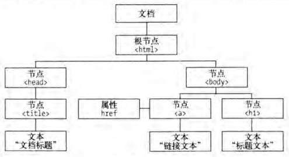
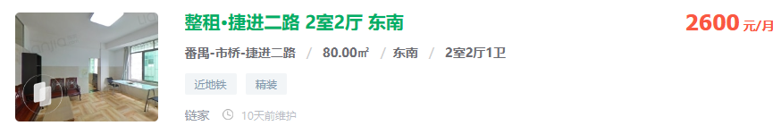
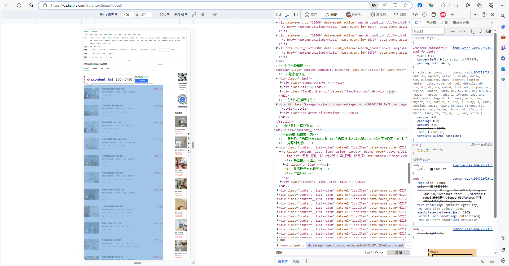
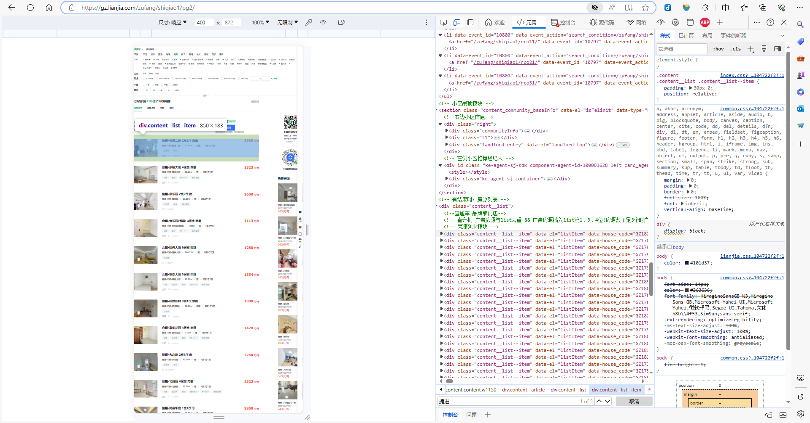
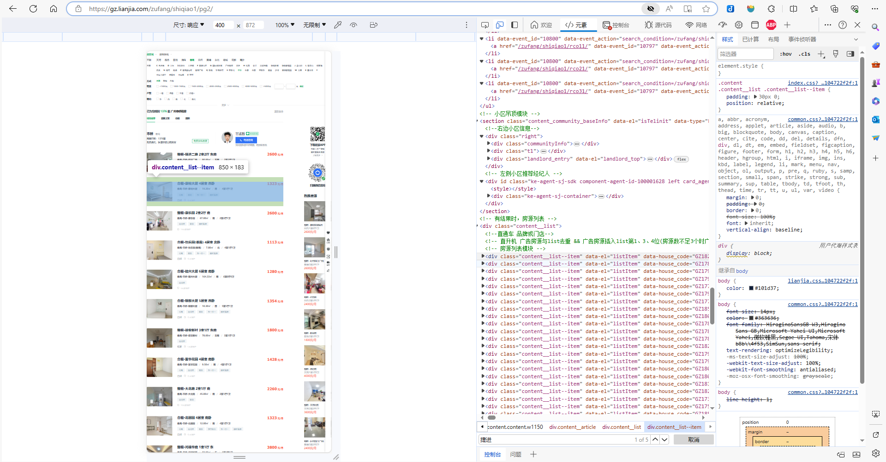
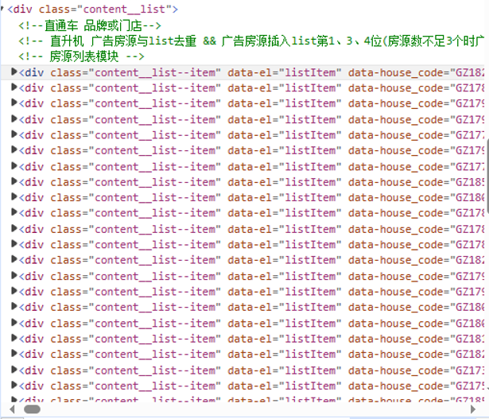
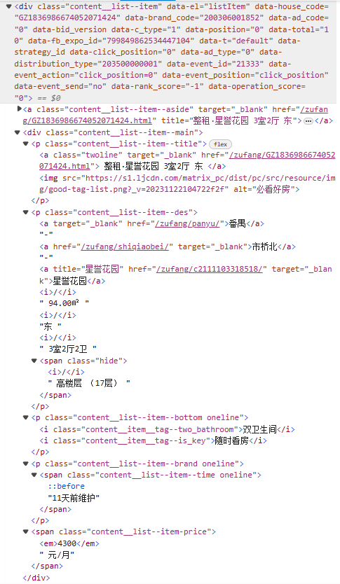

## 目录

    - 爬虫概述
    - Chapter 1 前置知识
      - URL
    - 请求
    - 响应
    - 网页
  - 广州市租赁信息爬取（Python实现）
    - 网页源码，搜索关键字，元素定位

### 爬虫概述

爬虫，节省时间（搜索），节省金钱（查找最低价）。最重要的是，打破信息差？

### Chapter 1 前置知识

#### URL

网页链接为URL（universal resource locator）。URL基本格式为（中括号表示非必要部分）：

`scheme://[username:password@]hostname[:port] [/path][;parameters][?query][#fragnent]`

scheme/protocol：协议，一般为http、https。

hostname：主机地址，可以是域名或IP地址。

port：端口，http协议默认为80，https协议默认为443。

path：访问的文件在服务器中的路径。

注意：多个query使用"&"来分隔。

### 请求

请求（request）分为四部分：请求方法、请求网址、请求头、请求体。

请求方法：一般为GET、POST。GET方法请求页面，并返回页面内容。POST一般用于提交表单（登录账号）或上传文件，数据包含在请求体中。

请求网址：即请求的URL。

请求头：用于说明服务器将要使用的附加信息。包括但不限于Host和Cookie。

请求体：一般为POST请求中的表单数据。

### 响应

响应（response）分为三部分：响应状态码、响应头、响应体。

响应状态码：常见的有200代表正常响应，404代表页面未找到。

响应头：包含了服务器的响应的相关信息。

响应体：响应的正文数据。请求网页时，响应体就是网页的HTML代码。爬虫请求网页，要解析的内容就是响应体。

### 网页

网页分为三大部分：HTML（网页的结构）、CSS（网页的排版）、JavaScript（JS，网页的交互和动画效果）。

Hello World 例程:

```html
<!-- 单行注释格式 -->
<!--
多行注释格式
-->

<!DOCTYPE html>
<!-- 定义文档类型 -->
<html>
<!-- html标签 -->

<head>
<!-- 网页头标签 -->
  <meta charset="UTF-8">
  <!-- 指定网页编码 -->
  <title>This is a Demo</title>
  <!-- 网页标题标签 -->
</head>

<body>
<!-- 网页体标签 -->
  <div id="container">
  <!-- 区块id标签 -->
    <div class="wrapper">
    <!-- 区块class标签 -->
      <h2 class="title">Hello World</hz>
	  <!-- 二级标题标签 -->
      <p class="text">Hello, this is a paragraph.</p>
	  <!-- 段落标签 -->
    </div>
  </div>
</body>
</html>
```

HTML节点树（也叫做HTML DOM树）定义了通过JavaScript访问HTML和XML文档的标准：



因此，一个网页由多个节点组成。

使用CSS选择器定位HTML树的节点。常用的写法为：

```
#container
<!-- 选择id为"container"的节点 -->
.wrapper
<!-- 选择class为"wrapper"的节点 -->
p
<!-- 选择标签名为"p"的节点 -->

#container .wrapper p
<!-- 嵌套关系，使用空格隔开，选择id为"container"的节点，再选择其内部class为"wrapper"的节点，再选择其内部标签名为"p"的节点 -->

div#container
<!-- 并列关系，选择id为"container"的标签名为"div"的节点 -->

p.text
<!-- 并列关系，选择class为"text"的标签名为"p"的节点 -->
```

## 广州市租赁信息爬取（Python实现）

### 网页源码，搜索关键字，元素定位

浏览器网页中，Ctrl+U，查看网页源代码（无具体分段，全部展开）。

浏览器网页中，F12，开发者工具-元素，查看网页源代码（有具体分段，手动展开，更容易进行元素定位）。

网页源代码，通过Ctrl+F搜索元素包含的字符，定位想要爬取的内容位置：

- 网页URL：https://gz.lianjia.com/zufang/shiqiao1/pg2/



- 定位多个元素的集合对应的源代码：



- 定位单个元素对应的源代码：





- 观察多个元素的集合的源代码结构，对单个元素的源代码中的字符进行定位和提取：



- - 对单个元素的源代码展开：



根据源代码结构编写Python代码：
- 使用XPath表达式来进行网页源代码的特定节点的定位。
- 使用每一级标签的前缀代表路径的下一级，在每一级标签的前缀后加上索引数代表定位到第几个同名标签。
- 使用`text()`获得的文本只能是黑色的字符。
- 属性href代表对应的文字的超链接的URL。
- 单个元素的结构也不一定是完全一致的，网页编写者对于不同的元素可能会有不同的代码结构，例如在多个元素的集合中穿插格式类似但内容不同的广告元素。

使用XPath选取XML文档中的节点或节点集，获取网页源代码的节点。

```
# 核心代码
import requests
import threading
import pandas as pd
from lxml import etree
import re

# 浏览器的URL显示为：https://gz.lianjia.com/zufang/c219954533846425/?sug=北城雍雅园，复制粘贴后，中文字符被转化。
# 在URL路径最后加上/pg{}，/pg1为第1页，通过设置{}的数字来访问不同页数的网页。
url = 'https://gz.lianjia.com/zufang/c219954533846425/?sug=%E5%8C%97%E5%9F%8E%E9%9B%8D%E9%9B%85%E5%9B%AD/pg{}'

# 创建不同页数的URL列表。
pages=10
urls=[url.format(i) for i in range(1,pages)]

count=list()

# 对URL进行解析
def url_parse(url):
  # 设置网页头
  headers={
        'Accept': 'text/html,application/xhtml+xml,application/xml;q=0.9,image/avif,image/webp,image/apng,*/*;q=0.8,application/signed-exchange;v=b3;q=0.9',
        'Accept-Encoding': 'gzip, deflate, br',
        'Accept-Language': 'zh-CN,zh;q=0.9',
        'Cache-Control': 'no-cache',
        'Connection': 'keep-alive',
        'Cookie': 'lianjia_uuid=7e346c7c-5eb3-45d9-8b4f-e7cf10e807ba; UM_distinctid=17a3c5c21243a-0c5b8471aaebf5-6373267-144000-17a3c5c21252dc; _smt_uid=60d40f65.47c601a8; _ga=GA1.2.992911268.1624510312; select_city=370200; lianjia_ssid=f47906f0-df1a-49e2-ad9b-648711b11434; CNZZDATA1253492431=1056289575-1626962724-https%253A%252F%252Fwww.baidu.com%252F%7C1626962724; CNZZDATA1254525948=1591837398-1626960171-https%253A%252F%252Fwww.baidu.com%252F%7C1626960171; CNZZDATA1255633284=1473915272-1626960625-https%253A%252F%252Fwww.baidu.com%252F%7C1626960625; CNZZDATA1255604082=1617573044-1626960658-https%253A%252F%252Fwww.baidu.com%252F%7C1626960658; _jzqa=1.4194666890570963500.1624510309.1624510309.1626962867.2; _jzqc=1; _jzqy=1.1624510309.1626962867.2.jzqsr=baidu|jzqct=%E9%93%BE%E5%AE%B6.jzqsr=baidu; _jzqckmp=1; _qzjc=1; sensorsdata2015jssdkcross=%7B%22distinct_id%22%3A%2217a3c5c23964c1-05089a8de73cbf-6373267-1327104-17a3c5c23978b3%22%2C%22%24device_id%22%3A%2217a3c5c23964c1-05089a8de73cbf-6373267-1327104-17a3c5c23978b3%22%2C%22props%22%3A%7B%22%24latest_traffic_source_type%22%3A%22%E8%87%AA%E7%84%B6%E6%90%9C%E7%B4%A2%E6%B5%81%E9%87%8F%22%2C%22%24latest_referrer%22%3A%22https%3A%2F%2Fwww.baidu.com%2Flink%22%2C%22%24latest_referrer_host%22%3A%22www.baidu.com%22%2C%22%24latest_search_keyword%22%3A%22%E6%9C%AA%E5%8F%96%E5%88%B0%E5%80%BC%22%2C%22%24latest_utm_source%22%3A%22baidu%22%2C%22%24latest_utm_medium%22%3A%22pinzhuan%22%2C%22%24latest_utm_campaign%22%3A%22wyyantai%22%2C%22%24latest_utm_content%22%3A%22biaotimiaoshu%22%2C%22%24latest_utm_term%22%3A%22biaoti%22%7D%7D; Hm_lvt_9152f8221cb6243a53c83b956842be8a=1624510327,1626962872; _gid=GA1.2.134344742.1626962875; Hm_lpvt_9152f8221cb6243a53c83b956842be8a=1626962889; _qzja=1.1642609541.1626962866646.1626962866646.1626962866647.1626962872770.1626962889355.0.0.0.3.1; _qzjb=1.1626962866646.3.0.0.0; _qzjto=3.1.0; _jzqb=1.3.10.1626962867.1; srcid=eyJ0Ijoie1wiZGF0YVwiOlwiNzQ3M2M3OWQyZTQwNGM5OGM1MDBjMmMxODk5NTBhOWRhNmEyNjhkM2I5ZjNlOTkxZTdiMDJjMTg0ZGUxNzI0NDQ5YmZmZGI1ZjZmMDRkYmE0MzVmNmNlNDIwY2RiM2YxZTUzZWViYmQwYmYzMDQ1NDcyMzYwZTQzOTg3MzJhYTRjMTg0YjNhYjBkMGMyZGVmOWZiYjdlZWQwMDcwNWFkZmI5NzA5MjM1NmQ1NDg0MzQ3NGIzYjkwY2IyYmEwMjA2NjBjMjI2OWRjNjFiNDE3ZDc1NGViNjhlMzIzZmI0MjFkNzU5ZGNlMzAzMDhlNDAzYzIzNjllYWFlMzYxZGYxYjNmZmVkNGMxYTk1MmQ3MGY2MmJhMTQ1NWI4ODIwNTE5ODI2Njg2MmVkZTk4OWZiMDhjNTJhNzE3OTBlNDFiZDQzZTlmNDNmOGRlMTFjYTAwYTRlZTZiZWY5MTZkMTcwN1wiLFwia2V5X2lkXCI6XCIxXCIsXCJzaWduXCI6XCI3ZjI1NWI1ZlwifSIsInIiOiJodHRwczovL3FkLmxpYW5qaWEuY29tL2Vyc2hvdWZhbmcvMTAzMTE2MDkzOTU5Lmh0bWwiLCJvcyI6IndlYiIsInYiOiIwLjEifQ==',
        'Host': 'gz.lianjia.com',
        'Pragma': 'no-cache',
        'Referer': 'https://gz.lianjia.com/',
        'sec-ch-ua': '" Not;A Brand";v="99", "Google Chrome";v="91", "Chromium";v="91"',
        'sec-ch-ua-mobile': '?0',
        'Sec-Fetch-Dest': 'document',
        'Sec-Fetch-Mode': 'navigate',
        'Sec-Fetch-Site': 'same-origin',
        'Sec-Fetch-User': '?1',
        'Upgrade-Insecure-Requests': '1',
        'User-Agent': 'Mozilla/5.0 (Windows NT 10.0; Win64; x64) AppleWebKit/537.36 (KHTML, like Gecko) Chrome/91.0.4472.164 Safari/537.36'
  }
  # 访问网页，获得文本
  response=requests.get(url=url,headers=headers).text
  # 获得网页HTML树
  tree=etree.HTML(response)

  # 获得网页多个元素的集合路径下的每个元素的路径列表
  List=tree.xpath("//*[@class='content__list']/div")
  # 创建线程锁对象
  lock=threading.RLock()
  # 上锁
  lock.acquire()
  
  # 逐个元素爬取需要的数据
  for i in List:
    # 标题
    title=i.xpath('./div/p/a/text()')[0].strip()
    # 网址
    link='https://gz.lianjia.com'+i.xpath('./div/p/a/@href')[0]
    # 地址（穿插出现的广告元素的源代码结构此项文本为空，直接跳过）
    if i.xpath('./div/p[2]/a/text()')==[]:
      continue
    position=i.xpath('./div/p[2]/a/text()')[0]+i.xpath('./div/p[2]/a/text()')[1]+i.xpath('./div/p[2]/a/text()')[2]
    # 房屋类型
    types=i.xpath('./div/p[2]/text()')[6].strip()
    # 房屋面积
    area=i.xpath('./div/p[2]/text()')[4].strip()
    # 房屋信息（朝向，楼层）
    orientation=i.xpath('./div/p[2]/text()')[5].strip()
    floor=i.xpath('./div/p[2]/span/text()')[1].strip().replace(" ","")
    # 房屋总价
    count_price=i.xpath('./div/span/em/text()')[0]
    count_price_unit=i.xpath('./div/span/text()')[0]
    count_price_float=float(i.xpath('./div/span/em/text()')[0])
    # 房屋单价
    angle_price=count_price_float/Get_Decimal_From_Character(area)
    # 房屋标签
    index=i.xpath('./div/p[3]/i/text()')
    label=''
    # 合并标签字符串
    for j in range(len(index)):
      if j == 0:
        label+=index[j]
      else:
        label+=','
        label+=index[j]
    # 维护时间
    Time=i.xpath('./div/p[4]/span[2]/text()')
    if Time == []:
      Time=i.xpath('./div/p[4]/span/text()')[0]
    else:
      Time=Time[0]
    # 爬取数据汇总
    dic={'标题':title,"地址":position,'房屋类型':types,\
            '面积':Get_Decimal_From_Character(area),'面积单位':re.sub('\d+\.?\d*','',area),\
            '总价':count_price,'总价单位':count_price_unit,\
            '单价':angle_price,'单价单位':count_price_unit+'/㎡',\
            '房屋朝向':orientation,'房屋楼层':floor,\
            "信息维护时间":Time,"标签":label,"网址":link}
    # 放入爬取数据总列表中
    count.append(dic)
  # 解锁
  lock.release()

def run():
  for i in urls:
    x=threading.Thread(target=url_parse,args=(i,))
    x.start()
  x.join()
  # 将全部房屋信息转化为excel
  data=pd.DataFrame(count)
  # 删除爬取重复项
  data=data.drop_duplicates()
  data.to_excel('房屋租赁信息.xlsx',index=False)

if __name__=='__main__':
  run()

# 从字符串中获取小数的函数，用于处理爬取得到的数据
def Get_Decimal_From_Character(character):
    if re.findall(r"\d+\.?\d*",character) != []:
      return float(re.findall(r"\d+\.?\d*",character)[0])
    else:
      return 1
```