## 目录

  - 常见单词补充
  - Part 1 直流电路
    - Chapter 1 基本概念
      - 1.1 电路是什么
      - 1.2 单位
      - 1.3 电荷/电量、电流
      - 1.4 电压、功率
      - 1.5 参考方向
      - 1.6 元件/负载、理想/实际电压源和理想/实际电流源、受控源
      - 1.7 受控源的电路应用
      - 1.8 仿真与实际的电压表
    - Chapter 2 基本概念（二）
      - 2.1 电阻率/电阻系数、电阻器
      - 2.2 欧姆定律、线性元件、短路和开路、可变电阻
      - 2.3 电导系数、功率/功耗
      - 2.4 节点、分支、循环
      - 2.5 基尔霍夫定律
      - 2.6 串联电阻、分压器、并联电阻、分流器
      - 2.7 Wye-Delta转换（星三变换）
      - 2.8 直流电表设计
    - Chapter 3 电路分析方法
      - 3.1 节点分析法
      - 3.2 网格分析法/网孔分析法
      - 3.3 检验分析法
      - 3.4 分析晶体管电路
    - Chapter 4 电路理论
      - 4.1 叠加
      - 4.2 源转换
      - 4.3 戴维南定理、诺顿定理
      - 4.4 最大功率转移
    - Chapter 5 运算放大器（运放）
      - 5.1 运算放大器性质
      - 5.2 反相放大器
      - 5.3 非反相/同相放大器
      - 5.4 加法放大器
      - 5.5 差分放大器
      - 5.6 仪器放大器
      - 5.7 级联放大器
      - 5.8 数字信号-模拟信号转换器DAC
      - 5.9 积分放大器
    - Chapter 6 电容和电感
      - 6.1 电容
      - 6.2 电感器
      - 6.3 电容电感的应用
    - Chapter 7 一阶电路
      - 7.1 无源RC电路
      - 7.2 无源RL电路
      - 7.3 奇异函数
      - 7.4 RC电路的阶跃响应
      - 7.5 RL电路的阶跃响应
      - 7.6 一阶无源/有源滤波器（运放）的阶跃响应
      - 7.7 延迟电路的应用
    - Chapter 8 二阶电路
      - 8.1 无源RLC串联电路
      - 8.2 无源RLC并联电路
      - 8.3 串联RLC电路的阶跃响应
      - 8.4 并联RLC电路的阶跃响应
      - 8.5 一般二阶电路
      - 8.6 解二阶运放电路
      - 8.7 对偶性
  - Part 2 交流电路
    - Chapter 9 正弦曲线和相量
      - 9.1 正弦
      - 9.2 相量
      - 9.3 电路元件的相量关系
      - 9.4 阻抗和导纳
      - 9.5 频域中使用基尔霍夫定律
      - 9.6 阻抗的组合
    - Chapter 10 正弦稳态分析
      - 10.1 节点分析法（正弦）
      - 10.2 网格分析法（正弦）
      - 10.3 叠加（正弦）
      - 10.4 源转换（正弦）
      - 10.5 戴维南等效和诺顿等效（正弦）
      - 10.6 运放电路（正弦）
      - 10.7 电容倍增器
      - 10.8 振荡器
    - Chapter 11 交流功率分析
      - 11.1 瞬时功率
      - 11.2 最大平均功率传输
      - 11.3 有效值
      - 11.4 视在功率与功率因数
      - 11.5 复功率
      - 11.6 交流功率守恒
      - 11.7 功率因数的校正
      - 11.8 功率表
    - chapter 13 磁耦合电路
      - 13.1 磁耦合
      - 13.2 互感
      - 13.3 耦合电路中的能量
      - 13.4 线性变压器
      - 13.5 理想变压器
      - 13.6 理想自耦变压器
      - 13.7 三相变压器
    - chapter 14 频率响应
      - 14.1 传递函数
      - 14.2 分贝表示法
      - 14.3 伯德图
      - 14.4 串联谐振电路
      - 14.5 并联谐振电路
      - 14.6 无源滤波器
      - 14.7 有源滤波器
  - 作业总结回顾
    - 基本KVL和KCL分析电源-电阻电路（最通用的方法）
    - 星三变换
    - 戴维南等效
    - 补充：分析并联电路等效（节点和导线的直接等效转换不涉及到任何特殊方法，但使用普遍且重要）
    - 戴维南等效与获得最大功率
    - 对于包含运放的电路
    - 一阶电路
      - 无源RC电路
      - 无源RL电路
      - 例题
      - RC电路的阶跃响应
      - RL电路的阶跃响应
      - 例题
      - 例题
    - 二阶响应电路
      - 无源RLC串联电路
      - 无源RLC并联电路
      - 例题
      - 有源RLC串联电路的阶跃响应
      - 有源RLC并联电路的阶跃响应
      - 一般二阶电路
    - 多个电流源输出同一个网格（画出所有假设电流方向的重要性）和横流回路
    - 电阻、电感、电容的复数表示
    - 交流功率分析
    - 磁耦合电路
    - 频率响应
    - 电容电感的欠补偿、过补偿、全补偿
    - 关于变压器
    - 关于复数取模

## 常见单词补充

electric circuits 电路

capacitance/capacitor 电容

inductance/inductor 电感

resistance/resistor 电阻

demonstration 证明；演示

once 一旦；当...时候

direct current circuit（DC circuit） 直流电路

alternating current circuit（AC Circuits） 交流电路

Advanced Circuit Analysis 进阶电路分析

## Part 1 直流电路

### Chapter 1 基本概念

#### 1.1 电路是什么

电路是由电子元件/元器件（electrical element）/负载（load）组成的。

#### 1.2 单位

国际单位制下，不同量级的英文前缀以及符号：

#### 1.3 电荷/电量、电流

电荷属于国际单位制（SI units）单位，使用库伦（Coulombs）（C）表示。

单个电子的电荷/电量（charge）为：$1.602 \times 10^{-19}$C。

带电粒子有秩序的移动形成电流（current）。电流方向为正电荷的移动方向/负电荷移动方向的逆方向。

$$i(t) \triangleq \frac{dq}{dt} \tag{电流强度}$$

其中q为电荷量，t为时间。i为电流强度，单位为安培（Ampere）（A），也就是库伦/秒。

$$Q \triangleq \int_{t_0}^t i d t \tag{电荷量}$$

其中i为电流强度，t为时间。Q为电荷量，单位为库伦。

在单位时间内，电流/电压的大小和方向均保持不变，为直流电。（注意：大小变化，方向不变的电流属于脉动直流电，属于直流电但能通过电容耦合分离出交流部分）例如电池。

在单位时间内，电流/电压的大小和方向都随时间而变化，为交流电。例如电网供电。

#### 1.4 电压、功率

$$v_{a b} \triangleq \frac{d w}{d q} \tag{电压}$$

$$v_{a b}=-v_{b a} \tag{电压}$$

其中w为能量，q为电荷量。v为电压，单位为伏特（Voltage）（V），也就是焦耳/库伦。

$$p=v i \tag{功率}$$

其中v为电压，i为电流强度。p为功率，单位为瓦特（Watts）（W）。

$$w=\int_{t_{0}}^{t} p dt=\int_{t_{0}}^{t} v i dt \tag{能量}$$

其中p为功率，v为电压，i为电流强度，$t_{0}$为开始时刻，t为结束时刻。w为能量，单位为焦耳（Joule）（J）或者瓦时（Watt-hours）（Wh），满足$1 Wh = 3600 J$。

#### 1.5 参考方向

在讨论电流方向时，一般先定义一个参考方向（Passive Sign Convention），并且在之后的计算过程都固定不变。

我们称被供能的元件/负载具有正功率（positive power），而供能的电源（例如电池）则具有负功率（negative power）。因此使用功率的正负表示不同方向上的实际功率。

参考方向遵循使得电流通过更正向偏置（more positive biased）也就是正极末端（terminal）进入。参考方向上的功率满足$p=+v i$。那么易得参考方向的反方向上的功率满足$p=-v i$。

注意如果外电路的电流方向是从正极流向负极（与参考方向相同），那么电源内部的电流方向是从负极流向正极（与参考方向相反），因此电源具有负功率。

例题（简单题）：

#### 1.6 元件/负载、理想/实际电压源和理想/实际电流源、受控源

元件分为主动（active）元件和被动（passive）元件。主动元件可以产生能量，被动元件不能产生能量（但可能是吸收的能量比产生的能量多）。主动元件包括电池、发电机等，被动元件包括电阻、电容、电感等。

理想电压源（ideal voltage source）的内阻恒为0（因此输出的电压恒定）。电压源的电压由它本身决定，流过电压源的电流需要由与之相连的外电路决定。电流的方向是任意的，电压源可以提供能量，也可以从外电路获得能量。

理想电流源（ideal current source）的内阻是无限的，通过产生可以任意调整的电压使得输出的电流恒定，而与它的端电压无关。电流源的电流由它本身决定，电流源的端电压需要由与之相连的外电路决定。电流的方向是任意的，电流源可以提供能量，也可以从外电路获得能量。

理想情况下，电压源和电流源都能产生无限的能量。

依赖源/受控源（dependent source）的输出由输入值控制，在电路中使用菱形（diamond）框来表示，图案则遵循其为电压源还是电流源来表示。

受控源分为四种：

- 电压控制电压源（voltage-controlled voltage source）（VCVS）

- 电流控制电压源（current-controlled voltage source）（CCVS）

- 电压控制电流源（voltage-controlled current source）（VCCS）

- 电流控制电流源（current-controlled current source ）（CCCS）

受控源因为需要通过输入来进行输出，因此除了受控源还需要一个正常的电源作为输入。

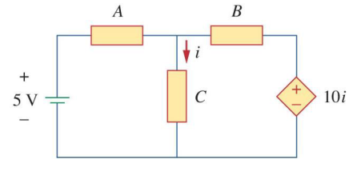

可以通过设置参考方向然后计算各个元件（包括电源）的功率来得到电路的总功率（电路的总功率不一定为0）。

$$p_{总}=p_{1}+p_{2}+p_{3}+...+p_{n}$$

#### 1.7 受控源的电路应用

受控源是一些常见电路元件的理想模型，这些电路元件包括二极管、三极管、晶体管和运算放大器等。

受控源也应视作电源，因为独立电源对其激发后，受控源的表现和普通电源是一致的。受控电源的参数受到激励源（独立电源）的控制，但是它是电源的性质是不变的。

晶体管（transistors）：在某些工作模式下，晶体管在一个末端输入电压或电流，并在其他两个末端上产生与输入成比例的电流。

运算放大器（operational amplifiers）：大致上，运算放大器获取输入电压，并产生与之成比例的输出电压。

电视显像管（TV picture tube）是一个集成元件，其中的老式阴极射线管（cathode ray tube，CRT）射出电子流，热灯丝提供电子。原理是带电板加速并引导电子流集中荧光粉图层屏幕造成发光。

#### 1.8 仿真与实际的电压表

仿真软件有一根导线的电压表，测的是绝对电压。现实电压表两根线，测两处导线所在位置的相对电压。

### Chapter 2 基本概念（二）

#### 2.1 电阻率/电阻系数、电阻器

$$R=\rho \frac{l}{A} \tag{电阻率}$$

其中$R$为物体电阻，$l$为物体长度，$A$为物体电流。$\rho$为电阻率（resistivity）。

电阻器（resistor）其实就是常见的电阻，其大多有不同的尺寸和电阻值。

双列直插封装（Double In-line Package，DIP）的电阻：

贴片（SMD）电阻/片式固定（Chip Fixed）电阻：

#### 2.2 欧姆定律、线性元件、短路和开路、可变电阻

$$V=I R \tag{欧姆定律}$$

其中$V$为电压，$I$为电流强度。$R$为电阻，单位为欧姆（Ohms）（$\Omega$）。

以上是欧姆定律（Ohm's Law）的数学形式。但是要注意不是所有的材料都遵守欧姆定律。遵守欧姆定律的电阻被称为线性电阻（linearity resistors），不遵守的电阻被称为非线性元件（non-linearity elements）。

二极管（diode）是非线性元件。它是PN结（PN junction），可以用作单向电阻。齐纳（Zener）二极管是二极管的一种。

短路（short circuits）：电阻几乎为零的连接。

开路（open circuits）：具有无限电阻的连接。

可变电阻（variable resistor）：阻值可以变化的电阻器。符号如下：

电位器（potentiometer）：具有三端的可变电阻。符号如下：

#### 2.3 电导系数、功率/功耗

$$G = \frac{1}{R}=\frac{I}{V} \tag{电导系数}$$

其中$R$为电阻。$G$为电导系数（conductance），其标准国际单位为西门子（Siemens）（S）。

$$P=V I=I^2 R=\frac{V^2}{R}$$

其中$V$为电压，$I$为电流强度，$R$为电阻。$P$为功率/功耗（power dissipation），，单位为瓦特（Watts）（W）。

#### 2.4 节点、分支、循环

电路元件可以通过多种方式相互连接。以下是一些网络拓扑结构（network topology）。

- 支路（branch）（b）表示单个元件。

- 节点（node）（n）是两个或多个支路之间的连接点（节点不是元件，而是"导线的汇聚处"）。

- 回路（loop）（l）是电路中的任何的闭合路径。

如果一个回路至少包含一个没有被其他独立循环共享的支路，那么这个回路是独立的（independent）。

如果两个或两个以上的元件共用一个节点并因此携带相同的电流，那么它们就是串联的（in series）。

如果两个或两个以上的元件连接到相同的两个节点，因此具有相同的电压，那么它们就是并联的（in parallel）。

$$b=l+n-1$$

$b$为支路数，$n$为节点数，$l$为独立回路数。

如图，有三个电阻一个电源一个电流表，因此$b=5$。有$a,b,c$三个节点，$n=3$。组成了三个闭合回路，$l=3$。

#### 2.5 基尔霍夫定律

基尔霍夫定律（Kirchoff's Laws）包括：

- 基尔霍夫电流定律（KCL）。

- 基尔霍夫电压定律（KVL）。

1.基尔霍夫电流定律基于电荷守恒，其描述了进入节点/封闭边界（closed boundary）的电流的代数和一定为零。进入节点的电流可视为正电流，离开节点的电流可视为负电流。（也就是电流流入总量和流出总量必须相等）

$$\sum_{n=1}^N i_n=0$$

其中$N$为节点的数量，$i$为电流强度。

2.基尔霍夫电压定律基于能量守恒，其描述了在一个闭合路径/闭合回路（回路可能包括其他回路，此时无视其中包括的所有回路的影响）周围的电流的代数和（其实就是电压的代数和）一定为零，符号为从"-"到"+"为一种方向，从"+"到"-"为另一种方向，电源的两端正负也遵循以上判断。（也就是一个闭合回路中，电压由高到低和由低到高的程度之和恒为零）

$$\sum_{m=1}^M v_m=0$$

其中$M$为回路中的电压数（或回路中的支路数），$v$为电压。

#### 2.6 串联电阻、分压器、并联电阻、分流器

$$R_{e q}=\sum_{n=1}^N R_n \tag{串联电阻}$$

其中$R_{eq}$为等效电阻，$N$为串联电路中的电阻数。

$$v_n=\frac{R_n}{R_1+R_2+\cdots+R_N} v \tag{分压器}$$

通过欧姆定律，可以计算串联电路中每个电阻的压降（voltage drop），这也是分压器（voltage division）的原理。

$$R_{e q}=\frac{R_1 \cdot R_2 \cdot ...\cdot R_N}{\sum_{n=1}^{N} R_{n}} \tag{并联电阻}$$

$$\frac{1}{R_{\text {eq }}}=\frac{1}{R_1}+\frac{1}{R_2}+\cdots+\frac{1}{R_N} \tag{并联电阻}$$

其中$R_{eq}$为等效电阻，$N$为并联电路中的电阻数。

$$i_n=\frac{G_n}{G_1+G_2+\cdots+G_N} i \tag{分流器}$$

通过欧姆定律，可以计算并联电路中每个电阻的电流，这也是分流器（current division）的原理。

#### 2.7 Wye-Delta转换（星三变换）

有些情况下电阻既不是并联的也不是串联的。这时候需要对电路进行拓扑结构（topologies）转换：

- Wye（Y）和tee（T）网络等价。

- Delta（$\Delta$）和pi（$\Pi$）网络等价。

 
 $\Delta$电路可以转化为等效的$Y$电路，$Y$电路也可以转化为等效的$\Delta$电路，这两种电路整体上都等效为一个比较复杂的电阻（至多有4个端口，下方的端口可以合并因此至少有3个端口，从外部连接不同的端口则等效内部电阻不同）。
 
 注意：星三变换后，仅有与之相连的四个电路的节点（node）的电压等效。而且，转化前后$R_1,R_2,R_3$和$R_a,R_b,R_c$没有任何联系（电流、电压、功率均没有关系）。准确来说，星三变换所谓的"等效电路"，是对于发生星三变换的"3个电阻和4个端口"以外的整个电路所有部分来说的。也可以理解为，星三变换前后，这4个端口输入和输出的电流、电压均不变，因此"3个电阻和4个端口"对于外部电路来说，功率始终不变，输入和输出也不变。同时，进行多次星三变换（进行一次变换然后再变换回来，换另一些部分再进行变换），根据端口电压不变，可以计算电路中某些节点位置的压降。
 
$\Delta$电路转化为等效的$Y$电路：
 
  
  
$R_{xy}(Z)$代表在$Z$电路结构下，电流从端口$x$到$y$受到的总阻值。

$$R_{12}(\mathrm{Y})=R_1+R_3$$

$$R_{12}(\Delta)=R_b \|\left(R_a+R_c\right)$$

其中$A \| B$表示$\frac{A \cdot B}{A+B}$。

由于需要等价转换，则必须满足$R_{12}(\mathrm{Y})=R_{12}(\Delta)$，由此可得：

$$R_{12}=R_1+R_3=\frac{R_b\left(R_a+R_c\right)}{R_a+R_b+R_c}$$

$$R_{13}=R_1+R_2=\frac{R_c\left(R_a+R_b\right)}{R_a+R_b+R_c}$$

$$R_{34}=R_2+R_3=\frac{R_a\left(R_b+R_c\right)}{R_a+R_b+R_c}$$

$$R_{34}-R_{12}=R_1-R_2=\frac{R_c\left(R_b-R_a\right)}{R_a+R_b+R_c}$$

$$R_{13}+R_{34}-R_{12}=R_{1}$$

$$R_1=\frac{R_b R_c}{R_a+R_b+R_c}$$

$$R_2=\frac{R_c R_a}{R_a+R_b+R_c}$$

$$R_3=\frac{R_a R_b}{R_a+R_b+R_c}$$

Y电路转化为等效的$\Delta$电路：

$$R_a=\frac{R_1 R_2+R_2 R_3+R_3 R_1}{R_1} $$

$$R_b=\frac{R_1 R_2+R_2 R_3+R_3 R_1}{R_2} $$

$$R_c=\frac{R_1 R_2+R_2 R_3+R_3 R_1}{R_3} $$

以上的数学关系推导太过麻烦，可以用另一种方法先得到Y电路和$\Delta$电路各个端口两两配对的一共6个路线的电流大小的表达式，然后由等效直接推导得到Y电路转化为等效的$\Delta$电路，然后可以非常简易地推出 $\Delta$电路转化为等效的$Y$电路的公式。

当$R_1=R_2=R_3$（表示为$R_{\mathrm{Y}}$）和$R_a=R_b=R_c$（表示为$R_{\Delta}$）时，这个$Y$电路和$\Delta$电路称为（balance），根据转换公式可以得到：

$$R_{Y}=\frac{R_{\Delta}}{3}$$

$$R_{\Delta}=3R_{Y}$$

#### 2.8 直流电表设计

使用电阻器来制作测量电流、电压和电阻的电表（meters）。电阻器本质上是控制电流的，因此也可以直接用来控制电压，如电位器（potentiometer）。

所有这些电表都依赖于D'Arsenol仪表的机芯：有一个可移动的铁芯线圈，而在电流通过时偏转。

1.安培表/电流表（Ammeter）：属于直流模拟电表（DC analog meters），由一个D'Arsenol机芯与一个电阻并联组成，该电阻的阻值被制作得尽量小以最小化通过它的压降。

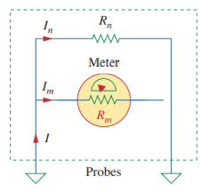

$$I_m=\frac{R_n}{R_n+R_m} I_{\mathrm{fs}} \tag{安培表}$$

$$R_n=\frac{I_m}{I_{\mathrm{fs}}-I_m} R_m \tag{安培表}$$

其中$R_{n}$可以换档以达到不同的量程（调整$R_{n}$得到不同的$I_{fs}$），$I_{fs}$为仪表达到最大刻度（full-scale）时的电流（满足$I_{fs}=I_{m}+I_{n}$），$R_{m}$可以视作仪表的阻值。（将$I_{fs}$替换为待测电流的符号即可通过安培表计算待测电流）

2.电压表（Voltmeter）：由一个D'Arsenol机芯与一个电阻串联组成，该电阻被制作得尽量大以最小化通过它的电流。

$$R_n=\frac{V_{\mathrm{fs}}}{I_{\mathrm{fs}}}-R_m \tag{电压表}$$

其中$R_{n}$可以换档以达到不同的量程（调整$R_{n}$得到不同的$I_{fs}$和$V_{fs}$），$I_{fs}$为仪表达到最大刻度时的电流，$V_{fs}$为仪表达到最大刻度时的电压，$R_{m}$可以视作仪表的阻值。（将$I_{fs}$和$V_{fs}$替换为待测电流和待测电压的符号即可通过安培表计算待测电压）

3.欧姆表/电阻表（Ohmmeter）：在安培表的基础上串联一个电源。

$$R_x=\frac{E}{I_m}-\left(R+R_m\right) \tag{欧姆表}$$

由$E=I_{fs}-I_{m}$可得：

$$R_x=\left(\frac{I_{f s}}{I_m}-1\right)\left(R+R_m\right) \tag{欧姆表}$$

其中$R_{x}$为待测电阻的阻值。

### Chapter 3 电路分析方法

#### 3.1 节点分析法

1.节点分析（nodal analysis）相比于对元件的分析，所需要解的方程更少更简单。

参考节点（reference node），也被称为基准节点（datum node），通常被称为地（ground），因为它的电压默认为零，也就是零电位（zero potential）。参考节点用于方便表示电路中的其他节点的电压。

通常用以下三种常见符号来表示参考节点：

2.节点分析法：

节点分析法适用的情况，仅能是不含有电压源的电路（也就是说需要截取出不含有电压源的电路来进行分析）。

非参考节点的数量等于需要得到的独立方程的数量。

- 将一个节点作为参考节点，以参考节点作为零电位。使用符号表示剩下$n-1$个节点的未知电压$v_1, v_2, \ldots v_n$。

- 将KCL应用到每个节点得到关于电流的方程组。通过欧姆定律将支路的电流用节点电压来表示（元件的两端的节点电压差即为此元件分到的电压，注意参考节点电压恒为零），得到关于节点电压的方程组。

- 联立$n-1$个关于电压的方程组/写成矩阵并求解，解出未知的节点电压。

以接地处作为参考节点，对$v_1$和$v_2$应用KCL，得到$I_1=I_2+i_1+i_2$和$I_2+i_2=i_3$，然后通过欧姆定律将上述的电流用节点电压（注意参考节点电压为零）来表示，得到$I_1=I_2+\frac{v_1}{R_1}+\frac{v_1-v_2}{R_2}$和
$I_2+\frac{v_1-v_2}{R_2}=\frac{v_2}{R_3}$，然后联立方程组即可。（一个元件的两端的节点的电压差即为这个元件分到的电压）

3.包括电压源的分析法：

如果电压源在参考节点和非参考节点中间，则这个非参考节点的电压为电压源的输出电压。

如果电压源在两个非参考节点附近（注意附近仅需要相互连接），则这个电源和这两个节点可以组成一个超节点（supernode），欧姆定律在超节点处不适用（流过电压源的电流未知），因此需要同时应用KCL和KVL来得到超节点的电压（超节点视作一个普通节点来求电压）。

对于$5V$的电源组成的超节点，视作一整个节点，就可以应用KCL，则有$i_1+i_4=i_2+i_3$，$\frac{v_1-v_2}{2}+\frac{v_1-v_3}{4}=\frac{v_2-0}{8}+\frac{v_3-0}{6}$。下一步为了应用KVL，对电路进行重绘：

选择顺时针为参考方向，则在此回路中，有$-v_2+5+v_3=0$。（符号为从"-"到"+"为负，从"+"到"-"为正，电源的两端正负也遵循以上判断）

#### 3.2 网格分析法/网孔分析法

1.回路是一个封闭的路径，所有节点仅经过一次。网格（mesh）是一个不包含任何其他回路的回路，只属于一个网格的支路或节点的电流是恒定的，但同时属于多个网格的支路或节点的电流是需要根据实际情况计算的。

网格分析法使用KVL来得到未知电流，使用网格的电流作为电路变量。网格分析法仅能用于可以以平面（planar）表示的电路。

2.网格分析法：

- 对每个网格的电流使用$i_1, i_2, \ldots i_n$表示。

- 对n个网格分别应用KVL，得到n个方程。

- 联立n个方程得到网格电流。

如图，一个回路包含了两个网格，分别应用KVL得到：$-V_1+R_1 i_1+R_3\left(i_1-i_2\right)=0$和$R_2 i_2+V_2+R_3\left(i_2-i_1\right)=0$，联立即可得到各种电流。

3.包括电流源的网格分析法：

包括电流源的网格，会使得分析更简单，因为可以直接得到所在网格的电流。

因为已知$i_{2}$，因此直接通过$-10+4 i_1+6\left(i_1-i_2\right)=0$得到$i_{1}$。

4.超网格（supermesh）：

和超节点的情况类似，同时连接两个网格的电流源也需要特殊处理。

这两个网格必须合并在一起，排除共享的电流源和与这个电流源串联的任何元件，从而形成一个超网格。

要使用KVL，必须先得到超网格。这是因为我们无法提前知道电流源的电压（压降）。

电路中相交的超网格必须合并为更大的超网格。

通过超网格求电流需要同时使用KVL和KCL。

如上图，把电流源和与之串联的电阻去除，就得到了一个超网格，对超网格使用KVL，即可得到：$-20+6 i_1+10 i_2+4 i_2=0$。然后对原电路的两个网格的交节点应用KCL，即可得到：$i_2=i_1+6$，然后联立得到的方程即可解出各电流。

#### 3.3 检验分析法

1.检验节点分析（nodal analysis by inspection）：

可以用节点分析法来构造矩阵求解电路。这种方法要求电路中的所有电流源都是相互独立的。

通常，对于有$N$各非参考节点的电路，其节点-电压方程可以写成以下形式：

$$\left[\begin{array}{cccc}G_{11} & G_{12} & \cdots & G_{1 N} \\ G_{21} & G_{22} & \cdots & G_{2 N} \\ \vdots & \vdots & \ddots & \vdots \\ G_{N 1} & G_{N 2} & \cdots & G_{N N}\end{array}\right]\left[\begin{array}{c}v_1 \\ v_2 \\ \vdots \\ v_N\end{array}\right]=\left[\begin{array}{c}i_1 \\ i_2 \\ \vdots \\ i_N\end{array}\right]$$

其中$G$表示电路的导纳的线性组合，满足$G=\frac{1}{R}$。$v_{k}$是未知电压，$i_{k}$是未知电流。

自导纳（self conductance）是所有导纳之和。

导纳矩阵上的每一个对角线上的项$G_{ii}$，是第$i$个节点连接的所有导纳之和。

而非对角线上的项$G_{jk}$则是$j$节点和$k$节点之间的所有导纳之和的负数，$j \neq k$。

$$\left[\begin{array}{cc}G_1+G_2 & -G_2 \\ -G_2 & G_2+G_3\end{array}\right]\left[\begin{array}{l}v_1 \\ v_2\end{array}\right]=\left[\begin{array}{c}I_1-I_2 \\ I_2\end{array}\right]$$

非平面电路只能用节点分析法解决。

2.检验网格分析：

同样的，也可以用网格分析法来构造矩阵求解电路。这种方法要求电路内的所有电压源都是相互独立的。

通常，对于有$N$各网格的电路，网格-电流方程可以写成以下形式：

$$\left[\begin{array}{cccc}R_{11} & R_{12} & \cdots & R_{1 N} \\ R_{21} & R_{22} & \cdots & R_{2 N} \\ \vdots & \vdots & \ddots & \vdots \\ R_{N 1} & R_{N 2} & \cdots & R_{N N}\end{array}\right]\left[\begin{array}{c}i_1 \\ i_2 \\ \vdots \\ i_N\end{array}\right]=\left[\begin{array}{c}v_1 \\ v_2 \\ \vdots \\ v_N\end{array}\right]$$

其中$R$表示电阻的线性组合。$v_{k}$是未知电压（电压上升为正），$i_{k}$是未知电流。

电阻矩阵上的每一个对角线上的项$R_{ii}$，都是第$i$个网格电路内的电阻之和。

电阻矩阵上的每一个非对角线上的项$R_{jk}$，都是第$j$和第$k$网格共有的电阻之和的负数。

$$\left[\begin{array}{cc}R_1+R_3 & -R_3 \\ -R_3 & R_2+R_3\end{array}\right]\left[\begin{array}{l}i_1 \\ i_2\end{array}\right]=\left[\begin{array}{r}v_1 \\ -v_2\end{array}\right]$$

网格分析法是唯一适用于晶体管电路的分析，但它不适用于运算放大器，因为无法直接获得运算放大器的电压。

#### 3.4 分析晶体管电路

1.有两种类型的晶体管（transistor）比较常用：

- 场效应管（field effect，FET）。

- 双极性晶体管（Bipolar Junction，BJT）。

双极性晶体管是一个三端器件，第一极（base）的输入电流影响第二极（collector）的电流输出，而第三极（emitter）是两个电流的公共端。

应用KCL：

$$I_E=I_B+I_C$$

第一极电流和第二极电流通过参数$\beta$（取值范围为$50 \sim 1000$）线性相关：

$$I_c=\beta I_B$$

应用KVL：

$$V_{C E}+V_{E B}+V_{B C}=0$$

2.晶体管的工作模式（operating modes）取决于施加的电压/电流，分为放大（activate）、饱和（saturation）、截至（cutoff）三种。

放大模式（active mode）下的晶体管可以放大（amplifying）信号。其等效电路为：

仅在放大模式的等效电路下，可以应用节点分析法。

3.解晶体管电路的方法：

- 分点分析法。

- 网格分析法。

- 仿真软件PSpice分析法。

PSpice是一个常用的电路分析程序。PSpice可以将电路的标准原理图（standard schematic）转换为Pspice原理图，从而求解。

### Chapter 4 电路理论

#### 4.1 叠加

1.电路的线性（linearity）指电路满足当电流改变时，电压也成比例地改变。

线性电路要求电路对一组电源的响应将是来自每个电源的单独响应的和。

线性电路只由线性元件（linear elements）、线性受控源（linear dependent sources）、独立源（independent source）组成。

2.如果有两个或两个以上的独立电源，那么有两种方法求解电路：

- 使用节点分析法或网格分析法。

- 使用叠加（superposition）原理。

叠加原理指出，在线性电路中，通过某一元件的电压（或通过某一元件的电流）是由于各独立源单独作用而通过该元件的电压（或通过该元件的电流）的代数和。

步骤：

a.将除一个独立源以外的所有独立源视为断路或导线（根据实际情况选择），并通过节点分析法或网格分析法求解该源的输出（电压或电流）。

b.对每个独立源重复第一步。（受控源不会受到影响，因为总会剩下一个独立源来激发所有受控源）

c.求所有独立源的输出代数和，求出总输出。

#### 4.2 源转换

1.就像星三变换一样，也可以将一个源从一种形式转换为另一种形式。

源转换（source transformation）是将"与电阻$R$串联的电压源"转换为"与电阻$R$并联的电流源"，反之亦然。（转换前后$R$不变）

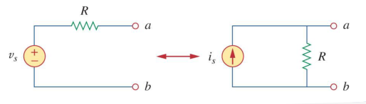

$$v_{s}=i_{s} R$$

与星三变换的性质一样，源转换前后的源的对外部电路来说是完全等价的（端口的输出、总阻值等等）。

源转换也适用于受控源。

2.源转换的规则：

转换前后的电压源和电流源的正极方向一致。

对于理想电压源，内阻满足$R=0$因此无法进行源转换。对于理想电流源，内阻满足$R=\infty$因此无法进行源转换。但实际源的内阻$R$不可能为$0$或$\infty$。

#### 4.3 戴维南定理、诺顿定理

1.戴维南定理（Thevenin's theorem）：

通常情况下，负载的每一次变化都需要重新分析电路，那么能不能把除了负载以外的电路简化一下呢？

戴维南定理指出，一整个线性二端口电路（linear two-terminal circuit）可以仅使用一个电压源串联一个电阻的电路来等效替代。这将会大大简化电路。

等效替代的电压源的数值$V_{Th}$等于线性二端口电路的两个ab端口处的电压。这时应该将ab端口处视作一个电压表，与电压表串联的电阻直接无视，此电压表测出的电压即为$T_{Th}$。

等效替代的电阻$R_{Th}$的数值则需要分两种情况来讨论。通常使用源转换和叠加原理和直接电路分析来计算多源开路电压$V_{ab}$和等效替代的电阻$R_{Th}$：

a.如果线性二端口电路内没有受控源，那么只需要将所有源关闭（根据情况选择，一般电压源短路，电流源断路），就可以得到假设以ab端为源时剩下无源电路的等效电阻的总阻值，也就等于$R_{Th}$。而求开路电压则可以使用叠加原理，每个独立源分别讨论，同样是将除了讨论对象之外的其他独立源视为短路或断路，ab端视为断路，得到每个独立源下对外输出的电压，再相加（注意电压方向）即可得到开路电压。

b.如果线性二端口电路内存在受控源，我们先关闭所有独立源（根据情况选择，一般电压源短路，电流源断路），然后对整个电路施加确定的电压/电流，并得到相应的电流/电压。

对于外部电路来说，进行替代之后电路是完全等效的。

有可能计算结果得到整个电路的总电阻为负数，这是由电路内的受控源导致的。

2.诺顿定理（Norton's theorem）：

与戴维南定理类似的，诺顿定理指出，一个线性二端口电路可以仅使用一个电流源并联一个电阻的电路来等效替代。

诺顿定理等效替代的电路的电流$I_{N}$是由通过将原电路的两个端口短路（原电路内存在电源）得到的（ab端口短路时电流一定不经过$R_{N}$），且可以简单地通过源转换、KCL、KVL得到。一般来说，$I_{N}$更好求。

$$I_N=i_{s c}$$

根据源转换，$R_N$其实就等于$R_{Th}$。

3.诺顿定理与戴维南定理的联系：

通过源转换，诺顿电流和戴维南电压的关系式为：

$$I_N=\frac{V_{T h}}{R_{T h}}$$

推导$R_{Th}=R_{N}$：

$$V_{Th}=v_{oc}$$

$$I_{N}=i_{sc}$$

$$R_{\mathrm{Th}}=\frac{v_{o c}}{i_{s c}}=R_N$$

其中$i_{sc}$为短路电流，$v_{oc}$为开路电压。$R_{Th}=T_{N}$为当所有独立电源关闭时，$a$和$b$端的等效电阻。

#### 4.4 最大功率转移

我们希望最大限度地将电源功率转移（transfer）到负载上。但是实际电源的内阻会限制传递最大功率。

我们可以使用戴维南等效电路来寻找线性电路中的最大功率。我们假设负载电阻$R_{L}$可以变化，那么转移的功率为：

$$p=\left(\frac{V_{T h}}{R_{T h}+R_L}\right)^2 R_L$$

那么对于给定的电路，$V_{TH}$和$R_{TH}$都是固定的，对$R_{L}$大小进行调整，则有：

实际上，满足最大功率转移的功率时的电阻的组织即为戴维南等效电阻的阻值。

$$R_{L}=R_{\mathrm{TH}}$$

### Chapter 5 运算放大器（运放）

#### 5.1 运算放大器性质

1.运算放大器（Operational Amplifiers，Op-amp）对模拟信号进行多种数学运算。运算放大器均有以下5个端口（但可能有更多端口，一般仅考虑此5个端口）：

- 反相输入（inverting input）

- 同相输入（noninverting input）

- 连接电源正极（positive power supplies）（电路中一般不画出）

- 连接电源负极（negative power supplies）（电路中一般不画出）

- 输出（output）

2.运算放大器需要有电源作为输入，且一般使用两个中间接地的电压源。

运算放大器的电压源一般默认已接好，且在一般的电路中不画出。

运算放大器的输出电压由反相（inverting）输入和同相（noninverting）输入的差值$v_{d}$决定。

$$v_{o}=A v_{d}=A(v_{2}-v_{1})$$

$$A=\frac{v_{o}}{v_{d}}$$

其中$v_{o}$为输出电压，$v_{1}$为反相输入，$v_{2}$为同相输入。$A$为开环增益（open loop gain），理想情况下为无限，实际情况下范围大约为$10^{5} \sim 10^{8}$。开环增益是运算放大器对输入电压差的放大的倍数。

3.反馈（feedback）：

将运算放大器的输出反馈到反相输入端，也就是"负反馈"（negative feedback）。当存在反馈回路时，输出电压与输入电压的比值称为闭环增益（closed-loop gain），也可以视作运算放大器对输入电压的放大倍数，不过受到运算放大器的输出的调控。

注意：正反馈（positive feedback）会导致振荡（oscillations）。

4.电压饱和（voltage saturation）：

运算放大器的放大倍率理论上是无限的（因为有一个理想电源供能），但是实际情况下有一个电压范围的界限（最大或最小），超过此界限外的区域称为饱和区（saturation region）。这两个极限电压之间的输出范围称为线性区（linear region / linear area）。

5.理想（ideal）运算放大器的虚短和虚断：

理想的运算放大器，开环增益是无限的（放大电压的倍数），两个输入电阻是无限的，输出电阻为零。

虚断：由于运放的输入电阻一般都很大，可认为流入两个输入端的输入电流近似为零（$i_{1}=i_{2}=0$），反相与同相输入端之间相当于断路，称为虚断。

虚短：当存在负反馈回路时，因为运放的输出电压一般不超过线性区，可认为来自输出的调整使得两个输入电流视为具有近似相同电压（$v_{1}=v_{2}$），相当于短路，称为虚短。

6.运算放大器的内部（等效）电路：

理想的等效电路，就是两个输入之间的电阻无限大，因此可以视作断路（电流为$0 A$），运放接收到的仅仅是两个输入电压的"信息"本身。运放内部有电压源，一端接地，另一端输出根据两个输入电压来输出电压，作为运放的输出$v_o$。

实际电路：

#### 5.2 反相放大器

1.反相放大器（inverting amplifier）：

反相放大器由一个运算放大器和两个电阻构建，反相放大器电路采用负反馈并产生相对于输入的反相输出。

运放的反相输入端和输出端通过电阻$R_{f}$连接，电源输入和反相输入端通过电阻$R_{1}$连接。$v_1$和$v_2$分别为运放的两个输入端电压，$v_0$为运放的输出电压，因此$R_f$右边的电势恒为$v_0$，且假设$v_0$的方向与$v_1$的方向相反。对节点1进行节点分析法，可得：

$$i_2=i_1 \Rightarrow \frac{v_i-v_1}{R_1}=\frac{v_1-v_0}{R_f}$$

如果视为理想运放，又因为此时2输入端接地（有时不一定），因此有：

$$v_{1}=v_{2}=0$$

最终得到：

$$\frac{v_i}{R_1}=-\frac{v_0}{R_f}$$

$$v_0=-\frac{R_f}{R_1} v_i$$

由此可得输出电压$v_0$的方向与$v_1$的方向相同，因此输出与$R_f$相连的一端其实输出负电压。也就是说，输出电压的极性和输入极性相反（增益为负），因此称为这种放大器被称为反相放大器。

2.反相放大器的等效电路（equivalent circuit）：

根据上面推导得到，反相放大器实质上就是输出一个负电压$\frac{R_f}{R_1} v_i$的器件，因此等效电路为：

反相放大器可以用作电流-电压转换器（current-to-voltage converter）。

#### 5.3 非反相/同相放大器

1.非反相放大器（non-inverting amplifier）：

相比于反相放大器，非反相放大器的输入电源和接地是互换的，然后在此对反相端进行KCL可得：

$$i_1=i_2 \Rightarrow \frac{0-v_1}{R_1}=\frac{v_1-v_0}{R_f}$$

非反相放大器仍有负反馈回路，因此有：

$$\frac{-v_i}{R_1}=\frac{v_i-v_0}{R_f}$$

$$v_0=\left(1+\frac{R_f}{R_1}\right) v_i$$

2.缓冲（buffer）放大器：

在分析时，可以用一条导线替换反馈电阻$R_{f}$，然后断开接地，这样增益大小为1（不会放大输入）。这种形式的运放被称为电压跟随器（voltage follower）/单位增益放大器（unity gain amplifier）/缓冲放大器/隔离放大器。

缓冲放大器有非常高的输入阻抗，因此可以隔离两个电路，使两个级联节（cascaded stage）之间的相互作用最小化，并消除级间负载。

#### 5.4 加法放大器

1.加法放大器（summing amplifier / summing amplifier）：

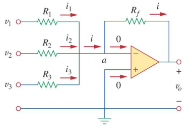

运算放大器可以对输入信号进行加法运算。

$$i=i_1+i_2+i_3$$

$$i_1=\frac{\left(v_1-v_a\right)}{R_1}$$

$$i_2=\frac{\left(v_2-v_a\right)}{R_2}$$

$$i_3=\frac{\left(v_3-v_a\right)}{R_3}$$

$$i=\frac{\left(v_a-v_0\right)}{R_f}$$

因为$v_{a}=0$，最终推出：

$$v_0=-\left(\frac{R_f}{R_1} v_1+\frac{R_f}{R_2} v_2+\frac{R_f}{R_3} v_3\right)$$

输出是输入的加权和，且输入的数量可以是无限个。

#### 5.5 差分放大器

差分放大器/减法器（difference amplifier / subtractor）：

差分放大器用于放大两个输入信号之间的差异。它类似于仪器放大器（instrumentation）。

对节点a使用KCL：

$$\frac{v_1-v_a}{R_1}=\frac{v_a-v_o}{R_2}$$

$$v_o=\left(\frac{R_2}{R_1}+1\right) v_a-\frac{R_2}{R_1} v_1$$

对节点b使用KCL：

$$\frac{v_2-v_b}{R_3}=\frac{v_b-0}{R_4}$$

$$v_b=\frac{R_4}{R_3+R_4} v_2$$

联立以上方程，即可得到：

$$v_o=\left(\frac{R_2}{R_1}+1\right) \frac{R_4}{R_3+R_4} v_2-\frac{R_2}{R_1} v_1$$

差分放大器必须拒绝（reject）两个相同的输入，也就是当$v_{1}=v_{2}$时，必须满足$v_{o}=0$，那么根据输出电压的式子，可得：

$$\frac{R_1}{R_2}=\frac{R_3}{R_4}$$

因此可以将输出电压简化为：

$$v_o=\frac{R_2}{R_1}\left(v_2-v_1\right)$$

当$R_{1}=R_{2}$，则满足减法器：

$$v_o=v_2-v_1$$

#### 5.6 仪器放大器

仪器放大器（instrumentation amplifier）：

为客服差分放大器输入阻抗较小的缺点，在差分放大器前放置非反相放大器，然后就组成了仪器放大器。

#### 5.7 级联放大器

级联放大器（cascaded Op Amps）：

多个运放级联串在一起，这种首位相连的配置称为"级联"（cascading），每个放大器被称为"节"（stage）。由于理想运放的输入和输出阻抗的性质，级联不影响任何一个级联的性能。

一系列放大器的增益（gain）满足为每个放大器的增益的乘积：

$$A=A_{1} A_{2} A_{3}$$

#### 5.8 数字信号-模拟信号转换器DAC

数字信号-模拟信号转换器（digital to analog converter，DAC）：

DAC的功能是取一系列表示数字的二进制值，并将其转换为模拟电压。

其中MSB为高位，LSB为低位。（MSB和LSB的判定需要看具体电路，MSB端最靠近电源正极）整个DAC的输出公式为：

$$-V_o=\frac{R_f}{R_1} V_1+\frac{R_f}{R_2} V_2+\frac{R_f}{R_3} V_3+\frac{R_f}{R_4} V_4$$

每个较大的位（bit）的权重是比其低一位的权重的2倍。

$$\frac{V_{1}}{R_{1}}=\frac{V_{2}}{R_{2}} \times 2=\frac{V_{3}}{R_{3}} \times 4=\frac{V_{4}}{R_{4}} \times 8$$

4bit的DAC的输出表：

#### 5.9 积分放大器

积分器（integrator）是一种运算放大器电路，其输出与输入信号的积分成正比。

将逆变放大器中的反馈电阻换成一个电容，就可以得到积分器。

电容器满足：

$$V=\frac{q}{C}$$

$V$为两板电势差，$C$为电容，$q$为存储的电荷量。

$$i_R=i_C$$

$$i_R=\frac{v_i}{R}$$

$$i_C=-C \frac{d v_o}{d t}$$

代入得：

$$\frac{v_i}{R}=-C \frac{d v_o}{d t}$$

$$d v_o=-\frac{1}{R C} v_i d t$$

对两边进行积分即可得到：

$$v_o(t)-v_o(0)=-\frac{1}{R C} \int_0^t v_i(\tau) d \tau$$

假设$v_{o}(0)=0$，可以得到：

$$v_o=-\frac{1}{R C} \int_0^t v_i(\tau) d \tau$$

可以得到积分器的$v_o$确实和$v_i$的积分成正比。

$RC$是积分时间常数（integrator time constant）。

### Chapter 6 电容和电感

#### 6.1 电容

1.当电压源$v$连接到电容器上时，该电压源在一块极板上积累正电荷$q$，在另一块极板上积累负电荷$-q$。

$$q=C v$$

电容的单位为法拉（F），但一般为皮法拉（pF）和微法拉（$\mu$F）。

电容受平板的正对面积$A$和平板之间的距离$d$的影响，满足：

$$C=\frac{\varepsilon A}{d}$$

其中$\varepsilon$为介电常数。

2.对时间求一阶导数可得电容的充电电流$i$：

$$q=C v$$

$$C=\frac{d q}{d v}$$

$$i=\frac{d q}{d t}=C\frac{d v}{d t}$$

3.电容储能（stored charge）：

瞬时（instantaneous）电压：

$$v(t)=\frac{1}{C} \int_{t_0}^t i(\tau) d \tau+v\left(t_0\right)$$

瞬时功率：

$$p=v i=C v \frac{d v}{d t}$$

存储总能量：

$$w=\frac{1}{2} C v^2=q^2 / 2 C$$

电容的电压只能慢慢改变（瞬时改变需要无限大的电流）。一个理想的电容是不损耗能量的，因此可以存储能量。实际的电容需要并联一个平行模型泄露（parallel-model leakage）电阻，它的阻值极大使得电容的能量泄露的速度变得缓慢。

4.电容的串联和并联：

a.电容并联，采用等效合并的方法。

由总电流$i$和各电容的关系可得等效电容$C_{eq}$的大小：

$$i=C_1 \frac{d v}{d t}+C_2 \frac{d v}{d t}+C_3 \frac{d v}{d t}+\cdots+C_N \frac{d v}{d t}=\left(\sum_{k=1}^N C_k\right) \frac{d v}{d t}=C_{e q} \frac{d v}{d t}$$

$$C_{e q}=C_1+C_2+C_3+\cdots+C_N$$

b.电容串联，仍采用等效合并的方法。

由瞬时电压公式和总电压$v$和各电容的关系可得等效电容$C_{eq}$的大小：

$$\begin{aligned}
&v=\frac{1}{C_1} \int_{t_0}^t i(\tau) d \tau+v_1\left(t_0\right)+\frac{1}{C_2} \int_{t_0}^t i(\tau) d \tau+v_2\left(t_0\right)+\frac{1}{C_3} \int_{t_0}^t i(\tau) d \tau+v_3\left(t_0\right)+\ldots+\frac{1}{C_N} \int_{t_0}^t i(\tau) d \tau+v_N\left(t_0\right) \\
&=\left(\frac{1}{C_1}+\frac{1}{C_2}+\frac{1}{C_3}+\cdots \frac{1}{C_N}\right) \int_t^t i(\tau) d \tau+v_1\left(t_0\right)+v_2\left(t_0\right)+v_3\left(t_0\right)+\cdots+v_N\left(t_0\right)
\end{aligned}$$

$$\frac{1}{C_{e q}}=\frac{1}{C_1}+\frac{1}{C_2}+\frac{1}{C_3}+\cdots+\frac{1}{C_N}$$

#### 6.2 电感器

1.电感器（inductor）是一种在磁场中储存能量的无源元件。会产生与变化的电流流向相反的电压。

(a)为无核（core）电感器，(b)为铁核电感器，(c)为可变铁核电感器。

电感产生的电压，与施加的电流变化的关系公式为：

$$E=\frac{d N \Phi}{dt}=\frac{dL i}{dt}=L \frac{di}{dt}$$

$$v=L \frac{d i}{d t}$$

电感的大小和几何形状有关：

$$L=\frac{N^2 \mu A}{l}$$

其中$N$为线圈数，$A$为核的横截面积，$l$为线圈的径向长度，$\mu$为导磁率（permeability）。$L$为电感的大小，单位为亨利（Henry），用H表示（伏特 · 秒 / 安）。

电感电流：

$$I=\frac{1}{L} \int_{t_0}^t v(\tau) d \tau+i\left(t_0\right)$$

电感功率：

$$p=v i=\left(L \frac{d i}{d t}\right) i$$

电感存储的能量（理想的电感存储的能量不会被耗散，实际的电感会串联一个电阻，这使得实际电感电阻是不为零的）：

$$w=\frac{1}{2} L i^2$$

2.电感的串联和并联：

串联：合并为一个大电感。

$$\begin{aligned} v &=L_1 \frac{d i}{d t}+L_2 \frac{d i}{d t}+L_3 \frac{d i}{d t}+\cdots+L_N \frac{d i}{d t} \\ &=\left(\sum_{k=1}^N L_k\right) \frac{d i}{d t}=L_{e q} \frac{d i}{d t} \end{aligned}$$

$$L_{e q}=L_1+L_2+L_3+\cdots+L_N$$

并联：合并为一个大电感。

$$i=\left(\sum_{k=1}^N \frac{1}{L_k}\right) \int_{t_0}^t v d t+\sum_{k=1}^N i_k\left(t_0\right)=\frac{1}{L_{e q}} \int_{t_0}^t v d t+i\left(t_0\right)$$

$$\frac{1}{L_{e q}}=\frac{1}{L_1}+\frac{1}{L_2}+\frac{1}{L_3}+\cdots+\frac{1}{L_N}$$

注意：星三变换也适用于电容和电感。

3.电容和电感公示表：

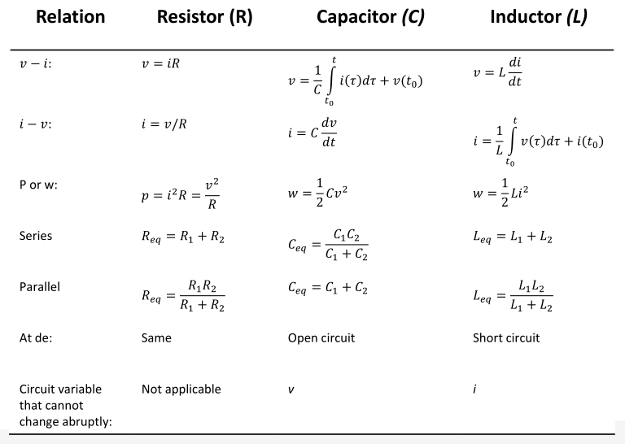

#### 6.3 电容电感的应用

运放，反馈电阻为$R_f$，输入电阻为$R_1$：

1.用于运放积分器（integrator）：

用电容替换反馈电阻，输出电压为：

$$v_0=-\frac{1}{R C} \int_0^t v_i(\tau) d \tau$$

2.用于运放差分器（differentiator）：

用电容替换输入电阻，只有在电压变化时才有电流，输出电压为：

$$v_0=-R C \frac{d v_i}{d t}$$

### Chapter 7 一阶电路

一阶电路（first-order circuits）：在一个电路简化后（如电阻的串并联，电容的串并联，电感的串并联化为一个元件），含有一个动态元件的线性电路，其方程为一阶线性常微分方程，称为一阶电路。

#### 7.1 无源RC电路

无源电阻-电容电路（source-free RC circuit）就是没有电源，电容放电的电路。

当$t=0$，初始电压：

$$v(0)=V_{0}$$

初始储存能量（均为标准单位则能量的单位为焦耳）：

$$w(0)=\frac{1}{2} C V_0^2$$

应用KCL：

$$i_C+i_R=0$$

$$i_C=C \frac{dv}{dt}$$

$$i_R=\frac{v}{R}$$

$$C \frac{d v}{d t}+\frac{v}{R}=0$$

$$\frac{d v}{d t}+\frac{v}{R C}=0$$

$$\frac{d v}{v}=-\frac{1}{R C} d t$$

等号两边同时进行积分：

$$\ln v=-\frac{t}{R C}+\ln A$$

$$\ln \frac{v}{A}=-\frac{t}{R C}$$

$$v(t)=A e^{-t / R C}$$

$$v(0)=A=V_0$$

$$v(t)=V_0 e^{-t / R C}$$

以上，无源电阻-电容电路的电压会随着时间发生响应（response），而且因为没有外界因素，因此称为自然响应（nature response）。

随着时间增加，无源RC电路的电压下降的速度使用时间常数$\tau=RC$表示。

电压下降后和初始电压之比的变化率恰好就与$\tau$有关：

$$\left.\frac{d}{d t}\left(\frac{v}{V_0}\right)\right|_{t=0}=-\left.\frac{1}{\tau} e^{-t / \tau}\right|_{t=0}=-\frac{1}{\tau}$$

当$t=\tau$，可得：

$$V_0 e^{-\tau / R C}=V_0 e^{-1}=0.368 V_0$$

$$v(t)=V_0 e^{-t / \tau}$$

已求得电压，那么无源RC电路的电流为：

$$i_R(t)=\frac{v(t)}{R}=\frac{V_0}{R} e^{-t / \tau}$$

那么功率为：

$$p(t)=v i_R=\frac{V_0^2}{R} e^{-2 t / \tau}$$

电阻在$t$时刻之前吸收的能量为（最初储存在电容器中的能量最终都会在电阻器中耗散）：

$$\begin{aligned} w_R(t) &=\int_0^t p(\lambda) d \lambda=\int_0^t \frac{V_0^2}{R} e^{-2 \lambda / \tau} d \lambda \\ &=-\left.\frac{\tau V_0^2}{2 R} e^{-2 \lambda / \tau}\right|_0 ^t=\frac{1}{2} C V_0^2\left(1-e^{-2 t / \tau}\right) \end{aligned}$$

#### 7.2 无源RL电路

无源电阻-电感电路（source-free RL circuit）：与无源RC电路类似，电感充当电源的电路（电感在被通电时一边阻止变化一边存储能量，在放电时则释放能量）。因此电感与电容类似，拥有一个"初始电流"，本质上是其内部存储的能量。

初始电流：

$$i(0)=I_0$$

初始能量：

$$w(0)=\frac{1}{2} L I_0^2$$

应用KVL：

$$v_L+v_R=0$$

$$L \frac{d i}{d t}+R i=0$$

$$\int_{I_0}^{i(t)} \frac{d i}{i}=-\int_0^t \frac{R}{L} d t$$

$$\ln i(t)-\ln I_0=-\frac{R t}{L}+0$$

$$i(t)=I_0 e^{-R t / L}$$

同样定义一个时间常量：

$$\tau=\frac{L}{R}$$

$$i(t)=I_0 e^{-t / \tau}$$

电压：

$$v_R(t)=i R=I_0 R e^{-t / \tau}$$

功率：

$$p=v_R i=I_0^2 R e^{-2 t / \tau}$$

电阻吸收的能量：

$$w_R(t)=\int_0^t p(\lambda) d \lambda=\int_0^t I_0^2 e^{-2 \lambda / \tau} d \lambda=-\left.\frac{\tau}{2} I_0^2 R e^{-2 \lambda / \tau}\right|_0 ^t=\frac{1}{2} L I_0^2\left(1-e^{-2 t / \tau}\right)$$

#### 7.3 奇异函数

奇异函数（singularity functions）也称为开关函数（switching operations）。奇异函数是不连续或导数不连续的函数。

在电路分析中使用最广泛的三种奇异函数分别为单位阶跃（unit step）函数、单位脉冲（unit impulse）函数和单位斜坡（unit ramp）函数。

1.单位阶跃函数$u(t)$（有时也用$\varepsilon(t)$进行表示）满足：

$$u(t)= \begin{cases}0, & t<0 \\ 1, & t>0\end{cases}$$

延迟了$t_0$秒的单位阶跃函数：

$$u\left(t-t_0\right)= \begin{cases}0, & t<t_0 \\ 1, & t>t_0\end{cases}$$

提前了$t_0$秒的单位阶跃函数：

$$u\left(t+t_0\right)= \begin{cases}0, & t<-t_0 \\ 1, & t>-t_0\end{cases}$$

我们用阶跃函数来表示电压或电流的突然变化：

$$v(t)= \begin{cases}0, & t<t_0 \\ V_0, & t>t_0\end{cases}$$

可以被简略表示为：

$$v(t)=V_0 u\left(t-t_0\right)$$

因此直接在电路图中使用此种表示方法（假设$t_0=0$）的等效电路为：

2.单位脉冲函数就是单位阶跃函数的导数：

$$\delta(t)=\frac{d}{d t} u(t)= \begin{cases}0, & t<0 \\ \text { Undefined, } & t=0 \\ 0, & t>0\end{cases}$$

它可以被看作是一个单位面积的持续时间很短的脉冲，使用公式表示即为：

$$\int_{0^{-}}^{0^{+}} \delta(t) d t=1$$

$\delta (t)$前的系数表示了其的单位面积的系数，也就是脉冲函数$k \delta (t)$的面积为$k$。而脉冲函数的面积即为它的强度（strength）。

接下来表示脉冲函数对其他函数的影响：

$$a < t_0 < b$$

$$\int_a^b f(t) \delta\left(t-t_0\right) d t = ?$$

根据脉冲函数的性质，可得$\delta(t-t_0)$仅在$t=t_0$处的值不为零，因此可以写成：

$$\int_a^b f(t) \delta\left(t-t_0\right) d t=\int_a^b f\left(t_0\right) \delta\left(t-t_0\right) d t=f\left(t_0\right) \int_a^b \delta\left(t-t_0\right) d t=f\left(t_0\right)$$

$$\int_a^b f(t) \delta\left(t-t_0\right) d t=f\left(t_0\right)$$

因此，当一个函数$f(t)$与脉冲函数积分时，我们可以得到脉冲发生点$t_0$处的函数值。这是脉冲函数的一个非常有用的性质（property），被称为采样（sampling）或筛选（sifting）性质。

3.单位斜坡函数就是对单位阶跃函数的积分：

$$r(t)=\int_{-\infty}^t u(\lambda) d \lambda=t u(t)=\begin{cases}0, & t \leq 0 \\ t, & t \geq 0\end{cases}$$

与单位阶跃函数类似的，有延迟了$t_0$秒的单位斜坡函数：

$$r\left(t-t_0\right)= \begin{cases}0, & t \leq t_0 \\ t-t_0, & t \geq t_0\end{cases}$$

有提前了$t_0$秒的单位斜坡函数：

$$r\left(t+t_0\right)= \begin{cases}0, & t \leq-t_0 \\ t+t_0, & t \geq-t_0\end{cases}$$

#### 7.4 RC电路的阶跃响应

注意：所有与阶跃响应相关的题目，如果没有"电路已经工作了很长时间，然后断开开关"或者直接对某个电容或者电感标明其初始值，则视作电容和电感在初始状态均无能量存储在内，初始电压和初始电流均为零。

1.阶跃响应（step response）是电路因突然施加直流电压或电流源而产生的响应。

以上两个电路可以等效替换。

$$v\left(0^{-}\right)=v\left(0^{+}\right)=V_0$$

应用KCL，可得：

$$C \frac{d v}{d t}+\frac{v-V_s u(t)}{R}=0$$

$$\frac{d v}{d t}+\frac{v}{R C}=\frac{V_s}{R C} u(t)$$

又因为$t > 0$，$u(t)$为单位阶跃函数，有：

$$\frac{d v}{d t}+\frac{v}{R C}=\frac{V_s}{R C}$$

$$\frac{d v}{d t}=-\frac{v-V_s}{R C}$$

$$\frac{d v}{v-V_s}=-\frac{d t}{R C}$$

两边进行积分：

$$\left.\ln \left(v-V_s\right)\right|_{V_0} ^{v(t)}=-\left.\frac{t}{R C}\right|_0 ^t$$

$$\ln \frac{v-V_s}{V_0-V_s}=-\frac{t}{R C}$$

$$\frac{v-V_s}{V_0-V_s}=e^{-t / \tau}, \quad \tau=R C$$

$$v(t)=V_s+\left(V_0-V_s\right) e^{-t / \tau}, \quad t>0$$

因此最终结果为：

$$v(t)= \begin{cases}V_0, & t<0 \\ V_s+\left(V_0-V_s\right) e^{-t / \tau}, & t>0\end{cases}$$

最终结果的$v(t)$称为RC电路对突然施加一个直流电压源的完全响应（complete response）或总响应（total response）。

如果一开始电容器并没有充电$V_o=0$，那么有：

$$v(t)= \begin{cases}0, & t<0 \\ V_s\left(1-e^{-t / \tau}\right), & t>0\end{cases}$$

$$v(t)=V_s\left(1-e^{-t / \tau}\right) u(t)$$

那么RC电路的电流$i(t)$即为：

$$i(t)=C \frac{d v}{d t}=\frac{C}{\tau} V_s e^{-t / \tau}, \quad \tau=R C, \quad t>0$$

$$i(t)=\frac{V_s}{R} e^{-t / \tau} u(t)$$

2.自然响应和受迫响应（瞬态反应和稳态反应）：

我们已经得到了总响应：

$$v(t)=V_s+\left(V_0-V_s\right) e^{-t / \tau}, \quad t>0$$

显然其可以分为两个部分。根据能量的角度，我们可以将其分为自然响应（natural response）和受迫响应（forced response）。自然响应是电路中本来存储的能量的响应，受迫响应是外来独立源施加于电路的能量的响应。

$$v=v_n+v_f$$

$$v_n=V_o e^{-t / \tau}$$

$$v_f=V_s\left(1-e^{-t / \tau}\right)$$

自然响应是临时的（因为本来电路存储的能量有限），而受迫响应是永久的（外来独立源为理想源），因此可以根据时效性的角度，将其分为瞬态响应（transient response）和稳态响应（steady-state response）。

$$v=v_t+v_{s s}$$

$$v_t=\left(V_o-V_s\right) e^{-t / \tau}$$

$$v_{s s}=V_s$$

因此，根据时效性，可以将总响应写成：

$$v(t)=v(\infty)+[v(0)-v(\infty)] e^{-t / \tau}$$

其中$v(t)$为电容器的电压，$v(0)$为初态电压，$v(\infty)$为稳态电压。

#### 7.5 RL电路的阶跃响应

运用RC电路的阶跃响应的性质，直接将总响应进行拆分。

$$i=i_t+i_{s s}$$

我们在前面推导过知道RL电路的自然响应是指数衰减的，因此可以直接得到：

$$i_t=A e^{-t / \tau}, \quad \tau=\frac{L}{R}$$

其中系数$A$为待求值。

根据电感的性质，可知当电流稳定时满足：

$$i_{s s}=\frac{V_s}{R}$$

因此总响应可以写成：

$$i(t)=A e^{-t / \tau}+\frac{V_s}{R}$$

当$t=t_0=0$时，设初始电流为$I_0$，可得：

$$i\left(0^{+}\right)=i\left(0^{-}\right)=I_0$$

$$I_0=A+\frac{V_s}{R}$$

$$A=I_0-\frac{V_s}{R}$$

$$i(t)=\frac{V_s}{R}+\left(I_0-\frac{V_s}{R}\right) e^{-t / \tau}$$

$$i(t)=i(\infty)+[i(0)-i(\infty)] e^{-t / \tau}$$

当$t=t_0$，$I_0=0$时，则有：

$$i(t)=i(\infty)+\left[i\left(t_0\right)-i(\infty)\right] e^{-\left(t-t_0\right) / \tau}$$

$$i(t)= \begin{cases}0, & t<0 \\ \frac{V_s}{R}\left(1-e^{-t / \tau}\right), & t>0\end{cases}$$

$$i(t)=\frac{V_s}{R}\left(1-e^{-t / \tau}\right) u(t)$$

$$v(t)=L \frac{d i}{d t}=V_s \frac{L}{\tau R} e^{-t / \tau}, \quad \tau=\frac{L}{R}, \quad t>0$$

$$v(t)=V_s e^{-t / \tau} u(t)$$

#### 7.6 一阶无源/有源滤波器（运放）的阶跃响应

运放电路的情况和形态都非常多样，因此使用KCL和KVL和虚短（$v_{1}=v_{2}=0$）、虚断（$i_{1}=i_{2}=0$）进行直接分析，而不对运放电路的情况进行分类。但是根据直接分析的结果，则可以对电容电压的情况进行分类。

无源RC运放电路：

方法一：

对节点1进行KCL：

$$\frac{0-v_1}{R_1}=C \frac{d v}{d t}$$

由$v_1=v$得：

$$\frac{d v}{d t}+\frac{v}{C R_1}=0$$

根据无源RC电路的推导过程，直接得到结果：

$$v(t)=V_0 e^{-t / \tau}, \quad \tau=R_1 C$$

再在节点2应用KCL，运放的其中一输入端口接地，则有：

$$C \frac{d v}{d t}=\frac{0-v_o}{R_f}$$

$$v_o=-R_f C \frac{d v}{d t}=-R_{f} \frac{d (V_0 e^{-t / \tau})}{dt}$$

方法二：

直接对节点2应用KCL可得：

$$\frac{3}{20,000}+\frac{0-v_o\left(0^{+}\right)}{80,000}=0$$

获得$v_o(0^{+})$后，由无源电路可知$v(\infty)=0V$，则还需要求$\tau=R_{eq} C$。这通过将电容替换为一个电流大小为$1 A$的电流源（如图c）应用KVL，求解$R_{eq}$来获得：

$$20,000(1)-v=0$$

$$R_{\mathrm{eq}}=\frac{v}{1}=20 \mathrm{k} \Omega$$

$$v_o(t)=v_o(\infty)+\left[v_o(0)-v_o(\infty)\right] e^{-t / \tau}$$

有源RC运放电路：

$$\frac{V_R}{R}+C \frac{d u_c}{dt}=0$$

$$V_R=u_c-V_s$$

$$u_c(t)=V_s+(V_0-V_s) e^{- t / RC}$$

$$v_{o}(t)=-R_f C \frac{d u_c(t)}{dt}$$

综上，通过对运放电路的分析我们可以得知：其实如果电容不在反馈电路中，仅凭电源和电容之间的某个节点的KCL即可判断此电容的电压变化公式。这也说明了其实电容的阶跃响应仅与电源、电容和它们中间的电阻这一小段的KCL即可判定，不需要一定是一个规整的串联或并联电路。

#### 7.7 延迟电路的应用

RC电路可用于延迟连接设备的接通。例如只有当电压超过特定值时才触发的霓虹灯可以使用这样的电路来延迟。

满足：

$$\tau=\left(R_1+R_2\right) C$$

### Chapter 8 二阶电路

需要使用二阶微分方程描述的动态电路称为二阶电路。当存在多个"存储元件"（storage element）（包括电感和电容，不包括电阻）时，就需要使用二阶微分方程才能描述电路了。

二阶微分方程的初值和终值包括：

$$v(0),i(0),\frac{dv(0)}{dt},\frac{di(0)}{dt},v(\infty),i(\infty)$$

求二阶电路的初值和终值更为困难，因为需要得到电压和电流对时间的微分。

无论是一阶电路还是二阶电路，电容中的电压和电感中的电流都是连续的。也就是依然满足：

$$v(0^{+})=v(0^{-})$$

$$i(0^{+})=i(0^{-})$$

#### 8.1 无源RLC串联电路

1.求解电路：

$$v(0)=\frac{1}{C} \int_{-\infty}^0 i d t=V_0$$

$$i(0)=I_0$$

应用KVL可得：

$$L \frac{d i}{d t}+R i+\frac{1}{C} \int_{-\infty}^t i(\tau) d \tau=0$$

已知$i(0)$和$v(0)$，将其代入原式得：

$$L \frac{d i(0)}{d t}+R i(0)+v(0)=0$$

$$\frac{d i(0)}{d t}=-\frac{1}{L}\left(R I_0+V_0\right)$$

原式两边同时对$t$求导可得：

$$L \frac{d^2 i}{d t^2}+R \frac{d i}{d t}+\frac{i}{C}=0$$

同时除以$L$可得：

$$\frac{d^2 i}{d t^2}+\frac{R}{L} \frac{d i}{d t}+\frac{i}{L C}=0$$

又因为我们已知电流的衰减为指数形式：

$$i=A e^{st}$$

$$\frac{d i}{d t}=As e^{st}$$

$$\frac{d^2 i}{dt^2}=A s^2 e^{st}$$

将其带入两边已同时求导的式子得：

$$A s^2 e^{s t}+\frac{A R}{L} s e^{s t}+\frac{A}{L C} e^{s t}=0$$

$$A e^{s t}\left(s^2+\frac{R}{L} s+\frac{1}{L C}\right)=0$$

又因为$i$为研究对象（$i=A e^{s t}$不可能一直为零），因此有：

$$s^2+\frac{R}{L} s+\frac{1}{L C}=0$$

可以表示为：

$$s^2+2 \alpha s+\omega_0^2=0$$

以上二次方程称为微分方程的特征方程。求解可得：

$$s_1=-\frac{R}{2 L}+\sqrt{\left(\frac{R}{2 L}\right)^2-\frac{1}{L C}}$$

$$s_2=-\frac{R}{2 L}-\sqrt{\left(\frac{R}{2 L}\right)^2-\frac{1}{L C}}$$

可以表示为：

$$\alpha=\frac{R}{2 L}, \quad \omega_0=\frac{1}{\sqrt{L C}}$$

$$s_1=-\alpha+\sqrt{\alpha^2-\omega_0^2}$$

$$s_2=-\alpha-\sqrt{\alpha^2-\omega_0^2}$$

其中$s_1$和$s_2$称为自然频率/固有频率（natural frequencies），以奈伯（nepers，Np）/秒为单位。

其中$\omega_0$称为谐振（resonant）频率或严格称为无阻尼（undamped）固有频率，以弧度（radians，rad）/秒为单位。

其中$\alpha$为奈伯频率或阻尼因子（damping factor），以奈伯/秒为单位。

$s$有两个可能的解，意味着$i=A e^{st}$也有两个可能的解。

$$i_1=A_1 e^{s_1 t}, \quad i_2=A_2 e^{s_2 t}$$

因此，前面得到的两边同时进行求导的方程$\frac{d^2 i}{d t^2}+\frac{R}{L} \frac{d i}{d t}+\frac{i}{L C}=0$的解可以表示为（二阶线性方程的性质，其解的线性组合也是其解）：

$$i(t)=A_1 e^{s_1 t}+A_2 e^{s_2 t}$$

其中常数$A_1$和$A_2$通过将$i(0)$或者$\frac{d i(0)}{d t}$（$t=0$）代入符合此种情况电路的原式（例子）：

$$\frac{d i(0)}{d t}=-\frac{1}{L}\left(R I_0+V_0\right)$$

获得一条式子。然后通过使$t=0$求$i(t)=A_1 e^{s_1 t}+A_2 e^{s_2 t}$的含有$A_1,A_2$的式子，再通过$i(t)$求$\frac{d i(t)}{d t}$的表达式，再代入$t=0$获得第二条含有$A_1,A_2$表达式，再将上述两条式子其与第一步将$i(0)$代入对应的原式得到的式子相联立，即可获得$A_1$和$A_2$。

2.阻尼情况（阻尼元件即为电阻等元件，将会损耗电路的能量）：

a.如果$\alpha > \omega_0$，则为过阻尼（overdamped）：

$\alpha > \omega_0$等效为$C > \frac{4 L}{R^2}$。此时$s_1$和$s_2$都为负且为实数。随着$t$的增加，$i(t)=A_1 e^{s_1 t}+A_2 e^{s_2 t}$逐渐衰减为0。

$$i(t)=A_1 e^{s_1 t}+A_2 e^{s_2 t}$$

b.如果$\alpha = \omega_0$，则为临界阻尼（critically damped）：

$\alpha = \omega_0$等效为$C = \frac{4 L}{R^2}$。将$s_1=s_2=-\alpha=-\frac{R}{2 L}$代入回$\frac{d^2 i}{d t^2}+\frac{R}{L} \frac{d i}{d t}+\frac{i}{L C}=0$可得最终自然响应：

$$i(t)=\left(A_2+A_1 t\right) e^{-\alpha t}$$

c.如果$\alpha<\omega_0$，则为欠阻尼（underdamped）：

$\alpha < \omega_0$等效为$C < \frac{4 L}{R^2}$。因此可得：

$$j=\sqrt{-1}$$

$$s_1=-\alpha+\sqrt{-\left(\omega_0^2-\alpha^2\right)}=-\alpha+j \omega_d$$

$$s_2=-\alpha-\sqrt{-\left(\omega_0^2-\alpha^2\right)}=-\alpha-j \omega_d$$

其中$\omega_d=\sqrt{\omega_{0}^2-\alpha^{2}}$称为阻尼频率（dampling frequency）。$\omega_d$和$\omega_0$都是固有频率的一种，但$\omega_0$被称为无阻尼固有频率，$\omega_d$被称为阻尼固有频率。

$$i(t)=A_1 e^{-\left(\alpha-j \omega_d\right) t}+A_2 e^{-\left(\alpha+j \omega_d\right) t}=e^{-\alpha t}\left(A_1 e^{j \omega_d t}+A_2 e^{-j \omega_d t}\right)$$

通过欧拉公式：

$$e^{j \theta}=\cos \theta+j \sin \theta, \quad e^{-j \theta}=\cos \theta-j \sin \theta$$

$$i(t)=e^{-\alpha t}\left[A_1\left(\cos \omega_d t+j \sin \omega_d t\right)+A_2\left(\cos \omega_d t-j \sin \omega_d t\right)\right]=e^{-\alpha t}\left[\left(A_1+A_2\right) \cos \omega_d t+j\left(A_1-A_2\right) \sin \omega_d t\right]$$

将$(A_1+A_2)$和$j(A_1-A_2)$用常数$B_1$和$B_2$表示，得到最终的自然响应：

$$i(t)=e^{-\alpha t}\left(B_1 \cos \omega_d t+B_2 \sin \omega_d t\right)$$

#### 8.2 无源RLC并联电路

假设初始电流和初始电压：

$$i(0)=I_0=\frac{1}{L} \int_{\infty}^0 v(t) d t$$

$$v(0)=V_0$$

在顶部节点应用KCL可以得到：

$$\frac{v}{R}+\frac{1}{L} \int_{-\infty}^t v(\tau) d \tau+C \frac{d v}{d t}=0$$

等式两边同时对$t$求导并且除以$C$可得：

$$\frac{d^2 v}{d t^2}+\frac{1}{R C} \frac{d v}{d t}+\frac{1}{L C} v=0$$

$$s=\frac{dv}{dt}$$

$$s^2+\frac{1}{R C} s+\frac{1}{L C}=0$$

$$s_{1,2}=-\frac{1}{2 R C} \pm \sqrt{\left(\frac{1}{2 R C}\right)^2-\frac{1}{L C}}$$

$$\alpha=\frac{1}{2 R C}, \quad \omega_0=\frac{1}{\sqrt{L C}}$$

$$s_{1,2}=-\alpha \pm \sqrt{\alpha^2-\omega_0^2}$$

过阻尼（$\alpha > \omega_0$）：

$$v(t)=A_1 e^{s_1 t}+A_2 e^{s_2 t}$$

临界阻尼（$\alpha = \omega_0$）：

$$v(t)=\left(A_1+A_2 t\right) e^{-\alpha t}$$

欠阻尼（$\alpha < \omega_0$）：

$$s_{1,2}=-\alpha \pm j \omega_d$$

$$\omega_d=\sqrt{\omega_0^2-\alpha^2}$$

$$v(t)=e^{-\alpha t}\left(A_1 \cos \omega_d t+A_2 \sin \omega_d t\right)$$

通过$v(0)$和$\frac{d v(0)}{dt}$可得：

$$\frac{V_0}{R}+I_0+C \frac{d v(0)}{d t}=0$$

$$\frac{d v(0)}{d t}=-\frac{\left(V_0+R I_0\right)}{R C}$$

#### 8.3 串联RLC电路的阶跃响应

前面我们已知，阶跃响应是通过突然施加直流源获得的。

对整个串联电路应用KVL得到：

$$L \frac{d i}{d t}+R i+v=V_s$$

$$i=C \frac{d v}{d t}$$

等式两边同时对$t$求导，并且除以$LC$：

$$\frac{d^2 v}{d t^2}+\frac{R}{L} \frac{d v}{d t}+\frac{v}{L C}=\frac{V_s}{L C}$$

以上方程的解易得两个分量（瞬态响应和稳态响应）：

$$v(t)=v_t(t)+v_{s s}(t)$$

过阻尼：

$$v_t(t)=A_1 e^{s_1 t}+A_2 e^{s_2 t}$$

临界阻尼：

$$v_t(t)=\left(A_1+A_2 t\right) e^{-\alpha t}$$

欠阻尼：

$$v_t(t)=\left(A_1 \cos \omega_d t+A_2 \sin \omega_d t\right) e^{-\alpha t}$$

可知稳态电压最终与电压源电压相同，可得：

$$v_{s s}(t)=v(\infty)=V_s$$

注意以上的$v$为电容上的电压，而$i$为通过电感的电流。

#### 8.4 并联RLC电路的阶跃响应

在顶部节点应用KCL：

$$\frac{v}{R}+i+C \frac{d v}{d t}=I_s$$

$$v=L \frac{d i}{d t}$$

对等式两边除以$LC$可得：

$$\frac{1}{R C} \frac{d i}{d t}+\frac{i}{L C}+\frac{d^2 i}{d t^2}=\frac{I_s}{L C}$$

以上方程的解易得两个分量（瞬态响应和稳态响应）：

$$i(t)=i_t(t)+i_{s s}(t)$$

过阻尼：

$$i(t)=I_s+A_1 e^{s_1 t}+A_2 e^{s_2 t}$$

临界阻尼：

$$i(t)=I_s+\left(A_1+A_2 t\right) e^{-\alpha t}$$

欠阻尼：

$$i(t)=I_s+\left(A_1 \cos \omega_d t+A_2 \sin \omega_d t\right) e^{-\alpha t}$$

最后求$A_1$和$A_2$，将$t=0$代入根据阻尼情况得到的$i(t)$表达式得到第一条关于$A_1,A_2$的式子。然后使用根据阻尼情况得到的$i(t)$来求$\frac{d i}{d t}$的表达式，将$t=0$代入可以得到第二条关于$A_1,A_2$的式子的左边（结果未知）。然后根据应用KCL得到的原式来求$\frac{d i}{d t}$的表达式，然后将$t=0$代入求得$\frac{d i(0)}{d t}$的确切值（第二条关于$A_1,A_2$的式子的结果）。两条关于$A_1,A_2$的式子联立解得$A_1,A_2$。

#### 8.5 一般二阶电路

给定一个二阶电路，我们通过以下四个步骤来确定它的阶跃响应(可以是电压或电流)。

- 获得初始条件$x(0)$和$\frac{dx(0)}{dt}$，终值$x(\infty)$。

- 关闭所有独立源，并通过KCL和KVL来得到瞬态响应的形式。一旦得到一个二阶微分方程，我们确定它的特征根。根据响应是过阻尼，临界阻尼，还是欠阻尼，我们得到两个未知常数。

- 我们得到稳态响应为：

$$x_{ss}(t)=x(\infty)$$

- 将瞬态响应和稳态响应相加即得总响应：

$$x(t)=x_t(t)+x_{s s}(t)$$

- 最后通过初始条件确定与瞬态响应相关的未知常数。

以上方法也可以用来求解包含运放的二阶电路。

#### 8.6 解二阶运放电路

使用8.5的方法步骤求解，例子：

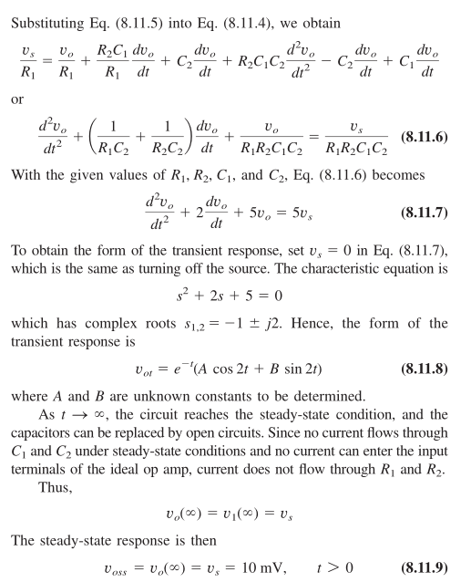

#### 8.7 对偶性

对偶（duality）的概念是解决电路问题的一种节省时间的方法。

- 它基于这样一种想法，即看似不同的电路可能彼此相关。

- 它们可能使用相同的方程，但某些互补元件的作用是互换的。

一旦你知道了一个电路的解，你就有了对偶电路的解。

寻找电路的对偶可以用图解法完成：

1.在给定电路的每个网格的中心放置一个节点。将参考节点置于给定电路外部。

2.在节点之间画线，使每条线都穿过一个元素。用它的对偶替换元件。

要确定电压源和电流源的极性，请遵循以下规则：产生正（顺时针）网格电流的电压源有一个对偶电流源，其参考方向是从地到非参考节点。

当有疑问时，可以参考对偶电路的网格或节点方程。

## Part 2 交流电路

### Chapter 9 正弦曲线和相量

#### 9.1 正弦

正弦曲线（sinusoid）是具有正弦（sine）或余弦（cosine）函数形式的信号。

正弦电压：

$$v(t)=V_m \sin \omega t$$

其周期为：

$$T=\frac{2 \pi}{\omega}$$

因此有：

$$v(t+T)=v(t)$$

更一般性的，我们需要考虑波与波之间的相对时间，这通过相移（phase shift）$\phi$来表示。

$$v(t)=V_m \sin (\omega t+\phi)$$

三角公式（用于波表达式的转换）：

$$\sin (A \pm B)=\sin A \cos B \pm \cos A \sin B$$

$$\cos (A \pm B)=\cos A \cos B \mp \sin A \sin B$$

图形法转换：

$$\cos \left(\omega t-90^{\circ}\right)=\sin \omega t$$

$$\sin \left(\omega t+180^{\circ}\right)=-\sin \omega t$$

$$3 \cos \omega t-4 \sin \omega t=5 \cos \left(\omega t+53.1^{\circ}\right)$$

$$A \cos \omega t+B \sin \omega t=C \cos (\omega t-\theta)$$

$$C=\sqrt{A^2+B^2}, \quad \theta=\tan ^{-1} \frac{B}{A}$$

注意正弦函数的正方向是向下的。

#### 9.2 相量

使用相量（phasor）表示正弦曲线是更方便的。

相量是复数平面的向量，对于一个复数$z$，它在平面内可以表示成矩形形式，也可以表示为极坐标或者指数形式：

由图可得：

$$r=\sqrt{x^2+y^2} \quad \phi=\tan ^{-1} \frac{y}{x}$$

$$x=r \cos \phi \quad y=r \sin \phi$$

$$j=\sqrt{-1}$$

矩形形式：

$$z=x+j y$$

极坐标形式：

$$z=r \angle \phi=r(cos \phi + j sin \phi)$$

指数形式：

$$z=r e^{j \phi}$$

有以下复数运算规则：

$$z_1+z_2=\left(x_1+x_2\right)+j\left(y_1+y_2\right)$$

$$z_1-z_2=\left(x_1-x_2\right)+j\left(y_1-y_2\right)$$

$$z_1 z_2=r_1 r_2 \angle (\phi_1 + \phi_2)$$

$$\frac{z_1}{z_2}=\frac{r_1}{r_2}\angle\left(\phi_1-\phi_2\right)$$

$$\frac{1}{z}=\frac{1}{r} \angle(-\phi)$$

$$\sqrt{z}=\sqrt{r} \angle(\phi / 2)$$

$$z^*=x-j y=r \angle-\phi=r e^{-j \phi}$$

其中星号$^{*}$上标表示共轭复数（原来的复数的虚部取负）。

有欧拉恒等式：

$$e^{\pm j \phi}=\cos \phi \pm j \sin \phi$$

实部和虚部：

$$\cos \phi=\operatorname{Re}\left(e^{j \phi}\right)$$

$$\sin \phi=\operatorname{Im}\left(e^{j \phi}\right)$$

因此将电压$v(t)$从时域（time domain）到相量域（phasor domain）的转换为：

$$v(t)=V_m \cos (\omega t+\phi)=\operatorname{Re}\left(V_m e^{j(\omega t+\phi)}\right)$$

$$v(t)=\operatorname{Re}\left(V_m e^{j \phi} e^{j \omega t}\right)$$

$$\mathbf{V}=V_m e^{j \phi}=V_m \angle \phi$$

$$v(t)=\operatorname{Re}\left(\mathbf{V} e^{j \omega t}\right)$$

其中$\mathbf{V}$即为正弦曲线的相量表示，但其与时间$t$无关。

相量域的相量$\mathbf{V}$的表示方法：

$$\mathbf{V}=V_m \angle \phi$$

$$\mathbf{I}=I_m \angle (-\theta)$$

可以通过画图表示相量域和时域的对应关系：

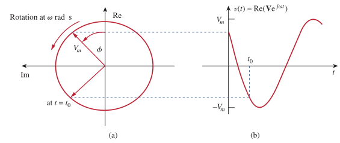

时域和相量域的转换表：

相量域也称为频域（frequency domain）:

$$v(t)=\operatorname{Re}\left(\mathbf{V} e^{j \omega t}\right)=V_m \cos (\omega t+\phi)$$

如果对$v(t)$求导和积分，则有：

$$\begin{aligned} \frac{d v}{d t} &=-\omega V_m \sin (\omega t+\phi)=\omega V_m \cos \left(\omega t+\phi+90^{\circ}\right) \\ &=\operatorname{Re}\left(\omega V_m e^{j \omega t} e^{j \phi} e^{j 90^{\circ}}\right)=\operatorname{Re}\left(j \omega \mathbf{V} e^{j \omega t}\right) \end{aligned}$$

最终可得时域与频域中的等价关系（频域形式可以不表示出与时间$t$相关的部分，时域形式则因为图像完整性需要带$t$）为：

$$v(t)=V_m \cos (\omega t+\phi) \quad \Leftrightarrow \quad \mathbf{V}=V_m \angle \phi$$

$$\frac{d v}{d t} \quad \Leftrightarrow \quad j \omega \mathbf{V}$$

$$\int v d t \quad \Leftrightarrow \quad \frac{\mathbf{V}}{j \omega}$$

以上$\Leftrightarrow$代表"等价于"。可知对$v(t)$求导后和积分后，其值也在相量域有对应的表达式。

#### 9.3 电路元件的相量关系

1.包含电阻的电路：

假设$i=I_m \cos (\omega t+\phi)$，得到：

$$v=i R=R I_m \cos (\omega t+\phi)$$

$$\mathbf{V}=R I_m \angle \phi$$

$$\mathbf{V}=R \mathbf{I}$$

2.包含电感的电路：

假设$i=I_m \cos (\omega t+\phi)$，得到：

$$v=L \frac{d i}{d t}=-\omega L I_m \sin (\omega t+\phi)$$

$$v=\omega L I_m \cos \left(\omega t+\phi+90^{\circ}\right)$$

$$\mathbf{V}=\omega L I_m e^{j\left(\phi+90^{\circ}\right)}=\omega L I_m e^{j \phi} e^{j 90^{\circ}}=\omega L I_m \angle \phi+90^{\circ}$$

$$e^{j 90^{\circ}}=j$$

$$\mathbf{V}=j \omega L \mathbf{I}$$

通过相移表示电感$L$造成的电流和电压的时间上不一致性。

3.包含电容的电路：

假设$v=V_m \cos (\omega t+\phi)$，得到：

$$i=C \frac{d v}{d t}$$

与电感的步骤相同，最终得到：

$$\mathbf{I}=j \omega C \mathbf{V} $$

$$\mathbf{V}=\frac{\mathbf{I}}{j \omega C}$$

总结：

解带复数的矩阵方法：

$$\left[\begin{array}{cc}\mathbf{A} & \mathbf{B} \\ C & D \end{array}\right]\left[\begin{array}{l}\mathbf{V}_1 \\ \mathbf{V}_2\end{array}\right]=\left[\begin{array}{c} E \\ F \end{array}\right]$$

$$\Delta=\left|\begin{array}{cc}\mathbf{A} & \mathbf{B} \\ C & D \end{array}\right|$$

$$\Delta_1=\left|\begin{array}{cc}E & \mathbf{B} \\ F & D \end{array}\right|$$

$$\Delta_2=\left|\begin{array}{cc}\mathbf{A} & E \\ C & F \end{array}\right|$$

$$\mathbf{V}_1=\frac{\Delta_1}{\Delta}$$

$$\mathbf{V}_2=\frac{\Delta_2}{\Delta}$$

#### 9.4 阻抗和导纳

1.在上一节我们得到了电阻、电感、电容的电压电流关系（频域）：

$$\mathbf{V}=R \mathbf{I}, \quad \mathbf{V}=j \omega L \mathbf{I}, \quad \mathbf{V}=\frac{\mathbf{I}}{j \omega C}$$

电阻、电感、电容的阻抗：

$$\frac{\mathbf{V}}{\mathbf{I}}=R, \quad \frac{\mathbf{V}}{\mathbf{I}}=j \omega L, \quad \frac{\mathbf{V}}{\mathbf{I}}=\frac{1}{j \omega C}$$

可以写成：

$$\mathbf{Z}=\frac{\mathbf{V}}{\mathbf{I}}$$

其中$\mathbf{Z}$是一个频率相关的复数（不是相量），称为阻抗（impedance），单位为欧姆。

2.当频率接近于0，易得$\mathbf{Z}_L=0$和$\mathbf{Z}_C \to \infty$，也就是电感视为短路，电容视为断路。

3.阻抗可以表示为：

$$\mathbf{Z}=R+j X$$

$$\mathbf{Z}=|\mathbf{Z}| \angle \theta$$

$$|\mathbf{Z}|=\sqrt{R^2+X^2}, \quad \theta=\tan ^{-1} \frac{X}{R}$$

$$R=|\mathbf{Z}| \cos \theta, \quad X=|\mathbf{Z}| \sin \theta$$

其中$R=Re (\mathbf{Z})$为电阻，$X=Im (\mathbf{Z})$为电抗（reactance）。电抗为正时阻抗为电感性/滞后性（inductive / lagging），电抗为负时阻抗为电容性/提前性（capacitive / leading）。

4.导纳（admittance）为阻抗的倒数（因此也是复数），用符号$\mathbf{Y}$表示。

$$\mathbf{Y}=\frac{1}{\mathbf{Z}}=\frac{\mathbf{I}}{\mathbf{V}}$$

$$\mathbf{Y}=G+j B$$

$$G+j B=\frac{1}{R+j X}$$

$$G+j B=\frac{1}{R+j X} \cdot \frac{R-j X}{R-j X}=\frac{R-j X}{R^2+X^2}$$

$$G=\frac{R}{R^2+X^2}, \quad B=-\frac{X}{R^2+X^2}$$

如果$X=0$，那么满足$G=\frac{1}{R}$。

#### 9.5 频域中使用基尔霍夫定律

基尔霍夫定律：

$$v_1+v_2+\cdots+v_n=0$$

写成余弦形式：

$$\begin{aligned} V_{m 1} \cos \left(\omega t+\theta_1\right) &+V_{m 2} \cos \left(\omega t+\theta_2\right) +\cdots+V_{m n} \cos \left(\omega t+\theta_n\right)=0 \end{aligned}$$

$$\operatorname{Re}\left(V_{m 1} e^{j \theta_1} e^{j \omega t}\right)+\operatorname{Re}\left(V_{m 2} e^{j \theta_2} e^{j \omega t}\right)+\cdots+\operatorname{Re}\left(V_{m n} e^{j \theta_n} e^{j \omega t}\right)=0$$

$$\operatorname{Re}\left[\left(V_{m 1} e^{j \theta_1}+V_{m 2} e^{j \theta_2}+\cdots+V_{m n} e^{j \theta_m}\right) e^{j \omega t}\right]=0$$

使$\mathbf{V}_k=V_{m k} e^{j \theta_k}$，有：

$$\operatorname{Re}\left[\left(\mathbf{V}_1+\mathbf{V}_2+\cdots+\mathbf{V}_n\right) e^{j \omega t}\right]=0$$

如果$e^{j \omega t} \neq 0$，有：

$$\mathbf{V}_1+\mathbf{V}_2+\cdots+\mathbf{V}_n=0$$

因此基尔霍夫电压定律适用于相量。电流定律也易得适用于相量：

$$i_1+i_2+\cdots+i_n=0$$

$$\mathbf{I}_1+\mathbf{I}_2+\cdots+\mathbf{I}_n=0$$

#### 9.6 阻抗的组合

对以上电路应用KVL得到：

$$\mathbf{V}=\mathbf{V}_1+\mathbf{V}_2+\cdots+\mathbf{V}_N=\mathbf{I}\left(\mathbf{Z}_1+\mathbf{Z}_2+\cdots+\mathbf{Z}_N\right)$$

因此整个电路的输入阻抗/等效阻抗为：

$$\mathbf{Z}_{\mathrm{eq}}=\frac{\mathbf{V}}{\mathbf{I}}=\mathbf{Z}_1+\mathbf{Z}_2+\cdots+\mathbf{Z}_N$$

可以看到，在串联电路中，电压、电流、阻抗仍遵循电压、电流、电阻的分配律关系。

类似的，应用KCL得到：

$$\mathbf{I}=\mathbf{I}_1+\mathbf{I}_2+\cdots+\mathbf{I}_N=\mathbf{V}\left(\frac{1}{\mathbf{Z}_1}+\frac{1}{\mathbf{Z}_2}+\cdots+\frac{1}{\mathbf{Z}_N}\right)$$

等效阻抗的关系：

$$\frac{1}{\mathbf{Z}_{\mathrm{eq}}}=\frac{\mathbf{I}}{\mathbf{V}}=\frac{1}{\mathbf{Z}_1}+\frac{1}{\mathbf{Z}_2}+\cdots+\frac{1}{\mathbf{Z}_N}$$

写成导纳的形式：

$$\mathbf{Y}_{\mathrm{eq}}=\mathbf{Y}_1+\mathbf{Y}_2+\cdots+\mathbf{Y}_N$$

类似的，星三变换的阻抗也和电阻遵循相同的公式。

$$\mathbf{Z}_a=\frac{\mathbf{Z}_1 \mathbf{Z}_2+\mathbf{Z}_2 \mathbf{Z}_3+\mathbf{Z}_3 \mathbf{Z}_1}{\mathbf{Z}_1}$$

$$\mathbf{Z}_b=\frac{\mathbf{Z}_1 \mathbf{Z}_2+\mathbf{Z}_2 \mathbf{Z}_3+\mathbf{Z}_3 \mathbf{Z}_1}{\mathbf{Z}_2}$$

$$\mathbf{Z}_c=\frac{\mathbf{Z}_1 \mathbf{Z}_2+\mathbf{Z}_2 \mathbf{Z}_3+\mathbf{Z}_3 \mathbf{Z}_1}{\mathbf{Z}_3}$$

$$\begin{aligned} \mathbf{Z}_1 &=\frac{\mathbf{Z}_b \mathbf{Z}_c}{\mathbf{Z}_a+\mathbf{Z}_b+\mathbf{Z}_c} \\ \mathbf{Z}_2 &=\frac{\mathbf{Z}_c \mathbf{Z}_a}{\mathbf{Z}_a+\mathbf{Z}_b+\mathbf{Z}_c} \\ \mathbf{Z}_3 &=\frac{\mathbf{Z}_a \mathbf{Z}_b}{\mathbf{Z}_a+\mathbf{Z}_b+\mathbf{Z}_c} \end{aligned}$$

也满足平衡时的关系：

$$\mathbf{Z}_Y=\mathbf{Z}_1=\mathbf{Z}_2=\mathbf{Z}_3$$

$$\mathbf{Z}_{\Delta}=\mathbf{Z}_a=\mathbf{Z}_b=\mathbf{Z}_c$$

$$\mathbf{Z}_Y=\frac{1}{3} \mathbf{Z}_{\Delta}$$

例题：

### Chapter 10 正弦稳态分析

#### 10.1 节点分析法（正弦）

第一步是通过计算电路各元件在工作频率下的阻抗（复数），将时域电路转换为频域电路。第二步就是应用KCL。超节点分析适用。

注意交流源在电路中表示为直流源，但标注的数值为频域表达式。

"章节9.3"中有详细的电容和电感的电流电压的关系、和含有复数的矩阵求解方法。

例题：

#### 10.2 网格分析法（正弦）

与节点分析法相同，第一步先将时域电路转换为频域电路。第二步应用KVL。同样的，超网格分析也是适用的。

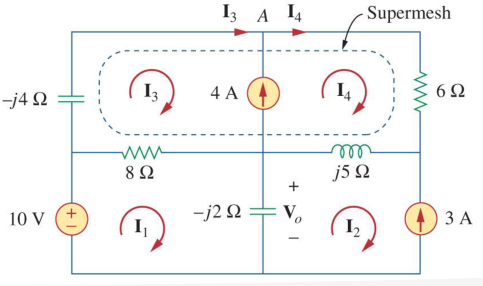

例题：

#### 10.3 叠加（正弦）

由于交流电路是线性的，也可以应用叠加原理。当电路有多个在不同频率下工作的源时，叠加原理就会很重要。

但比较复杂的是每个源都必须有对应的频域等效电路。这是因为每个元件在不同的频率下有不同的阻抗。

除此之外，在最后根据叠加原理进行相加的时候，还必须将产生的电压和电流转换回时域。这是因为有因子$e^{j \omega t}$隐含在正弦分析中。

例题：

#### 10.4 源转换（正弦）

频域源变换涉及到将具有阻抗的串联电压源转换为具有阻抗的并联电流源（把电阻替换为阻抗即可使得源转换公式继续成立）。

$$V_S=Z_S I_S \quad \Leftrightarrow \quad I_S=\frac{V_S}{Z_S}$$

#### 10.5 戴维南等效和诺顿等效（正弦）

戴维南定理和诺顿定理都适用于交流电路。

$$V_{T h}=Z_N I_N$$

$$Z_{T h}=Z_N$$

#### 10.6 运放电路（正弦）

假设运放是理想的（满足虚短和虚断），且工作在线性区域。

#### 10.7 电容倍增器

电容倍增器（capacitor multiplier）是一种运放电路。他可以将一个小的电容的作用放大，让其和一个大电容一样工作。

第一级运放是电压跟随器，第二级运放是反相放大器。在节点1有：

$$\boldsymbol{I}_{\mathrm{i}}=\frac{\boldsymbol{V}_{\mathrm{i}}-\boldsymbol{V}_{\mathrm{o}}}{1 / \mathrm{j} \omega C}=\mathrm{j} \omega C\left(\boldsymbol{V}_{\mathrm{i}}-\boldsymbol{V}_{\mathrm{o}}\right)$$

在节点2进行KCL：

$$\frac{\boldsymbol{V}_{\mathrm{i}}-0}{R_1}=\frac{0-\boldsymbol{V}_0}{R_2}$$

$$\boldsymbol{V}_{\mathrm{o}}=-\frac{R_2}{R_1} \boldsymbol{V}_{\mathrm{i}}$$

代入原式可得：

$$\boldsymbol{I}_{\mathrm{i}}=\mathrm{j} \omega C\left(1+\frac{R_2}{R_1}\right) \boldsymbol{V}_{\mathrm{i}}$$

$$\frac{\boldsymbol{I}_{\mathrm{i}}}{\boldsymbol{V}_{\mathrm{i}}}=\mathrm{j} \omega\left(1+\frac{R_2}{R_1}\right) C$$

$$C_{\mathrm{eq}}=\left(1+\frac{R_2}{R_1}\right) C$$

$$\boldsymbol{Z}_{\mathrm{i}}=\frac{\boldsymbol{V}_{\mathrm{i}}}{\boldsymbol{I}_{\mathrm{i}}}=\frac{1}{\mathrm{j} \omega C_{\mathrm{eq}}}$$

其中$C_{eq}$即为此电容经电容倍增器运放电路放大后的等效电容值。也就是说$R_1,R_2$可以决定等效电容值的大小。

#### 10.8 振荡器

振荡器（oscillator）可以将直流电转换为交流电。振荡器需要一个直流电源来驱动，输出交流信号。

有常见的三种正弦振荡器：移相型振荡器、双T形振荡器和维恩桥式振荡器（Wien-bridge oscillator）。（均不考）

LC振荡器（也就是无源的电感和电容组成的电路，理想情况下能量不损耗，电感和电容不断重复充电放电的过程）其实不是一个振荡器。

### Chapter 11 交流功率分析

#### 11.1 瞬时功率

瞬时功率（instantaneous power）：

$$v(t)=V_m \cos \left(\omega t+\theta_v\right)$$

$$i(t)=I_m \cos \left(\omega t+\theta_i\right)$$

$$p(t)=v(t) i(t)$$

又由：

$$\cos A \cos B=\frac{1}{2}[\cos (A-B)+\cos (A+B)]$$

最终可得：

$$p(t)=\frac{1}{2} V_{\mathrm{m}} I_{\mathrm{m}} \cos \left(\theta_{\mathrm{v}}-\theta_{\mathrm{i}}\right)+\frac{1}{2} V_{\mathrm{m}} I_{\mathrm{m}} \cos \left(2 \omega t+\theta_{\mathrm{v}}+\theta_{\mathrm{i}}\right)$$

图像大致为：

注意其中存在$p(t)<0$的情况，这表面电源吸收功率，这在电路中包括储能元件（电容和电感）时是可能的。

测量瞬时功率被认为是非常困难的。一般测量平均功率（average power），也就是一个周期内瞬时功率的平均值，表示为：

$$P=\frac{1}{T} \int_0^T p(t) \mathrm{d} t$$

以上式子是对周期$T$取平均的。在$p(t)$的实际周期内，使用$T_0=T / 2$也会得到同样的结果。

代入已求得的$p(t)$可得：

$$\begin{aligned} P &=\frac{1}{T} \int_0^T \frac{1}{2} V_{\mathrm{m}} I_{\mathrm{m}} \cos \left(\theta_{\mathrm{v}}-\theta_{\mathrm{i}}\right) \mathrm{d} t+\frac{1}{T} \int_0^T \frac{1}{2} V_{\mathrm{m}} I_{\mathrm{m}} \cos \left(2 \omega t+\theta_{\mathrm{v}}+\theta_{\mathrm{i}}\right) \mathrm{d} t \\ &=\frac{1}{2} V_{\mathrm{m}} I_{\mathrm{m}} \cos \left(\theta_{\mathrm{v}}-\theta_{\mathrm{i}}\right) \frac{1}{T} \int_0^T \mathrm{~d} t+\frac{1}{2} V_{\mathrm{m}} I_{\mathrm{m}} \frac{1}{T} \int_0^T \cos \left(2 \omega t+\theta_{\mathrm{v}}+\theta_{\mathrm{i}}\right) \mathrm{d} t \end{aligned}$$

化简可得：

$$P=\frac{1}{2} V_{\mathrm{m}} I_{\mathrm{m}} \cos \left(\theta_{\mathrm{v}}-\theta_{\mathrm{i}}\right)$$

当利用相量计算时，可得：

$$\boldsymbol{V}=V_{\mathrm{m}} \angle \theta_{\mathrm{v}}$$ 

$$\boldsymbol{I}=I_{\mathrm{m}} \angle \theta_{\mathrm{i}}$$

$$\frac{1}{2} \boldsymbol{V} \boldsymbol{I}^*=\frac{1}{2} V_{\mathrm{m}} I_{\mathrm{m}}\angle (\theta_{\mathrm{v}}-\theta_{\mathrm{i}})=\frac{1}{2} V_{\mathrm{m}} I_{\mathrm{m}}\left[\cos \left(\theta_{\mathrm{v}}-\theta_{\mathrm{i}}\right)+\mathrm{j} \sin \left(\theta_{\mathrm{v}}-\theta_{\mathrm{i}}\right)\right]$$

$$P=\frac{1}{2} \operatorname{Re}\left[\boldsymbol{V} \boldsymbol{I}^*\right]=\frac{1}{2} V_{\mathrm{m}} I_{\mathrm{m}} \cos \left(\theta_{\mathrm{v}}-\theta_{\mathrm{i}}\right)$$

当$\theta_{\mathrm{v}}=\theta_{\mathrm{i}}$时，满足$V_m=I_m$，满足纯电阻（resistive）电路，可得：

$$|\boldsymbol{I}|^2=\boldsymbol{I} \times \boldsymbol{I}^{*}$$

$$P=\frac{1}{2} V_{\mathrm{m}} I_{\mathrm{m}}=\frac{1}{2} I_{\mathrm{m}}^2 R=\frac{1}{2}|\boldsymbol{I}|^2 R$$

当$\theta_{\mathrm{v}}-\theta_{\mathrm{i}}=\pm 90^{\circ}$时，满足纯电抗（reactive）电路，可得：

$$P=\frac{1}{2} V_{\mathrm{m}} I_{\mathrm{m}} \cos 90^{\circ}=0$$

根据以上的推导，我们就可以对电路中的所有元件和独立源的平均功率进行计算了。只需要计算得到流过元件或独立源的电流和独立源两端的电压的频域表达式（$\boldsymbol{V}=V_{\mathrm{m}} \angle \theta_{\mathrm{v}}$，$\boldsymbol{I}=I_{\mathrm{m}} \angle \theta_{\mathrm{i}}$），然后代入平均功率的公式即可。（$\theta_i$和$\theta_v$正是使用频域表示方法得到的）

#### 11.2 最大平均功率传输

如何最大限度地将功率输送到电阻负载？在之前我们已经推导得到：当负载电阻等于供电电路的戴维宁电阻时，传递最大功率。这个结果在交流电路也适用。

先把阻抗表示出来：

$$\begin{aligned} \boldsymbol{Z}_{\mathrm{Th}} &=R_{\mathrm{Th}}+\mathrm{j} X_{\mathrm{Th}} \\ \boldsymbol{Z}_{\mathrm{L}} &=R_{\mathrm{L}}+\mathrm{j} X_{\mathrm{L}} \end{aligned}$$

流过负载的电流为：

$$\boldsymbol{I}=\frac{\boldsymbol{V}_{\mathrm{Th}}}{\boldsymbol{Z}_{\mathrm{Th}}+\boldsymbol{Z}_{\mathrm{L}}}=\frac{\boldsymbol{V}_{\mathrm{Th}}}{\left(R_{\mathrm{Th}}+\mathrm{j} X_{\mathrm{Th}}\right)+\left(R_{\mathrm{L}}+\mathrm{j} X_{\mathrm{L}}\right)}$$

可得负载的功率为：

$$P=\frac{1}{2}|\boldsymbol{I}|^2 R_{\mathrm{L}}=\frac{\left|\boldsymbol{V}_{\mathrm{Th}}\right|{ }^2 R_{\mathrm{L}} / 2}{\left(R_{\mathrm{Th}}+R_{\mathrm{L}}\right)^2+\left(X_{\mathrm{Th}}+X_{\mathrm{L}}\right)^2}$$

要使得$P$最大，要求偏微分：

$$\frac{\partial P}{\partial X_{\mathrm{L}}}=\frac{\left|\boldsymbol{V}_{\mathrm{Th}}\right|^2 R_{\mathrm{L}}\left(X_{\mathrm{Th}}+X_{\mathrm{L}}\right)}{-\left[\left(R_{\mathrm{Th}}+R_{\mathrm{L} .}\right)^2+\left(X_{\mathrm{Th}}+X_{\mathrm{L}}\right)^2\right]^2}$$

$$\frac{\partial P}{\partial R_{\mathrm{L}}}=\frac{\left|\boldsymbol{V}_{\mathrm{Th}}\right|^2\left[\left(R_{\mathrm{Th}}+R_{\mathrm{L}}\right)^2+\left(X_{\mathrm{Th}}+X_{\mathrm{L}}\right)^2-2 R_{\mathrm{L}}\left(R_{\mathrm{Th}}+R_{\mathrm{L}}\right)\right]}{2\left[\left(R_{\mathrm{Th}}+R_{\mathrm{L}}\right)^2+\left(X_{\mathrm{Th}}+X_{\mathrm{L}}\right)^2\right]^2}$$

$$\partial P / \partial R_{\mathrm{L}}=0$$

$$\partial P / \partial X_{\mathrm{L}}=0$$

解得：

$$X_{\mathrm{L}}=-X_{\mathrm{Th}}$$

$$R_{\mathrm{L} }=\sqrt{R_{\mathrm{Th}}^2+\left(X_{\mathrm{Th}}+X_{\mathrm{L}}\right)^2}$$

$$\boldsymbol{Z}_{\mathrm{L}}=R_{\mathrm{L}}+\mathrm{j} X_{\mathrm{L}}=R_{\mathrm{Th}}-\mathrm{j} X_{\mathrm{Th}}$$

$$\boldsymbol{Z}_{\mathrm{Th}}^{*}=R_{\mathrm{Th}}-\mathrm{j} X_{\mathrm{Th}}$$

也就是说，要取得最大平均功率传输，那么负载的阻抗$\boldsymbol{Z}_L$必须等于戴维南阻抗$\boldsymbol{Z}_{Th}$的共轭复数$\boldsymbol{Z}_{TH}^{*}$，这被称为正弦稳态条件下的最大平均功率传输定理（maximum average power transfer theorem）。因此最终求得的最大平均功率为：

$$P_{\max }=\frac{\left|\boldsymbol{V}_{\mathrm{Th}}\right|^2}{8 R_{\mathrm{Th}}}$$

例题：

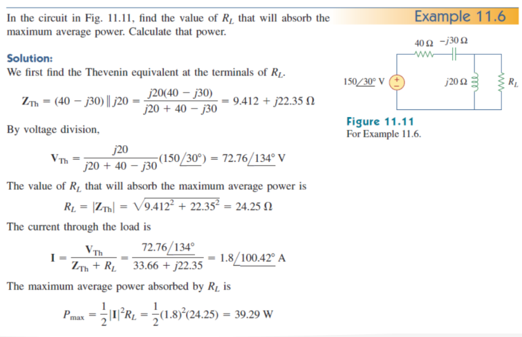

#### 11.3 有效值

周期性电流的有效值（effective value）是指与该周期性电流传递给电阻器的平均功率相等的直流电流的值。

$$P=\frac{1}{T} \int_0^T i^2 R \mathrm{~d} t=\frac{R}{T} \int_0^T i^2 \mathrm{~d} t$$

$$P=I_{\mathrm{eff}}^2 R$$

求得：

$$I_{\mathrm{eff}}=\sqrt{\frac{1}{T} \int_0^T i^2 \mathrm{~d} t}$$

$$V_{\mathrm{eff}}=\sqrt{\frac{1}{T} \int_0^T v^2 \mathrm{~d} t}$$

也就是说，有效值就是方均根/均方根（root-mean-square，rms）值。

$$X_{\mathrm{rms}}=\sqrt{\frac{1}{T} \int_0^T x^2 \mathrm{~d} t}$$

$$I_{\mathrm{eff}}=I_{\mathrm{rms}},\quad V_{\mathrm{eff}}=V_{\mathrm{rms}}$$

因此，推导正弦信号的电流和电压（设均为$cos$）的有效值为：

$$I_{\mathrm{ms}}=\sqrt{\frac{1}{T} \int_0^T I_{\mathrm{m}}^2 \cos ^2 \omega t \mathrm{~d} t}=\sqrt{\frac{I_{\mathrm{m}}^2}{T} \int_0^T \frac{1}{2}(1+\cos 2 \omega t) \mathrm{d} t}=\frac{I_{\mathrm{m}}}{\sqrt{2}}$$

类似可得：

$$V_{\mathrm{rms}}=\frac{V_{\mathrm{m}}}{\sqrt{2}}$$

因此最终有两种形式（含$R$和不含$R$）：

$$P=\frac{1}{2} V_{\mathrm{m}} I_{\mathrm{m}} \cos \left(\theta_{\mathrm{v}}-\theta_{\mathrm{i}}\right)=\frac{V_{\mathrm{m}}}{\sqrt{2}} \frac{I_{\mathrm{m}}}{\sqrt{2}} \cos \left(\theta_{\mathrm{v}}-\theta_{\mathrm{i}}\right)=V_{\mathrm{rms}} I_{\mathrm{rms}} \cos \left(\theta_{\mathrm{v}}-\theta_{\mathrm{i}})\right.$$

$$P=I_{\mathrm{rms}}^2 R=\frac{V_{\mathrm{ms}}^2}{R}$$

电力公司一般用方均根值来标称电压大小（我国的220V）。

#### 11.4 视在功率与功率因数

定义：

$$P=V_{r m s} I_{r m s} \cos \left(\theta_v-\theta_i\right)=S \cos \left(\theta_v-\theta_i\right)$$

$$S=V_{\mathrm{rms}} I_{\mathrm{rms}}$$

其中的$S$称为视在功率（apparent power）（为与平均功率区分，单位取$V \cdot A$而不是$W$），而因子$\cos \left(\theta_v-\theta_i\right)$称为功率因数（power factor，pf）。

$$\mathrm{pf}=\frac{P}{S}=\cos \left(\theta_{\mathrm{v}}-\theta_{\mathrm{i}}\right)$$

将$(\theta_v-\theta_i)$称为功率因数角（power factor angle）。

功率因数是电压与电流的相位角之差的余弦值，同时也是负载阻抗辐角的余弦值：

$$\boldsymbol{Z}=\frac{\boldsymbol{V}}{\boldsymbol{I}}=\frac{V_{\mathrm{m}} \angle \theta_{\mathrm{v}}}{I_{\mathrm{m}} \angle \theta_{\mathrm{i}}}=\frac{V_{\mathrm{m}}}{I_{\mathrm{m}}} \angle (\theta_{\mathrm{v}}-\theta_{\mathrm{i}})$$

$$\boldsymbol{V}_{\mathrm{rms}}=\frac{\boldsymbol{V}}{\sqrt{2}}=V_{\mathrm{rms}} \angle \theta_{\mathrm{v}}$$

$$\boldsymbol{I}_{\mathrm{rms}}=\frac{\boldsymbol{I}}{\sqrt{2}}=I_{\mathrm{rms}} \angle \theta_{\mathrm{i}}$$

$$\boldsymbol{Z}=\frac{\boldsymbol{V}}{\boldsymbol{I}}=\frac{\boldsymbol{V}_{\mathrm{rms}}}{\boldsymbol{I}_{\mathrm{rms}}}=\frac{V_{\mathrm{rms}}}{I_{\mathrm{rms}}} \angle (\theta_{\mathrm{v}}-\theta_{\mathrm{i}})$$

对于纯电阻性负载而言，电压与电流同相，功率因数角为$0$，$pf=1$，此时视在功率等于平均功率。对于纯电抗负载而言，功率因数角为$\pm 90^{\circ}$，$pf=0$，此时平均功率为零。而在这两种情况之间时，功率因数有超前和滞后两种情况。超前功率因数$pf$指电流超前于电压，此时电路负载呈现电容性。滞后功率因数$pf$指电流滞后于电压，此时电路负载呈现电感性。

#### 11.5 复功率

复功率（complex power）是为了得到尽可能简单的功率关系式而提出的。

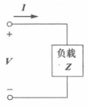

假定有如图的负载，则：

$$\boldsymbol{V}=V_{\mathrm{m}} \angle \theta_{\mathrm{v}} \quad \boldsymbol{I}=I_{\mathrm{m}} \angle \theta_{\mathrm{i}}$$

此交流负载所吸收的复功率$S$为：

$$\boldsymbol{S}=\frac{1}{2} \boldsymbol{V} \boldsymbol{I}^*$$

$$\boldsymbol{S}=\boldsymbol{V}_{\mathrm{rms}} \boldsymbol{I}_{\mathrm{rms}}^*$$

其中：

$$\boldsymbol{V}_{\mathrm{rms}}=\frac{\boldsymbol{V}}{\sqrt{2}}=V_{\mathrm{rms}} \angle \theta_{\mathrm{v}}$$

$$\boldsymbol{I}_{\mathrm{rms}}=\frac{\boldsymbol{I}}{\sqrt{2}}=I_{\mathrm{rms}} \angle \theta_{\mathrm{i}}$$

$$\boldsymbol{I}_{\mathrm{rms}}^*=\frac{\boldsymbol{I}^*}{\sqrt{2}}=I_{\mathrm{rms}} \angle (-\theta_{\mathrm{i}})$$

$$\boldsymbol{S}=V_{\mathrm{rms}} I_{\mathrm{rms}}\angle (\theta_{\mathrm{v}}-\theta_{\mathrm{i}})=V_{\mathrm{rms}} I_{\mathrm{rms}} \cos \left(\theta_{\mathrm{v}}-\theta_{\mathrm{i}}\right)+\mathrm{j} V_{\mathrm{rms}} I_{\mathrm{rms}} \sin \left(\theta_{\mathrm{v}}-\theta_{\mathrm{i}}\right)$$

因此可得复功率的值是一个复数，其大小的值$|\boldsymbol{S}|$等于视在功率$S$。

复功率也可以用负载阻抗$\boldsymbol{Z}$表示，推导如下：

$$\boldsymbol{Z}=\frac{\boldsymbol{V}}{\boldsymbol{I}}=\frac{\boldsymbol{V}_{\mathrm{rms}}}{\boldsymbol{I}_{\mathrm{rms}}}=\frac{V_{\mathrm{rms}}}{I_{\mathrm{rms}}} \angle (\theta_{\mathrm{v}}-\theta_{\mathrm{i}})$$

$$\boldsymbol{S}=I_{\mathrm{rms}}^2 \boldsymbol{Z}=\frac{V_{\mathrm{rms}}^2}{\boldsymbol{Z}^*}=\boldsymbol{V}_{\mathrm{rms}} \boldsymbol{I}_{\mathrm{rms}}^*$$

$$\boldsymbol{Z}=\mathrm{R}+\mathrm{j} X$$

$$\boldsymbol{S}=I_{\mathrm{rms}}^2(R+\mathrm{j} X)=P+\mathrm{j} Q$$

$$P=\operatorname{Re}(\boldsymbol{S})=I_{\mathrm{rms}}^2 R=V_{\mathrm{rms}} I_{\mathrm{rms}} \cos \left(\theta_{\mathrm{v}}-\theta_{\mathrm{i}}\right)=S \cos \left(\theta_{\mathrm{v}}-\theta_{\mathrm{i}}\right)$$

$$Q=\operatorname{Im}(\boldsymbol{S})=I_{\operatorname{rms}}^2 X=V_{\mathrm{rms}} I_{\mathrm{rms}} \sin \left(\theta_{\mathrm{v}}-\theta_{\mathrm{i}}\right)=S \sin \left(\theta_{\mathrm{v}}-\theta_{\mathrm{i}}\right)$$

其中$P$为平均功率或有功功率，其值取决于负载电阻$R$。$Q$为无功功率（reactive power）或正交功率，其值取决于负载的电抗$X$。

有功功率$P$就是传递给负载的平均功率，单位为$W$，是负载实际消耗的功率。无功功率$Q$是电源与电抗负载进行能量交换的一个度量值，单位为乏（volt-ampere reactive，var）。

对于电阻性负载（$pf=1$），$Q=0$。对于电容性负载（$pf$超前，$Q<0$）。对于电感性负载（$pf$之后，$Q>0$）。

通常利用三角形法表示$\boldsymbol{S}、P、Q$三者之间的关系，称为功率三角形（power triangle）。类似的也可以对$|\boldsymbol{Z}|、R、X$三者之间的关系进行表示。

#### 11.6 交流功率守恒

功率守恒原理（conservation of power）不仅适用于直流电路也适用于交流电路。

应用KCL，可得：

$$\boldsymbol{I}=\boldsymbol{I}_1+\boldsymbol{I}_2$$

$$\boldsymbol{S}=\boldsymbol{V} \boldsymbol{I}^*=\boldsymbol{V}\left(\boldsymbol{I}_1^*+\boldsymbol{I}_2^*\right)=\boldsymbol{V} \boldsymbol{I}_1^*+\boldsymbol{V} \boldsymbol{I}_2^*=\boldsymbol{S}_1+\boldsymbol{S}_2$$

应用KVL，可得：

$$\boldsymbol{V}=\boldsymbol{V}_1+\boldsymbol{V}_2$$

$$\boldsymbol{S}=\boldsymbol{V} \boldsymbol{I}^*=\left(\boldsymbol{V}_1+\boldsymbol{V}_2\right) \boldsymbol{I}^*=\boldsymbol{V}_1 \boldsymbol{I}^*+\boldsymbol{V}_2 \boldsymbol{I}^*=\boldsymbol{S}_1+\boldsymbol{S}_2$$

因此无论负载是串联还是并联，都有：

$$\boldsymbol{S}=\boldsymbol{S}_1+\boldsymbol{S}_2+\cdots+\boldsymbol{S}_{\mathrm{N}}$$

这意味着有功功率、无功功率、复功率、瞬时功率均满足功率守恒原理。

#### 11.7 功率因数的校正

不改变原始负载的电压或电流（也就是只改变其中之一），提高功率因数的过程称为功率因数校正（power factor correction，PFC）。

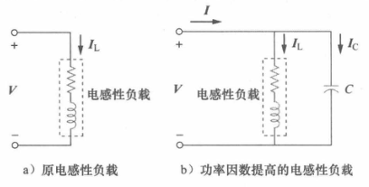

并联一个电容，减轻了负载的电感性，使得功率因数提高了。用相量图表示则为：

：

可以从视在功率角度考虑，则有功率三角形：

计算使得角度从$\theta_1$校正为$\theta_2$的电容的大小$C$：

$$P=S_1 \cos \theta_1 \quad Q_1=S_1 \sin \theta_1=P \tan \theta_1$$

$$P=S_2 \cos \theta_1 \quad Q_2=S_2 \sin \theta_2=P \tan \theta_2$$

$$Q_{\mathrm{C}}=Q_1-Q_2=P\left(\tan \theta_1-\tan \theta_2\right)$$

由复功率的定义可得：

$$Q_{\mathrm{C}}=V_{\mathrm{rms}}^2 / X_{\mathrm{C}}=\omega C V_{\mathrm{rms}}^2$$

因此需要并联的电容大小为：

$$C=\frac{Q_{\mathrm{C}}}{\omega V_{\mathrm{ms}}^2}=\frac{P\left(\tan \theta_1-\tan \theta_2\right)}{\omega V_{\mathrm{ms}}^2}$$

以上为把电容并联到电感性负载的两端。但是如果是电容性负载，则需要并联一个电感。类似的，可得此电感的大小为：

$$Q_{\mathrm{L}}=\frac{V_{\text {rms}}^2}{X_{\mathrm{L}}}=\frac{V_{\text {rms}}^2}{\omega L} \Rightarrow L=\frac{V_{\text {rms}}^2}{\omega Q_{\mathrm{L}}}$$

其中$Q_L=Q_1-Q_2$，表示新无功功率和旧无功功率的差值。

#### 11.8 功率表

功率表也叫瓦特计（wattmeter）。

仪表由两个线圈组成。电流线圈设计为低阻抗，与负载串联连接。电压线圈设计有非常大的阻抗，并与负载并联。这两者产生的感应磁场引起电流线圈偏转。

### chapter 13 磁耦合电路

#### 13.1 磁耦合

当两个相互接触或者不接触的回路之间通过其中一个回路所产生的磁场而相互影响时，称为磁耦合（magnetically coupled）。

#### 13.2 互感

当两个电感器彼此靠得很近时，电流通过时产生的磁通量将在另一个导体中产生电压，称为互感（mutual inductance）。

1.单线圈：

按照法拉第定律，可得线圈中的感应电压$v$和电流$i$流过该线圈时产生的磁通量$\phi$的关系：

$$v=N \frac{\mathrm{d} \phi}{\mathrm{d} t}$$

因为$\phi$由电流$i$产生，因此可以写成：

$$v=N \frac{\mathrm{d} \phi}{\mathrm{d} i} \frac{\mathrm{d} i}{\mathrm{~d} t}$$

$$v=L \frac{\mathrm{d} i}{\mathrm{~d} t}$$

$$L=N \frac{\mathrm{d} \phi}{\mathrm{d} i}$$

电感$L$称为自感（self-inductance）。它表示的是同一线圈中时变电流与其感应电压之间的关系。

2.双线圈（单电流）：

假设线圈2中无电流，此时线圈1中的电流产生的磁通量$\phi_1$有两个分量，$\phi_{11}$仅与线圈1交链，$\phi_{12}$同时与线圈1和线圈2交链：

$$\phi_1=\phi_{11}+\phi_{12}$$

此时线圈1和线圈2称为磁耦合。

$$v_1=N_1 \frac{\mathrm{d} \phi_1}{\mathrm{~d} t}$$

$$v_1=N_1 \frac{\mathrm{d} \phi_1}{\mathrm{~d} i_1} \frac{\mathrm{d} i_1}{\mathrm{~d} t}=L_1 \frac{\mathrm{d} i_1}{\mathrm{~d} t}$$

$$v_2=N_2 \frac{\mathrm{d} \phi_{12}}{\mathrm{~d} t}$$

$$M_{21}=N_2 \frac{\mathrm{d} \phi_{12}}{\mathrm{~d} i_1}$$

$$v_2=N_2 \frac{\mathrm{d} \phi_{12}}{\mathrm{~d} i_1} \frac{\mathrm{d} i_1}{\mathrm{~d} t}=M_{21} \frac{\mathrm{d} i_1}{\mathrm{~d} t}$$

其中$M_{21}$称为线圈2相对于线圈1的互感，下标$_{21}$表示线圈2的感应电压与线圈1中的电流的联系。

类似的，假设线圈1中无电流，最终可以求得：

$$M_{12}=N_1 \frac{\mathrm{d} \phi_{21}}{\mathrm{~d} i_2}$$

$$v_1=M_{12} \frac{\mathrm{d} i_2}{\mathrm{~d} t}$$

之后可证得：

$$M_{12}=M_{21}=M$$

其中$M$称为两个线圈之间的互感。注意，仅当两个电感器或线圈的距离很近，切电路由时变电源驱动时，才存在互感耦合。

3.同名端（dot convention）：

a.确定互感电压的极性需要使用楞次定律和右手准则来判定，这在电路图中不方便进行表示，因此采用同名端规则来进行简化。

在两个磁耦合线圈的一端标上一个圆点，表示电流由该点流入线圈时磁通量的方向。如果电流从一个线圈的同名端流入，则在第二个线圈的同名端处，互感电压的参考极性为正（注意是参考极性，实际极性由参考极性得到）。

线圈串联情况：

$$L=L_1+L_2+2 M$$

$$L=L_1+L_2-2 M$$

$$v_1=i_1 R_1+L_1 \frac{\mathrm{d} i_1}{\mathrm{~d} t}+M \frac{\mathrm{d} i_2}{\mathrm{~d} t}$$

$$v_2=i_2 R_2+L_2 \frac{\mathrm{d} i_2}{\mathrm{~d} t}+M \frac{\mathrm{d} i_1}{\mathrm{~d} t}$$

$$\boldsymbol{V}_1=\left(R_1+\mathrm{j} \omega L_1\right) \boldsymbol{I}_1+\mathrm{j} \omega M \boldsymbol{I}_2$$

$$\boldsymbol{V}_2=\mathrm{j} \omega M \boldsymbol{I}_1+\left(R_2+\mathrm{j} \omega L_2\right) \boldsymbol{I}_2$$

$$\boldsymbol{V}=\left(\boldsymbol{Z}_1+\mathrm{j} \omega L_1\right) \boldsymbol{I}_1-\mathrm{j} \omega M \boldsymbol{I}_2$$

$$0=-\mathrm{j} \omega M \boldsymbol{I}_1+\left(\boldsymbol{Z}_L+\mathrm{j} \omega L_2\right) \boldsymbol{I}_2$$

4.互感耦合的等效简易分析模型图示：

每个原电路的电感器都使用另一个电感器和一个受控源来进行表示。

#### 13.3 耦合电路中的能量

已知电感器存储的能量为：

$$w=\frac{1}{2} L i^2$$

电流初始值均为0。令$i_1$由0增加到$I_1$，$i_2=0$不变：

$$p_1(t)=v_1 i_1=i_1 L_1 \frac{\mathrm{d} i_1}{\mathrm{~d} t}$$

$$w_1=\int p_1 \mathrm{~d} t=L_1 \int_0^{I_1} i_1 \mathrm{~d} i_1=\frac{1}{2} L_1 I_1^2$$

令$i_2$由0增加到$I_2$，$i_1=I_1$不变：

$$p_2(t)=i_1 M_{12} \frac{\mathrm{d} i_2}{\mathrm{~d} t}+i_2 v_2=I_1 M_{12} \frac{\mathrm{d} i_2}{\mathrm{~d} t}+i_2 L_2 \frac{\mathrm{d} i_2}{\mathrm{~d} t}$$

$$w_2=\int p_2 \mathrm{~d} t=M_{12} I_1 \int_0^{t_2} \mathrm{~d} i_2+L_2 \int_0^{t_2} i_2 \mathrm{~d} i_2=M_{12} I_1 I_2+\frac{1}{2} L_2 I_2^2$$

$$w=w_1+w_2=\frac{1}{2} L_1 I_1^2+\frac{1}{2} L_2 I_2^2+M_{12} I_1 I_2$$

如果先增加$i_2$，再增加$i_1$，则可得：

$$w=\frac{1}{2} L_1 I_1^2+\frac{1}{2} L_2 I_2^2+M_{21} I_1 I_2$$

因此证得：

$$M_{12}=M_{21}=M$$

$$w=\frac{1}{2} L_1 I_1^2+\frac{1}{2} L_2 I_2^2+M I_1 I_2$$

以上推导的假设条件为线圈电流均从同名端流入。如果同名端情况不同，一个流入一个流出，则互感电压为负，互感能量也为负：

$$w=\frac{1}{2} L_1 I_1^2+\frac{1}{2} L_2 I_2^2-M I_1 I_2$$

存储的能量不可能为负：

$$\frac{1}{2} L_1 i_1^2+\frac{1}{2} L_2 i_2^2-M i_1 i_2 \geqslant 0$$

$$\frac{1}{2}\left(i_1 \sqrt{L_1}-i_2 \sqrt{L_2}\right)^2+i_1 i_2\left(\sqrt{L_1 L_2}-M\right) \geqslant 0$$

$$\sqrt{L_1 L_2}-M \geqslant 0$$

因此有耦合系数（coefficient of coupling）$k$，其表示了两个线圈之间磁耦合程度的一种量度，或者说互感$M$逼近其极限值的程度：

$$k=\frac{M}{\sqrt{L_1 L_2}}$$

$$0 \leqslant k \leqslant 1$$

对于之前的互感电路，有耦合系数：

$$k=\frac{\phi_{12}}{\phi_1}=\frac{\phi_{12}}{\phi_{11}+\phi_{12}}$$

$$k=\frac{\phi_{21}}{\phi_2}=\frac{\phi_{21}}{\phi_{21}+\phi_{22}}$$

如果$k=1$，则为完全耦合（perfectly coupled）。如果$k<0.5$，则为松散耦合（loosely coupled）。如果$k>0.5$，则为圈紧耦合（tightly coupled）。

#### 13.4 线性变压器

1.变压器是由两个或更多的磁耦合线圈组成的四端器件。绕组缠绕在磁性线性材料上制成的变压器称为线性变压器（linear transformer）或空心变压器（air-core transformer）。线性变压器其实就是磁通量与绕组内电流成正比的变压器。

变压器中，直接与电压源相连接的线圈称为一次绕组（primary winding），而与负载相连接的线圈称为二次绕组（secondary winding）。

负载端有阻抗$\boldsymbol{Z}_{L}$，从电源端看进去有阻抗$\boldsymbol{Z}_{in}$，现在求$\boldsymbol{Z}_{in}$，对两个绕组网格应用KVL：

$$\boldsymbol{V}=\left(R_1+\mathrm{j} \omega L_1\right) \boldsymbol{I}_1-\mathrm{j} \omega M \boldsymbol{I}_2$$

$$0=-\mathrm{j} \omega M \boldsymbol{I}_1+\left(R_2+\mathrm{j} \omega L_2+\boldsymbol{Z}_1\right) \boldsymbol{I}_2$$

$$\boldsymbol{Z}_{\mathrm{in}}=\frac{\boldsymbol{V}}{\boldsymbol{I}_1}=R_1+\mathrm{j} \omega L_1+\frac{\omega^2 M^2}{R_2+\mathrm{j} \omega L_2+\boldsymbol{Z}_L}$$

其中$\left(R_1+\mathrm{j} \omega L_1\right)$为一次阻抗。第二项为一次绕组与二次绕组之间的耦合产生的阻抗，也称为反射阻抗（reflected impedance）或耦合阻抗，用$\boldsymbol{Z}_{R}$表示：

$$\boldsymbol{Z}_{\mathrm{R}}=\frac{\omega^2 M^2}{R_2+\mathrm{j} \omega L_2+\boldsymbol{Z}_L}$$

2.获得线性变压器的等效电路以方便分析：

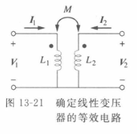

$$\left[\begin{array}{l}\boldsymbol{V}_1 \\ \boldsymbol{V}_2\end{array}\right]=\left[\begin{array}{ll}\mathrm{j} \omega L_1 & \mathrm{j} \omega M \\ \mathrm{j} \omega M & \mathrm{j} \omega L_2\end{array}\right]\left[\begin{array}{l}\boldsymbol{I}_1 \\ \boldsymbol{I}_2\end{array}\right]$$

$$\left[\begin{array}{l}\boldsymbol{I}_1 \\ \boldsymbol{I}_2\end{array}\right]=\left[\begin{array}{cc}\frac{L_2}{\mathrm{j} \omega\left(L_1 L_2-M^2\right)} & \frac{-M}{\mathrm{j} \omega\left(L_1 L_2-M^2\right)} \\ \frac{-M}{\mathrm{j} \omega\left(L_1 L_2-M^2\right)} & \frac{L_1}{\mathrm{j} \omega\left(L_1 L_2-M^2\right)}\end{array}\right]\left[\begin{array}{l}\boldsymbol{V}_1 \\ \boldsymbol{V}_2\end{array}\right]$$

目标等效电路（$T$形/$Y$形）：

$$\left[\begin{array}{l}\boldsymbol{V}_1 \\ \boldsymbol{V}_2\end{array}\right]=\left[\begin{array}{cc}\mathrm{j} \omega\left(L_a+L_c\right) & \mathrm{j} \omega L_c \\ \mathrm{j} \omega L_c & \mathrm{j} \omega\left(L_b+L_c\right)\end{array}\right]\left[\begin{array}{c}\boldsymbol{I}_1 \\ \boldsymbol{I}_2\end{array}\right]$$

因此如果这个$T$形电路与线性变压器电路是等效电电路，那么它们的阻抗矩阵就应当相等，最终解得：

$$L_s=L_1-M, \quad L_b=L_2-M, \quad L_c=M$$

目标等效电路（$\prod$形/$\Delta$形）：

$$\left[\begin{array}{c}\boldsymbol{I}_1 \\ \boldsymbol{I}_2\end{array}\right]=\left[\begin{array}{cc}\frac{1}{\mathrm{j} \omega L_A}+\frac{1}{\mathrm{j} \omega L_{\mathrm{c}}} & -\frac{1}{\mathrm{j} \omega L_{\mathrm{c}}} \\ -\frac{1}{\mathrm{j} \omega L_{\mathrm{c}}} & \frac{1}{\mathrm{j} \omega L_B}+\frac{1}{\mathrm{j} \omega L_{\mathrm{c}}}\end{array}\right]\left[\begin{array}{l}\boldsymbol{V}_1 \\ \boldsymbol{V}_2\end{array}\right]$$

因此如果这个$\Delta$形电路与线性变压器电路是等效电路，那么它们的导纳矩阵就应当相等，最终解得：

$$L_A=\frac{L_1 L_2-M^2}{L_2-M}, \quad L_B=\frac{L_1 L_2-M^2}{L_1-M}, \quad L_C=\frac{L_1 L_2-M^2}{M}$$

注意以上两种等效电路的各个电感都是没有磁耦合的。

#### 13.5 理想变压器

1.理想变压器是一种完全耦合（也就是$k=1$的变压器）。

$$\boldsymbol{V}_1=\mathrm{j} \omega L_1 \boldsymbol{I}_1+\mathrm{j} \omega M \boldsymbol{I}_2$$

$$\boldsymbol{V}_2=\mathrm{j} \omega M \boldsymbol{I}_1+\mathrm{j} \omega L_2 \boldsymbol{I}_2$$

$$\boldsymbol{V}_2=\mathrm{j} \omega L_2 \boldsymbol{I}_2+\frac{M \boldsymbol{V}_1}{L_1}-\frac{\mathrm{j} \omega M^2 \boldsymbol{I}_2}{L_1}$$

因为$k=1$，因此有：

$$M=\sqrt{L_1 L_2}$$

$$\boldsymbol{V}_2=\mathrm{j} \omega L_2 \boldsymbol{I}_2+\frac{\sqrt{L_1 L_2} \boldsymbol{V}_1}{L_1}-\frac{\mathrm{j} \omega L_1 L_2 \boldsymbol{I}_2}{L_1}=\sqrt{\frac{L_2}{L_1}} \boldsymbol{V}_1=n \boldsymbol{V}_1$$

其中满足$n=\sqrt{L_2 / L_1}$，称为完全耦合变压器的匝数比（turns ratio）。当$L_1,L_2,M \to \infty$且$n$保持不变时，耦合线圈就组成了一个理想变压器了。

因此理想变压器具有以下性质：

- 线圈具有非常大的电抗（$L_1,L_2,M \to \infty$）。

- 耦合系数$k$等于1。

- 一次绕组和二次绕组之间是无损耗的（$R_1=R_2=0$）。

2.铁心变压器是理想变压器的最佳近似。

一个典型的理想变压器，其电路符号如图所示：

图中两绕组之间竖线表示铁心, 以区别于线性变压器中的空气心。一次绕组为$N_1$匝，二次绕组为$N_2$匝。

现有正弦电压作用于变压器的一次绕组上，则一次绕组的两端瞬时电压为：

$$v_1=N_1 \frac{\mathrm{d} \phi}{\mathrm{d} t}$$

二次绕组的两端瞬时电压为：

$$v_2=N_2 \frac{\mathrm{d} \phi}{\mathrm{d} t}$$

可得：

$$\frac{v_2}{v_1}=\frac{N_2}{N_1}=n$$

其中$n$仍为匝数比。可以使用相量电压表示：

$$\frac{\boldsymbol{V}_2}{\boldsymbol{V}_1}=\frac{N_2}{N_1}=n$$

又因为理想变压器没有损耗：

$$v_1 i_1=v_2 i_2$$

$$\frac{\boldsymbol{I}_1}{\boldsymbol{I}_2}=\frac{\boldsymbol{V}_2}{\boldsymbol{V}_1}=\frac{N_2}{N_1}=n$$

当$n=1$时，一般称该变压器为隔离变压器（isolation transformer）。当$n>1$，则为升压变压器（step-up transformer），当$n<1$，则为降压变压器（step-down transformer）。

3.确定变压器的电压极性和电流方向：

如果同名端处的$\boldsymbol{V}_1$和$\boldsymbol{V}_2$均为正，或者均为负，则之前推导得到的匝数$n$取$+n$，否则取$-n$。

如果$\boldsymbol{I}_1$与$\boldsymbol{I}_2$均进入或者均流出同名端，则$n$取$-n$，否则取$+n$。

4.理想变压器的一次绕组的复功率为：

$$\boldsymbol{S}_1=\boldsymbol{V}_1 \boldsymbol{I}_1^*=\frac{\boldsymbol{V}_2}{n}\left(n \boldsymbol{I}_2\right)^*=\boldsymbol{V}_2 \boldsymbol{I}_2^*=\boldsymbol{S}_2$$

又因为之前已经推导得到：

$$\boldsymbol{Z}_{\text {in }}=\frac{\boldsymbol{V}_1}{\boldsymbol{I}_1}=\frac{1}{n^2} \frac{\boldsymbol{V}_2}{\boldsymbol{I}_2}$$

$$\boldsymbol{V}_2 / \boldsymbol{I}_2=\boldsymbol{Z}_L$$

$$\boldsymbol{Z}_{\text {in}}=\frac{\boldsymbol{Z}_{\mathrm{L}}}{n^2}$$

由于输入阻抗看起来像是负载阻抗反射到一次侧的阻抗，因此也称为反射阻抗（reflected impedance）。根据以上公式，得到一种可以实现将最大功率传输的阻抗匹配（impedance matching）方法。

5.在分析包含理想变压器的电路时，将会想要消除（remove）电路中的变压器以方便分析（这通过求理想变压器的戴维南等效电路实现）。注意同名端对$n$的正负的影响仍然生效。

通过将变压器的一侧的阻抗与电源映射到另一侧来达成等效消除变压器的效果的，接下来求开路电压和等效阻抗：

如上图，端口a-b为开路，因此$\boldsymbol{I}_1=\boldsymbol{I}_2=0$，也就是：

$$\boldsymbol{V}_{\mathrm{Th}}=\boldsymbol{V}_1=\frac{\boldsymbol{V}_2}{n}$$

而为了确定等效阻抗，将二次绕组的电压源短路，并在端口a-b输入一个单位电压源$V_m=1 V,\phi=0°$：

$$\boldsymbol{V}_2=\boldsymbol{Z}_2 \boldsymbol{I}_2$$

$$\boldsymbol{Z}_{\mathrm{Th}}=\frac{\boldsymbol{V}_1}{\boldsymbol{I}_1}=\frac{\boldsymbol{V}_2 / n}{n \boldsymbol{I}_2}=\frac{\boldsymbol{Z}_2}{n^2}$$

最终等效电路图为：

此时a-b端左边为外电路，a-b端右边视为戴维南等效电路。

同样的方法，可以左右相反进行调转：

此时c-d端右边为外电路，c-d端左边视为戴维南等效电路。

注意：当一次绕组和二次绕组之间有外部连接时，只能使用基本的网格分析法和节点分析法进行分析。

#### 13.6 理想自耦变压器

自耦变压器（autotransformer）金包括一个连续绕组，其一次侧（primary side）与二次侧（secondary side）之间通过称为抽头（tap）的可调整的连接点相互关联。

由于一次绕组与二次绕组为同一个绕组，因此失去了电气隔离（electrical isolation）的功能。

对于降压（step-down）自耦变压器，由匝数比和电压的关系：

$$\frac{\boldsymbol{V}_1}{\boldsymbol{V}_2}=\frac{N_1+N_2}{N_2}=1+\frac{N_1}{N_2}$$

对于理想自耦变压器，没有功率损耗，因此一次绕组和二次绕组的复功率相同：

$$\boldsymbol{S}_1=\boldsymbol{V}_1 \boldsymbol{I}_1^*=\boldsymbol{S}_2=\boldsymbol{V}_2 \boldsymbol{I}_2^*$$

$$V_1 I_1=V_2 I_2$$

$$\frac{V_2}{V_1}=\frac{I_1}{I_2}$$

$$\frac{\boldsymbol{I}_1}{\boldsymbol{I}_2}=\frac{N_2}{N_1+N_2}$$

对于升压（step-up）自耦变压器，类似可得：

$$\frac{\boldsymbol{V}_1}{N_1}=\frac{\boldsymbol{V}_2}{N_1+N_2}$$

$$\frac{\boldsymbol{V}_1}{\boldsymbol{V}_2}=\frac{N_1}{N_1+N_2}$$

$$\frac{\boldsymbol{I}_1}{\boldsymbol{I}_2}=\frac{N_1+N_2}{N_1}=1+\frac{N_2}{N_1}$$

在无需电气隔离的场合，可以使用自耦变压器替代传统变压器。

#### 13.7 三相变压器

想要满足三相点传输的要求，则需要与三相电工作相兼容的变压器连接。这有两种实现方法：

- 连接三个单相变压器，构成变压器组（transformer bank）。

- 采用专用的三相变压器（three phase power）。

三相变压器有四种标准的联结方式：

$$\mathrm{Y}-\mathrm{Y} 、 \Delta-\Delta 、 \mathrm{Y}-\Delta、\Delta-\mathrm{Y}$$

### chapter 14 频率响应

如果假设正弦电源的幅度保持不变，而改变其频率，则会得到电路的频率响应（frequency response）。频率响应是指电路的行为特征随信号频率变化而发生的变化。

#### 14.1 传递函数

传递函数（transfer function）也称为网络函数（network function），使用$\boldsymbol{H}(\omega)$表示（有时也用$\boldsymbol{H}(j \omega)$表示），它是一个复数。电路的频率响应就是传递函数$\boldsymbol{H}(\omega)$随着$\omega$从$0$到$\infty$变化而变化的关系曲线。

一般来说，线性网络都可以利用以下框图来表示：

因此传递函数是网络的输出相量$\boldsymbol{Y}(\omega)$与输入相量$\boldsymbol{X}(\omega)$之比。

$$\boldsymbol{H}(\omega)=\frac{\boldsymbol{Y}(\omega)}{\boldsymbol{X}(\omega)}$$

$$\boldsymbol{H}(\omega)=H(\omega)\angle \phi$$

因为输入和输出相量有电流和电压可以选择，因此一共会存在四种传递函数的情况：

$$\boldsymbol{H}(\omega)=电压增益=\frac{\boldsymbol{V}_o(\omega)}{\boldsymbol{V}_i(\omega)}$$

$$\boldsymbol{H}(\omega)=电流增益=\frac{\boldsymbol{I}_o(\omega)}{\boldsymbol{I}_i(\omega)}$$

$$\boldsymbol{H}(\omega)=转移阻抗=\frac{\boldsymbol{V}_o(\omega)}{\boldsymbol{I}_i(\omega)}$$

$$\boldsymbol{H}(\omega)=转移导纳=\frac{\boldsymbol{I}_o(\omega)}{\boldsymbol{V}_i(\omega)}$$

传递函数$\boldsymbol{H}(\omega)$也可以使用多项式$\boldsymbol{N}(\omega)$和多项式$\boldsymbol{D}(\omega)$来表示：

$$\boldsymbol{H}(\omega)=\frac{\boldsymbol{N}(\omega)}{\boldsymbol{D}(\omega)}$$

使得多项式$\boldsymbol{N}(\omega)=0$的根$\omega$称为传递函数的零点（zero），而使得$\boldsymbol{D}(\omega)=0$的根$\omega$称为传递函数的极点（pole）。

#### 14.2 分贝表示法

一般来说，增益（gain）为输出与输入的比值：

$$G=\frac{Output}{Input}$$

而在通信系统中，增益以贝尔（bel）为单位来度量，因此需要进行对数处理进行单位转换。功率增益$G$定义为：

$$G=log_{10}\frac{P_2}{P_1}$$

其中$P_1$为输入功率，而$P_2$为输出功率。

分贝（dB）是比贝尔更小的单位，相当于十分之一贝尔：

$$G_{dB}=10\operatorname{log}_{10} \frac{P_2}{P_1}$$

使用电压来表示功率增益$G$：

假设$R_1=R_2$，有：

$$G_{\text {dB}}=10 \log _{10} \frac{P_2}{P_1}=10 \log _{10} \frac{V_2^2 / R_2}{V_1^2 / R_1}=10 \log _{10}\left(\frac{V_2}{V_1}\right)^2+10 \log _{10} \frac{R_1}{R_2}$$

$$G_{\text {dB}}=20 \log _{10} \frac{V_2}{V_1}$$

$$G_{\text {dB}}=20 \log _{10} \frac{I_2}{I_1}$$

#### 14.3 伯德图

1.根据传递函数$\boldsymbol{H}(\omega)$的定义，其正是一种增益。而要绘制伯德图，需要将$\boldsymbol{H}(\omega)$化为分贝的单位，因此要对其先进行复数的拆分处理。

$$\boldsymbol{H}(\omega)=H(\omega) \angle \phi=H(\omega) e^{j \phi}$$

$$\ln \boldsymbol{H}(\omega)=\ln H(\omega)+\ln e^{j \phi}=\ln H(\omega)+j \phi$$

其中实部$\ln H(\omega)$为$\boldsymbol{H}(\omega)$的对数模，而虚部$j \phi$为一个关于$\omega$的函数。

那么传递函数的模$H$的分贝形式$H_{dB}$为：

$$H_{dB}=20 log_{10} H$$

确定频率响应的一种更为系统的方法是利用伯德图（Bode plots）。伯德图是传递函数$\boldsymbol{H}(\omega)$的模的分贝形式$H_{dB}$（单位为分贝）与相位$\phi$（单位为度）关于频率$\omega$的半对数曲线图。

对数坐标系的x和y轴的坐标轴均为对数坐标轴。半对数坐标系的x和y轴中有且仅一个是对数坐标轴。对于以$a$为底数的对数坐标轴来说，如果某个刻度上标出的值为b，则该刻度与原点的实际距离为$log_a b$。

$$\boldsymbol{H}(\omega)=\frac{(a_1+a_2 j) \cdot (b_1+b_2 j)}{(c_1+c_2 j) \cdot (d_1+d_2 j)}$$

$$H_{dB}=20lg((a_1+a_2 j))+20lg((b_1+b_2 j))-20lg((c_1+c_2 j))-20lg((d_1+d_2 j))$$

$$\phi=90^{\circ}-arctan(c_2)-arctan(d_2)$$

每个项分别得到的伯德图相加，即可得到整个传递函数的幅频伯德图（增益）和相频伯德图（相位）。

2.求$20lg(h_{i})$的伯德图（分情况讨论）：

- 如果$h_i$为常数，则$20lg h_i$也是常数，伯德图为水平直线。

- 如果$h_i$为$j \omega$的形式，则伯德图为$20dB/dec$的直线。注意其中的$j$视作为常数$1$进行计算即可。$20dB/dec$（$20dB/十倍频$）表示频率每变化十倍频程（频率之比为10的两个频率之间的间隔），其增益就改变20dB。

- 如果$h_i$为$1+j \frac{\omega}{k}$的形式，则当$\omega$趋近于0时，整个$20lg(h_{i})$等于0。当$\omega$趋近于无穷时，$20lg(h_{i}) \approx 20 lg(\frac{\omega}{k})$。因此当$\omega < k$时，伯德图可用斜率为0的直线近似，当$\omega > k$时，伯德图可用$20dB/dec$的直线近似。

3.传递函数也可以写成：

$$\boldsymbol{H}(\omega)=\frac{K(j \omega)^{\pm 1}\left(1+j \omega / z_1\right)\left[1+j 2 \zeta_1 \omega / \omega_k+\left(j \omega / \omega_k\right)^2\right] \ldots}{\left(1+j \omega / p_1\right)\left[1+j 2 \zeta_2 \omega / \omega_n+\left(j \omega / \omega_n\right)^2\right] \ldots}$$

以上称为传递函数的标准形式（standard form）。包含七种不同的因子，包括：

- 常数幅度$K$。
- 原点的极点$(j\omega)^{-1}$或零点$j \omega$。
- 单极点$1/(1+j \omega / p_1)$或单零点$(1+j\omega/z_1)$。
- 二阶极点$1/[1+j2 \zeta_2 \omega / \omega_n+\left(j \omega / \omega_n\right)^2]$或二阶零点$[1+j2 \zeta_1 \omega / \omega_k+\left(j \omega / \omega_k\right)^2]$。

#### 14.4 串联谐振电路

1.电路频率响应的最为显著的特征，是其幅频特性中所呈现的尖峰，也称为谐振（resonance）峰。任何包含复共轭极点对的系统都会出现谐振，这是存储能量从一种形式转换为另一种形式的振荡产生的根源。它需要至少一个电容和一个电感才能产生。

谐振是RLC电路中容性电抗与感性电抗大小相等时呈现的一种状态，此时该电路呈现出纯电阻的阻抗性质。

计算输入阻抗：

$$\boldsymbol{Z}=\boldsymbol{H}(\omega)=\frac{\boldsymbol{V}_s}{\boldsymbol{I}}=R+\mathrm{j} \omega L+\frac{1}{\mathrm{j} \omega \boldsymbol{C}}$$

$$\boldsymbol{Z}=R+j\left(\omega L-\frac{1}{\omega C}\right)$$

当传递函数的虚部为零时，就会产生谐振：

$$\operatorname{Im}(Z)=\omega L-\frac{1}{\omega C}=0$$

满足谐振的频率$\omega$称为谐振频率（resonant frequency）$\omega_0$，可得：

$$\omega_0=\frac{1}{\sqrt{L C}}$$

$$f_0=\frac{1}{2 \pi \sqrt{L C}}$$

产生谐振时，满足以下性质：

- $\boldsymbol{Z}=R$，阻抗为纯电阻，LC串联部分等于短路。
- 电压$\boldsymbol{V}_s$与电流$\boldsymbol{I}$是同相的，因此功率因数为1。
- 传递函数$\boldsymbol{H}(\omega)=\boldsymbol{Z}(\omega)$的幅度最小。
- 电感器两端和电容器两端的电压均比电源电压高得多。$\left|\boldsymbol{V}_{\mathrm{L} }\right|=\frac{V_{\mathrm{m}}}{R} \omega_0 L=Q V_{\mathrm{m}}$，$\left|\boldsymbol{V}_{\mathrm{c}}\right|=\frac{V_{\mathrm{m}}}{R} \frac{1}{\omega_0 C}=Q V_{\mathrm{m}}$。

2.谐振曲线：

RLC电路电流幅度的频率响应为：

$$I=|\boldsymbol{I}|=\frac{V_{\mathrm{m}}}{\sqrt{R^2+(\omega L-1 / \omega C)^2}}$$

当满足$I=V_{m}/R$，即谐振时，电路消耗的功率最大：

$$P\left(\omega_0\right)=\frac{1}{2} \frac{V_{\mathrm{m}}^2}{R}$$

有最大功率的一半：

$$P\left(\omega_1\right)=P\left(\omega_2\right)=\frac{\left(V_{\mathrm{m}} / \sqrt{2}\right)^2}{2 R}=\frac{V_{\mathrm{m}}^2}{4 R}$$

其中$\omega_1,\omega_2$称为半功率频率（half-power frequency）。半功率频率可由$Z=\sqrt{2}R$得到：

$$\sqrt{R^2+\left(\omega L-\frac{1}{\omega C}\right)^2}=\sqrt{2} R$$

$$\omega_1=-\frac{R}{2 L}+\sqrt{\left(\frac{R}{2 L}\right)^2+\frac{1}{L C}}$$

$$\omega_2=\frac{R}{2 L}+\sqrt{\left(\frac{R}{2 L}\right)^2+\frac{1}{L C}}$$

恰好有：

$$\omega_0=\sqrt{\omega_1 \omega_2}$$

定义两个半功率频率之差为带宽$B$：

$$B=\omega_2 - \omega_1$$

谐振曲线的"锐度"用品质因数（quality factor）$Q$来进行度量。

$$Q=2 \pi \frac{\text { 电路存储的峰值能量 }}{\text { 电路在一个振荡周期所消耗的能量 }}$$

在RLC电路中，储能的峰值为$\frac{1}{2}LI^2$，一个周期的耗能为$\frac{1}{2}(I^{2}R)$，因此：

$$Q=2 \pi \frac{\frac{1}{2} L I^2}{\frac{1}{2} I^2 R\left(1 / f_0\right)}=\frac{2 \pi f_0 L}{R}$$

$$Q=\frac{\omega_0 L}{R}=\frac{1}{\omega_0 C R}$$

根据带宽$B$的定义：

$$B=\frac{R}{L}=\frac{\omega_0}{Q}$$

$$B=\omega_0^2 C R$$

谐振电路的品质因数$Q$值是其谐振频率与谐振带宽之比。Q值越高，电路的频率选择性越好，但其带宽$B$也越窄。RLC电路的选择性（selectivity）是指电路响应某个频率以及辨别其他频率的一种能力。而品质因数就是电路选择性（谐振的"锐度"）的一种度量。

当$Q$值大于等于10时，称为高$Q$值电路（high-Q circuit）。高$Q$值电路的半功率频率可以视为关于谐振频率$\omega_0$对称：

$$\omega_1 \approx \omega_0-\frac{B}{2}, \quad \omega_2 \approx \omega_0+\frac{B}{2}$$

#### 14.5 并联谐振电路

1.并联谐振电路：

如图的并联谐振电路为RLC串联谐振电路的对偶电路，由对偶性质可以直接得到导纳$\boldsymbol{Y}$：

$$\boldsymbol{Y}=H(\omega)=\frac{\boldsymbol{I}}{\boldsymbol{V}}=\frac{1}{R}+\mathrm{j} \omega C+\frac{1}{\mathrm{j} \omega L}$$

$$\boldsymbol{Y}=\frac{1}{R}+\mathrm{j}\left(\omega C-\frac{1}{\omega L}\right)$$

类似的，使导纳$\boldsymbol{Y}$的虚部为零时，产生谐振：

$$\omega C-\frac{1}{\omega L}=0$$

$$\omega_0=\frac{1}{\sqrt{L C}}$$

2.并联谐振电路的谐振曲线：

在谐振频率处，$LC$并联组合相当于开路，电流全部流经$R$。在谐振时，流经电感器与电容器的电流比电源电流大得多。

$$\left|\boldsymbol{I}_{\mathrm{L} }\right|=\frac{I_{\mathrm{m}} R}{\omega_0 L}=Q I_{\mathrm{m}} \quad \left|\boldsymbol{I}_{\mathrm{C}}\right|=\omega_0 C I_{\mathrm{m}} R=Q I_{\mathrm{m}}$$

利用对偶性质，将串联谐振电路表达式中的$R，L，C$分别用$1/R，C，L$替代，可得：

$$\omega_1=-\frac{1}{2 R C}+\sqrt{\left(\frac{1}{2 R C}\right)^2+\frac{1}{L C}}$$

$$\omega_2=\frac{1}{2 R C}+\sqrt{\left(\frac{1}{2 R C}\right)^2+\frac{1}{L C}}$$

$$B=\omega_2-\omega_1=\frac{1}{R C}$$

$$Q=\frac{\omega_0}{B}=\omega_0 R C=\frac{R}{\omega_0 L}$$

代入可得：

$$\omega_1=\omega_0 \sqrt{1+\left(\frac{1}{2 Q}\right)^2}-\frac{\omega_0}{2 Q}, \quad \omega_2=\omega_0 \sqrt{1+\left(\frac{1}{2 Q}\right)^2}+\frac{\omega_0}{2 Q}$$

对于$Q \geq 10$：

$$\omega_1 \approx \omega_0-\frac{B}{2}, \quad \omega_2 \approx \omega_0+\frac{B}{2}$$

除了经典的RLC串联电路和RLC并联电路外，还存在其他形式的谐振电路。

#### 14.6 无源滤波器

1.滤波器是一个使期望频率的信号通过，同时阻止或衰退其他频率信号的电路。

仅由无源元件$R,L,C$组成的滤波器电路称为无源滤波器（passive filters）。如果除了无源元件还包括有源元件（如晶体管、运算放大器）则为有源滤波器（active filter）。

无论是无源滤波器还是有源滤波器，都有四种形式，分别为：

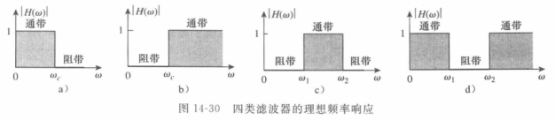

- 低通滤波器（lowpass filter）：允许低频通过，阻止高频通过。

- 高通滤波器（highpass filter）：允许高频通过，阻止低频通过。

- 带通滤波器（bandpass filter）：允许某个频带范围内的频率通过，阻值或衰减该频带以外的频率。

- 带阻滤波器（bandstop filter）：允许某个频带范围外的频率通过，阻值或衰减该频带以内的频率。

因为传递函数$H(\omega)$为增益，可以用来表示滤波器的输入与输出的关系。

2.无源低通滤波器：

输出取自电容两端的电压。

$$\boldsymbol{H}(\omega)=\frac{\boldsymbol{V}_a}{\boldsymbol{V}_i}=\frac{1 / j \omega C}{R+1 / j \omega C}$$

$$\boldsymbol{H}(\omega)=\frac{1}{1+j \omega R C}$$

$$H\left(\omega_{\mathrm{c}}\right)=\frac{1}{\sqrt{1+\omega_{\mathrm{c}}^2 R^2 C^2}}=\frac{1}{\sqrt{2}}$$

$$\omega_{\mathrm{c}}=\frac{1}{R C}$$

图中的半功率频率在滤波器中称为截止频率（cutoff frequency）或滚降频率（rolloff frequency）用$\omega_c$表示。低通滤波器只允许从直流（$\omega=0$）到截止频率$\omega_c$的频率信号通过。

3.无源高通滤波器：

输出取自电阻两端的电压。

$$\boldsymbol{H}(\omega)=\frac{\boldsymbol{V}_o}{\boldsymbol{V}_i}=\frac{R}{R+1 / \mathrm{j} \omega C}$$

$$\boldsymbol{H}(\omega)=\frac{\mathrm{j} \omega R C}{1+\mathrm{j} \omega R C}$$

截止频率：

$$\omega_{\mathrm{c}}=\frac{1}{R C}$$

高通滤波器只允许高于其截止频率$\omega_c$的频率信号通过。

4.无源带通滤波器：

输出取自电阻两端的电压。

$$\boldsymbol{H}(\omega)=\frac{\boldsymbol{V}_o}{\boldsymbol{V}_i}=\frac{R}{R+j(\omega L-1 / \omega C)}$$

中心频率为频带的中心值：

$$\omega_0=\frac{1}{\sqrt{L C}}$$

带通滤波器只允许频带内（$\omega_1 < \omega < \omega_2$）的频率信号通过。

5.无源带阻滤波器：

输出取自LC串联组合的两端。

$$\boldsymbol{H}(\omega)=\frac{\boldsymbol{V}_o}{\boldsymbol{V}_i}=\frac{\mathrm{j}(\omega L-1 / \omega C)}{R+\mathrm{j}(\omega L-1 / \omega C)}$$

中心频率：

$$\omega_0=\frac{1}{\sqrt{L C}}$$

带阻滤波器抑制或消除在频带内（$\omega_1 < \omega < \omega_2$）的频率信号。

#### 14.7 有源滤波器

有源滤波器由电阻器、电容器以及运算放大器组成。

1.一阶有源低通滤波器：

$$\boldsymbol{H}(\omega)=\frac{\boldsymbol{V}_{\mathrm{o}}}{\boldsymbol{V}_{\mathrm{i}}}=-\frac{\boldsymbol{Z}_{\mathrm{f}}}{\boldsymbol{Z}_{\mathrm{i}}}$$

$$\boldsymbol{Z}_{\mathrm{i}}=R_{\mathrm{i}}$$

$$\boldsymbol{Z}_{\mathrm{f}}=R_{\mathrm{f}} \| \frac{1}{\mathrm{j} \omega C_{\mathrm{f}}}=\frac{R_{\mathrm{f}} / \mathrm{j} \omega C_{\mathrm{f}}}{R_{\mathrm{f}}+1 / \mathrm{j} \omega C_{\mathrm{f}}}=\frac{R_{\mathrm{f}}}{1+\mathrm{j} \omega C_{\mathrm{f}} R_{\mathrm{f}}}$$

$$\boldsymbol{H}(\omega)=-\frac{R_{\mathrm{f}}}{R_{\mathrm{i}}} \frac{1}{1+\mathrm{j} \omega C_{\mathrm{f}} R_{\mathrm{f}}}$$

截止频率：

$$\omega_{\mathrm{c}}=\frac{1}{R_{\mathrm{f}} C_{\mathrm{f}}}$$

2.一阶有源高通滤波器：

$$\boldsymbol{H}(\omega)=\frac{\boldsymbol{V}_{\mathrm{o}}}{\boldsymbol{V}_{\mathrm{i}}}=-\frac{\boldsymbol{Z}_{\mathrm{i}}}{\boldsymbol{Z}_{\mathrm{i}}}$$

$$\boldsymbol{Z}_{\mathrm{i}}=R_{\mathrm{i}}+1 / \mathrm{j} \omega C_{\mathrm{i}}, \quad \boldsymbol{Z}_{\mathrm{f}}=R_{\mathrm{f}}$$

$$\boldsymbol{H}(\omega)=-\frac{R_{\mathrm{f}}}{R_{\mathrm{i}}+1 / \mathrm{j} \omega C_{\mathrm{i}}}=-\frac{\mathrm{j} \omega C_{\mathrm{i}} R_{\mathrm{i}}}{1+\mathrm{j} \omega C_{\mathrm{i}} R_{\mathrm{i}}}$$

截止频率：

$$\omega_{\mathrm{c}}=\frac{1}{R_{\mathrm{i}} C_{\mathrm{i}}}$$

3.带通滤波器：

$$\begin{aligned} \boldsymbol{H}(\omega) &=\frac{\boldsymbol{V}_{\mathrm{o}}}{\boldsymbol{V}_{\mathrm{i}}}=\left(-\frac{1}{1+\mathrm{j} \omega C_1 R}\right)\left(-\frac{\mathrm{j} \omega C_2 R}{1+\mathrm{j} \omega C_2 R}\right)\left(-\frac{R_{\mathrm{f}}}{R_{\mathrm{i}}}\right) \\ &=-\frac{R_{\mathrm{f}}}{R_{\mathrm{i}}} \frac{1}{1+\mathrm{j} \omega C_1 R} \frac{\mathrm{j} \omega C_2 R}{1+\mathrm{j} \omega C_2 R} \end{aligned}$$

$$\omega_2=\frac{1}{R C_1}$$

$$\omega_1=\frac{1}{R C_2}$$

由两截止频率可得：

$$\omega_0=\sqrt{\omega_1 \omega_2}$$

$$B=\omega_2-\omega_1$$

$$Q=\frac{\omega_0}{B}$$

确定通带增益$K$：

$$\boldsymbol{H}(\omega)=-\frac{R_{\mathrm{f}}}{R_{\mathrm{i}}} \frac{\mathrm{j} \omega / \omega_1}{\left(1+\mathrm{j} \omega / \omega_1\right)\left(1+\mathrm{j} \omega / \omega_2\right)}=-\frac{R_{\mathrm{f}}}{R_{\mathrm{i}}} \frac{\mathrm{j} \omega \omega_2}{\left(\omega_1+\mathrm{j} \omega\right)\left(\omega_2+\mathrm{j} \omega\right)}$$

$$\omega_0=\sqrt{\omega_1 \omega_2}$$

$$\left|\boldsymbol{H}\left(\omega_0\right)\right|=\left|\frac{R_{\mathrm{f}}}{R_{\mathrm{i}}} \frac{\mathrm{j} \omega_0 \omega_2}{\left(\omega_1+\mathrm{j} \omega_0\right)\left(\omega_2+\mathrm{j} \omega_0\right)}\right|=\frac{R_{\mathrm{f}}}{R_{\mathrm{i}}} \frac{\omega_2}{\omega_1+\omega_2}$$

$$K=\frac{R_f}{R_{\mathrm{i}}} \frac{\omega_2}{\omega_1+\omega_2}$$

4.带阻滤波器：

$$\boldsymbol{H}(\omega)=\frac{\boldsymbol{V}_0}{\boldsymbol{V}_{\mathrm{i}}}=-\frac{R_{\mathrm{f}}}{R_{\mathrm{i}}}\left(-\frac{1}{1+\mathrm{j} \omega C_1 R}-\frac{\mathrm{j} \omega C_2 R}{1+\mathrm{j} \omega C_2 R}\right)$$

$$\omega_2=\frac{1}{R C_1}$$

$$\omega_1=\frac{1}{R C_2}$$

$$\omega_0=\sqrt{\omega_1 \omega_2}$$

$$B=\omega_2-\omega_1$$

$$Q=\frac{\omega_0}{B}$$

$$\boldsymbol{H}(\omega)=\frac{R_{\mathrm{f}}}{R_{\mathrm{i}}}\left(\frac{1}{1+\mathrm{j} \omega / \omega_2}+\frac{\mathrm{j} \omega / \omega_1}{1+\mathrm{j} \omega / \omega_1}\right)=\frac{R_{\mathrm{f}}}{R_{\mathrm{i}}} \frac{\left(1+\mathrm{j} 2 \omega / \omega_1+(\mathrm{j} \omega)^2 / \omega_1 \omega_1\right)}{\left(1+\mathrm{j} \omega / \omega_2\right)\left(1+\mathrm{j} \omega / \omega_1\right)}$$

在两通带内（$\omega \to 0 , \omega \to \infty$），其增益为：

$$K=\frac{R_{\mathrm{f}}}{R_{\mathrm{i}}}$$

也可以通过中心频率处传递函数的模确定通带增益：

$$H\left(\omega_0\right)=\left|\frac{R_{\mathrm{f}}}{R_{\mathrm{i}}} \frac{\left(1+\mathrm{j} 2 \omega_0 / \omega_1+\left(\mathrm{j} \omega_0\right)^2 / \omega_1 \omega_1\right)}{\left(1+\mathrm{j} \omega_0 / \omega_2\right)\left(1+\mathrm{j} \omega_0 / \omega_1\right)}\right|=\frac{R_{\mathrm{f}}}{R_{\mathrm{i}}} \frac{2 \omega_1}{\omega_1+\omega_2}$$

以上仅为一些典型结构，还有其他类型的更复杂的滤波器。

## 作业总结回顾

### 基本KVL和KCL分析电源-电阻电路（最通用的方法）

人为对每一个回路定好一个参考方向，一般为顺时针方向（即使一个回路的某些支路和其他的回路对此支路的参考方向不同，但不同回路的KVL分析时的回路的参考方向其实都是独立的，因此所有回路的参考方向都使用顺时针是没问题的）。题目给出的电源正负极是对于电压/电流值（可以取负，例如题目只给出电压值$V=kI$，$I$是有可能是负的）来说的实际的正负极（电压源的实际电流方向与其正负极方向无关，电流源的实际电流方向一定与其正负极方向相同）。题目给出的电流方向不一定是实际的电流方向（有可能相反）。

每个支路的电流方向可以人为任意假设，但在对不同回路的KVL分析时涉及到的同一个支路（例如电阻）的假设电流方向是必须保持恒定不变的，不然会出现正负号错乱。电压源和电流源不需要假设方向只需要看参考方向和电源极性。

如果支路的假设电流方向符合回路参考方向（压降为正）则电流为正，电压为正。而电源的电压/电流则仅看内部的正负极，正负极方向符合回路参考方向（压降为正）则电流为正，电压为正。如果计算得到支路的电流或电压为负，则说明此支路实际电流方向与人为假设方向相反，但数值不变。实际电流方向可以通过计算得到的正负号判断，除此之外，如果一个支路与电流源串联（与电流源串联的支路电流大小及方向均与此电流源相同）或者与已知实际电流方向的支路串联，则也具有相同的实际电流方向。

KVL分析的回路是可以任意选定的，即使一个回路中包含了其他回路，也可以直接无视进行KVL，这样KVL出来的结果也是正确的。最终得到的同一条方程的正负号也是一样的（如果出现不同，说明在多次KVL中，不小心让支路的假设方向记反或者忘记了假设方向不变的原则）。

最后，对与未知量有关的回路进行KCL和KVL，凑够方程组可解即可。

对于并联或串联的电源，也只需要按网格进行KVL即可。对于受控源，也只需要按网格进行KVL即可。

对节点分析和求电流关系只能使用KCL，对某个节点，只需要考虑方向流进此节点的电流和流出此节点的电流之和（即使是直的导线也是满足KCL的，一个电流流进一个电流流出），而对回路分析基本只能使用KVL。如果参考答案中有对回路进行KCL，实质上是用电流表示电压的对回路进行KVL。

电流方向逆电源的正负极，则代表此电源吸收能量而不是输出能量，当作一个负载即可。

独立电压源（内部横线与所在电路方向一致）：

独立电流源（内部横线与所在电路方向垂直）：

受控电压源（内部横线与所在电路方向一致）：

受控电流源（内部横线与所在电路方向垂直）：

### 星三变换

- Wye（Y）和tee（T）网络等价。

- Delta（$\Delta$）和pi（$\Pi$）网络等价。

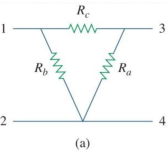
 
 $\Delta$电路可以转化为等效的$Y$电路，$Y$电路也可以转化为等效的$\Delta$电路，这两种电路整体上都等效为一个比较复杂的电阻（至多有4个端口，下方的端口可以合并因此至少有3个端口，从外部连接不同的端口则等效内部电阻不同）。
 
 注意：星三变换后，仅有与之相连的四个电路的节点（node）的电压等效。而且，转化前后$R_1,R_2,R_3$和$R_a,R_b,R_c$没有任何联系（电流、电压、功率均没有关系）。准确来说，星三变换所谓的"等效电路"，是对于发生星三变换的"3个电阻和4个端口"以外的整个电路所有部分来说的。也可以理解为，星三变换前后，这4个端口输入和输出的电流、电压均不变，因此"3个电阻和4个端口"对于外部电路来说，功率始终不变，输入和输出也不变。同时，进行多次星三变换（进行一次变换然后再变换回来，换另一些部分再进行变换），根据端口电压不变，可以计算电路中某些节点位置的压降。
 
$\Delta$电路转化为等效的$Y$电路：
  
$R_{xy}(Z)$代表在$Z$电路结构下，电流从端口$x$到$y$受到的总阻值。

$$R_{12}(\mathrm{Y})=R_1+R_3$$

$$R_{12}(\Delta)=R_b \|\left(R_a+R_c\right)$$

其中$A \| B$表示$\frac{A \cdot B}{A+B}$。

由于需要等价转换，则必须满足$R_{12}(\mathrm{Y})=R_{12}(\Delta)$，由此可得：

$$R_{12}=R_1+R_3=\frac{R_b\left(R_a+R_c\right)}{R_a+R_b+R_c}$$

$$R_{13}=R_1+R_2=\frac{R_c\left(R_a+R_b\right)}{R_a+R_b+R_c}$$

$$R_{34}=R_2+R_3=\frac{R_a\left(R_b+R_c\right)}{R_a+R_b+R_c}$$

$$R_{34}-R_{12}=R_1-R_2=\frac{R_c\left(R_b-R_a\right)}{R_a+R_b+R_c}$$

$$R_{13}+R_{34}-R_{12}=R_{1}$$

$$R_1=\frac{R_b R_c}{R_a+R_b+R_c}$$

$$R_2=\frac{R_c R_a}{R_a+R_b+R_c}$$

$$R_3=\frac{R_a R_b}{R_a+R_b+R_c}$$

$Y$电路转化为等效的$\Delta$电路：

$$R_a=\frac{R_1 R_2+R_2 R_3+R_3 R_1}{R_1} $$

$$R_b=\frac{R_1 R_2+R_2 R_3+R_3 R_1}{R_2} $$

$$R_c=\frac{R_1 R_2+R_2 R_3+R_3 R_1}{R_3} $$

以上的数学关系推导太过麻烦，可以用另一种方法先得到$Y$电路和$\Delta$电路各个端口两两配对的一共6个路线的电流大小的表达式，然后由等效直接推导得到$Y$电路转化为等效的$\Delta$电路，然后可以非常简易地推出 $\Delta$电路转化为等效的$Y$电路的公式。

当$R_1=R_2=R_3=R_{\mathrm{Y}}$和$R_a=R_b=R_c=R_{\Delta}$时，这个$Y$电路和$\Delta$电路称为（balance），根据转换公式可以得到：

$$R_{Y}=\frac{R_{\Delta}}{3}$$

$$R_{\Delta}=3R_{Y}$$

### 戴维南等效

戴维南定理（Thevenin's theorem）：

通常情况下，负载的每一次变化都需要重新分析电路，那么能不能把除了负载以外的电路简化一下呢？以下方法同样适用于求电路的某个支路的电流/电压，只需要视作此支路是开路求开路电压即可。

可变电阻：

戴维南定理指出，一整个线性二端口电路（linear two-terminal circuit）可以仅使用一个电压源串联一个电阻的电路来等效替代。这将会大大简化电路。

等效替代的电压源$V_{Th}$：$V_{Th}$等于线性二端口电路的两个ab端口处的电压。将原电路的ab端口处视为断路，并视作在此处接上一个电压表，此电压表应当测出的电压即为$V_{Th}$（无论是否有受控源）。多源情况可以使用上述方法也可以使用叠加原理。

1.使用叠加原理求多源开路电压（无论是否有受控源），每个独立源分别讨论，将除了讨论对象之外的其他独立源视为短路或断路（根据情况选择，一般电压源短路，电流源断路），ab端视为断路，得到每个独立源下对外输出的电压，再相加（注意电压方向影响正负）即可得到多源开路电压$V_{Th}$。

等效替代的电阻$R_{Th}$：$R_{Th}$等于线性二端口电路的两个ab端口处的等效电阻。将原电路的ab端口处视为断路，根据是否有受控源分两种情况来讨论。

1.如果线性二端口电路内没有受控源，那么只需要将所有源关闭（根据情况选择，一般电压源短路，电流源断路），就可以得到假设以ab端为电源时剩下无源电路的总阻值，即为等效电阻$R_{Th}$。

2.如果线性二端口电路内存在受控源，我们先关闭所有独立源（根据情况选择，一般电压源短路，电流源断路），然后视作对整个电路施加了一个未知的电压源$u$和经过此电压源的电流$i$（需要根据原电路求出带有未知数的表达式），通过$R=\frac{u}{i}$来抵消未知数获得等效电阻。（有可能计算结果得到整个电路的总电阻为负数，这是由电路内的受控源导致的）

以上求等效电压和等效电阻的过程中，支路的假设方向是恒定不变的，但是注意假设方向会影响正负号，这是非常容易出错的。

对于外部电路来说，进行等效替代之后电路是完全等效的，因此可以用来求对某个需要不断替换的支路（外部电路）来说的其他所有部分电路的等效，来方便进行计算。

诺顿定理（Norton's theorem）：

与戴维南定理类似的，诺顿定理指出，一个线性二端口电路可以仅使用一个电流源并联一个电阻的电路来等效替代。

诺顿定理等效替代的电路的电流$I_{N}$是由通过将原电路的两个端口短路（原电路内存在电源）得到的（ab端口短路时电流一定不经过$R_{N}$），且可以简单地通过源转换、KCL、KVL得到。一般来说，$I_{N}$更好求。根据电流源和电压源的源转换，诺顿定理中的等效电阻$R_N$数值上就等于戴维南定理中的$R_{Th}$。

$$I_N=i_{s c}$$

诺顿定理与戴维南定理的联系：

通过源转换，诺顿电流和戴维南电压的关系式为：

$$I_N=\frac{V_{T h}}{R_{T h}}$$

推导$R_{Th}=R_{N}$：

$$V_{Th}=v_{oc}$$

$$I_{N}=i_{sc}$$

$$R_{\mathrm{Th}}=\frac{v_{o c}}{i_{s c}}=R_N$$

其中$i_{sc}$为短路电流，$v_{oc}$为开路电压。$R_{Th}=T_{N}$为当所有独立电源关闭时，$a$和$b$端的等效电阻。

用于求对于可变负载$R_x$来说其他电路的戴维南等效（注意电压源视作短路）：

把整个含有电源的电路简化为一个电压源，一个与其串联的等效电阻，然后接入不同的$R_x$获得不同的电流：

### 补充：分析并联电路等效（节点和导线的直接等效转换不涉及到任何特殊方法，但使用普遍且重要）

因为有条导线，根据电流方向是单向的，实际上是$10 \Omega$与$40 \Omega$并联（近路）且与$12 \Omega$和$24 \Omega$串联，$24 \Omega$与$12 \Omega$并联（远路）且与$10 \Omega$和$40 \Omega$串联。$24 \Omega$和$12 \Omega$组成的并联整体分别与$10 \Omega$和$40 \Omega$成串联关系，因此当然也与$10 \Omega$和$40 \Omega$组成的并联整体成串联关系。

等效电路是$10 \Omega$和$40 \Omega$并联，$24 \Omega$和$12 \Omega$并联，$5 \Omega$与电源串联。

### 戴维南等效与获得最大功率

我们希望最大限度地将电源功率转移（transfer）到负载上。但是实际电源的内阻会限制传递最大功率。

我们可以使用戴维南等效电路来寻找线性电路中的最大功率。我们假设负载电阻$R_{L}$可以变化，那么转移的功率为：

$$p=\left(\frac{V_{T h}}{R_{T h}+R_L}\right)^2 R_L$$

那么对于给定的电路，$V_{TH}$和$R_{TH}$都是固定的，对$R_{L}$大小进行调整，则有：

实际上，满足最大功率转移的功率时的电阻的组织即为戴维南等效电阻的阻值。

$$R_{L}=R_{\mathrm{TH}}$$

因此最大功率：

$$p_{max}=\frac{V_{T h}^2}{4 R_{T h}}$$

### 对于包含运放的电路

对于包含运放的电路，不能简单地通过特征某个电路认定为XX放大器电路（具有特定功能和属性）。而是通过实际情况进行KCL、KVL等分析，根据分析的结论判断此电路的具体功能（因为运放电路的变种太多了）。

如果包含接地端，则参考"差分放大器"，假设节点的电压从而进行KCL。

运算放大器工作原理：

运算放大器的输出电压由反相（inverting）输入和同相（noninverting）输入的差值$v_{d}$决定，$v_o$为输出电压，满足：

$$v_{o}=A v_{d}=A(v_{2}-v_{1})$$

$$A=\frac{v_{o}}{v_{d}}$$

其中$A$为开环增益（open loop gain），是运算放大器对输入电压差的放大的倍数。实际情况下范围大约为$10^{5} \sim 10^{8}$。理想运算放大器的开环增益$A$是无限的，输入电阻$R_i$是无限的，输出电阻$R_o$为零。

运算放大器的虚短和虚断（电压均为对地电压，接地处电压默认为0）：

虚断：由于运放的输入电阻$R_i$一般都很大，可认为流入两个输入端的输入电流近似为零（$i_{1}=i_{2}=0$），反相与同相输入端在运放内部的连接关系相当于断路，称为虚断。

虚短：当存在负反馈回路（运放的输出会与其本身的输入端连接）时，因为运放的输出电压一般不超过线性区，可认为来自输出的调整使得两个输入端视为具有近似相同的输入电压（$v_{1}=v_{2}$），在运放内部的连接关系相当于短路，称为虚短。

KCL的精华在于可以"假设节点的电压"，从而表示出所有的电流，这个是KVL比较难做到的。因此KCL在分析运放电路时大大优于KVL。对于运放电路的分析，一般是确定或假设某个节点的电压，从而表示出多个支路的电流，再根据这些支路之间的KCL关系列出等式（使用KCL同样需要遵循假设电流方向原则）。注意：接地处以及与接地处相连的节点的电压均为$0$。

一般无特定属性运放电路分析（求$u_1,u_0$）：

$②$结点，由KCL可知两个$R$电流相等，由运放的虚短虚断可知$②$结点处的电压就等于$u_{O2}=u_s$，$i_1=0$，因此可以求第一个运放输出电压$u_1$：

$$\frac{u_1-u_{\mathrm{S}}}{R}=\frac{u_{\mathrm{S} }-0}{R}$$

$③$结点，由虚短虚断和接地处可知第二个运放输出电压$u = u_o - 0 = u_o$和输入电流$i = 0$。由于第二个运放的输入端接地，$u_{O3}=0$，$u_{\mathrm{S}} > u_{O3}$，$u_1 > u_{O3}$可以直接确定实际电流方向，那么通过电流的性质直接推测出电流从$③$结点流向运放输出端，因此$u < u_{O3}$。对结点$③$进行KCL，因此可以求第二个运放输出端的电阻$R$的电压$u_0$：

$$\frac{u_{\mathrm{S}}-u_{O3}}{R}+\frac{u_1-u_{O3}}{R}=\frac{u_{O3}-u}{R} + i$$

### 一阶电路

一阶电路（first-order circuits）：在一个电路简化后（如电阻的串并联，电容的串并联，电感的串并联化为一个元件），含有一个动态元件的线性电路，其方程为一阶线性常微分方程，称为一阶电路。

#### 无源RC电路

无源电阻-电容电路（source-free RC circuit）就是没有电源，电容放电的电路。

电容存储的能量（均为标准单位则能量的单位为焦耳）：

$$w(0)=\frac{1}{2} C V_0^2$$

电容的电压（初始电压是否为0得看是否经过充电）：

$$v(0)=V_{0}$$

$$v(t)=V_0 e^{-t / R C}$$

以上，无源电阻-电容电路的电压会随着时间发生响应（response），而且因为没有外界因素，因此称为自然响应（nature response）。无源RC电路的电压下降的速度使用时间常数$\tau$表示。

$$\tau=RC$$

$$v(t)=V_0 e^{-t / \tau}$$

已求得电压，那么无源RC电路的电流为：

$$i_R(t)=\frac{v(t)}{R}=\frac{V_0}{R} e^{-t / \tau}$$

电容的电流：

$$i(t) =\frac{d q}{d t}=C\frac{d v(t)}{d t}$$

那么电阻$R$的功率为：

$$p(t)=v \cdot i_R(t)=\frac{V_0^2}{R} e^{-2 t / \tau}$$

电阻在$t$时刻之前吸收的能量为（最初储存在电容器中的能量最终都会在电阻器中耗散）：

$$\begin{aligned} w_R(t) &=\int_0^t p(\lambda) d \lambda=\int_0^t \frac{V_0^2}{R} e^{-2 \lambda / \tau} d \lambda \\ &=-\left.\frac{\tau V_0^2}{2 R} e^{-2 \lambda / \tau}\right|_0 ^t=\frac{1}{2} C V_0^2\left(1-e^{-2 t / \tau}\right) \end{aligned}$$

#### 无源RL电路

无源电阻-电感电路（source-free RL circuit）：与无源RC电路类似，电感充当电源的电路（电感在被通电时一边阻止变化一边存储能量，在放电时则释放能量）。因此电感与电容类似，拥有一个"初始电流"，本质上是其内部存储的能量。

电感存储的能量：

$$w(0)=\frac{1}{2} L I_0^2$$

电感的电流（初始电流是否为0得看是否经过充电）：

$$i(0)=I_0$$

$$i(t)=I_0 e^{-R t / L}$$

同样定义一个时间常量：

$$\tau=\frac{L}{R}$$

$$i(t)=I_0 e^{-t / \tau}$$

电感的电压：

$$v(t)=L \frac{d i(t)}{d t}$$

电阻$R$的电压：

$$v_R(t)=i R=I_0 R e^{-t / \tau}$$

电阻$R$的功率：

$$p=v_R i=I_0^2 R e^{-2 t / \tau}$$

电阻吸收的能量：

$$w_R(t)=\int_0^t p(\lambda) d \lambda=\int_0^t I_0^2 e^{-2 \lambda / \tau} d \lambda=-\left.\frac{\tau}{2} I_0^2 R e^{-2 \lambda / \tau}\right|_0 ^t=\frac{1}{2} L I_0^2\left(1-e^{-2 t / \tau}\right)$$

#### 例题

经过充电后断开的无源$RL$电路，求$i_L(t),u_L(t)$（箭头和$S$代表$t=0$时单刀双掷开关根据箭头方向转移到其他端口）：

先求$i_L(0^-),i_L(0^+)$，然后求无源电路的等效电阻$R_{eq}$，得到时间常数$\tau=\frac{L}{R_{eq}}$（如果是电容则$\tau=R_{eq} C$）。已知$i_{L(\infty)}=0$（与有源电路的区别就是不需要算此项），可求电路响应$i_{L}(t)=i_L(0) e^{-t/\tau}$（有源电路不需要套此公式），因此$u_{L}(t) = L \frac{d i_L(t)}{dt}$。

$$\begin{aligned} & \mathrm{i}_{\mathrm{L}(0-)}=(8 /(8+4)) \times 6=4 \mathrm{~A} \\ & \mathrm{i}_{\mathrm{L}(0+)}=\mathrm{i}_{\mathrm{L}(0-)}=4 \mathrm{~A}\end{aligned}$$

$$\mathrm{R}=4+8=12 \Omega$$

$$i_{\mathrm{L}(\mathrm{t})}=4 \mathrm{e}^{-60 \mathrm{t}} \mathrm{A}$$

$$\mathrm{u}_{L(t)}=\mathrm{L} \frac{d i_\mathrm{~L}(t)}{d t}=0.2 \times(-60) \times 4 \mathrm{e}^{-60 t}=-48 \mathrm{e}^{-60 t} \mathrm{~V}$$

#### RC电路的阶跃响应

注意：所有与阶跃响应相关的题目，如果没有"电路已经工作了很长时间，然后断开开关"或者直接对某个电容或者电感标明其初始值，则视作电容和电感在初始状态均无能量存储在内，初始电压和初始电流均为零。

阶跃响应（step response）是电路因突然施加直流电压或电流源而产生的响应，$u(t)$为单位阶跃函数，以下两个电路可以等效替换（突然施加电压源$V_s$）：

电容初始电压：

$$v\left(0^{-}\right)=v\left(0^{+}\right)=V_0$$

因此最终结果为：

$$v(t)= \begin{cases}V_0, & t<0 \\ V_s+\left(V_0-V_s\right) e^{-t / \tau} =  V_0+V_s (1 - e^{-t / \tau}), & t>0\end{cases}$$

最终结果的$v(t)$称为RC电路对突然施加一个直流电压源的完全响应（complete response）或总响应（total response）。

如果一开始电容器并没有充电，那么$V_0=0$，那么有：

$$v(t)=V_s\left(1-e^{-t / \tau}\right) u(t)$$

那么$RC$电路的电流$i(t)$即为：

$$i(t)=C \frac{d v}{d t}=\frac{C}{\tau} V_s e^{-t / \tau}, \quad \tau=R C, \quad t>0$$

将总响应拆分为自然响应和受迫响应（瞬态反应和稳态反应）：

$$v(t)=V_s+\left(V_0-V_s\right) e^{-t / \tau}, \quad t>0$$

显然其可以分为两个部分。根据能量的角度，我们可以将其分为自然响应（natural response）和受迫响应（forced response）。自然响应$v_n$是电路中本来存储的能量的响应，受迫响应$v_f$是外来独立源施加于电路的能量的响应。

$$v=v_n+v_f$$

$$v_n=V_o e^{-t / \tau}$$

$$v_f=V_s\left(1-e^{-t / \tau}\right)$$

自然响应是临时的（因为本来电路存储的能量有限），而受迫响应是永久的（外来独立源为理想源），因此可以根据时效性的角度，将其分为瞬态响应（transient response）和稳态响应（steady-state response）。

$$v=v_t+v_{s s}$$

$$v_t=\left(V_o-V_s\right) e^{-t / \tau}$$

$$v_{s s}=V_s$$

因此，根据时效性，可以将总响应写成：

$$v(t)=v(\infty)+[v(0)-v(\infty)] e^{-t / \tau}$$

其中$v(t)$为电容器的电压，$v(0)$为初态电压，$v(\infty)$为稳态电压。

#### RL电路的阶跃响应

运用RC电路的阶跃响应的性质，直接将总响应进行拆分。

$$i=i_t+i_{s s}$$

根据电感的性质，可知当电流稳定时满足：

$$i_{s s}=\frac{V_s}{R}$$

初始电流：

$$i\left(0^{+}\right)=i\left(0^{-}\right)=I_0$$

因此总响应可以写成：

$$i(t)=\frac{V_s}{R}+\left(I_0-\frac{V_s}{R}\right) e^{-t / \tau}$$

$$i(t)= \begin{cases}0, & t<0 \\ \frac{V_s}{R}+\left(I_0-\frac{V_s}{R}\right) e^{-t / \tau} = I_0 + \frac{V_s}{R}\left(1-e^{-t / \tau}\right) & t>0\end{cases}$$

如果一开始电感并没有充电，那么初始电流$I_0=0$，那么有：

$$i(t)=\frac{V_s}{R}\left(1-e^{-t / \tau}\right)$$

那么$RL$电路的电流$i(t)$即为：：

$$v(t)=L \frac{d i}{d t}=V_s \frac{L}{\tau R} e^{-t / \tau}, \quad \tau=\frac{L}{R}, \quad t>0$$

根据时效性，可以直接求$i(0),i(\infty),\tau$，将总响应$i(t)$写成：

$$i(t)=i(\infty)+[i(0)-i(\infty)] e^{-t / \tau}$$

#### 例题

经过充电后断开的有源$RC$电路，求电阻$R_2$的电流$i_2=i(t)$（先求电容的相关参数），使用三元素法：

$$\mathrm{U}_{\mathrm{c}}(0-)=(3 /(3+1)) \times 8=6 \mathrm{~V}$$

在$t=0$时刻，将电容视作电压源，画出$t=0$时的等效电路图，计算$R_2$的电流$i(0^+)$。：

$$U_c(0^+)=U_c(0^-)=6V$$

$$i(0^+)=U_c(0^+)/R_2=2A$$

电路稳定，电容器等于断路，画出$t=\infty$的等效电路图，求$i(\infty)$：

$$i(\infty)=(1/2) \times 3 = 1.5V$$

这个电路对于电容的等效电阻$R_{eq}$，$\tau=RC$：

$$R_{eq}=3//3=1.5 \Omega$$

$$\tau = RC = 1.5s$$

最终套入三元素公式：

$$i(t)=i(\infty)+[i(0)-i(\infty)] e^{-t / \tau}=1.5+0.5 e^{-\frac{2t}{3}}$$

#### 例题

求电阻和电感的共同电压$u(t)$：

三元素法-直接求电压：

先求电感的初始电流，以用来画等效图：

$$i_L\left(0_{+}\right)=i_L\left(0_{-}\right)=\frac{32}{8}=4 \mathrm{~A}$$

在$t=0$时刻，将电感视作电流源，列出支路之间的关系式求得$u(0^+)$：

$$\left\{\begin{array}{l}i=i_1+4 \\ 32-4 i=4 i_1\end{array}\right.$$

$$u(0^+)=4 i = 8V$$

电路稳定后，将电感视作短路，电路为纯电阻电路，易求得$u(\infty)$：

$$u(\infty)=\frac{16}{3 \times 2} \times 4=\frac{32}{3} \mathrm{~V}$$

然后求对电感来说的等效电阻$R_{eq}$和电感的时间常数$\tau$：

$$R_{e q}=6 \Omega \quad \tau=\frac{L}{R_{e q}}=\frac{1}{12} s$$

最后直接写出总响应：

$$u(t)=u(\infty)+\left[u\left(0_{+}\right)-u(\infty)\right] e^{-\frac{1}{\tau} t} ,t \geq 0$$

三元素法-先求电流再转换：

$$i_L\left(0_{+}\right)=i_L\left(0_{-}\right)=\frac{32}{8}=4 \mathrm{~A}$$

$$\begin{aligned} & i_L(\infty)=\frac{8}{3} A \\ & \tau=\frac{L}{R_{e q}}=\frac{1}{12} S\end{aligned}$$

$$i_L(t)=i_L(\infty)+\left[i_L\left(0_{+}\right)-i_L(\infty)\right] e^{-\frac{1}{\tau} t}$$

$$u(t)=L \frac{d i_L(t)}{d t}+4 i_L(t)$$

### 二阶响应电路

需要使用二阶微分方程描述的动态电路称为二阶电路。当存在多个"存储元件"（storage element）（包括电感和电容，不包括电阻）时，就需要使用二阶微分方程才能描述电路了。

二阶微分方程的初值和终值包括：

$$v(0),i(0),\frac{dv(0)}{dt},\frac{di(0)}{dt},v(\infty),i(\infty)$$

求二阶电路的初值和终值更为困难，因为需要得到电压和电流对时间的微分。

无论是一阶电路还是二阶电路，电容中的电压和电感中的电流都是连续的。也就是依然满足：

$$v(0^{+})=v(0^{-})$$

$$i(0^{+})=i(0^{-})$$

#### 无源RLC串联电路

求解电路：

在串联RLC电路中满足：

$$i=i_L(t)=i_c(t)=C \frac{d(v_c)}{dt}$$

$$v_L(t)=L \frac{d i_L(t)}{dt}=LC \frac{d^2 v_c}{dt^2}$$

$$v_R=i_L(t) \cdot R=CR \frac{d(v_c)}{dt}$$

初始电流和电压：

$$v(0)=V_0$$

$$i(0)=I_0$$

我们已知电流的衰减为指数形式，因此设$s$：

$$i=A e^{st}$$

对整个回路应用KVL可得特征方程：

$$s^2+\frac{R}{L} s+\frac{1}{L C}=0$$

$$s^2+2 \alpha s+\omega_0^2=0$$

求解可得：

$$s_1=-\frac{R}{2 L}+\sqrt{\left(\frac{R}{2 L}\right)^2-\frac{1}{L C}}$$

$$s_2=-\frac{R}{2 L}-\sqrt{\left(\frac{R}{2 L}\right)^2-\frac{1}{L C}}$$

可以表示为：

$$\alpha=\frac{R}{2 L}, \quad \omega_0=\frac{1}{\sqrt{L C}}$$

$$s_1=-\alpha+\sqrt{\alpha^2-\omega_0^2}$$

$$s_2=-\alpha-\sqrt{\alpha^2-\omega_0^2}$$

其中$s_1$和$s_2$称为自然频率/固有频率（natural frequencies），以奈伯（nepers，Np）/秒为单位。$\omega_0$称为谐振（resonant）频率或严格称为无阻尼（undamped）固有频率，以弧度（radians，rad）/秒为单位。$\alpha$为奈伯频率或阻尼因子（damping factor），以奈伯/秒为单位。

$s$有两个可能的解，意味着$i=A e^{st}$也有两个可能的解。

$$i_1=A_1 e^{s_1 t}, \quad i_2=A_2 e^{s_2 t}$$

因此，前面得到的两边同时进行求导的方程$\frac{d^2 i}{d t^2}+\frac{R}{L} \frac{d i}{d t}+\frac{i}{L C}=0$的解可以表示为（二阶线性方程的性质，其解的线性组合也是其解）：

$$i(t)=A_1 e^{s_1 t}+A_2 e^{s_2 t}$$

其中常数$A_1$和$A_2$通过将$i(0)$或者$\frac{d i(0)}{d t}$（$t=0$）代入符合此种情况电路的原式（例子）：

$$\frac{d i(0)}{d t}=-\frac{1}{L}\left(R I_0+V_0\right)$$

获得一条式子。然后通过使$t=0$求$i(t)=A_1 e^{s_1 t}+A_2 e^{s_2 t}$的含有$A_1,A_2$的式子，再通过$i(t)$求$\frac{d i(t)}{d t}$的表达式，再将其代入$t=0$获得第二条含有$A_1,A_2$表达式，再将上述两条式子其与第一步将$i(0)$代入对应的原式得到的式子相联立，即可获得$A_1$和$A_2$的具体值。

阻尼情况（阻尼元件即为电阻等元件，将会损耗电路的能量）：

1.如果$\alpha > \omega_0$，则为过阻尼（overdamped）：

$\alpha > \omega_0$等效为$C > \frac{4 L}{R^2}$。此时$s_1$和$s_2$都为负且为实数。随着$t$的增加，$i(t)=A_1 e^{s_1 t}+A_2 e^{s_2 t}$逐渐衰减为0。

$$i(t)=A_1 e^{s_1 t}+A_2 e^{s_2 t}$$

2.如果$\alpha = \omega_0$，则为临界阻尼（critically damped）：

$\alpha = \omega_0$等效为$C = \frac{4 L}{R^2}$。将$s_1=s_2=-\alpha=-\frac{R}{2 L}$代入回$\frac{d^2 i}{d t^2}+\frac{R}{L} \frac{d i}{d t}+\frac{i}{L C}=0$可得最终自然响应：

$$i(t)=\left(A_2+A_1 t\right) e^{-\alpha t}$$

3.如果$\alpha<\omega_0$，则为欠阻尼（underdamped）：

$\alpha < \omega_0$等效为$C < \frac{4 L}{R^2}$。因此可得：

$$j=\sqrt{-1}$$

$$s_1=-\alpha+\sqrt{-\left(\omega_0^2-\alpha^2\right)}=-\alpha+j \omega_d$$

$$s_2=-\alpha-\sqrt{-\left(\omega_0^2-\alpha^2\right)}=-\alpha-j \omega_d$$

其中$\omega_d=\sqrt{\omega_{0}^2-\alpha^{2}}$称为阻尼频率（dampling frequency）。$\omega_d$和$\omega_0$都是固有频率的一种，但$\omega_0$被称为无阻尼固有频率，$\omega_d$被称为阻尼固有频率。

$$i(t)=A_1 e^{-\left(\alpha-j \omega_d\right) t}+A_2 e^{-\left(\alpha+j \omega_d\right) t}=e^{-\alpha t}\left(A_1 e^{j \omega_d t}+A_2 e^{-j \omega_d t}\right)$$

通过欧拉公式：

$$e^{j \theta}=\cos \theta+j \sin \theta, \quad e^{-j \theta}=\cos \theta-j \sin \theta$$

$$i(t)=e^{-\alpha t}\left[A_1\left(\cos \omega_d t+j \sin \omega_d t\right)+A_2\left(\cos \omega_d t-j \sin \omega_d t\right)\right]=e^{-\alpha t}\left[\left(A_1+A_2\right) \cos \omega_d t+j\left(A_1-A_2\right) \sin \omega_d t\right]$$

将$(A_1+A_2)$和$j(A_1-A_2)$用常数$B_1$和$B_2$表示，得到最终的自然响应：

$$i(t)=e^{-\alpha t}\left(B_1 \cos \omega_d t+B_2 \sin \omega_d t\right)$$

#### 无源RLC并联电路

在并联RLC电路中满足：

$$v=v_c(t)=v_L(t)=L \frac{d i_L(t)}{dt}$$

$$i_c(t)=C \frac{d(v_c)}{dt}=LC \frac{d^2 i_L(t)}{dt^2}$$

$$i_R=\frac{v_c(t)}{R}=\frac{L}{R} \frac{d i_L(t)}{dt}$$

$$i_L+i_R+i_c=0$$

假设初始电流和初始电压：

$$i_L(0)=I_0$$

$$v_C(0)=V_0$$

在顶部节点应用KCL可以得到：

$$\frac{v}{R}+\frac{1}{L} \int_{-\infty}^t v(\tau) d \tau+C \frac{d v}{d t}=0$$

等式两边同时对$t$求导并且除以$C$可得：

$$\frac{d^2 v}{d t^2}+\frac{1}{R C} \frac{d v}{d t}+\frac{1}{L C} v=0$$

可以写成以$i_L$为变量的形式，只不过$s=\frac{di_L}{dt}$，同样求得$s^2+\frac{1}{R C} s+\frac{1}{L C}=0$之后的过程均相同。

$$s=\frac{dv}{dt}$$

$$s^2+\frac{1}{R C} s+\frac{1}{L C}=0$$

$$s_{1,2}=-\frac{1}{2 R C} \pm \sqrt{\left(\frac{1}{2 R C}\right)^2-\frac{1}{L C}}$$

$$\alpha=\frac{b}{2} = \frac{1}{2 R C}, \quad \omega_0= \sqrt{c} = \frac{1}{\sqrt{L C}}$$

$$s_{1,2}=-\alpha \pm \sqrt{\alpha^2-\omega_0^2}$$

解的形式与无源RLC串联电路一致：

过阻尼（$\alpha > \omega_0$）：

$$v(t)=A_1 e^{s_1 t}+A_2 e^{s_2 t}$$

临界阻尼（$\alpha = \omega_0$）：

$$v(t)=\left(A_1+A_2 t\right) e^{-\alpha t}$$

$$\frac{dv(t)}{dt}=A_2 e^{-\alpha t}-\alpha v(t)$$

欠阻尼（$\alpha < \omega_0$）：

$$s_{1,2}=-\alpha \pm j \omega_d$$

$$\omega_d=\sqrt{\omega_0^2-\alpha^2}$$

$$v(t)=e^{-\alpha t}\left(A_1 \cos \omega_d t+A_2 \sin \omega_d t\right)$$

确定好情况后，计算得到$v(0)$和$\frac{d v(0)}{dt}$，然后带回到已求得的$v_c(t)$和$\frac{d v_c(t)}{dt}$的表达式得到$A_1，A_2$。

#### 例题

求$i_L(t),u_c(t)$：

#### 有源RLC串联电路的阶跃响应

前面我们已知，阶跃响应是通过突然施加直流源获得的。

对整个回路应用KVL得到：

$$L \frac{d i}{d t}+R i+v=V_s$$

$$i=C \frac{d v}{d t}$$

等式两边同时对$t$求导，并且除以$LC$：

$$\frac{d^2 v}{d t^2}+\frac{R}{L} \frac{d v}{d t}+\frac{v}{L C}=\frac{V_s}{L C}$$

以上方程的解易得两个分量（瞬态响应和稳态响应）：

$$v(t)=v_t(t)+v_{s s}(t)$$

过阻尼：

$$v_t(t)=A_1 e^{s_1 t}+A_2 e^{s_2 t}$$

临界阻尼：

$$v_t(t)=\left(A_1+A_2 t\right) e^{-\alpha t}$$

欠阻尼：

$$v_t(t)=\left(A_1 \cos \omega_d t+A_2 \sin \omega_d t\right) e^{-\alpha t}$$

可知稳态电压最终与电压源电压相同，可得：

$$v_{s s}(t)=v(\infty)=V_s$$

注意以上的$v$为电容上的电压，而$i$为通过电感的电流。

#### 有源RLC并联电路的阶跃响应

在顶部节点应用KCL：

$$\frac{v}{R}+i+C \frac{d v}{d t}=I_s$$

$$v=L \frac{d i}{d t}$$

对等式两边除以$LC$可得：

$$\frac{1}{R C} \frac{d i}{d t}+\frac{i}{L C}+\frac{d^2 i}{d t^2}=\frac{I_s}{L C}$$

以上方程的解易得两个分量（瞬态响应和稳态响应）：

$$i(t)=i_t(t)+i_{s s}(t)$$

过阻尼：

$$i(t)=I_s+A_1 e^{s_1 t}+A_2 e^{s_2 t}$$

临界阻尼：

$$i(t)=I_s+\left(A_1+A_2 t\right) e^{-\alpha t}$$

欠阻尼：

$$i(t)=I_s+\left(A_1 \cos \omega_d t+A_2 \sin \omega_d t\right) e^{-\alpha t}$$

最后求$A_1$和$A_2$，将$t=0$代入根据阻尼情况得到的$i(t)$表达式得到第一条关于$A_1,A_2$的式子。然后使用根据阻尼情况得到的$i(t)$来求$\frac{d i}{d t}$的表达式，将$t=0$代入可以得到第二条关于$A_1,A_2$的式子的左边（结果未知）。然后根据应用KCL得到的原式来求$\frac{d i}{d t}$的表达式，然后将$t=0$代入求得$\frac{d i(0)}{d t}$的确切值（第二条关于$A_1,A_2$的式子的结果）。两条关于$A_1,A_2$的式子联立解得$A_1,A_2$。

#### 一般二阶电路

给定一个二阶电路，我们通过以下四个步骤来确定它的阶跃响应(可以是电压或电流)。

- 获得初始条件$x(0)$和$\frac{dx(0)}{dt}$，终值$x(\infty)$。

- 关闭所有独立源，并通过KCL和KVL来得到瞬态响应的形式。一旦得到一个二阶微分方程，我们确定它的特征根。根据响应是过阻尼，临界阻尼，还是欠阻尼，我们得到两个未知常数。

- 我们得到稳态响应为：

$$x_{ss}(t)=x(\infty)$$

- 将瞬态响应和稳态响应相加即得总响应：

$$x(t)=x_t(t)+x_{s s}(t)$$

- 最后通过初始条件确定与瞬态响应相关的未知常数。

以上方法也可以用来求解包含运放的二阶电路。

### 多个电流源输出同一个网格（画出所有假设电流方向的重要性）和横流回路

$$(i_m-4) \cdot 4+(i_m+6) \cdot 6+(i_m+2) \cdot 2 = 0$$

直接对每个节点的周围的电流方向（假设或实际）都标出来（不标出来无法分析），分析经过各个电阻的电流，并使用KCL分析。

### 电阻、电感、电容的复数表示

在交流电情况下，电容与电感仅有电抗（只和交流电有关，因此实部为0）。而它们通常会与其有直接关联的纯电阻（仅有电阻，因此虚部为0）合并表示成这部分回路的等效阻抗，通常用$\boldsymbol{Z}=R+X j$来表示，其中$R$为纯电阻部分的电阻等效和，$X$为电容、电感、拥有电容性或电感性的器件部分的电抗等效和。

笛卡尔坐标：

$$j=\sqrt{-1}$$

$$z=x+j y$$

极坐标：

$$z=r \angle \phi=r(cos \phi + j sin \phi)$$

欧拉公式：

$$e^{\pm j \phi}=\cos \phi \pm j \sin \phi$$

指数形式：

$$z=r e^{j \phi}$$

共轭复数：

$$z^*=x-j y=r \angle-\phi=r e^{-j \phi}$$

复数运算规则：

$$z_1+z_2=\left(x_1+x_2\right)+j\left(y_1+y_2\right)$$

$$z_1 z_2=r_1 r_2 \angle (\phi_1 + \phi_2)$$

$$\frac{z_1}{z_2}=\frac{r_1}{r_2}\angle\left(\phi_1-\phi_2\right)$$

$$\sqrt{z}=\sqrt{r} \angle(\phi / 2)$$

将电压$v(t)$从时域（time domain）到相量域（phasor domain）的转换为，$\operatorname{Re}$代表仅取实数部分，$\omega$是电源的角频率：

$$v(t)=V_m \cos (\omega t+\phi)=\operatorname{Re}\left(V_m e^{j(\omega t+\phi)}\right)$$

$$\mathbf{V}=V_m e^{j \phi}=V_m \angle \phi$$

$$v(t)=\operatorname{Re}\left(\mathbf{V} e^{j \omega t}\right)$$

其中$\mathbf{V}$即为正弦曲线的相量表示，消除时间的影响，保留初始相位角的影响，以方便计算。因此对电压和电流的相量域表示与时间$t$均无关。

$$v(t)=V_m \cos (\omega t+\phi) \quad \Leftrightarrow \quad \mathbf{V}=V_m \angle \phi$$

$$\frac{d v}{d t} \quad \Leftrightarrow \quad j \omega \mathbf{V}$$

$$\int v d t \quad \Leftrightarrow \quad \frac{\mathbf{V}}{j \omega}$$

一般来说，假设$i=I_m \cos (\omega t+\phi)$，对于电阻的电压频域表示：

$$v=i R=R I_m \cos (\omega t+\phi)$$

$$\mathbf{V}=R I_m \angle \phi$$

$$\mathbf{V}=R \mathbf{I}$$

假设$i=I_m \cos (\omega t+\phi)$，对于电感的电压频域表示：

$$v=L \frac{d i}{d t}=-\omega L I_m \sin (\omega t+\phi)$$

$$v=\omega L I_m \cos \left(\omega t+\phi+90^{\circ}\right)$$

$$\mathbf{V}=\omega L I_m e^{j\left(\phi+90^{\circ}\right)}=\omega L I_m e^{j \phi} e^{j 90^{\circ}}=\omega L I_m \angle \phi+90^{\circ}$$

$$e^{j 90^{\circ}}=j$$

$$\mathbf{V}=j \omega L \mathbf{I}$$

假设$v=V_m \cos (\omega t+\phi)$，对于电容的电压频域表示：

$$i=C \frac{d v}{d t}$$

$$\mathbf{I}=j \omega C \mathbf{V} $$

$$\mathbf{V}=\frac{\mathbf{I}}{j \omega C}$$

补充：解含有复数的矩阵方法：

$$\left[\begin{array}{cc}\mathbf{A} & \mathbf{B} \\ C & D \end{array}\right]\left[\begin{array}{l}\mathbf{V}_1 \\ \mathbf{V}_2\end{array}\right]=\left[\begin{array}{c} E \\ F \end{array}\right]$$

$$\Delta=\left|\begin{array}{cc}\mathbf{A} & \mathbf{B} \\ C & D \end{array}\right|$$

$$\Delta_1=\left|\begin{array}{cc}E & \mathbf{B} \\ F & D \end{array}\right|$$

$$\Delta_2=\left|\begin{array}{cc}\mathbf{A} & E \\ C & F \end{array}\right|$$

$$\mathbf{V}_1=\frac{\Delta_1}{\Delta}$$

$$\mathbf{V}_2=\frac{\Delta_2}{\Delta}$$

用复数同时表示电阻和含有电容性和电感性的元件的结合，阻抗$\mathbf{Z}$（impedance）与导纳$\mathbf{Y}$（admittance）：

电阻、电感、电容的阻抗$\mathbf{Z}$：

$$R=\frac{\mathbf{V}}{\mathbf{I}}, \quad X_L = \frac{\mathbf{V}}{\mathbf{I}}=j \omega L, \quad X_C = \frac{\mathbf{V}}{\mathbf{I}}=\frac{1}{j \omega C}$$

$$\mathbf{Z}=\frac{\mathbf{V}}{\mathbf{I}}$$

$$\mathbf{Z}=R+j X$$

$$\mathbf{Z}=|\mathbf{Z}| \angle \theta$$

$$|\mathbf{Z}|=\sqrt{R^2+X^2}, \quad \theta=\tan ^{-1} \frac{X}{R}$$

$$R=|\mathbf{Z}| \cos \theta, \quad X=|\mathbf{Z}| \sin \theta$$

其中$R=Re (\mathbf{Z})$为电阻，$X=Im (\mathbf{Z})$为电抗（reactance）。电抗为正时阻抗为电感性/滞后性（inductive / lagging），电抗为负时阻抗为电容性/提前性（capacitive / leading）。

$$\mathbf{Y}=\frac{1}{\mathbf{Z}}=\frac{\mathbf{I}}{\mathbf{V}}$$

$$\mathbf{Y}=G+j B$$

$$G+j B=\frac{1}{R+j X}$$

$$G+j B=\frac{1}{R+j X} \cdot \frac{R-j X}{R-j X}=\frac{R-j X}{R^2+X^2}$$

$$G=\frac{R}{R^2+X^2}, \quad B=-\frac{X}{R^2+X^2}$$

阻抗的串联、并联的等效阻抗的计算，星三变换的计算和电阻是一致的。

使用电阻、电容和电感的阻抗、频域电流/电压来进行KCL和KVL，和直流电情况下的电路分析是一模一样的。

### 交流功率分析

交流功率分析：

$$v(t)=V_m \cos \left(\omega t+\theta_v\right)$$

$$i(t)=I_m \cos \left(\omega t+\theta_i\right)$$

瞬时功率$p(t)$可以小于零：

$$p(t)=v(t) i(t)=\frac{1}{2} V_{\mathrm{m}} I_{\mathrm{m}} \cos \left(\theta_{\mathrm{v}}-\theta_{\mathrm{i}}\right)+\frac{1}{2} V_{\mathrm{m}} I_{\mathrm{m}} \cos \left(2 \omega t+\theta_{\mathrm{v}}+\theta_{\mathrm{i}}\right)$$

对一个周期取平均功率：

$$P=\frac{1}{T} \int_0^T p(t) \mathrm{d} t$$

$$P=\frac{1}{2} V_{\mathrm{m}} I_{\mathrm{m}} \cos \left(\theta_{\mathrm{v}}-\theta_{\mathrm{i}}\right)$$

使用相量域进行计算，注意功率不能用相量形式表示：

$$\boldsymbol{V}=V_{\mathrm{m}} \angle \theta_{\mathrm{v}}$$ 

$$\boldsymbol{I}=I_{\mathrm{m}} \angle \theta_{\mathrm{i}}$$

$$\frac{1}{2} \boldsymbol{V} \boldsymbol{I}^*=\frac{1}{2} V_{\mathrm{m}} I_{\mathrm{m}}\angle (\theta_{\mathrm{v}}-\theta_{\mathrm{i}})=\frac{1}{2} V_{\mathrm{m}} I_{\mathrm{m}}\left[\cos \left(\theta_{\mathrm{v}}-\theta_{\mathrm{i}}\right)+\mathrm{j} \sin \left(\theta_{\mathrm{v}}-\theta_{\mathrm{i}}\right)\right]$$

$$P=\frac{1}{2} \operatorname{Re}\left[\boldsymbol{V} \boldsymbol{I}^*\right]=\frac{1}{2} V_{\mathrm{m}} I_{\mathrm{m}} \cos \left(\theta_{\mathrm{v}}-\theta_{\mathrm{i}}\right)$$

当$\theta_{\mathrm{v}}=\theta_{\mathrm{i}}$时，满足纯电阻（resistive）电路，可得：

$$P=\frac{1}{2} V_{\mathrm{m}} I_{\mathrm{m}}=\frac{1}{2} I_{\mathrm{m}}^2 R=\frac{1}{2}|\boldsymbol{I}|^2 R$$

当$\theta_{\mathrm{v}}-\theta_{\mathrm{i}}=\pm 90^{\circ}$时，满足纯电抗（reactive）电路，可得：

$$P=\frac{1}{2} V_{\mathrm{m}} I_{\mathrm{m}} \cos 90^{\circ}=0$$

以上方法可以让我们已知流过元件的电压和电压即可得知此元件的平均功率。

使用戴维南等效达到最大平均功率传输：

先把等效阻抗和待测功率阻抗表示出来：

$$\begin{aligned} \boldsymbol{Z}_{\mathrm{Th}} &=R_{\mathrm{Th}}+\mathrm{j} X_{\mathrm{Th}} \\ \boldsymbol{Z}_{\mathrm{L}} &=R_{\mathrm{L}}+\mathrm{j} X_{\mathrm{L}} \end{aligned}$$

最终推导得到：

$$\mathrm{s}=\frac{A}{a+j b} , |s|=\frac{A}{\sqrt{a^2+b^2}}$$

$$\boldsymbol{I}=\frac{\boldsymbol{V}_{\mathrm{Th}}}{\boldsymbol{Z}_{\mathrm{Th}}+\boldsymbol{Z}_{\mathrm{L}} }$$

$$P=\frac{1}{2}|\boldsymbol{I}|^2 R_{\mathrm{L}}=\frac{\left|\boldsymbol{V}_{\mathrm{Th}}\right|{ }^2 R_{\mathrm{L}} / 2}{\left(R_{\mathrm{Th}}+R_{\mathrm{L}}\right)^2+\left(X_{\mathrm{Th}}+X_{\mathrm{L}}\right)^2}$$

$$\boldsymbol{Z}_{\mathrm{L}}=R_{\mathrm{L}}+\mathrm{j} X_{\mathrm{L}}=R_{\mathrm{Th}}-\mathrm{j} X_{\mathrm{Th}}$$

$$\boldsymbol{Z}_{\mathrm{Th}}^{*}=R_{\mathrm{Th}}-\mathrm{j} X_{\mathrm{Th}}$$

也就是说，要取得最大平均功率传输，那么负载的阻抗$\boldsymbol{Z}_L$必须等于戴维南阻抗$\boldsymbol{Z}_{Th}$的共轭复数$\boldsymbol{Z}_{TH}^{*}$，这被称为正弦稳态条件下的最大平均功率传输定理（maximum average power transfer theorem）。因此最终求得的最大平均功率为：

$$P_{\max }=\frac{\left|\boldsymbol{V}_{\mathrm{Th}}\right|^2}{8 R_{\mathrm{Th}}}$$

电流/电压的有效值与最大值的关系：

$$P=I_{\mathrm{eff}}^2 R=\frac{V_{\mathrm{eff}}^2}{R}$$

经过推导，有效值等于其瞬时电流$i$/电压$v$的方均根/均方根（root-mean-square，rms）值，一般交流电压也使用均方根的值表示：

$$X_{\mathrm{rms}}=\sqrt{\frac{1}{T} \int_0^T x^2 \mathrm{~d} t}$$

$$I_{\mathrm{eff}}=I_{\mathrm{rms}},\quad V_{\mathrm{eff}}=V_{\mathrm{rms}}$$

$$I_{\mathrm{rms}}=\frac{I_{\mathrm{m}}}{\sqrt{2}}$$

$$V_{\mathrm{rms}}=\frac{V_{\mathrm{m}}}{\sqrt{2}}$$

$$P=I_{\mathrm{rms}}^2 R=\frac{V_{\mathrm{rms}}^2}{R}$$

有效值与视在功率（apparent power）与功率因数：

$$P=V_{r m s} I_{r m s} \cos \left(\theta_v-\theta_i\right)=S \cos \left(\theta_v-\theta_i\right)$$

$$S=V_{\mathrm{rms}} I_{\mathrm{rms}}=\frac{1}{2}V_m I_m$$

其中的$S$称为视在功率（为与平均功率区分，单位取$V \cdot A$而不是$W$），而因子$\cos \left(\theta_v-\theta_i\right)$称为功率因数（power factor，pf）。将$(\theta_v-\theta_i)$称为功率因数角（power factor angle）。

复功率（视在功率的相量表示）：

$$\boldsymbol{S}=\frac{1}{2} \boldsymbol{V} \boldsymbol{I}^*$$

$$\boldsymbol{S}=\boldsymbol{V}_{\mathrm{rms}} \boldsymbol{I}_{\mathrm{rms}}^*$$

$$P=Re(\boldsymbol{S})$$

表示成阻抗形式：

$$\boldsymbol{Z}=\frac{\boldsymbol{V}}{\boldsymbol{I}}=\frac{\boldsymbol{V}_{\mathrm{rms}}}{\boldsymbol{I}_{\mathrm{rms}}}=\frac{V_{\mathrm{rms}}}{I_{\mathrm{rms}}} \angle (\theta_{\mathrm{v}}-\theta_{\mathrm{i}})$$

$$\boldsymbol{S}=I_{\mathrm{rms}}^2 \boldsymbol{Z}=\frac{V_{\mathrm{rms}}^2}{\boldsymbol{Z}^*}=\boldsymbol{V}_{\mathrm{rms}} \boldsymbol{I}_{\mathrm{rms}}^*$$

$$\boldsymbol{S}=I_{\mathrm{rms}}^2(R+\mathrm{j} X)=P+\mathrm{j} Q$$

$$P=\operatorname{Re}(\boldsymbol{S})=I_{\mathrm{rms}}^2 R=V_{\mathrm{rms}} I_{\mathrm{rms}} \cos \left(\theta_{\mathrm{v}}-\theta_{\mathrm{i}}\right)=S \cos \left(\theta_{\mathrm{v}}-\theta_{\mathrm{i}}\right)$$

$$Q=\operatorname{Im}(\boldsymbol{S})=I_{\operatorname{rms}}^2 X=V_{\mathrm{rms}} I_{\mathrm{rms}} \sin \left(\theta_{\mathrm{v}}-\theta_{\mathrm{i}}\right)=S \sin \left(\theta_{\mathrm{v}}-\theta_{\mathrm{i}}\right)$$

其中$P$为平均功率或有功功率，其值取决于负载电阻$R$。$Q$为无功功率（reactive power）或正交功率，其值取决于负载的电抗$X$。有功功率$P$就是传递给负载的平均功率，单位为$W$，是负载实际消耗的功率。无功功率$Q$是电源与电抗负载进行能量交换的一个度量值，单位为乏（volt-ampere reactive，var）。

功率因数的校正：

不改变原始负载的电压或电流（也就是只改变其中之一），提高功率因数的过程称为功率因数校正（power factor correction，PFC）。

可以从视在功率角度考虑，则有功率三角形：

计算使得角度从$\theta_1$校正为$\theta_2$的电容的大小$C$：

$$P=S_1 \cos \theta_1 \quad Q_1=S_1 \sin \theta_1=P \tan \theta_1$$

$$P=S_2 \cos \theta_1 \quad Q_2=S_2 \sin \theta_2=P \tan \theta_2$$

$$Q_{\mathrm{C}}=Q_1-Q_2=P\left(\tan \theta_1-\tan \theta_2\right)$$

由复功率的定义可得：

$$Q_{\mathrm{C}}=V_{\mathrm{rms}}^2 / X_{\mathrm{C}}=\omega C V_{\mathrm{rms}}^2$$

因此需要并联的电容大小为：

$$C=\frac{Q_{\mathrm{C}}}{\omega V_{\mathrm{ms}}^2}=\frac{P\left(\tan \theta_1-\tan \theta_2\right)}{\omega V_{\mathrm{ms}}^2}$$

以上为把电容并联到电感性负载的两端。但是如果是电容性负载，则需要并联一个电感。类似的，可得此电感的大小为：

$$Q_{\mathrm{L}}=\frac{V_{\text {rms}}^2}{X_{\mathrm{L}}}=\frac{V_{\text {rms}}^2}{\omega L} \Rightarrow L=\frac{V_{\text {rms}}^2}{\omega Q_{\mathrm{L}}}$$

其中$Q_L=Q_1-Q_2$，表示新无功功率和旧无功功率的差值。

### 磁耦合电路

磁耦合电路：

当两个相互接触或者不接触的回路之间通过其中一个回路所产生的磁场而相互影响时，称为磁耦合（magnetically coupled）。

当两个电感器彼此靠得很近时，电流通过时产生的磁通量将在另一个导体中产生电压，称为互感（mutual inductance）。

单线圈单电流：

按照法拉第定律，可得电流$i$流过该线圈时产生的磁通量$\phi$将会在线圈中产生的感应电压$v$：

$$v=N \frac{\mathrm{d} \phi}{\mathrm{d} t}$$

因为$\phi$由电流$i$产生，因此可以写成：

$$v=N \frac{\mathrm{d} \phi}{\mathrm{d} i} \frac{\mathrm{d} i}{\mathrm{~d} t}$$

$$v=L \frac{\mathrm{d} i}{\mathrm{~d} t}$$

电感$L=N \frac{\mathrm{d} \phi}{\mathrm{d} i}$称为自感（self-inductance）。它表示的是同一线圈中时变电流与其感应电压之间的关系。

双线圈单电流：

假设线圈2中无电流，此时线圈1中的电流产生的磁通量$\phi_1$有两个分量，$\phi_{11}$仅与线圈1交链，$\phi_{12}$同时与线圈1和线圈2交链：

$$\phi_1=\phi_{11}+\phi_{12}$$

此时线圈1和线圈2称为磁耦合。

$$v_1=N_1 \frac{\mathrm{d} \phi_1}{\mathrm{~d} i_1} \frac{\mathrm{d} i_1}{\mathrm{~d} t}=L_1 \frac{\mathrm{d} i_1}{\mathrm{~d} t}$$

$$v_2=N_2 \frac{\mathrm{d} \phi_{12}}{\mathrm{~d} i_1} \frac{\mathrm{d} i_1}{\mathrm{~d} t}=M_{21} \frac{\mathrm{d} i_1}{\mathrm{~d} t}$$

其中$M_{21}$称为线圈2相对于线圈1的互感，下标$_{21}$表示线圈2的感应电压与线圈1中的电流的联系。如果反过来，线圈1中无电流，也可以求得：

$$M_{12}=N_1 \frac{\mathrm{d} \phi_{21}}{\mathrm{~d} i_2}=M_{12} \frac{\mathrm{d} i_2}{\mathrm{~d} t}$$

$$M_{12}=M_{21}=M$$

其中$M$称为两个线圈之间的互感。注意，仅当两个电感器或线圈的距离很近，且电路由时变电源驱动时，才存在互感耦合。

同名端（dot convention）：

在两个磁耦合线圈的一端标上一个圆点，表示电流由该点流入线圈时磁通量的垂直方向。如果电流从一个线圈的同名端流入，则在第二个线圈的同名端的互感电压（注意不是电压）的参考极性为正极（如果不是从同名端流入则参考极性为负极），另一端的参考极性为负极，和电源的极性是一样的。相对于回路的参考方向来确定正负号。

线圈串联情况：

$$L=L_1+L_2+2 M$$

$$L=L_1+L_2-2 M$$

两个线圈同时存在电流时的具体电流电压（时域和频域）使用KVL：

$$i \rightarrow \boldsymbol{I} \quad \frac{di}{dt} \rightarrow j \omega I$$

$$v_1=i_1 R_1+L_1 \frac{\mathrm{d} i_1}{\mathrm{~d} t}+M \frac{\mathrm{d} i_2}{\mathrm{~d} t}$$

$$v_2=i_2 R_2+L_2 \frac{\mathrm{d} i_2}{\mathrm{~d} t}+M \frac{\mathrm{d} i_1}{\mathrm{~d} t}$$

$$\boldsymbol{V}_1=\left(R_1+\mathrm{j} \omega L_1\right) \boldsymbol{I}_1+\mathrm{j} \omega M \boldsymbol{I}_2$$

$$\boldsymbol{V}_2=\mathrm{j} \omega M \boldsymbol{I}_1+\left(R_2+\mathrm{j} \omega L_2\right) \boldsymbol{I}_2$$

双线圈单电流：

$$\boldsymbol{V}=\left(\boldsymbol{Z}_1+\mathrm{j} \omega L_1\right) \boldsymbol{I}_1-\mathrm{j} \omega M \boldsymbol{I}_2$$

$$0=-\mathrm{j} \omega M \boldsymbol{I}_1+\left(\boldsymbol{Z}_L+\mathrm{j} \omega L_2\right) \boldsymbol{I}_2$$

互感耦合的等效简易分析模型图示：

每个原电路的电感器都使用另一个电感器和一个受控源来进行表示。

耦合电路中的能量：

已知电感器存储的能量为：

$$w=\frac{1}{2} L i^2$$

电流初始值均为0。令$i_1$由0增加到$I_1$，$i_2=0$不变：

$$p_1(t)=v_1 i_1=i_1 L_1 \frac{\mathrm{d} i_1}{\mathrm{~d} t}$$

$$w_1=\int p_1 \mathrm{~d} t=L_1 \int_0^{I_1} i_1 \mathrm{~d} i_1=\frac{1}{2} L_1 I_1^2$$

令$i_2$由0增加到$I_2$，$i_1=I_1$不变：

$$p_2(t)=i_1 M_{12} \frac{\mathrm{d} i_2}{\mathrm{~d} t}+i_2 v_2=I_1 M_{12} \frac{\mathrm{d} i_2}{\mathrm{~d} t}+i_2 L_2 \frac{\mathrm{d} i_2}{\mathrm{~d} t}$$

$$w_2=\int p_2 \mathrm{~d} t=M_{12} I_1 \int_0^{t_2} \mathrm{~d} i_2+L_2 \int_0^{t_2} i_2 \mathrm{~d} i_2=M_{12} I_1 I_2+\frac{1}{2} L_2 I_2^2$$

$$w=w_1+w_2=\frac{1}{2} L_1 I_1^2+\frac{1}{2} L_2 I_2^2+M_{12} I_1 I_2$$

如果先增加$i_2$，再增加$i_1$，则可得：

$$w=\frac{1}{2} L_1 I_1^2+\frac{1}{2} L_2 I_2^2+M_{21} I_1 I_2$$

因此证得：

$$M_{12}=M_{21}=M$$

$$w=\frac{1}{2} L_1 I_1^2+\frac{1}{2} L_2 I_2^2+M I_1 I_2$$

以上推导的假设条件为线圈电流均从同名端流入。如果同名端情况不同，一个流入一个流出，则互感电压为负，互感能量也为负：

$$w=\frac{1}{2} L_1 I_1^2+\frac{1}{2} L_2 I_2^2-M I_1 I_2$$

存储的能量不可能为负：

$$\frac{1}{2} L_1 i_1^2+\frac{1}{2} L_2 i_2^2-M i_1 i_2 \geqslant 0$$

$$\frac{1}{2}\left(i_1 \sqrt{L_1}-i_2 \sqrt{L_2}\right)^2+i_1 i_2\left(\sqrt{L_1 L_2}-M\right) \geqslant 0$$

$$\sqrt{L_1 L_2}-M \geqslant 0$$

因此有耦合系数（coefficient of coupling）$k$，其表示了两个线圈之间磁耦合程度的一种量度，或者说互感$M$逼近其极限值的程度：

$$k=\frac{M}{\sqrt{L_1 L_2}}$$

$$0 \leqslant k \leqslant 1$$

对于之前的互感电路，有耦合系数：

$$k=\frac{\phi_{12}}{\phi_1}=\frac{\phi_{12}}{\phi_{11}+\phi_{12}}$$

$$k=\frac{\phi_{21}}{\phi_2}=\frac{\phi_{21}}{\phi_{21}+\phi_{22}}$$

如果$k=1$，则为完全耦合（perfectly coupled）。如果$k<0.5$，则为松散耦合（loosely coupled）。如果$k>0.5$，则为圈紧耦合（tightly coupled）。

线性变压器：

变压器是由两个或更多的磁耦合线圈组成的四端器件。绕组缠绕在磁性线性材料上制成的变压器称为线性变压器（linear transformer）或空心变压器（air-core transformer）。线性变压器其实就是磁通量与绕组内电流成正比的变压器。

变压器中，直接与电压源相连接的线圈称为一次绕组（primary winding），而与负载相连接的线圈称为二次绕组（secondary winding）。

负载端有阻抗$\boldsymbol{Z}_{L}$，从一次绕组看进去有等效阻抗$\boldsymbol{Z}_{in}=\frac{\boldsymbol{V}}{\boldsymbol{I}_1}$，现在求$\boldsymbol{Z}_{in}$，对两个绕组网格应用KVL：

$$\boldsymbol{V}=\left(R_1+\mathrm{j} \omega L_1\right) \boldsymbol{I}_1-\mathrm{j} \omega M \boldsymbol{I}_2$$

$$0=-\mathrm{j} \omega M \boldsymbol{I}_1+\left(R_2+\mathrm{j} \omega L_2+\boldsymbol{Z}_L\right) \boldsymbol{I}_2$$

$$\boldsymbol{Z}_{\mathrm{in}}=\frac{\boldsymbol{V}}{\boldsymbol{I}_1}=R_1+\mathrm{j} \omega L_1+\frac{\omega^2 M^2}{R_2+\mathrm{j} \omega L_2+\boldsymbol{Z}_L}$$

其中$\left(R_1+\mathrm{j} \omega L_1\right)$为一次阻抗。第二项为一次绕组与二次绕组之间的耦合产生的阻抗，也称为反射阻抗（reflected impedance）或耦合阻抗，用$\boldsymbol{Z}_{R}$表示：

$$\boldsymbol{Z}_{\mathrm{R}}=\frac{\omega^2 M^2}{R_2+\mathrm{j} \omega L_2+\boldsymbol{Z}_L}$$

理想变压器（13.5）及以后可以直接看原笔记。

### 频率响应

如果假设正弦电源的幅度保持不变，而改变其频率，则会得到电路的频率响应（frequency response）。频率响应是指电路的行为特征随信号频率变化而发生的变化。

传递函数：

传递函数（transfer function）也称为网络函数（network function），使用$\boldsymbol{H}(\omega)$表示（有时也用$\boldsymbol{H}(j \omega)$表示），它是一个复数。电路的频率响应就是传递函数$\boldsymbol{H}(\omega)$随着$\omega$从$0$到$\infty$变化而变化的关系曲线。

传递函数是线性电路网络的输出相量$\boldsymbol{Y}(\omega)$与输入相量$\boldsymbol{X}(\omega)$之比。

$$\boldsymbol{H}(\omega)=\frac{\boldsymbol{Y}(\omega)}{\boldsymbol{X}(\omega)}$$

$$\boldsymbol{H}(\omega)=H(\omega)\angle \phi$$

传递函数$\boldsymbol{H}(\omega)$也可以使用多项式$\boldsymbol{N}(\omega)$和多项式$\boldsymbol{D}(\omega)$来表示：

$$\boldsymbol{H}(\omega)=\frac{\boldsymbol{N}(\omega)}{\boldsymbol{D}(\omega)}$$

使得多项式$\boldsymbol{N}(\omega)=0$的根$\omega$称为传递函数的零点（zero），而使得$\boldsymbol{D}(\omega)=0$的根$\omega$称为传递函数的极点（pole）。

分贝表示法：

一般来说，增益（gain）为输出与输入的比值：

$$G=\frac{Output}{Input}$$

而在通信系统中，增益以贝尔（bel）为单位来度量，因此需要进行对数处理进行单位转换。功率增益$G$定义为：

$$G=log_{10}\frac{P_2}{P_1}$$

其中$P_1$为输入功率，而$P_2$为输出功率。

分贝（dB）是比贝尔更小的单位，相当于十分之一贝尔：

$$G_{dB}=10\operatorname{log}_{10} \frac{P_2}{P_1}$$

使用电压来表示功率增益$G$：

假设$R_1=R_2$，有：

$$G_{\text {dB}}=10 \log _{10} \frac{P_2}{P_1}=10 \log _{10} \frac{V_2^2 / R_2}{V_1^2 / R_1}=10 \log _{10}\left(\frac{V_2}{V_1}\right)^2+10 \log _{10} \frac{R_1}{R_2}$$

$$G_{\text {dB}}=20 \log _{10} \frac{V_2}{V_1}$$

$$G_{\text {dB}}=20 \log _{10} \frac{I_2}{I_1}$$

根据传递函数$\boldsymbol{H}(\omega)$的定义，其正是一种增益。

伯德图：见原笔记，不考画图。

串联谐振电路：

电路频率响应的最为显著的特征，是其幅频特性中所呈现的尖峰，也称为谐振（resonance）峰。任何包含复共轭极点对的系统都会出现谐振，这是存储能量从一种形式转换为另一种形式的振荡产生的根源。它需要至少一个电容和一个电感才能产生。

谐振是RLC电路中容性电抗与感性电抗大小相等时呈现的一种状态，此时该电路呈现出纯电阻的阻抗性质。

计算输入阻抗：

$$\boldsymbol{Z}=\boldsymbol{H}(\omega)=\frac{\boldsymbol{V}_s}{\boldsymbol{I}}=R+\mathrm{j} \omega L+\frac{1}{\mathrm{j} \omega \boldsymbol{C}}$$

$$\boldsymbol{Z}=R+j\left(\omega L-\frac{1}{\omega C}\right)$$

当传递函数的虚部为零时，就会产生谐振：

$$\operatorname{Im}(Z)=\omega L-\frac{1}{\omega C}=0$$

满足谐振的频率$\omega$称为谐振频率（resonant frequency）$\omega_0$，可得：

$$\omega_0=\frac{1}{\sqrt{L C}}$$

$$f_0=\frac{1}{2 \pi \sqrt{L C}}$$

产生谐振时，满足以下性质：

- $\boldsymbol{Z}=R$，阻抗为纯电阻，LC串联部分等于短路。
- 电压$\boldsymbol{V}_s$与电流$\boldsymbol{I}$是同相的，因此功率因数为1。
- 传递函数$\boldsymbol{H}(\omega)=\boldsymbol{Z}(\omega)$的幅度最小。
- 电感器两端和电容器两端的电压均比电源电压高得多。$\left|\boldsymbol{V}_{\mathrm{L} }\right|=\frac{V_{\mathrm{m}}}{R} \omega_0 L=Q V_{\mathrm{m}}$，$\left|\boldsymbol{V}_{\mathrm{c}}\right|=\frac{V_{\mathrm{m}}}{R} \frac{1}{\omega_0 C}=Q V_{\mathrm{m}}$。

谐振曲线：

RLC电路电流幅度的频率响应为：

$$I=|\boldsymbol{I}|=\frac{V_{\mathrm{m}}}{\sqrt{R^2+(\omega L-1 / \omega C)^2}}$$

当满足$I=V_{m}/R$，即谐振时，电路消耗的功率最大：

$$P\left(\omega_0\right)=\frac{1}{2} \frac{V_{\mathrm{m}}^2}{R}$$

有最大功率的一半：

$$P\left(\omega_1\right)=P\left(\omega_2\right)=\frac{\left(V_{\mathrm{m}} / \sqrt{2}\right)^2}{2 R}=\frac{V_{\mathrm{m}}^2}{4 R}$$

其中$\omega_1,\omega_2$称为半功率频率（half-power frequency）。半功率频率可由$Z=\sqrt{2}R$得到：

$$\sqrt{R^2+\left(\omega L-\frac{1}{\omega C}\right)^2}=\sqrt{2} R$$

$$\omega_1=-\frac{R}{2 L}+\sqrt{\left(\frac{R}{2 L}\right)^2+\frac{1}{L C}}$$

$$\omega_2=\frac{R}{2 L}+\sqrt{\left(\frac{R}{2 L}\right)^2+\frac{1}{L C}}$$

恰好有：

$$\omega_0=\sqrt{\omega_1 \omega_2}$$

定义两个半功率频率之差为带宽$B$：

$$B=\omega_2 - \omega_1$$

谐振曲线的"锐度"用品质因数（quality factor）$Q$来进行度量。

$$Q=2 \pi \frac{\text { 电路存储的峰值能量 }}{\text { 电路在一个振荡周期所消耗的能量 }}$$

在RLC电路中，储能的峰值为$\frac{1}{2}LI^2$，一个周期的耗能为$\frac{1}{2}(I^{2}R)$，因此：

$$Q=2 \pi \frac{\frac{1}{2} L I^2}{\frac{1}{2} I^2 R\left(1 / f_0\right)}=\frac{2 \pi f_0 L}{R}$$

$$Q=\frac{\omega_0 L}{R}=\frac{1}{\omega_0 C R}$$

根据带宽$B$的定义：

$$B=\frac{R}{L}=\frac{\omega_0}{Q}$$

$$B=\omega_0^2 C R$$

谐振电路的品质因数$Q$值是其谐振频率与谐振带宽之比。Q值越高，电路的频率选择性越好，但其带宽$B$也越窄。RLC电路的选择性（selectivity）是指电路响应某个频率以及辨别其他频率的一种能力。而品质因数就是电路选择性（谐振的"锐度"）的一种度量。

当$Q$值大于等于10时，称为高$Q$值电路（high-Q circuit）。高$Q$值电路的半功率频率可以视为关于谐振频率$\omega_0$对称：

$$\omega_1 \approx \omega_0-\frac{B}{2}, \quad \omega_2 \approx \omega_0+\frac{B}{2}$$

并联谐振电路：

如图的并联谐振电路为RLC串联谐振电路的对偶电路，由对偶性质可以直接得到导纳$\boldsymbol{Y}$：

$$\boldsymbol{Y}=H(\omega)=\frac{\boldsymbol{I}}{\boldsymbol{V}}=\frac{1}{R}+\mathrm{j} \omega C+\frac{1}{\mathrm{j} \omega L}$$

$$\boldsymbol{Y}=\frac{1}{R}+\mathrm{j}\left(\omega C-\frac{1}{\omega L}\right)$$

类似的，使导纳$\boldsymbol{Y}$的虚部为零时，产生谐振：

$$\omega C-\frac{1}{\omega L}=0$$

$$\omega_0=\frac{1}{\sqrt{L C}}$$

2.并联谐振电路的谐振曲线：

在谐振频率处，$LC$并联组合相当于开路，电流全部流经$R$。在谐振时，流经电感器与电容器的电流比电源电流大得多。

$$\left|\boldsymbol{I}_{\mathrm{L} }\right|=\frac{I_{\mathrm{m}} R}{\omega_0 L}=Q I_{\mathrm{m}} \quad \left|\boldsymbol{I}_{\mathrm{C}}\right|=\omega_0 C I_{\mathrm{m}} R=Q I_{\mathrm{m}}$$

利用对偶性质，将串联谐振电路表达式中的$R，L，C$分别用$1/R，C，L$替代，可得：

$$\omega_1=-\frac{1}{2 R C}+\sqrt{\left(\frac{1}{2 R C}\right)^2+\frac{1}{L C}}$$

$$\omega_2=\frac{1}{2 R C}+\sqrt{\left(\frac{1}{2 R C}\right)^2+\frac{1}{L C}}$$

$$B=\omega_2-\omega_1=\frac{1}{R C}$$

$$Q=\frac{\omega_0}{B}=\omega_0 R C=\frac{R}{\omega_0 L}$$

代入可得：

$$\omega_1=\omega_0 \sqrt{1+\left(\frac{1}{2 Q}\right)^2}-\frac{\omega_0}{2 Q}, \quad \omega_2=\omega_0 \sqrt{1+\left(\frac{1}{2 Q}\right)^2}+\frac{\omega_0}{2 Q}$$

对于$Q \geq 10$：

$$\omega_1 \approx \omega_0-\frac{B}{2}, \quad \omega_2 \approx \omega_0+\frac{B}{2}$$

除了经典的RLC串联电路和RLC并联电路外，还存在其他形式的谐振电路。

无源和有源滤波器：见笔记原文。

### 电容电感的欠补偿、过补偿、全补偿

欠补偿：补偿后电感电流小于电容电流。

过补偿：补偿后电感电流大于电容电流。

全补偿（fully compensate）：补偿后电感电流等于电容电流。

### 关于变压器

模为$$|s|=\frac{A}{\sqrt{a^2+b^2}}$$，角度为$$\angle s=-\arctan \left(\frac{b}{a}\right)$$。

变压器的效率，可以用"负载的能量"除以"负载的能量+一次侧电阻消耗的能量+二次侧电阻消耗的能量"进行计算。

### 关于复数取模

