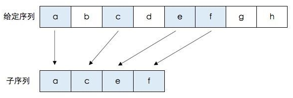

## 目录

  - 相关计算机原理
    - 运行时间
    - 大O表示法
      - 算法执行步骤所需的时间与实际运行时间的关系
      - 平均情况和最糟情况
    - 数组和链表（选择排序前置知识）
      - 数组
      - 链表（List）
      - 比较两者
    - 递归和栈
      - 基线条件和递归条件
      - 栈
      - 递归调用栈
    - 散列表
      - 散列函数
      - 散列表的实现
      - 散列表的应用
      - 散列表的冲突
      - 散列表的性能
      - 填装因子的大小
      - 散列函数的选择
    - 图
      - 实现图
      - 有向图和无向图
      - 加权图
    - 队列
    - 树
      - 二分查找树
      - 红黑树
    - 反向索引（搜索引擎原理）
  - 算法（Python实现）
    - 二分查找算法（查找问题）
    - 枚举算法（旅行商问题）（解决NP完全问题）
    - 选择排序算法
    - 分而治之（快速排列算法前置知识）
    - 快速排序算法
    - 合并排序算法
    - 广度优先搜索（一种图算法）
    - 贝尔曼-福德算法
    - 贪婪算法（一种近似算法）
    - 动态规划
      - 背包问题
      - 文字相似度识别问题
    - K最近邻算法
      - 机器学习-OCR算法
      - 创建垃圾邮件过滤器
    - 傅里叶变换
    - 并行算法
    - MapReduce分布式算法
    - 布隆过滤器和HyperLogLog
      - 布隆过滤器
      - HyperLogLog
    - SHA算法
    - Diffie-Hellman密钥交换
    - 线性规划

## 相关计算机原理

### 运行时间

每一个算法，我们都应当讨论其运行时间。一般而言，应选择效率最高的算法，以最大限度地减少运行时间或占用空间。

最多需要猜测的次数和列表长度相同的运行时间，被称为线性时间（linear time）。

而例如二分查找的算法的运行时间为对数时间（或者log时间）。

### 大O表示法

大O表示法表示了算法的运行时间以不同的速度增加。也就是随着元素数量的增加，算法的运行时间（总步骤数）的增加幅度。

大O表示法表示的并不是时间，而是需要的操作步骤数，它指出了算法运行时间的增速，也就是"时间复杂度"。

大O表示法并不是精确地指出了具体的操作步骤数，而是最多需要的操作步骤数，也就是表示了算法的下限。

常见的5种大O运行时间（注意：大O表示法会省略一切常数，只保留与n相关的符号和数字）：

- O(n)，也叫线性时间。
- O($log \; n$)，也叫对数时间。在使用大O表示法讨论运行时间和算法复杂度时，log指的都是$log_2$。
- O($n * log \; n$)，例子有快速排序算法。
- O(n^2)，例子有选择排序算法。
- O(n!)，例子有旅行商算法。

还有一种O(c)，叫做常量时间。

***

顺带一提，大O表示法还可以表示随着元素数量的增加，需要的内存空间的增加幅度。它指出了算法占用内存大小的增速，也就是"空间复杂度"。它采用跟"时间复杂度"几乎完全相同的表示方式和规则。

#### 算法执行步骤所需的时间与实际运行时间的关系

两个算法的复杂度均为$O(n^2)$，实际的运行时间也可以是不同的。$n$代表元素数，则$n^2$代表每次算法需要执行的总步骤数。但要知道算法的每个步骤的执行也是需要时间的，而且不同算法往往需要的时间不同，甚至在同一算法中，不同的步骤的执行需要的时间也可能不同。

若每次算法1全部步骤的执行时间加起来需要1秒，每次算法2全部步骤的执行时间加起来需要2秒，则算法1的实际运行时间为$t_1=1 * n^2=n^2$，算法2的实际运行时间为$t_2=2 * n^2=2 n^2$。

因此算法的实际时间不仅仅看复杂度（步骤数），而是使用$T= c * N$来得到总消耗时间。c为每次算法全部步骤的执行时间加起来的所需时间（往往是固定不变的，由计算机的性能决定）。N为算法复杂度O(xxx)括号内的包含n的表达式，代表每次算法需要执行的总步骤数。

注："总步骤数"在大O表示法下常常被称为"运行时间"，这很容易造成混淆。

#### 平均情况和最糟情况

对一个递归函数而言，"调用栈的高度"表示它递归的次数。

以快速排序算法为例，选取不同的基准值会影响到调用栈的高度，也就是递归的次数，当然也影响实际运行时间。在最糟的情况下，调用栈的高度等于$O(n)$。在最佳的情况下，调用栈的高度等于$O(log \; n)$。而在每一层所需要的操作步骤数为n，也就是O(n)。

最糟情况下，有$O(n)$层，快速排序算法的所需总步骤数为$O(n) * O(n)=O(n^2)$。

当随机选取基准值的情况下为平均情况，平均情况会近似于最佳情况。因此认为平均情况下，有$O(log \; n)$层，快速排序算法的所需总步骤数为$O(n) * O(log \; n)=O(n * log \; n)$。

### 数组和链表（选择排序前置知识）

#### 数组

数组中的每个元素的地址在内存中是相连的，数组的大小在数组创建之初已经定下。

数组的优势在于，每个元素的内存地址可知，当进行随机读取元素时，数组的效率很高。

但是数组无法添加超过数组大小的新元素，为了插入元素而转移数组位置的方法需要n次转移操作，而创建数组时预留大小则会造成浪费内存空间。

删除元素需要重新建立索引，和添加元素的方法类似，需要n次转移操作。

#### 链表（List）

链表中的每个元素的地址在内存中可以是任何地方。因为链表中的每个元素都存储了下一个元素的地址，从而使一系列随机的内存地址合为一个整体。

链表的优势在于，每个元素的地址可以在内存的任意位置，因此在插入元素时，链表会比较方便。

但是链表如果想要读取链表的最后一个元素时，必须从第一个元素按顺序地一个一个进行n次访问操作。

删除元素仅需要改变前一个元素存储的下一个元素的地址即可，因此仅需要1次操作。

#### 比较两者

||数组|链表|
|:--:|:--:|:--:|
|读取|O(1)|O(n)|
|插入|O(n)|O(1)|
|删除|O(n)|O(1)|

一般来说，数组用得多，因为数组支持随机访问。（访问方式有：随机访问和顺序访问）。

### 递归和栈

递归使解决方案更清晰，实际上没有性能上的优势。而且在有些情况下，使用循环的性能更好。

也就是说：如果使用循环，程序的性能可能更高；如果使用递归，程序可能更容易理解，如何选择要看什么对你来说更重要。

#### 基线条件和递归条件

递归函数调用自己，必须告诉它何时停止。每个递归函数都有两部分，基线条件（base case）和递归条件（recursive case），递归条件指的是函数调用自己，而基线条件则指的是函数不再调用自己，从而比卖你形成无限循环。

#### 栈

栈是一种数据结构，它只有两种操作：压入（在栈顶插入元素）和弹出（读取栈顶元素并删除）。

一个重要的编程概念——调用栈（callstack）。调用栈在调用函数时非常常用。当调用一个函数时，计算机会为该函数分配一块内存，包含了函数名和函数涉及的所有变量的名字和值等信息。计算机使用一个栈来表示这些内存块。

计算机在内部使用被称为调用栈的栈。函数内部调用另一个函数的操作正是使用了栈：函数1调用函数2时，函数1暂停并处于未完成状态，调用的函数2会被压入栈顶并执行函数2，函数2执行后被弹出，函数1再次充当栈顶，继续执行函数1，然后函数1执行后被弹出。

#### 递归调用栈

递归函数也调用栈。递归函数在满足递归条件时不断地将条件变量（判断是否满足基线条件的变量）发生了变化的函数副本压入栈顶。

直到函数里的变量变化到满足基线条件时，不再压入新的栈，而开始从栈顶一个一个地执行并弹出，直到最初的那个函数也被执行完毕并弹出，这就是一个递归函数的实现过程。

### 散列表

无论是傻找还是二分查找，都还是不够快。有没有办法可以得到一个复杂度为$O(1)$的算法呢？可以用到被称为"散列表"的数据结构。

#### 散列函数

散列函数对于任何输入会对应一个数字，也就是"将输入映射到数字"。也就是说，散列函数总是将同样的输入映射到相同的数组索引。

#### 散列表的实现

散列函数和数组结合，创建了一种被称为散列表（hash table）的数据结构，它是一种包含额外逻辑的数据结构（不像数组是直接映射到内存的）。散列表由键和值组成，散列表将键映射到值。

在Python中，散列表的实现就是被称为"字典"的数据类型。常见的编程语言都带有类似的实现。

#### 散列表的应用

- 查找/模拟映射关系（给出键，以得到对应的值）
- 防止重复（防止同一账号重复进行投票操作）
- 缓存（网站登录前是通用内容，而用户登录后得到对应用户的对应内容。用户账号密码就是"键"，用户账号对应的网页内容和数据就是"值"，也就是用户账号对应的"缓存"，缓存数据存储于散列表中。这既加快了客户端加载速度，也使服务器端工作量减少了。）

#### 散列表的冲突

给两个键分配的位置相同的情况称为冲突（collision），这种情况往往是"键"具有某种相同特征而散列函数选取不恰当导致的。这种情况下，可以让两个键映射到的同一个位置存储一个链表。也就是如果存在多个具有某种相同特征的"键"，则把散列表对应的"值"替换为"一个链表"，以储存多个不同的键值对（例如查询以a开头的不同商品对应的价格）。

链表的读取方式具有更大的复杂度，当存储的链表长度太长，所需的时间也会增加。

我们可以看出散列函数的选取很重要，好的散列函数很少导致"冲突"，好的散列函数的链表不会太长。

#### 散列表的性能

||散列表平均情况（最佳情况）|散列表最糟情况|数组|链表|
|:--:|:--:|:--:|:--:|:--:|
|查找|O(1)|O(n)|O(1)|O(n)|
|插入|O(1)|O(n)|O(n)|O(1)|
|剔除|O(1)|O(n)|O(n)|O(1)|

其中最糟情况是由链表的查找方式，数组的插入方式，数组的剔除方式得到的（散列表是由散列函数和数组组成的，值可以是链表）。

避免最糟情况，就是避免"冲突"，需要有：

- 较低的填装因子
- 良好的散列函数

#### 填装因子的大小

填装因子的计算公式如下：

$\textbf{填装因子}=\frac{\textbf{散列表包含的元素数}} {\textbf{位置总数}}$

填装因子大于1意味着元素的数量大于位置的数量，此时需要在散列表中添加位置，这被称为调整长度（resizing）。

填装因子越小，越不可能发生冲突，而一旦发生冲突，就意味着必须创建链表，则散列表更容易碰到最糟情况。因此一个不错的经验规则为：一旦填装因子大于$0.7$就要调整散列表的长度了。

#### 散列函数的选择

良好的散列函数让数列中的值呈均匀分布。而糟糕的散列函数让值扎堆而导致大量的冲突，不得不创建链表并使链表长度增加。

散列函数的选取不需要深入了解（每个编程语言都选取了恰当的），例如SHA函数。

### 图

图由节点和边组成，用于模拟不同的东西是如何相连的，可用来建立问题模型。一个节点可能与众多节点直接相连，这些节点被称为"邻居"。

#### 实现图

每个节点都有与其相连的一个或多个节点，因此选用一个散列表来表示每个节点与其相连的所有节点。


（MATLAB中也是采用类似的方法表示的）

#### 有向图和无向图

如果节点之间的关系是单向的，图像的连线有箭头，则称为有向图（directed graph）。有向图中，节点A指向节点B而节点B不指向节点A，则称节点B为节点A的邻居，但节点A不是节点B的邻居。

在有向图中，如果从一个节点出发，之后的指向全部往外，也就是没有向后指的边，则这种图被称为"树"（tree）。树是一种特殊的图，家谱图是一个经典的树（因为辈分关系不可逆转）。

***

如果节点之间的关系是双向的，图像的连线没有箭头，则称为无向图（undirected graph）。无向图中，节点A和节点B相连，则节点A和节点B互为邻居。

也就是说，节点A和节点B相连等效于相互指向，如果使用有向图表示，则形成一个"环"。在无向图中，每条边都是一个环。

#### 加权图

加权图（weighted graph）是每条边具有权重（weight）的图。与其相对应的是非加权图（unweighted）。

### 队列

队列与现实中的队列的工作原理相同。队列类似于栈，不能随机地访问队列中的元素。

队列只支持两种操作：入队和出队。

压入栈的元素必须与压入的方向相反的方向弹出（栈顶入而栈顶出）。和栈不同的是，入队的元素必须与入队的方向相同的方向出队（队前入而队后出）。也就是说，队伍是一种先进先出（first in first out, FIFO）的数据结构，而栈是一种后进先出（last in first out, LIFO）的数据结构。

在Python中，队列与数组是相同层次的（而不是栈），也就是可以直接使用加法将一个数组（的元素）加入到一个队伍中。

### 树

#### 二分查找树

在有序数组中查找时，最快的方式是二分查找。但是如果有新的元素插入数组，都需要重新进行排序使得数组有序。

如果可以直接将新元素插入到数组的正确位置就好了，这样就无需再次排序。为此，有人设计了名为二叉查找树（binary search tree）的数据结构。


搜索过程如下：搜索值为"9"的节点，9大于3，往右，9大于7，往右，9小于11，往左，9等于9，找到了。

对于其中的每个节点，左子节点的值都比它小（可以认为是排序顺序领先），而右子节点的值都比它大（可以认为是排序顺序靠后）。这样，新元素的加入仅仅需要在合适的节点后面添加新的子节点即可。

与数组相比，它的各个操作的复杂度为：

||数组|二叉查找树|二叉查找树（最糟情况）|
|:-:|:-:|:-:|:-:|
|查找|$O(log \; n)$|$O(log \; n)$|$O(n)$|
|插入|$O(n)$|$O(log \; n)$|未知|
|删除|$O(n)$|$O(log \; n)$|未知|

红黑树是一种处于平衡状态的特殊二叉查找树。

B树是一种特殊的二叉树，数据库用它来存储数据。

相关数据结构：堆、伸展树。

#### 红黑树

红黑树在C++中表现为map函数。

### 反向索引（搜索引擎原理）

一个散列表，将单词映射到包含它的页面，这种数据结构被称为反向索引（inverted index）。

例如：

网页A：Hi There
网页B：Hi ADIT
网页C：There WE GO

根据内容建立对网页的映射，例如：

|内容|包含内容的网页|
|:-:|:-:|
|Hi|A,B|
|There|A,C|
|ADIT|B|
|WE|C|
|GO|C|

这样，当用户搜索对应的内容时，就可以呈现含有对应内容的网页供其选择，因此叫做反向索引。

## 算法（Python实现）

### 二分查找算法（查找问题）

条件：有序的n个元素列表。

目的：使用最少的操作步骤，返回需要查找的特定元素的位置。

算法描述：二分查找法依托于有序的元素列表的条件，从未确定的元素的中间值开始"猜"，判断是"大了"还是"小了"（目标元素属于上半截还是下半截），这样在每次操作步骤可以排除一半的非目标元素。

复杂度：二分查找算法的复杂度为$O(log_{2}(n))$或者说$O(log(n))$。

简单查找（也叫做傻找）的复杂度为$O(n)$。

例子：从1~100的列表中寻找"65"的位置。第一次"猜"50，小了；第二次"猜"75，大了；第三次猜"68"，大了；第四次"猜"59，小了；第五次"猜"64，小了；第六次"猜"66，大了；第七次"猜"65，正确。

注：如果无法刚好整除，则取大的一半，这样一是可以在下一步凑整除，二是相对于取小的一半的步骤更少。

Python实现代码：

```py
def binary_search(list,item):
low=0
high=len(list)-1
# 定义查找范围

while low<=high
  middle=(low+high)//2
  guess=list[middle]
# 检查中间的元素

  if guess==item:
    return mid
  if guess>item:
    high=mid-1
  else:
    low=mid+1
# 判断大小

return None
# None是代表"无"的python关键字。
```

### 枚举算法（旅行商问题）（解决NP完全问题）

条件：旅行商需要依次前往n个城市，每个城市只能前往一次，可以选择任意一个城市作为起点。

NP完全问题：需要计算所有的解，并从中选出最符合条件的结果。NP完全问题的简单定义为：以难解著称的问题。例子：旅行商问题、集合覆盖问题。

NP完全问题往往采用近似求解的方法（例如贪婪算法）。

如何判断NP完全问题？有以下特征可以帮助判断，但不一定正确：

- 算法复杂度较大（随着元素数量增加，算法速度会变得非常慢）。
- 不能将大问题拆分为小问题，必须考虑各种可能情况的问题。
- 涉及"所有组合"的问题。
- 问题涉及序列且难以解决。
- 问题涉及集合且难以解决。
- 注：如果可转换为集合覆盖问题或旅行商问题，则一定是NP完全问题。

***

目的：确保总路径最短。

***

算法描述：列出所有起点的所有可能的路线。

***

复杂度：复杂度为$O(n!)$。$n!$为阶乘函数（factorial function）。

***

### 选择排序算法

条件：无。

目的：使用最少的操作步骤，对所有元素根据从大到小或者从小到大的顺序进行排序。

算法描述：建立一个与原元素列表相同大小的空列表，进行n次遍历原元素列表，每次挑选出最大/最小的元素填入空列表中。

复杂度：复杂度为$O(n^2)$。

注：实际上最多的操作步骤是：$\frac{1}{2}n(n+1)$，但是大O表示法将常数消去，简化为$n^2$。

Python实现代码：

```
def findSmallest(arr):
  smallest=arr[0]
  smallest_index=0
  for i in range(1,len(arr)):
    if arr[i]<smallest:
      smallest=arr[i]
      smallest_index=i
  return smallest_index


def selectionSort(arr):
  newArr=[]
  for i in range(len(arr)):
    smallest=findSmallest(arr)
    newArr.append(arr.pop(smallest))
  return newArr

print selectionSort([5,3,6,2,10])
```

### 分而治之（快速排列算法前置知识）

分而治之（divide and conquer，D&C）是一种著名的递归式问题解决方法（而非算法）。

D&C也是一种通用的、递归思维的问题解决方法。其解决问题的步骤可以分为：

- 找出并设定基线条件，这种条件必须尽可能简单。（找出停止递归的条件，也就是问题得到解决的最终情况）

- 找出并执行不断将问题分解（或者说缩小问题规模）的方法，直到问题符合基线条件，就得到结果了。

### 快速排序算法

条件： 无。

目的：使用最少的操作步骤，对所有元素根据从大到小或者从小到大的顺序进行排序。

算法描述：使用分而治之的方法（递归）。对原元素列表，选择一个元素作为基准值（pivot），找出所有小于基准值的元素组成列表1，所有大于基准值的元素组成列表2，这种操作叫做分区（partitioning）。这就是一次快速排序，但还没有对总体完成排序。

一次快速排序后得到：一个由所有小于基准值的数字组成的列表1，基准值，一个由所有大于基准值的数字组成的列表2。分别对列表1和列表2进行快速排序，并对所有列表1和列表2的所有子列表也进行快速排序（找出基准值，进行分区），最后就得到了有序的总体列表。其中基准值的选取可以是任意的。

快速排序算法是最快的排序算法之一，是D&C的典范算法。

复杂度：最糟复杂度为$O(n^2)$，平均复杂度为$O(n * log \; n)$。

python实现代码：

```py
def quicksort(array)
  if len(array)<2
    return array
    # 基线条件
  else:
    pivot=array[0]
    # 选择第一个元素为基准值
    less = [i for i in array[1:] if i <= pivot]
    greater = [i for i in array[1:] if i > pivot]
    return quicksort(less)+[pivot]+quicksort(greater)

print quicksort([2,4,3,1])
```

### 合并排序算法

条件：合并排序算法（merge sort）。

目的：

算法描述：

复杂度：复杂度为$O(n * log \; n)$。

python实现代码：

### 广度优先搜索（一种图算法）

条件：用于图的算法，解决最短路径问题（shortest-path problem）。

***

目的：使用最少的操作步骤，得到起始节点和可能存在多个的目标节点之间的最短距离及最短路径（此最短为边数最少）。

最短距离的含义有很多：例如跳棋AI，计算走多少步可以获胜。例如单词检查器，计算最少编辑多少个地方可以改成正确的单词。例如根据人际关系网络找到关系最近的医生。

***

算法描述：和起始节点直接相连的节点为一度关系，与和节点A直接相连的节点相连的节点为二度关系...（朋友、朋友的朋友、朋友的朋友的朋友...）这构建了"图"的结构。

检查一度关系是否存在目标节点，如若没有则检查二度关系...这种操作就等效于寻找"图"的最短路径。

最终得到的路径是最短的，因为查找行为是按照顺序的，是从初始节点一度一度关系往外查找的。有一个可实现这种目的的数据结构，叫做"队列"（quene）。

***

复杂度：复杂度为$O(V+E)$，其中$V$为顶点（vertices）数，$E$为边数。

最糟情况下，需要对图中的每条边进行检查$O(V)$，通式在代码中将每个人入队队列的操作为$O(1)$，合计为$O(E)$。

***

python实现代码：

1.创建一个队列，用于存储待检查的人。
2.从队列中出队一个人。
3.检查出队的人是否为目标节点。
4.如果为否，则将此出队的人的每个邻居入队到队列中。
5.重复第2~4步，直到找到目标节点或者全部人出队。

```
from collections import deque
# 导入队列相关函数

search_queue=deque()
# 使用deque()函数，创建一个队列

search_queue+=graph["you"]
# 将键"you"对应的值，也就是邻居数组

searched=[]
# 这个数组用于记录检查过的人

while search_queue:
# 只要队列不为空
  
  person=search_queue.popleft()
  # 出队第一个人
  
  if person not in searched:
  # 仅当这个人没被检查过才进行检查
  
    if person[-1]==m
    # 如果这个人的姓名的结尾为m则为目标节点，符合条件
      return True
      # 返回已找到
  
    else:
      search_queue+=graph[person]
      # 不符合，则将这个人的邻居都加入搜索队列待检查。
  
return False
# 返回找不到
```

***

### 贝尔曼-福德算法

条件：贝尔曼-福德算法（Bellman-Ford algorithm）适用于含有负权边的加权图，解决最短路径问题。

***

### 贪婪算法（一种近似算法）

条件：贪婪算法在某些问题上可以得到最优解，但其实大多数问题上，仅能得到近似解。贪婪算法属于近似算法（approximation algorithm）。但这又是贪婪算法的优势所在，当获得精确值需要的时间太长时，可使用近似算法快速得到近似解（因为贪婪算法足够简单）。

顺带一提，近似算法的优劣的标准有如下两点：

- 速度有多快

- 得到的近似解与最优解的接近程度。

***

算法描述：每步都选择局部最优解，最终得到的就是全局最优解。

如果有不止一个条件，则选取最重要或者说对最终近似解与最优解的接近程度贡献最大的一个条件。

具体的实施方法，可以使用一个案例来说明：广播台问题。

广播节目需要让全美50个州的听众都能收听，现在存在n个不同的广播台，每个广播台覆盖的州的数量不同，且互有覆盖重叠的州。每个广播台的播出费用假设相同，那么如何在满足让全美50个州的听众都能收听的目的下，需要支付的总费用最少（也就是需要签约的广播台数量最少）？

- 列出每个可能的广播台集合，这被称为幂集（power set），可能的子集有$2^n$个，选出覆盖全美50个州的最小集合。这种情况下，复杂度为$O(2^n)$，没有任何算法可以降低求得精确解的复杂度。

- 使用贪婪算法：选出覆盖了最多的当前未覆盖州的广播台（即使它覆盖了一些当前已覆盖州），不断重复直到覆盖了所有的州。贪婪算法就是足够简单，且复杂度较求精确解大大降低。在广播台问题上，复杂度为$O(n^2)$。

***

复杂度：不定。

***

Python实现代码：

```py
states_needed=set()
# 包含需要覆盖的州。
stations={}
# 可供选择的广播台清单，以散列表形式存储。

while states_needed:
  
  best_station=None
  states_covered=set()
  
  for station,states_for_stations in stations.items():
  # 赋予station为广播台名字，states_for_stations为该广播台覆盖的州。
    covered=states_needed & states_for_station
    # 求交集，结果为此广播台覆盖的当前未覆盖的州的集合。
    
    if len(covered) > len(states_covered):
      best_station=station
      states_covered=covered
      # 包含该广播台覆盖的所有未覆盖的州
  
  states_needed -= states_covered
  # 更新当前未覆盖的州的集合。
  final_stations.add(best_station)
  # 最终选择的广播台清单。
```

***

### 动态规划

条件：

不可以处理连续的待规划样本（样本不可以无限细分）。必须是离散的待规划样本（一个整体，或者可以拆分为可以直接列出来各个部分）。这是因为最小粒度规划目标必须能分别列在第一行，最小粒度规划目标（拆分为子问题的最小目标）是离散的，因此待规划样本也必须是离散的。（如果样本是连续的，则可以使用贪婪算法得到近似解）

不可以处理待规划样本相互依赖的情况。也就是仅可以在子问题满足离散而相互独立，也就是待规划样本相互之间没有影响（例如背包问题中拿了一件物品会使另一间物品变轻的情况，就是相互影响了）的情况下使用动态规划。

***

目的：找出动态规划问题最优解。

***

算法描述：解决动态规划问题的通用方法表现为一个网格。一般第一行代表最小粒度规划目标（拆分为子问题的最小目标），第一列代表待规划样本（看后面的实例就容易理解具体意思了）。这个网格的内容的填充的逻辑和算法是不定的（行列可以代表不同的东西，根据算法任何填充的方式也是允许的），可以自行更改，以适应不同的动态规划问题。可以通过尝试得到最适合当前问题的填充网格内容的算法。

网格和网格内容填充算法结合，就是动态规划方法。

***

复杂度：不定。

***

#### 背包问题

问题描述：假如你是一个小偷，背包承重有限，各种商品具有不同价值和不同的重量，如何使得偷到的商品的价值总和最高？

假设有一个4镑承重的背包，商品有：价值4000元重4镑的音响，价值2000元重3镑的电脑，价值1500元重1镑的吉他。

"待规划样本"有：音响、电脑、吉他。

"规划目标"为："以最高价值填充4镑承重的背包"。

因为"待规划样本"的单位最小仅精确到1镑单位，因此以1镑为单位对"规划目标"进行拆分，得到"最小粒度规划目标"：也就是将"以最高价值填充4镑承重的背包"拆分为："以最高价值填充4个1镑承重的小背包"。

***

根据动态规划的方法，列网格：

|样本\目标|1个|2个|3个|4个|
|:-:|:-:|:-:|:-:|:-:|
|吉他|        ||||
|音响、吉他|    ||||
|电脑、音响、吉他||||

填充算法：根据第一行小背包的数量和第一列的可以考虑的样本集合，选出最高价值的选择并计算出最高价值，填入对应的格子。

一个格子对应的第一行代表小背包的数量，第一列代表目前可以考虑装入的所有商品。

如果有剩余的空间，则从对应的剩余空间的第一行对应的最后一行得到目前的最新最大价值，并加上去。

第一行：

|样本\目标|1个|2个|3个|4个|
|:-:|:-:|:-:|:-:|:-:|
|吉他|1500（吉他）|1500（吉他）|1500（吉他）|1500（吉他）|
|音响、吉他|    |||||
|电脑、音响、吉他|||||

第一行仅有吉他可以选择，吉他仅1镑，1个~4个小背包都可以放入吉他，且都为目前最高价值。

第二行：

|样本\目标|1个|2个|3个|4个|
|:-:|:-:|:-:|:-:|:-:|
|吉他|1500（吉他）|1500（吉他）|1500（吉他）|1500（吉他）|
|音响、吉他|1500（吉他）|1500（吉他）|1500（吉他）|3000（音响）|
|电脑、音响、吉他|||||

第二行，仅有4个小背包时，能够放入音响了，因此"4个小背包"的最高价值更新，为3000元。

第三行：

|样本\目标|1个|2个|3个|4个|
|:-:|:-:|:-:|:-:|:-:|
|吉他|1500（吉他）|1500（吉他）|1500（吉他）|1500（吉他）|
|音响、吉他|1500（吉他）|1500（吉他）|1500（吉他）|3000（音响）|
|电脑、音响、吉他|1500（吉他）|1500（吉他）|2000（电脑）|3500（吉他、电脑）|

"3个小背包"的最高价值更新，为2000元。因此"4个小背包"的最高价值也更新了，为最新行的"1个小背包"+"3个小背包"的最高价值，因此为2000+1500=3500元。

注意：不是单纯地把更小部分的最大价值加起来就是更大部分的最大价值了，要考虑物品的数量和组合，是否已经偷过了。

按照上方的案例，得知在使用动态规划方法的时，表格的逐步填充是关键。

#### 文字相似度识别问题

人类总有犯错的时候，打错单词更是时常发生，如何使用动态规划的方法来尽可能判断他实际上想打出哪个单词呢？

使用动态规划，将总问题划分为子问题。目标英语单词的最小粒度自然是一个"字母"。而待规划样本相对应的正好也是"字母"（对于单词样本，细分的样本显然只能是也是字母），因此网格的第一行和第一列的内容确定了。

***

最长公共子串：

和最长公共子串（longest common substring）：给定串中任意个连续的字符组成的子序列称为该串的子串。


一个人输入了hish，他到底想输入fish还是vista呢？

||f|i|s|h|
|:-:|:-:|:-:|:-:|:-:|
|h|||||
|i|||||
|s|||||
|h|||||

因为本次采用的主要指标是"最长公共子串"，则如果出现公共子串，则显然权重要更高。这该怎么使用网格来体现呢？

||f|i|s|h|
|:-:|:-:|:-:|:-:|:-:|
|h|0|0|0|1|
|i|0|1|0|0|
|s|0|0|1|0|
|h|0|0|0|1|

最简单的，就是字母相符为1，不相符为0。而公共子串连续，则可以使相符的网格加上其左上角网格的值，以此加大权重。

||f|i|s|h|
|:-:|:-:|:-:|:-:|:-:|
|h|0|0|0|1|
|i|0|1|0|0|
|s|0|0|2|0|
|h|0|0|0|3|

最终，通过这个表格，我们得到最终权重为3，再于vista比较一下：

||v|i|s|t|a|
|:-:|:-:|:-:|:-:|:-:|:-:|
|h|0|0|0|0|0|
|i|0|1|0|0|0|
|s|0|0|2|0|0|
|h|0|0|0|0|0|

最终权重为2，小于3，因此输入hish的用户显然更倾向于在打出fish的途中出错了。

***

最长公共子序列：

最长公共子序列（longest common sequence）：即一个给定的序列的子序列，就是将给定序列中零个或多个元素去掉之后得到的结果。



但是，仅仅依据公共子串是片面的。因为，有可能用户会打出fosh，与fish和fort的公共子串的最终权重一致，但我们可以看出用户显然还是更倾向于打出"fish"。仍然使用动态规划：

||f|i|s|h|
|:-:|:-:|:-:|:-:|:-:|
|f|1|1|1|1|
|o|1|1|1|1|
|s|1|1|2|2|
|h|1|1|2|3|

||f|i|s|h|
|:-:|:-:|:-:|:-:|:-:|
|f|1|1|1|1|
|o|1|2|2|2|
|r|1|2|2|2|
|t|1|2|2|2|

此处的填充算法为：
- 如果两个字母不同，就选择上方和左方邻居中较大的网格的值。（公共子序列权重积累）
- 如果两个字母相同，则选择左上方单元格的值加1。（公共子串权重积累）

***

### K最近邻算法

条件：K最近邻算法（k-nearest neighbours, 简写为KNN）适用于涉及到分类和回归的问题。

目的：通过最少的操作步骤，使待分类目标尽可能得到精确的分类，同时构建一个能够进行分类预测的模型。

算法描述：

分类：存在若干已知"特征"和"位置"（"位置"是全部"特征"的值的综合表现）的样本，且已知待预测目标的确切"位置"的前提下：根据一定"距离"范围内的相邻的样本的"特征"的值，来与待分类目标的"特征"的值进行比较，以此来对待分类目标进行"分类"。

回归（regression）：回归就是预测。存在若干已知"特征"和"位置"的样本，且未知待预测目标的确切"位置"，但知道待预测目标的部分特征的值的前提下：根据一定"距离"范围内（与待预测目标的已知部分特征相近）的样本的剩余特征的值，预测得到待预测目标剩余的未知特征的值。

这个"位置"和"距离"，是抽象化的。

"位置"可以表现为具有互隔不同距离的样本/目标的分布情况。例如人际交往圈中的你的位置，例如二维图像的各个点的位置。位置也可以说是所有"特征"的值的综合表现。

"距离"可以表现为衡量样本/目标的特征之间的差别程度的综合权重。例如人际交往圈每个人的不同喜好的重叠程度，例如二维图像的坐标距离。

K最近邻算法应用的经典例子有分类问题、电影推荐问题、进货问题等。

复杂度：不定。

***

这类似于神经网络的特征提取，而且在某种程度上这两种"特征"是一致的，因为最简单的神经网络恰恰就是分类器，神经网络的最广泛应用的用法之一就是分类。K最近邻算法是运用特征进行分类的另一种方法。

因此KNN算法的核心在于，提取合适的特征。合适的特征决定了KNN算法是否可靠。

***

#### 机器学习-OCR算法

OCR是指光学字符识别（optical character recognition），可使用KNN对字符进行识别。

一般而言，OCR算法提取线段、点和曲线等特征。

OCR第一步是查看大量的数字图像并提取特征，这被称为训练（training）。

再复杂的技术都是基于KNN等简单理念的，这些理念也可用于语音识别和人脸识别。

#### 创建垃圾邮件过滤器

垃圾邮件过滤器使用一种简单的算法——朴素贝叶斯分类器（naive bayes classifier）。

它研究垃圾邮件中的单词在垃圾邮件中出现的概率，以此来计算出是垃圾邮件的概率。

朴素贝叶斯分类器同样需要大量的句子作为训练数据进行训练。

***

### 傅里叶变换

一种用于分离的算法。

***

### 并行算法

目的：

并行算法用于提高传统算法的速度，而且往往难以实现线性。主要着眼于如何解决：

- 并行性管理开销。如何分配任务的不同部分给不同的内核同时执行，使得它们各自的工作最终能够以快速、合适的方法合并为想要的最终结果？

- 负载均衡。如何分配难易度和任务量不同的任务给不同的内核同时执行，以使得内核的利用率最高，闲置率最低？

***

### MapReduce分布式算法

目的：如果速度要求更高，算力更强，内核数增加到数百个，计算机提升到多台，则算法不仅需要在计算机CPU中不同的内核中执行，还需要跨不同的计算机来执行，并继续遵循并行算法的要求：尽量提高算力的利用率。

***

算法描述：

MapReduce基于两个简单的理念：映射函数（map）和归并函数（reduce）。

映射函数很简单，接收一个数组，并对其中的每个元素执行同样的处理。

映射函数能够自动将工作分配给多台计算机来做。每台计算机负责数组中的其中一个或者几个元素的处理任务。

归并函数的理念是将很多项归并为一项，如果说映射函数是将一个数组转换为另一个数组，那么归并函数就是将一个数组转换为一个元素。

***

例如对于数据集很大的情况下的数据查询，使用MapReduce就可以在多台计算机上执行数据查询。相比于传统数据库，耗费的时间可能仅有百分之几。

***

### 布隆过滤器和HyperLogLog

给定一个元素和一个集合，判断这个元素是否在这个集合中，如果采用散列表方法，复杂度仅为O(1)，但这个散列表不可避免地就会特别大。

#### 布隆过滤器

算法描述：

布隆过滤器是一种概率型数据结构，它提供的答案有可能错误的，但很可能是正确的。判断一个网页以前是否搜集过（一个元素是否在已搜集集合中），可以使用布隆过滤器，而不是散列表。布隆过滤器非常适合"不要求答案绝对准确"的情况。

***

如果给出"已在集合中"，是可能错误的。但如果给出"不在集合中"，却一定正确。这是布隆过滤器的特点，除此之外，它的优点也在于要求的存储空间很少。

***

#### HyperLogLog

HyperLogLog是一种类似布隆过滤器的概率型算法。HyperLogLog可以近似地计算集合中不重复的元素的个数（集合的基数，只要出现过一次就计入，出现多次不计入），而不需要存储其所有值。

它也不能给出准确的答案。即使如此，它要求的存储空间很少，而且答案可靠度也比较高，因此可以采用。

***

### SHA算法

算法描述：

SHA算法又称安全散列算法（secure hash algorithm）。SHA算法是一系列加密算法，有SHA-0、SHA-1、SHA-2、SHA-3三大类，而SHA-0、SHA-1已经被破解，SHA-3应用较少，目前应用广泛相对安全的是SHA-2算法。

该算法的思想是接收一段明文，然后以一种不可逆的方式将它转换成一段密文。给定一个字符串，SHA返回其散列值——一个较短的字符串，它不可以逆向为原来的字符串。把字符串替换为文件，也是可行的。

***

可以使用SHA算法来判断两个文件是否相同：因为对于完全相同的一个文件，通过SHA算法得到的散列值一定相同。因此，比较两个文件是否相同，只要在本地运行SHA算法算出散列值，并将其与文件的提供方提供的散列值比较，就可以得知文件是否完全相同。

***

可以使用SHA算法来加密密码：服务器是怎么确定你输入的密码与你之前设置的一样？如果服务器被黑客窃取了密码列表，那么是不是就等于密码全部泄露了？

不是的，服务器一般存储的是密码字符串对应的SHA散列值，而SHA散列值无法逆向，因此起到了加密的作用。

而当在你输入密码的时候，服务器立刻对其计算SHA散列值，并与密码列表中的SHA散列值对照即可。

***

SHA还有一个重要特征，就是局部不敏感。也就是说，如果你对一串字符串仅更改一个字符，重新计算SHA散列值，结果会与原来的SHA散列值截然不同（不会仅变化一小部分）。

如果你想要局部不敏感的散列函数，则可以使用Simhash。它不能用来加密，但可以用来检查两项内容的相似程度，例如论文查重，检测上传资源是否合法。

***

### Diffie-Hellman密钥交换

算法描述：

它解决了一个古老的问题：如何对消息进行加密，以便只有收件人才能看懂。

Diffie-Hellman算法使用了两个密钥：公钥和私钥。公钥是公开的，所有人都可以轻易得到，而私钥是私有的，只有"你"有。也就是说，所有想给你发送消息的人使用公钥进行加密并发送给你，而这个消息仅能使用私钥进行解密，而私钥与公钥一一对应，且私钥仅有你物理持有。这样就不怕中途拦截信息等干扰了。

Diffie-Hellman算法及其替代者RSA依然被广泛使用。

***

### 线性规划

算法描述：

线性规划用于在给定约束条件下最大限度地改善指定的指标。线性规划有最重要的两个部分：约束条件和规划目标。

所有图算法都可使用线性规划来实现。线性规划是一个宽泛的框架，而图问题只是它的一个子集。

线性规划使用Simplex算法，此算法比较复杂。如果想要达到"最优化"，就需要线性规划。

***


