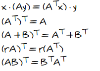
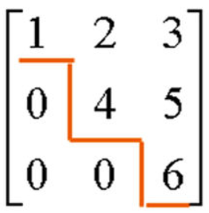
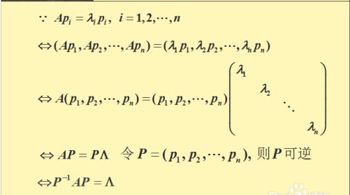
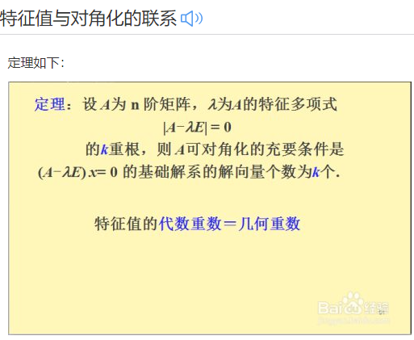
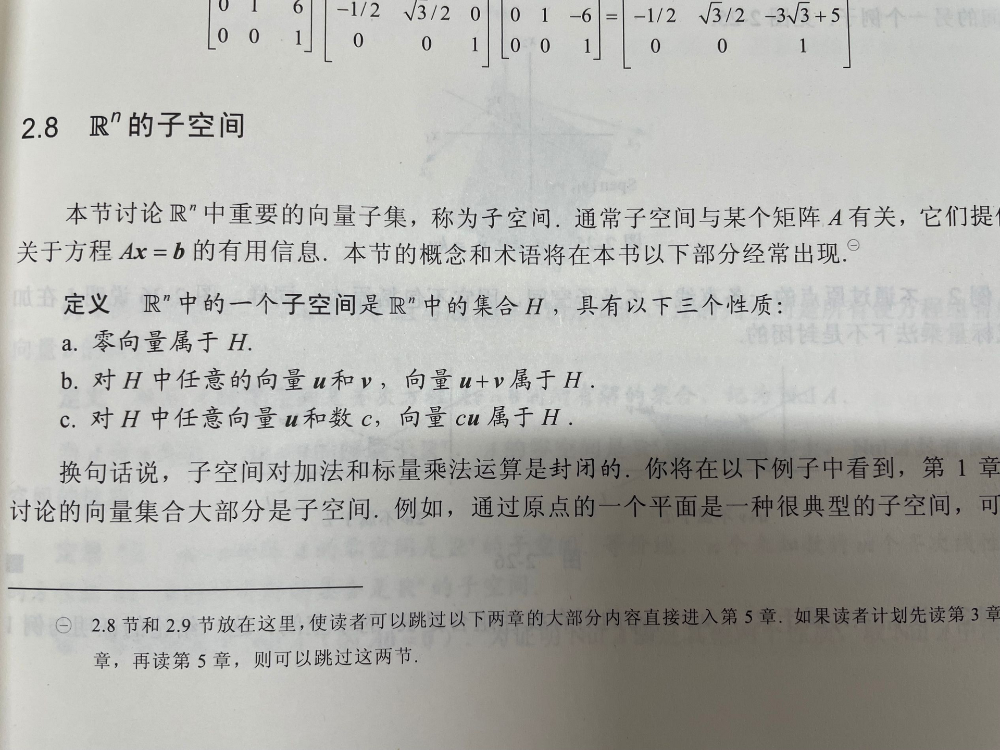
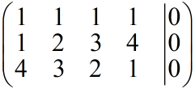
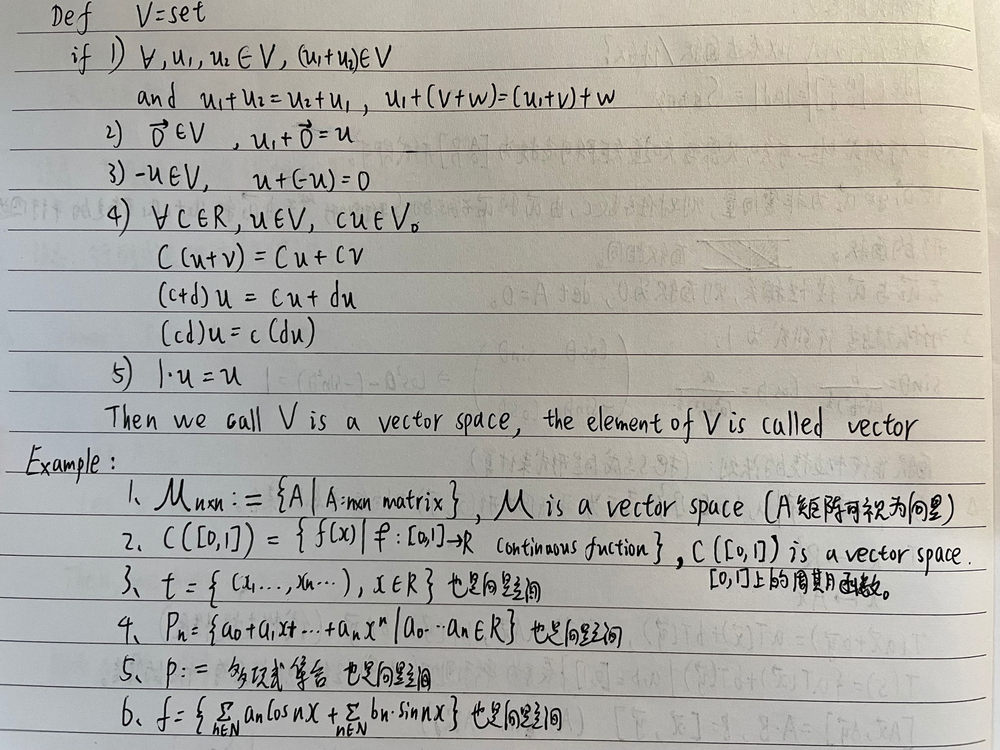
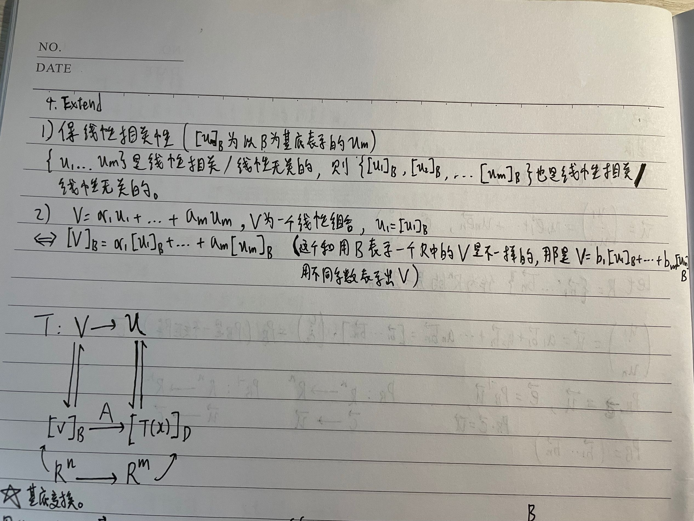
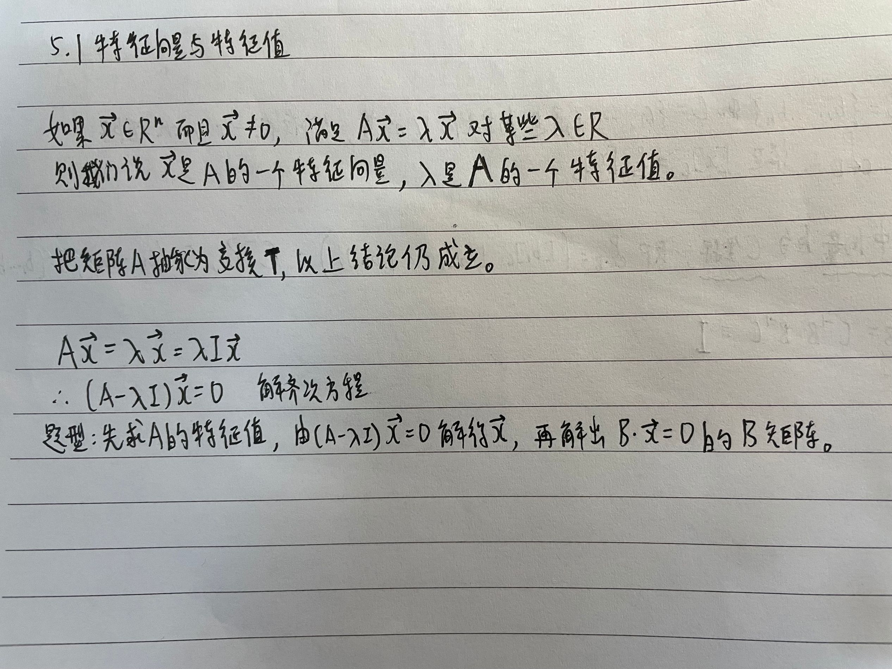

## 目录

  - 线性代数单词
  - 线性代数课堂内容
    - 行列式的定义
    - 矩阵的定义
    - 矩阵化简与线性无关
      - 阶梯形矩阵
      - 线性无关（linear independent）
    - 线性组合与线性相关
      - 线性组合：
      - 线性方程组的解集：
      - 线性组合、线性相关，线性变换：
      - 总结：
    - 矩阵方程与线性空间
    - 秩与Ax=b解的数量关系
      - 矩阵的秩与解的关系
      - **列满秩**
      - **行满秩**
      - **行列满秩**
      - **小结**
      - **关于Ax=b的另一种解释**
    - 映射、单射、满射
    - 期中总结
    - 线性变换T的补充
    - 矩阵操作（矩阵运算法则补充）
      - 矩阵的表示方法和其中元素的表示方法：
      - 1）Sum of matrix（矩阵加法）
      - 2）Scalar multiplication（数乘，标量乘）
      - 3）矩阵乘法：
      - 4）
      - 5）
      - 6）
      - 7）矩阵的转置
      - 8）特征值和特征向量：
      - 9）如何对角化矩阵：
      - 定义：==A为n阶矩阵（必须是方阵才有特征值，所以易得P也是方阵且可逆），可以看出λi是矩阵A的特征值组，通过变换，可以把所有特征值组成一个对角矩阵，这个对角阵就是Λ。pi是矩阵A的特征向量，通过变换，可以把所有特征向量组成一个矩阵，这个矩阵就是P。
      - 实对称矩阵定义：
    - 逆矩阵
      - 等价命题列表：==
      - 求逆矩阵的公式、逆矩阵的定义：
      - 若B可逆，AB可逆，则A可逆。
      - 规定A，B都满足相同的以下性质，则：
      - 规定A满足相同的以下性质，则：
      - 变换T的逆定义：
    - 分块矩阵
    - 矩阵的子空间以及意义
    - 线性子空间
    - 期中考点以及知识点总结
    - 余因子展开式
    - 余因子展开式2
    - 向量空间与运算
    - 习题课例题讲解
    - 期中考总结
    - 抽象空间与欧式空间
    - 线性空间变换
    - 特征向量与特征值
    - 特征向量与特征值2
    - 特征方程与对角化
    - 正交投影
    - 正交投影与格拉姆-施密特方法
    - 期末题型
  - 题型补充

## 线性代数单词

Linearity   线性（性质）

equation   s.方程；等式

list of number   数列

statement   声明；阐述

consistent   s.相容的；形容至少有一解的线性系统

inconsistent   s.不相容的；形容无解的线性系统

m×n matrix   m×n（皆为整数）的矩阵

respectively   分别地

substitute   代替

coefficient matrix   s.系数矩阵

row   行（从左到右，一般进行行变换）

column   列（从上到下）

sum   s. 和；合计

interchange   交换

scaling   缩放

(row) echelon matrix   阶梯矩阵

reduced (row) echelon matrix   简化（最简）阶梯矩阵

pivot   s.主位置/主元（行从左到右第一个非零数，相当于leading entry）n.中心点；枢纽

pivot column   主列

elementary ROW operation   初等行变换

default   s.默认 n.违约；缺席

size   s.尺寸（矩阵的尺寸用m×n表示）

***

reversible   可逆的

vector   向量

entries（entry的复数形式）   s.项

triangular form   s.（上/下）三角形；三角形式（形容阶梯式）

augmented   扩张的；扩音的

augmented matrix   s.扩充矩阵/扩增矩阵

eliminate   s.消去   v.消除；清除

nonzero   非零的

span   s.扩张空间   v.包括；范围（ span{a1,a2,a3}代表由向量a1、a2、a3扩张出来的一个向量空间）

denote   表示；说明

planes   s.平面；具有三个未知数的线性方程（顺带一提，两个未知数的几何意义是一条直线）

intersection   s.交集   n.交叉；十字路口

justify   s.证明；证明...是正确的

reverse   n.反面；背面   v.颠倒；倒车   adj.相反的；反面的

determine   s.判断；确定   v.下定决心去做；决定；确定

notation   s.额外值

constant(s)   s.常数   adj.连续的

general solution   s.一般解（即通解、全部解，包括全部解）

algorithm   算法

leading entry   s.主元（阶梯式每行第一个非零数）

leftmost   s.最左边

transpose   s.转置，符号用“T”在字母右上角表示，法则如下：

starred   星号

row equivalent   s.行等价

partial pivoting   s.  就是只在当前进行变换的列中选择主元，只需要进行行交换

complete pivoting（full pivoting）   s.  在矩阵分解或高斯消元的过程中，主元是在未进行变换的所有行和列之间进行选择。也就是需要同时进行行交换和列交换。(就是一般的高斯消元法，先用简化为阶梯式，然后从右下开始选择列主元，反向进行消元，这次是将列主元上方的数全部化为0，然后顺便的，将所有列主元化为1，此时发现，列主元和行主元其实位置完全一样）

rank   s.秩（ 一般表示为rank(A) ）；维数

***

product of A   s.A的乘积

if and only if   s.当且仅当

linear combination   s.线性组合

product   s.乘积

weights   s.权（重）

defined   s.有定义的；有意义的

i th   s. 第 i 个

homogeneous   s.齐次的

trivial solution   s.平凡解

nontrivial solution   s.非平凡解

free variable   s.自由变量

linearly independent   s.线性无关

indexed   s.   adj.索引的

plus/add    s.加法

subtract   s.减法

minus   s.减号；减去

multiply   s.乘法

divide   s.除法

***

origin   s.原点

notation    s.写法；表示方法

determine   s.确定；决定

characterization   s.表征

preceding   s.前的

renumbering   s.重新编号；重编写

suppose   s.认为；有

mapping   s.映射

transformation    s.转变（用“T(X)=Ax=b”表示，X是变量）

codomain   s. 陪域、上域、到达域

shear transformation   s.剪切变换（指既不升维也不降维，只是进行了移动的“剪切”而已）

image   s.像

matrix equation s.矩阵方程

parametric   参数（量）的；

explicit   s.显式

translations   s.平移（形容向量的加法）

particular solution   s.特解（特解是满足方程的解，但不一定是完整的解。）

***

hence   s.因此

subset   s.子集；子空间

surjective   s.满射

injective   s.单射

bijective   s.双射（满足满射和单射）

singular matrix   s.奇异矩阵

***

shear transformations   s.剪切变换

projective transformation   s.投影变换

dilations transformation   s.拉伸变换

contraction transformation   s.压缩变换

affine transformations   s.仿射变换（T(x)=Ax+b）

scale transformation   s.尺度变换

rectangular coordinate system   s.直角坐标系

plot   s.(通过...进行的)表示

superposition principle   s.叠加原理

reflect point   s.将点映射到...

x-axis   s.坐标轴中的x轴

axis   s.轴

***

scalar multiplication   s.数乘；标量乘

scalar s.标量   n.数量；标量   adj.标量的

invertible   s.可逆的

difference equations   s.差分方程

linear difference equations   s.线性差分方程（Xk+1=AXk，k=0,1,2...，也称为递归关系）

recurrence relation   s.递归关系

migration matrix   s.移民矩阵

diagonal entries   s.对角线元素

main diagonal   s.主对角线（指由左上到右下）

diagonal matrix   s.对角矩阵；对称矩阵

zero matrix   s.零矩阵

equal   s.相等

size   s.维数（行数和列数的共称）

scalars   s.标量

scalar multiple   s.标量乘法

composition of linear transformations   s.线性组合的复合（矩阵乘法的对应意义）

commute   s.可交换（矩阵和矩阵之间）

powers   s.乘幂

transpose   s.转置

reverse   s.相反（指顺序）

right-multiplied   s.右乘

left-multiplied   s.左乘

A is  right-multiplied by B   s.AB的位置描述之一，A被B右乘（另一种是B被A左乘）

cut   s.剪切（电脑）

copy   s.复制（电脑）

degrees   s.（角度的）度；单位度

clockwise   s.顺时针

counterclockwise   s.逆时针

anti-clockwise   s.逆时针

counter-example   s.反例

***

inverse matrix   s.逆矩阵

identity matrix   s.单位矩阵

invertible   s.可逆的

singular matrix   s.奇异矩阵（不可逆矩阵）

nonsingular matrix   s.非奇异矩阵（可逆矩阵）

determinant   s.行列式

flexibility matrix   s.柔度矩阵

stiffness matrix   s.刚度矩阵

elementary matrix   s.初等矩阵

elementary row operation   s.初等行变换

inverse   s.逆

invertible   s.可逆的

ill-conditioned matrix   s.病态矩阵（接近奇异矩阵的矩阵-只需要稍微改变其中的某些元素就会变成奇异矩阵）

condition number   s.条件数

associative law of multiplication   s.乘法结合律

right distributive law   s.右分配定律

left distributive law   s.左分配定律

***

partitioned matrix   s.分块矩阵

block matrix   s.分块矩阵（另一种写法）

blocks   s.分块（子矩阵）

submatrices   s.子矩阵

subspace   s.子空间

zero subspace   s.零子空间（只含零向量的集合的子空间）

basis   s.基

columns space   s.列空间（矩阵的所有主元列张成的列空间，也叫像空间）

image space   s.像空间

range   s.值域（在矩阵角度也叫做像空间，为所有x经矩阵A后的所有b的集合）

null space   s.零空间（Ax=0的所有解的集合，为矩阵的所有自由变量张成的向量空间）

kernal space  s.核空间（也就是零空间）

congruent   s.全等

reduced row echelon form    s.行简化阶梯型

nullity   s.零度（零空间的维度）

***

denoted by   s.用...进行表示

coordinate   s.坐标

square   s.方阵（n*n矩阵）   n.正方形

IMT（the Invertible Matrix Theorem）   s.可逆矩阵定理

***

determinant   s.行列式

cofactor   s.余因子

cofactor expansion across the first row   s.第一行的余因子展开式

main diagonal   s.主对角线

elementary matrix   s.初等矩阵（用E表示，经过一次行变换的单位矩阵）

A is the product of    s.A是什么的乘积

column operations   s.列变换

row operations   s.行变换

row replacement   s.**行替代**（也就是**行倍加**，一行加上另一行的k倍）

interchange   s.**行交换**

a scale by k   s. k**倍乘**

replaces row 2 with k times row 1 plus row 2   s.将第二行替换为k倍的第一行加上第二行的**行倍加**操作（replace A with B，C times D，E plus F）

swaps row 1 and 2 of the matrix   s.将第一行和第二行进行的**行交换**操作

scales row 1 by k   s.将第一行乘以k倍的行的**倍乘**操作

reverse   s.反转（指正负号）

column operations   s.列变换

Remark:xxx   s.注意：xxx

the principle of Mathematical Induction   s.数学归纳法

find out   s.检验

***

Cramer's Rule   s.克拉默法则

polynomial   s.多项式

disc   s.圆盘

adjugate/classical adjoint   s.伴随矩阵（A的余因子正序倒置构成的矩阵）

standard basis   s.标准基

parallelogram   s.平行四边形

finite   s.有限的

`[x]B` is the coordinate vector of x (relative to B) / the B-coordinate vector of x   s. [x]是x相对于基B的坐标向量 / x的B-坐标向量

`x->[x]B`   称为coordinate mapping determined by B   s.映射x->[x]B称为由B确定的坐标映射

***

negative of u   s. u的负向量

discrete   s.离散

zero subspace   s.零子空间（V中仅由0向量组成的集合）

span（spanned）   s.生成

generated   s.张成

spanned set/generated set   s.生成集

explicit description   s.显式刻画

degree   s.多项式的多次未知数的次数

***

“solu:”   s.“解：”

***

show that   s.说明

maximal linearly independent system   s.最大线性无关组

quadrant   s.象限

***

Markov   s.马尔可夫

iff (if and only if)   s.当且仅当

coordinate   s.坐标

coordinate system   s.坐标系

formula   s.公式

linear isomorphism   s.线性同构（从一个向量空间V映射到另一个向量空间W一对一线性变换称为从V到W上的一个同构）

finite-dimensional   s.有限维的

infinite-dimensional   s.无限维的

difference equation   s.差分方程

nonhomogeneous   s.非齐次的

filter   s.滤波器

probability vector   s.概率向量

stochastic matrix   s.随机矩阵

steady-state vector   s.稳态向量

equilibrium vector   s.平衡向量（也就是稳态向量）

converge   s.收敛

trigonometric identities   s.三角恒等式

***

change-of-coordinates matrix   s.坐标变换矩阵（x=P(B)*[x]B的矩阵P(B)）

verified   s.已证实；已知道；已确定

affirm   s.申明；已证实

***

eigenvalue   s.特征值

eigenvector   s.特征向量

eigenspace   s.特征空间

the characteristic equation   s.特征方程

the characteristic polynomial   s.特征多项式（det(A-λI)就是λ的特征多项式）

multiplicity   s.重数

complex number   s.复数（带有i的数，也就是根号-1）

***

similar   s.相似的（矩阵与矩阵相似）

similarity transformation   s.相似变换

diagonalizable   s.可对角化的

eigenvector basis   s.特征向量基

diagonalization theorem   s.对角化定理

***

row reduction   s.行简化

dot product   s.点乘/点积（也就是第一种矩阵乘法）

inner product   s.内积（也就是第一种矩阵乘法）

***

inner product   s.内积

dot product   s.点积（也就是向量的内积，矩阵没有点积）

norm   s.范数

unit vector   s.单位向量

orthogonal   s.正交的

orthogonal set   s.正交集

orthogonal basis   s.正交基

orthogonal complement   s.正交补

y^ is orthogonal projection of y onto u  s. y^是y在u方向上的正交投影

orthonormal set   s.单位正交集

orthonormal basis   s.单位正交基/标准正交基

orthogonal matrix   s.正交矩阵（正交矩阵是指其转置等于其逆的矩阵A^T=A^-1，转置矩阵是行列互换，非方阵也可以满足转置的条件。可逆矩阵需要使用到非0的行列式的值，**因此非方阵的矩阵没有逆矩阵**。如通过一步步行变换同时操作一个矩阵B和一个矩阵A，将A化简为单位矩阵I，是可以得到A^(-1)*B的，然后因为单位矩阵I一定是方阵，A一定是方阵，B不一定是方阵）

normalized   s.单位化

the best approximation to y by elements of W   s.W中的元素对y的最佳逼近

***

Gram-Schmidt process   s.格拉姆-施密特方法

pairwise orthogonal   s.每每两对正交

***

## 线性代数课堂内容

### 行列式的定义

行列式：

基本概念：首先，方形矩阵可以代表一个线性变换。打个比方，我们有一个2 * 2矩阵，一个正方形（都知道有四个顶点）。通过这个矩阵，这四个顶点会被映射到新的点，组成一个新四边形。这个四边形和原来正方形面积的比值就是矩阵行列式的绝对值。这个推论同样适用于三维变换。这事实上是行列式的实质：他代表线性变换中对空间面积或者体积的影响。

### 矩阵的定义

线性代数可以对一组线性方程进行简洁地表示和运算。例如，对于这个方程组:

这里有两个方程和两个变量，如果你学过高中代数的话，你肯定知道，可以为x1 和x2找到一组唯一的解 (除非方程可以进一步简化，例如，如果第二个方程只是第一个方程的倍数形式。但是显然上面的例子不可简化，是有唯一解的)。在矩阵表达中，==我们可以简洁的写作:==

其中：

很快我们将会看到，咱们把方程表示成这种形式，在分析线性方程方面有很多优势(包括明显地节省空间)。
==符号定义：==

符号 * A *  ∈ Rm×n表示一个m行n列的==矩阵==，并且矩阵A中的所有元素都是实数。

符号x ∈ Rn表示一个含有n个元素的==向量==。通常，我们把n维向量看成是一个n行1列矩阵，即列向量。如果我们想表示一个行向量（1行 * n * 列矩阵），我们通常写作 * xT  * ( * xT * 表示x的转置，后面会解释它的定义)。

一个向量x的第 * i  * 个元素表示为xi：

我们用 * aij  * (或 * Aij，Ai，j * ，等) 表示第 * i  * 行第 * j  * 列的元素：

我们用 * aj  * 或 * A==j * 表示A矩阵的第 * j * 列元素：

我们用 * aT i （如图）或 Ai，: * 表示矩阵的第i行元素:

请注意，这些定义都是不严格的（例如， * a1 * 和 * a1T * 在前面的定义中是两个不同向量）。

==线性：==

其实也就是：F(aX+bY)=aF(X)+bF(Y)

然后由于满足以上的规则，F(0)=0

这就是线性性，==符合这个规则，才为线性方程==。

==矩阵：==矩阵是3D数学的重要基础，它主要用来描述两个坐标系间的关系，通过定义一种运算而将一个坐标系中的向量转换（映射）到另一个坐标系中。在线性代数中，矩阵就是以行和列形式组织的矩形数字块，向量是标量的数组，矩阵是向量的数组。元素是实数的矩阵称为实矩阵，元素是复数的矩阵称为复矩阵。而行数与列数都等于n的矩阵称为n阶矩阵或n阶方阵。

矩阵最开始就是为了表示线性方程组的，然后，最基本的一种应用便是为了解线性方程组的。 ==每个矩阵表示一个线性函数====，====每个线性函数表示一个矩阵。==   因此，实际上在矩阵和线性函数之间存在双射（双向映射）。 这个方程组有没有解？有多少个？是唯一解吗？

矩阵后来可以表示空间之间的函数，称为向量空间，也不是任何函数，而是线性函数。 这实际上就是线性代数关注矩阵的原因。

矩阵由此可以将其抽象概括为一种将一个向量或者其他东西进行变换的一个==工具==，==工具 * A=B==多个矩阵可以通过矩阵的运算法则将其自身代表“变换”的意义进行叠加，在数字层面上是矩阵中数字的计算，实际上是将1矩阵和2矩阵对“被变换数”影响进行了叠加和合并。矩阵通常可以将一个向量的空间“基”改变，也可以将一个二维正方形图形经过变换得到一维的点或者三维的长方形，本质上矩阵是进行“空间变换”的一种工具。而其应用也不止于此。

为了理解矩阵，我们必须知道向量是什么。 ==向量空间==是一个具有特定的集合，而==向量==是向量空间的元素。 现在，为了技术上的简单性，我们将只使用实数上的向量空间，也称为==实向量空间（==real vector space==）==。  ==一个真正的向量空间，基本上就是你想构成的空间==。 例如==线是一维实向量空间==，x-y 平面是二维实向量空间，三维空间是三维实向量空间，等等。

关于空间向量最重要的事实是它们总是有基的。 向量空间的==基础==是一组向量，这样空间中的任何向量都可以写成这些向量的线性组合。 如果是你的基础向量（即每个维度上的一段单位向量），那么是一个线性组合，如果是实数，将也可以表示在这个向量空间中的任何一个向量。 一个具体的例子如下: x-y 平面的是基础向量。 那么任何向量的形式都可以写成

所以我们确实有一个基础！ 这不是唯一可能的基础。 事实上，在我们的基础上的向量，甚至不必是垂直的！ 例如，矢量构成了基础，因为我们可以写

.
现在，两个向量空间之间的一个函数，碰巧是==线性==的，因此才叫作==线性映射==。
现在我们认定：任何向量都是基向量的线性组合。而==矩阵是线性变换的表示。==

矩阵的维度被定义为它包含了多少行多少列，一个 a×b 矩阵有a行b列。用黑体大写字母表示矩阵，如：M、A、R。需要引用矩阵的分量时，采用下标法，常使用对应的斜体小写字母。

矩阵的行数和列数可以是任意正整数，当然也包括1。一个n维向量能被当作 1 x n 矩阵或 n x 1 矩阵.1 x n 矩阵称作行向量，n x 1 矩阵称作列向量.行向量平着写，列向量竖着写。（也就是说，只有一行或者一列的矩阵是”向量“）

两个矩阵若互为逆矩阵，则它们使用乘法进行相乘时会得到单位矩阵，即对角线全为1，其他全为0的行列数相等的矩阵。

获得逆矩阵的方法：

换句话说：==交换a和d的位置，将负数置于b和c的前面，==并将所有事物除以==行列式（ad-bc）==（行列式的定义）
举个栗子：

定义：两个线性系统如果解集（solution set）相同，则称它们是行等效（equivalent）的。反之也是正确的。

变换（一般为行row变换）：是在不改变解的情况下进行变换，有三种方法（replace interchange scaling）。变换要求其在简化了的同时，整体的解是不变的。简化阶梯式代表了唯一，每个矩阵只有唯一简化式子。

下列三种变换称为矩阵的行初等变换：
（1）对调两行；
（2）以非零数k乘以某一行的所有元素；
（3）把某一行所有元素的k倍加到另一行对应元素上去。
将定义中的“行”换成“列”，即得到矩阵的初等列变换的定义。矩阵的初等行变换与矩阵的初等列变换，统称为矩阵的初等变换。
有如下定理成立：
任一矩阵可经过有限次初等行变换化成阶梯形矩阵；
任一矩阵可经过有限次初等行变换化成行最简形矩阵；
矩阵在经过初等行变换化为最简形矩阵后，再经过初等列变换，变化为标准形矩阵 ，因此，任一矩阵可经过有限次初等变换化成标准形矩阵。
每个列可以看作是向量，从左到右是行，从上到下是列。

==矩阵的基本运算包括矩阵的加法，减法，数乘，转置，共轭和共轭转置，以下是运算法则：==

首先，==都具有线性性，两个矩阵才能进行运算==
你的高中代数老师可能告诉你这是一个“矩阵” 然后你学习了如何用矩阵做事情。 例如，你可以相加两个矩阵，操作相当直观:

你也可以减去矩阵，它的工作原理类似。 你可以用一个数字乘以一个矩阵:

然后，当你学习如何乘法矩阵时，一切似乎都错了:

  也就是说，==要找到乘积的第  a 行, b 列中的条目，你看第一个矩阵的第a行，第二个矩阵的第b列，你把它们的一一对应数字相乘，然后你把结果加起来，得到那个位置的条目。==

==还需要满足：==
==左边矩阵的列数要和右边矩阵的行数相等==
==左边矩阵的行数决定了结果矩阵的行数==
==右边矩阵的列数决定了结果矩阵的列数==

  在上面的例子中，第一行和第二列的条目结果是 4，因为第一个矩阵的第一行是，第二个矩阵的第二列是。

这就是线性代数里面的矩阵乘法（再举个例子：不同形状的矩阵计算方法）

矩阵  * A  * ∈ R * m * × * n  * 和 * B  * ∈ R * n * × * p  * 的乘积为矩阵 ：

其中：

 * . * 

请注意，==矩阵A的列数应该与矩阵B的行数相等，这样才存在矩阵的乘积。==

如果我们能找到一个矩阵 A，它是矩阵的逆矩阵，那么如果我们将 A 同时乘在方程的两边，将左边的 约掉，右边增一个 A，我们就能得到

==线性的意义：==

==几何意义==：==过原点的直线、平面、超平面==
==几何意义：m×n的矩阵（？），m=n为直线，否则为平面或者超平面==
代数意义：可加性、比例性
可加性（线性的可加性既是没有互相激励的累加，也是没有互相内耗的累加）
比例性（比例性又名齐次性说明没有初始值，比如电路，没有输入信号时输出也为零，有几倍的输入量刚好就有几倍的输出量，增量是倍数关系，存量也是倍数关系）
== 线性与非线性：==非线性问题则可以在一定基础上转化为线性问题求解
== 线性空间：==对所谓的要满足"加法"和"数乘"等八条公理的元素的集合
==补充：内积和外积定义==
给定两个向量x，y ∈ Rn，那么xTy的==值==，我们称之为向量的==内积==或==点积。它==是一个由下式得到的实数：
 * T为转置的意思。

 * . * 

可以发现，内积实际上是矩阵乘法的一个特例。通常情况下xTy = yTx。

对于向量x ∈ Rm， y ∈ Rn（m与n大小不必相同），xyT ∈ Rm×n称为向量的==外积==。外积是一个==矩阵==，其中中的每个元素，都可以由得到，也就是说，

 * . * 

我们举个例子说明外积有什么用。令==1 ==∈ R * n  * 表示所有元素都是1的n维向量，然后将矩阵  * A  * ∈ R * m * × * n  * 的每一列都用列向量 * x  * ∈ R * m * 表示。使用外积，我们可以将A简洁的表示为：

==关于主元（素）：==

在阶梯矩阵中（列）主元素的个数即为向量组的秩。（其实行秩和列秩是一样的）

与主元素所在的列标相对应的向量即为向量组的一个最大线性无关组。

主元就是在矩阵消去过程中，每列的要保留的非零元素，用它可以把该列其他消去。

==在阶梯型矩阵中，主元就是每个非零行第一个非零元素就是主元。==

==关于阶梯形矩阵：==

1、阶梯型矩阵必须满足的两个条件：
（1）如果它既有零行，又有非零行，则零行在下，非零行在上。
（2）如果它有非零行，则每个非零行的第一个非零元素所在列号自上而下严格单调上升。
2、阶梯型矩阵的基本特征：
如果所给矩阵为阶梯型矩阵，则矩阵中每一行的第一个不为零的元素的左边及其所在列以下全为零。
3、阶梯型矩阵的画法：
（1）画法一：

（2）画法二：

（3）画法三：

==行最简形矩阵：==

在矩阵中可画出一条阶梯线,线的下方全为0，每个台阶只有一行，台阶数即是非零行的行数，阶梯线的竖线(每段竖线的长度为一行)后面的第一个元素为非零元，也就是非零行的第一个非零元，则称该矩阵为行阶梯矩阵。若非零行的第一个非零元都为1，且这个非零元所在的列的其他元素都为0，则称该矩阵为行最简形矩阵。

1、行最简形矩阵满足两条件：
（1）它是行简化阶梯形矩阵；
（2）非零首元都为1。

2、行最简形矩阵的性质：
（1）行最简形矩阵是由方程组唯一确定的，行阶梯形矩阵的行数也是由方程组唯一确定的。
（2）行最简形矩阵再经过初等列变换，可化成标准形。
（3）行阶梯形矩阵且称为行最简形矩阵，即非零行的第一个非零元为1，且这些非零元所在的列的其他元素都是零。

==行等价==

对于两个m * n矩阵A，B,如果A能通过行变换变成B，则A和B行等价

如果A和B行等价，Ax=0和Bx=0有相同的解，即ker(A)=ker(B)，

具有行等价关系的矩阵所对应的线性方程组有相同的解集，反之亦然。

### 矩阵化简与线性无关

本质：解扩充矩阵就是解线性方程组。

增广矩阵（又称==扩增矩阵、扩充矩阵==）就是在==系数矩阵（就是方程组系数照搬，一般的矩阵）==的右边添上一列，这一列是线性方程组的等号右边的值。（限定于解线性方程）

首先，矩阵进行的初等变换，本质上是线性方程组进行规则允许的互相交换，加减乘除。

#### 阶梯形矩阵

1、阶梯型矩阵必须满足的两个条件：
（1）如果它既有零行，又有非零行，则零行在下，非零行在上。
（2）如果它有非零行，则每个非零行的第一个非零元素所在列号自上而下严格单调上升。
2、阶梯型矩阵的基本特征：
如果所给矩阵为==阶梯型矩阵==，则矩阵中每一行的第一个不为零的元素的左边及其所在列==以下==全为零。
每个非零行的第一个非零元素为1，且每个非零行的第一个非零元素所在列的其他元素全为零，则是==最简形(阶梯）矩阵==。
3、如果一个矩阵的左上角为==单位矩阵（部分）==，其他位置的元素都为零,则是==标准形矩阵（即一目了然的“解”，但是一般来说到最简形即可得解）==。
==矩阵转化为行阶梯式，和阶梯式转化为行最简式的方法：

行化简又称==高斯消元法

例如：交换“1式、2式的位置”、“3式子”加（-2）ד1式子”、对式子所有系数进行倍数更改【或者取反，即 * （-1）】、等号两边进行约分等等。其实就是解多元一次方程组的方法，只不过需要向化为阶梯式的方向来“变换”。这是初等（行与列）变换。

 * 不同于一般的方程组，变换可以进行“==合并与填充==”，1式子和3式子进行求和，得到4式子。此时，可以将4式子放置于矩阵的最上行（充当了原本的式子1），而==最下行本来的3式子全部填入“0”代表已经被约去==。但是一般不会这样做。

看到最终结果的最后一行全是0，这是因为在正常的化简过程中，化出了两条一样的式子，一般见于函数多于列数时，求到的最后一个未知量直接等于结果的式子，也就是说k1Xn=a,k2Xn=b这样的直接得解的式子，重复的就可以去掉并全部填充上0.

因为化简过程真的就是硬化，为了凑成阶梯式来化简，所以我们把2式子3式子计算后得到第一项为0的新式子，把3式子和4式子计算后第一项为0的新式子，把2式子和4式子计算后第一项为0的新式子，这三条式子虽然和1式子没有关系，但实际上是承载了原本234式子的内容的，然后3条新式子直接可以接替234式子的位置，这就是行化简，在保留了全部原式子的属性的情况下进行消元得到阶梯式。

在进行有限次的初等变换（无特殊方法，就是往阶梯形约分）后，可以从任一矩阵转换为==阶梯形矩阵

至此，完成了解线性方程的 "forward phase "

然后就是，对行变换后得出的阶梯式进行化简。

任一矩阵可经过有限次初等行变换化成行==最简形矩阵。

保证首个非零元都是1，并且保证首非零元所在“列”的上下的所有元素都为0即可

方法为行变换变式：从右下开始选择列主元，列主元上方的所有数字应化为0，同时，应将列主元数字化为1。其实也就是行变换的列形式。

矩阵在经过初等行变换化为最简形矩阵后，再经过初等==列变换==，变化为==标准形矩阵==，因此，任一矩阵可经过有限次初等变换化成标准形矩阵。

==列变换==：

最终即得到标准型矩阵。

==向量运算法则====（不是矩阵）==：

- u+v=v+u
- (u+v)+w=u+(v+w)
- u+0=0+u=u
- u+(-u)=-u+u=0
- c(u+v)=cu+cv
- (c+d)u=cu+du
- c(du)=(cd)(u)
- 1u=u

实际上，向量空间的运算法则本来就遵循线性。

乘法交换位置会得出不同的结果：参照矩阵的乘法运算法则。实际算一遍，可知不一样。

#### 线性无关（linear independent）

对于k个向量v1,v2,v3,……vk，a1v1+a2v2+a3v3+……+akvk=0，

a1,a2,a3……,ak没有非零解，则这k个向量称为==线性无关==，否则称为==线性相关（linear dependent）

简洁地来说，如果A向量不能写成B向量的线性组合（几何意义上，是在扩展形成新的维度前，不能共线、共面、共维），则A和B线性无关。

线性相关的具体表现也可以通过画图来理解。

两个向量如若不共线，则线性无关。

三个向量若共面，则三个向量线性相关。

可以思考理解，画图与上面的定义式其实==意义是相同的。==可以通过系数计算进行==互相的转化。

满秩的矩阵内的向量互相线性无关。

==线性组合（linear combination of v）==：

y=C1V1+...+CpVp (相加后仍然是向量，y,V都为向量）

C是线性组合的weights（权重），可以是任意的实数（real number)，包括0。

当C全部是0的时候，这个向量方程==表示的意义==是==0向量的线性组合==。也满足线性相关。因此，0向量与所有向量组满足线性相关关系（至少有全0解，满足至少有一解）

==几何意义：

三元以下的线性方程组，可以创立一个空间向量坐标系（xyz-x1x2x3)，一个元为一个固定点，两个元为一个固定线，三个元为一个固定面。（不一定要过原点）

三元以上，即为四维及以上。我们无法实际创造或者画出，但是用矩阵（例如有5列的向量）可以轻易地抽象表示出高维空间。

==矩阵的转置：

将C进行转置可以得到C'，书面效果为以主对角线为轴，将其翻了一个面（三维一张纸的翻面过程），也可以直接理解为行列互换。

==矩阵与向量空间、线性方程组的区别：

我们可以发现，为什么有时矩阵可以代表一个线性方程组，是以行（即从左到右）来进行查看的。

为什么有时，身为向量的数组，矩阵可以代表一个甚至是多个向量，而向量是以列（即从上到下）来进行查看的？还有行向量和列向量（一般认为使用列向量）？

首先我们要明确，矩阵和另一个向量或者图形相乘是用来做==线性变换==的，这个线性变换不是矩阵内部为了进行简化而作的行和列变换的初等变换，而是对除矩阵外的另一个目标进行==坐标的基（单位向量）、升维、降维等==的操作，这才是“线性变换”。

==补充：矩阵、向量的运算法则概念

1、向量与矩阵两两相乘，最后得到的是矩阵。

如果a是n维向量，相当于n * 1阶矩阵，a是n阶矩阵(n * n)，两个矩阵相乘结果应该是n * n的矩阵。

2、矩阵乘以列向量，按照矩阵的乘法一样算，得到的是一列的矩阵，也就是一个列向量。

表示向量，但是还得看你这个是行向量还是列向量了，总之你把这个向量也看成是矩阵啊，然后根据n * s的矩阵和s * m的矩阵相乘变成n * m的矩阵来分析就可以了。

如果是行向量就是n * 1的矩阵，如果是列矩阵就是n * 1的矩阵，然后就这样分析啊。

3.矩阵的秩可以使用图像理解，是矩阵在空间中的维度。而从矩阵层面判断秩则需要看矩阵对角线（特殊情况）的非零数的个数，或者说，在==阶梯矩阵中主元素的个数即为向量组的秩==。为什么呢？因为秩也可以理解为“真正拓展了维度”的向量的个数，而拓展同一维度的向量重复了就自然不算进里面。同样，如果有一行或者一列的数全为0，那总有一个“方向”是没有任何一个向量拥有，自然就无法进行升维拓展。

==矩阵化为最简式后，所有拥有主元素所在的列所对应的所有列向量组成的集合，即为向量组的一个最大线性无关组，组的向量元素数即为秩====。

构成空间的拥有每个方向的向量其实只需要每个一个，或者说完全可以去掉其他的而且表示的维度空间不变，这种存在==多余向量====的情况下，这些向量就线性相关==。并且秩的值以及极大无关组中向量的个数==都是==去掉多余向量之后剩余的构成空间必要的向量的个数。

由此可以得出极大无关组的概念：在一个向量空间中，任意数量的互相线性无关的向量可以组成集合，而其中参与组成数量达到极大的集合就是极大无关组，极大组的元素也就是可以拓展维度的最大维数，也就是“秩”了。

所以，只有向量组会“线性相关”，矩阵之间不会“线性相关”。一个n阶矩阵，或者说构成这个n阶矩阵的向量组如果线性相关，就代表它是不满秩的，秩在1到（n-1）之间。

有关矩阵之间线性表示的定理：

==定理1：==A的秩等于B的秩，也就是说加上向量b之后矩阵所在的空间维度并没有变，这个向量b没什么用，也就A中的向量已经做了b的工作了，专业说法就是b可以由A线性表示。

==定理2：==R（A）=R（A，B），就是说A所在的空间加上B之后完全没变，整个B的向量其实都没用，也就是B可以由A线性表示。

==推论==：R（A）=R（B）=R（A，B），首先A和B所在的空间的维度是一样的，例如说都是2维的平面，并且把这两个矩阵放在一起，还是那个平面，这点很关键，因为即使都是平面，也可能不是同一个平面，就算是3维空间也是有无数的平面的，==只有两个矩阵表示的是同一个平面（空间）的时候，才能说这两个矩阵是等价的。

==定理3：==这里==不是充分必要条件==了，因为B可以由A线性表示，在图像上就是A所表示的空间包含B所表示的空间，比如说A表示一个二维的平面，而B表示的是这个平面上的一条线，或者也是这个平面，这里就说明了R（B）<R（A），因为如果B的秩比A还大，比如R（A）=2，R（B）=3，B表示的是一个3维的空间，A表示的是一个平面，A这个平面怎么可能包含一个空间呢，所有说，如果B可以由A线性表示，即A所表示的空间包含B所表示的空间，那R（B）一定<R（A）。

==反过来说就不一定成立==，假如R（B）=1<R（A）=2，但是B表示的是三维空间里的z轴，A表示的是三维空间里的xoy这个平面，显然A并不包含B，也就是B不能由A线性表示。

==定理4：==向量组A中的向量线性相关，说明这m个向量有些是多余的，也就不可能构成m维的空间，也就是秩一定小于m，反过来说也是，秩小于m，空间小于m维，那肯定要有向量多余才行，都不多余就要构成m维空间了，有向量多余就是向量组线性相关。

***

### 线性组合与线性相关

关于Ax=b：

#### 线性组合：

定义：A与x的积就是A的各列以x中对应元素为权（weights）的线性组合。

注意：Ax仅当A的列数等于x中的元素个数时才有定义（等效于矩阵运算前提）

Ax=b至少有一个解是当且仅当b是A的各列（向量组）的一个线性组合时。

以下四个命题（对系数矩阵）等效：

- 对R^(m)中每个b，方程Ax=b有解
- R^(m)中的每个b都是A的列的一个线性组合
- A的各列生成R^(m)
- A在每一行都有主元位置

可以将A的每一列看作一个a1,a2,a3，则表示为ai与列向量的xi一一对应进行相乘再相加（相当于将矩阵拆分为一个个列向量，列向量相乘后获得新的列向量，新的列向量相加获得结果，可以用来证明矩阵向量的运算法则），平时直接沿用矩阵相乘的算法即可。

#### 线性方程组的解集：

线性方程组称为==齐次的==。（齐次的多项式，每个项的变量的次数合计与其他项相同）

若线性方程组可以写成Ax=0的形式，则其至少有一个解x=0（R^(n)空间中的零向量），则这个解称为它的平凡解（全0向量）。

重要的是，判断它是否有非平凡解，即满足Ax=0的非零向量x。

由此，有定理：齐次方程Ax=0有非平凡解的时候当且仅当方程==至少==有一个自由变量。自由变量不会被方程组定死，每个自由变量的取值都会有一个方程组的解。所以，拥有自由变量的方程组肯定有多个解。（唯一解需要全部未知量确定，无解需要等式冲突，如两行系数一样但结果不一样，如一行系数全为0却等于一个非零常数，即“不相容”，反之全部是相容的，所以就算只有至少一个平凡解也是相容的）

如果阶梯矩阵每行都有一个主元，则线性方程组相容。 如果系数矩阵每一行都有一个主元，那么增广矩阵最后那列一定不是主元列，则不冲突，所以线性方程组一定有解。（增广矩阵最后一列有主元则一定无解）

例子：解得x1,x2,x3之间的关系，则向量x可以表示为列向量的形式并提取公因数：

x=[x1 x2 x3]=[x1 0 4x1]=x1 * [1 0 4]=x1 * v 其中v=[1 0 4]，则这个方程组每个解都是v的倍数。而平凡解可由x1=0得到，这种情况下取x1为自由变量。

x=[x1 x2 x3]=[0.3x2+0.2x3 x2 x3]=[0.3x2 x2 0]+[0.2x3 0 x3]=x2[0.3 1 0]+x3[0.2 0 1]=x2u+x3v，此时x2和x3是自由变量。同时，方程的每个解都是u和v的线性组合，解集表示为span{u,v}（由向量u,v为基的空间的所有点）。而u和v线性无关，故在向量空间中这个解集表示为一个二维平面。

v为一向量空间V的子集合。所有v的线性组合(解集)构成的集合，称为v所张成的空间的几何图形，记作span{v}。

所以，线性组合也可以视作为线性方程组的解（集）

#### 线性组合、线性相关，线性变换：

详情可见之前的课节。

#### 总结：

一个向量若存在能以另外一个向量乘以一个系数而得到(k1a1=a2)，这个向量能够写成另一向量的线性组合，则这两个向量线性相关。（同一直线）

一个向量若能够以另外两个向量各乘以一个系数而得到（k1a1+k2a2=a3），这个向量能够写成另外的所有向量的线性组合，则这三个向量线性相关。（同一平面）

这种“共线、共面”的几何性质写成向量之间的方程正是满足了线性的关系，所以才叫做“线性相关”。而满足线性关系必须使（k1、k2、k3...）这些未知数有至少一解即可（都为0也满足），也就是有除这个向量外的所有向量的==“线性组合”==。

(k1a1+k2a2...+knan=an+1)有解也就是（k1a1+k2a2+k3a3...+knan=0）必须有非零解，因为等号右边的系数可以移到左边，而正负号可以任意变换，所以把需要进行判断的向量也移到等号左边，因此形成了齐次方程式。

矩阵的本质是一个对另一个未知量的==线性变换==的工具函数。通过矩阵，可以改变未知量的基，改变空间的维度。a3……,ak没有非零解，则这k个向量称为==线性无关==，否则称为==线性相关（linear dependent）

简洁地来说，如果A向量不能写成B向量的线性组合（几何意义上，是在扩展形成新的维度前，不能共线、共面、共维），则A和B线性无关。

线性相关的具体表现也可以通过画图来理解。

两个向量如若不共线，则线性无关。

三个向量若共面，则三个向量线性相关。

可以思考理解，画图与上面的定义式其实==意义是相同的。==可以通过系数计算进行==互相的转化。

满秩的矩阵内的向量互相线性无关。

==线性组合（linear combination of v）==：

y=C1V1+...+CpVp (相加后仍然是向量，y,V都为向量）

C是线性组合的weights（权重），可以是任意的实数（real number)，包括0。

当C全部是0的时候，这个向量方程==表示的意义==是==0向量的线性组合==。也满足线性相关。因此，0向量与所有向量组满足线性相关关系（至少有全0解，满足至少有一解）

==几何意义：

三元以下的线性方程组，可以创立一个空间向量坐标系（xyz-x1x2x3)，一个元为一个固定点，两个元为一个固定线，三个元为一个固定面。（不一定要过原点）

三元以上，即为四维及以上。我们无法实际创造或者画出，但是用矩阵（例如有5列的向量）可以轻易地抽象表示出高维空间。

==矩阵的转置：

将C进行转置可以得到C'，书面效果为以主对角线为轴，将其翻了一个面（三维一张纸的翻面过程），也可以直接理解为行列互换。

==矩阵与向量空间、线性方程组的区别：

我们可以发现，为什么有时矩阵可以代表一个线性方程组，是以行（即从左到右）来进行查看的。

为什么有时，身为向量的数组，矩阵可以代表一个甚至是多个向量，而向量是以列（即从上到下）来进行查看的？还有行向量和列向量（一般认为使用列向量）？

首先我们要明确，矩阵和另一个向量或者图形相乘是用来做==线性变换==的，这个线性变换不是矩阵内部为了进行简化而作的行和列变换的初等变换，而是对除矩阵外的另一个目标进行==坐标的基（单位向量）、升维、降维等==的操作，这才是“线性变换”。

==补充：矩阵、向量的运算法则概念

1、向量与矩阵两两相乘，最后得到的是矩阵。

如果a是n维向量，相当于n * 1阶矩阵，a是n阶矩阵(n * n)，两个矩阵相乘结果应该是n * n的矩阵。

2、矩阵乘以列向量，按照矩阵的乘法一样算，得到的是一列的矩阵，也就是一个列向量。

表示向量，但是还得看你这个是行向量还是列向量了，总之你把这个向量也看成是矩阵啊，然后根据n * s的矩阵和s * m的矩阵相乘变成n * m的矩阵来分析就可以了。

如果是行向量就是n * 1的矩阵，如果是列矩阵就是n * 1的矩阵，然后就这样分析啊。

3.矩阵的秩可以使用图像理解，是矩阵在空间中的维度。而从矩阵层面判断秩则需要看矩阵对角线（特殊情况）的非零数的个数，或者说，在==阶梯矩阵中主元素的个数即为向量组的秩==。为什么呢？因为秩也可以理解为“真正拓展了维度”的向量的个数，而拓展同一维度的向量重复了就自然不算进里面。同样，如果有一行或者一列的数全为0，那总有一个“方向”是没有任何一个向量拥有，自然就无法进行升维拓展。

==矩阵化为最简式后，所有拥有主元素所在的列所对应的所有列向量组成的集合，即为向量组的一个最大线性无关组，组的向量元素数即为秩====。

构成空间的拥有每个方向的向量其实只需要每个一个，或者说完全可以去掉其他的而且表示的维度空间不变，这种存在==多余向量====的情况下，这些向量就线性相关==。并且秩的值以及极大无关组中向量的个数==都是==去掉多余向量之后剩余的构成空间必要的向量的个数。

由此可以得出极大无关组的概念：在一个向量空间中，任意数量的互相线性无关的向量可以组成集合，而其中参与组成数量达到极大的集合就是极大无关组，极大组的元素也就是可以拓展维度的最大维数，也就是“秩”了。

所以，只有向量组会“线性相关”，矩阵之间不会“线性相关”。一个n阶矩阵，或者说构成这个n阶矩阵的向量组如果线性相关，就代表它是不满秩的，秩在1到（n-1）之间。

有关矩阵之间线性表示的定理：

==定理1：==A的秩等于B的秩，也就是说加上向量b之后矩阵所在的空间维度并没有变，这个向量b没什么用，也就A中的向量已经做了b的工作了，专业说法就是b可以由A线性表示。

==定理2：==R（A）=R（A，B），就是说A所在的空间加上B之后完全没变，整个B的向量其实都没用，也就是B可以由A线性表示。

==推论==：R（A）=R（B）=R（A，B），首先A和B所在的空间的维度是一样的，例如说都是2维的平面，并且把这两个矩阵放在一起，还是那个平面，这点很关键，因为即使都是平面，也可能不是同一个平面，就算是3维空间也是有无数的平面的，==只有两个矩阵表示的是同一个平面（空间）的时候，才能说这两个矩阵是等价的。

==定理3：==这里==不是充分必要条件==了，因为B可以由A线性表示，在图像上就是A所表示的空间包含B所表示的空间，比如说A表示一个二维的平面，而B表示的是这个平面上的一条线，或者也是这个平面，这里就说明了R（B）<R（A），因为如果B的秩比A还大，比如R（A）=2，R（B）=3，B表示的是一个3维的空间，A表示的是一个平面，A这个平面怎么可能包含一个空间呢，所有说，如果B可以由A线性表示，即A所表示的空间包含B所表示的空间，那R（B）一定<R（A）。

==反过来说就不一定成立==，假如R（B）=1<R（A）=2，但是B表示的是三维空间里的z轴，A表示的是三维空间里的xoy这个平面，显然A并不包含B，也就是B不能由A线性表示。

==定理4：==向量组A中的向量线性相关，说明这m个向量有些是多余的，也就不可能构成m维的空间，也就是秩一定小于m，反过来说也是，秩小于m，空间小于m维，那肯定要有向量多余才行，都不多余就要构成m维空间了，有向量多余就是向量组线性相关。

***

### 矩阵方程与线性空间

R^(n)中的n是空间的维数，用于指代空间中基向量的个数。

而矩阵的阶级看它包含了多少个向量（即矩阵有多少==列==），阶与维度不一定相等。

零向量是线性相关的，因为X1 * 0=0有很多的非零解

证span{x,y}=span{u,v}，转化为证明C1x+C2y=D1u+D2v，其中当C1、C2、D1、D2均是任取时也满足才行。所以，不是证明C1、C2、D1、D2之间线性相关，而是x,y张成的平面和u,v张成的平面重合。

==补充：矩阵的列数大于行数，矩阵的列向量一定线性相关==。

例如：矩阵A为  矩阵，其中m<n，则A中必有自由变量，通俗点说就是Ax=b的齐次方程中，未知数个数多于方程个数，那么Ax=0一定具有非零解。

==矩阵的（线性）变换（或者称函数、映射）方式：

定义：Ax=T(x)=b  而T(X)=Ax称为线性变换 （矩阵的本质）

集R^n被叫做T的定义域，集R^m被叫做T的陪域。

R^m中的向量T(X)称为X的像。

==注意：

允许==输入====到一个函数的集合==称为定义域

函数的==实际输出==叫值域

函数的==可能输出==叫培域（上域）

T的值域是A的所有列（向量组）的所有的线性组合的集合。

定义为每个从集R^n的量映射到集R^m的对应的量。记作T：R^n -> R^m。

==补充：

如果T是一个线性变换，则满足：

T(0)=0

T(u+v)=T(u)+T(v)

T(C1u)=C1T(u)

T(C1u+C2v)=C1T(u)+C2T(v)

==补充：矩阵的计算运算法则以及格式：

矩阵 * 向量（符合矩阵运算法则）

向量 * 向量=数 （a=(x1,y1) b=(x2,y2) a * b=x1 * x2+y1 * y2=|a| * |b| * Cosθ）

单行矩阵 * 单列矩阵=数

单列矩阵 * 单行矩阵=n * n矩阵

不能进行两个竖向量的相乘，因为需要满足矩阵的计算前提，即行向量×列向量才满足。

==求通解的格式：

先把矩阵化为最简行矩阵形式，可知==矩阵的主元列所在（即阶梯上的“1”所对应）的变量为基本变量，而其余的为自由变量。
基本变量可以用其他基本变量和自由变量和常数进行表示。（本质上还是自由变量和常量）

通解形式：

参数向量方程的形式：

X=p+s * u+t * v (p和u和v为具体向量) ，s、t为自由变量，作为“参数”。所以才叫做参数向量形式。

==两种方程的格式：

矩阵方程：

1.Ax=b

2.矩阵 * 列向量=列向量（全部数都可以是明确的数字）

向量方程：

1.把矩阵拆分的形式，列向量 * x1+列向量 * x2+...+列向量 * xn=b (全部数都可以是明确的数字)

==补充：

定义：若Ax=b有解，则当Ax=0仅有平凡解（各列线性无关）时，Ax=b最多仅有一个解。

说明：为了描述Ax=b的解集，我们可以把向量之间的加法解释为==“平移”（translations）==，我们可以认为是几何意义上的一条过某点的直线进行上下平移的结果。用这种视角看待时，可以认为：给定向量v和p，把p加上v的结果就是把v沿着平行于同时通过p和0的直线移动，我们称为v被平移p到v+p（v is translated to v+p）。定义一直线L通过0和v，L的每个点加上p得到新的平移直线，这个直线的方程称为“通过p且平行于v的直线方程”。也可以把Ax=b看作是Ax=0的方程形式的扩增矩阵形式。系数矩阵是满秩的（无自由变量），则扩增矩阵当然最多只有一个解。

由此得出：Ax=b的解集是一条通过p而平行于Ax=0的解集的直线。

p是Ax=b的任意一个特解，则Ax=b的解集可由Ax=0的解集平移向量p得到。

Ax=0和Ax=b的关系：

AX=0是AX=B的齐次线性方程。

AX=B有解是AX=0有解的充分非必要条件。

==线性相关

定理：矩阵A的各列线性无关，当且仅当方程Ax=0仅有平凡解（之前有类似描述）

定理：若R^(n)中向量组S={v1,v2,v3...vp}包含零向量，则它线性相关。（根据定理，若有一部分向量线性相关，则整个向量组也线性相关。而零向量是线性相关的，所以包含零向量的向量组必线性相关

定义：证明一个向量组线性无关，则需要从

1.  令向量组的线性组合为零（扩增矩阵加上一列零向量），研究系数的取值情况，若只有零解则确实无关。

2.当向量组所含向量的个数多于向量的维数时，该向量组一定线性相关。

==疑问：证明向量组是否线性相关用的是系数矩阵还是扩增矩阵？

如果没有特殊说明，是系数矩阵，且默认Ax=0，但是写成扩增矩阵也是加多一列0，没有意义。

==疑问：====为什么列数大于行数就一定线性相关（有自由变量）？

一个向量元素3个的向量组最多就拓展出3维空间。而列数（也就是向量的个数）竟然有4个！那当然必定有多余的呀。（本来最多就3个干活，来了4个，至少一个偷懒）

可是，如果以方程的视角来看，就是有四个未知数的方程组，给出的==可用==式子竟然==最多==只有3个，那无论如何也是解不出第4个未知数，自然就有自由变量。（这种视角完美规避了向量之间是否有多余的相关变量的问题，同时也能侧面进行解释）

换句话说，4列的矩阵阶梯式只有3行，则只能有3个阶梯，也就是3个主元，拓展出最多3维，所以线性相关（注定有一个自由变量）。

==疑问：为什么化成阶梯式时会化成主元越来越少？

化阶梯式，应当尽量先保留行而不是粗暴地直接合并。也就是说，它本来的自由变量是1个的时候，你是无法将方程组合并减少1个以上的，减少的那个就是自由变量。

决定消去某个变量时，应当A式子+B式子=D式子，则==保留A式子或者B式子==和D式子。

### 秩与Ax=b解的数量关系

#### 矩阵的秩与解的关系

我们在消元求的过程中会发现，矩阵的秩对最后解的形式有着重要的影响，下面我们来总结一下其中的规律。

#### **列满秩**

对于的矩阵，列满秩时，意味着没有自由列，，此时零空间中只有零向量（不需要求零空间），的解要么有解且唯一（特解），要么无解。例如

消元，由于两列线性无关，因此只有两个主元，逐行减去第一行的若干倍，行三和行四清零，得到第二个主元，然后各行都减去第二个主元的若干倍，最终第二个主元化为的得到矩阵（图像缺失）

#### **行满秩**

对于的矩阵，行满秩时，意味着有个主元（每一行各一个），，此时自由变元有个，必然有解而且有无穷多解，例如

最后我们会消元得到

#### **行列满秩**

对于的矩阵，行列满秩时，意味着矩阵可逆，，此时自由变元有个，经过消元，最终矩阵可化为单位矩阵，即一个全是主元的方程组，最终只能有一个唯一解。例如

最后消元得到
**不满秩**

对于的矩阵，不满秩时，意味着通过消元最终会得到，因此方程的解要么无解，要么无穷多解（特解+零空间所有向量）

#### **小结**

综上所述，会发现自由变量总为个，所以通过判断自由变元的个数可以初步判断的解的结构：如果没有自由变元，意味着方程的解唯一或者无解；如果存在自由变元，意味着方程的解有无穷多解或者无解。也就是说，自由变元是否存在决定了方程的解是否唯一。另一点是，可以通过观察消元后矩阵是否存在行来进一步判断方程是否有解：如果矩阵中没有零行时，意味着方程一定有解；如果存在零行，则需要考虑方程是否满足可解条件。

除此之外，我们还发现了零空间实际上就是用来判断矩阵的各列向量是否是线性无关的，如果各列向量是线性无关的，那么零空间中只有零向量，如果各列向量是线性相关的，那么零空间中除了零向量还有其他向量。因此零空间反映的就是各列向量的线性组合。

#### **关于Ax=b的另一种解释**

当我们求解方程时，例如（图像缺失）
矩阵表达如下

除了使用消元法或判断矩阵是否满秩以外，我们还可以从列空间的角度来看这个方程，改写一些这个矩阵表达如下：图像缺失。

那么我们判断这个方程是否有解的条件实际上就是判断向量是否在以向量和向量构成的列空间中，换句话说，向量是否可以表达成向量和向量的线性组合。由于向量和向量是线性相关的，因此可以张成一个二维平面，而向量只是其中的一个二维向量，因此可以推断出方程一定有解。

**方程的解结构有两部分组成**

我们介绍一下通解的概念。通解是满足这个方程的所有解。对于 Ax=b 这个方程， 通解 = 矩阵零空间向量 + 特解 。那么特解就是B。其中矩阵零空间为Ax=0的解 ，它不会影响等式，而是使我们求出的解更具有普遍意义（因为我们对自由变量设定了特定的值，所以我们称之为特解）。

**矩阵零空间向量**指的就是Ax=0的时候，组成的陪域向量空间中的基向量。

求得矩阵的零空间向量为  。这里我们只需要求得特解，**特解为Ax = b 行最简形式自由变量全部为0时的解。**

我们让  ，回代方程得到：

得到特解为：

所以最后的结果为：特解 + 矩阵零空间向量

集合解释为：  上的一个二维平面，很显然这个解集无法构成一个向量空间，因为解集中连零向量都没有。也可以理解为解集在空间中表现为  中的一个不过原点的平面。

如果把x换成矩阵X，b换成矩阵B，结论依然适用。
Ax=0与Ax=b的解的联系的终极解答：

如果齐次方程Ax=0（这个就是齐次方程）中的A线性无关，也就是只有当x=0时才成立的通解时，Ax=0在陪域向量空间中几何形式就是只有零点，Ax=b的几何形式就是一个偏离零点代表b的值的另一个点。因此依然只有一个解。而如果是线性有关，则代表使Ax为0的x的元素不再只限定于零点（但是零点一定可取），而是有无穷多个解（不能有限个多解的原因也在这里，因为空间中不是点过零点一条线和一个面均为无穷解的几何形式）而此时Ax=0+b就意味着这个使Ax为0的几何形式再加上一个值，通常在几何上的表现为平移，也就是线或者面不再过零点而是相对于零点偏移代表b的值的位置的另一条线或者面，因此解集数量不变，只是不过零点。

### 映射、单射、满射

**首先，T是一个自定义的变换的动作，这个动作可以归结为一个函数，或者说一种映射方式，而矩阵就是执行变换的数学工具。**

标准正交基：以R^3为例：e1=(1,0,0)   e2=(0,1,0)   e3=(0,0,1)

**定理：**设T：Rn到Rm的变换如果满足线性变换，则存在**唯一的矩阵**A，使得对Rn中的一切x，有：

T(x)=Ax

此定理用于求出线性变换T所对应的矩阵A。因此，**一个线性变换对应一个矩阵，而一个矩阵也对应着一个线性变换。**由Rn到Rm的每一个线性变换都可以看作是矩阵变换，而每一个矩阵变换也可以看作是线性变换。

如果题目未特别声明，则默认以**标准正交基作为基向量**。

一般来说，基向量是张成此空间的所有向量组成。

**多个矩阵的相乘的法则：**

**单射和满射（映射的属性）：**

单射：有F(x1)=F(x2) ，则x1=x2，即所有能够找到对应的x的F(x)都遵循单独的一对一对应，没有第二个。

满射：任意一个F(X)都可以找到一个对应的x，全部F(X)都可以找到对应。

同时满足单射和满射，则称为双射，且这个矩阵可逆。

**判断变换T是否满足线性：**

即判断变换是否满足等式：

以下是一个实例以及判断的方法：

而通过矩阵的计算式，我们可以得到矩阵的表达式实质上是：

A是m*n矩阵，它的第j列是向量T(ej)，默认情况下ej是Rn中单位矩阵In的第j列（标准正交基的其中一个量）。

所以才说，矩阵的各列就是经过线性变换后的空间的基，而矩阵的变换实质就是对对象原本所在的空间的基进行线性变换，从而实现同维变换和升维和降维等变换。但是，矩阵的m和n的真正意义其实也与此有关。（见下一课）

**由变换T得到对应的矩阵方法（如果是线性变换，则变换和矩阵是一一对应的）：**

****

如果是多个变换的话，则（依然采用上方的实例）：

**T与向量空间的基的关系：**

矩阵可以进行升维和降维，也可以视作是改变了基向量，但是要注意不是真正的改变了。

向量空间的基在现阶段是（以R^3为例）e1(1,0,0)，e2(0,1,0)，e3(0,0,1)的这种标准正交基。但是，也可以是任意三个线性不相关的向量。所以，变换T是题目或者自己定义的一项“任务”，是不会变化的。但是向量空间的基可以变化，所以一般题目会声明这个空间的属性，如基。当向量空间的基变化时，为了在此向量空间中作等效变换，矩阵也会对应进行一定的变换（A由T得出的计算方式依赖于基）

**判断矩阵是否满足满射：**

这里是A的所有列向量（n个）张成了向量空间R^m（陪域），至少得满足n>=m再进行判断（n中的最大无关向量组中的向量数不一定大于等于m）。

换句话说，也就是满足了行满秩，满足了线性相关，使未知数多于方程数，则一定有解且为无穷多个解。（每个结果都存在至少一个非零解，则满足线性相关就已经满足了满射定义，当然方阵满足满射使因为维度不变所以也拥有唯一解）

快速判断：也可以看作是如果变换为由高维到等维或者更低维，则满足满射。因为一个二维平面的全部映射到三维空间中也只是一个三维空间中的一个平面，无法覆盖整个三维空间故不满足满射。

但是如果是三维空间的至少包含了一个平面的图形（对应n是否大于等于m，如果是三维空间的一条线显然映射到二维空间也是一条线不能覆盖整个二维空间，所以必须是n>=m）映射到二维，因为三维空间必有足够的基向量表示二维平面，因此映射到二维平面时的基向量肯定是够的，因此可以表示出所有的“平面”，所以满足满射。

**判断矩阵是否满足单射：**

换句话说，就是满足列满秩，不满足线性相关，方程数多于未知数，则最多只有一个解，也就说一个解或者无解。（最多只有一个解，则已经符合单射定义）

快速判断：这里是判断矩阵向量组A是否线性相关，如果不是线性相关的话，则这个变换满足单射。因为如果线性无关，则Ax=0的解只有平凡解，不会有多解，也就是Ax=b在空间中没有多解且最多只有一解，满足单射定义。

**关于等阶矩阵：**

n*n阶矩阵如果满足单射，则满足满射。因为等阶矩阵的行列的秩相等。方程数等于未知数，必有解，且是唯一解。

而且，只有n*n矩阵是有可能满足双射，也就是说只有n*n矩阵是有可能可逆的。当n>m时若有行满秩则必定不满足单射，当n<m时若有列满秩则必定不满足满射。

**矩阵的标准表示格式：**

**相同的维数矩阵的计算法则：**

**矩阵乘法的原理：**

因此可以得出，两个矩阵的位置可以互换，但与未知量x的位置就不能变换的原因。

**拓展：**可以说一个二阶矩阵是一个四维向量，一个三阶矩阵是一个九维向量（以后会学到的向量空间的不同视角）

除此之外，这节课总体解释了为什么矩阵计算必须要前面的列数和后面的行数相等否则无法运算的原理。

### 期中总结

矩阵方程Ax=b与向量方程x1a1+...+xnan=b仅仅是记号上的不同。

**（欧式）向量空间：****R^n 是一个“集合”。**

这个向量空间遵循的规则是：向量的运算法则。

引入概念：线性组合。b是{a1...an}的线性组合的数学意义：存在x1,x2...xn，使得b=x1a1+x2a2...+xnan(b,a1...an为向量)

因此，就有线性相关和线性无关的概念的引入。

当我们描述一组向量为“线性相关”，则数学意义：存在x1,x2...xn，且x1+x2+...+xn≠0，使得x1a1+x2a2...+xnan=0（等价于任有一个向量可被其他的所有向量进行非全0线性表示则满足）（Ax=0有至少一非全零解）

当我们描述一组向量为“线性无关”，则数学意义：满足x1a1+x2a2...+Xnan=0的解只有x1=x2=...xn=0。（Ax=0只有平凡解）

**空间的运算中的维度限制：**有R^n，定义S=subset of R^n ，即R^n空间的子空间（就像是三维空间中的一个平面）。

**span{a1,a2...an}的意义：**由a1,a2...an这组向量张成的空间中的所有（基于这些基向量的）解的集合，二维就是整个平面，三维就是整个空间，每个点都是一个解，这个空间就是一个解集。

补充：

**变换T的补充：**

Rn是定义域，Rm是陪域，R(T)是值域，T(X)是X的像。

当值域等于陪域时，满足满射。当原来的x与像只能一一对应时满足单射。两个同时满足，则满足双射，则矩阵可逆。

T(X)有两种写法，见上图。

证明和判断是否线性变换的方法：

确保每个分量都保持线性即可判断其为线性。

包含多项式则一定不是线性变换。

**向量组和变换后的向量组的线性相关的关系：**

原理：

T(C1u1+...+Cnun)=C1T(u1)+...+CnT(un)=0

所以，当{u1,...,un}向量组线性相关时，则{T(u1),...,T(un)}向量组线性相关。

但是注意：**反过来就是不成立**的。

**对向量空间的补充：**

对定义域R^n 一般用ej=(0,...,1,...,0)表示基向量。

对陪域R^m 一般用pj=(0,...,c,...,0)表示变换后的基向量。也就是T(X)的所在空间基底。

T(e1)被包含且属于向量空间R^m之中，且作为向量空间R^m的基向量。所以才说矩阵A的各列向量就是它本身要做的线性变换之后的向量空间的各个基向量。

所以有：

矩阵的行数m表示矩阵对应的线性变换T中规定的每个基向量的维度，也就是变换后的空间维度。

矩阵的列数n为变换前被变换的空间维度。

这里直接涉及到了矩阵的核心本质和内容：为什么是m*n的形式呢？其除了最简单的应用-解线性方程组之外的最重要本质线性变换与它的结构有什么关系？

我们可以知道，如果把矩阵按照行拆开，则是一条条的系数矩阵或者扩增矩阵，简单来说就是齐次方程组和线性方程组，主要用来解方程组。这时行数m就是方程组的方程的条数，列数n就是未知数的数量。

按照列拆开，则视为一组向量。而通过学习T变换的概念后，我们发现矩阵作为的是一个进行线性变换的工具，然后矩阵的各列刚好就是变换的目标空间的基向量，因此矩阵就是一个将一个对象映射到另一个空间的函数或者说数学工具。这个时候，行数m就是矩阵中每个向量所拥有的空间的维度数，而列数n就是矩阵中向量的数量，即使不一定全部作为了空间的基向量。

线性实质上是向量空间遵循的一种运算法则，所以多项式一定不是线性的。变换实质上是R^n到R^m两个空间的映射。

**补充：**

判断矩阵向量组与陪域的关系。

当b有解时，可以用向量组表示解，则这个向量组被包含于R^m中。

### 线性变换T的补充

**关于变换T的表现格式：**

T之前的表示方法应该只是老师的板书展示，这种才是书面的语言。

T（x1,x2,x3）=（x3,x2,x1）

还有，可能不是线性变换的T也是有标准矩阵的，拥有标准矩阵不一定就一定是线性变换，也就是说，矩阵不只是用于线性变换，而是“变换”才对。矩阵是解线性方程，和进行“变换”的工具。

**关于变换类型的补充：**

变换T：R^3->R^2定义为T（x）=Ax，则称为投影变换。因为是把三维空间的点投影到了二维空间中。

变换T：R^2->R^2定义为T（x）=Ax，则称为剪切变换。因为是把同维度的图形或者点在本空间内的移动而不是升维或者降维，因此被称为剪切。

变换T：R^2->R^2定义为T（x）=rx，0<=r<=1时，则称为压缩变换。显而易见的，是同纬度下对图形或者点的等比例缩小的操作。

变换T：R^2->R^2定义为T（x）=rx，r>1时，则称为拉伸变换。显而易见的，是同纬度下对图形或者点的等比例扩大的操作。

**通过A和b求得x并证明x是否唯一解的方法：**

通过A和b构成一个扩增矩阵，然后解矩阵形成的线性方程组即可。

### 矩阵操作（矩阵运算法则补充）

定义：当两个矩阵有相同的维度，且对应元素相等，才叫两个矩阵相等（equal）。

定义：矩阵乘法A左乘B也就是AB的每一列，都是以"B的对应列（向量）中的各个元素数字"为"权"的"A的各个列"的线性组合（线性组合只是组合，没有结果）。（为什么左乘和右乘有区别）

定义：若AB=BA，则称A和B彼此可交换。由此可知，单位矩阵和所有矩阵都是可交换的。

#### 矩阵的表示方法和其中元素的表示方法：

也就是说，(A)ij为A矩阵的第i行第j列的元素的值。

#### 1）Sum of matrix（矩阵加法）

A：m * n   B：m * n   则A和B才能相加，也就是说，A和B必须有相同的行数和列数，不然没有意义。

#### 2）Scalar multiplication（数乘，标量乘）

法则公式：

#### 3）矩阵乘法：

复合矩阵的元素的计算公式：

基本法则：

为什么矩阵乘法满足：A列数等于B行数：

定义公式原因：

矩阵相乘，是变换的合并，是为了表示两个变换的最终效果。因此A * B的计算方式是由为了达到效果而定义的。然后，如果是同维的况且可以说在某种情况下是顺序可逆（AB=BA），但是大多情况下，涉及到维度的变化时，先后顺序的不同是会影响变换的最终效果的，甚至有时是必须按照某种顺序式子才拥有意义。因此，有了左乘和右乘的不同，也有了它们之间的计算方式和定义，也因此决定了变换的顺序和效果。如果只是顺序的不同，那么右乘好像就没有意义了？我认为是矩阵的变换和计算方式决定了计算的行列可逆性（左乘和右乘可以看成分别是A和B各列向量的线性组合所以不同，左乘和右乘也可以看成是A对B的初等行变换和B对A的初等列变换），也就是右乘的意义可以通过行与列的概念转化为（反向推导）“左乘”所以不只是顺序。

几何意义原因：

A：a * b

B：c * d

A所对应的线性变换的维度变化为：b--->a

B所对应的线性变换的维度变化为：d--->c

A * B * x的第一步变换是把d维向量x映射成c维向量，第二步是把b维向量映射成a维向量。也就是说，只有当b=c时式子才有意义。整体效果是把d维向量映射成a维向量。因此C=A * B的对应的线性变换的维度变化为：d--->a，也就是说C：a * d

又因为矩阵乘法的本质是两个变换的组合的合并，因此合并是遵循先后原则，也因为如此，从前往后，两个起点维度和目标维度都不同的变换是无法合并的，因此需要A变换的目标维度和B的起点维度相同，才能进行变换的合并。本质上是跳过了中间化为n维空间的步骤而直接从a到b维度。

#### 4）

AB=AC  不能推出 B=C （不一定）

A（B-C）=0   只要Ax=0不止一个解就可以满足B不等于C

#### 5）

如果A是可逆的，则存在C满足CA=I，C=A＾（－１）

如果存在C满足CA=I，C=A＾（－１）则A是可逆的

#### 6）

#### 7）矩阵的转置

转置后不变的为“对称矩阵”。形如：
（1000）
（0200）
（0030）
（0004）

1，2，3，4即为特征值。

#### 8）特征值和特征向量：

拓展：

如果Ax=λx，就称x为A的一个特征向量，而λ就是特征值。

从定义可得：特征向量所在直线上的向量都是特征向量。而这条直线（有时会有多条直线）包含了所有特征向量，称为特征空间。（特征空间会随着矩阵的改变而改变，矩阵才是决定特征的决定者，因为是矩阵的“特征”啊）然后，为什么A会仅将特征向量进行不升维不降维的系数伸长或者缩短呢？随意决定一个向量，然后有A^(k) * v，当k趋向于无穷时，A^(k) * v=x最长（但是不等于，只是趋近）x最长是最大特征值对应的特征向量（因为特征向量有多个，这里是取最大特征值的）。

特征值分解：如果A可以对角化，那么A=PΛP^(-1)，Λ为对角阵，P为特征向量矩阵，P的列向量是单位化后的特征向量。P的列向量是单位特征向量，且必须相互正交（多个向量相乘结果为0则满足正交）。对n * n矩阵即方阵，维度不变，所以所有运动皆为旋转和拉伸的组合而已。（注意只有方阵才有特征值，特征向量正交即为正交基，可以保持变换最大方向在基方向上）

A=PΛP^(-1)，对角阵 Λ为只有拉伸，P和P^(-1)只有旋转，旋转为拉伸指明了方向，特征值（Λ）就是拉伸的大小，特征向量（P和P^(-1)）就是指明了旋转的方向，所以才说对角值为特征值，因此，最大特征值就是系数最大，也因此拉伸的最多的那一个，所以整体趋向当然就趋向于这个拉伸的方向啦。

#### 9）如何对角化矩阵：

拓展：相似、对角化、特征值

1.设A为n阶方阵，Λ为n阶对角阵，若存在可逆矩阵使得PAP^(-1)= Λ，即A与Λ相似，则称A可相似对角化。

2.n阶方阵A可相似对角化 <-等价于-> A有n个线性无关的特征向量

3.属于不同特征值的特征向量一定线性无关

4.A有n个不相等的特征值 可推出-> A可以相似对角化

5.若A有重特征值，当重特征值对应的线性无关的特征向量的个数等于特征值的重数时，则A可相似对角化

6.若A为n阶对称矩阵，则A可对角化

矩阵对角化公式推导过程：

根据特征值定义可得：

#### 定义：==A为n阶矩阵（必须是方阵才有特征值，所以易得P也是方阵且可逆），可以看出λi是矩阵A的特征值组，通过变换，可以把所有特征值组成一个对角矩阵，这个对角阵就是Λ。pi是矩阵A的特征向量，通过变换，可以把所有特征向量组成一个矩阵，这个矩阵就是P。

对一个矩阵，能否通过相似变换将矩阵对角化前提条件：

所以，一个n阶方阵A能否通过相似变换化为对角阵的条件为：A有n个互相不相等的特征值，则A可以进行对角化，也就是满足与对角阵相似。

怎么判断一个方阵能否进行对角化：

相似矩阵有相同的特征值和特征多项式。（？）

这是解题时所需的公式的推导。E是单位对角阵，即主对角线值全为1而其他项全为0。|A-λE|是特征多项式。

通过|A-λE|=0求得λ的值，带入齐次方程得特征向量，确定是否互相线性无关即可。（？）

实例1：

实例2：

实例3：

实例4：

如上示例题可以得出：知道矩阵A，就可求得A的特征向量矩阵P，进而取得特征值矩阵Λ。

#### 实对称矩阵定义：

### 逆矩阵

定义：若干个n * n可逆矩阵的积也是可逆的，其逆等于这些矩阵的逆按相反顺序的乘积。

定义：把单位矩阵进行一次初等行变换，就得到了初等矩阵。（初等行变换包括：移位，数乘，相加/减）

#### 等价命题列表：==

det(A)的意义：矩阵A的行列式。如果A为2阶方阵，则det(A)=ad-bc

注意：只有方阵才有行列式。

因为线性代数的特殊性，上课采用纸质笔记更容易跟得上，因此如果没有特别的问题将采用笔记拍照的方式：

只有满足双射时才可逆。所以不是方阵一定不可逆。

#### 求逆矩阵的公式、逆矩阵的定义：

由逆矩阵公式可得：

当行列式为0，则A的逆矩阵没有意义，不存在。

如果A可逆，则行列式不为0。

如果行列式为0，则矩阵可逆。

如果矩阵为满秩（满足单射），则矩阵可逆。

用逆矩阵求解x：

已知A和A^(-1)，Ax=b，则x=A^(-1)b

初等矩阵：将I作初等行变换后，则为初等矩阵。初等矩阵左乘矩阵A的意义是对A进行I所经历的初等行变换，也就是说，初等矩阵是初等行"变换"的矩阵化。

#### 若B可逆，AB可逆，则A可逆。

#### 规定A，B都满足相同的以下性质，则：

可逆性：

AB是可逆的（行列式相乘不等于0）

（A * B）^(-1)=B^(-1) * A^(-1)

A+B不一定可逆（行列式不一定为０）

转置性：

（A+B）^T=A^T+B^T

（A＊B）^T=B^T＊A^T

det（A^T）=det（A），因此可逆性传递。

#### 规定A满足相同的以下性质，则：

A的转置后的行列式的值：相等。

初等矩阵：记为E，由单位矩阵I通过初等行变换所得。其效果和单位矩阵I得到的初等行变换的效果相同。

#### 变换T的逆定义：

一个n阶方阵A，若在相同数域上存在另一个n阶矩阵B，使得AB=BA=I，则称B是A的逆矩阵。同时，A也满足为B的逆矩阵。

A(BC)=(AB)C

A(B+C)=AB+AC（AB+AC不一定等于A(B+C)，因为size可能不同）

(B+C)A=BA+CA（BA+CA不一定等于(B+C)A，因为size可能不同）

r(AB)=r(A)B=Ar(B)

ImA=A=AIn

简单求高于2阶级的逆矩阵：

观察是否可以通过初等行变换得到I，如果可以就使用初等矩阵逆向推导。

### 分块矩阵

求复合矩阵建议使用：AB=A(b1)+A(b2)...A(bn)=C

定义：分块矩阵的元素是分块（或者说子矩阵）。

定义：分块矩阵也是矩阵，因此分块矩阵相乘也要遵循矩阵乘法的约束条件和方法。

定义：方块阵，就是n*n型的分块矩阵。

**符号定义：**

**集合符号:**

格式为：{元素：条件}

实例：

{x : Ax=0}的意思是：所有x构成的集合，x满足Ax=0

{y=Ax : x∈R^n}的意思是：所有y构成的集合，y满足y=Ax，x满足x∈R^n

**表示Ax=0的扩充矩阵：**

可以使用[A  0]来进行表示。

**表示空间维度数：**

dim（N（A））=2

表示N(A)的维度为2。

**分块矩阵：**

定义以及运算法则：

通过分块操作进行对可逆性的判断或者求逆矩阵(不推荐，比较麻烦)的方法：

**2.8**

**子空间的定义：**

a.可由c.推出。

所以有二级限定：子空间必须是过零点的。（零向量就是原点）

注意H是R^n的子空间，以上三条都是对H的性质的描述和限定，满足以上三条才可以说H是R^n的子空间。

可以看出其具有封闭性。所以子空间必须比R^n空间的维数更低（例如三维中的面和线，二维中的线），它是R^n空间的一部分，但必须自成一个“空间”而不是部分。

定义：矩阵A的列空间（也叫像空间、值域）是A的各列的线性组合的集合，记作Col A。

定义：矩阵A的零空间（也叫核空间）是齐次方程Ax=0的所有解的集合，记作Nul A。

**标准正交基的定义：**

标准：长度为1。正交：基之间互相正交（垂直）。

注意：2.8页眉的部分忽略，是部分错误的。

特殊情况1：零空间等于R^n，也就是说齐次方程Ax=0的所有解组成了R^n（向量x所在的空间）。也就是说x无论取本来维数的任意值，Ax都满足等于0，所以只能是满足A=0。当零空间中还有其他的元素时，说明列向量线性相关。

特殊情况2：零空间等于0向量，则Ax=0只有零解，T是单射的，A的各列向量线性无关。当一个矩阵的零空间只有零向量时，说明该矩阵的列向量线性无关，他们是列空间的一组基。

特殊情况3：值域等于R^m，也就是说所有Ax组成了R^m。也就是说T是满射的，任意的m维的Ax都有相对应的x在n维空间有取值。

特殊情况4：值域等于0向量，也就是说无论x怎么取值，Ax只有0可得，x经过变换之后为一个点且为原点，满足条件的只有A=0。

### 矩阵的子空间以及意义

我们知道，矩阵对应着两个空间，一个是R^n，一个是R^m，分别为被处理的向量的定义域和陪域。

一个矩阵会拥有两个子矩阵。一个是陪域R^m的子空间——列空间（值域，也叫像空间），一个是R^n的子空间——零空间（核空间）。

设矩阵为A：m*n，其所对应的变换为T。

**习惯：**

定义主元和自由变量仅仅是为了方便，是习惯定义的。包括由左到右取主元，使用标准基底这些都是习惯定义的。

**两个子空间：**

**列空间，**由矩阵的所有主元列向量为基向量，所张成的空间，因为这个空间的元素的意义是“Ax”，因此为陪域R^m的子空间。其在定义上的意义是：表示满足Ax=b中有解的情况下的所有b的集合，为x在经过变换T之后的像的空间集合（可以知道只有当b是v1,...,vn的线性组合的时候Ax=b有解，而v1,...,vn的所有线性组合也就是b张成一个空间，这个空间由矩阵的列向量张成，由最大无关向量组作为基底，因此称为列空间）。

因此根据定义其实：Col A = span(v1,v2,...,vn)

注意：主元列这个向量的维度与列空间维度无关，列空间的维度数为主元列的个数。但是也可以易得：因为取主元维度是逐渐上升的，而长度为0的多余的维数可以忽略，又因为主元列除了主元以及上面的元素，下面的元素全为0。（主元后面的全为0的系数的影响为什么可以忽略）

注意：主元列按习惯是从左到右取维度逐渐上升的第一个列向量，因此代表了矩阵秩的上限（最高不会大于m）。最高维可以把其他维度的系数为0的项忽略不计，形如x-y坐标轴的单位向量（0，1）（1，0）一样，矩阵的只不过是（0，0，1）（0，2，1）（3，4，5）即使其他位置有系数，还是等效于三个。（主元前面的系数的影响为什么可以忽略）

**零空间**，为R^n的子空间。其在定义上的意义是：表示满足Ax=0的所有x的集合。在x也就是解的表现形式上就是“参数向量方程形式”。**至于为什么用自由变量为基底呢？**因为，Ax=0的齐次方程的解一般使用参数向量方程的形式进行表示，在这种表示方法下，主元列的变量被归入向量中，而剩下的就是自由变量作为参数。

因此列空间的维度数与零空间的维度数之和必定为矩阵的列数n。

**补充：行列式的物理意义，以及其与矩阵的是否可逆性的关系。**

行列式的数值可以不太严谨地定义为变换后的几何体与变换前的体积之比（V2/V1）。也就是线性变换的放大率。而因为是矢量，行列式为负时定义为变换体积的方向不同。

当行列式为2，可以认为是变换后的几何体的体积为变换前的2倍，而当行列式为0，则变换必定是涉及到了维数的变换，把长方体变换为一个长方形，体积为0，则行列式为0，因此涉及到维数变化的变换都是不可逆的。那为什么涉及到维数变化就不可逆呢？

角度1：如果  ，说明矩阵  所代表的变换将空间压缩到了更低的维度上，此时没有逆变换，直观的理解就是高维的空间包含更多的信息，压缩成低维后那些信息都已经丢失了，不可能恢复那些丢失的信息。但是即使逆变换不存在，解也有可能存在。就要看 \vec{y} 是否在变换后的空间内，如果不在，就无解，如果在就有无数解。

角度2：也可以是det(A)*det(B)=1（等于1就是说两次变换后体积不变，因此AB互为逆），但如果det(A)=0，那det(B)应该是不存在，又因为方阵都有行列式，所以是B不存在而不是det(B)不存在，因此A不可逆。

**至于为什么零空间用自由变量为基底呢？（详解）**

这得用一个例子来解释：

定义：齐次方程Ax=0，

获得方程组的增广矩阵：

化为行简化阶梯形：

转化回方程组：

这是就求出了A的零空间：

观察上边张成零空间的两个列向量（这两个列向量是没有具体意义的，仅仅是将主元变量合并后的产物）观察它们，很容易判断出是线性无关的，因此他们是该零空间的一组基。dim(N(A))=2。

如果是线性相关的，那么为了“表示解集”的本来目的，可以不管并合并同类项。

通过求以上的零空间我们可以发现x3和x4是可以取任意的值的，而x1和x2可以用x3和x4的线性组合来表示（**这就是主元和自由变量的最大区别，所有的主元变量都可以只用自由变量进行线性组合来表示出来，但是反过来就不能用只用主元变量来表示出所有的自由变量**）

反之却不能。因此我们把可以自由取值的分量称为自由元，如上边的x3，x4，对应的矩阵的列称为自由列，如上边矩阵的3，4列。

而**本身不能自由取值需要通过自由元获得**的称为主元，对应的列称为主列(pivot column).如上边矩阵的1，2列。

这个就是最直观的原因了：零空间表示Ax=0的所有解构成的解集所形成的空间，而解方程Ax=0时因为主元和自由变量的性质的差别，选择了使用自由变量来表示所有的解，因此齐次方程的解都使用自由变量的线性组合来表示。

然后基底的数量自然是由自由变量的个数决定的，所以：

主列可以张成值域，自由变量对应的列向量张成零空间，数量相加为n。

还不如说：主元数（代表了最大无关组的向量个数）+自由变量数（  列空间是表示值域的坐标系数，零空间的基x其实是为表示齐次方程的解的坐标的**系数**数组，代表了为表示齐次方程解的所需的互为线性无关的向量数，这个向量数恰巧等于**自由变量数**）等于矩阵的列数n。

### 线性子空间

L-I 代表线性无关，是linear independent的缩写。

dimX代表空间X的维度。

向量在书面语言上也可以不再打标了。

1.描述了子空间的判断和性质，没有难点。

2.开始引入同一向量在R^n和在R^n子空间中拥有不同基的概念。

3.对向量的基底转换的方法，结合线性和矩阵。本质上是解线性方程组，使用新的基向量进行重新的线性组合求解。

这个类似大写字母B的字符表示着一个子空间的基向量组。

符号[x]B：也就是以B为基向量组的向量x表示（x本来是用陪域空间的标准正交基表示的）

注意：值域在陪域之中，但向量的表示方式有两种，一种是陪域的标准正交基，一种是值域的子空间自定基向量。两者在同一空间内但对向量的表示不同。

描述了子空间的运算的意义。

最后的拓展：

核空间和range的关系。

### 期中考点以及知识点总结

期中的知识点补充和老师的出题题型：

注意消去逆矩阵使用左乘右乘的时候，要等号两边同步进行左乘右乘整个表达式。

～是行化简的步骤等号代替，在一步步的跳跃式行化简中是不用=号而是~号

### 余因子展开式

行列式：detA=a11*C11+...+a1n*C1n=am1*Cm1+...+amn*Cmn（无论选取哪一行或者哪一列进行展开，结果是一样的）

注意余因子是不带a项的。只有“第i行的余因子展开式”，也就是求行列式时才会带a项。

下面是余因子的定义：Aij即为矩阵A去掉第i行第j列的矩阵。

若A的**行向量**线性相关，则可知A^T的**列向量**线性相关，因此AT不可逆，也就是A不可逆，又因为行列式为化简形式的对角乘积乘-1的行变换次数，所以detA=detAT，也就是detA=detA^T=0

### 余因子展开式2

≡   是全等于号，也是恒等于号（两个意义不同）（三等于号）

克拉默法则：（需要了解和理解，不考）

克拉默法则求逆方法：

余因子：Cij=(-1)^(i+j)detAij，不带a项。

把面积表现为线性的表现形式，证明行列式的几何意义。

2阶和3阶的方阵代表的图形面积的计算与行列式。

定理：二阶和三阶方阵的列向量围成的面积都可以等于行列式的绝对值。

向量空间中的元素不一定是向量，但也可以视作是向量。（向量空间其实广泛地说，是由遵循向量线性性质的元素组成的集合，集合张成空间）

### 向量空间与运算

符号：C（[0，1]）/ f(x)∈C[0,1]：中的C是连续的意思（连续的英语单词首字母），C（[0,1]）代表在[0,1]上连续的全体函数组成的集合。

符号：{f：[0，1]->R}的意思是在[0,1]上连续的全体函数组成的集合，[0，1]->R代表在[0，1]范围上的x映射成在R范围上的y。

符号：N(T)、Nul(T)、Ker(T)的意思是线性变换T的零空间。R(T)的意思是线性变换T的值域。

符号：H={[x y]: x>=0 , y>=0}，其中[ ]内的x和y呈竖直排列。代表了H是满足：后面的条件的所有二（根据【】中的变量数）维向量的结合。广义向量空间拓展为了集合，但是H显然不满足任意常数k和任意向量v满足kv处于H中，因此H不可以看作是一个向量（子）空间，只是一个集合（数学意义）或者说区域（几何意义）。

符号：P是“基域”或者说“数域”，是脱离了狭义向量定义的陪域，Pn是一个n维或者说带有n的“数域”，若一个集合V满足线性，则V为一个向量子空间，而且是在这个域Pn上。V中元素称为向量，而凡是从线性空间角度描述V，则集合V中的元素在空间中都应该用一个n维列向量来表示。V的零元称为零向量，P称为线性空间的基域。当P是实数域时，V称为实线性空间。当P是复数域时，V称为复线性空间。例如，若V为三维几何空间中全体向量(有向线段)构成的集合，P为实数域R，则V关于向量加法(即平行四边形法则)和数与向量的乘法构成实数域R上的线性空间。又如，若V为数域P上全体m×n矩阵组成的集合Mmn(P)，V的加法与纯量乘法分别为矩阵的加法和数与矩阵的乘法，则Mmn(P)是数域P上的线性空间。V中向量就是m×n矩阵。又如P为a0x^0+a1x^1+a2x^2+...+anx^n的集合，则V可以是a1x^1+a2x^2的集合。

向量空间只需要看成一个满足向量线性性质的集合就好（满足就可以用空间表示出来，因此叫向量空间），集合中的元素可以叫向量，也可以是其他的性质的东西。

线性组合代表一些向量的任意标量乘法的和，则span{v1,...,vp}代表“可以表示成v1,...,vp的线性组合”的向量x的集合。

只要满足三个限定（叠加、数乘、零向量存在），则其余的所有向量空间的性质也满足，因此证明一个数学系统是否可以看成向量空间仅仅需要证明其满足三个限定。当验证子空间的时候，除了三个限定，从原来向量空间构成子空间的变换的性质也需要验证，如为线性才成立，因为子空间也是一个向量空间。

定理1：若v1,...,vp在向量空间中，则span{v1,...,vp}是V的一个子空间。

如果给定V的任一个子空间H，满足H=span{v1,...,vp}，v1,...,vp就是H的生成集，H由v1,...,vp张成。

在这一节中，先了解了向量空间的广泛定义的性质，然后介绍了多个经典的常见的数学系统，并验证了它们符合向量空间的性质。然后引入了线性变换和广义向量空间的关系。广义向量空间的零空间与狭义的是不同的。

核空间是原来空间的一个子空间。（T(x)=0只是T(x)=b的一部分，当然满足零空间的x也是整个定义域空间的一部分）

值域是陪域空间的一个子空间。

本节课题型：

**判断一个集合是否是一个数域Pn的子空间：**

==定理1：如果一个向量组{v1,v2,v3...vn}处于向量空间V中，则span{v1,v2,v3...vn}，这个由向量组{v1,v2,v3...vn}张成的空间必定为V的向量子空间。==（如为最大无关组也满足，因为V也是V的一个子空间）

则只需要满足这个集合的每个量都满足向量的三个性质即可。

即线性，
==
==１.任意元素1+元素2在元素集合中。==
==２.任意常数c乘任意元素在元素集合中。==
==３.数字0乘任意元素在元素集合中，如果元素集合不包含0向量也不行。且集合满足拥有0向量。==

或者通过定理1直接判断。

**各种集合类型下的判断：**

==对多项式函数数域：==（函数比较特殊，可以看出与普通向量空间的不同之处）
==
==
==数域：Pn为延伸到n+1项为止的所有形如a0+a1x^1+a2x^2多项式数列的集合，也就是数域。==
==
==
==向量：p(t)为一个特定的多项式，其中t为x的作用，说明多项式以t为变量。==
==
==
==向量的项：p为一个特定多项式的列向量形式，向量从上往下为系数a0...an。==
==
==
==向量的项：p(0)为当t=0时的p的值，但是注意是不同于零向量，零向量是系数全为0的p(t)。==

==在多项式函数中Pn（注意是大P）等于多项式式子f(x)=a0+a1x^1+a2x^2+...+anx^n（an不等于0）中从左往右保留t+1项的式子的集合。==例如P0=a0，P2=a0+a1x^1+a2x^2，其中an的值为向量的参数，也就是研究对象，x取不同的值，为构成集合的基础。

对任意t1,t2（也就是x1,x2），我们有：

==第一，加法。p(t1)+p(t2)∈p(t)。==
==
==
==第二，乘法。对任意的c，有cp(t1)∈p(t)。==
==
==
==第三，0向量存在性。证明有：系数全为0的项为0向量，则证明系数全为0的项处于f(t)中即可。==
==
==
截取：

定义函数f：R→R，A→p(A)，称该函数为系数在R（下文用F表示）中的多项式，若  ，则有

定义上，an不可以等于0，没有后面的项是因为只是不存在而不是an等于0。
那么对于f的象f(A)，f(A)上的加法显然可以定义为 ==（这个p+q是强行定义的）==

f(X)上的数乘可以定义为b∈R，p∈f(X)，有== （这个bp是强行定义的）==

那么可以验证，f(A)是一个R上的向量空间，其零向量是系数都为0的。
**（我一开始以为书上说的是自变量是x，后来一算，才发现是系数……x竟然是常元……）**
==对矩阵：==
==
==
与向量也是一样。而且验证向量性质更加简单。0向量即当前size的0矩阵。

但是，当集合H为矩阵A的集合，满足矩阵FA=0，那么怎么证明H为A的相同size的所有矩阵的子空间呢？

==零向量存在性：显然，当A=0，FA=0依然满足，因此A=0存在于H中。==
==
==
==加法：无法证明A+B的性质，则借用FA=0的条件，有F(A+B)=FA+FB=0+0=0。因此A+B仍然满足FA=0，因此A+B存在于H中。==
==
==
==数乘：无法证明cA的性质，则借用FA=0的条件，有F(cA)=cF(A)=c*0=0。因此cA仍然满足FA=0，因此cA存在于H中。==

通过上述例子，我们可以得知，验证集合H是否为数域P的子空间，==验证的是当集合中的元素进行加法和数乘时是否仍然满足集合H的约束的条件==，只要满足就等价为存在于集合H中。而零向量则直接证明集合H本身是否包含了0向量这个元素，可以理解为验证这个数域P的元素表现为向量时，当参数的数字全为0时，这个元素是否存在于集合H中。因此要弄清楚集合中表现为向量时的参数具体为集合中的哪一项，有什么意义。

**证明V的子空间H的子空间K，是H的子空间：**

首先，==验证K中的元素全部被包含在H中（使用式子证明）==，如果只是证明H是V的子空间是省略了这一步的，因为V一般都会定义为当前集合的最大的数域。但是当V不是最大数域时，这一步需要证明。

接下来，就是常规的验证线性空间的三个条件即可。==注意这三个条件都是针对子空间K的本身的线性性质的验证。==

想想，封闭性和0向量存在性都是以K本身为对象的，但是K是H的子空间，那么其与H的关系是什么？这就是一般单次子空间题目省略掉的一步。

**判断一个向量w是一个向量空间A中的元素。**

向量空间为：
==
==
==矩阵A的核空间NulA：==
==
==
Aw=0有非全0解即可。

**判定一个从数域到值域的向量空间的变换T是否符合线性：**

==多项式函数类型：==

对 T：P2->R2 ，

==加法：T（p+q）=[ (p+q)(a) (p+q)(b) ]=[ p(a)+q(a) p(b)+q(b) ]=T(p)+T(q)，其中p和q为多项式向量空间的元素，代表着一个以a和b为次数参数的多项式。(p+q)(a)为同时以a为次数参数的两个不同多项式的====系数相加态====，(apn+aqn)xn自然可以拆分成apn*xn+aqn*xn的形式。==

==
==

==数乘：T(cp)=[ (cp)(a) (cp)(b) ]=c[ p(0) p(1) ]其中(cp)(a)为====进行c倍数系数，以a为次数参数的多项式====，自然c*apn*xn是可以提取为c*（apn*xn+...）的形式。==

==
==
==零向量存在性：不需要证明，因为现在只证明线性而不是线性空间性质。==
==
==

**一个多项式p是一个最高2次项函数，而T(p)=[p(0) p(1)]，1.求满足张成T的核空间（即T(p)=0的p的解集）的向量p的集合。2.求可满足T(p)的值域。**

1.因为T是线性变换，则T(0)一定等于0，==则张成T的核空间的p满足p(0)和p(1)均恒为0即可。==满足这个条件的所有p的集合就是所求集合。

2.求T的值域，则需要假设T：p->x1,x2，其中x1=p(0)将为一个确切值，x2=p(1)将为一个确切值，因此此时T(p)存在于但不一定等于R2。证明p(0)和p(1)的值域就可以证明T的值域了。如果可以得到一个p，使得p(0)和p(1)的取值可以是任意值即可说明T的值域是向量空间Rn。

**求解核空间的基向量：**

因为Ax=0，因此

==化简扩充矩阵[ A  0 ]为最简阶梯式==，其中0为列零向量。

因为0的特殊性，其进行行变换是没有变化的，因此==化简A矩阵==也是可以的，此时A的矩阵代表的方程组称为齐次方程组，代表的是结果全为0的方程组。

化简完成后，每一行都为一个方程，每个元素为每个未知数xi的系数，且方程结果为0。

此时写出x=（x1,x2,...xn）把其中的主元列所在x使用自由向量的未知数x进行表示，提取自由变量的系数组合即为核空间的基底。

**有线性变换T，求核空间：**
**
**
不需要写出变换T对应的矩阵，可以直接求解T(x)=0，写出解集x的集合形式，这个集合就是“核空间”。

### 习题课例题讲解

习题课复习：期中考题型：

出题时不会有M1和M2，M均为方块矩阵，因此不能直接套用2阶行列式公式（但是有些更易求，例如使用余因子展开式），必须设定M1和M2来分别计算M3和M4的行列式。但是能够运用行列式乘法法则来表示出M3。

对M4进行一次相同的过程。

公式：（A^-1)T=(AT)^(-1) 这个公式易证。转置前后求逆是不影响结果的。

### 期中考总结

==解决方案：刷题/做作业时，在当节课的笔记底下记录题型，同时记录下运用到的课本定理。==

**1.多阶矩阵乘法：**

先写出矩阵的size，然后在草稿纸上独立计算：a11:xxx a12:xxx a13:xxx，不然的话会非常混乱。

**2.多阶矩阵化为最简阶梯式：**

逐列进行处理，把第一列元素比较小的（方便进行换算）的置于第一行，把剩余的所有行的第一列都使用第一行消除为0，然后第一行直接不管，从第二行开始重复进行相同的步骤。

数真的比较大？只以第一个数为对象，可以整个除以第一个数使其为最小量1，所以无论是什么矩阵都是可以化简的。

简便一点的方法？好像没有。。。

**3.求三阶以及以上的矩阵的行列式：**

二阶矩阵使用公式法，detA=ad-bc

三阶以上的矩阵：使用矩阵化为最简阶梯式后，行列式就等于（-1）的行变换（化为阶梯式的步骤中的次数）次数次方乘以矩阵对角线上所有元素的乘积。

三阶以上的矩阵：使用余因子展开式求法。

**4.求一个多阶矩阵的逆-分块法：**

把一个矩阵化为四个部分，ABCD。其中，为0的部分可以不为方阵，B可以不为方阵，但是A和D必须为方阵（因为要求A和D的逆）所以，套用哪个公式，其中需要求逆的矩阵就一定得是方阵。而不需要求逆的矩阵，则是不做任何要求。

**４.求线性变换T的标准矩阵：**

写出R^n->R^n | x->Ax ，然后直接写出T的标准矩阵。

**5.求性变换T的标准矩阵的逆矩阵：**

一般来说，二阶使用公式法，三阶使用伴随矩阵求法，四阶及以上使用分块法或者伴随矩阵求法。

**6.求线性变换T^(-1)的公式：**

表示线性变换T^(-1)的公式的形式为：T^(-1)（x1，x2）=（ax1+bx2，cx1+dx2）

也就是==T的公式(formula)==的形式为：T（x1，x2）=（x1'，x2'）

**7.有(子)空间H=Span{v1,v2,v3}和B={v1,v2,v3}：**

子空间的三个问题：

**7.1说明一个向量组B={v1,...,vn}为一个子空间H=span{v1,...,vn}的基底：**

根据生成集定理：==一组基可以通过由一个生成集去掉不需要的向量构造出来==。也就是说，==一组基底B的元素之间是一定线性无关的==。而生成集的形式是span{v1...vn}，其中是允许有多余的元素向量的，也就是可能会线性相关。

因此，需要把向量组B写成一个矩阵，证明这个矩阵线性无关，（这个矩阵不一定是方阵）然后说明秩r为多少，说明B向量组为空间H的最大线性无关组且B中的所有向量都在空间H中，因此B为空间H的一组基底。

**7.2说明x处于此空间H中：**

把x加入向量组矩阵组成扩充矩阵，化简为最简型，也就是用B中的基底线性表示出x。

格式：x=k1*v1+k2*v2+k3*v3。其实就已经求出了[x]B的线性组合形式。

**7.3使用H的基底表示x：**

方法1.使用B*[x]B=x，此处的x为题目给出的标准正交基下的向量x。（但是要求B可逆）

方法2.把x加入H的基底向量组矩阵B组成扩充矩阵，化简为最简型（单位矩阵，化简方式可以反过来，也就是从最后一行开始消掉上面的元素，最后化为单位矩阵），此时扩充矩阵最后一列的x也就变成了用B中的基底表示出的x，也就是[x]B。（不要求B可逆，更好）

格式：x=(3,5,3)，用列向量表示。

**8.给出矩阵A和B，求A^(-1)B：**

使用 [ A |  I ] 最后化为[  I | A^(-1)*I ]可以得出：[A | B]=[ I | A^(-1)B]需要注意的是，每次的行变换都化为一个初等矩阵E，则实质上这个[ ]里的A和B不是组成一个矩阵的意思，这个形式是**代表相互独立的两个方矩阵A和B同时进行相同的行变换，也就是左乘相同的初等矩阵**，即：E1*E2...En。

因此，A一定是方阵，因为它需要通过行变换变成单位矩阵I。但是B不一定需要是方阵，因为没有涉及B的变换。

**9.对一个集合的线性变换后的公式推导：**

T:A ，S={ (x1,x2,x3)|x1^2+x2^2+x3^2 <=1 } （单位球）

一般会给出一个T变换后的公式，但是自变量变化了的公式让你证明。（其实就是使用还原法，x1和x1'的区别）

有任意的（x1,x2,x3）x1^2+x2^2+x3^2 <=1，则T(x1,x2,x3)=(k1*x1,k2*x2,k3*x3)，则T(S)={(y1,y2,y3)|y1^2+y2^2+y^3<=1}，将yi=xi'=xi/ki即可。

**10.对三维的线性变换的求体积：**

由行列式的定义：行列式的值就是变换前后的体积之比。

因此，有变换T，对应的矩阵为A，求变换后的S的体积。

T(V(S))=detA*V(S)

**11.求分块矩阵的行列式，比对分块矩阵之间的行列式值：**

通过余因子或者对角线法易得单位矩阵分块矩阵的行列式。

**12.证明A:m*n,B:n*m,AB可逆,n>=m。则证明m一定等于n（反证法，证明n>m是不对的，只能是n=m）：**

设定n>m时，AB的各项可以写成线性组合也就是不可逆，所以推出只有n=m可以符合条件。

n>m时，易得B一定线性相关。

得到了一般书面线性组合的表示方式：cjbj，意义是以一组数c1...cn为权写成的bi向量组的线性组合。（一条无结果的表达式，也就是cjbj=c1*b1+c2*b2...+cnbn）

**13.有满足A^k=0，求(I-A)和(I+A)的可逆的推导（通过构造计算式，巧妙地使结果只包含I和A^k，最后结果也只能是I，不看答案几乎不可能做出来的）：**

**14.求逆使用余因子的方法的证明推过程推导（书上有）：**

更简易的证明方法。
**
**
**补充：空间的另一种表示方式：**

a、b、c、d应当视作为权重，这个空间中的向量v应当等于v1=(a1，b1，c1，d1)，也就是基底写成：a(2,3,0,0)+b(-6,6,1,0)+c(8,-4,-2,1)+d(2,2,-1,1)，a,b,c,d属于R。

**
**
**补充：求三阶矩阵行列式的简便方法：沙路法则：**
**
**
****

### 抽象空间与欧式空间

数学符号：iff   当且仅当

T不一定就是等于一个矩阵，它可能可以把一个向量映射成一个空间。所以（T(v1)...T(v2)）是没有意义的。

生成集定理：一组基可以通过由一个生成集去掉不需要的向量构造出来。也就是说，一组基底B的元素之间是一定线性无关的。而生成集的形式是span{v1...vn}，其中是允许有多余的元素向量的，也就是可能会线性相关。

"p->[p]B"为"多项式数域P3（a0...a3，所以系数有4个）->欧氏空间R4"的一个同构。

### 线性空间变换

本节课题型：

**有向量空间V的基底B={b1,...,bn}下的向量[v]B={c1,...,cn}的坐标，求其在使用基底D={d1,...,dn}的向量空间u中的坐标（用基底D表示出与原来向量相同的数值，也就是向量为权的线性组合的值相同，并恒等于标准正交基下的向量（基底为{e1,...,en}，省略单位矩阵左乘）。（定义同基底名B矩阵为V的一组基底，同基底名D矩阵为u的一组基底）**

==
==
==根据保线性相关性，由V到u的变换视作线性变换T，则：==

T：V->u

A=P(V->u)=[(b1)D...(bn)D)]=D^(-1)*B

[v]D=T([v]B)=[T(b1)...T(bn)]*[v]B=P(V->u)*[v]B

==其中T(bi)属于u空间，是bi向量在u空间的像，满足：==

T(bi)=(a1i...ami)=[bi]D=D^(-1)*B*[bi]B

[T(bi)]D=T(bi)。

[v]D=D^(-1)*B*[v]B=P(V->u)*[v]B

==基本公式：==I*[v]R=D*[v]D=B*[v]B，P(V->u)=P(B->D)=D^(-1)*B

==也就是线性组合的值是相同的，和之前的那种用B表示标准基下的向量是相同的，但更具有一般性。==
==
==

==首先：注意P(V->I)=A*I^(-1)=A== 也就是说，其实Ax=b，A={v1,...,vn}就是把V空间的基底转换为I的基底的矩阵，而A的逆矩阵A^(-1)才是将I的基底{e1,...,en}转换为A的基底的矩阵。而b是标准正交基下的向量，x是V空间基底下的向量。因此Ax=b实质上写成A^(-1)*b=x才对，因为==矩阵A左乘时的意义是反过来的====，把等号右边的向量的基底转换为A右边的向量的基底。==

==
==
**补充：当向量空间的元素为多项式时，使用一组基底（b1...bn）表示一个多项式向量：**
**
**

直接使用定义，也就是c1*b1+c2*b2...+cn*bn=x，说明[p]B=(c1,c2...cn)。然后将基底和x写成扩充矩阵的形式，然后行化简为最简单位阵，得到[p]B的确切值即可。

**根据H=span{v1…vn}(由向量组v1...vn张成的空间，但是其中可能含有线性相关向量，也就是这个向量组有可能是线性相关的)求空间H的一组基底：**

设矩阵A={v1...vn}，化简为最简阶梯式，把主元列提取出来就是其中一组基底了。

**有H=span{v1...vn}和K={a1...an}，求空间H+K的一组基底：**

设矩阵A={v1...vn a1...an}，化简为最简阶梯式，把主元列提取出来就是其中一组基底了。因为空间H+K就是两个空间的向量的集合的相加，所以构成这个总体空间的向量是由H和K的张成向量组成，因此基底也是在这里面找出。

### 特征向量与特征值

回顾第四章。

### 特征向量与特征值2

特征向量表示的是矩阵变换中只有伸缩变换没有旋转变换的方向向量，特征值是这个方向的伸缩系数，一个方向当然只有一个伸缩系数(特征值)。因此同一特征值下的特征向量是同一方向的不同长度向量的集合(举个例子，v1满足λ1对应的特征向量，则2*v1,3*v1...k*v1都满足特征向量，且只有当前方向的向量属于这个特征值的特征向量)，也就是一条过原点的直线上的所有向量的集合。

定理1：三角矩阵的主对角线的元素是这个矩阵的各个特征值。

定理2：当前仅当A不可逆，0为矩阵A的一个特征值。（Ax=0有非平凡解的充要条件是A不可逆，如果可逆则Ax=0只有0解，而且可知本来就有0向量解，特征向量是不能为0的。而我们现在求解方程的要求的就是得到非0的特征向量满足Ax=0，所以无其他解就表明只有0向量是特征值0的特征向量，因此0不为矩阵A的一个特征值）因此需满足det(A-λI)=0才行。

定理3：λ1...λr是n*n矩阵A的相异的特征值，v1...vr是λ1...λr对应的特征向量，那么向量集合{v1...vr}线性无关。（对同一矩阵A的所有相异的特征值的各自的对应的方向不可能有相互共线的情况）

A和B两个矩阵是相似的，则两个矩阵就是不同基底下的线性变换，本来就是一样的，因此则两个矩阵的特征值是一样的，特征方程是一样的，特征子空间的维数也是相等的（dimHλ=dimGλ=m，但特征子空间不相等），满足有可逆矩阵P使得A=P*B*P^(-1)，且det(A-λI)=det(B-λI)。

A和B都与矩阵D是相似的，则A和B也是相似的。（相似的传递性）

A和B是相似的，B和C也是相似的，则满足：A＝P*B*P^(-1)，B=Q*C*Q^(-1)

为什么矩阵的对角元素就是当前矩阵的特征值组？根据齐次方程和线性相关定义推导。为什么对角线的元素重启乘以行交换次数的（-1）就是行列式？根据余因子展开式推导。都是可以推导的。

**上面是对给出的矩阵A，求A的对角化矩阵的四步(四个步骤)。注意：除非只有一个特征值，不然是全部的特征值的特征空间的自由变量组成矩阵P，维度为n的方阵。**

第一步，会求出小于等于n个特征值，直接得出。

第二步，通过齐次方程(A-λI)x=0的解的参数向量形式，求出各个特征值对应的自由变量，检查整个自由变量组的线性相关性，如线性无关才能进行下一步对角化。

第三步，将自由变量根据喜好的顺序作为列向量，构建矩阵P

第四步，将特征值作为对角线元素填入n维零矩阵方阵，顺序为第三步的顺序所对应的特征值。

第五步，对矩阵P求逆，如果可求逆，则可以写为对角阵的形式。

**特征向量与差分方程：**

这是一阶差分方程：

x(k+1)=Ax(k)   (k=0,1,2...)

若A是n*n矩阵，此条方程是R^n的序列{x(k)}的递归表示，差分的方程的解描述了此序列的每个x(k)的显式公式，也就是说公式不完全依赖于矩阵A和序列前面的项，而是更依赖于初始项x0。

5.2

本节课题型：

**给出矩阵A和一个特征值****λ****，计算A对应这个特征值的特征向量集合也就是特征空间的一组基底：**

先求出对应的特征空间。也就是构建A-λI矩阵。将其当作齐次方程求参数向量通解，也就是求Nul(A-λI)的基底（自由变量组）。

当矩阵主元变量全为0，则自由变量xi*ei+...+xj*ej就是齐次方程的通解。{ei...ej}就是特征向量空间的基底了。（x2 is free, x1,x3=0, x={x1,x2,x3}=x2{0,1,0}）

**给出矩阵A和一个值μ，证明这个值是否为A的特征值：**

构建式子：det(A-μI)，判断是否为0。如为0则不可逆也就是无特征向量也就是此值不是特征值。

构建矩阵：A-μI，判断列向量的线性相关性，如线性无关则可知A-μI=0只有零解，也就是无特征向量，所以μ不是特征值。

**给出矩阵A和一个向量x，证明这个向量是否为A的特征向量，如果是，求出对应的特征值：**

构建式子Ax=b，判断b是否为有任意系数k，使b=k*x。如果是，则为特征向量，k即为特征值。

**给出矩阵A，求其特征多项式和特征值：**

不需要对A进行行化简，直接构建A-λI矩阵，然后写出det(A-λI)的带有未知数λ的多项式即可得特征多项式。

然后使det(A-λI)=0求λ的可能值即可得特征值。

注意：当λ是一个复数值（带有i）时，可以易得当矩阵中全是非复数时，没有特征值带有i，没有x可以满足Ax=λx，也就是没有特征值。

**给出3阶矩阵A，求其特征多项式（det(A-****λI****)）：**

因为行列式的式子不再如2阶那般简易，所以单纯依靠行变换将矩阵A变换为最简阶梯型是很困难的，因此采用余因子展开式（也就是降成2维矩阵的行列式的式子）。

**给出矩阵A，求其特征值：**

将A化为三角阵形式（无论是上还是下），其对角线各元素即为矩阵A的特征值。

**补充：难找的主元列：**

试着将剩余的部分往阶梯式化简，即使台阶可能不是连续的，但也要试着将两个有着相同有效行向量的列的前一个列向量化为少一个有效行的形式，也就是制造台阶。

### 特征方程与对角化

**特征方程：**

求一个矩阵A的特征值，也就是找出所有的λ，满足(A-λI)x=0有非平凡解，也就是找出所有的λ满足A-λI不可逆，也就是满足det(A-λI)=0的所有λ值。（"定理：三角矩阵的特征值为其各个对角线元素"的推导过程，注意A是可以满秩的，而(A-λI)是必须不满秩的）所以求λ就是求方程det(A-λI)=0的解λ。

**对角阵，对角化：**

一个矩阵与一个对角阵可以是相似的，又因为任何矩阵都有相似矩阵，因此我们可以对矩阵进行对角化。

只要给出一个对角阵，就可以得到一类矩阵的信息，因为一个对角阵D对应着一系列相同属性的矩阵。

定理：

如果一个矩阵A是可对角化的，则A的特征向量组成的向量组可以张成R^n。（A有n个线性无关的特征向量，或者说A有n个相异的特征值，也就是方阵A化为对角阵是满秩的）

反过来也成立，如果A有n个不同的特征值，那么A是可对角化的。

矩阵D的各个对角线元素就是矩阵A的各个特征值，矩阵P和P＾(-1)存储了矩阵除特征外的其他信息。

**推导：公式A=P*D*P^(-1)。**

使A可对角化，存在以λ1...λn为对角线的各个元素的对角矩阵D，且有可逆矩阵P（其实矩阵P是特征向量组），则满足：

A=P*D*P^(-1) 等价于AP=PD，其中，P=[v1...vn]，AP=[A*v1...A*vn](定义)，PD=[λ1*v1...λn*vn](矩阵乘法计算得出)

因此A*vi=λi*vi，i=1,2...,n

因此向量v1...vn是A的特征向量，又因为P可逆，因此向量组{v1...vn}是线性无关的，符合特征向量组的要求。

或者，

假设A有n个线性无关的特征向量。有P={u1...un}，则AP=(A*u1...A*un)=(λ1u1...λn*un)=P*（以A的特征值λ1...λn为对角线元素的对角矩阵）

**定理7：**

A为可对角化的，则等价于：

1.当λ1...λn是A的各个特征值，则dim(H(λ1))+dim(H(λ2))+...+dim(H(λn))=n（用于判断能否对角化，因为有时候k个特征值相等，则其特征空间的维数可以小于等于特征值的代数重数k，因此dim(H(λi))其实不全为1）

H(λi)={u属于R^n空间|A*u=λ(i)*u}=span Bi，Bi为张成Hλi特征空间的向量组（已知特征值，求A-λi*I=0齐次方程，解的自由变量数就是特征空间的维数）

2.集合B={B1,...,Bn}是R^n的一组基底。

证明定理7的过程比较长，但是不难，考试不考。

**补充：坐标变换与矩阵**

**定理8：**

上方的Ax应当为"A"，写错了。

[T]B是向量空间变换T对应的矩阵A的使用B基底表示的矩阵，也就是使用实数空间表示T表示的矩阵，也就是T的B-矩阵，用D(涉及对角阵的时候)来表示，D=P*A*P^(-1)，同时，它也是M矩阵的特殊情况（变换前后向量空间为同一个）。

**V到W的变换：**

例题：

设V是n维向量空间，W是m维向量空间（注意是向量空间，“不一定”也一般不是是实数空间R^n和R^m，但是可以说R^n和R^m空间是V和W空间相对应的实数空间。这个变换其实就是将向量空间的线性变换矩阵A转化为实数空间的线性变换矩阵M）

T是V到W的线性变换，B和c分别是V和W的基。V和R^n的维度相同，W和R^m的维度相同。x属于向量空间V，不一定是坐标向量形式（举个例子，可能是一条表达式、多项式形式，而坐标向量是向量的数字表示形式），x的坐标向量为[x]B，[x]B属于实数空间R^n。x的像为T(x)，T(x)属于向量空间W，不一定是坐标向量形式（举个例子，可能是一条表达式、多项式形式，而坐标向量是向量的数字表示形式），T(x)的坐标向量为[T(x)]c，[T(x)]c属于实数空间R^m。

对向量空间来说，T对x的作用相当与左乘矩阵A。就坐标向量（实数空间）而言，T对[x]B的作用相当于左乘矩阵M。

属于向量空间V的向量x经过变换T（向量空间V(基底组为B={b1,...,bn}) -> 向量空间W(基底组为c={c1,...,cn})）被转变为T(x)，T(x)属于向量空间W。变换T对应的矩阵为A，T(x)=Ax。因为x属于向量空间V，因此x的坐标向量为[x]B，属于实数空间R^n。

以下进行推导：

因为V的基底为B={b1...bn}，因此易得[x]B=(r1...rn)，满足x=r1*b1+...+rn*bn。

又因为T是线性的，因此提取出权重r有：T(x)=r1*T(b1)+...+rn*T(bn)。

然后直接得到：[T(x)]c=r1*[T(b1)]c+...+rn*T[(bn)]c=M*[x]B

由[x]B经过矩阵M的变换变为[T([x]B)]c=[T(x)]c，则称M为T的矩阵表示，也就是==T相对于基B和c的矩阵==，

[T(x)]c=M*[x]B

==M=（[T(b1)]c...[T(bn)]c）==

**V到V的变换：**

例题：

特殊情况1：

如果基底组B=c，且是同一空间V=W的基底，此时T是恒等变换，T(x)=x（基底一致），M此时正好就是坐标变换矩阵（不过是从Ax到x的），此时M=(T[b1]B...T[bn]B)=B^(-1)*T(B)。

特殊情况2：

如果V=W，基底组B不等于c，则T的B-矩阵，记为[T]B。==[T]B是使用基底B下的线性变换T的对应矩阵。==

也就是当空间W=V，则称M为T相对于B的矩阵，或者T的B-矩阵，记为[T]B。

V->V的线性变换T的B-矩阵对所有V中的x，有[T(x)]B=[T]B*[x]B=([T(b1)]B...[T(bn)]B)*[x]B，[T]B为变换T的对应矩阵A的B基底表示。

**题型：给出一个空间V的基底组B={v1,v2,v3}，给出一个相关的变换T（变换T的对应矩阵为A），将空间V中的向量变换为T(V)也就是空间W中的向量，其基底组c=(u1,u2,u3)，且空间V=W，求[T]B：**

### 正交投影

6.1：内积、长度、正交性

                 ==^==                                 ==^==

符号：向量 ==y== 或者叫proj(L)y来表示==y==，称为==y在u==（u为一个给定的向量，不一定与y共面，规定了y的正交表示形式的proj(L)y的方向,也同时规定了与其正交的向量z的方向，总体来说是==作为为写出y的两个向量和形式的参考系==）==上的正交投影==，y===y^==+z。这是一个向量y分解为两个向量之和的形式，一个向量==y^==是向量u的倍数（只能与向量u的方向一致），而另一个向量z与u正交（可以倾斜）。则proj(L)y=au(a倍数的u)，而z=proj(L)y-y就称为y与u正交的分量。然后发现，proj(L)y确实与u共线，而z确实与u正交，我们使用了互相正交的两个向量表示出了任意向量y。

空间有内积是内积空间。空间有范数是复范空间。有内积一定有范数，有范数不一定有内积。

向量v的长度（或称为"范数"，而模长是绝对值在二维和三维空间的推广，可以认为就是向量的长度。模推广到高维空间中称为范数）是非负数||v||，定义为：||v||=(v*v)^(1/2)=(v1^2+...+vn^2)^(1/2)，而且||v||^2=v*v

空间中向量u和向量v之间的距离记作dist(u,v)，表示的是向量u-v的长度，也就是||u-v||。（几何意义就是向量u和向量v的同一出发点的两个终点连线的长度）

范数就是向量的长度（模长），"|| ||"是表示该向量范数的特殊符号。但是用法上，与"| |"是一致的。

要满足一组向量是正交集合，首先就要满足这组向量是线性无关的。其次的，需要满足每两个向量之间两两正交（正交集）。然后还要满足对每个向量，其范数为1（单位正交集）。

使一个向量集合是(单位)正交基，只需要满足这个向量集合是(单位)正交集（正交集隐含了向量组线性无关的条件）。

是一个空间W为一组正交基{u1...un}张成的空间，则对于空间W中的任意向量y，都可以写成正交基的线性组合。y=c1*u1+...+cn*un，可以通过y*ui=(c1*u1+...+ci*ui+...+cn*un)*ui推导出每个基底向量对应的权重ci=y*ui/ui*ui=y*ui/(||ui||^2)

推导的原理是：uj*ui=0(i≠j)，ui*uj≠0(i≠j，ui和uj均可以不等于1)，同乘ui就可以消去所有cj(j≠i)。

定理6：单位列向量对自己进行点乘，也就是ui^T*ui等价于ui*ui=1。两个单位列向量之间，ui^T*uj等价于ui*uj=0（正交向量之间的关系）这里进行转置T是为了将对应的列向量转变为行向量以符合点乘的法则。

0.U*U^T=U^T*U=I

a.||Ux||=||x||，||Ux||^2=Ux*Ux等价于(Ux)^T*(Ux)=x^T*U^T*U*x=x^T*x(U^T*U=I)等价于x*x=||x||^2

b.(Ux)*(Uy)=x*y，证明过程与a一致

c.(Ux)*(Uy)=0 当且仅当 x*y=0

本节课题型：

**给出向量v，计算其的单位向量u（先求其范数）：**

构建式子||v||^2=v*v=a，然后得到长度(范数)||v||=a^(1/2)

然后有：u=v*a^(-1/2)，得到单位向量u，其中的各元素的平方和结果一定为1。

**证明一个向量组{v1...vn}是一个R^n中的一个单位正交基：**

构建vi*vj（i≠j），证明全部vi*vj均为0。（使用点乘而不是叉乘，任一成员向量均与其他成员向量正交）

计算vi*vi（i=1,2,...n），也就是全部的向量的范数的平方如均为1，且满足任一成员向量均与其他成员向量正交，则满足单位正交基的条件，得证。

**计算一个向量y在另一过原点向量u构成的直线上的正交投影：**

公式：

proj(L)y=(y*u/u*u)*u=k*u（k为一个数而不是向量）

同时，y与u正交的分量即为：z=y-proj(L)y，因为向量z与向量u垂直。这也也可得proj(L)y的意义就是y在u方向上的分量。

**计算一个向量a与另一过原点向量b构成的直线的距离（如果是向量a和向量b的距离就直接dist(a,b)=||a-b||=((a-b)*(a-b))^1/2，但是这里是向量a与向量b构成的直线的距离）：**

其实就是求向量a与向量b的正交分量z。

易得向量a的正交投影为其在向量b方向上的分量，而z=a-a^，z就是向量a与向量b构成的直线之间的最短距离。

### 正交投影与格拉姆-施密特方法

而模是绝对值在二维和三维空间的推广，可以认为就是向量的长度。模推广到高维空间中称为范数

6.3，6.4 正交投影与格拉姆-施密特方法：

**定理6：当且仅当m*n矩阵U满足U^T*U=I的时候，矩阵U的列向量为一组标准正交基。**

设矩阵U=[u1...un]，列出U^T*U的算式，为内积乘法，则可知当向量ui^T*ui=||ui||^2=1，ui^T*uj=ui*uj=0（i不等于j）的时候，满足向量ui(i=1,...,n)之间互相正交，模长为1。

**定理7：当矩阵U拥有一组标准正交基为列向量，则对属于R^n的任意x,y向量，有：**

**1.||Ux||=||x||**
**
**
**2.(Ux)*(Uy)=x*y**
**
**
**3.当前仅当x*y=0，有(Ux)*(Uy)=0**
**
**
**4.任何拥有一组标准正交基的矩阵，为正交矩阵，满足U^T=U^(-1)，这很容易验证。**
**
**
首先，U为标准正交基矩阵，因此第一条为第二条的特殊情况：(Ux)*(Ux)=x^2，||Ux||^2=||x||^2

然后，第二条证明：(Ux)*(Uy)=(Ux)^T*(Uy)=x^T*U^T*U*y=x*y（当进行向量内积乘法时，向量u*v=u^T*v，这是由计算规则和习惯得出的，将行向量化为列向量计算，结果一致）

第三条为第二条的特殊情况。

第四条记住便可。

格拉姆-施密特方法：对R^n中任何非零子空间构造正交基或标准正交基的简单算法。
**
**

**定理8：若W为R^n的一个子空间，而{u1,...,up}为W的一组正交基底，那么R^n的每一个向量y可以表示为y=y**==^==**+z，y^属于W，z属于W(垂直)，因此y==^===(y*u1/u1*u1)*u1+...+(y*up/up*up)*up。**

**
**

**定理9：假设W是R^n的一个子空间，y是R^n的任意一个向量，而y==^==是y在W上的正交投影，那么y==^==就是W中最接近向量y的“点”（其实意思就是y-y==^==最短）：**

**
**

**1.||y-y==^==||<||y-v||，对任意v属于W而不等于y==^==成立。****y**==^==**就****称为W中的元素对y的最佳逼近。**

**
**

**2.y-v=(y-y^)+(y^-v)，因此||y-v||^2=||y-y==^==||^2+||y==^==-v||^2>||y-y==^==||^2，因此****||y-y**==^==**||<||y-v||**

**给出一个q维向量空间W的基底{u1,...,un}，求其一组正交基底：**

首先，确定{v1,...vq}为向量空间W的一组正交基，则使v1=u1，vn=un-un==^==(vn-1)...-un==^==(v1)，也就是以v1为第一个方向，一个个构造出与其正交的v2，再构造出与v1和v2均正交的v3...这样就可以得到相互正交的基底{v1,...,vq}了。

如果是标准正交基（全部基向量的范数也就是模长为1），则需要把vn'=vn/||vn||，最后得到的标准正交基为{v1',...,vq'}

注意，正交基必须为非零向量，因此如果W的基底中有线性相关的向量，计算出的v1...vn中就一定有零向量或者线性相关的向量（因为线性相关，因此某个vn会有un=un==^==(vn-1)...-un==^==(v1)的情况），把零向量去掉就是v1...vq了。

至此，线性代数课程学习完毕。

**拓展：矩阵的QR分解：**

如果m*n矩阵A的列向量线性无关，则可以将A分解为A＝QR，其中Q为一个m*n矩阵，其列为形成ColA的一个"标准正交基"组，而R是一个n*n矩阵，且为以一个上三角形的可逆矩阵，对角线上的元素均为正数。

**已知m*n矩阵A，对其进行QR分解：**

易得矩阵Q，为A的列向量组成的空间的一个标准正交基组成的m*n矩阵。为得到满足A=QR的R矩阵，我们有Q^T*Q=I(单位矩阵)，这是因为Q的列为单位正交向量。因此：Q^T*A=Q^T*(QR)=IR=R，因此矩阵R=Q^T*A，将R化为上三角矩阵。最终得到Q和R满足A=QR。

**期末考核知识点：**

第一章 线性相关，线性无关

第二章 矩阵的的乘法，转置，逆，列空间，零空间

第三章 行列式的基本计算 行列式与矩阵可逆之间的关系

第四章 向量空间的概念 基底，坐标的概念，线性变换在给定基底下的矩阵，坐标变换矩阵

第五章 特征值，对角化

第六章 内积的定义，定理2 定理7

向量在线性子空间上的投影，以及到子空间的最小距离，见定理9

6.4不考

本节课题型：

**给出一个向量v，和四个与v都相同维数的互为正交的向量u1,u2,u3,u4。将其写成两个向量之和的形式，一个属于span{u1}，一个属于span{u2,u3,u4}：**

首先，空间span{u1}，其实是一条直线，无论u1的维度有多少，span{u1}就是一条直线。也就是v^(u1)，是v在u1方向的正交投影是被包含于空间span{u1}的。只允许空间span{ui}(i=1)，所以这第一个向量就是v^(u1)，它属于span{u1}。

然后，因为空间span{u2,u3,u4}是三维的，但其实只是向量v除了在u1方向直线上的正交投影的其他所有方向的正交投影也就是基底的分量v^(ui)(i=2,3,4)的和而已，v=c1*u1+c2*u2+c3*u3+c4*u4=(v*u1/u1*u1)*u1+c2*u2+c3*u3+c4*u4，正交投影正是基底的权重。

因此空间span{u2,u3,u4...un}(n>=1,n∈N*)都是允许的，第二个向量就是v-v^(u1)，它属于span{u2,u3,u4...un}。

**给出一个向量空间W的一组正交基，给出一个向量v，将v写成W中的向量和正交于W的向量之和的形式：**

这里实质上是求一个向量在某一向量空间上的正交投影（而不是某一方向或者直线，其实求在直线方向上的正交投影也可以视作为求在一维的向量空间W上的投影）。

公式为：若{u1...un}为向量空间W的一组正交基底，则W中的向量一：y^(W)=(v*u1/u1*u1)*u1+...+(v*un/un*un)*un，其实也就是子空间各个基底的正交投影也就是基底的分量之和。

而与子空间W相正交的向量二则为：z=y-y^(W)

与直线的题型解法相类似。

**给出一个向量v，给出一个向量空间W的正交基底{u1...un}，求向量空间W中与向量z最接近的向量G：**

其实就是求G在向量空间W上的正交投影G==^==，因为G的正交投影就是最接近G的"向量"。

**证明W和W(垂直)这两个R^n的子空间相加能够组成R^n：**

通过对任意属于R^n空间的向量y，都有相对应的表现形式形式：y=y==^==+z，其中y==^==包含于W中，z包含于W(垂直)中，因此y=c1*w1+...+cp*wp+d1*v1+...dq*wq，因此W和W(垂直)组成空间R^n。

### 期末题型

## 题型补充

**1.求一矩阵A的行空间的相关参数，如秩、****维度、基底：**

秩：行空间的秩，与同一矩阵A的列空间的秩相同。

维度：行空间的维度，是看原矩阵A化成最简阶梯式后的主元行数量（和看主元列相似 ，因为主元不分行列，主元所在的列就是主元列，主元所在的行就是主元行，主元行写成行向量形式）

基底：将原矩阵A的最简阶梯式的主元所在的全部主元行写成行向量形式，例如B={(1,0,0)，(0,1,0)，(0,0,1)}这种形式。

**2.有同一向量空间V的两组基底B和c分别对应两个坐标组，求从基底B到c的坐标变换矩阵。（此处例子用向量组的名字命名同名列向量组成的矩阵）**

方法1：

B={b1,b2}，c={c1,c2}，满足b1=-c1+4*c2且b2=5*c1-3*c2。

则求从B到c的坐标变换矩阵，也就是P(c<-B)。

B*[x]B=c*[x]c，[x]c=c^(-1)*B*[x]B=P(c<-B)*[x]B则P(c<-B)=c^(-1)*B=( [b1]c [b2]c )，B={b1,b2}

则c^(-1)*bi=[bi]c也就是bi=c*[bi]c（此处以bi为相对标准基，因为隐含条件：B*[bi]B=bi，也就是等价于满足I*[x]R^n=x，当标准正交基时，对任意的x为对象，I*[x]R^n是恒等于x的。当以B基底的空间中的基底bi为对象时，则也满足，但注意如果是B基底的空间中的其他向量为对象就不满足了），

[b1]c=(-1,4)，[b2]c=(5,-3)，P(c<-B)=( [b1]c,[b2]c )

所以[x]c=P(c<-B)（也就是c^(-1)*B）*[x]B

方法2：

如果b1,b2,c1,c2均已知，则可以使用A=(c1 c2 | b1 b2）=（单位矩阵 | [b1]c [b2]c）＝（I | P(c<-B)）（无视可逆性，且直接求逆乘积方法，真的实用）

补充：P(B<-c)=P(c<-B)^(-1)

**3.运用线性代数解决其他数学问题：多项式求其不定积分**

Pn+1={1，cos(t),cos(t)^2,cos(t)^3,...,cos(t)^n}

(Pn+1)^(-1)={1,cos(t),cos(2t)...cos(nt)}（推导得出）

Pn+1向量空间下的向量元素映射为(Pn+1)^(-1)的形式，则这两条式子是==相等的==。