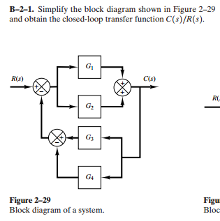
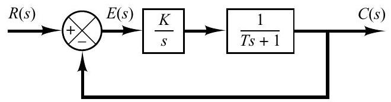
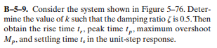
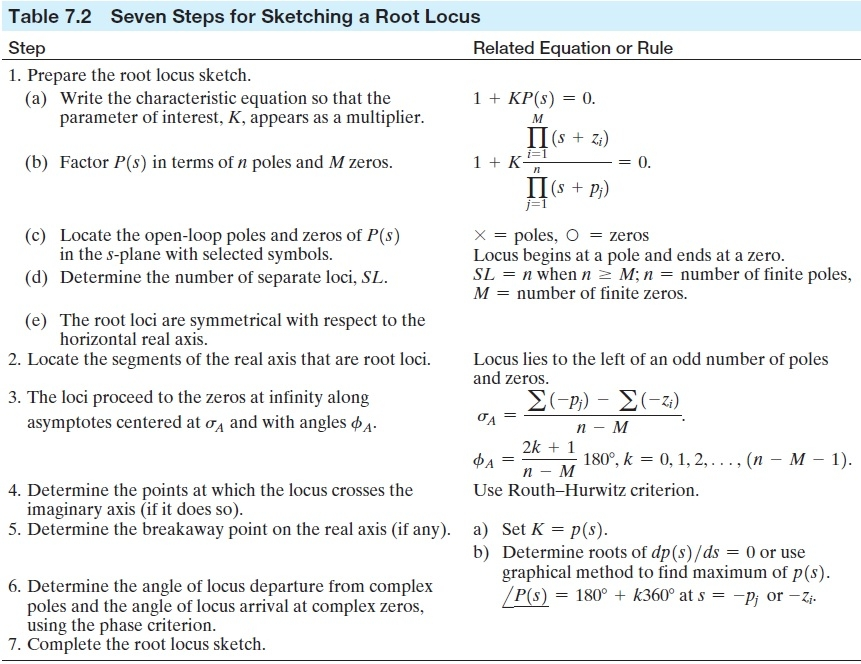
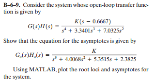
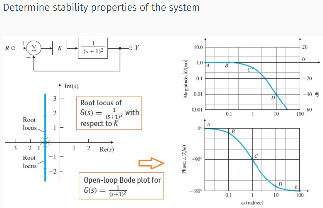
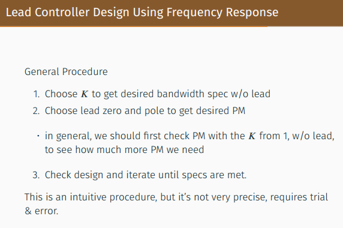

## 目录

  - 常见单词补充
  - 课程内容
    - Lecture 1 简介
    - Lecture 2 控制系统的数学建模
      - HW1 作业补充
      - HW1 作业记录
      - Chapter 2（Lecture 2） 控制系统的数学建模-习题记录
    - Lecture 3 系统响应分析
    - Lecture 4 系统响应分析
    - Lecture 5 系统响应分析
    - Lecture 6 系统响应分析
      - HW2 作业补充
      - HW2 作业记录
    - Lecture 7 根轨迹法
      - HW3 作业补充
      - HW3 作业记录
    - Lecture 8 频率响应法
      - 伯德图例题
    - Lecture 9 补偿器设计（根轨迹法、频率响应法的总结与应用）
    - Summary 概念回顾
    - Cheating Paper 每章最精简总结图片记录

2次期中考，1次期末考

课程总览：

- 介绍
- 瞬变（transient）和稳态（steady-state）响应
- 根轨迹法（root locus method）
- 频率响应法（frequency response method）
- PID控制（补充和复习）

## 常见单词补充

trajectory  n.轨迹

## 课程内容

### Lecture 1 简介

系统（具有输入和输出的任何东西）：


闭环控制框图：


- 输入（input）和输出（output）。
- 设备（plant）和处理（process）：被控制的系统称为设备。输入经过处理得到输出。
- 传感器（sensor）和执行器（actuator）：传感器是可用于测量输出的任何机构/通信/信号。执行器是任何可能影响输出的机构/信号/通信（例如电机）。输出通过传感器测量，输入由执行器产生。闭环控制器在传感器和执行器之间创建一个回路。此循环称为反馈（feedback）。
- 参考值（reference）和指令（command）：得到规划（planning）。
- 控制系统（control system）：是一种修改设备的输入以产生所需输出的系统。
- 扰动/干扰（disturbance）。

开环控制（open-loop control）和闭环控制（closed-loop control）：
- 主要区别在于有无反馈（feedback），反馈是否影响控制。
- 反馈控制系统（feedback control system）：通过比较输出和参考输入之间的关系并将其差值用作控制手段来保持规定关系的系统称为反馈控制系统。反馈控制系统通常被称为闭环控制系统（closed-loop control system）。
- 开环控制系统（open-loop control system）：那些输出对控制动作没有影响的系统被称为开环控制系统。开环控制器具有驱动器，但没有进行测量。

基于模型（model-based）控制和不依赖模型（model-independent）控制：
- 主要区别在于是否先确定系统的准确模型。
- 基于模型控制器使用系统的数学模型来映射输入到输出（传感器信号到驱动器信号）。
- 不依赖模型控制器被设计成可以为任意系统工作。

系统补偿（compensation）：

设置增益是调整系统以获得满意性能的第一步。然而，在许多实际情况下，仅仅调整增益可能无法提供足够的系统行为改变以满足给定的规格。通常情况下，增加增益值会改善稳态行为，但会导致稳定性差甚至不稳定。然后有必要重新设计系统(通过修改结构或加入额外的设备或组件)来改变整体行为，使系统按预期运行。这种重新设计或增加一个合适的装置称为补偿。为满足规格要求而插入系统的装置称为补偿器。补偿器补偿原系统的性能缺陷。

PID控制：

$$u=-K_p e-K_I \int_0^t e(s)ds -K_D \frac{d e(t)}{d t}$$

前馈控制（feedforward）和反馈控制（feedback）：

- 反馈控制（闭环系统）：例如热水器。
- 前馈控制（开环系统）：例如洗衣机。

单输入单输出（Single-Input Single-Output，SISO）和多输入多输出（Multiple-Input Multiple-Output，MIMO）：

- SISO：例如单摆系统。
- MIMO：例如移动机器人系统。

单摆（pendulum）系统，$d(t)$为系统干扰项：


$$\dot{\theta}(t)=\omega(t)$$

$$I \dot{\omega}(t)=-mgl sin \theta(t) + \tau(t) + d(t)$$

移动机器人系统：


$$\dot{x}=v cos \theta$$

$$\dot{y}=v sin \theta$$

$$\dot{\theta}=\omega$$

- 输入：

$$u=\left(\begin{array}{l}v \\ \omega\end{array}\right)$$

- 输出：

$$\left(\begin{array}{l}x \\ y \\ \theta\end{array}\right),u=K(x,y,\theta)$$

- 框图：


$$\dot{\theta}=-K_p(\theta-\theta^*)$$

$$e=\theta-\theta^*$$

$$\dot{e}=-K_p e$$

$$e(t)=e^{-K_p t}$$

- 鲁棒性（robustness）：
- - 延迟（delay）。
- - 不确定性（uncertainty）。
- - 噪声（noise）。

欠驱动系统（underactuated system）、全驱动系统（fully actuated system）、过驱动系统（overactuated system）：

- 无人机系统：6自由度（$x,y,z,\alpha,\beta,\gamma$），8个输入。
- 能达性（reachability）和能控性（controllability）。

不连续控制/非连续控制（discontinuous control）：

- 不连续控制：非连续控制系统是指在控制回路中含有不连续元素的系统，如传统的继电控制，滑模控制、混杂系统、切换系统等。

具有不确定性$\Delta (s)$的实际设备模型$\tilde{G}(s)$，用于设计控制系统的标称（nominal）设备模型$G(s)$，具有以下关系：

$$\tilde{G}(s)=G(s)[1+\Delta (s)]$$

- 重写为：

$$\tilde{G}(s)=G(s)+\Delta(s)$$

### Lecture 2 控制系统的数学建模

拉普拉斯变换-回顾：

- 对信号$u$的拉普拉斯变换为：

$$\hat{u}(s)=\int_0^{\infty}e^{-st}u(t)dt$$

- 对于任意线性时不变（linear time-invariant，LTI）系统（系数是常数或是仅关于自变量的函数），存在传递函数$\hat{G}(s)$满足与输出$y$的拉普拉斯变换$\hat{y}(s)$和输入$u$的拉普拉斯变换$\hat{u}$的关系：

$$\hat{y}(s)=\hat{G}(s)\hat{u}(s)$$

常微分方程（ODE）定义的系统：

- 与力学（dynamics）无关的控制例子：巡航控制。巡航控制可以采用开环控制或闭环控制。
- 若模型建模（表达式）完全准确（与现实完全符合），开环控制没有误差，闭环控制具有误差。但几乎不可能做到建模完全准确。衡量精确度和成本等因素来选择开环控制还是闭环控制。
- 部分模型可以使用非线性微分方程对系统进行建模。$u(t)$为系统输入，$y(t)$为系统输出，$x(t)$为系统状态，$f,g$为向量场。

$$\dot{x}(t)=f(x(t),u(t))$$

$$y(t)=g(x(t),u(t)), t \geq 0$$

- 非线性微分方程建模例子：一个小球从半空落下，与地面的距离为$x$，受重力影响，且有一垂直向下的力$F$施加于此小球，使用微分方程组进行建模：

$$\dot{x}=v$$

$$m \dot{v}=F+mg$$

- 线性相比于非线性更好。将EOM视为线性的，有多种形式：

$$\ddot{x}(t)=b \dot{x}(t)+ax(t)$$

$$\dot{x}=ax+bz,\dot{z}=cx+dz$$

考虑由以下微分方程定义的线性时不变系统：

$$\begin{aligned} & a_0 \stackrel{(n)}{y}+a_1^{(n-1)} y+\cdots+a_{n-1} \dot{y}+a_n y \\ & =b_0{ }^{(m)}+{ }^{(m-1)}+b_1 x+\cdots+b_{m-1} \dot{x}+b_m x \quad(n \geq m) \\ & \end{aligned}$$

- $y$为系统输出，$x$为系统输入。可得$n$阶系统的传递函数为系统输出和系统输入的拉普拉斯变换之比（初始条件均为零）：

$$\begin{aligned} \text { Transfer function } & =G(s)=\left.\frac{\mathscr{E}[\text { output }]}{\mathscr{L}[\text { input }]}\right|_{\text {zero initial conditions }} \\ & =\frac{Y(s)}{X(s)}=\frac{b_0 s^m+b_1 s^{m-1}+\cdots+b_{m-1} s+b_m}{a_0 s^n+a_1 s^{n-1}+\cdots+a_{n-1} s+a_n}\end{aligned}$$

状态空间公式化：

- 一般形式：

$$\dot{x}(t)=Ax(t)+Bu(t)$$

$$y(t)=Cx(t)+Du(t)$$

- 高阶微分方程转化为状态空间形式：

$$x^{(3)}(t)=\dot{a}x(t)+bx(t)+u(t)$$

$$y(t)=x(t)+u(t)$$

$$x_1=x,x_2=\dot{x},x_3=\ddot{x}$$

$$X=(x_1,x_2,x_3)$$

$$\dot{X}=Ax+Bu$$

$$Y=Cx+Du$$

- 单摆系统：

$$\dot{x}_1(t)=x_2(t)$$

$$\dot{x}_2=-\frac{Mgl}{2J}sin x_1(t)+\frac{1}{J}T(t)$$

$$X=(x_1,x_2)$$

$$\dot{X}=f(X,U)$$

$$y(t)=x_1(t)$$

$$Y=h(X,U)$$

- - 需要将非线性项$sin x_1(t)$线性化。需要根据单摆类型得到$x_0$，对于反转单摆，有$x_0=\pi$。
- - 若需要求平衡点，则需要由满足$f(X^*,U^*)=0$得到$X^*,U^*$。

$$a=\frac{d}{dx}f(x)|_{x=x_0}=cos(\pi)=-1$$

$$f(x_0)=f(\pi)=sin(\pi)=0$$

$$sin(x)\approx f(x_0)+a(x-x_0)=0-1(x-\pi)=\pi-x$$

$$\dot{x}_2(t)=\frac{Mgl}{2J}x_1(t)-\frac{Mgl}{2J}\pi+\frac{1}{J}T(t)$$

- 非线性系统的原点处进行线性化的完整流程（Jacobian矩阵）：

$$\ddot{x}(t)=-\dot{x}(t)+\frac{sin^2(x(t))}{x(t)}$$

$$z_1=x,z_2=\dot{x},Z=(z_1 z_2)$$

$$\dot{z}_1=z_2$$

$$\dot{z}_2=-z_2+\frac{sin^2(z_1)}{z_1}$$

$$\dot{Z}=f(Z)=\left(\begin{array}{l}z_2 \\ -z_2+\frac{sin^2(z_1)}{z_1}\end{array}\right)$$

$$f(Z)=f(0)+\frac{\partial f}{\partial Z}|_{Z=0} \cdot Z+高阶余项$$

$$f(0)=0$$

$$\frac{\partial f}{\partial Z}=\left[\begin{array}{ccc}\frac{\partial f_1}{\partial z_{1}} & \cdots & \frac{\partial f_1}{\partial z_{n}} \\ \vdots & \ddots & \vdots \\ \frac{\partial f_n}{\partial z_{1}} & \cdots & \frac{\partial f_n}{\partial z_{n}}\end{array}\right]$$

$$\frac{\partial f}{\partial Z}=\left[\begin{array}{ccc}0 & 1 \\ \frac{d(\frac{sin^2(z_1)}{z_1})}{dz_1}|_{z_1=0} & -1 \end{array}\right]$$

$$\frac{d(\frac{sin^2(z_1)}{z_1})}{dz_1}=\frac{d}{dz_1} (sin^2(z_1) \cdot \frac{1}{z_1})=\frac{2 z_1 sin(z_1)cos(z_1)-sin^2(z_1)}{z_1^2}$$

$$\frac{\partial f}{\partial Z}=\left[\begin{array}{ccc}0 & 1 \\ 1 & -1 \end{array}\right]$$

$$\dot{Z}=f(Z) \approx \frac{\partial f}{\partial Z} \cdot Z=\left[\begin{array}{ccc}0 & 1 \\ \frac{d(\frac{sin^2(z_1)}{z_1})}{dz_1}|_{z_1=0} & -1 \end{array}\right] [z_1 z_2]$$

- 移动机器人系统：

$$\dot{x}=v cos \theta$$

$$\dot{y}=v sin \theta$$

$$\dot{\theta}=\omega$$

- - PID只能适用于SISO情况。
- - 对于非线性情况，PID需要进行线性化，但不是所有情况都能进行线性化（状态空间方程中的A矩阵算出来全为0）。
- - 移动机器人系统就是不能进行线性化的一种情况。

两个系统的级联/串联（cascade / series interconnection / series connection）：

- 框图：


- 公式化：

$$y_1=Gu y=Hy_1$$

$$y=H(G(u))$$

- 拉普拉斯变换：

$$\hat{y}_1(s)=\hat{G}_1(s) \hat{u}(s) \quad \hat{y}(s)=\hat{H}(s) \hat{y}_1(s)=\hat{H}(s) \hat{G}(s) \hat{u}(s)$$

- 传递函数：

$$\hat{T}(s)=\hat{H}(s) \hat{G}(s)$$

两个系统的并联（parallel interconnection / parallel connection）：

- 框图：


- 公式化：

$$y_1=G u \quad y_2=H u \quad y=y_1+y_2$$

$$y=H(u)+G(u)$$

- 拉普拉斯变换：

$$\hat{y}(s)=\hat{y}_1(s)+\hat{y}_2(s)=\hat{G}(s) \hat{u}(s)+\hat{H}(s) \hat{u}(s)=(\hat{H}(s)+\hat{G}(s)) \hat{u}(s)$$

- 传递函数：

$$\hat{T}(s)=\hat{H}(s)+\hat{G}(s)$$

闭环系统：

- 框图：


- 反馈信号：

$$B(s)=H(s)C(s)$$

- 开环传递函数：

$$TF=\frac{B(s)}{E(s)}=G(s)H(s)$$

- 前馈传递函数：

$$TF=\frac{C(s)}{E(s)}=G(s)$$

- 闭环系统传递函数：

$$C(s)=G(s)E(s)$$

$$E(s)=R(s)-B(s)=R(s)-H(s)C(s)$$

$$TF=\frac{C(s)}{R(s)}=\frac{G(s)}{1+G(s)H(s)}$$

低反馈互联（lower feedback interconnection）：


- 反馈：

$$z=K(u-y)$$

$$y=Gz$$

$$\hat{z}(s)=-\hat{K}(s) \hat{y}(s)+\hat{K}(s) \hat{u}(s) \quad \hat{y}(s)=\hat{G}(s) \hat{z}(s)$$

$$\hat{y}(s)=\hat{G}(s) \hat{z}(s)=-\hat{G}(s) \hat{K}(s) \hat{y}(s)+\hat{G}(s) \hat{K}(s) \hat{u}(s)$$

$$\hat{y}(s)=\frac{\hat{G}(s) \hat{K}(s)}{1+\hat{G}(s) \hat{K}(s)} \hat{u}(s)$$

高反馈互联（upper feedback interconnection）：


- 反馈：

$$\begin{aligned} & \hat{y}(s)=\hat{G}(s) \hat{z}(s) \\ & \hat{z}(s)=u(s)-\hat{K}(s) \hat{y}(s)\end{aligned}$$

$$\hat{y}(s)=\hat{G}(s)(u(s)-\hat{K}(s) \hat{y}(s))=\hat{G}(s) \hat{u}(s)-\hat{G}(s) \hat{K}(s) \hat{y}(s)$$

$$\hat{y}(s)=\frac{\hat{G}(s)}{1+\hat{G}(s) \hat{K}(s)} \hat{u}(s)$$

反馈的影响-脉冲响应：

- 传递函数（逆单摆系统）：

$$\hat{G}(s)=\frac{1}{J s^2-\frac{M g l}{2}}$$

- 条件为：

- - 低反馈闭环系统。

- - 控制器（静态增益）：

$$\hat{K}(s)=K$$

- - 输入（脉冲函数）：

$$\hat{u}=1$$

- 传递函数（频域）：

$$\hat{y}(s)=\frac{\hat{G}(s) \hat{K}(s)}{1+\hat{G}(s) \hat{K}(s)} \hat{u}(s)=\frac{\frac{K}{J s^2-\frac{M g l}{2}}}{1+\frac{K}{J s^2-\frac{M g l}{2}}}=\frac{K}{J s^2-\frac{M g l}{2}+K}$$

- - 分类讨论稳定性（$K$决定稳定性），第一种情况：

$$K>\frac{M g l}{2}$$

$$\begin{gathered}\hat{y}(s)=\frac{K / J}{s^2+\left(K / J-\frac{M g l}{2 J}\right)} \\ y(t)=\frac{K}{J \sqrt{K / J-\frac{M g l}{2 J}}} \sin \left(\sqrt{K / J-\frac{M g l}{2 J}} t\right)\end{gathered}$$

- - 分类讨论稳定性（$K$决定稳定性），第二种情况：

$$K<\frac{M g l}{2}$$

$$\begin{gathered}\hat{y}(s)=\frac{K}{J}\left(\frac{1}{s-\sqrt{K / J-\frac{M g l}{2 J}}}+\frac{1}{s+\sqrt{K / J-\frac{M g l}{2 J}}}\right) \\ y(t)=\frac{K}{J}\left(e^{\sqrt{K / J-\frac{M g l}{2 J}t}}+e^{-\sqrt{K / J-\frac{M g l}{2 l} t}}\right)\end{gathered}$$

MATLAB获得级联、并联、反馈（闭环）的传递函数：


```
# G1(s)=num1/den1,G2(s)=num2/den2。
[num,den]=series(num1,den1,num2,den2)
[num,den]=parallel(num1,den1,num2,den2)
[num,den]=feedback(num1,den1,num2,den2)
```

自动控制器（automatic controller）：


比例+积分+微分控制器（$PID$控制器）：


- 输入和传递函数：

$$K_I=\frac{K_p}{T_i}$$

$$K_D=K_p T_d$$

$$u(t)=K_p e(t)+\frac{K_p}{T_i} \int_0^t e(t) d t+K_p T_d \frac{d e(t)}{d t}$$

$$\frac{U(s)}{E(s)}=K_p\left(1+\frac{1}{T_i s}+T_d s\right)$$

使用比例+积分控制器（$PI$控制器）的闭环控制系统，例题：


- 设备（状态空间表示）：

$$\dot{x}(t)=Ax(t)+Bu(t)$$

- 输出（状态空间表示）：

$$y(t)=C x(t)$$

- 控制器增益：

$$u(t)=-K_p e(t)-K_I \int_0^t e(s) ds$$

$$e(t)=\dot{\eta}(t)=\int e$$

$$u(t)=-K_p e(t)-K_I \eta (t)$$

- 误差：

$$e(t)=y(t)-r(t)$$

- 解法：

$$\dot{x}_c(t)=A_c x_c(t)+B_c r(t)$$

$$y(t)=C_c x_c(t)$$

$$TF=C_c(sI-A_c)^{-1}B_c$$

- 具体求解流程：

$$\dot{\eta}=y-r$$

$$\dot{x}=Ax+Bu(t)=Ax+B[-K_p e -K_I \eta]$$

$$y=Cx$$

- - 重写为：

$$\dot{\eta}=Cx-r$$

$$\dot{x}=Ax+B[-K_p Cx+K_p r-K_I \eta]$$

$$\left[\begin{array}{l}\dot{\eta} \\ \dot{x} \end{array}\right]=\left[\begin{array}{ll}0 & C \\  -B K_I & A-BK_p C \end{array}\right] \left[\begin{array}{l}\eta \\ x \end{array}\right]+\left[\begin{array}{l}-1 \\ B K_p \end{array}\right] r$$

$$y=[0 \quad C]\left[\begin{array}{l}\eta \\ x \end{array}\right]$$

$$x_c=\left[\begin{array}{l}\eta \\ x \end{array}\right]$$

$$A_c=\left[\begin{array}{ll}0 & C \\  -B K_I & A-BK_p C \end{array}\right]$$

$$B_c=\left[\begin{array}{l}\eta \\ x \end{array}\right]+\left[\begin{array}{l}-1 \\ B K_p \end{array}\right]$$

$$C_c=[0 \quad C]$$

控制执行（control action）：

- 双位置（two-position）或开关（on-off）控制执行：

$$\begin{aligned} u(t) & =U_1, & &  e(t)>0 \\ & =U_2, & &  e(t)<0\end{aligned}$$


- 液位控制系统：


- 比例控制执行：

$$u(t)=K_p e(t)$$

$$\frac{U(s)}{E(s)}=K_p$$

- 积分控制执行：

$$u(t)=K_i \int_0^t e(t) d t$$

$$\frac{U(s)}{E(s)}=\frac{K_i}{s}$$

- 比例积分复合控制执行：

$$u(t)=K_p e(t)+\frac{K_p}{T_i} \int_0^t e(t) d t$$

$$\frac{U(s)}{E(s)}=K_p\left(1+\frac{1}{T_i S}\right)$$

- 比例微分复合控制执行：

$$u(t)=K_p e(t)+K_p T_d \frac{d e(t)}{d t}$$

$$\frac{U(s)}{E(s)}=K_p\left(1+T_d s\right)$$

- 比例积分微分复合控制执行：

$$u(t)=K_p e(t)+\frac{K_p}{T_i} \int_0^t e(t) d t+K_p T_d \frac{d e(t)}{d t}$$

$$\frac{U(s)}{E(s)}=K_p\left(1+\frac{1}{T_i S}+T_d S\right)$$

具有干扰$D(s)$的闭环控制系统：


- 考虑输出对于干扰$D(s)$的响应：

$$\frac{C_D(s)}{D(s)}=\frac{G_2(s)}{1+G_1(s) G_2(s) H(s)}$$

- 考虑输出对于参考输入$R(s)$的响应：

$$\frac{C_R(s)}{R(s)}=\frac{G_1(s) G_2(s)}{1+G_1(s) G_2(s) H(s)}$$

- 同时考虑得到总响应：

$$G_2(s)=G_1(s)+D(s)$$

$$\begin{aligned} C(s) & =C_R(s)+C_D(s) \\ & =\frac{G_2(s)}{1+G_1(s) G_2(s) H(s)}\left[G_1(s) R(s)+D(s)\right]\end{aligned}$$

- 对于干扰$D(s)$的响应的稳态误差（根据此设计一般为控制器的传递函数$G_1(s)$，$n$次微分和积分环节对应$s^n$和$\frac{1}{s^n}$，使得稳态误差为0即达到设计目的）：

$$c_{D ss}(t)=lim_{s \to 0} s C_D(s)$$

绘制框图的步骤：


- 要绘制系统的框图，请编写描述每个组件动态行为的方程。

$$\begin{aligned} i & =\frac{e_i-e_0}{R} \\ e_0 & =\frac{\int i d t}{C}\end{aligned}$$

- 对这些方程进行拉普拉斯变换。

$$\begin{aligned} I(s) & =\frac{E_i(s)-E_o(s)}{R} \\ E_o(s) & =\frac{I(s)}{C s}\end{aligned}$$

- 将元件组装成一个完整的框图。

框图缩略：

- 例题1：


- - 通过低反馈互联：

$$\hat{z}(s)=\frac{\frac{K_1}{s}}{\frac{K_1}{s}+1} \hat{u}(s)=\frac{K_1}{K_1+s} \hat{u}(s)$$


- - 再次通过低反馈互联：

$$\hat{y}(s)=\frac{\frac{K_1}{s\left(K_1+s\right)}}{1+\frac{K_1}{s\left(K_1+s\right)}} \hat{e}(s)=\frac{K_1}{s\left(K_1+s\right)+K_1} \hat{e}(s)$$

$$\hat{T}(s)=\frac{K_1}{s^2+K_1 s+K_1}$$

- 例题2~5：


现代控制理论与传统控制理论：

- 现代控制理论与传统控制理论的不同之处在于，现代控制理论适用于多输入、多输出系统，可以是线性的，也可以是非线性的，可以是时不变的，也可以是时变的，而传统控制理论只适用于线性时不变的单输入、单输出系统。
- 传统控制理论的典型为基于传递函数的根轨迹法和频域分析法。
- 现代控制理论的典型为基于状态空间的状态空间方程。

在状态空间中建模：

- 公式形式：

$$\begin{aligned} & \mathbf{x}(t)=\left[\begin{array}{c}x_1(t) \\ x_2(t) \\ \cdot \\ \cdot \\ \cdot \\ x_n(t)\end{array}\right], \mathbf{f}(\mathbf{x}, \mathbf{u}, t)=\left[\begin{array}{c}f_1\left(x_1, x_2, \ldots, x_n ; u_1, u_2, \ldots, u_r ; t\right) \\ f_2\left(x_1, x_2, \ldots, x_n ; u_1, u_2, \ldots, u_r ; t\right) \\ \cdot \\ \cdot \\ \cdot \\ f_n\left(x_1, x_2, \ldots, x_n ; u_1, u_2, \ldots, u_r ; t\right)\end{array}\right], \\ & \mathbf{y}(t)=\left[\begin{array}{c}y_1(t) \\ y_2(t) \\ \cdot \\ \cdot \\ \cdot \\ y_m(t)\end{array}\right], \mathbf{g}(\mathbf{x}, \mathbf{u}, t)=\left[\begin{array}{c}g_1\left(x_1, x_2, \ldots, x_n ; u_1, u_2, \ldots, u_r ; t\right) \\ g_2\left(x_1, x_2, \ldots, x_n ; u_1, u_2, \ldots, u_r ; t\right) \\ \cdot \\ \cdot \\ \cdot \\ g_m\left(x_1, x_2, \ldots, x_n ; u_1, u_2, \ldots, u_r ; t\right)\end{array}\right], \mathbf{u}(t)=\left[\begin{array}{c}u_1(t) \\ u_2(t) \\ \cdot \\ \cdot \\ \cdot \\ u_r(t)\end{array}\right]\end{aligned}$$

$$\begin{aligned} & \dot{\mathbf{x}}(t)=\mathbf{f}(\mathbf{x}, \mathbf{u}, t) \\ & \mathbf{y}(t)=\mathbf{g}(\mathbf{x}, \mathbf{u}, t)\end{aligned}$$

- - 对于时不变系统，有：

$$\begin{aligned} & \dot{\mathbf{x}}(t)=\mathbf{A}(t) \mathbf{x}(t)+\mathbf{B}(t) \mathbf{u}(t) \\ & \mathbf{y}(t)=\mathbf{C}(t) \mathbf{x}(t)+\mathbf{D}(t) \mathbf{u}(t)\end{aligned}$$

- - 如果向量函数$f$和$g$不显式地涉及时间$t$，则该系统称为时不变系统。简化为：

$$\begin{aligned} \dot{\mathbf{x}}(t) & =\mathbf{A x}(t)+\mathbf{B} \mathbf{u}(t) \\ \mathbf{y}(t) & =\mathbf{C x}(t)+\mathbf{D u}(t)\end{aligned}$$

- 框图：


传递函数与状态空间方程的相关性：

- 考虑系统的传递函数：

$$\frac{Y(s)}{U(s)}=G(s)$$

- 考虑系统的状态空间方程形式（已知为单个传递函数，不是传递矩阵，因此$y$和$D$并非矩阵）：

$$\begin{aligned} & \dot{\mathbf{x}}=\mathbf{A} \mathbf{x}+\mathbf{B} u \\ & y=\mathbf{C} \mathbf{x}+D u\end{aligned}$$

- 拉普拉斯变换：

$$\begin{aligned} s \mathbf{X}(s)-\mathbf{x}(0) & =\mathbf{AX}(\mathrm{s})+\mathbf{B} \mathrm{U(s)} \\ Y(s) & =\mathbf{CX}(\mathrm{s})+\mathrm{DU}(\mathrm{s})\end{aligned}$$

$$\mathbf{x}(0)=0$$

$$s \mathbf{X}(s)=\mathbf{AX}(\mathrm{s})+\mathbf{B} \mathrm{U(s)}$$

$$(s \mathbf{I}-\mathbf{A}) \mathbf{X}(s)=\mathbf{B} U(s)$$

$$\mathbf{X}(s)=(s \mathbf{I}-\mathbf{A})^{-1} \mathbf{B} U(s)$$

$$Y(s)=\left[\mathbf{C}(s \mathbf{I}-\mathbf{A})^{-1} \mathbf{B}+D\right] U(s)$$

$$G(s)=\frac{Y(s)}{U(s)}=\mathbf{C}(s \mathbf{I}-\mathbf{A})^{-1} \mathbf{B}+D$$

- 例题（通过框图得到状态空间，状态空间转换为传递函数）：


通过状态空间方程计算传递矩阵（transfer matrix）$\mathbf{G}(s)$（不是传递函数）：

$$\mathbf{G}(s)=\mathbf{C}(s \mathbf{I}-\mathbf{A})^{-1} \mathbf{B}+\mathbf{D}$$

$$\mathbf{Y}(\mathrm{s})=\mathbf{G}(\mathrm{s}) \mathbf{U}(\mathrm{s})$$

标量微分方程组的状态空间表示：

- 将系统增益$G(s)$转化为状态空间表示。

- 受迫函数（系统输入，与$u$相关）不包含导数项的n阶线性微分方程组的状态空间表示，考虑$n$阶系统：

$$\stackrel{(n)}{y}+a_1 \stackrel{(n-1)}{y}+\cdots+a_{n-1} \dot{y}+a_n y=u$$

$$\begin{gathered}x_1=y \\ x_2=\dot{y} \\ \cdot \\ \cdot \\ \cdot \\ x_n=\stackrel{(n-1)}{y}\end{gathered}$$

- - 求导：

$$\begin{gathered}\dot{x}_1=x_2 \\ \dot{x}_2=x_3 \\ \cdot \\ \cdot \\ \cdot \\ \dot{x}_{n-1}=x_n \\ \dot{x}_n = -a_n x_1 - \cdots - a_1 x_n + u\end{gathered}$$

$$\dot{\mathbf{x}}=\mathbf{A x}+\mathbf{B} u$$

$$\mathbf{x}=\left[\begin{array}{c}x_1 \\ x_2 \\ \cdot \\ \cdot \\ \cdot \\ x_n\end{array}\right]$$

$$\mathbf{A}=\left[\begin{array}{ccccc}0 & 1 & 0 & \cdots & 0 \\ 0 & 0 & 1 & \cdots & 0 \\ \cdot & \cdot & \cdot & & \cdot \\ \cdot & \cdot & \cdot & & \cdot \\ \cdot & \cdot & \cdot & & \cdot \\ 0 & 0 & 0 & \cdots & 1 \\ -a_n & -a_{n-1} & -a_{n-2} & \cdots & -a_1\end{array}\right]$$

$$\mathbf{B}=\left[\begin{array}{c}0 \\ 0 \\ \cdot \\ \cdot \\ \cdot \\ 0 \\ 1\end{array}\right]$$

$$y=\left[\begin{array}{llll}1 & 0 & \cdots & 0\end{array}\right]\left[\begin{array}{c}x_1 \\ x_2 \\ \cdot \\ \cdot \\ \cdot \\ x_n\end{array}\right]=\mathbf{C} \mathbf{x}$$

$$\frac{Y(s)}{U(s)}=\frac{1}{s^n+a_1 s^{n-1}+\cdots+a_{n-1} s+a_n}$$

- 受迫函数（系统输入，与$u$相关）包含导数项的n阶线性微分方程组的状态空间表示，考虑$n$阶系统：

$$\stackrel{(n)}{y}+a_1 \stackrel{(n-1)}{y}+\cdots+a_{n-1} \dot{y}+a_n y=b_0 \stackrel{(n)}{u}+b_1 \stackrel{(n-1)}{u}+\cdots+b_{n-1} \dot{u}+b_n u$$

$$\begin{aligned} & x_1=y-\beta_0 u \\ & x_2=\dot{y}-\beta_0 \dot{u}-\beta_1 u=\dot{x}_1-\beta_1 u \\ & x_3=\ddot{y}-\beta_0 \ddot{u}-\beta_1 \dot{u}-\beta_2 u=\dot{x}_2-\beta_2 u \\ & \cdot \\ & \cdot \\ & \cdot \\ & x_n=\stackrel{(n-1)}{y}-\stackrel{(n-1)}{\beta_0} u-\stackrel{(n-2)}{\beta_1} u \cdots -\beta_{n-2} \dot{u}-\beta_{n-1} u=\dot{x}_{n-1}-\beta_{n-1}u\end{aligned}$$

- - $\beta_i$定义：

$$\begin{aligned} & \beta_0=b_0 \\ & \beta_1=b_1-a_1 \beta_0 \\ & \beta_2=b_2-a_1 \beta_1-a_2 \beta_0 \\ & \cdot \\ & \cdot \\ & \cdot \\ & \beta_{n-1}=b_{n-1}-a_1 \beta_{n-2}- \cdots - a_{n-2}\beta_1-a_{n-1}\beta_0 \\ & \beta_n=b_n-a_1 \beta_{n-1}-\cdots-a_{n-1} \beta_1-a_{n-1} \beta_0\end{aligned}$$

- - 求导：

$$\begin{aligned} & \dot{x}_1=x_2+\beta_1 u \\ & \dot{x}_2=x_3+\beta_2 u \\ & \cdot \\ & \cdot \\ & \cdot \\ & \dot{x}_{n-1}=x_n+\beta_{n-1}u \\ & \dot{x}_n = -a_n x_1-a_{n-1}x_2-\cdots-a_1x_n+\beta_n u\end{aligned}$$

$$\left[\begin{array}{c}\dot{x}_1 \\ \dot{x}_2 \\ \cdot \\ \cdot \\ \cdot \\ \dot{x}_{n-1} \\ \dot{x}_n\end{array}\right]=\left[\begin{array}{ccccc}0 & 1 & 0 & \cdots & 0 \\ 0 & 0 & 1 & \cdots & 0 \\ \cdot & \cdot & \cdot & & \cdot \\ \cdot & \cdot & \cdot & & \cdot \\ \cdot & \cdot & \cdot & & \cdot \\ 0 & 0 & 0 & \cdots & 1 \\ -a_n & -a_{n-1} & -a_{n-2} & \cdots & -a_1\end{array}\right]\left[\begin{array}{c}x_1 \\ x_2 \\ \cdot \\ \cdot \\ \cdot \\ x_{n-1} \\ x_n\end{array}\right]+\left[\begin{array}{c}\beta_1 \\ \beta_2 \\ \cdot \\ \cdot \\ \cdot \\ \beta_{n-1} \\ \beta_n\end{array}\right]u$$

$$y=\left[\begin{array}{llll}1 & 0 & \cdots & 0\end{array}\right]\left[\begin{array}{c}x_1 \\ x_2 \\ \cdot \\ \cdot \\ \cdot \\ x_n\end{array}\right]+\beta_0 u$$

- - 写成以下形式：

$$\begin{aligned} & \dot{\mathbf{x}}=\mathbf{A x}+\mathbf{B} u \\ & y=\mathbf{C x}+D u\end{aligned}$$

- - 对应的传递函数形式（分子和分母的$n$不一定相等，但应当写成此等形式，分母的$n$总是更大，且分母的$n$指定了系统的阶数）：

$$G(s)=\frac{Y(s)}{U(s)}=\frac{b_0 s^n+b_1 s^{n-1}+\cdots+b_{n-1} s+b_n}{s^n+a_1 s^{n-1}+\cdots+a_{n-1} s+a_n}$$

非线性数学模型的线性化：

- 单变量，变量在某一点$\bar{x}$处的线性化：

$$y=f(x)$$

$$y=\bar{y}+K(x-\bar{x})$$

$$\begin{gathered}\bar{y}=f(\bar{x}) \\ K=\left.\frac{d f}{d x}\right|_{x=\bar{x}}\end{gathered}$$

- 双变量，变量有取值范围，两个变量各自取其取值范围的中值作为$\bar{x}_1,\bar{x}_2$进行线性化，最终得到的$y'$是通过线性化近似的，与真正的$y$值有偏差：

$$y=f\left(x_1, x_2\right)$$

$$\bar{y} =f\left(\bar{x}_1, \bar{x}_2\right)$$

$$\begin{aligned} K_1 & =\left.\frac{\partial f}{\partial x_1}\right|_{x_1=\bar{x}_1, x_2=\bar{x}_2} \\ K_2 & =\left.\frac{\partial f}{\partial x_2}\right|_{x_1=\bar{x}_1, x_2=\bar{x}_2}\end{aligned}$$

$$y'-\bar{y}=K_1\left(x_1-\bar{x}_1\right)+K_2\left(x_2-\bar{x}_2\right)$$

$$\Delta=y-y'$$

#### HW1 作业补充

根据开环系统增益$G(s)$和输入函数$R(s)$，求时域响应$C(s) / c(t)$图像（可以通过拉普拉斯变换手算出时域响应，但一般画图像使用MATLAB）：

$$G(s)=\frac{C(s)}{R(s)}$$

$$c(t)=\mathcal{L}^{-1}[C(s)]=\mathcal{L}^{-1}[G(s) \cdot R(s)]$$

- 当输入为单位脉冲函数，则$R(s)=1$。
- 当输入为单位阶跃函数，则$R(s)=\frac{1}{s}$。
- 当输入为单位斜坡函数，则$R(s)=\frac{1}{s^2}$。

求$2 \times 2$矩阵的逆矩阵：


求$3 \times 3$矩阵的逆矩阵：

- 待定系数法。
- 伴随矩阵法。$adj(A)$为$A$的伴随矩阵，$det(A)$为$A$的行列式。

$$A^{-1}=\frac{adj(A)}{det(A)}$$

- - 伴随矩阵：伴随矩阵$adj(A)$的第$i$行第$j$列的项$A_{ij}$为三阶矩阵矩阵$A$去掉第$j$行$i$列后组成的二阶矩阵的行列式，且若$i+j$为奇数则此行列式还需要乘以$-1$。


- - 行列式：


- 初等变换。

#### HW1 作业记录




#### Chapter 2（Lecture 2） 控制系统的数学建模-习题记录


### Lecture 3 系统响应分析

瞬态响应（transient response）和稳态响应（steady-state response）：

- 瞬态响应：从初始状态到最终状态的响应。
- 稳态响应：当$t$接近无穷大时系统输出的表现方式。
- 系统的响应$c(t)$可以写成瞬态响应和稳态响应之和：

$$c(t)=c_{tr}(t)+c_{ss}(t)$$

绝对稳定，相对稳定，稳态误差：

- 当系统受到初始条件的影响时，如果输出最终恢复到平衡状态，则系统是稳定的。
- 如果输出振荡永远持续，则系统处于临界稳定状态。
- 如果输出偏离其平衡状态而没有界限，则它是不稳定的。
- 如果一个系统在稳态下的输出与输入不完全一致，则称该系统存在稳态误差。这个误差表示系统的准确性。

拉普拉斯变换表：


- $F(s)=c$（常数）的拉普拉斯逆变换$f(t)=c \cdot \delta (t)=0$。

一阶系统（first-order system）：


$$TF=\frac{C(s)}{R(s)}=\frac{1}{T s+1}$$


- 初始条件为零。
- 单位阶跃（unit-step）函数的拉普拉斯变换为$\frac{1}{s}$，因此一阶系统的单位阶跃响应计算过程：

$$R(s)=\frac{1}{s}, C(s)=\frac{1}{Ts+1}\frac{1}{s}$$

$$C(s)=\frac{1}{s}-\frac{T}{T s+1}=\frac{1}{s}-\frac{1}{s+(1 / T)}$$

$$c(t)=1-e^{-t / T}, t \geq 0$$

- - 一个重要性质，当$t=T$，$c(T)=1-e^{-1}=0.632$。
- - 另一个重要性质，$t=0$处的切线斜率为$1/T$，推导过程：

$$\left.\frac{d c}{d t}\right|_{t=0}=\left.\frac{1}{T} e^{-t / T}\right|_{t=0}=\frac{1}{T}$$

- - $t=kT,k=0,1,2 \cdots$的单位阶跃响应图像：


- - 写成状态空间形式：

$$G(s)=\frac{C(s)}{R(s)}$$

$$\dot{x}=Ax+Bu$$

$$y=Cx+Du$$

$$u=r(t)$$

$$\dot{x}(t)=A x(t)+B r(t)$$

$$y(t)=Cx(t)+D r(t)$$

$$x(t)=e^{At}x(0)+\int_0^t e^{A(t-\tau)}B r(c) d \tau$$

- 对于单位斜坡（unit-ramp）函数，也是类似的：

$$R(s)=\frac{1}{s^2},C(s)=\frac{1}{Ts+1}\frac{1}{s^2}$$

$$C(s)=\frac{1}{s^2}-\frac{T}{s}+\frac{T^2}{T S+1}$$

$$c(t)=t-T+T e^{-t / T}, t \geq 0$$

- - 误差信号：


$$\begin{aligned} e(t) & =r(t)-c(t) \\ & =T\left(1-e^{-t / T}\right)\end{aligned}$$

$$e(\infty)=T$$

- - 因此时间常数$T$越小，稳态误差越小。

- 对于单位脉冲（unit-impulse）函数，也是类似的：

$$R(s)=1,C(s)=\frac{1}{Ts+1}$$

$$c(t)=\frac{1}{T}e^{-t/T}, t \geq 0$$

二阶系统：


- 假设我们希望根据输入位置$r$来控制输出位置$c$。
- 载荷元素的方程，其中$T$是由增益为$K$的比例控制器（P控制器）产生的转矩：

$$J \ddot{c}+B \dot{c}=T$$

- 假设零初始条件，有：

$$J s^2 C(s)+B s C(s)=T(s)$$

$$G(s)=\frac{C(s)}{T(s)}=\frac{1}{s(J s+B)}$$

- 然后获得闭环传递函数（二阶系统的闭环传递函数具有两个极点）为：

$$\frac{C(s)}{R(s)}=\frac{K}{J s^2+B s+K}=\frac{K / J}{s^2+(B / J) s+(K / J)}=\frac{\omega_n^2}{s^2+2 \zeta \omega_n s+\omega_n^2}$$

$$\frac{C(s)}{R(s)}=\frac{K}{J s^2+B s+K}=\frac{K / J}{\left(s+\frac{B}{2 J}+\sqrt{\left(\frac{B}{2 J}\right)^2-\frac{K}{J}}\right)\left(s+\frac{B}{2 J}-\sqrt{\left(\frac{B}{2 J}\right)^2-\frac{K}{J}}\right)}$$

- 若$B^2-4JK<0$则极点为复数，$B^2-4JK \geq 0$则极点为实数，$\sigma$为衰减（attenuation），$\omega_n$为无阻尼（undamped）自然频率，$\omega_d$为有阻尼（damped）自然频率，$\zeta$为阻尼比（实际阻尼$B$与临界阻尼之比）：

$$\frac{K}{J}=\omega_n^2, \quad \frac{B}{J}=2 \zeta \omega_n=2 \sigma$$

$$B_C=2 \sqrt{J K}$$

$$\zeta=\frac{B}{B_C}=\frac{B}{2 \sqrt{J K}}$$

- 二阶系统的标准形式：

$$\frac{C(s)}{R(s)}=\frac{\omega_n^2}{s^2+2 \zeta \omega_n s+\omega_n^2}$$


- 欠阻尼情况（$0<\zeta<1$）：

$$\frac{C(s)}{R(s)}=\frac{\omega_n^2}{\left(s+\zeta \omega_n+j \omega_d\right)\left(s+\zeta \omega_n-j \omega_d\right)}$$

$$\omega_d=\omega_n \sqrt{1-\zeta^2}$$

- - 单位阶跃响应（瞬态响应的频率为有阻尼自然频率$\omega_d$，会随阻尼比变化）：

$$C(s)=\frac{\omega_n^2}{\left(s^2+2 \zeta \omega_n s+\omega_n^2\right)} \frac{1}{s}$$

$$\begin{aligned} C(s) & =\frac{1}{s}-\frac{s+2 \zeta \omega_n}{s^2+2 \zeta \omega_n s+\omega_n^2} \\ & =\frac{1}{s}-\frac{s+\zeta \omega_n}{\left(s+\zeta \omega_n\right)^2+\omega_d^2}-\frac{\zeta \omega_n}{\left(s+\zeta \omega_n\right)^2+\omega_d^2}\end{aligned}$$

$$\begin{aligned} & \mathcal{L}^{-1}\left[\frac{s+\zeta \omega_n}{\left(s+\zeta \omega_n\right)^2+\omega_d^2}\right]=e^{-\zeta \omega_n t} \cos \omega_d t \\ & \mathcal{L}^{-1}\left[\frac{\omega_d}{\left(s+\zeta \omega_n\right)^2+\omega_d^2}\right]=e^{-\zeta \omega_n t} \sin \omega_d t\end{aligned}$$

$$\begin{aligned} \mathcal{L}^{-1}[C(s)] & =c(t) \\ & =1-e^{-\zeta \omega_n t}\left(\cos \omega_d t+\frac{\zeta}{\sqrt{1-\zeta^2}} \sin \omega_d t\right) \\ & =1-\frac{e^{-\zeta \omega_n t}}{\sqrt{1-\zeta^2}} \sin \left(\omega_d t+\tan ^{-1} \frac{\sqrt{1-\zeta^2}}{\zeta}\right) , t \geq 0\end{aligned}$$

$$\begin{aligned} e(t) & =r(t)-c(t) \\ & =e^{-\zeta \omega_n t}\left(\cos \omega_d t+\frac{\zeta}{\sqrt{1-\zeta^2}} \sin \omega_d t\right)\end{aligned}$$

$$e(\infty)=0$$

- - 若阻尼比$\zeta=0$，则有（无阻尼自然频率$\omega_n$的由来）：

$$c(t)=1-\cos \omega_n t$$

- 临界阻尼情况（$\zeta=1$）：
- - 单位阶跃响应：

$$C(s)=\frac{\omega_n^2}{\left(s+\omega_n\right)^2} \frac{1}{s}$$

$$c(t)=1-e^{-\omega_n t}\left(1+\omega_n t\right)  , t \geq 0$$

- 过阻尼情况（$\zeta>1$）：
- - 单位阶跃响应：

$$C(s)=\frac{\omega_n^2}{\left(s+\zeta \omega_n+\omega_n \sqrt{\zeta^2-1}\right)\left(s+\zeta \omega_n-\omega_n \sqrt{\zeta^2-1}\right)} \frac{1}{s}$$

$$\begin{aligned} c(t)= & +\frac{1}{2 \sqrt{\zeta^2-1}\left(\zeta+\sqrt{\zeta^2-1}\right)} e^{-\left(\zeta+\sqrt{\zeta^2-1}\right) \omega_n t} \\ & -\frac{1}{2 \sqrt{\zeta^2-1}\left(\zeta-\sqrt{\zeta^2-1}\right)} e^{-\left(\zeta-\sqrt{\zeta^2-1}\right) \omega_n t} \\ =1 & +\frac{\omega_n}{2 \sqrt{\zeta^2-1}}\left(\frac{e^{-s_1 t}}{s_1}-\frac{e^{-s_2 t}}{s_2}\right)\end{aligned}$$

$$s_1=\left(\zeta+\sqrt{\zeta^2-1}\right) \omega_n , s_2=\left(\zeta-\sqrt{\zeta^2-1}\right) \omega_n$$

- - 若极点$-s_2$比极点$-s_1$更大幅度接近$j \omega$轴，也就是满足$|s_2|<<|s_1|$，我们可以忽略极点$-s_1$：

$$\frac{C(s)}{R(s)}=\frac{\zeta \omega_n-\omega_n \sqrt{\zeta^2-1}}{s+\zeta \omega_n-\omega_n \sqrt{\zeta^2-1}}=\frac{s_2}{s+s_2}$$

$$C(s)=\frac{\zeta \omega_n-\omega_n \sqrt{\zeta^2-1}}{\left(s+\zeta \omega_n-\omega_n \sqrt{\zeta^2-1}\right)} \frac{1}{s}$$

$$c(t)=1-e^{-\left(\zeta-\sqrt{\zeta^2-1}\right) \omega_n t}, t \geq 0$$

- 在无振荡响应的系统中，临界阻尼系统表现出最快的响应。
- 过阻尼系统对任何输入的响应总是迟缓。


- 延迟时间（delay time）$t_d$是响应第一次达到最终值一半所需的时间。
- 上升时间（rise time）$t_r$是响应从终值的10%到90%或从5%到95%或从0%到100%的所需时间。使$c(t_r)=1$，可知$e^{-\zeta \omega_n tr \neq 0}$，因此有：

$$c\left(t_r\right)=1=1-e^{-\zeta \omega_n t_r}\left(\cos \omega_d t_r+\frac{\zeta}{\sqrt{1-\zeta^2}} \sin \omega_d t_r\right)=1-0$$

$$\cos \omega_d t_r+\frac{\zeta}{\sqrt{1-\zeta^2}} \sin \omega_d t_r=0$$

$$\zeta \omega_n = \sigma$$

$$\tan \omega_d t_r=-\frac{\sqrt{1-\zeta^2}}{\zeta}=-\frac{\omega_d}{\sigma}$$

$$\beta=sin^{-1}\frac{\omega_d}{\omega_n}$$

$$t_r=\frac{1}{\omega_d} \tan ^{-1}\left(\frac{\omega_d}{-\sigma}\right)=\frac{\pi-\beta}{\omega_d}$$

- - 图像：


- 峰值时间（peak time）$t_p$是响应达到过冲的第一个峰值所需的时间。使$dc/dt=0$。

$$\begin{aligned} \frac{d c}{d t}= & \zeta \omega_n e^{-\zeta \omega_n t}\left(\cos \omega_d t+\frac{\zeta}{\sqrt{1-\zeta^2}} \sin \omega_d t\right) \\ & +e^{-\zeta \omega_n t}\left(\omega_d \sin \omega_d t-\frac{\zeta \omega_d}{\sqrt{1-\zeta^2}} \cos \omega_d t\right)\end{aligned}$$

$$t_p=\frac{\pi}{\omega_d}$$

- 最大过冲百分比（maximum percent overshoot）$M_p$是从单位（unity）测量的响应曲线的最大峰值。

$$\text{ Maximum percent overshoot }=M_p=\frac{c\left(t_p\right)-c(\infty)}{c(\infty)} \times 100 \%$$

- - 最大过冲量（百分比）直接表示系统的相对稳定性。
- - 最大过冲发生在峰值时间或$t=t_p=\frac{\pi}{\omega_d}$，有$c_{final}=1 (y_{ss}=1)$：

$$\begin{aligned} M_p & =c\left(t_p\right)-1 \\ & =-e^{-\zeta \omega_n\left(\pi / \omega_d\right)}\left(\cos \pi+\frac{\zeta}{\sqrt{1-\zeta^2}} \sin \pi\right) \\ & =e^{-\left(\sigma / \omega_d\right) \pi}=e^{-\left(\zeta / \sqrt{1-\zeta^2}\right) \pi}\end{aligned}$$

$$\text{ Maximum percent overshoot }=e^{-(\sigma/\omega_d) \pi} \times 100 \%$$

- - 若$c(\infty)$的终值不是单位，则：

$$M_p=\frac{c\left(t_p\right)-c(\infty)}{c(\infty)}$$

- 稳定时间（settling time）$t_s$为响应曲线达到并保持在大约最终值（通常为2%或5%）的范围内所需的时间。

$$t_s=\frac{4 \text{ or } 3}{\xi \omega_n}$$

- - 对于欠阻尼二阶系统，有：

$$c(t)=1-\frac{e^{-\zeta \omega_n t}}{\sqrt{1-\zeta^2}} \sin \left(\omega_d t+\tan ^{-1} \frac{\sqrt{1-\zeta^2}}{\zeta}\right), t \geq 0$$

- - 以下曲线是对单位阶跃输入的瞬态响应的包络曲线：


$$1 \pm\left(e^{-\zeta \omega_n t} / \sqrt{1-\zeta^2}\right)$$

- - 瞬态响应的衰减速度取决于时间常数$1/\zeta \omega_n$的值。
- - 对于欠阻尼系统，如果使用2%的标准，$t_s$大约是系统时间常数的四倍。如果使用5%标准，则$t_s$大约是时间常数的三倍。

$$\begin{aligned} & t_{\mathrm{s}}=4 T=\frac{4}{\sigma}=\frac{4}{\zeta \omega_n} \quad(2 \% \text { criterion }) \\ & t_{\mathrm{s}}=3 T=\frac{3}{\sigma}=\frac{3}{\zeta \omega_n} \quad(5 \% \text { criterion })\end{aligned}$$

例题：


速度反馈舵机系统：


$$\frac{C(s)}{R(s)}=\frac{K}{J s^2+\left(B+K K_h\right) s+K}$$

$$\zeta=\frac{B+K K_h}{2 \sqrt{K J}}$$

$$\omega_n=\sqrt{K/J}$$

例题：


二阶系统的脉冲RSP（脉冲响应）：


- 对于单位脉冲$r(t)$作为输入，$R(s)=1$：

$$C(s)=\frac{\omega_n^2}{s^2+2 \zeta \omega_n s+\omega_n^2}$$

- 欠阻尼：

$$c(t)=\frac{\omega_n}{\sqrt{1-\zeta^2}} e^{-\zeta \omega_n t} \sin \omega_n \sqrt{1-\zeta^2 t}$$

- 临界阻尼：

$$c(t)=\omega_n^2 t e^{-\omega_n t}$$

- 过阻尼：

$$c(t)=\frac{\omega_n}{2 \sqrt{\zeta^2-1}} e^{-\left(\zeta-\sqrt{\zeta^2-1}\right) \omega_n t}-\frac{\omega_n}{2 \sqrt{\zeta^2-1}} e^{-\left(\zeta+\sqrt{\zeta^2-1}\right) \omega_n t}$$

- 单位脉冲RSP（脉冲响应）图像：


- - 对于临界阻尼和过阻尼情况，单位脉冲RSP（脉冲响应）始终为正或零。
- - 对于欠阻尼情况，单位脉冲RSP（脉冲响应）的$c(t)$振荡约为零，并取正值和负值。
- 欠阻尼系统的单位脉冲RSP（脉冲响应）的最大过冲发生在：

$$t=\frac{\tan ^{-1} \frac{\sqrt{1-\zeta^2}}{\zeta}}{\omega_n \sqrt{1-\zeta^2}}$$

- 单位脉冲RSP（脉冲响应）图像（标注最大过冲）：


- 欠阻尼系统的单位脉冲RSP（脉冲响应）的最大过冲为（$dc/dt=0$）：

$$c(t)_{\max }=\omega_n \exp \left(-\frac{\zeta}{\sqrt{1-\zeta^2}} \tan ^{-1} \frac{\sqrt{1-\zeta^2}}{\zeta}\right)$$

二阶系统状态空间方程补充：

- 对于二阶系统，矩阵$A,B,C,D$的解有很多。
- 使用传递函数方法，其中$T$是由增益为$K_P$的控制器（此处仅为P控制器）产生的转矩，它是与系统输入$r(t)$和系统输出$c(t)$均相关的函数。

$$G(s)=C[sI-A]^{-1}B+D$$

$$\dot{x}=Ax+Bu$$

$$y=Cx+Du$$

$$u=r(t)$$

$$\dot{X}(t)=A X(t)+B r(t)$$

$$y(t)=CX(t)+D r(t)$$

$$X(t)=\left[\begin{array}{lll}c(t) \\ \dot{c}(t) \end{array}\right]=\left[\begin{array}{lll}x_1(t) \\ x_2(t) \end{array}\right]$$

$$|sI-A|=0,s(s+\frac{B}{J})=0,s_1=0,s_2=-\frac{B}{J}$$

$$J \ddot{c}+B \dot{c}=T$$

$$\ddot{c}=-\frac{B}{J}\dot{c}+\frac{1}{J}T$$

$$\dot{x_1}=x_2$$

$$\dot{x}_2=-\frac{B}{J}x_2-\frac{1}{J}T$$

$$\dot{X}(t)=\left[\begin{array}{lll}0 & 1 \\ 0 & -\frac{B}{J}\end{array}\right]X+\left[\begin{array}{lll}0 \\ -\frac{1}{J}\end{array}\right]T$$

$$e(t)=r(t)-c(t)$$

$$T=K_p e(t),x_1=c(t)$$

$$\dot{X}(t)=\left[\begin{array}{lll}0 & 1 \\ -\frac{K_P}{J} & -\frac{B}{J}\end{array}\right]X+\left[\begin{array}{lll}0 \\ -\frac{K_p}{J}\end{array}\right]r$$

$$y=c(t)=[1 \quad 0]X$$

### Lecture 4 系统响应分析

系统响应分析-框图回顾：


系统响应分析-二阶系统回顾：


$$\frac{K}{s(Js+B)}=\frac{\omega^2}{s(s+2 \zeta \omega_n)}$$

$$K=\omega_n^2,J=1,B=2 \zeta \omega_n$$

$$G(s)=\frac{C(s)}{R(s)}=\frac{\omega_n^2}{s^2+2 \zeta \omega_n s+\omega_n^2}$$

$$J \ddot{c}+B \dot{c} = r$$

$$x_1=c,x_2=\dot{c}$$

$$\dot{x}_1=x_2,\dot{x}_2=$$

$$\begin{aligned} & \dot{x}(t)=\left(\begin{array}{cc}0 & 1 \\ -\omega_n^2 & -2 \zeta \omega_n\end{array}\right) x(t)+\left(\begin{array}{l}0 \\ 1\end{array}\right) r(t) \\ & c(t)=\left(\begin{array}{ll}\omega_n^2 & 0\end{array}\right) x(t)\end{aligned}$$

$$x(t)=\exp (A t) x(0)+\int_0^t \exp (A(t-\tau)) \operatorname{Br}(\tau) d \tau$$

$$c(t)=C x(t)$$

$$A=\left(\begin{array}{cc}0 & 1 \\ -\omega_n^2 & -2 \zeta \omega_n\end{array}\right)$$

- 有$T$是非奇异性的。对于相同的传递函数，状态空间方程可能不同（$T$的取值不同）。因此即使传递函数相同，二阶系统的状态空间方程的形式并不唯一：

$$\dot{x}=Ax+Bu$$

$$y=Cx$$

$$z=Tx$$

$$\dot{z}=[TAT^{-1}]z+[TB]u=\bar{A}z+\bar{B}u$$

$$y=[CT^{-1}]z=\bar{C}z$$

$$G(s)=C(sI-A)^{-1} B=\bar{C}(sI-\bar{A})^{-1}\bar{B}$$

$$\bar{C}(sI-\bar{A})^{-1} \bar{B}=C\{T^{-1}(sI-TAT^{-1})^{-1}T\}B=C(sI-A)^{-1}B$$

- 矩阵计算性质和代数基本定理：

$$(AB)^{-1}=B^{-1}A^{-1}$$

$$(\Pi_{k=0}^N A_k)^{-1}=\Pi_{k=0}^{N}A_{N-K}^{-1}$$

- - 代数基本定理：一个多项式必有一个根，若为虚根则必须为一对的。

系统响应分析-高阶系统：

$$G(s)=\frac{C(s)}{R(s)}=\frac{b_0 s^m+b_1 s^{m-1}+\cdots+b_{m-1} s+b_m}{a_0 s^n+a_1 s^{n-1}+\cdots+a_{n-1} s+a_n} \quad m \leq n$$

$$\dot{x}(t)=\left(\begin{array}{ccccc}0 & 1 & 0 & \cdots & 0 \\ 0 & 0 & 1 & \cdots & 0 \\ \vdots & \vdots & \vdots & \ddots & \vdots \\ 0 & 0 & 0 & \cdots & 1 \\ -a_n & -a_{n-1} & -a_{n-2} & \cdots & -a_1\end{array}\right) x(t)+\left(\begin{array}{c}0 \\ 0 \\ \vdots \\ 0 \\ 1\end{array}\right) r(t)$$

$$c(t)=\left(\begin{array}{lllll}b_{n-1} & b_{n-2} & b_{n-3} & \cdots & b_0\end{array}\right) x(t)$$

$$x(t)=\exp (A t) x(0)+\int_0^t \exp (A(t-\tau)) \operatorname{Br}(\tau) d \tau$$

高阶系统的瞬态响应：


$$\frac{C(s)}{R(s)}=\frac{G(s)}{1+G(s) H(s)}$$

- 不同于一阶系统和二阶系统，$G(s)$和$H(s)$是多项式之比的形式：

$$G(s)=\frac{p(s)}{q(s)}$$

$$H(s)=\frac{n(s)}{d(s)}$$

$$\begin{aligned} \frac{C(s)}{R(s)} & =\frac{p(s) d(s)}{q(s) d(s)+p(s) n(s)} \\ & =\frac{b_0 s^m+b_1 s^{m-1}+\cdots+b_{m-1} s+b_m}{a_0 s^n+a_1 s^{n-1}+\cdots+a_{n-1} s+a_n} \quad(m \leq n)\end{aligned}$$

- 对多项式进行部分分式分解后传递函数的形式：

$$\frac{C(s)}{R(s)}=\frac{K\left(s+z_1\right)\left(s+z_2\right) \cdots\left(s+z_m\right)}{\left(s+p_1\right)\left(s+p_2\right) \cdots\left(s+p_n\right)}$$

- 单位阶跃响应，$a_i$为极点$s=-p_i$的残差：

$$C(s)=\frac{a}{s}+\sum_{i=1}^n \frac{a_i}{s+p_i}$$

- 考虑$C(s)$的极点由实数极点和复共轭（complex-conjugate）极点对（pair）组成的情况：

$$C(s)=\frac{a}{s}+\sum_{j=1}^q \frac{a_j}{s+p_j}+\sum_{k=1}^r \frac{b_k\left(s+\zeta_k \omega_k\right)+c_k \omega_k \sqrt{1-\zeta_k^2}}{s^2+2 \zeta_k \omega_k s+\omega_k^2} \quad(q+2 r=n)$$

$$\begin{aligned} c(t)= & a+\sum_{j=1}^q a_j e^{-p_j t}+\sum_{k=1}^r b_k e^{-\zeta_k \omega_k t} \cos \omega_k \sqrt{1-\zeta_k^2 t} & \\ & +\sum_{k=1}^r c_k e^{-\zeta_k \omega_k t} \sin \omega_k \sqrt{1-\zeta_k^2} t,  \text { for } t \geq 0\end{aligned}$$

- - 因此，稳定的高阶系统的响应曲线是许多指数曲线和阻尼正弦曲线的总和。

复平面的稳定性分析：


- 如果所有闭环极点都位于$j \omega$轴的左侧，则任何瞬态响应最终都会达到平衡。
- 注意：如果主（dominant）复共轭闭环极点靠近$j \omega$轴，则瞬态响应可能会出现过度振荡或非常缓慢。

通过MATLAB进行瞬态响应分析：

- 给定一个系统：

$$\frac{C(s)}{R(s)}=\frac{2 s+25}{s^2+4 s+25}$$

$$\begin{aligned} \text { num } & =\left[\begin{array}{ll}0 & 2 & 25\end{array}\right] \\ \text { den } & =\left[\begin{array}{lll}1 & 4 & 25\end{array}\right]\end{aligned}$$

```
step(num,den)
step(num,den,t)
step(A,B,C,D)
step(A,B,C,D,t)

sys=tf(num,den)
sys=ss(A,B,C,D)
step(sys)

[y,x,t]=step(num,den,t)
[y,x,t]=step(A,B,C,D,iu)
[y,x,t]=step(A,B,C,D,iu,t)
```

- 例题：


- 剩余的其他种类系统和其他种类响应的MATLAB用法均省略。

### Lecture 5 系统响应分析

Routh稳定性准则：

- 控制系统是稳定的，当且仅当所有闭环极点都位于左半$s$平面上。
- LTI SISO闭环系统具有以下形式的闭环传递函数：

$$\frac{C(s)}{R(s)}=\frac{b_0 s^m+b_1 s^{m-1}+\cdots+b_{m-1} s+b_m}{a_0 s^n+a_1 s^{n-1}+\cdots+a_{n-1} s+a_n}=\frac{B(s)}{A(s)}$$

$$m \leq n$$

- 状态空间形式：

$$\dot{x}(t)=\left(\begin{array}{ccccc}0 & 1 & 0 & \cdots & 0 \\ 0 & 0 & 1 & \cdots & 0 \\ \vdots & \vdots & \vdots & \ddots & \vdots \\ 0 & 0 & 0 & \cdots & 1 \\ -a_n & -a_{n-1} & -a_{n-2} & \cdots & -a_1\end{array}\right) x(t)+\left(\begin{array}{c}0 \\ 0 \\ \vdots \\ 0 \\ 1\end{array}\right) r(t)$$

$$c(t)=\left(\begin{array}{lllll}b_{n-1} & b_{n-2} & b_{n-3} & \cdots & b_0\end{array}\right) x(t)$$

- Routh稳定性准则确定多项式方程中是否存在不稳定根，而无需实际求解。
- - 写出特征方程多项式：

$$a_0 s^n+a_1 s^{n-1}+\cdots+a_{n-1} s+a_n=0$$

- - 稳定性的必要但不充分的条件是系数都存在并且都具有正号。如果所有的$a_i$都是负的，则可以通过将等式的两边乘以$-1$来将其设为正。
- - 如果所有系数都为正，则按以下行和列排列此多项式的系数直到有$n$行排列完毕形成Routh阵列：


- - Routh稳定性准则指出，具有正实部的根的数量等于阵列第一列的系数的符号变化的数量。


- - 第一列中的项的确切值不需要是已知的；相反，只需要符号。
- - 所有根位于左半$s$平面中的充要条件是所有系数都是正的，并且阵列的第一列中的所有项都具有正号。

- - 特殊情况一，虚数根：

$$s^3+2 s^2+s+2=0$$

- - - 系数阵列：


- - - 如果$zero(\epsilon)$（$0 \approx \epsilon$）以上系数的符号与以下系数的符号相同，则表示存在一对虚数根。

- - 特殊情况二，r.h.p.根：

$$s^3-3 s+2=(s-1)^2(s+2)=0$$

- - - 系数阵列：


- - - 如果$zero(\epsilon)$以上系数的符号与以下系数的符号相反，则表明存在一个符号变化。r.h.p.情况有两个根。

- - 特殊情况三，全0行上一行的$P(s)$：

$$s^5+2 s^4+24 s^3+48 s^2-25 s-50=0$$

- - - 系数阵列（$P(s)$的根是原方程的根的一部分）：


$$2 s^4+48 s^2-50=0$$

$$s^2=1, \quad s^2=-25 \Rightarrow s= \pm 1, \quad s= \pm j 5$$

- - - 如果任何导出的行中的所有系数都为零，则在$s$平面中存在径向的相反的等大小的根。也就是说，具有相等大小和相反符号的两个实根和/或两个共轭虚根。

相对稳定性：

- 检验相对稳定性的方法是：移动$s$平面轴并应用Routh稳定性准则。将$s=\hat{s}-\sigma$（$\sigma$为常数）代入系统的特征方程，并写出用$\hat{s}$表示的多项式应用Routh稳定性准则。
- 例题：

$$\frac{C(s)}{R(s)}=\frac{K}{s\left(s^2+s+1\right)(s+2)+K}$$

- - 特征方程：

$$s^4+3 s^3+3 s^2+2 s+K=0$$


- - 对于稳定性，$K$必须为正，并且第一列中的所有系数都必须为正。参数范围可通过使用Routh稳定性准则来确定：

$$\frac{14}{9}>K>0$$

- - 当$K=\frac{14}{9}$时，系统变得振荡，并且从数学上讲，振荡保持在恒定振幅。

Lyapunov意义的稳定性：

- 对于一个系统，其传递函数为$G(s)=\frac{C(s)}{R(s)}$，状态空间表示为$\dot{x}=A x+B u, \quad y=C x+D u$，则满足下列条件之一即满足稳定性：
- - $A$在左半$s$平面上具有所有特征值。
- - 对于任意矩阵$Q>0$，Lyapunov方程具有$P>0$的解：

$$P A+A^T P=-Q$$

### Lecture 6 系统响应分析

终值定理（final value theorem，F.V.T）：

- 终值定理定义：考虑函数$y(t)$的终值，$y(t)$拉普拉斯变换形式为$Y(s)$，若$sY(s)$的所有极点满足LHP/L.H.P（所有极点位于平面的左半边，Left-Half-Plane，这意味着系统稳定），则有：

$$\lim _{t \rightarrow \infty} y(t)=\lim _{s \rightarrow 0} s Y(s)$$

- 终值定理证明：

$$\mathcal{L}\left\{\frac{d y}{d t}\right\}=s Y(s)-y\left(0^{-}\right)=\int_{0^{-}}^{\infty} e^{-s t} \frac{d y}{d t} d t$$

$$\lim _{s \rightarrow 0}[s Y(s)-y(0)]=\lim _{s \rightarrow 0}\left(\int_0^{\infty} e^{-s t} \frac{d y}{d t} d t\right)=\lim _{t \rightarrow \infty}[y(t)-y(0)]$$

$$\lim _{t \rightarrow \infty} y(t)=\lim _{s \rightarrow 0} s Y(s)$$

- DC增益：是在所有瞬态衰减后，系统输出与输入（假定为常数）的比值。已知系统传递函数$G(s)$，计算DC增益：

$$\text{DC gain}=\lim _{s \rightarrow 0} s G(s) \frac{1}{s}=\lim _{s \rightarrow 0} G(s)=G(0)|_{s=0}$$

PID控制和稳态误差（steady-state error）：

- I控制的作用：
- - 在前馈路径中不具有积分器的系统在阶跃响应中总是存在稳态误差。
- - P控制：传递函数不具有积分器$\frac{1}{s}$。在阶跃输入的RSP（阶跃响应）中，存在稳态误差/偏移量（offset）。
- - I控制：可以消除偏移量。
- - P控制和I控制的响应图像：


- 系统的P控制：


- - 计算系统在P控制下，阶跃响应的稳态误差：

$$\begin{gathered}G(s)=\frac{K}{T s+1} \\ \frac{E(s)}{R(s)}=\frac{R(s)-C(s)}{R(s)}=1-\frac{C(s)}{R(s)}=\frac{1}{1+G(s)}\end{gathered}$$

$$E(s)=\frac{1}{1+G(s)} R(s)=\frac{1}{1+\frac{K}{T s+1}} R(s)$$

$$R(s)=1 / s$$

$$E(s)=\frac{T s+1}{T s+1+K} \frac{1}{s}$$

$$e_{\mathrm{ss}}=\lim _{t \rightarrow \infty} e(t)=\lim _{s \rightarrow 0} s E(s)=\lim _{s \rightarrow 0} \frac{T s+1}{T s+1+K}=\frac{1}{K+1}$$

- 系统的I控制：



- - 计算系统在I控制下，消除了阶跃输入的RSP（阶跃响应）的稳态误差：

$$\frac{C(s)}{R(s)}=\frac{K}{s(T s+1)+K}$$

$$\frac{E(s)}{R(s)}=\frac{R(s)-C(s)}{R(s)}=\frac{s(T s+1)}{s(T s+1)+K}$$

$$\begin{aligned} e_{\mathrm{ss}} & =\lim _{s \rightarrow 0} s E(s) \\ & =\lim _{s \rightarrow 0} \frac{s^2(T s+1)}{T s^2+s+K} \frac{1}{s} \\ & =0\end{aligned}$$

- 对于扭矩/转矩干扰（torque disturbance）的RSP/响应（P控制）：


- - P控制器提供扭矩$T$来定位负载元件，它由惯性矩（moment of inertia）和粘性摩擦（viscous friction）组成。转矩干扰用$D$表示。
- - 假定参考输入为零，$R(s)=0$，则有闭环传递函数：

$$\begin{gathered}\frac{C(s)}{D(s)}=\frac{1}{J s^2+b s+K_p} \\ \frac{E(s)}{D(s)}=-\frac{C(s)}{D(s)}=-\frac{1}{J s^2+b s+K_p}\end{gathered}$$

- - 由扭矩大小为$T_d$的阶跃干扰扭矩导致系统的稳态误差：

$$\begin{aligned} e_{\mathrm{ss}} & =\lim _{s \rightarrow 0} s E(s) \\ & =\lim _{s \rightarrow 0} \frac{-s}{J s^2+b s+K_p} \frac{T_d}{s} \\ & =-\frac{T_d}{K_p}\end{aligned}$$

- - 因此，由阶跃干扰扭矩导致系统的稳态输出（干扰的对应的稳态输出导致了系统的稳态误差）即为：

$$c_{\mathrm{ss}}=-e_{\mathrm{ss}}=\frac{T_d}{K_p}$$

- - 可以通过增大$K_p$来减少稳态误差，但同时系统的RSP/响应的振荡会更大。

- 对于扭矩/转矩干扰的RSP/响应（PI控制）：


- - 闭环传递函数：

$$\frac{C(s)}{D(s)}=\frac{s}{J s^3+b s^2+K_p s+\frac{K_p}{T_i}}$$

- - 在没有参考输入/参考输入为零/$r(t)=0$时，误差信号为：

$$E(s)=-\frac{s}{J s^3+b s^2+K_p s+\frac{K_p}{T_i}} D(s)$$

- - 若系统稳定，则以下方程的根满足L.H.P：

$$J s^3+b s^2+K_p s+\frac{K_p}{T_i}=0$$

- - 应用终值定理求稳态误差：

$$\begin{aligned} e_{\mathrm{ss}} & =\lim _{s \rightarrow 0} s E(s) \\ & =\lim _{s \rightarrow 0} \frac{-s^2}{J s^3+b s^2+K_p s+\frac{K_p}{T_i}} \frac{1}{s} \\ & =0\end{aligned}$$

- - 总结：存在扭矩干扰时，P控制器存在稳态误差，PI控制器没有稳态误差，I控制器系统不稳定（特征方程$Js^3+bs^2+K=0$具有实部为正的根）。I控制器：


- 带惯性负载系统的P控制：


$$\frac{C(s)}{R(s)}=\frac{K_p}{J s^2+K_p}$$

- 带惯性负载系统的PD控制：


$$\frac{C(s)}{R(s)}=\frac{K_p\left(1+T_d s\right)}{J s^2+K_p T_d s+K_p}$$

- 二阶系统的PD控制：


$$\frac{C(s)}{R(s)}=\frac{K_p+K_d s}{J s^2+\left(B+K_d\right) s+K_p}$$

- - 对于单位斜坡函数作为输入，稳态误差：

$$e_{\mathrm{ss}}=\frac{B}{K_p}$$

- 特征方程：

$$J s^2+\left(B+K_d\right) s+K_p=0$$

- 阻尼比：

$$\zeta=\frac{B+K_d}{2 \sqrt{K_p J}}$$

PID控制状态空间形式：

- 二阶系统（LTI SISO闭环系统）：

$$\dot{x}(t)=A x(t)+B u(t), \quad y(t)=C x(t), t \geq 0$$

$$x_1=x(t),x_2=\dot{x_1}$$

$$A=\left[\begin{array}{cc}0 & 1 \\ a_1 & a_2\end{array}\right], \quad B=\left[\begin{array}{l}0 \\ 1\end{array}\right], \quad C=\left[\begin{array}{ll}1 & 0\end{array}\right]$$

- 具有干扰$d$和参考输入$y^{ref}$的二阶系统：


$$\dot{x}=A x+B(u+d), y=C x,e=y-y^{\text {ref }}$$

- - PID控制器：

$$u=-k_P e-k_D x_2-k_I \int_0^t e(s) d s$$

- - 回顾：对于任意阶跃的参考信号和阶跃的干扰信号，由阶跃函数定义可知大小为恒定常数，求导等于零：

$$\dot{y}^{\text {ref }}=0, \quad \dot{d}=0$$

- - - 这种情况下，即使发生了小参数不确定性，也一定存在参数$k_P,k_D,k_I>0$确保：

$$\lim _{t \rightarrow \infty} e(t)=0, \quad e_{s s}=0$$

- - 证明：为什么稳态误差可为零：

- - - 考虑闭环系统（Close-Loop System，C.L.S），有非平凡（non-trivial）干扰$d$，有参考值$y^{ref}$：

$$e=y-y^{ref},y=Cx=x_1,\dot{e}=x_2$$

$$\dot{x}=A x+B(u+d)$$

$$u=-k_P e-k_D x_2-k_I z$$

$$\dot{z}=e, z(t)=\int_0^t e(s) ds$$

$$\left[\begin{array}{c}\dot{z} \\ \dot{x}_1 \\ \dot{x}_2\end{array}\right]=\left[\begin{array}{ccc}0 & 1 & 0 \\ 0 & 0 & 1 \\ -k_I & -k_P+a_1 & -k_D+a_2\end{array}\right]\left[\begin{array}{l}z \\ x_1 \\ x_2\end{array}\right]+\left[\begin{array}{c}-y^{\mathrm{ref}} \\ 0 \\ d+k_P y^{\mathrm{ref}}\end{array}\right]$$

- - - 平衡点处（$z=z^*,x_1=x_1^*,x_2=x_2^*$）：

$$0=\left[\begin{array}{ccc}0 & 1 & 0 \\ 0 & 0 & 1 \\ -k_I & -k_P+a_1 & -k_D+a_2\end{array}\right]\left[\begin{array}{c}z^* \\ x_1^* \\ x_2^*\end{array}\right]+\left[\begin{array}{c}-y^{\mathrm{ref}} \\ 0 \\ d+k_P y^{\mathrm{ref}}\end{array}\right]$$

$$\Longrightarrow\left[\begin{array}{c}z^* \\ x_1^* \\ x_2^*\end{array}\right]=\left[\begin{array}{c}k_I^{-1}\left\{\left(a_1-k_P\right) y^{\text {ref }}-d-k_P y^{\text {ref }}\right\} \\ y^{\text {ref }} \\ 0\end{array}\right]$$

- - - 坐标变换：

$$\tilde{x}=\left[\begin{array}{c}z \\ x_1 \\ x_2\end{array}\right]-\left[\begin{array}{l}z^* \\ x_1^* \\ x_2^*\end{array}\right]$$

- - - 求导，得到C.L.S.的稳定性：

 $$\dot{\tilde{x}}=\left[\begin{array}{ccc}0 & 1 & 0 \\ 0 & 0 & 1 \\ -k_1 & -k_P+a_1 & -k_D+a_2\end{array}\right] \tilde{x} \triangleq A_c \tilde{x}$$
 
 - - - 若通过对参数的取值，$A_C$满足Routh-Hurwitz条件（即矩阵$A_C$的所有特征值满足L.H.P）或对于$k_P,k_D,k_I>0$稳定，则：

$$\lim _{t \rightarrow \infty} \tilde{x}(t)=0, \quad \tilde{x}(t)=e^{A_c t} \tilde{x}(0), \forall \tilde{x}(0)$$

- - - 尽管存在干扰$d$，参考信号$y_{ref}$，小参数不确定性的发生，仍称作$\Delta A_C$出现在矩阵$A_C$上。

- - - 最终：

$$\lim _{t \rightarrow \infty} x_1(t)=x_1^*=y^{\mathrm{ref}} \Longrightarrow e_{\mathrm{ss}}=0$$

- - - 当输入为阶跃信号/常量信号，则满足$\dot{y}^{ref}=0$，因此$e_{ss}=0$。当输入为正弦信号$sin(\sigma t)$，则有$\dot{x_1}=v_1=v_2,\dot{v}_2=-\sigma^2 v_1$。当输入为$t^2$信号，则有$\dot{v}_1=v_2,\dot{v}_2=v_3$。

单位前馈（unity-feedback）控制系统的稳态误差：

- 控制系统的分类：


- - $C(s)$为瞬态响应，$E(s)$为稳态误差。
- - 单位前馈控制具有开环传递函数$G(s)$，根据极点的定义，分母中的$s^N$表示原地处具有N重（multiplicity）极点（相当于$(s+0)^N$）：

$$G(s)=\frac{K\left(T_a s+1\right)\left(T_b s+1\right) \cdots\left(T_m s+1\right)}{s^N\left(T_1 s+1\right)\left(T_2 s+1\right) \cdots\left(T_p s+1\right)}$$

- - - 也可以写成分子为$K(s+a_1)\cdots(s+a_m)$，分母为$s^N (s+b_1)\cdots(s+b_p)$的形式。
- - - $K$的不同取值也会影响极点的位置。这需要通过把图像画出来表示。

- - $N=0,1,2, \cdots$将系统称为类型0，类型1，类型2...。
- - 随着类型数增加，精确性提升。
- - 然而，增加类型数会加剧稳定性问题。

- 稳态误差：
- - C.L.S.传递函数：

$$\frac{C(s)}{R(s)}=\frac{G(s)}{1+G(s)}$$

- - 从$e(t)$到$r(t)$的传递函数：

$$\frac{E(s)}{R(s)}=1-\frac{C(s)}{R(s)}=\frac{1}{1+G(s)}$$

- - 可得$E(s)$：

$$E(s)=\frac{1}{1+G(s)} R(s)$$

- - 通过终值定理求稳态误差：

$$e_{\mathrm{ss}}=\lim _{t \rightarrow \infty} e(t)=\lim _{s \rightarrow 0} s E(s)=\lim _{s \rightarrow 0} \frac{s R(s)}{1+G(s)}$$

- 静态位置误差常数（static position error constant）$K_p$：
- - 单位阶跃函数作为输入时的稳态误差：

$$\begin{aligned} e_{s s} & =\lim _{s \rightarrow 0} \frac{s}{1+G(s)} \frac{1}{s} \\ & =\frac{1}{1+G(0)}\end{aligned}$$

- - 静态位置误差常数被定义为：

$$K_p=\lim _{s \rightarrow 0} G(s)=G(0) \Longrightarrow e_{\mathrm{ss}}=\frac{1}{1+K_p}$$

- - 一般来说，位置误差、速度误差、加速度误差都代表与输出位置相关的稳态偏差。

- - 类型0系统：

$$K_p=\lim _{s \rightarrow 0} \frac{K\left(T_a s+1\right)\left(T_b s+1\right) \cdots}{\left(T_1 s+1\right)\left(T_2 s+1\right) \cdots}=K \quad \Longrightarrow \quad e_{s s}=\frac{1}{1+K}$$

- - 类型1或更高的系统：

$$\begin{aligned} K_p & =\lim _{S \rightarrow 0} \frac{K\left(T_a S+1\right)\left(T_b S+1\right) \cdots}{S^N\left(T_1 S+1\right)\left(T_2 S+1\right) \cdots}=\infty , N \geq 1 \\ & \Longrightarrow e_{\mathrm{ss}}=\frac{1}{1+\infty}=0\end{aligned}$$

- 静态速度误差常数$K_v$：
- - 单位斜坡函数作为输入时的稳态误差：

$$\begin{aligned} e_{\mathrm{ss}} & =\lim _{s \rightarrow 0} \frac{s}{1+G(s)} \frac{1}{s^2} \\ & =\lim _{s \rightarrow 0} \frac{1}{s G(s)}\end{aligned}$$

- - 静态速度误差常数被定义为：

$$K_v=\lim _{s \rightarrow 0} s G(s) \Longrightarrow e_{s s}=\frac{1}{K_v}$$

- - 类型0系统：

$$K_v=\lim _{s \rightarrow 0} \frac{s K\left(T_a s+1\right)\left(T_b s+1\right) \cdots}{\left(T_1 s+1\right)\left(T_2 s+1\right) \cdots}=0$$

- - 类型1系统：

$$K_v=\lim _{s \rightarrow 0} \frac{s K\left(T_a s+1\right)\left(T_b s+1\right) \cdots}{s\left(T_1 s+1\right)\left(T_2 s+1\right) \cdots}=K$$

- - 类型2或更高的系统：

$$K_v=\lim _{S \rightarrow 0} \frac{s K\left(T_a S+1\right)\left(T_b S+1\right) \cdots}{S^N\left(T_1 S+1\right)\left(T_2 S+1\right) \cdots}=\infty, N \geq 2$$

- 静态加速度误差常数$K_a$：
- - 单位抛物线函数作为加速度输入时的稳态误差：

$$r(t)= \begin{cases}t^2 / 2 & \text { for } t \geq 0 \\ 0 & \text { otherwise }\end{cases}$$

$$\begin{aligned} e_{s s} & =\lim _{s \rightarrow 0} \frac{s}{1+G(s)} \frac{1}{s^3} \\ & =\frac{1}{\lim _{s \rightarrow 0} s^2 G(s)}\end{aligned}$$

- - 静态速度误差常数被定义为：

$$K_a=\lim _{s \rightarrow 0} s^2 G(s) \Longrightarrow e_{\mathrm{ss}}=\frac{1}{K_a}$$

- - 类型0系统：

$$K_a=\lim _{s \rightarrow 0} \frac{s^2 K\left(T_a s+1\right)\left(T_b s+1\right) \cdots}{\left(T_1 s+1\right)\left(T_2 s+1\right) \cdots}=0$$

- - 类型1系统：

$$K_a=\lim _{s \rightarrow 0} \frac{s^2 K\left(T_a s+1\right)\left(T_b s+1\right) \cdots}{s\left(T_1 s+1\right)\left(T_2 s+1\right) \cdots}=0$$

- - 类型2系统：

$$K_a=\lim _{s \rightarrow 0} \frac{s^2 K\left(T_a s+1\right)\left(T_b s+1\right) \cdots}{s^2\left(T_1 S+1\right)\left(T_2 s+1\right) \cdots}=K$$

- - 类型3或更高的系统：

$$K_a=\lim _{s \rightarrow 0} \frac{s^2 K\left(T_a s+1\right)\left(T_b s+1\right) \cdots}{s^N\left(T_1 s+1\right)\left(T_2 s+1\right) \cdots}=\infty, N \geq 3$$

- 总结：


灵敏度（sensitivity）：

- O.L.S.（Open-Loop System）和C.L.S.的灵敏度：


- O.L.S.增益变化：

$$G \rightarrow G+\delta G$$

$$T_{o l}+\underbrace{\delta T_{o l}}_{\text {Gain change }}=T_{o l}+D_{o l} \delta G$$

- 传递函数$T_{ol}$对设备增益$G$的灵敏度是$T_{ol}$和$G$的分数变化之比，描述了$G$的误差会产生$T_{ol}$的误差的比例：

$$S_G^T=\frac{\delta T_{o l} / T_{o l}}{\delta G / G}=1$$

- C.L.S.增益变化：

$$G \rightarrow G+\delta G$$

$$T_{c l}+\underbrace{\delta T_{c l}}_{\text {Gain change }}=\frac{(G+\delta G) D_{c l}}{1+(G+\delta G) D_{c l}}$$

- C.L.S.敏感度函数：

$$S_G^{T_{c l}}=\frac{1}{1+G D_{c l}}$$

- 在反馈控制中，与开环控制增益$T_{ol}$的误差相比，总体传递函数增益的误差对设备增益$G$的变化不太敏感，$G$的系数为：

$$S=\frac{1}{1+GD_{cl}}$$

- 具有干扰或参数不确定的线性系统：

$$x(t)=\exp (A t) x(0)+\int_0^t \exp (A(t-\tau)) B u(\tau) d \tau \Rightarrow y(t)=C x(t)$$

- ISS：


#### HW2 作业补充

给定系统框图，给定阻尼比$\xi$，确定$k$、上升时间、峰值时间、最大超调值、稳定时间：


$$\frac{C(s)}{R(s)}=\frac{G(s)}{1+G(s)H(s)}$$

$$\frac{C(s)}{R(s)}=\frac{16}{s^2+(0.8+16 k) s+16}$$

- 根据特征方程得到$k$：

$$m s^2+c s+k=s^2+(0.8+16 k) s+16$$

$$\omega_n=\sqrt{\frac{k}{m}}$$

$$\xi=\frac{c}{2 \sqrt{mk}}$$

- 得到其他参数：

$$\beta=sin^{-1}\frac{\omega_d}{\omega_n}$$

$$t_r=\frac{\pi-\beta}{\omega_d}$$

$$t_p=\frac{\pi}{\omega_d}$$

$$M_p=e^{-\frac{\xi \pi}{\sqrt{1-\xi^2}}}$$

$$t_s=\frac{4 \text{ or } 3}{\xi \omega_n}$$

MATLAB画状态方程的阶跃响应、脉冲响应、斜坡响应（没有直接求斜坡响应的ramp函数，只能通过lsim获得自定义函数的响应）：

```
% 状态方程
A=[-1 -0.5;1 0];
B=[0.5;0];
C=[1 0];
D=[0];

% 阶跃响应
[y,x,t]=step(A,B,C,D);
plot(t,y);
grid

% 脉冲响应
[y,x,t]=impulse(A,B,C,D);
plot(t,y);
grid

% 斜坡响应
sys=ss(A,B,C,D)
t=[0:0.1:30];
y=lsim(sys,1*t,t);
plot(t,y);
hold on;
plot(t,1*t);
grid

% 状态方程和传递函数相互转化
[num,den]=ss2tf(A,B,C,D);
sys=tf(num,den);
[A,B,C,D]=tf2ss(num,den);
sys=ss(A,B,C,D);
```

若闭环传递函数为$\frac{K}{J s^2+B s+K}$，单位斜坡函数输入的稳态误差为$e_{ss}=\frac{B}{K}$，调整参数$B$和$K$对响应$c(t)$的影响：

$$\xi=\frac{B}{2 \sqrt{mk}}$$

- $B$越小，$K$越大，阻尼比越小，稳态误差越小，震荡越大。


#### HW2 作业记录


$$\frac{C(s)}{R(s)}=\frac{G(s)}{1+G(s) \cdot 1}$$





### Lecture 7 根轨迹法

复数回顾：

- 欧拉公式：

$$z=x+yj=r(cos \theta+j sin \theta)=r e^{j \theta}$$

- 复数计算：

$$z_1 z_2=r_1 r_2\left[\cos \left(\theta_1+\theta_2\right)+j \sin \left(\theta_1+\theta_2\right)\right]$$

$$\frac{z_1}{z_2}=\frac{r_1}{r_2}\left[\cos \left(\theta_1-\theta_2\right)+j \sin \left(\theta_1-\theta_2\right)\right]$$

根轨迹（root locus）法：

- 根轨迹法由1948年由Evan提出。
- 根轨迹法解决的问题：设计参数（即系统中可调整的增益参数）$K$的变化将如何改变闭环传递函数的特征方程的根$s$，从而改变动力学响应。在$K$的不同取值下，闭环传递函数的特征方程的根$s$也具有不同的取值，这些根$s$在复平面上形成图像，即为根轨迹图像。

- C.L.S.的闭环传递函数的特征方程转化为根轨迹形式（root locus form），获得开环传递函数（开环增益）：


- - 闭环传递函数：

$$\frac{Y(s)}{R(s)}=\frac{D_c(s) G(s)}{1+D_c(s) G(s) H(s)}$$

- - 闭环传递函数的特征方程，转化为根轨迹形式：

$$0=1+D_c(s)G(s)H(s)=1+KL(s)$$

- - 获得开环传递函数（开环增益）：

$$KL(s)=D_c(s)G(s)H(s)$$

- 问题：除了根据系统稳定性，如何确定参数$K$的值？对于一个多项式/特征方程，要求解根是非常困难的。因此我们定义根轨迹：根轨迹是满足闭环传递函数的特征方程$1+KL(s)=0$且满足区间$K \in (0,\infty)$的所有根$s$的值的集合（以图像的形式）。获得根$s$的值不能直接获得系统的响应，但能够有助于判断当前的参数$K$的值使得系统是否稳定（即获得系统响应的性质），从而调整参数$K$的值。

- 例题（Evan根轨迹形式）：


- - 开环传递函数：

$$D_c(s) G(s) H(s)=\frac{K}{s(s+2)}$$

- - 闭环传递函数：

$$\frac{D_c(s) G(s)}{1+D_c(s) G(s) H(s)}=\frac{K}{s^2+2s+K}$$

- - 例题问题：

$$K: 0 \to \infty, s_{1,2}=?$$

- - 直接求根方法：直接求闭环传递函数的特征方程的根的关于$K$的表达式，能直接画出根$s$的图像即根轨迹图像（三阶系统及以上就难以通过直接求特征方程的根来获得根轨迹了）：

$$s^2+2s+K=0$$

$$s_{1,2}=-1 \pm \sqrt{1-K}$$

- - 根轨迹形式方法：把闭环传递函数的特征方程转化为根轨迹形式，间接求闭环传递函数的特征方程的根，画出根轨迹图像：

$$K L(s)=D_c(s) G(s) H(s)=\frac{K}{s(s+2)}$$

$$L(s)=\frac{1}{s(s+2)}$$

$$1+KL(s)=0$$

$$s^2+2s+K=0$$

$$s_{1,2}=-1 \pm \sqrt{1-K}$$

$$K=0,s_{1,2}=0,-2$$

$$K=1,s_1=s_2=-1$$

$$K=2,s_{1,2}=-1 \pm i$$

$$K=3, \cdots$$

根轨迹图像-开环零点、开环极点、测试点：

- 角度条件和大小条件：


- - 闭环传递函数及其特征方程：

$$\frac{C(s)}{R(s)}=\frac{D_c(s)G(s)}{1+D_c(s)G(s)H(s)}$$

$$0=1+D_c(s)G(s)H(s)=1+KL(s)$$

- - 开环传递函数（开环增益）：

$$D_c(s)G(s)H(s)=KL(s)$$

- - 角度条件和大小条件（$KL(s)$为系统的开环增益，$K$为系统的根轨迹增益，大小条件代表系统的开环增益的绝对值恰好等于1，即满足临界稳定条件）：

$$\angle KL(s)=180^\circ+k \cdot 360^\circ$$

$$|KL(s)|=1$$

- - 复平面上仅满足角度条件的根值的轨迹为根轨迹。这意味着，对于某个不确定是否在根轨迹上的根$s_1=a+bj$，若满足$\angle K L(s_1)=180^\circ+k \cdot 360^\circ$，代表$s_1$处于根轨迹上。
- - 同时满足角度和大小条件的根，即为满足临界稳定条件的系统的闭环传递函数的特征方程的根。对于某个不确定是否在根轨迹上的测试点$s_1=a+bj$，若同时满足$\angle K L(s_1)=180^\circ+k \cdot 360^\circ$h和$|KL(s_1)|=1$，代表测试点$s_1$处于根轨迹上，且为临界点（满足临界稳定时系统的闭环传递函数的特征方程的根值）。
- - 重写根轨迹形式：

$$1+KL(s)=0$$

$$1+K \frac{b(s)}{a(s)}=0$$

- - - 开环零点$z_j$为$b(s)$的根。
- - - 开环极点$p_i$为$a(s)$的根。
- - - 通过开环极点和开环零点重写$L(s)$（部分分式分解）：

$$L(s)=\frac{b(s)}{a(s)}=\frac{\prod_{j=1}^m (s-z_j)}{\prod_{i=1}^n (s-p_i)}$$

- - - 角度条件重写为：

$$\angle KL(s)=\angle L(s)=\sum_{j=1}^m \angle\left(s-z_j\right)-\sum_{i=1}^n \angle\left(s-p_i\right)=180^\circ+k \cdot 360^\circ$$

- - - 大小条件重写为（当没有开环零点时，大小条件分母可为1）：

$$|K|=|\frac{a(s)}{b(s)}|=\frac{\prod_{i=1}^n\left|s-p_i\right|}{\prod_{j=1}^m\left|s-z_j\right|}$$

$$|L(s)|=\frac{\prod_{j=1}^m |z_j|}{\prod_{i=1}^n |p_i|}$$

$$|KL(s)|=|K| \cdot |L(s)|=\frac{\prod_{i=1}^n\left|s-p_i\right|}{\prod_{j=1}^m\left|s-z_j\right|} \cdot \frac{\prod_{j=1}^m |z_j|}{\prod_{i=1}^n |p_i|}=1$$

- - 根轨迹图像画图，通过开环极点$p_i=a_i+b_i j$画出全部起点$(-a_i,-b_i)$（用$\times$表示），通过开环零点$z_j=a_j+b_j j$画出全部终点$(-a_j,-b_j)$（用$O$表示），这是因为当$K=0$时方程的根就是$n$个开环极点，当$K \to \infty$时方程的根就是$M$个开环零点。因此当$K \geq 0$，根轨迹一定开始于开环极点（起点），终止于开环零点（终点），或者延伸直到无穷（当$n=M$时有每个起点对应每个终点，若$n>M$则会有起点延伸到无穷，若$n<M$则存在多个起点对应同一终点的情况），若$n=M$则每个起点均可以对应一个终点且不存在渐近线。通过角度条件（设$s=\sigma+j \omega$，$\angle (a+bj)= tan^{-1} (\frac{b}{a})$，$tan(tan^{-1}(\alpha)+tan^{-1}(\beta))=\frac{\alpha+\beta}{1+ \alpha \cdot \beta}$）获得每个分支的表达式，每个分支表示一个根的根轨迹（用$\square$表示，若无限延伸需要带箭头表示方向），根轨迹一定对称于实轴（共轭复数根），且分支数一定为$max(n,M)$。通过对根轨迹上的点适用大小条件，来获得此点对应的$K$值。根轨迹上的点$s_t=a_t+b_t j$同时满足大小条件$|K L(s_t)|=1$和角度条件$\angle K L(s_t)=180^\circ+k \cdot 360^\circ$（系统达成临界稳定条件时闭环传递函数的特征方程的根）。
- - - 对于实轴上的根轨迹，取一个处于一个极点与一个零点之间的段的测试点来进行分析这一段是否为根轨迹，由下图所示：


- - - - 非实轴上的互为对称的开环极点/零点与测试点成的角度总和为$360^\circ$，即不影响角度条件。实轴上位于测试点左边的开环极点/零点与测试点成的角度均为$0^\circ$，即不影响角度条件。实轴上位于测试点右边的开环极点/零点与测试点成的角度均为$180^\circ$，为满足角度条件，位于测试点右边的开环极点和开环零点的总数必须为奇数（重极点/重零点会算作多个而不是一个），这种情况下此测试点处于的段即为根轨迹。
- - - 渐近线，当$n>M$，有$n-M$条根轨迹分支，存在与实轴成角度$\theta_A$且交点为$\sigma_A$的一组渐近线，根轨迹分支沿着这组渐近线趋向无穷远处。


- - - 会和分离点与分离角。根轨迹会在这里会和和分离，也就是存在重根。两条或两条以上根轨迹分支在s平面上相遇又立即分开的点，称为根轨迹的分离点，其坐标$d$满足$\sum_{j=1}^m \frac{1}{d-z_j}=\sum_{i=1}^n \frac{1}{d-p_i}$。分离角为$(2k+1)\pi/l$。
- - - 起始角与终止角。只有当出现复数零极点时才会考虑。这两个角都是通过相角条件求的（$起始角=180^\circ-其他极点与此极点所成角+其他零点与此极点所成角$，$到达角=180^\circ-其他零点与此零点所成角+其他极点与此零点所成角$）。极点角用$\theta$表示，零点角用$\varphi$表示。
- - - 与虚轴的交点。此时满足$s=0+j \omega$，基于此条件代入特征方程可求虚轴的交点。也可以用Routh阵列来判断保证稳定性的前提下的$K$的取值范围时通过使得$s^1$行为0的$K$值代入$s^2$行构成的特征方程就顺便得到与虚轴的交点了（因为位于s平面右半边的根轨迹上的根对应的$K$的取值都会使得系统不稳定）。
- - - 根之和。当$n-M>2$，满足开环极点之和等于闭环极点之和。

- - 例题：


根轨迹图像-画图：

- 例题（考虑闭环传递函数的特征方程为$1+G(s)H(s)=0$的系统，验证测试点是否在根轨迹上）：

- - 题目条件：

$$G(s) H(s)=\frac{K\left(s+z_1\right)}{\left(s+p_1\right)\left(s+p_2\right)\left(s+p_3\right)\left(s+p_4\right)}$$

- - 开环传递函数：

$$KL(s)=G(s) H(s)=\frac{K\left(s+z_1\right)}{\left(s+p_1\right)\left(s+p_2\right)\left(s+p_3\right)\left(s+p_4\right)}$$

- - 闭环传递函数：

$$\frac{G(s)}{1+KL(s)}$$

- - 画出4个开环极点$(-p_i,0)$，1个开环零点$(-z_j,0)$，测试点对于每个极点/零点具有对应的角度来验证是否满足角度条件。测试点与极点、零点的连线长度验证是否满足大小条件。根轨迹图像：


- - 计算角度和大小条件以获得临界点的坐标：

$$\angle G(s) H(s)=\phi_1-\sum \theta_i=180^{\circ}+k \cdot 360^{\circ}$$

$$|G(s) H(s)|=\frac{\prod_{i=1}^n\left|s-p_i\right|}{\prod_{j=1}^m\left|s-z_j\right|} \frac{\prod B_i}{\prod A_i}=\frac{\prod_{i=1}^n\left|s-p_i\right|}{\prod_{j=1}^m\left|s-z_j\right|} \frac{B_1}{\prod A_i}=1$$

- 例题（考虑闭环传递函数的特征方程为$1+D_c(s)G(s)H(s)=0$的系统，画出根轨迹图像）：

- - 题目条件（开环传递函数等于$D_c(s)G(s)H(s)$）：

$$KL(s)=D_c(s)G(s)H(s)=\frac{K(s+2)}{s^2+2s+3}$$

- - 闭环传递函数的特征方程：

$$1+KL(s)=1+D_c(s)G(s)H(s)=0$$

$$s^2+(2+K)s+3+2K=0$$

- - 可直接得开环零点，通过开环传递函数的特征方程求开环极点：

$$s^2+2s+3=0$$

$$p_{1,2}=-1 \pm \sqrt{2} i$$

- - - 此时在复平面中画出2个开环极点$(-1,\sqrt{2})$和$(-1,-\sqrt{2})$，1个开环零点$(-2,0)$。

- - 计算角度条件：

$$\angle G(s)=\angle (s+2) - \angle (s-(-1+\sqrt{2}i)) - \angle (s-(-1-\sqrt{2}i)=(2k+1) 180^\circ$$

- - - 在复平面，只要满足角度条件的根$s$分别与$(-1,\sqrt{2})$、$(-1,-\sqrt{2})$、$(-2,0)$成角度$\angle (s-(-1+\sqrt{2}i))$、$\angle (s-(-1-\sqrt{2}i)$、$\angle (s+2)$，均为根轨迹上的点。

- - 求极限来求得开环零点对应的根轨迹图像：

$$lim_{s \to \infty} G(s)=lim_{s \to \infty} \frac{K}{\frac{s^2+2s+3}{s+2}}=\frac{K}{s}$$

$$\angle \frac{1}{s}=180^\circ+k \cdot 360^\circ$$

$$0-\angle s =180^\circ+k \cdot 360^\circ$$

$$\angle s=180^\circ$$

- - - 可得从开环零点$(-2,0)$向实数轴负方向延伸到无限，即为零点对应的根轨迹图像。一般实数的开环零点对应的根轨迹均为向实数轴负方向延伸到一个开环极点为止或无限。

- - 计算大小条件：

$$|G(s)|=\left|\frac{K(s+2)}{s^2+2 s+3}\right|=1$$

- - - 关于大小条件的计算，目前题目没有要求且计算比较困难，因此不需要特意计算并画出临界点。

- - 求复平面的突入点和突出点：

$$KL(s)=D_c(s)G(s)H(s)=\frac{K(s+2)}{s^2+2s+3}$$

$$K=-\frac{1}{L(s)}=-\frac{a(s)}{b(s)}=-\frac{s^2+2s+3}{s+2}=p(s)$$

$$\frac{dK}{ds}=0$$

$$s=-3.7,s=-0.2$$

- - - 此时在复平面画出突入点和突出点。$s=-0.2$为无效解。$s=-3.7$为有效解，突入点为$(-3.7,0)$。将突入点和开环极点$(-1,\sqrt{2})$、$(-1,-\sqrt{2})$使用光滑曲线相连，即为闭环传递函数的两个根对应的根轨迹图像。


- 根轨迹图像步骤：
- - 准备根轨迹草图：
- - - 写出根轨迹形式。
- - - 写出将$L(s)$分解为$n$个极点和$M$个零点。
- - - 将$L(s)$开环极点/零点表示到复平面上。
- - - 得到分离的轨迹点（loci）的数量。
- - - 根轨迹（root loci）关于垂直实数轴对称。
- - 获得实数轴（$Re$）上的根轨迹（与实数轴重合的，从开环零点出发的根轨迹）。
- - 确定从复共轭开环极点出发（departure）的角度（出发角）。
- - 确定突入（break-in）点（求导$K$）。
- - 根据在上述步骤中获得的信息，绘制根轨迹图。

- 例题3（考虑闭环传递函数的特征方程为$1+G(s)H(s)=0$的系统，画出根轨迹图像）：
- - 题目条件：

$$G(s)=\frac{K}{s(s+1)(s+2)}, H(s)=1$$

$$KL(s)=G(s)$$

- - 计算角度条件：

$$\angle G(s)=\angle \frac{k}{s(s+1)(s+2)}=-\angle s-\angle s+1-\angle s+2=180^{\circ}+k \cdot 360^{\circ}$$

- - 计算大小条件：

$$|G(s)|=\left|\frac{k}{s(s+1)(s+2)}\right|=1$$

- 根轨迹图像步骤（三阶系统）：
- - 准备根轨迹草图：
- - - 写出根轨迹形式。
- - - 写出将$L(s)$分解为$n$个极点和$M$个零点。
- - - 将$L(s)$开环极点/零点表示到复平面上。
- - - 得到分离的轨迹点（loci）的数量。
- - - 根轨迹（root loci）关于垂直实数轴对称。
- - 获得实数轴（$Re$轴）上的根轨迹。
- - 确定根轨迹的渐近线（asymptote）的实部和角度。

$$\sigma_A=\frac{\sum\left(-p_j\right)-\sum\left(-z_i\right)}{n-M}$$

$$\theta_A=\frac{(2k+1)\pi}{n-M},k=0,1,\cdots, (n-M-1)$$

- - 确定突出（breakaway）点。（求导$K$）
- - 确定根轨迹与虚数轴（$Im$轴）相交的点。
- - 在$Im$轴和原点的宽邻域中选择一个测试点。
- - 画出根轨迹。
- - 确定一对主要的复共轭闭环极点，使阻尼比$\zeta$为0.5。
- 步骤示意图：



构建根轨迹的一般规则：


- 特征方程：

$$\begin{gathered}1+D_c(s)G(s) H(s)=0 \\ 1+K \frac{\left(s+z_1\right)\left(s+z_2\right) \cdots\left(s+z_m\right)}{\left(s+p_1\right)\left(s+p_2\right) \cdots\left(s+p_n\right)}=0\end{gathered}$$

- 根轨迹图像步骤（通用）：
- - 在复平面上找出开环极点和开环零点。
- - 确定实数轴上的根轨迹。
- - 确定根轨迹的渐近线：

$$渐近线的表达式：\sigma_A=\frac{\sum\left(-p_j\right)-\sum\left(-z_i\right)}{n-M}$$

$$渐近线的角度=\phi_A=\frac{ \pm 180^{\circ}(2 k+1)}{n-m} \quad(k=0,1,2, \ldots)$$

- - 找到突出点和突入点。
- - 确定从每个复极点$p_i$和复零点$z_j$出发的根轨迹的出发角（angle of departure）（对应复极点）和到达角（angle of arrival）（对应复零点）（对于实数零点可以直接通过求极限来获得）。

$$出发角=\angle (s-p_i)=\theta=180^\circ-\sum \theta+\sum \varphi=180^\circ - \sum \angle (p_i - p_j)+\sum \angle (p_i - z_j)$$

$$到达角=\angle (s-z_j)=\varphi=180^\circ-\sum \varphi+\sum \theta=180^\circ -\sum \angle (z_i - z_j) + \sum \angle (z_i - p_j)$$

- - 找出根轨迹可能与虚轴相交的点。
- - 取复平面原点附近的一系列测试点。
- - 确定闭环极点。

- $G(s)H(s)$的形式：

$$G(s) H(s)=K \frac{s^m+b_1 s^{m-1}+\cdots+b_m}{s^n+a_1 s^{n-1}+\cdots+a_n} \quad(n \geq m)$$

- - 如果分子的阶数比分母的阶数低大于等于2，则系数$a_1$是方程的根的负和，并且与$K$无关。在这种情况下，如果随着$K$的增加，一些根在轨迹上向左移动，那么其他根必须向右移动。
- - 极点-零点结构的微小变化可能导致根-轨迹结构的显著变化。


$G(s)$的极点与$H(s)$的零点的消去（反推开环传递函数）：

- 考虑系统和特征方程：

$$\frac{C(s)}{R(s)}=\frac{K}{s(s+1)(s+2)+K(s+1)}=\frac{G(s)}{1+G(s)H(s)}=\frac{\frac{K}{s(s+1)(s+2)}}{1+\frac{K(s+1)}{s(s+1)(s+2)}}$$

$$G(s)=\frac{K}{s(s+1)(s+2)}$$

$$H(s)=s+1$$

- 由于$G(s)$和$H(s)$出现的项$(s + 1)$被消去了，我们有：

$$\begin{aligned} 1+G(s) H(s) & =1+\frac{K(s+1)}{s(s+1)(s+2)} \\ & =\frac{s(s+2)+K}{s(s+2)}\end{aligned}$$

- 简化（reduced）得到闭环传递函数的特征方程为：

$$s(s+2)+K=0$$

- $G(s)H(s)$的被消去的极点（$p_i=-1$）是系统的闭环极点，可以单独提取出来，步骤框图如下：


经典根轨迹图像（$r_i$代表轨迹分支，每个分支代表对应的单个根在不同$K$值下的根轨迹，所有分支的总和即为根轨迹图像）：


通过MATLAB画根轨迹图像：

- 此部分内容省略。
- 根轨迹和渐近线代码：

```
clear;clc;
% 开环增益：KL(s)=K(2s+2)/(s^4+7s^3+10s^2)
num=[0 0 0 2 2];
den=[1 7 10 0 0];
% 
numa=[0 0 0 1];
dena=[0.5 3 6 4];
r=rlocus(num,den);
plot(r,'-')
hold
plot(r,'o')
a=rlocus(numa,dena);
plot(a,'-')
v=[-10 10 -10 10];
axis(v);
axis('square');
grid
title('Plot of Root Loci and Asymptotes')
```

正反馈系统（positive-feedback system）的根轨迹图像（输入到$G(s)$的是$R(s)+H(s)$的是正反馈系统，输入到$G(s)$的是$R(s)-H(s)$的是负反馈系统）：

- 给定一个包含了正反馈系统和负反馈系统的系统的框图：


- 考虑内回路（inner loop）的闭环传递函数：

$$\frac{C(s)}{R(s)}=\frac{G(s)}{1-G(s) H(s)}$$

$$1-G(s)H(s)=0,G(s)H(s)=1$$

- 角度条件和大小条件：

$$\begin{aligned} & \angle G(s) H(s)=0^{\circ} \pm k 360^{\circ} \quad(k=0,1,2, \ldots) \\ & |G(s) H(s)|=1\end{aligned}$$

- 对于负反馈系统指定的根轨迹画图规则，必须按下列方式加以修改：
- - 规则2：如果一个测试点在实轴上右侧的实极点和实零点的总数为偶数，则该测试点位于根轨迹上。
- - 规则3：渐近线角度的公式变化：

$$渐近线角度=\frac{\pm k 360^\circ}{n-m}(k=0,1,2,\cdots)$$

- - 规则5：从一个复极点或复零点确定出发角和到达角时，从$0^\circ$减去从所有其他极点到对象复极点或所有其他零点到对象复零点的向量的所有角度的总和，再加上从所有其他零点到对象复极点或所有其他极点到对象复零点的向量的所有角度的总和，包括适当的符号，才能获得正确的出发角和到达角（也就是所有复零点和复极点的出发角/到达角之和必须为$0^\circ$）。
- 假设$G(s),H(s)$满足：

$$G(s)=\frac{K(s+2)}{(s+3)\left(s^2+2 s+2\right)}, \quad H(s)=1$$

- 步骤1：在复平面画出开环极点（$s=-3,s=-1 \pm j$）和开环零点（$s=-2$）。
- 步骤2：确定实轴上的根轨迹，根轨迹存在于实轴上的$(-2,\pm \infty)$和$(-3,-\infty)$中。
- 步骤3：确定渐近线角度（分母最高阶数为3，分子最高阶数为1）：

$$渐进线角度=\frac{\pm 360^\circ}{3-1}=\pm 180^{\circ}$$

- 步骤4：确定突出点和突入点，需要通过闭环传递函数的特征方程：

$$(s+3)(s^2+2s+2)-K(s+2)=0$$

$$K=\frac{(s+3)(s^2+2s+2)}{s+2}$$

$$\frac{d K}{d s}=\frac{2 s^3+11 s^2+20 s+10}{(s+2)^2}=0$$

$$\begin{aligned} 2 s^3+11 s^2+20 s+10 & =2(s+0.8)\left(s^2+4.7 s+6.24\right) \\ & =2(s+0.8)(s+2.35+j 0.77)(s+2.35-j 0.77)=0\end{aligned}$$

- 步骤5：对复极点求根轨迹的出发角，对于复极点$s=-1+j$，求出发角：

$$\theta=\angle [s-(-1+j)]=0 - \angle s+3 - \angle [s-(-1-j)] + \angle s+2=0 - \angle (-1+j)+3 - \angle [(-1+j)-(-1-j)] + \angle (-1+j)+2=0^{\circ}-27^{\circ}-90^{\circ}+45^{\circ}=-72^{\circ}$$

- 步骤6：在$j \omega$轴和原点的宽邻域中选择一个测试点，并应用角度条件。

$$K>\left.\frac{(s+3)\left(s^2+2 s+2\right)}{s+2}\right|_{s=0}=3$$

- - 可得一个实根进入复平面的右半部分。
- - 可得根轨迹图像：


- 正反馈系统和负反馈系统的闭环传递函数不同，根轨迹也不同：
- - 对于正反馈系统：

$$\frac{C}{R}=\frac{G}{1-GH}$$

$$\frac{C(s)}{R(s)}=\frac{G(s)}{1-G(s) H(s)}=\frac{K(s+2)}{(s+3)\left(s^2+2 s+2\right)-K(s+2)}$$

- - 对于负反馈系统：

$$\frac{C}{R}=\frac{G}{1+GH}$$

$$\frac{C(s)}{R(s)}=\frac{K(s+2)}{(s+3)\left(s^2+2 s+2\right)+K(s+2)}$$

- - - 可得根轨迹图像：


- 相同参数正负反馈系统的根轨迹图像对比：


- 根轨迹图步骤（适用于正反馈系统）：


通过根轨迹法来进行控制系统设计：

- 根轨迹法设计：通过在系统的开环传递函数中加入极点和零点，迫使根轨迹在$s$平面上通过期望的闭环极点，来重塑系统的根轨迹。
- 串联COMP和并联（反馈）COMP：


- 常用补偿器（compensation）：超前（lead）补偿器，滞后（lag）补偿器，滞后-超前补偿器，速度-反馈补偿器。
- 一个额外的极点对根轨迹带来的影响：


- 一个额外的零点对根轨迹带来的影响：


- 带有补偿器的传递函数$D_c(s)$（补偿器也是控制器的一种）：

$$D_c(s)=K \frac{s+z}{s+p}$$

- - 若$z<p$则称为超前补偿器。
- - 若$z>p$则称为滞后补偿器。
- - 闭环传递特征方程和根轨迹形式：

$$1+D_c(s)G(s)H(s)=0$$

$$1+KL(s)=0$$

- - 不同的补偿器传递函数对根轨迹图像的影响：


超前、滞后、并列COMP：

- 考虑电路的传递函数：


$$\begin{aligned} \frac{E_o(s)}{E_i(s)} & =\frac{R_2 R_4}{R_1 R_3} \frac{R_1 C_1 s+1}{R_2 C_2 s+1}=\frac{R_4 C_1}{R_3 C_2} \frac{s+\frac{1}{R_1 C_1}}{s+\frac{1}{R_2 C_2}} \\ & =K_c \alpha \frac{T s+1}{\alpha T s+1}=K_c \frac{s+\frac{1}{T}}{s+\frac{1}{\alpha T}}\end{aligned}$$

$$T=R_1 C_1, \quad \alpha T=R_2 C_2, \quad K_c=\frac{R_4 C_1}{R_3 C_2}$$

- - 若满足$R_1 C_1 > R_2 C_2$或$\alpha<1$，则此网络为超前网络。


- - 若$R_1 C_1 < R_2 C_2$，则此网络为滞后网络。


- 通过根轨迹法设计一个超前补偿器$G_c (s)$：


- - 根据性能规格，确定主要（dominant）闭环极点的理想位置。
- - 绘制无补偿系统（原系统）的根轨迹图。
- - $G_c(s)$：

$$G_c(s)=K_c \alpha \frac{T s+1}{\alpha T s+1}=K_c \frac{s+\frac{1}{T}}{s+\frac{1}{\alpha T}}, \quad(0<\alpha<1)$$

- - 确定超前补偿器的极点和零点的位置。
- - 根据大小条件即幅度条件（magnitude condition）确定超前补偿器的$K_c$值。
- - 注意：如果期望极点位置在当前根轨迹的右边，添加滞后补偿器来右移根轨迹。如果期望极点位置在当前根轨迹的左边，添加超前补偿器来左移根轨迹。
- - 注意：如果期望极点已经存在于根轨迹上，则只需要更改根轨迹增益$K$即可。

补偿器例题：

- 根据系统稳定性、超调等系统性能的指标，确定要改变的目标极点和目标零点（超前使得极点左移，滞后使得极点几乎不变使误差$K_v$），然后根据加上补偿器后重新适用大小条件和角度条件来确定补偿器的传递函数。

#### HW3 作业补充

使用MATLAB的画根轨迹的函数来画渐近线，需要通过开环传递函数求出近似的渐近线的方程：

$$L(s)=\frac{2(s+1)}{s^2(s+2)(s+5)}$$

$$\frac{2}{(s+2)^3}=\frac{1}{0.5s^3+3s^2+6s+4}$$

- 根轨迹的渐近线主要与系统的开环传递函数的极点有关，其次是与零点有关。零点：$s=-1$。极点：$s=0,s=-2,s=-5$。又因为存在重极点$s=0$（$s^2$对应两个$s=0$极点），因此不能直接应用标准渐近线公式$\sigma_A=\frac{\sum p_i-\sum z_j}{n-M}$（仅适用于极点均为单极点的情况）。单极点$s=-2$是离虚轴最近的极点，重极点$s=0$虽就在虚轴上但对根轨迹的渐近线影响较小，因此根轨迹的渐近线主要受到$s=-2$的影响，我们可以近似地认为根轨迹的渐近线将沿着以$s=-2$为中心的某个方向延伸（即将$s=-2$视为近似的渐近线中心/渐近线极点）。考虑当$s \to \infty$时开环传递函数的渐近行为，将$\frac{2}{(s+2)^3}$视为另一个开环传递函数所作的根轨迹图像可以看作是一个近似表示，捕捉到了开环传递函数的主要行为（开环传递函数趋向于$0$的速度与$s^3$成反比）。

使用MATLAB的画根轨迹的函数来画渐近线，需要通过开环传递函数求出近似的渐近线的方程，另一种近似：

$$L(s)=\frac{(s-0.6667)}{s^4+3.3401s^3+7.0325s^2}$$

$$\frac{1}{s^3+(3.3401+0.6667)s^2+ \cdots} \approx \frac{1}{(s+\frac{3.3401+0.6667}{3})^3}$$

- 类似的，选择考虑了主导项$s^3$和零点$s=0.6667$的影响来获得渐近线中心。

高阶根轨迹步骤（统一总结）：


- 两个开环极点之间的实轴段若为根轨迹，则根据起点和终点的定义，两个开环极点对应两条根轨迹，这两个开环极点在实轴上的根轨迹的方向是相对的但根轨迹不一定重叠，而且一定会向虚轴方向分别延伸。
- 实际画图不需要标注根轨迹方向和根轨迹的所属根序号。
- 若$n=M$或$n<M$，不存在渐近线，跳过求渐近线这一步即可。渐近线角度求得的只要有新的角度数值，那么一定为正负均可（根轨迹对实轴的对称性），需要列出。$\sigma_A$是渐近线与实轴的交点处不是渐近线的表达式。
- 在求如突入点和突出点这一步，若求到的$s$代入求得的$K$是复数则既不是突入点也不是突出点。若求到的$s$是多重根，则代表根轨迹将会多次经过此处（实轴上的根轨迹经过也算次数）。因此除非是经过原点的单条根轨迹，否则相对于实轴对称的根轨迹必然会成双地经过此处（例如：若已知实轴上的根轨迹经过非原点的此处一次，算到此处为二重根，则实际上是三重根，那么非实轴上的根轨迹对称地经过此处的出发角通过$\pm 180^\circ / N$来确定，$N$为此处的重根次数）。这一步若有需要，那么就计算对应的极点和零点的出发角和到达角，将此时的测试点$s$视为无限接近于对应的极点或零点但能够与对应的极点或零点形成出发角或到达角的点，满足角度条件（此测试点其实也就是对应的极点或零点与其他所有极点和零点的角度值需要满足的条件），因此有公式：

$$出发角=\angle (s-p_i)=\theta=180^\circ-\sum \theta+\sum \varphi=180^\circ - \sum \angle (p_i - p_j)+\sum \angle (p_i - z_j)$$

$$到达角=\angle (s-z_j)=\varphi=180^\circ-\sum \varphi+\sum \theta=180^\circ -\sum \angle (z_i - z_j) + \sum \angle (z_i - p_j)$$

$$\begin{aligned} & \theta p_1=180^{\circ}+\left(\sum_{j=1}^m \varphi_{z_j p_1}-\sum_{j=1 ,j \neq i}^n \theta_{p_j p_i}\right) \\ & \theta _{p_2}=-\theta_{p_1} \\ & \left.\varphi_{z1}=180^{\circ}+( \sum_{j=1}^n \theta_{p_1} z_1-\sum_{j=1,j \neq i}^m \varphi_{z j z_i}\right) \\ & \varphi_{z_2}=-\varphi_{z_1} \end{aligned}$$

- - 为什么要专门对复开环零点和复开环极点处理，因为开环极点是起点，开环零点是终点，需要确定从每个开环极点的出发角，和每个开环零点的到达角。

- 在求是否存在与$j \omega$轴的交点这一步，既可以代入$s=j \omega$来同时求对应的$\omega$和$K$的取值（同时求要靠简化方程和看出来），也可以使用Routh判据（比直接代入更方便和稳定，且结果一致，更优）。

- 若未知或仍不确定每个根对应的根轨迹的形态，则需要将$s=\sigma+j \omega$代入角度条件来直接求每条根轨迹的表达式（同时关于$\sigma$和$\omega$的方程，也就等于同时关于$x$和$y$）。这个方法也可以从第一步就使用，若已经明确全部根轨迹则不需要其他步骤了。

#### HW3 作业记录





### Lecture 8 频率响应法

频率响应（frequency-response，FR）法：

- 频率响应是一个系统对于一个正弦输入信号的稳态响应。正弦信号在拉普拉斯变换中对应于s的虚部，因此仅研究符合$s=j \omega$形式的根。


- 在一定范围内改变正弦输入信号的频率$\omega$，并研究由此产生的响应。
- 画出幅值$M=|G(j \omega)|$和相位角/相位/相角/幅角$\phi=\angle G(j \omega)$相对于频率$\omega$的图像，即为伯德图。

频率响应：


- 线性系统对正弦输入的响应，称为系统的频率响应，可以从其极点和零位中获得。
- 若$G(s)$在LHP中均具有不同的极点，则有部分分式分解：

$$\begin{aligned} Y(s) & =G(s) \frac{X \omega}{s^2+\omega^2} \\ & =\frac{\alpha s+\beta}{s^2+\omega^2}+\sum_{i=1}^n \frac{\alpha_i}{s-j p_i}\end{aligned}$$

$$\begin{aligned} Y(s) & =\frac{\alpha s+\beta}{s^2+\omega^2}+\sum_{i=1}^n \frac{\alpha_i}{s-j p_i} \\ & =\frac{a}{s+j \omega}+\frac{\bar{a}}{s-j \omega}+\sum_{i=1}^n \frac{\alpha_i}{s-j p_i}\end{aligned}$$

$$\begin{aligned} & a=\left.Y(s)(s+j \omega)\right|_{s=-j \omega}=-\frac{X G(-j \omega)}{2 j} \\ & \bar{a}=\left.Y(s)(s-j \omega)\right|_{s=j \omega}=\frac{X G(j \omega)}{2 j}\end{aligned}$$

$$\begin{aligned} y_{s s}(t) & =\mathscr{L}^{-1} \frac{\alpha s+\beta}{s^2+\omega^2} \\ & =a e^{-j \omega t}+\bar{a} e^{j \omega t} \\ & =\frac{1}{\omega}|X \omega G(j \omega)| \sin (\omega t+\phi) \\ & =X M \sin (\omega t+\phi)\end{aligned}$$

$$M=|G(j \omega)|, \quad \phi=\angle G(j \omega)$$

- 框图：


- 频域与时域形式：


$$G(s)=M e^{j \phi},s=j \omega$$

伯德图：

- 对数增益（logarithmic gain），单位为dB：

$$对数增益 =20 \log _{10}|G(j \omega)|$$

- 对于一个传递函数$G(j \omega)$，基本的因素为：
- - 增益$K$。
- - 积分因子$\frac{1}{j \omega}$和求导因子$j \omega$。
- - 一阶因子$\frac{1}{1+j \omega T}$和$1+j \omega T$。
- - 二阶（quadratic）因子$\frac{1}{\left(j \omega / \omega_n\right)^2+2 \zeta\left(j \omega / \omega_n\right)+1}$和$\left(j \omega / \omega_n\right)^2+2 \zeta\left(j \omega / \omega_n\right)+1$。

- 开环传递函数的伯德形式（方便求幅值和相位角，以画出伯德图）：

$$K G(j \omega)=K_o(j \omega)^n \frac{\left(j \omega \tau_1+1\right)\left(j \omega \tau_2+1\right) \cdots}{\left(j \omega \tau_a+1\right)\left(j \omega \tau_b+1\right) \cdots}$$

- - $K_o$是$KG(j \omega)$要化成$\frac{\left(j \omega \tau_1+1\right)\left(j \omega \tau_2+1\right) \cdots}{\left(j \omega \tau_a+1\right)\left(j \omega \tau_b+1\right) \cdots}$形式，其余的所有系数的表达式。
- - $n$为$K G(j \omega)$中多出来的$s^n$的次数。
- - 时间常数$\tau_{1,2,...}$和$\tau_{a,b,...}$分别为使得对应的分式分解零点和极点为$1$而$s$需要乘以的系数。

$$\begin{aligned} \log |K G(j \omega)| & =\log \left|K_o\right|+\log \left|(j \omega)^n\right|+\log \left|\frac{\left(j \omega \tau_1+1\right)\left(j \omega \tau_2+1\right) \cdots}{\left(j \omega \tau_a+1\right)\left(j \omega \tau_b+1\right) \cdots}\right|=\ldots \\ \angle K G(j \omega) & =\angle K_o+\angle(j \omega)^n+\angle \frac{\left(j \omega \tau_1+1\right)\left(j \omega \tau_2+1\right) \cdots}{\left(j \omega \tau_a+1\right)\left(j \omega \tau_b+1\right) \cdots}=\ldots\end{aligned}$$

- 绘制伯德图：
- - 复数的相位角即为其在复平面上的点与原点的连线方向与实数轴正半轴方向所成的角度。
- - 以对数尺度，对不同的$\omega$和$n$的取值，画出幅值$|(j \omega)^n|$：


- - 以对数尺度，对不同的$\omega$和$\tau$的取值，画出幅值$|j \omega \tau +1|$和相位角$\angle (j \omega \tau +1)$：


- - 以对数尺度，对不同的$\omega$和$\tau$的取值，画出幅值$|1/(j \omega \tau +1)|$和相位角$\angle (1/(j \omega \tau +1))$：


基本因子（积分因子和求导因子）的伯德图：

$$G(s)=\frac{1}{s}, G(s)=s$$


前滞补偿器的频率响应和伯德图：

$$D_c(s)=K \frac{T s+1}{\alpha T s+1}, \quad \alpha<1$$


二阶系统的频率响应和伯德图：

$$G(s)=\frac{1}{\left(s / \omega_n\right)^2+2 \zeta\left(s / \omega_n\right)+1}=\frac{\omega_n^2}{s^2+2 \zeta \omega_n s+\omega_n^2}$$


频率响应来表示系统性能指标：

- 从频率响应的角度来看，系统性能的一个自然指标是带宽（bandwidth），它被定义为系统的输出能够以令人满意的方式跟踪输入正弦波的最大频率。
- 频率响应幅度的最大值被称为谐振峰值（resonant peak）$M_r$。
- 闭环系统图像：


频率响应图像-极坐标图像（即Nyquist图像）：

- 系统的传递函数$G(s)$可以在频域中描述。

$$\left.G(s)\right|_{s=j \omega}=G(j \omega)=R(\omega)+j X(\omega)$$

- 例子：


频率响应图像-对数幅值与相位角（log-magnitude-versus-phase）图像：


伯德图规则：


最小相位角系统和非最小相位角系统：

- 在RHP（和LHP对应，极坐标平面的右半边）中既没有极点也没有零点的传递函数是最小相位角传递函数，在RHP中有极点和/或零点的传递函数是非最小相位角传递函数。具有最小相传递函数的系统称为最小相位角系统，而具有非最小相传递函数的系统称为非最小相位角系统。
- 对于具有相同幅值特性的系统，最小相传递函数的相角范围在所有此类系统中最小，而任何非最小相传递函数的相角范围都大于该最小值。
- 对于最小相位角系统，传递函数可以通过独立地通过幅值曲线得到。对于非最小相位角系统，则无法这样做。
- 将任何传递函数乘以全通滤波器不会改变幅度曲线，但相位角曲线会被改变。

稳态误差：

- 随着开环传递函数增益的增加，反馈系统的稳态误差减小。
- 在绘制复合幅度曲线时，开环传递函数在低频率区间下近似为：

$$KG(j \omega) \approx K_0 (j \omega)^n$$

- - 因此，低频渐近线上的幅值越大，闭环系统的稳态误差就越小。
- 这种关系在补偿的设计中非常有用：通常我们想要评估几种可选的方法来提高稳定性，为了做到这一点，我们希望能够快速地看到补偿的变化将如何影响稳态误差。

例题：


中性稳定性（neutral stability）：

- 在电子通信的早期，大多数仪器是根据它们的频率响应来判断的。因此，很自然地，当引入反馈放大器时，确定存在反馈时的稳定性的技术就基于这种响应。
- C.L.S.传递函数通常是未知的（根轨迹法的限制就是需要已知的传递函数）。因此确定闭环稳定性的一种可能的方法是评估开环传递函数$KG(j \omega)$的频率响应，然后对该响应进行测试。这种方法也不需要对闭环传递函数的分母进行因式分解.
- 关键问题是确定中性稳定性点。

例题：


Nyquist稳定性准则（Nyquist stability criterion）：

- Nyquist稳定性判据是基于柯西（Cauchy）复变函数理论中的一个定理。柯西定理是关于在复$s$平面上映射等高线的，幸运的是，这个定理不需要复数变量理论的形式证明就可以理解。
- Nyquist稳定性准则决定一个C.L.S.的稳定性，从它的开环频率响应和开环极点得到。
- 闭环传递函数的特征方程$1+G(s)H(s)$的所有根必须在LHP中，以保证稳定性。Nyquist稳定性准则将开环频率响应$G(s)H(s)$联系到闭环传递函数的特征方程$1+G(s)H(s)$在RHP中的零点数和极点数。因此，没有必要实际确定C.L.S.极点，就可以得到稳定性。
- 解析得到的开环频率响应曲线和实验得到的开环频率响应曲线可用于稳定性分析。这只能使用频率响应数据来完成。

论证原则（argument principle）：


- 映射定理（mapping theorem）Ogata：设$F(s)$为$s$中两个多项式的比值。$F(s)$处于$s$平面中某个封闭轮廓内，$P$为$F(s)$的极点数，$Z$为$F(s)$的零点数，考虑了极点和零点的多重性。
- 让轮廓线不通过任何$F(s)$的极点或零点。然后将$s$平面中的这个封闭轮廓作为封闭曲线映射到$F(s)$平面中。以点$s$为代表点以顺时针方向勾勒出整个轮廓线，$F(s)$的原点的沿顺时针方向的环的总数为$N=Z-P$。
- 注意，根据这个映射定理，不能找到零点和极点的个数。只能找到它们的差$N=Z-P$。
- 论证原则（柯西论证定理）Franklin：一个复函数的轮廓线图将环绕原点$N-Z-P$，$Z,P$分别是轮廓线内的函数的零点数和极点数。

控制设计中论证准则的应用：


Nyquist稳定性的确定流程：


- 1.在$-j \infty \leq s \leq +j \infty$区间画
- 为了稳定性，我们希望在RHP中有$Z= 0$，即没有特征方程根。

例题（二阶系统）：




例题（三阶系统）：


例题（开环不稳定系统）：


#### 伯德图例题

弹簧阻尼物块系统（求传递函数的伯德图）：

$$m\ddot{x}(t)+bx(t)+kx(t)=F(t)$$

- 若$m=b=k=1$，有：

$$G(s)=\frac{1}{s^2+s+1}$$

$$G(j \omega)=\frac{1}{(j \omega)^2+j \omega+1}$$

$$|G(j \omega)|=|\frac{1}{-\omega^2+j \omega+1}|=\frac{1}{\sqrt{(\omega^2-1)^2+\omega^2}}$$

$$\angle G(j \omega)=tan^{-1}(\frac{Im[G(j \omega)]}{Re[G(j \omega)]})=tan^{-1}(\frac{-\omega}{1-\omega^2})$$

- $T=\frac{2 \pi}{\omega}$，$f=\frac{1}{T}$，$f=\frac{\omega}{2 \pi}$，$\omega=2 \pi f$，伯德图是对数尺度，$f$的尺度是$10^{i}$，并画出$|G(j \omega)|=|G(j 2 \pi f)|$和$\angle G(j \omega)=\angle G(j 2 \pi f)$的图像：


### Lecture 9 补偿器设计（根轨迹法、频率响应法的总结与应用）

时域、S域（连续时间信号的复频域/拉氏域，对应复平面的S平面）、Z域（离散时间信号的复频域/拉氏域，对应复平面的Z平面）、F域（频域）：


- 时域到S域的转换使用拉普拉斯变换（$s=\sigma+j \omega$）。

$$X(s)=\int_{0^-}^{\infty} x(t) e^{- s t}dt$$

- 时域到F域的转换使用傅里叶变换（傅里叶变换是拉普拉斯变换的一个特例，$s=0+j \omega=j \omega$）。

$$X(\omega)=X(j \omega)=\int_{- \infty}^{\infty} x(t) e^{- j \omega t}dt$$

- S域到F域的转换对$X(s)$代入$s=0+j \omega=j \omega$即可得到$X(j \omega)$。

通过以下两种方法设计闭环系统的补偿器（补偿器也是一种控制器）的传递函数：

- 根轨迹法（S域）。
- 频率响应法（F域）。

超前和滞后的本质：

- 已知超前补偿器（$z<p$）和滞后补偿器（$z>p$）的传递函数为：

$$G_c(s)=K\frac{s+z}{s+p}$$

- 超前（$z<p$）和滞后（$z>p$）的频域形式（通过频域形式解释超前和滞后的本质含义，即相位角的差值）：

$$\angle G_c(j \omega)=\angle \frac{j \omega+z}{j \omega+p}=\angle j \omega+z-\angle j \omega+p=\psi-\phi$$

$$\begin{aligned} & z<p,  \psi-\phi>0 \\ & z>p,  \psi-\phi<0\end{aligned}$$

- 开环增益$K$直接作用于幅值响应，而超前和滞后$\frac{s+z}{s+p}$同时作用于幅值响应和相位角响应。

回顾PID控制器（带有干扰$W(s)$）：


$$\frac{Y_W(s)}{W(s)}=\frac{G_p(s)}{1+G_c(s) G_p(s) H(s)}$$

$$\frac{Y_R(s)}{R(s)}=\frac{G_c(s)G_p(s)}{1+G_c(s)G_p(s)H(s)}$$

$$Y(s)=Y_R(s)+Y_W(s)=\frac{K_{\mathrm{D}} s^2+K_{\mathrm{P}} s+K_{\mathrm{I}}}{s^3+K_{\mathrm{D}} s^2+\left(K_{\mathrm{P}}-1\right) s+K_{\mathrm{I}}} R+\frac{s}{s^3+K_{\mathrm{D}} s^2+\left(K_{\mathrm{P}}-1\right) s+K_{\mathrm{I}}} W$$

- P、I、D分别对应的传递函数为$K_P, K_I/s, K_D s$。结合控制器的传递函数$G_c(s)$和设备的传递函数$G_p(s)$，我们可以通过计算闭环传递函数$\frac{Y(s)}{R(s)}$获得特征方程，使得特征方程的根符合稳定性（特征方程的根全部处于$s$平面的左半边）来获得$K_P, K_I, K_D$的取值范围。

通过根轨迹法设计补偿器：

- 目标是设计对应的超前补偿器或滞后补偿器，使得系统满足稳定性和满足时域性能指标。

- 根轨迹法从根轨迹形式入手。


- 将PD控制器转化为超前补偿器的形式。设$K_P=K_D$，$K=K_P$，$z<p$，$p$趋近无穷，得到超前补偿器（近似于PD控制器的作用，且具有额外的作用，但符合补偿器的形式）：


$$G_c(s)=K_p+K_D s \to K(\tau s+1) = K(s+z)$$

$$K L(s)=K \frac{s+z}{s+p} \cdot G_p(s)$$

$$K_{\mathrm{D}} \frac{p s}{s+p} \longrightarrow K_{\mathrm{D}} s, \; p \rightarrow \infty$$

$$G_c(s)=K_{\mathrm{P}}+K_{\mathrm{D}} \frac{p s}{s+p}$$

$$G_c(s)=(1+p) K_{\mathrm{P}} \frac{s+\frac{p}{1+p}}{s+p} \xrightarrow{p \rightarrow \infty} K \frac{s+1}{s+p}$$

$$K L(s)=K \frac{s+1}{s+p} \cdot G_p(s)$$

- 例题：


- 将PI控制器转化为滞后补偿器的形式。设$K=K_P$，得到滞后补偿器（近似于PI控制器的作用，且具有额外的作用，但符合补偿器的形式）：

$$G_c(s)=K_{\mathrm{P}}+\frac{K_I}{s} \to K \frac{\tau s+1}{s} = K \frac{s+z}{s}$$

$$G_c(s)=K\frac{s+K_I/K_P}{s}$$

$$K L(s)=K\frac{s+K_I/K_P}{s} \cdot G_p(s)$$

- - 此滞后补偿器是稳定控制器，而一般的PI控制器不是稳定控制器。

根轨迹法和频率响应法的对比：

- 根轨迹法本质：根轨迹法分析系统闭环传递函数的特征方程的根（称为特征根/闭环极点）对于不同的开环增益$K$值取值产生的变化来获得满足闭环系统的稳定性所需的开环增益$K$值的取值范围。
- - 根轨迹图像的点是特征根在复平面与$K$取值相关的表示，根轨迹图像在复平面的S平面上绘制。
- 频率响应法本质：频率响应法分析系统在给定开环增益$K$值下的闭环响应的频率响应对于不同的输入正弦信号频率$\omega$取值产生的变化来判断闭环系统的稳定性（可以证明闭环响应的稳态响应表达式需要通过代入$s=j \omega$来获得，闭环响应的频率响应意义上是闭环响应的稳态响应表达式中的两个未知参数的响应的组合，分别称为幅值响应和相位角响应。虽然开环响应并没有反馈机制因此没有瞬态响应和稳态响应之分，但闭环响应的频率响应形式上恰好等于开环传递函数代入$s=j \omega$后的幅值和相位角）。
- - 伯德图的曲线是将频率响应的两部分分别与$\omega$取值相关的关系图，伯德图是两幅普通二维图像。
- - Nyquist图像的点是频率响应在复平面与$\omega$取值相关的表示，在复平面的极坐标平面上绘制。
- 根轨迹法分析稳定性，可以证明：根轨迹图像中，当所有特征根都在S平面的左半平面（即实部小于0）时，系统的闭环响应的时域表达式会是一个随时间衰减的函数，最终趋于0。这意味着系统对于任何输入都会趋向于稳定状态。
- 频率响应法分析稳定性，可以证明：幅角定理：$Z=N+P$，$N$为Nyquist曲线包围$(-1,0)$的次数（Nyquist曲线沿顺时针穿过$(-\infty,-1)$区间的实轴负半轴的次数减去沿逆时针穿过$(-\infty,-1)$区间的实轴负半轴的次数），$P$为根轨迹图像中的系统闭环极点在复平面的S平面的右半边的数量（因为已经给定开环增益$K$值，对应的闭环极点是若干个点而不是一条轨迹），若$Z \leq 0$则系统稳定。对于给定开环增益$K$值，当Nyquist曲线不包围点$(-1,0)$，那么不存在任意频率$\omega$使得频率响应的幅值响应大于1且相位角响应为$-180^\circ$，则$N=0$；若Nyquist曲线穿过点$(-1,0)$则系统临界稳定（等幅振荡），则$N=0$；若Nyquist曲线包围点$(-1,0)$，则$N>0$。同时，需要满足在无穷频率处，Nyquist曲线趋近于原点，满足在高频率下不会使得幅值响应不够小以使得系统不稳定。

通过频率响应法检查系统稳定性：

- 目标是通过频率响应来确定超前补偿器或滞后补偿器对闭环性能的影响。使用超前补偿器或滞后补偿器来修正稳态响应，使得系统满足稳定性和鲁棒性。
- 频率响应法从伯德图和奈奎斯特图（Nyquist图）入手。
- 对于线性时不变（LTI）闭环系统，满足系统稳定性的条件下，对于一个正弦信号输入$r(t)=M_i sin(\omega t+ \phi_i)$，系统的稳态输出为一个与输入信号的频率$\omega$相同的正弦信号输出$y(t)=M_o sin(\omega t+\phi_o)$。推导：求系统闭环响应$y(t)$，拉普拉斯变换$Y(s)=R(s) G(s)$，其中$G(s)$为系统闭环传递函数。通过代入$s=j \omega$可以消去$Y(s)$表达式中的所有瞬态响应项（会随时间衰减的项）只留下稳态响应项，也就是$Y_{ss}(s)=Y(j \omega)$，最终通过多次变换和化简（包括$G(j \omega)=|G(j \omega)| e^{j \angle G(j \omega)}=Me^{j \phi}$和欧拉公式等）得到时域的稳态响应满足形式$y_{ss}(t)=|G(j \omega)| M_i sin(\omega_t+\phi_i+\angle G(j \omega))=M_o sin(\omega t+\phi_o)$。因此，在进行频率响应法（频域分析）时，开环传递函数为$KG(s)=KG(j \omega)$，幅值响应为$M=\frac{M_o}{M_i}=|G(j \omega)|$，相位角响应为$\phi=\phi_o-\phi_i=\angle G(j \omega)$。
- 进一步我们可以得到，对于一个线性时不变的闭环系统，当$\omega$从$0$向$\infty$变化，对于每个不同的输入信号频率$\omega$的取值，都有一个对应的正弦信号输入$r(t)=M_i sin(\omega t+ \phi_i)$，都有一个对应的幅值响应/振幅响应$M(\omega)=|G(j \omega)|$和一个对应的相位角响应/幅角响应$\phi(\omega)=\angle G(j \omega)$，幅值响应和相位角响应合称为系统的频率响应。将这两个响应关于$\omega$变化的图像分别画出，合称为伯德图。伯德图分为幅值图（$\omega$-$M$，对数-对数尺度）和相位角图（$\omega$-$\phi$，对数-线性尺度）。

- 开环传递函数的伯德形式（方便求幅值和相位角，以画出伯德图）：

$$K G(j \omega)=K_o(j \omega)^n \frac{\left(j \omega \tau_1+1\right)\left(j \omega \tau_2+1\right) \cdots}{\left(j \omega \tau_a+1\right)\left(j \omega \tau_b+1\right) \cdots}$$

$$\begin{aligned} \log |K G(j \omega)| & =\log \left|K_o\right|+\log \left|(j \omega)^n\right|+\log \left|\frac{\left(j \omega \tau_1+1\right)\left(j \omega \tau_2+1\right) \cdots}{\left(j \omega \tau_a+1\right)\left(j \omega \tau_b+1\right) \cdots}\right|=\ldots \\ \angle K G(j \omega) & =\angle K_o+\angle(j \omega)^n+\angle \frac{\left(j \omega \tau_1+1\right)\left(j \omega \tau_2+1\right) \cdots}{\left(j \omega \tau_a+1\right)\left(j \omega \tau_b+1\right) \cdots}=\ldots\end{aligned}$$

$$M=|G(j \omega)|, \quad \phi=\angle G(j \omega)$$

- 先写出开环传递函数的伯德形式$K G(j \omega)$，使$KG(j \omega)$的极点/零点在$(T_i s+1)$形式下满足$T_i s=T_i \omega_i j = j$对应的$\omega_i=\frac{1}{T_i}$值即为断点（break-point）$\omega_b$（因此断点可以有多个，而且根据算出的$\omega_b$从小到大排序，伯德图每经过一个断点就会在受到所有原点极点和原点零点和之前的所有断点的影响的基础上再受到此断点的影响，因此幅值图像的斜率在每个频段各不相同），因此极点/零点可以直接写为$(\frac{1}{\omega_i}s+1)$。当频率等于$\omega_b$时，系统的幅值和相位角响应均会显示出显著的变化。因此断点用于区分系统频率响应的低频率段（$\omega \to 0$，$\omega < \omega_b$）和中高频率段（$\omega \to \infty$，$\omega > \omega_b$）；若有两个断点，则区分低频率段、中频率段、高频率段。
- 类型#系统（也称为#型系统）代表的是具有#个原点极点的系统，类型-#系统代表的是具有#个原点零点的系统。类型#系统和类型-#系统的幅值图像在对数尺度上近似直线，因此我们通过求幅值图像的渐近线的斜率来方便获得近似的幅值图像。
- 一般系统中，除了原点极点（个数为$n_{op}$）和原点零点（个数为$n_{oz}$），还存在复极点（个数为$n_{cp}$）和复零点（个数为$n_{cz}$）。画伯德图时，对于不同的频段，系统中被视为具有主要影响的极点和原点也不同，只有具有主要影响的极点和原点会参与计算渐近线斜率（若视为不具有主要影响则直接无视，不参与计算渐近线斜率）。系统中所有被视为具有主要影响的复极点和复零点会被近似为原点极点和原点零点，最终系统将被近似为类型#系统或类型-#系统，然后计算渐近线斜率。原点极点对于幅值图像的渐近线斜率的影响为$-20 dB/decade$（对数尺度上即$-1$），原点零点对于渐近线斜率的影响为$+20 dB/decade$（对数尺度上即$+1$）。因此对数尺度上的幅值图像的渐近线斜率为：

$$渐近线斜率=(n_{oz}-n_{op})+(n_{cz}-n_{cp})$$

- 对于低频段，系统主要受到原点极点和原点零点的影响，近似为类型#系统或类型-#系统计算渐近线斜率，并且取一个点（自己取一个容易求$M$的$\omega$，$M$为带有$K$的表达式），过一点斜率确定就可以画渐近线，画到过断点$\omega_b$为止：

$$KG(j \omega) \approx K_0 (j \omega)^n$$

$$渐近线斜率=(n_{oz}-n_{op})$$

- 对于中频段，除了原点极点和原点零点，系统还会受到第一个复零点或复极点的影响；对于高频段，除了原点极点和原点零点，系统还会受到第一个复零点或复极点和第二个复零点或复极点的影响，近似为类型#系统或类型-#系统计算渐近线斜率，已知渐近线过断点$\omega_b$，过一点斜率确定就可以画渐近线：

$$K G(j \omega)=K_o(j \omega)^n \frac{\left(j \omega \tau_1+1\right)\left(j \omega \tau_2+1\right) \cdots}{\left(j \omega \tau_a+1\right)\left(j \omega \tau_b+1\right) \cdots}$$

$$渐近线斜率=(n_{oz}-n_{op})+(n_{cz}-n_{cp})$$

- 对于存在复极点和/或复零点的系统，阻尼比$\zeta$越小，极点离实轴越近，系统的振荡越强烈。阻尼比等于1是临界阻尼，小于1是欠阻尼（响应会出现振荡，并且振荡幅度会逐渐减小），大于1是过阻尼。系统欠阻尼时可能会出现谐振峰值（reasonant peak）。

- 例题：

$$K G(s)=\frac{K}{s\left(s^2+2 s+2\right)}$$

- - 伯德形式：

$$K G(j \omega)=\frac{K}{2 j \omega\left(\left(\frac{j \omega}{\sqrt{2}}\right)^2+j \omega+1\right)}$$

- - 断点：

$$2 j \omega \left(\left(\frac{j \omega}{\sqrt{2}}\right)^2+j \omega+1\right)=? j$$

$$\omega_b=\sqrt{2}$$

- - 低频段（一个原点极点）：

$$渐近线频率=-1$$

- - 中高频段（一个原点极点，两个共轭复极点）：

$$渐近线频率=-1-2=-3$$

- 相位裕度（Phase Margin，PM）：相位裕度是指在幅度响应达到$1$（0 dB，即$M(\omega_c)=1$）的频率处（交叉频率$\omega_c$），相位角响应$\phi(\omega_c)$与$-180^\circ$之间的差值，即$\gamma=\angle G(j \omega_c)+180^\circ$。
- - 对于经典系统，如果相位裕度大于0，则闭环系统不会在该频率处产生正反馈，保持负反馈，满足稳定性。
- 增益裕度（Gain Margin，GM）：增益裕度是指在相位角响应达到$-180^\circ$（即$\phi(\omega_{180^\circ})=-180^\circ$）的频率处，幅值响应$M(\omega_{180^\circ})$与$1$（0 dB）之间的差值，也可以使用使得$K_g |G(j \omega_g)|=1$的$K_g$的取值来表示，即GM为$K_g=\frac{1}{|G(j \omega_g)|}$。
- - 对于经典系统，如果增益裕度小于0，则闭环系统对增益$K$的变化具有一定的鲁棒性，满足鲁棒性。
- 相位裕度和增益裕度使用Nyquist图表示：


- 对于经典系统，增益裕度和相位裕度均大于0可以判断稳定，但存在非常多例外情况的非经典系统。例如：幅频多次穿越0 dB，相位裕量$PM$可能由最小或者最大交叉频率处决定，取决于Nyquist图的具体形状。要通过频率响应法判断系统的稳定性，最通用的还是Nyquist图的$Z=N+P$是否小于$0$判断系统的稳定性的推论。
- 对于给定的开环增益$K$值，满足$M(\omega)=1$的所有$\omega$值都称为交叉频率/穿越频率（crossover frequency）（命名的字面意思应该是使得Nyquist图中Nyquist曲线与绕原点的单位圆相交点对应的频率。单位圆也就是Nyquist图中满足$M=1$的所有点形成的曲线，也称为0 dB曲线），用$\omega_c$表示。画出伯德图，使用幅值图像得到交叉频率$\omega_c$，再在相位角图像中找到交叉频率对应的相位角的值$\phi=\angle G(j \omega_c)$，若$\angle G(j \omega_c)=-180^\circ$则此给定的$K$值满足使得闭环系统临界稳定，若$\angle G(j \omega_c)+180^\circ>0$（相位裕度大于0）则满足使得闭环系统稳定，反之则是不稳定。
- 开环增益$K$值的变化会影响幅值图像而不影响相位角图像。将使得$\phi(\omega_{180^\circ})=180^\circ, M(\omega_{180^\circ})=1$的对应的开环增益$K$值称为临界值$K$，临界值$K$画出的Nyquist图中频率$\omega_c$对应的点为$(-1,0)$，即满足临界稳定。
- 我们可知，对于闭环系统，若不满足稳定性，对一个正弦输入信号的闭环响应是不遵守具有固定幅值的形式的，这就是对应的相位裕度和增益裕度的来源（不是讨论相位角增益和幅值增益的来源，这两个参数的来源是推导得到的，现在讨论的是为什么需要算出的$\phi,M$与$-180^\circ,1$分别的差值作为相位裕度和增益裕度，为什么$\phi=-180^\circ,M=1$可以作为闭环系统临界稳定的判断依据）。对不稳定情况进行分析：对于不满足稳定性的系统，闭环响应没有固定幅值但具有固定频率，因此没有$M=|G(j \omega)|$（对于固定的$\omega$值，若系统不稳定，设备的幅值增益$|G(j \omega)|$是固定值，但是系统的幅值增益$M$不是固定值），因此讨论固定的开环增益$K$，开环增益$K=1$等价为开环响应的幅值与输入信号相同。因此有$\phi=\angle G(j \omega)$（对于固定的$\omega$值，若系统不稳定，$\angle G(j \omega)$是固定值，也就是相位角增益是固定值），相位角滞后$\phi=-180^\circ$等价为开环响应与输入信号相比刚好滞后了半个周期，结合$K=1$，可以得到开环响应即为输入信号的反相。此时若考虑闭环系统的负反馈，我们可以看到输入开环传递函数$K G(s)$的信号等于输入信号减去开环响应，也就是使得输入信号减去一个反相的输入信号的结果，等效于输入信号加上一个相同的输入信号的结果，变相形成了闭环系统的完全正反馈，那么闭环响应就会是幅值越来越大且频率和相位角与输入正弦信号均相同的正弦信号，也就是系统不稳定（注意这里是$K=1,\phi=-180^\circ$条件必定不稳定，但$M=1,\phi=-180^\circ$条件是必定临界稳定的。那么开环增益$K$到底怎么影响闭环响应的幅值？看下文）。那么如何使得其稳定呢，第一种方法，通过调整$\omega$使得相位角滞后大于$-180^\circ$，也就是具有大于0的"相位裕度"，使得闭环系统不是完全正反馈而是部分正反馈部分负反馈甚至完全负反馈即可。第二种方法，即使相位角滞后达到$-180^\circ$形成了闭环系统完全正反馈，调整开环增益$K$的值小于1使得闭环响应的增益$\frac{K}{1-K} \leq 1$（此处显示出开环增益$K$与闭环响应的幅值的关系，实际上，闭环响应的幅值也与$\omega$相关，这是因为$\omega$决定了设备的幅值增益$|G(j \omega)|$（不是系统的幅值增益$M$，只有在系统稳定时满足$M=|G(j \omega)|$）和相位角增益$\phi=\angle G(j \omega)$也就是相位角滞后的角度，而相位角滞后对闭环响应的幅值的影响是无法准确量化或者说无法以解析式列出，因为相位角滞后会使得闭环系统反馈信号和输入信号的计算结果在一个信号周期内有时候正反馈有时候负反馈。而当$\phi=0$时满足系统完全负反馈，$\phi=-180^\circ$时满足系统完全正反馈，这两种情况下，开环传递函数$K G(j \omega)$中的$\angle G(j \omega)$对闭环响应的幅度的增益可以量化为使得系统完全负反馈或完全正反馈，因此可以按照负反馈$\frac{K|G(j \omega)|}{1+K|G(j \omega)|}$和正反馈$\frac{K|G(j \omega)|}{1-K|G(j \omega)|}$的公式来计算准确的闭环传递函数，这两种情况直接看闭环传递函数即可判断系统的稳定性。但若$-180^\circ<\phi<0$，则系统是否稳定需要看相位角滞后带来的影响是正反馈更多还是负反馈更多，这部分无法量化的影响就是开环传递函数中的$G(j \omega)$带来的，再结合开环增益$K$进行仿真才能进行判断。），也就是具有大于0的"增益裕度"，那么就满足稳定性了。
- 根轨迹法，根轨迹上的根一定同时满足角度条件和大小条件，遵守角度条件即满足根在根轨迹上，通过大小条件可以得到根对应的增益$K$值。至于为什么满足角度条件即满足根在根轨迹上还需要满足大小条件：一个说法是角度条件是关于根$s$的一元约束（若满足根$s$即为闭环传递函数的特征方程的根，处于根轨迹上），大小条件是关于根$s$和开环增益$K$的两元约束，只要存在根$s$满足角度条件，那么一定存在开环增益$K$值（可调整）使得这个根$s$满足大小条件，同时满足两个条件即根$s$处于根轨迹上并且有对应的开环增益$K$值，使得系统满足临界稳定。而频率响应法，对于经典系统，通过伯德图得到的相位裕度和增益裕度来判断稳定性（对于经典系统，增益裕度和相位裕度均大于0可以判断稳定），与根轨迹法的大小条件和角度条件形式几乎类似但本质上完全不同，它们出于Nyquist图关于判断系统稳定性的推论，相位裕度和增益裕度是作为一种测试标准而不是画伯德图或Nyquist图的标准或约束，用于测试给定的开环增益$K$值下闭环系统的稳定性和鲁棒性。若对于非经典系统，还是需要使用Nyquist图的稳定性判据而不是相位裕度和增益裕度。
- 伯德图是画出Nyquist图的基础。当$\omega$从$0$向$\infty$变化，对于每个不同的输入信号频率$\omega$的取值，都有一个对应的系统的频率响应，Nyquist图将这些频率响应在复平面的极坐标平面上进行表示（每个频率响应表示为一个点），$M(\omega)$为频率响应点与坐标原点的直线距离大小，$\phi(\omega)$为频率响应点与坐标正半轴所成的角度。Nyquist图表示形式上与根轨迹图类似，本质上是一个三维图像（根轨迹图：实部、虚部、开环增益$K$。Nyquist图：实部、虚部、输入信号频率$\omega$）。与根轨迹图的系统闭环极点（特征根）组成的根轨迹是否全部处于LHP判断系统的稳定性类似，Nyquist图也有计算不稳定闭环根（幅角定理）的数量$Z=N+P$是否小于等于$0$判断系统的稳定性，其中$N$为Nyquist图的Nyquist曲线沿顺时针穿过$(-\infty,-1)$区间的实轴负半轴的次数减去沿逆时针穿过$(-\infty,-1)$区间的实轴负半轴的次数，$P$为给定的$K$值下闭环系统的根轨迹处于RHP的根的数量。为什么是点$(-1,0)$的左边？若Nyquist图的轨迹将会穿过点$(-1,0)$，此点处对应的频率响应为$M=1,\phi=-180^\circ$，也就是此点处增益裕度和相位裕度均等于0，也就是此点满足临界稳定，因此稳定性判断需要Nyquist图的轨迹是否包围点$(-1,0)$来提供一部分判断依据，且也解释了为什么Nyquist曲线在某些频率下越接近点$(-1,0)$的点代表的闭环系统越不稳定。
- 具体计算PM，以二阶闭环系统为例：

$$G(s)=\frac{\omega_n^2}{s^2+2 \zeta \omega_n s}$$

$$TF=\frac{\omega_n^2}{s^2+2 \zeta \omega_n s+\omega_n^2}$$

$$\left.\mathrm{PM}\right|_{K=1}=\tan ^{-1}\left(\frac{2 \zeta}{\sqrt{4 \zeta^4+1}-2 \zeta^2}\right) \approx 100 \cdot \zeta$$

$$\left.\mathrm{PM}\right|_{K=1}=100 \cdot \zeta$$

$$\zeta=\left.\frac{1}{100} \mathrm{PM}\right|_{K=1}$$

- - 有关PM的计算：超调：

$$M_p=\exp \left(-\frac{\pi \zeta}{\sqrt{1-\zeta^2}}\right)$$

- - 有关PM的计算：谐振峰值：

$$M_r=\frac{1}{2 \zeta \sqrt{1-\zeta^2}}-1$$

对于最小相位系统（闭环传递函数没有RHP零点），伯德图的性质：


- 表中$n$为对数尺度的幅值响应图像的斜率。
- 复零点和复极点均为共轭（即成对出现，即2个），所以表中直接视为对斜率影响为$\pm 2$。
- 离断点足够近（$\omega_c$处和附近），则相位角响应满足：

$$相位角响应 \approx 幅值响应斜率 \times 90^\circ$$

- 调整$K$，尽量让$\phi(\omega_c) \approx -90^\circ$而不是$-180^\circ$，保证足够的PM，系统有较高的阻尼以趋于稳定。当$|K G(j \omega_c)|=1,\phi(\omega_c)=-90^\circ$时满足$K G(j \omega)=-j$，此时闭环传递函数满足$|TF(0)|=lim_{\omega \to 0} \frac{|K G(j \omega)|}{|1+KG(j \omega)|}=1$，此时的$\omega$称为带宽频率$\omega_{BW}$，因此当$M(\omega_c)=1,\phi(\omega_c)=-90^\circ,PM=90^\circ$时满足$\omega_c=\omega_{BW}$，当$PM<90^\circ$时满足$\omega_c \leq \omega_{BW} \leq 2 \omega_c$。

- 例题：


- - 尝试P控制：


- - 尝试PD控制（设置断点和斜率来使得PM变大）：


- - PD控制评估：


- - 尝试超前补偿器（同时存在开环极点和开环零点，求效果最好的$\omega_c$）：


- - 使用频率响应进行超前控制器设计：



- - 尝试使用滞后补偿器：


- - - 超前会增加PM，滞后会减小PM。

- 例题：


- - 步骤：


- - 分析超前补偿器和滞后补偿器，例题基础上增加条件再进行求解：


- 频域设计方法的优势和劣势总结：


给定伯德图幅值响应图像，对数尺度下，x轴为$lg \omega$，y轴为$20 lg|G(j \omega)|$。计算其对应的开环函数、PM、检查稳定性：


- 练习1：


$$G_1(s)=\frac{K}{s\left(T_1 s+1\right)\left(T_2 s+1\right)}$$

$$T_1=\frac{1}{\omega_1}=2, T_2=\frac{1}{\omega_2}=0.1$$

- - 计算$K$值（此处使用点$(0.5,20)$计算$K$值，低频段，因此忽略复极点影响）：

$$\left|G_1(j \cdot 0.5)\right|=\left|\frac{K}{j \cdot 0.5(2 j \cdot 0.5+1)(0.1 j \cdot 0.5+1)}\right| \approx \frac{K}{0.5}$$

$$20 log|G_1(j \cdot 0.5)|=20 \log \left(\frac{K}{0.5}\right)=20, K=5$$

- - 计算穿越频率（$k \Delta x=\Delta y$）：

$$40 \left(\log \omega_c-\log 0.5\right)=20 log|G_1(j \cdot 0.5)|=20, \omega_c=1.58$$

- - 计算PM：

$$\begin{aligned} \Phi\left(\omega_c\right)=\angle G_1\left(j \omega_c\right) & =\angle \frac{5}{j \omega_c\left(2 j \omega_c+1\right)\left(0.1 j \omega_c+1\right)} \\ & =\angle \frac{5}{j \omega_c}+\angle \frac{5}{2 j \omega_c+1}+\angle \frac{5}{0.1 j \omega_c+1} \\ & =-90^{\circ}+\left(-\operatorname{atan}\left(2 \omega_c\right)\right)+\left(-\operatorname{atan}\left(0.1 \omega_c\right)\right)\end{aligned}$$

$$\gamma=180^{\circ}+\Phi\left(\omega_c\right)=180^{\circ}-90^{\circ}-\operatorname{atan}(2 \times 1.58)-\operatorname{atan}(0.1 \times 1.58)=8.58^{\circ}>0$$

- - PM>0，系统稳定。

- 练习2：


$$G_2(s)=\frac{K}{\left(T_1 s+1\right)\left(T_2 s+1\right)}$$

$$T_1=\frac{1}{\omega_1}=0.5, T_2=\frac{1}{\omega_2}=0.0125$$

- - 计算$K$值（使用点$(2,20)$计算$K$值，低频段，因此忽略复极点的影响）：

$$\left|G_2(j \cdot 2)\right|=\left|\frac{K}{(0.5 \cdot 2 j+1)(0.0125 \cdot 2 j+1)}\right| \approx \frac{K}{1}=K$$

$$20 \log K=20, K=10$$

- - 看图已知穿越频率：

$$\omega_c=20$$

- - 计算PM：

$$\begin{aligned} \Phi\left(\omega_c\right)=\angle G_2\left(j \omega_c\right) & =\angle \frac{10}{\left(0.5 j \omega_c+1\right)\left(0.0125 j \omega_c+1\right)} \\ & =\angle\frac{10}{0.5 j \omega_c+1}+\angle \frac{10}{0.0125 j \omega_c+1} \\ & =-\operatorname{atan}\left(0.5 \omega_c\right)+\left(-\operatorname{atan}\left(0.0125 \omega_c\right)\right)\end{aligned}$$

$$\gamma=180^{\circ}+\Phi\left(\omega_c\right)=180^{\circ}-\operatorname{atan}(0.5 \times 20)-\operatorname{atan}(0.0125 \times 20)=81.67^{\circ}$$

- - PM>0，系统稳定。

- 练习3：


$$G_3(s)=\frac{K}{s\left(T_1 s+1\right)\left(T_2 s+1\right)}$$

- - 靠低频段图像延长线相交于$\omega=10$（点$10,0$）求$K$值：

$$20 \log (\frac{K}{10})=0, K=10$$

- - 可计算断点坐标以获得$T_1,T_2$：

$$G_3(s)=\frac{10}{s(10 s+1)(0.05 s+1)}$$

- - 计算穿越频率（$\Delta y =k \Delta x=y(x_1)$）：

$$40 (log(\omega_c) -  log(0.1))=20 log (\frac{K}{0.1})$$

$$20 \log (K)-40 \log \left(\omega_c\right)-20 \log \left(10\right)=0$$

$$-20 \log \left(10\right)=-(20 log (0.1) - 40 log (0.1))$$

- - - 经过未知转化：

$$20 \log (K)-40 \log \left(\omega_c\right)-20 \log \left(\frac{\omega_c}{0.1}\right)=0$$

$$\omega_c=1$$

- - 计算PM：

$$\gamma=180^{\circ}+\Phi\left(\omega_c\right)=180^{\circ}-90^{\circ}-\operatorname{atan}\left(\frac{\omega_c}{0.1}\right)-\operatorname{atan}\left(\frac{\omega_c}{20}\right)=2.85^{\circ}$$

- - PM>0，系统稳定。

给定最小相位系统的伯德图的幅值图像，计算开环传递函数：

- 练习4：


- - 开环传递函数形式：

$$G(s)=\frac{K\left(\frac{1}{\omega_1} s+1\right)}{s^2\left(\frac{1}{\omega_2} s+1\right)}$$

- - 求$K$值：

$$20 log(\frac{K}{1^2})=40, K=100$$

- - 求两断点$\omega_1,\omega_2$：

$$\begin{aligned} & \frac{20-0}{\log \left(\omega_1\right)-\log (10)}=-40 \\ & \frac{20-(-10)}{\log \left(\omega_1\right)-\log \left(\omega_2\right)}=-20\end{aligned}$$

$$\omega_1=\sqrt{10}, \omega_2=100$$

给定最小相位系统的伯德图的幅值$L_0(\omega)$图像和一个级联（串联）补偿器的伯德图的幅值$L_c(\omega)$图像，给定穿越频率$\omega_c=24.3 rad/s$：

- 练习5：


- - 问题：1.给出系统的开环传递函数$G_0(s)$，通过计算PM确定系统的稳定性。2.给出级联补偿器的传递函数$G_c(s)$。3.给出带有补偿器的系统的传递函数$G_0(s)G_c(s)$，用Routh-Hurwitz判据判断系统稳定性。

- - 问题1：

$$G_0(s)=\frac{K}{s\left(\frac{1}{\omega_1} s+1\right)\left(\frac{1}{\omega_2} s+1\right)}$$

$$L_0(1)=20 \log (K)=40, K=100$$

$$G_0(s)=\frac{100}{s(0.1 s+1)(0.05 s+1)}$$

$$\gamma_0=180^{\circ}+\Phi\left(\omega_c\right)=180^{\circ}-90^{\circ}-\operatorname{atan}\left(\frac{\omega_c}{\omega_1}\right)-\operatorname{atan}\left(\frac{\omega_c}{\omega_2}\right)=-28^{\circ}<0$$

$$\begin{aligned} \Phi\left(\omega_c\right)=\angle G_0\left(j \omega_c\right) & =/ \frac{100}{j \omega_c\left(0.1 j \omega_c+1\right)\left(0.05 j \omega_c+1\right)} \\ & =\angle \frac{100}{j \omega_c}+\angle \frac{100}{0.1 j \omega_c+1}+\angle \frac{100}{0.05 j \omega_c+1} \\ & =-90^{\circ}+\left(-\operatorname{atan}\left(0.1 \omega_c\right)\right)+\left(-\operatorname{atan}\left(0.05 \omega_c\right)\right)\end{aligned}$$

- - 问题2，由伯德图可知（0 dB处滞后）为滞后补偿器，形式及代入点计算零点和极点：

$$G_c(s)=\frac{\frac{1}{\omega_2^{\prime}} s+1}{\frac{1}{\omega_1^{\prime}} s+1}=\frac{3.125 s+1}{100 s+1}$$

- - 问题3：

$$\begin{aligned} G_0(s) G_c(s) & =\frac{100}{s(0.1 s+1)(0.05 s+1)} \frac{3.125 s+1}{100 s+1} \\ & =\frac{100(3.125 s+1)}{s(0.1 s+1)(0.05 s+1)(100 s+1)}\end{aligned}$$


- 练习6：


- - 问题：1.给出整个补偿系统的传递函数$G_0(s)G_c(s)$，用Routh-Hurwitz判据判断系统稳定性。2.确定补偿器的类型，讨论补偿器对改变相位裕度、交叉频率$\omega_c$和高频噪声衰减的影响。

- - 问题1：

$$G_0(s)=\frac{K}{s\left(\frac{1}{10} s+1\right)}, G_c(s)=\frac{\frac{1}{10} s+1}{\frac{1}{100} s+1}$$

$$20 \log (\frac{K}{20})=0, K=20$$

$$G(s)=G_0(s) G_c(s)=\frac{20}{s\left(\frac{s}{100}+1\right)}$$

- - - 对于原来系统求穿越频率和PM：

$$\begin{aligned} 0 & =20 \log (20)-20 \log \left(\omega_{c 0}\right)-20 \log \left(\frac{\omega_{c 0}}{10}\right) \\ \gamma_0 & =180^{\circ}-90^{\circ}-\operatorname{atan}\left(\frac{\omega_{c 0}}{10}\right)\end{aligned}$$

$$\omega_{c 0}=14.4 \mathrm{rad} / \mathrm{s}, \gamma_0=35.26^{\circ}$$

- - - 对于带有补偿器的系统求穿越频率和PM：

$$\begin{aligned} & 0=20 \log (20)-20 \log \left(\omega_c\right)-20 \log \left(\frac{\omega_c}{100}\right) \\ & \gamma=180^{\circ}-90^{\circ}-\operatorname{atan}\left(\frac{\omega_c}{100}\right) \\ & \omega_c= 20 \mathrm{rad} / \mathrm{s}, \gamma=78.7^{\circ} .\end{aligned}$$

- - - 超前补偿器在此系统的作用总结：由上述计算可知，加入超前相位补偿器后，交叉频率$\omega_c$增大，系统响应变快；相位裕度增大，超调量减小；高频段提高，意味着衰减能力减弱。

控制器/补偿器的性能评估：

- 检查系统稳定性。
- - 1.根轨迹法。求根轨迹与$j \omega$轴的交点来获得使得根全部处于$s$平面左半边所需的参数取值范围（例如：二阶系统，对于特征方程$as^2+bs+c=0$，要满足稳定性，需要满足$a>0,b>0,c>0$）。
- - 2.频率响应法（伯德图和Nyquist图方法）。

- 检查稳态误差。
- - 根据终值定理（FVT）获得稳态误差。当参考输入$R(s)$为常数，根据闭环传递函数计算DC$(R \to E)$增益（即代入$s=0$计算趋于稳态时的增益）。若DC增益为0则是完美稳态追踪（perfect steady-state tracking），满足使得稳态下无论参考输入$R(s)$的值，系统误差$E(s)$都为0。若不满足，则对$G_c(s)$进行更改。

$$\frac{E(s)}{R(s)}=\frac{R(s)-Y(s)}{R(s)}=1-\frac{Y(s)}{R(s)}$$

$$e(\infty)=\text{DC gain} (R \to E)=\frac{E(s)}{R(s)} |_{s=0}$$

- - 假设不考虑干扰$W(s)$或者已知干扰$W(s)$（这种情况比较少，干扰$W(s)$一般是未知的），根据闭环传递函数计算DC$(R \to Y)$增益（即代入$s=0$计算趋于稳态时的增益）。若DC增益为1则是完美追踪（perfect tracking），满足使得稳态下系统输出$Y(s)$与参考输入$R(s)$一致。若不满足，则对$G_c(s)$进行更改。

$$Y(s)=Y_R(s)$$

$$\text{DC gain} (R \to Y_R)=\frac{Y_R(s)}{R(s)} |_{s=0}$$

$$Y(s)=Y_R(s)+Y_W(s)$$

$$\text{DC gain} (R \to Y)=\frac{Y(s)}{R(s)} |_{s=0}$$

### Summary 概念回顾

概念回顾：

- 设备、处理、系统、干扰、参考（输入）、反馈控制系统、鲁棒控制、闭环控制系统、开环控制系统、传递函数和框图、最小相位系统、终值定理（FVT）、PID控制、超前补偿器和滞后补偿器。
- 给定一个二阶传递函数，阻尼比、固有频率、阶跃响应上升时间、阶跃响应超调百分比、稳定时间。
- 为什么稳定性在控制系统设计中是一个重要的考虑因素，稳定性分析和判据，Routh判据，Evans的根轨迹形式。
- Bode形式（断点），基本因子的Bode图，增益裕度和相位裕度，交叉频率，从Bode图决定传递函数。
- PD控制器（对应超前补偿器）造成了高于断点的所有频率处的相位角超前。如果低频渐近线上的增益没有变化，PD控制器将增加交叉频率和响应速度。在较高频率处频率响应幅度的增加将增加系统对噪声的敏感性。
- 超前补偿器在两个断点之间的频带增加相位角超前，这通常被选为交叉频率的托架（bracket）。如果低频渐近线上的增益没有变化，超前补偿器将比未补偿的系统增加交叉频率和响应速度。
- PI控制器（对应滞后补偿器）在低于断点的所有频率处增加频率响应幅度，从而减少稳态误差。它还造成了低于断点的所有频率处的相位角滞后，因此系统必须保持在足够低的频率，以避免过度降低稳定性。
- 滞后补偿器在两个断点以下频率处的增加频率响应幅度，从而减少了稳态误差。或者，在$K$中进行适当的调整，可以使用滞后补偿来降低两个断点以上频率处的频率响应幅度，从而使得$\omega_c$产生可接受的PM。
- 滞后补偿器也有助于两个断点之间的相位滞后，必须保持在足够低的频率，以防止相位减少过度降低PM。这种补偿通常会比超前补偿器提供更慢的响应。

### Cheating Paper 每章最精简总结图片记录


