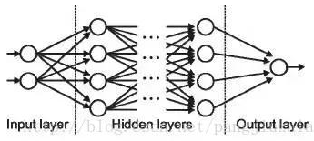
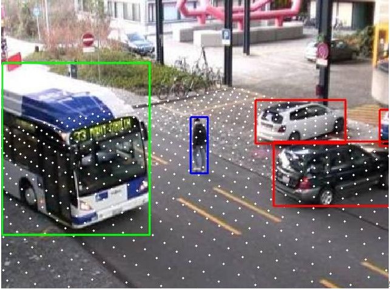

## 目录

  - 名词对照
  - 抽象概念
    - 耦合、内聚、依赖倒置
      - 耦合和内聚
      - 依赖倒置
      - 完成逻辑闭环
    - 接口、API、SPI
    - 原码、反码、补码、移码概念
    - 软件的绿色版、单文件版、便携版
    - 电脑进制
    - 不同进制之间转换演算方法
    - 云计算与边缘计算
    - 编译原理（项目总结得到）
  - 一般正则表达式语法
    - 特殊字符
    - 边界匹配符（定位符表达式）
    - 逻辑操作符（普通字符/中括号表达式）
    - 量词（限定符表达式）
  - 神经网络相关
    - 感知机
    - 神经元（Neuron）
      - 神经元个数和隐藏层层数的影响
    - 权重（Weights）
    - 偏差（Bias）
    - 激活函数（Activation Function）
      - 常用的激活函数-Sigmoid
      - 常用的激活函数-Softplus
      - 常用的激活函数-ReLU
      - 常用的激活函数-LReLU
      - 常用的激活函数-Softmax（softmax多种类分类）
      - 常用的激活函数-TanHyperbolic
    - 神经网络（Neural Network）
      - 神经网络的本质原理和定义
    - 输入/输出/隐藏层（Input / Output / Hidden Layer）
    - 深度网络（deep neural networks，简写为DNN）/深度前馈网络（DFN）/多层感知器（multi-layer perceptron，简写为MLP）
    - 正向传播/前向传播（Forward Propagation）
    - 损失函数/成本函数（Cost Function）
    - 梯度下降（Gradient Descent）
    - 学习率（Learning Rate）
    - 反向传播（back propagation，简写为BP）
    - 使用交叉熵损失函数和sigmoid激活函数改进深度网络的收敛速度
    - 使用对数似然损失函数和softmax激活函数进行深度网络的分类输出
    - 梯度爆炸与梯度消失与ReLU激活函数
    - 批次（Batches）
    - 周期（Epochs）
    - 正则化（防止过拟合的操作）
      - L1&L2正则化
      - Bagging正则化
      - 丢弃（Dropout）正则化
        - Dropout和Bagging的正则化的异同
        - Dropout和 L1，L2的正则化的异同
      - 数据增强（Data Augmentation）正则化（主要用于深度学习）
    - 批量归一化（Batch Normalization）
    - 卷积神经网络（CNN）
      - 滤波器/卷积核（Filters）
      - 卷积神经网络（CNN）
      - 池化（Pooling）
      - 填充（Padding）
      - 数据增强（Data Augmentation）
      - 全连接层（Fully Connected Layer）
    - 循环神经网络（RNN）
      - 循环神经元（Recurrent Neuron）
      - 循环神经网络（RNN）
      - 消失梯度问题（Vanishing Gradient Problem）
      - 激增梯度问题（Exploding Gradient Problem）
  - 机器学习与深度学习-概论
    - 机器学习概论
    - 深度学习概论
    - 机器学习与深度学习的区别
      - 特征工程（特征是否给出）
      - 数据依赖（数据的量）
      - 硬件依赖（算力）
      - 解决问题的方式
      - 运行时间（训练所需时间）
      - 可理解性的差别

## 名词对照

Convolutional Neural Networks (CNN)   s.卷积神经网络

convolution   s.卷积

Rectified Linear Unit(RELU)   s.修正线性单元（或者叫线性整流函数）

pooling   s.池化

feature map   s.特征图（也就是卷积操作后得到的结果）

padding   s.池化时处理边缘的过程

backpropagation   s.反向传播（算法）

## 抽象概念

### 耦合、内聚、依赖倒置

#### 耦合和内聚

某个工具与某个项目的关系有内聚和耦合两个指标。

内聚是指一个工具与当前项目的整体契合度。

耦合是一个工具与某个特定项目的专一符合度。（专一符合度也就是高度定制化的程度，因此必然牺牲了一般性）也就是说，耦合度可以理解为一般性的反义词。

一个工具如果是低内聚的，那么代表它和当前项目相性较低。一个工具如果是高耦合的，那么代表它仅和某个特定项目的相性较高，而和任何其他项目的相性都较低。

#### 依赖倒置

依赖倒置原则(DependencelnversionPrincipleDIP)是指设计代码结构时，高层模块不应该依赖低层模块，二者都应该依赖其抽象。

依赖倒置的意思是，不要一见到需求，就马上着急思考："这个项目该怎么完成"、"第一步做什么第二步做什么"，而是要先站在更高的层面上，总览整个需求，把不同的模块分开。分开之后，不要着急定接口，更不要着急思考模块内部的实现细节；而是要先思考模块之间的关系。

依赖倒置：模块在功能上有等级高低之分，但在依赖关系上应当是平等的，且均服从于一个最高级抽象概念或者框架，而不是服从于其他模块的具体逻辑，这样能方便添加新模块。

依赖倒置可以保证不会出现一个模块的实现嵌入另一个模块的高耦合情况，也就是保持模块具体实现方法之间相互独立，而整体模块则一起服务于同一个抽象的框架，从而使得模块在依赖关系层面同级或者说只依赖于总体框架。

例如：公司的本质是对外提供商品，那么无论提供的商品的种类、相似程度、提供方式、实现方法的不同，都应该使用"商城"作为总体框架抽象。各个"商品"的实现、接口（和参数）、依赖不应该相互重叠甚至套用。（例如一个公司卖虚拟机，需要传递的参数有CPU、GPU、内存、存储等等。但是如果公司拓展了业务卖云盘存储服务，依旧套用卖虚拟机的框架，那么CPU、GPU、内存的参数都是不需要的，仅有存储是需要的，会非常生硬和不方便，而且两个业务的实现逻辑需要相互配合而不是相互独立，非常阻碍双方的维护工作）

#### 完成逻辑闭环

>商品这个抽象并不是孤零零的、和现实世界毫无瓜葛的存在；相反，它也有自己的生命周期，也会有坎
坎坷坷、枝枝蔓蔓。因此，做出了商品抽象并不算完；我们还必须把商品的整个生命历程所可能经历的一切坎坷都考虑完全、把它从出生到出售到售后到消亡的整个过程全部理顺一这就叫"完成了逻辑闭环"。
完成逻辑闭环的标志，是我们总结出了一套"完整且最小"的接口：任何人对商品提出的任何问题，都可以通过这个接口回答，这叫"完整"；接口功能没有重叠、一个基本操作只能通过一种方式完成（想起python了吧），比如退货只能通过退货接口完成、而不是另外还有诸如"批量退货"、"花式退货"的其他接口，这叫"最小"。完整确保抽象完整、可以对用户透明；最小确保功能无冗余，不至于一个功能在不同接口里面实现多次。其中，完整一般来说是必需的；完整了，接口将来才不会动辄需要修改、才不至于将来想做点什么才发现做不到于是不得不和接口内部实现耦合。。。。。。
当然，初期也可以"不支持退货""不支持奇奇怪怪的定价规则，只允许限时、限量、限时加限量三种规则"，这也是可以的一不够完整，但足够支持任何普通业务了。而最小并不是必需的。完全可以因为性能原因，另外搞一个批量接口（甚至是"批量执行、对每个符合条件的对象执行回调"的接口）。
但我们最好还是把它找出来。这可以从一开始就避免冗余代码——A和B两个接口功能有所重叠，所以实现时注意代码复用。
当然，和商品-商城这个简单案例不同，诸如MFC、MVC这些方案
非常复杂，绝不是半个小时、千把个字就能彻底剖析明白的。比如，从MFC开始，业界无数精英耗费了好几年，这才找到了MVC这个更佳方案。切不可因为这个商城案例简单，就小看了那些大牛设计师的功底。

### 接口、API、SPI

接口本身就是不关心具体实现，仅需要一个能够让内外界进行沟通的接口/协议。

API（application program interface）应用程序接口，是给程序内部调用的。SPI（service provider interface）服务提供接口，是给程序外部调用的。

API就像C++或者Python等语言的定义函数和对写好的库/包进行封装一样，通过参数的传递和值的返回，使得外部的调用更方便。

SPI则是不确定某一个接口的实现，但先定义一个接口，等需求方的开发者进行具体实现。例如微软的DirectX协议和OpenGL协议就是典型的SPI层，游戏开放者不可能使用每一个显卡厂商编写的驱动的一套接口都各写一种实现，因此游戏开放者通过调用DirectX的SPI接口，而显卡厂商则通过调用其内部驱动的接口的方式来实现这些由DirectX定义好功能规范但没有具体实现的SPI接口即可。

### 原码、反码、补码、移码概念

1.（正负通用---补码取反加1得其相反数补码）

2.（0-补码（正数补码原码相同）=相反数补码）
且把00000000看做（11111111+00000001）
此处仅为二进制的计算（此处进行原码加原码的计算是错误的，因为在限制8位的情况下，进位丢失），11111111与00000001互为补码，所以相加为0

3.（11111111+00000001）-00000001（1的补码）=(-1的补码)

4.11111111 - 一个数的补码+00000001=它相反数的补码，相当于“取反加1”

5.有负数存在的情况下必须使用补码算法，而不能直接进行原码计算，综上所述，补码算法是为了计算机用二进制实现负数、减法而存在的。

按“位”与、按“位”或，为一个值的二进制的各个“位”和另一个值的各个”位“进行逻辑运算。
例：X=13 Y=7 进行按位与，则00001100的各位与00000111各位进行“and”逻辑运算，得出00000101，也就是5。

*整型在内存中已补码形式保存。并且ALU计算也是输出补码

ALU补码运算

反转不是取反！！！反转连符号位也会”反转“

1111111111111111（0的反转，代表-1的补码）+1111111111111111
=1111111111111110（-2的补码）
然而，-2的“反转”就是0000000000000001（1的补码，也是1的原码）

*反转和取反前后得到的都是补码：

1.（反转=-X-1）
（也就是1111111111111111-X）

2.（取反=X-1）
（也就是1111111111111111+X）

3.（取反＋1=X）

***

1.得出-X的操作码001111，通用方法：

以1111111111111111和X进行+运算后，进行“反转”输出

2.得出X-Y的操作码010011，通用方法：

“反转”X后，和Y进行+运算，进行“反转”输出（门电路具体实现为Y反转和X进行＋运算并加１）

3.得出X+1的操作码011111，通用方法：

“反转”X后，和1111111111111111进行+运算后，进行“反转”输出

4.得出X-1的操作码001110，通用方法:

以1111111111111111和X进行+运算后进行输出

5.1111111111111111-X就是“反转”

***

正数：最高位符号位为0，
          原码、反码、补码相同，
          移码为原码最高位符号位取反

负数：最高位符号位为1，
          反码为原码除最高位符号位以外全部取反
          补码为反码的基础上加一
          移码为补码的最高位符号位取反

### 软件的绿色版、单文件版、便携版

绿色版：安装、卸载需要分开。

单文件版：安装、卸载合并。

便携版：安装、保留配置到软件目录。（保留使用配置）

### 电脑进制

0x开头是十六进制的标识符,后面加上一个H也代表这是一个十六进制数（大小等于4位二进制数bit)

1个字节是8位,最多表示0到256而一位16要表示到256,就还需要第二位"16*=256"“2的4次方为16”,所以1个字节占2个16进制位一个16进制位占0.5个字节，因为计算机本质是用0和1来表示储存地址的。

### 不同进制之间转换演算方法

1.十进制换算为二进制

短除法：一直除以2得余数直到商为0，余数进行倒序即得
21÷2=10余1   10÷2=5余0   5÷2=2余1   2÷2=1余0   1÷2=0余1
则21转化为10101（2^0+2^2+2^4)

2.十进制转八进制

短除法：一直除以8得余数直到商为0，余数进行倒序即得

3.十进制转十六进制

短除法：一直除以16得余数直到商为0，余数进行倒序即得

4.二进制(多进制）换算为十进制

相加法：1       0        1       0        1   .   1

2^4   2^3   2^2   2^1   2^0   2^-1 相加即可

5.二进制换算为八进制

由于2^3=8，所以每3位二进制可以转换为1位八进制(1234567)

10111001拆分为10、111、001分别转换为八进制2、7、1，则转换结果为271

6.二进制换算为十六进制

由于2^4=16，所以每4位二进制可以转换为1位十六进制（123456789ABCDEF)

10111001拆分为1011、1001分别转换为十六进制B、9，则转换结果为B9

7.二进制运算法则

与十进制相同（加减乘除），注意除法与十进制的是一样的，但结果是二进制

### 云计算与边缘计算

云计算：把数据上传到云端，由云端服务器计算后返回结果，然后把结果反映给用户的计算方式。

边缘计算（也称为终端计算、物计算）：不依靠云计算的，在本地终端设备进行计算得到结果，然后把结果反映给用户的计算方式。

### 编译原理（项目总结得到）

1.解释型代码（如Python）的解释器会在运行时直接执行源代码，也就是直接通过解释器运行脚本而不是可执行文件（如果需要可执行文件，可以通过特定工具生成独立的可执行文件）。因此即使是不同的操作系统，源代码下载下来，只需要有适配的Python解释器和依赖库即可运行，不需要编译。

2.编译型代码（如C++）则需要根据操作系统，通过编译器，对源代码进行编译，编译成可执行文件（.exe等）才能运行。因此只有对应系统的预编译的可执行文件才能下载下来，只需要有适配的C++依赖库即可运行，没有解释器这一概念。

3.框架和第三方库的关系：第三方库是功能模块（第三方库可能基于硬件驱动和基于其他第三方库，需要自行安装适配的第三方库），而框架是集成了自己的库并且需要自行安装适配的第三方库来实现多种功能之余，还规定了整个项目的结构和工作流程。无论是框架还是第三方库，都需要根据操作系统和硬件来进行不同版本的开发和安装。

4.第三方库可以根据需要直接安装，可以直接使用，CUDA是一个第三方库。Tensorflow是一个深度学习框架，依赖于CUDA等其他第三方库，在直接安装框架（自动安装一些自带的依赖库）之外，还需要安装CUDA等第三方库，才能正常使用。Yolo实际上只是一个Python项目，而不是依赖库，项目要正常运行则需要把依赖的框架和第三方库都提前安装好。ORB-SLAM3实际上是一个C++项目，而不是依赖库，只不过C++需要根据操作系统编译，而编译本身需要依赖的第三方库提前安装好，项目要正常运行则需要把依赖的框架和第三方库都提前安装好。

5.对于 Python 等解释型语言，跨平台性较好，因为它依赖的是解释器而不是编译器。在不同操作系统上，只要 Python 解释器和依赖库安装正确，代码通常可以直接运行。但需要注意，Python 代码中如果调用了操作系统级 API（如文件系统操作、网络接口等），这些操作在不同操作系统上可能有所不同。代码中需要处理这些差异。

6.ROS、ORB-SLAM3等基于Linux系统或在Linux环境下支持良好的依赖库、工具链等，它们的文档资料、社区支持、功能、依赖库、核心工具链等在Linux系统下具有最大兼容性，甚至某些最新的框架和依赖库仅支持Linux系统版本。在Linux系统中对它们进行开发，也更容易迁移到大部分使用Linux系统的边缘设备上。

7.虚拟环境其实就是对一个操作系统的命令行环境的虚拟，可以视为相同操作系统的虚拟机但只包含命令行环境的部分，因此除了底层的硬件驱动等软件是共通的之外（跑代码选择虚拟环境就相当于把命令行环境临时转换，但其他包括底层的硬件驱动、操作系统的底层库、文件交互等等都是原来的，也就是替换了命令行环境而已，和虚拟机直接模拟一个完整系统是完全不同的），其他安装的框架和依赖库都是完全不相关的。虚拟环境的这一点也有利于防止系统重装导致的命令行环境重置。一般来说，Tensorflow、PyTorch、CUDA、cuDNN等对版本有特定要求的框架或依赖库，基本都是通过虚拟环境进行配置。虚拟环境中，Tensorflow、PyTorch、CUDA、cuDNN等在Windows中需要手动下载并安装的框架或依赖都只需要使用命令行进行安装。或者说，本质上Windows的安装包安装（包括Python、C++这种在Windows下有安装包，但本质上还是命令行安装）就是命令行安装的简化版，注意这些安装包是指框架或依赖库，不包括涉及底层的硬件驱动和操作系统的底层库（这些底层的软件算是系统的一部分，是框架或依赖库的基础），例如显卡驱动。

8.因此，框架和依赖库是有操作系统类别的区分（本质上应该是操作系统的底层库的区别），和对应硬件驱动版本的区分，而对具体的硬件型号其实是没有区分的。例如，CUDA是跨平台的依赖库（开发了不同的操作系统版本），且直接只认硬件的驱动版本（与显卡驱动版本相适配），而不关注硬件的型号等参数。

9.总结下来，配置环境，从操作系统和硬件驱动出发，然后是编程语言、框架和依赖库，然后是具体的项目可执行文件，然后是项目的源代码和可执行代码。

10.对于Python项目的源代码，最好不要建立Visual Studio项目（Visual Studio项目里的运行和命令行执行.py文件是一样的，这就是Python脚本语言的属性），直接在Vscode或Anaconda的命令行里用命令行直接执行.py文件即可。操作系统（Windows、Linux）自带的命令行执行的话则是采用系统环境。无论是Visual Studio还是Vscode、Anaconda的命令行，都需要选好虚拟环境。

11.虚拟环境的形式是由编程语言的特性决定的。Python 是解释型语言，不需要编译即可直接运行源代码，因此可以通过像 Anaconda 这样专注于搭建Python虚拟环境的工具来搭建虚拟环境，全局环境级别的环境隔离，隔离各项目的运行时依赖。c++因为需要根据操作系统和编译器的不同且还需要以项目为单位进行编译而没有虚拟环境的概念，只有：1.项目级别的包管理工具（例如vcpkg、Conan）。2.通过CMake等构建工具对每个项目进行编译时指向不同路径下不同版本的第三方依赖，实现不同项目使用不同版本的第三方依赖。3.使用Docker，操作系统级别的环境隔离。c++编译时就需要依赖，一般来说项目需要的经过自定义的第三方依赖，会在项目里一起下载并参与编译，此时相当于直接将项目所需要的特定版本的第三方依赖安装在项目路径下并参与编译（第2种方法），运行的时候就调用编译时这些依赖生成的对应的静态链接（嵌入到可执行文件中）或动态链接（独立于可执行文件，运行时加载），无论如何，可执行文件运行时静态链接和动态链接都需要在编译时规定的路径下且里面的内容也需要符合编译时的内容来满足可执行文件的调用，并不是单个可执行文件就可以单独运行的。注意添加任何新的第三方库，c++项目都需要重新编译，以生成可执行文件和对应的静态链接或动态链接。对于Python，如果某个项目有一些可供更改的自定义库，那么也可以结合虚拟环境采用第2种方法，通过`pip install -e .`将项目自带的可自定义第三方库安装到虚拟环境里并建立软链接，这类似于C++的项目自带特定版本的第三方库并在编译时使用。

12.操作系统命令行环境能同时存在python环境和c++环境，是因为命令行环境本来就可以安装多种语言的编译器或解释器，且相互独立，可以通过全局变量来使得不同语言处于同一命令行环境切换执行而已。而直接安装在操作系统的第三方库例如opencv，它们的安装以操作系统区分的同时，可能会安装不同的支持的编程语言的版本（注意编程语言的安装也需要以操作系统区分），这样在同一命令行环境下不同语言的编译器或解释器即可切换着调用同一个第三方库的不同接口，虽然接口不同且具体实现不同（可能与操作系统和编程语言均相关），但名字都是这个第三方库。

13.Ubuntu的包安装（例如OpenCV）是可以安装多个的，同理Windows其实应该也是，只要是多版本能够共存的都可以通过安装在不同路径下来安装多个。但Ubuntu直接apt下载安装就会是默认重复默认路径，因此需要源码下载安装，通过编译时自行指定路径。

14.Ubuntu20.04，在默认的usr/local已经安装了OpenCV4.2.0，用于编译ORB-SLAM3。而现在需要编译GCNv2_SLAM（基于ORB-SLAM2），需要OpenCV3.4.5，C++的编译可以通过CMake来指定编译时用到的依赖库的路径，以实现同一操作系统下编译需要不同版本的依赖库C++项目，但前提是不同版本的依赖库都有安装在同一操作系统下且互不冲突。通过系统自带的包管理工具（直接apt-get）安装和通过源码安装但使用的是CMake进行编译安装，对依赖库的安装均默认在系统的usr/local路径下，会覆盖掉已安装的不同版本的依赖库，而仅通过命令行版本的CMake较难设置安装路径，因此需要使用CMake-GUI来图形化地设置安装路径，方便将多个依赖库版本安装在不同的路径下，以实现类似虚拟环境的效果。

15.例如libtorch（c++版本的pytorch），我在Ubuntu系统是有Anaconda的，如果我激活了Anaconda虚拟环境，libtorch编译时所需要的python环境是看全局环境还是虚拟环境？libtorch编译安装到的应该是全局环境？但是pytorch又可以在Anaconda虚拟环境中安装，而且不需要编译，这是为什么？我可以理解为，c++用到的包也和c++一样需要编译安装，python用得到的包和python一样不需要编译安装吗？但是有些c++用到的包编译安装就需要用到python，这又是为什么？它们为什么性质完全不同又经常交叉？
在 Ubuntu 系统上使用 Anaconda 并激活了一个虚拟环境时，这个虚拟环境主要影响的是 Python 的解释器及其安装的库。对于 C++ 项目（如使用 libtorch），它并不直接依赖于 Python 环境，除非你的 C++ 代码中有显式调用 Python API。因此，当编译安装 libtorch 或编译基于 libtorch 的 C++ 项目时，它一般不会关心你是否激活了 Anaconda 的某个 Python 虚拟环境，但可能是有影响的。这些编译过程完全在 C++ 层面进行，不需要 Python 环境。libtorch 安装通常是全局的，或者是安装在你指定的某个目录中。这并不直接依赖于 Python 环境。而PyTorch 作为一个 Python 库，其安装和配置自然是依赖于 Python 环境的。当你在 Anaconda 虚拟环境中安装 PyTorch 时，它会在这个特定的环境中安装所需的依赖和库文件，与全局环境隔离。
C++ 库/包通常需要编译安装，因为 C++ 是编译型语言，需要将源代码编译成机器码才能运行。这些编译过程可能需要特定的构建系统（如 CMake）和编译器。面向C++的库/包自然也是基于C++的，对跨平台需要重新编译，和C++源代码在不同平台下需要不同的编译方式才能跑一样，C++包也是需要根据不同平台采用不同的编译方式才能安装和跑。所以包的安装需要编译。
Python 库/包则不同，它们往往是解释型或半编译型的（如使用 Cython）。很多 Python 包提供的是预编译的二进制包（如 wheel 文件），安装时只需要解压和配置即可，无需从源代码编译。面向Python的库/包自然也是基于Python的，对跨平台也不需要重新编译，和Python源代码在不同平台下立即下立即跑一样，Python包也是立即下立即安装和跑，所以包的安装也不需要编译。完全由Python编写的包无需编译即可安装。这些包只包含Python源代码文件（.py文件），Python解释器可以直接执行这些文件。安装时，通常只需将这些文件复制到Python的库目录中，或者使用包管理工具（如pip）自动完成这一过程。
但是，如果 Python 包依赖于需要编译的 C/C++ 扩展，那么编译过程也是必需的。一些Python包会提供预编译的二进制包（如wheel文件），这些包已经包含了与特定Python版本和特定常见的操作系统兼容的二进制代码。安装时，只需将这些二进制包解压到Python的库目录中即可，无需重新编译。此时只需要运行附带的用于编译安装的.py脚本即可，不需要像C++那样通过编译器进行编译。
有些 C++ 包（如一些科学计算或数据分析库）可能需要使用 Python 作为构建系统的一部分，或者提供 Python 绑定以便于 Python 用户使用。例如，CMake 脚本中可能调用 Python 脚本来辅助生成配置文件或处理依赖。
另外，一些 C++ 包可能集成了 Python 解释器或绑定了 Python 库，这种情况下编译过程中需要 Python 环境。

15.1.编译时若报错过多，一般是有根本上的问题，例如需要的环境根本没配而不是没配好，或者下载源码因为网络或磁盘空间问题等没下全。

16.Pytorch是否安装完成只需要在命令行import然后检查版本号，而libtorch则需要编写一个.cpp文件并include这个包，然后编译.cpp文件看是否能跑起来。

17.源代码在不同平台都是同样的源代码（Github上的zip包，全平台通用的源代码，但编译不同），对已有项目的修改也是修改源代码，但是要能跑，也就是生成可执行文件，那么就需要编译源代码。包括对已有项目的修改，也是修改源代码后，编译后才能跑。IDE就是简化成一键编译并运行，在操作系统命令行就要手动重复调用build.sh来编译然后再运行。

18.代码编译中出现了什么问题，若非直接说明某个错误或没装什么然后停下的，而是正常的警告信息之后突然停下的，一定要从前面的一大堆警告信息和打印的信息中，找到红色的error，这才是让编译出错的原因（而且该死的是，error可能出现得很早，但编译不会停下，甚至还能继续编译一段再停下，这比直接说明某个错误或没装什么然后停下畜生多了），其他颜色的警告等信息是不需要管的。

19.对于C++，无论是哪种C++标准（只是一种抽象规定，代码编译成机器码的规定），哪种编译器（操作系统平台决定，可以按照某种C++标准完成将代码编译成机器码），使用哪种构建系统软件（安装的软件决定，规定了某种具体的工作流程，来让编译器对代码进行编译工作，如CMake），最终都是将C++的源代码文件（包括源文件和头文件）编译为可执行文件和库（步骤大致分为：预处理、编译、链接，中间会有对象文件.o或.obj生成），并将可执行文件链接到其所需的库以支持其运行，但这不代表其所需的库不能被其他可执行文件链接。
库分为：
- 静态库：Windows的.lib文件，Linux的.a文件。在编译时将所有代码打包到一个文件中，链接时将代码复制到可执行文件中。
- 动态库/共享库：Windows的.dll文件，Linux的.so文件，macOS的.dylib文件。在运行时动态加载，不同项目的多个可执行文件可以共享同一个库文件。
- 模块库：动态库的一种特殊形式，通常不直接链接到可执行文件中，而是通过某种机制（如插件管理器）加载。
主项目源代码文件（包含main函数，会被编译为可执行文件）和非主项目源代码文件（不包含main函数，会被编译为库）都是单个的代码文件。单个主项目源代码文件（源文件+头文件）会被编译为一个可执行文件，单个或多个非主项目源代码文件（源文件+头文件）会被编译为一个库。编译最终获得的都是适配于当前的"系统以及软硬件环境"的可执行文件和库。可执行文件与库之间，库与库之间，编译工作是相互独立的，因此，每个可执行文件或库的编译时采用的C++标准可以是不同的，编译工作是以单个可执行文件或单个库为单位相互隔离。也就是说，以相同的编译标准进行编译的最小单位，即为单个可执行文件或单个库的内部。而单个库可能会包含多个非主项目源代码文件，它们都需要遵循相同的编译标准，才能编译成整体的单个库。但是，一般来说，几乎全部的可执行文件要链接库，部分库要链接其他库，当这些可执行文件或库进行编译时，还需要编译其链接的库的头文件部分（也就是导入的库的接口部分），这种情况下，这些可执行文件和库的编译的C++标准，和它们导入的库的接口部分的编译C++标准，也必须相一致。这也是为什么导入第三方库（第三方库其实就是来自第三方的预编译的共享库，Windows下为.dll文件，Linux下为.so文件）也需要注意编译标准，因为只要可执行文件或其他库要链接第三方库，那么第三方库的接口部分也会参与这些可执行文件或其他库的编译，因此不是完全相互独立的，一般来说，接口部分的编译标准和可执行文件或其他库本身的编译标准会尽量统一。但是如果只有较少的第三方库的接口部分的编译标准与可执行文件或其他库本身的编译标准不同，还可以采用分离编译的方法，通过将接口部分导入的库迁移到对应的源文件中，来尽量降低接口部分需要的编译标准。
Pimpl（Pointer ot Implementation），也可以称为"编译防火墙"，是一种常见的C++编程技巧，主要用于隐藏实现细节和减少头文件依赖。它的主要原理是将实现细节隐藏在实现类中，通过一个指向实现类的指针来访问这些细节。在创建的的单独的源代码文件中，头文件因为需要被项目内的其他具有不同编译环境要求的源代码文件导入，因此不能包含需要特定编译环境要求的第三方库的头文件，这些头文件将会通过源文件导入，从而形成真正的接口隔离。Pimpl思想下c++头文件和源文件的结构：一般来说，头文件仅提供接口，但也会需要导入部分有关实现的库来提供接口，Pimpl思想把头文件中导入的有关实现用的库也尽可能地隐藏到源文件中。1.更好地隐藏具体实现的细节，接口和实现完全分离了 。2.最大程度减少了其他头文件或源文件导入此库时编译的所需依赖/编译依赖项最小化（导入库就是导入对应的头文件，也就是导入库的接口，导入头文件是相当于将头文件的代码加到代码正文参与编译，但对应的源文件则只会在运行的时候被调用不参与编译，因此编译时自然也需要也只需要具备导入的头文件的代码的所需依赖，这是C++的编译性质。根据这个，对一个项目的编译的所需依赖，只包含其头文件和源文件导入的头文件所需的依赖）。3.可移植性。
分离编译：分离编译是在项目内创建一个源代码文件单独编译为一个共享库，其中导入了头文件部分（也就是接口部分）与项目内其他源代码文件的编译标准不同的特定的第三方库，并且采用Pimpl思想将这些特定的第三方库的头文件部分的导入限定在共享库的源文件内而不是头文件内，以使得项目内其他源代码文件导入这个共享库的时候，不需要遵循特定的第三方库的头文件部分的编译标准。通过这种方法，规避了特定的第三方库的接口部分对编译环境要求的问题。本质上是多套了一层头文件和源文件相隔离的接口层，实现了接口隔离。或者说，这些特定的第三方库的接口部分在这个单独的共享库的源文件里导入而不是在头文件里导入，其他源代码文件调用它也是调用这个共享库的头文件而不是源文件，因此其他源代码文件的编译不需要考虑这些特定的第三方库的接口部分的编译，却能够调用它在共享库的源文件里的函数（实际上编译完之后都是二进制文件，只不过因为同一标准的编译的最小单位是可执行文件或库，所以这种方法才能奏效）。
那为什么第三方库不能通过分离编译做好完全的接口隔离？因为即使使用了Pimpl思想，也只是尽可能地将头文件的库导入迁移到源文件，尽可能地让其他库导入这个第三方库时所需的编译标准更具有兼容性。
总体来说，Pimel思想可以最大程度地减少一个库的头文件中导入的其他第三方库的数量，从而尽量减少其他项目导入这个库时编译这个库的头文件的编译要求。但是要注意，Pimel思想的对象是单个的源代码文件，但是Pimel思想的实施是库级别。这意味着即使是单个源代码

20.docker类似于虚拟机，但只虚拟了一个容器，一个包含了操作系统的库、安装了的所有第三方库、项目本身的超简易系统（但也是基于一个发行版系统镜像来构建容器的，因此可以安装特定的包来获得简易的可视化桌面，然后通过VNC viewer访问可视化桌面）。只要能够运行docker的机器就能够运行迁移来的容器里的项目，这一点和虚拟机看起来完全无关，实际上本质是完全一样的，只不过体量相差太大看不出来而已，只要能够运行同一个虚拟机软件的机器那当然能运行迁移来的系统镜像里的一切，也包括项目。docker可以理解为专门为了项目的部署而构建超小型虚拟机的解决方案，这是为了比类似anaconda这种虚拟环境（能虚拟但只能虚拟一部分，同一个项目同样的虚拟环境还是可能出错，因为操作系统的库不一样），更具有确定性和隔离性（能虚拟而且是只虚拟全部需要的部分，因为docker等于只虚拟了与项目相关的所有东西但不虚拟其他任何不必要的东西的虚拟机）。所以docker就是包括c/c++在内的所有需要项目级依赖管理的语言的终极解决方案：直到系统级为止的所有东西创建的虚拟环境，而且极其容易管理和迁移，还具有跨平台的通用性。注意docker不能做跑代码以外的东西，因为不是完整的操作系统。docker不能进行内核级和架构级的跨平台，因为这是它的极限。

21.注意对于Linux下的build.sh这种相当于在终端运行的脚本，类似于Windows下的批处理文件，同级路径运行才能让脚本的相对路径准确，第三方库也能一起编译，否则只会编译主项目。若第三方库不需要重新编译为.dll或.so文件（也就是编译成库的内容没变），可以在某个下一级目录运行../build.sh来避免重复编译第三方库，只编译主项目。

## 一般正则表达式语法

### 特殊字符

|特殊字符的正则表达|意义|
|:----------------:|:--:|
|`\`|转义符，将`\`后面的字符串转化为对应的正则意义，也可以将特殊字符转化为它本身代表的意义，要匹配 \ 字符本身，需要使用 `\\` |
|`*`|匹配前面的子表达式零次或多次。要匹配 * 字符，请使用 `\*`。|
|`$`|匹配输入字符串的结尾位置。如果设置了 RegExp 对象的 Multiline 属性，则 $ 也匹配 '\n' 或 '\r'。要匹配 $ 字符本身，请使用 `\$`。|
|`()`|标记一个子表达式的开始和结束位置。子表达式可以获取供以后使用。要匹配这些字符，请使用 `\(` 和 `\)`。例如：`/([1-9])([a-z]+)/`匹配以一个数字作开头，多个字母作结尾的字符串。|
|`+`|匹配前面的子表达式一次或多次。要匹配 `+` 字符，请使用 `\+`。|
|`.`|代指单个回车符和换行符\n以外的任意字符，要匹配`.`字符，请使用 `\.`。|
|`[]`|标记一个中括号表达式的开始。例子：`[a-m]`。要匹配`[`，请使用 `\[`。|
|`?`|匹配前面的子表达式零次或一次，或指明一个非贪婪限定符。要匹配 `?` 字符，请使用 `\?`。|
|`^`|匹配输入字符串的开始位置。当该符号在方括号表达式中使用时，表示不接受该方括号表达式中的字符集合。要匹配`^`字符本身，请使用`\^`。|
|`{}`|标记限定符表达式的开始。要匹配`{`，请使用`\{`。|
|`|`|指明两项之间的一个选择。要匹配`|`，请使用`\|`。|
|\t|制表符，等价于\x09和\cI|
|\n|换行符，等价于\x0a和\cJ|
|\r|回车符，等价于\x0d和\cM|
|\f|换页符，等价于\x0c和\cL|
|\v|垂直制表符，等价于\x0b和\cK|
|\e|Escape|
|\s|代指空白符（包括空格、制表符、回车符、换行符、换页符），等价于`[\f\n\r\t\v]`|
|\S|代指非空白符，等价于`[^\f\n\r\t\v]`|
|\s\S|代指所有字符|
|\d|代指任意数字`[0-9]`|
|\D|代指任意非数字，等价于`[^0-9]`|
|\w|代指任意词字符，等价于`[a-zA-Z0-9]`|
|\W|代指任意非词字符|
|\c"x"|匹配由"x"指明的控制字符。例如， \cM 匹配一个 Control-M 或回车符。x的值必须为 A-Z 或 a-z 之一。否则，将 c 视为一个原义的 'c' 字符。|

### 边界匹配符（定位符表达式）

|边界匹配符的正则表达|意义|
|:-------------:|:--:|
|^|一行的开始|
|$|一行的结束|
|\A|位于整个句子开头的待匹配字符串。例如：`/\ACha/`匹配单词 Chapter 的开头字符串`Cha`|
|\Z|位于整个句子结尾的待匹配字符串。例如：`/ter\Z/`匹配单词 Chapter 的结尾字符串`ter`|
|\b|单词的边界，即代表匹配字与空格间的位置，也就是位于整个字符串开头或者结尾的待匹配字符串。例如：`/ter\b/`匹配单词 Chapter 中的字符串`ter`。而`/\bCha/`匹配单词 Chapter 的开头字符串`Cha`。注意对特殊字符，边界界定在仅含特殊字符的特殊字符串内（`"a***a"`查找特殊字符时，搜索范围为`***`，非边界字符仅有第二个`*`）。|
|\B|非单词的边界，即代表匹配位于整个字符串中间的待匹配字符串。例如：`/\Bapt/`表达式匹配 Chapter 中的字符串 apt，但不匹配 aptitude 中的字符串 apt。而`\Bz\B`则匹配azb中的z，不匹配zz中的z。注意对特殊字符，边界界定在仅含特殊字符的特殊字符串内（`"a***a"`查找特殊字符时，搜索范围为`***`，非边界字符仅有第二个`*`）。|
|\G|前一个匹配的结束|

注意：定位符不能和限定符一起使用（某些字符的意义不同）。

例如，如果我们要判断一个完整文本中是否存在完
整的一行`"This is a complete line"`，且行中没有其它
任何字符，则可以如下的正则表达式：

`/^This is a complete line$/`

其中的^和$界定了行的起始和终止，中间的
信息必须完整匹配才可以。

### 逻辑操作符（普通字符/中括号表达式）

|逻辑操作符的正则表达|意义|
|:-------------:|:--:|
|`[abc]`|匹配a,b,c中的任何字符|
|`[^abc]`|匹配除了a,b,c中的任何字符|
|`[a-z]`|匹配所有小写字母|
|`[A-Z]`|匹配所有大写字母|
|`[a-zA-Z]`|匹配所有小写和大写字母|
|`XY`|Y在X之后|
|`X|Y`|X或Y|

例如，假设十六进制的表示字符是由数字和A-F这6个大写字母构成。我们知道一个字节可以用2位的16进制表示，下面这个正则表达式要判断一个字节转换成十六进制之后的表示是不是正确：

`/[0-9A-F][0-9A-F]/`

字符串“ AE”, “30”, “6G”, “7E0”, “0A”匹配这个模式的结果分别是：T, T, F, F, T。

### 量词（限定符表达式）

|贪婪型|勉强型|意义|
|:----:|:----:|:--:|
|X?|X??|一个或零个X|
|X*|X*?|零个或多个X|
|X+|X+?|一个或多个X|
|X{n}|X{n}?|恰好n次X|
|X{n.}|X{n.}?|至少n次X|
|X{m,n}|X{m,n}?|X至少m次，且不超过n次|

量词描述了一个模式怎样吸收输入的文本：

- 贪婪型：量词是贪婪的，除非有别的设定。否则，贪婪型模式就要尽可能地发现更多的匹配。
- 勉强型（非贪婪型）：通过在贪婪型的后面加上问号`?`指定。这个量词需要满足匹配的最少字符数，例如：`<.*>`匹配到所有`<`到`>`之间的所有字符串。则`<.*?>`匹配到所有`<` 到 `>`之间的所有字符串中字符数最少的一批字符串。
- 占有型：目前，只有Java语言可用，属于Java特殊语法，主要用途是防止失配时回溯。在简单的正则表达式中很少使用。

例子：

`runoo+b`，可以匹配 runoob、runooob、runoooooob 等，+ 号代表前面的字符必须至少出现一次（1次或多次）。
y
`runoo*b`，可以匹配 runob、runoob、runoooooob 等，* 号代表前面的字符可以不出现，也可以出现一次或者多次（0次、或1次、或多次）。

`colou?r`，可以匹配 color 或者 colour，? 问号代表前面的字符最多只可以出现一次（0次、或1次）。

`/[1-9][0-9]*/`，可以匹配一个正整数：`[1-9]`表示这个正整数的第一个数字不是 0，`[0-9]*` 则表示第一个数字后存在任意多个数字的字符串都可以匹配。

## 神经网络相关

## 目录

  - 名词对照
  - 抽象概念
    - 耦合、内聚、依赖倒置
      - 耦合和内聚
      - 依赖倒置
      - 完成逻辑闭环
    - 接口、API、SPI
    - 原码、反码、补码、移码概念
    - 软件的绿色版、单文件版、便携版
    - 电脑进制
    - 不同进制之间转换演算方法
    - 云计算与边缘计算
    - 编译原理（项目总结得到）
  - 一般正则表达式语法
    - 特殊字符
    - 边界匹配符（定位符表达式）
    - 逻辑操作符（普通字符/中括号表达式）
    - 量词（限定符表达式）
  - 神经网络相关
    - 感知机
    - 神经元（Neuron）
      - 神经元个数和隐藏层层数的影响
    - 权重（Weights）
    - 偏差（Bias）
    - 激活函数（Activation Function）
      - 常用的激活函数-Sigmoid
      - 常用的激活函数-Softplus
      - 常用的激活函数-ReLU
      - 常用的激活函数-LReLU
      - 常用的激活函数-Softmax（softmax多种类分类）
      - 常用的激活函数-TanHyperbolic
    - 神经网络（Neural Network）
      - 神经网络的本质原理和定义
    - 输入/输出/隐藏层（Input / Output / Hidden Layer）
    - 深度网络（deep neural networks，简写为DNN）/深度前馈网络（DFN）/多层感知器（multi-layer perceptron，简写为MLP）
    - 正向传播/前向传播（Forward Propagation）
    - 损失函数/成本函数（Cost Function）
    - 梯度下降（Gradient Descent）
    - 学习率（Learning Rate）
    - 反向传播（back propagation，简写为BP）
    - 使用交叉熵损失函数和sigmoid激活函数改进深度网络的收敛速度
    - 使用对数似然损失函数和softmax激活函数进行深度网络的分类输出
    - 梯度爆炸与梯度消失与ReLU激活函数
    - 批次（Batches）
    - 周期（Epochs）
    - 正则化（防止过拟合的操作）
      - L1&L2正则化
      - Bagging正则化
      - 丢弃（Dropout）正则化
        - Dropout和Bagging的正则化的异同
        - Dropout和 L1，L2的正则化的异同
      - 数据增强（Data Augmentation）正则化（主要用于深度学习）
    - 批量归一化（Batch Normalization）
    - 卷积神经网络（CNN）
      - 滤波器/卷积核（Filters）
      - 卷积神经网络（CNN）
      - 池化（Pooling）
      - 填充（Padding）
      - 数据增强（Data Augmentation）
      - 全连接层（Fully Connected Layer）
    - 循环神经网络（RNN）
      - 循环神经元（Recurrent Neuron）
      - 循环神经网络（RNN）
      - 消失梯度问题（Vanishing Gradient Problem）
      - 激增梯度问题（Exploding Gradient Problem）
  - 机器学习与深度学习-概论
    - 机器学习概论
    - 深度学习概论
    - 机器学习与深度学习的区别
      - 特征工程（特征是否给出）
      - 数据依赖（数据的量）
      - 硬件依赖（算力）
      - 解决问题的方式
      - 运行时间（训练所需时间）
      - 可理解性的差别

### 感知机

感知机的模型是一个有若干输入和一个输出的模型。

输出和输入之间学习到一个线性关系，得到中间结果$z$：

$z=\sum_{i=1}^m w_ix_i +b$

然后经过一个激活函数$sign(z)$，得到1或者-1的最终输出结果：

$\operatorname{sign}(z)= \begin{cases}-1 & z<0 \\ 1 & z \geq 0\end{cases}$

这个模型只能用于二元分类，且无法学习比较复杂的非线性模型，因此在工业界无法使用。

而神经网络则在感知机的模型上做了扩展，总结下主要有三点：

- 加入了多层隐藏层，增强模型的表达能力。
- 输出层神经元可以不止一个，可以有多个输出，这样模型可以灵活的应用于分类，回归，降维和聚类等。
- 对激活函数做扩展。感知机的激活函数是sign(z)，虽然简单但是处理能力有限。因此神经网络中一般使用：Sigmoid，tanx，ReLU，softplus，softmax等激活函数，加入非线性因素，提高模型的表达能力。神经网络中的激活函数使用$\sigma(z)$表示。

### 神经元（Neuron）

就像形成我们大脑基本元素的神经元一样，神经元形成神经网络的基本结构。神经元是神经网络的基本单元。

想象一下，当我们得到新信息时我们该怎么做。当我们获取信息时，我们一般会处理它，然后生成一个输出。

类似地，在神经网络的情况下，神经元接收输入（输入可能只有一个，或者多个），处理它并产生输出（输出只有一个，但是可以输出到多个下一级神经元中），而这个输出被发送到其他神经元用于进一步处理，或者作为最终输出进行输出。

#### 神经元个数和隐藏层层数的影响

神经元个数的影响，可以抽象为上方对点的分类的"刀数"，显然在一定程度内越多刀效果越好。每一个细胞是一刀，也就是一个特征。

但是也不能过多，需要考虑过拟合的问题。

***

输入层细胞数是原始数据的特征数，隐藏层和输出层每个细胞可以说是把特征数拓展或者缩减了（根据原始的特征数虚拟出新的特征，可能由原始特征组合而成，人类难以理解，但计算机可以。其实就是各个原始特征拥有不同的权重组成的新特征）。

每个层连接或者每条层连接线都可以代表一个权重。多出来的隐藏层是对前面隐藏层的特征的再次提取和整合，使得更多样和更能拟合。

每一层是对前一层的输出的矩阵乘法+非线性变换的两部操作，因此不能单纯地使各个权重矩阵（一层之间全部线的权重组成矩阵也能称为权重）相乘获得一个概括了整个神经网络的矩阵（这样就等于没有设置隐藏层，隐藏层也就没有意义了，因为单层和多层训练出来的线性权重是等效的）。非线性部分对数据的变换是神经网络的重要部分。

***

### 权重（Weights）

当输入进入神经元时，它会乘以一个权重。例如，如果一个神经元有两个输入，则每个输入将具有分配给它的一个关联权重。我们随机初始化权重，并在模型训练过程中更新这些权重。训练后的神经网络对其输入赋予较高的权重，这是它认为与不那么重要的输入相比更为重要的输入。为零的权重则表示特定的特征是微不足道的。

让我们假设输入为a，并且与其相关联的权重为W1，那么在通过节点之后，输入变为a * W1。

***

### 偏差（Bias）

除了权重之外，另一个被应用于输入的线性分量被称为偏差。

它被加到权重与输入相乘的结果中。基本上添加偏差的目的是来改变权重与输入相乘所得结果的范围的。

添加偏差后，结果表达式为：$a * W1 +bias$。这是输入变换的最终线性分量。偏差量可以是0（即不影响总输入），也可以是一个特定的非0数防止总输入为0。

***

### 激活函数（Activation Function）

一旦将线性分量应用于输入，将会需要应用一个非线性函数。这通过将激活函数应用于线性组合来完成。

激活函数将输入信号转换为输出信号。应用激活函数后的输出看起来像$f(a * W1+b)$，其中$f(x)$就是激活函数。

我们首先将n个输入给定为X1到Xn，而与其相应的权重为Wk1到Wkn。我们有一个给定的值称为bk，它就是偏差。权重首先乘以与其对应的输入，最后这个计算的总和再与偏差bk加在一起。这个最终结果值叫做$u$。

$$u =\sum_{i=1}^n (Wki * Xi)+ bk$$

激活函数的输出即为f(u)，并且我们会从神经元接收最终输出，如：

$$y_k = f(u)$$

#### 常用的激活函数-Sigmoid

最常用的激活函数之一是Sigmoid，它被定义为：

$$f(x)=\frac{1}{1+e^{-x}}$$

其导数为：

$$f^{\prime}(x)=\frac{e^{-x}}{(1+e^{-x})^{2}}=\frac{1+e^{-x}-1}{(1+e^{-x})^{2}}=\frac{1}{1+e^{-x}}-\frac{1}{(1+e^{-x})^{2}}=f(x)-[f(x)]^{2}=f(x) \cdot (1-f(x))$$

$$f'(x)=f(x) \cdot (1-f(x))$$

因为这个函数值域限定为0到1，定义域为实数域，因此被应用于激活函数中。Sigmoid变换产生一个值为0到1之间更平滑的范围。我们可能需要观察在输入值略有变化时输出值中发生的变化。光滑的曲线使我们能够做到这一点，因此优于阶跃函数。

它抽象代表了衡量符合结果的概率的一个值，值越大则Sigmoid函数的值越接近1，也就是100%。

#### 常用的激活函数-Softplus

此激活函数为Sigmoid函数的原函数，也就是定义为：

$$f(x)=log(1+e^{x})$$

其导数为：

$$f^{\prime}(x)=\frac{1}{1+e^{-x}}$$

#### 常用的激活函数-ReLU

与Sigmoid函数不同的是，最近的网络更喜欢使用ReLu激活函数来处理隐藏层。该函数定义为：

$$ f(x)=max(x,0) $$

其导数为：

$$f^{\prime}(z)=\left\{\begin{array}{l}1, z>0 \\0, z \leqslant 0 \end{array}\right.$$

当X>0时，函数的输出值为X；当X<=0时，输出值为0。函数图如下图所示：

使用ReLU函数的最主要的好处是对于大于0的所有输入来说，它都有一个不变的导数值。导数值为常数有助于网络训练进行得更快。

#### 常用的激活函数-LReLU

函数ReLU的变体，其定义为：

$$f(z)= \begin{cases}z, & z>0 \\ a z, & z \leqslant 0\end{cases}$$

#### 常用的激活函数-Softmax（softmax多种类分类）

Softmax激活函数通常用于输出层而不是隐藏层，用于分类问题。它与sigmoid函数是很类似的，唯一的区别就是输出被"归一化"为总和为1的多个输出。Sigmoid函数将发挥作用以防我们有一个二进制输出，但是如果我们有一个多类分类问题，softmax函数使为每个类分配值这种操作变得相当简单，而这可以将其解释为概率。

以这种方式来操作的话，我们很容易看到——假设你正在尝试识别一个可能看起来像8的6。该函数将为每个数字分配值如下。我们可以很容易地看出，最高概率被分配给6，而下一个最高概率分配给8，依此类推……

#### 常用的激活函数-TanHyperbolic

我们引入非线性函数作为激励函数，这样深层神经网络就有意义了（最终结果不再仅仅是矩阵相乘和线性组合，而是可以逼近任意函数）。

最早的想法是sigmoid函数或者tanh函数，输出有界，很容易充当下一层输入（以及一些人的生物解释balabala）。

激活函数的作用是为了增加神经网络模型的非线性。否则没有激活函数的每层都相当于矩阵相乘。就算你叠加了若干层之后，无非还是个矩阵相乘罢了。所以你没有非线性结构的话，根本就算不上什么神经网络。

TanHyperbolic函数也就是tanh函数，其输出区间为$(-1,1)$。

$$tanh(x)=\frac{sinh(x)}{cosh(x)}=\frac{e^x-e^{-x}}{e^x+e^{-x}}$$

其导数为：

$$f^{\prime}(x)=1-[f(x)]^{2}$$

其实满足与sigmoid函数的关系：

$$tanh(x)=2 * sigmoid(2x)-1$$

### 神经网络（Neural Network）

神经网络构成了深度学习的支柱，神经网络的目标是找到一个未知函数的近似值，它由相互联系的神经元形成。

这些神经元具有权重（Weights），和具有在网络训练期间根据错误来进行更新的偏差（Bias）。

激活函数将非线性变换置于线性组合，而这个线性组合稍后会生成输出。激活的神经元的组合会给出输出值。

一个比较好的定义：

神经网络由许多相互关联的概念化的人造神经元组成，它们之间传递相互数据，并且具有根据网络"经验"调整的相关权重。

神经元具有激活阈值，如果通过其相关权重的组合和传递给他们的数据满足这个阈值的话，其将被激活/弃用。

传递神经元的组合的行为导致类似"学习"的过程进行。

***

#### 神经网络的本质原理和定义

神经网络，说白了就是根据特定的算法和足够多的样本，对一个特定问题的解进行拟合的模型。拟合可以说是机器对实际解的逼近的过程，而过拟合就是过于符合样本的解而不够具有一般性，那么就是一个样本模型而不是通用模型。

为什么说神经网络能够拟合一切函数呢？因为神经网络是根据样本来进行学习和拟合的，只要样本数够多，算法足够适合，那么神经网络能够预测一切问题的结果，万物皆数，则一切函数都能预测了。

神经网络因为可以说是面向结果进行学习和调整的模型，和生物的学习过程几乎是完全一致的。因此，对于输入的一个数据，根据权重进行处理得到代表此数据的一个值，与结果代表的值进行比较，如果与结果的值不符合就施加"惩罚"，足够多的样本逐渐使得权重足够具有准确性和一般性，则对于和这种数据具有相同特征的数据通过此训练好的模型，得到的值也会非常逼近现实值。这就是底层逻辑。

而对于数据而言，特征是做出某个判断的证据（数据具有的特征），标签是结论（目标数据）。

***

"神经网络"这个概念的本质是"拟合模型"，那么为什么要选取不同的神经网络呢？"神经网络"的"工作原理"的本质，其实就是一个可以完成最基本任务的，权重可调整的"模型"。

例如图像识别，它只要是一个可以说"是/否"的模型就可以了。例如负荷预测，它只要是一个可以"前面数值影响输出下一个数值"的模型就可以了。

只要样本数足够，它就能把可调整的权重调整成"面向特定问题"的模型，也就是赋予了更上层的功能。从说"是/否"变成"是什么东西"，从"前面数值影响输出下一个数值"变成"根据前面数值预测下一个数值"了。

***

### 输入/输出/隐藏层（Input / Output / Hidden Layer）

正如它们名字所代表的那样，输入层是接收输入那一层，本质上是网络的第一层。

而输出层是生成输出的那一层，也可以说是网络的最终层。

处理层是网络中的隐藏层。这些隐藏层是对传入数据执行特定任务并将其生成的输出传递到下一层的那些层。

输入和输出层是我们可见的，而中间层则是隐藏的。

### 深度网络（deep neural networks，简写为DNN）/深度前馈网络（DFN）/多层感知器（multi-layer perceptron，简写为MLP）

单个神经元将无法执行高度复杂的任务。因此，我们使用堆栈的神经元来生成我们所需要的输出。

在最简单的网络中，我们将有一个输入层、一个隐藏层和一个输出层。这是神经网络，但不是深度神经网络。

如果每个层都有多个神经元，并且每个层中的所有神经元都连接到下一层的所有神经元，则网络被称为完全连接的网络（因此每层均为全连接层）。

***

深度神经网络其实就是包含多个隐藏层的神经网络。

深度网络中的权重参数是$w_{bc}^{a}$的形式，上标a代表了权重所在的位置为神经网络的第a层（权重是存储于神经元内的，但是与上一层的神经元相关），而下标的b代表的是权重所在的位置为第a层的第b个神经元，下标的c代表的是从第(a-1)层的第c个神经元传递到权重所在的神经元。这种表示方法有利于神经网络进行矩阵运算，省略转置的步骤。

而深度网络中的偏差是$b_y^x$的形式，上标x代表偏差所在的位置为神经网络第x层，下标y代表偏差所在的位置为第x层的第y个神经元（偏差是存储于神经元内的，与上一层的神经元无关）。

深度网络中的输出是$a_y^x$的形式，上标x代表输出所在的位置为神经网络第x层，下标y代表输出所在的位置为第x层的第y个神经元（输出是存储于神经元内的，仅与上一层的神经元的输出有关）。

深度网络中的中间结果是$z_y^x$的形式，上标x代表中间结果所在的位置为神经网络第x层，下标y代表中间结果所在的位置为第x层的第y个神经元（中间结果是存储于神经元内的，仅与上一层的神经元的输出有关）。假设激活函数为$\sigma(z)$，且涉及讨论的层数均为全连接层，则有：

$z_y^{x+1}=\sum_{i=1}^n (w_{yi}^{x+1} a_{i}^{x}) + b_{y}^{x+1}$

$a_y^x=\sigma(z_y^x)=\sigma(\sum_{i=1}^n (w_{yi}^{x} a_{i}^{x-1}) + b_{y}^{x})$

因此，可以将线性组合写成矩阵，一次直接求整个第$L$层的全部神经元的输出矩阵。

$a^L=\sigma(z^L)=\sigma(W^L a^{L-1} + b^L)$

***

### 正向传播/前向传播（Forward Propagation）

正向传播是指输入通过隐藏层到输出层的运动。在正向传播中，信息沿着一个单一方向前进。输入层将输入提供给隐藏层，然后生成输出。这过程中是没有反向运动的。

也就是说，前向传播算法是利用若干个权重系数矩阵W，偏倚向量b来和输入值向量x进行一系列线性运算和激活运算，从输入层开始，利用上一层的输出计算下一层的输出，一层层的向后计算，一直到运算到输出层，得到输出结果。

### 损失函数/成本函数（Cost Function）

当我们建立一个网络时，网络试图将输出预测得尽可能靠近实际值。我们使用损失函数来衡量网络的准确性。而损失函数会在发生错误时尝试惩罚网络，也就是调整权重。

我们在运行网络时的目标是提高我们的预测精度并减少误差，从而最大限度地降低成本。最优化的输出是那些成本或损失函数值最小的输出（调整权重的目的是使得损失函数的值趋于最小），因此损失函数输出的值可以认为是此次预测值与目标值的差值。

比如，我们可以采用一种均方误差函数作为一个神经网络的损失函数，则可以将其写为：

$$ C = \frac{1}{m} \sum{(y-a)^2}$$

其中m是训练输入的数量，a是网络的预测值，y是目标的实际值。

学习过程围绕最小化损失来进行。

***

使用均方差来度量损失，那么对于一共有L层的神经网络，第L层的输出（即输出层的最终输出）为$a^L$，期望能够最小化损失函数：

$J(W,b,x,y)=\frac{1}{2}(||(a^L-y)||_2)^2=\frac{1}{2}(||(\sigma(W^L a^{L-1} + b^L)-y)||_2)^2$

其中$a^L$和$y$的特征维度相同，而$a^L$为第L层神经网络的输出值，而$y$为标签的真实值。$||a^L-y||_2$为$(a^L-y)$的L2范数。

梯度下降法是从输出层往回到输入层的，因此先对输出层的$W,b$的梯度进行计算。

$\frac{J(W,b,x,y)}{\partial W^L}=\frac{J(W,b,x,y)}{\partial z^L}\frac{\partial z^L}{\partial W^L}=(a^L-y) \odot \sigma'(z^L) \cdot (a^{L-1})^T$

$\frac{J(W,b,x,y)}{\partial b^L}=\frac{J(W,b,x,y)}{\partial z^L}\frac{\partial z^L}{\partial b^L}=(a^L-y) \odot \sigma'(z^L)$

其中$\odot$代表的是Hadamard积，对于两个维度相同的向量$A(a_1,a_2,...,a_n)^T$和$B(b_1,b_2,...,b_n)^T$，则$A \odot B=(a_1b_1,a_2b_2,...,a_nb_n)^T$。

发现$W,b$的梯度中都包含了中间结果$z^L$的梯度，它是未经过激活的中间输出。那么只要求得未激活输出$z^L$的梯度，那么$W,b$的梯度也就得到了。

$\delta^L=\frac{J(W,b,x,y)}{\partial z^L}=(a^L-y) \odot \sigma'(z^L)$

输出层的$W^L,b^L,z^L$梯度已经全部算出，接下来，计算第$L-1$层的$W^{L-1},b^{L-1}$梯度，也就是倒数第一层隐藏层的梯度，然后计算第$L-2$层的$W^{L-2},b^{L-2}$梯度，一直到第一层（也就是输入层）为止。

对于第$l$层的未激活的中间结果$z^l$，它的梯度可以表示为：

$\delta^l=\frac{J(W,b,x,y)}{\partial z^l}=\frac{J(W,b,x,y)}{\partial z^L} \cdot \frac{\partial z^L}{\partial z^{L-1}} \cdot \frac{\partial z^{L-1}}{\partial z^{L-2}} \cdot \frac{\partial z^{L-2}}{\partial z^{L-3}} \cdots \frac{\partial z^{l+1}}{\partial z^l}$

$\delta^l=\delta^{l+1} \cdot \frac{\partial z^{l+1}}{\partial z^l}$

$z^{l+1}=W^{l+1}a^l+b^{l+1}=W^{l+1}\sigma (z^l)+b^{l+1}$

$\frac{\partial z^{l+1}}{\partial z^l}=(W^{l+1})^T \odot (\sigma'(z^l),...,\sigma'(z^l))$

其中$(\sigma'(z^l),...,\sigma'(z^l))$为维度为$l+1$的，每一维的值均为$\sigma'(z^l)$。

$\delta^l=\delta^{l+1} \cdot \frac{\partial z^{l+1}}{\partial z^l}=(W^{l+1})^T \cdot  \delta^{l+1} \odot \sigma'(z^l)$

又因为$z^l=W^l a^{l-1}+b^l$，可得：

$\frac{J(W,b,x,y)}{\partial W^L}=\frac{J(W,b,x,y)}{\partial z^L}\frac{\partial z^L}{\partial W^L}=\delta^l \cdot (a^{l-1})^T$

$\frac{J(W,b,x,y)}{\partial b^l}=\frac{J(W,b,x,y)}{\partial z^l}\frac{\partial z^l}{\partial b^l}=\delta^l$

至此，每一层的$W,b$的梯度都可以求出来了。

***

神经网络的结构如果选定了，则对于不同的任务和问题，其实就是选取不同的损失函数而已。

***

### 梯度下降（Gradient Descent）

梯度下降是一种最小化成本的优化算法。要直观地想一想，在爬山的时候，你应该会采取小步骤，一步一步走下来，而不是一下子跳下来。因此，我们所做的就是，如果我们从一个点x开始，我们向下移动一点，即Δh，并将我们的位置更新为x-Δh，并且我们继续保持一致，直到达到底部。考虑最低成本点。

在爬山的案例中，自然是要试探每一小范围内的最低点，也就是局部最小值，如果每一步都是局部最小值，那么整体过程就是最小成本。（类似贪心算法）

在数学上，为了找到函数的局部最小值，我们通常采取与函数梯度的负数成比例的步长。

多元函数的梯度其实就是其值的总的变化趋势的量度。

***

梯度下降法有批量（Batch），小批量（mini-Batch），随机三个变种。业界使用最多的是mini-Batch的梯度下降法，区别仅仅在于迭代时训练样本的选择。

输入：总层数为$L$，迭代步长为$\alpha$，最大迭代次数$MAX$，停止迭代闸值$\epsilon$，输入$m$个训练样本，每个训练样本维度为$n$。

目标输出：各隐藏层与输出层的权重矩阵$W$和偏差向量$b$。

第一步，初始化各隐藏层与输出层的权重矩阵$W$和偏差矩阵$b$为一个随机值。

第二步，进行$MAX$次迭代，每次迭代步骤为：

- 输入样本。
- 正向传播算法计算出从输入层到输出层的每一层的输出。
- 通过损失函数计算输出层的梯度。
- 反向传播算法计算出从输出层直到第一层隐藏层的每一层的梯度。
- 通过每一层的梯度，对每一层的权重矩阵$W$和偏差向量$b$进行更新（因为是整层的更新，所以梯度也是整层的每个神经元的梯度。实际上单个神经原的更新是这种形式：$W_i=W_i-\alpha \frac{\partial J}{\partial W_i}$。那么为什么要减一个系数乘以它的梯度的形式呢？首先梯度表示了它变化最大的方向，其次具体推导涉及到了线性规划和非线性规划的知识。）：

$W^l=W^l-\alpha \sum_{i=1}^{m} \delta^{i,l} (a^{i,l-1})^T$

$b^l=b^l-\alpha \sum_{i=1}^{m} \delta^{i,l}$

如果所有权重矩阵$W$和偏差矩阵$b$的元素的变化值都小于$\epsilon$，那么直接跳出迭代，进行下一步。

第三步，输出每一层的权重矩阵$W$和偏差向量$b$。

以上的第一和第二步其实就是一个神经网络训练的全过程。

***

### 学习率（Learning Rate）

学习率被定义为每次迭代中成本函数中最小化的量。简单来说，我们下降到成本函数的最小值的速率是学习率。

我们应该非常仔细地选择学习率，因为它不应该是非常大的，以至于最佳解决方案被错过，也不应该非常低，以至于网络需要融合。

这个学习率的设定，一般是根据损失函数的计算结果进行"学习"时，额外人为定义的一个权重比率，有点像PID控制中的P参数的作用。

### 反向传播（back propagation，简写为BP）

当我们定义神经网络时，我们为我们的节点分配随机权重和偏差值。

一旦我们得到单次迭代的输出，我们就可以计算出网络的错误。然后将该错误与成本函数的梯度一起反馈给网络以更新网络的权重（进行"惩罚"），以便减少后续迭代中的错误。在不断的迭代中逐渐减少错误，增加准确性。

使用成本函数进行的梯度的权重更新被称为反向传播。

反向传播的方式：

从末端根据偏导数的链式法则，往回反向更新权重。因为反向传播的目的是为了使损失函数最大/最小，因此会对权重往梯度最大/最小的方向移动。

### 使用交叉熵损失函数和sigmoid激活函数改进深度网络的收敛速度

对于某些网络，损失函数可以替换为交叉熵损失函数，减少收敛所需的计算步骤。

$$J(W, b, a, y)=-y \bullet \ln a-(1-y) \bullet \ln (1-a)$$

$\bullet$为向量点乘乘积。当使用上述交叉熵作为损失函数时，计算输出层$\delta^{L}$的梯度：

$\delta^{L}=\frac{\partial J\left(W, b, a^{L}, y\right)}{\partial z^{L}}=-y \frac{1}{a^{L}}\left(a^{L}\right)\left(1-a^{L}\right)+(1-y) \frac{1}{1-a^{L}}\left(a^{L}\right)\left(1-a^{L}\right)=-y\left(1-a^{L}\right)+(1-y) a^{L}=a^{L}-y$

有在使用均方差作为损失函数时的梯度：

$\frac{\partial J(W, b, x, y)}{\partial z^{L}}=\left(a^{L}-y\right) \odot \sigma^{\prime}(z)$

因为使用交叉熵时结果不含有$\sigma^{\prime}(z)$，因此节省了计算步骤。

如果使用sigmoid激活函数，则交叉熵损失函数一般肯定比均方差损失函数好。

***

### 使用对数似然损失函数和softmax激活函数进行深度网络的分类输出

对数似然损失函数在二分类时可以化简为交叉熵损失函数的形式。

DNN分类模型要求是输出层神经元输出的值在0到1之间，同时所有输出值之和为1（目的）。普通DNN是无法满足这个要求。对现有的全连接DNN稍作改良，将输出层的激活函数从Sigmoid之类的函数转变为上式的softmax激活函数，即可用于解决分类问题。

在现有的DNN模型中，将输出层第i个神经元的激活函数定义为如下形式：

$\boldsymbol{a}_{i}^{L}=\frac{e^{z_{i}^{L}}}{\sum_{j=1}^{n_{L}} e^{z_{j}^{L}}}$

其中$n_{L}$是输出层第$L$层的神经元个数，也就是分类问题的类别数。

$\sum_{j=1}^{n_{L}} e^{z_{j}^{L}}$作为归一化因子保证了所有的$a_{i}^{L}$之和为1。

如果是DNN用于分类，则一般在输出层使用softmax激活函数和对数似然损失函数。

### 梯度爆炸与梯度消失与ReLU激活函数

在反向传播算法中，由于使用了是矩阵求导的链式法则，有一大串连乘，如果连乘的数字在每层都是小于1的，则梯度越往前乘越小，导致梯度消失，而如果连乘的数字在每层都是大于1的，则梯度越往前乘越大，导致梯度爆炸。

$\delta^{l}=\frac{\partial J(W, b, x, y)}{\partial z^{l}}=\frac{\partial J(W, b, x, y)}{\partial z^{L}} \frac{\partial z^{L}}{\partial z^{L-1}} \frac{\partial z^{L-1}}{\partial z^{L-2}} \ldots \frac{\partial z^{l+1}}{\partial z^{l}}$

一个可能部分解决梯度消失问题的办法是使用ReLU（Rectified Linear Unit）激活函数：σ(z)=max(0,z)，ReLU在卷积神经网络CNN中得到了广泛的应用。

ReLU激活函数对梯度消失问题有一定程度的解决，尤其是在CNN模型中。

### 批次（Batches）

在训练神经网络的同时，不用一次发送整个数据集作为输入。我们将输入分成几个随机大小相等的块，再先后进行输入。

与整个数据集一次性馈送到网络时建立的模型相比，分批量训练数据使得模型更加广义化。

### 周期（Epochs）

周期被定义为向前和向后传播中所有批次的单次训练迭代。这意味着一个周期是整个输入数据的单次向前和向后传递。

你可以选择你用来训练网络的周期数量，更多的周期将显示出更高的网络准确性，然而，网络融合也需要更长的时间。

另外，必须注意的是，如果周期数太高，网络可能会过度拟合。

### 正则化（防止过拟合的操作）

#### L1&L2正则化

L1正则化和L2正则化原理类似，重点讲述DNN的L2正则化。DNN的L2正则化通常只针对与线性系数矩阵W,而不针对偏倚系数b。

假如每个样本的损失函数是均方差损失函数,则所有的m个样本的损失函数为：

$J(W, b)=\frac{1}{2 m} \sum_{i=1}^{m}\left\|a^{L}-y\right\|_{2}^{2}$

则加上了L2正则化后的损失函数是：

$J(W, b)=\frac{1}{2 m} \sum_{i=1}^{m}\left\|a^{L}-y\right\|_{2}^{2}+\frac{\lambda}{2 m} \sum_{l=2}^{L}\|w\|_{2}^{2}$

其中，$\lambda$为正则化超参数，使用时需要调参。而$w$为所有权重矩阵$W$的所有列向量。

如果使用上式的损失函数，进行反向传播算法时，流程和没有正则化的反向传播算法完全一样，区别仅仅在于进行梯度下降法时，W的更新公式。反向传播算法中，$W$的梯度下降更新公式为：

$W^{l}=W^{l}-\alpha \sum_{i=1}^{m} \delta^{i, l}\left(a^{x, l-1}\right)^{T}$

加入L2正则化以后，迭代更新公式变成：

$W^{l}=W^{l}-\alpha \sum_{i=1}^{m} \delta^{i, l}\left(a^{i, l-1}\right)^{T}-\alpha \lambda W^{l}$

注意到上式中的梯度计算中$\frac{1}{m}$忽略了，因为$\alpha$是常数，而除以$m$也是常数，所以等同于用了新常数$\alpha$来代替。类似的L2正则化方法可以用于交叉熵损失函数或者其他的DNN损失函数。

#### Bagging正则化

除了常见的L1&L2正则化，DNN可以用Bagging的思路来正则化。常用的机器学习Bagging算法中，随机森林是最流行的。它通过随机采样构建若干个相互独立的弱决策树学习器，最后采用加权平均法或者投票法决定集成的输出。在DNN中同样可以使用Bagging的思路。不过和随机森林不同的是，这里不是若干个决策树，而是若干个DNN的网络。

首先对原始的m个训练样本进行有放回随机采样，构建N组m个样本的数据集，然后分别用这N组数据集训练DNN。即采用前向传播算法和反向传播算法得到N个DNN模型的W,b参数组合，最后对N个DNN模型的输出用加权平均法或者投票法决定最终输出。

不过用集成学习Bagging的方法有一个问题，就是DNN模型本来就比较复杂，参数很多。现在又变成了N个DNN模型，这样参数又增加了N倍，从而导致训练这样的网络要花更加多的时间和空间。因此一般N的个数不能太多，比如5-10个就可以了。

#### 丢弃（Dropout）正则化

Dropout是一种正则化技术，可防止网络过度拟合套。

顾名思义，在训练期间，隐藏层中的一定数量的神经元被随机地丢弃而不适用（失活）。这意味着训练将会发生在神经网络的不同组合的神经网络的几个架构上。

可以将Dropout视为一种综合技术，然后将多个网络的输出用于产生最终输出。

##### Dropout和Bagging的正则化的异同

不同点：dropout模型中的W,b是一套共享的，所有的残缺DNN迭代时，更新的是同一组W,b；而Bagging正则化时每个DNN模型有自己独有的一套W,b参数，相互之间是独立的。

相同点：二者都是使用基于原始数据集分批得到的数据集来训练模型。

##### Dropout和 L1，L2的正则化的异同

二者的目的都是用来减少过拟合（overfitting）。

L1，L2正则化是针对损失函数进行优化，Dropout是改变神经网络本身的结构。

***

#### 数据增强（Data Augmentation）正则化（主要用于深度学习）

数据增强做的事情就是所谓“无中生有”，制造原本不存在的数据。数据增强，其实就是使神经网络的训练集中，人为地制作让正常数据表现出一些可能的坏情况的数据，丰富训练集，进而提升模型适应恶劣环境的泛化能力，模型收敛的更宽。

***

1.可以认为数据增强能让模型能解决更艰难的问题。有着异常情况和干扰情况的训练集，就是让任务变难变复杂，如果模型能解决难的问题了，简单的问题也当然可以了。

例如：识别一个行人，啥都不增强，肯定也能识别。那被遮挡了一半的行人呢？只露了个头的行人呢？照理仍然要能识别，至少人类有这个能力，但数据集里如果没这些数据，那模型可能就做不到了，干脆就用random crop之类的数据增强手段，人工制造遮挡或部分缺失。

2.可以将数据增强理解为对梯度进行引导。神经网络看起来是在学习，其实是在作弊，因为梯度会走最陡的路，神经网络也会选择最容易的特征解决问题。那么如果数据集中某个特征比其他的特征更明显，那么神经网络就会优先选择这个特征（根据梯度下降法）。如果这个特征是期望的特征模型就符合期望，但是如果这个特征是一个偏门的特征呢？模型也就歪了。

所以数据增强就是要防止模型作弊，制造各种阻碍把捷径堵住，让模型走最正确的那条路，训练出真正的，最本质的特征。人类无法从深度学习中计算机学习出的特征中选取自己最想要、最期望的特征，但可以否定某些明显存在的错误特征，通过否定来让模型收敛到正确的特征。这个否定就可以通过数据增强来实现。

例如：识别一个行人，数据集里的行人都是红色的，那很可能神经网络会学到“红色就是行人”这样的特征。这就是作弊，因为这个是简单的，一旦模型发现了这个窍门，他就躺平了，因为算出来确实是对的嘛，梯度也没了。此时使用的方法就是数据增强，比如通过改变色彩，产生绿色的行人，蓝色的行人等等，这样至少模型就不会走“红色的是行人”这条路了，他只能再找别的路线。

正则化是一种有效的防止过拟合，提高模型泛化能力的有效手段。早期的机器学习领域一般只是将范数惩罚叫做正则化技术，而在深度学习领域认为：能够显著减少方差，而不过度增加偏差的策略都可以认为是正则化技术。

数据增强能使模型学习某种"正则化"。数据增强在某方面使得模型更集中地观测那些数据总的普遍模式，而消除了某些和普遍模式无关的数据。

因此，数据增强使模型学习"正则化"，实际上就是增强抗干扰能力和引导模型至正确特征等行为的综合。

***

实际上，除了正则化，数据增强可以说是使模型学习一些从原本训练集中没有或无法学习到的某些"不变性"。

我们强制网络学习了某些样本变换方式，而如果这些变换方式使得网络的性能有所提升，那么，可以简单的认为网络在之前并没有学到相关的变换，或者学的并不全面。而如果通过某些简单的操作，提高了最终性能，这说明网络可能并没有我们想象的那种方式去拟合数据，比如简单的平移不变性。即，如果我们通过简单的裁剪、平移提高了模型的性能（显著？），那么，恰恰说明网络可能并没有完全学习到平移不变性。

***

增强保证性假设：数据增强需要保证变换后的样本和原样本的主要特征保持一致，还要保证增强后的数据分布和原样本的数据分布基本一致。可以简单的理解为保证增强前后的语义一致性，以保证模型学习到样本中的普遍模式（common pattern）。

***

### 批量归一化（Batch Normalization）

作为一个概念，批量归一化可以被认为是我们在河流中设定为特定检查点的水坝。

这样做是为了确保数据的分发与希望获得的下一层相同。当我们训练神经网络时，权重在梯度下降的每个步骤之后都会改变，这会改变数据的形状，也会影响到如何发送到下一层的方式。

但是下一层预期分布类似于之前所看到的分布。 所以我们在将数据发送到下一层之前明确规范化数据。

### 卷积神经网络（CNN）

#### 滤波器/卷积核（Filters）

卷积神经网络中的滤波器与加权矩阵一样，它与输入图像的一部分相乘以产生一个回旋输出。我们假设有一个大小为28 * 28的图像，我们随机分配一个大小为3 * 3的滤波器，然后与图像不同的3 * 3部分相乘，形成所谓的卷积输出。滤波器尺寸通常小于原始图像尺寸。在成本最小化的反向传播期间，滤波器值被更新为重量值。

参考一下下图，这里的filter是一个3 * 3矩阵：

与图像的每个3 * 3部分相乘以形成卷积特征。

#### 卷积神经网络（CNN）

计算机只有0和1，对图像的识别是通过卷积神经网络实现的。卷积神经网络以人脑神经网络为参照设计出来。

大脑识别图像的过程可以近似分解为：

第一层（对应卷积层）：得到的是各个方向的线条，如竖线、平行线、斜线、圆圈。

第二层（对应池化层）：把线条组合起来，从而形成出具体的局部图像，如眼睛、耳朵、嘴巴等。

第三层（对应全连接层）：把局部图像拼接起来，形成完整的图像。

卷积层是用来识别特定的局部特征的。

将目标图像拆分成对应的特点，被称为卷积核，卷积核是尺寸为n * m的一个矩阵。

卷积神经网络基本上应用于图像数据。假设我们有一个输入的大小（28 * 28 * 3），如果我们使用正常的神经网络，将有2352个参数（28 * 28 * 3）。并且随着图像的大小增加参数的数量变得非常大。

因此我们"卷积"图像以减少参数数量（如卷积核定义所示）。当我们将滤波器作用于输入的宽度（width）和高度（height）时，将产生一个二维激活图（特征图），它给出该滤波器在每个位置的输出。我们将沿深度（depth）的尺寸（卷积核的数量）堆叠这些激活图（因为不止有一种卷积核，每种卷积核得到一幅激活图），并产生最终输出量。

在最简单的卷积神经网络中（只有背景和线条两种颜色），只通过-1和1表示出一个具体的图像特点（-1为无，1为有，矩阵组成一个具体图像，例如竖直线）。把-1和1替换为其他的数值，例如RGB通道的色彩对应的值，就变成彩色图片的卷积神经网络了。

然后查看待识别图像有无对应的卷积核来确认是否为目标物体（例如依次判定具有竖直线、斜线、平行线特征的卷积核，哪些较符合即可能存在，哪些不符合即可能不存在，就可以判定一个待识别图像拥有的属性了）。

用卷积核扫描待识别图像得出的矩阵为激活图（特征图）。扫描的过程就是让卷积核和待识别图像的每一个与卷积核尺寸相同的矩阵进行相乘运算，相乘方法为相同行列的数相乘并全部相加得到新矩阵的对应位置的一个元素值（向量乘法而不是点乘），组成一个新的矩阵，这就是特征图。

特征图中的一个格子的元素值越大，就说明待识别图像与卷积核的特征符合度越高。

#### 池化（Pooling）

但是如果直接通过卷积操作得到特征数组的话，岂不是有多少个卷积核就要扫描多少遍？对于一个有大量细节，或者说相当数量分层级的细节来说，这样算法的复杂度是很高的，速度就会非常缓慢。但是卷积核的数量是不能减少的（因为原图像特征越多越容易判断），因此只能通过池化减少待判断图像的数据量。

池化，也称为缩小特征图，用来减小图像的数据量（保留特征值的倾向的同时缩小特征图矩阵尺寸来压缩特征图），提升识别效率。池化要求一定要保留原特征图的特征。

通常在卷积层之间定期引入池层。这基本上是为了减少一些参数，并防止过度拟合。最常见的池化类型是使用max操作的滤波器尺寸（2,2）的池层。它会做的是，它将原始图像的每个4 * 4矩阵为矩阵中的最大值作为这个矩阵的整体代表值，获得一个数据量缩小了四倍而特征得到保留的图像。

池化根据算法不同，种类有：

最大池化：选择被扫描区域内的最大值。

和平均池化：取被扫描区域内的平均值。

把得到的全部最简单的特征图展开得到一条待识别图像的特征数组，从而进行下一步识别的操作。

#### 填充（Padding）

填充是指在图像之间添加额外的零层，以使输出图像的大小与输入相同。这被称为"相同填充"。如果对图像采用最大池化，则在边缘补零来提取边缘特征（也就是扫描区域扫描到特征图的边缘区域时，如果截取不满的情况下需要补0继续进行池化操作）。

在应用滤波器之后，在相同填充的情况下，卷积层具有等于实际图像的大小。

"有效填充"是指将图像保持为具有实际或“有效”的图像的所有像素。在这种情况下，在应用滤波器之后，输出的长度和宽度的大小在每个卷积层处不断减小。

#### 数据增强（Data Augmentation）

数据增强是指从给定数据导出的新数据的添加，这可能被证明对预测有益。

例如，如果你使光线变亮，可能更容易在较暗的图像中看到猫，或者例如，数字识别中的9可能会稍微倾斜或旋转。

在这种情况下，旋转将解决问题并提高我们的模型的准确性。通过旋转或增亮，我们正在提高数据的质量。这被称为数据增强。

#### 全连接层（Fully Connected Layer）

最后就是全连接的操作，做最后的识别判断。对于待识别图像的特征数组，根据调整好的目标图像的数组的权值来进行操作得到一个判断是否为目标的概率数值。

所以全连接层其实就相当于一个函数，输入待识别图像的特征数组，输出是否符合的概率。

最后就是确定目标图像的数组权值，和选取算法以提高精确度了。

最后需要引入机器学习：用大数据修正卷积核和全连接的行为叫机器学习。

用反向传播的算法不断修正用来处理待识别图像的特征数组的全连接，得到越来越令人满意的网络。

所以甚至一开始的卷积核和全连接可以是随机的，只要给出的数据和反馈足够多，最后仍然可以得到正确的算法网络。

### 循环神经网络（RNN）

展开的神经元示图：

#### 循环神经元（Recurrent Neuron）

循环神经元是在T时间内将神经元的输出发送回给它的神经元。

输出将返回输入t次。展开的神经元看起来像连接在一起的t个不同的神经元。这个神经元的基本优点是它给出了更广义的输出。

#### 循环神经网络（RNN）

循环神经网络特别用于顺序数据，其中先前的输出用于预测下一个输出。在这种情况下，网络中有循环。

隐藏神经元内的循环使他们能够存储有关前一个单词的信息一段时间，以便能够预测输出。隐藏层的输出在t时间戳内再次发送到隐藏层。只有在完成所有的时间戳后，循环神经元的输出才能进入下一层。发送的输出更广泛，以前的信息保留的时间也较长。

然后根据展开的网络将错误反向传播以更新权重。这被称为通过时间的反向传播（BPTT）。

#### 消失梯度问题（Vanishing Gradient Problem）

激活函数的梯度非常小的情况下会出现消失梯度问题。在权重乘以这些低梯度时的反向传播过程中，它们往往变得非常小，并且随着网络进一步深入而“消失”。这使得神经网络忘记了长距离依赖。这对循环神经网络来说是一个问题，长期依赖对于网络来说是非常重要的。

这可以通过使用不具有小梯度的激活函数"ReLu函数"来解决。

#### 激增梯度问题（Exploding Gradient Problem）

这与消失的梯度问题完全相反，激活函数的梯度过大（梯度爆炸）。在反向传播期间，它使特定节点的权重相对于其他节点的权重非常高，这使得它们不重要。这可以通过剪切梯度来轻松解决，使其不超过一定值。

## 机器学习与深度学习-概论

### 机器学习概论

一个电脑程序要完成任务（T），如果电脑程序获取的关于任务（T）的经验（E）越多而表现（P）得越好，那么我们就说这个程序"学习"了关于任务（T）的经验。

也就是说：输入的经验越多表现的越好，这就是"学习"的本质属性，那计算机的"学习"就称为"机器学习"（Machine Learning，简称ML）。

例如分析一个地区的气候（任务），"温度"、"湿度"等等人为定义的指标，就是机器学习中的“特征”（经验），而这些特征都是人工设置好的！就是说，我们在做这样一个预测系统的时候，首先由==人类专家==通过分析==哪些"特征"是重要的==，然后机器就通过分析历史数据中的这些特征的数据，来找到相应的模式，也就是怎样的特征的组合会导致怎样的结果。

理解上面这一点很重要，因为这是和深度学习的重要==区别==。

### 深度学习概论

深度学习（Deep Learning，简称DL）是一种特殊的机器学习，在数据量庞大时，相较于传统人工智能算法，它可以获得更高的性能同时也十分灵活。它可以用概念组成的网状层级结构来表示这个世界，每一个概念通过更简单的概念相连，抽象的概念通过没那么抽象的概念计算。

把一个复杂的抽象的问题（例如：识别形状），分解成简单的、不那么抽象的任务（识别边、角、长度...）。深度学习从很大程度上就是做这个工作，把复杂任务层层分解成一个个小任务。

对于最简单的识别图像，输入的是原始数据（Raw Data）；

第一步处理得到的是各种线条，为底层特征（Low-level features）；

第二步处理得到的是底层特征的组成的一些图像，为中间层特征（Mid-level features）；

第三步处理得到的是中间层特征组成的完整图像，为高层特征（High-level features）。

深度学习通常基于人工神经网络进行计算学习。深度学习的四个基础设施为：算力、数据、算法、边缘计算设备。

***

深度学习模型分类：

ssd是中科院提出的，单阶段（one stage）目标检测（速度更快，准确率更低）模型。

与其相对的是双阶段（two stage）目标检测模型，速度更慢，准确率更高。

### 机器学习与深度学习的区别

#### 特征工程（特征是否给出）

举个例子，对于面部识别，如果是传统机器学习的方法，我们人类会首先定义一些特征，如有没有胡须，耳朵、鼻子、嘴巴的模样等等。总之，我们首先要确定相应的“面部特征”作为我们的传统机器学习的特征，以此来对我们的对象进行分类识别。（即特征由人类给出，因此是已知的。）

而现在，深度学习的方法则更进一步。深度学习自动地找出这个分类问题所需要的重要特征！（这就是最主要的区别所在，深度学习需要靠算法先自行找出特征！）

所以说，深度学习是机器学习的一个真子集，是更特化的一个机器学习的研究方向，在特定情况下有着更好的应用。

#### 数据依赖（数据的量）

随着数据量增加，深度学习的表现更好。

#### 硬件依赖（算力）

深度学习十分地依赖于高端的硬件设施，因为计算量实在太大了！深度学习中涉及很多的矩阵运算，因此很多深度学习都要求有GPU参与运算，因为GPU就是专门为矩阵运算而设计的。相反，普通的机器学习随便给一台计算机就可以跑。

#### 解决问题的方式

在解决问题时，传统机器学习算法通常先把问题分成几块，一个个地解决好之后，再重新组合起来。但是深度学习则是一次性地、端到端地解决。

如图，如果任务是要识别出图片上有哪些物体，找出它们的位置。那么传统机器学习的做法是==把问题分为==两步：发现物体 和 识别物体。首先，我们有几个物体边缘的盒型检测算法，把所有可能的物体都框出来。然后，再使用物体识别算法，例如SVM算法来识别这些物体中分别是什么。

但是深度学习不同，给它一张图，它直接给出把对应的物体识别出来，同时还能标明对应物体的名字。这样就可以做到==实时的物体识别==。

#### 运行时间（训练所需时间）

深度学习需要花大量的时间来训练，因为有太多的参数需要去学习。顶级的深度学习算法ResNet需要花两周的时间训练。但是机器学习一般几秒钟最多几小时就可以训练好。

但是深度学习花费这么大力气训练处模型肯定不会白费力气的，优势就在于它模型一旦训练好，在预测任务上面就运行很快。这才能做到我们经常可以看到的视频中实时物体检测。

#### 可理解性的差别

最后一点，也是深度学习一个缺点。其实也说不上是缺点吧，那就是深度学习很多时候我们难以理解。一个深层的神经网络，每一层都代表一个特征，而层数多了，我们也许根本就不知道他们代表的啥特征，我们就没法把训练出来的模型用于对预测任务进行解释。例如，我们用深度学习方法来批改论文，也许我们训练出来的模型对论文评分都十分的准确，但是我们无法理解模型到底是啥规则，这样的话，那些拿了低分的同学找你质问“凭啥我的分这么低啊？！”，你也哑口无言····因为深度学习模型太复杂，内部的规则很难理解。

但是机器学习不一样，比如决策树算法，就可以明确地把规则给你列出来，每一个规则，每一个特征，你都可以理解。

但是这也可以说不是深度学习的错，只能说它太牛逼了，人类还不够聪明，理解不了深度学习的内部的特征。

