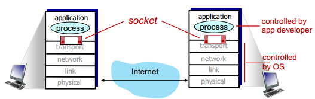
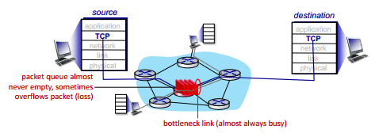
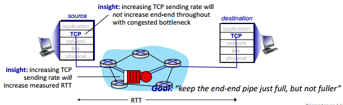
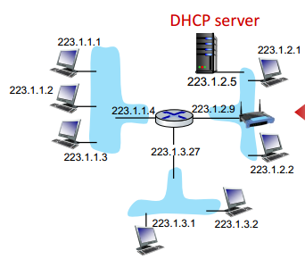

## 目录

  - 单词补充
  - Chapter 1
    - 互联网
    - 协议
    - 网络边缘侧：主机，接入网络，物理媒介
    - 网络核心侧
    - 表现：丢包，延迟，吞吐量
    - 协议层，服务模型
    - 补充1
    - 补充2
  - Chapter 2
    - 网络应用
    - 网页和HTTP
    - E-mail
    - DNS
    - P2P
    - 视频流
  - Chapter 3
    - 传输层服务和协议
    - 多路复用和多路分解
    - 补充：TCP和UDP在连接上的差别
    - 无连接传输：UDP
    - 可靠数据传输原则
    - 面向连接的传输TCP
    - 拥塞控制原则
    - TCP协议的拥塞控制
  - Chapter 4
    - 网络层
    - 路由器内部架构
    - IP协议
    - NAT
  - Chapter 5
    - LS、DV
    - OSPF
    - BGP
    - Internet Control Message Protocol
  - Chapter 6
    - 错误检测和纠错
    - 多址协议
    - LANs
  - Lab01 命令行与WireShark使用
    - WireShark
  - Lab02 Scoket编程
    - Web服务器开发
  - Lab03 思科模拟器使用
      - IP地址分配
      - OSPF
  - Lab04 Linux系统下的ns-3的使用

## 单词补充

## Chapter 1

### 互联网

互联网（Internet）由互联网服务供应商（Internet Service Providers，ISP）管理，其硬件网络（networks）由以下三个部分组成：

主机（host）也称为终端系统（end system），包括一切具有计算能力的设备（device），运行应用软件（applications）。主机可以大致分为两大类：客户端（clients），服务器（servers）。


路由器（routers）和交换机（switches）进行包交换（packet switch）。


光纤，无线电，基站等作为通信链路（communication link），传输速率以带宽（bandwidth）表示。


### 协议

协议（protocol）：

协议定义了网络实体之间发送和接收消息的格式（format）、顺序（order），以及在消息（message）发送（sent）和接收（received）时采取的操作（action）。例如HTTP，TCP等。

互联网标准（standard）：

包括RFC，IETF。

### 网络边缘侧：主机，接入网络，物理媒介


网络边缘侧（network edge）：

即为互联网中由各种主机、接入网络、物理媒介组成的部分。

接入网络（access network）是使终端和ISP的路由器群连接在一起的物理媒介（physical media），即为非网络核心侧的路由器（群）和非网络核心侧的通信链路：

接入网络使用频分复用（frequency division multiplexing，FDM）技术通过不同频段的频传输信息。使用混合纤维同轴电缆（hybrid fiber coax，HFC），实现上下行带宽不对称。使用数字用户线路（digital subscriber line，DSL）光猫（modem），就可以利用现有的电话线将数据传输到DSL访问多路复用器（access multiplexer）。DSL访问多路复用器可以将声音信号传输到电话网络中，将数据传输到互联网中。（这就是为什么一般的WIFI总是和电话座机在一起配置）

网络核心侧（network core）：

即为ISP的路由器群。

一般家庭网络结构：

终端-通信链路-路由器-光猫-ISP路由器群（互联网）


共享无线接入网络（shared wireless access network）：

无线基站（base station）也是一种共享无线接入网络。

无线局域网（Wireless Local Area Networks，Wireless LAN，WLANs，WiFi）即为通过WIFI作为共享无线接入网络。广域蜂窝接入网络（Wide-area cellular access networks）则是运营商直接通过各地的无线基站作为共享无线接入网络。企业网络（enterprise networks）则是有线和无线相结合，交换机和路由器相结合的接入网络。大量的服务器连接在一起的数据中心（data center）网络，也属于接入网络。

主机发送信息的方式：

将应用层的信息分成多个包（packets），通过通信链路进行传输，传输速率称为链路传输速率（link transmission rate）/链路容量（link capacity）/链路带宽（link bandwidth）。

通信链路的物理媒介：

双绞线（twisted pair，TP）也就是常见的网线，五类（category）线在以太网/局域网（Ethernet）下带宽为100Mbps，六类线带宽在以太网/局域网下带宽为10Gbps：


除了双绞线，还有同轴电缆（coaxial cable），光纤电缆/光缆（fiber optic cable），无线电（wireless radio），无线链路类型（radio link type）包括WiFi、广域蜂巢网络、蓝牙、地面微波（terrestrial microwave）、卫星（satellite）等。

### 网络核心侧


两个关键的网络核心侧的功能：

- 转发（forwarding）又称为交换（switching），为本地（local）操作，将从终端发送到路由器输入链路的包进行存储（store）操作后，移动到合适的输出链路。

- 路由（routing），为全局（global）操作，确定包的"源-目的地"（source-destination）的路径。

排队（queueing）：

排队是指当包已经发送到且在路由器上存储，但是因为输出链路还没来得及发送出之前存储好的包，只能等待造成排队。

电路交换（circuit switching）和包交换（packet switching）相比：

而当路由器的内存（memory）不够时，无法进行存储操作，包可能会发生丢包（loss）。可以通过电路交换，思想是给每个用户预留资源（预留一定数量的专用线路，一个用户使用的时候会一直占用同一条专用线路，因此需要预留的专用线路会越来越多），分为频分复用和时分复用（Time Division Multiplexing，TDM）方法，来尽量避免丢包，但是后来发现在互联网上是不可行的。尽管如此，现在的普通电话是可以使用电路交换的，因此会发生"占线"现象。

选择包交换，思想是按需分配（保持一定数量的公共线路，多个用户可能使用同一个公共线路，经过同一线路的包可能由不同用户发出，且没有包时就不占用线路，因此对线路的数量要求更小），来尽量避免丢包。是现在的互联网采用的方式。

### 表现：丢包，延迟，吞吐量

丢包在上一节提到过是因为路由器接收的包的大小超过了路由器的缓冲区（buffer）也就是内存的大小。

延迟包括传输（transmission）延迟，排队（queueing）延迟，节点处理（nodal processing）延迟，传播（propagation）延迟。

传输和传播的区别在于，传输的研究对象是包的大小和通信链路的带宽大小（把包从路由器放到通信链路上/把包从通信链路上存储到路由器的速度），传播的研究对象是通信链路物理上的长度和物理上的传播速度（包在通信链路上传输的速度）。因为传播速率接近光速，且在物理硬件条件的限制下基本趋于一致，因此一般不提及传播速率（包经过通信链路的速率），而是使用传输速率（把包从路由器或交换机传输到通信链路上的速率）来表示网速。

带宽与传输速率：发送速率/接收速率/传输速率是等价的，带宽是通信链路可处理的最大传输速率。通信链路两端的路由器，它们的发送速率/接收速率是无限制的，但是通信链路本身可处理的传输速率（也就是带宽）是有限制的。通信链路两端的路由器的传输速率一般大于带宽，因此带宽成为了一般的传输速率的标准。

trace route程序：对从源到目的地的互联网路径的延迟测量。发送3个包到路径上的某路由器，然后此路由器发送3个包到源，测量其时间间隔来得到延迟。

端到端（end-end）吞吐量（throughput）：比特从发送方发送到接收方的速率，单位为比特/时间。分为瞬时和平均速率。同一路径上的不同端到端的吞吐量不同，因此会造成瓶颈（bottleneck）。

### 协议层，服务模型

协议层，服务模型（service model）：


路由器和交换机不是完整的5层结构，因此路由器（需要网络层，进行路由）和交换机也无法写一个应用：


应用层：提供网络应用，例如HTTP，DNS。经过此层，包称为message。

传输层：进程-进程的数据传输。例如TCP，UDP。经过此层，包称为段segment。打包$H_t$。

网络层：源-目的地的数据报（datagram）的路由。例如IP，路由协议。经过此层，包称为数据报datagram。打包$H_0$。

链路层（linker）：相邻网络之间的数据传输。例如以太网，WiFi。经过此层，包称为帧（frame）。打包$H_l$。

物理层：电线中的bit的传输，没有打包过程。

### 补充1

ISO/OSI参考模型：


互联网的协议层没有表示层（presentation）和会话层（session），而ISO/OSI标准有。

如果互联网的服务模型中，需要这些服务，则需要在应用层实现。

### 补充2

假设某一个传输任务的总数据量为$D$，传播速率为$s$（比特在链路传播的速率，单位为：米/秒），传输速率（传输带宽）为$R$（每秒能够传输到链路上的最大比特数，单位为：比特/秒），链路物理长度为$l$，则有：

传播迟延（每个比特在链路传播的所需时间）：

$$d_{prop}=\frac{l}{s}$$

传输迟延（将所有数据传输到链路上的所需时间）：

$$d_{tran}=\frac{D}{R}$$

带宽时延积（bandwidth-delay product，BDP），表示链路上能同时存在的最大比特数（例如，$R=10 bits/s$，每秒按顺序先后将10个比特传输到链路上，从开始将第1个比特传输到链路上，到将第10个比特传输到链路上，刚好1秒。$d_{prop}=2s$，每个比特在链路传播的所需时间为2秒。因此当1秒后，链路的前半部分均匀分布有10个比特。2秒后，链路的全部部分均匀分布有20个比特，此时，第20个比特刚好被传输到链路上，而2秒前被传输到链路上的第1个比特刚好到达目的地。），单位为比特：

$$R \cdot d_{prop}$$

## Chapter 2

### 网络应用

网络应用只运行在终端的模式（客户端-服务器模式），客户端享受服务，服务器提供服务，例如HTTP，FTP：


P2P（peer-peer）模式，终端之间互相提供服务，互相享受服务：


进程通信（processes communicating）：

进程为主机上"正在执行"的程序的实体，程序是一直存在的，进程是暂时存在的。程序和进程不是一一对应的，多个进程可执行同一程序，一个进程可执行多个程序。在同一主机上，两个进程通过进程间（inter-process）通信进行通信。在不同主机上的进程通过交换消息（messages）进行通信。无论是客户端-服务器模式还是P2P模式，都有客户端进程（发起通信）和服务器进程（等待被联系）。

套接字（sockets）：



进程从它的套接字发送和接收消息，但套接字不承担传输消息的作用，仅为一个应用层与传输层之间的"门口"。

寻址进程（addressing processes）：

要接收消息，进程需要有标识符（identifier），包括主机的IP地址和端口号（port number）。例如HTTP服务器的端口号为80。

传输层的服务需要保证（实际上无法全部完整支持）：

- 数据完整性（data integrity），某些应用（音频）可以有少量丢失。

- 吞吐量（throughput），某些应用（多媒体）有最低吞吐量要求，其他应用为弹性（elastic）要求。

- 时效性（timing），某些应用有高要求。

- 安全性（security），例如加密（encryption）和保证数据完整性等。


互联网传输协议（Internet transport protocols）服务：

TCP服务能够提供（能够提供数据完整性和其他功能，不能提供最低吞吐量保证，时效性，安全性）：

数据完整性，流量（flow）控制，拥塞（congestion）控制，面向连接（connection-oriented）或连接设置（connection setup）。

UDP服务以上服务均不能提供，但很轻量化，常应用于不需要保证数据完整性的网络电话和需要互动的游戏。


### 网页和HTTP

网页（web page）：

网页由对象（objects）组成，每个对象可以存储在不同的web服务器上。对象可以是HTML文件，JPEG图像，Java applet，音频文件等。


超文本传输协议HTTP为网络应用层协议，当应用层协议为HTTP，传输层协议应当选择TCP（网页需要保证数据完整性）。HTTP是"无状态"的，服务器不会维护关于过去客户端请求的信息：


非持续（non-persistent）HTTP和持续（persistent）HTTP的区别在于，每次建立TCP连接后只能发送一个还是能多个对象：


RTT（Round-Trip Time，RTT）为一个小包从客户端到服务器并返回的时间。非持续HTTP的响应时间（response time），对每个对象而言，等于一个RTT（建立TCP连接）+一个RTT（用于HTTP请求和HTTP响应的初始文件。有时后续的"对象/文件的传输时间"也被算进去）+对象/文件的传输时间（总共为$n(RTT_1+RTT_2)+ \text{file transmission time}$）。而对于DNS服务器接受请求并返回客户端下一级DNS服务器的IP地址的过程，不需要建立TCP连接，因此响应时间仅需要一个RTT（$\sum_{i=1}^n RTT_i$）：


持续性HTTP（HTTP 1.1）则不同，服务器在发送HTTP响应后保持连接（发送后续HTTP信息，也就是HTTP请求和HTTP响应），因此建立TCP连接后对于所有对象只需一个RTT（总共为$RTT_1 + n RTT_2$）。HTTP请求（包括POST、HEAD、GET、PUT）使用ASCII编码，格式为：


HTTP响应状态码：

200 请求成功，请求对象稍后在此消息中。

301 永久移动，请求的对象已移动，稍后在此消息中指定新位置。

400 错误请求，请求消息不被服务器理解。

404 未找到，请求的文档在此服务器上未找到。

505 HTTP版本不支持。

Web站点和客户端浏览器使用cookie来维护某些状态。分为四个部分：


- HTTP响应的cookie头行，也被称为Set-cookie，服务器创建用户ID和其他数据，并写入用户主机上的cookie文件。

- 第二次及之后的HTTP请求的cookie头行，客户端使用自己的cookie文件的信息作为身份标识来进行HTTP请求。

- 保存在用户主机上的cookie文件，由用户浏览器管理。

- 网站的后端数据库（用户ID和其他数据）。

第一方cookie为用户访问第一方网站时第一方网站通过cookie追踪用户行为。第三方cookie则为与多个第一方网站有关（但与用户无关）的第三方网站通过cookie跟踪同一身份（cookie值相同）的主机在访问多个第一方网站时的行为。因此当用户访问第一方网站的内容时，会同时访问第三方网站的内容（广告），同时第三方网站会记录用户对第一方网站的浏览历史，根据浏览历史决定返回的广告内容。客户端浏览器根据第一方网站和第三方网站的内容生成合成页面：


网页缓存（Web caches）也叫做代理服务器（proxy servers），在不涉及源服务器（origin server）的情况下满足客户端请求（通过在代理服务器中缓存更常用的内容，如果客户端的请求内容"命中"了，那么代理服务器进行响应即可，不需要源服务器）。命中率（hit rate）即为客户端请求的内容恰好就在代理服务器中的几率。减少源服务器的负担，减少所需的流量密度，减少所需的响应时间（代理服务器比源服务器更接近客户端）：


在下列情景，路由器的链路带宽的占用率过高，将会造成排队延迟过高，使用合适的方案将端对端延迟降低。两种方案，一是提高接入链路带宽，二是安装代理服务器：


提高接入链路带宽，因为包抵达是随机过程中的泊松过程，即包抵达时间间隔服从指数分布，稳态下路由器中的数据量为$i$的概率为$P(i)=(1-\rho) \rho^i$，$\rho$为平均流量强度，也就是平均的接入链路（带宽）占用率（access link utilization）。那么平均数据量则为$L_s=\frac{\rho}{1-\rho}$，当$\rho \to 1$时路由器中的数据量趋于无限，排队延迟$W_q=\frac{\rho}{2 \mu(1-\rho)}$也趋于无限（$\mu$为路由器的传输速率，$\lambda$为每单位时间到达的数据量，因此$\rho=\frac{\lambda}{\mu}$。排队延迟的表达式在另一个排队模型中为$W_q=\frac{\rho}{\mu-\lambda}$）。因此我们一般讨论的流量强度都是平均的而不是瞬时的，流量强度峰值可能会大于平均流量强度，因此产生排队延迟，流量强度也可能会小于平均流量强度，此时又空闲，因此平均的占用率与排队延迟相关。高平均的接入链路占用率代表高排队延迟，而且排队延迟和平均的接入链路占用率不是线性相关的（意味着只需要保持占用率大概在60%可以接受，但是90%就无法接受），因此提高链路带宽可以降低排队延迟：


安装代理服务器，将部分链路带宽需求转移到代理服务器（降低平均的接入链路占用率），同时代理服务器的延迟也更低：


浏览器缓存（browser caching）为如果用户请求的对象在客户端浏览器中有最新的缓存版本，则服务器的响应不发送对象。

***

例题：

总平均响应时间$T$由平均接入迟延（average access delay）$t_1$和平均互联网迟延$t_2$相加得到。假定平均请求对象大小为$D$，假定子网中的全部主机的浏览器平均请求数（每次请求获得一个对象）为每秒$N$次，接入链路带宽（通信链路两端路由的传输速率/接收速率是无限制的，但是通信链路能够处理的传输速率是有限制的）为$R$（比特/秒），接入链路的传播所需时间近似为$0$。若设置子网内的代理服务器，则命中率为$P$，子网内通信链路传播时延近似于$0$：

- 将单个请求对象传输到接入链路上并且完成传播的所需时间为：

$$\Delta = D/R + 0$$

- 链路上的流量强度（traffic intensity），也就是路由器的传输速率与接入链路带宽的比值：

$$D \cdot N / R = \Delta \cdot N$$

$$(1-P) \cdot D \cdot N / R = (1-P) \cdot \Delta \cdot N$$

- 平均接入迟延：

$$t_1=\frac{\Delta}{1-\Delta \cdot N}$$

$$t_1=\frac{\Delta}{1-(1-P) \cdot \Delta \cdot N}$$

- 平均互联网迟延（从发出HTTP请求开始，直到获得确切IP地址，并获得HTTP响应的时间）。

- 总平均响应时间：

$$T=t_1+t_2$$

$$T=P \cdot 0 + (1-P) \cdot (t_1+t_2)$$

***

### E-mail

E-mail由三个部分组成：用户代理、邮件服务器、邮件传输协议SMTP。用户代理可以编辑和阅读邮件消息，是客户端主机上的应用。邮件服务器包含邮箱（mailbox）和消息队列（message queue），邮箱包含用户收到的消息，消息队列包含用户将要发送的消息。SMTP协议则用于用户代理和邮件服务器之间、邮件服务器和邮件服务器之间的邮件消息传输，SMTP协议定义发送邮件的客户端/邮件服务器为"客户端"，接收邮件的邮件服务器为"服务器"。网络关系为：


SMTP RFC(5321)协议通过TCP协议在邮件服务器和邮件服务器之间传输邮件消息（端口25），包含三个阶段：SMTP握手（handshaking）、SMTP消息传输、SMTP关闭（closure）。交互方式与HTTP相同，命令（command）为ASCII文本，响应为状态码和原因短语（reason phrase）：


因此E-mail的过程为：用户1通过用户代理和SMTP协议发送邮件到邮件服务器1，放置在邮件服务器1的消息队列中，邮件服务器1与邮件服务器2建立TCP连接，邮件服务器1发送用户1发送的邮件到邮件服务器2，放置在邮件服务器2的邮箱中，用户2通过邮件访问协议（e-mail access ptotocol）查看邮件服务器2上的用户1发送的邮件。邮件访问协议可以使用IMAP（Internet Mail Access Protocol，IMAP）RFC(3501)协议，IMAP提供在服务器上存储消息的检索、删除、文件夹的服务。邮件访问协议也可以使用HTTP协议，在STMP和IMAP的上层提供基于网页（web-based）的接口：


### DNS

域名系统（Domain Name System，DNS）：

DNS是以大量域名服务器（DNS server）组成层次结构，以实现一种分布式数据库（distributed database）结构，以实现IP地址和域名/主机名之间的转换功能的系统，这个转换过程称为解析（resolve）：

- ./.root是根域名，通常浏览器会自动补充。.com是一级域名/顶级域名/顶级域（Top-Level Domain，TLD）。baidu.com是二级域名/二级域（Second-Level Domain，SLD）。www.baidu.com是三级域名/三级域。以此类推，一个域名可以属于多个域。

- 严格意义上，真正的一级域名由一个合法的字符串+一级域名后缀组成。因此.com是一级域名后缀，baidu.com是一级域名，www.baidu.com是二级域名。

- 子域名/子域（subdomain）是属于更高一层域的域。例如baidu.com是.com的子域。

- 权威（authoritative）域名服务器则为各种组织自己的域名服务器，也称为名称服务器（name server）。提供将权威主机名到对应的IP地址的映射。

DNS在组织上和物理上均是分散的，不同的组织负责不同的DNS服务器，负责的域也不同。而网络上，DNS服务器/域名服务器处于网络核心，其IP地址和域名/主机名的转换功能作为应用层的协议实现。DNS服务器不仅有转换功能，还有设置主机别名（host aliasing）、负载分配（load distribution）等功能。主机别名可以使得一个IP地址（一台主机）映射多个主机名，负载分配可以使得一个主机名映射多个IP地址（多台主机），以实现流量负载的分流。

根域名服务器存储了负责每个顶级域名（例如.com和.cn）的域名服务器的地址信息，负责一个域名的域名服务器，将会存储所有主机名中倒数第二级域名为其负责的域名的主机的地址，同时存储负责此域名的子域名的域名服务器的地址。根域名服务器全球一共有13个。互联网名称与数字地址分配机构（Internet Corporation Assigned Names and Number，ICANN）管理根DNS服务器的存储的域。

我们浏览网站时绝大多数域名解析是在本地域名服务器（LDNS）中进行。本地域名服务器一般为用户在主机上所自定义设置的DNS服务器地址，如果选择自动获取DNS服务器地址，主机就会获取路由器已经设置好的DNS服务器地址。本地域名服务器一般是宽带运营商的DNS服务器。

DNS解析的局部步骤：


客户端访问主机名www.amazon.com，那么首先访问根DNS服务器找到.com的DNS服务器，然后访问.com的DNS服务器找到amazon.com的DNS服务器，在amazon.com的DNS服务器上找到www.amazon.com对应的IP地址并进行访问。

DNS解析的整体具体步骤：

1.浏览器先检查自身缓存中有没有被解析过的这个域名对应的IP地址，如果有，解析结束。同时域
名被缓存的时间也可通过TTL属性来设置。

2.如果浏览器缓存中没有(专业点叫还没命中)，浏览器会检查操作系统缓存中有没有对应的已解析过的结果.而操作系统也有一个域名解析的过程。在windows中可通过c盘里一个叫主机的文件来设置，如果你在这里指定了一个域名对应的IP地址，那浏览器会首先使用这个IP地址。

3.如果至此还没有命中域名，才会请求本地域名服务器（LDNS）来解析这个域名，这台服务器一般在你的城市的某个角落，距离你不会很远，并且这台服务器的性能都很好，一般都会缓存域名解析结果，大约80%的域名解析到这里就完成了。

4.如果仍然没有命中，就直接跳到根域名服务器请求解析。

5.根域名服务器返回给一个所查询域的顶级域名服务器（例如gTLD服务器）地址。

6.此时再发送请求给上一步返回的gTLD服务器。

7.接受请求的gTLD查找并返回这个域名对应的名称服务器的地址，这个名称服务器就是网站注册的域名服务器，也就是权威域名服务器。

8.名称服务器根据映射关系表找到目标IP，返回给LDNS。

9.LDNS缓存这个域名和对应的IP。

10.LDNS把解析的结果返回给用户，用户根据值缓存到本地系统缓存中，域名解析过程到此结束。

迭代查询（iterated query）步骤：


递归查询（recursive query）步骤，但是递归查询对根域名服务器的负载要求过高：


根域名服务器是最后的救命稻草（contact-of-last-resort），意思是说本地域名服务器查询不到用户想要访问的地址时，转为请求到根域名服务器就一定能解决，因为根域名服务器存储了负责每一个顶级域名的域名服务器的地址。

获取IP地址的总时间为$n$个DNS服务器被访问的总时间：

$$\sum_{i=1}^n RTT_i$$

### P2P

对等（peer-to-peer，P2P）结构，终端之间互相提供服务，互相享受服务，对等点间歇性连接并更改IP地址：


$F$为服务器需要上载的文件大小，$u_s$为服务器的上载速度，$N$为需求相同文件的客户端的数量（服务器需要为每个客户端分发一份相同的文件，上传带宽为$u_s$，同时为尽量多的客户端发送此文件，因此服务器所需的总上载时间为$N F / u_s$），$d_{min}$为客户端下载文件的最低速度（服务器上载和客户端下载可以同时进行，因此整体时间不能简单地求和），那么对于客户端-服务器结构的整体时间$D_{c-s}$满足：

$$t_s=F/u_s$$

$$T_s=N F/u_s$$

$$T_c=F/d_{min}$$

$$D_{c-s} \geq \max \left\{N F / u_{s,}, F / d_{\min }\right\}$$

对于P2P模式，则只需要服务器上载文件的一份副本即可，$u_i$为客户端的上载速度，那么P2P结构的整体时间$D_{P2P}$满足：

$$t_s=F/u_s$$

$$T_c=F/d_{min}$$

$$T_s=N F/u_{total}$$

$$u_{total}=u_s+\sum u_i$$

$$D_{P 2 P} \geq \max \left\{F / u_{s,}, F / d_{\text {min },} N F /\left(u_s+\sum u_i\right)\right\}$$

P2P的BitTorrent（BT）是一种传输协议，所有对等节点的整体称为一个torrent，一个对等节点对某一文件发出请求，此文件将会分为多个256Kb的块（chunk），多个其他对等节点上载各自持有的这个文件的部分，发出请求的对等节点同时进行下载。对等节点可能会加入和离开，称为流失（churn）。负责追踪并记录所有对等节点的变化的服务器称为tracker。

如果一个主机在BT torrent中，不给别人发送数据（不主动和其他主机建立连接），称为free-riding。一般情况下，P2P是一开始选取最邻近的4个主机进行连接，且一定时间选取随机1个主机，同时进行数据的请求和传输（因此free-riding只要呆足够长时间，总会被其他主机选中来获得请求所需的文件）。

### 视频流

视频流（video streaming）和内容分发（distribution）网络：

视频是以恒定速率显示的图像序列。而数字图像是像素数组。

视频编码（coding）通过空间（spatial）编码（例如重复的像素值用重复次数表示，而不是完整的数组）和时间（temporal）编码（例如仅发送与上一张图像的像素差值来获得下一张图像）来减少用于编码图像的数据量。

视频编码速度固定（Constant Bit Rate，CBR）：视频编码速率不变。

可变比特率（Variable Bit Rate，VBR）：视频编码速率随空间、时间编码量的变化而变化。

流式存储视频（streaming stored video）。客户端播放（playout）视频的早期部分，而服务器已经发送视频的后期部分：


因为存在可变（抖动）的网络延迟，接收视频文件的速度不定，而视频播放速度是固定且连续的，因此需要客户端的缓冲区（client-side buffer）和播放延迟（playout delay）来对网络延迟和网络延迟的抖动进行补偿（compensate），这称为连续播放约束（continuous playout constraint）：


动态自适应HTTP流（Dynamic, Adaptive Streaming over HTTP，DASH）是多个CDN服务器存储有视频文件副本，视频有不同编码率的版本，视频文件分成多个块，有清单文件（manifest file）为每个块提供URLs：


DASH可以让客户端选择什么时候请求视频块，向哪些服务器请求视频块，请求多少编码率的视频块（带宽高就可以请求跟高编码率的，视频质量更高）。因此流视频的组成即为：编码+DASH+播放缓冲。

如何将大量的视频流式传输给大量的用户？内容分发网络（content distribution network，CDN）在多个CDN服务器存储/提供多个视频副本。但是哪些内容应该放在哪个CDN节点上？从哪个CDN节点检索内容？

OTT（over the top）指第三方通过互联网向用户提供各种应用服务。这种应用和目前运营商所提供的通信业务不同，它仅利用运营商的网络，而服务内容由运营商之外的第三方提供（传统电视是运营商提供网络，同时内容也由运营商提供的封闭服务）。它运营在用户已经获得的网络之上而且不需要网络运营商额外的商业/技术支撑。

我们看电视行业，大家会觉得这是一个封闭的圈子，广电管内容，运营商管线路，就他们俩一起控制了用户对内容的需求，其他人无法参与。而OTT的概念，是基于互联网这个大网，大家都挂在上面，当然就可以在这张网上开展很多工作，如通讯方面的skype ，现在的腾讯的微信...而电视内容也可以这样。现在大家看到，很多互联网上的内容，只要一根网线就可以输出电脑上，供大家看，当然也可以输出到电视机上，供大家看。也就是说，我们可以晃过广电和运营商，来分享他们俩垄断的这个领域。但是国内对这块是要监管的，也就是说道路是通的，这点和国外一样了，但广电却在路的中间，设了一个关卡，由广电来批准你能不能过来，就不太通了。

## Chapter 3

### 传输层服务和协议

传输层为不同主机上运行的应用程序进程之间提供逻辑通信（logical communication）。

网络层提供主机之间的通信。

发送方将其应用层的应用程序消息分成段（segments）传递到网络层。接收方通过网络层接收后，将段重新组装为消息，传递到其应用层。

两种可用的传输层协议为TCP和UDP。

### 多路复用和多路分解

多路复用（multiplexing）：


那么怎么确保将信息传递到指定的进程呢？发送方进行多路复用，为来自多个套接字的数据添加传输头（transport header）。接收方进行多路分解（demultiplexing），根据传输头的信息将段传递到对应的套接字。

主机接收IP数据报，每个数据报包含源IP和目的地IP地址的信息，且带有一个传输层段。每个段包含源端口号和目的地端口号的信息（套接字创建时就需要指定一个主机本地端口号）：


无连接（connectionless）的多路分解（源IP和端口号不同，目的地IP和端口号相同，将会被分配给相同的套接字）：

UDP套接字仅使用目的地端口号进行多路分解。


面向连接的多路分解（源IP和端口号不同，目的地IP和端口号相同，可能会被分配给相同或不同的套接字）：

TCP套接字的使用4个值进行多路分解：

- 源IP地址。

- 源端口号。

- 目的地IP地址。

- 目的地端口号。


### 补充：TCP和UDP在连接上的差别

TCP和UDP都有客户端和服务器端。

TCP必须建立连接关系（握手），客户端和服务器端之间会互相确认状态。UDP不需要建立连接关系，客户端的请求和服务器端的发送都是相互独立的，因此客户端和服务器端互相不知道状态。

TCP建立连接关系，如果客户端和服务器端的进程的端口号错误对应，将有可能无法建立连接，发生错误。UDP不需要建立连接关系，如果客户端和服务器端的进程的端口号错误对应，那么数据的接收方就无法接收到请求的数据了，但是不会发生错误。

### 无连接传输：UDP

UDP称为无连接的，是因为UDP发送方和接收方之间没有握手过程，且每个UDP的段独立处理。

UDP协议不需要建立连接，因此可以减少RTT。UDP协议不存在连接状态，很简单。UDP协议的头文件很小。UDP没有拥堵控制。

UDP在以下场景得到应用：

- 流媒体多媒体应用。
- DNS
- SNMP（一种应用层协议）
- HTTP/3（虽然需要可靠性和拥堵控制，在应用层额外添加即可）

UDP在传输层的工作：


UDP校验和（checksum），检测传输段中的翻转位（flipped bits）：


发送方将UDP段的内容视为16bit整数的序列，求和并放入UDP校验和字段（field）。接收方也对UDP段的内容进行求和，并与发送方的校验和进行比较（不符合则丢弃此包）。

4个Byte（两个16bit长度）的数据为一组，每一位相加，进位将会加到下一位。需要将最高进位也添加到结果（第17位）中，且仅取16位作为和的结果，对其取反码（one's complement，1s complement）即获得校验和：


接收方的检验方法：

- 将所有数据相加，其结果和校验和相加，最终结果全为1即为没有错误。
- 能够检测到所有1bit的错误，但不一定检测得到2bit的错误（有可能和的结果相同）。

补充：

- 补码（two's complement，2s complement），正数的补码就是其本身，负数的补码为其取反后加一。

### 可靠数据传输原则

抽象：


实际实现：


依靠可靠数据传输（reliable data transfer，rdt）协议和底层信道（underlying channel）来保证可靠的数据传输。

使用有限状态机（finite state machines，FSM）表示发送方、接收方的状态，横线上方为使得状态发生变化的事件，横线下方为状态发生变化时做出的操作：


rdt1.0是底层信道完全可靠的（没有位错误和丢包）。通过FSM来区分发送方和接收方。其中一方不知道另一方的状态（因此需要协议）。

rdt2.0是底层信道并不完全可靠（可能有位翻转，使用校验和来检测位错误）。通过FSM来区分发送方和接收方。具有确认（acknowledgements，ACKs），接收方明确地告诉发送方成功收到包（pkt）。具有否定确认（negative acknowledgements，NAKs），接收方明确告知发送方包有错误，发送方在收到NAK后重新传输包。在这种模式中，发送方发送一个数据包，然后等待接收方的响应，才决定如何发送下一个数据包。rdt2.0的FSM：


rdt2.0也存在严重缺陷，如果ACK和NAK损坏，则发送方未知接收方状态，只能重复发送包，但是添加序列号（sequence number）让接收方丢弃重复的包。

rdt2.1则是添加了处理损坏的ACK和NAK的环节，设置两个不同序列号（0和1），轮流对下一个包的序列号赋值0和1。接收方无法知道其最后一次ACK/NAK是否在发送方接收到：

发送方：


接收方：


在状态机概念上，是有可能陷入死锁（deadlock）的，也就是发送方和接收方的状态将会无法发生改变。例如：接收方成功接收到0号包并发送ACK给发送方，且接收方进入等待1号包的状态，而此时ACK在传输过程中受损（变为NAK），则发送方将会重新发送0号包，接收方等待的是1号包，因此再次发送NAK给发送方，陷入死循环。

rdt2.2具有rdt2.1的功能，但没有NAK，只有ACK。接收方发送最后一次接收到的包的ACK（包含序列号），而不是NAK：


rdt3.0的底层信道可能丢失数据包（数据、ACK）。采用的方法是"计时器"，发送方发送一个包后，等待"合理"的ACK时间， 如果在此时间内未接收到ACK（可能延迟或丢失），则重新发送此包。发送方状态机：


rdt3.0工作的具体流程：


rdt3.0的利用率（utilization）$U_{sender}$，为发送方用于发送包的时间对总时间的占比（其中$L$为包大小，$R$为传输速率）：


rdt3.0使用流水线（pipeline）协议，允许多个未被ACK过的包在发送方和接收方之间在通信链路上传播（其他rdt协议均为发送方根据接收一个包后返回的相关信息才发送下一个包），因此发送方可以不断地发送包，提高利用率：


Go-Back-N：

发送方和接收方通过window（size为$N$，决定了在通信链路上传播的未被确认过的包的最大数量）来表示和处理包的发送的状态。：


有累计（cumulative）ACK($n$)，接收方仅记录并返回已有的且连续ACK的最大次数$n$，发送方接收到ACK($n$)后移动window的$n+1$次。

对最先到的包开始计时，如果超时timeout($n$)，则重新发送$n$包及最大数量的比此包更高序列的包（例如$n+1,n+2 \cdots$）。

如果接收方接收到不符合顺序（out-of-order）的包，可以丢弃（discard）或缓存（buffer）。ACK($n$)不会更新，会因为超时timeout($n$)机制重新获得符合顺序的包，因此选择丢弃也是不影响的：


Go-Back-N具体工作流程：


选择性重传（selective repeat）是Go-Back-N的改进：


接收方单独地（individually）确认每个包，根据需要对不符合顺序的包进行缓冲，以便最终按顺序传输到上层。发送方单独地为每个未ACK的包设置计时器，以对超时的包进行单独的重传。对发送方和接收方的window，则在N个包全部ACK后才移动N次。

选择性重传工作流程：


选择性重传存在的问题情况：


### 面向连接的传输TCP

TCP的特点：

点对点（point-to-point）、可靠有序的字节流（byte steam）、全双工（full duplex）数据、累计ACK、流水线、面向连接（握手）、流量控制。

TCP段的结构：


TCP序列号和ACK（两台主机互相请求和接收数据）：


这里的Seq是序列号（sequence number），代表主机在段数据内的字节流的第一个字节的序列号，发送方告诉接收方"我发送的数据是从第几个字节开始的"。ACK是确认序号，代表主机对另一主机的期望字节流的第一个字节的序列号，接收方告诉发送方"我已经收到上一个字节流了，我下一次想接收的数据是从第几个字节开始（用于核对）"，且为累计的ACK。data（'C'）字节数为1，因此Seq和ACK在每次数据交换均增长1。

TCP超时值（不能太高也不能太低）、当前预估RTT、当前真实样本RTT的数学关系：

$$EstimatedRTT =(1-\alpha) *EstimatedRTT +\alpha * SampleRTT$$

$$TimeoutInterval = EstimatedRTT +4 * DevRTT(safety margin)$$

$$\text { DevRTT }=(1-\beta) * \text { DevRTT }+\beta * \mid \text { SampleRTT-EstimatedRTT } \mid$$

需要重传的场景：


TCP快速重传（fast retransmit）：

如果发送方接收到针对相同数据的3个额外的重复（duplicate）的ACK（说明有一个包有很大可能丢失了），则直接重新发送最小的未ACK的序列号的包。


TCP流量控制：


网络层将数据报有效载荷（payload）传递到TCP套接字缓冲区，应用层在TCP套接字缓冲区中删除数据，如果删除数据的速度低于传递数据的速度，那么会造成缓冲区溢出。

因此采用流量控制，接收方控制发送方，这样发送方就不会因为传输过多、过快而溢出接收方的缓冲区：


TCP接收方在TCP头中包含了可用缓冲区空间（free buffer space）。发送方则确保未ACK的包的数量不会使得包的大小达到可用缓冲区空间溢出。

TCP连接建立（二次、三次、四次握手）：

二次握手可能出现重复数据：


三次握手：


结束TCP连接（四次挥手）：


- 客户端、服务器各自关闭连接端。发送FIN位为1的TCP段。

- 用ACK响应接收到的FIN。在接收到FIN时，ACK可以与自己的FIN组合。

- 可以同时处理FIN交换。

### 拥塞控制原则

拥塞：

- 太多发送者，发送太多数据，速度太快，使得网络无法处理。
- 发生长延迟（在路由器缓冲区中排队）和丢包（路由器缓冲区溢出）。

终端-终端拥塞控制：

- 没有从网络的显式的反馈。
- 根据观测的损耗、延迟推断出拥塞。
- TCP采取此种拥塞控制。

网络辅助拥塞控制：

- 拥塞的路由器直接向发送方/接收方主机提供显式的反馈。
- 可以反馈拥塞级别或显式设置发送速率。
- TCP ECN、ATM、DECbit协议使用此种拥塞控制。

### TCP协议的拥塞控制

AIMD方法：发送方可以提高发送速率，直到发生数据包丢失（拥塞），然后在发生丢失事件时降低发送速率。

添加增加（additive increase，AI）：在检测到丢失之前，每个RTT将发送速率增加1个最大分段大小（maximum segment size，MSS）。

乘性递减（multiplicative decrease，MD）：额外三重ACK（称为TCP Reno）发生时将发送速率减半（有包丢失，但后续还能接收，还不算太拥塞）。通过超时检测到丢失（TCP Tahoe）时，将发送速率减小至1个最大分段大小（连一个ACK都接收不到了，很拥塞，直接重置）。发生三重ACK事件后不会再判定超时事件了。

TCP拥塞控制细节：


响应于观察到的网络拥塞，动态调整拥塞窗口（cwnd）。

$$\text { LastByteSent- LastByteAcked } \leq \text { cwnd }$$

$$\text { TCP rate } \approx \frac{\text { cwnd }}{\text { RTT }} \text { bytes/sec }$$

TCP慢速启动（slow start）（初始速率慢）：


- 当未到达阈值时，以指数方式增加速率。初始cwnd=1 MSS，每个RTT增加一倍cwnd，这通过根据每个接收到的ACK使得cwnd增加一次来完成。

- 发生超时事件时，在将cwnd减小至1 MSS前，记录此时的cwnd的一半为阈值ssthresh。这个状态称为慢速启动（slow start）。

- 发生额外三重ACK事件时，在将cwnd减半前，记录此时的cwnd的一半为阈值ssthresh，减半后再使cwnd增加三次。这个状态称为快速恢复（fast recovery）。

- 当cwnd增加超过此阈值时，改为每个RTT增加一个cwnd。这个状态称为拥塞避免（congestion avoidance）。

TCP慢速启动-快速恢复的有限状态机：


最新方式TCP CUBIC比AIMD更好，不采用线性而是更快的速度接近上限：


$W_{max}$：检测到拥塞丢失的发送速率。

TCP和拥塞的"瓶颈链路"（bottleneck link）总是繁忙且濒临拥塞：






保持发送端到接收端管道刚刚满，但不溢出。保持瓶颈链路忙于传输，但避免高延迟/缓冲。

基于延迟和RTT来调整TCP包发送速率，进行TCP拥塞控制。

显式拥塞控制（explicit congestion notification，ECN），TCP部署通常实现的基于网络辅助的拥塞控制。由网络路由器标记的IP头（ToS字段）中的两个bits来指示拥塞，接收方主机设置ACK段上的ECE位来通知发送方主机拥塞：


TCP公平性（fairness）：

目标：在理想化假设下，如果K个TCP会话共享带宽为R的同一瓶颈链路，则每个会话的平均速率应为R/K。

公平性-对于UDP：

多媒体应用程序通常不使用TCP，因为不希望速率被拥塞控制。

公平性-对于TCP：

并行TCP连接，应用程序可以在两台主机之间打开多个并行连接，并行连接的数量影响获得的总带宽（按个数多少分配多少）。

## Chapter 4

目前的传输层基于TCP和UDP。

### 网络层

网络层的作用：

- 发送方：将数据段封装成数据报，传递到链路层。
- 接收方：将数据段传递到传输层协议。

网络层协议存在于每一个互联网设备：主机，路由器。

路由器：

- 检查通过它的所有IP数据报的报头字段。
- 将数据报从输入端口移动到输出端口，沿端到端路径传输数据报。

网络层功能：

- 转发。
- 路由。

网络层中的数据平面与控制平面：

数据平面（data plane）是每台路由器都有的本地功能，决定到达路由器输入端口的数据报如何转发到路由器输出端口。

控制平面（control plane）是全网逻辑（network-wide logic），决定了数据报从源主机到目的主机过程中，如何沿着路由器路由的终端-终端路径。两种控制平面方法：

- 传统路由算法：在路由器中实现。


- 软件定义网络（software-defined networking，SDN）：在远程服务器中实现转发表（forwarding table）（控制平面在远程服务器中）。


网络服务模型，无法保证任何一项质量服务（quality of service，QoS），因此称为尽力而为（best-effort）：


### 路由器内部架构

通用路由器架构-高级视图（high-level）：


路由器输入端口功能：


第一个单元，"line termination"，即为物理层，以bit为单位进行数据接收。

下一单元为链路层协议（例如以太网）。

下一单元为查找（lookup）和转发，如果数据报到达的速度比转发速度快则形成排队。去中心化交换结构，根据数据报的报头字段（header field）值，在输入端口内存中使用转发表查找输出端口。

- 基于目的主机的转发方式：仅基于目的主机IP地址转发（传统方法）。

查找转发表时，可变的bit前的bit均属于前缀，使用最长前缀匹配（longest prefix matching）原则，将数据报输出到目的主机地址范围与报头字段值的前缀匹配最多的链路接口。

目的地地址范围和链路接口：


构建转发表：

|前缀|接口|
|:-:|:-:|
|11001000 00010111 00010|0|
|11001000 00010111 00011000|1|
|11001000 00010111 00011|2|
|otherwise|3|

- 广义转发（generalized forwarding）方式：基于任何一组报头字段值进行转发。

下一单元即为交换光纤（switching fabrics）。将数据包从输入链路传输到相应的输出链路，其速率称为交换速率（switching rate），通常以输入/输出线速率（line rate）$R$的倍数$NR$（假设路由器有$N$个端口）来衡量。


输入端口排队：

如果交换光纤比输入端口慢，则会形成输入端口排队。

队列头（head-of-the-line，HOL）阻塞（blocking）：


输出端口排队：


当数据报从交换光纤到达的速度比链路传输速度快时，需要缓冲区。有删除策略（dorp policy），如果没有空闲缓冲区，要删除数据报（数据报可能由于拥塞、缺乏缓冲区而丢失）。有调度原则（scheduling discipline），在排队的数据报中选择进行传输（优先级调度，为获得最佳表现、网络中立性）。

那么缓冲区的大小应如何决定？过大和过小都有坏处。有RFC 3439经验公式，平均缓冲区大小等于"典型的"RTT（比如250毫秒）乘以链路容量$C$。对于$N$个流，则有：

$$\frac{RTT \cdot C}{\sqrt{N}}$$

包调度（packet scheduling）：

决定链路下一个发送哪个数据包。例如：先进后出FCFS和先到先出FIFO。

调度策略-优先级调度（priority scheduling）：


- 按类别排队。
- 优先从缓冲区中具有最高优先级的类的队列中发送数据包，直到具有最高优先级的类的队列为空，才能发送下一优先级的类的队列的数据包（缓冲区不断由输入端口到达的数据包进行填充）。

调度策略-循环（Round Robin，RR）调度：


- 按类别排队。
- 服务器循环重复地扫描每个类队列，依次从每个类队列发送一个完整的数据包。

调度策略-加权公平排队（Weighted Fair Queuing，WFQ）：


- 按类别排队。
- 基于循环调度。
- 每个类具有权重$w_i$，并从每次循环中计算权重：

$$\frac{w_i}{\sum_j w_j}$$

- 对每个类具有最低带宽保证。
- 例如123类包的权重比例为3:2:1，则发送顺序为111223111223...，也就是每个循环遵循权重比例分配数据包的发送数量比例。

### IP协议

已知目前传输层协议为TCP和UDP。

网络层协议为IP协议、ICMP协议、路径选择算法（path-selection algorithms）（路由器协议或SDN）：


IP数据报（IPV4）完整格式（根据格子长度表示对应信息占用的bit数），IP头部（overhead）和TCP首部长度均为为20bytes：


TCP头部紧跟着IP头部或者IPv6扩展头部，经常是20字节（默认不带选项字段）。带选项字段的话，TCP头部最长可达60字节。常见的选项字段包括最大段大小，时间戳、窗口缩放和选择性ACK等。IP数据报与TCP报文段的关系为：


IP地址，使用点分十进制（dotted-decimal）：


IP地址为与每个主机/路由器接口关联的标识符，大小为32bit。接口为主机/路由器和物理链路之间的连接。路由器通常有多个接口，主机通常有一个或两个接口。

子网（subnet）：

子网为不需要经过中间的路由器，可以在物理上相互连接的设备接口组成的网络。

IP地址具有子网部分和主机部分。

- 子网部分/网络部分（part/portion）：同一子网中的设备均具有的公共高位（high-order）。
- 主机部分：除子网部分剩余的低位（low-order）。


- 子网掩码/网络掩码（subnet/network mask）为"/24"，意思是IP地址中，高位的24bits（3个bytes，也就是前3个十进制数）为子网部分。相同的IP地址，不同的子网掩码（子网部分和主机部分配比不同），指向的地址也不同。

- 根据主机部分占有的bit数来决定此子网最多能够拥有多少个接口。如子网223.1.1.128/26（最后8个bit为10000000，子网掩码把第一个"10"也作为子网部分，则剩下6个bit均为主机部分，每个数代表一个接口）能够分配$2^6=64$个接口，也就是范围为223.1.1.128/26（10000000） ~ 223.1.1.191/26（10111111）。后续再进行分配，则可以从223.1.1.192/28分配子网，最后8个bit为11000000，子网掩码把"110"也作为子网部分，能够分配$2^5=32$个接口，也就是范围为223.1.1.192/28（11000000） ~ 223.1.1.223/28（11011111）。后续再进行分配，则可以从223.1.1.224分配子网。
- 注意：一开始就需要根据分配接口的需求来决定子网掩码，因为一旦定下子网掩码就决定了此子网一共有多少个不同的ip地址，即使实际没有用到（分配接口）。
- 注意：从中我们可以发现一个规律，子网掩码将会使得前缀以"...1110"的格式来作为子网部分，这是因为每一次分配都会使得值为"0"的位之后的所有位都为"1"的状况下为最大值，因此此次分配从前一次分配的最大值+1（因此进位）开始进行分配。同时，随着对同一网段的子网的分配，子网掩码将会逐渐变大，因为已经得到分配的段将会从最高位开始逐渐变成1（接口需求数大的优先进行分配，才能使得子网掩码从最高位向最低位）。例如223.1.17.0/25（00000000）到223.1.17.128/26（10000000）到223.1.17.192/28（11000000），分别分配了接口数为$2^7,2^6,2^4$的三个子网。

IP地址的无分类（早期IP地址会分为A、B、C类，分别表示子网部分长度为8bit、16bit、24bit）域间路由（Classless InterDomain Rounting，CIDR）：

- 允许IP地址的子网部分具有任意长度。
- IP地址格式：a.b.c.d/x，x为IP地址的子网部分的bit数。

如何获取IP地址可以拆分为两个问题：

- 主机如何在其网络中获得其IP地址（地址的主机部分）？
- 网络如何为自己获取IP地址（地址的网络部分）？

主机在其网络中获得其IP地址的方法：

- 在配置文件（config file）中进行硬编码（hard-coded）。
- 动态主机配置协议（Dynamic Host Configuration Protocol，DHCP）：从服务器动态获取地址。

DHCP：



通常，DHCP服务器内置于路由器中，为路由器所连接的所有子网提供服务。

新加入的主机需要在此网络中获得其对应的地址，需要与DHCP服务器进行的广播（broadcast）（不指定特定接收者发送的消息）信息交换。如果客户端记得并希望重用以前分配的网络地址，可以跳过中间两个步骤：


- DHCP发现。
- DHCP提供。
- DHCP请求。
- DHCP确认（ACK）。

DHCP服务器除了返回IP地址，还可以返回：
- 客户端的第一跳（first-hop）路由器的IP地址。
- DNS服务器的名称和IP地址。
- 网络掩码。

DHCP和其他协议的封装（encapsulated）关系。主机获得DHCP所需信息的过程：


网络为自己获取IP地址的方法：

获得网络的供应商（ISP）的地址空间（address space）的分配部分（allocated portion）。对供应商的地址空间的网络部分（供应商控制）以外的部分（主机部分）进行分割，可以分配成多个地址块（block/organization）：


网络供应商如何获得地址块：

从ICANN获得。
- ICANN通过5个区域注册中心（regional registries，RRs）分配IP地址。
- ICANN也管理DNS根域，包括单个TLD（.com、.edu…）管理的委派。

分层寻址（hierarchical addressing）的路由聚合（route aggregation）：


### NAT

网络地址转换（Network Address Translation，NAT）：


- 对外网来说，本地网络中的所有设备只共享一个公有IPv4地址。所有离开本地网络的数据报都有相同的源NAT IP地址（如上图，138.76.29.7），但源端口号不同。

- 本地网络中的所有设备在本地网络的私有IP地址空间中都有一个32位地址（一般为10/8、172.16/12、192.168/16前缀）。

NAT优势：

- 所有设备只需要提供商ISP提供一个IP地址。
- 可以在不通知外界的情况下更改本地网络中主机的地址。
- 可以在不更改本地网络中设备地址的情况下更改ISP。
- 安全性：本地网络内的设备不能直接寻址。（从外网对内网寻址需要内网穿透）

NAT实现：

- 传出数据报：将每个传出数据报的源IP地址，端口号替换为NAT IP地址，新端口号。远程客户端/服务器将使用NAT IP地址，新端口号作为目标地址进行响应。
- 记住（在NAT转换表中）每个源IP地址，端口号到NAT IP地址，新端口号的转换对。
- 传入数据报：将每个传入数据报的目的地字段中的NAT IP地址，新端口号替换为存储在NAT表中的相应的源IP地址，端口号。

NAT流程图：


NAT备受争议的点：

- 路由器“应该”只处理网络层。
- 地址“短缺”应该通过IPv6解决。
- 违反端到端争论（网络层设备操纵端口号）。
- NAT穿透：如果客户端想连接到NAT后面的服务器怎么办？
- 但NAT将继续存在：广泛用于家庭和机构网络，4G/5G蜂窝网络。

IPV6：

- 32位IPv4地址空间将被完全分配的应对方法。
- 加快处理/转发速度：固定40bytes长度的报头（overhead）。
- 128位IPV6地址。
- 实现不同网络层对"流"的处理。

IPV6数据报格式：


和IPV4相比，IPV6省略的部分：

- 没有校验和（加快路由器的处理速度）。
- 没有碎片（fragmentation）/重组（reassembly）：

网络链路具有MTU（最大传输大小），也就是最大的链路级帧。需要在网络内分段的大型IP数据报，一个数据报变成几个数据报，仅在目的地"重新组装"。


- 没有选项（option）（可用作上层，路由器上的下一个标头协议）。

IPV4到IPV6的过渡：


- 隧道传输技术（tunneling）：IPv6数据报作为IPv4路由器之间IPv4数据报中的有效载荷（也就是"包中包"）。
- 隧道传输技术在其他环境中广泛使用（4G/5G）。

隧道传输技术流程图：


## Chapter 5

### LS、DV

网络层功能：

- 转发。将数据包从路由器的输入移动到适当的路由器输出数据平面控制平面。
- 路由。确定数据包从源到目的地的路由。

构建网络控制平面的两种方法：

- 路由器协议控制（传统）
- 逻辑集中控制（SDN）

路由器协议：

路由器协议的目的是找到最少成本、最快、最少拥堵的路径（path）。

把主机-路由器、路由器-路由器之间称为一个链路（link），路径由多个链路组成。

图算法，将路由器视为节点：

$c_{u,v}$为路由器$u$和$v$的链路成本。可以定义为常数$1$，也可以定义成与带宽和拥塞成反比。


路由器算法的分类：

- 全局，所有路由器都有完整的拓扑（topology）和链路成本的信息。"链路状态（link state，LS）"算法。
- 去中心化，路由器最初只知道邻居的链路成本。"距离向量（distance vector，DV）"算法。
- 静态，路由随时间，更新频率逐渐减少。
- 动态，路由在一定周期或链路成本变化时进行更新。

链路状态算法（Dijkstra路由算法），$c_{u,v}$为从$u$到$v$的链路成本，$D(v)$为从源到$v$的最小成本路径的成本，$p(v)$为从源到$v$的前置节点，$N^{\prime}$为当前最小成本路径的已知的节点集：

- 所有路由器，通过链路状态的广播，均获得所有节点的链路成本。
- 计算从一个节点（源）到所有其他节点的最小成本路径，以生成转发表。
- 经过$k$次迭代，最终可以获得到达$k$个不同目的地的最小成本路径。

具体步骤：

- 每一次迭代，更新从源到每个节点的最小成本和对应的前置节点，同时获得从源到其中一个节点的最终的最小成本和对应的前置节点。（通过前置节点的组合获得最小成本路径）
- 对单个节点的一次更新的流程：列出从源到此节点的所有路径（只能选用源节点和已经获得最短路径的节点作为前置节点），选取具有最小成本的路径，将其成本和前置节点作为此节点更新的结果。
- 每个节点更新完成后，将所有节点更新的结果中，成本最小的那个节点将已经获得最短路径。之后的迭代过程中，将不对此节点进行更新。

$$D(v)=\min \left(D(v), D(w)+c_{w, v}\right)$$


比较次数为$n(n+1)/2$，因此算法复杂度为$O(n^2)$。

***

例子：


***

距离向量算法（和链路状态算法思想其实是一致的，前置节点的组合得到最短路径）：

- 基于Bellman-Ford（BF）方程，$D_x(y)$为从$x$到$y$的最小成本路径的成本（距离向量），$v$为$x$的所有邻居节点的集合，则满足：

$$D_x(y)=\min _v\left\{c_{x, v}+D_v(y)\right\}$$


- 因此当稳定时，每个节点的DV表示此节点到其他每个节点的最短路径表。

局部迭代步骤（局部DV发生变化或接收的邻居DV发生变化，或一定周期，进行局部迭代）：

- 每个节点一开始仅知道其本身与所有邻居节点的链路的成本。但每个节点都知道所有节点的存在。
- 每一时刻，每个节点向其所有邻居节点发送局部距离向量，同时从其所有邻居节点接收距离向量，然后根据BF方程更新其局部距离向量。
- 异步，不要求所有节点同时进行操作。


各个节点的DV（表）的具体迭代计算过程，最终趋于稳定（收敛）：


- 注意单个节点的初始DV不是全部节点的初始DV的组合（单个节点初始DV只知道邻居节点的成本），因为是去中心化的。初始时刻的下一时刻，每个节点会接收到邻居的初始DV（只接收不更新），并根据初始DV来更新自己的初始DV。因此每个节点实际上是根据从邻居接收的DV来单独更新自己的DV的。
- 会出现无限循环的状态：因为DV表示的是最短路径的总长度，并不包含路径的具体信息，因此有可能因为时间差让两个相邻节点都"以为"另一节点到第三个节点有一条最短路径，然后将这两个相邻节点之间的路径长度加上此最短路径的总长度，并传输给另一节点，造成无限循环。

### OSPF

在之前的路由器相关的讨论中，都将路由器视作完全相同的，而网络是理想化的。但是实际上需要解决更多问题。

规模（scale）问题：

- 数十亿目的地。
- 无法将所有目的地存储在路由表。
- 路由表交换会完全占用链路。

管理自主权（administrative autonomy）问题：

- 每个网络管理员可能想要控制其自己网络中的路由。

解决方案：

将路由器聚集在自主系统（autonomous system，AS）区域，也称为域（domain）区域。

- AS内路由（intra-AS）/域内路由（intra-domain）指在同一AS/网络中的路由。

- 同一AS中的所有路由器必须运行相同的域内协议。

- 网关（gateway）路由器：位于其所属AS的“边缘”，具有和其他AS的路由器的链路。

- AS间路由（inter-AS）/域间路由（inter-domain）指不同AS/网络之间的路由。

- 网关执行AS间路由，同时也可以执行AS内路由。

- AS内路由算法、AS间路由算法分别生成对应的转发表。AS内路由确定AS内目的地的条目。AS间和AS内确定外部目的地的条目。

常见的AS内路由协议：

- RIP（Rounting Information Protocol）协议为经典DV，已逐渐弃用。
- EIGRP（Enhanced Interior Gateway Rounting Protocol）协议基于DV，由思科（Cisco）专有并于2013年开放。
- 开放式最短路径优先OSPF（Open Shortest Path First）协议为链路状态路由，ISO标准，与IS-IS协议基本相同。

分层（hierarchical）OSPF：

- 局部（local area）路由器。分为内部（internal）路由器和区域边界路由器（area border router，ABR）。

- 骨干（backbone）路由器。分为一般骨干路由器和边界（boundary）路由器。


- 所有OSPF消息都经过身份验证（以防止恶意入侵）。


所有的路由器都运行OSPF，并将整个自治系统划分为3个区域，其中RouterA和RouterB作为ABR来转发区域之间的路由。每个 OSPF 路由器都维持着同样的数据库以描述 AS 的拓扑结构，并以此数据库来创建最短路径树并计算路由表。

### BGP

边界网关协议BGP（Border Gateway Protocol）是一种AS间路由协议。

- 允许子网向互联网的其他部分广播/播发其存在和可以到达的目的地。
- eBGP：从相邻AS获得子网可达性（reachability）信息。
- iBGP：将获得的可达性信息传播到AS内部的所有路由器。


BGP会话（session）：

- 两个BGP路由器（可以用对等方peers表示）通过半永久TCP连接交换BGP消息。

BGP播发路由（advertised route）：

- 内容：前缀+属性。
- 前缀：被播发的目的地。
- 重要属性：AS-PATH，前缀播发已经过的AS路径列表。
- 重要属性：NEXT-HOP，指示特定的AS内部的路由器，以到下一跳的AS。

基于策略（policy-based）路由：

- 网关接收使用导入策略（import policy）的路由播发来选择接受某条路径，拒绝其他路径。

- AS策略还确定是否向其他相邻AS播发路径。


BGP消息（messages）：

- BGP消息通过BGP路由器之间的TCP连接进行交换。
- OPEN：打开到远程BGP对等端的TCP连接，并对发送BGP对等方进行身份验证。
- UPDATE：通告新路径（或撤回旧路径）。
- KEEPALIVE：在没有更新的情况下保持连接有效。同时对OPEN请求进行确认ACK。
- NOTIFICATION：报告前一条消息中的错误。也用于关闭连接。

BGP路径播发具体过程：

- 路由器中存有为到达其他每个目的地应当选择的路由器接口（interface）。


AS内路由和AS间路由的不同：

策略方面：

- AS间路由：管理员希望控制其流量（traffic）如何路由，以及谁通过其网络进行路由。
- AS内路由：单一管理员，因此政策规模较小。

规模方面：

- 分层路由节省了表大小，降低了更新流量性能。

性能（performance）方面：

- AS间路由：策略比性能更重要。
- AS内路由：专注于性能。

烫手山芋（hot potato）路由原则：

- AS内的路由器应选择路径成本最低的本地网关，不考虑AS间的路径成本。


通过播发实现策略：

- 实现ISP只想将流量路由到其客户的网络（不想在其他ISP之间传输传输流量）的现实世界策略。


- B和AC分属不同的ISP网络。C得出CAw，因为C、A、w不是B的客户，B不希望AC通过B进行CBAw路径进行路由，因此B得出的BAw不会播发给C。因此最终只能选择CAw路径。

- x是双宿（dual-homed）的，连接两个不同的ISP网络。而作为客户网络，x不希望B和C通过x进行路由，因此x不会播发到达C的路由给B。

BGP路由选择概述：

- 局部性能价值属性：策略选择。
- 最短AS-PATH。
- 最近NEXT-HOP路由（烫手山芋原则）。
- 附加的其他标准。

### Internet Control Message Protocol

不考。

## Chapter 6

链路层：

- 链路层负责通过链路将数据报从一个节点传输到物理上相邻的节点，此时包称为帧。
- 将主机和路由器均视为节点。
- 沿着通信路径（communication path）的通信信道（communication channel）：有线、无线、局域网。
- 第二层（layer-2）数据包：帧，数据报。

成帧（framing），链路访问（link access）：

- 将数据报封装到帧中，添加报头（header），尾部（trailer）。帧报头中为MAC地址（源和目的地）。
- 如果共享媒介，则信道访问（channel access）。

相邻节点之间的可靠传递（reliable delivery）：

- 无线链路：高错误率。

链路层服务：

- 流量控制。
- 错误检测（error detection）。
- 纠错（error correction）。无需重传。
- 半双工（half-duplex）和全双工（full-duplex）。在半双工的情况下，链路两端的节点虽可以进行传输，但不能同时进行。全双工则可以同时进行。

链路层实现：

- 链路层在网络接口卡（network interface card，NIC）或芯片上实现。例如以太网/WiFi网卡/芯片。
- 连接到主机的系统总线。
- 硬件、软件、固件的组合。

### 错误检测和纠错

- EDC（error detection and correction bits）：校验位。
- D：受错误校验保护的数据，可能包括报头字段。


奇偶校验（parity checking）：

- 根据原始数据中bit为1的个数为奇数个还是偶数个，设置奇偶校验位，值为0或1。


循环冗余校验（cyclic redundancy check，CRC）：


- 选择r个CRC bits为位模式（bit pattern）$R$，使得$<D,R>=D * 2^r \; XOR \; R=nG$也就是刚好可被$G$整除，等价满足$D * 2^r =nG \; XOR \; R$。接收方已知$G$。
- 可以检测小于r+1位的所有突发错误。
- 对$G$进行异或运算（$XOR$）得到两位结果，结合下一位，并再次与$000$进行异或运算，最后得到即为$R$。


### 多址协议

多址协议（multiple access protocols）：

- 所谓多址接入协议就是在一个网络中，解决多个用户如何高效共享一个物理链路资源的技术。多址技术解决的就是多个用户同时接入网络时，如何有效区分的问题。在无线接入网中，多个用户会同时通过同一个基站和其他用户进行通信，因此必须对不同用户和基站之间传输的信号赋予不同的特征。这些特征使基站能够从众多用户手机发射的信号中，区分出是哪一个用户的手机发出来的信号；各用户的手机能够从基站发出的信号中，区分出哪一个是发给自己的信号。重点是对同一信号的不同部分的"区分"。
- 例如：把总带宽分隔成多个信道，每个用户占用一个信道。
- 方式一：点对点（主机之间的点对点链路，用于拨号访问的PPP）。
- 方式二：广播（共享有线或共享媒体）。
- 单一共享广播信道（channel）。
- 节点同时进行两次或多次传输：干扰（interference）。
- 如果节点同时接收到两个或多个信号：冲突/碰撞（collision）。
- 多址协议即为确定节点如何共享信道的分布式算法（distributed algorithm），确定节点何时可以进行传输。
- 多址协议关于信道共享的通信，必须使用信道本身，没有用于协调（coordination）的带外（out-of-band）信道。

理想的多址协议：

- 给定：（总）速率为$R$bps的多址信道（multiple access channel，MAC）。
- 期望：1.当一个节点想要发送时，它可以以速率R发送。2.当M个节点想要发送时，每个节点可以以平均速率R/M发送。3.完全去中心化，没有专门的节点来协调传输，没有时钟和时隙（slot）同步（synchronization）。4.足够简单。

MAC协议分类（taxonomy）：

- 信道划分（channel partitioning）：将信道划分为更小的块（时隙、频率、代码），将块分配给节点以供专用。
- 随机接入（random access）：信道未划分，允许冲突，但能够从冲突中恢复。
- 轮流（take turn）：节点轮流进行，但要发送更多的节点可能需要更长的轮流时间。

信道划分MAC协议-TDMA：

- 时分多址（time division multiple access，TDMA）。
- 轮番访问信道。
- 每个站在每一轮中获得固定长度的时隙（长度=包传输时间）。
- 未使用的时隙，空闲（idle）。
- 6站（station）的LAN，时隙1、3、4有数据包要发送，时隙2、5、6空闲：


信道划分MAC协议-FDMA：

- 频分多址（frequency division multiple access）。
- 划分为频带的信道频谱。
- 每个站分配固定频带。
- 频带中未使用的传输时间空闲（idle）。
- 6站的LAN，频带1、3、4有数据包要发送，频带2、5、6空闲：


随机接入协议：

- 当节点有数据包要发送时，以全信道数据速率R发送，节点之间没有先验协调。
- 两个或多个传输节点：冲突。
- 随机接入MAC协议指定：如何检测冲突，如何从冲突中恢复。
- 随机接入MAC协议：ALOHA，时隙ALOHA，CSMA，CSMA/CD，CSMA/CA。

时隙ALOHA：

假设：

- 所有帧大小相同。
- 分为相等大小时隙的时间（发送1帧的时间）。
- 仅在时隙开始，节点开始传输。
- 节点同步。
- 如果有2个或更多节点在时隙中传输，则所有节点都检测到冲突。

实施：

- 当节点获得新帧时，在下一个时隙中发送。
- 如果没有冲突，则节点可以在下一个时隙种发送新帧。
- 如果冲突，节点在每个后续（subsequent）时隙以概率$p$重新传输帧，直到成功传输此新帧为止。实例：


效率：

- $N$个节点，概率为$p$，则由任意节点成功传输的概率为$Np(1-p)^{N-1}$，使其最大的$p=p^{*}$，使$N$趋于无穷，取$Np(1-p)^{N-1}$的极限。
- 最终得到最大效率为$1/e=0.37$。说明$37\%$的时间信道进行有用传输。

ALOHA：

- 不同步。
- 当帧第一次到达时：立即发送。
- 冲突概率因为不同步而增加。


- 效率为$18\%$。

CSMA：

- 载波侦听多路访问（carrier sense multiple access，CSMA）。
- 发送前侦听：如果信道检测到空闲，发送整个帧。如果信道检测到繁忙，推迟发送（不打断正在进行的发送）。

CSMA/CD（collision detect）：

- 具有冲突检测功能的CSMA。
- 短时间内检测到冲突。
- 冲突传输中止，减少信道损耗。
- 有线冲突检测容易，无线冲突检测困难。
- 传播延迟意味着两个节点可能检测不到对方刚刚开始的传输，因此可能发生冲突。
- 冲突使得整个数据包传输时间被浪费。

CSMA/CA（collision abort）：

- 减少了冲突中浪费的时间。
- 冲突检测时传输中止。

以太网的CSMA/CD：

- 1.NIC（网卡）从网络层接收数据报，创建帧。
- 2.NIC侦听信道：如果空闲：开始帧传输。如果繁忙：等待信道空闲，然后发送
- 3.如果NIC在没有冲突的情况下传输整个帧，NIC就完成了帧。
- 4.如果NIC在发送时检测到另一个传输：中止，发送干扰信号。
- 5.中止后，NIC进入二进制（指数）回退（backoff）：第m次碰撞后，NIC从$0,1,2,\cdots,2m-1$中随机选择$K$。NIC等待$K \cdot 512$bits时间，返回步骤2。

CSMA/CD效率：

- $t_{prop}$为局域网中2个节点之间的最大可能延迟（prop delay）。
- $t_{trans}$为传输最大尺寸的帧的时间。

$$efficiency=\frac{1}{1+5 t_{\text {prop }} / t_{\text {trans }}}$$

除上述的方案，还有码分多址CDMA。

轮流MAC协议：


- 轮询（polling）：控制器节点"邀请"其他节点（客户端）依次进行传输。
- 关注点：轮询开销、延迟（latency）、单点故障。
- 令牌传递（token passing）：按顺序从一个节点传递到下一个节点的控制令牌。示例：


### LANs

MAC地址（LANs地址、物理地址、以太网地址）：

- 用于本地将帧从一个接口获取到另一个物理连接的接口（IP寻址意义上的同一个子网）。
- 48位MAC地址（适用于大多数LAN）刻录在NIC ROM中，有时也可通过软件设置。
- 局域网上的每个接口具有唯一的48位MAC地址，具有本地唯一的32位IP地址。


- MAC地址由IEEE管理，制造商购买部分MAC地址空间（以确保唯一性）。
- MAC平面地址（MAC flat address）是可移植的（portability），可以将接口从一个LAN移动到另一个LAN。

ARP（address resolution protocol）：

- 局域网的每个IP节点（主机或路由器）均保存有ARP表，进行IP地址和MAC地址的映射。生存时间TTL（time to live）表示地址映射关系将会被遗忘的时间（一般为20分钟）。
- 示例：节点A想要发送数据报给节点B，但B的MAC地址不在A的ARP表中，所以A使用ARP来获得B的MAC地址。A广播ARP查询，其中包含了B的IP地址，局域网种的所有节点均会接收到ARP查询。B接收到ARP查询后进行ARP响应，返回其MAC地址。A接收到ARP响应后将B地址映射关系写入A的ARP表。
- 示例：节点A想要经过路由器R发送数据报给节点B。IP是数据报层面，而MAC是帧层面。因此帧中将会包含MAC src（A的接口MAC地址）和MAC dest（路由器R的其中一个接口MAC地址）。然后在路由器R中，通过IP地址确定新的MAC src（路由器R的另一个接口MAC地址）和MAC dest（B的接口MAC地址）。


LANS-以太网（Ethernet）：

总线（bus）式：

- 流行到90年代中期。


交换式：

- 目前流行。


以太网帧结构：


- 地址：6bytes的源MAC和目的地MAC地址。
- 类型：表示更高层协议，主要是IP协议。
- CRC：循环冗余校验。

以太网的可靠性：

- 无连接：没有握手过程。
- 不可靠：接收NIC（网卡）不发送ACK或NAK给发送NIC（网卡）。只能通过更高层的协议进行弥补（例如TCP）。
- MAC协议：带有二进制回退的CSMA/CD。
- 具有不同的速度。

交换机（switch）：

- 链路层设备。
- 存储，转发以太网帧。
- 检查传入帧的MAC地址，当帧在段上转发时，有选择地将帧转发到一个或多个传出链路，使用CSMA/CD访问段。
- 主机不知道交换机的存在。
- 交换机可以进行多路同时传输，因此不会发生冲突/碰撞。


- 交换机内部具有交换机转发表，和路由器转发表类似。
- 交换机是自学习的，学习通过哪些接口可以到达哪些主机，不需要进行配置。


互联（interconnecting）交换机：


小型机构（institutional）网络示意图：


路由器和交换机：

- 路由器是网络层设备（检查网络层报头）。交换机是链路层设备（检查链路层报头）。

剩余不考。

## Lab01 命令行与WireShark使用

命令行常用网络命令：

```
ipconfig
% 网络信息。
% 参数：/? 查看所有参数
% 参数：/all
% 参数：/release
% 参数：/renew

arp/a
arp -a
% 地址解析表。

ping
% 检查网络的连接状况。
% 参数：ping /? 查看所有参数
% 参数：localhost或127.0.0.1 验证本机TCP/IP配置
% 参数：本机IP地址或本机主机名 验证本机TCP/IP配置

netstat
% 观察网络的连接状态。

tracert
% 跟踪数据报使用的路由，查看网络状况。

nslook
% 连接DNS服务器解析域名（实质上是从本地DNS缓存取得）。
```

### WireShark

数据包过滤：网卡上嗅探的数据包过多，要快速找到需要的部分，需要进行数据包过滤。

过滤器分类：捕获过滤器（抓取数据包前设置抓取），显示过滤器（抓取数据包后设置显示）。

- 地址过滤：可用源ip、目的地ip、主机ip等过滤。

```
ip.addr==192.168.1.1
ip.src==192.168.1.1
ip.dst==192.168.1.1
```

- 端口过滤：指明协议类型（tcp/udp），再指明端口类型源端口srcport，目的地端口dstport，端口port。

```
tcp.srcport==80
tcp.dstport==80
tcp.port==80
```

- http模式过滤：显示HTTP GET/POST方法。

```
http.request.method == "GET"
```

- 协议过滤：只显示特定协议的报文。tcp，udp，icmp，http等。

```
tcp
udp
```

## Lab02 Scoket编程

### Web服务器开发

服务器端：

```py
from socket import *
# 创建TCP套接字对象serverSocket
serverSocket = socket(AF_INET, SOCK_STREAM) 

# 将TCP套接字绑定到本地地址和指定端口6789。
# 设置最大连接数为1，开始监听客户端连接请求。
#Fill in start
address=('10.37.179.194',6789)
serverSocket.bind(address)
serverSocket.listen(1)
#Fill in end

while True:
	print('Ready to serve...')
	# 接收到客户端连接请求后，建立新的TCP连接套接字connectionSocket，同时获取客户端的地址信息addr。
	connectionSocket, addr = serverSocket.accept() #Fill in start  #Fill in end
	print('Received a connection from: ', addr)
	try:
		# 从客户端接收请求报文，提取请求的文件名，打开对应文件，并读取文件内容。
		#Fill in start
		message = connectionSocket.recv(1024).decode() #Fill in end
		filename = message.split()[1]
		f = open(filename[1:])
		#Fill in start
		outputdata = f.read() #Fill in end
		
		# 构建HTTP响应头部，包括状态行和其他字段，并发送给客户端   
		#Fill in start
		header = 'HTTP/1.1 200 OK\n '
		header += 'Content-Type: text/html;charset=utf-8 \r\n'
		header += '\n'
		connectionSocket.send(header.encode())
        #Fill in end  

		# 逐个字符将文件内容发送给客户端。
		for i in range(0, len(outputdata)):
			connectionSocket.send(outputdata[i].encode())
		# 关闭与客户端的连接。
		connectionSocket.close()
	except IOError:
		# 如果请求的文件不存在，返回404错误响应。
		#Fill in start
		header = 'HTTP/1.1 404 NOT FOUND\r\n '
		header += 'Content-Type: text/html;charset=utf-8 \r\n'
		header += '\r\n'
		body = '<h1>NOT FOUND</h1>'
		connectionSocket.send(header.encode())
		connectionSocket.send(body.encode())
        #Fill in end
		
		# 关闭与客户端的连接。
		#Fill in start
		connectionSocket.close()
        #Fill in end   
	# 关闭服务器套接字。
	serverSocket.close()
```

中转（proxy）服务器端：

```py
#coding:utf-8
from socket import *

# 创建TCP套接字对象tcpSerSock，并指定监听端口为8899。
tcpSerPort = 8899
tcpSerSock = socket(AF_INET, SOCK_STREAM)

# 将TCP服务器套接字绑定到本地地址和指定端口，并开始监听连接请求，最大连接数为5。
# Fill in start.
# address=('10.37.179.194',tcpSerPort)
tcpSerSock.bind(('',tcpSerPort))
tcpSerSock.listen(5)
# Fill in end.

while True:
    # 打印提示信息，表示服务器已准备好接收连接
    print('Ready to serve...')
    # 接受客户端的连接请求，获取客户端的地址信息。
    tcpCliSock, addr = tcpSerSock.accept()
    print('Received a connection from: ', addr)
    # 从客户端接收请求报文，最大接收4096字节，并将其解码为字符串。
    # Fill in start.
    message = tcpCliSock.recv(4096).decode()
    # Fill in end.

    # 从请求报文中解析出请求的文件名，将斜杠替换为下划线。
    filename = message.split()[1].partition("//")[2].replace('/', '_')
    fileExist = "false"
    try:
        # 尝试打开缓存中的文件，如果文件存在，则读取文件内容到outputdata列表中，并将fileExist设置为"true"，表示文件存在。
        f = open(filename, "r")
        outputdata = f.readlines()
        fileExist = "true"
        print('File Exists!')

        # 如果文件存在于缓存中，将文件内容逐行发送给客户端。
        for i in range(0, len(outputdata)):
            # Fill in start.
            tcpCliSock.send(outputdata[i].encode())
            # Fill in end.
        print('Read from cache')

    # 缓存中不存在该文件，异常处理
    except IOError:
        print('File Exist: ', fileExist)
        if fileExist == "false":
            # 创建一个新的套接字c，用于与远程服务器通信.
            print('Creating socket on proxyserver')
            # Fill in start.
            c =  socket(AF_INET, SOCK_STREAM)# Fill in end.

            # 解析出请求的主机名。
            hostn = message.split()[1].partition("//")[2].partition("/")[0]
            print('Host Name: ', hostn)
            try:
                # 连接到远程服务器80端口
                # Fill in start.
                c.connect((hostn,80))
				# Fill in end.
                print('Socket connected to port 80 of the host')

                # 将请求报文发送给远程服务器
                c.sendall(message.encode())
                # 接收响应
                # Fill in start.
                buff = c.recv(1024)# Fill in end.

                # 将响应内容发送给客户端，同时将响应内容写入缓存文件。
                tcpCliSock.sendall(buff)
                tmpFile = open("./" + filename, "w")

                # Fill in start.
                tmpFile.write(buff)
                tnpFile.close()
				# Fill in end.

            except:
                print("Illegal request")

        else:
            # 如果文件在缓存和远程服务器上都不存在，打印提示信息表示文件未找到。
            print('File Not Found...Stupid Andy')
    # Close the client and the server sockets
    tcpCliSock.close()
# 关闭服务器套接字，结束程序运行。
# Fill in start.
tcpSerSock.close()
# Fill in end.
```

## Lab03 思科模拟器使用

#### IP地址分配

#### OSPF

## Lab04 Linux系统下的ns-3的使用