## 目录

  - 单词补充
  - 工程制图
    - L1
    - L2
    - L2 补充
    - L3
    - L4
    - L5 conceptual design
    - L6 公差
    - L7
    - L8 传动
    - L9 Bearing
    - L10 Motor
    - L11 机械元件：弹簧和动力螺丝
    - L12 概率论与统计
    - L13 Mechanical behavior of material
    - L14 Manufacturing Process
    - L15 material removal process and process planning
    - L16 Casting
    - L17 Stamping, Forging and Extrusion
    - L18 Finite Element Analysis
    - L19 plastic shaping process
  - 机械工程设计 
  - 制造工程
  - AutoCAD使用方法

## 单词补充

instrument drawing n.尺规作图

## 工程制图

### L1

工程制图（Engineering Drawing）由图形语言和文字语言组成：


制图标准：


制图标题块（title block）：


制图的标题（Title），制图的作者（Name），在制造前制图是否经过检查（checked），每次修改的版本（version），最终修改的日期（date），注意事项（notes），制图比例（scale），公司名（company name），投影方式（projection）。

制图比例标注方式：


### L2

各种投影方式的关系：


透视投影（perspective）。

平行投影（parallel）分为斜投影（oblique）和正投影（orthographic）。

正投影分为轴测投影（axonometric）和多视图投影（multiview）。

透视投影和平行投影的区别：


多视图投影的两种排列方式（视图数根据物体的所需维度数决定，一般维度是3也就是三视图）：


对应的符号：


选择主视图（前视图）的原则：

1.加工位置原则：主视图应尽量表示零件在加工时所处位置。

2.工作位置原则：主视图应尽量表示零件在机器上的工作位置或安装位置。

3.主视图的投影方向：主视图应能充分反映零件的结构形状

正投影图实际上就是"三视图"的正式名称。物体有3个维度（dimension），分别为高度（height）、宽度（width）、深度（depth）。对应正面（front）视图、顶部（top）视图、侧视图（side）。一般来说，正面视图、顶部视图、右侧视图就可以完全表示一个物体，也就是三视图。一个物体的最少视图数要根据实际情况决定（完全对称的圆柱物体可以仅用正面视图和顶部视图表示，薄饼状物体可以仅用顶部视图表示）：


注意：正投影图遵循最少隐藏线，最少视图数。在给定视图中看不到的边，则由隐藏线表示。圆形使用中心线虚线表示轴位置，圆心位置使用短虚线表示。可见线与隐藏线或中心线重合则显示可见线，隐藏线与中心线重合则显示隐藏线。

注意：画图时要根据画纸的尺寸为各个视图选择比较合适的位置。

注意：$\phi$是直径单位，$\phi 20 \times 1$代表外径直径为20mm，壁厚为1mm。

GB标准：


实线的规则：


画报（pictorials）是为了便于可视化而开发的草图，在单个视图中显示对象的高度、宽度和深度，通常没有其他维度，通常有阴影，通常不显示隐藏线。

轴测投影（axonometric）是多视图投影的三维版本：


等距投影（isometric）是轴测投影的一种，对角线AB两点在正面视图重合为等距视点，在A、B处相遇的三个轴形成三个120度的相等角，称为等距轴，与等距轴平行的线称为等距线，与等距轴形成的平面平行的面称为等距面：


使用$0.816$比例尺绘制（边的长度为原边的0.816倍）的图形称为等距投影 （projection）。使用全比例尺（full scale）绘制（边的长度与原边一致）的图形称为等距图（drawing），但是它们都是等距视图（view）。隐藏线尽量被省略，中心线也通常不显示：


$$\text{Isometric scale}=(\text{Isometric length/True length})=\frac{\cos 45^{\circ}}{\cos 30^{\circ}}=\frac{1}{\sqrt{2}} \div \frac{\sqrt{3}}{2}=\frac{\sqrt{2}}{\sqrt{3}}=0.8165$$

一个正方形的等距视图化过程：


如果正方形位于垂直平面上，它将在等距视图中显示为一个菱形，且倾斜于水平参考线30°。如果正方形位于水平面上（如立方体的顶面），它将AB边和AD边均倾斜于水平参考线30°。

有两种方法来制作等距视图，有箱法（box）和偏距法（off-set）：

箱法：确定视角，然后先画出等距轴，根据宽度和高度构建正面的等距平面，根据宽度和深度构建顶部等距平面，根据高度和深度构建右侧等距平面，最后再画出实际图形。


### L2 补充


### L3

截面视图（sectional view）用于显示无法用包含隐藏线的常规视图表现的内部复杂细节。截面视图分为：

- 全截面视图（full）

- 半截面视图（half）

- 偏置截面视图（offset）

- 旋转或切除截面视图（revolved or removed）

- 局部或断开截面视图（partial or broken-out）

全截面视图进行整个面的截面视图，在必须的时候可以用侧面截面视图代替传统的右侧图：

平面切割线（cutting-plane line）的两种形式（在较明显情况下可以省略）。在线条密集的图纸上，切割平面线可以通过省略线两端之间的虚线来修改：

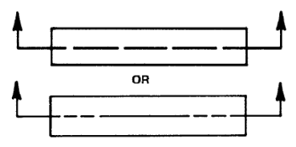


截面视图根据平面切割线上的箭头定义查看方向（用字母表示多个截面视图）。截面视图的隐藏线被全部省略，但含有中心线。用填充（hatch）线（铸铁的填充线为规则的斜线，通常与物体的主要轮廓成45°角，也能表示任何材料）表示截面中含有固体的位置，这称为截面线法（section lining），这些填充线称为截面线（section line）：


填充线不能与零件的方向或者中心线平行或垂直。当必须在填充线区域标注文字时，填充线应当避让。大片的区域可以仅在边缘画出填充线，小片的区域可以不填充或者全部涂黑：


半截面视图进行仅半个面的截面视图，使用隐藏线：


对螺纹（thread）的表示，有三种表示方法，分别为详细表示（detailed）、示意图表示（schematic）、简化表示（simplified）：


对于相邻的部件，填充线应当选用不同的角度：

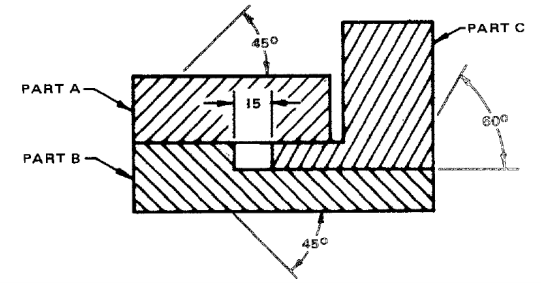

偏置截面视图，切割平面可能偏置或弯曲：


当切割平面经过肋部（ribs）时，真实投影（true projection）截面视图会产生误导。因此，将助部视为没有被切割平面经过：


当助部数量为奇数时，切割平面经过其中一个助部，则将切割平面转向偏置，使得经过两个助部，同样视为没有被切割平面经过：


区分不同的助部：


避免重叠的助部被忽略：


切割平面横向经过凸耳（lugs）时，凸耳被切割。竖向经过，则凸耳的处理方式与助部相同（视为没有被切割平面经过）：


旋转截面视图，在正视图中，将对应位置的截面旋转90°，直接画在正视图中，并且将对应的位置的图像破坏：


切除截面视图，在正常视图中标注切割平面，然后在视图外画出切割平面的图像：


对辐条（spoke）的处理类似助部：


某些情况下，可以使用分段视图（partial sections），此时不需要切割平面：


辅助视图（auxiliary）为以常规视图中的斜面进行垂直投影的视图：


第二辅助视图（先画出部分的顶部视图和前视图，然后确定第一辅助视图的位置和长度，根据第一辅助视图确定第二辅助视图，补全顶部视图，补全前视图）：


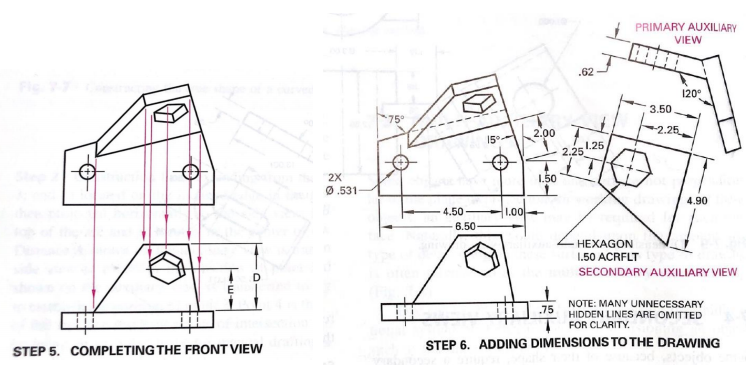

### L4

尺寸标注（dimensioning）与尺寸线（dimension line）与延长线（extension line）：


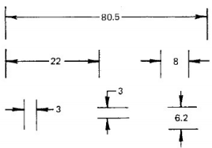

空间不够的时候：


避免用隐藏线标注尺寸（尺寸线超过隐藏线并使用一个单独箭头来表示位置）：


维度线与物体的距离（第一个10mm，第二个6mm），中心线可以用作延长线：


延长线可以倾斜：

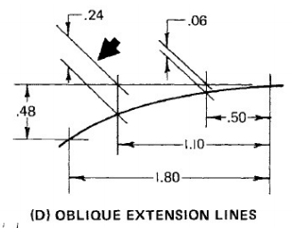

延长线之间交叉可以不断开，但是箭头和延长线之间交叉最好断开：


引线（leaders）直接使用折角直线在视图上进行本地注释（notes），一般（general）注释则一般在视图的下方：


标注符号：


制图单位一般使用十进制英寸（IN）和毫米（mm）。

标注方法分为三种，连锁标注（chain），基线标注（baseline），直接标注（direct）：


标注系统分为四种，单向标注（unidirectional），对齐标注（aligned），表格标注（tabular），图表标注（chart）：

单向标注需要文字全部水平，对齐标注需要文字全部和标注线对齐。

表格（tabular）标注：


图表（chart）标注：


直径标注：


角度标注：


倒角（chamfers）标注：


圆锥（conical）标注：


弧（arcs）标注：


通孔（through holes）标注：


加上孔数量：


扩孔（counterbore）标注（沉孔直径和沉孔深度）：

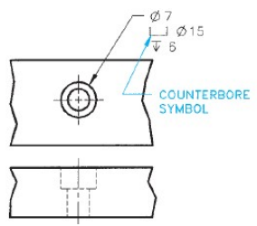

点面（spotface）标注（点面与扩孔类似，点面符号需要加上"SF"）：


沉孔（countersink）和沉孔钻（counterdrill）标注（$数字 \text{X} 角度$，数字代表深度，角度代表沉孔角度）：


多特征标注（数量+符号"X"）：


槽（slots）标注，a图适合铣削（milling）加工，b图适合冲压（punching）加工，c图适合激光（laser）加工：


平面位置标注包括对线、角、孔、链（重复特征）的标注：

直角坐标标注：


极坐标标注：


孔定位：


重复特征定位：


公差（tolerance）标注分为正负（plus-minus）标注和限制（limit）标注。所有标注都应该具有公差。直接在图中标注称为指定（specified）公差。在别处（例如一般注释）说明称为未指定（unspecified）公差：


英寸（inch）公差为$\pm .005$英尺，毫米（metric）公差为$\pm 0.1$毫米。

表面纹理（surface texture）包括粗糙度（roughness）、粗糙度空间（space）、粗糙度-宽度截断距离（width cutoff）、波纹（waviness）、层（lay）：


$$R_a=\int_0^{L_m} \frac{|y|}{L_m} d x$$

其中$R_a$为粗糙度的算术平均值，$y$为与标称（nominal）表面的垂直距离，$L_m$为粗糙度-宽度截断距离，$R_a$可以近似为：

$$\mathrm{R}_{\mathrm{a}}=\sum_{i=1}^n \frac{\left|y_i\right|}{n}$$

对应的符号（勾状）以及标注内容：


加工可移除（removal）：


加工必须移除：


加工不能移除：


### L5 conceptual design

概念设计（conceptual design）：


1.Define Problem：


1.1确认客户需要（identify customer needs）。

- 前期调研（preliminary research）
- 从客户收集信息

1.2客户需求（customer requirements，CRs）的八大基本维度：


客户需求的分类：

Expecters：基本属性，标准特征。

Spokens：客户要求的特定特征。

Unspokens：客户没说但重要的产品属性。

Exciters/delighters：独特的产品特征。

客户需求的卡诺（kano）图：


1.3建立工程特征（engineering characteristics，ECs）：

- 设计参数。设计参数是一组物理属性，其值决定了设计的形式和行为。
- 设计变量。设计变量是设计团队可以选择的参数。
- 约束。
- 基准测试（benchmarking）。基准测试是根据行业内外公司的最佳实践例子来衡量公司运营的过程。1.选择要进行基准测试的公司的产品、流程或功能领域。2.为每个流程确定最好的公司。
- 竞争性绩效（competitive performance）基准测试则有8个步骤。
- 逆向工程（reverse engineering），也称为产品解剖（product dissection）。


1.4质量函数部署（quality function deployment，QFD）将引导团队将客户的需求转化为关键到质量（critical-to-quality，CTQ）的工程特征。第一步是生成质量屋（house of quality，HOQ），横向显示客户信息，纵向显示技术信息：


从CRs到ECs的基本转换可以通过由房间1，2，4，5组成的质量屋，也称为流线形质量屋（streamlined HOQ）：


房间1为CRs（在调查和成本中记录的频率为40%或更高的9个回答被选为房间1中的CRs，对于频率超过50%的CR，重要权重系数为5；对于频率高于40%但低于50%的CR，重要权重系数为4。），房间2为ECs（6个重要工程特征），房间3为相关性矩阵（correlation matrix），也是HOQ的屋顶，根据关系矩阵得到。房间4为关系矩阵（relationship matrix），由CRs和ECs交叉而得到的权重（0、1、3、9）。房间5为根据房间1CRs和关系矩阵权重各项相乘相加后计算百分比占比的ECs重要性排名。房间6为根据房间2的竞争性评估（competitive assessment）。房间7为技术评估（technical assessment），表明产品在达到每个ECs的技术水平方面的得分，可能还带有每个ECs的实现难易度（1-5，1代表最低可能性），可以附于房间5下方。房间8为目标价值（target value），为每个ECs定下目标，可以附于房间7下方。

1.5产品设计规范（product design specification，PDS）可以最终确定客户的需求和愿望，确定它们的优先级，并开始将它们放入一个技术框架中，这样就可以建立设计概念。

2.计划与安排：

2.1 计划：

工作分解结构（work breakdown structure，WBS）：

将项目分解为主要的模块（modules），进一步分解为子组件（subcomponent）、组件、活动（activities），最后分解为单独的任务（task）。

2.2 安排：

甘特图（Gantt chart）：


两个活动之间的箭头为依赖关系，已完成活动为黑色，未完成活动为灰色，虚线表示当前日期，黑色实心三角为里程碑（milestone）事件。

### L6 公差

一般绘图标准是由国际标准化组织（ISO）和一些国家机构发布的，如中国的国标（GB）和美国的US。所有这些标准中的大多数符号都是相同的。

尺寸（size）：

实际尺寸（actual），公称尺寸（nominal），规定尺寸（specified），设计尺寸（design）。

偏差（deviations）：

最大、最小尺寸与基本尺寸之间的差异分别称为上偏差（upper）和下偏差（lower）。

基本/确切标注（basic/exact dimensions）为理论尺寸，不显示公差，在矩形中：


几何公差（geometric tolerance）：

特征（feature）：

特征是零件的特定的有特征的部分，如表面、孔、槽、螺纹或轮廓。

几何特征（characteristic）符号：

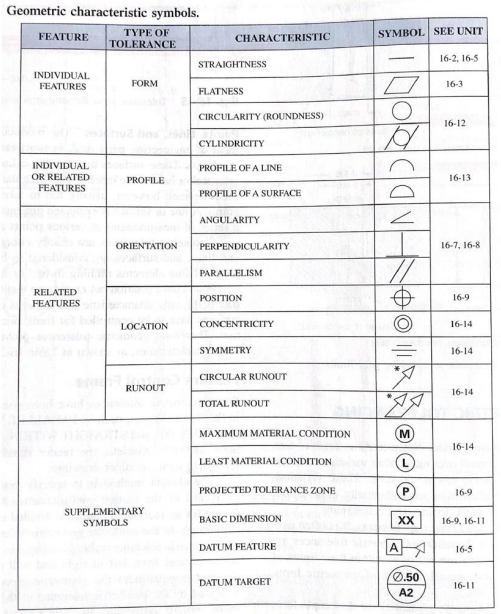

用于单个特征的特征控制帧（feature control frame）包含几何特征符号和几何公差值。当需要包含基准（datums）时，放在单独的隔间（compartment）中表示：


包含原则（modifier）时（一个圆圈里M代表最大实体原则，要求被测实体的实际轮廓不超出综合量规或专用检验装置的公差原则）：


对表面或表面元素的三种标注方式：


将帧附加到与该特征相关的标注线上：


将帧附加到与该特征相关的标注下：


将多个帧应用于同一个特征：


形状公差（form tolerances）：

直线度（straightness）-直线公差：


直线度-圆柱（cylindrical）表面公差（对曲面上的每一条直线而言的公差）：


直线度-圆锥（conical）表面公差（对曲面上的每一条直线而言的公差）：


直线度-平坦（flat）表面，两种公差标注方式：


平坦度（flatness）-以直线表示的表面：


平坦度-表面的单位面积：


尺寸特征（feature of size）是具有直径或厚度的特征（例如直线和表面不是尺寸特征），标注其形状公差（直线度和平坦度）时，包含4种材料条件（material condition），分别是虚条件（virtual condition，VC）、最大材料条件（maximum material condition，MMC）、最小材料条件（least material condition，LMC）、不考虑特征尺寸（regardless of feature size，RFS）：

对于内部（internal）特征（例如孔），其虚条件为孔的最小允许尺寸 - 公差：


对于外部特征（external）特征（例如杆），其虚条件为杆的最大允许尺寸 + 公差：


当一个特征处于尺寸的允许的极限，导致其材料使用得最多时，称为MMC：


当一个特征处于尺寸的允许的极限，导致其材料使用得最少时，称为LMC：


在特征控制帧中标注材料条件符号/原则符号（RFS则既不标注MMC也不标注LMC）：


在RFC下，允许的直线度公差为$0.015$，与特征尺寸无关。


在MMC中，允许的直线度公差在0.015到0.025之间变化，与特征尺寸有关。


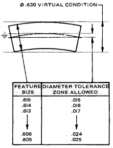

在LMC中，如果需要保证LMC直线度误差不太大，则增加最大值作为限制。


基准和三平面基准系统。基准（datum）是一个理论上的点、线、平面或其他几何表面，当如此指定，或参考几何公差时，可以从其作为基准来测量尺寸。定位通常只需要一个基准，但位置关系可能需要一个由两个或三个基准组成的基准系统：一级（primary）就是特征控制帧中以基准A作为参照，二级（secondary）就是特征控制帧中以基准B作为参照，三级（tertiary）就是特征控制帧中以基准C作为参照。当这些基准是相互垂直的平面时，它们通常被称为三平面基准系统或基准参考系：


ISO和ASME基准特征符号：


基准特征的标注方式：


平坦表面的方向（orientation）公差标注，角度标注：

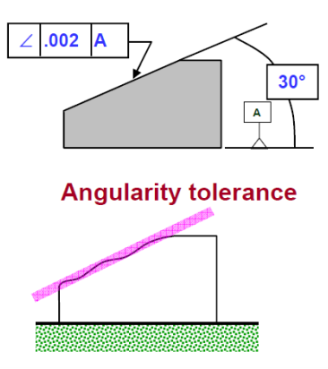

将一个表面作为基准，并将公差放在另一个表面来完成平行度公差标注：


类似的，先将一个表面作为基准，垂直度公差标注：


当形状公差和方向公差同时应用于单个特征时，形状公差必须小于方向公差：


坐标（coordinate）公差和位置（positional）公差，位置公差分为RFS，MMC，LMC三种条件，位置的几何特征符号是一个圆，有两条实心中心线：


坐标公差（以一个区域表示）：


### L7

静力平衡（static equilibrium）满足：

$$\sum F = 0$$

$$\sum M = 0$$

弯矩$M$和剪切力$V$的符号规定：


例子：


$$\begin{array}{ll}\sum F_y=0 & 18-V=0 \\ \sum M_E=0 & -18 x+M=0\end{array}$$

单位换算：

$$1 inch = 2.54 cm$$

$$1 \mathrm{psi}=6.895 \mathrm{kPa}$$

$$1 ft (英尺) = 12 \text{inches} (英寸)$$

应力分为法向应力$\sigma$（拉伸应力和压缩应力），剪应力$\tau$：


$$\sigma=\frac{F}{A}$$

$$\tau=\frac{F}{A}$$

法向应变$\varepsilon$，剪切应变$\gamma$：

$$\varepsilon=\frac{\Delta L}{L_0}$$


$$\gamma=\frac{\delta_x}{L}=\frac{1}{tan \theta}$$

有杨氏模量$E$，泊松比$v$，则其他方向的应变为：


$$\begin{gathered}\varepsilon_x=\frac{x_1-x_0}{x_0}=\frac{\sigma_x}{E} \\ \varepsilon_y=\varepsilon_z=\frac{y_1-y_0}{y_0}=-v \frac{\sigma_x}{E}\end{gathered}$$

若$x,y,z$三个方向上均有应力，$\varepsilon_{x y}$为$y$方向的应力造成$x$方向上的应变：

$$\begin{aligned} & \varepsilon_{x x}=\frac{\sigma_x}{E} \\ & \varepsilon_{x y}=-v \frac{\sigma_y}{E} \\ & \varepsilon_{x z}=-v \frac{\sigma_z}{E}\end{aligned}$$

$$\varepsilon_x=\varepsilon_{x x}+\varepsilon_{x y}+\varepsilon_{x z}$$

$$\begin{aligned} & \varepsilon_x=\frac{1}{E}\left[\sigma_x-v\left(\sigma_y+\sigma_z\right)\right] \\ & \varepsilon_y=\frac{1}{E}\left[\sigma_y-v\left(\sigma_x+\sigma_z\right)\right] \\ & \varepsilon_z=\frac{1}{E}\left[\sigma_z-v\left(\sigma_x+\sigma_y\right)\right]\end{aligned}$$

梁的弯曲时的法向应力，$M$为弯矩，$y$为与中性面的距离，$c$为与中性面的最大距离，$I$为一次矩：


$$\sigma_x=-\frac{M y}{I}$$

### L8 传动

齿轮（gears）为传动设备（transmission device）：

- 正齿轮（spur gear）：


- 斜齿轮（helical gear），齿（teeth）是倾斜的，噪音比正齿轮小：


- 锥形齿轮/螺旋伞齿轮（bevel gear），齿可以是直的（straight），螺旋（spiral），准双曲面（hypoid）：


- 蜗杆（worm）和蜗轮（worm gear）：


正齿轮的各部分术语与示意图：


- 俯仰圆/节圆（pitch circle）的直径为俯仰径/节径（pitch diameter），俯仰径用$d$表示（inch或mm）。一对已经啮合（mating）的齿轮的俯仰圆相切。小轮（pinion）：更小的齿轮。齿轮（gear）：更大的齿轮。

- 圆形俯仰距/圆周齿距（circular pitch）用$p$表示，在俯仰圆上测量得到，等于俯仰圆的一个齿的对应弧长，也等于齿厚（tooth thickness）和空间宽度（width of space）的和，齿数为$N$：

$$p=\frac{\pi d}{N}$$

- 模量/模数（module）为俯仰径$d$与齿数$N$的比值（用$m$或mm来表示）：

$$m=\frac{d}{N}$$

- 直径俯仰距/径节（diametral pitch）用$P$表示（每inch的齿数）：

$$P=\frac{N}{d}$$

- 齿顶/齿顶高（addendum）用$a$表示，是顶地（top land）与俯仰圆之间的径向距离。

- 齿根/齿根高（dedendum）用$b$表示，是底地（bottom land）与俯仰圆之间的径向距离。

- 整体深度/齿全高（whole depth）用$h_t$表示，为齿顶和齿根之和：

$$h_t=a+b$$

- 间隙圆/顶隙圆（clearance circle）是与啮合齿轮的齿顶圆相切的圆。

- 间隙/顶隙（clearance）是一个齿轮的齿根和啮合齿轮的齿顶之差。

- 齿隙/侧隙（backlash）是一个齿轮的空间宽度和在节圆上测量的啮合齿轮的齿厚之差。

常用齿尺寸：


标准齿系统：


- 常用压力角（common pressure angle）$\phi$：$20^\circ$和$25^\circ$。

- 旧压力角（old pressure angle）$\phi$：$14 \frac{1}{2}{ }^{\circ}$。

- 常用面宽度（common face width）$F$：$3p<F<5p$（$p=\frac{\pi}{P}$）。

共轭作用（conjugate action）：

- 当啮合齿轮（表面相互滚动/滑动）具有恒定的角速度比时，被称为共轭作用。作用线ab与中心连线AB的交点为俯仰点/节点（pitch point）$P$。要以恒定的角速度比传递运动，俯仰点$P$必须保持固定。从每个中心$O$经过俯仰点画出的圆就是"俯仰圆"，俯仰圆的半径就是俯仰径/节径：


- 角速度比（angular velocity ratio）等于中心和俯仰点的距离比：

$$V=w_A r_A = w_B r_B$$

$$\frac{w_A}{w_B}=\frac{r_B}{r_A}$$

- 接触点（point of contact）$c$：两表面相切点。

- 作用线（line of action）$ab$：力在ab上传递，ab垂直于接触表面。

- 中心线（line of center）$O-O$：两个中心的连线。

渐开线（involute profile/involute contour）：

- 一对齿轮实际上是很多对凸轮，它们通过一个小圆弧起作用，在偏离渐开线之前，被另一对相同的凸轮代替。

- 渐开线是最常见的共轭轮廓。如何构造渐开线：渐开线是对一个圆柱围一条绳子后对绳子逐渐展开时绳子末端点的轨迹曲线，而基圆则为此圆柱的圆。从圆柱体上解开绳索（如图$def$所示），并保持绳索紧密并与圆柱体相切（绳子末端$d$的轨迹）。产生渐开线的圆称为基圆（base circle），$b$点是追踪点（tracing point），$de$是生成线（generating line）。


- 如果齿轮轮廓（profiles）使用渐开线（involute curves），那么也满足共轭作用。

- 将绳索顺时针缠绕在齿轮1的基圆上并逆时针缠绕在齿轮2的基圆上，在点a和b之间拉紧。两个基圆沿不同方向旋转，同时保持绳索拉紧，绳索上的点g将在齿轮1上划出渐开线cd，在齿轮2上划出渐开线ef。渐开线的交点g为接触点（point of contact），过接触点的直线ab同时垂直于两条渐开线且与两个齿轮的基圆同时相切，则此直线ab即为产生线（generating line）。接触点沿着产生线移动。产生线不会改变位置，因为它总是与基圆相切。产生线总是于接触点处垂直于渐开线，这满足了均匀运动的要求：


- 画出一个齿轮布局（layout）的完整流程。


- - 首先通过$d=\frac{N}{P}$得到俯仰径，画出俯仰圆，在$P$点相切。
- - 然后过$P$点画直线ab且与两俯仰圆相切。
- - 将齿轮1作为驱动齿轮，逆时针旋转。
- - 然后过$P$点画直线cd且与直线ab成角度$\phi$，cd即为产生线（也称为压力线或作用线）。
- - $\phi$称为压力角（pressure angle），一般为-20或25度，有时为14.5度。
- - 然后为每个齿轮画出与产生线相切的基圆。
- - 再求出齿顶圆、齿根圆、圆周齿距、基圆半径，满足：

$$\begin{aligned} & a=\frac{1}{P} \\ & b=\frac{1.25}{P} \\ & p=\frac{\pi}{P} \\ & r_b=r cos \phi \end{aligned}$$

- - 然后在每个基圆上画出一个渐开线。

- - 例题：


- - 最后构造齿轮的轮廓，需要齿厚，圆角轮廓（fillet profile）：


- - - 两齿轮的齿之间的接触开始和结束于两个齿顶圆与压力线的交点处。
- - - 近角（angle of approach）：处于$a$处的小齿轮侧面接触齿轮尖端处的第一个接触点。
- - - 凹角（angle of recess）：处于$b$处的小齿轮尖端接触齿轮侧面的最后一个接触点。
- - - $ab$为作用线。
- - - 作用角（angle of action）：近角和凹角之和。

压力角：


- 压力角是一个评估动力传动性能的参数。压力角越小，表示速度方向上的分力越大——传动性能越好。但这不代表压力角是越小越好。

齿条（rack）：


- 齿条是一种节径无穷大的直齿轮，齿数无限。齿的侧面是与中心线成角度的直线，与压力角相等。
- 基节距（base pitch）和圆周齿距的关系如下：

$$p_b=p_c cos \phi$$

内部齿轮（internal gear）：


例题：


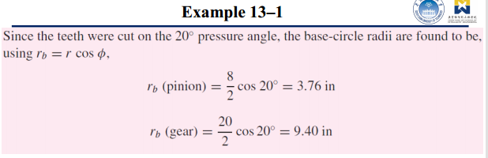


接触比（contact ratio）：

- 接触比是平均接触齿的对数，齿接触开始和结束于两个齿顶圆与压力线的交点，如下图，即从a到b。PA为近弧（arc of approach）$q_a$，PB为凹弧（arc of recess）$q_r$，AB为作用弧（action）$q_t$。$m_c$为接触比（一般大于1.2），$p$为圆形俯仰距：


$$m_c=\frac{q_t}{p}$$

皮带传动（belt drive）有很多皮带类型，最常见的为平坦皮带，圆形（round）皮带，V型皮带，同步（timing）皮带：

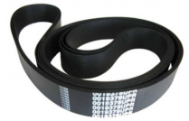


分为开放（open）皮带传动，交叉（cross）或扭曲（twist）皮带传动，阶梯式（stepped）或锥形（cone）传动轮（pulley）皮带传动，复合（compound）皮带传动。对于开放皮带传动，$L$为皮带长度，$\theta$为传动轮与皮带的接触角度：


$$\begin{aligned} & \theta_d=\pi-2 \sin ^{-1} \frac{D-d}{2 C} \\ & \theta_D=\pi+2 \sin ^{-1} \frac{D-d}{2 C} \\ & L=\sqrt{4 C^2-(D-d)^2}+\frac{1}{2}\left(D \theta_D+d \theta_d\right)\end{aligned}$$

交叉或扭曲皮带传动：


$$\begin{aligned} & \theta=\pi+2 \sin ^{-1} \frac{D+d}{2 C} \\ & L=\sqrt{4 C^2-(D+d)^2}+\frac{1}{2}(D+d) \theta\end{aligned}$$

阶梯式或锥形传动轮皮带传动（不同直径的传动轮且可更换结构）：


复合（compound）皮带传动：


链传动（chain drive）即为链轮（sprocket）与链相啮合进行传动：


滚轮链（roller chain）为多个滚轮组成的链，以此进行链传动，$p$为滚轮中心之间的距离：


$$\gamma=\frac{360^{\circ}}{N}$$

$$\sin \frac{\gamma}{2}=\frac{p / 2}{D / 2}$$

$$D=\frac{p}{\sin (\gamma / 2)}=\frac{p}{\sin \left(180^{\circ} / N\right)}$$

链传动的速度比（驱动轮和从动轮）：

$$i=\frac{N_1}{N_2}$$

链传动的链速$V$，$N$为齿数，$p$为滚轮中心之间的距离，$n$为链轮的转速，满足关系：

$$V=\frac{N p n}{12}$$

多边形效应（当AB与D满足某种关系）：


$$v_{\max }=\frac{\pi D n}{12}=\frac{\pi n p}{12 \sin (\gamma / 2)}$$


$$v_{\min }=\frac{\pi d n}{12}=\frac{\pi n p \cos (\gamma / 2)}{12 \sin (\gamma / 2)}$$

多边形效应的弦（chordal）速变化为：


$$\frac{\Delta V}{V}=\frac{v_{\max }-v_{\min }}{V}=\frac{\pi}{N}\left[\frac{1}{\sin \left(180^{\circ} / N\right)}-\frac{1}{\tan \left(180^{\circ} / N\right)}\right]$$

### L9 Bearing

轴承（bearing）允许两个表面之间平滑、低摩擦的运动。轴承可以进行滑动或滚动的动作。基于滚动作用的轴承称为滚动元件（rolling element）轴承。基于滑动（sliding）作用的轴承称为滑动（plain）轴承。

滑动轴承通常被称为轴颈/套筒（journal/sleeve）轴承或推力（thrust）轴承，它们指定了滑动轴承是轴向（axial）负载还是径向（radial）负载。润滑（lubrication）也至关重要，一般是通过油膜（oil film）润滑，油膜通过增压系统维持。两种常见的油膜滑动轴承形式：


常见的套筒轴承是铸青铜（cast bronze）和多孔（porous）青铜制作的，也有塑料的：


薄且盘状的推力轴承称为推力垫圈（washers）：


滚珠（ball）轴承和滚轮（roller）轴承被归类为减摩（antifriction）轴承，摩擦力已经被减到最低。减摩轴承通常由四个部分组成：内圈（inner ring）、外圈（outer ring）、滚动体（rolling element）、保持架（cage）或分离器（separator）或滚道（race）。轴与内圈连接：


轴承载荷分为径向载荷、推力载荷（也就是轴向载荷）、组合载荷（径向和轴向）：


对于滚珠轴承，分为径向轴承、推力轴承、角接触轴承。滚珠轴承有多种类型和尺寸（主要是滚珠和保持架的不同），最常见的为深沟（deep-groove）轴承，主要承载径向载荷，但也可以承载轴向载荷：

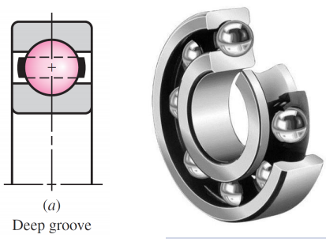

角接触轴承用于组合载荷，承担轴向和径向载荷：


推力轴承（可以视为90度的角接触轴承），只能承担轴向载荷：


调心（self-aligning）轴承，将容许大量的错位：


对于滚轮轴承，同样有多种类型和尺寸，分为圆柱形，径向载荷容量高。针形（needle），可以承受径向载荷和轴向载荷。锥形（tapered），径向载荷和轴向载荷容量高。球形（spherical），载荷容量最高：


当轴承直接安装在轴上时，内圈应位于适当高度的轴肩（shaft shoulder）上，轴肩应当与轴承座（bearing seat）加工为方形，且外壳（housing）必须使用圆角，圆角半径应清除轴承内圈的角半径（corner radius）：


为了使轴承内圈轴向固定在轴上，通常使用锁紧螺母（locknut）和锁紧垫圈（lockwasher）：


保持环（retaining rings）可以安装到轴的凹槽中，再使用齿轮或滑轮（pulley）安装到轴间套筒（shaft spacing sleeve）进行固定：


轴承也可以直接安装在轴肩上，而无需其他方式轴向固定内圈：


使用适配器套筒（adapter sleeves）来使轴承内圈固定在轴上：


轴承符号表示分为简化（simplified）、图画（pictorial）和图解（schematic）。在不需要显示滚动轴承的形状或尺寸或其内部设计细节时使用的简化表示，在需要显示滚动体的功能和原理时，添加相应类型的滚动体和滚道表面的符号：


图画表示一般不用于图纸：


图解表示用于初始设计：


润滑在不同条件下选用油（oil）或润滑油（grease）：


使用润滑油密封（seal）时，需要在轴承的一侧或两侧使用薄钢护罩（thin steel shield）：


通用的轴承安装（mounting）方式，轴承内圈靠着轴肩，并通过轴上的螺纹和螺母（nuts）固定位置：


另一种轴承安装方法：


双轴承可以用来获得额外的刚度，或增加负载能力，或悬臂轴。其安装的效果为轴向的轴承预加载荷（preload），安装方法为：

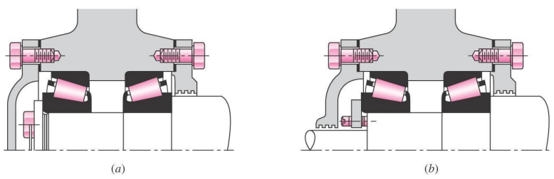

按照双工安装（duplex mounting）制造轴承有带偏移的地环（ground ring），且一对轴承夹在一起时会自动建立预加载荷，有三种安装方法，分别为DF安装（face to face）、DB安装（back to back）、DT安装(tandem)：


预加载荷可以减少轴承内部间隙（clearance），增加疲劳寿命（fatigue life），减少轴承轴斜率。

轴承寿命（life）的指标。理想条件下，疲劳失效（fatigue failure）还包括负载表面的脱落：

- 轴承失效：剥落或点蚀面积为$0.01 in^2$。

- 寿命：发生第一次疲劳失效时，内圈或外圈旋转的圈数，或给定角速度工作下的小时数。

- 额定（rating）寿命：对一组轴承样品，有$10%$样品疲劳失效所需的寿命。也称为最小寿命或$L_{10}$寿命。

- 中值（median）寿命：对多组轴承样品，有$50%$样品疲劳失效所需的寿命的多组平均值。也称为平均寿命或平均中值寿命。

- 目录载荷额定值（catalog load rating）：在轴承制造商测得一组轴承样品的额定寿命时施加的恒定的径向载荷。也称为基本动态额定载荷或基本动态容量，用$C_{10}$表示。

- 基本载荷额定值（basic load rating）：使得额定寿命为内圈$10^6$转的目录载荷额定值。用$C$表示。

- 静态（static）载荷额定值：表示造成滚动体（若为滚轮，直径为$d$）和滚道在最大应力下的永久形变为$0.0001d$的径向载荷。用$C_o$表示。

- 等效（equivalent）径向载荷：施加在具有旋转内圈的轴承上的恒定静止载荷。用$F_e$表示。

一般来说，相同的轴承组在不同载荷下进行寿命失效准则试验，在对数尺度上近似线性：


因此轴承的载荷-寿命条件可以写成（$a=3$为滚珠轴承。$a=\frac{10}{3}$为滚轮轴承。$F$为载荷，$L$为寿命。下标$R$代表目录额定条件，下标$D$代表期望设计条件。$L$的单位是圈数，转速$n$的单位为圈数/分钟，可以将圈数转化为小时数）：

$$F L^{1 / a}= constant$$

$$L=60 \mathscr{L} n$$

$$F_R L_R^{1 / a}=F_D L_D^{1 / a}$$

$$C_{10}=F_R=F_D\left(\frac{L_D}{L_R}\right)^{1 / a}=F_D\left(\frac{\mathscr{L}_D n_D 60}{\mathscr{L}_R n_R 60}\right)^{1 / a}$$

定义期望设计寿命与额定寿命的倍数：

$$x_D=\frac{L_D}{L_R}$$

### L10 Motor

电机（motor）：

电机分为电磁直流电机（DC电机）和电磁交流电机（AC电机），DC电机分为有刷（brushed）电机和无刷（brushless）电机，AC电机分为同步（synchronous）电机和异步（asynchronous）电机。

DC电机由永磁体和线圈组成。当施加电流时，线圈产生磁场（电生磁遵循右手定则），该磁场与永磁体的外部磁场发生相互作用，使得电枢（armature）发生运动。

直流电机的组成：

- 电枢/转子（rotor）。
- 转向器（commutator）。
- 电刷（brushes）。
- 旋转轴（axle）。
- 永磁体/磁场磁铁（field magnet）。
- 直流电源。


电枢是一种电磁铁，由细导线绕着金属芯的两个或多个极点（poles）缠绕而成。转向器和电刷用于翻转电枢的电场方向。

洛伦兹力（电生力遵循左手定则）：

$$F=BIL sin \theta$$

实际的直流电机有三个或更多的极点，磁的极性只有两个，但是可以相间地设置更多的极点。下面是最简单的两极点直流电机：


对于无刷电机，有永磁体定子（stator）提供磁场。对于有刷电机，可以使用励磁线圈（field coils）控制磁场的大小。

$R$为转子绕组（winding）电阻，$L$为转子绕组电感，$K_E$为反电动势（back emf）常数，$\omega$为角速度，等效电路的电势差（压降）：


$$U=L_A \frac{d I}{d t}+R_A I+K_E \omega$$

$T$为电机输出扭矩，$T_f$为摩擦力系数，$D$为粘性阻尼常数，$K_T$为转矩常数，$J_R$为转子惯量，$J_L$为负载惯量，$T_L$为负载扭矩，物理模型：


$$T=K_T I=\left(J_R+J_L\right) \frac{d \omega}{d t}+D \omega+T_f+T_L$$

对于使用永磁体的直流电机，称为永磁体直流电机（Permanent Magnet DC，PMDC）。电压为$V$，电机线圈电阻为$R_a$，$K_E$为反电动势常数，$K_T$为转矩常数，其转矩$T$和速度$\Omega$的在不同电压$V$下关系为$T=\Omega \frac{K_T K_E}{R_a}$：


转矩$T$与绕组电流$I$有关，电流由电压控制。$t$为高电平的时间，$T$为周期，可以通过脉冲宽度调制（Pulse Width Modulation，PWM）调整占空比（duty cycle）控制电压的平均值来控制电机的转速：


$$\text{Duty Cycle}=\frac{\mathrm{t}}{\mathrm{T}} \times 100 \%$$

### L11 机械元件：弹簧和动力螺丝

弹簧（spring）可以用于缓冲（cushion）、吸收（absorb）、控制（control）由冲击、振动、外力产生的能量。也可以用于运动控制（例如充当会自动恢复位置且可伸缩的传动杆）。也可以用于测量力，存储（storing）能量。

对扭转状态（torsion）的圆柱体，有长度$l$，极二次矩$J$，扭转角$\theta$，剪切应力$\tau$，剪切应变$\gamma$，刚度模量$G$：


$$\theta=\frac{T l}{G J}$$

$$\tau=\frac{T \rho}{J}$$

$$\tau_{\max }=\frac{T r}{J}$$

$$\gamma=\frac{\tau}{G}=\frac{T \rho}{G J}=\frac{\rho \theta}{l}$$

对圆形截面：

$$J=\frac{\pi d^4}{32}$$

螺旋（helical）弹簧：


对螺旋弹簧的截面来说，力矩$T=F \frac{D}{2}$（相对于弹簧轴心的力矩），螺旋弹簧截面的剪切应力最大值，其实就是一般情况下的剪切应力（力矩+力造成的应力）：

$$\tau_{\max }=\frac{T r}{J}+\frac{F}{A}$$

$$J=\frac{\pi d^4}{32}$$

$$\tau_{max}=\tau=\frac{8 F D}{\pi d^3}+\frac{4 F}{\pi d^2}=\left(1+\frac{d}{2 D}\right) \frac{8 F D}{\pi d^3}$$

有弹簧指数（spring index）：

$$C=\frac{D}{d}$$

剪切应力修正系数（correction factor）：

$$K_s=1+\frac{1}{2 C}$$

$$\tau_{max}=K_s \frac{8 F D}{\pi d^3}$$

弹簧是曲面圆柱体，因此有曲率效应（effect）：


圆柱体上的直线ab（处于内侧）的a点相对于b点的角位移，等于直线（处于外侧）cd的d点相对于c点的角位移。但同时由于曲率，ab的长度小于cd，因此弹簧内侧的剪切应变更大，因此剪切应力也更大。

Wahl因子：

$$K_W=\frac{4 C-1}{4 C-4}+\frac{0.615}{C}$$

Bergstrasser因子：

$$K_B=\frac{4 C+2}{4 C-3}$$

曲率因子（curvature factor）：

$$K_c=\frac{K_B}{K_s}=\frac{2 C(4 C+2)}{(4 C-3)(2 C+1)}$$

Bergstrasser因子用于预测最大剪切应力（以消除曲率效应）：

$$\tau=K_B \frac{8 F D}{\pi d^3}$$

弹簧挠度（deflection）用$y$表示，其实就是伸长量，$k$为弹簧率（spring rate）：

$$F=ky$$

在使弹性构件变形时所作的外部功转化为应变或势能，称为应变能（strain energy）$U$。对于拉伸或压缩：

$$U=\frac{F^2 l}{2 A E}$$

对于扭剪切（torsional shear）：

$$U=\frac{T^2 l}{2 G J}$$

对于直剪切（direct shear）：

$$U=\frac{F^2 l}{2 A G}$$

螺旋弹簧的应变能由扭剪切和直剪切组成，$N$为线圈数，$l$为弹簧作为圆柱体完全展开的长度：

$$l=\pi D N$$

$$U=\frac{T^2 l}{2 G J}+\frac{F^2 l}{2 A G}$$

$$U=\frac{4 F^2 D^3 N}{d^4 G}+\frac{2 F^2 D N}{d^2 G}$$

Castigliano定理，$\delta_i$为力的施加点的位移：

$$\delta_i=\frac{\partial U}{\partial F_i}$$

因此螺旋弹簧的挠度为：

$$y=\frac{\partial U}{\partial F}=\frac{8 F D^3 N}{d^4 G}+\frac{4 F D N}{d^2 G}$$

$$y=\frac{8 F D^3 N}{d^4 G}\left(1+\frac{1}{2 C^2}\right) \doteq \frac{8 F D^3 N}{d^4 G}$$

$$k \doteq \frac{d^4 G}{8 D^3 N}$$

压缩弹簧（compression spring）：

末端（end）分类：

平端（plain）+平端：


平端+方端（squared）/闭合端（closed）：


平端+方端地端（ground）：


平端+地端：


不同端的压缩弹簧的线圈数和长度的计算：


设置移除（set removal）：

制造弹簧时使用的一种工艺，以产生有用的残余应力。弹簧被制作得比需要的长，然后被压缩到固定高度，故意超过屈服强度。

弹簧的材料：

硬拉丝（hard-drawn wire），油回火丝（oil-tempered wire），音乐线（music wire），铬钒（chrome-vanadium），铬硅（chrome-silicon）。

当弹簧材料用的丝的直径很小，抗拉强度$S_{ut}$（tensile strength）与丝径有关。抗拉强度与丝径$d$的关系图在对数尺度上几乎是一条直线：

$$S_{u t}=\frac{A}{d^m}$$

其中$S_{ut}$为极限抗拉强度。$A$和$m$的值则需要查表：


弹簧的设计和性能分析需要扭转屈服强度（torsional yield strength）$S_{sy}$，但弹簧材料只测试抗拉强度$S_{ut}$（更简单经济）来估计扭转屈服强度$S_{sy}$。假设拉伸屈服强度$S_y$（tensile yield strength）等于$S_{ut}$的$0.6$到$0.9$倍（查表获得），满足：

$$S_{s y}=0.577 S_y$$

$$0.35 S_{u t} \leq S_{s y} \leq 0.52 S_{u t}$$


延伸弹簧（extension spring）承受拉伸载荷，因此需要在末端安装钩（hook）：


最大拉应力位置在$A$点，这里有弯曲和轴向载荷：


$$\sigma_A=F\left[(K)_A \frac{16 D}{\pi d^3}+\frac{4}{\pi d^2}\right]$$

$$(K)_A=\frac{4 C_1^2-C_1-1}{4 C_1\left(C_1-1\right)} \quad C_1=\frac{2 r_1}{d}$$

主要的扭应力在$B$点：


$$\tau_B=(K)_B \frac{8 F D}{\pi d^3}$$

$$(K)_B=\frac{4 C_2-1}{4 C_2-4} \quad C_2=\frac{2 r_2}{d}$$

紧绕（close-wound）延伸弹簧，有初始张力$F_i$，由钢丝缠绕在芯轴上时扭曲产生，更有利于保持自由长度（free length），载荷-挠度曲线：


$$F=F_i+ky$$

延伸弹簧的自由长度$L_0$，$D$为平均线圈直径，$N_b$为主体线圈数，$N_a$为活动线圈数，$C$为弹簧指数：


$$L_0=2(D-d)+\left(N_b+1\right) d=\left(2 C-1+N_b\right) d$$

$$k \doteq \frac{d^4 G}{8 D^3 N}$$

挂钩对弹簧率$k$是有影响的，$G$为剪切弹性模量，$E$为拉伸弹性模量：

$$N_a=N_b+\frac{G}{E}$$

紧绕延伸弹簧的初始应力范围，$\tau_i$为为校正的扭转应力：


$$\tau_i=\frac{33500}{\exp (0.105 C)} \pm 1000\left(4-\frac{C-3}{6.5}\right) \mathrm{psi}$$

材料在不同的静态应用下的最大允许应力：


动力螺杆（power screw）用于将角运动转变为直线运动，但是效率很低，且快速磨损：


将动力螺杆当作斜面计算：


$$\begin{aligned} & \sum F_x=P_R-N \sin \lambda-f N \cos \lambda=0 \\ & \sum F_y=-F-f N \sin \lambda+N \cos \lambda=0\end{aligned}$$


$$\begin{aligned} & \sum F_x=-P_L-N \sin \lambda+f N \cos \lambda=0 \\ & \sum F_y=-F+f N \sin \lambda+N \cos \lambda=0\end{aligned}$$

最终可得：

$$\tan \lambda=l / \pi d_m$$

$$P_R=\frac{F\left[\left(l / \pi d_m\right)+f\right]}{1-\left(f l / \pi d_m\right)} \quad P_L=\frac{F\left[f-\left(l / \pi d_m\right)\right]}{1+\left(f l / \pi d_m\right)}$$

产生的力矩（乘以$\frac{d_m}{2}$）：

$$T_R=\frac{F d_m}{2}\left(\frac{l+\pi f d_m}{\pi d_m-f l}\right) \quad T_L=\frac{F d_m}{2}\left(\frac{\pi f d_m-l}{\pi d_m+f l}\right)$$

自锁（self-locking）条件。如果降低扭矩$T_L$为负，则负载将通过使螺杆自旋而降低，而不需要任何外力。如果降低扭矩$T_L$为正，则螺杆自锁：

$$\pi f d_m>l$$

$$f>\tan \lambda$$

在没有摩擦损失的情况下提高负载所需的扭矩可以在提升扭矩$T_R$的$f=0$时得到：

$$T_0=\frac{F l}{2 \pi}$$

动力螺杆的效率：

$$e=\frac{T_0}{T_R}=\frac{F l}{2 \pi T_R}$$

### L12 概率论与统计

累计概率分布（cumulative probability distribution，CDF）：

$$F\left(x_i\right)=\sum_{x_j \leq x_i} f\left(x_j\right)$$

$$F(x)=\int_{-\infty}^x f(x) d x$$

样本算术平均值（sample mean）：

$$\bar{x}=\frac{x_1+x_2+x_3+\cdots+x_N}{N}=\frac{1}{N} \sum_{i=1}^N x_i$$

样本方差：

$$s_x^2=\frac{\left(x_1-\bar{x}\right)^2+\left(x_2-\bar{x}\right)^2+\cdots+\left(x_N-\bar{x}\right)^2}{N-1}=\frac{1}{N-1} \sum_{i=1}^N\left(x_i-\bar{x}\right)^2$$

样本标准差：

$$s_x=\sqrt{s_x^2}$$

$$\sum_{i=1}^N (x_i - \bar{x})^2=\sum_{i=1}^N x_i^2-\left(\sum_{i=1}^N x_i\right)^2 / N$$

$$\sum_{i=1}^N x_i=N \bar{x}$$

$$\left(\sum_{i=1}^N x_i\right)^2 / N = N \bar{x}^2$$

$$s_x=\sqrt{\frac{\sum_{i=1}^N x_i^2-\left(\sum_{i=1}^N x_i\right)^2 / N}{N-1}}=\sqrt{\frac{\sum_{i=1}^N x_i^2-N \bar{x}^2}{N-1}}$$

对于整体，则将$\bar{x},s_x,N-1$替换为$\mu_x,\hat{\sigma}_x,N$即可。

当数据按种类频率$f$分组，$k$为种类数，$x_i$为种类中值，$N$为样本数：

$$\bar{x}=\frac{1}{N} \sum_{i=1}^k f_i x_i$$

$$s_x=\sqrt{\frac{\sum_{i=1}^k f_i x_i^2-\left[\left(\sum_{i=1}^k f_i x_i\right)^2 / N\right]}{N-1}}=\sqrt{\frac{\sum_{i=1}^k f_i x_i^2-N \bar{x}^2}{N-1}}$$

CDF函数，$w_i$为$x_i$处的种类的宽度：

$$F_i=\frac{f_i w_i}{2}+\sum_{j=1}^{i-1} f_j w_j$$

变异系数$C_x$：

$$C_x=\frac{s_x}{\bar{x}}$$

$\mathbf{X}$为某一个变量概率分布函数，其变量为$\mathbf{x}$：

$$\mathbf{x}=\mathbf{X}\left(\bar{x}, s_x\right)=\bar{x} \mathbf{X}\left(1, C_x\right)$$

高斯（正态）分布：

$$f(x)=\frac{1}{\hat{\sigma}_x \sqrt{2 \pi}} \exp \left[-\frac{1}{2}\left(\frac{x-\mu_x}{\hat{\sigma}_x}\right)^2\right]$$

$$\mathbf{x}=\mathbf{N}\left(\mu_x, \hat{\sigma}_x\right)=\mu_x \mathbf{N}\left(1, C_x\right)$$

$$\mathbf{z}=\frac{\mathbf{x}-\mu_x}{\hat{\sigma}_x}$$

$$\mathbf{z}=\mathbf{N}(0,1)$$

$\Phi(z_{\alpha})$表：


对数正态分布：

$$\mathbf{y}=\ln \boldsymbol{x} \quad \mathbf{y}=\mathbf{N}\left(\mu_y, \hat{\sigma}_y\right)$$

$$\mathbf{x}=\mathbf{L N}\left(\mu_x, \hat{\sigma}_x\right)$$

概率密度函数（probability density function，PDF）为：

$$f(x)= \begin{cases}\frac{1}{x \hat{\sigma}_y \sqrt{2 \pi}} \exp \left[-\frac{1}{2}\left(\frac{\ln x-\mu_y}{\hat{\sigma}_y}\right)^2\right] & \text { for } x>0 \\ 0 & \text { for } x \leq 0\end{cases}$$

$$\begin{gathered}\mu_y=\ln \mu_x-\ln \sqrt{1+C_x^2} \approx \ln \mu_x-\frac{1}{2} C_x^2 \\ \hat{\sigma}_y=\sqrt{\ln \left(1+C_x^2\right)} \approx C_x\end{gathered}$$

表：


均匀分布的PDF和CDF：

$$f(x)= \begin{cases}1 /(b-a) & a \leq x \leq b \\ 0 & a>x>b\end{cases}$$

$$F(x)= \begin{cases}0 & x<a \\ (x-a) /(b-a) & a \leq x \leq b \\ 1 & x>b\end{cases}$$

$$\mu_x =E(X)=\frac{a+b}{2} $$

$$\hat{\sigma}_x =D(X)=E[(X-\mu)^2]=E(X^2)-[E(X)]^2=\frac{b-a}{2 \sqrt{3}}$$

韦伯（Weibull）分布：

$$R(x)=\exp \left[-\left(\frac{x-x_0}{\theta-x_0}\right)^b\right] \quad x \geq x_0 \geq 0$$

$$F(x)=1-R(x)$$

$$f(x)=\frac{d F(x)}{d x}=-\frac{d R(x)}{d x}$$

$$f(x)= \begin{cases}\frac{b}{\theta-x_0}\left(\frac{x-x_0}{\theta-x_0}\right)^{b-1} \exp \left[-\left(\frac{x-x_0}{\theta-x_0}\right)^b\right] & x \geq x_0 \geq 0 \\ 0 & x \leq x_0\end{cases}$$

$$\mu_x=x_0+\left(\theta-x_0\right) \Gamma(1+1 / b)$$

$$\hat{\sigma}_x=\left(\theta-x_0\right) \sqrt{\Gamma(1+2 / b)-\Gamma^2(1+1 / b)}$$

$$\Gamma(n)=\int_0^{\infty} e^{-x} x^{n-1} d x$$

$$\Gamma(n+1)=n \Gamma(n)$$

$$\mathbf{x}=\mathbf{W}\left(x_0, \theta, b\right)$$

用于应力计算中的误差传播（propagation）：

$$\sigma=\frac{F}{A}$$

若均为随机变量：

$$\boldsymbol{\sigma}=\frac{\mathbf{F}}{\mathbf{A}}$$

随机变量的相加组合：

$$\mathbf{z}=\mathbf{x}+\mathbf{y}$$

$$\mu_z=\mu_x+\mu_y$$

$$\hat{\sigma}_z=\sqrt{\hat{\sigma}_x^2+\hat{\sigma}_y^2}$$

随机变量的其他组合的均值与方差表：


线性回归（linear regression）：


$$y=m x+b$$

$$\epsilon_i=y_i-y$$

$$y_i=m x_i+b+\epsilon_i$$

使误差平方和最小：

$$\mathcal{E}=\sum \epsilon_i^2=\sum\left(y_i-m x_i-b\right)^2$$

$$\partial \mathcal{E} / \partial m=0 \quad \partial \mathcal{E} / \partial b=0$$

$$\begin{aligned} \hat{m} & =\frac{N \sum x_i y_i-\sum x_i \sum y_i}{N \sum x_i^2-\left(\sum x_i\right)^2}=\frac{\sum x_i y_i-N \bar{x} \bar{y}}{\sum x_i^2-N \bar{x}^2} \\ \hat{b} & =\frac{\sum y_i-\hat{m} \sum x_i}{N}=\bar{y}-\hat{m} \bar{x}\end{aligned}$$

线性回归系数$r$，绝对值越大相关性越强：

$$r=\hat{m} \frac{s_x}{s_y} \quad-1 \leq r \leq+1$$

斜率$m$，截距$b$的标准差（$s_{y \cdot x}$为数据与回归线的离散度的标准差）：

$$\begin{aligned} s_{\hat{m}} & =\frac{s_{y \cdot x}}{\sqrt{\sum\left(x_i-\bar{x}\right)^2}} \\ s_{\hat{b}} & =s_{y \cdot x} \sqrt{\frac{1}{N}+\frac{\bar{x}^2}{\sum\left(x_i-\bar{x}\right)^2}} \\ s_{y \cdot x} & =\sqrt{\frac{\sum y_i^2-\hat{b} \sum y_i-\hat{m} \sum x_i y_i}{N-2}}\end{aligned}$$

### L13 Mechanical behavior of material

使用工具和模具（dies）将产品的零件的形状进行加工。

拉伸试验（tension test）：

拉伸试验是确定材料的力学性能的最常用方法，如强度（strength）、延展性（ductility）、韧性（toughness）、弹性模量和应变硬化能力（strain-hardening capabilitiy）。一般试样（specimen）的原始长度$l_o$为50毫米（2英尺），原始横截面积$A_o$为直径12.5毫米（0.5英尺）的圆形：


有工程（engineering）应力，也称为标称（nominal）应力，施加载荷为$P$，原始横截面积$A_o$：

$$\sigma=\frac{P}{A_o}$$

有工程应变（伸长率）：

$$e=\frac{l-l_o}{l_o}$$

应力$\sigma$-应变$e$曲线：


屈服应力（yield stress）定义为偏移（offset）线（$0.2 \%$的总伸长率）与应力-应变曲线的交点处对应的应力，到达屈服应力前的伸长均为弹性形变，后的伸长均为塑性形变。

造成材料永久形变的加载荷和卸载荷过程：


延展性：

延展性为材料在断裂（fracture）前发生的塑性变形的程度，通常用总伸长率（elongation）和断面收缩率（reduction）来进行表示，下标$o$表示原始物理量，下标$f$表示发生断裂时物理量：


$$\text{Elongation}=\frac{l_f-l_o}{l_o} \times 100 \%$$

$$\text{Reduction of area}=\frac{A_o-A_f}{A_o} \times 100 \%$$

有真实（true）应力，定义为对材料施加的载荷$P$和材料瞬时横截面积$A$的比值：

$$\sigma=\frac{P}{A}$$

有真实应力对应的真实应变：

$$\epsilon=\ln \left(\frac{l}{l_o}\right)$$

真实应力-真实应变曲线，$K$为强度系数，$n$为应变硬化/加工硬化指数：

$$\sigma=K \epsilon^n$$

试样的颈缩（neck）区域承受三维拉伸应力。这种应力状态给出的应力值高于实际的真实应力。因此，为了进行补偿，必须向下修正曲线：


韧性：

真实应力-真实应变曲线从起点到断裂点的区域面积称为材料的韧性（强度与曲线高度相关，延展性与曲线宽度相关，韧性与曲线高度和宽度均相关）：


压缩试验：

试样和压板之间的摩擦使得试样的圆柱形表面凸起，称为桶形（barreling）或屈曲（buckling）。

如果试样首先受到拉伸并塑性变形，然后释放载荷并施加压缩载荷，则发现压缩时的屈服应力$\sigma_s^{\prime}$低于拉伸时的屈服应力$\sigma_s$。这种现象被称为包申格效应（Bauschinger effect）：


扭转试验：


剪切应力，$t$为是管道狭窄部分的厚度：

$$\tau=\frac{T}{2 \pi r^2 t}$$

剪切应变，$l$为管段长度，可以确定剪切弹性模量$G$：

$$\gamma=\frac{r \phi}{l}$$

弯曲测试（对脆性材料）：


三点和四点弯曲试验。弯曲时的断裂应力称为断裂（rupture）模量或横向（transverse）断裂强度。由于承受大弯矩的材料的体积更大，四点试验给出的断裂模量低于三点试验。

硬度：

布氏（Brinell）试验使用直径10毫米的钢球压在材料表面上，并施加载荷，通过载荷和形成的压痕计算材料硬度：


布氏硬度值（用HB表示）定义为施加的载荷$P$与压痕（identation）曲面面积的比值。

通过退火（annealed）金属：


通过冷加工（cold-worded）金属：


洛氏（Rockwell）试验测量穿透（penetration）深度，而不是压痕直径：


维氏（Vickers）试验使用金字塔形金刚石压头，载荷范围为1至120 kg，获得的压痕对角线通常小于0.5 mm（0.020英尺），穿透深度可低至20 nm。维氏硬度值用HV表示：


努氏（Knoop）试验使用细长棱锥形状的金刚石压头，载荷范围通常为25 g至5 kg，努氏硬度值用HK表示，适用于非常小或非常薄的试样以及碳化物、陶瓷和玻璃等脆性材料。：


疲劳（fatigue）：

循环（cyclic）的应力可能由波动的机械载荷引起。失效（failure）与裂纹有关，裂纹随着每个应力循环而增长，并在材料中传播，直到材料断裂时达到临界裂纹长度。

疲劳试验：

疲劳试验方法包括在各种应力状态下对试样进行试验，通常是拉伸和弯曲的组合。

在各种应力振幅$S$（应力振幅定义为拉伸和压缩时的最大应力）下进行试验，然后记录导致试样或零件完全失效所需的循环次数$N$。

材料在没有发生疲劳失效的情况下，所能承受的最大应力（无论循环次数）都被称为耐久极限（endurance limit）或疲劳极限。

疲劳强度（fatigue strength）是在一定的循环次数下指定的。

蠕变（creep）：

是指部件在一段时间内，保持静载荷作用下的永久变形。这种现象发生在全部金属材料和部分非金属材料，如热塑性塑料和橡胶，在任何温度下都可能发生。而对于金属及其合金，在高温下会发生任何显著的蠕变。

蠕变试验通常包括在高温下对试样施加恒定的拉伸载荷，并测量不同时间增量下的长度变化。


曲线通常由一级（primary）、二级（secondary）和三级（tertiary stages）组成。试样最终因颈缩和断裂而失效，称为破裂（rupture）或蠕变破裂。

冲击（impact）：

确定材料的冲击性能的典型冲击试验，将带有缺口试样放置在冲击试验机中，并用摆动的摆（pendulum）破坏（break）试样。悬臂（Izod）冲击试验和夏比（Charpy）冲击试验：


冲击试验确定了完全破坏试样所需的能量，称为材料的冲击韧性（impact toughness）。具有高抗冲击性的材料通常具有高强度、高延展性，并且因此具有高韧性。

失效有两种形式，分别为断裂和屈曲（buckling）：


- 韧性（ductile）材料的缩颈和断裂。
- 韧性材料在压缩载荷下的屈曲。
- 脆性（brittle）材料在压缩中的断裂。
- 韧性材料的筒形表面在压缩中开裂（crack）。

韧性材料在发生断裂前需要有塑性形变，而脆性材料直接发生断裂，因此脆性材料发生断裂所需的能量更少。

残余（residual）应力：

残余应力是指在工件发生塑性变形并消除所有外力后仍留在工件中的应力。当工件受到整个零件不均匀的塑性变形时，它可能会产生。


零件表面上的拉伸残余应力通常是不希望的，因为它们会降低零件的疲劳寿命和断裂强度。在一段时间内，拉伸残余应力也可能导致零件的应力开裂或应力腐蚀开裂。另一方面，表面上的压缩残余应力通常是可取的。为了提高部件的疲劳寿命，可以通过喷丸和表面轧制等技术将压缩残余应力施加到表面。

残余应力的减少和消除：

- 应力消除退火
- 零件的进一步塑性变形
- 一段时间的松弛

### L14 Manufacturing Process

制造由制造工艺（manufacturing process）和生产设施（production facilities）组成。制造还包括装配（assembly）。

三类处理操作（operation）：

- 成型（shaping）操作：改变起始工作材料的几何形状。
- 性能增强（property-enhancing）操作：在不改变形状的情况下提高物理性能。
- 表面处理（surface processing）操作：清洁、处理、涂覆或沉积工件外表面的材料。

成型操作：

- 固化（solidification）过程：起始材料为加热液体或半流体。例如金属铸造（casting）、塑料成型。
- 颗粒（particulate）处理：起始材料由粉末组成。例如金属、陶瓷。步骤包括压制（pressing）和烧结（sintering）。
- 变形（deformation）过程：起始材料为韧性固体（通常为金属）。通过施加超过材料屈服强度的力来成形。
- 材料去除（material removal）过程：起始材料为韧性或脆性固体。从起始材料上去除多余的材料，因此剩下的是所需的几何形状。

最小浪费工艺术语：

- 净成型工艺（net shape process）：当大部分原材料被使用，且不需要后续加工。
- 近净成型工艺（near net shape process）：需要最少的加工量时。

性能提升（property-enhancing）过程：

为改善工作材料的机械或物理性能而进行，通常不会使零件的形状发生改变。

- 金属和玻璃的热处理。
- 粉末金属和陶瓷的烧结。

表面（surface）处理操作：

- 清洁：去除表面污垢、油和其他污染物的化学和机械工艺。
- 表面处理：机械加工，如喷砂，以及物理过程，如扩散。
- 涂层（coating）和薄膜沉积（deposition）：涂覆工件的外表面。

装配操作：

- 连接过程–创建永久连接。例如焊接、钎焊、钎焊和粘合。
- 机械装配-通过机械方法紧固。例如螺纹紧固件（螺钉、螺栓和螺母）；压配合（fit）、膨胀配合。

净成型和近净成型制造：

零件只需一次操作即可制造，并且达到或接近最终所需的尺寸、公差和表面光洁度。

超精密（ultraprecision）制造：

微制造和纳米制造技术，能够生产微米和纳米级。

生产设施（facilities）：

设备通常被组织成逻辑分组，称为制造系统（manufacturing system）。

不同产量需要不同的设施：

- 低产量：1至100。
- 中等产量：100至10000。
- 高产量：10000至>1000000。

对于低产量：车间（job shop）生产少量的专业化和定制产品。产品通常很复杂。车间的设备是通用的，劳动力技能高超，设计具有最大的灵活性。

对于中等产量：批量生产（batch production）和蜂窝制造（cellular manufacturing）。

对于高产量：被称为大规模生产（mass production）。对产品的高需求，使用专用于该产品生产的制造系统。大批量生产（quantity）和流水线（flow line）生产。大批量生产中使用的典型布局是工艺布局（process layout）和单元布局（cellular layout）。流水线生产按顺序排列的多台机器或工作站，例如生产线（production lines），产品很复杂，工作站和设备是专门为产品设计的，以最大限度地提高效率。

### L15 material removal process and process planning

影响切削（cutting）过程的因素：

切削过程中的自变量：刀具材料、涂层。刀具形状、表面光洁度和锐度。工件材料及其加工历史。切削速度、进给量（feed）和切削深度。切削液。机床（machine tool）特性。工件夹持装置和夹具。

切削过程中的因变量：产生的切屑（chip）类型。切削过程中消耗的力和能量。工件、刀具和切屑的温度上升。刀具磨损和失效。表面光洁度。

正交（orthogonal）切削，通过三角形刀具（tool）进行"平铲"的切削：


- 通过剪切（shearing）形成切屑，剪切角$\phi$。
- 刀具具有前角（rake angle）$\alpha$和后角（relief angle / clearance angle）$\phi - \alpha$（间隙角）。

切削比$r$，$t_0$为切削深度，$t_c$为切屑厚度：


$$r=\frac{t_o}{t_c}=\frac{\sin \phi}{\cos (\phi-\alpha)}<1$$

材料经历的剪切形变$\gamma$，$\alpha$为前角，$\phi$为剪切角，$d=OC$为切屑厚度：


$$\gamma=\frac{A B}{O C}=\frac{A O}{O C}+\frac{O B}{O C}=\frac{1}{\tan \phi}+\tan (\phi-\alpha)$$

剪切角$\phi$，前角$\alpha$，摩擦角$\beta$（与刀具-切屑的接触面（前刀面）的摩擦系数$\mu$有关）：


$$\phi=45^{\circ}+\frac{\alpha}{2}-\frac{\beta}{2}$$

$$\mu=tan \beta$$

- 随着前角减小，和/或刀具-切屑接触面的摩擦力增大，剪切角减小，切屑厚度$d=OC$增大。
- 切屑越厚，剪切角越小，意味着能量耗散越多，因为剪切应变越高。
- 因为切割过程中所做的功转化为热量，所以温度上升也更高。

较大的剪切面角度（剪切角）意味着较小的剪切面（切屑厚度减小），这意味着较低的剪切力。结果：较低的切割力、功率和温度，所有这些都使得材料更容易加工：


切屑-连续的切屑（chips-continuous chips，CCs）：

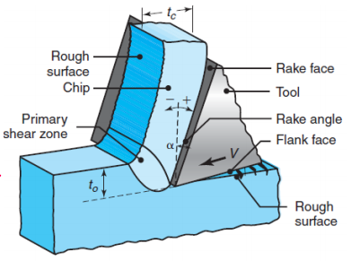

- 连续切屑由韧性材料以高切削速度和/或高前角形成。
- 材料的变形沿着一个狭窄的剪切带发生，即主剪切区（primary shear zone）。切屑与材料本身可能具有弯曲的边界。
- 由于摩擦，CCs可能在刀具-切屑接触面处形成二次（secondary）剪切区，摩擦越大二次剪切区越厚。

切屑-组合边缘（chips-built-up-edge，BUE）的切屑：


- BUE由工件（workpiece）上逐渐沉积在刀具上的材料层组成，在切削过程中可能在刀具尖端形成。由于加工硬化和连续材料层的沉积。BUE硬度将会逐渐显著增加。随着其逐渐变大，BUE变得不稳定并最终破裂。
- BUE材料的一部分被切屑的刀具侧带走，其余部分随机沉积在工件表面。除非采取措施消除BUE，否则BUE的形成和破坏过程在切割操作过程中会不断重复。
- BUE通常是不被期望的，但是薄而稳定的BUE可以保护刀具的前刀面。
- BUE的减轻办法：1.提高切割速度。2.切口深度减小。3.增大前角。4.使用锋利的工具。5.使用有效的切削液。6.使用对工件材料化学亲和力较低的刀具。

切屑-锯齿状（chips-serrated）的切屑：


- 具有低剪切应变和高剪切应变区域的半连续切屑，具有锯齿状（saw-tooth）的外观。
- 具有低热导率的金属，如钛，强度会随着温度急剧下降，表现出锯齿状切屑。

切屑-不连续（chips-discontinuous，DCs）的切屑：

- DCs由可能彼此牢固或松散连接的片段组成。
- DCs通常在以下条件形成：1.脆性工件材料。2.含有硬质夹杂物和杂质的工件材料。3.非常低或非常高的切割速度。4.切口深度大。5.低前角。6.缺乏有效的切削液。7.机器工具刚度低。
- 由于切屑形成的不连续性，在切削过程中力会不断变化。因此，在形成直流和锯齿状切屑的情况下，切削刀架、工件夹持装置和机床的刚度或刚度非常重要。

工艺规划（process planning）：

工艺规划为生产零件准备详细作业指导书的行为。这是制造设施内的一项功能。建立将零件从初始形状转换为最终形状的既定工艺和参数。在工程图纸中预先确定。制定工艺规划的人员，通常称为工艺规划师。


工艺规划中包含的功能：

- 原材料准备
- 工艺选择
- 工艺排序
- 加工参数选择
- 刀具路径规划
- 机床选择
- 夹具（fixture）选择

制造工艺类型分为：

- 质量恒定和质量减少的。
- 一次加工（primary processes）和二次加工（secondary processes）。一次加工包括铸造、聚合物（polymer）工艺或成型（molding）工艺、变形（deformation）工艺、粉末（power）工艺。机械加工过程是二次加工的主要类型。二次加工的其他重要类别包括将零件固定在一起的连接（joining）工艺，以及改变机械性能的热处理（heat treatment）。
- 精加工工艺（finishing processes）：表面处理，通过涂层、喷漆或抛光等工艺生产产品的最终外观。
- 装配工艺（assembly processes）。

制造工艺简述：

铸造和成型之间的区别在于被加工材料的粘度。（具有高粘度的聚合物加工材料。）

材料去除或切割（机加工）过程被归类为二次过程。

常用的机加工（machining processes）工艺包括切削、钻孔、镗孔、攻丝、铣削、车削、螺纹。选择机加工过程中必须考虑的特征：
- 零件（part）特征。
- 所需的尺寸和几何精度及公差。
- 所需表面光洁度（finish）。
- 可用资源，包括数控（NC）机床和切削工具。

连接工艺将零件相互连接。连接工艺包括所有类别的焊接、钎焊、钎焊、扩散焊、铆接、螺栓连接和粘合。

热处理定义为控制金属的加热和冷却，主要目的是改变其性能（强度、延展性、硬度、韧性、可加工性）。例如退火、正火（normalizing）、硬化（hardening）、回火（tempering）。

表面处理可以是二次加工或精加工工艺。通过渗碳和氮化等扩散过程，或通过喷涂或热浸镀锌、电镀和喷漆等替代方法，改善表面性能。

装配工艺通常是制造的最后一步，将多个零件组合在一起，形成子组件或成品。

制造系统类型：

- 工作车间（job shop）：特点是每年小批量生产大量不同的零件类型。

- 批量生产（batch）：当产品设计相对稳定并定期批量生产时使用。

- 装配线（assembly-line）：设备按使用顺序排列。较大数量的装配任务被划分为小个子集，在连续的工作站上执行。

- 连续流水线（continuous flow）：最专业的类型。设备高度专业化（specialized），布置在回路中，通常是自动化的。

所需零件数量：

所有制造工艺都有一个最低零件制造数量，使得选择此工艺是适当的（经济效益上，包括加工设施的成本），零件制造数量称为volume。

- 大批量（high-volume）工艺：相对于生产单个零件所需的时间，安装时间较长。

- 小批量（low-volume）工艺：安装时间很短，但制造零件的时间要长得多。

零件的形状和复杂性：

零件的复杂性是指其形状、类型及其包含的特征数量。表达复杂性的一种方式是通过信息内容（information content）$I$，其中$n$为零件的维度，$\bar{l}=\left(l_1 \cdot l_2 \cdot l_3 \ldots l_n\right)^{1 / n}$为几何平均尺寸，$\bar{\Delta} l=\left(\Delta l_1 \cdot \Delta l_2 \cdot \Delta l_3 \ldots \Delta l_n\right)^{1 / n}$为几何平均公差：

$$I=n \log _2\left(\frac{\bar{l}}{\bar{\Delta} l}\right)$$

零件的复杂性也会影响工艺的选择。

零件的尺寸：

每个工艺都有一系列零件尺寸，使得使用该工艺是经济的。每个工艺也有最大的加工零件尺寸。工艺选择中的一个限制几何因素通常是截面厚度。

材料的选择：

材料的熔点及其抗变形和延性水平是材料选择的主要因素。有些材料反应性（reactive）太强，无法具有良好的焊接性（weldability）。

零件的质量/品质（quality）定义为：

- 无外部和内部缺陷（defects）。
- 表面光洁度。
- 尺寸精度。

缺陷：

- 用于制造零件的材料量应刚好大于最终零件，以便通过机械加工或其他表面处理方法去除表面缺陷。
- 铸件中可能需要额外的材料，以便将表面加工成规定的光洁度。
- 热处理钢零件可能尺寸过大，以便去除脱碳层。
- 孔隙等缺陷通常可以通过对零件施加高静水压力来消除

表面光洁度：

- 表面光洁度决定外观（appearance），影响零件与其他零件的装配，并可能影响其耐腐蚀性（resistance to corrosion）和耐磨性（resistance to wear）。
- 必须规定和控制零件的表面粗糙度，因为它会影响疲劳失效、摩擦和磨损以及与其他零件的装配。

尺寸精度与公差：

- 实现尺寸精度取决于材料的性质和工艺。
- 固化工艺必须考虑到熔融金属固化时发生的收缩。
- 聚合物工艺必须考虑聚合物比金属更高的热膨胀。

制造成本。成品的制造成本是决定制造工艺和材料选择的最重要因素。制造零件的成本由以下因素组成：

- 1.材料成本
- 2.制造零件和组装产品的人员的工资
- 3.设备的资本化成本
- 4.工具成本
- 5.管理费用，如工厂维护

### L16 Casting

铸造（casting）是最古老的金属成型工艺之一，主要包括：

- 将熔融金属浇注到模腔（mold cavity）中。
- 模型（pattern）是模具（mold）的模具。
- 让它凝固（冷却）。
- 从模具中取出零件。

与其他制造方法相比，铸造工艺最常被选择，原因如下：
- 铸造可以产生具有内腔或空心截面（hollow sections）的复杂形状。
- 可以一次性生产非常大的零件。
- 它可以使用难以或不经济的材料通过其他方式进行加工。
- 通常是将金属成型为零件的最快方法
- 几乎所有金属都可以铸造成所需的最终形状，通常只需要进行少量的精加工。

铸造工艺可分为：

- 可消耗（expendable）模具/可重复使用（reusable）的模型（pattern）：砂（sand）、石膏（plaster）和陶瓷模具铸件。
- 可消耗模具/可消耗模型：熔膜（investment），蒸发-泡沫铸造。
- 永久模具/无模型：模、离心、挤压铸造（squeeze casting）。

在所有制造中，每种铸件都有自己的特点、应用、优势、局限性和成本。

要选择的铸造工艺取决于：

- 零件尺寸
- 部件配置
- 零件数量
- 要求的公差
- 指定的金属

铸造操作中的重要注意事项：

- 熔融金属流入模腔的流动。
- 模具中金属的固化/凝固（solidification）和冷却（cooling）。
- 模具的材料类型对铸造的影响。

纯金属的凝固：

- 纯金属（pure metal）在恒定温度下凝固，因为它有明确的熔点（或凝固点）。
- 在纯金属熔融金属的温度降至冰点（freezing point）后，其温度保持恒定，同时释放熔化潜热（latent heat of fusion）。
- 凝固前沿（front）（也就是固液界面）从模具壁向中心移动。
- 金属在冷却时会收缩，通常在固化时也会收缩。

纯金属凝固过程形成的晶粒结构（grain structure）：


- 在模具壁处（通常在室温下），金属快速冷却，并产生细小等轴（fine equiaxed）晶粒的凝固表皮（skin）或外壳（shell）（在所有方向上，尺寸大致相等）。
- 冷却区（chill zone）包含在模具表面成核（nucleated）的细小晶体。

纯金属凝固过程，晶粒的生长方向与通过模具向外传递的热量的方向相反。那些具有有利取向的晶粒将会优先远离产生柱状（columnar）晶粒的模具表面生长：


- 随着传热驱动力从模具壁减少，晶粒变得等轴且粗糙。

- 那些具有显著不同方向的晶粒被阻止进一步生长。这种晶粒发育被称为均匀成核（homogeneous nucleation），这意味着晶粒从模具壁开始自行生长。

合金（alloy）的凝固：

- 当温度降至液相线$T_L$以下时，合金开始凝固，当温度达到固相线$T_s$时，合金完全凝固。
- 在该温度范围内，合金呈糊状（mushy）或糊状（pasty），具有柱状（columnar）枝晶（接近树枝状）。注意枝晶臂（dendrites arms）之间存在的液态金属。
- 树枝状岩具有三维臂和分支（二级臂），最终互锁（interlock），如下图所示。


糊状区的宽度是凝固过程中的一个重要因素。它由冻结范围（freezing range）来描述，一般$<50°$为短，$>110°$为长：

$$\text{freezing range}=T_L-T_S$$

纯金属没有冻结范围。铁铸件通常具有狭窄的糊状区，铝和镁合金具有较宽的糊状区。

冷却速率的影响：

- 冷却速率慢——凝固时间长——导致粗枝晶（coarse dendritic）。
- 对于较高的冷却速率——凝固时间短——结构变得更细且枝晶臂间距更小。
- 对于更高的冷却速率，形成的结构是非晶体的（amorphous）。
- 随着晶粒尺寸的减小，铸造合金的强度增加，铸件中的微孔减少，铸件在凝固过程中开裂的趋势降低。

晶粒尺寸和晶粒分布不均匀导致铸件具有各向异性性能。描述液-固界面动力学的标准是比率：

$$Ratio=\frac{G}{R}=\text{thermal gradient (K/m) / rate(m/s)}$$

当比率处于$10^5 \sim 10^7$范围内时，具有树枝状结构（dendritic type structures）：


当比率处于$10^{10} \sim 10^{12}$范围内时，产生非树状（nondendritic）液-固界面的平面前沿：


结构-性能关系：

- 凝固过程中性能和结构发展之间的关系是铸造的重要方面。
- 特定合金的相图（phase diagram）给出了枝晶和液态金属的成分（compositions）。
- 当合金冷却非常缓慢时，每个枝晶都会形成均匀的成分。
- 然而，在正常（更快）的冷却速率下，形成有芯（cored）的枝晶。核状枝晶的表面成分与其中心的表面成分不同。这种差异被称为浓度梯度（concentration gradient）。
- 枝晶表面的合金元素浓度高于芯部。正向宏观层面分析，在凝固前沿作为平面前沿远离铸件表面的情况下，凝固合金中较低熔点成分（未凝固）被推向中心。因此，这种铸件在其中心比在其表面具有更高的合金元素浓度。如下图：


- 反向宏观层面分析，在枝晶结构中，如在固溶体（solid-solution）合金中发现的那些。铸件的中心具有比其表面更低的合金元素浓度。结合重力分析，密度较高的夹杂物或化合物下沉，较轻的元素漂浮在表面。


流体流动：

- 熔融金属通过浇注池（pouring basin）或杯状物浇注。然后通过浇口（gating system）系统，包括浇口（sprue）、流道（runners）和浇口（gates）流入模腔。
- 浇口（sprue）是一个锥形垂直通道，熔融金属通过该通道在模具中向下流动。
- 流道是将熔融金属从浇口输送到模腔的通道，或将浇口连接到浇口上。
- 浇口（gate）是流道的一部分，熔融金属通过该部分进入模腔。
- 冒口（risers）用作储罐，供应任何必要的熔融金属，以防止凝固过程中因收缩（shrinkage）而产生孔隙（porosity）。


- 成功的铸造需要对凝固过程进行适当的设计和控制，以确保系统中有足够的流体流动。例如，砂型铸造中浇注系统的一个重要功能是通过将污染物（contamination）粘附在浇注系统的壁上，将污染物（氧化物和其他夹杂物）截留（trap）在熔融金属中。
- 设计得当的浇口系统可避免或最大限度地减少过早冷却、湍流和气体滞留等问题。

流体流动的两个基本原理与浇口设计有关，伯努利定理（$f$为摩擦损失）也是能量守恒定律：

$$h+\frac{p}{\rho g}+\frac{v^2}{2 g}= constant$$

$$h_1+\frac{p_1}{\rho g}+\frac{v_1^2}{2 g}=h_2+\frac{p_2}{\rho g}+\frac{v_2^2}{2 g}+f$$

质量连续定律：

$$Q=A_1 v_1=A_2 v_2$$

结合起来可得：

$$\frac{A_1}{A_2}=\sqrt{\frac{h_2}{h_1}}$$

雷诺数（$Re$越高，发生湍流的趋势就越大）。当$Re$处于$0 \sim 2000$时，为层流（laminar flow）；处于$2000 \sim 20000$时，为过渡流（transition flow）；处于$>20000$时，为湍流（turbulent flow）。层流和湍流的混合物被认为是无害的：

$$\operatorname{Re}=\frac{v D \rho}{\eta}$$

注意液态金属与空气和其他气体的反应会导致空气夹带（air entrainment），并形成浮渣（formation of dross）（在熔融金属表面形成的浮渣）。

最大限度地减少湍流的技术包括在浇口系统设计中，避免流动方向和通道横截面几何形状的突然变化。

- 只有通过真空（vacuum）铸造才能几乎完全消除浮渣或熔渣。
- 传统的常压铸造也可以减少浮渣或矿渣（slag），但是需要：通过撇渣；通过使用适当设计的浇注池和流道系统；通过使用过滤器。

熔融金属的流动性是熔融金属填充型腔的能力，两个基本因素：

- 熔融金属的特性。
- 铸造参数。

熔融金属的特性：

- 粘度
- 表面张力
- 夹杂物
- 合金的凝固模式

铸造参数：

- 模具设计
- 模具材料
- 过热度（定义为合金温度高于其熔点的增量）
- 浇注速率
- 传热

已经开发了几种测试来量化流动性，尽管没有一种是普遍接受的。在一种常见测试中，使熔融金属沿着室温下的通道流动；金属在凝固和停止流动之前流动的距离是衡量其流动性的指标。

热传递：

热流是一种复杂的现象，取决于与铸造材料、模具和工艺参数有关的几个因素。

例如，在铸造薄型材（profile）时，金属流速必须足够高，以避免过早冷却和凝固。另一方面，流速不得过高，以免造成过度湍流。


液态金属的热量通过模具壁释放到周围的空气中。空气-模具和模具-金属的界面处的突然温度变化是由边界层的存在和这些界面处的不完美接触引起的。

凝固时间：

在凝固的早期阶段，在冷却的模具壁处开始形成薄而凝固的表皮，随着时间的推移，这层表皮会变厚。


凝固时间的计算，$C$是一个综合反映模具材料、金属性能、温度的常数。$n$是一个1.5到2的值，通常取2。：

$$\text{Solidification time}=C\left(\frac{\text { Volume }}{\text { Surface area }}\right)^n$$

收缩：

由于其热膨胀特性，金属在凝固过程中通常会收缩。收缩会导致尺寸变化和（有时）开裂（cracking）。

- 熔融金属在凝固前冷却时的收缩。
- 金属在从液体变为固体的相变过程中的收缩。
- 凝固金属在温度降至环境温度时的收缩。也被称为最大潜在收缩量（largest potential amount of shrinkage）。

缺陷（对铸造）：

- 金属凸起（额外金属）：由翅片和闪光（分模线处的薄凸起）组成，或大块凸起，如凸起和粗糙表面。
- 空腔（cavities）：由圆形或粗糙的内部或暴露的空腔组成。
- 不连续性：如裂纹、冷撕裂或热撕裂。
- 缺陷表面：如表面褶皱、重叠、疤痕（浅腔）。

缺陷类别：

- 铸造不完整：如漏涂（由于过早凝固）、浇注金属量不足和跳动（由于浇注后金属从模具中流失）。
- 尺寸或形状不正确：由于收缩余量不当、收缩不规则等因素。
- 夹杂物（inclusion）：一般为非金属。

砂型铸造：

- 砂型铸造是传统的铸造方法
- 它仍然是最普遍的铸造形式
- 使用沙子制造金属产品的优点是沙子非常耐高温。
- 几乎所有的金属铸造材料都可以是砂型铸造
- 砂型铸造的典型应用包括机座、大型涡轮机叶轮、螺旋桨、管道固定装置。

砂型铸造步骤：


砂型铸造类型：

- 绿砂（green-sand）模具：最常见的模具材料，沙子、粘土和水的混合物，制作模具的方法最便宜，沙子很容易回收
- 粗体盒（bold-box）模具：将各种有机和无机粘合剂混合到沙子中，比绿砂模具尺寸更准确，制作成本更高
- 无烘烤（no-bake）模具：将合成液体树脂与沙子混合，比生砂模具更强，尺寸精度和表面光洁度更好；然而，模具的变形更大，铸件更容易发生热撕裂，生产率更低

模具的特征：


- 烧瓶（flask）：支撑模具本身。
- 浇注池（杯）：将熔融金属倒入其中。
- 浇口：熔融金属通过浇口向下流动。
- 流道系统：具有将熔融金属从浇口输送到模腔的通道。
- 冒口：为铸件提供额外的熔融金属，使其在凝固过程中收缩
- 型芯（core）：由沙子制成的镶块；它们被放置在模具中以形成中空区域或以其他方式限定铸件的内表面。
- 排气口（vents）：排出熔融金属与模具和型芯中的沙子接触时产生的气体

模型（pattern）铸造：

模型是模具的模具，一般用于将沙子混合物模制成铸件的形状的模具，可以由木材、塑料或金属制成。模型材料的选择取决于铸件的尺寸和形状、所需铸件的尺寸精度和数量以及成型工艺。

- 一体式（one-piece）模型：通常用于较简单的形状和低数量的生产；通常由木材制成，价格低廉。
- 拼合（split）模型：是两件式模型，每个部分都形成空腔的一部分，可以产生复杂的形状。
- 拼板（match-plate）模型：通过将一个或多个拼合模型的每一半固定在单个板的相对侧而构建的两件式模型，通常用于大型生产，以生产较小的铸件。


型芯：

- 型芯被放置在模腔内以形成铸件的内表面，并在脱模和进一步加工过程中从成品中移除。
- 型芯必须具有强度、渗透性、湿陷性和耐热能力。
- 型芯由砂骨料（aggregate）制成。

熔模（investment casting）也被称为失蜡（lost-wax）工艺：

- 它适用于铸造高熔点合金，具有良好的表面光洁度和紧密的尺寸公差
- 它比砂型铸造更昂贵
- 模型由蜡或塑料通过成型或快速成型技术制成。通过加热熔化将模型移出。


### L17 Stamping, Forging and Extrusion

冲压（stamping / pressworking / press forming）、锻造（forging）和挤压（extrusion）：

在冲压机中生产钣金零件（sheet-metal part）的过程被称为冲压。

冲裁（blanking）：金属板切割，切割出需要的零件，将零件与周围的坯料（stock）碎片分开。

冲孔（punching）：类似于冲裁，但切割出的碎片（scrap）是废料（slug），剩余坯料才是需要的零件。

钣金切割的间隙，冲头（punch）和模具（die）之间的间隙，如图：


- 典型值范围在坯料厚度的4%到8%之间。过小导致需要更大力量，过大则金属会夹在切边之间，导致过多毛刺（burr）。

弯曲：


在被弯曲的片材（sheet）的外纤维处首次出现裂纹的半径被称为最小弯曲半径（minimum bend radius）：


弯曲过程中片材的外纤维和内纤维上的工程应变由弯曲表达式给出，$R$为弯曲半径，$T$为片材厚度：

$$e=\frac{1}{(2 R / T)+1}$$

钣金弯曲的类型：

- V形弯曲，使用V形模具进行。


- 边缘（edge）弯曲，使用擦拭模具（wiping die）进行。


弯曲的回弹（springback）：

因为所有材料都有有限的弹性模量，所以当载荷消除时，塑性变形之后总是会有一些弹性恢复。

零件在弯曲后趋于弹性恢复，其弯曲半径变大。在某些条件下，最终弯曲角度可能小于原始角度（负回弹）：


成型操作中的回弹通常通过过度弯曲（overbending）零件来补偿compensated）。另一种方法是通过在冲头尖端和模具表面之间对弯曲区域施加高度局部的压缩应力来铸造，这种技术被称为冲头底部（bottoming the punch）：


在另一种方法中，零件进行拉伸弯曲，即在弯曲时受到外部张力。随着模具闭合，上模具顺时针旋转。


弯曲力：

弯曲力材料强度、弯曲长度$L$、板材厚度$T$和模具开口$W$的函数。


最大弯曲力，系数$k$从$0.3$（擦拭模具）到$1.3$（V模具），$Y$是材料的屈服应力：

$$P=\frac{k Y L T^2}{W}$$

锻造：

锻造是一种基本工艺，通过各种模具和工具施加的压缩力使工件成形。

开模锻造（open-die forging）可以简单地描述为一个金属工件（坯料），放置在两个平面模具之间，并通过压缩它来降低高度，这一过程称为镦粗（upsetting）或平面模锻（flat-die forging）：


开孔（cogging）是一种开模锻造操作，通过以特定间隔连续锻造步骤（咬入）来减少棒材的厚度：


在压模/闭模锻造（impression/closed-die 
forging）中，工件在两个成形模具之间锻造时形成模腔的形状，其中一些材料会溢出形成飞边（flash）：


待锻造的坯料通过：

- 从挤压或拉伸的棒材中裁剪而制备。
- 粉末冶金或铸造。
- 先前锻造操作的预成型坯料。

填充（fullering）和磨边（edging）：


其他锻造操作：

- 冲制压模（coining）
- 镦头（heading）
- 穿孔（piercing）

冲制压模：

一种闭模锻造工艺，最初用于铸造硬币、奖章和珠宝。它可用于生产各种高精度的零件，如齿轮、工业密封件和医疗器械。

穿孔：

穿孔这是一种用冲头在工件表面压痕（但不穿透）以产生空腔或压痕的过程。穿孔的常见例子是螺栓头中六边形空腔的压痕。

镦头（镦粗锻造）：

它本质上是一种镦粗（upsetting）操作，在棒材或线材的末端进行，以增加横截面。典型的产品有钉子、螺栓头、螺钉、铆钉和各种其他紧固件。

各种锻造机器：

- 机械压力机（Mechanical presses）。用于高精度零件。压力区间为$300-12000$吨。机械压力机基本上是曲柄式或偏心式。带有偏心驱动装置的曲柄压力机。偏心轴可以用曲轴代替，以使柱塞上下运动。


关节式（knuckle-joint）机械压力机由于连杆机构的设计，这种压力机可以施加很高的力：


- 螺旋压力机（screw presses）。这种压力机的能量来自飞轮（flywheel），因此它们的能量是有限的。锻造载荷通过一个大的垂直螺钉传递，当飞轮能量耗散时，冲头停止。特别适用于小批量生产和高精度的薄零件，如涡轮叶片。压力区间为$160-31500$吨。


- 液压压力机（hydraulic presses）。这种压力机以恒定速度运行，并受到负载限制，如果所需负载超过其容量，压力机将停止。在整个过程中，通过恒定负载可以将大量能量从压力机传输到工件，其速度可以控制。对于开模锻造，冲压能力最大为$14000$吨。对于闭模锻造，冲压能力最大为$82000$吨。


挤压（extrusion）：

在挤出过程中，通常为圆柱形的坯料被迫通过模具，其方式类似于从管中挤出牙膏。

- 挤压的一个特点是可以在没有断裂的情况下发生大变形。

- 挤压产品通常具有恒定的横截面。

- 根据材料所需的延展性，该过程在室温或高温下进行。

- 室温下的挤压通常与锻造操作相结合，在这种情况下，通常称为冷挤压。

挤压工艺有三种基本类型的挤压：

- 直接或正向（direct or forward）挤压。
- 间接（indirect）挤压。
- 静水压（hydrostatic）挤压。

直接挤压：

坯料（billet）被放置在容器（室）中，未挤压的胚料被迫向模具挤压。


间接挤压：

模具主动向未挤压的坯料挤压。它的优点是没有坯料和容器之间的摩擦，因为没有相对运动。它用于摩擦系数非常高的材料，如高强度不锈钢的热挤压。

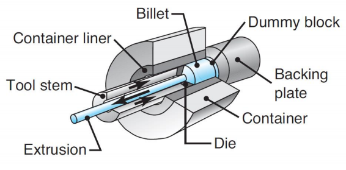

静水压挤压：

坯料的直径小于容器（容器中装有流体）。压力通过冲头（ram）传递给流体。


挤压力：


模具角度$\alpha$，挤压比例$R=A_0/A_f$（面积比），挤压常数$k$（与材料种类和温度均有关）：

$$F=A_o k \ln \left(\frac{A_o}{A_f}\right)$$

热挤压（hot extrusion）：

对于在室温下没有足够延展性的金属和合金，或者为了减少所需的力，可以在高温下进行挤压。

除非在惰性气氛中加热，否则坯料上会形成氧化膜。氧化膜可能具有研磨性（abrasive），并可能影响材料的流动模式。

放置在冲头前面的假块（dummy block）的直径比容器的直径小一点，使得一个主要由坯料外部氧化层组成的薄外壳留在容器中：


润滑（lubrication）在热挤压中很重要。玻璃是钢、不锈钢、高温金属和合金的优良润滑剂。外套（jacket）是一种由较软、强度较低的金属，如铜（copper）或软钢（mild steel），制成的薄壁容器。以上两种润滑剂可以防止胚料金属粘附或焊接到容器和模具上，防止环境挤压对坯料的污染。

冷挤压：

是一个通用术语，通常表示操作的组合，例如直接和间接挤压与锻造的组合。相比于热挤压的优势：

- 加工硬化提高了机械性能，前提是塑性变形和摩擦产生的热量不会使挤压金属再结晶。
- 更良好控制尺寸公差
- 改善表面光洁度，部分原因是没有氧化膜，并且润滑有效。
- 生产率和成本与生产同一零件的其他方法相比具有竞争力。有些机器每小时能生产2000多个零件。

挤压效应（extrusion effect）：

- 表面裂纹：如果挤压温度、摩擦或速度过高，表面温度可能过高，这可能会导致表面裂纹和撕裂-这些裂纹是沿晶（沿晶界）挤压。在较低的温度下也可能发生表面裂纹，这是由于挤压零件沿模面周期性粘附造成的。
- 管道：图中所示的挤压中的金属流动模式往往会将表面氧化物（oxides）和杂质（impurities）拉向坯料的中心，就像漏斗一样。


- 内部裂纹：挤压产品的中心会产生裂纹，称为中心裂纹、中心爆裂或箭头断裂。它们归因于在模具变形区中心线处产生的静水拉伸应力状态，类似于拉伸试验中颈缩区的条件。


### L18 Finite Element Analysis

有限元分析（finite element analysis，FEA）和有限元方法（finite element method，FEM）：

有限元分析是解决工程和数学物理问题的一种数值方法（得到近似数值解）。适用于无法获得解析解的复杂几何形状、载荷和材料特性的问题。

仿真软件就是一种FEA软件。

离散化（discretization）：

通过将实体（body）划分为许多较小实体或元件/单元（element）（有限元）的等效系统来建模（model）实体，这些实体或单元在两个或多个单元（节点或节点）和/或边界线和/或表面的公共点处互相连接。

特征（feature）：


- 获得一组代数方程，用于求解未知第一/主要/节点量（位移）。
- 次要量（应力和应变）用主要量的节点值表示。

有限元分析中使用了许多几何形状的元素，用于特定的应用：

- 线性元素
- 表面元素
- 实体元素
- 专用元素


FEA用于获得工程中边值问题（boundary value problem）也叫做场问题（field problem）的近似解：

- 场是感兴趣的域，通常代表一种物理结构。
- 场变量是由微分方程控制的感兴趣的因变量。
- 边界条件（boundary condition）是场边界上的场变量（或相关变量，如导数）的特定值。
- 二维情况下，有限元不是大小为$dx \cdot dy$的微分元，有限元是由多个节点（node）组成的。节点是有限元中的一个特定点，在该点处要显式计算场变量的值。


形状函数（shape function）：

- 在节点处计算得到的场变量的值用于通过节点值的插值来近似非节点处（有限元内部）的值。
- 对于三节点三角形有限元，$\varphi$为节点处的场变量的值（视为待确定的常数），$N$为插值函数（interpolation function），也称为形状函数或混合函数（blending function）（已知）。其内部的场变量由近似关系描述：


$$\varphi(x, y)=N_1(x, y) \varphi_1+N_2(x, y) \varphi_2+N_3(x, y) \varphi_3$$

自由度（degree of freedom）：

通常，与有限元相关的自由度的数量等于节点数量与必须在每个节点计算的场变量（以及可能的其导数）的值的数量的乘积。

刚度矩阵（stiffness matrix）：

有限元的主要特征体现在其单元刚度矩阵（element stiffness matrix）中。

- 对于结构有限元，刚度矩阵包含几何和材料行为信息，该信息指示单元在承受载荷时对变形的抵抗力。这种变形可能包括轴向、弯曲、剪切和扭转效应。

- 对于非结构分析中使用的有限元，如流体流动和传热，也使用刚度矩阵这个术语，因为该矩阵表示元件在受到外部影响时的变化阻力。

以线性弹簧作为有限元：

线性弹性弹簧是一种仅能支撑轴向载荷的机械装置，弹簧的伸长或收缩与施加的轴向载荷成正比。变形和载荷之间的比例常数被称为弹簧常数、弹簧刚度或弹簧刚度$k$，并且具有每单位长度的力单位。由于弹性弹簧仅支持轴向载荷，我们选择一个单元（element）坐标系（也称为局部坐标系）作为沿弹簧长度方向的$x$轴：


假设弹簧未变形时两个节点位移均为零，对于两个节点位移$u_1,u_2$，弹簧净变形$\delta$：

$$\delta=u_2-u_1$$

$$f=k \delta=k\left(u_2-u_1\right)$$

$$f_1+f_2=0$$

$$f_1=-k\left(u_2-u_1\right), f_2=k\left(u_2-u_1\right)$$

$$\left[\begin{array}{cc}k & -k \\ -k & k\end{array}\right]\left\{\begin{array}{l}u_1 \\ u_2\end{array}\right\}=\left\{\begin{array}{l}f_1 \\ f_2\end{array}\right\}$$

$$\left[k_e\right]\{u\}=\{f\}$$

$$\left[k_e\right]=\left[\begin{array}{cc}k & -k \\ -k & k\end{array}\right]$$

因此，对于单弹簧有限元，其刚度矩阵即为$k_e$。

- 刚度矩阵为$2 \times 2$矩阵，是因为有$2$个节点，自由度为$2$。
- 刚度矩阵对称，这是力对称的结果（相等和相反以确保平衡）。
- 刚度矩阵是奇异的，因此不可逆。这是因为所定义的问题是不完整的，并且没有解决方案（需要边界条件）。

两个线性弹簧有限元组成的系统，用$f_i^{(j)}$表示对第$j$个有限元的节点$i$的力：


$$\begin{aligned} & {\left[\begin{array}{cc}k_1 & -k_1 \\ -k_1 & k_1\end{array}\right]\left\{\begin{array}{c}u_1^{(1)} \\ u_2^{(1)}\end{array}\right\}=\left\{\begin{array}{c}f_1^{(1)} \\ f_2^{(1)}\end{array}\right\}} \\ & {\left[\begin{array}{cc}k_2 & -k_2 \\ -k_2 & k_2\end{array}\right]\left\{\begin{array}{l}u_1^{(2)} \\ u_2^{(2)}\end{array}\right\}=\left\{\begin{array}{c}f_2^{(2)} \\ f_3^{(2)}\end{array}\right\}}\end{aligned}$$

$$u_1^{(1)}=U_1 \quad u_2^{(1)}=U_2 \quad u_1^{(2)}=U_2 \quad u_2^{(2)}=U_3$$

以矩阵形式展开每个方程：

$$\begin{aligned} & {\left[\begin{array}{ccc}k_1 & -k_1 & 0 \\ -k_1 & k_1 & 0 \\ 0 & 0 & 0\end{array}\right]\left\{\begin{array}{c}U_1 \\ U_2 \\ 0\end{array}\right\}=\left\{\begin{array}{c}f_1^{(1)} \\ f_2^{(1)} \\ 0\end{array}\right\}} \\ & {\left[\begin{array}{ccc}0 & 0 & 0 \\ 0 & k_2 & -k_2 \\ 0 & -k_2 & k_2\end{array}\right]\left\{\begin{array}{c}0 \\ U_2 \\ U_3\end{array}\right\}=\left\{\begin{array}{c}0 \\ f_2^{(2)} \\ f_3^{(2)}\end{array}\right\}}\end{aligned}$$

$$\left[\begin{array}{ccc}k_1 & -k_1 & 0 \\ -k_1 & k_1+k_2 & -k_2 \\ 0 & -k_2 & k_2\end{array}\right]\left\{\begin{array}{c}U_1 \\ U_2 \\ U_3\end{array}\right\}=\left\{\begin{array}{c}f_1^{(1)} \\ f_2^{(1)}+f_2^{(2)} \\ f_3^{(2)}\end{array}\right\}$$

$$f_1^{(1)}=F_1 \quad f_2^{(1)}+f_2^{(2)}=F_2 \quad f_3^{(2)}=F_3$$

$$\left[\begin{array}{ccc}k_1 & -k_1 & 0 \\ -k_1 & k_1+k_2 & -k_2 \\ 0 & -k_2 & k_2\end{array}\right]\left\{\begin{array}{l}U_1 \\ U_2 \\ U_3\end{array}\right\}=\left\{\begin{array}{l}F_1 \\ F_2 \\ F_3\end{array}\right\}$$

最终获得系统刚度矩阵：

$$[K]=\left[\begin{array}{ccc}k_1 & -k_1 & 0 \\ -k_1 & k_1+k_2 & -k_2 \\ 0 & -k_2 & k_2\end{array}\right]$$

- 系统刚度矩阵是对称的，所有线性系统都是指正交坐标系
- 系统刚度矩阵是奇异的，因为没有应用约束来阻止系统的刚体运动
- 系统矩阵只是单个单元刚度矩阵的叠加，适当地分配单元节点位移和系统节点位移的相关刚度系数

因此，对于多个有限元的系统，FEA得到位移（主要量）：

$$\{F\}=[K] \cdot\{U\}$$

$$\{U\}=[K]^{-1}\{F\}$$

如果位移矩阵$\{U\}$已知，则应变和应力可以直接得到（次要量）：

$$\begin{aligned} & \varepsilon=\frac{\Delta \mu}{L} \\ & \sigma=E \cdot \varepsilon\end{aligned}$$

通过添加边界条件和约束方程，可以求解$\{U\}$的确切值。

桁架（truss）作为有限元：

弹簧有限元也经常用于表示更复杂系统的支撑件的弹性性质。一种更普遍适用但类似的元件是仅受到轴向力的弹性杆。这种单元，我们简单地称为杆（bar）或桁架单元。

- 杆在几何上是直的。
- 材料遵循胡克定律。
- 力仅施加在杆的端部。
- 杆仅支持轴向荷载；弯曲、扭转和剪切不会通过单元与其他单元连接的性质传递给其他单元。


$$\delta=\frac{P L}{A E}$$

$$k=\frac{P}{\delta}=\frac{A E}{L}$$

$$\left[k_e\right]=\frac{A E}{L}\left[\begin{array}{cc}1 & -1 \\ -1 & 1\end{array}\right]$$

$$\frac{A E}{L}\left[\begin{array}{cc}1 & -1 \\ -1 & 1\end{array}\right]\left\{\begin{array}{l}u_1 \\ u_2\end{array}\right\}=\left\{\begin{array}{l}f_1 \\ f_2\end{array}\right\}$$

$$u(x)=N_1(x) \cdot u_1+N_2(x) \cdot u_2$$

为了确定插值函数，我们要求$u(x)$（节点位移）的边界值通过离散化得到相同的满足，有：

$$u_1=u(x=0),u_2=u(x=L)$$

因此可得：

$$\begin{array}{ll}N_1(0)=1 & N_2(0)=0 \\ N_1(L)=0 & N_2(L)=1\end{array}$$

由于两个一维函数中的每一个都必须满足两个条件，因此插值函数的最简单形式是多项式形式：

$$N_1(x)=a_0+a_1 x \quad N_2(x)=b_0+b_1 x$$

其中的系数将通过满足边界（节点）条件得到：

$$a_0=0,b_0=0$$

因此有：

$$a_1=-(1/L),b_1=x/L$$

可得：

$$\begin{aligned} & N_1(x)=1-x / L \\ & N_2(x)=x / L\end{aligned}$$

$$u(x)=(1-x / L) u_1+(x / L) u_2$$

$$u(x)=\left[\begin{array}{ll}N_1(x) & N_2(x)\end{array}\right]\left\{\begin{array}{l}u_1 \\ u_2\end{array}\right\}=[N]\{u\}$$


这是以节点变量表示的位移场。

***

例题：图中所示为锥形弹性杆的一端承受施加的拉伸载荷P，另一端连接到固定支架上。横截面积从x=0时固定支架处的A0到x=L时的A0/2呈线性变化。计算钢筋末端的位移。
（a） 通过将杆建模为单个元件，该元件的横截面积等于实际杆沿长度中点的面积
（b） 使用两个相等长度的条形单元，并类似地评估每个单元中点的面积，并与精确的解进行比较。


***

有限元分析的误差：

- 计算误差（computational error）。这是由于计算机浮点计算的舍入（round-off）误差和所采用的数值积分方案的公式造成的。
- 离散化误差。真实结构的几何形状和位移分布是连续变化的。由于单元固有的数学限制，使用有限数量的单元对结构建模会在匹配几何结构和位移分布方面引入误差。

一般单元公式的插值函数：

在有限元分析中，随着单元“网格”的细化，根据收敛性来判断求解精度。网格细化有两种主要方法。

- 在第一种称为h-细化（h-refinement）的方法中，网格细化是指增加用于对给定域建模的元素数量，从而减少单个元素大小的过程。

- 在第二种方法中，p-细化，元素大小不变，但用作插值函数的多项式的阶数增加。

任何一种方法中网格细化的目的都是获得对表示精确解的值表现出渐近收敛性的序列解。

### L19 plastic shaping process

塑料成形工艺（plastic shaping process）的优点：

- 零件几何形状几乎不受限制
- 塑料成型是一种净成型工艺（net shape process）
- 不需要进一步成型
- 由于加工温度低得多，所需能量比金属少
- 由于温度低，在生产过程中简化了产品处理
- 通常不需要喷漆或电镀

热塑性塑料（thermoplastic）：

- 化学结构在加热和成型过程中保持不变
- 在商业上更重要，占塑料总吨位的70%以上
- 可在重新熔化后重复使用

热固性塑料（thermoset）：

- 在加热和成型过程中经历固化过程，导致分子结构发生永久性变化
- 一旦固化，就无法再熔化

聚合物熔体（polymer melts）：

- 要使热塑性聚合物成型，必须对其进行加热，使其软化至液体的稠度
- 在这种形式下，它被称为聚合物熔体
- 聚合物熔体的重要特性：粘度（viscosity）、粘弹性（viscoelasticity）

挤压（extrusion）：

- 压缩过程，在该过程中，材料被迫流过模口，以提供长的连续产品，其横截面形状由模口的形状决定。
- 广泛用于热塑性塑料和弹性体的大规模生产，如管材、管道、软管、结构形状、片材和薄膜、连续细丝和涂层电线
- 作为一个连续过程进行；然后将挤出物切成所需长度


挤出机料筒（extruder barrel）：

- 内径通常在25至150mm之间
- L/D比通常在10至30之间：热塑性塑料的比例更高，热固性塑料的比例更低
- 原料通过重力输送到螺杆（screw）上，螺杆的旋转使材料穿过筒体
- 电加热器熔化原料；随后的混合和机械做功增加了热量，保持熔体

挤出机螺杆（分成三段）：

- 进料（feed）段：将物料从料斗（hopper）输送到料筒的中心区域
- 熔化段/压缩段/过渡（transition）段：塑料颗粒的粘性剪切和筒体周围的外部加热器产生的热量导致熔化开始
- 计量（metering）段/泵送（pumping）段：在此处发生额外的剪切和熔化，模具（die）入口处压力增加

挤出机模具末端：

- 聚合物熔体通过料筒的过程最终到达模具区域。
- 在到达模具之前，熔体通过筛网包（screen pack）：金属丝过滤网（filter screen）和破碎板（breaker plate），破碎板上有几个小孔。

筛网包的功能：

- 过滤掉污染物和硬块
- 在计量部分建立压力
- 拉直聚合物熔体的流动，并从螺杆上去除其圆周运动的"记忆"


挤出机中的熔体流动：

- 当螺杆在筒内旋转时，聚合物熔体被迫向模头向前移动。
- 主要的传输机制是粘性液体和旋转螺杆之间的摩擦产生的阻力流（drag flow）$Q_d$。
- 通过模具压缩聚合物熔体会产生背压，从而减少阻力流传输，称为背压流（back pressure flow）$Q_b$。
- 结果流（resulting flow）为$Q_x=Q_d-Q_b$。

模具配置和挤出产品：

- 模口的形状决定了挤出物的横截面形状
- 常见的模口型材和相应的挤出形状：实心（solid）型材、空心（hollow）型材（如管材）、电线电缆涂层（coating）、片材和薄膜、细丝（filament）

实心型材类型：

- 规则形状：圆形、方形
- 不规则横截面：结构形状、门窗饰条、汽车装饰件、房屋侧面

用于实心型材的挤压模具截面图：


模具膨胀（swell）可以在图中观察到：挤出的型材比模具更大。

用于空心型材的挤压模具截面图：


- 空心型材需要心轴（mandrel）来形成形状。心轴通常包括一个空气通道，通过该空气通道吹送空气以在硬化过程中保持挤出物的中空形状。
- 使用十字轴（spider）将心轴固定到位。

用于电线涂层的模具：


- 聚合物熔体被施加在裸电线上，因为裸电线被高速拉过模具
- 在电线和聚合物之间产生轻微的真空，以促进涂层的粘附
- 产品以高达50米的速度缠绕在大型线轴上

片材和薄膜生产工艺：

- 薄膜：厚度低于0.5毫米。用于包装：产品包装材料、食品袋和垃圾袋等，还有摄影胶片库存。
- 片材：厚度从0.5毫米到约12.5毫米。用于平窗玻璃，还有热成型库存。
- 最广泛使用的工艺是连续的高产量操作。工艺包括：片材和薄膜的狭缝模（slit-die）挤出、吹塑薄膜（blown-film）挤出工艺、压延成型（calendering）。

片材和薄膜的狭缝模挤出：

- 通过传统挤压生产片材和薄膜，使用窄缝作为模口
- 缝宽可达3米，窄至0.4毫米左右
- 一个问题是整个坯料宽度的厚度均匀性，这是由于聚合物熔体在流经模具时发生了剧烈的形状变化。
- 薄膜边缘通常必须修剪，因为边缘增厚


吹塑薄膜挤出工艺：

- 将挤出和吹塑相结合，生产出一管薄膜
- 管材的挤出
- 管材在熔融时向上拉伸，同时通过模具充气使其膨胀
- 将空气吹入管材，以保持均匀的薄膜厚度和管径


压延成型：

- 原料通过一系列辊，以将厚度减小到所需规格
- 设备昂贵，生产率高
- 该工艺以良好的表面光洁度和高的量规精度而闻名
- 典型材料：橡胶或橡胶热塑性塑料，如增塑PVC
- 需要对所有温度和转速进行严格控制


注塑成型（injection molding）：

- 聚合物被加热到高度塑性状态，并在高压下被迫流入模腔，在模腔中固化，然后将模具从模腔中取出
- 生产离散的部件几乎总是呈净形状
- 典型的循环时间为10至30秒，但一分钟或更长的循环并不罕见
- 模具可能包含多个模腔，因此每个周期都要生产多个成型件

后面的不考。

## 机械工程设计 

机械工程设计（Mechanical Engineering Design）

## 制造工程

制造工程（Manufacturing Engineering）

## AutoCAD使用方法

`Esc`取消选择/取消指令

`Enter`确认输入

`<`角度符号

`滚轮（中键）`移动视图

命令行指令（推荐）：

```txt
L
直线

PO
打点

CL
中心线

TR
修剪

H
编辑填充

LA
选择/编辑图层，选择线型

SE
编辑对象捕捉/坐标系

D
编辑标注方式（ISO标准可使标注自带水平折线）

ED/左键双击
编辑标注内容

BL
块的创建

MENUBAR
调出菜单栏（赋值为1）

ST
编辑文字样式

ATT
插入-属性定义，插入指定文字样式的文字

ADC
设计中心（文件管理器）

ctrl+3
调用标准库图形

T
插入多行注释

LE
引线设置（用于公差标注）

Limits
设置图形界限
```

打印设置，选择PDF，勾选"居中打印"后，如果图形方向为"横向"，则对打印偏移的"X"进行合适的更改，如果PDF中图形位置偏上，则将"X"增大。（"居中打印"是不可靠的）。打印范围应当自己设置，自动的"显示"会非常傻逼。
