## 目录

  - 常见单词补充
  - 课程内容
    - Chapter 1
    - Chapter 13 齿轮回顾
      - part a
      - part b
      - part c
    - Chapter 2
    - Chapter 4
    - Chapter 5
    - Chapter 6
    - Chapter 7
    - Chapter 8 Cam
      - part a
      - part b
      - 作业3补充
    - Chapter 11 Bearing
      - part a
      - part b
    - Chapter 8 Fastener
      - Chapter 8 作业补充
    - Chapter 6 Fatigue failure resulting from variable Loading
      - 补充：对一已知轴承的失效应力分析
      - Chapter 6 作业补充
    - Chapter 7 Shaft
      - Chapter 7 作业补充
  - 实践部分

## 常见单词补充

## 课程内容

### Chapter 1

什么是机械设计：

- 为了制定满足特定需求（need）的计划。
- 流程需要创新（innovation）、迭代（iteration）和决策（decision-making）。
- 通信密集型（communication-intensive）。
- 产品应该是：
- - 功能性的（functional）
- - 安全的（safe）
- - 可靠的（reliable）
- - 有竞争力的（competitive）
- - 可用的（usable）
- - 可制造的（manufacturable）
- - 可销售的（marketable）

机械工程设计：

- 示例：轴颈轴承（journal bearing）示意图：


设计流程：

- 本质上是迭代。
- 需要初始估计和后续细化。
- 合理的顺序。
- 示意图：


设计注意事项：

- 影响设计的一些特性：


计算工具：

- 计算机辅助工程（Computer-Aided Engineering，CAE）包含：
- - 计算机辅助设计（Computer-Aided Design，CAD）：绘图、三维实体建模等。
- - 计算机辅助制造（Computer-Aided Manufacturing，CAM）：CNC工具路径、快速原型等。
- - 工程分析与仿真：有限元、流体流动、动力学分析、运动等。
- - 数学求解器：电子表格、过程编程语言、方程求解器等。

标准和规范：

- 标准：
- - 零件、材料或工艺的一套规范（specifications）。
- - 旨在实现一致性、效率和特定质量。
- - 限制多种变化（multitude of variations）。
- 代码：
- - 一套用于分析、设计、制造和施工的规范（specifications）。
- - 为了达到特定的安全、效率和性能或质量。
- - 不意味着绝对安全。
- 各种组织为常见的和/或关键的行业制定和发布标准和代码：
- - 国际标准化组织（International Organization for Standardization，ISO）。
- - 中华人民共和国国家标准（GB，GB/T）。

成本：

- 在工程设计中，成本几乎总是一个重要因素。
- 使用标准尺寸是降低成本的首要原则。
- - 示例：螺钉的尺寸：M3、M4等。

公差/容差（tolerance）：

- 精密公差通常会增加成本。
- 需要将公差设置在合理的范围内。

盈亏平衡点（breakeven point）：

- 两种可能的生产方法之间的成本比较。
- 通常在生产量上存在盈亏平衡点。
- 示意图：


安全和产品责任：

- 严格责任（strict liability）：
- - 制造商对因缺陷造成的损坏或伤害负责。
- - 无需证明制造商的疏忽。
- - 要求在分析和设计、质量控制和综合测试方面进行良好的工程设计。

应力和强度：

- 强度：
- - 材料或机械元件的固有特性。
- - 示例：极限强度、屈服强度。
- 应力：
- - 物体内特定点的状态特性。
- - 主要是载荷和几何形状的函数。
- - 有时也是温度和加工的函数。
- 应力和强度的不确定性的来源：


- 应力和强度的不确定性-随机方法（stochastic method）：
- - 基于设计参数的统计性质。
- - 侧重于设计功能的生存概率（可靠性）。
- - 通常受统计数据的可用性的限制。
- 应力和强度的不确定性-确定性方法（deterministic method）：
- - 基于函数损失参数和最大允许参数的绝对不确定性，设计系数（design factor）$n_d$：

$$n_d=\frac{\text{loss-of-function parameter}}{\text{maximum allowable parameter}}$$

- - 若parameter为load，则有：

$$\text{Maximum allowable load}=\frac{\text{loss-of-function load}}{n_d}$$

- - 例题：


- - 通常在没有统计数据时使用。
- - 由于应力可能不会随荷载线性变化，因此更常见的是用强度和应力-安全系数来表示设计系数：

$$n_d=\frac{\text{loss-of-function strength}}{\text{allowable stress}}=\frac{S}{\sigma (或者 \tau)}$$

- - 必须分析所有功能损失模式（loss-of-function modes），并以设计系数最小的模式为准。
- - 应力和强度项必须具有相同的类型和单位。
- - 应力和强度必须应用于零件中相同的关键位置。
- - 安全系数（factor of safety）是最终设计的实现设计系数，包括四舍五入到标准尺寸或可用部件。
- - 例题：


- - - 但最小尺寸0.564英寸不是标准尺寸，我们需要使用标准尺寸来最大限度地降低成本。在表a-17中选择下一个更大的尺寸。


可靠性：

- 可靠性$R$，机械元件在使用中不会失效的概率的统计度量。
- 失效概率$p_f$，每可能实例总数的失效实例数。

$$R=1-p_f$$

- 串联系统（series system），如果系统中的任何组件发生故障，则视为系统发生故障。
- 串联系统的总体可靠性是单个组件可靠性的乘积。

$$R=\prod_{i=1}^n R_i$$

尺寸（dimension）和公差：

- 标称尺寸（nominal size），我们在谈到一个元素时使用的尺寸。不需要与实际尺寸相匹配。
- 极限，规定的最大和最小尺寸。
- 公差，两个极限之间的差异。
- 双边（bilateral）公差，与基本尺寸在两个方向上的变化，例如$1.005 \pm 0.002$英寸。
- 单边（unilateral）公差，基本尺寸被视为限制之一，并且只允许在一个方向上变化，例如$1.005_{-0.000}^{+0.004}$英寸。
- 间隙（clearance），指两个配合的圆柱形零件（如螺栓和孔）的尺寸差异。
- - 假设内部构件小于外部构件。
- - 直径间隙，两个直径的差异。
- - 径向间隙，两种半径的差异。
- 过盈量（interference），与间隙相反，当内部构件大于外部构件时的度量。
- 余量（allowance），最小规定间隙或最大规定过盈量或配合零件。


- 例题：


### Chapter 13 齿轮回顾

#### part a

齿轮（gears）为传动设备（transmission device）：

- 正齿轮（spur gear）：


- 斜齿轮（helical gear），齿（teeth）是倾斜的，噪音比正齿轮小：


- 锥形齿轮/螺旋伞齿轮（bevel gear），齿可以是直的（straight），螺旋（spiral），准双曲面（hypoid）：


- 蜗杆（worm）和蜗轮（worm gear）：


正齿轮的各部分术语与示意图：


- 俯仰圆/节圆（pitch circle）的直径为俯仰径/节径（pitch diameter），半径为俯仰半径/节距半径（pitch radius），俯仰径用$d$表示（inch或mm）。一对已经啮合（mating）的齿轮的俯仰圆相切。小轮（pinion）：齿轮组中更小的齿轮。齿轮（gear）：齿轮组中更大的齿轮。

- 圆形俯仰距/圆周齿距（circular pitch）用$p$表示，在俯仰圆上测量得到，等于俯仰圆的一个齿的对应弧长，也等于齿厚（tooth thickness）和空间宽度（width of space）的和，齿数为$N$：

$$p=\frac{\pi d}{N}$$

- 模量/模数（module）为俯仰径$d$与齿数$N$的比值（用$m$或mm来表示。对于两啮合齿轮中任一齿轮，模数均相等）：

$$m=\frac{d}{N}$$

- 直径俯仰距/径节（diametral pitch）用$P$表示（每inch的齿数）：

$$P=\frac{N}{d}=\frac{1}{m}$$

$$P=\frac{\pi}{p}$$

- 齿顶/齿顶高（addendum）用$a$表示，是顶地（top land）与俯仰圆之间的径向距离。

- 齿根/齿根高（dedendum）用$b$表示，是底地（bottom land）与俯仰圆之间的径向距离。

- 整体深度/齿全高（whole depth）用$h_t$表示，为齿顶和齿根之和：

$$h_t=a+b$$

- 间隙圆/顶隙圆（clearance circle）是与啮合齿轮的齿顶圆相切的圆。

- 间隙/顶隙（clearance）是一个齿轮的齿根和啮合齿轮的齿顶之差。

- 齿隙/侧隙（backlash）是一个齿轮的空间宽度和在节圆上测量的啮合齿轮的齿厚之差。

常用齿尺寸：


标准齿系统：


- 常用压力角（common pressure angle）$\phi$：$20^\circ$和$25^\circ$。

- 旧压力角（old pressure angle）$\phi$：$14 \frac{1}{2}{ }^{\circ}$。

- 常用面宽度（common face width）$F$：$3p<F<5p$（$p=\frac{\pi}{P}$）。

共轭作用（conjugate action）：

- 当啮合齿轮（表面相互滚动/滑动）具有恒定的角速度比时，被称为共轭作用。作用线ab与中心连线AB的交点为俯仰点/节点（pitch point）$P$。要以恒定的角速度比传递运动，俯仰点$P$必须保持固定。从每个中心$O$经过俯仰点画出的圆就是"俯仰圆"，俯仰圆的半径就是俯仰径/节径：


- 速度比/角速度比（velocity ratio / angular velocity ratio）等于中心和俯仰点的距离（俯仰半径）之比，同时等于齿数比的倒数：

$$V=w_A r_A = w_B r_B$$

$$\frac{w_A}{w_B}=\frac{r_B}{r_A}=\frac{d_B}{d_A}=\frac{N_B}{N_A}$$

- 接触点（point of contact）$c$：两表面相切点。

- 作用线（line of action）$ab$：力在ab上传递，ab垂直于接触表面。

- 中心线（line of center）$O-O$：两个中心的连线等于两齿轮的俯仰径之和的一半：

$$C=\frac{d_A+d_B}{2}$$

渐开线（involute profile/involute contour）：

- 一对齿轮实际上是很多对凸轮，它们通过一个小圆弧起作用，在偏离渐开线之前，被另一对相同的凸轮代替。

- 渐开线是最常见的共轭轮廓。如何构造渐开线：渐开线是对一个圆柱围一条绳子后对绳子逐渐展开时绳子末端点的轨迹曲线，而基圆则为此圆柱的圆。从圆柱体上解开绳索（如图$def$所示），并保持绳索紧密并与圆柱体相切（绳子末端$d$的轨迹）。产生渐开线的圆称为基圆（base circle），$b$点是追踪点（tracing point），$de$是生成线（generating line）。


- 如果齿轮轮廓（profiles）使用渐开线（involute curves），那么也满足共轭作用。

- 将绳索顺时针缠绕在齿轮1的基圆上并逆时针缠绕在齿轮2的基圆上，在点a和b之间拉紧。两个基圆沿不同方向旋转，同时保持绳索拉紧，绳索上的点g将在齿轮1上划出渐开线cd，在齿轮2上划出渐开线ef。渐开线的交点g为接触点（point of contact），过接触点的直线ab同时垂直于两条渐开线且与两个齿轮的基圆同时相切，则此直线ab即为产生线（generating line）。接触点沿着产生线移动。产生线不会改变位置，因为它总是与基圆相切。产生线总是于接触点处垂直于渐开线，这满足了均匀运动的要求：


- 画出一个齿轮布局（layout）的完整流程。


- - 首先通过$d=\frac{N}{P}$得到俯仰径，画出俯仰圆，在$P$点相切。
- - 然后过$P$点画直线ab且与两俯仰圆相切。
- - 将齿轮1作为驱动齿轮，逆时针旋转。
- - 然后过$P$点画直线cd且与直线ab成角度$\phi$，cd即为产生线（也称为压力线或作用线）。
- - $\phi$称为压力角（pressure angle），一般为-20或25度，有时为14.5度。
- - 然后为每个齿轮画出与产生线相切的基圆。
- - 再求出齿顶圆$a$、齿根圆$b$、圆周齿距$p$、基圆半径$r_b$，满足（$P$为径节，$d$为俯仰径，$\phi$为压力角）：

$$\begin{aligned} & a=\frac{1}{P} \\ & b=\frac{1.25}{P} \\ & p=\frac{\pi}{P} \\ & r_b=\frac{d}{2} cos \phi \end{aligned}$$

- - 然后在每个基圆上画出一个渐开线。

- - 例题：


- - 最后构造齿轮的轮廓，需要齿厚，圆角轮廓（fillet profile）：


- - - 两齿轮的齿之间的接触开始和结束于两个齿顶圆与压力线的交点处。
- - - 近角（angle of approach）：处于$a$处的小齿轮侧面接触齿轮尖端处的第一个接触点。
- - - 凹角（angle of recess）：处于$b$处的小齿轮尖端接触齿轮侧面的最后一个接触点。
- - - $ab$为作用线。
- - - 作用角（angle of action）：近角和凹角之和。

压力角：

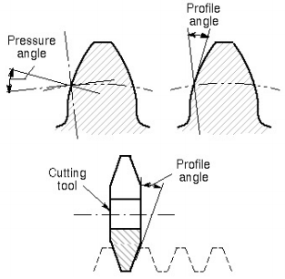

- 压力角是一个评估动力传动性能的参数。压力角越小，表示速度方向上的分力越大——传动性能越好。但这不代表压力角是越小越好。

齿条（rack）：


- 齿条是一种节径无穷大的直齿轮，齿数无限。齿的侧面是与中心线成角度的直线，与压力角相等。
- 基节距（base pitch）和圆周齿距的关系如下：

$$p_b=p_c cos \phi$$

内部齿轮（internal gear）：


例题：


接触比（contact ratio）：

- 接触比是平均接触齿的对数。如下图，即从a到b。PA为近弧（arc of approach）$q_a$，PB为凹弧（arc of recess）$q_r$，AB为作用弧（arc of action）：

$$q_t=q_a+q_r$$


- $m_c$为接触比（一般需要大于1.2），$L_{ab}$为作用线的长度：

$$m_c=\frac{q_t}{p}$$

$$m_c=\frac{L_{a b}}{p \cos \phi}$$

干涉（interference）：

- 齿廓非共轭部分的接触。
- 当接触发生在基圆下方时发生。
- 接触点在产生线（下图中的CD）之外。


- 根切（undercutting）：如果齿是由展成法（generating process）生产的，那么生成过程会去除干扰部分。底切会削弱齿。


- 正齿轮的干涉：在具有1:1的传动比（gear ratio）（也就是齿数比）的正齿轮组上（也就是两个相同的齿轮），小齿轮的不会产生干涉的最小齿数（向上取整）为：

$$N_P \geq \frac{2 k}{3 \sin ^2 \phi}\left(1+\sqrt{1+3 \sin ^2 \phi}\right)$$

- - 对于全深度齿（full depth teeth），$k=1$。对于短齿（stub teeth），$k=0.8$。通常，我们更喜欢更高的压力角$\phi$，更高的$\phi$可以生产更小的小齿轮，同时中心到中心的距离更小，节省空间。
- - $m_G$为最大传动比。如果啮合齿轮的齿数比小齿轮多，小齿轮上没有干涉的最小齿数（向上取整）为：

$$m_G=N_G/N_p,m>1$$

$$N_P \geq \frac{2 k}{(1+2 m) \sin ^2 \phi}\left(m+\sqrt{m^2+(1+2 m) \sin ^2 \phi}\right)$$

- - 具有指定的小齿轮且没有干涉的正齿轮的最大齿数（向下取整）为（其中的$N_P$等于小齿轮上没有干涉的最小齿数的向上取整）：

$$N_G \leq \frac{N_P^2 \sin ^2 \phi-4 k^2}{4 k-2 N_P \sin ^2 \phi}$$

- - 与齿条无干涉的正齿轮的最小齿数（向上取整）为：

$$N_P=\frac{2(k)}{\sin ^2 \phi}$$

- - 对于压力角$\phi=20^\circ$的情况，有表：


- - 对于压力角$\phi=25^\circ$的情况，有表：


- - 干涉总结：
- - - 干涉可以通过在小齿轮上使用更多的齿来消除。
- - - 然而，如果要保持齿的尺寸（即径节$P$），则齿的增加意味着直径的增加，因为$P＝N/d$。
- - - 也可以通过使用较大的压力角来消除干扰。这导致基圆更小，因此更多的齿廓是渐开线的。
- - - 干涉是压力角较大的主要原因。
- - - 较大压力角的缺点是对于相同量的传递力，径向力增加。

齿轮的齿的常见成形方式：

- 砂型铸造
- 壳体成型
- 熔模铸造
- 永久模具铸造
- 压铸
- 离心铸造
- 粉末冶金
- 挤出
- 注塑成型（用于热塑性塑料）
- 冷成型

齿轮的齿的常见切割方式：

- 铣削、成型、滚齿。

#### part b

直锥形齿轮（straight bevel gear）：


- 在交叉轴之间传递运动。
- 通常为90º的轴角。
- 几乎可以为任何角度生产。

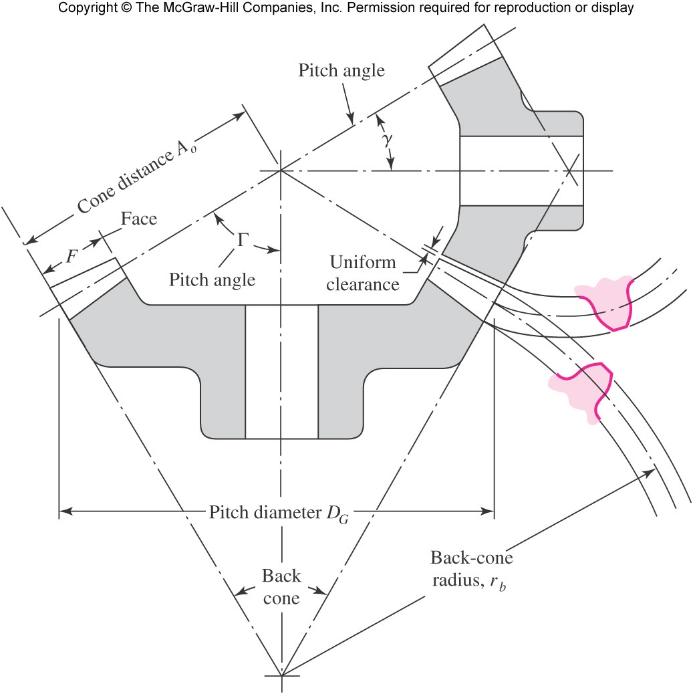

$$\tan \gamma=\frac{N_P}{N_G} \quad \tan \Gamma=\frac{N_G}{N_P}$$

- 投影在后锥体上的齿形与半径为$r_b$的正齿轮中的齿形相同。
- 该虚拟正齿轮的虚拟齿数为：

$$N^{\prime}=\frac{2 \pi r_b}{p}$$

平面轴斜齿轮（parallel helical gear）：


- 类似于直齿轮，但齿与齿轮中心线成螺旋角。
- 向轴和轴承添加轴向分力。
- 由于逐渐接合和脱离，啮合齿之间的力过渡更平稳。


- 齿形为渐开螺旋面（involute helicoid）。将一张切成平行四边形的纸缠绕在圆柱体上展开这张纸，边缘上的每一点都会产生一条渐开线曲线。当边缘上的每个点都产生渐开线时，得到的表面被称为渐开线螺旋面。


- $\psi$为小齿轮的左侧螺旋角（left-hand helix angle）。法向压力角为$\phi_n$。$m_n$为法向模量。横向压力角为$\phi_t$。$m_t$为横向模量。
- 横向圆周齿距（transverse circular pitch）$p_t$。

$$p_t=\frac{p_n}{cos \psi}$$

- 法向/正向圆周齿距（normal circular pitch）$p_n$。

$$p_n=\pi m_n$$

$$p_n=p_t \cos \psi$$

- 轴向节距（axial pitch）$p_x$。

$$p_x=\frac{p_t}{\tan \psi}$$

- 正向径节$P_n$：

$$P_n=\frac{P_t}{cos \psi}$$

$$p_n P_n=\pi$$

- 角度之间的关系：

$$cos \psi=\frac{tan \phi_n}{tan \phi_t}$$

- 齿顶$a$、齿根$b$：

$$a=\frac{1}{P_n}=m_n$$

$$b=\frac{1.25}{P_n}=1.25 m_n$$

- 俯仰径$d_p,d_G$：

$$d_p=N_p m_t$$

$$d_G=N_G m_t$$

- 沿齿看，表观的节距半径大于沿轴看。

- 虚拟R越大，虚拟齿数N就越大：

$$N^{\prime}=\frac{N}{\cos ^3 \psi}$$

- 允许减少斜齿轮上的齿数，而无需根切。

例题：


与斜齿轮的干扰：

- 在与具有相同齿数（$m_G=N_G/N_P=1$）的齿轮干涉的情况下运行的斜齿轮的最小齿数$N_P$（向上取整）为：

$$N_P=\frac{2 k \cos \psi}{3 \sin ^2 \phi_t}\left(1+\sqrt{1+3 \sin ^2 \phi_t}\right)$$

- 对于全深度齿，k=1。对于短齿，k=0.8。
- 对于传动比$m_G=m$，不会产生干涉的最小齿数（向上取整）为：

$$N_P=\frac{2 k \cos \psi}{(1+2 m) \sin ^2 \phi_t}\left[m+\sqrt{m^2+(1+2 m) \sin ^2 \phi_t}\right]$$

- 具有指定小齿轮且无干涉的最大齿数（向下取整）为：

$$N_G=\frac{N_P^2 \sin ^2 \phi_t-4 k^2 \cos ^2 \psi}{4 k \cos \psi-2 N_P \sin ^2 \phi_t}$$

- 与齿条无干涉的最小正齿轮齿数（向上取整）是：

$$N_P=\frac{2 k \cos \psi}{\sin ^2 \phi_t}$$

蜗轮：


- 角度：
- - 蜗杆：导程角（lead angle）$\lambda$。
- - 齿轮：螺旋角（helix angle）$\psi_G$。
- - 若轴角（shaft angle）为$90^\circ$，则$\lambda = \psi_G$。
- 螺距（pitch）：
- - 蜗杆：轴向螺距（axial pitch）$p_x$。
- - 齿轮：横向圆周齿距$p_t$。
- - 若轴角为$90^\circ$，则$p_x=p_t$。
- 齿轮的节径在包含蜗杆轴的平面上测量：

$$d_G=\frac{N_G p_t}{\pi}$$

- 蜗杆可以具有任何节径（$d_W$），与齿数无关。
- 应与用于切割轮齿的滚刀（hob）相同。
- 作为中心距离$C$函数的蜗杆节距的推荐范围：

$$\frac{C^{0.875}}{3.0} \leq d_W \leq \frac{C^{0.875}}{1.7}$$

- 导程（lead）$L$和导程角$\lambda$的关系：

$$\begin{aligned} & L=p_x N_W \\ & \tan \lambda=\frac{L}{\pi d_W}\end{aligned}$$

正齿轮的标准和常用齿系（tooth system）：

- 齿系：规定齿顶、齿根、工作深度（working depth）、齿厚和压力角等关系的标准。
- 各种标准图：


蜗轮传动的推荐压力角和齿深：

- 蜗轮传动的齿形尚未高度标准化。
- 所使用的压力角取决于导程角，并且必须足够大，以避免接触端一侧的蜗轮齿根切。
- 齿深度可以通过使深度与轴向圆形节距成比例来获得。


蜗轮的面宽（face width）：


- 蜗轮的面宽$F_G$应等于蜗杆节圆与齿顶圆交点之间的切线长度。

齿轮系（gear trains）：

- 此结论可应用于任何齿轮组（正齿轮、斜齿轮等）：对于一个小齿轮2驱动大齿轮3且齿轮数为2的齿轮组，转速为$n$，节径为$d$，齿数为$N$，那么满足：

$$n_3=\left|\frac{N_2}{N_3} n_2\right|=\left|\frac{d_2}{d_3} n_2\right|$$

- 旋转方向：在正齿轮和平行斜齿轮的情况下，方向通常对应于右手规则，并且对于逆时针旋转是正的。
- 斜齿轮组/蜗轮组的旋转方向：


传动系数值（train value）：


- 齿轮数为5，大齿轮6的转速满足：

$$n_6=-\frac{N_2}{N_3} \frac{N_3}{N_4} \frac{N_5}{N_6} n_2$$

- 根据以上式子，大齿轮3的齿数被消去了，因此大齿轮3只影响大齿轮6的旋转方向，发挥此种作用的齿轮被称为惰轮（idler）。
- 齿轮2，3，5为驱动（driver）齿轮，齿轮3，4，6为从动（driven）齿轮。
- 传动系数值即为最后一个齿轮相对于第一个齿轮的转速之比，传动系数值计算：

$$e=\frac{\text { product of driving tooth numbers }}{\text { product of driven tooth numbers }}$$

$$e=\frac{N_2}{N_3} \frac{N_3}{N_4} \frac{N_5}{N_6}$$

$$n_L=n_6,n_F=n_2$$

$$n_L=e n_F$$

复合齿轮系：

- 一对齿轮的传动系数值的实际限制为10:1。
- 为了获得更多，将两个齿轮组合到同一轴上。
- 一对最大10:1，那么两级组合齿轮传动系可以获得高达100:1的传动系数值。


例题：


例题：


复合反转齿轮系（复合齿轮系的一种）：


- 输入轴和输出轴共线同轴的（但不相连）复合齿轮系。
- 要从转速为$n_2=n_i$的输入轴传动到转速为$n_5=n_o$的输出轴，还需要有一个中间（intermediate）轴，其转速为$n_3=n_4$。
- 传动系数值$e$越小，齿轮箱体积越小。
- 对于给定的传动系数值，齿轮系可以有多个解，但要使得齿轮箱体积最小且没有干涉，必须满足几何条件：

$$d_2 / 2+d_3 / 2=d_4 / 2+d_5 / 2$$

$$P=N / d$$

$$N_2 /(2 P)+N_3 /(2 P)=N_4 /(2 P)+N_5 /(2 P)$$

$$N_2+N_3=N_4+N_5$$

- - 需要满足传动比$m>1$：

$$e>1,e=\frac{N_2}{N_3}\frac{N_4}{N_5}=m_1m_2$$

$$0<e<1,e=\frac{N_2}{N_3}\frac{N_4}{N_5}=\frac{1}{m_1m_2}$$

$$min(N_2,N_3)=N_P \geq \frac{2 k}{(1+2 m_1) \sin ^2 \phi}\left(m_1+\sqrt{m_1^2+(1+2 m_1) \sin ^2 \phi}\right)$$

$$min(N_4,N_5)=N_P \geq \frac{2 k}{(1+2 m_2) \sin ^2 \phi}\left(m_2+\sqrt{m_2^2+(1+2 m_2) \sin ^2 \phi}\right)$$

- - 对于给定的传动系数值，要使得齿轮箱体积最小且没有干涉，还可以直接使$m_1=m_2=\sqrt{e}$并取整。
- - 然后一个一个尝试$N_P$的值代入计算，使得两个大齿轮的齿数为整数解，即为精确解。若仅需要求近似解，则直接使用$N_P$的最小值进行计算即可，得到的两个大齿轮的齿数向下取整还是向上取整需要代入近似解计算传动系数值，选择最接近给定传动系数值的取整方式。
- - 对于齿轮组的描述：输入轴连接齿轮2，齿轮2与齿轮3啮合，传动比为$m_1$。一个惰轮用于维持输入轴和输出轴的共线（in-line）配置，并与齿轮4啮合。齿轮4与齿轮5啮合，传动比为$m_2$。齿轮5与输出轴连接。达成输出轴和输入轴的传动比为$e=m_1 m_2$。

- 例题：


行星（planetary）齿轮系：

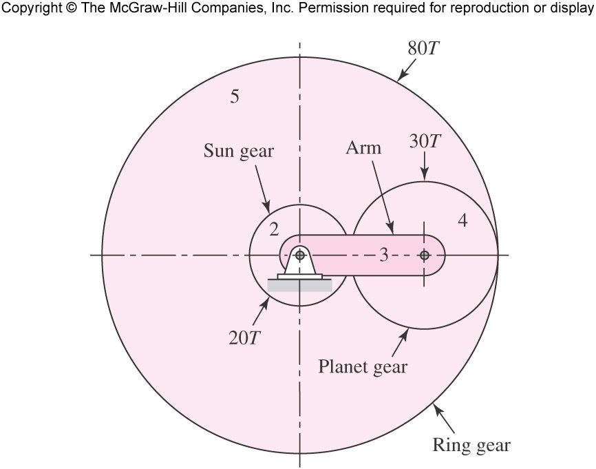

- 行星齿轮系或周转（epicyclic）齿轮系允许某些齿轮的轴线相对于其他轴线移动。
- 太阳齿轮：固定中心轴。
- 行星齿轮：移动中心轴。
- 行星架（carrier）或臂（arm）：相对于太阳轴承载行星轴。


- 允许两个自由度（即两个输入）。
- 传动系数值与臂有关。$n_F$为齿轮组第一个齿轮转速，$n_L$为齿轮组最后一个齿轮组转速，$n_A$为臂转速：

$$e=\frac{n_L-n_A}{n_F-n_A}$$

#### part c

力分析-正齿轮：


- 一个小齿轮安装在轴a上，以$n_2$转/分顺时针旋转，并以$n_3$转/分驱动轴b上的齿轮。
- 啮合齿之间的反作用沿着压力线产生。
- $F_{a2}$：轴a对小齿轮2施加的力。$T_{a2}$：轴a对小齿轮2施加的扭矩。$F_{32}$：齿轮3对小齿轮2施加的力。$F_{23}$：齿轮2对小齿轮3施加的力。


- 传递载荷（transmitted load）$W_t=F_{32}^t$为切向（tangential）载荷。

- 力的切向分量是有用的，可以传递扭矩：

$$T=\frac{d}{2} W_t$$

- 径向分量$F_{32}^r$没有有用的用途，不传输功率。
- 若为齿轮组，有传动系数值$e$，则输入轴的输入扭矩和输出轴的输出扭矩的关系为：

$$T_o=\frac{1}{e} T_i$$

功率-正齿轮：

- 通过一个旋转的齿轮的传递功率（transmitted power）$H$（单位为马力$hp$或千瓦$kW$）：

$$H=T \omega=\left(W_t d / 2\right) \omega$$

- 节线速度（pitch-line velocity）$V$为齿轮上一点在节圆半径处的线速度。其中$d$为齿轮半径（节径），$n$为齿轮转速。

$$V=\pi d n / 12$$

- 由于许多齿轮设计问题都指定了功率和速度，我们可以使用功率$H$和节线速度$V$来表示传递负载$W_t$：

$$W_t=33000 \frac{H}{V}(\text{lbf,hp,ft/min})$$

$$W_t=\frac{60000H}{\pi d n}(\text{in SI units})$$

- 有压力角$\phi$，径向（radial）载荷$W_r$：

$$W_r=W_t tan \phi$$

- 总（total）力$W$：

$$W=\frac{W_t}{cos \phi}$$

- 例题：


力分析-锥形齿轮：


- 假设所有的力都集中在齿的中点（minpoint），用于传递载荷。其中$r_{av}$齿的中点处的节距半径，也就是平均节距半径（average pitch radius）。

$$W_t=\frac{T}{r_{av}}$$

- 径向力和轴向力：

$$W_r=W_t tan \phi cos \gamma$$

$$W_a=W_t tan \phi sin \gamma$$

- 三个力$W_t$、$W_r$和$W_a$彼此成直角，可用于通过使用静力学方法确定轴承载荷(bearing loads)。

- 例题：


- 力的作用点在节平面（pitch plane）和齿轮表面的中心。其中$W$为总力，$W_r$为径向分量，$W_t$为切向分量也就是传递载荷，$W_a$为轴向分量也就是推力载荷（thrust load），$\phi_n$为法线方向上的压力角，$\phi_t$为旋转方向上的压力角。


$$W_r=W sin \phi_n=W_t tan \phi_t$$

$$W_t=W cos \phi_n cos \psi$$

$$W_a=W cos \phi_n sin \psi =W_t tan \psi$$

$$W=\frac{W_t}{cos \phi_n cos \psi }$$

- 例题：


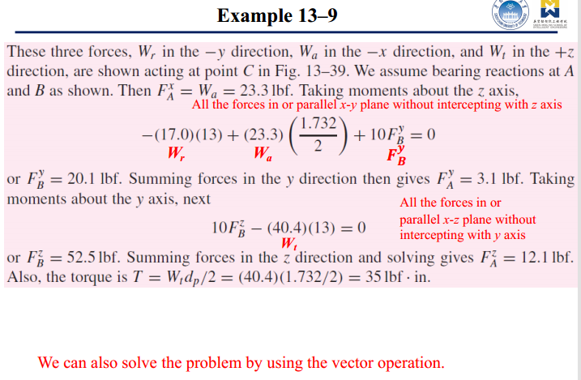


力分析-蜗轮：


- 齿轮轴平行于$x$方向，蜗杆轴平行于$z$方向。
- 齿轮作用在蜗杆上的力$W$有三个正交分量$W^x,W^y,W^z$。其中$\phi_n$为法线方向的压力角，$\lambda$为导程角。

$$W^x=W cos \phi_n sin \lambda$$

$$W^y = W sin \phi_n$$

$$W^z = W cos \phi_n cos \lambda$$

- 使用下标$W$和$G$表示作用在蜗杆和齿轮上的力。下标$t,r,a$分别代表切向、径向、轴向。

$$W_{Wt}=-W_{Ga}=W^x$$

$$W_{Wr}=-W_{Gr}=W^y$$

$$W_{Wa}=-W_{Gt}=W^z$$

- 蜗杆和蜗轮之间的相对运动是纯滑动。
- 摩擦比其他类型的齿轮更重要。
- 包括摩擦分量$f$在内，方程可以扩展并得到摩擦力：

$$W^x=W(cos \phi_n sin \lambda + f cos \lambda)$$

$$W^y=W sin \phi_n$$

$$W^z=W(cos \phi_n cos \lambda - f sin \lambda)$$

$$W_f=fW=\frac{f W_{Gt}}{f sin \lambda - cos \phi_n cos \lambda}$$

蜗轮效率：

- 两个切向力$W_{Wt},W_{Gt}$之间的关系：

$$W_{Wt}=W_{Gt}\frac{cos \phi_n sin \lambda + f cos \lambda}{f sin 
\lambda - cos \phi_n cos \lambda}$$

- 效率定义为：

$$\eta=\frac{W_{Wt} (\text{without friction})}{W_{Wt} (\text{with friction})}$$

- 当$f=0$，效率为：

$$\eta=\frac{cos \phi_n - f tan \lambda}{cos \phi_n + f cot \lambda}$$

- 典型值为$f=0.05,\phi_n=20^\circ$，作为螺旋角函数的效率表：


- 摩擦系数$f$取决于相对速度或滑动速度$V_s$。$V_G$是齿轮的节线速度。$V_W$是蜗杆的节线速度。


$$V_W=V_G+V_S$$

$$V_S=\frac{V_W}{cos \lambda}$$

- $f$和$V_S$的关系曲线。曲线$A$适用于预期摩擦较大的情况，例如齿轮为铸铁。曲线$B$适用于高质量材料。


- 例题：


### Chapter 2

自由度（DOF），也称为移动性（mobility）：

- 自由度：在任何时刻唯一定义系统在空间中的位置所需的独立参数（测量值）的数量。
- 平面中的刚体具有3个自由度，$x,y,q$，2个平移和1个旋转。
- 空间中的刚体具有6个自由度，3个平移和3个旋转。

一般平面运动的类型：


- 纯旋转：物体有一个点（旋转中心），相对于“静止”参考系没有运动。所有其他点都以圆弧移动。
- 纯平移。物体上的所有点都描述平行（曲线或直线）路径。
- 复合运动。旋转和平移的同时的结合。

曲柄滑块机构（slider-crank mechanism）：

- 典型机构为内燃机（曲柄驱动活塞）。

连杆（link）、连杆/连杆结构/连杆机构（linkage）、关节（joint）和运动链（kinematic chain）：

- 连杆：具有节点（node）的刚性杆件（member）。
- 节点：附着点。二元（binary）连杆有2个节点，三元连杆有3个节点，四元连杆有4个节点。

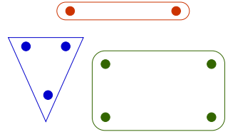

- 关节：两个或多个连杆（在其节点处）之间的连接，允许相对运动。
- 按接触类型、自由度数量、物理闭合类型或连接的连杆数量进行分类。

关节分类：


- 接触处的分类：线、点（高副）、表面（低副，例如被孔包围的销（pin）。
- 自由度数量：全关节（full joint）为1自由度，半关节（half joint）为2自由度。
- 形状闭合（form closed）（由几何体闭合）或力闭合（force closed）（需要外力保持闭合）。
- 关节序数（joint order）：连接的连杆数量减一。
- 与高副（higher pair）相比，低副（lower pair）的主要实用优势是它们能够更好地将润滑剂（lubricant）截留在包络面（enveloping surface）之间。

运动链、机构（mechanism）、机器（machine）、连杆分类：

- 运动链：连杆连接在一起以进行运动。
- 机构：接地的运动链。
- 机器：被设计用来工作的机构。
- 连杆分类：
- - 接地（ground）：相对于参考坐标系固定。
- - 曲柄（crank）：向地旋转，做完整的旋转。
- - 摇杆/摇臂（rocker）：向地旋转，进行振荡（前后）旋转。
- - 耦合器/联轴器（coupler）：连杆进行复合运动，不与地面相连。

机构的自由度计算：

- 对于简单机构，计算自由度很简单：


- 全关节/低副、半关节/高副对自由度的影响：


- - 两个未连接的平面连杆的自由度数为6（每个连杆各自有3个自由度）。
- - 两个通过全关节连接的平面连杆的自由度为4（每个全关节将会消除2个自由度，将两个连杆的4个平移的自由度减少为2个）。
- - 两个通过半关节连接的平面连杆的自由度为5（每个半关节将会消除1个自由度，将两个连杆的4个平移的自由度减少为3个）。
- - 不要去判断为全关节还是半关节，去判断是低副还是高副（计算关节序数时是等效的），高副的接触方式为点接触和线接触，低副的接触方式为面接触。

- 平面机构的Gruebler公式，其中$L$为连杆的数量，$J$为全关节的数量（1个半关节算作0.5个全关节），$G$为接地的连杆的数量：

$$DOF=M=3L-2J-3G$$

- 由两个二元连杆和一个关节组成的开放的运动链称为并矢（dyad）。
- 当任何连杆固定到参考系时，其3个自由度均会被消除。
- 在实际机构中，即使运动链的多个连杆接地，最终净效果也将是创建一个更大、更高阶的接地连杆，因为最终只能有一个接地平面。因此接地的连杆数量$G$固定为1（也就是接地的连杆无论有多少均算作为只有1个连杆接地，计入连杆的数量$L$的接地连杆数量总和也为1），根据Gruebler公式有：

$$DOF=M=3(L-1)-2J$$

- 例题（连接连杆8和地面（也就是连杆1）的关节是滑动全关节/低副）：


- - 注意重叠关节（multiple joint），一个全关节连接了$m$条连杆，本质上算作$m-1$个低副，因此连接了3条连杆的重叠关节的关节序数为2（$3-1=2$）。
- - 计算自由度$M$。连杆数为8，$L$为8。关节序数合计为10，$J$为10。因此$M=1$。

- 例题（注意地面关节为高副/半关节）：


- - 计算自由度$M$。连杆数为6，$L$为6。关节序数合计为7.5，$J$为7.5。因此$M=0$。

- 例题（注意活塞头相接触的内壁算作地面，也是连杆1，并且为滑动全关节，因此连接连杆1和连杆4的关节为全关节/低副）：


机构（mechanism）和结构（structure）：

- 机构：DOF>0。
- 结构：DOF=0。
- 预负载结构：DOF<0。可能需要力才能组装。

悖论（paradox）：


- Greubler准则不包括几何，因此可能给出错误的预测。因此必须进行检查。

间隙运动（intermittent motion）：


- 一系列运动和停留。
- 停留：无输出运动，有输入运动。
- 例子：日内瓦机构、线性日内瓦机构、棘轮和棘爪。

四杆机构（fourbar mechanism）：


- 两杆机构自由度为-1。
- 三杆机构自由度为0。
- 四杆机构自由度为1。
- 四杆机构是单自由度受控运动的最简单的销连接（pin-jointed）机构。
- 四杆术语：


- - 地连杆（ground link）
- - 向地旋转的连杆：
- - - 曲柄（crank）
- - - 摇杆（rocker）
- - 耦合器（coupler）

反转（inversion）：

- 反转是通过将运动链中的不同连杆轮流接地来创建的。
- 对于不同反转的不同行为：


- 四杆机构的反转：


Grashof条件：

- Grashof条件仅基于连杆长度来预测连杆的行为。
- - S为最短的连杆的长度。
- - L为最长的连杆的长度。
- - P,Q为剩余两个连杆的长度。
- 若S+L$\leq$P+Q则连杆满足Grashof条件（分为第一类、第二类、第三类运动链情况），至少有一个连杆能够进行完整的旋转。否则，没有任何连杆能够进行完整的旋转。
- - 第一类运动链，S+L<P+Q，满足Grashof条件（"Grashof"）：
- - - 如果最短连杆附近的任一连杆接地，则为曲柄-摇杆（crank-rocker）。也就是其中一条连杆能够做完整旋转运动。
- - - 如果最短连杆接地，则为双曲柄（double crank）。也就是其中两条连杆能够做完整旋转运动。
- - - 如果最短连杆的相对的连杆接地，则为双摇杆（double rocker）。也就是其中没有连杆能够做完整旋转运动。


- - 第二类运动链，S+L>P+Q，不满足Grashof条件（"non-Grashof"）：
- - - 所有反转（接地情况）均为双摇杆。
- - - 没有连杆能进行完整的旋转。


- - 第三类运动链，S+L=P+Q，满足特殊Grashof条件（"special Grashof"）：
- - - 所有反转（接地情况）都是双曲柄或曲柄摇杆。
- - - 总有至少一条连杆能进行完整的旋转。
- - - 连杆可以形成平行四边形或反平行四边形。
- - - 通常用于保持耦合器平行。
- - 第三类运动链情况的问题：


- - - 当所有连杆共线时，输入曲柄每转一圈，所有反转都有两次变化点（change point）。
- - - 变化点处的行为是不确定的。
- - - 如果在连续机器中使用，必须有一些机构来对变化点处进行"执行"（carry through）。
- - - 变化点允许连杆在平行四边形和反平行四边形之间不可预测地切换。
- - - 变化点问题的可能解决方案：


多于四杆：


柔顺（compliant）机构：

- 能够显著偏转的柔顺连杆就像关节一样。
- 也称为"活铰链"（living hinge）。
- 优点：简单、无需组装、摩擦小。

### Chapter 4

坐标系：

- 全局（绝对）坐标系/局部坐标系
- 笛卡尔坐标
- 极坐标
- 笛卡尔坐标和极坐标相互转化：


$$R_A=\sqrt{R_x^2+R_y^2}$$

$$\theta=arctan(R_y/R_x)$$

$$R_x=R_A cos \theta$$

$$R_y=R_A sin \theta$$

- 位置差（position difference）和相对位置（relative position）：


- - 位置差：同一点的两个时刻的位置差值。
- - 相对位置：同一时刻的两个点的位置差值。

$$\mathbf{R}_{\mathrm{BA}}=\mathbf{R}_{\mathrm{B}}-\mathbf{R}_{\mathrm{A}}$$

平移、旋转和复杂运动：

- 连杆的图形位置（graphical position）分析：


- - 以点$A$为圆心画一条半径为b的弧。
- - 以点$O_4$（连杆4的枢轴）为圆心画一条半径为c的弧。
- - 两条弧的交叉点是连杆的两个可能位置，开放（open）解和交叉（crossed）解。

- 连杆的代数位置（algebraic position）分析：


- - 获得点$A$的坐标：

$$A_x=a cos \theta_2$$

$$A_y=a sin \theta_2$$

- - 获得点$B$的坐标：

$$b^2=(B_x-A_x)^2+(B_y-A_y)^2$$

$$c^2=(B_x-d)^2+B_y^2$$

- - 两个方程，两个未知数，可以求解。

复数矢量：


- 在实-虚平面上绘制复数矢量。
- 欧拉恒等式（Euler identity）：

$$e^{\pm i \theta}=cos \theta \pm i sin \theta$$

- 笛卡尔坐标形式：

$$R_A cos \theta + i R_A sin \theta$$

- 极坐标形式：

$$R_A e^{i \theta}$$

- - 乘以$e^{i \theta}$表示旋转$\theta$。

四杆解析位置（analytical position）分析（矢量循环方法）：

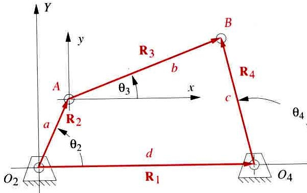

- 写出矢量循环方程：

$$\vec{R}_2+\vec{R}_3-\vec{R}_4-\vec{R}_1=0$$

- 替换为复数矢量：

$$a e^{i \theta_2}+b e^{i \theta_3}-c e^{i \theta_4}-d e^{i \theta_1}=0$$

- 将已知和未知分为等号两侧，称为$Z$：

$$b e^{i \theta_3}-c e^{i \theta_4}=-a e^{i \theta_2}+d e^{i \theta_1}=Z$$

$$s=e^{i \theta_3}, t=e^{i \theta_4}$$

$$bs-ct=Z$$

- 通过共轭来获得第二条方程：

$$b \bar{s}-c \bar{t}=\bar{Z}$$

$$\bar{s}=e^{-i \theta_3}=\frac{1}{e^{i \theta_3}}=\frac{1}{s}$$

$$\frac{b}{s}-\frac{c}{t}=\bar{Z}$$

$$\bar{Z} \neq \frac{1}{Z}$$

- 通过代数来消除一个未知数：

$$bs=Z+ct$$

$$\frac{b}{s}=\bar{Z}+\frac{c}{t}$$

$$b^2=Z \bar{Z}+Z \frac{c}{t}+\bar{Z} c t+c^2$$

- 通过对获得的方程乘以$t$：

$$0=\bar{Z} c t^2+\left(Z \bar{Z}+c^2-b^2\right) t+Z c$$

$$t=\frac{-\left(Z \bar{Z}+c^2-b^2\right) \pm \sqrt{\left(Z \bar{Z}+c^2-b^2\right)^2-4 c^2 \bar{Z} Z}}{2 \bar{Z} c}$$

$$s=\frac{Z+c t}{b}$$

$$\theta_4=angle(t)$$

$$\theta_3=angle(s)$$

- MATLAB求解（两个解对应开放和交叉情况）：

```
Zc=conj(Z)
t=roots([Zc*c,Z*Zc+c^2-b^2,Z*c])
```


四杆解析位置分析补充（矢量循环方法，欧拉公式法）：

$$a e^{j \theta_2}+b e^{j \theta_3}-c e^{j \theta_4}-d e^{j \theta_1}=0$$

$$a\left(\cos \theta_2+j \sin \theta_2\right)+b\left(\cos \theta_3+j \sin \theta_3\right)-c\left(\cos \theta_4+j \sin \theta_4\right)-d\left(\cos \theta_1+j \sin \theta_1\right)=0$$

- 实部部分：

$$a \cos \theta_2+b \cos \theta_3-c \cos \theta_4-d \cos \theta_1=0$$

- 虚部部分：

$$j a \sin \theta_2+j b \sin \theta_3-j c \sin \theta_4-j d \sin \theta_1=0$$

- 整合和平方：

$$\begin{aligned} b \cos \theta_3 & =-a \cos \theta_2+c \cos \theta_4+d \\ b \sin \theta_3 & =-a \sin \theta_2+c \sin \theta_4\end{aligned}$$

$$b^2\left(\sin ^2 \theta_3+\cos ^2 \theta_3\right)=\left(-a \sin \theta_2+c \sin \theta_4\right)^2+\left(-a \cos \theta_2+c \cos \theta_4+d\right)^2$$

$$b^2=\left(-a \sin \theta_2+c \sin \theta_4\right)^2+\left(-a \cos \theta_2+c \cos \theta_4+d\right)^2$$

$$b^2=a^2+c^2+d^2-2 a d \cos \theta_2+2 c d \cos \theta_4-2 a c\left(\sin \theta_2 \sin \theta_4+\cos \theta_2 \cos \theta_4\right)$$

$$K_1=\frac{d}{a} \quad K_2=\frac{d}{c} \quad K_3=\frac{a^2-b^2+c^2+d^2}{2 a c}$$

$$K_1 \cos \theta_4-K_2 \cos \theta_2+K_3=\cos \theta_2 \cos \theta_4+\sin \theta_2 \sin \theta_4$$

$$K_1 \cos \theta_4-K_2 \cos \theta_2+K_3=\cos \left(\theta_2-\theta_4\right)$$

$$\sin \theta_4=\frac{2 \tan \left(\frac{\theta_4}{2}\right)}{1+\tan ^2\left(\frac{\theta_4}{2}\right)} ; \quad \quad \cos \theta_4=\frac{1-\tan ^2\left(\frac{\theta_4}{2}\right)}{1+\tan ^2\left(\frac{\theta_4}{2}\right)}$$

$$A \tan ^2\left(\frac{\theta_4}{2}\right)+B \tan \left(\frac{\theta_4}{2}\right)+C=0$$

$$\begin{aligned} & A=\cos \theta_2-K_1-K_2 \cos \theta_2+K_3 \\ & B=-2 \sin \theta_2 \\ & C=K_1-\left(K_2+1\right) \cos \theta_2+K_3\end{aligned}$$

$$\begin{aligned} \tan \left(\frac{\theta_4}{2}\right) & =\frac{-B \pm \sqrt{B^2-4 A C}}{2 A} \\ \theta_{4_{1,2}} & =2 \arctan \left(\frac{-B \pm \sqrt{B^2-4 A C}}{2 A}\right)\end{aligned}$$

- 解$\theta_3$：

$$\begin{aligned} c \cos \theta_4 & =a \cos \theta_2+b \cos \theta_3-d \\ c \sin \theta_4 & =a \sin \theta_2+b \sin \theta_3\end{aligned}$$

$$K_1 \cos \theta_3+K_4 \cos \theta_2+K_5=\cos \theta_2 \cos \theta_3+\sin \theta_2 \sin \theta_3$$

$$K_4=\frac{d}{b} ; \quad K_5=\frac{c^2-d^2-a^2-b^2}{2 a b}$$

$$D \tan ^2\left(\frac{\theta_3}{2}\right)+E \tan \left(\frac{\theta_3}{2}\right)+F=0$$

$$\begin{aligned} & D=\cos \theta_2-K_1+K_4 \cos \theta_2+K_5 \\ & E=-2 \sin \theta_2 \\ & F=K_1+\left(K_4-1\right) \cos \theta_2+K_5\end{aligned}$$

$$\theta_{3_{1,2}}=2 \arctan \left(\frac{-E \pm \sqrt{E^2-4 D F}}{2 D}\right)$$

反转曲柄滑块连杆（inverted crank slider linkage）：


- 已知$a,c,d,\theta_1,\theta_2,\gamma$。求$\theta_3,\theta_4,b$。
- 写出矢量循环方程：

$$\vec{R}_2-\vec{R}_3-\vec{R}_4-\vec{R}_1=0$$

- 替换为复数矢量：

$$a e^{i \theta_2}-b e^{i \theta_3}-c e^{i \theta_4}-d e^{i \theta_1}=0$$

- 由几何关系：

$$\theta_3=\theta_4+\gamma$$

$$a e^{i \theta_2}-b e^{i\left(\theta_4+\gamma\right)}-c e^{i \theta_4}-d e^{i \theta_1}=0$$

- 对已知和未知进行分组：

$$b e^{i\left(\theta_4+\gamma\right)}+c e^{i \theta_4}=a e^{i \theta_2}-d e^{i \theta_1}=Z$$

$$s=e^{i \theta_4},t=e^{i \gamma}$$

$$bst+cs=Z=s(bt+c)$$

$$\bar{s}(b \bar{t}+c)=\bar{Z}=\frac{1}{s}\left(b \frac{1}{t}+c\right)$$

$$b^2+b c\left(t+\frac{1}{t}\right)+c^2=Z \bar{Z}$$

$$0=b^2+c\left(t+\frac{1}{t}\right) b+c^2-Z \bar{Z}$$

$$b=\frac{-c(t+1 / t) \pm \sqrt{(t+1 / t)^2 c^2-4\left(c^2-\bar{Z} Z\right)}}{2}$$

```
b=roots([c*(t+1/t),c^2-Z*Zc])
```

$$s=\frac{Z}{bt+c}$$

曲柄滑块机构（crank slider mechanism）：


- 已知$a,b,c,\theta_1,\theta_2$。求$\theta_3,d$。
- 图形分析方法：
- - 在$O_2$处画半径为$b$的圆。
- - 沿着$y=c$处画一条直线，与圆的交叉点为两个解。若没有交叉点则无解。
- 矢量循环方法：
- - 使用分析位置分析方法，与普通的四杆机构的方法一致。

多于四杆的连杆：

- 五杆情况：


$$\vec{R}_2+\vec{R}_3-\vec{R}_4-\vec{R}_5-\vec{R}_1=0$$

$$\begin{array}{r}a e^{i \theta_2}+b e^{i \theta_3}-c e^{i \theta_4} \\ -d e^{i \theta_5}-f=0\end{array}$$

$$\theta_5=\lambda \theta_2+\phi$$

$$b e^{i \theta_3}-c e^{i \theta_4}=-a e^{i \theta_2}+d e^{i \theta_5}+f=Z$$

- 六杆情况可以当作两个四杆情况来求解：


- - 先求解$R_{1 ~ 4}$，再求解$R_{5~8}$。
- - $R_4$和$R_5$之间有不变角度。

- 六杆情况可以当作一个五杆和一个四杆情况来求解：


- - 先求解$R_{1 ~ 4}$，再求解$R_{4~8}$。
- - $R_3$和$R_5$之间有不变角度。
- - 如果电机处于$O_6$则必须同时解方程。

连杆的任意点的位置：


- 一旦找到未知角度，就很容易找到连杆上的任何位置。
- 对于点$S$：

$$\mathrm{R}_{\mathrm{s}}=\mathrm{se}^{\mathrm{i}\left(\theta_2+\delta_2\right)}$$

- 对于点$P$：

$$\mathrm{R}_{\mathrm{P}}=\mathrm{ae}^{\mathrm{i} \theta_2}+\mathrm{pe}^{\mathrm{i}\left(\theta_3+\delta_3\right)}$$

- 对于点$U$：

$$\mathrm{R}_{\mathrm{U}}=\mathrm{ue}^{\mathrm{i}\left(\theta_4+\delta_4\right)}$$

传递角（transmission angle）：

连杆1和2对齐时的传递角的极值（适用于Grashof曲柄摇杆）：


$$\mu_1=\arccos \left[\frac{b^2+c^2-(d-a)^2}{2 b c}\right]$$


$$\mu_2=\pi-\arccos \left[\frac{b^2+c^2-(d+a)^2}{2 b c}\right]$$

切换（toggle）非Grashof的位置：


- 由连杆3和连杆4的共线（colinearity）导致，对于非Grashof连杆，括号之间的值将介于-1和1之间：

$$\theta_{2_{\text {toggle }}}=\cos ^{-1}\left(\frac{a^2+d^2-b^2-c^2}{2 a d} \pm \frac{b c}{a d}\right) \quad 0 \leq \theta_{2_{\text {toggle }}} \leq \pi$$

### Chapter 5

运动学合成（synthesis）类型：

- 函数生成（function generation）：机构中输入函数与输出函数的相关性（correlation）。
- 路径生成（path generation）：控制平面中的点，使其遵循某个指定的路径。
- 运动生成（motion generation）：控制平面中的一条线，使其呈现一组顺序的规定位置。
- 运动学合成：通过已知待驱动刚体（耦合器）上一个或多个点从初始位置开始旋转一定角度的同时这些点需要通过的指定轨迹，来对可满足以上要求的驱动此刚体的连杆机构进行设计。

精确点（precision point）：


- 为输出（耦合器或摇杆）连杆在平面中的连续位置规定的点和位置。
- 在图形生成中，连杆从$C_1 D_1$移动到$C_2 D_2$。
- 在分析生成中，旋转耦合器$\alpha_2$（角度是逆时针方向测量的）从$P_1$移动到$P_2$。

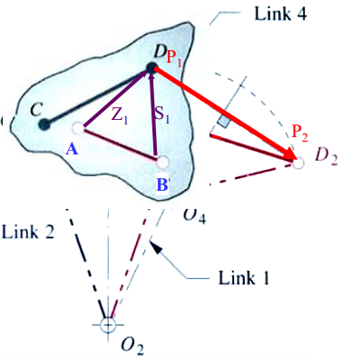

- 可以定义从附着点$E,F$到$P$的向量$Z,S$。
- 耦合器不是三角形的，但有三个点定义在耦合器上。
- 点$E,F$与$A,B$重叠。

两位置（two-position）合成（两位置的运动生成（motion generation，MG）问题）：


- 期望旋转耦合器$\alpha_2$（角度是逆时针方向测量的）使得从$P_1$移动到$P_2$。
- 给定$P_{21},\delta_2,\alpha_2$。
- 对每个半边单独的并矢$WZ,US$进行设计。
- 编写包含给定值的矢量循环方程，找到自由选择（free choices）（也就是一部分参数的已知的可选取值）使问题易于解决。
- 具体问题描述：设计一个四杆联动装置，当耦合器旋转$\alpha_2$时，该联动装置将$P_1$移动到$P_2$。$P,A,B$点位于耦合器三个位置：


- - 1.选择任意坐标系X-Y（可以先以$P_1$的位置为原点创建一个坐标系，之后使用其他例如全局坐标系）。
- - 2.绘制矢量$P_{21}$倾斜于$\delta_2$。
- - 3.定义位置矢量$R_1$和$R_2$。
- - 4.绘制任意矢量$Z_1$。然后与$Z_1$形成大小相同但角度为$a_2$的矢量$Z_2$。
- - 5.绘制矢量$W_1$和$W_2$以在$O_2$处相遇。
- - 6.编写矢量循环方程。

- 矢量循环方程（以其中一个并矢$WZ$为例）：

$$\mathbf{W}_2+\mathbf{Z}_2-\mathbf{P}_{21}-\mathbf{Z}_1-\mathbf{W}_1=0$$

- 写成复数矢量形式：

$$w e^{i\left(\theta+\beta_2\right)}+z e^{i\left(\phi+\alpha_2\right)}-p_{21} e^{i \delta_2}-z e^{i \phi}-w e^{i \theta}=0$$

$$w e^{i \theta} e^{i \beta_2}+z e^{i \phi} e^{i \alpha_2}-p_{21} e^{i \delta_2}-z e^{i \phi}-w e^{i \theta}=0$$

$$w e^{i \theta}\left(e^{i \beta_2}-1\right)+z e^{i \phi}\left(e^{i \alpha_2}-1\right)=p_{21} e^{i \delta_2}$$

- 复数方程可解出两个未知数。通过套用欧拉公式，将复数方程的实部部分和虚部部分分别进行转换并写出：
- - 实部：

$$\begin{aligned} & {[w \cos \theta]\left(\cos \beta_2-1\right)-[w \sin \theta] \sin \beta_2} \\ & \quad+[z \cos \phi]\left(\cos \alpha_2-1\right)-[z \sin \phi] \sin \alpha_2=p_2 \cos \delta_2\end{aligned}$$

- - 虚部（与虚数$i$分开的形式）：

$$\begin{aligned} & {[w \sin \theta]\left(\cos \beta_2-1\right)+[w \cos \theta] \sin \beta_2} \\ & \quad+[z \sin \phi]\left(\cos \alpha_2-1\right)+[z \cos \phi] \sin \alpha_2=p_{21} \sin \delta_2\end{aligned}$$

- 自由选择（先以其中一个并矢$WZ$为例，最后一步同时需要两个并矢的解来对连杆和地进行求解）：
- - $WZ$并矢变量数为8，$w, \theta, \beta_2, z, \phi, \alpha_2, P_{21}, \delta_2$。
- - 一般给定变量数为3，$P_{21},\delta_2,\alpha_2$。
- - 复数方程可解出变量数为2。
- - 自由选择数为$8-3-2=3$。
- - 自由选择（第一种策略）：选择变量$(\theta,\beta_2,\phi)$为已知（或者是给定了自由选择的可选值），则未知变量为$(w,z)$，通过复数方程求解：

$$\begin{aligned} & S=e^{i \theta}\left(e^{i \beta_2}-1\right) \\ & T=e^{i \phi}\left(e^{i \alpha_2}-1\right) \\ & U=p_{21} e^{i \delta_2}\end{aligned}$$

$$\begin{aligned} & w S+z T=U \\ & w \bar{S}+z \bar{T}=\bar{U}\end{aligned}$$

- - 自由选择（第二种策略）：选择变量$(\beta_2,z,\phi)$为已知，则未知变量为$(w,\theta)$，通过复数方程求解：

$$w e^{i \theta}=\frac{p_{21} e^{i \delta_2}-z e^{i \phi}\left(e^{i \alpha_2}-1\right)}{e^{i \beta_2}-1}=Q$$

$$w=\operatorname{abs}(Q), \theta=\operatorname{angle}(Q)$$

- - 最终目的都是求解所有未知量，但不同的未知变量，需要选取不同的求解策略。
- - - 第一种策略详解（将向量的大小进行简化和求解，一次同时求解两个未知量向量的大小值），适用于自由选择的已知变量使得未知量为$w$和$z$的情况：
- - - - 对复数方程的实部部分进行简化：

$$\begin{aligned} & A=\cos \theta\left(\cos \beta_2-1\right)-\sin \theta \sin \beta_2 \\ & B=\cos \phi\left(\cos \alpha_2-1\right)-\sin \phi \sin \alpha_2 \\ & C=p_{21} \cos \delta_2\end{aligned}$$

- - - - 对复数方程的虚部部分进行简化：

$$\begin{aligned} & D=\sin \theta\left(\cos \beta_2-1\right)+\cos \theta \sin \beta_2 \\ & E=\sin \phi\left(\cos \alpha_2-1\right)+\cos \phi \sin \alpha_2 \\ & F=p_{21} \sin \delta_2\end{aligned}$$

- - - - 可得复数方程的简化形式，和通过复数方程可解得的未知数$w,z$的解的形式：

$$\begin{aligned} & A w+B z=C \\ & D w+E z=F\end{aligned}$$

$$w=\frac{C E-B F}{A E-B D}$$

$$z=\frac{A F-C D}{A E-B D}$$

- - - 第二种策略详解（将向量的分量进行简化和求解，一次只能求解其中一个未知量向量的分量值，然后再求另外一个未知量向量），适用于自由选择的已知变量使得未知量为$w$和$\theta$的情况：
- - - - 对复数方程的实部部分和虚部部分进行简化：

$$\begin{array}{ll}W_{1_x}=w \cos \theta ; & Z_{1_x}=z \cos \phi \\ W_{1_y}=w \sin \theta ; & Z_{1_y}=z \sin \phi\end{array}$$

$$\begin{aligned} & W_{1_x}\left(\cos \beta_2-1\right)-W_{1_y} \sin \beta_2 \\ & \quad+Z_{1_x}\left(\cos \alpha_2-1\right)-Z_{1_y} \sin \alpha_2=p_{21} \cos \delta_2 \\ & W_{1_y}\left(\cos \beta_2-1\right)+W_{1_x} \sin \beta_2 \\ & \quad+Z_{1_y}\left(\cos \alpha_2-1\right)+Z_{1_x} \sin \alpha_2=p_{21} \sin \delta_2\end{aligned}$$

- - - - 更进一步进行简化以求解：

$$\begin{array}{lll}A=\cos \beta_2-1 ; & B=\sin \beta_2 ; & C=\cos \alpha_2-1 \\ D=\sin \alpha_2 ; & E=p_{21} \cos \delta_2 ; & F=p_{21} \sin \delta_2\end{array}$$

$$\begin{aligned} & A W_{1_x}-B W_{1_y}+C Z_{1_x}-D Z_{1_y}=E \\ & A W_{1_y}+B W_{1_x}+C Z_{1_y}+D Z_{1_x}=F\end{aligned}$$

$$\begin{aligned} & W_{1_x}=\frac{A\left(-C Z_{1_x}+D Z_{1_y}+E\right)+B\left(-C Z_{1_y}-D Z_{1_x}+F\right)}{-2 A} \\ & W_{1_y}=\frac{A\left(-C Z_{1_y}-D Z_{1_x}+F\right)+B\left(C Z_{1_x}-D Z_{1_y}-E\right)}{-2 A}\end{aligned}$$

$$w=\sqrt{W_{1x}^2+W_{1y}^2}$$

$$\theta=\operatorname{atan} 2\left(W_{l x}, W_{l y}\right)$$

- - 若两并矢$WZ,US$均完成求解（并矢$US$也需要根据自由选择的条件，从一开始到这一步为止的全部步骤解得$(u,\sigma,s)$中的两个未知变量），那么$W,Z,U,S$均已知，则$V$（四杆联动机构，连杆3）和地$G$（四杆联动机构，地即为连杆1，亦为固定枢轴$O_2$和$O_4$之间构成的虚拟连杆）的解可以通过以下方程计算（矢量循环方程）：

$$\begin{gathered}V_1=Z_1-S_1 \\ G_1=W_1+V_1-U_1 \\ v=\mathrm{abs}\left(V_1\right) \\ \mathrm{g}=\mathrm{abs}\left(\mathrm{G}_1\right)\end{gathered}$$

- - - 详解：

$$\begin{aligned} & V_{l x}:=z \cdot \cos (\phi)-s \cdot \cos (\psi) \\ & V_{l y}:=z \cdot \sin (\phi)-s \cdot \sin (\psi) \\ & \theta_3:=\operatorname{atan} 2\left(V_{l x}, V_{l y}\right) \\ & v:=\sqrt{V_{l x}{ }^2+V_{l y}{ }^2}\end{aligned}$$

$$\begin{aligned} & G_{l x}:=w \cdot \cos (\theta)+v \cdot \cos \left(\theta_3\right)-u \cdot \cos (\sigma) \\ & G_{l y}:=w \cdot \sin (\theta)+v \cdot \sin \left(\theta_3\right)-u \cdot \sin (\sigma) \\ & \theta_1:=\operatorname{atan} 2\left(G_{l x}, G_{l y}\right) \\ & g:=\sqrt{G_{l x}^2+G_{l y}^2}\end{aligned}$$

- - 求解相对于$G$的曲柄角（crank angle）：

$$\theta_{2 i}:=\theta-\theta_1$$

$$\theta_{2 f}:=\theta_{2 i}+\beta_2$$

- - 求解耦合器点$P$相对于耦合器点$A$和向量$P$的关系：

$$r_p=z$$

$$\delta_p=\phi-\theta_3$$

- - 求解固定枢轴位置：

$$\rho=0$$

$$R_1=\sqrt{P_{1 x}^2+P_{1 y}^2}$$

$$\begin{aligned} & O_{2 x}:=R_1 \cdot \cos \left(\rho_1\right)-z \cdot \cos (\phi)-w \cdot \cos (\theta) \\ & O_{2 y}:=R_1 \cdot \sin \left(\rho_1\right)-z \cdot \sin (\phi)-w \cdot \sin (\theta) \\ & O_{4 x}:=R_1 \cdot \cos \left(\rho_1\right)-s \cdot \cos (\psi)-u \cdot \cos (\sigma) \\ & O_{4 y}:=R_1 \cdot \sin \left(\rho_1\right)-s \cdot \sin (\psi)-u \cdot \sin (\sigma)\end{aligned}$$

- - 求解相对于全局坐标系的四杆坐标系的旋转角：

$$\theta_{\text {rot }}=\operatorname{atan} 2\left[\left(O_{4 x}-O_{2 x}\right),\left(O_{4 y}-O_{2 y}\right)\right]$$

- - 计算是否满足Grashof条件。

三位置合成：


- 期望耦合器旋转$\alpha_2$时从$P_1$移动到$P_2$，在耦合器旋转$\alpha_3$时从$P_1$移到$P_3$。
- 给定$P_{21},\delta_2,P_{31},\delta_3,\alpha_2,\alpha_3$。
- 矢量循环方程：

$$\begin{aligned} & \mathbf{W}_2+\mathbf{Z}_2-\mathbf{P}_{21}-\mathbf{Z}_1-\mathbf{W}_1=0 \\ & \mathbf{W}_3+\mathbf{Z}_3-\mathbf{P}_{31}-\mathbf{Z}_1-\mathbf{W}_1=0\end{aligned}$$

$$\begin{aligned} & w e^{i\left(\theta+\beta_2\right)}+z e^{i\left(\phi+\alpha_2\right)}-p_{21} e^{i \delta_2}-z e^{i \phi}-w e^{i \theta}=0 \\ & w e^{i\left(\theta+\beta_3\right)}+z e^{i\left(\phi+\alpha_3\right)}-p_{31} e^{i \delta_3}-z e^{i \phi}-w e^{i \theta}=0\end{aligned}$$

$$\begin{aligned} & w e^{i \theta}\left(e^{i \beta_2}-1\right)+z e^{i \phi}\left(e^{i \alpha_2}-1\right)=p_{21} e^{i \delta_2} \\ & w e^{i \theta}\left(e^{i \beta_3}-1\right)+z e^{i \phi}\left(e^{i \alpha_3}-1\right)=p_{31} e^{i \delta_3}\end{aligned}$$

- 自由选择：
- - 变量数为12，给定变量数位6，复数方程数为2则可解得4个变量，因此自由选择数为2。
- - 选择变量$(\beta_2,\beta_3)$为已知：

$$\begin{array}{rllll}W & =w e^{i \theta} & S_2=e^{i \beta_2}-1 & T_2=e^{i \alpha_2}-1 & U_2=p_{21} e^{i \delta_2} \\ Z & =z e^{i \phi} & S_3=e^{i \beta_3}-1 & T_3=e^{i \alpha_3}-1 & U_3=p_{31} e^{i \delta_3}\end{array}$$

$$\begin{aligned} & W S_2+Z T_2=U_2 \\ & W S_3+Z T_3=U_3\end{aligned}$$

$$\begin{gathered}w=\operatorname{abs}(W), \theta=\operatorname{angle}(W) \\ z=\operatorname{abs}(Z), \phi=\operatorname{angle}(Z)\end{gathered}$$

- - - 使用MATLAB求解，先消除$W$再求解$W$：

$$Z=\frac{U_2 S_3-U_3 S_2}{T_2 S_3-T_3 S_2}$$

$$W=\frac{U_3-Z T_3}{S_3}$$

- - - 使用MATLAB求解，选择变量$(\gamma_2,\gamma_3)$为已知：

$$u e^{j \sigma}\left(e^{j \gamma_2}-1\right)+s e^{j \psi}\left(e^{j \alpha_2}-1\right)=p_{21} e^{j \delta_2}$$

$$u e^{j \sigma}\left(e^{j \gamma_3}-1\right)+s e^{j \psi}\left(e^{j \alpha_3}-1\right)=p_{31} e^{j \delta_3}$$

$$\begin{array}{llll}U=u e^{j \sigma} & S_2=e^{j \gamma_2}-1 & T_2=e^{j \alpha_2}-1 & U_2=p_{21} e^{j \delta_2} \\ S=s e^{j \psi} & S_3=e^{j \gamma_3}-1 & T_3=e^{j \alpha_3}-1 & U_3=p_{31} e^{j \delta_3}\end{array}$$

$$\begin{aligned} & U S_2+S T_2=U_2 \\ & U S_3+S T_3=U_3\end{aligned}$$

具有指定固定枢轴（pivot）（$O_2,O_4$）的三位置合成：


- 想要在耦合器旋转$\alpha_2$时从$P_1$移动到$P_2$，在耦合器旋转$\alpha_3$时从$P_1$移到$P_3$，并在$O_2$和$O_4$处接地。
- 给定$\mathrm{R}_1, \mathrm{R}_2, \mathrm{R}_3, \zeta_1, \zeta_2, \zeta_3,\alpha_2,\alpha_3$（$R_1,R_2$满足则$P_{21}$满足，以此类推）。
- 矢量循环方程：

$$\begin{aligned} & \mathbf{W}_1+\mathbf{Z}_1=\mathbf{R}_1 \\ & \mathbf{W}_2+\mathbf{Z}_2=\mathbf{R}_2 \\ & \mathbf{W}_3+\mathbf{Z}_3=\mathbf{R}_3\end{aligned}$$

- 使用关系获得方程：

$$\begin{aligned} & \mathbf{W}_2=\mathbf{W}_1 e^{i \beta_2}, \mathbf{W}_3=\mathbf{W}_1 e^{i \beta_3} \\ & \mathbf{Z}_2=\mathbf{Z}_1 e^{i \alpha_2}, \mathbf{Z}_3=\mathbf{Z}_1 e^{i \alpha_3}\end{aligned}$$

$$\begin{aligned} \mathbf{W}_1+\mathbf{Z}_1 & =\mathbf{R}_1 \\ e^{i \beta_2} \mathbf{W}_1+e^{i \alpha_2} \mathbf{Z}_1 & =\mathbf{R}_2 \\ e^{i \beta_3} \mathbf{W}_1+e^{i \alpha_3} \mathbf{Z}_1 & =\mathbf{R}_3\end{aligned}$$

$$\begin{aligned} w e^{i \theta}+z e^{i \phi} & =R_1 e^{i \zeta_1} \\ e^{i \beta_2} w e^{i \theta}+e^{i \alpha_2} z e^{i \phi} & =R_2 e^{i \zeta_2} \\ e^{i \beta_3} w e^{i \theta}+e^{i \alpha_3} z e^{i \phi} & =R_3 e^{i \zeta_2}\end{aligned}$$

- 自由选择：
- - 变量数为14，给定变量数位8，复数方程数为3则可解得6个变量，因此自由选择数为0。

- 求解过程：


$$\mathbf{Z}_1=\mathbf{R}_1-\mathbf{W}_1$$

$$\begin{aligned} & \left(e^{i \beta_2}-e^{i \alpha_2}\right) \mathbf{W}_1=\mathbf{R}_2-e^{i \alpha_2} \mathbf{R}_1 \\ & \left(e^{i \beta_3}-e^{i \alpha_3}\right) \mathbf{W}_1=\mathbf{R}_3-e^{i \alpha_3} \mathbf{R}_1\end{aligned}$$

$$\frac{\left(e^{i \beta_2}-e^{i \alpha_2}\right)}{\left(e^{i \beta_3}-e^{i \alpha_3}\right)}=\frac{\mathbf{R}_2-e^{i \alpha_2} \mathbf{R}_1}{\mathbf{R}_3-e^{i \alpha_3} \mathbf{R}_1}$$

$$\left(e^{i \beta_2}-e^{i \alpha_2}\right)\left(\mathbf{R}_3-e^{i \alpha_3} \mathbf{R}_1\right)=\left(e^{i \beta_3}-e^{i \alpha_3}\right)\left(\mathbf{R}_2-e^{i \alpha_2} \mathbf{R}_1\right)$$

$$\begin{aligned} & \mathbf{A}=e^{i \alpha_2} \mathbf{R}_3-e^{i \alpha_3} \mathbf{R}_2 \\ & \mathbf{B}=e^{i \alpha_3} \mathbf{R}_1-\mathbf{R}_3 \\ & \mathbf{C}=\mathbf{R}_2-e^{i \alpha_2} \mathbf{R}_1\end{aligned}$$

$$\mathbf{A}+\mathbf{B} e^{i \beta_2}+\mathbf{C} e^{i \beta_3}=0$$

$$t=e^{i \beta_2},s=e^{i \beta_3}$$

$$\mathbf{A}+\mathbf{B} t+\mathbf{C} s=0$$

$$\overline{\mathbf{A}}+\overline{\mathbf{B}} \bar{t}+\overline{\mathbf{C}} \bar{s}=0$$

$$\overline{\mathbf{A}}+\frac{\overline{\mathbf{B}}}{t}+\frac{\overline{\mathbf{C}}}{s}=0$$

$$\overline{\mathbf{A}} s t+\overline{\mathbf{B}} s+\overline{\mathbf{C}} t=0$$

$$s=-\frac{\mathbf{A}+\mathbf{B} t}{\mathbf{C}}$$

- - 带入$s$来消除$s$：

$$a=\overline{\mathbf{A}} \mathbf{B}, b=\mathbf{A} \overline{\mathbf{A}}+\mathbf{B} \overline{\mathbf{B}}-\mathbf{C} \overline{\mathbf{C}},c=\mathbf{A} \overline{\mathbf{B}}$$

$$a t^2+b t+c=0$$

- - 继续求解，注意只有一个$t$是有效的：

$$t_{1,2}=\frac{-b \pm \sqrt{b^2-4 a c}}{2 a}=e^{i \beta_2}$$

$$s=-\frac{\mathbf{A}+\mathbf{B} t_{1,2}}{\mathbf{C}}=e^{i \beta_3}$$

$$\left[\begin{array}{cc}1 & 1 \\ e^{i \beta_2} & e^{i \alpha_2}\end{array}\right]\left[\begin{array}{c}\boldsymbol{W}_{\mathbf{1}} \\ \boldsymbol{Z}_{\mathbf{1}}\end{array}\right]=\left[\begin{array}{l}\mathbf{R}_{\mathbf{1}} \\ \mathbf{R}_{\mathbf{2}}\end{array}\right]$$

$$w=\operatorname{abs}\left(\mathrm{W}_1\right), \theta=\operatorname{angle}\left(\mathrm{W}_1\right), z=\operatorname{abs}\left(\mathrm{Z}_1\right), \phi=\operatorname{angle}\left(\mathrm{Z}_1\right)$$

例题：


例题：


- 注意：本题目要求忽略$O_2,O_4$，因此为普通二位置合成情况（仅要求解$P_1$到$P_2$，不需要求解$P_1$到$P_3$，图中$P_i$对应的角度和朝向为耦合器上与$P$相连的同一条线的角度和朝向，用于表示不同$P_i$之间整个耦合器旋转的角度和朝向的变化）。
- 题目给定了部分自由选择值，因此自由选择值涉及的变量均可视为已知。
- 从$P$的初始位置$P_1$作为坐标系原点，可知：

$$P_{1x}=0,P_{1y}=0,P_{2x}=-1.236$$

$$P_{2 x}=-1.236,P_{2 y}=2.138$$

- 可知耦合器在不同$P_i$时的角度：

$$\theta_{P1}=210^{\circ},\theta_{P2}=147.5^{\circ}$$

- 已知并矢$WZ$的自由选择（求解未知量为$w,\theta$）：

$$z:=1.075 \quad \beta_2:=-27.0 \cdot \mathrm{deg} \quad \phi:=204.4 \cdot \mathrm{deg}$$

- 已知并矢$US$的自由选择（求解未知量为$u,\sigma$）：

$$s:=1.240 \quad \gamma_2:=-40.0 \cdot \operatorname{deg} \quad \psi:=74.0 \cdot \mathrm{deg}$$

- 第一步，定义位置向量$R_1,R_2$和相对位置向量$P_{21}$：

$$R 1=\left(\begin{array}{c}P_{1 x} \\ P_{l y}\end{array}\right) \quad R 2=\left(\begin{array}{c}P_{2 x} \\ P_{2 y}\end{array}\right)$$

$$\left(\begin{array}{l}P_{2 l x} \\ P_{2 l y}\end{array}\right)=R 2-R I$$

$$P_{2 l x}=-1.236$$

$$P_{21 y}=2.138$$

$$p_{2 1}=\sqrt{P_{2 l x}^2+P_{2 l y}^2}=2.470$$

- 第二步，定义$\alpha_2,\delta_2$：

$$\alpha_2=\theta_{P2}-\theta_{P1}=-62.5^\circ$$

$$\delta_2=atan2(P_{21x},P_{21y})=120.033^\circ$$

- 第三步，求解$WZ$并矢：


- 第四步，求解$US$并矢：


- 第五步，通过向量$V,G$的定义求解连杆$3$和连杆$1$：


- 第六步，确定输入曲柄相对于向量$G$的初始值和最终值：


- 第七步，定义耦合器相对于点$A$（耦合器上三个点分别为$P,A,B$）和向量$V$的点：


- 第八步，通过向量的定义在全局坐标系中确定固定枢轴的位置：


- 第九步，得到四杆坐标系相对于全局坐标系的旋转角（全局坐标系的$x$轴与$O_2O_4$连线的夹角）：


- 第十步，确定是否满足Grashof条件：


- 第十一步，列出所有解：


- 第十二步，画出$P_1$到$P_2$的位置合成图像：


### Chapter 6

速度分析：

- 若关节点$A$是固定的，进行速度分析：


- - 线速度：

$$\vec{V}=\frac{d \vec{R}}{d t}=\dot{\vec{R}}$$

- - 角速度：

$$\omega=\frac{d \theta}{d t}=\dot{\theta}$$

- - 点$P$的速度（乘以$i$等效于将向量旋转$90^\circ$）：

$$\vec{R}_{PA}=p e^{i \theta}$$

$$\vec{V}_{PA}=\vec{V}_P=\dot{\vec{R}}_{PA}=\frac{d\vec{R}_{PA}}{dt}=pe^{i \theta}(i \dot{\theta})=p e^{i \theta}(i \omega)$$

- 若关节点$A$是移动的，点$P$的速度：


$$\vec{V}_P=\vec{V}_A+\vec{V}_{PA}=\vec{V}_A+pe^{i \theta}(i \omega)$$

- 复数平面/复平面上的向量表示：


- - 向量$r$：

$$r e^{i \theta}=r[\cos \theta+i \sin \theta]$$

- - 乘以$i$（等效于将向量旋转$90^\circ$）：

$$ire^{i \theta}=r[-sin \theta+icos \theta]$$

图像（graphical）速度分析：

- 给定连杆配置（configuration）和$\omega_2$：


- - 由$V=\omega r$，可知$V_A$。同时已知$V_B,V_{BA}$的方向，因此得到图像解得到$\omega_3,\omega_4$：


- - 求$V_C$：


$$V_C=V_A+V_{CA}$$

瞬时中心（instant center）：

- 平面运动的两个刚体的共点在每个刚体中具有相同的瞬时速度。
- Kennedy法则（Kennedy's rule）：任意三个连杆将会具有三个瞬时中心，且均位于同一直线上。
- 连杆的销即为瞬时中心。
- 瞬时中心使用$I_{x y}$表示：


- - 命名规则是一组三个连杆的销连接的两个连杆，或是两组三个连杆的延长线的交点所使用的两个连杆：


- 瞬时中心的性质1：


- - $I_{13}$具有零速度，因为连杆$1$是地。
- - 共点$A$为瞬时中心，$V_{A2}=a \omega_2=V_{A3}=p \omega_3$，因此$\omega_3$和$\omega_2$方向必须相反，且满足$p > a$。

- 瞬时中心的性质2：


- - $I_{24}$对于连杆$2$和连杆$4$具有相同的速度。$V_{I2}=l_2 \omega_2=V_{I4}=l_4 \omega_4$。因此$\omega_4$和$\omega_2$方向必须相同，且满足$l_4>l_2$。

- 瞬时中心实际问题：


四杆连杆的速度分析：


- 给定$\omega_2$，求$\omega_3,\omega_4$：

- - 向量循环方程：

$$a e^{i \theta_2}+b e^{i \theta_3}-c e^{i \theta_4}-d e^{i \theta_1}=0$$

- - 解出位置后求导：

$$a e^{i \theta_2}(i \dot{\theta}_2)+b e^{i \theta_3}(i \dot{\theta}_3)-c e^{i \theta_4}(i \dot{\theta}_4)=0$$

$$i \omega_2 a e^{i \theta_2}+i \omega_3 b e^{i \theta_3}-i \omega_4 c e^{i \theta_4}=0$$

$$V_A=i \omega_2 a e^{i \theta_2}$$

$$V_{BA}=i \omega_3 b e^{i \theta_3}$$

$$V_B=i \omega_4 c e^{i \theta_4}$$

$$\vec{V}_A+\vec{V}_{BA}-\vec{V}_B=0$$

- - 已知和位置分侧：

$$\omega_3 b e^{i \theta_3}-\omega_4 c e^{i \theta_4}=- \omega_2 a e^{i \theta_2}$$

- - 共轭：

$$\omega_3 b e^{-i \theta_3}-\omega_4 c e^{-i \theta_4}=- \omega_2 a e^{-i \theta_2}$$

- - 写成矩阵形式得到最终解：

$$\begin{aligned} & {\left[\begin{array}{cc}b e^{i \theta_3} & -c e^{i \theta_4} \\ b e^{-i \theta_3} & -c e^{-i \theta_4}\end{array}\right]\left[\begin{array}{l}\omega_3 \\ \omega_4\end{array}\right]=\left[\begin{array}{c}-\omega_2 a e^{i \theta_2} \\ -\omega_2 a e^{-i \theta_2}\end{array}\right]} \\ & {\left[\begin{array}{l}\omega_3 \\ \omega_4\end{array}\right]=\left[\begin{array}{cc}b e^{i \theta_3} & -c e^{i \theta_4} \\ b e^{-i \theta_3} & -c e^{-i \theta_4}\end{array}\right]^{-1}\left[\begin{array}{c}-\omega_2 a e^{i \theta_2} \\ -\omega_2 a e^{-i \theta_2}\end{array}\right]}\end{aligned}$$

逆曲柄滑块（inverted crank slider）：


- 连杆3是滑块连杆（slider link），其有效长度$b$是变化的。
- 给定$\omega_2$，求$\omega_3,\dot{b}$：

- - 向量循环方程：

$$ae^{i \theta_2}-be^{i \theta_3}-ce^{i \theta_4}-de^{i \theta_1}=0$$

- - 解得位置后求导：

$$i \omega_2 a e^{i \theta_2}-\dot{b} e^{i \theta_3}-i \omega_3 b e^{i \theta_3}-i \omega_4 c e^{i \theta_4}=0$$

- - 通过角度关系转化公式：

$$\theta_3=\theta_4+\gamma,\omega+_3=\omega_4$$

$$\dot{b}e^{i \theta_3}-i \omega_3(b e^{i \theta_3}+c e^{i \theta_4})=-i \omega_2 a e^{i \theta_2}$$

- - 共轭：

$$\dot{b}e^{-i \theta_3}-i \omega_3(b e^{-i \theta_3}+c e^{i \theta_4})=-i \omega_2 a e^{-i \theta_2}$$

- - 矩阵形式得到最终解：

$$\left[\begin{array}{cc}e^{i \theta_3} & i\left(b e^{i \theta_3}+c e^{i \theta_4}\right) \\ e^{-i \theta_3} & -i\left(b e^{-i \theta_3}+c e^{-i \theta_4}\right)\end{array}\right]\left[\begin{array}{c}\dot{b} \\ \omega_3\end{array}\right]=\left[\begin{array}{c}i \omega_2 a e^{i \theta_2} \\ -i \omega_2 a e^{-i \theta_2}\end{array}\right]$$

$$\left[\begin{array}{c}\dot{b} \\ \omega_3\end{array}\right]=\left[\begin{array}{cc}e^{i \theta_3} & i\left(b e^{i \theta_3}+c e^{i \theta_4}\right) \\ e^{-i \theta_3} & -i\left(b e^{-i \theta_3}+c e^{-i \theta_4}\right)\end{array}\right]^{-1}\left[\begin{array}{c}i \omega_2 a e^{i \theta_2} \\ -i \omega_2 a e^{-i \theta_2}\end{array}\right]$$

连杆结构的任意点的速度：


- 写出向量$R_p$：

$$R_p=a e^{i \theta_2}+p e^{i (\theta_3+\delta_3)}$$

- 求导：

$$V_p=i \omega_2 a e^{i \theta_2}+i \omega_3 p e^{i(\theta_3+\delta_3)}$$

- 相似可得：

$$R_S=s e^{i(\theta_2+\delta_2)}$$

$$V_S=i \omega_2 s e^{i(\theta_2+\delta_2)}$$

$$R_U=u e^{i(\theta_4+\delta_4)}$$

$$V_U=i \omega_4 u e^{i(\theta_4+\delta_4)}$$

偏移量曲柄滑块：


- 给定$\omega_2$，求$\omega_3$和$\dot{d}$。

### Chapter 7

加速度分析（接地处固定）：


- 线加速度：

$$\vec{A}=\ddot{\vec{R}}=\dot{\vec{V}}$$

- 角加速度：

$$\alpha=\ddot{\theta}=\dot{\omega}$$

- 点的加速度（分为法向加速度和切向加速度）：

$$\begin{aligned} \vec{R}_P & =p e^{i \theta} \\ \vec{V}_{P A} & =p e^{i \theta}(i \dot{\theta})=p e^{i \theta}(i \omega) \\ \vec{A}_{P A} & =\dot{\vec{V}}_{P A}=p e^{i \theta}(i \dot{\theta})^2+p e^{i \theta}(i \alpha) \\ & =\underbrace{-\omega^2 p e^{i \theta}}_{A_{P A}^n}+\underbrace{i \alpha p e^{i \theta}}_{A_{P A}^t}\begin{array}{l}\end{array}\end{aligned}$$

$$\left|\vec{A}^n\right|=\omega^2 r, \quad\left|\vec{A}^t\right|=\alpha r$$

加速度分析（接地处移动）：


- 图像解：


图像加速度分析：


- 给定连杆结构配置和$\alpha_2$，求$\alpha_3,\alpha_4$。
- 已知$A_A^n,A_A^t,A_{BA}^n,A_B^n$，和$A_{BA}^t,A_B^t$的方向：

$$A_B=A_A+A_{BA}$$

$$A_B^n+A_B^t=A_A^n+A_A^t+A_{B A}^n+A_{B A}^t$$

- 此时已解得$\alpha_3$，求$C$点的加速度：


$$\mathrm{A}_{\mathrm{C}}=\mathrm{A}_{\mathrm{A}}+\mathrm{A}_{\mathrm{C} / \mathrm{A}}=\mathrm{A}_{\mathrm{A}}^{\mathrm{n}}+\mathrm{A}_{\mathrm{A}}^{\mathrm{t}}+\mathrm{A}_{\mathrm{C} / \mathrm{A}}^{\mathrm{n}}+\mathrm{A}_{\mathrm{C} / \mathrm{A}}^{\mathrm{t}}$$

分析加速度分析（analytical acceleration analysis）（四杆）：


- 给定$\alpha_2$，求$\alpha_3,\alpha_4$。
- 向量循环方程：

$$a e^{i \theta_2}+b e^{i \theta_3}-c e^{i \theta_4}-d e^{i \theta_1}=0$$

- 求导两次：

$$i \omega_2 a e^{i \theta_2}+i \omega_3 b e^{i \theta_3}-i \omega_4 c e^{i \theta_4}=0$$

$$-\omega_2{ }^2 a e^{i \theta_2}+i \alpha_2 a e^{i \theta_2}-\omega_3{ }^2 b e^{i \theta_3}+i \alpha_3 b e^{i \theta_3}+\omega_4{ }^2 c e^{i \theta_4}-i \alpha_4 c e^{i \theta_4}=0$$

- 分类已知和未知：

$$\alpha_3 b e^{i \theta_3}-\alpha_4 c e^{i \theta_4}=\frac{\left(\omega_2{ }^2 a e^{i \theta_2}-i \alpha_2 a e^{i \theta_2}+\omega_3{ }^2 b e^{i \theta_3}-\omega_4{ }^2 c e^{i \theta_4}\right)}{i}=Z$$

- 共轭：

$$\alpha_3 b e^{-i \theta_3}-\alpha_4 ce^{-i \theta_4}=\bar{Z}$$

- 矩阵形式：

$$\begin{aligned} & {\left[\begin{array}{ll}b e^{i \theta_3} & -c e^{i \theta_4} \\ b e^{-i \theta_3} & -c e^{-i \theta_4}\end{array}\right]\left[\begin{array}{l}\alpha_3 \\ \alpha_4\end{array}\right]=\left[\begin{array}{l}Z \\ \bar{Z}\end{array}\right]} \\ & {\left[\begin{array}{l}\alpha_3 \\ \alpha_4\end{array}\right]=\left[\begin{array}{ll}b e^{i \theta_3} & -c e^{i \theta_4} \\ b e^{-i \theta_3} & -c e^{-i \theta_4}\end{array}\right]^{-1}\left[\begin{array}{l}Z \\ \bar{Z}\end{array}\right]}\end{aligned}$$

科里奥利（Coriolis）加速度：

- 科里奥利力和离心力是类似性质，实质不存在，用于描述在不同参考系下的物体的运动的成因。人和物体处于一个自转圆盘上，人在某一点处释放物体会随着释放前一瞬间的方向继续直线运动而不是保持旋转运动，但在释放点处（人）看来是抛物线运动轨迹，因为释放点处（人）继续随自转圆盘运动，因此需要科里奥利力来对物体的运动轨迹进行描述。


- 滑块的位置：

$$\vec{R}_p=p e^{i \theta}$$

- 滑块的速度：

$$\vec{V}_p=p e^{i \theta} i \omega_1+\dot{p} e^{i \theta}=传递速度+滑动速度$$

- 滑块的加速度：

$$\vec{A}_p=\dot{p} e^{i \theta} i \omega+p e^{i \theta}(i \omega)^2+p e^{i \theta} i \alpha+\ddot{p} e^{i \theta}+\dot{p} e^{i \theta} i \omega$$

$$\vec{A}_p=\left[\left(\ddot{p}-p \omega^2\right)+i(p \alpha+2 \dot{p} \omega)] e^{i \theta}\right.$$

- - $\ddot{p}$为滑动项，$p \omega^2$为法向项，$p \alpha$为切向项，$2 \dot{p} \omega$为科里奥利项。

反向曲柄滑块（inverted crank slider）：


- 给定$\alpha_2$，求$\ddot{b},\alpha_3,\alpha_4$。
- 写出向量循环方程并求导两次：

$$\begin{aligned} & a e^{i \theta_2}-b e^{i \theta_3}-c e^{i \theta_4}-d e^{i \theta_1}=0 \\ & i \omega_2 a e^{i \theta_2}-\dot{b} e^{i \theta_3}-i \omega_3 b e^{i \theta_3}-i \omega_4 c e^{i \theta_4}=0 \\ & -\omega_2{ }^2 a e^{i \theta_2}+\alpha_2 a e^{i \theta_2} i  -\ddot{b} e^{i \theta_3}-2 \omega_3 \dot{b} e^{i \theta_3} i+\omega_3{ }^2 b e^{i \theta_3} -\alpha_3 b e^{i \theta_3} i  +\omega_4{ }^2 c e^{i \theta_4}-\alpha_4 c e^{i \theta_4} i=0\end{aligned}$$

$$\theta_3=\theta_4+\gamma$$

$$\omega_3=\omega_4$$

$$\alpha_3=\alpha_4$$

- 分类：

$$\ddot{b} e^{i \theta_3}+i \alpha_3\left(b e^{i \theta_3}+c e^{i \theta_4}\right)=-\omega_2{ }^2 a e^{i \theta_2}+\alpha_2 a e^{i \theta_2} i-2 \omega \dot{b} e^{i \theta_3} i+\omega_3{ }^2 b e^{i \theta_3}+\omega_4{ }^2 c e^{i \theta_4}=Z$$

- 共轭：

$$\ddot{b} e^{-i \theta_3}-i \alpha_3\left(b e^{-i \theta_3}+c e^{-i \theta_4}\right)=\bar{Z}$$

- 矩阵形式：

$$\left[\begin{array}{cc}e^{i \theta_3} & b e^{i \theta_3}+c e^{i \theta_4} \\ e^{-i \theta_3} & b e^{-i \theta_3}+c e^{-i \theta_4}\end{array}\right]\left[\begin{array}{c}\ddot{b} \\ \alpha_3\end{array}\right]=\left[\begin{array}{c}Z \\ \bar{Z}\end{array}\right]$$

$$\left[\begin{array}{c}\ddot{b} \\ \alpha_3\end{array}\right]=\left[\begin{array}{cc}e^{i \theta_3} & b e^{i \theta_3}+c e^{i \theta_4} \\ e^{-i \theta_3} & b e^{-i \theta_3}+c e^{-i \theta_4}\end{array}\right]^{-1}\left[\begin{array}{c}Z \\ \bar{Z}\end{array}\right]$$

机构的任意点的加速度：


- $p$点坐标：

$$R_p=a e^{i \theta_2}+p e^{i\left(\theta_3+\delta_3\right)}$$

- 求导两次：

$$\begin{aligned} & V_p=i \omega_2 a e^{i \theta_2}+i \omega_3 p e^{i\left(\theta_3+\delta_3\right)} \\ & A_p=-\omega_2^2 a e^{i \theta_2}+i \alpha_2 a e^{i \theta_2}+i \alpha_3 p e^{i\left(\theta_3+\delta_3\right)}-\omega_3{ }^2 p e^{i\left(O_3+\delta_3\right)}\end{aligned}$$

- 相似可得：

$$\begin{aligned} & R_S=s e^{i\left(\theta_2+\delta_2\right)} \quad V_S=i \omega_2 s e^{i\left(\theta_2+\delta_2\right)} \\ & A_S=i \alpha_2 s e^{i\left(\theta_2+\delta_2\right)}-\omega_2^2 s e^{i\left(\theta_2+\delta_2\right)}\end{aligned}$$

$$\begin{gathered}R_U=u e^{i\left(\theta_4 \mid \delta_4\right)} \\ V_U=i \omega_4 u e^{i\left(\theta_4+\delta_4\right)}\end{gathered}$$

$$A_U=i \alpha_4 u e^{i\left(\theta_4+\delta_4\right)}-\omega_4^2 u e^{i\left(\theta_4+\delta_4\right)}$$

加速度的一般值：

- 以重力加速度$g$为单位。
- 人类能够承受的加速度是有限的。

加加速度（jerk）：

- 线加加速度：

$$\vec{J}=\ddot{\vec{R}}=\ddot{\vec{V}}=\dot{\vec{A}}$$

- 角加加速度：

$$\varphi=\ddot{\theta}=\ddot{\omega}=\dot{\alpha}$$

四杆连杆结构的加加速度分析：

- 在向量循环方程求导两次后再求导一次：

$$\begin{aligned} & a e^{i \theta_2}+b e^{i \theta_3}-c e^{i \theta_4}-d e^{i \theta_1}=0 \\ & i \omega_2 a e^{i \theta_2}+i \omega_3 b e^{i \theta_3}-i \omega_4 c e^{i \theta_4}=0 \\ &-\omega_2{ }^2 a e^{i \theta_2}+i \alpha_2 a e^{i \theta_2}-\omega_3{ }^2 b e^{i \theta_3}+i \alpha_3 b e^{i \theta_3}+\omega_4{ }^2 c e^{i \theta_4}-i \alpha_4 c e^{i \theta_4}=0\end{aligned}$$

$$\begin{aligned} & i \varphi_2 a e^{i \theta_2}-3 \alpha_2 \omega_2 a e^{i \theta_2}-i \omega_2{ }^3 a e^{i \theta_2} \\ & +i \varphi_3 b e^{i \theta_3}-3 i \alpha_3 \omega_3 b e^{i \theta_3}-i \omega_3{ }^3 b e^{i \theta_3} \\ & -i \varphi_4 c e^{i \theta_4}+3 i \alpha_4 \omega_4 c e^{i \theta_4}+\omega_4{ }^2 c e^{i \theta_4}=0\end{aligned}$$

### Chapter 8 Cam

#### part a

凸轮（cam）设计：


- 凸轮也被称为函数生成器（function generator）。
- 凸轮可以生成真正的停留（dwell）。

凸轮相关的术语（terminology）：

- 从动件（follower）运动类型(旋转，平移)。
- 关节闭合（joint closure）类型（力闭，形闭）。
- 从动件类型（滚轮，蘑菇形，平面）。
- 从动件运动方向（径向，轴向）。
- 运动约束类型（临界极端位置（critical extreme position，CEP）和关键路径运动（critical path motion，CPM））。
- 运动程序类型（上升-下降(rise-fall，RF)，上升-下降-停留（rise-fall-dwell，RFD），上升-停留-下降-停留（rise-dwell-fall-dwell，RDFD））。

从动件类型：

- 碰撞（oscillating）从动件：


- 转化（translating）从动件：


关节闭合的类型：

- 力闭（force closed）凸轮需要外力来保持凸轮与从动件的接触。弹簧通常提供这种力。


- 形闭（form closed）由关节的几何结构来保持闭合。铣（mill）出凸轮的槽（slot）。


从动件的类型：


- 滚轮（roller）从动件。线接触。高副。
- 蘑菇形（mushroom）从动件。点接触。高副。
- 平面（flat-faced）从动件。面接触。低副。

从动件的运动方向：

- 径向：


- 轴向：


运动约束类型：

- 临界极端位置CEP：指定起始和结束位置，但不指定它们之间的路径。
- 关键路径运动CPM：在凸轮的全部或部分上定义路径或导数。

运动程序类型：

- 基于CEP凸轮轮廓。
- 停留：没有输出运动而有输入运动的停留时间。
- 上升-下降RF：没有停留（例如曲柄摇杆）。
- 上升-下降-停留RFD：单次停留。
- - 上升-停留-下降-停留RFD：两次停留。

SVAJ图像：

- 展开（unwrap）凸轮的运动，包含位置S，速度V，加速度A，加加速度J分别关于凸轮角的图像。
- 凸轮设计的基本依据。

RDFD凸轮设计：

- 运动的处于两次停留之间。


- RDFD凸轮的简易（naive）设计，假设速度不变，画出对应的SVAJ图像：

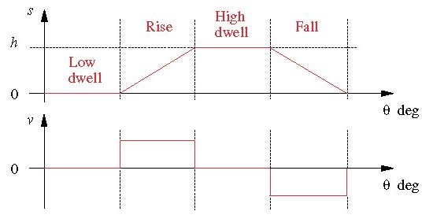


凸轮设计的基本规律：

- 任何设计用于非极低速运行的凸轮都必须具有以下约束条件：
- - 凸轮函数在整个区间（$360^{\circ}$）的位移一阶导数（速度）和位移二阶导数（加速度）必须是连续的。
- - 可得推论，凸轮的加加速度在整个区间（$360^{\circ}$）必须是有限的。

RDFD凸轮的二级（sophomore）设计，具有简单的简谐运动：

- 直接使用正弦加速度：


$$\begin{aligned} & s=\frac{h}{2}\left[1-\cos \left(\frac{\pi \theta}{\beta}\right)\right] \\ & v=\frac{d s}{d \theta}=\frac{h \pi}{2 \beta} \sin \left(\frac{\pi \theta}{\beta}\right) \\ & a=\frac{d v}{d \theta}=\frac{h \pi^2}{2 \beta^2} \cos \left(\frac{\pi \theta}{\beta}\right) \\ & j=\frac{d a}{d \theta}=\frac{-h \pi^3}{2 \beta^3} \sin \left(\frac{\pi \theta}{\beta}\right)\end{aligned}$$

- - 由SVAJ图像可知加速度不连续。因此加加速度无限。
- - 不满足凸轮设计的基本规律，不好的设计。

- 从加速度和求对应积分开始：


$$\begin{aligned} & a=C \sin \left(\frac{2 \pi \theta}{\beta}\right) \\ & v=-\frac{C \beta}{2 \pi} \cos \left(\frac{2 \pi \theta}{\beta}\right)+k_1\end{aligned}$$

- - 当$\theta=0$，$v=0$，则有：

$$\begin{aligned} & k_1=\frac{C \beta}{2 \pi} \\ & v=\frac{C \beta}{2 \pi}\left[1-\cos \left(\frac{2 \pi \theta}{\beta}\right)\right] \\ & s=\frac{C \beta}{2 \pi} \theta-C\left(\frac{\beta}{2 \pi}\right)^2 \sin \left(\frac{2 \pi \theta}{\beta}\right)+k_2\end{aligned}$$

- - 当$\theta=0$，$s=0$，因此$k_2=0$。
- - 当$\theta=\beta$，$s=h$，可得：

$$h=\left(\frac{C \beta}{2 \pi}\right) \beta \Rightarrow C=\frac{2 \pi h}{\beta^2}$$

$$\begin{aligned} & s=h / \beta-h / 2 \pi \sin (2 \pi \theta / \beta) \\ & v=h / \beta(1-\cos (2 \pi \theta / \beta)) \\ & a=2 \pi h / \beta^2 \sin (2 \pi \theta / \beta) \\ & j=h(2 \pi)^2 / \beta^3 \cos (2 \pi \theta / \beta)\end{aligned}$$

- - 得到的$s$的表达式为摆线方程。凸轮具有摆线函数位移和正弦函数加速度。
- - 满足凸轮设计的基本规律，是有效的凸轮设计。一般的设计程序是从一条连续的加速度曲线开始，然后进行积分。
- - 缺点：加速度和速度比其他函数更高。

RDFD凸轮，梯形（trapezoidal）加速度：


- 恒定加速度的加加速度是无限的。
- 梯形加速度使得加加速度是有限的。
- 缺点：加速度比其他函数更高。

RDFD凸轮，修正（modified）梯形加速度：


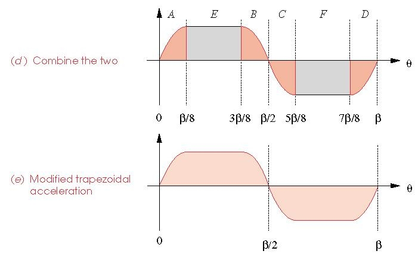

- 正弦加速度和恒定加速度的结合方法。
- 需要通过积分来获得幅值。
- 求积分后，获得以下曲线：


- - 在各种标准凸轮函数中，此方法的峰值加速度（也就是峰值力）最小。

RDFD凸轮，修正正弦加速度：


- 一个低频和一个高频正弦函数的结合方法。
- 在各种标准凸轮函数中，此方法的峰值速度（也就是峰值动能）最小。

到目前为止讨论的凸轮函数属于SCCA系列（Sine-Constant-Cosine-Acceleration family，SCCA family）：

- 对应正弦、恒定、余弦、加速度。
- 对SCCA系列的加速度（均为正弦、恒定、余弦系列的结合）进行比较：


多项式函数：

- 可以选择多项式函数作为凸轮函数。
- 多项式函数一般形式：

$$s=C_0+C_1 x+C_2 x^2+C_3 x^3+C_4 x^4+\cdots+C_n x^n$$

$$x=\frac{\theta}{\beta} \; or \; x=t$$

- 选择边界条件（BS's）的数量以满足凸轮设计的基本规律。
- 3-4-5多项式函数：


- - 边界条件：

$\begin{aligned}
& @\theta=0, s=0, v=0, a=0 \\
& @\theta=\beta, s=h, v=0, a=0
\end{aligned}$

- - 具有六个边界条件，因此多项式函数为五阶：

$$\begin{aligned} s & =C_0+C_1\left(\frac{\theta}{\beta}\right)+C_2\left(\frac{\theta}{\beta}\right)^2 \\ & +C_3\left(\frac{\theta}{\beta}\right)^3+C_4\left(\frac{\theta}{\beta}\right)^4+C_5\left(\frac{\theta}{\beta}\right)^5\end{aligned}$$

$$\begin{aligned} & s=C_0+C_1\left(\frac{\theta}{\beta}\right)+C_2\left(\frac{\theta}{\beta}\right)^2+C_3\left(\frac{\theta}{\beta}\right)^3+C_4\left(\frac{\theta}{\beta}\right)^4+C_5\left(\frac{\theta}{\beta}\right)^5 \\ & v=\frac{1}{\beta}\left[C_1+2 C_2\left(\frac{\theta}{\beta}\right)+3 C_3\left(\frac{\theta}{\beta}\right)^2+4 C_4\left(\frac{\theta}{\beta}\right)^3+5 C_5\left(\frac{\theta}{\beta}\right)^4\right] \\ & a=\frac{1}{\beta^2}\left[2 C_2+6 C_3\left(\frac{\theta}{\beta}\right)+12 C_4\left(\frac{\theta}{\beta}\right)^2+20 C_5\left(\frac{\theta}{\beta}\right)^3\right]\end{aligned}$$

$$@\theta=0, \quad s=0=C_0 \quad v=0=C_l / \beta \quad a=0=2 C_2 / \beta^2$$

$$C_0=0 \quad C_1=0 \quad C_2=0$$

$$@\theta=\beta, \quad s=h=C_3+C_4+C_5, \quad v=0=3 C_3+4 C_4+5 C_5$$

$$s=h=C_3+C_4+C_5$$

$$v=0=3 C_3+4 C_4+5 C_5$$

$$a=0=6 C_3+12 C_4+20 C_5$$

- - 最终解得：

$$s=h\left[10\left(\frac{\theta}{\beta}\right)^3-15\left(\frac{\theta}{\beta}\right)^4+6\left(\frac{\theta}{\beta}\right)^5\right]$$

- - 通过3-4-5多项式函数与摆线函数的形状相似，解具有不连续的加加速度。
- 4-5-6-7多项式：
- - 边界条件：在$\theta$为$0$和$\beta$处，加加速度为0。
- - 最终解得：

$$s=h\left[35\left(\frac{\theta}{\beta}\right)^4-84\left(\frac{\theta}{\beta}\right)^5+70\left(\frac{\theta}{\beta}\right)^6-20\left(\frac{\theta}{\beta}\right)^7\right]$$

- - 4-5-6-7多项式函数，解具有连续的加加速度，但位移、速度、加速度均很大。

加速度的比较：


- 修正梯形函数的加速度是最好的（峰值最小），其次是修正正弦和3-4-5多项式。
- 更低的加速度峰值代表更低的力峰值，更有利于平滑地驱动凸轮运动。

加加速度的比较：


- 摆线的加加速度是最低的，齐次是4-5-6-7多项式和3-4-5多项式。
- 更低的加加速度代表更低的振动，更有利于凸轮运动的平滑性和寿命。

速度的比较：


- 修正正弦是最好的（峰值最小），齐次是3-4-5多项式。
- 更低的速度代表更低的动能。

位置（位移）的比较：


- 对于不同的凸轮函数，位置曲线的差别不大。
- 位置的小变化会引起加速度的大变化。

凸轮函数的VAJ（单位分别为$m/rad,m/rad^2,m/rad^3$）的峰值表：


#### part b

单停留问题：


对于单停留凸轮设计，使用双停留函数-摆线函数：


- 双停留凸轮函数有一个不必要的返回到零的加速度，导致其他地方加速度更高。

单停留凸轮设计，使用双谐波（harmonic）函数：


- 较大的负加速度：

$$\begin{aligned} & s=\frac{h}{2}\left\{\left[1-\cos \left(\pi \frac{\theta}{\beta}\right)\right]-\frac{1}{4}\left[1-\cos \left(2 \pi \frac{\theta}{\beta}\right)\right]\right\} (rise) \\ & s=\frac{h}{2}\left\{\left[1+\cos \left(\pi \frac{\theta}{\beta}\right)\right]-\frac{1}{4}\left[1-\cos \left(2 \pi \frac{\theta}{\beta}\right)\right]\right\} (fall) \end{aligned}$$

单停留凸轮设计，3-4-5-6多项式：


- 边界条件：

$$@ \theta=0,s=v=a=0$$

$$@ \theta=\beta,s=v=a=0$$

$$@ \theta=\beta/2 s=h$$

$$s=h\left[64\left(\frac{\theta}{\beta}\right)^3-192\left(\frac{\theta}{\beta}\right)^4+192\left(\frac{\theta}{\beta}\right)^5-64\left(\frac{\theta}{\beta}\right)^6\right]$$

- - 具有与摆线和双谐波相比更低的峰值加速度。

非对称（unsymmetrical）RFD凸轮设计：


- 因为SVAJ图像是非对称的，因此不能只靠6个边界条件进行约束，还需要添加1个边界条件。
- 将当位移$S$的峰值对应的速度$V$设为0，作为添加的第7个边界条件：

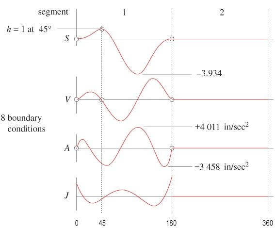

- 因此第一段位移具有5个边界条件，第二段位移具有6个边界条件。
- 对于具有5个边界条件的段，最好从具有最低加速度的位置开始，对具有6个边界条件的段进行相同的操作：


关键路径运动（critical path motion，CPM）：

- 指定位置$S$或其任意阶导数之一$V,A,J$。
- 例如：旋转运动，一半过程的速度保持恒定。
- 第一种方法，把这个运动过程分成以下4段：


- - 第1段具有4个边界条件，第2段具有2个边界条件（速度恒定），第3段具有4个边界条件，最后一段具有6个边界条件（对于不同情况的运动，最后一段几乎总是具有6个边界条件）：


- - 最终结果的SVAJ图像：

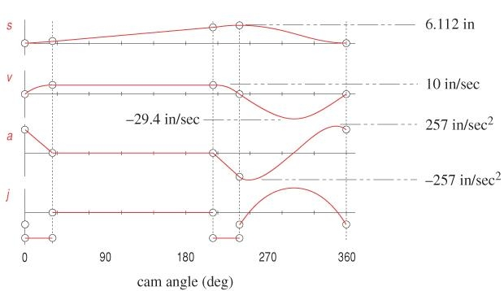

- 第二种方法，把这个运动过程分成以下2段：


- - 最终结果的SVAJ图像：


- 相比于4段设计，2段设计具有更好的性质。

凸轮术语：


- 基圆（base circle）$R_b$：可以与物理凸轮表面画切线的最小圆。
- 主圆（prime circle）$R_p$：可以与从动件的中心线的轨迹画切线的最小圆。
- 节曲线（pitch curve）：从动件的中心线的轨迹。

凸轮压力角：


- 压力角$\phi$：从动件的运动方向（速度方向）与传动轴方向之间的夹角。
- 平移需要$\phi<30$，振荡从动件需要$\phi<35$。
- 偏心率（eccentricty）$\varepsilon$：从动件的运动轴线与凸轮中心之间的垂直距离。


- 凸轮-从动件结构构成一个有效的四杆曲柄滑块平衡：


- 凸轮压力角计算：

$$V_{I_{2,4}}=b \omega=\dot{s}$$

$$\dot{s}=\frac{ds}{dt}=\frac{ds}{d \theta}\frac{d \theta}{dt}=v \omega$$

$$b \omega = v \omega$$

$$b=v$$

- - 距离$b$到瞬心$I_{24}$在数值上等于从动件$v$的速度，单位是长度每弧度。
- - 继续计算压力角$\phi$：

$$C=(s+d)tan \phi$$

$$b=C+\epsilon=(s+d) \tan \phi+\epsilon$$

$$v=b=(s+d) \tan \phi+\epsilon$$

$$d=\sqrt{R_p^2-\epsilon^2}$$

$$\phi=arctan(\frac{v-\epsilon}{s+\sqrt{R_p^2-\epsilon^2}})$$

- 考虑倾覆力矩（overturning moment）：

- - 优点：对于平坦面（flat faced）从动件，压力角为零。


- - 缺点：在从动件上有一个力矩，因为力与从动件运动的方向不一致。这就是所谓的倾覆力矩。

曲率半径（radius of curvature）：


- 凸轮上的每个点都有一个相关的曲率半径$\rho$。
- 如果曲率半径小于从动件的半径，则从动件不能正常运动。
- 经验法则有：$\rho_{min}=(2 \to 3)\times R_f$
- 对于平坦面从动件，负的曲率半径是不被允许的，那么如何确保曲率半径为正？


$$R_A=x+j(R_b+s)$$

$$R_A=ce^{j(\theta+\alpha)}+j \rho$$

$$ce^{j(\theta+\alpha)}+j \rho = x+j(R_b+s)$$

- - 实部：

$$c \cdot cos(\theta+\alpha)=x$$

- - 虚部：

$$c \cdot sin(\theta+\alpha)+\rho=R_b+s$$

- - 对实部和虚部关于$\theta$求导：

$$-c \cdot sin(\theta+\alpha)=\frac{dx}{d\theta}$$

$$c \cdot cos(\theta+\alpha)=\frac{ds}{d \theta}=v$$

- - 可知$x=v$：

$$\frac{dx}{d \theta}=\frac{dv}{d \theta}=a$$

- - 最终可得：

$$\rho=R_b+s-c \cdot sin(\theta+\alpha)=R_b+s+\frac{dx}{d \theta}=R_b+s+a>0$$

- - 确定最小基圆以确保$\rho$为正。
- - 通过定义$s$始终为正，右侧唯一的负因子是$a$。

凸轮制造考虑事项：

- 使用中到高碳钢，或铸造球墨铸铁。
- 碾磨或研磨。
- 对硬度进行热处理。
- 数控机床常采用直线插补（加速度较大）。

实际和理论凸轮性能对比：

- 由于制造误差造成的更大加速度，以及由加加速度引起的振动。

#### 作业3补充

瞬心：

- 瞬心表达的是两个构件（运动副）的瞬时绝对速度相同的重合点。瞬心对应的多个连杆视为一个整体，整体中单个构件上的每一个点以相同的角速度绕瞬心进行旋转，每一个点的线速度方向与其与瞬心的连线方向垂直。
- 根据三心定理推导四杆机构的瞬心位置，是因为四杆机构总有两个关节作为两个瞬心与机构外的瞬心共线，一共是6个瞬心，四个关节和$I_{13},I_{24}$。
- 瞬心一次对应两个构件（构件不一定是连杆，可能是物块等）。对于转动副（两构件一关节），由定义可得瞬心就在关节处。三心定理适用于处于同一平面的三构件，三连杆123两个关节$12,23$是其中两个瞬心，分别为$I_{12},I_{23}$，由三心定理，$I_{13}$位于直线$I_{12}I_{23}$上。若有第四条连杆连接形成另外一个三连杆结构，可以通过另外两个瞬心的直线获得交点即为$I_{13}$位置。
- - 运动副类型（求直接相连构件瞬心）：


- - 三心定理（求间接相连构件瞬心）：


- 两连杆其中之一是机架则为绝对瞬心，两连杆均非机架则为相对瞬心。

连杆机构（图像法）：


- 瞬心的定义：点与瞬心的连线方向与点的线速度方向垂直，点的线速度的大小等于点与瞬心的连线的长度乘以对应连杆的角速度。
- 连杆$1,2,3,4$，长度分别为$d,a,b,c$。
- 瞬心$I_{x,y}$的确定：除了$x,y$外两条连杆的延长线交点。
- 角速度，连杆长度，线速度的关系：

$$V_A=V_{2,3}=a \cdot \omega_2=A I_{1,2} \cdot \omega_2=A I_{1,3} \cdot \omega_3$$

$$V_B=B I_{1,3} \cdot \omega_3=c \cdot \omega_4=B I_{1,4} \cdot \omega_4$$

- $P$点线速度和方向：

$$V_P=P I_{13} \cdot \omega_3$$


连杆机构（解析向量循环法）：


- 教材具体流程过于繁长。

凸轮设计（求SVAJ图像），双停留情况：


- 列出已知条件：


- 求角速度：


- 选取符合要求的SCCA系列的双停留函数：


- 双停留，根据边界条件分成五段，分别写出特定段内的SVAJ表达式：

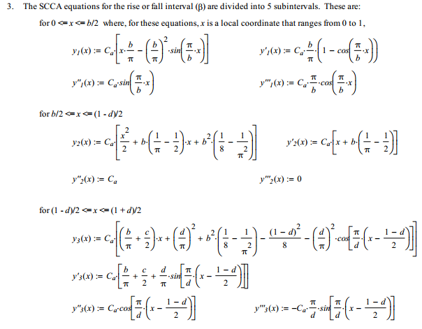


- 为方便通过停留分段并整合SVAJ表达式，定义条件函数，判断是否处于某段：


- 整合SVAJ表达式：


- 写出完整的全局SVAJ表达式，并画出图像：


凸轮设计（求SVAJ图像），单停留情况：


- 列出已知条件：


- 计算角速度：


- 无需选择函数，因此直接根据边界条件获得方程组求解多项式未知数获得完整的SVAJ全局表达式：

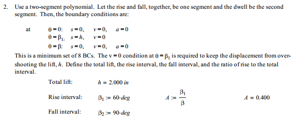


- 画图：


### Chapter 11 Bearing

#### part a

轴承（bearing）：

- 轴承用于承载载荷，同时允许最小摩擦的相对运动（旋转）——纯径向载荷（radial load），纯推力载荷（thrust load）/轴向载荷（axial load），或两种载荷的组合。
- 轴承的种类：
- - 滚动接触（rolling contact）或抗摩擦（anti-friction）轴承。
- - 轴颈（journal）或套筒（sleeve）轴承，统称为滑动接触轴承（sliding contact bearing）。

轴颈轴承：


- 负荷通过一层薄薄的（a thin film of）润滑剂（lubricant）（油）传递。

滚动接触轴承：


- 主要载荷通过滚动接触而不是滑动接触的元件传递。
- 滚动轴承的四个基本组件：
- - 外环（outer ring）。
- - 内环（inner ring）。
- - 滚珠（ball）或滚动元件（rolling element）。
- - 分离器（separator）。
- 滚珠轴承：


- - 深沟（deep groove）滚珠轴承。
- - 角接触（angular contact，AC）轴承。
- - 自对准（self alignment）滚珠轴承。
- 滚子（roller）轴承：


- - 圆柱（cylindrical）轴承/ 直滚子（straight roller）轴承。
- - 滚针（needle）滚子轴承。
- - 圆锥（tapered）滚子轴承。
- - 球面（spherical）滚子轴承。
- 一般来说，滚珠轴承具有更高的速度，滚子轴承可以承载更大的负载。

轴承寿命定义：

- 轴承失效（failure）定义：
- - 如果轴承是清洁和适当润滑的，安装和密封防止灰尘和污垢的进入，保持在这种条件下，并在合理的温度下运行，那么金属疲劳（metal fatigue）将是故障的唯一原因。
- 疲劳失效标准（证据）：负载表面的剥落。
- 轴承寿命的常用测量方法：
- - 内圈转数（外圈静止）直到第一个明显的疲劳迹象。
- - 在标准角速度下使用的小时数，直到出现第一个明显的疲劳迹象。
- 额定寿命（rating life）：10%的样品失效所需的寿命。
- - 也就是90%的轴承在达到（reach）或超过（exceed）故障标准之前的最小转数（或恒速小时数）。
- - 也称为最小寿命（minimum life）或$L_{10}$寿命。
- - 通常由制造商在目录中提供。
- 中位寿命（median life）：50%样品失效所需的平均寿命。
- - 也称为平均寿命（average life）或平均中位寿命（average median life）。
- - 中位寿命通常是$L_{10}$寿命的4或5倍。
- 目录负载额定值（catalog load rating）$C_{10}$：
- - 恒定的径向载荷，导致一组轴承的10%在轴承制造商的额定寿命失效。
- - 取决于类型，几何形状，制造精度，和轴承的材料。
- 基本负载额定值（basic load rating）$C$：
- - 基于内环$10^6$转的额定寿命的目录负载额定值。
- - 在如此低的寿命下造成故障所必需的径向载荷高得不切实际。
- - 基本负载额定值是参考值，而不是实际负载。

负载和寿命的关系：

- 名义上相同的轴承组在不同的载荷下进行寿命失效准则试验。
- 负载-寿命的图像在对数-对数尺度近乎线性。


- - 使用回归方程来表示（$L$的单位为圈数）：

$$FL^{1/a}=constant$$

- - 滚珠轴承满足$a=3$，滚子轴承满足$a=10/3$。

- 对任意两种载荷寿命条件可得：

$$F_1 L_1^{1/a}=F_2 L_2^{1/a}$$

- 用$R$表示目录额定条件（catalog rating condition）（生产商预先家规定的运行要求），$D$表示期望设计条件（desired design condition）（设备预想的运行要求）：

$$F_R L_R^{1/a}=F_D L_D^{1/a}$$

- 如果给定期望设计转速$n_D$（单位为$rev/min$），且需要以小时为单位给出寿命（圈数），需要用60分钟/小时进行换算（期望设计寿命$\mathscr{L}$的单位为小时）：

$$L_D=60 \mathscr{L}_D n_D$$

- 因此可得$C_{10}$（关于期望负载$F_D$，期望寿命$L_D$，目录额定寿命$L_R$的函数。其中，$F_D,L_D$的值通过具体的问题来确定。$L_R$由轴承制造商指定，一般为适用于球滚子和一般滚子的$L_R=10^6 rev$或者适用于圆锥滚子的$L_R=90(10^6) rev$，两种$L_R$值对应的Weibull分布的参数值不同）：

$$C_{10}=F_R=F_D\left(\frac{L_D}{L_R}\right)^{1 / a}=F_D\left(\frac{\mathscr{L}_D n_D 60}{\mathscr{L}_R n_R 60}\right)^{1 / a}$$

- $C_{10}$用于在目录中找到合适的轴承。
- 定义额定寿命的无量纲倍数$x_D$作为衡量设计寿命的指标通常是方便的：

$$x_D=L_D / L_R$$

- 例题：


轴承的可靠性（reliability）与寿命：

- 在恒定负荷下，寿命测度分布呈右偏态（right skewed）。
- Weibull分布是一个很好的选择。
- 定义无量纲形式的寿命度量为$x = L/L_{10}$，可靠性$R$用Weibull分布表示为（$x_0,\theta,b$为Weibull分布参数）：

$$R=\exp \left[-\left(\frac{x-x_0}{\theta-x_0}\right)^b\right]$$


- 累积（cumulative）分布函数的显式表达式为：

$$F=1-R=1-\exp \left[-\left(\frac{x-x_0}{\theta-x_0}\right)^b\right]$$

- Weibull参数$x_0,\theta,b$通常由目录提供。以下是经典值表，$1$为圆锥滚子轴承的通用参数，$2$为常见的球和直滚子轴承：


相关负载，寿命，可靠性：

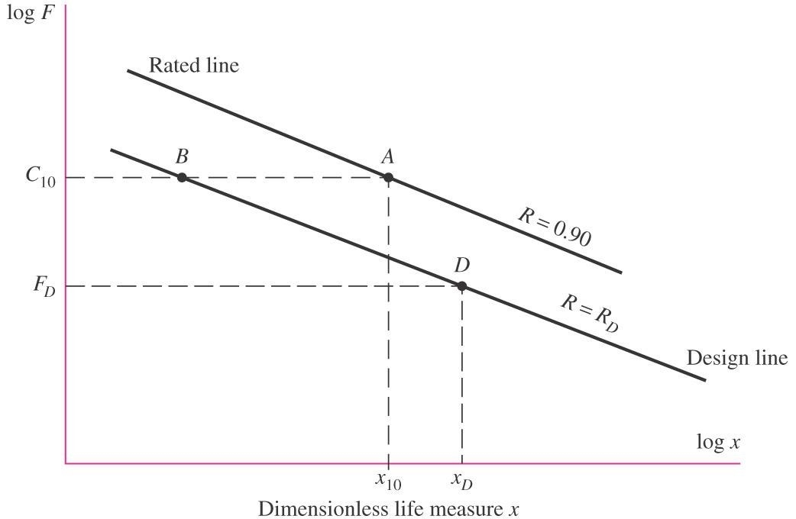

- 点$A$对应的是目录信息（catalog information），处于坐标$C_{10}$和$x_{10}=L_{10}/L_{10}=1$，处于可靠性轮廓线（contour）$R=0.90$上（目录负载额定值，即有10%样品失效，90%样品可靠）。
- 点$D$对应的是设计信息（design information），处于坐标$F_D$和$x_D$，处于可靠性轮廓线$R=R_D$上。
- 设计师必须通过点$B$来将点从$D$移动到点$A$。
- 对于同一可靠性轮廓线$BD$，有：

$$\begin{aligned} & F_B x_B^{1 / a}=F_D x_D^{1 / a} \\ & F_B=F_D\left(\frac{x_D}{x_B}\right)^{1 / a}\end{aligned}$$

- 对于同一恒定负载$AB$，有：

$$R_D=\exp \left[-\left(\frac{x_B-x_0}{\theta-x_0}\right)^b\right]$$

- 最终得$x_B$：

$$x_B=x_0+\left(\theta-x_0\right)\left(\ln \frac{1}{R_D}\right)^{1 / b}$$

$$F_B=F_D\left(\frac{x_D}{x_B}\right)^{1 / a}=F_D\left[\frac{x_D}{x_0+\left(\theta-x_0\right)\left(\ln 1 / R_D\right)^{1 / b}}\right]^{1 / a}$$

$$F_B=C_{10}$$

- 要完全满足$F_B=C_{10}$，$F_B$还需要乘以一个应用因子（application factor）$a_f$（作为增加设计载荷的安全系数，考虑了过载、动载荷和不确定性）：

$$C_{10}=a_f F_D\left[\frac{x_D}{x_0+\left(\theta-x_0\right)\left(\ln 1 / R_D\right)^{1 / b}}\right]^{1 / a}$$

- 简化形式，$p_f$为失效概率（probability for failure）：

$$\ln \frac{1}{R_D}=\ln \frac{1}{1-p_f}=\ln \left(1+p_f+\cdots\right) \doteq p_f=1-R_D$$

$$C_{10} \doteq a_f F_D\left[\frac{x_D}{x_0+\left(\theta-x_0\right)\left(1-R_D\right)^{1 / b}}\right]^{1 / a} \quad R \geq 0.90$$

- 将具有期望负载、寿命和可靠性的设计情况转换为基于90%可靠性的额定寿命的目录负载额定值的方法。
- 当$R_D=0.90$，分母等于1，方程简化为：

$$C_{10}=F_R=F_D\left(\frac{L_D}{L_R}\right)^{1 / a}=F_D\left(\frac{\mathscr{L}_D n_D 60}{\mathscr{L}_R n_R 60}\right)^{1 / a}$$

- 例题：


多个轴承的组合可靠性：

- 如果需要轴上或齿轮箱中的多个轴承的组合可靠性，则总可靠性等于单个可靠性的乘积。
- 对于同一轴的两个轴承，$R=R_A R_B$。
- 如果轴承是相同的，每个轴承的可靠性应该等于总期望可靠性的平方根。
- 如果轴承不相同，它们的可靠性不必相同，只要实现总可靠性即可。

组合径向和推力载荷：


- 滚珠轴承：抗径向载荷（径向载荷）$F_r$和推力载荷（轴向载荷）$F_a$。$F_r$和$F_a$可以组合。
- 可以建立等效径向载荷$F_e$，其损伤程度（damage）与$F_a$和$F_r$的组合相同。
- 定义$V$：一个旋转因子，用于解释外圈旋转与内圈旋转时球的旋转差异。
- - $V=1$，内环旋转。
- - $V=1.2$，外环旋转。
- 数据可以用两条直线来近似表示（求$F_e$的方法，等效径向负载为$max(F_e,F_r)$）：


- - $X$是纵坐标截距，$Y$是斜率。
- - 基本上表明$F_e$在较小的$F_a/F_r$比下等于$F_r$，然后当$F_a/F_r$超过一定数量$e$时$F_e$开始上升。
- 通常将这两个方程表示为一个方程：


- - $X,Y$因子取决于特定轴承的几何形状和结构。特定轴承的X和Y从轴承目录中获得（没有对应的$F_a/C_0$值则遵循线性进行计算）。


静载荷额定值$C_0$：

- 在滚道（raceway）和滚动体（rolling element）的任何接触点产生的总永久变形（permanent deformation）为滚动体直径的0.0001倍的载荷。
- $d$为滚子的直径。
- 被用于检查永久形变。
- 被用于组合$F_r,F_a$为等效$F_e$。
- $X,Y$为关于$e$的函数，$e$是$F_a/C_0$的函数。$C_0$和$C_{10}$一样被列于目录中。

尺寸系列代码（dimension-series code）：

- 表示公制轴承的轴承截面边界尺寸的相对尺寸。
- 两位系列数字。
- 第一位数字表示宽度系列。
- 第二位数字表示直径系列。
- 特定的尺寸在特定系列下的目录中被制成表格-每个代码都有一个表。


- 各种表：


- 为了帮助设计人员选择轴承，大多数制造商的手册都包含许多机械类别的轴承寿命数据，以及负载应用因素的信息。
- 例题：


#### part b

变量负载（variable loading）：

- 轴承负载总是频繁变化且一般具有以相同的模式出现。
- - 循环模式下的分段（piecewise）恒载荷。
- - 可重复循环模式下连续变载荷。
- - 随机变化。
- 对损伤程度的测量：在负载等级$F_I$下，从$L=0$到$L=L_A$的区域是对损伤程度$D=F_1^a L_A$的测量：


具有分段恒负载的变量负载：


- 计算损伤程度$D$：

$$\begin{aligned} & D=F_{e 1}^a l_1+F_{e 2}^a l_2+F_{e 3}^a l_3 \\ & D=F_{\mathrm{eq}}^a\left(l_1+l_2+l_3\right)\end{aligned}$$

- - $F_{eq}$为等效稳定负载（造成的损失程度与变化的循环负载相当）。

$$F_{\mathrm{eq}}=\left[\frac{F_{e 1}^a l_1+F_{e 2}^a l_2+F_{e 3}^a l_3}{l_1+l_2+l_3}\right]^{1 / a}=\left[\sum f_i F_{e i}^a\right]^{1 / a}$$

- - $f_i$为负载$F_{ei}$下运行的圈数的分数。
- 使$l_i=n_i t_i$，$n_i$为负载$F_{ei}$下的转速，$t_i$为对应的速度的持续时间。

$$F_{\mathrm{eq}}=\left[\frac{\sum n_i t_i F_{e i}^a}{\sum n_i t_i}\right]^{1 / a}$$

$$F_{\mathrm{eq}}=\left[\sum f_i\left(a_{f i} F_{e i}\right)^a\right]^{1 / a} \quad L_{\mathrm{eq}}=\frac{K}{F_{\mathrm{eq}}^a}$$

- 例题：


- 如果下一等级的压力持续到失效，还剩下多少寿命？
- - 在线性损伤程度假设下，当损伤程度$D$等于常数$K=F_{ei}^a L$，发生失效。

$$F_{\mathrm{eq}}^a L_{\mathrm{eq}}=F_{e 1}^a l_1+F_{e 2}^a l_2+F_{e 3}^a l_3$$

$$K=F_{e 1}^a L_1=F_{e 2}^a L_2=F_{e 3}^a L_3$$

$$K=F_{e 1}^a l_1+F_{e 2}^a l_2+F_{e 3}^a l_3=\frac{K}{L_1} l_1+\frac{K}{L_2} l_2+\frac{K}{L_3} l_3=K \sum \frac{l_i}{L_i}$$

$$\sum \frac{l_i}{L_i}=1$$

具有周期性变化（periodic variation）的变量负载：


- 对于负载$F_a$造成的损伤程度的微分：

$$d D=F^a d \theta$$

- 那么对于凸轮旋转一周的总损伤程度为：

$$D=\int d D=\int_0^\phi F^a d \theta=F_{\mathrm{eq}}^a \phi$$

- 求解等效负载$F_{eq}$：

$$F_{\mathrm{eq}}=\left[\frac{1}{\phi} \int_0^\phi F^a d \theta\right]^{1 / a} \quad L_{\mathrm{eq}}=\frac{K}{F_{\mathrm{eq}}^a}$$

- 例题：


圆锥滚子轴承：

- 直滚子轴承可以承受较大的径向载荷，但不能承受轴向载荷。
- 球（ball）轴承可以承受适度的径向载荷，和小的轴向载荷。
- 圆锥滚子轴承依靠以一定角度倾斜的滚子，使它们能够承载大的径向载荷和大的轴向载荷/推力载荷。
- 圆锥滚子轴承的组成（两大部分）：
- - 
- - 锥（cone）组成：
- - - 锥（内环）。
- - - 滚子。
- - - 笼（cage）。
- - 杯（内环）。
- 滚子是锥形的，因此虚拟顶点（apex）在轴中心线上。

圆锥滚子轴承的安装方向（mounting direction）：


- 诱发推力载荷（induced thrust load）：即使没有外部推力载荷，在圆锥轴承，径向载荷将诱发推力反应。
- 相反方向的安装副可以抵消引起的推力载荷。
- 两种安装方向：
- - 直接（direct）安装。
- - 间接（indirect）安装。
- $A_0$和$B_0$是有效载荷中心的位置。
- 对于相同的有效扩散（effective spread）$a_e$（即$A_0$和$B_0$之间的距离），直接安装需要更大的几何扩散（geometric spread）$a_g$。也就是说，对于相同的几何扩散$a_g$，直接安装只会提供更小的有效扩散。

经典目录数据（圆锥滚子轴承）：


诱导推力载荷：


- 径向载荷$F_{rA},F_{rB}$由于滚子角（圆锥滚子）而产生诱导推力载荷$F_{iA},F_{iB}$。

$$F_i=\frac{0.47 F_r}{K}$$

- - $K$为径向载荷额定值与推力载荷额定值之比。
- - $K$取决于特定的轴承。
- - 结合外部轴向载荷$F_{ae}$，可以得到等效径向载荷$F_e$。

等效径向载荷（未确定承受等效径向载荷的轴承）：

- 圆锥滚子轴承的等效径向载荷$F_e$与以前的形式（齿轮）相似：

$$F_e=X V F_r+Y F_a$$

- - Timken公司建议取值$X=0.4,Y=K$。
- $F_a$是轴承承受的净径向载荷（net axial load），来自另一个轴承的诱导推力载荷和轴承承受的外部轴向载荷。
- 只有一个轴承将承受外部轴向载荷。是哪一个轴承呢？

确定承受外部轴向载荷的轴承（两个轴承）：


- 确定哪个轴承被"挤压"了：
- - 无论安装方向或轴方向如何，目视检查以确定哪个轴承被"挤压"。
- - 或者，外部推力载荷$F_{ae}$指向的轴承。被"挤压"的轴承标记为轴承$A$，另一个标记为轴承$B$。

确定承受净轴向载荷的轴承：

- 一般地，轴承$A$（被"挤压"的轴承）承受净轴向载荷。
- 有时，轴承$A$的诱导推力$F_{iA}$大于轴承$B$的诱导推力$F_{iB}$和外轴向载荷$F_{ae}$的组合，即满足：

$$F_{iA} > (F_{iB}+F_{ae})$$

- - 如果发生这种情况，那么轴承$B$实际上承担净轴向载荷。

等效径向载荷（已确定承受等效径向载荷的轴承）：

- 对不承载净轴向载荷的轴承，使用全径向载荷（full radial load）。
- 等效径向载荷$F_{eA},F_{eB}$方程（同样的，$F_e$和$F_r$哪个更大就取哪一个作为等效径向负载）：

$$F_{i A} \leq\left(F_{i B}+F_{a e}\right) \quad\left\{\begin{array}{l}F_{e A}=0.4 F_{r A}+K_A\left(F_{i B}+F_{a e}\right) \\ F_{e B}=F_{r B}\end{array}\right.$$

$$F_{i A}>\left(F_{i B}+F_{a e}\right) \quad\left\{\begin{array}{l}F_{e B}=0.4 F_{r B}+K_B\left(F_{i A}-F_{a e}\right) \\ F_{e A}=F_{r A}\end{array}\right.$$

- - 如果等效径向载荷小于原径向载荷，则使用原径向载荷。
- - 一旦等效径向载荷被确定，他们应该用来找到目录额定载荷以选择所需的轴承。

滚子轴承的目录额定寿命和Weibull分布参数：


例题：


实现轴承可靠性：

- 推导出一个合适的目录额定负载来确定给定的设计情况和可靠性目标：

$$C_{10}=a_f F_D\left[\frac{x_D}{x_0+\left(\theta-x_0\right)\left(\ln 1 / R_D\right)^{1 / b}}\right]^{1 / a}$$

- 额定大于$C_{10}$，从目录中选择实际轴承（因为$a_f$的存在）。
- 有时需要从实际轴承（略高于所需的容量）确定实现的可靠性。
- 求解可靠性：

$$R=\exp \left(-\left\{\frac{x_D\left(\frac{a_f F_D}{C_{10}}\right)^a-x_0}{\theta-x_0}\right\}^b\right)$$

- 交变近似（alternate approximate）方程也是类似的：

$$C_{10}=a_f F_D\left[\frac{x_D}{x_0+\left(\theta-x_0\right)\left(\ln 1 / R_D)^{1/b}\right.}\right]^{1 / a}$$

$$C_{10} \doteq a_f F_D\left[\frac{x_D}{x_0+\left(\theta-x_0\right)\left(1-R_D\right)^{1 / b}}\right]^{1 / a} \quad R \geq 0.90$$

$$R \doteq 1-\left\{\frac{x_D\left(\frac{a_f F_D}{C_{10}}\right)^a-x_0}{\theta-x_0}\right\}^b \quad R \geq 0.90$$

对圆锥滚子轴承实现可靠性：

- 代入适用于圆锥滚子轴承的参数：

$$x_0=0, \theta=4.48,b=3 / 2$$

$$\begin{aligned} R & =\exp \left\{-\left[\frac{x_D}{\theta\left[C_{10} /\left(a_f F_D\right)\right]^a}\right]^b\right\} \\ & =\exp \left\{-\left[\frac{x_D}{4.48\left[C_{10} /\left(a_f F_D\right)\right]^{10 / 3}}\right]^{3 / 2}\right\}\end{aligned}$$

$$R \doteq 1-\left\{\frac{x_D}{\theta\left[C_{10} /\left(a_f F_D\right)\right]^a}\right\}^b=1-\left\{\frac{x_D}{4.48\left[C_{10} /\left(a_f F_D\right)\right]^{10 / 3}}\right\}^{3 / 2}$$

例题：


轴承润滑剂（lubrication）：

- 提供滑动和滚动表面之间的润滑剂膜。
- 帮助分布和消散热量。
- 防止轴承表面的腐蚀。
- 保护部件免受外来物质（foreign matter）进入。
- 油（either）和脂（grease）都可以使用，在某些情况下各有优点。

- - 

一些常见轴承安装配置：


双工（duplexing）：


- 当需要最大的刚度和轴错位阻力（shaft misalignment）时，一对角接触（angular-contact）轴承可以在一种称为双工的安排（arrangement）中使用。
- 双工轴承有带偏移的环。
- 当它们夹紧在一起时，就会产生预紧力（preload）。

三种常见双工安排：


- DF安装：面对面，适用于任何方向的径向和推力载荷。（a）图。
- DB安装：背对背，与DF相同，但具有更大的对准（alignment）刚度。
- DT安装：串联，仅适用于一个方向的推力。

配合（fit）：

- 转动环（rotating ring）通常需要压（press）配合。
- 静止环（stationary ring）通常最好是推（push）配合。
- 允许静止环的蠕变（creep），将新的部分带入承重区（load-bearing zone），以平衡磨损。

预紧力：


- 目标：
- - 移除内部间隙。
- - 增加疲劳寿命。
- - 减少轴承处的轴斜率。

对准：

- 目录将指定特定轴承的对准要求。
- 轴承位置的轴斜率的典型最大范围：


围墙（enclosures）：

- 通用轴密封，以排除污垢并保留润滑剂：


### Chapter 8 Fastener

使用非永久性紧固件（fastener）的原因：


- 紧固件是一种机械地将两个或多个物体连接或固定在一起的硬件装置。
- 非永久紧固件使用场景：
- - 现场组装（field assembly）。
- - 拆解（disassembly）。
- - 维护（maintenance）。
- - 调整（adjustment）。
- 螺纹（threaded）紧固件是装配部件最常用的紧固件之一，因为它们可以根据需要轻松安装和卸载。

螺纹标准和定义：


- 除非另有说明，所有的螺纹都按照右手法则制作。
- 节距/螺距（pitch）：相邻螺纹之间的距离。
- 大直径（major diameter）：螺纹的最大直径。
- 小直径（minor diameter / root diameter）：螺纹的最小直径。
- 节径/螺距直径（pitch diameter）：大直径和小直径之间的理论直径，其中齿（tooth）和间隙（gap）的宽度相同。

标准：

- ISO 68 公制（Metric）螺纹：
- - M系列。普通螺纹。（M3，M4，M6...）
- - MJ系列。具有更大的根半径用于疲劳应用。
- - $60^\circ$对称螺纹。
- 美国国家螺纹/统一螺纹（American National thread / Unified thread），单位使用inch：
- - UN。普通螺纹。
- - UNR。具有更大的根半径用于疲劳应用。
- - $60^\circ$对称螺纹。
- M和MJ螺纹的基本轮廓如图所示：
- - 

- 下两表定义了标准螺纹的基本尺寸：
- - 对于公制尺寸，螺纹尺寸由螺距$p$指定。


- - 对于统一尺寸，螺纹尺寸由每英寸螺纹数（$N$）来指定。


- UN：
- - 粗（coarse）系列UNC：具有更粗的螺距。通用组装，频繁拆解，不利于振动，代指"正常"（normal）螺纹。
- - 精细（fine）系列UNF：具有更精细的螺距。有利于振动，有利于调整，适用于汽车和飞机。
- - 特别精细（extra fine）系列UNEF：具有特别精细的螺距。适用于冲击和大振动，使用高级合金制造，适用于仪器仪表、飞机。

拉伸应力（tensile stress）面积：


- 拉伸应力面积$A_t$是与螺纹杆具有相同拉伸强度的无螺纹杆的面积。
- 它是用于应力计算的螺纹杆的有效面积。
- 这种无螺纹杆的直径是螺距直径和螺纹杆的小直径的平均值。

螺钉（screw）的规格（specification）：

- 统一螺纹：


- 公制螺纹：


方形（square）螺纹和尖顶（acme）螺纹：

- 当螺纹传输功率时，需要使用方形螺纹和尖顶螺纹：


螺栓（bolt）的头部（head）类型：

- 六角头（hexagon）螺栓：


- - 通常使用螺母（nut）。
- - 重负（heavy duty）。

- 六角头螺帽（cap screw）：


- - 更薄的头部。
- - 常用作螺钉（螺纹孔内，不使用螺母）。

- 典型螺帽头：


- - 凹（fillister）头螺帽。
- - 平（flat）头螺帽。
- - 内六角（socket）头螺帽：
- - - 通常用作更精确的应用。
- - - 从顶部连接。

机器螺钉（machine screw）：


- 通常较小的尺寸。
- 槽或飞利浦头很常见。
- 具有螺纹所有的方式。
- 不同的头部风格。

六角头螺栓：


- 六角头螺栓是工程应用中最常用的螺栓之一。
- $W$通常为公称（nominal）直径$d^*$的1.5倍。
- 螺栓长度$L$是从螺栓头以下测量的。

螺纹长度$L_T$：

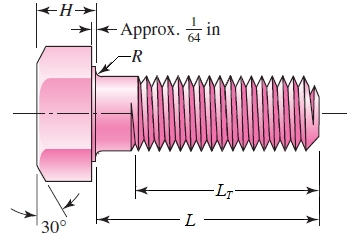

- 英制：

$$L_T= \begin{cases}2 d+\frac{1}{4} \text { in } & L \leq 6 \text { in } \\ 2 d+\frac{1}{2} \text { in } & L>6 \text { in }\end{cases}$$

- 公制：

$$L_T=\left\{\begin{array}{lr}2 d+6 & L \leq 125 \\ 2 d+12 & 125<L \leq 200 \\ 2 d+25 & L>200\end{array}\right.$$

螺母：


- 螺母的前三根螺纹承载大部分载荷。第一根螺纹可能出现局部塑性应变，因此螺母不应在关键应用中重复使用。

拉力加载螺栓连接（tension loaded bolted joint）：

- 螺栓的目的是将两个或多个部件夹紧在一起。使用硬化钢垫圈/垫片（washers）进行简单的螺栓连接。
- 握柄/握把长度（grip length）$l$包括所有被螺栓预紧力（通过扭转螺母施加的夹紧（clamping）力）压缩的东西的长度，包括垫片。
- 螺栓头下的垫片可防止孔上的毛刺（burr）凿入（gouging）螺栓头下的圆角（fillet）。

压力容器（vessel）头：


- 在螺纹孔/攻丝孔（tapped hole）内的六角头螺帽用于将缸（cylinder）盖与缸体固定（fasten）（无螺母）。
- O环密封（O-ring seal），不影响握把内构件（member）的刚度。
- 只有部分螺栓的螺纹长度贡献有效的握把长度$l$。

螺纹孔的有效握把长度：


- 对于螺纹孔内螺钉，有效握把长度为：

$$l= \begin{cases}h+t_2 / 2, & t_2<d \\ h+d / 2, & t_2 \geq d\end{cases}$$

螺栓连接（bolted joint）刚度：


- 螺栓预紧力期间：
- - 螺栓被拉伸。
- - 握把中的构件被压缩。
- 当外部负载$P$被施加：
- - 螺栓被进一步拉伸。
- - 握把中的构件被松开一部分压缩。
- 连接可以建模为与刚性构件弹簧平行的软螺栓弹簧。
- 刚度是物体在外力作用下抵抗变形的程度。我们想知道当组装的连接（connection）受到外部拉伸载荷时会发生什么。

刚度（stiffness）的基础（轴向负载）：


- 刚度定义：
- - 拉伸：载荷作用向外。弹簧伸长。
- - 压缩：载荷作用向内。弹簧缩短。
- 线性弹性方程：
- - 负载：

$$P=k \delta$$

- - 伸长量：

$$\delta=f P$$

- - 刚度$k$：

$$k=\frac{P}{\delta}=\frac{1}{f}$$

- - 灵活性/弹性（flexibility）$f$：

$$f=\frac{\delta}{P}=\frac{1}{k}$$

力-位移关系：


- 应力和应变：

$$\begin{gathered}\sigma=\frac{P}{A} \\ \varepsilon=\frac{\delta}{L}\end{gathered}$$

$$\sigma=E \varepsilon$$

$$\delta=\frac{PL}{EA}$$

- - $EA$即为轴向刚性（axial rigidity）。

螺栓刚度（紧固件刚度）：


- 轴向负载杆，部分具有螺纹，部分不具有螺纹。
- 把每一部分视作一个弹簧。因此为两个串联弹簧。
- $k$为刚度常数，$k_b$为夹紧区域（clamped zone）的螺栓或螺帽的估计有效刚度。


求螺栓刚度的步骤：


- 给定紧固件直径$d$和螺距$p$或每英寸螺纹数量。垫片厚度$t$。其他包括螺母厚度$H$等由查表获得：


- 握把长度$l$（螺栓和螺母之间的所有被挤压的材料的总长度，若没有螺母则需要分情况讨论）：


$$l=\text{所有被挤压的材料的总长度}$$


$$l= \begin{cases}h+t_2 / 2, & t_2<d \\ h+d / 2, & t_2 \geq d\end{cases}$$

- 紧固件长度$L$（分情况讨论）：


$$L > l+H$$


$$L > h+1.5d$$

- 螺纹长度$L_T$：
- - inch系列（美国国家标准）：

$$L_T= \begin{cases}2 d+\frac{1}{4} \text { in, } & L \leq 6 \text { in } \\ 2 d+\frac{1}{2} \text { in }, & L>6 \text { in }\end{cases}$$

- - 公制系列：

$$L_T=\left\{\begin{array}{l}2 d+6 \mathrm{~mm}, \quad L \leq 125 \mathrm{~mm}, d \leq 48 \mathrm{~mm} \\ 2 d+12 \mathrm{~mm}, \quad 125<L \leq 200 \mathrm{~mm} \\ 2 d+25 \mathrm{~mm}, \quad L>200 \mathrm{~mm}\end{array}\right.$$

- 握把的无螺纹部分（unthreaded portion）的长度$l_d$：

$$l_d=L-L_T$$

- 握把的有螺纹部分（threaded portion）的长度：

$$l_t=l-l_d$$

- 无螺纹部分的面积：

$$A_d=\pi d^2 / 4$$

- 有螺纹部分的面积$A_t$需要查表。
- 紧固件刚度：

$$k_b=\frac{A_d A_t E}{A_d l_t+A_t l_d}$$

构件（member）刚度：

- 我们已经考虑了螺栓（紧固件）的刚度，接下来考虑全部构件的刚度，称为构件刚度：

$$\frac{1}{k_m}=\frac{1}{k_1}+\frac{1}{k_2}+\frac{1}{k_3}+ \cdots + \frac{1}{k_i}$$

- 采用Rotscher压力-锥（pressure-cone）法来计算构件刚度。

- - 螺栓头的表面：


- - 建模为一个锥：


- - 压力锥：应力分布从螺栓头的表面和螺母的表面扩散。
- - 建模为一个锥，顶部切断（top cut off），并且有一个固定的锥角（cone angle）。称为截锥体/平截头墩（frustum）。
- - 若截锥体从螺栓头和螺母到握把的中点扩散，被压缩构件被建模为锥。
- - 每个截锥体具有半顶点角（half-apex angle）$\alpha$（固定，且在计算过程中的唯一未知量）。
- - 问题变成了求在压缩条件下的截锥体的刚度。
- - 压缩力$P$（沿$x$轴）压缩厚度为$dx$的锥单元。
- - 计算过程：


$$d \delta=\frac{P d x}{E A}$$

$$\begin{aligned} A & =\pi\left(r_o^2-r_i^2\right)=\pi\left[\left(x \tan \alpha+\frac{D}{2}\right)^2-\left(\frac{d}{2}\right)^2\right] \\ & =\pi\left(x \tan \alpha+\frac{D+d}{2}\right)\left(x \tan \alpha+\frac{D-d}{2}\right)\end{aligned}$$

$$\delta=\frac{P}{\pi E} \int_0^t \frac{d x}{[x \tan \alpha+(D+d) / 2][x \tan \alpha+(D-d) / 2]}$$

$$\delta=\frac{P}{\pi E d \tan \alpha} \ln \frac{(2 t \tan \alpha+D-d)(D+d)}{(2 t \tan \alpha+D+d)(D-d)}$$

$$k=\frac{P}{\delta}=\frac{\pi E d \tan \alpha}{\ln \frac{(2 t \tan \alpha+D-d)(D+d)}{(2 t \tan \alpha+D+d)(D-d)}}$$

- - 典型$\alpha$值为$30^\circ$，求每个截锥体的刚度，即可得到构件刚度$k_m$：

$$k=\frac{0.5774 \pi E d}{\ln \frac{(1.155 t+D-d)(D+d)}{(1.155 t+D+d)(D-d)}}$$

$$\frac{1}{k_m}=\frac{1}{k_1}+\frac{1}{k_2}+\frac{1}{k_3}+\cdots+\frac{1}{k_i}$$

- - 例如：


- - - 先求$L$和$k_b$：


- - - 上垫片梯形，下垫片梯形，中间材料也需要分成两个梯形，分别计算$k_1,k_2,k_3,k_4$。


握把中常用材料的构件刚度：

- 如果握把由相同材料（相同的$E$）的构件组成，则可以将两个相同的锥台串联起来。
- 整个关节可以用一个方程来处理（整个关节由一种材料制成），$d_w$为垫片表面直径：

$$k_m=\frac{\pi E d \tan \alpha}{2 \ln \frac{\left(l \tan \alpha+d_w-d\right)\left(d_w+d\right)}{\left(l \tan \alpha+d_w+d\right)\left(d_w-d\right)}}$$

$$l=2t$$

- 对于标准垫片表面直径$d_2=1.5d$和典型半顶点角角度$\alpha=30^\circ$，有：

$$k_m=\frac{0.5774 \pi E d}{2 \ln \left(5 \frac{0.5774 l+0.5 d}{0.5774 l+2.5 d}\right)}$$

求构件刚度的有限元（finite element）方法：

- 对于握把内常见材料的特殊情况，有限元模型与截锥体模型一致。


- 得到有限元结果的指数曲线拟合。
- 可用于握把内普通材料的情况：

$$\frac{k_m}{E d}=A \exp (B d / l)$$


例题：


钢（steel）螺栓的公制机械性能（mechanical-property）等级（classes）：


螺栓的材料：

- 等级（grades）应当注明材料、热处理方式、强度，等级应当标注于螺栓的头部。
- 抗拉载荷（proof load）是指螺栓在没有固定载荷的情况下所能承受的最大载荷。
- 抗拉强度（proof strength）是指抗拉载荷与拉伸应力面积之比。
- - 对应于比例极限。
- - 略低于屈服强度。
- - 通常用于螺栓的静强度（static strength）。
- 好的螺栓材料具有持续上升直至断裂（fracture）的应力-应变曲线：


SAE钢螺栓规范：


ASTM钢螺栓规范：


螺栓规范的简写格式：

- 公制：


- 统一：


具有外部拉伸载荷的拉力载荷螺栓连接（tension loaded bolted joints）：

- 术语一览：


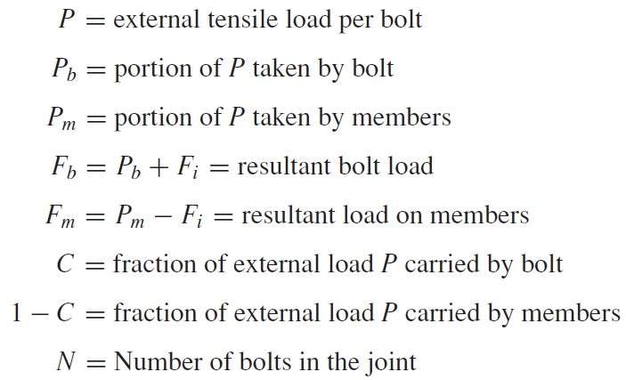

- 螺栓预紧（preload）期间：
- - 螺栓被拉伸。
- - 握把中的构件被压缩。
- 当外部负载$P$被施加：


- - 螺栓被拉伸额外量（additional amount）$\delta$。
- - 握把中的构件释放压缩（un-compressed）相同的量$\delta$。

$$\delta=\frac{P_b}{k_b}=\frac{P_m}{k_m}$$

$$P_m=P_b \frac{k_m}{k_b}$$

刚度常数：

- 由$P=P_b+P_m$：

$$\begin{gathered}P_b=\frac{k_b P}{k_b+k_m}=C P \\ P_m=P-P_b=(1-C) P\end{gathered}$$

- $C$定义为连接的刚度常数，表示螺栓将承受的外部载荷$P$的比例，比较好的设计会使得$C$在0.2左右：

$$C=\frac{k_b}{k_b+k_m}$$


螺栓和构件（member）负载：

- 这些结果只有在构件上的载荷$F_m$为负时才有效，这表明构件处于压缩状态。
- 合（resultant）螺栓负载$F_b$（$F_i$为预紧力）：

$$F_b=P_b+F_i=C P+F_i, F_m<0$$

- 构件受到的合负载$F_m$：

$$F_m=P_m-F_i=(1-C) P - F_i, F_m<0$$

将螺栓扭矩$T$与螺栓拉力（tension）联系起来：

- 测量螺栓预紧力的最佳方法是将测量的螺栓伸长率与计算的螺栓刚度相关联。
- 通常，测量螺栓伸长率是不实际的。
- 测量施加的扭矩是常见的，使用扭矩扳手。
- 需要找到施加的扭矩和螺栓预紧力之间的关系。


- 从功率螺旋（power screw）方程得到（$d$是Major diameter，$d_m$是Pitch diameter，$d_r$是Minor diameter，$p$是pitch，满足$d_m=d-p/2$，$d_r=d-p$）：

$$T=\frac{F_i d_m}{2}\left(\frac{l+\pi f d_m \sec \alpha}{\pi d_m-f l \sec \alpha}\right)+\frac{F_i f_c d_c}{2}$$

- 导程角（lead angle）$\lambda$和导程$l$：

$$tan \lambda = l/\pi d_m$$

$$T=\frac{F_i d_m}{2}\left(\frac{\tan \lambda+f \sec \alpha}{1-f \tan \lambda \sec \alpha}\right)+\frac{F_i f_c d_c}{2}$$

- 假设垫片面直径为$1.5d$，轴套（collar）直径为$d_c=(d+1.5d)/2=1.25d$，有：

$$T=\left[\left(\frac{d_m}{2 d}\right)\left(\frac{\tan \lambda+f \sec \alpha}{1-f \tan \lambda \sec \alpha}\right)+0.625 f_c\right] F_i d$$

- 定义扭矩$T$括号中的项为扭矩系数$K$，使其简洁地与预紧力$F_i$相关：

$$\begin{gathered}K=\left(\frac{d_m}{2 d}\right)\left(\frac{\tan \lambda+f \sec \alpha}{1-f \tan \lambda \sec \alpha}\right)+0.625 f_c \\ T=K F_i d\end{gathered}$$


预紧力的值的分布与扭矩的关系：

- 相同转矩下20次试验测得的预紧力$F_i$变化较大。获得均值和标准差。
- 对润滑（lubricated）螺栓进行同样的测试。对均值的影响不大（变小），可以使得标准差显著变小。

- 例题：


- 例题（关于证明应力$F_p$，安全屈服系数$n_p$，负载系数$n_L$，安全系数$n_0$，螺栓数$N$）：

$$\sigma_b=\frac{F_b}{A_t}=\frac{CP+F_i}{A_t}$$

$$n_p=\frac{S_p}{\sigma_b}=\frac{S_p A_t}{CP+F_i}$$

$$S_p=\frac{C n_L P+F_i}{A_t}$$

$$n_L=\frac{S_p A_t-F_i}{C P}$$

$$F_m=P_m-F_i=(1-C)P-F_i,F_m=0$$

$$(1-C)P_0-F_i=0$$

$$n_0=\frac{P_0}{P}=\frac{F_i}{P(1-C)}$$

$$P=\frac{P_{total}}{N}$$

$$F_p=A_t S_p$$


功率螺旋：


- 用于将角运动变为直线运动。
- 通常传递功率。
- 例子：车床（lathe）上的压力机（press），千斤顶（jack），导螺旋（lead screw）。

功率螺旋的力学分析：

- 一种单螺纹的方螺纹功率螺旋：


- 对功率螺旋的力学分析的目的是为了找出提高或降低负载所需的扭矩表达式。
- 把螺纹当作斜面进行力学分析：


- 为了升高载荷：

$$\begin{aligned} & \sum F_x=P_R-N \sin \lambda-f N \cos \lambda=0 \\ & \sum F_y=-F-f N \sin \lambda+N \cos \lambda=0\end{aligned}$$

- 为了降低载荷：

$$\begin{aligned} & \sum F_x=-P_L-N \sin \lambda+f N \cos \lambda=0 \\ & \sum F_y=-F+f N \sin \lambda+N \cos \lambda=0\end{aligned}$$

- 消去$N$，解出$P$以升降载荷：

$$\begin{aligned} P_R & =\frac{F(\sin \lambda+f \cos \lambda)}{\cos \lambda-f \sin \lambda} \\ P_L & =\frac{F(f \cos \lambda-\sin \lambda)}{\cos \lambda+f \sin \lambda}\end{aligned}$$

- 分子分母同时除以$cos \lambda$并使用关系$tan \lambda=l/\pi d_m$：

$$\begin{aligned} P_R & =\frac{F\left[\left(l / \pi d_m\right)+f\right]}{1-\left(f l / \pi d_m\right)} \\ P_L & =\frac{F\left[f-\left(l / \pi d_m\right)\right]}{1+\left(f l / \pi d_m\right)}\end{aligned}$$

- 注意扭矩是力和平均半径的乘积：

$$T=F r \quad r=d_m / 2$$

$$\begin{aligned} T_R & =\frac{F d_m}{2}\left(\frac{l+\pi f d_m}{\pi d_m-f l}\right) \\ T_L & =\frac{F d_m}{2}\left(\frac{\pi f d_m-l}{\pi d_m+f l}\right)\end{aligned}$$

- 若降低扭矩（lowering torque）为负$T_L<0$，则负载将通过使螺杆旋转而不需要任何外力来降低自身。
- 若降低扭矩为正$T_L>0$，则螺旋自锁（self-locking）。自锁条件为$\pi f d_m>l$。
- 已知$l/\pi d_m=tan \lambda$，自锁条件可以转化为摩擦系数和导程角表示：

$$f > tan \lambda$$

功率螺旋的效率：

- 在没有摩擦损失的情况下提高负载所需的扭矩可以从$f = 0$时的$T_R$式子中得到：

$$T_0=\frac{F l}{2 \pi}$$

- 因此功率螺旋的效率为：

$$e=\frac{T_0}{T_R}=\frac{Fl}{2 \pi T_R}$$

轴套（collar）摩擦：


- 在旋转部件和固定部件之间必须使用推力轴承（thrust bearing）或轴套轴承（collar bearing）来承载轴向部件。
- 轴套摩擦是一个额外的扭矩分量，用于解释轴套与负载之间的摩擦。
- 假设载荷集中在平均颈轴套直径$d_c$处，有：

$$T_c=\frac{F f_c d_c}{2}$$

功率螺旋的本体的应力：

- 螺纹体扭转时的最大公称剪切应力（位于螺纹根部）：

$$\begin{gathered}\tau_{\max }=\frac{T r}{I_p} \\ I_p=\frac{\pi d^4}{32} \quad r=\frac{d}{2}\end{gathered}$$

$$\tau=\frac{16 T}{\pi d_r^3}$$

- 螺旋的本体的轴向应力（$d$和$d_r$）：


$$\sigma=\frac{F}{A}=\frac{4 F}{\pi d_r^2}$$

功率螺旋的螺纹的应力：


- 螺纹中的轴承应力：

$$\sigma_B=-\frac{F}{\pi d_m n_t p / 2}=-\frac{2 F}{\pi d_m n_t p}$$

- - $n_t$是占用（engaged）螺纹的数量。

- 位于螺纹根部的弯曲应力：

$$\begin{aligned} Z & =\frac{I}{c}=\frac{\left(\pi d_r n_t\right)(p / 2)^2}{6}=\frac{\pi}{24} d_r n_t p^2 \\ M & =\frac{F p}{4} \\ \sigma_b & =\frac{M}{Z}=\frac{F p}{4} \frac{24}{\pi d_r n_t p^2}=\frac{6 F}{\pi d_r n_t p}\end{aligned}$$


$$I=\frac{b h^3}{12} \quad S=\frac{b h^2}{6}$$

$$\begin{aligned} & S=\frac{I}{c} \\ & \sigma_{\max }=\frac{M}{S}\end{aligned}$$

- 位于螺纹根部的中心的横向剪应力：


$$\tau=\frac{3 V}{2 A}=\frac{3}{2} \frac{F}{\pi d_r n_t p / 2}=\frac{3 F}{\pi d_r n_t p}$$

- 考虑根"平面"顶部的应力元素：

$$\begin{aligned} \sigma_x & =\frac{6 F}{\pi d_r n_t p} & \tau_{x y} & =0 \\ \sigma_y & =-\frac{4 F}{\pi d_r^2} & \tau_{y z} & =\frac{16 T}{\pi d_r^3} \\ \sigma_z & =0 & \tau_{z x} & =0\end{aligned}$$

- 由以下式子获得von Mises应力：

$$\sigma^{\prime}=\frac{1}{\sqrt{2}}\left[\left(\sigma_x-\sigma_y\right)^2+\left(\sigma_y-\sigma_z\right)^2+\left(\sigma_z-\sigma_x\right)^2+6\left(\tau_{x y}^2+\tau_{y z}^2+\tau_{z x}^2\right)\right]^{1 / 2}$$

#### Chapter 8 作业补充

功率螺旋例题：


功率螺旋例题（计算螺纹深度、螺纹宽度、平均直径、根直径、导程等）：

- 直径/主直径为$d=32mm$，螺距为$p=4mm$，螺纹线数为$n=2$，则有：

- - 平均直径：

$$d_m=d-p/2$$

- - 根直径：

$$d_r=d-p$$

- - 导程，N为每英寸螺纹数：

$$l=np=\frac{1}{N}$$


### Chapter 6 Fatigue failure resulting from variable Loading

疲劳失效的阶段：

- 阶段1：由于循环塑性变形引起的微裂纹的萌生。
- 阶段2：发展为反复打开和关闭的宏观裂纹，形成称为滩痕的带状。
- 阶段3：裂纹已经扩展到足够远，剩余材料不足以承受载荷，并因简单的最终破坏而失效。

疲劳寿命的方法：

- 有三种主要的疲劳寿命模型。
- 对于特定的载荷水平，预测寿命使用失效循环次数（number of cycles to failure）$N$。
- - 应力-寿命法。
- - 应变-寿命法。
- - 线-弹性断裂力学方法。

应力-寿命法：


- 试样（test specimen）被仔细加工和抛光。
- 试样承受反复应力，计算失效循环次数。
- 使试样处于无横向剪切的纯弯曲状态。
- 当试样旋转时，应力在相等大小的拉和压之间波动，称为完全反向（completely reversed）应力循环。

钢铁的S-N图：


- 在不同的疲劳强度（fatigue strength）$S_f$下，失效循环次数（寿命）$N$在对数标度上绘制。
- 耐久极限（endurance limit）$S_e$：应力若低于耐久极限则预测为无限寿命。应力若高于耐久极限则预测为有限寿命。耐久极限是失效循环次数为$10^6$时对应的应力。
- 寿命低于$10^3$称为低循环（low cycle），通常被认为是准静态的（quasi-static）。屈服（yielding）通常发生在该区域的疲劳之前。
- $S_{ut}$是失效循环次数为$10^0=1$时对应的应力。
- $S_e$是失效循环次数为$10^6$时对应的应力。
- $f \cdot S_{ut}$是失效循环次数为$10^3$时对应的应力。
- $S_e^\prime=0.5 S_{ut}$是失效循环次数为$10^6$时对应的应力的估计。
- $S_e=k_a k_b k_c k_d k_e k_f S_e^{\prime}$是失效循环次数为$10^3$时对应的应力。

耐久极限：

- 对于旋转梁（rotating-bean）试样，对钢铁的耐久极限进行简化估计$S_e'$：


- 有失效强度分数（fatigue strength fraction）$f$：

- - 不同$f$值下，$S_{ut}$和$S_e'$的图像：


- - 对于失效循环次数为$N=10^3$不变，画出$S_{ut}$和$f$的图像（可以根据一个参数获得另一个参数）：


- - 对于失效循环次数为$10^6$，假设$S_e'=0.5 S_{ut}$（对$S_e$的简略估计）。

有色金属（nonferrous metals）的S-N图：

- 铝的S-N图：


- 有色金属通常没有耐久极限。
- $S_f$是对应特定失效循环次数的。

钢铁的S-N图的方程：


- 方程自变量区间为$10^3 \sim 10^6$。
- 已知两点：
- - $N=10^3$，$S_f=f S_{ut}$。
- - $N=10^6$，$S_f=S_e$。
- 两点之间的直线的方程（求给定$N$值的$S_f$时使用）：

$$\begin{gathered}S_f=a N^b \\ a=\frac{\left(f S_{u t}\right)^2}{S_e} \\ b=-\frac{1}{3} \log \left(\frac{f S_{u t}}{S_e}\right)\end{gathered}$$

- 如果给定了反向应力$S\sigma_{rev}$，那么使得$S_f=\sigma_{rev}$来求解对应的失效循环次数$N$：

$$N=\left(\frac{\sigma_{\mathrm{rev}}}{a}\right)^{1 / b}$$

- 典型的S-N图只适用于完全反向的应力。
- 对于其他应力情况，必须在S-N图上使用具有相同寿命预期（life expectancy）的完全反向的应力。

低循环疲劳：

$$S_f \geq S_{u t} N^{(\log f) / 3} \quad 1 \leq N \leq 10^3$$

- 低循环疲劳为$1 \leq N \leq 10^3$区间中的疲劳失效情况而定义。
- 对于理想的对数尺度的$S-N$图，失效由$(10^3, f S_{ut})$和$(1,S_{ut})$之间的直线预测。

例题：


耐久极限修正因子（modifying factor）：

- 耐久极限的简化估计$S_e'$是对于精心制备的测试试样来获得的。
- 若有保证，$S_e$是通过对非试样的实际组件测试来获得的。
- 当实际部件的测试不实际时，采用一组马林因子（Marin factors）来调整耐久极限。

$$S_e=k_a k_b k_c k_d k_e k_f S_e^{\prime}$$

- - $k_a$为表面条件修正因子，$k_b$为大小修正因子，$k_c$为载荷修正因子，$k_d$为温度修正因子，$k_e$为可靠性因子，$k_f$为各种效果（miscellaneous-effect）修正因子。$S_e'$为旋转梁（rotary-beam）试样耐久极限。$S_e$为一个机械零件在几何形态和使用条件下的关键位置的耐久极限。

表面因子（surface factor）$k_a$：

$$k_a=a S_{ut}^b$$

- 表面应力趋于高。
- 表面光洁度对局部应力集中的裂纹萌生有影响。
- 表面因子是极限（ultimate）强度的函数。强度越高，对粗糙表面越敏感。


- 例题：


大小因子（size factor）$k_b$：

- 更大的零件，在高应力水平下，具有更大的表面面积。
- 裂纹萌生可能性（likelihood）越高。
- 大小分子由分散较广的实验数据得到。
- 对于弯曲和扭转载荷，大小因子数据的变化趋势：


- 只适用于圆形。
- 对于轴向载荷，没有尺寸效应，所以$k_b=1$。

载荷因子（loading factor）$k_c$：

- 说明了不同类型疲劳载荷下的耐久极限变化。
- 仅用于单载荷类型。当存在一种以上的载荷类型时，使用组合载荷方法：


各种效果修正因子$k_f$：

- 提醒你考虑其他可能的因素，一般可能有：
- - 残余应力。
- - 冷加工的方向特性。
- - 外壳硬化。
- - 腐蚀。
- - 表面镀层（surface conditioning），例如电解电镀和金属喷涂。
- - 循环频率。
- - 摩擦腐蚀（frettage corrosion）。
- 有限的数据也是可行的。
- 可能需要研究或测试。

波动应力：


波动（fluctuating）应力的表征（characterizing）：

- S-N图适用于完全相反的应力。
- 其他波动应力存在。
- 正弦载荷模式是常见的，但不是必需的。
- 分析正弦载荷模式：


- - 波动应力通常可以简单地用最小应力$\sigma_{min}$和最大应力$\sigma_{max}$来表征。
- - 定义$\sigma_m$为应力的中程稳定分量（midrange steady component），也叫均值应力（mean stress），属于弯曲应力。定义$\sigma_a$为应力的交变分量（alternating component）的幅值，属于弯曲应力。

$$\begin{aligned} & \sigma_m=\frac{\sigma_{\max }+\sigma_{\min }}{2} \\ & \sigma_a=\left|\frac{\sigma_{\max }-\sigma_{\min }}{2}\right|\end{aligned}$$

- - 应力比$R$：

$$R=\frac{\sigma_{min}}{\sigma_{max}}$$

- - 幅值比$A$：

$$A=\frac{\sigma_a}{\sigma_m}$$

$K_f$在波动应力中的应用：

- 对于应力集中点的波动荷载，最好的设计方法是避免所有局部塑性应变。
- 在这种情况下，$K_f$应同时应用于交变应力和中程应力分量。
- 当局部应变确实发生时，一些方法（如名义平均（nominal mean）应力法和残余应力（stress method）法）建议只对交变应力应用$K_f$。
- Dowling方法建议将$K_f$应用于交变应力，将$K_{fm}$应用于中程应力，满足：


波动应力的疲劳失效：

- 改变$\sigma_m$和$\sigma_a$来了解波动载荷下的疲劳抗力（resistance）。
- 下面是三种常用的绘制结果的方法。
- - 改良Goodman图：


- - - 中程（midrange）/稳定（steady）/均值（mean）弯曲应力（bending stress）$\sigma_m$绘制在横坐标上，交变（alternative）弯曲应力$\sigma_a$分量绘制在纵坐标上。

- - $\sigma_a$和$\sigma_m$对比图：


- - - 有固定斜率的Load线，有改良Goodman线，有$A(S_m,S_a)$为交点，获得对应的设计方程：

$$\frac{S_a}{S_e}+\frac{S_m}{S_{ut}}=1$$

- - - 已经逐渐取代了Goodman或改良Goodman的名字。
- - - 从$S_e$到$S_{ut}$的改良Goodman线是无限寿命的极限边界的一种简单表示。

常用失效准则：


- 有五种：
- - Gerber遍历数据。
- - ASME-Elliptic遍历数据，并结合粗屈服校对（incorporates rough yielding check）。
- - 改良Goodman是线性的，所以使用简单，便于设计。它比Gerber更保守。
- - Soderberg提供了一个非常保守的疲劳和屈服的单一校对。
- - Langer线（Yield线）表示标准良率检查。这相当于将最大应力与屈服强度进行比较。与固定斜率的Load线交点获得对应的设计方程：

$$\frac{S_a}{S_y}+\frac{S_m}{S_y}=1$$

- 相关方程：
- - 将固定斜率的Load线与每个失效准则相交，产生设计方程。
- - $n$为无限疲劳寿命的设计系数（deign factor）或安全系数（factor of safety）。
- - $\sigma_a,\sigma_m$对应的是$S_a,S_m$的中程应力（midrange stress）。


例题：


例题：


扭转疲劳强度（torsional fatigue strength）：

- 测试发现，如果材料是延展性的、抛光的、无缺口的、圆柱形的，则稳态-应力分量对扭转载荷的耐久极限没有影响。
- 然而，对于不太完美的表面，改进的Goodman线更合理。
- 对于纯扭转情况，用$k_c = 0.59$将法向耐久强度换算为抗剪耐久强度。
- 对于抗剪极限强度（shear ultimate strength，su）：

$$S_{su}=0.67 S_{ut}$$

组合载荷模式：

- 当存在多种类型的载荷（弯曲、轴向、扭转）时，使用畸变能理论（distortion energy theory）将它们组合起来。
- 获得中程和交变分量的von Mises应力。
- 对每种类型的应力施加适当的$K_f$。
- 对于载荷系数，使用$k_c=1$，扭转载荷因子（$kc = 0.59$）固有地包含在von Mises方程中。
- 根据需要，轴向载荷系数可分为轴向应力（$\tau_a$为交变扭转剪应力（torsional stress），$\tau_m$为中程/稳定/均值扭转剪应力）：

$$\sigma_a^{\prime}=\left\{\left[\left(K_f\right)_{\text {bending }}\left(\sigma_a\right)_{\text {bending }}+\left(K_f\right)_{\text {axial }} \frac{\left(\sigma_a\right)_{\text {axial }}}{0.85}\right]^2+3\left[\left(K_{f s}\right)_{\text {torsion }}\left(\tau_a\right)_{\text {torsion }}\right]^2\right\}^{1 / 2}$$

$$\sigma_m^{\prime}=\left\{\left[\left(K_f\right)_{\text {bending }}\left(\sigma_m\right)_{\text {bending }}+\left(K_f\right)_{\text {axial }}\left(\sigma_m\right)_{\text {axial }}\right]^2+3\left[\left(K_{f s}\right)_{\text {torsion }}\left(\tau_m\right)_{\text {torsion }}\right]^2\right\}^{1 / 2}$$

组合载荷的静态检验（check）：

- 畸变能理论仍然适用于静态屈服检验。
- 获得von Mises应力以得到最大应力（中程和交变应力的加和）。
- 在第一次循环时，应力集中系数（stress concentration factor）$n_y$对于检验屈服是不必要的。


- 另一种简单的检验方法是，通过将公式中的$\sigma_a'$和$\sigma_m$相加，得到保守估计的最大值$\sigma_{max}'$：

$$\sigma_{\max }^{\prime} \approx \sigma_a^{\prime}+\sigma_m^{\prime}$$

例题：


累计疲劳损伤（cumulative fatigue damage）：

- 一种常见的情况是在第$n_1$次循环时加载$\sigma_1$，在第$n_2$次循环时加载$\sigma_2$，以此类推。
- 各应力水平下的循环对疲劳损伤有一定的影响。
- 伤害累积（accumulation）由Palmgren-Miner-cucle-ratio summation rule（也称为Miner's rule）表示：

$$\sum \frac{n_i}{N_i}=c$$

- - $n_i$是应力水平为$\sigma_i$时的循环数，$N_i$是应力水平为$\sigma_i$导致疲劳时的循环数。
- 实验发现$c$在$0.7 < c < 2.2$范围内，平均值接近于1。
- 定义$D$为累积伤害：

$$D=\sigma \frac{n_i}{N_i}$$

补充表：

- 改良Goodman：


- Gerber：


- ASME-Elliptic：


#### 补充：对一已知轴承的失效应力分析

先画出S-N图：

- 已知$S_{ut}$，根据$S_{ut}$获得$f$，$f \cdot S_{ut}$为S-N图的直线段的起点（$N=10^3$），$S_e^\prime=0.5 S_{ut}$为S-N图的直线段的终点的估计。$S_e=k_a \cdot k_b \cdots S_e^\prime$则是终点。
- 计算参数$k_a,k_b,k_c$，已经可得较为准确的$S_e$。

进行应力分析：

- 通用公式：


- 圆轴情况公式：


- 算出$\sigma_a,\sigma_m$并用合适的方法求$\sigma_{max}$（von Mises应力形式$\sigma_a^\prime,\sigma_m^\prime\sigma_{max}^\prime$会同时考虑交变扭转剪应力$\tau_a$和中程/稳定/均值扭转剪应力$\tau_m$），即为引起失效的最低应力。在S-N图上添加直线$S_f=\sigma_{max}$与原来S-N图像相交即可直观看到轴承是否失效的范围，解出$10^3 \sim 10^6$范围内的直线的方程（参数$a,b$）并代入引起失效的最低应力可以计算对应的寿命$N$。

#### Chapter 6 作业补充


- 获得$\tau_a,\tau_m,\sigma_a,\sigma_m,\sigma_{max},\sigma_a',\sigma_m',\sigma_{max}',n_y,n_f$。

### Chapter 7 Shaft

轴（shaft）：

- 轴通常是圆形截面（实心（solid）或空心（hollow））的旋转部件，它传递动力和旋转运动。
- 机器元件，例如齿轮、滑轮（pulley）/轮轴（sheave）、飞轮（flywheel）、离合器（clutch）和链轮（sprocket）安装在轴上，用于从驱动装置（电机或发动机）通过机器传递动力。
- 按配合（press fit），键（key），销钉（dowel），销（pin）和花键（spline）用于连接这些机器元件在轴上。
- 轴在滚动接触轴承（rolling contact bearing）或衬套轴承（bush bearing）上旋转。
- 在轴上使用各种类型的挡环（retaining ring）、止推轴承（thrust bearing）、沟槽（groove）和台阶（step）来承担轴向载荷并定位旋转元件。
- 联轴器用于将动力从传动轴（如电动机）传递到从动轴（如齿轮箱、车轮）。


轴类型：

- Shaft。用来传递动力的旋转部件。
- Axle。一种固定的部件，用于支持旋转元件，如车轮，惰轮等。
- Spindle。短的shaft或axle。
- Stub shaft。与马达，发动机或原动机组成的轴，其尺寸，形状和投影便于与其他轴连接。
- Line shaft。连接到原动机并用于向一台或多台机器传输动力的轴
- Jackshaft / countershaft。连接原动机与线轴或机器的短轴。
- Flexible shaft。一种连接器，允许两个轴相互成一定角度的部件之间的运动传递。

轴的设计考虑包括：


- 零件的尺寸和间距（如总装配图上），公差。
- 材料选择和材料处理。
- 挠度和刚度：
- - 弯曲挠度。
- - 扭转挠度。
- - 轴承斜率。
- - 剪切挠度。
- 应力与强度：
- - 静强度。
- - 疲劳。
- - 可靠度。
- 频率响应。
- 制造约束。

轴设计：

- 大多数轴是圆形的，但它们可以有许多不同的形状，包括方形和八角形。键和凹痕（notch）也可以产生一些独特的形状。
- 空心轴与实心轴：
- - 空心轴比同等强度的实心轴轻，但制造成本更高。因此，空心轴主要只在重量至关重要时使用。例如，后轮驱动汽车的传动轴需要轻型传动轴，以便在车辆的操作范围内处理速度。


轴材料：

- 轴通常由低碳，CD或HR钢制成，如ANSI 1020-1050钢。
- 高合金含量和热处理通常对疲劳性能没有太大好处。
- 表面硬化通常只在轴用作轴承表面时使用。

轴布局（layout）：

- 组件的轴向布局。
- 支撑（supporting）轴向载荷。
- 提供扭矩传递。
- 组装和拆卸。

支撑轴向载荷：


- 轴向载荷必须通过轴承支撑到框架上。
- 通常最好只有一个轴承承载轴向载荷到肩部。
- 允许更大的公差并防止绑定（binding）。

提供扭矩传递：

- 将扭矩传递到轴的常用方法：


- - 键。
- - 花键。
- - Setscrew。
- - 销。
- - 按配合或收缩配合。
- - 锥形配合。

- 键是其中一个最有效的方法：
- - 滑配合组件到轴上，便于组装。
- - 组件的正角朝向。
- - 可以设计，在过载的情况下，作为导致失败的最薄弱的连接的键。

- 不同方法和键方法示意图：


联轴：


轴的一般设计原则：

- 保持轴短，轴承接近施加的载荷。这将减少偏转和弯矩，并提高临界速度。
- 如果可能的话，将必要的应力发生器放置在远离高应力轴区域的地方。如果不可避免，使用大的半径和良好的表面处理。考虑局部表面强化工艺（喷丸（shot-peening）或冷轧（cold-rolling））。
- 使用便宜的钢材制造偏转临界（deflection-critical）轴，因为所有钢材基本上具有相同的弹性模量。
- 在设计任何给定轴的早期，通常要估计强度或挠度是否将是关键因素。初步设计是基于该标准，然后，检查剩余的因素。
- 偏转不应导致配合齿轮齿分离超过0.005英寸。它们也不应使齿轮轴的相对斜率变化超过0.03度。
- 与油膜厚度相比，滑动轴承上的轴挠度必须小。
- 在球或滚子轴承上的轴角偏转通常不应超过0.04度，除非轴承是自调心的。
- 经验法则：将扭转挠度限制在每20个直径长度有1度，有时更少。
- 经验法则：弯曲时挠度应限制在0.01英寸/每英尺（支撑之间的长度）。

轴设计程序（简单步骤）：

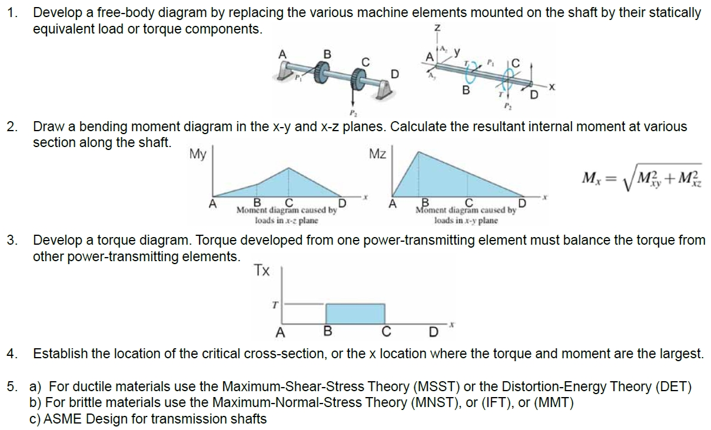

静态负载：


应力轴设计：

- 应力仅在关键位置评估。
- 关键位置通常是：
- - 在外表面。
- - 弯矩大的地方。
- - 存在扭矩的地方。
- - 存在应力集中的地方。

轴应力：

- 为了方便，可以为轴定制标准应力方程。
- 轴向载荷通常较小且恒定，因此在本节中将忽略。
- 标准交变和中程应力。


- - $M_m$是中程弯矩，$M_a$是交变弯矩，$T_m$是中程扭矩，$T_a$是交变扭矩，$K_f$和$K_{fs}$是分别对于弯矩和扭矩疲劳应力-集中系数。$n$是设计参数。

- 圆轴定制：


- - 假设有圆形截面的实心轴，适当的几何条件可以通过$c,I,J$。

- 将应力组合成von Mises应力：


- 将von Mises应力代入失效准则（failure criteria）方程。例如，采用改良Goodman线：


- 解出$d$便于设计目的：


- 类似的方法可用于任何疲劳失效准则。
- 方程是通过同时引用结合应力的畸变能法，和疲劳失效轨迹（locus）名称来引用的。如DE-Goodman、DE-Gerber等。
- 在分析情况下，可以使用这些自定义的安全系数公式，也可以使用Chapter 6的标准方法。
- 在设计情况下，定制$d$的方程更加方便。
- DE-Gerber：


- DE-ASME Elliptic：


- DE-Soderberg：


旋转轴的轴应力：

- 对于具有稳定弯曲和扭转的旋转轴：
- - 弯曲应力完全相反，因为在每次旋转期间，表面上的应力元素从相等的张力到压缩循环。
- - 扭转应力是稳定的。
- - 先前的方程简化为$M_m$和$T_a$等于0。

轴的屈服检查：

- 总是有必要考虑静态失效，即使在疲劳情况下。
- Soderberg准则固有地防止屈服。
- ASME-Elliptic准则考虑屈服，但不完全保守。
- Gerber和改良Goodman准则需要对屈服进行特定的检查。
- 使用von Mises最大应力来进行屈服检查（此时$n_y=n$，即设计参数，也称为安全参数）：


- 另一种简单的检验方法是，通过将公式中的$\sigma_a^\prime$和$\sigma_m^\prime$相加，得到保守估计的最大值$\sigma_{max}^\prime$：

$$\sigma_{max}^\prime=\sigma_a^\prime+\sigma_m^\prime$$

- 例子：


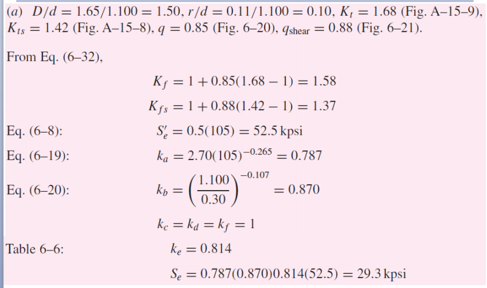


#### Chapter 7 作业补充


- 获得$T_a,T_m,M_a,M_m,K_t,K_{ts},q,q_s$。

- 静态应力分析（计算$K_f$和$K_{fs}$和未知数$d$来直接表示出$\sigma_{max}'$，通过$n_y=\frac{S_y}{\sigma_{max}^\prime}$计算$d$）。

- 疲劳-失效分析（选用一种方法重新计算$d$，计算$k_a,k_b$，计算$r$并重新计算$K_f$和$K_{fs}$，不断迭代使得结果的$S_e$不再变化）：

$$S_e=k_a k_b k_c k_d k_e k_f S_e^{\prime}$$

- 不同类型轴对应的$K_t$和$K_{ts}$表：


- notch-sensitivity的估计值$q$和$q_{shear}$（$q_s$）与$S_{ut}$值（一般给定，若只有此值则默认$r$趋近无限）和$r$值（可通过不同方法得到的$d$计算得到）的对应图：


- $K_f,K_{fs},q,q_{shear}/q_s$关系公式（$K_f-100\%,K_{fs}-100\%$为失效因子，表示失效应力的增加百分比，$K_t-100\%,K-{ts}-100\%$为静态因子，表示静态应力的增加百分比）：


- $K_f,K_{fs}$与应力$\sigma$和剪应力$\tau$的关系：

$$\sigma_{\text {max }}=K_f \cdot \sigma \quad \tau_{\text {max }}=K_{f s} \cdot \tau$$

## 实践部分

机动手外骨骼（motorized hand exoskeleton）康复机器人（rehabilitation robotics）：

- 刚性连杆/关节（rigid linkage / joint）
- 柔性连杆（fliexible linkage）
- 气动（hydraulic / pneumatic）
- 腱基（仿生）（Tendon）

连杆：

- 刚性连杆是机器⼈系统中使⽤的传统致动机构，通常⽤于商业⼿部康复设备。该机构通常由⾦属或 3D 打印的刚性杆组成。虽然很少有研究报告抓握⼒性能，但刚性连杆类型在所有类型的驱动机构中显⽰出最⾼的平均精度抓握⼒。然⽽，⼈体解剖结构和机器⼈对应物之间的关节轴未对准可能会对⼈体关节产⽣不必要的痛苦。为了解决这个问题，在设备中实现了额外的调节部件，或者⼿的指⻣/关节被适配为联动系统的⼀部分。这些额外的机构、刚性框架和连杆结构增加了外⻣骼可穿戴部分的体积、重量和复杂性。因此，这些外⻣骼具有最重的可穿戴设计。最近提出了⽤于⼿部 外⻣骼的柔性连杆机构。它采⽤了与刚性连杆机构类似的驱动原理，但⽤柔性弹性元件代替了刚性部件，实现了轻便紧凑的可穿戴设计。快速、抓握力大、成本低、自由度低、整体更重、磨损快、维护难。
