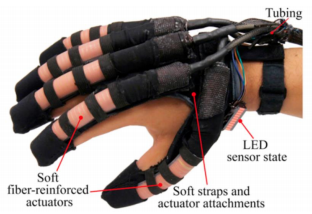
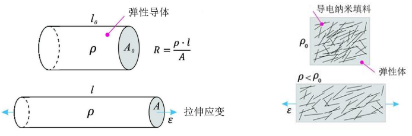

## 目录

  - 单词
  - 课程信息
  - Chapter 1
  - Chapter 2
  - Chapter 3
  - Chpater 4
  - Chapter 5-1
  - Chapter 5-2
  - Chapter 6

## 单词

actuation 驱动

rigid robot 刚性机器人

time-varying 时变

manipulator 机械手

## 课程信息

参考书籍：

https://softroboticstoolkit.com

## Chapter 1

软体机器人领域的诞生：

- 工业机器人（industrial robot）：具有大载荷和速度的机器人。
- 为保证安全，需要更丰富的传感器（复杂），或者更智能的控制算法（难以适用于时变和非结构化的环境）。
- 增加柔顺性（compliance）以保证刚性机器人的安全性。使用系列弹性驱动器（series elastic actuator，SEA ），使得刚性机器人变得更软。SEA包含一个与刚性机械动力传动串联的弹性元件，这种弹性元件使SEA能够承受冲击载荷、较小的机械阻抗、无源机械能量存储和增加的峰值功率输出。

- 柔顺性是刚性（stiffness）$S$的倒数：

- - 对于线性运动：

$$S=\Delta F / \Delta X$$

- - 对于旋转运动：

$$S=\Delta T/\Delta \theta$$

- 增加灵活性（flexibility）以使得刚性机器人更灵活。超冗余（hyber-redundant）表示机器人的自由度大于任务所需的自由度，且具有很高的冗余度。软体机器人必须满足超冗余。
- 柔顺性和灵活性的需求，使得软体机器人领域诞生。

什么是软体机器人：

- 材料。类似于活体中发现的材料。
- 运动。类似于生物运动（肌肉）。
- 与环境的交互具有很高的灵活性和适应性。
- 狭义（narrow definition）定义。软机器人是研究如何将软物体或物质或材料用于传感器、致动器、控制器和机器人主体的学科。
- 广义（board definition）定义。软机器人是研究如何开发机器人的基本子系统（即传感器、致动器、身体和控制器），并对其环境（可能是人类或物理生态实体）具有受控的顺应性。
- 软机器人主要由模量与软生物材料（肌肉、皮肤、软骨等）相当或小于1千兆帕斯卡（GP）的材料组成。这些材料在正常负载条件下表现出相当大的柔顺性。
- Wang和lida（2015）将软机器人更名为软物质机器人（soft-master robot），并将其定义为：研究如何利用和控制软物质变形以实现机器人功能的机器人。

如何实现软体机器人：

- 移动：气泵、热、电、光、磁。
- 驱动原理：

- 传感器：编码器、负载传感器、低熔点合金传感器、柔性光纤、纺织硅树脂混合传感器、磁性传感器。

## Chapter 2

气动人工肌肉（pneumatic artificial muscle，PAM）：

- PAM设计
- PAM应用
- PAM新型（novel）设计

PAM设计：

- 以人为中心的机器人技术（human-centric robotics）开发与人类一起工作的机器人，例如同事/助手（co-worker/assistant）、人形（humanoid）、柔性手臂（compliant arm）。还有人类使用的机器人，例如：外骨骼（exoskeleton）。还有人类内部机器人，例如医疗机器人（medical robot）。
- 在这种范式中，机器人被认为是人或人的一部分（人的皮肤、人的肌肉）。
- 肌肉运动有可能是自愿的（voluntary）和非自愿的（involuntary），也就是是否是自主控制的。
- PAM最早用于开发假肢。
- PAM是一种简单的机械驱动器，由编织网套（braided mesh sleeve）内的弹性气囊（elastomeric bladder）组成，该编制网套具有两个端部配件（end-fitting），用于密封肌肉的两端。

- 当PAM的弹性气囊被空气加压时，致动器沿着编织网套的纤维的方向变形，例如收缩（contract）、伸展、弯曲。
- PAM的力量重量比（power-to-weight ratio）高达400:1，大大优于仅能达到16:1的气缸和直流电机。空气肌肉通常在0-480kPa范围内使用压缩空气。
- 不同的编织模式（braiding pattern），可以形成不同类型的肌肉。

- PAM的材料：
- - 内管（inner tube）：具有大应变（高达300%）的弹性材料。例如硅橡胶、乳胶（天然橡胶）、热塑性弹性体（TPE）。
- - 编织模式材料：柔性和相对非弹性材料。例如尼龙丝、纺织物。
- 两种PAM的主要类型：
- - McKibben肌/编织（braided）肌。
- - 褶皱（pleated）肌。
- 恒定负载下的PAM操作：
- - 加压使得肌肉膨胀的同时产生拉力，同时长度缩短，质量提升，体积增长。

- - 如果负载完全消除，气压不变，则膨胀达到其最大程度时，体积将达到其最大值，长度将达到其最小值，而且对外力将降至0。PAM的收缩不能超过这个界限。

- - PAM的静载荷特性（static load characteristic）。等压条件下，力和收缩遵循非线性关系，将收缩定义为长度相对于其最大值的变化。例如，收缩10%表示缩短到最大长度的9/10。

- 气动人工肌肉的固有迟滞行为（inherent hysteretic behavior）：

- - 在橡胶的弹性迟滞中，迟滞回线（hysteresis loop）中心的面积是由于材料内部摩擦而耗散的能量。
- - 就时间而言，当橡胶带卸载时，影响（长度）滞后于原因（重量的力），因为长度尚未达到循环的加载部分相同重量的值。
- - 就力而言，橡胶带在加载时比在卸载时更难拉伸。
- - 就能量而言，加载过程中需要的能量比卸载过程中需要更多，多余的能量作为热能耗散。

- PAM控制方法。控制变量有位置$x$和力$F$，需要非线性PID控制器进行控制。最常见的PAM类型是编织肌：

- - PAM的平衡长度将由压力水平、外部负荷和特定肌肉的体积-长度变化决定。表压p下的肌肉，在时间间隔dt内，肌肉中的气体质量为无穷小dm。因此，膜的体积增加了dV，并且pdV的净功量穿过其边界。在相同的时间段dt内，致动器的长度变化了dl（缩短时dl＜0），负载F移动了相同的距离，需要功-Fdl。因此可得：

$$F=-p \frac{d V}{d l}$$

- - 随着空气压力的增加，PAM的编织角$\theta$随长度的变化而变化。$\theta$最大为$90^{\circ}$，当$\theta=90^{\circ}$时有最大肌肉半径为$R_{max}=R_0 / sin \theta_0$，最大肌肉直径为$D_{max}$。不考虑橡胶管的厚度和肌肉两端因膨胀形变而改变的圆角等微小因素，力与编织角度的关系：

$$F=\frac{\pi D_{\max }^2 p}{4}\left(3 \cos ^2 \theta-1\right)$$

$$F=\frac{\pi D_0^2 p}{4}\left(\frac{3}{\tan ^2 \theta_0}(1-\varepsilon)^2-\frac{1}{\sin ^2 \theta_0}\right)$$

$$\varepsilon=\left(1-\frac{l}{l_0}\right)$$

肌肉类型：

- 骨骼肌（skeletal muscle）。身体运动相关。
- 心肌（cardiac muscle）。心脏运动相关。
- 平滑肌（smooth muscle）。具有中空结构。

PAM的应用：

- 优点：
- - 轻质和坚固的PAM非常轻，因为它们的主要成分是膜。
- - PAM可以直接连接到其提供力的系统，而不需要类似电机的减速箱作中转结构。
- - PAM易于安装和随时更换。
- - PAM可以无危险使用。无害气体和柔性材料使得其几乎无害。
- - 成本更低。
- - 流畅的运作。
- - 灵活性高。
- - 自阻尼。
- - 柔顺性。
- 缺点：
- - 单向制动。
- - 低效率。
- - 位移小。
- - 迟滞性。
- 在一对肌肉对中，当一块肌肉收缩时，另一块肌肉放松或伸长。收缩的肌肉被称为激动剂（agonist），放松或延长的肌肉被称作拮抗剂（antagonist）。肌肉只能拉，不能推。
- 就像骨骼肌一样，两个可收缩的致动器需要耦合才能产生双向运动，每个方向一个。一个移动负载（激动剂），另一个（拮抗剂）充当制动器（brake），将负载停止在所需位置。

PAM应用领域：

- 仿生机器人（bioinspired robot）。例如人工心脏（robot heart）。
- 康复机器人（rehabilitation robot）。
- 柔顺性系统。例如模拟驾驶系统。

PAM新型设计：

- 旧PAM缺点：有限收缩长度（小于等于25%）、需要系在（tethered）复杂气动系统上。

## Chapter 3

软体流体驱动器（Soft Fluidic Actuators，SFAs）：

- 软体：弹性材料、织物（fabric）、纤维（fibers）材料等。
- 流体：气动、液压（hydraulic）等。
- 驱动器：设备或机器的一部分。
- PAM是一种典型的SFAs。
- 静水骨架（hydrostatic skeleton），或称水骨架（hydroskeleton），是一种由流体压力支撑的柔性骨架。静水骨架在简单的无脊椎动物（invertebrate organism）中很常见。相比于内骨骼（endoskeleton），外骨骼（exoskeleton），无脊椎动物更适合仿生SFAs。
- 作为一种骨骼结构，它具有影响形状和运动的能力，并涉及两个机械单元：肌肉层（muscle layer）和体壁（body wall）。肌肉层是纵向的和圆形的，是其中充满流体的体腔的一部分。
环形（circular）肌肉的收缩延长了生物体的身体，而纵向（longitudinal）肌肉的收缩缩短了生物体的身材。
生物体内的液体均匀地集中，因此肌肉的力量在整个生物体内传播，形状的变化可以持续。

SFAs的设计：

- 选择：刚性、软体。

- SFAs的基本工作原理：
- - 软体气动驱动器（soft pneumatic actuators）由柔性材料体、气动腔和约束结构组成。约束结构可以是致动器主体的相同材料，也可以是不同的材料。
- - 气动室用于致动具有由约束结构控制的变形的软气动致动器。通过注入空气/气体，气动室在致动器主体上产生各向异性变形。运动传递是通过柔顺体实现的。

- 弯曲SFAs的两种设计：

- - 慢速气动网（连接设计）sPN和快速气动网（离散设计）fPN设计：

- - fPN的疲劳：

- - 形变相同，腔室（chamber）越大，腔室越多，腔室厚度/壁厚（wall）越小，所需气压越小。
- - 阻塞力（blocking force），形变相同，气压越大，阻塞力（也就是弯曲力）越大，且与腔室形状相关。
- - fPN的扭曲（twist）设计：

- 纤维增强软体驱动器（fiber-reinforced soft actuator），包括一个用不可伸展的加强物包裹的弹性体囊状物：

- - 使用Kevlar线作为约束层（inextensible layer）：

- - 纤维增强。驱动器的不同腔室形状的抗弯性不同。较低的弯曲阻力表明致动器更容易在较小的压力下弯曲。因此一般选择最容易抗弯性最低的半圆形腔室：

- - 纤维增强。通过有限元（FEM）建模和分析，可知对于相同的弯曲角度，越小的腔室厚度，越大的腔室半径，越长的驱动器需要越小的空气压力。常曲率（constant curvature）条件将被假设，因为纤维不可拉伸，因此无论弯曲角多少都保持总长度一致，满足常曲率。

- 纤维变化的方向：

SFAs的应用：

- 流体驱动的软体机器人是应用最广泛的软体机器人。
- RBO Hand系列：第一种软体机器人人型手，于2016年开发。RBO Hand 3能够复制最全面的grasp分类法的所有33种抓握姿势。
- RBO Hand 3复制了三种最常见的人类抓握策略：
- - 顶部抓握（top grasp）
- - 翻转抓握（flip grasp）
- - 边缘抓握（edge grasp）
- HKU-Hand系列。

- 肌电控制与触觉反馈的软体神经假手：

- 软体机器人手套：

- 软体机器人鱼。
- 沙中移动软体机器人。

SFAs的新设计：

- 应变/形变有限的模式。
- 气泵/阀门的限制。
- 制作困难度？
- 可能会爆炸。
- 软体机器人隐形捕捉器。
- 无电子（electronics-free）软体移动机器人。
- 软体机器人泡泡。
- 真空驱动软体机器人。

## Chpater 4

具有热活性（thermal-active）的人工肌肉的材料：

- 形状记忆合金（shape memory alloy，SMA）。SMA是一种在冷却时可以变形，但在加热时会恢复到其预变形（"记忆"）形状的合金。
- - 铜-铝-镍Cu-Al-Ni基材料。
- - 镍钛NiTi基材料。
- - 铁基和铜基SMA，如Fe-Mn-Si、Cu-Zn-Al和Cu-Al-Ni，可在市场上买到，并且比NiTi便宜。
- - NiTi基SMA由于其稳定性和实用性，对于大多数应用来说是优选的。
- 形状记忆聚合物（shape memory polymer，SMP）。

热活性软体驱动器（Thermal-Active soft actuator，TSA）的设计：

- SMA的热机械行为由奥氏体（austenite）和马氏体（martensite）之间的相变（phase transformation）控制。

- - 高温奥氏体结构良好，稳定。

- - 挛/孪晶型马氏体（twinned martensite）：低温马氏体镜像对称，菱形晶格。

- 当对马氏体施加负载时时，这些自适应孪晶为变形提供了一条容易的途径。施加的应力会使马氏体失稳，但所有原子相对于附近原子都保持在相同的位置——没有原子键断裂或重组（就像位错运动一样）。
- 当温度升高，奥氏体在热力学上变得有利时，所有原子都重新排列成预变形形状。这种相变发生得非常快，并赋予SMA独特的"快照"（snap）。
- SMA可以采用多种形式，包括线材、弹簧、复合材料、编织和针织结构。每种形式都可以通过使用不同的制造工艺来实现。
- - 线型（wire-type）SMA：通过纵向收缩产生线性运动。

- - 源自SMA线的线性弹簧可用于以牺牲致动力为代价来增强致动器变形长度。扭转预应变（torsionally pre-strained）SMA弹簧可用于产生扭转运动，如SMA线，SMA弹簧可产生线性和旋转运动。此外，线性（linear）弹簧和扭转弹簧（torsional spring）的组合可用于产生复杂的运动。

- 然而，提供单向运动的单个SMA线或弹簧仅允许单向致动。对于双向驱动，应使用偏置元件（bias element）（如弹簧）。双向训练（two-way-trained）的SMA元件产生可以用作偏置元件的返回力。然而，偏置弹簧的返回运动力是不可控的，并且双向训练的SMA元件比单向元件产生的力更小。因此，对抗性（antagonistic）SMA元件通常用于双向致动。

- 总体而言，在致动应力（actuation stress）和变形率（deformation ratio）之间存在平衡关系（trade-off relationship）。弹簧形状大大增加了变形率。

- SMA致动器具有高功率密度和高应力。NiTi SMA的功率密度可达50W/g，其恢复应力高达200MPa。
- SMA致动器的主要局限性包括收缩小、带宽低、效率低以及显著的滞后和蠕变（creep）。
- - NiTi SMA的最大可恢复应变范围通常高达5%。
- - 由于相变的热性质（<3Hz）大多数SMA致动器工作带宽低。
- - 由于严重的热损失，功率效率通常低于1.3%。

- 形状记忆合金通常通过铸造、使用真空电弧熔炼或感应熔炼来制造。这些是用于将合金中的杂质保持在最低限度并确保金属充分混合的专业技术。然后将钢锭热轧成较长的部分，然后拉制成线材。
- 合金的"训练"方式取决于所需的性能。"训练"决定了合金在加热时会记住的形状。这是通过加热合金使位错重新排列到稳定的位置而发生的，但不会热到材料再结晶。它们被加热到400°C到500°C之间30分钟，趁热成型，然后通过在水中淬火或用空气冷却快速冷却。
- SMP当受到外部刺激（触发）（如温度变化）时，其具有从变形状态（临时形状）恢复到其原始（永久）形状的能力。SMPs已证明可恢复的应变超过800%。

- SMP优点：优点高弹性变形（100%~400%应变）、低密度、低成本、易于制造、可调节的转变温度和生物相容性。
- SMP缺点：机械强度低，恢复应力低（1-3MPa），恢复响应时间长（1秒至几分钟），循环寿命低。

TSA的应用：

- 移动软体机器人。
- 软体机器人抓手。
- 可穿戴软体机器人。

TSA的主要限制：

- 慢启动时间（slow actuation time）。
- 为了改善广泛用于SMA加热的焦耳加热的低效率和慢冷却，可以使用热水和冷水对SMA弹簧束进行加热和冷却。一般这种改善体现于使用了冷水对SMA进行冷却（加热有更快的方法）。
- 也可以使用风扇进行冷却。
- 多层设计。

## Chapter 5-1

电动软体驱动器（electrical-active soft actuators）：

- 无论是PAM还是SMA都无法满足的同时兼具灵活性、轻便性、高频、高功率密度。

电介质弹性体驱动器（Dielectric Elastomer Actuator，DEA）的设计：

- 当电介质材料被放置在电场中时，电荷不会像在导电体中那样流过材料，因为它们没有松散结合或自由的电子，这些电子可能会漂移通过材料，但它们只会从平均平衡位置轻微偏移，导致电介质极化（polarisation）。
- 完美电介质是一种具有零导电性的材料（参见完美导体无限导电性），因此仅表现出位移电流；因此，它存储和返回电能，就好像它是一个理想的电容器。
- DEA是一种电活性聚合物（electroactive polymer）。DEA的工作原理是通过电场诱导变形。DEA的一种常见设计是在两个柔性电极之间夹一层软绝缘弹性体膜。当在电极之间施加电压时，产生的电场导致膜的厚度减小和面积增加。

- DEA也被称为人造肌肉。已经计算出了1.4J/g的理论最大能量密度。
- DEA由连接到刚性圆形框架的柔软、预拉伸的电介质膜组成。由碳油脂制成的圆形可拉伸电极被涂在两面膜的中心。每个电极都通过同样由润滑脂制成的可拉伸引线连接到膜的边缘，但以相反的方向涂漆，以避免两个引线重叠。

- DEA致动性能受到材料特性的强影响。
- - 具有低刚度和大断裂拉伸的材料通常比刚性材料表现出更大的致动应变。
- - DEA的材料的电常数决定了Maxwell应力的大小（见建模部分），从而决定了致动器所经历的变形量。
- - 另一方面，粘弹性降低了致动器的响应时间和效率，并且这些参数在许多材料中是相互关联的，因此必须找到这些参数之间的折衷方案。
- 理论上，每一种柔软、可拉伸的绝缘弹性体膜都可以用于介电弹性体致动器。研究最多的介质弹性体致动器材料类别是丙烯酸酯（acrylate）, 硅酮（silicone）和聚氨酯（polyurethane）。
- - 丙烯酸弹性体通常具有高介电常数和介电击穿强度，但可能具有显著的粘弹性行为，从而限制致动速度。
- - 硅酮通常具有较低的介电常数，但粘性也较低。
- - 聚氨酯是一大类材料，根据配方的不同，可能具有非常不同的性能。
- 预拉伸（pre-stretch）：
- - 膜的预拉伸是影响介电弹性体致动器性能的一个非常重要的参数。
- - 当介电膜被预拉伸时，其厚度减小。由于麦克斯韦应力的大小由膜上的电场决定，因此当膜被预拉伸时，需要较小的电压来获得相同的Maxwell应力。
- - 预拉伸对致动性能更重要的影响是，它将机电不稳定的发生转移到更大的应变，甚至完全消除，从而在失效前可能产生更大的应力。

- DEA的制作过程：
- - 1.将薄膜预拉伸到刚性框架上。

- - 2.使用碳润滑脂对活动区域进行喷漆。

- - 3.铜带的应用。

- - 4.用铜带连接活动区域。

- Maxwell应力：当电压施加到电介质弹性体致动器时，在电介质膜中产生电场。一般来说，这个电场是复杂的，它的确定需要求解麦克斯韦方程组。然而，当膜足够薄时，可以将有源区域建模为可变形板电容器。

- - 平板电容器内部的电场E为（其中$\Phi$是施加的电压，$l$是平板电容器中平板之间的距离）：

$$E=\frac{\Phi}{l}$$

- - 电场产生有效的压缩麦克斯韦应力（$\varepsilon$是膜的介电常数）：

$$\sigma_{\mathrm{M}}=\varepsilon E^2$$

- DEA的故障：
- - 机械故障（mechanical failure）：当薄膜拉伸过大时，聚合物链撕裂，材料破裂。如果材料中存在任何预先存在的撕裂或缺口，这将导致这些位置更快的机械故障。
- - 电击穿（electric breakdown）：当薄膜内的电场过高时，材料可能会失去绝缘性能。导电通道在电极之间形成，并在膜上烧出一个洞。这种现象被称为击穿。
- - 机电不稳定性（electromechanical instability）：机电不稳定性是一种对介质弹性体致动器至关重要的失效模式。当弹性体膜仅通过机械力拉伸时，它在低拉伸时表现为柔软，但在接近机械故障时会变硬。
- - 张力损失（loss of tension）：当预拉伸的电介质弹性体致动器变形时，它通常会减少预拉伸，直到完全失去。这可能导致材料的机电不稳定性和破坏，或者导致材料起皱。由于薄膜非常薄，它无法承受来自侧面的任何压缩应力（类似于一张纸在平面上压缩时会起皱）。当致动器发生褶皱时，它将失去功能。

DEA的应用：

- 机器人抓手
- 陆地（terrestrial）机器人
- 水下（underwater）机器人
- 空中（aerial）机器人
- 仿人（humanoid）机器人

## Chapter 5-2

DEA新型设计：

- 软体机器鱼。
- 软体机器蜜蜂。
- 电动液压（electrohydraulic）驱动器。

## Chapter 6

软体机器人中的传感（sensing）：

- 与刚性机器人传感技术不同，软体机器人的传感满足以下基本要求：
- - 足够柔顺（低杨氏模量），传感器不会限制或显著改变软致动器的机械性能。
- - 刚性部件尺寸小，空间分布合理，不影响软机器人的大变形运动。
- - 它具有很强的弹性和耐用性，能够承受大应变和多次变形循环。
- - 能够持久地对外部刺激作出反应。它在各种环境中对重复的机械刺激表现出很强的鲁棒性，包括脆弱的环境（如手术机器人）和更恶劣的环境（例如搜救机器人）。
- 未来软体机器人传感：使传感元件成为机器人身体的一部分。传感机构来源于机器人的结构变形，可以在机器人身体的软材料中实现传感，减少应力集中，实现结构-传感一体化。

- 软体机器人传感的分类：

电阻（resistive）传感器：

- 电阻传感器测量由导电材料的几何形状或电阻率变化引起的电阻变化。
- 根据使用的材料和原理，它可以分为三类：
- - 传感功能是通过利用嵌入弹性体中的导电液体的流动特性或导电聚合物和水凝胶的高拉伸特性来实现的。导电液体包括低熔点金属和金属合金（如汞（Hg）、共晶镓铟合金（EGaIn）、镓铟锡合金（Galinstan）等）和各种离子液体（如氯化钠溶液）。液态金属（如共晶镓铟合金（EGaIn）、镓铝锡合金（Galinstan））具有很强的导电性，但不能在低于熔点的温度下工作，并且通常比大多数弹性基底更致密。尽管微通道的制造过程复杂且存在泄漏风险，但液态金属在制备高拉伸、高性能传感器方面具有巨大潜力。

- - 利用导电聚合物和水凝胶的高拉伸性能来实现传感功能。
- - 由填充有导电纳米填料的弹性复合材料制成，当施加应变或压力时，电阻率和几何形状会发生变化。

电容（capacitive）传感器：

- 电容传感器测量弹性体变形时几何结构变化引起的电容变化。关键是开发可拉伸的导电材料作为电极。
- 导电织物、纳米复合材料、导电聚合物和水凝胶以及导电液体都可以用作可拉伸电极。

- 电容式传感器具有线性好、灵敏度高、动态范围大、响应速度快等优点。然而，它们对环境污染物（如油、灰尘等）很敏感，并对导电物体产生邻近效应。需要屏蔽技术（如三电极配置），增加了制造复杂性。此外，可拉伸电容传感器对压力和应变都很敏感，很难将两者解耦。

光学（optical）传感器：

- 光学传感器基于检测由施加在光学传输介质（如光纤、弹性波导等）上的应变或压力引起的光（强度、频率或相位）变化。
- 最常见的传感机制基于光强测量，通常包括光源（即发光二极管）、光电探测器和光传输介质。光学传感器是高度可变形的，并且对电磁干扰和环境污染物不敏感。虽然光学传感器的电子后端处理设备相对复杂，但它可以避免电子元件和电线在变形测量区域的分布。

- 光学GelSight传感器：由涂有反射膜的透明弹性体、相机和光源组成。当物体压在弹性体上时，薄膜会变形为物体表面的形状。通过相机记录不同方向照明下的胶片变形，并使用光度立体算法重建物体表面的深度图。如果在反射膜上添加几个标记，则可以通过测量标记的位移来获得位移场，然后可以测量接触力和力矩。

摩擦电（triboelectric）传感器：

- 摩擦电柔性自供电传感器基于摩擦电效应和静电感应原理，可以将机械能转化为电能进行传感。它主要利用传感器摩擦层之间的接触在两种摩擦材料的表面产生静电荷。当受到外界刺激时，柔性电极之间的相对位置发生变化，从而产生电信号并输出电流或电压信号以实现传感。

磁性（magnetic）传感器：

- 磁传感器包括磁源（如永磁体）、磁场传感器（如霍尔效应传感器）和软介质。
- 当软介质被拉伸、压缩或扭曲时，由于霍尔效应传感器相对于永磁体的位置和方向的变化，传感器测量的磁场也会发生变化。
- 磁传感器具有结构紧凑、成本低、可变形、灵敏度高、易于系统集成等优点。然而，它们容易受到外部干扰，如环境磁场的变化以及与铁磁物体的相互作用。

电感（inductive）传感器：

- 电感传感器测量由线圈几何形状、互感、涡流效应和磁阻引起的电感变化。
- 通过测量电感的变化，可以监测软致动器和软结构中的应变和压力变化。

未来软机器人传感要解决的主要问题：

- 多模态、可拉伸、高带宽、高动态范围、高分辨率、高灵敏度的传感器。
- 开发先进的数据处理算法，高效准确地从传感器中获取原始数据，并解耦精确的机械传感信息（如形状、变形、接触、压力、剪切力等）。
- 将传感器视为软机器人系统的一部分，而不是单独的组件，为实现软机器人的嵌入式智能奠定了基础。

